の

USENIX

THE ADVANCED COMPUTING SYSTEMS ASSOCIATION

# iLand: An Instruction-Level Dynamic Binary Instrumentation framework for iOS

Kaitao Xie, Yizhuo Wang, and Xiaolong Bai, Alibaba Group https://www.usenix.org/conference/osdi26/presentation/xie-kaitao

# This paper is included in the Proceedings of the 20th USENIX Symposium on Operating Systems Design and Implementation.

July 13–15, 2026 • Seattle, WA, USA

ISBN 978-1-939133-55-7

Open access to the Proceedings of the 20th USENIX Symposium on Operating Systems Design and Implementation is sponsored by

# iLand: An Instruction-Level Dynamic Binary Instrumentation framework for iOS

Kaitao Xie, Yizhuo Wang, and Xiaolong Bai∗

Alibaba Group

{easylyou.xkt,xrosheart926,bxl1989}@gmail.com

## Abstract

Dynamic binary instrumentation (DBI) enables monitoring and modification of executing programs and forms the foundation for a range of program analysis and security testing. On iOS, however, no DBI is available for non-jailbroken devices. Existing approaches on other platforms (e.g., Android) rely on JIT compilation, which is prohibited by the iOS sandbox. The limited CPU and memory resources of mobile devices further constrain the practical deployment of DBI.

We propose iLand, a novel instruction-level DBI framework for iOS. Instead of JIT compilation, it translates instructions into predefined micro-operations and interprets using precompiled atomic execution units. To reduce CPU and memory overhead, it employs application-only emulation: only the app’s code is interpreted, while system libraries run natively. We implement iLand as a standard sandboxed iOS app capable of emulating other apps. It preserves the emulated apps original functionality and user experience such as dynamic UI rendering, real-time interaction, live video streaming.

Based on this DBI framework, we further implemented an instruction-level dynamic tracing tool and used it to study policy-violation behaviors on 60 top-ranked App Store apps. We found that 13 (21%) apps are still invoking private APIs, of which 2 invoke APIs explicitly prohibited by Apple. Our analysis further revealed the new and stealthy methods employed by apps to evade Apple’s App Review. In particular, in 15 (25%) of the apps, we observed a new way to collect sensitive information by direct invocation of the SVC instruction.

## 1 Introduction

Dynamic binary analysis is widely used in software testing and security research [10, 25, 31, 50, 52, 59]. On iOS, one of the most popular mobile operating systems, such techniques are particularly valuable because App Store apps are mostly closed-source. However, Apple’s sandbox—including mandatory code signing and runtime hardening—imposes significant limitations: the dynamic code generation and loading of unsigned binaries are not allowed.

As a consequence, dynamic analysis on iOS is primarily based on two approaches: code injection on jailbroken devices [15, 45] and app repackaging on non-jailbroken devices [6, 51]. Code injection in jailbroken conditions exploits kernel-level vulnerabilities to bypass the sandbox. However, publicly available jailbreaks support only up to iOS 16, incompatible with the recent iOS versions. App repackaging involves unpacking the app bundle, injecting custom libraries, modifying the main binary’s load commands, and then resign ing and repackaging the app. The limitation is that it typically instruments apps at the API-level rather than instruction-level. Both methods either rely on a jailbroken environment or compromise the integrity of the app binary, where apps may detect and behave differently from their original functionalities.

The requirements to adhere to the system sandbox while maintaining transparency lead us to explore DBI techniques. DBI techniques enable the insertion of probes and usersupplied analysis routines into running programs. Conventional DBI frameworks, such as Valgrind [46] and Dyninst [8], have demonstrated utility and effectiveness across numerous application domains [1,5,18,19,21,24,28,35,37,44,49,54,56]. However, they are not applicable to iOS currently due to two major challenges. First, the sandbox forbids dynamic code generation: DBI cannot allocate RWX (readable, writable and executable) memory pages. Second, the limited CPU and memory resources of mobile devices constrain practical deployment. For instance, iPhone 15 and iOS 17 were both released in 2023, where system libraries consume 3.3 GB memory and device has only 6 GB RAM. All system libraries are collected into Dyld Shared Cache (DSC), mapped and shared by all app processes. This means a DBI framework has to allocate a large region for guest app’s DSC while retaining its own DSC mapping, which can quickly exhaust memory and trigger Jetsam [3] (iOS’s out-of-memory killer).

In this paper, we present iLand, a dynamic binary instrumentation framework for iOS that monitors and alters the execution of guest apps at the instruction-level. To avoid

JIT-compiled code, iLand adopts a translation and interpretation approach: it translates instructions into predefined microoperations with equivalent semantics, and interprets these using precompiled atomic execution units. To fit the memory constraints, iLand employs application-only emulation: it interprets only the app’s own code while allowing library code to run natively, avoiding the need to interpret the large DSC while making use of native libraries for CPU-intensive tasks such as video codecs and cryptographic operations.

Application-only emulation introduces a challenge absent from conventional DBI: native library code may return to or call back into interpreted app code (N→I transitions), yet the library code is immutable and the iOS sandbox prohibits generating executable code at runtime, making it fundamentally difficult to recapture control. To address this, we introduce a stateless control-flow manager that constructs trampolines via shared memory pages and pc-relative instructions, redirecting N→I transitions back to the interpreter without percall state or RWX memory. Building on this, we employ a layered approach combining static analysis, runtime interception, and signal-based fallback to capture all N→I transitions.

We implement iLand as a standard sandboxed app, able to emulate guest apps. To evaluate performance, our tests on the SPEC CPU 2017 benchmark reveal that while iLand incurs higher overhead compared to JIT-based DBI, it achieves a 10x speedup over the qemu-tci interpreter. To evaluate real-world compatibility, we run 64 top-ranked apps from the US App Store under iLand and manually test their main functional ity (e.g., login, browsing, search, video). Of these, 49 (77%) worked correctly, 11 showed partial functionality loss (e.g., app detected anomalies of environment and refused login); and 4 terminated abnormally (e.g., app’s watchdog timeouts triggered termination). Overall, 60 apps reached a usable state with working UI interactions.

Built on iLand, we implement an instruction-level dynamic tracing tool that records control-flow transfers of interest, including indirect calls and SVC invocations for 60 top-ranked apps in the compatibility test. We found that 13 (21%) apps are still invoking private APIs, which are not allowed accord ing to App Store Guidelines. Like prior works [15, 17], we treat undocumented APIs as private, yet Apple neither publishes an authoritative list of private APIs nor specifies exactly which calls trigger rejection. To validate our finding, we developed a test app invoking such APIs and upload it to TestFlight, Apple’s pre-release distribution platform. We found 2 invocation are explicitly prohibit by TestFlight automated review. Our analysis further revealed the new and stealthy methods employed by current apps to evade Apple’s App Review, including runtime symbol resolution, direct SVC invocations, dlopen of generated binaries and constructing return-oriented programming (ROP) chains. Notably, 15 (25%) apps we observed employ a new way of collecting sensitive information via direct SVC invocation. These findings demonstrate that iLand enables effective dynamic analysis of iOS apps.

In summary, this paper makes the following contributions:

• We present iLand, an instruction-level DBI framework for iOS, and propose application-only emulation.

• We propose a stateless control-flow manager to handle frequent boundary crossings.

• We implement iLand as a standard sandboxed iOS app, apply it to 64 top-ranked iOS apps and manually test main functionality. 60 of them reached a usable state.

• We build tracing tool on top of iLand and study the 60 apps. We found 13 (21%) apps invoked private APIs, 15 (25%) apps employed SVC invocation to collect system information, and we revealed four new stealthy methods that current apps used to evade Apple’s App Review.

## 2 Background and Motivation

In this section, we first introduce the iOS sandbox and jailbreaking. We then present the fundamentals of DBI and the challenges in porting it to iOS. Finally, we provide real-world motivating examples discovered by iLand that highlight the importance of dynamic analysis in iOS security research.

## 2.1 iOS Sandbox and Jailbreak

The iOS sandbox, including code signing and runtime hardening, restricts apps’ access to system resources and user data, thus strengthening platform security. Code signing is mandatory on iOS: the app’s main Mach-O binary is signed with a developer certificate, establishing identity. The signature is verified at runtime by Apple Mobile File Integrity (AMFI for short) [41], a built-in kernel extension. To ensure code integrity, AMFI detects unauthorized code execution (un signed, modified or injected code), and enforces termination (SIGKILL). Entitlements, embedded in the code signature, declare capabilities; a provisioning profile issued by Apple authorizes a specific set of entitlements for a signed app. However, certain entitlements that grant access outside the app sandbox are restricted to Apple-signed system apps.

Runtime hardening protects runtime integrity by blocking JIT execution and unsigned-library loading. Specifically, apps need the com.apple.security.cs.allow-jit entitlement to use RWX (readable, writable, and executable) memory and com. apple.security.cs.disable-library-validation to load unsigned libraries. Both entitlements are private to Apple, so third-party apps cannot declare them or generate code at runtime.

While sandbox strengthens iOS security, it constrains dynamic analysis of App Store apps. To conduct runtime analysis, prior works [30, 38, 53, 58] resort to jailbreak technique, which exploits vulnerabilities in older iOS releases to gain arbitrary kernel execution, modify kernel memory, and bypass sandbox restrictions. We argue that jailbreak-based analysis is unsustainable: i) jailbreaks are version-specific and rarely track the latest releases; ii) operating in a sandbox-bypassed environment affects app behavior—apps may detect jailbreaking and behave differently—undermining result validity; and iii) Apple’s rapid patching and hardening have made public jailbreaks increasingly scarce.

Table 1: Popular publicly available jailbreak tools.  
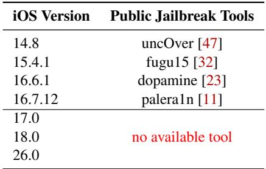

Table 1 summarizes publicly available jailbreak tools: current advanced jailbreaks target up to iOS 16 (released in 2022), with no working jailbreak for iOS 17 or later. We therefore advocate a jailbreak-independent dynamic analysis framework.

## 2.2 Porting DBI to iOS

DBI inserts extra code into programs to monitor and alter their runtime state. Pin [43], DynamoRIO [9], Valgrind [46] and Dyninst [8] are widely used DBI frameworks, providing instruction-level instrumentation across architectures and operating systems. Although Dyninst supports Arm64 and Valgrind supports macOS, none currently support non-jailbroken iOS. Figure 1 shows a typical DBI architecture: the JIT Compiler decodes app binaries and compiles basic blocks at runtime, rewriting control-flow transfers so the DBI can mediate every change. Translated blocks are placed in Code Cache for execution. On control-flow events (e.g., function calls) or analysis-relevant conditions, the Context Switcher decides whether to compile or dispatch the next block, invoke analysis routines, or hand control to the OS. This design fundamentally relies on RWX memory for the Code Cache, which iOS prohibits, making conventional DBI hard to port.

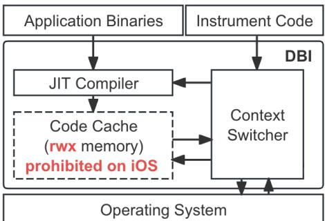  
Figure 1: The typical DBI architecture. Code Cache, a key component, requires RWX memory that is prohibited on iOS.

CPU emulation executes programs by decoding and interpreting instructions to faithfully reproduce state transitions. The interpreter-based approaches avoid RWX memory while enabling instruction-level instrumentation. Popular frameworks include QEMU [7] (interpreter mode) and Bochs [40], but they currently do not support iOS.

Table 2: The RAM size and Dyld Shared Cache (DSC) footprint in recent iPhone and iOS version.  
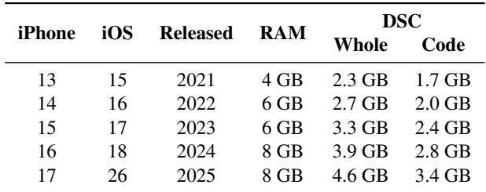

However, a full-system interpreter is impractical on iOS due to the limited available memory. Table 2 summarizes usable physical memory and DSC footprint on recent iOS devices. iOS aggregates all system libraries into a single DSC, which is mapped and shared by every app process. On a 6 GB device, the DSC exceeds 3 GB; interpreting both the DSC and app binaries would quickly exhaust memory.

The practical solution is application-only emulation: interpret only the app’s own code while letting system libraries execute natively. This avoids the memory problem and preserves native performance for CPU-intensive library routines. However, application-only emulation introduces a new challenge that does not arise in conventional DBI:

Bidirectional control-flow transitions without RWX memory. In conventional JIT-based DBI, the framework controls all code execution, so transitions between app and library code are handled implicitly. In application-only emulation, execution alternates between interpreted app code and native library code. Native-to-interpreter (N→I) transitions—where native libraries return to or call back into app code—are fundamentally difficult: native library code is immutable, and the iOS sandbox prohibits generating executable code at runtime. Moreover, N→I transitions arise through diverse mechanisms with distinct calling conventions. Correctly and efficiently recapturing control across all these paths is the central technical challenge that iLand addresses.

Accurate and efficient interpretation. The Arm64 instruction set is extensive, with over 60 general mnemonics and more than 380 SIMD mnemonics for float and vector computations, resulting in a large engineering effort. In addition, interpretation overhead directly affects usability; excessive latency triggers UI timeouts and renders apps unusable.

## 2.3 Motivating Examples of App vetting

Under Apple’s App Store Guidelines, apps that use private APIs are not approved for App Store distribution. In our motivating examples, we focus on reject APIs—a subset of private APIs that are reliably flagged by Apple’s TestFlight automated review. Such API usage is expected to be rejected during formal App Store review. To ensure typicality, the following cases, identified by iLand, are drawn from four top-ranked free apps among the 60 evaluated, show the stealthy methods to evade App Review and demonstrate iLand’s runtime capabilities to reliably detect potentially risky behaviors:

Indirect call. SecTaskCopyValueForEntitlement is a reject API on iOS. iLand observed that the Appa (top 40) constructs the symbol name at runtime by concatenating S ecTaskCopyVa and lueForEntitlement into a temporary NSString, resolves it via dlsym, and then invokes it. This deliberate indirection may reduce the recall of static detectors.

System call. \_dyld\_get\_shared\_cache\_range is a reject API; equivalent functionality can be available via the SYS\_shared\_region\_check\_np syscall. iLand observed that Appb (top 50) reaches hand-written inline assembly at runtime, issuing SVC instruction to invoke this syscall. Such syscall-based invocation patterns are worth vetting, as they may complicate detection of private-API usage.

Indirect jumps via ROP chains. Prior work [55] had shown that return-oriented programming (ROP) can be used to evade App Review by directly manipulating registers to reorder control flow absent from the original binary. iLand found that Appc (top 10) searched the DSC for a SVC RET gadget—for example, within mach\_msg\_trap, a three-instruction syscall wrapper whose second and third instructions is the desired gadget—and then crafts the stack and the link register to synthesize call sites.

Loading of generated binaries. On iOS, dlopen of a valid signed binary is permitted, but generating and loading code at runtime (e.g., a downloaded binary) is considered improper by Apple. iLand found that Appd (top 60) issues SVC to invoke SYS\_open and SYS\_write, generates a binary to disk, and calls dlopen. Our manual analysis indicates the generated binary lacks a valid code signature; dlopen would succeed only on sandbox-bypassed devices. We hypothesize this pat tern is used to detect jailbreaks. Although the intent may not be evil, such behavior may pose risks to users.

## 3 Overview

We design iLand, an instruction-level dynamic binary instrumentation framework for iOS. Figure 2 depicts the architecture of iLand, which comprises four components:

• The translator converts Arm64 instructions into the intermediate representation (IR), and inserts analysis code via custom plugins.

• The loader loads guest app binaries and the generated IR at appropriate memory locations and protections.

• The interpreter interprets the generated IR based on pre-compiled execution units located on the RX memory and monitors guest app control-flow transfers.

• The Virtual Environment Manager handles interactions between the guest app and the system, preserving transparency for the guest app.

iLand fundamentally diverges from JIT-based DBI in two respects. First, it replaces JIT compilation with a translation and-interpretation pipeline: the translator converts app code into an IR of predefined micro-operations, and the interpreter executes these using precompiled execution units residing in RX memory. The original code and IR reside in read-only memory, complying with the iOS sandbox. Translation is performed ahead-of-time (AOT) so that pre-translated code is prepared for repeated use.

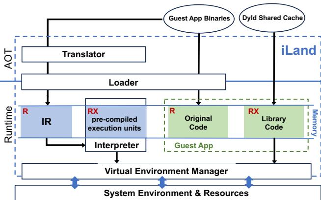  
Figure 2: Architecture of iLand.

Second, and more significantly, iLand adopts applicationonly emulation, which introduces a control-flow management problem absent from conventional DBI (§ 6.3). Since library code runs natively, the framework must recapture control on every N→I transition. iLand introduces a stateless controlflow manager (§ 6.2) that constructs trampolines via shared memory pages, requiring no RWX memory and no per-call state. Building on this, a layered strategy captures diverse N→I paths—including C++ virtual methods, Objective-C (ObjC in short) dynamic dispatch, Swift witness tables, ObjC blocks, and stack unwinding.

## 4 Translator

The translator converts native instructions into an IR. We first describe the IR design and the set of reserved registers, and then summarize the translation process.

## 4.1 IR

Each IR in iLand IR comprises a 16-bit opcode and optional operands. The opcode indexes a predefined micro-operation that implements semantics equivalent to the corresponding native instruction. These operations, called µ-op, are precompiled execution units in the interpreter’s code segment. A native instruction is typically decomposed into three µ-ops using dedicated preserved registers:

1. µMOVsrc: Transfers source registers to the fixed preserved source register Xµsrc.

2. µOP: Performs the original instruction operation and stores the result in the fixed preserved destination register X , e.g., µADD and µLDR.

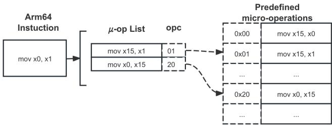  
(a) Register transfer translation

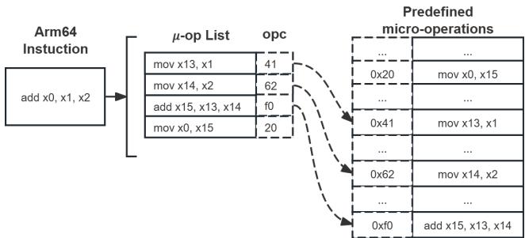

(b) Register-register addition translation  
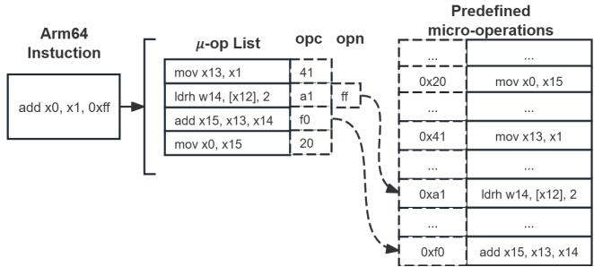  
(c) Register-immediate addition translation

Figure 3: Translation case studies. Registers x12-x15 are preserved by iLand. Guest accesses to these registers trigger safe translation to alternative operations.

3. µMOVdst (conditional): Transfers results from Xµdst to destination registers if required.

This design ensures semantic preservation while maintaining µ-op complexity at O(n) + O(m), where n is the instruction mnemonic count and m is the register quantity. By separating register transfer logic from operations, we avoid the combinatorial explosion of O(n · mx) (where x represents the maximum register operands per instruction), achieving a practical trade-off between performance and space efficiency. For instructions with immediate operand, we embed the immediate values in IR operand field, and replace the µMOVsrc with µLDRopnd, which loads the operand value into Xµsrc. We take MOV and ADD instructions as examples to demonstrate the relationship between the Arm64 instruction and µ-op.

MOV instruction. Figure 3a demonstrates the translation of the register transfer instruction, i.e., MOV. iLand decomposes general register moves into two µ-ops: first moving the source register to preserved register x15, then transferring from x15 to the destination register. This approach reduces 1,024 potential Arm64 move instructions to 64 reusable units.

ADD instruction. Figures 3b and 3c illustrate translations of arithmetic ADD instruction. As per Arm64 specifications, register-register and register-immediate additions is distinct handling. The second case employs register transfer plus a unified µADD (add x15, x13, x14), and the third case demonstrates immediate loading through operand field encoding (0xff). iLand uses variable-length operand encoding to avoid additional µ-op. This strategy enables multiple instruction variants to share common µ-ops, minimizing code footprint while maintaining full architectural coverage.

With this design, iLand’s µ-ops form a carefully curated set of Arm64 instruction units (implemented by 6,709 execution units ≤128KB), capable of representing all possible combinations of instruction mnemonics and operands.

## 4.2 Preserved Registers

We adopt a selective register preservation strategy in µ-ops. Only designated subset of registers (x10-x15) is preserved for emulation, while guest apps directly access the remaining registers. Any guest access to preserved registers is transparently redirected to per-thread register shadows in thread-local storage (TLS). This design reduces the conventional registerswitching overhead, as context preservation requires saving or restoring only the designated registers, thus efficiently supporting frequent switching during application-only emulation.

The preservation strategy optimizes for performance considerations: i) shadow memory access latency grows with the number of reserved registers, ii) register pressure minimization requires avoiding frequently-used registers in iOS runtime. Through empirical analysis of Arm64 register usage patterns in Mach-O binaries compiled with Apple’s toolchain, we observe:

• x0-x7: primary function parameter passing and return

• x8: large structure returns (AAPCS64 compliance)

• x16: syscall number carrier and long-jump usage in \_\_stub sections

• x17: objc\_msgSend dispatch register

• x20: swift method context pointer (self pointer)

• x20-x28: caller-saved registers

• x29-x31: frame pointer (FP), link register (LR), and stack pointer (SP)

This observations motivates our selection of x10-x15 as preserved registers, achieving dual objectives: i) Minimizing conflicts with iOS runtime conventions through unused register selection, ii) Enabling efficient SIMD operations (e.g., LD1 x10-x13, [x15]) through contiguous register usage The chosen registers demonstrate negligible utilization in sampled iOS applications while maintaining compatibility with ARMv8.4 vector instruction requirements.

## 4.3 Translation Process

During translation, guest code segments are mapped as readonly. Our static translation engine directly processes instructions as raw 4-byte quantities:

1. Linearly fetch instructions, leveraging Arm64’s fixedwidth instruction encoding

2. Parse the instruction type and operands

3. Select corresponding µMOVsrc (or µLDRopnd), µOP, and µMOVdst accordingly

4. Encode the IR using the µ-ops’s indexes in interpreter and optional operands

5. Flow-insensitive optimization preserving original instruction ordering

The translation output is a position-independent data file (ir file) containing generated IRs with embedded metadata for runtime interpretation. The loader maps the ir file into read-only memory at runtime. It contains 2 major sections as:

Section : This section contains the translated IRs. The IRs are linearly arranged as their represented instructions in the original executable file’s code segment.

TableIR\_offset: During runtime, the interpreter needs to map original instruction addresses to their corresponding IR instances. Because IR length varies (depending on operand presence), IR positions within SectionIR cannot be deterministically computed. iLand therefore builds TableIR\_offset, an array that records the byte offset of each IR instance. Each 4-byte entry (matching fixed instruction width) corresponds to one native instruction in the original code segment. The benefits of TableIR\_offset include: i) Maintain O(1) lookup complexity through direct offset calculation; ii) Preserve architecture-specific alignment; iii) Enable position-independent IR storage through base-plus-offset addressing.

## 5 Loader

The loader is the first component to run in the runtime environment, establishing memory layout at guest emulation startup. It performs two major functions: i) loading standard Mach-O files and the generated ir files, ii) implementing initialization routines to support ObjC runtime and exception handling.

Mach-O and IR files loading. The loader builds on the open-source dyld [2] from Apple, which loads Mach-O binaries with valid code signatures and identities. While inheriting dyld’s core functionality, it introduces three enhancements:

• Specified address memory allocation. The loader implements a dlopen to load targets at specific addresses, enabling deterministic memory management.

• Non-executable code segment support. The loader maintains strict read-only permissions for the loaded code.

• Interpreted initialization execution. To complement initialization, the loader forwards the initialization routines (load methods of ObjC, \_init\_offsets of C and \_\_mod\_init\_func of C++) from Non-Executable segments to the interpreter in the standard order.

In addition to these three enhancements, to preserve semantics under address space layout randomization (ASLR) while loading ir files, the loader performs IR operand patching by iterating through IRs that are sensitive to base addresses.

Initialization routines implementation. The ObjC runtime feature and exception handling both rely on the default dyld’s initialization capabilities, including: i) ObjC metadata synchronization, where dyld parses ObjC metadata and integrates them into the libobjc data structures; and ii) dyld function pointer fixups, where dyld resolves pointers in libraries that point to dyld implementations for initialization.

To address ObjC metadata synchronization, the loader parses the DSC’s local symbol table to locate the private function notifyObjCMapped in libobjc. By invoking this function, the loader registers ObjC metadata within loadermanaged Mach-O files.

Because the DSC is initialized before any iLand code runs, the loader needs to locate function pointers initialized by dyld and redirect them to the loader’s own implementations. For instance, the loader redirects private function \_dyld\_find\_unwind\_sections in libunwind to its own implementation, which retrieves unwind table information from correct loader-managed Mach-O files, thereby correctly processing exception of guest and directing control flow to appropriate guest’s catch blocks.

## 6 Interpreter

The interpreter executes the initialization routines produced by the loader and then proceeds to main in guest’s main Mach-O binary. Throughout this process, the interpreter manages all control flow transfers.

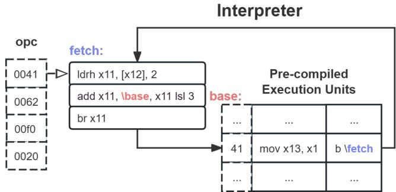  
Figure 4: µ-op Interpretation Workflow. Blue markers denote instruction-fetch boundaries, red indicates base address mapping for first-instruction anchoring.

## 6.1 Interpretation Engine

As mentioned in § 4.1, each opcode indexes a precompiled execution unit, i.e., implementation of µ-op. For efficiency, we set opcode as the offset of the corresponding unit in interpreter’s precompiled execution section. The interpreter’s core engine employs a straightforward µ-op dispatch-loop: it iteratively fetches the opcode and jumps to the unit indexed by the opcode. In this loop, it uses a preserved register (X12)

pointing to the IR (within the mapped ir file). To form a tight interpreting loop, each execution unit performs three functions: i) performing the semantics specific to µ-op definition, ii) advancing the X12 pointer to the next IR if operands are present, and iii) jumping back to the dispatch-loop header.

With this design, the dispatch-loop header requires only three instructions (Figure 4):

• Load opcode pointed at X12

• Add opcode with the base of the execution units

• Branch to the unit

The entire dispatch-loop, including the dispatching header and all the execution units, is implemented in hand-written assembly with precise constraints on preserved registers.

## 6.2 Stateless Control Flow Management

During emulation, target programs inevitably require access to program counter (PC) values through ADR instructions or branch instructions (e.g., B or BR). For direct branches, we resolve the branch target using Table and encode the target IR locations into IR operands. Indirect branches are handled by extracting target register values, followed by IR address lookup via TableIR\_offset. In short, direct branch targets are resolved at translation time, whereas indirect branch targets are resolved at runtime.

Although iLand manages all control-flow transfers between IR blocks, certain execution mode transitions remain outside its direct control. Transfers occur between interpreting mode (I-state) and native executing mode (N-state). A primary I→N transition occurs when the guest invokes system library functions under application-only emulation. Correspondingly, the reverse N→I transition occurs when native functions return or invoke callbacks passed as function pointer parameters (e.g., pthread\_create() parameter of start\_routine). I→N transitions are handled by restoring the preserved registers only; no additional invocation state must be saved.

N →I transitions are more complex because RWX memory is forbidden. To enable stateless transitions, we implement a trampoline mechanism. Every guest instructions is associated with a trampoline in Sectiont pl. For a given guest code address (Addrx) and its trampoline (Trampx), transitioning from N to Addrx in the guest program is semantically equivalent to transitioning from N to Trampx in iLand’s interpreter.

Sectiont pl achieves dynamic adaptation via shared pages, which combines immutable code and writable data while exploiting pc-relative instructions. Each trampoline page set consists of three code pages and one data page (Figure 5). Within the TPL Code Page, each Trampx consists of two instructions:

• stp x15, lr, [sp, #-0x10]

• bl L\_stub\_page

Trampx preserves two registers at the stack’s top, then branches to TPL Stub Page. Code in TPL Stub Page reconstructs Addr from LR together with data in the TPL Data

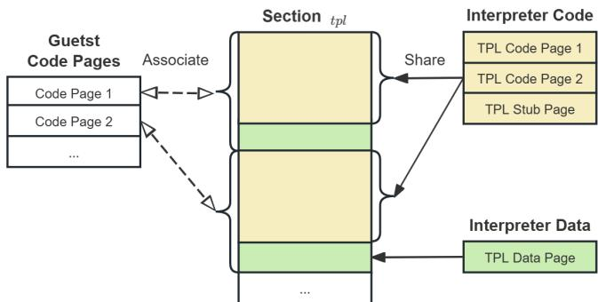  
Figure 5: Trampoline memory layout. Memory pages with identical color are shared with same pages.

Page. It then branches to unified entry point to start interpreter’s loop at Addrx. Notably, this process requires no additional state and does not overwrite any registers.

Each trampoline in Sectiont pl has a fixed length, enabling efficient address conversion between Addrx and Trampx via bitwise operations rather than expensive table lookups.

We take the system function pthread\_create as an example to demonstrate how trampolines are used in the N→I transition. Before native call to pthread\_create, the interpreter identifies the native return address (Addrret) and the start\_routine parameter (Addrstart\_routine). It then replaces Addrret and Addrstart\_routine with their trampoline addresses, i.e., Trampret and Trampstart\_routine. The substitution ensures N→I transition as:

• Trampret lets the caller thread resumes IR interpretation at IR\_o f f setret after pthread\_create returns

• Trampstart\_routine lets the created thread begins IR execution at IR\_o f f setstart\_routine

The trampoline mechanism both preserves register state and ensures faithful entry into the interpreter’s loop, exhibiting stateless characteristics and complying with diverse calling conventions. Notably, pages in Sectiont pl are shared and reused, thus i) they consume little additional physical memory despite Sectiont pl’s large virtual size; and ii) they comply with the iOS sandbox because the code is always immutable.

## 6.3 Application-Only Emulation

Due to limited resource on mobile device, iLand focuses on emulating the app’s own code, and allows system library functions to execute natively. This strategy requires iLand to regain control on N→I. Besides the return address and functionpointer parameters, other N→I scenarios that application-only emulation must handle include:

• C++ virtual methods of the guest app’s C++ object lead to N→I transitions, e.g., objects’ virtual destructors are invoked in delete.

• ObjC message, the dynamic dispatch to invoke ObjC methods defined in the guest app, leads to N→I transitions. In addition, ObjC runtime operations, including class creation and method swizzling, may also cause

N→I transitions.

• ObjC block, similar to function pointers, is the callback mechanism defined in ObjC. When calling system functions, apps pass Block parameters to receive callbacks.

• Swift function pointers, generated during compilation for reflection, e.g., witness table of Swift type, can behave like the C++ virtual methods invocation.

• Stack unwinding, used to implement exception handling (e.g. try-catch), transfers control to catch code block defined in the app, leading to N →I transition.

iLand utilizes a layered approach to ensure that N→I transitions are successfully captured and replaced by trampoline.

Initialization optimization driven by static analysis. As mentioned in Section 5, iLand employs a loader resolving dependencies and symbols. This specialized loader enables early-stage analysis before the guest app starts, including three optimizations for N→I transitions:

• Address fixups, where code pointers within data segments are identified via ASLR relocation information. Unidentified pointers fall through to the signal-based fallback, affecting only performance, not correctness.

• Symbol resolution, where specialized handling is implemented for extern decorated global function pointers in system libraries.

• ObjC pre-initialization, where all ObjC method function pointers are replaced with trampoline wrappers prior to class registration.

Runtime interception. iLand intercepts invocations on external C/C++/ObjC/Swift functions. As with our handling of pthead\_create, during interception iLand replaces re turn addresses, function pointer parameters and ObjC block arguments with their corresponding trampolines. Additionally, return address modification requires special handling for stack unwinding. iLand addresses this by instrumenting private function pointers in libunwind to recognize trampoline points, enabling correct backtraces.

Signal handling with replicated memory layout. iLand preserves the guest app original memory layout, including binary code segments. If iLand fails to capture an N→I transition with a trampoline, control transfers into the original read-only code region, causing a SIGSEGV or SIGBUS generated by the kernel. iLand uses POSIX signal handling to intercept these exceptions and regain control.

However, this method incurs significant performance overhead, resulting in operations up to a thousand times slower than native execution. Consequently, this approach is used only as a fallback when previous mechanisms fail.

Lazy optimization during signal handling. iLand implements a lazy optimization strategy in its general signal handling. On each signal, iLand performs analysis:

• Resolve C++ vtable pointers using the object this pointer (the X0 register) and vtable structure metadata

• Identify ObjC hybrid callback patterns by leveraging the ObjC object layout conventions

This approach incurs a one-time overhead per signal occurrence while maintaining optimal performance for subsequent invocations, and is applied primarily to C++ virtual method and ObjC block callback scenarios.

Interpreting libraries. In edge cases where libraries frequently transfer back to the guest app and iLand may fail to capture the transition, iLand continues to interpret the libraries to reduce the enormous overhead caused by frequent signal handling. A prominent example is libswiftcore, the Swift runtime library. Swift objects carry variable-length metadata structures containing multiple compressed function pointers (e.g., witness tables), whose diversity makes it impractical to statically enumerate all callback targets.

## 7 Virtual Environment Manager

The manager serves as the primary interface between the iLand and iOS, handling interactions between the guest app and the system. Utilizing the control-flow monitor capabilities provided by the interpreter, the manager intercepts and forwards library calls and syscalls, ensuring correct access to app and system resources while remaining transparent to the guest app. Specifically, the manager virtualizes a sandboxed filesystem and provides an in-process isolated memory.

File system virtualization. The manager implements a sandboxed file system that is visible only to the guest app and supports standard file operations. Each app’s sandbox comprises a data container for app data storage and a bundle container for the app’s code and resources. The guest app can reuse iLand’s data container since iLand does not store data in the container. As for the bundle container, iLand redirects the bundle path of the app to a clean folder. Specifically, iLand places the guest app’s bundle in a private app group path and hijacks the bundle path by intercepting all file-related library calls and system calls.

In-process isolated memory. Leveraging the loader’s capability, iLand loads the guest app into a designated memory region. The manager takes over the app’s memory access, making this memory appear as the app’s isolated memory. Specifically, iOS apps can access memory via three mechanisms: i) library APIs (e.g., mach\_vm\_read); ii) SVC invocations (e.g., Mach syscall); and iii) memory access instructions (e.g., LDR). The manager enforces memory isolation for cases (i) and (ii) by intercepting memory-access library calls and syscalls. Because iLand’s own memory is coalesced into a continuous region that lies at a lower virtual address than the guest-viewed region, with a randomized gap, guest apps generally do not probe unavailable address via raw load/store instructions (doing so typically triggers SIGSEGV termination). Accordingly, it is safe to omit case (iii). Although we have extended execution units of memory-access instructions, this feature is disabled by default for performance reasons.

## 8 Implementation

We implement iLand with more than 300 KLOC of C++/ObjC code, including 6,709 hand-written assembly execution units (each typically 1–3 assembly instructions), cross-compiled into an iOS dynamic framework.

Empirical optimization. Considering iLand’s sensitivity to performance, we made deliberate trade-offs in the translator and interpreter implementation. By moderately increasing the IR count, IR operand length, and memory footprint, we achieved relative performance improvements:

• Immediate value optimization. For instructions with immediate operands (e.g., 0-128), we introduced specialized µ-ops that directly assign values to registers instead of fetching them from IR operand. This increases IR count but eliminates one memory read operation.

• High-Frequency register operation acceleration. To reduce register spilling overhead, we add dedicated µ- ops that operate directly on the accessed registers. A notable example is for stack pushing instruction STP X29,X30,[SP,#-0x10]! frequently seen at function prologues. Adding a specialized µ-op avoids two reg ister move cycles by directly handling X29 and X30.

• Trampoline precomputation. Discussed in § 6.2, iLand replaces return addresses with trampolines during system library invocation. By extending BL/BLR instruction operands to encode precomputed trampolines into operands, we optimize the N→I transition. This reduces a multi-memory-access computation into a single memory read, increasing memory usage but reducing latency.

Prototype iOS app. Based on iLand, we implement a standard sandboxed iOS app. Although apps’ main binaries are uniformly encrypted after distributed on App Store, researchers can get decrypted versions by tools (e.g., trollde crypt [57]) or public Internet (e.g., decrypt.day [14]). Our prototype processes decrypted packages:

Translator (§ 4) first performs ahead-of-time (AOT) translation on all binaries (including the main binary and embedded frameworks) int the IPA package. This batch translation generates ir files which are stored in the private app group path of our prototype app, together with the unpacked IPA contents. After translation, the stored artifacts are used in further interpretation. At startup, the loader (§ 5) coordinates the dynamic loading of ir files and the corresponding native binaries. The interpreter (§ 6) executes the µ-ops and manage control-flow transfers. The virtual environment manager (§ 7) transparently redirects sandbox resource access.

## 9 Evaluation

In this section, we perform a systematic assessment of iLand, focusing on four key dimensions: efficiency, capability, compatibility, and usability.

Table 3: Experimental setup. QEMU-jit represents the standard user-space emulator, while QEMU-tci denotes a built with the TCI (tiny code interpreter) backend.  
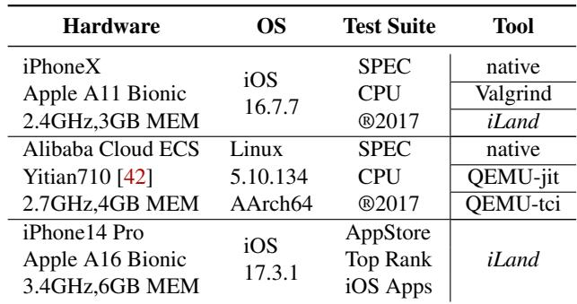

## 9.1 Experimental Setup

We set up three groups of experiments to evaluate iLand’s performance (Groups 1 and 2) and real-world compatibility, usability (Group 3). The hardwares, OS, test suites, and tools used for comparison in each group are detailed in Table 3.

Group 1 setup. Group 1 is designed to assess the performance of iLand against other tools on the iPhone. Among existing tools, only Valgrind supports Apple OS. However, it natively supports only macOS, and its extended version for iOS( [15] in 2015) lacks 64-bit support. Therefore, we ported the latest Valgrind (v3.24.0) to iOS, enabling DBI for command-line programs. As Valgrind relies on JIT-compiled code, we conducted the comparative experiments on a jailbroken device, specifically using an iPhone X running iOS 16.7.7, which supports Palera1n [11](v2.0) jailbreak. As for the test suite, we selected the SPEC CPU benchmark, which, although lacking an official iOS port, supports macOS Arm64 architectures. We performed cross-compilation of its v1.1.7 release on an Apple M1 Pro device to support iOS. Out of the original 19 benchmarks evaluating integer and floatingpoint performance, we excluded 11: 8 due to incompatibility with the iOS compilation toolchain (written in Fortran), and 3 failing to execute natively on the iOS platform.

Group 2 setup. Since iLand is designed to operate on iPhones where RWX memory is restricted, we use Group 2 to demonstrate its interpretation efficiency. Given the lack of comparable tools on iOS, we selected qemu-tci, which operates based on interpretation. Considering the platform differences, we ran both on their respective platforms and compared their slowdown factors relative to their native executions. We used the same SPEC CPU benchmark as in Group 1, and measured the performance slowdown of qemu-tci running on Elastic Cloud Server (ECS). Then we compare these results to the slowdown observed with iLand on the iPhone.

Group 3 setup. To demonstrate real-world compatibility and usability, we select an iPhone 14 Pro running iOS 17.3.1, for which no public jailbreak is currently available, and apply iLand to 60 top-ranked iOS apps, obtained from the US App Store in April 2025.

Table 4: Performance on SPEC CPU®2017. Numbers of Column 3-8 are the execution time in seconds.  
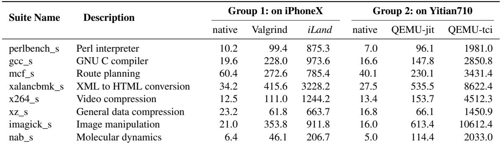

## 9.2 Performance Efficiency

We conduct evaluation on iPhone X with SPEC CPU®2017. Given that the resource constraints of mobile devices, we employed the reduced-scale dataset train rather than ref as input throughout our evaluations. Adequate time intervals were implemented between consecutive test suites to cool down, preventing CPU throttling that may compromise benchmark accuracy. During testing, both of Valgrind and iLand run without any instrumentation. The execution times for native execution, Valgrind, qemu-jit, qemu-tci, and iLand in Groups 1 and 2 are listed in Table 4.

The results of Group 1 reveal that, compared to native execution, Valgrind and iLand exhibited a 5-10x and 15-90x increase in execution time, respectively. iLand translates each Arm64 instruction into several micro-operations, which re sults in a substantial increase in the number of instructions. In contrast, Valgrind natively run generated instructions and enabling a more lightweight instruction expansion. The performance gap between iLand and Valgrind (5-10x) is expected: Valgrind executes JIT-compiled native instructions, whereas iLand interprets micro-operations without RWX memory. Despite this gap, iLand remains practical for interactive use.

To contextualize iLand’s interpretation efficiency, Group 2 compares it against qemu-tci, another interpreter-based system. Because qemu-tci does not run on iOS and iLand does not run on Linux, we compare their respective slowdown factors relative to native execution on each platform, rather than absolute times. The results show that qemu-tci incurs 100-600x overhead over native execution, while iLand achieves 15-90x—a 5-15x advantage, especially on floatingpoint benchmarks. This advantage stems from iLand’s tight interpreting loop, which reduce dispatch overhead compared to qemu-tci’s generic tiny-code interpreter.

## 9.3 Instrumentation Capabilities

We categorize instrumentation capabilities along three dimensions: instruction-level, library call (libcall), and system call (syscall) instrumentation. Instruction-level instrumentation represents the most comprehensive capability, enabling arbitrary code insertion at any location without length constraints. Libcall and syscall instrumentation represent the ability to intercept standard library calls and hook supervisor calls (typically via SVC), respectively. Additionally, we consider maintaining instrumentation transparency to be an essential requirement, which involves evaluating whether the user-instrumented code preserves its original behavior.

We analyzed and compared the capabilities of iLand and existing popular instrumentation tools, as listed in Table 5. Only DBI tools and QEMU can achieve the three dimensions of instrumentation. Although QEMU shares equivalent instrumentation capabilities with iLand, it cannot support closed-source iOS. Compared to the other two DBI tools, only iLand can operate without relying on JIT and support iOS. Valgrind, even under jailbroken conditions, is limited to supporting GUI applications with basic functionality due to memory constraints, while Pin does not support Arm64.

Compared with Static Binary Instrumentation (SBI) tools, iLand exhibits technical superiority by code insertion at any instruction without constraints, whereas SBI tools suffer from instrumentation limitations dependent on both target instruction locations and surrounding code patterns. Notably, E9Patch encounters failures when processing specific instruction sequences, while ARMore demonstrates failures for binaries exceeding 256MB in size.

Compared to Frida and Cydia Substrate, which are widely used in iOS ecosystem, only iLand can insert arbitrary code at any position on the instruction-level. Substrate, designed to operate on jailbroken iOS devices, utilizes inline hooking, which requires space for several instructions to establish control flow hijacking. Frida’s repackaging-based code injection mechanism offers limited analytical capacity, restricted to basic libcall hooks (via Global Offset Table modification), while lacking support for syscall interception.

## 9.4 Real-world Compatibility

We manually assess the compatibility of iLand across 64 apps from the US App Store’s Top Free Apps list, downloaded in April 2025. We decrypted them by trolldecrypt [57] tool and emulated them using iLand, then manually tested whether their core functionality remained usable.

We list the tested apps in Appendix A.1. The apps cover 16 categories, with binary sizes broadly distributed between 40 and 400 MB. Of the 64 apps, 49 complete their core functionality under iLand—including login, browsing, search, video, and common app-specific features. These results indicate that iLand exhibits good compatibility. Notably, Gmail, a popular mail app, works correctly when logging in and browsing emails. Youtube, a well-known video app, plays video smoothly without lag or stutter, and other widely used social media apps, such as X, Threads and Discord, also support logging in and browsing real-time posts. Qualitatively, during manual testing the 49 working apps felt responsive: UI interactions (scrolling, tapping, typing) proceeded without perceptible delay, because UI rendering and media decoding are handled by native system libraries. These cases demon strate the effectiveness of application-only emulation.

Table 5: Capabilities of DBA tools. ✓ denotes features that are deliberately designed and built-in supported. ◦ indicates partial implementation with limitations or conditional constraints. × represents unsupported characteristics.  
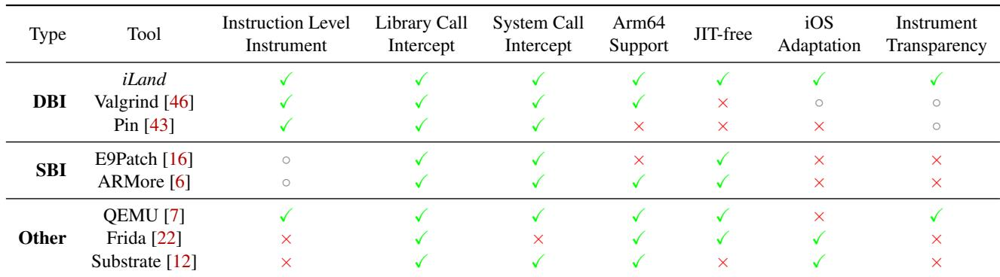

As for the other 11 apps that exhibited functional anomalies and 4 apps that self-terminated, our manual analysis indicated that these issues were mainly caused by their detection of iLand’s monitoring. A typical case involved an app attempting to delete files under its own bundle directory. Such operations are prohibited and failed on real iOS devices, but succeed within iLand’s virtualized environment, resulting in behavioral differences in subsequent executions. In theory, monitoring can be extended by monitor and instrumentation capabilities to further hide these traces, but how to find and hide the traces is beyond the scope of this paper.

## 9.5 Usability of App Vetting

Apple’s App Review process substantially reduces the preva lence of malicious apps. However, prior work [15, 17] shows that policy-violating behavior can be embedded in complex app logic and may bypass review. We analyzed 60 top-ranked apps in the compatibility test and implemented a dynamic tracing plugin on top of iLand to collect four complementary types of evidence indicative of private-API use:

• Static SVC instructions. We count SVC occurrences in apps’ binaries. Given that syscalls have convenient C wrappers, resorting to hand-written assembly is rare.

• Runtime syscall execution. We record executed SVC instructions and syscall function call, including the arguments passed to each syscall.

• Runtime dlsym usage. We log arguments passed to dlsym at runtime. Since the standard practice is to include headers and rely on link-time symbol resolution (simpler and faster), dlsym usage is rare.

• Indirect jumps to non-imported symbols. Using DBI’s control-flow monitoring, we track all transfers into the DSC. We filter out transfers to imported symbols and known callbacks, and analyze the remaining targets.

Results. Across the 60 apps we tested, 24 embedded SVC instructions in their binaries, totaling 2,914 occurrences. Table 6 enumerates syscalls whose C-level wrappers are private APIs. Additionally, 15 apps invoke filesystem-related syscalls (e.g., SYS\_lstat64, SYS\_unlink) to access system directories.

Leveraging iLand’s control-flow monitoring, we traced all occurrences of transfers into non-imported symbols in DSC. We then resolved targets using the DSC local symbol table and filtered out 1,078 reasonable calls (e.g., Swift metadata accessor or ObjC callback). We manually verified the remaining targets and identified 13 apps that invoke private APIs. We list these APIs in Table 7. Among these, SecTaskCopyValueForEntitlement and iokit\_user\_cl ient\_trap are reject APIs; apps should not use them.

Discussion. We classify the motives for the private-API uses we found into three categories:

(A) Device fingerprinting [39] via system information that can be used to uniquely identify a device. Such data enables cross-account and cross-app tracking, which may raise privacy risks. For example, statfs64 can reveal characteristics of the root file system that can be combined into fingerprinting features.

(B) Environment attestation and anti-tampering. Apps detect jailbreaking or repackaging by verifying code or signature integrity; for instance, the SYS\_csops syscall can retrieve process’s code-signing information; Apps may also search for injected code by enumerating memory with vm\_region, or compare results from semantically equivalent APIs (e.g., syscalls versus libc wrappers) to detect tampering of API results.

Table 6: Uses of syscall detected by iLand in 60 top-ranked iOS apps.  
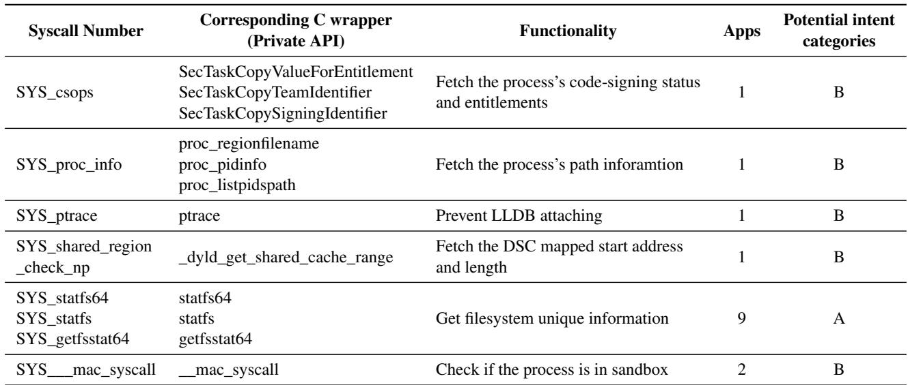

Table 7: Uses of private APIs detected by iLand.  
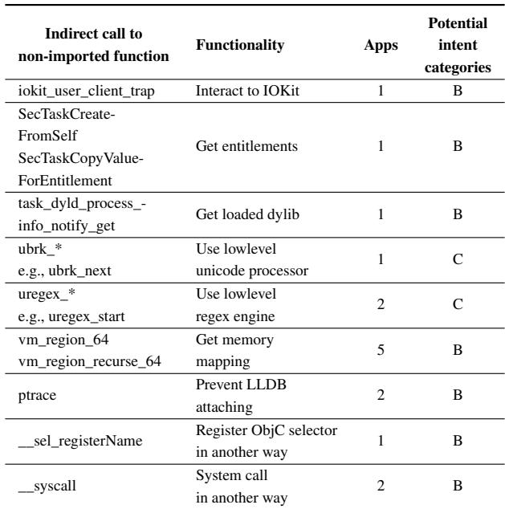

(C) Performance or capability gains via low-level, undocumented APIs, aiming for faster execution or access to functionality that not publicly exposed.

We assess categories (A) and (B) as potential privacy risk for users, whereas category (C) can introduce stability risks for the app itself across OS updates.

We find that several private APIs can be invoked via direct system calls, yet syscall-based usage appears to receive insufficient attention during app review. For example, SYS\_csops retrieves code-signing and entitlement information. The three SecTaskCopy\* APIs (Table 6) that offer similar functionality are reject APIs; calls to those C APIs are rejected by Test-Flight’s automated review, but the syscall-based invocation bypassed the review. Beyond this, we observed 15 apps covertly reading system files via SYS\_open and SYS\_read—for instance, a system file in path /private/var/containers/... accidentally contains device fingerprinting, which poses privacy risk. The syscall route is rather stealthy: i) syscall numbers are passed in registers and are therefore observable at runtime, complicating static analysis; and ii) whether a syscall is suspicious depends on its arguments—for example, SYS\_open on sandboxed paths is benign, whereas attempts to open system directories are worth further scrutiny. iLand can reliably monitor such covert syscall activity.

We further performed reverse engineering to analyze how these apps evade App Review—for example, some construct control flow via ROP. We detail these techniques in § 2.3.

Limitation. Our case studies did not further analyze ObjC private-API usage, although iLand can instrument ObjC message sends and capture argument values. As with other dynamic analyses, achieving full path coverage is challenging. To mitigate this in our experiments, we manually completed account registration and login flows to drive deeper app logic. Following prior work [15], forced execution can improve coverage; iLand may support this in future work.

## 10 Related Work

Dynamic binary instrumentation (DBI) has many mature technologies. DynamoRIO [9], Intel Pin [43], Dyninst [8] and Valgrind [46], the most popular general DBI tools, achieve efficient instruction-level instrumentation through JIT-compiled code. To further improve traditional DBI, researchers proposed multiple optimization approaches, including translation optimization [13, 27, 34, 60], multi-thread efficiency improvement [29, 33, 48], and LLVM backend integration [19, 44, 59]. Although researchers have extended DBI capabilities to diverse platforms [4, 21, 26, 54], the closed-source iOS, running on limited-resource devices, carries a barrier to porting.

Several instrumentation solutions have been developed for iOS, such as Cydia Substrate [12], Dobby [36] and Fishhook [20]. These solutions require code injection on jailbreak ing devices, overwriting the original instructions to jump to the inserted code when implementing inline-hook instrumentation, which is not transparent and is limited by instruction space, preventing instrumentation at arbitrary locations. As a result, there is a lack of a DBI solution capable of performing arbitrary instruction instrumentation on iOS.

## 11 Conclusion

In this paper, we present iLand, an instruction-level dynamic binary instrumentation framework for iOS. iLand translates and interprets binary instructions using its IR and atomic execution units without RWX memory. We propose applicationonly emulation, where system libraries run natively without interpreting, addressing mobile device memory and performance constraints. We implement the prototype of iLand as a standard iOS app and evaluate it on 64 top-ranked iOS apps from the App Store. In our compatibility study, 49 apps completed their core functionality under emulation, and 60 apps reached a sufficiently usable state for our app-vetting study. We also conducted an app-vetting study on these 60 apps and found 13 apps are still invoking private APIs. Our further analysis revealed new and stealthy methods to evade App Review, and found a new way of collecting sensitive information via direct SVC instruction invocation.

## Acknowledgments

We thank the OSDI reviewers and our shepherd for their insightful feedback and guidance, which significantly improved this paper. We are also grateful to Alibaba Group for its support of this work and its research incentive policies.

## References

[1] ANAND, K., SMITHSON, M., ELWAZEER, K., KOTHA, A., GRUEN, J., GILES, N., AND BARUA, R. A compiler-level intermediate repre sentation based binary analysis and rewriting system. In Proceedings of the 8th ACM European Conference on Computer Systems (New York, NY, USA, 2013), EuroSys ’13, Association for Computing Machinery, p. 295–308.

[2] APPLE INC. dyld: The dynamic linker, 2025. https://github.com/ apple-oss-distributions/dyld, accessed April 2025.

[3] APPLE INC. Identifying high-memory use with Jetsam event reports, 2025. https://developer.apple.com/documentation/xcode/ identifying-high-memory-use-with-jetsam-event-reports, accessed April 2025.

[4] BAIOCCHI, J., CHILDERS, B. R., DAVIDSON, J. W., AND HISER, J. Enabling dynamic binary translation in embedded systems with scratchpad memory. ACM Trans. Embed. Comput. Syst. 11, 4 (2012), 89:1–89:33.

[5] BALA, V., DUESTERWALD, E., AND BANERJIA, S. Dynamo: a transparent dynamic optimization system. In Proceedings of the ACM

SIGPLAN 2000 Conference on Programming Language Design and Implementation (New York, NY, USA, 2000), PLDI ’00, Association for Computing Machinery, p. 1–12.

[6] BARTOLOMEO, L. D., MOGHADDAS, H., AND PAYER, M. ARMore: Pushing love back into binaries. In 32nd USENIX Security Symposium (USENIX Security 23) (Anaheim, CA, Aug. 2023), USENIX Association, pp. 6311–6328.

[7] BELLARD, F. QEMU, a fast and portable dynamic translator. In 2005 USENIX Annual Technical Conference (USENIX ATC 05) (2005), USENIX Association.

[8] BERNAT, A. R., AND MILLER, B. P. Anywhere, any-time binary instrumentation. In Proceedings of the 10th ACM SIGPLAN-SIGSOFT Workshop on Program Analysis for Software Tools (New York, NY, USA, 2011), PASTE ’11, Association for Computing Machinery, p. 9–16.

[9] BRUENING, D. Efficient, transparent, and comprehensive runtime code manipulation. PhD thesis, Massachusetts Institute of Technology, Cambridge, MA, USA, 2004. https://dspace.mit.edu/entities/ publication/b63c9921-1f04-4cd2-bb8b-75c5d2f6df3b.

[10] CAO, M., HOU, X., WANG, T., QU, H., ZHOU, Y., BAI, X., AND WANG, F. Different is good: Detecting the use of uninitialized variables through differential replay. In Proceedings of the 2019 ACM SIGSAC Conference on Computer and Communications Security (New York, NY, USA, 2019), CCS ’19, Association for Computing Machinery, p. 1883–1897.

[11] CHAN, N. Jailbreak for iphone, ipad, macbooks, and appletv’s for versions 15 and higher, 2025. https://palera.in, accessed April 2025.

[12] CYDIA. Cydia Substrate: The powerful code modification platform behind Cydia, 2025. https://www.cydiasubstrate.com, accessed April 2025.

[13] D’ANTRAS, A., GORGOVAN, C., GARSIDE, J., AND LUJÁN, M. Low overhead dynamic binary translation on arm. SIGPLAN Not. 52, 6 (June 2017), 333–346.

[14] DECRYPT IPA STORE. Decrypt IPA Store: Free decrypted IPAs for educational and research purposes, 2025. https://decrypt.day, accessed April 2025.

[15] DENG, Z., SALTAFORMAGGIO, B., ZHANG, X., AND XU, D. iris: Vetting private api abuse in ios applications. In Proceedings of the 22nd ACM SIGSAC Conference on Computer and Communications Security (New York, NY, USA, 2015), CCS ’15, Association for Computing Machinery, p. 44–56.

[16] DUCK, G. J., GAO, X., AND ROYCHOUDHURY, A. Binary rewriting without control flow recovery. In Proceedings of the 41st ACM SIGPLAN Conference on Programming Language Design and Implementation (New York, NY, USA, 2020), PLDI 2020, Association for Computing Machinery, p. 151–163.

[17] EGELE, M., KRUEGEL, C., KIRDA, E., AND VIGNA, G. PiOS: Detecting privacy leaks in iOS applications. In Proceedings of the Network and Distributed System Security Symposium (NDSS) (2011), The Internet Society.

[18] ENCK, W., GILBERT, P., HAN, S., TENDULKAR, V., CHUN, B.-G., COX, L. P., JUNG, J., MCDANIEL, P., AND SHETH, A. N. TaintDroid: An information-flow tracking system for realtime privacy monitoring on smartphones. ACM Transactions on Computer Systems 32, 2 (2014), 1–29.

[19] ENGELKE, A., AND SCHULZ, M. Instrew: leveraging LLVM for high performance dynamic binary instrumentation. In VEE ’20: 16th ACM SIGPLAN/SIGOPS International Conference on Virtual Execution Environments, virtual event [Lausanne, Switzerland], March 17, 2020 (2020), S. Nagarakatte, A. Baumann, and B. Kasikci, Eds., ACM, pp. 172–184.

[20] FACEBOOK. fishhook: A library that enables dynamically rebinding symbols in Mach-O binaries running on iOS, 2025. https://github. com/facebook/fishhook, accessed April 2025.

[21] FEINER, P., BROWN, A. D., AND GOEL, A. Comprehensive kernel instrumentation via dynamic binary translation. In Proceedings of the 17th International Conference on Architectural Support for Programming Languages and Operating Systems, ASPLOS 2012, London, UK, March 3-7, 2012 (2012), T. Harris and M. L. Scott, Eds., ACM, pp. 135–146.

[22] FRIDA. Frida: Dynamic instrumentation toolkit for developers, reverse engineers, and security researchers, 2025. https://frida.re, accessed April 2025.

[23] FRÖDER, L. A jailbreak for arm64 (A8–A11) and arm64e (A12–A16, M1–M2), 2025. https://ellekit.space/dopamine/, accessed April 2025.

[24] GAO, D., LIN, H., LI, Z., HUANG, C., LIU, Y., QIAN, F., GONG, L., AND XU, T. Trinity: High-performance mobile emulation through graphics projection. In 16th USENIX Symposium on Operating Systems Design and Implementation, OSDI 2022, Carlsbad, CA, USA, July 11- 13, 2022 (2022), M. K. Aguilera and H. Weatherspoon, Eds., USENIX Association, pp. 285–301.

[25] GOSAIN, A., AND SHARMA, G. A survey of dynamic program anal ysis techniques and tools. In Proceedings of the 3rd International Conference on Frontiers of Intelligent Computing: Theory and Appli cations (FICTA) 2014 - Volume 1, Bhubaneswar, Odisa, India, 14-15 November 2014 (2014), S. C. Satapathy, B. N. Biswal, S. K. Udgata, and J. K. Mandal, Eds., vol. 327 of Advances in Intelligent Systems and Computing, Springer, pp. 113–122.

[26] GUHA, A., HAZELWOOD, K. M., AND SOFFA, M. L. Memory opti mization of dynamic binary translators for embedded systems. ACM Trans. Archit. Code Optim. 9, 3 (2012), 22:1–22:29.

[27] HAWKINS, B., DEMSKY, B., BRUENING, D., AND ZHAO, Q. Op timizing binary translation of dynamically generated code. In 2015 IEEE/ACM International Symposium on Code Generation and Optimization (CGO) (2015), pp. 68–78.

[28] HAZELWOOD, K., AND KLAUSER, A. A dynamic binary instrumentation engine for the arm architecture. In Proceedings of the 2006 International Conference on Compilers, Architecture and Synthesis for Embedded Systems (New York, NY, USA, 2006), CASES ’06, Associa tion for Computing Machinery, p. 261–270.

[29] HAZELWOOD, K. M., LUECK, G., AND COHN, R. Scalable support for multithreaded applications on dynamic binary instrumentation systems. In Proceedings of the 8th International Symposium on Memory Management, ISMM 2009, Dublin, Ireland, June 19-20, 2009 (2009), H. Kolodner and G. L. S. Jr., Eds., ACM, pp. 20–29.

[30] HEID, K., ANDRAE, V., AND HEIDER, J. Towards detecting device fingerprinting on iOS with API function hooking. In Proceedings of the 2023 European Interdisciplinary Cybersecurity Conference (New York, NY, USA, 2023), EICC ’23, Association for Computing Machinery, p. 78–84.

[31] HENDERSON, A., YAN, L. K., HU, X., PRAKASH, A., YIN, H., AND MCCAMANT, S. Decaf: A platform-neutral whole-system dynamic binary analysis platform. IEEE Transactions on Software Engineering 43, 2 (2017), 164–184.

[32] HENZE, L. Fugu15: A semi-untethered permasigned jailbreak for iOS 15, 2025. https://github.com/pinauten/Fugu15, accessed April 2025.

[33] HONG, D., WU, J., YEW, P., HSU, W., HSU, C., LIU, P., WANG, C., AND CHUNG, Y. Efficient and retargetable dynamic binary translation on multicores. IEEE Trans. Parallel Distributed Syst. 25, 3 (2014), 622–632.

[34] JIA, N., YANG, C., WANG, J., TONG, D., AND WANG, K. SPIRE: improving dynamic binary translation through spc-indexed indirect branch redirecting. In ACM SIGPLAN/SIGOPS International Conference on Virtual Execution Environments (co-located with ASPLOS 2013), VEE ’13, Houston, TX, USA, March 16-17, 2013 (2013), S. Muir, G. Heiser, and S. M. Blackburn, Eds., ACM, pp. 1–12.

[35] JIA, X., ZHANG, C., SU, P., YANG, Y., HUANG, H., AND FENG, D. Towards efficient heap overflow discovery. In 26th USENIX Security Symposium (USENIX Security 17) (Vancouver, BC, Aug. 2017), USENIX Association, pp. 989–1006.

[36] JMPEWS. Dobby: A lightweight, multi-platform, multi-architecture hook framework, 2025. https://github.com/jmpews/Dobby, accessed April 2025.

[37] KEDIA, P., AND BANSAL, S. Fast dynamic binary translation for the kernel. In Proceedings of the Twenty-Fourth ACM Symposium on Operating Systems Principles (New York, NY, USA, 2013), SOSP ’13, Association for Computing Machinery, p. 101–115.

[38] KELLNER, A., HORLBOGE, M., RIECK, K., AND WRESSNEGGER, C. False sense of security: A study on the effectivity of jailbreak detection in banking apps. In 2019 IEEE European Symposium on Security and Privacy (EuroS&P) (2019), pp. 1–14.

[39] KOLLNIG, K., SHUBA, A., VAN KLEEK, M., BINNS, R., AND SHAD BOLT, N. Goodbye tracking? impact of ios app tracking transparency and privacy labels. In Proceedings of the 2022 ACM Conference on Fairness, Accountability, and Transparency (New York, NY, USA, 2022), FAccT ’22, Association for Computing Machinery, p. 508–520.

[40] LAWTON, K. P. Bochs: A portable PC emulator for Unix/X. Linux Journal 1996, 29es (1996), 7–es. https://www.linuxjournal.com/ article/1310.

[41] LEVIN, J. MacOS and iOS Internals, Volume II: Kernel Mode. Technologeeks Press, 2019. https://www.newosxbook.com/.

[42] LOGHIN, D. Are ARM cloud servers ready for database workloads? an experimental study. IEEE Transactions on Cloud Computing 12, 3 (2024), 818–829.

[43] LUK, C.-K., COHN, R., MUTH, R., PATIL, H., KLAUSER, A., LOWNEY, G., WALLACE, S., REDDI, V. J., AND HAZELWOOD, K. Pin: building customized program analysis tools with dynamic instrumentation. PLDI ’05, Association for Computing Machinery, p. 190–200.

[44] LYU, Y., HONG, D., WU, T., WU, J., HSU, W., LIU, P., AND YEW, P. DBILL: an efficient and retargetable dynamic binary instrumentation framework using llvm backend. In 10th ACM SIGPLAN/SIGOPS International Conference on Virtual Execution Environments, VEE ’14, Salt Lake City, UT, USA, March 01 - 02, 2014 (2014), M. Hirzel, E. Petrank, and D. Tsafrir, Eds., ACM, pp. 141–152.

[45] MULLINER, C., OBERHEIDE, J., ROBERTSON, W., AND KIRDA, E. PatchDroid: Scalable third-party security patches for Android devices. In Proceedings of the 29th Annual Computer Security Applications Conference (New York, NY, USA, 2013), ACSAC ’13, Association for Computing Machinery, p. 259–268.

[46] NETHERCOTE, N., AND SEWARD, J. Valgrind: a framework for heavy weight dynamic binary instrumentation. In Proceedings of the 28th ACM SIGPLAN Conference on Programming Language Design and Implementation (New York, NY, USA, 2007), PLDI ’07, Association for Computing Machinery, p. 89–100.

[47] PWN20WND. The most advanced jailbreak tool for iOS 11.0–14.8, 2025. https://unc0ver.dev/, accessed April 2025.

[48] ROBSON, D., AND STRAZDINS, P. E. Parallelisation of the valgrind dynamic binary instrumentation framework. In IEEE International Symposium on Parallel and Distributed Processing with Applications, ISPA 2008, Sydney, NSW, Australia, December 10-12, 2008 (2008), IEEE Computer Society, pp. 113–121.

[49] SANG, Q., WANG, Y., LIU, Y., JIA, X., BAO, T., AND SU, P. Airtaint: Making dynamic taint analysis faster and easier. In IEEE Symposium on Security and Privacy, SP 2024, San Francisco, CA, USA, May 19-23, 2024 (2024), IEEE, pp. 3998–4014.

[50] SHAN, Z., GUO, H., AND PANG, J. BTMD: A framework of binary translation based malcode detector. In 2012 International Conference on Cyber-Enabled Distributed Computing and Knowledge Discovery, CyberC 2012, Sanya, China, October 10-12, 2012 (2012), IEEE Com puter Society, pp. 39–43.

[51] SOLIMEO, A., CAPACCI, L., TAINO, S., AND MONTANARI, R. MAD-IOS: dynamic app vulnerability analysis in non-jailbroken devices. In Proceedings of the Second Italian Conference on Cyber Security, Milan, Italy, February 6th - to - 9th, 2018 (2018), E. Ferrari, M. Baldi, and R. Baldoni, Eds., vol. 2058 of CEUR Workshop Proceedings, CEUR WS.org.

[52] SPREITZENBARTH, M., SCHRECK, T., ECHTLER, F., ARP, D., AND HOFFMANN, J. Mobile-Sandbox: combining static and dynamic analysis with machine-learning techniques. International Journal of Infor mation Security 14 (2015), 141–153.

[53] TANG, Z., TANG, K., XUE, M., TIAN, Y., CHEN, S., IKRAM, M., WANG, T., AND ZHU, H. iOS, your OS, everybody’s OS: Vetting and analyzing network services of iOS applications. In 29th USENIX Security Symposium (USENIX Security 20) (Aug. 2020), USENIX Association, pp. 2415–2432.

[54] VILLA, O., STEPHENSON, M., NELLANS, D., AND KECKLER, S. W. Nvbit: A dynamic binary instrumentation framework for nvidia gpus. In Proceedings of the 52nd Annual IEEE/ACM International Symposium on Microarchitecture (New York, NY, USA, 2019), MICRO ’52, Association for Computing Machinery, p. 372–383.

[55] WANG, T., LU, K., LU, L., CHUNG, S., AND LEE, W. Jekyll on iOS: When benign apps become evil. In 22nd USENIX Security Symposium (USENIX Security 13) (2013), USENIX Association, pp. 559–572.

[56] WANG, Z., LI, J., WU, C., YANG, D., WANG, Z., HSU, W.-C., LI, B., AND GUAN, Y. Hspt: Practical implementation and efficient management of embedded shadow page tables for cross-isa system virtual machines. In Proceedings of the 11th ACM SIGPLAN/SIGOPS International Conference on Virtual Execution Environments (New York, NY, USA, 2015), VEE ’15, Association for Computing Machinery, p. 53–64.

[57] WH1TE4EVER. TrollDecryptor: Decrypt iOS apps for TrollStore, 2023. https://github.com/wh1te4ever/TrollDecryptor, accessed April 2025.

[58] WU, S., LI, J., ZHOU, H., FANG, Y., ZHAO, K., WANG, H., QIAN, C., AND LUO, X. CydiOS: A model-based testing framework for iOS apps. In Proceedings of the 32nd ACM SIGSOFT International Symposium on Software Testing and Analysis (New York, NY, USA, 2023), ISSTA 2023, Association for Computing Machinery, p. 1–13.

[59] YADAVALLI, S. B., AND SMITH, A. Raising binaries to llvm ir with mctoll (wip paper). In Proceedings of the 20th ACM SIGPLAN/SIGBED International Conference on Languages, Compilers, and Tools for Embedded Systems (New York, NY, USA, 2019), LCTES 2019, Association for Computing Machinery, p. 213–218.

[60] ZHANG, X., GAO, X., GUO, Q., HUANG, J., LIU, H., AND MENG, X. VBIW: optimizing indirect branch in dynamic binary translation. In 10th IEEE International Conference on High Performance Computing and Communications & 2013 IEEE International Conference on Embedded and Ubiquitous Computing, HPCC/EUC 2013, Zhangjiajie, China, November 13-15, 2013 (2013), IEEE, pp. 1456–1462.

## A Appendix

The table lists the 64 evaluated apps by decreasing binary size and all were drawn from the App Store’s Top Free list in April 2025 on iOS 16.7.7.

Table A.1: Compatibility evaluation. Binaries represents the total size of the app’s binaries. Eval. delineates the outcomes, where ✓, ◦ and × indicate full, partial, no functionality, respectively.  
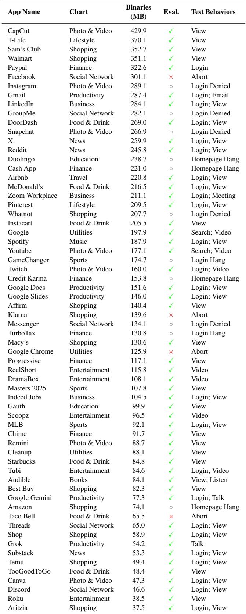