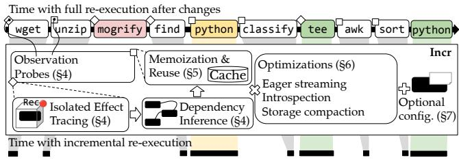
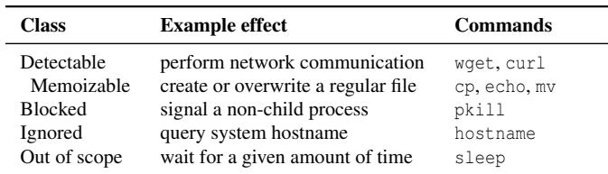
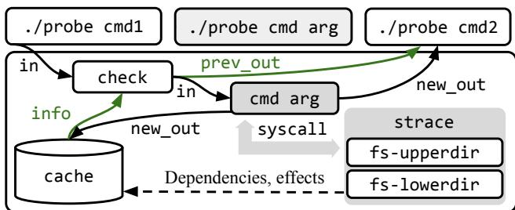
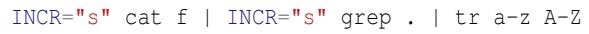
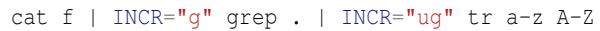
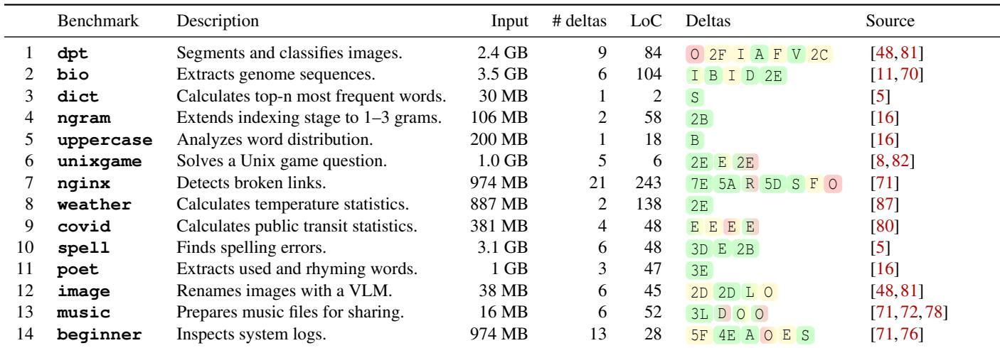
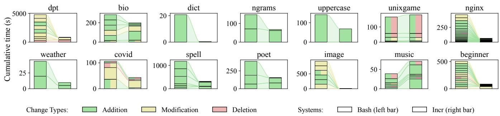
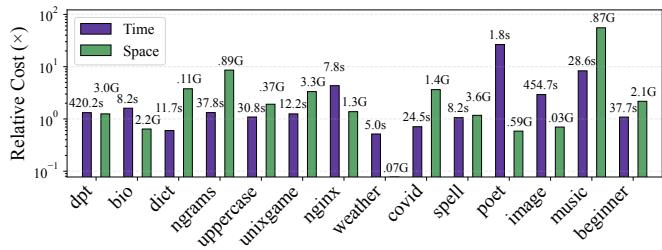
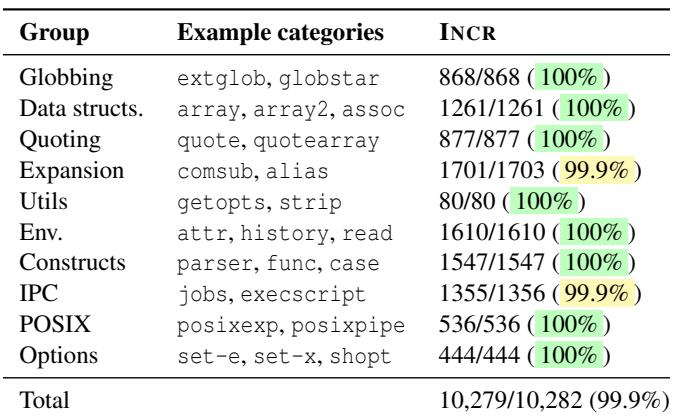
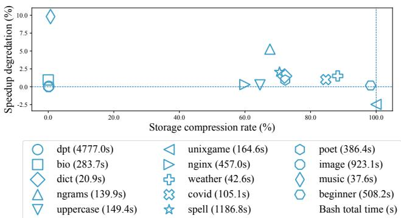

USENIX

THE ADVANCED COMPUTING SYSTEMS ASSOCIATION

# Incr: Faster Re-execution via Bolt-on Incrementalization

Yizheng Xie, Evangelos Lamprou, Jerry Xia, and Nikos Vasilakis, Brown University https://www.usenix.org/conference/osdi26/presentation/xie-yizheng

# This paper is included in the Proceedings of the 20th USENIX Symposium on Operating Systems Design and Implementation.

July 13–15, 2026 • Seattle, WA, USA

ISBN 978-1-939133-55-7

Open access to the Proceedings of the 20th USENIX Symposium on Operating Systems Design and Implementation is sponsored by

# Incr: Faster Re-execution via Bolt-on Incrementalization

Yizheng Xie<sup>\*</sup> Evangelos Lamprou<sup>\*</sup> Jerry Xia<sup>\*</sup> Nikos Vasilakis Brown University

## Abstract

While most software development is incremental, most execution environments are not: even small program modifications fail to take advantage of prior executions, at worst requiring full re-execution of all computational stages in the modified program. Such full re-execution decelerates software development and debugging, especially in dynamic polyglot environ ments such as the Unix and Linux shell. This paper presents INCR, a system that accelerates the re-execution of unmodified shell programs by automatically incrementalizing their execution. INCR analyzes and tracks interdependencies to detect and store key intermediate results, reusing them on subsequent re-executions whenever possible. INCR’s effect analysis supports correct re-execution even for non-idempotent computations, and several static and dynamic optimizations reduce the runtime and storage overheads of incrementaliza tion. Applied to diverse real-world scenarios, INCR accelerates re-execution by an average of 34.2× and a maximum of 373.3×—all while requiring no developer annotations or code modifications and remaining behaviorally indistinguishable on over 10,000 test cases.

## 1 Introduction

Nearly all software development is incremental: layers of modifications, additions, replacements, and deletions are applied iteratively to morph a program toward its intended goal. Such incremental development is particularly common today in data science [41, 60, 83], machine learning [10, 30], exploratory computing [24, 66, 79], and interactions with large language models [28, 67]. It is also the standard approach in dynamic, interactive environments such as the Unix shell, which is used for understanding, exploring, and gradually refining software systems, the opaque components comprising them, and the input they operate on [31, 43, 77].

Unfortunately, these environments do not support efficient re-computation when parts of a program change. Such changes, irrespective of their size, fail to take advantage of past executions—requiring a full re-execution of all the computational stages in the modified program. Even small refinements can result in long waiting cycles, especially on large datasets where re-execution might take the majority of the time. As the program grows, the longer it runs—and the slower it becomes to further iterate, discover errors, hand-tune, debug, and eventually ship.

  
Fig. 1: INCR overview. INCR accelerates re-execution in modified shell programs by bolting onto otherwise unmodified execution environments. Upon re-execution, it reuses prior results to avoid redundant computation. Colors indicate types of incrementalization: + additions, <sup>-</sup> deletions, and <sup>\~</sup> in-place modifications.

This paper introduces INCR, a system that accelerates reexecution by bolting incremental re-computation onto unmodified shell programs. Once enabled during development, it trades a small overhead during the first execution to accelerate subsequent re-executions. INCR operates in two phases: the analysis phase, which collects and analyzes program dependencies; and the incrementalization phase, which extracts information about modifications and, combined with the earlier analysis, accelerates subsequent re-executions of modified programs. INCR supports full POSIX and Bash semantics, including modifications to command arguments, flags, data flow, control flow, environment variables, and external resources, ensuring behavioral equivalence even for non-idempotent operations. When ready to ship, INCR can be disabled to avoid unnecessary runtime overheads in production environments.

INCR’s analysis and incrementalization phases discover and exploit process-level data and control dependencies across commands, automatically detecting, analyzing, and storing effects at runtime (§4). In subsequent runs, INCR determines which parts of a shell program are unchanged and safely reuses their outputs (§5). Several additional optimizations, such as eager stream processing, introspection, and storage compaction, lower runtime and space overheads (§6), making incrementalization practical for real-world workloads (§8). While no user input is necessary, INCR can leverage crowdsourced partial annotations for POSIX, GNU Coreutils, and third-party commands from earlier research [42, 71, 84], as well as developer-specified configurations to enable finergrained incrementalization or eliminate dependency analysis in parts of programs that will not change (§7).

INCR has been applied to 14 real-world scenarios that include debugging, data exploration, interactions with LLMs, and other common tasks (§8). With no developer input, INCR accelerates re-executions by an average of 34.2× and by up to 373.3× by trading in space (avg: 6.05× of the original input size, max: 55.44×). While INCR slows down the first (typically short) execution by an average of 101.05%, mostly due to dependency tracking, additional optimizations reduce this overhead to 43.55%, raising average re-execution speedup to 38.64× and the maximum to 377.65×. INCR’s behavior and outputs are indistinguishable from the underlying shell interpreter across all real-world scenarios and 10,279 out of 10,282 (99.9%) tests from the standard Bash test suite, includ ing unusual behaviors rarely seen in practice.

The paper starts by exemplifying INCR on a real-world workload (§2), followed by its execution model (§3) and key contributions (§4–7):

• Fine-grained dependency tracking via lightweight interposition probes that capture interactions across the filesystem and shell environment (§4).

• Correct incrementalization via memoization of dependencies and effects, including both transient data streams and side effects, and safe reuse of prior effects (§5).

• Diverse runtime optimizations, such as eager stream processing, introspection, and compaction, that make incremental execution practical (§6).

• An optional tuning interface that accepts crowdsourced annotations and developer configurations to enhance, disable, or relax parts of incrementalization (§7).

The paper then characterizes INCR on real-world pro grams (§8), discusses related work (§9), and concludes (§10). Appendix A presents the paper’s software artifact.

## 2 Applying INCR During Development

Fig. 2 shows a real shell program used to digitize images of hieroglyphs collected during an archaeological expedition [3]. The script (1) fetches the images collected during the expedition; (2) unpacks the images into a local directory; (3) iterates over the images; (4) segments each image into hieroglyph regions using Meta’s Segment Anything Model [45]; (5) applies a hieroglyph classifier to each segment; and (6) outputs the formatted mappings between image filenames and their classified segments to the db.txt file.

```shell
1 wget 'http://inst.edu/dpt/images.zip'
2 IMGS=${IMGS:-images}
3 unzip images.zip -d "$IMGS"
4 mogrify -resize 1024x1024\> "$IMGS"/* # -(1)
5 for img in "$IMGS"/*; do
5<sup>′</sup> for img in $(find "$IMGS" -type f); do # ~(3)
6 python segment.py "$img" |
6<sup>′</sup> python segment.py "$img" -s 1024x1024 | # ~(1)
7 while read -r mask; do
8 python classify.py -i "$img" -r "$mask" |
9 done |
10 tee -a classes.txt | # +(4)
11 awk '{print "g:", $5}'
11<sup>′</sup> awk -vi="$img" '{print "g:", $5, $6, i}' # ~(2)
12 done | sort > db.txt
13 python plot.py classes.txt # +(4)
14 rm classes.txt # +(4)
```  
Fig. 2: Hieroglyph classification script. A script that segments, classifies, and visualizes images of hieroglyphs. Highlighted lines indicate modifications made during development: + additions, <sup>-</sup> deletions, and <sup>\~</sup> in-place modifications. Primed line numbers denote updated versions of earlier lines. Numbers denote modification order; equal numbers belong in the same iteration.

Developing this script involved several modifications, four of which are highlighted in Fig. 2: removing a redundant image resizing step (ln.4, ln.6, #1 ), changing awk to include image paths in the output (ln.11, #2 ), making the outer loop process images in all subfolders (ln.5, #3 ), and plotting the classification results (ln.10, ln.13, #4 ).

Problem: Re-executing the entire script after each modification takes up to 15 minutes, dominated by the segmentation and classification stages.

Incrementalization—re-executing only the parts of the script necessary to reflect each modification—can significantly accelerate re-execution. To achieve incrementalization, a developer could manually insert tee commands and if guards (lns. 5–12) to memoize intermediate results and reorganize the script to reuse those intermediate files. However, this approach requires significant effort and can introduce subtle errors, as manual partial re-execution may use stale intermediate results. Furthermore, this approach does not help with change #3 , which expands the input image set, and is cumbersome to apply with changes #1 and #4 , which modify the program in non-trivial ways.

Key challenges: There are several challenges in automating the incrementalization of shell programs. First, Fig. 2’s script contains opaque, heterogeneous commands with complex and often implicit interdependencies. For example, plot.py, introduced in modification #4 , consumes classes.txt (produced in ln. 10) and thus depends on the outputs of all prior stages (lns. 5–9). Commands also interact with external resources and the execution environment. For instance, segment.py (ln. 6) reads images from the \$IMGS directory (defined in ln. 2) and depends on several Python packages loaded by the python interpreter. In addition, such dependencies are typically implicit and dynamic (e.g., \$IMGS may be externally set). Therefore, the script’s behavior can change with its surrounding context.

Second, these commands generate arbitrary side effects, including modifications to the filesystem and transient input/output streams that flow through pipelines and cannot be easily reused across runs. For example, modification #4 alters the pipeline by inserting a tee command (ln. 10), which consumes the output stream produced by earlier commands. The tee command then emits two effects: one written to disk as classes.txt—later consumed by the newly added plot.py command (ln. 13)—and another directly streamed to the next command awk (ln. 11).

Finally, commands exhibit diverse execution patterns that can make incrementalization via tracing and caching inefficient. For instance, modification #3 changes the set of images the for loop will iterate over; this changes the set of images processed but does not invalidate memoized results for some commands inside the loop, as they can be reused for the unchanged images. Memoization of command effects can incur substantial storage overhead, particularly for large artifacts produced by commands such as unzip or segment.py.

Applying INCR: Developers enable INCR during development to automatically incrementalize scripts and disable it when ready to deploy. This workflow for Fig. 2’s script is:

\$ incr dpt.sh # Enabling INCR   
\$ incr dpt.sh ... incr dpt.sh # #1 #2 #3 #4   
\$ ./dpt.sh # Ready to ship!

To solve the earlier challenges, INCR probes the script’s execution at runtime to track command dependencies (§4), memoize their intermediate effects (§5), and reuse them when relevant state is unchanged. It first parses the script, inserts interposition probes at all command invocations, and executes the transformed script using the underlying shell interpreter. These probes wrap each command and observe its execu tion: each probe creates an isolated environment for its command to run in, tracks its stdin and filesystem dependencies, and memoizes its input/output streams and filesystem effects. During re-execution, each probe compares the current dependencies to those stored and decides locally to re-execute its command if it detects any changes; otherwise, it skips execution and emits its memoized effects. As INCR’s probes operate at runtime, they can observe dynamic changes to variables (which may depend on external state) and control flow.

Modification #1 removes the redundant mogrify command that resized images before segmentation and makes the segment.py command resize images internally instead. Upon re-execution, INCR replays wget’s and unzip’s effects— their dependencies are unchanged and INCR is not invoked with -N, which would re-execute all network-effectful components. It then detects that segment.py’s input and invocation have changed; INCR thus re-executes segment.py normally, but its output, containing normalized coordinates, has not changed. Then, the probes surrounding classify.py and awk detect that their environment, inputs/outputs, and filesystem dependencies are unchanged, so INCR skips their executions and emits their memoized results.

Modification #2 includes two changes to the awk command: adding classification confidence (\$6) and the image path (i) to its output. The awk command’s probe detects that its arguments have changed and re-executes it. The downstream probes detect awk’s output changes and re-execute their corresponding commands. All prior stages (lns. 5–9) reuse their memoized results.

Modification #3 filters out irregular files in the \$IMGS directory using find. The probe on segment.py retrieves and emits memoized results for images it has processed before; otherwise, it executes the command normally.

Finally, modification #4 includes several changes that add a plotting section to visualize the classification results saved by tee. On re-execution, INCR skips all unchanged stages before tee. Then, INCR detects that tee does not alter the input to the awk command, and thus continues to reuse memoized results for all subsequent stages—executing only the new plot.py command.

Results: INCR improves time spent across all re-executions from 1h25m to 20m41s, resulting in a 4.1× speedup. Modifications #3 and #4 , which include exploration of alreadyprocessed data, enjoy 91.2× and 119× speedups, respectively. If annotations were used, INCR would achieve an additional 5% speedup by skipping dependency tracking on awk (§7).

## 3 Execution Model

To provide practical incrementalization for real shell programs, INCR does not incrementalize all observable behavior nor does it re-execute all commands when their environment exhibits any observable change. Instead, it groups all possible component effects and behaviors into five classes (Tab. 1): (1) memoizable effects, which INCR can record and apply identically to the component that originally performed them; (2) detectable effects, which it observes to infer dependencies but which it does not memoize; (3) blocked effects, which will fail during a command’s execution and thus typically surface as errors indicating to the user that INCR cannot be used for part of the script; (4) ignored effects, which INCR’s current implementation does not support; and (5) out-of-scope behaviors that are fundamentally outside INCR’s goals and assumptions.

Memoizable effects are effects which INCR can both detect precisely during tracing and replay exactly during reuse. These are a command’s interactions with standard streams, its exit status, and local filesystem effects on regular files, directories, symbolic links, hard links, named pipes when used unidirectionally, including their permission metadata changes. Examples of such effects are writing to stdout, moving a directory from one path to another, and creating a symbolic link. Commands whose effects primarily fall into this class include grep, cp, mv, ln, gcc, pwd, and jq.

Detectable effects are effects which INCR can observe during tracing but cannot precisely replay, and for which it therefore conservatively re-runs the command when it detects such effects. These include all memoizable effects, the process’s environment variables, filesystem effects on character devices, block devices, and sockets. INCR’s -N flag (§5) extends this set to clock system calls, network system calls, and entropysupplying system calls. Examples of commands whose effects primarily fall in this class include wget, curl, and shuf. If all components in a shell program only perform effects in this class, INCR can guarantee correct re-execution.

Blocked effects are effects that (attempt to) cross the boundaries of INCR’s probes during execution. INCR blocks these effects because its underlying probe environment [50] requires user, mount, and pid namespaces to instantiate a private filesystem view and correctly interpose on the /proc filesystem. For instance, sending a signal to a process outside the same process sub-tree, i.e., outside the probe, will fail—with the signal never reaching its intended target. Commands that spawn subprocesses meant to outlive their original runtime will not be reflected outside the probe environment. A large number of process- and job-control commands such as kill, jobs, bg, and fg are implemented as shell built-ins, which INCR does not probe and can thus perform their effects freely. Other blocked behaviors include concurrent access to shared state across probe environments, such as command a producing files that command b consumes concurrently in a | b. Command effects do not inherently belong in this class; rather they are specific to cross-command interactions that will be blocked by INCR’s underlying semisolation mechanisms. Blocked effects can be safely allowed using INCR’s configurations (§7).

Ignored effects are effects that can be observed or blocked by INCR, but are not supported by the current prototype. These effects are assumed to not affect a component’s observable behavior and include querying the current system state—e.g., host and kernel identity, scheduling state, and system-wide resource statistics—POSIX message queues, semaphore sets, and shared memory segments. For example, hostname’s stdout will be replayed even if the system’s hostname changes across re-executions. Example commands in this class include uname, getpriority, sysinfo.

Table 1: Effect classes. INCR’s implementation distinguishes between several classes of effects described below.  


Out-of-scope behaviors include timing-sensitive components whose behavior depends on the precise elapsed time; INCR-aware components that change their behavior when they detect they are executing inside probes; non-deterministic components seeded by state undetectable by INCR; ones not terminating, e.g., daemons; and ones that interact with system state outside system-call tracing, e.g., by changing kernel state via module loading. These behaviors will require new insights and approaches that are very different from the ones INCR takes. Examples of commands include systemd-detect-virt, binaries seeded by RDRAND, at, insmod, and polling loops built around sleep.

## 4 Dependency Tracking

This section describes how INCR acquires fine-grained information about command dependencies.

Inserting interposition probes: Shell programs feature complex control flow and interaction with the environment, complicating the extraction of command dependencies and their effects. INCR performs all dependency tracking at runtime, following a component-centric approach: it isolates each command’s effects and tracks its dependencies individually (Fig. 3). It allows tracking commands on a per-effect basis (§5), enabling far more precise memoization and reuse than probing the script as a monolith.

INCR first parses the shell script using libbash, which exposes Bash’s parsing subsystem as a library. It then walks the program’s abstract-syntax tree (AST) and inserts probes as higher-order commands that wrap the original command invocation. For example, INCR transforms the invocation rm \$path into ./probe rm \$path. The probe overwrites the \$0 variable to point to the original command and then invokes it with its original arguments. Each probe tracks its command’s dependencies and memoizes its effects. This includes any subprocesses spawned by the command, meaning that a command such as xargs will be incrementalized as a whole.

Probes are only placed at trackable commands, which leaves out shell-defined functions, built-in commands, and other components that cannot be resolved inside the shell (e.g., alias). To deal with these shell-specific constructs, INCR applies a small set of lightweight syntactic analyses and transformations. In particular, INCR keeps track of and does not place probes on built-in commands (using the closed set given by compgen -b), function definitions, aliased invocations, and backgrounded computations (& and coproc). For other syntactic constructs that create non-trackable side effects, INCR transforms them into equivalent, trackable commands. It converts redirections (>, >>, <>, >|, and their number-prefixed variants) into dd invocations before inserting probes.

  
Fig. 3: Interposition probes. INCR inserts lightweight interposition probes before each command in a shell program. A command’s probe records its dependencies, inputs, outputs, and other effects by tracing its system calls (gray arrows) and memoizing those effects in a cache. On subsequent executions, the probe checks its dependencies against prior runs retrieved from INCR’s cache. If they are unchanged, the probe reuses prior results (green arrows); otherwise, it re-executes and re-traces the command (gray arrows).

Detecting dependencies: Correct incrementalization requires comprehensive tracking of each command’s runtime dependencies.

To precisely capture each command’s effects on the filesystem, INCR executes them within a try semisolate [50], which provides a private, copy-on-write view of the filesystem. Before each command executes, INCR instantiates a new OverlayFS mount that composes a read-only lower layer (lowerdir) with a writable upper layer (upperdir) into a unified merged view for each top-level directory in the current filesystem and unshares to change the process’s root directory to the merged view. To suppress components with unsupported dependencies, INCR also instantiates a user, pid, and mount namespace, blocking non-filesystem crossprocess interactions such as signals and shared memory. All modifications performed by the command are captured in the upperdir, while the lowerdirs offer transparent read-only access to the underlying filesystem. Upon completion, INCR scans the upperdir to identify modifications made by the command and commits them from the upperdir back to the persistent filesystem. Furthermore, INCR stores the upperdir for reuse during subsequent executions (§5).

Scanning the upperdir only reveals write dependencies. To capture read dependencies, INCR monitors system calls made by each command during its execution. To lower overheads,

INCR intercepts a subset of system calls within the scope of dependencies it needs to track—specifically, fork, exec, and all file-related system calls included in strace’s %file system set. INCR uses seccomp-BPF to filter out irrelevant system calls and reduce context switching overhead. The set of observed system calls can be extended to detect other types of dependencies, at the expense of higher tracking overhead.

INCR also tracks environment dependencies such as environment variables and function declarations. These are pervasive in shell scripts as commands often rely on environment variables for configuration (e.g., LC\_ALL affects sort’s ordering behavior). Before executing each command, INCR captures the current environment variables and function declarations in the shell. If this set differs on re-execution, INCR reruns the command. Environment modifications made during execution are handled automatically as INCR captures environment snapshots on a per-component basis.

False and noisy dependencies: Within the execution environment, false and noisy dependencies may lead to unnecessary re-executions. For example, INCR cannot determine which environment variables a command depends on, because after process startup the environment resides in the process’s user-space memory and accesses to it do not go through the system call interface. This forces INCR to conservatively treat all environment variables as dependencies, which may trigger re-executions even when variables that do not impact command behavior change across runs. To mitigate this, INCR implements a distribution-aware filter that discards noisy environment variables. Currently, INCR is aware of noisy variables inside the Debian and Ubuntu distributions, specifically those related to session management and tty settings.

## 5 Memoization and Reuse

This section explains how INCR memoizes command dependencies and effects at runtime and reuses these memoized results when appropriate.

Efficient memoization: INCR stores each command’s dependencies and effects collected during effect tracking (§4) in a cache directory on the host system. Commands are indexed by their invocation arguments, environment variables, and stdin stream hash. During re-execution, INCR indexes into the cache to check if commands can be skipped and to fetch memoized results.

Each command’s probe only has visibility into its own read and write dependencies. After recording them, INCR generates a dependency file. INCR tracks read and write dependencies differently as an optimization, using the insight that components in dynamic runtimes resolve sub-components at runtime, leading to many more read than write dependencies [85]. Write dependencies are tracked using content hashes while read dependencies are tracked using last modification timestamps, which are much cheaper to extract. To check if a write dependency has changed, INCR compares the file’s current hash to its stored hash. This allows INCR to skip re-execution if upstream commands modify a file but produce the same output (e.g., sort may produce the same output given different inputs), while also distinguishing between same-content overwrites and appends, ensuring correct reuse for non-idempotent writes. To check if a read dependency has changed, INCR checks if the file’s timestamp has changed. However, this over-approximates changes when a command reads a file modified upstream. To mitigate this, INCR avoids updating file timestamps when applying memoized writes, ensuring that commands do not detect spurious timestamp changes.

Furthermore, INCR stores each command’s transient data streams, exit code, and filesystem effects alongside its dependency file to memoize its effects. To capture transient data streams, INCR duplicates a command’s stdout and stderr to files within the cache directory at runtime. To capture the exit code, INCR waits for and records the command’s exit status after execution. To capture filesystem effects, INCR directly stores the upperdir generated by OverlayFS during dependency tracking. INCR memoizes only output streams, exit status, and replayable local filesystem effects (§3). All other externally visible effects are either used to disable reuse, blocked by isolation, or left outside the model.

Safe reuse: Correct incremental execution requires detecting when a command’s dependencies remain unchanged and applying prior results correctly. During each execution, INCR compares each command’s current dependencies against its dependency file. If any differ, INCR re-executes the command and records its new dependencies and effects; otherwise, INCR skips execution and applies its memoized results.

For output streams, INCR directly streams memoized stdout and stderr to their corresponding file descriptors. For filesystem effects, INCR scans the memoized OverlayFS upperdir that contains a component’s post-execution set of filesystem effects. Inside it, OverlayFS represents created or modified files as regular files, deleted files as whiteouts (character devices with major and minor numbers 0,0), created directories as regular directories, and overwritten or deleted directories as directories that have the user.overlay.opaque extended attribute set. To reuse these effects, INCR iterates over the upperdir, matches each filetype to the corresponding effect, and applies each change to the current environment.

INCR, with the -N flag, employs several best-effort heuristics to detect if a component (1) relies on the system time; it executes clock system calls, (2) performs network interactions; it executes network system calls, or (3) may be nondeterministic; it executes entropy-supplying system calls. In these cases, it will conservatively disable reuse for such com ponents. Furthermore, INCR accepts optional annotation and configuration (§7) that allow developers to mark commands as non-incrementalizable.

## 6 Runtime Optimizations

INCR’s tracing (§4) and memoization (§5) mechanisms may introduce significant runtime and storage overheads. This section describes several optimizations that make INCR practical for real-world workloads.

Eager stream-processing: The shell’s streaming execution model allows commands in a pipeline to start processing as soon as their upstream commands begin emitting output. This complicates incrementalization. Consider awk '{print \$1}' \$f | grep 'x'. If the file \$f points to changes but its first column remains the same, then awk’s output is unchanged, meaning that grep 'x' can reuse its memoized results. However, blocking on each pipeline stage to decide reuse disables the shell’s streaming semantics and incurs high overhead for long pipelines.

To address this challenge, INCR employs eager stream processing, a mechanism that allows reuse decisions to be made on the fly, while streaming outputs. When executing a pipeline, INCR’s probes begin executing each command as soon as input is available and without waiting to check if re-execution can be skipped. Each probe buffers its stdin stream in mem ory while computing a rolling hash and forwarding it to the probe’s corresponding command. Then, once the probe finishes hashing stdin, it checks if the command’s inputs have changed. Importantly, probes typically finish hashing stdin long before their commands finish processing it, especially for compute-intensive commands, enabling them to determine if memoized results can be reused early in each re-execution run. If the command’s dependencies and stdin have not changed, then INCR sends a KILL signal to the command and outputs its memoized results starting from where it left off. Otherwise, INCR continues running the command and tracking its effects as usual. This process continues in a chain for all the stages in a pipeline.

However, aborting a command that has filesystem side effects early may produce an inconsistent system state if it is in the middle of a modification. INCR’s effect isolation mechanism (§4) addresses this: each command’s effects are entirely contained within its OverlayFS upperdir. Therefore, INCR simply discards a command’s upperdir when aborting its execution and applies its memoized effects instead.

Introspection: Effect isolation (§4) is necessary to contain and memoize side-effectful commands. However, creating, copying, and committing OverlayFS directories generates potentially expensive overheads. To reduce such overheads, INCR employs introspection to detect, using knowledge from prior runs, whether commands need effect isolation. Specifically, INCR uses the tracing information to identify commands that do not perform filesystem modifications. INCR optimistically assumes that, given the same arguments, these commands remain effect-free in subsequent runs, similar to assumptions made by prior systems [42,71]. It then runs these commands without isolation.

However, if such a command modifies the filesystem in a subsequent run—as detected by INCR’s tracing mechanism— INCR still guarantees correctness. INCR completes the command’s execution as normal, correctly applying its effects to the filesystem. It then revokes the command’s effect-free designation and invalidates its cache entry to avoid reusing potentially stale effects in future runs. In the next run, INCR re-executes the command with effect isolation enabled.

Certain commands may be practically effect-free but still create temporary files during execution that are cleaned up before they exit. For example, sort creates temporary files if its input is too large to fit into memory. INCR assumes that files created and removed within the same command execution are temporary, and does not record them as dependencies. This approach allows INCR to consider such commands effect-free and to skip effect isolation in subsequent runs.

Storage compaction: Memoizing dependencies and effects for commands that produce large outputs or across shell programs that have several opportunities for incrementalization can incur significant storage overheads. To mitigate this issue, INCR employs storage compaction, compressing memoized data with a configurable compression level. INCR uses the Zstandard compression algorithm, which provides acceptable performance and compression ratio [17].

To avoid invalidating memoized data when the compression level changes, INCR records the compression level used for each memoized output. Therefore, INCR can decompress and reuse data generated under any previous configuration.

## 7 Optional Annotations and Configurations

INCR can also leverage command annotations made available by other systems and optional developer configurations to lower its overheads and increase or decrease its incrementalization fidelity.

Existing crowdsourced annotations: INCR leverages crowdsourced command annotations made available by other systems [39, 42, 63, 71, 84] to further increase the granularity of incrementalization. These annotations target parallelization and distribution opportunities, but the information they expose can benefit INCR’s analysis and accelerated re-execution. Each annotation maps a command invocation to a set of properties. For example, a combined annotation from POSH [71] and PaSh [42] for cat is:

## cat: [], stateless, splittable\_args

This annotation indicates that cat is stateless and splittable across its arguments when invoked without any flags. The following are the properties that INCR can exploit.

INCR exploits statelessness, a classification from both POSH [71] and PaSh [84] for commands that operate on each input line independently without maintaining any internal state across lines. For example, invocations of grep without -c are classified as stateless over their stdin stream.

This allows INCR to re-execute only the affected parts of a stateless command’s input stream. It splits the inputs of stateless commands into smaller chunks and memoizes each chunk separately and in parallel. Data streams are split using content-defined chunking [89], which produces chunks that are stable across input perturbations. If a modification to a stateless command’s input affects only a few chunks (e.g., when a log file is extended with new events), then memoized results of unaffected chunks can be reused.

INCR exploits purity, a classification for commands that do not modify the filesystem outside of a defined set of inputs and outputs. This classification comes from PaSh’s parallelizability annotations [84]. For example, an annotation for grep -f p.txt classifies it as pure with read dependencies from stdin and p.txt, and a write dependency to stdout. INCR skips effect isolation and tracing (§4) on pure commands. For many common commands such as cat, grep, and tr, this reduces INCR’s overhead when introspection (§6) has not yet detected that the command is pure.

INCR exploits argument independence, a classification from POSH [71] for commands that can be executed independently for each argument. For example, an annotation for grep -H 'p' f1 f2 classifies it as argument-independent across its arguments. Specifically, if f2 changes, then only grep -H 'p' f2 needs to be re-executed. INCR performs argument-level incrementalization on these commands by syntactically transforming each invocation: INCR splits the single large invocation into multiple invocations inside a subshell, each with a single argument. For example, it transforms the previous grep invocation into (grep -H 'p' f1 ; grep -H 'p' f2). INCR then places separate probes on each invocation and memoizes and reuses their results independently. Optional developer configuration: Developers can also optionally configure INCR for specific script fragments to further improve performance, exploiting knowledge of a script’s behavior and use patterns. To support such configurations in a backward-compatible fashion, INCR exposes a special annotation that it detects during parsing. These annotations instruct INCR either to disable incrementalization for a command or to group multiple commands together to memoize them as a single unit. Such annotations are expressed as assignments to the placeholder environment variable INCR before commands. For example, configuring INCR to skip cat and grep within a pipeline looks as follows:



Configuring INCR to group commands together by marking the first and last commands in the group looks as follows:



INCR removes the INCR environment variable before executing the annotated commands.

Disabling incrementalization reduces runtime overheads for program fragments that perform minimal computation or have complex side effects. For example, configuring INCR to skip cat and grep commands in the example above avoids effect memoization for trivial commands that emit large outputs, thereby eliminating both runtime and storage overheads.

Table 2: Benchmark summary. Summary of all benchmarks used to evaluate INCR and their characteristics. Benchmarks are categorized based on the delta type: addition ( + ), deletion ( <sup>-</sup> ), modification ( <sup>\~</sup> ), or a combination thereof and the reason for the change: behavior (B), wrong command (C), wrong flag (F), exploration (E), summarization (S), optimization (O), LLM assistance (L), replacement (R), input update (I), debugging (D), aggregation (A), or visualization (V).  


Grouping commands reduces overheads for program fragments that are unlikely to benefit from fine-grained, individual incrementalization. Additionally, grouping a fragment that is considered final and not expected to change allows INCR to focus only on fragments that will benefit from incrementalization. For example, configuring INCR to group the pipeline above incurs effect isolation and tracing overheads only once for the entire sequence rather than once per command. This can significantly improve performance for pipelines composed of many inexpensive commands.

## 8 Evaluation

This section applies INCR to 14 incremental development scenarios (totaling 85 deltas) to characterize its re-execution benefits (§8.1), its runtime overheads (§8.2), its behavioral equivalence (§8.3), the effectiveness of its optimizations (§8.4), and the impact of optional annotations (§8.5).

Benchmarks and modifications: To evaluate INCR, we use benchmarks from the Koala suite of real-world shell workloads [49] and modifications thereof. These benchmarks span data processing, machine learning, and system administration, with input sizes ranging from a few to several gigabytes, and consisting of a total of 85 deltas, summarized in Tab. 2.

Their modifications include fixing wrong commands or arguments, developing new functionality, exploring characteristics of data, and introducing modifications from LLM suggestions—collected from: (1) discussions with the original developers of these workloads, with modifications mirroring the iterations that led to the final script (seconds to minutes between iterations across dpt, covid, weather, ngram, uppercase, and beginner); (2) the Git commit history of these benchmarks (minutes to hours between iterations across bio, unixgame, and nginx); and (3) manually constructed edits to reflect realistic development trajectories (seconds to minutes between iterations across dict, spell, poet, image, and music). All modifications arise from a diverse set of goals (summarized in Tab. 2), resulting in three types of program deltas: in-place edits to existing commands ( <sup>\~</sup> ), e.g., changing command arguments; additions of new commands or stages ( + ); and removals of existing commands or stages from the script ( <sup>-</sup> ).

The Koala benchmarks used in INCR are only the ones for which we could identify and collect such program modifications. INCR contains only the digital pyramid text pipeline from inference (dpt), genome-sequencing from bio (bio), frequency, n-gram, transliteration, and poem generation from nlp (dict, ngram, uppercase, and poet), unixfun’s chess puzzle (unixgame), log-analysis program of analytics (nginx), core temperature computation from weather, excluding the Tufte weather plot (weather), all except the last, monolithic script of covid (covid), spell-checking of oneliners (spell), VLMassisted image annotation from inference (image), and conversion, compression, and encryption programs from file-mod (music). Finally, beginner is an entirely new benchmark not available in Koala, representative of nonexpert developers who perform multiple exploratory modifications in their development process.

Scenarios, in detail: The dpt benchmark (discussed in §2) segments and classifies hieroglyph images from a single expedition. Its changes include optimizing by removing a redundant image-resizing stage ( O ), correcting awk’s printing format ( 2F ), filtering out irregular files in the for loop condition ( I ), aggregating the classification results ( A F ), and finally visualizing classification results with three iterations ( V 2C ). Inputs total 2.4GB, including model weights and ultra-resolution images.

The bio benchmark processes genomic data to extract chromosome-specific subsets using a six-stage pipeline. Changes include iterating over all BAM files instead of a hardcoded testing file ( I ), extracting per-chromosome reads ( B ), driving processing from an input file of population-sample pairs ( I ), ignoring malformed or incomplete entries in that list ( D ), and plotting summary statistics for per-sample coverage ( 2E ). The script is applied on a corpus of genomic data comprising 15 samples and 3.5GB of aligned reads.

The dict benchmark counts the frequency of each word in a corpus using a four-stage pipeline. The change modifies the script to only output the top-n most frequent words, by adding a stage to sort words by frequency and a last head stage ( S ). The program operates over a large text corpus of 5.2M words, totaling 30MB of text from Project Gutenberg [35].

The ngram benchmark starts with a unigram computation pipeline of tr, sort, and uniq, extended to compute bigrams ( B ) and trigrams ( B ). It processes a 16-million-word, 106MB snapshot of Project Gutenberg [35].

The uppercase benchmark extracts all unique capitalized words from a large text corpus using multiple stages of grep, tr, and sort. The first delta modifies the script to count the occurrences of unique capitalized words by adding sort -u to sort the words by their frequency in descending order in the middle of the pipeline ( B ). Its input is a 33-million-word snapshot of Project Gutenberg, totaling 200MB [35].

The unixgame benchmark solves a series of questions from the Unix 50th anniversary game. It first counts the total number of rounds using grep '.' and wc -l. Changes insert grep 'x' to capture moves from one side ( E ), then a cut and grep -v '[KQRBN]' to count specific captures ( E ), then cut, sort, and uniq -c to count occurrences of each capture ( E ), normalize lowercase identifiers via tr '[a- <sub>⌋</sub> z]' 'P' ( E ), and counting occurrence frequency with sort -r, uniq -c, head, and awk ( E ). Inputs are a chess dataset from Lichess [20] totaling 19M chess moves and 1.0 GB.

The nginx benchmark analyzes Nginx server log entries to identify broken links. A series of changes expands its scope, e.g., extracting status codes, listing request paths that lead to 402 or 502 errors, identifying suspicious requests, counting unique clients, extracting referrers, sorting and ranking error-inducing URLs, and summarizing top 404-error paths ( 7E 5A R 5D S ). Another set modifies ordering and summarizing behavior to use consistent reverse-numeric sorting ( F ), and deleting unnecessary outputs ( O ). It operates on a 5-million-record, 974MB web-server log [71].

The weather benchmark processes a large weather dataset to compute maximum temperatures for each day between 1995 and 2000. The changes modify the script to add two additional statistics by computing the minimum ( E ) and average temperature ( E ). Its input is an 887MB weather dataset of 3.6M temperature records from the National Oceanic and Atmospheric Administration (NOAA) [64].

The covid benchmark analyzes public transit data collected during COVID-19 to compute a series of statistics. The changes introduce more metrics such as total vehicles per day, days per vehicle ( E ), hours per vehicle ( E ), monitored hours per day ( E ), and hours per bus ( E ). Its input contains 5M bus schedule records, totaling 381MB [80].

The spell benchmark analyzes spelling mistakes in a large text corpus. It includes six changes: removing nonprintable characters and turning the input into a word stream ( D ), lowercasing that stream ( D ), removing punctuation ( D ), sorting words in alphabetical order ( E ), reporting words not found in a dictionary ( B ), finally comparing only unique words against a dictionary to identify misspelled words ( B ). The input is a collection of 9001 books, totaling 527M words and 3.1GB of text [35].

The poet benchmark counts the frequency of each word found in a given directory containing text files. Changes include replacing the single-file input with a concatenated corpus of all poetry files to enable global text statistics ( E ), adding a second output that reports unique words in alphabetical order ( E ), and finally introducing a third output that orders words by rhyme by reversing strings prior to sorting and then restoring their original orientation ( E ). The input is a corpus of 3001 books, totaling 22.4M lines and 1GB of text from Project Gutenberg [35].

The image benchmark renames images based on their content using a vision-language model—GPT-4o mini. Changes include replacing spaces in LLM-generated titles with underscores to form basic filenames ( D ), lowercasing all characters for consistency ( D ), stripping non-alphanumeric, nonunderscore, and non-dash characters to guarantee filesystemsafe names ( D ), separating the cleaned stem into a reusable base variable for clearer filename construction ( L ), consolidating the sanitization steps into a single sed invocation ( O ), and finally removing the mode suffix so outputs use only the cleaned base title ( D ). Its input is a set of 11 images from a browsing session (totaling 38MB) [48].

The music benchmark captures a vibe-coding development loop, where a user iteratively refines a multimedia pipeline through loosely guided interactions with an LLM [29]. Starting from a simple mp3 to wav conversion with ffmpeg, changes include tar-ing each newly produced .wav file alongside conversion so every MP3 immediately gets its own archive ( L ), refactoring into a single post-loop that aggregates all WAVs into a combined tarball ( D ), encrypting it with openssl ( L ), introducing a configurable encryption-key variable instead of a hardcoded one ( O ), compressing individual WAV files to .gz before archiving ( L ), and finally simplifying the layout by dropping per-file compression in favor of gzip-ing ( O ). Its input is a collection of 20 public-domain music files, totaling 16MB [49].

  
Fig. 4: INCR’s speedup on incremental changes. Each vertical bar, i.e., group of blocks, represents the execution time of a benchmark change during incremental development. Each block within a bar represents the time taken by the corresponding re-execution of the benchmark after a change. The curves connect the same block across the two systems.

The beginner benchmark inspects system logs to identify failed login attempts. Starting from a numeric sort of the system log, changes include switching from numeric sorting to lexicographic sorting ( F ), counting duplicate lines ( E ), filtering for lines containing specific patterns—first casesensitive ( E ) and later case-insensitive ( F ), counting matching lines ( A ), then consolidating filtering and counting ( O ), extracting the first two fields from the counted output ( E ), extracting different fields ( F ), grouping identical field pairs after sorting ( E ), numerically sorting the grouped results ( E ), reversing the numeric sort to rank largest first ( A ), selecting the top ten entries ( S ), and adjusting the head call to the explicit head -n 10 form ( F ). Its input contains 5 million system logs, totaling 974MB [71].

Experimental setup: Experiments were conducted on a CloudLab m510 machine with an 8-core Intel Xeon D-1548 CPU at 2.0 GHz, 64 GB RAM, 256 GB NVMe storage, a 10 Gbps connection, running Ubuntu 22.04 on Linux 5.15.

## 8.1 Re-execution Performance

By how much does INCR accelerate re-execution?

Methodology: For each program modification, we measure the execution time of the script under INCR and Bash, and report the speedup as the ratio of Bash’s runtime to INCR’s runtime per incremental step. We run each re-execution 3 times and report the mean.

Results: Fig. 4 presents INCR’s speedup—achieved without annotations—over Bash across all benchmarks and incremental re-executions. Out of 85 re-executions, INCR achieves a speedup in 69 cases and a slowdown in 16 cases: across the former set, it achieves an average speedup of 34.2×, with a maximum of 373.3× and a minimum of 1.003×; across the latter set, INCR incurs an average slowdown of 0.73×, with a minimum of 0.15× and a maximum of 0.95×.

Discussion: INCR’s substantial re-execution speedups stem from its ability to track fine-grained dependencies and safely reuse previously computed results, thereby eliminating redundant computation. For example, INCR reuses LLM-generated image annotations in the image benchmark when incremental changes only modify the post-processing logic, reducing the execution time from 155.55 seconds to 1.62 seconds, achieving a speedup of 96.02×. INCR does not introduce a significant difference in accelerating different types of changes, primarily because INCR’s fine-grained dependency tracking effectively identifies unaffected commands and reuses their results regardless of the type of modification.

INCR’s overheads stem primarily from its use of system call tracing and isolation, which together enable the system to capture fine-grained dependencies and manage memoized results. These fixed costs become more pronounced and produce minor slowdowns in benchmarks dominated by many short-lived commands or in those with complex dependency behaviors. For example, in the unixgame benchmark—which consists of a sequence of short-running commands such as tr ' '\n'—the final iteration modifies only the third command, requiring full re-execution of the remaining eight commands. For these commands, fixed costs make up a larger fraction of the processing time, resulting in an increase in execution time from 107.8 seconds to 123.6 seconds. Moreover, in the first iteration of the music benchmark, tracing the ffmpeg and tar commands increases execution time from 3.7s to 12.4s, as they both perform thousands of system calls.

## 8.2 Time and Space Overheads

By how much do INCR’s tracing, isolation, and memoization mechanisms slow down the initial execution of a script (before it benefits from incremental re-execution) and increase space usage during execution (by memoizing command effects)?

Methodology: To characterize INCR’s overheads, we measure its execution time and peak space usage relative to Bash across all benchmarks with no script modifications. Time is reported as the ratio between INCR’s first execution and Bash’s execution on the same script. This is the worst-case scenario for INCR: all tracing, isolation, and memoization overheads are incurred without any benefits from incremental execution. Space consumption is measured as INCR’s cache size relative to the benchmark’s original input size. In Fig. 5, the numbers above the bars denote the absolute first-run execution time for INCR (time bars) and the absolute cache size (space bars). Results: Fig. 5 presents INCR’s time and space overheads using these relative ratios. For benchmarks where INCR’s execution exceeds five seconds, INCR exhibits a mean firstrun time ratio of 2.01×, reaching 8.32× in the worst case on music and 0.52× in the best case on weather. INCR’s cache occupies on average 6.05× of the original input size, ranging from 0.02× (0.04GB) for image in the best case and up to 55.44× (0.87GB) for music in the worst case. The average drops to 2.15× without the music outlier, which contains a tight for loop that inflates the cache as each iteration corresponds to multiple new cache entries. In absolute terms, INCR’s cache size ranges from 0.04GB for image to 3.6GB for spell.

  
Fig. 5: INCR’s time and space overheads. Each set of bars represents INCR’s overhead per benchmark during the first run and the peak space usage over the benchmark’s input size across all re-executions. The x-axis represents benchmarks. INCR’s absolute execution time (s) and peak cache size (GB) are noted above each bar.

Discussion: INCR’s time overheads stem from its tracing, isolation, and memoization mechanisms, while its space overheads stem naturally from storing memoized command outputs for later reuse. However, INCR can outperform Bash even on initial executions because its eager stream processing pulls from producers as soon as data is available, often avoiding blocking in ordinary shell pipelines. INCR’s cold-start time overheads are often offset by the benefits of incremental execution in real-world development scenarios, where scripts are frequently modified and re-executed.

## 8.3 Behavioral Equivalence

Does INCR preserve behavioral equivalence to an unmodified shell interpreter during incremental re-execution?

Methodology: We characterize INCR’s behavioral equivalence to the underlying shell interpreter in two ways. First, we apply it to all real-world scenarios in Tab. 2 and all unmodified Koala benchmarks (commit e1610d9), each executed twice. Using the same experimental setup as in §8.1, we confirm that the final outputs and exit code produced by both INCR and Bash match across all re-executions (confirmed using Koala’s verify.sh).

Table 3: INCR’s behavioral equivalence. The table shows several Bash test groups, example categories, the number of tests per category, and INCR’s results.  


Second, we apply INCR to the standard Bash test suite. Version 5.2.37(1)-release consists of 83 test categories, each corresponding to a specific feature of Bash, totaling 534 test files and 22,064 LoC. The suite’s ground-truth files contain 10,282 lines covering features from variable expansion, job control, invocation of external utilities (e.g., grep, cat, and awk), covering the full POSIX shell standard and all of Bash’s extensions. Because vanilla Bash itself differs from the bundled expected outputs on 362 lines, we use Bash as the ground truth and compare INCR’s outputs against it. The test suite is unusually demanding: it is sensitive to whitespace, quoting, error text, and ordering, and many tests hinge on historically accumulated interpreter corner cases. For example, the suite checks how temporary environment assignments interact with variable expansion, how process substitutions affect \$! and wait, and how shell options affect error handling.

Nineteen parser-error cases are considered out of scope because libbash’s unparsing diverges from Bash in line numbers and non-UTF-8 escape printing.

Results: Applied to the Bash test suite, INCR only differs by 3 ground-truth lines out of 10,282 (99.9% equivalence, Tab. 3). Differences come from (1; 2 diffs) recursive alias definitions, which INCR cannot identify during probe placement, thus placing a probe to the aliased command whose expansion (unlike normal shell expansion) INCR cannot observe; (2; 1 diff) an execscript test that unsets PATH, causing INCR to fail to locate its own dependencies. We re-ran all tests without clearing INCR’s cache, obtaining identical results, to confirm reuse does not affect equivalence.

Discussion: INCR’s broad compatibility required support for all of Bash’s invocation modes, types of expansion (e.g., process substitution), correct escaping through the shell, probe placement that excludes non-trackable built-ins, backgrounding operators and effects such as permission changes, moves, named pipe creation, and symbolic links. INCR’s remaining divergences, in alias and execscript, arise when scripts manipulate the shell environment in ways that prevent INCR from resolving script contents or locating its own runtime dependencies. Several approaches could be used to address these limitations, including deferring probe placement and packaging INCR as a standalone binary.

  
Fig. 6: INCR’s storage compaction impact on performance and storage. Each point represents the storage reduction vs. speedup degradation with compaction.

## 8.4 Effects of Runtime Optimizations

What are the benefits of various optimizations, including eager stream processing, introspection, and storage compaction? Eager stream-processing: This optimization is always enabled (§8.1); when disabled, INCR waits for each command to finish before deciding whether the subsequent command needs to be executed.

We apply INCR to a synthetic program that executes a single 16-stage pipeline twice without any incremental change; all stages are streaming commands, e.g., grep filtering lines and sed performing text substitutions. On the script’s first execution, INCR takes 3m 22s with eager stream processing, reducing the execution time by 65.8% from 9m 50s without eager stream processing. On the script’s second execution, INCR takes 10s to fetch the memoized results both with and without this optimization. Eager stream processing adds imperceptible overhead on reuse.

Introspection: This optimization is always enabled (§8.1); when disabled, INCR always re-executes commands within an isolation sandbox during incremental runs whether or not they have write dependencies.

We apply INCR to a synthetic script that includes a pipeline consisting of 20 commands that communicate only through their standard streams. Each incremental change modifies the input data processed by the pipeline, triggering re-execution of all commands. Without introspection, INCR takes 35s on all iterations. With introspection, INCR still takes 35s on the first iteration because it has not yet detected that the commands are pure, but only 31s (speedup: 13%) on subsequent iterations. Storage compaction: This optimization is disabled by default (§8.1); when enabled, INCR compresses memoized dependencies and effects on disk, achieving significant space savings with slightly increased runtime overheads.

Fig. 6 shows that compaction reduces space usage across all benchmarks by an average of 55.7%, with a maximum of 100.0%, while trading off a 1.9% average speedup degradation and up to 9.8% runtime degradation. This optimization is especially beneficial for scripts that include longer pipelines, as each intermediate result is a separate cache entry.

## 8.5 Effects of Optional Annotations

How do optional crowdsourced annotations (§7) help INCR further accelerate incrementalization?

Methodology: We apply INCR with annotations to all benchmarks in Tab. 2. Additionally, we design two synthetic shell programs. The first program uses a five-stage pipeline of stateless command invocations—cat, sed, awk, sed, and grep. Changes append new lines to the input file. The second program invokes two argument-independent commands—clang and sha256sum—to compile and hash C files. Changes modify one of these C files.

Results: With annotations, INCR introduces an additional average speedup of 1.46× across all benchmarks, and up to 24.40× in the music benchmark. INCR lowers time overheads from an average of 101.05% to 43.55% and from a maximum of 732.45% to 278.15%. In the first synthetic program, INCR takes 29s on the first run (2.51×), and only 6s on the next two runs (12.17×), compared to 1m 13s on each run without annotations. In the second synthetic program, INCR takes 22.0s (4.9×) after changes, compared to 1m 48.8s without annotations.

Discussion: Annotations allow INCR to make informed decisions based on command semantics. For example, in the music benchmark, annotations indicating that the ffmpeg and tar commands are pure allow INCR to skip expensive tracing of these commands. Moreover, INCR applies chunked incrementalization for stateless commands in the first synthetic program, and decomposes each command’s argument list into per-file invocations in the second synthetic program.

## 9 Related Work

Incremental computation: Incrementalization systems [1, 34, 37, 53] typically track fine-grained dependencies within one language, requiring language support or source modifications to expose dependency boundaries. INCR instead discovers dependencies at the system level, bringing incremental behavior to environments that span multiple languages and opaque components.

Data processing systems [14,62,69,91] support incremental computation through dataflow or domain-specific computation models. Several production systems also provide elements of domain-specific incrementalization, such as Deno’s aggressive caching of remote dependencies [22], LangChain’s caching of language-model calls [51].

In contrast, INCR targets general-purpose shell environ ments with opaque components written in a variety of languages and arbitrary data-processing semantics.

Build systems: Build systems [26, 46, 56, 59] efficiently rebuild software after source code changes, often using developer-specified dependency graphs. Prior research reduces this burden by automatically inferring dependencies through execution tracing, thereby enabling incremental builds without explicit declarations [19, 38, 57, 75]. INCR fundamentally differs from these systems by targeting general computations that span data dependencies, transient effects, and mutable state that go beyond build artifacts.

Exploratory programming: Interactive environments such as notebooks [44] shorten the development feedback loop by exposing cell-based re-execution, but require manual control of dependencies [92]. Systems such as Jupyter [47, 55, 86] allow users to re-execute cells independently, but dependency boundaries are coarse-grained and users must decide which cells to rerun. INCR instead infers dependencies automatically across command boundaries, preserving the exploratory style of shell scripting without requiring users to manually decompose scripts into reusable cells.

Reactivity and view maintenance: Reactivity and view maintenance automatically maintain results as input data changes [2, 9, 25, 33, 52, 90, 91], often within specific domains such as relational databases [12] or MapReduce-style data processing [21]. INCR does not target reactivity.

Provenance tracking and reproducibility: Provenance systems [4, 13, 61, 68, 74] capture dependencies among entities to support auditing and forensics. INCR’s goals and methods for extracting dependencies in shell programs fundamentally differ, but the provenance graphs produced by these systems are complementary to INCR’s dependency tracking and could enable incremental execution across network boundaries.

Systems such as CDE [32], ReproZip [15], Nix [23], Guix [18], and Docker [58] package or specify execution dependencies to improve portability, reproducibility, and deployment reliability. Their goal is to recreate executions across environments. INCR instead accelerates repeated executions in scenarios where the environment is largely fixed but the program changes.

Other systems [6, 40, 65] record program execution for faithful replay on often unmodified applications. They target deterministic replay for debugging and reproducibility, whereas INCR targets accelerated incremental execution.

Research on the Shell: Recent systems such as POSH [71],

PaSh [42], and Fractal [39] automatically parallelize or distribute shell programs. These systems target large-scale computations, rely on developer annotations to identify parallelizable and distributable fragments, and reduce latency of a single full execution. In contrast, INCR targets early-stage exploratory development, automatically infers dependencies and memoizes command effects at runtime, and reduces repeated work performed across re-executions. It can optionally leverage insights from these systems to increase incrementalization fidelity (§7).

Furthermore, a variety of systems improve the shell along many dimensions, including syscall refinement [27], fusion [36], elision [7], dataflow extension [78], synthesis [73], serverless execution [54], and mobile usage [88]. INCR is complementary to these works.

## 10 Conclusion

Fundamentally, INCR shows that bolt-on incrementalization atop unmodified shells is not only possible, but also broadly applicable—to accelerate development, debugging, optimization, and other settings where re-execution is prevalent. Its design includes lightweight effect tracking, safe memoization and reuse, optimizations that address key performance bottlenecks, and configurations that enable further incrementalization opportunities. Applied to real-world workflows, INCR delivers substantial re-execution speedups without program or environment modifications and retains behavioral equivalence to normal execution.

## Availability

INCR, alongside all of its evaluation programs and data, is available as MIT-licensed open-source software:

https://github.com/atlas-brown/incr

## Acknowledgements

We are thankful to the anonymous OSDI’26 reviewers for their feedback; the OSDI’26 Artifact Evaluation reviewers for their time; Justus Adam, Akshay Narayan, Deepti Raghavan, Malte Schwarzkopf, and the Brown CS2952R (Fall ’25) participants for their input on several iterations of this paper. This material is based upon research supported by NSF awards CCF-2525351, CNS-2247687, and CNS-2312346, DARPA contract no. HR001124C0486, an Amazon Research Award (Fall 2024), a Google ML-and-Systems Junior Faculty Award, a seed grant from Brown University’s Data Science Institute, and a Brown CS Faculty Innovation Award.

## References

[1] Umut A. Acar, Guy E. Blelloch, and Robert Harper. Selective memoization. In Proceedings of the 30th ACM SIGPLAN-SIGACT Symposium on Principles of Programming Languages, POPL ’03, pages 14–25, New York, NY, USA, 2003. Associa tion for Computing Machinery.

[2] Yanif Ahmad and Christoph Koch. Dbtoaster: a sql com piler for high-performance delta processing in main-memory databases. Proc. VLDB Endow., 2(2):1566–1569, August 2009.

[3] Christelle Alvarez. The variability of ritual texts: Knowledge transfer at the interface of oral and written forms. In Variability in the Earlier Egyptian Mortuary Texts, pages 219–249. BRILL, October 2023.

[4] Adam Bates, Dave Tian, Kevin R. B. Butler, and Thomas Moyer. Trustworthy whole-system provenance for the Linux kernel. In Proceedings of the 24th USENIX Security Sym posium, USENIX Security ’15, pages 319–334, USA, 2015. USENIX Association.

[5] Jon Bentley, Don Knuth, and Doug McIlroy. Programming pearls: a literate program. CACM, 29(6):471–483, June 1986.

[6] Tom Bergan, Nicholas Hunt, Luis Ceze, and Steven D. Gribble. Deterministic process groups in dOS. In Proceedings of the 9th USENIX Symposium on Operating Systems Design and Implementation, OSDI ’10, pages 177–191, USA, 2010. USENIX Association.

[7] Emery D. Berger. Optimizing Shell Scripting Languages. Technical Report UMCS TR-2003-009, University of Massachusetts Amherst, 2003.

[8] Pawan Bhandari. Solutions to unixgame.io. https://git.io /Jf2dn, 2020. Accessed: 2020-04-14.

[9] Jose A. Blakeley, Per-Ake Larson, and Frank Wm Tompa. Efficiently updating materialized views. SIGMOD Rec., 15(2):61– 71, June 1986.

[10] French-Owen Calvin. Reflections on Building with OpenAI’s API, 2024. Accessed: 2025-10-23.

[11] Enrico Cappellini, Frido Welker, Luca Pandolfi, et al. Early Pleistocene enamel proteome from Dmanisi resolves Stephanorhinus phylogeny. Nature, 574(7776):103–107, Oct 2019.

[12] Donald D. Chamberlin and Raymond F. Boyce. SEQUEL: A structured english query language. In Proceedings of the 1974 ACM SIGFIDET Workshop on Data Description, Access and Control, SIGFIDET ’74, pages 249–264, New York, NY, USA, 1974. Association for Computing Machinery.

[13] Ang Chen, Yang Wu, Andreas Haeberlen, Boon Thau Loo, and Wenchao Zhou. Data provenance at internet scale: Architecture, experiences, and the road ahead. In Proceedings of the 8th Conference on Innovative Data Systems Research, CIDR ’17, January 2017.

[14] Raymond Cheng, Ji Hong, Aapo Kyrola, Youshan Miao, Xuetian Weng, Ming Wu, Fan Yang, Lidong Zhou, Feng Zhao, and Enhong Chen. Kineograph: taking the pulse of a fast-changing and connected world. In Proceedings of the 7th ACM European Conference on Computer Systems, EuroSys ’12, pages

85–98, New York, NY, USA, 2012. Association for Computing Machinery.

[15] Fernando Chirigati, Rémi Rampin, Dennis Shasha, and Juliana Freire. Reprozip: Computational reproducibility with ease. In Proceedings of the 2016 International Conference on Management of Data, SIGMOD ’16, pages 2085–2088, New York, NY, USA, 2016. Association for Computing Machinery.

[16] Kenneth Ward Church. Unix for Poets, 1994.

[17] Yann Collet. Zstandard: Fast real-time compression algorithm. https://github.com/facebook/zstd, 2016. Accessed: June 12, 2026.

[18] Ludovic Courtès. Code staging in GNU Guix. In Proceedings of the 16th ACM SIGPLAN International Conference on Generative Programming: Concepts and Experiences, GPCE ’17, pages 41–48, New York, NY, USA, 2017. Association for Computing Machinery.

[19] Charlie Curtsinger and Daniel W. Barowy. Riker: Always-Correct and fast incremental builds from simple specifications. In Proceedings of the 2022 USENIX Annual Technical Confer ence, USENIX ATC ’22, pages 885–898, Carlsbad, CA, July 2022. USENIX Association.

[20] Datasnaek. Chess Games Dataset, 2020. Accessed: 2025-10- 15.

[21] Jeffrey Dean and Sanjay Ghemawat. MapReduce: simplified data processing on large clusters. Commun. ACM, 51(1):107– 113, January 2008.

[22] Deno Land Inc. Deno. https://deno.com/. Accessed: 2026-06-09.

[23] Eelco Dolstra, Merijn de Jonge, and Eelco Visser. Nix: A safe and policy-free system for software deployment. In Proceedings of the 18th USENIX Conference on System Administration, LISA ’04, pages 79–92, USA, 2004. USENIX Association.

[24] Mokhtar Ebrahim and Andrew Mallett. Mastering Linux shell scripting. Packt Publishing, Birmingham, England, 2 edition, April 2023.

[25] Conal Elliott and Paul Hudak. Functional reactive animation. SIGPLAN Not., 32(8):263–273, August 1997.

[26] Free Software Foundation. GNU make. https://www.gnu. org/software/make/make.html, 2023. Accessed: 2025-10- 22.

[27] Alexander J. Gaidis, Vaggelis Atlidakis, and Vasileios P. Kemerlis. SysXCHG: Refining Privilege with Adaptive System Call Filters. In Proceedings of the 2023 ACM SIGSAC Conference on Computer and Communications Security, CCS ’23, pages 1964–1978, New York, NY, USA, 2023. Association for Computing Machinery.

[28] Jie Gao, Simret Araya Gebreegziabher, Kenny Tsu Wei Choo, Toby Jia-Jun Li, Simon Tangi Perrault, and Thomas W Malone. A taxonomy for human-LLM interaction modes: An initial exploration. In Extended Abstracts of the CHI Conference on Human Factors in Computing Systems, CHI EA ’24, New York, NY, USA, 2024. Association for Computing Machinery.

[29] Yuyao Ge, Lingrui Mei, Zenghao Duan, Tianhao Li, Yujia Zheng, Yiwei Wang, Lexin Wang, Jiayu Yao, Tianyu Liu, Yujun

Cai, Baolong Bi, Fangda Guo, Jiafeng Guo, Shenghua Liu, and Xueqi Cheng. A survey of vibe coding with large language models, 2025.

[30] Aurelien Geron. Hands-on machine learning with scikit-learn, Keras, and TensorFlow. O’Reilly Media, Sebastopol, CA, 2 edition, October 2019.

[31] Michael Greenberg, Konstantinos Kallas, and Nikos Vasilakis. Unix shell programming: The next 50 years. In Proceedings of the Workshop on Hot Topics in Operating Systems, HotOS ’21, pages 104–111, New York, NY, USA, 2021. Association for Computing Machinery.

[32] Philip J. Guo and Dawson Engler. CDE: using system call interposition to automatically create portable software packages. In Proceedings of the 2011 USENIX Annual Technical Conference, USENIX ATC ’11, page 21, USA, 2011. USENIX Association.

[33] Ashish Gupta and Inderpal Singh Mumick. Maintenance of materialized views: problems, techniques, and applications, pages 145–157. MIT Press, Cambridge, MA, USA, 1999.

[34] Matthew A. Hammer, Khoo Yit Phang, Michael Hicks, and Jeffrey S. Foster. Adapton: composable, demand-driven incremental computation. In Proceedings of the 35th ACM SIGPLAN Conference on Programming Language Design and Implementation, PLDI ’14, pages 156–166, New York, NY, USA, 2014. Association for Computing Machinery.

[35] Michael S. Hart and Project Gutenberg. Project Gutenberg. https://www.gutenberg.org, 1971.

[36] Anna Herlihy, Periklis Chrysogelos, and Anastasia Ailamaki. Boosting Efficiency of External Pipelines by Blurring Application Boundaries. In Proceedings of the 12th Conference on Innovative Data Systems Research, CIDR ’22. www.cidrdb.org, 2022.

[37] Roger Hoover. Alphonse: incremental computation as a programming abstraction. In Proceedings of the ACM SIGPLAN 1992 Conference on Programming Language Design and Implementation, PLDI ’92, pages 261–272, New York, NY, USA, 1992. Association for Computing Machinery.

[38] Ben Hoyt and Simon Alford. Fabricate, 2020.

[39] Zhicheng Huang, Ramiz Dundar, Yizheng Xie, Konstantinos Kallas, and Nikos Vasilakis. Fractal: Fault-tolerant shell-script distribution. In Proceedings of the 23rd USENIX Symposium on Networked Systems Design and Implementation, NSDI ’26, Renton, WA, May 2026. USENIX Association.

[40] Nicholas Hunt, Tom Bergan, Luis Ceze, and Steven D. Gribble. DDOS: taming nondeterminism in distributed systems. In Proceedings of the Eighteenth International Conference on Architectural Support for Programming Languages and Operating Systems, ASPLOS ’13, pages 499–508, New York, NY, USA, 2013. Association for Computing Machinery.

[41] Jeroen Janssens. Data science at the command line. O’Reilly Media, Sebastopol, CA, October 2014.

[42] Konstantinos Kallas, Tammam Mustafa, Jan Bielak, Dimitris Karnikis, Thurston H.Y. Dang, Michael Greenberg, and Nikos Vasilakis. Practically correct, Just-in-Time shell script parallelization. In Proceedings of the 16th USENIX Symposium

on Operating Systems Design and Implementation, OSDI ’22, pages 769–785, Carlsbad, CA, July 2022. USENIX Association.

[43] Brian W. Kernighan and Rob Pike. The UNIX Programming Environment. Prentice Hall Professional Technical Reference, 1984.

[44] Mary Beth Kery, Marissa Radensky, Mahima Arya, Bonnie E. John, and Brad A. Myers. The story in the notebook: Exploratory data science using a literate programming tool. In Proceedings of the 2018 CHI Conference on Human Factors in Computing Systems, CHI ’18, pages 1–11, New York, NY, USA, 2018. Association for Computing Machinery.

[45] Alexander Kirillov, Eric Mintun, Nikhila Ravi, Hanzi Mao, Chloe Rolland, Laura Gustafson, Tete Xiao, Spencer Whitehead, Alexander C. Berg, Wan-Yen Lo, Piotr Dollár, and Ross Girshick. Segment anything, 2023.

[46] Kitware. CMake. https://cmake.org/. Accessed: 2025-12- 05.

[47] Thomas Kluyver, Benjamin Ragan-Kelley, Fernando Pérez, Brian Granger, Matthias Bussonnier, Jonathan Frederic, Kyle Kelley, Jessica Hamrick, Jason Grout, Sylvain Corlay, Paul Ivanov, Damián Avila, Safia Abdalla, Carol Willing, and Jupyter Development Team. Jupyter Notebooks—a publishing format for reproducible computational workflows. In Positioning and Power in Academic Publishing: Players, Agents and Agendas, pages 87–90. IOS Press, 2016.

[48] Evangelos Lamprou. Foundation Models and Unix, March 2025.

[49] Evangelos Lamprou, Ethan Williams, Georgios Kaoukis, Zhuoxuan Zhang, Michael Greenberg, Konstantinos Kallas, Lukas Lazarek, and Nikos Vasilakis. The Koala Benchmarks for the Shell: Characterization and Implications. In Proceedings of the 2025 USENIX Annual Technical Conference, USENIX ATC ’25, pages 449–64, Boston, MA, July 2025. USENIX Association.

[50] Evangelos Lamprou, Tianyu (Ezri) Zhu, Di Jin, Grigoris Ntousakis, Georgios Liargkovas, Calvin Eng, Konstantinos Kallas, Michael Greenberg, and Nikos Vasilakis. Controlling opaque-component effects with semisolates and Try. In Proceedings of the 20th USENIX Symposium on Operating Systems Design and Implementation, OSDI ’26. USENIX Association, 2026.

[51] LangChain. LangChain. https://www.langchain.com/. Accessed: 2026-06-09.

[52] E.A. Lee and D.G. Messerschmitt. Synchronous data flow. Proceedings of the IEEE, 75(9):1235–1245, 1987.

[53] Yanhong A. Liu. Incremental computation: What is the essence? (invited contribution). In Proceedings of the 2024 ACM SIGPLAN International Workshop on Partial Evaluation and Program Manipulation, PEPM ’24, pages 39–52, New York, NY, USA, 2024. Association for Computing Machinery.

[54] Aurèle Mahéo, Pierre Sutra, and Tristan Tarrant. The serverless shell. In Proceedings of the 22nd International Middleware Conference: Industrial Track, Middleware ’21, pages 9–15, New York, NY, USA, 2021. Association for Computing Machinery.

[55] marimo Developers. marimo. https://marimo.io/. Accessed: 2025-12-01.

[56] Evan Martin. Ninja: A small build system with a focus on speed. https://ninja-build.org/, 2012. Accessed: 2025- 02-14.

[57] Bill McCloskey. Memoize: A replacement for make, 2008. Archived: 2010-09-05.

[58] Dirk Merkel. Docker: lightweight Linux containers for consistent development and deployment. Linux J., 2014(239), March 2014.

[59] Andrey Mokhov, Neil Mitchell, Simon Peyton Jones, and Simon Marlow. Non-recursive make considered harmful: build systems at scale. SIGPLAN Not., 51(12):170–181, September 2016.

[60] Jason Morris, Chris McCubbin, and Raymond Page. Hands-On Data Science with the Command Line. Packt Publishing, Birmingham, England, January 2019.

[61] Kiran-Kumar Muniswamy-Reddy, David A. Holland, Uri Braun, and Margo Seltzer. Provenance-aware storage systems. In Proceedings of the 2006 USENIX Annual Technical Conference, USENIX ATC ’06, page 4, USA, 2006. USENIX Association.

[62] Derek G. Murray, Frank McSherry, Rebecca Isaacs, Michael Isard, Paul Barham, and Martín Abadi. Naiad: a timely dataflow system. In Proceedings of the Twenty-Fourth ACM Symposium on Operating Systems Principles, SOSP ’13, pages 439–455, New York, NY, USA, 2013. Association for Computing Machinery.

[63] Tammam Mustafa, Konstantinos Kallas, Pratyush Das, and Nikos Vasilakis. DiSh: Dynamic Shell-Script distribution. In Proceedings of the 20th USENIX Symposium on Networked Systems Design and Implementation, NSDI ’23, pages 341– 356, Boston, MA, April 2023. USENIX Association.

[64] National Oceanic and Atmospheric Administration. National Oceanic and Atmospheric Administration (NOAA). https: //www.noaa.gov. Accessed: 2025-01-13.

[65] Omar S. Navarro Leija, Kelly Shiptoski, Ryan G. Scott, Baojun Wang, Nicholas Renner, Ryan R. Newton, and Joseph Devietti. Reproducible containers. In Proceedings of the Twenty-Fifth International Conference on Architectural Support for Programming Languages and Operating Systems, ASPLOS ’20, pages 167–182, New York, NY, USA, 2020. Association for Computing Machinery.

[66] Evi Nemeth, Garth Snyder, Trent R Hein, Ben Whaley, and Dan Mackin. UNIX and Linux System Administration Handbook. Addison-Wesley Educational, Boston, MA, 5 edition, August 2017.

[67] Addy Osmani. Beyond Vibe Coding: From Coder to AI-Era Developer. O’Reilly Media, 2025.

[68] Thomas Pasquier, Xueyuan Han, Mark Goldstein, Thomas Moyer, David Eyers, Margo Seltzer, and Jean Bacon. Practical whole-system provenance capture. In Proceedings of the 2017 Symposium on Cloud Computing, SoCC ’17, pages 405– 418, New York, NY, USA, 2017. Association for Computing Machinery.

[69] Daniel Peng and Frank Dabek. Large-scale incremental processing using distributed transactions and notifications. In Proceedings of the 9th USENIX Symposium on Operating Systems Design and Implementation, OSDI ’10, pages 251–264, USA, 2010. USENIX Association.

[70] Jon Puritz. Bio594: Using genomic techniques to examine the evolution of populations. https://git.io/JY6J7, 2019.

[71] Deepti Raghavan, Sadjad Fouladi, Philip Levis, and Matei Zaharia. POSH: a data-aware shell. In Proceedings of the 2020 USENIX Annual Technical Conference, USENIX ATC ’20, USA, 2020. USENIX Association.

[72] Michael Schröder and Jürgen Cito. An empirical investigation of command-line customization. Empirical Software Engineering, 27(2):30, 2021.

[73] Jiasi Shen, Martin Rinard, and Nikos Vasilakis. Automatic Synthesis of Parallel Unix Commands and Pipelines with KumQuat. In Proceedings of the 27th ACM SIGPLAN Symposium on Principles and Practice of Parallel Programming, PPoPP ’22, pages 431–432, New York, NY, USA, 2022. Association for Computing Machinery.

[74] Benjamin H Sigelman, Luiz André Barroso, Mike Burrows, Pat Stephenson, Manoj Plakal, Donald Beaver, Saul Jaspan, and Chandan Shanbhag. Dapper, a large-scale distributed systems tracing infrastructure. Technical report, Google, Inc., 2010.

[75] Sarah Spall, Neil Mitchell, and Sam Tobin-Hochstadt. Build scripts with perfect dependencies. Proc. ACM Program. Lang., 4(OOPSLA), November 2020.

[76] Diomidis Spinellis. DelftX: Unix Tools: Data, Software and Production Engineering. https://www.edx.org/learn/un ix/delft-university-of-technology-unix-tools-d ata-software-and-production-engineering. Accessed: 2025-01-13.

[77] Diomidis Spinellis. Outwit:{UNIX}{Tool-Based} programming meets the Windows world. In Proceedings of the 2000 USENIX Annual Technical Conference, USENIX ATC ’00, 2000.

[78] Diomidis Spinellis and Marios Fragkoulis. Extending Unix Pipelines to DAGs. IEEE Transactions on Computers, 66(9):1547–1561, 2017.

[79] Diomidis Spinellis and Georgios Gousios. How to analyze git repositories with command line tools: we’re not in Kansas anymore. In Proceedings of the 40th International Conference on Software Engineering: Companion Proceedings, ICSE ’18, pages 540–541, New York, NY, USA, 2018. Association for Computing Machinery.

[80] Eleftheria Tsaliki and Diomidis Spinellis. The Real Numbers for Athens Buses, 2020.

[81] Justine Tunney. Bash One-Liners for LLMs. https://just ine.lol/oneliners, 2023. Accessed: 2025-06-01.

[82] Unix Game. The Unix Game - 50 Challenges to Master the Command Line, 2024. Accessed: 2025-10-19.

[83] Jake VanderPlas. Python Data Science Handbook. O’Reilly Media, Sebastopol, CA, December 2016.

[84] Nikos Vasilakis, Konstantinos Kallas, Konstantinos Mamouras, Achilles Benetopoulos, and Lazar Cvetkovic. Pash: Light-´ touch data-parallel shell processing. In Proceedings of the 16th European Conference on Computer Systems, EuroSys ’21, pages 49–66, New York, NY, USA, 2021. Association for Computing Machinery.

[85] Nikos Vasilakis, Ben Karel, Nick Roessler, Nathan Dautenhahn, André DeHon, and Jonathan M. Smith. Towards fine-grained, automated application compartmentalization. In Proceedings of the 9th Workshop on Programming Languages and Operating Systems, PLOS ’17, pages 43–50, New York, NY, USA, 2017. Association for Computing Machinery.

[86] VizierDB Developers. VizierDB. https://vizierdb.info/. Accessed: 2025-12-01.

[87] Tom White. Hadoop: The Definitive Guide. O’Reilly Media, Inc, 2009.

[88] Keith Winstein and Hari Balakrishnan. Mosh: an interactive remote shell for mobile clients. In Proceedings of the 2012 USENIX Annual Technical Conference, USENIX ATC ’12, page 15, USA, 2012. USENIX Association.

[89] Wen Xia, Yukun Zhou, Hong Jiang, Dan Feng, Yu Hua, Yuchong Hu, Qing Liu, and Yucheng Zhang. FastCDC: A fast and efficient Content-Defined chunking approach for data deduplication. In Proceedings of the 2016 USENIX Annual Technical Conference, USENIX ATC ’16, pages 101–114, Denver, CO, USA, June 2016. USENIX Association.

[90] Matei Zaharia, Mosharaf Chowdhury, Michael J. Franklin, Scott Shenker, and Ion Stoica. Spark: cluster computing with working sets. In Proceedings of the 2nd USENIX Workshop on Hot Topics in Cloud Computing, HotCloud ’10, page 10, USA, 2010. USENIX Association.

[91] Matei Zaharia, Tathagata Das, Haoyuan Li, Timothy Hunter, Scott Shenker, and Ion Stoica. Discretized streams: faulttolerant streaming computation at scale. In Proceedings of the Twenty-Fourth ACM Symposium on Operating Systems Principles, SOSP ’13, pages 423–438, New York, NY, USA, 2013. Association for Computing Machinery.

[92] Megan Zheng, Will Crichton, Akshay Narayan, Deepti Raghavan, and Nikos Vasilakis. When are reactive notebooks not reactive?, 2025.

## A Software Artifact

## Abstract

The software artifact that accompanies this paper includes INCR, its documentation, the behavioral-equivalence test suite, and the scripts used to reproduce the evaluation in §8. It supports three goals: inspecting the implementation and its accompanying materials, exercising the system through its test suite, and reproducing the paper’s main evaluation results, including the benchmark-suite performance summary and the behavioral equivalence checks against Bash.

## Scope

The artifact covers the paper’s main contributions. In particular, it includes: (1) the INCR implementation and runtime mechanisms described throughout the technical sections (§4– §7); (2) the benchmark suite and supporting workloads used in §8; and (3) the automation used to reproduce the key evaluation results in §8, including re-execution performance and behavioral equivalence.

## Contents

The artifact contains the following components:

• the INCR implementation itself, including the runtime, effect tracking, memoization, and annotation machinery;

• documentation, including a top-level README and artifact instructions;

• a behavioral-equivalence harness based on the standard Bash test suite;

• the benchmark drivers and supporting utilities for the evaluation workloads; and

• scripts for running the evaluation and generating the key result artifacts.

## Hosting

The artifact is publicly available both as a GitHub repository and as a Zenodo archival snapshot. The GitHub version is hosted at https://github.com/atlas-brown/incr, and the archival version is hosted at https://zenodo.org/rec ords/19488802.