USENIX

THE ADVANCED COMPUTING SYSTEMS ASSOCIATION

# Strata: Hierarchical Context Caching for Long Context Language Model Serving

Zhiqiang Xie, Stanford University and NVIDIA; Ziyi Xu, Shanghai Jiao Tong University;   
Mark Zhao, University of Colorado Boulder; Yuwei An, Carnegie Mellon University; Vikram Sharma Mailthody, NVIDIA; Scott Mahlke, NVIDIA and University of Michigan; Michael Garland, NVIDIA; Christos Kozyrakis, NVIDIA and Stanford University

https://www.usenix.org/conference/osdi26/presentation/xie-zhiqiang

# This paper is included in the Proceedings of the 20th USENIX Symposium on Operating Systems Design and Implementation.

July 13–15, 2026 • Seattle, WA, USA

ISBN 978-1-939133-55-7

Open access to the Proceedings of the 20th USENIX Symposium on Operating Systems Design and Implementation is sponsored by

# Strata: Hierarchical Context Caching for Long Context Language Model Serving

Zhiqiang Xie Stanford University & NVIDIA

Mark Zhao University of Colorado Boulder

Scott Mahlke NVIDIA & University of Michigan

Ziyi Xu Shanghai Jiao Tong University

Yuwei An Carnegie Mellon University

Michael Garland NVIDIA

Vikram Sharma Mailthody NVIDIA

Christos Kozyrakis NVIDIA & Stanford University

## Abstract

Long-context large language models (LLMs) enable applications that reason over hundreds of thousands to millions of tokens, but serving these workloads efficiently is challenging. Modern systems cache key-value (KV) states and rely on hierarchical context caching across GPU HBM, CPU memory, and SSDs. We show that naïve designs often become I/O-bound: fragmented KV layouts lead to small transfers that underutilize bandwidth, cache loading stalls prefill, and schedulers that ignore cache-loading latency and delay hits (concurrent requests for the same context during a cache miss) suffer severe throughput degradation.

We present Strata, a hierarchical context caching framework for long-context LLM serving. Strata introduces a GPUassisted I/O mechanism that decouples GPU and host layouts to enable efficient large transfers, and a cache-aware scheduler that mitigates delay hits, balances batches to hide cache-loading latency, and opportunistically overlaps complementary work. Implemented as part of SGLang and deployed in production, Strata improves throughput by up to 5× over vLLM-LMCache and 3.75× over NVIDIA TensorRT-LLM, without hurting short-context performance.

## 1 Introduction

Large Language Models (LLMs) represent a significant advancement in machine learning, achieving remarkable proficiency in understanding and generating natural language. Their adoption is now widespread, and they are rapidly evolv ing towards more robust problem-solving capabilities. A prominent trend in this evolution is the expansion of context windows, allowing LLMs to parse longer input prompts. This has enabled an important set of applications that require understanding large amounts of text, including coding assistants [6], retrieval-augmented generation (RAG) [27], document analysis [49], and conversational AI agents with memory modules [40]. Leading models, including Google’s Gemini series [18], Anthropic’s Claude 4 [7] and the Qwen series [46], already support context windows of up to one million tokens, with expectations of two million tokens emerging soon. Other frontier models like DeepSeek-V3 [12], Llama-3.1 [3] and Llama-4 series [4] also offer substantial context lengths, typically in the range of 128K to 200K tokens.

While long contexts enable new capabilities, recomputing attention over them from scratch is prohibitively expensive. Caching previously computed key-value (KV) states offers a practical solution, as these prefixes and sources are frequently reused across applications. This technique, often referred to as context or prefix caching [5, 11, 17, 41, 53], avoids redundant prefill computation and significantly reduces response latency. However, the memory footprint of cached KV states is substantial. For example, 40 GB of GPU high-bandwidth memory (HBM) can hold only roughly 0.3M tokens for Llama-8B, which can be quickly consumed by a handful of documents or a few hundred conversation turns. The capacity constraint of GPU memory leads to frequent cache eviction, resulting in low cache hit rates and expensive recomputation. As a result, production systems adopt hierarchical caching, storing KV states in CPU memory [52], local SSDs [14], or even remote memory pools [19,43] to extend capacity and preserve context cache reuse benefits.

However, transferring large cached contexts back to the GPU introduces a major performance bottleneck. Bulk KV transfers often cause memory stall, directly inflating Time To First Token (TTFT) and degrading throughput. Figure 1 illustrates this effect: when serving the LooGLE dataset [28] with SGLang offloading KV caches to CPU memory, configured in line with standard practices reported in prior work [14], 74% of prefill time is blocked on KV transfers (the red curve), resulting in up to a 4× throughput reduction. In these cases, I/O delays rather than compute become the dominant limiting factor. We observe that this inefficiency arises from two main sources.

First, KV cache layout leads to I/O inefficiency. As context lengths grow, the volume of KV data that needs to be moved between memory tiers (e.g., CPU memory to GPU HBM) increases substantially, yet current systems achieve only a fraction of the available interconnect bandwidth. As we detail in §3.1, this is because current systems adopt PagedAttention [26] to reduce GPU memory fragmentation. Paging, however, fragments KV cache across multiple non-contiguous pages. This yields many small data transfers, sometimes only a few kilobytes, that fail to saturate PCIe bandwidth. Using larger pages could mitigate fragmentation and improve I/O efficiency, but it worsens cache granularity and can reduce cache hit rate, as we demonstrate in §3.1 and §5.3.2.

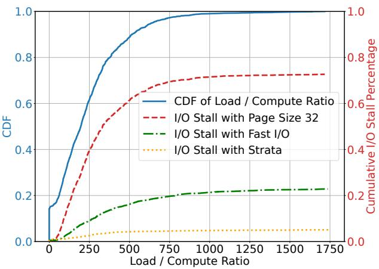  
Figure 1: Benchmark profile for Qwen2.5-14B on the LooGLE dataset. The x-axis shows the Load / Compute Ratio (tokens loaded from CPU memory relative to new input tokens) per prefill batch. The right axis displays the I/O stall percentage, representing the amount of prefill execution time attributed to I/O stall. See §5.3 for full benchmark details.

Second, current schedulers are blind to cache-loading costs and delay hits. Existing systems [26, 36, 53] implicitly assume that the computation needed to prefill new tokens is sufficient to hide the latency of loading historical KV cache from slower memory tiers. However, as context lengths grow, this assumption no longer holds: cache loading time can exceed the compute time needed for prefill, leaving the system loading-bound rather than compute-bound. Figure 1 also highlights this effect. Even with our optimized I/O mechanism presented in §4.2, which removes the overhead of small page transfers (green curve), up to 24% of prefill execution time remains stalled on cache loading. Schedulers that ignore these I/O-bound characteristics generate imbalanced batches, unable to effectively hide cache-loading delays. Moreover, when serving emerging agentic workloads that query same context concurrently, we observe the delay hit phenomenon [8], where multiple requests for the same long context arrive while an initial cache miss is still being resolved. This reduces the ef fective cache hit rate, especially in high-throughput systems, and causes redundant computation of long contexts as we further detail in §3.2 and §5.3.4.

To address these bottlenecks, we propose Strata, a hierarchical context caching framework designed for long context language model serving, without performance degradation in short-context scenarios. Strata employs GPU-assisted data transfer to combat KV cache fragmentation and decouples the GPU’s memory layout from that of other memory tiers, improving I/O efficiency across the hierarchy. Strata further reduces long-context overheads through cache-aware request scheduling. It mitigates delay hit, constructs balanced batches that pair sufficient prefill computation to cover I/O latency, and when cache loading stalls are unavoidable, the scheduler inserts useful complementary tasks (e.g., decoding batches) to fully utilize available compute resources. Together, these techniques ensure that scheduling remains efficient even under highly variable latency budgets.

Strata has been integrated into SGLang [53], a widely adopted open-source framework for LLM serving, and has been deployed in production environments at several leading AI companies. Our evaluation on popular long-context benchmarks, across a range of models and hardware platforms, shows that Strata improves throughput by up to 5× over vLLM-LMCache [30], a state-of-the-art open-source hierarchical context caching solution, and by up to 3.75× over NVIDIA’s TensorRT-LLM, a highly optimized serving engine, without performance degradation on short-context scenarios.

## 2 Background

## 2.1 Long Context LLM Inference

LLM inference operates in two phases: prefill and decode. During prefill, the model typically processes both (i) new tokens from the user query and (ii) context tokens, drawn from sources such as documents or prior interactions. The intermediate outputs of this step, known as KV caches, are critical for efficiency because they allow subsequent tokens to attend to past tokens without recomputing all previous layers. In the decode phase, the model generates tokens autoregressively, continually reusing and extending the KV cache. Long contexts amplify the cost of both phases. A longer prefix increases prefill latency, and if cached states are evicted or unavailable, recomputing that prefix becomes increasingly expensive. During decode, each generated token reuses and extends the KV cache, whose size grows linearly with sequence length. As a result, for long-context workloads, KV cache memory footprint and data movement can become dominant bottlenecks, making efficient cache reuse, placement, and eviction critical for high-throughput, low-latency serving.

## 2.2 Memory Management of KV Cache

Inspired by virtual memory, PagedAttention [26] avoids reserving large contiguous blocks for KV caches by using dynamic, page-based allocation. The cache is partitioned into small fixed-size pages that preserve logical sequence order but can be placed non-contiguously in memory, improving utilization. Typical page sizes are small — e.g., 32, 16, and 1 tokens in TensorRT-LLM, vLLM, and SGLang — and the KV states of a single token may span from tens of kilobytes to several megabytes. While such fine granularity is manageable for compute kernels, it poses efficiency challenges for data movement across memory tiers, as we will discuss in §3.1.

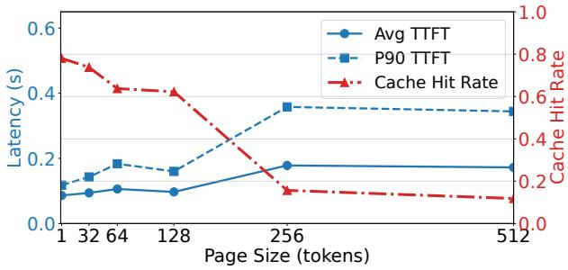  
Figure 2: Large page sizes decrease cache hit rate and in crease TTFT, benchmarked on H200 for Mistral-24B using the ShareGPT dataset.

## 2.3 Context Caching in LLM Serving

Beyond intra-request reuse, systems exploit context caching across requests by identifying common prefixes using structures like prefix trees or hash maps [26, 43], widely adopted by providers such as OpenAI [41] and Google [17]. To extend capacity, caches are stored in slower tiers such as CPU memory [16,22,52], distributed memory pools [19,29,43], or even disk [14, 21, 30]. Recent systems, e.g., CachedAttention [14], overlap cache loading with computation on a layer-by-layer basis to minimize stalls, while asynchronously backing up newly generated caches to lower tiers.

## 3 Challenges of Long Context Caching

This paper addresses the challenge of managing large context caches for long-context (i.e., prefill-dominated) workloads. While this is not the only LLM scenario (i.e., short context, long generation, or single-turn workloads exist), long-context workloads constitute an important class of real-world deployments [6, 25, 28]. We next explore the systems challenges that arise in long-context workloads.

## 3.1 Low Bandwidth Utilization in KV Cache Transfers

The achievable throughput of an I/O subsystem is fundamentally constrained by the relationship described by Little’s Law. Let λ be the arrival rate of I/O operations, C be the average number of concurrent I/O operations, and L be the average latency per operation. According to Little’s Law, we have C = λ · L. Let X represent the sustained data throughput (e.g., in GB/s), S be the average data size per I/O operation, the throughput can be described as X = λ · S. Combining with Little’s law we have X = C ·S/L describing attainable throughput in a stable state. This equation highlights that maximizing data throughput (X) requires either high concurrency (C), large transfer sizes (S), or low latency (L).

To transfer data between CPU and GPU memory, asynchronous operations like cudaMemcpyAsync are typically used to engage the GPU’s Direct Memory Access (DMA) engine [33]. However, the latency (L) in this scenario includes non-negligible CPU-GPU communication overhead and scheduling delays [20]. While concurrency (C) can be in creased by launching numerous asynchronous I/O operations, practical limits arise from the available application-level parallelism (e.g., on the CPU) and the queue capacities within the GPU driver (e.g., CUDA driver) and hardware [33, 44]. Consequently, increasing the transfer size (S) often becomes the most practical lever for improving bandwidth utilization. Saturating modern high-bandwidth interconnects underscores this point; for example, achieving 75-80% of theoretical PCIe 5.0 bandwidth necessitates transfer sizes (S) in the megabyte range (i.e., 1-2MB). This principle is not limited to CPU-GPU transfers; achieving high throughput on other media like SSDs or network interfaces often demands even larger transfer sizes [9, 13, 32].

Cost of Large Pages. However, contrary to requirement of transfer efficiency, LLM inference systems favor small granularity. Smaller pages, e.g., in the range of 1-32 tokens, generally lead to better memory utilization [26] and can improve cache hit rate [34], as cache matching is performed on a per-page basis. While increasing the page size (i.e., compacting more tokens into a single continuous page and effectively increasing S) may appear to improve bandwidth utilization based on the formula, it introduces substantial performance penalties for LLM inference. To demonstrate this trade-off, we benchmarked a Mistral-24B model using the popular ShareGPT dataset, varying the KV cache page size from 1 to 512 on the SGLang framework. As shown in Figure 2, increasing the page size leads to a significant drop in the KV cache hit rate. This degradation directly results in a substantial increase in both the average and P90 TTFT, which rise by up to 2× and 2.9×, respectively, at the largest page sizes tested. We also observed similar trends in long context benchmarking scenarios as shown in Figure 10.

This preference for small pages results in very small effective transfer sizes (S) for KV cache operations, leading to severely underutilized I/O bandwidth. As illustrated in Figure 3, transferring KV cache data for 8192 tokens achieves only approximately 22% of the theoretical PCIe 5.0 bandwidth. Page size is set to 32, a value recommended in prior works on hierarchical KV cache [14, 19, 21, 52] and a maximum supported size in vLLM for CUDA GPUs [48]. This underutilization is exacerbated on platforms with even higher interconnect bandwidths, falling to as low as 5% on systems like NVIDIA’s Grace-Hopper platform that replaces PCIe with NVLink and offers 6× higher peak bandwidth. This fundamental trade-off between transfer efficiency and caching benefit underscores the need for a more effective I/O mecha nism that can achieve the best of both worlds.

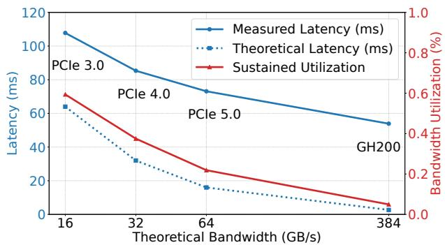  
Figure 3: Latency and bandwidth utilization of loading KV caches of 8192 tokens (using page size 32) of Llama-3.1-8B from CPU to GPU on different platforms.

## 3.2 Resource Orchestration and Delay Hits

LLM serving engines often treat GPU compute and HBM as first-class resources, since sub-tasks are usually either compute-bound (e.g., dense and attention computation in prefill) or memory-bound (e.g., decoding). With the introduction of hierarchical KV caching, this picture largely remains unchanged. Existing works either regard KV cache loading from CPU to GPU as negligible [14, 52], assuming the latency of loading cache data of layer N + 1 via PCIe can be effectively hidden by overlapping I/O with the computation of layer N; or else opt for recomputation when the cost is justified [23]. However, when serving requests with long cached contexts but relatively few new tokens to prefill, this assumption breaks down. On one hand, the latency of bulk KV cache transfers can exceed what layer-level computation can hide; on the other hand, recomputation becomes increasingly costly as context length grows, making it an unattractive alternative. Consequently, layer-wise overlapped prefill can degrade into a PCIe bandwidth-bound task. Figure 1 illustrates this bottleneck: even with an I/O mechanism achieving 75% of theoretical PCIe bandwidth, stalls still account for up to 24% of prefill execution time.

Compounding this challenge is the delay hit phenomenon [8], previously studied in the networking community. It occurs when multiple requests for the same data object arrive while an initial cache miss is still being resolved, so subsequent requests are effectively treated as cache misses, even though they would have been cache hits had the first request completed. We observe an analogous effect in LLM serving: under high traffic, multiple requests that target the same context (or a prefix of it) may arrive within a short time window, which is especially common in emerging agentic workloads where concurrent attempts often reuse the same context. For example, in the Mooncake agent tool trace [43], 38% of requests share a prefix of at least 6k tokens (excluding the system prompt) with at least one other request arriving within a one second window, making delay hits highly likely in high-throughput serving systems. As illustrated in Figure 7, when such requests are scheduled to execute concurrently (either within the same batch or across data parallel instances), redundant prefill computation occurs. This problem is exacerbated by the asynchronous schedulers widely adopted in modern serving engines [47,55], which prepare the next batch before the ongoing one completes, extending the cache-miss resolution window to the full execution time of a batch and making delay hits more likely. The impact is especially severe in long-context scenarios, where both recomputation cost and cache-miss resolution time scale unfavorably.

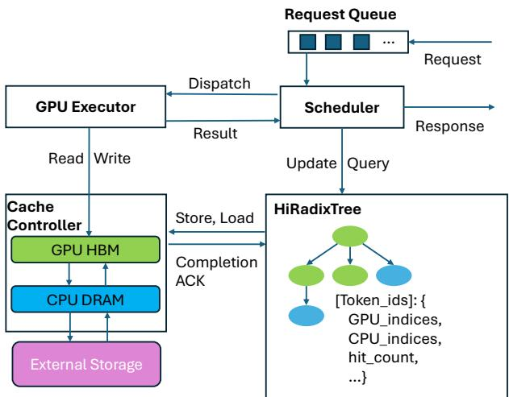  
Figure 4: System Architecture of Strata

These observations highlight the need to re-think scheduling policies in LLM serving. Schedulers must explicitly treat CPU-GPU bandwidth as a first-class resource, balancing computation and data transfer when batching requests, more carefully overlapping I/O with compute, and mitigating delay hits to avoid redundant work while sustaining throughput.

## 4 Strata’s Design and Implementation

## 4.1 Overview

Motivated by challenges discussed in §3, we built Strata, a system with two key components. The Strata Cache Controller (§4.2) manages the data plane elements throughout the memory hierarchy. It introduces an optimized GPU-CPU data transfer mechanism and manages KV cache memory layouts to support efficient small page transfers as motivated in §3.1. The Strata Scheduler (§4.3) implements the control plane that intelligently schedules requests in a cache resource-aware manner as motivated in §3.2. It references a HiRadixTree, which is an extension to SGLang’s RadixTree [53], effectively serving as a page table and stores metadata about each KV cache page.

Figure 4 presents the Strata architecture. When a request is submitted, it enters a request waiting queue. During the execution of the ongoing batch, the Scheduler continuously estimates available system resources and the resource demands of queued requests, and selects a subset to form the next batch. The Scheduler then sends this batch to GPU executor and initiates a KV cache loading request to the Cache Controller. During the execution of the prefill batch, the GPU executor synchronizes with the Cache Controller to ensure that the KV cache of a certain layer is available before the execution using CUDA events. Once prefill is complete, the prefilled requests are merged into a consolidated decoding batch via continuous batching [51]. Strata uses a prefill-decode (P-D) co-location design, alternating the execution of prefill and decoding batches temporally on the same GPU, and follows SGLang’s practice to prioritize the execution of the prefill batch for shorter response time (TTFT) and to form a larger decoding batch for higher throughput. Finally, the Cache Controller actively manages the backup and eviction of any KV cache pages to lower memory hierarchies asynchronously.

## 4.2 Efficient KV Cache I/O

To address the limitations discussed in §3.1, inspired by established practices within the computer architecture community [33,44], Strata leverages GPU-assisted I/O to transfer KV cache pages between CPU and GPU memory for low-latency I/O on small, fragmented data. Specifically, instead of invok ing standard cudaMemcpyAsync API repetitively with small data transfers, a GPU-assisted I/O job operates by launching a CUDA kernel. This kernel spawns thousands of threads. Each thread is responsible for loading a small chunk of data from a source (either GPU global memory or CPU registered pinned memory) into its local register files and then streaming this data to a destination (GPU global memory or registered CPU pinned memory).

GPU-assisted I/O offers several advantages: First, it enables enhanced concurrency (C): GPUs provide massive, cost-effective parallelism, supporting thousands of concurrent I/O operations compared to typically only tens on CPUs. Second, it is compatible with small transfers (efficient S): the granularity required for efficient GPU-assisted I/O is only 128 bytes on most architectures [39], which is sufficiently fine for single-page KV caches (kilobytes), eliminating the need to inflate page size for efficiency. Finally, it allows flexible memory layout: since light computation in I/O kernels is virtually free, layout transformations between GPU and CPU memory can be performed at negligible cost, enabling flexible and efficient data organization (see §4.2.1 for details).

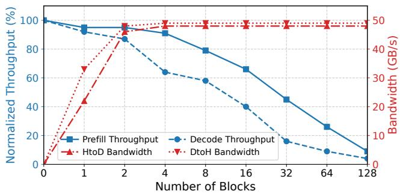  
Figure 5: Performance interference vs. resources allocated to the KV-cache I/O kernel. Measurement on concurrently running Strata’s I/O kernel with a prefill pass (batch of two requests with 4k input each) and a decode pass (Llama-3.1- 8B, batch of 16 requests with 4k input each), respectively.

However, a challenge associated with GPU-assisted I/O, as highlighted in prior work [20], is runtime interference when co-running with other kernels. Without dedicated hardware handling the fine-grained I/O tasks, GPU threads consume valuable resources, such as register files and execution cycles, and can lead to cache pollution. Prior work [31] also demonstrated that GPU hardware schedulers often struggle to effectively manage this resource contention, potentially degrading the performance of both the I/O operations and concurrent computational kernels.

We observe that efficient data transfer does not need to monopolize the entire GPU. Strata employs a strategy of launching a small number of large CUDA blocks to incentivize the GPU’s hardware scheduler to confine these I/O kernels to a small subset of Streaming Multiprocessors (SMs), as few as 1. This targeted allocation, when combined with low-level instructions to bypass the cache and thereby mitigate pollution, minimizes interference with concurrent workloads. Moreover, with the ROCm backend [2], these kernel implementations are also compatible with AMD GPUs. To balance resources for overall efficiency, we conducted microbenchmarks corunning I/O kernels with prefill and decoding kernels on an NVIDIA H200 GPU. As shown in Figure 5, using only two CUDA blocks of 1024 threads each, Strata achieves 48 GB/s transfer throughput while incurring less than 5% performance degradation on prefill and 10% on decoding. Based on these results, we select two blocks as the default quota for loading data from CPU to GPU (a critical path operation), and one block for backing up data from GPU to CPU (a non-critical path), where the bandwidth is already sufficient and overhead must be minimized. Our end-to-end evaluation confirms that this configuration sustains high I/O bandwidth while keeping overall performance impact under 5%, demonstrating that carefully tuned GPU-assisted I/O can be both efficient and non-intrusive.

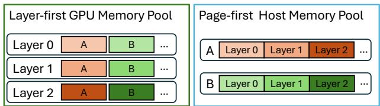  
Figure 6: Layer-first vs. Page-first layouts

## 4.2.1 Data Management Beyond Host Memory

When external storage is involved, the cache controller opportunistically prefetches data from storage into host memory whenever a cache hit is detected at the storage layer. The prefetch latency is overlapped with the request’s queuing delay. Once the scheduler selects the request for execution, the cache controller terminates any in-flight prefetch and uses whatever cache is already available in host or GPU memory. This default best-effort policy is motivated by the significantly higher and less predictable latency of the storage layer relative to host-GPU transfers, for which Strata employs a synchronized, layer-wise overlapping scheme. The Strata scheduler can also be configured to hold requests undergoing prefetching until prefetch completion (a wait-complete policy) or until a specified timeout (a timeout policy), depending on the deployment scenario.

Furthermore, the data transfer inefficiency caused by fragmented memory layout, as motivated in §3.1, also extends to other storage media. In addition to small pages, LLM serving systems also favor a layer-first memory layout in the GPU memory pool (shown in Figure 6), as it aligns with the layer-wise nature of LLM computation. Concretely, the layer-first layout stores all tokens of layer 0 contiguously, then all tokens of layer 1, and so on, so that a layer’s attention kernel reads its K/V as one contiguous span. This is ideal for compute but pessimal for transfer: a single logical page (one token’s K/V across all layers) is scattered into L noncontiguous fragments, one per layer, each only kilobytes. A transfer-friendly page-first layout instead stores all layers of a page contiguously, yielding large contiguous blocks that saturate the interconnect, but it would force every attention kernel through an extra layer of address indirection. By leveraging GPU-assisted I/O, Strata resolves this conflict by enabling a virtually free, on-the-fly transformation between the computefriendly and transfer-friendly layouts. To perform the layout transformation, a thread simply applies one additional arithmetic operation to its assigned offset to calculate the correct destination address. This operation has negligible overhead.

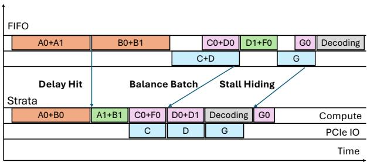

Figure 7: Scheduling Policies in Strata. Orange blocks denote prefill batches that incur a cache miss; green blocks denote cache hits in device memory; purple blocks denote cache hit in host memory; and blue blocks denote data transfer. The one decoding batch is shown in gray. Xn represents the n-th request that uses the context X.

As illustrated in Figure 6, this capability decouples the layout requirements across the memory hierarchy: the GPU can maintain its computation-friendly layer-first layout, while other media, such as host memory and external storage, can adopt a page-first layout that maximizes transfer efficiency with larger, contiguous data blocks. In §5.3.5, we demonstrate how this decoupled layout strategy significantly reduces data loading time.

## 4.3 Cache-Aware Scheduling

As motivated in §3.2, the goal of the scheduler is to maximize caching benefit by avoiding delay hit and loading stalls. The Scheduler does so through three stages. First, it identifies requests that are potentially susceptible to delay hits and defers the execution to right after the delay hit is resolved. Second, it formulates a balanced batch that aims to pair loading (from host memory) with sufficient computation to hide the loading latency. Finally, in the event that batches are still loading-bound, the Scheduler hides I/O stalls by inserting useful compute inside bubbles. Note while the core scheduler of SGLang is implemented in Python, we augmented it with C++ implementation to minimize the overhead of these scheduling policies.

## 4.3.1 Deferral on Delay Hit

As discussed in §3.2, delay hits can cause redundant computation in two scenarios: (i) when multiple requests sharing the same cache miss are scheduled into the same batch (Figure 7), and (ii) when the execution of a request is prepared asynchronously without awareness that the corresponding context cache is still being computed. To keep track of potential delay hit, we introduce transient nodes in the HiRadixTree. Similar to standard nodes, they use token IDs as traversal keys, but instead of pointing to memory indices, they carry one of two marks: in-queue, indicating that a request is referencing a new context, and in-flight, indicating that the cache for the corresponding tokens is under computation. When iter ating over the request queue, Strata inserts transient nodes marked in-queue as needed. If a request matches existing transient nodes, it is deferred to the next scheduling round but placed at the front of the waiting queue to benefit from the soon-to-be-hot cache and minimize its impact on TTFT.

Algorithm 1 Balanced Batch Formation   
1: procedure ADDBUNDLEHIT(Q,B)   
2: for each r in Q do   
3: if B.is\_bundle\_hit(r) then   
4: B.add(r); Q ← Q − r   
5: function BATCHFORMATION(Q)   
6: B ← Batch(); D ← [ ]   
7: B.add(Q.pop(0)); ADDBUNDLEHIT(Q,B)   
8: while |Q| > 0 and ¬B.is\_full() do   
9: r ← Q.pop(0)   
10: if B.loading\_bound(r) then   
11: D.append(r)   
12: else   
13: B.add(r); ADDBUNDLEHIT(Q,B)   
14: for each r in D do   
15: if B.is\_full() then break   
16: B.add(r)   
17: return B

When a request proceeds to execution, its associated transient nodes are marked in-flight. Upon completion, the nodes are converted into standard nodes, with indices pointing to the ready context cached in memory. To prevent unnecessary deferrals, Strata uses a configurable threshold: a request is deferred only when the number of token matches on transient nodes exceeds this value. We use a default threshold of 100 matched tokens, which avoids deferring short incidental prefix matches while still capturing long-context delay hits.

## 4.3.2 Balanced Batch Formation

After removing candidates susceptible to delay hits, the scheduler selects requests to form the next prefill batch. In most LLM serving engines [26, 53], batch formation follows a first in, first out (FIFO) policy by default, where requests are taken in arrival order until the batch is full (either reaching a preset token limit or exhausting GPU memory). To address the loading-bound issue discussed in §3.2, Strata introduces a new batch formation mechanism that balances data loading with sufficient computation. An example is illustrated in Figure 7, a batch containing requests C0 and D0 would require loading both contexts, causing a loading stall. In contrast, forming a different batch (C, F) could get the loading of C overlapped.

Another useful case is the batch (D0, D1): since they share the same context, batching them not only balances loading but also reduces GPU memory usage and on-device bandwidth pressure, further improving efficiency. We refer to this case as a bundle hit, the counterpart of a delay hit.

The procedure is detailed in Algorithm 1. Before each batch is formed, the scheduler obtains the load and compute requirements of each request using the HiRadixTree. During batch formation, as it iterates through the queue, the scheduler checks whether adding a request would reach the loading-bound limit (‘loading\_bound’ in line 10), defined as the ratio of aggregated load to compute. When this ratio exceeds a threshold, the batch is considered loading-bound. This threshold is hardware- and model-dependent and thus can be profiled separately; in practice, Strata uses a default ratio of 100, corresponding to the point where stalls begin to appear as shown in Figure 1. If the request fits into the batch without making it loading-bound, it will be added into the batch, then the scheduler will iterate through remaining requests to preferentially add requests that bundle-hit with it. Otherwise, the request is moved to a deprioritized list. If the batch is not full till the end of the queue, the scheduler supplements it with deprioritized requests (line 16). To prevent starvation, deprioritized requests retain their original order, and each batch formation always begins with the first request in the queue.

## 4.3.3 Hide Loading Stalls with Bubble Filling

Even with balanced batching, some batches can still be loading-bound. The final strategy of the scheduler is bubble filling that overlaps loading stalls with useful computation. An example is illustrated in Figure 7, when request G0 requires a long context load, the scheduler defers computation of the prepared prefill batch and instead issues a decoding batch to the model executor to run concurrently with the context loading. This strategy complements SGLang’s default prefill-first policy (as discussed in §4.1), allowing some flexibilities when choosing between prefill and decoding for improved overall utilization. Although decoding batches are also I/O-bound, they primarily saturate HBM bandwidth, whereas loading tasks saturate PCIe bandwidth. This distinction enables the two operations to overlap with minimal resource contention. It is also possible to insert a prefill batch to fill the bubble, which is more applicable to P-D disaggregated systems [54].

## 4.4 Cache Controller and Policy

As illustrated in Figure 4, the cache controller oversees data movement between the various memory hierarchies. When a new batch is prepared for execution, the scheduler initiates the loading of the KV cache to the GPU via HiRadixTree. Subsequently, during execution, the GPU executor consults the cache controller to ensure that the KV cache data for specific layers is available before proceeding to the execution of the subsequent layer. Upon completion of prefill or decoding requests, the scheduler initiates the storage of the KV cache to slower memory tiers, backing up specific KV cache data according to the designated cache write policy.

A single write-once policy is insufficient for hierarchical context caching because different serving workloads impose different trade-offs among write bandwidth, cache capacity, durability, and future reuse. Writing every generated KV page immediately maximizes reuse and persistence, but it can waste host memory and write bandwidth for one-off requests. Writing only at eviction minimizes write traffic, but it can add blocking work to the critical path when GPU memory is under pressure. Strata therefore exposes three write policies that correspond to three deployment regimes. The first, write-back, only backs up KV cache tokens when they are on the verge of eviction. This approach is suitable for resource-constrained environments as it minimizes bandwidth and capacity usage, though it can introduce additional runtime blocking. The second policy, write-through, initiates a backup each time new KV caches are generated and is well-suited for conversational scenarios where all input and generated content must be persistently stored. The third and default policy is selective-writethrough. With this approach, a counter is associated with each node in the HiRadixTree and increments with each access to that node. A backup is triggered only if this counter exceeds a configurable threshold. This policy offers the most flexibility: setting the threshold to one makes it equivalent to the write-through policy, while higher values can reduce the memory footprint, particularly for scenarios like single-round question-answering tasks. The default threshold is set to 2 when write bandwidth is abundant, but it can be increased to accommodate tighter resource constraints. For all memory layers, the Least Recently Used (LRU) algorithm serves as the default eviction policy.

## 5 Evaluation

## 5.1 Methodology

Testbed. We evaluate Strata and baselines on three platforms. The H200 platform is a node equipped with 8 NVIDIA H200 GPUs interconnected with NVLink, an Intel Sapphire Rapids CPU, and 1.6TB of DRAM. Each GPU is connected to the CPU via a PCIe 5.0 x16 link, offering up to 64 GB/s of peak bandwidth (unidirectional). The H20-storage is a node with 8 NVIDIA H20 GPUs and an Intel P5510 NVMe drive, providing up to 7 GB/s disk read bandwidth. The GH200 platform is a GH200 Grace Hopper superchip [35] node, which contains one NVIDIA H100 GPU integrated with one NVIDIA Grace 64-core ARM CPU. The GH200 system is equipped with 464 GB of LPDDR5X DRAM, providing up to 384 GB/s of memory bandwidth (unidirectional) to the CPU.

Baselines. We compare Strata with following state-of-theart baselines. vLLM [26] is a popular open-source serving engine. Additionally, vLLM-LMCache enables hierarchical caching on vLLM using the official community extension of LMCache [30]. For our benchmarks, we used vLLM v0.8.5 and LMCache v0.2.1. The LMCache chunk size is set to 256 as default and vLLM page size was set to 32 in line with prior work [14]. TensorRT-LLM [36] (TRT-LLM) is an opensource serving library from NVIDIA, specialized for NVIDIA GPUs. Additionally, TRT-LLM-HiCache enables hierarchical caching on top of TensorRT-LLM through its automatic CPU memory offloading feature. We used TensorRT-LLM v0.17.0 in our benchmarks, with the page size also set to 32 as default. SGLang [53] is an open-source serving engine that delivers comparable performance to vLLM, while offering a more lightweight and customizable architecture. To enable a direct comparison to Strata, we implemented SGLang-HiCache which incorporates a state-of-the-art layer-wise KV cache transfer overlapping and hierarchical caching implementation using cudaMemcpyAsync transfers, which is in line with prior work including CachedAttention [14], Pensieve [52] and FlashGen [21]. We used SGLang v0.4.5 for all three systems. We set the page size for SGLang and Strata to 1 (SGLang’s default), and the page size for SGLang-HiCache to 32 to be consistent with other hierarchical cache baselines.

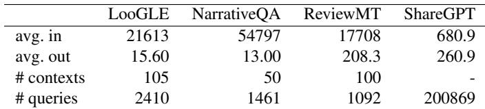  
Table 1: Dataset statistics.

Models. We utilize three popular open-source LLMs with long context capabilities, spanning small, medium, and large sizes: Llama-3.1-8B-Instruct [3] (128k context window), Qwen2.5-14B-Instruct-1M [46] (1M context window), and Llama-3.1-70B-Instruct [3] (128k context window). We use a single GPU to serve the 8B and 14B models, and 4 GPUs configured with tensor parallelism for 70B model.

Datasets. We construct workloads from three long context datasets. LooGLE [28] features long documents from diverse sources such as arXiv, Wikipedia, and movie/TV scripts. In our benchmarks, we use its Wikipedia portion, which provides both long and short queries paired with the documents. NarrativeQA [25] is an influential long-context dataset for testing models’ reading comprehension capabilities, featuring even longer context examples than LooGLE. We filtered documents exceeding 128k tokens because of context window limit of the test models, and sampled 50 documents from the remainder. These two datasets mirror classic RAG use cases, in which extensive contexts are repeatedly queried by multiple users over time like question-answering systems over technical manuals [15]. ReviewMT [45] is a multi-agent conversation dataset, where agents simulate reviewers to converse about the quality of technical papers to make final decisions. This represents a typical agentic workflow involving long contexts and relatively longer output compared to other datasets. We also include a dataset to evaluate Strata’s performance in short-context scenarios. ShareGPT is a popular conversational dataset comprised of a large collection of relatively short conversation histories from thousands of users, and was used in prior hierarchical KV caching studies [14,52]. Table 1 summarizes the characteristics of these datasets.

Since individual query timestamps are not available in these datasets, we simulate query arrivals using a Poisson distribution to benchmark the system using varying request rates, following prior works [21, 52]. For conversational benchmarks (ReviewMT and ShareGPT), we preserve dependencies across conversation rounds. Consistent with the methodology in Pensieve [52], we insert a 60-second “thinking time” between an LLM’s response and the user’s subsequent query for ShareGPT. For the long-context benchmarks, queries are randomly sampled from the dataset. In §5.3.3, we further examine the performance characteristics under different workload patterns. To avoid benchmark timeouts and unbounded client-side queuing, we cap the maximum number of in-flight requests at 128. Note this is a concurrency cap, not a fixed batch size as the actual prefill batch size is determined by each serving engine’s scheduler, token budget, and available GPU memory. GPU memory is allocated according to each serving engine’s default policy to ensure fairness and performance. An exception is the ShareGPT dataset, where we restrict GPU memory to approximately 500K tokens to highlight the behavior of hierarchical caching baselines. For caching configurations that utilize CPU memory, we allocate 1 TB of system DRAM as pinned memory (400 GB on GH200 due to plat form limits). Disk storage is not used in most benchmarks except in §5.3.5 due to limited support in baseline systems.

## 5.2 End-to-end Performance Comparison

Strata is designed to improve long-context serving by reducing response latency and increasing overall throughput. Accordingly, we evaluate the system using two primary metrics: average Time To First Token (TTFT) and output token throughput. TTFT captures query response time, a key determinant of user experience, while output token throughput is a widely adopted metric for characterizing LLM serving system performance [1].

## 5.2.1 How does the performance of Strata compare to state-of-the-art LLM serving systems on longcontext workloads?

Figure 8 presents the achieved token throughput and corresponding average TTFT for each system under varying request rates across three models and four datasets. First, we observe that hierarchical caching is essential for highperformance long-context serving. Across all three models, non-hierarchical caching solutions perform poorly on LooGLE. Without hierarchical caching, long-context workloads rapidly exhaust GPU memory capacity, leading to frequent cache misses during prefills. This, in turn, triggers repeated recomputation, resulting in low throughput and high latency. By contrast, systems equipped with hierarchical caching achieve substantially higher throughput and lower latency, consistently reaching approximately 95% cache hit rate by leveraging CPU memory.

Second, Strata delivers substantial improvements over existing hierarchical caching solutions. For Llama-8B on LooGLE, Strata achieves up to 3.2×, 2.6×, and 1.9× higher throughput at the same TTFT compared to SGLang-HiCache, vLLM-LMCache, and TRT-LLM-HiCache, respectively. Similar gains are observed for Qwen-14B, Strata achieves up to 3.9×, 2.1×, and 1.9× improvements; and Llama-70B, the gains reach 5×, 5×, and 3.75×. A consistent trend is seen on ReviewMT. Although longer decoding reduces the dominance of prefill time, with Llama-8B, Strata outperforms SGLang-HiCache by 1.7×, vLLM-LMCache by 2.3× and TRT-LLM-HiCache by 2.3×. These performance gains stem from Strata ’s enhanced I/O efficiency and scheduling mechanisms, as further analyzed in §5.3.1.

## 5.2.2 How does Strata perform with a warm cache?

NarrativeQA presents much longer average context lengths, resulting in an extensive prefill phase that made nonhierarchical caching solutions impractical. Because this scenario presented the highest amount of memory pressure, we augmented this experiment to better understand steady-state performance characteristics (i.e., after the cache hierarchy has been filled)1. In this setup, we first warmed up the CPU memory by pre-computing KV caches for all contexts in the evaluation set and then flushed the KV cache on GPU memory to set the initial state. The second row of Figure 8 reports the throughput-latency curve after restarting the workload post-warmup. We report Strata, SGLang-HiCache, and vLLM-LMCache, as TRT-LLM-HiCache does not support prewarming. In this setting, Strata achieves up to 2.3×, 2.6× and 2.5× throughput compared with vLLM-LMCache on Llama-8B, Qwen-14B and Llama-70B models respectively.

## 5.2.3 How does Strata perform with short-context?

Strata was explicitly designed for long-context workloads. To understand the performance of Strata on short-context workloads, the final row of Figure 8 shows the average TTFT of the baseline systems, across three models, on the ShareGPT dataset. Note that the underlying SGLang engine exhibits a slight performance disadvantage compared to the base engines of vLLM and TRT-LLM on the Llama-8B and -70B models due to kernel differences. Taking this into account, Strata demonstrates comparable performance to the other state-ofthe-art systems on short-context workloads.

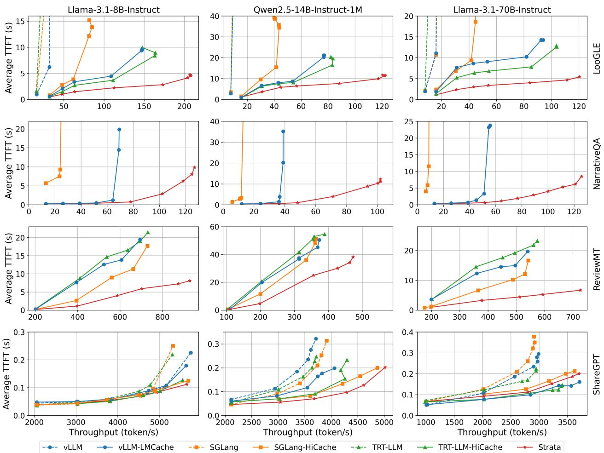  
Figure 8: End-to-end benchmark performance comparison on H200.

## 5.3 In-depth Performance Analysis

In this section, we conduct several breakdown analyses to better understand the performance benefits offered by Strata. Unless otherwise specified, all analyses use the LooGLE benchmark with Qwen2.5-14B model on an H200 platform.

## 5.3.1 How much do efficient I/O and scheduling benefit Strata?

Figure 9 presents the throughput-latency curves of Strata compared to three baselines. On top of SGLang-HiCache, we build and evaluate three ablated variants: Strata-IO, which incorporates the GPU-assisted I/O mechanism from §4.2, Strata-Schedule-Only, which applies the scheduling policy from §4.3, and Strata-IO-LPM, which integrates a longest prefix match (LPM) policy [53].

The results show that both the Strata-scheduling and Strata-IO components significantly improve the baseline hierarchical design, achieving up to 1.8× and 2.3× higher peak throughput, respectively. Each component alleviates the loading stall problem from a different perspective. Under low request rates, Strata-scheduling tends to deliver greater gains than Strata-IO, since smaller batch sizes generate lighter I/O pressure that can be more effectively mitigated by advanced scheduling. As the request rate increases, however, the I/O subsystem becomes the dominant bottleneck, making the GPU-assisted I/O mechanisms essential for sustaining high throughput.

We further compare vLLM-LMCache and TRT-LLM-HiCache directly with Strata-IO, since all three employ CUDA kernels to accelerate KV-cache I/O. As shown in Figure 9, their performance is comparable at low request rates, but Strata-IO maintains higher throughput as the request rate rises, indicating more effective mitigation of interference at scale. We also compare Strata with Strata-IO-LPM, which increases the reuse count of on-device pages, thereby indirectly reducing host-side loading pressure and improving performance under low request rates. However, at higher request rates, it fails to sustain performance gains due to more frequent cache evictions. In contrast, Strata consistently delivers improvements because it explicitly accounts for bandwidth resources in its design.

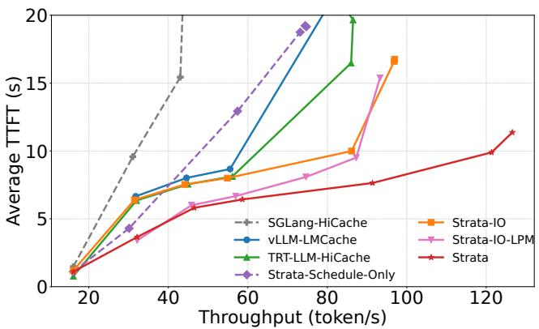  
Figure 9: Breakdown of I/O and scheduling of Strata.

## 5.3.2 Can Strata alleviate the burden of choosing a page size?

As discussed in §3.1, page size introduces inherent trade-offs among cache hit rate, I/O efficiency, and overall performance. This makes selecting the optimal page size a practical but nontrivial problem. Strata makes transfer efficiency much less sensitive to page size, reducing the need to choose large pages solely to obtain efficient transfers. To validate this claim, Figure 10 reports the peak throughput of SGLang-HiCache across different page sizes, normalized to Strata-IO. For SGLang-HiCache, increasing the page size initially improves throughput, since larger pages reduce loading stalls. However, beyond a certain threshold, throughput declines as cache hit rate deteriorates. Even at its best-performing setting (page size 512), SGLang-HiCache achieves only 93% of Strata-IO’s performance, primarily due to a 2.4% lower cache hit rate.

## 5.3.3 Can Strata adapt to varying cache distances?

Cache distance is an important property of a trace for testing cache system performance. To further augment the cache distance of our workloads, we generate two additional workloads based on the LooGLE dataset. In addition to our original (shuffle) workload, we create a minimum cache distance workload, where requests sharing the same context are lined up together, and a maximum cache distance workload, where queries sharing the same context are evenly distributed in the queue. As shown in Figure 11, we observe that with minimal cache distance, there is no need for hierarchical caching due to the perfect locality. In this scenario, delay hit mitigation benefits the most by improving effective cache hit rate, increasing peak throughput by 42%. However, delay hit mitigation offers no benefit in the max cache distance scenario because the high distance between similar requests naturally reduces the likelihood of the delay hit phenomenon. In contrast, the I/O efficiency mechanisms presented in §4.2 result in an improvement of 76% and 95% for the shuffle and maximum cache distance, respectively, as larger cache distances result in more cache hits to CPU DRAM. On top of that, balance batch further introduces 11% and 12% of the peak throughput improvement, respectively. Stall hiding further contributes 8% and 3% for shuffle and max cache distance, with higher benefit to the shuffle pattern due to higher variance.

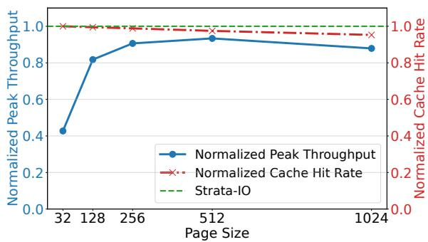

Figure 10: Performance comparison between Strata-IO and SGLang-HiCache with different page sizes.  
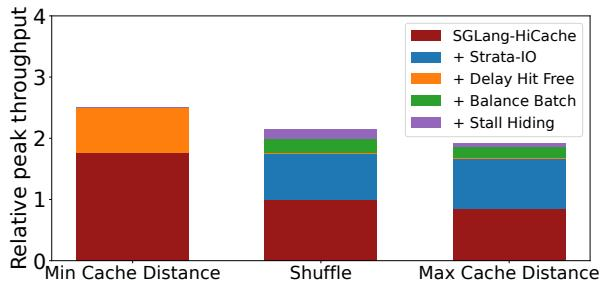  
Figure 11: Breakdown of Strata’s optimization attributions on different workload patterns.

## 5.3.4 What causes delay hit?

Beyond the request patterns discussed in §5.3.3, two systemlevel factors largely govern the severity of the delay hit effect: cache resolve time and system throughput (and thus the request arrival rate). As shown in Figure 12, longer cache resolve times (driven by prefill and scheduling latency) and higher throughput levels both increase the number of cache misses due to delay hits. A typical cache resolve time for a 1k-token input ranges from hundreds of milliseconds to several seconds, depending on the model and hardware. Note we study this effect using a simulated execution of the Mooncake trace with an effectively unlimited cache (to eliminate eviction effects), since our testbed cannot sustain sufficiently high throughput.

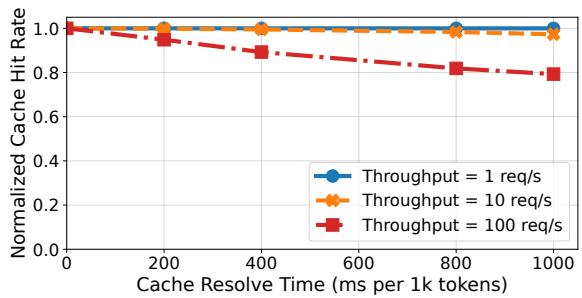

Figure 12: Delay hit impact for the Mooncake Tool-Agent trace under varying cache resolve times and throughputs. Different throughputs are achieved by scaling query timestamps.  
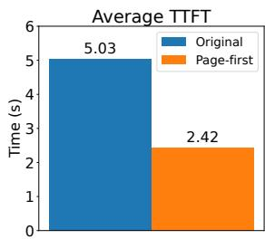

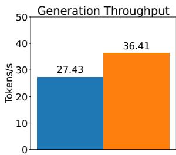  
Figure 13: End-to-end performance improvement of the decoupled memory layout for DeepSeek-V3 on 8×H20 GPUs, with page size 32 and request rate 12 req/s.

## 5.3.5 Does the decoupled memory layout benefit disk caching?

GPU-assisted I/O enables a page-first layout in host memory (and disk) without changing the GPU-resident layout (§4.2.1). Because the disks on the H200 testbed are bandwidth-limited (<1 GiB/s), we evaluate this effect separately using the DeepSeek-V3 [12] model on the H20-storage platform. As shown in Figure 13, at a request rate of 12 req/s, the page-first layout improves average TTFT by 2.1× and throughput by 1.3× over an already reasonably large page size.

## 5.4 Benchmark on GH200 machine

Finally, we explored how Strata aligns with emerging hardware trends that dramatically increase the bandwidth between CPU and GPU. To do so, we benchmarked SGLang-HiCache, Strata-IO and Strata on both our H200 and GH200 platform. We also report a Strata-Oracle platform, which simulates the TTFT achieved by a system that had infinite bandwidth between the CPU and GPU.

Figure 14 reports the average TTFT achieved by SGLang, Strata-IO, and Strata across both of these platforms benchmarking Llama-3.1-8B models with LooGLE dataset. Figure 15 reports the averaged sustained bandwidth for the same task. We observe that, in line with our previous evaluation results, standard DMA-managed memory copy is not able to effectively utilize hardware improvement without using larger pages. While the improved bandwidth of GH200 improves latency for the SGLang baseline, only hardware improvements alone cannot outperform even Strata-IO on the H200 platform.

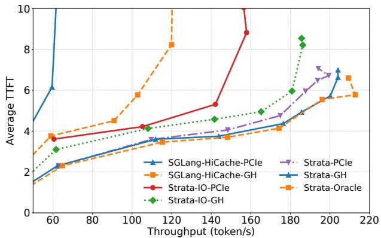

Figure 14: A zoomed-in comparison between benchmarks on PCIe-5.0 and Grace-Hopper platform.  
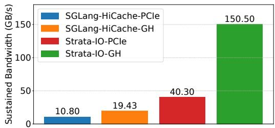  
Figure 15: Sustained Bandwidth comparison.

In contrast, using Strata-IO increases sustained host-GPU transfer bandwidth from 40 GB/s to 150 GB/s. However, scheduling improvements are still needed to take full advantage of platforms like Grace Hopper. While Strata-IO-GH achieves higher throughput with higher bandwidth mitigating the I/O stall, it still does not even outperform Strata-PCIe. In summary, Strata’s improved I/O transfer mechanisms with its bandwidth-aware scheduler can take full advantage of emerging platforms like Grace Hopper, achieving comparable performance to the Oracle setting. These benchmarks reveal that while increased interconnect bandwidth is beneficial, it’s often under-utilized by existing software. Ideally, leveraging new hardware capabilities, as demonstrated by Strata-GH’s near-oracle performance, could unlock new possibilities. Specifically, this platform shows promise for specialized, cost-effective, and high-performance long-context serving.

## 6 Discussion

Having demonstrated Strata’s advantages, we now discuss its limitations and directions for future work.

I/O Kernel Interference. As analyzed in §4.2, Strata’s GPUassisted I/O trades a small amount of SM contention for high transfer efficiency on small, fragmented pages. CUDA 12.8 recently introduced cudaMemcpyBatchAsync [38], which improves transfer efficiency by batching many small copy operations into a single host-driver submission. Because it engages the GPU DMA engine, it does not compete with concurrent computation for SM resources. In the same H200 microbenchmark used for Figure 5, its throughput is lower than our GPUassisted I/O kernel, 38 GB/s versus 48 GB/s. While this lower throughput could introduce additional stalls on the loading path, it makes the API a good fit for the less critical GPU-to-CPU backup path. Strata can therefore be configured to use the GPU-assisted I/O kernel for CPU-to-GPU loading and the batch-copy API for GPU-to-CPU backup, achieving competitive bandwidth while further reducing kernel interference. Looking forward, we plan to further reduce GPU-assisted kernel overhead and believe these results motivate more versatile on-chip I/O accelerators.

Fairness in Scheduling. Although §4.3.2 introduces a mechanism to prevent starvation, Strata’s scheduler prioritizes aggregate I/O and compute efficiency and can still treat requests unevenly, risking Service-level objective (SLO) violations for individual requests. A natural extension is to make batch formation SLO- and fairness-aware when allocating resources. The current policies also focus on hiding the latency of moving data from host DRAM to HBM; an equally promising direction is to create scheduling headroom for hiding the latency of prefetching from slower storage tiers, going beyond Strata’s current approach of overlapping prefetches with queuing delay.

Model Coverage. Strata targets hierarchical caching for the dense KV caches produced by standard attention. As hybrid mechanisms such as sparse and linear attention gain adoption, extending the same level of support to these models becomes increasingly important and raises distinct challenges in both memory management and scheduling-policy design.

## 7 Related Work

Context Caching and Sharing. Prior work has explored several mechanisms for reusing KV caches to avoid redundant computation. SGLang [53] uses a RadixTree to track shared context, while other serving engines such as vLLM [26] and Mooncake [43] employ hashing schemes that generate unique page identifiers from token IDs and prefix page hashes. LMDeploy [10] adopts a hybrid design with coarser-grained tries. Strata builds on SGLang by extending its RadixTree into a HiRadixTree. Beyond exact-prefix reuse, CacheGen [29] and CacheBlend [50] explore approximate KV cache sharing.

In contrast, Strata focuses on exact caching and does not affect model accuracy. Marconi [42] adds prefix cache support for hybrid LLMs, which is complementary to Strata and a promising direction for extending our framework to hybrid models.

KV Cache Offloading. Several recent works have explored utilizing secondary memory tiers (e.g., CPU DRAM, SSDs) for KV cache storage, loading them for computation on demand. CachedAttention [14] and Pensieve [52] both adopt a layer-wise strategy to overlap KV cache loading with computation. FlashGen [21] further enhances this pipeline with re-order execution scheduling, which has been implemented in SGLang and used in our baseline settings.

Efficient Host-GPU I/O. Practitioners have long recognized that GPUs can accelerate small data movement between GPU and CPU memory [33, 44]. Strata introduces a GPU-assisted KV-cache transfer mechanism tailored to LLM serving and, to our knowledge, provides the first quantitative analysis of the trade-offs between transfer efficiency, cache hit rate, and interference overhead. GDRCopy [24] and CUDA Unified Memory [37] enable low-latency fine-grained host-GPU data transfer, but their design makes it difficult to sustain the bandwidth required for large KV-cache transfers.

Large-scale KV Cache Disaggregation. Recent works propose building large-scale disaggregated KV cache memory pools and global resource coordinators to achieve caching benefits at a larger scale. Mooncake [43] exploits using resources including CPU, DRAM, SSD and NIC to establish a disaggregated KV Cache. MemServe [19] unifies inter-request and intra-request KV cache optimizations via a global scheduler and an elastic memory pool. Strata can benefit from these designs by integrating with their KV cache transfer engines. However, Strata focuses on memory management and scheduling within single compute instances and does not inherently rely on specialized hardware, such as high-speed networking, to realize its caching benefits.

## 8 Conclusion

This paper presented Strata, a hierarchical context caching framework that tackles the key bottlenecks of long-context LLM serving. By combining GPU-assisted I/O to mitigate KV cache fragmentation with cache-aware scheduling that balances computation and data transfer, Strata improves utilization across diverse latency regimes. Our evaluation shows that Strata outperforms state-of-the-art systems on long-context benchmarks while preserving strong performance on shortcontext workloads, establishing Strata as a practical and scalable solution for efficient long-context LLM serving.

## Acknowledgments

We are grateful to the anonymous reviewers for their constructive comments, which helped improve this paper. We thank Lingfan Yu for insightful discussions on Pensieve. We also thank Sicheng Pan, Tingwei Huang, Zhangheng Huang, Shuwen Wang, Teng Ma, Mingxing Zhang, Arnav Balyan, Moein Khazraee, Zhenwei Pi, Yi Zhang, Shangming Cai, Shiyang Chen, Ke Yang, and Ying Sheng from the SGLang open-source community for their valuable feedback and contributions. This research was supported in part by the Stanford Platform Lab and its affiliates. Zhiqiang Xie was supported by the NVIDIA Graduate Fellowship. We are grateful to NVIDIA and Nebius for providing computational resources.

## References

[1] Artificial analysis model leaderboards. https://arti ficialanalysis.ai/leaderboards/models.

[2] Advanced Micro Devices, Inc. ROCm™ Software 6.4.3 Documentation. https://rocm.docs.amd.com/en/l atest/, June 2025.

[3] Meta AI. Introducing llama 3.1: Our most capable models to date. https://ai.meta.com/blog/meta-lla ma-3-1/, July 2024.

[4] Meta AI. The llama 4 herd: The beginning of a new era of natively multimodal ai innovation. https://ai.m eta.com/blog/llama-4-multimodal-intellige nce/, April 2025.

[5] Anthropic. Prompt caching. https://docs.anthrop ic.com/en/docs/build-with-claude/prompt-c aching, 2024.

[6] Anthropic. Claude code: Agentic coding assistant. ht tps://code.claude.com/, 2025.

[7] Anthropic. Claude sonnet 4 now supports 1m tokens of context. https://claude.com/blog/1m-context, 2025.

[8] Nirav Atre, Justine Sherry, Weina Wang, and Daniel S. Berger. Caching with delayed hits. In Proceedings of the Annual Conference of the ACM Special Interest Group on Data Communication on the Applications, Technologies, Architectures, and Protocols for Computer Communication, SIGCOMM ’20, page 495–513, New York, NY, USA, 2020. Association for Computing Machinery.

[9] Qizhe Cai, Shubham Chaudhary, Midhul Vuppalapati, Jaehyun Hwang, and Rachit Agarwal. Understanding host network stack overheads. In Proceedings of the 2021 ACM SIGCOMM 2021 Conference, page 65–77,

New York, NY, USA, 2021. Association for Computing Machinery.

[10] LMDeploy Contributors. Lmdeploy: A toolkit for compressing, deploying, and serving llm. https://github .com/InternLM/lmdeploy, 2023.

[11] DeepSeek. Prompt caching. https://api-docs.de epseek.com/guides/kv\_cache.

[12] DeepSeek-AI. Deepseek-v3 technical report. https: //arxiv.org/abs/2412.19437, 2025.

[13] Assaf Eisenman, Asaf Cidon, Evgenya Pergament, Or Haimovich, Ryan Stutsman, Mohammad Alizadeh, and Sachin Katti. Flashield: a hybrid key-value cache that controls flash write amplification. In 16th USENIX Symposium on Networked Systems Design and Implementation (NSDI 19), pages 65–78, 2019.

[14] Bin Gao, Zhuomin He, Puru Sharma, Qingxuan Kang, Djordje Jevdjic, Junbo Deng, Xingkun Yang, Zhou Yu, and Pengfei Zuo. Cost-efficient large language model serving for multi-turn conversations with cachedattention. In Proceedings of the 2024 USENIX Conference on Usenix Annual Technical Conference, USENIX ATC’24, USA, 2024. USENIX Association.

[15] Yunfan Gao, Yun Xiong, Xinyu Gao, Kangxiang Jia, Jinliu Pan, Yuxi Bi, Yixin Dai, Jiawei Sun, Meng Wang, and Haofen Wang. Retrieval-augmented generation for large language models: A survey. arXiv preprint arXiv:2312.10997, 2(1), 2023.

[16] In Gim, Guojun Chen, Seung-seob Lee, Nikhil Sarda, Anurag Khandelwal, and Lin Zhong. Prompt cache: Modular attention reuse for low-latency inference. In P. Gibbons, G. Pekhimenko, and C. De Sa, editors, Proceedings of Machine Learning and Systems, volume 6, pages 325–338, 2024.

[17] Google. Prompt caching. https://cloud.google.c om/vertex-ai/generative-ai/docs/context-c ache/context-cache-overview.

[18] Google DeepMind. Gemini: Google deepmind’s most capable and general ai models. https://deepmind.g oogle/technologies/gemini/, 2025.

[19] Cunchen Hu, Heyang Huang, Junhao Hu, Jiang Xu, Xusheng Chen, Tao Xie, Chenxi Wang, Sa Wang, Yungang Bao, Ninghui Sun, and Yizhou Shan. Memserve: Context caching for disaggregated llm serving with elastic memory pool, 2024.

[20] Changho Hwang, KyoungSoo Park, Ran Shu, Xinyuan Qu, Peng Cheng, and Yongqiang Xiong. ARK: GPUdriven code execution for distributed deep learning. In

20th USENIX Symposium on Networked Systems Design and Implementation (NSDI 23), pages 87–101, Boston, MA, April 2023. USENIX Association.

[21] Jinwoo Jeong and Jeongseob Ahn. Accelerating llm serving for multi-turn dialogues with efficient resource management. In Proceedings of the 30th ACM International Conference on Architectural Support for Programming Languages and Operating Systems, Volume 2, page 1–15, New York, NY, USA, 2025. Association for Computing Machinery.

[22] Chao Jin, Zili Zhang, Xuanlin Jiang, Fangyue Liu, Shufan Liu, Xuanzhe Liu, and Xin Jin. Ragcache: Efficient knowledge caching for retrieval-augmented generation. ACM Trans. Comput. Syst., 44(1), November 2025.

[23] Shuowei Jin, Xueshen Liu, Qingzhao Zhang, and Zhuoqing Mao. Compute or load kv cache? why not both? In International Conference on Machine Learning, pages 28031–28043. PMLR, 2025.

[24] Kawthar Shafie Khorassani, Ching-Hsiang Chu, Hari Subramoni, and Dhabaleswar K. Panda. Performance evaluation of mpi libraries on gpu-enabled openpower architectures: Early experiences. In High Performance Computing: ISC High Performance 2019 International Workshops, Frankfurt, Germany, June 16-20, 2019, Revised Selected Papers, page 361–378, Berlin, Heidelberg, 2019. Springer-Verlag.

[25] Tomáš Kociský, Jonathan Schwarz, Phil Blunsom, Chrisˇ Dyer, Karl Moritz Hermann, Gábor Melis, and Edward Grefenstette. The NarrativeQA reading comprehension challenge. Transactions of the Association for Compu tational Linguistics, 6:317–328, 2018.

[26] Woosuk Kwon, Zhuohan Li, Siyuan Zhuang, Ying Sheng, Lianmin Zheng, Cody Hao Yu, Joseph Gonzalez, Hao Zhang, and Ion Stoica. Efficient memory man agement for large language model serving with pagedattention. In Proceedings of the 29th Symposium on Operating Systems Principles, page 611–626, New York, NY, USA, 2023. Association for Computing Machinery.

[27] Patrick Lewis, Ethan Perez, Aleksandra Piktus, Fabio Petroni, Vladimir Karpukhin, Naman Goyal, Heinrich Küttler, Mike Lewis, Wen-tau Yih, Tim Rocktäschel, Sebastian Riedel, and Douwe Kiela. Retrieval-augmented generation for knowledge-intensive nlp tasks. In Proceedings of the 34th International Conference on Neural Information Processing Systems, Red Hook, NY, USA, 2020. Curran Associates Inc.

[28] Jiaqi Li, Mengmeng Wang, Zilong Zheng, and Muhan Zhang. LooGLE: Can long-context language models understand long contexts? In Proceedings of the

62nd Annual Meeting of the Association for Computational Linguistics (Volume 1: Long Papers), pages 16304–16333, Bangkok, Thailand, 2024. Association for Computational Linguistics.

[29] Yuhan Liu, Hanchen Li, Yihua Cheng, Siddhant Ray, Yuyang Huang, Qizheng Zhang, Kuntai Du, Jiayi Yao, Shan Lu, Ganesh Ananthanarayanan, et al. Cachegen: Kv cache compression and streaming for fast large language model serving. In Proceedings of the ACM SIG-COMM 2024 Conference, pages 38–56, 2024.

[30] LMCache. Lmcache. https://lmcache.ai, 2025.

[31] Lingxiao Ma, Zhiqiang Xie, Zhi Yang, Jilong Xue, Youshan Miao, Wei Cui, Wenxiang Hu, Fan Yang, Lintao Zhang, and Lidong Zhou. Rammer: Enabling holistic deep learning compiler optimizations with rTasks. In 14th USENIX Symposium on Operating Systems Design and Implementation (OSDI 20), pages 881–897. USENIX Association, November 2020.

[32] Sara McAllister, Benjamin Berg, Julian Tutuncu-Macias, Juncheng Yang, Sathya Gunasekar, Jimmy Lu, Daniel S. Berger, Nathan Beckmann, and Gregory R. Ganger. Kangaroo: Caching billions of tiny objects on flash. In Proceedings of the ACM SIGOPS 28th Symposium on Operating Systems Principles, page 243–262, New York, NY, USA, 2021. Association for Computing Machinery.

[33] Seung Won Min, Vikram Sharma Mailthody, Zaid Qureshi, Jinjun Xiong, Eiman Ebrahimi, and Wen-mei Hwu. Emogi: efficient memory-access for out-ofmemory graph-traversal in gpus. Proc. VLDB Endow., 14(2):114–127, October 2020.

[34] NVIDIA. 5x faster time to first token with nvidia tensorrt-llm kv cache early reuse. https://develope r.nvidia.com/blog/5x-faster-time-to-first -token-with-nvidia-tensorrt-llm-kv-cache-e arly-reuse/, 2024.

[35] NVIDIA. Nvidia gh200 grace hopper superchip. https: //www.nvidia.com/en-us/data-center/grace-h opper-superchip/, 2025.

[36] NVIDIA. Nvidia tensorrt-llm. https://docs.nvidi a.com/tensorrt-llm/index.html, 2025.

[37] NVIDIA Corporation. 4.1. unified memory. https:// docs.nvidia.com/cuda/archive/13.1.0/, 2025.

[38] NVIDIA Corporation. CUDA Runtime API: Memory Management. https://docs.nvidia.com/cuda/a rchive/12.8.1/cuda-runtime-api/group\_\_CUDA RT\_\_MEMORY.html, 2025.

[39] NVIDIA Corporation. Parallel thread execution isa. https://docs.nvidia.com/cuda/parallel-thr ead-execution/, 2025.

[40] OpenAI. Memory and new controls for chatgpt. https: //openai.com/index/memory-and-new-control s-for-chatgpt/, 2024.

[41] OpenAI. Prompt caching. https://platform.opena i.com/docs/guides/prompt-caching, 2024.

[42] Rui Pan, Zhuang Wang, Zhen Jia, Can Karakus, Luca Zancato, Tri Dao, Yida Wang, and Ravi Netravali. Marconi: Prefix caching for the era of hybrid llms. Proceedings of Machine Learning and Systems, 7, 2025.

[43] Ruoyu Qin, Zheming Li, Weiran He, Jialei Cui, Feng Ren, Mingxing Zhang, Yongwei Wu, Weimin Zheng, and Xinran Xu. Mooncake: Trading more storage for less computation — a KVCache-centric architecture for serving LLM chatbot. In 23rd USENIX Conference on File and Storage Technologies (FAST 25), pages 155–170, Santa Clara, CA, February 2025. USENIX Association.

[44] Zaid Qureshi, Vikram Sharma Mailthody, Isaac Gelado, Seungwon Min, Amna Masood, Jeongmin Park, Jinjun Xiong, C. J. Newburn, Dmitri Vainbrand, I-Hsin Chung, Michael Garland, William Dally, and Wen-mei Hwu. Gpu-initiated on-demand high-throughput storage access in the bam system architecture. In Proceedings of the 28th ACM International Conference on Architectural Support for Programming Languages and Operat ing Systems, Volume 2, page 325–339. ACM, January 2023.

[45] Cheng Tan, Dongxin Lyu, Siyuan Li, Zhangyang Gao, Jingxuan Wei, Siqi Ma, Zicheng Liu, and Stan Z Li. Peer review as a multi-turn and long-context dialogue with role-based interactions. arXiv preprint arXiv:2406.05688, 2024.

[46] Qwen Team. Qwen2.5-1m: Deploy your own qwen with context length up to 1m tokens. https://qwenlm.git hub.io/blog/qwen2.5-1m/, January 2025.

[47] The SGLang Team. Sglang v0.4: Zero-overhead batch scheduler, cache-aware load balancer, faster structured outputs. https://lmsys.org/blog/2024-12-04-s glang-v0-4/, December 2024.

[48] vLLM Contributors. vllm configuration api reference. https://docs.vllm.ai/en/latest/api/vllm/vl lm.config.html, 2025.

[49] Minzheng Wang, Longze Chen, Fu Cheng, Shengyi Liao, Xinghua Zhang, Bingli Wu, Haiyang Yu, Nan Xu, Lei Zhang, Run Luo, Yunshui Li, Min Yang, Fei

Huang, and Yongbin Li. Leave no document behind: Benchmarking long-context LLMs with extended multidoc QA. In Yaser Al-Onaizan, Mohit Bansal, and Yun-Nung Chen, editors, Proceedings of the 2024 Conference on Empirical Methods in Natural Language Processing, pages 5627–5646, Miami, Florida, USA, November 2024. Association for Computational Linguistics.

[50] Jiayi Yao, Hanchen Li, Yuhan Liu, Siddhant Ray, Yihua Cheng, Qizheng Zhang, Kuntai Du, Shan Lu, and Junchen Jiang. Cacheblend: Fast large language model serving for rag with cached knowledge fusion. In Proceedings of the Twentieth European Conference on Computer Systems, EuroSys ’25, page 94–109, New York, NY, USA, 2025. Association for Computing Machinery.

[51] Gyeong-In Yu, Joo Seong Jeong, Geon-Woo Kim, Soojeong Kim, and Byung-Gon Chun. Orca: A distributed serving system for Transformer-Based generative models. In 16th USENIX Symposium on Operating Systems Design and Implementation (OSDI 22), pages 521–538, Carlsbad, CA, July 2022. USENIX Association.

[52] Lingfan Yu, Jinkun Lin, and Jinyang Li. Stateful large language model serving with pensieve. In Proceedings of the Twentieth European Conference on Computer Systems, EuroSys ’25, page 144–158, New York, NY, USA, 2025. Association for Computing Machinery.

[53] Lianmin Zheng, Liangsheng Yin, Zhiqiang Xie, Chuyue Sun, Jeff Huang, Cody Hao Yu, Shiyi Cao, Christos Kozyrakis, Ion Stoica, Joseph E. Gonzalez, Clark Barrett, and Ying Sheng. Sglang: Efficient execution of structured language model programs. In A. Globerson, L. Mackey, D. Belgrave, A. Fan, U. Paquet, J. Tomczak, and C. Zhang, editors, Advances in Neural Information Processing Systems, volume 37, pages 62557–62583. Curran Associates, Inc., 2024.

[54] Yinmin Zhong, Shengyu Liu, Junda Chen, Jianbo Hu, Yibo Zhu, Xuanzhe Liu, Xin Jin, and Hao Zhang. Distserve: disaggregating prefill and decoding for goodputoptimized large language model serving. In Proceedings of the 18th USENIX Conference on Operating Systems Design and Implementation, OSDI’24, USA, 2024. USENIX Association.

[55] Kan Zhu, Yufei Gao, Yilong Zhao, Liangyu Zhao, Gefei Zuo, Yile Gu, Dedong Xie, Tian Tang, Qinyu Xu, Zihao Ye, Keisuke Kamahori, Chien-Yu Lin, Ziren Wang, Stephanie Wang, Arvind Krishnamurthy, and Baris Kasikci. Nanoflow: towards optimal large language model serving throughput. In Proceedings of the 19th USENIX Conference on Operating Systems Design and Implementation, OSDI ’25, USA, 2025. USENIX Association.