USENIX

THE ADVANCED COMPUTING SYSTEMS ASSOCIATION

# Inference in the Shadows: Taming Memory Bandwidth Contention in Mobile LLM Inference with Sereno

Tong Xin, Xinrui Shi, Mingkai Dong, and Zeyu Mi, Institute of Parallel and Distributed Systems, Shanghai Jiao Tong University

https://www.usenix.org/conference/osdi26/presentation/xin

# This paper is included in the Proceedings of the 20th USENIX Symposium on Operating Systems Design and Implementation.

July 13–15, 2026 • Seattle, WA, USA

ISBN 978-1-939133-55-7

Open access to the Proceedings of the 20th USENIX Symposium on Operating Systems Design and Implementation is sponsored by

# Inference in the Shadows: Taming Memory Bandwidth Contention in Mobile LLM Inference with SERENO

Tong Xin Xinrui Shi Mingkai Dong Zeyu Mi Institute of Parallel and Distributed Systems, Shanghai Jiao Tong University

## Abstract

The proliferation of large language models (LLMs) on mobile devices introduces a new performance challenge: resource contention between compute-intensive inference and latency-sensitive foreground applications. We identify a severe and asymmetric interference where concurrent LLM inference substantially degrades foreground applications quality-of-service (QoS)—increasing the aggregate jank rate (the fraction of frames that appear as visible stutters) by 153%. In contrast, LLM throughput degrades by only 1.01% and 1.64% during prefill and decode stages, respectively. This imbalance arises because the hardware prioritizes NPU mem ory traffic—originally to guarantee critical media tasks (e.g., video recording)—a privilege that best-effort LLM inference inherits, causing aggressive bandwidth contention.

To address this asymmetric degradation, we present SERENO, a foreground-QoS-friendly LLM inference frame work that resolves bandwidth contention between foreground applications and background LLM inference, without hardware modification. SERENO repurposes speculative decoding to introduce fine-grained yield points for preemptible execution, letting the system detect memory contention and dynamically yield bandwidth to the foreground without losing inference progress. Extensive evaluations on commercial smartphones across diverse categories of popular applications demonstrate that SERENO reduces the foreground jank rate by up to 92.6% (58.5% on average) while boosting LLM throughput by up to 67.9% (26.4% on average). Compared with vanilla speculative decoding, SERENO can reduce the foreground jank rate by up to 72.1% while incurring only a 6.2% performance degradation.

## 1 Introduction

Large language models (LLMs) are increasingly deployed on real-world mobile devices [1,54,58,106]. These models power a growing range of shipping on-device features: notification summarization and smart reply (Apple Intelligence [11]), realtime call translation and chat assistance (Samsung Galaxy AI [77]), and AI-powered on-screen search (Google Gemini

Nano [28]) [63]. Beyond these, mobile agents [53, 93, 95, 99] further expand the role of on-device inference, executing tasks such as form filling, calendar management, and cross-app automation. These features are not necessarily continuous services; many are sporadic background bursts triggered by notifications, messages, translation requests, or agent subtasks. They nevertheless overlap with foreground rendering at millisecond timescales, where even short memory bursts can violate frame deadlines.

However, as a resource-intensive background workload, LLM inference on smartphones contends for shared resources and interferes with user-visible tasks (e.g., UI rendering). Our analysis of co-running an LLM with 25 popular mobile appli cations, one foreground app at a time, reveals that the aggregate foreground jank rate surges by 153% and the system’s peak CPU and GPU performance regresses to levels comparable to smartphones released up to three years ago—translating into substantially more frequent perceptible stutters, jitters, and input lags. Crucially, we identify a severe asymmetric interference pattern: while foreground performance degrades sharply, the degradation of LLM inference throughput is negligible. Specifically, when co-running LLM inference with applications, prefill and decode throughput decrease by only 1.01% and 1.64%, respectively.

To pinpoint the root cause, we profiled hardware subsystems: the degradation is attributable neither to CPU/GPU saturation nor to cache contention, but to a sharp spike in memory access latency during concurrent inference—i.e., severe contention for shared DRAM bandwidth within the mobile SoC’s Unified Memory Architecture (UMA).

By further analyzing the software-hardware stack of various mainstream mobile SoCs, we reveal that the asymmetry originates from hardware-level prioritization of the NPU’s memory traffic. Crucially, this is not a design oversight, but a consequence of legacy real-time design principle: mobile SoCs have traditionally treated accelerators (e.g., ISP and NPU) as latency-critical media engines and granted them high-priority access to memory. Consequently, best-effort LLM inference inadvertently inherits this privilege, acquiring the same dominant memory bandwidth allocation as latencycritical media tasks (e.g., video recording). As a result, current system resource arbitration paradoxically prioritizes LLM inference, causing disproportionate harm to foreground tasks.

Preserving user-visible foreground performance necessitates resolving bandwidth contention between interactive foreground applications and background LLM inference. Specifically, it is imperative to enable LLM inference to dynamically yield memory bandwidth to foreground applications.

However, achieving this on commodity devices is impeded by the rigidity of current mobile SoCs, which pose three fundamental challenges: First, lack of low-overhead bandwidth sensing. Real-time contention sensing requires highfrequency, precise signals. Most mobile SoCs lack such hardware counters, while software methods incur prohibitive overhead for online deployment. Second, lack of high-frequency LLM control knobs. Mobile NPU inference typically executes static computation graphs to maximize efficiency, treating inference as an uninterruptible atomic operation. Third, lack of efficient bandwidth regulation. Commodity SoCs lack mechanisms for fine-grained NPU throttling. Coarse-grained regulation methods (e.g., sleeping or frequency scaling) are inefficient and underutilize bandwidth.

Our key insight is that speculative decoding—an inference acceleration technique that decomposes LLM decoding into draft and verification phases—provides natural opportunities to introduce yield points, enabling it to be repurposed to regulate bandwidth contention without losing inference progress.

Based on this insight, we propose SERENO, a softwareonly, foreground-QoS-preserving LLM inference framework that regulates bandwidth contention. First, to enable sensing, we derive proxy signals from the latency of execution blocks during the draft phase of speculative decoding. Observing a strong positive correlation (R ≈ 0.86) between this proxy signal and physical memory bandwidth usage, we leverage it as an endogenous, near-zero-overhead contention probe. Next, SERENO introduces Elastic Speculative Decoding to transform the draft phase of speculative decoding into fine-grained, preemptible control knobs. Finally, we introduce a control system consisting of three bandwidth regulation primitives. It dynamically orchestrates the primitives’ combination and intensity based on real-time contention, maximizing preserved progress while releasing bandwidth.

We implement SERENO and conduct extensive evaluations on commercial smartphones across diverse categories of popular applications. SERENO substantially mitigates the foreground QoS degradation caused by bandwidth contention.

Relative to an NPU inference baseline, SERENO reduces the foreground jank rate by up to 92.6% (58.5% on average) while boosting LLM throughput by up to 67.9% (26.4% on average). When compared with vanilla speculative decoding, SERENO can lower the jank rate by up to 72.1% with only a minor 6.2% performance penalty. Furthermore, SERENO outperforms the llama.cpp NPU backend, achieving 37.1% lower jank and 82.2% higher throughput.

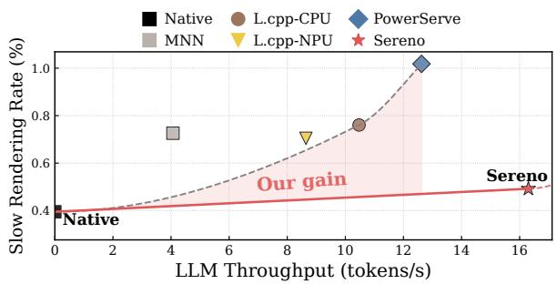  
Figure 1: The New Pareto Frontier. Unlike systems that trade off LLM throughput for foreground smoothness, SERENO achieves both. Data are from co-running inference with 25 apps, one at a time.

Our contributions can be summarized as follows:

• We are the first to characterize and attribute the asymmetric performance interference between on-device LLM inference and concurrent foreground workloads.

• We provide systematic root-cause analysis of fundamental defects in mobile SoC unified resource management under LLM workloads.

• We propose a novel repurposing of speculative decoding, transforming it from an acceleration technique into a mechanism that creates fine-grained scheduling windows for QoS management.

• We present SERENO, the first foreground-QoS-aware LLM inference framework. On commercial smartphones, SERENO restores foreground smoothness to near-native levels while improving LLM throughput, achieving a “winwin” for user experience and performance (Figure 1).

## 2 Background

## 2.1 LLM Inference and Speculative Decoding

LLM inference comprises two phases: a compute-bound prefill phase that processes the prompt to populate KV caches, and a memory-bound decode phase. The decode phase generates tokens iteratively; since each step requires reading full model weights to produce a single token, performance is limited by memory bandwidth rather than arithmetic throughput.

To accelerate the decode phase, speculative decoding is adopted: a lightweight draft model proposes a sequence of candidate tokens, which the full target model then validates in parallel via a single large-batch forward (the draft and verify phases). If verification confirms the draft prefix, multiple tokens are committed at once; otherwise the process rolls back to the last valid token. This amortizes the high memory access cost over multiple tokens, typically decoding faster than autoregressive generation.

## 2.2 Mobile SoC Architecture and Rendering

Neural Processing Units (NPUs) are designed for computeintensive tasks like AI, imaging, and sensor processing. Mobile inference is usually offloaded to NPUs [56, 72]. To maximize throughput, NPUs execute pre-compiled static computation graphs. Once submitted, a graph executes autonomously within the hardware pipeline as an atomic, run-to-completion unit. Critically, modern mobile SoCs adopt Unified Memory Architecture (UMA), i.e., CPUs, GPUs, and NPUs share a single DRAM pool and system interconnect. Memory access to unified memory is mediated by hardware priority arbitration.

The Android UI rendering pipeline is latency-bounded. Subsystems like Choreographer and SurfaceFlinger [10] coordinate CPU input handling, app-level drawing, and GPU composition. If the system skips frames, the user perceives recurring flicker on the screen, referred to as jank [7]. Jank encompasses two categories: ❶ buffer stuffing, where frames queue up due to backpressure, manifesting as input lag; and ❷ deadline misses, where rendering exceeds the Vsync interval, causing visible stutter. We denote the latter as slow rendering to isolate visual jitter from latency.

## 3 Interference and Analysis

## 3.1 Quantifying Interference

Though mobile LLM inference isolates computation on the NPU, it shares other resources with the rest of the OS. To quantify interference, we profile a OnePlus 13 (Snapdragon 8 Elite) running Llama-3.1-8B (W4A16) [31] using the PowerServe [66] alongside each of 25 popular foreground apps individually (selected via previous studies [69, 97] and Play Store rankings). Each ∼30 s run involves continuous swiping, with 1024 prefill tokens and 256 decode tokens.

Metrics. We focus on user-perceived fluidity. Using the Perfetto [30] toolchain, we report jank rate (percentage of stutter frames [7]) and the stricter slow rendering rate (frames missing the Vsync deadline due to execution delays [87]). Notably, slow rendering produces user-visible jitters, and thus is used by Google as a quality metric directly tied to app discoverability on Google Play [8].

Foreground QoS degradation. Figure 2 (left panel) visualizes the impact on user experience, where red bars represent the jank rate normalized to the native baseline (dashed line at 1.0). While the baseline implies no-LLM-inference smooth operation, the red bars for latency-sensitive apps increase sharply under concurrency. For instance, Discord reaches nearly 18× the native jank rate. This confirms that background LLM inference substantially degrades QoS across apps, causing large relative regressions even in highly opti mized, lightweight apps. The aggregate jank rate of the 25 apps increases by 153%, while the mean per-app normalized jank rate shown in Figure 2 reaches 3.13×, and the slow rendering rate shows the same degradation trend—a stuttering, unresponsive experience.

System peak performance loss. The interference extends to system peak performance, as detailed in Figure 2 (right panel). Here, the grey bars depict benchmark scores normalized to the native baseline. Across both CPU (e.g., GB6 CPU [68])

and GPU (e.g., 3DM Nomad [88]) workloads, the significant drop in bars induces a 37.2%–49.6% loss in peak throughput. Effectively, the Snapdragon 8 Elite performs at the level of hardware from two to three years ago [67, 89], bringing a \$1000 flagship down to the performance tier of a \$400 device [4, 5].

Asymmetric performance impact. Crucially, the graphs highlight a severe asymmetry. In both panels of Figure 2, the blue lines representing LLM prefill and decode speeds stay almost flat near the 1.0 baseline. For example, while foreground performance (red bars) degrades sharply, background prefill/decode throughput degrades by only 1.01% and 1.64% on average. The same trend appears in benchmark scores. This implies a systemic priority inversion where latency-critical UI tasks are starved to feed a best-effort background workload.

## 3.2 Physical Attribution: Bandwidth

To identify the contended resource, we employ an elimination method using Simpleperf [9] and Snapdragon Profiler [76].

On the Snapdragon 8 Elite, although matrix computation is offloaded to NPU cores (HMX [71]), the data and control paths remain entangled with the host: high-volume DMA between NPU-internal cache and DRAM traverses the same interconnect used by the CPU and GPU, the CPU retains the inference control plane, and NPU vector units (HVX) interact directly with the cache hierarchy.

Compute and power metrics. Figure 3 plots the normalized performance ratios of key hardware metrics, where a value of 1.0 (dashed line) indicates the contention-free baseline. Under LLM concurrency, we observe that foreground compute metrics—specifically IPC, CPU Util, and GPU Util (green bars)—hover near 1.0. This stability confirms that the CPU and GPU are not saturated by the background task. Furthermore, we rule out thermal throttling, as core frequencies show no abnormal drops.

Cache metrics. Similarly, the blue bars of Figure 3 examine the cache hierarchy. The normalized miss rates for L2 Cache, Last-Level Cache (LLC), and TLB remain largely unchanged relative to the native baseline. This flat trend indicates that NPU traffic does not significantly pollute the shared caches or thrash TLB entries, ruling out cache contention as the primary bottleneck.

Unified memory bandwidth metrics. In sharp contrast, the red bars of Figure 3 reveal substantial regression in the memory subsystem, with memory latency metrics increasing above the 1.0 baseline. Specifically, Memory Stall Cycles increase by 3.8×, and LLC Miss Latency (measured in cycles) increases by 3.5×. GPU memory stall rates exhibit a similar 3.1× spike. These metrics directly quantify the back-pressure from the DRAM controller. This data confirms that despite the NPU’s compute isolation, its massive DMA traffic saturates the shared Unified Memory Architecture (UMA), blocking CPU/GPU memory requests.

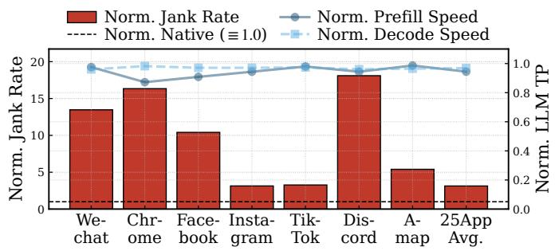

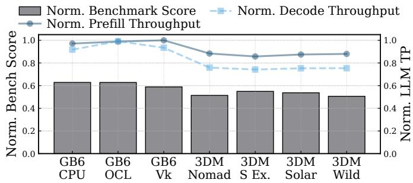  
Figure 2: Interference when co-running LLM inference with each popular application. Background LLM inference severely degrades foreground QoS (e.g., jank) and peak system performance. Each application is evaluated individually with the background LLM, not concurrently with the other applications. The interference is asymmetric, as the LLM’s own throughput is barely impacted.

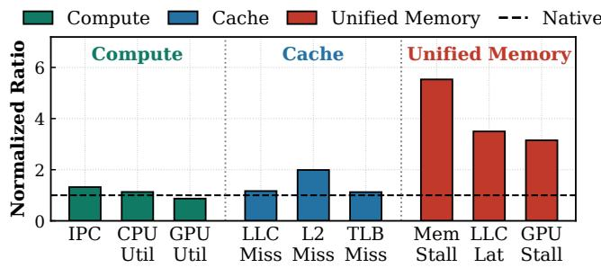  
Figure 3: Root cause analysis: averaged metrics from co-running LLM inference with 25 applications, one at a time. Compute and Cache metrics remain flat, while Unified Memory contention metrics surge 3–4×, pinpointing bandwidth as the culprit. All values are normalized to Native, i.e., applications running alone averaged.

## 3.3 Architectural Root Cause Analysis

Why does the system fail to throttle aggressive NPU traffic? We analyzed the kernel and device tree sources for three flagship SoC families: Snapdragon 8 Elite [65, 75], Dimensity 9400 [57, 64], and Samsung Exynos 2400 [78]. Our analysis shows that the asymmetry arises from deep-rooted mechanism gaps and policy misalignments. As Table 1 shows through representative Snapdragon and Dimensity evidence, NPU workloads remain privileged compared to CPU/GPU workloads; the Exynos source tree exposes analogous vendor-specific BTS policy hooks for NPU traffic.

Missing NPU observability and control. Mobile OSes lack both observability and control handles for the NPU. On Snapdragon 8 Elite, governance frameworks like memlat [65] mon itor CPU stalls but explicitly exclude NPU traffic, rendering it “invisible” to the OS scheduler. More critically, we find a hardware-level void in bandwidth partitioning. While the CPU cluster supports ARM’s Memory System Resource Partitioning and Monitoring (MPAM) [12] to enforce QoS, the NPU driver stack lacks these hooks. This implies the NPU operates as an unmanaged bus master: the OS cannot enforce bandwidth quotas on it even if congestion is detected.

NPU-prioritized arbitration policies. Hardware and firmware arbitration structurally bias towards the NPU. Static analysis of the interconnect topology reveals that the NPU issues traffic through a dedicated on-chip lane (nsp\_noc reaching SLAVE\_EBI1) that bypasses the congestion of the shared multimedia fabric, and it is admitted into the top arbitration class—priority 0 with urgency forwarding (prio =0, urg\_fwd =1), the same elite tier reserved for the latency-critical display—despite carrying merely best-effort LLM traffic. Crucially, this elevated service comes with no countervailing regulation: the CPU/GPU are reined in by MPAM bandwidth partitioning, memlat stall accounting, and thermal cooling maps, whereas the NPU is subject to none of the three. The few control loops that could otherwise intervene react far too slowly: while UI rendering demands strict latency (e.g., sub-8.3 ms for 120 Hz), the system’s shared bandwidth DVFS governor escalates only after a coarse hysteresis window (∼64 ms), too slow to intercept bursty interference. Most starkly, thermal configurations explicitly exempt the NPU from throttling [64], letting it sustain aggressive bandwidth consumption even when the CPU is throttled. On Exynos 2400, the public kernel exposes Samsung’s Bus Traffic Shaper (BTS) machinery and NPU-specific npu\_normal/npu\_performance scenarios, and the NPU device tree binds its MIF/INT hardware devices to BTS-controlled units [78]. This supports the same high-level conclusion: accelerator memory policy is configured through vendor-specific firmware/device-tree mechanisms rather than through portable per-application OS controls.

Rationale and workload mismatch. These privileges are not an oversight but a design choice. Consider 4K60 video recording: the image sensor streams massive raw data that the ISP and NPU must process within strict per-frame deadlines (<16 ms), so to prevent buffer overflows and dropped frames, architects established high-priority direct memory paths and disabled thermal throttling for the NPU. This is well matched to media-centric workloads but mismatched for persistent, best-effort AI: an on-device LLM is bandwidth-intensive (like video recording) yet semantically best-effort (like background downloading). Unable to distinguish the semantic intent of NPU instructions, the hardware grants the background LLM the same high-priority treatment as a foreground camera, so it occupies memory paths designed for millisecond-critical media and delays latency-sensitive UI traffic.

Table 1: Hardware and OS mechanism gaps and policy misalignments. (✗: constrained / regulated; ✓: privileged / unregulated.) Foreground units (CPU/GPU) face strict visibility, latency, and thermal constraints, while NPU workloads remain privileged across SoCs [64, 65, 78].  
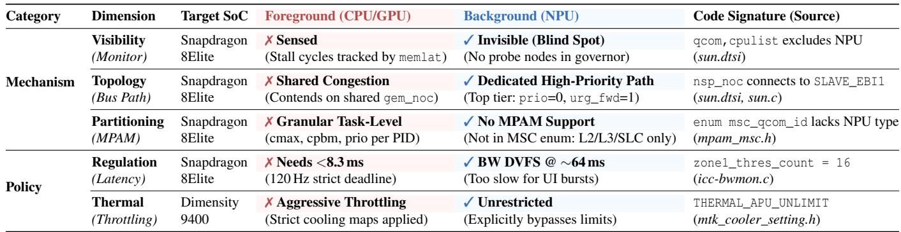

Implication. Because image processing on the NPU is a genuinely critical media task where a single dropped frame is unacceptable, silicon vendors will likely continue to enforce this structural bias. Addressing the contention therefore necessitates a pure-software approach that regulates LLM bandwidth usage without relying on immutable hardware policies. Current vendor toolchains add further constraints: commercial NPU SDKs (e.g., Qualcomm QNN [74]) compile computation graphs into fixed static executables with predetermined batch sizes, and these opaque binaries expose neither peroperator memory behavior nor fine-grained traffic-shaping hooks—even inspection tools like Snapdragon Profiler [76] report only aggregate metrics. These limitations reinforce the need for a software-level approach that works within existing vendor ecosystems.

## 4 Challenges and Opportunities

To bridge this misalignment, our goal is to sense and regulate memory bandwidth, preserving foreground smoothness while the LLM runs in the background.

## 4.1 Key Challenges

Challenge 1: Lack of Low-Cost Sensing. Real-time visibility into the bandwidth contention is the first prerequisite for effective contention management. However, mobile SoCs typically lack accessible fine-grained hardware counters (e.g., MPAM or high-rate bandwidth PMUs) for the NPU. Software-only probes can infer DRAM latency, but they incur prohibitive CPU overhead and compete for the very bandwidth they seek to measure [23, 82, 90]. Without low-cost, high-frequency sensing, the system stays blind to the millisecond contention.

Challenge 2: Lack of High-Frequency Control Knobs. Effective mitigation requires intervening at a frequency that matches the interference dynamics. Android’s Surface-Flinger typically performs composition (the most bandwidthintensive phase of rendering) in bursty windows, which we measured at Tcomp ≈ 2.25 ms on average. According to the

Nyquist-Shannon sampling theorem [79], to effectively intercept these transients without aliasing, the control interval ∆tctrl is strictly constrained by ∆tctrl ≤ Tcomp ≈ 1.125 ms. This 2 theoretical limit conflicts with the realities of mobile NPUs. Specifically, modern NPU runtime such as QNN [72] executes computation graphs as monolithic units for maximal efficiency. Even with graph partitioning (i.e., chunking), the smallest runnable unit of an 8B model remains 5–8 ms (> 4× ∆tctrl ), making real-time control mathematically infeasible. Layer-level subdivision of the target model is therefore not sufficient: it creates control points only after long target-model subgraphs and any pause directly stalls committed decoding progress. Recent efforts [26, 34] to relax static-graph constraints offer finer control but at steep costs—reducing prefilling and decoding throughput by over 90% and 50%, respectively.

Challenge 3: Lack of Efficient Regulation. Even with realtime sensing of bandwidth contention and sufficient finegrained control knobs, we still need a mechanism to yield bandwidth efficiently. Standard mechanisms like Dynamic Voltage and Frequency Scaling (DVFS) are ineffective because NPU energy efficiency degrades at low frequencies due to prolonged execution time and accumulated static power leakage [43, 94]. Alternatively, chunk-and-sleep strategies inject sleeps between LLM subgraphs, halting inference progress during the sleep interval and recovering foreground QoS only by sacrificing background progress. It is thus challenging to devise an elastic, soft-throttling mechanism that can reduce bandwidth pressure while maintaining forward computation progress.

## 4.2 Repurposing Speculative Decoding

Of particular interest, we find that speculative decoding offers a unique structural alignment with our requirements for solving the challenges described above. Speculative decoding structurally consists of a fine-grained, memory-bound draft phase and a heavyweight, compute-dense verify phase. The draft phase comprises a sequence of forward passes on a smaller model that naturally break the original LLM execution into smaller windows, thereby providing the missing fine-grained knobs through draft interruption. The computeintensive verification phase, in turn, introduces a complementary lower-bandwidth stage, offering opportunities for bandwidth regulation across phases. This is the key distinction from subdividing the target model itself: yielding during the draft phase discards only tentative work, while the target model still verifies already available candidates and preserves committed decoding state.

Based on the above analysis, we derive a key insight: rather than leveraging speculation solely for speed, we can repurpose it to serve as a vehicle for memory bandwidth regulation.

Throughput-oriented speculation under contention. However, translating this structural potential into a QoS mechanism is non-trivial because existing frameworks are designed to maximize throughput. Frameworks like Medusa [16] or EAGLE-3 [50] aggressively saturate memory bandwidth to maximize acceptance rates. Our profiling with EAGLE-3 reveals that 94.7% of the decoding time is bandwidth-bound.

Importantly, these algorithms are fragile when operating under constraints. Specifically, our profiling of EAGLE-3 reveals that a naive attempt to yield bandwidth—by enforcing a 50% bandwidth cap during the verification phase—causes decoding throughput to drop by 54% relative to the peak. Moreover, this throttled performance drops 8.4% below the non-speculative baseline. This negative gain phenomenon indicates that, without a specialized mechanism, simply throttling speculation can eliminate its benefits entirely.

## 5 SERENO Design

To enable the seamless coexistence of always-on background intelligence and interactive foreground experiences, we propose SERENO, a pure-software inference framework that resolves foreground–LLM bandwidth contention via a submillisecond Sense-Decide-Act loop that dynamically regulates the LLM’s NPU bandwidth usage.

Design goals. SERENO pursues two objectives to resolve asymmetric foreground performance degradation. ❶ Foreground Protection: SERENO should restore foreground smoothness to near-native levels by strictly limiting memory bandwidth during interactive bursts; ❷ Efficient Yielding: SERENO should maximize background LLM throughput by avoiding zero-progress yields (e.g., long sleeping) that waste resources.

Design constraints. Despite the challenges we introduce in §4.1, SERENO is designed to be deployable on commodity smartphones, imposing strict boundaries: ❶ Immutable Hardware: We cannot modify SoC interconnect priorities, requiring software-only solutions; ❷ User-Space Constraint: To ensure compatibility, we avoid relying on vendor-specific kernel or driver modifications; ❸ Black-Box NPU: We must accommodate the opaque nature of commercial NPUs, where computation graphs are static and their execution is atomic. Meanwhile, the batch size of each graph must be fixed at export time, which is required by current NPU runtime [70]. System workflow. The control loop, illustrated in Figure 4, begins with the Contention Sensor (§5.2), which derives a real-time Contention Score from the execution latency of draft subgraphs. This score feeds into the Controller (§5.3), which computes the necessary yielding intensity. These decisions drive the Elastic Speculative Decoding engine (§5.1): during the draft phase, the controller may trigger an instant Draft Preemption to halt the memory bandwidth usage, employing N-gram Filling to compensate for incomplete speculative tokens. Then, Selective Batching chooses the execution graph with the appropriate batch size from the pre-exported graphs. Finally, the workflow transitions to the verification phase, where micro-sleeps might be injected to regulate the remaining bandwidth demand before the next cycle begins.

## 5.1 Elastic Speculative Decoding

To address the lack of fine-grained control knobs, SERENO introduces Elastic Speculative Decoding. We transform the monolithic inference process into a sequence of interruptible, fine-grained units, enabling the system to take actions at submillisecond timescales without sacrificing model correctness.

Preemptible draft execution. We leverage the inherent discardability of the speculative draft phase to create highfrequency intervention points. Unlike conventional designs that execute the draft model as a single atomic phase, we refactor it into a chain of fine-grained units.

Using the vendor SDK (e.g., QNN [72]), we compile the draft model at the granularity of individual Transformer layers. We use subgraph to denote one statically compiled NPU executable containing a contiguous set of operators, such as one draft Transformer layer or one verification-layer group. For the draft model, this creates execution subgraphs with submillisecond latency. At any subgraph boundary, SERENO can trigger an instant preemption: discarding the remaining draft steps and immediately transitioning to the verification phase. This converts the NPU from a run-to-completion black box into a preemptible task that can release memory bandwidth almost instantly upon foreground contention.

Crucially, we retain the static graph: unlike approaches that fall back to inefficient dynamic operators for flexibility [34], our method maintains near-native NPU execution efficiency.

N-gram candidate filling. Draft preemptions inevitably reduce the number of speculated tokens, potentially harming decoding throughput. To mitigate this penalty, SERENO employs a low-cost N-gram Filling mechanism to replenish the empty slots in the verification batch. When the neural draft produces fewer candidates than the selected verification batch can hold, SERENO looks up the latest committed token sequence in a local n-gram cache and appends the most likely continuation tokens as additional tentative candidates. These tokens are verified by the target model in the same way as neural draft tokens, so incorrect n-gram candidates are rejected without changing output semantics. We introduce three optimizations to standard N-gram speculation to maximize acceptance rates using only local context: ❶ Multi-source Construction: We build the N-gram cache by integrating tokens from three weighted sources: verify outputs (high confidence), prompts (medium), and crucially, rejected draft sequences (low). This recycles valuable local context that is originally discarded. ❷ Self-Purifying Cache: We filter candidates via hit-frequency tracking, automatically evicting low-quality sequences to suppress noise. ❸ Adaptive Length Weighting: We employ mixed x-gram lengths (e.g., 2-gram, 3-gram, . . . ), assigning higher weights to longer matches (capturing semantics) and lower weights to short collocations. This prevents noise from short-context matches. These enhancements let SERENO recover speculation candidates even when the neural draft phase is preempted early.

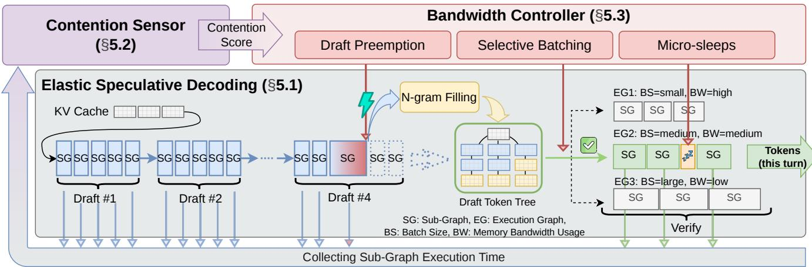  
Figure 4: Design overview of SERENO. A Sense-Decide-Act loop to dynamically regulate LLM inference’s NPU bandwidth usage.

Selective batching. While the draft phase provides preemptible knobs, the verification phase offers various bandwidth control mechanisms. We pre-compile multiple verification graphs with varying batch sizes (e.g., B = 8, 16, 32) that share weights but differ in parallelism, resulting in varying bandwidth usage during verification.

During verification, SERENO dynamically selects the ap propriate graph based on the contention sensor’s output. We characterize each verification graph by its absolute average memory-bandwidth demand while it runs. This is a graph level bandwidth pressure metric, not a per-candidate cost: normalizing the measured bandwidth of the B = 1 verification graph to 1.00, the demand falls to 0.82/0.79/0.74 for B = 8/16/32 and further to 0.61/0.38 for B = 64/128. Larger verification batches expose more parallel candidate work for roughly one target-model weight traversal, lowering the graph’s average bandwidth demand, but they also form longer atomic verification bursts. This does not imply universally higher end-to-end throughput: larger verification batches require more candidate tokens, which may force additional draft work or lower-confidence n-gram candidates before verification can run. The resulting spread in bandwidth levels gives

SERENO scheduling room: under heavy memory contention, SERENO switches to lower-bandwidth larger-batch verification graphs and relies on micro-sleeps between verification subgraphs to break up the burst. Under low contention, it prefers smaller graphs to minimize draft waiting and preserve decoding latency [91].

## 5.2 Endogenous Contention Sensing

Sensing rationale. To sense bandwidth contention, DRAM latency is the primary indicator [44, 45]. As highlighted in §4.1, conventional methods (e.g., pointer chasing) that measure DRAM latency incur prohibitive overhead. However, we observe that the memory-intensive LLM decoding step mimics these latency probes: it generates sequential DMA transfers between NPU SRAM and DRAM that inherently bypass host caches. Crucially, while synthetic probes require multiple rounds to resolve noise, the sheer volume of data processed in a single LLM step ensures high signal robustness against transient system noise. Therefore, instead of introducing external monitors, we leverage the latency of LLM workload itself as an endogenous, zero-cost contention sensor.

Based on this insight, SERENO repurposes the execution latency of fine-grained draft phase subgraphs as a real-time contention proxy. This signal is fully endogenous and nearly zero-overhead: it utilizes timing data captured during the decoding, eliminating the need for hardware counters or intrusive micro-benchmarks. When foreground applications contend for the memory bus, the resulting memory stalls manifest directly as latency spikes in subgraph execution.

Reactive sensing rather than prediction. SERENO uses reactive sensing because foreground behavior is dominated by user input, app-specific rendering paths, and OS composition timing. Predicting these bursts would require app-specific models and would either miss rare interactions or over-throttle inference conservatively. In contrast, the draft-subgraph signal is available at sub-millisecond granularity with no extra memory traffic, so the controller can react within the same timescale as rendering bursts while smoothing noise through

hysteresis and PI control.

Calibration. Specifically, we observe that static graph fusion strategies cause significant latency variance among Transformer blocks (e.g., up to 37% difference in Llama-3.2-1B). This is likely due to non-uniform compiler optimizations, such as different memory alignments and tensor tiling strategies assigned to specific graph nodes. Crucially, despite this spatial variance, the execution latency of any specific subgraph is temporally stable across iterations due to the deterministic nature of NPU static graphs. Therefore, SERENO performs a one-time offline calibration to profile the baseline distribution for each unique subgraph in a contention-free environment.

Runtime contention score. At runtime, we compute a normalized Contention Score per executed draft subgraph: CS = (Tactual − Tbaseline)/Tbaseline, where T represents subgraph execution latency. As demonstrated in §7.3, this software-defined metric exhibits a strong correlation (R ≈ 0.86) with physical Memory Stall Cycles per LLC Miss. This confirms that CS serves as a high-fidelity proxy for physical bandwidth contention.

## 5.3 Bandwidth Controller

To orchestrate the sensing signals and elastic knobs, SERENO implements a closed-loop control system comprising a hierarchical actuation mechanism and a feedback-driven controller. This design minimizes throughput loss while responding to sub-millisecond contention transients.

Actuation primitives. We define three actuation primitives, ordered by their aggressiveness in yielding bandwidth. Level ❶: Draft Preemption (instant relief). Since the draft phase executes with Batch=1 (high memory intensity), it saturates bandwidth most aggressively. Preempting the draft phase immediately releases the bus and stops occupying the bandwidth. Level ❷: Selective Batching (coarse adjustment). Upon preempting to the verification phase, the controller selects between precompiled graphs (e.g., Batch=16 vs. 32). It prefers smaller batches for low-latency progress under light contention, but switches to larger batches when moderate yielding should lower the verification graph’s bandwidth demand. Level ❸: Micro-Sleeps (fine-tuning). While batch selection offers discrete control steps, micro-sleeps allow for continuous modulation of the bandwidth duty cycle during the verification phase. The controller injects precise sleep intervals only between verification subgraphs, not inside a running NPU graph. Because each target-model verification subgraph lasts 5–8 ms, a 1–2 ms sleep between subgraphs reduces the average verification bandwidth duty cycle by roughly 10– 25%. This primitive complements draft preemption: preemption handles immediate relief during the high-bandwidth draft phase, while micro-sleeps fine-tune residual verificationphase pressure.

Controller. To dynamically orchestrate the actuation primitives, SERENO employs a standard Proportional-Integral (PI)

controller [36], a classic feedback mechanism that modulates control inputs to minimize the error between a measured state and a desired setpoint. The controller computes the error term e(t) = CSmeasured −CStarget , where CSmeasured is the real-time contention score and CStarget is the maximum allowable contention. Formally, the control output u(t) is derived as u(t) = Kpe(t) + Ki R t e(τ)dτ. The proportional term (Kp) drives immediate reaction to the current error magnitude, while the integral term (K ) accumulates historical errors to eliminate steady-state offset [13, 40, 41].

We specifically exclude the derivative term due to the stochastic nature of mobile system signals: the execution latency of LLM subgraphs contains minor noise from schedul ing jitters and transient DRAM contention, which a derivative term would amplify into erratic control outputs and oscillation.

The controller’s output u(t) represents the aggregated yielding intensity. We employ a phase-aware mapping strategy to translate this continuous signal into discrete primitives: In the draft phase, we disable micro-sleeps to maximize speculative efficiency when the bus is free. Given the high bandwidth intensity of drafting, we enforce an aggressive preemption threshold: even a low magnitude u(t) triggers immediate draft preemption. This ensures the system yields bandwidth instantaneously at the first sign of contention rather than stalling on speculative work. In the verification phase, u(t) drives graded regulation to maintain progress. The signal is first mapped to selective batching (choosing larger batches for high u(t)), and then linearly mapped to micro-sleep durations inserted between subgraphs for fine-grained throttling.

To prevent oscillation from transient noise, we further apply a hysteresis filter to the draft preemption decision, requiring consecutive violation samples before triggering.

Minimum throughput guardrail. To prevent starvation, SERENO incorporates a Token Bucket mechanism that overrides the PI controller. The bucket fills at the instant generation rate and drains at a configurable baseline rate. This creates a three-stage gradation: ❶ Nominal Enforcement: As long as the bucket contains tokens over the lower bound (e.g., 10% of the maximum capacity), the system runs as normal. ❷ Adaptive Relaxation: Upon depletion below the lower bound, the system automatically relaxes the CStarget (raising the contention threshold), reducing yielding frequency to help the background task recover throughput. ❸ Fail-Safe: Under persistent deficit (i.e., if the bucket remains empty for a sustained duration), SERENO temporarily disables QoS interventions, falling back to standard speculative decoding to accelerate.

While these relaxations theoretically reintroduce some interference, it is a necessary compromise to ensure service continuity. Crucially, our evaluation (§7.2) demonstrates that even with this mechanism active in resource-constrained scenarios like Heavy Gaming, SERENO still delivers substantial QoS optimization compared to the uncontrolled baseline.

## 6 Implementation

Environment & framework. We implemented SERENO on Snapdragon chipsets using the Qualcomm QNN SDK (ver. 2.39) [74], atop the open-source PowerServe [66].

Core modules. SERENO adds \~6.4k lines of C++ code. ❶ Elastic Speculative Decoding (\~2.8k LoC) manages the interruptible substrate. It carefully manages in-flight states and KV caches during preemptions without polluting committed state, guaranteeing consistency. ❷ Bandwidth Controller (\~2.7k LoC) refactors the decoding loop for control and contains a PI controller to dynamically orchestrate the actuation primitives. ❸ Contention Sensor (\~0.9k LoC) injects timer hooks directly into operator paths to derive the real-time contention score.

Automated tuning. For portability, we provide a Ziegler Nichols [108] calibration script that sweeps the proportional gain under synthetic loads to find the ultimate gain (Ku)—the point where the contention signal sustains oscillation [14, 15, 33]—then derives stable coefficients (Kp, Ki) tailored to the SoC from K and the oscillation period.

Policy instantiation. We instantiate two policies to address distinct QoS requirements: ❶ Policy A: Balanced Mode is our default policy targeting daily multitasking. It sets a moderate contention threshold (CStarget = 0.15, permitting 15% latency hike) and enables the throughput guardrail (12 tokens/s for filling the bucket) to prevent starvation, balancing the smoothness and throughput. ❷ Policy B: UI-First Mode is a strict policy targeting competitive gaming; it enforces a tight threshold (CStarget = 0.07) and disables the throughput guardrail, prioritizing zero foreground stalls over LLM inference speed.

## 7 Evaluation

We evaluate SERENO by addressing four questions: ❶ End-to-End Effectiveness: How does SERENO perform in terms of foreground QoS and background LLM inference throughput compared to industry SOTA solutions and naive strategies? ❷ Mechanism Analysis: Does SERENO mitigate hardware bottlenecks? Do its software-aware signals and scheduling decisions function as intended? ❸ Ablation Study: What are the contributions of individual components? ❹ System Analysis: What are SERENO’s overheads and robustness?

## 7.1 Experimental Setup

Hardware & Environment. Our primary testbed is the One-Plus 13 (Snapdragon 8 Elite), alongside a OnePlus 12 (8 Gen 3) for generality. Both feature a heterogeneous architecture where the CPU, GPU, and Hexagon NPU share 24 GB LPDDR5X unified memory. We measure full-system power with a power meter [17] and ensure no uncontrolled DVFS downclocking during experiments.

Workloads. We deploy Llama-3.1-8B-Instruct (W4A16). We use 15 diverse prompts from the GSM8K dataset [21] to cover varying prefill/decode complexities. In §7.5, we further discuss the generalization to other models.

Based on 25 popular applications in §3.1, we add 5 heavy games into the list and categorize these 30 applications by resource intensity from light to heavy: ❶ Tools (e.g., Chrome): bursty CPU loads; ❷ Social (e.g., WeChat): rich media list scrolling, with mixed CPU/GPU loads; ❸ Media (e.g., YouTube): multimedia decoding, with steady CPU/GPU loads; ❹ Gaming (e.g., Genshin Impact): sustained CPU/GPU loads and memory pressure.

Automation scripts replay fixed operation sequences: nongame apps simulate scrolls or clicks at \~1 Hz; game loads run complex control loops (e.g., camera rotation, jumps) at \~2 Hz. Each experiment runs one foreground application at a time with the background LLM; the 30 applications form a benchmark suite rather than a concurrent workload.

Protocol. We report the mean of 15 runs (\~45 s each, one per prompt), excluding the two largest and smallest values. Continuous decoding serves as the default stress test to expose worst-case overlap with foreground rendering; we further evaluate a sporadic invocation pattern in §7.2 to capture assistant-style usage where bursts are short but still coincide with rendering deadlines.

Baselines. We compare SERENO against three categories of baselines. ❶ Native: Foreground only (i.e., the upper bound). ❷ SOTA Frameworks: PowerServe [66] (QNNbased), llama.cpp [27] (CPU/GPU(opencl)/NPU backends), and MNN [55]. ❸ Strategies: Implemented within PowerServe to represent standard approaches, including Freq-Limit (static NPU frequency capping to \~50% frequency), Chunk-Sleep (fixed 50% duty cycle sleep), and Speculative (throughput-oriented speculative decoding schemes like EAGLE-2 [48]). For SERENO and Speculative, we use Llama-3.2-1B-Instruct (W4A16) as the draft model.

Metrics. For foreground QoS, we extract jank rate and slow rendering rate from Perfetto FrameTimeline [87]. To evaluate system peak performance, we use Geekbench 6 and 3DMark scores [68, 88]. For background performance, we measure throughput (tokens/s) and latency in prefill and decode phases. Micro-architectural metrics are collected via Snapdragon Profiler [76] and simpleperf [9].

## 7.2 End-to-End Effectiveness

This section evaluates SERENO in multitasking scenarios, assessing whether it preserves foreground QoS and peak system performance while maintaining competitive background LLM throughput. Unless otherwise stated, we utilize the default Balanced Policy (§6).

Comparison with SOTA frameworks. We first compare SERENO against SOTA frameworks (Figure 5 top row). Uncontrolled NPU inference (PowerServe) causes substantial foreground QoS degradation: taking Social workloads as an example, the jank rate increases to 22.12% (vs. Native 6.18%, top left panel) while the slow rendering rate also increases to 3.7× the Native baseline (1.08% vs. 0.29%, top right panel). Other frameworks also fail to resolve this contention: llama.cpp-GPU suffers high interference (16.92% jank rate) due to shared memory bottlenecks. MNN’s jank rate is 13.55%, and its throughput is severely reduced to 3.78 tokens/s. SERENO substantially mitigates this interference, suppressing the Social jank rate to 8.14% (approaching Native’s 6.18%)—eliminating most induced stutter—while sustaining 16.00 tokens/s. SERENO delivers up to 92.6% reduction in jank rate and 67.9% increase in throughput in comparison with PowerServe. On average across all categories, SERENO achieves a jank rate of 6.21% (Native is 4.91%) and a slow rendering rate of 0.44% (Native is 0.35%), effectively restoring near-native fluidity. Compared to PowerServe, SERENO reduces the jank rate by 58.5% and improves throughput by 26.4%. Compared to llama.cpp-NPU, SERENO reduces the jank rate by 37.1% and improves throughput by 82.2%.

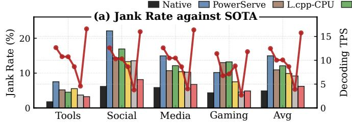

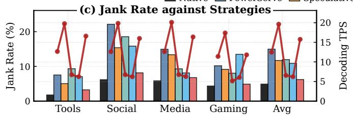

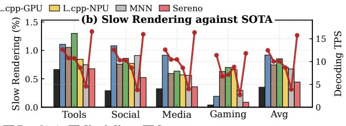

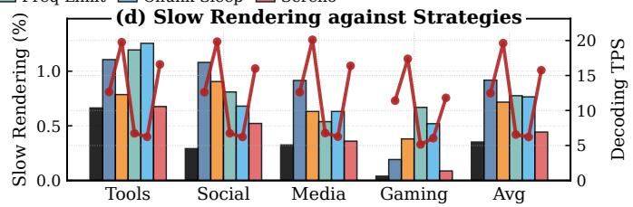

Figure 5: End-to-end effectiveness. SERENO restores foreground QoS to near-native levels while maintaining competitive throughput against SOTA frameworks (a,b) and naive strategies (c,d). Each foreground application is evaluated individually with the background LLM. L.cpp stands for llama.cpp.  
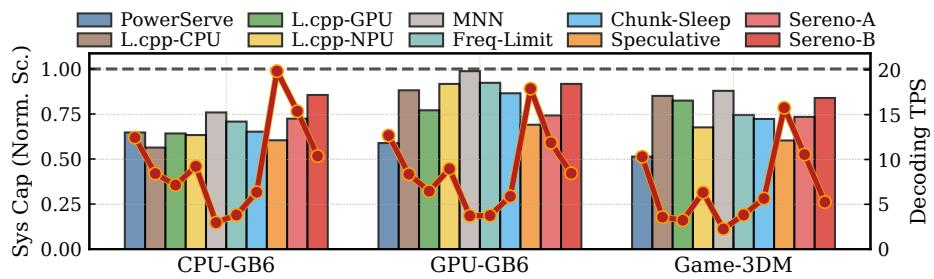  
Figure 6: System peak performance recovery. Suffix -A and -B represent two policies in §6.

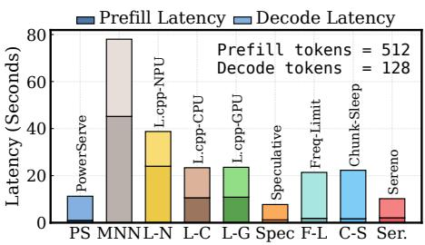  
Figure 7: Latency breakdown.

Comparison with scheduling strategies. The schedulingstrategy comparison (Figure 5 bottom row), against aggressive (Speculative) and conservative (Chunk-Sleep, Freq-Limit) baselines, highlights the necessity of SERENO’s elastic design. While speculative decoding (speculative in the figure) maximizes throughput (19.84 tokens/s), its unregulated bandwidth usage keeps the Social jank rate high at 15.38% (far above the Native’s 6.18%). SERENO trades a moderate throughput (16.00 tokens/s) to bring the jank rate down to 8.14%, significantly approaching the Native baseline. Under Reader application, SERENO achieves a 72.1% jank rate reduction with only a 6.2% throughput degradation. Regarding conservative strategies, Freq-Limit proves to be ineffective: by capping NPU frequency to \~50%, it suffers from both low throughput (6.74 tokens/s) and high interference (18.55% jank rate), as it lacks the responsiveness to handle micro-bursts. Chunk-Sleep behaves similarly, and the trend holds across categories. Overall, SERENO achieves 2.5× the throughput of these naive strategies while maintaining lower average slow rendering (0.44%), showing that SERENO’s sub-millisecond elasticity improves the QoS-throughput balance.

System peak performance. Figure 6 evaluates the recovery of system peak performance using both SERENO policies (the -A and -B suffixes denote the two policies in §6). In Gaming scenarios, uncontrolled inference degrades scores to 51% of Native levels. For SERENO, balanced policy recovers this to 73% while maintaining high throughput (10.56 tokens/s), offering a middle ground better than uncontrolled execution. For maximum foreground protection, strict policy further prioritizes other tasks, restoring scores to 84% and GPU scores to 92% (vs. PowerServe’s 59%). A critical comparison arises with MNN: while MNN achieves a high benchmark score (88%), it does so by throttling inference to a negligible 2.25 tokens/s. In contrast, SERENO (strict policy) maintains 5.25 tokens/s in the same scenario, indicating true resource elastic ity rather than simple pausing.

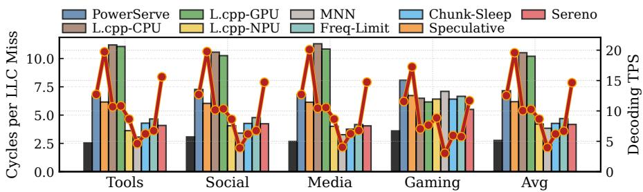  
Figure 8: Physical memory stall reduction.

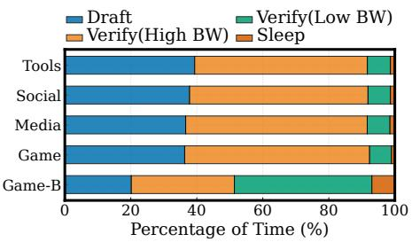  
Figure 9: Dynamic mode adaptation.  
by sporadic invocation.

Latency. Finally, Figure 7 analyzes the request turnaround time (512 prefilling tokens + 128 decoding tokens), averaged over the 30-application benchmark suite with one fore ground app running at a time. SERENO’s end-to-end latency (10.21 s) is 9% lower than the uncontrolled PowerServe baseline (11.25 s). This result stems from the underlying speculative acceleration: although the prefill phase is slower (2.09 s vs. 0.99 s) due to the smaller batch sizes required for preemptibility, the accelerated decode phase compensates for this delay. Among all systems, SERENO exhibits only slightly higher latency than Speculative, as the latter ignores other tasks to solely focus on inference acceleration.

Sporadic workload evaluation. We model SERENO under a sporadic invocation pattern using OnePlus 13. To simulate realistic intermittent usage scenarios, we sweep four invocation schedules, covering short intermittent requests such as notification summarization, smart reply, and short transla tion [11, 28, 77]. Each schedule holds the invocation period fixed at 50 s and varies only the decode-burst fraction, giving 10/40 s, 20/30 s, 30/20 s, and 40/10 s (burst/idle) schedules, i.e., duty cycles of 20%, 40%, 60%, and 80%. The lightest 10 sburst/40 s-idle point reflects a single short assistant turn (e.g., a notification summary) per user think-time interval; sweep ing toward the 40 s-burst/10 s-idle point progressively stresses the system with denser back-to-back invocations. For the foreground, we deliberately use lightweight, latency-sensitive applications from the categories that realistically co-occur with sporadic assistant turns—Tools, Social, and Media (5 applications in total)—rather than heavy workloads such as gaming. This matches the common case for short background invocations and is also a conservative setting: because such apps already render near the smoothness ceiling, the foreground has little slack to absorb interference, so any residual stutter is directly attributable to the background LLM rather than to foreground load itself. We construct 5 min traces covering six bursts for each system–application pair. Effective throughput is reported as the total committed tokens divided by wall-clock time, including idle intervals; therefore, it captures both useful decoding progress and the idle gaps imposed

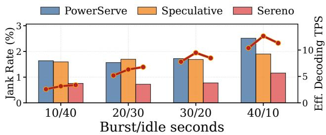  
Figure 10: Sporadic workload sensitivity. We vary the decodeburst/idle schedule while keeping the trace length fixed. Effective decoding TPS includes idle intervals in the denominator.

Figure 10 reports the resulting sensitivity sweep. As the scheduled duty cycle increases, effective decoding throughput rises almost linearly for all systems because the LLM is active for a larger fraction of wall-clock time. At the same time, foreground interference remains visible: PowerServe’s jank rate rises from 1.64% to 2.51%, and throughput-oriented speculative decoding stays between 1.59% and 1.90% jank across the sweep. SERENO consistently provides the lowest jank rate, ranging from 0.72% to 1.16%, roughly halving PowerServe’s jank at each duty cycle. Absolute jank rates here are well below the continuous stress test (Figure 5), as expected from the lighter foreground load and reduced duty cycle; the meaningful signal is thus the consistent relative gap between systems, not the absolute floor. The throughput tradeoff is also bounded. SERENO achieves 3.38 and 6.78 effective tokens/s at 20% and 40% duty cycles, respectively, and remains ahead of PowerServe at the heavier 60% and 80% settings (8.48 and 11.32 effective tokens/s). Thus, increasing the burst frequency stresses all systems, but the relative conclusion is unchanged: intermittent LLM invocations still perturb foreground rendering when they overlap with user interaction, and SERENO’s fine-grained yielding preserves a better QoS–throughput balance under both light and heavy sporadic load.

## 7.3 Mechanism Analysis

We dissect SERENO’s internal mechanisms to validate three design principles: reducing memory contention, ensuring signal fidelity, and achieving dynamic elasticity.

Physical bottleneck mitigation. Figure 8 validates that SERENO addresses the root cause: shared memory contention. We quantify this using Stall Cycles Per LLC Miss (CPLM)— derived as the ratio of memory stall cycles to LLC misses (calculated as PMU counter CYCLE\_BACKEND\_MEM\_STALL / LLC\_MISS). CPLM serves as a high-fidelity proxy for the effective DRAM latency perceived by the CPU.

Under uncontrolled NPU inference (PowerServe), the average CPLM surges to 7.15 cycles, 2.6× the Native baseline (2.76 cycles), confirming that NPU DMA activity saturates the interconnect. SERENO effectively regulates this traffic, pulling the average CPLM down to 4.17 cycles—a 42% reduction compared to the uncontrolled baseline. Even in the most bandwidth-starved Gaming scenario, SERENO outperforms throttling strategies like Chunk-Sleep (6.41 cycles), reducing CPLM by a further 14%. This indicates that SERENO’s high-frequency knobs and fine-grained yielding are significantly more effective at clearing memory bus congestion than coarse-grained sleep or unoptimized execution.

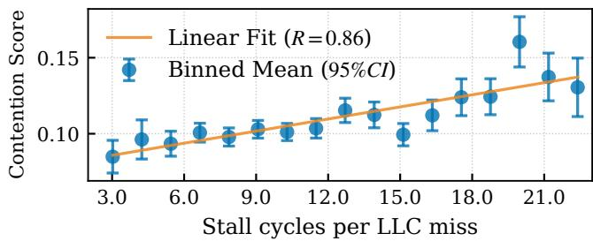  
Figure 11: Signal correlation. CI stands for confidence interval.

Signal accuracy. The efficacy of our control loop hinges on the accuracy of SERENO’s Contention Score. Figure 11 correlates our zero-overhead signal (draft subgraph latency) against CPLM. Across 125,060 samples ranging from light social scrolling to heavy gaming, we observe a strong linear correlation when CPLM ≤ 22 (Pearson R ≈ 0.86). This correlation allows SERENO to sense congestion at sub-millisecond granularity without software overhead or hardware performance counters.

Controller actuation behavior. Figure 9 shows the dynamic distribution of execution modes. Under the default balanced policy, the distribution remains stable across standard workloads, with Draft occupying about 35–40% of the total time. In Gaming scenarios, the reduction in Draft (to 36.3%) is moderated by the Minimum Throughput Guarantee, which limits yielding to preserve baseline inference performance. To validate the mechanism’s full adaptive range, we analyze the strict policy (Gaming-B) where this throughput constraint is disabled. Under this configuration, the system exhibits a substantial mode shift: the Draft time share drops to 20.1%, while the low-bandwidth, larger-batch verification mode rises to 41.7% (vs. 6.6% in default). This confirms that the controller effectively reconfigures the inference pipeline to reduce memory bus occupancy when policy constraints permit.

Controller effectiveness. Taken together—a stable input signal (R = 0.86), the 42% CPLM reduction, and a policydriven Gaming mode shift that also raises micro-sleep time from 1.0% to 6.9%—these results show that the PI controller is not merely enabling static throttling: it maps measured contention into graded, phase-specific actions, all without a separate hardware mechanism.

Speculative acceptance and rejection. We also inspect the speculative statistics recorded by SERENO’s runtime. Across SERENO runs in the continuous stress test with instrumentation, the tentative-token acceptance ratio is 18.9% on average, corresponding to an 81.1% rejection ratio. This token-level ratio is lower than throughput-oriented speculative decoding (30.4% acceptance in the instrumented baseline runs), and we emphasize that this gap is a deliberate design choice of SERENO rather than an unintended side effect. To minimize memory bandwidth occupancy under contention, SERENO intentionally (i) verifies in larger batches that amortize targetmodel weight traffic over more candidates, and (ii) adopts a more aggressive draft-abort policy that preempts the draft model whenever foreground bandwidth pressure rises. Both decisions trade per-token acceptance for bandwidth headroom; the resulting throughput loss is then compensated by N-gram Filling, which recycles high-confidence candidates to keep useful work flowing through the larger verification window. Correctness is unaffected because every candidate, whether produced by the draft model or the n-gram cache, is verified by the target model before commitment. Importantly, the higher rejection rate does not blow up the energy budget: as reported in Figure 13, SERENO reaches 3.52 tokens/J versus 3.78 tokens/J for throughput-oriented speculative decoding, a modest ∼7% efficiency gap. The marginal energy of a rejected candidate is small—the draft model is lightweight and verification is batched, so the extra candidates ride along amortized target-model weight traffic rather than adding proportional compute—and SERENO’s race-to-sleep behavior recovers static-power leakage by completing useful work at high-performance operating points before yielding. We therefore attribute the bulk of the efficiency gap to control-plane overhead and forced yielding rather than to wasted draft work.

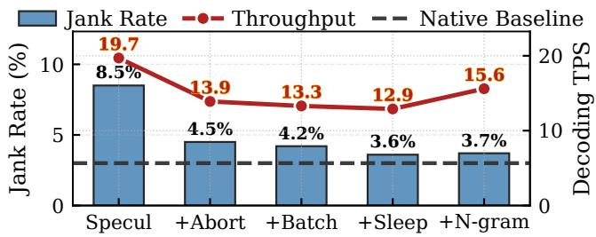  
Figure 12: Ablation with dual axes: QoS and throughput.

## 7.4 Ablation Study

Component ablation. We quantify each component’s contribution by enabling them one at a time on four representative apps (Chrome, WeChat, YouTube, and Genshin) covering all categories, as shown in Figure 12.

The baseline, i.e., standard speculative decoding, achieves the highest throughput (19.7 tokens/s) but suffers from a high jank rate of 8.5% (Native is 3.0%) due to unregulated memory bursts. Introducing Draft Preemption is the largest single intervention because it targets the bandwidth-dominant draft phase: it reduces the jank rate by 47% (to 4.5%). This confirms that sub-millisecond preemptibility is the primary prerequisite for responsiveness. The remaining components address different phases rather than competing with draft preemption. Selective Batching regulates verification by selecting lower-bandwidth verification graphs at a throughput cost, reducing jank from 4.5% to 4.2% while throughput changes from 13.9 to 13.3 tokens/s. Micro-Sleeps further handle residual verification bursts, lowering jank to 3.6%. However, this rigorous protection comes at a cost, reducing decoding throughput to 12.9 tokens/s. Crucially, N-gram Filling is not a contention-control primitive; it compensates for the throughput loss caused by preemption, recovering throughput to 15.6 tokens/s (+20.9% over the preemption+batch+sleep configuration) without compromising QoS.

This ablation demonstrates that SERENO’s components are non-redundant and complementary: the control plane (Draft Preemption/Selective Batching/Micro-Sleeps, §5.3) establishes the safety boundary for foreground tasks, while the algorithmic plane (N-gram Filling, §5.1) maximizes the utilization of the remaining bandwidth budget.

N-gram filling ablation. To isolate the impact of our Ngram Filling enhancements, we follow the setup in §7.4 but operate in a contention-free environment. We restrict the neural draft model to 12 tokens and use N-gram Filling to pad the verification batch up to 32 tokens. This forces prediction on distal tokens, where model confidence is typ ically lower. Under this constraint, a naive baseline yields an acceptance rate of 0.64% and a throughput of 14.42 tokens/s. Integrating Multi-source Construction provides the first major improvement—increasing throughput to 16.40 tokens/s (+13.7%)—which confirms the value of recycled drafts. Subsequently, applying Self-Purifying and Adaptive Length Weighting further improves the acceptance rate to 2.59% and lifts the final throughput to 18.06 tokens/s. Collectively, these optimizations recover 25.2% of the decoding speed lost due to preemptions.

## 7.5 System Analysis

We evaluate the practical deployability of SERENO by analyzing its energy efficiency, hardware generality, task robustness, and resource overhead.

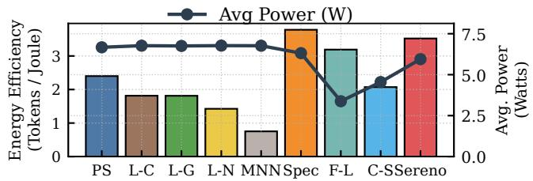  
Figure 13: Energy efficiency. Abbreviations follow Figure 7.

Energy efficiency. Mobile inference is strictly energyconstrained. Figure 13 compares system-wide energy efficiency (tokens/J). SERENO achieves 3.52 tokens/J, significantly outperforming CPU-based solutions (1.81 tokens/J) and naive strategies like Chunk-Sleep (2.07 tokens/J). Although SERENO’s efficiency is slightly lower than Speculative (3.78 tokens/J) due to the control overhead and forced yielding, it offers a better trade-off than heuristic throttling. This efficiency gain over Chunk-Sleep stems from a race-tosleep strategy: SERENO utilizes the NPU’s high-performance operating points to complete valid work quickly before yielding, while naive throttling prolongs execution time, incurring higher accumulated static power leakage.

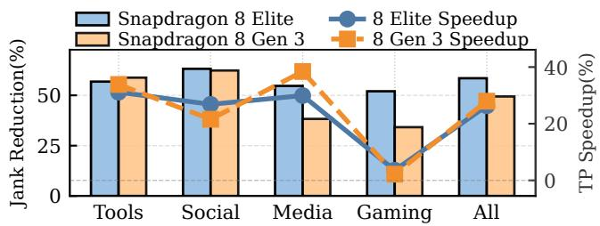  
Figure 14: Robustness compared across generations. Jank rate reduction is compared with PowerServe.

Hardware generality. To verify hardware robustness, we replicate experiments on a Snapdragon 8 Gen 3 device (Figure 14). For CPU-dominant workloads like Tools and Social, SERENO maintains consistent effectiveness on the Gen 3 device, achieving jank rate reductions of 58.79% and 62.34% respectively, similar to the Snapdragon 8 Elite’s 56.82% and 59.23% reductions. However, in Gaming scenarios, the reduction drops from 52.03% (Elite) to 29.70% (Gen 3). This is because the weaker Gen 3 GPU/CPU makes jank frames often stem from compute saturation rather than bandwidth contention, and SERENO’s bandwidth regulation is naturally bounded once the bottleneck shifts to compute—though it remains effective in bandwidth-bound scenarios.

Task and model robustness. LLM speculation acceptance rates vary by task complexity. We use three applications (Chrome, WeChat, YouTube) to evaluate SERENO across three distinct datasets: ShareGPT, GSM8K, and HumanEval, randomly selecting 150 prompts from each. Despite semantic differences, SERENO maintains a stable throughput (15.89– 17.16 tokens/s) and consistent jank rate (7.45–8.12%), confirming that our endogenous signal detects physical memory pressure regardless of token distribution. We did not evaluate output accuracy, as SERENO is lossless by design.

We standardize on the Llama family as representative of Transformer workloads with invariant memory access patterns. Our 1B-parameter draft model is relatively large for on-device use, establishing a conservative lower bound on control granularity: smaller drafts (e.g., <500M) incur lower per-layer latency, offering finer preemption points and further enhancing SERENO’s responsiveness.

System overhead. Compared to the PowerServe baseline, SERENO introduces a marginal CPU utilization increase of \~4.7% (on a single core) due to the bandwidth controller and N-gram Filling. Regarding memory footprint, the system incurs an additional 0.86 GB usage (+19%). This increase is dominated by draft-model weights—an inherent cost of speculative decoding—not SERENO’s control logic; the precompiled static graphs specific to SERENO add a negligible <70 MB. Given modern 12 GB+ RAM, this is a justifiable trade-off for the interactivity gains.

## 8 Related Work & Discussion

Efficient On-Device LLM Inference. Optimization techniques such as quantization [51, 85] and sparsity [6, 80] reduce overheads, while inference frameworks [19, 27, 29, 55, 60,61,66,73,86,98,100] use heterogeneous compute to maximize throughput. These works implicitly assume exclusive resource access and overlook contention in mobile multitasking. SERENO’s control plane is orthogonal to these optimizations and can be integrated atop many of these engines.

Speculative Decoding Techniques. Speculative decoding [18, 46] and variants like EAGLE-X [48–50], and others [16, 25, 35, 37, 47, 59, 62, 81, 84, 101, 102] have become standard for on-device inference acceleration. Prior studies treat speculation purely as acceleration; SERENO instead repurposes its algorithmic elasticity into a mechanism for finegrained, interruptible resource scheduling, turning an acceleration technique into a QoS control primitive. This principle also applies to other methods, such as early exit [22, 52], by steering shallow/deep paths under memory pressure.

Memory Bandwidth Management. Many works notice the importance of memory bandwidth management in systemlevel QoS [20, 42]. Server-grade systems like LIBRA [107], MT2 [103], and others [2, 83, 105] rely on hardware enforcement (e.g., RDT [38]/MPAM), while BWLOCK-style systems [2, 3, 104, 105] throttle controllable CPU cores. Mobile NPUs expose neither portable flow control nor schedulervisible bandwidth accounting, so these mechanisms do not apply. SERENO instead restructures inference via elastic speculative decoding, providing a software-only solution compati ble with existing hardware.

Platform scope. Our experimental claims are limited to commercial Snapdragon devices, where we can run foreground/LLM co-execution; source analysis extends the architectural evidence to Dimensity and Exynos SoCs, which expose vendor-specific accelerator traffic or thermal hooks but no portable per-application NPU bandwidth quota. Apple SoCs and unified-memory laptops likely face similar UMA-plus-accelerator contention, though closed toolchains limit mechanism-level claims; discrete-GPU laptops differ because inference and rendering may reside in separate memory. SERENO is thus most relevant to unified-memory smartphones, tablets, AI PCs, AR/VR headsets, and robots.

Model architecture scope. SERENO is evaluated on dense Transformer LLMs, but its requirement is broader: autoregressive inference must expose fine-grained points where tentative work can be stopped without corrupting committed state. The principle applies to MoE models [24, 39] as long as decoding stays bandwidth-bound and speculative work is preemptible, and to SSM-style or hybrid models [32], though Mamba/SSM speculation requires architecture-aware state rollback and verification [92, 96]. What carries over is the control principle, not the exact Transformer-layer actuator.

Overhead optimization. The current prototype uses a 1B draft model, making the reported memory overhead conservative for smaller on-device assistants. Smaller or quantized draft models [51, 85], adaptive speculation depth, and shared KV-cache or shared-prefix representations could further increase the frequency of yielding.

Future hardware trends. We expect contention to remain relevant as mobile NPUs scale: compute throughput and accelerator count grow far faster than package-level DRAM bandwidth and energy, so on UMA devices the gap between how fast accelerators request data and how much shared traffic foreground tasks tolerate keeps widening. Unless future SoCs expose portable per-client NPU bandwidth controls, software-level cooperative yielding remains necessary even as absolute bandwidth improves.

## 9 Conclusion

We presented SERENO, a software-only framework that resolves the asymmetric interference from on-device LLMs by repurposing speculative decoding into a fine-grained control primitive. SERENO restores foreground smoothness to nearnative levels while sustaining competitive LLM throughput.

## Acknowledgments

We sincerely thank our shepherd and the anonymous reviewers for their insightful comments. This work is supported in part by the Fundamental and Interdisciplinary Disciplines Breakthrough Plan of the Ministry of Education of China (Grant No. JYB2025XDXM113), and the National Natural Science Foundation of China (Grant Nos. 62132014 and 62372287). Mingkai Dong (mingkaidong@sjtu.edu.cn) and Zeyu Mi (yzmizeyu@sjtu.edu.cn) are the corresponding authors.

## References

[1] Helen Sydney Adams. Oppo to make ai phones accessible to 50m smartphone users, 2024.

[2] Homa Aghilinasab, Waqar Ali, Heechul Yun, and Rodolfo Pellizzoni. Dynamic memory bandwidth allocation for real-time gpu-based soc platforms. IEEE Transactions on Computer-Aided Design of Integrated Circuits and Systems, 39(11):3348–3360, 2020.

[3] Waqar Ali and Heechul Yun. Protecting real-time gpu kernels on integrated cpu-gpu soc platforms. arXiv preprint arXiv:1712.08738, 2017.

[4] AliExpress. OnePlus Ace Pro 10T 5G global rom 12/16gb snapdragon 8+ gen 1 120hz amoled display 150w charge 50mp triple camera smartphone. https://www.aliexpress.us/item/ 3256808828110227.html, 2025. Accessed: 2025-12- 09.

[5] AliExpress. Original Oneplus 13 mobile phone 50.0mp camera 100w charge ip69 waterproof 6000mah battery 6.82" oled 120hz snapdragon 8 elite. https://www.aliexpress.us/item/ 3256810002639267.html, 2025. Accessed: 2025-12- 09.

[6] Keivan Alizadeh, Seyed Iman Mirzadeh, Dmitry Belenko, S Khatamifard, Minsik Cho, Carlo C Del Mundo, Mohammad Rastegari, and Mehrdad Farajtabar. Llm in a flash: Efficient large language model inference with limited memory. In Proceedings of the 62nd Annual Meeting of the Association for Computational Linguistics (Volume 1: Long Papers), pages 12562–12584, 2024.

[7] Android Developers. Ui jank detection. https://developer.android.com/studio/ profile/jank-detection, 2023. Accessed: 2025-12-07.

[8] Android Developers. Monitor app health with Android Vitals. https://developer.android.com/topic/ performance/vitals, 2025. Accessed: 2025-12-07.

[9] Android Developers. Simpleperf command-line tool. https://developer.android.com/ndk/ guides/simpleperf, 2025. Accessed: 2025-12-07.

[10] Android Developers. Slow rendering. https: //developer.android.com/topic/performance/ rendering, 2025. Accessed: 2025-12-07.

[11] Apple Inc. Apple Intelligence: Personal intelligence that puts powerful generative models right at the core of your iPhone, iPad, and Mac. https://www.apple.

com/apple-intelligence/, 2024. Accessed: 2025- 12-07.

[12] ARM Limited. Memory system resource partitioning and monitoring (MPAM) for A-profile architecture. https://documentation-service.arm.com/ static/63fc88d656ea36189d4e77df, 2025. Accessed: 2025-12-07.

[13] Karl Johan Åström and Tore Hägglund. The future of pid control. Control engineering practice, 9(11):1163– 1175, 2001.

[14] Karl Johan Åström and Tore Hägglund. Revisiting the ziegler–nichols step response method for pid control. Journal of process control, 14(6):635–650, 2004.

[15] Rakesh P Borase, DK Maghade, SY Sondkar, and SN Pawar. A review of pid control, tuning methods and applications. International Journal of Dynamics and Control, 9(2):818–827, 2021.

[16] Tianle Cai, Yuhong Li, Zhengyang Geng, Hongwu Peng, Jason D. Lee, Deming Chen, and Tri Dao. Medusa: Simple llm inference acceleration framework with multiple decoding heads. In Proceedings of the 41st International Conference on Machine Learning, ICML’24. JMLR.org, 2024.

[17] ChargerLAB. ChargerLAB POWER-Z KM003C. https://www.power-z.com/products/ chargerlab-power-z-km003c, 2025. Accessed: 2025-12-11.

[18] Charlie Chen, Sebastian Borgeaud, Geoffrey Irving, Jean-Baptiste Lespiau, Laurent Sifre, and John Jumper. Accelerating large language model decoding with speculative sampling, 2023.

[19] Le Chen, Dahu Feng, Erhu Feng, Yingrui Wang, Rong Zhao, Yubin Xia, Pinjie Xu, and Haibo Chen. Charac terizing mobile soc for accelerating heterogeneous llm inference. In Proceedings of the ACM SIGOPS 31st Symposium on Operating Systems Principles, SOSP ’25, page 359–374, New York, NY, USA, 2025. Association for Computing Machinery.

[20] Russell Clapp, Martin Dimitrov, Karthik Kumar, Vish Viswanathan, and Thomas Willhalm. Quantifying the performance impact of memory latency and bandwidth for big data workloads. In 2015 IEEE International Symposium on Workload Characterization, pages 213– 224. IEEE, 2015.

[21] Karl Cobbe, Vineet Kosaraju, Mohammad Bavarian, Mark Chen, Heewoo Jun, Lukasz Kaiser, Matthias Plappert, Jerry Tworek, Jacob Hilton, Reiichiro Nakano, et al. Training verifiers to solve math word problems. arXiv preprint arXiv:2110.14168, 2021.

[22] Mostafa Elhoushi, Akshat Shrivastava, Diana Liskovich, Basil Hosmer, Bram Wasti, Liangzhen Lai, Anas Mahmoud, Bilge Acun, Saurabh Agarwal, Ahmed Roman, et al. Layerskip: Enabling early exit inference and self-speculative decoding. In Proceedings of the 62nd Annual Meeting of the Association for Computational Linguistics (Volume 1: Long Papers), pages 12622–12642, 2024.

[23] Pouya Esmaili-Dokht, Francesco Sgherzi, Valeria Soldera Girelli, Isaac Boixaderas, Mariana Carmin, Alireza Monemi, Adria Armejach, Estanislao Mercadal, German Llort, Petar Radojkovic, et al. A mess of´ memory system benchmarking, simulation and application profiling. In 2024 57th IEEE/ACM International Symposium on Microarchitecture (MICRO), pages 136– 152. IEEE, 2024.

[24] William Fedus, Barret Zoph, and Noam Shazeer. Switch transformers: Scaling to trillion parameter models with simple and efficient sparsity. Journal of Machine Learning Research, 23(120):1–39, 2022.

[25] Yichao Fu, Peter Bailis, Ion Stoica, and Hao Zhang. Break the sequential dependency of llm inference using lookahead decoding. In Proceedings of the 41st International Conference on Machine Learning, ICML’24. JMLR.org, 2024.

[26] Georgi Gerganov et al. The hexagon backend for llama.cpp. https://github.com/ggml-org/llama. cpp/blob/master/docs/backend/hexagon/ README.md, 2023. Accessed: 2025-12-11.

[27] Georgi Gerganov et al. llama.cpp: LLM inference in C/C++. https://github.com/ggml-org/llama. cpp, 2023. Release build b3706.

[28] Google. Gemini Nano: The most efficient model for ondevice tasks. https://developer.android.com/ ai/gemini-nano, 2024. Accessed: 2025-12-07.

[29] Google. LiteRT: High-performance on-device ai runtime. https://ai.google.dev/edge/litert, 2024. Accessed: 2025-12-07.

[30] Google. Perfetto documentation, 2024. Accessed: 2025-12-07.

[31] Aaron Grattafiori, Abhimanyu Dubey, Abhinav Jauhri, Abhinav Pandey, et al. The llama 3 herd of models, 2024.

[32] Albert Gu and Tri Dao. Mamba: Linear-time sequence modeling with selective state spaces, 2023.

[33] Chang C Hang, Karl Johan Åström, and Weng Khuen Ho. Refinements of the ziegler–nichols tuning formula.

IEE Proceedings D (Control Theory and Applications), 138(2):111–118, 1991.

[34] Zixu Hao, Jianyu Wei, Tuowei Wang, Minxing Huang, Huiqiang Jiang, Shiqi Jiang, Ting Cao, and Ju Ren. Scaling llm test-time compute with mobile npu on smartphones, 2025.

[35] Zhenyu He, Zexuan Zhong, Tianle Cai, Jason Lee, and Di He. REST: Retrieval-based speculative decoding. In Kevin Duh, Helena Gomez, and Steven Bethard, editors, Proceedings of the 2024 Conference of the North American Chapter of the Association for Computational Linguistics: Human Language Technologies (Volume 1: Long Papers), pages 1582–1595, Mexico City, Mexico, June 2024. Association for Computational Linguistics.

[36] Joseph L Hellerstein, Yixin Diao, Sujay Parekh, and Dawn M Tilbury. Feedback control of computing systems. John Wiley & Sons, 2004.

[37] Coleman Hooper, Sehoon Kim, Hiva Mohammadzadeh, Hasan Genc, Kurt Keutzer, Amir Gholami, and Yakun Sophia Shao. Speed: Speculative pipelined execution for efficient decoding. In Enhancing LLM Performance: Efficacy, Fine-Tuning, and Inference Techniques, pages 19–32. Springer, 2025.

[38] Intel Corporation. Intel® resource director technology (Intel® RDT). https://www.intel.com/content/ www/us/en/architecture-and-technology/ resource-director-technology.html, 2025. Accessed: 2025-12-07.

[39] Albert Q. Jiang, Alexandre Sablayrolles, Antoine Roux, Arthur Mensch, Blanche Savary, Chris Bamford, Devendra Singh Chaplot, Diego de Las Casas, Emma Bou Hanna, Florian Bressand, Gianna Lengyel, Guillaume Bour, Guillaume Lample, Lélio Renard Lavaud, Lucile Saulnier, Marie-Anne Lachaux, Pierre Stock, Sandeep Subramanian, Sophia Yang, Szymon Antoniak, Teven Le Scao, Théophile Gervet, Thibaut Lavril, Thomas Wang, Timothée Lacroix, and William El Sayed. Mixtral of experts, 2024.

[40] Michael A Johnson and Mohammad H Moradi. PID control. Springer, 2005.

[41] Carl Knospe. Pid control. IEEE Control Systems Magazine, 26(1):30–31, 2006.

[42] Johannes Langguth, Xing Cai, and Mohammed Sourouri. Memory bandwidth contention: Communication vs computation tradeoffs in supercomputers with multicore architectures. In 2018 IEEE 24th International Conference on Parallel and Distributed Systems (ICPADS), pages 497–506. IEEE, 2018.

[43] Etienne Le Sueur and Gernot Heiser. Dynamic voltage and frequency scaling: The laws of diminishing returns. In Proceedings of the 2010 international conference on Power aware computing and systems, pages 1–8, 2010.

[44] Changhyun Lee, Chunjong Park, Keon Jang, Sue Moon, and Dongsu Han. Accurate latency-based congestion feedback for datacenters. In 2015 USENIX Annual Technical Conference (USENIX ATC 15), pages 403–415, Santa Clara, CA, July 2015. USENIX Association.

[45] Changhyun Lee, Chunjong Park, Keon Jang, Sue Moon, and Dongsu Han. Dx: Latency-based congestion control for datacenters. IEEE/ACM Transactions on Networking, 25(1):335–348, 2017.

[46] Yaniv Leviathan, Matan Kalman, and Yossi Matias. Fast inference from transformers via speculative decoding. In Andreas Krause, Emma Brunskill, Kyunghyun Cho, Barbara Engelhardt, Sivan Sabato, and Jonathan Scarlett, editors, Proceedings of the 40th International Conference on Machine Learning, volume 202 of Proceedings of Machine Learning Research, pages 19274– 19286. PMLR, 23–29 Jul 2023.

[47] Minghan Li, Xilun Chen, Ari Holtzman, Beidi Chen, Jimmy Lin, Scott Yih, and Victoria Lin. Nearest neighbor speculative decoding for llm generation and attribution. Advances in Neural Information Processing Systems, 37:80987–81015, 2024.

[48] Yuhui Li, Fangyun Wei, Chao Zhang, and Hongyang Zhang. Eagle-2: Faster inference of language models with dynamic draft trees, 2024.

[49] Yuhui Li, Fangyun Wei, Chao Zhang, and Hongyang Zhang. Eagle: speculative sampling requires rethinking feature uncertainty. In Proceedings of the 41st International Conference on Machine Learning, ICML’24. JMLR.org, 2024.

[50] Yuhui Li, Fangyun Wei, Chao Zhang, and Hongyang Zhang. Eagle-3: Scaling up inference acceleration of large language models via training-time test, 2025.

[51] Ji Lin, Jiaming Tang, Haotian Tang, Shang Yang, Wei-Ming Chen, Wei-Chen Wang, Guangxuan Xiao, Xingyu Dang, Chuang Gan, and Song Han. Awq: Activation-aware weight quantization for on-device llm compression and acceleration. In P. Gibbons, G. Pekhimenko, and C. De Sa, editors, Proceedings of Machine Learning and Systems, volume 6, pages 87–100, 2024.

[52] Fangcheng Liu, Yehui Tang, Zhenhua Liu, Yunsheng Ni, Duyu Tang, Kai Han, and Yunhe Wang. Kangaroo: Lossless self-speculative decoding for accelerating

LLMs via double early exiting. In The Thirty-eighth Annual Conference on Neural Information Processing Systems, 2024.

[53] Xiao Liu, Bo Qin, Dongzhu Liang, Guang Dong, Hanyu Lai, Hanchen Zhang, Hanlin Zhao, Iat Long Iong, Jiadai Sun, Jiaqi Wang, et al. Autoglm: Autonomous foundation agents for guis. arXiv preprint arXiv:2411.00820, 2024.

[54] Xudong Lu, Yinghao Chen, Cheng Chen, Hui Tan, Boheng Chen, Yina Xie, Rui Hu, Guanxin Tan, Renshou Wu, Yan Hu, et al. Bluelm-v-3b: Algorithm and system co-design for multimodal large language models on mobile devices. In Proceedings of the Computer Vision and Pattern Recognition Conference, pages 4145– 4155, 2025.

[55] Chengfei Lv, Chaoyue Niu, Renjie Gu, Xiaotang Jiang, Zhaode Wang, Bin Liu, Ziqi Wu, Qiulin Yao, Congyu Huang, Panos Huang, Tao Huang, Hui Shu, Jinde Song, Bin Zou, Peng Lan, Guohuan Xu, Fei Wu, Shaojie Tang, Fan Wu, and Guihai Chen. Walle: An Endto-End, General-Purpose, and Large-Scale production system for Device-Cloud collaborative machine learning. In 16th USENIX Symposium on Operating Systems Design and Implementation (OSDI 22), pages 249–265, Carlsbad, CA, July 2022. USENIX Association.

[56] MediaTek Inc. MediaTek AI: Enhancing your life with AI on edge devices. https://i.mediatek.com/ai, 2025. Accessed: 2025-12-07.

[57] MediaTek Inc. Mediatek dimensity 9400. https://www.mediatek.com/products/ smartphones/mediatek-dimensity-9400, 2025. Accessed: 2025-12-09.

[58] Sachin Mehta, Mohammad Hossein Sekhavat, Qingqing Cao, Maxwell Horton, Yanzi Jin, Chenfan Sun, Seyed Iman Mirzadeh, Mahyar Najibi, Dmitry Belenko, Peter Zatloukal, and Mohammad Rastegari. OpenELM: An efficient language model family with open training and inference framework. In Workshop on Efficient Systems for Foundation Models II @ ICML 2024, 2024.

[59] Xupeng Miao, Gabriele Oliaro, Zhihao Zhang, Xinhao Cheng, Zeyu Wang, Zhengxin Zhang, Rae Ying Yee Wong, Alan Zhu, Lijie Yang, Xiaoxiang Shi, Chunan Shi, Zhuoming Chen, Daiyaan Arfeen, Reyna Abhyankar, and Zhihao Jia. Specinfer: Accelerating large language model serving with tree-based speculative inference and verification. In Proceedings of the 29th ACM International Conference on Architectural Support for Programming Languages and Operating Systems, Volume 3, ASPLOS ’24, page 932–949, New

York, NY, USA, 2024. Association for Computing Machinery.

[60] Microsoft. ONNX Runtime: Cross-platform, high performance ml inference and training accelerator. https://onnxruntime.ai/, 2024. Accessed: 2025- 12-07.

[61] MLC team. MLC-LLM, 2023-2025.

[62] Giovanni Monea, Armand Joulin, and Edouard Grave. Pass: Parallel speculative sampling, 2023.

[63] Yutao Mou, Shiyu Huang, Haoyu Kuang, Buzhou Tang, Yu Chen, Jiongchao Jin, Ruoyu Zhang, Ruixuan Huang, Hao Mou, Yi Li, Xuan Luo, Jingcheng Yin, Yang Liu, Yong Peng, Ziyi Ni, Jie Li, and Wei Li. SmartBench: Is your LLM truly a good Chinese smartphone assistant? In Proceedings of the 2025 Conference on Empirical Methods in Natural Language Processing (EMNLP 2025), 2025. Includes systematic categorization of ondevice LLM functionalities: text summarization, Q&A, information extraction, content creation, and notification management.

[64] OnePlusOSS. android\_kernel\_modules\_and\_devicetree\_oneplus\_mt6991 https://github.com/OnePlusOSS/android\_ kernel\_modules\_and\_devicetree\_ oneplus\_mt6991, 2025. Branch: oneplus/mt6991\_v\_15.0.2\_ace5\_ultra; Commit: 76d6e1e5b8deb0bcd00355d7a9e68638a501d8bc; Accessed: 2025-12-07.

[65] OnePlusOSS. android\_kernel\_modules\_and\_devicetree\_oneplus\_sm8750 (repo sync checkout). https://github.com/ OnePlusOSS/kernel\_manifest, 2025. Branch: oneplus/sm8750; Manifest File: oneplus\_13.xml; Kernel Path: kernel\_platform/msm-kernel; Commit: a85bac41e21a790e216039cde1d34a6c5d6416d1; Accessed: 2025-12-07.

[66] PowerServe Project. PowerServe: High-speed and easy-use LLM serving framework for local deployment. https://github.com/powerserve-project/ PowerServe, 2025. Accessed: 2025-12-07.

[67] Primate Labs Inc. Android benchmark chart. https://browser.geekbench.com/ android-benchmarks, 2025. Accessed: 2025- 12-09.

[68] Primate Labs Inc. Geekbench. https://www. geekbench.com/, 2025. Accessed: 2025-12-11.

[69] Jiaxing Qiu, Zijie Zhou, Yang Li, Zhenhua Li, Feng Qian, Hao Lin, Di Gao, Haitao Su, Xin Miao, Yunhao Liu, and Tianyin Xu. vsoc: Efficient virtual system-onchip on heterogeneous hardware. In Proceedings of the ACM SIGOPS 30th Symposium on Operating Systems Principles, SOSP ’24, page 558–573, New York, NY, USA, 2024. Association for Computing Machinery.

[70] Qualcomm. Heterogeneous Task Processor (HTP) Backend. https://docs.qualcomm.com/doc/ 80-63442-10/topic/htp\_backend.html, 2025. Accessed: 2025-12-07.

[71] Qualcomm Technologies, Inc. Hexagon DSP architecture overview. https://docs.qualcomm.com/doc/ 80-70017-15SC/topic/architecture.html, 2025. Accessed: 2025-12-09.

[72] Qualcomm Technologies, Inc. Qualcomm AI Engine. https://www.qualcomm.com/processors/ ai-engine, 2025. Accessed: 2025-12-07.

[73] Qualcomm Technologies, Inc. Qualcomm AI Hub. https://aihub.qualcomm.com/, 2025. Accessed: 2025-12-07.

[74] Qualcomm Technologies, Inc. Qualcomm Neural Network (QNN) SDK Documentation. https://docs.qualcomm.com/nav/home/index\_ QNN.html?product=1601111740009302, 2025. Accessed: 2025-12-07.

[75] Qualcomm Technologies, Inc. Snapdragon 8 elite mobile platform. https://www.qualcomm. com/smartphones/products/8-series/ snapdragon-8-elite-mobile-platform, 2025. Accessed: 2025-12-09.

[76] Qualcomm Technologies, Inc. Snapdragon profiler. https://www.qualcomm.com/developer/ software/snapdragon-profiler, 2025. Accessed: 2025-12-07.

[77] Samsung Electronics. Galaxy AI: The new era of mobile AI. https://www.samsung.com/galaxy-ai/, 2024. Accessed: 2026-05-05.

[78] Samsung Open Source Release Center. Exynos 2400 (s5e9945) kernel source. https://opensource. samsung.com/, 2024. Device tree files include s5e9945-npu.dtsi, s5e9945-bts.dtsi, and s5e9945- thermal.dtsi; accessed: 2026-05-05.

[79] Claude E Shannon. A mathematical theory of communication. The Bell system technical journal, 27(3):379– 423, 1948.

[80] Yixin Song, Zeyu Mi, Haotong Xie, and Haibo Chen. Powerinfer: Fast large language model serving with a consumer-grade gpu. In Proceedings of the ACM SIGOPS 30th Symposium on Operating Systems Principles, SOSP ’24, page 590–606, New York, NY, USA, 2024. Association for Computing Machinery.

[81] Hanshi Sun, Zhuoming Chen, Xinyu Yang, Yuandong Tian, and Beidi Chen. Triforce: Lossless acceleration of long sequence generation with hierarchical speculative decoding. In First Conference on Language Modeling, 2024.

[82] Shaotong Sun, Yifan Zhu, Xingzhi Ye, and Chen Ding. Measuring data access latency in large cpu caches. In Proceedings of the International Symposium on Memory Systems, pages 129–139, 2024.

[83] Hanul Sung, Jeesoo Min, Sujin Ha, and Hyeonsang Eom. Ombm: optimized memory bandwidth management for ensuring qos and high server utilization. Cluster Computing, 22(1):161–174, 2019.

[84] Ruslan Svirschevski, Avner May, Zhuoming Chen, Beidi Chen, Zhihao Jia, and Max Ryabinin. Specexec: massively parallel speculative decoding for interactive llm inference on consumer devices. In Proceedings of the 38th International Conference on Neural Information Processing Systems, NIPS ’24, Red Hook, NY, USA, 2024. Curran Associates Inc.

[85] Fuwen Tan, Royson Lee, Łukasz Dudziak, Shell Xu Hu, Sourav Bhattacharya, Timothy Hospedales, Georgios Tzimiropoulos, and Brais Martinez. Mobilequant: Mobile-friendly quantization for on-device language models, 2024.

[86] Tencent. ncnn: High-performance neural network inference framework optimized for the mobile platform. https://github.com/Tencent/ncnn, 2024. Accessed: 2025-12-07.

[87] The Perfetto Authors. FrameTimeline trace processor module. https://perfetto.dev/docs/ data-sources/frametimeline, 2025. Accessed: 2025-12-07.

[88] UL Solutions. 3DMark. https://www.3dmark.com/, 2025. Accessed: 2025-12-11.

[89] UL Solutions. Best smartphones - 3dmark benchmark performance. https://benchmarks.ul.com/ compare/best-smartphones, 2025. Accessed: 2025-12-09.

[90] Midhul Vuppalapati and Rachit Agarwal. Tiered memory management: Access latency is the key! In Proceedings of the ACM SIGOPS 30th Symposium on Operating Systems Principles, pages 79–94, 2024.

[91] Jikai Wang, Yi Su, Juntao Li, Qingrong Xia, Zi Ye, Xinyu Duan, Zhefeng Wang, and Min Zhang. OPT-tree: Speculative decoding with adaptive draft tree structure. Transactions of the Association for Computational Linguistics, 13:188–199, 2025.

[92] Junxiong Wang, Daniele Paliotta, Avner May, Alexander M. Rush, and Tri Dao. The mamba in the llama: Distilling and accelerating hybrid models, 2024.

[93] Junyang Wang, Haiyang Xu, Haitao Jia, Xi Zhang, Ming Yan, Weizhou Shen, Ji Zhang, Fei Huang, and Jitao Sang. Mobile-agent-v2: Mobile device operation assistant with effective navigation via multi-agent collaboration. Advances in Neural Information Processing Systems, 37:2686–2710, 2024.

[94] Zibo Wang, Yijia Zhang, Fuchun Wei, Bingqiang Wang, Yanlin Liu, Zhiheng Hu, Jingyi Zhang, Xiaoxin Xu, Jian He, Xiaoliang Wang, et al. Using analytical performance/power model and fine-grained dvfs to enhance ai accelerator energy efficiency. In Proceedings of the 30th ACM International Conference on Architectural Support for Programming Languages and Operating Systems, Volume 1, pages 1118–1132, 2025.

[95] Hao Wen, Yuanchun Li, Guohong Liu, Shanhui Zhao, Tao Yu, Toby Jia-Jun Li, Shiqi Jiang, Yunhao Liu, Yaqin Zhang, and Yunxin Liu. Autodroid: Llmpowered task automation in android. In Proceedings of the 30th Annual International Conference on Mobile Computing and Networking, ACM MobiCom ’24, page 543–557, New York, NY, USA, 2024. Association for Computing Machinery.

[96] Yangchao Wu, Zongyue Qin, Alex Wong, and Stefano Soatto. Stree: Speculative tree decoding for hybrid state-space models, 2025.

[97] Yuanpei Wu, Dong Du, Chao Xu, Yubin Xia, Ming Fu, Binyu Zang, and Haibo Chen. D-vsync: Decoupled rendering and displaying for smartphone graphics. In Proceedings of the 30th ACM International Conference on Architectural Support for Programming Languages and Operating Systems, Volume 1, ASPLOS ’25, page 326–341, New York, NY, USA, 2025. Association for Computing Machinery.

[98] Daliang Xu, Hao Zhang, Liming Yang, Ruiqi Liu, Gang Huang, Mengwei Xu, and Xuanzhe Liu. Fast on-device llm inference with npus. In Proceedings of the 30th ACM International Conference on Architectural Support for Programming Languages and Operating Systems, Volume 1, ASPLOS ’25, page 445–462, New York, NY, USA, 2025. Association for Computing Machinery.

[99] Yifan Xu, Xiao Liu, Xinghan Liu, Jiaqi Fu, Hanchen Zhang, Bohao Jing, Shudan Zhang, Yuting Wang, Wenyi Zhao, and Yuxiao Dong. Mobilerl: Online agentic reinforcement learning for mobile gui agents. arXiv preprint arXiv:2509.18119, 2025.

[100] Zhenliang Xue, Yixin Song, Zeyu Mi, Xinrui Zheng, Yubin Xia, and Haibo Chen. Powerinfer-2: Fast large language model inference on a smartphone, 2024.

[101] Seongjun Yang, Gibbeum Lee, Jaewoong Cho, Dimitris Papailiopoulos, and Kangwook Lee. Predictive pipelined decoding: A compute-latency trade-off for exact LLM decoding. In Workshop on Efficient Systems for Foundation Models @ ICML2023, 2023.

[102] Hanling Yi, Feng Lin, Hongbin Li, Ning Peiyang, Xiaotian Yu, and Rong Xiao. Generation meets verification: Accelerating large language model inference with smart parallel auto-correct decoding. In Findings of the Association for Computational Linguistics: ACL 2024, pages 5285–5299, 2024.

[103] Jifei Yi, Benchao Dong, Mingkai Dong, Ruizhe Tong, and Haibo Chen. {MTˆ 2}: Memory bandwidth regulation on hybrid {NVM/DRAM} platforms. In 20th USENIX Conference on File and Storage Technologies (FAST 22), pages 199–216, 2022.

[104] Heechul Yun, Waqar Ali, Santosh Gondi, and Siddhartha Biswas. Bwlock: A dynamic memory access control framework for soft real-time applications on multicore platforms. IEEE Transactions on Computers, 66(7):1247–1252, 2016.

[105] Heechul Yun, Gang Yao, Rodolfo Pellizzoni, Marco Caccamo, and Lui Sha. Memguard: Memory bandwidth reservation system for efficient performance isolation in multi-core platforms. In 2013 IEEE 19th Real-Time and Embedded Technology and Applications Symposium (RTAS), pages 55–64, 2013.

[106] Wei Zeng, Xiaozhe Ren, Teng Su, Hui Wang, Yi Liao, Zhiwei Wang, Xin Jiang, ZhenZhang Yang, Kaisheng Wang andx Xiaoda Zhang, Chen Li, Ziyan Gong, Yifan Yao, Xinjing Huang, Jun Wang, Jianfeng Yu, Qi Guo, Yue Yu, Yan Zhang, Jin Wang, Hengtao Tao, Dasen Yan, Zexuan Yi, Fang Peng, Fangqing Jiang, Han Zhang, Lingfeng Deng, Yehong Zhang, Zhe Lin, Chao Zhang, Shaojie Zhang, Mingyue Guo, Shanzhi Gu, Gaojun Fan, Yaowei Wang, Xuefeng Jin, Qun Liu, and Yonghong Tian. Pangu-α: Large-scale autoregressive pretrained chinese language models with autoparallel computation. CoRR, abs/2104.12369, 2021.

[107] Ying Zhang, Jian Chen, Xiaowei Jiang, Qiang Liu, Ian M. Steiner, Andrew J. Herdrich, Kevin Shu, Ri-

pan Das, Long Cui, and Litrin Jiang. Libra: Clearing the cloud through dynamic memory bandwidth management. In 2021 IEEE International Symposium on High-Performance Computer Architecture (HPCA), pages 815–826, 2021.

[108] John G Ziegler and Nathaniel B Nichols. Optimum settings for automatic controllers. Transactions of the American society of mechanical engineers, 64(8):759– 765, 1942.