USENIX

THE ADVANCED COMPUTING SYSTEMS ASSOCIATION

# BatchGen: An Architecture for Scalable and Efficient Batch Inference

Tairan Xu, Leyang Xue, and Zhan Lu, University of Edinburgh; Jinfu Deng and Hongyang Xiao, Tencent; Yinsicheng Jiang, Congjie He, Matej Sandor, Le Xu, and Luo Mai, University of Edinburgh

https://www.usenix.org/conference/osdi26/presentation/xu-tairan

# This paper is included in the Proceedings of the 20th USENIX Symposium on Operating Systems Design and Implementation.

July 13–15, 2026 • Seattle, WA, USA

ISBN 978-1-939133-55-7

Open access to the Proceedings of the 20th USENIX Symposium on Operating Systems Design and Implementation is sponsored by

# BatchGen: An Architecture for Scalable and Efficient Batch Inference

Tairan Xu†∗, Leyang Xue†∗, Zhan Lu†∗, Jinfu Deng‡, Hongyang Xiao‡, Yinsicheng Jiang†, Congjie He†, Matej Sandor†, Le Xu†, Luo Mai†

†University of Edinburgh, ‡Tencent

## Abstract

Batch inference has become a central mode of AI computation, yet existing inference engines still rely on execution models designed for interactive serving. When scaled to millions of sequences, batch workloads reveal two fundamental requirements: the ability to handle extreme inter- and intrasequence load variation that emerges only at runtime, and the ability to sustain high utilization across large fleets of GPUs. Existing systems fail to meet these requirements, losing substantial fractions of achievable throughput.

We introduce a new architectural foundation for batch inference: the sequence coroutine compute model, which represents each sequence as a fine-grained, event-driven coroutine. This model exposes expressive primitives that allow the runtime to reorganize work dynamically, enabling larger expertlevel batches, mitigating stragglers, reallocating work across devices, and maintaining utilization even on cost-effective or memory-constrained GPUs. Building on this abstraction, we implement BatchGen, a production-ready system that uses the coroutine model at cluster scale. On a 128-GPU cluster, BatchGen reduces batch completion time by up to 2.3×, and on memory-constrained accelerators it outperforms the strongest offloading baseline by up to 9.6×.

## 1 Introduction

Batch inference has become one of the fastest-growing and most resource-intensive modes of AI computation [28, 58]. Offline inference pipelines [14, 53], synthetic data generation [26, 40], model evaluation [2, 5, 24], test-time scaling [44, 45], and RL rollouts [36] now dominate the compute budgets of major AI deployments. Unlike interactive serving [22, 32, 56], these workloads optimize batch completion time (BCT), operate at massive sequence scales [1, 34], and often run on memory-limited accelerators.

Batch inference introduces fundamentally new system requirements. A batch engine must (1) dynamically increase expert-level batch sizes for sparse models, (2) continuously rebalance load as long-tail sequences emerge, and (3) sustain high utilization across large fleets of GPUs. Crucially, these requirements arise directly from how modern AI is being scaled. State-of-the-art models rely on extreme sparsity, especially large Mixture-of-Experts (MoE) architectures, where tokens activate only a few experts among hundreds. Even milliontoken global batches decompose into small per-expert batches that fall far below GPU-saturating throughput. Meanwhile, test-time scaling and heavy reasoning workloads generate persistent long-tail sequences, creating stragglers that dominate BCT and leave many GPUs idle. These structural properties – expert sparsity, modular computation, and heavy-tailed generation – define a new operating mode that demands a scheduler capable of reorganizing computation at fine granularity.

Existing systems cannot meet these requirements because they inherit a latency-first execution model from interactive serving. Systems such as vLLM [22], SGLang [56], and TensorRT-LLM [32] statically bind each sequence’s computation and KV state to a fixed GPU, executing forward passes atomically to minimize per-sequence latency. This prevents pausing between neural modules, forming larger expert batches at runtime, or redistributing load as long-tail sequences appear. Disaggregated designs [57, 60] retain fixed placement assumptions and thus continue to underutilize GPUs. Even throughput-oriented systems [7, 59] inherit the same static scheduling model and cannot address the root causes of insufficient expert batching or decoding stragglers.

Our key intuition is that sequences themselves provide the right granularity for dynamic scheduling. Neural networks expose natural yield points at module boundaries, and persequence state is compact and migratable. This motivates a shift in design: treat sequences not as long-lived tasks pinned to devices, but as fine-grained, event-driven coroutines that can pause, resume, combine, partition, and migrate across GPUs. This architecture directly addresses the structural inefficiencies of batch inference. Specifically, this paper makes the following contributions:

(1) Sequence coroutine compute model. Each sequence is represented as a coroutine that carries all state required for correct execution. The model provides four expressive primitives, yield, combine, partition, and migrate. These operations allow the system to reorganize computation while preserving correctness. They make it possible to pause execution and combine sequences to form larger batches for sparse modules, partition stragglers across idle GPUs, and migrate coroutine state for effective load balancing. Existing inference architectures cannot naturally express these behaviors.

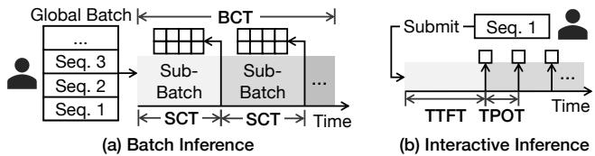  
Figure 1: New system design goals for batch inference.

(2) Efficient sequence coroutine runtime. The runtime implements event-driven scheduling at cluster scale and is grounded in two key observations. Prefill and decode place very different demands on memory and therefore benefit from different strategies for managing coroutine state. Meanwhile, both phases can run within a unified execution framework that jointly schedules, combines, and partitions coroutines over a shared pool of GPUs. This approach maximizes utilization and avoids leaving devices idle when workloads fluctuate.

(3) BatchGen, a production-ready system that utilizes this design. BatchGen supports multi-node and multi-GPU exe cution, provides a compatible and expressive batch inference interface, and includes a checkpoint management service that enables rapid cold starts. These capabilities are essential for practical deployment, especially when resource availability changes over time.

(4) Extensive evaluation of the system. Across MoE models, test-time scaling workloads, and reinforcement learning rollouts, BatchGen delivers strong and consistent improvements. On a 128-GPU cluster, it increases batching efficiency for expert layers, reduces the impact of long tail decoding stragglers [16], and lowers batch completion time by up to 2.3×. It outperforms leading inference engines [22, 32, 56] even on memory-constrained accelerators.

BatchGen has been deployed on production clusters to support batch-inference applications. We have open sourced BatchGen at https://github.com/batchgen-project/ batchgen to benefit the community. We believe the eventdriven sequence coroutine architecture represents a fundamental shift for batch inference, akin to the transition from thread-per-request servers (e.g., Apache [3]) to event-driven architectures (e.g., NGINX [31]) that redefined large-scale web systems.

## 2 Background and Motivation

## 2.1 Batch Inference and Its Key Objective

Major vendors now provide dedicated batch inference services, including OpenAI Batch Inference [34], AWS Bedrock batch processing [1], and Azure batch endpoints [29]. These services follow a simple model: users submit a batch of input sequences, such as prompts for LLMs, and receive the outputs only after the entire batch has finished processing. Depending on the application, batch sizes can vary widely, from tens of sequences in test-time scaling or thousands in reinforcement learning rollouts to millions in large-scale offline inference.

Batch inference systems focus on minimizing the completion time of the entire batch, which is fundamentally different from the responsiveness metrics emphasized in interactive inference. As shown in Figure 1, we define the batch completion time (BCT) as the total time from batch submission until every sequence in the batch has been processed. When an application requires partial or early results, the system divides the input into sub-batches, and returns outputs incrementally as each sub-batch finishes. In these cases, we define the sequence completion time (SCT) as the time from batch submission until a specific sequence’s output becomes available. SCT is determined by the completion time of the sub-batch that contains the sequence. Our primary optimization goal is to minimize BCT, since the user receives the full result only when the entire batch is done. In contrast, interactive inference prioritizes user-perceived responsiveness, focusing on metrics such as time to first token (TTFT) and time per output token (TPOT).

## 2.2 The Missing Batch Inference System

As adoption of batch inference increases across both industry and academic workflows, the demand for an efficient batch inference engine becomes even more evident. However, there are several challenges in scaling batch workloads: (i) batches continue to grow in size, which requires inference engines to sustain very high levels of concurrency. (ii) the computation required for each sequence can vary widely, which leads to substantial imbalance across GPUs and directly affects batch completion time. (iii) modern models introduce additional variation even within a single sequence because different neural network modules can have very different computational costs, further increasing the imbalance.

These limitations are not confined to a few specialized workloads. Instead, they appear consistently across batch inference settings. Below, we explain why high concurrency and load imbalance naturally arise from the way modern AI models and applications scale.

Insight 1: Intra-sequence imbalance is inherent to sparsity-driven model scaling. State-of-the-art AI models increasingly rely on sparse architectures, most notably Mixtureof-Experts (MoE), as the primary mechanism for scaling model capacity. Shown in Figure 2a, modern models such as DeepSeek-R1 [11], Kimi-K2 [21], GPT-5 [35], Gemini 3 Pro [38], and Grok [47] all deploy MoE models with hundreds of experts. The MoE layers contain the majority of the model parameters and contribute a large portion of the compute required for each token.

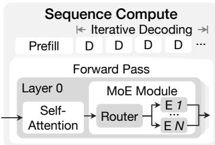  
(a) MoE sequence compute.

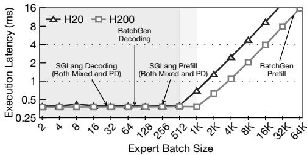  
(b) Insufficient batch size for experts.

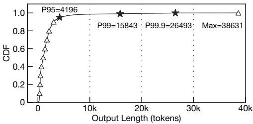  
(c) CDF of output lengths for DeepSeek-R1.  
Figure 2: Challenges in MoE batch inference.

Since each token activates only a small subset of experts, different tokens within the same sequence follow different execution paths. Some experts are selected far more often than others, and these variations accumulate as model capacity grows. As a result, intra-sequence imbalance is not a product of specific implementations but an intrinsic consequence of sparsity-driven scaling.

The intra-sequence imbalance causes today’s state-of-theart inference engines, even when they are configured in disaggregated mode (prefill-decoding separation), to suffer from underutilizing the GPUs by around 50% even though the input batch has sufficiently massive sequences (shown by Fig ure 2b). SGLang mixed means that prefill and decoding phases are deployed on the same servers, while SGLang PD uses prefill-decoding disaggregation, with the two phases deployed on separate servers.

Insight 2: Test-time scaling amplifies long-tail generation, causing inter-sequence imbalance. Batch inference work loads exhibit a persistent long-tail effect, where a small fraction of sequences dominate the overall computation. This phenomenon is especially critical in scenarios where batch completion time dominates the pipeline time, such as RL rollouts and deep-thinking pipelines.

Figure 2c illustrates this effect for DeepSeek-R1 on a production dataset trace. The imbalance in decoding lengths is severe: the P99 output length is 3.78× longer than P95, and the maximum length reaches 9.2× that of P95. These stragglers determine batch completion time, leaving most GPUs idle while waiting for a few long-running sequences.

The long tail issues create two key scalability challenges. (1) First, because decoding is sequential, a few extremely long sequences determine the batch completion time, acting as stragglers. (2) Second, GPUs processing shorter sequences finish early and remain idle, amplifying load imbalance between GPUs. In production workloads we consistently observe that this imbalance causes existing engines [22, 32, 56], and their disaggregated variants to lose roughly 10% to 70% of achievable GPU performance. This demonstrates that intersequence imbalance is not a rare occurrence but an inherent property of large batch inference workloads.

Takeaway. Together, these requirements and insights reveal the need for a new class of systems: batch-native inference engines that can sustain high utilization across large fleets of parallel GPUs while processing massive numbers of concurrent sequences, despite inter- and intra-sequence load variation that is only revealed at runtime.

## 3 BatchGen Design Intuitions

We begin by examining the design philosophy underlying existing inference engines.

Today’s latency-driven scheduling model is a fundamental mismatch for batch inference. State-of-the-art systems such as SGLang [56] and vLLM [22] – regardless of whether they operate in continuous batching mode, chunked prefill, or a disaggregated configuration – are architected around a single objective: complete each sequence as quickly as possible. To meet this objective, they bind each sequence’s computation and state (e.g., KV-cache) to a fixed device and execute it without interruption.

This binding philosophy appears at two levels. Within a forward pass, execution is atomic: once a batch enters the model, all sequences traverse every layer together before any scheduling decision can be made. There is no mechanism to pause between modules–e.g., to accumulate more sequences after attention before executing MoE. Across forward passes, sequences remain attached to the same device; moving a sequence’s state elsewhere is treated as an exceptional, expensive operation to avoid. As a result, each sequence is permanently bound to its assigned GPU and cannot be moved or rescheduled. Once a sequence joins a batch, it stays with that batch until its own completion.

This design is well suited for interactive serving, where minimizing per-sequence latency dominates all other concerns. However, in batch inference, the rigidity becomes a core limitation-both in the scheduling plans the system can express and in the granularity at which it can intervene. The engine cannot pause a sequence mid-layer to form a more efficient expert batch, cannot adapt the plan as imbalance develops, and cannot redistribute work when some sequences finish far earlier than others.

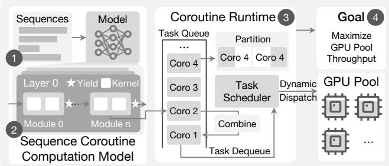  
Figure 3: Event-driven Sequence Coroutine Architecture.

Requirements for new batch-native inference scheduling model. In this paper, we revisit batch inference from first principles. In existing systems, a sequence is assigned to specific devices, and this assignment remains fixed because re-binding is viewed as adding unnecessary latency. Even in continuous batching [22,50,56], where micro-batches may be reorganized, the sequence itself remains implicitly tied to a particular device and cannot freely move or be decomposed.

This observation leads us to a novel system design opportunity: Can we model sequence computation as fine-grained coroutines and dynamically schedule them in a throughputoriented, event-driven architecture?

We make four key insights, illustrated in Figure 3, that show why such a system design is practical and effective for today’s batch inference workloads:

1 Sequences provide a natural granularity for coroutinebased scaling. In batch inference, both compute and memory load scale with the number of sequences, and each sequence has an independent execution lifetime. This makes sequences a natural unit for coroutine computation.

2 Neural network modules offer natural yield points. Sequence computation performs forward passes through modular components (e.g., attention, MoE layers) in prefill and decode. Module boundaries naturally serve as coroutine yield points for event-driven scheduling.

3 Sequence state can be dynamically combined, partitioned, and migrated. The state associated with each sequence (e.g., hidden states in prefill, KV cache in decode) is tensor-structured and self-contained, allowing flexible pausing, combining, partitioning, and migration without affecting correctness.

4 Batch inference optimizes batch completion time, hiding the dynamic scheduling latency of sequences. The extra overhead of coroutine scheduling may be undesir able for interactive workloads, but in batch settings, where end-to-end batch completion time is the primary metric, this overhead is amortized and outweighed by improved throughput from high-concurrency coroutine execution.

To the best of our knowledge, no existing system follows our proposed architectural model. Interactive inference engines such as SGLang [56] and vLLM [22] bind each sequence to a fixed GPU for its entire lifetime. Disaggregated inference systems, including DistServe [57], Splitwise [37], and Mooncake [39], relax this constraint by assigning each inference phase, such as prefill or decode, to a specific GPU, but the phases still remain statically placed. MegaScale-Infer [60] further disaggregates decode into attention and expert modules, but continues to rely on fixed placement of these components. Kernel oriented systems such as NanoFlow [59] improve execution efficiency, but do not address their underlying scheduling and placement limitations.

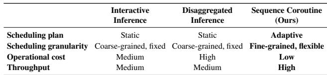  
Table 1: Scheduling characteristics of three inference system architectures.

Architectural advantages. We name our new system architecture the event-driven sequence coroutine architecture. Table 1 summarizes its potential effectiveness. By exploiting sequence-level coroutines and providing system mechanisms for their yield and combination, we can significantly increase batch sizes on sparse operations (e.g. each expert in MoE) at runtime and thereby achieve significantly higher GPU utilization than interactive engines (shown in Figure 2b).

Meanwhile, when long-tail generation or load imbalance is detected, low-cost event-driven scheduling can yield, migrate, partition, and recombine sequence coroutines to avoid stragglers and maintain balanced loads.

Because GPUs are managed as a shared resource pool rather than being pre-allocated to specific sequences, sequence coroutines can be dynamically dispatched to any available GPU, making the system easy to deploy across batch jobs with widely varying input–output length distributions.

Finally, sequence coroutines execute under an event-driven model in which GPUs always have useful events to process, while the scheduler keeps most coroutine state in host memory. This substantially reduces peak GPU memory usage and lowers the operational cost of batch inference.

A powerful analogy is the transition from thread-perconnection servers (e.g., Apache HTTP Server [3]) to eventdriven architectures (e.g., NGINX [31], SEDA [46]). Apache performs well under modest load but degrades under highly variable, large-scale traffic; NGINX treats requests as coroutines and uses event-driven scheduling to sustain scalability. Batch inference demands the same paradigm shift.

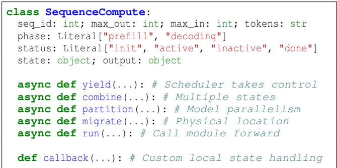

(a) Sequence computation states and functions.

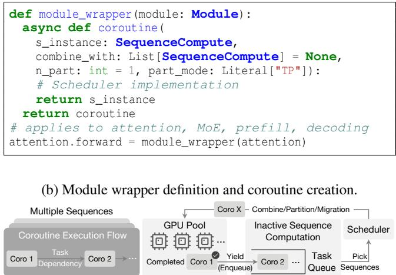  
(c) Concurrent sequence coroutine execution.  
Figure 4: Sequence coroutine abstraction.

## 4 The Sequence Coroutine Model

## 4.1 The Sequence Coroutine Abstraction

We abstract sequence coroutines as follows: a representation of a neural network model’s per-sequence execution that can be paused, migrated, combined, partitioned, and resumed without losing correctness.

Establishing this abstraction requires answering three key questions: (i) How to model the sequence’s computation process and intermediate state? (ii) How to enable sequence coroutine execution in a neural network that is typically built using modular abstractions? (iii) How to execute concurrent sequence coroutines on a limited number of compute units?

Modeling sequence computation and state. The sequence computation (defined in Figure 2a) requires states that fully determine the current and future computations. We define the data structure as shown in Figure 4a, using language models as an example for the values in each field. Each sequence can be uniquely identified, with the amount of computation to be scheduled (i.e. max\_out, max\_in). The coroutine state stores the KV-cache, while the output consists of the hidden states passed between module forward calls, enabling the coroutine to resume execution correctly at the next scheduling point. Sequence computation exposes primitives (i.e. yield, combine, partition, migrate) to enable coroutine scheduling on sequence computation, and callbacks for customized operations on sequence states.

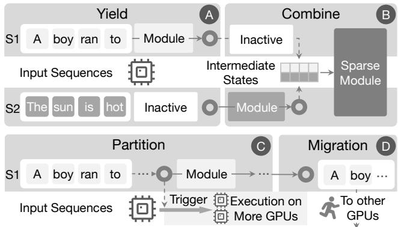  
Figure 5: Coroutine primitives used on sequence.

Creating coroutines through module wrappers. We provide an abstraction layer that preserves the modular semantics of existing model definitions (e.g. torch.nn.Module), while inserting scheduling points at runtime (Figure 4b). During model initialization, BatchGen applies wrappers on selected modules, allowing coroutine steps to be generated automatically. The wrapper allows any custom scheduling policy to be implemented using coroutine primitives. By default, the coroutine yields the sequence compute on exit.

Concurrent sequence coroutine execution. Concurrency is managed by a coroutine scheduler for coordination over the GPU pool (Figure 4c). Once modules are wrapped, a sequence computation naturally forms a coroutine execution flow that defines the successor relationships between computation stages. When a coroutine yields, it enqueues its successor, while the scheduler selects one or more inactive sequence coroutines from the global queue to dispatch onto available compute units. A many-to-one mapping corresponds to combine, a one-to-many mapping corresponds to partition, and a one-to-one mapping corresponds to a simple resume.

## 4.2 Sequence Coroutine Mechanisms

When designing mechanisms for sequence coroutines, we have three requirements: (i) they must provide yield primitive that preserves correctness for stateful neural network execution; (ii) they must enable coroutine combination to inflate expert-level batch sizes in MoE computation; and (iii) they must support coroutine partitioning to mitigate stragglers in long-tail prefill and decoding stages.

Sequence coroutine yield mechanism. A YIELD in sequence compute behaves analogously to the await primitive in programming languages such as Python: yield suspends a sequence coroutine, checkpointing its state produced and releasing GPUs, such that control can safely return to the scheduler. Figure 5 A illustrates this process: sequence S1 yields after a module computation and becomes inactive, allowing the scheduler to resume inactive S2 on the same GPU.

Sequence coroutine combination mechanism. Standard coroutine semantics require an explicit resume primitive to continue suspended execution. In our model, resume semantics are part of COMBINE: since the purpose of combining sequences is to form a batch for computation, resumption occurs implicitly. This design eliminates a separate primitive while preserving expressiveness.

Analogous to data-stream operators in Spark [51], COMBINE merges multiple yielded sequences into a single batch for efficient GPU execution. Figure 5 B illustrates this process: intermediate states (in the form of tensors) are concatenated from S1 and S2, doubling the batch size for the sparse module and increasing compute density on a single GPU.

Sequence coroutine partitioning mechanism. PARTITION distributes a single long-running sequence across multiple GPUs using tensor parallelism to accelerate completion. Each GPU executes the same program over its assigned portion of the data. Figure 5 C illustrates this on a single sequence: the scheduler finds another idle GPU to form a parallelism group for the module. The GPU group can be local to a node or distributed, depending on the scheduler’s decision.

Sequence coroutine migration mechanism. MIGRATE transfers a sequence’s state (e.g. KV-cache and metadata) to a different physical device for load balancing. The call is asynchronous while still ensuring consistency. The physical location of the sequence is left to the scheduler for book-keeping. Figure 5 D illustrates this for moving to another GPU. This also applies to sequences in Host and other media as well.

## 4.3 How to Use Sequence Coroutine?

In this subsection, we use an MoE model to illustrate how to use the sequence coroutine abstraction for batch inference.

Two types of yield points. Intra-forward yield points occur within a single forward pass. When a downstream module reaches good device utilization only at a different batch size than the module preceding it, sequences yield after the upstream module so that the runtime can accumulate and COMBINE them into a batch downstream. For instance, attention saturates the GPU at a modest batch size while the sparsely activated MoE requires a much larger one. This applies to any sequence of modules with heterogeneous batchsize demand. Because the decisive factor is the model’s compute characteristics, intra-forward yield points are selected once, statically, per model (§5.4). Inter-forward yield points occur across forward passes and are driven by runtime conditions rather than model structure. A sequence yields either to achieve better utilization for batch progression (e.g. switch from decode to prefill to refill sequence) or under resource pressure (e.g. evict sequence under growing decode length that exceeds GPU memory). The yielded sequence can be combined again later with other active sequences running on GPU. Because these conditions depend on runtime state, inter-forward yield points are decided dynamically (§5.3).

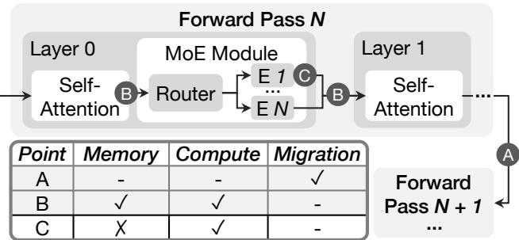  
Figure 6: Yield point selection.

Key development question: the choice of yield points. A central question arises when adopting sequence coroutines: given a model with multiple modules-and thus many candidate yield points-where should developers place yield points to maximize throughput?

For MoE architectures, we observe three practical and reusable yield-point options (shown in Figure 6): A treating the attention + MoE layers as a single coroutine unit, B splitting the attention and MoE layers into two coroutine units, and C treating each expert in an MoE layer as an independent coroutine unit.

These options reflect throughput-memory trade-offs: A a combined attention-MoE coroutine minimizes intermediate states for sequence computation but limits expert-level batching and sequence concurrency; B a split design allows the system to dynamically increase expert-level batch sizes without overwhelming memory usage; and C a per-expert coroutine maximizes sequence computation concurrency but has prohibitive memory costs when initiating millions of coroutines.

According to these insights, we design the coroutine schedule to be hierarchical. For MoE batching, we adopt option B , inflating the batch size at MoE layers to achieve substantial throughput gains while keeping memory usage controlled at attention layers. To mitigate long-tailed decoding, we additionally employ option A . This enables lightweight migration and allows parallelism configurations to be adjusted dynamically through state checkpointing already made during yield.

The coroutine callbacks allow users to inject custom logic to handle sequence local state without modifying the runtime. These callbacks can be used to implement techniques such as dynamic quantization of KV-cache on a per-sequence basis [13], which can respond to runtime memory pressure or accuracy requirements.

Algorithm 1: Scheduling model forward pass   
Input: Battn: attention batch size (COMBINE on attention);   
Bmoe: MoE batch size (COMBINE on MoE);   
Sequence group S, |S| = Bmoe;   
Output: Final hidden states for all sequences in S.   
1 Function FORWARDPASS(S,Battn,Bmoe):   
2 foreach layer ℓ = 1 to L do   
3 Partition S into attention sub-batches of size Battn;   
4 foreach sub-batch g ⊆ S do   
5 hg ← ATTENTION(g, ℓ) // Kept in GPU   
6 ASYNCCKPT(g, ℓ);   
7 YIELD g, g.h ← hg; Attn Coroutine   
8 hcombined ← COMBINE ∀g.h,g ∈ S;   
9 hout ← MOE(hcombined, ℓ) // Kept in GPU   
10 YIELD S, S.h ← hout; MoE Coroutine   
11 YIELD S;   
12

## 5 System Design and Implementation

## 5.1 Sequence Coroutine Scheduling Algorithm

We design a sequence coroutine scheduler to sustain high compute efficiency across prefill and decoding. The core challenges stem from sparsely activated MoE layers, which require large batches, and from unpredictable long-tailed decoding. Our scheduler uses coroutine primitives to accumulate batches, adapt memory usage, and reduce long-tail inefficiency through continuous batching and dynamic parallelism.

Providing sufficient batch size for sparse module. Our scheduling algorithm aims to provide a sufficient batch size for MoE model by COMBINE-ing yielded sequences from attention. The design is motivated by a key insight: a modulelevel roofline model enables static planning for batch accumulation. Given the system’s capacity for both active (GPUresident) and inactive (host-resident) sequences, we can select the largest feasible module batch size that remains within memory constraints.

We design the coroutine scheduling in alignment with Figure 4b for attention, MoE, and model forward pass as in Algorithm 1, where the shaded area represents the code inside module wrapper that creates a coroutine. For attention, the batch is split into sub-batches of size Battn; each sub-batch executes attention, buffers its hidden states, optionally offloads KV-cache, and then yields. For MoE, all sub-batch hidden states are combined into a large batch of size Bmoe.

Mitigating long-tailed and unbalanced decoding. Longtailed decoding can only be managed at runtime, as output lengths are unknown in advance. We address this challenge through two mechanisms: Dynamic sequence management maintains high GPU utilization by continuously refilling the batch with prefilled sequences. When sequences complete or are evicted, the scheduler invokes COMBINE to merge waiting sequences into the active batch, preventing GPUs from idling. We detail this in §5.3. Straggler acceleration and load balancing handle the final phase of batch completion. When only a few long-running sequences remain, PARTITION redistributes their computation across idle GPUs—using tensor parallelism for single stragglers or data parallelism for multiple. Throughout execution, MIGRATE rebalances sequences across nodes to prevent skew from uneven completion rates.

Algorithm 2: Scheduling Sequence Computation   
Input: Battn: attention batch size;   
B : MoE batch size;   
Global sequence batch Sglobal, Node sequence batch Snode   
1 Distribute Sglobal evenly;   
2 while ∃s ∈ Snode : ¬FINISHED(s) do   
/\* Run on each node \*/   
3 S ← SELECTBATCH(Snode,Bmoe,status=inactive);   
4 COMBINE S as active sequences;   
5 FORWARDPASS(S,Battn,Bmoe);   
6 DYNAMICSEQUENCEMANAGEMENT(S);   
7 if ONREFILLNODE(nodes) then   
8 wait until all s ∈ S YIELD;   
/\* Trigger prefill temporally \*/   
9 S ← SELECTBATCH(Snode, Bmoe, status=init);   
10 COMBINE S as active sequences;   
11 FORWARDPASS(S,Battn,Bmoe);   
/\* decoding continues here \*/   
12 if ONLONGTAIL(nodes, gpus) then   
13 wait until all s ∈ S YIELD on target GPUs;   
14 PARTITION remaining sequences to target GPUs;

We illustrate the scheduling loop in Algorithm 2. Nodes begin with prefilled sequences stored in host memory (line 1). The main loop (lines 2–6) repeatedly selects batches, executes forward passes, and invokes dynamic sequence management. The ONREFILLNODE callback (lines 7–11) triggers prefill when GPUs become underutilized. The ONLONG-TAIL callback (lines 12–14) detects stragglers and applies PARTITION, which requires yielding active sequences to reconfigure GPU memory for the new parallelism strategy with its impact demonstrated in §6.3.

We design two callbacks, ONREFILLNODE and ONLONG-TAIL, to manage long-tail behavior. ONREFILLNODE supplies additional inactive sequences to the decoding phase so that idle or underutilized GPUs remain fully occupied (lines 7-11). When long-tail sequences persist and no inactive sequences remain to refill the batch, the scheduler invokes ONLONGTAIL (lines 12-14). This callback waits for all active sequences on the target GPUs to yield, ensuring their states are safely checkpointed before reconfiguring model parallelism and redistributing the remaining work.

## 5.2 System Memory Model

We design the system memory layout to support coroutine scheduling with minimal overhead. The key challenges arise from the different memory demands of prefill and decoding, the sensitivity of batch combination size to peak memory usage, and the need to shift efficiently between phases while preserving accumulated state.

Our memory layout addresses these issues by unifying host and device memory management, paged KV-cache management, and providing phase-agnostic GPU buffers that can be reconfigured without disrupting coroutine execution. The residence of the KV cache and model weights, i.e., whether each is offloaded to host memory, is a throughput-driven decision resolved by the coroutine scheduling plan (§5.4), depending on whether the host-device transfer cost is outweighed by the throughput gain from larger-batch execution.

Figure 7 illustrates BatchGen’s memory layout and execution flow for both prefill and decode phases, rooted in the following principles.

Host memory should serve as a unified store. On each node, the host memory holds shared model parameters and KV-cache for all sequences scheduled to the node (in 1 ). This provides two benefits: (i) a single source of truth for all model states, avoiding redundant per-GPU copies, and (ii) local coroutine store for checkpointing KV-cache on YIELD and restoring it on COMBINE without distributed synchronization. Parameter movement is unidirectional: host memory serves as the source for GPU prefetching, not a destination for offloading.

Supporting local phase switching with fine-grained GPU buffers. BatchGen partitions GPU parameter memory into two regions (in 2 and 3 ). (i) Resident parameters store parameters that remain in the GPU throughout the current phase, which is typically small (e.g., LayerNorm). During decoding, it may include all attention parameters when memory permits. (ii) Parameter and KV buffer is a transient staging area for prefetching and offloading. The buffer slot ownership is released after the module completes execution. As prefill and decoding share the same design, we reconfigure the size of these components during the phase swap.

Increasing peak memory budget for prefill. Prefill-phase attention exhibits high peak memory demand due to FlashAttention’s O(N) memory complexity, where N is the sequence length. In contrast, decode-phase attention requires only O(1) memory per sequence, as each iteration processes a single token against the existing KV-cache. We design the prefill phase to offload more aggressively by asynchronously offloading the microbatch KV-cache from each layer’s attention to host and reclaiming its GPU buffer immediately. The prefill phase has enough computation to hide the offloading cost. At any instant the GPU therefore holds at most two layers’ worth of KV-cache, making prefill memory less demanding from both batch size and sequence length. This results in minimizing buffer size in prefill (in 2 ). The example for the ring parameter buffer and single KV buffer is shown in Figure 7a, with the running and prefetching expert using the ring buffer and KV-cache offloading (asynchronously after attention) using the single buffer.

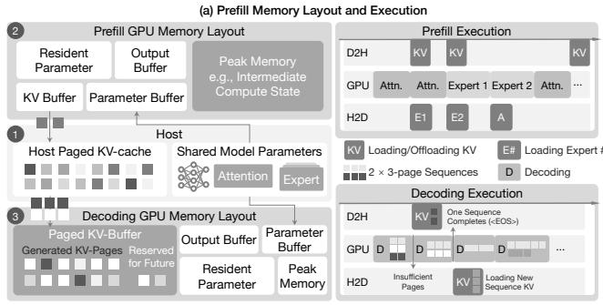  
(b) Decoding Memory Layout and Execution  
Figure 7: Memory layout and execution flow for prefill (top) and decode (bottom) phases. Host memory serves as checkpoint storage for parameters and KV-cache, while GPU memory is partitioned into persistent and transient regions.

Increasing sequence concurrency for decoding. Each GPU maintains a paged KV-cache manager (in 3 ) that allocates and tracks KV pages at a fine granularity. During decoding, BatchGen employs a two-page buffer strategy: each sequence reserves only two KV pages for subsequent decoding iterations, with additional pages allocated on demand as the sequence grows. This lazy allocation maximizes the number of active sequences. Offloading during decoding considers a trade-off between parameters and KV-cache transfer cost and the throughput gain from larger batch size. Decode has low arithmetic intensity thus offers little computation to hide host-to-device transfers. We demonstrate a case for benefits under tight memory budgets (§6.5). When GPU memory becomes insufficient, we evict sequences until two pages can be allocated for all active sequences. Detailed design will be covered in §5.3.

## 5.3 Dynamic Sequence Management

The dynamic sequence management design is unique to batch inference: to maximize throughput, we must maintain large batch sizes or high parallelism throughout both prefill and decoding phases.

BatchGen checks memory state and adjusts the active batch every P tokens (i.e., after decoding one KV page of tokens). At each page boundary, the scheduler executes four phases: (i) Sync: wait for pending asynchronous KV append operations to complete—these operations continuously propagate newly generated KV entries from GPU to host memory, maintaining host as the single source of truth; (ii) Eviction: YIELD completed sequences, releasing their GPU and host KV pages;

(iii) Extension: for sequences approaching their allocated page limit, either extend allocation if GPU pages are available, or YIELD them to host (marking as suspended) to free pages for other sequences; (iv) Refill: COMBINE new sequences from the prefilled or suspended pool, launching async KV restoration that overlaps with the next page’s forward passes.

These operations provide the following properties:

Ensuring decoding batch size is sufficient. BatchGen uses adaptive sequence selection. When GPU memory is insufficient for all active sequences, BatchGen must decide which sequences to YIELD. The scheduler prioritizes yielding sequences with the most progress (highest decoded length), as they have more KV-cache already checkpointed to host and are closer to completion. This strategy maximizes the number of sequences that can make forward progress.

Ensuring load-balance on refill. Long-tail generation creates imbalance across GPUs as sequences complete at different times. When a GPU finishes sequences, BatchGen uses MIGRATE to redistribute suspended sequences from other nodes, keeping all GPUs utilized. Refill candidates are selected in FIFO order to preserve fairness. When all nodes lack sufficient suspended sequences, BatchGen temporarily switches to prefill mode to generate new sequences. Note that MIGRATE requires the coroutine task queue to be blocked to (i) avoid races between active execution and memory transfer, and (ii) synchronize on the global count of inactive sequences. This blocking is low-cost since migration overlaps with sequence computation on other GPUs.

Ensuring single sequence straggler is parallelized. When straggler sequences remain, batching benefits diminish and most GPUs become idle. BatchGen allows configuring a threshold on global batch size to trigger PARTITION: for multiple stragglers, sequences are distributed across GPUs using data parallelism; for a single straggler, computation is partitioned across GPUs using tensor parallelism. The KV-cache distribution depends on the attention architecture: for MLA, the compressed latent KV-cache is replicated across GPUs; for MHA/GQA, the KV-cache is split across attention heads.

## 5.4 Optimization of Scheduling Plans

The runtime also follows a static plan that fixes batch sizes, buffer allocations, and yield points. Manual tuning is infeasible given the combinatorial space of model scales and hardware configurations, so BatchGen derives this plan automatically through lightweight profiling and simulation.

Module-level performance modeling. Modern LLMs are structurally homogeneous, allowing BatchGen to profile a single representative layer rather than the entire model. It measures attention, MoE, and collective communication kernels over multiple batch sizes and fits the results to roofline-style models that predict runtime as a function of batch size and memory allocation.

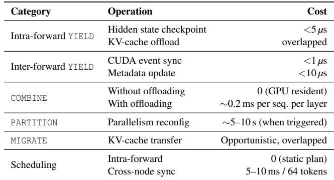  
Table 2: Coroutine primitive overhead for DeepSeek-R1 on 8×H20 with 10K context length and batch size 512.

Execution DAG construction. BatchGen models a single layer’s forward pass as a directed acyclic graph (DAG) to simulate execution under different configurations. Each node in the DAG represents either a computation (attention, MoE, YIELD checkpointing) or a data transfer (parameter prefetch, KV-cache offload/restore for COMBINE). Edges encode dependencies: a module cannot execute until its parameters are loaded; COMBINE cannot proceed until KV-cache restoration completes (if needed). Node costs are assigned from the profiled execution times and memory requirements at each candidate batch size. The critical path through this DAG—the longest dependency chain—determines the layer’s execution time, capturing how computation and data movement overlap.

Configuration search. Given a DAG, finding the critical path requires a single topological traversal using dynamic programming, with complexity O(V + E) where V and E are the number of nodes and edges. Since a layer’s DAG contains fewer than 100 nodes, this computation is negligible. BatchGen enumerates candidate configurations (Battn, Bmoe, and buffer sizes), constructs the corresponding DAG for each, and selects the configuration with the shortest critical path.

## 5.5 Coroutine Overhead Analysis

A natural question is whether coroutine-based scheduling introduces noticeable overhead. Table 2 summarizes the cost of all coroutine primitives.

Frequently invoked primitives have negligible overhead. Coroutine boundaries occur once per module. Hidden-state checkpointing writes only ∼7 MB for 512 sequences (7168- dim), completing in under 5 µs at HBM bandwidth, compared to ∼3 ms for the module’s computation. KV-cache offloading is issued asynchronously and fully overlaps with MoE execution. Between forward passes, YIELD performs a CUDA event sync (<1 µs) and updates sequence metadata on the CPU (<10 µs for 512 sequences).

COMBINE overhead depends on whether KV-cache offloading is active. Without offloading, combined sequences are already GPU-resident, incurring zero cost. With offloading, COMBINE must restore KV-cache from host memory; for a 10K-token sequence this takes ∼0.2 ms per layer over PCIe 5.0. This cost arises only when refilling batches and is amortized by the larger batches that offloading enables.

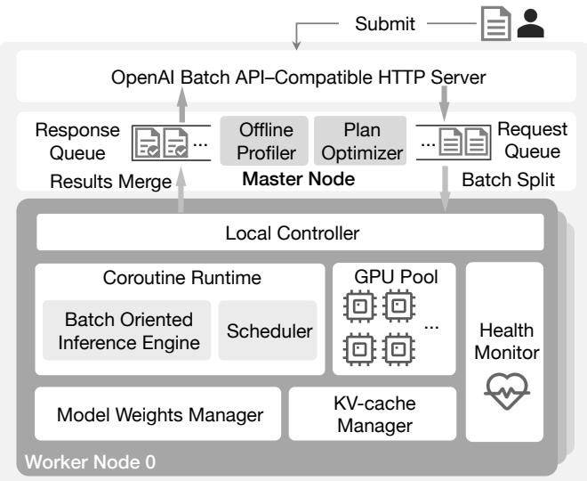  
Figure 8: BatchGen system architecture with master-worker organization, API endpoints, and inference engine.

Primitives with millisecond-level overhead are negligible to overall computation time. MIGRATE is invoked opportunistically to balance the number of inactive sequences across nodes. The number of migrations over a batch stays small relative to the total sequence count and the migration cost can be smaller than prefill. When MIGRATE is scheduled in ad vance, the KV-cache transfer is fully overlapped with ongoing computation on other sequences, adding zero latency to the critical path. For instance, on a standard H100 HGX node with 400 Gb/s (∼50 GB/s) InfiniBand link, prefilling a 2K-token DeepSeek-R1 sequence costs ∼112 ms even at the GPU’s peak throughput (BF16 MLA attention at 989 TFLOP/s plus FP8 MoE GEMMs at 1979 TFLOP/s), whereas migrating the sequence’s entire 144 MB MLA KV-cache over that link takes only ∼2.9 ms, which is less than 3% of the prefill compute it overlaps with. Although PARTITION takes seconds, it is triggered only when long-tail sequences are detected (typically once per batch near completion) and enables idle GPUs to accelerate remaining stragglers. Meanwhile, batch completion time is more than 10 minutes. Dynamic scheduling occurs only at page boundaries (every 64 tokens), requiring 5–10 ms for cross-node synchronization—approximately 0.1–0.2% of the compute time for 64 decode iterations.

## 5.6 Implementation Details

We implement BatchGen in 13K LoC of C++ and 49K LoC of Python. The C++ layer implements the host-side KV-cache system and the asynchronous host–device copy engine, while the Python layer implements the coroutine scheduler and the PyTorch-based forward-pass skeleton for each model. Beyond third-party kernels (e.g., FlashAttention [8], Deep-GEMM [10]), BatchGen develops and maintains its own library of kernels for batch inference, adapted to BatchGen’s KV-cache and input/output buffer layout.

Figure 8 shows the BatchGen system architecture for deployment at scale with the control plane implemented on an industrially customized Ray [30]. Key features include:

OpenAI-compatible batch API. BatchGen exposes an HTTP endpoint compatible with the OpenAI Batch Inference API [34]. A master node per model-parallel group accepts batch submissions, partitions sequences across workers via the coroutine scheduler, and returns results preserving input order. This enables BatchGen to serve as a drop-in replacement for existing batch inference pipelines.

Batch-oriented inference engine. The inference engine integrates high-performance compute and communication kernels (e.g., DeepEP [9]) and includes additional kernel fusions tailored for model types. It supports phase-specific parallelism strategies: (i) DP prefill with offloading, where prefill is compute-bound and parameter/KV transfers are fully hidden, enabling scalable data parallelism; and (ii) DP+EP decoding, which combines data-parallel attention with expert-parallel MoE to maximize bandwidth utilization during generation.

Cold-start optimization. Batch inference often runs on spot instances where cold-start latency impacts usable compute time. BatchGen includes a model weights manager with: (i) Huge pages: Allocating GPU-accessible host memory incurs page faults proportional to pool size. BatchGen uses 2 MB huge pages, reducing initialization time from minutes to seconds for TB-scale pools. (ii) Fast checkpoint loading: BatchGen adopts the memory-mapped checkpoint format from ServerlessLLM [15], enabling rapid weight loading that fits within typical spot instance lifetimes.

Failure detection and recovery. At scale, GPU and node failures are inevitable. BatchGen implements health monitoring where per-node responses carry all GPU statuses. For recovery, MIGRATE can either transfer KV-cache state or trigger recomputation. Since migrating hundreds of gigabytes may be slower than regenerating, BatchGen uses its performance model to estimate both costs and selects the faster path.

## 6 Evaluation

Testbed. We evaluate BatchGen on a production-grade multi-GPU cluster representative of real LLM deployment environments. The testbed includes NVIDIA H20 and H200 servers scaled from 8 to 128 GPUs. Each node offers high-bandwidth intra-node connectivity via NVLink and PCIe 5.0, with 2 TB of host memory, and nodes are interconnected through a

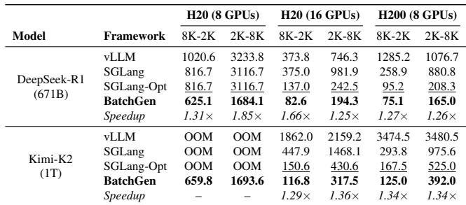  
Table 3: Batch completion time (minutes) for 6K sequences on LongBench. OOM indicates out-of-memory. Speedup is relative to SGLang-Optimized. For Kimi-K2 on 8×H20, Batch-Gen is the only system that completes execution.

200 Gb/s RDMA-enabled InfiniBand fabric, matching common datacenter configurations for large-scale model serving. Baselines. Our primary baselines are SGLang (v0.5.5.post3) [56] and vLLM (v0.11.2) [22], which are widely recognized as SOTA open-source systems. We evaluate SGLang-Optimized, which applies exhaustive tuning for maximum throughput: we configure 16 DP-attention ranks (a throughput-friendly parallelism strategy), tune the memory allocation fraction to the threshold before OOM, and selectively restrict CUDA graph capture to necessary batch sizes to reduce GPU memory consumption and allow larger runtime batches.

For memory-constrained scenarios (§ 6.5), we compare against systems with offloading optimizations: Deep-Speed [12], FlexGen† [41], and MoE-Lightning† [7]. For disaggregated inference (§6.4), we evaluate prefill-decode (PD) disaggregation using SGLang’s implementation. We exclude attention-expert disaggregation [60] due to the lack of open-source implementations.

Models. Our evaluation spans four SOTA MoE models, including Mixtral-8×7B (47B parameters) and Mixtral-8×22B (141B parameters) [18], DeepSeek-R1 (671B parameters) [11], and Kimi-K2 (1T parameters) [21].

## 6.1 Application 1: Offline Inference

We evaluate BatchGen using LongBench [4]. We evaluate on two common production patterns: (i) prefill-heavy (8K input, 2K output tokens): reflects summarization and information extraction tasks, and (ii) decoding-heavy (2K input, 8K output tokens): captures reasoning-intensive workloads such as chain-of-thought question answering. Table 3 reports batch completion time for 6K sequences.

BatchGen achieves larger speedup on weaker GPUs. On 16×H20 and 8×H200 clusters, BatchGen delivers 1.25– 1.66× speedup over SGLang-Optimized across all configurations. The improvement is consistently larger on H20 than on H200. H200’s higher compute throughput shrinks the relative cost of prefill, where BatchGen’s batch accumulation provides the most benefits. On H20, prefill dominates end-toend time, and BatchGen’s ability to form large expert batches yields proportionally greater gains.

BatchGen enables larger models and far larger batches under tight memory budgets. On 8×H20 GPUs (768 GB total HBM), baseline behavior diverges by model. DeepSeek-R1’s parameters (approximately 642 GB in FP8) fit in HBM, but baselines must partition remaining capacity between KVcache and working memory, limiting batch sizes to 8–16 sequences. SGLang-Optimized cannot improve over default SGLang in this regime—exhaustive tuning yields no additional headroom when memory is saturated. BatchGen achieves 1.31–1.85× speedup by offloading KV-cache to host memory, enabling batch sizes of 1800+ sequences. For Kimi-K2 (1T parameters), no baseline completes execution: the model exceeds HBM capacity entirely. BatchGen is the only system that runs Kimi-K2 on this hardware configuration.

The offloading regime exhibits a counterintuitive effect: BatchGen delivers nearly identical throughput on DeepSeek-R1 and Kimi-K2, even though Kimi-K2 is about 1.5× larger. With offloading, performance becomes PCIe-bandwidthbound rather than compute-bound. Because both models have similar per-token KV-cache sizes and PCIe bandwidth is fixed, their achievable batch sizes-and thus throughput-converge. This trade-off remains advantageous: offloading enables much larger expert batches, keeping MoE layers in the memorybound regime where compute scales sublinearly with batch size, while greater sequence-level parallelism amortizes transfer costs.

Comparison with TensorRT-LLM. We additionally compare against TensorRT-LLM [32], which represents state-ofthe-art kernel optimization but requires non-trivial deployment effort. On 16×H20 GPUs with the 8K-2K workload, BatchGen outperforms TensorRT-LLM by 10%, demonstrating that coroutine-based scheduling provides benefits orthogonal to kernel-level optimizations.

## 6.2 Application 2: Test-Time Scaling

Unlike offline batch inference, test-time scaling places SLO constraints on batch completion time to maintain acceptable user experience, requiring systems to choose batch sizes that finish before the deadline. We use Recursive Self-Aggregation (RSA) [43] as a representative workload. After the first round, each subsequent round combines K prior answers as the prefill input, producing a prefill-to-decode ratio of K:1. We evaluate this setting on DeepSeek-R1 using 16×H20 GPUs with a fixed 8K decoding length per round.

BatchGen enables efficient SLO–throughput tradeoffs. Table 4 reports the number of sequences served under 30- minute and 60-minute SLO targets. BatchGen processes 1.25– 1.57× more sequences under the 30-minute SLO and 1.66–

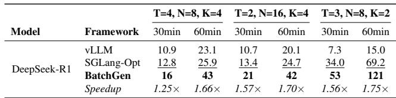  
Table 4: Number of sequences served under SLO constraints for RSA test-time scaling on DeepSeek-R1 with 16×H20 GPUs. RSA uses T rounds, N candidates per round, selects K candidates for the next round, and fixes decoding length at 8K. Higher is better. Speedup is relative to SGLang-Optimized.

1.75× more under the 60-minute SLO compared to SGLang-Optimized. The larger gains under relaxed SLOs reflect Batch-Gen’s ability to form larger batches when deadlines permit, improving expert-level compute density. Prefill-heavy configurations (higher K) show greater improvements because compute-bound prefill enables effective overlap of parameter and KV-cache transfers at no additional cost.

BatchGen maintains advantages even under constrained batch sizes. Under tighter SLOs, BatchGen cannot always operate at its theoretically optimal batch configuration. For instance, in the (T=4, N=8, K=4) 30-minute scenario, meeting the completion deadline requires reducing the MoE batch size below the compute-saturating threshold. This sub-optimal configuration explains why BatchGen’s speedup at 30 minutes (1.25×) is lower than at 60 minutes (1.66×)—the SLO constraint limits batching flexibility. Nevertheless, BatchGen still outperforms all baselines, demonstrating that its coroutinebased scheduling provides benefits even when batch sizes are externally constrained. This makes BatchGen suitable for online services with relaxed (minute-to-hour scale) SLOs where some latency–throughput tradeoff is acceptable.

## 6.3 Application 3: RL Training Acceleration

Reinforcement learning from human feedback (RLHF) [36] is a standard stage in LLM training, and its rollout phase often dominates total training time. Unlike offline inference, RL rollout fixes the batch size (typically 256–1024) [17], removing the primary lever used in batch inference: enlarging batches to improve expert utilization.

A major bottleneck in rollout is straggler sequences. Longtailed generation lengths create synchronization barriers in synchronous training, forcing all workers to wait for the slowest trajectories. As the batch drains, GPU utilization collapses: once only a few sequences remain, most devices idle.

BatchGen mitigates stragglers via its coroutine callbacks. The ONLONGTAIL callback triggers when the number of active sequences falls below a threshold, allowing the runtime to apply PARTITION and redistribute remaining work across idle GPUs, switching from data to tensor parallelism for single long-tail sequences. The same mechanism supports alternatives such as FP8 decoding or speculative decoding without changing the core runtime.

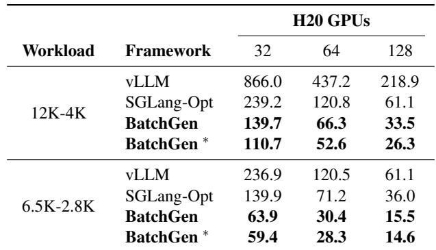  
Table 5: End-to-end time (minutes) for processing 10K requests on DeepSeek-R1. BatchGen ∗ uses SGLang kernels with the BatchGen coroutine runtime.

We evaluate on VeRL [6] with DeepSeek-R1 on 16×H20 GPUs. In a typical setting, each RL iteration uses 256 prompts with one response per prompt, for 256 rollout sequences in total, evenly distributed across the 16 GPUs at 16 active sequences per GPU initially. Generation lengths are heavily long-tailed, so the batch drains unevenly: ONLONGTAIL triggers once the global active batch falls to ≤ 8 sequences whose generation length exceeds 40K tokens. In our traces these final sequences account for 30–80% of rollout time, yet leave at most 0.5 active sequences per GPU on average, exposing substantial idle capacity. BatchGen reclaims this capacity by applying PARTITION with FP8 decoding to the stragglers, reducing per-iteration rollout time by 5–10%, with the gain increasing as the final generation length grows, consistent with [16]. Since rollout accounts for 60–80% of training time, these savings translate directly into shorter end-to-end training.

## 6.4 Scaling to Large Deployments

We evaluate BatchGen at production scale with up to 128 GPUs using two trace-derived workloads: a prefill-heavy setting (12K input, 4K output tokens) and a balanced setting (6.5K input, 2.8K output). To disentangle runtime gains from kernel improvements, we also report results for BatchGen \*, which replaces BatchGen’s kernels with SGLang’s while preserving the coroutine scheduler.

Table 5 shows end-to-end time for 10K requests. Because the evaluated SGLang and vLLM versions exhibit stability issues when scaling DeepSeek-R1 beyond two nodes (16 GPUs), we extend them to 32-128 GPUs by running multiple independent 16-GPU data-parallel groups and aggregating throughput. BatchGen achieves 1.71-1.82× speedup on the 12K-4K workload and 2.2-2.3× on the 6.5K-2.8K workload relative to SGLang-Optimized.

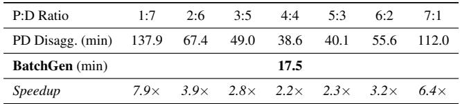  
Table 6: Comparison with PD disaggregation on 128×H20 GPUs (10K requests, 8K-2K workload). Each ratio unit is 16 GPUs. BatchGen requires no ratio tuning.

The performance gains from scaling stem from increased batch sizes: more GPUs provide additional memory capacity to accumulate larger batches before MoE execution, improving expert utilization. However, scaling exhibits sub-linear speedup due to communication overhead in MoE layers—the all-to-all collective for expert routing grows with GPU count. In our implementation, gains plateau beyond 64 GPUs; for the 128-GPU configuration, we deploy two 64-GPU instances and partition the input batch across them.

Scaling beyond single-instance limits. For a fixed model and parallelism strategy, there is a GPU count beyond which adding devices reduces per-GPU efficiency, as MoE all-to-all communication grows while computation per GPU stays constant. BatchGen treats this saturation point as the natural size of a single instance. Larger deployments are formed by replicating multiple independent instances, with an upper-level scheduler partitioning inputs and aggregating outputs. This hierarchical design preserves per-instance efficiency while scaling throughput linearly with instance count.

We compare against prefill-decode (PD) disaggregation [57] on SGLang at 128 GPUs. Each P or D unit consists of 16 GPUs, yielding seven P:D ratios. Table 6 shows that PD disaggregation performance varies by 3.6× across configurations (38.6 to 137.9 minutes), requiring exhaustive profiling to identify the optimal ratio. BatchGen outperforms even the best PD configuration (4:4) by 2.2× without manual tuning.

Production deployment. BatchGen is deployed as the batchinference engine on an industry partner’s production cluster. It runs as independent BatchGen instances launched and managed by an industry-customized Ray [30] orchestrator. Each instance exposes an OpenAI-compatible API, and the scheduler intentionally over-subscribes it, dispatching far more requests than its concurrent capacity. Over-subscription serves two purposes. First, it keeps a large pool of sequences resident on each instance, giving the BatchGen runtime freedom to form batches by COMBINE-ing sequences selected from the pool rather than in arrival order (§4.2), which maximizes expert-level batching. Second, it keeps the instance continuously saturated: as sequences complete, the runtime immediately backfills from the resident pool, so concurrency stays high and the GPUs never drain. Completed requests are streamed to an instance-local directory that the scheduler polls periodically to collect results and dispatch new work.

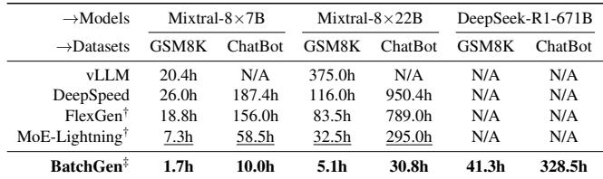  
Table 7: Time to complete GSM8K (8.5K samples) and Chat-BotArena (36K samples) on a single A5000 GPU (24 GB). N/A indicates the system either runs out of memory or would take longer than 1000 hours to complete. Best results in bold, second best underlined.

## 6.5 Working with Limited Memory

We evaluate BatchGen’s offloading capability on commodity hardware by running large-scale MoE inference on a single NVIDIA A5000 GPU (24 GB) with a 28-core AMD 7453 CPU and 1 TB of host memory. This setup highlights Batch-Gen’s ability to execute models far beyond GPU capacity.

As shown in Table 7, we report end-to-end processing time on GSM8K (512→256) and ChatBotArena (256→512). FlexGen only supports dense models and MoE-Lightning is not open-sourced, so we reproduce their offloading strategies based on the original papers and integrate them into our runtime†. For the single-GPU case, BatchGen additionally offloads attention computation to the CPU to relieve GPU memory pressure; this optimization is disabled in multi-GPU settings where CPU bandwidth is insignificant relative to total GPU resources‡.

BatchGen achieves significantly higher efficiency under limited resources. Under constrained hardware settings where most baselines cannot complete the dataset within a reasonable time, BatchGen achieves up to a 9.6× speedup. As model size increases, baseline systems fail entirely, while BatchGen continues to finish the workload. FlexGen and MoE-Lightning suffer from extremely small per-expert batch sizes–40-1000× smaller than what is required to fully utilize the GPU–because they retain full MoE layers on device, capping the memory available for batching. In contrast, Batch-Gen accumulates large batches via coroutine yields and fully offloads experts, enabling per-expert batch sizes that reach the compute-bound regime. vLLM remains bottlenecked by on-demand parameter fetching, whereas BatchGen closes this gap by fully overlapping parameter transfers with computation in the coroutine runtime and its buffer.

## 7 Limitations and Future Work

Batch-size regime and best-effort operation. For a given model, its compute characteristics determine an optimal batch size at the COMBINE point that saturates the device. In practice, however, this saturation point cannot always be reached: even when enough candidate requests are available to batch, the system’s memory capacity may be insufficient to hold them, in which case BatchGen forms the largest batch memory permits and operates below saturation on a best-effort basis. Figure 2b illustrates this regime: saturating the compute of every expert requires 16384 tokens to reach the MoE gate. This target is comparatively easy to meet during prefill, where a single sequence of length 16384 suffices, but during decoding it corresponds to a global batch of 16384 concurrent requests— rarely attainable given the long-context requests typical of production. Decoding therefore runs in the best-effort regime. In our limited-memory evaluation (§6.5), a batch size of 6000 still yields gains, bounded by host memory.

Generalization and future work. The coroutine abstraction is general: it applies to any generation workload whose stages have distinct compute characteristics and memory requirements. Our current implementation targets transformer MoE models, a widely deployed architecture that benefits directly from intra-model yielding at attention–MoE boundaries. Extending BatchGen to other models and tasks is future work. Within a single model, vision-language models are a natural candidate: image encoding is substantially more computeheavy than the language stages, so a yield point after the encoder could let the runtime rebatch the lighter stages. The abstraction also extends across models: where a generation pipeline connects multiple models with distinct computation characteristics—as in omni-modal systems that couple a language model with separate speech or vision models [48, 49]— each model can be treated as a coroutine task, applying yield and COMBINE at model boundaries to batch each at its own optimal granularity.

## 8 Related Work

Throughput-optimized offloading systems. Current offloading systems have not targeted sparse modules and long-tailed decoding. FlexGen [41] is designed for dense modules, thus treating MoE layer as a single dense layer for offloading. DeepSpeed [12] and MoE-Lightning [7] are agnostic to expert batching, with a global batch size on the whole model decided. PowerInfer [42] and Fiddler [20] partition computation between the GPU and CPU, with light weighted attention and expert compute running on CPU, aiming for small batch size where compute is not intensive.

Continuous batching for high throughput. Continuous batching (used in vLLM [22], Orca [50], and Llama.cpp [33]) was introduced to address long-tail related TTFT concerns in interactive inference. These frameworks insert small prefill batches into the decoding phase. vLLM [22], Orca [50], and Llama.cpp [33] follow this strategy directly. NEO [19] interleaves prefill and decoding across GPU and CPU resources, while systems such as BlendServe [54] and other micro-batching approaches [27] share the GPU in the temporal domain. The effective average batch size over the entire execution becomes even smaller, limiting throughput.

Batching in training systems. Training fixes batch sizes to ensure gradient stability and convergence, while inference can vary batch sizes freely. In addition, the training systems are optimized for prefill and gradient updates [55], and decoding speed is not a factor. The MoE training line of work [23,25,52] is orthogonal to BatchGen, although BatchGen is compatible with the fixed batch size in RL post-training of LLMs [36].

## 9 Conclusion

This paper introduces the event-driven sequence coroutine architecture, a new computation model for large-scale batch inference. By enabling fine-grained yielding, combining, partitioning, and migration of sequence computation, BatchGen overcomes structural bottlenecks in sparse models and longtail decoding, delivering substantial improvements in batch completion time across various applications. Beyond immediate throughput gains, our results suggest broader implications: extending coroutine abstractions to multimodal workflows, and co-designing the coroutine with the underlying high-performance GPU kernels. We believe this architecture opens a rich systems research agenda for the next generation of AI engine design.

## References

[1] Amazon AWS. Process multiple prompts with batch inference. https://docs.aws.amazon.com/bedrock/ latest/userguide/batch-inference.html, 2025. Accessed: 2025-12-02.

[2] Chenxin An, Shansan Gong, Ming Zhong, Xingjian Zhao, Mukai Li, Jun Zhang, Lingpeng Kong, and Xipeng Qiu. L-eval: Instituting standardized evaluation for long context language models. In Proceedings of the 62nd Annual Meeting of the Association for Computational Linguistics (Volume 1: Long Papers), pages 14388–14411, 2024.

[3] Apache HTTP Server Project Members. Apache HTTP server project. https://httpd.apache.org/, 2025. Accessed: 2025-12-06.

[4] Yushi Bai, Xin Lv, Jiajie Zhang, Hongchang Lyu, Jiankai Tang, Zhidian Huang, Zhengxiao Du, Xiao Liu, Aohan Zeng, Lei Hou, Yuxiao Dong, Jie Tang, and Juanzi Li. LongBench: A bilingual, multitask benchmark for long context understanding. In ACL (1), pages 3119–3137. Association for Computational Linguistics, 2024.

[5] BIG-bench authors. Beyond the imitation game: Quantifying and extrapolating the capabilities of language models. Trans. Mach. Learn. Res., 2023, 2023.

[6] Bytedance Seed. verl: Volcano Engine Reinforcement Learning for LLMs . https://github.com/ volcengine/verl, 2025. Accessed: 2025-12-09.

[7] Shiyi Cao, Shu Liu, Tyler Griggs, Peter Schafhalter, Xiaoxuan Liu, Ying Sheng, Joseph E. Gonzalez, Matei Zaharia, and Ion Stoica. MoE-Lightning: High-throughput moe inference on memory-constrained gpus. In ASP-LOS (1), pages 715–730. ACM, 2025.

[8] Tri Dao, Daniel Y. Fu, Stefano Ermon, Atri Rudra, and Christopher Ré. FlashAttention: Fast and memoryefficient exact attention with io-awareness. In NeurIPS, 2022.

[9] Deepseek AI. DeepEP. https://github.com/ deepseek-ai/DeepEP, 2025. Accessed: 2025-12-06.

[10] Deepseek AI. DeepGEMM. https://github.com/ deepseek-ai/DeepGEMM, 2025. Accessed: 2025-12- 06.

[11] DeepSeek-AI. DeepSeek-R1: Incentivizing reasoning capability in llms via reinforcement learning. 2025.

[12] DeepSpeed Team. DeepSpeed. https://github.com/ deepspeedai/DeepSpeed, 2025. Accessed: 2025-12- 09.

[13] Dayou Du, Shijie Cao, Jianyi Cheng, Luo Mai, Ting Cao, and Mao Yang. Bitdecoding: Unlocking tensor cores for long-context llms with low-bit kv cache, 2025.

[14] Mohamed Y. Eltabakh, Zan Ahmad Naeem, Mohammad Shahmeer Ahmad, Mourad Ouzzani, and Nan Tang. RetClean: Retrieval-based tabular data cleaning using llms and data lakes. Proc. VLDB Endow., 17(12):4421– 4424, 2024.

[15] Yao Fu, Leyang Xue, Yeqi Huang, Andrei-Octavian Brabete, Dmitrii Ustiugov, Yuvraj Patel, and Luo Mai. ServerlessLLM: Low-latency serverless inference for large language models. In OSDI. USENIX Association, 2024.

[16] Wei Gao, Yuheng Zhao, Dakai An, Tianyuan Wu, Lunxi Cao, Shaopan Xiong, Ju Huang, Weixun Wang, Siran Yang, Wenbo Su, Jiamang Wang, Lin Qu, Bo Zheng, and Wei Wang. RollPacker: Mitigating long-tail rollouts for fast, synchronous RL post-training. 2025.

[17] Jian Hu, Xibin Wu, Wei Shen, Jason Klein Liu, Weixun Wang, Songlin Jiang, Haoran Wang, Hao Chen, Bin Chen, Wenkai Fang, et al. OpenRLHF: A ray-based easy-to-use, scalable and high-performance rlhf framework. In Proceedings of the 2025 Conference on Empirical Methods in Natural Language Processing: System Demonstrations, pages 656–666, 2025.

[18] Albert Q. Jiang, Alexandre Sablayrolles, Antoine Roux, Arthur Mensch, Blanche Savary, Chris Bamford, Devendra Singh Chaplot, Diego de las Casas, Emma Bou Hanna, Florian Bressand, Gianna Lengyel, Guillaume Bour, Guillaume Lample, Lélio Renard Lavaud, Lucile Saulnier, Marie-Anne Lachaux, Pierre Stock, Sandeep Subramanian, Sophia Yang, Szymon Antoniak, Teven Le Scao, Théophile Gervet, Thibaut Lavril, Thomas Wang, Timothée Lacroix, and William El Sayed. Mixtral of experts, 2024.

[19] Xuanlin Jiang, Yang Zhou, Shiyi Cao, Ion Stoica, and Minlan Yu. NEO: saving GPU memory crisis with CPU offloading for online LLM inference, 2024.

[20] Keisuke Kamahori, Yile Gu, Kan Zhu, and Baris Kasikci. Fiddler: CPU-GPU orchestration for fast inference of mixture-of-experts models, 2024.

[21] Kimi Team. Kimi K2: open agentic intelligence, 2025.

[22] Woosuk Kwon, Zhuohan Li, Siyuan Zhuang, Ying Sheng, Lianmin Zheng, Cody Hao Yu, Joseph Gonzalez, Hao Zhang, and Ion Stoica. Efficient memory management for large language model serving with pagedatten tion. In SOSP, pages 611–626. ACM, 2023.

[23] Jiamin Li, Yimin Jiang, Yibo Zhu, Cong Wang, and Hong Xu. Accelerating distributed MoE training and inference with Lina. In USENIX Annual Technical Conference, pages 945–959. USENIX Association, 2023.

[24] Percy Liang, Rishi Bommasani, Tony Lee, Dimitris Tsipras, Dilara Soylu, Michihiro Yasunaga, Yian Zhang, Deepak Narayanan, Yuhuai Wu, and et al. Holistic evaluation of language models. Trans. Mach. Learn. Res., 2023, 2023.

[25] Juncai Liu, Jessie Hui Wang, and Yimin Jiang. Janus: A unified distributed training framework for sparse Mixture-of-Experts models. In SIGCOMM, pages 486– 498. ACM, 2023.

[26] Lin Long, Rui Wang, Ruixuan Xiao, Junbo Zhao, Xiao Ding, Gang Chen, and Haobo Wang. On LLMs-driven synthetic data generation, curation, and evaluation: A survey. In ACL (Findings), pages 11065–11082. Association for Computational Linguistics, 2024.

[27] Frank Sifei Luan, Ziming Mao, Ron Yifeng Wang, Charlotte Lin, Amog Kamsetty, Hao Chen, Cheng Su, Balaji Veeramani, Scott Lee, SangBin Cho, Clark Zinzow, Eric Liang, Ion Stoica, and Stephanie Wang. The streaming batch model for efficient and fault-tolerant heterogeneous execution, 2024.

[28] Xupeng Miao, Gabriele Oliaro, Zhihao Zhang, Xinhao Cheng, Hongyi Jin, Tianqi Chen, and Zhihao Jia. Towards efficient generative large language model serving: A survey from algorithms to systems. arXiv preprint arXiv:2312.15234, 2023.

[29] Microsoft Azure. Batch Endpoints. https://learn. microsoft.com/en-us/azure/machine-learning/ concept-endpoints-batch?view=azureml-api-2, 2025. Accessed: 2025-12-02.

[30] Philipp Moritz, Robert Nishihara, Stephanie Wang, Alexey Tumanov, Richard Liaw, Eric Liang, Melih Elibol, Zongheng Yang, William Paul, Michael I. Jordan, and Ion Stoica. Ray: A distributed framework for emerging AI applications. In OSDI, pages 561–577. USENIX Association, 2018.

[31] NGINX Team. NGINX open source. https://nginx. org/index.html, 2025. Accessed: 2025-12-06.

[32] NVIDIA. TensorRT-LLM. https://github.com/ NVIDIA/TensorRT-LLM, 2024. Accessed: 2024-05-17.

[33] Ollama. Ollama. https://github.com/ollama/ ollama, 2025.

[34] OpenAI. Batch API. https://platform.openai. com/docs/guides/batch, 2025. Accessed: 2025-12- 02.

[35] OpenAI. Gpt-5 system card. Technical report, OpenAI, August 2025. Accessed: 2025-12-11.

[36] Long Ouyang, Jeffrey Wu, Xu Jiang, Diogo Almeida, Carroll L. Wainwright, Pamela Mishkin, Chong Zhang, Sandhini Agarwal, Katarina Slama, Alex Ray, John Schulman, Jacob Hilton, Fraser Kelton, Luke Miller, Maddie Simens, Amanda Askell, Peter Welinder, Paul F. Christiano, Jan Leike, and Ryan Lowe. Training language models to follow instructions with human feedback. In NeurIPS, 2022.

[37] Pratyush Patel, Esha Choukse, Chaojie Zhang, Aashaka Shah, Íñigo Goiri, Saeed Maleki, and Ricardo Bianchini. Splitwise: Efficient generative LLM inference using phase splitting. In ISCA, pages 118–132. IEEE, 2024.

[38] Sundar Pichai. A new era of intelligence with gemini 3. https://blog.google/products/gemini/ gemini-3/#note-from-ceo, November 2025. Accessed: 2025-12-11.

[39] Ruoyu Qin, Zheming Li, Weiran He, Jialei Cui, Feng Ren, Mingxing Zhang, Yongwei Wu, Weimin Zheng, and Xinran Xu. Mooncake: Trading more storage for less computation - A kvcache-centric architecture for serving LLM chatbot. In FAST, pages 155–170. USENIX Association, 2025.

[40] Gaurav Sahu, Pau Rodríguez, Issam H. Laradji, Parmida Atighehchian, David Vázquez, and Dzmitry Bahdanau. Data augmentation for intent classification with off-theshelf large language models. In ConvAI@ACL, pages 47– 57. Association for Computational Linguistics, 2022.

[41] Ying Sheng, Lianmin Zheng, Binhang Yuan, Zhuohan Li, Max Ryabinin, Beidi Chen, Percy Liang, Christopher Ré, Ion Stoica, and Ce Zhang. FlexGen: Highthroughput generative inference of large language models with a single GPU. In ICML, volume 202 of Proceedings of Machine Learning Research, pages 31094– 31116. PMLR, 2023.

[42] Yixin Song, Zeyu Mi, Haotong Xie, and Haibo Chen. PowerInfer: Fast large language model serving with a consumer-grade GPU, 2023.

[43] Siddarth Venkatraman, Vineet Jain, Sarthak Mittal, Vedant Shah, Johan S. Obando-Ceron, Yoshua Bengio, Brian R. Bartoldson, Bhavya Kailkhura, Guillaume Lajoie, Glen Berseth, Nikolay Malkin, and Moksh Jain. Recursive self-aggregation unlocks deep thinking in large language models, 2025.

[44] Xuezhi Wang, Jason Wei, Dale Schuurmans, Quoc V. Le, Ed H. Chi, Sharan Narang, Aakanksha Chowdhery, and Denny Zhou. Self-consistency improves chain of thought reasoning in language models. In ICLR. Open-Review.net, 2023.

[45] Jason Wei, Xuezhi Wang, Dale Schuurmans, Maarten Bosma, Brian Ichter, Fei Xia, Ed H. Chi, Quoc V. Le, and Denny Zhou. Chain-of-Thought prompting elicits reasoning in large language models. In NeurIPS, 2022.

[46] Matt Welsh, David E. Culler, and Eric A. Brewer. SEDA: an architecture for well-conditioned, scalable internet services. In SOSP, pages 230–243. ACM, 2001.

[47] xAI. Grok 4 model card. Technical report, xAI, August 2025. Accessed: 2025-12-11.

[48] Jin Xu, Zhifang Guo, Jinzheng He, Hangrui Hu, Ting He, Shuai Bai, Keqin Chen, Jialin Wang, Yang Fan, Kai Dang, Bin Zhang, Xiong Wang, Yunfei Chu, and Junyang Lin. Qwen2.5-omni technical report, 2025.

[49] Peiqi Yin, Jiangyun Zhu, Han Gao, Chenguang Zheng, Yongxiang Huang, Taichang Zhou, Ruirui Yang, Weizhi Liu, Weiqing Chen, Canlin Guo, Didan Deng, Zifeng Mo, Cong Wang, James Cheng, Roger Wang, and Hongsheng Liu. vllm-omni: Fully disaggregated serving for any-to-any multimodal models, 2026.

[50] Gyeong-In Yu, Joo Seong Jeong, Geon-Woo Kim, Soojeong Kim, and Byung-Gon Chun. Orca: A distributed serving system for transformer-based generative models. In OSDI, pages 521–538. USENIX Association, 2022.

[51] Matei Zaharia, Mosharaf Chowdhury, Tathagata Das, Ankur Dave, Justin Ma, Murphy McCauly, Michael J Franklin, Scott Shenker, and Ion Stoica. Resilient distributed datasets: A {Fault-Tolerant} abstraction for {In-Memory} cluster computing. In 9th USENIX symposium on networked systems design and implementation (NSDI 12), pages 15–28, 2012.

[52] Mingshu Zhai, Jiaao He, Zixuan Ma, Zan Zong, Runqing Zhang, and Jidong Zhai. SmartMoE: Efficiently training sparsely-activated models through combining offline and online parallelization. In USENIX Annual Technical Conference, pages 961–975. USENIX Association, 2023.

[53] Shuo Zhang, Zezhou Huang, and Eugene Wu. Data cleaning using large language models. In ICDEW, pages 28–32. IEEE, 2025.

[54] Yilong Zhao, Shuo Yang, Kan Zhu, Lianmin Zheng, Baris Kasikci, Yifan Qiao, Yang Zhou, Jiarong Xing, and Ion Stoica. Blendserve: Optimizing offline inference with resource-aware batching. In Proceedings of the 31st ACM International Conference on Architectural Support for Programming Languages and Operating Systems, Volume 2, ASPLOS ’26, pages 255–273, New York, NY, USA, 2026. Association for Computing Machinery.

[55] Lianmin Zheng, Zhuohan Li, Hao Zhang, Yonghao Zhuang, Zhifeng Chen, Yanping Huang, Yida Wang, Yuanzhong Xu, Danyang Zhuo, Eric P. Xing, Joseph E. Gonzalez, and Ion Stoica. Alpa: Automating inter- and intra-operator parallelism for distributed deep learning. In OSDI, pages 559–578. USENIX Association, 2022.

[56] Lianmin Zheng, Liangsheng Yin, Zhiqiang Xie, Chuyue Sun, Jeff Huang, Cody Hao Yu, Shiyi Cao, Christos Kozyrakis, Ion Stoica, Joseph E. Gonzalez, Clark W. Barrett, and Ying Sheng. Sglang: Efficient execution of structured language model programs. In NeurIPS, 2024.

[57] Yinmin Zhong, Shengyu Liu, Junda Chen, Jianbo Hu, Yibo Zhu, Xuanzhe Liu, Xin Jin, and Hao Zhang. Dist-Serve: Disaggregating prefill and decoding for goodputoptimized large language model serving. In OSDI, pages 193–210. USENIX Association, 2024.

[58] Zixuan Zhou, Xuefei Ning, Ke Hong, Tianyu Fu, Jiaming Xu, Shiyao Li, Yuming Lou, Luning Wang, Zhihang Yuan, Xiuhong Li, et al. A survey on efficient inference for large language models. arXiv preprint arXiv:2404.14294, 2024.

[59] Kan Zhu, Yufei Gao, Yilong Zhao, Liangyu Zhao, Gefei Zuo, Yile Gu, Dedong Xie, Zihao Ye, Keisuke Kamahori, Chien-Yu Lin, Ziren Wang, Stephanie Wang, Arvind Krishnamurthy, and Baris Kasikci. Nanoflow: Towards

optimal large language model serving throughput. In OSDI, pages 749–765. USENIX Association, 2025.

[60] Ruidong Zhu, Ziheng Jiang, Chao Jin, Peng Wu, Cesar A. Stuardo, Dongyang Wang, Xinlei Zhang, Huaping Zhou, Haoran Wei, Yang Cheng, Jianzhe Xiao, Xinyi Zhang, Lingjun Liu, Haibin Lin, Li-Wen Chang, Jianxi Ye, Xiao Yu, Xuanzhe Liu, Xin Jin, and Xin Liu. MegaScale-Infer: Efficient mixture-of-experts model serving with disaggregated expert parallelism. In SIGCOMM, pages 592–608. ACM, 2025.