USENIX

THE ADVANCED COMPUTING SYSTEMS ASSOCIATION

# Nixie: Efficient, Transparent Temporal Multiplexing for Consumer GPUs

Yechen Xu, Yifei Wang, Nathanael Ren, Yiran Chen, and Danyang Zhuo, Duke University

https://www.usenix.org/conference/osdi26/presentation/xu-yechen

# This paper is included in the Proceedings of the 20th USENIX Symposium on Operating Systems Design and Implementation.

July 13–15, 2026 • Seattle, WA, USA

ISBN 978-1-939133-55-7

Open access to the Proceedings of the 20th USENIX Symposium on Operating Systems Design and Implementation is sponsored by

# Nixie: Efficient, Transparent Temporal Multiplexing for Consumer GPUs

Yechen Xu Yifei Wang Nathanael Ren Yiran Chen Danyang Zhuo

Duke University

## Abstract

Consumer machines are increasingly running large ML workloads such as large language models (LLMs), text-to-image generation, and interactive image editing. Unlike datacenter GPUs, consumer GPUs serve single-user, rapidly changing workloads, and each model’s working set often nearly fills the GPU memory. As a result, existing sharing mechanisms, such as NVIDIA Unified Virtual Memory (UVM), suffer from severe memory thrashing and consume excessive CPU pinned memory when multiple applications are active.

We design and implement Nixie, a system service that enables efficient and transparent temporal multiplexing on consumer GPUs without requiring any application or driver changes. Nixie coordinates GPU memory allocation and kernel launch behavior to efficiently utilize the CPU-GPU bi-directional bandwidth and CPU pinned memory. A lightweight scheduler in Nixie further improves responsiveness by automatically prioritizing latency-sensitive interactive jobs using MLFQ-inspired techniques. Our evaluations show that, compared to UVM-based approaches, Nixie improves the latency of interactive code-completion tasks co-located with a long-running LLM by up to 3.8× and reduces CPU pinned memory usage by up to 66.8% under the same latency requirement.

## 1 Introduction

Modern consumer machines increasingly run large and sophisticated machine learning (ML) workloads. Consumers now routinely run large language models (LLMs) [29, 37], text-to-image diffusion models [18], interactive image editing [35], and video processing [5,32] locally on their desktops equipped with consumer GPUs, such as NVIDIA’s RTX 4090 and 5090. This trend is driven by the desire for privacy, interactivity, and reduced hardware costs, as well as by rapid advances in model quantization and optimized inference run times [13, 17, 42] that make local ML execution practical.

Despite this wave of local ML execution, today’s consumer GPUs are fundamentally designed for a single active application. In contrast to datacenter GPUs, where workloads are typically long-running, batched, and multi-tenant, consumer workloads are rapidly changing, heterogeneous, and strongly user-driven. A single user may frequently switch between very different models and applications: querying an LLM, generating an image, editing a photo, or running a background batch job such as OCR or video processing. These applications interact in two common ways. Some form dependent workflows, such as using an LLM to rewrite a prompt before invoking a diffusion model. Others run independently but compete for responsiveness, such as interactive code completion while an autonomous agent or batched generation job continues in the background. Batch sizes for interactive applications are almost always one, and interactive workloads are expected to provide low-latency responses. These characteristics create a unique resource-management environment that differs substantially from datacenter GPUs.

A central challenge is that the working set of each ML application often nearly saturates GPU memory. Models such as modern LLMs or diffusion pipelines require tens of gigabytes of active parameters, activations, and temporary workspace. Users often prefer more accurate and larger models. As a result, when two or more applications run concurrently, the combined working set trivially exceeds GPU memory.

Existing GPU multiplexing mechanisms perform poorly under these conditions. Naive stop-and-restart approaches such as llama-swap [21] introduce substantial delays: each switch requires restarting applications and reloading large models, leading to multi-second or even longer response times. Application-level model swapping (e.g., Ollama [25]) is restricted to a single application and cannot coordinate with other applications. Prior systems such as Prism [39] and Aegaeon [36] require manual integration and primarily target scenarios with many small models sharing a large GPU, which does not reflect the consumer GPU setting where each model’s working set nearly fills the GPU memory.

NVIDIA Unified Virtual Memory (UVM) [1] provides a form of transparent GPU multiplexing, but it relies on demand paging and implicitly assumes that the combined working set fits in GPU memory to sustain good performance. When multiple large applications are active, UVM exhibits severe thrashing: pages repeatedly migrate between GPU and CPU memory, causing drastic throughput degradation and large, unpredictable latency spikes. Systems such as TGS [34] and nvshare [3] mitigate some of UVM’s thrashing behavior, but their workload assumptions remain restrictive and do not reflect consumer GPU usage patterns. Moreover, they inherit UVM’s fundamental limitations, including excessive use of CPU pinned memory, which significantly limits scalability for large, memory-intensive models.

We design and implement Nixie, a system service that provides efficient and transparent temporal multiplexing on consumer GPUs without requiring any application or driver changes. Nixie interposes on GPU memory allocation and kernel-launch behavior. The key idea behind Nixie is to explicitly control when applications occupy GPU memory and when they yield it, ensuring that a single application’s working set fully resides in GPU memory at any given moment. This avoids the pathological thrashing behavior inherent to UVM and maintains predictable performance for each application. For fast context switching, Nixie fully utilizes the bi-directional bandwidth between GPU and CPU.

Nixie also incorporates a lightweight scheduler that automatically identifies latency-sensitive interactive applications and prioritizes them, without requiring any user annotations for application priorities. Nixie uses an MLFQ-like scheduler. It dynamically adapts application priorities by tracking applications’ CUDA kernel launch patterns and prioritizes applications that can finish execution within their allocated time window. Lower-priority applications have larger time windows to minimize the context switch frequency and amortize scheduling overhead.

We evaluate Nixie on a consumer-grade NVIDIA RTX 5090 GPU using widely adopted applications (e.g., llama.cpp [13], Ollama [25], SGLang [42], ComfyUI [9]) and popular models (e.g., Qwen3 [37], Gemma3 [29], Z-Image [31], Qwen-Image [35]). Compared to applicationmanaged solutions such as Ollama, as well as UVM and the UVM-based GPU multiplexing system nvshare [3], Nixie reduces context-switch overhead by 29.7-82.3% across configurations and cuts CPU pinned memory usage by up to 66.8%. Nixie delivers 1.3-1.6× speedups on diverse multi-application workloads (e.g., using an LLM to generate prompts for image generation). Nixie also improves interactive code-completion latency by 3.1-3.8×, while maintaining competitive throughput on background batch-processing workloads. Our source is available at https://github.com/XOR-op/Nixie.

Our paper makes the following contributions:

• A new system architecture that jointly manages GPU memory usage and kernel dispatch, eliminating UVMstyle thrashing without requiring any driver or application changes. The new architecture efficiently uses CPU pinned memory and bi-directional bandwidth between CPU and GPU.

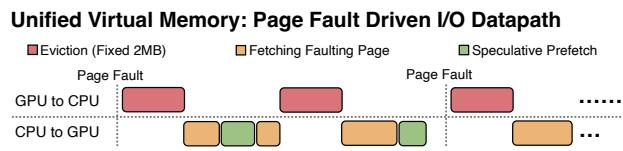  
Figure 1: UVM’s page-fault-driven migration. UVM can only utilize half of the link bandwidth for full-duplex PCIe channel.

• A lightweight, MLFQ-inspired scheduler for GPU workloads that automatically identifies and prioritizes interactive applications to reduce latency while preserving overall GPU throughput.

• An implementation that supports unmodified, state-ofthe-art GPU applications (e.g., llama.cpp, SGLang, and ComfyUI) and delivers substantial improvements across diverse consumer GPU workloads.

## 2 Motivation

Here we motivate why the consumer GPU multiplexing problem is a fundamentally different problem from datacenter GPU multiplexing.

## 2.1 Local ML Workloads on Consumer GPUs

Recent advances in model quantization and optimized inference runtimes have enabled users to run large machine learning (ML) models directly on their personal machines. Applications such as local LLM inference (e.g., llama.cpp, SGLang, vLLM), text-to-image generation, and interactive image editing pipelines (e.g., ComfyUI, diffusion-based tools) have become increasingly common. Users are motivated by privacy, offline capability, more fine-tuning opportunities and reduced hardware costs.

Unlike traditional datacenter GPU workloads, a single user may concurrently run or frequently switch between multiple large models: querying an LLM, generating an image, editing a photo, running background AI tasks, among other applications, all on a shared consumer-grade GPU. For interactive applications, the batch size is almost always one. At the same time, modern consumer GPUs (e.g., RTX 4090/5090) offer substantial compute but limited GPU memory relative to model size. Users often run the largest models that can fit in memory to maximize quality. However, this means each individual application may nearly saturate GPU memory.

## 2.2 Limitations of Existing Multiplexing Approaches on Consumer GPUs

Existing Approach #1: Shut Down an Application and Run the Next Application. A straightforward solution is to run only one application at a time. For example, the community tool llama-swap [21] enables switching by terminating the current application and launching the next. However, unloading and reloading large models introduces multi-second delays, making even moderate task switching impractical for interactive consumer workflows (e.g., prompting an LLM to generate image descriptions that will be used immediately in a diffusion-based text-to-image application).

Existing Approach #2: Application-Specific Approaches. Applications such as Ollama [25] provide model switching by unloading the current model and loading a new one. However, this mechanism is tightly coupled to a single application’s internal execution and cannot coordinate with other GPU applications.

Another line of work makes an inference system’s GPU memory usage elastic. Prism [39], for example, allows an LLM framework to dynamically shrink its KV cache, freeing GPU memory for other applications. While effective for LLMs, this approach is highly domain-specific: diffusion models, image-editing pipelines, and many other consumer workloads do not use KV caches and therefore cannot ben efit from this mechanism. Moreover, these systems require explicit software-level integration into each application or inference framework. As a result, they cannot provide transparent, system-wide multiplexing across the diverse set of applications on consumer GPUs.

Existing Approach #3: NVIDIA Unified Virtual Memory (UVM). UVM is a fully transparent mechanism for handling GPU memory oversubscription. Its basic idea mirrors CPU demand paging: when a GPU kernel accesses a page that is not resident in GPU memory, the hardware raises a page fault interrupt to the driver. The driver’s handler then selects pages for eviction, migrates data between GPU and CPU memory, and resumes kernel execution. UVM works well for: (1) a single application whose total memory footprint exceeds GPU capacity but whose working set fits in GPU memory, and (2) multiple applications whose combined working sets fit within GPU memory.

While UVM’s fully transparent abstraction is appealing, it has four fundamental limitations in the consumer setting. First, UVM lacks coordinated control over compute and memory management, making it highly susceptible to thrashing. Consider two applications, A and B, running concurrently on a 32 GB GPU and generating one token each in a round-robin fashion. Suppose each model requires 24 GB of parameters; then each forward pass triggers the migration of at least 16 GB of data to and from GPU memory. Even with state-of-theart PCIe 5.0x16 bandwidth (64 GB/s), this migration takes roughly 250 ms. By comparison, a forward pass without migration typically takes only 20-75 ms. Thus, data movement alone induces a 4-12× slowdown.

Second, UVM utilizes only one direction of the PCIe bandwidth at a time, even though the PCIe channel is full-duplex. Figure 1 shows the IO path between CPU and GPU during page fault handling for UVM. During a page fault, UVM first evicts pages from GPU to CPU memory, and only after eviction completes does it fetch the demanded page and possibly several prefetched pages from CPU to GPU memory. A single fault may trigger multiple evictions followed by multiple fetches, but these transfers never overlap: eviction uses only GPU to CPU bandwidth, while fetching and prefetching use only CPU to GPU bandwidth. As a result, half of the available PCIe bandwidth remains idle.

Third, due to limited visibility into application behavior, UVM relies on a Least Recently Used (LRU)-based eviction policy to select pages during GPU page faults [4]. However, UVM only updates its LRU metadata when page faults occur, which provides a highly incomplete view of an application’s true memory access pattern. As a result, pages that will be accessed imminently are often mistaken for cold pages, which leads to unnecessary page eviction and thrashing.

Fourth, host memory becomes a major bottleneck when UVM is used on consumer GPUs. To maximize PCIe transfer performance, UVM allocates CPU pinned memory inside the kernel for DMA operations. When UVM serves as the backing store for multiple GPU applications, every page resident on the GPU must have a corresponding pinned page on the CPU. This creates substantial memory overhead: even data that will never be evicted from the GPU still consumes unswappable, incompressible CPU pinned memory. On consumer machines equipped with modest RAM, this CPU pinned memory footprint competes directly with other applications and can significantly degrade overall system usability.

Several GPU multiplexing systems build on top of UVM to mitigate some of its thrashing issues (e.g., TGS [34] and nvshare [3]). For example, TGS assigns priorities to applications so that low-priority applications run only when highpriority ones are idle. However, because these systems rely on UVM as their underlying GPU memory virtualization mechanism, they inherit UVM’s fundamental limitations: page-faultdriven migration, single-directional PCIe transfers, and large pinned-memory consumption.

## 3 Overview

Our design is guided by three key goals. First, we aim to provide a UVM-like abstraction that supports unmodified CUDA applications, while enabling coordinated control over compute and memory virtualization. Second, we seek to redesign virtual memory management to exploit a hierarchical memory system spanning GPU memory, CPU pinned memory, CPU paged memory, and disk, while ensuring that CPU-GPU data transfers fully utilize the full-duplex PCIe bandwidth. Third, similar to a standard OS kernel scheduler, we aim to optimize latency for interactive applications without sacrificing throughput for background batch-processing workloads.

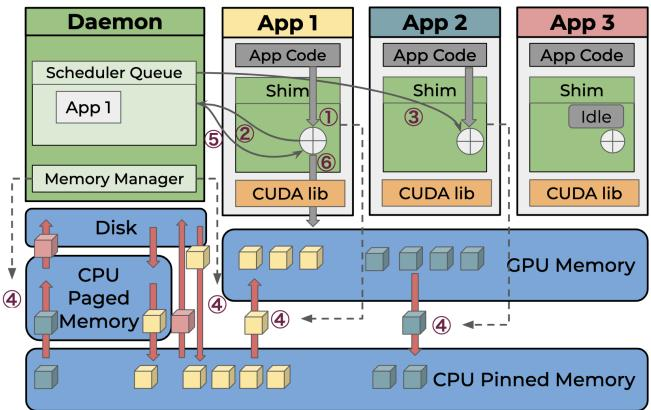  
Figure 2: Nixie’s architecture overview. Green components belong to Nixie. Cubes with different colors stand for memory blocks from different applications.

Figure 2 presents the architecture of Nixie. The system consists of two components: a lightweight application library, Nixie Shim, and a centralized system service, Nixie Daemon. To provide transparency, Nixie Shim interposes on an application’s CUDA Runtime API calls. Nixie Daemon performs global coordination and enforces multiplexing policies, but all kernels continue to execute using the application’s own CUDA context to minimize runtime overheads on kernel launches. When App 1 launches a new kernel to execute GPU jobs, it 1 checks the execution flag in the Nixie Shim; 2 if App 1 cannot execute, Nixie Shim then uses interprocess communication (IPC) to enqueue a schedule request in daemon’s scheduler queue. When the scheduler in Nixie Daemon decides App 1 is allowed to run, 3 Nixie Daemon uses IPC to pause the execution of App 2, waiting for its completion of outstanding CUDA kernels. Then 4 Nixie Daemon moves all the memory blocks belonging to App 1 into shared pinned memory, and each Nixie Shim migrates its own memory blocks into or out of GPU memory. After the memory blocks are ready for App 1, 5 Nixie Daemon notifies Nixie Shim in App 1 to enable the execution flag; App 1 then 6 resumes its execution. When all of App 1’s data is ready, App 1 only executes steps 1 and 6 , bypassing IPC with Nixie Daemon.

Nixie Daemon centralizes three decisions: which application may launch kernels, where memory should reside, and the order in which required transfers are issued. Nixie Shim and Nixie Daemon then enforce those decisions with a small set of CUDA-facing mechanisms: intercepting CUDA calls, blocking new kernel launches at safe points, synchronizing outstanding kernels, remapping CUDA VMM allocations, and issuing asynchronous memory copies. The rest of this section describes these mechanisms and the decision logic built on top of them.

Nixie Daemon maintains a chunk-level virtual memory system. Instead of relying on page-fault-driven migration,

Nixie manages memory at the granularity of CUDA-allocated chunk (i.e., the units returned by cudaMalloc). Each chunk may reside in one of four locations: (1) GPU memory, (2) CPU pinned memory, (3) CPU paged memory, or (4) disk. Unlike UVM, chunks placed in GPU memory do not require CPU pinned memory. To avoid fragmentation in CPU pinned memory or paged memory, we split a chunk into 2 MB blocks, where a block is the unit of data migration between locations.

Nixie’s design follows two key principles. First, Nixie coordinates the control over both compute and memory allocation. When the scheduler selects an application to run, it proactively migrates that application’s chunks into GPU memory while simultaneously evicting other applications’ chunks to CPU memory or disk. By coupling scheduling with memory placement, Nixie ensures that when an application begins executing, it has both GPU compute and the necessary GPUresident data available, avoiding demand-paging stalls and eliminating thrashing. Second, Nixie prioritizes interactive workloads automatically. Nixie determines whether an application is interactive by tracking its kernel launch behavior. Borrowing ideas from MLFQ, Nixie adjusts each application’s priority and time window dynamically. If an application does not issue a kernel during its assigned time window, Nixie classifies it as interactive, halves its window size, and increases its priority. Conversely, if the application fully uses its assigned time window, Nixie doubles the window size and lowers its priority. At each decision point, the scheduler selects the highest-priority application and grants it GPU access for its current window. This approach allows Nixie to automatically prioritize latency-sensitive applications without any user annotations or application modifications, while preserving throughput for background batch-processing applications.

## 4 Supporting Unmodified CUDA Applications

Nixie is transparent to CUDA applications, similar to UVM. In UVM, a user replaces all CUDA memory allocations from cudaMalloc with cudaMallocManaged, and it is easy to make this fully transparent by static rewriting or LD\_PRELOAD.

Nixie uses LD\_PRELOAD to hook the CUDA library and interpose several functions. Besides memory allocation and free, Nixie also interposes CUDA kernel/graph launches in order to control compute behavior. Further, Nixie intercepts any APIs that implicitly allocate memory (e.g., cudaStreamCreate) or report memory usage (e.g., cudaMemGetInfo). Applications sometimes require correct memory usage reporting to function correctly. For example, SGLang reads GPU memory in order to decide how much KV cache memory to be allocated. Nixie Shim provides such interceptions and also communicates with Nixie Daemon via a UNIX domain socket.

To make sure applications can run correctly without being aware of the existence of Nixie, we need to keep an identical running environment before pausing and after resuming, and no invalid GPU operations should be introduced by Nixie.

Maintaining consistent virtual memory addresses. Classic approaches like cudaMalloc and cudaFree cannot guarantee that virtual memory addresses remain consistent after another call. Applications that use the previous addresses will access memory regions that are no longer valid. Nixie leverages CUDA VMM API [24] to reserve GPU virtual addresses and map these addresses to different physical allocations before and after chunk migrations.

Valid memory access during migration. GPU kernel execution is mostly asynchronous. When migration starts, there can be outstanding kernels still executing, and invalid memory accesses can happen when the accessed pages have been migrated. Before the currently running application is migrated, Nixie blocks any new kernels from launching and performs a CUDA synchronization to complete all the outstanding kernels. This prevents an application from using the migrated chunks.

CUDA graph compatibility. CUDA graph is widely used to reduce kernel launch overhead. When applications are constructing CUDA graph, unexpected API calls can disrupt the graph capture and lead to unexpected behavior. Nixie ensures Nixie Shim does not call any CUDA APIs until the graph capture finishes by interposing on the start and end of capture events.

GPU memory information. Some applications assume they have exclusive access to the entire GPU, and use devicewide statistics to make decisions for tensor placements or buffer allocations. Nixie reports GPU memory usage as the sum of allocations from the process itself, preventing applications from unnecessarily spilling data to CPU.

## 5 Virtual Memory Management

We first describe the granularity of memory management in Nixie, and then describe how to migrate memory chunks within hierarchical memory.

## 5.1 Memory Granularity and Hierarchy

Nixie intercepts all GPU memory allocations in applications, and it is thus naturally aware of all memory allocations. Nixie manages memory at the granularity of each allocation and migrates these units as a whole, which we refer to as chunks. Each chunk is placed at a specific tier of the memory hierarchy. Some applications (e.g., llama.cpp) put all the model weights into one big allocation. To prevent excessively large chunks, Nixie caps each chunk’s size at 128 MB. Larger allocations are subdivided accordingly, allowing portions of the same allocation to reside in different memory hierarchy tiers. For example, a 256 MB allocation may be split so that roughly half resides in CPU pinned memory while the remainder is placed in CPU paged memory.

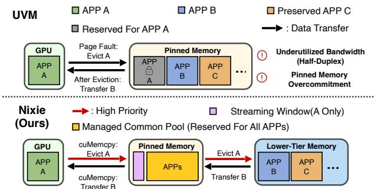  
Bi-directional Migration Hierarchical Memory Management High Bandwidth Utilization  
Figure 3: Nixie’s memory hierarchy and chunk migration.

Allocations naturally vary in size because tensors (e.g., weights, activations) have diverse shapes. If Nixie managed memory solely at the chunk level, this variability would lead to severe fragmentation. To address this, Nixie introduces blocks for fine-grained control. Each block has a fixed size of 2 MB, which is the smallest physical allocation unit supported by the VMM API. A chunk is composed of one or more blocks (up to 64). Using uniformly sized blocks simplifies placement, migration, and bookkeeping, enabling Nixie to manage memory efficiently while avoiding fragmentation.

Nixie does not treat tier X as a cache backed by tier X + 1. Instead, each chunk has exactly one copy within the entire memory hierarchy and is migrated between tiers as needed. Figure 3 shows Nixie’s memory hierarchy. Nixie Daemon is the only component that issues data migration and has all the information needed to decide chunk locations in the memory hierarchy. Nixie Daemon can proactively perform background migrations without involving or interrupting applications. This design avoids keeping a pinned-memory backing copy for every GPU-resident chunk.

## 5.2 Speeding Up Context Switches

Migration is needed when GPU memory cannot fit the next application that will run, and long migration time directly affects user experience. To shorten migration, Nixie must keep both PCIe directions and the lower-tier memory links busy. Figure 4 illustrates the common case: application B is about to run and its blocks must be fetched into GPU memory, while blocks from the currently resident application A must be evicted.

A straightforward design would issue local transfers between adjacent tiers and rely on back-pressure to create free space. This performs poorly in a multi-tier hierarchy. A fetch from pinned memory to GPU may first require evicting GPU blocks to pinned memory; that eviction may require moving pinned-memory blocks to CPU paged memory; and the CPU paged tier may in turn need to spill blocks to disk. Serializing this chain leaves one or more links idle. It can also create avoidable traffic: if B fills the pinned tier while being fetched upward, A’s evicted blocks may be forced to move farther down the hierarchy than necessary, or the system may deadlock waiting for space that can only be created by transfers blocked behind the fetch.

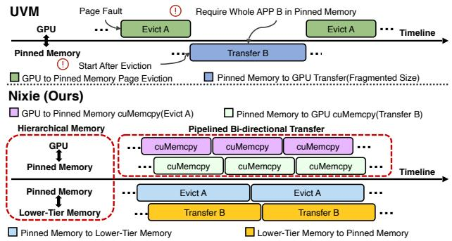  
Figure 4: Nixie’s communication bandwidth usage (1) between GPU memory and CPU pinned memory, and (2) between CPU pinned memory and lower-tier memory (e.g., CPU paged memory, disk).

Nixie avoids these local decisions by separating planning from orchestration. The planner decides what moves are needed and where each block ends up; the orchestrator decides when and how to issue the actual data transfers. The planner creates a plan, i.e., a list of block moves, where each entry records the block identifier, current tier, destination tier, transfer direction, and migration order to prioritize blocks that will need further migration. The planner also computes the final state of each tier, so it can determine the minimal migration needed without exceeding any capacity constraints.

For an incoming application B, the planner first identifies all B blocks that are not already resident in GPU memory. It then computes the number of GPU blocks that must be freed and selects that many non-B GPU-resident blocks as eviction candidates. The eviction policy minimizes unnecessary movement: blocks are evicted only when needed to admit B, and each evicted block is placed in the highest lower tier with available non-reserved capacity. Blocks that cannot fit in pinned memory are assigned to CPU paged memory or disk before migration begins: they are transmitted at the beginning of the migration, rather than being pushed down only when one tier is full. When the scheduler already exposes a likely next application, the planner treats its blocks as less attractive eviction candidates, which preserves useful prefetching state. An example is shown in Figure 5.

The migration orchestrator executes the plan as faithfully as possible. It maintains separate queues for upward transfers (toward GPU) and downward transfers (away from GPU), and gives priority to moves that unblock the opposite direction. In the example of Figure 4, the orchestrator reserves a small pinned-memory streaming window for A’s evicted blocks. This reservation ensures that GPU-to-pinned eviction can proceed even while B is being staged through pinned memory.

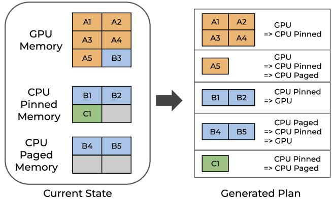  
Figure 5: Migration plan given existing chunks’ locations.

One issue we observed is that the block transfers may be stragglers with high latency, which comes from OS resource management or underlying CUDA runtime. In this case, to avoid deadlock with the staging buffer, the orchestrator can dynamically adjust the plan by evicting a small number of blocks to unblock the transmission.

For the actual data movement, Nixie Daemon moves incoming blocks into CPU pinned memory using multiple worker threads to saturate DRAM bandwidth. Once B’s blocks are present in pinned memory and their GPU destinations are available, Nixie Daemon sends block identifiers and offsets to Nixie Shim via IPC. Nixie Shim then issues asynchronous CUDA copies between the 2 MB pinned-memory blocks and the application’s reserved GPU virtual addresses.

## 6 Scheduling

Similar to traditional CPU scheduling, our goals are: (1) interactive applications should receive higher priority than batchprocessing applications, and (2) users should not be required to manually specify application priorities. On CPUs, multilevel feedback queues (MLFQ) are the canonical mechanism to achieve both goals.

GPUs, however, provide neither CPU-style yield/blocking signals nor cheap context switches. The scheduler therefore has to infer when an application has stopped using the GPU and distinguish short, bursty applications from long-running applications without user annotations.

In the following, we describe how Nixie detects applications that are not using GPUs and then infers application priority. Finally, we discuss how to use prefetching to augment an MLFQ-like scheduling system tailored for GPU workloads.

## 6.1 Idleness Detection

In traditional CPU scheduling, a scheduler is typically invoked when (1) a time window expires or (2) a thread voluntarily relinquishes the CPU, for example by issuing yield() or invoking a blocking system call (e.g., I/O). These signals allow the CPU scheduler to switch to another thread of execution. However, neither signal exists in GPU applications. First, Nixie needs to support applications with long-running services (e.g., SGLang, Ollama), so there is no notion of “task completion.” Second, GPU applications do not expose equivalents of yield or blocking system calls to indicate periods of inactivity. As a result, letting applications run until the time window expires, regardless of whether an application is doing useful work, leads to poor GPU utilization and high latency for interactive workloads.

To address this, we design a mechanism to detect when a GPU application becomes idle. A straightforward approach is to observe GPU utilization using device APIs such as NVML. Unfortunately, this has two drawbacks. First, GPU-level APIs are coarse-grained and update slowly. In our experiments, NVML takes roughly 600 ms to report that a workload has become idle. Second, on consumer devices, background tasks (e.g., rendering or video decoding) introduce noise that makes these signals unreliable.

We use a timeout-based mechanism to detect application idleness. CUDA APIs fall into two categories: non-blocking operations (e.g., kernel launches, asynchronous calls) and blocking operations (e.g., synchronization). Nixie treats an application as idle only if the time elapsed since its most recent API return exceeds a fixed threshold. For blocking APIs, Nixie Shim intercepts the call both before and after execution to ensure the application is not mistakenly classified as idle while it is blocked inside the runtime. In our implementation, we use a 100 ms threshold. When the timeout fires, Nixie Shim sends an idleness notification to Nixie Daemon and Nixie Daemon marks the application as inactive. This notification invokes the same scheduling loop used when a time window expires. Idleness helps Nixie Daemon perform potential background migration and adjust scheduling priorities accordingly, as described in the following sections.

## 6.2 Priority Inference

Classic MLFQ decreases priorities over time and periodically resets all priorities to the highest level. This works well on CPUs, where time windows are short. In Nixie, however, GPU time windows are much longer. Blindly resetting all priorities erases useful history and may unexpectedly preempt interactive workloads.

We introduce a soft priority recovery policy. The scheduler records three timestamps for each application a: (1) the time it became idle ia, (2) the time of last priority update pa, and (3) the time of its most recent scheduling request qa. Ideally, when an application stays idle for a sufficiently long period, it indicates the usage pattern may have changed (e.g., an LLM generating a long response for one prompt now may generate a short response for another prompt), so its priority should be increased to re-estimate the runtime characteristics. However, if the application is already in the scheduler queue pending further execution, promoting it immediately would preempt the currently running application and reduce the effective time window of every application in that priority level. To address this issue, we exclude pending time from consideration. Let R denote the multiplying factor applied to the pending time. If R ≥ 1, an application could potentially starve at low priority whenever high-priority jobs are continuously running. Therefore, we dynamically adjust R based on the number of applications N at the same priority level, ensuring that R < 1/N. The detailed priority inference algorithm is shown in Algorithm 1.

Algorithm 1 Nixie Priority Inference   
Require: Application a, pending time factor R, set of multi  
level feedback queues {Q} and corresponding time allot  
ment {T }   
1: p ← current priority of a   
2: t ← accumulated execution time of a in current priority   
3: if ta > Tp then ▷ Standard MLFQ Demotion   
4: Move a to lower priority queue   
5: ta ← 0   
6: else if a is idle then   
7: i ← time since last execution   
8: pa ← time since last priority change   
9: qa ← time since a enqueued (0 if no new request)   
10: if pa > Tp then ▷ Prevent priority jitter   
11: // Compensate idleness and prevent starvation   
12: if ia − R · qa > Tp−1 + ta then   
13: Move a to higher priority queue   
14: end if   
15: end if   
16: end if

## 6.3 MLFQ with Prefetching

Nixie uses K queues (Q1, Q2, . . . , Qk) where the priorities are in descending order from Q to Q . The scheduler prioritizes applications with higher priority levels; when multiple applications share the same priority, they are scheduled in round-robin fashion, beginning with the application that has waited longest. Upon reaching a preemption threshold S, the scheduler preempts the current application if another application exists at the same priority level. We set the time allotment for priority demotion to T = 8s and the preemption threshold to S = 4s for the highest priority queue; each successive lower-priority queue doubles these parameters. The scheduler periodically checks for new scheduling decisions and updates priorities. Upon receiving an idleness notification from the currently running application, the scheduler performs the same operations.

In Nixie’s hierarchical memory design, moving data from a lower to a higher tier requires a long time. We leverage information from the scheduler to reduce migration time:

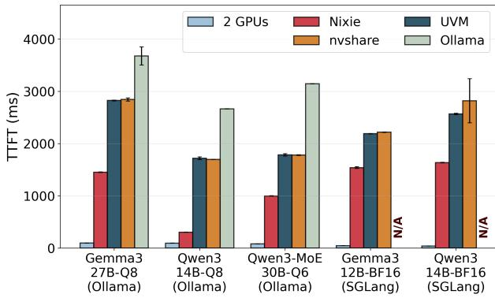  
Figure 6: Context switch performance comparison. Error bars represent standard deviations.

when there is already an application at the head of scheduler queue, it is most likely to run after the current application is scheduled out. Nixie thus prefetches data belonging to the next application to reduce migration time.

## 7 Evaluation

We have prototyped Nixie using \~10,000 lines of Rust code. Nixie Shim has \~1,900 lines of code, and Nixie Daemon has \~7,400 lines of code, with \~700 lines of shared code. Next, we microbenchmark Nixie ’s context-switching latency as well as its compute and memory overheads. We then evaluate a set of representative use cases to demonstrate Nixie ’s practical benefits. Following the previous work [6], we report average end-to-end time for these evaluations.

Setup. Our experiments are conducted on a desktop machine equipped with an AMD Ryzen 9 9950X CPU and 96 GB of dual-channel DDR5 memory at 3600 MT/s. The system includes two 32 GB RTX 5090 GPUs, each connected via PCIe 5.0x8. Unless noted, all Nixie, UVM, nvshare, Ollama, and TGS experiments use a single GPU; the second GPU serves only the 2 GPUs baseline, which assigns one application to each GPU to approximate the zero-contextswitch upper bound for multi-application performance. The desktop machine runs Debian 12 with CUDA version 12.9 and NVIDIA driver version 580.95.05. We run ML models using Ollama [25] (version 0.12.11), SGLang [42] (version 0.5.4.post1), llama.cpp [13] (version b7027) and ComfyUI [9] (commit eaf68c9). We pick a variety of models from Qwen3 [37], Gemma3 [29], Z-Image [31] and Qwen-Image [35] with different sizes and quantizations. For example, Qwen3-MoE 30B-Q6 means that it is the 30B variant of Qwen3-MoE with 6-bit quantization.

Baselines. We compare Nixie with Ollama [25], UVM [1], TGS [34], and nvshare [3]. The UVM baseline is implemented by hooking only cudaMalloc, cudaFree, and cudaMemGetInfo three APIs. We include Ollama as both an application atop Nixie and as a baseline: Ollama executes ML models and can switch between models natively. We only evaluate TGS using case studies and exclude TGS from microbenchmarks because TGS only supports exactly two applications and requires users to explicitly designate one as high priority and the other as low priority, making it incompatible with our microbenchmark workloads.

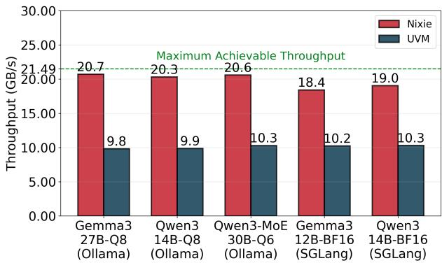  
Figure 7: CPU from/to GPU memory copy throughput.

## 7.1 Microbenchmarks

Context Switch Performance. We evaluate context-switch performance by running an application executing a model and then switching to another identical instance of the same application and model on a single GPU. Figure 6 reports the Time-To-First-Token (TTFT) under five settings: 2 GPUs, Nixie, UVM, nvshare, and Ollama. Here, 2 GPUs places the two applications on separate GPUs, and thus reflects TTFT assuming the context switch is effectively free.

Overall, Nixie reduces TTFT by 44.0%-82.3% for Ollama cases and 29.7%-36.3% for SGLang cases compared to UVM and nvshare. Ollama uses a simple mmap-based strategy to unload and reload models, which results in the worst performance among all solutions tested.

We highlight two interesting observations. First, for MoE models (e.g., Qwen3-MoE), the performance benefit of Nixie for TTFT is smaller because the prefill only activates a subset of experts. Second, Nixie provides larger benefits for Ollama than for SGLang. SGLang aggressively allocates KV-cache memory that remains unused; Nixie proactively offloads all unused KV-cache pages to CPU memory, while UVM moves such pages in a delayed manner.

To understand why Nixie shortens context switch time compared to UVM and nvshare, we measure the bi-directional data-transfer throughput between host and GPU memory. Figure 7 shows the results. For reference, the dotted line marks the maximum achievable bi-directional throughput on our testbed, measured by NVIDIA’s nvbandwidth [22] tool.

Nixie nearly saturates the available bi-directional bandwidth and achieves around 2× the throughput of UVM. The remaining gap between Nixie and the theoretical maximum primarily comes from memory allocation overheads. Ollama exhibits a simple, large size allocation pattern, whereas SGLang has a more complex and non-uniform size pattern. Consequently, Nixie is able to reach higher bi-directional throughput when running Ollama than when running SGLang.

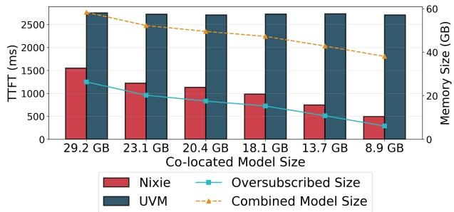  
Figure 8: Performance comparison under different amounts of memory oversubscription. Oversubscribed size = Combined model size - GPU memory size.

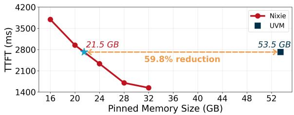

(a) Gemma3 27B-Q8  
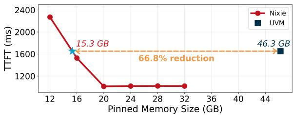  
(b) Qwen3-MoE 30B-Q6  
Figure 9: Pinned Memory Versus TTFT

In Figure 8, we analyze the effect on TTFT when co-locating with applications of varying sizes. We use llama.cpp as our primary application and Gemma3 27B-Q8 as the model for measuring TTFT. As total GPU memory oversubscription decreases, Nixie achieves improved context switch performance, whereas UVM maintains constant context switch overhead due to its LRU policy, regardless of the extent of GPU memory oversubscription.

Sometimes, users may have insufficient CPU memory when they have to work with other applications. UVM leverages pinned memory for DMA to achieve the best migration performance. We vary the total amount of CPU pinned memory Nixie can use from 16 GB to 32 GB. In Figure 9, we show that Nixie can achieve the same performance as UVM with only 33.2% to 40.2% of the CPU pinned memory used by UVM.

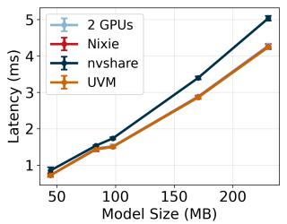  
(a) Inference latency

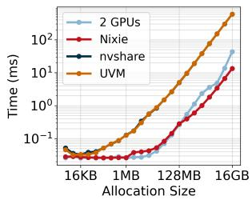  
(b) cudaMalloc latency  
Figure 10: Nixie’s runtime overheads.

Runtime Overheads. During the time an application is scheduled to run on a GPU, Nixie should have minimal performance overheads on kernel launch, even when the kernel itself is small. This is because during the window the application is scheduled to run, the CUDA launch calls directly go through the corresponding CUDA userland driver and do not need to be handled via Nixie Daemon.

Figure 10a displays inference latencies of various small ResNet models ranging from ResNet-18 to ResNet-152 at a batch size of 1. Nixie shows the identical performance with vanilla execution from 2 GPUs and simple UVM interception. The overhead from nvshare mainly comes from its CPU thread synchronization and GPU synchronization under certain conditions.

Memory Overheads. In Figure 10b, we measure the latency of cudaMalloc() with varying allocation sizes. We execute a subsequent cudaMemset() to eliminate the effects of lazy initialization. For allocations below 2 MB, Nixie directly uses cudaMalloc(), achieving performance comparable to the vanilla implementation. Between 2 MB and 128 MB, Nixie exhibits slightly higher allocation times compared to the vanilla implementation. Because the CUDA runtime is closed-source, we can only hypothesize why Nixie outperforms the vanilla implementation once the allocation size exceeds 128 MB. Our hypothesis is that Nixie allocates memory using multiple contiguous 128 MB physical regions, whereas the vanilla implementation may attempt to allocate a single, maximally contiguous region. UVM and UVM-based nvshare shows worse performance because UVM adopts a first-touch allocation policy, which defers physical memory allocation until the initial access, introducing more overhead.

## 7.2 Case Studies

We present four representative use cases. Cases #1 and #2 are multi-application execution workflows, where applications interact with each other. Cases #3 and #4 are concurrent workloads, where multiple workloads are independent and have no dependency.

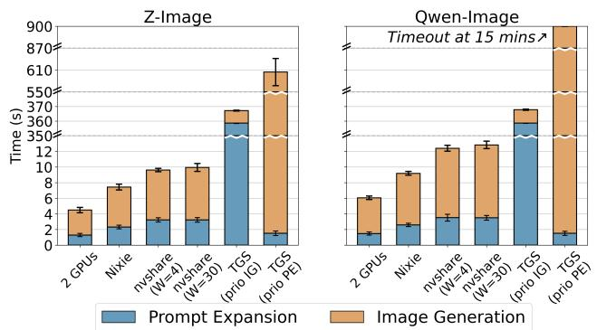  
Figure 11: Using Qwen3-MoE 30B-Q6 to extend the text-toimage prompt for better image quality. Error bars represent standard deviations.

Case #1: Prompt-expanded image generation. Prompt expansion [10, 19] is a standard technique for image generation. When the user wants to generate an image given a prompt, an LLM is then used to expand the prompt to make the description of the image more precise and contain more concrete details. This workflow requires cross-application collaboration between an LLM inference application and an image generation application.

We evaluate this workflow with llama.cpp and ComfyUI. For prompt expansion, we use Qwen3-MoE 30B-Q6 [37]. For image generation, we select two commonly used models: (1) 6B Z-Image [31] with BF16, and (2) 20B Qwen-Image [35] with FP8. We use the DreamBench++ dataset [26] for our prompts. We compare Nixie against nvshare under two window configurations: W = 4 s, which matches Nixie’s preemption threshold of the highest priority, and W = 30 s, which is the default setting of nvshare. Since TGS requires explicit priority assignment, we include two variants: one that prioritizes image generation (prio IG) and one that prioritizes the LLM-based prompt expansion (prio PE).

Figure 11 reports the results. Nixie is 1.4× and 1.3× faster than nvshare (W = 4) and achieves 65.9% and 60.4% of the performance of using two dedicated GPUs for Qwen-Image and Z-Image, respectively. Notably, even though ComfyUI frequently allocates and frees GPU memory during Qwen-Image generation, Nixie maintains higher performance, indicating that the performance of Nixie is robust to memory allocation and deallocation on the data path.

TGS exhibits significantly degraded performance and cannot finish image generation for Qwen-Image within 15 minutes. There are two primary reasons: (1) TGS assumes that the high-priority job must sustain a constant throughput, which does not hold for most consumer-oriented applications. Consequently, the TGS rate limiter fails to function effectively in this scenario. (2) Under memory oversubscription, TGS forces low-priority jobs to access host memory directly via DMA without migration, essentially stalling computation.

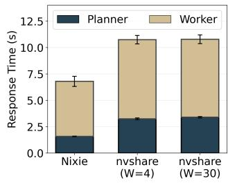  
(a) Overall Latency

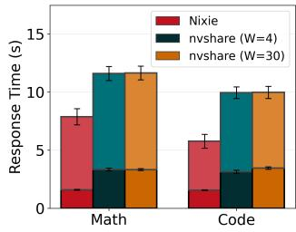  
(b) Latency by Request Type  
Figure 12: Multi-agent orchestration for math and code tasks. Error bars represent standard deviations.

Case #2: Multi-agent systems. Multi-agent systems are an increasingly common way to structure complex LLM applications. Instead of relying on a single monolithic model, a planner agent decomposes a user request into subtasks and dispatches each subtask to a specialized worker model. This planner-worker orchestration pattern appears in current coding assistants, tool-using agents and many recent multi-LLM workflows, and serves as a canonical multi-agent workload [12, 15, 33].

We instantiate this model-orchestration workload using the open-source multi-agent framework KVCOMM [38]. For routing, we use Qwen3 14B-Q8 to decide the best downstream model. Following model-level benchmarks [5, 29, 30, 37], we select Qwen3-VL 32B-Q6 as the math expert and Qwen3- Coder 30B-Q6 as the coding expert. All models are served through llama.cpp on a single GPU; the only difference between configurations is the GPU sharing mechanism. We compare Nixie against nvshare with W=4 and W=30. We issue a mixed stream of math and coding requests (shuffled from GSM8K [8] and HumanEval-FIM [7]) and record end-to-end latency per request, as well as its breakdown into planner and worker components.

Figure 12 shows our results. Across all requests, Nixie is 1.6× faster than both nvshare configurations. The gains are consistent across request types as well: for math and coding tasks, Nixie is 1.5× and 1.7× faster, respectively. These results indicate that Nixie offers strong flexibility across multiple applications, enabling efficient model orchestration on a single shared GPU without sacrificing the interactivity of the multi-agent workflow.

Case #3: Code completion with long-running job. LLMassisted code completion is a representative latency-sensitive task requiring immediate responsiveness. We expect Nixie to naturally prioritize it over long-running jobs, such as autonomous agent operations or extended video generation tasks with the help of the scheduler. To evaluate scheduler’s prioriti zation behavior, we run code completion with a long-running agentic workload. We use Qwen3-Coder 30B-Q6 for Fill-In-Middle (FIM) completion and Gemma3 27B-Q8 to emulate an LLM-based agent. HumanEval-FIM [7] is used as the input for code completion. Since the frequency and interval between code completion requests vary depending on individual developers and their tooling implementations, we create three scenarios to represent different usage patterns: frequent (1-second intervals), modest (3-second intervals), and sparse (6-second intervals). Additionally, we run Nixie with a basic round-robin scheduling policy as an ablation to evaluate the effectiveness of our scheduler, noted as Nixie-RR. This variant uses a 4-second time window, consistent with the other experimental settings.

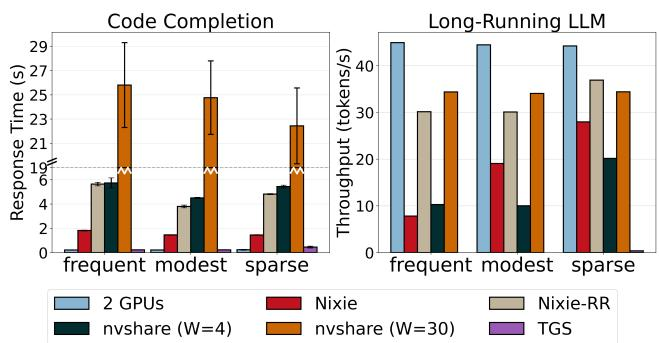  
Figure 13: Code completion with long-running generation. Error bars represent standard deviations.

Figure 13 shows the response time of code completion and the throughput of the long-running model. Nixie achieves an average response time of 1.8 s for frequent completion scenario and 1.4 s for modest and sparse scenarios. In contrast, nvshare (W=4) requires 4.5 s to 5.7 s to complete an interactive request depending on the frequency. Nixie is 3.1× to 3.8× faster compared to nvshare (W=4). When nvshare uses the default W=30, the latency exceeds 20 s, rendering LLM code completion impractical for real-world use cases. Notably, without an appropriate scheduling policy, Nixie-RR exhibits long response time for the latency-critical task across different settings.

Regarding the long-running job throughput, Nixie is 90.6% and 39.5% higher than nvshare (W=4) in the modest and sparse scenarios respectively. In the frequent scenario, Nixie throughput is 23.5% lower, which is expected: Nixie prior itizes the interactive jobs and allocates more GPU time for code completion.

These results make the tradeoff explicit: under frequent interactive arrivals, Nixie sacrifices background throughput to keep code-completion latency low; when interactive arrivals are modest or sparse, Nixie achieves both lower interactive latency and higher background throughput than nvshare (W=4). TGS achieves similar performance for code completion task, but fails to allow the long-running model to run. TGS essentially degrades to running only the high priority application.

Case #4: Many Batched Tasks. While Nixie targets interactive workloads, some GPU jobs are sufficiently heavy that they must run for extended periods (e.g., long-document processing, high-volume generation). We therefore evaluate both throughput and fairness in a setting where multiple batched jobs execute concurrently. We also evaluate the fairness of our scheduler design.

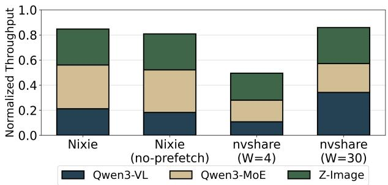  
Figure 14: Different Batch Jobs

We run three jobs: Qwen3-MoE 30B-Q6, Qwen3-VL 32B-Q6 (long-running LLM request with batch size 1), and Z-Image (batch size 8). We also ablate the effectiveness of our auto-prefetching mechanism in the scheduler. We compare our solution with nvshare configured with W=4 and W=30. All experiments are conducted over a 300-second duration. To account for the heterogeneity of metrics across different applications, we additionally run each application in isolation as a reference, and report normalized throughput relative to its profiled standalone performance.

Figure 14 shows the results. Nixie achieves throughput comparable to nvshare (W=30) achieving 85% of the ideal throughput, even when Nixie employs an adaptive policy to prioritize responsiveness, whereas nvshare utilizes a fixed long time quantum for throughput. Fairness is effectively maintained across all tested configurations. Auto-prefetching yields an additional 5% throughput improvement over the no-prefetch variant, despite context switches already being infrequent in this scenario. In contrast, nvshare (W=4) only realizes 49.5% throughput because of the overhead caused by frequent context switches.

## 7.3 Performance on Other Hardware

We evaluate Nixie on another server equipped with two AMD EPYC 7352 24-Core Processor CPUs, 1 TB of 16-channel DDR4 memory at 3200 MT/s, and 8x RTX A5000 GPU (24 GB) connected via PCIe 4.0x16. It runs Ubuntu 22.04 with CUDA 12.4 and Nvidia driver version 550.67.

On this platform, we reuse the multi-agent orchestration workload from Case #2. Given RTX A5000 has smaller memory, we use Qwen3 14B-Q4 as the planner, Qwen3-VL 32B-Q4 as the math worker, and Qwen3-Coder 30B-Q4 as the cod ing worker. We add 2 GPUs variant here given more available GPUs. Figure 15 shows the results. Nixie is 3.4× faster than nvshare in this case and achieves 73% of the performance of 2 GPUs. The UVM-based solution slows down significantly for this setup. We observed increase in PCIe idleness on this hardware. We suspect the root cause is the older NVIDIA driver, and the correspondingly older UVM implementation.

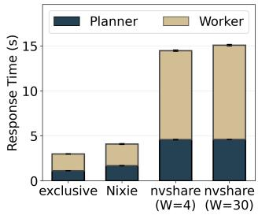  
(a) Overall Latency

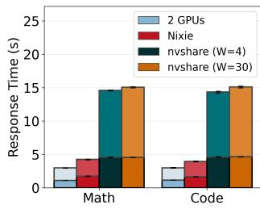  
(b) Latency by Request Type  
Figure 15: Case #2 on RTX A5000 testbed. Error bars represent standard deviations.

## 8 Discussion

Generalizability to other operating systems. Nixie leverages CUDA VMM API, which is available on both Linux and Windows. We have prototyped Nixie on Linux, and we believe that it is feasible to port Nixie to Windows, which remains the most widely used operating system for consumers. In contrast, UVM does not support memory oversubscription on Windows [23], and adding such support would require substantial engineering effort in the GPU driver stack on Windows. This distinction makes Nixie a more practical solution for consumer platforms. Furthermore, similar VMM APIs also exist for AMD GPUs [2].

White-box solutions. Nixie is a fully transparent solution that operates without any awareness of tensor semantics. In principle, certain immutable data (e.g., model weights) could be freed directly on the GPU without migrating it back to CPU memory, provided the application retains a separate CPU-side copy. For example, CUDA memory copies inherently leave duplicate data in both CPU and GPU memory. We did not pursue this direction because it would require semantic knowledge of application data structures, compromising transparency. However, incorporating such semantic hints represents an interesting direction for future work.

Policy extensibility. Nixie provides mechanisms for transparent GPU time sharing: orchestrating kernel launches, VMM-based remapping, hierarchical memory placement with migration and migration-scheduling cooperation. In this pa per, we deliberately adopt application-agnostic policies that make no assumptions about workload characteristics, prior itizing broad compatibility over peak performance. These policies are intentionally conservative; refining them is a promising direction for future work, for example by learning scheduling decisions from recent execution history or by treating different GPU memory regions (e.g., model weights, activations, KV caches) differently.

Co-locating with small models. Nixie’s target workloads are those in which each application utilizes most of the GPU memory, so temporal multiplexing is the only approach. When there is a set of small models, it is possible to perform spatial multiplexing and have different models execute at the same time as existing works on datacenter GPU multiplexing [14, 27, 41]. How to integrate spatial multiplexing into Nixie is a promising future direction.

Security. Nixie Daemon shares the same UID with applications, and applications share the same region of CPU pinned memory for storing migrated GPU data. A malicious process may access the shared data region inside its own address space. However, Linux uses UID for shared memory access control, which means any process under the same UID can access CPU pinned memory, whether the memory is shared by all processes or each process has its own dedicated CPU pinned memory. Since Nixie is for a single-user environment rather than multi-tenancy, this is outside our threat model.

## 9 Related Work

GPU multiplexing before the era of LLMs. GPU multiplexing has been extensively studied prior to the rise of LLMs. For traditional computer vision workloads, multiplexing allows significant consolidation of hardware by serving many models on shared GPUs (e.g., Nexus [27], Shepherd [41], Clockwork [14]). In these systems, GPU memory stores multiple models simultaneously, and incoming requests are batched and executed across one or more models. Reducing the number of co-located models or lowering batch sizes helps alleviate GPU memory pressure. In this setting, the dominant challenge is maximizing GPU compute efficiency. In contrast, Nixie targets temporal, not spatial, multiplexing: rather than having the GPU run inference for many models, Nixie timeshares it across large, memory-intensive applications whose working sets approach the GPU’s full capacity.

GPU multiplexing in the era of LLMs and other large foundation models. LLMs and other large foundation models have fundamentally reshaped the GPU multiplexing landscape. Attention computation is highly memory-intensive, especially with long contexts. Even a single LLM inference often consumes nearly all available GPU memory. As a result, recent research has pivoted toward temporal multiplexing and techniques for handling GPU memory oversubscription.

PipeSwitch [6] introduces a model-aware, layer-based task switching mechanism, but it requires application modifications. Further, it is less effective as the ratio of migration time to model execution time grows in modern foundation models. ServerlessLLM [11], Aegaeon [36], and Prism [39] address oversubscription by offloading less frequently accessed model components (e.g., entire models or KV caches)

to CPU memory or disk, primarily to meet provider’s Service Level Objectives. These systems are designed for datacenter LLM serving, where workloads are controlled by a single provider and can be integrated directly into a specific inference engine. Aegaeon relies on token-granular autoscaling, and Prism relies on on-demand KV-cache allocation. These mechanisms do not apply to many consumer workloads we target, including diffusion, image editing, and video pipelines, which do not expose an LLM KV cache. They also require integration with a particular serving stack, whereas Nixie remains transparent to unmodified applications on a single user’s desktop. Conversely, Nixie is not a replacement for these systems in datacenter serving. Nixie assumes wholeapplication context switches over the CPU-GPU link, with each application’s working set nearly saturating the GPU. It does not distinguish model weights from KV cache or reason about prefill/decode phases, so it cannot selectively resize KV cache or reload only the requests about to run. Those application-level optimizations are precisely where Aegaeon and Prism reduce transfers across concurrent LLM models and requests.

Improving UVM. UVM provides a transparent abstraction for GPU memory oversubscription, which is appealing. Systems such as DeepUM [16] optimize UVM performance by incorporating tensor-level prefetching. G10 [40] adds disks to UVM and uses compiler to help manage pipelined data transfer. These solutions require hardware changes or driver changes to GPUs. Further, Nixie is not purely a virtual memory system. It does not depend on page faults and can coordinate compute and memory management at the same time to mitigate memory thrashing.

GPU scheduling. Multiple works discuss multitasking scheduling. XSched [28] presents a framework that allows for preemptive XPU scheduling. Agentix [20] incorporates application dependencies into LLM scheduling. Our scheduling policy is quite simple, and we do not need any applicationlevel information. Our scheduling goal is to prioritize interactive applications.

## 10 Conclusion

Consumer machines increasingly execute large ML workloads such as LLM inference, text-to-image generation, and interactive image editing. Unlike datacenter environments, consumer GPUs must handle multiple applications concurrently, and each application often nearly saturates GPU memory. We have built Nixie, enabling efficient and fully transparent temporal multiplexing on consumer GPUs without requiring any modifications to applications or GPU drivers. Nixie coordinates GPU memory allocation with kernel-launch behavior to minimize thrashing. Nixie’s scheduler further enhances interactivity by automatically identifying and prioritizing latencysensitive applications. Nixie improves the latency of interactive code-completion workloads by up to 3.8×, while reducing CPU pinned-memory usage by up to 66.8% under equivalent latency constraints.

## Acknowledgements

We thank the anonymous OSDI reviewers and shepherd for providing insightful feedback on our work. This work was supported in part by National Science Foundation grants CNS-2112562, CNS-2238665, CNS-2402696, and OAC-2503010, as well as by gifts from Amazon and Meta.

## References

[1] CUDA Unified Memory, 2015. Accessed: October 2025.

[2] Advanced Micro Devices, Inc. Virtual Memory Management. AMD, 2025. HIP 7.1.52802 Documentation.

[3] Georgios Alexopoulos and Dimitris Mitropoulos. nvshare: Practical GPU Sharing without Memory Size Constraints. In Proceedings of the 2024 IEEE/ACM 46th International Conference on Software Engineering: Companion Proceedings, ICSE-Companion ’24, pages 16–20, New York, NY, USA, 2024. Association for Computing Machinery.

[4] Tyler Allen and Rong Ge. Demystifying GPU UVM Cost with Deep Runtime and Workload Analysis. In 2021 IEEE International Parallel and Distributed Processing Symposium (IPDPS), pages 141–150. IEEE, 2021.

[5] Shuai Bai, Yuxuan Cai, Ruizhe Chen, Keqin Chen, Xionghui Chen, Zesen Cheng, Lianghao Deng, Wei Ding, Chang Gao, Chunjiang Ge, Wenbin Ge, Zhifang Guo, Qidong Huang, Jie Huang, Fei Huang, Binyuan Hui, Shutong Jiang, Zhaohai Li, Mingsheng Li, Mei Li, Kaixin Li, Zicheng Lin, Junyang Lin, Xuejing Liu, Jiawei Liu, Chenglong Liu, Yang Liu, Dayiheng Liu, Shixuan Liu, Dunjie Lu, Ruilin Luo, Chenxu Lv, Rui Men, Lingchen Meng, Xuancheng Ren, Xingzhang Ren, Sibo Song, Yuchong Sun, Jun Tang, Jianhong Tu, Jianqiang Wan, Peng Wang, Pengfei Wang, Qiuyue Wang, Yuxuan Wang, Tianbao Xie, Yiheng Xu, Haiyang Xu, Jin Xu, Zhibo Yang, Mingkun Yang, Jianxin Yang, An Yang, Bowen Yu, Fei Zhang, Hang Zhang, Xi Zhang, Bo Zheng, Humen Zhong, Jingren Zhou, Fan Zhou, Jing Zhou, Yuanzhi Zhu, and Ke Zhu. Qwen3-VL Technical Report, 2025.

[6] Zhihao Bai, Zhen Zhang, Yibo Zhu, and Xin Jin. PipeSwitch: Fast Pipelined Context Switching for Deep

Learning Applications. In 14th USENIX Symposium on Operating Systems Design and Implementation (OSDI 20), pages 499–514, 2020.

[7] Mohammad Bavarian, Heewoo Jun, Nikolas Tezak, John Schulman, Christine McLeavey, Jerry Tworek, and Mark Chen. Efficient Training of Language Models to Fill in the Middle, 2022.

[8] Karl Cobbe, Vineet Kosaraju, Mohammad Bavarian, Mark Chen, Heewoo Jun, Lukasz Kaiser, Matthias Plappert, Jerry Tworek, Jacob Hilton, Reiichiro Nakano, Christopher Hesse, and John Schulman. Training Verifiers to Solve Math Word Problems, 2021.

[9] Comfyanonymous. ComfyUI: The Most Powerful and Modular Diffusion Model GUI, API and Backend with a Graph/Nodes Interface. https://github.com/ comfyanonymous/ComfyUI, 2025.

[10] Siddhartha Datta, Alexander Ku, Deepak Ramachandran, and Peter Anderson. Prompt Expansion for Adaptive Text-to-Image Generation. In Proceedings of the 62nd Annual Meeting of the Association for Computational Linguistics (Volume 1: Long Papers), pages 3449– 3476, Bangkok, Thailand, August 2024. Association for Computational Linguistics.

[11] Yao Fu, Leyang Xue, Yeqi Huang, Andrei-Octavian Brabete, Dmitrii Ustiugov, Yuvraj Patel, and Luo Mai. ServerlessLLM: Low-Latency Serverless Inference for Large Language Models. In 18th USENIX Symposium on Operating Systems Design and Implementation (OSDI 24), pages 135–153, Santa Clara, CA, July 2024. USENIX Association.

[12] Yingqiang Ge, Wenyue Hua, Kai Mei, Jianchao Ji, Juntao Tan, Shuyuan Xu, Zelong Li, and Yongfeng Zhang. OpenAGI: When LLM Meets Domain Experts. In Advances in Neural Information Processing Systems (NeurIPS), 2023.

[13] Georgi Gerganov. llama.cpp: LLM inference in C/C++. https://github.com/ggerganov/llama. cpp, 2025.

[14] Arpan Gujarati, Reza Karimi, Safya Alzayat, Wei Hao, Antoine Kaufmann, Ymir Vigfusson, and Jonathan Mace. Serving DNNs like Clockwork: Performance Predictability from the Bottom Up. In 14th USENIX Symposium on Operating Systems Design and Implementation (OSDI 20), pages 443–462. USENIX Association, November 2020.

[15] Sirui Hong, Mingchen Zhuge, Jonathan Chen, Xiawu Zheng, Yuheng Cheng, Jinlin Wang, Ceyao Zhang, Zili Wang, Steven Ka Shing Yau, Zijuan Lin, Liyang Zhou,

Chenyu Ran, Lingfeng Xiao, Chenglin Wu, and Jürgen Schmidhuber. MetaGPT: Meta Programming for A Multi-Agent Collaborative Framework. In The Twelfth International Conference on Learning Representations, 2024.

[16] Jaehoon Jung, Jinpyo Kim, and Jaejin Lee. DeepUM: Tensor Migration and Prefetching in Unified Memory. In Proceedings of the 28th ACM International Conference on Architectural Support for Programming Languages and Operating Systems, Volume 2, pages 207–221, 2023.

[17] Woosuk Kwon, Zhuohan Li, Siyuan Zhuang, Ying Sheng, Lianmin Zheng, Cody Hao Yu, Joseph Gonzalez, Hao Zhang, and Ion Stoica. Efficient Memory Management for Large Language Model Serving with PagedAttention. In Proceedings of the 29th Symposium on Operating Systems Principles, pages 611–626, 2023.

[18] Black Forest Labs, Stephen Batifol, Andreas Blattmann, Frederic Boesel, Saksham Consul, Cyril Diagne, Tim Dockhorn, Jack English, Zion English, Patrick Esser, Sumith Kulal, Kyle Lacey, Yam Levi, Cheng Li, Dominik Lorenz, Jonas Müller, Dustin Podell, Robin Rom bach, Harry Saini, Axel Sauer, and Luke Smith. FLUX.1 Kontext: Flow Matching for In-Context Image Generation and Editing in Latent Space, 2025.

[19] Long Lian, Boyi Li, Adam Yala, and Trevor Darrell. LLM-grounded Diffusion: Enhancing Prompt Understanding of Text-to-Image Diffusion Models with Large Language Models, 2024.

[20] Michael Luo, Xiaoxiang Shi, Colin Cai, Tianjun Zhang, Justin Wong, Yichuan Wang, Chi Wang, Yanping Huang, Zhifeng Chen, Joseph E. Gonzalez, and Ion Stoica. Agentix: An Efficient Serving Engine for LLM Agents as General Programs. In 23rd USENIX Symposium on Networked Systems Design and Implementation (NSDI 26), 2026.

[21] mostlygeek. llama-swap: Model swapping for llama.cpp, 2025. Lightweight transparent proxy server for automatic model swapping.

[22] NVIDIA Corporation. nvbandwidth: A tool for bandwidth measurements on NVIDIA GPUs. https:// github.com/NVIDIA/nvbandwidth, 2025. Accessed: 2025-11-23.

[23] NVIDIA Corporation. Unified Memory On Windows, Wsl And Tegra. NVIDIA Corporation, 2025. CUDA Programming Guide, Version 13.1.

[24] NVIDIA Corporation. Virtual Memory Management. NVIDIA Corporation, 2025. CUDA Driver API Documentation, CUDA Toolkit v13.1.0.

[25] Ollama Contributors. Ollama. https://github.com/ ollama/ollama, 2025.

[26] Yuang Peng, Yuxin Cui, Haomiao Tang, Zekun Qi, Runpei Dong, Jing Bai, Chunrui Han, Zheng Ge, Xiangyu Zhang, and Shu-Tao Xia. DreamBench++: A Human-Aligned Benchmark for Personalized Image Generation. In The Thirteenth International Conference on Learning Representations, 2025.

[27] Haichen Shen, Lequn Chen, Yuchen Jin, Liangyu Zhao, Bingyu Kong, Matthai Philipose, Arvind Krishnamurthy, and Ravi Sundaram. Nexus: a GPU cluster engine for accelerating DNN-based video analysis. In Proceedings of the 27th ACM Symposium on Operating Systems Principles, SOSP ’19, pages 322–337, New York, NY, USA, 2019. Association for Computing Machinery.

[28] Weihang Shen, Mingcong Han, Jialong Liu, Rong Chen, and Haibo Chen. XSched: Preemptive Scheduling for Diverse XPUs. In 19th USENIX Symposium on Operating Systems Design and Implementation (OSDI 25), pages 671–692, 2025.

[29] Gemma Team, Aishwarya Kamath, Johan Ferret, Shreya Pathak, Nino Vieillard, Ramona Merhej, Sarah Perrin, Tatiana Matejovicova, Alexandre Ramé, Morgane Rivière, Louis Rouillard, Thomas Mesnard, Geoffrey Cideron, Jean bastien Grill, Sabela Ramos, Edouard Yvinec, Michelle Casbon, Etienne Pot, Ivo Penchev, Gaël Liu, Francesco Visin, Kathleen Kenealy, Lucas Beyer, Xiaohai Zhai, Anton Tsitsulin, Robert Busa-Fekete, Alex Feng, Noveen Sachdeva, Benjamin Coleman, Yi Gao, Basil Mustafa, Iain Barr, Emilio Parisotto, David Tian, Matan Eyal, Colin Cherry, Jan-Thorsten Peter, Danila Sinopalnikov, Surya Bhupatiraju, Rishabh Agarwal, Mehran Kazemi, Dan Malkin, Ravin Kumar, David Vilar, Idan Brusilovsky, Jiaming Luo, Andreas Steiner, Abe Friesen, Abhanshu Sharma, Abheesht Sharma, Adi Mayrav Gilady, Adrian Goedeckemeyer, Alaa Saade, Alex Feng, Alexander Kolesnikov, Alexei Bendebury, Alvin Abdagic, Amit Vadi, András György, André Susano Pinto, Anil Das, Ankur Bapna, Antoine Miech, Antoine Yang, Antonia Paterson, Ashish Shenoy, Ayan Chakrabarti, Bilal Piot, Bo Wu, Bobak Shahriari, Bryce Petrini, Charlie Chen, Charline Le Lan, Christopher A. Choquette-Choo, CJ Carey, Cormac Brick, Daniel Deutsch, Danielle Eisenbud, Dee Cattle, Derek Cheng, Dimitris Paparas, Divyashree Shivakumar Sreepathihalli, Doug Reid, Dustin Tran, Dustin Zelle, Eric Noland, Erwin Huizenga, Eugene Kharitonov, Frederick Liu, Gagik Amirkhanyan, Glenn Cameron, Hadi Hashemi, Hanna Klimczak-Plucinska, Harman´ Singh, Harsh Mehta, Harshal Tushar Lehri, Hussein Hazimeh, Ian Ballantyne, Idan Szpektor, Ivan Nardini, Jean

Pouget-Abadie, Jetha Chan, Joe Stanton, John Wieting, Jonathan Lai, Jordi Orbay, Joseph Fernandez, Josh Newlan, Ju yeong Ji, Jyotinder Singh, Kat Black, Kathy Yu, Kevin Hui, Kiran Vodrahalli, Klaus Greff, Linhai Qiu, Marcella Valentine, Marina Coelho, Marvin Ritter, Matt Hoffman, Matthew Watson, Mayank Chaturvedi, Michael Moynihan, Min Ma, Nabila Babar, Natasha Noy, Nathan Byrd, Nick Roy, Nikola Momchev, Nilay Chauhan, Noveen Sachdeva, Oskar Bunyan, Pankil Botarda, Paul Caron, Paul Kishan Rubenstein, Phil Culliton, Philipp Schmid, Pier Giuseppe Sessa, Pingmei Xu, Piotr Stanczyk, Pouya Tafti, Rakesh Shivanna, Renjie Wu, Renke Pan, Reza Rokni, Rob Willoughby, Rohith Vallu, Ryan Mullins, Sammy Jerome, Sara Smoot, Sertan Girgin, Shariq Iqbal, Shashir Reddy, Shruti Sheth, Siim Põder, Sijal Bhatnagar, Sindhu Raghuram Panyam, Sivan Eiger, Susan Zhang, Tianqi Liu, Trevor Yacovone, Tyler Liechty, Uday Kalra, Utku Evci, Vedant Misra, Vincent Roseberry, Vlad Feinberg, Vlad Kolesnikov, Woohyun Han, Woosuk Kwon, Xi Chen, Yinlam Chow, Yuvein Zhu, Zichuan Wei, Zoltan Egyed, Victor Cotruta, Minh Giang, Phoebe Kirk, Anand Rao, Kat Black, Nabila Babar, Jessica Lo, Erica Moreira, Luiz Gustavo Martins, Omar Sanseviero, Lucas Gonzalez, Zach Gleicher, Tris Warkentin, Vahab Mirrokni, Evan Senter, Eli Collins, Joelle Barral, Zoubin Ghahramani, Raia Hadsell, Yossi Matias, D. Sculley, Slav Petrov, Noah Fiedel, Noam Shazeer, Oriol Vinyals, Jeff Dean, Demis Hassabis, Koray Kavukcuoglu, Clement Farabet, Elena Buchatskaya, Jean-Baptiste Alayrac, Rohan Anil, Dmitry, Lepikhin, Sebastian Borgeaud, Olivier Bachem, Armand Joulin, Alek Andreev, Cassidy Hardin, Robert Dadashi, and Léonard Hussenot. Gemma 3 Technical Report, 2025.

[30] Qwen Team. Qwen3-Coder-30B-A3B-Instruct. https://huggingface.co/Qwen/ Qwen3-Coder-30B-A3B-Instruct, 2025.

[31] Z-Image Team, Huanqia Cai, Sihan Cao, Ruoyi Du, Peng Gao, Steven Hoi, Zhaohui Hou, Shijie Huang, Dengyang Jiang, Xin Jin, Liangchen Li, Zhen Li, Zhong-Yu Li, David Liu, Dongyang Liu, Junhan Shi, Qilong Wu, Feng Yu, Chi Zhang, Shifeng Zhang, and Shilin Zhou. Z-Image: An Efficient Image Generation Foundation Model with Single-Stream Diffusion Transformer, 2025.

[32] Team Wan, Ang Wang, Baole Ai, Bin Wen, Chaojie Mao, Chen-Wei Xie, Di Chen, Feiwu Yu, Haiming Zhao, Jianxiao Yang, Jianyuan Zeng, Jiayu Wang, Jingfeng Zhang, Jingren Zhou, Jinkai Wang, Jixuan Chen, Kai Zhu, Kang Zhao, Keyu Yan, Lianghua Huang, Mengyang Feng, Ningyi Zhang, Pandeng Li, Pingyu Wu, Ruihang Chu, Ruili Feng, Shiwei Zhang, Siyang

Sun, Tao Fang, Tianxing Wang, Tianyi Gui, Tingyu Weng, Tong Shen, Wei Lin, Wei Wang, Wei Wang, Wenmeng Zhou, Wente Wang, Wenting Shen, Wenyuan Yu, Xianzhong Shi, Xiaoming Huang, Xin Xu, Yan Kou, Yangyu Lv, Yifei Li, Yijing Liu, Yiming Wang, Yingya Zhang, Yitong Huang, Yong Li, You Wu, Yu Liu, Yulin Pan, Yun Zheng, Yuntao Hong, Yupeng Shi, Yutong Feng, Zeyinzi Jiang, Zhen Han, Zhi-Fan Wu, and Ziyu Liu. Wan: Open and Advanced Large-Scale Video Generative Models, 2025.

[33] Qian Wang, Tianyu Wang, Zhenheng Tang, Qinbin Li, Nuo Chen, Jingsheng Liang, and Bingsheng He. MegaAgent: A large-scale autonomous LLM-based multi-agent system without predefined SOPs. In Findings of the Association for Computational Linguistics: ACL 2025, pages 4998–5036, Vienna, Austria, July 2025. Association for Computational Linguistics.

[34] Bingyang Wu, Zili Zhang, Zhihao Bai, Xuanzhe Liu, and Xin Jin. Transparent GPU Sharing in Container Clouds for Deep Learning Workloads. In 20th USENIX Symposium on Networked Systems Design and Implementation (NSDI 23), pages 69–85, Boston, MA, April 2023. USENIX Association.

[35] Chenfei Wu, Jiahao Li, Jingren Zhou, Junyang Lin, Kaiyuan Gao, Kun Yan, Sheng ming Yin, Shuai Bai, Xiao Xu, Yilei Chen, Yuxiang Chen, Zecheng Tang, Zekai Zhang, Zhengyi Wang, An Yang, Bowen Yu, Chen Cheng, Dayiheng Liu, Deqing Li, Hang Zhang, Hao Meng, Hu Wei, Jingyuan Ni, Kai Chen, Kuan Cao, Liang Peng, Lin Qu, Minggang Wu, Peng Wang, Shuting Yu, Tingkun Wen, Wensen Feng, Xiaoxiao Xu, Yi Wang, Yichang Zhang, Yongqiang Zhu, Yujia Wu, Yuxuan Cai, and Zenan Liu. Qwen-Image Technical Report, 2025.

[36] Yuxing Xiang, Xue Li, Kun Qian, Yufan Yang, Diwen Zhu, Wenyuan Yu, Ennan Zhai, Xuanzhe Liu, Xin Jin, and Jingren Zhou. Aegaeon: Effective GPU Pooling for Concurrent LLM Serving on the Market. In Proceedings of the ACM SIGOPS 31st Symposium on Operating Systems Principles, SOSP ’25, pages 1030–1045, New York, NY, USA, 2025. Association for Computing Machinery.

[37] An Yang, Anfeng Li, Baosong Yang, Beichen Zhang, Binyuan Hui, Bo Zheng, Bowen Yu, Chang Gao, Chengen Huang, Chenxu Lv, Chujie Zheng, Dayiheng Liu, Fan Zhou, Fei Huang, Feng Hu, Hao Ge, Haoran Wei, Huan Lin, Jialong Tang, Jian Yang, Jianhong Tu, Jianwei Zhang, Jianxin Yang, Jiaxi Yang, Jing Zhou, Jingren Zhou, Junyang Lin, Kai Dang, Keqin Bao, Kexin Yang, Le Yu, Lianghao Deng, Mei Li, Mingfeng Xue, Mingze Li, Pei Zhang, Peng Wang, Qin Zhu, Rui Men, Ruize Gao, Shixuan Liu, Shuang Luo, Tianhao Li, Tianyi Tang,

Wenbiao Yin, Xingzhang Ren, Xinyu Wang, Xinyu Zhang, Xuancheng Ren, Yang Fan, Yang Su, Yichang Zhang, Yinger Zhang, Yu Wan, Yuqiong Liu, Zekun Wang, Zeyu Cui, Zhenru Zhang, Zhipeng Zhou, and Zihan Qiu. Qwen3 Technical Report, 2025.

[38] Hancheng Ye, Zhengqi Gao, Mingyuan Ma, Qinsi Wang, Yuzhe Fu, Ming-Yu Chung, Yueqian Lin, Zhijian Liu, Jianyi Zhang, Danyang Zhuo, and Yiran Chen. KV-COMM: Online Cross-context KV-cache Communication for Efficient LLM-based Multi-agent Systems. In The Thirty-Ninth Annual Conference on Neural Information Processing Systems, 2025.

[39] Shan Yu, Jiarong Xing, Yifan Qiao, Mingyuan Ma, Yangmin Li, Yang Wang, Shuo Yang, Zhiqiang Xie, Shiyi Cao, Ke Bao, Ion Stoica, Harry Xu, and Ying Sheng. Prism: Unleashing GPU Sharing for Cost-Efficient Multi-LLM Serving, 2025.

[40] Haoyang Zhang, Yirui Zhou, Yuqi Xue, Yiqi Liu, and Jian Huang. G10: Enabling an efficient unified gpu memory and storage architecture with smart tensor migrations. In Proceedings of the 56th Annual IEEE/ACM International Symposium on Microarchitecture, pages 395–410, 2023.

[41] Hong Zhang, Yupeng Tang, Anurag Khandelwal, and Ion Stoica. SHEPHERD: Serving DNNs in the wild. In 20th USENIX Symposium on Networked Systems Design and Implementation (NSDI 23), pages 787–808, Boston, MA, April 2023. USENIX Association.

[42] Lianmin Zheng, Liangsheng Yin, Zhiqiang Xie, Chuyue Sun, Jeff Huang, Cody Hao Yu, Shiyi Cao, Christos Kozyrakis, Ion Stoica, Joseph E. Gonzalez, Clark Barrett, and Ying Sheng. SGLang: Efficient Execution of Structured Language Model Programs. In Advances in Neural Information Processing Systems, 2024.

## A Artifact Appendix

The artifact is used to reproduce the evaluation of this paper, and released under Apache-2.0 license. It includes the source code of Nixie, as well as scripts for evaluations and figure creation.

## Hosting

We use two GitHub repository to host the artifact. The repository in https://github.com/XOR-op/Nixie hosts the main project source code, and the repository in https://github.com/XOR-op/nixie-eval hosts the code and scripts for evaluations and figure creation.

## Requirements

The ML models selected for evaluation are targeted specifically for the 32 GB RTX 5090. If a GPU with a different VRAM capacity is used for evaluation, we suggest using models that fit into the GPU while maximizing VRAM usage, to best reflect our settings.