USENIX

THE ADVANCED COMPUTING SYSTEMS ASSOCIATION

# M3U: Scalable Kernel Memory Management for Efficient Post-copy Live Migration of High-end Virtual Machines

Yizhe Xu, Shanghai Jiao Tong University; Yuan Tao, Zhibin Zhang, Kang Yan, and Chao Zhang, Alibaba Cloud Computing; Shuo Shi, Zongpu Zhang, and Xu Huan, Shanghai Jiao Tong University; Yibin Shen, Xudong Zheng, and Jiesheng Wu, Alibaba Cloud Computing; Jian Li and Haibing Guan, Shanghai Jiao Tong University

https://www.usenix.org/conference/osdi26/presentation/xu-yizhe

# This paper is included in the Proceedings of the 20th USENIX Symposium on Operating Systems Design and Implementation.

July 13–15, 2026 • Seattle, WA, USA

ISBN 978-1-939133-55-7

Open access to the Proceedings of the 20th USENIX Symposium on Operating Systems Design and Implementation is sponsored by

# M3U: Scalable Kernel Memory Management for Efficient Post-copy Live Migration of High-end Virtual Machines

Yizhe Xu1\*, Yuan Tao2\*, Zhibin Zhang2\*, Kang Yan2, Chao Zhang2⋄, Shuo Shi1, Zongpu Zhang1, Xu Huan1, Yibin Shen2, Xudong Zheng2, Jiesheng Wu2, Jian Li1⋄, Haibing Guan1

1Shanghai Jiao Tong University , 2Alibaba Cloud Computing

## Abstract

High-end virtual machines (VMs) have become essential in public clouds for supporting large-scale guest applications. While conventional pre-copy live migration cannot reliably migrate such high-end VMs due to convergence problems, post-copy migration offers a viable alternative. However, highend post-copy migration suffers from significant performance penalties, including extended downtime, prolonged post-copy duration and degraded guest performance, which stem from scalability bottlenecks in kernel memory management.

We identify the unnecessary overuse of lock protection as the root cause of scalability bottlenecks in existing approaches, which can be effectively resolved through strategic lock relaxation. To address this challenge, we propose M3U, a scalable kernel memory management approach for post-copy live migration of high-end VMs. M3U customizes lock-protected memory management operations, reducing operation overhead and minimizing critical sections. Additionally, M3U employs lock-reduced parallelism to decrease dirty page registration overhead. M3U also implements a decoupled fault handling pipeline to maximize page transfer efficiency, and utilizes fault-aware page size determination to meet minimum fault latency requirements. For passthrough devices, M3U further provides proactive identification and pre-transmission of device states, effectively eliminating 98.5% of hardware I/O page faults. Our evaluation demonstrates that M3U achieves a 47.0% reduction in downtime, an 89.6% reduction in post-copy duration, and a 4.1× improvement in guest performance.

## 1 Introduction

Today’s public cloud infrastructure faces growing demand for deploying large-scale, resource-intensive applications—such as cloud gaming, deep learning, and large language model serving—driving the proliferation of high-end virtual machines (VMs). In this paper, we define high-end VMs as instances with substantially aggregated resources: at least 64 vCPUs, 256 GB of memory, up to 100 Gbps network bandwidth, and 600k IOPS disk performance. According to Google Cloud Platform’s 2025 documentation [9], 85.7% of currently available machine types already support high-end VM configurations.

Live migration is an essential feature for cloud management, enabling transparent and seamless relocation of VMs from one physical server to another. This capability is particularly valuable for routine operations such as hardware maintenance and dynamic workload rebalancing [2, 7, 25, 28, 39, 51]. However, the increasing adoption of high-end VMs introduces significant challenges to live migration processes, as migrating these resource-intensive, high-end VMs without service interruption requires enhanced technical approaches.

Pre-copy [8, 26, 37], the predominant live migration approach in public clouds, is prone to failure when migrating high-end VMs due to the convergence problem [29, 38, 49]. The convergence problem occurs when vCPUs write dirty pages to VM memory at a rate exceeding the network transfer speed, preventing pre-copy from satisfying its stop condition. If the convergence problem persists, pre-copy live migration will fail. In fact, this problem is particularly prevalent among high-end VMs. Our analysis of over 50,000 pre-copy live migration samples from high-end VMs collected over 12 months in our cloud infrastructure reveals a migration success rate of merely 81%, with the convergence problem identified as the root cause of migration failures.

To ensure successful live migration of high-end VMs, employing a post-copy scheme [22] is essential. Post-copy addresses the convergence problem inherent in pre-copy by allowing the VM to resume execution on the target host before all memory has been transferred. The remaining dirty pages are then synchronized gradually in the background between the source and target hosts. If the VM accesses a page that has not yet been transferred, a page fault is triggered, causing the VM to block until that page arrives. Importantly, because the source VM is suspended during this process, the dirty memory set ceases to grow, which ensures that the migration process will eventually converge and complete successfully.

However, post-copy live migration incurs two significant performance penalties when applied to high-end VMs— penalties stemming from their extreme resource density (e.g., large memory footprints, numerous vCPUs) and workload intensity (e.g., high memory-dirtying rates, bursty I/O). As VM resource allocations continue to scale, high-end VMs increasingly expose fundamental scalability limitations in the post-copy model. These limitations primarily manifest in two ways. (1) Unacceptable VM switching downtime. The post-copy model requires marking dirty memory as missing before the VM resumes on the target system. Consequently, the target system unmaps all dirty memory in page-sized units during downtime—a process termed dirty page registration. This operation accounts for 57–66% of the total downtime and results in excessive downtime lasting multiple seconds (§2.2). (2) Heavy performance degradation during prolonged post-copy duration. In post-copy migration, missing memory pages are fetched remotely and reconstructed on the target system. However, this reconstruction process introduces significant lock contention, as multiple tasks concurrently attempt to maintain cross-page-table consistency. This lock contention reduces page transfer throughput to only 9.2% of the available network bandwidth. Consequently, both perpage-fault latency and post-copy duration are substantially prolonged, leading to severe guest performance degradation— e.g., network interruption lasting over 15 seconds (§2.2).

Few prior studies have examined the performance penalties associated with post-copy live migration of high-end VMs. Recent work on Two-Dimensional Paging (TDP) Memory Management Unit (MMU) [18] attributes this challenge to scalability bottlenecks within the kernel MMU. In this paper, we define MMU as the software memory management subsystem provided by the host kernel and hypervisor, rather than the conventional hardware unit for address translation. Specifically, TDP MMU reveals severe lock contention arising from exclusive locking of the entire kernel MMU during each page fault in post-copy migration. However, as we demonstrate in §2.2, TDP MMU addresses only a limited subset of kernel MMU scalability bottlenecks and provides minimal improvements in post-copy performance.

In this paper, we present a critical observation: lock protection in standardized kernel MMU capabilities is unnecessarily overused in the context of post-copy live migration. This overuse of lock protection introduces scalability bottlenecks across page table management, consistency maintenance and fault handling, which collectively result in significant performance penalties in high-end VM scenarios. By strategically applying lock relaxation techniques to kernel MMU capabilities, we can minimize the critical sections protected by locks, thereby maximizing system parallelism and improving the overall efficiency of post-copy migration.

We propose Migration Memory Management Unit (M3U), a novel kernel MMU design that addresses the scalability challenges inherent in high-end post-copy migration. M3U manages VM memory and interacts with the original kernel MMU through standard system abstractions while implementing its own page-fault handler and page table management logic (e.g., page mapping/unmapping). To achieve this, M3U employs three key optimizations: (1) First, M3U fully preallocates VM physical memory, and maintains it statically by employing lightweight permission-bit flagging to replace costly page mapping/unmapping operations. This approach reduces critical sections and operation overhead, thereby enabling efficient parallel dirty page registration to minimize VM switching downtime. (2) Second, M3U implements a decoupled userfault pipeline to achieve lock-free parallel page data copying and mixed page table updating. These mechanisms collectively minimize fault latency and reduce the duration of the post-copy phase. (3) Third, to mitigate performance degradation caused by I/O page fault handling for passthrough devices, M3U eliminates nearly all I/O page faults through device state identification and pre-transmission.

In summary, our contributions in this paper are as follows.

• We provide detailed analyses and empirical observations on the performance penalties and kernel MMU scalability bottlenecks inherent in high-end post-copy migration.

• We introduce M3U, a scalable kernel MMU approach designed to address these scalability bottlenecks and mitigate the performance penalties associated with high-end postcopy migration.

• We present a comprehensive evaluation of M3U, demonstrating significant performance improvements over existing approaches: reducing downtime by up to 47.0%, decreasing post-copy duration by 89.6%, and improving guest service performance by 2.6–4.1×.

## 2 Background and Motivation

## 2.1 High-end Post-copy and Kernel MMU

High-end post-copy. The post-copy scheme [22] represents an appropriate choice for live migration of high-end VMs, as it effectively avoids the convergence problem inherent in pre-copy migration. Post-copy migration generally comprises two distinct phases.

• VM switching phase. During this phase, the VM is first suspended on the source host, and the target system restores the VM’s state information (including CPU and device states) from the source. Second, dirty page registration marks the remaining dirty pages on the source VM as not present for the target VM. Finally, once the target system completes the restoration of all VM states, the VM is resumed on the target host. The VM downtime is incurred during this phase, as the VM remains suspended throughout the switching process.

• Post-copy phase. Following the VM switching phase, the remaining dirty pages are transferred to the target system through two complementary mechanisms: demand paging and active pushing [22]. Demand paging operates by immediately pulling a page from the source to the target when the target VM accesses a registered page and triggers a page fault. Concurrently, active pushing maintains a continuous background transfer of dirty pages from the source, ensuring that pages are available before they are accessed by the target VM.

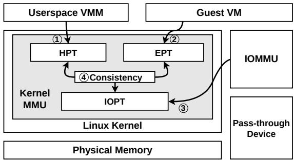  
Figure 1: Kernel MMU capabilities for virtualization.

Three critical migration metrics—downtime (the duration of VM switching), post-copy completion time (PCT; that is, the duration of the post-copy phase), and guest performance degradation—are commonly used to evaluate both performance and guest impact during post-copy live migration. For convenience, we hereafter refer to post-copy live migration of high-end VMs as high-end post-copy.

Kernel MMU. The core operation performed during VM migration involves identifying dirty memory pages, transferring them, and integrating them into the target VM’s address space. These tasks are typically implemented using a suite of functions provided by the kernel Memory Management Unit (MMU).

As shown in Figure 1, the kernel MMU supports post-copy live migration through the following key capabilities:

1 guest memory manageability through the Host Page Table (HPT), which enables the userspace Virtual Machine Monitor (VMM), such as QEMU [41], to allocate, deallocate, map, and unmap VM physical memory;

2 guest memory virtualization through the Extended Page Table (EPT), which facilitates VM execution by managing Host Physical Address (HPA) to Guest Physical Address (GPA) mapping and handling vCPU page faults;

3 Direct Memory Access (DMA) support through the I/O Page Table (IOPT), which enables memory virtualization for pass-through devices;

4 cross-table consistency, which coordinates updates across the HPT, EPT, and IOPT to ensure mapping coherence, for instance, reallocating a guest physical memory page triggers synchronized updates to all corresponding page table entries.

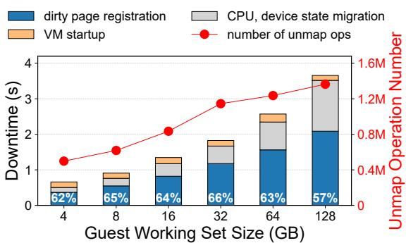  
Figure 2: Downtime breakdown collected on the target during post-copy live migration of a VM with 64 vCPUs, 256 GB memory. (workload: memory random write, block size 1 KB)

## 2.2 High-end Post-copy Challenges MMU Scalability

However, these kernel MMU capabilities confront significant scalability challenges for high-end VM post-copy, which lead to unacceptable performance penalties in migration metrics.

In this section, we provide both theoretical and experimental analyses on these performance penalties. The test configuration is identical to that in §6.1. To improve address translation efficiency and overall guest performance, we utilize huge pages (hereafter referring to 2 MB pages) to manage guest memory by default. We support 1 GB huge pages but do not use them as the default option because 1 GB huge page requires large, contiguous physical memory regions, which is less practical in our deployment scenarios. The results of migration metrics are shown in Figures 2 and 3.

Unacceptable VM switching downtime. As shown in Figure 2, the migration downtime increases rapidly with the workload intensity and exceeds 3 seconds (s) when we increase the working set size of memory random write workload to 128 GB in the high-end VM being migrated. In our cloud, downtime at such a level counts against most of our committed Service Level Objectives (SLOs) with customers, which can lead to immediate customer complaints when their real-time workloads are interrupted.

We found that the overhead of dirty page registration accounts for 57–66% of the total downtime as a major contributor. This overhead comes from the costly unmap operations to register and mark every dirty page in guest memory as missing on the target system. As a userspace process, the migration thread cannot directly modify its own page tables. Consequently, it must rely on the kernel-provided unmap interface, which simultaneously releases physical memory and updates the HPT, as the only mechanism for HPT management ( 1 in Figure 1). However, the unmap operation is lock-protected and mutually-exclusive in execution, which leads to scalability bottlenecks. As illustrated in Figure 2, the total cost of unmap operations scales almost linearly with total operation number. While it is acceptable for normal VMs, for high-end VMs with an extremely large quantity of unmap operations required, the overhead of dirty page registration becomes non-trivial. For instance, a VM with a 128 GB working set can trigger up to 32 million unmap operations to be done before the VM can be resumed on the target. Note that these unmapped pages must be reallocated when they are later recovered—either via active pushing or demand paging.

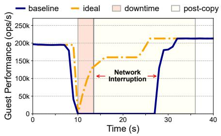  
Figure 3: Guest service undergoes network interruption for over 15 s. (Redis, 1 thread, 24 GB working set, random SET)

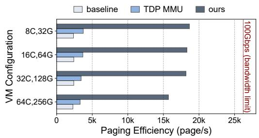

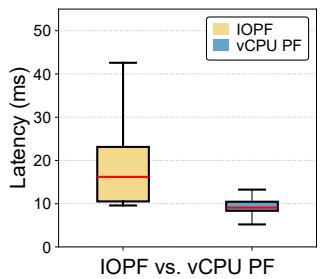  
Figure 4: Paging efficiency comparison (quantified in pages per second from source to target; page size is 4 KB).  
Figure 5: Demand paging latency comparison.

Heavy performance degradation and long PCT. Ideally, as shown in Figure 3, we expect post-copy live migration to bear almost no downtime and the guest to suffer minimum performance before all its remaining memory has been transferred. Contrary to our expectation, in the test shown in Figure 3, guest service experiences a network interruption for over 15 s even after the VM has resumed on the target host. Moreover, the PCT, defined as the duration for the VM to recover to its peak throughput after migration, exhibits significant divergence from the theoretical memory-transfer bound. As shown in Figure 3, the observed PCT is 24 s, whereas transferring the remaining 24 GB of memory over a 50 Gbps bandwidth (half of the host available bandwidth, explained in §6.1) would take only 3.84 s under ideal conditions. This results in a significantly longer effective downtime compared to that of pre-copy.

We observe that heavy guest degradation and long PCT are both caused by the low efficiency of demand paging and active pushing in dealing with the dirty pages and guest page faults at high-end scale. We show in Figure 4 that the baseline efficiency of demand paging and active pushing merely achieves 9.2% utilization of the total physical network bandwidth. With further analysis, we discover that such low efficiency is primarily caused by two conflicts between demand paging and active pushing.

Lock contention for cross-table consistency. Post-copy migration leverages the Linux userfault mechanism to handle the transferred page data for demand paging and active pushing. To safely integrate these newly arrived pages into the target’s guest memory, the userfault handler must ensure cross-table consistency among the HPT, EPT, and IOPT ( 4 in Figure 1). The cross-table consistency is achieved in the following exclusively locked steps: a new host physical page is allocated, its content is copied from userspace to kernel, and all the three page tables (HPT, EPT, and IOPT) are updated atomically under their memory locks. These locks raise significant contention among demand paging, active pushing and vCPU page fault handling. Consequently, the userfault-driven pagein path becomes a scalability bottleneck in high-end post-copy scenarios, where a large quantity of vCPUs may concurrently fault on missing pages—leading to severe lock contention and serialized page-in operations.

Page size dilemma. In contrast to demand paging, which favors the smallest page size (e.g., 4 KB) to minimize perfault latency due to the data movement through the Ethernet, active pushing operates as a background, bulk-transfer mechanism and thus benefits significantly from larger memory chunks. To maximize throughput and reduce overhead, we advocate using large pages (e.g., 2 MB) for actively pushed regions. This reduces the frequency of userfault invocations, page-copy operations, and page-table installations— collectively lowering control-plane overhead and improving overall paging efficiency. However, memory virtualization (e.g., by QEMU/KVM) provided by the kernel MMU enforces a single, fixed page size to manage the entire guest address space across the HPT, EPT and IOPT. The single page size enforcement raises conflicts between low per-fault latency and high paging efficiency required by demand paging and active pushing respectively.

A recent work, TDP MMU [18], partially resolves the lock contention in cross-table consistency by enabling parallelized EPT update. It replaces the original spinlock on the entire kernel MMU with a shared read lock, and uses atomic instructions to guarantee synchronous changes on EPT entries. However, TDP MMU cannot resolve the lock contention in the remaining operations of the userfault handler, e.g., the updating of the HPT and IOPT. In addition, TDP MMU does not provide a solution to the page size dilemma we mentioned above. Consequently, TDP MMU gains very limited improvement in kernel MMU scalability and paging efficiency as shown in Figure 4.

## 2.3 I/O Page Fault Performance

To meet high-end VMs’ demands for high-performance networks, storage, and heterogeneous accelerators, cloud service providers adopt pass-through as a primary I/O virtualization mechanism. This approach enables guest VMs to communicate directly with devices using DMA ( 3 in Figure 1), bypassing the CPU and host software to achieve bare-metal level I/O performance. During the post-copy phase, DMA operations on non-present pages trigger hardware I/O page faults (IOPFs). To investigate IOPF performance, we constructed a real IOPF-enabled platform based on an existing IOPF solution [60] (also used in [21, 59]) that leverages PCI hardware support [40].

However, demand paging triggered by IOPF imposes a greater impact on guest performance than page faults triggered by vCPUs. Figure 5 shows that demand paging between these two types of page faults incurs approximately 2× average latency differences (3.21× for maximum). This performance degradation occurs because IOPF undergoes a PCIe transaction and a host interrupt before being handled by the host CPU, resulting in significantly higher latency than normal page faults (e.g., 3–80×) [56, 57]. Furthermore, IOPF handling occurs within the critical path of device DMA. Consequently, the device must suspend processing of the faulted I/O queue until the IOPF is resolved. This suspension can further lead to queue blocking and packet loss, particularly under bursty I/O workloads common in modern NICs and storage controllers. As a result, a single unresolved IOPF may stall the entire I/O queue, inducing delays that extend beyond the IOPF latency alone and directly impact guest service quality [21, 24, 59].

Our further investigation reveals that the IOPF pattern in post-copy migration exhibits a distinct temporal and structural pattern. Almost all IOPFs occur within the first few seconds after the VM resumes on the target host. These IOPFs fall into two categories: 1) Descriptor faults, triggered when the device driver accesses I/O descriptors (e.g., VirtIO virtqueue head ers/descriptors) that record buffer metadata (address, length); 2) Buffer faults, caused by missing I/O data buffers. Crucially, I/O descriptors reside in driver-initialized, fixed-location con trol structures (e.g., virtqueue vrings) and are reused circularly during I/O processing—meaning each descriptor page faults at most once per migration. In contrast, I/O buffers are dynamically allocated by the driver per request; however, since the driver always accesses them first via CPU (e.g., to populate headers or issue commands), buffer pages are typically recovered via regular vCPU page faults—not IOPFs. As a result, descriptor faults dominate the IOPF footprint, while buffer-induced IOPFs are rare in practice.

## 2.4 Challenges and Insights

Kernel MMU scalability challenges. The performance analysis reveals that high-end post-copy migration introduces significant scalability challenges to the kernel MMU. These challenges stem from three primary sources:

• HPT manageability ( 1 in Figure 1): lock-serialized updates to the HPT create a bottleneck, resulting in prolonged downtime.

• Cross-table consistency maintenance ( 4 in Figure 1): lock-serialized userfault handlers enforce strict synchronization requirements, which causes substantial guest performance degradation and extends PCT.

• IOPT fault handling ( 3 in Figure 1): hardware constraints in IOPF handling mechanisms limit fault processing latency, further degrading guest performance.

Key insight. The kernel MMU inherently enforces strict lock protection during HPT updates and cross-table consistency maintenance to ensure data correctness and consistency. However, we observe that lock protection is unnecessarily overused in numerous operations during post-copy migration (which will be elaborated in the next paragraph). Consequently, it is feasible to strategically relax lock protection in these operations to achieve better kernel MMU scalability in high-end post-copy scenarios.

The overused lock protection is primarily concentrated in three areas: physical memory allocation and deallocation, page content and table updating. (1) First, physical memory allocation and deallocation are essential to native kernel MMU capabilities such as map and unmap operations; however, they are entirely unnecessary for post-copy migration. We can therefore statically maintain the placement of VM physical memory during post-copy to eliminate both physical memory allocation/deallocation and the corresponding lock-protection overhead. (2) Second, page content updating is tightly coupled with the userfault handler through lock protection. By decoupling page data copy from the userfault handler, we can effectively eliminate this lock protection and achieve higher copy efficiency through parallel execution.

Based on these insights, we address the aforementioned challenges by designing strategic lock relaxation in kernel MMU capabilities, which comprises three components: (1) lock-reduced parallelism for HPT updates to achieve scalable HPT manageability; (2) decoupled and pipelined userfault handling to minimize lock contention during cross-table consistency maintenance; and (3) minimized IOPF occurrence (reduced to nearly zero IOPFs) rather than laboriously mitigating IOPT fault handling performance.

## 3 M3U Overview

We propose the Migration Memory Management Unit (M3U), a novel kernel MMU design for high-end post-copy to tackle the scalability challenges. As shown in Figure 6, M3U is a modular plugin that interacts with the original kernel MMU through standard system MMU operation abstractions. Therefore, M3U does not include invasive changes to other VMM or kernel MMU functionalities. M3U preserves the memory mappings across the HPT, EPT and IOPT unchanged throughout post-copy migration, thereby significantly minimizing MMU modification overhead. As a result, MMU operations become lightweight, and their lock contention is drastically reduced. Specifically, M3U incorporates the following design components.

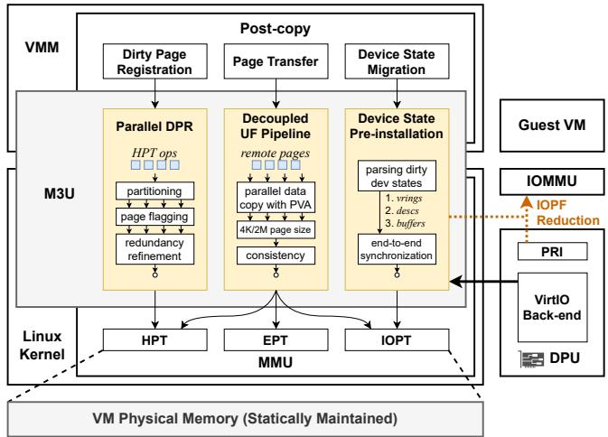  
Figure 6: M3U overview.

Parallel Dirty Page Registration. To minimize VM switching downtime, we introduce a lightweight, parallel dirty-page registration mechanism. By leveraging two key properties: (1) physical memory remains allocated throughout post-copy migration, and (2) the guest is fully suspended during VM switching, we replace heavyweight HPT operations (e.g., page mapping/unmapping) with ultra-lightweight permission flag updates, such as toggling the Present bits in HPT entries. This eliminates redundant MMU operations that incur high synchronization overhead, including physical page allocation/deallocation and cross-CPU Translation Look-aside Buffer (TLB) shootdowns, thereby dramatically reducing lock contention and enabling highly parallel memory discarding. Decoupled Userfault Pipeline. To mitigate performance degradation and reduce PCT during VM resumption, we decouple the underlying address dependencies between active pushing and demand paging. This separation simultaneously alleviates lock contention for cross-table consistency and resolves the page-size trade-off inherent to these two paths. Specifically, we assign distinct Host Virtual Address (HVA) spaces for active pushing and demand paging. This design eliminates costly user/kernel memory copies and enables batched, pipelined HPT updates, thereby dramatically reducing lock contention. Moreover, this address space decoupling between active pushing and demand paging allows us to support mixed page sizes: large pages (e.g., 2 MB) for active pushing to maximize bandwidth efficiency, and 4 KB pages for demand paging to minimize fault latency, optimizing each path independently.

Device State Pre-installation. Rather than laboriously optimizing the inherently complex and latency-sensitive IOPF handling path, we eliminate nearly all IOPFs with simple device state pre-installation. Since descriptor faults dominate IOPFs in post-copy migration, and because I/O descriptors along with their associated I/O buffers occupy only a small memory footprint, we proactively transmit this device state to the target before VM resumption. As a result, DMA operations during the critical first few seconds after resumption proceed without triggering any actual IOPFs.

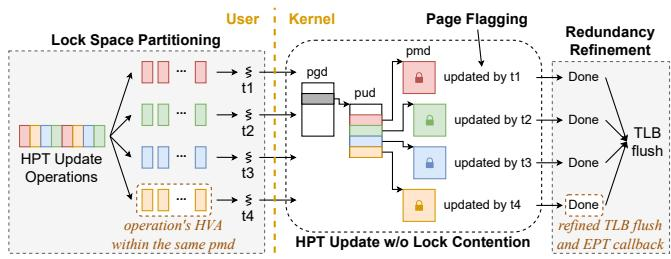

Figure 7: Lock-reduced parallelism for dirty page registration.  
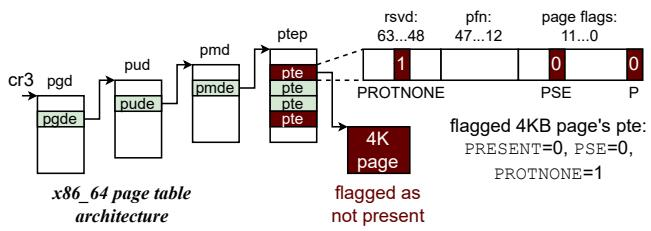  
Figure 8: Illustration of page flagging.

## 4 M3U Detailed Design

In this section, we present the M3U design details that address the scalability challenges and achieve efficient post-copy live migration for high-end VMs.

## 4.1 Parallel Dirty Page Registration

To improve the throughput of dirty page registration during the critical VM switching window, we propose parallel dirty page registration. The key to enabling efficient parallelism is eliminating or simplifying redundant MMU operations that cause lock contention.

Our approach rests on three core design principles: (1) Replace heavyweight HPT update operations with lightweight permission-bit flagging (e.g., clearing the Present/Writable bits), thereby keeping physical memory allocations static throughout the process; (2) Eliminate redundant MMU operations—such as page allocation/deallocation and TLB maintenance—that incur significant locking overhead; (3) Partition the VM’s HPT address space to allow concurrent dirty page registration across disjoint regions, thereby avoiding inter-thread lock contention. We illustrate this design in Figure 7 and explain the details as follows.

Page Flagging. We propose page flagging (illustrated in Figure 8) to replace the heavy HPT updates (e.g., page mapping or unmapping), to make the dirty page registration more lightweight. Page flagging refers to replacing physical memory deallocation during dirty-page registration with a lightweight 2 MB page-table splitting operation, followed by marking all 512 resulting 4 KB page-table entries with the non-present bit. Once flagged as non-present, a page becomes inaccessible to the guest VM; any subsequent VM access triggers a standard page fault, which notifies the migration process to fetch the page from the source host. Meanwhile, the discard process creates an HVA address space dirty bitmap [15] to record the absence of memory pages, with each bit representing a present/non-present 4 KB memory page.

M3U also leverages this page-flagging mechanism to preserve physical memory allocations throughout the migration procedure. This stability allows M3U to exploit a key property: the VM’s physical memory (in HPTs) is fully allocated during the pre-copy phase. Consequently, when pages are later recovered via demand paging, their mappings can be restored efficiently—without requiring new physical allocations or complex remapping logic.

Redundancy Refinement. As VM stops running during VM switching and physical memory allocation remains, we can further refine two redundant locks in the HPT update to reduce lock contention: (1) the lock-intensive MMU notifier callback for erasing invalidated EPT mappings, which is unnecessary because the EPT is not constructed until VM resumption; (2) the TLB flush for every unmap operation. Specifically, since EPT is not fully constructed until userfault handling, the EPT callback in MMU notifier can be safely removed from the unmap operation without affecting system behavior. Meanwhile, VM does not access guest memory in downtime, so that we can aggregate all TLB flushes into one flush when dirty page registration is completed. To this end, the refined HPT update operation in M3U fully eliminates contention caused by redundant locks.

Lock Space Partitioning. To eliminate lock contention in parallelized HPT page flagging, we partition HPT update operations by address space. By replacing complex memory unmapping with lightweight page flagging, the only locks required during flagging are the page-table locks (e.g., PGD, PUD, and PMD in the x86\_64 page table hierarchy). Other locks, such as the VMA lock, are no longer needed, since the underlying HPT mappings of HVA-to-HPA remain unchanged. As shown in Figure 7, M3U partitions the entire HVA space into disjoint 1 GB regions. Consequently, the PUD and PMD locks required to update the 512 PMD entries within each region are independent across regions.

M3U employs a worker thread pool to parallelize dirty page registration. The page-grouping worker receives dirty pages from the source system, which are transmitted in strictly in creasing order of HVAs. Leveraging this ordering, the worker groups all pages that fall within the same 1 GB address boundary and assigns each group to a dedicated discarding worker. Because HPT updates within a single 1 GB region require only the corresponding PMD and PUD locks, discarding workers operating on disjoint 1 GB address ranges do not contend for the same locks, enabling effectively lock-contention-free parallelism. When all the VM pages are discarded, the pagegrouping worker triggers a TLB flush to update the physical TLB buffer.

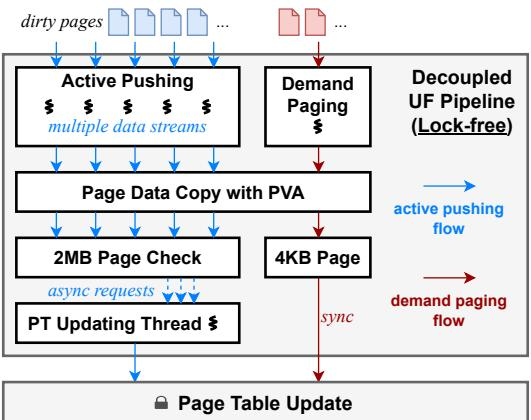  
Figure 9: Decoupled userfault pipeline.

## 4.2 Decoupled Userfault Pipeline

To mitigate performance degradation and reduce PCT during VM resumption, we separate the address space to reduce contention and enable mixed page granularity to speed up active pushing and demand paging. Figure 9 depicts the overall design of decoupled userfault pipeline.

## 4.2.1 Separate Address Space

To improve the efficiency of active pushing, M3U builds an exclusive post-copy virtual address (PVA) space for statically maintained physical memory to straightforwardly recover dirty pages by direct memory copying. This direct mapping allows active pushing to recover multiple dirty pages concurrently across multiple data streams to enable high-throughput, parallel page restoration.

Post-copy Virtual Address (PVA). M3U incorporates a PVA mapping interface to directly remap the VM memory in another address space distinct from the origin HVA. With PVA, active pushing breaks the original dirty-page recovery procedure into two stages: memory data copying and cross-table consistency maintenance. First, when the active pushing on the target fetches a remote page, it directly copies the page data to guest memory with PVA. This eliminates the original costly user/kernel memory copies and lock holding during updates to the page table and page content in kernel space. Second, the active pushing clears the corresponding bit in the dirty bitmap set by page flagging and submits an asynchronous update request to a dedicated page-table-updating thread to perform cross-table consistency operations, such as synchronizing HPT, EPT, and IOPT entries. As these operations are handled exclusively by a dedicated single thread, lock contention among data stream threads is eliminated.

Multi-pushing. By leveraging an isolated PVA address space that enables concurrent memory copying, M3U integrates parallel data streams into active pushing to allow simultaneous page transfers—significantly improving paging efficiency. Each data stream is established over a dedicated socket connection and managed by migration threads on both the source and target sides. The source side dispatches dirty pages across multiple data streams for parallel transmission, while the target side concurrently receives and restores the contents of these pages. Meanwhile, a dedicated page-table-updating thread asynchronously maintains the cross-table consistency (e.g., across the HPT, EPT, and IOPT) required by all data stream threads, thereby eliminating lock contention among them. Through this design, M3U achieves highly efficient page transfer via batched, pipelined active pushing.

For demand paging, which is extremely latency-sensitive, M3U employs a dedicated data stream with a 20 Gbps throughput upper bound to handle page-fault requests, ensuring they are not blocked behind active-pushing traffic.

## 4.2.2 Mixed Page Table Updating

The decoupling of PVA from HVA simplifies the cross-table consistency maintenance so that M3U is capable of supporting mixed page sizes to balance the trade-off between active pushing and demand paging.

Demand Paging in 4 KB Granularity. M3U enforces a 4 KB page size for demand paging to minimize page-fault handling latency. As described in Section 4.1, any 2 MB HPT entry containing missing pages is split into 512 individual 4 KB page-table entries, each initially marked as non-present. When the VM accesses a missing 4 KB page, the demand-paging handler immediately fetches the page from the source and clears the corresponding bit in the dirty bitmap set by page flagging. The vCPU fault handler then sets the Present bit in the corresponding 4 KB HPT entry and installs the matching EPT entry, allowing the VM to resume execution seamlessly. By using 4 KB pages for demand paging, M3U avoids unnecessary overfetching of dirty memory and minimizes fault latency, ensuring rapid recovery of only the required data.

Active Pushing in 2 MB Granularity. M3U provides a batched HPT page-table rebuild interface that enables active pushing to recover discarded (missing) pages at 2 MB granularity. When active pushing finishes copying data and submits an asynchronous update request to the page-tableupdating thread, the thread checks the dirty bitmap to determine whether all memory within the corresponding 2 MB region has been successfully retrieved from the source to the target. This 2 MB page check is performed using atomic bitmap operations and does not necessitate lock protection. Once all 512 constituent 4 KB pages of a 2 MB region are confirmed as recovered, the thread coalesces them into a single 2 MB HPT entry, replacing the individual 4 KB mappings. This optimization reduces what would otherwise require 512

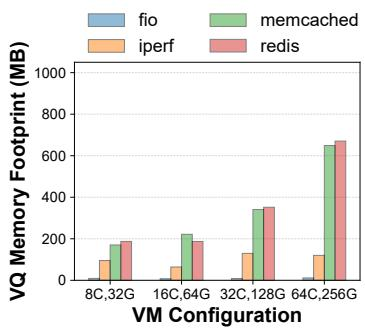  
(a) Virtqueue Memory Footprint

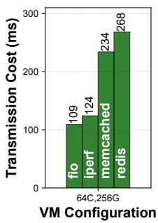  
(b) Transmission Cost

Figure 10: Small total memory footprint and lightweight transmission cost of virtqueue structures, making one-time transmission of these virtqueues a feasible alternative to demand paging by IOPF handling.

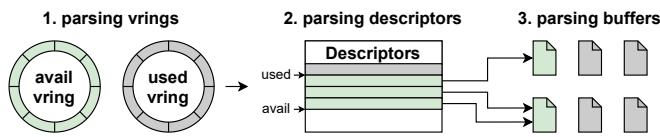  
Figure 11: Parsing the VirtIO virtqueue structures.

separate page-table updates to just one, thereby dramatically decreasing the number of locks acquired (e.g., PMD/PUD locks) and significantly alleviating lock contention during HPT maintenance. In addition, M3U eliminates redundant transfer of 4 KB pages with an existing send-once guarding mechanism in QEMU—during post-copy, the source leverages its dirty bitmap to ensure that each page is transferred at most once [43]—thereby preventing transfer amplification.

Notably, M3U eliminates all intermediate page copies that the original QEMU must rely on when guest memory uses 2 MB page size. For the origin QEMU on the target system, it has to wait for the 512 × 4 KB pages to be transferred before it finally maps this 2 MB page. However, there is no guarantee that all 4 KB page data within a 2 MB page can be transferred strictly in order and without any loss. Consequently, each 2 MB page uses a temporary buffer to store the 4 KB page data until the 2 MB page is completely transferred, which causes an additional page copy through this temporary buffer. With PVA and mixed page size support, M3U no longer needs such intermediate page copies.

## 4.3 Device State Pre-installation

Device state pre-installation eliminates nearly all IOPFs during post-copy. A critical observation on our platform is that the device states, e.g., the virtqueue structures for the VirtIO driver, remain in a small total memory footprint, regardless of the I/O pressure. Figure 10a shows various workloads (including intensive workloads for network, storage, CPU and memory) we tested for diverse I/O pressures, and the total memory footprint of virtqueues is at most ∼671 MB. Directly transferring these virtqueues incurs very lightweight overhead considering the network bandwidth assigned for live migration. Generally, for production-level live migration practices, we assign 20 Gbps for pre-copy and 100 Gbps (the host available bandwidth, explained in §6.1) for transmission during downtime. With such network bandwidth, the transmission cost of virtqueues achieves no more than 300 milliseconds (ms) for the tested workloads as illustrated in Figure 10b.

As a result, transmitting all device state in a single batch is significantly more efficient than fetching it on demand via IOPFs. When all DMA-related missing pages are recovered during VM switching, the I/O buffers already present in the virtqueue become non-faulting. Subsequent I/O buffers pro duced after VM resumption will typically trigger a vCPU page fault, which retrieves the required memory from the source system on demand.

End-to-end Synchronization of Dirty Device States. M3U implements end-to-end functionality for capturing, parsing, exporting, and importing all dirty virtqueue structures by leveraging the VirtIO backend driver. As shown in Figure 11, M3U begins by locating the vring metadata and descriptor tables within each virtqueue. The physical addresses of these structures are recorded by QEMU during device initialization. M3U then traverses each descriptor table between the available and used ring indices to identify all active I/O buffers associated with pending or in-flight requests. The resulting dirty virtqueue state—including vrings, descriptors, and referenced buffers—is exported to the migration thread, which handles its transmission over the network to the target host. Upon receipt, the target VMM uses M3U to reconstruct and install the complete virtqueue state, completing end-to-end synchronization of dirty device state. Critically, this entire process is fully transparent to the guest OS and requires no modifications to the guest—preserving compatibility while enabling efficient post-copy device resumption.

The concrete procedure of device state migration is now as follows. After the VM and the devices are suspended on the source, the VMM performs a device draining operation that flushes all in-flight packets in devices and makes the device states consistent. During the device state migration in VM switching, the VMM leverages M3U to achieve this synchronization of device states between the source and target.

## 4.4 Concurrency Safety

M3U ensures concurrency safety throughout post-copy migration in two phases: (1) Externally across the source and target hosts. To perform critical VM switching, the source suspends the vCPUs and drains the devices during the downtime phase, where no concurrent VM execution is allowed, thereby ensuring data consistency. After the VM resumes on the target, non-present pages remain inaccessible to the VM until they are transferred, preventing data corruption. (2) Internally on the target host. Technically, the only new race introduced by M3U is the concurrent update of the same page by both demand paging and active pushing. To eliminate this race, the source leverages its dirty bitmap [43] to ensure that each page is transferred at most once; the target uses its received bitmap to ensure that each page and the corresponding mapping are restored at most once. This coordination mechanism across both migration hosts ensures such races never occur during post-copy, effectively preventing page data from being overwritten or corrupted. As for other inherent race conditions—such as those between concurrent faults and demand-paging requests—the hypervisor and VMM already handle them safely, eliminating any risk of data corruption.

## 5 Implementation

We implemented a prototype of M3U in QEMU 8.2 and Alios with Linux kernel 4.19. Our prototype supports all VirtIO driver versions; we use version 0.95 in our evaluation. The M3U prototype implementation consists of over 2,000 lines of code (LoC) in userspace and over 4,000 LoC in the kernel. Applicability. M3U’s design is applicable to both Type I and Type II hypervisors. The implementation follows the deployment setting adopted in our cloud environment, which utilizes the QEMU-KVM virtualization stack under a Type II model. KVM-based Type II hypervisors remain a mainstream solution in modern cloud infrastructures (e.g., Google Cloud [10] and AWS Nitro [54]), making this deployment setting representative of real-world practice.

M3U is highly compatible with the Linux kernel because it relies on stable standard interfaces provided by the kernel MMU for external management modules [32–35], and the kernel preserves the compatibility of these interfaces across internal feature evolutions. Therefore, M3U can be integrated into recent kernels with minimal adaptation. We have verified M3U’s compatibility with Linux kernels 4.19, 5.15 and 6.6 in our cloud environment; we use the implementation with Linux kernel 4.19 in our evaluation.

Device memory management. M3U manages the VM memory separately through Linux /dev/mmap interfaces, so that it can interact with the original kernel MMU through standard system abstractions, while implementing its own pagefault handler and page-table management logic (e.g., mapping/unmapping).

Demand paging. Similar to QEMU’s post-copy preempt feature [46], we employ a single data stream for demand paging that transfers dirty pages immediately without batching. Unlike batched transfer in active pushing for higher throughput, this allows a faulted page to be transferred with minimum latency. In addition, we refine the function calls irrelevant to post-copy during vCPU page fault handling to reduce demand paging latency.

Parallelism tuning. For parallel dirty page registration (§4.1), we assign one worker thread in the thread pool per 8 GB guest memory. The thread count is no more than 16, where it achieves the maximum efficiency improvement.

For parallel data streams (§4.2), we implement the page transfer framework based on the QEMU multifd [44]. We employ 6-8 data streams for active pushing, while the demand paging always employs a single data stream. This practical optimal configuration (verified in our evaluation) enables the paging efficiency to reach over 70% of the physical network bandwidth on a single host server, which is generally beyond the bandwidth limit for live migration.

## 6 Evaluation

## 6.1 Platform and Workload

The evaluation platform comprises a pair of source and target nodes for live migration, with guest VMs deployed as clients on these nodes. Each node is equipped with dual-socket, 32- core Intel Xeon 8369B CPUs, 512 GB DDR4 memory, and a DPU card (PCIe Gen3 connection with 8 lanes, supporting a maximum physical network bandwidth of 200 Gbps).

M3U supports all major Linux-based guest OSes and uses Ubuntu 20.04.6 with Linux kernel 5.4 in evaluation. Our highend guest VM is configured by default with 64 vCPUs, 256 GB of memory, and a 100 Gbps virtual network interface controller (vNIC) enabled via I/O pass-through1. To obtain stable performance measurements, we pin each vCPU to a separate hyper-threaded core co-located on a single NUMA socket. The host OS is statically configured to use 2 MB huge pages by default, with Transparent Huge Page (THP) [5] disabled to optimize guest performance. Correspondingly, the guest OS has huge pages disabled by default.

Baseline. For our first baseline, we begin with the community version of QEMU 8.2 and Linux kernel 4.19. We also implement pass-through I/O virtualization in the baseline using a state-of-the-art DPU-based VirtIO offloading approach [60]. To handle IOPFs, we adopt the same hardware solution employed in recent works [21, 59], which relies on the Address Translation Service (ATS) and Page Request Interface (PRI) as defined by the PCI standard [40].

For our second baseline, to demonstrate M3U’s advantages in paging efficiency and PCT, we introduce the TDP MMU, a state-of-the-art approach for kernel MMU scalability (explained in §2.2). TDP MMU adoption requires a recent Linux kernel version that is incompatible with our DPU offloading virtualization platform [60]. Consequently, we deployed TDP MMU on a bare-metal machine with an identical configuration to M3U’s setup, except without the DPU device, using QEMU 8.2 and Linux kernel 5.15. Since this baseline deployment does not include modifications to dirty page registration and lacks support for pass-through devices during post-copy live migration, we limit our comparison of TDP MMU and our approach to paging efficiency and PCT metrics, excluding downtime, guest performance, and I/O-related measurements.

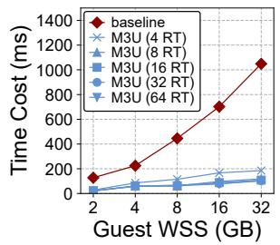

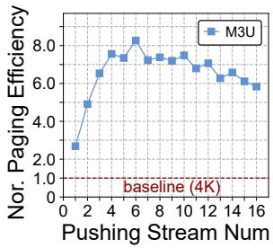  
Figure 13: Normalized paging efficiency using baseline with 4 KB page size as 1.0×.

Figure 12: Dirty page registration overhead. "RT" denotes registration thread.  
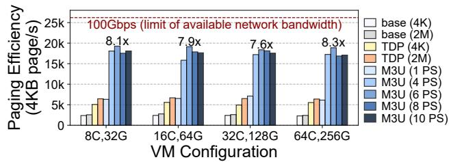  
Figure 14: Paging efficiency of post-copy under different VM configurations. “PS” denotes the number of pushing streams.

To perform practical live migration, we adopt a "hybrid" method [23, 50]—a state-of-the-art approach that combines pre-copy and post-copy phases—which has become the standard in practice [49]. We enforce only one round of hybrid pre-copy before the live migration enters the downtime phase to highlight the performance differences between M3U and the baseline approaches during post-copy. The available network bandwidth for live migration is 100 Gbps (max 200 Gbps; 100 Gbps for guest VM, 100 Gbps for host).

Workload. In high-end VMs, we run Liblinear [14] and Llama.cpp [17] as the compute-intensive workloads. We run Graph500 [19], as well as YCSB [11] and Memtier [48] benchmarks on Memcached [36] and Redis [47] as the memoryintensive workloads. We use iperf3 [20] and FIO [6] for network and block I/O intensive workloads, respectively.

## 6.2 Micro-benchmark

Dirty page registration. Figure 12 demonstrates that M3U reduces the time cost of dirty page registration significantly by up to 90.2%. For all downtime-related tests, we employed memory random write operations with 1 KB block size as the workload and progressively increased the workload intensity. The test results show that M3U effectively reduces the time cost of dirty page registration by 60.0–90.2%, demonstrating better scalability across varying workload intensities compared to the baseline. Additionally, we observed that the time cost of dirty page registration plateaus at 16 worker threads; therefore, we configured this value as the default thread count for the worker thread pool.

Management of stream number. To study the scalability of multi-pushing (§4.2) and how the number of concurrent streams should be managed, we adopt a practical evaluation on paging efficiency while systematically increasing the number of pushing streams from 1 to 16. The results in Figure 13 show that M3U achieves the highest paging efficiency with 6 pushing streams (7.6× improvement over the 4 KB baseline due to the throughput gains enabled by multi-pushing). Since the available host bandwidth is 100 Gbps, M3U with 6 streams already achieves the maximum migration bandwidth of approximately 80 Gbps. In addition, we can adjust the number of streams from 1 to 6 to almost linearly increase M3U’s paging efficiency to better utilize the available migration bandwidth. As future work, we can further utilize advanced network solutions (e.g., RDMA or CXL) to reduce transmission overhead.

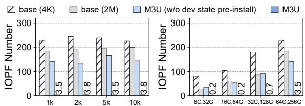

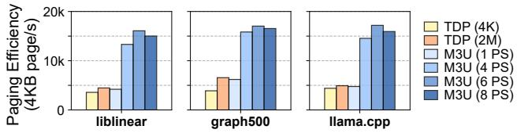  
Figure 15: Comparison of paging efficiency under varying guest workloads.  
Guest I/O Stress (Memcached, ops/s)  
Figure 16: IOPF number under varying guest I/O stress levels and VM configurations.

Paging efficiency. Figure 14 shows that M3U achieves supe rior paging efficiency compared to both the baseline approach and TDP MMU. The paging-efficiency upper bound derived from the physical network limit (dotted line in Figure 14) is calculated by dividing the maximum network bandwidth of 100 Gbps by the base page size of 4 KB.

Compared to the baseline approach using 4 KB page size, M3U achieves a paging efficiency improvement of 7.6–8.3× in the best case when utilizing 6 data streams for active push ing. Even with a single data stream for active pushing, M3U outperforms the baseline by 1.6–2.1× due to the performance gains enabled by asynchronous decoupling between page data copying and cross-table consistency maintenance.

Compared to TDP MMU, M3U with 6 active pushing streams delivers the most substantial improvement. Using a 4 KB page size, TDP MMU achieves a 1.4–1.6× improvement compared to the baseline, which is less than M3U with 1 active pushing stream compared to the baseline. As expected, larger page sizes enhance paging efficiency. When employing a larger 2 MB page size, paging efficiency improves by up to 1.2× for the baseline and 2.7× for TDP MMU.

In addition, to evaluate paging efficiency across diverse guest workloads, we select several resource-intensive workloads and run them continuously in the high-end VM during post-copy: (1) Liblinear (50% CPU, 20% memory), (2) Graph500 (66% memory), and (3) Llama.cpp (benchmarking llama-3-8B, 75% CPU, 20% memory). The results in Figure 15 show that, consistent with the prior results under idle conditions, using 6 active-pushing streams remains the optimal configuration across all workloads. Under this configuration,

M3U outperforms TDP MMU by 3.9–4.5× with a 4 KB page size and by 2.6–3.6× with a 2 MB page size.

IOPF reduction. Figure 16 illustrates that M3U reduces the total IOPF number to 0.2–3.8 IOPFs per post-copy live migration of high-end VMs, across various guest I/O stress levels (using the Memcached benchmark) and with different VM configurations. Compared to the baseline, M3U achieves up to 98.5% reduction in IOPFs during post-copy migration by leveraging device state pre-installation.

First, as shown in Figure 16 (left), the total IOPF number for M3U remains consistently low (3.5–3.8 IOPFs per post-copy live migration) across different guest I/O stress levels. Next, Figure 16 (right) shows that M3U achieves 0.2–3.5 IOPFs per live migration across all tested VM configurations, whereas the baseline approaches’ IOPF counts (with two page size configurations) scale proportionally with VM configuration due to the high-end VM’s elevated memory dirty rates and larger total dirty page volumes. Lastly, even without device state pre-installation, M3U achieves fewer IOPFs overall owing to its improved paging efficiency. Similarly, the baseline using 2 MB pages incurs fewer IOPFs than the variant using 4 KB pages for the same reason.

## 6.3 Migration Metrics

Downtime. Figure 17 shows that M3U achieves up to 47.0% downtime reduction compared to the baseline. With lockreduced parallelism, the overhead of dirty page registration during downtime decreases from 40.2–64.4% to 6.1–15.4%. The device state pre-installation incurs a time cost of 94–304 ms, which accounts for 12.7–29.0% of the total downtime. Although device state migration in M3U requires an additional 131.6 ms on average due to the device state pre-installation, this overhead remains marginal relative to the total downtime.

Apart from the costs associated with dirty page registration and device state migration, the remaining downtime costs between M3U and the baseline are relatively similar, primarily due to CPU state migration (0.2–1.4 s) and VM startup (121– 169 ms). We attempted to reduce the cost of CPU state migration for further improvement; however, this approach proved highly challenging because CPU state migration strongly depends on the hardware-specific interfaces in QEMU-KVM. PCT. Figure 18 illustrates that M3U delivers the shortest PCT compared to TDP MMU and the baseline. We varied the total number of dirty pages across all test suites to demonstrate PCT differences. The results reveal three key findings. First, due to improved paging efficiency, M3U achieves an 85.8– 89.6% reduction in PCT compared to the baseline. Even with only a single data stream, M3U reduces PCT by 33.4–55.6%. Second, TDP MMU also significantly reduces PCT by up to 55.7% compared to the baseline; however, this reduction is less than M3U’s reduction with ≥ 2 data streams. Third, page size emerges as a deterministic factor for PCT reduction: TDP MMU and the baseline achieve additional PCT reductions of 25.7% and 12.6%, respectively, when using 2 MB pages. This result also indicates that M3U’s fault-aware page size determination is highly effective.

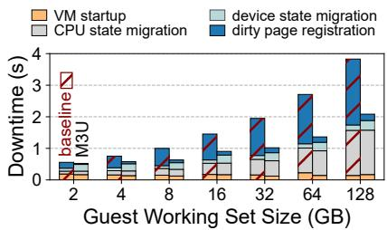  
Figure 17: Downtime comparison.

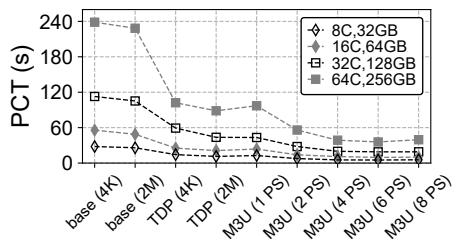  
Figure 18: PCT comparison under varying VM configurations.

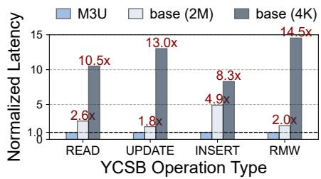  
Figure 19: YCSB benchmark on guest Memcached (normalized latency).

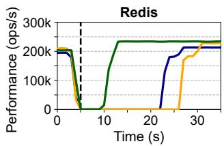  
base (4K) base (2M)

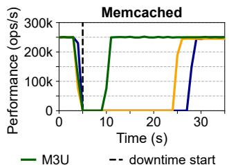  
Figure 20: Memtier benchmark on guest Redis and Memcached services (throughput).

Guest performance. Figure 19 shows the normalized operation latency of the YCSB benchmark on the guest Memcached service, demonstrating a substantial reduction. This evaluation encompasses four operation types that constitute all YCSB workloads (a–f) in different ratios, with the exception of the "Scan" operation, which is unsupported in Memcached. The "Read-Modify-Write" operation is abbreviated as "RMW" for clarity. The results show that M3U achieves 1.8–4.9× lower operation latency than the baseline configuration with 2 MB pages, and 8.3–14.5× lower latency than the baseline using 4 KB pages.

Figure 20 shows the real-time performance curves of the Memtier benchmark for guest Redis and Memcached services executing SET operations. To evaluate M3U’s effectiveness, we quantify the service throughput degradation during the post-copy phase by the performance curve valley. The results show that M3U achieves a 2.6–4.1× reduction in throughput loss compared to the baseline approach, thereby significantly improving guest performance.

## 7 Discussions

IOPF elimination. M3U eliminates up to 98.5% of the IOPFs in post-copy, as tested in §6.2. The remaining IOPFs stem from non-atomic virtqueue processing in the guest VirtIO front-end (FE). Specifically, a timing window exists between (a) when the VirtIO FE allocates a buffer, and (b) when it posts this buffer into a descriptor. If live migration enters the downtime phase while virtqueue processing occurs within this interval, an IOPF will occur if the buffer is dirty, even though M3U has already performed device state pre-installation.

To completely eliminate IOPFs in post-copy migration, one straightforward approach would be to design a paravirtualized mechanism that guarantees atomic virtqueue buffer processing during the downtime phase of post-copy live migration. However, this approach introduces significant complexity and requires substantial modifications to the guest VirtIO FE. Moreover, it would make the guest VM fully aware of the ongoing post-copy live migration, thereby violating the principle of guest transparency. Consequently, M3U does not currently pursue this approach and takes this challenge as future work.

Failure tolerance. Post-copy is vulnerable to failures because the VM’s memory state is bifurcated across both the source and target hosts during post-copy, and failure on either host will make the VM unrecoverable. Recently, a failure-tolerance approach for post-copy has been proposed based on the checkpoint/restore technique [16]. It is a software-based approach that M3U can adopt for failure tolerance in post-copy.

Generalizability. In brief, M3U is a fully generalizable approach for the community solutions. We discuss the generalizability by dividing the designs into two separate parts: pass-through device related and the others. For the latter part, M3U’s designs do not rely on any new hardware features, which can be applied to community solutions like QEMU-KVM on commercial off-the-shelf servers as we evaluated. For the pass-through device related part, M3U’s solution, i.e., the one-time transmission of device states during downtime is device-independent, which can also be applied to diverse pass-through devices.

Overcommitment. Live migration naturally coexists with memory overcommitment, an essential property for cloud elasticity. Since the entire VM memory must eventually be transferred during migration, reclaimed memory is restored before migration proceeds. During restoration, the host hypervisor swaps in reclaimed pages and reconstructs the corresponding host-side HVA-to-HPA mappings in the background. Guest execution remains isolated from the host-side restoration because guest GVA-to-GPA mappings remain unchanged. The only interaction occurs when guest applications access reclaimed pages, where restoration introduces neither additional interference nor guest-visible overhead because both behaviors invoke the same underlying swap-in path. Consequently, migration executes with fully resident VM memory and without overcommitment, as commonly adopted in existing live migration systems. Based on this invariant, M3U prevents the target host from swapping migrated memory until migration completes, thereby eliminating additional complexity and overhead. Outside the migration period, overcommitment remains fully supported on our platform.

Applicability to Type I hypervisors. The core techniques in M3U (e.g., static memory allocation, page flagging, separate address space, etc.) also extend to Type I hypervisors, particularly to lock-protected memory management paths in the hypervisor and userspace migration components. Therefore, the design principles in M3U remain applicable across both Type I and Type II hypervisors.

## 8 Related Work

Post-copy live migration. The post-copy scheme [22] was introduced to reduce the total migration time and transferred data compared to the conventional pre-copy scheme. By directly switching the VM to the target host and lazily transferring all remaining memory data, post-copy effectively eliminates the pre-copy convergence problem [31, 52]. In contrast, other optimized pre-copy approaches (e.g., compression [27, 53] and CPU throttling [42]) can only mitigate, rather than eliminate, the convergence problem while simultaneously introducing host resource over-consumption or negatively impacting guest performance.

Post-copy migration is well-known for delivering poor guest service performance during extended PCT, especially when migrating high-end VMs. Previous studies have attempted to address this challenge through two primary approaches: (a) incorporating a hybrid pre-copy phase [23, 30, 50], or (b) actively and adaptively pushing dirty pages during the post-copy phase [22, 45, 52]—both we have adopted as our baseline strategy. Abe et al. [1] propose a para-virtualized post-copy approach that enables coordination between the host VMM and guest OS to identify VM’s working sets for prioritized transfer. However, we do not adopt this approach because it violates the guest transparency principle. Note that the existing literature does not adequately address how this performance penalty amplifies when migrating high-end VMs, nor does it identify the root cause: specifically, the limitations of demand paging and active page pushing mechanisms, as well as the underlying scalability bottlenecks in kernel MMU. I/O page fault. Resolving IOPFs caused by pass-through device DMA on non-present I/O pages—a common challenge in overcommitted cloud infrastructures—is a well-established research area [3, 4, 12, 13, 21, 56, 58]. Most existing studies focus on reducing the number of IOPFs or minimizing associated latency; however, they are generally constrained by performance bottlenecks or compatibility limitations. A recent approach, VIO [59], introduces an elastic pass-through mechanism that converts most IOPFs into CPU-side page faults. However, this approach does not further reduce the frequency or the cost of these page faults.

Regarding post-copy live migration, Tian et al. [55] present a VFIO-based solution that extends post-copy support to passthrough devices. Nevertheless, this approach suffers from limited device compatibility—it is specifically optimized for Intel XXV710—and introduces significant overhead from the VFIO stack. In contrast, our work adopts an IOPF handling solution based on the PRI/ATS hardware features, which ensures broad device compatibility. Notably, our work is the first study to successfully eliminate the vast majority of the IOPF handling costs during post-copy live migration.

## 9 Conclusion

M3U is a scalable kernel MMU design that eliminates the unacceptable performance penalties of high-end post-copy live migration. It addresses kernel MMU scalability bottlenecks in HPT manageability, cross-table consistency maintenance, and IOPT fault handling through three key techniques: (1) lockreduced parallelism for dirty page registration, which reduces total downtime by up to 47.0%; (2) a decoupled userfault handling pipeline based on parallel data copying with a separate PVA and mixed page table updates, which reduces PCT by 89.6% and improves guest performance by up to 4.1×; and (3) identification and pre-transmission of pass-through device states, which eliminates up to 98.5% of IOPFs.

The design principles of M3U are fully generalizable to existing open-source solutions, providing clear guidance to the community on adding high-end VM support for post-copy live migration.

## Acknowledgments

We thank the shepherd and anonymous reviewers for their valuable comments. This paper was supported in part by the Alibaba Innovative Research Program and the National Natural Science Foundation of China (Grant No. 62232012). Jian Li and Chao Zhang are the corresponding authors.

## References

[1] Yoshihisa Abe, Roxana Geambasu, Kaustubh R. Joshi, and Mahadev Satyanarayanan. Urgent virtual machine eviction with enlightened post-copy. ACM SIGPLAN Notices, 51(7):51–64, 2016.

[2] Raja Wasim Ahmad, Abdullah Gani, Siti Hafizah Ab Hamid, Muhammad Shiraz, Abdullah Yousafzai, and Feng Xia. A survey on virtual machine migration and server consolidation frameworks for cloud data centers. Journal of Network and Computer Applications, 52:11– 25, 2015.

[3] Nadav Amit, Muli Ben-Yehuda, Dan Tsafrir, and Assaf Schuster. vIOMMU: Efficient IOMMU emulation. In USENIX ATC 2011, 2011.

[4] Nadav Amit and Michael Wei. The design and implementation of hyperupcalls. In USENIX ATC 2018, pages 97–112, 2018.

[5] Andrea Arcangeli. Transparent hugepage support. In KVM Forum, volume 9, 2010.

[6] Jens Axboe. GitHub – axboe/fio: Flexible I/O Tester. https://github.com/axboe/fio, 2008. [Accessed 2026-06- 01].

[7] Anton Beloglazov and Rajkumar Buyya. OpenStack Neat: a framework for dynamic and energy-efficient consolidation of virtual machines in OpenStack clouds. Concurrency and Computation: Practice and Experience, 27(5):1310–1333, 2015.

[8] Christopher Clark, Keir Fraser, Steven Hand, Jacob Gorm Hansen, Eric Jul, Christian Limpach, Ian Pratt, and Andrew Warfield. Live migration of virtual machines. In NSDI 2005, pages 273–286, 2005.

[9] Google Cloud. Machine families resource and comparison guide | Compute Engine | Google Cloud Documentation. https://cloud.google.com/compute/docs/ machine-resource, 2025. [Accessed 2026-06-01].

[10] Google Cloud. Compute Engine overview | Google Cloud Documentation. https://docs.cloud.google.com/ compute/docs/overview, 2026. [Accessed 2026-06-01].

[11] Brian F. Cooper, Adam Silberstein, Erwin Tam, Raghu Ramakrishnan, and Russell Sears. Benchmarking cloud serving systems with YCSB. In SoCC 2010, pages 143– 154, 2010.

[12] Yiyuan Dong and Zeyu Mi. IOGuard: Software-based I/O page fault handling with one CPU core. In Proceedings of the 15th Asia-Pacific Symposium on Internetware, pages 337–346, 2024.

[13] Alexander Duyck. mm / virtio: Provide support for free page reporting. https://lwn.net/Articles/808807, 2020. [Accessed 2026-06-01].

[14] Rong-En Fan, Kai-Wei Chang, Cho-Jui Hsieh, Xiang-Rui Wang, and Chih-Jen Lin. LIBLINEAR: A library for large linear classification. Journal of Machine Learning Research, 9:1871–1874, 2008.

[15] Fedora Project. Dirty Bitmaps and Incremental Backup. https://kashyapc.fedorapeople.org/QEMU-Docs-v4.0. 0-143-g1cb2ca0415/\_build/html/docs/interop/bitmaps. html, 2019. [Accessed 2026-06-01].

[16] Dinuni Fernando, Jonathan Terner, Kartik Gopalan, and Ping Yang. Live migration ate my VM: recovering a virtual machine after failure of post-copy live migration. In INFOCOM 2019, pages 343–351, 2019.

[17] Georgi Gerganov. GitHub – ggml-org/llama.cpp: LLM inference in C/C++. https://github.com/ggml-org/llama. cpp, 2023. [Accessed 2026-06-01].

[18] Google. Introduce the TDP MMU. https://lwn.net/ Articles/832835/, 2020. [Accessed 2026-06-01].

[19] Graph500 Project. GitHub – graph500/graph500: Graph500 reference implementations. https://github. com/graph500/graph500.git, 2010. [Accessed 2026-06- 01].

[20] Vivien Gueant. iPerf – The TCP, UDP and SCTP network bandwidth measurement tool. https://iperf.fr/, 2009. [Accessed 2026-06-01].

[21] Kaijie Guo, Dingji Li, Ben Luo, Yibin Shen, Kaihuan Peng, Ning Luo, Shengdong Dai, Chen Liang, Jianming Song, Hang Yang, Xiantao Zhang, and Zeyu Mi. VPRI: efficient I/O page fault handling via software-hardware co-design for IaaS clouds. In SOSP 2024, pages 541– 557. ACM, 2024.

[22] Michael R Hines and Kartik Gopalan. Post-copy based live virtual machine migration using adaptive pre-paging and dynamic self-ballooning. In VEE 2009, pages 51– 60, 2009.

[23] Liang Hu, Jia Zhao, Gaochao Xu, Yan Ding, and Jianfeng Chu. HMDC: Live virtual machine migration based on hybrid memory copy and delta compression. Applied Mathematics, 7(2L):639–646, 2013.

[24] Benoit Hudzia. On allowing shorter timeout on Mellanox cards and other tips and tricks. https://www.reflectionsofthevoid.com/2014/02/ on-allowing-shorter-timeout-on-mellanox.html, 2014. [Accessed 2026-06-01].

[25] Lung-Hsuan Hung, Chih-Hung Wu, Chiung-Hui Tsai, and Hsiang-Cheh Huang. Migration-based load balance of virtual machine servers in cloud computing by load prediction using genetic-based methods. IEEE Access, 9:49760–49773, 2021.

[26] Khaled Z Ibrahim, Steven Hofmeyr, Costin Iancu, and Eric Roman. Optimized pre-copy live migration for memory intensive applications. In SC 2011, pages 1–11, 2011.

[27] Hai Jin, Li Deng, Song Wu, Xuanhua Shi, and Xiaodong Pan. Live virtual machine migration with adaptive, memory compression. In 2009 IEEE International Conference on Cluster Computing and Workshops, pages 1–10. IEEE, 2009.

[28] Vincent Kherbache, Eric Madelaine, and Fabien Hermenier. Planning live-migrations to prepare servers for maintenance. In Euro-Par 2014 Workshops, Revised Selected Papers, Part II, pages 498–507. Springer, 2014.

[29] Tuan Le. A survey of live virtual machine migration techniques. Computer Science Review, 38:100304, 2020.

[30] Chunguang Li, Dan Feng, Yu Hua, and Leihua Qin. Efficient live virtual machine migration for memory writeintensive workloads. Future Generation Computer Systems, 95:126–139, 2019.

[31] Handong Li, Guangrong Xiao, Yulei Zhang, Ping Gao, Qiumin Lu, and Jianguo Yao. Adaptive live migration of virtual machines under limited network bandwidth. In VEE 2021, pages 98–110, 2021.

[32] Linux Kernel Developers. Memory Management APIs. https://www.kernel.org/doc/html/latest/core-api/ mm-api.html, 2026. [Accessed 2026-06-01].

[33] Linux Kernel Developers. Page Tables. https://docs. kernel.org/mm/page\_tables.html, 2026. [Accessed 2026- 06-01].

[34] Linux Kernel Developers. Process Addresses. https: //docs.kernel.org/mm/process\_addrs.html, 2026. [Accessed 2026-06-01].

[35] Linux Kernel Developers. The x86 kvm shadow mmu. https://docs.kernel.org/virt/kvm/x86/mmu.html, 2026. [Accessed 2026-06-01].

[36] Memcached. Memcached – a distributed memory object caching system. https://memcached.org/, 2003. [Accessed 2026-06-01].

[37] Michael Nelson, Beng-Hong Lim, Greg Hutchins, et al. Fast transparent migration for virtual machines. In USENIX ATC 2005, pages 391–394, 2005.

[38] Mostafa Noshy, Abdelhameed Ibrahim, and Hesham Arafat Ali. Optimization of live virtual machine migration in cloud computing: A survey and future directions. Journal of Network and Computer Applications, 110:1–10, 2018.

[39] Shingo Okuno, Fumi Iikura, and Yukihiro Watanabe. Maintenance scheduling for cloud infrastructure with timing constraints of live migration. In 2019 IEEE International Conference on Cloud Engineering (IC2E), pages 179–189. IEEE, 2019.

[40] PCI-SIG. Address Translation Services Revision 1.1. https://pcisig.com/PCIExpress/Specs/Base/ AddressTranslationServices\_1.1, 2009. [Accessed 2026- 06-01].

[41] QEMU. QEMU. www.qemu.org, 2003. [Accessed 2026-06-01].

[42] QEMU. ChangeLog/1.6. https://wiki.qemu.org/ ChangeLog/1.6, 2013. [Accessed 2026-06-01].

[43] QEMU. Migration — Postcopy — Source side page maps. https://qemu.readthedocs.io/en/v7.2.19/devel/ migration.html#source-side-page-maps, 2014. [Accessed 2026-06-01].

[44] QEMU. Features/Migration-Multiple-fds. https://wiki. qemu.org/Features/Migration-Multiple-fds, 2015. [Accessed 2026-06-01].

[45] QEMU. Source behaviour; QEMU documentation. https://www.qemu.org/docs/master/devel/ migration/postcopy.html#source-behaviour, 2015. [Accessed 2026-06-01].

[46] QEMU. Postcopy preemption mode; QEMU documentation. https://www.qemu.org/docs/master/devel/ migration/postcopy.html#postcopy-preemption-mode, 2023. [Accessed 2026-06-01].

[47] Redis. Redis – Real-time data for agents & apps. https: //redis.io/, 2009. [Accessed 2026-06-01].

[48] Redis. GitHub – redis/memtier\_benchmark: NoSQL Redis and Memcache traffic generation and benchmarking tool. https://github.com/redis/memtier\_benchmark, 2013. [Accessed 2026-06-01].

[49] Adam Ruprecht, Danny Jones, Dmitry Shiraev, Greg Harmon, Maya Spivak, Michael Krebs, Miche Baker-Harvey, and Tyler Sanderson. VM live migration at scale. ACM SIGPLAN Notices, 53(3):45–56, 2018.

[50] Shashank Sahni and Vasudeva Varma. A hybrid approach to live migration of virtual machines. In 2012 IEEE International Conference on Cloud Computing in Emerging Markets (CCEM), pages 1–5. IEEE, 2012.

[51] Sultan Mahmud Sajal, Luke Marshall, Beibin Li, Shandan Zhou, Abhisek Pan, Konstantina Mellou, Deepak Narayanan, Timothy Zhu, David Dion, Thomas Moscibroda, et al. Kerveros: Efficient and scalable cloud admission control. In OSDI 2023, pages 227–245, 2023.

[52] Bin Shi and Haiying Shen. Memory/disk operation aware lightweight VM live migration across data-centers with low performance impact. In INFOCOM 2019, pages 334–342. IEEE, 2019.

[53] Petter Svärd, Benoit Hudzia, Johan Tordsson, and Erik Elmroth. Evaluation of delta compression techniques for efficient live migration of large virtual machines. In VEE 2011, pages 111–120, 2011.

[54] The Linux Kernel Documentation. Nitro En claves. https://www.kernel.org/doc/html/v6.0/virt/ne\_ overview.html, 2022. [Accessed 2026-06-01].

[55] Kevin Tian. Post-copy Live Migration on Passthrough Devices. https://gitlab.com/qemu-project/ kvm-forum/-/raw/main/\_attachments/2019/ kvm-forum-postcopy-final.pdf, 2019. [Accessed 2026-06-01].

[56] Kun Tian, Yu Zhang, Luwei Kang, Yan Zhao, and Yaozu Dong. coIOMMU: A virtual IOMMU with cooperative DMA buffer tracking for efficient memory management in direct I/O. In USENIX ATC 2020, pages 479–492, 2020.

[57] Jan Vesely, Arkaprava Basu, Mark Oskin, Gabriel H Loh, and Abhishek Bhattacharjee. Observations and opportunities in architecting shared virtual memory for heterogeneous systems. In 2016 IEEE International Symposium on Performance Analysis of Systems and Software (ISPASS), pages 161–171. IEEE, 2016.

[58] Carl A Waldspurger. Memory resource management in VMware ESX server. ACM SIGOPS Operating Systems Review, 36(SI):181–194, 2002.

[59] Yun Wang, Liang Chen, Jie Ji, Xianting Tian, Ben Luo, Zhixiang Wei, Zhibai Huang, Kailiang Xu, Kaihuan Peng, Kaijie Guo, et al. To PRI or not to PRI, that’s the question. In OSDI 2025, pages 75–89, 2025.

[60] Xiantao Zhang, Xiao Zheng, Zhi Wang, Hang Yang, Yibin Shen, and Xin Long. High-density multi-tenant bare-metal cloud. In ASPLOS 2020, pages 483–495, 2020.