USENIX

THE ADVANCED COMPUTING SYSTEMS ASSOCIATION

# Rakaia: Scalable In-Kernel Scheduling for TCP-Based RPCs

Rui Yang, Konstantinos Prasopoulos, and Edouard Bugnion, EPFL https://www.usenix.org/conference/osdi26/presentation/yang-rui

# This paper is included in the Proceedings of the 20th USENIX Symposium on Operating Systems Design and Implementation.

July 13–15, 2026 • Seattle, WA, USA

ISBN 978-1-939133-55-7

Open access to the Proceedings of the 20th USENIX Symposium on Operating Systems Design and Implementation is sponsored by

# Rakaia: Scalable In-Kernel Scheduling For TCP-Based RPCs

Rui Yang EPFL, Switzerland

Konstantinos Prasopoulos EPFL, Switzerland

Edouard Bugnion EPFL, Switzerland

## Abstract

Delivering RPCs with high throughput and low latency demands work-conserving scheduling across many CPU cores and eliminating head-of-line (HOL) blocking across all messages. By exposing per-connection byte streams rather than messages to userspace, the POSIX TCP API inherently induces HOL blocking both within and across connections. To mitigate HOL blocking, RPC frameworks such as gRPC must reconstruct message semantics in userspace through additional abstractions including dedicated I/O threads, work queues, and worker thread pools, introducing significant context switching and synchronization overheads.

This paper presents Rakaia, a framework that hides all TCP-level abstractions from userspace and exposes a purely message-oriented API. By performing message parsing and work-conserving scheduling directly in the kernel’s TCP receive path, at the earliest possible point, Rakaia efficiently eliminates HOL blocking and avoids the heavy userspace machinery imposed by stream-based APIs.

We implemented Rakaia as a Linux kernel module with support for kTLS. Rakaia is compatible with the kernel’s TCP stack and existing RPC protocols. We also adapted gRPC to use Rakaia’s API. Our evaluation shows Rakaia: (i) con sistently eliminates HOL blocking across a wide range of connection counts; (ii) achieves up to 5× higher throughputunder-SLO than KCM, Linux’s current in-kernel message API over TCP; (iii) improves gRPC-Go’s throughput-under-SLO by up to 1.56×, and gRPC-C++’s by up to 2.69×; and (iv) improves the throughput-under-SLO for real-world applications including Silo running TPC-C and OpenTelemetry Collector by 1.39× and 1.42×, respectively.

## 1 Introduction

Remote Procedure Calls (RPCs) [6] underpin nearly all communication in modern datacenters [5, 21, 41, 48, 52, 65]. A single cloud application may consist of hundreds of microservices deployed across thousands of containers, all communicating via RPCs. This centrality of RPCs has motivated extensive research in transport protocols, middleboxes, dataplanes, and frameworks [1, 2, 4, 7, 10, 11, 19, 27, 34, 35, 40, 51, 60, 61], with one goal: minimizing tail latency to meet strict servicelevel objectives (SLOs) [3, 13].

Cloud applications commonly multiplex RPCs over TCP, which remains the de-facto transport in production. Yet TCP’s stream-oriented abstraction is a poor fit for message-oriented RPCs [57]. When exposed to userspace through the POSIX API, the kernel’s TCP/IP stack delivers unstructured bytestreams, with no notion of message boundaries. As a result, RPCs sharing the same TCP stream are processed sequentially by default, causing HOL blocking whenever a slow RPC delays subsequent ones. Moreover, uneven request arrivals across connections can severely imbalance work across cores.

Existing RPC frameworks attempt to compensate for this mismatch entirely in userspace. To enable concurrent, outof-order RPC processing on top of a sequential TCP stream, frameworks like gRPC must reconstruct message semantics using additional userspace abstractions: dedicated I/O threads to demultiplex byte streams and reassemble messages, work queues to hand messages across threads, and worker thread pools to execute RPCs. This layered, interaction-intensive pipeline introduces significant context switching, communication, and synchronization overheads. In practice, these overheads limit scalability: for example, increasing the number of TCP connections to a 20-hardware-thread gRPC-Go server from 80 to 5,000 increases the number of goroutines by 16×, and reduces throughput-under-SLO by 11% (§5.3). This poor scaling persists even though the Linux kernel’s TCP stack can easily handle millions of concurrent TCP connections.

A rich body of prior work addresses this problem by avoiding TCP altogether. These systems do so either by introducing a custom message-oriented transport (e.g., Homa) [8, 51, 56, 60] or relying on userspace network stacks (e.g., eRPC) [29, 32, 35, 40]. By abandoning TCP’s stream abstraction, they eliminate HOL blocking at its source and can deliver excellent RPC performance. While effective, these systems are difficult to deploy. They often require custom clients, nonstandard infrastructure, or dedicated hardware, which limits their practicality in today’s multi-tenant cloud environments.

We therefore raise the following question: Can one achieve high-performance RPCs free of HOL blocking, without the complex userspace machinery or deployability tradeoffs?

We answer this question with Rakaia, an in-kernel architecture that eliminates HOL blocking for RPC frameworks, while preserving TCP wire compatibility. Our two key insights are: (i) message parsing and scheduling should occur in the same softirq context that processes incoming TCP packets. Since the kernel is already executing the TCP receive path on every packet arrival, adding message extraction and scheduling logic at this point incurs minimal overhead, and avoids building a separate userspace message-processing pipeline with its own threads, queues, and synchronization; (ii) messages must be decoupled from their underlying TCP connections to allow global scheduling. Exposing a connection-agnostic, messageoriented API to userspace enables true work conservation and concurrent RPC processing across all connections.

Kernel Connection Multiplexor [37] (KCM), the first upstream Linux attempt to expose a message API over TCP, embraces the first insight but violates the second: messages remain tied to their TCP connection and are scheduled locally. As a result, it falls short for production settings: it suffers from inter-connection HOL blocking, scales poorly, and is not suitable for high-performance RPCs.

Following both insights, Rakaia provides highperformance, work-conserving scheduling by introducing three mechanisms: (i) Rakaia attaches a message parser to each TCP connection to extract discrete messages directly from their incoming streams, avoiding application-level demultiplexing; (ii) Rakaia introduces a logically centralized, message-granular request queue that decouples message scheduling from individual connections, eliminating HOL blocking both within and across connections; and (iii) Rakaia uses a lightweight delegation mechanism on the transmission path to avoid contention when multiple threads try to send messages via a single TCP socket, efficiently integrating with the TCP/IP stack.

Our implementation of Rakaia on Linux kernel v6.8 targets easy deployments and upstream integration: the core functionality of Rakaia is implemented as a standalone, dynamically loadable Linux kernel module of ∼3000 LoC. Rakaia does not require any core kernel changes, except for the registration of a new socket type (∼60 LoC). Rakaia supports TLS-encrypted traffic by leveraging kernel TLS (kTLS) [68].

Our evaluation shows that Rakaia delivers high-throughput RPCs with low tail latency by eliminating HOL blocking. Its performance matches the theoretical expectations and remains consistent across a wide range of workloads, including coarse-grained (100µs) and fine-grained (20µs) tasks; varying number of connections (20, 80 and 5,000); with and without TLS encryption. To assess practical impact, we modify both gRPC-Go and gRPC-C++ to use the Rakaia API and compare them against the standard POSIX-based implementations.

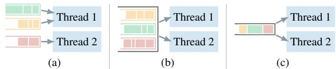  
Figure 1: Three queuing models for two application threads: (a) connection-partitioned FIFO (CP), (b) connection-shared FIFO (CS), and (c) message-shared FIFO (MS)

Rakaia-enhanced gRPC-Go improves throughput-under-SLO by up to 1.56×, while maintaining stable performance as the number of connections scales. Rakaia also improves gRPC-C++ throughput-under-SLO by up to 2.69× across the evaluated APIs. Finally, Rakaia improves realistic gRPC workloads, increasing throughput-under-SLO by up to 1.39× for Silo [67], an in-memory database, and by 1.42× for Open-Telemetry Collector [54].

## 2 Motivation and prior work

## 2.1 The case for layering on top of TCP

The most popular RPC protocols [5, 21, 48, 65] almost universally rely on TCP for transport and TLS for security. TLS and PKI offer end-to-end confidentiality and integrity, while TCP remains the protocol of choice for its ubiquitous kernel support and its reliability in deployment.

Despite decades of optimizations in the Linux TCP/IP stack [62, 64, 66], the nature of TCP continues to hinder RPC frameworks. The connection-oriented POSIX TCP API introduces two forms of head-of-line (HOL) blocking: (i) interconnection HOL blocking when traffic is unevenly distributed across TCP connections; (ii) intra-connection HOL blocking, where a slow RPC delays all subsequent ones on the same connection. Both forms of HOL blocking lead to work imbalance, degrading tail latency and throughput.

These issues are inherent to the connection abstraction of TCP. To mitigate them, userlevel frameworks commonly bring additional layers of abstraction to break TCP’s sequential stream semantics and enable concurrent RPC processing within and across connections, a process we detail in §2.3.

## 2.2 A quick queuing-theoretical detour

To understand the implications of delivering RPCs over TCP streams, we simulate the following queuing-theoretical models of an RPC server (Figure 1).

Connection-partitioned FIFO (CP): the server statically partitions connections across threads, leveraging RSS [62]. This approach minimizes synchronization overheads among threads. However, since connections are statically assigned to threads, this model suffers from both inter- and intraconnection HOL blocking and is not work-conserving.

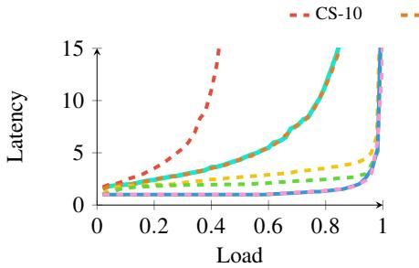  
(a) Deterministic

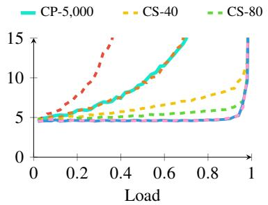  
(b) Exponential

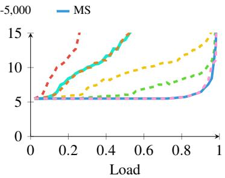  
(c) Bimodal  
Figure 2: Simulation results for the 99th percentile tail latency for three service time distributions on a 20-core server.

Connection-shared FIFO (CS): the server places all authenticated connections into a single pool. Any idle thread can poll any connection in this pool, which in turn requires application-level synchronization. This improves load bal ancing across threads, but the connection remains the unit of ownership during request processing. At any time, only one thread can process messages from a given connection, even if other threads are idle. While CS eliminates inter-connection HOL blocking, it still suffers from intra-connection HOL blocking. Therefore, it is also not work-conserving.

Message-shared FIFO (MS): the server explicitly extracts requests from connections, enqueues them in a shared queue, and assigns requests to idle threads for processing. This model makes scheduling independent of connection ownership, allowing any idle worker to process the next available message. It eliminates both inter- and intra-connection HOL blocking at the cost of an intermediate extraction and queuing stage, typically implemented by a dedicated thread or thread pool.

We use a discrete-event simulator to model an open-loop workload generator with a Poisson arrival process and zero system overheads. This lets us isolate the queuing effects of each scheduling model from implementation overheads such as context switching. Generated requests are distributed across a varying number of connections. Figure 2 illustrates the impact on 99th percentile tail latency, for three well-known service distributions (see §5.1 for details), and for different numbers of simulated client connections (e.g., CS-40 denotes the CS model with 40 connections). The results show that (i) the connection-partitioned (CP) model fails to balance load, even with a large number of connections (CP-5,000); (ii) the connection-shared (CS) model suffers from intra-connection HOL blocking; (iii) yet, the severity of HOL blocking in the CS model depends strongly on the number of connections, e.g., CS-5,000 nearly matches the performance of MS.

We derive two insights that inform our system design: (i) eliminating both intra- and inter-connection HOL blocking through a shared message queue (MS) reduces tail latency; and yet, (ii) larger connection-to-core ratios (e.g., CS-5,000) reduce the impact of HOL blocking. Therefore, the throughput overheads of a centralized MS model implementation must remain low for the solution to be acceptable.

## 2.3 gRPC and HTTP/2

Figure 3(a) depicts the high-level architecture of gRPC, a popular userspace RPC stack that approximates the MS model. To achieve this, gRPC uses dedicated I/O threads to read TCP streams, reassemble RPC messages, and enqueue them into work queues, from which worker threads dequeue and execute RPCs. This design effectively decouples messages from their originating connections and distributes them to worker threads in a global FIFO manner, providing the logically centralized scheduling assumed in the MS model. gRPC is additionally built on top of HTTP/2 [5], which allows concurrent RPCs to interleave on a single connection, and supports out-of-order replies, thereby removing protocol-level HOL blocking.

However, achieving this concurrent RPC processing entirely in userspace is costly. gRPC must reconstruct message semantics through a layered pipeline of I/O threads, work queues, and worker thread pools. This introduces substantial inter-thread communication, synchronization, and contextswitching overhead. Even the most performant gRPC implementation, Go-based gRPC [24], which relies on lightweight goroutines to mitigate these costs, experiences scalability challenges: as the number of goroutines grows, throughput eventually suffers (§5.3).

## 2.4 KCM – the previous in-kernel attempt

Shown in Figure 3(b), KCM [37] is the first in-kernel attempt to expose a message API on top of TCP. It relies on strparser, a Linux kernel facility for detecting message boundaries in TCP streams, to parse messages directly in the kernel. For each TCP connection, KCM then creates a separate KCM socket for every application thread and delivers each parsed message to one of these sockets. Replies are routed back along the same path to the underlying TCP connection.

While this avoids the inter-thread communication required by userspace frameworks like gRPC, it falls short of providing a true MS model. Scheduling remains fundamentally connection-driven rather than message-driven: each TCP socket independently selects among its own KCM sockets with no global view across connections or threads. Consequently, KCM suffers from inter-connection HOL blocking, where idle threads cannot pull work from busy connections.

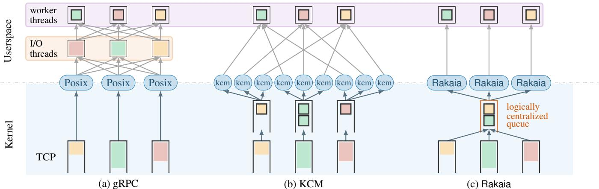  
Figure 3: Three RPC-oriented architectures on top of TCP that aim to eliminate HOL blocking (receive side).

KCM scales poorly. With T threads and C connections, it creates T ×C KCM sockets, a quadratic blow-up that quickly becomes impractical for high-connection services [26].

Combined with its poor performance (§5.2) and current lack of support for kTLS or userspace TLS libraries (e.g., openssl), KCM is not considered a viable foundation for high-performance RPCs.

To summarize, high-performance RPCs built on top of TCP require a framework that approximates the MS model with minimal overhead. Existing userspace frameworks incur substantial overheads due to their threading and I/O models. While KCM is the only prior in-kernel attempt to expose message boundaries over TCP, it fundamentally retains the connection as the primary scheduling abstraction, making message-level work conservation impossible. In the next section, we describe how our design, Rakaia (Figure 3(c)), addresses these limitations by enabling low-overhead, messageoriented scheduling directly in the kernel.

## 3 The Design of Rakaia

Rakaia’s design is driven by two key insights. First, message parsing and scheduling can be performed directly in the kernel’s TCP receive path, in the same softirq context that processes incoming packets. Since the kernel is already executing to handle each packet, delineating messages and making scheduling decisions at this point adds minimal addi tional overhead. Second, decoupling messages from their TCP connections as early as in the kernel enables message-level scheduling and the exposure of a purely message-oriented API to applications. Together, these insights allow Rakaia to approximate the MS model with low overhead (through a logically centralized scheduler), while remaining fully compatible with the unmodified Linux TCP/IP stack.

At a high level, we set the following goals for Rakaia:

• Message-level work conservation: Rakaia schedules at the level of messages instead of per connection, ensuring no core stays idle while work exists.

• Performance: Rakaia outperforms existing TCP-based RPC frameworks in terms of throughput and tail latency.

• Scalability: Rakaia scales with an increasing number of TCP connections.

• Compatibility: Rakaia is fully compatible with the unmodified Linux TCP/IP stack and transport-level security mechanisms like kTLS. Any updates or optimizations in the underlying stack are automatically inherited by Rakaia.

## 3.1 Overview

Figure 4 shows the high-level design of Rakaia, a lightweight in-kernel layer for message processing, demultiplexing, and scheduling atop the TCP/IP stack. Rakaia exposes a messagegranular API to userspace (§3.2) and is fully compatible with TLS (§3.5). Rakaia operates in three layers:

Hook with the lower TCP/IP stack: Rakaia leaves the Linux TCP/IP stack unmodified and leverages strparser, which also underpins KCM, to extract message boundaries directly from the TCP byte stream. We extend strparser beyond length-delimited protocols to support HTTP/2. A protocolspecific parser is attached to each TCP socket and incrementally reconstructs complete messages from the receive queue before exposing them to the upper layers.

The scheduling layer: Once a message is parsed, it enters Rakaia’s logically centralized but physically distributed scheduler, which maintains one FIFO queue per core. Any message may be assigned to any queue: Rakaia uses a power-of-twochoice (P2C) policy [50] to sample two queues and place the message on the shorter one, balancing load with constant overhead. Workers dequeue from their local queue first and invoke stealing if it is empty, preserving work-conserving scheduling without the scalability bottleneck of a global queue.

Message reception and transmission: Rakaia exposes a single message-oriented socket per application thread. On re ception, the Rakaia socket delivers complete messages from the scheduler to userspace. After the application processes messages, this socket transmits the responses over their associated TCP connections. When multiple threads attempt to send over the same TCP connection concurrently, Rakaia resolves contention using a lightweight delegation mechanism. After completing a transmission, a worker immediately fetches the next message or transitions to idle.

(b) Transmission Path  
(a) Receiving Path  
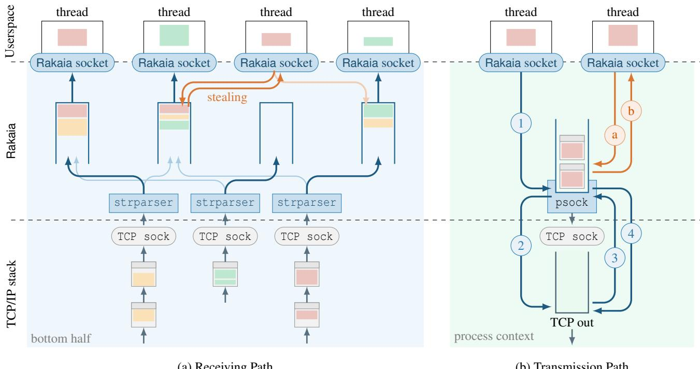  
Figure 4: Overview of Rakaia’s design. In the receiving path, solid arrows ( ) show the chosen execution path, while faded arrows ( ) indicate unselected candidates under power-of-two choices. In the transmission path, 1 - 4 shows a thread sending messages along the fast path, while a - b illustrates a case where message sending is delegated.

## 3.2 Rakaia API

It is well known that POSIX was not designed for scalability or message-oriented communication [12]. Further, RPC frameworks for TCP typically rely on dedicated I/O threads to demultiplex traffic, thereby introducing significant scheduling, queuing and synchronization overheads.

Rakaia simplifies this architecture by exposing a messageoriented, connection-oblivious socket API. Each worker thread communicates with the kernel through a single socket that directly sends and receives discrete messages over any TCP connection. Because all transport state remains in the TCP stack, the Rakaia socket maintains no per-connection bookkeeping. This design removes the need for I/O threads and provides a lightweight and scalable RPC interface.

At the API level, Rakaia was initially inspired by Homa/Linux, a Linux kernel implementation of the Homa transport protocol [51, 56]. Both Rakaia and Homa/Linux expose a single socket for sending and receiving discrete messages to and from arbitrary peers, a common practice in message-oriented communication, where applications exchange discrete messages with remote endpoints, e.g., the POSIX UDP socket semantics. Unlike UDP and Homa, whose sockets directly communicate with remote peers, Rakaia’s socket abstraction is built entirely atop TCP and serves only as a kernel-facing interface. It therefore does not maintain any remote-peer state, making it a lightweight layer over the underlying TCP stack.

Table 1 shows the APIs provided to the applications by Rakaia. We introduce a new protocol family AF\_RAKAIA for the Rakaia socket. Each worker thread creates a Rakaia socket using the standard socket system call with AF\_RAKAIA, and a custom protocol identifier RAKAIAPROTO\_CONNECTED. Since each application thread only needs a single Rakaia socket to handle all TCP traffic, this design reduces resource consumption and simplifies file descriptor management. For instance, when using epoll, a thread needs to monitor only one file descriptor instead of one for each individual TCP connection.

Rakaia introduces a single new control operation: rakaia\_attach, exposed as an ioctl on the Rakaia socket. The rakaia\_attach call associates an existing TCP connection with the Rakaia framework and selects which built-in message parser should be used via proto\_id. Rakaia currently provides parsers for Memcached and HTTP/2-based protocols (e.g., gRPC). It can easily be extended to support additional ULP protocols. Once a connection is attached, Rakaia begins to reconstruct incoming messages for that connection and makes parsed messages available to worker threads. Al though the file descriptor of a Rakaia socket is passed to the kernel when invoking rakaia\_attach, it serves merely as an entry point and does not create a persistent association between that Rakaia socket and the attached TCP connec tion. Message reception and transmission continue to use the standard recvmsg and sendmsg calls on the Rakaia socket.

Table 1: The API provided by Rakaia for applications.  
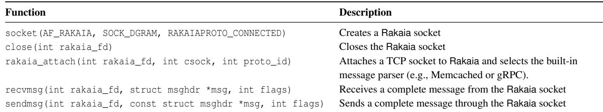

## 3.3 Receive Path

Figure 4(a) shows the three main tasks of the receiving path: (i) parsing TCP byte streams into discrete messages, (ii) completely decoupling messages from their original connection, and (iii) work-conserving scheduling across Rakaia sockets.

Connection setup and message parsing: When a TCP connection is registered via the rakaia\_attach system call, Rakaia initializes a rakaia\_psock data structure to wrap the target TCP socket. This wrapper serves two primary purposes. First, it holds a new strparser instance for message parsing. Second, it stores the necessary fields to support the transmission path, which we describe in detail in §3.4.

On the RX path, Rakaia reconstructs complete application messages directly from the TCP byte stream. As illustrated in Figure 5, message parsing differs between supported protocols. For simple length-delimited protocols like Memcached, parsing only consists of inspecting a fixed-size header and extracting the encoded payload length. For Memcached, Rakaia uses the binary protocol’s opaque header field to match responses to requests [49,58]. In HTTP/2-based protocols, each RPC is mapped to a single HTTP/2 stream, which in turn consists of one or more frames. The parser reads each frame’s header, extracting its stream ID, length, type, and flags. Each complete frame is then appended to a per-stream buffer maintained in a hash table, which enables Rakaia to assemble messages that span multiple frames. When a frame carrying the END\_STREAM flag arrives, the buffered frames for that stream are coalesced into a complete message and passed to the upper layer. Note that control frames such as PING or WINDOW\_UPDATE are handled entirely in-kernel, allowing immediate flow control updates and acknowledgments.

Message insertion and origin tracking: Once a message has been reconstructed, Rakaia embeds a pointer to the corresponding rakaia\_psock into the first skb of the message before enqueuing it into the central message queue. When a Rakaia socket dequeues this message and copies it to userspace, it extracts and caches the rakaia\_psock pointer internally. This allows the subsequent sendmsg() call on the same Rakaia socket to access the correct underlying TCP connection, without revealing connection information to userspace.

Work-conserving scheduling: Rakaia presents a logically centralized message queue to applications while physically distributing scheduling across per-socket receive queues. Each Rakaia socket maintains a local FIFO queue and primarily serves messages from this queue. When a new message becomes ready, Rakaia assigns it to a socket using P2C load balancing: it randomly samples two candidate sockets and enqueues the message into the one with the shorter local queue. If the selected socket’s queue is empty, indicating that at least one worker is idle, the message is instead delivered immediately via direct handoff. When a socket exhausts its local queue, it attempts to steal work from another active socket. To do so efficiently, Rakaia maintains a bitmap that tracks non-empty queues and again applies P2C to select a victim among them. If no work exists anywhere in the system, the socket enters idle state until new messages arrive. This design preserves work conservation across all load regimes. Under light load, messages are dispatched immediately via direct handoff. Under heavy load, queues naturally build up and sockets dynamically rebalance load through work stealing, approximating a centralized queue without its scalability bottleneck. Moreover, because Rakaia uses P2C for message-level distribution, its load balance is insensitive to the number of TCP connections: even with a small number of connections, P2C ensures tightly bounded queue lengths and maintains near-uniform load across sockets [50].

## 3.4 Transmit Path

The transmission path of Rakaia consists of two major stages: (i) copying the message into the kernel, and (ii) transmitting it over TCP with minimal lock contention.

Independent message copying: On sendmsg, Rakaia copies the message (and its associated TCP socket identifiers) into the kernel. Rakaia copies each message independently into its newly allocated skb. A natural alternative is to batch messages destined for the same TCP socket into a shared sending queue so they can be packed into a single skb. While this may reduce skb allocation overhead, it introduces extra latency, substantial synchronization complexity, and difficult corner cases. In particular, under memory pressure, partial copy failures make it hard to free an skb that contains multiple messages. Our design avoids these pitfalls by copying each message independently, ensuring that skbs can be created and freed cleanly even in failure paths.

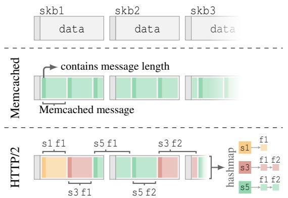  
Figure 5: Parsing Memcached and HTTP/2. s1, s3, and s5 refer to stream with ID 1, 3, and 5. f1 and f2 refer to the first and second frames of a stream.

Direct or delegated transmission: Before message copying, Rakaia retrieves the cached rakaia\_psock pointer (recorded by recvmsg) to identify the corresponding TCP socket. At this point, Rakaia does not directly enqueue messages into the TCP socket’s sk\_write\_queue, since doing so requires acquiring the TCP socket lock, a mutex-like lock that would serialize all concurrent senders and put some to sleep.

Rakaia therefore employs a two-phase delegation mechanism for transmission, illustrated in Figure 4(b) and detailed in Algorithm 1. For each TCP socket, the rakaia\_psock wrapper structure maintains a lightweight virtual sending queue (virt\_queue) for temporary message accumulation. Access to that queue is shown as 1 in Figure 4(b). This queue is merely a staging buffer: it accumulates messages without touching TCP’s socket lock. Rakaia checks a boolean flag within the rakaia\_psock to determine whether another thread is currently handling message transmission. If the flag is set, the sender returns to userspace immediately without further action ( b ). Otherwise, it sets the flag and becomes the designated transmitter: it acquires the TCP socket lock, moves all staged messages from virt\_queue into sk\_write\_queue, and initiates message transmission via the standard TCP stack by calling tcp\_push ( 2 ).

To avoid leaving behind messages that are concurrently enqueued by other threads to virt\_queue, the designated transmitter repeatedly rechecks virt\_queue ( 3 - 4 ) and flushes any newly arrived messages before relinquishing the TCP socket lock. When the queue is observed empty, it clears the flag and then releases the TCP socket lock, allowing future senders to proceed.

Algorithm 1 Delegation mechanism in the transmission path   
1: function SENDMESSAGE(psock, msg)   
2: set csk ← psock.sk ▷ associated TCP socket   
3: Enqueue(psock.virt\_sndbu f , msg)   
4: if psock.tx\_in\_use is true then   
5: return   
6: end if   
7: set psock.tx\_in\_use ← true   
8: lock\_sock(csk)   
9: while true do   
10: if psock.virt\_sndbu f is empty then   
11: set psock.tx\_in\_use ← false   
12: break   
13: end if   
14: RequeueAll(psock.virt\_sndbu f , csk.sndbu f )   
15: sk\_flush\_backlog(csk) ▷ process rx backlog   
16: ▷ Omitted TCP stack logic   
17: tcp\_push(csk) ▷ send out messages   
18: end while   
19: release\_sock(csk)   
20: end function

## 3.5 Composing with TLS

Rakaia’s in-kernel message parsing relies on visibility into plaintext TCP streams, and the design described so far assumes unencrypted traffic. At first glance, this may suggest that Rakaia cannot handle encrypted traffic. However, Linux provides built-in kernel TLS (kTLS), which enables in-kernel TLS encryption and decryption. In kTLS, the TLS handshake is performed in userspace, typically right after accepting a TCP connection. Once the handshake completes, applications share the session key with the kernel, offloading TLS record processing to kTLS. This mechanism allows Rakaia to operate over TLS connections, preserving end-to-end confidentiality.

Figure 6 shows how Rakaia integrates with kTLS. In the receiving path, when a TCP socket receives encrypted TLS traffic, kTLS intercepts the data and parses it into discrete TLS records. These records are handed directly to the strparser attached to the TCP socket. The strparser then queries the kTLS decryption module to obtain the plaintext bytes and invokes its parsing program to extract application-level messages. Processing then proceeds as in §3.3.

The transmission side is simpler. Rakaia hands plaintext messages to the kTLS encryption module, which encrypts and transmits them via the corresponding TCP socket.

Note that kTLS commonly performs decryption in process context, typically when recvmsg is called. Although kTLS exposes an interface for decryption in softirq, its current implementation is not robust and suffers from contention. To avoid this, Rakaia invokes the kTLS decryption module from a Linux workqueue [44], ensuring that decryption runs in an appropriate context. We plan to patch kTLS to support reliable softirq decryption, enabling tighter integration with Rakaia.

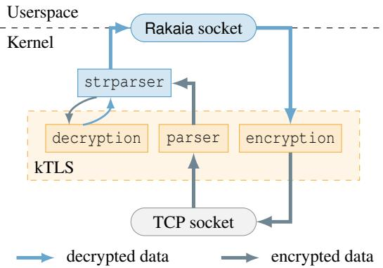  
Figure 6: Rakaia running atop kTLS

## 4 Implementation

We implemented Rakaia as a dynamically loadable kernel module on Linux version v6.8, consisting of approximately 3,000 lines of C code. In addition, we provide a kernel patch of around 60 lines to register the new Rakaia socket type. This patch makes minimal modifications to the existing kernel codebase and does not alter the TCP stack semantics.

Extending strparser: We extend strparser to support HTTP/2 stream parsing. In the default strparser, when a single message spans multiple skbs, the parser links them by using the head skb’s frag\_list and the next pointers of subsequent skbs. HTTP/2, however, introduces an additional layer of structure: messages are formed from multiple frames, and frames belonging to the same stream may arrive in separate skbs. To correctly assemble full HTTP/2 streams, Rakaia retains the original linking mechanism for individual frames and then uses reserved space in skb->cb to maintain perstream linkage. This produces a single skb chain per stream, which the kernel can deliver as a complete logical message.

Offloading HTTP/2 transport logic: Supporting gRPC requires more than extending strparser to extract HTTP/2 messages. HTTP/2 introduces a substantial control plane (e.g., flow control, PING frames) that would normally be handled in userspace. To fully eliminate transport-layer work from the application runtime, Rakaia offloads these mechanisms into the kernel as well. During parsing, Rakaia identifies HTTP/2 control frames and processes them directly (e.g., applying and generating window updates), rather than delivering them to userspace. This not only simplifies the userspace logic, but also makes responding to control events far cheaper, since no syscalls or context switches are needed. Rakaia supports all HTTP/2 control-plane features used by gRPC.

Custom TCP path until tcp\_push: While we keep the semantics of the TCP/IP stack intact, we cannot simply invoke the normal tcp\_sendmsg in the transmission path after copying messages into the kernel. This is because tcp\_sendmsg contains the logic for TCP socket lock acquisition, skb allocation, and data copying, all of which are unnecessary for Rakaia. To allow efficient transmission, we move the TCP stack logic such as sequence number initialization and rx backlog processing directly into rakaia\_sendmsg. Afterwards, we call the existing function tcp\_push, which is provided by the kernel for pushing skbs onto the network.

## 5 Evaluation

We evaluate Rakaia’s performance and compare it against a range of RPC frameworks to answer the following questions:

• Does Rakaia behave according to the theoretical expectations of the MS model across various service-time regimes and levels of connection scaling? (§5.2)

• Does Rakaia bring performance gains to gRPC? (§5.3)

• Can Rakaia integrate efficiently with TLS, in comparison with other approaches? (§5.4)

• Does Rakaia deliver benefits for real-world RPC workloads beyond synthetic benchmarks? (§5.5)

## 5.1 Experimental setup and methodology

Hardware: All experiments are conducted using Cloudlab [16] xl170 nodes. Each machine is equipped with one Intel Xeon E5-2640v4 CPU (10 cores, 2.4 GHz). Hyperthreading is enabled. The machines run an Ubuntu LTS 24.04 distribution with the Linux kernel version 6.8.

In all experiments, the server is set up to use 20 hyperthreads. For most experiments, this implies a 20-way multithreaded application. For gRPC-Go, the server is set up with 20 worker goroutines for both gRPC-POSIX and gRPC-Rakaia. All experiments are compute-bound.

Experimental setup: In all experiments, we report the 99th percentile tail latency (y-axis) versus the achieved load in RPCs per second (x-axis), both measured at the client when responses are received. We use an extended version of Lancet [39] as the load generator. Lancet first opens all connections at once, then issues requests according to a Poisson process in an open-loop fashion. Lancet supports multiple RPC protocols, including Memcached [48] and gRPC, with optional TLS support.

Synthetic distributions: For our synthetic microbenchmarks, clients send requests, encoded using a specified RPC protocol, to the server that executes them. The service times for these requests follow one of three well-known distributions from the literature [14, 32, 38, 42, 45–47, 61]:

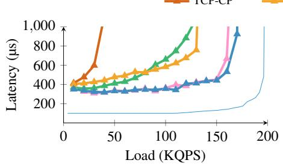

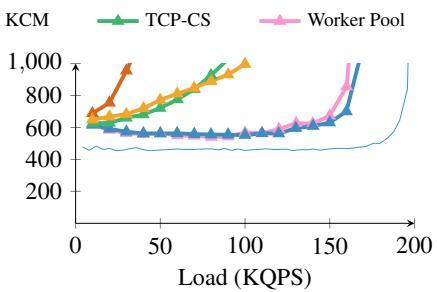  
(a) Fixed (20 connections)  
(b) Exponential (20 connections)

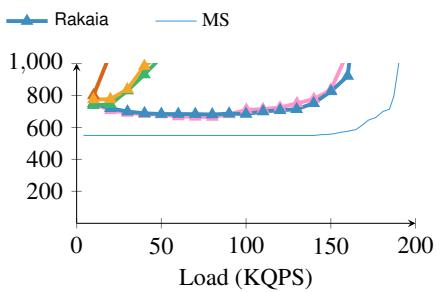

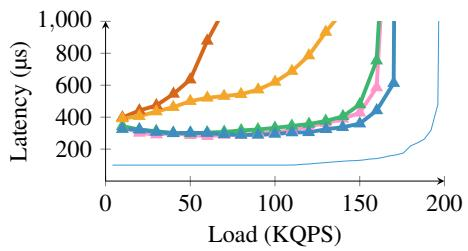  
(d) Fixed (80 connections)

(c) Bimodal (20 connections)  
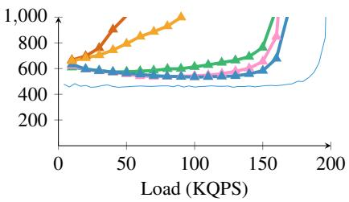

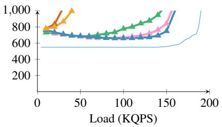

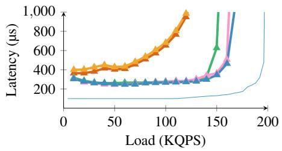  
(g) Fixed (5,000 connections)

(e) Exponential (80 connections)  
(f) Bimodal (80 connections)  
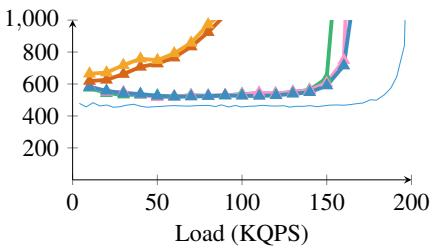  
(h) Exponential (5,000 connections)

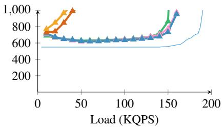  
(i) Bimodal (5,000 connections)  
Figure 7: 99th percentile latency as a function of throughput for 100µs tasks. Top, middle, and bottom rows correspond to 20, 80, and 5,000 client connections, respectively.

• deterministic: P[X = S¯] = 1

• exponential with mean service time S¯

• bimodal: P[X = S¯/2] = .9; P[X = 5.5 × S¯] = .1

Comparison: We compare the following systems:

1. TCP-CP, a simple lock-free libevent-based program where connections are split among threads (as directed by RSS [62]). Each thread both processes the requests and sends back the replies, ensuring natural in-order delivery.

2. TCP-CS, a simple connection-sharing, libevent-based program where threads temporarily lock access to a TCP socket to process requests and then return replies in-order.

3. Worker Pool, a userspace design that implements the MS model. It uses a small number of I/O threads and a pool of worker threads. The I/O threads block on a shared epoll instance and reconstruct messages from TCP streams. Once a complete request is received, the I/O thread enqueues it into a shared lock-free ring buffer, from which a worker thread dequeues it for processing. After processing the request, the worker attaches the response to the corresponding connection and marks the connection as having pending output. If the worker can acquire the I/O ownership of the connection, it flushes the response directly. Otherwise, it arms the connection with EPOLLOUT so an I/O thread can flush it once the socket is writable.

4. KCM, as available natively in the Linux kernel. We equip KCM with the same parsing program for extracting RPC messages and delivering them to userspace.

5. gRPC-POSIX, the official implementations. We evaluate both gRPC-Go (v1.75.0) and gRPC-C++ (v1.78.1).

6. Rakaia, our contribution, implemented as a kernel module.

7. gRPC-Rakaia, our contribution, modified gRPC-Go and gRPC-C++ implementations running on top of Rakaia.

## 5.2 Rakaia follows the MS model

We conduct the first set of experiments with varying TCP connections to the server, TLS disabled, and an open-loop load generator issuing as many outstanding requests per connection as needed. We measure the latency of replies at clients. For the Worker Pool, we sweep the number of I/O threads and worker threads and use the best-performing configuration for each service time.

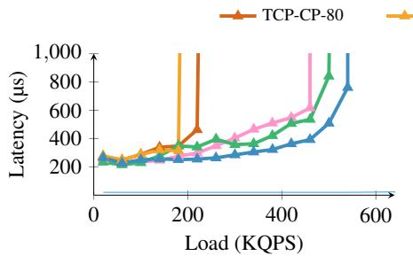  
(a) Fixed (80 connections).

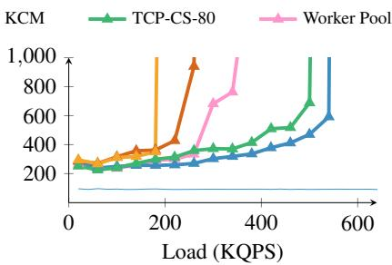  
(b) Exponential (80 connections).

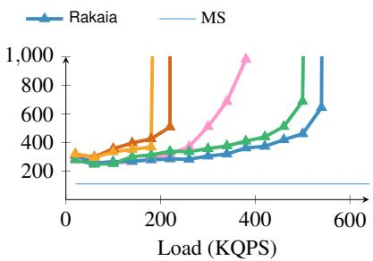  
(c) Bimodal (80 connections).

Figure 8: 99th percentile latency as a function of throughput for 20µs tasks with 80 client connections.  
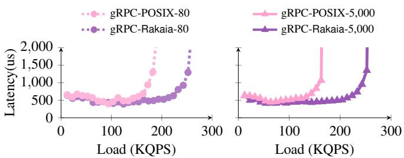  
(a) gRPC-Go

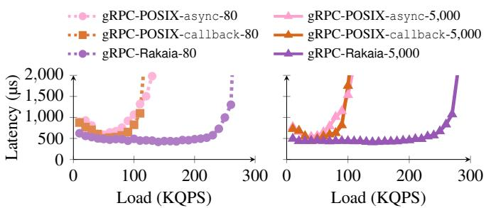  
(b) gRPC-C++  
Figure 9: 99th percentile latency according to throughput for gRPC-POSIX and gRPC-Rakaia (Exponential (S¯ = 20µs)).

Table 2: CPU time breakdown for gRPC-POSIX and gRPC-Rakaia, at 170 KQPS on a server with 20 hardware threads.  
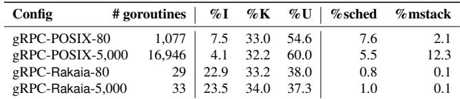

Figure 7 shows the 99th percentile latency for 100µs service time across three different numbers of client connections (20, 80, and 5,000), following the three distributions described in §5.1. For reference, we plot the theoretical MS curve for an M/G/20 queue, scaled by the service time and assuming no CPU or network overheads.

Connection Scaling: Figure 7 shows that Rakaia remains close to the MS model across all tested connection counts. With only 20 connections, Rakaia sustains about 160 KQPS throughput across the three service-time distributions, whereas TCP-CS reaches only about 40 KQPS in the bimodal case. Thus, when intra-connection HOL blocking is most severe, Rakaia delivers roughly 4× the throughput of TCP-CS. The Worker Pool tracks Rakaia more closely than other baselines and exhibits the same overall scaling trend, showing that a userspace design can approximate MS-like behavior, at the 100µs scale.

As the number of connections increases to 80 and then 5,000, TCP-CS improves substantially because the requests are spread across more connections, reducing intra-connection HOL blocking. This trend is in line with the simulations in Figure 2. Nevertheless, even with 5,000 connections, Rakaia still consistently outperforms TCP-CS by 7%, though they are expected to behave almost identically in theory. Likewise, Rakaia also retains a small advantage over the Worker Pool. In both cases, the additional performance comes from Rakaia’s in-kernel message scheduling, which avoids the userspace locking and coordination overheads among application threads, required by both TCP-CS and the Worker Pool. All other approaches (KCM and TCP-CP) are not competitive because they suffer from HOL blocking, e.g., KCM only achieves around 30 KQPS in the bimodal case, 19% of Rakaia’s throughput.

Shorter tasks: Figure 8 evaluates 20µs tasks with 80 client connections. At this granularity, system overheads account for a much larger fraction of end-to-end latency, making implementation costs more visible. The Worker Pool is particularly sensitive and suffers from significant performance degradation. We tune the I/O-thread and worker-thread configuration for the fixed service-time case, where it performs competitively. However, even with the same configuration, its performance degrades under the exponential and bimodal distributions, where higher service-time variability causes earlier tail-latency growth. KCM introduces high system overheads and performs worse than the vanilla TCP-CP and TCP-CS models, despite its in-kernel message parsing advantages. In contrast, Rakaia has low system overheads, and consistently maintains its advantages over TCP-CS.

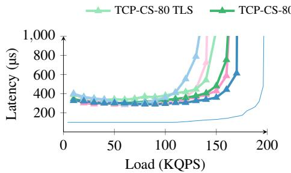  
(a) Fixed (S¯ = 100µs).

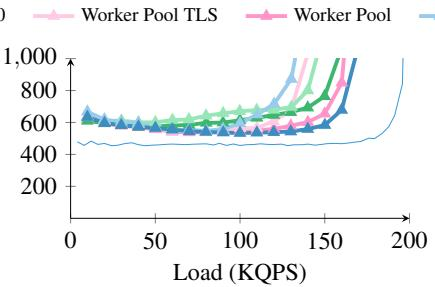  
(b) Exponential (S¯ = 100µs).

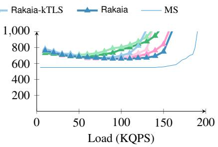  
(c) Bimodal (S¯ = 100µs).

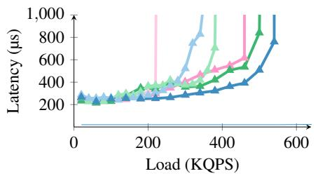  
(d) Fixed (S¯ = 20µs).

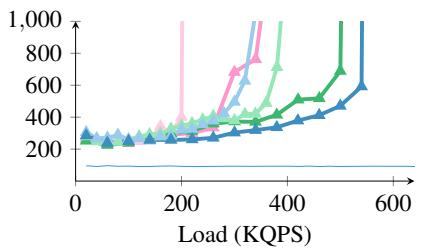  
(e) Exponential (S¯ = 20µs).

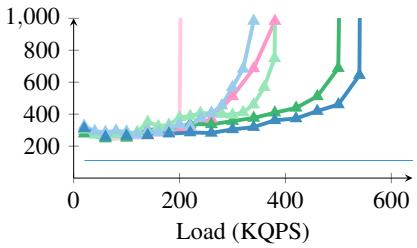  
(f) Bimodal (S¯ = 20µs).  
Figure 10: 99th percentile latency as a function of throughput with TLS enabled for 100µs and 20µs tasks, respectively.

## 5.3 gRPC over Rakaia

Figure 9 shows that Rakaia improves gRPC’s performance across a range of connection counts, for both the Go and C++ gRPC stacks.

In the gRPC-Go case, with 80 connections, gRPC-Rakaia already sustains 39% higher load than gRPC-POSIX by avoid ing the userspace I/O goroutines and inter-goroutine synchronization on the receive path. The benefit becomes even more pronounced as the number of connections increases. At 5,000 connections, gRPC-POSIX sustains 11% lower throughput than in the 80-connection case, suggesting that its perconnection goroutine structure begins to impose measurable scheduling overhead at scale. In contrast, gRPC-Rakaia maintains nearly identical throughput from 80 to 5,000 connections. As a result, its advantage over gRPC-POSIX grows to 1.56× at 5,000 connections.

Table 2 shows the CPU time breakdown for gRPC-POSIX and gRPC-Rakaia when serving 170 KQPS. %I, %K, and %U denote idle, kernel, and userspace time, respectively. %sched captures time spent in the Go runtime scheduler, while %mstack accounts for time spent on Go stack growth and management (i.e., morestack). With POSIX sockets, gRPC relies on a large number of goroutines to emulate the MS model, scaling from 1,077 goroutines at 80 connections to around 17,000 at 5,000 connections. This explosion in concurrency significantly increases runtime overhead, reflected in high scheduler activity (6-8%) and substantial Go stack management overhead (up to 12.3%). In contrast, gRPC-Rakaia requires only a few dozen goroutines (20 workers plus a small number of runtime goroutines) regardless of connection numbers, as message multiplexing and scheduling are handled in the kernel. As a result, scheduler and stack management overhead becomes negligible. At 5,000 TCP connections, the shift from userspace to the kernel increases kernel time by only 1.8 pp, while reducing userspace CPU time by 22.7 pp.

Figure 9(b) repeats the experiment with gRPC-C++, comparing the async [22] and callback [23] APIs against gRPC-Rakaia. We omit gRPC-C++’s sync API because it runs RPC handlers on a dynamically growing thread pool [25]. Under high concurrency, this pool can grow with the number of active RPCs, leading to poor performance. Note that gRPC-Rakaia exposes the same user-facing API as sync, allowing existing applications to use it as a drop-in replacement. Unlike the standard sync implementation, it does not inherit the scalability bottleneck of a dynamically growing thread pool. The results show that gRPC-Rakaia improves gRPC-C++ through put by 2× and 2.33× for the async and callback APIs, respectively, at 80 connections. At 5,000 connections, the corresponding improvements are 2.69× and 2.67×, respectively. This improvement is even more pronounced than in the gRPC-Go case, because gRPC-C++’s threading model incurs higher overheads than gRPC-Go’s goroutine-based design.

## 5.4 The impact of TLS

Figure 10 compares the performance of Rakaia, TCP-CS and the Worker Pool, with and without TLS enabled. We omit (i) KCM, as it does not work out-of-the-box with kTLS on recent kernels, and (ii) gRPC-Rakaia, as Go’s standard library does not yet support kTLS. Support for kTLS in gRPC-Rakaia will become available once the recently accepted proposal to integrate kTLS into Go [20] is implemented. Enabling kTLS has a measurable impact in terms of throughput for Rakaia. This is due to the use of the Linux workqueue to perform decryption on the receive path (see §3.5), which becomes a bottleneck. This limitation is not fundamental: once kTLS supports safe decryption in softirq context, this bottleneck can be removed.

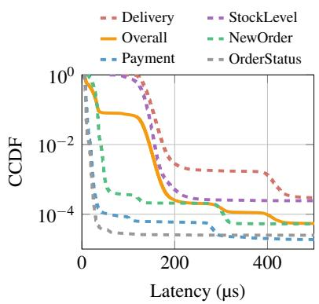  
(a) CCDF of task execution time

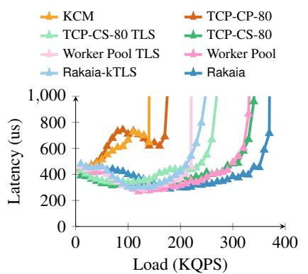  
(b) 99th percentile latency vs. throughput Figure 11: Silo running TPC-C benchmark

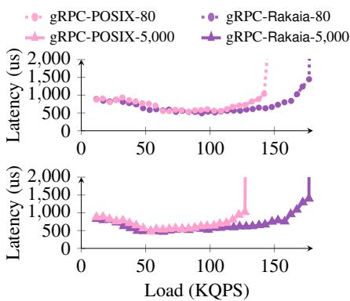  
(c) 99th percentile latency vs. throughput

For 100µs tasks, Rakaia-kTLS reaches about 120– 130 KQPS, close to TCP-CS-TLS and the Worker Pool TLS at about 130–140 KQPS. For 20µs tasks, TLS overhead becomes more prominent. Rakaia-kTLS still reaches about 320–340 KQPS, reasonably close to TCP-CS-TLS at about 380 KQPS, while the Worker Pool TLS drops to only about 200–220 KQPS. This drop occurs because the I/O-thread configuration for the Worker Pool is tuned for the unencrypted case. With TLS enabled, the same I/O threads must handle higher per-request processing cost, so they saturate early and cannot feed workers fast enough. With Rakaia, I/O processing scales automatically through RSS, removing this responsibil ity from userspace.

## 5.5 Real-world applications

The impact on TPC-C query latency: To assess the benefits of Rakaia in the real world, we use Silo [67], an in-memory database optimized for multicore scalability. Using a method ology similar to [61], we run a networked server layer on top of Silo, which generates transactions from the TPC-C benchmark upon receiving new requests. Silo’s garbage collection is disabled as it introduces large variability in 99th percentile latency. Additionally, we did not implement marshalling for SQL queries and responses.

Figure 11(a) shows the multi-modal service time CCDF of the 5 TPC-C query tasks measured without queuing or network delays. The workload is substantially more complex than the synthetic distributions we used up to this point. Figure 11(b) plots tail latency as a function of achieved through put for Rakaia (w/ and w/o TLS), TCP-CS-80 and the Worker Pool (w/ and w/o TLS), and the TCP-CP-80 and KCM baselines (w/o TLS). It shows that Rakaia’s systematic elimination of HOL blocking delivers the highest throughput-under-SLO.

TCP-CP-80 and KCM still collapse early because of their inferior scheduling policies. While TCP-CS-80 and the Worker Pool come much closer to Rakaia, they both still show earlier tail-latency growth as load increases. At 500µs tail latency, Rakaia sustains 350 KQPS, compared with 309 KQPS for TCP-CS-80 and 299 KQPS for the Worker Pool. This remaining gap indicates that, even when intra-connection HOL blocking is reduced, Rakaia still benefits from in-kernel message scheduling rather than paying the userspace coordination overheads required by TCP-CS and the Worker Pool.

Figure 11(c) compares Silo served through gRPC-Go over gRPC-POSIX and gRPC-Rakaia under 80 and 5,000 connections. gRPC-Rakaia improves upon gRPC-POSIX’s throughput by 1.25× and 1.39×, respectively. This confirms that Rakaia’s benefits extend to real-world RPC workloads, even when layered beneath a full gRPC stack.

OpenTelemetry: We also evaluate OpenTelemetry Collector [54], a widely used telemetry service for receiving, processing, and exporting traces, metrics, and logs in cloud deployments. In our benchmark, clients export traces to the Collector using the OpenTelemetry Protocol (OTLP) over gRPC-Go. This exercises the same gRPC-Go receive path as our earlier gRPC experiments, while replacing synthetic RPC payloads with realistic telemetry messages.

We evaluate two Collector configurations. The first uses a no-op exporter, which isolates the cost of processing OTLP requests without introducing backend storage or export traffic. The second uses a Jaeger-backed configuration [30], where the Collector batches incoming spans and exports them asynchronously to a Jaeger backend running on a separate machine. Following the OpenTelemetry testbed-style workload, each frontend RPC carries 10 spans, and the Collector uses the default batch size of 8192 spans with a 200 ms timeout. For the Jaeger configuration, we reserve two exporter consumers for asynchronous backend export and run gRPC-Rakaia workers on the remaining cores. Figure 12(a) shows that, with the noop exporter, gRPC-Rakaia improves throughput-under-SLO by 1.35× over gRPC-POSIX at a 2 ms 99th percentile taillatency SLO, sustaining 192 KQPS compared with 142 KQPS. Because the no-op exporter removes backend work, this result isolates the benefit of accelerating the Collector’s server-side gRPC. Figure 12(b) shows that this benefit persists with the Jaeger-backed configuration, where frontend RPC handling competes with batching, protobuf serialization, OTLP/gRPC export, and Jaeger ingestion. The backend export path remains an unmodified gRPC client path and is not accelerated by Rakaia. Even so, gRPC-Rakaia improves frontend throughputunder-SLO by 1.42×, sustaining 131 KQPS compared with 92 KQPS for gRPC-POSIX. These results show that Rakaia improves the performance of realistic gRPC server frontends, in addition to synthetic RPC handlers.

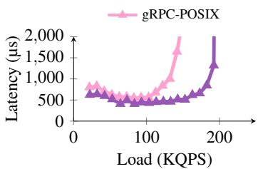  
(a) No-op

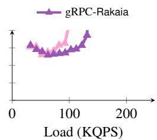  
(b) With Jaeger  
Figure 12: 99th percentile latency according to throughput for OpenTelemetry Collector with POSIX and Rakaia transports.

## 6 Discussion

Support for other gRPC implementations: Rakaia currently supports gRPC-Go (the most performant of the official gRPC implementations [24]) and gRPC-C++ out of the box. Extending Rakaia support of gRPC to other languages (e.g., Java, Rust) is straightforward and would similarly remove the need for dedicated I/O threads and transport logic in userspace.

Compatibility with stack optimizations: Rakaia is compatible with standard kernel and NIC offloading mechanisms (e.g., TSO/GSO, GRO), as it operates atop the TCP stack. It also supports TLS offloading, such as kTLS and NIC-based TLS, since decryption occurs in the kernel before messages reach Rakaia. Rakaia is, however, incompatible with SmartNICs that fully offload the TCP stack, as it relies on the kernel TCP pipeline to extract and queue messages. Finally, io\_uring is compatible with Rakaia’s recvmsg/sendmsg interface and could amortize syscall overhead.

Limitations inherited from TCP: Rakaia removes messagelevel HOL blocking caused by multiplexing RPCs over a TCP stream. However, because it leaves the TCP/IP stack unmodified, Rakaia necessarily inherits TCP’s transport-level limitations. First, since TCP provides in-order delivery, a lost or reordered segment can stall progress on the affected connection until the missing data is retransmitted. Second, Rakaia inherits TCP’s sender-driven congestion control, which is known to perform poorly under incast [8, 28, 60] compared to receiver-driven transports such as Homa [51, 56]. These tradeoffs are the inherent cost of preserving TCP wire compatibility and support for unmodified clients.

Complex scheduling policies and other RPC protocols: While Rakaia uses a logically centralized queue with run-tocompletion workers, it can support richer queuing models (e.g., priority queues). We leave this to future work. Rakaia can be easily extended to support other RPC protocols, provided they embed each message’s length in their headers. Current parsers reside directly in the module, but additional ones can be implemented as in-kernel extensions or via eBPF.

kTLS: Linux’s current implementation of kTLS does not correctly handle concurrent decryptions within a softirq context; Rakaia therefore falls back to a workqueue [44], incurring scheduler overhead. We plan to patch kTLS to support safe, scalable softirq decryption.

## 7 Related Work

Eliminating HOL blocking of TCP: Built atop HTTP/2 [5], gRPC [21] multiplexes multiple logical streams over a single TCP connection. While this design eliminates both interand intra-connection HOL blocking, it requires complex userspace orchestration. Rakaia instead performs message parsing, demultiplexing, and scheduling entirely in the kernel. Supporting HTTP/2 and other length-delimited message protocols, Rakaia enables efficient out-of-order delivery over TCP and integrates seamlessly with gRPC.

Addressing HOL blocking beyond TCP: Prior work also addresses HOL blocking by moving beyond TCP’s byte-stream abstraction. One class of systems layers atop userspace UDP stacks: Shinjuku [32] and Concord [29] employ dedicated dispatchers and preemptive scheduling to achieve work conservation and low tail latency; Machnet [63] similarly bypasses the kernel via DPDK but as a networking sidecar, exposing a message-passing API over shared memory. QUIC [41], a reliable transport built over UDP, eliminates TCP’s transportlevel HOL blocking by multiplexing independent streams over a single connection. Apart from UDP-based approaches, recent custom transports [8,51,56,60] treat messages as the fundamental unit of transfer and enable receiver-driven scheduling. While delivering excellent performance, these systems require either modified clients, custom network stacks, or dedicated infrastructure, limiting compatibility with existing TCPbased applications and hindering incremental deployment. In contrast, Rakaia preserves TCP/TLS wire compatibility, enabling easy deployment with unmodified clients across both WAN-facing and datacenter services.

Dataplane TCP stacks: Research dataplane TCP stacks often rely on DPDK [15] to bypass the Linux network stack for higher throughput and lower latency [4, 17, 31, 35, 36, 43, 59,

61, 63, 69]. Among them, IX [4], Arrakis [59], mTCP [31], and MICA [43] rely on NIC RSS to statically assign TCP flows to cores and are therefore not work-conserving. ZygOS [61], Shenango [55], and Caladan [18] address load imbalance through work stealing. However, they still follow the connection-shared queuing model and therefore suffer from intra-connection HOL blocking. Junction [17] aims to make kernel bypass practical for cloud operators by using advanced NIC features to enable high-density deployments of unmodified applications. While these systems support TCP, they replace the Linux TCP stack with custom userspace implementations. Rakaia instead runs atop the unmodified Linux TCP/IP stack, preserving its mature ecosystem.

Linux and BSD network stack optimizations: Because of its centrality, the Linux network stack is constantly being optimized [62, 64, 66]. In this context, KCM [37] provides message-granularity scheduling in the kernel, but suffers from several design flaws and fails to scale with increasing numbers of connections. Outside the kernel tree, Minion [53] enables out-of-order delivery of TCP segments and offers a datagram abstraction, thereby mitigating HOL blocking caused by packet loss or in-order delivery. Unlike Rakaia’s logically centralized message queue, Minion exposes connection semantics to the application. Syrup [33] enables user-defined scheduling for network traffic using eBPF hooks but it is limited to UDP traffic. MegaPipe [26] uses per-core channels and batched system calls to minimize contention and improve throughput for short-lived connections and small messages, but remains a connection-oriented design. SKQ [70] extends FreeBSD’s Kqueue to perform event scheduling but still suffers from HOL blocking as it schedules at the granularity of TCP connections. NetChannel [9] is an end-to-end transport redesign that multiplexes virtual sockets over underlying transport channels (e.g., TCP connections) to scale network processing across cores. Like Rakaia, it decouples the application-facing socket abstraction from underlying channels. Unlike Rakaia, it requires virtual socket support at both endpoints, while Rakaia is purely server-side and works with unmodified TCP clients. Moreover, because NetChannel still binds packet delivery to the virtual socket chosen at connection setup, it cannot provide Rakaia-style work-conserving scheduling across sockets.

## 8 Conclusion

We presented Rakaia, a new in-kernel architecture for message-oriented scheduling atop the unmodified TCP/IP stack, eliminating both inter- and intra-connection head-ofline blocking. Rakaia provides a connection-oblivious API with a logically centralized message queue for applications and uses in-kernel transmit delegation to reduce contention across shared TCP connections. Rakaia is compatible with existing RPC protocols and supports transport-layer security out of the box. By combining connection-oblivious message scheduling with in-kernel transmit delegation, Rakaia outperforms KCM by 5× and improves gRPC-Go and gRPC-C++ throughput by up to 1.56× and 2.69×, respectively. Rakaia advances beyond Linux’s current in-kernel solution, KCM, and is a practical replacement.

## Acknowledgements

We thank Sanidhya Kashyap, Marios Kogias, Boris Pismenny, and the anonymous reviewers for their valuable feedback. We also thank Rüdiger Birkner, Charly Castes, Neelu Kalani, and Lyu Tao for their helpful comments. We thank Mihai Indreias, Marin Philippe, and Julien Ray for their contributions to Rakaia at various stages of the project. This work was funded by the Swiss State Secretariat for Education, Research, and Innovation (SERI) under the SwissChips initiative.

## References

[1] Mohammad Alizadeh, Albert G. Greenberg, David A. Maltz, Jitendra Padhye, Parveen Patel, Balaji Prabhakar, Sudipta Sengupta, and Murari Sridharan. Data center TCP (DCTCP). In Proceedings of the ACM SIGCOMM 2010 Conference, pages 63–74, 2010.

[2] Mohammad Alizadeh, Shuang Yang, Milad Sharif, Sachin Katti, Nick McKeown, Balaji Prabhakar, and Scott Shenker. pFabric: minimal near-optimal datacenter transport. In Proceedings of the ACM SIGCOMM 2013 Conference, pages 435–446, 2013.

[3] Luiz André Barroso, Jimmy Clidaras, and Urs Hölzle. The Datacenter as a Computer: An Introduction to the Design of Warehouse-Scale Machines, Second Edition. Synthesis Lectures on Computer Architecture. Morgan & Claypool Publishers, 2013.

[4] Adam Belay, George Prekas, Mia Primorac, Ana Klimovic, Samuel Grossman, Christos Kozyrakis, and Edouard Bugnion. The IX Operating System: Combining Low Latency, High Throughput, and Efficiency in a Protected Dataplane. ACM Trans. Comput. Syst., 34(4):11:1–11:39, 2017.

[5] M. Belshe, R. Peon, and M. Thomson. Hypertext Transfer Protocol Version 2 (HTTP/2). RFC 7540 (Proposed Standard), May 2015.

[6] Andrew Birrell and Bruce Jay Nelson. Implementing Remote Procedure Calls. ACM Trans. Comput. Syst., 2(1):39–59, 1984.

[7] Anat Bremler-Barr, David Hay, Idan Moyal, and Liron Schiff. Load balancing memcached traffic using soft-

ware defined networking. In Proceedings of the 2017 IFIP Networking Conference, pages 1–9, 2017.

[8] Qizhe Cai, Mina Tahmasbi Arashloo, and Rachit Agarwal. dcPIM: near-optimal proactive datacenter transport. In Proceedings of the ACM SIGCOMM 2022 Conference, pages 53–65, 2022.

[9] Qizhe Cai, Midhul Vuppalapati, Jaehyun Hwang, Christos Kozyrakis, and Rachit Agarwal. Towards µs tail latency and terabit ethernet: disaggregating the host network stack. In Proceedings of the ACM SIGCOMM 2022 Conference, pages 767–779, 2022.

[10] Jingrong Chen, Yongji Wu, Shihan Lin, Yechen Xu, Xinhao Kong, Tom Anderson, Matthew Lentz, Xiaowei Yang, and Danyang Zhuo. Remote Procedure Call as a Managed System Service. In Proceedings of the 20th Symposium on Networked Systems Design and Implementation (NSDI), pages 141–159, 2023.

[11] Eyal Cidon, Sean Choi, Sachin Katti, and Nick McK eown. AppSwitch: Application-layer Load Balancing within a Software Switch. In Proceedings of the 1st Asia-Pacific Workshop on Networking (APNet), pages 64–70, 2017.

[12] Austin T. Clements, M. Frans Kaashoek, Nickolai Zeldovich, Robert T. Morris, and Eddie Kohler. The Scalable Commutativity Rule: Designing Scalable Software for Multicore Processors. ACM Trans. Comput. Syst., 32(4):10:1–10:47, 2015.

[13] Jeffrey Dean and Luiz André Barroso. The tail at scale. Commun. ACM, 56(2):74–80, 2013.

[14] Henri Maxime Demoulin, Joshua Fried, Isaac Pedisich, Marios Kogias, Boon Thau Loo, Linh Thi Xuan Phan, and Irene Zhang. When Idling is Ideal: Optimizing Tail-Latency for Heavy-Tailed Datacenter Workloads with Perséphone. In Proceedings of the 28th ACM Symposium on Operating Systems Principles (SOSP), pages 621–637, 2021.

[15] Data plane development kit. http://www.dpdk.org/.

[16] Dmitry Duplyakin, Robert Ricci, Aleksander Maricq, Gary Wong, Jonathon Duerig, Eric Eide, Leigh Stoller, Mike Hibler, David Johnson, Kirk Webb, Aditya Akella, Kuang-Ching Wang, Glenn Ricart, Larry Landweber, Chip Elliott, Michael Zink, Emmanuel Cecchet, Snigdhaswin Kar, and Prabodh Mishra. The Design and Operation of CloudLab. In Proceedings of the 2019 USENIX Annual Technical Conference (ATC), pages 1– 14, 2019.

[17] Joshua Fried, Gohar Irfan Chaudhry, Enrique Saurez, Esha Choukse, Íñigo Goiri, Sameh Elnikety, Rodrigo Fonseca, and Adam Belay. Making Kernel Bypass Practical for the Cloud with Junction. In Proceedings of the 21st Symposium on Networked Systems Design and Implementation (NSDI), pages 55–73, 2024.

[18] Joshua Fried, Zhenyuan Ruan, Amy Ousterhout, and Adam Belay. Caladan: Mitigating Interference at Microsecond Timescales. In Proceedings of the 14th Symposium on Operating System Design and Implementation (OSDI), pages 281–297, 2020.

[19] Peter Xiang Gao, Akshay Narayan, Gautam Kumar, Rachit Agarwal, Sylvia Ratnasamy, and Scott Shenker. pHost: distributed near-optimal datacenter transport over commodity network fabric. In Proceedings of the 2015 ACM Conference on Emerging Networking Experiments and Technology (CoNEXT), pages 1:1–1:12, 2015.

[20] crypto/tls: support kernel-provided tls. https://en. wikipedia.org/wiki/TCP\_Offload\_Engine.

[21] grpc. https://grpc.io/.

[22] grpc c++ asynchronous api. https://grpc.io/docs/ languages/cpp/async/.

[23] grpc c++ callback api. https://grpc.io/docs/ languages/cpp/callback/.

[24] grpc performance board. https:// grafana-dot-grpc-testing.appspot.com/ ?orgId=1. Accessed on 02 Dec 2025.

[25] grpc performance best practices. https://grpc.io/ docs/guides/performance/.

[26] Sangjin Han, Scott Marshall, Byung-Gon Chun, and Sylvia Ratnasamy. MegaPipe: A New Programming Interface for Scalable Network I/O. In Proceedings of the 10th Symposium on Operating System Design and Implementation (OSDI), pages 135–148, 2012.

[27] Mark Handley, Costin Raiciu, Alexandru Agache, Andrei Voinescu, Andrew W. Moore, Gianni Antichi, and Marcin Wójcik. Re-architecting datacenter networks and stacks for low latency and high performance. In Proceedings of the ACM SIGCOMM 2017 Conference, pages 29–42, 2017.

[28] Torsten Hoefler, Karen Schramm, Eric Spada, Keith D. Underwood, Cedell Alexander, Bob Alverson, Paul Bottorff, Adrian M. Caulfield, Mark Handley, Cathy Huang, Costin Raiciu, Abdul Kabbani, Eugene Opsasnick, Rong Pan, Adee Ran, and Rip Sohan. Ultra Ethernet’s Design Principles and Architectural Innovations. CoRR, abs/2508.08906, 2025.

[29] Rishabh R. Iyer, Musa Unal, Marios Kogias, and George Candea. Achieving Microsecond-Scale Tail Latency Efficiently with Approximate Optimal Scheduling. In Proceedings of the 29th ACM Symposium on Operating Systems Principles (SOSP), pages 466–481, 2023.

[30] Jaeger. https://www.jaegertracing.io/.

[31] Eunyoung Jeong, Shinae Woo, Muhammad Asim Jamshed, Haewon Jeong, Sunghwan Ihm, Dongsu Han, and KyoungSoo Park. mTCP: a Highly Scalable User level TCP Stack for Multicore Systems. In Proceedings of the 11th Symposium on Networked Systems Design and Implementation (NSDI), pages 489–502, 2014.

[32] Kostis Kaffes, Timothy Chong, Jack Tigar Humphries, Adam Belay, David Mazières, and Christos Kozyrakis. Shinjuku: Preemptive Scheduling for µsecond-scale Tail Latency. In Proceedings of the 16th Symposium on Networked Systems Design and Implementation (NSDI), pages 345–360, 2019.

[33] Kostis Kaffes, Jack Tigar Humphries, David Mazières, and Christos Kozyrakis. Syrup: User-Defined Scheduling Across the Stack. In Proceedings of the 28th ACM Symposium on Operating Systems Principles (SOSP), pages 605–620, 2021.

[34] Anuj Kalia, Michael Kaminsky, and David G. Andersen. FaSST: Fast, Scalable and Simple Distributed Transactions with Two-Sided (RDMA) Datagram RPCs. In Proceedings of the 12th Symposium on Operating Sys tem Design and Implementation (OSDI), pages 185–201, 2016.

[35] Anuj Kalia, Michael Kaminsky, and David G. Andersen. Datacenter RPCs can be General and Fast. In Proceedings of the 16th Symposium on Networked Systems Design and Implementation (NSDI), pages 1–16, 2019.

[36] Antoine Kaufmann, Tim Stamler, Simon Peter, Naveen Kr. Sharma, Arvind Krishnamurthy, and Thomas E. Anderson. TAS: TCP Acceleration as an OS Service. In Proceedings of the 2019 EuroSys Conference, pages 24:1–24:16, 2019.

[37] Kernel connection multiplexor. https://docs. kernel.org/networking/kcm.html.

[38] Marios Kogias and Edouard Bugnion. HovercRaft: achieving scalability and fault-tolerance for microsecond-scale datacenter services. In Proceed ings of the 2020 EuroSys Conference, pages 25:1–25:17, 2020.

[39] Marios Kogias, Stephen Mallon, and Edouard Bugnion. Lancet: A self-correcting Latency Measuring Tool. In

Proceedings of the 2019 USENIX Annual Technical Conference (ATC), pages 881–896, 2019.

[40] Marios Kogias, George Prekas, Adrien Ghosn, Jonas Fietz, and Edouard Bugnion. R2P2: Making RPCs firstclass datacenter citizens. In Proceedings of the 2019 USENIX Annual Technical Conference (ATC), pages 863–880, 2019.

[41] Adam Langley, Alistair Riddoch, Alyssa Wilk, Antonio Vicente, Charles Krasic, Dan Zhang, Fan Yang, Fedor Kouranov, Ian Swett, Janardhan R. Iyengar, Jeff Bailey, Jeremy Dorfman, Jim Roskind, Joanna Kulik, Patrik Westin, Raman Tenneti, Robbie Shade, Ryan Hamilton, Victor Vasiliev, Wan-Teh Chang, and Zhongyi Shi. The QUIC Transport Protocol: Design and Internet-Scale Deployment. In Proceedings of the ACM SIGCOMM 2017 Conference, pages 183–196, 2017.

[42] Yueying Li, Nikita Lazarev, David Koufaty, Tenny Yin, Andy Anderson, Zhiru Zhang, G. Edward Suh, Kostis Kaffes, and Christina Delimitrou. LibPreemptible: Enabling Fast, Adaptive, and Hardware-Assisted User-Space Scheduling. In Proceedings of the 30th IEEE Symposium on High-Performance Computer Architecture (HPCA), pages 922–936, 2024.

[43] Hyeontaek Lim, Dongsu Han, David G. Andersen, and Michael Kaminsky. MICA: A Holistic Approach to Fast In-Memory Key-Value Storage. In Proceedings of the 11th Symposium on Networked Systems Design and Implementation (NSDI), pages 429–444, 2014.

[44] Linux workqueue. https://docs.kernel.org/ core-api/workqueue.html.

[45] Yi Lu, Qiaomin Xie, Gabriel Kliot, Alan Geller, James R. Larus, and Albert G. Greenberg. Join-Idle-Queue: A novel load balancing algorithm for dynamically scalable web services. Perform. Evaluation, 68(11):1056–1071, 2011.

[46] Zhihong Luo, Sam Son, Dev Bali, Emmanuel Amaro, Amy Ousterhout, Sylvia Ratnasamy, and Scott Shenker. Efficient Microsecond-scale Blind Scheduling with Tiny Quanta. In Proceedings of the 29th International Conference on Architectural Support for Programming Lan guages and Operating Systems (ASPLOS-XXIX), pages 305–319, 2024.

[47] Sarah McClure, Amy Ousterhout, Scott Shenker, and Sylvia Ratnasamy. Efficient Scheduling Policies for Microsecond-Scale Tasks. In Proceedings of the 19th Symposium on Networked Systems Design and Implementation (NSDI), pages 1–18, 2022.

[48] Memcached. https://memcached.org/.

[49] Memcached binary protocol. https://docs. memcached.org/protocols/binary/.

[50] Michael Mitzenmacher. The Power of Two Choices in Randomized Load Balancing. IEEE Trans. Parallel Distributed Syst., 12(10):1094–1104, 2001.

[51] Behnam Montazeri, Yilong Li, Mohammad Alizadeh, and John K. Ousterhout. Homa: a receiver-driven lowlatency transport protocol using network priorities. In Proceedings of the ACM SIGCOMM 2018 Conference, pages 221–235, 2018.

[52] NGINX. Nginx reverse proxy, 2023. https: //docs.nginx.com/nginx/admin-guide/ web-server/reverse-proxy [Accessed: (06/2023)].

[53] Michael F. Nowlan, Nabin Tiwari, Janardhan R. Iyengar, Syed Obaid Amin, and Bryan Ford. Fitting Square Pegs Through Round Pipes: Unordered Delivery Wire-Compatible with TCP and TLS. In Proceedings of the 9th Symposium on Networked Systems Design and Implementation (NSDI), pages 383–398, 2012.

[54] Opentelemetry collector. https://github.com/ open-telemetry/opentelemetry-collector.

[55] Amy Ousterhout, Joshua Fried, Jonathan Behrens, Adam Belay, and Hari Balakrishnan. Shenango: Achieving High CPU Efficiency for Latency-sensitive Datacenter Workloads. In Proceedings of the 16th Symposium on Networked Systems Design and Implementation (NSDI), pages 361–378, 2019.

[56] John K. Ousterhout. A Linux Kernel Implementation of the Homa Transport Protocol. In Proceedings of the 2021 USENIX Annual Technical Conference (ATC), pages 99–115, 2021.

[57] John K. Ousterhout. It’s Time to Replace TCP in the Datacenter. CoRR, abs/2210.00714, 2022.

[58] Packetbeat memcache fields. https://www. elastic.co/docs/reference/beats/packetbeat/ exported-fields-memcache.

[59] Simon Peter, Jialin Li, Irene Zhang, Dan R. K. Ports, Doug Woos, Arvind Krishnamurthy, Thomas E. Anderson, and Timothy Roscoe. Arrakis: The Operating System Is the Control Plane. ACM Trans. Comput. Syst., 33(4):11:1–11:30, 2016.

[60] Konstantinos Prasopoulos, Ryan Kosta, Edouard Bugnion, and Marios Kogias. SIRD: A Sender-Informed, Receiver-Driven Datacenter Transport

Protocol. In Proceedings of the 22nd Symposium on Networked Systems Design and Implementation (NSDI), pages 451–471, 2025.

[61] George Prekas, Marios Kogias, and Edouard Bugnion. ZygOS: Achieving Low Tail Latency for Microsecondscale Networked Tasks. In Proceedings of the 26th ACM Symposium on Operating Systems Principles (SOSP), pages 325–341, 2017.

[62] Microsoft corp. receive side scaling. http: //msdn.microsoft.com/library/windows/ hardware/ff556942.aspx.

[63] Alireza Sanaee, Vahab Jabrayilov, Ilias Marinos, Anuj Kalia, Divyanshu Saxena, Prateesh Goyal, Kostis Kaffes, and Gianni Antichi. Fast Userspace Networking for the Rest of Us. CoRR, abs/2502.09281, 2025.

[64] Scaling in the linux networking stack. https: //www.kernel.org/doc/Documentation/ networking/scaling.txt.

[65] Apache thrift. https://thrift.apache.org/.

[66] Tcp offload engine. https://en.wikipedia.org/ wiki/TCP\_Offload\_Engine.

[67] Stephen Tu, Wenting Zheng, Eddie Kohler, Barbara Liskov, and Samuel Madden. Speedy transactions in multicore in-memory databases. In Proceedings of the 24th ACM Symposium on Operating Systems Principles (SOSP), pages 18–32, 2013.

[68] David Watson. Crypto kernel tls socket. https://lwn. net/Articles/665602/, 2015.

[69] Irene Zhang, Amanda Raybuck, Pratyush Patel, Kirk Olynyk, Jacob Nelson, Omar S. Navarro Leija, Ashlie Martinez, Jing Liu, Anna Kornfeld Simpson, Sujay Jayakar, Pedro Henrique Penna, Max Demoulin, Piali Choudhury, and Anirudh Badam. The Demikernel Datapath OS Architecture for Microsecond-scale Datacenter Systems. In Proceedings of the 28th ACM Symposium on Operating Systems Principles (SOSP), pages 195– 211, 2021.

[70] Siyao Zhao, Haoyu Gu, and Ali José Mashtizadeh. SKQ: Event Scheduling for Optimizing Tail Latency in a Traditional OS Kernel. In Proceedings of the 2021 USENIX Annual Technical Conference (ATC), pages 759–772, 2021.