USENIX

THE ADVANCED COMPUTING SYSTEMS ASSOCIATION

# FORGE: Mitigating Synchronization Amplification for Memory-Disaggregated Caching Systems

Zhijun Yang, Yu Hua, Ming Zhang, Menglei Chen, and Yixiao Wang, Huazhong University of Science and Technology

https://www.usenix.org/conference/osdi26/presentation/yang-zhijun

# This paper is included in the Proceedings of the 20th USENIX Symposium on Operating Systems Design and Implementation.

July 13–15, 2026 • Seattle, WA, USA

ISBN 978-1-939133-55-7

Open access to the Proceedings of the 20th USENIX Symposium on Operating Systems Design and Implementation is sponsored by

# FORGE: Mitigating Synchronization Amplification for Memory-Disaggregated Caching Systems

Zhijun Yang, Yu Hua∗, Ming Zhang, Menglei Chen, Yixiao Wang Huazhong University of Science and Technology ∗Corresponding Author: Yu Hua (csyhua@hust.edu.cn)

## Abstract

Disaggregated Memory (DM) architectures offer caching systems the potential for elastic scaling and improved resource utilization by decoupling compute and memory. However, this advantage is undermined by costly cross-node synchronization, which exacerbates the overheads of critical cache operations, including hotness tracking, eviction coordination, and memory defragmentation. To address this challenge, we present FORGE, a caching system tailored for DM that prioritizes synchronization efficiency. FORGE groups cached objects based on similarity and performs group-level synchronizations to amortize overheads. It evicts cold groups via a contention-free and hotness-aware FIFO queue, efficiently sustaining high hit ratios while mitigating memory fragmentation. Leveraging the predictability of FIFO evictions, FORGE adopts a lazy synchronization strategy that updates hotness metrics just-in-time for eviction and offloads this process to on-chip memory in RDMA NICs for acceleration. Extensive evaluations on YCSB and real-world workloads demon strate that FORGE achieves up to 4.5× higher throughput, 4.0×/7.5× lower P50/P99 latency, and an average of 1.14× higher cache hit ratio compared with state-of-the-art systems.

## 1 Introduction

In-memory caching systems like Memcached [3] and Redis [4] are fundamental infrastructure in cloud datacenters [6, 17,18,54,75]. They accelerate data access for various applications, including web services [14], machine learning [55], and serverless computing [37]. These applications often exhibit highly dynamic and bursty workloads [58,60,65,72], making it crucial for caching systems to elastically scale resources to ensure both high performance and utilization. However, traditional caches run on monolithic servers where compute and memory resources are tightly coupled, preventing independent scaling of compute and memory and often leading to resource overprovisioning and underutilization.

To improve resource utilization and scalability, Disaggregated Memory (DM) architectures [42, 61] decouple compute and memory from monolithic servers into separated pools. Compute Nodes (CNs) in compute pools provide abundant CPU cores, while Memory Nodes (MNs) in memory pools offer large memory capacity. CNs access remote memory on MNs via high-speed interconnects like Compute Express Link (CXL) [1] and Remote Direct Memory Access (RDMA) [2], bypassing limited compute units on MNs. This allows caching systems to independently scale compute (via CNs) for high throughput and memory (via MNs) for large capacity, aligning resources more closely with application demands.

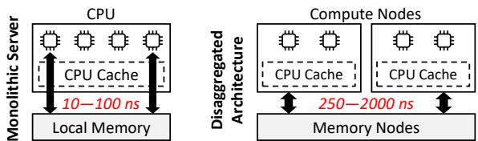  
Figure 1: Memory access latencies in different architectures.

Despite the advantages of DM, caching systems face a critical new challenge: synchronization amplification. While prior work has extensively optimized key-value indexing for DM [43, 45, 46, 63, 71, 85], the efficiency of essential housekeeping tasks, including hotness tracking, eviction, and garbage collection, remains largely unaddressed. In monolithic servers, these tasks are lightweight, leveraging lowlatency (10–100 ns), cache-coherent CPU load/store to access compact metadata. However, in disaggregated architectures (Fig. 1), where MNs lack computational capability [42,43,45,62,79], housekeeping must be offloaded to CNs. This shift introduces cross-node synchronizations over high latency interconnects like CXL (∼350 ns [78]) or RDMA (∼2,000 ns [34]), incurring delays at least 20× higher than monolithic setups. Consequently, the housekeeping synchronization overheads become severe performance bottlenecks, directly interfering with latency-sensitive Get/Set operations. To fully exploit DM’s potential, caching systems need to rethink how to efficiently coordinate housekeeping synchronizations across nodes in DM by overcoming three key challenges:

1) Efficiency–Effectiveness Trade-off in Eviction. While evicting groups of cold objects appears promising for amortizing synchronization costs, its efficacy heavily depends on grouping strategies and workload characteristics. In skewed workloads [7, 12, 13, 75], groups often contain a mix of hot and cold objects, resulting in aggregated group-level hotness metrics that obscure fine-grained object popularity. This can mislead CNs into retaining cold objects grouped with hot ones while evicting uniformly warm groups, degrading cache hit ratios and undermining benefits of batched eviction.

2) Accuracy–Overhead Dilemma in Hotness Tracking. Group-level hotness tracking mitigates synchronization overhead by aggregating metadata updates, but leads to misleading coarse-grained metrics under skew. On the other hand, object-level tracking ensures accuracy but demands frequent fine-grained updates across distributed CNs, reintroducing prohibitive synchronization costs. While First-In-First-Out (FIFO) replacement avoids hotness tracking altogether by enforcing a static eviction order, it ignores access patterns and often results in suboptimal hit ratios [20, 77].

3) Timeliness–Cost Conflict in Synchronization. For hotness-aware eviction to be effective, MNs need to hold up-to-date hotness metrics that accurately reflect dynamic access patterns. In DM, achieving this timeliness demands frequent synchronizations from distributed CNs, incurring substantial network overhead. While delaying synchronizations for batching can amortize costs, it introduces staleness in hotness metrics, causing misidentification of hot/cold objects and ultimately degrading cache performance.

As a result, these fundamental trade-offs leave caching systems struggling to balance management granularity, synchronization efficiency, and eviction effectiveness, remaining open and critical problems in DM environments.

To address these challenges, we present FORGE, a FIFObased group-level caching system on disaggregated memory. By organizing objects into groups sharing similar access patterns, FORGE coalesces the accuracy of object-level tracking with the efficiency of group-level coordination. Specifically, CNs execute Get/Set operations and track fine-grained object hotness to ensure precision, while synchronizing metrics to MNs only in coarse-grained groups to amortize network overheads. Leveraging these fine-grained metrics during group eviction, a lightweight regrouping scheme extracts and consolidates hot objects while filtering out cold ones, ensuring high adaptivity. To enable scalable eviction, FORGE transforms the standard FIFO policy into a contention-free, hotness-aware mechanism via ring-array-based virtual segmentation. By mapping groups to distinct virtual segments based on their hotness, FORGE accelerates the eviction of cold groups while preserving hot ones, effectively improving hit ratios without the synchronization bottlenecks of traditional priority queues.

Our co-design of group-level caching and FIFO replacement introduces a novel lazy synchronization scheme tailored for DM. We observe that synchronized object hotness metrics are not needed immediately upon cache hits but can be deferred until predictable group evictions, triggered as groups approach the head of the FIFO queue. CNs monitor FIFO queue metadata to identify groups nearing eviction and initiate just-in-time hotness flushing, ensuring accuracy while minimizing synchronization frequency. Furthermore, despite the large cache capacity of MNs, the number of objects evicted concurrently remains small, enabling CNs to efficiently leverage the fast on-chip memory of RDMA NICs (RNICs) in MNs as synchronization destinations. This strategy significantly reduces synchronization overhead and mitigates interference with performance-critical Get/Set operations, balancing timeliness, efficiency, and effectiveness.

In summary, this paper makes the following contributions:

• We identify and analyze the critical challenge of synchronization amplification in DM caching systems, where housekeeping synchronizations become a major bottleneck.

• To address this challenge, FORGE introduces three key innovations: 1) DM-tailored group-level management to amortize synchronization overheads; 2) fine-grained object hotness tracking combined with hotness-aware FIFO queue to enhance hit ratios despite group-level eviction; 3) a lazy synchronization mechanism that exploits predictable eviction timing to defer and batch hotness updates, accelerated by RNIC on-chip memory, ensuring both efficiency and timeliness.

• We implement FORGE and perform extensive experiments that show the performance advantages of FORGE over state-of-the-art systems. The source code of FORGE is publicly available at https://github.com/cszjyang/forge.

## 2 Background and Motivation

## 2.1 In-Memory Caching Systems

In-memory caching systems store frequently accessed (hot) objects in fast but limited-size memory and serve Get/Set requests from applications, reducing access latency and offloading backend storage. When the cache is full, replacement algorithms evict less accessed (cold) objects to make room for new ones, maximizing the cache’s utility [20, 38].

Traditional caching systems scale at the granularity of instances on monolithic servers, where compute and memory resources are tightly coupled. This rigid bundling prevents independent scaling of individual resources and often leads to overprovisioning and underutilization. For example, during peak demand, the system launches additional instances to handle the increased load. The new instances bring both compute and memory, even if only one resource type is the bottleneck, leaving the other resource underutilized. Moreover, instancebased scaling often requires expensive data repartitioning and cache warming [5, 21, 23], discouraging frequent resizing.

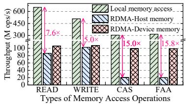

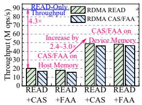  
(a) Performance: Local memory access (b) Performance interference vs. RDMA in Host/Device memory between RDMA verbs  
Figure 2: Performance characteristics of RDMA-based DM.

## 2.2 Adapting Caching Systems to DM

To improve resource utilization in datacenters, Disaggregated Memory (DM) architectures [42, 61] deconstruct monolithic servers by decoupling compute and memory into distinct resource pools. Compute Nodes (CNs) offer abundant CPU cores and limited local memory for temporary buffering, while Memory Nodes (MNs) provide large memory capacity but limited compute power for control-plane operations (e.g., connection management). These pools are interconnected via high-speed links such as CXL [1] and RDMA [2], enabling CNs to directly access remote memory on MNs without involving the MNs’ weak compute units. This decoupled design allows independent scaling of compute and memory by adding CNs or MNs. Moreover, since MNs are shared across all CNs, scaling does not necessitate data repartitioning, simplifying resource management and load balancing.

The demand for elastic scaling makes caching systems ideal for DM. CNs handle compute-heavy tasks including Get/Set requests, hotness tracking, and eviction, while MNs store the cached objects and hotness metrics such as access timestamps (for LRU [20]) and frequency counters (for LFU [38]). The systems independently scale the CNs and MNs on demand, improving performance and resource efficiency.

However, DM introduces fundamental performance challenges. As shown in Fig. 2a, RDMA throughputs are lower than local memory by 5.0–15.8×. Atomic RDMA\_CAS/FAA (compare-and-swap/fetch-and-add) operations are particularly costly due to RNIC serialization: they incur 4–5× higher overhead than basic reads/writes and degrade concurrent RDMA\_READ throughput by 4.3× due to interference (Fig. 2b). Although using RNIC on-chip memory as the RDMA\_CAS/FAA destination can shorten the serialization critical path, improving atomic throughput by 4.9× and reducing interference by 2.4–3.0×, this memory’s scarce capacity (e.g., 256 KB in a Mellanox ConnectX-5 RNIC) limits broader applicability.

These hardware constraints pose a critical challenge for caching systems, which continuously perform housekeeping tasks (hotness tracking, eviction, and garbage collection) to maintain high hit ratios. In DM, ensuring coherence and correctness for these tasks necessitates frequent cross-node synchronization. This requirement transforms housekeeping from lightweight local operations into heavy network burdens that interfere with performance-critical Get/Set operations, severely undermining overall system efficiency.

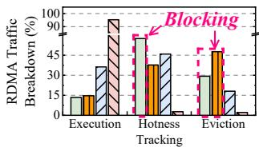

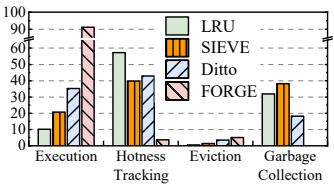  
(a) YCSB with a 10% cache size (b) Twitter with a 10% cache size  
Figure 3: Traffic breakdowns of conventional queue-based (LRU [20] and SIEVE [82]), sampling-based (Ditto [62]) and our (FORGE) caching systems.

Hotness Tracking and Eviction. Existing replacement algorithms broadly fall into two main categories: queue-based and sampling-based. Traditional queue-based schemes (e.g., LRU [20], LFU [38]) maintain a global priority queue (often a linked list). On cache hits, CNs promote accessed objects within the queue; for eviction, CNs remove cold objects at the queue tail. However, such queue manipulations under exclusive locks necessitate a sequence of RDMA\_CAS, RDMA\_READ, and RDMA\_WRITE. For consistency, only one CN can update the queue at a time, forcing other CNs to block and retry under contention. Exacerbated by DM’s high latency [44, 84], such blocking severely degrades concurrency and performance.

Recent algorithms for monolithic servers, like SIEVE [82], mitigate the hit-path overhead of traditional queue-based schemes. Specifically, on every cache hit, a thread checks and sets the object’s visited bit using an atomic operation (e.g., RDMA\_CAS in DM), bypassing the overheads of promoting the object within the queue. However, for eviction, a thread still needs to lock the queue and move a global pointer to sequentially scan the linked objects, reading and clearing their visited bits until an unvisited cold object is found. Although fast in a monolithic server, this scanning is expensive in DM, since it triggers serialized RDMA operations with multiple network round trips while holding the lock, severely inflating eviction latency and blocking other CNs’ concurrent evictions.

To quantify these synchronization overheads, we evaluate LRU and SIEVE on RDMA-based DM using YCSB [19] and real-world Twitter traces [75], with 16 threads on CNs and a 10% cache ratio on MNs. The experimental setup is detailed in § 6. To reduce blocking contention, we partition the queues of both LRU and SIEVE into 32 shards, allowing different CNs to simultaneously operate on different shards. Despite this synchronization optimization, the RDMA traffic in LRU remains overwhelmingly dominated by hotness tracking (57.4%) and eviction (29.2%), vastly exceeding the mere 13.4% consumed by actual Get/Set operations, as shown in Fig. 3a. While SIEVE reduces the hotness tracking traffic (37.7%), it shifts the synchronization bottleneck to the blocking eviction path (47.6%). These findings demonstrate that conventional queue-based policies, though effective in monolithic systems, incur synchronization overheads that are severely amplified into major performance bottlenecks in DM.

To avoid the costly blocking overhead of global queues, state-of-the-art DM systems like Ditto [62] employ samplingbased algorithms [10, 56]. On cache hits, CNs locally accumulate hotness metrics and periodically flush them in batches to MNs using RDMA\_WRITE (for access timestamps) and RDMA\_FAA (for frequency counters). To select eviction candidates, CNs read a random sample of objects via RDMA\_READ, compare their (potentially stale) hotness metrics, and evict the coldest ones using RDMA\_CAS to ensure consistency [62, 81]. Consequently, Ditto eliminates blocking among CNs during synchronization for hotness tracking and eviction, achieving 3.1–5.0× higher throughput than SIEVE in DM.

However, these benefits come with two critical trade-offs. First, while the periodic and batched hotness flushing reduces network traffic, it creates a dilemma: short flushing intervals maintain metric accuracy but limit traffic reduction, whereas long intervals reduce traffic but risk stale metrics leading to erroneous eviction of hot objects. Second, the sampling-based eviction introduces another trade-off: limited sampling may overlook colder objects and reduce hit ratios, while extensive sampling increases RDMA\_READ traffic and overhead. Consequently, these mechanisms struggle to balance synchronization efficiency, metric freshness, and eviction effectiveness. In Fig. 3a, our evaluation of Ditto reveals that hotness tracking and eviction still consume 45.9% and 18.0% of total RDMA traffic, respectively, exceeding the 36.1% for Get/Set executions. These synchronization overheads significantly hinder the scalability and efficiency of state-of-the-art DM systems.

Garbage Collection (GC). In dynamic workloads, object size distributions fluctuate over time [75]. The frequent insertion and eviction of variably-sized objects lead to memory fragmentation, where free space becomes divided into small, non-contiguous fragments dispersed across multiple CNs, making each CN struggle to allocate contiguous space for large objects. Consequently, fragmentation diminishes effective memory utilization and cache hit ratios. To mitigate this, caching systems leverage GC [57] for defragmentation. However, GC in DM necessitates costly cross-node coordination using RDMA\_READ and RDMA\_CAS to track and reclaim fragments. As shown in Fig. 3b, while GC mitigates eviction costs by reclaiming space for new objects, it consumes 31.9%, 38.2%, and 18.3% of traffic respectively in LRU, SIEVE, and Ditto. In contrast, for YCSB workloads with uniform object sizes, GC is unnecessary. These results highlight the persistent tension between fragmentation management and synchronization efficiency in DM caching systems.

## 2.3 Towards Efficient Synchronization

To overcome synchronization bottlenecks, caching systems in DM need to rethink the coordination of housekeeping tasks across distributed CNs. A promising approach involves organizing cached objects into groups, enabling group-level hotness tracking and eviction to amortize synchronization overheads across multiple objects. Moreover, fixed-size group allocation can mitigate memory fragmentation [36]. However, despite these potential benefits, critical challenges remain in realizing practical group-level caching for DM.

C1: Efficiency–Effectiveness Trade-off in Eviction. Despite efficiency, coarse-grained group eviction can be ineffective at retaining hot objects and evicting cold ones. For example, in skewed access patterns [41, 83], aggregated group-level hotness metrics (e.g., access timestamps and frequency counts) often mislead CNs to mistakenly retain skewed groups containing both hot and cold objects, while evicting more uniformly warm groups, thereby reducing hit ratios.

C2: Accuracy–Overhead Dilemma in Hotness Tracking. To avoid inaccurate group-level hotness metrics, caching systems employ accurate object-level tracking. But this requires fine-grained updates of hotness metrics from distributed CNs, reintroducing prohibitive synchronization overheads. Another method is to evict groups in FIFO order, thus avoiding expensive hotness tracking. However, FIFO eviction is unaware of object hotness and often yields low hit ratios [20, 77].

C3: Timeliness–Cost Conflict in Synchronization. For hotness-aware eviction to be effective, the hotness metrics on MNs need to be timely, which requires frequent costly synchronizations from distributed CNs, as analyzed in § 2.2. Delaying and batching synchronization reduces cost but results in stale metrics, leading to misidentification of hot objects.

## 3 FORGE Overview

To address these challenges, FORGE coalesces the strengths of group-level caching and FIFO eviction, and introduces novel DM-friendly designs. Fig. 4 shows the overview of FORGE. To serve application Get/Set requests, CNs access and manage the cached objects on MNs via one-sided RDMA. The MN hash table indexes the cached objects, which are organized into groups based on access patterns (§ 4.1). FORGE decouples operation granularity: performance-critical Get/Set requests operate on individual objects to avoid read/write amplification, while housekeeping tasks are performed at the group level to amortize synchronization overheads.

For a Set request, a CN inserts the object into an allocated group and updates the hash table (§ 4.2). Each group occupies a fixed-size memory chunk to prevent external fragmentation. When a group becomes full (i.e., reaching chunk capacity or a configurable maximum object number such as 256 [74, 76]), the CN pushes the group pointer into the tail of the contentionfree FIFO queue (§ 5.1) on an MN. Upon exhausting groups with available space for insertion, the CN dequeues and evicts cold groups from the queue head to reclaim their space for new allocations. This group-level eviction removes overheads from the critical path of latency-sensitive Get/Set operations, amortizing synchronization costs across multiple objects.

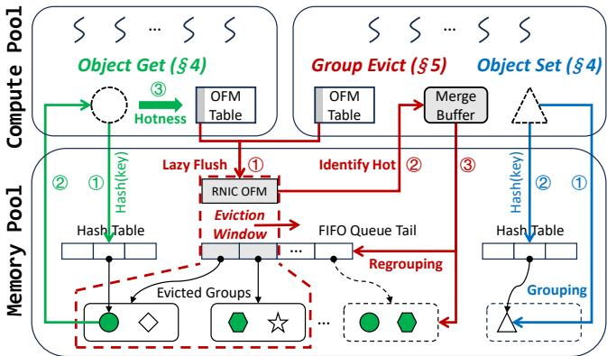  
Figure 4: The overview of FORGE.

For Get requests, all CNs can read objects from any groups (full or partially filled) via the hash table. On cache hits, CNs increase the objects’ frequency counters in their local finegrained Object Frequency Maps (OFMs). These updates are buffered and lazily flushed to MNs at the group level to track global hotness of objects (§ 4.3). This design directly addresses C2: object-level tracking guarantees accuracy, while group-level flushing amortizes synchronization overheads.

To tackle C1, FORGE significantly enhances basic group-FIFO eviction through two key techniques. First, it integrates a lightweight regrouping mechanism. During eviction, CNs fetch synchronized OFMs from MNs to identify hot objects. FORGE’s Two-Way Index Map (§ 5.3) allows CNs to efficiently extract and consolidate only the hot objects for rein sertion, bypassing the overheads of scanning entire groups and querying hash tables. Second, FORGE introduces virtual segmentation (§ 5.4) to infuse the FIFO queue with hotnessawareness, assigning hotter groups to deeper segments within the queue to systematically delay their eviction and prioritize the removal of colder groups. Together, these strategies effectively improve cache hit ratios with minimal coordination.

To resolve C3, FORGE introduces a novel lazy-yet-timely hotness synchronization strategy (§ 5.2) that leverages the predictable, sequential eviction order of the FIFO queue. By anticipating which groups are nearing the queue head and thus imminent eviction, distributed CNs defer flushing fine-grained object hotness metrics (OFMs) until groups enter the eviction window, effectively eliminating unnecessary synchronization traffic. This approach ensures metrics are updated precisely when needed for eviction decisions, balancing freshness and efficiency. Moreover, FORGE directs this synchronized traffic to the fast on-chip memory of RNICs in MNs, which is small but sufficient for handling the limited number of groups within the eviction window, further reducing latency and overhead.

As previewed in Fig. 3, FORGE drastically reduces synchronization overheads, thereby achieving significantly higher throughput and lower latency while improving the cache hit ratio compared with state-of-the-art systems [62].

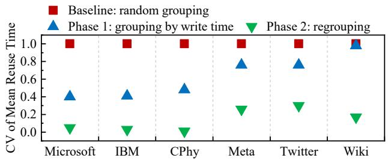  
Figure 5: Similarity of objects grouped by different schemes.

## 4 Grouping Management for Cached Objects

## 4.1 Object Grouping Scheme

FORGE groups cached objects with similar access patterns to enable effective group-level eviction. The rationale is that by collectively evicting groups of cold objects while preserving hot ones, the system can maintain high hit ratios while amortizing synchronization overheads. To enhance intra-group similarity, FORGE adopts a two-phase grouping scheme.

Phase 1: Write-Time Grouping. During Set operations, each CN exploits temporal locality by sequentially inserting newly written objects into a group with available space, ceasing additions once the group reaches capacity. This approach leverages empirical findings that objects written contemporaneously often exhibit correlated access patterns [59, 74, 76]. Moreover, this method remains application-agnostic by relying exclusively on object write time, a universally available and lightweight attribute. This design ensures broad generalizability without requiring prior knowledge of object semantics or access characteristics.

Phase 2: Hotness-Based Regrouping. When a group reaches eviction, the hotness metrics accumulated over its lifecycle serve as a robust indicator of object access patterns. FORGE leverages these metrics to identify and extract hot objects from the evicted group, merging them into a new hot group for reinsertion. This strategy effectively consolidates frequently accessed objects while filtering out colder ones, thus enhancing cache efficiency with minimal synchronization overhead.

To validate the grouping effectiveness, we measure intragroup similarity using the real-world workloads in §6. We calculate the coefficient of variation (CV, standard deviation divided by the mean) of object reuse times within the same group, where a lower CV indicates higher similarity. Fig.5 reports the average CV of 10,000 groups of 256 objects under three schemes: 1) random grouping, 2) Phase-1 write-time grouping, and 3) Phase-2 hotness-based regrouping. The results show that Phase-1 grouping improves intra-group similarity over random grouping, while Phase-2 regrouping further refines it. Similar trends hold for the other group sizes (16–1024 objects), but the results are omitted due to space limitation. As a result, the two-phase grouping scheme enables FORGE to evict cold objects in batches while preserving the hot ones with similar access patterns for future reuse.

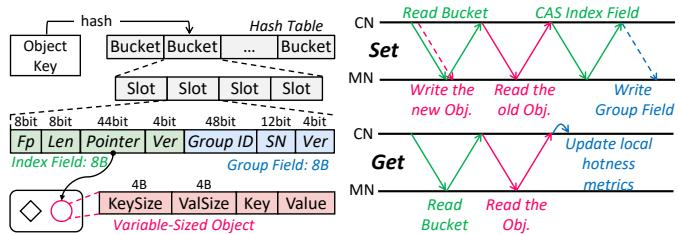

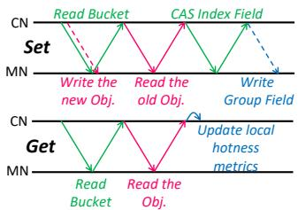  
Figure 6: The data structures Figure 7: The workflows of of the hash table and object. Set and Get operations.

## 4.2 Grouping-Aware Caching Operation

To ensure low latencies and high throughputs for caching systems in DM, FORGE proposes performance-critical Get/Set operations to become lock-free and non-blocking, while sup porting efficient group-level management.

As shown in Fig. 6, each slot in the hash table in MNs contains two atomic 8-byte fields, i.e., the index field and group field. The atomic index field contains a 1-byte fingerprint (fp) of the object key for quick filtering, a 1-byte object length in the granularity of fixed-size memory blocks (e.g., 256 bytes), and a pointer to an object in MNs. The atomic group field contains the object’s group ID, and an intra-group sequence number (SN). The group ID is the unique key of the group determined at group allocation time, while intra-group SN indicates the object’s insertion order within the group.

Lock-free insertion typically uses pointer swapping: CN writes an object to MN and then atomically installs the pointer into the index using RDMA\_CAS [46, 52, 62, 85]. But since RDMA\_CAS works on 8-byte granularity, it cannot update both the index and group fields simultaneously. A naive solution, i.e., locking the slot to atomically update both fields, would block concurrent accesses and degrade Get/Set performance.

FORGE employs lightweight versioning to ensure nonblocking progress and consistency without locks. Each slot in the system includes a 4-bit version number for both its index and group fields. During a Set operation, the CN first updates the index field with an incremented version number and later updates the group field to match the version. This two-phase versioning mechanism guarantees that subsequent Get operations can safely read consistent group information by verifying version matches, eliminating the need for locks while maintaining data integrity and high concurrency.

Version-Assisted Lock-Free Set. Fig. 7 shows the processing of Set operations. In the first Round Trip Time (RTT), a CN issues an RDMA\_READ to fetch the hash bucket that the object key corresponds to, and in parallel writes the object to a group with available space in MNs (Phase-1 grouping in § 4.1). The CN then scans fp-matched slots in the fetched bucket and follows pointers to read objects and identify a key match. If a key-matched slot is found, the CN sends RDMA\_CAS to update the slot’s index field with the new object pointer and an incremented version number. If not matching, an empty slot is selected and updated in a similar manner. Upon a successful RDMA\_CAS, the CN asynchronously issues an RDMA\_WRITE to update the group field with the object’s group ID, SN, and a version number matching the index field. Since the CN does not need to wait for the final asynchronous RDMA\_WRITE to complete, the group-level management does not cause additional RTTs to the critical path of Set operations.

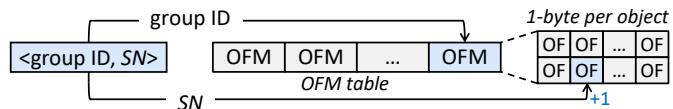  
Figure 8: Object hotness tracking in the CN-side OFM table.

Version-Assisted Lock-Free Get. As shown in Fig. 7, the workflow of Get is similar to Set when locating the object with the target key, except that Get does not write a new object or update the slot. Since the Set operation atomically updates the index fields using RDMA\_CAS, the Get operation can always follow the pointer to read the consistent and up-to-date object data without blocking. Upon locating a target object (i.e., a cache hit), the CN verifies that the version numbers of the object’s index and group fields match, ensuring both correspond to the same atomic Set operation. In rare cases where a Get operation races with a concurrent Set, it may transiently observe a stale version in the group field, when the Set has updated the index field via RDMA\_CAS but its asynchronous RDMA\_WRITE to the group field is still in flight. This timing window is inherently brief (spanning one RDMA RTT of a few µs) and does not compromise correctness, since the index field that is updated first always references consistent object data. When versions match, the CN extracts the object’s group ID and intra-group SN from the group field to accurately track hotness, maintaining integrity without locking.

## 4.3 Group-Based Object Hotness Tracking

As shown in Fig.8, a CN tracks object hotness by increasing access counters in a local Object Frequency Map (OFM) table. Specifically, each OFM corresponds to a group, structured as a compact 1-byte-per-object frequency array indexed by the intra-group SN. This layout ensures that the i-th counter directly maps to the i-th object within the group. Prior to group eviction, OFMs buffered across distributed CNs are flushed to MNs to synchronize global hotness metrics. The OFM design offers the following key advantages in DM architectures.

CN-Side Memory Efficiency. CN local memory is scarce, necessitating efficient utilization [43, 45, 46]. Existing objectlevel systems [62] waste limited CN memory by storing object keys to index buffered hotness metrics, which is inefficient given that real-world keys are often long (e.g., ≥38 bytes for 50% of objects at Twitter [75]). FORGE addresses this inefficiency via its OFM table, which indexes metrics using compact group IDs and intra-group SNs. Since SNs serve as implicit offsets within arrays, they require no explicit storage, eliminating key-induced memory bloat. This design dramatically reduces the metadata footprint: a mere 1GB table can track hotness for one billion objects, maximizing CN memory efficiency while maintaining full hotness tracking capability. Network Efficiency. Since the 1-byte-per-object frequency counters within a group are stored contiguously, the counters for 8 objects can be flushed in a single 8-byte RDMA\_FAA, significantly reducing synchronization traffic.

In DM caching, timely synchronization of hotness metrics from distributed CNs to MNs is critical. Without this, stale metrics on MNs cause hot objects to be misidentified as cold, inducing erroneous evictions and degraded hit ratios. Stateof-the-art systems [62] rely on random sampling to select eviction candidates, which makes future metric needs unpredictable and forces periodic synchronization, resulting in a dilemma: short intervals increase overhead, while long intervals risk staleness. In §5.2, FORGE resolves this dilemma by leveraging the predictable FIFO eviction order to enable lowoverhead lazy synchronization of hotness metrics precisely when needed, ensuring accuracy without unnecessary traffic.

## 5 FIFO-Based Replacement for Groups

FORGE adopts a group-level FIFO replacement to overcome the synchronization amplification in DM. First, evicting groups in FIFO order avoids inefficient random sampling and expensive per-object evictions in DM. Moreover, the strict FIFO order prevents unfair group evictions misled by highly aggregated group-grained hotness metrics. Furthermore, the predictability inherent in FIFO eviction unlocks novel and efficient synchronization schemes in DM.

## 5.1 Contention-Free FIFO Management

Conventional FIFO queues structured as linked lists [8, 31, 82] require exclusive locks to serialize concurrent operations. Akin to LRU as analyzed in § 2.2, this serialization imposes a severe bottleneck in DM by allowing only a single CN to progress while others are blocked. FORGE eliminates this contention by structuring the queue as a lock-free ring array.

As shown in Fig. 9, the FIFO queue on an MN is organized as a ring array of N contiguous nodes. For convenience, we denote the i-th node in the ring array as A[i]. The 4-byte head cursor points to the FIFO head node A[head mod N], which becomes the oldest in the queue and will be dequeued next. The tail cursor points to A[tail mod N] where the next FIFO node will be enqueued. Crucially, the two cursors are packed into an 8-byte aligned word on the MN to enable RDMA\_FAAbased contention-free FIFO enqueue and dequeue as follows.

When a group reaches capacity, the CN filling it enqueues a FIFO node referencing the group by first performing an

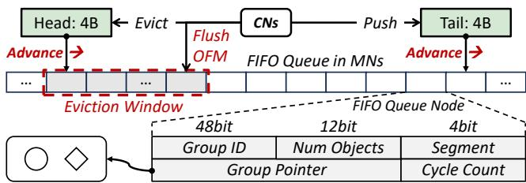  
Figure 9: The CN-driven FIFO queue management.

RDMA\_FAA to atomically advance the tail cursor by one and retrieve the oldTail value. The CN then issues an asynchronous RDMA\_WRITE to populate the FIFO node at A[oldTail mod N] with the queue cycle count (⌊oldTail/N⌋), the group’s unique ID, the number of grouped objects, and a pointer to the group’s location, thereby efficiently linking the group to the queue.

When a cache is full, a CN evicts cold groups in the eviction window starting from the FIFO queue head. Specifically, the CN dequeues FIFO nodes by advancing the head cursor by k (e.g., 4) with RDMA\_FAA and reads the k FIFO nodes starting at A[oldHead mod N] via RDMA\_READ. To ensure consistency, the CN verifies whether the fetched FIFO nodes belong to the current queue cycle by comparing their cycle counts against the expected cycle. Any mismatch indicates an unfilled or stale node from the last cycle, prompting the CN to retry the fetch. Once consistency is ensured, the CN uses the metadata in the fetched FIFO nodes to conduct group-level evictions. A Segment field in the FIFO node enables hotness-aware optimizations during eviction to improve hit ratios (§ 5.4).

In state-of-the-art systems [62], multiple CNs can independently sample and then race to evict the same cold objects using RDMA\_CAS, where only one CN succeeds while the others suffer failed attempts and retry overhead under contention. In contrast, our RDMA\_FAA-based management is contentionfree. Each atomic RDMA\_FAA on the cursors succeeds without retries and returns a unique old value, ensuring that multiple CNs can concurrently and safely enqueue and dequeue groups without locks or RDMA\_CAS-retry loops. This design substantially reduces atomic operation overhead, thereby mitigating interference with performance-critical Get/Set executions.

## 5.2 Lazy Hotness Synchronization

To maintain high hit ratios, accurate hotness metrics (tracked via OFMs in § 4.3) are important for identifying hot objects during eviction. However, synchronizing OFMs from distributed CNs to MNs eagerly upon every cache hit incurs significant overheads. To achieve high efficiency, we observe that the synchronized hotness metrics are not necessary right away upon cache hits, but only later during evictions, whose timing is predictable in the FIFO-based replacement.

Our key insight is that, under FIFO-based replacement, a group only becomes eligible for eviction once its corresponding FIFO node enters the eviction window near the queue head (Fig. 9). For groups outside this window, CNs track OFMs locally without synchronization, avoiding unnecessary DM traffic. When a group’s FIFO node enters the eviction window, CNs proactively flush their buffered OFM updates for that group to MNs using efficient batched operations, i.e., one RDMA\_FAA per 8 counters. This flush-on-entry strategy ensures that by the time a CN dequeues the FIFO node to evict the target group, the group’s OFM on MNs has been globally synchronized across all CNs, providing accurate hotness metrics for informed eviction decisions.

However, if the eviction window is too small, a group may be quickly evicted after entering the window, before CNs can timely detect its entry and flush the buffered OFMs. FORGE prevents this detection failure by determining a safe eviction window size that guarantees CNs have sufficient time to detect new groups and flush their OFMs before eviction.

Robustness via Physical Bounds. To determine the window size, we analyze the maximum eviction rate under a worstcase write-miss workload (i.e., 0% hit ratio), where each operation is a cache-miss Set involving at least 2 RDMA\_WRITE, 1 RDMA\_READ, and 1 RDMA\_CAS. As shown in Fig. 2a, RNIC throughput limits are 107 Mops/s for WRITE, 88 Mops/s for READ, and 20 Mops/s for CAS. Consequently, the through 1 put bottleneck of cache-miss Set becomes: ≈ 12Mops/s = 12ops/µs. Thus, in each µs, at most 12 new objects are inserted and the other 12 are evicted. Suppose the eviction window holds 16 groups and each group contains 256 objects, evicting them all consumes at least 16×256 ≈ 341 µs. 12 Therefore, CNs only need to check the eviction window every 100 µs, providing a 3.4× safety margin over the maximum eviction rate, to ensure timely OFM flushing before group eviction. In practice, real-world workloads [9, 53, 69, 75] ex hibit higher hit ratios than this worst case and consequently lower eviction rates, permitting even more relaxed detection intervals. For system configurations (e.g., more RNICs per MN) that sustain higher maximum eviction rates, FORGE dynamically adjusts both the eviction window size and detection intervals to ensure robust and timely synchronization.

In every detection interval (e.g., 100 µs), each CN issues one probing RDMA\_READ to fetch the current FIFO head value headNow, in parallel with normal Get/Set RDMA RTTs to minimize detection overhead. The CN compares headNow with the previous value headLast from the last detection interval. If headNow > headLast, headNow−headLast new FIFO nodes have entered the eviction window. In this case, the CN issues another RDMA\_READ to fetch these FIFO nodes in the eviction window, extracts their group IDs, and flushes the corresponding buffered OFMs from the CN to MNs using one RDMA\_FAA per 8 bytes. This design ensures each CN incurs negligible detection overhead, while all groups’ OFMs are lazily yet timely synchronized before evictions.

Acceleration via RNIC Device Memory. Our analysis of the maximum eviction rate reveals an insight: although the cache capacity in MNs could be large, the number of objects concurrently evicted by CNs remains small. Our FIFO-based replacement further confines concurrent evictions to a limited number of objects within the eviction window. This eviction locality enables FORGE to leverage the fast yet limited (256KB) on-chip device memory of RNICs in MNs to accelerate synchronization of hotness metrics (OFMs).

Based on this insight, CNs direct their synchronization traffic to a dedicated region (e.g., 16 KB) in the on-chip memory of the RNIC in MNs. This region is organized as an OFM Ring Array (short for RA) and consists of M contiguous OFMs. The value of M is configured to exceed the number of groups in the eviction window. This is highly practical, since a 16KB buffer can accommodate 1-byte-per-object OFMs for up to 16K objects, which are 4× more than the 16 groups of 256 objects in the eviction window. When the FIFO node A[i mod N] enters the window, CNs flush the buffered OFM of the corresponding group to RA[i mod M] via RDMA\_FAA. Furthermore, the head and tail cursors of the FIFO queue, occupying only 8 bytes, are also maintained in RNIC on-chip memory to accelerate RDMA\_FAA-based enqueue and dequeue.

As shown in Fig. 2, this on-chip synchronization reduces RDMA\_FAA overhead by up to 5× and alleviates performance interference with concurrent Get/Set executions. Importantly, while most commodity RNICs provide such on-chip memory, this acceleration is an optimization, not a dependency. If onchip memory is unavailable, FORGE seamlessly places the OFM Ring Array and cursors in MN host memory while preserving correctness and the benefits of lazy synchronization.

## 5.3 Lightweight Object Regrouping

When a CN evicts a batch of k (e.g., 4) groups by advancing the FIFO head (obtaining oldHead), it fetches the corresponding k FIFO nodes starting from A[oldHead mod N] and their fully synchronized OFMs starting from RA[oldHead mod M]. The CN then zeroes out these OFM locations in RA via RDMA\_WRITE, initializing them for future reuse in the ring.

Guided by the access frequencies in the fetched OFMs, the CN ranks the objects across the k evicted groups and consolidates the hottest objects into a new group until it becomes full (Phase-2 regrouping in § 4.1). As shown in Fig. 10, this process entails a sequence of parallelized operations: reading hot objects from their original locations, compacting them into a consolidated buffer, writing the new group to the MN, and updating the corresponding hash table slots to reference the objects’ new locations.

However, this process faces a critical performance challenge: locating specific objects and their hash table slots is prohibitively expensive without fine-grained indexing. A straightforward approach would be to read the entire group chunk via RDMA\_READ, scan it sequentially to extract object keys, and then perform a hash table lookup for each key. Such a strategy is impractical due to generating excessive network traffic, fundamentally undermining FORGE’s efficiency.

(a) Queue segmentation (b) Ring-array-based segmentation  
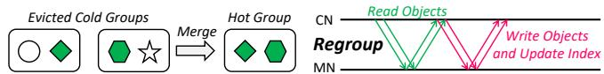  
Figure 10: Regrouping hot objects from evicted groups.

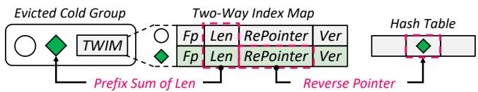  
Figure 11: The Two-Way Index Map for regrouping.

To enable lightweight regrouping, FORGE introduces a Two-Way Index Map (TWIM) embedded at the tail of each group’s chunk. As shown in Fig. 11, the TWIM is an array where each 8-byte entry corresponds to an object indexed by its intra-group SN. Each TWIM entry mirrors the object’s index field in the hash table but replaces the object pointer with a reverse pointer to the object’s hash table slot. The TWIM is constructed by the CN that populates the group, allowing object start offsets within the group to be calculated by summing preceding object lengths stored in the TWIM.

With the aid of TWIM, regrouping becomes highly efficient. When evicting a group, the CN uses FIFO node metadata to derive the TWIM address (GroupPointer +ChunkSize − NumOb ject × 8) and fetches the OFM and TWIM in parallel. The OFM identifies the SNs of hot objects, while the TWIM provides their exact data locations and index slot addresses. This allows the CN to only read the necessary hot objects and update their index slots with minimal RDMA operations, eliminating costly full-group scanning and hash table lookups.

## 5.4 Hotness-Aware FIFO Queue

Although the contention-free FIFO queue minimizes synchronization overheads for replacements, its assumption that older objects are colder does not always hold. Many real-world workloads exhibit skewed access patterns [7, 12, 13, 75]: older objects can remain frequently accessed, while newly inserted ones are often short-lived [77]. As a result, plain FIFO often achieves lower hit ratios than adaptive schemes like LRU [20].

To improve adaptability, FORGE partitions the FIFO queue into segments to prioritize evicting cold objects. Groups are inserted into different segments based on their hotness: the hotter a group is, the farther from the head it is placed. For example, groups in Phase-1 containing likely-cold new objects are inserted into the first segment (i.e., Segment 0 in Fig. 12a), near the head and thus evicted quickly. In contrast, a merged group in Phase-2 is likely hotter and thus inserted into the deeper segments (e.g., Segments 1 or 2) according to its aggregated access frequency, delaying their eviction. Consequently, the groups with colder objects are evicted sooner than hotter ones, thus increasing the proportion of hot objects retained in the cache. However, this segmented FIFO queue requires a linked-list-based structure that allows random insertion, limiting only one CN holding the lock to modify the queue, while other CNs are blocked. This conflicts with FORGE’s contention-free ring-array design.

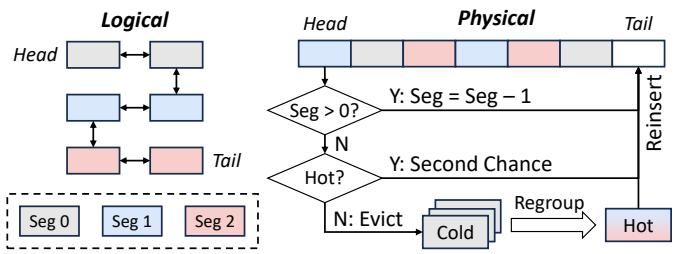  
Figure 12: The virtual segmentation of the FIFO queue.

To avoid this conflict, FORGE adopts virtual segmentation on top of its contention-free ring array by embedding a Segment field in each FIFO node. As shown in Fig. 12b, CNs simulate segment-based insertion by assigning Segment values to FIFO nodes while physically enqueuing them at the queue tail. Phase-1 groups are enqueued with Segment = 0, and Phase-2 merged groups are enqueued with Segment > 0.

When a FIFO node with Segment > 0 is dequeued, its group is not evicted. Instead, the CN decrements its Segment value and reinserts it into the queue tail. Only nodes with Segment = 0 are considered for eviction. Before eviction, the CN inspects the group’s OFM: if most objects are active (e.g., over half the counters are non-zero), the group is reinserted rather than evicted, and the CN proceeds to the next candidate. This reinsertion avoids unnecessary regrouping for hot objects already co-located in one group, and speeds up the eviction of subsequent groups with more cold objects. Moreover, since the OFM is zeroed out upon fetch (§ 5.3), the reinsertion restarts the group’s hotness tracking from zero for the next eviction cycle, preventing stale metrics from accumulating indefinitely. Overall, virtual segmentation enables hotness-aware eviction while preserving FORGE’s ring-array structure for efficient synchronization.

## 5.5 Discussions

Support for multi-queue designs. Prior work [22, 28, 32, 33, 77] employs multiple queues to filter out unpopular objects and mitigate cache pollution. As an orthogonal optimization, FORGE also incorporates this approach by maintaining a 20% small FIFO queue and an 80% main FIFO queue. Each queue is independently managed with our virtual segmentation and lazy hotness synchronization, accelerated via RNIC on-chip memory. New groups first enter the small queue. When the small queue is full, its head group is either promoted and reinserted into the main queue if hot, or evicted and merged if cold. The main queue applies the same policy when full. Considerations for tiered caching. In addition to MN-tier caching, CNs can leverage their limited local memory to cache objects, thereby accelerating Get/Set operations. However, hotness tracking, eviction, and GC in the MN tier still require cross-CN synchronization to ensure coherence and consistency. Therefore, the relative synchronization cost can become even higher in systems with CN-tier caching, further highlighting the motivations and benefits of FORGE’s synchronizationefficient mechanisms for managing the global tier on MNs. FORGE currently does not employ CN-tier caching, aligning with state-of-the-art systems [62] for fair comparisons.

Adaptability to CXL-based DM. While FORGE primarily focuses on RDMA-based DM and assumes one-sided RDMA verbs, its design principles are potentially applicable to CXL based DM using memory-semantic instructions. Recent research [29, 30] indicates that CXL shared memory pools introduce new architectural constraints for cross-CN coherent synchronization. As a result, caching systems like Ditto [62], which rely on fine-grained synchronization for object-level housekeeping, may encounter scalability bottlenecks due to excessive synchronization traffic. In contrast, FORGE significantly reduces cross-node synchronization demand through coarse-grained group management and lazy hotness flushing, making it highly adaptable to the architectural constraints of future CXL environments.

## 6 Performance Evaluation

## 6.1 Experimental Setup

Testbed. We conduct our evaluation on a cluster of 6 machines (3 CNs and 3 MNs), each with two Intel Xeon Gold 6230R CPUs, 256 GB DRAM, and a 100Gbps Mellanox ConnectX-5 RNIC connected to a 100Gbps InfiniBand Switch.

Comparisons. We compare FORGE with three state-of-theart systems, Ditto [62], S3-FIFO [77], and GL-Cache [74]. Ditto [62] represents the state-of-the-art in DM caching systems, employing sophisticated object-level hotness tracking and sampling-based eviction. Similar to LeCaR [68], CNs utilize multiple eviction policies (e.g., LRU and LFU), select the highest-weight policy to predict the utility of sampled objects, and evict the lowest-utility objects. CNs maintain a history of recently evicted objects, which they use to adjust policy weights to correct mispredictions. S3-FIFO [77] is the latest object-level replacement algorithm. It uses multiple FIFO queues to filter out unpopular objects and promote hot objects through the queues. GL-Cache [74] is an efficient group-level caching system. It uses decision trees to predict the utility of sampled groups based on their group-level hotness metrics and evicts those with the lowest predicted utility.

However, S3-FIFO and GL-Cache are designed for traditional monolithic servers and cannot directly work on DM. Thus, based on their original papers [74, 77], we faithfully re-implement them on RDMA-based DM (i.e., S3FIFO-DM and GLCache-DM). For fair comparisons, we further enhance them with DM-relevant designs proposed by FORGE, including lock-free Get/Set operations, contention-free FIFO management, asynchronous and batched RDMA for hotness flushing, and lightweight object regrouping. In GLCache-DM, CNs periodically flush collected training data (e.g., group hotness metrics and utility scores) to MNs, where decision trees are asynchronously retrained to avoid blocking CNs. Although SIEVE [82] is another prominent FIFO-based algorithm for monolithic servers, our analysis in § 2.2 demonstrates its severe synchronization bottlenecks in DM due to serialized doubly-linked queue scanning. As a result, SIEVE-DM delivers 3.1–5.0× lower throughput than Ditto. In contrast, our enhanced S3FIFO-DM leverages a contention-free ring-array to mitigate these synchronization bottlenecks, making S3FIFO-DM a much stronger and robust representative for object-level FIFO schemes throughout our evaluation. All the evaluated systems are implemented in C/C++. Since Ditto’s open-source prototype only supports a single MN, we use one MN for fair comparisons across all four systems, and further evaluate the other three systems with multiple MNs in §6.5.

Configurations. We use the recommended configurations of all baselines, e.g., a sample size of 5 and a history size of 1024 for Ditto [62], a 10% small queue and an object frequency ceiling of 3 for S3-FIFO [77], 7-dimensional grouplevel hotness metrics and XGBoost-based [16] decision trees for GL-Cache [74]. For FORGE and GLCache-DM, the group size is 64 objects, and each eviction merges 8 groups. We analyze the sensitivity of FORGE to group sizes in §6.6.

Workloads and Methodology. The YCSB [19] workloads with a Zipfian distribution (θ = 0.99) include: A (50% GET, 50% UPDATE), B (95% GET, 5% UPDATE), C (100% GET), D (95% GET, 5% INSERT), and E (95% SCAN, 5% INSERT). The real-world workloads cover object stores from Wikimedia [64] and IBM [25], block I/O from CloudPhysics [69] and Microsoft Research Cambridge [53], and key-value caches from Twitter [75] and Meta [9]. Each workload comprises up to 100 million requests, while the IBM workload contains 10–40 million requests due to trace limitations. Before evaluation, we warm up the cache with the first 20% of requests. Following state-of-the-art methodologies [62, 74, 77, 82], we evaluate the cache as a closed system with on-demand fill, where each Get miss includes the overhead of an uncounted Set. This setup provides performance isolation and generality across storage backends. We further analyze the sensitivity of system performance to different miss penalties in §6.6.

## 6.2 Performance in YCSB Workloads

We evaluate the four systems under YCSB workloads with 256-byte objects and a 20% cache size, a standard setting in DM caching [62]. The performance trends and bottlenecks remain consistent with the smaller 10% cache ratio in Fig. 3. We vary the number of threads across 3 CNs from 16 to 256.

As shown in Fig. 13, Ditto and S3FIFO-DM exhibit the worst throughputs and latencies, bottlenecked by the costly object-level synchronizations. Their CNs frequently synchronize object hotness updates to MNs when cache hits, creating significant RDMA traffic (corroborating the traffic breakdown in Fig. 3) that interferes with Get/Set and inflates P50 latencies. Ditto embeds the hotness metadata in hash buckets to facilitate tracking and sampling, but the enlarged hash buckets increase the RDMA payload of each index lookup. Moreover, on cache misses, their object-level eviction mechanisms lie on the critical path and lead to high P99 latencies. In Ditto, the random sampling and RDMA\_CAS-based eviction incur large overheads and contention-induced retries. S3FIFO-DM, despite being improved by using our contention-free FIFO queue, still suffers from high eviction overheads because its policy requires intensive RDMA operations to demote cold objects and promote hot ones through multiple queues.

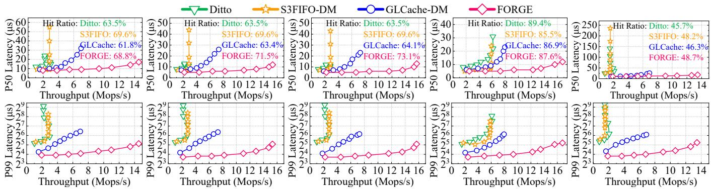  
(a) YCSB A-20%  
(b) YCSB B-20%  
(c) YCSB C-20%  
(d) YCSB D-20%  
(e) YCSB E-20%  
Figure 13: Throughputs, 50th (upper) and 99th (lower) percentile latencies of systems in YCSB workloads at 20% cache sizes.

GLCache-DM and FORGE remove the group-level hotness tracking and eviction from Get/Set critical paths and signif icantly reduce synchronization traffic. Thus, they achieve higher throughputs and lower latencies than Ditto. However, like Ditto, GLCache-DM suffers from inefficient sampling and retry under contention, and the buffered hotness metrics need to be synchronized at intervals to avoid stale metrics on MNs. Moreover, each inference of the decision trees consumes hundreds of microseconds of CN CPU cycles. Consequently, the performance of GLCache-DM is still constrained.

FORGE excels by eliminating synchronization bottlenecks. Its contention-free FIFO management eliminates the inefficient sampling that plagues Ditto and GLCache-DM. Its version-assisted lock-free index and TWIM-based lightweight regrouping overcome the potential inefficiency of coarsegrained group management. More critically, FORGE’s lazy synchronization ensures that hotness metrics are flushed justin-time for eviction, radically reducing synchronization traffic (validating the benefits previewed in Fig. 3) without sacrificing metric accuracy. Consequently, FORGE achieves 2.0– 8.7× higher throughput, 1.3–5.9× lower P50 latency, and 3.9–13.3× lower P99 latency than all baselines.

FORGE demonstrates superior cache performance, achieving hit ratios in the top two across workloads. Its lazy synchronization equips CNs with globally accurate hotness information, enabling precise eviction decisions and the effective identification and reinsertion of hot objects. In contrast, the hit ratios of Ditto (and GLCache-DM) are hampered by their dependence on random sampling and stale (or misleading groupgrained) hotness metrics, with read-latest YCSB D being an exception where their recency-aware algorithms like LRU align well with the access pattern. Although S3FIFO-DM also benefits from accurate metrics, FORGE maintains a hit ratio advantage in YCSB B–E by augmenting the FIFO foundation with a hotness-aware virtual segmentation that proactively evicts colder groups within the same queues, adapting better to shifting access patterns. The write-intensive YCSB A proves challenging for all grouping methodologies, yet FORGE sustains a highly competitive stance. These collective results validate that FORGE’s synchronization efficiency delivers comprehensive system improvements, boosting not only throughput and latency but also enhancing hit ratios.

## 6.3 Performance in Real-World Workloads

We evaluate the four systems with real-world workloads from CloudPhysics (CPhy), Wikimedia (Wiki), Microsoft Research Cambridge (MSR), and IBM, using 128 threads across 3 CNs. Aligned with the setup in Ditto’s paper [62], object sizes are fixed at 256 bytes, while cache sizes are varied among 5%, 10%, and 20% of the trace footprints.

As shown in Fig. 14, the performance of both Ditto and S3FIFO-DM remains constrained by their costly object-level synchronization mechanisms. In particular, S3FIFO-DM delivers the lowest throughput and highest latency in most cases. Its eviction policy necessitates frequent object demotion and promotion across multiple queues. Such frequent queue management triggers a high volume of atomic RDMA\_FAA operations, which are especially expensive and significantly interfere with performance-critical Get/Set as shown in Fig. 2.

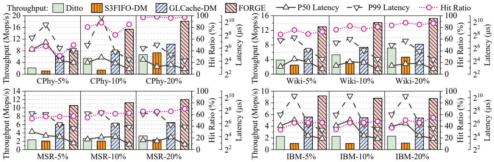  
Figure 14: Throughputs, latencies, and hit ratios in real-world workloads at 5%, 10%, 20% cache sizes with fixed object sizes.

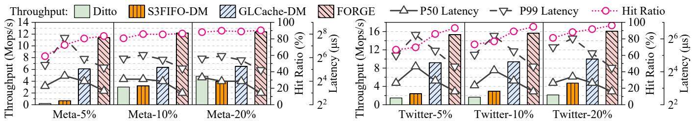  
Figure 15: Throughputs, latencies, and hit ratios in real-world workloads at 5%, 10%, 20% cache sizes with variable object sizes.

In CPhy with a 5% cache size (short for CPhy-5%), the small cache cannot hold enough groups for GLCache-DM to train reliable decision trees, impairing the model’s robustness and reducing eviction effectiveness and hit ratios. In CPhy-20%, the large cache and skewed access pattern lead to high hit ratios (≈96%) for all systems. Higher hit ratios reduce eviction frequency and overhead, thereby improving the throughputs and latencies of all systems. However, despite lower rates of eviction and random sampling, the eviction timing of any specific object (and group) in Ditto (and GLCache-DM) remains unpredictable. Therefore, CNs in both systems still need to periodically flush buffered hotness metrics to MNs, incurring DM traffic and limiting performance.

In contrast, FORGE synchronizes hotness just-in-time for eviction, thereby adapting to dynamic hit ratios. Leveraging this lazy mechanism, CNs flush metrics only when a new group enters the eviction window. Under high hit ratios in CPhy-20%, evictions are rare, and new groups enter the eviction window slowly. Consequently, the lazy synchronization is infrequent, improving the throughput and latency of FORGE. On the other hand, under low hit ratios in workloads like IBM, evictions occur more frequently to make room for new objects, triggering more rapid hotness synchronization to maintain metric accuracy. This adaptive approach, combined with efficient FIFO-based hotness-aware group eviction, drastically reduces synchronization overheads while maintaining high hit ratios. As a result, compared with Ditto and GLCache

DM, FORGE achieves 1.3–4.5× higher throughput, 1.2–4.0× lower P50 latency, and 1.2–7.5× lower P99 latency across workloads, with an average 1.14× improvement in hit ratios.

## 6.4 Robustness to Memory Fragmentation

We evaluate the systems in real-world workloads from Meta and Twitter with their dynamic object sizes, using 128 threads across 3 CNs. To establish a stringent baseline for comparison, we enhance the object-level systems (Ditto and S3FIFO-DM) with a slab-based allocator that organizes object blocks into 24 size classes, a standard technique to mitigate external fragmentation [11, 24]. Even with this enhancement, Fig. 15 shows that their performances sharply degrade under small cache sizes (e.g., Meta-5% and Twitter-5%). This is because object-level evictions divide free memory into small, disjoint fragments reclaimed by multiple CNs. Each CN struggles to allocate contiguous memory for large objects, reducing effective memory utilization and lowering hit ratios. With larger cache capacities (e.g., Meta-20% and Twitter-20%) mitigating fragmentation, the performances of Ditto and S3FIFO-DM recover but remain fundamentally constrained by their costly object-level hotness tracking, evictions, and GC.

In contrast, GLCache-DM and FORGE perform evictions and space reclamation at group granularity, avoiding external fragmentation and achieving robustness under dynamic object sizes. Furthermore, FORGE’s enhanced FIFO eviction and lazy synchronization mechanisms give it a performance advantage. Compared with GLCache-DM (the best baseline), FORGE achieves 1.61–1.93× higher throughput, and reduces P50 and P99 latency by 1.43–2.00× and 1.67–1.95× respectively, with 1.02–1.09× improvements in hit ratios. Since the workloads contain large objects, both systems are ultimately bottlenecked by the single MN’s finite network bandwidth.

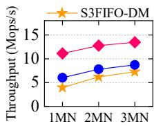  
(a) 100 CN threads

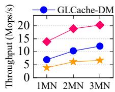  
(b) 200 CN threads

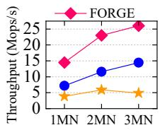  
(c) 300 CN threads  
Figure 16: The scalability of systems with CNs and MNs in the Meta workload at 20% cache sizes.

## 6.5 Scalability Analysis

Our scalability evaluation employs the Meta workload with a 20% cache size, scaling MNs from 1 to 3 and varying the thread count across 3 CNs from 100 to 300; Ditto is excluded as its open-source prototype lacks multi-MN support, and its CN scalability was previously assessed in §6.2. As depicted in Fig. 16, both FORGE and GLCache-DM demonstrate excellent scalability, where adding MNs increases aggregate network bandwidth, alleviating the network bottleneck and boosting throughput. This improvement is marginal under low thread counts (e.g., 100) where systems are computebound, but becomes pronounced with abundant CN threads (e.g., 300) where network bandwidth is the primary constraint. The non-linear compute scaling with thread count stems from overheads and resource contention in Hyper-Threading [48]. S3FIFO-DM scales poorly due to exacerbated memory fragmentation under scale. Ultimately, FORGE’s highly efficient synchronization design enables it to outperform GLCache-DM (the best baseline) by 1.54–2.02× across configurations.

## 6.6 Sensitivity Analysis

We evaluate FORGE’s sensitivity to group size and cache miss penalty in CPhy-20% and IBM-20%, the workloads with the highest and lowest hit ratios in § 6.3, respectively.

Group Size. As shown in Fig. 17a, in the low-hit-ratio IBM workload, where evictions occur frequently, larger groups better amortize eviction overheads and thus yield higher through put. Conversely, smaller groups can maintain higher intragroup access similarity, leading to slightly better hit ratios. In the high-hit-ratio CPhy workload, where evictions are rare, performance is largely insensitive to group size. These results show that FORGE is robust across different group sizes.

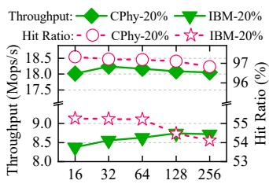  
(a) Group size (objects)

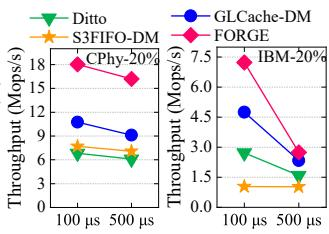  
(b) Miss penalty (µs)  
Figure 17: The sensitivity analysis of system performance.

Miss Penalty. For each Get miss, CN threads are stalled for 100 µs or 500 µs before inserting the missed object into the cache, emulating the realistic latency of fetching objects from distributed storage [35, 47]. As shown in Fig. 17b, the impact of this penalty is highly workload-dependent: in the high-hit-ratio CPhy workload, misses are rare, minimizing the penalty’s effect and allowing FORGE to outperform all baselines by 1.68–2.64× and 1.78–2.66× under the 100 µs and 500 µs penalties, respectively. Conversely, the low-hit-ratio IBM workload triggers frequent miss penalties, leading to substantial thread stalls that limit overall throughput and leave the network significantly underutilized, thereby diminishing the relative advantage of FORGE’s synchronization efficiency; despite this, FORGE still maintains a clear superiority with performance gains of 1.52–6.94× (100 µs) and 1.17–2.68× (500 µs). More importantly, in datacenters, a large number of concurrent application clients [54] would sustain network saturation despite such stalls, thus giving FORGE’s efficient synchronization a decisive performance advantage.

## 6.7 Contributions of Different Techniques

Fig. 18 presents an ablation study of FORGE on YCSB workloads with a 20% cache size. Starting from a baseline with group-level FIFO eviction, we apply each proposed technique one by one. We use 256 CN threads across 3 CNs.

\+ Lock-free Index. Our version-assisted lock-free index eliminates serialization on hash table slots during Set operations. This is especially critical for the write-heavy YCSB A, where it improves the throughput by 21.5× and P50 latency by 6.7×. + Contention-free FIFO Management. By minimizing the synchronization overheads of FIFO enqueuing and dequeuing, this technique excels on workloads with low hit ratios that trigger frequent evictions. It boosts the throughput by 23.1%– 57.5% and reduces P99 latency by 1.25–10.36× across all workloads, with peak gains observed in YCSB E.

\+ Lightweight Regrouping. Leveraging TWIMs for object regrouping, CNs efficiently read only the necessary hot objects and update their pointers with minimal RDMA operations. This improves throughput by 32.6%–55.8%, and cuts P50 and P99 latency respectively by 20.0%–65.2% and 45.2%–61.0%. + Hotness-aware FIFO Queue. This design enhances FIFO queues through virtual segmentation, effectively retaining hot groups longer while prioritizing the eviction of cold ones. Built upon the multi-queue scheme, it yields a substantial 1.12–1.21× improvement in cache hit ratios for YCSB A–D. The gain is more modest (1.06×) in the scan-heavy YCSB E. + Lazy Hotness Synchronization. Leveraging the predictability of FIFO evictions, distributed CNs wait until a group nears the queue head to flush its hotness metrics, eliminating unnecessary synchronization traffic. FORGE further accelerates the traffic via RNIC on-chip memory to minimize interference with performance-critical Get/Set operations. Even on a baseline already heavily optimized by the preceding techniques, this lazy synchronization further improves the throughput and P50 latency by up to 18.9% and 33.3%, respectively.

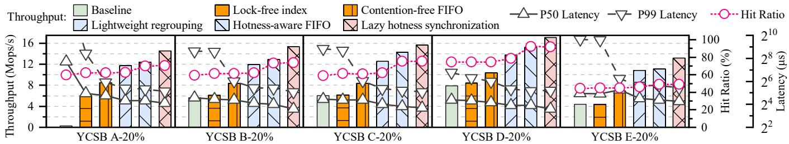  
Figure 18: Performance contributions of different techniques across YCSB workloads at 20% cache sizes.

## 7 Related Work

Memory Disaggregation. To improve resource utilization, existing studies leverage memory disaggregation across various domains, including indexes [43, 45, 46, 85], key-value stores [26, 39, 52, 63, 67], transaction processing [29, 79, 80], and memory management [15, 40, 42, 49, 61, 70, 83]. Unlike them, FORGE focuses on caching systems in DM. Its closest competitor, Ditto [62], employs an eager object-level housekeeping mechanism that introduces substantial synchroniza tion overhead and undermines overall caching efficiency. In contrast, FORGE pioneers an innovative lazy hotness synchronization mechanism integrated into a DM-tailored group-level framework and enhanced-FIFO replacement strategy, which fundamentally reduces synchronization demands through coordinated eviction of groups rather than individual objects.

Group-based Cache and Storage Management. Grouping objects to amortize operational overheads has been widely explored across various storage tiers. In distributed file systems, SmartStore [27] aggregates correlated files into semantic aware groups via latent semantic indexing to optimize complex metadata queries. For local flash storage, Kangaroo [50] and RIPQ [66] group small objects into large writes to mitigate flash write amplification. In monolithic in-memory caches, Segcache [76] groups objects with similar lifecycles to enable efficient bulk expiration, whereas GL-Cache [74] clusters objects to amortize machine-learning overheads for eviction. In contrast, FORGE introduces group-level management specifically for DM architectures to resolve the unique bottleneck of cross-node synchronization amplification.

Replacement Algorithms. Prior research [8, 22, 28, 31, 33, 51, 59, 73, 77] focuses on sophisticated eviction algorithms to optimize hit ratios and throughputs in monolithic servers, but fundamentally overlooks the critical challenge of synchronization amplification in DM. For instance, recent algorithms like SIEVE [82] achieve efficiency via simplified structures in monolithic environments. However, as demonstrated in § 2.2, applying SIEVE directly to DM still incurs prohibitive object-level synchronization overhead, especially due to the eager checking and setting of visited bits upon cache hits, and the blocking queue scans during eviction. In contrast, FORGE lazily defers hotness metric flushing until object groups enter the eviction window, bypassing unnecessary DM traffic for hotness tracking upon cache hits. Moreover, FORGE performs group-level eviction using a contentionfree and hotness-aware FIFO design, eliminating the costly blocking overhead while maintaining high hit ratios. Overall, FORGE enables a high-performance DM caching system via a holistic redesign with DM-friendly data structures, efficient eviction schemes, and novel synchronization mechanisms.

## 8 Conclusion

DM amplifies the synchronization overheads in crucial cache housekeeping, creating a critical bottleneck that undermines the benefits of resource disaggregation. FORGE addresses this challenge through a synergistic design with DM-tailored group-level management, a contention-free hotness-aware FIFO policy, and a lazy-yet-timely hotness synchronization mechanism. This cohesive approach minimizes unnecessary cross-node synchronization while preserving accuracy, enabling FORGE to significantly outperform state-of-the-art DM caching systems. The source code of FORGE is publicly available at https://github.com/cszjyang/forge.

## Acknowledgments

This work was supported in part by National Natural Science Foundation of China (NSFC) under Grant No. 62125202 and U22B2022. We are grateful to our shepherd and anonymous reviewers for their constructive suggestions and feedback.

## References

[1] Compute express link. https:// computeexpresslink.org/, 2024.

[2] Infiniband. https://www.infinibandta.org/, 2024.

[3] Memcached. https://memcached.org/, 2024.

[4] Redis. https://redis.io/, 2024.

[5] Dulcardo Arteaga, Jorge Cabrera, Jing Xu, Swaminathan Sundararaman, and Ming Zhao. CloudCache: Ondemand flash cache management for cloud computing. In 14th USENIX Conference on File and Storage Technologies (FAST 16), pages 355–369, Santa Clara, CA, February 2016. USENIX Association.

[6] Berk Atikoglu, Yuehai Xu, Eitan Frachtenberg, Song Jiang, and Mike Paleczny. Workload analysis of a large-scale key-value store. In Proceedings of the 12th ACM SIGMETRICS/PERFORMANCE Joint International Conference on Measurement and Modeling of Computer Systems, SIGMETRICS ’12, page 53–64, New York, NY, USA, 2012. Association for Computing Machinery.

[7] Berk Atikoglu, Yuehai Xu, Eitan Frachtenberg, Song Jiang, and Mike Paleczny. Workload analysis of a largescale key-value store. In Proceedings of the 12th ACM SIGMETRICS/PERFORMANCE joint international conference on Measurement and Modeling of Computer Systems, pages 53–64, 2012.

[8] Sorav Bansal and Dharmendra S. Modha. CAR: Clock with adaptive replacement. In 3rd USENIX Conference on File and Storage Technologies (FAST 04), San Francisco, CA, March 2004. USENIX Association.

[9] Benjamin Berg, Daniel S. Berger, Sara McAllister, Isaac Grosof, Sathya Gunasekar, Jimmy Lu, Michael Uhlar, Jim Carrig, Nathan Beckmann, Mor Harchol-Balter, and Gregory R. Ganger. The CacheLib caching engine: Design and experiences at scale. In 14th USENIX Symposium on Operating Systems Design and Implementation (OSDI 20), pages 753–768. USENIX Association, November 2020.

[10] Aaron Blankstein, Siddhartha Sen, and Michael J. Freedman. Hyperbolic caching: Flexible caching for web applications. In 2017 USENIX Annual Technical Conference (USENIX ATC 17), pages 499–511, Santa Clara, CA, July 2017. USENIX Association.

[11] Jeff Bonwick. The slab allocator: An Object-Caching kernel. In USENIX Summer 1994 Technical Conference (USENIX Summer 1994 Technical Conference), Boston, MA, June 1994. USENIX Association.

[12] Lee Breslau, Pei Cao, Li Fan, Graham Phillips, and Scott Shenker. On the implications of zipf’s law for web caching. Technical report, University of Wisconsin-Madison Department of Computer Sciences, 1998.

[13] Lee Breslau, Pei Cao, Li Fan, Graham Phillips, and Scott Shenker. Web caching and zipf-like distributions: Evidence and implications. In IEEE INFOCOM’99. Conference on Computer Communications. Proceedings. Eighteenth Annual Joint Conference of the IEEE Computer and Communications Societies. The Future is Now (Cat. No. 99CH36320), volume 1, pages 126–134. IEEE, 1999.

[14] Nathan Bronson, Zach Amsden, George Cabrera, Prasad Chakka, Peter Dimov, Hui Ding, Jack Ferris, Anthony Giardullo, Sachin Kulkarni, Harry Li, et al. {TAO}:{Facebook’s} distributed data store for the social graph. In 2013 USENIX Annual Technical Conference (USENIX ATC 13), pages 49–60, 2013.

[15] Irina Calciu, M. Talha Imran, Ivan Puddu, Sanidhya Kashyap, Hasan Al Maruf, Onur Mutlu, and Aasheesh Kolli. Rethinking software runtimes for disaggregated memory. In Proceedings of the 26th ACM International Conference on Architectural Support for Programming Languages and Operating Systems, ASPLOS ’21, page 79–92, New York, NY, USA, 2021. Association for Computing Machinery.

[16] Tianqi Chen and Carlos Guestrin. Xgboost: A scalable tree boosting system. In Proceedings of the 22nd acm sigkdd international conference on knowledge discovery and data mining, pages 785–794, 2016.

[17] Google Cloud. Tulip: Building a smarter, leading-edge retail platform, 2024. Accessed: 2024-06-15.

[18] The Pokemon Company. The pokemon company migrates to aws purpose-built databases, 2024. Accessed: 2024-06-15.

[19] Brian F Cooper, Adam Silberstein, Erwin Tam, Raghu Ramakrishnan, and Russell Sears. Benchmarking cloud serving systems with ycsb. In Proceedings of the 1st ACM symposium on Cloud computing, pages 143–154, 2010.

[20] Asit Dan and Donald F. Towsley. An approximate analysis of the LRU and FIFO buffer replacement schemes. In Proceedings of the 1990 ACM SIGMETRICS conference on Measurement and modeling of computer systems (SIGMETRICS’90), pages 143–152, 1990.

[21] Sudipto Das, Shoji Nishimura, Divyakant Agrawal, and Amr El Abbadi. Albatross: lightweight elasticity in shared storage databases for the cloud using live data

migration. Proc. VLDB Endow., 4(8):494–505, may 2011.

[22] Gil Einziger, Roy Friedman, and Ben Manes. Tinylfu: A highly efficient cache admission policy. ACM Trans. Storage, 13(4), nov 2017.

[23] Aaron J. Elmore, Sudipto Das, Divyakant Agrawal, and Amr El Abbadi. Zephyr: live migration in shared nothing databases for elastic cloud platforms. In Proceedings of the 2011 ACM SIGMOD International Conference on Management of Data, SIGMOD ’11, page 301–312, New York, NY, USA, 2011. Association for Computing Machinery.

[24] Jason Evans. A scalable concurrent malloc(3) implemen tation for freebsd. Technical report, FreeBSD Project, April 2006. Presented at the 2006 BSDCan conference.

[25] Ohad Eytan, Danny Harnik, Effi Ofer, Roy Friedman, and Ronen Kat. It’s time to revisit LRU vs. FIFO. In 12th USENIX Workshop on Hot Topics in Storage and File Systems (HotStorage 20). USENIX Association, July 2020.

[26] Zhisheng Hu, Pengfei Zuo, Yizou Chen, Chao Wang, Junliang Hu, and Ming-Chang Yang. Aceso: Achieving efficient fault tolerance in memory-disaggregated keyvalue stores. In Proceedings of the ACM SIGOPS 30th Symposium on Operating Systems Principles, SOSP ’24, page 127–143, New York, NY, USA, 2024. Association for Computing Machinery.

[27] Yu Hua, Hong Jiang, Yifeng Zhu, Dan Feng, and Lei Tian. Smartstore: a new metadata organization paradigm with semantic-awareness for next-generation file systems. In Proceedings of the Conference on High Performance Computing Networking, Storage and Analysis, SC ’09, New York, NY, USA, 2009. Association for Computing Machinery.

[28] Qi Huang, Ken Birman, Robbert van Renesse, Wyatt Lloyd, Sanjeev Kumar, and Harry C. Li. An analysis of facebook photo caching. In Proceedings of the Twenty-Fourth ACM Symposium on Operating Systems Principles, SOSP ’13, page 167–181, New York, NY, USA, 2013. Association for Computing Machinery.

[29] Yibo Huang, Haowei Chen, Newton Ni, Yan Sun, Vijay Chidambaram, Dixin Tang, and Emmett Witchel. Tigon: A distributed database for a CXL pod. In 19th USENIX Symposium on Operating Systems Design and Implementation (OSDI 25), Boston, MA, July 2025. USENIX Association.

[30] Yibo Huang, Newton Ni, Vijay Chidambaram, Emmett Witchel, and Dixin Tang. Pasha: An efficient, scalable database architecture for CXL pods. In 15th Conference on Innovative Data Systems Research, CIDR 2025, Amsterdam, The Netherlands, January 19-22, 2025. www.cidrdb.org, 2025.

[31] Song Jiang, Feng Chen, and Xiaodong Zhang. CLOCK Pro: An effective improvement of the CLOCK replacement. In 2005 USENIX Annual Technical Conference (USENIX ATC 05), Anaheim, CA, April 2005. USENIX Association.

[32] Song Jiang and Xiaodong Zhang. Lirs: an efficient low inter-reference recency set replacement policy to improve buffer cache performance. In Proceedings of the 2002 ACM SIGMETRICS International Conference on Measurement and Modeling of Computer Systems, SIGMETRICS ’02, page 31–42, New York, NY, USA, 2002. Association for Computing Machinery.

[33] Theodore Johnson and Dennis Shasha. 2q: A low overhead high performance buffer management replacement algorithm. In Proceedings of the 20th International Conference on Very Large Data Bases, VLDB ’94, page 439–450, San Francisco, CA, USA, 1994. Morgan Kauf mann Publishers Inc.

[34] Anuj Kalia, Michael Kaminsky, and David G. Andersen. Using rdma efficiently for key-value services. In Proceedings of the 2014 ACM Conference on SIGCOMM, SIGCOMM ’14, page 295–306, New York, NY, USA, 2014. Association for Computing Machinery.

[35] Yuyuan Kang and Ming Liu. Understanding and profiling NVMe-over-TCP using ntprof. In 22nd USENIX Symposium on Networked Systems Design and Implementation (NSDI 25), pages 1117–1136, Philadelphia, PA, April 2025. USENIX Association.

[36] Tom Kilburn, David BG Edwards, Michael J Lanigan, and Frank H Sumner. One-level storage system. IRE Transactions on Electronic Computers, (2):223–235, 1962.

[37] Ana Klimovic, Yawen Wang, Patrick Stuedi, Animesh Trivedi, Jonas Pfefferle, and Christos Kozyrakis. Pocket: Elastic ephemeral storage for serverless analytics. In 13th USENIX Symposium on Operating Systems Design and Implementation (OSDI 18), pages 427–444, 2018.

[38] Donghee Lee, Jongmoo Choi, Jong-Hun Kim, Sam H. Noh, Sang Lyul Min, Yookun Cho, and Chong-Sang Kim. On the existence of a spectrum of policies that subsumes the least recently used (LRU) and least frequently used (LFU) policies. In Proceedings of the 1999 ACM SIGMETRICS international conference on

Measurement and modeling of computer systems (SIG-METRICS’99), pages 134–143, 1999.

[39] Sekwon Lee, Soujanya Ponnapalli, Sharad Singhal, Marcos K. Aguilera, Kimberly Keeton, and Vijay Chidambaram. Dinomo: An elastic, scalable, highperformance key-value store for disaggregated persistent memory. Proc. VLDB Endow., 15(13):4023–4037, sep 2022.

[40] Seung-seob Lee, Yanpeng Yu, Yupeng Tang, Anurag Khandelwal, Lin Zhong, and Abhishek Bhattacharjee. Mind: In-network memory management for disaggregated data centers. In Proceedings of the ACM SIGOPS 28th Symposium on Operating Systems Principles, SOSP ’21, page 488–504, New York, NY, USA, 2021. Association for Computing Machinery.

[41] Cheng Li, Philip Shilane, Fred Douglis, and Grant Wallace. Pannier: A container-based flash cache for compound objects. In Proceedings of the 16th Annual Middleware Conference, pages 50–62, 2015.

[42] Huaicheng Li, Daniel S. Berger, Lisa Hsu, Daniel Ernst, Pantea Zardoshti, Stanko Novakovic, Monish Shah, Samir Rajadnya, Scott Lee, Ishwar Agarwal, Mark D. Hill, Marcus Fontoura, and Ricardo Bianchini. Pond: Cxl-based memory pooling systems for cloud platforms. In Proceedings of the 28th ACM International Conference on Architectural Support for Programming Languages and Operating Systems, Volume 2, ASPLOS 2023, page 574–587, New York, NY, USA, 2023. Association for Computing Machinery.

[43] Pengfei Li, Yu Hua, Pengfei Zuo, Zhangyu Chen, and Jiajie Sheng. ROLEX: A scalable RDMA-oriented learned Key-Value store for disaggregated memory systems. In 21st USENIX Conference on File and Storage Technologies (FAST 23), pages 99–114, Santa Clara, CA, February 2023. USENIX Association.

[44] Jinshu Liu, Hamid Hadian, Hanchen Xu, Daniel S Berger, and Huaicheng Li. Dissecting cxl memory performance at scale: Analysis, modeling, and optimization. arXiv preprint arXiv:2409.14317, 2024.

[45] Xuchuan Luo, Jiacheng Shen, Pengfei Zuo, Xin Wang, Michael R Lyu, and Yangfan Zhou. Chime: A cacheefficient and high-performance hybrid index on disaggregated memory. In Proceedings of the ACM SIGOPS 30th Symposium on Operating Systems Principles, pages 110–126, 2024.

[46] Xuchuan Luo, Pengfei Zuo, Jiacheng Shen, Jiazhen Gu, Xin Wang, Michael R. Lyu, and Yangfan Zhou. SMART: A High-Performance adaptive radix tree for disaggregated memory. In 17th USENIX Symposium on Operating Systems Design and Implementation (OSDI 23),

pages 553–571, Boston, MA, July 2023. USENIX Association.

[47] Wenhao Lv, Youyou Lu, Yiming Zhang, Peile Duan, and Jiwu Shu. InfiniFS: An efficient metadata service for Large-Scale distributed filesystems. In 20th USENIX Conference on File and Storage Technologies (FAST 22), pages 313–328, Santa Clara, CA, February 2022. USENIX Association.

[48] Deborah T Marr, Frank Binns, David L Hill, Glenn Hinton, David A Koufaty, J Alan Miller, and Michael Upton. Hyper-threading technology architecture and microarchitecture. Intel Technology Journal, 6(1):4–15, 2002.

[49] Hasan Al Maruf, Hao Wang, Abhishek Dhanotia, Johannes Weiner, Niket Agarwal, Pallab Bhattacharya, Chris Petersen, Mosharaf Chowdhury, Shobhit Kanaujia, and Prakash Chauhan. Tpp: Transparent page placement for cxl-enabled tiered-memory. In Proceedings of the 28th ACM International Conference on Architectural Support for Programming Languages and Operating Systems, Volume 3, pages 742–755, 2023.

[50] Sara McAllister, Benjamin Berg, Julian Tutuncu-Macias, Juncheng Yang, Sathya Gunasekar, Jimmy Lu, Daniel S Berger, Nathan Beckmann, and Gregory R Ganger. Kangaroo: Caching billions of tiny objects on flash. In Proceedings of the ACM SIGOPS 28th symposium on operating systems principles, pages 243–262, 2021.

[51] Nimrod Megiddo and Dharmendra S. Modha. ARC: A Self-Tuning, low overhead replacement cache. In 2nd USENIX Conference on File and Storage Technologies (FAST 03), San Francisco, CA, March 2003. USENIX Association.

[52] Antoine Murat, Clément Burgelin, Athanasios Xygkis, Igor Zablotchi, Marcos Kawazoe Aguilera, and Rachid Guerraoui. Swarm: Replicating shared disaggregatedmemory data in no time. In Proceedings of the ACM SIGOPS 30th Symposium on Operating Systems Principles, pages 24–45, 2024.

[53] Dushyanth Narayanan, Austin Donnelly, and Antony Rowstron. Write Off-Loading: Practical power management for enterprise storage. In 6th USENIX Conference on File and Storage Technologies (FAST 08), San Jose, CA, February 2008. USENIX Association.

[54] Rajesh Nishtala, Hans Fugal, Steven Grimm, Marc Kwiatkowski, Herman Lee, Harry C. Li, Ryan McElroy, Mike Paleczny, Daniel Peek, Paul Saab, David Stafford, Tony Tung, and Venkateshwaran Venkataramani. Scaling memcache at facebook. In 10th USENIX Symposium on Networked Systems Design and Implementation (NSDI 13), pages 385–398, Lombard, IL, April 2013. USENIX Association.

[55] Ruoyu Qin, Zheming Li, Weiran He, Jialei Cui, Feng Ren, Mingxing Zhang, Yongwei Wu, Weimin Zheng, and Xinran Xu. Mooncake: Trading more storage for less computation—a {KVCache-centric} architecture for serving {LLM} chatbot. In 23rd USENIX Conference on File and Storage Technologies (FAST 25), pages 155–170, 2025.

[56] Redis. Key eviction. https://redis.io/docs/ latest/develop/reference/eviction/. Accessed: 2024-12-08.

[57] Redis. Memory optimization. https: //redis.io/docs/latest/operate/oss\_ and\_stack/management/optimization/ memory-optimization/. Accessed: 2024-12-08.

[58] Charles Reiss, Alexey Tumanov, Gregory R. Ganger, Randy H. Katz, and Michael A. Kozuch. Heterogeneity and dynamicity of clouds at scale: Google trace analysis. In Proceedings of the Third ACM Symposium on Cloud Computing, SoCC ’12, New York, NY, USA, 2012. Association for Computing Machinery.

[59] Liana V. Rodriguez, Farzana Yusuf, Steven Lyons, Eysler Paz, Raju Rangaswami, Jason Liu, Ming Zhao, and Giri Narasimhan. Learning cache replacement with CACHEUS. In 19th USENIX Conference on File and Storage Technologies (FAST 21), pages 341–354. USENIX Association, February 2021.

[60] Mohammad Shahrad, Rodrigo Fonseca, Inigo Goiri, Gohar Chaudhry, Paul Batum, Jason Cooke, Eduardo Laureano, Colby Tresness, Mark Russinovich, and Ricardo Bianchini. Serverless in the wild: Characterizing and optimizing the serverless workload at a large cloud provider. In 2020 USENIX Annual Technical Conference (USENIX ATC 20), pages 205–218. USENIX Association, July 2020.

[61] Yizhou Shan, Yutong Huang, Yilun Chen, and Yiying Zhang. LegoOS: A disseminated, distributed OS for hardware resource disaggregation. In 13th USENIX Symposium on Operating Systems Design and Implementation (OSDI 18), pages 69–87, Carlsbad, CA, October 2018. USENIX Association.

[62] Jiacheng Shen, Pengfei Zuo, Xuchuan Luo, Yuxin Su, Jiazhen Gu, Hao Feng, Yangfan Zhou, and Michael R Lyu. Ditto: An elastic and adaptive memory-disaggregated caching system. In Proceedings of the 29th Symposium on Operating Systems Principles, pages 675–691, 2023.

[63] Jiacheng Shen, Pengfei Zuo, Xuchuan Luo, Tianyi Yang, Yuxin Su, Yangfan Zhou, and Michael R. Lyu. FUSEE: A fully Memory-Disaggregated Key-Value store. In

21st USENIX Conference on File and Storage Technologies (FAST 23), pages 81–98, Santa Clara, CA, February 2023. USENIX Association.

[64] Zhenyu Song, Daniel S. Berger, Kai Li, and Wyatt Lloyd. Learning relaxed belady for content distribution network caching. In 17th USENIX Symposium on Networked Systems Design and Implementation (NSDI 20), pages 529–544, Santa Clara, CA, February 2020. USENIX Association.

[65] Lalith Suresh, Marco Canini, Stefan Schmid, and Anja Feldmann. C3: Cutting tail latency in cloud data stores via adaptive replica selection. In 12th USENIX Symposium on Networked Systems Design and Implementation (NSDI 15), pages 513–527, Oakland, CA, May 2015. USENIX Association.

[66] Linpeng Tang, Qi Huang, Wyatt Lloyd, Sanjeev Kumar, and Kai Li. {RIPQ}: Advanced photo caching on flash for facebook. In 13th USENIX Conference on File and Storage Technologies (FAST 15), pages 373–386, 2015.

[67] Shin-Yeh Tsai, Yizhou Shan, and Yiying Zhang. Disaggregating persistent memory and controlling them remotely: An exploration of passive disaggregated Key-Value stores. In 2020 USENIX Annual Technical Conference (USENIX ATC 20), pages 33–48. USENIX Association, July 2020.

[68] Giuseppe Vietri, Liana V. Rodriguez, Wendy A. Martinez, Steven Lyons, Jason Liu, Raju Rangaswami, Ming Zhao, and Giri Narasimhan. Driving cache replacement with ML-based LeCaR. In 10th USENIX Workshop on Hot Topics in Storage and File Systems (HotStorage 18), Boston, MA, July 2018. USENIX Association.

[69] Carl A. Waldspurger, Nohhyun Park, Alexander Garthwaite, and Irfan Ahmad. Efficient MRC construction with SHARDS. In 13th USENIX Conference on File and Storage Technologies (FAST 15), pages 95–110, Santa Clara, CA, February 2015. USENIX Association.

[70] Chenxi Wang, Haoran Ma, Shi Liu, Yuanqi Li, Zhenyuan Ruan, Khanh Nguyen, Michael D. Bond, Ravi Netravali, Miryung Kim, and Guoqing Harry Xu. Semeru: A Memory-Disaggregated managed runtime. In 14th USENIX Symposium on Operating Systems Design and Implementation (OSDI 20), pages 261–280. USENIX Association, November 2020.

[71] Qing Wang, Youyou Lu, and Jiwu Shu. Sherman: A write-optimized distributed b+tree index on disaggregated memory. In Proceedings of the 2022 International Conference on Management of Data, SIGMOD ’22, page 1033–1048, New York, NY, USA, 2022. Association for Computing Machinery.

[72] Qizhen Weng, Wencong Xiao, Yinghao Yu, Wei Wang, Cheng Wang, Jian He, Yong Li, Liping Zhang, Wei Lin, and Yu Ding. MLaaS in the wild: Workload analysis and scheduling in Large-Scale heterogeneous GPU clusters. In 19th USENIX Symposium on Networked Systems Design and Implementation (NSDI 22), pages 945–960, Renton, WA, April 2022. USENIX Association.

[73] Daniel Lin-Kit Wong, Hao Wu, Carson Molder, Sathya Gunasekar, Jimmy Lu, Snehal Khandkar, Abhinav Sharma, Daniel S. Berger, Nathan Beckmann, and Gregory R. Ganger. Baleen: ML admission & prefetching for flash caches. In 22nd USENIX Conference on File and Storage Technologies (FAST 24), pages 347–371, Santa Clara, CA, February 2024. USENIX Association.

[74] Juncheng Yang, Ziming Mao, Yao Yue, and K. V. Rashmi. Gl-cache: Group-level learning for efficient and high-performance caching. In 21st USENIX Confer ence on File and Storage Technologies (FAST 23), pages 115–134, 2023.

[75] Juncheng Yang, Yao Yue, and K. V. Rashmi. A large scale analysis of hundreds of in-memory cache clusters at twitter. In 14th USENIX Symposium on Operating Systems Design and Implementation (OSDI 20). USENIX Association, November 2020.

[76] Juncheng Yang, Yao Yue, and Rashmi Vinayak. Segcache: a memory-efficient and scalable in-memory keyvalue cache for small objects. In 18th USENIX Symposium on Networked Systems Design and Implementation (NSDI 21), pages 503–518. USENIX Association, April 2021.

[77] Juncheng Yang, Yazhuo Zhang, Ziyue Qiu, Yao Yue, and Rashmi Vinayak. Fifo queues are all you need for cache eviction. In Proceedings of the 29th Symposium on Operating Systems Principles, SOSP ’23, page 130–149, New York, NY, USA, 2023. Association for Computing Machinery.

[78] Xinjun Yang, Yingqiang Zhang, Hao Chen, Feifei Li, Gerry Fan, Yang Kong, Bo Wang, Jing Fang, Yuhui Wang, Tao Huang, Wenpu Hu, Jim Kao, and Jianping Jiang. Unlocking the potential of cxl for disaggregated memory in cloud-native databases. In Companion of the 2025 International Conference on Management of Data, SIGMOD/PODS ’25, page 689–702, New York, NY, USA, 2025. Association for Computing Machinery.

[79] Ming Zhang, Yu Hua, and Zhijun Yang. Motor: Enabling {Multi-Versioning} for distributed transactions on disaggregated memory. In 18th USENIX Sympo sium on Operating Systems Design and Implementation (OSDI 24), pages 801–819, 2024.

[80] Ming Zhang, Yu Hua, Pengfei Zuo, and Lurong Liu. FORD: Fast one-sided RDMA-based distributed transactions for disaggregated persistent memory. In 20th USENIX Conference on File and Storage Technologies (FAST 22), pages 51–68, Santa Clara, CA, February 2022. USENIX Association.

[81] Mingxing Zhang, Teng Ma, Jinqi Hua, Zheng Liu, Kang Chen, Ning Ding, Fan Du, Jinlei Jiang, Tao Ma, and Yongwei Wu. Partial failure resilient memory management system for (cxl-based) distributed shared memory. In Proceedings of the 29th Symposium on Operating Systems Principles, SOSP ’23, page 658–674, New York, NY, USA, 2023. Association for Computing Machinery.

[82] Yazhuo Zhang, Juncheng Yang, Yao Yue, Ymir Vigfusson, and K.V. Rashmi. SIEVE is simpler than LRU: an efficient Turn-Key eviction algorithm for web caches. In 21st USENIX Symposium on Networked Systems De sign and Implementation (NSDI 24), pages 1229–1246, Santa Clara, CA, April 2024. USENIX Association.

[83] Yuhong Zhong, Daniel S Berger, Carl Waldspurger, Ishwar Agarwal, Rajat Agarwal, Frank Hady, Karthik Kumar, Mark D Hill, Mosharaf Chowdhury, and Asaf Cidon. Managing memory tiers with cxl in virtualized environments. In Symposium on Operating Systems Design and Implementation, 2024.

[84] Tobias Ziegler, Jacob Nelson-Slivon, Viktor Leis, and Carsten Binnig. Design guidelines for correct, efficient, and scalable synchronization using one-sided rdma. Proceedings of the ACM on Management of Data, 1(2):1–26, 2023.

[85] Pengfei Zuo, Jiazhao Sun, Liu Yang, Shuangwu Zhang, and Yu Hua. One-sided RDMA-Conscious extendible hashing for disaggregated memory. In 2021 USENIX Annual Technical Conference (USENIX ATC 21), pages 15–29. USENIX Association, July 2021.