USENIX

THE ADVANCED COMPUTING SYSTEMS ASSOCIATION

# OpenTela: Unifying Decentralized Computing Resources for Heterogeneous LLM Serving (Operational Systems)

Xiaozhe Yao, ETH Zurich; Youhe Jiang, University of Cambridge; Ilia Badanin, EPFL;   
Qinghao Hu, MIT; Robert Matthew Smith, ETH AI Center; Binhang Yuan, The Hong Kong University of Science and Technology; Imanol Schlag, ETH AI Center; Eiko Yoneki, University of Cambridge; Ana Klimovic, ETH Zurich

https://www.usenix.org/conference/osdi26/presentation/yao

# This paper is included in the Proceedings of the 20th USENIX Symposium on Operating Systems Design and Implementation.

July 13–15, 2026 • Seattle, WA, USA

ISBN 978-1-939133-55-7

Open access to the Proceedings of the 20th USENIX Symposium on Operating Systems Design and Implementation is sponsored by

# OpenTela: Unifying Decentralized Computing Resources for Heterogeneous LLM Serving (Operational Systems)

Xiaozhe Yao ETH Zurich

Youhe Jiang University of Cambridge

Ilia Badanin EPFL

Binhang Yuan HKUST

Robert Matthew Smith ETH AI Center

Qinghao Hu MIT

Imanol Schlag ETH AI Center

Eiko Yoneki University of Cambridge

Ana Klimovic ETH Zurich

## Abstract

Large language models (LLMs) are becoming critical to a variety of public services, motivating sovereign AI initiatives that seek to serve models on infrastructure they control. Yet much of this infrastructure is built as HPC clusters optimized for batch jobs rather than interactive, always-on inference services. Existing LLM serving engines efficiently execute requests on GPUs, but rely on an external control plane (e.g., Kubernetes in cloud environments) for service discovery, routing, health monitoring, and load balancing. In HPC environ ments, these primitives are often unavailable: resources are managed by schedulers such as Slurm, allocations are transient, compute nodes may be unreachable from outside the cluster, and GPU capacity is fragmented across heterogeneous clusters and administrative domains.

We present OpenTela, a user-space orchestration overlay that turns existing fragmented HPC clusters into a unified, cross-institutional serving platform. OpenTela provides fault tolerant service discovery via a CRDT-based gossip network, a unified API over heterogeneous cluster managers and serving engines, and a heterogeneity-aware scheduler, all in userspace without root privileges or cluster reconfiguration. Open-Tela has been deployed for over 22 months, serving 13 million requests and 15 billion tokens across 142 models to over 1000 researchers across multiple institutions. We open-source the system and release an anonymized production trace to facilitate further research into real-world LLM serving workloads, and provide a replicable blueprint for other sovereign AI initiatives to harness their own federated GPU infrastructure.

## 1 Introduction

As large language models (LLMs) are increasingly being integrated into critical digital infrastructure for public services such as administration [48], healthcare [7, 61], and education [14], governments and organizations need more control over how these models are developed and served. While commercial AI providers like OpenAI and Anthropic provide convenient access to state-of-the-art models, organizations using these models lack insight into how the models were trained — and hence the biases they contain. Users also have no control over the availability of these models and how they evolve over time (e.g., OpenAI can suddenly decide to stop serving a particular version of a model). Hence, many governments and organizations are investing heavily in sovereign AI infrastructure: compute clusters, data pipelines, model development research, and operational platforms that they can control, inspect, and govern [4, 24, 49, 64].

This shift has triggered large-scale public investment in AIoriented supercomputing infrastructure. For example, Switzerland has invested in the Alps supercomputer, a geo-distributed cluster of over 10,000 NVIDIA Grace Hopper GPUs for open science [44]. Japan’s ABCI 3.0 provides 6,128 NVIDIA H200 GPUs for AI [49]. The European Commission plans to build 19 AI Factories and up to five AI Gigafactories backed by a C20 billion investment [16]. The UK government has committed up to £2 billion to deliver new AI supercomputers [28]. Canada, Singapore, South Korea, the United States and many others are also investing in building and broadening access to AI compute [24–27].

Making sovereign AI useful in practice requires more than training models on this infrastructure. These models must also be served efficiently, reliably, and continuously to users. Model serving requires substantial compute, often exceeding the cycles spent on training [17, 67].

Yet the infrastructure being built for sovereign AI often consists of HPC clusters, which are designed for throughputoriented batch jobs rather than interactive, always-on services like LLM inference. Model serving requires load balancing, dynamic service discovery, persistent endpoints, fault-tolerant request routing, and elastic scaling. LLM serving engines such as vLLM [38] and SGLang [75] assume that an external orchestration layer (e.g., Kubernetes) will provide the surrounding service functionality. However, in HPC environments, resources are usually managed by batch schedulers, such as Slurm [73], that give users a set of nodes for a bounded time window (e.g., up to 12 hours), with no persistent endpoints across job re-invocations or control plane to route external traffic to model replicas. Replacing Slurm with Kubernetes is non-trivial as HPC workloads depend on features such as topology awareness, MPI integration, and established operational policies. Running a separate Kubernetes partition avoids disrupting existing workflows, but rigidly partitions scarce GPUs between batch and serving workloads, which could leave idle capacity in one partition while there is demand for the other [1, 65].

Furthermore, to deal with highly dynamic GPU availability within each HPC cluster (e.g., see Figure 1) and the bursty load patterns of LLM inference, it is often beneficial to pool resources across clusters to smooth both effects: idle GPUs at one site can absorb demand from another, and aggregating requests across clusters can improve batching efficiency. However, cross-cluster serving is challenging as clusters are often administered separately and may run different schedulers, expose different network policies, contain heterogeneous GPUs, and differ in data sovereignty guarantees.

We present OpenTela, a thin user-space overlay that turns fragmented HPC resources into a unified LLM serving platform. OpenTela runs on top of existing cluster managers such as Slurm and Kubernetes, providing LLM serving primitives entirely in user space, such that it does not require root privileges, cluster reconfiguration, or changes to user workflows. OpenTela exposes a unified OpenAI-compatible API across heterogeneous serving engines, including vLLM and SGLang, that it can run as transient Slurm jobs, longrunning Kubernetes services, and diverse GPU hardware. Its decentralized gossip network backed by a CRDT-based reg istry provides service discovery, health monitoring, and faulttolerant routing without assuming a central coordinator. A heterogeneity-aware placement policy helps map models to available GPUs, while ensuring that requests are only routed to model instances that a user trusts.

We deploy OpenTela to provide a catalog of open-source and community-developed models to researchers in the Swiss AI Initiative, an initiative that trains and serves open foundation models, such as Apertus [30]. OpenTela unifies multiple geo-distributed clusters with different hardware and resource management stacks, including Slurm-managed and Kubernetes-managed resources. Researchers interact with a single API endpoint, while OpenTela handles authenti cation, usage tracking, routing, and node lifecycle management across the underlying infrastructure. OpenTela has been operational for over 22 months. During this period, it has served more than 13 million requests and 15 bil lion tokens across 142 models to over 1000 researchers across multiple institutions. We open-source OpenTela at https://github.com/eth-easl/opentela and release an anonymized production trace spanning July 2024 to October 2025 at https://huggingface.co/datasets/et h-easl/swissai-serving-trace. Unlike prior public traces that typically cover a small number of models or short time windows, our trace captures a long-running, multi-model, research-oriented LLM serving workload with both popular open-weight models and a long tail of community-developed models.

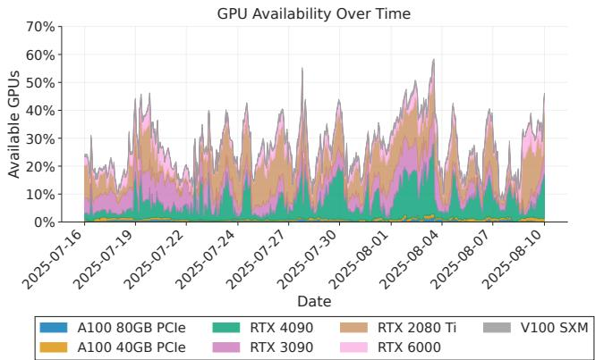  
Figure 1: Percentage of idle GPUs from ETH HPC Cluster.

## 2 Background and Motivation

LLM serving engines are not serving platforms. Modern LLM serving engines, such as vLLM and SGLang, provide the execution layer for inference. They load model weights, manage KV caches, batch requests, schedule prefill and decode work, and expose an API endpoint for submitting prompts. These engines have made it substantially easier to run openweight models efficiently on GPUs. However, an inference engine is not a complete serving platform. A shared LLM service must also provide a control plane around the engine: clients need a stable endpoint, the system must discover which replicas are currently serving which models, requests must be routed and load-balanced across replicas, failed replicas must be removed from the service, users must be authenticated, and operators need visibility into model availability and resource usage. In cloud deployments, these functions are often provided by Kubernetes or a proprietary orchestration system of a commercial provider. In contrast, most sovereign AI initiatives make GPU capacity available in HPC environments, where these features are lacking [41].

HPC schedulers. Slurm [73] is the most common workload manager across the top supercomputers [56]. Slurm’s design reflects its origins in batch scientific computing workloads: it allocates nodes for a fixed wall-clock duration, prioritizes raw throughput over interactivity, and treats each job as a transient process with no expectation of persistent state. This works well for AI training jobs and batch data-processing pipelines. However, LLM serving requires clients to discover and route requests to model replicas. A Slurm job can launch an inference engine, but the resulting endpoint is tied to a particular allocation and compute node. When the job ends, is preempted, or is relaunched elsewhere, the endpoint changes or disappears. The scheduler does not provide a persistent service name, an external routing layer, a model registry, or a mechanism for replacing a failed replica with a healthy one.

Simply replacing Slurm with Kubernetes to leverage its orchestration primitives for LLM serving is often impractical as many other jobs rely on Slurm features such as topologyaware scheduling and native MPI job launch [1, 65]. Another option is to partition HPC resources into a Kubernetesmanaged component and a Slurm-managed component. However, this makes it more difficult to flexibly re-balance resources across the two clusters, which can lead to underutilization and unnecessary queuing delays as the load on each cluster dynamically changes over time.

Federating HPC clusters. A single GPU cluster is often not enough to provide reliable and efficient LLM serving. GPU availability changes over time as resources are consumed by training jobs, released by completed jobs, and reserved for maintenance. Figure 1 shows this effect in an ETH GPU cluster: the fraction of idle GPUs varies over time and across GPU types. At the same time, our trace analysis in §6 shows that inference demand is bursty and model popularity shifts as users evaluate new models. Pooling resources across clusters can improve availability and utilization. Idle GPUs at one site can absorb demand from another, and aggregating requests across users and institutions can increase batching opportunities for popular models.

However, cross-cluster LLM serving introduces several challenges. The participating clusters may be administered by different organizations, run different schedulers, expose different network policies, contain different GPU types, and offer different data governance guarantees. Compute nodes may not be directly reachable from outside the cluster. Most importantly, there may be no single privileged coordinator that all sites are willing or able to operate. In the next section, we describe how to overcome these challenges.

## 3 OpenTela Design

To bridge the gap between HPC infrastructure and LLM serving workloads, we propose OpenTela: a user-space orchestration overlay that turns fragmented compute resources into a unified LLM serving platform. OpenTela providers contribute compute resources and deploy inference engine jobs while OpenTela consumers submit inference requests through an API frontend. OpenTela does not replace the underlying cluster manager in each cluster it federates. Instead, a provider launches OpenTela alongside an existing serving engine, such as vLLM or SGLang, on resources obtained from a local cluster manager (e.g., a Slurm allocation or a Kubernetes deployment). Once an OpenTela job is launched, the node running the job joins OpenTela ’s peer-to-peer network, advertises its hardware and model metadata to other nodes, and becomes available to serve requests.

## 3.1 System Requirements

We design OpenTela around four key requirements:

R1: Non-invasive deployment. OpenTela must run with ordinary user permissions, on top of existing cluster managers, without requiring root access, scheduler modifications, or cluster reconfiguration. This allows researchers and operators to contribute resources from Slurm or Kubernetes environments without changing existing HPC workflows.

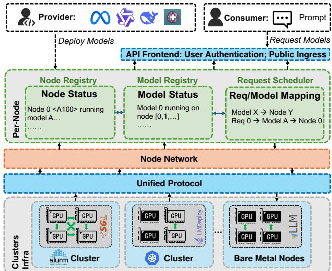  
Figure 2: System architecture of OpenTela Serving.

R2: Service abstraction over transient resources. Open-Tela must turn short-lived allocations and independently launched serving processes into a persistent service abstraction. It must provide service discovery, model and node registries, health monitoring, load balancing, and request routing even as nodes join, leave, fail, or are preempted.

R3: Federation without a centralized coordinator. Open-Tela must operate across independently administered clusters with no shared privileged control plane. The system must maintain an eventually consistent view of available nodes and models, tolerate network partitions and node churn, and avoid making a central store a single point of failure.

R4: Heterogeneity- and trust-aware request routing. OpenTela must support diverse GPU types, serving engines, model variants, and deployment environments. It must also ensure that requests are routed only to providers authorized by the user or institution, preserving data-governance constraints even when other resources are available.

## 3.2 System Overview

Figure 2 shows the system architecture that OpenTela adopts to meet the above requirements.

Cluster infrastructure. OpenTela is designed to unify geo-distributed clusters that may consist of heterogeneous hardware. Each cluster may differ in hardware characteristics (GPU memory capacity and processing power, network bandwidth) and software environments (cluster manager, serving frameworks supported, CUDA versions).

Unified ML serving protocol. Most LLM serving engines expose an OpenAI-compatible API [50], which allows OpenTela to sit above them without modification. OpenTela adopts this interface as its foundation and extends it with infrastructure-level endpoints that the OpenAI API does not provide. Specifically, OpenTela exposes additional endpoints for querying real-time node status, model registry state, and provider metadata, allowing operators and consumers to inspect the state of the serving platform directly without requiring access to individual nodes. For security, these endpoints are strictly read-only and expose the CRDT registry state without permitting external modification, preserving the integrity of the distributed states.

Node network. The node network is the transport layer that connects every OpenTela node into a single peer-to-peer fabric, regardless of which institution or cluster manager it belongs to. We build this layer with libp2p [39], which provides three key features our setting requires: peer addressing and discovery, encrypted peer-to-peer channels between any two peers, and connectivity establishment across NAT boundaries. Together, these make cross-institutional federation feasible: nodes on different clusters can locate one another, establish encrypted channels, and reach each other across private networks without any centralized broker. This is needed in our setting, as HPC nodes typically have only outbound connectivity and cannot accept inbound connections from outside the cluster. The node network establishes secure channels between two such nodes through hole punching when both can reach a common rendezvous peer, or through a circuit relay on a publicly reachable peer otherwise. Both modes use only the outbound connections that compute nodes are already permitted to make, and require no changes to institutional network policies. A new node joins the network by contacting one or more bootstrap peers. If all bootstrap peers are temporarily unreachable, the node retries with exponential backoff until connectivity is restored. Once connected, the node uses the Kademlia DHT [45] to discover other peers and exchanges state with them through a randomized gossip protocol layered on top of these peer-to-peer connections.

Registry. The registry is the state layer on top of the node network. It maintains a consistent global view of available nodes and models across institutional boundaries without a central coordinator. Our design of the registry considers that HPC nodes frequently join and leave as allocations expire or are preempted from scavenger queues, and that no central coordinator can be assumed to serialize state updates. OpenTela represents the registry as a Growth-only Map (G-Map) conflict-free Replicated Data Type (CRDT) [58], whose merge semantics are commutative, associative, and idempotent, guaranteeing convergence without coordination. Each entry in the map represents a node in the network: the key is a unique identifier assigned at node creation, and the value is a tuple containing the node’s lifecycle state and its metadata payload. State updates propagate over the gossip protocol described above, and every node maintains a full local replica that it reads without further network round trips. To prevent unbounded registry growth as nodes join and leave over time, OpenTela applies a two-tier garbage collection policy: evicted nodes are first removed from the application-level view after a configurable retention window (24 hours by default), and CRDT-level tombstone markers are compacted periodically thereafter. The registry exposes two views derived from the same underlying state. The Node Registry tracks hardware availability and lifecycle state for each node, and the Model Registry maps models to the nodes currently serving them. Both views are queried locally on whichever node receives the query: every OpenTela node holds a full replica and answers from it without contacting any centralized catalog. In practice, consumers do not query the registry directly. The API frontend reads its local replica when routing each inference request, and the same replica backs the read-only HTTP endpoints described earlier, which expose registry contents for inspection by users and operators.

Service scheduler. While users can manually assign nodes to serve specific models, OpenTela also has a centralized service scheduler that can automatically optimize model placement to balance performance requirements with resource availability and cost efficiency. We describe the default policy in §3.5, but operators can substitute their own.

API frontend. OpenTela’s API frontend runs as a regular OpenTela node that participates in the gossip network like any other but is reachable at a public IP address so that consumers can submit requests without running their own node. We call it an ingress node as it is the entry point through which external requests enter the gossip network. Alongside the standard OpenTela node functionality, the API frontend also runs a user-facing service that manages client connections and handles authentication, usage tracking, and the requestresponse lifecycle. The user-facing service and the ingress node can also run on separate hosts, as long as the former can forward authenticated requests to the latter. Because the ingress node holds a full local replica of the CRDT registry, it performs the candidate selection and routing described in §3.4 without contacting any external coordinator.

User interface. To ease access, OpenTela provides a webbased dashboard that allows users to browse the real-time catalog of actively served models alongside their hosting hardware, manage API keys, and validate model behavior through an interactive chat interface.

## 3.3 Trust Model

Allowing users to run arbitrary models and serve the requests of other users introduces security concerns. If any node can join the network and claim to serve any model, users have no guarantee that the node will execute inference correctly or keep the input data confidential. OpenTela addresses these concerns at two points in the serving path.

Membership admission control. Only signed OpenTela binaries can join the network. Each release is signed by maintainers, and unsigned or tampered binaries fail the join handshake and never appear in the CRDT registry.

Client-side filtering. When a user submits an inference request, they may specify a set of trusted provider IDs in the request metadata. The ingress node filters the candidate set from the CRDT registry to retain only nodes whose provider

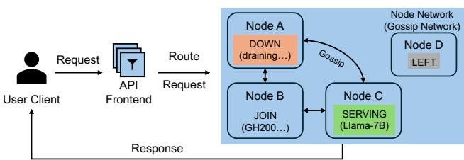  
Figure 3: Workflow example of OpenTela.

IDs appear on this allowlist before applying load balancing. Requests are never dispatched to providers that the user has not explicitly allowed. This places trust management in the hands of the user, which is appropriate for a research environment where institutional relationships are known, but it requires users to maintain and update their allowlists correctly.

These mechanisms still have limitations. OpenTela attests binaries at the software level: peers verify a signature over the binary at load time, proving the file on disk matches what OpenTela maintainers signed. However, the provider, as the root user on the node they contribute, can replace the serving engine with a modified build that records every request or captures the prompts on the loopback interface between the OpenTela process and the serving engine. None of these produces externally observable artifacts that OpenTela can currently detect. Hardware-backed attestation through confidential computing would close this gap by running the serving code inside a hardware-encrypted enclave that the host root user cannot read, and by producing a remote attestation that cryptographically identifies the code executing inside the enclave. Clients could then require proof that their request was handled by a specific audited binary rather than trusting the provider’s claim. We consider this a direction for future work.

## 3.4 Workflow Example

Life of a node. A node progresses through four strictly ordered states: JOIN ≺ SERVING ≺ DOWN ≺ LEFT. When a provider contributes a node to OpenTela, it initiates the JOIN process by contacting a known bootstrap peer, defined in the cluster configuration. The node registers its metadata (i.e., hardware specification) with the network. OpenTela uses a randomized gossip protocol for membership management: upon connection, the node exchanges state with the bootstrap peer, and this membership information propagates rapidly across the network. Within a few gossip rounds, the system converges and all peers update their local registries to include the new node.

After a node has joined the network, it begins the lifecycle of a model/service, entering the SERVING stage. The node deploys a specific model (either explicitly configured by the provider or dynamically assigned by the service scheduler). To announce availability, the node updates its local CRDT state with a service record containing the model identifier, the node’s unique session ID, and optionally the provider

ID. When the model is served with non-default configurations, such as lower precision or shorter context windows, it is the provider’s responsibility to add this information to the model identifier. This metadata is automatically replicated to all peers, enabling other nodes to discover the new service endpoint and include it in their routing tables.

The DOWN stage is triggered if there is a local health check failure: when the per-node OpenTela process detects that the serving subprocess has terminated, it explicitly transitions to DOWN and propagates this state to all peers. LEFT marks permanent eviction and is triggered after the node exceeds the heartbeat grace period without recovery. The system applies a two-stage detection policy before escalating to LEFT: a node that fails liveness probes is first marked as suspected and excluded from the routing candidate set, but no irreversible state change is committed. Three independent probe paths must all fail before suspicion is declared, and a suspected node can self-refute by broadcasting a liveness update before the suspicion timeout expires. Only after this grace period elapses is the node permanently evicted. Since the merge function ⊔ selects the entry with the highest lifecycle state, the network converges to the most recent fully-specified configuration for every node without any central reconciliation step. A node that recovers after eviction rejoins under a new session ID through the normal JOIN → SERVING lifecycle.

Life of an inference request. Figure 3 shows the life of a request. To schedule the request, the ingress node queries its local CRDT replica to identify candidate nodes that are serving the requested model. OpenTela routes requests based on the unique session ID and provider ID associated with each node. The system filters the initial candidate set against the user’s specified trusted providers. Any node whose provider ID is not in the user’s allowlist is pruned from the candidates pool. From the remaining authorized candidates, a specific session ID is selected via a load-balancing strategy, and the request is dispatched to that node’s API endpoint. By default, the ingress node selects a session ID uniformly at random from the authorized candidates, with round robin and weighted random selection (e.g., weighted by reported GPU class) as alternative options. This decentralized approach ensures high availability and fault tolerance, as the system can dynamically route traffic across all compliant nodes, continuing to function even if individual nodes go offline.

Request-level fault tolerance. OpenTela performs besteffort retries by re-routing failed requests to an alternative node, up to a configurable maximum retry count. For nonstreaming requests, this retry is transparent to the client. Streaming requests are handled differently: if a node fails or the network connection is interrupted after the stream has begun, OpenTela cannot resume generation on a different node easily, because LLM inference is non-deterministic and the partial response cannot be replayed from an arbitrary continuation point using the standard serving API. Clients issuing streaming requests must therefore implement their own retry

logic at the application level.

Scheduling policy customization. OpenTela decouples scheduling policy from request routing mechanics, allowing operators to integrate custom scheduling policies into the system. At the request-scheduling stage, a policy implements a three-method interface: Pick selects a worker from the trust-filtered candidate set for the current request, OnRequestStart and OnRequestEnd bracket each request so that load-aware policies can track in-flight work. Richer signals, such as the hardware of each candidate node, can be read from the local CRDT state. At the fleet level, Open-Tela provides the building blocks for an external control loop: every node exposes the full status of the fleet, including the nodes in the network, their available hardware, the models they serve, and which nodes are idle. A controller can therefore poll any node, identify spare capacity, and decide which models to deploy where. For example, consider integrating Helix [46], which serves LLMs over heterogeneous GPUs and networks by routing each request along a path derived from a max-flow optimization. Its two components naturally map to OpenTela’s design: the Pick method implements the max-flow-based selection logic, while the model-placement decision becomes a fleet-level controller that launches and terminates serving engines.

## 3.5 Model Placement and Scheduling

OpenTela allows users to manually specify which nodes in the cluster will serve which models. However, these decisions can be difficult for users to make. Users will often request the highest-end GPUs for their jobs to maximize performance, but these devices are usually also the most expensive and their availability is often scarce due to high demand. OpenTela therefore provides a scheduler that users can invoke when there are idle resources to fill and models waiting to be served. The scheduler decides which models should run on which nodes, and is a pluggable component so operators can swap in their own policy if needed. The scheduler runs whenever there is a model to place across more than one available hardware configuration, typically as new resources become available or as observed workload statistics drift.

In our current deployment, OpenTela does not reclaim com pute nodes from running models during periods of low load, and does not repurpose them toward more popular models, because doing so makes the system less predictable for users. Resource reclamation happens only through the underlying cluster manager (e.g., Slurm timeouts or preemption). When unallocated resources do appear, OpenTela uses them to serve popular models, but resources that are already allocated to a running model are left in place even when underutilized. OpenTela also does not currently change parallelism configurations or other execution settings once the model is running. Reconfiguration requires the user to stop the model instance and redeploy it with the new settings.

Default scheduling policy. The default scheduling policy in OpenTela minimizes mean end-to-end latency over a heterogeneous resource pool. We formulate it as a constrained optimization problem. Consider a heterogeneous cluster D = {d , . . . , dN}, where dn denotes the count of available GPUs of type n. We serve M distinct model types, indexed by m, with incoming workloads W = {w1, . . . , wM}. Each workload wm is defined by a tuple ⟨λ, µin, µout⟩ representing arrival rate and input/output length distributions, which are collected and monitored by the API frontend. The scheduler determines two key decision variables:

1. Allocation matrix (A ∈ RM×N): Where am,n is the number of type-n GPUs allocated to model m.

2. Parallelism strategy (P = {p1, . . . , pM}): Where pm defines the data and tensor parallelism configuration for model m.

The optimization objective is formulated as:

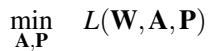

(1)

where L(·) represents the mean end-to-end latency over the workload W under allocation A and parallelism strategy P.

Solving Eq. 1 requires an efficient method to evaluate L(·) for any candidate configuration. The typical approach of profiling jobs on different hardware configurations is accurate but not scalable, particularly for clusters that may have highly heterogeneous hardware, such as the cases we consider. Instead, we use a serving simulator to analytically estimate performance.

The serving simulator takes model specifications (e.g., architecture, parameter count), hardware characteristics (e.g., GPU type) and request workloads (e.g., arrival times, input/output lengths) as inputs. The simulation operates in two stages, extending the analytical method of LLM-Viewer [74] from single-request analysis to multi-request serving scenarios. (1) We first enumerate all operators in the model, such as the q, k, v linear projections, self-attention computations, feed-forward layers, etc. For each operator, we estimate its execution time on the target hardware. In our current design, we estimate execution time using the roofline model [6, 71], taking into account the operator’s computational intensity and the hardware’s peak performance and memory bandwidth. This analytical model, though not as accurate as empirical profiling, provides a unique advantage in our environment as it does not require offline profiling, making it adaptable to new models, new hardware, and diverse serving environments, such as model or KV cache quantization, varying sequence lengths and batch sizes, etc. (2) In the second stage, we simulate the concurrent execution of the input workload. Based on the operator latencies derived in the first stage, the simulator models system behaviors including continuous batching, model parallelism, and scheduling policies. The simulator outputs key metrics like latency and throughput, which drive the service scheduler’s deployment decisions. However, we acknowledge that the accuracy of the simulator is limited by the assumptions of the roofline model and the complexity of realworld serving optimizations. Our simulator does not currently model many optimizations, such as chunked prefill [3], prefill and decode disaggregation [2], prefix caching, etc., which can significantly impact performance. We consider improving the accuracy of the serving simulator a key direction for future work.

These simulation results parameterize our objective function, allowing us to evaluate the specific trade-offs inherent in Eq. 1. The scheduler uses Constraint Programming (CP) [55] to solve the optimization problem, which excels at exploring discrete combinatorial spaces through constraint propagation, making it ideal for our resource allocation problem. We enforce three key constraints to ensure feasible deployments:

C1: Global Resource Capacity. The total allocation for each GPU type n cannot exceed availability:

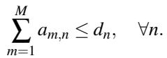

(2)

C2: Memory Feasibility. To prune the search space, we ensure any assigned GPU type n has sufficient memory (memn) to host the model weights and KV cache (Mm):

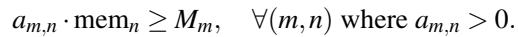

(3)

C3: Parallelism compatibility. For each model type m, the parallelism strategy pm specifies a configuration ⟨ψ(n)DP, ψ(n)TP ⟩ for each GPU type n where am,n > 0, representing the data parallelism [40] and tensor parallelism [47, 60] degrees, respectively. The configuration must satisfy:

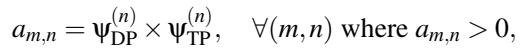

(4)

ensuring that the am,n GPUs of type n allocated to model m data-parallel replicas, each (n)   
employing ψ -way tensor parallelism.

## 4 Implementation

Our implementation of OpenTela consists of approximately 7K lines of Go. We choose Go because of its strong support for concurrency, cross-platform compatibility, and a rich ecosystem of libraries for building distributed systems. Open-Tela uses libp2p [39], a modular network stack, to construct the peer-to-peer network that underpins the decentralized architecture. OpenTela provides a Gin [19]-based API endpoint that exposes RESTful endpoints for accessing the internal status and functionalities of the system. The complementary API frontend is implemented using FastAPI [18].

OpenTela is distributed as a pre-built command-line tool. To deploy a model, users simply encapsulate their existing inference commands (e.g., vllm or sglang) within the OpenTela CLI. For instance, a user can start a node by running: otela start --process vllm serve [model\_name]. Alternatively, users can start a node without a pre-defined model by running otela start. In this mode, the node registers its available hardware resources with the network, allowing the service scheduler to assign models to the node later.

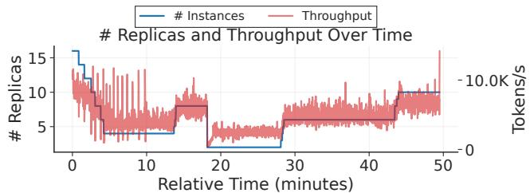  
Figure 4: OpenTela’s ability to recover from node failures over time.

## 5 System Evaluation

In this section, we evaluate the fault-tolerance and performance of OpenTela with benchmark workloads, while in §6, we will analyze the real workloads on the deployed system. Our evaluation aims to answer the following key questions:

Q1: Control plane overhead of OpenTela. How much latency does OpenTela’s user-space control plane add to each request, and does this overhead remain stable as request load increases?

Q2: Elasticity and fault-tolerance. Can OpenTela maintain service continuity and scale throughput proportionally in a dynamic environment with node failures and additions?

Q3: Placement efficiency. How does our heterogeneityaware placement strategy compare to standard heuristics in terms of aggregate cluster throughput?

Q4: Simulation accuracy. Does the serving simulator accurately capture relative hardware performance differences to guide scheduling decisions?

Experiment setup. We conduct our experiments on a heterogeneous environment composed of NVIDIA GPUs, ranging from datacenter-grade accelerators (GH200, H100, A100) to consumer-grade hardware (RTX 3090). This diversity allows us to evaluate OpenTela’s ability to handle hardware heterogeneity. We use OpenTela to serve popular open-source LLMs with varying parameter sizes: Qwen/Qwen3-1.7B, Llama-2-13b, CodeLlama-34b, and Llama-3.3-70B-Instruct. Unless otherwise stated, request arrival times follow a Poisson process, with input and output token lengths sampled from Normal distributions derived from real-world traces collected from our deployment (see more details about traces in §6).

Control-plane overhead. We measure the per-request overhead introduced by OpenTela’s control plane to quantify the cost of operating as a user-space overlay above the serving engines. We decompose each request’s lifecycle into five con trol plane stages alongside the LLM inference performed by the serving engine, and benchmark these components on a deployment serving Qwen/Qwen3-1.7B on 1 GH200 GPU, with Poisson arrival rates of 1, 4, and 16 RPS, and report the time spent in each stage.

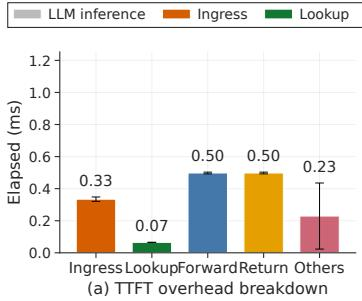

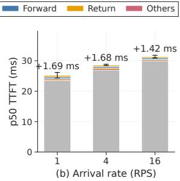  
Figure 5: Control plane overhead of OpenTela. (a) Per-stage cost for a single request. (b) p50 TTFT decomposition at arrival rates of 1, 4, and 16 RPS with 256 input tokens.

Figure 5a reports the per-stage overhead breakdown for serving a 1.7B model. Ingress, which covers request reception and dispatch at the ingress node, takes 0.33 ms, and Lookup, the CRDT-based candidate selection at the ingress node, takes less than 0.1 ms, confirming that the local replica supports fast selection decisions without contacting a central coordinator. The dominant costs are Forward and Return at around 0.5 ms each, reflecting the network hops between the ingress and serving nodes. Others contributes a residual cost of less than 1 ms, which includes the handoff to the serving engine and other processing. Figure 5b shows how these costs contribute to the overall time-to-first-token (TTFT) at different arrival rates, with the control plane overhead remaining stable and contributing around 10% of the total TTFT, while the majority of the latency is due to LLM inference. As the model size grows, the relative impact of the control plane overhead shrinks, since prefill latency scales with model size while the control plane overhead remains fixed. For time-per-outputtoken (TPOT), only the Return hop contributes per token, and as the other stages are amortized over the lifetime of the request, the resulting per-token overhead is sub-millisecond, which is negligible compared to the decoding time of each token. In a wide-area deployment with the ingress node in Frankfurt and the serving node in Switzerland, OpenTela adds \~3.5 ms to TTFT over invoking the model directly on the serving node. The network round-trip accounts for \~3.1 ms, leaving only \~0.4 ms attributable to OpenTela’s routing.

We also measure how quickly state changes propagate through OpenTela’s gossip network. We trigger an event at one node (either a node joining the network or an existing node starting to serve a new model) and measure the elapsed time until each remaining node has applied the corresponding update to its local registry. At cluster sizes from 8 to 128 nodes, 50% of nodes converge in 7 to 13 ms, 75% within 26 ms, and 95% within 1 second. The slowest node shows a tail of several seconds, reaching around 10 seconds with 128 nodes in the network. This tail reflects how long full cluster convergence takes, but it does not block request routing: the ingress node dispatches requests to the new endpoint as soon as its own replica reflects the update, independent of when the rest of the cluster converges.

In addition, we measure the message bandwidth overhead introduced by OpenTela. On the data plane, forwarding a request from the ingress node to the serving node adds a fixed header cost of around 450 bytes on the request path and 120 bytes on the response path, independent of the payload size. On the control plane, the background traffic scales with the mesh size rather than the request rate: an idle node exchanges only liveness messages, and its per-node traffic grows roughly linearly from 1 KB/s at 10 nodes to 8 KB/s at 50 nodes. Updates to the shared registry are more expensive: each CRDT write (e.g., a node joining or registering a model) raises pernode traffic from 1 KB/s at idle to 40 KB/s when 10 nodes re-register every 3 seconds. However, these spikes are transient and do not affect request processing, since the control plane operates asynchronously in the background.

Cross-cluster overhead. The measurements above isolate per-request cost within a single cluster. OpenTela also adds overhead at the network layer through its tunneling fabric, which becomes relevant once requests cross cluster boundaries. HPC compute nodes typically sit behind login-node gateways with no inbound connectivity and tight egress policies, so any cross-cluster path requires a tunneling layer that OpenTela provides as part of its node fabric. To quantify this cost, we measure pairwise latency and throughput between our deployment clusters and representative client locations across Switzerland and Europe.

Figure 6 reports measurements through OpenTela. Parenthesized values give direct ping and iperf results for paths where the two endpoints can establish a direct connection. Entries without parentheses correspond to paths where direct communication is not possible, and OpenTela establishes connectivity through hole punching and circuit relay. On paths where direct measurement is possible, OpenTela’s tunneling adds at most 15 ms above the 19 ms direct baseline (Clariden→JSC, from 19 ms to 34 ms) and reduces throughput by up to 16% (OCI-2→OCI-1, from 503 to 423 Mbps).

Elasticity and fault-tolerance. To evaluate OpenTela in a dynamic HPC-based environment, where nodes may join or leave the network at any time, we deploy OpenTela on a system with at most 64 GH200 GPUs, serving a continuous stream of inference requests while varying the available worker pool by randomly terminating nodes in the system during the experiment. Figure 4 reports the throughput (in tokens/s) alongside the number of active replicas over time. OpenTela’s throughput (red line) adapts proportionally, on average, to the number of active replicas (blue line), showing that OpenTela can effectively adjust to changes in compute capacity without manual intervention. Furthermore, despite the abrupt termination of nodes, we observed zero user-facing HTTP errors during the entire experiment. This confirms that our decentralized registry maintains service continuity even under high churn rates, successfully routing requests to remaining healthy nodes while the cluster topology stabilizes.

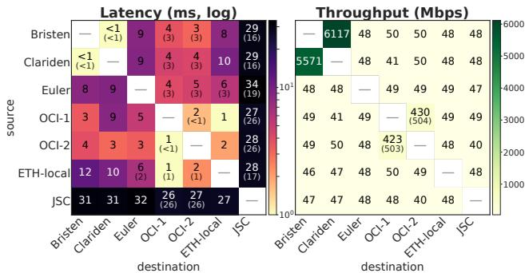  
Figure 6: Network conditions across HPC clusters. Left: latency (ms, log scale), right: throughput (Mbps). Parenthesized values are direct ping or iperf baselines when reachable directly without hole punching. Unparenthesized entries use OpenTela’s tunneling via hole punching and circuit relay.

Table 1: We compare how OpenTela vs. a memoryproportional heuristic policy allocate hardware for different models running in a cluster of 24 A100s and 32 GH200s.  
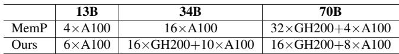

Placement strategy. We evaluate the effectiveness of our placement strategy by comparing it to a memory-proportional policy, memP, inspired by HexGen [36], which represents a standard heuristic. It allocates GPU resources proportional to the memory demand of different models, defined as the product of the average request arrival rate and the model parameter size. We synthesized a workload modeled from real-world traces collected from OpenTela, consisting of three distinct models with varying sizes and load characteristics: Llama-2-13b, CodeLlama-34b, and Llama-3.3-70B-Instruct. Requests for each model follow a Poisson arrival process with average rates of 110, 185.5, and 221 req/s, respectively. We sample input and output sequence lengths from Normal distributions, with mean input lengths ranging from approximately 600 to 1170 tokens, and mean output lengths ranging from 64 to 530 tokens. Table 1 shows the placement allocation that each policy decides when given a budget of 24 A100 and 32 GH200 GPUs. Figure 7 com pares the performance of the two placement decisions. The memP baseline prioritizes the largest model (70B) and overprovisioning it with GH200 and A100 GPUs. This does not leave enough resources for the 34B model, resulting in lower aggregate performance. In contrast, our heterogeneity-aware strategy balances allocation across model and GPU types. We do not claim that our policy is globally optimal. Our goal here is simply to highlight the importance of explicitly modeling system heterogeneity to improve resource utilization.

Simulator validation. Figure 8 compares real and simulated end-to-end latency on H100 and RTX 3090 GPUs across three configurations that vary input length, output length, and batch size. The simulator’s absolute latency estimates deviate from real measurements by up to 10%, primarily due to accumulated errors in decode time estimation. The simulator captures relative performance more accurately, predicting the H100 speedup over RTX 3090 within 6% of measured values across all configurations. This shows the simulator can help OpenTela make heterogeneity-aware scheduling decisions.

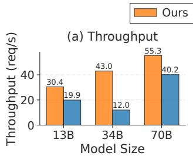

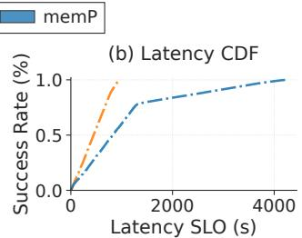  
Figure 7: Throughput and latency comparison between our placement method and the memory-proportional approach.

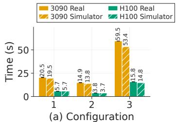

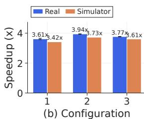  
Figure 8: End-to-end performance of H100 and RTX 3090, measured on real hardware and predicted by our simulator. Each configuration is specified as (input length, output length, batch size), with lengths in tokens: (1) (1024, 1024, 1), (2) (2048, 512, 4), (3) (512, 2048, 8). (Left) Absolute latency in seconds. (Right) Speedup of H100 over RTX 3090.

## 6 Swiss AI Deployment and Trace Analysis

OpenTela is currently deployed as the serving backbone for the Swiss AI Initiative, a multi-institutional open-science research initiative for developing and providing access to opensource frontier AI models. At the time of writing, we have been operating OpenTela for over 22 months. It has served billions of tokens to over 1000 researchers across multiple institutions. We first discuss our cluster setup and then describe the anonymized trace dataset that we collected over a 16-month period (§6.1). We then characterize the LLM serving workloads from this trace (§6.2).

Cluster setup. The Swiss AI deployment spans three subclusters within the Alps supercomputer at CSCS, each with distinct hardware and management stacks. Bristen is an x86- 64 cluster equipped with A100 GPUs, managed by Slurm, and used primarily for smaller-scale and development workloads. Clariden is a large-scale Slurm cluster equipped with GH200 superchips, used for production inference at scale. Breithorn is a small Kubernetes-managed cluster, also equipped with

GH200 superchips, intended for long-running, dedicated serving. Despite their administrative independence, all three subclusters participate in a single OpenTela node network. Com pute nodes in all three sub-clusters sit behind network address translation (NAT) and cannot be reached directly from outside CSCS, so we run an OpenTela node on another CPU-only Kubernetes cluster as the public ingress point. Within CSCS, inter-cluster latency remains under 1 ms with multi-Gbps throughput between sub-clusters (Figure 6). Researchers and users interact with OpenTela’s unified API endpoint without awareness of which sub-cluster handles their request.

Operational model. Researchers with Slurm access contribute nodes to the shared pool by wrapping their serving commands in the OpenTela CLI. The Breithorn Kubernetes partition hosts a small set of models that the community has designated for continuous availability (currently the Apertus family of open-weight models [30] developed within the Swiss AI initiative, along with a small number of other popular open models). The remaining models are served on-demand from Slurm allocations on Bristen and Clariden, with node lifecycle managed through the gossip network as described in §3. The API frontend runs as a persistent service on Breithorn and serves as the ingress node of the gossip network. It handles authentication via institutional credentials, usage tracking, and request routing across all three sub-clusters.

## 6.1 Trace Overview

We release the anonymized trace dataset collected from July 2024 to October 2025 to facilitate future research on AI serving system infrastructure. This dataset includes over 13 million requests, with over 15 billion tokens processed. For each request, we recorded its timestamp, model identifier, aggregate input and output token counts, and sampling parameters (e.g., temperature, maximum tokens). Due to privacy and compliance requirements, we neither use nor disclose the actual content of both input prompts and output responses in our traces. However, we do analyze prefix sharing and token reuse characteristics using the approach first described in Mooncake [53], which involves irreversibly hashing the input tokens and putting 16 consecutive tokens into a single hash bucket. A bucket ID will be equal to another if and only if the 16 tokens in both buckets are identical. We hash the bucket ID so that no information can be inferred from the ID. Hence, our trace does not include any user-identifiable information. We still allow users to bypass the usage tracking in cases where it is necessary to ensure data compliance.

In Table 2, we summarize key differences between our traces and existing public traces. Most existing traces focus on a single or very few models (often a popular closed-source LLM such as GPT-3.5 or GPT-4) while our trace includes a diverse set of real-world models, with over 142 different models being requested. Among those models, 46 are existing openweight models that are publicly available, while the remaining 96 models are custom-trained models developed within our researchers and users community. We omit ShareGPT from this comparison because it exists in several unofficial versions and consists of conversation sessions from proprietary models without timestamps or other request-level metadata. Additionally, our traces span a longer period of time, allowing us to analyze long-term trends in model usage and request patterns.

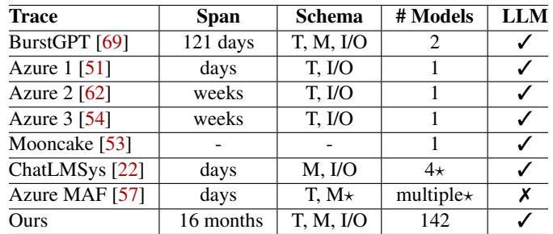  
Table 2: Trace characteristics summary. T: timestamp, M: model, I/O: input/output tokens, ⋆: not inference, just function invocations. Number of models only counts unique models.

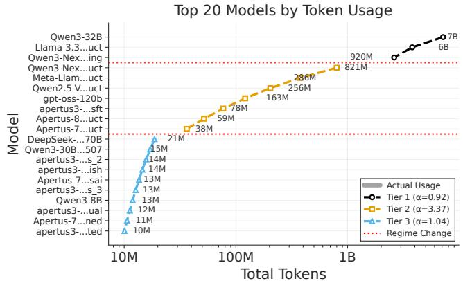  
Figure 9: Overall model token usage. Each bar represents the total token consumption (input + output) for a specific model, ranked from highest to lowest usage.

## 6.2 Workload Characterization

Model usage distribution. Figure 9 shows the total token consumption of the top 20 models, including both input and output tokens per model, ranked from highest to lowest. We observe a multi-tier power-law distribution. The first tier consists of the top 3 models, which account for a significant por tion of total token usage. These models are general-purpose LLMs that are used for various tasks. The second tier consists of multi-modal models (notably Qwen-2.5-VL) and also models that researchers in the Swiss AI initiative are particularly interested in evaluating (e.g., Apertus models, which are trained within the Swiss AI community [30]). The third tier consists of a long tail of models that are used infrequently, often for specialized tasks or by niche user groups.

Key Takeaway 1: Serving systems must efficiently support a skewed workload distribution, handling both popular generalpurpose models and a long tail of diverse, niche models.

Per-model request burstiness. Next, we characterize model request burstiness along two dimensions: Magnitude and temporal dynamics. We define the instantaneous burstiness as the ratio of the instantaneous tokens per minute (TPM) to the model’s average TPM. We then quantify the overall burstiness magnitude as the peak of this ratio. We compute the average TPM strictly over active minutes (minutes with at least one request) to avoid artificially inflating the ratio due to periods of inactivity. Figure 10 reports the magnitude, ranking models by their burstiness magnitude to highlight the most extreme bursty workloads. Overall, we observe extreme volatility across the board. Even among the top 15 most bursty models, the lowest burstiness exceeds 13, while the most bursty model reaches a ratio of over 80. This indicates that average request arrival rates underestimate peak loads. For example, Figure 11 shows the temporal request invocation dynamics for a variety of models, with timelines aligned to each model’s first request (t = 0). This reveals when load spikes occur relative to the start of a model’s operation.

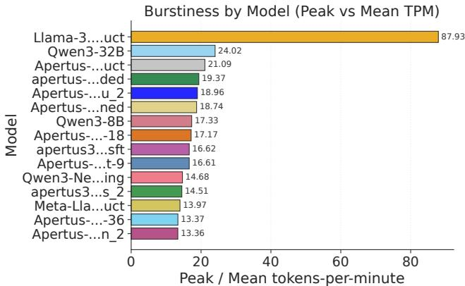

Figure 10: Peak-to-average request rate ratio per model during their active minutes.  
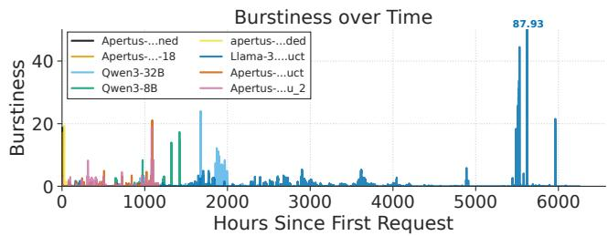  
Figure 11: Burstiness over time for several representative models. Burstiness is defined as the ratio of instantaneous TPM to the model’s average TPM over active periods. Timelines are aligned to the first request at t = 0.

Key Takeaway 2: Dynamic resource allocation and elastic scaling are essential, as static provisioning based on average rates does not satisfy peak demands while provisioning for peak would underutilize resources. Similar burstiness occurs in other real-world traces, such as ShareGPT and BurstGPT [69].

Input / Output Length Distribution. The distribution of input and output sequence lengths has significant implications for resource planning and management. We analyze the distribution of input and output token lengths of four models with highest request counts: Llama-3.1-70B, Llama-3.3-70B, DeepSeek-R1-Distilled-Llama70B,Qwen-32B. Figure 12 shows the empirical CDF of input (left) and output (right) token counts for these four models, with dotted vertical lines marking the aggregate P50, P95, and P99 across all requests. Input distributions are similar, with most prompts falling between 102 and 103 tokens, except for Deepseek-R1-Distilled-Llama70B, which shows a flat CDF below 103 tokens before a sharp jump near 104, indicating a dominant workload of long, fixed-length prompts. Output distributions diverge more sharply: Llama-3.1-70B and Llama-3.3-70B have a large fraction of requests producing only 1–2 tokens, consistent with classifier or guardrail traffic, while Qwen-32B follows a smooth sigmoid centered around 102–103 tokens.

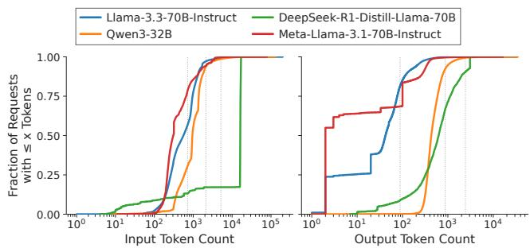  
Figure 12: Cumulative distribution of token lengths for the analyzed models.

Key Takeaway 3: Output length distribution varies significantly across models. For non-reasoning models, a substantial fraction of requests produce only a few output tokens, particularly for classifier or guardrail traffic, motivating optimizations such as PrefillOnly [21]. Reasoning models, on the other hand, concentrate on longer output sequences with no comparable short output fraction. This highlights the importance of applying different optimizations for different model and workload characteristics.

Input / Output ratio characteristics. A request’s resource footprint depends heavily on its structure: Input-heavy requests strain compute during the prefill phase, while outputheavy requests consume memory bandwidth during the decode phase. Therefore, we analyze how the output sequence lengths of requests compares to the total (input + output) sequence lengths. Figure 13 plots the output token ratio for Qwen3-32B, over three months. As shown in Figure 13, the workload is far from uniform: the ratio of output tokens to total tokens fluctuates over the three-month period.

Key Takeaway 4: Interference between compute-bound prefill and memory-bound decode stages is a critical issue in production LLM serving. This highlights the importance of optimizations such as chunked prefill [3] and prefill-decode disaggregation [34, 51, 63, 76] to mitigate this interference.

Prefix sharing characteristics. Beyond the structure of individual requests, we investigate the computational redun dancy across requests. We analyze the token reuse ratio, defined as the fraction of input tokens overlapping with recent history, to identify opportunities for avoiding re-computation. Figure 14 shows how usage patterns differ between model types. The reasoning-heavy Qwen3-Next-80B-A3B-Thinking has a large reuse ratio exceeding 90%. This implies that the dominant workload for this reasoning model consists of deep, iterative multi-turn sessions where users build progressively on a shared context. In contrast, the standard Instruct variant shows a modest reuse ratio of ∼ 15%, reflecting the usage pattern of independent, single-turn queries. This suggests that much of the prefill computation in reasoning models may be redundant. This motivates KV-cache management optimizations like LMCache [11], which amortizes the quadratic attention costs inherent in long-context, iterative workflows.

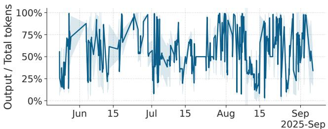  
Figure 13: Output token ratio distribution for Qwen3-32B over three months.

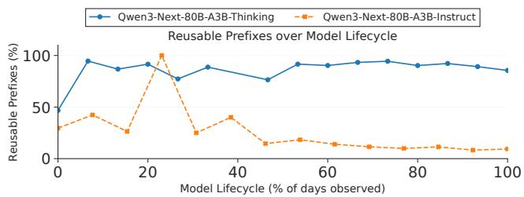  
Figure 14: Reusable prefix ratio over model lifecycles for two representative models.

Key Takeaway 5: Our analysis of Qwen3-Next-80B-A3B-Thinking suggests that reasoning models, particularly when used in iterative, multi-turn sessions, might exhibit high prefix reuse ratios. This suggests that optimizations focused on prefix caching and KV-cache management [11] could be particularly beneficial for amortizing the quadratic attention costs in these workloads.

Latency Distribution. Figure 15 shows the cumulative distribution of end-to-end latency (E2E, left) and output token counts for reasoning and non-reasoning requests. We observe that reasoning requests exhibit substantially higher E2E latency than non-reasoning ones, with a P95 of 173.58 s, more than 5.5× higher than the P95 of non-reasoning requests (30.77 s). The output token distribution shows the source of this gap: non-reasoning requests produce short outputs for a substantial fraction of the workload, with a median of 87 tokens and P95 of 828 tokens, while reasoning requests routinely generate much longer outputs, with a median of 1,782 tokens and P95 of 7,628 tokens, roughly an order of magnitude higher than non-reasoning requests.

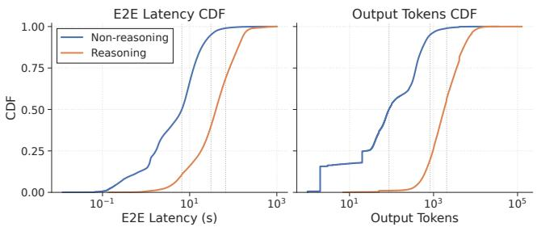  
Figure 15: Cumulative distribution of end-to-end latency (left) and output token counts (right).

Key Takeaway 6: Service Level Objectives (SLOs) must be differentiated to accommodate reasoning models, applying distinct timeout and retry policies that account for their significantly higher latency tails compared to standard models. To actively guarantee SLOs, systems could implement “reasoning budget” [43, 70] that dynamically caps the computational depth of reasoning traces to fit within time windows, or SLO-aware model selection [9, 35] where the system dispatches queries to the appropriate models, or SLO-aware model serving [10].

## 7 Discussion

We reflect on our experiences designing, implementing, and operating OpenTela for real users (§7.1). We then share some observations on emerging workload patterns driven by reasoning models (§7.2). Finally, we discuss the limitations of our current design and outline directions for future work (§7.3).

## 7.1 Lessons learned

Flexibility and interoperability as first-class citizens. We observed that researchers often have varying preferences for serving engines and hardware capabilities, and that the flexibility to adapt to different hardware and software environments is crucial for the deployment and adoption of OpenTela. In the context of LLM serving, the widespread adoption of the unified OpenAI-compatible interface across these serving engines provided a standardized abstraction layer. This allowed us to design OpenTela to be engine-agnostic by default. Furthermore, we evaluated whether Kubernetes-based orchestration would be a better fit for our use case. However, given our reliance on Slurm-based HPC clusters for GPU resources, we found that integrating with existing HPC infrastructure provided a more seamless experience for our users.

Need for more expressive abstractions. While the OpenAI-compatible interface simplifies interaction, it obscures critical execution details like model quantization levels and context limits. This creates ambiguity when users have strict expectations regarding numerical precision and other parameters critical for model quality. To mitigate this, we currently require model providers to adhere to strict naming conventions (e.g., explicitly tagging quantization bits in model names) to ensure transparency. This highlights a gap in current LLM serving protocols: the lack of a protocol for negotiating model quality of service beyond simple identifiers.

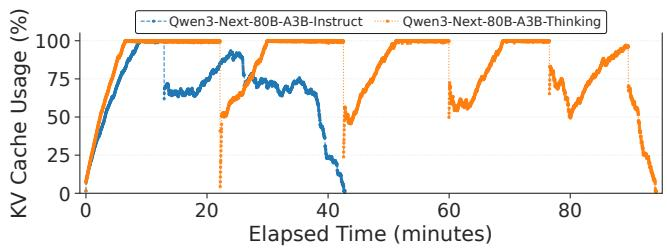  
Figure 16: KV cache usage comparison between reasoning and non-reasoning models.

Importance of proper systematic modeling. Early iterations of OpenTela relied on a centralized database for tracking GPU worker availability. We found that enforcing strong consistency for metadata operations created a significant scalability bottleneck. The pivotal lesson was transitioning from ad-hoc state tracking to a formal algebraic model that represents the cluster state as a conflict-free replicated data type (CRDT). By modeling the system state as a monotonic lattice, we were able to decouple node interactions and adopt an eventually consistent model. This shift eliminated the central coordinator entirely, enabling the system to remain available even during network partitions.

Introspection, monitoring and human intervention. Debugging in a decentralized environment is inherently challenging due to the lack of direct access (e.g., SSH) to worker nodes. Consequently, we shifted our design philosophy from attempting to recover to fail-stop semantics. Instead of attempting complex runtime recovery, OpenTela relies on strict health checks, and upon detecting fatal anomalies (e.g., NCCL timeout), a node automatically evicts itself from the cluster to preserve global system integrity. To aid post-mortem analysis, we proactively collect logs to a sink before termination.

## 7.2 Implications of Reasoning for LLM Serving Systems

We also conduct some preliminary experiments to motivate future work on making serving systems more workload-aware and hardware-aware. In particular, since we notice that Open-Tela often serves reasoning and non-reasoning variants of models, we explore the serving system implications of reasoning by running representative public benchmarks.

KV cache pressure. Reasoning models tend to produce longer outputs, which consumes additional memory compared to their non-reasoning ("Instruct") model counterparts. Figure 16 compares the KV cache usage for the AIME 1983- 2024 [68] benchmark. The non-reasoning model shows a dynamic usage pattern with rapid reclamation cycles, finishing in ∼ 40 minutes. In contrast, the reasoning model extends execution to ∼ 95 minutes and has a distinct sawtooth pattern: sharp, sustained increases represent the accumulation of transient state during chain-of-thought reasoning, followed by sharp drops upon sequence completion. The high cost of regenerating transient “reasoning” states requires sophisticated memory management, such as offloading KV caches to secondary storage during preemption rather than discarding and recomputing them.

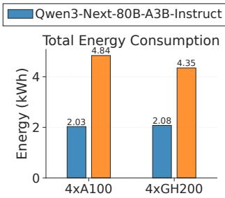

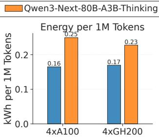  
Figure 17: Power consumption of reasoning and nonreasoning models.

Energy consumption. The longer execution time and higher memory usage of reasoning models inevitably increases energy costs. Figure 17 quantifies this impact on A100 and GH200 architectures for the AIME 1983-2024 benchmark [68]. We find that reasoning models are not just slower but also consume more energy. The reasoning variant consumes over 2× the total energy of the non-reasoning baseline (rising from ∼ 2.0 kWh to ∼ 4.3 kWh). Crucially, the energy cost per token also jumps by ∼ 56% (from ∼ 0.16 to ∼ 0.25 kWh per million tokens). This non-linear scaling stems from a compound effect: The model generates more tokens (volume), and as the context window expands, the quadratic complexity of self-attention makes every subsequent decoding step more computationally intensive. Furthermore, we compare the energy consumption across two GPU architectures. While GH200s deliver superior raw performance, their energy consumption is on par with A100s for the same workload. We attribute this to two factors associated with this particular workload. First, the workload is memory-bound by the KV cache, restricting the batch sizes and preventing full saturation of GH200’s compute units. Second, the sparse activation of MoE models exacerbates this by requiring more memory capacity while demanding relatively less compute. This aligns with previous findings [12, 15]. Future serving systems could improve energy efficiency for reasoning models by applying memory optimizations, such as KV cache compression or offloading, as the workload is constrained by memory capacity rather than raw compute power.

## 7.3 Limitations and Future Work

While OpenTela successfully bridges the gap between HPC infrastructure and model serving, operating a decentralized user-space overlay at this scale has revealed limitations.

Protocol expressiveness and quality of service (QoS). As discussed earlier, the adoption of a unified, OpenAIcompatible interface simplifies client integration but abstracts away critical configuration nuances; a client cannot easily request specific trade-offs, such as lower precision for lower latency or guaranteed precision without relying on rigid naming conventions. We propose extending the serving protocol to support QoS negotiation. Future versions of OpenTela will allow clients to specify constraints (e.g., quantization ≥ 4-bit, specific GPU type) in the request metadata, and the system will route requests to nodes that satisfy these constraints.

Availability. OpenTela currently operates on a best-effort basis and does not provide strong availability guarantees. We plan to introduce tiered service levels. By categorizing resources based on their expected stability (e.g., differentiating between stably owned partitions and volatile scavenger queues), the scheduler could route critical workloads to more stable nodes, while batch processing tasks can exploit volatile, lower-priority capacity to maximize cluster throughput without compromising reliability for high-priority users.

Cross-node serving optimizations. Several recent serving optimizations that would benefit our workload are not yet supported in OpenTela. KV cache reuse works only when a request lands on a node already holding the relevant prefix, and prefill and decode disaggregation [51, 76] is unsupported because the OpenTela router treats each request as an atomic unit. A global KV cache layer [11] across the mesh and prefilldecode disaggregated deployment are both future work.

## 8 Related Work

Heterogeneous LLM serving. Heterogeneous LLM serving refers to systems that utilize a mix of GPU types with varying hardware characteristics—such as differing computational and memory capacities—to optimize resource utilization and cost-efficiency. Several recent works [29, 33, 37, 52, 66] have addressed this domain. Petals [5] is the first open-source system that allows users to serve LLMs on a set of decentralized hardware. HexGen [36] introduces asymmetric partitioning and designs advanced scheduling techniques to deploy generative inference in heterogeneous and decentralized settings. SkyServe [42] leverages spot instances across different regions and clouds to ensure availability for AI models serving, but does not focus on distributed HPC environments. LLM ServingSim [13] adopts a trace-driven performance modeling approach and provides a simulation framework to evaluate the performance of heterogeneous LLM serving systems. ThunderServe [34] addresses the distinct computational characteristics of the prefill and decoding phases by deploying them on heterogeneous GPUs matched to their respective workload requirements. Similarly, Helix [46] formulates the optimization of heterogeneous GPU and network connections as a maxflow problem, utilizing mixed-integer linear programming to determine optimal model deployment, SageServe [32] formulates the optimization strategies as an optimization problem and solves it with integer linear programming (ILP). Collectively, these works demonstrate that the strategic utilization of heterogeneous resources significantly enhances the costefficiency of LLM serving. Unlike existing works on singlemodel serving, our service scheduler jointly addresses model heterogeneity (varying LLMs) and GPU heterogeneity (varying hardware specifications) for multi-model deployment.

Multi-tenant LLM serving. Another line of research focuses on serving multiple models concurrently to maximize resource utilization. AlpaServe [40] reveals that model parallelism can be used for statistical multiplexing of multiple models, and designs a serving system that determines efficient placing and parallelizing strategies. MuxServe [22] introduces a flexible spatial-temporal multiplexing system that identifies optimal colocation strategies for multiple LLMs. When the multiple models are fine-tuned from a shared base model, DeltaZip [72] exploits the shared weights and compresses the deltas to improve serving efficiency. If the fine-tuning is performed using parameter-efficient methods (e.g., LoRA [31]), Punica [8] and S-LoRA [59] design specialized serving systems for serving adapters efficiently. In contrast, OpenTela focuses on the challenges arising from both model and hardware heterogeneity, as well as administrative burdens in large-scale deployments, particularly on HPC environments.

Federated research infrastructure. OpenTela is similar in spirit to federated testbeds such as PlanetLab [20] and CloudLab [23], which pool resources across institutions for systems and networking research. OpenTela focuses on LLM serving and operates as an overlay on existing HPC clusters rather than dedicated testbed hardware.

## 9 Conclusion

As open-source models proliferate and organizations seek greater control over their AI stack, serving infrastructure needs to operate across HPC clusters with heterogeneous hardware and dynamic resource availability. Decentralized orchestration overlays such as OpenTela offer a convenient alternative to centralized cloud-native control planes. OpenTela unifies fragmented and heterogeneous compute resources across diverse clusters into a single LLM serving platform, providing service discovery, fault-tolerant routing, heterogeneity-aware scheduling, and a unified serving interface on top of existing LLM inference engines, all while operating entirely in user space. Our deployment in the Swiss AI Initiative shows that this approach is practical at scale: OpenTela has served more than 15 billion tokens across 142 models to over 1000 researchers from multiple institutions.

## Acknowledgements

Beyond the authors, dozens of engineers and student assistants have contributed to the design, implementation, and deployment of OpenTela. We are grateful to Aryan Ahadinia, Elia Palme, Stefano Schuppli and the rest of the Swiss AI team and the Swiss Supercomputing Center (CSCS), in particular Joost VandeVondele and Thomas Schulthess, for their support. We thank Prof. Chaojian Li, Foteini Strati, Cedric Renggli, anonymous reviewers, and our shepherd for their insightful feedback and suggestions. This work was supported as part of the Swiss AI Initiative by a grant from the Swiss National Supercomputing Centre (CSCS) on Alps.

## References

[1] Understanding slurm for ai/ml workloads. https://ww w.whitefiber.com/blog/understanding-slurm -for-ai-ml-workloads, November 2025.

[2] Amey Agrawal, Nitin Kedia, Ashish Panwar, Jayashree Mohan, Nipun Kwatra, Bhargav Gulavani, Alexey Tumanov, and Ramachandran Ramjee. Taming {Throughput-Latency} tradeoff in {LLM} inference with {Sarathi-Serve}. In 18th USENIX Symposium on Operating Systems Design and Implementation (OSDI 24), pages 117–134, 2024.

[3] Arney Agrawal, Nitin Kedia, Ashish Panwar, Jayashree Mohan, Nipun Kwatra, Bhargav S. Gulavani, Alexey Tumanov, and Ramachandran Ramjee. Efficient llm inference via chunked prefills. SIGOPS Oper. Syst. Rev., 59(1):9–16, August 2025.

[4] Allen AI. Allen institute for artificial intelligence. http s://allenai.org/, 2026. Accessed: 2026-05-17.

[5] Alexander Borzunov, Dmitry Baranchuk, Tim Dettmers, Maksim Riabinin, Younes Belkada, Artem Chumachenko, Pavel Samygin, and Colin Raffel. Petals: Collaborative inference and fine-tuning of large models. In Proceedings of the 61st Annual Meeting of the Association for Computational Linguistics (Volume 3: System Demonstrations), pages 558–568, 2023.

[6] Shiyi Cao, Shu Liu, Tyler Griggs, Peter Schafhalter, Xiaoxuan Liu, Ying Sheng, Joseph E Gonzalez, Matei Zaharia, and Ion Stoica. Moe-lightning: High-throughput moe inference on memory-constrained gpus. In Pro ceedings of the 30th ACM International Conference on Architectural Support for Programming Languages and Operating Systems, Volume 1, pages 715–730, 2025.

[7] Marco Cascella, Jonathan Montomoli, Valentina Bellini, and Elena Bignami. Evaluating the feasibility of chatgpt in healthcare: an analysis of multiple clinical and research scenarios. Journal of medical systems, 47(1):33, 2023.

[8] Lequn Chen, Zihao Ye, Yongji Wu, Danyang Zhuo, Luis Ceze, and Arvind Krishnamurthy. Punica: Multi-tenant lora serving. Proceedings of Machine Learning and Systems, 6:1–13, 2024.

[9] Lingjiao Chen, Matei Zaharia, and James Zou. Frugalgpt: How to use large language models while reducing cost and improving performance. arXiv preprint arXiv:2305.05176, 2023.

[10] Siyuan Chen, Zhipeng Jia, Samira Khan, Arvind Krishnamurthy, and Phillip B Gibbons. Slos-serve: Optimized serving of multi-slo llms. arXiv preprint arXiv:2504.08784, 2025.

[11] Yihua Cheng, Yuhan Liu, Jiayi Yao, Yuwei An, Xiaokun Chen, Shaoting Feng, Yuyang Huang, Samuel Shen, Kuntai Du, and Junchen Jiang. Lmcache: An efficient kv cache layer for enterprise-scale llm inference. arXiv preprint arXiv:2510.09665, 2025.

[12] Krishna Teja Chitty-Venkata, Siddhisanket Raskar, Bharat Kale, Farah Ferdaus, Aditya Tanikanti, Ken Raffenetti, Valerie Taylor, Murali Emani, and Venkatram Vishwanath. Llm-inference-bench: Inference benchmarking of large language models on ai accelerators. In SC24-W: Workshops of the International Conference for High Performance Computing, Networking, Storage and Analysis, pages 1362–1379. IEEE, 2024.

[13] Jaehong Cho, Hyunmin Choi, Guseul Heo, and Jongse Park. LLMServingSim 2.0: A Unified Simulator for Heterogeneous and Disaggregated LLM Serving Infrastructure. In 2026 IEEE International Symposium on Performance Analysis of Systems and Software (ISPASS), pages 1–14, 2026.

[14] Zhendong Chu, Shen Wang, Jian Xie, Tinghui Zhu, Yibo Yan, Jinheng Ye, Aoxiao Zhong, Xuming Hu, Jing Liang, Philip S Yu, et al. Llm agents for education: Advances and applications. arXiv preprint arXiv:2503.11733, 2, 2025.

[15] Jae-Won Chung, Jeff J Ma, Ruofan Wu, Jiachen Liu, Oh Jun Kweon, Yuxuan Xia, Zhiyu Wu, and Mosharaf Chowdhury. The ml. energy benchmark: Toward automated inference energy measurement and optimization. arXiv preprint arXiv:2505.06371, 2025.

[16] European Commission. Ai factories. https://digita l-strategy.ec.europa.eu/en/policies/ai-fac tories, 2025. Accessed: 2025-12-11.

[17] McKinsey & Company. The cost of compute: A \$7 trillion race to scale data centers. https://www.mcki nsey.com/industries/technology-media-and-t elecommunications/our-insights/the-cost-o f-compute-a-7-trillion-dollar-race-to-sca le-data-centers, 2025. Accessed: 2025-12-11.

[18] FastAPI Contributors. Fastapi framework, high performance, easy to learn, fast to code, ready for production. https://fastapi.tiangolo.com/, 2025. Accessed: 2025-12-10.

[19] Gin Contributors. Gin web framework. https://gi n-gonic.com/, 2025. Accessed: 2025-12-01.

[20] David E. Culler. PlanetLab: An open, Community-Driven infrastructure for experimental Planetary-Scale services. Seattle, WA, March 2003. USENIX Association.

[21] Kuntai Du, Bowen Wang, Chen Zhang, Yiming Cheng, Qing Lan, Hejian Sang, Yihua Cheng, Jiayi Yao, Xiaoxuan Liu, Yifan Qiao, Ion Stoica, and Junchen Jiang. Prefillonly: An inference engine for prefill-only workloads in large language model applications. In Proceedings of the ACM SIGOPS 31st Symposium on Operating Systems Principles, SOSP ’25, page 399–414, New York, NY, USA, 2025. Association for Computing Machinery.

[22] Jiangfei Duan, Runyu Lu, Haojie Duanmu, Xiuhong Li, Xingcheng Zhang, Dahua Lin, Ion Stoica, and Hao Zhang. Muxserve: flexible spatial-temporal multiplexing for multiple llm serving. In Proceedings of the 41st International Conference on Machine Learning, ICML’24. JMLR.org, 2024.

[23] Dmitry Duplyakin, Robert Ricci, Aleksander Maricq, Gary Wong, Jonathon Duerig, Eric Eide, Leigh Stoller, Mike Hibler, David Johnson, Kirk Webb, Aditya Akella, Kuangching Wang, Glenn Ricart, Larry Landweber, Chip Elliott, Michael Zink, Emmanuel Cecchet, Snigdhaswin Kar, and Prabodh Mishra. The design and operation of CloudLab. In 2019 USENIX Annual Technical Conference (USENIX ATC 19), pages 1–14, Renton, WA, July 2019. USENIX Association.

[24] U.S. National Science Foundation. National artificial intelligence research resource pilot. https://www.ns f.gov/focus-areas/ai/nairr, 2025. Accessed: 2025-12-09.

[25] Canada Government. Ai sovereign compute infrastructure program. https://ised-isde.canada.ca/si te/ised/en/ai-sovereign-compute-infrastru cture-program, 2026. Accessed: 2026-05-17.

[26] Singapore Government. National ai strategy. https: //www.smartnation.gov.sg/initiatives/natio nal-ai-strategy/, 2026. Accessed: 2026-05-17.

[27] South Korea Government. Korea’s artificial intelligence action plan. https://aikorea.go.kr/upload/c ontents/files/Korea’s\_Artificial\_Intellige nce\_Action\_Plan\_20260429.pdf, 2026. Accessed: 2026-05-17.

[28] UK Government. Uk compute roadmap. https://ww w.gov.uk/government/publications/uk-compu te-roadmap/uk-compute-roadmap, 2026. Accessed: 2026-05-17.

[29] Tyler Griggs, Xiaoxuan Liu, Jiaxiang Yu, Doyoung Kim, Wei-Lin Chiang, Alvin Cheung, and Ion Stoica. Mélange: Cost efficient large language model serving by exploiting gpu heterogeneity. arXiv preprint arXiv:2404.14527, 2024.

[30] Alejandro Hernández-Cano, Alexander Hägele, Allen Hao Huang, Angelika Romanou, Antoni-Joan Solergibert, Barna Pasztor, Bettina Messmer, Dhia Garbaya, Eduard Frank Durech, Ido Hakimi, et al.ˇ Apertus: Democratizing open and compliant llms for global language environments. arXiv preprint arXiv:2509.14233, 2025.

[31] Edward J Hu, Yelong Shen, Phillip Wallis, Zeyuan Allen-Zhu, Yuanzhi Li, Shean Wang, Lu Wang, Weizhu Chen, et al. Lora: Low-rank adaptation of large language models. ICLR, 1(2):3, 2022.

[32] Kunal Jain, A. Parayil, Ankur Mallick, Rujia Wang, Renee St. Amant, Chetan Bansal, Victor Ruehle, Saravan Rajmohan, Shashwat Jaiswal, Yogesh Simmhan, Anoop Kulkarni, and Steve Kofsky. Serving Models, Fast and Slow:Optimizing Heterogeneous LLM Inferencing Workloads at Scale. In ACM Sigmetrics 2026, June 2026.

[33] Youhe Jiang, Fangcheng Fu, Xiaozhe Yao, Guoliang He, Xupeng Miao, Ana Klimovic, Bin Cui, Binhang Yuan, and Eiko Yoneki. Demystifying cost-efficiency in llm serving over heterogeneous gpus. In Proceedings of the 42nd International Conference on Machine Learning, ICML’25. JMLR.org, 2025.

[34] Youhe Jiang, Fangcheng Fu, Xiaozhe Yao, Taiyi Wang, Bin Cui, Ana Klimovic, and Eiko Yoneki. Thunderserve: High-performance and cost-efficient llm serving in cloud environments. arXiv preprint arXiv:2502.09334, 2025.

[35] Youhe Jiang, Fangcheng Fu, Wanru Zhao, Stephan Rabanser, Nicholas D Lane, and Binhang Yuan. Cascadia: A cascade serving system for large language models. arXiv preprint arXiv:2506.04203, 2025.

[36] Youhe Jiang, Ran Yan, Xiaozhe Yao, Yang Zhou, Beidi Chen, and Binhang Yuan. Hexgen: Generative inference of large language model over heterogeneous environment. arXiv preprint arXiv:2311.11514, 2023.

[37] Youhe Jiang, Ran Yan, and Binhang Yuan. Hexgen-2: Disaggregated generative inference of llms in heterogeneous environment. arXiv preprint arXiv:2502.07903, 2025.

[38] Woosuk Kwon, Zhuohan Li, Siyuan Zhuang, Ying Sheng, Lianmin Zheng, Cody Hao Yu, Joseph Gonzalez, Hao Zhang, and Ion Stoica. Efficient memory management for large language model serving with pagedattention. In Proceedings of the 29th symposium on operating systems principles, pages 611–626, 2023.

[39] Protocol Labs. libp2p - the peer-to-peer network stack. https://libp2p.io/, 2025. Accessed: 2025-12-01.

[40] Zhuohan Li, Lianmin Zheng, Yinmin Zhong, Vincent Liu, Ying Sheng, Xin Jin, Yanping Huang, Zhifeng Chen, Hao Zhang, Joseph E Gonzalez, et al. {AlpaServe}: Statistical multiplexing with model parallelism for deep learning serving. In 17th USENIX Symposium on Operating Systems Design and Implementation (OSDI 23), pages 663–679, 2023.

[41] Pedro Garcia Lopez, Daniel Barcelona Pons, Marcin Copik, Torsten Hoefler, Eduardo Quiñones, Maciej Malawski, Peter Pietzutch, Alberto Marti, Thomas Ohlson Timoudas, and Aleksander Slominski. Ai factories: It’s time to rethink the cloud-hpc divide. arXiv preprint arXiv:2509.12849, 2025.

[42] Ziming Mao, Tian Xia, Zhanghao Wu, Wei-Lin Chiang, Tyler Griggs, Romil Bhardwaj, Zongheng Yang, Scott Shenker, and Ion Stoica. Skyserve: Serving ai mod els across regions and clouds with spot instances. In Proceedings of the Twentieth European Conference on Computer Systems, pages 159–175, 2025.

[43] Sara Vera Marjanovic, Arkil Patel, Vaibhav Adlakha,´ Milad Aghajohari, Parishad BehnamGhader, Mehar Bhatia, Aditi Khandelwal, Austin Kraft, Benno Krojer, Xing Han Lù, et al. Deepseek-r1 thoughtology: Let’s think about llm reasoning. arXiv preprint arXiv:2504.07128, 2025.

[44] Maxime Martinasso, Mark Klein, and Thomas Schulthess. Alps, a versatile research infrastructure. In Proceedings of the Cray User Group, pages 156–165. 2025.

[45] Petar Maymounkov and David Mazieres. Kademlia: A peer-to-peer information system based on the xor metric. In International workshop on peer-to-peer systems, pages 53–65. Springer, 2002.

[46] Yixuan Mei, Yonghao Zhuang, Xupeng Miao, Juncheng Yang, Zhihao Jia, and Rashmi Vinayak. Helix: Serving large language models over heterogeneous gpus and network via max-flow. In Proceedings of the 30th ACM International Conference on Architectural Support for Programming Languages and Operating Systems, Volume 1, pages 586–602, 2025.

[47] Xupeng Miao, Yujie Wang, Youhe Jiang, Chunan Shi, Xiaonan Nie, Hailin Zhang, and Bin Cui. Galvatron: Efficient transformer training over multiple gpus using automatic parallelism. Proc. VLDB Endow., 16(3):470–479, November 2022.

[48] Erina Seh-Young Moon, Matthew Tamura, Angelina Zhai, Nuzaira Habib, Behnaz Shirazi, Altaf Kassam, Devansh Saxena, and Shion Guha. The promises and perils

of using llms for effective public services. In Proceedings of the 2026 CHI Conference on Human Factors in Computing Systems, pages 1–21, 2026.

[49] National Institute of Advanced Industrial Science and Technology (AIST). Ai bridging cloud infrastructure (abci). https://abci.ai/, 2025. Accessed: 2025-12- 09.

[50] OpenAI. Api overview | openai api reference. https: //developers.openai.com/api/reference/over view, 2026. Accessed: 2026-05-25.

[51] Pratyush Patel, Esha Choukse, Chaojie Zhang, Aashaka Shah, Íñigo Goiri, Saeed Maleki, and Ricardo Bianchini. Splitwise: Efficient generative llm inference using phase splitting. In 2024 ACM/IEEE 51st Annual International Symposium on Computer Architecture (ISCA), pages 118–132. IEEE, 2024.

[52] You Peng, Youhe Jiang, Chen Wang, and Binhang Yuan. Hexgen-text2sql: Optimizing llm inference request scheduling for agentic text-to-sql workflow. arXiv preprint arXiv:2505.05286, 2025.

[53] Ruoyu Qin, Zheming Li, Weiran He, Jialei Cui, Feng Ren, Mingxing Zhang, Yongwei Wu, Weimin Zheng, and Xinran Xu. Mooncake: Trading more storage for less computation — a KVCache-centric architecture for serving LLM chatbot. In 23rd USENIX Conference on File and Storage Technologies (FAST 25), pages 155–170, Santa Clara, CA, February 2025. USENIX Association.

[54] Haoran Qiu, Anish Biswas, Zihan Zhao, Jayashree Mohan, Alind Khare, Esha Choukse, Íñigo Goiri, Zeyu Zhang, Haiying Shen, Chetan Bansal, Ramachandran Ramjee, and Rodrigo Fonseca. Modserve: Modalityand stage-aware resource disaggregation for scalable multimodal model serving. In Proceedings of the 2025 ACM Symposium on Cloud Computing (SoCC 2025), New York, NY, USA, 2025. Association for Computing Machinery.

[55] Francesca Rossi, Peter Van Beek, and Toby Walsh. Handbook of constraint programming. Elsevier, 2006.

[56] SchedMD. Slurm scheduler by schedmd. https://ww w.schedmd.com/slurm/. Accessed: 2025-06-18.

[57] Mohammad Shahrad, Rodrigo Fonseca, Inigo Goiri, Go har Chaudhry, Paul Batum, Jason Cooke, Eduardo Laureano, Colby Tresness, Mark Russinovich, and Ricardo Bianchini. Serverless in the wild: Characterizing and optimizing the serverless workload at a large cloud provider. In 2020 USENIX annual technical conference (USENIX ATC 20), pages 205–218, 2020.

[58] Marc Shapiro, Nuno Preguiça, Carlos Baquero, and Marek Zawirski. Conflict-free replicated data types. In Symposium on Self-Stabilizing Systems, pages 386–400. Springer, 2011.

[59] Ying Sheng, Shiyi Cao, Dacheng Li, Coleman Hooper, Nicholas Lee, Shuo Yang, Christopher Chou, Banghua Zhu, Lianmin Zheng, Kurt Keutzer, Joseph E. Gonzalez, and Ion Stoica. Slora: Scalable serving of thousands of lora adapters. In P. Gibbons, G. Pekhimenko, and C. De Sa, editors, Proceedings of Machine Learning and Systems, volume 6, pages 296–311, 2024.

[60] Mohammad Shoeybi, Mostofa Patwary, Raul Puri, Patrick LeGresley, Jared Casper, and Bryan Catanzaro. Megatron-lm: Training multi-billion parameter language models using model parallelism. arXiv preprint arXiv:1909.08053, 2019.

[61] Sina Shool, Sara Adimi, Reza Saboori Amleshi, Ehsan Bitaraf, Reza Golpira, and Mahmood Tara. A systematic review of large language model (llm) evaluations in clin ical medicine. BMC Medical Informatics and Decision Making, 25(1):117, 2025.

[62] Jovan Stojkovic, Chaojie Zhang, Íñigo Goiri, Josep Torrellas, and Esha Choukse. Dynamollm: Designing llm inference clusters for performance and energy efficiency. In 2025 IEEE International Symposium on High Performance Computer Architecture (HPCA), pages 1348– 1362. IEEE, 2025.

[63] Foteini Strati, Sara McAllister, Amar Phanishayee, Jakub Tarnawski, and Ana Klimovic. Déjàvu: Kv-cache streaming for fast, fault-tolerant generative llm serving. In Proceedings of the 41st International Conference on Machine Learning, ICML’24. JMLR.org, 2024.

[64] SwissAI. Swiss ai initiative. https://www.swiss-ai. org/, 2025. Accessed: 2025-12-09.

[65] Nebius Team. Slurm workload manager: The go-to scheduler for hpc and ai workloads. https://nebi us.com/blog/posts/slurm-workload-manager, 2024.

[66] Chris Tong, Youhe Jiang, Gufeng Chen, Tianyi Zhao, Sibian Lu, Wenjie Qu, Eric Yang, Lynn Ai, and Binhang Yuan. Parallax: Efficient llm inference service over decentralized environment. arXiv preprint arXiv:2509.26182, 2025.

[67] UncoverAlpha. The next tectonic shift in ai: Inference. https://www.uncoveralpha.com/p/the-next-t ectonic-shift-in-ai-inference, 2024. Accessed: 2025-12-11.

[68] Hemish Veeraboina. Aime problem set 1983-2024. ht tps://www.kaggle.com/datasets/hemishveerab oina/aime-problem-set-1983-2024, 2024.

[69] Yuxin Wang, Yuhan Chen, Zeyu Li, Xueze Kang, Yuchu Fang, Yeju Zhou, Yang Zheng, Zhenheng Tang, Xin He, Rui Guo, Xin Wang, Qiang Wang, Amelie Chi Zhou, and Xiaowen Chu. Burstgpt: A real-world workload dataset to optimize llm serving systems. In Proceedings of the 31st ACM SIGKDD Conference on Knowledge Discovery and Data Mining V.2, KDD ’25, page 5831–5841, New York, NY, USA, 2025. Association for Computing Machinery.

[70] Hao Wen, Xinrui Wu, Yi Sun, Feifei Zhang, Liye Chen, Jie Wang, Yunxin Liu, Yunhao Liu, Ya-Qin Zhang, and Yuanchun Li. Budgetthinker: Empowering budgetaware llm reasoning with control tokens. arXiv preprint arXiv:2508.17196, 2025.

[71] Samuel Williams, Andrew Waterman, and David Patterson. Roofline: an insightful visual performance model for multicore architectures. Communications of the ACM, 52(4):65–76, 2009.

[72] Xiaozhe Yao, Qinghao Hu, and Ana Klimovic. Deltazip: Efficient serving of multiple full-model-tuned llms. In Proceedings of the Twentieth European Conference on Computer Systems, pages 110–127, 2025.

[73] Andy B Yoo, Morris A Jette, and Mark Grondona. Slurm: Simple linux utility for resource management. In Workshop on job scheduling strategies for parallel processing, pages 44–60. Springer, 2003.

[74] Zhihang Yuan, Yuzhang Shang, Yang Zhou, Zhen Dong, Zhe Zhou, Chenhao Xue, Bingzhe Wu, Zhikai Li, Qingyi Gu, Yong Jae Lee, et al. Llm inference unveiled: Survey and roofline model insights. arXiv preprint arXiv:2402.16363, 2024.

[75] Lianmin Zheng, Liangsheng Yin, Zhiqiang Xie, Chuyue Livia Sun, Jeff Huang, Cody Hao Yu, Shiyi Cao, Christos Kozyrakis, Ion Stoica, Joseph E Gonzalez, et al. Sglang: Efficient execution of structured language model programs. Advances in neural information processing systems, 37:62557–62583, 2024.

[76] Yinmin Zhong, Shengyu Liu, Junda Chen, Jianbo Hu, Yibo Zhu, Xuanzhe Liu, Xin Jin, and Hao Zhang. {DistServe}: Disaggregating prefill and decoding for goodput-optimized large language model serving. In 18th USENIX Symposium on Operating Systems Design and Implementation (OSDI 24), pages 193–210, 2024.