USENIX

THE ADVANCED COMPUTING SYSTEMS ASSOCIATION

# Espresso: Constructing Cost-Efficient CXL JBOF via Inter-SSD Computing Resource Sharing

Shushu Yi, Yuda An, Li Peng, and Xiurui Pan, Peking University; Qiao Li, Mohamed bin Zayed University of Artificial Intelligence; Jieming Yin, Nanjing University of   
Posts and Telecommunications; Guangyan Zhang, Tsinghua University; Wenfei Wu, Peking University; Chenxi Wang, University of Chinese Academy of Sciences; Diyu Zhou, Peking University; Zhenlin Wang, Michigan Tech; Xiaolin Wang and Yingwei Luo, Peking University; Ke Zhou, Huazhong University of Science and Technology (HUST); Jie Zhang, Peking University

https://www.usenix.org/conference/osdi26/presentation/yi

# This paper is included in the Proceedings of the 20th USENIX Symposium on Operating Systems Design and Implementation.

July 13–15, 2026 • Seattle, WA, USA

ISBN 978-1-939133-55-7

Open access to the Proceedings of the 20th USENIX Symposium on Operating Systems Design and Implementation is sponsored by

# Espresso: Constructing Cost-Efficient CXL JBOF via Inter-SSD Computing Resource Sharing

Shushu Yi1 Yuda An1 Li Peng1 Xiurui Pan1 Qiao Li2 Jieming Yin3 Guangyan Zhang4 Wenfei Wu1 Chenxi Wang5 Diyu Zhou1 Zhenlin Wang6 Xiaolin Wang1 Yingwei Luo1 Ke Zhou7 Jie Zhang1

Computer Hardware and System Evolution Laboratory (ChaseLab)

Beijing Key Laboratory of Software and Hardware Cooperative Artificial Intelligence Systems

Peking University1, Mohamed bin Zayed University of Artificial Intelligence2

Nanjing University of Posts and Telecommunications3, Tsinghua University4

University of Chinese Academy of Sciences5, Michigan Tech6, Huazhong University of Science and Technology7

## Abstract

Enterprise SSDs integrate substantial computing resources (e.g., ARM processor and onboard DRAM) to handle I/O bursts. However, these resources significantly raise SSD monetary cost and suffer severely underutilized in JBOF deploy ments due to the sporadic nature of I/O bursts. In this paper, we present Espresso, a cost-efficient JBOF design that provisions only moderate computing resources per SSD at low monetary cost, while delivering demanded I/O performance through efficient inter-SSD resource sharing. Specifically, Espresso first disaggregates SSD architecture into function ally distinct components, enabling fine-grained SSD internal resource management. Espresso then employs a decentralized scheme to manage these disaggregated resources and harvests the computing resources of idle SSDs to assist busy SSDs in handling I/O bursts. This idea is facilitated by the cache-coherent CXL fabric, with which the busy SSDs can directly utilize the harvested computing resources to accelerate metadata processing. The evaluation results show that Espresso can improve SSD resource utilization by 50.4% and reduce monetary cost by 19.0% with negligible performance degradation, compared to the state-of-the-art JBOF designs.

## 1 Introduction

I/O-intensive scenarios, such as cloud storage, large language model inference, and burst cache [46, 61, 69, 70, 97, 118], eagerly demand extremely high I/O throughput to accelerate the ever-expanding dataset access. Following this trend, solid-state drives (SSDs) have become one of the most indispensable storage media and have experienced continuous technical advancements in both scale-up and scale-out ways.

From the scale-up aspect, SSD manufacturers integrate more hardware resources within each SSD device to enhance I/O parallelism. For example, the emerging PCIe 5.0 SSDs [85] boost the performance of embedded ARM processors by 1.7 over the PCIe 4.0 ones [84] to accelerate the execution of SSD firmware. Moreover, SSDs typically equip large onboard

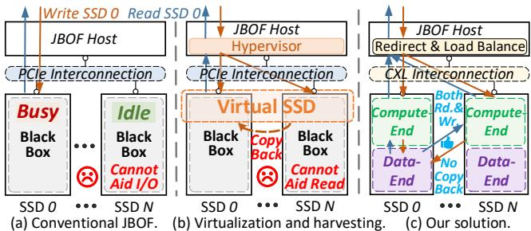  
Figure 1: Comparison of different JBOF designs.

DRAM (1 GB per TB flash [90]) to accommodate the entire metadata (mainly FTL mapping tables [16]) for fast access. From the scale-out aspect, SSD suppliers cluster tens of highperformance SSDs as just a bunch of flash (JBOF) [34, 40, 75, 108, 110], which aggregates the hardware resources from every SSD to deliver extremely high throughput.

Unfortunately, these technical trends place SSD consumers in a cost-utilization dilemma. To be more precise, while the increasing hardware resources elevate the bill of material (BOM) costs of SSDs to satisfy the performance requirement of burst I/O, the sporadic nature of I/O bursts causes severe SSD resource underutilization in JBOF level (cf. Figure 1a). For instance, in 94.6% uptime of a Tencent storage server [134] equipped with 25 drives, at least 20 drives are underutilized (i.e., bandwidth utilization is lower than 75%, cf. § 2.2). This is because in modern cloud platforms [66, 86], storage drives (e.g., SSDs) are commonly allocated (or sold) to different tenants. These tenants utilize their own drives to serve different application instances with diverse I/O patterns, which experience I/O bursts at different times.

A straightforward idea to improve utilization is storage virtualization and harvesting [5, 86, 107, 119, 126]. As shown in Figure 1b, the hypervisor [86, 107] can harvest idle SSDs by dynamically grouping a busy SSD with multiple idle ones as a virtual SSD. Subsequently, parts of write requests originally targeting the busy SSD are redirected to the idle ones via the virtual SSD abstraction, leading to a higher burst performance and SSD utilization. Once the burst period concludes, these idle SSDs will be reclaimed and set aside for future harvesting. While this approach succeeds in exploiting idle SSDs, it unfortunately faces three prominent challenges:

Coarse-grained SSD harvesting causes resource stranding issues: Different I/O tasks impose varied degrees of burden on the computing (e.g., ARM processor and DRAM) and flash (e.g., flash channels) resources within SSDs. For example, 4 KB sequential reads consume 96% of processor clocks while only exploiting 39% of flash times. 4 KB sequential writes, in contrast, are flash-hungry (99%) while keeping the processor underutilized (27%, cf. § 3.1 for details). However, the hypervisor treats SSDs as monolithic black boxes, which leads to resource stranding issues [5, 58, 119]. For instance, when an SSD is flash-hectic for write bursts, its computing resources may still be idle. These computing resources cannot be harvested as the entire SSD is considered busy.

Limited profit in read-dominated workloads: The simple virtualization and harvesting approach yields minor benefits for read-dominated workloads. This is because, without storing the target data of incoming read requests beforehand, the temporarily harvested SSDs cannot aid the busy SSDs in read services. Our evaluation shows that this simple approach only brings 0.5% throughput improvement in read-dominated workloads (cf. § 3.1 for details).

High overheads brought by written data copyback and resource management: Although redirecting write requests to the harvested SSDs can improve SSD utilization, this benefit comes at high costs. To be specific, when reclaiming the harvested SSDs, the hypervisor has to copy back the written data to the initial destination SSD for availability [86]. Such write amplification drastically shortens SSD lifetimes (22.5% reduction). Moreover, the centralized virtual SSD management in the hypervisor imposes huge burdens [52, 86] on the host CPU (e.g., 16 ARM cores in SuperMicro SSG-229J [110]), compelling it to become the performance bottleneck of JBOF (21.4% throughput loss, cf. § 3.1).

In response to these challenges, we introduce Espresso1, a cost-efficient JBOF design, which tackles the cost-utilization dilemma by only reserving moderate computing resources in SSDs while achieving satisfactory burst I/O performance through inter-SSD resource sharing (cf. Figure 1c). Our key insight is that the high-speed and cache-coherent Compute eXpress Link (CXL) interconnections [19, 58, 109] can be harnessed to facilitate fine-grained, high-profit, and low-overhead SSD harvesting. Specifically, recognizing the black-box limitation of conventional SSDs, Espresso first disaggregates the SSD architecture into two parts, compute-end and data-end, based on their functionality. Compute-end encloses computing resources, such as ARM processor and onboard DRAM, which are responsible for executing firmware tasks (e.g., address translation [16,35]). Data-end comprises flash resources (e.g., flash channels) and data-related components (e.g., DMA engine), which are in charge of data transfer and flash I/O. Espresso exposes them separately to the host and peer SSDs via the high-speed CXL interconnection. This design enables fine-grained resource management and promises to mitigate the resource stranding issues.

With the disaggregated SSD architecture, Espresso can benefit both read and write requests by harvesting idle computeend to alleviate burdens of the SSDs, which are busy with firmware tasks. This idea is facilitated by the cache-coherent feature of CXL, with which the harvested compute-end can precisely operate the essential metadata of busy SSDs (e.g., FTL mapping table [16]) for I/O request handling. Moreover, this design avoids detrimental copyback because it harvests only the stateless computing resource to expedite metadata processing while keeping the data path on the stateful flash memory unchanged. In addition, Espresso employs a holistic I/O redirection design and a miss-ratio-curve-based scheme to deliver reasonable performance isolation for harvested SSDs. Considering the overhead of centralized resource management, Espresso first leverages the global coherent memory constructed by CXL to enable inter-SSD communication. Espresso then implements decentralized and self-governing resource management in SSDs to relieve host CPU burdens. Comprehensive evaluation results demonstrate that Espresso outperforms existing JBOF designs, improving SSD resource utilization by 50.4%, saving 19.0% BOM costs while having negligible performance loss.

Our main contributions can be summarized as follows:

• We deeply review the cost-utilization dilemma of JBOF and reveal that the black-box constraint of conventional SSD designs can lead to severe resource stranding issues.

• We propose a novel SSD architecture that disaggregates SSD internal resources into compute-end and data-end based on their functionality. This design lays the foundation for fine-grained and efficient SSD resource harvesting.

• We propose a cost-efficient JBOF design that reserves moderate computing resources in each SSD at low BOM costs while achieving demanded I/O performance by leveraging CXL to facilitate inter-SSD resource sharing.

## 2 Background and Motivation

## 2.1 JBOF and NVMe SSD

JBOF architecture. Just a bunch of flash (JBOF) is a type of storage server that can incorporate multiple high-performance SSDs as a whole, thereby satisfying the ever-increasing performance demands in a scale-out manner. As shown in Figure 2a, a JBOF comprises CPU, DRAM, NIC, and tens of SSDs, connected via PCIe interconnections. For high cost and energy efficiency [34, 75, 108], recent advanced JBOF products typically equip Data Processing Units (DPUs) to replace separated CPU, DRAM, and NIC, serving as the host. For example,

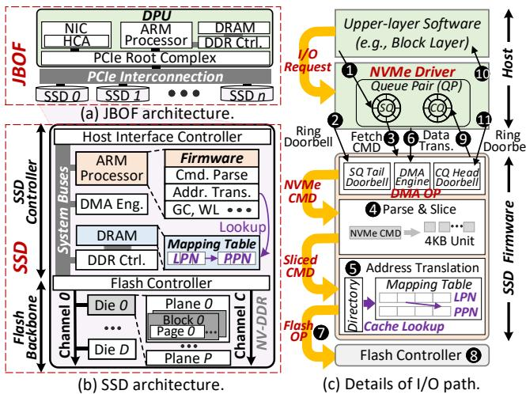  
Figure 2: Details of the traditional JBOF system.

SuperMicro SSG-229J-5BU24JBF [110], one of the up-todate JBOF products, supports 24 SSDs with two BlueField-3 DPUs [78], each containing a 16-core ARM processor and 16 GB DRAM. In the following, we mainly focus on DPU-based JBOF to enjoy its superior cost and energy efficiency, which aligns with the target of this paper. Nevertheless, our designs are also applicable to conventional JBOF products.

SSD architecture. Figure 2b presents a typical architecture of modern SSDs [91]. The SSD controller connects to the host through PCIe lanes and a host interface controller. Moreover, it integrates an ARM processor, a DDR DRAM controller, and some specialized processing elements (e.g., DMA engine). The ARM processor is mainly responsible for performing firmware tasks (e.g., command parsing, address translation, and garbage collection). These components are coupled with a flash backbone through the flash controller. The flash backbone consists of 8 to 16 flash channels, each enclosing several flash dies. A flash die can be further divided into multiple flash planes, blocks, and pages.

I/O path. Figure 2c illustrates the I/O path in JBOF systems. When I/O requests arrive, the NVMe driver in the host submits NVMe commands to submission queues (SQ, 1 ). It then notifies the SSD of the command arrivals by ringing the SQ doorbells corresponding to the queues ( 2 ). Afterward, the SSD firmware operates the host interface controller to fetch NVMe commands from SQ ( 3 ). SSD firmware then parses these commands, slices them into unit size (e.g., 4 KB, 4 ), and translates the host logical address (LPN) to the flash physical address (PPN) by referring to the mapping table in flash translation layer (FTL, 5 ). The mapping table is persisted in the flash backbone for crash consistency and cached in onboard DRAM for high performance. A mapping directory is used to locate cached mapping table entries. SSD firmware also needs to orchestrate the host-SSD data transfers by issuing host DMA operations to the DMA engine ( 6 ). Subsequently, the SSD firmware sends flash operations to the flash controller ( 7 ), which performs flash I/O following the

Open NAND Flash interface (ONFi) protocol [82] ( 8 ). In the backward, the firmware writes the results to the completion queues (CQ) and then notifies the host by generating MSI-X interrupts [26] ( 9 ). Finally, the NVMe driver reports request completions to upper-layer software ( 10 ) and acknowledges interrupts by updating the CQ doorbell ( 11 ).

## 2.2 Motivation: Cost-Utilization Dilemma

High cost of SSD. An obvious trend in SSD advancement is that SSD manufacturers tend to integrate numerous computing resources within SSDs to conduct firmware tasks rapidly, thereby boosting I/O performance. Figure 3a presents the computing power of embedded processors in varied SSD controllers on Dhrystone v2.1 benchmark [120]. The results show that the computing power of embedded processors has increased exponentially over the last decade. Moreover, enterprise SSDs [73, 91] typically demand 1 GB onboard DRAM per TB flash capacity to accommodate their entire metadata (mainly the FTL mapping table) for fast access. These abundant computing resources cause high bill of material (BOM) costs of SSDs. For instance, the computing resources (i.e., SSD controllers and DRAM) account for 23.2% and 31.8% of BOM costs to manufacture 4 TB PCIe 4.0 SSDs and PCIe 5.0 SSDs [27, 67, 113, 114] (cf. Compute in Figure 3b).

Low utilization of JBOF. Contrary to the continually increasing burst performance demands and BOM costs, SSD utilization in JBOF remains low due to the sporadic nature of I/O bursts. Quantitative analysis reveals that in any uptime of a Tencent storage server equipped with 25 drives [134], the prob ability of at least 20 drives being underutilized (i.e., under 75% bandwidth utilization) is 94.6% (cf. Figure 3c). This is because in modern cloud platforms, especially the Infrastructureas-a-Service (IaaS) cloud [66, 86], storage drives are commonly allocated (or sold) to different tenants. These tenants utilize their own drives to serve varied applications with diverse I/O patterns, which experience I/O bursts at different times [99, 107]. This phenomenon also exists in other storage servers over diverse storage service providers. As depicted in Figure 3d, the average drive bandwidth utilization is only 8.0%, 27.8%, and 15.3% in Alibaba [2], Tencent [134], and Fujitsu [56] clusters, respectively.

## 3 Preliminary Study

## 3.1 Simple Solution and Challenge

The cost-utilization dilemma inspires future SSD and JBOF designs to be cost-efficient. Ideally, future SSDs may only reserve moderate hardware resources at low BOM costs while achieving required I/O performance by harvesting underutilized resources within the same JBOF.

JBOF consisted of host-managed SSDs. Host-managed SSD (HMSSD), such as open-channel SSD (OCSSD) [12,

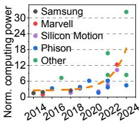

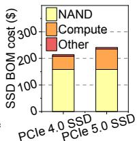  
(a) Computing power. (b) BOM cost breakdown.

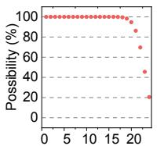  
Ba# of underutilized SSDs

(c) SSD usage in JBOF.  
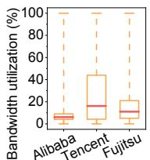  
Figure 3: Analysis of the cost-utilization dilemma.  
(d) Drive utilization.

86, 87, 107], zoned-namespace (ZNS) SSD [11], and Direct-Flash [105], is a representative SSD architecture that retains minimum hardware (e.g., flash controller and flash backbone) in SSD while relying on host computing resources and userspecified driver to conduct firmware tasks and cache metadata. Although HMSSD is superior in low cost, it, unfortunately, hampers scalability and compatibility. To be specific, the tens of HMSSDs in JBOF cause substantial computing overhead, compelling the centralized and limited host resources to become the performance bottleneck. Here we take OCSSDbased JBOF as an example, for its mature software support (i.e., Linux LightNVM [63]). Figure 4a shows the aggregated throughput of a 16-core-DPU-enabled JBOF with varying numbers of OCSSDs (cf. § 5.1 for experimental setups). The performance of the JBOF gets saturated with only 4 SSDs, because of the limited host resources. Note that, even for other JBOF products equipping costly x86 CPUs, the average resource for each OCSSD is also restricted (e.g., two 24-core CPUs for 97 SSDs in Dell PowerStore 500T [22]). In production environments, applications also compete for the essential host resources, further exaggerating the scalability crisis. Moreover, HMSSD-based JBOF faces severe compatibility issues as it requires huge manpower for OS and application adaptation to explicitly conduct firmware tasks, preventing it from wide deployment [4].

SSD virtualization and harvesting. A more scalable and compatible solution is SSD virtualization [7, 21, 75, 88, 126] and harvesting [5, 58, 86, 96, 107, 119]. Specifically, although SSDs in JBOF are logically allocated to different tenants for separate use, an extra storage virtualization layer in hypervi sor [86, 107] can harvest the resources of idle SSDs by dynamically grouping busy SSDs (named borrower) and several idle SSDs (named lenders) as virtual SSDs. Thereafter, user write requests originally targeting the borrower can spread across both the borrower and lenders through the virtual SSD abstraction, thereby achieving higher burst write performance and SSD utilization. Note that the written data is temporarily stored in the storage space of the lenders. Once the burst period concludes, data should be copied back to the borrower to restore space ownership of the lenders [86].

Challenges. While this approach succeeds in harvesting idle resources, it unfortunately faces prominent challenges:

Coarse-grained SSD harvesting causes resource stranding issues (Challenge 1). We analyze the pressure of different I/O tasks on SSD internal computing (i.e., ARM processor and

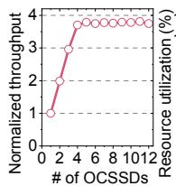  
(a) Scalability.

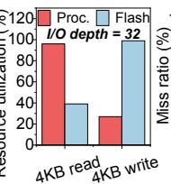  
(b) Resource utilization.  
Figure 4: Preliminary study.  
(c) MRC comparison.

GB DRAM / TB flash  
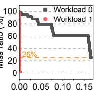

DRAM) and flash (i.e., flash channels) resources, the results of which are shown in Figures 4b and 4c. 4 KB sequential reads on a real DaisyPlus SSD (cf. § 4.6 for details) consume 96% of the processor clocks while merely utilizing 39% of flash clocks (cf. Figure 4b). In comparison, 4 KB sequential writes are flash-intensive (99%), while leaving the processor underutilized (27%). Moreover, Figure 4c illustrates the miss ratio curve (MRC) [95,117] of LRU-based metadata (i.e., FTL mapping table) cache in onboard DRAM. Workload 1 [134] only consumes 0.001 GB DRAM (per TB flash) to achieve a 25% miss ratio, while that is 0.17 GB for Workload 0. In conclusion, different I/O tasks can impose varying levels of pressure on computing and flash resources within SSDs. Unfortunately, upper-layer software treats SSDs as monolithic black boxes, which leads to resource stranding issues. For example, when the flash backbone of an SSD is heavily engaged in 4 KB write bursts, its computing resources may remain idle. These idle resources cannot be lent to other SSDs in the simple approach because the entire SSD is considered busy. Limited profit in read-dominated workloads (Challenge 2). Our evaluation reveals that the simple virtualization and harvesting approach only brings 0.5% and 0.8% throughput improvements in Tencent [134] and Alibaba [2,23] workloads, respectively, where read requests dominate the I/O (cf. § 5.2). This is because the target data of read requests is exclusively stored in the borrower’s flash backbone. Lenders cannot assist the borrower in serving read requests due to the lack of the target data in the lenders’ flash backbone.

High overheads brought by written data copyback (Challenge 3.1) and resource management (Challenge 3.2). In our tests, the simple approach causes 0.29 more drive writes per day (DWDP) on Tencent traces [134]. This is because, when lenders are reclaimed, the hypervisor must copy the written data back to the borrower for availability [86]. These extra writes lead to 22.5% shorter SSD lifetime for enterprise SSDs [91] typically with 1 DWDP endurance. Moreover, the centralized virtual SSD management in hypervisor can introduce substantial software overhead [52, 86], which compels the host CPU to become the performance bottleneck and causes severe throughput loss (e.g., 21.4% in Tencent [134]).

## 3.2 Key Insight: Compute Express Link

CXL outline. Compute eXpress Link (CXL) [19] is an advanced interconnect standard designed to facilitate highperformance and cache-coherent communication among the host and various peripheral devices (e.g., SSD) [42, 59, 131]. CXL comprises three sub-protocols: CXL.io undertakes PCIe backward-compatible operations; CXL.cache empowers cache coherence in CXL fabric; CXL.mem enables device memory to be accessed by the host and other devices via load/store instructions. For higher scalability, CXL 3.0 [20] introduces port-based routing and multi-level switching. These new features extend CXL fabric to rack-level and enable cache-coherent peer-to-peer communication among up to 4096 points (i.e., hosts or devices). In this work, we conform to CXL 3.0 standard and equip SSDs with all three sub-protocols (i.e., as CXL Type-2 devices [39]), enabling cache-coherent memory access within the entire JBOF.

Opportunities. Recognizing the black-box constraint of conventional SSDs, we can first disaggregate the hardware resources of SSDs into multiple disjoint parts and then expose these parts separately to the host and other SSDs through the high-speed CXL interconnection. This design facilitates fine-grained resource management, laying a foundation to tackle the resource stranding issues (solution of Challenge 1). Additionally, with the support of cache-coherent memory access, the lender’s processor can help the borrower handle I/O requests (e.g., command parsing and address translation) by directly operating the borrower’s metadata stored in its onboard DRAM through CXL fabric. Moreover, the borrower can cache parts of its mapping table in the lender’s DRAM for a lower miss ratio. This method benefits both reads and writes and avoids data copyback overhead (solution of Challenges 2 and 3.1), as it only harvests the stateless computing resources (i.e., processor and DRAM) to accelerate metadata processing, without redirecting data. Finally, we can exploit the cache-coherent memory to facilitate efficient inter-SSD communication. Thereafter, a self-governing and decentralized SSD resource management scheme can be implemented to alleviate the CPU burden imposed by the centralized virtualization and harvesting (solution of Challenge 3.2).

## 4 Design and Implementation

Inspired by the aforementioned preliminary analysis, we propose Espresso, a novel JBOF design that facilitates finegrained, high-profit, and low-overhead inter-SSD resource sharing to tackle the cost-utilization dilemma.

## 4.1 Overview

Target scenarios. Espresso is designed for DPU-based JBOF (cf. § 2.1) to enjoy its extraordinary energy and cost efficiency, aligning with the objective of this paper. In such systems, SSDs are typically allocated to different tenants for separate use and accessed as raw devices. Simultaneously, an elastic resource management mechanism is required to achieve higher utilization [86]. Espresso designs can also benefit highperformance storage servers by enabling resource sharing at the SSD level, thereby simplifying upper-layer software implementations and freeing host computing resources for other components of the storage stack.

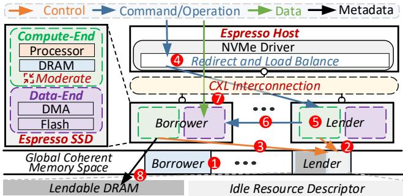  
Figure 5: Overview of Espresso.

Base components. Figure 5 illustrates the overview of Espresso. Compared with existing JBOF designs, there are four main differences: (1) Espresso replaces conventional PCIe interconnections with CXL to enjoy its high performance and cache coherence; (2) Espresso breaks the blackbox constraint of traditional SSDs and enables fine-grained management of SSD internal resources (§ 4.2); (3) Espresso only reserves moderate computing resources (i.e., weaker pro cessor and smaller DRAM) within each SSD at low BOM cost while satisfying burst I/O performance demands via resource harvesting; (4) Espresso makes a minor modification to the host NVMe driver for I/O redirection and load balance. For simplicity, we assume SSDs in Espresso are homogeneous (i.e., equipping the same hardware and running the same firmware), matching the common practice in JBOF mar kets [110]. We will discuss heterogeneous scenarios in § 6. Workflows. During device initialization (e.g., system reboot [80]), each SSD exposes portions of its onboard DRAM via CXL interconnections. These exposed DRAM make up a global coherent memory space, facilitating inter-SSD communication ( 1 ). Afterward, if an SSD is idle (i.e., lender), it calculates how many computing resources (i.e., processor and DRAM) can be lent out and announces this availability by writing its idle resource descriptors ( 2 , § 4.3). When the computing resources in one SSD (i.e., borrower) are in short supply (e.g., an I/O burst comes or a high DRAM miss ratio occurs), it searches all other SSDs’ idle resource descriptors and chooses a lender for resource harvesting ( 3 , § 4.3). This step can be repeated multiple times to borrow more resources from multiple SSDs. For processor harvesting (§ 4.4), the host NVMe driver redirects portions of NVMe I/O commands orig inally targeting the borrower to the lender ( 4 ). The lender then assists in serving I/O commands with its idle processor by operating the borrower’s metadata ( 5 ). Subsequently, the lender sends DMA and flash operations to the DMA engine and flash controller of the borrower ( 6 ). The borrower then executes these operations to transfer data directly between the host and its flash backbone, without passing through the lender ( 7 ). For DRAM harvesting (§ 4.5), the borrower can directly cache parts of its mapping table in the lender’s

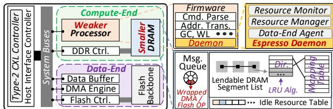  
Figure 6: Disaggregated SSD architecture.

DRAM ( 8 ). This harvested DRAM improves the cache hit ratio and reduces access to the slow flash backbone for the mapping table, leading to a higher I/O performance. SSD internal housekeeping tasks (e.g., garbage collection [123] and bad block management [47]) occur infrequently and consume fewer computing resources than I/O handling. Therefore, in Espresso, these tasks are executed by the borrower itself without resorting to the lender. However, when an SSD is busy with housekeeping, it can borrow computing resources for I/O handling, mitigating performance impacts.

## 4.2 Disaggregated SSD Architecture

Conventional SSDs are black boxes in which the onboard computing and flash resources are tightly coupled and invisible to external systems. This agnostic causes resource stranding issues (cf. § 3.1). Tackling this challenge, Espresso employs a disaggregated SSD architecture that decouples SSD into two disjoint parts: compute-end and data-end, as shown in Figure 6. Compute-end comprises computing resources, such as ARM processor, DDR controller, and onboard DRAM. It is responsible for executing SSD firmware tasks (e.g., I/O parsing and address translation). Data-end encloses flash resources (e.g., flash controller and backbone) and data-related components (e.g., DMA engine and data buffer). This part is in charge of data transfer and flash I/O. Moreover, a Type-2 CXL controller [39] is employed to facilitate CXL-related operations, such as exposing onboard DRAM to the host and peer SSDs in Espresso and operating the exposed DRAM of other SSDs coherently. Specifically, during system initialization, the CXL controller of each Espresso SSD registers its local DRAM as global fabric-attached memory (G-FAM) to the CXL fabric manager (FM) [20]. Afterward, SSD processor can access peer SSDs’ G-FAM via load/store instructions (e.g., LDR/STR in aarch64 ISA [25]), which will be interpreted as CXL MemRd/MemWr requests and then executed by the CXL controller. Moreover, the CXL controller is responsible for maintaining the coherence of the SSD’s local DRAM with BISnp and BIRsp requests (i.e., in HDM-DB mode [20]).

In the compute-end, an Espresso daemon is implemented in SSD firmware and runs on the ARM processor. It contains three components: (1) A resource monitor is deployed to monitor the resource utilization of both compute-end and data-end. Specifically, for compute-end, the resource monitor periodically (e.g., 10 ms) polls the Performance Monitor Unit (PMU) [17, 24] of the ARM processor to track its utilization (i.e., busy clocks). DRAM resource is measured by the miss ratio of mapping table lookup. For data-end, the resource monitor gets utilization from the embedded flash monitor module, which is typically implemented as channellevel hardware busy clock counters in existing flash controller designs [51,104]. Espresso takes the average utilization across all flash channels; (2) A resource manager is employed to borrow or lend computing resources based on the current utilization reported by the resource monitor; (3) A data-end agent bridges lender’s compute-end with borrower’s data-end. To be specific, the borrower’s data-end agent maintains portions of onboard DRAM as globally visible message queues [94]. Thereby, the lender’s compute-end can access the borrower’s data-end by enqueueing wrapped DMA and flash operations (cf. § 2.1) to the borrower’s message queues. The borrower’s data-end agent then dequeues and unwraps these operations and sends them to the DMA engine and flash controller for data transfer and flash I/O.

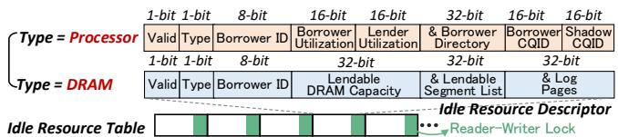  
Figure 7: Data structures for resource management.

## 4.3 Decentralized Resource Management

As shown in Figure 7, each Espresso SSD maintains portions of its onboard DRAM as idle resource table, consisting of multiple idle resource descriptors. These data structures are visible to the host and all peer SSDs in Espresso and are synchronized with reader-writer locks [13] (i.e., a pthread\_rwlock\_t for each idle resource descriptor in C program). There are two formats of idle resource descriptors used to describe idle processor and DRAM resources, respectively. Both contain five messages: (1) One valid bit points out whether this descriptor is valid; (2) One type bit presents the type of idle computing resources (i.e., processor or DRAM); (3) 8 bits record the identification of the borrower (0xFF means that the resource has not been borrowed). Espresso assigns a unique identification to each SSD during device initialization [80]; (4) 32 bits depict the amount of idle resources. Specifically, for idle processor, these 32 bits are used to indicate the current processor utilization of both the borrower and the lender (16 bits for each) for load balance (cf. § 4.4). Both the lender and the borrower will update this field periodically (e.g., 10 ms) after harvesting begins. For idle DRAM, these 32 bits indicate the capacity of the lendable DRAM, maintained by the lender; (5) 64 bits record the essential information for resource sharing. In particular, for idle processor, 32 bits indicate the address of the borrower’s mapping table directory, while the other 32 bits record the CQIDs of borrower CQ and shadow CQ (16 bits for each) for I/O redirection (cf. § 4.4); For idle DRAM, 32 of the 64 bits point to the header of the lendable DRAM segment list, while the other 32 bits point to the start address of log pages for crash consistency (cf. § 4.5).

With the aforementioned data structures, Espresso enables decentralized resource management. Specifically, SSDs in Espresso can lend out their idle resources by writing the idle resource descriptors with writer locks. Moreover, resource borrowing is facilitated by searching the idle resource tables of all peer SSDs with reader locks and choosing one (or more) idle SSD based on best-fit algorithm [98] to harvest (i.e., writing the borrower identification of the chosen idle resource descriptor with writer lock). If the borrower no longer requires the borrowed resources (e.g., I/O burst completes), it sets the borrower identification of the idle resource descriptors to 0xFF. In turn, if the lender no longer wants to lend resources, it tags the valid bit of the descriptor as invalid. The lender, borrower, and host need to periodically check and up date the idle resource descriptor according to current resource utilization and take corresponding actions to start and end harvesting (cf. § 4.4 and § 4.5). Note that Espresso does not require accurate clock synchronization among lender, borrower, and host. However, if the synchronization period is too long, Espresso may suffer from delays in the start and end of harvesting, thereby affecting performance (e.g., when a lender stops lending resources due to bursts, if the borrower and host fail to synchronize in time, some borrower’s requests will still be redirected to the lender, causing resource contention). We empirically set the period as 10 ms with a trade-off between this performance loss and the synchronization overhead.

## 4.4 Transparent Processor Harvesting

Trigger conditions. Espresso SSD triggers processor resource harvesting based on the busy status of both the processor and data-end, as summarized in Table 1. They are regarded as busy if their current utilization exceeds a configurable watermark (e.g., 75%), otherwise considered underutilized. If both the processor and the data-end are busy ( 1 ), the SSD does nothing as it has no available processor for sharing. Also, borrowing extra processor yields minor as the data-end has been exhausted. In comparison, whenever the processor is underutilized ( 2 and 3 ), the SSD can lend out this resource. This can happen when the SSD is bottlenecked by the flash backbone ( 2 ) or the whole SSD is idle ( 3 ). Lastly, if only the processor is busy ( 4 ), the SSD can borrow processor resources to maximize the I/O parallelism of the data-end, achieving a higher throughput. Correspondingly, SSDs cancel borrowing or lending when the status of their resources no longer satisfies the above trigger conditions.

Transparent I/O redirection. Espresso harvests idle processors by redirecting parts of the borrower’s NVMe I/O commands to the lender. The lender then locates the borrower’s mapping directory and table with the address recorded in the idle resource descriptor (cf. § 4.3). Afterward, the lender can access the borrower’s mapping tables and help serve I/O commands with its idle processor. Espresso SSD employs finegrained locks to enable efficient inter-SSD synchronization of the mapping table, inheriting from prior multi-core SSD designs [133]. Espresso realizes I/O redirection by slightly modifying the host NVMe driver, which is the unique entrance of NVMe SSDs. This modification is transparent to the upper-layer applications (e.g., file system), ensuring compatibility. As shown in Figure 8, when initializing NVMe SSDs [80], Espresso reserves a few NVMe I/O queue pairs (QPs, each enclosing an SQ and a CQ) of each SSD as shadow QPs. When lending processor resources, the lender points out the identification (e.g., CQID [79]) of one of its shadow QPs in the idle resource descriptor. Subsequently, the borrower chooses one of its normal I/O QPs (named borrower QPs) for I/O redirection and also records its identification in the idle resource descriptor (cf. § 4.3). Thereafter, the host NVMe driver binds the borrower QP with the shadow QP, and submits parts of NVMe I/O commands targeting the borrower SQ to the shadow SQ. Following this, the lender fetches NVMe I/O commands from the shadow SQ and helps handle these commands. In the backward, the NVMe driver collects results from both borrower CQ and shadow CQ and then commits I/O completions to upper-layer software. When ending harvesting, the host NVMe driver no longer redirects I/O commands to the shadow SQ. Once all I/O commands within the shadow QP are completed, the host unbinds the shadow QP from the borrower QP, leaving them for future resource harvesting.

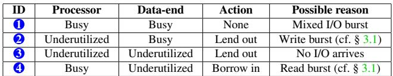  
Table 1: Trigger conditions of processor harvesting.

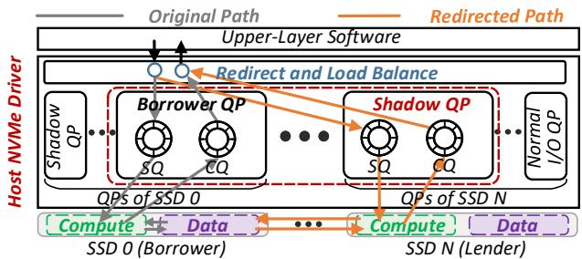  
Figure 8: Transparent I/O redirection.

Holistic load balance. The host NVMe driver selectively redirects I/O commands to the lender with a holistic load balance algorithm. This algorithm is two-fold. On the one hand, the NVMe weighted round-robin (WRR) feature [80, 121] enables setting a weight for each NVMe I/O SQ, which indicates the priority of command fetching. For example, if the weights of two SQs are 2 and 1, respectively, the SSD serves two I/O commands from the former SQ and then serves one command from the latter. With this feature, Espresso can assign the shadow SQ of the lender with a low weight if it wants to minimize the performance impact on the lender’s own I/O. On the other hand, the host reads the idle resource descriptor periodically (e.g., 10 ms) to figure out the current processor utilization of both the borrower and lender (cf. § 4.3). Then, it controls the number of NVMe I/O commands sent to the borrower and lender with the following formula:

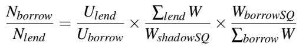

Nborrow and Nlend represent the numbers of I/O commands sent to the borrower and lender, respectively. Uborrow and Ulend are the processor utilization of the borrower and the lender. WborrowSQ and WshadowSQ represent the weights of the borrower SQ and the shadow SQ. Lastly, !borrow W and !lend W are the total weights of all NVMe I/O SQs in the borrower and the lender. With this formula, Espresso can balance processor utilization by selectively redirecting I/O commands. For example, if Nborrow/Nlend is 3, Espresso redirects I/O commands to the lender with a 25% probability.

## 4.5 Persistent DRAM Harvesting

Trigger conditions. Espresso SSD manages DRAM resources in segments (2 MB by default) and caches mapping table with LRU replacement algorithm. Espresso SSD decides whether to borrow or lend DRAM based on the miss ratio curve (MRC) of current mapping table lookup patterns. Specifically, Espresso SSD adopts SHARDS [117], a lightweight and efficient algorithm, to predict MRC online. Based on the predicted MRC, SSD can lend out all the spare DRAM segments, which has no help on a lower miss ratio (i.e., the cached mapping table will not be accessed in the near future), minimizing the effect of cache pollution from the borrower. Moreover, SSD tries to borrow sufficient DRAM that reduces its miss ratio to below a given threshold (e.g., 10%). Correspondingly, lender reclaims DRAM when it predicts more DRAM in need to achieve a lower miss ratio. In turn, borrower returns DRAM when its local DRAM is sufficient to keep the miss ratio within the given threshold.

Crash consistency. Borrower harvests DRAM by temporarily caching parts of its mapping table in lender’s lendable DRAM segments (i.e., as recorded in the idle resource descriptor, cf. § 4.3). In turn, borrower needs to read back the offsite metadata (i.e., the mapping table cached in the lender’s DRAM) to its flash backbone when ending harvesting. While this idea can be facilitated by the cache-coherent capability of CXL, there still remains an open question in practice, that is, how to guarantee crash consistency of the off-site metadata. To be specific, for high availability, enterprise SSDs are typically demanded to deliver power loss protection (PLP) [80]. When an SSD suddenly loses power [77,116,135], the power hold-up circuit and capacitor in the SSD (e.g., the 2.3 mF tantalum capacitor in Samsung 845DC SSD [89]) immediately flushes the data and metadata buffered in the processor cache and onboard DRAM to the persistent flash backbone. This design ensures crash consistency of the SSD. However, if the borrower’s dirty mapping table is exclusively cached in lender’s DRAM, the borrower cannot provide PLP to the offsite metadata. For instance, if the lender SSD is permanently unplugged from the JBOF, the borrower cannot recover its mapping table to locate data and thus suffers from data loss (or needs sophisticated reconstruction through special hardware [37, 138]).

Tackling this issue, Espresso deploys a log-based crash consistency mechanism to protect the offsite metadata. In particular, when DRAM harvesting begins, the borrower vacates a 4 KB log page in its local DRAM for each harvested DRAM segment. Afterward, whenever modifying offsite metadata in the harvested segment, the SSD, either borrower or lender, needs to commit a log (e.g., redo log [33]) to the log page as sociated with the segment. Moreover, lenders need to ensure the log has been written back to the borrower with cacheline flush instructions. When the log page of a harvested DRAM segment is full, the segment will be flushed back to the borrower’s flash backbone, after which the corresponding log page can be cleared and reused. Note that while the log oper ation introduces extra memory write overhead, it is relatively minor (i.e., hundreds of ns) compared to the flash I/O (i.e., tens of µs) caused by DRAM miss. If the lender fails (e.g., multiple I/O timeouts occur [80]), the host NVMe driver first notifies the borrower to recover its offsite metadata by replaying the logs in the local log pages. Afterwards, NVMe driver resubmits in-flight NVMe I/O commands in the shadow SQ to the borrower and then unbinds the borrower QP with the shadow QP. If the borrower fails, the host NVMe driver first notifies the lender to recycle the lent resources by clearing the harvested DRAM segments and resetting the corresponding idle resource descriptors. Subsequently, NVMe driver clears the corresponding shadow QP, leaving it for future harvesting.

## 4.6 Implementation

Cache coherence region. In Espresso, data are transferred without cache coherence using CXL.io sub-protocol [20]. However, Espresso does necessitate cache coherence among the host and SSDs for the following metadata: (1) the message queues within the data-end agent (cf. § 4.2), accounting for 128 KB per SSD by default; (2) the idle resource table (cf. § 4.3), which takes 256 B per SSD; (3) the cached mapping table and its auxiliary structures (e.g., locks). As will be shown in § 5.4, 0.25 GB per TB flash capacity is sufficient (i.e., 12 GB for twelve 4 TB SSDs).

Note that CXL standard does not mandate a specific implementation of hardware-managed cache coherence. Espresso employs a directory-based approach [1], in which the hardware overhead primarily depends on the number of cachelines that need to be tracked simultaneously. This is proportional to the number of in-flight requests of the borrower in Espresso, rather than the total metadata size. Our default setting employs 1 K directory entries to track 64 KB cache per SSD.

Prototype. We implement the host-side design of Espresso (e.g., I/O redirection and load balance, cf. § 4.4) in the NVMe driver of Linux kernel v5.15 [62], following the NVMe specification [80]. Due to the lack of publicly available CXL 3.0 hardware, we validate the firmware-side modification of our disaggregated SSD designs on DaisyPlus OpenSSD board [51, 112], a PCIe-based SSD development platform. This board integrates a quad-core ARM Cortex-A53 processor, 2 GB DRAM, and adequate FPGA resources. SSD firmware runs on the ARM processor, while the host interface controller and flash controller are implemented on the FPGA part. We inherit the core functionalities (e.g., garbage collection) of the SSD firmware (in C language) from Daisy-Plus, but modify the I/O path to realize Espresso daemon. The data-end agent takes 114.2 ns, on average, to dequeue and unwrap a DMA/flash operation from the message queue in local DRAM (cf. § 4.2). Also, it takes 321.9 ns to commit a redo log to the local log pages for crash consistency (i.e., prepare and flush a log to the local DRAM, cf. § 4.5). We cross-validate the performance model used in our simulator and emulator with these results.

Simulator. We use SimpleSSD [100], a popular full-stack simulator, to evaluate Espresso. Prior studies [32, 43] have demonstrated that SimpleSSD can accurately model the performance of host (e.g., CPU and DRAM) and modern SSD components (e.g., embedded ARM processor, DRAM, and flash backbone). We also extend SimpleSSD with our industrial collaborators by 18 K LOC to support lots of detailed SSD techniques, such as incremental step pulse programming [106], SLC cache [115,130], and read retry [127]. These efforts ensure the accuracy of the simulator. To evaluate the CXL fabrics, we integrate Xerxes [6], a cycle-accurate CXL simulator, which can accurately model the features defined in CXL 3.0 standard [20]. We use McPAT [60] and DRAM-Power [14] to examine energy consumption.

Emulator. For cross-validation, we also port Espresso to a NUMA-based emulation platform. As recommended by prior work [58, 59, 83, 132], we mimic CXL fabric with cross-NUMA access and emulate each SSD with a dedicated socket (i.e., Intel Xeon 8562Y+ CPU [38]) running NVMeVirt [49], a popular SSD emulator. However, constrained by the number of sockets (e.g., 2), such an emulation platform cannot accurately mimic the tens of SSDs in JBOF. Therefore, we opt to conduct most of our evaluation on the simulator, while taking a NUMA emulation in § 5.6.

## 5 Evaluation

## 5.1 Experimental Setup

System configurations. As listed in Table 2, we configure the simulated JBOF system based on SuperMicro SSG-229J-5BU24JBF [110], one of the up-to-date JBOF products, which supports at most 12 SSDs per DPU. The simulated DPU contains a 16-core 2.1 GHz ARM processor and 16 GB DRAM, aligning with BlueField-3 [78], and acts as JBOF host (cf. § 2.1). The simulated SSD follows the configuration of commodity storage device [18, 71, 91], which delivers 14 GB/s and 10 GB/s peak read and write bandwidths.

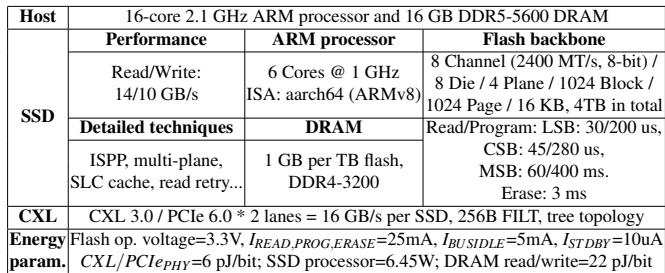  
Table 2: System configurations.

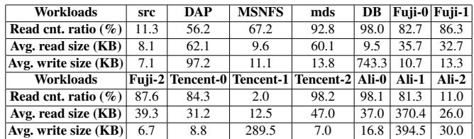  
Table 3: Workload characteristics.

The SSD’s processor encloses 6 ARM cores with aarch64 ISA [25] running at 1 GHz frequency. In addition, its onboard DRAM can accommodate entire map-

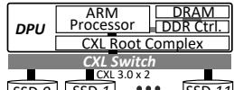  
Figure 9: Topology.

ping table (i.e., 1 GB per TB flash). DPU and SSDs are connected with CXL fabric in tree topology (cf. Figure 9). JBOF platforms. We compare Espresso with six other designs. (1) Conv: conventional JBOF design, in which all SSDs equip abundant computing resources (i.e., 6 ARM cores and 1 GB DRAM per TB flash) for high I/O parallelism; (2) OC: OCSSD-based JBOF design that reserves minimum computing resources in SSDs but utilizes host resources to execute firmware and cache metadata (cf. § 3.1); (3) Shrunk: compared to Conv, it shrinks the computing resources in each SSD. By default, it halves the resources (i.e., 3 ARM cores and 0.5 GB DRAM per TB flash). We also evaluate different reservation settings in § 5.4; (4) VH: based on Shrunk, it uses the simple virtualization and harvesting approach (cf. § 3.1) to improve I/O performance; (5) VH(ideal): an ideal variant of VH, in which no copyback is required; (6) ProcH: Shrunk with our processor harvesting designs (cf. § 4.4); (7) Espresso: a cost-efficient JBOF design that includes all the techniques proposed in this paper. It reserves the same amount of computing resources in each SSD as Shrunk (i.e., half of the computing resources in each SSD of Conv).

Workloads. We conduct evaluations with both microbenchmarks and various real workloads collected from production environments [3, 45, 56, 102, 122, 134]. Table 3 lists their key characteristics. To intuitively demystify the interactions between borrowers and lenders, we run workloads on 6 of the 12 SSDs (i.e., borrowers) by default, while keeping the other

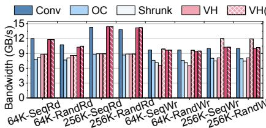  
(a) Bandwidth.

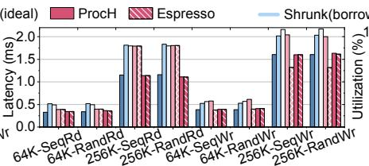  
(b) Average latency.  
Figure 10: Performance benefits of processor harvesting.

6 SSDs idle (i.e., lenders). We also take sensitivity studies on varied numbers of borrowers and lenders in § 5.4 and examine complex scenarios where all 12 SSDs have different workloads in § 5.5. To demonstrate end-to-end performance improvement brought by our designs, we conduct comparisons on varied application instances in § 5.6.

## 5.2 Benefit Analysis

Processor harvesting. Figure 10 illustrates the throughput and average latency comparison in microbenchmarks. For simplicity, we present the average performance of the 6 SSDs that run workloads (i.e., borrowers). We set the I/O depth as 64 to mimic the throughput-intensive scenarios and examine different I/O sizes from 64 KB to 256 KB. In comparison to Conv, OC and Shrunk suffer 27.8% and 29.2% throughput loss in all workloads, on average. Similar deterioration can also be observed in the latency comparison (i.e., 44.1% and 46.4% higher). This is because the insufficient processor resources in OC and Shrunk cannot afford such intensive I/O patterns and become the performance bottleneck. VH and VH(ideal) also lag far behind Conv in read workloads, as the simple virtualization and harvesting approach has no help to read requests (cf. § 3.1). Compared with Shrunk, VH and VH(ideal) succeed in improving write performance by redirecting parts of write requests to lenders. VH(ideal) can even outperform Conv by 10.2%. This can be attributed to the harvested flash resources of lenders, as data is temporarily stored in the lenders’ flash backbone via their flash channels. However, such gains are swept out after copyback occurs. As a result, VH still falls behind Conv by 25.6%. On the contrary, Espresso achieves comparable performance to Conv in all workloads with only half of the computing resources. This is because Espresso can harvest idle processors of lenders for I/O serving. Figure 10c shows the average processor utilization of borrowers and lenders in 256 KB sequential read test. Espresso achieves 50.4% higher utilization than Shrunk.

DRAM harvesting. To evaluate how much Espresso can benefit from DRAM harvesting, we set an experiment to analyze the I/O performance in latency-sensitive scenarios (i.e., 4 KB reads and writes). We set the I/O depth to 1 in this test. Figure 11 illustrates the average latency and mapping table miss ratio of different JBOF settings. Without sufficient DRAM to buffer the entire mapping table, OC, Shrunk, and ProcH experience 66.2%, 49.7%, and 49.7% miss ratios in random read workloads, thereby causing 41.4%, 24.7%, and 24.7% higher latencies, compared to Conv. Similar degradation also exists in random write tests. The virtualization and harvesting approach (VH) does not work for DRAM harvesting. This is because even if redirecting write requests to lenders, lenders still suffer from the miss penalty due to insufficient DRAM. In contrast, the DRAM harvesting designs (cf. § 4.5) in Espresso enable borrowers to borrow idle DRAM resources from lenders to buffer mapping table. As a result, Espresso achieves comparable latencies to Conv. Improvements in real workloads. Figure 12 presents the throughput comparison in diverse real workloads collected from production environments. Compared with Conv, OC and Shrunk suffer 16.2% and 13.4% throughput loss in all workloads, on average, owing to the stressed computing resources. VH(ideal) outperforms Shrunk in write-dominated workloads (e.g., 15.5% in src) via write request redirecting. However, the substantial overhead of data copyback dispels such a mirage. Consequently, VH still lags behind Conv by 14.0%. In contrast, Espresso can aid all workloads with diverse I/O types, eliminating the copyback overhead. Specifically, although employing the same amount of computing resources, Espresso outperforms Shrunk and VH by 19.2% and 20.0%. Moreover, Espresso performs better than VH(ideal) in some workloads (e.g., Ali-0). This is because, in these read-dominated workloads, the requested data resides exclusively in the borrower’s flash backbone. Without our harvesting design, lenders cannot assist the borrower in serving read requests due to the lack of the target data in the lenders’ flash backbone. Espresso also achieves comparable throughput to Conv even with only half the computing resources (cf. § 5.1), which proves that our design can satisfy demanded per formance targets via inter-SSD resource sharing. Note that in some I/O-intensive workloads, Espresso slightly outperforms Conv (e.g., 2.0% in Ali-0). We attribute this minor difference to the doubled CXL lanes for NVMe command fetching (i.e., lenders and borrowers in Espresso can concurrently fetch commands with their own CXL lanes).

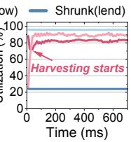  
(c) Processor utilization.

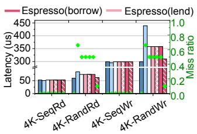  
Figure 11: DRAM harvesting.

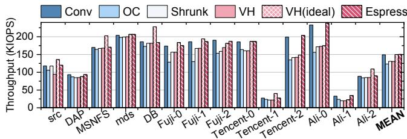  
Figure 12: Throughput comparison in real workloads.

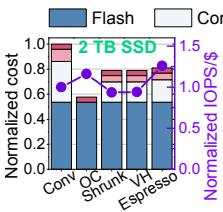

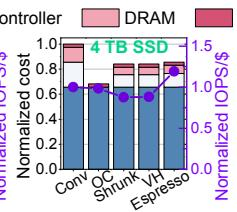

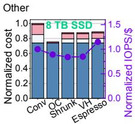  
(a) Cost and cost efficiency analysis.

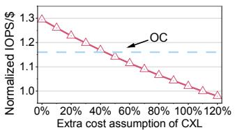  
(b) Different CXL cost assumption.

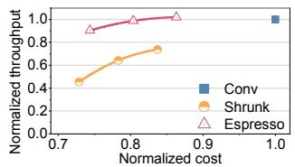  
(c) Trade-off between throughput and cost.

Figure 13: BOM cost evaluation normalized to Conv.  
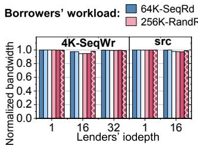  
(a) Performance of the lenders.

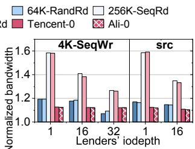  
(b) Performance of the borrowers.  
Figure 14: Interaction between lenders and borrowers.

BOM cost saving. We further evaluate the BOM costs of SSDs in different JBOF platforms. According to the current prices on the market [27,65,67,74,101,113,114], we identify the costs of NAND flash, DDR4 DRAM, enterprise SSD controller, and other expenses (e.g., PCB board and packaging) as \$4.95 per 128 GB, \$7.2 per GB, \$48, and \$6, respectively. We assume the halved computing resources (i.e., SSD controller and DRAM) in Shrunk and VH consume halved costs. According to prior work [111], we estimate the prices of CXL enabled SSD controller and DRAM in Espresso are 10% higher than those in Shrunk by default. As shown in Figure 13a, Espresso succeeds in saving BOM cost by 19.0% for 2 TB SSDs, compared with Conv. Although SSDs in Espresso are more expensive than those in OC and Shrunk, such expenses are worth given the improved performance. Figure 13a also depicts the normalized cost efficiency (i.e., IOPS/\$) in Ali-0 workload. Espresso outperforms all other designs (e.g., 19.7% higher than OC) in this metric. Figure 13b further shows the cost efficiency of Espresso under different CXL cost assumptions (i.e., how much more expensive the CXLenabled SSD controller and DRAM are than those in Shrunk). Espresso outperforms OC as long as the extra BOM costs brought by CXL do not exceed 40%. Figure 13c illustrates the trade-off between throughput and cost of different designs (cf. § 5.4 for how to vary these two parameters). We assume there is a sufficient number of idle SSDs for harvesting. Espresso demonstrates better balance between these two metrics than Conv and Shurnk (i.e., the curve of Espresso is more toward the upper-left corner).

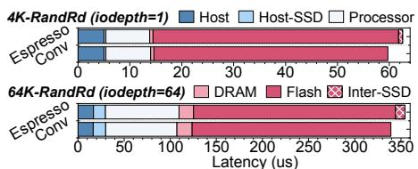  
(a) Latency breakdown.

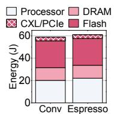  
(b) Energy consumption.

Figure 15: Overhead analysis (latency and energy).  
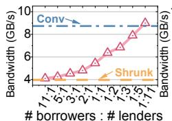  
(a) 1 core.

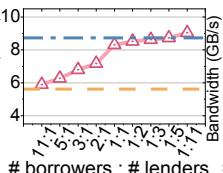  
# borrowers : # lenders  
(b) 2 cores.

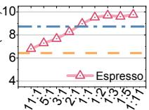  
# borrowers : # lenders  
(c) 3 cores.  
Figure 16: Sensitivity study on different processor resources.

## 5.3 Overhead Analysis

Performance impact on lenders. In this test, we run varied I/O-intensive workloads on borrowers, while lenders serve moderate I/O requests. We set the I/O depth as 64 for borrowers while varying the I/O depth from 1 to 32 for lenders to mimic different degrees of I/O pressure. Note that lenders’ processors are too busy to be lent when running src workload in 32 I/O depth. Therefore, we omit this result. Figure 14 presents the throughput of lenders and borrowers in Espresso. We have normalized the results to that of Shrunk, where no resource is lent out (i.e., best case for lenders) or borrowed in (i.e., worst case for borrowers). Resource lending causes negligible performance loss (1.3% on average, cf. Figure 14a) for lenders. This is because, with our holistic load balance algorithm (cf. § 4.4), lenders can reserve sufficient computing resources to handle their own I/O commands. The throughput of borrowers improves 15.5%, 23.3%, and 30.0%, when the lenders serve 4 KB sequential writes in I/O depths of 32, 16, and 1 (cf. Figure 14b). This is because, with lighter workloads, lenders can lend out more resources to help borrowers serve I/O commands.

Extra latency. Espresso designs (e.g., remote metadata access and synchronization) can introduce extra latency. To understand such overhead, we break down the latency of 4 KB and 64 KB random reads into six parts, as shown in Figure 15a. Host is the time consumed by the host I/O stack (e.g., NVMe driver). Host-SSD is the time for data and NVMe command transfer between the host and SSD. Processor is the time consumed to execute SSD firmware (e.g., I/O parsing and address translation). DRAM encloses the time of onboard DRAM accesses (e.g., reading mapping table). Flash represents the time of flash operations (e.g., flash read). Finally,

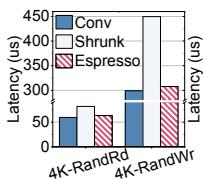  
(a) 0.25 GB DRAM.

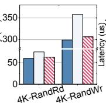  
(b) 0.5 GB DRAM.

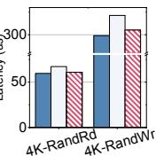  
(c) 0.75 GB DRAM.  
Figure 17: Analysis of varied DRAM resources.

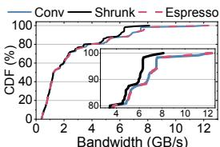  
(a) Bandwidth CDF.  
Figure 18: Comparison in complex scenarios.

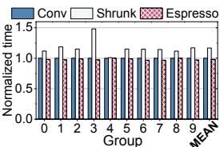  
(b) Completion time.  
Figure 19: NUMA test.

## 5.4 Sensitivity Study

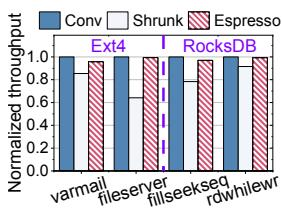

Inter-SSD includes the time taken on the CXL interconnection. In both Conv and Espresso, Flash dominates the latency. Compared with Conv, Espresso causes 3.3% more Flash overhead because of the sporadic DRAM miss (cf. § 5.2). Espresso also takes 3.1% more Processor time for inter-SSD synchronization. There is no obvious difference in terms of Host overhead, thanks to our decentralized resource management scheme (cf. § 4.3). Moreover, Espresso only takes 20 ns more amortized host CPU time for each I/O command to compute the load balance formula for redirecting (cf. § 4.4). Espresso takes minor Inter-SSD overhead (up to 2.9%), because CXL interconnection has extremely high speed and delivers sub-microsecond remote access.

Different processor resources. We examine the benefits brought by our designs in different processor resource configurations. For fair comparisons, we equip SSDs in Shrunk and Espresso with the same capacity of DRAM as SSDs in Conv. We vary the number of ARM cores in each SSD of Shrunk and Espresso from 1 to 3. We also change the ratios of numbers of borrowers and lenders from 11:1 to 1:11. Figure 16 shows the throughput in Ali-0 workload. Without inter-SSD resource harvesting, the throughput of Shrunk decreases with fewer cores (up to 54.6% degradation in the 1-core setting, cf. Figure 16a). In contrast, Espresso achieves comparable throughput to Conv when there are enough lenders for harvesting. For example, in 2-core tests, Espresso achieves 97.7% performance of Conv when each borrower harvests two lenders (i.e., 1:2). Note that, with excessive lenders for harvesting (e.g., when ratio is 1:11), Espresso cannot further boost performance, owing to the limited throughput of flash backbone and overwhelming synchronization overhead. Different DRAM resources. We reserve different capacities of DRAM in the SSDs within Shrunk and Espresso. For fair comparisons, we equip SSDs in all JBOF platforms with 6 ARM cores. We assume there is enough number of idle SSDs

Energy consumption. Figure 15b illustrates the energy consumption to conduct Fuji-0 workload of different designs. Compared with Conv, Espresso takes 3.5% more energy, because of the added Espresso daemon and CXL-enabled inter-SSD communication (cf. § 4.2). However, this minor overhead brings huge rewards, as it allows resource sharing to exploit the idle SSDs in JBOF, thereby achieving required I/O performance with reduced resources and costs (cf. § 5.2).

for DRAM harvesting, which has been witnessed in production environments (cf. § 2.2). Figure 17 illustrates the latency comparison. Shrunk experiences 44.0%, 22.3%, and 10.0% higher latency with 0.25, 0.5, and 0.75 GB DRAM per TB flash capacity, respectively. On the contrary, benefiting from our DRAM harvesting designs (cf. § 4.5), Espresso only introduces negligible latency increases (3.4% on average).

## 5.5 Complex Scenario

We examine complex scenarios where all SSDs have their own workloads. We randomly select 12 workloads from Tencent traces [134] as a group, and assign each workload to each of the 12 SSD. We repeat the experiment 10 times. Figure 18a presents the cumulative distribution function (CDF) of throughput across all 120 workloads. Echoing our findings in the previous tests, Espresso succeeds in fulfilling the burst I/O performance demands, even with only halved computing resources. To be specific, SSDs in Espresso achieve 12.3 GB/s peak throughput, while this value is only 8.1 GB/s in Shrunk. Figure 18b shows the workload completion time comparison. Espresso shortens at most 34.3% time than Shrunk, thanks to our inter-SSD resource sharing designs.

## 5.6 Application Test on NUMA Platform

We now evaluate Espresso designs on a 2-socket NUMAbased emulation platform (cf. § 4.6). We use one socket to mimic the borrower SSD, while the other socket acts as the lender SSD and the host. We choose Ext4 filesystem [68] and RocksDB [30] as the representative applications of JBOF and run them with filebench [31] and db\_bench [29], respectively. Figure 19 shows the throughput comparison of different designs. Similar to our previous tests, Espresso outperforms Shrunk by 24.8% and achieves comparable throughput to Conv even with reduced computing resources, crossvalidating the superiority of our designs.

## 6 Related Work and Discussion

SSD architecture. Multiple studies [28, 42, 47, 48, 76, 83, 124, 133] have been proposed to renovate SSD architectures. Decoupled SSD [47] decomposes SSD architecture into frontend (i.e., SSD controller) and back-end (i.e., flash backbone) and introduces a network-on-chip to facilitate communication among flash controllers. It improves the efficiency of

SSD internal data movement (i.e., garbage collection). In contrast, Espresso disaggregates SSD components based on their functionalities to enable fine-grained resource management and sharing. XHarvest [83] renovates SSD architecture and achieves high I/O performance through secure host resource harvesting. On the contrary, Espresso satisfies performance requirement via inter-SSD resource sharing.

Communication protocol. NVMe is the de facto communication protocol for most high-performance SSDs. We opt to implement I/O redirection and load balance on NVMe protocol to be compatible with existing I/O stacks, avoiding excessive software modification. To adapt to prior works [42,54,59,124,131] that access SSDs via load/store instructions, a similar I/O redirection and load balance mechanism can be implemented in the memory access path (e.g., the memory management subsystem of Linux kernel [64]).

Storage virtualization. Great efforts [36, 75, 86, 107] have been taken to virtualize storage devices and improve their utilization. BlockFlex [86] and FleetIO [107] enhance SSD utilization by harvesting idle flash resources, thereby facing critical challenges, such as limited read profit and huge data copyback overhead (cf. § 3.1). In contrast, Espresso focuses on the stateless computing resources and enables general and lightweight inter-SSD resources sharing with CXL fabric.

RAID. RAID [15] is a storage organization scheme that distributes I/O requests across multiple SSDs to improve utilization. However, RAID also treats SSDs as black boxes, which prevents fine-grained utilization of SSD internal resources, leading to stranding issues (cf. § 3.1). Moreover, RAID has been widely criticized for its substantial software overhead on the centralized host, resulting in poor scalability [41,128,129]. In contrast, Espresso enables fine-grained resource harvesting and supports decentralized and SSD-governing resource management, achieving high scalability. Additionally, Espresso is aimed to maximize the utilization of the underlying storage hardware (i.e., JBOF), which are effective to any types of software storage organizations (e.g., RAID) that users adopt. JBOF with heterogeneous SSDs. Our design can be adapted to JBOFs comprised of heterogeneous SSDs (i.e., equipping different firmware and computing resources) with minor revisions. Specifically, the borrower can expose its firmware tasks as non-decompilable executable files [55, 125] in trusted execution environments (TEE) [8, 44, 83]. Therefore, the lender can seamlessly execute the borrower’s firmware tasks with its general-purpose ARM processor while ensuring security. Considering the computing power disparity of varied SSDs, Espresso can replace the busy indicator (which is processor utilization now, cf. § 4.4) with a more general and absolute metric (e.g., current waiting queue depth) for load balance. Similar designs can also be applied in scenarios where SSD manufacturers are reluctant to expose SSD firmware details. Note that Espresso host only needs to know the current status of SSDs (e.g., idle resource table), which can be exposed via standardized specifications (e.g., NVMe Telemetry logs).

Espresso with future CXL. Considering the hardware cost, the trend of CXL evolution is toward supporting coherence over only portions of the memory region [9,57,136,137]. The limited coherence requirements of Espresso (cf. § 4.6) are aligned with this trend. One can further shrink the cache coherence region by dividing the tens of SSDs in Espresso into multiple groups and only allowing harvesting within the same group. In scenarios without hardware-supported cache coherence, software-based coherence mechanisms are required, albeit with significantly high synchronization overhead.

Practicality and compatibility. The main hardware modifications of Espresso are only the CXL interconnections and reduced SSD computing resources, while the other innovations (e.g., Espresso daemon) are implemented as software/firmware. Thanks to the backward-compatibility of CXL to PCIe and our support to NVMe protocol, Espresso SSD can act as a conventional SSD and adapt to existing I/O stacks and applications without violating compatibility. SSD industry [10, 50, 53, 72, 81, 103] is also actively exploring to evolve SSDs with CXL (e.g., Samsung CMM-H [103]) and decouple SSD architectures (e.g., Samsung AM9C1 [92, 93]). Espresso aligns with this trend and holds the promise.

## 7 Conclusion

While the numerous computing resources significantly elevate the BOM costs of SSDs to satisfy the performance requirement of burst I/O, the sporadic nature of I/O bursts causes severe SSD underutilization in JBOF scenarios. Tackling this issue, we propose Espresso, a novel JBOF design that reserves moderate computing resources in SSDs at low costs while achieving demanded I/O performance by employing CXL to facilitate fine-grained inter-SSD resource sharing. Our evaluation results reveal that Espresso improves SSD resource utilization by 50.4% and saves 19.0% BOM costs with negligible performance loss, compared to existing JBOF designs.

## Acknowledgement

We sincerely thank the anonymous reviewers and our shepherd for their insightful feedback. This work is mainly supported by the National Key Research and Development Program of China under Grant No. 2023YFB4502702, the Natural Science Foundation of China under Grant No. 624B2004, 62472007, and 62332021. Guangyan Zhang is partly supported by the National Natural Science Foundation of China under Grant No. 62025203. Chenxi Wang is partly supported by the Chinese Academy of Sciences E545030 and E401430. Yiwei Luo is partly supported by the National Science Foundation of China under Grant No. 62372011, 92582118, and 62032001. The corresponding author is Jie Zhang.

## References

[1] Anant Agarwal, Richard Simoni, John Hennessy, and Mark Horowitz. An evaluation of directory schemes for cache coherence. ACM SIGARCH Computer Architecture News, 16(2):280–298, 1988.

[2] Alibaba. Alibaba open cluster trace program. https: //github.com/alibaba/clusterdata/blob/ master/cluster-trace-v2018/trace\_2018.md, 2018.

[3] Alibaba. Alibaba block traces. https://github.com/ alibaba/block-traces, 2024.

[4] Michael Allison, Arun George, Javier Gonzalez, Dan Helmick, Vikash Kumar, Roshan R Nair, and Vivek Shah. Towards efficient flash caches with emerging nvme flexible data placement ssds. In Proceedings of the Twentieth European Conference on Computer Systems, pages 1142–1160, 2025.

[5] Pradeep Ambati, Íñigo Goiri, Felipe Frujeri, Alper Gun, Ke Wang, Brian Dolan, Brian Corell, Sekhar Pasupuleti, Thomas Moscibroda, Sameh Elnikety, Marcus Fontoura, and Ricardo Bianchini. Providing slos for resource-harvestingvms in cloud platforms. In 14th USENIX Symposium on Operating Systems Design and Implementation (OSDI 20), pages 735–751, 2020.

[6] Yuda An, Shushu Yi, Bo Mao, Qiao Li, Mingzhe Zhang, Ke Zhou, Nong Xiao, Guangyu Sun, Xiaolin Wang, Yingwei Luo, and Jie Zhang. Xerxes: Extensive exploration of scalable hardware systems with cxl-based simulation framework. In 24th USENIX conference on file and storage technologies (FAST 26), 2026.

[7] Erick Bauman, Gbadebo Ayoade, and Zhiqiang Lin. A survey on hypervisor-based monitoring: approaches, applications, and evolutions. ACM Computing Surveys (CSUR), 48(1):1–33, 2015.

[8] Erick Bauman, Huibo Wang, Mingwei Zhang, and Zhiqiang Lin. Sgxelide: enabling enclave code secrecy via self-modification. In Proceedings of the 2018 International Symposium on Code Generation and Optimization, pages 75–86, 2018.

[9] Daniel S Berger, Yuhong Zhong, Pantea Zardoshti, Shuwei Teng, Fiodar Kazhamiaka, and Rodrigo Fonseca. Octopus: Scalable low-cost cxl memory pooling. arXiv e-prints, pages arXiv–2501, 2025.

[10] Terry Cheng Bernard Shung, San Chang. Nvm express® (nvme®) technology support for cxl®: Unleashing computational workloads. https://sc23.supercomputing.org/

proceedings/exhibitor\_forum/exhibitor\_ forum\_files/exforum118s2-file2.pdf, 2025.

[11] Matias Bjørling, Abutalib Aghayev, Hans Holmberg, Aravind Ramesh, Damien Le Moal, Gregory R Ganger, and George Amvrosiadis. Zns: Avoiding the block interface tax for flash-based ssds. In 2021 USENIX Annual Technical Conference (USENIX ATC 21), pages 689–703, 2021.

[12] Matias Bjørling, Javier Gonzalez, and Philippe Bonnet. Lightnvm: The linux open-channelssd subsystem. In 15th USENIX Conference on File and Storage Technologies (FAST 17), pages 359–374, 2017.

[13] Irina Calciu, Dave Dice, Yossi Lev, Victor Luchangco, Virendra J Marathe, and Nir Shavit. Numa-aware reader-writer locks. In Proceedings of the 18th ACM SIGPLAN symposium on Principles and practice of parallel programming, pages 157–166, 2013.

[14] Karthik Chandrasekar, Christian Weis, Yonghui Li, Benny Akesson, Norbert Wehn, and Kees Goossens. Drampower: Open-source dram power & energy estimation tool. URL: http://www. drampower. info, 22, 2012.

[15] Peter M Chen, Edward K Lee, Garth A Gibson, Randy H Katz, and David A Patterson. Raid: Highperformance, reliable secondary storage. ACM Computing Surveys (CSUR), 26(2):145–185, 1994.

[16] Tae-Sun Chung, Dong-Joo Park, Sangwon Park, Dong-Ho Lee, Sang-Won Lee, and Ha-Joo Song. A survey of flash translation layer. Journal of Systems Architecture, 55(5-6):332–343, 2009.

[17] Gilberto Contreras and Margaret Martonosi. Power prediction for intel xscale® processors using performance monitoring unit events. In Proceedings of the 2005 international symposium on Low power electron ics and design, pages 221–226, 2005.

[18] Crucial. Crucial t705 pcie 5.0 nvme. https: //www.crucial.com/ssd/t705/ct2000t705ssd5a, 2025.

[19] CXL. Compute express link. https:// computeexpresslink.org, 2025.

[20] CXL. Compute express linktm (cxltm) specification 3.2. https://computeexpresslink.org/ wp-content/uploads/2024/12/CXL\_3.2-Spec-Announcement\_FINAL-1.pdf, 2025.

[21] Christoffer Dall and Jason Nieh. Kvm/arm: the design and implementation of the linux arm hypervisor. Acm Sigplan Notices, 49(4):333–348, 2014.

[22] Dell. Dell dell powerstore 500t storage array. https://www.delltechnologies.com/asset/enca/products/storage/technical-support/ dell-powerstore-gen2-spec-sheet.pdf, 2023.

[23] Li Deng, Yu-Lin Ren, Fei Xu, Heng He, and Chao Li. Resource utilization analysis of alibaba cloud. In Intelligent Computing Theories and Application: 14th International Conference, ICIC 2018, Wuhan, China, August 15-18, 2018, Proceedings, Part I 14, pages 183– 194. Springer, 2018.

[24] ARM Developer. Interaction with the performance monitoring unit (pmu). https: //developer.arm.com/documentation/ddi0469/ b/functional-description/operation/ interaction-with-the-performancemonitoring-unit--pmu-, 2025.

[25] ARM Developer. Overview of the armv8 architecture. https://developer.arm.com/ documentation/dui0801/l/Overview-of-the-Armv8-Architecture, 2025.

[26] Yaozu Dong, Zhao Yu, and Greg Rose. Sr-iov networking in xen: Architecture, design and implementation. In Workshop on I/O virtualization, volume 2. San Diego, CA, USA, 2008.

[27] DRAMeXchange. The global price of nand flash and lpddr. https://www.dramexchange.com/, 2024.

[28] Zelin Du, Shaoqi Li, Zixuan Huang, Jin Xue, Kecheng Huang, Tianyu Wang, and Zili Shao. Pipessd: A lockfree pipelined ssd firmware design for multi-core architecture. In Proceedings of the 61st ACM/IEEE Design Automation Conference, pages 1–6, 2024.

[29] facebook. db\_bench. https://github.com/ facebook/rocksdb/wiki/Benchmarking-tools, 2025.

[30] Facebook. Rocksdb. http://rocksdb.org/, 2025.

[31] filebench. A model based file system workload generator. https://github.com/filebench/filebench, 2025.

[32] Donghyun Gouk, Miryeong Kwon, Jie Zhang, Sungjoon Koh, Wonil Choi, Nam Sung Kim, Mahmut Kandemir, and Myoungsoo Jung. Amber: Enabling precise full-system simulation with detailed modeling of all ssd resources. In 2018 51st Annual IEEE/ACM International Symposium on Microarchitecture (MICRO), pages 469–481. IEEE, 2018.

[33] Jim Gray, Paul McJones, Mike Blasgen, Bruce Lindsay, Raymond Lorie, Tom Price, Franco Putzolu, and Irving

Traiger. The recovery manager of the system r database manager. ACM Computing Surveys (CSUR), 13(2):223– 242, 1981.

[34] Zerui Guo, Hua Zhang, Chenxingyu Zhao, Yuebin Bai, Michael Swift, and Ming Liu. Leed: A low-power, fast persistent key-value store on smartnic jbofs. In Proceedings of the ACM SIGCOMM 2023 Conference, pages 1012–1027, 2023.

[35] Aayush Gupta, Youngjae Kim, and Bhuvan Urgaonkar. Dftl: a flash translation layer employing demand-based selective caching of page-level address mappings. Acm Sigplan Notices, 44(3):229–240, 2009.

[36] Jian Huang, Anirudh Badam, Laura Caulfield, Suman Nath, Sudipta Sengupta, Bikash Sharma, and Moinuddin K Qureshi. Flashblox: Achieving both performance isolation and uniform lifetime for virtualized ssds. In 15th USENIX Conference on File and Storage Technologies (FAST 17), pages 375–390, 2017.

[37] Soojun Im and Dongkun Shin. Flash-aware raid techniques for dependable and high-performance flash memory ssd. IEEE Transactions on Computers, 60(1):80–92, 2010.

[38] Intel. Intel® xeon® platinum 8562y+ processor. https://www.intel.com/content/www/ us/en/products/sku/237558/intel-xeonplatinum-8562y-processor-60m-cache-2-80- ghz/specifications.html, 2025.

[39] Houxiang Ji, Srikar Vanavasam, Yang Zhou, Qirong Xia, Jinghan Huang, Yifan Yuan, Ren Wang, Pekon Gupta, Bhushan Chitlur, Ipoom Jeong, and Nam Sung Kim. Demystifying a cxl type-2 device: A heterogeneous cooperative computing perspective. In 2024 57th IEEE/ACM International Symposium on Microarchitecture (MICRO), pages 1504–1517. IEEE, 2024.

[40] Sheng Jiang and Ming Liu. Building an elastic block storage over ebofs using shadow views. In 22nd USENIX Symposium on Networked Systems Design and Implementation (NSDI 25), pages 1137–1153, 2025.

[41] Tianyang Jiang, Guangyan Zhang, Zican Huang, Xiaosong Ma, Junyu Wei, Zhiyue Li, and Weimin Zheng. Fusionraid: Achieving consistent low latency for commodity ssd arrays. In 19th USENIX Conference on File and Storage Technologies (FAST 21), pages 355–370, 2021.

[42] Myoungsoo Jung. Hello bytes, bye blocks: Pcie storage meets compute express link for memory expansion (cxl-ssd). In Proceedings of the 14th ACM Workshop

on Hot Topics in Storage and File Systems, pages 45– 51, 2022.

[43] Myoungsoo Jung, Jie Zhang, Ahmed Abulila, Miryeong Kwon, Narges Shahidi, John Shalf, Nam Sung Kim, and Mahmut Kandemir. Simplessd: Modeling solid state drives for holistic system simulation. IEEE Computer Architecture Letters, 17(1):37–41, 2017.

[44] Luyi Kang, Yuqi Xue, Weiwei Jia, Xiaohao Wang, Jongryool Kim, Changhwan Youn, Myeong Joon Kang, Hyung Jin Lim, Bruce Jacob, and Jian Huang. Iceclave: A trusted execution environment for in-storage computing. In MICRO-54: 54th Annual IEEE/ACM International Symposium on Microarchitecture, pages 199–211, 2021.

[45] Swaroop Kavalanekar, Bruce Worthington, Qi Zhang, and Vishal Sharda. Characterization of storage workload traces from production windows servers. In 2008 IEEE International Symposium on Workload Characterization, pages 119–128. IEEE, 2008.

[46] Aleksandr Khasymski, M Mustafa Rafique, Ali R Butt, Sudharshan S Vazhkudai, and Dimitrios S Nikolopoulos. On the use of gpus in realizing cost-effective distributed raid. In 2012 IEEE 20th International Symposium on Modeling, Analysis and Simulation of Computer and Telecommunication Systems, pages 469–478. IEEE, 2012.

[47] Jiho Kim, Myoungsoo Jung, and John Kim. Decoupled ssd: Rethinking ssd architecture through networkbased flash controllers. In Proceedings of the 50th Annual International Symposium on Computer Architecture, pages 1–13, 2023.

[48] Jiho Kim, Seokwon Kang, Yongjun Park, and John Kim. Networked ssd: Flash memory interconnection network for high-bandwidth ssd. In 2022 55th IEEE/ACM International Symposium on Microarchitecture (MICRO), pages 388–403. IEEE, 2022.

[49] Sang-Hoon Kim, Jaehoon Shim, Euidong Lee, Seongyeop Jeong, Ilkueon Kang, and Jin-Soo Kim. Nvmevirt: A versatile software-defined virtual nvme device. In 21st USENIX Conference on File and Storage Technologies (FAST 23), pages 379–394, 2023.

[50] Kioxia. Cxl technology: High capacity, cost-effective memory in the big data era. https://blog-us.kioxia.com/post/2025/02/ 14/cxl-technology-high-capacity-costeffective-memory-in-the-big-data-era, 2025.

[51] Jaewook Kwak, Sangjin Lee, Kibin Park, Jinwoo Jeong, and Yong Ho Song. Cosmos+ openssd: Rapid prototype for flash storage systems. ACM Transactions on Storage (TOS), 16(3):1–35, 2020.

[52] Dongup Kwon, Junehyuk Boo, Dongryeong Kim, and Jangwoo Kim. Fvm:fpga-assisted virtual device emulation for fast, scalable, and flexible storage virtualization. In 14th USENIX Symposium on Operating Systems Design and Implementation (OSDI 20), pages 955–971, 2020.

[53] Miryeong Kwon, Donghyun Gouk, Junhyeok Jang, Jinwoo Baek, Hyunwoo You, Sangyoon Ji, Hongjoo Jung, Junseok Moon, Seungkwan Kang, Seungjun Lee, et al. From block to byte: Transforming pcie ssds with cxl memory protocol and instruction annotation. arXiv preprint arXiv:2506.15613, 2025.

[54] Miryeong Kwon, Sangwon Lee, and Myoungsoo Jung. Cache in hand: Expander-driven cxl prefetcher for next generation cxl-ssd. In Proceedings of the 15th ACM Workshop on Hot Topics in Storage and File Systems, pages 24–30, 2023.

[55] James R Larus and Thomas Ball. Rewriting executable files to measure program behavior. Software: Practice and Experience, 24(2):197–218, 1994.

[56] Chunghan Lee, Tatsuo Kumano, Tatsuma Matsuki, Hiroshi Endo, Naoto Fukumoto, and Mariko Sugawara. Understanding storage traffic characteristics on enterprise virtual desktop infrastructure. In Proceedings of the 10th ACM International Systems and Storage Conference, pages 1–11, 2017.

[57] Philip Levis, Kun Lin, and Amy Tai. A case against cxl memory pooling. In Proceedings of the 22nd ACM Workshop on Hot Topics in Networks, pages 18–24, 2023.

[58] Huaicheng Li, Daniel S Berger, Lisa Hsu, Daniel Ernst, Pantea Zardoshti, Stanko Novakovic, Monish Shah, Samir Rajadnya, Scott Lee, Ishwar Agarwal, Mark D. Hill, Marcus Fontoura, and Ricardo Bianchini. Pond: Cxl-based memory pooling systems for cloud platforms. In Proceedings of the 28th ACM International Conference on Architectural Support for Programming Languages and Operating Systems, Volume 2, pages 574–587, 2023.

[59] Shaobo Li, Yirui Zhou, Hao Ren, and Jian Huang. Bytefs: System support for (cxl-based) memorysemantic solid-state drives. In Proceedings of the 30th ACM International Conference on Architectural Support for Programming Languages and Operating Systems, Volume 1, pages 116–132, 2025.

[60] Sheng Li, Jung Ho Ahn, Richard D Strong, Jay B Brockman, Dean M Tullsen, and Norman P Jouppi. Mcpat: An integrated power, area, and timing modeling framework for multicore and manycore architectures. In Proceedings of the 42nd annual ieee/acm international symposium on microarchitecture, pages 469–480, 2009.

[61] Changyue Liao, Mo Sun, Zihan Yang, Kaiqi Chen, Bin hang Yuan, Fei Wu, and Zeke Wang. Adding nvme ssds to enable and accelerate 100b model fine-tuning on a single gpu. arXiv preprint arXiv:2403.06504, 2024.

[62] Linux. Linux v5.15. https://github.com/ torvalds/linux/tree/v5.15, 2021.

[63] Linux. Lightnvm driver. https://github.com/ torvalds/linux/tree/v5.10-rc3/drivers/ lightnvm, 2025.

[64] Linux. Memory management. https: //docs.kernel.org/admin-guide/mm/index.html, 2025.

[65] Longsys. Application documents for initial public offering and listing on gem of shenzhen jiang bolong electronics co. initial public offering of shares and listing on gem board application documents report in response to the audit inquiry letter from. https://qccdata.qichacha.com/ReportData/ PDF/ef39602f078481d5136f3c4253bc56b5.pdf, 2021.

[66] Sunilkumar S Manvi and Gopal Krishna Shyam. Resource management for infrastructure as a service (iaas) in cloud computing: A survey. Journal of network and computer applications, 41:424–440, 2014.

[67] China Flash Market. The price of nand flash and lpddr. https://en.chinaflashmarket.com/, 2024.

[68] Avantika Mathur, Mingming Cao, Suparna Bhattacharya, Andreas Dilger, Alex Tomas, and Laurent Vivier. The new ext4 filesystem: current status and future plans. In Proceedings of the Linux symposium, volume 2, pages 21–33. Citeseer, 2007.

[69] Sara McAllister, Benjamin Berg, Julian Tutuncu-Macias, Juncheng Yang, Sathya Gunasekar, Jimmy Lu, Daniel S Berger, Nathan Beckmann, and Gregory R Ganger. Kangaroo: Caching billions of tiny objects on flash. In Proceedings of the ACM SIGOPS 28th symposium on operating systems principles, pages 243–262, 2021.

[70] Rino Micheloni, Alessia Marelli, Kam Eshghi, and G Wong. Ssd market overview. Inside Solid State Drives (SSDs), pages 1–17, 2013.

[71] Micron. Micron 9550 nvme ssd. https: //www.micron.com/products/storage/ssd/ data-center-ssd/9550-ssd, 2025.

[72] Micron. Micron cz122. https://www.micron.com/ products/memory/cxl-memory?srsltid= AfmBOoo9x83Q9TQMQpUPdyrUgA3gVUJFi2Vpaj6bKzENgiggYgZXFtc, 2025.

[73] Micron. Micron leads ecosystem: first to develop pcie gen6 data center ssd. https: //www.micron.com/about/blog/storage/ssd/ micron-leads-ecosystem-first-to-developpcie-gen6-data-center-ssd, 2025.

[74] Micron. Micron mt40a512m16td-062e. https://www.mouser.com/ProductDetail/ Micron/MT40A512M16TD-062E-AITR?qs= 3Rah4i%252BhyCENjNab2Szuaw%3D%3D, 2025.

[75] Jaehong Min, Ming Liu, Tapan Chugh, Chenxingyu Zhao, Andrew Wei, In Hwan Doh, and Arvind Krishnamurthy. Gimbal: enabling multi-tenant storage disaggregation on smartnic jbofs. In Proceedings of the 2021 ACM SIGCOMM 2021 Conference, pages 106– 122, 2021.

[76] Rakesh Nadig, Mohammad Sadrosadati, Haiyu Mao, Nika Mansouri Ghiasi, Arash Tavakkol, Jisung Park, Hamid Sarbazi-Azad, Juan Gómez Luna, and Onur Mutlu. Venice: Improving solid-state drive parallelism at low cost via conflict-free accesses. In Proceedings of the 50th Annual International Symposium on Computer Architecture, pages 1–16, 2023.

[77] Iyswarya Narayanan, Di Wang, Myeongjae Jeon, Bikash Sharma, Laura Caulfield, Anand Sivasubramaniam, Ben Cutler, Jie Liu, Badriddine Khessib, and Kushagra Vaid. Ssd failures in datacenters: What? when? and why? In Proceedings of the 9th ACM International on Systems and Storage Conference, pages 1–11, 2016.

[78] Nvidia. Nvidia bluefield-3 dpu. https: //www.nvidia.com/content/dam/en-zz/ Solutions/Data-Center/documents/datasheetnvidia-bluefield-3-dpu.pdf, 2025.

[79] NVMe. Nvm command set specification. https://nvmexpress.org/wp-content/ uploads/NVM-Express-NVM-Command-Set-Specification-1.0c-2022.10.03-Ratified.pdf, 2022.

[80] NVMe. Nvm express® base specification. https://nvmexpress.org/specification/ nvm-express-base-specification/, 2025.

[81] NVMe. Nvm express® (nvme®) technology support for cxl®: Unleashing computational workloads. https://nvmexpress.org/nvm-express-nvmetechnology-support-for-cxl-unleashingcomputational-workloads/, 2025.

[82] ONFi. Open nand flash interface specifications. https: //onfi.org/specs.html, 2025.

[83] Li Peng, Wenbo Wu, Shushu Yi, Xianzhang Chen, Chenxi Wang, Shengwen Liang, Zhe Wang, Nong Xiao, Qiao Li, Mingzhe Zhang, and Jie Zhang. Xharvest: Rethinking high-performance and cost-efficient ssd architecture with cxl-driven harvesting. In Proceedings of the 52nd Annual International Symposium on Computer Architecture, pages 434–449, 2025.

[84] Phison. Ps5021-e21t. https://www.phison.com/en/ products/ssd/ps5021-e21t, 2025.

[85] Phison. Ps5026-e26. https://www.phison.com/en/ products/ssd/ps5026-e26, 2025.

[86] Benjamin Reidys, Jinghan Sun, Anirudh Badam, Shadi Noghabi, and Jian Huang. Blockflex: Enabling storage harvesting with software-defined flash in modern cloud platforms. In 16th USENIX Symposium on Operating Systems Design and Implementation (OSDI 22), pages 17–33, 2022.

[87] Benjamin Reidys, Yuqi Xue, Daixuan Li, Bharat Sukhwani, Wen-Mei Hwu, Deming Chen, Sameh Asaad, and Jian Huang. Rackblox: A software-defined rack-scale storage system with network-storage codesign. In Proceedings of the 29th Symposium on Operating Systems Principles, pages 182–199, 2023.

[88] Rusty Russell. virtio: towards a de-facto standard for virtual i/o devices. ACM SIGOPS Operating Systems Review, 42(5):95–103, 2008.

[89] Samsung. Power loss protection (plp) protect your data against sudden power loss. https://download.semiconductor.samsung.com/ resources/others/Samsung\_SSD\_845DC\_05\_ Power\_loss\_protection\_PLP.pdf, 2014.

[90] Samsung. Samsung 980pro nvme ssd. https://www.samsung.com/us/computing/ memory-storage/solid-state-drives/980- pro-pcie-4-0-nvme-ssd-1tb-mz-v8p1t0b-am/, 2020.

[91] Samsung. Samsung pm1743. https: //semiconductor.samsung.com/ssd/enterprisessd/pm1743/, 2023.

[92] Samsung. Am9c1. https://news.samsung.com/ global/samsung-electronics-developsindustrys-first-automotive-ssd-basedon-8th-generation-v-nand, 2025.

[93] Samsung. Detachable ssd, am9c1 e1.a. https://www.ces.tech/ces-innovationawards/2026/detachable-ssd-am9c1-e1a/, 2025.

[94] Henry N Schuh, Arvind Krishnamurthy, David Culler, Henry M Levy, Luigi Rizzo, Samira Khan, and Brent E Stephens. Cc-nic: a cache-coherent interface to the nic. In Proceedings of the 29th ACM International Conference on Architectural Support for Programming Languages and Operating Systems, Volume 1, pages 52–68, 2024.

[95] Kia Shakiba, Sari Sultan, and Michael Stumm. Kosmo: efficient online miss ratio curve generation for eviction policy evaluation. In 22nd USENIX Conference on File and Storage Technologies (FAST 24), pages 89–105, 2024.

[96] Yizhou Shan, Yutong Huang, Yilun Chen, and Yiying Zhang. Legoos: A disseminated, distributed os for hardware resource disaggregation. In 13th USENIX Symposium on Operating Systems Design and Implementation (OSDI 18), pages 69–87, 2018.

[97] Xuanhua Shi, Ming Li, Wei Liu, Hai Jin, Chen Yu, and Yong Chen. Ssdup: a traffic-aware ssd burst buffer for hpc systems. In Proceedings of the international conference on supercomputing, pages 1–10, 2017.

[98] John E. Shore. On the external storage fragmentation produced by first-fit and best-fit allocation strategies. Commun. ACM, 18(8):433–440, August 1975.

[99] Junyi Shu, Kun Qian, Ennan Zhai, Xuanzhe Liu, and Xin Jin. Burstable cloud block storage with data processing units. In 18th USENIX Symposium on Operating Systems Design and Implementation (OSDI 24), pages 783–799, 2024.

[100] SimpleSSD. Simplessd version 2.0: Open-source licensed educational ssd simulator for high-performance storage and full-system evaluations. https:// github.com/SimpleSSD/SimpleSSD, 2020.

[101] Ryan Smith. Ssd calculator soruces. https: //www.soothsawyer.com/wp-content/uploads/ 2020/03/Public\_SSD\_Cost\_Calculator\_ Share.pdf, 2020.

[102] SNIA. Msr cambridge traces. http:// iotta.snia.org/traces/block-io/388, 2025.

[103] Mohammadreza Soltaniyeh, Gongjin Sun, Xuebin Yao, Amir Beygi, Ramdas Kachare, Dongwan Zhao, Hingkwan Huen, Andrew Chang, Senthil Murugesapandian, and Caroline Kahn. Revisiting memory hierarchies with cmm-h: Use device-side caching to integrate dram and ssd for a hybrid cxl memory. In Proceedings of the 17th ACM Workshop on Hot Topics in Storage and File Systems, pages 45–51, 2025.

[104] Yong Ho Song, Sanghyuk Jung, Sang-Won Lee, and Jin-Soo Kim. Cosmos openssd: A pcie-based open source ssd platform. Proc. Flash Memory Summit, pages 1–30, 2014.

[105] Pure Storage. What is directflash and how does it work? https://www.purestorage.com/knowledge/whatis-directflash-and-how-does-it-work.html, 2025.

[106] Kang-Deog Suh, Byung-Hoon Suh, Young-Ho Lim, Jin-Ki Kim, Young-Joon Choi, Yong-Nam Koh, Sung-Soo Lee, Suk-Chon Kwon, Byung-Soon Choi, Jin-Sun Yum, Jung-Hyuk Choi, Jang-Rae Kim, and Hyung-Kyu Lim. A 3.3 v 32 mb nand flash memory with incremental step pulse programming scheme. IEEE Journal of Solid-State Circuits, 30(11):1149–1156, 1995.

[107] Jinghan Sun, Benjamin Reidys, Daixuan Li, Jichuan Chang, Marc Snir, and Jian Huang. Fleetio: Managing multi-tenant cloud storage with multi-agent reinforcement learning. In Proceedings of the 30th ACM International Conference on Architectural Support for Programming Languages and Operating Systems, Volume 1, pages 478–492, 2025.

[108] Xun Sun, Mingxing Zhang, Yingdi Shan, Kang Chen, Jinlei Jiang, and Yongwei Wu. Scalio: Scaling up dpubasedjbof key-value store with nvme-of target offload. In 19th USENIX Symposium on Operating Systems Design and Implementation (OSDI 25), pages 449–464, 2025.

[109] Yan Sun, Yifan Yuan, Zeduo Yu, Reese Kuper, Chihun Song, Jinghan Huang, Houxiang Ji, Siddharth Agarwal, Jiaqi Lou, Ipoom Jeong, Ren Wang, Jung Ho Ahn, Tianyin Xu, and Nam Sung Kim. Demystifying cxl memory with genuine cxl-ready systems and devices. In Proceedings of the 56th Annual IEEE/ACM Inter national Symposium on Microarchitecture, pages 105– 121, 2023.

[110] SuperMicro. Storage superserver ssg-229j-5bu24jbf. https://www.supermicro.com/en/products/ system/storage/2u/ssg-229j-5bu24jbf, 2025.

[111] Yupeng Tang, Ping Zhou, Wenhui Zhang, Henry Hu, Qirui Yang, Hao Xiang, Tongping Liu, Jiaxin Shan,

Ruoyun Huang, Cheng Zhao, Cheng Chen, Hui Zhang, Fei Liu, Shuai Zhang, Xiaoning Ding, and Jianjun Chen. Exploring performance and cost optimization with asic-based cxl memory. In Proceedings of the Nineteenth European Conference on Computer Systems, pages 818–833, 2024.

[112] CRZ Technology. Daisyplus openssd. https: //www.crz-tech.com/crz/article/DaisyPlus/, 2025.

[113] Maxio Technology. About lianyun technology (hangzhou) co. initial public offering and listing on technology and innovation board (technology) response to the audit inquiry letter on the filing documents. https://static.sse.com.cn/stock/ disclosure/announcement/c/202405/001363\_ 20240523\_AP3M.pdf, 2024.

[114] TRENDFORCE. Nand flash price trends. https: //www.trendforce.com/price/flash, 2024.

[115] Shivani Tripathy and Manoranjan Satpathy. Ssd internal cache management policies: A survey. Journal of Systems Architecture, 122:102334, 2022.

[116] Hung-Wei Tseng, Laura Grupp, and Steven Swanson. Understanding the impact of power loss on flash memory. In Proceedings of the 48th Design Automation Conference, pages 35–40, 2011.

[117] Carl A Waldspurger, Nohhyun Park, Alexander Garthwaite, and Irfan Ahmad. Efficient mrc construction with shards. In 13th USENIX Conference on File and Storage Technologies (FAST 15), pages 95–110, 2015.

[118] Rui Wang, Yongkun Li, Hong Xie, Yinlong Xu, and John CS Lui. Graphwalker: An i/o-efficient and resource-friendly graph analytic system for fast and scalable random walks. In 2020 USENIX Annual Tech nical Conference (USENIX ATC 20), pages 559–571, 2020.

[119] Yawen Wang, Kapil Arya, Marios Kogias, Manohar Vanga, Aditya Bhandari, Neeraja J Yadwadkar, Siddhartha Sen, Sameh Elnikety, Christos Kozyrakis, and Ricardo Bianchini. Smartharvest: Harvesting idle cpus safely and efficiently in the cloud. In Proceedings of the Sixteenth European Conference on Computer Systems, pages 1–16, 2021.

[120] Reinhold P Weicker. Dhrystone: a synthetic systems programming benchmark. Communications of the ACM, 27(10):1013–1030, 1984.

[121] Jiwon Woo, Minwoo Ahn, Gyusun Lee, and Jinkyu Jeong. D2fq: Device-direct fair queueing for nvmessds. In 19th USENIX Conference on File and Storage Technologies (FAST 21), pages 403–415, 2021.

[122] Gala Yadgar, MOSHE Gabel, Shehbaz Jaffer, and Bianca Schroeder. Ssd-based workload characteristics and their performance implications. ACM Transactions on Storage (TOS), 17(1):1–26, 2021.

[123] Shiqin Yan, Huaicheng Li, Mingzhe Hao, Michael Hao Tong, Swaminathan Sundararaman, Andrew A Chien, and Haryadi S Gunawi. Tiny-tail flash: Near-perfect elimination of garbage collection tail latencies in nand ssds. ACM Transactions on Storage (TOS), 13(3):1–26, 2017.

[124] Shao-Peng Yang, Minjae Kim, Sanghyun Nam, Juhyung Park, Jin-Yong Choi, Eyee Hyun Nam, Eunji Lee, Sungjin Lee, and Bryan S Kim. Overcoming the memory wall with cxl-enabledssds. In 2023 USENIX Annual Technical Conference (USENIX ATC 23), pages 601–617, 2023.

[125] Zhe Yang, Youyou Lu, Xiaojian Liao, Youmin Chen, Junru Li, Siyu He, and Jiwu Shu. ∀-io: A unified io stack for computational storage. In 21st USENIX Conference on File and Storage Technologies (FAST 23), pages 347–362, 2023.

[126] Ziye Yang, Changpeng Liu, Yanbo Zhou, Xiaodong Liu, and Gang Cao. Spdk vhost-nvme: Accelerating i/os in virtual machines on nvme ssds via user space vhost target. In 2018 IEEE 8th International Symposium on Cloud and Service Computing (SC2), pages 67–76. IEEE, 2018.

[127] Min Ye, Qiao Li, Yina Lv, Jie Zhang, Tianyu Ren, Daniel Wen, Tei-Wei Kuo, and Chun Jason Xue. Achieving near-zero read retry for 3d nand flash memory. In Proceedings of the 29th ACM International Conference on Architectural Support for Programming Languages and Operating Systems, Volume 2, pages 55–70, 2024.

[128] Shushu Yi, Xiurui Pan, Qiao Li, Qiang Li, Chenxi Wang, Bo Mao, Myoungsoo Jung, and Jie Zhang. ScalaAFA: Constructing User-Space All-Flash array engine with holistic designs. In 2024 USENIX Annual Technical Conference (USENIX ATC 24), pages 141– 156, Santa Clara, CA, July 2024. USENIX Association.

[129] Shushu Yi, Yanning Yang, Yunxiao Tang, Zixuan Zhou, Junzhe Li, Chen Yue, Myoungsoo Jung, and Jie Zhang. Scalaraid: Optimizing linux software raid system for next-generation storage. In Proceedings of the 14th ACM Workshop on Hot Topics in Storage and File Systems, pages 119–125, 2022.

[130] Sangjin Yoo and Dongkun Shin. Reinforcement learning-basedslc cache technique for enhancing ssd write performance. In 12th USENIX Workshop on Hot

Topics in Storage and File Systems (HotStorage 20), 2020.

[131] Haoyang Zhang, Yuqi Xue, Yirui Eric Zhou, Shaobo Li, and Jian Huang. Skybyte: Architecting an efficient memory-semantic cxl-based ssd with os and hardware co-design. arXiv preprint arXiv:2501.10682, 2025.

[132] Jian Zhang, Yujie Ren, Marie Nguyen, Changwoo Min, and Sudarsun Kannan. Omnicache: Collaborative caching for near-storage accelerators. In 22nd USENIX Conference on File and Storage Technologies (FAST 24), pages 35–50, 2024.

[133] Jie Zhang, Miryeong Kwon, Michael Swift, and Myoungsoo Jung. Scalable parallel flash firmware for many-core architectures. In 18th USENIX Conference on File and Storage Technologies (FAST 20), pages 121–136, 2020.

[134] Yu Zhang, Ping Huang, Ke Zhou, Hua Wang, Jianying Hu, Yongguang Ji, and Bin Cheng. Osca: An onlinemodel based cache allocation scheme in cloud block storage systems. In 2020 USENIX Annual Technical Conference (USENIX ATC 20), pages 785–798, 2020.

[135] Mai Zheng, Joseph Tucek, Feng Qin, and Mark Lillibridge. Understanding the robustness of ssds under power fault. In 11th USENIX Conference on File and Storage Technologies (FAST 13), pages 271–284, 2013.

[136] Yuhong Zhong, Daniel S Berger, Pantea Zardoshti, Enrique Saurez, Jacob Nelson, Dan RK Ports, Antonis Psistakis, Joshua Fried, and Asaf Cidon. Oasis: Pooling pcie devices over cxl to boost utilization. In Proceedings of the ACM SIGOPS 31st Symposium on Operating Systems Principles, pages 101–119, 2025.

[137] Yuhong Zhong, Fiodar Kazhamiaka, Pantea Zardoshti, Shuwei Teng, Rodrigo Fonseca, Mark D Hill, and Daniel S Berger. Octopus: Enhancing {CXL} memory pods via sparse topology. In 23rd USENIX Symposium on Networked Systems Design and Implementation (NSDI 26), pages 1303–1322, 2026.

[138] You Zhou, Qiulin Wu, Fei Wu, Hong Jiang, Jian Zhou, and Changsheng Xie. Remap-SSD : Safely and efficiently exploiting SSD address remapping to eliminate duplicate writes. In 19th USENIX Conference on File and Storage Technologies (FAST 21), pages 187–202, 2021.