USENIX

THE ADVANCED COMPUTING SYSTEMS ASSOCIATION

# A Compilation-based Under-Constrained Execution Engine

Mingjun Yin, Zhaorui Li, Ju Chen, Haochen Zeng, and Chengyu Song, University of California, Riverside

https://www.usenix.org/conference/osdi26/presentation/yin

# This paper is included in the Proceedings of the 20th USENIX Symposium on Operating Systems Design and Implementation.

July 13–15, 2026 • Seattle, WA, USA

ISBN 978-1-939133-55-7

Open access to the Proceedings of the 20th USENIX Symposium on Operating Systems Design and Implementation is sponsored by

# A Compilation-based Under-Constrained Execution Engine

Mingjun Yin Zhaorui Li Ju Chen Haochen Zeng Chengyu Song University of California, Riverside

## Abstract

Software bugs continue to pose significant challenges to the security and correctness of computer systems. Finding and eliminating bugs for large-scale software systems, such as the Linux kernel, remains a difficult task. Static analyses can cover the whole codebase, but often produce too many false positives. Whole program dynamic testing is precise but has limited code coverage, and could require special environments. Due to the modular design of large software systems, a promising alternative is to instantiate an execution environment for individual components in isolation, and then apply precise dynamic analyses to these components. Unfortunately, existing execution engines that support such under-constrained execution are all interpreter-based, thus suffering from poor scalability. In this paper, we introduce UCSan, a compilation-based under-constrained execution engine that can compile an arbitrary set of C/C++ functions into a self-contained executable without manual modifications. To demonstrate the scalability and versatility of UCSan, we showcase combining UCSan with a compilation-based concolic execution engine to conduct under-constrained symbolic execution. Our evaluation shows that the resulting analysis engine is up to 15.06x faster on Linux kernel analysis tasks than the KLEE-based engine. This enhanced scalability not only improves the bug detection effectiveness but also enables its application across a broader range of software systems.

## 1 Introduction

Software bugs remain the major threat to the correctness and security of computer systems. This problem is especially severe for operating system kernels, which typically serve as the trusted computing base (TCB) for the entire system. Once a security vulnerability in the kernel is exploited, it usually can lead to the compromise of the whole system. Therefore, it is critical to identify and fix bugs before they are exploited by attackers.

Dynamic testing techniques, such as gray-box fuzzing [13, 26, 37], are state-of-the-art bug-finding techniques that have been widely adopted in the industry and have discovered a substantial number of bugs: the OSS-Fuzz [16] project has found more than 10,000 security vulnerabilities and 36,000 bugs in 1,000 open source projects; and the continuous kernel fuzzer syzbot [38] has helped fix over 6,500 bugs in the Linux kernel. Although fuzzers have been very successful in finding bugs, they also have notable limitations. One fundamental limitation, which applies not only to fuzzing, but also to all other dynamic analysis techniques, is the need for good testing harnesses—if a bug is not reachable from the harness, it cannot be found by fuzzers, no matter how much effort is put into the fuzzing.

Besides the testing harness challenge, another fundamental challenge for dynamic testing is the environmental setup. For example, to test an OS kernel, a fuzzer typically needs to set up a virtual machine; to test a file system, the fuzzer needs to prepare a disk image; and to test a device driver, the fuzzer either needs direct access to the real hardware, or a proper device emulator, which is often unavailable and non-trivial to implement. As a result, not all components in a complex software system can be effectively tested (e.g., an Android image for real phones).

Another widely used technique to find bugs is static analysis. While static analyses are not limited by testing harnesses and can analyze arbitrary sets of code (e.g. the whole kernel), they need to trade off precision for scalability. For large and complex projects like OS kernels, static analyzers tend to generate too many false alarms [2, 10, 12, 21, 22, 25, 46]. For example, the use-before-initialization analyzer [46] used in our evaluation generates 147,643 warnings, but only 52 were confirmed or patched.

Conceptually, it would be ideal if we could extract an arbitrary subset of code from the target software, make it selfcontained, and then apply dynamic testing techniques to it. In this way, we can avoid the need for a testing harness and complex environmental setup, while still being able to leverage the precision of dynamic analyses. This approach faces two key challenges. The first challenge is how to initialize the memory properly. A program typically accesses three types of memory objects: global, stack, and heap. Global and stack objects are relatively easy to handle, as existing compiler toolchains already know how to allocate and initialize them. However, heap objects are usually allocated and initialized dynamically at runtime. When we skip the typical initialization process (e.g., booting the kernel) and start the execution from an arbitrary (internal) function, we need a way to allocate and initialize heap objects expected by the code; otherwise, the execution will likely crash due to invalid memory accesses.

The second challenge is how to handle external dependencies. When we extract an arbitrary set of code from a complex software system, it is likely that the code will invoke functions outside the analysis scope, and we usually want to handle them differently. In most cases, we do not want to actually execute these external functions, otherwise we should have included them in the analysis scope in the first place. In other cases, we may want to provide a simplified model or a replacement. For instance, when running kernel code in the user space, we may want to replace invocations of kmalloc with malloc.

Unarguably, one can address these challenges manually. For example, researchers have manually extracted the TCP stack from the Linux and FreeBSD kernels for model checking [8]. Similarly, the Linux kernel library (LKL) project [1] aims to allow running Linux kernel code in user space, and has been used to build a fuzzing framework for file systems [43]. However, manual approaches are typically labor-intensive, error-prone, hard to scale (e.g., extract another module), and costly to maintain (e.g., keep updating with the upstream codebase).

Under-constrained execution, as pioneered by UC-KLEE [30], provides an automated approach to the above challenges. Under the hood, UC-KLEE employs a technique called lazy initialization to address the memory initialization challenge—when a pointer is dereferenced for the first time, if it points to an uninitialized memory object, the engine will allocate and initialize the object on-the-fly. This way, the engine can avoid the need to fully initialize the memory layout beforehand. To address the external dependency challenge, UC-KLEE provides a set of interfaces to allow users to specify how to handle external function invocations.

Besides UC-KLEE, some recently developed engines can also support under-constrained execution, such as Angr [34]. Unfortunately, these engines are all interpreter-based. As a result, they suffer from severe scalability issues. Yun et al. [44] reported that KLEE is around 3,000 times slower than native execution, and Angr is more than 321,000 times slower. Such performance is insufficient for analyzing slightly larger components like file systems, TCP stack, and device drivers.

Inspired by the recent advances in compilation-based concolic execution engines [9, 28], we propose UCSAN (Under-Constrained Sanitizer), a compilation-based underconstrained execution engine implemented as an LLVM Pass along with a runtime library.

UCSAN has two primary design goals. First, we decouple under-constrained execution from symbolic execution, enabling UCSAN to be combined with a variety of dynamic analysis techniques, including concolic execution, fuzzing, and model checking. Second, as a compilation-based approach, UCSAN is designed to be general-purpose, easy to integrate, and performant.

UCSAN addresses the aforementioned two challenges through compile-time transformations and runtime support. Specifically, we implemented a prototype of UCSAN based on the sanitizer framework of LLVM. It contains an instrumentation pass that (1) instruments all memory accesses to perform runtime address translation to support lazy initialization (i.e., accessing memory through uninitialized pointers), (2) instruments external function invocations based on configuration, and (3) removes all out-of-scope code. UCSAN also contains a runtime library that uses the shadow memory from the sanitizer framework to track aliased pointers, such that it knows: (1) which pointers have been initialized (i.e., have corresponding memory objects), (2) which pointers point to the same memory object, and (3) how to translate an under-constrained pointer to the proper offset within its corresponding memory object.

We then evaluated the performance and compatibility of UCSAN. First, we compared UCSAN with KLEE and Angr on the nbench benchmark [27], the results show that UCSAN is orders of magnitude faster. For compatibility, we compiled three versions of Linux kernel (4.14, 5.10, and 6.16) with UCSAN under different configurations. The results show that UCSAN can successfully compile over 80% of the kernel modules.

To demonstrate how UCSAN can benefit bug finding, we additionally developed Thoroupy, a Python-based analysis companion that orchestrates exploration and generates input seeds for UCSAN. Together they form a complete concolic execution engine we call UCSAN<sup>†</sup>. While UCSAN is independently usable, for evaluation purposes, we evaluate it in the UCSAN<sup>†</sup> setup in this paper and use the two names interchangeably. We conducted a few case studies with UCSAN<sup>†</sup>. First, we compared UCSAN<sup>†</sup> with a KLEE-based engine [47] on the task of filtering warnings generated by static analysis of UBITect [46]. UCSAN<sup>†</sup> can process 63,957 (95.46%) warnings under the same 2 minute timeout, which is 42,155 more than the KLEE-based engine. Such improvement allows UCSAN<sup>†</sup> to confirm at least 15 more patched vulnerabilities. Second, we applied UCSAN<sup>†</sup> to reproduce over a hundred known vulnerabilities in user-space open-source projects and the Linux kernel. The results show that UCSAN<sup>†</sup> can successfully reproduce a significant portion of them, without any manual effort to build test harnesses.

In summary, this paper contributes to the field in the following ways:

• Novel design: We present the design of a novel, compilation-based under-constrained execution solution

UCSAN, which is general, easy to use, performant, and can be combined with different dynamic analysis techniques.

• Bug finding: To demonstrate how the improved scalability can benefit dynamic analysis, we built an under-constrained concolic execution engine UCSAN<sup>†</sup> based on UCSAN, and evaluated it on multiple real-world case studies. The evaluation results show that UCSAN<sup>†</sup> can scale to large kernel modules and find real bugs.

• Open-source: UCSAN and UCSAN<sup>†</sup> are publicly accessible under the Apache 2.0 license.<sup>1</sup>

## 2 Under-constrained (Concrete) Execution

In this section, we provide an overview of compilation-based under-constrained execution engine, including workflow and key challenges.

## 2.1 Workflow

Figure 1 illustrates the workflow of a compilation-based under-constrained execution engine. It takes as inputs (1) the target Program Under Test (PUT) in the form of LLVM Intermediate Representation (IR), and (2) a YAML configu ration file specifying the analysis scope (i.e. which functions and IR files to include), the entry function (i.e. where to start execution), and handling strategies for out-of-scope functions. The output is a self-contained executable that can run as a normal user-space program. UCSAN imposes no restriction on how the LLVM IR is produced, that is, any toolchain that emits LLVM IR can serve as the front end. For instance, enabling link-time optimization (LTO) in the Linux kernel build system is an easy way to obtain IR for the kernel.

The configuration file (e.g., Figure 2) is the key to remove the dependency on test harnesses, as one can specify any function (e.g., cal) as the entry point, and an arbitrary set of functions (e.g., foo, bar) as the analysis scope. UCSAN also supports mapping a function in the PUT to a replacement function (e.g., kmalloc to malloc). The configuration file can be generated manually. Alternatively, it can also be generated automatically using static analysis [30, 41, 46, 47], or using large language models (LLMs). In the evaluation, we used configurations generated by a static security checker UBITect [46], and a simple call graph analysis. For bug reproduction experiments, some configurations were generated manually, some were generated by LLMs.

Using the analysis scope specified in the configuration file, UCSAN first iterates over all included IR files and invokes opt from the LLVM toolchain to perform its instrumentation and output instrumented IR files. During this step, UCSAN will also remove out-of-scope functions, and replace their invocations with proper stubs, or a replacement function as specified in the configuration file (e.g. kmalloc). Optionally, the instrumented files can then be pipelined into additional dynamic analysis passes. For instance, in the evaluation, we pipelined UCSAN with SymSan [9] to perform under-constrained concolic execution, namely, UCSAN<sup>†</sup>. These dynamic analysis passes are optional, without them, the output binary can still run normally. Finally, UCSAN compiles the instrumented IR into object files and links them with all necessary runtime libraries (PUT’s, UCSAN’s, and any from the dynamic analysis passes) to produce a self-contained user-space executable.

The instrumented binary can then be used for dynamic analysis, but there are a few technical challenges to address. First, most internal functions consume memory objects instead of files or network I/O. In other words, dynamic testing should be done by providing different memory objects as inputs. To achieve this, UCSAN defines an input format to serialize memory objects into a file, and later deserialize them back to memory objects during execution. The second challenge is how to support lazy initialization, that is, when we start the execution from an arbitrary (internal) function, heap memory objects that would be accessed are neither allocated nor initialized yet. Similarly, all pointers used to access these memory objects are uninitialized as well. Therefore, we need a way to (1) allocate and initialize memory objects on-demand when they are accessed for the first time, and (2) bind uninitialized pointers to the proper memory objects. Related challenges include but are not limited to, (C1) how to handle aliased pointers, (C2) how to estimate the size of a memory object, (C3) how to adjust the size of a memory object dynamically in case the estimation is wrong, and (C4) how to deserialize memory objects from the input file to ensure deterministic execution. In this work, we address all these challenges with a new technique called Just-In-Time Initialization (§3.2).

As mentioned earlier, one primary design goal of UCSAN is to decouple under-constrained execution from specific dynamic analysis techniques, so that it can be combined with different dynamic analysis techniques. Therefore, we consider generating new test inputs (i.e., memory objects) as an orthogonal problem. For demonstration purposes, we showcase how to combine UCSAN with a compilation-based concolic execution engine SymSan [9] to perform under-constrained concolic execution UCSAN<sup>†</sup>. In a nutshell, SymSan performs compile-time instrumentation to generate symbolic traces as dynamic analysis outputs. It then parses the traces into symbolic path constraints, and uses an SMT solver to solve the constraints and generate new test inputs (e.g., memory objects that can negate a branch). The generated inputs can then be executed to explore new paths.

## 2.2 An Illustrative Example

In this subsection, we use an elevated linked list example as in [30] to explain the key steps in under-constrained (concrete) execution.

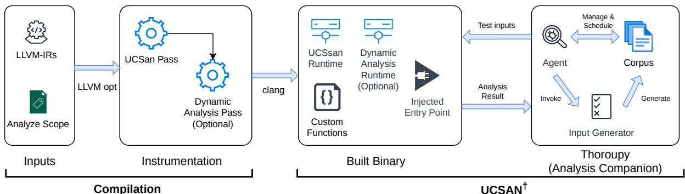  
Figure 1: Workflow of a compilation-based under-constrained execution engine, and how it can be combined with different dynamic analysis techniques

```yaml
1 entry : cal
2 scope : [ foo , bar ]
3 custom :
4 kmalloc :
5 ref_name : malloc
6 arg_maps : # map first arg and ignore rest
7 - idx: 0
8 ucsan_idx : 0
```  
Figure 2: An example configuration file.

Consider the code snippet in Figure 3, which defines a simple linked list and a function cal that computes the sum of all node values. Traditional dynamic testing tools [6, 9, 11, 19, 28, 37, 45] cannot analyze cal directly. Instead, they require a testing harness. The testing harness is in charge of reading test inputs (e.g., from a file), instantiating a linked list, and invoking the target function. By generating different test inputs, we hope the execution can trigger the assertion failure at line 20.

In a nutshell, what UCSAN does is to automate the process via compiler techniques. Given cal as the entry function, UCSAN will automatically generate a harness (main) to invoke it. UCSAN will also instrument the code to instantiate a linked list on demand during the execution, and make sure all accesses through aliased pointers will visit the same mem ory object (addresses). If a test input is provided, UCSAN will also perform deserialization to populate the linked list accordingly. Next, we explain the key steps in detail.

## 2.2.1 Code Transformation

UCSAN directly executes cal from line 8, and initializes the environment on demand (§3.1). This is done by compiletime code transformations, which are annotated with + and - in Figure 3. Note that the actual transformation is done on the LLVM IR level, here we illustrate it in source code level for better readability. These transformations include three main parts:

• Entry point (main function) generation. UCSAN will automatically insert a main function (lines 23 - 27) to create a self-contained binary (§3.1). The main function performs three universal tasks independent of the analyzed function(s): (1) UCSAN tracks aliased pointers using a shadow pointer (i.e., all aliased pointers share the same shadow pointer). So the first task is to create a shadow pointer for each pointer argument. In this example, since the argument head of cal is a pointer, UCSAN creates a shadow pointer head\_s at line 24. (2) If a test input is provided, UCSAN will deserialize it to populate head (line 25). Note that here UCSAN only populates a single list node pointer head, the actual node objects will be allocated and populated on-demand when they are accessed. (3) Call target entry function cal (line 26).

```c
typedef struct {
2 struct list_entry * next ;
3 } list_t ;
4 typedef struct {
5 unsigned int v ;
6 list_t list ;
7 } node_t ;
int cal( list_t * head ){
8 int cal( list_t * head , shadow_t head_s ){
9 int sum = 0;
10 node_t * curr = NULL ;
11 while ( head ) {
12 + check_ptr (head , head_s );
13 curr = container_of ( head , node_t , list ) ;
14 + int *p_v = check_ptr (& curr - >v, head_s );
15 + sum += *p_v ;
sum += curr - >v;
16 + list_t ** p_next = check_ptr (& head - >next , head_s );
17 + head = * p_next ;
18 + head_s = get_shadow ( p_next );
head = head - > next ;
19 }
20 if ( sum > 100) assert ( false ); /* bug here */
21 return sum ;
22 }
23 + int main ( int argc , char ** argv ) {
24 + shadow_t head_s = get_shadow_ptr ();
25 + list_t * head = get_concrete (head_s , sizeof ( list_t )
);
26 + cal (head , head_s );
27 + }
```  
Figure 3: Motivating example: linked list sum

• Pointer translation. As mentioned before, one of the main challenges of under-constrained execution is to allocate memory objects on-demand, and initialize pointers properly, especially when there are aliased pointers. UCSAN solves this through shadow pointers. Conceptually, shadow pointers play a similar role as segmentation registers in virtual address translation: (1) all uninitialized/unbounded pointers will have a shadow pointer associated with them; and (2) all aliased pointers will share the same shadow pointer. In this example, the shadow pointer of head is head\_s. And the three aliased pointers curr, curr->v, and head->next also share the same shadow pointer head\_s. Before every memory access, UCSAN will insert a call to the callback function check\_ptr to translate a potential uninitialized pointer to a valid pointer (line 14 and 16); and replace the use site with the actual pointer (line 15 and 17). Note that because we may need to reallocate the underlying object to adjust the object size on-the-fly (e.g., due to container\_of), all translated pointers (p\_v and p\_next) are treated as “volatile”, so check\_ptr is called twice in this example, even though the pointers (curr->v, and head->next) are aliasing. For the same reason, we do not store translated pointer back to memory. We explain more about this design choice in §3.2. Finally, whenever a new pointer is loaded from the memory (e.g., line 17), UCSAN will also load the corresponding shadow pointer (line 18).

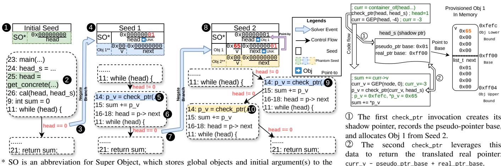  
\* SO is an abbreviation for Super Object, which stores global objects and initial argument(s) to the entry function. \*\* SO in Seed 0, Obj 1 in Seed 1, and Obj 2 in Seed 2 are dynamically introduced via JIT-initialization as a phantom seed.  
Figure 4: Key steps in exploring different paths in the linklist example.  
Figure 5: Shadow pointer handling and real-pointer translation when dealing with Obj 1 in Seed 2

• External function handling. To ensure that the target program is compilable, we need to make sure that all calls to external functions (i.e., functions outside the analysis scope that are not specified in the YAML configuration) can be handled automatically. Note that the example does not contain external functions for brevity. UCSAN offers three options. First, a custom wrapper can be provided to summarize the effects (e.g., memcpy). The user can implement the wrapper function in an arbitrary way to simulate the actual behavior of the external function. UCSAN also allows mapping a function in the PUT to a known wrapper function (e.g., kmalloc to malloc). Second, UCSAN can assume that the function is pure and no changes would be made to the current memory state, which is similar to UC-KLEE [30]. Third, UCSAN can assume that the function can perform arbitrary changes to memory objects passed to the function as pointer arguments, and return arbitrary values. For instance, a call of read(fd,buf) may fill buf with arbitrary values. In this case, UCSAN will reallocate all memory objects passed to the function (i.e. put a new object corresponding to buf\_s), as under-constrained memory objects.

## 2.2.2 Path Exploration

Figure 4 demonstrates key steps of UCSAN<sup>†</sup> in exploring three different paths in the example (Figure 3) by combining UCSAN with a dynamic testing technique. The goal is to cover all paths that can trigger the assertion failure at line 20. In the figure, we use Seed 0 - 2 to represent three different test inputs and their corresponding execution paths.

• Seed 0. 1 UCSAN executes the compiled binary with an initial seed. This initial seed is empty, i.e., it contains nothing at all. 2 When the execution reaches line 25 and get\_concrete is called, UCSAN looks up the seed for an object matching head. Because no such entry exists, UCSAN treats the object as a phantom: it allocates a new memory object based on the type information of head (i.e., a pointer) and provisions it with all zeros. In general, whenever the seed does not contain an entry for a requested object, UCSAN pretends the object exists and initializes it with zeros—we call this a phantom seed. We use colored backgrounds to annotate phantom objects in the figure. get\_concrete then returns nullptr(0x00) to initialize the head pointer. This new object resides in a memory segment we call super object (SO). We use this segment to store global objects and initial arguments for the entry function. When the execution reaches line 11, since head is initialized as a nullptr, the concrete execution goes to the false branch, reaches line 20, does not trigger the assertion failure, returns to main, and terminates.

To explore a different path, UCSAN needs a new seed. To clarify again, this step (input generation) is done by the integrated dynamic testing technique, namely UCSAN<sup>†</sup>. If we are performing under-constrained symbolic execution, we can solve the negated path constraint head != null ( 3 ), by assigning head to 0x1; and generate a new seed. Note that here the engine does not have to assign head to a valid address, just a non-null value (i.e., it should point to something, but exactly where, can be determined later). Since the values of head and other pointers in the original source code do not directly address real objects, and only their shadow pointers hold references to the actual backing memory, we refer to them as pseudo-pointers.

• Seed 1. 4 UCSAN now has the newly generated Seed 1. When the execution reaches line 11, because the seed is not empty, UCSAN uses the shadow pointer head\_s to locate the corresponding content in the seed, and populates values for the allocated memory object accordingly (i.e., head = 0x1). Because head now satisfies the predicate head != null, the concrete execution can enter the loop body and try to read from the curr->v pointer. 5 When check\_ptr is called, UCSAN lazily allocates a new (phantom) memory object obj1. In this example, we highlight three key challenges in lazy initial ization in concrete execution. First, how to know the size of obj1? If we simply use the type information of head in the declaration of cal, then the size would be insufficient, as the type of it is just an infrastructure for linked list. To solve this problem, UCSAN instruments pointer arithmetic operations (e.g., container\_of) and type casting operations to accurately track the allocation size of the underlying object. Note we omit the size tracking instrumentation in the example for brevity. In this case, the size of obj1 is estimated based on the type information of curr (i.e., sizeof(node\_t)), instead of the type of head (i.e., sizeof(list\_t)). The concrete content of obj1 is initialized as all zeros.

The second challenge is how to calculate the correct offset within the underlying object. UCSAN solves this problem using the segment register: shadow pointer head\_s. In particular, when materializing obj1, UCSAN updates head\_s to record the concrete value of the under-constrained pointer, the logical base of the segment. In this example, the pointer curr->v’s value is -3, due to container\_of (1-4=-3). This allows UCSAN to handle arbitrary pointer arithmetic and type casting operations, as well as growing the segment on-the-fly.

The third challenge is how to locate the content in the seed to initialize obj1. UCSAN solves this problem by recording object relationships. Specifically, UCSAN records in the shadow pointer head\_s that obj1 is pointed-by the pointer at offset 0 from SO; so next iteration, it can find the content from the seed to initialize obj1. After materializing obj1, check\_ptr returns obj1.v (offset 0 from obj1) to initialize p\_v. Again, p\_v is ephemeral: it is only used for the memory read, then discarded immediately after the read and never used again. We call such pointers real-pointers.

6 A pseudo-pointer is loaded from the lazily allocated object obj1.next, and its corresponding shadow pointer is created. Note that in this step, head->next has a concrete value of

0x1, but UCSAN can correctly translate it to obj1.list.next (offset 0x4), because head\_s has recorded that the base pointer is -3. 7 The concrete execution reaches the loop head again. Because obj1.list.next is initialized as a nullptr, the loop exits.

In this execution, sum still has a concrete value of 0, so the assertion failure is not triggered. However, it is now a symbolic value (0+obj1.v). By solving the negated path constraint ((0+obj1.v)>100)==true, we can generate a new seed that triggers the assertion failure.

To explore a different path, the dynamic analyzer generates a new seed. This can be done by assigning obj1.list.next to 0x1, i.e., Seed 2. Notably, obj1.list.next does not have to be a valid pointer, and can have the same value as head (i.e., same logical address of different segments do not conflict). For simplicity, we also assign obj1.v to 0x65 (decimal 101) to trigger the assertion failure.

• Seed 2. 8 UCSAN schedules Seed 2. This seed includes two serialized objects: SO and obj1. The head field in SO is initialized to 0x1, and the obj1.list.next field is also set to 0x1. As with Seed 1, the execution enters the loop body. 9 When check\_ptr is called, UCSAN lazily allocates obj1. However, this time, it loads the content from the seed, based on the recorded pointed-by annotation from 5 . As a result, the obj1.list.next field is now initialized to 0x1. This causes the execution to re-enter the loop body. 10 When check\_ptr is called again, UCSAN allocates a new (phantom) memory object, obj2, initializes its content to zero, and records the point-to relationship (i.e. pointer defined at offset 4 from obj1 points to obj2). Since obj2.list.next is initialized to null, the loop terminates. When the execution reaches line 20, the concrete value of sum is 101, so the assertion failure is triggered, and all paths are covered.

## 3 UCSAN

In this section, we present technical details of UCSAN. UCSAN is built on the sanitizer framework from LLVM, reusing the shadow memory design of DataFlowSanitizer (DFSan) [35], to track shadow pointers and function calls (arguments and return values).

## 3.1 Compile-time Instrumentation

This instrumentation performs three main tasks, as briefly illustrated in §2.2: (1) main function generation, (2) pointer translation, (3) handling external functions.

Preprocessing. UCSAN operates on LLVM IR, so any build system that produces IR can serve as its front end.

Harness Generation. As discussed in §2, UCSAN inserts a main function to produce a self-contained binary. It first discards the original main (if present), then, if the entry function (e.g., cal in Figure 2, 3) is defined in the current module, introduces a new main there. As shown in Figure 3, this main is a wrapper that populates arguments (lines 24–25, deserializing from the super object if available, otherwise all zeros) and calls the entry.

Pointer Translation. UCSAN refers to all PUT-managed pointers as Pseudo-Pointers (pseudo-pointers), which are translated into valid pointers (Real-Pointers, real-pointers) only upon dereference. We call this process Just-In-Time Initialization (JITI), which is conceptually similar to segmentation-based logical-to-linear address translation in x86 processors, but implemented in software. Unlike classical lazy initialization [30], which allocates objects only when they are about to be accessed, JITI may provision objects eagerly (e.g., during address computation), hence the distinct name. A key invariant of JITI is that real-pointers must never escape into the PUT’s own data flow: they are handed only to memory-access instructions (e.g., Load) and discarded immediately afterward. The PUT itself carries only pseudo-pointers or constant pointers (e.g., globals in the data/bss segment). UCSAN handles constant pointers specially by having their pseudo-pointer and real-pointer values coincide, so that they can coexist with pseudo-pointers transparently.

To enforce this invariant, UCSAN instruments all LLVM IR instructions and intrinsics that involve pointer operations, including Load, Store, AtomicRMW, memset, memcpy, memmove, GEP, and BitCast. Before each such instruction, UCSAN inserts a call to the runtime function check\_ptr. For dereferencing instructions (e.g., Load, Store, memcpy, line 15 in Figure 3), the original pointer operand is replaced with the real-pointer returned by check\_ptr, ensuring the access targets a valid, allocated memory object. For address-computing instructions (e.g., GEP, BitCast, line 13 in Figure 3), UCSAN notes the expected object size and updates the pointer arithmetic metadata accordingly. The runtime logic of check\_ptr is detailed in §3.2.

Shadow Pointers. To perform pointer translation, UCSAN uses shadow pointers to track three pieces of information: (1) the logical base address used to materialize the underlying memory object, (2) which memory object a pseudo-pointer points to (point-to), and (3) where a pseudo-pointer originates (point-by). Shadow pointers propagate alongside the data flow of pseudo-pointers. To implement this, UCSAN builds upon DFSan’s shadow memory design. This design as sociates each byte of application memory with a shadow value. It also provides local shadow variables for fast access, and defines a calling convention to pass shadow values through function arguments and return values. UCSAN also instru ments casts between integer and pointer types. A shadow pointer is introduced whenever a pseudo-pointer is created. For instance, loading a pointer from a JITI-ed object produces a fresh shadow pointer.

External Function Handling. To satisfy the linker, UCSAN replaces out-of-scope external functions with dummy stubs using one of three options: (1) Custom Wrapper to summarize specific effects (e.g., memcpy must copy shadow memory) or to map to a known function (e.g., kmalloc mapped to malloc as in Figure 2). A custom wrapper can be easily introduced by providing a function that matches the stub’s signature; (2) Assume Pure (the default) to assume no side effects; and (3) Assume Arbitrary Changes to conservatively reallocate all pointer arguments. For the latter two options, return values are treated as newly allocated objects (i.e., their values are drawn from the super object).

Inline Assembly. Inline assembly is prevalent in performance-critical applications and system software (e.g., OpenSSL and OS kernels). In our current prototype, we apply heuristics to handle common inline assembly patterns. More complex assembly blocks can be modeled using the aforementioned custom wrapper functions. Manually modeling every inline assembly instruction is highly case-specific and labor-intensive. It is therefore out of scope for this prototype. However, the ability to resolve inline assembly via wrappers remains a significant advantage over engines like KLEE. Furthermore, we observed that LLMs can automatically generate these wrappers, which significantly reduces the manual effort and improves scalability.

## 3.2 Just-In-Time Initialization

Starting the analysis from an arbitrary function poses a notable challenge: pointers accessed by the target function may not be initialized. In under-constrained symbolic execution [30], this is handled by lazy initialization, where a symbolic object is created when an uninitialized pointer is dereferenced. However, in UCSAN, we deal with concrete executions, so we must provide valid virtual addresses to the CPU, otherwise the program will crash with a segmentation fault. To address this challenge, we propose Just-In-Time Initialization (JITI). JITI consists of two key components: a new pointer representation called Pseudo-Pointer and a runtime mechanism to handle pointer translation and object allocation.

Pseudo-Pointer. To bridge the gap between uninitialized pointers and concrete execution, we introduce a new concept called Pseudo-Pointer (pseudo-pointer). Conceptually, UCSAN’s pointer translation mechanism can be viewed as a software-based segmentation mechanism, where each memory object is considered as a segment, each pseudo-pointer is a 64-bit value containing the (pseudo) logical address to the segment, and the shadow pointer of a pseudo-pointer is its segment register. Under this scheme, a pseudo-pointer serves two purposes: (1) it stores the (logical) offset (introduced by pointer arithmetic) within the memory object, and (2) it provides the value required to satisfy path constraints in the concrete execution (e.g., p != NULL). The shadow pointer (segment register) of a pseudo-pointer tracks (1) the (logical) base of the segment, (2) the actual virtual address of the underlying memory object, and (3) the point-by relationship (i.e., where the pointer is loaded from). Therefore, a pseudo-pointer is not a valid virtual address and cannot be dereferenced directly. Instead, it must be translated into a valid Real Pointer (realpointer) before access. This translation is performed by the JITI runtime.

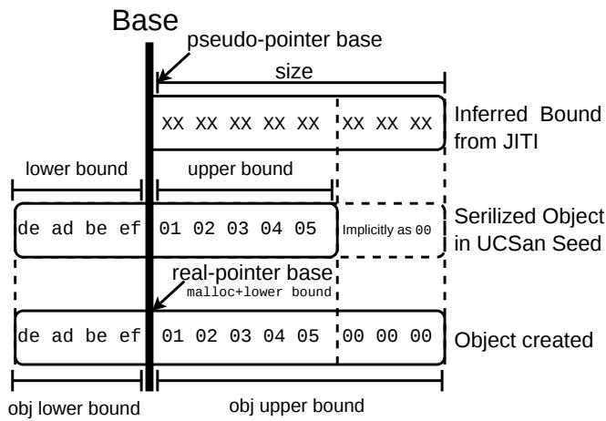  
Figure 6: Allocation for one specific object during JITI.

JITI Runtime. The core of JITI is implemented in the runtime function check\_ptr, which is invoked before every pointer operation (as instrumented in §3.1). check\_ptr performs the following steps:

1. Pointer Validation. First, check\_ptr checks if the input pointer is a pseudo-pointer. It does this by inspecting the associated shadow pointer. If the pointer is a valid real-pointer (e.g., pointing to stack, global, or heap memory returned by malloc), check\_ptr simply returns it. If it is a pseudo-pointer with a valid shadow pointer, check\_ptr continues processing to the next step below.

2. Lazy Allocation. Using the shadow pointer, UCSAN looks into a metadata/segment table to check if the corresponding memory object has been allocated (i.e., does the shadow pointer have a valid object ID). If the pseudo-pointer points to an object that has not been allocated yet, UCSAN allocates a new memory object (Figure 6). The size of the allocation is inferred from the pointer type (e.g., pointer arithmetic and type casting) or the operation (e.g., memcpy size). UCSAN maintains an object table (indexed by Object ID) to track allocated objects, including their size, bounds, and base addresses. In certain cases, the inferred size could be larger than the current allocation (e.g., container\_of). When this happens, UCSAN automatically reallocates the object to accommodate the larger size. As mentioned earlier, because the translation results are always ephemeral (i.e., only used for the immediate memory access and never used again), and because all pointer dereferences must go through check\_ptr, reallocation can be done transparently without affecting correctness (i.e., no stale real-pointer will be used).

3. Initialization. After allocation, UCSAN initializes the memory content. UCSAN first retrieves the point-by metadata using the shadow pointer and checks if the test input provides specific values for this object (see §3.3). If so, UCSAN populates the memory with these values (Figure 6); otherwise, it initializes the memory with zeros. Then, UCSAN initializes the shadow memory of the memory object with shadow values to track the origin of the data, in the form of (object\_id, offset).

4. Pointer Translation. If the pseudo-pointer is used in pointer arithmetic (LLVM’s GEP) or type casting (LLVM’s BitCast), UCSAN will return pseudo-pointer value without translation. In this way, GEP can update the (logical) offset of the pseudo-pointer normally. When the pseudo-pointer will be dereferenced (e.g., in Load, Store), check\_ptr translates pseudo-pointer to the actual real-pointer. This is done as follows. When the shadow pointer is first created, it records the actual value of the pseudo-pointer as the (logical) base\_offset (which could be arbitrary value, like -3 in Figure 4). During execution, pointer arithmetic may update the actual value of a pseudo-pointer. To compute the final real-pointer, check\_ptr retrieves the object\_base from the object table, based on the object ID from the shadow pointer, and adds the difference between the current\_offset in pseudo-pointer and the recorded base\_offset to it. Figure 5 illustrates how an object is created from the seed via JITI for the first time and how a real-pointer is retrieved via shadow pointer afterwards.

## 3.3 Seed Composition

In traditional symbolic execution, a different execution context is created via forking. For UCSAN, path exploration is driven by concrete inputs. Therefore, we must address the challenge of how to serialize memory objects under the current execution context into a test input; and conversely, how to deserialize a (new) test input into memory objects during JITI. The key correctness guarantee is to ensure the relationships between memory objects.

Object Provisioning. UCSAN consumes the test input during JITI. When JITI materializes a new object, it needs to decide how to initialize it. We call this process object provisioning. If the object corresponds to an entry in the test input, UCSAN populates it with the provided concrete values; otherwise, it initializes the object with zeros. To correctly map runtime objects to input entries, UCSAN uses two identification mechanisms: explicit IDs for global/argument objects and dereference chains for dynamically allocated objects.

1. Structured Seed Format. The test input is organized as a list of (serialized) memory objects in binary format. Each object entry contains: (1) object ID, (2) point-by metadata, (3) object size, and (4) object content.

2. Super Object and Explicit IDs. The Super Object (SO) (ID=0) serves as a container for all “root” under-constrained values, similar to the starting points of a mark-and-sweep garbage collector. These include: (1) initial arguments to the entry function. (2) global variables accessed by the code. (3)

return values from external functions. These values are identified by the order in which they are initialized via JITI. During execution, UCSAN maintains a counter for the number of JITI-ed values from the Super Object. When a new value is needed (e.g., an argument is accessed for the first time), UCSAN retrieves the next available value from the SO in the test input.

3. Chained Objects and Dereference Chains. For objects that are accessed via pointers (e.g., linked list nodes), we cannot rely on simple IDs because the allocation order may vary across executions. Instead, we identify these objects based on how they are reached, i.e., their dereference chain. This is inspired by the mark-and-sweep algorithm in garbage collection: every accessible object must be reachable from a root (anchor) via a sequence of pointer dereferences. In UCSAN, we track the point-by relationship: each object records where its base pointer comes from (i.e., its origin). The origin is a tuple <source\_obj\_id, offset>. By chaining these origins backward, we can uniquely identify any object starting from a root in the SO. For example, in a linked list, the second node (obj2) is identified as “pointed to by the next field (offset 4) of the first node (obj1).” obj1 in turn is “pointed to by the head argument (ID 0) in the SO.”

## 3.4 Memory Safety Checkers

LLVM ships with AddressSanitizer (ASAN) [33], which detects memory safety violations such as out-of-bounds accesses and use-after-free by instrumenting every memory operation and maintaining a shadow memory to track allocation metadata. Because UCSAN also uses shadow memory to associate metadata with pointers and memory, as well as instrumenting every memory-accessing instruction to call check\_ptr first, we can reuse this infrastructure to perform the same safety checks at negligible additional cost. Specifically, we implemented three checkers to check for typical memory safety violations: out-of-bounds (OOB) access, use-after-free (UAF), and use-before-initialization (UBI). These checkers give UCSAN built-in ASAN-equivalent checking without requiring a separate sanitizer pass.

Out-of-Bounds (OOB). OOB checkers detect out-of-bounds access to explicitly allocated stack and heap objects. Specifically, UCSAN instruments the stack allocation site (LLVM Alloca instruction) and heap allocators (through custom func tions) to record the base address and the size of the allocated object (i.e., the lower and upper bounds). It then stores the bounds information in the metadata table, and uses a shadow pointer to associate the bounds information with the returned pointer. UCSAN uses a field in the metadata table entry to distinguish explicitly allocated pointers from pseudo pointers. Before every subsequent memory access, during the check\_ptr call, UCSAN retrieves the bounds information using the shadow pointer, and checks if the access is within the recorded bounds. If the access is out of bounds, it raises an

OOB error. Note that our checker operates at the allocation level and does not perform type-safety checks; intra-structure out-of-bounds accesses (e.g., overflowing one field into an adjacent field within the same struct) are not detected.

Use-After-Free (UAF). UAF checker detects accesses to memory objects that have been freed. It reuses the same metadata table entry for OOB checking, but uses a different flag. In particular, UCSAN instruments function exits (for stack objects) and explicit deallocation calls such as free and kfree (via custom functions). In these runtime functions, UCSAN uses the shadow pointer to retrieve the metadata, and marks the object as freed. Before any subsequent dereference of an aliased dangling pointer, during the check\_ptr call, UCSAN will check the freed flag in the metadata and raise a UAF error if it is set.

Use-Before-Initialization (UBI). To detect UBI, UCSAN marks the shadow memory of every explicitly allocated object with a special uninitialized tag (UNINIT=-1). Note that objects allocated through JITI will not be marked, as we consider their content as under-constrained. Since any write to the object will also update the corresponding shadow memory, an initialization operation will clear the uninitialized tag. The UBI checker reports an error upon two types of uses: (1) an uninitialized pointer (from an explicitly allocated object) is dereferenced; and (2) uninitialized data is used as the condition for a branch.

Impact of Analysis Scope on Bug Detection. As a form of dynamic analysis, these memory safety checkers will only report errors that are actually triggered during an execution (i.e., no false positives with regard to the analysis scope). Therefore, for UCSAN to confirm a bug, the execution must traverse a concrete path that connects at least three program points: the entry function, the relevant allocation or deallocation site, and the offending use. This means that the user-specified analysis scope must include at least the allocation (or deallocation) and the use site; otherwise, UCSAN lacks sufficient context to report errors. However, as a form of under-constrained analysis, if the analysis scope misses important constraints (e.g., constraints on array indices, initialization of buffers), then the reported errors may still be false positives, as the execution from the real program entries (e.g., main or syscall entries) may not be able to reach the offending use.

This is the inherent trade-off in under-constrained analysis: on one extreme, we can analyze the whole program (i.e., reverting to traditional whole program concolic execution [6, 9, 28]), which provides the most accurate context but suffers from path explosion; on the other extreme, we can analyze only a small subset of functions, which is more efficient but may suffer from false positives due to missing constraints. In practice, there are several heuristics to strike a balance between these two extremes, which were utilized in our evaluation. First, we can use a static analysis (static bug checkers) to find potential bugs. Such static bug checkers typically (e.g.,

Sys [5] and UBITect [46]) will report the relevant control- and data-flow paths, which can then be used to define the analysis scope for UCSAN. Second, users can iteratively adjust the analysis scope based on the reported errors and their domain knowledge of the program. Third, with recent advances in large language models (LLMs), we can also leverage LLMs to automatically suggest the analysis scope.

## 4 Under-Constrained Concolic Execution

To demonstrate UCSAN’s ability to support dynamic testing techniques, we build an under-constrained concolic execution engine UCSAN<sup>†</sup> by combining UCSAN with SymSan [9], a compilation-based concolic execution engine, and a Pythonbased companion server to orchestrate the path exploration.

Instrumentation. The overall process is relatively straightforward: we first apply UCSAN instrumentation pass to remove out-of-scope functions, and instrument check\_ptr for pointer translation; then we apply SymSan’s instrumentation pass to add concolic execution support; finally, we link both UCSAN’s and SymSan’s runtime libraries to generate the final executable. The only caveat is that since both UCSAN and SymSan use shadow memory, we need to make sure they use different memory regions to avoid conflicts. In addition, we added bridge functions to allow UCSAN to invoke SymSan to symbolize memory objects.

Path Exploration. We implement a companion server to orchestrate concolic execution by managing path constraints, querying solvers, and scheduling exploration. It is implemented as a hybrid Python/C++ program: a Python-based controller for extensible exploration strategies, and a performancecritical C++-based path constraint solver (from SymSan) for parsing symbolic traces collected from the instrumented executable into Z3 expressions, and querying Z3 to solve the constraints. The path exploration strategy used in our prototype is Breadth-First Search (BFS) (79 LoC). It is worth mentioning that it is straightforward to extend it to other strategies through the Python controller. For instance, we have also implemented a hierarchical scheduler [39] in 166 LoC, and a directed scheduler in 394 LoC.

Solving Pointer Constraints. Thanks to the introduction of pseudo-pointers, solving pointer constraints becomes more straightforward. We treat them as 64-bit bit-vectors, and find values that can satisfy path constraints. Similar to UC-KLEE [30], one limitation is that our prototype does not support the creation of cyclical data structures yet. Since this is a non-trivial problem, we consider it out of the scope of this paper.

## 5 Evaluation

In this section, we evaluate our prototype implementation of UCSAN, in order to answer the following research questions:

RQ1 Performance Overhead. As a compilation-based approach, does UCSAN incur lower runtime performance overhead than existing interpretation-based engines?

RQ2 Compatibility. Does UCSAN have good compatibility in analyzing real-world programs?

RQ3 Impacts on Dynamic Analysis. Can the improved efficiency of UCSAN improve the effectiveness of bug finding tools?

## 5.1 Experimental Setup

All experiments are carried out on a server with two Intel(R) Xeon(R) Platinum 8168 CPUs and 755GB memory. The server runs Ubuntu 20.04.3 LTS with the Linux kernel 6.5.0- 25-generic. UCSAN is built with Clang 12.0 and LLVM 12.0. Since the original UC-KLEE [30] repo was no longer publicly available at the time of writing, we used the KLEE-based engine from the IncreLux [47] project (commit 80dea92), which is a follow-up project of UBITect [46]. We refer to this engine as KLEE-IL. Both UCSAN<sup>†</sup> and KLEE-IL are configured to use Z3 4.8.15 for constraint solving.

## 5.2 RQ1: Performance Overhead

The key advantage of a compilation-based execution engine is its scalability (i.e., the ability to effectively handle large, complex, or growing software systems while maintaining acceptable performance, precision, and resource usage) over interpretation-based engines. In this subsection, we conduct several experiments to compare UCSAN’s performance with two interpretation-based engines: KLEE-IL and Angr [34].

Linked List. First, we use the linked list example from Figure 3 as a micro-benchmark. We set the list size to 20 nodes, so the loop will iterate 20 times. Then we measured the end-toend execution time, without path exploration. On this microbenchmark, UCSAN’s execution time is 9 seconds, while KLEE-IL took 20 seconds, and Angr took 79 seconds.

Table 1: nbench Performance (Iterations/sec)  
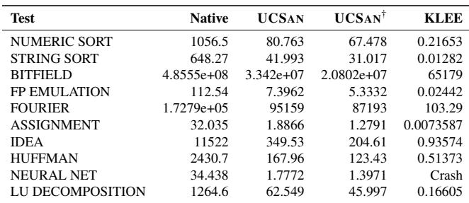

nbench. We further evaluated UCSAN, UCSAN<sup>†</sup> (UCSAN with SymSan), and KLEE-IL using the nbench benchmark suite [27]. Angr was excluded from this experiment due to severe performance limitations: it failed to complete a single iteration after 18 hours and ultimately crashed from memory exhaustion. As shown in Table 1 (higher values indicate better performance), UCSAN outperforms KLEE-IL by several orders of magnitude across all tests. Furthermore, since nbench does not involve constraint solving, the additional overhead observed in UCSAN<sup>†</sup> stems primarily from the symbolic tracing of SymSan.

## 5.3 RQ2: Compatibility

In this experiment, we evaluate the compatibility of UCSAN, by compiling Linux kernel functions with it. We chose the Linux kernel as the target for this experiment because it is a widely-used open-source project with various coding styles and practices. It also has its own complex build system and dependencies.

We analyze functions from three versions of Linux. The first set is from 4.14.0, and the analysis scope is generated by the static use-before-initialization (UBI) analyzer UBI Tect [46]. UBITect generated 103,351 warnings from the Linux kernel 4.14.0, where each warning defines an entry function and an analysis scope (i.e., the set of functions that are involved in a UBI bug), which may span across multiple source files. We write a script to parse the list of warnings, extract the analysis scope, and generate the configuration files for UCSAN. The use of KLEE-IL follows the same procedure as described in the UBITect paper [46, 47]. The objective is to check if UCSAN offers similar compatibility as KLEE.

Table 3 reports the number of warnings UCSAN and KLEE-IL can analyze, where both engines failed to analyze all warnings. We analyzed the failed cases and found that most of them are due to the lack of support for inline assembly. Specifically, UCSAN resolves unnecessary external dependencies outside the analysis scope by replacing calls to those functions with dummy functions. However, due to the lack of support for inline assembly, when external functions are referenced in inline assembly, UCSAN will fail to build binaries for those cases and cannot analyze them. Notably, KLEE-IL also suffers from this issue. From the results, we conclude that UCSAN has good compatibility to analyze C functions compared to KLEE-IL.

In addition to 4.14.0, we also analyzed the version 5.10.240 (the longterm version used by Android) and 6.16.0 (the latest stable version at the time of evaluation). For these two versions, we used statically initialized function pointers as entry functions, and applied a simple call graph analysis to include all functions from the same module as the analysis scope. The ideal goal is to be able to compile all analysis scopes (i.e., 100%). The current prototype of UCSAN is able to compile 14,503 (96.2%) and 139,509 (88.9%) analysis scopes; most of the failed cases are also due to unhandled inline assembly.

Table 2: Overall TTF Statistics T.O.: Timeout is 2 mins.  
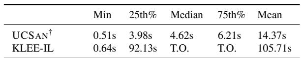

## 5.4 RQ3: Impacts on Dynamic Analysis

We hypothesized that with the improved efficiency of UCSAN, dynamic analysis tools built on top of it, like UCSAN<sup>†</sup>, could scale to larger analysis scopes, and/or explore more execution paths. As a result, they would be able to find more bugs than previous engines. In this subsection, we conduct three experiments to validate this hypothesis.

## 5.4.1 Processing UBI Warnings

Due to its ability to faithfully reason about memory states and path feasibility, under-constrained symbolic execution has been used to filter false positives from static analysis [5,42,46]. However, the scalability issue of existing under-constrained symbolic execution engines has limited their practicality in this context. In this experiment, we evaluate how the improved efficiency of UCSAN would impact its ability to process the results of the static analysis and identify the true positives.

The experiment setup followed the same procedure as described in §5.3. For each warning generated by UBITect, we aim to find a feasible path from the allocation site of a variable to its use site, without going through initialization (thus use-before-initialization). For comparison purposes, we take the Time-To-Finish (TTF) as the primary evaluation metric. For fairness, the TTF includes both compilation time (for UCSAN) / linking time (for KLEE-IL), and analysis time. The compilation time for UCSAN includes the time to instrument the LLVM-IR and assemble the instrumented code to binary; while the linking time for KLEE-IL includes the time to link multiple LLVM IR modules into a single module. For this evaluation, we used 24 parallel instances for both UCSAN<sup>†</sup> and KLEE-IL, where each instance handles a different analysis task (entry function). Both UCSAN<sup>†</sup> and KLEE-IL are configured with 2-minute and 2GB limits for time and memory, the same configuration used in the UBI-Tect/IncreLux paper [46, 47].

Figure 7 and Table 2 show that UCSAN<sup>†</sup> is 6.36x faster than KLEE-IL on average TTF. According to Table 3, when the 2 minute timeout is reached, UCSAN<sup>†</sup> was able to finish 95% of the warnings, while KLEE-IL only finished 41%. Moreover, all the cases that KLEE-IL finished processing were also completed by UCSAN<sup>†</sup>. Overall, we observe that UCSAN<sup>†</sup> processed at 0.32s/warning on average, while KLEE-IL processed at 5.14s/warning (i.e., UCSAN<sup>†</sup> is 15.06x faster than KLEE-IL on this metric).

We further investigated the 111 more confirmed results from UCSAN<sup>†</sup>. Given the large numbers, we decided to check the git history to see if any of these warnings have been patched in later kernel versions. The results show that at least 15 additional UBI bugs, which were reported by UBITect’s static analysis but not confirmed by KLEE-IL, have since been patched in later kernel versions. This suggests that these bugs were indeed real and eventually caught by other means, yet they remained unconfirmed at the time of the original study due to the limitations of KLEE-IL. Had the authors of UBITect had access to UCSAN<sup>†</sup>, these bugs could have been confirmed and reported much earlier, potentially reducing the window of exposure for the affected kernel versions.

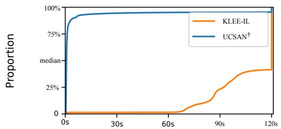  
(a) CDF of Time-To-Finish for UCSAN<sup>†</sup> and KLEE-IL.

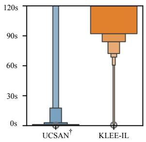

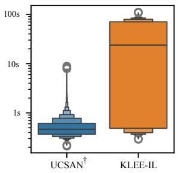  
(b) Distribution of TTF (compile and solving time)  
(c) Distribution of Compilation / Linking Time.

Figure 7: Performance for UCSAN<sup>†</sup> and KLEE-IL.  
Table 3: Analyzed warnings from UBITect.  
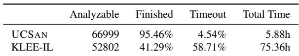

## 5.4.2 Analyzing Vulnerabilities

In this experiment, we evaluate the capability of UCSAN<sup>†</sup> for bug-finding purposes without the requirement of handcrafted test harnesses. For reproducibility, we apply UCSAN<sup>†</sup> to rediscover known vulnerabilities. This experiment includes three datasets.

First, we manually collect 30 known vulnerabilities from the National Vulnerability Database (NVD). These vulnerabilities include both user-mode open-source software (OSS) and the Linux kernel (Table 5 in the Appendix). The selection criteria are as follows: (1) the vulnerability is a memory safety bug (e.g., buffer overflow, use-after-free, etc.) that can be detected by UCSAN’s built-in checkers; (2) the vulnerability has a known root cause (i.e., the vulnerable function and the corresponding patch are known); (3) the vulnerability is not trivial to trigger (e.g., it cannot be triggered by simply calling the vulnerable function with random inputs); (4) the vulnera bility is well-known or well-studied (e.g., CopyFail [36]).

Table 4: Bugs from SyzSpec analyzed with UCSAN<sup>†</sup>  
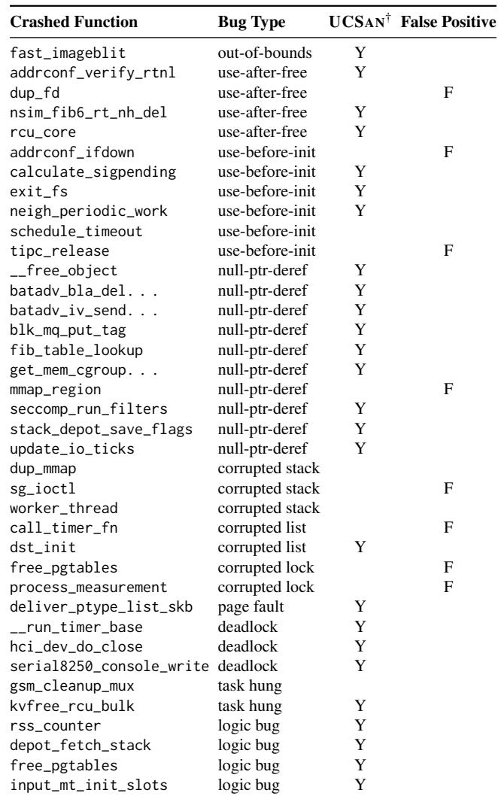

For the 30 vulnerabilities we initially selected, we manually extracted the analysis scope and entry function based on the related bug-inducing/fixing commit from the NVD database. The results listed in Table 5 indicate that UCSAN<sup>†</sup> can indeed rediscover most of the known vulnerabilities (marked as Y) without any test harnesses. In cases marked as P, UCSAN<sup>†</sup> can identify the vulnerability without requiring test harnesses, but needs to disable UCSAN’s dynamic re-allocation capability. As discussed in §3.2, UCSAN estimates buffer sizes based on information collected from the operations involved. It assumes that mistakes in buffer size estimation will occur, and will automatically re-allocate the buffer if the estimated size is insufficient. While dynamic re-allocation allows UCSAN to avoid execution errors, it could negatively impact UCSAN’s buffer overflow sanitizer when the buffer size is not known (e.g., when the buffer is allocated outside the analysis scope). For these cases, because the analysis scopes are manually defined in an iterative manner, we did not observe any false positives.

Second, following the suggestion from the reviewers, we included 94 CVEs from the AFGen [24] paper, where we can find corresponding entries in the NVD database (Table 5 in the Appendix, from ffjpeg to tcpreplay). AFGen is a fuzzing based approach that shares the same goal as UCSAN—testing internal functions of OSS. The main difference is that AFGen uses bi-directional program slicing to generate test harnesses (with proper object initialization) for fuzzing, while UCSAN only needs to know the scope and the entry function.

Due to the size of the datasets, we tasked a coding agent (OpenAI Codex with GPT-5.5) to generate the configuration files. Specifically, for each vulnerability, we provide the NVD database entry to the coding agent, and task it to finish three tasks: (1) identify the vulnerable version of the target OSS; (2) locate a proper entry function for the analysis, and (3) define the analysis scope. The analysis scope should contain the root cause chain of the vulnerability (e.g., from malloc to the out-of-bound access), but exclude irrelevant functions like printf. Then the agent should use UCSAN<sup>†</sup> to reproduce the vulnerability, and report whether UCSAN<sup>†</sup> reported any false positives during the analysis. The result shows UCSAN<sup>†</sup> successfully re-discovered 69 CVEs, and failed to re-discover 25 CVEs. Most of the failed cases are due to a common limitation of symbolic execution—the path explosion problem: if triggering the vulnerability requires looping too many times, or for each loop iteration or recursive call, we need to take different paths, then UCSAN<sup>†</sup> cannot finish the analysis within the 10 minutes time limit. We also checked if UCSAN<sup>†</sup> reported false positives during the analysis. The results show that UCSAN<sup>†</sup> reported false positives in 7 cases, all of which are caused by missing constraints from external functions (i.e., functions outside the analysis scope).

The third dataset is from SyzSpec [18], a recent work that uses KLEE-based under-constrained symbolic execution to extract syscall descriptions for syzkaller [37]. However, due to the performance limitations of KLEE, SyzSpec only aims to extract syscall descriptions, instead of directly finding vulnerabilities. In contrast, we apply UCSAN<sup>†</sup> to directly analyze kernel modules for bug reproduction.

Similar to the previous experiment, we use a coding agent to generate the configuration files. Moreover, since several bug types (e.g., deadlock, corrupted lock) cannot be detected by UCSAN’s built-in checkers, we also tasked the coding agent to write custom checkers for those cases. The results are shown in Table 4. Among the 38 bugs reported in the SyzSpec paper, UCSAN<sup>†</sup> can successfully re-discover 26 bugs without the need for a fuzzer or syscall descriptions. Among the 12 not confirmed cases, 10 are likely due to incomplete analysis scope. Specifically, the SyzSpec paper [18] only provides the faulty function name (i.e., where a bug has manifested) and the type of the fault. However, it does not provide the detailed root cause information nor a corresponding patch. Its code repository also does not contain any reproducible test cases. As a result, the coding agent can only guess a root cause and the corresponding analysis scope. One involves a loop that exceeds UCSAN’s default iteration threshold. The remaining one case is due to concurrency, which is not supported by the current prototype of UCSAN. Due to the analysis scope issues, we also observed 8 false positives among the failed cases.

## 6 Limitations

The current prototype of UCSAN has several limitations, which we plan to address in future work.

External functions. UCSAN tries to automatically handle external function calls outside the analysis scope in a configurable fashion. However, there may be some external functions that require special modeling, such as string related functions (strlen, strchr). Currently, UCSAN does not support these functions and may generate incorrect inputs due to missing the dependencies between the input and the return value (i.e., under-constrained). For instance, several of the CVEs from the AFGen [24] paper cannot be reproduced due to missing modeling of file I/O functions (fstat vfprintf).

Cyclic Data Structures. UCSAN does not support cyclic data structures in the current implementation. We plan to support cyclic data structures in the future, by incorporating more sophisticated shape analysis [31, 40].

Scope Annotations. The current implementation of UCSAN requires the user to provide scope annotations to specify the target functions. As shown in the bug reproduction experiments, an improperly inferred scope may lead to incomplete analysis and result in false positives or false negatives. This challenge can be partially mitigated by pairing UCSAN with a static analysis tool like UBITect [46]. With recent advances in large language models (LLMs), one can also leverage LLMbased coding agents to infer the analysis scope.

Loop and Recursion. The current prototype of UCSAN only supports coarse-grained control of loop iterations and recursive calls (i.e., a global threshold). As a result, if triggering a bug requires increasing the threshold, we can only increase the threshold globally, which may lead to state explosion and prevent UCSAN<sup>†</sup> from finishing the analysis within the time limit. We plan to support more fine-grained control of loop iterations and recursive calls in the future.

Concurrency. The current prototype of UCSAN only supports a single “thread” and does not support concurrent execution. This limits its applicability to modeling and reproducing concurrent bugs (e.g., data races). Since concurrency is a complex topic, we consider it out of the scope of this paper and plan to support it in future work.

Multiple Entry Points. The current prototype of UCSAN only supports a single entry point specified by the user. As a result, it cannot effectively analyze stateful code like tcp\_v4\_do\_rcv in the Linux kernel, which requires multiple invocations to fully cover the execution state space. Similarly, it also does not support unit testing like chaining of a series of functions. We plan to add such support in the future.

## 7 Related Work

Symbolic and Concolic Execution. Symbolic execution, a technique that treats program inputs as symbolic variables to explore multiple paths, has been studied extensively for decades [4,7]. Concolic testing, which combines symbolic execution with concrete inputs, has been implemented in tools like DART [14] and CUTE [32]. Path explosion is a major performance issue for symbolic and concolic execution. SAGE [15] proposed using generational search to mitigate the path explosion issue and increase the number of generated test cases in one execution. Dowser [17] proposed using static analysis to guide concolic execution to places where it is more likely to have buffer overflow vulnerabilities. Under-constrained symbolic execution [30] is an alternative approach to reducing path explosion. This method eliminates the need for harnesses because it begins execution from an arbitrary function. Recent works like Janus [43] and SCENT [8] have demonstrated the effectiveness of analyzing kernel components in isolation to find deep bugs in file systems and kernel protocols. However, these approaches rely on manual effort to extract code or build models. Janus, for instance, manually ports file systems to user space using LibOS to enable fuzzing. In contrast, UCSAN automates the under-constrained execution process by directly compiling and analyzing the target functions, thus removing the manual effort required by previous works.

Recently, a series of works have been proposed to improve the performance of symbolic execution, by leveraging instrumentation, instead of interpretation, including QSYM [44], SymCC [28], SymQEMU [29], and SymSan [9]. UCSAN also adopts this approach to speed up symbolic execution. It extends the SymSan project.

Test Harness Generation. Automated harness generation techniques like Fudge [3], FuzzGen [20], and APICraft [48] synthesize drivers by analyzing code usage or dependencies. LLM-based approaches [23] also show promise but struggle with complex dependencies like kernel functions. UCSAN avoids these issues by leveraging the original build system and directly analyzing target functions without synthesized harnesses.

## 8 Conclusion

In this paper, we present UCSAN, a compilation-based under-constrained execution engine. Our evaluation shows that UCSAN is more scalable than interpretation-based engines like KLEE and Angr. We further demonstrate how UCSAN can support dynamic analysis by combining it with a compilation-based concolic execution engine to build an under-constrained symbolic execution tool. The resulting tool can effectively analyze both Linux kernel and user-mode programs, and detect bugs that are difficult to uncover using other techniques.

## Acknowledgments

We thank the anonymous reviewers for their insightful comments and valuable suggestions from the shepherd. This work is supported, in part, by the National Science Foundation under Grant No. 2046026, Google ASPIRE Fund 2023 Award, and the United States Air Force and DARPA under Agreement No. FA8750-24-2-0002. Any opinions, findings, conclusions, or recommendations expressed in this paper are those of the authors and do not necessarily reflect the views of the funding agencies.

## References

[1] Lkl: Linux kernel library. https://lkl.github.io/.

[2] Nathaniel Ayewah, William Pugh, David Hovemeyer, J David Morgenthaler, and John Penix. Using static analysis to find bugs. IEEE Software, 25(5):22–29, 2008.

[3] Domagoj Babic, Stefan Bucur, Yaohui Chen, Franjo´ Ivanciˇ c, Tim King, Markus Kusano, Caroline Lemieux,´ László Szekeres, and Wei Wang. Fudge: fuzz driver generation at scale. In ACM SIGSOFT Symposium on the Foundations of Software Engineering (FSE), 2019.

[4] Roberto Baldoni, Emilio Coppa, Daniele Cono D’Elia, Camil Demetrescu, and Irene Finocchi. A survey of symbolic execution techniques. ACM Comput. Surv., 51(3), 2018.

[5] Fraser Brown, Deian Stefan, and Dawson Engler. Sys: A static/symbolic tool for finding good bugs in good (browser) code. In USENIX Security Symposium (Security), 2020.

[6] Cristian Cadar, Daniel Dunbar, and Dawson R Engler. Klee: Unassisted and automatic generation of highcoverage tests for complex systems programs. In USENIX Symposium on Operating Systems Design and Implementation (OSDI), 2008.

[7] Cristian Cadar and Koushik Sen. Symbolic execution for software testing: three decades later. Communications of the ACM, 56(2):82–90, 2013.

[8] Yue Cao, Zhongjie Wang, Zhiyun Qian, Chengyu Song, Srikanth V. Krishnamurthy, and Paul Yu. Principled unearthing of tcp side channel vulnerabilities. In Proceedings of the 2019 ACM SIGSAC Conference on Computer and Communications Security, CCS ’19, page 211–224, New York, NY, USA, 2019. Association for Computing Machinery.

[9] Ju Chen, Wookhyun Han, Mingjun Yin, Haochen Zeng, Chengyu Song, Byoungyoung Lee, Heng Yin, and Insik Shin. SYMSAN: Time and space efficient concolic execution via dynamic data-flow analysis. In USENIX Security Symposium (Security). USENIX Association, 2022.

[10] Brian Chess and Gary McGraw. Static analysis for security. IEEE Security & Privacy, 2(6):76–79, 2004.

[11] Vitaly Chipounov, Volodymyr Kuznetsov, and George Candea. S2e: A platform for in-vivo multi-path analysis of software systems. In ACM International Conference on Architectural Support for Programming Languages and Operating Systems (ASPLOS), 2011.

[12] Pär Emanuelsson and Ulf Nilsson. A comparative study of industrial static analysis tools. Electronic notes in theoretical computer science, 217:5–21, 2008.

[13] Andrea Fioraldi, Dominik Maier, Heiko Eißfeldt, and Marc Heuse. Afl++: Combining incremental steps of fuzzing research. In USENIX Workshop on Offensive Technologies (WOOT), 2020.

[14] Patrice Godefroid, Nils Klarlund, and Koushik Sen. Dart: directed automated random testing. In ACM SIGPLAN Conference on Programming Language Design and Implementation (PLDI), 2005.

[15] Patrice Godefroid, Michael Y Levin, and David Molnar. Sage: whitebox fuzzing for security testing. Communications of the ACM, 55(3):40–44, 2012.

[16] Google. OSS-Fuzz - continuous fuzzing of open source software. https://github.com/google/oss-fuzz, 2016.

[17] Istvan Haller, Asia Slowinska, Matthias Neugschwandtner, and Herbert Bos. Dowser: a guided fuzzer to find buffer overflow vulnerabilities. In USENIX Security Symposium (Security), 2013.

[18] Yu Hao, Juefei Pu, Xingyu Li, Zhiyun Qian, and Ardalan Amiri Sani. Syzspec: Specification generation for linux kernel fuzzing via under-constrained symbolic

execution. In ACM Conference on Computer and Communications Security (CCS), 2025.

[19] Marc Heuse, Heiko Eißfeldt, Andrea Fioraldi, and Dominik Maier. american fuzzy lop plus plus (afl++). https://github.com/AFLplusplus/AFLplusplus.

[20] Kyriakos Ispoglou, Daniel Austin, Vishwath Mohan, and Mathias Payer. FuzzGen: Automatic fuzzer generation. In USENIX Security Symposium (Security), 2020.

[21] Tuo Li, Jia-Ju Bai, Yulei Sui, and Shi-Min Hu. Pathsensitive and alias-aware typestate analysis for detecting os bugs. In ACM International Conference on Architectural Support for Programming Languages and Operating Systems (ASPLOS), 2022.

[22] Dinghao Liu, Qiushi Wu, Shouling Ji, Kangjie Lu, Zhenguang Liu, Jianhai Chen, and Qinming He. Detecting missed security operations through differential checking of object-based similar paths. In ACM Conference on Computer and Communications Security (CCS), 2021.

[23] Dongge Liu, Jonathan Metzman, Oliver Chang, and Google Open Source Security Team. Aipowered fuzzing: Breaking the bug hunting barrier. https://security.googleblog.com/2023/08/ ai-powered-fuzzing-breaking-bug-hunting. html, 2023.

[24] Yuwei Liu, Yanhao Wang, Xiangkun Jia, Zheng Zhang, and Purui Su. Afgen: Whole-function fuzzing for applications and libraries. In 2024 IEEE Symposium on Security and Privacy (SP), pages 1901–1919. IEEE, 2024.

[25] Yunlong Lyu, Yi Fang, Yiwei Zhang, Qibin Sun, Siqi Ma, Elisa Bertino, Kangjie Lu, and Juanru Li. Goshawk: Hunting memory corruptions via structure-aware and object-centric memory operation synopsis. In IEEE Symposium on Security and Privacy (Oakland), 2022.

[26] Valentin JM Manès, HyungSeok Han, Choongwoo Han, Sang Kil Cha, Manuel Egele, Edward J Schwartz, and Maverick Woo. The art, science, and engineering of fuzzing: A survey. IEEE Transactions on Software Engineering, 47(11):2312–2331, 2019.

[27] Uwe F. Mayer. Byte magazine’s bytemark benchmark program. https://www.math.utah.edu/\~mayer/ linux/bmark.html, 2017.

[28] Sebastian Poeplau and Aurélien Francillon. Symbolic execution with symcc: Don‘t interpret, compile! In USENIX Security Symposium (Security), 2020.

[29] Sebastian Poeplau and Aurélien Francillon. SymQEMU: Compilation-based symbolic execution for binaries. In Annual Network and Distributed System Security Symposium (NDSS), 2021.

[30] David A. Ramos and Dawson Engler. Underconstrained symbolic execution: Correctness checking for real code. In USENIX Security Symposium (Security). USENIX Association, 2015.

[31] Noam Rinetzky and Mooly Sagiv. Interprocedural shape analysis for recursive programs. In International Conference on Compiler Construction, 2001.

[32] Koushik Sen, Darko Marinov, and Gul Agha. Cute: a concolic unit testing engine for c. In ACM SIGSOFT Symposium on the Foundations of Software Engineering (FSE), 2005.

[33] Konstantin Serebryany, Derek Bruening, Alexander Potapenko, and Dmitry Vyukov. Addresssanitizer: A fast address sanity checker. In USENIX ATC 2012, 2012.

[34] Yan Shoshitaishvili, Ruoyu Wang, Christopher Salls, Nick Stephens, Mario Polino, Andrew Dutcher, John Grosen, Siji Feng, Christophe Hauser, and Christopher Kruegel. Sok:(state of) the art of war: Offensive techniques in binary analysis. In IEEE Symposium on Security and Privacy (Oakland), 2016.

[35] the Clang team. Dataflowsanitizer design document. https://clang.llvm.org/docs/ DataFlowSanitizerDesign.html, 2018.

[36] Theori. CVE-2026-31431: Copy Fail — Linux Kernel Local Privilege Escalation and Container Escape. https://copy.fail/, 2026. Accessed: 2026-06-02.

[37] Dmitry Vyukov. Syzkaller: the next gen kernel fuzzer. In Proceedings of the 2015 Linux Plumbers Conference, 2015.

[38] Dmitry Vyukov and Andrey Konovalov. Syzkaller: an unsupervised coverage-guided kernel fuzzer. https: //github.com/google/syzkaller, 2015.

[39] Jinghan Wang, Chengyu Song, and Heng Yin. Reinforcement learning-based hierarchical seed scheduling for greybox fuzzing. In Annual Network and Distributed System Security Symposium (NDSS), 2021.

[40] Reinhard Wilhelm, Mooly Sagiv, and Thomas Reps. Shape analysis. In International Conference on Compiler Construction, 2000.

[41] Qiushi Wu, Yang He, Stephen McCamant, and Kangjie Lu. Precisely characterizing security impact in a flood of patches via symbolic rule comparison. In Annual Network and Distributed System Security Symposium (NDSS), 2020.

[42] Meng Xu, Chenxiong Qian, Kangjie Lu, Michael Backes, and Taesoo Kim. Precise and Scalable Detection of Double-Fetch Bugs in OS Kernels. In IEEE Symposium on Security and Privacy (Oakland), 2018.

[43] Wen Xu, Hyungon Moon, Sanidhya Kashyap, Po-Ning Tseng, and Taesoo Kim. Fuzzing file systems via twodimensional input space exploration. In IEEE Symposium on Security and Privacy (Oakland), 2019.

[44] Insu Yun, Sangho Lee, Meng Xu, Yeongjin Jang, and Taesoo Kim. Qsym: A practical concolic execution engine tailored for hybrid fuzzing. In USENIX Security Symposium (Security), 2018.

[45] Michal Zalewski. American fuzzy lop.(2014). http: //lcamtuf.coredump.cx/afl, 2014.

[46] Yizhuo Zhai, Yu Hao, Hang Zhang, Daimeng Wang, Chengyu Song, Zhiyun Qian, Mohsen Lesani, Srikanth V. Krishnamurthy, and Paul Yu. Ubitect: a precise and scalable method to detect use-beforeinitialization bugs in linux kernel. In ACM SIGSOFT Symposium on the Foundations of Software Engineering (FSE), 2020.

[47] Yizhuo Zhai, Yu Hao, Zheng Zhang, Weiteng Chen, Guoren Li, Zhiyun Qian, Chengyu Song, Manu Sridharan, Srikanth V. Krishnamurthy, Trent Jaeger, and Paul Yu. Progressive scrutiny: Incremental detection of ubi bugs in the linux kernel. In Annual Network and Distributed System Security Symposium (NDSS), 2022.

[48] Cen Zhang, Xingwei Lin, Yuekang Li, Yinxing Xue, Jundong Xie, Hongxu Chen, Xinlei Ying, Jiashui Wang, and Yang Liu. APICraft: Fuzz driver generation for closedsource sdk libraries. In USENIX Security Symposium (Security), 2021.

## 9 Appendix

## 9.1 Instrumented IR for the motivating example

• Line 10: This is the first time head is checked for dereference. Though the subsequent instruction is a GEP instruction, which does not dereference the pointer, we still initialize the object pointed to by head and return the real-pointer to the GEP instruction. Notably, the size of the object is determined by the size of the pointer type which is sizeof(struct node).

• Line 12: ptr\_v is a pseudo-pointer, which is derived from head through pointer arithmetic. Note that ptr\_v shares the same taint information with head as they point to the same object. Thus, no object is introduced in this step. Since the subsequent instruction is a load instruction, we return the real-pointer pointing to the desired offset and put it as the operand of the load.

• Line 24: Similarly to Line 10, JITI is not engaged in this step, as the object has been initialized.

• Line 26: Similarly to Line 12, JITI is not engaged in this step. Note that the returned real-pointer will be different from the previous one, as the desired offset points to the next field.

• Line 10´: Once the first loop iteration is finished and hits this line again, the taint information of head will be the next node pointed by the initial one, which points to an uninitialized object. Thus, JITI will be engaged again.

The original main function in the input code will be dropped and replaced by a crafted main function as shown in Line 31 in IR. In this function, we insert a call to \_\_set\_label\_for\_args to retrieve the value for the argument from the super object and set up taint for the argument. Then we invoke the target function cal with the argument. Note that the target function is specified by the user via analysis scope annotations.

## 9.2 Analyzing Additional Kernel Modules

To further demonstrate UCSAN<sup>†</sup>’s scalability, we analyzed a few kernel modules, with a 1-hour time budget for each module.

• binder\_ioctl: The main entry function in the Binder IPC module from the Android kernel. Due to its complexity, there have been multiple security vulnerabilities discovered in this module. So we used UCSAN<sup>†</sup> to analyze this module from the latest Android 5.10 LTS kernel. The analysis scope includes 202 functions and 2,027 basic blocks. UCSAN<sup>†</sup> is able to cover 1,390 basic blocks (68.6%). The exploration triggered several error exits and 7 null-pointer dereferences. Upon manually replaying the traces and inspecting the logs, all of them were false positives due to missing context.

• tcp\_v4\_do\_rcv: The main entry function for processing incoming TCP packets in the Linux kernel. We chose this function as it was analyzed in a prior work [8] where the authors manually extracted related code for model checking. We analyzed the function from the 6.16.0 kernel. The analysis scope includes 1,028 functions across 26 files, and 8,930 basic blocks. UCSAN<sup>†</sup> is able to cover 1,437 basic blocks (16.1%). After inspection, we found that this function is stateful and re-entrant. However, our current prototype only invokes the entry function once, which limits the code coverage. Neither error exits nor checker-reported errors are triggered in this analysis.

• acpi\_ex\_opcode\_2A\_1T\_1R and acpi\_ex\_opcode\_1A\_0T\_1R: The entry functions of the ACPI AML Interpreter module in the Linux kernel. We analyzed these two functions from the 6.16.0 kernel. The analysis scope of acpi\_ex\_opcode\_2A\_1T\_1R includes 324 functions across 74 files, and 2,415 basic blocks. UCSAN<sup>†</sup> is able to cover 1,192 basic blocks (49.36%). The analysis scope of acpi\_ex\_opcode\_1A\_0T\_1R includes 315 functions across 73 files, and 2,446 basic blocks. UCSAN<sup>†</sup> is able to cover 1,382 basic blocks (56.50%). For each of these two entry functions, the checker reported one null-pointer dereference, and one OOB access; both are false positives caused by calling kmalloc with size 0.

## 9.3 CVE Reproduction Case Studies

This section presents the detailed results of UCSAN<sup>†</sup>’s bug reproduction experiments. We evaluate UCSAN<sup>†</sup> on three datasets of known vulnerabilities: (1) 30 manually curated CVEs from the NVD, covering both user-mode OSS and the Linux kernel; (2) 94 CVEs from the AFGen [24] benchmark, spanning 11 open-source projects; and (3) 38 kernel bugs from SyzSpec [18].

Table 5 lists the full results for datasets (1) and (2). For each CVE, we report the project, CVE identifier, bug type, and whether UCSAN<sup>†</sup> successfully reproduced it (Y), failed (N), or succeeded only with dynamic re-allocation disabled (P).

Table 4 lists the SyzSpec kernel bugs. Since these bugs span diverse types (e.g., deadlock, corrupted lock) beyond memory safety, we also tasked a coding agent to generate custom checkers. UCSAN<sup>†</sup> reproduced 26 out of 38 bugs. Among the 12 unconfirmed cases, 10 are due to structural differences between the kernel version under test (v6.10) and the version described in the SyzSpec specification, and one exceeds the default loop iteration threshold.

```asm
1 define i32 @cal ( %struct . node * %arg ) {
%sum = alloca i32 , align 4
%head = alloca %struct . node * , align 8
store %struct . node * %arg , %struct . node ** %head
br label %while_loop
6 while_loop :
%icmp = icmp ne %struct . node * %head , null
8 br i1 %icmp , label %loop_body , label %loop_end
9 loop_body :
10 call i32* __check_pointer ( %head ) ; JITI for GEP
11 %ptr_v = getelementptr inbounds %struct . node ,
%struct . node * %head , i32 0 , i32 0
12 %real_v = call i32* __check_pointer ( %ptr_v ) ;
JITI for load
13 %v . shadow = call i32 @__taint_load (i32* %real_v )
; load taint for %v
14 %v = load i32 , i32* ( %real_v )
15 %1 . shadow = call i32 @__taint_union (
16 i32 %sum . shadow , i32 %v . shadow , ; symbolic
operands
17 i16 ADD , ; operator
18 i8 32 , ; operand size in bits
19 i32 %1 , i32 %sum ; concrete operands
20 )
21 %1 = add ( load i32 , i32* %sum ) , %v
22 call i32 @__taint_store (i32* %sum . shadow , i32 %1
. shadow ) ; store taint for %sum
23 store i32 %1 , i32* %sum ; write %1 to sum
24 call i32* __check_pointer ( %head ) ; JITI for GEP
25 %ptr_next = getelementptr inbounds %struct . node ,
%struct . node * %head , i32 0 , i32 1
26 %2 = load %struct . node * , ( call __check_pointer (
%ptr_next ) ) ; JITI for load
27 store %struct . node * %2 , %struct . node ** %head
28 br label %while_loop
29 loop_end :
30 }
31 define i32 @main () {
32 %head = call i32* __set_label_for_args (0) ; load
value for argument 0 from super object
33 call cal ( bitcast i32* %head to %struct . node *) ;
invoke the target function
34 }
35 define i32 @" original$main "() {
; deprecated original main function
36 }
```  
Figure 8: Instrumented LLVM-IR

Table 5: Re-discover CVEs using UCSAN<sup>†</sup>. <sup>1</sup> needs zlib stub. <sup>2</sup> needs sprintf stub. <sup>3</sup> needs pcap stubs.  
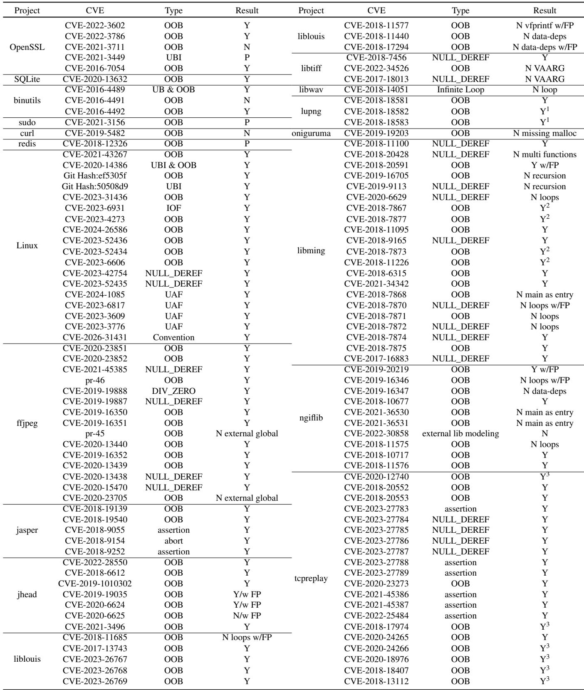