USENIX

THE ADVANCED COMPUTING SYSTEMS ASSOCIATION

# RLinf: Flexible and Efficient Large-Scale Reinforcement Learning via Macro-to-Micro Flow Transformation

Chao Yu, Tsinghua University; Yuanqing Wang, Infinigence AI and Peking University; Zhen Guo, Hao Lin, and Si Xu, Infinigence AI; Hongzhi Zang, Tsinghua University; Quanlu Zhang, Infinigence AI; Yongji Wu, University of California, Berkeley; Chunyang Zhu and Junhao Hu,   
Infinigence AI; Zixiao Huang, Tsinghua University and Infinigence AI; Mingjie Wei, Zhongguancun   
Academy; Yuqing Xie, Tsinghua University; Ke Yang, Zhongguancun Academy; Bo Dai, Beihang University and Infinigence AI; Zhexuan Xu and Jiakun Du, Tsinghua University; Xiangyuan Wang, Peking University and Infinigence AI; Xu Fu and Letong Shi, Infinigence AI; Zhihao Liu, Zhongguancun Academy; Kang Chen, Peking University and Zhongguancun Academy; Weilin Liu, Infinigence AI; Gang Liu, Tsinghua University; Boxun Li, Infinigence AI; Jianlei Yang, Beihang University; Zhi Yang, Peking University; Guohao Dai, Shanghai Jiao Tong University and Infinigence AI; Yu Wang, Tsinghua University

https://www.usenix.org/conference/osdi26/presentation/yu-chao

This paper is included in the Proceedings of the 20th USENIX Symposium on Operating Systems Design and Implementation.

July 13–15, 2026 • Seattle, WA, USA

ISBN 978-1-939133-55-7

Open access to the Proceedings of the 20th USENIX Symposium on Operating Systems Design and Implementation is sponsored by

# RLinf: Flexible and Efficient Large-Scale Reinforcement Learning via Macro-to-Micro Flow Transformation

Chao Yu<sup>1</sup>, Yuanqing Wang<sup>3,4</sup>, Zhen Guo<sup>3</sup>, Hao Lin<sup>3</sup>, Si Xu<sup>3</sup>, Hongzhi Zang<sup>1</sup>, Quanlu Zhang<sup>3</sup>,   
Yongji Wu<sup>5</sup>, Chunyang Zhu<sup>3</sup>, Junhao Hu<sup>3</sup>, Zixiao Huang<sup>1,3</sup>, Mingjie Wei<sup>2</sup>, Yuqing Xie<sup>1</sup>, Ke Yang<sup>2</sup>,   
Bo Dai<sup>6,3</sup>, Zhexuan Xu<sup>1</sup>, Jiakun Du<sup>1</sup>, Xiangyuan Wang<sup>4,3</sup>, Xu Fu<sup>3</sup>, Letong Shi<sup>3</sup>, Zhihao Liu<sup>2</sup>, Kang Chen<sup>4,2</sup>, Weilin Liu<sup>3</sup>, Gang Liu<sup>1</sup>, Boxun Li<sup>3</sup>, Jianlei Yang<sup>6</sup>, Zhi Yang<sup>4</sup>, Guohao Dai<sup>7,3</sup>, Yu Wang<sup>1∗</sup>

<sup>1</sup>Tsinghua University <sup>2</sup>Zhongguancun Academy <sup>3</sup>Infinigence AI <sup>4</sup>Peking University <sup>5</sup>UC Berkeley <sup>6</sup>Beihang University <sup>7</sup>Shanghai Jiaotong University GitHub Repo: https://github.com/RLinf/RLinf

## Abstract

Reinforcement learning (RL) has demonstrated immense potential in advancing artificial general intelligence, agentic intelligence, and embodied intelligence. However, the inherent heterogeneity and dynamicity of RL workflows often lead to low hardware utilization and slow training on existing systems. In this paper, we present RLinf, a high-performance RL training system based on our key observation that the major roadblock to efficient RL training lies in system flexibility. To maximize flexibility and efficiency, RLinf is built atop a novel RL system design paradigm called macro-to-micro flow transformation (M2Flow), which automatically breaks down high-level, easy-to-compose RL workflows at both the temporal and spatial dimensions, and recomposes them into optimized execution flows. Supported by RLinf worker’s adaptive communication capability, we devise context switching and elastic pipelining to realize M2Flow transformation, and a profiling-guided scheduling policy to generate optimal execution plans. Extensive evaluations on both reasoning RL and embodied RL tasks demonstrate that RLinf consistently outperforms state-of-the-art systems, achieving 1.07×∼2.43× speedup in end-to-end training throughput.

## 1 Introduction

The rapid progress of large language models (LLMs) has reached a point where further scaling the model alone yields diminishing returns. To push intelligence beyond pretraining, reinforcement learning (RL) has emerged as a crucial paradigm. Recent advances such as RLHF [8, 38], GRPO [49], and RL for embodied agents [24, 25] and Deep Research [35, 69] all rely on RL to align LLMs with human preferences, improve reasoning, and enable autonomous interaction with complex environments. OpenAI and others predict that RL workloads will soon consume more computational resources than LLM pretraining [37], making RL training efficiency the most critical system concern.

However, efficient RL training for various scenarios such as reasoning, agentic and embodiment at the scale of modern large models is challenging, which combines highly heterogeneous components with diverse workload characteristics and resource demands, such as LLM generation, inference and training, reward models, critic models, agent tooling and embodied environment simulators. For instance, LLM training consumes more accelerator (e.g., GPU) memory than LLM generation and inference (prefill-only generation) to maintain gradients and optimizer states, while LLM generation shows high dynamicity in response lengths, leading to low accelerator utilization. Moreover, components like LLM training support diverse parallelization strategies (e.g., data, tensor, pipeline parallelism), whereas others scale only via instance replication and may yield computation workloads distinct from common tensor computation in LLM, e.g., embodied simulators [10, 54] that require CPU for physics simulation and GPU graphics pipeline for 3D rendering.

Single execution mode of existing RL training systems fails to capture this diversity, leading to suboptimal efficiency. Collocated execution, where components sequentially occupy accelerators [51], suffers from the long-tail problem due to varying generation lengths, leaving accelerators idle. Disaggregated pipelining, where components run concurrently on separate accelerators with pipelining [13], mitigates the long-tail issue but introduces memory and computation imbalance (§2.2). Neither mode is universally optimal. Many RL workloads demand hybrid scheduling of the components to maximize efficiency, i.e., mixing collocation and pipelining in a more flexible way. However, supporting such flexible execution modes for a single programmed workflow is a significant challenge, as they often require different program structures and communication patterns. Also, identifying the right scheduling for a given workflow usually requires considerable manual tuning.

In this paper, we present RLinf, an RL training system that maximizes system flexibility to achieve efficient execution of a logically programmed RL workflow. At its core is a new paradigm called macro-to-micro flow transformation (M2Flow), i.e., macro logical flow with micro execution flow, which decouples the logical programming of RL workflows from their physical execution planning. With M2Flow, developers program RL workflows imperatively, using a natural programming interface to define how components communicate and synchronize at a coarse granularity. RLinf then automatically transforms this logical flow into a fine-grained execution plan tailored to the workload and hardware at both spatial and temporal dimensions. By decoupling program semantics from execution modes, M2Flow lets developers preserve clean, intuitive workflows while the system explores a vast scheduling space, including temporal multiplexing, spatial pipelining, and hybrid scheduling.

RLinf achieves this through three key mechanisms. First, a worker abstraction that encapsulates each RL component for flexible placement, and built-in adaptive communication that allows direct and efficient communication between components regardless of worker and data placement. Second, elastic pipelining and automatic context switching that enable M2Flow transformation and expand the scheduling space, achieving pipeline granularity tuning and temporal accelerator multiplexing without modifying the logical workflow. Third, a profiling-guided scheduling policy that automatically selects efficient execution modes, balancing utilization across heterogeneous components. Together, these capabilities deliver high flexibility, efficiency, and programmability.

We implement RLinf using Ray for cluster management and worker process launch on remote nodes. Apart from the core mechanisms, RLinf also provides rich support for common RL components, algorithms, and models to facilitate RL workflow programming (§4). We extensively evaluate RLinf on both reasoning and embodied RL training across diverse models (e.g., Qwen2.5-1.5/7/32B [40], Qwen3 [59], Open VLA [24], OpenVLA-OFT [23]) and varying scales. Our evaluation shows that RLinf improves end-to-end throughput (i.e., tokens per second) by up to 1.7× compared to stateof-the-art RL training systems in reasoning RL, and by up to 2.43× in embodied RL. We have open-sourced the full codebase of RLinf to accelerate RL innovations in the LLM era.

This paper makes the following contributions:

• Analysis of representative RL algorithms and scenarios, identifying characteristics of modern RL workflows and highlighting inefficiencies in current systems.

• A novel RL system paradigm M2Flow that decouples logical workflow programming from execution planning, enabling intuitive programming with flexible execution.

• A cohesive set of mechanisms, i.e., worker abstraction, elastic pipelining, context switching, adaptive communication, and a profiling-guided scheduler, that jointly realize M2Flow and enable efficient RL training.

• Comprehensive evaluations of RLinf across various RL workloads show that RLinf significantly improves effi-

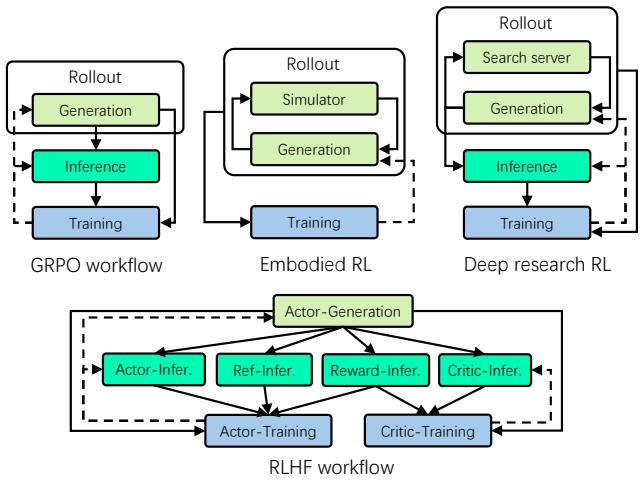  
Data transmission Model weight update  
Figure 1: Diverse RL workflows in various scenarios.  
ciency and flexibility compared to existing approaches.

## 2 Background and Motivation

## 2.1 RL Workflows in LLM Era

Various RL Algorithms and Scenarios. With the slowdown of scaling gains in large language models, reinforcement learning has become increasingly important for advancing LLM intelligence. Unlike traditional RL, RL in the LLM era often involves multiple LLMs in the loop. Given the scale of modern models (tens to hundreds of billions of parameters), fitting RL training into available accelerators (e.g., GPUs) is already challenging. Figure 1 illustrates four representative RL workflows across different scenarios and algorithms.

The simplest is GRPO [49], an RL algorithm designed to reduce reliance on reward models. It involves a single LLM that generates multiple responses, e.g., 8, for a query (i.e., Generation), computes logarithmic probabilities for these responses (i.e., Inference), and uses the results as training data to update the same model (i.e., Training). The updated weights are then synchronized back for inference and generation, completing one training iteration.

In contrast, the RLHF [38] workflow adopts PPO [48], resulting in a more complex design involving four LLMs. The actor model serves as the core policy, generating responses to queries. The reference model remains fixed to constrain the actor from drifting too far from its initialization. The reward model assigns scalar rewards to generated responses, while the critic model estimates expected rewards to stabilize training. Actor and critic are trainable, whereas reference and reward models are frozen. These components interact closely, as shown in the figure.

Beyond algorithms, RL workflows also vary by application scenario. In embodied intelligence [24,25], RL relies on simulators that simulate the physical world. An LLM interacts with the simulator by generating actions and receiving feedback,

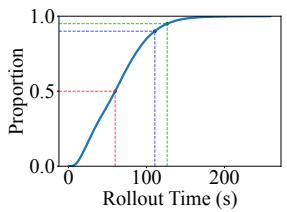  
(a) CDF of response time.

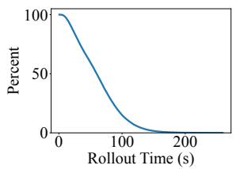  
(b) Unfinished responses.

Figure 2: The distribution of response lengths and the number of unfinished responses over time in the generation phase of a math RL experiment.

producing trajectories that serve as training data. Similarly, in Deep Research [35, 69], RL improves model performance through interaction with a search server that retrieves online information. The resulting rollout results are fed into training, while inference follows the GRPO workflow.

Characteristics of RL Workflows. RL workflows consist of heterogeneous components with distinct demands on GPU memory, computation cores, accelerator types, and parallelization strategies. For example, training requires substantially more GPU memory than inference to maintain gradients and optimizer states. Unlike training, generation often underutilizes GPU cores, as its matrix and vector multiplications are bottlenecked by memory bandwidth. Some components (e.g., simulator) run on CPUs, or use GPUs for non-tensor computations (e.g., 3D rendering). Parallelization also differs significantly, e.g., LLM training exploits data, tensor, and pipeline parallelism, whereas simulators typically scale only through multiple instances. Maximizing overall utilization across such heterogeneous components is a great challenge.

Further, RL workflows exhibit complex dependencies, primarily through data flow and weight updates. Data flow can occur at different granularities, e.g., per response between generation and inference, or at least a micro-batch of responses between generation and training. Some workflows even introduce cyclic data flows, such as in embodied RL and Deep Research (Figure 1), which further complicates coordination. Weight updates, in contrast, act as barriers that synchronize generation and training. These complex dependencies require more fine-grained scheduling.

## 2.2 Inefficiencies in Diverse RL Workflows

We analyzed different RL workflows to identify the source of inefficiencies as follows.

Dynamicity in Rollout Wastes Computation. The roll out phase is inherently dynamic. Lengths fluctuate across responses of the same query, and even more so across different queries. Embodied tasks such as grasping can take different numbers of steps. In deep research, generating a report may involve varying numbers of search interactions. Since rollouts are executed in batches, these variations create a long-tail problem where a few slow queries block the entire phase from proceeding to inference or training. The problem commonly exists in the collocated mode (e.g., veRL [51]), where generation, inference, and training sequentially share GPUs by swapping between CPU and GPU memory. We conducted an experiment of a 7B math reasoning RL training [40] on 8 nodes with 8 H100 GPUs each, as shown in Figure 2. The number of unfinished responses quickly shrinks to less than 5%, where a very small set of long-tail responses stalls the generation, leaving many GPUs underutilized or idle. Scaling out with more GPUs worsens the problem as idle time grows.

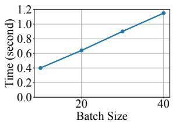  
(a) Generation time.

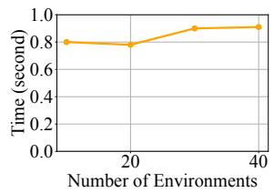  
(b) Simulator time.  
Figure 3: The execution time of generation and simulator with different batch sizes respectively, batch size in simulator is the number of environments.

Pipelining alleviates this by allocating fewer GPUs to generation and leaving the rest for inference and training. In this setup, inference and training start once partial samples are ready. However, pipelining introduces its own inefficiency since inference and training must wait for the first batch to be generated. Thus, neither approach is universally optimal, and supporting both collocated mode and pipelining within a single framework remains a significant challenge.

Simple Execution Modes Cannot Fit Diverse Components. Collocated and pipelined modes are two extremes, i.e., all components on the same GPUs versus fully disaggregated GPUs. Some RL workloads, however, do not fit neatly into either mode. Their diverse component characteristics require more flexible orchestration. Take embodied RL (Figure 1) as an example. Figure 3 shows computation profiles of generation and simulator. The execution time of simulator increases slightly with the number of environments and its GPU utilization remains low (i.e., <24%), while its memory usage grows linearly with the number of environments. In contrast, generation scales linearly in both runtime and memory with batch size, while keeping GPU cores highly utilized (i.e., >70%). Training consumes more memory, but its execution time is only one-third as long as generation’s.

This profile rules out simple execution modes. The simulator should scale with as many parallel environments as possible to reduce its total runtime. However, this prevents collocation with generation due to memory contention. A better choice is running on disaggregated GPUs with pipelining for higher efficiency. Training, in contrast, would waste compute if fully disaggregated, so it should share GPUs. After rollout, simulator and generation are swapped to CPU, and training takes over the GPU. The result is a hybrid mode that combines collocation and pipelining to balance efficiency.

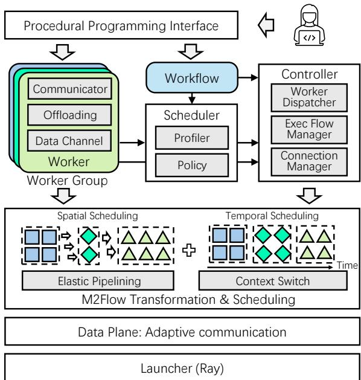  
Figure 4: The architecture of RLinf.

Identifying Suitable Orchestration is Challenging. The orchestration of the hybrid mode depends on the analysis of the components. However, finding the most suitable orchestration for a given RL workflow is challenging, as the characteristics are diverse and the dependencies are complex. Manually enumerating options is tedious, time-consuming, and risks overlooking better choices. Moreover, no clear guidelines exist to identify the most suitable orchestration.

## 2.3 Flexibility as a Key to Efficiency

Maximizing computation efficiency for an RL workload requires flexible orchestration that aligns with component and workflow characteristics. However, adjusting the execution mode without changing the programmed workflow is challenging. Collocated and disaggregated pipelining modes differ significantly. Collocated mode operates at coarse-grained, phase-level execution. Each phase starts after the previous phase is complete. However, disaggregated pipelining runs at fine-grained, batch-level with precise timing to minimize pipeline bubbles. Mixing these modes further increases complexity. We advocate a system design that bridges this gap, enabling RL developers to maintain an intuitive, logically organized workflow while achieving high execution efficiency with flexible execution modes.

## 3 RLinf Design

## 3.1 Overview

In pursuit of efficient, flexible, and intuitive RL systems, we propose a new design paradigm termed M2Flow, i.e., macro logical flow executed with micro execution flow. In this paradigm, developers program the complex RL workflow by imperatively specifying the logical communication flow among the RL components at a coarse granularity (macro logical flow), while the system automatically transforms the workflow into a fine-grained execution flow (micro execution flow). Essentially, M2Flow decouples programmable code logic from the physical execution and scheduling of the individual RL components, so as to maximize the efficiency while minimizing the programming complexity.

Figure 4 shows the architecture of RLinf that realizes M2Flow. As illustrated, RLinf provides an easy-to-use procedural programming interface for users to construct RL workflows imperatively, which describe the data communication and interaction among the RL components. RL components are then encapsulated as workers in RLinf, each implementing the main logic of this component. Workers are equipped with communication functionality to freely communicate with each other, as well as a resource offloading mechanism to enable temporal multiplexing of hardware resources. This worker abstraction enables RLinf to retain substantial scheduling flexibility at both the spatial and temporal dimensions, while following the procedural workflow. Spatial scheduling assigns workers to accelerators, temporal scheduling determines their execution periods, and spatio–temporal scheduling governs their pipelined execution granularity.

To produce a desirable micro execution flow across these scheduling dimensions, the core of the scheduler module is a profiling-guided scheduling policy, which utilizes runtime profiling of worker characteristics to search for the optimal execution mode of each worker. Based on the determined execution mode, the Controller assigns workers to accelerators, manages inter-worker connections, and orchestrates the execution flow by dispatching function invocations to the corresponding workers. To realize this, two mechanisms named elastic pipelining and context switch are devised to enable spatial and temporal orchestration of workers, respectively. Adaptive communication utilities such as point-to-point communication and data channel act as the data plane to support scalable worker interactions. The entire system leverages Ray [33] to remotely launch and control workers.

## 3.2 Workflow Construction Interface

The design philosophy of RLinf is to maximize system flex ibility to achieve high efficiency, which is also the guideline for RLinf’s programming interface design. To this end, unlike traditional graph-based declarative programming [1] that sac-

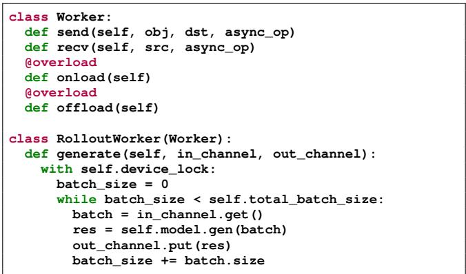

(a) A typical RLinf worker.

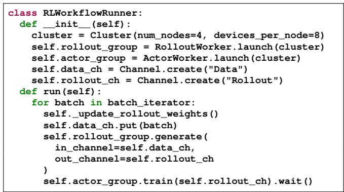  
(b) A workflow runner example.  
Figure 5: RLinf workflow programming interface.

rifices control flow flexibility, debuggability and transparency for optimization opportunity, RLinf adopts a procedural programming paradigm that enables developers to flexibly express workflows imperatively. An example workflow based on this interface is shown in Figure 5. As shown, an RL program based on RLinf consists of two parts: (1) worker programs that define the logic of each RL component (e.g., simulator, LLM generation, actor training), and (2) a workflow runner that orchestrates the overall workflow by invoking the workers’ core functions and defining inter-worker interactions.

Figure 5a demonstrates a typical worker implementation atop RLinf. The base Worker class provides communication primitives such as send and recv for inter-worker communication. All workers that inherit from the base class automatically gain the capability to communicate with other workers (§3.5), which is also the foundation for higher-level communication facilities like the data channel. To manage limited device resources like GPU memory, all workers are required to implement resource management functions (onload and offload) for acquiring and releasing the resources.

After implementing workers, developers can compose the overall RL workflow as in Figure 5b. First, the runner launches workers on a cluster of nodes and devices in an SPMD manner. The scheduler module decides the placement of each worker process before its launch, which can also be manually specified if desired. All processes of the same worker are collectively managed via the WorkerGroup abstraction of RLinf (e.g., rollout\_group), which automatically assumes the public functions defined in the worker class and dispatches them to all (or a selective portion) of the worker processes if invoked. The functions of a WorkerGroup are inherently asynchronous and return a result handle, whose wait primitive provides synchronization barriers, enabling computation at a certain data granularity. For example, in GRPO training, rollout can proceed per query, but normalization must aggregate all responses for a query, which pauses the pipeline at this step until normalization completes. The core facility for connecting the data flow among distributed worker groups is the data channel (detailed in §3.5), which decouples the control and data flows of dependent components, enabling highly flexible programming while exposing a broad optimization space, as shown below.

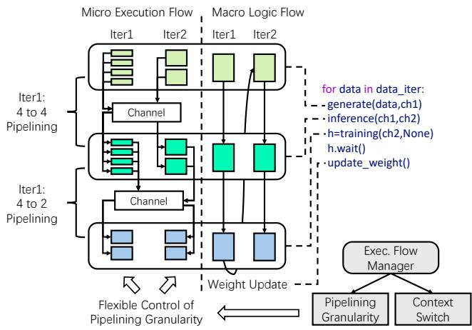  
Figure 6: The M2Flow execution logic.

## 3.3 M2Flow Transformation

The programming interface shown in Figure 5b offers a flowlike programming model, with which developers describe the high-level, logical control and data flows among workers. Having obtained the logical flows, RLinf follows the M2Flow paradigm to transform the logical flows (i.e., how should the workers run) into the concrete execution flow, i.e., where (spatial) and when (temporal) should the workers run. In this section, we focus on two enabling mechanisms of M2Flow transformation and flexible scheduling—elastic pipelining and context switching. In §3.4, we will describe the scheduling policy that determines the optimal execution flow.

Based on the programmed workflow, the key idea of M2Flow transformation is to control the spatial and temporal scheduling of workers by throttling their data processing granularity and concurrent resource accesses, respectively.

Spatial Scheduling via Elastic Pipelining. For spatial scheduling, workers can be executed in a pipelined manner with a different number of accelerators/devices. To maximize pipeline flexibility, RLinf introduces elastic pipelining to enable workers to flexibly process data at different granularity with the given device resources. Elastic pipelining builds upon our insight that in RL training and agentic scenarios, most workers follow the SPMD pattern, allowing execution across varying batch sizes. For instance, LLM serving engines like SGLang and vLLM can process a single prompt or a list of prompts at a time, and inference (i.e., prefill-only computation of a model) similarly supports single-batch or multi-batch execution. This flexibility enables the Execution Flow Manager of RLinf to achieve flexible pipelining of a worker task via dynamic data granularity—output data can be forwarded once a configured size of data batch is ready, allowing downstream workers to start earlier with smaller batches or later with larger batches. Notably, the scheduling space is further affected by individual worker’s internal computation semantics. For example, training workers operate with both the micro-batch and global-batch concepts—the microbatch defines forward/backward units, while the global-batch determines when model updates occur.

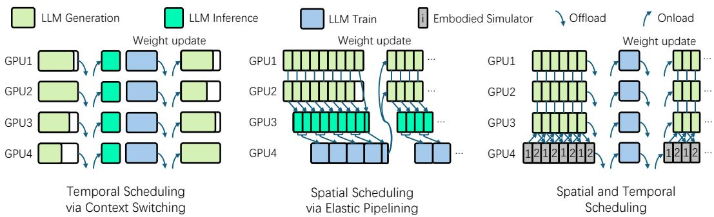  
Figure 7: Spatial and temporal scheduling of workers.

Temporal Scheduling via Automatic Context Switching. Beyond spatial scheduling, RLinf also supports natural temporal multiplexing of devices via automatic context switching, further expanding the scheduling space. Context switching enables workers that cannot co-reside in the same accelerators with limited device resources (e.g., GPU memory) to share devices by executing sequentially. In RLinf, this is realized via a distributed device lock of the data channel facility, i.e., device\_lock as shown in Figure 5a. This lock serves as the primitive to throttle concurrent resource access by multiple workers that are on the same devices and have data flow dependencies, i.e., producers and consumers of the same channel. Before using device resources, a worker must acquire the lock, whose state is globally consistent to all workers and can only be changed atomically, thus ensuring exclusive access to the resources. Upon lock acquiring, the worker’s device resources are automatically loaded by calling the onload function of the worker if the resources have been offloaded. After completing its task, the worker releases the lock and offloads its resources via the offload function to free up device resources for child workers in the workflow. Unlike a conventional lock, the device lock leverages the data channel’s data dependency information to define lock acquiring priority, i.e., child workers that depend on the outputs of parent workers can only acquire the lock after the parents have enqueued data and released the lock, so as to avoid lock contention and deadlock. Also, it utilizes device placement information from the Controller to avoid unnecessary resource loading and offloading when workers are placed on different devices.

M2Flow Execution. Figure 6 shows how M2Flow manages execution. The workflow is written imperatively, i.e., a for loop iterating over main logic, with three workers, i.e., rollout, inference, and training. A rollout task such as generate(data, ch1) processes data and enqueues results to channel ch1. The Execution Flow Manager can divide the input data into smaller chunks, allowing workers to process outputs at a smaller data granularity. Alternatively, tasks can be coalesced into fewer, larger sub-tasks with larger data chunks to realize different temporal scheduling. Meanwhile, the device lock enables automatic resource management among workers with data dependencies, enabling spatial scheduling via context switching.

With M2Flow, user-defined workflows can be orchestrated across a complete spatial–temporal scheduling space. Figure 7 illustrates several representative execution modes suited to different RL workloads and configurations.

The left part of Figure 7 shows pure temporal scheduling, where each worker occupies all accelerators. Once a worker completes its task, it is swapped out and the next worker is swapped in. For the illustrated case, since inference and training share the same model weights, no offloading or reloading is required. This mode is particularly useful when a worker must use all devices to be runnable, such as a large model’s training. It also maximizes resource sharing among collocated workers and avoids inter-worker pipeline imbalance. However, it suffers from GPU idleness due to long-tail effects, e.g., the longest response length in the rollout stage determines the overall completion time of the stage. This mode is therefore suboptimal when the workload exhibits high variance in component runtime, as is typical in long-context reasoning or open-ended embodied rollouts.

The middle part illustrates spatial scheduling, where workers are assigned to separate GPUs. Because workers depend on one another, pipelining is applied to mitigate idle time.

Achieving efficient pipelining requires balancing resources across workers so that their execution times align. Spatial scheduling effectively hides the long tail of dynamic stages by overlapping them with downstream components, but it may introduce compute and memory imbalance when one component dominates GPU memory (e.g., training with optimizer states) while others underutilize their allocation. In such cases, dedicating disjoint GPU sets to every component forces compute-light components to retain GPUs they cannot fully exploit, leading to overall resource waste.

Finally, RL workflows are often too complex for purely temporal or spatial scheduling to remain efficient. M2Flow therefore supports hybrid scheduling, as shown on the right of Figure 7. Some workers are distributed across GPUs with pipelined execution, but once the workers’ stage completes, they can be swapped out and replaced by successors to continue the workflow. Hybrid scheduling preserves resource sharing for the subset of components with large memory footprints (e.g., training and inference that share weights), while pipelining the dynamic, long-tail-prone components (e.g., generation, simulators) on dedicated devices to mask their variability. This trade-off can be applied at fine granularity, with the choice for each component aligned to its compute and memory profile, its position in the dependency graph, and the dynamicity of its inputs.

## 3.4 Scheduling Policy

RLinf offers a large scheduling space through flexible orchestration of workers, thus finding the most efficient execution mode is challenging. To this end, RLinf introduces two modules: the profiler and the scheduler. The profiler is used to measure and estimate the execution characteristics of each component under different numbers of GPUs. The scheduler then utilizes this information to compose an overall execution plan, containing specific GPU assignments and pipelining configurations. The two modules form a fully automated profiling-to-scheduling pipeline. After developers define the worker logic and workflow runner, RLinf runs offline profiling over a small set of representative data parallel sizes, extrapolates each component’s execution time and memory usage, and passes the results to the scheduler, which finds the global execution plan before training begins. Users do not manually choose among temporal, spatial, and hybrid modes; they only declare the resource budget (§4) and, optionally, parallelism hints for very large models.

Profiler. The profiler measures each component’s execution time and memory usage under different data parallel sizes, because data parallel size tends to have a positive (sometimes nearly linear) relation with the component throughput as data is consumed faster with the increasing data parallel size. For non-model components like simulators, the data parallel size is the number of instances. For model training and generation components, the profiler requires users to provide model parallel configuration to decide the data parallel size, which can usually be determined by the model size and GPU memory. With the profiled data, the profiler extrapolates the execution time and memory usage for larger data parallel sizes using polynomial extrapolation, outputting an execution time estimation function E for each component. This function is then fed to the scheduler for it to estimate each component’s execution time and whether it can be fitted into memory given a selected number of GPUs. Moreover, during profiling, the overall RL workflow is also captured into a workflow graph in a just-in-time manner, by tracing the data flow among workers through the communication primitives.

Algorithm 1: Worker scheduling policy.   
Input :Workflow graph G, execution time estimation function E   
for each component, and number of devices N.   
Output :A worker schedule S<sub>best</sub> and its estimated time T<sub>best</sub> .   
1 D<sub>table</sub> ←{}; // graph map to (time, schedule)   
2 G ←ConvertCircleToNode (G);   
3 T<sub>best</sub> , S<sub>best</sub> ←FindSchedule (G<sub>dag</sub>, N, D<sub>table</sub>);   
4 Function FindSchedule(G, N, D ):   
5 if (G,N) in D<sub>table</sub> then   
6 return D<sub>table</sub>[(G,N)];   
7 end   
8 if G is a node then   
9 return E , S ;   
10 end   
11 T<sub>best</sub> ←+in f ; S<sub>best</sub> ←None;   
12 for G , G in TraverseStCuts (G) do   
13 /\* G<sub>s</sub> and G<sub>t</sub> share the same gpus \*/   
14 T<sub>s</sub>,S<sub>s</sub> ←FindSchedule (G<sub>s</sub>, N, D<sub>table</sub>);   
15 T<sub>t</sub>,S<sub>t</sub> ←FindSchedule (G<sub>t</sub>, N, D<sub>table</sub>);   
16 D<sub>table</sub>[(G<sub>s</sub>,N)]←(T<sub>s</sub>, S<sub>s</sub>);   
17 D [(G<sub>t</sub> ,N)]←(T<sub>t</sub> , S<sub>t</sub> );   
18 if T<sub>best</sub> > T<sub>s</sub> + T<sub>t</sub> then   
19 T<sub>best</sub> ←T<sub>s</sub>+T<sub>t</sub> ; S<sub>best</sub> ←shared(S<sub>s</sub>, S<sub>t</sub> );   
20 end   
21 /\* G and G use different devices \*/   
22 for N , N in TraverseGpuNum (N) do   
23 /\* N<sub>s</sub>+N<sub>t</sub> equals N \*/   
24 T<sub>s</sub>,S<sub>s</sub> ←FindSchedule (G<sub>s</sub>, N<sub>s</sub>, D<sub>table</sub>);   
25 T<sub>t</sub>,S<sub>t</sub> ←FindSchedule (G<sub>t</sub>, N<sub>t</sub>, D<sub>table</sub>);   
26 D<sub>table</sub>[(G<sub>s</sub>,N<sub>s</sub>)]←(T<sub>s</sub>, S<sub>s</sub>);   
27 D<sub>table</sub>[(G<sub>t</sub> ,N<sub>t</sub> )]←(T<sub>t</sub> , S<sub>t</sub> );   
28 if T >PipeliningTime (T<sub>s</sub>,T<sub>t</sub>) then   
29 T<sub>best</sub> ←PipeliningTime (T<sub>s</sub>,T<sub>t</sub>);   
30 S<sub>best</sub> ←pipeline(S<sub>s</sub>, S<sub>t</sub> );   
31 end   
32 end   
33 end   
34 return T<sub>best</sub> , S<sub>best</sub> ;   
35 end

Scheduler. The scheduling policy of the scheduler is shown in Algorithm 1. The input of the policy includes the workflow graph G, the execution time estimation function E produced by the profiler, and the total number of GPU devices. Specifically, the scheduling algorithm recursively partitions the workflow graph into two subgraphs, G<sub>s</sub> and G<sub>t</sub>, connected by directed edges known as the s–t cuts [11]. For each partition, it evaluates the time cost of both the temporal and spatial scheduling policies. In the temporal scheduling, G<sub>s</sub> and G<sub>t</sub> share the same set of devices (e.g., GPUs)—G<sub>s</sub> processes its batch, and upon completion G<sub>t</sub> consumes its output. In the spatial scheduling, G<sub>s</sub> and G<sub>t</sub> are assigned to disjoint device sets and executed in a pipelined fashion. The scheduler uses the profiling results to find the optimal device allocation and data processing granularity for each subgraph. The algorithm then selects the most performant scheduling, and applies this process recursively until each subgraph reduces to a single node, at which point the node returns its profiled execution time under the assigned placement.

Modeling the execution time of G<sub>s</sub> and G<sub>t</sub> is the key to finding the optimal scheduling. In the temporal scheduling where workers share devices, the cost is the sum of G<sub>s</sub> and G<sub>t</sub> plus any resource offloading and reloading overhead. In the spatial scheduling, the runtime is estimated as

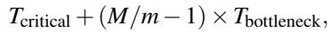

where T<sub>critical</sub> is the pipeline warm up and cool down time, T<sub>bottleneck</sub> is the runtime of the slowest subgraph, M is the total batch size, and m is the data processing granularity.

Before invoking FindSchedule, the workflow graph is pre processed to collapse cycles into single nodes. When recursion reaches such a node, its computation is evenly partitioned across GPUs. This avoids exhaustive partition enumeration while still achieving near-optimal performance.

Algorithmic Complexity. Let V be the number of nodes in the post-collapse workflow DAG and N the number of devices. With memoization, the DP visits O(V <sup>2</sup>) distinct subgraphs for the chain-like workflows typical in RL, and each (subgraph, device-count) state takes O(V · N) time because it enumerates O(V ) s-t cuts and, per cut, iterates over device partitions N<sub>s</sub> + N<sub>t</sub> = N<sup>′</sup>. Summing over all O(V <sup>2</sup> · N) states yields an overall search cost of O(V <sup>3</sup> · N<sup>2</sup>). For a given workflow, the search cost is O(N<sup>2</sup>) as the topology is fixed. We empirically validate this scaling up to 4096 GPUs in §5.2.

Adaptive Re-Profiling for Runtime Dynamicity. Some RL training is inherently dynamic: for LLM, as the model learns, the rollout response length distribution drifts, causing components such as generation to speed up or slow down over time. A static plan derived from initial profiling may therefore become suboptimal mid-training. To handle this, RLinf embeds a runtime profiler inside each worker that continuously records per-invocation execution time, and a lightweight controller routine that compares these measurements against the scheduler’s estimated execution times. When the deviation exceeds a configurable threshold (15% sustained over a sliding window in our default configuration), RLinf checkpoints the training state, re-runs the scheduling algorithm with the updated profile, and resumes training under the new execution plan. In typical reasoning RL training, response-length drift is gradual and re-scheduling is warranted only after thousands of iterations, so the checkpoint-and-redeploy overhead is negligible relative to total training time. We quantify the sensitivity of RLinf to profile noise in §5.2.

## 3.5 Adaptive Communication

To support flexible worker orchestration, RLinf’s communication layer needs to realize two key design goals. (1) Flexible. Any two workers should be able to communicate with each other, regardless of the worker placement and program logic. (2) Adaptive. Communication primitives should be able to adapt to arbitrary data living in different devices (CPUs and GPUs across nodes), while achieving maximum throughput of the underlying communication links.

However, existing collective communication libraries for GPU and CPU data, e.g., NCCL [36], Gloo [39], and MPI [12], fail to meet our goals as they are mostly built for standard communication patterns across a fixed number of processes in traditional model training and serving scenarios. In contrast, RL components manifest considerable spatial and temporal dynamicity. Spatially, components can collocate on the same device, or be distributed across different devices. Temporally, components can be launched or terminated at arbitrary times. However, state-of-the-art libraries like NCCL do not support flexible rank scaling and efficient intra-device communications. Furthermore, the data communicated between components can be complex data structures beyond standard contiguous GPU/CPU data buffers, e.g., a composition of multiple data buffers with varying sizes. Efficient handling of such data dynamicity is also missing in existing libraries.

Communication Protocol and Primitives. To achieve the design goals, we devise worker and data placement-aware communication protocol and primitives, which enhance existing CPU/GPU communication libraries in terms of both flexibility and performance in the RL scenario.

At the protocol level, RLinf features transparent connection lifecycle management, which avoids manual connection management as in traditional communication libraries, and handles dynamic worker placement and scaling automatically. Specifically, upon launch, each worker’s placement, IP and port information will be registered into a global worker manager. Connections among workers are then established with the information lazily when workers invoke communication primitives to reduce connection overhead and enhance scalability. When a group of workers establish a connection, the connection metadata is maintained both locally by workers and globally by a connection manager. When a worker is terminated, the connection manager will notify all connected workers to teardown the connection and release resources.

At the primitive level, like existing libraries, RLinf offers both synchronous and asynchronous send and recv primitives for point-to-point communication, as well as collective communication primitives like broadcast. Differently, RLinf’s primitives automatically exploit the worker and data placement information of the communicating workers to select the most efficient communication backend, e.g., NCCL for GPU-GPU communication, zero-copy cudaIPC for intra-GPU communication, and Gloo for CPU commu nication. For data dynamicity, both the asynchronous and synchronous primitives support arbitrary Python objects as the communication payload, which are serialized and deserialized in a structure-aware manner, i.e., data buffers are extracted from the objects and communicated directly without serialization/deserialization overhead. Also, data structure information is piggybacked in the communication metadata to facilitate efficient deserialization at the receiver side.

Load-Balancing Data Channel. Atop the above communication primitives, we further build a high-level FIFO queue-like communication facility (termed data channel) for producer-consumer worker communication in the workflow. This enables decoupling of both the control and data flows of producer and consumer workers, which is essential for flexible pipelining. The data channel maintains its data queue in a special channel worker process, and can be accessed by any other worker processes by passing the channel handle. The channel supports both CPU and GPU data, and can be configured for offloading GPU data to CPU to reduce GPU memory consumption. Furthermore, the data channel is enhanced with load-balancing capability. Each item enqueued to the channel can be assigned a weight value, which is used to balance the load across multiple consumers dequeuing from the channel. The consumers can also define custom load-balancing policies, which are invoked by the channel upon each dequeue operation to select the desired items from the channel.

## 4 Implementation

RLinf is implemented in 20K lines of Python code. Among them, 5K lines are for the core worker, controller, and scheduler components. 2K for common workers such as rollout workers based on serving engines like SGLang, vLLM and HuggingFace Transformers, training actors based on Megatron and FSDP, and embodied simulators, which can be used out of the box for any future RL models and workflows. The remaining 13K lines are mostly rich support for various RL algorithms like PPO and GRPO. Notably, a typical workflow runner like the LLM reasoning RL workflow implementation is less than 100 lines of code, and requires no code changes to be scheduled both temporally and spatially.

Currently, RLinf supports not only traditional LLM-based reasoning RL, but also agentic RL with tooling, and embodied RL involving complex workloads like 3D rendering, physics simulation, and robotic control. For RL algorithms, RLinf supports popular algorithms like PPO [48], GRPO [49], DAPO [61], and REINFORCE++ [16], as well as some of their off-policy asynchronous versions. Table 1 summarizes the broader set of algorithms supported by RLinf, covering synchronous on-policy methods, off-policy and asynchronous methods, and imitation learning. Notably, the M2Flow paradigm naturally generalizes to complex asynchronous algorithms and to agentic workflows with tool calls and multi-agent settings (e.g., Search-R1 [22], rStar2 [47]), simply by adapting the workflow to the components.

Table 1: RL algorithm categories supported by RLinf.  
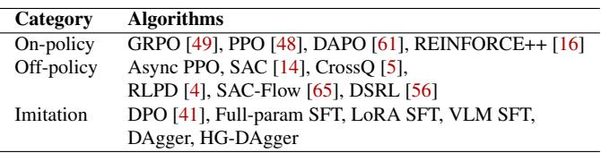

Differently, asynchronous algorithms differ in workflow structure from their synchronous counterparts: instead of executing lock-step phases, they run long-lived concurrent workers and synchronize weights non-blockingly. Despite this, expressing such workflows in RLinf remains concise:

```python
class AsyncRunner:
def run(self):
self.update_rollout_weights()
env_h = self.env.interact(
self.env_ch, self.rollout_ch, self.actor_ch
)
rollout_h = self.rollout.generate(
self.rollout_ch, self.env_ch
)
while step < max_steps:
self.actor.run_training(self.actor_ch).wait()
if step % sync_interval == 0:
self.update_rollout_weights()
self.env.stop(); self.rollout.stop()
```

The environment, rollout, and actor workers run as persistent asynchronous tasks streaming data through channels, while training proceeds concurrently without blocking on rollout completion. This shows that M2Flow’s channel-based decoupling generalizes naturally to asynchronous settings.

For models, we have implemented support for language models like Qwen [40], multi-modal models like VLM [3], VLA models like OpenVLA [23, 24] and Pi0 [55], and world models like OpenSora [70] and Wan [57]. The rich RL workflow, algorithm and model support not only accelerates the development of new RL workflows with RLinf, but also demonstrates its generality, versatility and extensibility in practice.

Cluster Management and Device Allocation. RLinf leverages Ray to realize cluster management, launching worker processes on remote nodes, and dispatching worker function executions. RLinf does not rely on Ray for device allocation to workers, because Ray only supports rigid packed-style (i.e., consecutive devices) or spread-style (i.e., spread-across-node first) resource allocation [33], which are not flexible enough for today’s complex and dynamic RL workflows. Instead, RLinf offers a flexible device allocation strategy, which allows each worker process to be allocated with any device or devices of any node across the cluster, by simply specifying the target devices’ global IDs. Also, hardware devices beyond accelerators such as robot arms are also abstracted and managed as schedulable devices in the same manner as accelerators. This enables RLinf to scale on all kinds of hardware that foundation models can interact with.

Multi-Tenant Resource Boundary. In multi-tenant clusters, a cluster manager (e.g., SLURM, Kubernetes) assigns each job a fixed set of nodes. RLinf scopes its runtime to this allocation, and the scheduler explores execution modes only within it, so M2Flow does not alter the job’s resource contract with the cluster manager. Within the allocation, the distributed device lock of the data channel (§3.5) enforces exclusive accelerator access when components share devices via temporal scheduling, preventing intra-job contention.

Heterogeneous Hardware Support. RLinf abstracts accelerators behind a unified hardware interface, allowing the scheduler to target clusters that mix GPUs/NPUs from differ ent vendors (e.g., NVIDIA, AMD, Intel, Ascend, MUSA) and non-standard devices such as robotic arms. Nodes are grouped by hardware type, and a declarative placement configuration maps each workflow component to one or more groups. The profiler measures each component on its actual device type, so the scheduler accounts for heterogeneous execution times when searching the spatio-temporal plan.

Fault Tolerance. The distributed, multi-component nature of RLinf makes worker process crashes, node failures, and network issues unavoidable in long training runs. RLinf adopts checkpoint-based recovery: when any worker fails, it detects the failure via heartbeat and notifies the Controller, which halts the entire training job to prevent dependent workers from timing out or producing inconsistent state. Users can then restart from the latest checkpoint, and RLinf replays the offline profiling phase if the resource boundary has changed before resuming under a possibly updated execution plan.

Performance Profiling. Performance profiling support is not only crucial for developers to understand system bottlenecks, but also serves as the key to our scheduling policy. Thus, RLinf provides a worker-group-level timer for every public function invoked remotely by the workflow runner. The timer automatically captures the execution time of a worker function, whose value can be retrieved via the asynchronous handle returned by the corresponding worker group function; the values of all processes in the worker group will be reduced to a single value via a specified reduction method (e.g., mean, max, min). Beyond this, developers can also create custom timers for more fine-grained profiling of any code region, and retrieve the timer values similarly.

## 5 Evaluation

We extensively evaluate RLinf across math-reasoning and embodied RL workloads, covering four different models of different sizes (i.e., Qwen2.5 [40], Qwen3-MoE [59], Open-

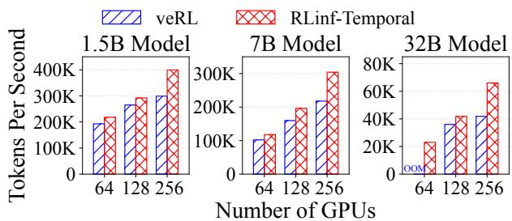  
Figure 8: GRPO training throughput of Qwen2.5 on RLinf and veRL under different cluster scales and model sizes.

VLA [24], OpenVLA-OFT [23]), two RL algorithms (i.e., GRPO [49], PPO [48]), and multiple cluster scales. Overall, our key findings include:

• RLinf consistently outperforms state-of-the-art RL systems veRL [51] and Slime [71] by 1.07×∼1.70× on a variety of math-reasoning RL settings. The results also show that different RL settings favor different execution modes.

• RLinf demonstrates higher training throughput on embodied RL tasks in both ManiSkill [54] and LIBERO [27]. On LIBERO, RLinf achieves a 1.05×∼2.43× speedup over SimpleVLA-RL [25]; on ManiSkill, its hybrid mode yields up to 1.87× improvement over other strategies.

• The scheduling policy identifies the best execution mode within 7 × 10<sup>−4</sup> ∼ 5.98s on the clusters of 8 to 1024 GPUs.

• The models trained with RLinf achieve SOTA or better benchmark scores after RL fine-tuning.

## 5.1 End-to-End Experiments

The end-to-end experiments run on a 32-node cluster, where each node is equipped with 8 NVIDIA H100-80GB GPUs, 2 Intel Xeon Platinum 8558 CPUs (2.1 GHz, 48 cores), and 2 TB of memory. Intra-node communication uses NVLink, while inter-node communication uses 8 Mellanox ConnectX-7 RDMA NICs per node, each providing 400 Gbps bandwidth with RoCEv2.

## 5.1.1 Reasoning RL Training

Experimental Setup. We evaluate using Qwen2.5 Models [40] distilled by DeepSeek-R1, covering sizes from 1.5B to 32B parameters and Qwen3-30B-A3B [59], which is an MoE model, and using the AReaL-boba-Data dataset [58], which integrates multiple standard datasets including Deep-ScaleR, Open-Reasoner-Zero, Light-R1, etc. We compare RLinf with two state-of-the-art open-source RL systems, i.e., veRL v0.5 [51] and Slime v0.1 [71]. To ensure fairness, all systems use SGLang [68] for rollouts and Megatron-LM [52] for training, with the same parallelism setting (e.g., tensor parallelism configuration). Training speed is reported in tokens/sec, defined as the total number of prompt and response tokens in a global batch divided by the iteration time. All performance results are averaged over 10 training iterations after warm-up.

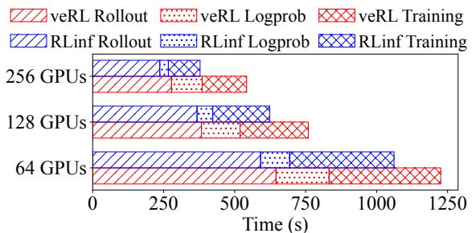  
Figure 9: Latency breakdown of Qwen2.5 7B model training.

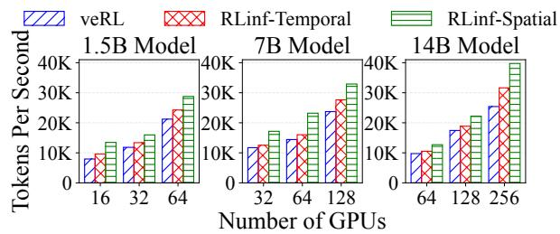  
Figure 10: PPO training throughput of Qwen2.5 on RLinf and veRL under different cluster scales and model sizes.

Qwen2.5 with GRPO. We evaluate the Qwen2.5 1.5B, 7B, and 32B dense models on 64, 128, and 256 GPUs, respectively, using a rollout batch size of 512 and maximum sequence length 28672. As shown in Figure 8, RLinf in temporal mode consistently outperforms veRL across all model scales, achieving 1.10× to 1.58× speedups. Since RLinf ’s temporal mode is similar to veRL’s design, the gains primarily stem from faster rollouts enabled by larger KV-cache allocations (RLinf has better GPU memory management) and reduced synchronization overhead between upstream and downstream stages of the middle inference stage, as illustrated in Figure 9.

Figure 8 also shows that veRL scales poorly as GPU number increases, largely because inference becomes a growing bottleneck, with its proportion of total execution time rising from 15.2% to 19.9% when scaling from 64 to 256 GPUs. In addition, veRL’s unoptimized rollout engine leads to excessive peak memory usage, forcing smaller KV-cache allocations and causing rollout time to decrease only sublinearly.

We also tested spatial mode, but it underperforms veRL by 44.3-68.6% for the 7B model, because rollout, inference, and training run on disjoint smaller sets of GPUs, slowing both rollout and training. With the long sequence length (i.e., 28672), the training stage also waits longer for the first batch of rollouts to be generated. In addition, the rollout batch size is relatively smaller, reducing the overlapping time.

Qwen2.5 with PPO. We train PPO with Qwen2.5 as both the actor and critic, using model sizes of 1.5B, 7B, and 14B, scaling from 16 to 256 GPUs. We use a rule-based reward, a maximum sequence length of 12288, and a rollout batch size ranging from 256 to 1024 depending on GPU count. RLinf-Spatial allocates GPUs in a 4:1:1:1:1 ratio for rollout, actor inference, actor training, critic inference, and critic training. Figure 10 presents the results. For the 1.5B model, RLinf-Spatial outperforms veRL by 69.6%, 35.0%, and 35.6% on 16, 32, and 64 GPUs, respectively. In contrast to the GRPO experiment, RLinf-Spatial surpasses RLinf-Temporal by 39.8%, 19.4%, and 18.6%.

For the 7B model, RLinf-Spatial outperforms both veRL and RLinf-Temporal by 38.7–60.7% and 19.0–44.8%, respectively. As shown in Figure 11, RLinf-Temporal exceeds veRL mainly due to speedups in “Others”, which includes contextswitch overhead (offload/onload), parameter resharding, advantage computation, and inter-stage synchronization. RLinf-Spatial performs faster than RLinf-Temporal because rollout, inference, and training overlap effectively. Although rollout in spatial mode is 39.3% slower than in temporal mode, inference and training finish quickly once rollout completes. The 14B model shows similar trends with smaller gains, i.e., RLinf-Spatial is 27.2–56.5% and 17.7–25.7% faster than veRL and RLinf-Temporal, respectively.

Qwen3-30B-A3B with GRPO. We evaluate the MoE model Qwen3-30B-A3B on 32, 64, and 128 GPUs with a rollout batch size of 1536 and sequence length 20480. We disable logprob recomputation, a common configuration in RL, which removes the inference stage. Since Slime is optimized for MoE RL training, we compare against two variants: Slime (spatial mode without pipelining, as Slime does not support pipelining) and Slime-Colocate (temporal mode). As shown in Figure 12, Slime is the slowest because rollout and training run on disjoint GPU sets with no execution overlap. For 32 and 64 GPUs, RLinf-Temporal performs similarly to Slime-Colocate, while RLinf-Spatial (1:1 rollout-to-training GPUs) is 31.2% and 7.2% faster than Slime-Colocate, respectively.

Figure 13 presents the performance breakdown. Spatial mode achieves shorter rollout time because temporal mode suffers from memory contention between rollout and training, forcing much smaller parallelism (i.e., max\_running\_requests of 128 vs. 256 in SGLang). In addition, RLinf-Spatial achieves good rollout–training overlap. On 128 GPUs, RLinf-Temporal outperforms Slime-Colocate by 3.7% due to better scaling from decoupled system design; both stages run slightly faster. RLinf-Spatial underperforms because rollout and training do not overlap well, where training continues for 80 seconds after rollout completes.

## 5.1.2 Agentic RL Training

To demonstrate RLinf’s flexibility beyond standard reasoning workloads, we evaluate it on Search-R1-style [22] retrievalaugmented agentic RL workflows that require external tool calls and search interactions. Unlike the rigid structure of standard PPO or GRPO, these workflows introduce highly variable-length tool-call traces. RLinf seamlessly supports these complex patterns with its unified worker abstraction. By leveraging M2Flow to overlap generation, external tool invocation, and training steps, RLinf drastically improves execution efficiency.

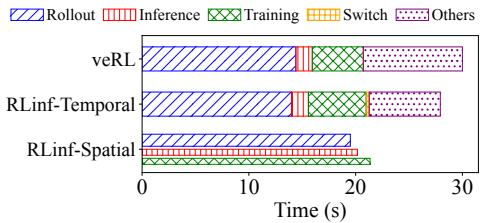  
Figure 11: Latency breakdown of Qwen2.5 7B with PPO on 32 GPUs. The vertical width of bar presents the number of GPUs.

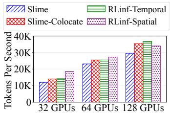  
Figure 12: RL training throughput of Qwen3-30B-A3B on RLinf and Slime under different cluster scales.

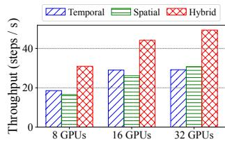  
(a) ManiSkill

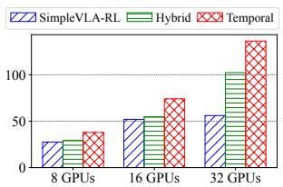  
(b) LIBERO  
Figure 14: End-to-end throughput of RLinf and SimpleVLA-RL under different cluster scales.

We compare RLinf against the official Search-R1 implementation [21], which is built on veRL. Both systems train Qwen2.5-3B with the Search-R1 agentic workflow on a single node with 8 NVIDIA H100 GPUs, using the same dataset and hyperparameters. RLinf achieves an end-to-end throughput of 67.3 requests/s compared to the 30.4 requests/s of the standard Search-R1 implementation, delivering a 2.2× throughput improvement.

## 5.1.3 Embodied RL Training

Experimental Setup. We evaluate on OpenVLA [24] and OpenVLA-OFT [23], two vision-language-action models that are supervised-finetuned using RL4VLA [28] and SimpleVLA-RL [25], respectively. We train OpenVLA on ManiSkill [54] and OpenVLA-OFT on LIBERO [27], two widely used embodied environments that emulate physical tasks such as pick-and-place. On LIBERO, we compare RLinf with SimpleVLA-RL (commit d001d) [25], which is built on veRL. On ManiSkill, no distributed RL baseline exists, so we compare different execution modes of RLinf. Training speed is reported in steps/sec, computed as the total number of environment steps divided by the iteration time.

ManiSkill Environment. We train OpenVLA on the “PutCarrotOnPlateInScene-v2” task [28] using 256 parallel ManiSkill environments, each stepping for 80 steps per iteration. Figure 14(a) reports end-to-end throughput across three execution modes in RLinf on 8, 16, and 32 GPUs. RLinf-Hybrid achieves 52.2–69.1% higher throughput than RLinf-Temporal and 60.7–87.2% higher than RLinf-Spatial. For ManiSkill environment, the per-step environment time remains nearly constant as parallelism increases (Figure 3b) and scaling parallel environments is primarily limited by GPU memory. Thus, dedicating GPUs to environment execution is advantageous. As rollout (i.e., environment and generation) and training all require GPU memory, temporally sharing GPUs between rollout and training is more effective. Thus, RLinf-Hybrid performs much better than the other two. In RLinf-Temporal, environments and generation must coexist in memory, constraining both the number of environments and the batch size, ultimately reducing GPU utilization. RLinf-Spatial splits GPUs across the components, forcing training to retain a sufficient number of GPUs, which leaves too few GPUs for rollout and significantly slows it down.

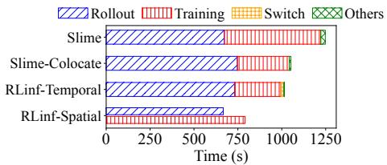  
Figure 13: Latency breakdown of Qwen3- 30B-A3B with GRPO on 32 GPUs. The vertical width of bar is proportional to the number of GPUs.

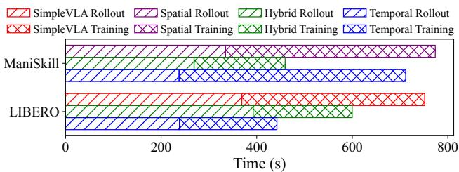  
Figure 15: Latency breakdown of ManiSkill and LIBERO.

LIBERO Environment. We train OpenVLA-OFT on the public benchmark task groups provided by LIBERO, using 512 parallel environments, each running 64 steps per iteration. The results in Figure 14(b) show that RLinf-Temporal is 37.8%, 42.6%, 143.4% faster than SimpleVLA-RL on 8, 16, 32 GPUs respectively. As shown in Figure 15, both rollout and training are faster in RLinf-Temporal than in SimpleVLA-RL due to (1) the elimination of redundant environment initializa tion during rollout, and (2) the use of a single forward pass to compute both action and log probability, with only a modest memory increase. RLinf-Temporal also scales better thanks to its decoupled system design and more efficient implementation. In contrast to ManiSkill, RLinf-Hybrid performs worse than RLinf-Temporal because LIBERO environment is CPUintensive; allocating environments on a subset of GPUs limits the utilization of CPU cores, making its rollout stage even slower than that of SimpleVLA-RL.

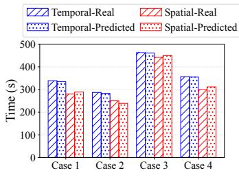  
(a)

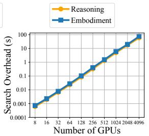  
(b)  
Figure 16: (a) The real and predicted latency in different cases. (b) The search overhead under different cluster scales.

## 5.2 Effectiveness of Search Policy

We evaluate the search policy along two dimensions: (a) the accuracy of end-to-end throughput estimates derived from profiling data, and (b) the search speed as the number of GPUs increases.

Estimation Accuracy. Figure 16(a) compares real and predicted iteration times across four Qwen2.5–GRPO settings. Cases 1 and 2 use the 1.5B model on 128 GPUs with temperatures 0.6 and 1.0, while Cases 3 and 4 use the 7B model on 64 GPUs with the same temperature settings. Temporal mode achieves estimation errors below 2% because its end-to-end time is well approximated by summing profiled worker times. Spatial mode with pipelining shows slightly higher errors (<5%), mainly due to response-length variability that causes pipeline imbalance. These errors are small enough that they do not change the ranking of feasible execution modes, allowing the search policy to consistently select the most efficient mode for the above end-to-end experiments.

Search Speed. Search complexity is dominated by the number of workflow-graph nodes and available GPUs. RL workflows typically have fewer than ten nodes, allowing our dynamic-programming search to finish quickly. For a graph with three nodes (e.g., Qwen2.5-GRPO or ManiSkill) and GPU counts ranging from 8 to 4096 (Figure 16(b)), search time grows polynomially with the GPU count, consistent with the O(N<sup>2</sup>) analysis in §3.4, and remains under 60 seconds on 4096 GPUs, demonstrating the efficiency of our algorithm.

Sensitivity Analysis. To evaluate RLinf’s robustness against profiling inaccuracies, we conduct a sensitivity analysis by injecting synthetic noise into the profiled execution times for different phases and measuring the actual throughput of the resulting placement. The experiment runs on a 1.5B model trained with GRPO on 128 GPUs. As Figure 17 shows, RLinf maintains optimal throughput across a wide noise range.

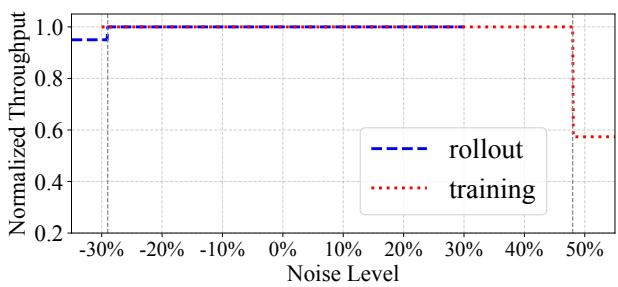  
Figure 17: Sensitivity of RLinf’s scheduling to profiling noise.

Table 2: Evaluation scores of RLinf-math-1.5B/7B and opensource models. GPQA represents GPQA-diamond.  
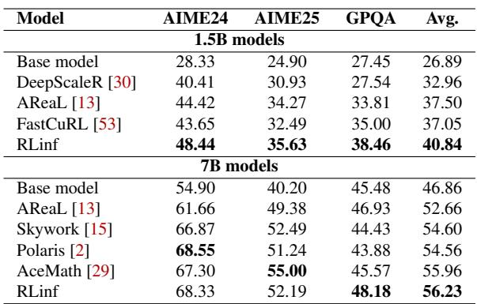

Specifically, it tolerates underestimated rollout times (negative noise) down to roughly −29% and overestimated training times (positive noise) up to roughly +48%. Because GPU allocation is discrete, minor variations in estimated phase latencies do not shift performance bottlenecks enough to alter the optimal resource distribution; the search policy simply converges on the same physical placement. The throughput drops only occur when extreme noise tricks the algorithm into a suboptimal configuration. This confirms RLinf achieves optimal scheduling without requiring perfectly precise profiling.

## 5.3 Model Performance

We comprehensively evaluate the performance of the models produced by the reasoning and the embodied RL training, respectively, to demonstrate the effectiveness of RLinf. We emphasize that RLinf does not modify the underlying RL algorithms. The downstream task scores reported below serve only to confirm that RLinf trains models correctly, and that its higher per-iteration throughput translates into improved model quality within a fixed wall-clock and compute budget.

Reasoning RL Training. We applied GRPO training, a built-in RL algorithm in RLinf, on two base models, i.e., DeepSeek-R1-Distill-Qwen-1.5B and DeepSeek-R1-Distill-Qwen-7B, to improve their math reasoning ability. As shown in Table 2, the models trained with RLinf achieve the best average performance compared to the baseline systems. RLinf 1.5B model outperforms the baselines across all the three benchmarks (i.e., AIME 24 [63], AIME 25 [64], GPQA diamond [45]), improving by up to 20 points over its base model. RLinf 7B model achieves the highest performance on GPQA-diamond.

Table 3: OpenVLA model success rate results on ManiSkill3.  
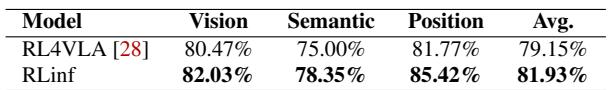  
Table 4: OpenVLA-OFT success rate after RL on LIBERO.

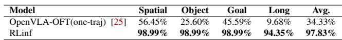

Embodied RL Training. We also evaluate the performance of the models after embodied RL training using RLinf. Table 3 and Table 4 present the evaluation results on the ManiSkill and LIBERO tasks by training OpenVLA and OpenVLA-OFT models respectively, using the PPO algorithm. For ManiSkill, the trained OpenVLA achieves higher success rate than the RL4VLA [28] baseline system. For LIBERO, we further train the publicly released OpenVLA-OFT model (one-trajectory fine-tuned version) from SimpleVLA-RL [25]. By comparing its task success rates with those of the model RL trained using RLinf, we find that RLinf significantly improves OpenVLA OFT’s performance on the LIBERO tasks.

## 6 Related Works

RL Training Frameworks. RL training frameworks adopt varying system designs to support large-scale alignment tasks [8, 38], typically falling into either task-colocated or task-separated execution modes. For task-colocated systems, DeepSpeed Chat [60] and veRL [51] put all training phases on shared GPUs for simplified orchestration. In contrast, task-separated systems like NeMo-Aligner [50] and Open-RLHF [17] divide components across devices to improve modularity and scalability. AReaL [13] further introduces an asynchronous model-update algorithm upon task-separated systems to increase training throughput. Unlike these frameworks, RLinf provides a more flexible component-to-device placement mechanism, enabling practitioners to explore and deploy more efficient execution configurations tailored to workload characteristics.

Distributed Training Systems for LLM. Distributed training frameworks for LLMs [26, 66, 67] and systemlevel optimizations for memory [7, 18, 32] and communication [6, 20, 31] have significantly advanced large-model scaling. Megatron-LM [52] combines tensor, pipeline, and data parallelism to improve scalability, while DeepSpeed [44] introduces the ZeRO family of techniques [42, 43, 46] that shard optimizer states, gradients, and activations to reduce GPU memory usage. Although distributed RL systems face similar multi-device scaling challenges, RL workflows are more dynamic due to interactive data generation and asynchronous updates, making system design and optimization substantially more complex.

Dataflow System. Traditional dataflow systems [9, 19, 34, 62] excel at large-scale data processing through static task graphs and centralized scheduling, making them efficient for batch and streaming workloads with predictable structures. In contrast, RL training pipelines feature dynamic task graphs and asynchronous components (e.g., data collection, policy updates), requiring more flexible coordination than existing systems. Modern frameworks such as Ray [33] fill this gap with actor-based execution and decentralized control, making them better suited for orchestrating complex RL workflows.

## 7 Conclusion

Reinforcement learning is poised to surpass pretraining as the driving force behind LLM progress, but its workflows are too diverse and dynamic for rigid execution models. RLinf shows that by decoupling workflow logic from execution through the novel macro-to-micro transformation mechanism, we can unlock both efficiency and programmability. Beyond RL, we see this approach as a blueprint for future AI runtimes: systems that flexibly orchestrate heterogeneous components, e.g., training, inference, simulation, and reasoning, under one unified execution framework. We believe RLinf marks an early step toward the operating system for AI workloads.

## Acknowledgments

We thank our anonymous reviewers and shepherd for their invaluable suggestions. We also express our sincere appreciation to the RLinf open-source community. The continuous stream of code contributions, feature requests, and user experience feedback from our GitHub contributors has been vital to the system’s success and optimization. This work was partially supported by National Natural Science Foundation of China (No.62406159, 62325405), Zhongguancun Academy (Grant No. C20250301), Shenzhen Science and Technology Program (No. AI2026016).

## References

[1] Martín Abadi, Paul Barham, Jianmin Chen, Zhifeng Chen, Andy Davis, Jeffrey Dean, Matthieu Devin, Sanjay Ghemawat, Geoffrey Irving, Michael Isard, et al. Tensorflow: a system for large-scale machine learning.

In 12th USENIX symposium on operating systems design and implementation (OSDI 16), pages 265–283, 2016.

[2] Chenxin An, Zhihui Xie, Xiaonan Li, Lei Li, Jun Zhang, Shansan Gong, Ming Zhong, Jingjing Xu, Xipeng Qiu, Mingxuan Wang, and Lingpeng Kong. Polaris: A posttraining recipe for scaling reinforcement learning on advanced reasoning models, 2025.

[3] Shuai Bai, Keqin Chen, Xuejing Liu, Jialin Wang, Wen bin Ge, Sibo Song, Kai Dang, Peng Wang, Shijie Wang, Jun Tang, et al. Qwen2. 5-vl technical report. arXiv preprint arXiv:2502.13923, 2025.

[4] Philip J. Ball, Laura Smith, Ilya Kostrikov, and Sergey Levine. Efficient online reinforcement learning with offline data, 2023.

[5] Aditya Bhatt, Daniel Palenicek, Boris Belousov, Max Ar gus, Artemij Amiranashvili, Thomas Brox, and Jan Peters. Crossq: Batch normalization in deep reinforcement learning for greater sample efficiency and simplicity. In International Conference on Learning Representations, 2024.

[6] Chang Chen, Xiuhong Li, Qianchao Zhu, Jiangfei Duan, Peng Sun, Xingcheng Zhang, and Chao Yang. Centauri: Enabling efficient scheduling for communicationcomputation overlap in large model training via communication partitioning. In Proceedings of ASPLOS, pages 178–191, 2024.

[7] Tianqi Chen, Bing Xu, Chiyuan Zhang, and Carlos Guestrin. Training deep nets with sublinear memory cost. arXiv preprint arXiv:1604.06174, 2016.

[8] Paul F Christiano, Jan Leike, Tom Brown, Miljan Martic, Shane Legg, and Dario Amodei. Deep reinforcement learning from human preferences. Advances in Neural Information Processing Systems, 2017.

[9] Jeffrey Dean and Sanjay Ghemawat. Mapreduce: simpli fied data processing on large clusters. Communications of the ACM, 51(1):107–113, 2008.

[10] Jiafei Duan, Samson Yu, Hui Li Tan, Hongyuan Zhu, and Cheston Tan. A survey of embodied ai: From simulators to research tasks. Proceedings of IEEE, 2022.

[11] Lester Randolph Ford and Delbert Ray Fulkerson. Flows in networks. 2015.

[12] Message Passing Interface Forum. Mpi: A messagepassing interface standard. https://www.mpi-forum. org, 2025.

[13] Wei Fu, Jiaxuan Gao, Xujie Shen, Chen Zhu, Zhiyu Mei, Chuyi He, Shusheng Xu, Guo Wei, Jun Mei, Jiashu Wang, et al. Areal: A large-scale asynchronous reinforcement learning system for language reasoning. arXiv preprint arXiv:2505.24298, 2025.

[14] Tuomas Haarnoja, Aurick Zhou, Pieter Abbeel, and Sergey Levine. Soft actor-critic: Off-policy maximum entropy deep reinforcement learning with a stochastic actor. International Conference on Machine Learning (ICML), 2018.

[15] Jujie He, Jiacai Liu, Chris Yuhao Liu, Rui Yan, Chaojie Wang, Peng Cheng, Xiaoyu Zhang, Fuxiang Zhang, Jiacheng Xu, Wei Shen, Siyuan Li, Liang Zeng, Tianwen Wei, Cheng Cheng, Yang Liu, and Yahui Zhou. Skywork open reasoner series. https://capricious-hydrogen-41c.notion.site/Skywork-Open-Reaonser-Series-1d0bc9ae823a80459b46c149e4f51680, 2025. Notion Blog.

[16] Jian Hu. Reinforce++: A simple and efficient approach for aligning large language models. arXiv preprint arXiv:2501.03262, 2025.

[17] Jian Hu, Xibin Wu, Zilin Zhu, Weixun Wang, Dehao Zhang, Yu Cao, et al. Openrlhf: An easy-to-use, scalable and high-performance rlhf framework. arXiv preprint arXiv:2405.11143, 2024.

[18] Zixiao Huang, Junhao Hu, Hao Lin, Chunyang Zhu, Yueran Tang, Quanlu Zhang, Zhen Guo, Zhenhua Li, Shengen Yan, Zhenhua Zhu, Guohao Dai, and Yu Wang. Stalloc: Enhancing memory efficiency in large-scale model training with spatio-temporal planning. In Proceedings of EuroSys, page 728–743, 2026.

[19] Michael Isard, Mihai Budiu, Yuan Yu, Andrew Birrell, and Dennis Fetterly. Dryad: distributed data-parallel programs from sequential building blocks. In Proceedings of EuroSys, pages 59–72, 2007.

[20] Anand Jayarajan, Jinliang Wei, Garth Gibson, Alexandra Fedorova, and Gennady Pekhimenko. Priority-based parameter propagation for distributed dnn training. Proceedings of MLSys, 1:132–145, 2019.

[21] Bowen Jin, Hansi Zeng, Zhenrui Yue, Dong Wang, Hamed Zamani, and Jiawei Han. Search-R1: An efficient, scalable RL training framework for reasoning & search engine calling interleaved LLM based on veRL. https://github.com/PeterGriffinJin/ Search-R1, 2025.

[22] Bowen Jin, Hansi Zeng, Zhenrui Yue, Dong Wang, Hamed Zamani, and Jiawei Han. Search-r1: Training

LLMs to reason and leverage search engines with reinforcement learning. arXiv preprint arXiv:2503.09516, 2025.

[23] Moo Jin Kim, Chelsea Finn, and Percy Liang. Finetuning vision-language-action models: Optimizing speed and success. arXiv preprint arXiv:2502.19645, 2025.

[24] Moo Jin Kim, Karl Pertsch, Siddharth Karamcheti, Ted Xiao, Ashwin Balakrishna, Suraj Nair, Rafael Rafailov, Ethan Foster, Grace Lam, Pannag Sanketi, Quan Vuong, Thomas Kollar, Benjamin Burchfiel, Russ Tedrake, Dorsa Sadigh, Sergey Levine, Percy Liang, and Chelsea Finn. Openvla: An open-source vision-language-action model. arXiv preprint arXiv:2406.09246, 2024.

[25] Haozhan Li, Yuxin Zuo, Jiale Yu, Yuhao Zhang, Zhaohui Yang, Kaiyan Zhang, Xuekai Zhu, Yuchen Zhang, Tianxing Chen, Ganqu Cui, Dehui Wang, Dingxiang Luo, Yuchen Fan, Youbang Sun, Jia Zeng, Jiangmiao Pang, Shanghang Zhang, Yu Wang, Yao Mu, Bowen Zhou, and Ning Ding. Simplevla-rl: Scaling vla training via reinforcement learning, 2025.

[26] Shenggui Li, Hongxin Liu, Zhengda Bian, Jiarui Fang, Haichen Huang, Yuliang Liu, Boxiang Wang, and Yang You. Colossal-ai: A unified deep learning system for large-scale parallel training. In Proceedings of ICPP, pages 766–775, 2023.

[27] Bo Liu, Yifeng Zhu, Chongkai Gao, Yihao Feng, Qiang Liu, Yuke Zhu, and Peter Stone. Libero: Benchmarking knowledge transfer for lifelong robot learning. arXiv preprint arXiv:2306.03310, 2023.

[28] Jijia Liu, Feng Gao, Bingwen Wei, Xinlei Chen, Qingmin Liao, Yi Wu, Chao Yu, and Yu Wang. What can RL bring to VLA generalization? an empirical study. In The Thirty-ninth Annual Conference on Neural Information Processing Systems, 2025.

[29] Zihan Liu, Yang Chen, Mohammad Shoeybi, Bryan Catanzaro, and Wei Ping. Acemath: Advancing frontier math reasoning with post-training and reward modeling. arXiv preprint, 2024.

[30] Michael Luo, Sijun Tan, Justin Wong, Xiaoxiang Shi, William Y. Tang, Manan Roongta, Colin Cai, Jeffrey Luo, Li Erran Li, Raluca Ada Popa, and Ion Stoica. Deepscaler: Surpassing o1-preview with a 1.5b model by scaling rl. https://pretty-radiob75.notion.site/DeepScaleR-Surpassing-O1- Preview-with-a-1-5B-Model-by-Scaling-RL-19681902c1468005bed8ca303013a4e2, 2025. Notion Blog.

[31] Kshiteej Mahajan, Ching-Hsiang Chu, Srinivas Sridharan, and Aditya Akella. Better together: Jointly optimizing ml collective scheduling and execution planning using syndicate. In Proceedings of NSDI, pages 809– 824, 2023.

[32] Chen Meng, Minmin Sun, Jun Yang, Minghui Qiu, and Yang Gu. Training deeper models by gpu memory optimization on tensorflow. In Proceedings of ML Systems Workshop in NIPS, volume 7, 2017.

[33] Philipp Moritz, Robert Nishihara, Stephanie Wang, Alexey Tumanov, Richard Liaw, Eric Liang, Melih Elibol, Zongheng Yang, William Paul, Michael I Jordan, et al. Ray: A distributed framework for emerging {AI} applications. In 13th USENIX symposium on operating systems design and implementation (OSDI 18), pages 561–577, 2018.

[34] Derek G Murray, Frank McSherry, Rebecca Isaacs, Michael Isard, Paul Barham, and Martín Abadi. Naiad: a timely dataflow system. In Proceedings of SOSP, pages 439–455, 2013.

[35] Reiichiro Nakano, Jacob Hilton, Suchir Balaji, Jeff Wu, Long Ouyang, Christina Kim, Christopher Hesse, Shantanu Jain, Vineet Kosaraju, William Saunders, et al. Webgpt: Browser-assisted question-answering with human feedback. arXiv preprint arXiv:2112.09332, 2021.

[36] NVIDIA. Nvidia collective communications library (nccl). https://developer.nvidia.com/ nccl, 2025.

[37] OpenAI. Learning to reason with llms. https://openai.com/index/learning-toreason-with-llms/, 2025.

[38] Long Ouyang, Jeffrey Wu, Xu Jiang, Diogo Almeida, Carroll Wainwright, Pamela Mishkin, Chong Zhang, Sandhini Agarwal, Katarina Slama, Alex Ray, et al. Training language models to follow instructions with human feedback. Advances in neural information processing systems, 35:27730–27744, 2022.

[39] PyTorch. Gloo: Collective communications library. https://github.com/pytorch/gloo, 2025.

[40] Qwen, :, An Yang, Baosong Yang, Beichen Zhang, Binyuan Hui, Bo Zheng, Bowen Yu, Chengyuan Li, Dayiheng Liu, Fei Huang, Haoran Wei, Huan Lin, Jian Yang, Jianhong Tu, Jianwei Zhang, Jianxin Yang, Jiaxi Yang, Jingren Zhou, Junyang Lin, Kai Dang, Keming Lu, Keqin Bao, Kexin Yang, Le Yu, Mei Li, Mingfeng Xue, Pei Zhang, Qin Zhu, Rui Men, Runji Lin, Tianhao Li, Tianyi Tang, Tingyu Xia, Xingzhang Ren, Xuancheng Ren, Yang Fan, Yang Su, Yichang Zhang, Yu Wan, Yuqiong

Liu, Zeyu Cui, Zhenru Zhang, and Zihan Qiu. Qwen2.5 technical report, 2025.

[41] Rafael Rafailov, Archit Sharma, Eric Mitchell, Christopher D Manning, Stefano Ermon, and Chelsea Finn. Direct preference optimization: Your language model is secretly a reward model. Advances in Neural Information Processing Systems, 36, 2023.

[42] Samyam Rajbhandari, Jeff Rasley, Olatunji Ruwase, and Yuxiong He. Zero: Memory optimizations toward training trillion parameter models. In Proceedings of SC, pages 1–16, 2020.

[43] Samyam Rajbhandari, Olatunji Ruwase, Jeff Rasley, Shaden Smith, and Yuxiong He. Zero-infinity: Breaking the gpu memory wall for extreme scale deep learning. In Proceedings of SC, pages 1–14, 2021.

[44] Jeff Rasley, Samyam Rajbhandari, Olatunji Ruwase, and Yuxiong He. Deepspeed: System optimizations enable training deep learning models with over 100 billion parameters. In Proceedings of SIGKDD, pages 3505–3506, 2020.

[45] David Rein, Betty Li Hou, Asa Cooper Stickland, Jackson Petty, Richard Yuanzhe Pang, Julien Dirani, Julian Michael, and Samuel R. Bowman. GPQA: A graduatelevel google-proof q&a benchmark. In First Conference on Language Modeling, 2024.

[46] Jie Ren, Samyam Rajbhandari, Reza Yazdani Aminabadi, Olatunji Ruwase, Shuangyan Yang, Minjia Zhang, Dong Li, and Yuxiong He. Zero-offload: Democratizing billion-scale model training. In Proceedings of ATC, pages 551–564, 2021.

[47] Microsoft Research. rStar2-Agent: Agentic reasoning technical report. arXiv preprint, 2025.

[48] John Schulman, Filip Wolski, Prafulla Dhariwal, Alec Radford, and Oleg Klimov. Proximal policy optimization algorithms. arXiv preprint arXiv:1707.06347, 2017.

[49] Zhihong Shao, Peiyi Wang, Qihao Zhu, Runxin Xu, Junxiao Song, Xiao Bi, Haowei Zhang, Mingchuan Zhang, YK Li, Yang Wu, et al. Deepseekmath: Pushing the limits of mathematical reasoning in open language models. arXiv preprint arXiv:2402.03300, 2024.

[50] Gerald Shen, Zhilin Wang, Olivier Delalleau, Jiaqi Zeng, Yi Dong, Daniel Egert, Shengyang Sun, Jimmy Zhang, Sahil Jain, Ali Taghibakhshi, et al. Nemo-aligner: Scalable toolkit for efficient model alignment. arXiv preprint arXiv:2405.01481, 2024.

[51] Guangming Sheng, Chi Zhang, Zilingfeng Ye, Xibin Wu, Wang Zhang, Ru Zhang, Yanghua Peng, Haibin Lin, and

Chuan Wu. Hybridflow: A flexible and efficient rlhf framework. In Proceedings of the Twentieth European Conference on Computer Systems, pages 1279–1297, 2025.

[52] Mohammad Shoeybi, Mostofa Patwary, Raul Puri, Patrick LeGresley, Jared Casper, and Bryan Catanzaro. Megatron-lm: Training multi-billion parameter language models using model parallelism. arXiv preprint arXiv:1909.08053, 2019.

[53] Mingyang Song, Mao Zheng, Zheng Li, Wenjie Yang, Xuan Luo, Yue Pan, and Feng Zhang. Fastcurl: Curriculum reinforcement learning with stage-wise context scaling for efficient training r1-like reasoning models, 2025.

[54] Stone Tao, Fanbo Xiang, Arth Shukla, Yuzhe Qin, Xander Hinrichsen, Xiaodi Yuan, Chen Bao, Xinsong Lin, Yulin Liu, Tse kai Chan, Yuan Gao, Xuanlin Li, Tongzhou Mu, Nan Xiao, Arnav Gurha, Viswesh Nagaswamy Rajesh, Yong Woo Choi, Yen-Ru Chen, Zhiao Huang, Roberto Calandra, Rui Chen, Shan Luo, and Hao Su. Maniskill3: Gpu parallelized robotics simulation and rendering for generalizable embodied ai. Robotics: Science and Systems, 2025.

[55] Physical Intelligence team. openpi holds open-source models and packages for robotics. https://github. com/Physical-Intelligence/openpi, 2025.

[56] Andrew Wagenmaker, Mitsuhiko Nakamoto, Yunchu Zhang, Seohong Park, Waleed Yagoub, Anusha Nagabandi, Abhishek Gupta, and Sergey Levine. Steering your diffusion policy with latent space reinforcement learning, 2025.

[57] Team Wan, Ang Wang, Baole Ai, Bin Wen, Chaojie Mao, Chen-Wei Xie, Di Chen, Feiwu Yu, Haiming Zhao, Jianxiao Yang, Jianyuan Zeng, Jiayu Wang, Jingfeng Zhang, Jingren Zhou, Jinkai Wang, Jixuan Chen, Kai Zhu, Kang Zhao, Keyu Yan, Lianghua Huang, Mengyang Feng, Ningyi Zhang, Pandeng Li, Pingyu Wu, Ruihang Chu, Ruili Feng, Shiwei Zhang, Siyang Sun, Tao Fang, Tianxing Wang, Tianyi Gui, Tingyu Weng, Tong Shen, Wei Lin, Wei Wang, Wei Wang, Wenmeng Zhou, Wente Wang, Wenting Shen, Wenyuan Yu, Xianzhong Shi, Xiaoming Huang, Xin Xu, Yan Kou, Yangyu Lv, Yifei Li, Yijing Liu, Yiming Wang, Yingya Zhang, Yitong Huang, Yong Li, You Wu, Yu Liu, Yulin Pan, Yun Zheng, Yuntao Hong, Yupeng Shi, Yutong Feng, Zeyinzi Jiang, Zhen Han, Zhi-Fan Wu, and Ziyu Liu. Wan: Open and advanced large-scale video generative models, 2025.

[58] Huggingface xDAN-datasets (xDAN Back). xdandatasets/areal-boba-data. https://huggingface.

co/datasets/xDAN-datasets/AReaL-boba-Data, 2025.

[59] An Yang, Anfeng Li, Baosong Yang, Beichen Zhang, Binyuan Hui, Bo Zheng, Bowen Yu, Chang Gao, Chengen Huang, Chenxu Lv, et al. Qwen3 technical report. arXiv preprint arXiv:2505.09388, 2025.

[60] Zhewei Yao, Reza Yazdani Aminabadi, Olatunji Ruwase, Samyam Rajbhandari, Xiaoxia Wu, Ammar Ahmad Awan, Jeff Rasley, Minjia Zhang, Conglong Li, Connor Holmes, et al. Deepspeed-chat: Easy, fast and affordable rlhf training of chatgpt-like models at all scales. arXiv preprint arXiv:2308.01320, 2023.

[61] Qiying Yu, Zheng Zhang, Ruofei Zhu, Yufeng Yuan, Xiaochen Zuo, Yu Yue, Weinan Dai, Tiantian Fan, Gaohong Liu, Lingjun Liu, et al. Dapo: An open-source llm reinforcement learning system at scale. arXiv preprint arXiv:2503.14476, 2025.

[62] Matei Zaharia, Reynold S Xin, Patrick Wendell, Tathagata Das, Michael Armbrust, Ankur Dave, Xiangrui Meng, Josh Rosen, Shivaram Venkataraman, Michael J Franklin, et al. Apache spark: a unified engine for big data processing. Communications of the ACM, 59(11):56–65, 2016.

[63] Yifan Zhang and Team Math-AI. American invitational mathematics examination (aime) 2024, 2024.

[64] Yifan Zhang and Team Math-AI. American invitational mathematics examination (aime) 2025, 2025.

[65] Yixian Zhang, Shu’ang Yu, Tonghe Zhang, Mo Guang, Haojia Hui, Kaiwen Long, Yu Wang, Chao Yu, and Wenbo Ding. Sac flow: Sample-efficient reinforcement learning of flow-based policies via velocity reparameterized sequential modeling, 2026.

[66] Yanli Zhao, Andrew Gu, Rohan Varma, Liang Luo, Chien-Chin Huang, Min Xu, Less Wright, Hamid Shojanazeri, Myle Ott, Sam Shleifer, et al. Pytorch fsdp: experiences on scaling fully sharded data parallel. arXiv preprint arXiv:2304.11277, 2023.

[67] Lianmin Zheng, Zhuohan Li, Hao Zhang, Yonghao Zhuang, Zhifeng Chen, Yanping Huang, Yida Wang, Yuanzhong Xu, Danyang Zhuo, Eric P Xing, et al. Alpa: Automating inter-and {Intra-Operator} parallelism for distributed deep learning. In Proceedings of OSDI, pages 559–578, 2022.

[68] Lianmin Zheng, Liangsheng Yin, Zhiqiang Xie, Chuyue Sun, Jeff Huang, Cody Hao Yu, Shiyi Cao, Christos Kozyrakis, Ion Stoica, Joseph E. Gonzalez, Clark Barrett, and Ying Sheng. Sglang: Efficient execution of structured language model programs, 2024.

[69] Yuxiang Zheng, Dayuan Fu, Xiangkun Hu, Xiaojie Cai, Lyumanshan Ye, Pengrui Lu, and Pengfei Liu. Deepresearcher: Scaling deep research via reinforcement learning in real-world environments. arXiv preprint arXiv:2504.03160, 2025.

[70] Zangwei Zheng, Xiangyu Peng, Tianji Yang, Chenhui Shen, Shenggui Li, Hongxin Liu, Yukun Zhou, Tianyi Li, and Yang You. Open-sora: Democratizing efficient video production for all, 2024.

[71] Zilin Zhu, Chengxing Xie, Xin Lv, and slime Contributors. slime: An llm post-training framework for rl scaling. https://github.com/THUDM/slime, 2025. GitHub repository. Corresponding author: Xin Lv.