USENIX

THE ADVANCED COMPUTING SYSTEMS ASSOCIATION

# Efficient and Scalable Synchronization via Generalized Cache Coherence

Yanpeng Yu, Seung-seob Lee, Lin Zhong, and Anurag Khandelwal, Yale University https://www.usenix.org/conference/osdi26/presentation/yu-yanpeng

# This paper is included in the Proceedings of the 20th USENIX Symposium on Operating Systems Design and Implementation.

July 13–15, 2026 • Seattle, WA, USA

ISBN 978-1-939133-55-7

Open access to the Proceedings of the 20th USENIX Symposium on Operating Systems Design and Implementation is sponsored by


# Efficient and Scalable Synchronization via Generalized Cache Coherence

Yanpeng Yu Yale University

Seung-seob Lee Yale University

## Abstract

We explore the design of efficient and scalable synchronization for disaggregated shared memory. Porting existing synchronization primitives to such architectures results in poor performance scaling due to redundant inter-cache communications, exacerbated by high cache-coherence latency in disaggregated shared memory.

Driven by our insight that synchronization is a generalization of cache coherence in time and space, we argue for minimally extending existing cache coherence protocols to support synchronization primitives, thereby eliminating the redundant inter-cache communication inherent in layered synchronization. We propose a novel Generalized cache-Coherence Protocol (GCP) that realizes this insight by leveraging wait queues and variable-size cache lines directly at the cache-coherence layer for temporal and spatial generalization, respectively. We have verified GCP’s correctness using model checking. We present Soul, an end-to-end system im plementation of GCP atop a disaggregated shared-memory platform. Soul supports popular lock APIs through a userspace library that offers improved performance without requiring any changes to application code. Our evaluation of Soul against state-of-the-art locks shows that it improves the performance of unmodified real-world applications at scale by 1–2 orders of magnitude while incurring < 8% storage overhead.

## 1 Introduction

With the end of Moore’s Law and challenges in scaling DRAM technologies [1], recent years have seen a push towards rack-scale compute-memory disaggregation [2–16], where server resources are physically decoupled into compute and memory blades connected via a high-speed network fabric. Several recent efforts have also focused on enabling cache-coherent shared-memory abstractions over the same high-speed networks for application transparency via a unified, consistent memory view [16–21]. We focus on pagebased cache-coherent shared memory [16–18,20] in this work, where local DRAM on compute blades serves as cache for disaggregated memory, and these caches are kept coherent over high-speed Ethernet (§2.1).

In such systems, synchronization primitives such as locks [22–35] are crucial for the performance scaling of multithreaded applications such as key-value stores [36–38] and databases [39–42]. Since such locks are already implemented atop cache-coherent substrates in multi-core CPU architectures (Fig. 1 (left)), it follows that these lock algorithms could also be ported to cache-coherent disaggregated memory.

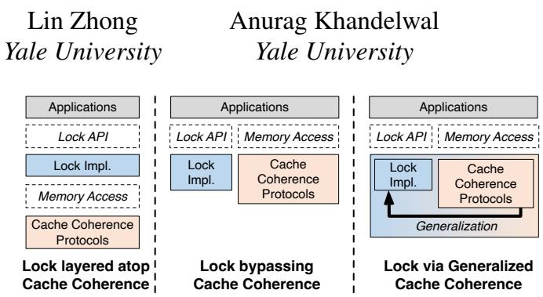  
Fig. 1: Different approaches for realizing synchronization. Layered approaches (left) incur redundant coherence transactions while standalone approaches (middle) preclude key optimizations, both significantly degrading application performance over disaggregated memory’s slower inter-compute and compute-memory interconnects. Our approach (right) generalizes cache coherence for efficient locks.

Unfortunately, despite improvements in network speeds, the higher latency of inter-compute and compute-memory links in rack-scale disaggregation renders cache-coherent substrates inadequate for the efficient implementation of lock algorithms, thereby limiting application performance at scale. While inter-core communication in multi-core and NUMA architectures exhibits latencies of 20–100 ns, page-based disaggregated memory exhibits latencies of 5–10 µs [16–18]. We find that even the most performant lock algorithms layered over state-of-the-art disaggregated memory coherence substrates [16, 43] lead to poor application performance scaling, degrading performance for real-world synchronization-heavy workloads by as much as 1000×, due to redundant inter-cache coherence messages over higher-latency Ethernet links (§2.2).

To avoid such coherence overheads, prior distributed shared memory (DSM) [17, 20, 44–47] developed lock services that bypass the cache coherence substrates altogether (Fig. 1 (mid dle)). Unfortunately, porting such lock services to state-ofthe-art disaggregated shared memory systems [16–18, 20, 21] still incurs intractable performance overheads. On the one hand, software-based lock services remain orders of magnitude slower than shared-memory accesses accelerated via programmable networks [16, 18]. On the other hand, implementations of such lock services that leverage programmable networks suffer from stringent processing and storage constraints [48, 49], precluding the adoption of many optimizations employed by prior DSM lock services (§3.3).

Toward scalable and performant locks for disaggregated shared memory, we pursue a third approach as shown in Fig. 1 (right), based on the insight that lock-based synchronization is essentially a generalization of cache coherence in time and space. Specifically:

Temporal generalization. Cache-coherence protocols guarantee the single-writer-multi-reader (SWMR) invariant [50], i.e., either a single exclusive writer or multiple concurrent readers can access a cache line (a 4KB page in page-based disaggregated memory) for a single instruction. Lock-based synchronization extends this property for an arbitrary number of instructions: the critical section.

Spatial generalization. Cache-coherence protocols ensure the SWMR invariant at a cache line granularity (i.e., a 4KB page), while reader-writer locks require this property for shared states of arbitrary sizes.

Therefore, extending existing coherence protocols to support these generalizations would provide the necessary semantics to enable lock primitives directly, eliminating the redundant communication seen in a layered design. Moreover, generalizing cache coherence protocols not only allows the lock realization to inherit decades of optimization from today’s cache coherence protocols but also creates new opportunities to further improve lock scalability. These include directly moving the data associated with a lock during its acquisition and exploiting locality by caching both the lock and the associated data until they are explicitly invalidated.

We incorporate the above insights into GCP (§3), a novel class of Generalized cache-Coherence Protocols for lockbased synchronization. GCP minimally extends directorybased cache-coherence protocols using two key approaches:

Wait queues for temporal generalization (§3.1). Cache coherence guarantees that a cache line requested by a node will be held in the requestor’s cache for a single instruction — subsequent requests from other nodes may immediately invalidate or downgrade the cache line permission on the original requestor. To allow a requestor to hold the cache line for more than one instruction, GCP prevents other requestors from invalidating or downgrading the cache line until the original requestor explicitly releases it, by suspending their cache coherence transactions in a wait queue.

Variable-size cache lines for spatial generalization (§3.2). While coherence protocols typically track fixed-sized cache lines, our spatial generalization lets each cache line track a list of arbitrarily sized memory regions (dubbed ‘the shared memory list’). All shared regions tracked by a single cache line are atomically moved or invalidated from the target cache. This allows requestors to achieve SWMR semantics for arbitrarysized shared regions during their critical sections.

These generalizations allow transforming some cache lines in the cache-coherence protocol into locks for synchronizing shared state in GCP; the remaining ‘regular’ cache lines still operate at a fixed size and single-instruction granularity. Moreover, since all our modifications are limited to the cache coherence protocol, GCP imposes no restrictions on the memory consistency model. We have verified GCP’s correctness for a broad range of directory-based cache coherence protocols via model checking (§3.4).

We present Soul as a high-performance, end-to-end system implementation of GCP atop a state-of-the-art, Ethernetbased, disaggregated shared-memory platform [16], with minimal metadata overhead. Soul supports standard lock APIs via a user-space library, providing complete application transparency without requiring programmers to interact with lowlevel GCP interfaces. Soul also provides a lock manager to track the allocation of GCP cache resources and to handle application and system failures. Our evaluation (§5) shows that Soul enables scalable, high-performance synchronization across disaggregated memory. Compared to state-of-the-art lock algorithms, Soul improves real-world application performance at scale by 1–2 orders of magnitude without application modifications.

We also conduct a case study to validate GCP’s generalizability to emerging CXL 3.0-based disaggregated shared memory systems [21] via a gem5 [51] simulation of Soul (dubbed SoulCXL; §6). While we demonstrate that the benefits of GCP also extend to hardware-based cache-coherence protocols, we leave a full adaptation to future work.

## 2 Background & Motivation

## 2.1 Page-based Disaggregated Shared Memory

As compute and memory resource scaling within a single server has started to stagnate, several recent efforts have argued for rack-scale memory disaggregation [13–18, 20, 52– 56], where physical servers are disaggregated into compute and memory blades connected via a single network switch. To ensure application performance, these approaches adopt a partial disaggregation model, in which most of the memory is disaggregated, while compute blades retain a small amount of local DRAM as cache. In particular, these approaches leverage the OS’s swap subsystem on the compute blade to cache memory from Ethernet-attached memory blades (e.g., using RDMA) at page granularity in its local cache.

Increasingly, a large subset of these approaches [16–21,57] have argued for a cache-coherent shared-memory abstraction over disaggregated memory to enable applications to transparently scale across compute blades. This effectively permits application threads to be placed across arbitrary compute blades and still access disaggregated memory via a unified, consistent memory view — akin to transparent Distributed Shared Memory (DSM) approaches [44–46].

While different systems vary slightly in how they implement disaggregated shared memory, they share a common core set of design elements. We illustrate these elements using MIND [16], an open-source, state-of-the-art disaggregated shared-memory system, on which our approach is implemented.

MIND comprises compute and memory blades connected via a programmable network switch. It keeps DRAM caches on compute blades coherent for transparent memory sharing.

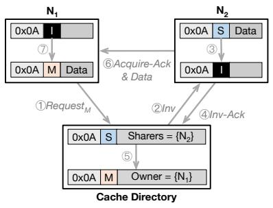  
(a) Directory-based MSI Protocol

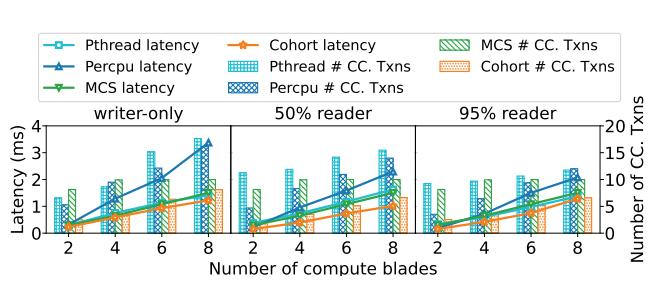  
(b) Overheads of layering design

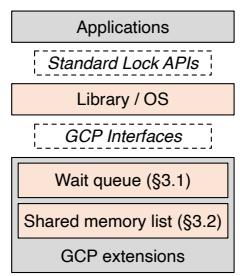  
(c) Overview of our design  
Fig. 2: Background & motivation (§2) (a) Coherence example with a single cache line at address 0x0A, a cache directory, and two compute blades (§2.2). (b) Lock acquisition latency and # of coherence transactions for locks layered atop coherence on disaggregated memory for different reader-to-writer ratios (§2.2). (c) GCP generalizes existing coherence protocols to realize locks (§2.2).

Cache coherence. Similar to traditional DSM [44–47] and other disaggregated shared memory systems [17, 18, 20, 21], MIND uses directory-based cache-coherence due to its scalability. These protocols employ a cache directory to track the state of fixed-size memory units — typically referred to as cache lines and realized as 4KB pages in MIND — across the distributed caches. MIND places the directory on the programmable network switch because of its central location. The per-page state includes the list of compute blades currently holding the page (sharer list) and the permissions under which they hold it. When a compute blade attempts to access a page not present in its cache, the page fault handler first contacts the directory to check its current state, then notifies other compute blades on the sharer list of its intent to access the page, and ultimately coordinates subsequent data movement.

Specifically, MIND employs the directory-based MSI protocol, where each page can be in one of the three permissions: Modified (M), indicating a single compute blade has exclusive read and write permissions for the page, Shared (S), where multiple compute blades have shared read permission to the page, and, Invalid (I), i.e., the page is not present in any com pute blade cache. Fig. 2(a) shows an example with a single page at address 0x0A, a cache directory, and two compute blades N and N . The page is initially cached at N with S permission. N<sub>1</sub> then requests it with M permission from the directory ( 1 ). The directory looks up the sharer list for the page and contacts N<sub>2</sub>, its current holder, to invalidate it since N needs exclusive access to it ( 2 ). Once invalidated ( 3 ), N<sub>2</sub> informs the directory ( 4 ), which then updates the page’s permissions to M, records N<sub>1</sub> as the owner ( 5 ), and acknowledges N<sub>1</sub> with the page data ( 6 ). N<sub>1</sub> then accesses the page ( 7 ). While this example demonstrates the S→M transition in cache permission, other transitions are similar. We refer to these transitions as cache-coherence transactions. Minimizing the number of coherence transactions in synchronization primitives is essential for scaling the performance of parallel applications on disaggregated memory, since each transaction incurs multiple Ethernet round trips (§2.2).

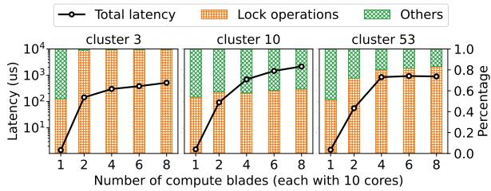  
Fig. 3: End-to-end request latency (left y-axis, log-scale) and %-age of time spent in synchronization (right y-axis) for the stateof-the-art Cohort lock [27] on Twitter KV store workloads [58] atop MIND [16], a disaggregated shared memory system.

## 2.2 Enabling Scalable Synchronization in Disaggregated Shared Memory Systems

Despite improvements in scalable cache coherence for disaggregated shared memory, lock-based synchronization remains a critical performance bottleneck in such systems.

Lock algorithms atop cache coherence. Scalable lock algorithms are typically built atop hardware coherence substrates in multi-core and NUMA architectures to permit either a single exclusive writer or multiple concurrent readers to access a critical section. Most scalable lock designs minimize the number of coherence transactions required for lock acquisition. For instance, queue-based lock algorithms [25, 26, 59] let each requestor thread spin on a core-private cache line, reader-writer locks partition reader-indicators [32] to avoid coherence transactions for concurrent readers, while memoryhierarchy-aware locks [27–31] exploit memory locality to avoid coherence transactions across NUMA nodes.

Unfortunately, even with optimized designs, lock algorithms layered atop cache coherence tend to severely limit application performance at scale in disaggregated shared memory systems. Fig. 3 shows the total request handling latency and the percentage spent in lock operations for three Twitter key-value (KV) store workloads [58] using cohort locks [27], a state-of-the-art high-performance lock, atop MIND [16] (setup in §5). While request handling consumes under 10µs on average on a single compute blade, it can increase to over 1ms at 8 blades, with most of the time spent in lock operations! This is because each lock operation must trigger multiple expensive cache coherence transactions over Ethernet.

These coherence overheads are not limited to Cohort locks; they apply to all state-of-the-art locks built atop cachecoherence substrates. Fig. 2(b) shows that representative locking algorithms trigger many coherence transactions with multiple blades for workloads with varying degrees of readwrite contentions, translating into milliseconds of lock ac quisition and data access latency. Similar overheads have been demonstrated in prior studies [60–63] for multi-core architectures, even with much shorter inter-cache latency.

Locks bypassing cache coherence. To circumvent the inefficiencies of layering locks atop cache-coherence substrates, DSM systems [17, 20, 45–47] employ standalone softwarebased lock services that bypass the cache-coherence layer altogether, e.g., via lock managers that serve lock requests using a client/server model [45], or distributed lock protocols that bypass shared memory [46, 47]. However, with recent disaggregated shared-memory systems [16,18] that use programmable network hardware to accelerate cache coherence, software-based lock services incur latency that is orders of magnitude higher than cache-coherent memory accesses, making them an inadequate choice for synchronization.

Although programmable network-accelerated lock services [48, 49] can potentially deliver latency comparable to network-accelerated cache-coherent memory accesses, they require additional resources in an already resourceconstrained programmable network switch. In fact, even if all of the programmable switch resources were allocated solely to the lock service, it would still fail to support critical performance optimizations that require complex coherence logic to be realized within the lock service [48, 49, 64] (§3.3).

Our approach. Fundamentally, cache coherence and lockbased synchronization strive for the same goal: single-writer, multi-reader (SWMR) invariant [50] over some shared state, i.e., at any point, either a single entity that intends to modify the shared state has exclusive access, or multiple entities that intend to read the state have shared access. However, while cache-coherence protocols enforce it at a single-instruction granularity (in time) and a fixed cache-line granularity (in space), lock algorithms strive for an SWMR invariant at arbitrary instruction counts (in a critical section) and data-size granularities. In other words, lock-based synchronization is a generalization of cache coherence in time and space.

Our approach builds on this observation and argues for minimal extensions to cache-coherent substrates to realize generalized coherence protocols (GCP) that can natively support lock primitives (Fig. 2(c)). Our extensions — a wait queue for temporal generalization (§3.1) and a shared memory list for spatial generalization (§3.2) — permit all lock operations to be realized using a single coherence transaction, avoiding overheads of layered designs. Moreover, unlike approaches that bypass coherence, GCP enables new optimizations that leverage the interplay between synchronization and coherence, while still allowing synchronization to benefit transparently from coherence protocol optimizations (§3.3). Finally, minimal extensions to coherence protocols permit easier verification (§3.4) and adoption in emerging coherent interconnects [43] (§6).

## 3 GCP Design

We provide an architecture-agnostic description of GCP design (§3.1 and §3.2). We then present GCP optimizations enabled by generalizing cache coherence protocols (§3.3) and conclude with a verification of GCP’s correctness (§3.4).

## 3.1 Wait Queue for Temporal Generalization

As we saw in §2.2, a directory-based cache-coherence protocol ensures the SWMR invariant at a single instruction granularity by tracking the permission of the requested cache line (e.g., M, S, or I in the MSI coherence protocol<sup>1</sup>). If an instruction’s execution on one blade requests a cache line with a specific permission, the protocol triggers a transaction that immediately makes the cache line available to that instruction with that permission. To enable the temporal generalization of the protocol, where a blade can hold the cache line with its requested permission for an arbitrary number of instructions, GCP defers cache requests with conflicting permissions by enqueuing them in a wait queue and dequeuing a request only when the previous blades release the cache line.

Added cache interfaces. We add three new cache request types to interact with the wait queue (Table 1): GCP\_acquire to request the cache line with the provided permission and mark the beginning of the critical section, GCP\_is\_acquired to check whether the line has been acquired with the provided permission, and GCP\_release to release the cache line and mark the end of the critical section. To avoid blocking while a blade waits for a lock, the GCP\_acquire request is asynchronous, i.e., the initiating blade does not block while it waits for completion. Once the corresponding transaction completes, the cache line’s permission is updated to indicate that it has been acquired, and the blade can check this status via GCP\_is\_acquired. As we show in §4.3, this allows context switching to another thread while waiting for a GCP lock.

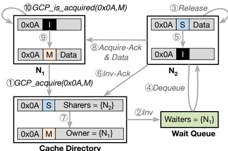  
Fig. 4: Temporal generalization with wait queues (§3.1).

```c
Shared memory list interfaces
int GCP_create(size_t len, addr_t *addrs, size_t *sizes);
int GCP_destroy(size_t len, addr_t *addrs, size_t *sizes);
Wait queue interfaces
int GCP_acquire(addr_t addr, int perm);
int GCP_is_acquired(addr_t addr, int perm);
int GCP_release(addr_t addr);
```  
Table 1: GCP interfaces (§3.1, §3.2).

Handling evictions. Evictions of cache lines to memory used as locks require careful consideration since they can inadvertently terminate the current lock ownership. A naïve solution could pin such cache lines to prevent them from being evicted, but this can result in starvation or deadlocks. For instance, if a thread holding a lock is switched out by the scheduler, its cache lines used as locks would block space in the cache, starving the currently running thread of cache resources. Moreover, if a blade’s entire cache is used as locked cache lines, no more regular or lock-based cache lines can be brought into cache, resulting in a deadlock!

To this end, GCP enables eviction of lock-based cache lines by adding a set of new transient states to the directory entry that can mark a cache line as both evicted and locked after it is cleared from local cache. This allows a thread to retain its lock ownership even when it is switched out, or a cache line is evicted. Any new request for such a cache line from another thread is granted if the requested and currently held permissions for the cache line are compatible (e.g., both are S in an MSI protocol); otherwise, it is directed to the wait queue.

Example. Fig. 4 demonstrates how a wait queue can enable temporal generalization for the same example in Fig. 2(a). The target cache line is initially cached at N with S permission. N<sub>1</sub> then issues an GCP\_acquire request for the same cache line with M permission to the cache directory ( 1 ). The directory looks up the current cache line permission (S) and sharer list ({N<sub>1</sub>}), realizing that the request requires N<sub>2</sub> to relinquish the cache line via invalidation. In contrast to standard MSI protocol execution, the directory defers the invalidation and instead enqueues N<sub>1</sub>’s request in a wait queue associated with the cache line ( 2 ). Only when N finishes its critical section and voluntarily releases the cache line via GCP\_release ( 3 ) is the request dequeued ( 4 ) and the invalidation performed at N ( 5 ). The remainder of the cache-coherence transaction proceeds as per the standard MSI protocol — N informs the directory ( 6 ), which updates the cache line’s permission to M and marks N<sub>1</sub> as the only sharer ( 7 ), and sends N<sub>1</sub> an acknowledgment along with the cache line data ( 8 ). N<sub>1</sub> then transits to M, which is detected via GCP\_is\_acquired ( 10 ).

As with cache coherence, other permission transitions are similar or simpler. M→M and M→S transfers require similar deferred invalidations, enqueuing the transfer requests in the wait queue until the blade holding the cache line with M permission explicitly releases the cache line. S→S transfers do not require enqueuing the request since multiple readers can hold the cache line simultaneously under the SWMR invariant. I→S and I→M transfers also do not require enqueueing requests since no blade has the cache line to begin with.

The wait queue’s location does not affect correctness but does affect performance; we discuss how our implementation navigates performance tradeoffs for queue placement in §4.1.

## 3.2 Shared Memory List for Spatial Generalization

Unlike coherence protocols that track permissions for a fixedsize cache line, locks must preserve the SWMR invariant across arbitrary amounts of shared state. The shared state may be fragmented and even empty. This requires extending cache-coherence protocols to track multiple shared memory locations of arbitrary size. Specifically, instead of a single address with a fixed size, each address tag in GCP is logically a list of (m<sub>i</sub>, s<sub>i</sub>) pairs, where m<sub>i</sub> and s<sub>i</sub> are the base address and size in bytes of a shared memory region, respectively. Note that the shared memory list is a cache-movement optimization rather than a lock enforcement mechanism: the wait queue (§3.1) alone enforces the lock semantics, and the shared memory list merely bundles the shared state into a single coherence domain — without it, the lock remains correct, but accesses to shared state incur additional coherence transactions.

Added cache interfaces. We add two new cache interfaces (Table 1) for creating and destroying shared memory lists. GCP\_create associates a list of address ranges with a shared memory list (to be tracked via GCP), while GCP\_destroy destroys the shared memory list, marking the associated address ranges as regular cache lines (tracked via regular coherence transactions). To ensure consistency in the shared memory list’s creation and destruction, both interfaces are broadcast to all blades and the cache directory, regardless of which blade triggers them, and they force a cache flush for all involved lines at all blades. In addition, GCP requires that all shared memory lists contain non-overlapping memory regions; i.e., GCP\_create returns an error if any of the involved regions are already associated with another shared memory list.

Example. Fig. 5 shows our spatial generalization for the same example as Fig. 4. N<sub>2</sub> initializes the shared memory list by issuing GCP\_create over three 64B cache lines at 0x00, 0x40 and 0xA0, which are merged into a list of two shared memory regions (0x00,128) and (0xA0,64) with their cache permissions reset to I. Coherence transactions over the shared memory list are identical to Fig. 4, except the invalidation step 5 now requires N<sub>2</sub> to remove two memory regions of different sizes from its cache, and in step 8 , the directory sends N the data for both regions with the acknowledgment. We discuss its implementation in §4.2.

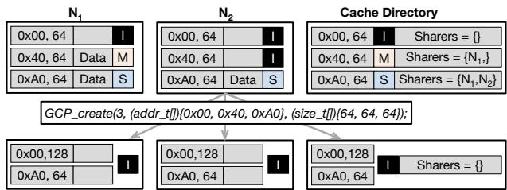  
Fig. 5: Spatial generalization with shared memory lists (§3.2).

## 3.3 Cache-coherence Optimizations

Since GCP realizes synchronization by generalizing cache coherence, it automatically inherits optimizations from traditional cache-coherence protocols, which are intractable with stand-alone lock services due to resource constraints (§2.2). We show in §5.3 that each optimization can improve lock acquisition performance by over an order of magnitude.

Acquiring data along with lock. GCP can acquire the lock and the associated data in a single cache coherence transaction, reducing delay and coherence traffic when placing the corresponding data in the requestor’s cache. In contrast, even with prefetching, such coupling is impossible with traditional lock algorithms, since they can fetch the shared state only after the lock is acquired, delaying the requestor by at least one coherence transaction.

Exploiting temporal locality for locks. In traditional coherence protocols, once a cache line is placed in a requestor’s cache, it remains there until it is invalidated to exploit the temporal locality of data accesses. In extending such protocols, GCP inherits the same optimization: both the lock and the associated data remain in the requestor’s cache until another request invalidates them.

## 3.4 Correctness

Theorem 1. GCP locks are correct, i.e., GCP satisfies mutual exclusion and deadlock-freedom.

Intuitively, the mutual exclusion property for reader-writer locks implies that no two writers, or a reader and a writer, can enter the critical section concurrently — which is equivalent to the temporally generalized SWMR invariant of cache coherence. Due to the complexity of the underlying cache coherence protocols, we validate GCP’s correctness (mutual exclusion and deadlock-freedom) via model checking. We used ProtoGen [65], a state-of-the-art cache coherence protocol synthesis tool, to generate specifications for four representative directory-based protocols: MSI [66], MESI [67], MOSI [68], and MOESI [69], and to integrate GCP into these specifications. We then used the Murphi [70] model checker to verify deadlock freedom and mutual exclusion in all reachable states. Like many prior works on cache coherence validation [19, 65, 71–73], our model checker is limited to a single address, two data values, three blades with private caches, and a directory to validate protocol correctness, thereby avoiding a state-space explosion. Our microbenchmarks (§5) on up to 8 blades with 80 cores over many addresses also serve as correctness “stress” tests for GCP implementations. While we guarantee correctness at the protocol level, it is still the programmer’s responsibility to avoid application-level deadlocks, as we detailed in §4.3.

Finally, we note that GCP locks are also starvation-free (fair) if the wait queue policy is starvation-free (e.g., FIFO). Intuitively, starvation-freedom requires that any lock requests will eventually succeed. GCP can only block lock requests in the wait queue: the remainder of the cache coherence transaction execution is non-blocking by design. As such, if the wait queue is starvation-free, any queued lock requests will eventually be processed, i.e., GCP locks are starvationfree.

## 4 Soul: An Implementation of GCP

We present Soul, a high-performance end-to-end system realization of GCP atop MIND, a state-of-the-art page-based, disaggregated shared-memory platform (Fig. 6). Soul realizes GCP atop MIND’s inter-blade DRAM cache coherence to facilitate inter-blade synchronization. Soul does not affect MIND’s regular pages<sup>2</sup> (i.e., those not used as locks), and retains MIND’s x86-TSO memory consistency model since all modifications are restricted to cache coherence. Soul makes minimal extensions to MIND’s programmable cache coherence substrate to implement GCP’s wait queue (§4.1) and shared memory lists (§4.2). To ensure application transparency, Soul provides a user-space lock library as a shim atop its GCP implementation, exposing standard lock APIs (§4.3). Finally, Soul’s lock manager allocates GCP cache resources to ensure cache integrity and handle failures (§4.4).

## 4.1 Implementing the Wait Queue

A natural way to implement the wait queue in Soul is to reuse the coherence protocol’s message buffers, blocking cache requests at MIND’s in-kernel cache controllers or in-network directory. However, this adds significant network delays to lock acquisition due to Ethernet’s high latency. When the lock owner releases the lock, additional network trips are needed to dequeue the next request if it is stored in the directory. Instead, placing the queue with the page’s current owner (compute blade) avoids these delays and bypasses the limited compute and storage resources of switches [16, 18, 48, 64, 74]. The directory only tracks which compute blade holds the queue (the queue holder) so it can forward access requests accordingly.

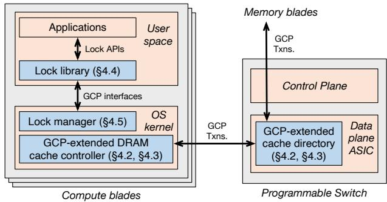  
Fig. 6: Soul is a full-system realization of GCP atop MIND (§4).

However, if multiple compute blades (readers) hold the page, the wait queue must be replicated across all readers so they can locally dequeue the next request, requiring a mechanism to ensure consistency across queue replicas. The problem is further exacerbated when the page ownership changes over time. We address this with a novel queue transfer protocol between compute blades, which guarantees (i) no network delay in processing the next request in the queue and (ii) consistent access to the queue itself.

Queue holders: A queue holder enqueues any requests for a page until it is voluntarily released. The directory tracks the queue holder and forwards access requests to it. Soul ensures that there is only one queue holder per page at any time, avoiding consistency issues associated with replication. To achieve this, we leverage GCP’s SWMR invariant: since only a single writer (i.e., a thread requesting the page with M permission) can hold a page at a given time, only one blade (the one hosting the writer) needs to track the queue at that time. While multiple readers (i.e., threads requesting the page with S permission) can hold a page concurrently, placing the page at additional readers does not require enqueuing requests (§3.1), i.e., no queue is required for a page that is only requested by readers. However, if a writer subsequently requests a page that is initially held by multiple readers, a queue is created on the compute blade hosting the writer.

Fig. 7 shows three possible cases for a page’s wait queue: Case (i): The wait queue does not exist when no writers are requesting the page (i.e., for a page with I or S permission that has no waiting writers).

Case (ii): The wait queue is at the current writer (i.e., for a page with M permission)

Case (iii): The wait queue is at the next writer when the page is held by one or more readers (i.e., for a page with S permission with a waiting writer).

Queue transfers: When a writer attempts to acquire a page ( 1 in Fig. 4), either the wait queue has already transferred to it (described next) or it must create an empty one (transition to Case (ii)). When a writer releases the page ( 3 in Fig. 4), the writer drops the queue if there is no waiting requestor (transition to Case (i)). Otherwise, the writer processes the next queue entry and transfers the queue to the next writer. Specifically, if the next requestor is a writer, the queue is transferred to it (transition to Case (ii)). If the next requestor is instead a reader (readers) and a writer is waiting behind it (them), the queue is transferred directly to the writer (transition to Case (iii)). If there are no writers behind the reader(s), the queue is dropped (transition to Case (i)).

Since readers never hold the queue, the dequeue operation happens only in Case (ii), when the current writer is the queue holder. This property ensures no network delays are incurred when dequeuing and processing the next requestor.

Consistency during queue transfers: If the cache directory forwards an access request to a queue holder transferring its queue to another compute blade, should this request be processed by the original queue holder or the next one? To resolve such ambiguities, Soul employs a versioning mechanism to ensure the queue transfer occurs atomically. The directory maintains a version number for each page, tracking the number of access requests it has forwarded to the queue holder. The queue holder maintains its own version number to track the number of access requests it has received from the directory. The switch approves a queue transfer only if the queue holder’s version number matches the one in the directory. This ensures that all access requests forwarded by the directory must have been processed at the queue holder before the holder initiates the transfer. If the switch denies a transfer, the queue holder retries after receiving the notification from the switch. On a successful transfer, the version numbers at the switch and queue holder are reset to zero.

Storage overheads: Since the wait queue size is bounded by the number of compute blades (n) in the system, we implement it as a fixed-length array of size n. Each logn-bit entry contains the requestor’s ID and the request type, adding n · logn bits for the entire queue. Each directory entry consumes 2 · logn bits to track the queue holder and version number. Since each page is 4KB and each directory entry’s size is 76 bits in MIND, Soul’s metadata storage overhead for an 8-blade setup is < 0.2% at the compute blade kernel and < 8% at the switch ASIC.

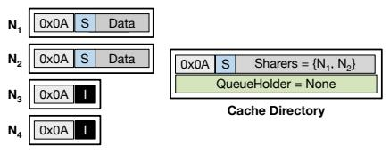  
Case (i): wait queue does not exist

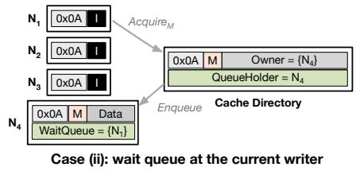

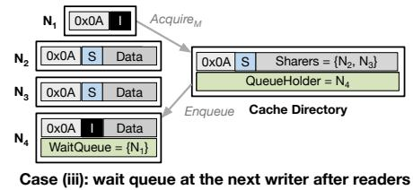  
Fig. 7: Wait queue holders under different cases in Soul (§4.1). Case (i): the wait queue does not exist without writers; Case (ii): the wait queue is at the current writer; Case (iii): the wait queue is at the next writer after the current readers.

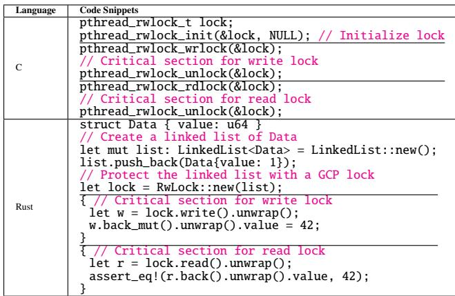  
Table 2: Supported standard lock APIs in C and Rust (§4.3).

## 4.2 Implementing the Shared Memory List

To overcome the limited memory and processing constraints of programmable switches, we decouple the shared memory list from the directory entries and maintain them on the compute blades, i.e., as metadata associated with a page in the in-kernel cache controller, incurring no storage overhead on the programmable switch ASIC. The compute blades and the switch identify a shared memory list using its lowest address. Our implementation adds 9 bytes to the metadata associated with each page in MIND: 1 byte to track the region length and 8 bytes for the pointer to the next shared memory list entry. As each shared region is at least 4KB, this incurs ≤ 0.3% storage overhead in the compute blade kernel. Consistent with how MIND tracks regular pages, the shared memory lists are tracked as virtual addresses since address translation in MIND occurs after coherence resolution [16].

## 4.3 Soul Lock Library

While Soul provides a high-performance implementation of GCP, ensuring application transparency requires that Soul be usable via standard lock APIs; otherwise, applications would need extensive modifications to exploit GCP’s benefits. As such, Soul provides a lock library that serves as a shim atop its GCP implementation (Fig. 6) and exposes standard lock APIs. We find that bridging the gap between GCP interfaces and the standard lock APIs introduces new implementation challenges. We next describe the standard lock APIs that Soul supports, followed by the challenges and solutions for implementing these APIs in Soul’s lock library using GCP interfaces.

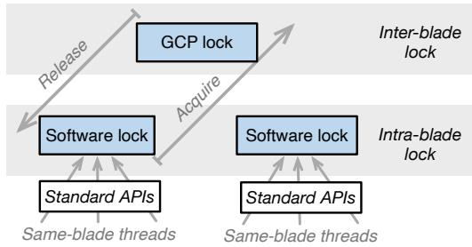  
Fig. 8: Soul lock library’s hierarchical design (§4.3).

Supported lock APIs. Soul lock library supports two standard lock APIs: the POSIX lock (i.e., pthread\_rw\_lock) APIs in C and std::sync::RwLock APIs in Rust (Table 2). To use Soul, applications simply link against our lock library rather than the standard libraries (e.g., libpthread). The major difference between the two APIs is that while pthread\_rw\_lock provides only locking functional ity, std::sync::RwLock additionally requires programmers to explicitly specify the lock-protected shared object (e.g., list in Table 2) on lock creation for memory safety. Interestingly, this information enables our lock library to transparently implement GCP’s combined data optimization (§3.3), that is, the shared object can be prefetched with lock acquisition. Our current lock library does not transparently handle shared objects whose memory footprint changes mid-critical-section (e.g., a Rust write-lock holder calling clear() on a lock-protected list, or appending new entries to it); in such cases, the lock holder must destroy the existing shared memory list and create a new one reflecting the updated footprint via GCP\_destroy followed by GCP\_create (Table 1). This preserves correctness but is not the most efficient approach: each refresh incurs the broadcast and cache-flush overhead of those interfaces — a current limitation in Soul. A future extension could allow a writer lock holder to modify the shared memory list in place, eliminating this overhead.

Unfortunately, realizing these APIs is not as straightforward as wrapping the corresponding GCP interfaces in Table 1 (e.g., GCP\_acquire with pthread\_rwlock\_wrlock). This is because GCP only exposes synchronization interfaces between caches rather than software threads — it is still challenging to distinguish two threads running on the same compute blade, sharing the same cache, as separate lock requestors or holders. Next, we detail how our lock library bridges this gap via hierarchical locking.

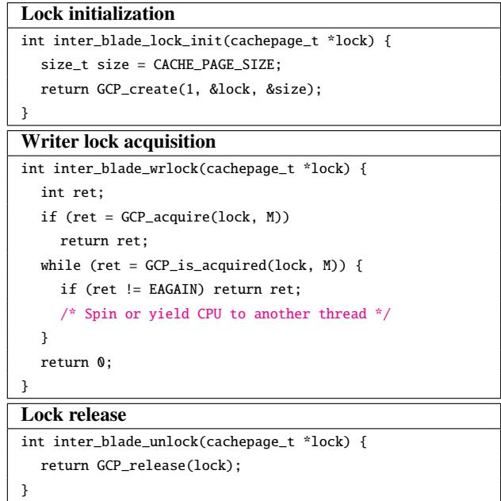  
Table 3: Simplified inter-blade lock implementation for the pthread\_rwlock API using GCP interfaces (§4.3).

Supporting thread-level APIs via hierarchical locking. Soul lock library distinguishes threads running on the same compute blades as separate requestors via hierarchical locking. This is akin to lock-cohorting [27], a technique originally used to improve lock acquisition throughput and latency in NUMA machines by prioritizing the lock handover to “nearby” threads (e.g., threads on the same NUMA node) over farther ones (e.g., those on different NUMA nodes). As shown in Fig. 8, a Soul lock acquisition comprises two steps: it first acquires an intra-blade lock—implemented as a traditional software-based lock—to enforce SWMR among threads on the same blade, and then acquires an inter-blade lock using GCP to enforce SWMR globally. Thus, threads running on the same blade can be identified as different lock requestors or holders since their synchronization is resolved using softwarebased intra-blade locks. Similar to prior work [31], we bound the number of local lock reuses per global lock acquisition (to 64) to ensure starvation-freedom.

Building inter-blade locks using GCP interfaces. Table 3 shows the simplified inter-blade lock operation for pthread\_rwlock. On initialization, the page containing the lock variable lock is registered as a GCP page via GCP\_create. On reader or writer lock acquisition (Table 3 only shows writer lock operation for brevity), we first call GCP\_acquire with corresponding permissions (i.e., Modified (M) for write-lock, Shared (S) for read-lock), then check for completion of the acquire request via GCP\_is\_acquired — either by spinning on the return value or going to sleep until the return value becomes true. The latter allows the scheduler to context-switch to another thread while the current thread is blocked, and is the default behavior in our implementation. Releasing the lock only requires calling GCP\_release. We omit the implementation of Rust’s std::sync::RwLock for brevity, but note that it only differs from pthread\_rwlock in initialization, where all addresses corresponding to the lock-protected shared object (i.e., the shared memory list) are passed to GCP\_create instead of a single page.

Handling deadlocks. Similar to traditional locks, handling deadlocks is delegated to the application rather than the lock library. For example, an application can enforce certain lock ordering to avoid deadlocks with nested locks. Soul’s lock library introduces no new deadlock handling scenarios compared to traditional locks.

## 4.4 Soul In-kernel Lock Manager

Soul’s in-kernel lock manager sits between the lock library and the GCP’s DRAM cache controller, also implemented in the kernel in MIND [16] (Fig. 6). It manages allocations of GCP pages and associated metadata (i.e., wait queues, shared memory lists, etc.) in GCP’s cache controller via Soul’s lock library for two purposes. First, it preserves the integrity and protects the GCP state by rejecting invalid or conflicting requests from Soul’s lock library. For instance, it prevents the allocation of two GCP pages that share overlapping memory lists, which can result in locks doomed to deadlock. As another example, it prevents the allocated GCP pages from exceeding a fraction of the system’s local DRAM cache size (defaulting to 6% in our implementation) to ensure the system retains effective data caching. If this bound is exceeded, Soul’s inter-blade locking protocol falls back to a traditional software-based locking algorithm on top of cache coherence (pthread\_rw\_lock in our implementation).

Second, the lock manager recovers allocated GCP pages (and their associated metadata) upon failure. Soul inherits MIND’s failure model, which considers two types of failures: (i) application failures, where individual processes may crash or terminate unexpectedly, and all resources allocated by the failed process must be reclaimed; and (ii) system failures, which include failures of compute blades, memory blades, or the network switch. MIND replicates the switch state to facilitate recovery on failure, allowing running processes to resume. However, compute and memory blade failures are not recoverable, analogous to how traditional OSes handle CPU and memory failures. We next describe the additional work performed by Soul’s lock manager to recover from application and system failures.

Handling application failures. If a process terminates unexpectedly, the lock manager deallocates all of its allocated GCP pages. This is similar to how Linux resolves unreleased futexes with the robust futex list [75].

Handling system failures. Since the lock manager tracks GCP metadata at the compute blades (i.e., the wait queue and shared memory lists), the only in-switch metadata required for recovery is the wait queue’s current holder and version number (§4.1). Our implementation piggybacks on MIND’s switch-replication mechanism to recover the GCP directory state upon switch failure.

Packet loss and reordering. Our implementation does not need to cater to failures stemming from coherence messages being dropped or reordered by the network since MIND operates on a standard RoCE deployment over lossless fabric (e.g., via Ethernet PFC [76]), and a reliable, in-order transport (e.g., via RDMA RC [77]).

## 5 Evaluation

We evaluate Soul to answer the following research questions:

• Compared to state-of-the-art locks, does Soul improve performance for real-world workloads (§5.1)?

• Compared to layered approaches, to what extent does GCP remove redundant coherence messages? (§5.2)

• What are the contributions of GCP’s optimizations (§5.3)?

Evaluation setup. We use a cluster with five servers connected via a programmable switch to deploy Soul atop MIND [16]. The switch has a 32-port 6.4 Tbps Tofino programmable switch ASIC. One of the servers is equipped with two 18-core Intel Xeon processors, 384GB of memory, and four Mellanox CX-5 100Gbps NICs, and hosts a single memory-blade VM. The remaining four servers are equipped with two 12-core Intel Xeon processors and two Mellanox CX-5 100Gbps NICs per server, and host two compute blade VMs per server (one per socket), each with 512 MB of DRAM and 10 cores (with the remaining 2 cores dedicated to the OS).

Compared systems. We compare Soul against the two classes of approaches discussed in §2. The first includes several lock algorithms layered atop cache coherence: (i) MCS [25], a rep resentative of the queue-based mutex; (ii) Pthread [78], the POSIX reader-writer lock with centralized reader-indicators; (iii) Percpu [32], a reader-writer lock with decentralized (i.e., per-core) reader-indicators; (iv) Cohort [34], a memory hierarchy-aware reader-writer lock.

The second includes standalone locks that bypass coherence. Due to compatibility issues, we were unable to deploy FissLock [49], a state-of-the-art hardware-accelerated rackscale lock service, on our programmable switch. As such, we reimplemented its logic on our setup, enhancing it with the same lock cohorting technique used in Soul (dubbed Lock Service). Consistent with its original design, Lock Service does not support combined data and locality optimizations due to switch resource constraints.

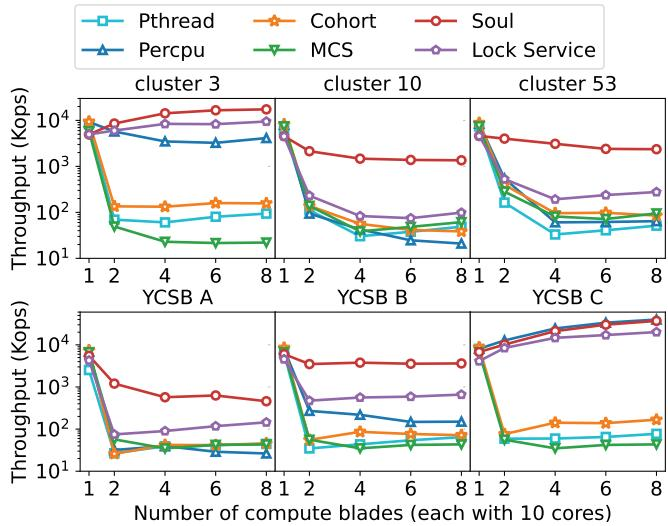  
Fig. 9: Soul throughput scaling for MIND-KVS w/ Twitter cluster 3, 10, 53, and YCSB A, B, C (§5.1). Y-axis is in log scale.

Real-world workloads. We use two applications: MIND-KVS, the Rust porting of MIND’s native in-memory KV store [16] with fine-grained locks, and Kyoto Cabinet [79] with coarse-grained locks. Both use 10 concurrent worker threads per compute blade. Both run on Soul without modifications (§4.3).

MIND-KVS uses a hash table, with a reader-writer lock protecting each hash bucket. We port it to align the hash buckets to 4KB page boundaries, and combine the data in each hash bucket with the lock using Soul’s Rust API (§4.3). We evaluate it with both real-world and synthetic workloads. For real-world workloads, we use Twitter’s key-value store workloads [58]. We select traces for cluster 3, cluster 10, and cluster 53 for our evaluations as representatives for different proportions of read and write (i.e., GET: SET/ADD/PREPEND) operations (99% : 1%, 50% : 50%, and 89% : 11%, respectively). For synthetic workloads, we use YCSB workloads A, B, and C [80], corresponding to 50%:50%, 95%:5%, and 100%:0% read-write ratios, respectively.

We run Kyoto Cabinet, a widely used benchmark database system [29, 31, 81, 82], with the TPC-C workload [83], featuring high and low contention (1 and 10 warehouses, respectively). TPC-C transactions hold a global lock to ensure transaction serializability and use the Pthread API (§3.3).

## 5.1 Performance for Real-World Workloads

MIND-KVS. Fig. 9 shows that Soul outperforms the compared systems across various workloads. Soul performs better as the ratio of readers increases, enabling linear scaling for YCSB-C (read-only). It achieves 37.1 Mops at 8 blades, 2-3 orders of magnitude higher than Pthread, Cohort, MCS, and Lock Service. These systems write to their lock variables even when acquiring a read lock, causing heavy network-wide cache invalidations. Similarly, Lock Service also requires application threads to send acquisition requests over the network for reader locks. In contrast, Soul does not require cache invalidations when there are no writers, as it exploits temporal locality outlined in §3.3. As such, the most frequently accessed locks and data in YCSB can concurrently remain cached across multiple compute blades. Although Percpu shows similar performance to Soul for the read-only workload (YCSB-C) due to its per-core reader indicator, it suffers significant performance degradation even with 1% writes (Twitter cluster 3) due to redundant inter-blade traffic in its layered design. Write-heavy workloads (e.g., cluster 10, cluster 53, YCSB-A, and YCSB-B) do not scale with multiple blades with Soul: this is not a limitation of GCP but rather an artifact of long inter-cache latencies over Ethernet. Indeed, GCP may enable performance scaling of these workloads over CXL as we will show in §6.

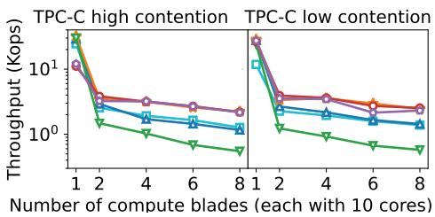  
Fig. 10: Soul throughput scaling for Kyoto Cabinet w/ TPC-C (§5.1). Y-axis is in log scale.

Kyoto Cabinet. Soul performance is comparable to Cohort and Lock Service (Fig. 10). Since Kyoto Cabinet’s global exclusive locks allow only one transaction to execute at a time (unlike MIND-KVS’s fine-grained locks), its throughput decreases as the number of blades increases. Even so, Soul, Cohort, and Lock Service outperform other approaches due to their memory-hierarchy-aware design.

## 5.2 Understanding Soul’s Improvements

We investigate Soul’s performance improvements — specifically, how it reduces the coherence overheads of layered approaches — by subjecting all schemes under comparison to varying levels of locking contention and read-write ratios. We deploy one thread per compute blade to contend for a single lock; each thread repeatedly acquires the lock, accesses the shared data (4KB), and releases it. We measure the average latency of inter-blade lock and data acquisition (left y-axis in Fig. 11) and the number of cache-coherence transactions per lock and data acquisition (right y-axis in Fig. 11) to highlight the inefficiency incurred by layering. Since Lock Service does not use cache coherence for locks, we do not report coherence transactions for it.

Soul observes 100-200 µs lock and data acquisition latency on average at 8 blades — one order of magnitude lower than the fastest compared lock algorithm layered atop cachecoherence. This is because Soul triggers a single coherence transaction for both lock and data acquisition, regardless of the workload. In contrast, locks layered atop coherence trigger coherence transactions proportional to the number of blades (Pthread, Percpu) or a constant but large number of coherence transactions (MCS) as noted in §2.2. While Lock Service is not built atop the coherence, it still observes higher latency than Soul because it lacks Soul’s combined data optimization and must fetch data over the network separately.

## 5.3 Effectiveness of Soul Optimizations

We break down the contributions of GCP optimizations (§3.3) by comparing the latency of lock acquisition and data fetch with the same setup in §5.2 for three schemes: (1) Soul with all optimizations, (2) Soul without the optimization for combining lock and data fetch (w/o combined data opt in figures), and (3) Soul without the optimization that leverages temporal locality of lock+data (w/o locality opt).

The gap between Soul and w/o locality opt (Fig. 12) shows that Soul’s locality optimization reduces the acquisition latency by 1–2 orders of magnitude by caching the lock and associated data, avoiding expensive network communications. The gap between Soul and w/o combined data opt illustrates that Soul’s combined data optimization also reduces acquisition latency by avoiding an additional network round trip for data retrieval.

## 6 Case Study: GCP atop CXL Interconnect

Emerging CXL 3.0 interconnect aims to enable disaggregated shared memory with much finer-grained cache lines and lower latency than the Ethernet-based shared memory we have evaluated. To understand if GCP benefits extend to such interconnects, we conduct a simulation-based study of GCP over CXL 3.0 (dubbed SoulCXL) in the Gem5 [51] simulator, since there is no commercially available hardware for it.

Simulation setup. We evaluate SoulCXL using the same end-to-end applications and compared lock approaches as §5.1. We simulate a cluster with 16 CPU hosts and 1 CXL Global Fabric Attached Memory Device (GFD) connected via a CXL switch. Each CPU host has 8 cores, each employing a 64KB L1 instruction cache and a 64KB L1 data cache. Each core also hosts a 4 MB L2 cache bank. All caches are 2-way set associative. The GFD device hosts sixteen 4 GB DRAM nodes, each with 8× DDR4-2400 channels. Similar to prior CXL-coherence studies [19], we use SynchroTrace [84] to capture synchronization-aware traces of all our evaluated workloads and replay them on our simulated CXL cluster. Our simulation models CXL performance as reported in the recent Microsoft study [85], in which the round-trip latency between two hosts is set to an optimistic 300 ns. Since GCP’s benefits are more pronounced at larger interconnect latencies, SoulCXL reflects a lower bound on its benefits.

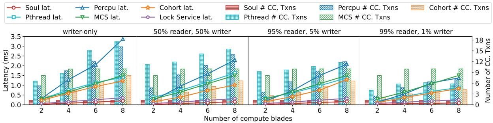  
Fig. 11: Soul avg. latency & # cache-coherence transactions per lock acquisition (§5.2).

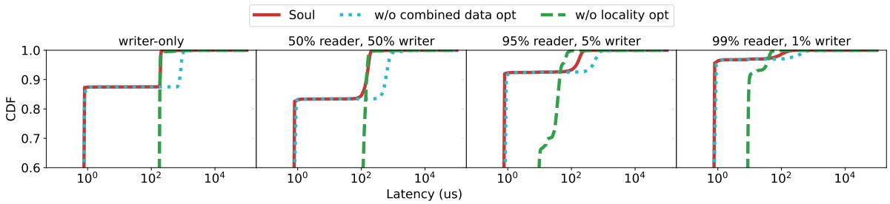  
Fig. 12: Soul latency CDF of lock+data fetch with & without GCP optimizations (§5.3). X-axis is in log scale.

Implementing the wait queue. The low-latency PCIe-based interconnects in CXL 3.0 allow fast access to native coherence protocol message queues at cache controllers and directories. We reuse the CXL.mem M2S channel message buffers in its MOESI protocol to implement GCP wait queues without additional storage overhead. Cache controllers issue GCP\_acquire requests through the CXL.mem M2S channel, recycling them back to the message buffers if not granted.

Implementing the shared memory list. Since maintaining a general shared memory list in hardware adds non-trivial complexity, our SoulCXL implementation uses a single contiguous memory region instead of a list. We also restrict contiguous regions to power-of-two multiples of 64B to minimize storage overheads. The size of each cache line is embedded within it, using 4 additional bits to indicate the power-oftwo multiplier, i.e., 0000 for 2<sup>0</sup> · 64B (= 64B) and 1111 for 2<sup>15</sup> · 64B (= 2MB). For regular 64B cache lines, this incurs < 0.6% storage overhead. Our area estimation using CACTI-7.0 [86] (assuming 22 nm technology) shows that size bits add only 0.0004 mm<sup>2</sup> while the total cache size is 0.0613 mm<sup>2</sup> (< 0.7%) for a 64KB L1 cache.

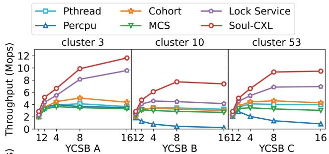

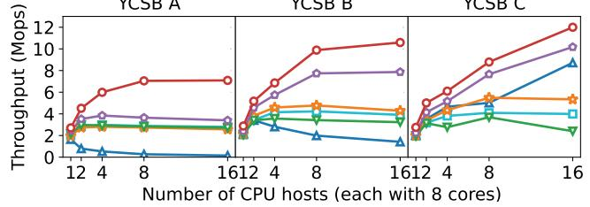  
Fig. 13: SoulCXL throughput scaling for MIND-KVS w/ Twitter cluster 3, 10, 53, and YCSB A, B, C (§6).

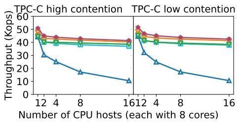  
Fig. 14: SoulCXL throughput scaling for Kyoto Cabinet (§6).

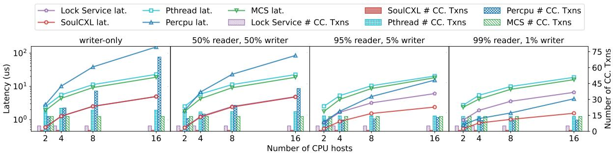  
Fig. 15: SoulCXL avg. latency & # cache-coherence transactions per lock acquire. Y-axis is in log scale.

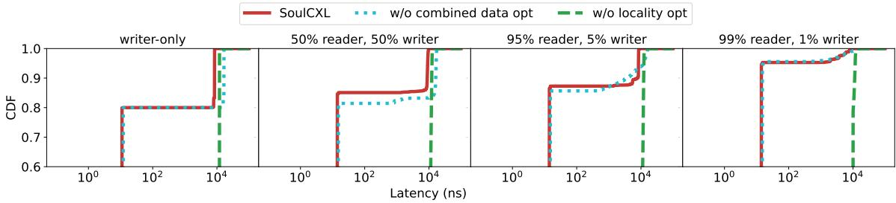  
Fig. 16: SoulCXL latency CDF of lock+data fetch with & without GCP optimizations. X-axis is in log scale.

## 6.1 Performance

MIND-KVS. Fig. 13 shows that SoulCXL outperforms the closest-performing compared system by up to 1.7× across Twitter workloads and 2.0× across YCSB workloads. It outperforms Lock Service due to the combined data and the locality optimizations. Percpu observes much lower throughput than other systems, especially on write-heavy workloads (e.g., cluster 10 and YCSB-A), resulting in worse performance scaling with thread count than on MIND. This is because its per-core lock design is extremely sensitive to contention. CXL’s shorter inter-cache latency causes more frequent accesses to lock variables, resulting in higher contention in write-heavy workloads.

Kyoto Cabinet. SoulCXL and Lock Service perform similarly because none of SoulCXL’s additional optimizations improve performance — Kyoto Cabinet’s coarse-grained locks prevent the use of combined data optimization, and since all lock requestors are writers, the locality optimization is not useful either. As with MIND-KVS, Percpu observes much lower throughput on CXL than other systems do, due to its sensitivity to lock contention.

Understanding SoulCXL improvements. We conduct the evaluation outlined in §5.3 on the simulated CXL platform. When run on CXL (Fig. 15), while all locks observe lower latency compared to MIND due to CXL’s lower latency, they observe more coherence transactions. This is because the lower interconnect latency permits more frequent access to the lock, leading to higher contention. While Lock Service observes latency comparable to SoulCXL for write-heavy workloads (e.g., writer-only and 50% writers), it observes higher latency with more readers (e.g., 95% and 99% readers) since SoulCXL’s locality optimization reduces latency under writer-reader contentions. Percpu’s reduced performance on CXL relative to MIND aligns with our observations in realworld workloads: its per-core lock design is very sensitive to lock contention.

Effectiveness of SoulCXL optimizations. Again, we conduct the evaluation outlined in §5.2 on the simulated CXL platform. The gap between SoulCXL and w/o locality opt (Fig. 16) shows that SoulCXL’s locality optimization reduces the acquisition latency by 1–2 orders of magnitude by caching the lock and associated data, avoiding expensive network communications. The gap between SoulCXL and w/o combined data opt illustrates how SoulCXL’s combined data optimization also reduces acquisition latency by avoiding an additional network round-trip for data retrieval.

## 7 Discussion and Future Research

Supporting flexible queuing policies While Soul’s wait queue employs a FIFO queuing policy, it can be extended to support other queuing policies [27, 30, 34] or reader-writer priorities [87, 88]. Since Soul collocates the wait queue and the current lock holder (§4.1), selecting the next candidate to dequeue from the wait queue is performed in the kernel cache controller, which can easily be extended in software. In contrast, supporting flexible queuing policies in the switch ASICs (as proposed in recent hardware lock services [48, 49]) is challenging due to the ASIC’s resource constraints.

Supporting other lock APIs. Soul currently only supports basic lock acquire and release APIs as a demonstrator of GCP’s performance benefits. It can be extended to support richer lock APIs such as explicit aborts, acquisition with timeouts, try-lock interfaces, etc., via simple modifications to GCP. We leave such extensions to future work.

Related efforts in CPU micro-architectures. Similar to standalone lock services for DSM systems, multi-core architectures have investigated hardware-supported synchronization primitives that either bypass [61,62,89,90] or extend on cachecoherence [63, 91–93]. However, the former incurs additional hardware resource consumption and verification complexities, similar to stand-alone lock services for DSMs (§2.2), whereas the latter focuses on specific cache coherence protocols, whereas GCP’s applicable to any directory-based cache coherence protocol. Several Hardware Transactional Memory (HTM) systems [94–98] also build on cache coherence protocols. However, they offer different programming models that require modifications to applications. In contrast, GCP’s approach ensures transparency for lock-based applications.

## 8 Conclusion

We observe that lock-based synchronization is a generalization of cache coherence in time and space. We incorporate this insight into a novel Generalized Cache-coherence Protocol (GCP) for lock-based synchronization. We provide Soul as an end-to-end system implementation of GCP atop Ethernetbased disaggregated memory and show that it improves performance for real-world applications at scale by 1–2 orders of magnitude over state-of-the-art locks.

## Acknowledgments

We would like to thank our shepherd and anonymous reviewers for their valuable comments and insightful feedback. This work is supported in part by NSF Awards #2112562, 2147946, 2118851, 2047220 and a NetApp Faculty Fellowship.

## References

[1] Shigeru Shiratake. Scaling and performance challenges of future DRAM. In International Memory Workshop (IMW), 2020.

[2] High throughput computing data center architecture. http://www.huawei.com/ilink/en/download/ HW\_349607.

[3] The Machine: A new kind of computer. https : / / www.hpl.hp.com / research / systems - research/themachine/.

[4] Intel rack scale design: Just what is it? https: //www.datacenterdynamics.com/en/opinions/intelrack-scale-design-just-what-is-it/.

[5] Facebook’s disaggregated racks strategy provides an early glimpse into next gen cloud computing data center infrastructures. https : / / dcig.com / 2015 / 01 / facebooks - disaggregated - racks - strategy - provides - early - glimpse - next - gen-cloud-computing.html.

[6] Rack-scale computing. https://www.microsoft.com/ en-us/research/project/rack-scale-computing/.

[7] Krste Asanovic. FireBox: A hardware building block´ for 2020 warehouse-scale computers. In USENIX FAST, 2014.

[8] Stanko Novakovic, Alexandros Daglis, Edouard Bugnion, Babak Falsafi, and Boris Grot. Scale-out NUMA. In Proc. ACM ASPLOS, 2014.

[9] Ling Liu, Wenqi Cao, Semih Sahin, Qi Zhang, Juhyun Bae, and Yanzhao Wu. Memory disaggregation: Research problems and opportunities. In Proc. IEEE ICDCS, 2019.

[10] Kevin Lim, Jichuan Chang, Trevor Mudge, Parthasarathy Ranganathan, Steven K. Reinhardt, and Thomas F. Wenisch. Disaggregated memory for expansion and sharing in blade servers. In Proc. ACM/IEEE ISCA, 2009.

[11] K. Lim, Y. Turner, J. R. Santos, A. AuYoung, J. Chang, P. Ranganathan, and T. F. Wenisch. System-level implications of disaggregated memory. In Proc. IEEE HPCA, 2012.

[12] Ahmad Samih, Ren Wang, Christian Maciocco, Mazen Kharbutli, and Yan Solihin. Collaborative memories in clusters: Opportunities and challenges. In Transactions on Computational Science XXII. Springer, 2014.

[13] Juncheng Gu, Youngmoon Lee, Yiwen Zhang, Mosharaf Chowdhury, and Kang G. Shin. Efficient memory disaggregation with Infiniswap. In Proc. USENIX NSDI, 2017.

[14] Emmanuel Amaro, Christopher Branner-Augmon, Zhihong Luo, Amy Ousterhout, Marcos K. Aguilera, Aurojit Panda, Sylvia Ratnasamy, and Scott Shenker. Can far memory improve job throughput? In Proc. ACM EuroSys, 2020.

[15] Yizhou Shan, Yutong Huang, Yilun Chen, and Yiying Zhang. LegoOS: A disseminated, distributed OS for hardware resource disaggregation. In Proc. USENIX OSDI, 2018.

[16] Seung-seob Lee, Yanpeng Yu, Yupeng Tang, Anurag Khandelwal, Lin Zhong, and Abhishek Bhattacharjee. MIND: In-network memory management for disaggregated data centers. In Proc. ACM SOSP, 2021.

[17] Qingchao Cai, Wentian Guo, Hao Zhang, Divyakant Agrawal, Gang Chen, Beng Chin Ooi, Kian-Lee Tan, Yong Meng Teo, and Sheng Wang. Efficient distributed memory management with RDMA and caching. In Proc. VLDB Endow., 2018.

[18] Qing Wang, Youyou Lu, Erci Xu, Junru Li, Youmin Chen, and Jiwu Shu. Concordia: Distributed shared memory with in-network cache coherence. In Proc. USENIX FAST, 2021.

[19] Adarsh Patil, Vijay Nagarajan, Nikos Nikoleris, and Nicolai Oswald. Apta: Fault-tolerant object-granular<sup>¯</sup> CXL disaggregated memory for accelerating FaaS. In Proc. IEEE/IFIP DSN, 2023.

[20] Haoran Ma, Yifan Qiao, Shi Liu, Shan Yu, Yuanjiang Ni, Qingda Lu, Jiesheng Wu, Yiying Zhang, Miryung Kim, and Harry Xu. DRust: Language-Guided distributed shared memory with fine granularity, full transparency, and ultra efficiency. In Proc. USENIX OSDI, 2024.

[21] CXL Consortium. CXL 3.0 specification. https : / / www.computeexpresslink.org / download - the-specification, 2022.

[22] Silas Boyd-Wickizer, M. Frans Kaashoek, Robert Tappan Morris, and Nickolai Zeldovich. Non-scalable locks are dangerous. In Proc. Linux Symposium, 2012.

[23] Hugo Guiroux, Renaud Lachaize, and Vivien Quéma. Multicore locks: The case is not closed yet. In Proc. USENIX ATC, 2016.

[24] Tudor David, Rachid Guerraoui, and Vasileios Trigonakis. Everything you always wanted to know about synchronization but were afraid to ask. In Proc. ACM SOSP, 2013.

[25] John M. Mellor-Crummey and Michael L. Scott. Synchronization without contention. In Proc. ACM ASP-LOS, 1991.

[26] Travis S. Craig. Building FIFO and priority-queuing spin locks from atomic swap. Technical report, Department of Computer Science, University of Washington, 1993.

[27] David Dice, Virendra J. Marathe, and Nir Shavit. Lock cohorting: A general technique for designing NUMA locks. In Proc. ACM PPoPP, 2012.

[28] Milind Chabbi, Michael Fagan, and John Mellor-Crummey. High performance locks for multi-level NUMA systems. In Proc. ACM PPoPP, 2015.

[29] Dave Dice and Alex Kogan. Compact NUMA-aware locks. In Proc. ACM EuroSys, 2019.

[30] Sanidhya Kashyap, Irina Calciu, Xiaohe Cheng, Changwoo Min, and Taesoo Kim. Scalable and practical locking with shuffling. In Proc. ACM SOSP, 2019.

[31] Rafael Lourenco de Lima Chehab, Antonio Paolillo, Diogo Behrens, Ming Fu, Hermann Härtig, and Haibo Chen. CLoF: A compositional lock framework for multi-level NUMA systems. In Proc. ACM SOSP, 2021.

[32] Linux kernel brlock. https://lwn.net/Articles/ 378911,2010.

[33] Ran Liu, Heng Zhang, and Haibo Chen. Scalable read-mostly synchronization using passive reader-writer locks. In Proc. USENIX ATC, 2014.

[34] Irina Calciu, Dave Dice, Yossi Lev, Victor Luchangco, Virendra J. Marathe, and Nir Shavit. NUMA-aware reader-writer locks. In Proc. ACM PPoPP, 2013.

[35] Dave Dice and Alex Kogan. BRAVO—Biased locking for reader-writer locks. In Proc. USENIX ATC, 2019.

[36] Shin-Yeh Tsai, Yizhou Shan, and Yiying Zhang. Disaggregating persistent memory and controlling them remotely: An exploration of passive disaggregated key value stores. In Proc. USENIX ATC, 2020.

[37] Jiacheng Shen, Pengfei Zuo, Xuchuan Luo, Tianyi Yang, Yuxin Su, Yangfan Zhou, and Michael R Lyu. FUSEE: A fully memory-disaggregated key-value store. In Proc. USENIX FAST, 2023.

[38] Pengfei Li, Yu Hua, Pengfei Zuo, Zhangyu Chen, and Jiajie Sheng. ROLEX: A scalable RDMA-oriented learned key-value store for disaggregated memory systems. In Proc. USENIX FAST, pages 99–114, 2023.

[39] Jianguo Wang and Qizhen Zhang. Disaggregated database systems. In Proc. ACM SIGMOD, 2023.

[40] Yingqiang Zhang, Chaoyi Ruan, Cheng Li, Xinjun Yang, Wei Cao, Feifei Li, Bo Wang, Jing Fang, Yuhui Wang, Jingze Huo, et al. Towards cost-effective and elastic cloud database deployment via memory disaggregation. Proc. VLDB, 2021.

[41] Chaoyi Ruan, Yingqiang Zhang, Chao Bi, Xiaosong Ma, Hao Chen, Feifei Li, Xinjun Yang, Cheng Li, Ashraf Aboulnaga, and Yinlong Xu. Persistent memory disaggregation for cloud-native relational databases. In Proc. ACM ASPLOS, 2023.

[42] Wei Cao, Yingqiang Zhang, Xinjun Yang, Feifei Li, Sheng Wang, Qingda Hu, Xuntao Cheng, Zongzhi Chen, Zhenjun Liu, Jing Fang, et al. PolarDB serverless: A cloud native database for disaggregated data centers. In Proc. ACM SIGMOD, 2021.

[43] Compute Express Link. https : / / www.computeexpresslink.org.

[44] Kai Li and Paul Hudak. Memory coherence in shared virtual memory systems. ACM Trans. Comput. Syst., 1989.

[45] Peter Keleher, Alan L. Cox, Sandhya Dwarkadas, and Willy Zwaenepoel. Tread marks: Distributed shared memory on standard workstations and operating systems. In USENIX Winter 1994 Technical Conference, 1994.

[46] J. K. Bennett, J. B. Carter, and W. Zwaenepoel. Munin: Distributed shared memory based on type-specific memory coherence. In Proc. ACM PPoPP, 1990.

[47] Brian N. Bershad, Matthew J. Zekauskas, and Wayne A. Sawdon. The Midway distributed shared memory system. Technical report, Carnegie Mellon University, 1993.

[48] Zhuolong Yu, Yiwen Zhang, Vladimir Bravermann, Mosharaf Chowdhury, and Xin Jin. NetLock: Fast, centralized lock management using programmable switches. In Proc. ACM SIGCOMM, 2020.

[49] Hanze Zhang, Ke Cheng, Rong Chen, and Haibo Chen. Fast and scalable in-network lock management using lock fission. In Proc. USENIX OSDI, 2024.

[50] Vijay Nagarajan, Daniel J Sorin, Mark D Hill, and David A Wood. Coherence basics. In A Primer on Memory Consistency and Cache Coherence. Morgan & Claypool Publishers, 2020.

[51] gem5. https://www.gem5.org/.

[52] Marcos K. Aguilera, Nadav Amit, Irina Calciu, Xavier Deguillard, Jayneel Gandhi, Pratap Subrahmanyam, Lalith Suresh, Kiran Tati, Rajesh Venkatasubramanian, and Michael Wei. Remote memory in the age of fast networks. In Proc. ACM SoCC, 2017.

[53] Chenxi Wang, Yifan Qiao, Haoran Ma, Shi Liu, Wenguang Chen, Ravi Netravali, Miryung Kim, and Guoqing Harry Xu. Canvas: Isolated and adaptive swapping for Multi-Applications on remote memory. In Proc. USENIX NSDI, 2023.

[54] Yifan Qiao, Chenxi Wang, Zhenyuan Ruan, Adam Belay, Qingda Lu, Yiying Zhang, Miryung Kim,

and Guoqing Harry Xu. Hermit: Low-Latency, High-Throughput, and transparent remote memory via Feedback-Directed asynchrony. In Proc. USENIX NSDI, 2023.

[55] Yueyang Pan, Yash Lala, Musa Unal, Yujie Ren, Seungseob Lee, Abhishek Bhattacharjee, Anurag Khandelwal, and Sanidhya Kashyap. Scalable far memory: Balancing faults and evictions. In Proc. ACM SOSP, 2025.

[56] Seung-seob Lee, Jachym Putta, Ziming Mao, and Anurag Khandelwal. Spirit: Fair allocation of interdependent resources in remote memory systems. In Proc. ACM SOSP, 2025.

[57] Mingxing Zhang, Teng Ma, Jinqi Hua, Zheng Liu, Kang Chen, Ning Ding, Fan Du, Jinlei Jiang, Tao Ma, and Yongwei Wu. Partial failure resilient memory management system for (CXL-based) distributed shared memory. In Proc. ACM SOSP, 2023.

[58] Juncheng Yang, Yao Yue, and K. V. Rashmi. A large scale analysis of hundreds of in-memory cache clusters at Twitter. In Proc. USENIX OSDI, 2020.

[59] John M. Mellor-Crummey and Michael L. Scott. Scalable reader-writer synchronization for shared-memory multiprocessors. In Proc. ACM PPoPP, 1991.

[60] Christina Giannoula, Nandita Vijaykumar, Nikela Papadopoulou, Vasileios Karakostas, Ivan Fernandez, Juan Gómez-Luna, Lois Orosa, Nectarios Koziris, Georgios Goumas, and Onur Mutlu. SynCron: Efficient synchronization support for near-data-processing architectures. In Proc. IEEE HPCA, 2021.

[61] Enrique Vallejo, Ramon Beivide, Adrian Cristal, Tim Harris, Fernando Vallejo, Osman Unsal, and Mateo Valero. Architectural support for fair reader-writer locking. In Proc. IEEE/ACM MICRO, 2010.

[62] Weirong Zhu, Vugranam C Sreedhar, Ziang Hu, and Guang R. Gao. Synchronization state buffer: supporting efficient fine-grain synchronization on many-core architectures. In Proc. ACM/IEEE ISCA, 2007.

[63] James R. Goodman, Mary K. Vernon, and Philip J. Woest. Efficient synchronization primitives for largescale cache-coherent multiprocessors. In Proc. ACM ASPLOS, 1989.

[64] Xin Jin, Xiaozhou Li, Haoyu Zhang, Robert Soulé, Jeongkeun Lee, Nate Foster, Changhoon Kim, and Ion Stoica. NetCache: Balancing key-value stores with fast in-network caching. In Proc. ACM SOSP, 2017.

[65] Nicolai Oswald, Vijay Nagarajan, and Daniel J. Sorin. ProtoGen: Automatically generating directory cache

coherence protocols from atomic specifications. In Proc. ACM/IEEE ISCA, 2018.

[66] A. Agarwal, R. Simoni, J. Hennessy, and M. Horowitz. An evaluation of directory schemes for cache coherence. In Proc. ACM/IEEE ISCA, 1988.

[67] Mark S. Papamarcos and Janak H. Patel. A lowoverhead coherence solution for multiprocessors with private cache memories. In Proc. ACM/IEEE ISCA, 1984.

[68] James Archibald and Jean-Loup Baer. Cache coherence protocols: Evaluation using a multiprocessor simulation model. ACM Trans. Comput. Syst., 1986.

[69] J. Dorsey, Shawn Searles, M. Ciraula, S. Johnson, N. Bujanos, D. Wu, M. Braganza, S. Meyers, E. Fang, and R. Kumar. An integrated quad-core Opteron processor. In Proc. IEEE ISSCC, 2007.

[70] David L. Dill. The Murphi verification system. In International Conference on Computer Aided Verification, 1996.

[71] Nicolai Oswald, Vijay Nagarajan, and Daniel J. Sorin. Hieragen: Automated generation of concurrent, hierarchical cache coherence protocols. In Proc. ACM/IEEE ISCA, 2020.

[72] Nicolai Oswald, Vijay Nagarajan, Daniel J. Sorin, Vasilis Gavrielatos, Theo Olausson, and Reece Carr. Heterogen: Automatic synthesis of heterogeneous cache coherence protocols. In Proc. IEEE HPCA, 2022.

[73] Byn Choi, Rakesh Komuravelli, Hyojin Sung, Robert Smolinski, Nima Honarmand, Sarita V. Adve, Vikram S. Adve, Nicholas P. Carter, and Ching-Tsun Chou. DeNovo: Rethinking the memory hierarchy for disciplined parallelism. In Proc. PACT, 2011.

[74] Jialin Li, Jacob Nelson, Ellis Michael, Xin Jin, and Dan R. K. Ports. Pegasus: Tolerating skewed workloads in distributed storage with in-network coherence directories. In Proc. USENIX OSDI, 2020.

[75] The kernel development community. The robust futex ABI. https://docs.kernel.org/locking/robustfutex-ABI.html.

[76] Yibo Zhu, Haggai Eran, Daniel Firestone, Chuanxiong Guo, Marina Lipshteyn, Yehonatan Liron, Jitendra Padhye, Shachar Raindel, Mohamad Haj Yahia, and Ming Zhang. Congestion control for large-scale RDMA deployments. In Proc. ACM SIGCOMM, 2015.

[77] InfiniBand Trade Association. InfiniBand architecture specification, volume 1: General specifications, 2020. Release 1.4.

[78] POSIX thread library reader-writer lock. https:// linux.die.net/man/3/pthread\_rwlock\_init.

[79] Kyoto Cabinet: a straightforward implementation of DBM. http://fallabs.com/kyotocabinet.

[80] Brian F. Cooper, Adam Silberstein, Erwin Tam, Raghu Ramakrishnan, and Russell Sears. Benchmarking cloud serving systems with YCSB. In Proc. ACM SoCC, 2010.

[81] Dave Dice, Alex Kogan, Yossi Lev, Timothy Merrifield, and Mark Moir. Adaptive integration of hardware and software lock elision techniques. In Proc. ACM SPAA, 2014.

[82] Jonas Oberhauser, Rafael Lourenco de Lima Chehab, Diogo Behrens, Ming Fu, Antonio Paolillo, Lilith Oberhauser, Koustubha Bhat, Yuzhong Wen, Haibo Chen, Jaeho Kim, and Viktor Vafeiadis. Vsync: Push-button verification and optimization for synchronization primitives on weak memory models. In Proc. ACM ASPLOS, 2021.

[83] Transaction Processing Performance Council. TPC-C. http://www.tpc.org/tpcc/, 2020.

[84] Karthik Sangaiah, Michael Lui, Radhika Jagtap, Stephan Diestelhorst, Siddharth Nilakantan, Ankit More, Baris Taskin, and Mark Hempstead. SynchroTrace: Synchronization-aware architecture-agnostic traces for lightweight multicore simulation of CMP and HPC workloads. ACM Trans. Archit. Code Optim., 2018.

[85] Huaicheng Li, Daniel S. Berger, Lisa Hsu, Daniel Ernst, Pantea Zardoshti, Stanko Novakovic, Monish Shah, Samir Rajadnya, Scott Lee, Ishwar Agarwal, Mark D. Hill, Marcus Fontoura, and Ricardo Bianchini. Pond: CXL-based memory pooling systems for cloud platforms. In Proc. ACM ASPLOS, 2023.

[86] Naveen Muralimanohar, Rajeev Balasubramonian, and Norm Jouppi. Optimizing NUCA organizations and wiring alternatives for large caches with CACTI 6.0. In Proc. IEEE/ACM MICRO, 2007.

[87] P. J. Courtois, F. Heymans, and D. L. Parnas. Concurrent control with “readers” and “writers”. Commun. ACM, 1971.

[88] Björn B. Brandenburg and James H. Anderson. Spinbased reader-writer synchronization for multiprocessor real-time systems. Real-Time Syst., 2010.

[89] B.E. Saglam and V.J. Mooney. System-on-a-chip processor synchronization support in hardware. In Proceedings Design, Automation and Test in Europe. Conference and Exhibition 2001, 2001.

[90] Men-Chow Chiang. Memory system design for busbased multiprocessors. PhD thesis, University of Wisconsin–Madison, 1992.

[91] IEEE. IEEE standard for scalable coherent interface (SCI). IEEE Std 1596-1992, 1993.

[92] R. Rajwar, A. Kagi, and J.R. Goodman. Improving the throughput of synchronization by insertion of delays. In Proc. IEEE HPCA, 2000.

[93] Hyojin Sung, Rakesh Komuravelli, and Sarita V. Adve. DeNovoND: efficient hardware support for disciplined non-determinism. In Proc. ACM ASPLOS, 2013.

[94] Maurice Herlihy and J. Eliot B. Moss. Transactional memory: architectural support for lock-free data structures. In Proc. ACM/IEEE ISCA, 1993.

[95] J.M. Stone, H.S. Stone, P. Heidelberger, and J. Turek. Multiple reservations and the oklahoma update. IEEE Parallel & Distributed Technology: Systems & Applications, 1993.

[96] Dave Christie, Jae-Woong Chung, Stephan Diestelhorst, Michael Hohmuth, Martin Pohlack, Christof Fetzer, Martin Nowack, Torvald Riegel, Pascal Felber, Patrick Marlier, and Etienne Rivière. Evaluation of AMD’s advanced synchronization facility within a complete transactional memory stack. In Proc. ACM EuroSys, 2010.

[97] David Dice, Yossi Lev, Mark Moir, and Daniel Nussbaum. Early experience with a commercial hardware transactional memory implementation. In Proc. ACM ASPLOS, 2009.

[98] Peter Damron, Alexandra Fedorova, Yossi Lev, Victor Luchangco, Mark Moir, and Daniel Nussbaum. Hybrid transactional memory. In Proc. ACM ASPLOS, 2006.