USENIX

THE ADVANCED COMPUTING SYSTEMS ASSOCIATION

# Compaction-Free Memory Defragmentation for Virtualization via Infinite Guest Physical Address Space

Peixin Zeng, Hao Huang, Yanqi Pan, Wen Xia, Darong Yang, Jiahao Chen, and Nan Zhang, Harbin Institute of Technology, Shenzhen https://www.usenix.org/conference/osdi26/presentation/zeng

# This paper is included in the Proceedings of the 20th USENIX Symposium on Operating Systems Design and Implementation.

July 13–15, 2026 • Seattle, WA, USA

ISBN 978-1-939133-55-7

Open access to the Proceedings of the 20th USENIX Symposium on Operating Systems Design and Implementation is sponsored by

# Compaction-Free Memory Defragmentation for Virtualization via Infinite Guest Physical Address Space

Peixin Zeng†, Hao Huang†, Yanqi Pan, Wen XiaB, Darong Yang, Jiahao Chen, Nan Zhang Harbin Institute of Technology, Shenzhen

## Abstract

In virtualized environments, guest memory defragmentation is essential for exploiting huge-page benefits and improving application performance. However, existing approaches directly reuse host-side defragmentation and assume a limited guest physical address (GPA) space. As a result, they rely on memory compaction to defragment this constrained space, causing throughput to drop by up to 51% and latency to rise by up to 102% in YCSB-Redis workloads.

This paper proposes INFINIDEFRAG, a compaction-free memory defragmentation technique for virtualization. Our key insight is that the GPA space can be regarded as (nearly) infinite by controlling the mapping between GPA and host physical address (HPA), thereby eliminating the need for guest-side memory compaction. To realize this insight, we introduce (1) Infinite Address Manager that expands the GPA space while reclaiming free fragment pages; (2) Host Memory Guard that maintains the GPA–HPA mapping and constrains HPA usage within each VM’s quota; and (3) Scalability Optimizer that scales GPA/HPA space management to multi-thread and multi-VM environments. Experiments on micro-benchmarks and real-world applications show that IN-FINIDEFRAG outperforms state-of-the-art approaches and can achieve ideal, fragmentation-free performance.

## 1 Introduction

Virtualization has become a foundational technology to enable resource sharing, workload isolation, and flexible deployment [32, 54]. Therefore, virtual machines (VMs) power a wide range of services, including cloud platforms and enterprise IT environments, which require efficient and scalable system designs. Among these, memory access is one of the most important optimizations to improve VM performance.

Huge page is a widely adopted technique to improve memory access performance [18, 21, 33, 35, 36, 39, 45, 47, 57]. By increasing the page size from 4 KB to 2 MB, and even to 1 GB, huge page significantly lowers the translation lookaside buffer (TLB) miss rates and page table walk (PTW) cycles. In virtualized environments, huge pages are particularly important because they substantially reduce the overhead of two-level address translation, where each memory access traverses from the guest virtual address (GVA) to the guest physical address (GPA), and then to the host physical address (HPA).

However, the effectiveness of the huge page highly depends on the contiguous physical memory, whereas memory fragmentation is a notorious problem that makes the memory discontinuous [28, 42, 48, 56]. Specifically, fragmentation arises when the memory is allocated and freed in a non-deterministic pattern, making it increasingly difficult for the page allocator to find large contiguous regions for huge page allocation.

To solve the problem, existing fragmentation mitigation works primarily focus on two dimensions: (1) Antifragmentation: optimizing allocation policies to proactively avoid fragmentation [31, 37, 40, 48, 53]. However, such static strategies are tailored to specific scenarios and fail to adapt across diverse workloads. (2) Defragmentation: Invoking memory compaction when contiguous regions are unavailable [2,33,39,50,57]. Yet frequent compaction incurs substantial latency spikes. Our preliminary experiments show that these approaches can reduce throughput by up to 51% and increase latency by up to 102% in YCSB-Redis workloads (§3), thus squandering the performance benefits of huge pages.

This work aims to eliminate the costly guest-side memory compaction in virtualized environments, thereby fully exploiting the benefits of huge pages. Our insight is that the GPA space can be regarded as (nearly) infinite1 by manipulating the mapping between GPA and HPA, thereby eliminating the need for guest-side memory compaction. Existing guest systems require memory compaction because they adopt a host-like abstraction that assumes the GPA space is fixed and limited. In reality, GPA is a form of virtual memory, as the guest OS behaves like a host-side user process. Consequently, expensive compaction and page migration are unnecessary. Instead, contiguous memory can be obtained simply by expanding the GPA space and updating the GPA-HPA mapping.

We incarnate this idea by building INFINIDEFRAG, a compaction-free memory defragmentation technique. The primary challenge is how to efficiently manage the infinite GPA space while keeping the host physical memory usage within the VM’s quota. To address this, we introduce an array of techniques. First, Infinite Address Manager provides new contiguous GPA memory by reclaiming free fragment GPA pages and expanding the new GPA region using memory trade (i.e., trades fragmented pages for contiguous memory), fast reclaim, and reserved region. Second, Host Memory Guard maintains the GPA-HPA mapping and constrains the actual host memory usage within a VM’s quota using self-hosted remap and batch unmapping. Finally, Scalability Optimizer further improves GPA/HPA space management efficiency and scales INFINIDEFRAG to multi-thread and multi-VM environments with lockless page-bitmap updates, in-kernel remap with delayed TLB flushes, and hybrid paging.

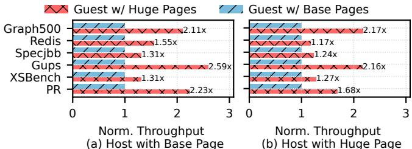

We implement INFINIDEFRAG2 as a module of Linux’s memory management subsystem, invoked when the standard high-order allocation path cannot satisfy the new huge-page allocation requests. We evaluate INFINIDEFRAG using both micro-benchmarks and real-world applications. The results show that INFINIDEFRAG substantially outperforms stateof-the-art approaches and achieves ideal, fragmentation-free performance. For example, on YCSB-Redis workloads, IN-FINIDEFRAG improves throughput by 21%–105% compared to LLFREE [53], Linux with transparent huge page (THP) enabled [17], and Linux using the default 4KB pages.

In a nutshell, we make the following contributions:

• We reveal that existing guest-side defragmentation techniques incur significant overhead. The limited GPA space is the primary cause of their overhead, even though GPA can in fact be treated as an infinite virtual address space (§3).

• We propose INFINIDEFRAG, a compaction-free memory defragmentation technique to achieve lightweight defragmentation with three designs: Infinite Address Manager, Host Memory Guard, and Scalability Optimizer (§4).

• We implement and evaluate INFINIDEFRAG. The results show that it substantially outperforms existing approaches with ideal, fragmentation-free performance (§5, §6).

## 2 Background

## 2.1 Memory Virtualization

Memory virtualization is a fundamental abstraction in modern VMs, allowing guest operating systems (OSes) to share physical memory efficiently and transparently. By decoupling the guest’s view of memory from the underlying hardware, the hypervisor provides each VM with an isolated, contiguous address space, ensuring both safety and flexibility.

Address translation in virtualization. Memory virtualization relies on a two-level address translation: guest virtual addresses (GVAs) are first mapped to guest physical addresses (GPAs), which are then translated to host physical addresses (HPAs). This design provides strong isolation and flexible management but introduces additional overhead.

Mitigating address translation overhead. Modern processors support two-level paging through nested page tables (NPT), such as Intel Extended Page Tables (EPT) and AMD Rapid Virtualization Indexing (RVI). EPT, in particular, maintains a second-level page table for GPA → HPA translation, supports multiple page sizes (i.e., 4KB, 2MB, and 1GB), and enforces per-page read, write, and execute permissions. On each memory access, the CPU first translates GVA → GPA

Figure 1: Huge page benefits in virtualization. We evaluate four configurations combining huge and base pages on both the guest and the host. Experiments are conducted on Linux THP [17] without host/guest fragmentation, and the results show that guestside huge pages yield substantial performance improvements.

via the guest page table, then GPA → HPA via EPT. The results are cached in the TLB and Page Walk Cache [44], allowing fast lookups. However, on a cache miss, both guest page table and EPT should be traversed, imposing significant overhead for workloads with poor TLB locality or frequent memory turnover [39]. In this paper, we use NPT to represent the two-level paging (i.e., GVA → GPA → HPA), while EPT to represent the specific GPA → HPA translation.

## 2.2 Huge Page and Fragmentation

Huge Pages. To reduce the overhead of two-level address translation and improve TLB efficiency, modern systems support huge pages (e.g., 2 MB and 1 GB on x86-64), which decrease TLB misses, shorten page walks, and boost performance—particularly for memory-intensive workloads. Specifically, in virtualized environments, hardware features such as Intel EPT allow huge pages at both the guest and host levels, reducing nested page table entries and improving translation efficiency to near-native levels. As shown in Figure 1, employing huge pages on the guest can significantly enhance performance, regardless of the host-side configuration.

However, huge pages require physically contiguous regions, but long-running systems often suffer from external fragmentation. Consequently, even with sufficient free memory, allocating huge pages becomes increasingly difficult, highlighting the need for an efficient huge page management strategy.

Huge page management in Linux. Linux originally introduces hugetlb pages [13] to support huge pages, but they are ad-hoc and non-transparent to applications. To address this limitation, the Linux kernel provides transparent huge pages (THP) [17], which automatically promotes base pages into huge pages. THP relies on a background kernel thread (i.e., khugepaged) to coalesce contiguous 4 KB base pages into 2 MB huge pages and may additionally promote pages during page faults when conditions permit. This design enables applications to benefit from reduced TLB misses and shorter page walks without modification. However, THP critically depends on memory compaction to obtain physically contiguous memory, which can introduce substantial latency spikes, particularly under memory pressure or fragmentation.

The fragmentation problem. As systems run, the continual allocation and release of memory inevitably create external fragmentation, substantially reducing the availability of contiguous 2 MB pages. Consequently, THP often falls back to 4 KB pages without extra mechanisms even when the total free memory remains sufficient. Although the buddy allocator [15] attempts to maintain memory contiguity, fragmentation still prevents huge page allocations in practice. Moreover, under memory pressure, background compaction often fails to keep pace with fragmentation, leading to substantial performance degradation for workloads that depend on huge pages [28,42].

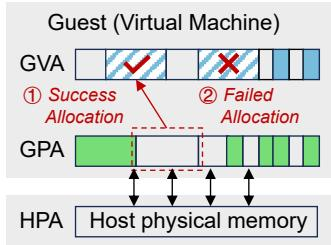  
(a) Anti-Fragmentation

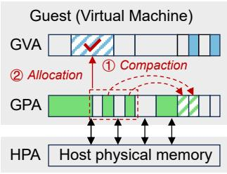  
(b) Defragmentation  
Figure 2: Deficiency of existing fragmentation mitigation techniques. (a) Anti-fragmentation is tailored to dedicated scenarios and fails to scale across diverse workloads, while (b) defragmentation incurs substantial overhead due to page compaction.

2.3 Existing Fragmentation Mitigation Works Existing fragmentation mitigation works fall into two categories: (1) Anti-fragmentation: optimizing memory allocation to avoid fragmentation; (2) Defragmentation: invoking memory compaction when contiguous regions are unavailable.

Anti-fragmentation. These approaches [31,37,40,41,48,53] mitigate memory fragmentation by employing specialized allocation policies that carefully control page placement decisions to preserve large contiguous regions. For example, as shown in Figure 2a, several approaches [37, 40] co-locate objects or pages with similar lifetimes or sizes to improve spatial locality and maintain memory contiguity.

Although such proactive strategies can delay fragmentation, they suffer from inherent limitations. Specifically, (1) their effectiveness depends on heuristics or assumptions about future allocation patterns, which often fail under dynamic and heterogeneous workloads, leading to inevitable fragmentation. (2) They may also trade short-term allocation efficiency for preserving contiguous regions, leading to unnecessary memory waste for no-fragmentation scenarios. (3) They typically require modifications to allocators or applications, significantly limiting their deployability in production environments that demand transparency and backward compatibility.

Defragmentation. These techniques [2, 39, 47, 50, 56] rely on relocating movable pages to coalesce scattered free pages, thereby creating large contiguous regions (i.e., Figure 2b). For example, Linux THP performs both background and ondemand compaction to facilitate 2 MB huge page allocation even under severe fragmentation, as discussed in §2.2.

However, reactive strategies introduce substantial runtime overhead. Specifically, (1) relocating pages requires data copy, page-table updates, and TLB shootdowns, which disrupt execution and often cause noticeable latency spikes. (2) Pages that are pinned, shared, or hardware-mapped are inherently unmovable [34, 48, 56], fundamentally limiting how much contiguous space compaction can recover. (3) Compaction competes for CPU cycles and memory bandwidth, and is frequently throttled under memory pressure, making it less effective when fragmentation is extremely severe.

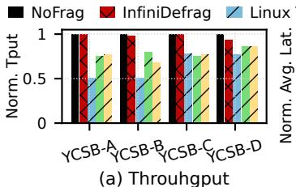

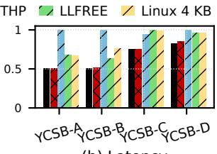  
(b) Latency  
Figure 3: Performance analysis under fragmentation. The host uses huge pages, NoFrag denotes the non-fragmented baseline using Linux THP, and experiments are conducted under the extreme fragmentation setting (§6.1). The results suggest that existing fragmentation mitigation approaches substantially deteriorate throughput and latency, sometimes even fall below Linux 4 KB.

Overall, prior works primarily mitigate memory fragmentation at the host level, with benefits indirectly inherited by guests. To our knowledge, this is the first work to design a dedicated guest-side defragmentation technique.

## 3 Observations and Motivations

## 3.1 Limitations of Existing Approaches

In this section, we begin with preliminary experiments to examine whether existing fragmentation mitigation approaches can improve the performance of foreground applications.

Methodology. We evaluate throughput and latency using YCSB [23] on Redis [16]. The host uses huge pages, and experiments are conducted under the extreme fragmentation setting (see details in §6.1). Moreover, we select LLFREE [53] and Linux THP [17] to represent anti-fragmentation and defragmentation approaches, respectively. We also compare against Linux with 4 KB pages and NoFrag, which represents Linux THP without fragmentation. Specifically, LLFREE is a memory allocator designed to replace the Linux buddy system [15], which applies heuristics to proactively reduce potential future fragmentation. Linux THP, on the other hand, relies on background huge-page promotion or foreground synchronous page compaction to defragment memory (§2.2).

Observation #1: State-of-the-art fragmentation mitigation techniques exhibit poor performance. As shown in Figure 3, both anti-fragmentation (LLFREE) and defragmenta tion (Linux THP) achieve only 49%–72% of NoFrag through put and incur 30%–102% higher latency. In some cases, their performance even falls below that of Linux 4 KB, which does not exploit huge pages. These results suggest that the overhead imposed by existing fragmentation mitigation techniques outweighs the performance gains provided by the additional huge pages they produce, as further studied in the next subsection.

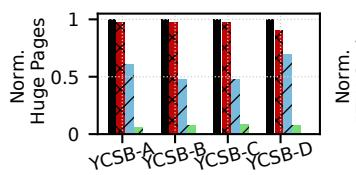

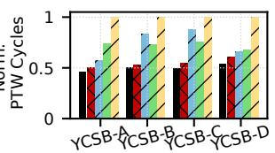  
(a) Huge Page Allocation (a) Huge Page Allocation  
(b) Page Table Walk Cycles (b) Page Table Walk Cycles

Figure 4: Huge page and PTW cycle analysis under fragmentation. The host uses huge pages, NoFrag denotes the nonfragmented baseline using Linux THP, and experiments are conducted under the extreme fragmentation setting (§6.1). Results in subfigure (a) suggest that existing approaches fail to provide suffi cient huge pages, which result in high PTW cycles in subfigure (b).  
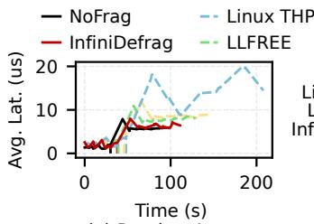  
(a) Runtime Latency

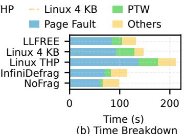  
Figure 5: Latency and breakdown analysis under fragmentation. The host uses huge pages, NoFrag denotes the nonfragmented baseline using Linux THP, and experiments are conducted under the extreme fragmentation setting (§6.1). (a) The vertical line indicates the end of the load phase, after which is the run phase. (b) Memory compaction increases the page fault time, while huge pages reduce the PTW cycles and the page fault time.

## 3.2 Deficiency Analysis

We then conduct detailed experiments to demystify the deficiency of existing fragmentation mitigation approaches.

Methodology. The experimental setup follows that described in §3.1. Specifically, we: (1) measure the number of allocated huge pages to assess the ability to maintain contiguous memory regions (Figure 4a); (2) record page table walk (PTW) cycles to evaluate the efficiency of two-level address translation (Figure 4b); (3) measure real-time request latency to capture performance fluctuations over time (Figure 5a); and (4) perform time-breakdown to analyze how compaction and huge page contribute to overall performance (Figure 5b).

Observation #2: Anti-fragmentation performs poorly due to limited number of huge pages. As shown in Figure 4a, when memory becomes fragmented, anti-fragmentation (i.e., LLFREE) fails to provide sufficient huge pages compared to the ideal case (i.e., NoFrag). Although LLFREE is designed to preserve contiguous regions, it ends up allocating the fewest huge pages (Linux 4 KB does not have huge pages), resulting in longer Page Fault and PTW time, as shown in Figure 5b.

Observation #3: Defragmentation performs poorly due to substantial compaction overhead. Although defragmentation (i.e., Linux THP) is able to allocate more huge pages and reduce PTW cycles (Figure 4b), it still delivers the longest average latency—even worse than Linux 4 KB without huge pages (Figure 5a). The reason is illustrated in Figure 5b, where

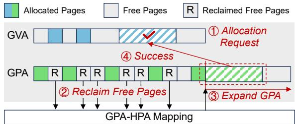  
Figure 6: The Infinite GPA space. It enables efficient defragmentation without any compaction or page migration, by simply controlling the mapping between the GPA and HPA pages.

Linux THP exhibits much higher Page Fault time, either because synchronous compaction increases page-fault handling time or because background page migration increases the number of page faults. These compactions directly interfere with foreground request processing, leading to pronounced latency inflation despite the presence of more huge pages.

Thus, existing approaches face a dilemma: increasing huge-page availability requires defragmentation effort, yet the resulting overhead can outweigh the performance benefits that huge pages are meant to deliver.

## 3.3 Motivation: The Infinite GPA Space

Based on the above analysis, we pose a fundamental question: Is it possible to combine the low overhead of antifragmentation with the huge page ability of defragmentation? Opportunity #1: The GPA space is (nearly) infinite. Modern systems now feature terabytes of physical memory, substantially expanding the physical address space. To accommodate this growth, recent x86 processors, including Intel Ice Lake and Sapphire Rapids, implement 5-level paging [5], thereby increasing the physical address width from 48 to 57 bits. This expansion highlights both the need for scalable memory management and the challenge of system software to efficiently exploit such a vast address space [4].

We quantify the write intensity of guest memory using the dirty-page rate, a standard metric used in prior live-migration studies [22, 30]. Existing work reports that cloud workloads often dirty memory at tens of MB/s, and 32 MB/s is the point that pre-copy migration becomes ineffective [30]. At this rate, a VM produces roughly 2.76 TB of modified memory per day. Given a 57-bit address space (i.e., ∼ 1.44 × 1017 bytes), the system can sustain about 4.7 × 104 days—over a century before exhaustion. Moreover, even under higher dirty-rate assumptions, the lifetime remains on the order of decades.

Opportunity #2: GPA-to-HPA indirection enables flexible remapping. By decoupling a VM’s view of physical memory (i.e., GPA) from the underlying real machine layout (i.e., HPA), the virtualization layer allows the host to transparently reorganize memory pages without impacting the guest. This indirection enables defragmentation strategies that are both low-overhead and non-intrusive to guest workloads.

Insight: Compaction is unnecessary with the infinite GPA space. With the two opportunities, a VM’s physical memory (i.e., GPA) can be treated as an infinite address space, mapped to host physical memory (i.e., HPA) on demand. This enables compaction-free defragmentation by controlling the mapping between guest and host memory. We use Figure 6 to illustrate this approach: ① when a huge page allocation request cannot find a contiguous GPA, ② free fragment GPA pages are reclaimed, and ③ the GPA space is expanded with the updated GPA-HPA mapping, ④ thereby reserving a contiguous GPA region to succeed the request without compaction.

Note that maintaining the GPA–HPA mapping during GPA space expansion may introduce host-side fragmentation, especially in multi-VM environments. We regard it as a challenge. Challenges. However, leveraging this insight to build a practical defragmentation mechanism raises several challenges: (1) How can the VM’s infinite physical address space (i.e., GPA) be efficiently managed? (2) How can actual physical memory (i.e., HPA) be constrained within the VM’s quota? (3) How can the system scale efficiently under multi-thread and multi-VM environments? We address them in Section 4.

## 4 INFINIDEFRAG Design

We propose INFINIDEFRAG, a compaction-free memory defragmentation technique. However, designing INFINIDEFRAG is non-trivial, and we first introduce our design goals:

• Low overhead. It should be lightweight without affecting the performance of the foreground applications (§4.2).

• High HPA utilization. It should ensure that the VM’s actual HPA usage does not exceed the resource quota (§4.3).

• High scalability. It should provide high scalability under multi-thread and multi-VM environments (§4.4).

## 4.1 INFINIDEFRAG Overview

Components. Figure 7 presents the major components. First, Infinite Address Manager manages the infinite GPA space and performs compaction-free defragmentation, thereby achieving the low-overhead goal and addressing Challenge 1 (§4.2). Second, Host Memory Guard maintains the GPA–HPA mappings to ensure that the HPA consumption stays within the VM’s quota, thereby fulfilling the high HPA utilization goal and addressing Challenge 2 (§4.3). Finally, Scalability Optimizer improves the efficiency of GPA/HPA management in multi-thread and multi-VM environments, thereby achieving the high scalability goal and addressing Challenge 3 (§4.4). Moreover, INFINIDEFRAG is compatible with existing virtualization architectures, allowing traditional VMs and our VMs to run concurrently within the same environment.

Workflow. We use Figure 7 to illustrate the workflow of IN-FINIDEFRAG: ① When a huge-page allocation request cannot find contiguous GPA space, ② the Page Allocator invokes the INFINIDEFRAG module to perform memory defragmentation. First, ③ the Infinite Address Manager reclaims free fragment GPA pages and expands the GPA space to the same size; Sec ond, ④ the Host Memory Guard reallocates HPA pages to maintain the new GPA–HPA mappings; Finally, ⑤ the newly extended contiguous GPA region is allocated to satisfy the huge-page allocation request. Note that INFINIDEFRAG falls back to regular memory compaction (i.e., Linux THP [17]) when the GPA space can no longer be expanded. However, given the petabyte-scale address space and its century-level sustainability (§3.3), this situation rarely happens.

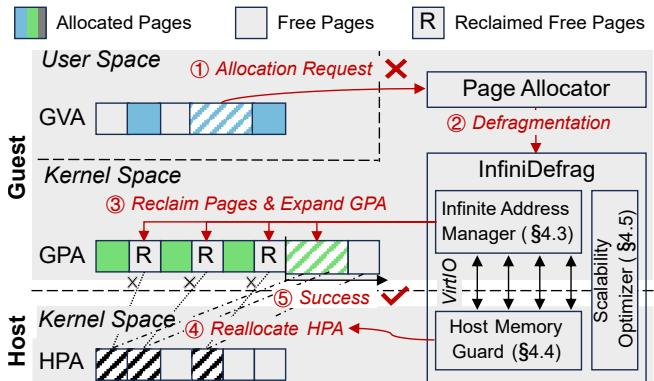  
Figure 7: INFINIDEFRAG overview. The major components are Infinite Address Manager, Host Memory Guard, and Scalability Optimizer, corresponding to our three challenges and design goals.

## 4.2 Infinite Address Manager

Infinite Address Manager leverages memory trade (§4.2-1) to manage the infinite GPA space, which consists of two compo nents: guest reclaimer (§4.2-2) and guest extender (§4.2-3).

1. Managing GPA space through memory trade. INFINIDE-FRAG adopts a simple yet efficient idea—memory trade, to fully exploit the infinite GPA space while minimizing system overhead, design complexity, and engineering effort.

Specifically, when the GPA space becomes fragmented and the guest OS cannot satisfy a huge page allocation request, it initiates a memory trade with the host via VirtIO [51]. Memory trade refers to the trade of fragmented base pages for a newly contiguous GPA region. In practice, the guest reclaims free fragment pages (via Guest Reclaimer) and uses them to extend the GPA space (via Guest Extender). The contiguous region is allocated in 1 GB block granularity. This process avoids page migration and compaction; it simply updates the host’s page tables (i.e., EPT). Moreover, the reclaimed pages and the expanded memory should satisfy the following equation:

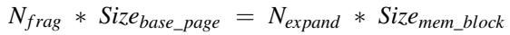

(1)

where Nf rag is the total number of reclaimed pages;   
Sizebase\_page is the size of the reclaimed base pages (i.e., 4KB);   
Nexpand is the number of memory blocks that will be expanded;   
and Sizemem\_block is the size of each memory block.

Note that memory trade is performed asynchronously without blocking allocation, so INFINIDEFRAG will fall back to base-page allocation until the memory trade completes.

2. Reclaiming GPA pages via guest reclaimer. Guest Reclaimer leverages the buddy-system allocator’s pageallocation interface [15] to identify free fragment physical pages and forwards their page-frame numbers to the host. Specifically, it reserves these fragmented pages by invoking the allocation interface, preventing regular workloads from acquiring them, and thus achieving logical reclamation. Moreover, Guest Reclaimer should coordinate with Host Memory Guard to unmap these pages from the QEMU process’s (i.e., guest OS) page table and return them to the host’s page-frame allocator (§4.3), which is similar to memory ballooning [29]. These operations expose the reclaimed pages to the host, allowing them to be reassigned to other processes.

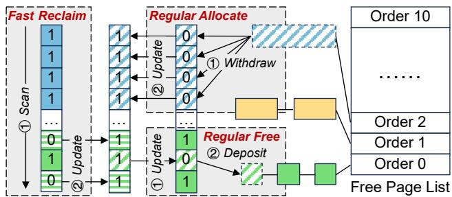  
Figure 8: Fast Reclaim vs. Regular Allocation/Free. Each dashed box is executed atomically. Note that Fast Free is unnecessary, and its workflow (if used) is similar to that of Fast Reclaim.

Optimizing reclamation via fast reclaim. Unfortunately, directly applying the (memory ballooning-like) Guest Reclaimer fails to meet our latency and overhead requirements because the buddy allocator has two limitations [52, 53]:

• Low Scalability: Allocating pages requires acquiring the zone lock, which is the bottleneck during burst allocations.

• High Complexity: Allocating pages requires complex bookkeeping to maintain buddy allocator free lists and update multiple data structures, increasing engineering overhead.

Therefore, we propose Fast Reclaim to minimize pagereclamation overhead. Inspired by Wrenger et al. [52], Fast Reclaim uses a bitmap to efficiently track page states. Unlike Wrenger’s approach, which requires a custom allocator with extensive modifications, our design remains fully compatible with the guest OS’s default buddy allocator [53].

We analyze both Fast Reclaim and Regular Allocation/Free, as shown in Figure 8. Fast Reclaim is triggered to reclaim free fragment pages when the GPA space needs expansion, which introduces a global bitmap to track the state of each page. Specifically, Fast Reclaim ① scans the entire bitmap and ② updates each bit accordingly. Moreover, INFINIDEFRAG falls back to Regular Allocation/Free for normal page requests. During Regular Allocation, it first checks whether a page in the Free Page List has already been reclaimed by Fast Reclaim. If so, INFINIDEFRAG selects another free page. If the allocation succeeds and the page was not previously marked as allocated, the guest kernel sets the corresponding bitmap bit to 1. Similarly, during Regular Free, INFINIDEFRAG clears the bitmap bits to 0 and deposits the pages back to the list.

Note that maintaining consistency between the bitmap and the buddy allocator does not degrade regular allocation/free performance. Newly extended pages are placed at the head of Free Page List, making bitmap checks rarely fail in practice (i.e., only check once). Moreover, we further improve Fast Reclaim’s scalability by optimizing the synchronization between the bitmap and the allocator, as shown in §4.4.

3. Expanding the GPA space via guest extender. Guest Extender first requests additional memory resources and forwards the corresponding page-frame numbers to Host Memory Guard as a memory-expansion request. Once Host Memory Guard fulfills the request, Guest Extender initializes the necessary bookkeeping structures and brings the newly allocated memory online. This guest-host coordination ensures that subsequent EPT faults triggered by accesses to the newly allocated GPA space are legal and correctly handled.

Optimizing expansion via reserved region. When guest memory expands, the VM must invoke the memory hotplug interface to bring newly added pages online. This process requires initializing per-page metadata inside the guest and allocating a corresponding memory-backend device in QEMU, both of which introduce nontrivial overhead. As a result, frequent expansions can noticeably degrade performance.

To address this, we employ two optimizations. First, we expand the GPA space in coarse-grained chunks (i.e., 4 GB, four memory blocks), which balances the trade-off between the cost of bringing blocks online and the frequency of expansions. Second, during system boot, the guest kernel proactively reserves a large memory region (i.e., 96 GB), initializes associated metadata, and keeps it offline. In practice, the reserved region is large enough for most workloads to run for an extended period (at the hour level, §3.3), while preparing this region takes less than 1 s, making expansion rarely happens.

## 4.3 Host Memory Guard

Host Memory Guard performs page reallocation (§4.3-1) to maintain GPA–HPA mappings when the GPA space expands. We then introduce self-hosted remap (§4.3-2) and batch unmapping (§4.3-3) for the host with base and huge pages.

1. Guarding host resources during page reallocation. Host Memory Guard coordinates with the Infinite Address Manager to support free GPA-page reclamation and GPA-space expansion, which in turn introduces host-side page reallocation. To ensure that a VM’s actual memory usage remains within its quota, Host Memory Guard should carefully control memory consumption during this process. Specifically, page reallocation maintains the GPA–HPA mapping while ① unmapping HPA pages corresponding to reclaimed GPA pages and ② allocating new HPA pages for the expanded GPA space.

2. Optimizing the host with base pages via self-hosted remap. When host memory is scarce, the host is unable to immediately allocate enough physical pages to satisfy a guest’s memory expansion request. In this case, the host should first unmap the reclaimed pages and release them back to the host’s buddy-system allocator. Later, when the guest accesses the expanded GPA space, the corresponding accesses trigger hostside page faults, and the host allocates physical pages from its allocator to resolve them. This workflow introduces two challenges to squander memory expansion efficiency:

• Long latency: The memory expansion request cannot be satisfied until page reallocation completes. Because this work occurs inside the VM-exit handler, it incurs substantial latency and stalls the generation of contiguous memory.

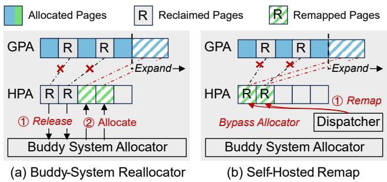  
Figure 9: Self-hosted remap. Compared to buddy system reallocator, self-host remap directly remaps fragmented pages from their original GPA locations into expanded GPA space with low overhead.

• Excessive complexity: Each reallocated page goes through multiple steps—① being unmapped from the QEMU process page table, ② returned to the host buddy allocator, and ③ reallocated to serve the newly expanded GPA region.

As shown in Figure 9b, we introduce self-hosted remap to address this issue. The key idea is to remap reclaimed fragment pages from their original GPA locations directly into the newly expanded GPA region, bypassing the host buddy allocator and amortizing expensive unmapping operations. Specifically, when the host receives fragment pages from the guest, it no longer blocks in the VM-exit handler until unmapping completes. Instead, it records the corresponding page-frame numbers in Page Dispatcher. Later, when an EPT violation occurs for accesses to the expanded GPA region, Page Dispatcher fetches one of the recorded page frames and uses it to satisfy the page fault. Note that this technique is enabled when GPA memory is backed by host base pages.

3. Optimizing the host with huge pages via batch unmapping. When the host uses huge pages, INFINIDEFRAG falls back to regular page reallocation (i.e., Figure 9a) because selfhosted remap performs in a 4 KB-granularity and will trigger numerous system calls to remap a huge page. Therefore, when the host receives fragmented huge pages, it unmaps them from the QEMU process’s page table and returns them to the host page-frame allocator. However, reclaim requests typically arrive in a scattered pattern, and unmapping pages individually incurs substantial overhead: every operation requires a system call (e.g., madvise or munmap), acquisition of the process’s address-space lock, a page-table walk, and cross-core TLB shootdowns [20]. To address this, we introduce batch unmapping. Specifically, all scattered unmapping requests are first recorded in a bitmap; the host then scans this bitmap and issues a single unmapping system call for each contiguous page range, significantly reducing unmapping overhead.

## 4.4 Scalability Optimizer

Scalability Optimizer scales INFINIDEFRAG to multi-thread and multi-VM environments. Specifically, we first introduce optimized fast reclaim (§4.4-1) to scale Infinite Address Manager; we then introduce optimized self-hosted remap (§4.4-2) and hybrid paging (§4.4-3) to scale Host Memory Guard for the host with base and huge pages, respectively.

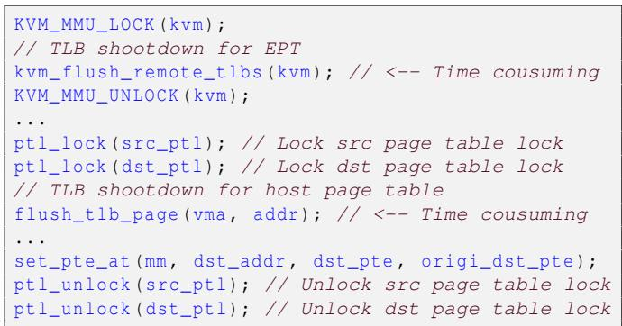  
Listing 1: Naive in-kernel remap.

1. Scaling infinite address manager via optimized fast reclaim. As shown in Figure 8, the core idea of fast reclaim is to bypass the poorly scalable kernel page allocation path by leveraging a page bitmap. Consequently, the page bitmap should be updated in several situations: (1) whenever a page is allocated or freed through the regular page allocation interface, and (2) whenever the fast reclaim interface is invoked. A straightforward way to maintain consistency between the page bitmap and the buddy allocator is to use a coarse-grained lock to protect the entire bitmap. However, such coarse-grained locking severely limits scalability and introduces substantial overhead to regular memory allocation/free operations.

Therefore, we propose a transaction-based mechanism that relies solely on hardware atomic instructions to update pagebitmap entries. (1) When different threads modify different bitmap entries, no contention or cache-line bouncing occurs. (2) For regular allocation requests (via buddy allocator) targeting compound pages of order ≤ 6, which contain at most 64 base pages, we use an atomic instruction (i.e., atomic64\_try\_cmpxchg) to test and update the corresponding bitmap entry. If it succeeds, the page is allocated; otherwise, the allocator retries with another free-list entry. Note that fast reclaim also relies on the same procedure to ensure consistency. (3) For larger allocations (order > 6), we apply a coarsegrained transaction-based approach: the allocator acquires each order-6 subpage sequentially. If any sub-allocation attempt fails, it then aborts and rolls back the entire request.

2. Scaling host memory guard with base pages via optimized self-hosted remap. INFINIDEFRAG leverages page remapping to bypass the host buddy allocator (Figure 9). A straightforward and non-intrusive way to implement it is to invoke mremap [9]. Unfortunately, mremap does not scale well with increased threads. As shown in Figure 10, its latency grows sharply with thread count, reaching ∼ 270 µs at 16 threads. The poor scalability stems from its need to manipulate multiple virtual memory areas (i.e., vm\_area\_struct) and frequently split the source virtual memory area, which is costly and requires mutual exclusion in concurrent scenarios.

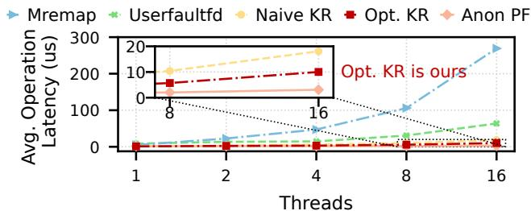  
Figure 10: Page remap latency for different techniques. The host uses base pages, and experiments are conducted under the extreme fragmentation setting (§6.1). By optimizing page remap ping—from mremap, to userfaultfd, to naive in-kernel remap (KR), and finally to optimized KR — the page remap overhead is close to that of a regular anonymous page fault (i.e., Anon PF).

We therefore explore a more efficient remapping mechanism based on userfaultfd [11], which is a user-space paging policy and implemented in host-side QEMU/KVM. The key advantage is that it updates only page-table entries and avoids manipulating kernel virtual-memory metadata. As shown in Figure 10, Userfaultfd is more scalable than Mremap. However, at 16 threads, remapping a single page still consumes 63 µs, which is too slow to meet SLOs. Moreover, kernel–user context switches introduce additional overhead, causing even single-thread remap operations to take up to 9 µs, which is much higher than 1 µs of a regular anonymous page fault.

Given the high kernel–user context-switch overhead of userfaultfd, we next introduce a lightweight kernel-based mechanism for page remapping. A naive design is to migrate the source physical page directly to the destination physical page by invoking move\_pages, as shown in Listing 1. Nevertheless, as the thread count increases, the latency of page remapping remains high (Naive KR in Figure 10). Our profiling shows that with eight threads, locking and TLB-flush operations account for a substantial fraction of the remapping cost (§6.7). Each TLB flush is guarded by either the KVM MMU lock or the page-table lock, which are expensive in multi-thread environments [19, 20, 26, 38] because they require TLB shootdown. The shootdown further exacerbates lock contention, as all threads spin while attempting to acquire these locks.

We therefore propose in-kernel remap with delayed TLB flushes. Our key insight is that once the reclaimed GPA pages have been allocated inside the guest OS, they are logically marked as inaccessible (§4.2). Consequently, there is no need to perform synchronous TLB flush. Instead, we can defer it asynchronously (as they will never be accessed by others), thereby avoiding lock contention. As shown in Figure 10, it scales efficiently across all thread counts, achieving performance close to regular anonymous page faults (Anon PF).

3. Scaling host memory guard with huge pages via hybrid paging. When the host backs VM memory using base pages, self-hosted remap is fairly efficient. However, when the host allocates VM memory using huge pages, reclaiming free GPA pages may introduce either internal (i.e., lazily freeing fragmented base pages from a host huge page) or external (i.e., directly splitting host huge pages) fragmentation on the host side, particularly in the multi-VM environment.

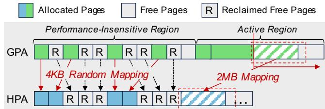  
Figure 11: Hybrid paging. Memory allocated during subsequent expansions is backed by huge pages on the host, whereas the previously allocated fragment pages are mapped using base pages.

We introduce hybrid paging to address this challenge, as shown in Figure 11. Specifically, we first align GPA-HPA mappings with huge pages to maximize system performance and reduce TLB misses. For old fragment pages that are still valid and cannot be reclaimed by guest reclaimer, we use base pages to maintain their GPA-HPA mappings. Because these fragmented pages typically reside in performance-uncritical regions (e.g., kernel objects, page cache, and other cold memory areas), we let the host perform background compaction. In contrast, performance-critical pages are allocated from the newly expanded GPA regions and backed by host-huge pages, which benefit from large GPA-HPA mappings. Therefore, hybrid paging avoids both host-side and guest-side fragmentation to achieve the near-ideal performance (Figure 23). Note that host-side compaction is necessary when the host uses huge pages, whereas the guest remains compaction-free during defragmentation, consistent with our insight (§3.3).

## 5 Implementation

INFINIDEFRAG requires coordinated changes to three layers of the virtualization stack: the guest kernel, the host kernel, and QEMU/KVM, with ∼ 7K lines of code (LoC) modified. Nevertheless, since INFINIDEFRAG operates as separate modules at each layer, it is still compatible with existing virtualization architectures, allowing traditional VMs and our modified VMs to run concurrently within the same environment. This section summarizes where each component in §4 is implemented and how the three layers interact.

Guest-side implementation. The Infinite Address Manager (§4.2) and the guest-side portion of Scalability Optimizer (§4.4-1) are implemented inside the guest kernel and extend the regular higher-order allocation path. Specifically, Guest Reclaimer and Fast Reclaim are integrated with the guest buddy allocator to identify and reserve free fragment GPA pages, while Guest Extender manages GPA-space expansion and memory hotplug. Moreover, the guest also maintains the page bitmap used by Fast Reclaim and initializes per-page metadata for newly onlined pages. From the guest’s perspective, INFINIDEFRAG remains transparent to applications: it is triggered only when regular huge-page allocation fails.

Host-side implementation. The Host Memory Guard (§4.3) and the host-side portion of Scalability Optimizer (§4.4-2 and §4.4-3) are implemented in the host kernel. Their responsibilities are to (1) reclaim HPA pages corresponding to freed GPA pages, (2) enforce the VM’s memory quota during GPA expansion, and (3) maintain GPA–HPA mappings during page reallocation. The host kernel further implements the optimized remapping path used by self-hosted remap, the bitmap-driven batch unmapping, and the host-side hybrid paging. When the host uses huge pages, it may still perform background compaction to recover host huge pages; However, guest-side compaction is removed from the critical path.

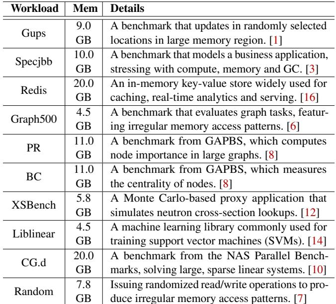  
Table 1: Evaluated workloads. ’Mem’ is the working set size. These workloads are widely used in prior studies [39, 43, 46].

QEMU/KVM integration. QEMU/KVM serves as the coordination point between the guest and host implementations. QEMU provisions the memory-backend device used for reserved GPA expansion, while KVM handles the resulting EPT faults and updates the corresponding second-level mappings. Therefore, the optimized remapping (§4.4-2) and delayed TLB-flush (§4.4-3) are also implemented in the KVM-assisted host path, while QEMU provides the userspace memory backend needed to expose the expanded GPA region.

## 6 Evaluation

Our evaluation aims to answer the following questions:

• Does INFINIDEFRAG outperform competitors? (§6.2)

• Does INFINIDEFRAG reduce request latency? (§6.3)

• Can INFINIDEFRAG defragment memory efficiently? (§6.4)

• Can INFINIDEFRAG supply sufficient huge pages? (§6.5)

• Can INFINIDEFRAG scale to complex environments? (§6.6)

• Does INFINIDEFRAG introduce additional overhead? (§6.7)

• Does INFINIDEFRAG consume more resources? (§6.8)

## 6.1 Experimental Setup

Testbed. We conduct experiments on QEMU 8.2.94 with KVM enabled, using a Linux 6.10.0 host kernel. Specifically, (1) The host machine is a dual-socket server, where each socket contains a 28-core Intel Xeon Gold 6330 CPU (2.0 GHz) and 128 GB of DRAM, running Ubuntu 22.04. (2) The guest VM runs Ubuntu 20.04 and is configured with 16 vCPUs and 64 GB of memory. All modifications are applied to both QEMU 8.2.94 and the Linux 6.10.0 kernel.

Competitors. We compare INFINIDEFRAG with several stateof-the-art approaches for mitigating huge-page fragmentation (guest side only): CBMM [43], LLFREE [53], Linux Transpar ent Huge Pages (Linux THP) under multiple configurations, Linux using only 4 KB base pages (Linux 4 KB), and Linux THP in non-fragment settings (NoFrag). Here, NoFrag denotes the non-fragmented baseline under the corresponding host-page configuration used in each figure. CBMM applies adaptive policies to decide when to defragment and form huge pages, while LLFREE introduces a new kernel page allocator optimized for 2 MB page allocation. For Linux THP, we evaluate three variants: the default policy (promotion rate 1.6 MB/s), aggressive policy (16 MB/s, THP Aggr), and synchronous huge-page promotion on page faults (THP Sync).

Workloads and methodology. Table 1 summarizes the workloads used in our experiments. We choose them because (1) their working-set sizes reliably induce and expose fragmentation, and (2) they are widely used in prior studies. Moreover, we evaluate host configurations using both 4 KB base pages (THP is disabled) and 2 MB huge pages (THP is set to always). Due to the page limit, we omit (some) detailed analysis of the host-side huge-page configuration, as part of the results have already been shown in §3, and these results follow a trend similar to those of host-side base-page configuration.

Fragmentation setup. To emulate guest-side fragmentation, we follow [46] (see details in §8) with additional steps. Specifically, for each guest, we first load large files that exceed the guest’s total memory capacity into the page cache, and then randomly access them for 10 minutes to disrupt LRU ordering. We further reclaim a memory region equal to the target workload’s working set, triggering page replacement to evict cold pages. Meanwhile, we evaluate three levels of fragmentation.

• Extreme fragmentation setting. We logically divide the filebacked memory into 2 MB regions and randomly access 256 × 4 KB pages within each region before reclaim. As a result, the reclaimed holes are densely interleaved, so the buddy allocator can coalesce free memory only into order-0 or order-1 chunks (i.e., 4 KB or 8 KB free extents), creating severe fragmentation with almost no high-order pages.

• Moderate (50%) fragmentation setting. We access only 1– 2 random 4 KB pages in each 2 MB region before reclaim. This leaves one or two “pinned” pages in every 2 MBaligned region, preventing order-9 coalescing while still allowing the buddy allocator to merge the remaining free space into 512 KB or 1 MB blocks. We refer to this setting as 50% fragmentation because, after reclaim, each hugepage-sized region remains coalescible only up to about half of its original size (i.e., at most an order-8 block, or roughly 1 MB), rather than a full 2 MB order-9 block.

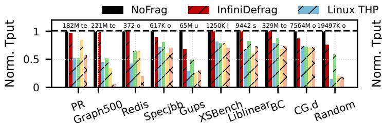  
(a) Host with Huge Page

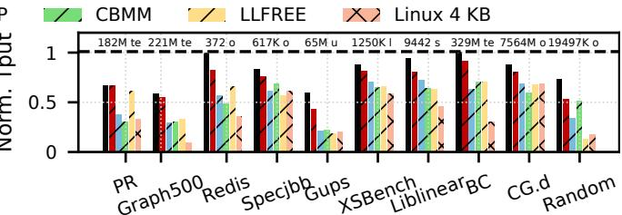  
(b) Host with Base Page

Figure 12: End-to-end throughput under extreme fragmentation setting. All bars are normalized to NoFrag with host-huge configuration, enabling direct comparison between the host-base and host-huge configurations. The dashed line marks this upper bound. Moreover, the numbers above the bars report the throughput of NoFrag with host-huge configuration for each workload. The terms te, o, u, l, and s denote Traversed Edges, Operations, Updates, Lookups, and Samples Per Second, respectively.  
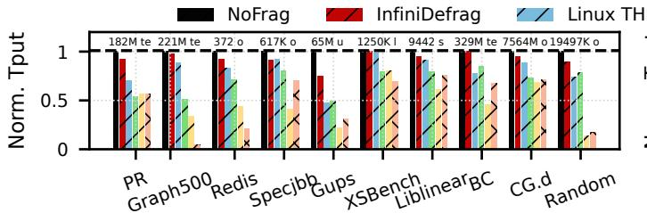  
(a) Host with Huge Page

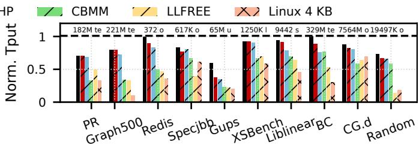  
(b) Host with Base Page  
Figure 13: End-to-end throughput under moderate (50%) fragmentation setting. All bars are normalized to NoFrag with host-huge configuration, enabling direct comparison between the host-base and host-huge configurations. The dashed line marks this upper bound. Moreover, the numbers above the bars report the throughput of NoFrag with host-huge configuration for each workload.

• Light/no fragmentation setting. We skip the fragmentationinjection procedure above to avoid severe fragmentation. Instead, we start from a freshly initialized VM, warm up the workload, and measure after the memory layout reaches a stable state. In this setting, contiguous 2 MB regions remain widely available and all systems can obtain huge pages normally, allowing us to check whether INFINIDEFRAG introduces overhead on the normal allocation path.

Finally, we start the workload with both background compaction and THP promotion enabled. Unless otherwise stated, the main results use the extreme fragmentation setting. Note that competitors in the anti-fragmentation category (i.e., CBMM and LLFREE) are expected to mitigate the fragmentation problem during this procedure, enabling subsequent workloads to acquire more huge pages during execution.

## 6.2 Performance Improvement

Evaluation setup. In this section, we compare the end-toend throughput of INFINIDEFRAG under extreme, moderate, and light/no-fragmentation settings, with all the workloads summarized in Table 1, and the host with huge/base page configurations. Moreover, all results are normalized to NoFrag with the host-huge configuration. This unified normalization enables direct comparison between the host-base and hosthuge configurations. Note that for INFINIDEFRAG, we enable self-hosted remap (§4.3-2 and §4.4-2) when the host uses base pages, and batch unmapping (§4.3-3) plus hybrid paging (§4.4-3) when the host uses huge pages, separately.

Throughput under extreme fragmentation. The results in Figure 12 show that INFINIDEFRAG consistently achieves the highest throughput under all the configurations. Specifically, when the host uses huge pages, INFINIDEFRAG approaches the upper bound in most workloads, indicating that it preserves most of the benefit of 2 MB guest and host mappings. When the host uses base pages, INFINIDEFRAG still outperforms all baselines, but a visible gap to the upper bound remains. This gap reflects the cost of shattered EPT mappings: although INFINIDEFRAG preserves 2 MB guest pages, scattered 4 KB host pages may prevent the host from using 2 MB EPT entries, requiring up to 512 EPT entries for a 2 MB guest region. However, even with this penalty, INFINIDEFRAG still reliably supplies 2 MB huge pages on demand and avoids the wasted compaction overhead incurred by Linux THP.

Throughput under moderate (50%) fragmentation. Figure 13 reports the moderate-fragmentation results under both host-huge/base configurations, which suggests that INFINIDE-FRAG remains the best-performing approach in both of the two configurations. However, the throughput gap over Linux THP becomes smaller than that in Figure 12. The reason is that moderate fragmentation still leaves sizable contiguous regions (e.g., 512 KB and 1 MB blocks), making huge-page recovery easier for the baseline and therefore reducing the benefit of compaction-free defragmentation. Moreover, compared to the extreme fragmentation setting, INFINIDEFRAG with moderate fragmentation remains closer to the upper bound (i.e., NoFrag with host-huge pages) under the host-huge configuration, whereas the host-base configuration still exhibits a moderate gap due to the lack of 2 MB EPT mappings.

Throughput under light/no-fragmentation. In this setting, since all systems can obtain host-side huge pages normally and easily, all approaches achieve similar performance.

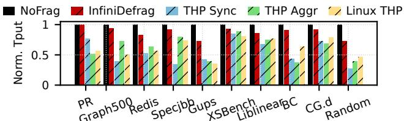  
Figure 14: Throughput of different THP settings. The host uses base pages, and experiments are conducted under extreme fragmentation. Note that other configurations have a similar trend.

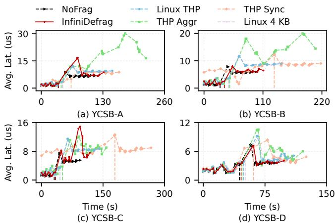  
Figure 15: Latency analysis under YCSB-Redis. We first build the database (i.e., the load phase), and the vertical dashed line marks the transition to the run phase. We omit LLFREE and CBMM because their results are similar to those of Linux 4 KB. Moreover, the host uses base pages, experiments are conducted under extreme fragmentation, and other configurations have a similar trend.

Therefore, we do not report the results under the light/nofragmentation setting. Specifically, when fragmentation is mild, INFINIDEFRAG rarely needs to expand the GPA space, while Linux THP can recover huge pages through direct compaction with little overhead. As a result, the benefit of compaction-free defragmentation becomes small.

Throughput of different THP settings. As shown in Fig ure 14, INFINIDEFRAG consistently outperforms all variants of Linux THP across evaluated workloads. Notably, there is no single THP configuration that achieves optimal performance for every workload; both conservative (i.e., Linux Sync) and aggressive (i.e., Linux Aggr) strategies can introduce performance regressions. The reasons are further analyzed in §6.7.

## 6.3 Latency Analysis

Figure 15 shows the real-time latency of the YCSB workloads during both the load and run phases. We report only the results for the host using base pages under the extreme fragmentation setting, while other configurations exhibit a similar trend. The results suggest that INFINIDEFRAG consistently exhibits the lowest latency, whereas all Linux THP variants (i.e., Linux THP, THP Aggr, and THP Sync) exhibit poor latency and can even underperform the 4KB-only baseline (i.e., Linux 4 KB). Interestingly, THP Sync and THP Aggr hit their latency bottlenecks at different stages: THP Sync shows substantially higher latency during the load phase, while THP Aggr suffers from severe latency spikes during the run phase. The reason is that most memory allocations occur in the load phase; THP Sync triggers synchronous compaction on the allocation path, introducing high allocation latency. By contrast, THP Aggr performs system-wide scanning and page migrations in the run phase, heavily interfering with the YCSB-Redis workload.

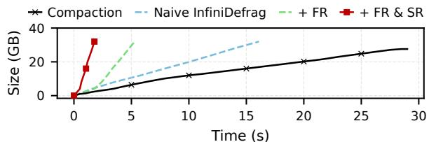  
Figure 16: Defragmentation efficiency analysis. Experiments are conducted without foreground applications. “FR” refers to fast reclaim (§4.2), and “SR” refers to self-hosted remap (§4.3). The host uses base pages, experiments are conducted under extreme fragmentation, and other configurations have a similar trend.

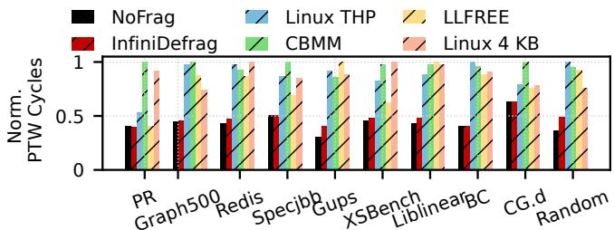  
Figure 17: Comparison of page table walk cycles. The host uses base pages, and experiments are conducted under extreme fragmentation. Although using huge pages only at the guest cannot reduce TLB miss rate, it still significantly reduces PTW cycles.

## 6.4 Defragmentation Efficiency

This section measures the raw bandwidth of different defragmentation mechanisms, where bandwidth is defined as the amount of contiguous physical memory generated per second. Similarly, we report only the results for the host using base pages under the extreme fragmentation setting, while other configurations exhibit a similar trend. Moreover, we exclude those anti-fragmentation approaches (i.e., LLFREE and CBMM) because they cannot produce contiguous memory. The results are shown in Figure 16, Compaction (i.e., Linux THP) achieves 0.91 GB/s, while INFINIDEFRAG + FR & SR reaches nearly 20 GB/s (i.e., about 19× improvement). These results demonstrate that INFINIDEFRAG can defragment memory with substantially higher efficiency.

## 6.5 Huge Page Analysis

Page table walk cycles. The workloads we evaluate (Table 1) exhibit highly random memory access patterns, which lead to frequent TLB misses and expensive page table walks. INFINIDEFRAG outperforms other approaches primarily because it significantly reduces the cycles spent on page table walks. Figure 17 compares PTW cycles across all approaches and, together with Figure 12, demonstrates a strong correlation between reduced PTW cycles and improved performance. The remaining gap between INFINIDEFRAG with host base pages and the upper bound in Figure 12 is consistent with this result, as host base pages prevent the use of 2 MB EPT mappings and thus increase nested page-walk overhead.

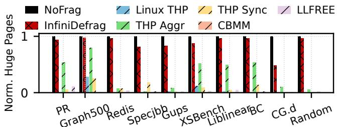  
Figure 18: Total allocated huge pages. The host uses base pages, and experiments are conducted under extreme fragmentation. CBMM/LLFREE cannot allocate any huge pages in many workloads.

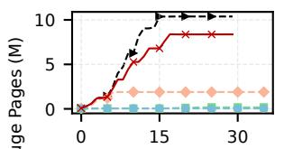

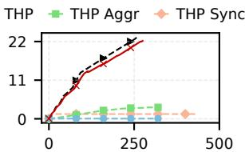

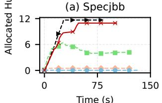  
(c) PR

(b) Redis  
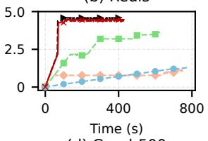  
(d) Graph500  
Figure 19: Allocated huge pages over time. The host uses base pages, and experiments are conducted under extreme fragmen tation. We do not evaluate CBMM and LLFREE because they cannot allocate any huge pages in many workloads (i.e., Figure 18).

Allocated huge pages. By mapping larger memory regions with each TLB entry, huge pages substantially reduce TLB pressure and the number of memory accesses required during a TLB miss. This reduction in PTW cycles makes huge pages a critical optimization for efficient address translation.

Figure 18 shows the total allocated huge pages. Under severe fragmentation, both anti-fragmentation (i.e., CBMM and LLFREE) and defragmentation (i.e., Linux THP, THP Aggr, and THP Sync) techniques allocate far fewer huge pages than the total working set size. In contrast, INFINIDEFRAG nearly reaches this upper bound, with the small remaining gap arising from its fallback to base-page allocation when memory trade (§4.2-1) is performed asynchronously. Although THP Aggr can increase the number of allocated huge pages, they still suffer from substantial throughput degradation (Figure 14) due to the high overhead of memory compaction (§6.7).

We further analyze the temporal behavior of huge page allocations across the workload’s execution, as shown in Fig ure 19. Most workloads allocate physical memory gradually rather than all at startup, consistent with the OS’s lazy allocation policy. Consequently, memory allocation continues throughout the workload’s lifetime, making these workloads highly sensitive to the memory compaction overhead. Because memory compaction lies on the critical path of the page fault handler—i.e., during physical page allocation—it can introduce substantial runtime overhead.

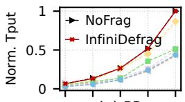  
(a) PR

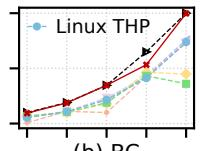  
(b) BC

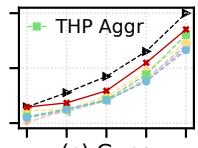  
(c) Gups

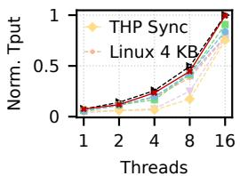

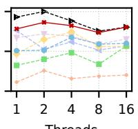  
(d) Specjbb

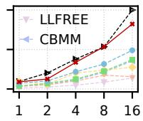  
(e) Redis  
(f) Graph500

Figure 20: Multi-thread throughput. The host uses base pages, and experiments are conducted under the extreme fragmentation setting. Note that the Redis server is a single-thread model; therefore, increasing thread counts does not improve throughput and may even degrade performance due to lock contention.  
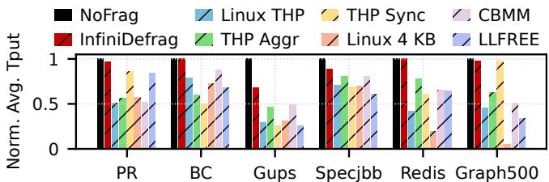  
Figure 21: Multi-VM throughput. The host uses huge pages, and experiments are conducted under extreme fragmentation. Each bar reports the average throughput. We do not evaluate the host with base pages because its performance is similar to the single-VM case (i.e., without host-side fragmentation and inter-VM interference).

## 6.6 Scalability Analysis

Throughput under multi-threads. As shown in Figure 20, INFINIDEFRAG consistently outperforms competitors at all concurrency levels, demonstrating the effectiveness of optimized fast reclaim (§4.4-1) and optimized self-hosted remap (§4.4-2). Specifically, THP Sync fails to scale for Redis and Graph500 because synchronous compaction in the page-fault path becomes a bottleneck at high concurrency. Linux THP also fails to scale, as its background compaction depends on expensive page migrations, including TLB shootdowns. Note that the huge page configuration (on the host) and the moderate (50%) fragmentation setting exhibit a similar trend, and we evaluate only six workloads due to the page limit.

Throughput under multi-VMs. Figure 21 shows the average performance of three VMs, where INFINIDEFRAG outperforms competitors in most cases, demonstrating the effectiveness of optimized fast reclaim (§4.4-1) and hybrid paging (§4.4-3). Note that the multi-VM results are similar to those of the single-VM results (i.e., Figure 12), indicating that there is no noticeable performance interference between VMs. Moreover, we omit the configuration where the host uses base pages or suffers from moderate (50%) fragmentation, because these settings do not introduce meaningful host-side fragmentation or inter-VM interference; therefore, their overall performance is expected to be similar to the single-VM case.

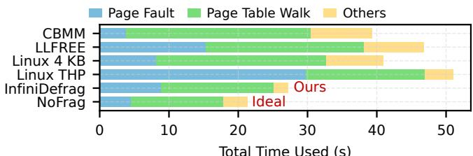  
(a) Time breakdown of Gups.

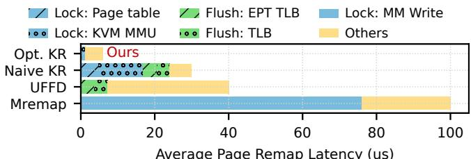  
(b) Time breakdown of remap under 8-thread Gups.  
Figure 22: Overhead analysis of INFINIDEFRAG. The host uses base pages, and experiments are conducted under the extreme fragmentation setting. (a) Page Fault includes memory compaction or fast reclaim. (b) Opt. KR is our optimized in-kernel remap, Naive KR is the in-kernel remap without deferred TLB flush, UFFD is userfaultfd, and Mremap is the mremap syscall (§4.4-2).

## 6.7 Overhead Analysis

Infinite address manager. We first analyze Gups to evaluate whether infinite address manager introduces additional overhead, as shown in Figure 22a. The results show that IN FINIDEFRAG reduces the time spent in the page-fault path and achieves near-optimal performance thanks to optimized fast reclaim (§4.4-1). In contrast, Linux THP reduces PTW cycles but spends considerable time in memory compaction (i.e., increased Page Fault). As a result, the runtime is even longer than that of Linux 4 KB. Note that the host-side Page Fault introduced in Figure 22a is different from the guest-side anonymous page fault introduced in Figure 10.

Host memory guard with base pages. We further evaluate whether the optimized kernel remap (i.e., Opt. KR, §4.4-2) improves the efficiency of self-hosted remap and thereby minimizes the overhead of host memory guard when the host uses base pages. The results in Figure 22b indicate that, by safely deferring TLB flushes, Opt. KR eliminates nearly all lock contention overheads (i.e., only reserve Lock: KVM MMU), thus achieving the best performance with minimal overheads.

Host memory guard with huge pages. We next evaluate whether hybrid paging mitigates host-side fragmentation and thereby reduces the overhead of Host Memory Guard when the host uses huge pages (§4.4-3). As shown in Figure 23a, w/ Hybrid Paging achieves performance close to Ideal, which represents the case where the host has sufficient free memory to provide huge pages. This prevents INFINIDEFRAG from degrading to Worst, which occurs when the host becomes fully fragmented and cannot provide any huge pages.

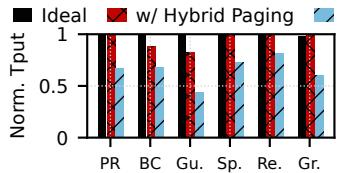

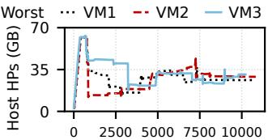  
(a) Workload Throughput (b) Host huge pages over time (s)

Figure 23: Multi-VM analysis of hybrid paging. The host uses huge pages (i.e., only this configuration has hybrid paging), and experiments are conducted under the extreme fragmentation setting. Moreover, (a) Gu., Sp. Re., and Gr. represent Gups, Specjbb, Redis, and Graph500. Ideal and Worst denote Linux THP running atop the host using all huge and base pages. (b) Each VM sequentially executes the six workloads listed in subfigure (a).  
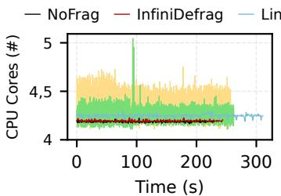  
(a) XSBench

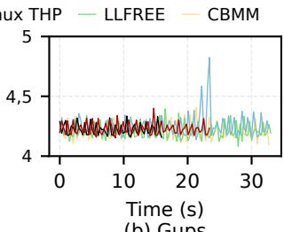  
(b) Gups  
Figure 24: Real-time CPU usage. The host uses base pages, and experiments are conducted under extreme fragmentation.

The small remaining gap observed in BC and Gups workloads arises from two aspects: (1) reclaiming fragmented pages may require splitting nearby huge pages into 4 KB mappings; and (2) the host performs asynchronous compaction on these 4 KB pages, introducing background overhead. Because most of these 4 KB pages reside in performance-insensitive regions, their overheads have only a minor impact.

Figure 23b shows that each VM requires only 30–40 GB of huge pages. This is because host-side huge pages are primarily applied to the expanded GPA region, which largely covers workloads’ working set. In addition, VMs finish with a similar time, indicating a small interference between them.

## 6.8 Consumed Resources

CPU usage. Figure 24 shows that INFINIDEFRAG consumes fewer CPU cores with negligible fluctuations than competitors. Under fragmented memory, Linux THP incurs compaction overhead from page faults and the background daemon. Moreover, LLFREE and CBMM consume more CPU cores to carefully control page placement decisions and preserve large contiguous regions for each allocation. In contrast, INFINIDE-FRAG eliminates compaction and introduces only negligible CPU overhead when expanding contiguous memory.

Memory usage. The fast reclaim (§4.2-2) introduces a page bitmap that tracks page states using only 2 bits per page (one bit for free/allocation state and one bit for online/offline state). In addition, as the guest physical address space grows, the memory footprint of per-page metadata increases proportionally: each 4 KB page requires 64 bytes of metadata, amounting to roughly 1.6% of its size. Moreover, the memory overheads of all other kernel data structures are negligible.

## 7 Discussion

Host-side huge pages vs base pages. Using huge pages on the host reduces TLB pressure and page-table footprint, thereby improving VM performance. However, huge pages limit fine-grained control: they complicate memory reclamation, increase internal fragmentation, and disable page-level deduplication mechanisms such as KSM [27, 39, 55]. In contrast, base pages provide greater flexibility for reclamation, compaction, and deduplication, but incur higher TLB overhead. Overall, host-side huge pages deliver high performance, whereas host-side base pages offer high flexibility, and IN-FINIDEFRAG performs well under both configurations.

Giant page support. 1 GB giant pages provide substantial benefits for memory-intensive workloads [50]. However, Linux currently lacks transparent support for 1GB THP, and memory fragmentation makes such allocations nearly impossible in practice [50, 56]. In contrast, INFINIDEFRAG can efficiently construct large contiguous physical regions, making 1 GB page allocation far more feasible.

Unbounded GPA space expansion. We currently apply no specialized optimizations to the unbounded GPA expansion. Therefore, there are two possible problems: (1) page-metadata memory grows linearly with GPA size; one possible optimization is to recycle metadata from reclaimed pages to avoid new allocations during future expansions. (2) unrestricted expansion could eventually exhaust the 57-bit physical address space, although this would take more than a century (§3.3). A potential optimization is to retrieve earlier fragmented pages from the host while returning the expanded contiguous regions. We leave these optimizations to our future work.

Page cache reclamation. The page cache is a major contributor to guest-side memory fragmentation [42]. Therefore, we plan to leverage our fast reclaim mechanism (§4.2-2) to reclaim fragmented page-cache pages. By integrating pagecache reclamation into the defragmentation pipeline, we expect to further improve the availability of contiguous memory and enhance the overall effectiveness of INFINIDEFRAG.

## 8 Related Work

Object-level and allocator-level defragmentation. Objectbased defragmentation techniques classify objects by predicted lifetimes and colocate those with similar lifetimes [24, 31, 40, 41]. Recent allocator-level techniques such as TCMalloc [31] are also hugepage-aware and improve huge-page utilization in production by steering allocations into alreadybacked huge pages and adaptively releasing unused subregions. Because the kernel ultimately manages memory at page granularity, these approaches operate primarily in user space and do not directly address guest physical memory fragmentation inside a VM. In contrast, INFINIDEFRAG operates at the guest-physical level and is orthogonal to such methods; the two could be combined to further improve performance.

Page-level defragmentation. Illuminator [48] targets permanent fragmentation caused by unmovable pages but does not optimize regular memory compaction, making it complementary to our approach. LLFREE [53] revisits page-frame allocation from the kernel level and provides a scalable allocator with low metadata overhead and built-in anti-fragmentation behavior for huge pages. However, it requires replacing the Linux buddy allocator, making it less compatible with existing kernel features such as compaction and NUMA balancing. Moreover, under the highly fragmented VM settings (e.g., the extreme fragmentation setting in §6.1), its anti-fragmentation benefits become limited and it underperforms INFINIDEFRAG in end-to-end throughput (i.e., Figure 12 and Figure 13).

NUMA-aware defragmentation. vMitosis [46] addresses remote page-table accesses in virtualized NUMA systems by improving translation locality, either by migrating page tables to the local node or replicating them across sockets. We do not compare against it because the two works are orthogonal: vMitosis focuses on NUMA-aware page-table placement, whereas our work targets memory defragmentation. By the way, our proposed memory trade (§4.2-1) can achieve NUMA-aware support by implementing at a per-NUMA-node granularity, ensuring that the GPA space expansion allocates and reclaims pages only from the corresponding NUMA node.

Architectural support for defragmentation. Some prior works [25, 49, 56] address huge-page allocation under fragmentation by introducing architectural-level optimizations, which require specialized hardware support. For example, Contiguitas [56] targets host-side physical memory contiguity. It separates movable and unmovable allocations and uses hardware support to migrate unmovable pages, thereby increasing the availability of contiguous HPA. In contrast, INFINIDEFRAG provides contiguous GPA without guest-side compaction. The two approaches are therefore complementary: a host running Contiguitas could provide more contiguous HPA memory, allowing INFINIDEFRAG’s host-huge page mode and hybrid paging to use more 2 MB-2 MB mappings.

## 9 Conclusion

We propose INFINIDEFRAG, a novel defragmentation technique for virtualized environments that efficiently generates huge pages. The key insight is to treat the guest physical address space as (nearly) infinite by controlling the mapping between guest and host physical addresses, thereby eliminating the need for costly memory compaction. Extensive experiments demonstrate that INFINIDEFRAG outperforms state-of-the-art approaches, achieving near-optimal performance comparable to non-fragmented memory conditions.

## Acknowledgment

We sincerely thank our shepherd, Emmett Witchel, and reviewers for their constructive suggestions. This research was partly supported by the National Natural Science Foundation of China under Grant 62472127, Shenzhen Science and Technology Program under Grant RCYX20210609104510007.

## References

[1] Gups: Hpcc randomaccess benchmark. https://gith ub.com/alexandermerritt/gups, 2006.

[2] Memory compaction. https://lwn.net/Articles/3 68869/, 2010.

[3] Specjbb® 2015. https://www.spec.org/jbb2015/, 2015.

[4] Five-level page tables. https://lwn.net/Articles /717293/, 2017.

[5] Intel 5-level paging. https://cdrdv2-public.inte l.com/671442/5-level-paging-white-paper.pd f, 2017.

[6] Graph 500: large-scale benchmarks. https://graph5 00.org/, 2019.

[7] Randomaccess. https://github.com/csl-iisc/ nuKSM-pact21-artifact/tree/main/benchmarks /randomAccess, 2021.

[8] Gap benchmark suite. http://gap.cs.berkeley.ed u/benchmark.html, 2024.

[9] mremap(2) — linux manual page. https://man7.org /linux/man-pages/man2/mremap.2.html, 2024.

[10] Nas parallel benchmarks. https://www.nas.nasa.g ov/software/npb.html, 2024.

[11] userfaultfd(2) — linux manual page. https://man7.o rg/linux/man-pages/man2/userfaultfd.2.html, 2024.

[12] Xsbench: The monte carlo macroscopic cross section lookup benchmark. https://github.com/ANL-CES AR/XSBench, 2024.

[13] Hugetlb pages. https://docs.kernel.org/adminguide/mm/hugetlbpage.html, 2025.

[14] Liblinear – a library for large linear classification. https://www.csie.ntu.edu.tw/\~cjlin/libline ar/, 2025.

[15] Physical page allocation. https://www.kernel.o rg/doc/gorman/html/understand/understand00 9.html, 2025.

[16] Redis - the real-time data platform. https://redis. io/, 2025.

[17] Transparent hugepage support. https://docs.kerne l.org/admin-guide/mm/transhuge.html, 2025.

[18] Chloe Alverti, Stratos Psomadakis, Vasileios Karakostas, Jayneel Gandhi, Konstantinos Nikas, Georgios Goumas, and Nectarios Koziris. Enhancing and exploiting contiguity for fast memory virtualization. In Proceedings of the 47th Annual International Symposium on Computer Architecture (ISCA), pages 515–528, 2020.

[19] Nadav Amit. Optimizing the TLB shootdown algorithm with page access tracking. In Proceedings of the 2017 USENIX Annual Technical Conference (USENIX ATC), pages 27–39, 2017.

[20] Nadav Amit, Amy Tai, and Michael Wei. Don’t shoot down TLB shootdowns! In Proceedings of the 15th European Conference on Computer Systems (EuroSys), pages 1–14, 2020.

[21] Arkaprava Basu, Jayneel Gandhi, Jichuan Chang, Mark D Hill, and Michael M Swift. Efficient virtual memory for big memory servers. ACM SIGARCH Computer Architecture News, 41(3):237–248, 2013.

[22] Christopher Clark, Keir Fraser, Steven Hand, Jacob Gorm Hansen, Eric Jul, Christian Limpach, Ian Pratt, and Andrew Warfield. Live migration of virtual machines. In Proceedings of the 2nd Symposium on Networked Systems Design and Implementation (NSDI), 2005.

[23] Brian F Cooper, Adam Silberstein, Erwin Tam, Raghu Ramakrishnan, and Russell Sears. Benchmarking cloud serving systems with YCSB. In Proceedings of the 1st ACM symposium on Cloud computing (SoCC), pages 143–154, 2010.

[24] Tamar Domani, Elliot K. Kolodner, and Erez Petrank. A generational on-the-fly garbage collector for Java. In Proceedings of the ACM SIGPLAN 2000 Conference on Programming Language Design and Implementation (PLDI), pages 274–284, 2000.

[25] Yu Du, Miao Zhou, Bruce R Childers, Daniel Mossé, and Rami Melhem. Supporting superpages in noncontiguous physical memory. In Proceedings of the 21st International Symposium on High Performance Computer Architecture (HPCA), pages 223–234. IEEE, 2015.

[26] Bin Gao, Qingxuan Kang, Hao-Wei Tee, Kyle Timothy Ng Chu, Alireza Sanaee, and Djordje Jevdjic. Scalable and effective page-table and TLB management on NUMA systems. In Proceedings of the 2024 USENIX Annual Technical Conference (USENIX ATC), pages 445–461, 2024.

[27] Fan Guo, Yongkun Li, Yinlong Xu, Song Jiang, and John CS Lui. SmartMD: A high performance deduplication engine with mixed pages. In Proceedings of the

2017 USENIX Annual Technical Conference (USENIX ATC), pages 733–744, 2017.

[28] Alexander Halbuer, Illia Ostapyshyn, Lukas Steiner, Lars Wrenger, Matthias Jung, Christian Dietrich, and Daniel Lohmann. The New Costs of Physical Memory Fragmentation. In Proceedings of the 2nd Workshop on Disruptive Memory Systems (DIMES), pages 33–40, 2024.

[29] Jingyuan Hu, Xiaokuang Bai, Sai Sha, Yingwei Luo, Xiaolin Wang, and Zhenlin Wang. HUB: Hugepage ballooning in kernel-based virtual machines. In Proceedings of the International Symposium on Memory Systems (MEMSYS), pages 31–37, 2018.

[30] Wenjin Hu, Andrew Hicks, Long Zhang, Eli M. Dow, Vinay Soni, Hao Jiang, Ronny L. Bull, and Jeanna N. Matthews. A quantitative study of virtual machine live migration. In ACM Cloud and Autonomic Computing Conference (CAC), pages 11:1–11:10, 2013.

[31] Andrew Hamilton Hunter, Chris Kennelly, Paul Turner, Darryl Gove, Tipp Moseley, and Parthasarathy Ranganathan. Beyond malloc efficiency to fleet efficiency: a hugepage-aware memory allocator. In Proceedings of the 15th USENIX Symposium on Operating Systems Design and Implementation (OSDI), pages 257–273, 2021.

[32] Nancy Jain and Sakshi Choudhary. Overview of virtual ization in cloud computing. In Proceedings of the 2016 Symposium on Colossal Data Analysis and Networking (CDAN), pages 1–4, 2016.

[33] Weiwei Jia, Jiyuan Zhang, Jianchen Shan, and Xiaoning Ding. Making dynamic page coalescing effective on virtualized clouds. In Proceedings of the 18th European Conference on Computer Systems (EuroSys), pages 298– 313, 2023.

[34] Sudarsun Kannan, Yujie Ren, and Abhishek Bhattacharjee. KLOCs: kernel-level object contexts for heterogeneous memory systems. In Proceedings of the 26th ACM International Conference on Architectural Support for Programming Languages and Operating Systems (ASP-LOS), pages 65–78, 2021.

[35] Vasileios Karakostas, Jayneel Gandhi, Furkan Ayar, Adrián Cristal, Mark D Hill, Kathryn S McKinley, Mario Nemirovsky, Michael M Swift, and Osman Ünsal. Redundant memory mappings for fast access to large memories. ACM SIGARCH Computer Architecture News, 43(3S):66–78, 2015.

[36] Vasileios Karakostas, Jayneel Gandhi, Adrián Cristal, Mark D Hill, Kathryn S McKinley, Mario Nemirovsky, Michael M Swift, and Osman S Unsal. Energy-efficient

address translation. In Proceedings of the 2016 IEEE International Symposium on High Performance Computer Architecture (HPCA), pages 631–643, 2016.

[37] Sang-Hoon Kim, Sejun Kwon, Jin-Soo Kim, and Jinkyu Jeong. Controlling physical memory fragmentation in mobile systems. ACM SIGPLAN Notices, 50(11):1–14, 2015.

[38] Mohan Kumar Kumar, Steffen Maass, Sanidhya Kashyap, Ján Vesely, Zi Yan, Taesoo Kim, Abhishek\` Bhattacharjee, and Tushar Krishna. Latr: Lazy translation coherence. In Proceedings of the 23rd International Conference on Architectural Support for Programming Languages and Operating Systems (ASPLOS), pages 651–664, 2018.

[39] Youngjin Kwon, Hangchen Yu, Simon Peter, Christopher J Rossbach, and Emmett Witchel. Coordinated and efficient huge page management with ingens. In Proceedings of the 12th USENIX Symposium on Operating Systems Design and Implementation (OSDI), pages 705–721, 2016.

[40] Martin Maas, David G Andersen, Michael Isard, Mohammad Mahdi Javanmard, Kathryn S McKinley, and Colin Raffel. Learning-based memory allocation for C++ server workloads. In Proceedings of the 25th International Conference on Architectural Support for Programming Languages and Operating Systems (ASP-LOS), pages 541–556, 2020.

[41] Martin Maas, Chris Kennelly, Khanh Nguyen, Darryl Gove, Kathryn S McKinley, and Paul Turner. Adaptive huge-page subrelease for non-moving memory allocators in warehouse-scale computers. In Proceedings of the 2021 ACM SIGPLAN International Symposium on Memory Management (ISMM), pages 28–38, 2021.

[42] Mark Mansi and Michael M Swift. Characterizing physical memory fragmentation. arXiv preprint arXiv:2401.03523, 2024.

[43] Mark Mansi, Bijan Tabatabai, and Michael M Swift. CBMM: Financial Advice for Kernel Memory Managers. In Proceedings of the 2022 USENIX Annual Technical Conference (USENIX ATC), pages 593–608, 2022.

[44] Timothy Merrifield and H Reza Taheri. Performance implications of extended page tables on virtualized x86 processors. In Proceedings of the 12th ACM SIG-PLAN/SIGOPS International Conference on Virtual Execution Environments (VEE), pages 25–35, 2016.

[45] Theodore Michailidis, Alex Delis, and Mema Roussopoulos. Mega: Overcoming traditional problems with

os huge page management. In Proceedings of the 12th ACM International Conference on Systems and Storage (SYSTOR), pages 121–131, 2019.

[46] Ashish Panwar, Reto Achermann, Arkaprava Basu, Abhishek Bhattacharjee, K Gopinath, and Jayneel Gandhi. Fast local page-tables for virtualized numa servers with vmitosis. In Proceedings of the 26th ACM International Conference on Architectural Support for Programming Languages and Operating Systems (ASPLOS), pages 194–210, 2021.

[47] Ashish Panwar, Sorav Bansal, and K Gopinath. Hawk eye: Efficient fine-grained os support for huge pages. In Proceedings of the 24th International Conference on Architectural Support for Programming Languages and Operating Systems (ASPLOS), pages 347–360, 2019.

[48] Ashish Panwar, Aravinda Prasad, and K Gopinath. Making huge pages actually useful. In Proceedings of the 23th International Conference on Architectural Support for Programming Languages and Operating Systems (ASPLOS), pages 679–692, 2018.

[49] Chang Hyun Park, Sanghoon Cha, Bokyeong Kim, Youngjin Kwon, David Black-Schaffer, and Jaehyuk Huh. Perforated page: Supporting fragmented memory allocation for large pages. In Proceedings of the 47th Annual International Symposium on Computer Architecture (ISCA), pages 913–925. IEEE, 2020.

[50] Venkat Sri Sai Ram, Ashish Panwar, and Arkaprava Basu. Trident: Harnessing architectural resources for all page sizes in x86 processors. In Proceedings of the 54th Annual IEEE/ACM International Symposium on Microarchitecture (MICRO), pages 1106–1120, 2021.

[51] Rusty Russell. virtio: towards a de-facto standard for virtual I/O devices. ACM SIGOPS Operating Systems Review, 42(5):95–103, 2008.

[52] Lars Wrenger, Kenny Albes, Marco Wurps, Christian Dietrich, and Daniel Lohmann. HyperAlloc: Efficient VM Memory De/Inflation via Hypervisor-Shared Page-Frame Allocators. In Proceedings of the 20th European Conference on Computer Systems (EuroSys), pages 702– 719, 2025.

[53] Lars Wrenger, Florian Rommel, Alexander Halbuer, Christian Dietrich, and Daniel Lohmann. LLFree: Scalable and Optionally-Persistent Page-Frame Allocation. In Proceedings of the 2023 USENIX Annual Technical Conference (USENIX ATC), pages 897–914, 2023.

[54] Yuping Xing and Yongzhao Zhan. Virtualization and cloud computing. In Future Wireless Networks and Information Systems, pages 305–312. 2012.

[55] Zhehua Zhang, Suzhen Wu, Wenyan You, Chunfeng Du, and Bo Mao. Gemina: A Coordinated and High-Performance Memory Deduplication Engine. In Proceedings of the 2025 IEEE International Symposium on High Performance Computer Architecture (HPCA), pages 1603–1617, 2025.

[56] Kaiyang Zhao, Kaiwen Xue, Ziqi Wang, Dan Schatzberg, Leon Yang, Antonis Manousis, Johannes Weiner, Rik Van Riel, Bikash Sharma, Chunqiang Tang, et al. Contiguitas: The pursuit of physical memory contiguity in datacenters. In Proceedings of the 50th Annual International Symposium on Computer Architecture (ISCA), pages 1–15, 2023.

[57] Weixi Zhu, Alan L Cox, and Scott Rixner. A comprehensive analysis of superpage management mechanisms and policies. In Proceedings of the 2020 USENIX Annual Technical Conference (USENIX ATC), pages 829–842, 2020.