USENIX

THE ADVANCED COMPUTING SYSTEMS ASSOCIATION

# Simple is Better: Multiplication May Be All You Need for LLM Request Scheduling

Dingyan Zhang, Jinbo Han, Kaixi Zhang, and Xingda Wei, Shanghai Jiao Tong University; Sijie Shen, Chenguang Fang, Wenyuan Yu, and Jingren Zhou, Alibaba Group; Rong Chen, Shanghai Jiao Tong University

https://www.usenix.org/conference/osdi26/presentation/zhang-dingyan

# This paper is included in the Proceedings of the 20th USENIX Symposium on Operating Systems Design and Implementation.

July 13–15, 2026 • Seattle, WA, USA

ISBN 978-1-939133-55-7

Open access to the Proceedings of the 20th USENIX Symposium on Operating Systems Design and Implementation is sponsored by

# Simple is Better: Multiplication May Be All You Need for LLM Request Scheduling

Dingyan Zhang†1, Jinbo Han†,‡1, Kaixi Zhang†,‡1, Xingda Wei 1, Sijie Shen2, Chenguang Fang2, Wenyuan Yu2, Jingren Zhou2, Rong Chen1

1Institute of Parallel and Distributed Systems, Shanghai Jiao Tong University 2Alibaba Group

## Abstract

High-quality LLM request scheduling requires meeting two key objectives: ensuring the routed instance has KV\$ to accelerate request execution, and ensuring that the workload is balanced across instances. Achieving both objectives is challenging because pursuing one may compromise the other. Current approaches use various combinators (e.g., linear combinations) to compute a scheduling score that combines indicators for the two objectives. These approaches are complex: they either require significant workload-specific hyperparameter tuning or model-hardware-aware simulator development, yet could still lead to suboptimal performance.

In this paper, we show that using a simple multiplication of two carefully chosen indicators—one KV\$-aware (new prefill tokens if routed to an instance) and one load-balancing-aware (current batch size of the instance)—as the scheduling score (LMETRIC\*) can achieve both objectives simultaneously without any hyperparameter tuning. The key idea is that the simply multiplied score considers both objectives in a manner similar to a linear combination, but the original hyperparameters cancel out during comparison, so no tuning is needed to find the best parameters. The two indicators are chosen based on our analysis of LLM characteristics. Our extensive experiments show that this simple approach can reduce TTFT by 92% and 39%, and TPOT by 24% and 51%, compared to vLLM-v1 and an in-production scheduler on real-world workloads covering chatbots and coding agents. We also derive the mathematical conditions under which multiplication may fail, and find that such conditions are extremely rare in practice and can be detected (and mitigated) beforehand.

LMETRIC has been deployed in production and canary release confirms its effectiveness.

## 1 Introduction

This paper studies how to efficiently route LLM requests to a cluster of serving instances—the minimal LLM engine deployment unit. Serving LLMs has become a key building block in modern society, and LLM providers typically deploy clusters of instances for serving, where each cluster contains a global scheduler that routes incoming requests to the instances it manages [40, 50, 51, 24, 35, 6, 45]. Upon receiving a request, the instance generates result tokens in two phases: The prefill (P) phase generates the first result token, and its serving quality is measured by time-to-first-token (TTFT). The decode (D) phase then generates the remaining tokens in a streaming manner, and its serving quality is measured by time-per-output-token (TPOT).

Providing an effective scheduling policy is crucial for cluster-level LLM serving. This is because, similar to traditional request routing [17, 54, 22], better request placement significantly reduces overall latency (lower TTFT and TPOT) due to factors such as improved load balancing across instances. Low-latency serving is especially critical for current interactive applications such as ChatGPT [37] and copilots [21], as it is essential to meeting user expectations [9, 55, 20]. Moreover, recent agentic workloads consume tokens rapidly through interactive programs [8, 23, 36].

Achieving a good LLM-specific scheduling policy is non-trivial: First, considering only load balancing across instances—which is adopted by a recent state-of-the-art serving system vLLM [45] and traditional request routing—is insufficient. This is because the computation required to process each request differs across instances due to KV\$, the intermediate context of the processed tokens (§4.2). Specifically, if an incoming request’s (partial) input tokens hit the KV\$ cached on an instance, the instance can skip generating the corresponding KV\$ for the hit tokens, thereby accelerating the subsequent prefill and decode phases. However, incorporating only KV\$-aware indicators into scheduling decisions (e.g., the KV\$ hit ratio if routing a request to an instance) is also insufficient, because it biases requests towards instances with KV\$ hits and hurts load balancing across instances (§4.3).

To balance the two objectives—KV\$-awareness and load balancing—three combination strategies exist.

First, the linear combination strategy (i.e., weighted sum) [29, 35] combines the indicators for each objective— per-instance metrics that score each objective if the request were routed to that instance, e.g., the KV\$ hit ratio for KV\$- awareness and the current batch size for load balancing—into a single score for scheduling (§4.4). It is a popular choice adopted by current works and one of the world’s leading LLM service providers (Alibaba BAILIAN). However, linear combination requires complex workload-specific hyperparameter tuning to achieve both objectives. Moreover, a statically tuned hyperparameter is suboptimal because workloads may change

dynamically (§4.4).

Second, the filter-based strategy first filters out instances that are suspected to suffer from imbalanced workloads, and then selects the instance with the most KV\$ hits among the remaining instances [3]. It still requires non-trivial workloadspecific tuning to determine the filtering threshold. Worse still, its scheduling is biased towards load balancing and thus cannot fully utilize the KV\$ (§4.5).

Finally, the simulation-based strategy [40, 24, 56, 13] first uses a simulator to predict the expected latency of routing a request to each instance, and then takes the latency as the scheduling score. The simulator estimates the latency based on its current indicators, e.g., stored KV\$ and request load in progress (queued requests), so the latency score can be viewed as a high-order combination of the KV\$ and load-balance indicators to achieve the best of both worlds. However, the effectiveness of the strategy relies heavily on the accuracy of the simulator, which requires complex per-model, per-hardware, and per-deployment development. Otherwise, an inaccurate simulation can lead to poor scheduling performance (§4.6). Even with an accurate simulator, it may still fail to achieve performance comparable to other candidates in certain cases.

In this paper, we show that using the multiplication of one indicator for KV\$-awareness and one indicator for load balancing as the scheduling score can effectively combine the two objectives without complex hyperparameter tuning or any simulator. The key idea is to replace the addition operation in a linear combination with multiplication. The resulting score preserves a trend similar to that of a linear combination, and the hyperparameters cancel out during score comparisons among instances, so no tuning is required (§5).

Making this simple method work well in practice requires care. First, we found that careful indicator selection can further improve the method’s effectiveness (§5.1). For example, using the number of queued new prefill tokens when routing a request to an instance, considering KV\$ hits, as the KV\$- aware indicator is better than using the KV\$ hit ratio. Second, we mathematically derive the approximate conditions under which multiplication may fail. Based on the formulated con ditions, we found that they are extremely rare in practice (§5.2)—occurring under extreme KV\$ skewness that compromises load balance. Hence, we further design a two-phase approach to detect and mitigate it. Upon detection, we can fall back to a load-balancing-only policy.

We have compared our method with state-of-the-art systems, including vLLM [45], ai-Dynamo [35], llm-d [24], and the one used in Alibaba BAILIAN [15] on real LLM serving workloads covering chatbots, API calling, and coding agents (§6). On an H20 cluster with up to 16 GPUs, evaluation on popular models covering both dense and MoE architectures confirms the benefits of our approach. LMETRIC has been deployed in production at BAILIAN on hundreds of GPUs, and performance observed from a canary release confirms its effectiveness.

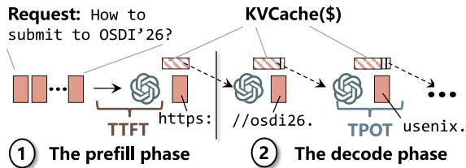  
Figure 1: An illustration of how an LLM generates output tokens, and the two performance metrics: time-to-first-token (TTFT) and time-per-output-token (TPOT).

Contributions. This paper makes three contributions:

• The first systematic study of how to efficiently schedule LLM serving requests in a cluster (§4).

• The first multiplicative combination for efficient LLM request scheduling (§5).

• Extensive analysis and evaluation that confirm the effectiveness of the multiplicative approach (§5.1, §5.2, §6).

Our code is open-sourced at https://github.com/ blitz-serving/blitz-router, and all our traces can be found at https://github.com/alibabaedu/qwen-bailian-usagetraces-anon.

Discussion: PD-colocation vs. PD-disaggregation. We focus on PD-colocated serving in this paper, where both prefill and decode requests are served on the same instance. While there also exist deployments where prefill and decode requests are served on different instances (PDdisaggregation) [38, 55, 26], PD-colocated serving is still widely adopted in practice [50] because it is easier to maintain (no instance role management), does not rely on fast networking between instances, and yields better performance under certain conditions [31, 30]. We discuss how our observations and solutions apply to PD-disaggregation in §7.

## 2 LLM Serving and Scheduling

Serving requests with an LLM (Figure 1). LLMs generate tokens auto-regressively in two steps: ➀ In the prefill phase, the input tokens are fed into the model to produce the first output token. The LLM then enters the decode phase (➁) to generate subsequent tokens one-by-one, each conditioned on all prior input and generated tokens. To accelerate decode, the processed context is materialized as tensors in GPU memory, termed the key-value cache (KV\$). Consequently, decode computation is far smaller than prefill, since the KV\$ for input tokens is already available and not regenerated.

Two key serving-quality metrics are time-to-first-token (TTFT) and time-per-output-token (TPOT): TTFT determines the service’s responsiveness to user requests, while TPOT affects both subsequent responsiveness and overall request completion time.

Serving instance and KV\$ cache (Figure 2). An instance is the minimum unit that serves requests and hosts one complete copy of the LLM’s parameters, potentially spanning multiple

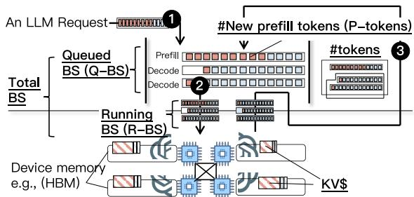  
Figure 2: The system view of how an LLM serving instance handles requests and representative direct system indicators that can be collected by the global scheduler. The detailed meaning of each indicator will be described at first use. BS is the abbreviation for batch size.

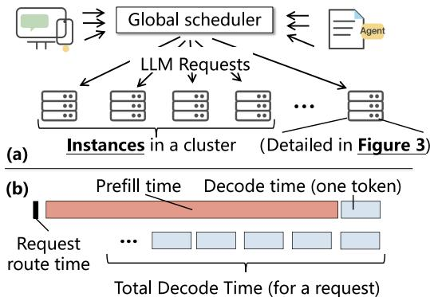  
Figure 3: (a) System view of an LLM serving cluster, and (b) Comparison of per-request serving time and routing cost.

GPUs if the model exceeds a single GPU’s memory. The serving flow is the same in either case: an incoming request is pushed into a queue (prefill or decode) on the instance (❶). Once the GPU(s) become available, queued requests are batched and executed efficiently with chunked prefill [2] (❷). The instance then re-enqueues any request that needs further decoding (❸).

Serving is stateful: a request’s KV\$ is cached in GPU or CPU memory even after generation finishes (KV\$ cache [40, 19, 47]). If a future request routed to the instance shares a prefix with a cached KV\$, the instance can skip computing the matched prefix tokens, significantly reducing computation cost. In Figure 2, blue tokens skip computation on a KV\$ hit.

Request scheduling in a cluster (Figure 3). To handle large request volumes, providers deploy clusters of instances, each with a dedicated global scheduler that routes requests to its managed instances, as shown in (a). The scheduler runs a scheduling policy to pick a destination instance per request— our focus. Providers may deploy multiple clusters of the same model for reliability and geo-affinity, but inter-cluster routing is out of the scope of this paper.

All existing scheduling policies follow a three-step process: the router first (optionally) filters instances, then scores the remainder by a preference order, and routes the request to the best-scoring one. Scores derive from per-instance indicators, described in §4.

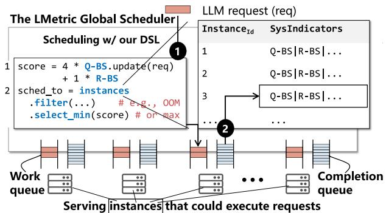  
Figure 4: The system architecture of our indicator factory and its programming model for scheduling policies.

## 3 The Analysis Framework

To analyze different scheduling policies in an apples-to-apples manner, we implement a flexible LLM scheduling analysis framework. Two drivers shape its design. (1) Existing policies are buried in concrete open- and closed-source serving-system implementations, making apples-to-apples comparison hard. For example, AIBrix’s [3] Go reimplementation of vLLM’s policy runs 6.2 × faster than vLLM’s Python version [45] due to a later-confirmed performance bug [46]; our Rust implementation is a further 1.2 × faster than AIBrix on the same policy. (2) Though complex, all existing policies boil down to computing scheduling scores from per-instance indicators. A unified indicator factory thus lets developers implement and explore new policies in a few lines of code (described below).

Indicator factory. Our framework is a standalone inference router written in Rust that works with any LLM serving engine; Rust keeps it efficient and robust. Its core component, shown in Figure 4, is an indicator factory that automatically collects and, when needed, computes the indicators each scheduling policy requires. For scalability, the factory piggybacks indicator collection on instance responses: the router maintains a long-lived connection to each engine instance and, on every response, extracts the required indicators from the response header and updates the factory.

Programming model. Our framework provides a simple API to implement different scheduling policies. The API lets developers express scheduling as a function over the factory’s symbolic per-instance indicators in a few lines. On top of the score function, we further provide primitives to filter instances and to select the instance with the minimum (or maximum) score. Line 1 of Figure 4 shows the policy adopted by vLLM [45] using our framework: the score is a weighted sum of Q-BS (queued batch size—the number of queued requests in an instance’s queue) and R-BS (the number of running requests within batch). On a new request (line 4), the router retrieves and computes the indicator values from the factory in parallel, derives a score for every instance, and routes the request to the instance with the minimum score.

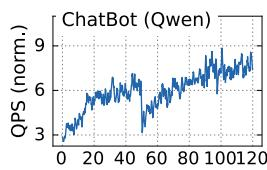

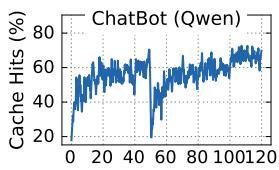  
Time (minutes)

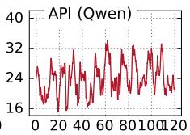

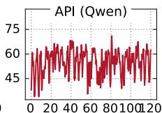  
Time (minutes)

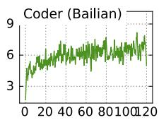

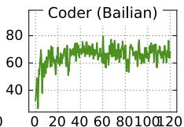  
Time (minutes)

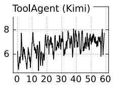

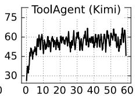  
Time (minutes)

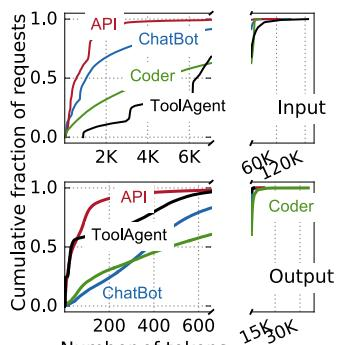  
Number of tokens  
Figure 5: Our studied traces that cover major scenarios in powering LLM services.

## 4 Characterizing LLM Request Scheduling

## 4.1 Characterization Methodology

Testbed and instance used. Unless otherwise specified, all experiments run on a testbed with 16 NVIDIA H20 GPUs— hardware similar to that used for hosting LLM services at BAILIAN. Each GPU has 96 GB HBM, sufficient for common models available on the market [50]. The router runs on a high-end CPU server with 160 Intel Xeon cores and 1 TB of DRAM. Our instance runs vLLM-v1 (vLLM) [45]—the stateof-the-art LLM serving engine with the latest optimizations, such as chunked prefill [2] and fast GPU kernels [18].

Models. We chose LLM models representative of different architectures and popular market choices, including dense (Qwen2-7B) and mixture-of-experts (MoE) models (Qwen3- 30B) [50].

Workloads. We analyze real-world LLM serving traces, both open-source and collected from BAILIAN, covering common LLM applications: ChatBot (Qwen) and Agent (Qwen) [11] are open-sourced Alibaba Cloud traces that collect requests from a chatbot service similar to ChatGPT and an LLM API calling agent service [8, 23, 36], respectively. Coder collects requests issued by coding agent services to a dedicated cluster in BAILIAN on a single day in November 2025, and ToolAgent (Kimi) [34] is another open-sourced trace from Kimi that collects requests from an agent service. All traces except ToolAgent (Kimi) are collected from a single cluster routed by one global router; the source of ToolAgent (Kimi) does not specify whether it is collected the same way.

Our analyzed workloads are representative: they span broad application scenarios, and each selected trace preserves the essential characteristics for evaluating LLM scheduling policies. Specifically, all requests in our traces contain the (hashed) content and request-issuance timestamp, which are critical for evaluating the impact of KV\$-aware scheduling on global scheduling (see §4.2). Other popular datasets like AzureLLM-Trace [10] or BurstGPT [49] do not provide such content. Note that with traces containing hashed content, we can still replay them with behavior that exactly matches the original [48]. To facilitate future research, our high-performance trace replayer is open-sourced [12].

Figure 5 visualizes key features of our evaluated traces, including their request arrival rates, input and output token numbers, and the KV\$ hit rates assuming an infinite KV\$ space. The request arrival rate is normalized due to confidentiality considerations required for the Coder trace. Across all traces, over a given serving interval (e.g., 1 hour), the request arrival and KV\$ hit rates are relatively stable, with a few short-term fluctuations. Input and output token numbers vary across traces but are typically modest except for a few outliers.

Trace scaling. Since the traces are collected from clusters at different scales than our testbed, we scale them according to our testbed capability similar to prior work [33, 7, 25, 53, 42]. Unless otherwise specified, we scale the average request arrival rate to half of the maximum rate of our testbed obtained via offline profiling. This approximates the serving configurations in BAILIAN because when the arrival rate approaches serving capacity, BAILIAN commonly reroutes requests to another underloaded cluster or simply rejects them in noncritical cases (e.g., ChatApp) [40]. Otherwise, the servicelevel objectives (SLOs) of many requests cannot be met due to queuing [39]. Our end-to-end analysis in §6 further measures the impact of different request arrival rates on scheduling performance, and shows consistent results.

## 4.2 Load-balancing Alone is Insufficient for LLM

A starting case: the vLLM policy [45]. Our study starts with the default global scheduling policy adopted by vLLM [45]—a popular open-source LLM serving engine widely used in both industry and academia. Figure 6 (a) shows its scheduling method, which uses the batch size of each instance as the indicator for the routing score. It is a variant of the classic load-balancing-centric join-the-shortest-queue (JSQ) policy with an extension for LLM: at each instance, the batch size includes both the requests running on the instance (R-BS) and those queued in the instance’s queue (Q-BS).

Retrofitting vLLM with KV\$-awareness (BAILIAN). While JSQ tries to balance the workload across instances, it is unaware of the KV\$ state of the incoming requests. This matters because routing requests to instances with a higher KV\$ hit rate substantially reduces request latency. Figure 6 (b) shows a simple extension of vLLM adopted by BAILIAN and others [35, 6] to make request scheduling KV\$-aware: it adds a KV\$ indicator to the score function—an estimate of the KV\$ hit ratio if the request is routed to that instance. Here, KV is the symbolic value representing the per-instance KV\$ hash map. There are two points to note here: (1) the load balance indicator (batch size) needs to be normalized to [0, 1] to match the scale of the hit ratio because otherwise they cannot simply be added together; (2) the analysis in this section assumes the linear combination coefficients (λ) are fixed, and the next section discusses the rationale for setting them.

1 req = receive() (a) vLLM   
## one score per instance   
2 score = 4 \* Q-BS + 1 \* R-BS   
3 sched to = instances   
.select min(score)   
5 reg.forward(sched to)   
(b) vLLM + KV\$-awareness   
1 req = receive() (e.g., Bailian-like)   
2 kv\_hit = KV\$.match(req)   
3 score = λ \* (1-kv\_hit) + (1-λ) \* norm(BS)   
4 sched to = instances   
.select min(score) Range [0,1]   
5 req.forward(sched\_to)

Figure 6: (a) The scheduling score of vLLM and (b) adding KV\$- awareness to its score for LLM scheduling. Note that the linear combination of two indicators has only one degree of freedom (the weight λ).  
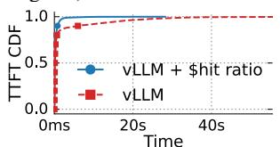

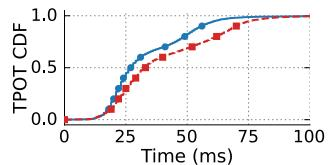  
Figure 7: A comparison of the performance of vLLM and KV\$- aware scheduling on ChatBot Trace with Qwen3-30B model. Other workloads and models are similar.

As shown in Figure 7, adding KV\$-awareness to a loadbalancing-only policy improves the average TTFT by 84% and the average TPOT by 17%, which is as expected because it increases the KV\$ hit ratio as profiled in Figure 8. Interestingly, although the improved KV\$ hit ratio—at first glance—is only beneficial to the prefill, we found it also reduces the decode time because it reduces the computation required for each instance, allowing the instance to dedicate more GPU time to the decode phase.

## 4.3 KV\$-awareness vs. Load balancing: The Trade-off

Although adding KV\$-awareness is intuitively beneficial (§4.2), realizing this benefit in practice is non-trivial because the KV\$ objective may interfere with load balancing. With a linear combination, the priority of each objective is controlled by the weight assigned to each indicator (λ in Figure 6 (b)): a larger weight on the KV\$ component prioritizes routing requests to instances with higher hit ratios even when other instances are much less loaded, leading to load imbalance.

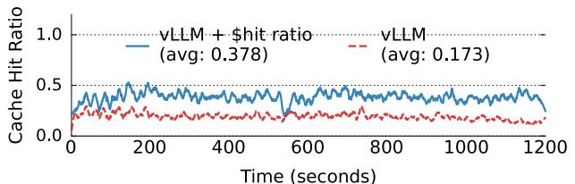  
Figure 8: A KV\$ hit ratio comparison of vLLM vs. KV\$-aware scheduling on ChatBot Trace with Qwen3-30B model. Other workloads and models are similar.

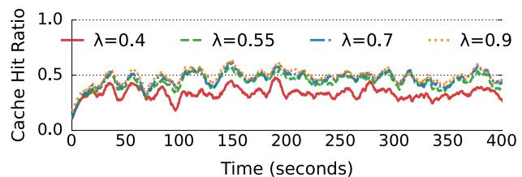  
Figure 9: A comparison of the KV\$ hit ratio by changing the weight of KV\$-awareness in the policy described in Figure 6 (b) on ChatBot Trace with Qwen3-30B model.

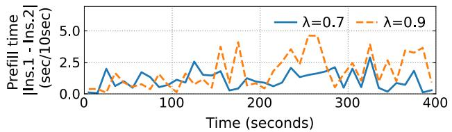  
Figure 10: A profile of the workload imbalance between two instances when running with two different weights in a linear combination on the ChatBot Trace using the Qwen3-30B model. The reported metric is the absolute served prefill time in each 10-second window between the two instances (Inst.).

Figure 11 illustrates this trade-off, reporting the overall TTFT and TPOT by sweeping weights. We can see that when increasing the weight from 0.4 to 0.9, the TTFT first gradually decreases and then increases, except for the API trace, which is less affected due to its short input length. The increased KV\$ hit ratio explains this: as shown in Figure 9, on the ChatBot trace (other traces are similar) the hit ratio rises accordingly with the increased weight.

Despite the increased KV\$ hit ratio, there is a knee point in the weight (e.g., 0.7 for ChatBot), beyond which the overall latency starts to increase due to load imbalance across instances. Figure 10 profiles this imbalance, plotting the prefill work assigned to two instances under different weights (0.7 vs. 0.9) over the same 400-second burst period on the ChatBot trace. The prefill time—seconds spent on prefill within each 10- second window—measures the workload per instance: since most tokens are generated during decode, an instance dominated by prefill produces fewer tokens than others. For each setup, we select the two instances (out of 16) with the highest standard deviation of prefill time. We observe that under λ = 0.9 the average prefill time differs significantly between the two instances (3.57s vs. 2.17s), while λ = 0.7 yields similar values (3.43s vs. 3.40s).

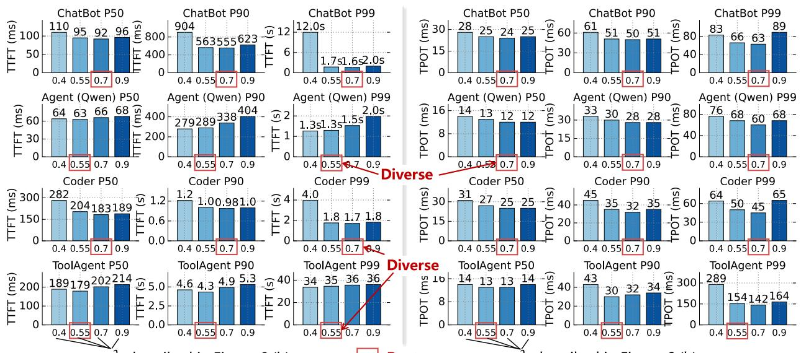  
λdescribed in Figure 6 (b)  
λdescribed in Figure 6 (b)  
Figure 11: An analysis of how the performance varies with different hyperparameters on four traces with a linear-combination-based method. The model used is Qwen3-30B.

## 4.4 The Case of Linear Combination

Based on the trade-offs explored previously, using a linear combination to achieve both KV\$-awareness and load balancing leads to two issues:

Cons #1. Requires workload-specific hyperparameter tuning. The importance of KV\$ and its impact on load imbalance are workload-dependent. For example, Figure 11 presents the tuning results for different traces when running a Qwen3-30B model. We can see that the evaluated optimal weight for each workload varies: in ChatBot the optimal weight is 0.7, while in API it is 0.55, even though both work loads have a similar KV\$ access pattern. Note that we cannot afford to sweep all possible configurations, as replaying each trace on the testbed consumes a substantial amount of GPU time. As a result, the linear combination requires workloadspecific hyperparameter tuning that is non-trivial in practice due to the diversity of workloads [47].

Cons #2. Sub-optimal performance. During the evaluation in §6, we found that a statically tuned weight cannot always achieve competitive performance compared to other baselines. We hypothesize that this is because the optimal weight may vary over time. Intuitively, if the GPUs are idle, we need to prioritize KV\$ hits with a larger KV\$ weight. On the other hand, if prioritizing KV\$ results in an imbalance, we need to reduce the weight to improve load balancing. However, to the best of our knowledge, all existing work uses a fixed tuned weight for the entire serving duration. While it is possible to design strategies to adaptively tune the weight over time, doing so would add system complexity.

## 4.5 The Case of Filter-based Combination

Methodology. Figure 13 shows how a typical filterbased combination works for integrating KV\$-awareness and load balancing in LLM scheduling systems such as AIBrix [3]. First, the router checks whether the current cluster has an imbalanced load—i.e., the range between the maximum and minimum batch sizes across instances (BS.max() - BS.min()) exceeds a threshold (line 3). If so, the router abandons KV\$-awareness and simply routes the request to the instance with the smallest batch size for load balancing (lines 4–5). Otherwise, the router uses the KV\$ hit ratio as an indicator to route requests to instances (lines 6–9) for KV\$-awareness.

Cons #1. Still requires workload-specific hyperparameter tuning. Similar to linear combination, filter-based methods also require hyperparameter tuning because the threshold for determining load imbalance (Range) is workload-dependent. As shown in Figure 12, the optimal threshold of a typical filter-based method [3] varies across workloads: for example, in Coder, increasing the threshold from 4 to 16 improves the P50 TTFT and TPOT by 44% and 15%, respectively. On the other hand, for the API trace, 16 is a better choice than 4.

Cons #2. Sub-optimal performance. Besides hyperparameter tuning, filter-based combination is slower than linear combination with properly tuned weights, as shown in Figure 12, because it biases towards load balancing and may forgo the benefits of KV\$-awareness. Specifically, when a load imbalance is detected, it completely ignores KV\$-awareness, even though routing requests to instances with a higher KV\$ hit ratio could still be beneficial if the amount of reduced computation is significant (as it helps reduce the load). With linear combination, this is possible as long as the weight assigned to the KV\$ hit ratio is not too small. This is not possible in

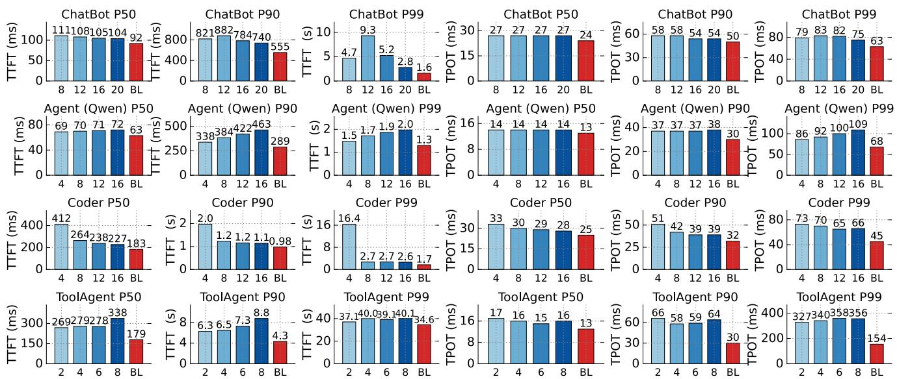  
Figure 12: An analysis of how performance varies with different hyperparameters on four traces using a filter-based combination method. BL denotes the linear-combination-based method for comparison, tuned with the best hyperparameter. The numbers (2,4,6,8) are the range described in Figure 13. The model used is Qwen3-30B.

1 req = receive() Filter-based   
2 kv hit = KV\$.match(reg) method   
3 if BS.max()- BS.min() > Range: (e.g., Aibrix-KV\$)   
# Load balance   
4 sched to = instances   
.select min(BS)   
5 else: # KV\$-awareness   
6 sched to = instances   
.select max(kv hit)   
.select\_min(BS)   
7 req.forward(sched\_to)

Figure 13: The pseudocode of filter-based combination of KV\$- awareness and load balancing in LLM scheduling, simplified from prefix-cache policy of AIBrix [3].  
1 req = receive() Latency-Based   
2 TTFT = Simulatormodel.sim(req, BS, KV\$, ...)   
3 sched to = instances.select min(TTFT)   
4 req.forward(sched\_to)  
Figure 14: The pseudocode of simulation-based method for combining KV\$-awareness and load balancing in LLM scheduling.

filter-based methods.

## 4.6 The Case of Simulation-based Combination

Methodology. Finally, simulation-based methods [40, 24, 56, 13] use the simulated serving time of routing a request to a specific instance as the routing score. This is based on the observation that the execution of LLM requests is relatively deterministic—each step is a single forward pass—so it can be simulated accurately. Figure 14 shows the pseudocode of a typical simulation-based method [24]: after receiving a request, the router first estimates the TTFT of routing the request to each instance via a simulator (e.g., VIDUR [1]) (line 2), and then routes the request to the instance with the lowest estimated TTFT (lines 3–4). Note that simulationbased methods typically estimate the TTFT instead of the end-to-end latency because the end-to-end latency depends on the number of output tokens, which is unpredictable.

Simulation-based methods can be viewed as a higher-order combination of indicators that achieve KV\$-awareness and load balancing. This is because the simulator must use the KV\$ state and batch size of each instance as input features to accurately simulate the TTFT. Here, we chose a simulation-based implementation similar to llm-d [24] but with a retrofitted simulator from VIDUR [1]—the state-ofthe-art LLM instance simulator. Our retrofitting consists of two parts: (1) we extend the simulator to consider KV\$- aware execution by modeling the prefill phase with cache hits, and (2) we re-implement it in Rust and enable parallel simulation to scale the online simulation to multiple instances. Without KV\$-awareness, the simulation-based method does not outperform its counterparts in our setting, similar to the observations we made in §4.2. Without Rust, the original Python-based implementation has considerable scheduling latency and would incur substantial online scheduling overhead. We also have several optimizations to scale the simulator to hundreds of instances. We will leave the details to another paper as it is not the focus of this work.

We studied a state-of-the-art method and found that it outperforms the linear-combination-based method in certain traces, as also shown in Figure 14. Despite the improved performance, simulation-based methods still have two issues due to their complexity:

Cons #1. Development complexity due to per-model implementation and per-hardware tuning. The performance of simulation-based methods depends on the accuracy of the simulator, which is non-trivial to achieve in practice because we need to consider both the model architecture and the hardware characteristics. To quantify the impact of simulator accuracy on scheduling performance, Figure 15 presents the performance of using well-tuned vs. non-tuned simulators on four traces when serving a Qwen3-30B model. The poorly tuned simulator is one originally used for another model—Qwen2-7B, while a well-tuned simulator is the one implemented specifically for Qwen3-30B. Figure 16 measures the TTFT deviation when using two simulators to serve a Qwen3-30B model compared with using vLLM. We can see that a well-tuned simulator achieves much higher accuracy than an untuned one. With a more accurate simulator, the TTFT and TPOT tail latency improve by 75.6% and 79.7%, respectively.

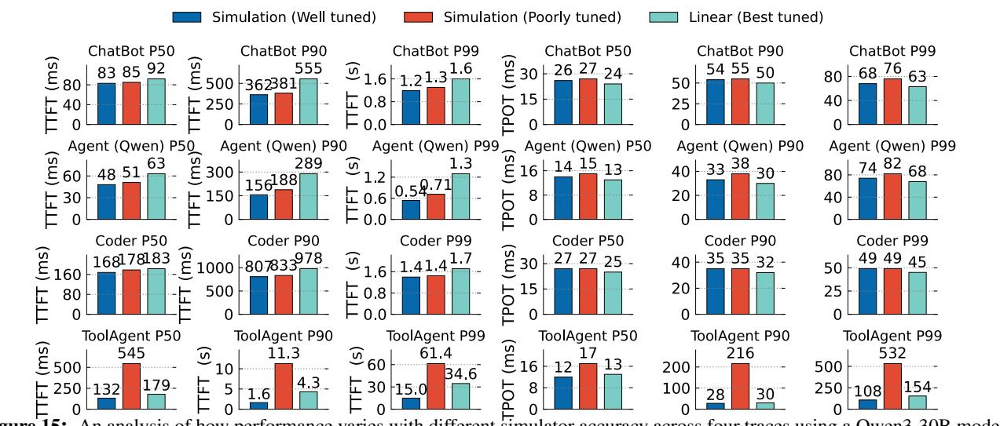  
Figure 15: An analysis of how performance varies with different simulator accuracy across four traces using a Qwen3-30B model.

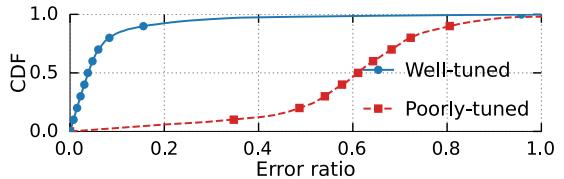  
Figure 16: A comparison of a well-tuned simulator vs. a non-tuned one on ChatBot Trace with Qwen3-30B model.

While it is possible to develop per-model simulators for high scheduling performance, doing so incurs non-trivial development complexity because the simulations highly depend on the model architecture—which is evolving rapidly with new modules (e.g., linear attention [41] and Engram [14]). Meanwhile, for the same model, the hyperparameters of the simulator need to be tuned according to the hardware characteristics, leading to further engineering efforts.

Cons #2. Still sub-optimal performance. Simulation-based methods still suffer from sub-optimal performance, especially for TPOT. As shown in Figure 15, on the ToolAgent trace, the TPOT tail latency is 71.1% slower than that of the best linear-combination-based method. We hypothesize that this is because mispredictions of the simulator lead to load imbalance. For example, in Figure 16, we can see that even with a well-tuned simulator, there are still about 10% of requests with more than 20% prediction error. Such errors mainly come from two sources: request reordering at the vLLM API server, and inaccuracies in latency prediction.

(a) e.g., 1 - KV\$ hit ratio e.g., batch size   
λ KVi + (1 − λ) LOAD (Linear)   
Scorei = λ KVj × (1 − λ) LOADi (Multiplication)   
Score < Score; => KVi × LOAD < KV× LOAD   
1 req = receive() (b)   
# += len(prompt) - KV\$.hit len(req.prompt)   
2 new\_tokens = P\_tokens.update(req.prompt)   
3 work = BS.update(1) # += 1   
4 sched to = instances   
.select min(new tokens \* work)   
5 req.forward(sched\_to) 7   
One per instance  
Figure 17: (a) An illustration of how multiplication combines two indicators without the hyperparameters needed in linear combination, and (b) the pseudocode of our scheduling method.

## 5 Simple Multiplication May Be All You Need

The methodology (Figure 17). Our method is simple: we only need to multiply two carefully chosen indicators to com pute the scheduling score, one for KV\$-awareness and the other for load balancing, and then route the request to the instance with the minimal score. The basic idea is based on the observation that, if a linear combination of two indicators works, then multiplication can also work, with the benefit of avoiding hyperparameter tuning, as shown in (a). The two indicators—P-token (the number of new prefill tokens if the request is routed to an instance, considering KV\$ hits) and BS (the batch size of the instance)—are chosen based on our analysis in §5.1.

To see why routing to the instance with the minimal (Ptoken × BS) score considers both objectives well, consider two instances i and j: if routing the request to instance i results in more KV\$ hits than routing it to instance j, then instance i will have a lower P-token value unless there are many queued prefill requests in instance i (indicating work imbalance). Meanwhile, the BS captures the decode workload of each instance, so if instance i has a significantly larger batch size than instance j, the multiplication will likely favor instance j for load balancing.

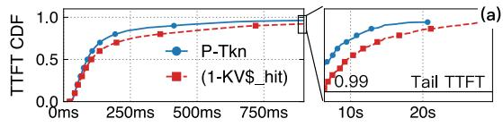

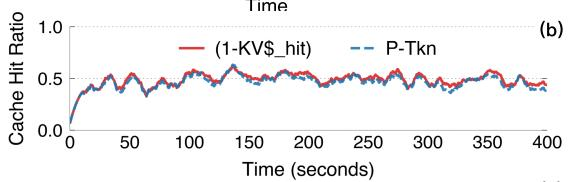

(c)  
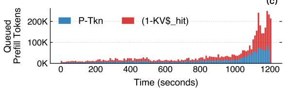  
Figure 18: (a) A comparison of using new prefill tokens (P-token, shown as “P-Tkn” in the figure) vs. 1-KV\$ hit ratio (1-KVhit) as the KV\$-awareness indicator (A) in A × BS scheduling, (b) the KV\$ hit ratio analysis, and (c) the queued prefill tokens analysis. The analysis is done on the Qwen3-30B model with the ChatBot(Qwen) trace. Note that the bottom graph is not a stacked graph; rather, the bars overlap each other.

## 5.1 The Choice of the Indicators

KV\$-awareness indicator (P-token). Besides P-token, another natural choice for the KV\$-awareness indicator is the 1-KV\$ hit ratio, i.e., the KV\$ hit ratio if the request is routed to an instance. It is adopted by works such as Preble [44] and AIGW [6]. Note that we subtract from one because a higher KV\$ hit ratio should yield a lower score to align with the new prefill tokens indicator. We do not consider TTFT because it requires a simulator, which is not always applicable.

Our empirical analysis shows that using P-token yields better performance than using 1-KV\$ hit ratio. Figure 18 (a) shows that using P-token results in a 14.4% lower P50 TTFT and a 42.8% lower P95 TTFT compared to using 1-KV\$ hit ratio. For a fair comparison, we fix the load-balancing indicator to BS in both cases. Due to space limitations, we only report the results for one workload here; however, the trend is consistent across all evaluated workloads.

To understand the cause of this difference, Figure 18 further breaks down the KV\$ hit ratios of different methods in (b) and the load balancing status in (c). We can see that the two methods achieve similar KV\$ hit ratios, so they are equally KV\$-aware. The key difference is that using P-token achieves better load balancing, as it additionally considers the queued prefill tokens in each instance. As a result, when making scheduling decisions, the router bypasses instances with many queued prefill requests, even if they have a high KV\$ hit ratio.

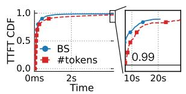

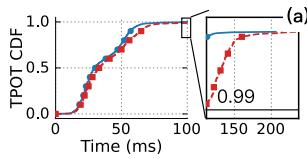

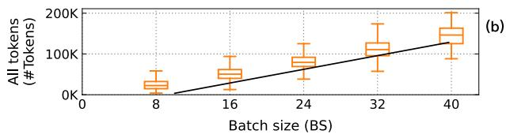  
Figure 19: (a) A comparison of using batch size (BS) vs. total tokens (#Tokens) as the load-balancing indicator (B) in P-token ×B scheduling. (b) The profiled relationship between batch size and total tokens. The analysis is done on the Qwen3-30B model with the ChatBot(Qwen) trace.

Load-balancing indicator (BS). Besides BS, another common choice is the total tokens (#Tokens) on each instance, as adopted by works such as ai-Dynamo [35] and AIGW [6]. The rationale is that the total computation cost of a request is proportional to the number of tokens in its context. However, we found that using BS yields better performance, as shown in Figure 19 (a), for two reasons. First, workloads can be categorized into prefill and decode loads, where the former is considered in our P-token indicator. Thus, we only need an indicator for the decode workload, which is exactly what BS captures (note that we have also tried using decode batch size, and the results are similar since the BS is dominated by the decode requests). Moreover, BS is a better indicator for the (decode) work assigned to an instance because the decode time is more stable across batch sizes. Specifically, a larger batch size leads to a longer decode time, but more decode tokens do not necessarily mean decode is slower when the batch is small, thanks to the KV\$ [55]. This is illustrated in Figure 19 (b), where we profile the relationship between batch size and total tokens while serving a ChatBot(Qwen) workload with Qwen3-30B.

## 5.2 Benign and Failure Cases Analysis of the Multiplicative Scheduling Score

Overview. At a high level, as long as there is no load imbalance, i.e., one instance is overloaded while others are idle, routing requests to instances with high KV\$ hit rates (i.e., low P-token) is always beneficial. Thus, the multiplication fails when a set of instances is about to be overloaded but their increase in BS cannot offset the decrease in P-token from high KV\$ hit rates, so requests keep being routed there and cause the imbalance. This can happen under extreme KV\$ skewness: when some prefixes are repeatedly accessed but only cached on a small set of instances—which we term KV\$ hotspots. We found that such hotspots are rare in practice—at least not present in any of our evaluated traces. More impor tantly, as their patterns are clear, we can design a detector to catch them beforehand.

To analyze the failure cases of our multiplication method, we derive the condition under which KV\$ hotspots occur and the increased batch size cannot offset the high KV\$ hit rate given a workload pattern. For each workload, we first group requests by their KV\$ prefixes and partition instances according to their KV\$ ownership. Next, for each request class, we analyze the relationship between the workload pattern, the P-token indicator given the KV\$ hit rate, and the batch size indicator.

Prelude: request grouping and instance partitioning. First, we partition all requests into a set of classes C, where each c ∈ C corresponds to a group of requests that share the same KV\$ prefix. In practice, a class roughly matches an application or a user: their requests share the same system prompt and often a similar conversation history [47]. For a fixed class c, we consider an accumulation time window (t, t + window) and denote by x the fraction of all requests arriving at the cluster that belong to class c within this window; the remaining fraction is x = 1 − x.

For each class c, we partition the cluster into two sets of instances: M and M. M contains instances whose cache currently holds the prefix of class c, i.e., with KV\$ hits, while M contains all other instances.

Impact of a request class on batch size. Let QPS be the total query rate of the cluster, and let t be the arrival time of the suspected class-c requests that may lead to imbalance. We denote the average batch size per instance in a balanced state prior to t as BS0. We also denote the expected batch sizes of instances in M and M by BSt and BSt during the period (t, t+window). We assume the extreme case in which all classc requests are routed to M due to high KV\$ hits, because routing any class-c request to an instance in M would cache the prefix there, expand M, and thereby dissipate the hotspot. Under this worst-case assumption, we establish the following approximate expression for the ratio between a potentially overloaded instance’s batch size and a non-overloaded one’s:

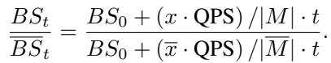

(1)

The main term (x · QPS) /|M| · t corresponds to the number of requests of class c routed to the instances that cache its prefix, while (x · QPS) /|M | · t is the number of all other requests routed to the remaining instances.

Analysis: when multiplication suffices, and is this com mon? As long as the batch size of the suspected hotspot instances is not larger than that of the others, it is beneficial to route requests to these instances, since doing so can exploit the KV\$ hits without incurring load imbalance. This is precisely what our multiplicative method is designed for. The remaining question is whether such cases are common in practice. Fortunately, Equation 1 reveals that the batch-size skewness is governed by two ratios: the class popularity x/x and the cache coverage |M|/|M|. We can therefore empirically analyze the prevalence of such cases by tracking these two ratios at runtime, sampling the request classes with the highest KV\$ hits within each one-minute window.

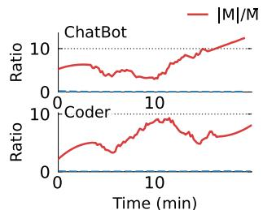

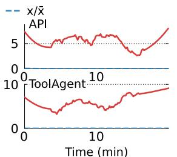  
Figure 20: Empirical observations of the factors in the multiplicative score across different traces. If x/x ≤ |M |/|M |, no KV\$ hotspot can cause load imbalance, so our multiplicative method can effectively balance the load with KV\$-awareness.

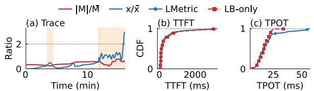  
Figure 21: Adversarial case study: (a) x/x > |M|/|M| implies a hotspot that could cause imbalance under LMETRIC, (b–c) performance comparison with a load-balance-only solution.

Figure 20 shows that for all traces (representative of LLM serving and studied in this work), our multiplication remains in its applicable regime, because the expected batch size of the suspected hotspot instances is not larger than that of the others. Concretely, every sampled class satisfies Equation 2:

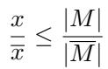

(2)

which says the class’s relative popularity (x/x) never exceeds the relative cache coverage it enjoys (|M |/|M |); i.e., the prefix is cached on enough instances to absorb its share of the arrivals. This implies that even when every class-c request lands on M, no hit instance accumulates a larger batch size than a non-hit one, i.e., transforming and then substituting Equation 2 into Equation 1, we get BS ≤ BS .

Analysis: when multiplication fails. Based on the previous analysis, if Equation 2 does not hold, i.e., x/x > |M |/|M |, then a KV\$ hotspot can cause load imbalance that breaks our multiplicative method. Though we have not observed such cases in any of our evaluated traces, we used the pattern of KV\$ hotspots to examine a subset of the production workloads in BAILIAN and found one, as shown in the orangeshaded windows in Figure 21 (a). The cluster serves a thinking

LMetricvLLM-v1Dynamo×Ilm-dBailian workload with bursts of long requests sharing a common prefix, visible around minute 11 of the run. In this case, the batch indicator cannot outperform the KV\$ indicator, and thus the multiplicative score continuously routes requests to a few instances with high KV\$ hits, leading to load imbalance and performance degradation. Figure 21 (b–c) shows that LMET-RIC cannot outperform a load-balancing-only solution (i.e., vLLM) during this period.

Retrofit: a two-phase detector for KV\$ hotspots. The boundary condition in Equation 2 yields a clear failure-case detector based purely on the workload pattern and KV\$ states, which we run alongside each scheduling decision to catch potential hotspots. For each request class, we monitor the two ratios x/x and |M|/|M| in real time; when Equation 2 is violated, we raise an alarm and intervene by filtering out the suspected instances (M ) from the routing targets (e.g., the orange-shaded windows in Figure 21 (a)). To bound the monitoring overhead, we only track requests with the highest KV\$ hit rates.

However, Equation 2 is only a necessary (not sufficient) condition for a hotspot, because it was derived under the worst-case assumption that all class-c requests are routed to M . In reality, even when Equation 2 is violated, it may still be beneficial to route requests to the suspected instances with high KV\$ hits, as long as we do not route too many. We therefore augment the detector with a second phase: after the first phase raises an alarm, we track each subsequent class request and filter out M from scheduling only when 2|M| consecutive requests would receive a smaller multiplicative score on a hotspot instance m ∈ M than on a non-hotspot one m′ ∈ M: i.e., P-tokenm × BSm ≤ P-tokenm′ × BSm′ .

## 6 End-to-end Evaluation

## 6.1 Comparison with Production Schedulers

Baselines. We compare LMETRIC against popular production schedulers and the current scheduler used in BAILIAN. As certain baselines show low router throughput in their default implementations, e.g., vLLM exhibits low processing throughput with its Python-based router [46], we re-implement their policies within our highly optimized Rust router framework described in §3. For an apples-to-apples comparison, we evaluate all policies under our framework, and we have carefully verified that our re-implementations are no slower than their original implementations. The detailed descriptions of the baselines are as follows:

• BAILIAN is the production scheduler used in BAILIAN’s LLM serving system. It adopts a linear-combination-based approach similar to the one shown in Figure 6 (b). We have carefully tuned its hyperparameters for each workload to achieve the best performance.

• vLLM [45] is a widely used LLM serving system that adopts a load-balancing-only design (see Figure 6 (a)).

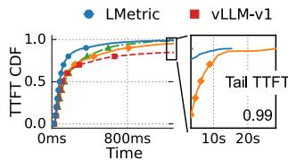

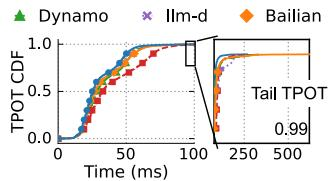  
(a) Qwen3-30B on ChatBot (Qwen) workload.

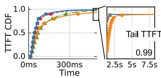

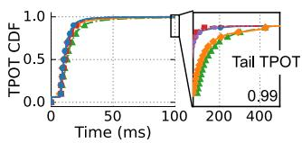  
(b) Qwen2-7B on Agent (Qwen) workload.

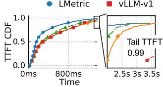

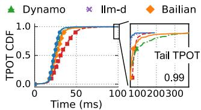  
(c) Qwen3-30B on Coder workload.

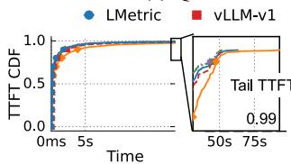

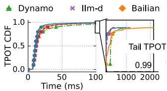  
(d) Qwen3-30B on Agent (Kimi) workload.  
Figure 22: End-to-end TTFT and TPOT CDFs of LMETRIC and baselines on four workloads.

• Dynamo [35] is a popular serving framework released by NVIDIA. It also adopts a linear-combination-based approach but with a different choice of indicators than BAILIAN’s. The two indicators chosen are the number of prefill tokens (the same as our P-token) for KV\$-awareness and the total tokens in the instance for load balancing. The router routes requests to the instance with the minimal regulated and weighted sum of the two indicators. Similar to BAILIAN, we also tune its hyperparameters for each workload to achieve the best performance.

• llm-d [24] adopts a latency-based scheduling policy: it estimates the TTFT and routes requests to the instance with the lowest TTFT using the simulation-based approach described in §4.6.

Overall performance. Figure 22 shows the end-to-end TTFT and TPOT CDFs of LMETRIC and the baselines on four traces. All experiments are conducted on a 16-GPU testbed with 16 instances, and each trace is scaled to half of the maximum load that the testbed can handle. Due to space constraints, we report results for a representative subset: the Qwen3 MoE model on ChatBot, Coder, and Agent workloads, and the Qwen2 model on the Agent (Qwen) workload. We observe consistent performance trends across all model–trace combinations.

LMETRIC outperforms all baselines across all traces. On the ChatBot workload, it reduces the mean TTFT by 92% and the mean TPOT by 24% compared to vLLM, and it reduces the P99 TPOT by 13% compared to llm-d—the second-best policy—with a similar TTFT. The improved performance mainly comes from being KV\$-aware without sacrificing load balancing. To examine LMETRIC’s behavior, Figure 24 plots the KV\$ hit ratio for different systems on the ChatBot workload. We can see that LMETRIC consistently achieves a KV\$ hit ratio comparable to that of other KV\$-aware policies, and its ratio is significantly higher than that of the KV\$-unaware policy (vLLM). Meanwhile, Figure 25 further analyzes the imbalance following the approach used in §4.3. For brevity, we compare LMETRIC only with llm-d—the second-best policy on the ChatBot trace. We can see that LMETRIC achieves a better-balanced load than llm-d.

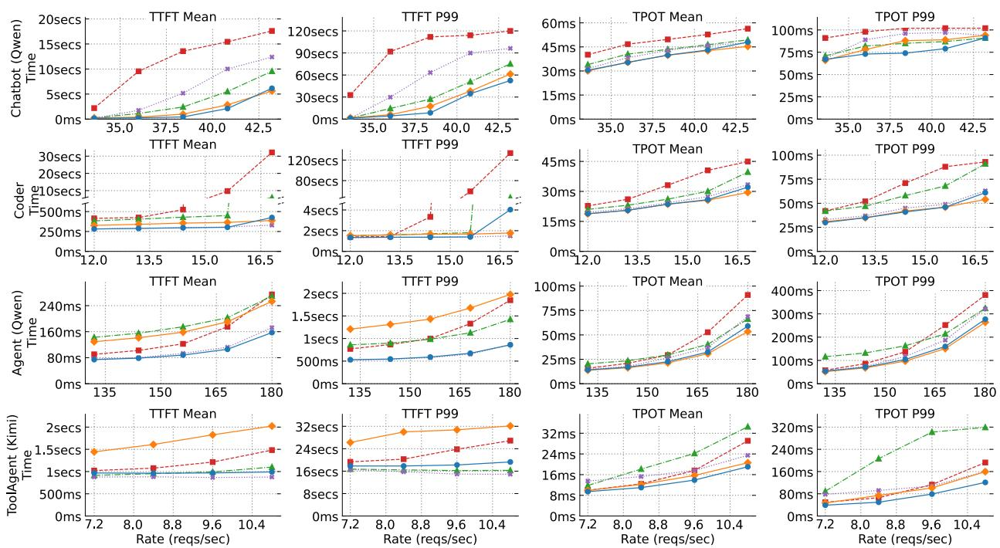  
Figure 23: End-to-end performance under different request rates. Except for the second row, which uses a Qwen2-7B model, all other rows use a Qwen3-30B model.

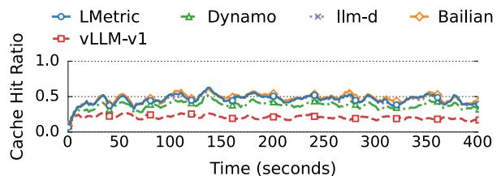  
Figure 24: KV\$ hit ratio comparison of policies for the Qwen3- 30B model on the ChatBot (Qwen) workload.

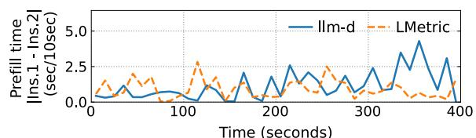  
Figure 25: A profile of the workload imbalance between two instances under LMETRIC and llm-d while serving a ChatBot (Qwen) workload with the Qwen3-30B model. The reported metric is the absolute served prefill time in each 10-second window between the two instances (Inst.).

Performance under different request rates. Figure 23 further shows how LMETRIC performs under different request arrival rates. The results are largely consistent with those under a fixed request rate setting: LMETRIC outperforms all baselines across different traces and request rates, except for the ToolAgent trace, where LMETRIC exhibits a slightly higher (10%) mean TTFT than llm-d but achieves a 30% lower TPOT. This may be because a simulation-based approach can better estimate the prefill workload than our simple P-token indicator. Nevertheless, LMETRIC still achieves the lowest TPOT without relying on a complex simulator, as it considers both KV\$ management and (decode) load balanc ing. The performance gap between baselines widens as the request rate increases, because under high load, a more balanced and KV\$-aware scheduling strategy can yield higher overall system throughput, leading to faster consumption of queued requests.

## 6.2 Comparison with Recent Research Schedulers

Baselines. We further compare LMETRIC with two state-ofthe-art research schedulers: Preble [44] and PolyServe [56]. As in the previous section, both baselines run in our router framework (§3): (1) Preble’s open-source release runs on a different router stack from ours, (2) PolyServe is not open-sourced, and re-implementing both in our framework enables an apples-to-apples comparison. We have carefully tuned different implementations and their hyperparameters to achieve the best performance, as detailed in §A.

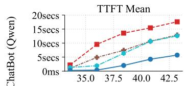  
Rate (reqs/sec)

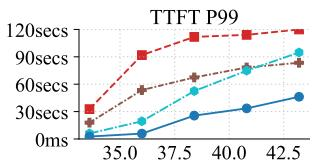  
Rate (reqs/sec)

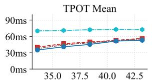  
Rate (reqs/sec)

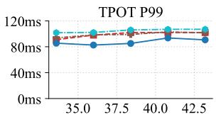  
Rate (reqs/sec)  
Figure 26: End-to-end performance of LMETRIC alongside two recent research baselines (Preble and PolyServe) under the same setting as Figure 23, with vLLM included as a reference. Model: Qwen3-30B on the ChatBot (Qwen) workload.

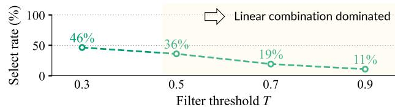  
Figure 27: Preble’s KV\$-aware branch selection rate under different filter thresholds T .

• Preble [44] adopts a hybrid filter-based (§4.5) and linear-combination (§4.4) scheme. It first filters instances with high KV\$ hit ratios based on a threshold (T = 0.5 tuned in §A.1). If the filter returns any instance, it routes to the one with the highest hit ratio; otherwise, it routes the request to the instance with the highest linear-combined score over KV\$ and load indicators.

• PolyServe [56] is a simulation-based scheduler (§4.6) that optimizes a different objective from the other baselines and LMETRIC: meet the SLO while creating a load gradient across instances that facilitates auto-scaling. Using the simulator’s predicted TTFT and TPOT, PolyServe routes each request to the most loaded instance whose predicted latency still meets the SLO bounds SLOTTFT and SLOTPOT; when no instance is feasible, it falls back to the instance with the lowest predicted TPOT.

Overall performance under different request rates. Figure 26 reports mean and P99 TTFT/TPOT for LMETRIC and the baselines on ChatBot (Qwen) with Qwen3-30B. Other workloads share similar results.

Compared with Preble, LMETRIC reduces mean TTFT by 56% and mean TPOT by 8%, and it reduces P99 TTFT by 45% and P99 TPOT by 16%. Although Preble is faster than vLLM thanks to KV\$-awareness, it performs similarly to the linear-combination baselines that LMETRIC outperforms, because it falls back to the linear-combination branch most of the time (see Figure 27). Note that lowering the threshold to reduce the linear-combination branch selection rate does not necessarily improve Preble’s performance, as it biases the scheduling towards KV\$ and thus sacrifices load balancing.

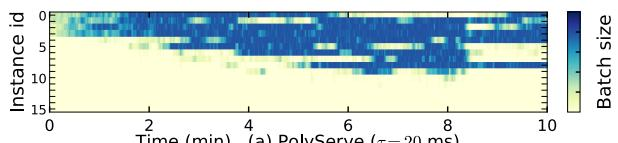

  
Figure 28: Running batch size across 16 instances over a 10- minute window, under PolyServe and LMETRIC. Workload: Chat-Bot (Qwen) trace at 18.75 reqs/sec on Qwen3-30B instances.

Compared with PolyServe, LMETRIC achieves lower mean and P99 TTFT and TPOT across all request rates in Figure 26. The gap reflects PolyServe’s design objective: instead of balancing load, PolyServe creates a load gradient across instances so that idle ones can be released by auto-scaling. Concentrating load this way raises instance utilization but degrades per-request latency. Figure 28 illustrates this trade-off: PolyServe loads instances 0–8 and leaves 9–15 idle, while LMETRIC spreads the same aggregate workload across all 16 instances.

## 6.3 In-production Evaluation

Deployment overview and methodology to validate performance improvements. LMETRIC now serves production traffic at BAILIAN as the scheduler for a Qwen3.5-27B cluster, our first full-scale deployment. To measure the impact on service quality, we report the observed performance from a canary release. On one day in May 2026, we split the traffic that previously fed one production cluster across two clusters: 1/3 of the traffic went to a cluster running LMETRIC, and the remaining 2/3 to a cluster running BAILIAN’s prior scheduling method. To ensure a fair comparison, we sized the clusters so that each received the same reqs/GPU. The LMETRIC cluster contained several hundred GPUs; the detailed cluster setup is confidential and thus omitted.

Performance. LMETRIC reduces both TTFT and TPOT in production: Figure 29 compares the two clusters using screenshots of BAILIAN’s internal performance dashboard. The snapshots show that, compared with BAILIAN’s prior scheduler, mean TTFT and mean TPOT drop by 39% and 51% respectively. The results imply that LMETRIC can serve the same workload with fewer GPUs under the same SLO.

  
Figure 29: Production deployment results of LMETRIC compared with the scheduler in BAILIAN.

## 7 Discussion

Scheduling under PD-disaggregation. Scheduling under PD-disaggregation is different (and we argue simpler) than our targeted PD-colocation, for two reasons. First, routing decode requests primarily needs to consider load balancing. Existing systems [35, 3, 24, 40] already handle this effectively with simple indicators like batch size [3] or total tokens [35]. Second, routing prefill requests can address KV\$-awareness and prefill load balancing with a unified indicator—the number of new prefill tokens after cache hits. Using this indicator as a scheduling score naturally combines both objectives without explicit hyperparameter tuning [3, 35], and we find it effective in our analysis. On the other hand, PD-disaggregation does introduce new scheduling challenges, such as managing prefill and decode clusters with different capacities, which we leave to future work.

Scheduling under heterogeneous deployments. In realworld production, model services are heterogeneous in both models and GPU types, while LMETRIC targets scheduling for a single model under homogeneous GPUs. Nevertheless, LMETRIC still works in this setting because providers, to cope with this complexity, logically partition their deployment into multiple clusters, each serving a single model on a single GPU type. The global scheduler inside each cluster therefore sees a homogeneous pool of instances, where LMETRIC applies.

KVCache sharing. Some serving clusters support KV\$ sharing: an instance can fetch the requested KV\$ from another instance through RDMA when it does not hold the cache locally [40]. This mechanism reduces the cost of scheduling a request to an instance without KV\$, but it does not remove the benefits of KV\$-aware scheduling provided by LMETRIC because local KV\$ hits are still cheaper than remote KV\$ fetches in two ways. First, a local hit avoids a remote transfer on the TTFT path. Second, it avoids keeping the same KV\$ on two instances, which saves memory and reduces cache pressure.

## 8 Related Work

LLM requests global scheduling. LMETRIC continues the line of research on scheduling LLM requests in a cluster [29, 27, 44, 40, 56, 24, 52]. To the best of our knowledge, all these methods target both KV\$-awareness and load balancing by combining indicators for each objective through the three approaches discussed in §4. LMETRIC reuses these indicators but combines them with a simple yet efficient multiplication combinator.

LLM requests scheduling within an instance. These works are orthogonal to LMETRIC’s global scheduling: they optimize request execution within an instance. Sarathi-Serve [2] introduces chunked prefill, which splits long prefill requests into smaller chunks to reduce stalls for co-located decode requests. VTC [43] adopts token-based admission control to achieve fairness. FairBatching [32] uses a linear-time analytical model to prioritize prefill versus decode tokens and dynamically form batches. A good global scheduler can further improve these local schedulers, e.g., by reducing overloads that are difficult to handle locally.

Optimizing LLM serving. Beyond scheduling, LLM serving systems improve performance by increasing KV\$ hit rates [40, 47], adding model-serving elasticity [53, 50], and improving GPU execution efficiency [29, 28, 18, 16], just to name a few. These techniques coexist with scheduling optimizations.

## 9 Conclusion

We contribute the first multiplicative combinator for highquality LLM request scheduling, achieving both KV\$- awareness and load balancing in a hyperparameter-free manner. Evaluations on real-world workloads covering chatbots and agents confirm the benefits of our approach, and our method has been deployed in production with confirmed effectiveness.

## 10 Acknowledgment

We sincerely thank the OSDI’26 reviewers for their insightful comments and Neeraja J. Yadwadkar for shepherding our paper. We also thank Jinyu Gu for valuable feedback and for suggesting the classic system term “simple is better” for our paper. This work was supported in part by the National Natural Science Foundation of China (No. 62572302), the Fundamental and Interdisciplinary Disciplines Breakthrough Plan of the Ministry of Education of China (No. JYB2025XDXM122), and the Alibaba Innovative Research Program.

## References

[1] AGRAWAL, A., KEDIA, N., MOHAN, J., PANWAR, A., KWA-TRA, N., GULAVANI, B. S., RAMJEE, R., AND TUMANOV, A. VIDUR: A large-scale simulation framework for LLM inference. In Proceedings of the Seventh Annual Conference on Machine Learning and Systems, MLSys 2024, Santa Clara, CA, USA, May 13-16, 2024 (2024), P. B. Gibbons, G. Pekhimenko, and C. D. Sa, Eds., mlsys.org.

[2] AGRAWAL, A., KEDIA, N., PANWAR, A., MOHAN, J., KWA-TRA, N., GULAVANI, B., TUMANOV, A., AND RAMJEE, R. Taming Throughput-Latency tradeoff in LLM inference with Sarathi-Serve. In 18th USENIX Symposium on Operating Systems Design and Implementation (OSDI 24) (Santa Clara, CA, July 2024), USENIX Association, pp. 117–134.

[3] Aibrix. https://github.com/vllm-project/ aibrix, 2025.

[4] v0.4.1: fatal error: concurrent map writes in prefix cache eviction. https://github.com/vllm-project/ aibrix/issues/1580, 2025.

[5] AIBrix prefix\_cache\_preble.go. https: //github.com/vllm-project/aibrix/blob/ main/pkg/plugins/gateway/algorithms/ prefix\_cache\_preble.go, 2026.

[6] Aigw. https://github.com/aigw-project/aigw, 2025.

[7] ALI, A., PINCIROLI, R., YAN, F., AND SMIRNI, E. Optimizing inference serving on serverless platforms. Proc. VLDB Endow. 15, 10 (2022), 2071–2084.

[8] ANTHROPIC. Claude api. https://www.anthropic. com/api, 2025.

[9] ARAPAKIS, I., BAI, X., AND CAMBAZOGLU, B. B. Impact of response latency on user behavior in web search. In The 37th International ACM SIGIR Conference on Research and Development in Information Retrieval, SIGIR ’14, Gold Coast , QLD, Australia - July 06 - 11, 2014 (2014), S. Geva, A. Trotman, P. Bruza, C. L. A. Clarke, and K. Järvelin, Eds., ACM, pp. 103–112.

[10] AZURE. Azure llm inference traces. https://github. com/Azure/AzurePublicDataset/blob/master/ AzureLLMInferenceDataset2024.md, 2024.

[11] Qwen-bailian anonymous dataset. https://github. com/alibaba-edu/qwen-bailian-usagetracesanon, 2025.

[12] BLITZ SERVING. Trace replayer. https://github.com/ blitz-serving/trace-replayer.

[13] CHEN, S., JIA, Z., KHAN, S., KRISHNAMURTHY, A., AND GIBBONS, P. B. Slos-serve: Optimized serving of multi-slo llms. CoRR abs/2504.08784 (2025).

[14] CHENG, X., ZENG, W., DAI, D., CHEN, Q., WANG, B., XIE, Z., HUANG, K., YU, X., HAO, Z., LI, Y., ZHANG, H., ZHANG, H., ZHAO, D., AND LIANG, W. Conditional memory via scalable lookup: A new axis of sparsity for large language models, 2026.

[15] CLOUD, A. Alibaba cloud bailian. https://www. aliyun.com/product/bailian, 2026.

[16] DAO, T. Flashattention-2: Faster attention with better parallelism and work partitioning. In The Twelfth International Conference on Learning Representations, ICLR 2024, Vienna, Austria, May 7-11, 2024 (2024), OpenReview.net.

[17] DELIMITROU, C., AND KOZYRAKIS, C. Quasar: resourceefficient and qos-aware cluster management. In Architectural Support for Programming Languages and Operating Systems, ASPLOS 2014, Salt Lake City, UT, USA, March 1-5, 2014 (2014), R. Balasubramonian, A. Davis, and S. V. Adve, Eds., ACM, pp. 127–144.

[18] FlashInfer: Kernel Library for LLM Serving. https:// github.com/flashinfer-ai/flashinfer, 2025.

[19] GAO, B., HE, Z., SHARMA, P., KANG, Q., JEVDJIC, D., DENG, J., YANG, X., YU, Z., AND ZUO, P. Cost-Efficient large language model serving for multi-turn conversations with CachedAttention. In 2024 USENIX Annual Technical Conference (USENIX ATC 24) (Santa Clara, CA, July 2024), USENIX Association, pp. 111–126.

[20] GIGASPACES. Amazon found every 100ms of latency cost them 1% in sales. https://www.gigaspaces. com/blog/amazon-found-every-100ms-oflatency-cost-them-1-in-sales, 2024.

[21] GITHUB. Accelerate your development speed with copilot. https://copilot.github.com, 2024.

[22] GOG, I., SCHWARZKOPF, M., GLEAVE, A., WATSON, R. N. M., AND HAND, S. Firmament: Fast, centralized cluster scheduling at scale. In 12th USENIX Symposium on Operating Systems Design and Implementation, OSDI 2016, Savannah, GA, USA, November 2-4, 2016 (2016), K. Keeton and T. Roscoe, Eds., USENIX Association, pp. 99–115.

[23] GOOGLE. Gemini api. https://ai.google.dev/api, 2025.

[24] GOOGLE. llm-d. https://github.com/llm-d/llmd, 2025.

[25] GUJARATI, A., KARIMI, R., ALZAYAT, S., HAO, W., KAUF-MANN, A., VIGFUSSON, Y., AND MACE, J. Serving dnns like clockwork: Performance predictability from the bottom up. In 14th USENIX Symposium on Operating Systems Design and Implementation, OSDI 2020, Virtual Event, November 4-6, 2020 (2020), USENIX Association, pp. 443–462.

[26] HU, C., HUANG, H., XU, L., CHEN, X., XU, J., CHEN, S., FENG, H., WANG, C., WANG, S., BAO, Y., SUN, N., AND SHAN, Y. Inference without interference: Disaggregate LLM inference for mixed downstream workloads. CoRR abs/2401.11181 (2024).

[27] HU, X., ZENG, T., YUAN, X., SONG, L., ZHANG, G., AND HE, B. Bestserve: Serving strategies with optimal goodput in collocation and disaggregation architectures. CoRR abs/2506.05871 (2025).

[28] KAMATH, A. K., PRABHU, R., MOHAN, J., PETER, S., RAM-JEE, R., AND PANWAR, A. Pod-attention: Unlocking full prefill-decode overlap for faster LLM inference. In Proceedings of the 30th ACM International Conference on Architectural Support for Programming Languages and Operating

Systems, Volume 2, ASPLOS 2025, Rotterdam, Netherlands, 30 March 2025 - 3 April 2025 (2025), L. Eeckhout, G. Smaragdakis, K. Liang, A. Sampson, M. A. Kim, and C. J. Rossbach, Eds., ACM, pp. 897–912.

[29] KWON, W., LI, Z., ZHUANG, S., SHENG, Y., ZHENG, L., YU, C. H., GONZALEZ, J., ZHANG, H., AND STOICA, I. Efficient memory management for large language model serving with pagedattention. In Proceedings of the 29th Symposium on Operating Systems Principles, SOSP 2023, Koblenz, Germany, October 23-26, 2023 (2023), J. Flinn, M. I. Seltzer, P. Druschel, A. Kaufmann, and J. Mace, Eds., ACM, pp. 611–626.

[30] LAI, R., LIU, H., LU, C., LIU, Z., CAO, S., SHAO, S., ZHANG, Y., MAI, L., AND USTIUGOV, D. Tokenscale: Timely and accurate autoscaling for disaggregated LLM serving with token velocity. CoRR abs/2512.03416 (2025).

[31] LI, J., ZHU, Y., LEE, E. K., AND NAHRSTEDT, K. Revisiting disaggregated large language model serving for performance and energy implications. CoRR abs/2601.08833 (2026).

[32] LYU, H., LIU, B., WU, M., AND CHEN, H. Fairbatching: Fairness-aware batch formation for LLM inference. CoRR abs/2510.14392 (2025).

[33] MIAO, X., SHI, C., DUAN, J., XI, X., LIN, D., CUI, B., AND JIA, Z. Spotserve: Serving generative large language models on preemptible instances. In Proceedings of the 29th ACM International Conference on Architectural Support for Programming Languages and Operating Systems, Volume 2, ASPLOS 2024, La Jolla, CA, USA, 27 April 2024- 1 May 2024 (2024), R. Gupta, N. B. Abu-Ghazaleh, M. Musuvathi, and D. Tsafrir, Eds., ACM, pp. 1112–1127.

[34] Mooncake trace. https://github.com/kvcacheai/Mooncake/blob/main/FAST25-release/ traces/toolagent\_trace.jsonl, 2025.

[35] NVIDIA. ai-dynamo. https://github.com/aidynamo/dynamo, 2025.

[36] OPENAI. Openai developer platform. https:// platform.openai.com/docs/overview.

[37] OPENAI. Chatgpt. https://chatgpt.com, 2025.

[38] PATEL, P., CHOUKSE, E., ZHANG, C., SHAH, A., GOIRI, Í., MALEKI, S., AND BIANCHINI, R. Splitwise: Efficient generative LLM inference using phase splitting. In 51st ACM/IEEE Annual International Symposium on Computer Architecture, ISCA 2024, Buenos Aires, Argentina, June 29 - July 3, 2024 (2024), IEEE, pp. 118–132.

[39] Pollaczek–khinchine formula. https://en.wikipedia. org/wiki/Pollaczekâ˘A¸SKhinchine\_formula# cite\_note-2, 2025.

[40] QIN, R., LI, Z., HE, W., CUI, J., REN, F., ZHANG, M., WU, Y., ZHENG, W., AND XU, X. Mooncake: Trading more storage for less computation — a KVCache-centric architecture for serving LLM chatbot. In 23rd USENIX Conference on File and Storage Technologies (FAST 25) (Santa Clara, CA, Feb. 2025), USENIX Association, pp. 155–170.

[41] Qwen3-next. https://qwen.ai/blog?id= 4074cca80393150c248e508aa62983f9cb7d27cd& from=research.latest-advancements-list, 2026.

[42] SAJAL, S. M., ZHU, T., URGAONKAR, B., AND SEN, S. Traceupscaler: Upscaling traces to evaluate systems at high load. In Proceedings of the Nineteenth European Conference on Computer Systems, EuroSys 2024, Athens, Greece, April 22-25, 2024 (2024), ACM, pp. 942–961.

[43] SHENG, Y., CAO, S., LI, D., ZHU, B., LI, Z., ZHUO, D., GONZALEZ, J. E., AND STOICA, I. Fairness in serving large language models. In 18th USENIX Symposium on Operating Systems Design and Implementation, OSDI 2024, Santa Clara, CA, USA, July 10-12, 2024 (2024), A. Gavrilovska and D. B. Terry, Eds., USENIX Association, pp. 965–988.

[44] SRIVATSA, V., HE, Z., ABHYANKAR, R., LI, D., AND ZHANG, Y. Preble: Efficient distributed prompt scheduling for LLM serving. In The Thirteenth International Conference on Learning Representations, ICLR 2025, Singapore, April 24-28, 2025 (2025), OpenReview.net.

[45] vllm v0.12.0 release. https://github.com/vllmproject/vllm/releases/tag/v0.12.0, 2025.

[46] [bugfix]: Avoid unnecessary coordination for non-moe data par allel. https://github.com/vllm-project/vllm/ issues/24461, 2026.

[47] WANG, J., HAN, J., WEI, X., SHEN, S., ZHANG, D., FANG, C., CHEN, R., YU, W., AND CHEN, H. Kvcache cache in the wild: characterizing and optimizing kvcache cache at a large cloud provider. In Proceedings of the 2025 USENIX Conference on Usenix Annual Technical Conference (USA, 2025), USENIX ATC ’25, USENIX Association.

[48] WANG, J., HAN, J., WEI, X., SHEN, S., ZHANG, D., FANG, C., CHEN, R., YU, W., AND CHEN, H. Kvcache cache in the wild: Characterizing and optimizing kvcache cache at a large cloud provider. In 2025 USENIX Annual Technical Conference (USENIX ATC 25) (July 2025), USENIX Association.

[49] WANG, Y., CHEN, Y., LI, Z., KANG, X., FANG, Y., ZHOU, Y., ZHENG, Y., TANG, Z., HE, X., GUO, R., ET AL. Burstgpt: A real-world workload dataset to optimize llm serving systems. In Proceedings of the 31st ACM SIGKDD Conference on Knowledge Discovery and Data Mining V. 2 (2025), pp. 5831–5841.

[50] XIANG, Y., LI, X., QIAN, K., YANG, Y., ZHU, D., YU, W., ZHAI, E., LIU, X., JIN, X., AND ZHOU, J. Aegaeon: Effective GPU pooling for concurrent LLM serving on the market. In Proceedings of the ACM SIGOPS 31st Symposium on Operating Systems Principles, SOSP 2025, Lotte Hotel World, Seoul, Republic of Korea, October 13-16, 2025 (2025), Y. Won, Y. Kwon, D. Yuan, and R. Isaacs, Eds., ACM, pp. 1030– 1045.

[51] XIANG, Y., LI, X., QIAN, K., YU, W., ZHAI, E., AND JIN, X. Servegen: Workload characterization and generation of large language model serving in production. CoRR abs/2505.09999 (2025).

[52] YUAN, Y., ZUO, P., WANG, B., CHEN, Z., TAN, Z., AND YU, Z. Dualmap: Enabling both cache affinity and load balancing for distributed LLM serving. CoRR abs/2602.06502 (2026).

[53] ZHANG, D., WANG, H., LIU, Y., WEI, X., SHAN, Y., CHEN, R., AND CHEN, H. Blitzscale: Fast and live large model autoscaling with O(1) host caching. In 19th USENIX Symposium on Operating Systems Design and Implementation, OSDI 2025, Boston, MA, USA, July 7-9, 2025 (2025), L. Zhou and Y. Zhou, Eds., USENIX Association, pp. 275–293.

[54] ZHANG, X., TUNE, E., HAGMANN, R., JNAGAL, R., GOKHALE, V., AND WILKES, J. Cpi2: CPU performance isolation for shared compute clusters. In Eighth Eurosys Conference 2013, EuroSys ’13, Prague, Czech Republic, April 14-17, 2013 (2013), Z. Hanzálek, H. Härtig, M. Castro, and

M. F. Kaashoek, Eds., ACM, pp. 379–391.

[55] ZHONG, Y., LIU, S., CHEN, J., HU, J., ZHU, Y., LIU, X., JIN, X., AND ZHANG, H. Distserve: Disaggregating prefill and decoding for goodput-optimized large language model serving. In 18th USENIX Symposium on Operating Systems Design and Implementation, OSDI 2024, Santa Clara, CA, USA, July 10-12, 2024 (2024), A. Gavrilovska and D. B. Terry, Eds., USENIX Association, pp. 193–210.

[56] ZHU, K., SHI, H., XU, L., SHAN, J., KRISHNAMURTHY, A., KASIKCI, B., AND XIE, L. Polyserve: Efficient multi-slo serving at scale. CoRR abs/2507.17769 (2025).

## A Appendix

## A.1 More on Preble

1 req = receive()   
2 kv\_hit = KV\$.match(req)   
3 if kv\_hit > T:   
# KV\$-awareness   
4 sched to = instances   
.select\_max(kv\_hit)   
.select\_min(P\_tokens)   
5 else: # Linear fallback   
6 sched\_to = instances   
.select\_min(Σ∑3min α \* P\_tokens   
+ β \* BS)   
7 req.forward(sched\_to)  
Figure 30: The pseudocode of Preble’s method.

Preble method in detail. Preble [44] adopts two of the combination methods we identify in a hybrid form: a KV\$-aware filter (§4.5) on top of a linear-combination fallback (§4.4). Fig ure 30 shows the pseudocode using our scheduling language. After receiving a request, Preble first filters the instances with high KV\$ hits—i.e., instances whose cached prefix covers more than a threshold T of the prompt (line 3). Among the instances tied for the highest KV\$ hit ratio, it routes the request to the one with the least prefill load (line 4). Otherwise, it uses a linear-combination score over all instances and selects the one with the smallest score (line 6).

More specifically, Preble adopts the following scoring function for the fallback path:

a sum of per-request prefill time PTr and decode time DTr over recent requests Wi routed to instance i. Preble realizes PTr by assigning a pre-determined per-token prefill cost to each newly prefilled token of r, and DTr by assigning a pre-determined per-request decode cost to r itself, both aggregated per instance over a 3-minute sliding window. In its implementation [5], Preble derives these two costs from exact indicators exported by the engine, see below.

The fallback score of Preble is therefore a variant of the linear combination analyzed in §4.4.

Setup and tuning. We re-implement Preble inside LMET-RIC’s router framework for two reasons: (1) to enable an apples-to-apples comparison with our method, and (2) the open-source reference does not sustain our request rate, an issue tracked upstream [4].

We carefully tune the configurations of Preble to ensure a fair comparison. Preble has three knobs to tune1: the filter threshold T and the linear-combination coefficients. Tuning the combination space is expensive, so we focus on T and fix the linear-combination coefficients α and β using the profiling method described in Preble’s paper. Surprisingly, we find T has little impact on performance (see Figure 31), and Preble’s default (T = 0.5) is already optimal on our traces. As a result, all experiments in §6.2 use the published default T = 0.5.

  
Figure 31: Performance of Preble as the filter threshold T varies on the ChatBot (Qwen) trace; model: Qwen3-30B.

  
Rate (req/sec)  
Figure 32: Comparison of Preble with and without the KV\$-aware filter.

Comparison of Preble with and without the KV\$-aware filter. To characterize how much of Preble’s behavior comes from its KV\$-aware filter on top of the linear-combination fallback (§4.4), we compare the default (T = 0.5) against T = 1, which disables the filter and routes purely by the fallback score. Figure 32 reports the comparison on the Chat-Bot (Qwen) trace with 16 Qwen3-30B instances. We can see that the filter yields a measurable improvement, but the bulk of Preble’s performance on this trace is dominated by its linear-combination component, consistent with the T sweep in Figure 31 and our analysis in §6.2 (Figure 27).

## A.2 More on PolyServe

PolyServe method in detail. PolyServe [56] is a simulatorbased scheduler that optimizes a different objective: meet the SLO while creating a load gradient across instances that facilitates auto-scaling. Figure 33 shows its scheduler in our scheduling language. On each request, PolyServe first calls the simulator of §4.6 to predict per-instance TTFT and TPOT under the new request, conditioned on per-instance batch size

1 req = receive()   
2 TTFT,TPOT = Simulator.predict(   
req, BS, KV\$, ...   
)   
3 if ∀ instance, TTFT > SLOTTFT or TPOT > SLOTPOT:   
# Load-balancing branch   
sched to = instances.select min(TPOT)   
5 else: # Utilization branch   
6 sched to = instances.filter(   
TTFT ≤ SLOTTFT and TPOT ≤ SLOTPOT   
).select\_max(TPOT)   
7 req.forward(sched\_to)  
Figure 33: The pseudocode of PolyServe’s simulation-based filter scheduler.

BS and KV\$ footprint (line 2). It then branches on the simula tor’s output. If any instance meets the SLO bounds SLOTTFT and SLO (line 5), PolyServe takes the utilization branch: filter to feasible instances and route to the one with the highest predicted TPOT, i.e., the most loaded feasible instance (line 6). Otherwise (line 3), PolyServe falls back to load balancing and routes to the instance with the lowest predicted TPOT (line 4).

  
TPOT SLO τ (ms)  
Figure 34: PolyServe end-to-end TTFT and TPOT under different TPOT-SLO thresholds τ on the ChatBot (Qwen) trace at 35.0 reqs/sec on the same 16 Qwen3-30B instances as §6.2.

Setup and tuning. PolyServe’s scheduling is parameterized by the SLO bounds SLOTTFT and SLOTPOT, so its performance depends on the configured SLO. Following PolyServe’s paper [56], we tune the SLO and adopt the bestperforming setting in §6.2. Figure 34 reports the tuning of τ (denoting SLOTPOT) on the ChatBot (Qwen) trace, with SLOTTFT held fixed; we adopt τ = 20 ms. We show only this τ sweep because SLOTTFT had little impact on end-to-end performance on our traces.