USENIX

THE ADVANCED COMPUTING SYSTEMS ASSOCIATION

## Virtualizing eBPF with Late-Binding

Jing Zhang, Shanghai Jiao Tong University; Xiaguannan Song, Harbin Institute of Technology, Shenzhen; Dong Du, Yubin Xia, Binyu Zang, and Haibo Chen, Shanghai Jiao Tong University

https://www.usenix.org/conference/osdi26/presentation/zhang-jing

# This paper is included in the Proceedings of the 20th USENIX Symposium on Operating Systems Design and Implementation.

July 13–15, 2026 • Seattle, WA, USA

ISBN 978-1-939133-55-7

Open access to the Proceedings of the 20th USENIX Symposium on Operating Systems Design and Implementation is sponsored by

# Virtualizing eBPF with Late-Binding

Jing Zhang<sup>1</sup>, Xiaguannan Song<sup>2</sup>, Dong Du<sup>1</sup>, Yubin Xia<sup>1</sup>, Binyu Zang<sup>1</sup>, Haibo Chen<sup>1</sup>

<sup>1</sup>Shanghai Jiao Tong University

<sup>2</sup>Harbin Institute of Technology, Shenzhen

## Abstract

While eBPF has become the de facto standard for kernel customization in cloud-native systems, its design implicitly assumes a single trust domain. Allowing multiple tenants to deploy their own eBPF programs breaks this assumption, making the system both insecure and ineficient. We identify the root cause as eBPF’s static-binding model, which rigidly couples logical eBPF programs to physical kernel hooks, forcing tenants to contend for shared execution contexts.

We propose vBPF, a virtualization layer that shifts to a late-binding model. By repurposing physical hooks as generic interposition points and deferring the binding until the event is attributed at runtime, vBPF decouples tenant context from the underlying kernel. vBPF achieves this via three key mechanisms: (1) a Snifer that accurately attributes interruptdriven events to tenants, (2) a Dispatcher that replaces linear traversal with scalable <sup>??</sup> (1) program lookup, and (3) a compiler-assisted framework for state isolation. Implemented on Linux 6.12, vBPF enables the secure coexistence of multi-tenant workloads. Our evaluation shows that vBPF reduces latency by up to 3.9× (lmbench) and improves throughput by 29% (PostgreSQL) compared to native contention.

## 1 Introduction

In modern cloud and data center systems, the ability to securely customize kernel behavior is critical to ensuring the performance [8,21,27,66], security [14,19,30], and observability [14,38] guarantees required in multi-tenant environments. eBPF has emerged as the de facto standard technology for achieving this goal, giving rise to a new class of powerful infrastructure software. Platform providers such as Meta, Google, and Netflix [53, 57] routinely deploy trusted eBPF programs to implement core services, while projects like Cilium [8] and Falco [14] leverage this technology to deliver eficient network connectivity and security monitoring for all containerized workloads.

At the same time, a new frontier is emerging: enabling tenants to deploy their own eBPF programs. This unlocks finegrained, application-specific optimizations that platformlevel tooling cannot achieve. Recent studies demonstrate the value of tenant-defined eBPF in areas such as storage and I/O [47, 50, 87, 104, 105, 107, 111], scheduling [31, 33, 52, 71, 74, 110], networking [25, 43, 61, 108, 109], concurrency control [88, 89], profiling [54, 90] and AI [97].

Beyond expanding customization, the use of tenant eBPF is becoming more frequent and more dynamic. Modern cloud workloads run in short-lived containerized environments [29, 53] and increasingly use eBPF for dedicated requirements. This trend is being further accelerated by automation (e.g., via AI agents [10, 17, 40, 51]), which can assist in generating or updating eBPF programs. As a result, tenant eBPF shifts from occasional operator-managed customization toward more frequent runtime adaptation.

However, allowing tenants to load their own programs into a kernel already managed by platform-level eBPF introduces architectural conflicts. The eBPF subsystem is designed under the assumption of a single trust domain, which may break when tenant and platform programs are forced to coexist.

This is not a hypothetical concern. For example, hooks based on struct\_ops replace global function pointers. Customizing TCP behavior, such as pacing, therefore allows only one implementation to be attached system-wide, forcing a binary choice between the platform policy and a tenant policy. In addition, when multiple tenants use kprobes to trace the same kernel function, they may interfere with one another [54, 69]: a program from one tenant that alters a function’s return value can silently corrupt the observation results of others [65, 92], leading to anomalous behavior.

These problems stem from a fundamental architectural flaw: eBPF’s reliance on a static-binding model. During deployment, eBPF programs are verified, loaded, and bound to physical hooks. Subsequent hook events are broadcast to the fixed attached set, sharing the same execution context. This static coupling between a logical program and physical kernel resources is the root cause of multi-tenancy conflicts. Although the kernel permits multiple attachments to a single hook, it forces them to contend for the same execution context and shared kernel objects, creating unavoidable channels for performance interference and state corruption.

Existing mechanisms are merely workarounds that struggle against the limitations of this static model (Figure 1-a/b). First, in-program filtering [54] allows tenants to bypass irrelevant events via conditional checks, but these checks are neither enforceable nor free, since every program must still be invoked. Second, cgroup-based dispatch [89,111] eficiently isolates workloads by scoping programs to specific cgroups, but it relies strictly on process context, leaving interruptdriven events (e.g., packet processing) completely uncovered. Third, centralized orchestrators [7, 22, 45] can resolve attachment conflicts through global policies, but this rigidity sacrifices eBPF’s inherent flexibility and consolidates logic into monolithic binaries that increase the verifier’s burden, raising the risk of rejection. Most critically, all these approaches fail to provide state isolation, as tenants continue to contend for shared kernel objects, leaving the system vulnerable to cross-tenant semantic pollution.

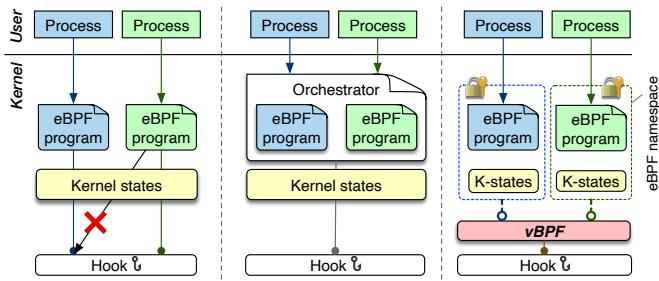  
(a) Native Static Binding (b) Orchestrator Static Binding (c) Late Binding (Ours)  
Figure 1: eBPF for multi-tenancy.

Our key insight is that resolving these conflicts requires decoupling the logical program from the physical hook through a late-binding execution model. We argue that physical hooks should serve as generic interposition points rather than fixed execution destinations. Much like dynamic dispatch in polymorphic programming languages [1, 2, 41, 94], the binding of an event to its program set and state view should be deferred until the event is attributed at runtime. By intercepting the event first and resolving its semantic context (i.e., the tenant), the system replaces the blind, indiscriminate execution of the static model with a context-aware dispatch.

However, realizing this late-binding model introduces three technical challenges. First, it requires precise event attribution to identify the target tenant before execution. This is dificult in interrupt-driven contexts where the execution context is detached from the logical tenant. Second, it requires high-performance dynamic dispatch that conflicts with the existing kernel’s linear organization. Since current hooks are designed for sequential execution, selective dispatch would degrade to <sup>??</sup> (<sup>??</sup> ) complexity, whereas critical paths usually demand <sup>??</sup> (1) latency for better scalability. Third, while latebinding enables state isolation by resolving tenant context, achieving both high performance and maintainability is dificult. Naive solutions must either rely on heavyweight hardware switching [54] or enforce invasive software constraints that break existing applications.

Based on our insight, we propose vBPF, a virtualization layer that implements this late-binding model (Figure 1-c).

vBPF creates eBPF namespaces for each tenant and, upon an event, dynamically resolves the target program and virtual context. To realize this, vBPF introduces three key designs to overcome those challenges.

First, we introduce the vBPF Snifer, which resolves tenant attribution for kernel events in interrupt contexts using a two-phase mechanism. The context-aware phase captures the mapping between interrupt-visible resources and namespaces during operations with process context, such as system calls. The context-free phase then eficiently determines the targeted tenant from interrupt-driven events, such as XDP packets, by querying this pre-recorded mapping that manages the complex and dynamic lifecycle of these mappings. Rather than attributing all interrupts, we target tenant-bearing resources (e.g., network flows) that cover the key interrupt-driven eBPF use cases in our scope.

Second, to resolve the conflict between linear organization and high-performance dispatch, we introduce the vBPF Dispatcher. It redesigns the multi-program architecture by replacing the kernel’s existing linear structures with a hierarchical, hash-based index that mirrors the tenant namespace structure. This allows vBPF to locate a tenant’s entry point in <sup>??</sup> (1) time. To eficiently execute the resulting parent-child program chains (e.g., pod-level tracing over container logic), we introduce an optional path flattening: vBPF pre-compiles the entire chain into a single array, trading a small amount of memory for near-zero dispatch latency.

Third, we achieve state isolation without the performancemaintainability trade-of by leveraging a key observation: eBPF programs interact with shared kernel state exclusively through specific entry points. So we propose a compilerenforced state isolation framework. At the base, a static analyzer audits these helpers, rejecting unsafe global state access by default. To resolve conflicts without changing the tenant code, we provide a variable library for kernel developers. This library automatically transforms stateful operations by delegating static variables to tenant-private instances and patching dynamic state accesses. This design ensures strict isolation with minimal runtime cost while preserving the original eBPF programming model.

We implement a prototype of vBPF on Linux kernel 6.12 and evaluate it on a series of microbenchmarks and realworld applications. Our results demonstrate that vBPF effectively resolves multi-tenancy conflicts while delivering superior performance isolation. For example, vBPF enables the coexistence of singleton hooks and allows distinct containers to deploy independent eBPF programs without interference. In multi-tenant scenarios, vBPF reduces latency by up to 3.9× (lmbench) and improves application throughput by 29% (PostgreSQL) compared to native eBPF, primarily by eliminating redundant execution.

vBPF is available at https://github.com/vbpf-osdi-2026.

## 2 The Case for eBPF Virtualization

## 2.1 eBPF Explained

eBPF has emerged as the main mechanism for safe kernel programmability in Linux. Its verifier [13] statically enforces strict safety properties before execution, and its JIT com piler [9] translates verified bytecode [5] into eficient native code. The Linux community has widely embraced this model, continuously adding new eBPF features [59] and making kernel customization practical for modern applications.

The architecture of eBPF is illustrated in Figure 2. eBPF programs are attached to predefined hooks within the kernel. They retrieve eBPF-specific data via eBPF maps and interact with global kernel states through helper functions or kernel functions (kfuncs). The following presents three core components of eBPF.

Event-Driven Execution. Developers can write eBPF programs using tools like bcc [18] and libbpf [24], each of which serves as a specific user-defined kernel extension. Numerous hooks are distributed across various kernel subsystems, including system call entry/exit, tracepoints, trafic control, and more. eBPF programs are attached to these hooks, which are triggered by events like syscall invocations. When execution reaches a hook point, the kernel sequentially invokes the attached eBPF programs.

eBPF Map. The eBPF program is distinct from the map, and these two elements can be linked through system calls, en abling the eBPF program to access the specified map. Conversely, given that the maps are globally shared data structures, the userspace program only needs to get the corresponding fd to have access to the map. The eBPF map provides a variety of ways to access the map, such as the file system and the eBPF map ID. The BPF file system is a pseudo-file system, and userspace programs can access the map through the file system operation. Furthermore, the eBPF subsystem maintains a global ID table for the map, which enables the user to obtain the map’s fd directly from the ID.

Global Kernel States and Access Interfaces. Although eBPF was designed to restrict access to arbitrary kernel memory, there are still limited interfaces to interact with specific kernel data structures. For example, eBPF helper functions provide safe operations on data structures such as task\_struct and sk\_buff, ensuring that arguments and pointers are strictly checked by the verifier. To further enhance accessibility, the eBPF kernel function (KFunc) mechanism introduces a whitelist of custom functions through BTFbased metadata [6]. Unlike helper functions, which rely on strict prototypes and stable APIs, KFuncs are verified mostly against BTF types and annotations. As a result, they can expose richer kernel-internal functionality, including functions that inspect or modify kernel state. However, KFuncs do not provide stability or availability guarantees across kernel versions and configurations.

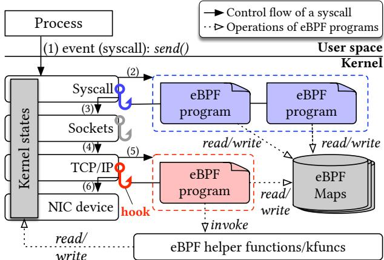  
Figure 2: eBPF in the Linux kernel.

## 2.2 From Platform to Tenant eBPF

eBPF has become the standard for programmable cloud infrastructure, enabling providers to enforce policies and manage resources transparently. In this platform-defined model, trusted infrastructure components attach eBPF programs to manage all workloads in a shared kernel. For example, CNIs like Cilium [8] and Calico [27] use XDP and TC hooks for high performance packet processing and load balancing; security systems like KubeArmor [30] enforce container-aware runtime constraints via LSM hooks; and observability tools like Pixie [19] and NetObserv [26] provide deep visibility into cluster health. These programs are typically managed by the platform administrator or a global eBPF manager [7, 22, 45], and therefore operate within a single trust domain.

However, restricting eBPF to this platform layer leaves a semantic gap: the platform controls kernel resources, but often lacks the application-specific context needed for optimal execution. A tenant-defined model closes this gap by allowing tenants to deploy eBPF logic tailored to their own workloads. For example, with the advent of sched\_ext [31, 33], a latency-sensitive tenant can replace the generic CFS scheduler with a custom FIFO policy to minimize tail latency. Similarly, data-intensive applications (e.g., databases) can optimize page cache replacement policies based on query patterns [50, 104, 111]. Tenants can also deploy tracing programs to debug complex logic such as tracking specific lock contention or transaction latency. This shift transforms the kernel from a static resource manager into a programmable accelerator tailored to each tenant’s specific workload.

Beyond enabling richer customization, the tenant-defined model also changes how eBPF programs are deployed and managed. Modern cloud workloads increasingly run in shortlived containerized environments, where requirements may evolve as applications scale, migrate, or change execution phases. Automation can further accelerate this trend (e.g., via AI agents [10, 17, 40, 51]), which can assist in generating or updating eBPF programs. As tenant eBPF shifts from occasional hand-written customization to more frequent runtime

```solidity
// container-A redirect to egress
2 SEC("tc/ingress")
3 int tc_ingress(struct __sk_buff *ctx) {
4 if (iph.saddr == 0x9c3ca8c0) {
5 iph.saddr = 0x0A0A0A01;
6 return bpf_redirect(2, 0);
7 }
8 return TC_ACT_PIPE;
9 }
10
11 // container-B redirect back
12 SEC("tc/egress")
13 int tc_egress(struct __sk_buff *ctx) {
14 if (iph.saddr == 0x0A0A0A01)
15 return bpf_redirect(2, 1);
16 return TC_ACT_PIPE;
17 }
```

Listing 1: Infinite forwarding loop caused by functionality conflicts. Two tenants in TC redirect the same packets.

adaptation, multi-tenant platforms must allow independently developed tenant programs, as well as platform-managed programs, to coexist in the same kernel.

## 2.3 The Challenges for Tenant-Defined eBPF

We observe three limitations of the existing eBPF design for tenant-defined eBPF in cloud-native platforms.

The Singleton Conflict. Certain powerful kernel hooks are designed as singletons, allowing only one eBPF program to govern a hook globally. This is particularly evident in hooks based on struct\_ops, which function by replacing global function pointers. For example, customizing TCP behavior, such as overriding loss recovery, RTT sampling, or pacing, requires overwriting these global callbacks. So the first successful registration continues to own the singleton resource, and later conflicting registrations fail at load or attach time, preventing tenants from deploying distinct TCP policies. Similarly, the extensible scheduler (i.e., sched\_ext [31]) operates by replacing the global scheduling class, ruling out the coexistence of multiple scheduling policies. Furthermore, eBPF iterators (e.g., bpf\_iter\_task) allow only a single seq\_ops implementation to define iteration behavior, preventing multiple tenants from simultaneously customizing how they traverse system resources.

Limitation 1: The singleton design of global eBPF hooks enforces a “winner-takes-all” model.

Functionality Conflicts. The global nature of the eBPF subsystem allows programs from diferent tenants to destructively interfere with one another. This manifests primarily as control flow interference. As illustrated in Listing 1, consider two benign tenants (A and B) attaching redirection logic to interconnected interfaces. Tenant A redirects packets to Interface-2, while Tenant B redirects them back. This creates an infinite forwarding loop, where a single packet circulates indefinitely, saturating the CPU and collapsing the network stack. While both programs are valid in isolation, their uncoordinated composition leads to catastrophic failure. Beyond control flow, data dependency conflicts occur when programs share mutable context. If a tenant modifies a packet header or overrides a kernel function return value (via kprobe), they silently corrupt the input state for subsequent programs.

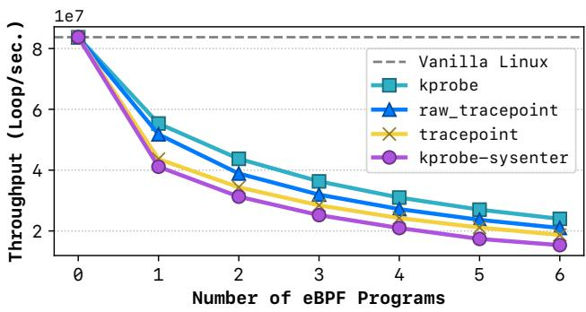  
Figure 3: Performance interference on UnixBench [96]. The Y-axis represents syscall throughput (loops/second). Performance degraded when attaching eBPF programs to the getpid syscall. kprobe-sysenter attaches to sys\_enter and relies on in-program conditional checks to filter for getpid, similar to tracepoint and raw\_tracepoint.

Limitation 2: Shared execution context creates implicit dependencies between tenants, allowing side efects to corrupt correctness.

Performance Degradation. The lack of execution isolation forces a global broadcast model, where unrelated eBPF programs indiscriminately consume CPU cycles on critical paths. We quantified this “noisy neighbor” efect by measuring getpid throughput under unrelated eBPF attachments (Figure 3). The results reveal three key findings: (1) Severe “zero-to-one” penalty: attaching a single unrelated program causes a sharp throughput drop due to the overhead of enabling the indirect call to the eBPF program. (2) Consistent runtime cost: the degradation magnitude remains consistent across diferent hook types. (3) Magnified impact on static tracing: Unlike kprobes which trigger only on specific functions, (raw) tracepoints attach to the global sys\_enter path, forcing the program to execute on every system call and significantly increasing unnecessary invocations.

Limitation 3: The lack of scope-aware dispatching forces unrelated programs to execute on every event, imposing unavoidable overhead on all tenants.

## 2.4 Approaches to eBPF Multi-Tenancy

In-Program Filtering. The most rudimentary approach relies on tenants embedding filtering logic directly into their programs [54] (e.g., filtering by PID). However, this mechanism is neither mandatory nor enforceable, leaving the platform vulnerable to malicious or buggy tenants who may omit these checks to snoop on neighbors or interfere with system-wide operations. Furthermore, this approach incurs a prohibitive execution tax: the kernel must invoke every attached program to evaluate these conditions on every event. This results in unavoidable invocation overhead that scales linearly with the number of programs.

Cgroup-Based Dispatch. Linux cgroups [12] provide a kernel-native mechanism to attach eBPF programs to specific process hierarchies [89, 111]. While efective for cgroupaware events (e.g., socket operations), this mechanism relies on specialized attachment types that are distinct from the standard hooks (e.g., tracepoints) used by many tools. Crucially, it fails for interrupt contexts. Hooks like XDP operate at the driver level without access to process information, rendering cgroup identification impossible. Moreover, cgroups only partition the attachment scope, not the underlying hook. Singleton hooks, such as struct\_ops or specific LSM hooks, cannot be partitioned by cgroups, so only one tenant can attach at a time. Finally, cgroup-based dispatch does not isolate the kernel state observed or mutated by dispatched programs, making it insuficient to handle multi-tenancy.

Orchestrators Provided by Platforms. Platform orchestrators [7,8,45] attempt to resolve conflicts by merging multiple tenant programs into a single monolithic executable or a static tail\_call chain. This centralization shifts the burden to the kernel verifier: merging logic from multiple tenants increases complexity and instruction counts, causing the com bined program to exceed the verifier’s strict limits [42] and potentially resulting in rejection. Furthermore, dynamic updates incur significant latency. Inserting or removing a single tenant’s program often requires recompiling and atomically replacing the entire monolithic chain within the kernel. Finally, this approach compromises portability. Tenants must rewrite standard eBPF programs to fit rigid orchestrator APIs, sacrificing eBPF’s inherent flexibility and tool compatibility.

Verification-Based Admission Control. Concurrent with our work, KrakenGuard [91] proposes a trusted user-space eBPF manager that uses symbolic execution to enforce finegrained policies at load time. It provides policy-based admission control rather than a runtime virtualization layer, rejecting programs that violate policies or conflict with already loaded programs instead of enabling coexistence. Kraken-Guard is therefore complementary to vBPF. It strengthens safety at load-time, while vBPF allows tenant programs to coexist transparently at runtime, including when they use singleton hooks or shared kernel state.

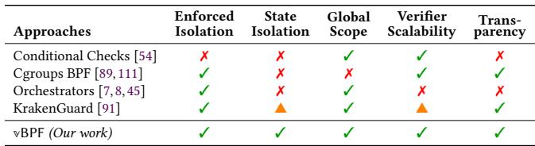  
Table 1: Existing approaches to eBPF multi-tenancy.

Summary. As Table 1 shows, no existing mechanism satisfies the requirements for secure, scalable multi-tenancy. They either rely on tenant-provided checks, restrict only certain attachment scopes, compose programs ahead of time, or reject unsafe programs at admission time. Although these approaches can enforce useful restrictions, they lack architectural support needed for general multi-tenancy. The core challenge, therefore, is the absence of a virtualization layer that decouples the tenant’s logical view of the kernel from the physical execution environment.

## 2.5 Threat Model and Assumptions

We target a multi-tenant shared-kernel platform where the host kernel, eBPF verifier, JIT compiler, container runtime, and platform administrator are trusted. Conversely, tenants and their eBPF programs are untrusted. Even if accepted by the verifier, a buggy or malicious tenant program could attempt to observe peer tenants, induce unnecessary execution on unrelated workloads, corrupt shared execution contexts, or manipulate helper-accessible kernel state beyond its authorized scope. Here, we consider the kernel state to include both internal data structures (e.g., task\_struct) and eBPF-specific structures (e.g., eBPF maps).

The goal of vBPF is to confine tenant-defined eBPF execution and state updates to the tenant’s scope, while preserving explicitly authorized hierarchical visibility for platform monitoring. vBPF does not protect against malicious host administrators, compromised kernel, verifier or JIT bugs, hardware faults, microarchitectural side channels, or resourceexhaustion attacks that should be handled by existing kernel mechanisms.

## 3 The Late-Binding Architecture

## 3.1 The Abstraction Gap of Static Binding

The core limitation of eBPF multi-tenancy is its reliance on a static-binding model. Currently, tenant programs are bound to physical hooks during deployment. Once a hook is triggered, the kernel dispatches the event to the hook’s fixed attached program set, independent of tenant relevance. This static coupling hardwires tenant code to a specific kernel hook and makes programs operate within a global memory space. While the kernel permits multiple attachments, it forces tenants to contend for the same execution context and global states, leading to state corruption and performance interference. Consequently, mechanisms built on today’s eBPF model can only mitigate conflicts indirectly, for example through inprogram filtering or external coordination of attachments. Because the underlying hooks and kernel state remain shared, these approaches still fall short of the isolation guarantees expected in multi-tenant environments.

## 3.2 Insight: Decoupling via Late-Binding

We propose that secure multi-tenancy requires a late-binding architecture. Rather than statically mapping logical programs to physical resources, vBPF introduces a layer of indirection. In this model, physical kernel hooks serve merely as interposition points. The binding of an event to its program set and virtual state view is deferred until the event is attributed at runtime. Upon an event, the vBPF runtime dynamically resolves which logical program to execute and which context to map based on the active tenant. By decoupling logical operations from physical realization, late binding transforms eBPF from a shared kernel extension facility into a virtualized runtime, enabling selective execution, precise attribution, and independent state management.

## 3.3 Design Overview

Inspired by the concept of late binding, we present vBPF, a novel eBPF execution model that achieves virtualization through three key techniques.

eBPF Namespaces. To isolate tenants, we introduce a new, hierarchical eBPF namespace bound to processes. A new namespace is essential for orthogonal policy composition, allowing security controls via vBPF to be decoupled from resource management like cgroups. This composable design enables fine-grained policies impossible with existing namespaces, such as applying diferent tracing rules to a sidecar and an application that share the same network. Moreover, its hierarchical structure allows parent namespaces (e.g., the host) to transparently audit child tenants. Following Linux namespace conventions, vBPF supports standard operations: creating new namespaces via clone [11] and unshare [39], and joining existing ones via setns [36]. This design enables seamless integration with container runtimes like runc [29] and orchestration platforms like Kubernetes [20].

Execution Context. The OS kernel operates in two distinct states [93]: process context and interrupt context. Process context handles synchronous user-space transitions (e.g., system calls), where the kernel can reliably identify the initiating tenant by inspecting the current task structure. In contrast, interrupt context handles asynchronous events like timer interrupts or packet arrivals that preempt the running task. When an interrupt occurs, the current task only represents the process that was interrupted (or the idle task), which is usually unrelated to the event’s owner. Consequently, it is unsafe to rely on current to identify the target namespace. vBPF Snifer. The first challenge for late-binding is to identify the tenant namespace accurately, particularly during interrupt-driven events (e.g., XDP packet arrival) where process context is absent. The vBPF Snifer bridges this semantic gap using a two-phase attribution mechanism. During processcontext operations (e.g., system calls), the snifer captures the association between physical resources (e.g., sockets or block I/O requests) and tenant namespaces, storing this mapping in a global registry. When an interrupt fires, the snifer queries this registry to resolve tenant attribution. This design enables vBPF to dynamically determine the tenant attribution for programs and events at runtime.

vBPF Dispatcher. Once tenant attribution is resolved, the vBPF Dispatcher resolves the logical program to execute. Unlike the flat, linear traversal of native eBPF, the dispatcher organizes programs into tenant-scoped domains that mirror the namespace hierarchy. Furthermore, vBPF introduces two key optimizations. First, the dispatcher replaces existing linear scans with a hash-based lookup, locating the tenant’s entry point in <sup>??</sup> (1) time regardless of system scale. Second, to support parent-child relationships (e.g., global monitoring), the dispatcher ofers a configurable trade-of: a memoryeficient recursive lookup or a path flattening optimization that pre-compiles the execution chain into a single array, trading memory for minimal dispatch latency.

vBPF State Isolation Framework. Finally, vBPF achieves state isolation through a compiler-enforced, multi-layered mechanism. We leverage the observation that eBPF programs interact with shared kernel state exclusively through helper functions. At compile time, vBPF deploys a static analyzer to audit these interfaces and reject helper functions that modify global state unless explicitly allowlisted. At runtime, our variable library virtualizes state access for eBPF programs: it delegates static variables from global definitions to tenant-private instances and manages kernel structures via fine-grained dynamic patching. This allows eBPF developers to write standard eBPF code without modification, as the vBPF automatically redirects “global” writes to shadowed local copies to prevent cross-tenant pollution.

## 4 Detailed Design

## 4.1 vBPF Snifer

The initial step of vBPF is to identify the correct eBPF namespace for triggered events. While this identification is straightforward in process contexts by inspecting the initiating task, it is non-trivial in interrupt-driven scenarios. As noted in §3, when a packet arrives, the current task only represents the interrupted process, which is typically unrelated to the packet’s owner. vBPF Snifer is designed to resolve this challenge.

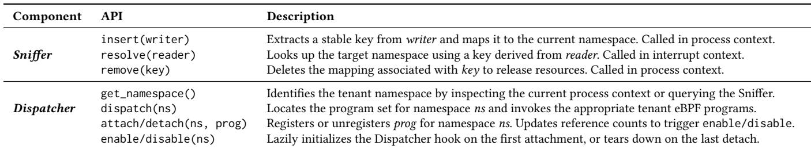  
Table 2: Core abstractions of vBPF Snifer and vBPF Dispatcher.

Observation. Our design is based on a key observation: an interrupt event is linked to a resource that was previously set up in a process context. E.g., a network packet arrives only after a process has established a connection. Thus, instead of relying on the unreliable execution context, we track the resource itself. Snifer records the eBPF namespace for resources (e.g., network IP and port) during their initialization. Later, when an interrupt occurs, the system simply looks up this prerecorded mapping to identify the target namespace.

Importantly, this resource-based attribution does not assume a strict one-to-one relationship between interrupt event and a task. Multiple interrupt events may resolve to the same namespace (e.g., packets from the same flow share a 5-tuple). Conversely, the resource visible at an interrupt may aggregate work from multiple tasks or namespaces, such as merged bio/request objects in the block layer. In such cases, the Snifer records a namespace set as the mapped value and propagates it when requests are split or merged.

General Procedures. As Figure 4 shows, the Snifer implements this logic through a two-phase lifecycle. In the contextaware phase, we instrument specific kernel resource allocation paths, such as bind() or connect() system calls. Since the process context is valid at these points, we capture the resource identifier (e.g., the socket’s 5-tuple) and register a {resource-ns} entry in the resource-based mapping. In the context-free phase, which occurs during interrupts, we extract the identifier from the raw context. We then query mapping to retrieve the associated namespace, enabling precise dispatch without relying on the execution context.

Unified Key Interface. A major challenge is that the two phases see diferent data structures: the first phase sees highlevel kernel objects (e.g., sock), while the second sees raw event metadata (e.g., xdp\_md). To solve this, we separate the matching mechanism from the data extraction policy (Table 2). We define the process-side context as a writer and the interrupt-side context as a reader. These interfaces serve as adapters that extract the same identity information from their diferent sources. This unified key enables insert() and resolve() to match resources across the boundary, independent of the data format.

Use Cases. We instantiate vBPF Snifer for three main classes of resources. For networking (TC/XDP), a network\_sniffer derives keys from packet headers (e.g., 5-tuples in sk\_buff/xdp\_md) and supports multi-stage matching across connection setup, binding, and acceptance, refining the {resource-ns} entry as more information becomes available. For storage, a request\_sniffer keys on kernel I/O request objects (e.g., bio/request) so that completion interrupts can be resolved back to the namespace that submitted the operation. Finally, we use a task\_sniffer to handle teardown corner cases: before a task’s namespace is destroyed, it records a stable task-namespace mapping, allowing late process-context events in the exit path to identify the correct tenant even after the namespace reference in the task has been reclaimed. Scope. vBPF Snifer targets kernel events whose handling spans both process and interrupt contexts. However, platform-level interrupts such as IPIs, device hotplug, and other hardware management events have no meaningful tenant owner and remain confined to the host namespace. This partition is deliberate: we only pay the cost of Snifer where namespace identification is useful, and fall back to simpler, semantically correct mechanisms elsewhere.

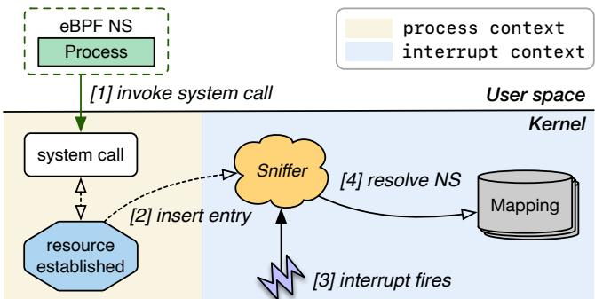  
Figure 4: vBPF Snifer workflow. First, a process invokes a system call ([1]), triggering the Snifer to record the mapping between the established resource and the namespace ([2]). Later, when a interrupt fires ([3]), the Snifer uses this pre-recorded mapping to resolve the associated namespace ([4]).

## 4.2 vBPF Dispatcher

Once a tenant’s eBPF namespace is identified, vBPF should dispatch the event to the correct eBPF programs. However, the native eBPF execution model is mismatched with the nature of multi-tenant environments. First, specific attachment points enforce exclusivity. For example, hooks based on struct\_ops or LSM often accept only a single global program. Second, even for hooks that support multiple programs, the kernel relies on linear data structures (Figure 2). Concretely, kprobes utilize linked lists while tracepoints employ arrays to manage attached programs. A naive implementation might perform filtering at runtime, but this approach degrades performance by sequentially traversing unrelated programs. As shown in Figure 5, vBPF Dispatcher redesigns the program organization to address these challenges.

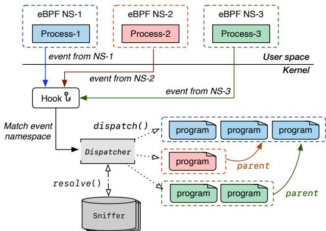  
Figure 5: vBPF Dispatcher. The Dispatcher sits at each hook, receives the namespace resolved by the Snifer, and dispatches the event only to the matching tenant programs and eligible parent programs.

Virtual Hook Multiplexer. To implement the late-binding execution model, vBPF introduces a lightweight multiplexer attached to the physical hook. This component functions as a global indirection layer, similar to a virtual method table in object-oriented languages. Instead of binding tenant programs directly to kernel attachment points, the system installs this multiplexer as the sole occupant of the physical hook. Upon event triggering, the multiplexer acts as an entry point and queries the Snifer to identify the corresponding tenant namespace. It then dynamically routes the event to logical programs registered by that tenant.

Hash-Based Tenant Indexing. Although subsystems like kprobes natively support multi-program attachment, they rely on a linear organization. These programs are then executed in a sequential manner, which is reasonable in today’s Linux since all programs need to be executed. However, with vBPF, we need to check each program to ensure that only the targeted programs are executed, bringing a significant runtime overhead. vBPF replaces this linear scan with an O(1) dispatch mechanism based on tenant indexing. The Dispatcher uses a hash map, keyed by eBPF namespace, to directly locate a tenant’s programs, which are themselves organized into a contiguous array. This design combines an eficient tenant lookup with a cache-friendly intra-tenant program traversal, ensuring that dispatch latency remains constant and isolated from the activities of other tenants.

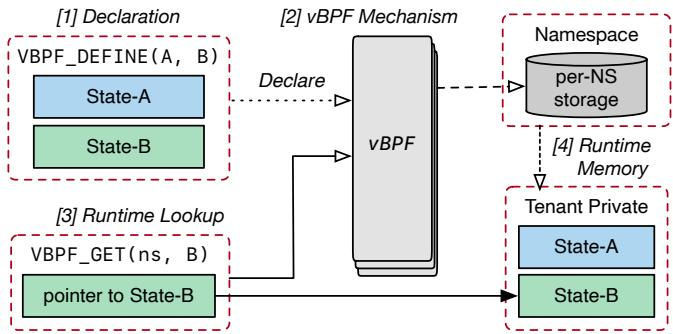  
Figure 6: vBPF tenant-private states. Developers declare multiple states using VBPF\_DEFINE ([1]), and then vBPF automatically maps them into a cohesive per-namespace storage layout ([2]). At runtime, VBPF\_GET eficiently resolves ([3]) the specific state instance from the tenant-private memory ([4]).

Flatened Hierarchical Execution. For certain use cases, such as tracing, a hierarchical approach is necessary where parent namespaces should observe events in child namespaces. vBPF supports this via a bottom-up execution order, propagating events from the specific tenant up to the root. This allows platforms to audit, modify, or veto tenant actions, as context modifications are visible up the chain, and parents can override children’s return codes. However, recursively walking the namespace tree on the critical path is ineficient. To address this, we introduce a path flattening optimization. During the program attachment, vBPF pre-computes the call chain from tenant to root as a static array. At runtime, dispatch becomes a simple iteration over this flattened path. Flattened path consistency is maintained atomically during parent program updates to prevent race conditions.

## 4.3 The vBPF State Isolation Framework

To deliver a virtualized environment, vBPF must enforce strict boundaries on state modification. The main goal is to ensure that tenants operate on independent state instances. For example, if two tenants attempt to modify the same sk\_buff, the system must ensure they operate on separate local copies to avoid conflicts. However, achieving this is non-trivial. On the one hand, coarse-grained methods like page-table switching provide strong isolation but incur high overhead and lack the granularity to isolate small kernel objects eficiently. On the other hand, fine-grained methods that manually rewrite kernel logic are eficient but too invasive and hard to maintain across a large, changing codebase.

To address these challenges, vBPF proposes a multilayered state isolation framework. At its foundation is a static analyzer that prevents access to unverified eBPF kernel interfaces (e.g., eBPF helper functions). Building on this guarantee, a variables library provides high-level, transparent abstractions for managing both simple per-tenant state and complex, shared kernel objects.

The Static Analyzer. The core of vBPF’s state isolation is a static analyzer built upon a key observation: eBPF programs access kernel state exclusively through a bounded set of verifiervisible kernel interfaces, including eBPF helper functions and kfuncs. This provides a natural checkpoint for enforcing isolation. Our analyzer, integrated into the kernel’s compilation toolchain as a compiler frontend plugin, enforces a defaultdeny policy: it rejects any eBPF kernel interface that can modify global kernel state unless it is explicitly annotated as safe. This ensures tenant programs only use interfaces audited for multi-tenant environments, drastically reducing the attack surface for cross-tenant interference.

Analysis Procedure. Our static analyzer’s design relies on two compiler attributes. vbpf\_helper is integrated with the kernel’s BPF\_CALL\_\* macros to automatically identify the complete API surface of all functions exposed to eBPF. The second, vbpf\_safe, is a manual annotation applied by kernel developers, serving as a formal assertion of state safety. It then employs a taint analysis to automatically verify the state safety of these helpers. If a side efect is detected, it then requires the vbpf\_safe annotation as an explicit developer sign-of. To ensure soundness, we define rigorous propagation rules for complex control flows such as static branches, loops, and indirect calls. Any violation of these rules results in a compile-time error, preventing the creation of an insecure vBPF-enabled kernel.

Pointer Analysis. By default, the analyzer treats all argument pointers as tainted (unsafe). However, a naive rejection of all pointers yields excessive false positives. To resolve this, we leverage the eBPF verifier’s existing type constraints. Our key observation is that the verifier strictly defines the argument pointer types and memory regions a pointer can access. For each analyzed interface, the analyzer reads its verifier-visible prototype (e.g., bpf\_func\_proto for helpers and BTF prototypes for kfuncs) and lifts each pointer argument into a safety category. Pointers that are guaranteed to access tenant-private memory (e.g., the eBPF stack, local maps) or read-only regions (e.g., string constants) are classified as safe. This verifier-assisted pointer classification allows vBPF to accept common interfaces that only write to tenant-owned bufers while still rejecting hidden mutations to shared kernel state.

The vBPF Variables Library. Our static analyzer provides a strong safety foundation, but shifts the burden of state management to developers. To automate this complex and error-prone task, we introduce the vBPF variables library. The design is guided by a key insight: kernel state consists of two distinct categories requiring diferent management. The first is tenant-private state, which can be safely instantiated per tenant. The second is shared state, which cannot be replicated and whose access must be virtualized. Our library provides two distinct mechanisms tailored to these categories: a highly-eficient, declarative API for tenant-private state, and a general state overlay engine for virtualizing shared state. eBPF kernel interfaces can use these mechanisms to redirect accesses to namespace-private instances or to record tenant-specific updates to shared objects.

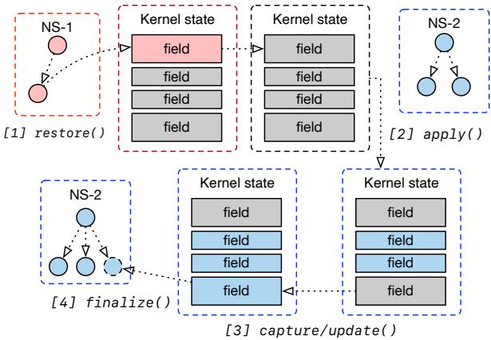  
Figure 7: vBPF semantic state overlay. Upon a context switch from NS-1 to NS-2, vBPF restores the kernel to a clean state ([1]) before applying NS-2’s specific patches ([2]). During eBPF program execution, helper functions capture modifications ([3]), which are finalized and appended to the namespace’s patch set ([4]) after the program exits.

Declarative API. Manually converting a global variable into a per-tenant instance is a complex task. It requires defining a new type, managing memory allocation, and implementing lookup logic, which forces invasive changes across the kernel code. As Figure 6 shows, to minimize this complexity, vBPF introduces a declarative API that abstracts away these details. Instead of writing extensive boilerplate, developers simply use VBPF\_VARS\_DEFINE to declare a variable and VBPF\_FIELD\_INIT to register custom initialization logic. At runtime, accessing the tenant-specific instance requires only a single call to VBPF\_VARS\_GET(ns, ...). Using this API, vBPF provides per-namespace pointers that allow exclusive access to the states. Fields in the same group are resolved cohesively from a single namespace instance, ensuring auxiliary objects like locks remain consistent with the state they protect. This abstraction handles the storage and mapping automatically, reducing hundreds of lines of code to just a few declarations.

Semantic State Overlay. Virtualizing shared state requires a way to inspect and understand kernel data structures at runtime. A simple memory snapshot is not enough because it cannot handle complex structures like dynamic arrays and does not understand the diference between pointers and data. To solve this, we use the BPF Type Format (BTF), which is embedded within the kernel image. Although BTF was originally designed for debugging, we found that its detailed descriptions of data types and memory layouts make it perfect for reflections. As Figure 7 shows, we use BTF to implement a form of reflection that allows vBPF to understand the structure of kernel objects. This enables us to create a semantic overlay: instead of blindly copying memory, our engine calculates the exact size and layout of an object to generate a precise, safe patch that applies tenant-specific changes.

```c
1 // Precompute the context
2 struct overlay_ctx ctx;
3 overlay_ctx_init(&ctx, "sk_buff", skb);
4 // Hot path: record the patches
5 struct patch_builder *pb;
6 pb = overlay_begin(&ctx);
7 { skb->priority++; }
8 overlay_capture(pb, skb);
9 /* Or use update */
10 overlay_update(pb, skb, struct sk_buff, tstamp);
11 overlay_finalize(&ctx, pb);
```  
Listing 2: Primitive usage in helper function. The helper initializes an overlay context for the target kernel object, records modifications through either full-object capture or field-level update, and finalizes them into the namespace’s patch set.

State Overlay in Practice. As presented in Listing 2, the state overlay workflow of vBPF begins by registering an overlay context based on the current object state. When an eBPF helper function executes, it initializes a builder to track the modification process. After the state is modified, the engine generates patches using one of two methods: a capture mode that automatically detects changes by comparing snapshots, or an update mode that allows manual recording of specific fields. These patches are then committed to the current namespace’s patch set via a finalize operation. These patches are atomically applied when a tenant context switches in and reverted when they switch out.

## 5 Implementation

We have implemented a vBPF prototype based on Linux kernel 6.12 and LLVM 20, with 12k LoC for the kernel and 1k for the Clang frontend plugin.

Concurrency. Performance and correctness of vBPF under concurrency are paramount. To achieve this, we employ a hash table protected by Read-Copy-Update (RCU), enabling the query operations, such as Snifer resolve and Dispatcher get\_namespace, to proceed in a lock-free manner with minimal synchronization overhead. The insertion and removal operations in the hash table oversee object lifecycle management, with removals processed asynchronously. For scenarios with extremely large key sets where lookup misses are common, we ofer an optional bloom filter to preemptively reject lookups for non-existent keys, further reducing cache pollution and lookup latency.

Preallocation and Lazy Allocation. vBPF paradoxically boosts performance using two opposing allocation strategies: eager preallocation and deferred lazy allocation. First, to guarantee the performance of our lock-free data structures, we employ aggressive preallocation. By using the kernel’s kmem\_cache and custom memory pools, we pre-provision objects to prevent runtime allocation failures and latency fluctuation within critical sections. Conversely, to minimize memory footprint and startup latency, a tenant-private state is not created with its namespace but is deferred until its first access. We adapt the LazyCell [23] concept for this: a program must first VBPF\_VARS\_GET a variable, which triggers a one-time initialization on the first call, thereby lowering cache pollution and improving data locality at scale.

Pre-Computation for Runtime Eficiency. A core design principle in vBPF is to aggressively shift computational work from hot runtime paths to the less frequent setup phase. We apply this in two critical components. First, for the Dispatcher’s hierarchical execution, we implement path flattening. At program load time, we pre-compute the entire call chain from a tenant to the root and cache it in an array. At runtime, this transforms a recursive traversal of the namespace hierarchy into a highly eficient iteration, achieving near-constant-time dispatch. Second, for the state overlay engine, we pre-parse BPF Type Format (BTF) metadata at initialization. We cache the layouts of kernel objects into a simple array of field ofsets and sizes. This allows the runtime capture operation to bypass expensive BTF parsing entirely.

## 6 Evaluation

Hardware and Software. We use an x86-64 machine with Intel(R) Xeon(R) Gold 6330 CPU @ 2.00GHz, 28x2x2 cores, 512GB DRAM to evaluate microbenchmark and performance breakdown. To deploy our prototype system, we adopted the Linux 6.12 kernel and Ubuntu 24.04 LTS as the base system and built our implementation on top of it. eBPF programs and other components of vBPF are built on LLVM 20 with our customized Clang frontend plugin. In addition, all eBPF programs are jitted in our evaluation. For all benchmarks, we set the machine to run in performance mode and bound dedicated CPU cores for single-thread microbenchmarks.

Benchmarks. We evaluate vBPF on microbenchmarks and real-world applications. The microbenchmarks include lmbench [78, 98] and UNIX Bench [96]. We use real-world eBPF applications, sysdig [35] and netobserv [26], as monitor programs and applications like PostgreSQL [62] and Apache [37] as workload programs, and compare standard eBPF and vBPF in terms of performance degradation relative to vanilla Linux. We run Postgres [62] through Phoronix Test Suite and use the oficial benchmark tool ab [4] to evaluate Apache. Finally, we use sched\_ext [31] as a use case to demonstrate the performance improvement of redis [28] and 7z [3] decompression using vBPF.

## 6.1 Microbenchmarks

We use microbenchmarks to evaluate the runtime characteristics of vBPF. By comparing vanilla Linux, native eBPF, and vBPF, we aim to verify two key properties: (1) the low overhead of the Snifer/Dispatcher mechanism, and (2) the performance isolation benefits for cross-tenant scenarios.

Methodology. We use lmbench [78, 98] to generate system workloads covering syscalls, I/O, process creation, and networking. To simulate a realistic eBPF workload, we run sysdig [35], a comprehensive system visibility tool, to trace system events. We evaluate three configurations: (1) Native eBPF, where sysdig is attached globally using the standard kernel mechanism, (2) vBPF (Co-located), which runs lmbench workload and sysdig in the same tenant namespace, (3) vBPF (Cross-Tenant), which runs lmbench workload and sysdig in diferent tenant namespaces.

Results. Figure 8 shows the latency results of lmbench [78, 98] and Figure 9 shows the bandwidth results. We quantify baseline cost by comparing vBPF (Co-Located) against Native eBPF. vBPF introduces acceptable overhead: up to 4.81% for syscall, 5.18% for select, 3.39% for process creation and 2.51% for networking. Performance remains comparable to Native eBPF, indicating eficient Snifer and Dispatcher designs.

In cross-tenant scenarios, vBPF demonstrates significant advantages over Native eBPF. While Native eBPF imposes overhead on all processes through global hooks, vBPF bypasses execution for unmonitored tenants. For highfrequency operations, vBPF reports 0.258, 0.319, and 0.288 us for NULL call, read, and write, reducing latency by 3.7×, 3.8×, and 3.9× over Native eBPF. For network workloads, vBPF reports 17.55, 21.31, and 13.89 us for RPC/UDP, RPC/TCP, and TCP/IP, improving latency by 1.4×, 1.4×, and 1.5× over Native eBPF, restoring throughput for non-monitored tenants and approaching Vanilla Linux baseline performance.

## 6.2 Breakdown

We collect the latency of the tcx network packets tracing program to analyze the breakdown of the eBPF program execution time. We insert tcx to lo and use iperf3 to trigger packet transmissions. Co-Loc(vBPF) and Co-Loc(+Snifer) both denote that iperf3 and eBPF programs run in the same eBPF namespace. +Snifer indicates employing a snifer within the interrupt context, whereas vBPF signifies operation in the process context. X-Tenant(vBPF) and X-Tenant(+Snifer) follow a similar pattern but with iperf3 and the eBPF program in diferent eBPF namespaces.

The results are shown in Figure 10. A basic tcx program takes 1135 ns, covering core parsing and statistics functionalities typical of eBPF overhead. In comparison, vBPF adds snifer resolve at 134 to 136 ns, namespace lookup at 32 to 33 ns, and program lookup at 60 to 74 ns. The largest vBPF overhead accounts for only 2.1% of total eBPF execution, confirming minimal cost in co-located scenarios with substantial gains in cross-tenant settings.

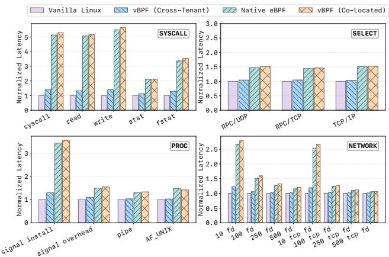  
Figure 8: Latency comparison of lmbench

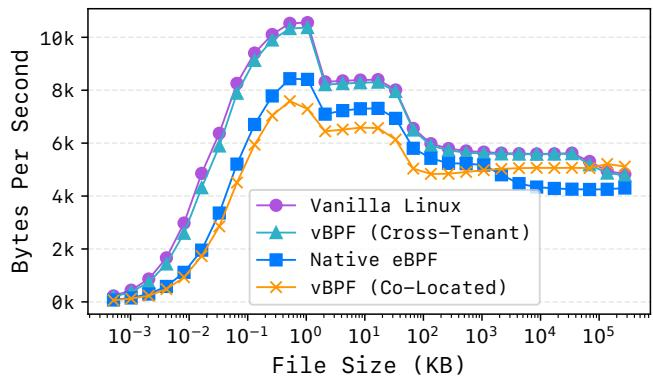  
Figure 9: Bandwidth comparison of file reading

## 6.3 Scalability Analysis

We further evaluate the scalability of vBPF using the same tcx program in §6.2, specifically focusing on the dispatch overhead as tenant density increases. Figure 11a depicts the latency of the Snifer and Dispatcher as the number of active eBPF namespaces scales from 10 to 100. The results demonstrate that as the number of namespaces increases, the snifer resolve latency stabilizes at the range of 131.7–136.6 ns and 58.3–60.7 ns for program lookup. This confirms our hashbased lookup maintains consistent low-latency performance in high-density, multi-tenant environments.

Figure 11b evaluates the dispatch eficiency when multiple kprobe programs contend for the same kernel function (sys\_read). We compare vBPF against Native eBPF (sequential execution) and vBPF (Co-located) (manual conditional checks). The results highlight a fundamental scalability gap. While both baselines exhibit linear performance degradation (<sup>??</sup> (<sup>??</sup> )) due to accumulated execution costs, vBPF (Cross-Tenant) maintains a flat throughput profile (<sup>??</sup> (1)). By efficiently bypassing unrelated programs, vBPF achieves a speedup of up to 54× compared to Native eBPF and 11.4× compared to the manual inner filter approach when inserting 160 kprobe programs, proving its ability to handle high-density multi-tenancy without performance degradation.

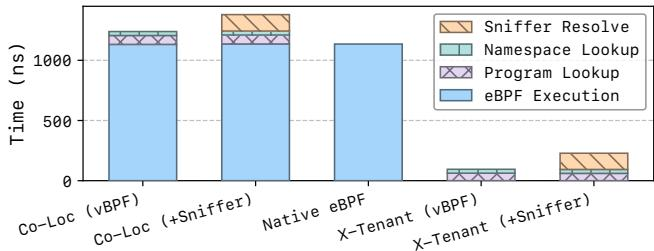

Figure 10: Breakdown of tcx tracing program  
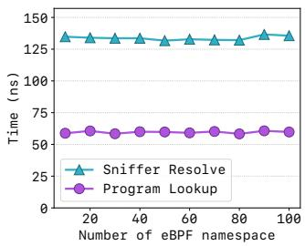

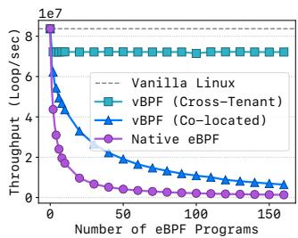  
(a) Snifer/Dispatcher latency (b) kprobe performance Figure 11: Scalability comparison

## 6.4 End-to-End Performance under Tracing

We use two real-world workloads and two real-world eBPF tracing applications to evaluate the end-to-end vBPF performance in cross-tenant scenarios.

PostgreSQL. PostgreSQL [62] is an open-source objectrelational database system. We evaluate throughput (transactions per second) and latency with diferent scales, client numbers, and access modes (read-only or read-write). We use sysdig [35] as a background eBPF program to monitor system data. As Figure 12 shows, vBPF can ofer 29% higher throughput and 23.6% lower latency compared to Native eBPF.

Apache. Apache httpd [37] is a widely used web server. We analyze the throughput (requests per second) of httpd with the ab [4] benchmark tool in diferent concurrent connection settings. Besides, we choose netobserv-ebpf-agent [26] as the background network monitor, which utilizes diferent types of eBPF programs, including kprobe, tracepoint, and trafic control (TC), etc., to collect network data. As Figure 13 shows, compared to the Native eBPF, vBPF can achieve up to 2.8× throughput speedup, and is close to vanilla Linux.

## 6.5 Use Cases: sched\_ext

In this section, we demonstrate a use case of vBPF. The extensible scheduler class (sched\_ext) [31] enables customized scheduling policies through eBPF programs. While sched\_ext can improve performance for specific workloads, it lacks fine-grained isolation beyond cgroup boundaries, which can lead to global interference and performance degradation for unrelated workloads.

To demonstrate this capability, we evaluate two distinct workloads with contrasting characteristics: Redis [28], a keyvalue database optimized for low-latency operations, and 7z [3], a file archiver performing CPU-intensive decompression. We employ scx\_central [33], a scheduler that maximizes time slice allocation, making it particularly well-suited for CPU-bound workloads but potentially detrimental to latency-sensitive applications. We compare three configurations: (1) Vanilla Linux using the standard CFS scheduler, (2) Native eBPF using scx\_central to schedule both redis and 7z, and (3) vBPF using scx\_central exclusively for 7z while keeping redis under the default scheduler, where each scheduler manages a disjoint set of CPU cores.

As Figure 14 shows, Native eBPF improves 7z [3] decompression performance by 10% compared to Vanilla Linux, but causes an 18% degradation in redis [28] throughput. In contrast, vBPF achieves the same 10% improvement for 7z while keeping redis performance close to vanilla Linux.

## 6.6 State Overlay Overhead

We evaluate the overhead of the vBPF state overlay using three representative kernel data structures (sk\_buff, file and task\_struct) alongside a simplified sk\_buff\_fake. We measure the latency of the four critical operations: capture / update (calculate or manually create the state overlay), apply (switch-in), and restore (switch-out). In addition, we compare the optimized implementation against a naive baseline to quantify the benefits of precomputed layout strategy.

Results. In Linux 6.12, sk\_buff is 232 bytes, task\_struct is 10,112 bytes, and file is 184 bytes. sk\_buff\_fake simplifies sk\_buff with reduced type complexity. In the test, we modify only one field in these data structures, which is common for a specific helper function. Figure 15 presents the results: the latency of apply, restore, and update remains stable, with the first two in the range of 42–44 ns and the latter at 52–56 ns. The latency of capture is influenced by the size of the type. In common cases (e.g., sk\_buff and file), the overhead is 118.8 and 100.9 ns, respectively. In addition, our optimization can reduce the overhead up to 31.4×.

## 6.7 Memory Overhead

We measure the peak additional memory consumed by vBPF under representative workloads and attribute it to its major components. We use netobserv, sysdig, and a simple bio monitor program as the eBPF workload, respectively. Table 3 shows that the fixed metadata remains small: the dispatcher uses at most 19.3 KiB, state bookkeeping uses 0.2 KiB, and other metadata stays below 16.4 KiB. The dominant factor is the Snifer registry, whose footprint depends on the number of live resource-to-namespace mappings. PostgreSQL creates few such mappings and adds only 11.6 KiB in total. In contrast, Apache and fio keep many network or I/O resources active at peak, increasing Snifer memory to 39,334.1 KiB and 38,961.3 KiB, respectively.

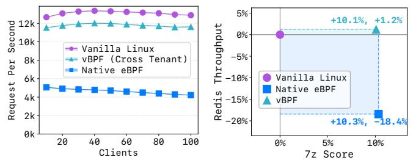

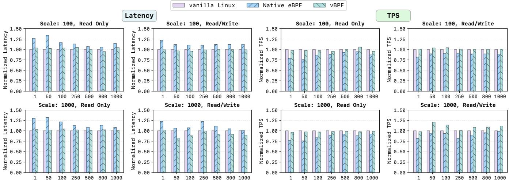  
Figure 12: Performance comparison of PostgreSQL benchmark under diferent workloads

Figure 13: Apache benchmark Figure 14: Scheduler results  
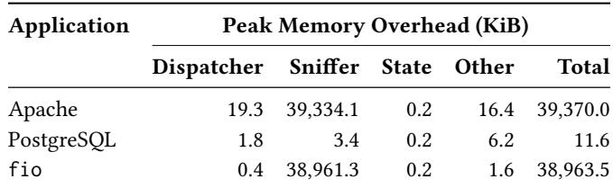  
Table 3: Peak memory overhead of vBPF by component

The state component remains minimal because modifications are rare, and ID-based eBPF state (e.g., eBPF maps use idr) adds only constant per-namespace metadata. For workloads that frequently modify shared kernel objects, overlay state grows with the modified objects but remains a demanddriven cost for strict isolation. Thus, vBPF incurs negligible fixed metadata cost, while total memory usage mainly tracks the active Snifer registry and state modifications.

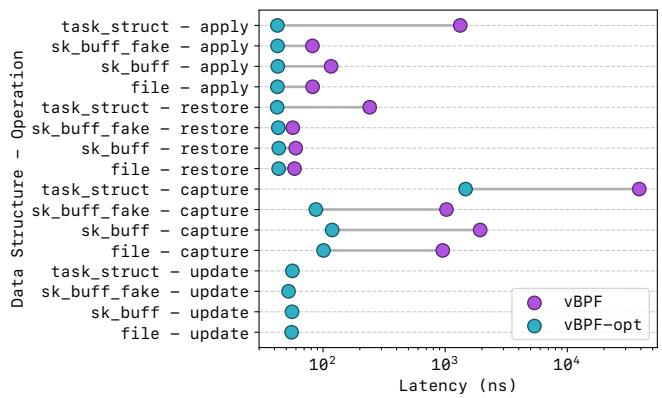  
Figure 15: Latency of vBPF state overlay. Capture latency depends on data-structure complexity, while apply and restore remain nearly constant. The optimized version uses precomputed layouts to avoid the runtime analysis.

## 7 Related Work

Kernel Isolation. There is a long line of research works introducing isolation to OS kernels [46,55,68,70,75,80,81,85, 95]. Some of them [46, 68, 70, 75, 80, 81] use safe languages to extend the type system of the kernel. While others [95] utilize runtime checks to provide a sandbox execution environment. Besides, there are also a lot of works [55, 85] that leverage static verification, which has become a standard method of eBPF nowadays. Additionally, leveraging hardware-based isolation mechanisms [49, 63, 67, 84] has proven to be an efective approach for kernel isolation.

eBPF and Its Applications. eBPF has been used in many scenarios for optimizations. For instance, some works [8, 25, 48, 56, 61, 66, 103, 107, 109] focus on improving the I/O performance. Others are customizing the kernel components with eBPF, including memory management [50,82,102], locking [89], scheduling [31–34, 71, 74], file system [72], process management [106], page fault handling [110], etc.

eBPF Enhancements. eBPF enhancements have been a hot topic in recent years. There are a few works [76, 86, 99–101] that improve the verifier. Others are proposed to improve the code generation of eBPF. For example, Merlin [77] is a recent system that utilizes customized IR to optimize generated eBPF bytecodes. Morpheus [79] leverages trafic patterns to optimize datapath binaries, including eBPF bytecodes.

Mitigation of Tracing Overhead. [60] provides a comprehensive survey of tracing, while [83] reduces the unnecessary overhead for fuzzing. As for eBPF, KFuse [72] improves performance by merging multiple eBPF programs without failing the verifier. [54] provides isolated eBPF programs for each process. [69] eliminates the exception of kprobe, and improves the tracing performance. Most of them are orthogonal to vBPF and can be integrated with vBPF.

Multiple Kernel Views. Barrelfish [44] is an early work that splits the kernel into multiple independent components. Face-Change [64] and MultiK [73] propose per-process kernel view in one kernel. These eforts are too heavy to virtualize the eBPF programs and kernel states.

## 8 Discussion

Memory Costs. While memory overhead may increase with the number of state overlays over time, we believe that it is acceptable in practice for three reasons. First, most dy namic kernel states like sk\_buff are short-lived, allowing immediate reclamation of allocated memory. Second, using copy-on-write strategy can make sure that it only stores the specific fields modified rather than the full objects. Third, writes are sparse since they occur solely through helper functions. As most eBPF programs are read-only for inspection, they incur zero additional memory cost.

Maintainability. As the kernel evolves, the number of modifiable states will increase naturally. Although vBPF introduces some maintenance overhead, it mitigates this challenge by leveraging the fact that eBPF programs modify state exclusively through well-defined entry points. Rather than manually rewriting arbitrary kernel code, maintainers need only inspect verifier-visible helper and kfunc boundaries to explicitly mark or virtualize stateful interfaces. Consequently, our static analyzer can seamlessly evolve alongside the kernel, requiring only a one-time annotation efort for each newly introduced function. While our current prototype focuses on helper functions due to their API stability, the underlying isolation mechanism is generic and can be readily extended to kfuncs given their semantic similarity.

State Consistency. vBPF ensures concurrency safety by leveraging synchronization mechanisms like RCU for atomic updates. Our current design assumes exclusive access (e.g., via locking) and does not explicitly account for RCU readers. However, this could be addressed by first reading the base variable and then independently applying per-tenant patches. We agree that virtualizing some kernel states is impractical, but this limitation is intentional. For example, global resources like timers should remain immutable to tenants. Working with our static analyzer, vBPF empowers kernel developers to define strict safety boundaries.

vBPF vs. MicroVMs. Hardware isolation [15,16,58] enforces strict binary isolation. vBPF addresses its limitations in two ways. First, eficiency: MicroVMs incur significant memory and startup overheads, while vBPF provides process-level agility where VM costs are prohibitive. Second, controlled sharing: patterns like sidecars require safe introspection, not total isolation. Unlike MicroVMs, which block visibility, vBPF enables selective virtualization with hierarchical auditing while preventing interference.

Generality of the Snifer. The Snifer is designed to capture the relationship between synchronous resource allocation and asynchronous event execution. By tracking stable logical resources instead of volatile packet headers, vBPF can handle complex scenarios like network tunnels and connection migration. Furthermore, this mapping mechanism can be ofloaded to hardware to eliminate runtime overhead.

## 9 Conclusion

We present vBPF, a virtualization layer that adopts a latebinding execution model. Guided by the insight of dynamic dispatch in polymorphic languages, vBPF resolves the fundamental architectural conflicts of the static-binding model through a context-aware Snifer, a hierarchical Dispatcher, and a state isolation framework. This work opens new directions for building safe, multi-tenant eBPF ecosystems.

## Acknowledgments

We thank the anonymous OSDI reviewers and our shepherd for their constructive feedback. We are also grateful to our labmates for many helpful discussions, and to our families for their lasting support and encouragement. This work was supported in part by the Fundamental and Interdisciplinary Disciplines Breakthrough Plan of the Ministry of Education of China (JYB2025XDXM113), the National Natural Science Foundation of China (No. 62472279 and 62302300), and the Advanced Research Center for Agent-Oriented OS (TC20260106010). Corresponding author: Dong Du (dd\_nirvana@sjtu.edu.cn).

## References

[1] Early and Late Binding - Visual Basic. https://learn.microsoft.com/en-us/ dotnet/visual-basic/programming-guide/ language-features/early-late-binding/, 2021.

[2] Use early binding and late binding in Automation - Ofice. https://learn. microsoft.com/en-us/previous-versions/ office/troubleshoot/office-developer/ binding-type-available-to-automation-clients, 2021.

[3] 7-Zip. https://7-zip.org/, 2025.

[4] Ab - Apache HTTP server benchmarking tool - Apache HTTP Server Version 2.4. https://httpd.apache. org/docs/2.4/programs/ab.html, 2025.

[5] BPF Instruction Set Architecture (ISA) — The Linux Kernel documentation. https://docs.kernel.org/ bpf/standardization/instruction-set.html, 2025.

[6] BPF Type Format (BTF) — The Linux Kernel documentation. https://docs.kernel.org/6.11/bpf/btf. html, 2025.

[7] bpfman: An eBPF Manager. https://bpfman.io/, 2025.

[8] Cilium - Cloud Native, eBPF-based Networking, Observability, and Security. https://cilium.io, 2025.

[9] Classic BPF vs eBPF — The Linux Kernel documentation. https://docs.kernel.org/bpf/classic\_vs\_ extended.html, 2025.

[10] Claude Code on the web. https://claude.com/ blog/claude-code-on-the-web, 2025.

[11] clone(2) — Linux manual page. https://man7.org/ linux/man-pages/man2/clone.2.html, 2025.

[12] Control Groups — The Linux Kernel documentation. https://docs.kernel.org/admin-guide/ cgroup-v1/cgroups.html, 2025.

[13] eBPF verifier — The Linux Kernel documentation. https://docs.kernel.org/bpf/verifier. html, 2025.

[14] Falco: Detect security threats in real time. https: //falco.org/, 2025.

[15] Firecracker: Secure and fast microVMs for serverless computing. https://firecracker-microvm. github.io, 2025.

[16] Google gVisor: Application Kernel for Containers. https://github.com/google/gvisor, 2025.

[17] Introducing Codex. https://openai.com/index/ introducing-codex/, 2025.

[18] Iovisor/bcc. https://github.com/iovisor/bcc, April 2025.

[19] Kubernetes Monitoring, Application Debug Platform | Pixie. https://px.dev/, 2025.

[20] Kubernetes: Production-Grade Container Orchestration. https://kubernetes.io/, 2025.

[21] Kubernetes-sigs/blixt. https://github.com/ kubernetes-sigs/blixt, April 2025.

[22] L3AFD: Lightweight eBPF Daemon. https:// github.com/l3af-project/l3afd, 2025.

[23] LazyCell in std::cell - Rust. https://doc.rust-lang. org/std/cell/struct.LazyCell.html, 2025.

[24] Libbpf/libbpf. https://github.com/libbpf/ libbpf, April 2025.

[25] LKML: KP Singh: [PATCH bpf-next v9 0/8] MAC and Audit policy using eBPF (KRSI). https://lkml.org/ lkml/2020/3/28/479, 2025.

[26] Netobserv/netobserv-ebpf-agent. https://github. com/netobserv/netobserv-ebpf-agent, April 2025.

[27] Project Calico. https://www.tigera.io/ project-calico/, 2025.

[28] Redis - The Real-time Data Platform. https://redis. io/, 2025.

[29] runc: a CLI tool for spawning and running containers according to the OCI specification. https://github. com/opencontainers/runc, 2025.

[30] Runtime Security Enforcement | KubeArmor. https: //kubearmor.io/, 2025.

[31] sched\_ext. https://sched-ext.com/, 2025.

[32] Scx/case-studies/scx\_layered.md at case-studies · sched-ext/scx. https://github.com/sched-ext/ scx/blob/case-studies/case-studies/scx\_ layered.md, 2025.

[33] Scx/scheds/c at main · sched-ext/scx. https: //github.com/sched-ext/scx/tree/main/ scheds/c, 2025.

[34] Scx/scheds/c/scx\_nest.bpf.c at main · sched-ext/scx. https://github.com/sched-ext/scx/blob/main/ scheds/c/scx\_nest.bpf.c, 2025.

[35] Security Tools for Containers, Kubernetes, and Cloud (Cloud Native usage report). https://sysdig.com/, 2025.

[36] setns(2) — Linux manual page. https://man7.org/ linux/man-pages/man2/setns.2.html, 2025.

[37] The Apache HTTP Server Project. https://httpd. apache.org/, 2025.

[38] Tracee. https://aquasecurity.github.io/ tracee/latest/, 2025.

[39] unshare(2) — Linux manual page. https://man7. org/linux/man-pages/man2/unshare.2.html, 2025.

[40] Claude Code overview. https://code.claude.com/ docs/en/overview, 2026.

[41] Martin Abadi and Luca Cardelli. A Theory of Objects. Springer-Verlag, Berlin, Heidelberg, 1st edition, 1996.

[42] Daroc Alden. Taking BPF programs beyond onemillion instructions. https://lwn.net/Articles/ 1017116/, 2025.

[43] Joshua Bardinelli, Yifan Zhang, Jianchang Su, Linpu Huang, Aidan Parilla, Rachel Jarvi, Sameer G. Kulkarni, and Wei Zhang. hydns: Acceleration of dns through kernel space resolution. In Proceedings of the ACM SIGCOMM 2024 Workshop on EBPF and Kernel Extensions, eBPF ’24, page 58–64, New York, NY, USA, 2024. Association for Computing Machinery.

[44] Andrew Baumann, Paul Barham, Pierre-Evariste Dagand, Tim Harris, Rebecca Isaacs, Simon Peter, Timothy Roscoe, Adrian Schüpbach, and Akhilesh Singhania. The multikernel: a new os architecture for scalable multicore systems. In Proceedings of the ACM SIGOPS 22nd Symposium on Operating Systems Principles, SOSP ’09, page 29–44, New York, NY, USA, 2009. Association for Computing Machinery.

[45] Theophilus A. Benson, Prashanth Kannan, Prankur Gupta, Balasubramanian Madhavan, Kumar Saurabh Arora, Jie Meng, Martin Lau, Abhishek Dhamija, Rajiv Krishnamurthy, Srikanth Sundaresan, Neil Spring, and Ying Zhang. Netedit: An orchestration platform for ebpf network functions at scale. In Proceedings of the ACM SIGCOMM 2024 Conference, ACM SIGCOMM ’24, page 721–734, New York, NY, USA, 2024. Association for Computing Machinery.

[46] B. N. Bershad, S. Savage, P. Pardyak, E. G. Sirer, M. E. Fiuczynski, D. Becker, C. Chambers, and S. Eggers. Extensibility safety and performance in the spin operating system. In Proceedings of the Fifteenth ACM Symposium on Operating Systems Principles, SOSP ’95, page 267–283, New York, NY, USA, 1995. Association for Computing Machinery.

[47] Ashish Bijlani and Umakishore Ramachandran. Extension framework for file systems in user space. In Proceedings of the 2019 USENIX Conference on Usenix Annual Technical Conference, USENIX ATC ’19, page 121–134, USA, 2019. USENIX Association.

[48] Marco Spaziani Brunella, Giacomo Belocchi, Marco Bonola, Salvatore Pontarelli, Giuseppe Siracusano, Giuseppe Bianchi, Aniello Cammarano, Alessandro Palumbo, Luca Petrucci, and Roberto Bifulco. hxdp: Efficient software packet processing on fpga nics. Commun. ACM, 65(8):92–100, July 2022.

[49] Anton Burtsev, Vikram Narayanan, Yongzhe Huang, Kaiming Huang, Gang Tan, and Trent Jaeger. Evolving operating system kernels towards secure kernel-driver interfaces. In Proceedings of the 19th Workshop on Hot Topics in Operating Systems, HOTOS ’23, page 166–173, New York, NY, USA, 2023. Association for Computing Machinery.

[50] Xuechun Cao, Shaurya Patel, Soo Yee Lim, Xueyuan Han, and Thomas Pasquier. Fetchbpf: customizable prefetching policies in linux with ebpf. In Proceedings of the 2024 USENIX Conference on Usenix Annual Technical Conference, USENIX ATC’24, USA, 2024. USENIX Association.

[51] Yinfang Chen, Manish Shetty, Gagan Somashekar, Minghua Ma, Yogesh Simmhan, Jonathan Mace, Chetan Bansal, Rujia Wang, and Saravan Rajmohan. Aiopslab: A holistic framework to evaluate ai agents for enabling autonomous clouds, 2025.

[52] Zhongjie Chen, Qingkai Meng, ChonLam Lao, Yifan Liu, Fengyuan Ren, Minlan Yu, and Yang Zhou. etran: extensible kernel transport with ebpf. In Proceedings of the 22nd USENIX Symposium on Networked Systems Design and Implementation, NSDI ’25, USA, 2025. USENIX Association.

[53] Jonathan Corbet. BPF at Facebook (and beyond). https://lwn.net/Articles/801871/, 2019.

[54] Milo Craun, Khizar Hussain, Uddhav Gautam, Zhengjie Ji, Tanuj Rao, and Dan Williams. Eliminating ebpf tracing overhead on untraced processes. In Proceedings of the ACM SIGCOMM 2024 Workshop on EBPF and Kernel Extensions, eBPF ’24, page 16–22,

New York, NY, USA, 2024. Association for Computing Machinery.

[55] Kumar Kartikeya Dwivedi, Rishabh Iyer, and Sanidhya Kashyap. Fast, flexible, and practical kernel extensions. In Proceedings of the ACM SIGOPS 30th Symposium on Operating Systems Principles, SOSP ’24, page 249–264, New York, NY, USA, 2024. Association for Computing Machinery.

[56] Pekka Enberg, Ashwin Rao, and Sasu Tarkoma. Partition-aware packet steering using xdp and ebpf for improving application-level parallelism. In Proceedings of the 1st ACM CoNEXT Workshop on Emerging In-Network Computing Paradigms, ENCP ’19, page 27–33, New York, NY, USA, 2019. Association for Computing Machinery.

[57] The Linux Foundation. The state of ebpf. Technical report, The Linux Foundation, January 2024. Licensed under CC BY-ND 4.0.

[58] Joshua Fried, Gohar Irfan Chaudhry, Enrique Saurez, Esha Choukse, Íñigo Goiri, Sameh Elnikety, Rodrigo Fonseca, and Adam Belay. Making kernel bypass practical for the cloud with junction. In Proceedings of the 21st USENIX Symposium on Networked Systems Design and Implementation, NSDI’24, USA, 2024. USENIX Association.

[59] Bolaji Gbadamosi, Luigi Leonardi, Tobias Pulls, Toke Høiland-Jørgensen, Simone Ferlin-Reiter, Simo Sorce, and Anna Brunström. The eBPF Runtime in the Linux Kernel, 2024.

[60] Mohamad Gebai and Michel R. Dagenais. Survey and analysis of kernel and userspace tracers on linux: Design, implementation, and overhead. ACM Comput. Surv., 51(2), March 2018.

[61] Yoann Ghigof, Julien Sopena, Kahina Lazri, Antoine Blin, and Gilles Muller. BMC: Accelerating memcached using safe in-kernel caching and pre-stack processing. In 18th USENIX Symposium on Networked Systems Design and Implementation (NSDI 21), pages 487–501. USENIX Association, April 2021.

[62] PostgreSQL Global Development Group. PostgreSQL. https://www.postgresql.org/, November 2025.

[63] Jinyu Gu, Xinyue Wu, Wentai Li, Nian Liu, Zeyu Mi, Yubin Xia, and Haibo Chen. Harmonizing performance and isolation in microkernels with eficient intra-kernel isolation and communication. In 2020 USENIX Annual Technical Conference (USENIX ATC 20), pages 401–417. USENIX Association, July 2020.

[64] Zhongshu Gu, Brendan Saltaformaggio, Xiangyu Zhang, and Dongyan Xu. Face-change: Applicationdriven dynamic kernel view switching in a virtual machine. In 2014 44th Annual IEEE/IFIP International Conference on Dependable Systems and Networks, pages 491–502, June 2014.

[65] Yi He, Roland Guo, Yunlong Xing, Xijia Che, Kun Sun, Zhuotao Liu, Ke Xu, and Qi Li. Cross container attacks: the bewildered ebpf on clouds. In Proceedings of the 32nd USENIX Conference on Security Symposium, SEC ’23, USA, 2023. USENIX Association.

[66] Toke Høiland-Jørgensen, Jesper Dangaard Brouer, Daniel Borkmann, John Fastabend, Tom Herbert, David Ahern, and David Miller. The express data path: fast programmable packet processing in the operating system kernel. In Proceedings of the 14th International Conference on Emerging Networking EXperiments and Technologies, CoNEXT ’18, page 54–66, New York, NY, USA, 2018. Association for Computing Machinery.

[67] Yongzhe Huang, Vikram Narayanan, David Detweiler, Kaiming Huang, Gang Tan, Trent Jaeger, and Anton Burtsev. KSplit: Automating device driver isolation. In 16th USENIX Symposium on Operating Systems Design and Implementation (OSDI 22), pages 613–631, Carlsbad, CA, July 2022. USENIX Association.

[68] Galen C. Hunt and James R. Larus. Singularity: rethinking the software stack. SIGOPS Oper. Syst. Rev., 41(2):37–49, April 2007.

[69] Jinghao Jia, Michael V. Le, Salman Ahmed, Dan Williams, Hani Jamjoom, and Tianyin Xu. Fast (trapless) kernel probes everywhere. In 2024 USENIX Annual Technical Conference (USENIX ATC 24), pages 379– 386, Santa Clara, CA, July 2024. USENIX Association.

[70] Jinghao Jia, Raj Sahu, Adam Oswald, Dan Williams, Michael V. Le, and Tianyin Xu. Kernel extension verification is untenable. In Proceedings of the 19th Workshop on Hot Topics in Operating Systems, HOTOS ’23, page 150–157, New York, NY, USA, 2023. Association for Computing Machinery.

[71] Kostis Kafes, Jack Tigar Humphries, David Mazières, and Christos Kozyrakis. Syrup: User-defined scheduling across the stack. In Proceedings of the ACM SIGOPS 28th Symposium on Operating Systems Principles, SOSP ’21, page 605–620, New York, NY, USA, 2021. Association for Computing Machinery.

[72] Hsuan-Chi Kuo, Kai-Hsun Chen, Yicheng Lu, Dan Williams, Sibin Mohan, and Tianyin Xu. Verified programs can party: optimizing kernel extensions via

post-verification merging. In Proceedings of the Seventeenth European Conference on Computer Systems, EuroSys ’22, page 283–299, New York, NY, USA, 2022. Association for Computing Machinery.

[73] Hsuan-Chi Kuo, Akshith Gunasekaran, Yeongjin Jang, Sibin Mohan, Rakesh B. Bobba, David Lie, and Jesse Walker. Multik: A framework for orchestrating multiple specialized kernels, 2019.

[74] Julia Lawall, Himadri Chhaya-Shailesh, Jean-Pierre Lozi, Baptiste Lepers, Willy Zwaenepoel, and Gilles Muller. Os scheduling with nest: keeping tasks close together on warm cores. In Proceedings of the Seventeenth European Conference on Computer Systems, EuroSys ’22, page 368–383, New York, NY, USA, 2022. Association for Computing Machinery.

[75] Amit Levy, Bradford Campbell, Branden Ghena, Daniel B. Gifin, Pat Pannuto, Prabal Dutta, and Philip Levis. Multiprogramming a 64kb computer safely and eficiently. In Proceedings of the 26th Symposium on Operating Systems Principles, SOSP ’17, page 234–251, New York, NY, USA, 2017. Association for Computing Machinery.

[76] Dana Lu, Boxuan Tang, Michael Paper, and Marios Kogias. Towards functional verification of ebpf programs. In Proceedings of the ACM SIGCOMM 2024 Workshop on EBPF and Kernel Extensions, eBPF ’24, page 37–43, New York, NY, USA, 2024. Association for Computing Machinery.

[77] Jinsong Mao, Hailun Ding, Juan Zhai, and Shiqing Ma. Merlin: Multi-tier optimization of ebpf code for performance and compactness. In Proceedings of the 29th ACM International Conference on Architectural Support for Programming Languages and Operating Systems, Volume 3, ASPLOS ’24, page 639–653, New York, NY, USA, 2024. Association for Computing Machinery.

[78] Larry McVoy and Carl Staelin. lmbench: portable tools for performance analysis. In Proceedings of the 1996 Annual Conference on USENIX Annual Technical Conference, ATEC ’96, page 23, USA, 1996. USENIX Association.

[79] Sebastiano Miano, Alireza Sanaee, Fulvio Risso, Gá- bor Ré tvári, and Gianni Antichi. Domain specific run time optimization for software data planes. In Proceedings of the 27th ACM International Conference on Architectural Support for Programming Languages and Operating Systems, ASPLOS ’22, page 1148–1164, New York, NY, USA, 2022. Association for Computing Machinery.

[80] Samantha Miller, Anirudh Kumar, Tanay Vakharia, Ang Chen, Danyang Zhuo, and Thomas Anderson. Enoki: High velocity linux kernel scheduler development. In Proceedings of the Nineteenth European Conference on Computer Systems, EuroSys ’24, page 962–980, New York, NY, USA, 2024. Association for Computing Machinery.

[81] Samantha Miller, Kaiyuan Zhang, Mengqi Chen, Ryan Jennings, Ang Chen, Danyang Zhuo, and Thomas Anderson. High velocity kernel file systems with bento. In 19th USENIX Conference on File and Storage Technologies (FAST 21), pages 65–79. USENIX Association, February 2021.

[82] Konstantinos Mores, Stratos Psomadakis, and Georgios Goumas. ebpf-mm: Userspace-guided memory management in linux with ebpf, 2024.

[83] Stefan Nagy and Matthew Hicks. Full-speed fuzzing: Reducing fuzzing overhead through coverage-guided tracing. In 2019 IEEE Symposium on Security and Privacy (SP), pages 787–802, 2019.

[84] Vikram Narayanan, Yongzhe Huang, Gang Tan, Trent Jaeger, and Anton Burtsev. Lightweight kernel isolation with virtualization and vm functions. In Proceedings of the 16th ACM SIGPLAN/SIGOPS International Conference on Virtual Execution Environments, VEE ’20, page 157–171, New York, NY, USA, 2020. Association for Computing Machinery.

[85] George C. Necula and Peter Lee. Safe kernel extensions without run-time checking. In Proceedings of the Second USENIX Symposium on Operating Systems Design and Implementation, OSDI ’96, page 229–243, New York, NY, USA, 1996. Association for Computing Machinery.

[86] Luke Nelson, Jacob Van Gefen, Emina Torlak, and Xi Wang. Specification and verification in the field: applying formal methods to bpf just-in-time compilers in the linux kernel. In Proceedings of the 14th USENIX Conference on Operating Systems Design and Implementation, OSDI’20, USA, 2020. USENIX Association.

[87] Chanyoung Park, Minu Chung, and Hyungon Moon. Selective on-device execution of data-dependent read i/os. In Proceedings of the 23rd USENIX Conference on File and Storage Technologies, FAST ’25, USA, 2025. USENIX Association.

[88] Sujin Park, Irina Calciu, Taesoo Kim, and Sanidhya Kashyap. Contextual concurrency control. In Proceedings of the Workshop on Hot Topics in Operating Systems, HotOS ’21, page 167–174, New York, NY, USA, 2021. Association for Computing Machinery.

[89] Sujin Park, Diyu Zhou, Yuchen Qian, Irina Calciu, Taesoo Kim, and Sanidhya Kashyap. Application Informed kernel synchronization primitives. In 16th USENIX Symposium on Operating Systems Design and Implementation (OSDI 22), pages 667–682, Carlsbad, CA, July 2022. USENIX Association.

[90] Vladimiro Paschali, Andrea Monterubbiano, Francesco Fazzari, Michael Swift, and Salvatore Pontarelli. Inxpect: Lightweight xdp profiling. In Proceedings of the 3rd Workshop on EBPF and Kernel Extensions, eBPF ’25, page 48–54, New York, NY, USA, 2025. Association for Computing Machinery.

[91] Jainil Patel, Lucas Graef Buhl-Nielsen, Adrien Ghosn, and Marios Kogias. KRAKENGUARD: Towards Fine-Grained eBPF isolation. In 23rd USENIX Symposium on Networked Systems Design and Implementation (NSDI 26), pages 2685–2704, Renton, WA, May 2026. USENIX Association.

[92] pat\_h/to/file. DEF CON 29: Bad BPF - Warping reality using eBPF. https://blog.tofile.dev/2021/08/ 01/bad-bpf.html, 2021.

[93] Rusty Russell. Unreliable Guide To Hacking The Linux Kernel — The Linux Kernel documentation. https://www.kernel.org/doc/html/v6.12/ kernel-hacking/hacking.html#user-context, 2024.

[94] Axel-Tobias Schreiner. Object-Oriented Programming With ANSI-C. Hanser, 1994.

[95] Margo I. Seltzer, Yasuhiro Endo, Christopher Small, and Keith A. Smith. Dealing with disaster: surviving misbehaved kernel extensions. In Proceedings of the Second USENIX Symposium on Operating Systems Design and Implementation, OSDI ’96, page 213–227, New York, NY, USA, 1996. Association for Computing Machinery.

[96] Ben Smith. The byte unix benchmarks. BYTE, 15(3):273–277, March 1990.

[97] Prabhpreet Singh Sodhi, Georgios Liargkovas, and Kostis Kafes. Empowering machine-learning assisted kernel decisions with ebpfml. In Proceedings of the 3rd Workshop on EBPF and Kernel Extensions, eBPF ’25, page 28–30, New York, NY, USA, 2025. Association for Computing Machinery.

[98] Carl Staelin. Lmbench: An extensible microbenchmark suite. Software: Practice and Experience, 35(11):1079–1105, 2005.

[99] Hao Sun and Zhendong Su. Validating the ebpf verifier via state embedding. In Proceedings of the 18th USENIX Conference on Operating Systems Design and Implementation, OSDI’24, USA, 2024. USENIX Association.

[100] Hao Sun, Yiru Xu, Jianzhong Liu, Yuheng Shen, Nan Guan, and Yu Jiang. Finding correctness bugs in ebpf verifier with structured and sanitized program. In Proceedings of the Nineteenth European Conference on Computer Systems, EuroSys ’24, page 689–703, New York, NY, USA, 2024. Association for Computing Machinery.

[101] Harishankar Vishwanathan, Matan Shachnai, Srinivas Narayana, and Santosh Nagarakatte. Sound, precise, and fast abstract interpretation with tristate numbers. In Proceedings of the 20th IEEE/ACM International Symposium on Code Generation and Optimization, CGO ’22, page 254–265. IEEE Press, 2022.

[102] Zicheng Wang, Yicheng Guang, Yueqi Chen, Zhenpeng Lin, Michael Le, Dang K Le, Dan Williams, Xinyu Xing, Zhongshu Gu, and Hani Jamjoom. Seak: rethinking the design of a secure allocator for os kernel. In Proceedings of the 33rd USENIX Conference on Security Symposium, SEC ’24, USA, 2024. USENIX Association.

[103] Zhe Yang, Youyou Lu, Xiaojian Liao, Youmin Chen, Junru Li, Siyu He, and Jiwu Shu. <sup>??</sup>-io: a unified io stack for computational storage. In Proceedings of the 21st USENIX Conference on File and Storage Technologies, FAST’23, USA, 2023. USENIX Association.

[104] Anil Yelam, Kan Wu, Zhiyuan Guo, Suli Yang, Rajath Shashidhara, Wei Xu, Stanko Novakovic, Alex C. Snoeren, and Kimberly Keeton. Pageflex: flexible and eficient user-space delegation of linux paging policies with ebpf. In Proceedings of the 2025 USENIX Conference on Usenix Annual Technical Conference, USENIX ATC ’25, USA, 2025. USENIX Association.

[105] Ioannis Zarkadas, Tal Zussman, Jeremy Carin, Sheng Jiang, Yuhong Zhong, Jonas Pfeferle, Hubertus Franke, Junfeng Yang, Kostis Kafes, Ryan Stutsman, and Asaf Cidon. Bpf-of: Storage function pushdown over the network, 2023.

[106] Jianwei Zheng, Zhenhua Li, Feng Qian, Wei Liu, Hao Lin, Yunhao Liu, Tianyin Xu, Nan Zhang, Ju Wang, and Cang Zhang. Rethinking process management for interactive mobile systems. In Proceedings of the 30th Annual International Conference on Mobile Computing and Networking, ACM MobiCom ’24, page 215–229, New York, NY, USA, 2024. Association for Computing Machinery.

[107] Yuhong Zhong, Haoyu Li, Yu Jian Wu, Ioannis Zarkadas, Jefrey Tao, Evan Mesterhazy, Michael Makris, Junfeng Yang, Amy Tai, Ryan Stutsman, and Asaf Cidon. XRP: In-Kernel storage functions with eBPF. In 16th USENIX Symposium on Operating Systems Design and Implementation (OSDI 22), pages 375– 393, Carlsbad, CA, July 2022. USENIX Association.

[108] Beihao Zhou, Samer Al-Kiswany, and Mina Tahmasbi Arashloo. Toward ebpf-accelerated pub-sub systems. In Proceedings of the 3rd Workshop on EBPF and Kernel Extensions, eBPF ’25, page 38–44, New York, NY, USA, 2025. Association for Computing Machinery.

[109] Yang Zhou, Zezhou Wang, Sowmya Dharanipragada, and Minlan Yu. Electrode: Accelerating distributed protocols with eBPF. In 20th USENIX Symposium on Networked Systems Design and Implementation (NSDI 23), pages 1391–1407, Boston, MA, April 2023. USENIX Association.

[110] Tal Zussman, Teng Jiang, and Asaf Cidon. Custom page fault handling with ebpf. In Proceedings of the ACM SIGCOMM 2024 Workshop on EBPF and Kernel Extensions, eBPF ’24, page 71–73, New York, NY, USA, 2024. Association for Computing Machinery.

[111] Tal Zussman, Ioannis Zarkadas, Jeremy Carin, Andrew Cheng, Hubertus Franke, Jonas Pfeferle, and Asaf Cidon. cache\_ext: Customizing the page cache with ebpf. In Proceedings of the ACM SIGOPS 31st Symposium on Operating Systems Principles, SOSP ’25, page 462–478, New York, NY, USA, 2025. Association for Computing Machinery.

## A Artifact Evaluation

This appendix describes the artifact for vBPF and how reviewers can build and exercise it. The artifact entry point is the .github repository under the GitHub organization:

https://github.com/vbpf-osdi-2026/

The profile README in that repository gives the full command-by-command guide. The artifact is split into four sibling repositories, which should be checked out under the same parent directory.

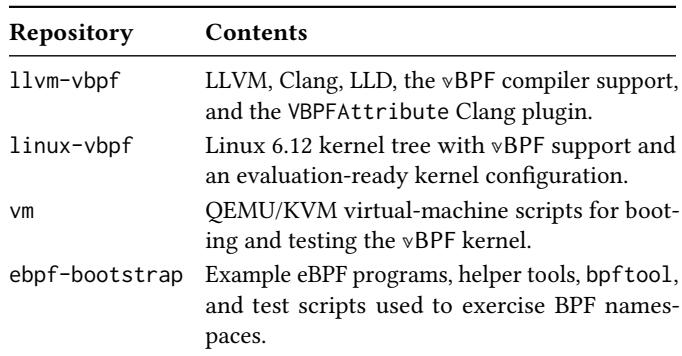  
Table 4: vBPF artifact repositories.

## A.1 Supported Claims

The artifact is designed to support the main functional claims of the paper. First, it builds the modified LLVM/Clang toolchain and the VBPFAttribute plugin used to check vBPF-related annotations during the kernel build. Second, it builds a Linux 6.12 kernel with the vBPF core, Snifer, benchmark interface, and sample code enabled. Third, it boots that kernel in a QEMU/KVM VM and runs example eBPF programs in ordinary and isolated BPF namespaces. Fourth, it provides scripts to inspect namespace-local programs and maps and to run repeated loaders in one or more BPF namespaces.

The full performance study in §6 used an x86-64 machine with Intel Xeon Gold 6330 CPUs and 512 GB DRAM, Ubuntu 24.04 LTS, Linux 6.12, and an LLVM 20 based toolchain. The artifact VM is intended as a reviewer-friendly environment for build and functionality validation. The benchmark workloads in § 6, including lmbench, UNIX Bench, PostgreSQL, Apache, sysdig, netobserv-ebpf-agent, and sched\_ext, can be run on comparable hardware for performance reproduction.

## A.2 Host Requirements

The artifact expects a Linux host with KVM support. On Ubuntu or Debian, the host-side dependencies are standard compiler, kernel-build, and QEMU packages:

```shell
sudo apt update
sudo apt install -y \
git cmake ninja-build make clang lld llvm \
build-essential pkg-config libelf-dev zlib1g-dev \
libbfd-dev libcap-dev openssl libssl-dev binutils \
qemu-system-x86 genisoimage bridge-utils
```

The VM launcher uses uv and Python 3.12 or newer. Reviewers should install uv if it is not already available on the host.

## A.3 Checkout

The repositories should be placed under one artifact root so that scripts can refer to them consistently through AE\_ROOT:

```shell
mkdir -p ~/vbpf-ae
cd ~/vbpf-ae
git clone https://github.com/vbpf-osdi-2026/llvm-vbpf.git
git clone https://github.com/vbpf-osdi-2026/linux-vbpf.git
git clone https://github.com/vbpf-osdi-2026/vm.git
git clone https://github.com/vbpf-osdi-2026/ebpf-bootstrap.git
export AE_ROOT="$PWD"
```

## A.4 Build LLVM and the Static Analyzer

Reviewers first build the modified LLVM tree. This produces the Clang toolchain used by the kernel build and the VBPFAttribute.so plugin.

cmake --build build   
cmake --build build --target VBPFAttribute   
sudo cmake --install build

The expected sanity checks are that clang –version uses the newly built toolchain and that \$LLVM\_HOME/lib/VBPFAttribute.so exists. The LLVM repository also includes a standalone analyzer test at clang/examples/VBPF/tests/test.c. It intentionally contains both accepted and rejected helper patterns, so a non-zero exit status is expected when the analyzer reports unsafe global-state writes or unresolved unsafe calls.

## A.5 Build the vBPF Kernel

The kernel is built after LLVM because the build loads the VBPFAttribute plugin. The provided configuration enables baseline BPF support, BPF JIT, BPF LSM instrumentation, CONFIG\_BPF\_VBPF, CONFIG\_VBPF\_SNIFFER, CONFIG\_VBPF\_BENCH, and the sample vBPF programs.

```shell
cd "$AE_ROOT/linux-vbpf"
make LLVM=1 -j"$(nproc)" \
KCFLAGS="-fplugin=$LLVM_HOME/lib/VBPFAttribute.so \
-Xclang -add-plugin -Xclang vbpf_attrs -ferror-limit=1000"
```

The kernel image used by the VM is:

\$AE\_ROOT/linux-vbpf/arch/x86/boot/bzImage

## A.6 Prepare and Boot the VM

The vm repository prepares an Ubuntu guest image and boots it with the vBPF kernel. The first step initializes the image and cloud-init seed:

```shell
cd "$AE_ROOT/vm"
uv sync
uv run vm.py --prepare
```

The QEMU bridge helper should allow virbr0, and the bridge should be available before the first installation boot:

```shell
sudo mkdir -p /etc/qemu
echo "allow virbr0" | sudo tee /etc/qemu/bridge.conf
sudo chmod 0644 /etc/qemu/bridge.conf
sudo ip link add name virbr0 type bridge
sudo ip addr add 192.168.122.1/24 dev virbr0
sudo ip link set virbr0 up
```

If virbr0 already exists, reviewers can keep the existing bridge. The first boot installs and initializes the guest:

```batch
uv run vm.py --install
```

After shutting down the initialized guest, reviewers set kernel.path in \$AE\_ROOT/vm/config.json to the absolute path of linux-vbpf/arch/x86/boot/bzImage. The VM can then be started with:

```shell
cd "$AE_ROOT/vm"
uv run vm.py
```

The default guest login is ubuntu/ubuntu, and the expected SSH address is 192.168.122.10.

## A.7 Build and Run the Examples

After the VM boots the vBPF kernel, reviewers copy the examples into the guest, install guest-side build dependencies, and build the loaders:

```shell
scp -r "$AE_ROOT/ebpf-bootstrap" ubuntu@192.168.122.10:~
ssh ubuntu@192.168.122.10
cd ~/ebpf-bootstrap
sudo apt update
sudo apt install -y \
clang cmake make pkg-config libelf-dev zlib1g-dev git \
libbfd-dev libcap-dev llvm-dev openssl libssl-dev \
ninja-build g++-14
git submodule update --init --recursive
CXX=g++-14 cmake -S . -B build -G Ninja
cmake --build build
```

Before running loaders, reviewers should confirm that the vBPF kernel exposes BTF metadata:

ls /sys/kernel/btf/vmlinux

A basic end-to-end check starts the kprobe loader, observes trace output, and triggers events:

```shell
sudo ./build/kprobe
sudo mount -t debugfs none /sys/kernel/debug
sudo cat /sys/kernel/debug/tracing/trace_pipe
./trigger_kprobe.sh
```

The examples also provide a wrapper test:

```batch
sudo ./test.sh ./build/kprobe
```

## A.8 Namespace Checks

Reviewers can inspect programs and maps in the current BPF namespace with the artifact-built bpftool:

```shell
sudo ./build/bpftool/bpftool prog show
sudo ./build/bpftool/bpftool map show
```

To exercise namespace isolation, the artifact provides an unshare helper that starts a loader inside a fresh BPF namespace:

```shell
sudo ./build/unshare -b ./build/kprobe
sudo ./build/unshare -b ./build/bpftool/bpftool prog show
sudo ./build/unshare -b ./build/bpftool/bpftool map show
```

For repeated loaders in one namespace or across nested BPF namespaces, use:

```shell
sudo ./multi.sh 4 -- ./build/kprobe
sudo ./ns_multi.sh ./build/kprobe 4 2
```

Successful runs show that eBPF programs and maps can be loaded, inspected, and isolated by BPF namespace under the vBPF kernel. These checks exercise the same mechanisms used by the paper’s Snifer and Dispatcher evaluation, while the larger performance experiments can be run with the benchmark workloads described in §6.