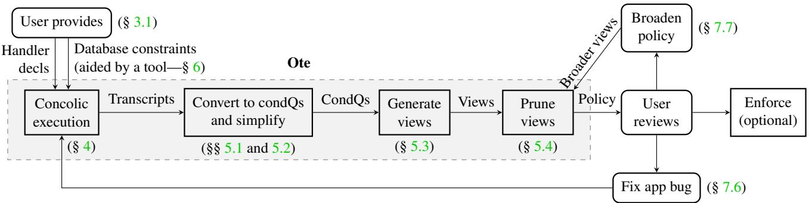
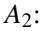
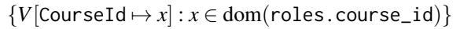
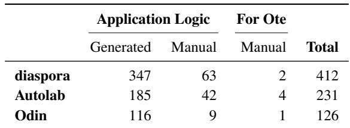
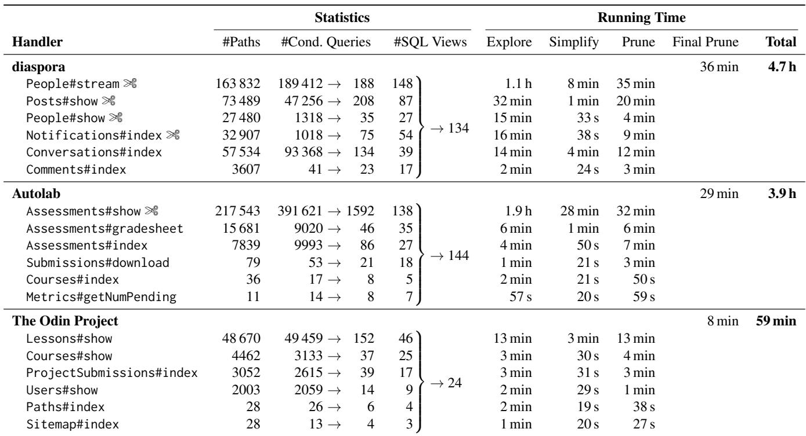
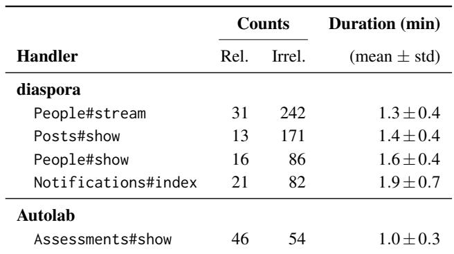
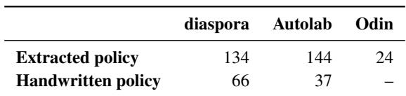
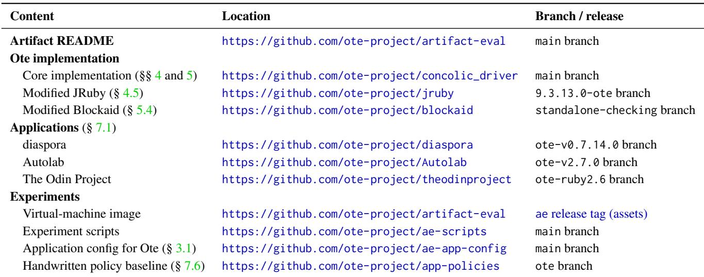

USENIX

THE ADVANCED COMPUTING SYSTEMS ASSOCIATION

# Extracting Database Access-Control Policies From Web Applications

Wen Zhang, Dev Bali, and Jamison Kerney, University of California, Berkeley; Aurojit Panda, NYU; Scott Shenker, University of California, Berkeley, and ICSI

https://www.usenix.org/conference/osdi26/presentation/zhang-wen

# This paper is included in the Proceedings of the 20th USENIX Symposium on Operating Systems Design and Implementation.

July 13–15, 2026 • Seattle, WA, USA

ISBN 978-1-939133-55-7

Open access to the Proceedings of the 20th USENIX Symposium on Operating Systems Design and Implementation is sponsored by

# Extracting Database Access-Control Policies From Web Applications

Wen Zhang<sup>∗</sup> UC Berkeley

Dev Bali UC Berkeley

Jamison Kerney UC Berkeley

Aurojit Panda NYU

Scott Shenker UC Berkeley and ICSI

## Abstract

To safeguard sensitive user data, web developers typically rely on implicit access-control policies, which they implement using access checks and query filters. This ad hoc approach is error-prone as these scattered checks and filters are easy to misplace or misspecify, and the lack of an explicit policy precludes external access-control enforcement. More critically, it is difficult for humans to discern what policy is embedded in application code (i.e., what data the application may access)—an issue that worsens as development teams evolve.

This paper tackles policy extraction: the task of extracting the access-control policy embedded in an application by summarizing its data queries. An extracted policy, once vetted for errors, can stand alone as a specification for the application’s data access, and can be enforced to ensure compliance as code changes over time. We introduce Ote, a policy extractor for Ruby on Rails web applications. Ote uses concolic execution to explore execution paths through the application, generating traces of SQL queries and conditions that trigger them. It then merges and simplifies these traces into a final policy that aligns with the observed behaviors. We applied Ote to three real-world applications and compared extracted policies to handwritten ones, revealing several errors in the latter.

## 1 Introduction

Protecting sensitive data from unauthorized access is a critical concern for today’s web applications. Therefore, when building web applications, developers must determine what access-control policy the application should enact—for example, a university might want a policy that ensures a student’s grades are visible only to the student and their instructors.

In today’s applications, access-control policies are embedded in application code. Furthermore, in most cases they are spread across several functions and in the filter predicates of multiple database queries. This practice is error-prone: Missing or misspecified access checks have previously led to sensitive-data exposure [10, 36, 46, 47, 57, 89]. But more fundamentally, because the policy is never stated explicitly, it is difficult for anyone other than the application’s developer to understand what policy is embedded in the code. Worse, as time passes, even the application development team is unlikely to remember the policy, and is unlikely to be able to reconstruct it from application code. While there have been research frameworks that require explicit policy specification [2, 6, 11, 105, 106], we aim to address legacy applications rather than requiring them to be rewritten in such frameworks.

This paper tackles the task of policy extraction: extracting a web application’s implicitly embedded access-control policy by summarizing its possible data accesses. A human then reviews the extracted policy to better understand the application’s data accesses, ensuring they are within the bounds of intended data revelations. If not, the application likely has an access-check bug to be fixed. Once reviewed, the policy can stand alone as a specification for the application’s data accesses and can optionally be enforced using an enforcer [56, 58, 107] to ensure continued compliance.

We present an approach for extracting policies from legacy web applications. Our approach begins by exploring execution paths through application code using concolic execution [35, 83], producing transcripts that record the conditions under which SQL queries are issued (§ 4). These transcripts are then merged and simplified to derive a policy that allows each recorded query to be issued under its conditions (§ 5).

A key challenge here is scalability: Web-backend code is often complex with many branches, making exhaustive path exploration infeasible. But we empirically observe that the logic governing query issuance typically relies on only a small set of simple operations (§ 4.1). We thus tailor concolic execution to track only those operations, reducing the path space (and implementation effort). We further prune exploration using an LLM-based relevance judge (§ 4.6) that identifies and ignores branches unrelated to data access, reducing exploration time from potentially days to mere hours.

We implemented this approach in Ote, a policy-extraction tool for web applications written in Ruby on Rails. We then applied Ote to three real-world applications, two of which we had previously written policies for by hand [107]. When we compared the extracted policies to the handwritten ones (§ 7.6), we identified several formerly unknown errors in the latter—including a few overly permissive views that reveal sensitive data to unauthorized users. This underscores the difficulty of understanding access-control logic in complex legacy applications and the utility of policy extraction in aiding this understanding. A further review of the extracted policies uncovered a subtle bug we had inadvertently introduced into application code that silently disabled an access check. These findings show that extracting and then inspecting policies results in a clearer understanding of what the program does—and should do—than current practice provides.

Due to its use of concolic execution and an LLM relevance judge, Ote cannot guarantee that the extracted policy covers all possible queries or captures every condition under which queries are issued (§ 3.2). Ote also needs the user to specify certain input constraints (§ 3.1) and to review the relevance judge’s results (§ 4.6), supports only a subset of SQL (§ 3.2), and could use a better user interface for policy auditing. Even so, our evaluation (§ 7) demonstrates that for real-world applications, Ote extracts policies that are immediately useful, identifying several errors in handwritten policies and application code. These results show that Ote already provides concrete, practical value and represents a meaningful step toward improving data security in existing web applications.

## 2 Motivation and Background

## 2.1 Challenges of Policy Creation

We were prompted to tackle the policy-extraction problem by our earlier experience hand-crafting policies for existing web applications. A few years ago, while investigating externally enforced access control for web applications,<sup>1</sup> we took opensource applications, chose several representative URL endpoints, and tried our best to write down policies allowing the data accesses needed for their intended function [107, § 8.1].

This process was extremely tedious and time-consuming. We reviewed documentation, inspected database schemas, experimented with the applications using sample data, and read their source code. Using this information and common sense, we formulated policies that we thought would allow the endpoints to function correctly while protecting sensitive data. Despite our best efforts, we often discovered errors in our drafts, including an omission that would have leaked sensitive data—one that we only later discovered by chance.

Our struggle was not unique: Policy creation is known as a major challenge across security domains including rolebased [69, § 6.5], attribute-based [27, p. 39], and relationshipbased [20] access control, securing cloud resources [81], and sandboxing syscalls [71]. While solutions have been proposed for some domains (§ 8), generating database policies for web applications has remained an open problem that is uniquely challenging, due to both the dynamism of web applications and the fine granularity of the policies required.

Listing 1 A handler that displays a course’s grade sheet.   
1 def view\_grade\_sheet ( db , session , req ):   
2 role = db . sql (   
3 " SELECT \* FROM roles "   
4 " WHERE user\_id = ? AND course\_id = ? " ,   
5 session [ " user\_id " ] , req [ " course\_id " ])   
6 if role is None : raise Http404   
7 if not role . is\_instructor : raise Http403   
8 all\_grades = db . sql (   
9 " SELECT \* FROM grades 11   
10 " WHERE course\_id = ? " , role . course\_id )   
11 return format\_html ( all\_grades , ...)

Listing 2 An example policy for the handler in Listing 1.   
(V<sub>1</sub>) SELECT \* FROM roles   
WHERE user\_id = MyUserId   
A user can view their role (if any) in any course.   
(V<sub>2</sub>) SELECT grades .\* FROM roles , grades   
WHERE roles . user\_id = MyUserId   
AND roles . is\_instructor   
AND grades . course\_id = roles . course\_id   
An instructor for a course can view all grades.

## 2.2 Policy as SQL View Definitions

Before delving into how Ote extracts policies, we first describe how our access-control policies are specified.

We target web applications that store data in a relational database; when a user visits a page, the application issues SQL queries on the user’s behalf and renders the page using the query results. In this context, a classic way to specify accesscontrol policies is to use a list of view definitions [62, 78, 79], which are SQL SELECT statements—parameterized by session parameters like the current user ID—that define information in the database that a user is allowed to access.

Under a view-based policy, a query is allowed only if it can be fully answered using the views. This criterion extends to a program that (conditionally) issues multiple queries, by treating the program as “one big query” that returns the results of its constituent queries. These notions can be made precise based on query determinacy [65], but in the interest of space, we omit the formal definitions and offer an example instead.<sup>2</sup>

Example 2.1. Suppose a course-management site has a web request handler that displays a course’s grade sheet (Listing 1).

It ensures that the user is an instructor before fetching grades.

Note that the handler has access to both session parameters (user ID) and request parameters (course ID). Session parameters are trusted (e.g., set by an authentication mechanism), and may appear in the policy and dictate the extent of allowed data access. Request parameters are untrusted (e.g., parsed from an HTTP request) and must not appear in the policy.

A policy for this handler might look like Listing 2, where MyUserId denotes the user-ID session parameter. Notably, it does not reference the course-ID request parameter, instead allowing the handler’s queries for any course ID. This policy precisely captures the information the handler can query. <sup>◀</sup>

Like prior work in database access control [4, 14, 15, 49, 56, 78, 86, 107], we focus on extracting policies for database reads (SELECTs) only. Similar techniques can be used to extract conditions for other operations, although our policy language (§ 3.2) and algorithms (§ 5) would need to be extended.

## 3 Overview

Given an application, the ideal policy extractor would produce a view-based access-control policy that satisfies:

Completeness Allows all queries the application can issue.

Tightness Reveals as little information as possible subject to completeness.

Conciseness Has a short representation in SQL.

For example, given Listing 1 (but written in a real web framework), we would like to extract the policy in Listing 2.

Policy extraction is challenging, and Ote is not guaranteed to meet all three goals (see § 3.2). Nevertheless, we show in § 7 that Ote produces policies that are useful in practice.

## 3.1 Workflow

Before discussing how we approach these goals, we first describe Ote’s workflow from a user’s perspective (Figure 1).

Suppose a user wants to extract a policy from a web application. We assume that the application is written in a supported framework (Ruby on Rails) and that the user is familiar with the application’s functionality.

The user starts by declaring the handlers to analyze and providing the application’s database constraints. Ote supports two forms of database constraints, which cover all the constraints we encountered:

1. A set of columns in a table is unique. For example, a uniqueness constraint on roles(user\_id, course\_id) states that a user has at most one role in a course.

2. A query Q<sub>1</sub>’s result is contained in a query Q<sub>2</sub>’s result. Such constraints are commonly used to express foreignkey invariants: e.g., every assignments.course\_id must appear as some courses.id.

These constraints describe the application’s valid database states; Ote uses them to keep exploration within those states during concolic execution (§ 4.4) and to simplify the generated policy (§ 5.2). To reduce the user’s burden, Ote provides a tool that can automatically generate most required constraints from a Ruby on Rails application’s schema and models (§§ 6 and 7.1.3).

The user then packages the application into a Docker container and invokes Ote, which:

1. Explores execution paths through the handlers via concolic execution, producing transcripts that record the branches taken and the SQL queries issued (§ 4);

2. For each individual handler, analyzes the transcripts to generate a preliminary policy allowing each query to be issued under its recorded conditions (§§ 5.1 to 5.3);

3. Merges the individual policies and prunes any redundant views, producing a final policy (§ 5.4).

Next, the user inspects the generated policy, using their domain knowledge of the application’s privacy requirements:

• A policy that is too broad can indicate an access-control bug. The user can investigate the queries that yielded a too-broad view using inputs logged by concolic execution (§ 6) and modify the application if appropriate.

• A policy that is too tight can be broadened to permit more intended data accesses. This may simplify the policy by removing filters or by replacing multiple views with a single one. Ote assists with policy broadening: The user adds a broader view to the policy, either before or after view pruning, and then invokes pruning (Step 3) to automatically remove now-redundant views (§ 7.7).

Once satisfied, the user can optionally enforce the policy to ensure the application’s current and future compliance.

## 3.2 Assumptions, Scope, and Utility

Queries At its core, Ote supports project-select-join (PSJ) queries in set semantics. These are queries that (1) always return distinct rows, and (2) have the form:

SELECT [DISTINCT] col1 , col2 , ...

FROM tbl1 , tbl2 , ... WHERE ...

(PSJ)

Also supported are common queries that Ote can mechanically rewrite into this form, such as queries with inner joins or of the form SELECT 1 FROM tbl1, tbl2, ... WHERE ... LIMIT 1.

We found that the distinct-rows assumption does not limit utility—we have never encountered queries that may return duplicate rows in our evaluation. But applications do issue queries more complex than PSJ; this is handled differently in different stages: The concolic-execution driver precisely models richer SQL features (§ 4.4), but view generation and pruning must approximate complex queries using PSJ (§§ 5.3 and 7.3). We plan to extend our prototype to support more complex queries.

Policies Ote generates policies consisting of PSJ views, which are expressive enough for the applications we studied.

  
Figure 1: Policy extraction workflow. “CondQs” stands for conditioned queries (§ 5.1).

A notable limitation is that PSJ views cannot generally express negations (e.g., “Q<sub>1</sub> is allowed only if Q<sub>2</sub> returns no rows”). Negations complicate approximating a query’s information content [97, §2.2] and can slow down enforcement [107, §6], so we defer handling negations to future work.

Non-guarantees Ote does not guarantee completeness or tightness: It may generate a policy that disallows a query issued by the application, or one that can be tightened while allowing the same application queries. This is because:

• Concolic execution can miss execution paths as the input space explored is bounded.

• Uninstrumented operations in the query-issuing core can lead to incomplete path conditions (§ 4.1).

• A pruning optimization uses an LLM-based relevance judge, which can make mistakes (§ 4.6).

• Approximating complex queries using PSJ can make a policy more, or less, restrictive than ideal (§ 7.3).

In general, complete-and-tight policy extraction for Turingcomplete code is impossible [77]. But in practice, Ote can produce policies more accurate than handwritten ones (§ 7.6).

Similarly, Ote does not guarantee that it produces the most concise SQL representation, but its simplification and pruning steps (§ 5) make it feasible to inspect the policy (§ 7.6).

Application assumptions Ote uses a modified Ruby interpreter and Ruby on Rails framework for concolic execu tion (§ 4.5), and so it supports only applications written in Rails. However, our approach generalizes to other languages.

Ote’s effectiveness depends on a “simple query-issuing core” assumption (§ 4.1). In short, we assume that the application’s SQL query issuance depends only on simple expressions—ones that use only operations instrumented by Ote’s Ruby interpreter. Most notably, Ote does not instrument string formatting (doing so would complicate SMT solving), and so it requires the application to issue SQL queries in parameterized form rather than splicing parameters into query strings within Ruby. Fortunately, idiomatic Rails code already issues parameterized queries by default, and the few places in our evaluation where this is not the case were easy to fix (§ 7.1).

## 4 Exploring Executions

Ote begins by exploring paths through application code via concolic execution. We open this section with some empirical observations about typical web applications that motivated our use of concolic execution.

## 4.1 Observation: Simple Query-issuing Cores

Given a web application’s codebase, consider all program statements that issue SQL queries. Informally, imagine the backward program slice [100] from these statements. This slice, which we call the query-issuing core, is the part relevant to policy extraction: It consists of the program components on which query issuance has a control- or data-dependence. Thus, it includes code that computes query parameters or determines whether later queries are issued, but excludes code used only for localization, formatting, HTML/JSON generation, logging, etc. In Listing 1, for instance, the two queries (Lines 2 and 8) are in the query-issuing core, as are the emptiness and instructor checks (Lines 6 and 7) that determine whether the second query is issued; the final HTML-rendering line (Line 11) is outside the core.

While the codebase as a whole can be complex, it has been observed [24, 84] that the query-issuing core of a typical web application is often simple. We confirm this observation—for the applications we studied, the core consists mostly of:

1. Conditionals that test if a query’s result set is empty [84, § 2] or check basic conditions on primitive values (e.g., checking for equality or nullity) [85, § 6.2];

2. Loops over a query’s result set [84, § 2] with no loopcarried dependencies [24, § 4]; and

3. Trivial data-flow to query statements—e.g., passing a value returned by one query to another. (Given that the application issues parameterized SQL queries, no querystring formatting operation appears in the data flow.)

Our goal is therefore to analyze this simple query-issuing core without spending resources on the surrounding codebase. This is challenging because the query-issuing core is not syntactically isolated. For instance, in a typical Ruby on

Rails application, SQL queries may be issued from controller actions, view templates, view helpers, and external libraries, each of which can also contain substantial code unrelated to query issuance. To address this challenge, we use concolic execution, which allows Ote to analyze the query-issuing core without syntactically isolating it.

## 4.2 Concolic Execution: What and Why

In concolic execution [35, 83], a program is executed repeat edly using concrete inputs that have symbolic variables attached. As the program runs, its state is tracked both concretely and symbolically. When the program branches on a symbolic condition, the condition and its outcome are recorded. This produces a conjunction of constraints—the path conditions—that led execution down a path. The conjuncts are then negated using a solver to generate new inputs (up to a bound) that will steer execution down other paths.

We chose concolic execution because it offers a “pay-asyou-go” model for symbolic tracking: We selectively instrument the operations that might appear in the query-issuing core, and the rest will simply execute concretely by default. This strategy reduces not only our instrumentation effort, but also the number of paths explored—a branch on an uninstrumented condition will not lead to a new path.

Note that if an application’s query-issuing core is not simple—so it contains uninstrumented operations—then Ote may miss certain queries or conditions, leading to a policy that is either broader or tighter than ideal. We discuss this case, with examples and mitigations, in § 4.7.

## 4.3 System Architecture

Ote has a driver that generates inputs and concurrent executors that run application code on each input. The driver tracks explored paths in a prefix tree; for every prefix, it negates the last condition and invokes an SMT solver to generate a new input. (The driver keeps the prefix tree in memory and generates inputs sequentially, but both can be relaxed to improve performance.) It then sends the input to an executor, which runs a handler using an instrumented Ruby interpreter and Ruby on Rails framework (§ 4.5) and sends back a transcript capturing the path conditions and queries issued (§ 4.4). Exploration terminates when all prefixes have been visited.

## 4.4 Symbolic Modeling and Input Generation

Concolic execution requires symbolically modeling the handler’s inputs, consisting of the database and session/request parameters. To ensure termination, the input space must be bounded. Following prior work [23], we model the database as tables containing a bounded number of symbolic rows (our prototype uses a bound of 2). The driver asserts the application’s database constraints (§ 3.1), so it explores only valid database states. Inspired by UrFlow’s loop analysis [24, § 4.2], we also restrict the input space so that each query returns at most one row. For simplicity, we will describe our algorithms under this assumption, even though they can be extended to handle queries returning multiple rows.

Under this modeling, a transcript is a sequence of operations performed by the application with two types of records:

1. QUERY<sub>i</sub>(sql, params, isEmpty), meaning the i<sup>th</sup> query issued was the query sql with parameters params, and the result set was empty if isEmpty is true.<sup>3</sup> If not empty, a symbol r<sub>i</sub> is introduced to represent the result row.

2. BRANCH(cond,outcome), meaning the condition cond was branched on, and the outcome (either true or false) branch was taken. The condition can reference session and request parameters as well as columns returned by previous queries (e.g., “r<sub>5</sub>.author\_id = MyUserId”).

Listing 3 shows an example transcript from a run of the handler in Listing 1, when the user is an instructor.

Our SMT encoding represents bounded database tables using conditional tables [38] and uses the theory of integers to model all database values [37], including timestamps and strings. Each nullable value is accompanied by a boolean indicating if it is NULL. This simple encoding naturally supports equality and arithmetic operations but not string operations, a limitation that can be lifted using a string solver [16, 53].

Similar to prior work [37], we encode a subset of SQL into SMT on bounded symbolic tables. Our encoding supports left- and inner-joins and count- and sum-aggregations. One notable unsupported feature is ordering, which we have not needed under the assumption that each query returns at most one row.<sup>4</sup> We implement several optimizations for input generation: reusing Z3 AST objects, calling the solver incrementally, and caching conflicts (resulting in infeasible paths) using unsat cores [82].

## 4.5 Instrumentation and Tracking

To maintain symbolic state, we modified the JRuby interpreter [42] to add an optional “symbolic expression” field to each Ruby object. For each class that we want represented symbolically, we implement a with\_sym method that returns a clone with a symbolic expression attached, and amend meth ods that we want instrumented to attach symbolic expressions to their results. Unmodified methods simply return an object with no expression attached, concretizing the result as desired.

We implemented symbolic representations of ten classes (String, Fixnum, etc.) covering all symbolic inputs in our evaluation, and instrumented simple operations (equality, nullcheck, etc.) that appear in the query-issuing core. We ensured that instances of a singleton object (true, false, nil) with different symbolic expressions are treated as equal, and that a mutating method clears an object’s symbolic expression by default.

```sql
Listing 3 A transcript from a run of the handler in Listing 1, when the user is an instructor for the course.
1. QUERY (SELECT * FROM roles WHERE user_id = ? AND course_id = ?,⟨MyUserId,CourseId⟩,isEmpty = false)
2. BRANCH(r<sub>1</sub>.is_instructor,outcome = true)
3. QUERY (SELECT * FROM grades WHERE course_id = ?,⟨r<sub>1</sub>.course_id⟩,isEmpty = false)
```

To track queries and branches, we added a library for maintaining transcript records, exposing methods record\_query and record\_branch (§ 4.4). We modify the Rails database layer to call record\_query after every query, and modify JRuby’s isTrue and isFalse methods (which evaluate an object’s truthiness and falsiness) to call record\_branch with the object’s symbolic expression if it has one. The record methods also save the stack trace at which the query or branch is evaluated, for use in relevance-based pruning (§ 4.6).

## 4.6 Skipping Irrelevant Branches

Concolic execution suffers from path explosion: The number of feasible paths can grow exponentially with the number of branches. Ote is no exception: Without further optimization, five web handlers in our evaluation (§ 7.3) failed to finish after ten hours and would likely have required days. Thus, we must aggressively reduce the paths explored, but without missing any query-issuing behavior.

Irrelevant conditionals Even with selective instrumentation (§ 4.2), many tracked branches lie outside the queryissuing core.<sup>5</sup> Consider the following example:

Listing 4 An irrelevant conditional from Autolab.   
<% if submission.version == 0 then % >   
< font size = -2 > Unofficial </ font >   
<% else % >   
<%= submission . version % >   
<% end % >

The highlighted conditional affects only HTML generation and has no bearing on data access; negating such conditionals produces new paths that reveal no new query behavior. Skipping these irrelevant conditionals can reduce the exploration space dramatically, since each may cut the path count in half.

Identifying irrelevance using an LLM Statically identifying irrelevant conditionals is hard in Ruby on Rails [88] due to dynamic language features and runtime template compilation [72, § 6.2]. However, many irrelevant branches follow recognizable patterns—e.g., conditionals that issue no queries and mutate no state. Rather than manually encoding such patterns as heuristics, we draw on recent successes in using LLMs to complement software analysis [51, 63, 90, 95] and delegate the identification of irrelevant conditionals to a relevance judge implemented using an LLM-based coding agent.

Listing 5 An abridged relevance-judge output for the condi  
tional in Listing 4, produced by gpt-5 in 24 seconds (§ 7.5).   
IRRELEVANT   
The conditional \`submission . version == 0\` [...]   
only controls presentation text :   
- If true , it renders the literal " Unofficial ".   
- If false , it renders the numeric \`submission .   
version \`.   
[...]

When Ote encounters a conditional, it creates a prompt containing a definition of irrelevance, the conditional, and the stack trace at which the conditional was evaluated. It sends the prompt to a coding agent, which autonomously inspects source files and answers “relevant”, “irrelevant”, or “unsure” (treated as relevant), plus an explanation. The prompt is generic and contains no framework- or application-specific details. Ote records the verdict and explanation for later inspection; see Listing 5 for an example.

Because the relevance judge can take minutes to render a verdict (§ 7.5), Ote calls it asynchronously. Exploration carries on, assuming the conditional is relevant; if the judge later designates a conditional as irrelevant, the driver retroactively records it as such and takes it into account in the future.

Ote avoids calling the relevance judge when (1) the conditional’s designation is known (e.g., “Q returns non-empty” is relevant if Q’s result is used in another query), or (2) the conditional is vacuous—i.e., its negation is infeasible given the relevant conditionals that precede it. Because a conditional’s vacuousness may depend on the relevance of its predecessors, when Ote marks a conditional as irrelevant, it recomputes the vacuousness of any formerly-vacuous later conditionals.

Pruning Using the judge’s verdicts, the driver avoids negat ing irrelevant conjuncts in path conditions, skips paths whose subsequence of relevant conditions is already covered, and drops irrelevant conditions from the final transcript.

Accuracy Because the relevance judge uses an LLM, it cannot guarantee accuracy. To defend against mistakes, Ote exposes the verdicts and explanations for human review, and allows the human to guide the judge by adding inline comments prefixed with “RELEVANCE-HINT”, which the LLM agent is instructed to consider. In our evaluation (§ 7.1), we added hints primarily to compensate for the coding agent’s limited understanding of Rails and external libraries. With these hints, we verified the judge’s irrelevance verdicts to be accurate.

## 4.7 When the Core Is Not Simple

The simple query-issuing core assumption (§ 4.1) is not true for all practical applications. It can be violated in two ways.

Complex control-flow conditions This case arises when a query’s issuance depends on a complex expression. For example, diaspora crashes if a photo’s url is not a valid URL, thus preventing later queries; the URL-validity condition relies on regex-matching operations, which Ote does not instrument.

Suppose a query Q is issued conditioned on an expression C with some uninstrumented operations. This may cause Ote to generate a policy that is either broader or tighter than ideal:

1. If Ote happens to generate an input that satisfies C (this is not guaranteed because the driver is unaware of C), then Q will appear as a conditioned query without C in its condition, leading to a policy broader than ideal.

2. If Ote never generates an input that satisfies C, then Q may not appear in any transcript, leading to a policy that may not allow Q—which is tighter than ideal.

In practice, Case 1 has not been a problem for us because (1) the complex condition C typically reflects business logic and has no privacy implications (§ 7.7), and (2) query Q is likely also issued elsewhere under a simpler condition. Case 2 is problematic for validations (e.g., URL validity); we handle this by manually setting the input using database constraints (e.g., setting URLs to always be http://foo.com).

If an uninstrumented operation turns out important for an application domain, we would update Ote’s Ruby instrumentation, SMT encoding, and SQL generation to support it.

Complex data flow This case arises when the transcript contains an expression derived from a symbolic value through uninstrumented operations—a problematic scenario because the symbolic value is concretized. For example, the conditional if uid < uid \* uid may insert a BRANCH record for uid < 16 into the transcript, as multiplication is not instrumented. In such cases, the driver might fail to terminate because a “new path condition” emerges for every value of uid. Even if we cut off the exploration, the generated policy would be overly strict and verbose, littered with concrete filters like uid < 16.

To detect such harmful concretizations, the driver reports each new constant and new query it encounters (there should be a bounded number of these). This mechanism alerted us to a few non-parameterized SQL queries (§ 7.1), where symbolic values were formatted into the query string. We encountered no concretization issues in our final evaluation, and we plan to implement more precise detection of such “partially concrete” conditions via heavier-weight data-flow tracking.

## 5 Generating a Policy

After exploration, Ote merges and simplifies the transcripts and creates a preliminary set of views for each handler. It then gathers the views for all handlers explored and removes redundancy by leveraging an existing enforcement tool, Blockaid [107]. We now delve into this policy-generation process.

## 5.1 Preprocessing Into Conditioned Queries

As a first step, Ote processes the transcripts for each handler into a set of conditioned queries. A conditioned query is a tuple ⟨sql, params, conditions⟩, where conditions is a list of prior QUERY and BRANCH records.<sup>6</sup> It associates each query with the conditions under which it is issued; one conditioned query is generated for each query issued in each transcript. As Ote does not currently support negations in policies (§ 3.2), it drops from conditions any QUERY record with isEmpty = true (i.e., a condition that a prior query returns empty).

## 5.2 Simplifying Conditioned Queries

For each handler, Ote simplifies the set of conditioned queries by removing redundancy. At a high level, the simplifications remove conditions that do not affect whether a query is issued.

For example, suppose two conditioned queries have the same SQL and parameters, but one is guarded by C ∧ b and the other by C ∧ ¬b. Since the query is issued regardless of the branch outcome, Ote replaces the pair with a single conditioned query guarded only by C. Similarly, a conditioned query guarded by C subsumes one guarded by C ∧ d with the same SQL and parameters. Database constraints expose another source of redundancy, allowing Ote to remove conditions that are guaranteed to hold, such as a prior lookup that must succeed because of a foreign-key dependency.

Ote performs these and other simplifications by following the steps shown in Algorithm 1:

• Remove BRANCHes that must be taken due to an input constraint or a prior condition (Line 2);

• Unify variables that are constrained to be equal by query filters (Line 3);

• Remove identical QUERY records from each conditioned query’s conditions (Line 4);

• Drop vacuous QUERY records—for queries that must return a row due to, e.g., a foreign-key dependency— whose result is not subsequently referenced (Line 7);

Algorithm 1 Simplifying a set of conditioned queries (§ 5.2).   
1: for all conditioned query do   
2: remove vacuous branches   
3: propagate equalities   
4: remove duplicate queries   
5: repeat   
6: for all conditioned query do   
7: remove vacuous-and-unused query records   
8: repeat merge branches until convergence   
9: until convergence   
10: remove subsumed

• Merge pairs of conditioned queries that differ only in the outcome of a single BRANCH record (Line 8)—the query is issued no matter which way the branch goes;

• Remove a conditioned query if another exists with the same sql and params but only a subset of the conditions (Line 10)—the latter subsumes the former.

Each step is parallelized across cores. Due to the large number of conditioned queries, we designed these steps to favor efficiency over optimality. Any missed opportunities for simplification will be caught by the final pruning step (§ 5.4).

## 5.3 Generating SQL View Definitions

Ote now generates one SQL view per conditioned query. The view should reveal the same information as the conditioned query’s path if its conditions are met, and no information otherwise. For this, Ote uses an iterative algorithm that “conjoins” each condition record onto an accumulated query definition A. It maintains the invariant that query A:

• Returns empty if any previous condition is violated;

• Returns the Cartesian product of all prior queries’ results (i.e., concatenations of one-row-per-query) otherwise.

Query A serves two purposes: It captures the branching conditions, and it exposes query results to be referenced by later records. Lastly, the algorithm conjoins the final query onto A.

Before fully specifying the view-generation algorithm, let us walk through an example.

Example 5.1. Consider Listing 3. We shall generate the view for the conditioned query associated with QUERY<sub>2</sub>.

The algorithm starts with the query A that returns the empty tuple. After the first record (QUERY ), A is updated to A<sub>1</sub>:

```sql
SELECT * FROM roles
WHERE user_id = MyUserId
AND course_id = CourseId
```

```sql
SELECT * FROM roles
WHERE user_id = MyUserId
AND course_id = CourseId
AND is_instructor
```



```csv
Algorithm 2 View generation from conditioned query (§ 5.3).
1: procedure GENERATESQLVIEW(cq)
2: A ← {⟨ ⟩} ▷ Constant query returning empty tuple
3: M ← {} ▷ Maps query result column to A’s column
4: for all cond ∈ cq.conds do
5: if cond is BRANCH(θ,outcome = true) then
6: A ← σ <sub>[M ]</sub>(A)
7: else if cond is BRANCH(θ, outcome = false) then
8: A ← σ (A)
9: else if cond is QUERY (sql,params) then
10: Q<sub>ℓ</sub> ← SQLTORA(sql,params)
11: ▷ Converts SQL query to relational algebra
12: (A,M ) ← CONJOINQUERY(Q<sub>ℓ</sub>,A,M )
13: Q<sub>ℓ+1</sub> ← SQLTORA(cq.sql,cq.params)
14: (A,M ) ← CONJOINQUERY(Q<sub>ℓ+1</sub>,A,M )
15: return RATOSQL(A)
16: procedure CONJOINQUERY(Q<sub>ℓ</sub>,A,M )
17: let Q<sub>ℓ</sub> = π <sub>j ,..., j</sub> σ<sub>θ</sub>(S<sub>1</sub> × S<sub>2</sub> × · · · ) ▷ Normal form
18: n ← arity(A) ▷ Number of columns in A
19: θ<sup>′</sup> ← θ[k 7→ k + n][M ] ▷ ∀ column index k
20: A ← π<sub>1,...,n,n+ j1,...,n+ jm</sub> σ<sub>θ</sub>′ (A × S<sub>1</sub> × S<sub>2</sub> × · · · )
21: M ← M ∪ {r<sub>ℓ</sub>.i 7→ i + n | 1 ≤ i ≤ m}
22: return (A,M )
```

Observe that A indeed returns the same rows as QUERY if the branch condition holds, and an empty result otherwise.

Then, QUERY is conjoined onto A, resulting in view V :   
SELECT roles .\* , grades .\* FROM roles , grades   
WHERE roles . user\_id = MyUserId   
AND roles . course\_id = CourseId   
AND roles . is\_instructor   
AND grades . course\_id = roles . course\_id

Note that QUERY ’s sole parameter, r<sub>1</sub>.course\_id, has been replaced by the course\_id column exposed by A<sub>2</sub>. A final step remains to remove the CourseId parameter, which we will discuss at the end of this subsection. ◀

A generated view can be thought of as a natural generalization of the conditioned query to cases where a SQL query can return multiple rows: The view allows a query to be issued for every combination of rows returned by the prior queries, as long as the branching conditions are met. This would allow the program to have loops over result sets in the form we assume in the simple query-issuing core (§ 4.1).

We specify the view-generation procedure in Algorithm 2, which uses relational algebra notation (under the unnamed perspective) [1, § 3.2] for conciseness. The algorithm works for PSJ queries in normal form [1, Prop. 4.4.2]. It does not currently handle general joins or aggregations; when these arise, we approximate them using supported constructs (§ 7.3).

Algorithm 2 essentially follows the steps illustrated by Example 5.1. It maintains a mapping M from result columns of prior queries to columns in A (e.g., mapping r<sub>1</sub>.course\_id to the third column of A). It then uses this mapping to resolve references to results from prior queries.

```sql
SELECT col <sub>j</sub> , col<sub>1</sub>, col<sub>2</sub>, ...
FROM tbl<sub>1</sub>, tbl<sub>2</sub>, ... WHERE f
```

Removing request parameters Recall from Example 2.1 that request parameters like CourseId must not appear in view definitions. So strictly speaking, Example 5.1 has produced not one view, but a set of views:<sup>7</sup>



To collapse this set into one view, we use the following fact.

Fact 5.2 (Informal). Let V [X] be a view definition of the form: SELECT col<sub>1</sub>, col<sub>2</sub>, ... FROM tbl<sub>1</sub>, tbl<sub>2</sub>, ... WHERE col <sub>j</sub> = X AND f

where col <sub>j</sub> is a non-nullable column, X is a request parameter, and f does not refer to X. Then the set of views {V [X 7→ x] : x ∈ dom(col <sub>j</sub>)} reveals the same information as the view:

While this fact applies only to queries of a specific form, it already covers all cases encountered in our evaluation. We leave a theoretical study of the general case to future work.

Example 5.1 (continuing from p. 8). Starting from view V , Ote removes the condition roles.course\_id = CourseId, but refrains from adding roles.course\_id to the SELECT statement because it is redundant with the already-present grades.course\_id. This brings us to the final view V <sup>⋆</sup>:

```sql
SELECT * FROM roles , grades
WHERE roles . user_id = MyUserId
AND roles . is_instructor
AND grades . course_id = roles . course_id
```

The view V <sup>⋆</sup> differs from the handwritten view V<sub>2</sub> only by retaining extra columns. However, conditioned on the existence of V (which Ote would have generated from another conditioned query), V <sup>⋆</sup> reveals the same information as V<sub>2</sub> and so is equally tight. For simplicity, Ote outputs V <sup>⋆</sup> without removing extraneous columns, since we find V <sup>⋆</sup> just as concise and readable as V<sub>2</sub>.

Outputting SQL Ote outputs SQL views in the form: SELECT ... FROM tbl1 , tbl2 , ... WHERE ... similar to V <sup>⋆</sup> above. It uses standard query-optimization passes to make the query shorter and easier to read.

## 5.4 Pruning Views via Enforcement

Lastly, Ote minimizes the set of views for each handler— producing a subset that reveals the same information—and then takes their union and minimizes it again. To minimize a set V of views, Ote goes through each view V ∈ V and checks whether the information revealed by V is already contained in that revealed by V \ {V }; if so, it removes V . Heuristically, Ote sorts the views by the number of joins in decreasing order, so that longer views have a chance of being removed first.

It remains to check information containment. This is the same problem as policy enforcement: checking whether issuing V as a query is allowed under the policy V \ {V }. To tackle this, we repurpose an existing enforcement tool, Blockaid [107], which we extended with a command-line interface to be invoked by Ote. Finally, Ote outputs the minimized set of views for human review.

## 6 Implementation and Practical Aspects

Driver and Policy Generator Ote’s concolic-execution driver and policy generator are implemented in Scala 3. The driver uses Apache Calcite [13] to convert SQL queries into relational algebra, and invokes Z3 using its Java binding [28]. It communicates with executors using Protobuf messages, and saves program inputs and transcripts to compressed JSON files. The policy generator uses Calcite’s query analyses and optimizations for conditioned-query simplification (§ 5.2), and uses Scala’s parallel collections [74] for parallelization.

For the relevance judge (§ 4.6), Ote invokes parallel instances of the Codex CLI [70] coding agent using the noninteractive exec subcommand. Ote parses the agent’s textual output for the verdict and logs the details for human review, treating any “unsure” verdict or malformed output as relevant.

Executors Ote’s library uses RSpec [80] to invoke handlers (“controller actions”) with inputs from the driver. At startup, the executor clears the database. For each input, it begins a database transaction, populates the database, installs symbolic request parameters by patching the params hash, and sets two symbolic session parameters: the user ID and the current time. It then invokes the handler and rolls back the transaction.

We disable Rails’s fragment and low-level caching to expose queries issued only on cache misses. As an optimization, we also disable Rails’s query cache, which introduces branches that do not affect what data is fetched. We execute handlers on MySQL backed by an in-memory tmpfs, and configure string columns to use a case-sensitive collation [108] as our SMT encoding (§ 4.4) does not support case insensitivity.

Generating database constraints To help the user write down an application’s database constraints (§ 3.1), Ote provides a tool that generates common types of constraints for a Rails application, by inspecting the database schema’s SQL constraints and the Active Record models’ validators, associations, and inheritance hierarchy. The user may then supplement the list with constraints not covered by the tool (§ 7.1),

Table 1: Number of database constraints (§ 7.1.3).  
  
a task we hope to automate using LLMs in the future.

Tracing a view back to the application To help users understand why a view was generated, Ote records with each view the ID of an execution from which the view is derived. Using this ID, the user can recover the corresponding input and re-run the execution—optionally under a debugger—to inspect the program state when a query was issued.

## 7 Evaluation

We applied Ote to three existing applications:

1. diaspora [30], a social network with over 850 k users;

2. Autolab [22], a platform for managing course assignments used at over 20 schools; and

3. The Odin Project (Odin) [92], a site where over a million users take web development classes and share their work. We chose open-source Ruby on Rails applications with nontrivial access-control logic, while staying within the scope of the Ote prototype. Within this space, diaspora and Autolab were natural choices because we had written policies for them by hand before [107, § 8.1], allowing us to compare those policies with the extracted ones. Odin provides a complementary case: We had never worked with it before, so our experience applying Ote to Odin was not biased by prior knowledge.

The key takeaways from this evaluation are:

• Ote can extract a policy within a few hours (§ 7.4).

• The extracted policies avoided several errors present in the handwritten policies and revealed an access-check bug in the application code (§ 7.6).

• Applying Ote required limited manual setup and review effort (which we summarize in § 7.8).

## 7.1 Application Setup

All applications run on MySQL in our experiments. Their database schemas are nontrivial: diaspora has 50 tables and 387 total columns, Autolab has 26 tables and 269 total columns, and Odin has 17 tables and 152 total columns.

## 7.1.1 Code changes

We used versions of diaspora (v0.7.14) and Autolab (v2.7.0) that had previously been modified to work with Blockaid. To summarize the most relevant modifications:

• We had modified a few code locations to issue parameterized queries. (Most queries were already parameterized, but some needed a rewrite—see below for an example.)

• We had modified the applications to fetch sensitive data only if it affects output. (These modifications allow for finer-grained policies but are not required by Ote; we kept them for an apples-to-apples policy comparison.)

• We had rewritten one query to an equivalent form supported by Ote. (This modification is not fundamentally required—it could have been implemented in Ote itself.)

In addition, we modified seven lines in Autolab to save query results in variables for reuse. This simple refactor helped the relevance judge identify more irrelevant conditionals by clarifying that accessing the variables does not trigger a query.

For Odin, we made three changes (over commit f6762f0):

• We modified two locations to issue parameterized SQL queries: e.g., from where('expires >= ?', Time.now) to where(expires: Time.now..), because the former inserts Time.now into the query string within Ruby, result ing in non-parameterized SQL.

• We deleted one line to prevent an aggregation from appearing in the conditions portion of conditioned queries (currently unsupported by Ote); this change preserved application behavior.

## 7.1.2 Relevance hints

We added seven RELEVANCE-HINT comments (§ 4.6): one to diaspora and six to Autolab. (Odin had few enough branches that the relevance-judge optimization was not needed—see Table 2.) Two of the hints clarify how an external library affects queries; three note that an already-loaded expression does not trigger a query; one notes that an expression may issue a query; and one encodes the assumption that an Autolab scoring function issues no queries.

All of these hints, except the last, compensate for limitations in the LLM-based coding agent’s reasoning. We expect these hints to become unnecessary with improvements in the agent’s capabilities, or in how it is used: e.g., providing the agent with library documentation, details on Rails’s ORM, and runtime information about where queries originate.

## 7.1.3 Database constraints

Table 1 summarizes the database constraints supplied to Ote. Over 80 % were auto-generated (§ 6). The rest were added manually: Some were transcribed from application logic, while those in the “For Ote” column were introduced to scope the extracted policy or reduce exploration time.

Of the manually written application-logic constraints, many captured application-level invariants—e.g., two diaspora posts cannot be reshares of each other—and could not be autogenerated. For fields with constraints either unsupported by our SMT encoding (e.g., URL validity) or related to the external environment (e.g., an Autolab course name must correspond to a directory on disk), we constrained them to a fixed set of valid values after creating any required external state.

Table 2: Statistics and performance. “✄” marks runs that used the relevance judge (§ 4.6). Under Statistics, “#Cond. Queries” shows the number of conditioned queries before and after simplification (§ 5.2); “#SQL Views” shows the number of views after per- and cross-handler pruning (§ 5.4). Under Running Time, “Simplify” stands for conditioned-query simplification and view generation (§§ 5.2 and 5.3), “Prune” for per-handler view-pruning, “Final Prune” for cross-handler view-pruning (§ 5.4), and “Total” for the total sequential running time.  


We wrote seven additional constraints specifically for policy extraction. To save exploration time, we required nullable string fields to be non-empty (as the two cases are typically treated identically), limited the Autolab analysis to non-admin users (as admin policies are trivial to write), and fixed the diaspora user’s language to English. In Autolab, we disabled scheduler actions (which are not governed by user-specific policies) and disallowed zero score-penalties because our prototype does not track float operations (this preserves application features as a 0.0 penalty is equivalent to no penalty).

## 7.2 Experiment Setup

We ran experiments on Google Compute Engine using a c3-standard-176 instance. The driver launched 48 parallel executors and used Z3 v4.11.2 for SMT solving. It invoked Codex CLI (v0.58.0) using the gpt-5 model and medium reasoning effort, with a maximum parallelism of 16, a timeout of 5 min, and at most three retries after timeout.For view pruning, it invoked Blockaid with a timeout of 5 s. Executors ran a modified version of JRuby v9.3.13.0 atop OpenJDK 21.

We ran path exploration on each handler three times; Table 2 shows the data from the runs with median exploration time. To save on LLM calls, we enabled relevance-based pruning (§ 4.6) only for those handlers whose unpruned exploration exceeded 15 min (marked with ✄ in Table 2).

## 7.3 Paths, Conditioned Queries, and Views

Table 2 shows that while the number of explored paths can be large, Ote is able to reduce the number of views to between 24 and 144—a manageable number for human review.

For view generation, we had to approximate some SQL features unsupported by either our Ote prototype or Blockaid:

• We rewrite a LEFT JOIN into an equivalent INNER JOIN if possible. Otherwise, we split it into an INNER JOIN (for rows that match) and a SELECT (for rows that don’t).

• We rewrite a SELECT COUNT(\*) FROM tbl in the query portion into SELECT id FROM tbl, and omit aggregations in the condition portion.

• We omit date-timestamp comparisons and replace “Now + 1 second” with “Now”.

Table 3: Relevance-judge verdicts and running times. “Rel.” denotes relevant; “Irrel.” denotes irrelevant (§ 7.5).  


These approximations are “lossy”: They can broaden or tighten the policy and must be applied with human discretion.

For Autolab, we applied a simple broadening immediately after view generation (Figure 1). The Assessments#show handler queries the score\_adjustments table under many complex conditions, producing a large number of views. Since the table contains only non-sensitive metadata, we added a single broad view: SELECT \* FROM score\_adjustments, which caused view pruning to eliminate all narrower views involving the table. Table 2 reports results with this broadening applied. We give a more involved example of broadening in § 7.7.

## 7.4 Performance

Table 2 (right) shows the running times for each phase of policy extraction. Overall, end-to-end extraction completes within five hours at most. When we ran path exploration on the handlers marked with ✄ without the relevance-judge optimization (§ 4.6), all timed out after ten hours (not shown in the table) and, by our estimate, would have required many days to finish. This demonstrates that relevance-based pruning is essential for exploring real web-application code at scale.

## 7.5 Calls to the Relevance Judge

Table 3 reports relevance-judge verdicts (it never returned “unsure”) and call-duration statistics. We manually reviewed every irrelevant verdict to confirm its accuracy. Although there were over 600 irrelevant verdicts, they arose from a limited set of code locations (e.g., in diaspora, a profile-picture helper invoked along many paths), making grouped auditing more straightforward. We note that the call durations include LLM reasoning time and serving latency, both outside our control.

## 7.6 Findings From the Extracted Policies

We now compare the extracted policies with the handwritten diaspora and Autolab policies from our prior work [107, § A]. For Odin, where no handwritten policy was available, we manually inspected the extracted policy and found it accurate for the handlers analyzed.

Table 4: View count in extracted vs handwritten policies. Extracted policies contain more views because they often preserve conditions that handwritten policies relax (§ 7.6).  


Expectations We expect extracted policies to be tighter (more restrictive) than handwritten ones: Ote aims to produce the tightest possible policy, whereas humans often relax nonprivacy-critical conditions and allow accesses beyond what the application requires (§ 7.7). Thus, extracted policies are generally longer because they encode conditions omitted from handwritten policies (Table 4). In our evaluation, this extra detail remained manageable for human review.

Where handwritten policies reveal too much But not all relaxations by the human policy-writer are benign. When we compared the extracted Autolab policy against the handwritten one, we found that the latter granted course assistants access to five types of records in a “disabled” course, when the application’s logic states that only instructors should have access. Such an erroneous policy, if enforced, would allow a future code change to leak sensitive data to course assistants.

Where handwritten policies reveal too little Unexpectedly, there is also information revealed by the extracted policy but not by the handwritten one. To investigate, we used Blockaid to check whether each extracted view is allowed as a query under the handwritten policy. We found that:

• The handwritten diaspora policy failed to reveal the pod of a “remote” person and data for MentionedInPost and MentionedInComment notifications.

• The handwritten Autolab policy overlooked granting instructors access to all attachments in their courses.

Enforcing a policy with such oversights would disrupt application functionality by denying legitimate data accesses.

A defective access check While reviewing the extracted Autolab policy, we noticed that none of the submissions-related views checked the assessments.exam column. This was suspicious because Autolab is supposed to prohibit students from downloading prior exam submissions.

It turned out that we had introduced a bug years earlier when adapting Autolab for access control. When configuring the lazy\_column gem [55] to defer loading sensitive fields, we mistakenly listed the column using its query method name exam? instead of its actual name exam. This caused the gem to override exam? to always return nil (which is falsy), silently disabling the exam-check logic. So a correct-looking access check was rendered a no-op due to a misuse of an external library elsewhere in the codebase—a subtle bug that we discovered only after reviewing the policy extracted by Ote.

## 7.7 Broadening the Extracted Policy

Sometimes, an extracted policy includes many combinations of conditions under which data can be accessed, reflecting business logic rather than privacy concerns. For example, the extracted diaspora policy has 39 views (out of 134) that reveal a profile under various conditions: if it belongs to the current user, or to the author of a public post, etc. But based on our understanding, a diaspora user’s profile is intended to be public, except for a few columns guarded by the public\_details flag. This means we can simplify the policy by broadening it.

We can broaden the policy with the help of Ote’s view pruning (§ 5.4). First, we write down four simpler, broader views to capture the relaxed conditions for accessing profiles:

1. SELECT id , first\_name , ... FROM profiles (For all profiles, some columns are always visible. . . )

2. SELECT \* FROM tags , taggings

WHERE tags . id = taggings . tag\_id AND taggings . taggable\_type = 'Profile '; (. . . and so are the profile taggings.)

3. SELECT \* FROM profiles WHERE public\_details = TRUE (All columns are visible if the profile’s “public details” flag is set. . . )

4. SELECT \* FROM profiles , people WHERE profiles . person\_id = people . id AND people . owner\_id = MyUserId

(. . . or if the profile belongs to the current user.)

We add these to the policy and re-run view-pruning, which removes 36 of the 39 profile-related views as redundant. This process spares the human from having to reason about view subsumption, which can be tedious and tricky. (For example, the remaining three views, which pertain to the current user’s contacts, are not subsumed by the ones that we added!)

## 7.8 Manual Effort and Expertise Required

The steps involved in applying Ote required varying degrees of SQL, Rails, and application knowledge. Before extraction:

• The code changes (§ 7.1.1) were mostly compatibility edits that required general Rails and SQL familiarity. The only application-specific changes—fetching sensitive data only when it affects output—were inherited from our prior work and are not required by Ote.

• Writing relevance hints (§ 7.1.2) required Rails knowledge to determine whether particular expressions or library calls could issue queries.

• Writing manual database constraints (§ 7.1.3) required familiarity with the application’s data model, including its schema, Rails model associations and validators, and invariants encoded only in application logic.

After extraction:

• Query approximations (§ 7.3) required SQL knowledge to assess their effect on the policy, and application familiarity to decide whether they were appropriate.

• Policy review (§ 7.6) required application and SQL knowledge to explain policy differences as policy mistakes, application bugs, or benign discrepancies.

• Policy broadening (§ 7.7) required application familiarity to identify non-privacy-relevant distinctions, and SQL knowledge to write the broader views.

## 8 Related Work

Symbolic execution Symbolic execution [45] is a classic path-exploration technique that maintains symbolic program state. We decided not to use it because implementing it for an interpreted language is challenging (more so than for lowerlevel languages [21, 61, 87]) due to the dynamic features and functionality implemented outside the language [18, § 2.2].

Bug finding Many tools use symbolic or concolic execution to find bugs in web applications [9,23,99], typically aiming to trigger certain statements or states. Policy extraction requires not only reaching the query-issuing statements, but also gathering the conditions under which they are reached. Other systems infer security-relevant behavior from code to discover violations. AutoISES [91] infers expected security checks around OS operations and reports omissions; iHunter [54] finds privacy violations in iOS SDKs by recovering privacysensitive data flows; and Derailer [66] and Space [67] check for security bugs in web applications by validating data exposures against human input or a catalog. Such tools use inferred behavior as evidence of bugs, whereas Ote produces an access-control policy for review and enforcement.

Syscall filtering Abhaya [71] synthesizes Seccomp-bpf and Pledge policies by statically analyzing a program’s syscall behavior and finding a tight policy expressible in the target sandbox language. SysPart [75], C2C [33], and Sysfilter [29] similarly harden binaries by inferring the set of syscalls a program may invoke and restricting the allowed syscalls to this set. These systems are conceptually similar to Ote in that they infer policies from programs. However, they typically rely on static analysis (sometimes complemented by dynamic observations) and reason about a smaller policy space: syscall identities and, in some systems, predicates over syscall arguments. In contrast, Ote targets a dynamic scripting language and extracts expressive relational database policies, including the conditions under which SQL queries are issued.

Instrumentation strategies Some systems track symbolic values in dynamic languages by performing instrumentation within the target language. They represent symbolic objects through proxying [17, 98] or inheritance [12], and track path conditions using Boolean-conversion hooks [12, 17] or debug tracing [98, § 4.1.2]. These approaches avoid the need for a custom interpreter and support standard environments [8]. In contrast, Ote performs offline analysis, allowing us to modify the interpreter for better transparency [26] and performance.

Learning models of applications Konure infers models of database-backed applications [84, 85] by generating targeted inputs to probe the application as a black-box. This work informed our formulation of the simple query-issuing core assumption (§ 4.1). However, black-box probing cannot effectively recover conditions of query issuance [85, § 6.2], whereas Ote can extract them directly via instrumentation.

Policy mining Policy-mining systems share our goal of generating access-control rules that capture existing practices. Most take existing access-control lists [19, 102, 103], operation logs [32, 40, 60], or human interactions [39], and produce role- [32, 60, 102], attribute- [40, 103, 104], or relationshipbased [19, 39] rules, often via statistical techniques. Unlike these systems, Ote does not require live data and instead analyzes the application, which provides the visibility needed to produce fine-grained policies. AutoArmor [52] is closer to Ote in that it analyzes application code to generate access-control policies, but it targets inter-service calls in microservice applications whereas Ote extracts database access-control policies from web applications.

## 9 Discussion and Future Work

Ote enables better data security in existing web applications: by extracting the access-control policy embedded in application code, it makes that policy explicit, allowing an admin to understand and ultimately enforce the intended policy.

Although Ote is semi-automated and provides no formal guarantees, these traits are shared by most policy-assistance tools. RBAC and ABAC policy-mining tools (§ 8) routinely depend on human-curated inputs [31], require humans in the loop [59, § 7.2], and offer no guarantees as they operate on partial [25, 44, 60] or noisy [7, 64, 101] data using statistical methods. Yet these tools have consistently proven effective in helping admins develop practical policies [41, 59, 68, 94, 96]. These broader successes, together with our own, give us confidence that Ote can provide similar—if not greater— value, particularly because Ote generates far finer-grained policies than typical RBAC or ABAC rules.

We conclude with a few avenues for future work:

Automation bias and complacency A policy extractor may create a false sense of security when reviewers accept a plausible-looking policy without sufficient scrutiny. This risk is an instance of automation bias and complacency: Reviewers may over-rely on computer output and abdicate their decision-making responsibility [73]. Future work should investigate these effects in the context of policy extraction and adapt established mitigations to this setting [34].

Policy comprehension SQL is precise and familiar, but SQL views can become verbose when they encode many application-level conditions. A natural next step is a concise policy domain-specific language (DSL) that preserves SQLview semantics while making policies easier to read, compare, and audit. Such a DSL should draw on query-language usability studies [5, 76] and ORM abstractions [93]; verified lifting techniques [43, 48] could translate generated SQL views into this DSL while preserving their meaning.

Coding agents The rapid improvement of coding agents raises a natural question: Could an agent simply read source code and extract a policy directly? In principle, yes—human experts can do this, albeit slowly and imperfectly, and a capable enough agent might automate it. But the goal is not merely to produce a plausible policy; it is to produce one whose provenance a human can audit and understand.

Ote has limitations: it applies only under stated assumptions and relies on certain heuristics. But these limitations are explicit. Ote decomposes policy extraction into well-defined subproblems grounded in concrete traces, derives policies through explicit transformations, and produces intermediate artifacts that help reviewers trace a policy fragment to its source.<sup>9</sup> An end-to-end agent may also make mistakes, but those mistakes can be harder to localize because they arise from an opaque reasoning process with unclear failure modes.

Rather than replacing Ote’s structure, agents could operate within it: modeling complex application logic, flagging suspicious views, suggesting policy broadenings, etc. This way, agents are used for well-scoped subtasks whose outputs are attached to explicit artifacts, so that increased automation does not come at the cost of auditability.

## Acknowledgments

We thank the anonymous reviewers and members of the UC Berkeley NetSys Lab and Sky Computing Lab for their feedback. This work is supported in part by NSF grant 2145471 and by gifts from Accenture, Algorithmic SuperIntelligence Labs, Amazon, AMD, Anyscale, Broadcom, cmpnd, Google, IBM, Intel, Intesa Sanpaolo, Lambda, Lightspeed, NVIDIA, Samsung SDS, and SAP.

## References

[1] Serge Abiteboul, Richard Hull, and Victor Vianu. Foundations of Databases. Addison-Wesley, 1995.

[2] Justus Adam, Carolyn Zech, Livia Zhu, Sreshtaa Rajesh, Nathan Harbison, Mithi Jethwa, Will Crichton, Shriram Krishnamurthi, and Malte Schwarzkopf. Par alegal: Practical static analysis for privacy bugs. In Lidong Zhou and Yuanyuan Zhou, editors, 19th USENIX Symposium on Operating Systems Design and Implementation, OSDI 2025, Boston, MA, USA, July 7-9, 2025, pages 957–978. USENIX Association, 2025.

[3] Foto Afrati, Rada Chirkova, and H. V. Jagadish. Answering Queries Using Views. Morgan & Claypool Publishers, 2nd edition, 2019.

[4] Rakesh Agrawal, Paul Bird, Tyrone Grandison, Jerry Kiernan, Scott Logan, and Walid Rjaibi. Extending relational database systems to automatically enforce privacy policies. In Karl Aberer, Michael J. Franklin, and Shojiro Nishio, editors, Proceedings of the 21st International Conference on Data Engineering, ICDE 2005, 5-8 April 2005, Tokyo, Japan, pages 1013–1022. IEEE Computer Society, 2005.

[5] Alireza Ahadi, Julia Coleman Prior, Vahid Behbood, and Raymond Lister. A quantitative study of the relative difficulty for novices of writing seven different types of SQL queries. In Proceedings of the 2015 ACM Conference on Innovation and Technology in Computer Science Education, ITiCS 2015. ACM, 2015.

[6] Kinan Dak Albab, Artem Agvanian, Allen Aby, Corinn Tiffany, Alexander Portland, Sarah Ridley, and Malte Schwarzkopf. Sesame: Practical end-to-end privacy compliance with policy containers and privacy regions. In Emmett Witchel, Christopher J. Rossbach, Andrea C. Arpaci-Dusseau, and Kimberly Keeton, editors, Proceedings of the ACM SIGOPS 30th Symposium on Operating Systems Principles, SOSP 2024, Austin, TX, USA, November 4-6, 2024, pages 709–725. ACM, 2024.

[7] Manar Alohaly, Hassan Takabi, and Eduardo Blanco. A deep learning approach for extracting attributes of ABAC policies. In Elisa Bertino, Dan Lin, and Jorge Lobo, editors, Proceedings of the 23rd ACM Symposium on Access Control Models and Technologies, SAC-MAT 2018, Indianapolis, IN, USA, June 13-15, 2018, pages 137–148. ACM, 2018.

[8] Kalev Alpernas, Aurojit Panda, Leonid Ryzhyk, and Mooly Sagiv. Cloud-scale runtime verification of serverless applications. In Carlo Curino, Georgia Koutrika, and Ravi Netravali, editors, SoCC ’21: ACM

Symposium on Cloud Computing, Seattle, WA, USA, November 1 - 4, 2021, pages 92–107. ACM, 2021.

[9] Shay Artzi, Adam Kiezun, Julian Dolby, Frank Tip, Danny Dig, Amit M. Paradkar, and Michael D. Ernst. Finding bugs in dynamic web applications. In Barbara G. Ryder and Andreas Zeller, editors, Proceedings of the ACM/SIGSOFT International Symposium on Software Testing and Analysis, ISSTA 2008, Seattle, WA, USA, July 20-24, 2008, pages 261–272. ACM, 2008.

[10] Warwick Ashford. Facebook photo leak flaw raises security concerns, March 2015. https://www.computerweekly.com/news/ 2240242708/Facebook-photo-leak-flawraises-security-concerns.

[11] Thomas H. Austin, Jean Yang, Cormac Flanagan, and Armando Solar-Lezama. Faceted execution of policyagnostic programs. In Prasad Naldurg and Nikhil Swamy, editors, Proceedings of the 2013 ACM SIG-PLAN Workshop on Programming Languages and Analysis for Security, PLAS 2013, Seattle, WA, USA, June 20, 2013, pages 15–26. ACM, 2013.

[12] Thomas Ball and Jakub Daniel. Deconstructing dynamic symbolic execution. In Maximilian Irlbeck, Doron A. Peled, and Alexander Pretschner, editors, Dependable Software Systems Engineering, volume 40 of NATO Science for Peace and Security Series, D: Information and Communication Security, pages 26–41. IOS Press, 2015.

[13] Edmon Begoli, Jesús Camacho-Rodríguez, Julian Hyde, Michael J. Mior, and Daniel Lemire. Apache Calcite: A foundational framework for optimized query processing over heterogeneous data sources. In Gautam Das, Christopher M. Jermaine, and Philip A. Bernstein, editors, Proceedings of the 2018 International Conference on Management of Data, SIGMOD Conference 2018, Houston, TX, USA, June 10-15, 2018, pages 221–230. ACM, 2018.

[14] Gabriel Bender, Lucja Kot, and Johannes Gehrke. Explainable security for relational databases. In Curtis E. Dyreson, Feifei Li, and M. Tamer Özsu, editors, International Conference on Management of Data, SIG-MOD 2014, Snowbird, UT, USA, June 22-27, 2014, pages 1411–1422. ACM, 2014.

[15] Gabriel Bender, Lucja Kot, Johannes Gehrke, and Christoph Koch. Fine-grained disclosure control for app ecosystems. In Kenneth A. Ross, Divesh Srivastava, and Dimitris Papadias, editors, Proceedings of

the ACM SIGMOD International Conference on Management of Data, SIGMOD 2013, New York, NY, USA, June 22-27, 2013, pages 869–880. ACM, 2013.

[16] Murphy Berzish, Vijay Ganesh, and Yunhui Zheng. Z3str3: A string solver with theory-aware heuristics. In Daryl Stewart and Georg Weissenbacher, editors, 2017 Formal Methods in Computer Aided Design, FMCAD 2017, Vienna, Austria, October 2-6, 2017, pages 55–59. IEEE, 2017.

[17] Alessandro Bruni, Tim Disney, and Cormac Flanagan. A peer architecture for lightweight symbolic execution, February 2011. Retrieved April 4, 2024 from https://hoheinzollern.wordpress. com/wp-content/uploads/2008/04/seer1.pdf.

[18] Stefan Bucur, Johannes Kinder, and George Candea. Prototyping symbolic execution engines for interpreted languages. In Rajeev Balasubramonian, Al Davis, and Sarita V. Adve, editors, Architectural Support for Programming Languages and Operating Systems, ASP-LOS 2014, Salt Lake City, UT, USA, March 1-5, 2014, pages 239–254. ACM, 2014.

[19] Thang Bui and Scott D. Stoller. A decision tree learning approach for mining relationship-based access control policies. In Jorge Lobo, Scott D. Stoller, and Peng Liu, editors, Proceedings of the 25th ACM Symposium on Access Control Models and Technologies, SACMAT 2020, Barcelona, Spain, June 10-12, 2020, pages 167– 178. ACM, 2020.

[20] Thang Bui, Scott D. Stoller, and Hieu Le. Efficient and extensible policy mining for relationship-based access control. In Florian Kerschbaum, Atefeh Mashatan, Jianwei Niu, and Adam J. Lee, editors, Proceedings of the 24th ACM Symposium on Access Control Models and Technologies, SACMAT 2019, Toronto, ON, Canada, June 03-06, 2019, pages 161–172. ACM, 2019.

[21] Cristian Cadar, Daniel Dunbar, and Dawson R. Engler. KLEE: unassisted and automatic generation of high-coverage tests for complex systems programs. In Richard Draves and Robbert van Renesse, editors, 8th USENIX Symposium on Operating Systems Design and Implementation, OSDI 2008, December 8-10, 2008, San Diego, California, USA, Proceedings, pages 209– 224. USENIX Association, 2008.

[22] Autolab project. https://autolabproject.com/.

[23] Avik Chaudhuri and Jeffrey S. Foster. Symbolic security analysis of Ruby-on-Rails web applications. In Ehab Al-Shaer, Angelos D. Keromytis, and Vitaly Shmatikov, editors, Proceedings of the 17th ACM Conference on Computer and Communications Security,

CCS 2010, Chicago, Illinois, USA, October 4-8, 2010, pages 585–594. ACM, 2010.

[24] Adam Chlipala. Static checking of dynamicallyvarying security policies in database-backed applications. In Remzi H. Arpaci-Dusseau and Brad Chen, editors, 9th USENIX Symposium on Operating Systems Design and Implementation, OSDI 2010, October 4- 6, 2010, Vancouver, BC, Canada, Proceedings, pages 105–118. USENIX Association, 2010.

[25] Carlos Cotrini, Thilo Weghorn, and David A. Basin. Mining ABAC rules from sparse logs. In 2018 IEEE European Symposium on Security and Privacy, EuroS&P 2018, London, United Kingdom, April 24-26, 2018, pages 31–46. IEEE, 2018.

[26] Limitations – crosshair 0.0.54 documentation. Retrieved April 16, 2024 from https://crosshair. readthedocs.io/en/latest/limitations.html.

[27] Saptarshi Das, Barsha Mitra, Vijayalakshmi Atluri, Jaideep Vaidya, and Shamik Sural. Policy engineering in RBAC and ABAC. In Pierangela Samarati, Indrajit Ray, and Indrakshi Ray, editors, From Database to Cyber Security - Essays Dedicated to Sushil Jajodia on the Occasion of His 70th Birthday, volume 11170 of Lecture Notes in Computer Science, pages 24–54. Springer, 2018.

[28] Leonardo de Moura. Z3 for Java, 2012. Retrieved October 6, 2024 from https://leodemoura.github. io/blog/2012/12/10/z3-for-java.html.

[29] Nicholas DeMarinis, Kent Williams-King, Di Jin, Rodrigo Fonseca, and Vasileios P. Kemerlis. sysfilter: Automated system call filtering for commodity software. In Manuel Egele and Leyla Bilge, editors, 23rd International Symposium on Research in Attacks, Intrusions and Defenses, RAID 2020, San Sebastian, Spain, October 14-15, 2020, pages 459–474. USENIX Association, 2020.

[30] The diaspora\* project. https:// diasporafoundation.org/.

[31] Mario Frank, Joachim M. Buhmann, and David A. Basin. Role mining with probabilistic models. ACM Trans. Inf. Syst. Secur., 15(4):15:1–15:28, 2013.

[32] Nurit Gal-Oz, Yaron Gonen, Ran Yahalom, Ehud Gudes, Boris Rozenberg, and Erez Shmueli. Mining roles from web application usage patterns. In Steven Furnell, Costas Lambrinoudakis, and Günther Pernul, editors, Trust, Privacy and Security in Digital Business - 8th International Conference, TrustBus 2011,

Toulouse, France, August 29 - September 2, 2011. Proceedings, volume 6863 of Lecture Notes in Computer Science, pages 125–137. Springer, 2011.

[33] Seyedhamed Ghavamnia, Tapti Palit, and Michalis Polychronakis. C2C: fine-grained configuration-driven system call filtering. In Heng Yin, Angelos Stavrou, Cas Cremers, and Elaine Shi, editors, Proceedings of the 2022 ACM SIGSAC Conference on Computer and Communications Security, CCS 2022, Los Angeles, CA, USA, November 7-11, 2022, pages 1243–1257. ACM, 2022.

[34] Kate Goddard, Abdul Roudsari, and Jeremy C Wyatt. Automation bias: a systematic review of frequency, effect mediators, and mitigators. Journal of the American Medical Informatics Association, 19(1):121–127, 2012.

[35] Patrice Godefroid, Nils Klarlund, and Koushik Sen. DART: directed automated random testing. In Vivek Sarkar and Mary W. Hall, editors, Proceedings of the ACM SIGPLAN 2005 Conference on Programming Language Design and Implementation, Chicago, IL, USA, June 12-15, 2005, pages 213–223. ACM, 2005.

[36] Matthew Green. Twitter post: Piazza offers anonymous posting, but does not hide each user’s total number of posts, October 2017. https://twitter.com/ matthew\_d\_green/status/925053953330634753.

[37] Yang He, Pinhan Zhao, Xinyu Wang, and Yuepeng Wang. VeriEQL: Bounded equivalence verification for complex SQL queries with integrity constraints. Proc. ACM Program. Lang., 8(OOPSLA1):1071–1099, 2024.

[38] Tomasz Imielinski and Witold Lipski Jr. Incomplete information in relational databases. J. ACM, 31(4):761– 791, 1984.

[39] Padmavathi Iyer and Amir Masoumzadeh. Towards automated learning of access control policies enforced by web applications. In Silvio Ranise, Roberto Car bone, and Daniel Takabi, editors, Proceedings of the 28th ACM Symposium on Access Control Models and Technologies, SACMAT 2023, Trento, Italy, June 7-9, 2023, pages 163–168. ACM, 2023.

[40] Padmavathi Iyer and Amirreza Masoumzadeh. Mining positive and negative attribute-based access control policy rules. In Elisa Bertino, Dan Lin, and Jorge Lobo, editors, Proceedings of the 23rd ACM Symposium on Access Control Models and Technologies, SACMAT 2018, Indianapolis, IN, USA, June 13-15, 2018, pages 161–172. ACM, 2018.

[41] Sakuna Harinda Jayasundara, Nalin Asanka Gamagedara Arachchilage, and Giovanni Russello. Sok: Access control policy generation from high-level natural language requirements. ACM Comput. Surv., 57(4):102:1–102:37, 2025.

[42] JRuby – the Ruby programming language on the JVM. https://www.jruby.org.

[43] Shoaib Kamil, Alvin Cheung, Shachar Itzhaky, and Armando Solar-Lezama. Verified lifting of stencil computations. In Proceedings of the 37th ACM SIGPLAN Conference on Programming Language Design and Implementation, PLDI 2016. ACM, 2016.

[44] Leila Karimi, Maryam Aldairi, James Joshi, and Mai Abdelhakim. An automatic attribute-based access control policy extraction from access logs. IEEE Trans. Dependable Secur. Comput., 19(4):2304–2317, 2022.

[45] James C. King. Symbolic execution and program testing. Commun. ACM, 19(7):385–394, 1976.

[46] Eddie Kohler. Hide review rounds from paper authors • kohler/hotcrp@5d53abc, March 2013. https: //github.com/kohler/hotcrp/commit/5d53ab.

[47] Eddie Kohler. Download PC review assignments obeys paper administrators • kohler/hotcrp@80ff966, March 2015. https://github.com/kohler/hotcrp/ commit/80ff96.

[48] Shadaj Laddad, Conor Power, Mae Milano, Alvin Cheung, and Joseph M. Hellerstein. Katara: synthesizing crdts with verified lifting. Proc. ACM Program. Lang., 6(OOPSLA2), 2022.

[49] Kristen LeFevre, Rakesh Agrawal, Vuk Ercegovac, Raghu Ramakrishnan, Yirong Xu, and David J. De-Witt. Limiting disclosure in Hippocratic Databases. In Mario A. Nascimento, M. Tamer Özsu, Donald Kossmann, Renée J. Miller, José A. Blakeley, and K. Bernhard Schiefer, editors, (e)Proceedings of the Thirtieth International Conference on Very Large Data Bases, VLDB 2004, Toronto, Canada, August 31 - September 3 2004, pages 108–119. Morgan Kaufmann, 2004.

[50] Alon Y. Levy, Alberto O. Mendelzon, and Yehoshua Sagiv. Answering queries using views (extended abstract). In Proceedings of the Fourteenth ACM SIGACT-SIGMOD-SIGART Symposium on Principles of Database Systems, PODS ’95, page 95–104, New York, NY, USA, 1995. Association for Computing Machinery.

[51] Haonan Li, Yu Hao, Yizhuo Zhai, and Zhiyun Qian. Enhancing static analysis for practical bug detection: An LLM-integrated approach. Proc. ACM Program. Lang., 8(OOPSLA1):474–499, 2024.

[52] Xing Li, Yan Chen, Zhiqiang Lin, Xiao Wang, and Jim Hao Chen. Automatic policy generation for interservice access control of microservices. In Michael D. Bailey and Rachel Greenstadt, editors, 30th USENIX Security Symposium, USENIX Security 2021, August 11-13, 2021, pages 3971–3988. USENIX Association, 2021.

[53] Tianyi Liang, Andrew Reynolds, Cesare Tinelli, Clark W. Barrett, and Morgan Deters. A DPLL(T) theory solver for a theory of strings and regular expressions. In Armin Biere and Roderick Bloem, editors, Computer Aided Verification - 26th International Conference, CAV 2014, Held as Part of the Vienna Summer of Logic, VSL 2014, Vienna, Austria, July 18-22, 2014. Proceedings, volume 8559 of Lecture Notes in Computer Science, pages 646–662. Springer, 2014.

[54] Dexin Liu, Yue Xiao, Chaoqi Zhang, Kaitao Xie, Xiaolong Bai, Shikun Zhang, and Luyi Xing. ihunter: Hunting privacy violations at scale in the software supply chain on ios. In Davide Balzarotti and Wenyuan Xu, editors, 33rd USENIX Security Symposium, USENIX Security 2024, Philadelphia, PA, USA, August 14-16, 2024. USENIX Association, 2024.

[55] Jorge Manrubia. jorgemanrubia/lazy\_columns: Rails plugin that adds support for lazy-loading columns in Active Record models, 2015. https://github.com/ jorgemanrubia/lazy\_columns.

[56] Alana Marzoev, Lara Timbó Araújo, Malte Schwarzkopf, Samyukta Yagati, Eddie Kohler, Robert Tappan Morris, M. Frans Kaashoek, and Sam Madden. Towards multiverse databases. In Proceedings of the Workshop on Hot Topics in Operating Systems, HotOS 2019, Bertinoro, Italy, May 13-15, 2019, pages 88–95. ACM, 2019.

[57] Mark Maunder. Vulnerability in WordPress Core: Bypass any password protected post. CVSS score: 7.5 (High), June 2016. https://www.wordfence.com/ blog/2016/06/wordpress-core-vulnerabilitybypass-password-protected-posts/.

[58] Aastha Mehta, Eslam Elnikety, Katura Harvey, Deepak Garg, and Peter Druschel. Qapla: Policy compliance for database-backed systems. In Engin Kirda and Thomas Ristenpart, editors, 26th USENIX Security Symposium, USENIX Security 2017, Vancouver, BC, Canada, August 16-18, 2017, pages 1463–1479. USENIX Association, 2017.

[59] Barsha Mitra, Shamik Sural, Jaideep Vaidya, and Vijayalakshmi Atluri. A survey of role mining. ACM Comput. Surv., 48(4):50:1–50:37, 2016.

[60] Ian M. Molloy, Youngja Park, and Suresh Chari. Generative models for access control policies: applications to role mining over logs with attribution. In Vijay Atluri, Jaideep Vaidya, Axel Kern, and Murat Kantarcioglu, editors, 17th ACM Symposium on Access Control Models and Technologies, SACMAT ’12, Newark, NJ, USA - June 20 - 22, 2012, pages 45–56. ACM, 2012.

[61] Mark Mossberg, Felipe Manzano, Eric Hennenfent, Alex Groce, Gustavo Grieco, Josselin Feist, Trent Brunson, and Artem Dinaburg. Manticore: A user-friendly symbolic execution framework for binaries and smart contracts. In 34th IEEE/ACM International Conference on Automated Software Engineering, ASE 2019, San Diego, CA, USA, November 11-15, 2019, pages 1186–1189. IEEE, 2019.

[62] Amihai Motro. An access authorization model for relational databases based on algebraic manipulation of view definitions. In Proceedings of the Fifth International Conference on Data Engineering, February 6-10, 1989, Los Angeles, California, USA, pages 339–347. IEEE Computer Society, 1989.

[63] Amy Munson, Juanita Gomez, and Alvaro A. Cárdenas. With a little help from my (LLM) friends: Enhancing static analysis with LLMs to detect software vulnerabilities. In IEEE/ACM International Workshop on Large Language Models for Code, LLM4Code@ICSE 2025, Ottawa, ON, Canada, May 3, 2025, pages 25–32. IEEE, 2025.

[64] Masoud Narouei and Hassan Takabi. Towards an automatic top-down role engineering approach using natural language processing techniques. In Edgar R. Weippl, Florian Kerschbaum, and Adam J. Lee, editors, Proceedings of the 20th ACM Symposium on Access Control Models and Technologies, Vienna, Austria, June 1-3, 2015, pages 157–160. ACM, 2015.

[65] Alan Nash, Luc Segoufin, and Victor Vianu. Views and queries: Determinacy and rewriting. ACM Trans. Database Syst., 35(3):21:1–21:41, 2010.

[66] Joseph P. Near and Daniel Jackson. Derailer: interactive security analysis for web applications. In Ivica Crnkovic, Marsha Chechik, and Paul Grünbacher, editors, ACM/IEEE International Conference on Automated Software Engineering, ASE ’14, Vasteras, Sweden - September 15 - 19, 2014, pages 587–598. ACM, 2014.

[67] Joseph P. Near and Daniel Jackson. Finding security bugs in web applications using a catalog of access control patterns. In Laura K. Dillon, Willem Visser, and Laurie A. Williams, editors, Proceedings of the

38th International Conference on Software Engineering, ICSE 2016, Austin, TX, USA, May 14-22, 2016, pages 947–958. ACM, 2016.

[68] Mohammad Nur Nobi, Maanak Gupta, Lopamudra Praharaj, Mahmoud Abdelsalam, Ram Krishnan, and Ravi S. Sandhu. Machine learning in access control: A taxonomy and survey. CoRR, abs/2207.01739, 2022.

[69] Alan C. O’Connor and Ross J. Loomis. 2010 Economic Analysis of Role-Based Access Control. Technical report, National Institute of Standards and Technology, December 2010.

[70] OpenAI. Codex CLI, 2025. Retrieved December 7, 2025 from https://developers.openai.com/ codex/cli/.

[71] Shankara Pailoor, Xinyu Wang, Hovav Shacham, and Isil Dillig. Automated policy synthesis for system call sandboxing. Proc. ACM Program. Lang., 4(OOPSLA):135:1–135:26, 2020.

[72] Paolo Perrotta. Metaprogramming Ruby 2. Pragmatic Bookshelf, 2014.

[73] Amanda Potasznik. ABCs: Differentiating algorithmic bias, automation bias, and automation complacency. In 2023 IEEE International Symposium on Ethics in Engineering, Science, and Technology (ETHICS), pages 1–5, 2023.

[74] Aleksandar Prokopec and Heather Miller. Overview | Parallel Collections | Scala Documentation. Retrieved April 16, 2024 from https: //docs.scala-lang.org/overviews/parallelcollections/overview.html.

[75] Vidya Lakshmi Rajagopalan, Konstantinos Kleftogiorgos, Enes Göktas, Jun Xu, and Georgios Portokalidis. SysPart: Automated temporal system call filtering for binaries. In Weizhi Meng, Christian Damsgaard Jensen, Cas Cremers, and Engin Kirda, editors, Proceedings of the 2023 ACM SIGSAC Conference on Computer and Communications Security, CCS 2023, Copenhagen, Denmark, November 26-30, 2023, pages 1979–1993. ACM, 2023.

[76] Phyllis Reisner. Human factors studies of database query languages: A survey and assessment. ACM Comput. Surv., 13(1), 1981.

[77] H. G. Rice. Classes of recursively enumerable sets and their decision problems. Transactions of the American Mathematical Society, 74(2):358–366, 1953.

[78] Shariq Rizvi, Alberto O. Mendelzon, S. Sudarshan, and Prasan Roy. Extending query rewriting techniques

for fine-grained access control. In Gerhard Weikum, Arnd Christian König, and Stefan Deßloch, editors, Proceedings of the ACM SIGMOD International Conference on Management of Data, Paris, France, June 13-18, 2004, pages 551–562. ACM, 2004.

[79] Arnon Rosenthal and Edward Sciore. View security as the basis for data warehouse security. In Manfred A. Jeusfeld, Hua Shu, Martin Staudt, and Gottfried Vossen, editors, Proceedings of the Second Intl. Workshop on Design and Management of Data Warehouses, DMDW 2000, Stockholm, Sweden, June 5-6, 2000, volume 28 of CEUR Workshop Proceedings, page 8. CEUR-WS.org, 2000.

[80] RSpec: Behaviour driven development for Ruby. Retrieved April 16, 2024 from https://rspec.info/.

[81] Neha Rungta. A billion SMT queries a day (invited paper). In Sharon Shoham and Yakir Vizel, editors, Computer Aided Verification - 34th International Conference, CAV 2022, Haifa, Israel, August 7-10, 2022, Proceedings, Part I, volume 13371 of Lecture Notes in Computer Science, pages 3–18. Springer, 2022.

[82] Daniel Schwartz-Narbonne, Martin Schäf, Dejan Jovanovic, Philipp Rümmer, and Thomas Wies. Conflictdirected graph coverage. In Klaus Havelund, Gerard J. Holzmann, and Rajeev Joshi, editors, NASA Formal Methods - 7th International Symposium, NFM 2015, Pasadena, CA, USA, April 27-29, 2015, Proceedings, volume 9058 of Lecture Notes in Computer Science, pages 327–342. Springer, 2015.

[83] Koushik Sen, Darko Marinov, and Gul Agha. CUTE: a concolic unit testing engine for C. In Michel Wermelinger and Harald C. Gall, editors, Proceedings of the 10th European Software Engineering Conference held jointly with 13th ACM SIGSOFT International Symposium on Foundations of Software Engineering, 2005, Lisbon, Portugal, September 5-9, 2005, pages 263–272. ACM, 2005.

[84] Jiasi Shen and Martin C. Rinard. Using active learning to synthesize models of applications that access databases. In Kathryn S. McKinley and Kathleen Fisher, editors, Proceedings of the 40th ACM SIGPLAN Conference on Programming Language Design and Implementation, PLDI 2019, Phoenix, AZ, USA, June 22-26, 2019, pages 269–285. ACM, 2019.

[85] Jiasi Shen and Martin C. Rinard. Active learning for inference and regeneration of applications that access databases. ACM Trans. Program. Lang. Syst., 42(4):18:1–18:119, 2021.

[86] Jie Shi, Hong Zhu, Ge Fu, and Tao Jiang. On the soundness property for SQL queries of fine-grained access control in DBMSs. In ICIS, pages 469–474. IEEE Computer Society, 2009.

[87] Yan Shoshitaishvili, Ruoyu Wang, Christopher Salls, Nick Stephens, Mario Polino, Andrew Dutcher, John Grosen, Siji Feng, Christophe Hauser, Christopher Krügel, and Giovanni Vigna. SOK: (state of) the art of war: Offensive techniques in binary analysis. In IEEE Symposium on Security and Privacy, SP 2016, San Jose, CA, USA, May 22-26, 2016, pages 138–157. IEEE Computer Society, 2016.

[88] P.J.M. Smit. A study on static taint analysis techniques in Ruby. Thesis, University of Twente, Enschede, June 2025.

[89] Ben Stock. Search leaks hidden tags • Issue #135 • kohler/hotcrp, June 2018. https://github.com/ kohler/hotcrp/issues/135.

[90] Bogdan Alexandru Stoica, Utsav Sethi, Yiming Su, Cyrus Zhou, Shan Lu, Jonathan Mace, Madanlal Musuvathi, and Suman Nath. If at first you don’t succeed, try, try, again...? Insights and LLM-informed tooling for detecting retry bugs in software systems. In Emmett Witchel, Christopher J. Rossbach, Andrea C. Arpaci-Dusseau, and Kimberly Keeton, editors, Proceedings of the ACM SIGOPS 30th Symposium on Operating Systems Principles, SOSP 2024, Austin, TX, USA, November 4-6, 2024, pages 63–78. ACM, 2024.

[91] Lin Tan, Xiaolan Zhang, Xiao Ma, Weiwei Xiong, and Yuanyuan Zhou. Autoises: Automatically inferring security specification and detecting violations. In Paul C. van Oorschot, editor, Proceedings of the 17th USENIX Security Symposium, July 28-August 1, 2008, San Jose, CA, USA, pages 379–394. USENIX Association, 2008.

[92] The Odin Project. https://www.theodinproject. com/.

[93] Alexandre Torres, Renata Galante, Marcelo Soares Pimenta, and Alexandre Jonatan B. Martins. Twenty years of object-relational mapping: A survey on patterns, solutions, and their implications on application design. Inf. Softw. Technol., 82, 2017.

[94] Ivan Tsarynny. Hell yeah, i want an automated content security policy!, June 2022. Retrieved December 2, 2025 from https://www.feroot.com/blog/wantautomated-content-security-policy/.

[95] Haoxin Tu, Seongmin Lee, Yuxian Li, Peng Chen, Lingxiao Jiang, and Marcel Böhme. Large language model-driven concolic execution for highly structured test input generation. CoRR, abs/2504.17542, 2025.

[96] Tufin. Securing network segments and optimizing permissive rules with the automatic policy generator, 2015. Retrieved December 2, 2025 from https://lp.tufin.com/rs/769-ICF-145/images/APG\_Whitepaper.pdf.

[97] Qihua Wang, Ting Yu, Ninghui Li, Jorge Lobo, Elisa Bertino, Keith Irwin, and Ji-Won Byun. On the correctness criteria of fine-grained access control in relational databases. In VLDB, pages 555–566. ACM, 2007.

[98] Ruowen Wang, Peng Ning, Tao Xie, and Quan Chen. MetaSymploit: Day-one defense against script-based attacks with security-enhanced symbolic analysis. In Samuel T. King, editor, Proceedings of the 22nd USENIX Security Symposium, Washington, DC, USA, August 14-16, 2013, pages 65–80. USENIX Association, 2013.

[99] Gary Wassermann, Dachuan Yu, Ajay Chander, Dinakar Dhurjati, Hiroshi Inamura, and Zhendong Su. Dynamic test input generation for web applications. In Barbara G. Ryder and Andreas Zeller, editors, Proceedings of the ACM/SIGSOFT International Symposium on Software Testing and Analysis, ISSTA 2008, Seattle, WA, USA, July 20-24, 2008, pages 249–260. ACM, 2008.

[100] Mark D. Weiser. Program slicing. IEEE Trans. Software Eng., 10(4):352–357, 1984.

[101] Yutang Xia, Shengfang Zhai, Qinting Wang, Huiting Hou, Zhonghai Wu, and Qingni Shen. Automated extraction of ABAC policies from natural-language documents in healthcare systems. In Donald A. Adjeroh, Qi Long, Xinghua Mindy Shi, Fei Guo, Xiaohua Hu, Srinivas Aluru, Giri Narasimhan, Jianxin Wang, Mingon Kang, Ananda Mondal, and Jin Liu, editors, IEEE International Conference on Bioinformatics and Biomedicine, BIBM 2022, Las Vegas, NV, USA, December 6-8, 2022, pages 1289–1296. IEEE, 2022.

[102] Zhongyuan Xu and Scott D. Stoller. Algorithms for mining meaningful roles. In Vijay Atluri, Jaideep Vaidya, Axel Kern, and Murat Kantarcioglu, editors, 17th ACM Symposium on Access Control Models and Technologies, SACMAT ’12, Newark, NJ, USA - June 20 - 22, 2012, pages 57–66. ACM, 2012.

[103] Zhongyuan Xu and Scott D. Stoller. Mining attributebased access control policies. CoRR, abs/1306.2401, 2013.

[104] Zhongyuan Xu and Scott D. Stoller. Mining attributebased access control policies from logs. In Vijay Atluri and Günther Pernul, editors, Data and Applications Security and Privacy XXVIII - 28th Annual IFIP WG

11.3 Working Conference, DBSec 2014, Vienna, Austria, July 14-16, 2014. Proceedings, volume 8566 of Lecture Notes in Computer Science, pages 276–291. Springer, 2014.

[105] Jean Yang, Travis Hance, Thomas H. Austin, Armando Solar-Lezama, Cormac Flanagan, and Stephen Chong. Precise, dynamic information flow for database-backed applications. In Chandra Krintz and Emery D. Berger, editors, Proceedings of the 37th ACM SIGPLAN Conference on Programming Language Design and Implementation, PLDI 2016, Santa Barbara, CA, USA, June 13-17, 2016, pages 631–647. ACM, 2016.

[106] Jean Yang, Kuat Yessenov, and Armando Solar-Lezama. A language for automatically enforcing privacy policies. In John Field and Michael Hicks, editors, Proceedings of the 39th ACM SIGPLAN-SIGACT Symposium on Principles of Programming Languages, POPL 2012, Philadelphia, Pennsylvania, USA, January 22-28, 2012, pages 85–96. ACM, 2012.

[107] Wen Zhang, Eric Sheng, Michael Alan Chang, Aurojit Panda, Mooly Sagiv, and Scott Shenker. Blockaid: Data access policy enforcement for web applications. In Marcos K. Aguilera and Hakim Weatherspoon, editors, 16th USENIX Symposium on Operating Systems Design and Implementation, OSDI 2022, Carlsbad, CA, USA, July 11-13, 2022, pages 701–718. USENIX Association, 2022.

[108] Xing Zhang. MySQL 8.0.1: Accent and case sensitive collations for utf8mb4, 2017. Retrieved Nov 7, 2024 from https://dev.mysql.com/blogarchive/mysql-8-0-1-accent-and-casesensitive-collations-for-utf8mb4/.

[109] Zheng Zhang and Alberto O. Mendelzon. Authoriza tion views and conditional query containment. In ICDT, volume 3363 of Lecture Notes in Computer Science, pages 259–273. Springer, 2005.

Table 5: Artifact hosting locations.  


## A Artifact Appendix

## Abstract

This artifact provides the Ote implementation, including the concolic-execution driver and supporting modifications to JRuby and Blockaid, along with the modified applications and setup needed to reproduce the evaluation.

## Scope

The artifact reproduces Tables 2 to 4 in a PDF and writes the extracted policies to separate output files.

## Contents

The artifact includes the source repositories for Ote’s concolicexecution driver (§ 4.3), the JRuby interpreter modified for symbolic tracking (§ 4.5), Blockaid modified to support view pruning (§ 5.4), and the three modified applications used in the evaluation (§ 7.1). It also provides a prebuilt virtualmachine image with the scripts and configuration files needed to reproduce the evaluation.

Ote uses an LLM-based relevance judge implemented with OpenAI’s Codex CLI (§ 7.2). To save resources, the artifact includes a “mock judge” that, instead of calling an LLM, returns a verdict after an configured delay. By default, the artifact’s experiment script uses the mock judge with a 90- second per-call delay, approximating the real judge’s latency.

## Hosting

The artifact is hosted under the ote-project GitHub organization (https://github.com/ote-project). Table 5 lists

the hosting location for each component.

## Requirements

The artifact was tested on Google Cloud using a Compute Engine c3-standard-176 instance. Importing the VM image requires access to a Google Cloud Storage bucket for uploading the image before import. Running Ote with the real Codex-based relevance judge requires an OpenAI account.