USENIX

THE ADVANCED COMPUTING SYSTEMS ASSOCIATION

# μUSB: Practical and Safe USB Driver Reuse for Arm TrustZone

Xuankai Zhang, Sijin Li, and Pei Meng, University of Electronic Science and Technology of China; Meng Wang, CISPA Helmholtz Center for Information Security; Yongzhao Zhang, Ting Chen, Xiaosong Zhang, and Liwei Guo, University of Electronic Science and Technology of China

https://www.usenix.org/conference/osdi26/presentation/zhang-xuankai

# This paper is included in the Proceedings of the 20th USENIX Symposium on Operating Systems Design and Implementation.

July 13–15, 2026 • Seattle, WA, USA

ISBN 978-1-939133-55-7

Open access to the Proceedings of the 20th USENIX Symposium on Operating Systems Design and Implementation is sponsored by

# µUSB: Practical and Safe USB Driver Reuse for Arm TrustZone

Xuankai Zhang<sup>\*</sup>, Sijin Li<sup>\*</sup>, Pei Meng<sup>\*</sup>, Meng Wang<sup>†</sup>,

Yongzhao Zhang, Ting Chen, Xiaosong Zhang, and Liwei Guo<sup></sup>

University of Electronic Science and Technology of China <sup>†</sup>CISPA Helmholtz Center for Information Security

## Abstract

TrustZone isolates device access with secure I/O, yet lacks support for USB devices, which constitute the most diverse peripherals. Existing approaches to integrate USB drivers into the TEE are impractical due to the complex USB protocols, high-frequency DMA accesses, and varying vendor implementations.

In this paper, we present µUSB, a system that derives a functional, micro USB driver for TrustZone from the observable concrete execution traces of a full-fledged, complex USB driver, an approach we dub record, lift, and replay. Based on the key insight of kernel specialization and the deterministic nature of USB FSMs, µUSB proposes a lightweight mutational recorder and a novel program analysis technique, addressing two challenges: how to record USB execution sufficiently and analyze the traces deeply?

Across four major USB classes and six diverse devices, µUSB generates performant, ready-to-use USB drivers for TrustZone, enabling in-TEE apps to, for the first time, leverage complex USB devices with near-native performance while still enjoying full TrustZone protection.

## 1 Introduction

TrustZone is the Trusted Execution Environment (TEE<sup>1</sup>) for Arm devices, widely deployed on mobile/embedded Systemon-Chips (SoCs) [29, 7, 1]. TrustZone partitions the execution environment into two hardware-isolated worlds – the normal and secure world, with the latter executing a fully shielded baremetal kernel (e.g., OPTEE-OS [54]), independent of the normal world OS. Beyond CPU, secure world’s protection further extends to I/O, providing a security feature known as secure I/O. It allows the TEE software to interact directly with I/O devices for data harvesting and processing, while ensuring confidentiality and integrity even under a compromised OS. This capability underpins security-critical, in-TEE trusted apps [20] demanding stringent protection of sensitive data such as biometric authentication [1, 25], credential management [29, 90], data analytics [85], and model inference [63].

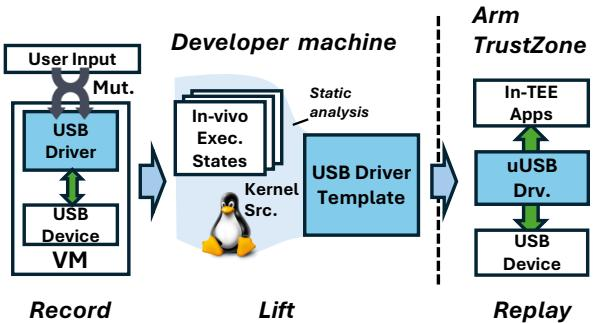  
Figure 1: The overview of µUSB.

Secure I/O, however, lacks critical support for USB devices. As the most diverse class of I/O peripherals, they handle data virtually from all sources, e.g., from various sensors (including keypads and mice) to multimedia devices such as cameras and microphones; supporting them would bridge existing trusted apps on a Commodity-Off-The-Shelf (COTS) mobile SoC to a much broader range of trusted data sources, and empower more trusted apps. For instance, with TEE-protected USB sensors, a trusted app at the edge executing stream analytics [85] directly operates on trusted raw ingress sensor data; it does not relay any requests to an untrusted normal world OS, which is buggy [77, 66, 72] and may be malicious [14].

Yet to close the gap, the key missing link is USB device drivers inside the TrustZone TEE. To the best of our knowledge, no commodity TEE OS supports them to date: 1) commercial TEE OSes such as Android Trusty [29], Qualcomm QSEE [7] and Huawei iTrustee [1] scope their secure I/O support to a few selected proprietary devices, e.g., RPMB storage [47], fingerprint sensors [1]; 2) open-source TEE OSes (e.g., OPTEE-OS [54]), which are incorporating more emerging I/O device drivers (e.g., GPIO [4], SPI [5]), still have no plans for USB despite the first USB feature request dating back to 2017 [6]. As we will show in Section 2.2, it is likely due to a combination of large efforts required to support them and their security implications to the TEE.

How to bring USB drivers into the TEE? One may reuse existing Linux driver code, either wholly (e.g., porting [87, 44]) or partially [31, 110]. Nevertheless, this approach misfits USB drivers which are diverse, complex, and with deep kernel dependencies: porting incurs non-trivial manual efforts, bloats the Trusted Computing Base (TCB), and infects TEE with kernel bugs which we quantitatively analyze in Section 6.2; partitioning [110, 31] needs to reason about the partitioning boundary which spans over a few thousand kernel functions of major kernel subsystems, and is known challenging [48, 14, 35, 53]. Instead of code, one may opt to reuse driver/device interactions by recording the low-level interaction events induced by a given I/O job and replaying them at run time [32, 83, 106, 56]. This route, however, is difficult too. First, recording by manual annotations [83, 106, 56] is tedious and error-prone, where USB drivers exploit in-memory data structures and massive pointer accesses for device interactions; a single missed annotation may result in incorrect results. Second, recording by symbolic tracing [32, 16] is unsuit able, because many USB devices interact with drivers through high-frequency (e.g., over 100K per I/O job) isochronous transfers bound by strict timing intervals. The high tracing and analysis overhead incurred by a complex symbolic/con colic execution engine (e.g., S2E [17]) is intolerable to such devices and triggers persistent time-outs, as we will discuss in detail in § 2.

Our approach. In light of these, we ask a natural question: can we record USB driver/device interactions concretely, and later generalize them for runtime reuse, purely based on these concrete interactions? To answer it, our key insight is that while a full USB driver is complex, its low-level interactions for a specific I/O function follow a highly deterministic beaten path, which allows us to sidestep its full complexity.

To this end, our approach adopts a simple idea – record, lift, and replay: for a desired USB I/O function, we in vivo record the concrete low-level USB driver/device interactions, ex vivo lift them into a symbolized USB driver template, and replay the template with dynamic input at run time to realize the same I/O function. Figure 1 shows the approach overview.

Benefits. Our approach enables practical and safe USB driver reuse: the developer only needs to specify the desired USB I/O function (e.g., audio record/playback) and corresponding inputs, just as she would expect to use the USB device in TEE, and our system instantly generates the corresponding readyto-use driver template, faster than driver porting or refactoring, as will be shown in § 6.2; the driver template dictates sequential, replayable low-level driver/device interactions, which precludes kernel code and potential vulnerabilities contained within it (e.g., 0-days).

Challenges. To record, lift, and replay, we face two major challenges. First, how to record necessary and sufficient in-vivo execution states from USB driver executions? As mentioned earlier, USB driver/device interactions are dominated by high-frequency DMA accesses, where many allocated addresses/parameters vary dynamically over time. A successful recording must capture such accesses completely and promptly: it does not disrupt USB execution; it preserves sufficient information to allow faithful reconstruction of the USB I/O function which tolerates runtime variations. Second, how to lift the concrete traces into templates which accept dynamic inputs at run time? The process essentially recovers the dependencies and constraints missed from concrete traces back to their symbolic and programmatic form. Doing so soundly requires high-fidelity and deep static analysis. However, such analysis is known difficult for the complex kernel code [112, 12], which exploits wild pointer conversions and recursive data structures (e.g., a self-referencing page struct).

µUSB. Towards practical and safe USB driver reuse, we present µUSB, a system which has addressed the aforementioned challenges by employing a suite of novel techniques. For recording necessary and sufficient execution states, µUSB employs a mutational recorder in a lightweight VM that captures complete hardware I/O traces without disrupting the timing-sensitive USB protocol. In addition to user-supplied concrete input, the recorder automatically mutates these inputs using a set of mutation rules designed to make mutated inputs closely approximate the valid inputs of the recorded I/O function. With the new inputs, it then re-records the I/O function to gather more traces, until they converge structurally (i.e., isomorphically) with the same I/O function.

For automatically lifting concrete traces into templates, µUSB integrates and extends two successful program analysis techniques and proposes symbolic trace differential analysis and qualified taint tracking. With simple heuristics, the former effectively filters out and symbolizes concrete values that may change during execution (e.g., a virtual address), whereas the latter is a form of trace-guided analysis that leverages the recording as an oracle path qualifier to make a deep, highfidelity (i.e., context-, path-, flow- and field-sensitive) dataflow analysis on complex kernel code scalable and precise. The two novel techniques harmonize in exploiting the inherent invariance and variability of the deterministic USB FSM to produce the USB driver template used for replay, which at a high level specifies the behavior of the USB driver – when should which data go where in what format.

Results. We apply µUSB to four important USB classes (i.e., Mass Storage, Audio, Video, HID) encompassing six different devices from five different vendors, whose drivers were considered too complex for Arm TrustZone [110, 32]. With light efforts and basic knowledge of USB device internals, µUSB successfully produced eight diverse templates; each template comprises a vastly different number of events (e.g., from 1K to over 400K) and encodes necessary and sufficient dependencies and constraints to achieve its designated I/O functions. The resultant µUSB drivers have decent performance: on Raspberry Pi 5, a popular COTS Arm development board, and for the first time without a normal OS, the TEE software can read/write USB storage at 10-20 MiB/s (close to a full-fledged native driver), stream video at 30FPS, record audio reliably in real time, and receive keyboard/mouse inputs at low latencies.

Contributions. Our contributions are as follows:

• The design and implementation of µUSB, a novel record, lift, and replay solution to reusing mature USB device drivers for TrustZone. µUSB demonstrates: by combining concrete USB driver execution traces with simple static analysis, it is possible to reproduce and reuse complex USB I/O functions.

• Qualified taint tracking, a novel trace-guided static analysis technique that makes high-fidelity dependency recovery in complex kernel code practical and fast.

• A comprehensive evaluation of µUSB. By deploying µUSB on various USB devices (e.g., streaming webcam, speaker) on real Arm TrustZone-enabled hardware, we demonstrate the practicality and scalability of µUSB.

• Ready-to-use, performant µUSB drivers for TEE. To the best of our knowledge, it is the first time for complex USB device drivers to enjoy end-to-end TrustZone protection.

For a TrustZone TEE, µUSB <sup>2</sup> opens a new door to trusted apps accessing diverse USB devices.

## 2 Background & Motivations

## 2.1 A Primer on USB

USB protocol. Universal Serial Bus (USB) is the dominant peripheral interconnect standard, evolving from USB1.0 [102] to USB4.x [103]. To standardize peripheral-to-host communication, it provides two key abstractions. Endpoints represent data sources or sinks on a device and communicate with the host via logical channels called pipes. Transfers encapsulate communication between endpoints and the host, with four types defined according to data content and purpose: 1) control transfers for device setup and configuration; 2) interrupt transfers for regular, low-latency communication such as keyboards; 3) bulk transfers for reliable, high-throughput exchange as in storage devices; and 4) isochronous (ISOC) transfers for time-sensitive streaming with bounded latency, essential for multimedia devices. Through these transfer types, USB abstracts diverse peripherals into 25 device classes, e.g., Human Interface Device (HID), Video, Audio, Mass Storage.

eXtensible Host Controller Interface (xHCI). A host controller interface (HCI) implements the interface specified by the USB protocol for device interaction, including OHCI/E-HCI, UHCI, and xHCI. This paper mainly focuses on xHCI, as it is the most recent and widely adopted standard [101]. Mandated by the specification, xHCI is architecture-independent and exposes a large group of memory-mapped registers for host configuration. These include capability registers, which report protocol information, and reference operational registers and runtime registers. The latter configure USB data transmission parameters at run time, e.g., data page size, and commands. Beyond registers, xHCI mainly manages USB transfers with in-memory data structures. It employs Transfer

Descriptors (TDs), each containing one or more Transfer Request Blocks (TRBs) depending on the transfer size and type, which refers actual data pages. All TRBs are organized within a ring buffer, the Transfer Ring (TR).

## 2.2 The USB Secure I/O Dilemma

What USB devices matter for TEE? Following example trusted apps [20] motivate our design and benefit from TEEprotected USB devices: 1) Secure storage: trusted apps manage sensitive data such as credentials [90], authentication tokens [29], and biometric data [1, 25]. They acquire/persist the data on storage. 2) Trusted perception: they acquire sensor data [110, 56] for executing stream analytics [85] and NN inference [109, 97]; notably, multimedia data are often unencrypted thus cannot be exposed to normal OS. 3) Trusted UI: they render privacy-sensitive contents, e.g. bank account; the UI reads in user inputs such as presses from a keypad or movements from a mouse. TEE needs to isolate input devices for confidentiality and integrity [82, 107].

Why TEEs lack USB support? Despite their strong use cases, USB support remains untapped by existing TEEs. We examine OPTEE-OS [54], TrustZone’s reference secure OS, analyzing its development and commit history over the past decade (Figure 2(a)). The data reveals a clear upward trend in driver-related commits, which have doubled in recent four years, and now account for 35% of total commits. However, closer inspection shows that the majority (73%) target relatively simple character devices such as CRYPTO, UART, and GPIO which provide only basic I/O services (Figure 2(b)).

Why has USB remained overlooked by TEE, with no indication of future development? Our conjecture is twofold: 1) USB couples with heterogeneous and diverse standards. Supporting different device classes (i.e., 25 in total) demands compliance with heterogeneous standards and class-specific encodings, e.g., video and audio codecs; bringing them into TEE is unwarranted. 2) The large USB software stack deters developers. Existing in-TEE drivers are compact and simple (under 77k SLoC shown in Figure 2(b)). A single USB audio driver spans 245K SLoC (Linux v6.13), compared to only 300K SLoC for the entire OPTEE-OS; its dependencies span over 600 header files of tens of kernel subsystems (e.g., IRQ, DMA, file systems) accounting for additional 560K SLoC.

Why are existing approaches inadequate? We examine existing approaches which may bring USB drivers into TEE.

1. Porting. One may port the full or partial USB driver and shift them to the TEE, e.g., as a library OS [44]. This approach is unfit for the TEE, as it introduces a large and unwarranted USB driver along with its deep kernel dependencies to TEE (as discussed earlier). As will be shown quantitatively later, it incurs large manual efforts (§ 6.1), and inherits existing kernel bugs [67, 71, 75] (§ 6.2), which makes the TEE susceptible to attacks from malicious USB devices [57, 79].

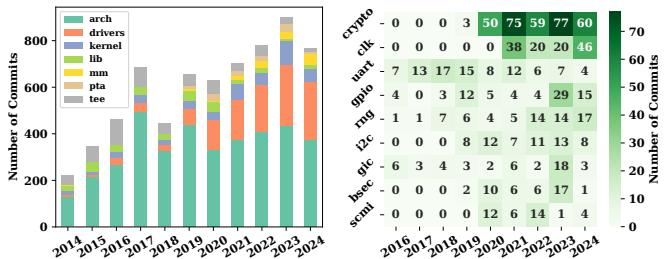  
(a) Yearly commits grouped by(b) A breakdown of OP-TEE kernel subsystems from 2014. driver commits from 2016.  
Figure 2: OP-TEE OS commits over the past decade.

2. Partitioned execution. Prior works [110, 22, 36] partition the existing drivers and execute only the security-sensitive code inside the TEE while leaving the rest to normal OS. Despite having less in-TEE code, it has two security issues. First, reliance on non-secure OS code expands TCB and exposes the TEE to Iago attacks [14], which compromises data confidentiality and integrity as USB devices commonly lack end-to-end encryption. Second, defining partitioning boundaries is challenging [48], as it requires extensive auditing of interfaces and data structures (e.g., USB TRBs, DMA descriptors, kernel pages) that may handle USB data, which likely results in a major overhaul of USB drivers and kernel code.

3. Record-and-Replay (RnR). As old wisdom among software testing [26, 111] and bug finding techniques [23, 33], it recently proves effective for TEE driver reuse, e.g., for simple I/O devices [32, 106, 56], GPUs [83]. Its key idea is to record the driver/device interactions in a commodity OS and replay them in TEE. To record, they either manually annotate the kernel driver to instrument software/hardware interactions [83, 106] or symbolically trace these interactions using a symbolic/concolic execution engine [32, 16].

However, both recording methods are inadequate for USB devices. As mentioned earlier, USB primarily uses finegrained DMA accesses for driver/device interactions [41], which does not retrofit kernel register accessors (e.g., readl, writel) and differs from GPUs [83] and other I/O devices [56, 106]. Manually instrumenting these DMA accesses hence is tedious and fragile, and incurs prohibitive efforts when scaling across diverse USB devices and classes. Conversely, symbolic tracing alleviates this instrumentation burden but is too heavyweight for the USB protocol – the USB device times out and halts if an interaction misses its timing (e.g., 1ms interval of isochronous transfers), which is hard, if not impossible, for a symbolic/concolic execution engine to keep up with. Therefore, driverlet [32] as a notable representation of this approach, only supports USB bulk transfer which tolerates analysis delays but does not work for other transfer types. Furthermore, even for USB storage, it needs to explicitly disable Start-of-Frame as a workaround for EHCI protocol’s timing control, stated in its § 7.2.2.

## 2.3 Goals, opportunities, and choices

Design goals. To extend TEE protection to USB for COTS SoCs at a low cost, we set the following goals.

• Practical. It is our top concern. The system shall scale to major classes of USB devices (e.g., audio/video) which have important I/O functions with little to no manual effort.

• Safe. USB drivers execute entirely inside the TEE to leverage secure I/O, and remain safe against a malicious USB device.

• Performant. Multimedia devices often have real-time data transmission, e.g., microphones stream audio samples at constant rates for sound quality. The system and the drivers must deliver deployable and usable performance.

Observations. We have exploited the following observations.

– The beaten USB FSM state transition path. The USB FSMs are by design deterministic and largely dataindependent [104, 102, 103]. For a given I/O function and fixed inputs, the USB device’s internal FSM follows the same, beaten state transition path; conversely, driving the device to go through the same path reproduces the same I/O function.

– Architecture-independent USB driver/device interactions. Operating a USB device entails driver–host controller (xHCI) interaction via MMIO, DMA and interrupts, with architecture-independent data structures and register specifications designed for scalability across platforms.

– Limited dynamism of trusted apps. Trusted apps (§ 2.2) are statically bound to TEE, constraining the USB usage: the TEE expects persistent USB device connection (e.g., no hotplug); they demand I/O data, which can be served with corresponding I/O functions without complex and dynamic device features, e.g., power management.

Design choices. The above observations and goals motivate our design choices: (1) prioritize specific USB I/O functions over full device features for practicality; (2) decouple analysis from USB driver execution by in vivo recording concrete execution states, and by ex vivo analyzing concrete recordings exploiting the deterministic, beaten USB FSM path.

## 3 Design Overview

## 3.1 System model

Threat model. We follow the threat model of TrustZone and USB security [31, 42]. We trust the Arm SoC hardware, including TrustZone Address Space Controller (TZASC) and TrustZone Protection Controller (TZPC), and firmware enforcing the secure/normal world isolation. We trust the secure world software, including the TEE kernel and trusted apps. We do not trust the normal world OS, which may probe or tamper with USB data. Physical attacks [45, 34] are out of scope.

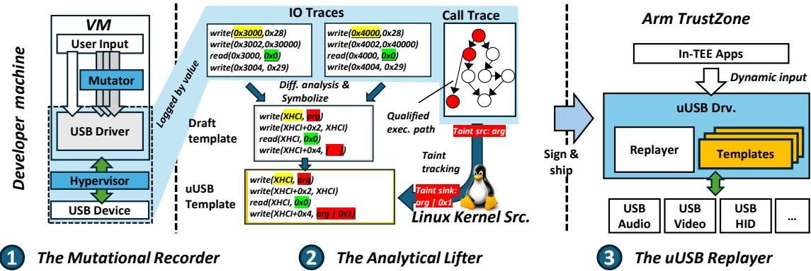  
Figure 3: Overall workflow of µUSB

We assume software and hardware on the developer’s machine used for recording are trustworthy, including the OS, USB devices and drivers. We also assume that the recorded USB drivers are gold: they implement sufficient driver/device interactions, so that it can assess if the device has finished the state transitions needed by given requests. Our rationale is similar to other recording-based TEE drivers [32, 83, 84, 106].

Targeted USB devices and SoC hardware. We target mobile/embedded Arm SoCs with TrustZone enabled. We focus on USB I/O devices with strong TEE use cases (§ 2.2). These devices handle sensitive user data but lack end-to-end encryption at the protocol layer. We do not target USB networking or hub devices, as their safety can be complemented by protocollevel encryption [92]. We also do not consider USB gadgets due to unclear TEE use cases. The SoC has multiple instances of the USB host controller, which is a common practice in today’s SoCs [21, 3]. By configuring TZPC and TZASC, the TEE exclusively owns one instance of the USB host controller.

## 3.2 µUSB overview

Our key idea is to specialize a TEE USB driver for specific I/O functions by ex vivo deriving a micro USB (µUSB) driver from the concrete in-vivo execution of a mature kernel driver. Figure 3 shows workflow. The core mechanism is as follows.

1. Mutational Recording. The developer invokes the USB IO function desired by trusted apps with concrete inputs, e.g., read 10 blocks from sector 0. µUSB mutates the inputs, invokes the same I/O function for multiple times, and logs complete interaction events from the USB driver, including register/DMA accesses, interrupts, and kernel inputs.

2. Static Lifting. µUSB processes traces logged from multiple concrete inputs into a template which adapts to dynamic inputs at run time: it detects variables and symbolizes them by differentially comparing their values across traces; it uses traces to qualify taint analysis for distilling dependencies and constraints between variables. The lifted template comprises a sequence of low-level hardware/software interaction events (e.g., MMIO, IRQs) required to complete the specific I/O function, which precludes the original kernel code.

3. Runtime Replay. µUSB signs and ships the template to TEE as the ready-to-use µUSB driver, which exposes a simple interface to trusted apps for requesting I/O data. Upon request, the µUSB driver replays the events in the template sequentially with runtime inputs, e.g., read X blocks from sector Y. A faithful replay fulfills the same recorded I/O function while adapting to various dynamic inputs.

Applicability to other TEEs. A µUSB driver relies on secure I/O provided by TrustZone for strong protection but is not strictly limited to it. It also supports other TEEs providing similar features. For instance, AMD SEV-SNP uses SEV-TIO (i.e., Trusted I/O) [9], similar to TrustZone’s secure I/O; RISC-V’s Keystone TEE [46] combines PMP (i.e., memory/register isolation) and processors M-mode to achieve secure I/O.

## 3.3 Why µUSB works

Understanding µUSB drivers at a high level. Based on our rationale of the USB device FSM (§ 2.3), a USB device generalizes as a set of deterministic FSM state transition paths, which collectively fulfill the I/O functions of the device. The corresponding full USB driver hence can be regarded as traces of low-level device interactions, i.e., MMIO, DMA, and IRQs; each trace 1) drives the device state transitions of a path, and 2) also assesses if the transitions are correct. A µUSB driver captures a subset of full traces by recording low-level interactions from demanded I/O functions; replaying the trace drives the device FSM to go through the same state transitions to fulfill the recorded I/O function. The appendix presents a sketch proof showing a µUSB driver achieves trace equivalence with its recorded USB driver under the same I/O function.

Replay correctness. The µUSB driver offers the same level of correctness guarantee as a kernel driver does: the µUSB replayer’s assertion that a recorded I/O function (e.g., read/write a block, streaming audio for some interval) has completed successfully is as sound as the assertion from the kernel driver.

Our rationale is: the full driver continuously assesses if state transitions are correct via low-level interactions. By recording and matching these interactions, the µUSB driver also asserts execution correctness of the I/O function. During replay, if it observes the same trace of interactions with all parameters matched, then to the best of the driver’s knowledge, the USB device performs the same state transitions and completes the same I/O function, and the replay is correct.

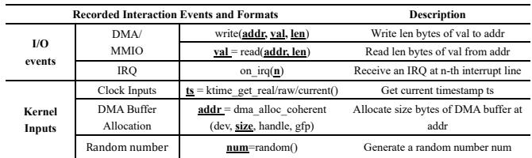  
Table 1: Events recorded by µUSB. µUSB records highlighted fields by value.

At a higher level, µUSB resembles duck typing [55] for USB driver construction: upon user inputs, a µUSB driver executes as a USB driver; upon device inputs, it reacts as a driver; then it must be as correct as a driver.

## 4 µUSB Design

## 4.1 The Mutational Recorder

The recorder records the in-vivo execution states of the USB driver by value as the basis for the template. To this end, we have addressed two challenges: 1) how to capture necessary interaction events to faithfully reconstruct the execution states needed to recover USB driver execution? 2) how to obtain sufficient concrete values such that the lifter can distill data dependencies and symbolize them for dynamic inputs?

## 4.1.1 Record necessary in-vivo execution states

To initiate, the developer launches a recording campaign by invoking the entry function provided by the recorder on the developer’s machine: record(f, [arg...], [var...]), where f is the desired USB I/O function (e.g., read/write for USB storage), [arg] is an array of concrete inputs needed by f, and var is a binary array indicating which arguments in [arg] accept dynamic inputs at run time. More I/O functions recorded by µUSB are in Table 4.

What to record? Two types of runtime traces are necessary: 1) I/O traces: these include the low-level USB driver/device interaction events, i.e., xHCI register and DMA accesses, and interrupts; 2) Kernel inputs: USB devices rely on inputs from a few kernel APIs to alter states. For instance, its device FSM expects a DMA buffer from kernel to initiate data transfer. The recorder logs their arguments and return values in the I/O trace; Table 1 summarizes all observed kernel inputs.

The recorder additionally captures call traces. Section 4.2 demonstrates existing static analysis is infeasible for the lifter to analyze kernel deeply and precisely without them.

How to record? The recorder must capture complete traces. It is challenged by USB’s high-frequency pointer-based DMA accesses (e.g., 10KHz) whose strict timing must be respected. To address this, µUSB records the USB driver execution in a controlled, lightweight virtual machine, and traces I/O at the lowest level via stage-2 page faults. Specifically, the recorder compiles the guest kernel using tinyconfig and enables only necessary USB drivers. It configures the hypervisor to monitor: 1) interrupts and 2) memory regions belonging to USB host controller and 3) DMA pools allocated to USB; tracing extra regions adds overhead and may interfere with USB execution. The recorder thus transparently traps these I/O events and records them by value in the format given in Table 1.

An alternative is to trace via stage-1 page faults, which was our initial attempt. To our surprise, their latency exceeds the USB isochronous transfer interval, which is erroneous and causes the USB transfer to abort; we will show measurements in Section 6. During recording, the recorder logs the I/O events sequentially and segregates them into two contexts (i.e., the CPU and the interrupt context) to match the asynchronous USB job submission/execution.

## 4.1.2 Mutational recording

Relying on a single trace is brittle, as many values and events are timing- and input-dependent. To accommodate input and runtime variations, our idea is to reveal such dependencies and variability proactively by stress testing the given I/O function with mutations which approximate these variations.

Mutation strategy. In addition to recording using the usersupplied input, the recorder mutates inputs in two dimensions and re-records. First, on user inputs. The recorder mutates all inputs which the user expects to use dynamically at run time, i.e., specified by [var] of the recording entry. As explained earlier, the recorder does not aim for code coverage (i.e., desired by an OS fuzzer [42, 86]) but to approximate input variations under the same I/O function. It hence adopts simple, semantic-aware mutators in Table 2 to generate more user inputs for all arg[i], if its corresponding var[i] is true (i.e., variable at run time). Second, on kernel inputs. The recorder exploits Kernel Address Space Layout Randomization (KASLR) default in today’s kernel and restarts the VM between each re-run for a clean-slate kernel state. This helps expose those DMA addresses which appear identical across different runs but are in fact recycled.

Stop condition. During operation, the recorder gathers a reference trace from user-supplied input, and additional mutated traces from extra runs. The recorder decides to stop upon two conditions. First, the traces converge. It deems the exploration sufficient if after N runs, the majority of mutated traces are isomorphic (i.e., structural equivalence [15]) to the reference trace, where the trace lengths, the ordering and types of the events are identical. N is a user-configurable parameter and is at least 10. Larger N (e.g., 100) is fine but incurs longer delays as the recording is sequential to ensure determinism; it does not bring additional benefits, for our evaluations in Section 6.3.3 show that as few as six runs is sufficient. Second, recording times out. The traces may never converge, due to excessive mutable inputs. For example, the developer specifies all arguments [sector, blk, buf] of read I/O function as mutable. This apparently will not converge, as allowing all inputs to be mutable requires exploring the full driver state space. To deal with such cases, the recorder sets the default timeout to 10 minutes. After timeout, it stops recording and prompts the developer to reduce the number of mutable input in [var], i.e., reducing the size of state space to explore. In practice, we have not found a case where traces do not converge when the number of mutable input reduces to one. This is because in such a case, the mutable input has to be a runtime buffer address, changing which is expected by the USB FSM and still follows the same I/O transition beaten path (§ 2.3).

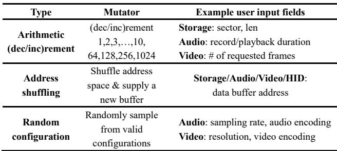  
Table 2: Mutation strategy defined by µUSB recorder.

Recording outcome. Upon completion, the recorder gathers an enclave of runtime traces in a recording campaign, including a reference trace and several mutated traces. These traces capture concrete and varying values, but are structurally equiv alent, suggesting a sufficient exploration of the USB device state transition path determined by mutable user inputs.

## 4.2 The Analytical Lifter

The lifter is the core to µUSB, which distills concrete recordings into a replayable template. To this end, we have addressed two challenges: given a corpus of concrete execution traces, how to 1) identify the variants (i.e., values that change w.r.t. new inputs) and 2) recover their data dependencies?

## 4.2.1 Symbolic differential trace analysis

To generalize to dynamic inputs, the first step is to locate variants from concrete I/O traces. A central difficulty is that invariants and variants in I/O traces can appear identical. For instance, a SCSI read(10) CMD (0x28) appears no different than a block count or sector number.

To address this, our observation is that invariants capture the constants (e.g., commands) and substructures (e.g., linked lists) preserved across traces, while the variants reflect the input-induced divergences. The lifter thus exploits such inherent dichotomy by differentially comparing the traces.

First, symbolizing addresses and inputs. For a concrete trace, the lifter instantiates three symbolization rules for i-th event v<sub>i</sub> = E<sub>i</sub>(args, ...) of the trace:

Rule 1 (indexed symbols). Base addresses of USB host controller and allocated DMA buffers are assigned unique symbols w.r.t. their sizes and respective indices i; user inputs, and all v<sub>i</sub> returned by kernel inputs and DMA/MMIO reads are assigned unique symbols w.r.t. their indices i.

Rule 2 (address matching). All concrete addresses, i.e., DMA/MMIO read/write addresses, are symbolized by relatively addressing their closest base address.

Rule 3 (argument matching). Concrete values args consumed by MMIO/DMA writes are symbolized by relatively addressing known symbols which prioritize addresses.

To justify, rule 1 first addresses four intuitive sources of variants: device/DMA addresses, inputs from kernel, device, and users (Table 1); the naming allows unique references from other variants within the trace and differential analysis across traces. Rule 2 associates values known to be virtual addresses (e.g., USB MMIO read) with already symbolized base addresses. Rule 3 handles the tricky case where a kernel input or address is used as an argument, by conservatively assuming all arguments are variants and associating them with existing symbols. The rationale for the value matching heuristic is that a USB device often uses kernel inputs (i.e., timestamps, random numbers) as-is. This may introduce false positives (e.g., a static encoding or a timestamp coincides with a DMA address) but the key is not to leave out true positives. The lifter filters false positives as follows.

Second, detecting invariants differentially. The lifter sequentially scans each I/O trace and creates key-value pairs <var, [val]>, where var is a symbolized variant and [val] is a list of symbols and concrete values (i.e., not symbolized by rule 1-3) associated with the variant in a DMA/MMIO read/write. It detects invariants by differentially comparing the reference trace with all mutated traces: a val[i] is an invariant if and only if its counterparts of mutated traces are symbolically or numerically equivalent. Figure 4 shows an example: var\_4k\_2 and 0xd0 are invariants corresponding to var\_4k\_1 and var\_4k\_1+0x8 if and only if var\_4k\_1 and var\_4k\_1+0x8 always writes var\_4k\_2 and 0xd0 across all traces. It also resolves false positives: as the recorder restarts VM and leverages KASLR (§ 4.1.1), it is unlikely for kernel inputs to persistently coincide with address reads/writes.

At first glance, this approach may appear ad hoc or unsound, i.e., dependent on number of traces, may miss some variants, etc. We highlight the lifter’s goal is not to identify all variants but only those observable under variable inputs. We argue that these values subject to change would have changed and been captured during the mutational recording (§ 4.1.2). In practice, we find the strategy effective and fitting for USB I/O events, which are highly deterministic. Figure 4 demonstrates this by showing that the actual USB driver sets up TRBs in the TR for submitting I/O jobs with a sequence of DMA writes. With our technique, the lifter identifies the invariants and preserves the substructure, which implicitly reconstructs the same scatter/gather topology of TRBs when being replayed. Section 6.3.3 quantitatively shows the impacts of the number of traces.

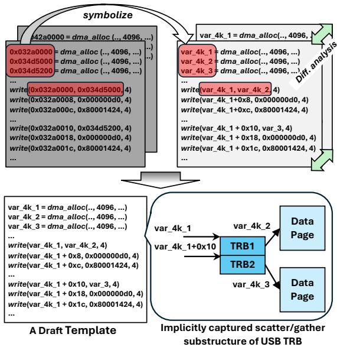  
Figure 4: µUSB reconstructs the scatter/gather substructure of TRBs via differential analysis with the simple heuristics.

Third, generating a draft template. The outcome is a draft template built upon the reference trace: addresses are symbolized canonically; the invariants are preserved as-is, either as symbols or concrete values; kernel inputs are symbolized with best efforts and remaining variants are marked as placeholders for further analysis.

## 4.2.2 Qualified taint tracking

Variants in the draft template are critical to the USB driver execution, which often involves data transformations (e.g., DMA address alignment) dictated by the driver and hardware specifications. The lifter must resolve their dependencies with user/kernel inputs and bind them with path constraints conforming to the driver behavior. While a high-fidelity static data-flow analysis (i.e., path-, context-, flow-, and field-sensitive) could theoretically resolve the issue, this method is unscalable for complex kernel code due to state explosion[112, 17].

To overcome this, our insight is to specialize the data flow analysis using the call traces collected along with I/O traces (§ 4.1.1) as the sharpest data flow information to qualify possible data flows of kernel code paths, i.e., a unique solution to the qualified data flow problem [37]. We present qualified taint tracking as follows.

The lifter sets all inputs (i.e., mutable arg of the recording entry, kernel inputs, and read from device states) as taint sources and the driver code which consumes them as sinks. For taint rules, the lifter adapts existing standard rules from [58] and introduces two crucial extensions: 1) since existing taint rules only concern taint propagation in the kernel space, it extends them to allow taints to propagate in field level across the user/kernel boundary through kernel utility functions such as copy\_from\_user; 2) to maintain field-sensitivity for recursive data structures like linked lists (a known challenge for static analysis [112]) for chaining URBs (i.e., the upper-layer kernel abstraction for TRB), the lifter introduces trace-guided alias analysis. Essentially, the improved alias analysis leverages the draft template as an oracle and determines if an object (e.g., URB) is an alias of another from its symbolized address encoded in the draft template. To track taint propagation, the lifter navigates the analysis with the call trace as a path qualifier: at control-flow branches (e.g., if statements), it chooses the path suggested by the call trace, and checks if the corresponding path condition is dependent on a tainted value. If so, the lifter collects the path condition as a constraint of the tainted input, which ensures the execution stays on the USB state transition beaten path. Since the analysis is static, the lifter saves these constraints symbolically in the final template. Alongside the taint propagation, the lifter accumulates the taint operations and saves them to generate the final template. We discuss the security implication in Section 6.2.

By design, a taint sink (i.e., a variant) corresponds to at least one taint source. However, if a variant depends on kernel inputs unlisted in Table 1, it cannot be correlated to a taint source and is untagged. To address this, the lifter marks the variant as a taint source, consults the call trace to perform backward qualified taint tracking, and adds the taint sink (i.e., a kernel input) to Table 1. The lifter then prompts the recorder to re-record leveraging the newly discovered kernel input. This efficiently and effectively recovers the dependencies and constraints missed from the draft template. For common USB devices (e.g., storage/video/audio/HID), the lifter does not conduct backward taint tracking, as the events in Table 1 are sufficient; nevertheless, we design the mechanism to cover emerging USB devices that may require more events to trace.

## 4.2.3 Generate the final template

To generate the final template, the lifter simply assigns a symbolic expression to each taint sink (i.e., a variant). The symbolic expression programmatically captures the series of computational operations originated from the variant’s original taint sources (e.g., user or kernel inputs), as a result of qualified taint tracking.

Optimization: Loop re-rolling. Multimedia devices use high-frequency isochronous transfer which guarantees highbandwidth (e.g. 160Mbps for 1080p capture) but bloats the template, e.g., over 400K events for capturing 10 frames. Directly using the uncompressed template is possible but neither practical nor efficient. Observing the USB TR ring structure and repeated memory access pattern, µUSB leverages peephole optimization with a peephole size of 30 for detecting the pattern(s) and re-rolling the accesses into fixed-iteration loops. After re-rolling, the template size reduces by a few orders of magnitude, which we show quantitatively in Table 4.

## 4.3 The µUSB Replayer

Running inside Arm TrustZone, the replayer and templates are statically linked with the TEE OS, which incarnates as the µUSB driver. It provides a unified and easy-to-use API for in-TEE apps to invoke, executes the events of the template corresponding to the API, and handles possible failures.

The API. The replayer provides one unified API for in-TEE apps to request for USB I/O services. The API has two key arguments. The first specifies the template identified by its I/O function, and the second points to the arguments of the I/O function, which are mutable inputs specified at the recording entry. The design abstracts away the complexity of kernel abstraction (e.g., devfs) in the original recording and allows the in-TEE app to focus on the I/O functions. Figure 10 shows an end-to-end example.

Template execution. Upon API invocation, the replayer instantiates the template and then sequentially executes its events. To instantiate, the replayer configures TZASC/TZPC to isolate and map xHCI for memory accesses and reuses the interrupt handler of the TEE OS for top-half IRQ management. It redirects the events in Table 1 of the template to the TEE OS. Note these events are commonly provided by TEE OSes [54] or can be emulated, e.g., malloc of OPTEE-OS already allocates physically contiguous pages which emulates dma\_alloc\_coherent. The replayer maintains two contexts (CPU and interrupt), each holding only a pointer to the next event (like a PC). For writes, it re-applies the accumulated taint operations and writes dynamic values to corresponding addresses, which are mediated and checked to be valid DMA/MMIO addresses and non-executable; for reads, it matches the invariants while ignoring variants. It does not pace the replay, e.g., by injecting any artificial delays, because the USB protocol allows faster driver responses but not late ones. When execution finishes, the replayer frees up the allocated resources from the TEE OS, e.g., DMA.

Handling replay failures. The replayer handles two failure conditions. First, incorrect API invocation. This case includes selecting wrong templates and/or supplying arguments which do not satisfy the path constraints. In this case, the replayer directly returns an error code. Second, reading unexpected values. During replay, the replayer matches interaction events (i.e., IRQs and values read from the USB device) against those recorded in the template. If the lifter deems a value read from the USB device as an invariant but appears different or an unrecorded IRQ emerges, it suggests the USB FSM has gone off the beaten path. For instance, the USB device is unplugged or reboots unexpectedly due to a firmware crash amid execution, which causes spurious IRQs and deviations from the recording. In this case, the replayer halts, resets the device, and re-executes the template. If the error persists, the replayer reports an error code back to the app and releases the allocated resources (e.g., DMA pages), without executing any device-specific recovery logic. The replayer does so because a deviation is precisely the condition under which the original driver itself would not have proceeded; therefore failing is not just safe but is the same decision the original driver would have made (§ 3.3). Doing so also fully confines the µUSB driver execution inside TEE to ensure the confidentiality and integrity of the µUSB driver code and data, which are protected by TEE and never leave TEE memory; Denial-of-Service (DoS) (e.g., unplugging the USB device as mentioned above) is possible but cannot persist, as the replayer detects such deviations from the recording. In practice, no such case was found. See more in Section 6.

## 5 Implementation and Experiences

µUSB comprises about 4K SLoC across C, C++, and Python.   
Its core components are detailed below.

The recorder. We built it atop QEMU and KVM (Linux v6.8) in 2K lines of C code. We use QEMU as the frontend to manage the virtual machine which also runs Linux kernel v6.8. For I/O trace, we modify KVM to trap and record them by leveraging the PT\_ACCESS\_MASK to cause EPT page fault and IRQ virtualization to intercept USB interrupts. For call trace, we retrofit the existing kernel tracing facility, i.e., ftrace and kprobe. We implemented our own mutator and draw valid configurations from device utilities (e.g., V4L2 for Video).

The lifter. We have implemented the lifter based on SU-TURE [112] in 500 lines of C++ code and 1K lines of Python code. We choose it as it is the state-of-the-art kernel static analyzer, which integrates mature taint rules. To implement qualified taint tracking, we modified its taint tracking module to allow the traces to 1) direct the taint propagation upon branches, to 2) collect the corresponding path constraints, and to 3) qualify alias analysis upon recursive data structures.

The replayer. We have implemented the replayer as a simple executor of the events of the template in 500 lines of C code based on OPTEE-OS v4.4. For DMA/MMIO accesses, the replayer implements them as uncached pointer accesses and insert memory barriers for cache coherence. For call events, the replayer redirects them to existing services already provided by OPTEE-OS, e.g., dma\_alloc\_coherent to malloc of OPTEE-OS which allocates physically contiguous pages.

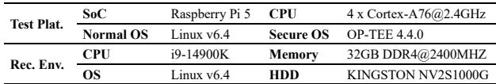  
Table 3: The test platform and the recording machine.

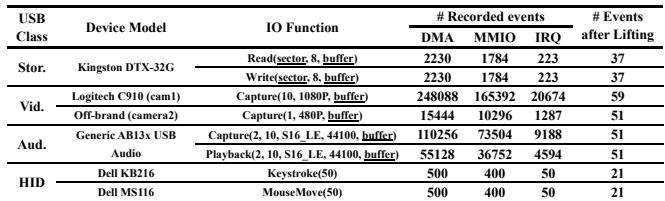  
Table 4: The USB devices, recorded I/O functions, and number of events in the generated templates. Underlined args are mutable at run time.

## 5.1 USB devices and I/O functions

We test µUSB with four classes of USB devices which have important use cases in TEE but commonly lack protocol-layer end-to-end encryption: 1) USB Mass Storage: it extends secure storage from on-chip RPMB [2] to a diverse range of external commodity storage devices, e.g., a thumb drive; 2) USB Video/Audio: it enables TEE to obtain trusted images/audio for provable video authenticity [56]. We choose two distinct cameras with different rates (1080P@5FPS and 480P@30FPS) to demonstrate cross-vendor practicality; 3) USB HID: it enables TEE to process privacy-sensitive human inputs, e.g., passwords. We choose keyboards and mice as they are the most common HID devices. We record their typical I/O functions and device initialization. The setup and I/O functions are in Table 3 and 4.

## 5.2 Recording outcome and post analysis

We report the recording outcome for each of the devices in Table 4 in interaction events, including raw recorded events and the events after lifting.

USB Mass Storage. µUSB recorded two SCSI commands: read(10) and write(10). For each data transmission round, three interrupts are received, for sending SCSI command, transporting data and receiving status respectively. The number of TRBs scales linearly with transfer data size, which suggests each TRB carries a fixed amount of data.

USB Video/Audio. To configure them, both drivers allocate DMA buffers, encode configurations, and write buffer addresses to xHCI, which is exactly recovered by µUSB, with the buffer symbolized and configurations correctly preserved as invariants, e.g., the audio sampling rate specified in user input (i.e., 44100) is encoded and preserved as 0xbb80 (i.e., 48000). Unsurprisingly, both devices stream raw data with ISOC transfers; without the secure I/O’s end-to-end protection, they would have been easily intercepted and exploited by a malicious OS. We are surprised to find camera 2 (480P) requests data buffers of the same size (i.e., 96KB) as camera 1 (1080P), which greatly exceeds its actual needs and is likely an implementation defect. Figure 5 illustrates a fragment of the template for USB Audio playback, where configurations are encoded as invariants, and variants (e.g., buffer addresses) are correctly symbolized.

```solidity
1 #define S16_LE 0 x0001
2 // mutable input: buffer
3 void Playback (2 , 10 , S16_LE ,
4 44100 , void * buffer )
5 {
6 val = read ( xhci_base +0 x44 , 0 x4 ); //read xHCI
7 // matching invariants for correctness
8 if ( val != 0 x0 ) goto replay_error ;
9 // write a 4-byte invariant to xHCI
10 write ( xhci_base +0 x0044 , 4, 0 x8 );
11
12 // alloc DMA
13 tmp = dma_alloc (0 x3 );
14 // UAC_SET_CUR
15 write (tmp , 3, 0 xBB80 ); //Resample to 48 kHz
16 write ( trb_base +0 x67f8 , 0x8 , tmp );
17 write ( xhci_base +0 x2004 , 4, 0 x1 ); //ring doorbell
18 ......
19 // alloc DMA
20 tmp = dma_alloc (0 xc0 );
21 // transfer user data
22 write (tmp , 4, buffer );
23 write ( tmp + 0x4 , 4, buffer + 0 x4 );
24 write ( tmp + 0x8 , 4, buffer + 0 x8 );
25
26 // send data to xHCI
27 write ( trb_base +0 x7a50 , 0x8 , tmp );
28
29 on_irq (10); // wait for irq line 10
30
31 }
```  
Figure 5: An example of a µUSB template for audio playback, which specifies a sequence of MMIO, DMA, and IRQ events to complete a single isochronous transfer of USB audio. Comments are added for readability.

USB HID. It only uses interrupt transfer for data and is highly deterministic. Exactly one TRB is transferred to report each movement of the mouse and a keystroke. More interestingly, all address/value fields remain identical within one trace. By simply observing its concrete trace, a less-seasoned developer would have treated them as invariants. Yet, µUSB’s lifter detects the addresses and symbolizes them as variants.

## 6 Evaluation

We answer the following questions w.r.t. our goals (§ 2.3):

1. Why is µUSB practical? (§ 6.1)

2. Why do µUSB drivers work correctly and safely? (§ 6.2)

3. What is the performance of µUSB and its drivers? (§ 6.3)

## 6.1 Analysis of developer efforts

We compare three approaches to implementing the same I/O functions as described in Section 5.

Build from scratch. Developing a USB driver from scratch demands thorough knowledge of the device specification, core functions, configurations, and data structures. We quantify such knowledge required to realize same I/O functions and summarize it in Table 5. For each USB class, we estimate the development typically takes at least several months.

Port. Compared with Build from scratch, porting requires less manual effort, yet developers still need to analyze the essential USB functions that implement the desired functionality. From µUSB’s recorded call trace, a single USB I/O function involves at least 100 diverse functions from over 10 subsystems, e.g., the device framework, block layer, power and memory management. Porting them and emulating kernel frameworks takes at least 5K SLoC and several months.

µUSB. In contrast, we needed much less developer work. The essential USB-specific knowledge is the xHCI memory layout and interrupts, which took us a few days to familiarize. Building the framework took a couple of weeks, which is a one-time effort. Using our framework is easy, with basic knowledge of USB drivers (e.g., the specific I/O functions and respective arguments): the developer simply prompts µUSB with an input and gets a ready-to-use template; if she demands other I/O functions, she simply re-records, which often takes within a minute. Note that, while driverlet [32] also generates drivers, its support for USB is limited to storage (as explained in § 2.2), which took 1-3 days, much longer than our approach.

## 6.2 Security and correctness analysis

## 6.2.1 Security Analysis

The key security benefits of µUSB are from removing the large kernel dependencies and to lock USB driver execution on a beaten path inside TEE [52].

Thwarted attacks. µUSB mitigates existing attacks which exploit memory bugs and race conditions of kernel dependencies [71, 75] and USB drivers [68, 70, 73] by design: µUSB does not incorporate kernel dependencies and driver code (§ 4.1); templates accept limited inputs and have no dynamic memory allocation (§ 4.2); µUSB does not allow fine-grained sharing between in-TEE apps (§ 4.3). We show more CVE examples in Table 6. Note that [76] was disclosed after µUSB development, which µUSB also defends against as it does not incorporate the code. By confining the execution fully inside the TEE, µUSB drivers also defend against software attacks from the malicious OS through memory [77], interrupt [78], or untrusted RPCs [14]. For logic bugs, e.g., resource exhaustion due to incorrectly handled inputs [8], µUSB mitigates them: 1) incorrect executions will be exposed by mutational recording with user-supplied inputs (§ 4.1); 2) µUSB softresets the device for a clean-slate replay (§ 4.3). A corner case is when µUSB might inherit taint-style vulnerabilities encoded in input constraints (e.g., integer overflow) which µUSB preserves. However, these are fundamentally difficult to exploit: 1) inputs from in-TEE apps are trusted and limited (1-2), which are validated by the template and audited manually; 2) malformed inputs from devices fail to replay and are immediately rejected; 3) all memory writes (as replayable events) are mediated to ensure they hit valid DMA/MMIO addresses which are non-executable.

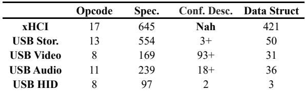  
Table 5: The knowledge required to build a driver from scratch. Conf. Desc. refers to configuration descriptor.

Attacks against µUSB. 1) Template fabrication or tampering is unlikely, as the trusted lifter signs them. 2) Attacks from malicious USB devices are defended. They may be mounted against µUSB at both the recording and the replay stage. During recording, they are defended by complementary USB protection measures [40] on the developer machine (§ 4.1). During replay, they may cause the replay to fail due to constant divergence from the template, which can be detected and does not compromise data confidentiality and integrity; they cannot inject malicious payloads (e.g., shellcode) to TEE because the template only supports the pre-recorded I/O function but not other features such as dynamic interface discovery needed by BadUSB-like attacks to emulate HID devices [81]. Exploiting the replayer is also hard, due to its small codebase (500 SLoC) and the simple logic.

## 6.2.2 Correctness

We statically vet the templates by cross-checking them with the call traces, drivers, and specifications; we experimentally verify their functional correctness and continuously stress test them for robustness for over two weeks which confirms sustained throughput. An ideal guarantee requires full formal verification of the recordings, which we leave as future work.

USB Mass Storage. We verify the templates encode correct SCSI commands; we generate 1K read/write requests and have verified that 1) they are either rejected by the replayer due to invalid input arguments, or 2) the data read by the µUSB driver match native drivers and that writes reach the storage.

USB Video/Audio. We verify the templates encode correct configurations (e.g., sampling rate, resolutions), following the same control transfers mandated by the respective specification. We dump and manually examine the captured data. For audio, we utilize the µUSB driver to playback the recorded audio to verify record and playback both works correctly; Figure 8 shows their waveforms. For video, we check video frames for correctness (e.g., no missing content, abnormal color, or jagged edges). To stress test, we streamed video and audio by repeatedly executing capture templates and have verified both endured for over 24 hours.

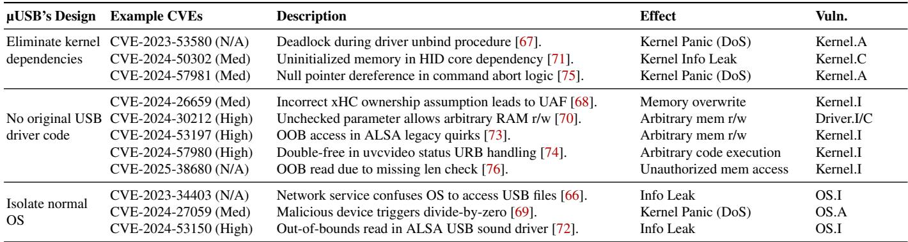  
I: Integrity; C: Confidentiality; A: Availability  
Table 6: µUSB mitigated common vulnerabilities and exposures (CVEs) in the USB stack by design. Vuln.: vulnerabilities.

USB HID. We manually verify them. For keyboard, we verify the µUSB driver captures the same key code as we pressed specified in the usage table [100]. For mouse, we verify the coordinates are identical to those reported by native drivers.

The corner case. Despite the above manual verification, one corner case is when the µUSB driver successfully replays an I/O function (i.e., no error codes, and all interactions match the recording) but the data is silently lost. However, this means the recorded driver itself does not implement sufficient driver/device interactions for inferring and handling device states and errors, contrasting our assumption of a gold driver (§ 3.1).

## 6.3 Overhead

## 6.3.1 Methodology

Our recording machine, test platform, and USB devices are listed in Table 3. We assign one of the two xHCI controllers of the platform to TrustZone and connect the USB devices with the corresponding ports. We reserve 8MB of TEE RAM for DMA allocation.

Benchmarks. We choose benchmarks specific to USB classes and their I/O functions in Table 4. 1) Storage: we use FIO, a famous open-source I/O testing tool [11]. We vary transfer block sizes, and report the throughput on 64M of data. 2) Camera (OneShot/ShortBurst/LongBurst): we request the cameras to capture 1, 10, 100 image frames at the highest resolution. We report the latency of each request. 3) Audio (Recording): We request the microphone to record audio clips from PEASS, a widely used benchmark in audio processing [24], for 10 seconds. We use cosine similarity of MFCC as the measure for audio similarity, a common metric in signal processing [18]. We also report the request latency. 4) HID (Keyboard/Mouse): We randomly press the keyboard and move the mouse, and report the latency between receiving an interrupt and obtaining the keystrokes or coordinates.

Comparisons. We compare µUSB drivers with two baselines. 1) native: we run the same benchmarks on Linux v6.4 invoking the full-fledged native drivers. 2) circle: we run the benchmarks on USB drivers of Circle [93], a baremetal USB driver for Rpi which supports USB Mass Storage and HID, but not Audio/Video. We additionally consider Driverlet [32] as it also supports storage and video devices; we use it as a theoretical reference point and do not compare quantitatively, as it is unable to support same USB devices as we do.

## 6.3.2 µUSB driver performance

Storage. As shown in Figure 6, µUSB storage driver achieves excellent performance. On average, its read/write throughput is 16.26/11.01 MiB/s, close to native (17.42/6.68 MiB/s), and higher than circle (7% and 35% higher for read, write respectively). µUSB’s good performance comes from its simplistic design, which de-indirects kernel and has most benefits for CPU-bound workloads (e.g., small random block writes) – both µUSB and circle outperform native by 5× and 2.5× respectively, where µUSB has better performance due to an even shorter execution path. SSDs have also observed a similar result [113].

Camera. Figure 7(a) and 7(b) show the results. On two distinct cameras, µUSB drivers achieve the lowest per-frame latency, i.e., 2964 and 87 ms, 3% and 20% faster than native, respectively. Their performance is consistently close to or better than native in ShortBust (7.8% better) and Long-Burst (13.5% better). Noticeably, on camera 2 (480P), the µUSB driver is up to 26% faster than native (i.e., LongBurst). This is because transmitting lower-resolution images is CPUbound, which benefits most from µUSB’s simplistic design.

Audio. Figure 8 shows audio similarity of two samples and Figure 7(c) shows the latency. As can be seen both visually and quantitatively, µUSB captures almost identical audio with native without distortion or packet loss during the 10-second recording. Its latency appears little to no difference with native because of a constant audio sampling rate.

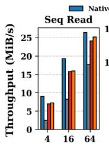

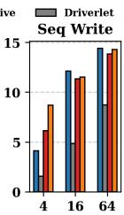

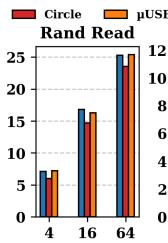

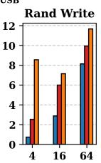  
Figure 6: FIO benchmarks for USB Storage. X-axis: transfer block size in KiB. Driverlet [32] is kept as a theoretical reference point.

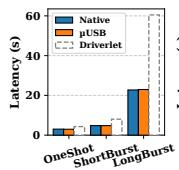  
(a) Camera 1

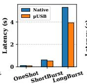  
(b) Camera 2

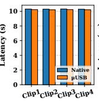  
(c) Audio

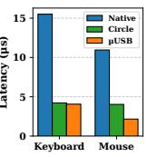  
(d) HID  
Figure 7: The latency for USB Video, Audio and HID. Driverlet [32] is kept as a theoretical reference point.

HID. Figure 7(d) shows the results. On average, µUSB is 4.5× faster than native and is 1.3× faster than circle, which are the best results µUSB have achieved. It is because this class is most latency-sensitive (i.e., µs-level), where each instruction counts. For it, µUSB only executes several (8-12) events in sequence without branches or jumps.

Memory overhead. Table 7 compares the sizes of µUSB driver executables with native. µUSB driver sizes range from 15 to 400 KB, which are one to two orders of magnitude smaller than native drivers. µUSB achieves the substantial reduction since it reuses driver/device interactions instead of the driver code and kernel dependencies.

## 6.3.3 µUSB overhead

End-to-end results. We use one I/O function of each device class in Table 4 and show the template generation time in Figure 9. µUSB is efficient and lightweight: on average, generating a template takes 56.9 seconds, up to 135.1 seconds (Capture(10s)). For Audio and Video, most time is spent on recording which takes 84.9% and 70.6% respectively, since they need to stream data for a fixed duration. Storage and HID have brief I/O functions thus taking more time to lift, i.e., 44.6% and 54.3% respectively. We highlight the offline analysis does not affect runtime performance of a µUSB driver.

Tracing overhead. The recorder delays USB driver execution by 2.3%, which is negligible. The overhead mainly comes from tracing via KVM: we add 0.03ms to each DMA/MMIO event, and 0.009ms to each interrupt; ftrace is fast, as it is static. In comparison, tracing via stage-1 page fault costs

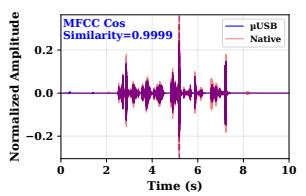  
(a) Clip 1

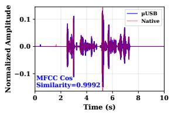  
(b) Clip 2

Figure 8: Waveforms of audio clips recorded by µUSB and the native driver. All cosine similarities of MFCC are >0.99.  
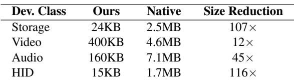  
Table 7: The sizes of µUSB drivers compared to corresponding native USB driver kernel modules.

0.14ms which is 4.5× slower and disrupts USB execution. This significant difference is likely due to a much heavier kernel exception handler than a lightweight one used by the hypervisor, backing our decision for the recorder (§ 4.1).

Static analysis overhead. Symbolic differential trace analysis is fast, whose execution time is linear to the recorded <var, [val]> pairs. For Video which has the most events (i.e., over 400K), it takes only 3.29 seconds and can be further optimized through SIMD instructions. It effectively detects variants of most I/O functions with just two traces, except for camera 1 which needs six; all are covered by the recorder which mutates at least 10 times (§ 4.1). We also tried continuing mutation, which did not yield more variants. We show the detailed results in Table 8. Qualified taint tracking takes slightly more time. On average, each I/O function takes 11.6 seconds, with Audio being the slowest (i.e., 18.14 seconds) due to the longest code path. The results are not surprising, as the lifter only analyzes a specialized, beaten kernel code path. In comparison, without the call trace to qualify static analysis, the lifter experiences serious state explosion and does not finish execution within 12 hours, whose intermediate states consume over 64GB of disk space.

## 6.3.4 End-to-end use case

To showcase the real-world practicality of µUSB, we construct an end-to-end trusted surveillance app inside the TEE, as shown in Figure 10. This app uses the USB devices from Table 3, where each device owns its dedicated ports while coarsely sharing the host controller. Invoking µUSB APIs to select different templates (i.e., VID\_CAPTURE, WRITE\_64), this app continuously captures image frames from the camera and dumps them to storage. With µUSB drivers, it runs fully inside TEE to enjoy the strong protection for data confidentiality and integrity, despite the lack of end-to-end data encryption from these USB devices. As we have measured, µUSB sustains 1.92 FPS on the 1080P camera and 11.6 FPS on the 480P camera for over a day, which achieves comparable performance with native drivers, i.e., 1.94/10.7 FPS on 1080P/480P cameras respectively. The performance is practical since industry webcams often use low (2-15) frame rates to reduce storage costs [108].

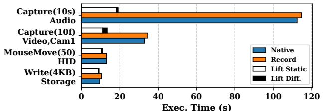  
Figure 9: The runtime overhead of µUSB for generating µUSB driver templates.

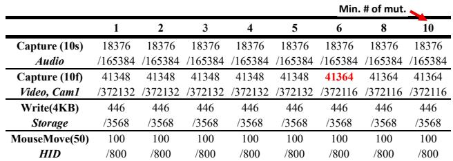  
Table 8: Detected variants with more traces after mutation.

## 7 Related Work

Device drivers. They have been extensively studied [43, 28, 60, 91]. For better security and reliability, pioneering works propose new architectures [27, 98]. µUSB is inspired by them with a focus on USB and reuses mature drivers for derivation. RevNIC [16] and driverlet [32] also derives from mature drivers but both rely on symbolic execution which is impractical to USB; LDR [110] reuses the original driver through partitioning, which only supports simple I/O drivers.

Program analysis. It examines static program structure and or dynamic runtime behavior to detects errors [58, 112, 99]. Among the techniques, fuzzing analyzes programs via semirandom inputs [64, 114]; differential analysis compares behaviors across versions or environment [105, 49]. µUSB builds upon them, and extends them by leveraging kernel I/O/call traces as path qualifier for precision and efficiency, which is a new form a trace-guided analysis [10, 62].

Notably, the techniques can be used to debloat software [89, 39, 30, 38] reduces the attack surface by trimming unused driver code while retaining original functionality. However, debloated drivers still depend on large portions of the original implementation, preserving large TCB and vulnerabilities.

Trusted execution environment. It is widely adopted to isolate sensitive operations from hostile OSes [31, 80, 63]. For I/O, existing solutions often rely on normal OS [51, 50] or only support simple sensors [106]. µUSB complements them, providing USB support the TEE critically lacks.

```c
1 #include < uusb .h > // uUSB API
2 void trusted_surveillance_app () {
3 // 1. Allocate DMA buffer in TEE
4 void * buf = dma_malloc ( FRAME_SIZE );
5 int sector = 0;
6 while ( true ) {
7 // 2. Replay frame capturing; buf is mutable arg.
8 int ret = uusb_replay ( VID_CAPTURE , buf );
9 if ( ret != SUCCESS ) { handle_err (); }
10 // 3. Dump to USB Storage
11 int blk = FRAME_SIZE / SECTOR_SIZE ;
12 int rounds = blk /64;
13 for (int i = 0; i < rounds ; i ++) {
14 // recorded 64-blk write, with 2 mutable args.
15 ret = uusb_replay ( WRITE_64 ,
16 sector , //1st arg
17 buf +i *64* BLK_SIZE ); //2nd arg
18 if ( ret != SUCCESS ) { handle_err (); }
19 }
20 sector += 64;
21 }
22 }
```  
Figure 10: An end-to-end trusted surveillance app built atop µUSB inside TrustZone.

Driver synthesis. One may synthesize drivers from scratch and deploy them inside the TEE using DSL [19, 61, 96] and considering execution context interfaces [94, 60, 95]. While synthesis can theoretically yield safe TEE drivers, it requires correct specifications and synthesizers, which is challenging due to the manual effort and error-prone nature of registerlevel specification development [65]. Notably, µUSB echoes with the pioneering Synthesis OS [88] which collapses kernel layers for flat execution and factors out invariants. Differently, µUSB takes a lightweight recording approach which ex vivo synthesizes USB drivers for simplicity and safety.

## 8 Concluding remarks

We present a novel record, lift, and replay approach to deriving USB drivers for TrustZone. We design and implement µUSB, a system to record USB driver/device interactions with mutations, lift the concrete traces into a template which accepts dynamic inputs while ensuring correctness. We show µUSB drivers have decent performance on USB Storage, Audio, Video and HID. For the first time, µUSB opens a door for TEE software to access complex yet essential USB devices.

## Acknowledgments

The authors were supported by Sichuan Science and Technology Plan “Unveiling and Leading” Project (No. 2024YFCY0001) and by CCF-Huawei Populus Grove Fund (No. CCF-HuaweiTC202408). The authors thank the anonymous reviewers and the shepherd for their insightful feedback. The authors also thank Alan Xiangyu Li from Peking University for his helpful comments on µUSB’s formal proof.

## References

[1]Harmonyos 2 security technical white paper. https://consumer.huawei.com/content/ dam/huawei-cbg-site/common/mkt/privacy/ overview-new/downen/harmonyos-2-securitytechnical-white-paper-v2.0.pdf". [Online; accessed 2025-08-20].

[2]optee\_os/secure\_storage.md at master · op-tee/optee\_os. https://github.com/OP-TEE/optee\_os/blob/ master/documentation/secure\_storage.md. (Accessed on 02/15/2019).

[3]Processors - raspberry pi 5 documentation. https://www.raspberrypi.com/documentation/ computers/processors.html#bcm2712. [Online; accessed 2025-08-20].

[4]Accessing gpio from ta in raspberry pi 3. https:// github.com/OP-TEE/optee\_os/issues/1496, 2017. GitHub issue opened 2017-04-25. Accessed: 2025-12.

[5]Ta compilation with spi driver. https://github.com/ OP-TEE/optee\_os/issues/1461, 2017. GitHub issue opened 2017-04-04. Accessed: 2025-12.

[6]Usb access from pseudo-ta. https://github.com/ OP-TEE/optee\_os/issues/1499, 2017. GitHub issue opened 2017-04-26. Accessed: 2025-12.

[7]Qualcomm tee and trustzone secure application. https://docs.qualcomm.com/ bundle/publicresource/topics/80-88500-4/ 77\_TrustZone\_and\_secure\_application.html, 8 2023. [Online; accessed 2025-08-20].

[8]Allocation of resources without limits or throttling affecting golang-github-openprinting-ipp-usb.src (snyk-centos10-golanggithubopenprintingippusbsrc-13797686). https://security.snyk.io/vuln/SNYK-CENTOS10-GOLANGGITHUBOPENPRINTINGIPPUSBSRC-13797686, 2025. Snyk vulnerability database entry. Published 1 Nov 2025; disclosed 29 Oct 2025; CVE-2025-61723; CWE-770.

[9]Advanced Micro Devices. AMD SEV-TIO: Trusted I/O for secure encrypted virtualization. Technical report, Advanced Micro Devices, 2023.

[10]G. Ammons and J. R. Larus. Improving data-flow analysis with path profiles. In J. W. Davidson, K. D. Cooper, and A. M. Berman, editors, Proceedings of the ACM SIGPLAN ’98 Conference on Programming Language Design and Implementation (PLDI), Montreal, Canada, June 17-19, 1998, 1998.

[11]Axboe. Flexble i/o testing. https://github.com/ axboe/fio.git.

[12]J. Bai, T. Li, K. Lu, and S. Hu. Static detection of unsafe DMA accesses in device drivers. In M. D. Bailey

and R. Greenstadt, editors, 30th USENIX Security Symposium, USENIX Security 2021, August 11-13, 2021, 2021.

[13]O. Burkart, D. Caucal, F. Moller, and B. Steffen. Chapter 9 - verification on infinite structures. In J. Bergstra, A. Ponse, and S. Smolka, editors, Handbook of Process Algebra, pages 545–623. Elsevier Science, Amsterdam, 2001.

[14]S. Checkoway and H. Shacham. Iago attacks: why the system call API is a bad untrusted RPC interface. In Architectural Support for Programming Languages and Operating Systems, ASPLOS ’13, Houston, TX, USA - March 16 - 20, 2013, 2013.

[15]V. Cheval, H. Comon-Lundh, and S. Delaune. Trace equivalence decision: negative tests and nondeterminism. In Y. Chen, G. Danezis, and V. Shmatikov, editors, Proceedings of the 18th ACM Conference on Computer and Communications Security, CCS 2011, Chicago, Illinois, USA, October 17-21, 2011, 2011.

[16]V. Chipounov and G. Candea. Reverse engineering of binary device drivers with revnic. In C. Morin and G. Muller, editors, European Conference on Computer Systems, Proceedings of the 5th European conference on Computer systems, EuroSys 2010, Paris, France, April 13-16, 2010, 2010.

[17]V. Chipounov, V. Kuznetsov, and G. Candea. S2E: a platform for in-vivo multi-path analysis of software systems. In R. Gupta and T. C. Mowry, editors, Proceedings of the 16th International Conference on Architectural Support for Programming Languages and Operating Systems, ASPLOS 2011, Newport Beach, CA, USA, March 5-11, 2011, 2011.

[18]A. Chowdhury and A. Ross. Fusing MFCC and LPC features using 1d triplet CNN for speaker recognition in severely degraded audio signals. IEEE Trans. Inf. Forensics Secur., 15:1616–1629, 2020.

[19]C. L. Conway and S. A. Edwards. NDL: a domainspecific language for device drivers. In D. B. Whalley and R. Cytron, editors, Proceedings of the 2004 ACM SIGPLAN/SIGBED Conference on Languages, Compilers, and Tools for Embedded Systems (LCTES’04), Washington, DC, USA, June 11-13, 2004, 2004.

[20]R. Coombs. Securing the future of authentication with arm trustzone-based trusted execution environment and fast identity online (fido). White paper, ARM Limited, 2015. Accessed: 2025-12-11.

[21]N. Corporation. Nvidia tegra2 family: Technical reference manual. https://developer.nvidia.com/ tegra2-reference-manual, 2011. Accessed: 2025- 07-09.

[22]Y. Deng, C. Wang, S. Yu, S. Liu, Z. Ning, K. Leach, J. Li, S. Yan, Z. He, J. Cao, and F. Zhang. Strongbox:

A GPU TEE on arm endpoints. In H. Yin, A. Stavrou, C. Cremers, and E. Shi, editors, Proceedings of the 2022 ACM SIGSAC Conference on Computer and Communications Security, CCS 2022, Los Angeles, CA, USA, November 7-11, 2022, 2022.

[23]G. W. Dunlap, S. T. King, S. Cinar, M. A. Basrai, and P. M. Chen. Revirt: Enabling intrusion analysis through virtual-machine logging and replay. In D. E. Culler and P. Druschel, editors, 5th Symposium on Operating System Design and Implementation (OSDI 2002), Boston, Massachusetts, USA, December 9-11, 2002, 2002.

[24]V. Emiya, E. Vincent, N. Harlander, and V. Hohmann. Subjective and objective quality assessment of audio source separation. IEEE Trans. Speech Audio Process., 19(7):2046–2057, 2011.

[25]T. Feng, N. DeSalvo, L. Xu, X. Zhao, X. Wang, and W. Shi. Secure session on mobile: An exploration on combining biometric, trustzone, and user behavior. In C. Julien, N. D. Lane, and S. Mishra, editors, 6th International Conference on Mobile Computing, Applications and Services, MobiCASE 2014, Austin, TX, USA, November 6-7, 2014, 2014.

[26]X. Fu, S. Meng, W. Zhang, L. Guo, K. Sato, D. H. Ahn, I. Laguna, G. L. Lee, and M. Schulz. Distributed order recording techniques for efficient record-and-replay of multi - threaded programs. In IEEE International Conference on Cluster Computing, CLUSTER 2024, Kobe, Japan, September 24-27, 2024, 2024.

[27]V. Ganapathy, M. J. Renzelmann, A. Balakrishnan, M. M. Swift, and S. Jha. The design and implementation of microdrivers. In S. J. Eggers and J. R. Larus, editors, Proceedings of the 13th International Conference on Architectural Support for Programming Languages and Operating Systems, ASPLOS 2008, Seattle, WA, USA, March 1-5, 2008, 2008.

[28]B. Gerofi, A. Santogidis, D. Martinet, and Y. Ishikawa. Picodriver: fast-path device drivers for multi-kernel operating systems. In M. Zhao, A. Chandra, and L. Ramakrishnan, editors, Proceedings of the 27th International Symposium on High-Performance Parallel and Distributed Computing, HPDC 2018, Tempe, AZ, USA, June 11-15, 2018, 2018.

[29]Google. Trusty tee: Uses and examples. Android Security Documentation,https://source.android.com/ security/trusty#uses\_examples, 2022. Accessed on 02/08/2025.

[30]Z. Gu, W. N. Sumner, Z. Deng, X. Zhang, and D. Xu. DRIP: A framework for purifying trojaned kernel drivers. In 2013 43rd Annual IEEE/IFIP International Conference on Dependable Systems and Networks (DSN), Budapest, Hungary, June 24-27, 2013, 2013.

[31]L. Guan, P. Liu, X. Xing, X. Ge, S. Zhang, M. Yu, and T. Jaeger. Trustshadow: Secure execution of unmodified applications with arm trustzone. In Proceedings of the 15th Annual International Conference on Mobile Systems, Applications, and Services, 2017.

[32]L. Guo and F. X. Lin. Minimum viable device drivers for ARM trustzone. In Y. Bromberg, A. Kermarrec, and C. Kozyrakis, editors, EuroSys ’22: Seventeenth European Conference on Computer Systems, Rennes, France, April 5 - 8, 2022, 2022.

[33]Z. Guo, X. Wang, J. Tang, X. Liu, Z. Xu, M. Wu, M. F. Kaashoek, and Z. Zhang. R2: an application-level kernel for record and replay. In R. Draves and R. van Renesse, editors, 8th USENIX Symposium on Operating Systems Design and Implementation, OSDI 2008, December 8-10, 2008, San Diego, California, USA, Proceedings, 2008.

[34]M. Guri, M. Monitz, and Y. Elovici. Usbee: Air-gap covert-channel via electromagnetic emission from USB. CoRR, abs/1608.08397, 2016.

[35]S. Han and J. Jang. Mytee: Own the trusted execution environment on embedded devices. In 30th Annual Network and Distributed System Security Symposium, NDSS 2023, San Diego, California, USA, February 27 - March 3, 2023, 2023.

[36]D. M. Hein, J. Winter, and A. Fitzek. Secure block device - secure, flexible, and efficient data storage for ARM trustzone systems. In 2015 IEEE TrustCom/Big-DataSE/ISPA, Helsinki, Finland, August 20-22, 2015, Volume 1, 2015.

[37]L. H. Holley and B. K. Rosen. Qualified data flow problems. In P. W. Abrahams, R. J. Lipton, and S. R. Bourne, editors, Conference Record of the Seventh Annual ACM Symposium on Principles of Programming Languages, Las Vegas, Nevada, USA, January 1980, 1980.

[38]Z. Hu and B. Dolan-Gavitt. Irqdebloat: Reducing driver attack surface in embedded devices. In 43rd IEEE Symposium on Security and Privacy, SP 2022, San Francisco, CA, USA, May 22-26, 2022, 2022.

[39]Z. Hu, S. Lee, and M. Peinado. Hacksaw: Hardwarecentric kernel debloating via device inventory and dependency analysis. In W. Meng, C. D. Jensen, C. Cremers, and E. Kirda, editors, Proceedings of the 2023 ACM SIGSAC Conference on Computer and Communications Security, CCS 2023, Copenhagen, Denmark, November 26-30, 2023, 2023.

[40]O. Inc. Metascan. https://www.opswat.com/ products/metascan, 2013. Accessed: 2025-08-20.

[41]Intel Corporation. Intel® extensible host controller interface (xhci) specification. Technical report, Intel Corporation, May 2019. Accessed: 2025-07-09.

[42]J. Jang, M. Kang, and D. Song. Reusb: Replayguided USB driver fuzzing. In J. A. Calandrino and C. Troncoso, editors, 32nd USENIX Security Symposium, USENIX Security 2023, Anaheim, CA, USA, August 9-11, 2023, 2023.

[43]A. Kadav and M. M. Swift. Understanding modern device drivers. In T. Harris and M. L. Scott, editors, Proceedings of the 17th International Conference on Architectural Support for Programming Languages and Operating Systems, ASPLOS 2012, London, UK, March 3-7, 2012, 2012.

[44]A. Kantee and J. Cormack. Rump kernels: No os? no problem! login Usenix Mag., 39(5), 2014.

[45]D. Lee, D. Jung, I. T. Fang, C. Tsai, and R. A. Popa. An off-chip attack on hardware enclaves via the memory bus. In S. Capkun and F. Roesner, editors, 29th USENIX Security Symposium, USENIX Security 2020, August 12-14, 2020, 2020.

[46]D. Lee, D. Kohlbrenner, S. Shinde, K. Asanovic, and´ D. Song. Keystone: An open framework for architecting trusted execution environments. In Proceedings of the Fifteenth European Conference on Computer Systems, 2020.

[47]K. Lee and Y. Won. Smart layers and dumb result: IO characterization of an android-based smartphone. In A. Jerraya, L. P. Carloni, F. Maraninchi, and J. Regehr, editors, Proceedings of the 12th International Conference on Embedded Software, EMSOFT 2012, part of the Eighth Embedded Systems Week, ESWeek 2012, Tampere, Finland, October 7-12, 2012, 2012.

[48]H. Lefeuvre, D. Chisnall, M. Kogias, and P. Olivier. Towards (really) safe and fast confidential I/O. In M. Schwarzkopf, A. Baumann, and N. Crooks, editors, Proceedings of the 19th Workshop on Hot Topics in Operating Systems, HOTOS 2023, Providence, RI, USA, June 22-24, 2023, 2023.

[49]Z. Lei, G. S. Tuncay, B. C. Williem, Z. B. Celik, and A. Bianchi. Scopeverif: Analyzing the security of android’s scoped storage via differential analysis. In 32nd Annual Network and Distributed System Security Symposium, NDSS 2025, San Diego, California, USA, February 24-28, 2025, 2025.

[50]M. Lentz, R. Sen, P. Druschel, and B. Bhattacharjee. Secloak: Arm trustzone-based mobile peripheral control. In Proceedings of the 16th Annual International Conference on Mobile Systems, Applications, and Services, 2018.

[51]W. Li, M. Ma, J. Han, Y. Xia, B. Zang, C.-K. Chu, and T. Li. Building trusted path on untrusted device drivers for mobile devices. In Proceedings of 5th Asia-Pacific Workshop on Systems, 2014.

[52]Y. Li, B. Dolan-Gavitt, S. Weber, and J. Cappos. Lockin-pop: Securing privileged operating system kernels by keeping on the beaten path. In D. D. Silva and B. Ford, editors, Proceedings of the 2017 USENIX Annual Technical Conference, USENIX ATC 2017, Santa Clara, CA, USA, July 12-14, 2017, 2017.

[53]Y. Li, L. Lei, Y. Wang, J. Jing, and Q. Zhou. Trustsamp: Securing streaming music against multivector attacks on ARM platform. IEEE Trans. Inf. Forensics Secur., 17:1709–1724, 2022.

[54]Linaro. Op-tee: Open portable trusted execution environment. https://www.op-tee.org/, 2017.

[55]X. Liu, X. Zheng, C. Fu, X. Xie, and P. Di. Grayduck: The sword of damocles for duck typing in dynamic language deserialization. In Proceedings of the 39th IEEE/ACM International Conference on Automated Software Engineering, 2024.

[56]Y. M. Liu, Z. Yao, M. Chen, A. A. Sani, S. Agarwal, and G. Tsudik. Provcam: A camera module with selfcontained TCB for producing verifiable videos. In W. Shi, D. Ganesan, and N. D. Lane, editors, Proceedings of the 30th Annual International Conference on Mobile Computing and Networking, ACM MobiCom 2024, Washington D.C., DC, USA, November 18-22, 2024, 2024.

[57]H. Lu, Y. Wu, S. Li, Y. Lin, C. Zhang, and F. Zhang. BADUSB-C: revisiting badusb with type-c. In IEEE Security and Privacy Workshops, SP Workshops 2021, San Francisco, CA, USA, May 27, 2021, 2021.

[58]A. Machiry, C. Spensky, J. Corina, N. Stephens, C. Kruegel, and G. Vigna. DR. CHECKER: A soundy analysis for linux kernel drivers. In E. Kirda and T. Ristenpart, editors, 26th USENIX Security Symposium, USENIX Security 2017, Vancouver, BC, Canada, August 16-18, 2017, 2017.

[59]mCRL2. Labelled transition system. https: //mcrl2.org/web/user\_manual/fundamentals/ labelled\_transition\_systems.html, 2025. Accessed: 2025-12-02.

[60]A. Menon, S. Schubert, and W. Zwaenepoel. Twindrivers: semi-automatic derivation of fast and safe hypervisor network drivers from guest OS drivers. In M. L. Soffa and M. J. Irwin, editors, Proceedings of the 14th International Conference on Architectural Support for Programming Languages and Operating Systems, AS-PLOS 2009, Washington, DC, USA, March 7-11, 2009, 2009.

[61]F. Mérillon, L. Réveillère, C. Consel, R. Marlet, and G. Muller. Devil: An IDL for hardware programming. In M. B. Jones and M. F. Kaashoek, editors, 4th Symposium on Operating System Design and Implementation (OSDI

2000), San Diego, California, USA, October 23-25, 2000, 2000.

[62]J. Ming, D. Wu, J. Wang, G. Xiao, and P. Liu. Straighttaint: decoupled offline symbolic taint analysis. In D. Lo, S. Apel, and S. Khurshid, editors, Proceedings of the 31st IEEE/ACM International Conference on Automated Software Engineering, ASE 2016, Singapore, September 3-7, 2016, 2016.

[63]F. Mo, A. S. Shamsabadi, K. Katevas, S. Demetriou, I. Leontiadis, A. Cavallaro, and H. Haddadi. Darknetz: towards model privacy at the edge using trusted execution environments. In E. de Lara, I. Mohomed, J. Nieh, and E. M. Belding, editors, MobiSys ’20: The 18th Annual International Conference on Mobile Systems, Applications, and Services, Toronto, Ontario, Canada, June 15-19, 2020, 2020.

[64]J. Mohan, A. Martinez, S. Ponnapalli, P. Raju, and V. Chidambaram. Finding crash-consistency bugs with bounded black-box crash testing. In A. C. Arpaci-Dusseau and G. Voelker, editors, 13th USENIX Symposium on Operating Systems Design and Implementation, OSDI 2018, Carlsbad, CA, USA, October 8-10, 2018, 2018.

[65]J. Müller, M. R. Fadiheh, A. L. D. Antón, T. Eisenbarth, D. Stoffel, and W. Kunz. A formal approach to confidentiality verification in socs at the register transfer level. In 58th ACM/IEEE Design Automation Conference, DAC 2021, San Francisco, CA, USA, December 5-9, 2021, 2021.

[66]National Institute of Standards and Technology (NIST). CVE-2023-34403: Race Condition in Mercedes-Benz NTG6 Head-Unit Allowing Unauthorized File Access via Ethernet and USB Backup. https:// nvd.nist.gov/vuln/detail/CVE-2023-34403.

[67]National Institute of Standards and Technology (NIST). CVE-2023-53580: xHCI Deadlock during USB Driver Unbind. https://nvd.nist.gov/vuln/detail/CVE-2023-53580.

[68]National Institute of Standards and Technology (NIST). CVE-2024-26659: Incorrect xHC Ownership Leading to Use-after-Free. https://nvd.nist.gov/vuln/ detail/CVE-2024-26659.

[69]National Institute of Standards and Technology (NIST). CVE-2024-27059: Divide-by-Zero Triggered by Malicious USB Device. https://nvd.nist.gov/vuln/ detail/CVE-2024-27059.

[70]National Institute of Standards and Technology (NIST). CVE-2024-30212: Unchecked Device Parameters Allow Arbitrary RAM Access. https://nvd.nist.gov/ vuln/detail/CVE-2024-30212.

[71]National Institute of Standards and Technology (NIST). CVE-2024-50302: Uninitialized Memory Use in HID

Core. https://nvd.nist.gov/vuln/detail/CVE-2024-50302.

[72]National Institute of Standards and Technology (NIST). CVE-2024-53150: OOB Read in ALSA USB Sound Driver. https://nvd.nist.gov/vuln/detail/CVE-2024-53150.

[73]National Institute of Standards and Technology (NIST). CVE-2024-53197: OOB Access in ALSA USB Legacy Quirks. https://nvd.nist.gov/vuln/detail/CVE-2024-53197.

[74]National Institute of Standards and Technology (NIST). CVE-2024-57980: Double-Free in UVC Status URB Handling. httpsvd.nist.gov/vuln/detail/CVE-2024-57980.

[75]National Institute of Standards and Technology (NIST). CVE-2024-57981: Null Pointer Dereference in USB Command Abort Logic. https://nvd.nist.gov/ vuln/detail/CVE-2024-57981.

[76]National Institute of Standards and Technology (NIST). CVE-2025-38680: OOB Read in uvc format parsing. https://nvd.nist.gov/vuln/detail/CVE-2025-38680.

[77]National Institute of Standards and Technology (NIST). CVE-2023-32784: Cleartext Transmission of Sensitive Information in KeePass. https://nvd.nist.gov/ vuln/detail/CVE-2023-32784, May 2023. National Vulnerability Database (NVD); Patch available in KeePass 2.54+.

[78]National Institute of Standards and Technology (NIST). CVE-2024-53881: NVIDIA vGPU Host Driver Interrupt Storm Vulnerability. https://nvd.nist.gov/ vuln/detail/CVE-2024-53881, Jan. 2025. CVSS 3.1 Score: 5.5 (MEDIUM); Patch: NVIDIA vGPU Software Update Required.

[79]N. Nissim, R. Yahalom, and Y. Elovici. Usb-based attacks. Comput. Secur., 70:675–688, 2017.

[80]J. Niu, X. Wen, G. Wu, S. Liu, J. Yu, and Y. Zhang. Achilles: Efficient tee-assisted BFT consensus via rollback resilient recovery. In Proceedings of the Twentieth European Conference on Computer Systems, EuroSys 2025, Rotterdam, The Netherlands, 30 March 2025 - 3 April 2025, 2025.

[81]K. Nohl and J. Lell. Badusb - on accessories that turn evil. Blackhat USA 2014, 2014.

[82]C. M. Park, D. Kim, D. V. Sidhwani, A. Fuchs, A. Paul, S. Lee, K. Dantu, and S. Y. Ko. Rushmore: securely displaying static and animated images using trustzone. In S. Banerjee, L. Mottola, and X. Zhou, editors, MobiSys ’21: The 19th Annual International Conference on Mobile Systems, Applications, and Services, Virtual Event, Wisconsin, USA, 24 June - 2 July, 2021, 2021.

[83]H. Park and F. X. Lin. Gpureplay: a 50-kb GPU stack for client ML. In B. Falsafi, M. Ferdman, S. Lu, and T. F. Wenisch, editors, ASPLOS ’22: 27th ACM International Conference on Architectural Support for Programming Languages and Operating Systems, Lausanne, Switzerland, 28 February 2022 - 4 March 2022, 2022.

[84]H. Park and F. X. Lin. Safe and practical GPU computation in trustzone. In G. A. D. Luna, L. Querzoni, A. Fedorova, and D. Narayanan, editors, Proceedings of the Eighteenth European Conference on Computer Systems, EuroSys 2023, Rome, Italy, May 8-12, 2023, 2023.

[85]H. Park, S. Zhai, L. Lu, and F. X. Lin. Streambox-tz: Secure stream analytics at the edge with trustzone. In D. Malkhi and D. Tsafrir, editors, 2019 USENIX Annual Technical Conference, USENIX ATC 2019, Renton, WA, USA, July 10-12, 2019, 2019.

[86]H. Peng and M. Payer. Usbfuzz: A framework for fuzzing USB drivers by device emulation. In S. Capkun and F. Roesner, editors, 29th USENIX Security Symposium, USENIX Security 2020, August 12-14, 2020, 2020.

[87]C. Priebe, D. Muthukumaran, J. Lind, H. Zhu, S. Cui, V. A. Sartakov, and P. Pietzuch. SGX-LKL: Securing the host OS interface for trusted execution. 2020.

[88]C. Pu and H. Massalin. An overview of the synthe sis operating system. Technical Report CUCS-470-89, Columbia University, 1989.

[89]A. Quach, R. Erinfolami, D. Demicco, and A. Prakash. A multi-os cross-layer study of bloating in user programs, kernel and managed execution environments. In T. Kim, C. Wang, and D. Wu, editors, Proceedings of the 2017 Workshop on Forming an Ecosystem Around Software Transformation, FEAST@CCS 2017, Dallas, TX, USA, November 3, 2017, 2017.

[90]Qualcomm Technologies, Inc. Guard your data with the qualcomm snapdragon mobile platform (rpmb and secure storage). https://tinyurl.com/63yn8k9j, 2022.

[91]M. J. Renzelmann, A. Kadav, and M. M. Swift. Symdrive: Testing drivers without devices. In C. Thekkath and A. Vahdat, editors, 10th USENIX Symposium on Operating Systems Design and Implementation, OSDI 2012, Hollywood, CA, USA, October 8-10, 2012, 2012.

[92]E. Rescorla. Rfc 8446: The transport layer security (tls) protocol version 1.3, 2018.

[93]rsta2. Circle. https://github.com/rsta2/circle, 2025.

[94]L. Ryzhyk, P. Chubb, I. Kuz, E. L. Sueur, and G. Heiser. Automatic device driver synthesis with termite. In J. N. Matthews and T. E. Anderson, editors, Proceedings of

the 22nd ACM Symposium on Operating Systems Principles 2009, SOSP 2009, Big Sky, Montana, USA, October 11-14, 2009, 2009.

[95]D. Schwyn, Z. Liu, and T. Roscoe. Efeu: generating efficient, verified, hybrid hardware/software drivers for I2C devices. In Proceedings of the Twentieth European Conference on Computer Systems, EuroSys 2025, Rotterdam, The Netherlands, 30 March 2025 - 3 April 2025, 2025.

[96]J. Sun, W. Yuan, M. Kallahalla, and N. Islam. HAIL: a language for easy and correct device access. In W. H. Wolf, editor, EMSOFT 2005, September 18-22, 2005, Jersey City, NJ, USA, 5th ACM International Conference On Embedded Software, Proceedings, 2005.

[97]T. Sun, B. Jiang, H. Lin, B. Li, Y. Teng, Y. Gao, and W. Dong. Tensorshield: Safeguarding on-device inference by shielding critical dnn tensors with tee. In Proceedings of the 2025 ACM SIGSAC Conference on Computer and Communications Security, 2025.

[98]M. M. Swift, M. Annamalai, B. N. Bershad, and H. M. Levy. Recovering device drivers (awarded best paper!). In E. A. Brewer and P. Chen, editors, 6th Symposium on Operating System Design and Implementation (OSDI 2004), San Francisco, California, USA, December 6-8, 2004, 2004.

[99]S. M. S. Talebi, H. Tavakoli, H. Zhang, Z. Zhang, A. A. Sani, and Z. Qian. Charm: Facilitating dynamic analysis of device drivers of mobile systems. In W. Enck and A. P. Felt, editors, 27th USENIX Security Symposium, USENIX Security 2018, Baltimore, MD, USA, August 15-17, 2018, 2018.

[100]USB-IF. Hid usage table. https://www.usb.org/ sites/default/files/hut1\_6.pdf, 2025.

[101]USB Implementers Forum. Usb-if compliance program update: Deprecation of ehci testing. https://compliance.usb.org/index.asp?Format= Standard&UpdateFile=USBCV, 2019. Accessed: 2025-07-09.

[102]USB Implementers Forum, Inc. Usb1 specification. Technical report, USB Implementers Forum (USB-IF), Dec. 1997. Accessed: 2025-07-09.

[103]USB Implementers Forum, Inc. Usb4 specification. Technical report, USB Implementers Forum (USB-IF), Dec. 2024. Accessed: 2025-07-09.

[104]USB Implementers Forum, Inc. Usb 2.0 specification. Technical report, USB Implementers Forum (USB-IF), June 2025. Accessed: 2025-07-09.

[105]M. Venturini, F. Freda, E. Miotto, M. Conti, and A. Giaretta. Differential area analysis for ransomware: Attacks, countermeasures, and limitations. IEEE Trans. Dependable Secur. Comput., 22(4):3449–3464, 2025.

[106]J. Wang, A. Li, H. Li, C. Lu, and N. Zhang. RT-TEE: real-time system availability for cyber-physical systems using ARM trustzone. In 43rd IEEE Symposium on Security and Privacy, SP 2022, San Francisco, CA, USA, May 22-26, 2022, 2022.

[107]N. Wei and A. A. Sani. Schrodintext: Strong protection of sensitive textual content of mobile applications. IEEE Trans. Mob. Comput., 21(4):1402–1419, 2022.

[108]T. Xu and F. X. Lin. Video analytics with zero-streaming cameras. In 2021 USENIX Annual Technical Conference (USENIX ATC 21), 2021.

[109]W. Xu, H. Zhu, Y. Zheng, F. Wang, J. Hua, D. Feng, and H. Li. Tonn: An oblivious neural network prediction scheme with semi-honest tee. IEEE Transactions on Information Forensics and Security, 2024.

[110]H. Yan, Z. Ling, H. Li, L. Luo, X. Shao, K. Dong, P. Jiang, M. Yang, J. Luo, and X. Fu. LDR: secure and efficient linux driver runtime for embedded TEE systems. In 31st Annual Network and Distributed System Security Symposium, NDSS 2024, San Diego, California, USA, February 26 - March 1, 2024, 2024.

[111]M. Yan, Y. Shalabi, and J. Torrellas. Replayconfu sion: Detecting cache-based covert channel attacks using record and replay. In 49th Annual IEEE/ACM International Symposium on Microarchitecture, MICRO 2016, Taipei, Taiwan, October 15-19, 2016, 2016.

[112]H. Zhang, W. Chen, Y. Hao, G. Li, Y. Zhai, X. Zou, and Z. Qian. Statically discovering high-order taint style vulnerabilities in OS kernels. In Y. Kim, J. Kim, G. Vigna, and E. Shi, editors, CCS ’21: 2021 ACM SIGSAC Conference on Computer and Communications Security, Virtual Event, Republic of Korea, November 15 - 19, 2021, 2021.

[113]Y. Zhang, L. P. Arulraj, A. C. Arpaci-Dusseau, and R. H. Arpaci-Dusseau. De-indirection for flash-based ssds with nameless writes. In W. J. Bolosky and J. Flinn, editors, Proceedings of the 10th USENIX conference on File and Storage Technologies, FAST 2012, San Jose, CA, USA, February 14-17, 2012, 2012.

[114]A. Zhou, H. Huang, and C. Zhang. KRAKEN: programadaptive parallel fuzzing. Proc. ACM Softw. Eng., 2(ISSTA):274–296, 2025.

## A Appendix

We retrofit Labelled Transition System [13, 59] to show µUSB drivers are as correct as a USB driver for a recorded I/O function.

## A.1 Definitions

Definition 1: Labelled Transition System. Labelled Transition System (LTS) [13, 59] uses a tuple (S, A, , s<sub>0</sub>) to describe the states of system and a set of transitions between those states, where S is a finite set of states, A is a finite set of actions, is a transition relation (i.e., s <sup>a</sup>− t denotes state s transfers to t with action a), and s is the initial state of system.

Definition 2: Trace and Trace Equivalent. We use A<sup>∗</sup> to describe all possible finite action sequences of A. An element of A<sup>∗</sup> is a concrete finite action sequence and is called a trace, denoted as σ = a<sub>0</sub> ...a<sub>n</sub>. Formally, for a given LTS (S, A, , s ), a set of all possible traces from s is:

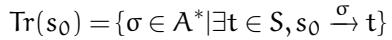

Based on the above, given two LTSs, T = (S,A, ,s<sub>0</sub>), T <sup>′</sup> = (S <sup>′</sup>, A <sup>′</sup>, <sup>′</sup>, s <sup>′</sup> ), we say that they are trace equivalent iff Tr(s<sub>0</sub>) = Tr(s<sup>′</sup> ).

Example. We give the intuition behind trace equivalence in Figure 11. Suppose to configure a USB device, drivers need to read its capability first to decide the exact configuration. While the two LTSes implement the behavior differently, they are trace equivalent, i.e., Tr(s<sub>0</sub>) = Tr(s<sub>0</sub> <sup>′</sup>), containing two traces {read\_usb\_cap, write\_config\_a} and {read\_usb\_cap, write\_config\_b}.

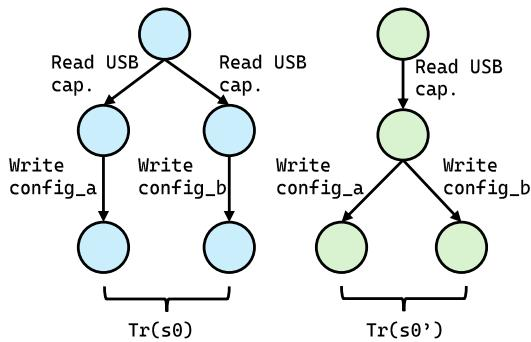  
Figure 11: A minimum example of two trace equivalent LT-Ses.

Definition 3: Minimum Trace. We define state-changing actions as an action set D which when observed by the LTS changes its current state s to t:

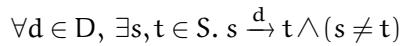

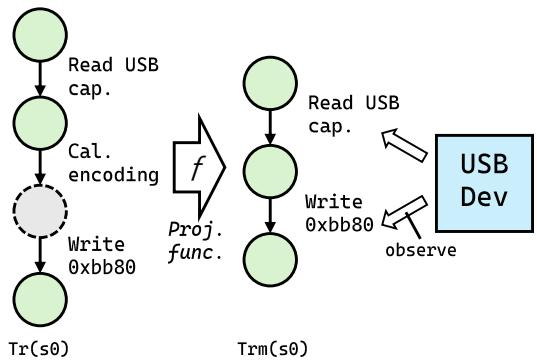  
Figure 12: An example of Tr vs. Trm, where calculating encodings are oblivious to a device.

Trm(s) is minimum trace if all actions are state-changing: Trm(s) = {σ ∈ D<sup>∗</sup> | ∃t ∈ S, s − t}. We further define a projection function f : A<sup>∗</sup> D<sup>∗</sup>, which filters out non-state changing actions of a trace σ. A key corollary is that any trace in Trm is itself after projection:

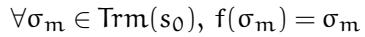

The function represents how the device observes actions, where a driver’s internal actions (e.g., calculating command encodings, allocating slab caches) are oblivious to the device. An example is shown in Figure 12.

## A.2 Lemma

With minimum traces, we land on an interesting lemma – if any traces of two LTSes, after projection f, belongs to the other LTS’es minimum trace, then these two LTSes’ minimum traces are equivalent. Formally:

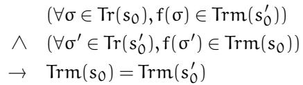

We prove the lemma by contradiction. Suppose the two minimum traces are not equivalent under the same premises, i.e., Trm(s<sub>0</sub>) ̸= Trm(s<sup>′</sup> ) while ∀σ ∈ Tr(s<sub>0</sub>), f(σ) ∈ Trm(s<sup>′</sup> ) (Pa) and ∀σ<sup>′</sup> ∈ Tr(s<sup>′</sup> ), f(σ<sup>′</sup>) ∈ Trm(s<sub>0</sub>) (Pb). That is, there exists an outstanding minimum trace σ<sub>x</sub> in either Trm:

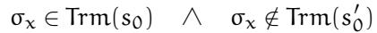

or

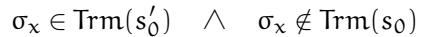

We first prove the former: as Trm is minimum trace, we have σ ∈ Tr(s ) and f(σ ) = σ from corollary. Combined with Pa, we further have σ<sub>x</sub> ∈ Trm(s<sup>′</sup> ), which apparently contradicts the condition that σ<sub>x</sub> ∈/ Trm(s<sup>′</sup> ); such a case hence does not exist. By duality, the proof of the latter is symmetric to the former: we again obtain σ<sub>x</sub> ∈ Tr(s<sup>′</sup> ) and f(σ<sub>x</sub>) = σ<sub>x</sub> from corollary. By Pb, it follows that σ<sub>x</sub> ∈ Trm(s<sub>0</sub>), which also contradicts the condition that σ<sub>x</sub> ∈/ Trm(s<sub>0</sub>). Therefore, this case cannot hold either. As both cases do not exist, the predicate Trm(s<sub>0</sub>) ̸= Trm(s<sup>′</sup> ) is false and that Trm(s<sub>0</sub>) = Trm(s<sup>′</sup> ) is therefore true <sup>■</sup>.

## A.3 The Proof

Without loss of generality, we consider the USB device with one single I/O function and initial state s<sub>0</sub>. For USB devices, the state-changing actions are low-level driver/device interactions. We thus define D = {MMIO,DMA,IRQ}. For the native kernel driver, its LTS T has an action set A = D ∪ I, where I are driver-internal, e.g., slab allocation, encoding calculation. Its trace σ ∈ Tr(s<sub>0</sub>) is mixed with both D and I, We next define the LTS T <sup>′</sup> for a µUSB driver with action D and trace σ<sup>′</sup>: by recording the low-level interactions of a native driver T , it effectively applies the projection function f to σ and logs f(σ); by replaying, it re-executes its own actions σ<sup>′</sup> which is essentially f(σ<sup>′</sup>).

Based on the above, T and T <sup>′</sup> further have two properties tied to our design.

Property 1. For the recorded I/O function, T <sup>′</sup>’s converging traces σ<sup>′</sup> (i.e., after mutational recording) capture sufficient traces σ from T . In other words, the projection of traces σ of T constitutes minimum traces of T <sup>′</sup>. That is,

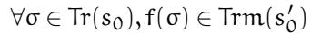

Property 1 is not derived here; it follows from the convergence criterion of § 4.1.2 together with the gold-driver assumption of § 3.1.

Property 2. A µUSB driver does not make up actions; all σ<sup>′</sup> replayed by T <sup>′</sup> come from actual recordings of T for the I/O function which are minimum traces. That is,

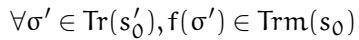

With the previous lemma, we conclude Trm(s<sub>0</sub>) = Trm(s<sup>′</sup> )<sup>■</sup>. To understand more intuitively, from the perspective of a USB device, it only observes and reacts to statechanging actions which form minimum traces; whether such traces are emitted by a native driver T or a µUSB driver T <sup>′</sup>, they are trace equivalent to the device and equally correct.