USENIX

THE ADVANCED COMPUTING SYSTEMS ASSOCIATION

# MoonBright: A GPU Memory Allocator with Device-Side Page Table Materialization and Deferred TLB Coherence

Yangyu Zhang, SKLP, Institute of Computing Technology, Chinese Academy of Sciences and University of Chinese Academy of Sciences; Lei Chen, University of Chinese Academy of Sciences; Chunwei Xia, University of Leeds; Shuaijiang Li, Shuoming Zhang, Zhicheng Li, Qianqi Sun, Jiawei Xiao, Ruiyuan Xu, Ao Chen, Guangli Li, Xiaobing Feng, Huimin Cui, Chenxi Wang, and Jiacheng Zhao, SKLP, Institute of Computing Technology, Chinese Academy of Sciences and University of Chinese Academy of Sciences

https://www.usenix.org/conference/osdi26/presentation/zhang-yangyu

This paper is included in the Proceedings of the 20th USENIX Symposium on Operating Systems Design and Implementation.

July 13–15, 2026 • Seattle, WA, USA

ISBN 978-1-939133-55-7

Open access to the Proceedings of the 20th USENIX Symposium on Operating Systems Design and Implementation is sponsored by

# MOONBRIGHT: A GPU Memory Allocator with Device-Side Page Table Materialization and Deferred TLB Coherence

Yangyu Zhang1,2 Lei Chen2 Chunwei Xia3 Shuaijiang Li1,2 Shuoming Zhang1,2 Zhicheng Li1,2 Qianqi Sun1,2 Jiawei Xiao1,2 Ruiyuan Xu1,2 Ao Chen1,2 Guangli Li1,2 Xiaobing Feng1,2 Huimin Cui1,2 Chenxi Wang1,2 Jiacheng Zhao1,2,†

1SKLP, Institute of Computing Technology, Chinese Academy of Sciences 2University of Chinese Academy of Sciences 3University of Leeds

## Abstract

Modern GPU workloads increasingly rely on dynamic and fine-grained memory allocation, yet GPU memory management remains CPU-centric. In current GPU runtimes, allocation metadata updates, page-table construction, translationstate propagation, and TLB shootdowns are largely serialized through the host control path, introducing substantial latency. We present MOONBRIGHT, a GPU memory allocator that enables device-side page-table materialization and deferred TLB coherence on commodity GPUs. MOONBRIGHT keeps validation and allocation metadata on the host, but moves bulk page-table construction to the GPU, turning translation updates into data-parallel device-memory operations. To avoid costly TLB shootdowns on the common path, MOON-BRIGHT assigns fresh virtual addresses to new mappings, ensuring that no stale same-address TLB entries can exist. Our evaluation shows that MOONBRIGHT reduces allocation latency, improves LLM inference performance, and mitigates allocator-level external fragmentation across diverse workloads. Unlike application-specific memory managers, MOONBRIGHT requires no GPU hardware modifications and runs on commodity NVIDIA and AMD GPUs with software-only changes. MOONBRIGHT is publicly available at https://github.com/MoonBright-project.

## 1 Introduction

Memory management has long been a core systems discipline, and decades of CPU hardware-software co-design have produced highly optimized virtual-memory systems and allocator designs, including PTMalloc [15], JEMalloc [14], TCMalloc [20], and others [21, 24, 27, 28].

Modern GPUs now host a diverse spectrum of workloads, spanning large-scale DL models [9, 13, 17, 63], data analytics [34, 42], scientific simulations [2, 3, 55, 69], graph processing [31, 38, 67, 75], and emerging general-purpose computations [54, 60]. GPUs such as NVIDIA B200 [40] have reached the thousand-TFLOPS scale, allowing many CUDA kernels to complete within only a few microseconds. As GPU execution becomes faster and more fine-grained, CPU-driven memory allocation increasingly falls on the critical path [23], turning frequent allocation into a major bottleneck.

Although modern GPUs include hardware MMUs for address translation, GPU memory management remains largely CPU-centric. The host maintains the authoritative page tables, and allocation, deallocation, and remapping requests are routed through the driver, which serializes translation updates and propagates them to the GPU. When mappings are changed or reused, the host is also responsible for enforcing device-side TLB coherence, often through costly TLB shootdowns. Consequently, allocation calls such as cudaMalloc incur high control-path latency.

Existing systems mitigate allocation overhead primarily through pool-based allocation. Framework allocators such as TensorFlow’s BFC allocator [1] and PyTorch’s caching allocator [43], as well as CUDA’s stream-ordered allocator, reduce calls into the driver by caching and reusing previously allocated memory. While effective at reducing allocation latency, these designs still rely on reuse within pre-allocated memory regions rather than addressing the CPU-centric control path itself. As a result, they inherit the central weakness of pool-based allocation: fragmentation can accumulate when allocation lifetimes and sizes do not match the allocator’s layout and reuse policies.

An alternative is on-demand mapping using low-level memory-management APIs such as CUDA Virtual Memory Management (VMM) [39]. However, this path is blocked by prohibitive mapping latency. VMM’s mapping overhead scales with the number of pages whose mappings should be established or updated, and serialized host-side driver calls can incur millisecond-scale delays. This makes VMM mapping up to three orders of magnitude slower than microsecond-scale kernel execution. Recent systems such as vAttention [45] and GMLake [16] attempt to hide this latency through complex scheduling. However, they do not address the root cause: the mapping latency itself remains high, leaving systems vulnerable to latency spikes in dynamic deep-learning workloads.

The conflict is clear: allocating memory on the fly introduces high latency and hurts performance, while pre-allocated memory pools lead to fragmentation and hurt memory utilization. These derivative problems raise a classic operatingsystems question: When a foundational abstraction layer is inadequate, should the user-space application layer continue building workarounds, or is it time to fix the foundation itself? Instead of continuing to patch this foundation with user-space workarounds, we ask a fundamental question: Can we rearchitect GPU virtual memory management to address both allocation latency and fragmentation?

Our key insight is that GPU memory management should not be treated as a serialized OS control task, but as a dataparallel workload ideally suited for the GPU itself. Although promising, translating this theoretical insight into a practical system requires bridging two fundamental challenges:

Challenge 1: How can the GPU maintain its page table efficiently? Existing GPUs lack privileged instructions for page table manipulation from user space. How can we enable direct GPU control over page tables without hardware modifications?

Our solution. We propose MOONBRIGHT, which leverages both the massive parallelism and ultra-high memory bandwidth of modern GPUs to efficiently construct and update page tables directly on the device. First, by mapping the multi-level page table region into the virtual address space, MOONBRIGHT allows CUDA kernels to natively read and write page-table entries. Second, all modifications are executed by MOONBRIGHT-generated kernels specifically tuned to fully saturate the GPU’s multi-TB/s bandwidth, slashing page-table update latencies to mere microseconds.

Challenge 2: How can we minimize TLB flushes while maintaining coherence? CPU-issued TLB shootdown is a fundamental component of current GPU memory management. Commodity GPUs require the CPU to initiate TLB shootdowns, and each flush can impose a global CPU-GPU synchronization point before memory operations proceed. This creates a major performance bottleneck and prevents page-table updates from being integrated cleanly into streamordered execution.

Our solution. MOONBRIGHT introduces a Deferred TLB Coherence protocol to decouple memory allocation from expensive global synchronization. The key mechanism is an Always-Fresh virtual address (VA) allocation strategy. By guaranteeing that every new allocation receives a previously unused VA, MOONBRIGHT ensures that new mappings inherently avoid conflicts with stale TLB entries. This invariant allows MOONBRIGHT to safely bypass TLB flushes on the critical allocation path, relegating explicit coherence operations strictly to exceptional cases, such as VA recycling, remapping, or permission modifications.

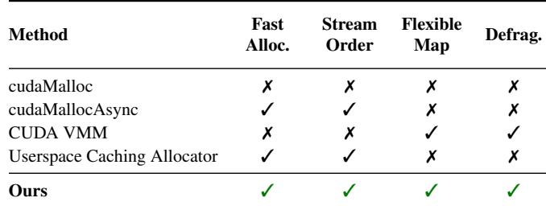  
Table 1: Comparison of memory primitives. Fast Alloc.: Low allocation latency on the critical path; Stream Order: Nonblocking, stream-aware allocation semantics; Flexible Map: Decoupling of virtual and physical memory for arbitrary mappings; Defrag.: External-fragmentation mitigation. MOON-BRIGHT uniquely achieves all four properties.

Together, these techniques allow MOONBRIGHT to support GPU-side page-table updates while maintaining the coherence guarantees required by modern GPU runtimes. MOONBRIGHT exports several primitives and composes them into a familiar runtime API surface, including Malloc, MallocAsync, and VMM-style interfaces, while reducing mapping latency and external fragmentation.

Our evaluation shows that MOONBRIGHT reduces mapping latency by up to three orders of magnitude, and that these low-level improvements translate into end-to-end benefits: MOONBRIGHT improves TTFT by up to 8.2× for LLM inference compared with vAttention, and mitigates external fragmentation across training workloads compared with Py-Torch’s caching allocator.

This paper makes the following contributions:

• Bottleneck Analysis. We identify the CPU-centric memory management model and synchronous TLB flushes as fundamental architectural bottlenecks, which impose severe synchronization overheads on GPU memory management.

• GPU-Centric Architecture. We propose a GPU-centric design and, to our knowledge, present the first device-side page-table management mechanism on commodity GPUs, moving critical-path operations off the host.

• Deferred Coherence Protocol. We introduce an Always-Fresh virtual address allocation strategy. This ensures TLB coherence without frequent TLB shootdowns, removing synchronization cost from the common allocation path.

• System Implementation. We implement MOONBRIGHT as a purely software mechanism on commodity NVIDIA and AMD GPUs, requiring no hardware modifications and integrating transparently with CUDA and HIP runtimes.

To facilitate further research in GPU systems, we have open-sourced the implementation of MOONBRIGHT at MoonBright-project.

## 2 Background and Motivation

## 2.1 Managing GPU Memory

We use CUDA to illustrate modern GPU memory management, but the same design patterns and limitations also apply to HIP/ROCm. CUDA provides three classes of device-memory management interfaces: the cudaMalloc, cudaMallocAsync, and the CUDA Virtual Memory Management (VMM) API. These interfaces occupy different points in the design space of allocator flexibility, synchronization overhead, and fragmentation.

CUDA VMM API. The Low-Level GPU Virtual Memory Management interface (e.g., cuMemAddressReserve, cuMem-Create, cuMemMap, cuMemSetAccess) exposes low-level virtual memory primitives. It decouples virtual address reservation, physical memory creation, mapping, and access control, allowing page-granular management of device memory. In the CUDA VMM path, cuMemMap binds physical allocations to reserved virtual ranges, while cuMemSetAccess installs access permissions and makes the mapping visible to the device. Current implementations keep this path host-driven and can trigger global CPU-GPU synchronization, resulting in long operation latency [16,45] and preventing stream-ordered execution.

cudaMalloc. The traditional GPU memory allocation API can be seen as a fixed sequence of VMM operations. The runtime reserves a contiguous virtual address range, allocates physical memory of the same size, maps the two, and installs access permissions. These calls also impose global synchronization, so allocation and deallocation cannot overlap with kernel execution and often dominate critical-path latency.

cudaMallocAsync. To reduce allocation latency, CUDA provides cudaMallocAsync and cudaFreeAsync, which operate on a runtime-managed memory pool. Requests are served from cached blocks rather than invoking VMM operations. This achieves low latency but fixes allocation granular ity to pool blocks. Because the allocator cannot flexibly remap virtual pages to physical pages, fragmentation accumulates under workloads with diverse or long-lived allocations.

Userspace caching allocators. To mitigate the high mapping latency of cudaMalloc, modern frameworks often deploy custom userspace allocators, such as those in PyTorch and TensorFlow. These allocators follow the same design principle as cudaMallocAsync: they overprovision a large memory pool using cudaMalloc and manage it with best-fit or similar placement policies. As a result, they inherit the same fundamental limitation. Once the pool develops holes, subsequent allocations may be satisfiable only by non contiguous free regions, yet the allocator lacks the ability to manipulate page tables to eliminate fragmentation. Consequently, memory utilization degrades over time, especially in long-running or dynamically shaped workloads.

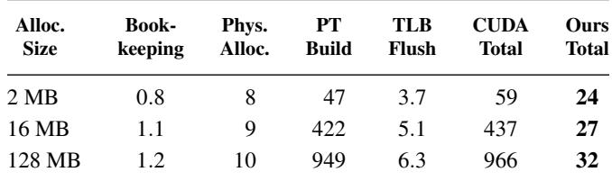  
Table 2: Latency breakdown of cudaMalloc for different allocation sizes. All values are in microseconds. Page-table construction dominates the CUDA path; MOONBRIGHT’s total latency is shown for comparison.

## 2.2 Architectural Bottlenecks

The aforementioned limitations are not merely engineering artifacts of specific APIs; they stem from deeper architectural choices in how GPUs manage memory control paths.

## 2.2.1 Dissecting Allocation Latency.

We find that allocation latency arises fundamentally from the CPU-centric page-table model. Historically, the CPU maintains the authoritative page tables, while GPU-resident page tables act as device-side replicas. Consequently, every allocation, deallocation, remapping operation, or permission update is first processed on the CPU, serialized through the vendor driver, and then propagated to GPU-resident translation structures. Once the GPU page table is updated, the host triggers a TLB flush to maintain coherence across the GPU’s translation caches.

Table 2 breaks down the latency of a cudaMalloc operation on an NVIDIA A100 GPU. By instrumenting the driver and runtime phases, we decompose the end-to-end latency into four components: Logical bookkeeping (tracking VA metadata), Physical allocation (obtaining device pages), Pagetable construction and transmission (building CPU-resident PTEs and shipping them via PCIe), and TLB flush. As shown in Table 2, allocation latency remains high, reaching approximately 1 ms for a 128 MB allocation.

More importantly, page-table construction and transmission overwhelmingly dominate the cost, accounting for 80% to 99% of the total latency across the evaluated sizes. This disproportionate expense is not simply a PCIe bandwidth artifact. Modifying translations requires mutating shared address-space state: validating VA ranges, instantiating missing page-table levels, encoding leaf PTEs, and locking structures against concurrent updates. Crucially, while encoding thousands of independent leaf PTEs is an inherently dataparallel task, the CPU-centric model forces the host driver to construct them serially within a sequential execution loop. The observed latency is thus a massive compound penalty of this sequential host-side PTE construction, state propagation across the PCIe bus, and conservative coherence enforcement. Insight 1: GPU-Resident Translation. This observation motivates MOONBRIGHT’s core architectural pivot: making the device page table authoritative for device translations. Once the host supplies the physical-frame list, PTE materialization becomes an inherently data-parallel operation over independent pages. MOONBRIGHT therefore dispatches GPU kernels to directly update device-resident page tables, leveraging the GPU’s massive parallelism and multi-TB/s memory bandwidth to bypass serialized CPU driver loops. As highlighted in Table 2, this design reduces the 128 MB page-table update latency to only 32 µs, shifting page-table materialization from a dominant control-plane bottleneck to a lightweight device-side operation.

## 2.2.2 Dissecting Memory Fragmentation.

To amortize the severe control-path overhead discussed above, deep learning frameworks universally rely on user-space pooling. Allocators such as TensorFlow’s BFC [1] and Py-Torch’s caching allocator [43] acquire massive memory regions from the driver upfront, serving subsequent requests through user-space suballocation. More recently, NVIDIA introduced stream-ordered allocation via cudaMallocAsync, which extends this philosophy by serving requests from CUDA-managed pools without enforcing device-wide synchronization.

However, because these designs treat pooling as their sole defense against mapping latency, they inherit the fundamental weakness of pool-based allocation: they cannot manipulate page tables to consolidate memory. Recent studies [16, 19, 25] confirm that the irregular, dynamic tensor lifetimes in large-scale training and inference inevitably misalign with the pool’s layout. This mismatch rapidly accumulates severe external fragmentation, wasting device memory and halting scalability.

Ideally, an allocator would cure fragmentation by using Virtual Memory Management (VMM) APIs to transparently remap physical pages behind contiguous virtual addresses. Yet, under the current CPU-centric architecture, any attempt to dynamically remap pages introduces a catastrophic performance penalty. To ensure coherence, a VMM remapping operation demands global device-wide synchronization: the CPU driver must wait for all active kernels across all streams to finish, drain the device entirely, and only then issue a global TLB flush. Even though the hardware flush itself is relatively fast (e.g., 6.3 µs in Table 2), this mandatory global synchronization forces the GPU to completely empty its execution pipelines. This heavy-handed barrier forcibly degrades modern asynchronous, stream-ordered execution back into blocking, synchronous execution, rendering VMM-based defragmentation practically unusable for latency-sensitive frameworks.

Insight 2: Deferred Coherence via Fresh VAs. One of our observations is that GPU workloads require far fewer TLB coherence events than CPU counterparts. While CPUs frequently mutate existing address spaces (e.g., context switches, permission changes), GPU workloads are highly regular, predominantly allocating new memory. Our TLB microbenchmarks (§5.5) show that, when a newly allocated virtual address has no stale same-address translation in the TLB, MOONBRIGHT can safely install the mapping without a flush. The first access observes a TLB miss and walks the newly materialized page-table entry.

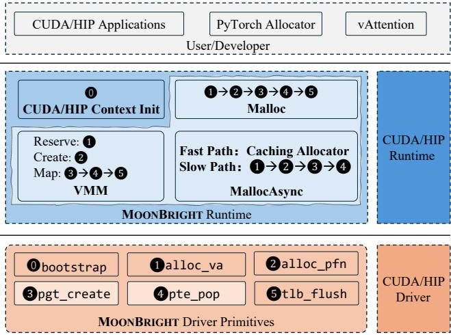  
Figure 1: MOONBRIGHT System Overview.

This insight underpins MOONBRIGHT’s Deferred VA Reuse (Always-Fresh) policy. By ensuring the allocator strictly assigns previously unused virtual address ranges to new allocations, MOONBRIGHT guarantees that new PTEs will not collide with stale TLB entries. This elegantly circumvents the stop-the-world TLB flush, deferring coherence operations only to the rare cases of actual VA recycling. Consequently, MOONBRIGHT can perform asynchronous, lowlatency defragmentation in the background without stalling compute streams.

Takeaway. The host-side bottlenecks inherent to the CPUcentric page-table model necessitate a GPU-centric architectural shift. Centralizing page-table construction on the GPU eliminates CPU-mediated serialization latency, and the Always-Fresh virtual address policy eliminates unnecessary TLB flushes. Together, these two pillars form the foundation of MOONBRIGHT, uniquely satisfying the requirements of fast allocation, flexible mapping, and external-fragmentation mitigation (as summarized in Table 1).

## 3 Design of MOONBRIGHT

MOONBRIGHT introduces two key mechanisms: device-side page-table materialization and deferred TLB coherence. Figure 1 presents the overall architecture of MOONBRIGHT, which adopts a two-layer organization consisting of a driver layer and a runtime layer. The driver layer exposes a set of lowlevel memory-management primitives (e.g., page-table manipulation, virtual-address allocation, and fine-grained mapping operations). The runtime layer orchestrates these primitives to implement standard memory allocation interfaces compatible with existing GPU software, from native CUDA/HIP applications to deep-learning frameworks such as PyTorch.

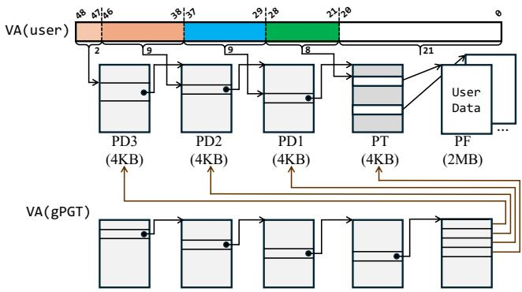  
Figure 2: Bootstrap. The hardware page table structures backing VA(user) are mapped to a specialized virtual address, VA(gPGT). This pointer allows CUDA kernels to treat the page table as an array.

## 3.1 Composable Low-Level Primitives

MOONBRIGHT fundamentally shifts page table construction to the GPU by defining updates as data-plane workloads. To ensure the host (Control Plane) maintains a consistent view of the device-resident state without costly synchronization, we introduce a Linearized Page Table Abstraction. This allows the CPU to deterministically calculate the location of any page table entry (PTE) in GPU memory using purely arithmetic operations, eliminating the need for costly round-trip PCIe communications.

0 Bootstrap: Linearized View Construction. Triggered upon CUDA context creation, this primitive initializes the GPUresident metadata required to manage the hardware’s multilevel page table hierarchy (PD3 → PD2 → PD1 → PT ). As shown in Figure 2, MOONBRIGHT must make the physical pages that hold the hardware page-table hierarchy reachable through a device virtual address before a CUDA kernel can update them. Specifically, MOONBRIGHT obtains the physical addresses of the multi-level page-table pages and bootstrapmaps those pages into a contiguous virtual range, creating the GPU Page Table (gPGT ) view. Abstraction Provided: This primitive exposes the multi-level page table as a flattened, linear array (gPGT [va\_idx]). This abstraction allows both the CPU and GPU to index PTEs using a simple offset calculation (Base +V PN × sizeo f (PT E)), enabling fast coordination between host orchestration and device execution.

MOONBRIGHT exposes five composable primitives that serve as the building blocks for customized memory allocators:

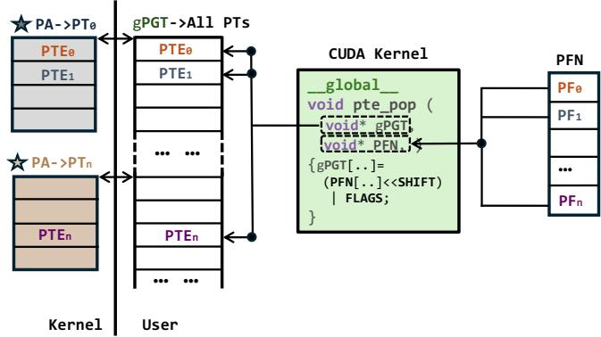  
Figure 3: Workflow of the parallel PTE population kernel (pte\_pop). MOONBRIGHT utilizes massively parallel GPU threads to dynamically synthesize Page Table Entries (PTEs) directly into the global GPU Page Table (gPGT ).

❶ Virtual Address Allocation (alloc\_va). Managed by a CPUresident Red-Black tree, this primitive governs the logical layout of the application’s virtual address space. It allocates virtual memory ranges (VAs) and maintains high-level metadata (e.g., valid/free status).

❷ Physical Page Allocation (alloc\_pfn). This primitive interfaces with the low-level physical resource manager (e.g., NVIDIA GPU System Processor (GSP) or HIP Buddy Allocator) to acquire available physical pages. It requests physical page frame numbers (PFNs) and ensures the allocated memory remains resident and accessible to the device. Crucially, it captures the Allocation Layout State alongside the raw PFNs. This state serves as a coordination protocol for downstream primitives, providing the necessary physical address metadata required for the subsequent parallel mapping operation.

❸ Page Table Construction (pgt\_create). This primitive serves to populate sparse regions of the page table hierarchy. Upon detecting a missing directory level for a target range, it validates the request against the virtual address state maintained by ❶. Subsequently, it allocates the requisite physical backing for the directory (e.g., PT ) and executes a GPU kernel to install the physical pointers into the global page table array (gPGT ), ensuring the structural integrity of the mapping tree.

❹ Parallel PTE Population (pte\_pop). This core primitive unifies the transformation of physical addresses into hardwarecompliant Page Table Entries (PTEs) and their population into the GPU page table. Unlike standard drivers that perform serialized PTE population from the host CPU, MOONBRIGHT first transfers raw Physical Frame Numbers (PFNs) to a GPUresident buffer, termed the GPU PFN Buffer (PFN).

As illustrated in Figure 3, the mapping workflow executes as a single, high-bandwidth parallel kernel that fuses construction and population. At runtime, thousands of GPU threads operate in parallel to execute a two-step process: First, On-thefly Construction: The GPU kernel reads raw page frame numbers (PFN) and dynamically synthesizes hardware-compliant PTEs. This is achieved by combining physical addresses with user-specified access permission bits (e.g., Read/Write flags) using efficient bitwise operations. Second, Population: The generated PTEs are immediately written into the destination slots of the GPU Page Table (gPGT ).

By keeping both the source data (PFN) and the destination structure (gPGT ) resident in high-bandwidth device memory, this design transforms memory management into a pure, ondevice data movement task. It leverages the GPU’s massive parallelism to populate page tables at memory-bandwidth limits, executing substantially faster than CPU-driven approaches. Furthermore, because this stage is implemented via a programmable GPU Kernel rather than rigid driver callbacks, MOONBRIGHT allows developers to utilize standard parallel programming models to express diverse mapping paradigms, dynamically routing PFNs to arbitrary virtual addresses.

❺ TLB Flush (tlb\_flush). This primitive is invoked when an update can leave stale translations for the same virtual address, such as unmapping, permission changes, or remapping an existing VA. It triggers a host-initiated hardware TLB shootdown and therefore introduces a GPU-wide synchronization point. Fresh-VA mappings do not use this primitive: subsequent kernels observe the new PTEs through normal stream ordering, and no stale same-VA translation can exist.

## 3.2 User-Facing Memory API Design

In this subsection, we present how to construct memory allocators based on MOONBRIGHT’s primitives.

## 3.2.1 Reconstructing Malloc

To demonstrate the composability of our primitives, we present a high-performance implementation of a standard synchronous memory allocator. Designed as a functional equivalent to cudaMalloc, this implementation orchestrates the primitives defined in §3.1 into a cohesive pipeline, addressing the granularity mismatch between user requests and hardware pages via a standard slab layer.

Large Allocation. For requests exceeding the slab threshold, the runtime orchestrates a sequential primitive pipeline: resources are first secured via ❶ and ❷, followed by hierarchy instantiation using ❸. The mapping is then materialized by the ❹ parallel kernel. If the allocation uses a fresh VA, no TLB flush is required. A ❺ flush is appended only when the allocator must recycle an old VA or update an existing mapping.

Small Object Management. Since hardware physical pages are fixed at a coarse granularity (e.g., 2 MB) while user re quests might be fine-grained (e.g., 1 KB), we employ a classic slab [8] allocation strategy to manage sub-page objects. The allocator maintains user-space metadata organized by size classes. For requests with smaller objects, it locates available slots within active slabs via bitmap scanning. This operation is performed entirely in user space, avoiding the latency of driver interactions or hardware primitives. Only when a slab is fully exhausted or a request exceeds the slab threshold does the allocator invoke the underlying primitive layer to acquire fresh physical resources.

De-allocation. The de-allocation process (MemFree) executes a strictly ordered sequence to ensure memory consistency. First, the runtime enforces a device-side synchronization barrier to ensure all active kernels accessing the target memory have completed. Subsequently, it invokes a specialized unmapping kernel to atomically invalidate the PTEs in the GPUresident page table by zeroing out the corresponding entries. Once the source mappings are invalidated, a TLB flush is immediately issued to evict any stale translations, thereby enforcing coherence. Only after this sequence is confirmed does the runtime return the physical page frames to the system allocator via the inverse of alloc\_pfn. To minimize reconstruction overhead during future allocations in the same region, the upper-level page table hierarchy associated with the virtual address range is preserved.

## 3.2.2 Fragmentation-Mitigating MallocAsync

We propose an asynchronous memory allocator that exposes fast, fragmentation-free allocation as a virtual-memory primitive rather than as a framework-specific caching policy.2 By moving allocation efficiency into the virtual-memory layer, MOONBRIGHT provides a common substrate that can serve existing frameworks directly or simplify their caching allocators, rather than requiring each framework to independently engineer fragmentation mitigation.

Deterministic TLB Coherence via Fresh Virtual Addressing. The central challenge in asynchronous allocation is maintaining TLB coherence without global synchronization caused by TLB flushes. Standard allocators require explicit flushes to ensure both correctness and performance determinism. This is necessitated by the non-coherent nature of GPU MMUs: hardware lacks a mechanism to actively propagate page table updates to the TLB, risking the usage of stale or inconsistent entries (e.g., negative caching artifacts [74]) if not flushed.

To eliminate this hazard without blocking execution, we propose an "Always-Fresh" Virtual Address (VA) allocation strategy. By ensuring that new allocation occupies a fresh, previously unused VA range within the current coherence epoch, we guarantee the absence of stale same-VA TLB entries; therefore, no flush is needed on this fast path. This strategy is architecturally feasible for two reasons.

First, MOONBRIGHT provides the high-throughput mapping primitive needed to sustain rapid VA consumption. Second, the required virtual-address space can be sized using a theoretical guideline. We adopt Robson’s worst-case allocation analysis [53] as a conservative estimate for provisioning the VA buffer: M(1 + 1 log n), where M is the physical memory size and n is the ratio between memory size and page size. For an 80 GB GPU with 2 MB pages, this estimate is approximately 693 GB. This footprint is well within the hundredsof-TB virtual address spaces exposed by modern GPUs and incurs only modest overhead for additional page-table structures. Guided by this theoretical estimate, MOONBRIGHT manages VA space as a large buffer with lazy reclamation, ensuring TLB coherence through spatial separation rather than frequent synchronization.

Correctness of Always-Fresh VA. The key invariant behind MOONBRIGHT’s TLB-flush avoidance is that a newly installed mapping never reuses a virtual address that may have had a valid same-address translation cached in the GPU TLB. For fresh virtual addresses, there cannot exist a stale sameaddress valid translation, because the address has not previously been mapped or successfully translated by the device. Therefore, installing a fresh mapping does not require invalidating old translations.

Speculative translation activity does not violate this invariant. Hardware page walkers or translation prefetchers may probe nearby virtual addresses and cache negative translation results, but such entries encode the absence of a valid mapping rather than a VA-to-physical-frame binding. They therefore cannot redirect a future access to an old physical frame. Once MOONBRIGHT installs a valid PTE for a fresh VA, the first access either observes the new translation or triggers a page walk that reloads the updated PTE. In this way, MOONBRIGHT replaces a global TLB shootdown with a translation miss, without compromising correctness.

Finally, always-fresh allocation is bounded by the available virtual-address space. MOONBRIGHT treats VA exhaustion as a rare slow-path event. When the current VA epoch approaches exhaustion, MOONBRIGHT waits for outstanding GPU work that may reference the old epoch, performs a global TLB invalidation, and then starts a new epoch in which previously used virtual addresses may be recycled. Thus, VA reuse occurs only after device quiescence and TLB invalidation, preserving the same-address freshness invariant.

Asynchronous Memory Pool Architecture. To provide an allocator with semantics familiar to users of cudaMallocAsync, we implement a high-performance memory pool built directly upon our decoupled primitives. The foundation of this architecture is a massive virtual address ring buffer. By maintaining the page table entries (PTEs) in GPU-resident memory, we remove the CPU from the critical path of mapping updates. This design allows the runtime to generate static code with fixed pointers, even as the physical backing memory changes dynamically via the pte\_pop primitive. Furthermore, this buffer design enables lazy reclamation: when an object is freed, MOONBRIGHT quarantines its VA range instead of handing that VA out immediately. The range becomes reusable only at a recycle epoch, where MOONBRIGHT performs a batched tlb\_flush before the ring wraps around. This amortizes synchronization across many allocations while keeping the common path flush-free.

Fast Path: Caching Allocator. The first tier of the allocator is designed for the "fast hot path," handling high-frequency allocations. To achieve a low-latency hot path, this tier operates entirely in user space, avoiding the overhead of kernel transitions. Drawing inspiration from the memory management designs of established deep learning frameworks [1, 43], MOONBRIGHT adopts the Best-Fit with Coalescing (BFC) strategy. This approach maintains a user-space memory pool to efficiently satisfy variable-sized requests while actively mitigating fragmentation through immediate block coalescing.

Slow Path: Physical Backing and Orchestration. When the user-space cache is exhausted, or an allocation request exceeds the threshold, the system transitions to the Slow Path to acquire fresh backing resources. This process executes a coordinated sequence of primitives: First, the runtime invokes ❶ (alloc\_va) to reserve a virtual address range from the frontier of the circular buffer and ❷ (alloc\_pfn) to request physical page frames from the operating system. If the target address range falls within a sparse region of the page table hierarchy, the runtime triggers ❸ (pgt\_create) to instantiate the necessary page directory structures. Subsequently, the runtime materializes the mapping by launching ❹ (pte\_pop). This primitive acts as a parallel interpreter, reading mapping directives and populating device-resident page tables at device memory-bandwidth speeds. Since pte\_pop operates as a standard compute kernel, it follows CUDA stream semantics and can be dependency-tracked together with other GPU work. This allows the page-table population phase to be scheduled asynchronously and, when independent work is available, overlapped with concurrent computation, reducing the exposed latency of mapping construction. Upon deallocation, cached blocks are recycled into the Fast Path’s free lists rather than being immediately released.

Defragmentation. MOONBRIGHT reduces external fragmentation without data movement. When the allocator lacks a contiguous free block in its pool despite sufficient fragmented physical pages, MOONBRIGHT allocates a fresh contiguous VA range and maps discontiguous physical pages into it. This logical defragmentation creates a virtually contiguous buffer from fragmented physical resources solely through parallel page table updates, avoiding the prohibitive overhead of memory compaction and, on the fresh-VA path, TLB flushes.

## 3.2.3 High-Performance VMM

To provide a familiar programming model while enabling high-performance GPU-centric management, we expose a driver interface that mirrors the semantics of standard Virtual Memory Management (VMM) APIs. These APIs serve as high-level wrappers around the primitives defined in §3.1, offering granular control over virtual-to-physical mappings while fundamentally redefining the underlying execution mechanism. Consistent with standard protocols like cuMemMap, MOONBRIGHT mandates that all operations be aligned to page granularity.

MemAddressReserve. While exporting an interface behaviorally consistent with cuMemAddressReserve, this API implements a lightweight booking mechanism via ❶ (alloc\_va). It performs logical address reservation by updating the userspace layout tracker, thereby decoupling virtual allocation from physical resource commitment.

MemCreate. This API handles the acquisition of physical backing storage. Corresponding to the primitive ❷(alloc\_pfn), it requests a set of physical page frames from the system allocator, ensuring the memory is pinned and accessible to the device. It enforces alignment to the hardware’s fixed page granularity (e.g., 2 MB) and retrieves the raw Physical Frame Numbers (PFNs). Instead of keeping these PFNs opaque in the driver, this API exposes them to the runtime’s PFN buffer, preparing the data plane for the subsequent, high-bandwidth construction and mapping phases.

MemMap. This API performs the critical binding of physical pages to virtual addresses by orchestrating ❸ (pgt\_create) and ❹ (pte\_pop). The caller invokes ❺ (tlb\_flush) only when the operation can create stale same-VA translations, such as remapping, permission changes, or address reuse. This design addresses the limitations of the split Map and SetAccess model employed by CUDA and HIP. In existing implementations, the cuMemSetAccess call acts as a performance bottleneck by triggering an expensive driver trap. These systems remain constrained by a CPU-centric control plane, where access updates require host-side page-table reconstruction, serialized PCIe transfer, and conservative global TLB shoot downs. In contrast, MOONBRIGHT redefines mapping as a high-throughput, data-parallel workload. By offloading these operations to the device and avoiding flushes for fresh mappings, MOONBRIGHT improves mapping latency by orders of magnitude.

De-allocation. To recycle memory resources, MOONBRIGHT provides two complementary primitives: MemAddressFree reclaims the virtual address range, while MemRelease returns the physical page frames to the system allocator. Crucially, the underlying unmap operation maintains strict TLB coherence, ensuring that stale translations are evicted with the same consistency guarantees as a standard free operation.

## 3.2.4 Stream-Ordered Memory Operations

MemMapAsync. We expose the mapping capability through MemMapAsync, which implements page-table updates in a stream-ordered manner. Because pte\_pop is a normal GPU kernel, mapping tasks are dependency-tracked by the target stream and can overlap with independent compute. For fresh VA ranges, MemMapAsync does not require a host-initiated TLB flush. A key advantage of this architecture is the capability to map distinct virtual address ranges to shared physical page frames without data duplication. This mechanism provides zero-copy aliasing of shared physical pages across multiple virtual ranges, which is useful for prefix sharing and beam-search state forking. For operations that overwrite an existing valid mapping, MOONBRIGHT inserts the required coherence point and invokes tlb\_flush; these same-VA updates are therefore supported, but they are not on the flush-free fast path.

## 4 Implementation

Our core implementation consists of ≈14.1 KLoC across kernel-space modifications to the open-source NVIDIA [12] and AMD GPU drivers [6], alongside the user-space runtime.

## 4.1 Adaptation to NVIDIA CUDA GPUs

For NVIDIA CUDA GPUs, our prototype builds on NVIDIA’s open-gpu-kernel-modules driver, version 560.35.03 [12]. During implementation, we observed two NVIDIA-specific hardware behaviors that affect backend policy choices; we characterize both in §5.4.

First, GSP physical-frame allocation exhibits a sizedependent latency cliff beyond approximately 512 MB. Since MOONBRIGHT does not require physical contiguity, it avoids the cliff by splitting oversized slow-path requests into smaller physical-frame allocation subrequests.

Second, guided by [74], we identify an NVIDIA-specific TLB behavior: aggressive translation prefetching can create negative caching, where nearby invalid translations are prefetched and later cause replayable faults. As shown in §5.4, spacing new virtual addresses by the prefetch width avoids this cliff, reducing fault-induced latency by 40.2× at a 32 MB gap. MOONBRIGHT therefore adopts a prefetchwidth aligned allocation strategy: new virtual addresses are aligned to 32 MB boundaries so that fresh mappings incur deterministic cold misses rather than costly replayable faults. The 32 MB alignment increases the conservative Robsonstyle VA budget by 16×, from ≈693 GB to ≈11 TB, still well within the 128 TB user-level VA region exposed by our NVIDIA prototype.

## 4.2 Adaptation to AMD ROCm GPUs

For AMD GPUs, our prototype builds on AMD’s open-source ROCm software stack, version 6.4.0. The AMD backend uses a buddy allocator for physical-frame management. Since we did not observe the large-allocation latency cliff or aggressive

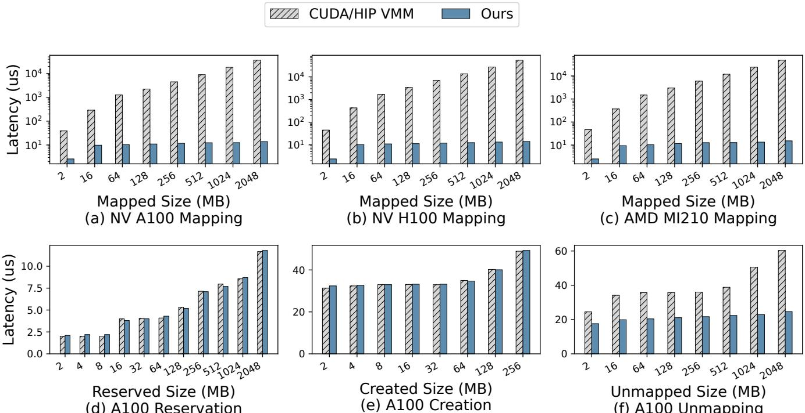  
(d) A100 Reservation  
(f) A100 Unmapping  
Figure 4: Performance and scalability of low-level virtual-memory APIs across NVIDIA and AMD GPUs.

TLB prefetching seen on NVIDIA GPUs, MOONBRIGHT disables the large-request splitting heuristic and implements the Always-Fresh VA strategy without additional virtual-address padding.

## 5 Evaluation

In this section, we evaluate MOONBRIGHT by answering two research questions:

RQ1: Low-Level Efficiency. Does MOONBRIGHT reduce mapping and allocation overhead across primitives and general GPU workloads while preserving TLB coherence?

RQ2: Application Impact. Do these improvements translate into end-to-end benefits, including lower inference latency, dynamic memory operations, and reduced external fragmentation?

## 5.1 Experimental Setup

Baselines. We test MOONBRIGHT on a diverse set of GPU architectures to ensure generalizability, including NVIDIA A100, H100, and AMD MI210. We organize baselines by the functionality and workload targeted by each experiment. For low-level memory primitives, we compare MOON-BRIGHT’s virtual-memory interface against the vendor CUD-A/HIP VMM APIs and runtime allocation primitives such as cudaMalloc and hipMalloc. For framework-level training workloads, we compare against PyTorch’s default caching allocator [43] and GMLake [16], a representative CUDA-VMMbased virtual-memory stitching system for DNN training. For LLM serving workloads, we compare against vAttention [45], which uses VMM-based remapping for KV-cache management, and vLLM [25], which uses software-managed paging.

## 5.2 Performance of Low-Level APIs

We first evaluate the performance and scalability of MOON-BRIGHT’s low-level memory-management primitives, which provide functionality comparable to the CUDA/HIP driver VMM APIs.

To ensure a fair comparison against vendor-provided driverlevel VMM APIs, we use the same 2 MB page granularity returned as the minimum CUDA VMM granularity on our platform, and vary the mapping range from 2 MB to 2 GB. As shown in Figure 4, MOONBRIGHT consistently outperforms CUDA VMM across all evaluated sizes.

Mapping Cost. For a fresh mapping over a single 2 MB page, MOONBRIGHT reduces mapping latency from ≈ 45 µs with CUDA VMM to 2.6 µs. Here MOONBRIGHT updates only one PTE with one GPU thread, so latency is dominated by fixed device-side mapping overhead, not bulk page-table writes. The gap widens with range size: mapping a fresh 2 GB region takes 36 ms with CUDA VMM, but only 14 µs with MOONBRIGHT, a reduction of over 2,500×.

This improvement comes from a fundamental architectural shift. As discussed in §3.2.3, CUDA VMM is constrained by a host-mediated control path: page-table construction, state propagation, and conservative synchronization are serialized through the CPU driver and the CPU–GPU interconnect. Even on newer architectures such as H100, page-table updates remain bounded by this off-device control path. In contrast, MOONBRIGHT offloads PTE population to the GPU and treats page-table materialization as a data-parallel devicememory operation, exploiting on-device HBM bandwidth instead of serialized CPU driver loops. Because the mapping operation is expressed as a normal GPU kernel, it also obeys stream ordering: MOONBRIGHT can enqueue the mapping kernel immediately before the computation kernel that consumes the fresh mapping, while independent GPU work in other streams can proceed concurrently.

Initialization Cost. As shown in Figure 4(d) and Figure 4(e), MOONBRIGHT exhibits latency comparable to CUDA VMM for both reserve and create. This behavior is expected, as these operations remain on the same driver-side critical path: red-black tree manipulation for VA management and GSP invocation for PFN acquisition.

Unmapping Cost. This experiment unmaps each region as a single contiguous range, rather than at a fine-grained 2 MB granularity. As shown in Figure 4(f), under this rangelevel pattern, MOONBRIGHT consistently outperforms CUDA VMM across region sizes from 2 MB to 2 GB. The absolute latency of CUDA VMM unmapping is much lower than its mapping latency shown in Figure 4(a), because range-level unmapping avoids accumulating fine-grained operation overheads, and invalidating an existing PTE range requires less construction work than installing new physical mappings.

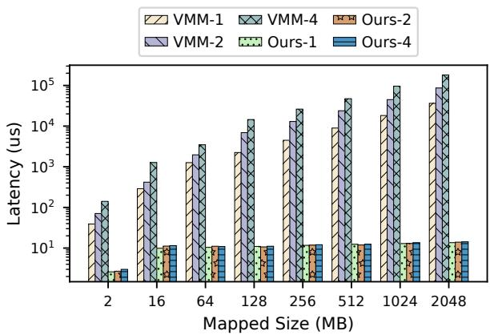  
Figure 5: Mapping cost on 1, 2, and 4 A100 GPUs.

Multi-GPU Scalability. We also evaluate the scalability of MOONBRIGHT, which is particularly important for managing memory across multiple GPUs in the era of large language models (LLMs), where VMM is increasingly used to manage and share KV caches [72]. Figure 5 depicts the mapping latency of CUDA VMM and MOONBRIGHT when the number of GPUs ranges from one to four on a single node. When mapping operations are triggered simultaneously across multiple GPUs within a single machine node using CUDA VMM, we observe that the latency grows approximately linearly with the number of devices. For example, the mapping latency grows from 36 ms on one GPU to 86 ms and 180 ms on two and four GPUs, respectively, for a 2 GB mapping. In comparison, MOONBRIGHT remains nearly constant when mapping on multiple GPUs. On a four-GPU setup, MOONBRIGHT is 12,700× faster than CUDA VMM at 2 GB. Because MOON-BRIGHT performs mapping operations locally on each GPU in parallel, its latency remains constant regardless of the number of active GPUs. CUDA VMM, in contrast, is severely limited by repeated synchronization operations, such as lock-/unlock in the CUDA driver and the OS kernel, which are required for each page mapping.

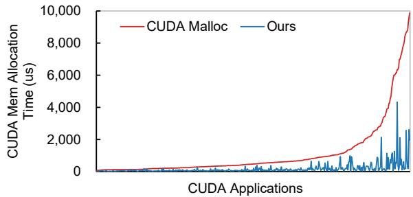

(a) On NVIDIA GPU (including CUDA samples and HeCBench).  
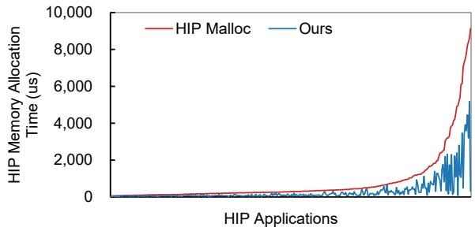  
(b) On AMD GPU (including ROCm samples and HeCBench).

Figure 6: Memory allocation time on different platforms, sorted by baseline allocation latency.

Performance of Allocation We next evaluate a large set of standard benchmarks to quantify the speedup MOONBRIGHT achieves compared to the vendor-provided memory allocators, including cudaMalloc and hipMalloc. For this large-scale study, we utilize the official CUDA Samples [41], ROCm Samples [7], and the HeCBench suite [22], which collectively cover a diverse range of scientific and compute-intensive kernels for NVIDIA GPUs and AMD GPUs (via the HIP interface). The combined test suite contains a total of 1,013 distinct test cases, with the HeCBench suite specifically contributing 864 cases, representing a wide variety of allocation patterns and memory footprints. This suite provides a broad view of allocation behavior across common GPU workloads.

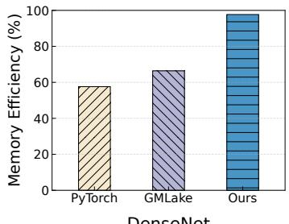  
DenseNet

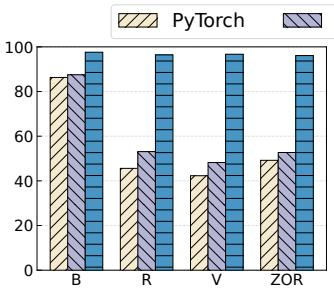  
GPT-2

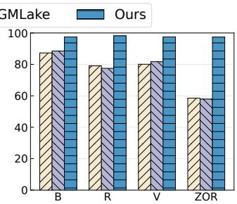  
Llama2-7B

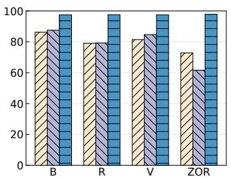  
Qwen1.5-MoE  
Figure 7: Training memory efficiency on four models across different allocators and optimization combinations: basic (B), recomputation (R), Virtual Pipeline (V), ZeRO (Z), and offload (O).

In each test, we intercept all vendor allocation APIs (e.g., cudaMalloc, hipMalloc) to measure end-to-end memorymanagement time. Our objective is to quantify the latency reduction achieved by moving control-plane operations to the data plane. Figure 6 reports absolute memory-management time in µs for MOONBRIGHT and the vendor-provided baseline, with benchmark cases sorted by baseline latency.

As shown in Figure 6, MOONBRIGHT shows consistent latency reductions across NVIDIA and AMD GPUs. On the NVIDIA GPU platform, MOONBRIGHT reaches a peak latency reduction of 99.3% and an average reduction of 76.5% across all tested samples. On the AMD GPU benchmark suite, MOONBRIGHT shows similar reductions: 98.3% peak and 60.3% on average. We observe a positive correlation between allocation intensity (i.e., size and frequency) and the mag nitude of the reduction: benchmarks with heavier memory management demands benefit more from our approach. These gains come from two effects: MOONBRIGHT performs PTE population on the GPU instead of serializing it through the CPU, and its fresh-VA path avoids unnecessary TLB flushes when no stale same-VA translation can exist.

## 5.3 Application Impact

## 5.3.1 Defragmentation for Model Training

We evaluate allocator-level fragmentation in PyTorch-based training stacks and a VMM-based allocator baseline [16, 51, 58] using four NVIDIA A100 GPUs. We use multiple configurations to expose fragmentation under diverse allocation patterns and tensor lifetimes. These stacks combine data, model, and pipeline parallelism [30, 37] with memory-saving techniques such as recomputation (R), virtual pipeline scheduling (V), ZeRO-style distributed optimization (Z), and offload (O) [11, 50, 52]. These techniques reshape tensor lifetimes and allocation sizes, while CUDA tensor allocation remains largely mediated by the framework allocator.

We run DenseNet [44], GPT-2 [49], Llama-2-7B [64], and

Qwen1.5-MoE-A2.7B [48], and sweep batch size until out-ofmemory. We use Memory Efficiency, defined as peak allocated memory over peak reserved memory (Malloc/Mreserved) [16], as a diagnostic metric for allocator-level fragmentation. As shown in Figure 7, MOONBRIGHT improves DenseNet efficiency from 57.6% to 97.7%, and maintains at least 96.1% efficiency on GPT-2, Llama-2-7B, and Qwen1.5-MoE. Under the most dynamic Qwen1.5-MoE Z+O+R setting, PyTorch drops to 72.8%, leaving device memory reserved but unavailable to useful tensor allocations. In contrast, MOONBRIGHT reaches 97.8% by stitching fragmented physical pages into contiguous virtual ranges, effectively reducing external fragmentation. For GMLake, we use a 512 MB granularity as a practical engineering tradeoff between CPU-driven VMM overhead and internal slack [16, 19]; nevertheless, its coarse granularity leaves residual slack under irregular allocations. MOONBRIGHT avoids such slack through fine-grained virtual remapping and preserves end-to-end training performance.

## 5.3.2 Efficient LLM Inference

We evaluate inference performance on a single NVIDIA A100 GPU across diverse large language model inference scenarios, comparing against vAttention for long-context and prefixcaching scenarios.

Both MOONBRIGHT and vAttention benefit from contiguous, non-paged attention kernels in long-context workloads. As shown in Figure 8, computation increasingly dominates execution at these sequence lengths, reaching 85% at 192K [45]. This leaves limited room for memory-management optimizations; nevertheless, MOONBRIGHT is still up to ∼5% faster by eliminating residual host-driven mapping overhead through device-centric page-table updates.

Prefix caching changes this balance. By reusing precomputed KV Cache across requests, it reduces prefill computation and shifts the bottleneck toward memory-management operations that stitch cached blocks into the virtual address space. In this regime, vAttention relies on CPU-driven CUDA VMM and must issue thousands of serialized page mappings, whereas MOONBRIGHT performs these mappings in microseconds. As a result, MOONBRIGHT achieves up to 8.2× lower TTFT on Llama-2-7B and 2.9× lower TTFT on Llama-3-8B. The difference in gains is primarily explained by the remapping intensity: Llama-3-8B uses grouped-query attention (GQA) [5], which reduces the number of KV heads and shrinks the KV Cache footprint, leaving fewer cached blocks to remap and therefore less CPU-driven VMM overhead for MOONBRIGHT to eliminate.

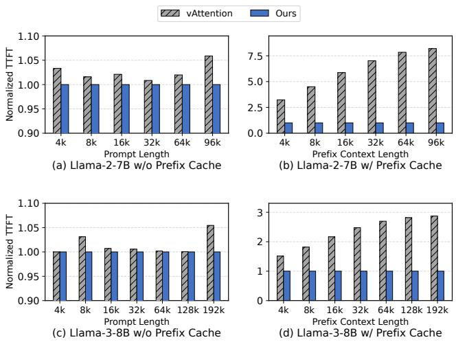  
Figure 8: Normalized TTFT for Llama-2-7B and Llama-3-8B under long-context and prefix-caching inference. The first row shows Llama-2-7B; the second row shows Llama-3-8B. For each model, the left panel shows full-prefill long-context requests and the right panel shows prefix-cached requests. Lower is better; all values are normalized to MOONBRIGHT.

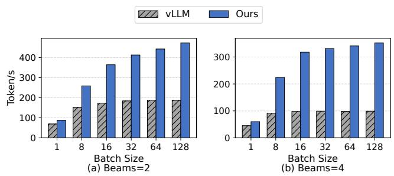  
Figure 9: Beam-search inference throughput on Llama-3-8B under beam widths of 2 and 4.

## 5.3.3 Dynamic Memory Mapping

Finally, we compare Beam Search on MOONBRIGHT against vLLM, a system characterized by step-wise dynamic memory operations governed by data-dependent control flow. In vLLM, each new beam requires a memory fork to update per-sequence states, which is executed on the CPU by deepcopying block metadata. This introduces serialized per-fork overhead, incurring 452 and 780 fork operations per request at beam widths of 2 and 4, respectively. As beam width and batch size increase, this accumulated CPU overhead dominates the runtime. Conversely, MOONBRIGHT offloads fork operations natively to the GPU, aliasing physical pages via lightweight mapping updates. As shown in Figure 9, MOONBRIGHT consistently out-scales vLLM on Llama-3-8B; at batch size 128, MOONBRIGHT achieves 2.5× and 3.6× higher throughput at beam widths of 2 and 4, respectively.

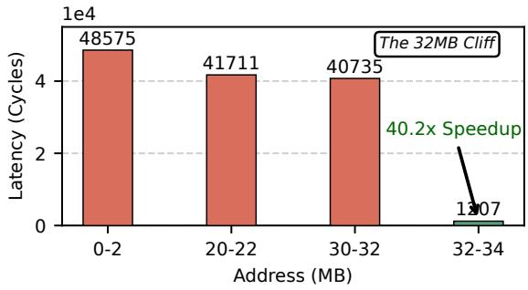  
Figure 10: Microbenchmark of zero-flush memory allocation latency. Access latency after a zero-flush fresh mapping is placed at different distances from a previously probed invalid VA. Latency drops after the 32 MB prefetch window, motivating prefetch-width VA padding on NVIDIA.

## 5.4 Hardware-Guided Policy

MOONBRIGHT’s core design, GPU-side page-table materialization and deferred VA reuse, is vendor-agnostic. Platformspecific measurements only tune backend parameters, rather than altering the first principles of the design. In this section, we characterize two NVIDIA-specific effects that inform MOONBRIGHT’s backend configuration: TLB prefetching and GSP physical-frame allocation.

TLB prefetching. Figure 10 shows an NVIDIA-specific prefetch cliff. When a fresh VA is placed within the 32 MB prefetch window of a previously probed invalid VA, the first access suffers replayable faults and exceeds 40k cycles. Once the gap reaches 32 MB, latency drops to roughly 1.2k cycles. This observation motivates the 32 MB VA-alignment policy used by MOONBRIGHT on NVIDIA GPUs: new virtual addresses are spaced by the prefetch width so that fresh mappings incur deterministic cold misses rather than replayable faults.

GSP physical-frame allocation. Figure 11 shows another NVIDIA-specific effect: GSP physical-frame allocation remains nearly flat below approximately 512 MB, but increases sharply beyond this point. The undocumented GSP firmware prevents us from identifying the exact cause, but the behavior is consistent with expensive large contiguous-frame allocation. Since MOONBRIGHT does not require physical contiguity, its

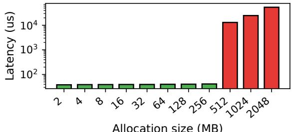  
Allocation size (MB)

Figure 11: Latency of NVIDIA GSP physical-frame allocation. Allocation latency remains nearly flat below approximately 512 MB and increases sharply beyond this threshold. Green bars are below the observed cliff; red bars are above it.  
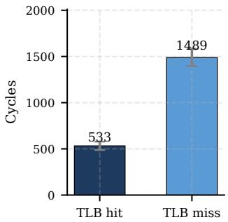  
(a) Hardware translation

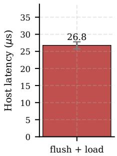  
(b) Vendor flush path  
Figure 12: TLB cost decomposition on an NVIDIA A100. (a) Device-side cost of a single load under a TLB hit and a forced TLB miss. (b) Host-side latency of the conservative vendor flush path.

NVIDIA backend avoids this latency cliff with a simple slowpath heuristic: large physical-frame requests are split into smaller subrequests below the observed threshold. This heuristic only calibrates the backend’s physical-frame allocation policy; it does not affect MOONBRIGHT’s virtual-memory abstraction or its GPU-side page-table update mechanism.

On platforms where these effects are absent, the corresponding policies can be retuned; for example, our ROCm backend does not use the NVIDIA large-request splitting heuristic.

## 5.5 Stability of Always-Fresh VA

First-Touch Translation Cost. Always-Fresh VA avoids ea ger shootdowns for fresh mappings by ensuring that no stale same-address TLB entry can exist. The remaining cost is a first-touch translation by the hardware page walker. Since current GPU counters do not provide a portable way to attribute a specific access to a TLB miss or page walk, we use timing microbenchmarks.

Figure 12(a) shows that modern GPU page walks are fast: on an NVIDIA A100, a pre-warmed TLB hit takes 533 cycles, while a forced miss that walks to a valid PTE takes 1489 cycles, adding only 956 cycles. This miss cost is only one hardware component of the first load. In contrast, Figure 12(b) shows that the conservative CUDA Driver VMM flush path takes 26.8 µs, dominated by host-device synchronization. Thus, Always-Fresh VA replaces a tens-ofmicroseconds global shootdown on the fresh-allocation path with a small local first-touch translation cost, while deferring global flushes to rare VA-epoch wrap points.

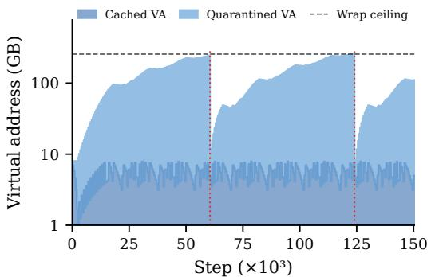  
Figure 13: VA footprint under the synthetic stress workload. Cached VA denotes reusable VA held by the slow-path block pool, while Quarantined VA denotes unmapped VA from evicted segments that awaits batch reclamation at the next epoch boundary.

Quarantine Pressure and Epoch Wrap Behavior. To rigorously evaluate the Always-Fresh VA policy under worstcase conditions where allocations are not served from cached blocks, we construct a cache-defeating stress workload. The workload uses non-repeating allocation sizes, extended lifetimes, and high-frequency cadence to defeat cached-block reuse, forcing most requests to reserve fresh VA and advance the frontier at a sustained rate. With a conservative 256 GB wraparound threshold, Figure 13 shows that cached VA remains bounded, while quarantined VA accumulates safely un til batch reclamation. At the epoch boundary, MOONBRIGHT performs one batched reclamation with a microsecond-scale tlb\_flush, as measured in Figure 12. These results show that MOONBRIGHT turns costly per-allocation TLB shootdowns into rare, configurable epoch-boundary events. Furthermore, expanding the epoch size to further reduce flush frequency incurs negligible overhead: flattening a 256 GB VA range requires under 2 MB of page-table memory (using 2 MB pages), and scaling to a 1 TB epoch requires only ∼8 MB.

## 6 Discussion

This section discusses MOONBRIGHT’s scope, limitations, and relationship to existing GPU memory-management mechanisms.

Security and Multi-Tenancy. MOONBRIGHT currently targets trusted and cooperative deployments, such as dedicated LLM inference clusters or single-tenant GPU environments, where applications and kernels are known to the operator. Under this threat model, compute kernels are assumed to be nonmalicious, and page-table update kernels are generated only by the trusted MOONBRIGHT runtime. Extending MOON-BRIGHT to untrusted multi-tenant settings raises additional challenges because exposing page-table state to device code creates privileged state that malicious kernels could misuse. MPS does not eliminate this concern, as it targets cooperative multi-process execution rather than protection from malicious device code. MIG provides a stronger hardware partitioning boundary and can help confine cross-instance effects when MOONBRIGHT runs within a single instance. A KASLR-style randomized page-table view can reduce accidental corruption and casual discovery, but is not a security boundary; untrusted deployments still need hidden page-table state, driver own ership checks, capability handles, and sandboxed or verified mapping kernels. We view this as an important open problem for GPU-resident memory management and leave a complete security architecture to future work.

Relation to UVM. NVIDIA Unified Memory (UVM) exposes managed memory through a unified CPU–GPU virtual address space. In demand-paged mode, GPU accesses to nonresident managed pages trigger hardware fault reporting; the driver resolves residency and coherence, updates mappings, and replays the faulting access. MOONBRIGHT is complemen tary to UVM rather than a replacement. UVM targets transparent host–device sharing through a fault-driven path, whereas MOONBRIGHT targets latency-critical device-resident memory by proactively installing stream-ordered mappings and materializing PTEs on the GPU. Applications can therefore use UVM-backed regions for transparent sharing and MOON-BRIGHT-backed regions for low-latency GPU-resident allocation and remapping within the same CUDA context.

## 7 Related Work

GPU allocators and memory managers. Early GPU allocators such as ScatterAlloc [62] and XMalloc [18] target fine-grained, kernel-initiated allocation for massively parallel programs. They are effective for dynamic parallelism but do not match the dominant memory-management pattern in DL frameworks, where the host/runtime allocates coarse tensors and KV-cache regions. Gallatin [36] improves general-purpose allocation on the device, but it does not address the CPU-driven virtual-memory control plane that dominates page-granular remapping latency. FineMem [66] reduces memory waste in fine-grained disaggregated memory, while Unified Memory simplifies programming by providing a shared address space; prior studies show that UVM can introduce unpredictable transfer and synchronization overheads for latency-sensitive workloads [26, 29]. MOONBRIGHT is complementary: it focuses on making GPU page-table updates low-latency and stream-compatible on commodity devices.

Defragmentation and virtual-memory stitching. Classic defragmentation and compaction techniques move live objects to recover contiguous space [35, 59, 65]. Such approaches are portable but expensive for GPU workloads because they require data movement, pointer rewriting, and synchronization. Model-specific approaches such as memoryefficient DenseNet training [44] hand-tune buffer sharing to reduce activation memory, but do not provide general allocator-level defragmentation. Recent DL systems and allocators address waste through virtual-memory stitching or planning: PyTorch’s experimental expandable segments grow VMM-backed segments to reduce allocation slivers [46], GM-Lake [16] applies CUDA VMM to DNN training, vAttention [45] remaps KV caches, and STAlloc [19] plans training allocations over space and time. These systems demonstrate the value of memory-aware allocation, but they inherit CPUcentric mapping costs or operate above the hardware mapping substrate. MOONBRIGHT targets the root cause by materializing PTEs on the GPU and deferring TLB coherence when mappings use fresh VAs.

LLM serving memory systems. LLM serving systems optimize memory use and scheduling at several layers. ORCA [70], FastServe [68], and Sarathi [4] improve batching, prefill/decode scheduling, or distributed serving. FlexGen [57] and PowerInfer [61] target memory-constrained serving through offloading or hybrid CPU/GPU execution. Mooncake [47], Jenga [73], CacheGen [33], Pensieve [71], and DroidSpeak [32] optimize KV-cache placement, reuse, compression, streaming, or sharing. vLLM [25] introduced PagedAttention for block-based KV-cache management, while S-LoRA [56] and Punica [10] manage serving many LoRA adapters. These systems are effective above the memorymanagement substrate, but their mechanisms are tied to model/runtime semantics and often require specialized kernels or metadata paths. MOONBRIGHT instead accelerates the hardware MMU mapping path, preserving hardware-level virtual contiguity while supporting dynamic remapping and sharing.

## 8 Conclusion

GPU memory management remains largely host-driven, leaving device parallelism unused on the allocation critical path. This paper presented MOONBRIGHT, a GPU-centric memorymanagement substrate that materializes page-table updates on the GPU and avoids unnecessary TLB shootdowns with Always-Fresh virtual addressing. By turning translation updates into data-parallel device work, MOONBRIGHT reduces mapping latency by up to three orders of magnitude and improves allocation latency and memory efficiency across training and inference workloads.

## Acknowledgment

We would like to extend our most sincere gratitude to our shepherd and reviewers for their feedback and suggestions. This work is supported by the National Key Research and Development Program of China (2024YFB4505603), the National Natural Science Foundation of China (62232015, 62302479).

## References

[1] Martín Abadi, Paul Barham, Jianmin Chen, Zhifeng Chen, Andy Davis, Jeffrey Dean, Matthieu Devin, Sanjay Ghemawat, Geoffrey Irving, Michael Isard, et al. TensorFlow: A system for Large-Scale machine learning. In 12th USENIX symposium on operating systems design and implementation (OSDI 16), pages 265–283, 2016.

[2] Mark James Abraham, Teemu Murtola, Roland Schulz, Szilárd Páll, Jeremy C Smith, Berk Hess, and Erik Lindahl. GROMACS: High performance molecular simulations through multi-level parallelism from laptops to supercomputers. SoftwareX, 1:19–25, 2015.

[3] Bilge Acun, David J Hardy, Laxmikant V Kale, Keqin Li, James C Phillips, and John E Stone. Scalable molecular dynamics with NAMD on the summit system. IBM journal of research and development, 62(6):4–1, 2018.

[4] Amey Agrawal, Nitin Kedia, Ashish Panwar, Jayashree Mohan, Nipun Kwatra, Bhargav Gulavani, Alexey Tumanov, and Ramachandran Ramjee. Taming Throughput-Latency tradeoff in LLM inference with Sarathi-Serve. In 18th USENIX Symposium on Operating Systems Design and Implementation (OSDI 24), pages 117–134, 2024.

[5] Joshua Ainslie, James Lee-Thorp, Michiel de Jong, Yury Zemlyanskiy, Federico Lebron, and Sumit Sang hai. GQA: Training Generalized Multi-Query Transformer Models from Multi-Head Checkpoints. In Houda Bouamor, Juan Pino, and Kalika Bali, editors, Proceedings of the 2023 Conference on Empirical Methods in Natural Language Processing, pages 4895–4901, Singapore, December 2023. Association for Computational Linguistics.

[6] AMD. ROCm documentation - virtual memory management. https://rocm.docs.amd.com/projects/HIP /en/latest/doxygen/html/group\_\_\_virtual.ht ml, 2025. Accessed: 2025.12.09.

[7] AMD ROCm Developer Tools. HIP Examples and Samples. https://github.com/ROCm/rocm-examples, 2025. Accessed: 2025.12.09.

[8] Jeff Bonwick. The slab allocator: an object-caching kernel memory allocator. In Proceedings of the USENIX Summer 1994 Technical Conference on USENIX Summer 1994 Technical Conference - Volume 1, USTC’94, page 6, USA, 1994. USENIX Association.

[9] Tom B. Brown, Benjamin Mann, Nick Ryder, Melanie Subbiah, Jared Kaplan, Prafulla Dhariwal, Arvind Neelakantan, Pranav Shyam, Girish Sastry, Amanda Askell, Sandhini Agarwal, Ariel Herbert-Voss, Gretchen Krueger, Tom Henighan, Rewon Child, Aditya Ramesh, Daniel M. Ziegler, Jeffrey Wu, Clemens Winter, Christo pher Hesse, Mark Chen, Eric Sigler, Mateusz Litwin, Scott Gray, Benjamin Chess, Jack Clark, Christopher Berner, Sam McCandlish, Alec Radford, Ilya Sutskever, and Dario Amodei. Language models are few-shot learners. In Proceedings of the 34th International Conference on Neural Information Processing Systems, NIPS ’20, Red Hook, NY, USA, 2020. Curran Associates Inc.

[10] Lequn Chen, Zihao Ye, Yongji Wu, Danyang Zhuo, Luis Ceze, and Arvind Krishnamurthy. Punica: Multi-Tenant LoRA Serving. In Phillip B. Gibbons, Gennady Pekhimenko, and Christopher De Sa, editors, Proceedings of the Seventh Annual Conference on Machine Learning and Systems, MLSys 2024, Santa Clara, CA, USA, May 13-16, 2024. mlsys.org, 2024.

[11] Tianqi Chen, Bing Xu, Chiyuan Zhang, and Carlos Guestrin. Training deep nets with sublinear memory cost. arXiv preprint arXiv:1604.06174, 2016.

[12] NVIDIA Corporation. NVIDIA linux open GPU kernel module source. https://github.com/NVIDIA/open -gpu-kernel-modules, 2025. Accessed: 2025.12.09.

[13] Alexey Dosovitskiy, Lucas Beyer, Alexander Kolesnikov, Dirk Weissenborn, Xiaohua Zhai, Thomas Unterthiner, Mostafa Dehghani, Matthias Minderer, Georg Heigold, Sylvain Gelly, Jakob Uszkoreit, and Neil Houlsby. An image is worth 16x16 words: Transformers for image recognition at scale. In International Conference on Learning Representations, 2021.

[14] Jason Evans. A scalable concurrent malloc (3) implementation for freebsd. In Proc. of the bsdcan conference, ottawa, canada, 2006.

[15] Wolfram Gloger et al. Dynamic memory allocator implementations in linux system libraries. http://www.ma lloc.de/papers/malloc-slides, 1997. Accessed: 2025.12.09.

[16] Cong Guo, Rui Zhang, Jiale Xu, Jingwen Leng, Zihan Liu, Ziyu Huang, Minyi Guo, Hao Wu, Shouren Zhao, Junping Zhao, and Ke Zhang. GMLake: Efficient and

Transparent GPU Memory Defragmentation for Largescale DNN Training with Virtual Memory Stitching. In Proceedings of the 29th ACM International Conference on Architectural Support for Programming Languages and Operating Systems, Volume 2, ASPLOS ’24, page 450–466, New York, NY, USA, 2024. Association for Computing Machinery.

[17] Kaiming He, Xiangyu Zhang, Shaoqing Ren, and Jian Sun. Deep residual learning for image recognition. In Proceedings of the IEEE Conference on Computer Vision and Pattern Recognition, pages 770–778, 2016.

[18] Xiaohuang Huang, Christopher I Rodrigues, Stephen Jones, Ian Buck, and Wen-mei Hwu. XMalloc: A scalable lock-free dynamic memory allocator for many-core machines. In 2010 10th IEEE International Confer ence on Computer and Information Technology, pages 1134–1139. IEEE, 2010.

[19] Zixiao Huang, Junhao Hu, Hao Lin, Chunyang Zhu, Yueran Tang, Quanlu Zhang, Zhen Guo, Zhenhua Li, Shengen Yan, Zhenhua Zhu, et al. Stalloc: Enhancing memory efficiency in large-scale model training with spatio-temporal planning. arXiv preprint arXiv:2507.16274, 2025.

[20] Andrew Hamilton Hunter, Chris Kennelly, Paul Turner, Darryl Gove, Tipp Moseley, and Parthasarathy Ranganathan. Beyond malloc efficiency to fleet efficiency: a hugepage-aware memory allocator. In 15th USENIX Symposium on Operating Systems Design and Implementation (OSDI 21), pages 257–273, 2021.

[21] Marcus Jägemar. Mallocpool: Improving memory performance through contiguously tlb mapped memory. In 2018 IEEE 23rd International Conference on Emerging Technologies and Factory Automation (ETFA), volume 1, pages 1127–1130. IEEE, 2018.

[22] Zheming Jin and Jeffrey S Vetter. A benchmark suite for improving performance portability of the sycl programming model. In 2023 IEEE International Symposium on Performance Analysis of Systems and Software (IS-PASS), pages 325–327. IEEE, 2023.

[23] Vivek Kini and Jake Hemstad. Using the NVIDIA CUDA Stream-Ordered Memory Allocator, Part 2. ht tps://developer.nvidia.com/blog/using-cud a-stream-ordered-memory-allocator-part-2/, July 2021. Accessed: 2025.12.09.

[24] Bradley C Kuszmaul. Supermalloc: a super fast multithreaded malloc for 64-bit machines. ACM SIGPLAN Notices, 50(11):41–55, 2015.

[25] Woosuk Kwon, Zhuohan Li, Siyuan Zhuang, Ying Sheng, Lianmin Zheng, Cody Hao Yu, Joseph E. Gonzalez, Hao Zhang, and Ion Stoica. Efficient Memory Management for Large Language Model Serving with PagedAttention. In Proceedings of the ACM SIGOPS 29th Symposium on Operating Systems Principles, 2023.

[26] Ruihao Li, Bagus Hanindhito, Sanjana Yadav, Qinzhe Wu, Krishna Kavi, Gayatri Mehta, Neeraja J Yadwadkar, and Lizy K John. Performance implications of pipelining the data transfer in CPU-GPU heterogeneous systems. ACM Transactions on Architecture and Code Optimization, 2025.

[27] Ruihao Li, Qinzhe Wu, Krishna Kavi, Gayatri Mehta, Jonathan C Beard, Neeraja J Yadwadkar, and Lizy K John. Speedmalloc: Improving multi-threaded applications via a lightweight core for memory allocation. arXiv preprint arXiv:2508.20253, 2025.

[28] Ruihao Li, Qinzhe Wu, Krishna Kavi, Gayatri Mehta, Neeraja J Yadwadkar, and Lizy K John. NextGen-Malloc: Giving memory allocator its own room in the house. In Proceedings of the 19th Workshop on Hot Topics in Operating Systems, pages 135–142, 2023.

[29] Ruihao Li, Sanjana Yadav, Qinzhe Wu, Krishna Kavi, Gayatri Mehta, Neeraja J Yadwadkar, and Lizy K John. Performance implications of async memcpy and uvm: a tale of two data transfer modes. In 2023 IEEE International Symposium on Workload Characterization (IISWC), pages 115–127. IEEE, 2023.

[30] Shen Li, Yanli Zhao, Rohan Varma, Omkar Salpekar, Pieter Noordhuis, Teng Li, Adam Paszke, Jeff Smith, Brian Vaughan, Pritam Damania, et al. PyTorch Distributed: Experiences on accelerating data parallel training. arXiv preprint arXiv:2006.15704, 2020.

[31] Hang Liu and H Howie Huang. Enterprise: Breadth-first graph traversal on GPUs. In Proceedings of the International Conference for High Performance Computing, Networking, Storage and Analysis, pages 1–12, 2015.

[32] Yuhan Liu, Yuyang Huang, Jiayi Yao, Shaoting Feng, Zhuohan Gu, Kuntai Du, Hanchen Li, Yihua Cheng, Junchen Jiang, Shan Lu, et al. DroidSpeak: KV cache sharing for cross-LLM communication and multi-LLM serving. arXiv preprint arXiv:2411.02820, 2024.

[33] Yuhan Liu, Hanchen Li, Yihua Cheng, Siddhant Ray, Yuyang Huang, Qizheng Zhang, Kuntai Du, Jiayi Yao, Shan Lu, Ganesh Ananthanarayanan, et al. CacheGen: KV cache compression and streaming for fast large language model serving. In Proceedings of the ACM SIG-COMM 2024 Conference, pages 38–56, 2024.

[34] Clemens Lutz, Sebastian Breß, Steffen Zeuch, Tilmann Rabl, and Volker Markl. Pump up the volume: Processing large data on GPUs with fast interconnects. In Proceedings of the 2020 ACM SIGMOD International Conference on Management of Data, SIGMOD ’20, page 1633–1649, New York, NY, USA, 2020. Association for Computing Machinery.

[35] Simon Marlow, Tim Harris, Roshan P James, and Simon Peyton Jones. Parallel generational-copying garbage collection with a block-structured heap. In Proceedings of the 7th international symposium on Memory management, pages 11–20, 2008.

[36] Hunter Mccoy and Prashant Pandey. Gallatin: A generalpurpose GPU memory manager. In Proceedings of the 29th ACM SIGPLAN Annual Symposium on Principles and Practice of Parallel Programming, PPoPP ’24, page 364–376, New York, NY, USA, 2024. Association for Computing Machinery.

[37] Deepak Narayanan, Mohammad Shoeybi, Jared Casper, Patrick LeGresley, Mostofa Patwary, Vijay Korthikanti, Dmitri Vainbrand, Prethvi Kashinkunti, Julie Bernauer, Bryan Catanzaro, et al. Efficient large-scale language model training on GPU clusters using Megatron-LM. In Proceedings of the International Conference for High Performance Computing, Networking, Storage and Anal ysis, pages 1–15, 2021.

[38] Amir Hossein Nodehi Sabet, Junqiao Qiu, and Zhijia Zhao. Tigr: Transforming irregular graphs for GPUfriendly graph processing. In Proceedings of the Twenty-Third International Conference on Architectural Support for Programming Languages and Operating Systems, pages 622–636, 2018.

[39] NVIDIA. CUDA Driver API: Virtual Memory Management (VMM) Documentation. https://docs.nvidi a.com/cuda/cuda-driver-api/group\_\_CUDA\_\_VA .html, 2025. Accessed: 2025.12.09.

[40] NVIDIA. NVIDIA HGX Platform. https://www.nv idia.com/en-us/data-center/hgx/, 2025. Accessed: 2025.12.09.

[41] NVIDIA Corporation. CUDA Samples. https://gi thub.com/NVIDIA/cuda-samples, 2025. Accessed: 2025.12.09.

[42] NVIDIA Corporation. RAPIDS: Open GPU data science. https://rapids.ai/, 2025. Accessed: 2025.12.09.

[43] Adam Paszke, Sam Gross, Francisco Massa, Adam Lerer, James Bradbury, Gregory Chanan, Trevor Killeen, Zeming Lin, Natalia Gimelshein, Luca Antiga, et al.

PyTorch: An imperative style, high-performance deep learning library. Advances in neural information processing systems, 32, 2019.

[44] Geoff Pleiss, Danlu Chen, Gao Huang, Tongcheng Li, Laurens van der Maaten, and Kilian Q. Weinberger. Memory-efficient implementation of DenseNets. arXiv preprint arXiv:1707.06990, 2017.

[45] Ramya Prabhu, Ajay Nayak, Jayashree Mohan, Ramachandran Ramjee, and Ashish Panwar. vAttention: Dynamic memory management for serving LLMs without PagedAttention. In Proceedings of the 30th ACM International Conference on Architectural Support for Programming Languages and Operating Systems, Volume 1, pages 1133–1150, 2025.

[46] PyTorch Contributors. PyTorch CUDA semantics: memory management and expandable segments. https: //docs.pytorch.org/docs/stable/notes/cuda. html#optimizing-memory-usage-with-pytorch -cuda-alloc-conf, 2025. Accessed: 2025.12.09.

[47] Ruoyu Qin, Zheming Li, Weiran He, Jialei Cui, Feng Ren, Mingxing Zhang, Yongwei Wu, Weimin Zheng, and Xinran Xu. Mooncake: Trading more storage for less computation—a KVCache-centric architecture for serving LLM chatbot. In 23rd USENIX Conference on File and Storage Technologies (FAST 25), pages 155– 170, 2025.

[48] Qwen Team. Qwen1.5-MoE-A2.7B. https://hu ggingface.co/Qwen/Qwen1.5-MoE-A2.7B, 2024. Accessed: 2025.12.09.

[49] Alec Radford, Jeffrey Wu, Rewon Child, David Luan, Dario Amodei, and Ilya Sutskever. Language models are unsupervised multitask learners. OpenAI Technical Report, 2019.

[50] Samyam Rajbhandari, Jeff Rasley, Olatunji Ruwase, and Yuxiong He. ZeRO: Memory optimizations toward training trillion parameter models. In SC20: International Conference for High Performance Computing, Networking, Storage and Analysis, pages 1–16. IEEE, 2020.

[51] Jeff Rasley, Samyam Rajbhandari, Olatunji Ruwase, and Yuxiong He. DeepSpeed: System optimizations enable training deep learning models with over 100 billion parameters. In Proceedings of the 26th ACM SIGKDD International Conference on Knowledge Discovery & Data Mining, pages 3505–3506, 2020.

[52] Jie Ren, Samyam Rajbhandari, Reza Yazdani Aminabadi, Olatunji Ruwase, Shuangyan Yang, Minjia Zhang, Dong Li, and Yuxiong He. ZeRO-Offload: Democratizing Billion-Scale model training. In 2021

USENIX Annual Technical Conference (USENIX ATC 21), pages 551–564, 2021.

[53] J. M. Robson. Bounds for some functions concerning dynamic storage allocation. J. ACM, 21(3):491–499, July 1974.

[54] Christopher J Rossbach, Jon Currey, Mark Silberstein, Baishakhi Ray, and Emmett Witchel. PTask: Operating system abstractions to manage GPUs as compute devices. In Proceedings of the Twenty-Third ACM Symposium on Operating Systems Principles, pages 233–248, 2011.

[55] Romelia Salomon-Ferrer, Andreas W Gotz, Duncan Poole, Scott Le Grand, and Ross C Walker. Routine microsecond molecular dynamics simulations with AM-BER on GPUs. 2. explicit solvent particle mesh ewald. Journal of chemical theory and computation, 9(9):3878– 3888, 2013.

[56] Ying Sheng, Shiyi Cao, Dacheng Li, Coleman Hooper, Nicholas Lee, Shuo Yang, Christopher Chou, Banghua Zhu, Lianmin Zheng, Kurt Keutzer, Joseph Gonzalez, and Ion Stoica. SLoRA: Scalable Serving of Thousands of LoRA Adapters. In P. Gibbons, G. Pekhimenko, and C. De Sa, editors, Proceedings of Machine Learning and Systems, volume 6, pages 296–311, 2024.

[57] Ying Sheng, Lianmin Zheng, Binhang Yuan, Zhuohan Li, Max Ryabinin, Beidi Chen, Percy Liang, Christopher Ré, Ion Stoica, and Ce Zhang. FlexGen: Highthroughput generative inference of large language models with a single GPU. In Proceedings of the 40th International Conference on Machine Learning, pages 31094–31116, 2023.

[58] Mohammad Shoeybi, Mostofa Patwary, Raul Puri, Patrick LeGresley, Jared Casper, and Bryan Catanzaro. Megatron-LM: Training multi-billion parameter language models using model parallelism. arXiv preprint arXiv:1909.08053, 2019.

[59] David Siegwart and Martin Hirzel. Improving locality with parallel hierarchical copying gc. In Proceedings of the 5th international symposium on Memory management, pages 52–63, 2006.

[60] Mark Silberstein, Bryan Ford, Idit Keidar, and Emmett Witchel. GPUfs: Integrating a file system with GPUs. In Proceedings of the eighteenth international conference on Architectural Support for Programming Languages and Operating Systems, pages 485–498, 2013.

[61] Yixin Song, Zeyu Mi, Haotong Xie, and Haibo Chen. PowerInfer: Fast large language model serving with a consumer-grade GPU. In Proceedings of the ACM

SIGOPS 30th Symposium on Operating Systems Principles, pages 590–606, 2024.

[62] Markus Steinberger, Michael Kenzel, Bernhard Kainz, and Dieter Schmalstieg. Scatteralloc: Massively parallel dynamic memory allocation for the gpu. In 2012 Innovative Parallel Computing (InPar), pages 1–10. IEEE, 2012.

[63] Hugo Touvron, Thibaut Lavril, Gautier Izacard, Xavier Martinet, Marie-Anne Lachaux, Timothée Lacroix, Baptiste Rozière, Naman Goyal, Eric Hambro, Faisal Azhar, et al. Llama: Open and efficient foundation language models. arXiv preprint arXiv:2302.13971, 2023.

[64] Hugo Touvron, Louis Martin, Kevin Stone, Peter Albert, Amjad Almahairi, Yasmine Babaei, Nikolay Bashlykov, Soumya Batra, Prajjwal Bhargava, Shruti Bhosale, et al. Llama 2: Open foundation and fine-tuned chat models. arXiv preprint arXiv:2307.09288, 2023.

[65] Ronald Veldema and Michael Philippsen. Parallel memory defragmentation on a GPU. In Proceedings of the 2012 ACM SIGPLAN Workshop on Memory Systems Performance and Correctness, pages 38–47, 2012.

[66] Xiaoyang Wang, Yongkun Li, Kan Wu, Wenzhe Zhu, Yuqi Li, and Yinlong Xu. FineMem: Breaking the allocation overhead vs. memory waste dilemma in Fine-Grained disaggregated memory management. In 19th USENIX Symposium on Operating Systems Design and Implementation (OSDI 25), pages 57–74, 2025.

[67] Yangzihao Wang, Andrew Davidson, Yuechao Pan, Yuduo Wu, Andy Riffel, and John D Owens. Gunrock: A high-performance graph processing library on the GPU. In Proceedings of the 21st ACM SIGPLAN symposium on principles and practice of parallel programming, pages 1–12, 2016.

[68] Bingyang Wu, Yinmin Zhong, Zili Zhang, Shengyu Liu, Fangyue Liu, Yuanhang Sun, Gang Huang, Xuanzhe Liu, and Xin Jin. Fast distributed inference serving for large language models. arXiv preprint arXiv:2305.05920, 2023.

[69] Rio Yokota and Lorena A Barba. Treecode and fast multipole method for N-body simulation with CUDA. In GPU Computing Gems Emerald Edition, pages 113– 132. Elsevier, 2011.

[70] Gyeong-In Yu, Joo Seong Jeong, Geon-Woo Kim, Soojeong Kim, and Byung-Gon Chun. Orca: A distributed serving system for Transformer-Based generative models. In 16th USENIX Symposium on Operating Systems Design and Implementation (OSDI 22), pages 521–538, 2022.

[71] Lingfan Yu, Jinkun Lin, and Jinyang Li. Stateful large language model serving with pensieve. In Proceedings of the Twentieth European Conference on Computer Systems, pages 144–158, 2025.

[72] Shan Yu, Jiarong Xing, Yifan Qiao, Mingyuan Ma, Yangmin Li, Yang Wang, Shuo Yang, Zhiqiang Xie, Shiyi Cao, Ke Bao, et al. Prism: Unleashing GPU sharing for cost-efficient multi-LLM serving. arXiv preprint arXiv:2505.04021, 2025.

[73] Chen Zhang, Kuntai Du, Shu Liu, Woosuk Kwon, Xiangxi Mo, Yufeng Wang, Xiaoxuan Liu, Kaichao You, Zhuohan Li, Mingsheng Long, et al. Jenga: Effective memory management for serving LLM with heterogeneity. In Proceedings of the ACM SIGOPS 31st Symposium on Operating Systems Principles, pages 446–461, 2025.

[74] Zhenkai Zhang, Tyler Allen, Fan Yao, Xing Gao, and Rong Ge. Tunnels for Bootlegging: Fully Reverse-Engineering GPU TLBs for Challenging Isolation Guarantees of NVIDIA MIG. In Proceedings of the 2023 ACM SIGSAC Conference on Computer and Communications Security, CCS ’23, page 960–974, New York, NY, USA, 2023. Association for Computing Machinery.

[75] Jianlong Zhong and Bingsheng He. Medusa: A parallel graph processing system on graphics processors. ACM SIGMOD Record, 43(2):35–40, 2014.