USENIX

THE ADVANCED COMPUTING SYSTEMS ASSOCIATION

# Blowfish: Elastic Virtual Machine Memory for Disaggregated Memory

Yulong Zhang, SKLP, Institute of Computing Technology, CAS and University of   
Chinese Academy of Sciences; Yilong Luo and Diyu Zhou, SCS, Peking University, China; Quan Chen, Shanghai Jiao Tong University; Quanxi Li, SKLP, Institute of Computing Technology, CAS and University of Chinese Academy of Sciences;   
Mosong Zhou, Lei Zhu, Senbo Fu, and Qian Peng, Huawei Cloud; Huimin Cui and Xiaobing Feng, SKLP, Institute of Computing Technology, CAS and University of Chinese Academy of Sciences; Tao Xie, SCS, Peking University, China; Chenxi Wang, SKLP, Institute of Computing Technology, CAS and University of Chinese Academy of Sciences

https://www.usenix.org/conference/osdi26/presentation/zhang-yulong

This paper is included in the Proceedings of the 20th USENIX Symposium on Operating Systems Design and Implementation.

July 13–15, 2026 • Seattle, WA, USA

ISBN 978-1-939133-55-7

Open access to the Proceedings of the 20th USENIX Symposium on Operating Systems Design and Implementation is sponsored by

# Blowfish: Elastic Virtual Machine Memory for Disaggregated Memory

Yulong Zhang 1,2 Yilong Luo 3 Diyu Zhou 3 Quan Chen 4 Quanxi Li 1,2 Mosong Zhou 5 Lei Zhu 5 Senbo Fu 5 Qian Peng 5 Huimin Cui 1,2 Xiaobing Feng 1,2 Tao Xie 3 Chenxi Wang 1,2\*

1SKLP, Institute of Computing Technology, CAS 2University of Chinese Academy of Sciences 3SCS, Peking University, China 4Shanghai Jiao Tong University 5Huawei Cloud

## Abstract

Cold memory rebalancing exhibits unique challenges to the existing memory overcommitment mechanisms, such as page tracking under Transparent Huge Pages (THP) and frequent remapping of page tables, leading to a series of throughput and latency issues. In this paper, we propose Blowfish, a memory overcommitment framework built on disaggregated memory, performing cold (and free) memory reclamation and restoration at µs-scale. Based on paravirtualization, Blowfish leverages a lightweight guest-level THP-aware hotness tracker to monitor page access and let the hypervisor directly reclaim and reallocate host physical memory across VMs with a dedicated cross-layer path for cold memory, bypassing the modifications of guest page table and modifications of I/O page table while benefiting from the rich program semantics of guest VM when recognizing the cold memory. As a result, Blowfish significantly speeds up the page reclamation and restoration, 2.48× and 2.14× faster than the state-of-theart solution, HyperAlloc, respectively, and improves memory reclamation ratios by 1.6×–6.1× within 5% performance degradation.

## 1 Introduction

Memory overcommitment promises to improve memory utilization and has been widely adopted in multi-tenant data centers. However, the existing memory overcommitment research [9, 24, 27, 30, 39, 53, 56, 59] mainly focuses on free memory rebalancing, i.e., reclaiming free memory and real locating it across virtual machines (VMs), overlooking cold memory, which accounts for a large portion of VM memory usage [19, 40, 50, 58]. In the existing research, the conventional approach to reclaiming cold memory relies on either guest-level swapping, in which cold pages are first swapped out within the guest and then reclaimed as free pages, or hostlevel swapping, in which the guest’s underlying host pages are swapped without the guest’s awareness. Both techniques require moving infrequently accessed data to disk. Accessing reclaimed cold memory then requires restoring it, typically by triggering a page fault, allocating free memory, and swapping the data back. However, writing to and reading from disk are slow and costly (up to milliseconds for a 4 KB page), leading to Service-Level Objective (SLO) violations. As a result, prior work often overlooks opportunities to reclaim cold memory for memory overcommitment, even though doing so could provide substantial benefits.

Memory disaggregation enables µs-scale memory overcommitment. Thanks to the unprecedented development of emerging fabrics, e.g., InfiniBand [1], RoCE NICs [43], and CXL [22, 37], the time of sending a page to another server is reduced to a few microseconds (µs) and more than 200× faster than swapping to disk [23,49,54,61], bringing great opportunities to further improve the memory utilization through cold memory swapping. Given that more than 50% of data center memory remains idle [7, 21, 58] due to the bin-packing inefficiencies in VM placement, the emerging fabrics make it possible to use this idle memory of other servers as the secondary memory (referred to as far memory) and swap out the cold data of a VM to far memory to reclaim the memory space for overcommitment.

Software overhead starts dominating the inefficiency of VM memory overcommitment. Even with high-speed interconnects, existing memory overcommitment frameworks still suffer from substantial inefficiency, as presented in §3. There are two main reasons for this inefficiency: (1) With guestlevel swapping, reclaiming and restoring cold memory involves three page tables: the guest page table (GPT), which maps guest virtual addresses to guest physical addresses, the extended page table (EPT), which maps guest physical addresses to host physical addresses, and the I/O page table (IOPT), which maps I/O virtual addresses to host physical addresses, causing software overhead to be 3.4×–6.8× higher than network data transfer. (2) With host-level swapping, reclaiming cold memory requires tracking page hotness on the host side, which involves frequently resetting the host’s PTE access bits and results in 5× more TLB flushes than tracking on the guest side.

Transparent Huge Pages (THPs) further complicate memory overcommitment. Making things more challenging, virtualized environments commonly rely on THPs to reduce page-table translation overhead. However, cold memory is often non-contiguously distributed, creating complex trade-offs in page granularity. Keeping huge pages preserves translation efficiency but inflates apparent hotness, since a single hot subpage can mark the entire huge page as hot. Splitting huge pages allows more accurate hotness tracking but sacrifices the benefits of huge pages and incurs overheads of fine-grained page-table operations. Moreover, memory overcommitment mechanisms often need to manage pages of mixed granularity when THP is enabled, because fine-grained memory operations (such as allocation, deallocation, permission changes, and swapping) frequently break huge pages. Existing mechanisms treat all pages uniformly, leading to unfair hotness comparisons between 2 MB huge pages and 4 KB base pages, since a huge page aggregates the hotness of all its constituent base pages.

Major insights. First, cold memory overcommitment suffers from a misplaced division of responsibilities across layers. We propose that an ideal decomposition should place hotness tracking in the guest, where access semantics are naturally visible and can be monitored at low cost, while leaving data transfer and physical memory management to the host, which actually controls memory resources. This organization minimizes software overhead of page tracking and repeated page-table modifications. Second, THP fundamentally changes the design space by introducing mixedgranularity memory. We identify that an effective mechanism should be explicitly aware of mixed granularity: it should detect cold subpages within hot huge pages, fairly compare pages across sizes, and exploit THP benefits when possible. This requirement calls for rethinking hotness tracking and huge page management to efficiently operate across granularities.

Blowfish. Based on the preceding insights, we propose Blowfish, an elastic VM memory adjustment framework built for the memory-disaggregated server. Blowfish’s design targets two main challenges:

First, how to reduce the software overhead to avoid SLO violations during cold memory overcommitment? Blowfish adopts a paravirtualized, cross-layer design that splits respon sibilities between the guest and the host. The guest VM runs a lightweight hotness tracker that integrates with existing kernel mechanisms (e.g., MGLRU stack) to accurately identify cold pages without introducing additional page-table or TLB overheads. The host hypervisor runs a backend that transfers cold data and reclaims pages by modifying only the EPT mappings, avoiding the costly modification overhead of guest page table and IOPT normally incurred by guest-level I/O. In addition, the guest and host exchange only a small amount of metadata through a shared memory interface, an effective and widely used technique [10, 56, 59].

Second, how can we efficiently support mixed-granularity memory under THPs during cold memory overcommitment? Blowfish leverages a mixed-granularity hotness tracker in the guest to identify cold subpages within otherwise hot huge pages in a lightweight manner. This identification is done by dynamically splitting and merging guest page table mappings rather than actual physical pages, minimizing overhead. To ensure fair hotness comparison across page sizes, Blowfish adjusts the promotion policy of huge pages, giving them lower weight than base pages. Together, these mechanisms allow Blowfish to efficiently rebalance memory even in the presence of THP-induced fragmentation and uneven hotness distribution.

Our evaluation shows that Blowfish reduces software overhead by more than 50% compared to state-of-the-art work, such as HyperAlloc [59]. Moreover, it further improves memory reclamation ratios by 1.6×–6.1× within a 5% performance degradation. Blowfish is available at https://github.com/ICTPLSys/blowfish.

In summary, this paper makes the following contributions:

• We analyze cold memory overcommitment in virtualized environments, revealing inefficiencies in existing mechanisms and outlining the principles of an ideal sys tem, i.e., guest-level hotness tracking guiding host-level reclamation, and THP awareness.

• We design a lightweight, subpage-aware hotness tracker that enables fair comparison across mixed-granularity pages, benefiting any scenario that requires hotness tracking under THPs.

• We propose Blowfish, an efficient memory overcommitment framework optimized for THP and cold memory.

• We implement Blowfish in Linux and QEMU, and demonstrate its effectiveness with seven real-world workloads.

## 2 Background and Related Work

## 2.1 Disaggregated Memory System

Benefiting from emerging fabrics, the disaggregated memory systems [8, 16, 37, 49, 51, 54, 61, 63] can provide extremely low data movement latency and high throughput, such as moving a 4 KB page to another server in less than 5µs through the 100Gbps InfiniBand [49, 61], enabling the opportunity of rebalancing the cold memory across VMs. Among different approaches to realizing disaggregated memory, the kernelpaging-based approach [8, 17, 23, 49, 54, 61] attracts attention for its transparency to applications and easy-to-procure hardware platforms, e.g., RoCE NIC [43] and InfiniBand [42].

The disaggregated memory system uses the far memory (offering bandwidths up to 800Gbps [44]), rather than slow disks (around 200MB/s), as the secondary memory via the swap system. Under memory pressure, the kernel swaps out cold data to the far memory to release the local memory. When the evicted data is accessed, the memory management unit (MMU) raises a page fault exception, which traps the control flow into the kernel to swap in the original data from far memory and reconstruct the corresponding page table entry. In this work, we use the state-of-the-art paging-based data path, i.e., Hermit [49], to manage the data transmission at the microsecond scale.

## 2.2 VM Memory Overcommitment

This section discusses how to integrate the paging-based disaggregated memory with the existing memory overcommitment framework to support cold memory overcommitment.

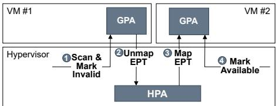  
Figure 1: Reallocating free memory from VM1 to VM2.

Free memory rebalancing. A series of memory overcommitment techniques supporting free memory rebalancing across VMs have been proposed, such as Balloon [53], free page reporting [57], virtio-mem [24], V-Probe [56], HyperAlloc [59] etc., some of which are even adopted by the industry virtualization platforms [5,12,31]. As shown in Figure 1, reclaiming a free guest page ( 1 – 2 ) needs only to unmap the extended page table (EPT), while reallocating a host page ( 3 – 4 ) to another VM also involves only one page table, i.e., EPT. Taking HyperAlloc as an example, 1 the hypervisor first checks the physical memory allocator of the VM to select a free guest page and marks it as invalid to prevent the guest VM allocator using it. 2 Then the hypervisor unmaps the corresponding guest-physical-to-host-physical mapping. At this point, the reclaimed host page can be reallocated to another VM by 3 mapping EPT and 4 marking the originally invalidated guest page as available.

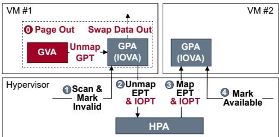  
Figure 2: Reallocating cold memory from VM1 to VM2.

Cold memory rebalancing. The free memory overcommitment framework can be extended to rebalance cold memory by cooperating with the kernel paging (swapping)—swapping infrequently used data to the second-tier memory through emerging IO fabrics to release the cold memory, and then, the released memory pages can be reallocated to other VMs as conventional free pages. The paging can be done in either the guest VM or the hypervisor. These two options are referred to as guest-level swapping and host-level swapping, respectively.

Figure 2 demonstrates the procedure of reclaiming a cold page through the guest-level swapping ( 0 – 2 ) and reallocating it to another VM. Reclaiming a cold page first 0 needs to select a cold page and swap out the infrequently used data on it to release the cold page by unmapping the GPT. And then, similar to reclaiming a free guest page ( 1 – 2 ), the hypervisor needs to unmap the corresponding EPT to reclaim the corresponding free host page. Note that the hypervisor also needs to unmap the IOPT ( 2 ) due to the utilization of the emerging fabrics for data transmission. The IOPT translates the I/O virtual addresses (typically guest physical addresses in the VM) to the actual host physical addresses, ensuring correct DMA operations for passthrough devices. To maintain DMA correctness, memory overcommitment must synchronize updates to the IOPT whenever the underlying physical pages are reclaimed or remapped. The cold-page reclamation procedure involves three page tables, the guest page table (GPT), the extended page table (EPT) and the I/O page table (IOPT), consuming non-trivial CPU resources. Restoring a cold page performs the reverse steps of reclaiming a cold page.

The host-level swapping, which is usually referred to as uncooperative swapping meaning that hypervisor swaps out data and reclaims host pages without cooperating with the guest VM, is usually less efficient due to a lack of VM visibility (detailed in §3.2.3). In particular, double-paging issues [53] can arise when both host-level and guest-level swapping are enabled independently. In this case, the guest may attempt to swap out a page that has already been swapped out by the host. This double-paging behavior can cause the page to be faulted back into memory, only to be re-evicted shortly thereafter, leading to redundant data movement.

Pressure Stall Information (PSI) . To assess the performance risks of memory overcommitment, we leverage Pressure Stall Information (PSI) [58], which quantifies the fraction of time that tasks are stalled due to resource shortages. To adopt PSI as a common control and evaluation lens for VM memory overcommitment with memory reclaim allows us to compare systems under a consistent “bounded pressure” objective.

## 3 Motivation

In this section, we first demonstrate that the datacenter applications contain a large amount of cold memory (§3.1). Then

we discuss why existing overcommitment mechanisms fail to effectively reclaim cold memory (§3.2).

## 3.1 Cold-Memory Reclamation Opportunity

Prior studies [38, 40, 50, 58] show that datacenter applications keep a large amount of cold memory (e.g., 19–62% in Meta’s clusters). This finding suggests considerable reclamation opportunity: a large fraction of cold pages can be reclaimed with negligible performance impact and repurposed to satisfy memory demands from busy tenants or newly spawned tasks.

To better quantify the upper bound of this opportunity, we evaluate seven representative datacenter applications (see Table 2) without THP. Disabling THP avoids hotness amplification and mixed-granularity artifacts, allowing us to measure the cold-memory reclamation space under ideal fine-grained page accounting. Guided by PSI [58], we dynamically swap out memory pages by triggering Linux swapping, using an RDMA-based far-memory backend [49]. By tuning the PSI threshold to bound performance degradation within 5%, we measure the corresponding amount of swapped-out memory to quantify the reclamation opportunity. In our experiments, we observe that 33–49% of application memory can be swapped out with less than 5% performance degradation.

However, turning this large cold-memory reserve into practical benefits in virtualized environments is non-trivial. Strict per-VM memory isolation limits the ability to reclaim cold memory, since adjusting VM allocations requires overcommitment mechanisms. Unfortunately, as we show next, existing mechanisms struggle to effectively exploit this cold-memory reclamation opportunity.

## 3.2 Inefficiencies in Existing Mechanisms

Existing overcommitment mechanisms are primarily optimized for free memory. Reclaiming cold memory instead requires cooperation with guest- or host-level swapping, both of which exhibit fundamental inefficiencies. To illustrate these inefficiencies, we evaluate a representative state-of-the-art mechanism, HyperAlloc [59].

## 3.2.1 THP Complicates Cold-Memory Reclamation

To reduce page-table-walk overhead, modern virtualized systems often enable THP, typically configured in the always mode. However, THP introduces additional complexity for cold-memory reclamation. We repeat the earlier opportunity study (§3.1) with THP enabled, keeping all other settings by default. In our experiments, the available cold-memory reclamation space drops to 16–25% of application memory.

Two factors drive this degradation. First, enabling THP results in a mixture of 2 MB and 4 KB pages for multiple reasons, such as Linux’s allocation behavior, fine-grained deallocations, and subpage-level permission changes. These mixed-granularity pages are managed uniformly (e.g., folio), creating unfair hotness ordering. A 2 MB page aggregates 512 base pages and therefore has many more chances to be accessed, making it appear much hotter than scattered 4 KB pages. As a result, the swapping often evicts hot 4 KB pages while overlooking cold 2 MB pages, ultimately degrading application performance. We refer to this phenomenon as unfair hotness. Second, THP suffers from the well-known hot bloat problem: a few hot 4 KB subpages can cause the entire 2 MB huge page to appear hot, preventing the system from reclaiming the numerous cold subpages that it contains. Several prior efforts [35, 36, 41] attempt to mitigate this effect by selectively splitting hot-skewed huge pages. However, they struggle to balance the overheads of fine-grained monitoring and splitting against the potential reclamation benefits under memory overcommitment. Moreover, the 4 KB pages created by proactive splitting further exacerbate the unfair hotness problem.

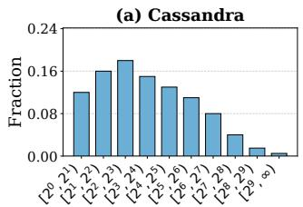

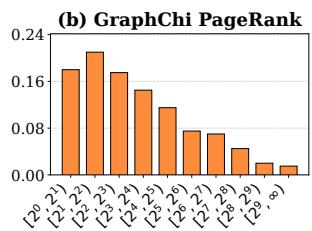  
Page Size  
Figure 3: Cold memory fraction by region size at mid-phase. Cold memory is defined as untouched memory in 10s time window, monitored by DAMON [47, 48].

Together, the effects of unfair hotness and hot bloat highlight the need for a THP-aware cold-memory reclamation design, rather than relying on an existing paging system that remains oblivious to the unfair and skewed hotness of huge pages.

## 3.2.2 Limitations of Guest-Level Swapping

We evaluate guest-level-swapping-augmented HyperAlloc on representative datacenter applications, tuning PSI threshold to bound performance degradation within 5%. We enable THP in both the guest and the host, following the recommended practice for virtualized environments [29]. In our experiments, HyperAlloc reclaims only 35–47% of the cold memory identified as reclaimable in prior profiling (§3.2.1). The shortfall stems from a fundamental granularity mismatch. HyperAlloc performs reclamation at a granularity of 2 MB huge pages to reduce the overhead of page-table operations. However, cold pages in real applications are highly scattered (as shown in Figure 3), and guest-level swapping faces a granularity dilemma. On one hand, swapping a 2 MB huge page as a whole preserves contiguity but exacerbates read/write amplification effects. On the other hand, swapping at 4 KB granularity produces fragmented free pages, making it hard for HyperAlloc to reclaim at 2 MB granularity, thus leaving most cold memory unreclaimable. We follow Linux’s default behavior: THPs are swapped out as a whole, but swap-in happens at 4 KB granularity. The reason is that (1) the kernel usually cannot find a contiguous 2 MB free page for THP swap-in, and (2) swapping in a 2 MB page would severely stall application execution as swapping in lies at the critical path. Under this configuration, about 43% of overall reclaimable memory is at 4 KB granularity, directly limiting the effectiveness of 2 MB-based reclamation. Other designs that rely on 2 MB huge pages, such as virtio-mem [24] and hugepage-balloon [25], suffer from the same limitation.

Table 1: TLB flush comparison between host-level and guest-level swapping HyperAlloc under KMeans workload.  
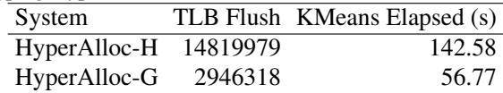

A natural question is whether simply reducing the granularity can close this gap. To answer this question, we extend HyperAlloc to operate at the 4 KB base-page granularity while still opportunistically reclaiming 2 MB huge pages when available. We refer to this variant as HyperAlloc-4K. Under the same experimental setup, HyperAlloc-4K reclaims only 46–60% of the reclaimable cold memory. The root cause is the significant overhead of fine-grained page-table operation. Reclaiming and restoring a single 4 KB cold page of VM incur 36 µs and 21 µs, respectively, latencies that are 1.7× and 2.1× higher than those of guest-level swapping alone. The additional page-table overhead introduced by over commitment slows both reclamation and restoration. The reduced reclamation throughput prevents HyperAlloc-4K from reclaiming cold pages at the rate that they are identified, while the high restoration latency lies directly on the application’s memory-access critical path, tightening the allowable performance headroom. Together, these factors significantly limit the amount of cold memory that can actually be reclaimed. Similar drawbacks arise in other 4 KB-granularity mechanisms (e.g., V-Probe [56] and Balloon [53]), which face the same tradeoff between granularity and page-table overhead.

In summary, guest-level-assisted mechanisms inevitably face a fundamental granularity tradeoff. Using 2 MB huge pages amortizes overhead of page-table operations, but the inherently non-contiguous distribution of cold memory limits the applicability of hugepage-level reclamation. Extending the design to support 4 KB granularity increases coverage, yet the high overhead of 4 KB page-table operations lowers throughput and tightens performance constraints. These limitations, granularity mismatch and high-latency reclamation and restoration at 4 KB granularity, highlight the need for a low-latency design that supports mixed granularity.

## 3.2.3 Limitations of Host-Level Swapping

We use HyperAlloc to reclaim free memory and delegate coldmemory reclamation to host-level swapping. However, when applied to VMs, host-level swapping suffers from well-known limitations. First, the host swapping cannot observe guest memory accesses. To overcome this limitation, we integrate Linux PTE scanning with the KVM MMU notifier, enabling the host to track guest accesses by scanning and clearing EPT access bits. Second, the host cannot distinguish free memory from cold memory, since the entire VM footprint appears as allocated memory. We bridge this semantic gap by exposing HyperAlloc’s guest-allocator metadata to the host, allowing host-level swapping to bypass free guest pages. Under the same experimental setup (§3.1), this hybrid design reclaims only 34–55% of the reclaimable cold memory.

One primary bottleneck is the high overhead of tracking page hotness at the host level. As shown in Table 1, host-level swapping performs 5.0× more TLB flushes than guest-level swapping to reclaim the same amount of cold memory, including expensive full TLB flushes. These flushes directly degrade application performance, a finding also reported in prior work [26]. Moreover, host-level swapping is invisible to the guest. As a result, guest kernel services (such as khugepaged and kcompactd) may access reclaimed pages, triggering unnecessary page restorations. Our measurements show that 26% of all restorations under host-level swapping are caused by such system-service accesses. These unintended restorations affect the amount of reclaimed memory.

In summary, the preceding limitations—heavy hotness tracking and guest-blind reclamation—are inherent to hostlevel swapping and persist regardless of the overcommitment mechanism used for free memory. These limitations highlight the need for a guest-aware design with lightweight hotness monitoring.

## 4 Design and Implementation

## 4.1 Design Goals

To guide the design of Blowfish, we distill three fundamental observations. First, cold memory is inherently noncontiguous, making granularity tradeoff inevitable: huge pages inflate actual hotness, while 4 KB pages incur excessive overheads. Therefore, effective reclamation should operate and be optimized at mixed granularity. Second, accurate hotness information cannot be efficiently obtained at the host level due to limited visibility. Third, reclamation should be guest-aware to prevent misaligned or unintended interactions with guest kernel services. These observations point to three key design requirements.

• Lightweight mixed-granularity hotness tracking: monitor page temperature with minimal overhead, identify cold subpages within huge pages, and place mixedgranularity pages under a fair hotness comparison.

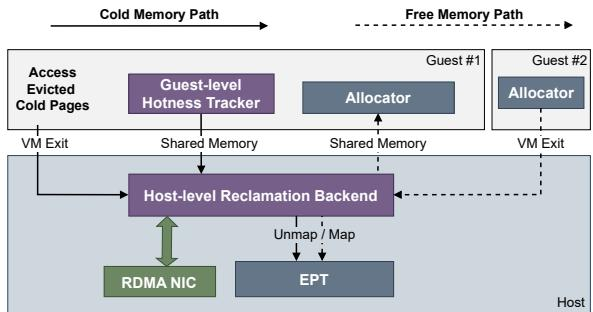  
Figure 4: Design overview of Blowfish.

• Efficient mixed-granularity operations: enable lowlatency fine-grained (4 KB) reclamation/restoration while preserving contiguity when beneficial.

• Guest-aware reclamation: align host-level overcommitment with guest kernel services to prevent blind restorations.

## 4.2 Design Overview

Following the requirements, we introduce Blowfish, whose architecture is shown in Figure 4. At a high level, Blowfish leverages guest-level hotness tracking to instruct the hostlevel reclamation to enable efficient overcommitment.

At the guest level, Blowfish piggybacks on existing Linux MGLRU, and dynamically splits or collapses THPs to capture subpage coldness. It also adjusts MGLRU’s promotion rules to ensure fair comparison between 4 KB and 2 MB pages (§4.3). At the host level, Blowfish performs reclamation and restoration without modifying GPT or IOPT, avoiding expensive page-table operations (§4.4). Blowfish further leverages guest-reported hotness to coordinate guest kernel services and prevent behaviors that conflict with host overcommitment (§4.5).

We describe each component of Blowfish in the following sections, and then present a practical automatic policy (§4.6) together with the mechanisms that ensure correct behavior under limited guest cooperation (§4.7).

## 4.3 Guest-Level Hotness Tracker

A key design choice in Blowfish is to build on Linux’s existing MGLRU mechanism for hotness tracking. Unlike hardwareassisted schemes (e.g., PEBS [26,35] or PML [18,52]), which introduce additional accuracy-overhead trade-offs, reusing MGLRU gives Blowfish an effective in-kernel hotness ordering without new monitoring costs. However, performing hotness tracking at the host level would require page-table scans that trigger expensive global TLB flushes (as shown in §3.2.3). To avoid heavy costs, Blowfish shifts hotness tracking into the guest and integrates it into the guest MGLRU.

To mitigate unfair hotness and hot bloat problems introduced by THP, Blowfish makes two lightweight extensions: a fair promotion rule of MGLRU that equalizes hotness treatment across 4 KB and 2 MB pages (§4.3.1), and a subpage tracker that refines THP-level hotness (§4.3.2).

## 4.3.1 Fair MGLRU

Traditional MGLRU promotes a page of any granularity to the youngest generation when its PTE or PMD is scanned as accessed, and gradually ages unaccessed pages until they reach the oldest generation for reclamation. However, this policy implicitly favors huge pages. A 2 MB page is far more likely than a 4 KB page to receive accesses, allowing 2 MB huge pages to stay young disproportionately longer and making them much harder to reclaim. This page-sizeamplified hotness distortion is the root cause of unfair hotness.

Based on this observation, Blowfish introduces Fair MGLRU. The key idea is to discount the reward associated with an access to a 2 MB page: a 2 MB page should not receive the same reward as a 4 KB page, because the probability of observing an access on a 2 MB page is inherently 512× higher than on a 4 KB page. Fair MGLRU preserves the original promotion behavior for 4 KB pages, that is, each access immediately promotes a 4 KB page to the youngest generation. For 2 MB pages, in contrast, Fair MGLRU performs incremental promotion: upon each observed access, the page is promoted only to the next younger generation, rather than being promoted to the youngest one in a single step. This design exploits MGLRU’s structure. Since reclamation drains only the oldest generation, a truly hot 2 MB huge page will still climb toward younger generations through repeated accesses, whereas a huge page that is only moderately warm will eventually drift into the oldest generation and become reclaimable.

We note that incremental promotion is meaningful only when multiple generations exist. With two generations, the original and Fair MGLRU behave identically. Linux, however, uses four generations by default, so Fair MGLRU is effective in practice, which is also confirmed by evaluation (§5).

## 4.3.2 Subpage Tracker

To address hot bloat, Blowfish introduces a subpage tracker that identifies cold 4 KB base pages inside a 2 MB huge page. Prior approaches face inherent limitations. HugeScope [36] obtains subpage-level access bits by splitting EPT entries and relying on transient inconsistencies in EPT state; this approach becomes impractical in overcommitment settings where EPT updates are frequent. PEBS-based sampling [35], on the other hand, incurs well-known accuracy-overhead trade-offs and can easily miss accesses. In contrast, Blowfish’s subpage tracker is designed to maintain both low overhead and high accuracy.

Blowfish’s subpage tracker works by dynamically splitting and re-coalescing guest huge-page mappings to expose the PTE-level access bits of constituent 4 KB subpages. The core observation is that tracking accesses on subpages requires splitting only the page table mapping, instead of the underly ing physical huge page, avoiding heavy struct page overhead (the main overhead as reported in previous work [36]).

Specifically, the subpage tracker operates in periodic epochs. Every 100 ms, it selects a small set of huge pages from the second-youngest MGLRU generation, where hotbloat pages naturally concentrate, and temporarily splits their mappings, i.e., turning PMD-mapped THP to PTE-mapped THP. We cap each batch to at most 32 huge pages to bound overhead. After splitting, the tracker monitors subpage access bits in a 100 ms window. All the parameters are empirically determined to impose negligible overhead.

After the monitoring phase, the tracker classifies each huge page based on access skewness. If fewer than 20% of its subpages are accessed, the tracker considers the huge page hotbloat and reports its cold subpages to the host for reclamation. Regardless of whether a huge page exhibits access skewness, the subpage tracker re-coalesces huge-page mapping to avoid generating extra fine-grained page table entries. For huge pages with more than 80% of subpages accessed (e.g., evenly hot), the tracker marks them as balanced and skips them in the next epoch to avoid unnecessary splitting.

## 4.4 Host-Level Reclamation Backend

While Blowfish performs hotness tracking inside the guest to minimize monitoring overhead, relying on guest-level swapping for overcommitment introduces substantial latency of modifying the guest page table and the IOPT (see §3.2.2). In contrast, Blowfish introduces a host-level reclamation backend that executes both reclamation and restoration entirely on the host side and optimizes the critical path of each operation. The backend consumes guest-reported hotness, reclaims cold pages through host-managed page remapping, and supports restoring pages without involving the guest page table or IOPT. This design is based on the following observations. (1) The isolation boundary for VM memory is enforced by the EPT, not the guest page table, meaning that the guest page table can remain unmodified during overcommitment while the host manages reclamation purely via EPT remapping. (2) Moving the RDMA-based data path from the guest into the host avoids the expensive IOPT updates that passthrough NICs would otherwise trigger during data movement.

We next detail the procedures of the reclamation and restoration. Unless otherwise noted, we describe reclamation and restoration without distinguishing page granularity. The operations for 2 MB and 4 KB pages are structurally identical: the former operates on PMD entries and the latter on PTE entries.

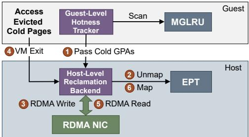  
Figure 5: Cold memory path of Blowfish.

Reclaim a cold page. As shown in Figure 5, the guest-side hotness tracker selects cold pages from the oldest MGLRU generation, moves them to an isolated list to avoid repeated reclamation, and pushes their guest physical addresses into a shared-memory channel. On the host side, Blowfish’s reclamation backend runs a lightweight daemon thread that 1 polls this channel for incoming guest physical addresses. The thread sleeps when the channel is empty and can be awakened via a hypercall, following a standard low-overhead design that avoids occupying a dedicated core. The reclaiming process proceeds as follows. 2 Upon receiving a cold guest physical address, the backend invalidates the corresponding EPT entry and flushes its TLB entry. This mechanism guarantees that any subsequent access will trigger an EPT violation, enabling Blowfish to intercept the access and restore the page safely or prevent in-flight modifications before data backup. 3 The backend extracts the host physical address from the invalidated EPT entry, allocates a far-memory address, and transmits the page’s content to far memory via RDMA. After the transfer completes, the backend encodes the far-memory address into the EPT entry’s upper bits, which are ignored when the present bits of EPT entry are cleared [28]. This process finalizes reclamation without modifying either the GPT or the IOPT.

Restore a cold page. As shown in Figure 5, when the guest accesses a reclaimed cold page, 4 the access triggers an EPT violation because the corresponding EPT entry is not present. Blowfish installs a lightweight EPT violation handler in the host-level backend to restore both the mapping and the data for the faulting guest physical address with minimal latency. 5 Upon a fault, the backend extracts the far-memory address embedded in the invalidated EPT entry, allocates a free host page, and fetches the data from far memory. 6 It then reconstructs the EPT entry for the restored guest page and places the guest physical address into a shared buffer, enabling the guest to reinsert the page into its MGLRU structures during routine maintenance. This restoration completes with only a single far-memory read and one EPT update, introducing minimal overhead and mirroring the low-cost design principles of Blowfish.

Reclaim and restore free pages. Identifying free pages is straightforward: the backend only needs to scan the guest’s free page list or allocator metadata. Reclaiming and restoring free pages are also simple and efficient, as they merely require updating the corresponding EPT entries and can naturally benefit from defragmentation and huge-page optimizations [59,60]. We extend HyperAlloc [59] and integrate it into Blowfish’s unified reclamation backend, delegating both free page reclamation and restoration. Specifically, the backend scans the shared guest allocator to identify free pages, unmaps their EPT entries, and synchronizes their state with the guest allocator using atomic updates. This process completes the reclamation of a free page. When the guest later allocates a page marked as reclaimed, it issues a hypercall to the backend, which allocates a fresh host page and reconstructs the corresponding EPT mapping. The guest allocator naturally prefers pages not marked as reclaimed, thereby avoiding unnecessary restorations.

## 4.5 Hotness-Aware Kernel Service

Modern Linux kernel services (e.g., kcompactd, khugepaged) make page-level decisions without considering access hotness, a long-standing inefficiency in Linux memory management. Under host-level reclamation, however, these services can unnecessarily trigger restorations of reclaimed pages, amplifying their cost. To mitigate all the preceding problems while preserving normal kernel functionality, Blowfish introduces minimal but effective hotness-aware adjustments to existing guest kernel services.

Among these services, khugepaged is both always enabled under THP and highly active [6]. It periodically scans guest page tables with bounded throughput to identify 2 MB regions that can be promoted to huge pages, moving data to physically contiguous 2 MB pages and forming a new huge-page mapping. Because khugepaged is oblivious to page hotness, it may (1) merge unevenly hot pages, exacerbating hot bloat, and (2) inadvertently touch reclaimed cold pages under host overcommitment. Blowfish augments khugepaged with a lightweight filter: during the scan, it inspects access bits of all PTEs in the candidate region and skips promotion if more than half of the pages were not recently accessed. This simple check adds little extra scanning cost and effectively suppresses low-benefit promotions in practice.

kcompactd is triggered when the guest kernel requires highorder pages, e.g., when khugepaged finds no available free 2 MB pages. It compacts memory by migrating data from lower addresses toward higher addresses to create contigu ous free pages. During scanning, kcompactd may migrate hot pages, hurting application performance, or touch reclaimed cold pages, triggering unnecessary restorations. Blowfish extends kcompactd with a lightweight filter: during the scan, it inspects the generation of each page and skips pages in the youngest generation (treated as hot). It also skips reclaimed pages by checking whether the page is absent from the MGLRU; in Blowfish, all reclaimed cold pages are removed from the MGLRU to avoid repeated reclamation. In more aggressive paths (e.g., direct compaction), Blowfish issues explicit restoration requests to the host backend and allows hot and reclaimed pages to be migrated, ensuring that memory compaction remains effective. Since direct compaction occurs infrequently and involves only a limited number of pages at a time, these restorations introduce only mod est overhead.

We primarily optimize khugepaged and kcompactd because, with THP enabled, khugepaged is always active, kcompactd is frequently triggered during huge-page allocation, and together they account for the vast majority of unnecessary accesses in our experiments. Other kernel services, such as NUMA balancing, are either inactive in typical VM deployments or can be extended in a similar fashion, so we omit their details.

## 4.6 Automatic Policy

In this section, we present an automatic policy used in our evaluation: (1) prioritize reclaiming free memory, whose pages can be efficiently restored with negligible impact on application performance; and (2) reclaim cold memory only when free memory becomes scarce, while regulating its performance impact through PSI. This PSI-guided policy is purely practical and heuristic; Blowfish does not rely on a specific control policy, and alternative policies can be easily plugged in.

Initially, Blowfish tries to reclaim free memory until the remaining amount reaches a predefined watermark (e.g., 100MB by default), a design inspired by the Linux memory watermark. Specifically, the host-level reclamation backend periodically scans the guest allocator every 100ms to identify and reclaim free guest pages, a frequency that has proven effective in practice with minimal CPU consumption. Restoration of reclaimed free memory is performed on demand when the guest allocates it, following HyperAlloc’s policy.

Once the remaining free memory falls below the predefined watermark, Blowfish begins reclaiming cold memory, with the reclamation rate regulated by PSI to minimize application performance degradation. The PSI follows the definition introduced in §2, i.e., the real-time process stalls due to memory shortages. Specifically, when PSI remains below a predefined threshold, Blowfish continues reclaiming cold memory. As reclamation progresses, reclaimed pages may be accessed more frequently, causing PSI to rise. Once PSI exceeds the threshold, Blowfish pauses cold-memory reclamation and proactively restores cold pages until PSI falls back below the threshold.

## 4.7 Guest Cooperation and Isolation

Similar to prior cooperative memory overcommitment mech anisms (e.g., Balloon [25, 53], virtio-mem [24], HyperAl loc [59]), Blowfish operates under the assumption that the guest and the host adhere to a simple, well-defined protocol. In practice, this cooperation model is widely adopted in modern cloud virtualization environments, where guests typically adhere to the prescribed interface. Nevertheless, protocol deviations, whether accidental or intentional, may still arise. We discuss how Blowfish handles such cases and what guarantees it preserves. We focus on the mixed-granularity cold-memory reclamation path unique to Blowfish and exclude free-memory reclamation, whose correctness properties are inherited from HyperAlloc.

For cold-memory reclamation, a guest may provide guest physical addresses that do not correspond to valid memory regions. Blowfish’s reclamation backend verifies each guest physical address against the EPT mappings and simply ignores those that are invalid. A guest may also fail to report its cold guest physical addresses. In this case, if necessary, Blowfish can safely fall back to the uncooperative host swapping, which identifies cold pages by scanning EPT access bits and directly reclaims guest-occupied host pages. This fallback preserves correctness and, in critical situations, prevents host-level out-of-memory conditions, though it may reduce the guest’s performance benefits. If a guest submits an unusually large number of guest physical addresses, the backend continues to process only the valid ones. The backend employs a balanced polling strategy across all VMs, ensuring that excessive submissions from one VM do not impact the progress or performance isolation of others.

We also handle concurrent host and guest operations. On the guest side, pages selected for reclamation are synchronized using LRU locks. For the shared memory channel between host and guest, atomic indexing ensures that each location is accessed by at most one reader or writer at a time [55]. On the host side, Blowfish coordinates concurrent reclamation and restoration using per-EPT-entry locks.

## 5 Evaluation

We implement Blowfish in C, based on the Linux kernel (version 6.1) and QEMU (version 8.2.1), with approximately 6000 lines of code added to the host kernel and 1700 lines to the guest kernel. The RDMA backend is inspired by Hermit [49], a state-of-the-art paging-based far memory system.

Setup. We run experiments in a cluster with one CPU server and one memory server connected by NVIDIA 100Gbps Mellanox ConnectX-5 InfiniBand adapters. Each server has two Intel Xeon Gold 6342 CPUs and 256GB of memory. We configure the servers following common practice for low latency [45], including disabling Turbo Boost, CPU frequency scaling and hyperthreading. Besides, we enable Transparent

Huge Page (THP). All systems being evaluated are running on Ubuntu 20.04. The virtual CPUs on the guests maintain a 1:1 mapping with the host physical CPUs. The threads for reclamation and proactive restoration share physical CPU cores with the VM and utilize no more than a single core.

Baseline and methodology. We evaluate against HyperAlloc [59], and its 4 KB-granularity variant HyperAlloc-4K for fine-grained 4 KB reallocation. Because HyperAlloc targets free-page reclamation, we extend HyperAlloc and HyperAlloc-4K to support cold-memory rebalancing: we install Hermit [49] for µs-scale data movement and add a reclaimer to support paging. All baselines are configured to follow the same policy as Blowfish.

For paging type (§2.2), guest paging offers low overhead of hotness tracking but introduces granularity mismatch and high-latency for memory adjustment; host paging is transparent but risks mis-eviction and extra context switches/data movement due to limited visibility and burdens heavy hotness tracking. We pair HyperAlloc and HyperAlloc-4K with guest paging to enable cold-page reclamation, where HyperAlloc-H denotes the host-paging variant of HyperAlloc, HyperAlloc-G denotes its guest-paging variant, and the same notation applies to HyperAlloc-4K (i.e., HyperAlloc-4K-H and HyperAlloc-4K-G). Since HyperAlloc and HyperAlloc-4K show no significant performance difference when reclaiming contiguous free memory, the host paging responsible for reclaiming cold memory is implemented only on HyperAlloc (i.e., HyperAlloc-H).

Slow Down for throughput is defined as the ratio between the runtime increase under the current configuration and the runtime when using all-local memory, while for latency, it represents the percentage of latency increase. Reclamation Ratio is formally defined as

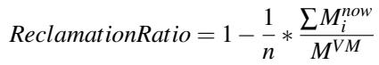

where n denotes the number of sampling points. Mnow represents the memory usage of the VM at sampling point i, and MV M denotes the initial memory size allocated to the VM. We measure the throughput and latency of applications under different PSI thresholds.

For §5.1, we use different baseline systems to reclaim as much VM memory as possible under the PSI threshold constraint, in order to assess their ultimate capabilities. For §5.2, we follow the unified PSI threshold setting used in Senpai [58], namely 0.04. We run different applications in pairs under the condition that their combined memory usage is at most 50% of their combined peak memory demand to investigate how different systems perform memory rebalancing.

Note that for host-level reclamation mechanisms (e.g., HyperAlloc-H and Blowfish), guest-level PSI cannot accurately reflect the actual memory demand, because host-level page faults are invisible to the guest. To address this gap, we place each VM process in a separate host cgroup and monitor the PSI at the cgroup level for these mechanisms. In this way, host-level PSI captures memory pressure induced by host-level page faults during restoration, providing a more accurate measurement of memory demand.

Table 2: Benchmarks and workloads.  
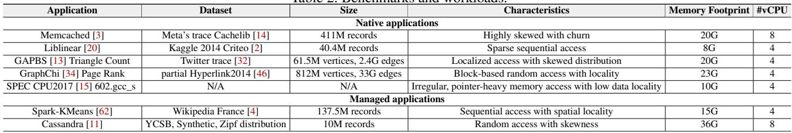

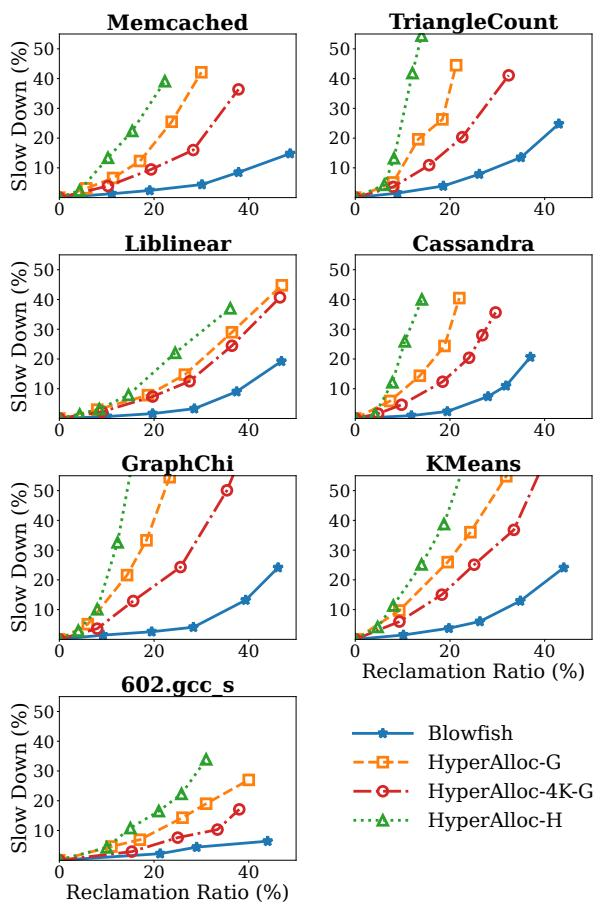  
Figure 6: End-to-End performance of benchmarks.

Workloads. As shown in Table 2, we evaluate five native applications written in C/C++ and two managed applications written in Java, covering varied memory access patterns. We evaluate the throughput (§5.1.1) and latency (§5.1.2) of applications listed in Table 2.

## 5.1 Performance of Single VM

## 5.1.1 Throughput

At the coordinate origin, the memory overcommitment mechanism is disabled, such that no system engages in memory allocation or reclamation, and applications observe no slowdown. Across different PSI thresholds, Blowfish demonstrates superior performance by achieving a higher reclamation ratio and incurring less performance degradation than the baselines.

For application performance, Blowfish uses fair MGLRU to get the hotness of THP, and avoids maintaining the guest page table (GPT) and IOPT, enabling faster memory provisioning when application demand increases. Moreover, its more efficient reclamation and restoration reduce CPU contention with applications. For memory reclamation ratio, rather than depending on contiguous memory pages, Blowfish performs adjustments at the granularity of 4KB pages through a dedicated mechanism, thereby enabling fast reclamation of a substantial amount of non-contiguous memory. Although HyperAlloc-H avoids page table modifications by adopting host paging, the applications running on it perform worse than those on Blowfish and other variants of HyperAlloc. The underlying causes are twofold: (1) HyperAlloc-H relies on heavy hotness tracking at the host level, inducing up to 4.78× more TLB flushes than HyperAlloc-G. (2) Due to its lack of program semantics, host paging often misidentifies cold pages, resulting in unnecessary evictions, context switches (incurring 33% more VM exits), and extra data transfers. For reclamation, HyperAlloc-H suffers from host-side semantic loss: it fails to differentiate page states (e.g., short-lived cache, writeback pages), leading to misguided evictions and unnecessary swapping. In addition, daemon in kernel service introduces hotness interference, and the absence of guest-level semantics further causes invalid reclamations that are quickly restored, collectively degrading throughput. HyperAlloc-G imposes minimal performance overhead on applications, but fails to take advantage of potential memory reclamation opportunities due to its dependence on contiguous pages. In HyperAlloc-4K-G, costly cold memory reclamation reduces its reclamation throughput (on average 2× lower than Blowfish across the applications), and costly restoration increases reclaimed-page access latency, and this higher latency degrades application performance.

Memcached and Cassandra The workload of Memcached is skewed with churn, while the one of Cassandra is more random. This behavior stems from Cassandra’s garbage collection threads accessing memory via graph traversal. Under the constraint that application performance degradation does not exceed 5%, for average reclamation ratio, Blowfish has 3.1×, 5.3×, and 3.2× improvement compared to HyperAlloc-4K-G, HyperAlloc-H, and HyperAlloc-G, respectively in Mem cached. Besides, in Cassandra, provided that application performance degrades by no more than 5%, Blowfish improves the reclamation ratio by 2.1×, 4.0×, and 3.3×. The recla mation of Cassandra is more challenging due to its larger working set and more complex memory access patterns. Our profiling reveals that more than 80% of reclaimable free memory pages are non-contiguous, severely limiting HyperAlloc’s ability to reclaim memory. For HyperAlloc-H, Memcached consists of 96% anonymous pages versus 67% in Cassandra, yielding higher reclamation ratio as fewer file pages are misevicted. However, due to the semantics gap, 27% of reclaimed pages are restored within 1s, resulting in a lower reclamation ratio compared to Blowfish.

GAPBS TriangleCount and GraphChi PageRank are graphcentric workloads that traverse the entire graph and exhibit pronounced phase-changing behavior in their memory usage patterns. TriangleCount is executed on an evolving graph [17], where we divide the input dataset into three parts and feed them to GAPBS. During the update and analysis of the evolving graph, HyperAlloc-4K-G cannot reclaim the memory in time due to its low reclamation throughput. Subject to the condition that application performance drops by no more than 5%, Blowfish offers a favorable trade-off between reclamation and performance, achieving up to 2.1×, 2.8×, and 2.4× higher reclamation ratios than baseline systems (HyperAlloc-4K-G, HyperAlloc-H, and HyperAlloc-G, respectively). GraphChi PageRank reads and processes the graph in blocks, during which it repeatedly allocates and frees memory. The frequent memory allocation and deallocation in GraphChi [33] exacerbate the problem of memory fragmentation. Its slowdown on HyperAlloc-H stems primarily from (1) frequent TLB flush. (2) reclaiming an extra 48% short-lived page cache pages; this behavior interferes with hot-cold classification, causing many hot pages to be swapped out. In our measurements, VM exits due to this factor account for 32% (296M in total). For HyperAlloc-4K-G, rapid working set fluctuations lead to excessive memory restoration operations, incurring high overhead. Blowfish detects the gaps during application working set transitions and promptly reclaims memory. At the constraint of 5% slowdown, Blowfish reaches 3.4×, 6.1×, and 3.9× higher memory reclamation ratio than HyperAlloc-4K-G, HyperAlloc-H, and HyperAlloc-G, respectively.

Liblinear and KMeans are representative of machine learning applications. The memory fluctuation characteristics of Liblinear are subdued because matrix multiplication exhibits sequential access patterns, where non-contiguous pages account for only 34% of the total. Hence, the improvement of Blowfish is modest compared to the baselines. With respect to HyperAlloc-4K-G, HyperAlloc-H, and HyperAlloc-G (at 5% slowdown), Blowfish improves the reclamation ratio by 2.0×, 2.9× and 2.2×, respectively. KMeans is an iterative algorithm composed of multiple phases. Furthermore, as KMeans has a relatively large working set, the reclamation ratio tends to stabilize with increasing PSI threshold. In KMeans under a slowdown of 5%, for reclamation ratio, Blowfish has 3.0×, 5.6×, and 3.7× improvement compared to HyperAlloc-4K-G, HyperAlloc-H, and HyperAlloc-G, respectively.

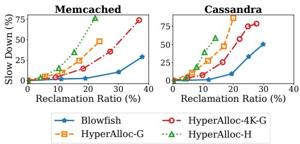  
Figure 7: Tail latency of benchmarks.

602.gcc\_s is a benchmark that simulates the GCC compiler compiling large C programs, displaying multi-phase memory usage characteristics. HyperAlloc-G’s reclamation ratio remains significantly lower across PSI thresholds, owing to its limited ability to reclaim non-contiguous memory (up to 75%). The memory access pattern of 602.gcc\_s aligns well with Blowfish’s optimizations. With a slowdown of 5%, Blowfish outperforms HyperAlloc-4K-G, HyperAlloc-H, and HyperAlloc-G by 1.6 ×, 3.2 × and 1.9× for reclamation ratio. Notably 52% of the pages swapped out by HyperAlloc-H are page cache.

## 5.1.2 Latency

We evaluate the tail latency (p95) of Memcached and Cassandra. As shown in Figure 7, with increasing reclamation ratio, applications running on HyperAlloc-G and HyperAlloc-H exhibit a sharp increase in p95 latency. Besides low restoration overhead, Blowfish consumes only 11% and 14% of the CPU resources allocated to the VM for Memcached and Cassandra, respectively (compared to 24% and 26% in HyperAlloc-4K-G), reducing competition with application threads during memory rebalancing. At the challenging case with a throughput slowdown of 5%, Blowfish reduces the latency slowdown of Memcached by 2.8×, 4.7×, and 3.9× compared to HyperAlloc-4K-G, HyperAlloc-H, and HyperAlloc-G, respectively (1.9×, 2.5×, and 2.1× for Cassandra).

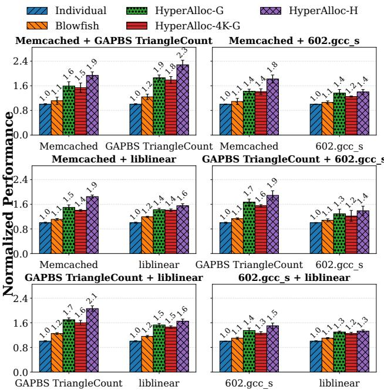

Figure 8: Normalized end-to-end performance when co-running workloads. Lower is better.  
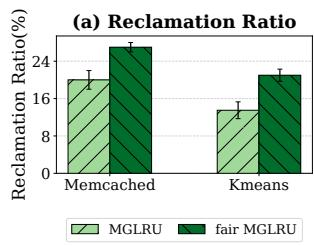

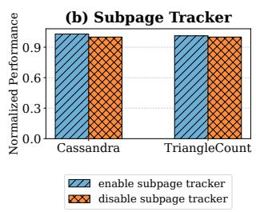  
Figure 9: (a) Effectiveness of Fair MGLRU. (b) Normalized perfor mance with and without Subpage Tracker. Lower is better.

## 5.2 Memory Rebalancing Across VMs

We select four applications and evaluate end-to-end memory rebalancing under co-running VMs. Figure 8 shows that Blowfish consistently preserves co-run performance closer to running individually (“Individual” refers to running an application in isolation on a VM without memory pressure). Across all six workload pairs, Blowfish’s normalized performance degradation factor remains in a narrow range (1.06×–1.25×), whereas the baselines exhibit substantially larger degradation. Blowfish can quickly adjust the amount of memory available to an application by leveraging its phase-changing behavior, thereby avoiding SLO violations.

## 5.3 Drill Down

Effectiveness of Fair MGLRU. We measure the effectiveness of fair MGLRU. We select two applications and replace the fair MGLRU in Blowfish with the standard MGLRU. As shown in Figure 9(a), fair MGLRU effectively distinguishes pages at different granularities and improves the memory reclamation ratio. Enabling fair MGLRU increases the reclamation ratio by 7.2% for Memcached and by 6.5% for KMeans.

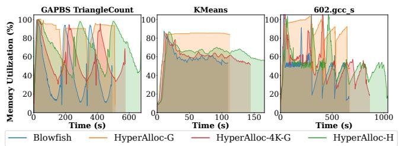  
Figure 10: Memory utilization over time during rebalancing, defined as the ratio of the current VM size to the initial VM size.

Overhead of Subpage Tracker. To investigate the overhead introduced by the Subpage Tracker in Blowfish, we select two applications and evaluate the performance impact of enabling or disabling this configuration. As shown in Figure 9(b), the Subpage Tracker has a modest impact on application performance (3.1% for Cassandra and 0.9% for TriangleCount). This modest overhead is mainly due to that it splits only the page table mappings, rather than the actual physical pages, at a modest rate, avoiding the high cost of updating the struct page metadata.

Automatic Reclamation. Figure 10 illustrates how Blowfish and the baseline systems dynamically resize VM memory. To balance the performance and accuracy of sampling, we sample the memory footprint of guest every 0.5s at the PSI threshold to guarantee the slowdown of 5% on Blowfish. For GAPBS TriangleCount, we split the input graph into three parts to construct the evolving graph [17]. The algorithm involves three passes over the entire graph structure. For each pass, cold pages are gradually reclaimed. In comparison to HyperAlloc-4K-G and HyperAlloc-H, Blowfish can promptly reclaim memory regions that are unlikely to be accessed in the near future with higher reclamation throughput. HyperAlloc-G, on the other hand, is hindered by memory fragmentation and can reclaim only a limited amount of memory shortly after each pass. For KMeans, there are multiple distinct stages. Upon JVM startup, the heap is initialized with a relatively low memory footprint. As the application proceeds to initialize memory and load data, memory consumption gradually increases. During the subsequent phases, memory usage exhibits cyclical fluctuations. Blowfish maintains high performance while offering flexibility in memory usage across various applications. However, the baselines miss the opportunity to harvest the cold memory due to their poor elasticity. For 602.gcc\_s, Blowfish is capable of aggressively reclaiming memory while swiftly responding to sudden bursts of memory requests, achieving a sweet spot between performance and reclamation ratio.

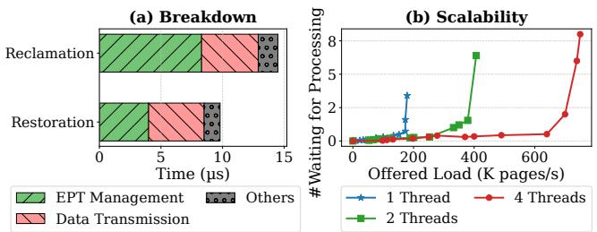  
Figure 11: (a) Latency breakdown for reclaiming and restoring. (b) The scalability of the reclamation backend.

Latency Breakdown. We use a microbenchmark to measure the single-page reclaim and restore latency of Blowfish. We run a program with random memory access in the VM and trigger Blowfish to reclaim pages individually, thereby avoiding batching optimizations. Figure 11(a) presents the results. Blowfish eliminates the overhead of guest page table and I/O page table modifications, making EPT handling the dominant software overhead, accounting for 41%-57% of the total. By removing redundant overheads of page table modifications, Blowfish reduces the single-page reclaim and restore latencies to 14.5µs and 9.8µs, which are 53% and 60% lower than HyperAlloc-4K-G, respectively. The latency could be further reduced with lower-latency hardware.

Scalability of the Reclamation Backend. We evaluate the scalability of the reclamation backend. “#Waiting for Processing” denotes the average number of pages waiting to be reclaimed. We assess scalability by running a microbenchmark with a large cold memory footprint in the VM and varying the reclamation request rate (the offered load). As shown in Figure 11(b), with a single reclamation thread, the number of pages queuing quickly reaches an inflection point as the load increases. At a load of about 170K pages/s, the queue length surges, indicating that a single thread is nearing its processing capacity. Increasing the number of threads alleviates this bottleneck, enabling the reclamation backend to handle higher loads. For example, using 2 threads and 4 threads increases the processing capacity of the backend by nearly 2.0× and 3.9×.

## 6 Limitations

The components of Blowfish exhibit different portability characteristics. The host-level reclamation backend operates entirely in the host and has no guest kernel dependency. The subpage tracker relies only on access bits and page table op erations, making it applicable to any OS with standard page table support. The Fair MGLRU component, however, depends on MGLRU’s multi-generational structure. On systems with classical two-list LRU implementations, the same principle can still be approximated by gating huge-page promotion with an additional access-count condition, requiring multiple observed accesses before promoting a 2 MB page to the active list. While this approximation may reduce effectiveness due to coarser promotion granularity and additional gating overhead, the core idea of correcting unfair hotness still applies.

## 7 Prior Work

Memtis [35] and Demeter [26] are the two pieces of prior work most closely related to Blowfish. Although these systems focus on tiered memory management, Blowfish shares several design considerations with them while introducing new ideas to tackle the related but distinct problem of VM memory overcommitment. This section discusses the similarities and differences between Blowfish and these prior systems.

## 7.1 Memtis

Both Blowfish and Memtis adopt THP-aware hotness tracking, but in different problem settings. This similarity stems from a shared observation: THPs introduce hot bloat issues, where a few hot subpages can cause the entire THP to appear hot, leaving many cold subpages unreclaimable (for Blowfish) or unevicted (for Memtis). Both systems, therefore, need to identify such THPs and split them to mitigate this issue.

However, the two systems differ substantially in both deployment environment and problem setting. Memtis is designed for bare-metal tiered memory management, while Blowfish targets VM memory overcommitment in virtualized systems. These differences lead to distinct designs. Memtis relies on PEBS-based sampling for page access tracking, which introduces an accuracy-overhead tradeoff and requires non-trivial deployment effort [26, 40]. Blowfish instead uses A/D-bit-based tracking, which is more virtualization-friendly and provides more deterministic access signals. Moreover, Memtis assumes a relatively stable fast tier for computing hotset/hit-ratio statistics, an assumption that becomes difficult to maintain under dynamic memory overcommitment.

## 7.2 Demeter

Both Blowfish and Demeter adopt a decoupled architecture and perform page tracking within the guest. This similarity stems from a shared observation in virtualized environments: performing page tracking at the host incurs substantial system overhead.

However, the two systems differ in how to partition page table management functionality between the guest and the host. Demeter delegates the full tiered memory management pipeline, including data migration, to the guest, introducing overheads from GPT and IOPT updates under memory overcommitment. In contrast, Blowfish decouples page tracking and page management: the guest is responsible only for page tracking, while the host handles data transfer and page table updates, reducing the latency of individual operations by 53-60%. In addition, Demeter operates on coarse-grained memory regions (e.g., 2 MB), making it difficult to handle hot bloat and unfair hotness under mixed-granularity scenarios. It also lacks page-type awareness, reducing reclamation effectiveness. Blowfish instead uses subpage-level tracking and page-type awareness for more effective reclamation.

## 7.3 Takeaways

Blowfish, Memtis, and Demeter address different problems (VM memory overcommitment vs. tiered memory management) in different deployment contexts (virtualized vs. baremetal), yet converge on similar techniques due to shared requirements for effective hot-bloat tracking and low-overhead page access tracking. However, different goals lead to distinct designs, as discussed earlier. These comparisons show that efficient VM memory overcommitment requires rethinking both tracking mechanisms and system design for responsive, low-overhead memory management.

## 8 Conclusion

In this paper, we have proposed Blowfish, a memory overcommitment framework built on disaggregated memory. Blowfish can perform cold/free memory reclamation and restoration at a µs-scale, reaching up to 2.48× and 2.14× faster than the state-of-the-art work, i.e., HyperAlloc.

## Acknowledgments

We thank the anonymous reviewers for their comments and are particularly grateful to our shepherd for valuable feedback. This work was supported in part by the National Key Research and Development Program of China (No. 2024YFE0204100), the Pioneer Initiative Talent Program B of Chinese Academy of Sciences (No. E545030, E401430), Fundamental and Interdisciplinary Disciplines Breakthrough Plan of the Ministry of Education of China (No. JYB2025XDXM118), National Natural Science Foundation of China under Grant No. U25A6023, 92464301, 62302479, U23B2020. Tao Xie is also affiliated with the Key Laboratory of High Confidence Software Technologies (Peking University), Ministry of Education, China; Beijing Tongming Lake Information Technology Application Innovation Center, China; Institute of Systems for Advanced Computing at Fudan University, China; Shanghai Research Institute of Systems of Open Computing, China.

## References

[1] White paper: Introduction to InfiniBand. Mellanox Technologies Inc., 2003.

[2] LIBSVM data. https://www.csie.ntu.edu.tw/ \~cjlin/libsvmtools/datasets, 2012.

[3] Memcached - a distributed memory object caching system. http://memcached.org, 2020.

[4] KONECT networks data. http://konect.cc/ networks/, 2021.

[5] QEMU. https://www.qemu.org/2024/04/23/ qemu-9-0-0/, 2024.

[6] Transparent Hugepage Support. https://docs. kernel.org/admin-guide/mm/transhuge.html, 2025.

[7] Alibaba. Alibaba Cluster Trace Program. https:// github.com/alibaba/clusterdata, 2018.

[8] Emmanuel Amaro, Christopher Branner-Augmon, Zhihong Luo, Amy Ousterhout, Marcos K. Aguilera, Aurojit Panda, Sylvia Ratnasamy, and Scott Shenker. Can far memory improve job throughput? In Proceedings of the 15th European Conference on Computer Systems, pages 14:1–14:16, 2020.

[9] Nadav Amit, Dan Tsafrir, and Assaf Schuster. VSwapper: A memory swapper for virtualized environments. In Proceedings of the 19th International Conference on Architectural Support for Programming Languages and Operating Systems, pages 349–366, 2014.

[10] Nadav Amit and Michael Wei. The design and implementation of hyperupcalls. In Proceedings of the 2018 USENIX Annual Technical Conference, pages 97–112, 2018.

[11] Apache. Apache Cassandra. https://cassandra. apache.org, 2021.

[12] Paul Barham, Boris Dragovic, Keir Fraser, Steven Hand, Tim Harris, Alex Ho, Rolf Neugebauer, Ian Pratt, and Andrew Warfield. Xen and the art of virtualization. In Proceedings of the 19th ACM Symposium on Operating Systems Principles, pages 164–177, 2003.

[13] Scott Beamer, Krste Asanovic, and David A. Patterson. The GAP benchmark suite. CoRR, abs/1508.03619, 2015.

[14] Benjamin Berg, Daniel S. Berger, Sara McAllister, Isaac Grosof, Sathya Gunasekar, Jimmy Lu, Michael Uhlar, Jim Carrig, Nathan Beckmann, Mor Harchol-Balter, and Gregory R. Ganger. The CacheLib caching engine: Design and experiences at scale. In Proceedings of the 14th USENIX Symposium on Operating Systems Design and Implementation, pages 753–768, 2020.

[15] James Bucek, Klaus-Dieter Lange, and Jóakim v. Kistowski. SPEC CPU2017: Next-generation compute benchmark. In Companion of the 2018 ACM/SPEC International Conference on Performance Engineering, pages 41–42, 2018.

[16] Irina Calciu, M. Talha Imran, Ivan Puddu, Sanidhya Kashyap, Hasan Al Maruf, Onur Mutlu, and Aasheesh Kolli. Rethinking software runtimes for disaggregated memory. In Proceedings of the 26th ACM International Conference on Architectural Support for Programming Languages and Operating Systems, pages 79–92, 2021.

[17] Lei Chen, Shi Liu, Chenxi Wang, Haoran Ma, Yifan Qiao, Zhe Wang, Chenggang Wu, Youyou Lu, Xiaobing Feng, Huimin Cui, Shan Lu, and Harry Xu. A tale of two paths: Toward a hybrid data plane for efficient far-memory applications. In Proceedings of the 18th USENIX Symposium on Operating Systems Design and Implementation, pages 77–95, 2024.

[18] Intel Corporation. Page modification logging for virtual machine monitor white paper. https://www.intel. com/content/www/us/en/developer/articles/ technical/intel-sdm.html, 2022.

[19] Padmapriya Duraisamy, Wei Xu, Scott Hare, Ravi Rajwar, David Culler, Zhiyi Xu, Jianing Fan, Christopher Kennelly, Bill McCloskey, Danijela Mijailovic, Brian Morris, Chiranjit Mukherjee, Jingliang Ren, Greg Thelen, Paul Turner, Carlos Villavieja, Parthasarathy Ranganathan, and Amin Vahdat. Towards an adaptable systems architecture for memory tiering at warehouse-scale. In Proceedings of the 28th ACM International Conference on Architectural Support for Programming Languages and Operating Systems, pages 727–741, 2023.

[20] Rong-En Fan, Kai-Wei Chang, Cho-Jui Hsieh, Xiang-Rui Wang, and Chih-Jen Lin. Liblinear: A library for large linear classification. Journal of Machine Learning Research, 9(61):1871–1874, 2008.

[21] Google. Google production cluster trace data. https: //github.com/google/cluster-data, 2019.

[22] Donghyun Gouk, Sangwon Lee, Miryeong Kwon, and Myoungsoo Jung. Direct access, High-Performance memory disaggregation with DirectCXL. In Proceedings of the 2022 USENIX Annual Technical Conference, pages 287–294, 2022.

[23] Juncheng Gu, Youngmoon Lee, Yiwen Zhang, Mosharaf Chowdhury, and Kang G. Shin. Efficient memory disaggregation with Infiniswap. In Proceedings of the 14th USENIX Symposium on Networked Systems Design and Implementation, pages 649–667, 2017.

[24] David Hildenbrand and Martin Schulz. virtio-mem: paravirtualized memory hot(un)plug. In Proceedings of the 17th ACM SIGPLAN/SIGOPS International Conference on Virtual Execution Environments, pages 1–14, 2021.

[25] Jingyuan Hu, Xiaokuang Bai, Sai Sha, Yingwei Luo, Xiaolin Wang, and Zhenlin Wang. HUB: hugepage ballooning in kernel-based virtual machines. In Proceedings of International Symposium on Memory Systems, pages 31–37, 2018.

[26] Junliang Hu, Zhisheng Hu, Chun-Feng Wu, and Ming-Chang Yang. Demeter: A scalable and elastic tiered memory solution for virtualized cloud via guest delegation. In Proceedings of the 31st ACM SIGOPS Symposium on Operating Systems Principles, pages 169–185, 2025.

[27] Woomin Hwang, Yangwoo Roh, Youngwoo Park, Ki-Woong Park, and Kyu Ho Park. Hyperdealer: Referencepattern-aware instant memory balancing for consolidated virtual machines. In Proceedings of the 3rd IEEE International Conference on Cloud Computing, pages 426–434, 2010.

[28] Intel Corporation. Intel 64 and IA-32 Architectures Software Developer’s Manual Volume 3C: System Programming Guide, Part 3, 2025.

[29] Weiwei Jia, Jiyuan Zhang, Jianchen Shan, and Xiaoning Ding. Making dynamic page coalescing effective on virtualized clouds. In Proceedings of the 18th European Conference on Computer Systems, pages 298–313, 2023.

[30] Hwanju Kim, Heeseung Jo, and Joonwon Lee. Xhive: Efficient cooperative caching for virtual machines. IEEE Transactions on Computers, 60(1):106–119, 2011.

[31] Avi Kivity, Yaniv Kamay, Dor Laor, Uri Lublin, and Anthony Liguori. KVM: The Linux virtual machine monitor. In Proceedings of the 2007 Linux Symposium, Volume 1, pages 225–230, 2007.

[32] Haewoon Kwak, Changhyun Lee, Hosung Park, and Sue Moon. What is Twitter, a social network or a news media? In Proceedings of the 19th International Conference on World Wide Web, pages 591–600, 2010.

[33] Youngjin Kwon, Hangchen Yu, Simon Peter, Christopher J. Rossbach, and Emmett Witchel. Coordinated and efficient huge page management with ingens. In Proceedings of the 12th USENIX Symposium on Operating Systems Design and Implementation, pages 705–721, 2016.

[34] Aapo Kyrola, Guy Blelloch, and Carlos Guestrin. GraphChi: Large-Scale graph computation on just a PC. In Proceedings of the 10th USENIX Symposium on

Operating Systems Design and Implementation, pages 31–46, 2012.

[35] Taehyung Lee, Sumit Kumar Monga, Changwoo Min, and Young Ik Eom. Memtis: Efficient memory tiering with dynamic page classification and page size determination. In Proceedings of the 29th ACM SIGOPS Symposium on Operating Systems Principles, pages 17– 34, 2023.

[36] Chuandong Li, Sai Sha, Yangqing Zeng, Xiran Yang, Yingwei Luo, Xiaolin Wang, Zhenlin Wang, and Diyu Zhou. Taming hot bloat under virtualization with HUGESCOPE. In Proceedings of the 2024 USENIX Annual Technical Conference, pages 999–1012, 2024.

[37] Huaicheng Li, Daniel S. Berger, Lisa Hsu, Daniel Ernst, Pantea Zardoshti, Stanko Novakovic, Monish Shah, Samir Rajadnya, Scott Lee, Ishwar Agarwal, Mark D. Hill, Marcus Fontoura, and Ricardo Bianchini. Pond: CXL-based memory pooling systems for cloud platforms. In Proceedings of the 28th ACM International Conference on Architectural Support for Programming Languages and Operating Systems, pages 574–587, 2023.

[38] Chengzhi Lu, Kejiang Ye, Guoyao Xu, Cheng-Zhong Xu, and Tongxin Bai. Imbalance in the cloud: An analysis on Alibaba cluster trace. In Proceedings of the 2017 IEEE International Conference on Big Data, pages 2884–2892, 2017.

[39] Dan Magenheimer, Chris Mason, Dave McCracken, and Kurt Hackel. Transcendent memory and Linux. In Proceedings of the 2009 Linux Symposium, pages 191– 200, 2009.

[40] Hasan Al Maruf, Hao Wang, Abhishek Dhanotia, Johannes Weiner, Niket Agarwal, Pallab Bhattacharya, Chris Petersen, Mosharaf Chowdhury, Shobhit Kanaujia, and Prakash Chauhan. TPP: Transparent page placement for CXL-enabled tiered-memory. In Proceedings of the 28th ACM International Conference on Architectural Support for Programming Languages and Operating Systems, Volume 3, pages 742–755, 2023.

[41] Juan Navarro, Sitararn Iyer, Peter Druschel, and Alan Cox. Practical, transparent operating system support for superpages. SIGOPS Oper. Syst. Rev., 36(SI):89–104, 2003.

[42] NVIDIA. The ConnectX InfiniBand In-Network Computing Adapter. https://www.nvidia.com/en-us/ networking/infiniband-adapters, 2022.

[43] NVIDIA. NVIDIA Ethernet SuperNICs. https://www.nvidia.com/en-us/networking/ ethernet-adapters, 2024.

[44] NVIDIA. NVIDIA ConnectX-8 SuperNIC. https://www.nvidia.com/en-us/networking/ products/ethernet/supernic, 2025.

[45] Amy Ousterhout, Joshua Fried, Jonathan Behrens, Adam Belay, and Hari Balakrishnan. Shenango: Achieving high CPU efficiency for latency-sensitive datacenter workloads. In Proceedings of the 16th USENIX Symposium on Networked Systems Design and Implementation, pages 361–378, 2019.

[46] Alexander Outman. Web data commons - hyperlink graphs, 2017.

[47] SeongJae Park, Madhuparna Bhowmik, and Alexandru Uta. DAOS: Data access-aware operating system. In Proceedings of the 31st International Symposium on High-Performance Parallel and Distributed Computing, pages 4–15, 2022.

[48] SeongJae Park, Yunjae Lee, and Heon Y. Yeom. Profiling dynamic data access patterns with controlled overhead and quality. In Proceedings of the 20th International Middleware Conference Industrial Track, pages 1–7, 2019.

[49] Yifan Qiao, Chenxi Wang, Zhenyuan Ruan, Adam Belay, Qingda Lu, Yiying Zhang, Miryung Kim, and Guoqing Harry Xu. Hermit: Low-latency, high-throughput, and transparent remote memory via feedback-directed asynchrony. In Proceedings of the 20th USENIX Symposium on Networked Systems Design and Implementation, pages 181–198, 2023.

[50] Charles Reiss, Alexey Tumanov, Gregory R. Ganger, Randy H. Katz, and Michael A. Kozuch. Heterogeneity and dynamicity of clouds at scale: Google trace analysis. In Proceedings of the 3rd ACM Symposium on Cloud Computing, pages 7:1–7:13, 2012.

[51] Zhenyuan Ruan, Malte Schwarzkopf, Marcos K. Aguilera, and Adam Belay. AIFM: High-performance, application-integrated far memory. In Proceedings of the 14th USENIX Symposium on Operating Systems Design and Implementation, pages 315–332, 2020.

[52] Sai Sha, Chuandong Li, Yingwei Luo, Xiaolin Wang, and Zhenlin Wang. vTMM: Tiered memory management for virtual machines. In Proceedings of the 18th European Conference on Computer Systems, pages 283– 297, 2023.

[53] Carl A. Waldspurger. Memory resource management in VMware ESX server. SIGOPS Oper. Syst. Rev., 36(SI):181–194, 2003.

[54] Chenxi Wang, Yifan Qiao, Haoran Ma, Shi Liu, Yiying Zhang, Wenguang Chen, Ravi Netravali, Miryung Kim, and Guoqing Harry Xu. Canvas: Isolated and adaptive swapping for multi-applications on remote memory. In Proceedings of the 20th USENIX Symposium on Networked Systems Design and Implementation, pages 161–179, 2023.

[55] Jiawei Wang, Diogo Behrens, Ming Fu, Lilith Oberhauser, Jonas Oberhauser, Jitang Lei, Geng Chen, Hermann Härtig, and Haibo Chen. BBQ: A block-based bounded queue for exchanging data and profiling. In Proceedings of the 2022 USENIX Annual Technical Conference, pages 249–262, 2022.

[56] Yaohui Wang, Ben Luo, and Yibin Shen. Efficient memory overcommitment for I/O passthrough enabled VMs via fine-grained page meta-data management. In Proceedings of the 2023 USENIX Annual Technical Conference, pages 769–783, 2023.

[57] Wang Wei. Provide support for free page reporting. https://lwn.net/Articles/808807/, 2020.

[58] Johannes Weiner, Niket Agarwal, Dan Schatzberg, Leon Yang, Hao Wang, Blaise Sanouillet, Bikash Sharma, Tejun Heo, Mayank Jain, Chunqiang Tang, and Dimitrios Skarlatos. TMO: Transparent memory offloading in datacenters. In Proceedings of the 27th ACM International Conference on Architectural Support for Programming Languages and Operating Systems, pages 609–621, 2022.

[59] Lars Wrenger, Kenny Albes, Marco Wurps, Christian Dietrich, and Daniel Lohmann. HyperAlloc: Efficient VM memory de/inflation via hypervisor-shared pageframe allocators. In Proceedings of the 20th European Conference on Computer Systems, pages 702–719, 2025.

[60] Lars Wrenger, Florian Rommel, Alexander Halbuer, Christian Dietrich, and Daniel Lohmann. LLFree: Scalable and optionally-persistent page-frame allocation. In Proceedings of the 2023 USENIX Annual Technical Conference, pages 897–914, 2023.

[61] Wonsup Yoon, Jisu Ok, Jinyoung Oh, Sue Moon, and Youngjin Kwon. DiLOS: Do not trade compatibility for performance in memory disaggregation. In Proceedings of the 18th European Conference on Computer Systems, pages 266–282, 2023.

[62] Matei Zaharia, Mosharaf Chowdhury, Michael J. Franklin, Scott Shenker, and Ion Stoica. Spark: Cluster computing with working sets. In Proceedings of the 2nd USENIX Conference on Hot Topics in Cloud Computing, pages 10:1–10:7, 2010.

[63] Yuhong Zhong, Daniel S. Berger, Carl Waldspurger, Ryan Wee, Ishwar Agarwal, Rajat Agarwal, Frank Hady, Karthik Kumar, Mark D. Hill, Mosharaf Chowdhury, and Asaf Cidon. Managing memory tiers with CXL in virtualized environments. In Proceedings of the 18th USENIX Symposium on Operating Systems Design and Implementation, pages 37–56, 2024.