USENIX

THE ADVANCED COMPUTING SYSTEMS ASSOCIATION

# Equal Opportunity: A Correctness Condition for Ordered Consensus

Yunhao Zhang, Cornell University; Haobin Ni, University of Washington;   
Soumya Basu, OpenReserve Holdings; Shir Cohen, Cornell University; Maofan Yin,   
University of California, Santa Barbara; Lorenzo Alvisi and Robbert van Renesse, Cornell University; Qi Chen and Lidong Zhou, Microsoft Research

https://www.usenix.org/conference/osdi26/presentation/zhang-yunhao

# This paper is included in the Proceedings of the 20th USENIX Symposium on Operating Systems Design and Implementation.

July 13–15, 2026 • Seattle, WA, USA

ISBN 978-1-939133-55-7

Open access to the Proceedings of the 20th USENIX Symposium on Operating Systems Design and Implementation is sponsored by

# Equal Opportunity: A Correctness Condition for Ordered Consensus

Yunhao Zhang∗ Cornell University

Haobin Ni∗ University of Washington

Maofan Yin University of California, Santa Barbara

Soumya Basu OpenReserve Holdings

Lorenzo Alvisi Cornell University

Shir Cohen Cornell University

Robbert van Renesse Cornell University

Qi Chen Microsoft Research

Lidong Zhou Microsoft Research

## Abstract

In proof-of-stake blockchains based on State Machine Replication (SMR), the order of transactions directly affects clientvisible financial outcomes. Ordered consensus augments the SMR specification by imposing correctness conditions on transaction ordering, with a focus on limiting Byzantine influence. However, real-world ordering attacks can occur even when these conditions hold, often enabled by advantages such as faster networks or proximity to the blockchain infrastructure that allow an adversary to systematically bias outcomes without violating the conditions. To address this gap, we extend ordered consensus with a new model and correctness condition based on equal opportunity, a notion of fairness widely used in legal contexts. Equal opportunity requires that candidates who are equally qualified—according to criteria deemed relevant—have equal chances of being selected (here, for a given position in the total order). We show how carefully introduced randomness can bound ordering bias, and we introduce the Secret Random Oracle (SRO), a fault-tolerant abstraction for generating such randomness. We present two SRO constructions, based on trusted hardware and threshold verifiable random functions, respectively, and use them to build Pompe-SRO, a new ordered consensus protocol that mit-¯ igates well-known ordering attacks. Our evaluation shows that Pompe-SRO effectively mitigates front-running and sandwich¯ attacks at a moderate cost to latency.

## 1 Introduction

This paper extends ordered consensus [81] by motivating, expressing, and enforcing equal opportunity, a correctness condition governing how a state machine replication (SMR) [72] protocol orders client requests.

At its core, SMR requires a set of replicas to agree on a single, totally ordered sequence of client requests (i.e., a ledger). When SMR is used for fault tolerance, this order serves only to ensure that all correct replicas process requests consistently. As long as all requests from correct clients eventually appear in the ledger, their relative order does not affect correctness. In blockchains, however, the specific order matters, as it can directly impact the financial rewards associated with the transactions recorded in the ledger.

Ordered consensus [81] formalizes correctness conditions on this order. Each replica associates an ordering indicator (e.g., a timestamp) with every client request, expressing how it prefers to order requests relative to one another. Using these indicators, one can show that while Byzantine influence over the ledger order cannot be eliminated, it can be curtailed. In particular, ordered consensus can guarantee ordering linearizability: if the lowest indicator assigned by any correct node for command c exceeds the highest indicator assigned to c1, then c1 appears before c2 in the ledger. This guarantee is enforced by the Pompe protocol [¯ 81].

The starting point of this paper is the observation that limiting Byzantine influence alone is not sufficient: ordering linearizability fails to capture fairness requirements arising in real-world ordering-based attacks with significant financial consequences [68]. Ordering linearizability only constrains the order of requests whose timestamps are unambiguously separated; it says nothing about how to order requests that arrive close together in time, leaving room for network advantages to systematically determine outcomes.

Consider, for example, the unfair practice known in financial markets as front-running, in which a party learns of a large pending buy order for a certain stock and submits its own buy order in advance, so it can later profit from the price increase driven by the ensuing large buy order. Such behavior has been widely documented in both traditional financial markets [57] and decentralized ones [37, 75], often enabled by advantages such as lower network latency. While financial regulations prohibit these practices, Pompe does not prevent¯ them: requests from clients with faster network access are likely to appear earlier in the output ledger.

Our first contribution is a model of fairness grounded in real-world concerns. Drawing on the legal and economic literature on equal opportunity, we observe that, whenever items are ranked, their positions depend on their characteristics (or features). Some features are deemed relevant to the ranking’s purpose, while others are irrelevant. For example, U.S. employers and lending agencies are legally forbidden from considering certain irrelevant features (so-called protected classes) when making decisions [1, 2]. Intuitively, a fair ranking depends only on relevant features and ignores all others: entries with indistinguishable relevant features should have equal chances of being ranked ahead of one another.

Building on the expressiveness of ordered consensus, we instantiate this notion of equal opportunity for blockchains. In this context, two features are typically considered relevant: the time at which clients submit requests and the fee they attach to them. Other features, such as geographic location, are irrelevant. Existing ordered consensus protocols, however, do not distinguish between relevant and irrelevant features, nor do they reason about this distinction. As a result, protocols such as Pompe [¯ 81], Aequitas [50], and Themis [49] remain vulnerable to adversaries that exploit irrelevant features—for example, faster network connectivity—to perform front-running and related attacks, such as sandwich attacks.

Our second contribution is to formalize this notion through two correctness conditions: ε-Ordering Equality and ∆- Ordering Separation. Informally, ε-Ordering Equality requires that, for requests issued at the same time, the probability of any permutation deviates from the uniform distribution by at most ε. ∆-Ordering Separation ensures that, for requests submitted at least ∆ time apart, the earlier request precedes the later one in the ledger.

To enforce these conditions, we introduce the Secret Random Oracle (SRO), an abstraction that provides a faulttolerant and unbiased source of randomness. The SRO is used to inject controlled randomness into the final order derived from replicas’ ordering indicators. We present two SRO designs: one based on Trusted Execution Environments (TEEs) and one based on threshold verifiable random functions [30, 40]. Because the profitability of front-running and sandwich attacks depends on obtaining a specific ordering of requests, introducing randomness reduces the likelihood of adversarially preferred outcomes and thereby mitigates them.

Our third contribution is to characterize the trade-off between ε-Ordering Equality and ∆-Ordering Separation. Ideally, both ε and ∆ would be small. However, while increasing randomness mitigates the attacks, it can also compromise the role of a request’s relevant features in determining its position in the ledger: thus, decreasing ε comes at the price of increasing the ∆ required to ensure that requests separated in time are ordered correctly despite Byzantine behavior.

Finally, we explore the practical implications of this tradeoff by designing, implementing, and evaluating Pompe-SRO, a¯ new ordered consensus protocol for the partially synchronous model [38] introduced to circumvent the impossibility of achieving safe, live, and fault-tolerant consensus in fully asynchronous systems [39]. Pompe-SRO is always safe and¯ guarantees liveness during sufficiently long periods of synchrony (formally, after some unknown Global Stabilization

Time). During such periods, Pompe-SRO enforces both¯ ε- Ordering Equality and ∆-Ordering Separation. Pompe-SRO¯ extends Pompe by injecting SRO-generated noise into the ¯ fault-tolerant timestamps used to order client requests.

Our evaluation shows that Pompe-SRO can be effective in¯ mitigating front-running and sandwich attacks while incurring moderate performance overhead. For example, when adding random noise sampled from [0, 5∆net], where ∆net bounds message delay during synchronous periods (e.g., ∆net = 400ms in Solana Alpenglow [51]), Pompe-SRO maintains ¯ ε below 5%— a threshold considered acceptable in other equal-opportunity contexts [2, 3]—while matching Pompe’s throughput. The ¯ added noise increases the median and 99th-percentile latency by 1.12×–1.42× in a geo-distributed deployment spanning 12 cities.

## 2 Equal opportunity

Consider a system in which clients invoke commands, and nodes (i.e., servers) aim to produce a total order that reflects the time at which commands are invoked—earlier commands should precede later ones.

## 2.1 Motivating equal opportunity

Informally, if two commands have the same invocation time, equal opportunity requires the two possible orders to be equally likely in the system output. Similarly, if three commands are invoked at the same time, all six possible orders should be equally likely. To illustrate how equal opportunity is violated in practice, we analyze publicly available traces from Ethereum.

Bias under two concurrent invocations. Violations of equal opportunity with two concurrent invocations not only indicate bias but can also enable front-running [37, 75]. Empirical studies show that both phenomena have significantly affected the allocation of \$89M over 32 months in the Ethereum blockchain [68]. Although Ethereum has since transitioned from proof-of-work to proof-of-stake [11], the ordering problem we study depends only on the semantics of client requests; we defer a discussion of proof-of-stake to Section 4.

In Ethereum, an invocation originating in Europe is more likely to precede a simultaneous one from Australia because a larger fraction of Ethereum nodes are located in Europe. If the system orders European invocations before Australian ones more than half the time, we say it is biased toward Europe. Geographic location is an irrelevant feature (a protected characteristic) under equal-opportunity legislation [1], yet such bias has been observed in Ethereum and other blockchains [61].

This bias can lead to significant consequences in applications such as blockchain liquidations. In traditional finance, liquidation occurs when an asset is sold below market value to repay debt, creating profit opportunities for buyers. Similar mechanisms exist in blockchains, where they provide a common profit mechanism in the stablecoin [6] and lending [9] applications. The buyer whose command is ordered first on the blockchain is typically the one to realize the profit.

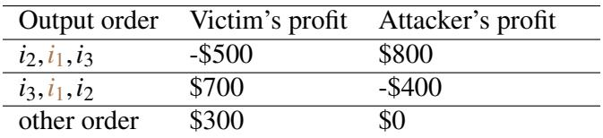  
Figure 1: An example of a sandwich attack in which a victim invokes i1 and an attacker invokes i2 and i3. The example is drawn from a decentralized exchange; details of the associated values are explained in Section 5.2.

Consider two clients, one in Europe and one in Australia, invoking a liquidation simultaneously, trying to secure a \$200K profit. If the system orders the European request first with probability 0.75, then the expected profit is \$0.2M × 0.75 = \$150K for the European client and \$0.2M × 0.25 = \$50K for the Australian client. Thus, irrelevant features can lead to substantial disparities among clients that should be treated equally. Similarly, a client intent on becoming the beneficiary of a liquidation’s profits could leverage faster network devices to further bias ordering and front-run other clients.

Three-invocation sandwich attack. Violations of equal opportunity under three simultaneous invocations enable sandwich attacks [82]. Empirical studies estimate such attacks extracted more than \$174M over 32 months on Ethereum [68].

Figure 1 illustrates a sandwich attack observed in a decentralized exchange. After a victim submits command i1, an attacker submits i2 and i3. The attacker profits only if the system outputs the order i , i , i . Thus, a successful attack relies on making this particular ordering significantly more likely than equal opportunity would permit. A common strategy is to privately relay i2 and i3 to colluding nodes that then exclusively propose blocks containing the order i2, i1, i3 [68]. While attackers are free to choose their trading strategy, and different strategies may lead to different expected profits, the system should not allow them to influence the probabilities of its possible outputs. Under equal opportunity, all six permutations of the three commands should occur with equal (or near-equal) likelihood.

## 2.2 A model for equal opportunity

We model equal opportunity in terms of two classical principles from the economics literature [79]: impartiality and consistency. In our setting, impartiality captures the idea that irrelevant features (e.g., client geolocation) should not affect the order of commands, while consistency requires that introducing new commands should not alter the relative ordering of existing ones. Together, these principles suggest a natural mechanism for enforcing equal opportunity: a point system.

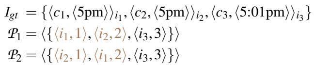

Figure 2: In a system that uses invocation time as the only relevant feature and sequence numbers as ordering indicators, impartiality requires preference profiles P1 and P2 to be equally likely.

We now formalize these principles in the client-server setting and the ordered consensus framework [81].

Client invocation. An invocation is a pair ⟨c,⃗fr⟩, where c is a command and ⃗fr is a vector of relevant features, i.e., the only attributes that should influence the command’s position in the order. Irrelevant features include, for example, client identity, geographic location, wealth, and network connectivity. In blockchain settings, relevant features typically include invocation time and transaction fee. An invocation profile, denoted I , is a set of invocations.

Node preference. Given an invocation profile I , each node observes the invocations and expresses a preference. A preference is a set of pairs ⟨i, o⟩, where i is an invocation and o is an ordering indicator (e.g., a timestamp or score). Intuitively, ordering indicators encode how a node would rank invocations. A preference profile, denoted P , is a vector of preferences from all correct nodes. We say that P is well-formed under I if it references only invocations in I .

Chance relation. In practice, due to nondeterminism (e.g., network delays or scheduling effects), a given set of invocations may result in different preference profiles. We assume a ground-truth invocation profile Igt and model the uncertainty in the preferences of correct nodes through chance relations. For two preference profiles P1 and P2 well-formed under Igt, P ≻c P denotes that P is more likely to occur than P , and P1 ∼c P2 denotes that they occur with equal likelihood. Note that P1 ∼c P2 is equivalent to ¬(P1 ≻c P2) ∧ ¬(P2 ≻c P1).

Impartiality. Impartiality requires that invocations with identical relevant features be treated symmetrically. Formally, for any i1, i2 ∈ Igt with identical ⃗fr, a system is impartial if and only if swapping i1 and i2 in any preference profile does not change its likelihood. That is, if P is obtained from P by swapping i1 and i2, then P1 ∼c P2.

Impartiality is the first pillar of equal opportunity and it is illustrated in Figure 2. If i and i share the same relevant feature (e.g., invocation time), then their relative order must be independent of irrelevant features and P and P must be equally likely.

Consistency. Consistency, the second pillar of equal opportunity, requires that the relative ordering of invocations depend only on their own features and not on the presence or absence of other invocations. Figure 3 illustrates this principle: the

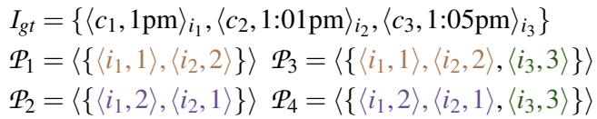

Figure 3: An example of consistency where I = {i , i } and I2 = {i3}. This example originates from real-world legislation on equal opportunity in the context of kidney exchange, as explained in Section 6.

key idea is that the relative ordering of i and i should be unaffected by the presence or absence of a third invocation i3. Consistency requires P1 ≻c P2 ⇐⇒ P3 ≻c P4: the order of i and i should depend solely on their own relevant features. Let P1 =I P2 denote that P1 and P2 agree on invocations in I , and let Igt = {I1, I2} denote a partition. A system is consistent if and only if, for all preference profiles P1, P2, P3, P4 well-formed under Igt, whenever P1 =I P3, P2 =I P4, P1 =I P2, and P3 =I P4, it holds that P1 ≻c P2 ⇐⇒ P3 ≻c P4.

Point systems. A natural way to satisfy both principles is through a point system. In such a system, each invocation is assigned a score that depends only on its relevant features. Invocations are ordered by their scores, breaking ties uniformly at random.

A point system satisfies impartiality because identical relevant features yield identical scores, leading to symmetric treatment. It satisfies consistency because each score depends only on the invocation itself, and is therefore independent of other invocations.

Indeed, in a different model, point systems have been shown to be the only mechanisms that satisfy both impartiality and consistency [79]. Establishing an analogous result in the ordered consensus model remains an interesting direction for future work.

## 2.3 Correctness conditions for systems

In computer systems, invocation time is the primary relevant feature: commands are intended to be ordered according to when they are invoked. In principle, equal opportunity can be enforced by a point system that uses the invocation time as the score.

In practice, however, invocation time cannot be measured precisely. Nodes can only observe when they receive a command, and these observations are affected not only by the true invocation time but also by irrelevant features such as network latency and geographic location. As a result, a perfect point system based on exact invocation times is unattainable.

To accommodate this uncertainty, we relax the pointsystem ideal using two parameters, ε and ∆, and define the corresponding correctness conditions: ε-Ordering Equality and ∆-Ordering Separation. These can be viewed as approximate counterparts of earlier principles: ε-Ordering Equality relaxes impartiality by allowing small deviations from uniform ordering, while ∆-Ordering Separation relaxes consistency by tolerating bounded uncertainty in invocation times.

ε-Ordering Equality. This condition captures approximate fairness among invocations with identical relevant features. For any subset I ⊆ Igt in which all invocations share the same invocation time, let n denote the number of invocations in I . For any total order ≻ over I , |Pr[≻] − 1n! | ≤ ε(n).

Here, ε(n) bounds how far the distribution over permutations can deviate from uniform. When ε = 0, all permutations are equally likely, recovering impartiality. More generally, smaller values of ε ensure that invocations with identical relevant features have similar chances of appearing in any position, approximating how a point system breaks ties.

∆-Ordering Separation. This condition captures the ability to respect differences in invocation time. It requires that for any invocations i1, i2 ∈ Igt, if i1 is invoked at least ∆ time units before i2, then i1 precedes i2 in the system output.

Intuitively, ∆ represents the minimum separation required for the system to reliably distinguish between two invocations despite noise in timing observations. Smaller values of ∆ correspond to stronger guarantees that earlier invocations appear earlier in the output.

Ideally, one would like ε = 0 and ∆ = 0, in which case both perfect fairness and perfect temporal ordering are achieved. This ideal is attainable (alas, only) in an idealized setting where all nodes are correct and observe invocation times without error, as captured by the following theorem.

Theorem 2.1. If all nodes are correct and accurately measure the invocation time of all invocations, ordering equality and ordering separation with ε = ∆ = 0 can be achieved using a point system.

Proof. Assuming all observations are accurate to a certain time unit (e.g., microsecond), a straightforward approach is to assign each invocation a score equal to its observed invocation time. In such a point system, we have: (1) all invocations are sorted by this score in ascending order; and (2) the order of invocations with the same score is chosen uniformly at random from all permutations. (1) guarantees ∆ = 0 because invocations with different observed invocation times are guaranteed to be ordered in the order they are invoked. (2) guarantees ε = 0 because any two total orders have the same probability when chosen uniformly at random. □

## 2.4 Mitigating ordering-based attacks

A system that enforces equal opportunity can significantly mitigate ordering-based attacks, though it does not necessarily make them completely unprofitable. In existing systems, victims of front-running attacks are likely to incur losses because the system is biased toward clients with lower network latency. Under equal opportunity, this advantage is reduced: the gap between an attacker (who may have superior network access) and a victim narrows, as the system treats competing requests more uniformly. The ideal case of equal opportunity, with ε = ∆ = 0, provides the strongest possible mitigation that is agnostic to the semantics of client commands. Further reducing an attacker’s advantage would require identifying and treating certain commands as adversarial, which risks introducing new sources of bias.

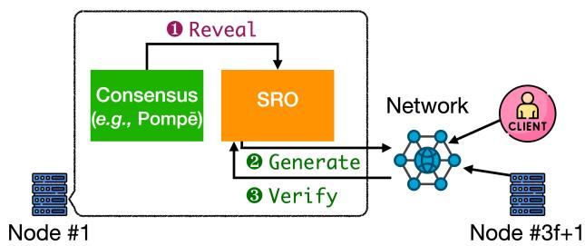  
Figure 4: The protocol design overview of Pompe-SRO. The¯ consensus component invokes the Reveal interface, which returns a random number. The TEE-based SRO returns the random number immediately. The TVRF-based SRO sends a message generated by the Generate interface and verifies messages received from other nodes. After receiving enough valid messages, the SRO will construct and return a random number to the consensus component.

## 3 Secret Random Oracle

The point-system abstraction suggests that randomness is essential for achieving ordering equality. Crucially, this randomness must remain hidden until after other system components commit to their outputs; otherwise, adversaries could exploit it to bias ordering. We address this requirement with the Secret Random Oracle (SRO), a system component that generates random values and reveals them only after a coordinated commit, preventing ordering decisions from depending on them.

Design overview. Figure 4 shows how the SRO integrates with a consensus system. We consider a BFT system with n = 3f + 1 nodes running a protocol such as Pompe [¯ 81]. When using a point-system approach, the consensus component invokes the SRO to obtain randomness via the Reveal interface.

We present two realizations of the SRO abstraction. A TEEbased design generates and reveals randomness locally without network communication. A cryptographic design based on Threshold Verifiable Random Functions (TVRF) requires communication: nodes invoke Generate to produce messages, use Verify to validate them, and combine sufficiently many valid messages to recover the random value.

The remainder of this section details the SRO interface and its guarantees (§3.1), presents two concrete realizations based on trusted hardware (§3.2) and cryptography (§3.3), shows how SRO integrates into Pompe-SRO to enforce the de-¯ sired ordering properties(§3.4), and quantifies the fundamental trade-off that exists in trying to achieve both ε-Ordering Equality and ∆-Ordering Separation(§ 3.5).

Reveal(Int k, Set<Signature> s) → Int | Error   
Generate(Int k) → Proof   
Verify(Int k, Proof p, Int r) → Bool  
Figure 5: The interface of a Secret Random Oracle (SRO).

## 3.1 SRO interface and guarantees

The SRO provides a simple abstraction for generating and revealing random values in a coordinated and adversaryresistant manner.

We consider a system with n nodes, at most f of which may be Byzantine. Each node holds a private key and knows the public keys of all others. A function (not shown) maps an integer k to a pseudorandom number. The SRO interface, shown in Figure 5, consists of three operations:

• Reveal(k, s) returns the output of the pseudorandom function evaluated at k, once s distinct signatures indicate a quorum of nodes wishes to disclose it.

• Generate(k) takes in k and produces a cryptographic proof.

• Verify(k, p, r) given a proof p, checks whether the value r returned when invoking Reveal on k is correct.

Reveal(k) returns its output only after enough nodes signal their readiness to do so. This ensures that randomness remains hidden until it can no longer influence earlier decisions.

The SRO provides the following guarantees.

Uniqueness. All valid invocations of Reveal(k) return the same value. A set of signatures is valid if it contains valid signatures on k from at least n − f distinct nodes. Invalid inputs cause Reveal to return an error.

Secrecy. For any k, let r be the value returned by Reveal(k). If an adversary does not obtain valid signatures from n − f nodes, it is computationally infeasible to distinguish with non-negligible probability r from a uniform random value.

Randomness. For all k, the value r returned by Reveal(k) is a non-error uniform random sample from its codomain.

Validity. If Generate(k) outputs proof p and Reveal(k) returns r, then Verify(k, p, r) returns True, and it is computationally infeasible to find some integer r′ ̸= r such that Verify(k, p, r’) also returns True.

## 3.2 An SRO design using trusted hardware

Trusted Execution Environments (TEEs) provide secure enclaves that protect the integrity and confidentiality of code and data. They have already been used in blockchain systems such as Ethereum’s Sepolia testnet [12] and Solana’s Block Assembly Marketplace [21]. Here, we show how they can be used to implement an SRO.

Initialization. Each node hosts a TEE running the SRO logic. During initialization, TEEs generate candidate random values (e.g., via RDRAND in x86) and run a consensus protocol to agree on a shared secret one. This number remains confined within the TEEs and will be used as the seed of a pseudorandom function denoted as RAND.

Reveal, Generate and Verify. To invoke Reveal, a node forwards an integer and a set of signatures to its local TEE, which returns RAND(seed, k) if enough valid signatures are present; otherwise, it returns an error. Similarly, Generate forwards k to the TEE, which returns HASH(RAND(seed, k)) where HASH is a one-way function. Lastly, Verify checks that its parameter p equals HASH(r).

Correctness. Determinism of RAND ensures uniqueness, while its pseudorandomness guarantees randomness. Secrecy follows from TEE confidentiality, and validity from the collision resistance of the hash function.

We assume that initialization (i.e., consensus on the random seed) eventually completes, thereby ensuring liveness: all invocations of SRO operations on correct nodes eventually terminate.

## 3.3 An SRO design using threshold VRF

A Threshold Verifiable Random Function (TVRF) is a cryptographic primitive that enables a set of nodes to jointly evaluate a pseudorandom function in a distributed and fault-tolerant manner [30,40]. Such constructions have been widely used in Byzantine agreement protocols for tasks such as committee selection and randomized consensus.

In our setting, a TVRF provides a natural way to implement the SRO abstraction: random values are generated collaboratively and remain unpredictable until sufficiently many nodes agree to disclose them.

Let TVRF denote a pseudorandom function mapping an integer k to a pseudorandom value. Figure 6 shows the interface for evaluating TVRF(k). Each node invokes Produce(k) to generate a share using its private key. After collecting enough valid shares, a node invokes Combine to recover TVRF(k). To handle Byzantine behavior, Valid checks the correctness of each share. TVRFs provide the following guarantees [30].

Robustness. For all integers k, it is computationally infeasible for an adversary to produce enough valid shares such that the integer output of Combine is not TVRF(k).

Unpredictability. Without enough valid shares for TVRF(k), an adversary cannot distinguish TVRF(k) from a uniform random sample with non-negligible probability.

Threshold VRF node-side function   
Produce(Int k) → Share   
Threshold VRF client-side functions   
Combine(Set<Share> s) → Int | Error   
Valid(Int k, Int node\_id, Share s) → Bool   
Modified node-side function for SRO   
Produce(Int k, Set<Signature> s) → Share | Error  
Figure 6: The interface of (modified) threshold VRF.

We make a slight modification to threshold VRF. For the Produce interface, we add a parameter: a set of signatures of k to be verified. If verification fails, correct nodes must return an error instead of a share. We can now design an SRO as follows: Reveal forwards the two parameters to all nodes, collects enough valid shares, and invokes Combine. Generate returns the set of public keys. Verify takes all the public keys and a set of shares as input and returns whether all the shares are valid (using the Valid interface).

Correctness. Under the random oracle model, a threshold VRF outputs cryptographically secure pseudorandom numbers. Robustness implies uniqueness and validity: for all integers k, combining enough valid shares can only produce TVRF(k), since an adversary cannot create valid shares leading to a combined value different from TVRF(k). Unpredictability implies secrecy because an adversary cannot obtain enough valid shares without valid signatures of k out of n − f nodes, and without enough valid shares, it has no information about TVRF(k). Liveness is ensured, assuming all network messages are eventually delivered.

## 3.4 Integrating an SRO with Pompe¯

We now introduce Pompe-SRO, which integrates an SRO with¯ Pompe [ ¯ 81], a state-of-the-art ordered consensus protocol. The goal is to enforce the conditions in Section 2.3.

The Pompe protocol.¯ Pompe employs any standard leader-¯ based BFT SMR protocol (e.g., [32]) that offers a primitive to agree on a value for each slot in a sequence of consensus decisions. Pompe transforms such a protocol into a new one¯ that enforces correctness conditions on ordering.

Specifically, Pompe associates the slots with consecutive¯ time intervals. For example, one slot may be associated with time interval [t, t + 500ms), and the next slot could be associated with interval [t + 500ms, t + 1000ms). For simplicity, Pompe assumes that such a mapping from slots to time in-¯ tervals is common knowledge. Within each consensus slot, the value to agree on is a set of ⟨c, ats⟩ pairs where c is a command and ats is called an assigned timestamp. Pompe¯ provides two guarantees for this assigned timestamp: (1) ats falls in the time interval associated with the slot; (2) ats is bounded by the lowest and highest timestamps provided by correct nodes. The commands are then ordered by their assigned timestamps.

Pompe requires¯ 3f + 1 nodes and ensures guarantee (2) by collecting 2f + 1 timestamps from different nodes for each command c. The median of the 2f + 1 timestamps is chosen as the assigned timestamp ats for command c. Since there are at most f faulty nodes, the median of any 2f + 1 timestamps is upper-bounded and lower-bounded by timestamps provided by correct nodes.

Integrating Pompe with an SRO.¯ Pompe-SRO augments¯ Pompe by adding controlled randomness to the assigned time-¯ stamps of each command. After consensus is reached for slot k, a node obtains a quorum of signatures certifying the decision. Using k and these signatures, a correct node invokes Reveal and obtains a random seed to be used by the pseudorandom number generator. Crucially, this seed remains unknown until consensus is finalized, ensuring that it is independent of the consensus decision.

The pseudorandom number generator assigns an independent value r to each command, which is used to sample from a distribution D over [0, ∆noise]. Commands are then ordered by ats + sample(D, r) instead of ats alone. Section 3.5 discusses how to select the distribution and ∆noise.

Stability. A command is stable (or finalized) when it appears in the output ledger. In Pompe, stability coincides¯ with reaching consensus. In Pompe-SRO, the added random¯ noise may delay stability. Let the latest finalized slot correspond to interval [ts, ts′). A command c becomes stable when ats + sample(D,r) < ts′, ensuring that c and all preceding commands can be safely added to the output ledger.

Safety and liveness. Pompe guarantees the same safety and¯ liveness properties as classic SMR protocols [32, 55]. Pompe-¯ SRO inherits these guarantees and differs only in how commands are ordered. We now turn to proving the corresponding correctness conditions on ordering.

## 3.5 A trade-off between ε-Ordering Equality and ∆-Ordering Separation

The key question is how to choose the noise range ∆noise and the distribution D used for random perturbation. We first derive a lower bound on ε(2) for any fixed ∆, as a function of ∆noise and the system parameter ∆net, which bounds message delay, processing time, and clock drift under partial synchrony [38].

Partial synchrony model. One variant of the partial synchrony model introduces the Global Stabilization Time (GST) [38]. Specifically, there is an unknown time GST such that, after this time, there is a known bound ∆net on network latency and processing time. The safety and liveness of Pompe¯ are proven under this model. We now analyze the ordering properties of Pompe-SRO in the same model. More precisely:¯

Assumption 3.1. After GST, if a command is invoked at time T, correct nodes will provide timestamps in the range [T, T + ∆net) for this command.

Note that a simple clock synchronization protocol has been given as part of the Pompe protocol.¯

We now prove that any probability distribution D on [0, ∆noise] achieves ∆-Ordering Separation with ∆ = ∆net + ∆noise and, in the best case, provides ε-Ordering Equality with ε(2) ≥ 2(k+1) 1 (k is the natural number such that k∆net ≤ ∆noise < (k + 1)∆net). We also construct a discrete probability distribution that achieves this lower bound. These results establish a fundamental trade-off: improving ordering equality (reducing ε) necessarily worsens ordering separation (increasing ∆).

Lemma 3.1. The assigned timestamp of a command is bounded by timestamps provided by correct nodes.

Proof. See [81].

Theorem 3.1. (∆-Ordering Separation) After GST, for all invocations i1 and i2, if i1 is invoked more than ∆net + ∆noise time units earlier than i2, then i1 is guaranteed to appear before i2 in the output.

Proof. Suppose i1 and i2 are invoked at time T1 and T2. By Assumption 3.1 and Lemma 3.1, the assigned timestamp of i1 is in the range [T1, T1 + ∆net). After adding the random noise, the resulting timestamp is in the range [T1, T1 + ∆net + ∆noise). Similarly, the resulting timestamp for i2 is in the range [T2, T2 + ∆net + ∆noise). Therefore, if T2 > T1 + ∆net + ∆noise, i2 will appear after i1 in the output. □

Theorem 3.2. (ε(2)-Ordering Equality lower bound) After GST, for any probability distribution D on [0, ∆noise], for all invocations i and i invoked at the same time, |Pr[i ≺ i ] − ∆noise < (k + 1)∆net.

Proof. The key idea is that if two random samples fall within the same ∆ -sized interval, their relative order can be determined by adversarially chosen timestamp differences.

Suppose i1 and i2 are both invoked at time T. By Assumption 3.1 and Lemma 3.1, the assigned timestamps are in the range [T,T + ∆net), which the adversary may pick. Let the two samples from D be s1, s2 ∈ [0, ∆noise]. Let k be the natural number defined above. We split the interval [0,∆noise] into k + 1 buckets: B0 = [0, ∆net), B1 = [∆net, 2∆net), . . . , Bk = [k∆net, ∆noise]. If s1 and s2 fall into the same bucket, then |s1 − s2| < ∆net, and the adversary can decide the ordering of the two commands. Let the probability mass of D in those k +1 buckets be pb0, pb1, . . . , pbk. We know ∑i pbi = 1 and the probability that s1 and s2 fall into the same bucket is ∑ pb2. By the relation between the arithmetic mean and the quadratic dering with at least a probability of 1k+1 . This gives the lower bound ε(2) ≥ 12(k+1) . □

Theorem 3.3. (Discrete distribution optimality) The above lower bound on ε(2) can be achieved by setting D to be a discrete distribution that is uniformly random across the discrete points of 0, ∆net, 2∆net, . . . , k∆net.

Proof. The proof of the lower bound above also shows us how to achieve Pareto-optimality, as the arithmetic mean only equals the quadratic mean if all elements are equal. This discrete distribution guarantees this lower bound of 12(k+1) for ε(2), as two commands can only be ordered arbitrarily if they happen to get the same noise, which has a probability of weighted outcomes. □

We defer the full proof of the general case n > 2 to the extended technical report [80]. As suggested in Section 2.1, real-world concerns about ordering could also arise due to violating ordering equality with three invocations (i.e., enforcing ε(3)-Ordering Equality is necessary to mitigate sandwich attacks).

Theorem 3.4. (ε(n)-Ordering Equality) After GST, for all   
invocations i1..in invoked at the same time, for the discrete   
distribution constructed as above, for any total order ≻ of k+n   
i1..in, |Pr[≻] − | ≤ n 1 n! (k+1)n n!

Proof. See [80].

Choosing the ∆noise parameter. In practice, system designers already tune ∆net in Pompe and similar protocols. To mitigate¯ ordering bias (e.g., front-running and sandwich attacks), they can instead tune ∆noise to achieve a target ε.

For example, when considering attacks involving two or three invocations, designers may focus on ε(2) and ε(3). In legal contexts, ε(2) ≈ 0.05 is often considered acceptable. The four-fifths rule [2,3] requires that selection probabilities differ by no more than 45% versus 55%, corresponding to ε(2) = 0.05. Similar thresholds have influenced fairness definitions in machine learning (e.g., demographic parity [27]).

## 4 Implementation

We implement two SRO variants corresponding to the designs in Section 3.2 and Section 3.3.

For the TEE-based variant, we use Intel SGX [17]. Random values are computed as SHA256(seed + k), where seed is established during initialization and k is the input to Reveal. The SGX SDK provides an optimized SHA256 implementation for Linux [16]. We note that larger hash outputs (e.g., SHA512) could provide stronger security, but are not supported in this environment. In practice, the integer type used by the SRO need not be limited to the standard 4-byte size: blockchain systems commonly use 32-byte or 64-byte values, which we also support.

For the TVRF-based variant, we build on an existing C++ implementation of threshold VRF [10, 40] and extend the

Produce interface with signature verification. Random values are computed as SHA512 hashes of a combined threshold of shares. The default configuration of this implementation uses the mcl cryptographic library [18] and the BN256 curve. Unlike in many BFT systems, cryptographic operations do not dominate the performance overhead in Pompe-SRO. As ¯ we show in Section 5, the overhead is primarily driven by the added randomness required to balance ε and ∆. Since cryptographic operations are not the bottleneck, we prioritize implementation simplicity when selecting cryptographic libraries.

In both variants, signature verification in Reveal relies on the secp256k1 library [19], consistent with the Pompe¯ implementation.

Discussion Permissionless blockchains, pioneered by Bitcoin [65], require nodes to know neither the system size nor the identities of the participants. In contrast, Pompe-SRO¯ follows the standard BFT SMR model, where nodes know n, f , and participant public keys. In this sense, Pompe-SRO¯ is not permissionless. Similarly, systems such as Ethereum and Solana are no longer permissionless after switching from proof-of-work to proof-of-stake. Pompe-SRO is well-suited¯ for such proof-of-stake blockchains.

There is, however, a minor difference between the models used in proof-of-stake and traditional BFT SMR systems. With proof-of-stake, different nodes can stake different amounts of native currency (e.g., ETH tokens). In this setting, the BFT condition n = 3f +1 maps to a bound of at most 33% adversarial stake, while quorums correspond to 67% of total stake. We incorporate this interpretation in our evaluation by adapting baseline protocols accordingly.

Finally, our current Pompe-SRO prototype does not support¯ the possibility that nodes may join or leave the blockchain. However, Pompe-SRO could easily be extended to support¯ such dynamic participation by integrating standard techniques used for membership changes in traditional SMR protocols.

## 5 Experimental evaluation

We ask three main questions in our evaluation: (1) Do the state-of-the-art protocols and Pompe-SRO address real-world¯ problems like front-running or sandwich attacks? (2) What do the correctness conditions mean to attackers who try to launch ordering attacks? (3) What is the end-to-end performance of Pompe-SRO? Figure¯ 7 shows the answers.

We choose three baselines: HotStuff [78], Pompe [¯ 81], and Themis [49] representing the state-of-the-art fairness notions. HotStuff adopts the rotating leadership notion. Themis guarantees a fairness property called γ-batch-order-fairness, and we choose γ = 1, which means that if all correct nodes receive i1 before i2, then i1 should be ordered no later than i2 in the output. Pompe adopts the fairness notion of¯ removing oligarchy, meaning that the output order cannot be dictated by a single leader. In contrast, Pompe-SRO enforces the ¯ equal opportunity notion of fairness.

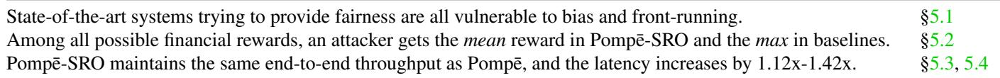  
Figure 7: Table of evaluation results.

Setup and metrics. We run the three baselines and Pompe-¯ SRO on 12 machines in CloudLab [13] (ds430, Intel Xeon E5-2630, 64GB memory, Ubuntu Linux 24.04 LTS). Since Intel Xeon E5-2630 does not support SGX, we run the TEEbased SRO on a separate machine with the Intel Xeon Silver 4410Y processor. We provide detailed instructions on running the experiments in an open-source artifact [22].

Statistics show that the top countries running Ethereum nodes are: US (33%), Germany (15%), France (6%), Finland (6%), Singapore (4%), UK (4%), Canada (3%), Japan (3%), Netherlands (3%), and Australia (3%) [14]. We thus start with a setup of 80 nodes where each node represents 1% in the statistics. For the US, we assume 11 nodes in Austin, 11 in San Francisco, and 11 in Washington, representing the central, western, and eastern US. For the other countries, we assume that all the nodes are in one of their major cities. There are thus 12 cities in this setup, and we map these 12 cities to the 12 machines in CloudLab, emulating the latency between different cities with the Linux traffic control (tc) utility. The latency information is from WonderNetwork [15]. We assume ∆net = 400ms in the partial synchrony model: 400ms is used in Solana’s latest consensus protocol [51], and 400ms is higher than the maximum latency in this setup (i.e., 296ms from Canberra in Australia to Oulu in Finland).

We then introduce proof-of-stake, which reduces resource contention on the machines. Specifically, instead of running 11 instances of the server-side software on one machine (e.g., the machine mapped to Washington), we run only one instance with 11/80 of the total stake. As explained in Section 4, this is essentially the same as the standard SMR model with 80 nodes that we just described. Moreover, similar to real-world blockchains like Solana, we assign slot leaders based on their stake. For example, in HotStuff, this machine will be the leader for 11/80 of all the consensus slots.

Given a set of commands, the key metric for fairness is the difference between the probabilities of two permutations in the output. For example, given two commands invoked at the same time in Washington and London, the probability of the London one appearing first in the output is 0.475 (denoted as Pr[L ≺ W] = 0.475) in our measurement of HotStuff. Therefore, Pr[L ≺ W] − Pr[W ≺ L] = 0.475 − 0.525 = −0.05 is shown in the first row of Figure 8. Since |Pr[L ≺ W] − 1/2| = 0.025 is lower than 0.05, HotStuff treats the two clients from London and Washington equally if we target ε(2) = 0.05. We will show that HotStuff is biased when considering clients

from some other cities.

To answer the question about end-to-end performance, we measure the latency and throughput of HotStuff, Pompe and ¯ Pompe-SRO in the 12-city setup. We assume that clients are ¯ evenly distributed across the 12 cities, and we increase the number of clients until the system is saturated. Every client invokes commands in a closed loop (i.e., it waits for enough responses of its currently outstanding command before invoking the next one), and before saturation, the throughput increases as the number of clients increases. We aim to measure the overhead of Pompe-SRO over Pomp¯ e and compare their¯ performance with HotStuff. As for batching, we use 2000ms as the time interval associated with each consensus slot in Pompe and Pomp¯ e-SRO. We disabled batching in HotStuff¯ and in the ordering phase of Pompe and Pomp¯ e-SRO.¯

## 5.1 Bias and front-running

Figure 8 shows that geographical bias could be significant in the baselines. The output order produced by Pompe and ¯ Themis is deterministic. When commands are invoked at the same time, Pompe always produces London¯ ≺ Munich ≺ Washington ≺ Tokyo, reflecting the order of the median time stamps obtained by clients from these cities. Themis produces Washington ≺ London because more than half (42/80) of the total stake receives the Washington command before a simultaneous one from London. Since 42/80 is close to one half, the γ-batch-order-fairness property of Themis does not require Themis to order the Washington command first. In contrast, 62/80 of the total stake receives the London command before a simultaneous one from Munich, and γ-batch-order-fairness requires Themis to be biased towards London because 62/80 is higher than a threshold derived from the γ parameter. While γ-batch-order-fairness sometimes requires the system to be biased, the notion of removing oligarchy does not require bias despite the fact that Pompe is significantly biased.¯

HotStuff rotates leadership, and the invocation from Tokyo would have a chance to appear first in the ledger when a Tokyo node serves as the leader. However, this chance is still low compared to Munich invocations. Specifically, we find that Pr[M ≺ T] = 0.74, leading to the 0.74 − 0.26 = 0.48 in the last row of Figure 8. This difference increases to 0.83 when compared to Washington. While Tokyo and Washington are geographically distant, bias can happen between nearby cities. London and Munich are both in Europe, but HotStuff is still biased towards London, as shown in the third row.

Figure 9 shows how Pompe-SRO reduces geographical¯ bias. After adding a random noise sampled uniformly from [0, ∆net] (i.e., [0, 400ms]) to the median timestamp of Pompe,¯ clients from London and Munich will be treated equally. With a target ε(2) = 0.05, system designers could choose ∆noise = 5 ∗ ∆net (i.e., 2000ms), and the worst-case bias across these four cities will be effectively controlled. Specifically, given the definition of ε-Ordering Equality, ε(2) = 0.05 means that |Pr[M ≺ T] − 1/2| should be at most 0.05. Therefore, the 0.10 in Figure 9 means that Pr[M ≺ T] = 0.55 and Pr[T ≺ M] = 0.45, satisfying the constraint put by ε(2) = 0.05. In real-world deployments, ∆noise can be chosen by consid ering clients with the highest network latency. Pompe-SRO¯ does not provide equal opportunity to clients with unbounded network latency to the system. Indeed, even liveness cannot be guaranteed without a bound on network latency [39], and equal opportunity is meaningless without liveness.

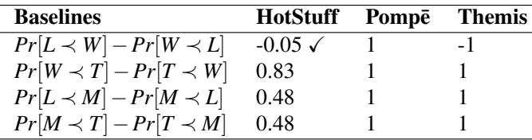

Figure 8: Geographical bias in HotStuff, Pompe, and Themis.¯ W, L, M, and T stand for Washington, London, Munich, and Tokyo. For two simultaneous invocations from two cities, Pr[A ≺ B] stands for the probability of the invocation from city A being the first in the system output. The checkmark for HotStuff means that bias is controlled by ε(2) = 0.05.  
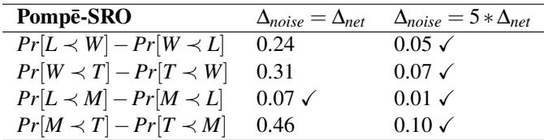  
Figure 9: Geographical bias measured in Pompe-SRO with¯ ∆noise = ∆net (i.e., 400ms) and ∆noise = 5 ∗ ∆net (i.e., 2000ms).

Front-running typically occurs when one client has lower network latencies to a majority of the nodes than the other clients, as London or Washington do in this experiment. By adding randomness, Pompe-SRO could give clients more even¯ chances of obtaining the \$89M profit in the liquidation events (explained in Section 2.1). Equal opportunity also plays an important role in mitigating sandwich attacks, which is closely related to front-running.

## 5.2 Sandwich attacks

To explain sandwich attacks, we start with some background on decentralized exchange. An exchange maintains a pool of some token A (e.g., USD) and some token B (e.g., CNY). For example, people traveling from the US to China may put some USD into the pool and take some CNY away. Similar pools exist on blockchains, and the trading volume of Uniswap, a decentralized exchange application running on Ethereum, has exceeded one trillion dollars [7].

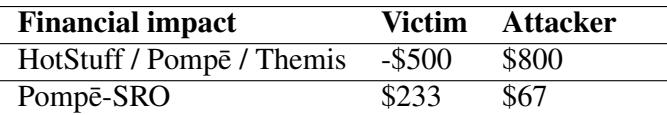  
Figure 10: The expected financial rewards to the attacker and victim within the example sandwich attack shown in Figure 1.

Pools in these exchanges follow a constraint: amount of tokenA ∗ amount of tokenB = constant, which is called the automated market maker (AMM) approach [20]. Suppose the constant is 1800; the number of tokens A and B in the pool could be, for instance, ⟨45, 40⟩, ⟨60, 30⟩, or ⟨75, 24⟩. Say ⟨75,24⟩ is the current status, and Alice needs 15 token A. Alice can put 6 token B into the pool and take 15 token A away so that the pool state moves to ⟨60, 30⟩.

The sandwich attack works as follows. After seeing Alice’s transaction, an attacker, Bob, first buys 15 token A, moving the pool status to ⟨60, 30⟩. Alice now needs to pay 10 (instead of 6) token B to exchange for 15 token A, moving the pool status to ⟨45,40⟩. Bob can then exchange 15 token A back to 10 token B, making a profit of 4 token B. The three steps reflect the three invocations in Figure 1. If the market value of the tokens are \$100 and \$200, respectively, we will get the dollar values in Figure 1. Specifically, if the attack succeeds, the victim will pay 10 token B (i.e., \$2000) in exchange for 15 token A (i.e., \$1500), losing \$500 as shown in the first row of Figure 1. Without the attack, the victim will pay 6 token B in exchange for 15 token A, making a profit of \$300.

A common way of conducting such sandwich attacks is to use faster network connections [57]. The attacker is typically co-located with the victim and, after observing a trading command from the victim (i1 in Figure 1), the attacker uses faster network connections to send its own command (i2 in Figure 1) to the nodes. Figure 10 shows the expected financial rewards in different systems.

In this experiment, we assume that an attacker co-located with the victim could deliver its command to all nodes in the system 10ms earlier than the victim. The attack deterministically succeeds in all state-of-the-art systems because they all follow the order in which nodes receive commands. In contrast, all 6 permutations are equally likely in Pompe-SRO,¯ lowering the attacker’s expected reward by an order of magnitude. Specifically, \$233 = (−\$500 + \$700 + \$300 ∗ 4)/6 is the victim’s expected reward, and \$67 = (\$800 − \$400)/6 is the attacker’s expected reward. Given a much lower expected reward and a caveat of losing \$400, Pompe-SRO effectively¯ disincentivizes sandwich attacks.

## 5.3 Latency of the two SRO designs

Figure 12 shows the latency of the two SRO designs. We show two cases of |s|=0 and |s|=200, where |s| denotes the number of signatures to be verified in the second parameter of Reveal. When |s|=0, Reveal does not verify signatures, and the latency is solely for generating random numbers. For the TEE variant, the latency consists of entering an SGX enclave and computing a SHA256 function, which takes only 3us. For the threshold VRF variant, the latency consists of three parts: (1) generating shares, (2) collecting the shares over the network, (3) combining a threshold of shares. The results in Figure 12 show (1) and (3). Under a setup of 100 nodes and 67 as the threshold, the latency of generating a share is 0.4ms, and the latency of combining 67 shares is 6.3ms. When moving to a setup of 200 nodes with 133 as the threshold, the latency of generating a share stays at 0.4ms, while the latency of combining the shares doubles to 12ms. Lastly, when |s| = 200, the latency of verifying the 200 signatures is about 20ms, both within and outside an SGX enclave.

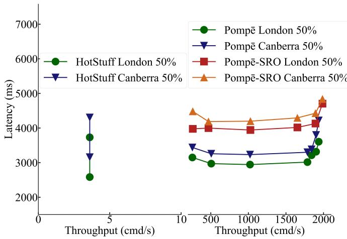

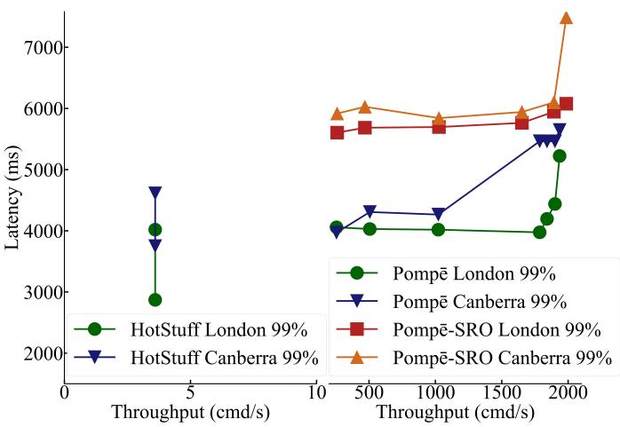

Figure 11: End-to-end performance of HotStuff, Pompe, and Pomp ¯ e-SRO with ¯ ∆noise = 5 ∗ ∆net (i.e., 2000ms) in the 12-city setup. Batching is disabled in HotStuff and in the ordering phase of Pompe or Pomp¯ e-SRO. For example, HotStuff handles 3.6¯ consensus slots per second, and if we enable a batch of 1000 commands for each slot, the throughput of HotStuff will become 3600 commands per second. Disabling batching is useful because, in practice, protocols only reach consensus on the slot hashes.  
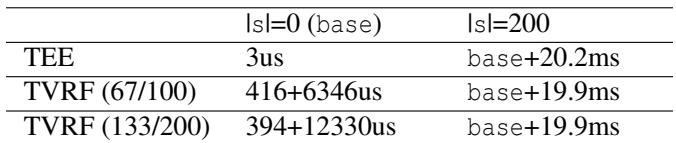  
Figure 12: Latency of the Reveal interface in different SRO implementations. |s| denotes the number of signatures to be verified in the second parameter of Reveal. The numbers in the parentheses are the threshold and total number of nodes for TVRF. The base case of TVRF consists of two latency results for generating and combining shares.

These results show a trade-off between performance and decentralization. The SRO based on SGX has a much lower latency, making it more practical, but it requires trusting Intel, a centralized party. In the following experiments, we choose performance in this trade-off and use the TEE variant of SRO, since TEE has been used in Ethereum’s Sepolia testnet [12] and Solana’s Block Assembly Marketplace [21].

## 5.4 End-to-end performance of Pompe-SRO¯

Figure 11 shows the end-to-end performance of HotStuff, Pompe, and Pomp ¯ e-SRO. We made three observations.¯

• Pompe-SRO keeps the same throughput as Pomp ¯ e, and ¯ the latency increases by 1.12x-1.42x.

• Pompe and Pomp ¯ e-SRO achieve a significantly higher¯ throughput than HotStuff in the geo-distributed setup.

• The 99% latency of HotStuff is 287-592ms higher than its 50% latency, while the 99% latency of Pompe-SRO ¯ is 1672-1816ms higher than its 50% latency.

When deploying 120 clients in each city (i.e., 120 ∗ 12 = 1440 clients in total), Pompe and Pomp ¯ e-SRO reach their¯ peak throughput: 1842 cmd/s for Pompe and 1893 cmd/s for¯ Pompe-SRO. When considering clients from London, the¯ 50% latency in Pompe-SRO is ¯ 1.29x of the 50% latency in Pompe, and the 99% latency is ¯ 1.42x of the 99% latency in Pompe. For Canberra clients, the increase ratios are ¯ 1.31x and 1.12x for the 50% and 99% latencies, respectively. This is how we derive the last statement in Figure 7.

HotStuff’s performance issue in a geo-distributed setup has already been reported in prior work [81]. Specifically, with rotating leadership in HotStuff, the leader of the current slot needs to wait for enough votes on the previous slot before proposing for the current slot. Such waiting results in a low frequency of consensus proposals in HotStuff. Pompe and ¯ Pompe-SRO do not suffer from such waiting, although they¯ reuse HotStuff for consensus. Specifically, their leaderless ordering phase proposes commands continuously without waiting, and consensus only happens every 2000ms for all commands proposed by the leaderless ordering phase in a 2000ms time window.

Lastly, the gap between the 50% and 99% latencies in Pompe-SRO is obviously larger than that gap in HotStuff, and¯ two factors cause such a larger gap. First, since consensus happens every 2000ms, there is a delay between the time when a client invokes a command and the time when consensus happens. Second, due to random noise, it takes longer for a command to become stable in Pompe-SRO, as explained in¯ Section 3.4. Both factors enlarge the gap between the 50% and 99% latencies in Pompe-SRO.¯

## 6 Related work

Traditional BFT SMR systems. There is a long line of work on traditional BFT SMR systems, including [28, 32, 33, 35, 36, 43, 44, 46, 52,53, 58–62, 67, 73, 74, 77]. These works focus on enforcing safety and liveness, removing or constraining Byzantine influence, and improving performance or theoreti cal complexity, among other goals. Our work focuses on how to choose the output order in SMR, which is not considered by the traditional specification. Some works [28, 34, 47, 56] use trusted hardware to increase the ratio of Byzantine nodes that the system can tolerate. Other works [30, 40, 42] use randomness to elect a committee or achieve safety and liveness in a fully asynchronous model. Unlike these works, our work uses trusted hardware to provide a fault-tolerant source of randomness and applies it to ensure equal opportunity.

Rotating leadership. Some works adopt a leader and rotate the leadership frequently, but they focus on reducing theoretical complexity or preventing faulty leaders from degrading performance. Aardvark [36] employs periodic leader changes to ensure a certain degree of performance in the presence of faulty leaders. Aardvark sets an expectation on the minimal throughput a leader must ensure and triggers a leader change if the current leader fails to meet this expectation. Unlike Aardvark, HotStuff [78] employs leader rotation and optimizes the communication complexity. Specifically, HotStuff’s communication complexity is linear in the number of nodes, which makes it more suitable for blockchains. Adopted by Diem [8], rotating leadership in HotStuff aims to provide some sense of fairness in a permissioned blockchain. Our work instead specifies and enforces a concrete notion of fairness, and our evaluation results show that rotating leadership could cause significant bias in a real-world deployment.

Removing oligarchy. Leaderless protocols argue against having a leader node who can unilaterally decide the output order. EPaxos [63], or Egalitarian Paxos, is an SMR protocol that attempts to make the system egalitarian. While the concept of egalitarianism is closely related to equal opportunity, EPaxos does not specify or enforce egalitarian ideals except being a leaderless protocol. Byzantine oligarchy [81] is the first attempt to specify the goal of leaderless protocols in the context of ordering, and Pompe is the first leaderless¯ protocol that provably removes a Byzantine oligarchy. To achieve this, Pompe requires a client to collect timestamps¯ from a quorum of nodes, and the median is used to order a command. However, our evaluation shows that using such a median timestamp could make the system even more biased than prior approaches such as HotStuff.

Decentralized first-come-first-served. Some recent works define and enforce fairness concepts related to first-comefirst-served [31, 48–50, 64, 69]. Specifically, these protocols enforce variants of the receive-order-fairness property [50], which essentially says that if a majority of the nodes receive an invocation first, it should be ordered first in the output. We argue that this property can be unfair because, without distinguishing relevant features from irrelevant ones, it can amplify systemic bias in real-world blockchains, as shown in the evaluation section.

While these works enforce specific properties related to first-come-first-served, the framework of ordered consensus makes it possible to prove that it is impossible, in general, to prevent Byzantine replicas from manipulating the order (e.g., from conducting front-running) [81]. This result is inspired by Arrow’s impossibility theorem [26] and the Gibbard-Satterthwaite impossibility theorem [41, 70] from the field of social choice theory. In the past two decades, computer scientists became interested in social choice, leading to the creation of the field of computational social choice [29].

Game theory. The BAR model [23, 24] explores how to connect Byzantine fault tolerance to game theory. The core of the connection is adopting the Nash theorem [66], which states that every normal-form game must have an equilibrium. The Nash theorem connects the rationality model [71,76] with the Brouwer fixed-point theorem (i.e., a fixed point is interpreted as an equilibrium). We find the concept of equal opportunity and its violations more prevalent in real-life scenarios than the Nash equilibrium. We reuse the key concept of expected value from the rationality model when explaining violations of equal opportunity in Section 2.1. We are also inspired by one of the axioms at the core of the rationality model [71] when defining consistency in Section 2.2. However, unlike BAR, we do not reuse the concept of Nash equilibrium in this work.

Another line of work studies how to eliminate sandwich attacks in blockchains within a game-theoretic model [25]. Similar to our work, this work also argues that randomness is the key to addressing the problem. The proposed solution only randomizes commands within a block, making it vulnerable to destructive front-running attacks described in an empirical study [68]. Destructive front-running means that, in leader-based protocols, the leader of a slot could frontrun a command by excluding it from this slot, so this victim command can only be included in a later slot.

Equal opportunity in real-life scenarios. The principles of impartiality and consistency have been scrutinized in the context of how society allocates resources. In his book [79],

Young studies the two principles in a variety of contexts, from employment to kidney exchange, and discusses how they are embodied in key pieces of legislation [1, 2, 4, 5]. The book includes a proof that a point system is the only mechanism that satisfies both impartiality and consistency. Our work adopts this book’s approach: we use the invocation time as the score for ordering and use a Secret Random Oracle to break ties.

Kidneys for transplant used to be exchanged through a free market, and wealthy patients had a better chance of getting kidneys. This raised fairness concerns and led to legislation that transferred the operation to the government to overcome such bias towards wealthy patients [4]. While this law enforced impartiality between the rich and poor, consistency became a concern. The first algorithm proposed was inconsistent, and the order of two patients getting kidneys could be switched due to a third patient joining the system. As a result, a new algorithm was proposed as an amendment that enforces the consistency principle [5]. Details of the relevant features and the point system in this case have been discussed in Chapter 2 of Young’s book [79].

Financial regulation laws require financial exchanges to be impartial to all traders. A recent exposé [57], however, has concluded that high-frequency traders have routinely engaged in market-exploiting behaviors, such as aggressive latency optimizations and front-running by exploiting their location or the availability of fast network connections—which our framework would classify as irrelevant features.

In the Olympic Games, the order of athletes is decided, and equal opportunity is required. The Olympic rules specify which relevant features should be measured. Similar to geolocation, a key irrelevant feature is national origin, and judgments should not be biased toward any nation. Besides, due to cognitive bias, a judge may make correlated decisions when judging a sequence of observations. For example, in diving, athletes dive alternately, and an athlete’s performance may impact the scores given to the next athlete [54]. Judges typically need professional training to combat such implicit bias and follow the consistency principle.

## 7 Conclusion

This paper introduces a model for equal opportunity, a notion of fairness based on the distinction between relevant and irrelevant features. Existing protocols—including ones attempting to provide some fairness—can be significantly biased and vulnerable to ordering-based attacks.

We design, implement, and evaluate Pompe-SRO, a new¯ ordered consensus protocol that guarantees two correctness conditions for equal opportunity, ε-Ordering Equality and ∆- Ordering Separation. Pompe-SRO effectively mitigates the¯ well-known ordering-based attacks, given that eliminating such attacks in the presence of Byzantine influence has been proved impossible by prior work.

## Acknowledgments

We thank the anonymous shepherd and OSDI reviewers for their insightful and constructive comments. The initial steps towards a theory model for equal opportunity benefited from conversations with Joseph Halpern and his book on theories of uncertainty [45]. Roger Wattenhofer helped us confirm our understanding of Solana’s new consensus protocol. This work was supported in part by a Facebook Fellowship.

## References

[1] Civil Rights Act. https://www.congress.gov/bill/ 88th-congress/house-bill/7152, 1964.

[2] Equal Employment Opportunity Act. https://www.eeoc.gov/history/equalemployment-opportunity-act-1972, 1972.

[3] Uniform guidelines on employee selection procedures. https://www.ecfr.gov/current/title-29/ subtitle-B/chapter-XIV/part-1607, 1978.

[4] National Organ Transplant Act. https://www.congress.gov/bill/98th-congress/ senate-bill/2048, 1984.

[5] National Organ Transplant Program Extension Act. https://www.congress.gov/bill/101stcongress/house-bill/5146, 1990.

[6] MakerDAO. https://makerdao.com, 2017.

[7] Uniswap. https://uniswap.org/, 2018.

[8] Diem. https://www.diem.com/en-us/, 2019.

[9] Aave liquidity protocol. https://aave.com/, 2020.

[10] A threshold VRF implementation. https://github.com/fetchai/research-dvrf, 2020.

[11] The Merge in Ethereum. https://ethereum.org/roadmap/merge/, 2022.

[12] Block building inside SGX. https://writings.flashbots.net/blockbuilding-inside-sgx, 2023.

[13] CloudLab. https://cloudlab.us/, 2023.

[14] Ethereum mainnet statistics. https://ethernodes.org/countries?synced=1, 2023.

[15] Global ping statistics: Ping times between WonderNetwork servers. https://wondernetwork.com/pings, 2023.

[16] Intel software guard extensions for Linux OS. https://github.com/intel/linux-sgx, 2023.

[17] Intel Software Guard Extensions (SGX). https://www.intel.com/content/www/us/en/ architecture-and-technology/software-guardextensions.html, 2023.

[18] mcl: A portable and fast pairing-based cryptography library. https://github.com/herumi/mcl, 2023.

[19] The secp256k1 library from Bitcoin. https://github.com/bitcoin-core/secp256k1, 2023.

[20] What are Automated Market Makers (AMMs)? https://chain.link/education-hub/what-isan-automated-market-maker-amm, 2023.

[21] Solana’s Block Assembly Marketplace. https://bam.dev/, 2025.

[22] Benchmark for equal opportunity in ordered consensus. https://github.com/yhzhang0128/cob, 2026.

[23] Ittai Abraham, Lorenzo Alvisi, and Joseph Y. Halpern. Distributed computing meets game theory: Combining insights from two fields. ACM Sigact News, 42(2):69–76, 2011.

[24] Amitanand S. Aiyer, Lorenzo Alvisi, Allen Clement, Mike Dahlin, Jean-Philippe Martin, and Carl Porth. BAR fault tolerance for cooperative services. In Proceedings of the ACM Symposium on Operating Systems Principles (SOSP), pages 45–58, 2005.

[25] Orestis Alpos, Ignacio Amores-Sesar, Christian Cachin, and Michelle Yeo. Eating sandwiches: Modular and lightweight elimination of transaction reordering attacks. arXiv:2307.02954, 2023.

[26] Kenneth J. Arrow. Social choice and individual values, volume 12. Yale University Press, 1951.

[27] Solon Barocas, Moritz Hardt, and Arvind Narayanan. Fairness and Machine Learning: Limitations and Opportunities. MIT Press, 2023.

[28] Johannes Behl, Tobias Distler, and Rudiger Kapitza. Hybrids on steroids: SGX-based high performance BFT. In Proceedings of the ACM European Conference on Computer Systems (EuroSys), pages 222–237, 2017.

[29] Felix Brandt, Vincent Conitzer, Ulle Endriss, Jérôme Lang, and Ariel D. Procaccia. Handbook of computational social choice. Cambridge University Press, 2016.

[30] Christian Cachin, Klaus Kursawe, and Victor Shoup. Random oracles in Constantinople: Practical asynchronous Byzantine agreement using cryptography. In Proceedings of the ACM Symposium on Principles of Distributed Computing (PODC), page 123–132, 2000.

[31] Christian Cachin, Jovana Mici´ c, Nathalie Steinhauer,´ and Luca Zanolini. Quick Order Fairness. arXiv:2112.06615, 2022.

[32] Miguel Castro and Barbara Liskov. Practical Byzantine fault tolerance and proactive recovery. ACM Transactions on Computer Systems (TOCS), 20(4):398–461, 2002.

[33] Miguel Castro, Rodrigo Rodrigues, and Barbara Liskov. BASE: Using abstraction to improve fault tolerance. ACM Transactions on Computer Systems (TOCS), 21(3):236–269, 2003.

[34] Byung-Gon Chun, Petros Maniatis, Scott Shenker, and John Kubiatowicz. Attested Append-only Memory: Making adversaries stick to their word. In Proceedings of the ACM Symposium on Operating Systems Principles (SOSP), pages 189–204, 2007.

[35] Allen Clement, Manos Kapritsos, Sangmin Lee, Yang Wang, Lorenzo Alvisi, Mike Dahlin, and Taylor Riche. UpRight cluster services. In Proceedings of the ACM Symposium on Operating Systems Principles (SOSP), pages 277–290, 2009.

[36] Allen Clement, Edmund Wong, Lorenzo Alvisi, Mike Dahlin, and Mirco Marchetti. Making Byzantine fault tolerant systems tolerate Byzantine faults. In Proceedings of the USENIX Symposium on Networked Systems Design and Implementation (NSDI), pages 153–168, 2009.

[37] Philip Daian, Steven Goldfeder, Tyler Kell, Yunqi Li, Xueyuan Zhao, Iddo Bentov, Lorenz Breidenbach, and Ari Juels. Flash Boys 2.0: Frontrunning, transaction reordering, and consensus instability in decentralized exchanges. In Proceedings of the IEEE Symposium on Security and Privacy (S&P), pages 910–927, 2020.

[38] Cynthia Dwork, Nancy Lynch, and Larry Stockmeyer. Consensus in the presence of partial synchrony. Journal of the ACM (JACM), 35(2), 1988.

[39] Michael J. Fischer, Nancy A. Lynch, and Michael S. Paterson. Impossibility of distributed consensus with one faulty process. In Proceedings of the Symposium on Principles of Database Systems, pages 1–7, 1983.

[40] David Galindo, Jia Liu, Mihair Ordean, and Jin-Mann Wong. Fully distributed verifiable random functions and their application to decentralised random beacons.

In Proceedings of the IEEE European Symposium on Security and Privacy (EuroS&P), pages 88–102, 2021.

[41] Allan Gibbard. Manipulation of voting schemes: a general result. Econometrica: Journal of the Econometric Society, pages 587–601, 1973.

[42] Yossi Gilad, Rotem Hemo, Silvio M. Micali, Georgios Vlachos, and Nickolai Zeldovich. Algorand: Scaling Byzantine agreements for cryptocurrencies. In Proceedings of the ACM Symposium on Operating Systems Principles (SOSP), pages 51–68, 2017.

[43] Guy Golan Gueta, Ittai Abraham, Shelly Grossman, Dahlia Malkhi, Benny Pinkas, Michael K. Reiter, Dragos-Adrian Seredinschi, Orr Tamir, and Alin Tomescu. SBFT: A scalable decentralized trust infrastructure for blockchains. arxiv:1804/01626v1, 2018.

[44] Andreas Haeberlen, Petr Kouznetsov, and Peter Druschel. PeerReview: Practical accountability for distributed systems. In Proceedings of the ACM Symposium on Operating Systems Principles (SOSP), pages 175–188, 2007.

[45] Joseph Y. Halpern. Reasoning about Uncertainty. MIT Press, 2017.

[46] James Hendricks, Shafeeq Sinnamohideen, Gregory R. Ganger, and Michael K. Reiter. Zzyzx: Scalable fault tolerance through Byzantine locking. In Proceedings of the International Conference on Dependable Systems and Networks (DSN), pages 363–372, 2010.

[47] Rüdiger Kapitza, Johannes Behl, Christian Cachin, Tobias Distler, Simon Kuhnle, Seyed Vahid Mohammadi, Wolfgang Schröder-Preikschat, and Klaus Stengel. CheapBFT: Resource-efficient Byzantine fault tolerance. In Proceedings of the ACM European Conference on Computer Systems (EuroSys), pages 295–308, 2012.

[48] Mahimna Kelkar, Soubhik Deb, and Sreeram Kannan. Order-fair consensus in the permissionless setting. In Proceedings of the ACM on ASIA Public-Key Cryptography Workshop, pages 3–14, 2022.

[49] Mahimna Kelkar, Soubhik Deb, Sishan Long, Ari Juels, and Sreeram Kannan. Themis: Fast, strong order-fairness in Byzantine consensus. In Proceedings of the ACM Conference on Computer and Communications Security (CCS), page 475–489, 2023.

[50] Mahimna Kelkar, Fan Zhang, Steven Goldfeder, and Ari Juels. Order-fairness for Byzantine consensus. In Proceedings of the International Cryptology Conference (CRYPTO), pages 451–480, 2020.

[51] Quentin Kniep, Jakub Sliwinski, and Roger Wattenhofer. Solana Alpenglow consensus: Increased bandwidth, reduced latency. Technical report, Anza, 2025. https://www.anza.xyz/alpenglow-1-1.

[52] Ramakrishna Kotla, Lorenzo Alvisi, Mike Dahlin, Allen Clement, and Edmund Wong. Zyzzyva: Speculative Byzantine fault tolerance. In Proceedings of the ACM Symposium on Operating Systems Principles (SOSP), pages 45–58, 2007.

[53] Ramakrishna Kotla and Mike Dahlin. High throughput Byzantine fault tolerance. In Proceedings of the International Conference on Dependable Systems and Networks (DSN), pages 575–584, 2004.

[54] Robin S.S. Kramer. Sequential effects in Olympic synchronized diving scores. Royal Society Open Science, 4(1), 2017.

[55] Leslie Lamport. The part-time parliament. ACM Transactions on Computer Systems (TOCS), 16(2):133–169, 1998.

[56] Dave Levin, John R. Douceur, Jacob R. Lorch, and Thomas Moscibroda. TrInc: Small trusted hardware for large distributed systems. In Proceedings of the USENIX Symposium on Networked Systems Design and Implementation (NSDI), pages 1–14, 2009.

[57] Michael Lewis. Flash Boys: A wall street revolt. W. W. Norton & Company, 2014.

[58] Jinyuan Li and David Maziéres. Beyond one-third faulty replicas in Byzantine fault tolerant systems. In Proceedings of the USENIX Symposium on Networked Systems Design and Implementation (NSDI), pages 131–144, 2007.

[59] Jian Liu, Wenting Li, Ghassan O. Karame, and N. Asokan. Scalable Byzantine consensus via hardware-assisted secret sharing. IEEE Transactions on Computers, 68(1), 2019.

[60] Shengyun Liu, Paolo Viotti, Christian Cachin, Vivien Quéma, and Marko Vukolic. XFT: Practical fault tolerance beyond crashes. In Proceedings of the USENIX Symposium on Operating Systems Design and Implementation (OSDI), pages 485–500, 2016.

[61] Shengyun Liu, Wenbo Xu, Chen Shan, Xiaofeng Yan, Tianjing Xu, Bo Wang, Lei Fan, Fuxi Deng, Ying Yan, and Hui Zhang. Flexible advancement in asynchronous BFT consensus. In Proceedings of the ACM Symposium on Operating Systems Principles (SOSP), page 264–280, 2023.

[62] Jean-Philippe Martin and Lorenzo Alvisi. Fast Byzantine consensus. IEEE Transactions on Dependable and Secure Computing, 3(3):202–215, 2006.

[63] Iulian Moraru, David G. Andersen, and Michael Kaminsky. There is more consensus in egalitarian parliaments. In Proceedings of the ACM Symposium on Operating Systems Principles (SOSP), pages 358–372, 2013.

[64] Ke Mu, Bo Yin, Alia Asheralieva, and Xuetao Wei. Separation is good: A faster order-fairness Byzantine consensus. In Proceedings of the Network and Distributed System Security Symposium (NDSS), 2024.

[65] Satoshi Nakamoto. Bitcoin: A peer-to-peer electronic cash system. Whitepaper, October 2008.

[66] John Nash. Non-cooperative games. Annals of Mathematics, pages 286–295, 1951.

[67] Daniel Porto, João Leitão, Cheng Li, Allen Clement, Aniket Kate, Flavio Junqueira, and Rodrigo Rodrigues. Visigoth fault tolerance. In Proceedings of the ACM European Conference on Computer Systems (EuroSys), pages 1–14, 2015.

[68] Kaihua Qin, Liyi Zhou, and Arthur Gervais. Quantifying blockchain extractable value: How dark is the forest? In Proceedings of the IEEE Symposium on Security and Privacy (S&P), pages 198–214, 2022.

[69] Geoffrey Ramseyer and Ashish Goel. Fair ordering via streaming social choice theory. arXiv:2304.02730, 2023.

[70] Mark Allen Satterthwaite. Strategy-proofness and arrow’s conditions: Existence and correspondence theorems for voting procedures and social welfare functions. Journal of Economic Theory, 10(2):187–217, 1975.

[71] Leonard J. Savage. The Foundations of Statistics. Courier Corporation, 1972.

[72] Fred B. Schneider. Implementing fault-tolerant services using the state machine approach: A tutorial. ACM Computing Surveys, 22(4):299–319, 1990.

[73] Joao Sousa, Alysson Bessani, and Marko Vukolic. A Byzantine fault-tolerant ordering service for the Hyperledger Fabric blockchain platform. In Proceedings of the International Conference on Dependable Systems and Networks (DSN), pages 51–58, 2018.

[74] Florian Suri-Payer, Matthew Burke, Zheng Wang, Yunhao Zhang, Lorenzo Alvisi, and Natacha Crooks. Basil: Breaking up BFT with ACID (transactions). In Proceedings of the ACM Symposium on Operating Systems Principles (SOSP), pages 1–17, 2021.

[75] Christof Ferreira Torres, Ramiro Camino, and Radu State. Frontrunner jones and the raiders of the dark forest: An empirical study of frontrunning on the Ethereum blockchain. In Proceedings of the USENIX Security Symposium, pages 1343–1359, 2021.

[76] John von Neumann and Oskar Morgenstern. Theory of Games and Economic Behavior. Princeton University Press, 1947.

[77] Jian Yin, Jean-Philippe Martin, Arun Venkataramani, Lorenzo Alvisi, and Mike Dahlin. Separating agreement from execution for Byzantine fault tolerant services. In Proceedings of the ACM Symposium on Operating Systems Principles (SOSP), pages 253–267, 2003.

[78] Maofan Yin, Dahlia Malkhi, Michael K. Reiter, Guy Golan Gueta, and Ittai Abraham. HotStuff: BFT consensus with linearity and responsiveness. In Proceedings of the ACM Symposium on Principles of Distributed Computing (PODC), pages 347–356, 2019.

[79] H. Peyton Young. Equity: In Theory and Practice. Princeton University Press, 1995.

[80] Yunhao Zhang, Haobin Ni, Soumya Basu, Shir Cohen, Maofan Yin, Lorenzo Alvisi, Robbert van Renesse, Qi Chen, and Lidong Zhou. Equal opportunity: A correctness condition for ordered consensus. arXiv:2509.09868, 2025.

[81] Yunhao Zhang, Srinath Setty, Qi Chen, Lidong Zhou, and Lorenzo Alvisi. Byzantine ordered consensus without Byzantine oligarchy. In Proceedings of the USENIX Symposium on Operating Systems Design and Implementation (OSDI), pages 633–649, 2020.

[82] Liyi Zhou, Kaihua Qin, Christof Ferreira Torres, Duc V. Le, and Arthur Gervais. High-frequency trading on decentralized on-chain exchanges. In Proceedings of the IEEE Symposium on Security and Privacy (S&P), pages 428–445, 2021.