の

USENIX

THE ADVANCED COMPUTING SYSTEMS ASSOCIATION

# Efficient GPU-Centric Evolving Graph Processing at Scale

Yunmo Zhang and Jiacheng Huang, City University of Hong Kong; Xizhe Yin, Independent Researcher; Junqiao Qiu, City University of Hong Kong; Hong Xu, The Chinese University of Hong Kong; Chun Jason Xue, Mohamed bin Zayed University of Artificial Intelligence

https://www.usenix.org/conference/osdi26/presentation/zhang-yunmo

# This paper is included in the Proceedings of the 20th USENIX Symposium on Operating Systems Design and Implementation.

July 13–15, 2026 • Seattle, WA, USA

ISBN 978-1-939133-55-7

Open access to the Proceedings of the 20th USENIX Symposium on Operating Systems Design and Implementation is sponsored by

# Efficient GPU-centric Evolving Graph Processing at Scale

Yunmo Zhang City University of Hong Kong

Jiacheng Huang City University of Hong Kong

Junqiao Qiu City University of Hong Kong

Xizhe Yin Independent Researcher

Hong Xu The Chinese University of Hong Kong

Chun Jason Xue Mohamed bin Zayed University of Artificial Intelligence

## Abstract

Large-scale evolving graph analytics (EGA), which evaluates graph queries over sequences of snapshots, is facing growing demands for real-time insight extraction. While GPUs offer immense potential for accelerating graph workloads, they suffer from the memory capacity wall and poor hardware utilization when applied to EGA.

To bridge this gap, this work presents POEGA, a GPUcentric framework for efficient large-scale EGA. The core idea of POEGA is to leverage proxy graphs to minimize outof-memory IO. It achieves this by first analyzing a compact in-memory graph abstraction to drive approximate results, thereby guiding the out-of-memory refinement. Although this approach incurs more computations, our key insight is that this cost can be amortized by exploiting the GPU’s massive parallelism to process multiple snapshots concurrently. This concurrency is supported by a carefully designed fused kernel and a novel bound-based pruning technique. Furthermore, we address a commonly overlooked memory bottleneck caused by multi-version vertex states, which arises when scaling concurrent analysis to a large number of snapshots, by introducing an adaptive state compaction format. Evaluation shows that POEGA yields 3.7–23.5× speedups over the state-of-the-art EGA solutions across a range of real-world datasets.

## 1 Introduction

Graph processing serves as the backbone for unstructured data analysis across diverse domains. Since real-world graphs nat urally expand and evolve, Evolving Graph Analytics (EGA), which extracts insights from a sequence of snapshots in a specific time window, has become a cornerstone of many modern decision-making systems. Crucially, these applications face an imperative demand for real-time responsiveness to the continuously changing real-world data. For instance, financial systems rely on evolving connectivity trends for instant fraud detection [31, 81]; network infrastructure requires evolving reachability analysis to pinpoint and recover from failures [29]; cybersecurity analysts track changing path properties to identify malicious DNS domains [69]; and epidemiological platforms leverage EGA for real-time influenza forecasting during COVID-19 pandemics [79].

A straightforward approach for EGA is to apply the query to snapshots individually, yet this yields significant overhead. A series of incremental graph analytics approaches, such as Tornado [66], Kickstarter [70], Graphbolt [46], Common-Graph [1], and others [16, 83], are proposed for resolving the urgent need for evaluating queries on graphs under dynamic environments. They have proven the superior efficiency of incremental computation over re-computing from scratch, given that evolving graphs typically exhibit high similarity (often exceeding 99% [12, 60]) between consecutive snapshots.

In recent decades, GPUs have been an attractive computing platform for graph applications [6,24,27,35,36,49,67,71,75]. State-of-the-art GPU-based incremental analysis systems, such as Grapin [74], have demonstrated over 10× speedups compared to CPU-based counterparts. However, applying these GPU-accelerated systems to large-scale graphs faces a fundamental challenge of limited GPU-resident memory, known as the GPU memory oversubscription problem [43,56]. While general GPU data management techniques, ranging from explicit transfer [22, 62, 63] to implicit unified memory [58] or zero-copy [51], have been proposed, they often incur prohibitive data transfer overheads when applied to the incremental EGA (§2.3). Consequently, the I/O bottleneck fundamentally prevents existing GPU-based EGA systems from scaling to massive evolving graphs.

To bridge this gap, we introduce POEGA, an efficient evolving graph processing framework that tackles the memory wall problem. The main idea of POEGA is to leverage proxy graph, a concept that has recently been proven feasible for retaining the computation-critical structures of original graphs within a compact footprint [32]. By confining the initial analysis to a resident-memory proxy graph, POEGA derives approximate results to guide the subsequent exact refinement on the full graph, thereby significantly reducing the I/O traffic required. However, this two-phase paradigm (approximatethen-refine) inherently introduces extra computations. They make previous proxy graphs yield marginal gains or even performance degradation because the extra compute overhead outweighs the I/O savings [32]. Our insight is that this computation overhead can be effectively amortized by exploiting the GPU’s massive parallelism to process multiple snapshots in the evolving graph concurrently. We propose a snapshot-level concurrent execution model that fuses computations across snapshots into a single kernel to maximize instruction throughput and coalesce memory accesses. Furthermore, we mitigate redundant work across snapshots via a runtime bound-based pruning technique.

Finally, scaling this concurrent analysis introduces a new bottleneck: the memory pressure from maintaining vertex states across numerous snapshots, a challenge largely overlooked by existing concurrent models [10, 17]. To address this, we design an adaptive multi-version format that efficiently compacts vertex states, enabling POEGA to sustain high concurrency without exhausting GPU memory. To confirm the effectiveness of the proposed designs in POEGA, we conduct extensive experiments with real-world large-scale graphs and commonly used query benchmarks. The results show that POEGA outperforms the state-of-the-art EGA solutions, including EGraph [86], Grapin [74] and state-of-the-art incremental analysis methods, Kickstarter [70], and Common-Graph [1], combined with diverse GPU data management techniques [51, 58, 62] by 8.9× on average and up to 23.5×. In summary, this paper makes the following contributions:

• Proposes POEGA, a framework for large-scale EGA that utilizes proxy graphs to shift the bottleneck from expensive I/O operations to GPU-friendly compute-intensive workflows;

• Presents a concurrent analysis method that fuses the execution and coalesces the data transfer, as well as a runtime pruning technique to reduce redundant compu tations across snapshots;

• Identifies the memory pressure of multi-version vertex states as a key impediment to scaling concurrency and proposes an adaptive multi-version format to address it;

• Provides an efficient implementation of POEGA and compares it with the state-of-the-art solutions through systematic evaluations. The results demonstrate its significant performance improvements. POEGA is open-sourced at https://github.com/YunMoZhang/ POEGA.

## 2 Background and Motivation

## 2.1 Evolving Graphs Analytics

Analytics over dynamic graphs can be generally classified into three categories [18, 84], including: (1) Streaming graph analytics [14, 16, 46, 48, 70] which mainly explores the latest version of the graph as it continually changes; (2) Temporal graph analytics [8, 13, 28, 44, 47, 89], which exploits the timestamps of edges (and optionally vertices) to analyze fine-grained time-constrained behaviors, such as investigating general temporal path problems [52, 78, 89]; and (3) Evolving graph analytics, which is also called snapshot sequence analytics [1, 17, 23, 30, 37, 40]. Formally, EGA evaluates a query Q (such as single-source-shortest-path) on N snapshots of an evolving graph [G<sub>1</sub>,··· ,G<sub>N</sub>] (usually taken periodically) over a specified time period [t<sub>1</sub>,t<sub>N</sub>], where G<sub>i</sub> = {V,E<sub>i</sub>}, and thus offers precise insights or information drawn from discrete historical data. Changes between consecutive snapshots consist of a batch of edge additions ∆<sup>+</sup> and a batch of edge deletions ∆<sup>−</sup>. This paper focuses on evolving graph analytics. An example is shown in Figure 1.

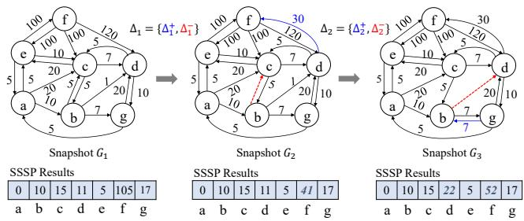  
Figure 1: An EGA example which evaluates a query SSSP(a) on 3 snapshots.

Incremental EGA. The naive EGA approach evaluates the query independently on each snapshot from scratch, known as re-evaluation. To reduce redundant computations during re-evaluation, incremental algorithms have been proposed [14, 16, 46, 66, 70]. This paper focuses on the widely studied monotonic path-based graph algorithms [11, 70, 82]. Specifically, to process ∆<sup>+</sup>, the incremental algorithm detects impacted vertices by propagating the value through the edges in ∆<sup>+</sup>, and then adds updated vertices to the frontier. It reuses evaluation results on the previous snapshot and then propagates computation from affected vertices forward through the graph until re-convergence. For example, when the edge (d, f , 30) is inserted during G<sub>1</sub> → G<sub>2</sub> in Figure 1, we apply the edge function from d to its out-neighbor f based on d’s current value 11, and thus detect a new best value 41 for f .Then we put f to the frontier and resume the iterative evaluation until all values converge again. To process ∆<sup>−</sup>, incremental algorithms usually maintain one-to-one dependencies that record which in-neighbor contributed to each vertex’s computed value. When a deleted edge belongs to a dependency, incremental algorithms first perform dependency tracing to identify affected vertices. Tracing is also iterative, starting from directly impacted vertices and traversing along the cascading relationships till the end. All the affected vertices need to reset their values, pull the new one, and re-converge. As this kind of incremental algorithm [46, 70], such as representative Kickstarter [70], requires maintaining evaluation results in the previous snapshot, it is referred to as streaming-based incremental analysis.

As handling edge deletions in streaming-based approaches is generally more expensive (typically 2-3×) than processing the same number of additions [1], batch-based incremental analysis, such as pioneer work CommonGraph [1], has been proposed in recent years [1, 17, 88]. This approach first eval uates the query over a subgraph shared across all targeted snapshots. It then identifies per-snapshot ∆ (only containing additions) relative to the common subgraph, and applies deletion-free incremental analyses to each snapshot independently. As it removes the dependency between snapshots, concurrent query evaluation is enabled in this approach.

## 2.2 GPU-based Large-scale Graph Processing

GPUs have become a popular platform for accelerating graph processing due to their high compute throughput and memory bandwidth [24, 27, 36, 49, 75]. However, GPU-based graph processing frameworks remain constrained by limited device memory, facing challenges when processing today’s evergrowing graph datasets. This constraint becomes even more pronounced in EGA, where queries must be evaluated over multiple snapshots, further increasing memory demand.

Handling GPU memory oversubscription. To enable graph processing when the graph size exceeds the GPU memory capacity (i.e., oversubscription), existing efforts can be mainly classified into two categories: (1) Explicit management. A coarse-grained approach [40, 86, 93] partitions the oversized graph into subgraphs that can fit into GPU memory, and then transfers partitions containing active edges in each iteration. However, this often incurs unnecessary data movement, as an entire partition may be transferred even when only a few edges are active. To address this inefficiency, finer-grained design [62,91], including state-of-the-art Subway [62], adopts a dynamic partitioning strategy that generates subgraphs on demand per iteration. It first applies data compaction after knowing the active frontier, and then transfers compacted subgraphs. While minimizing transfer volume, it requires additional computation overhead. (2) Implicit management. To ease the engineering efforts of explicit data movement, recent studies explore leveraging Unified Virtual Memory (UVM) [3, 4, 19, 34], which maps host and GPU memory into the same address space and triggers on-demand page migration (typically 4KB pages) during graph processing. However, this may incur non-negligible overhead due to costly page faults. A finer-grained method investigated recently is zerocopy access [51, 59, 73], which allows GPUs to directly read from host memory via transaction layer packets of PCIe. According to the PCIe spec [51], up to 256 outstanding memory requests can be in flight concurrently, each accessing 32\~128 bytes. This enables fine-grained and parallel data access. However, zero-copy may cause redundant transfers upon repeated access to the same data [55, 73].

Proxy Graphs. In recent years, utilizing proxy graphs has emerged as a promising alternative for processing large-scale graphs [32]. A proxy graph is a compact graph abstraction that retains computation-critical edges to preserve topological semantics of the original graph. This idea has been explored across several contexts, including reducing graph complexity for analytics and visualization [32, 38, 41, 76, 92], optimizing partition navigation in distributed environments [25, 53, 72], and relieving memory constraints in out-of-core systems [32, 85]. Existing proxy graph construction methods primarily follow three routes: (1) Structure-preserving Reduction. Early methods in this direction used edge contraction, i.e., merging connected vertices, to generate coarse-grained graph representations [25, 53, 72]. While effective for regular meshes, such methods may abstract away individual vertex details. Input Reduction [38] instead removes graph components that do not affect query results in irregular graphs, e.g., vertices with no incoming or outgoing edges. While preserving exact correctness, its reduction ratio is typically constrained by the inherent connectivity of the graph (e.g., around 50% [38]). (2) Graph Sampling. This line of work utilizes edge sampling techniques, such as random walk [41] and priority-based selec tion [92] (e.g., selecting low-weight edges for shortest-path queries), to bound proxy graph size. Wonderland [85], an out-of-core graph system, further enhances connectivity by in corporating edges that bridge weakly connected components. These sampling-based abstractions prioritize a small memory footprint; yet their lossy nature often necessitates an intensive refinement phase to ensure result accuracy. (3) Query-based Sketch. To better align the abstraction with query semantics, recent methods propose constructing proxy graphs based on offline pre-evaluated queries [32, 76]. For instance, Core-Graph [32] evaluates a set of queries with sources at highdegree vertices and includes all edges on the resulting critical paths. This approach yields high accuracy (often exceeding 95%), though it involves a non-trivial generation phase.

## 2.3 Motivation

While state-of-the-art incremental EGA techniques achieve promising efficiency on GPUs [17, 18, 74], their performance collapses when the graph scale exceeds GPU memory capacity. To better understand these limitations and guide the design of a more efficient solution, we profile representative incremental EGA systems and identify two critical challenges and one key opportunity.

Challenge #1: The I/O Bottleneck in Data Transfer. We first break down the execution time of batch-based incremental EGA under memory oversubscription to evaluate existing data transfer strategies. As shown in Figure 2 (a), the overhead of explicit data transfer dominates the execution, accounting for 77.6% of the total analysis time on average, and peaking at 94.4%. Implicit management strategies, zero-copy and unified memory (UM), are even worse, exhibiting significantly higher latency as shown in Figure 2 (b). These results underscore a fundamental barrier: even if an ideal policy transfers only the exact on-demand data per iteration, the heavy I/O overhead remains prohibitive for incremental analysis. This suggests that simply optimizing data transfer is insufficient; a paradigm shift to reduce the volume of required I/O is necessary.

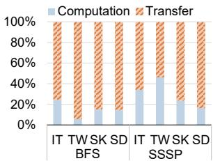  
(a) Breakdown of execution time using Explicit data transfer.

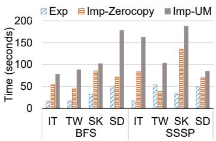  
(b) Performance comparison between Explicit and Implicit data transfer.  
Figure 2: Data transfer overhead in evolving graph incremental analysis (settings in §6).

Challenge #2: The Memory Bottleneck from Multi-Version States. While vertex-centric data is traditionally assumed to fit within device memory [51, 62, 63], this assumption breaks down under multi-snapshot concurrency. For instance, the value arrays for the Subdomain graph (used in our evaluation) across 40 snapshots consume approximately 102M × 4B × 40 ≈ 16GB, exceeding our GPU capacity (see §6). In practice, when co-located with graph structure data, the system encounters out-of-memory errors even earlier, typically when N > 30. Crucially, this scalability hurdle is overlooked by existing concurrent approaches [10, 17, 82], which assume all concurrent state arrays are memory-resident. A naive workaround involves offloading value arrays to host memory and transferring them on demand, as for graph data. Yet given the high frequency of fine-grained, atomic state updates in graph analytics, this approach incurs prohibitive transfer overheads, severely throttling the performance.

Opportunity: Exploiting Computational Underutilization. We observe that current GPU-based EGA methods suffer from severe hardware underutilization. Figure 3(a) presents the Cumulative Distribution Function (CDF) of thread utilization (defined as the ratio of active threads to total threads) when evaluating an SSSP query over 32 snapshots. We compare a streaming-based method, KS [70], and a batch-based ap proach, CG [1], both using fine-grained explicit memory management [62]. KS exhibits extreme inefficiency, with GPU usage remaining below 10% for over 60% of the runtime, primarily due to its serial snapshot processing scheme. While CG improves utilization, it still remains below 45% overall. The root cause is the sparsity of incremental workloads. As shown in Figure 3(b), the incremental analysis of a single snapshot typically activates significantly fewer vertices (one to two orders of magnitude) compared to a full re-evaluation. This creates a massive utilization gap, presenting a prime opportunity to amortize the cost of our proposed proxy-based approach by processing multiple snapshots concurrently.

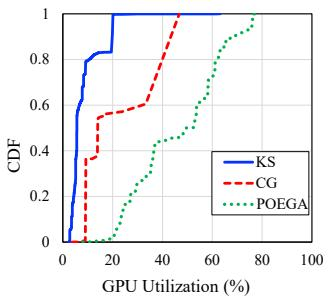  
(a) GPU utilization in different systems

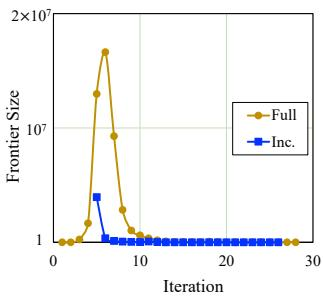  
(b) Frontier size distribution.

Figure 3: Profiling of incremental SSSP on graph IT. For better comparison, the curve about frontier sizes during incremental analysis has been right-shifted in (b).  
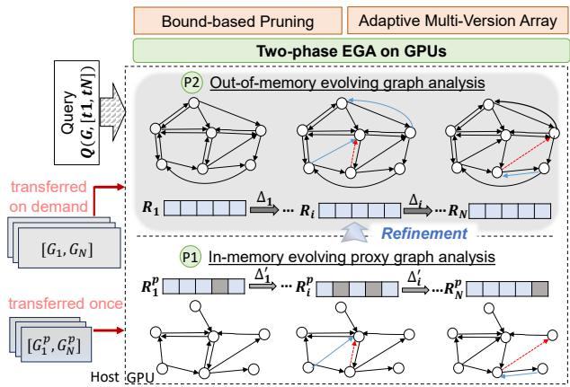  
Figure 4: Workflow of EGA in POEGA.

## 3 Overview of POEGA

To enable efficient incremental EGA on GPUs, we propose POEGA, a holistic system that orchestrates a Proxy-Guided Concurrent Analysis execution model. Figure 4 provides an overview of the workflow of POEGA. Inheriting the two-phase methods of proxy graph approaches, POEGA is tailored for evolving graphs, including: (P1) In-Memory Evolving Proxy Graph Analysis, and (P2) Concurrent Out-of-Memory Incremental Analysis for Snapshots.

POEGA system accepts an evolving graph query on snapshots within a time interval [t ,t ] and operates as follows. At P1, POEGA first transfers the evolving proxy graph to the GPU and then evaluates the query on it entirely within the memory, generating the approximate results R<sup>p</sup>, ..., R<sup>P</sup> . Guided by these results, POEGA at P2 performs exact incremental analysis on the full snapshots, which are outside the GPU memory and transferred only on demand. Thanks to our incrementalanalysis-oriented evolving proxy graph (§4.1), the analysis at this phase is deletion-free, requiring minimal data transfers. In this phase, POEGA fuses the execution of multiple snapshots into a single kernel, which enforces data access of neighbors coalesced across snapshots (§4.2). Furthermore, the computations that can also be coalesced are identified and pruned by our novel runtime technique based on checking the bounds of values across snapshots (§4.3). Finally, to enable more snapshots to enjoy the benefits of concurrent analysis, POEGA manages the values of snapshots using Adaptive Multi-Version Array, a novel format for resolving the memory bottleneck in concurrent analysis on GPUs (§5).

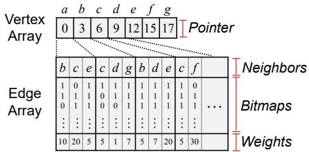  
Figure 5: UnionCSR format of an evolving graph in POEGA.

Format of Evolving Graphs. We represent the evolving graph using a snapshot-union Compressed Sparse Row (CSR) format. Any edge that appears in at least one snapshot is stored once in this UnionCSR structure. Figure 5 shows this representation of the evolving graph in Figure 1. Like classical CSR format, adjacency information of the graph is maintained by (1) the vertex array, which records the start offsets of each vertex’s neighbors, and (2) the edge array, which concatenates all neighbors. To differentiate edge presence across snapshots, UnionCSR associates each edge with a bitmap, where the i-th bit indicates its presence in snapshot G . By default, a 64-bit word is used for alignment, while additional words can be added to support more snapshots. This design enables fast GPU thread data access, akin to compact formats in prior works [12, 17]. The difference is that UnionCSR supports diverse data access interfaces by O(1) bit operations, including view(G<sub>i</sub>) for a single snapshot, view\_shared(G<sub>i</sub>, G <sub>j</sub>) for shared subgraph, and view\_diff(G<sub>i</sub>, G <sub>j</sub>) for the delta G <sub>j</sub> − G<sub>i</sub>. As this work focuses on enabling efficient GPU-based analytics, we assume graph updates are ingested offline and treat storage optimizations [7, 21, 65, 77] as orthogonal to ours. In fact, UnionCSR can be seamlessly generated using the standard parallel CSR computation from the durable graph storage, such as the multi-version adjacency list in GraphOne [37].

## 4 Proxy Graph-based EGA

The main idea of POEGA is shifting the out-of-memory irregular large-scale evolving graph processing into a two-phase

processing, and solving the extra computation introduced by refinement via our efficient concurrent analysis on GPUs.

## 4.1 Incremental Analysis Oriented Evolving Proxy Graphs

Prior studies [32, 76] have demonstrated the feasibility of building high-fidelity approximations with a condensed structure for static graphs. For example, the state-of-the-art Core Graph [32] achieves over 95% accuracy with only 10% of the original edges. Starting from the approximate results on the proxy graph, the subsequent phase analysis refines the results on the full graph. Fundamentally, proxy-based approaches trade reduced memory I/O (by confining the bulk of access to the refinement phase) for increased total computation (processing both proxy and full graphs).

However, applying existing proxy designs to evolving graphs faces a fundamental dilemma between construction cost and approximation fidelity. On one hand, lightweight heuristics like Wonderland [85] yield low accuracy (e.g., around 50%), less effective in reducing the out-of-memory accesses in the second-stage analysis due to the iterative nature of graph processing. On the other hand, high-fidelity proxies like Core Graph are designed for static snapshots; naive reconstruction for every snapshot is computationally prohibitive (e.g., 7–14 minutes per snapshot [32]), outweighing any analytical benefits. More critically, reusing a single static proxy for an evolving sequence is inferior to structural divergence. After a series of updates, the proxy graph is no longer the subgraph of snapshots. Consequently, the second-phase analysis that processes the delta between the snapshot and the proxy graph needs to handle deletions, which are expensive to process, e.g., 2× slower than processing additions [1].

Maintained Evolving Proxy Graphs (EPG). Notice that evolving graph changes slowly, a well-known belief that has been used in optimizing evolving graph analytics [12, 30, 46, 70] and storage [12], we employ a single high-fidelity base proxy to capture the critical graph structure of recent snapshots and use a lightweight maintenance heuristic to adapt it computation-friendly to the second-phase refinement.

The complete EPG construction design is summarized in Figure 6. Following standard graph storage practices [42], we periodically construct proxy graph checkpoints offline. These proxy graphs are generated by evaluating queries on the top-K highest-degree vertices. For each vertex reached by a query, different from existing methods [32, 76], we select only one edge on its critical path (e.g., the shortest path from the source), thus keeping the proxy graph size complexity of O(|V |). In our implementation, we empirically set K to 10 by default. To ensure sufficient structural coverage, if the resulting proxy remains below a predefined threshold (e.g., 10%) of the original snapshot size, we further augment it by evaluating other high-degree vertices that appear at a few hops from the source of the existing critical paths for the K queries.

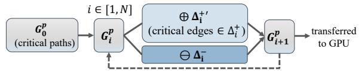  
Figure 6: Design of Maintained Evolving Proxy Graph.

After the arrival of query Q on window [t<sub>1</sub>,t<sub>N</sub> ], we retrieve the nearest preceding checkpointed proxy graph at t<sub>0</sub> as the base proxy graph for EGA, denoted by G , where t<sub>0</sub> ≤ t<sub>1</sub>. We then apply the maintenance heuristics to map original deltas (∆<sup>+</sup>,∆<sup>−</sup>) onto G<sup>p</sup> for generating subsequent proxy graphs:

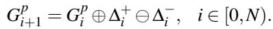

(1)

When the addition deltas are large, we selectively choose two types of edges from ∆<sup>+</sup> to keep the proxy graph compact while preserving fundamental structure: (1) bridge edges that connect two high-degree vertices, and (2) backup edges that connect any low-degree vertex to others.

Beyond the differences from existing work in preevaluation query and critical edge selection, the maintained EPG is specifically designed for dynamic scenarios with two key benefits. First, its update logic can be integrated seamlessly with the original graph’s update procedure, and can even be executed concurrently to hide EPG generation latency. Second, by explicitly applying deletions, EPG remains a strict subgraph of the original graph (G<sub>i</sub> ⊂ G<sub>i</sub>). As a result, the evolving proxy graphs can effectively drive the deletionfree incremental analysis in the second phase, while keeping the high structural fidelity.

## 4.2 Two-stage Evolving Graph Analysis

P1: In-memory Evolving Proxy Graph Analysis. In this phase, the query is evaluated on the proxy graphs G to derive approximate results {R } for the corresponding snapshots. After transferring the UnionCSR format of evolving proxy graphs, which is generated when creating the format of the original evolving graph, to the GPU once, this entire phase executes entirely within the GPU memory. As a result, evolving proxy graphs can be evaluated efficiently using existing in-memory EGA incremental analysis engines, such as streaming-based [46, 70] and batch-based [1] mentioned in §2.3. We adopt the batch-based incremental analysis method, as it aligns more with the GPU’s massive parallelism.

By first analyzing the shared subgraphs of a series of proxy graphs G<sub>c</sub> (via view\_shared), batch-based analysis first obtains R<sup>p</sup><sub>c</sub> and then incrementally processes additional edges of the proxy graphs to the shared graphs ∆(G<sup>p</sup> − G<sup>p</sup><sub>c</sub> ) (via view\_diff) to obtain R<sup>p</sup>. Note that only the edge additions over the subgraph are processed in this process, where each edge e in the delta is tried once in relaxation operations (called tracing), e.g., in SSSP, push the value of source e.src to the destination e.dst if val(e.src) + e.weight < val(e.dst). The affected vertices are added to the frontier to finish the convergence as the normal graph processing. Since these incremental analyses start from the shared subgraph that has no inter-dependency, we thus parallelize them using the same concurrent analysis kernel in the second phase below.

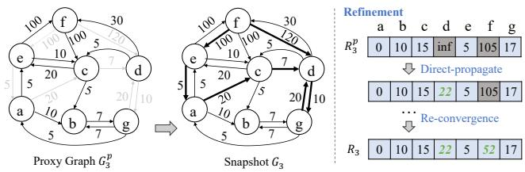  
Figure 7: An illustrated example of applying refinement.

P2: Concurrent Out-of-memory Incremental Analysis for Snapshots. In the second phase, POEGA refines the approximate results R<sup>p</sup> into precise results R for each snapshot G . This is achieved by treating the graph difference, ∆(G<sub>i</sub> − G<sup>p</sup>), as a batch of edge additions and performing an incremental analysis. Benefit from our evolving proxy graph construction (G<sup>p</sup> ⊂ G<sub>i</sub>), the incremental analysis performed during refinement is deletion-free. This process consists of two primary steps: (1) direct-propagate the addition delta to identify the effects of ∆(G<sub>i</sub> − G ) to R and (2) re-convergence, which resumes iterative processing until convergence. As introduced in existing incremental analysis designs (§2), the direct-propagate step performs a single-pass traversal over the delta edges, applying the edge function to each. An illustrated example is shown in Figure 7. After getting the approximate results for the proxy graph of snapshot G<sub>3</sub> in Figure 1, the direct-propagate step processes the delta edges (bold in G<sub>3</sub>). Specifically, it applies the edge function for the delta edge (c,d) and then updates the value of vertex d to 22. Subsequently, during the re-convergence phase, this updated value is further propagated through the graph iteratively, ultimately refining the result of f . Since this refinement aligns with traditional incremental analysis [23, 66, 70], their correctness in reaching the precise value of G<sub>i</sub> is inherently guaranteed.

Different from P1, both steps in P2 require out-of-memory graph data accesses. For the direct-propagate, since the delta size is relatively large, we use the explicit data management method [62] to transfer the data to the GPU memory to avoid the throttling performance. For the following convergences, we employ the implicit data transfers, since the incremental analysis involves a relatively small frontier size, where the implicit transfers outperform the explicit ones as they avoid the data preparation (e.g., compaction).

Coalesced Computation. Since the processing logic is the same across snapshots (for both proxy and full graph analysis), we fuse the analysis of multiple snapshots into a single kernel to concurrently execute them, as shown in Algorithm 1. Thanks to the UnionCSR format, this concurrent analysis coalesces the access to the neighbors of a vertex. Instead of issuing individual memory requests for each snapshot, threads access the neighbor union of a vertex in a single transaction (Lines 3-4). The kernel then determines edge presence in a snapshot via bitwise operations (Line 6). This reduces GPU global and out-of-memory traffic regardless of explicit or implicit data transfers. Analyzing vertex v in N snapshots in an iteration requires |neigh(v)| times memory access, outperforming ∑<sub>i∈[1,N]</sub> |neigh<sub>i</sub>(v)| required by separate kernels. Besides, the access to the active vertex set, i.e., frontiers of snapshots, is coalesced (Line 2) by maintaining the union of frontiers (Line 10), similar in spirit to prior static graph multi-query concurrent analysis [10,82]. Using this technique, the memory footprint is reduced, while the correctness of monotonic algorithms is not affected [82]. But since this method introduces unnecessary computations, we optionally also maintain separate frontiers if the memory budget allows.

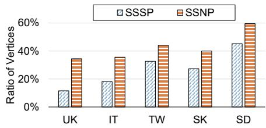  
Figure 8: Inter-snapshot Redundant Computations in EGA.

Finally, thanks to the fused processing of multiple snapshots in one kernel, as of one snapshot, existing GPU thread scheduling schemes, such as the vertex-centric [36], warpcentric, or block-centric [75] processing, can be seamlessly applied to our concurrent analysis kernel to solve the thread mapping efficiency of graph algorithms on GPUs.

```javascript
Algorithm 1 Coalesced Concurrent Analysis (G,[1,N])
_global__ SSSP_CoalConcur(...)
1: /* id is thread ID, warp ID, or block ID. */
2: vid = f rontier[id];
3: for eid = G.vertexPtr[vid] to G.vertexPtr[vid + 1] do
4: e = G.neighbors[eid];
5: for sid = 1 to N do /* a thread or a warp of threads */
6: if e.bmp[sid] then
7: new_val = value[vid][sid] + e.weight;
8: if new_val < val[e.dst][sid] then
9: CASMIN(val[e.dst][sid], new_val);
10: f rontier_n ← e.dst;
```

## 4.3 Bound-based Pruning

In the concurrent analytics frameworks discussed in previous sections and prior works [10, 82, 87, 90], computations for neighbors, including arithmetic operations and atomic updates, are executed individually for each snapshot. This occurs even when the graph data accesses are coalesced.

Table 1: Bounds in the conditions for pruning over edge (u, v).  
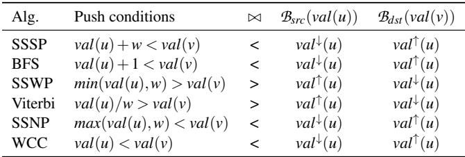

However, we identify that this distinct per-snapshot computation incurs significant redundancy due to the inherent temporal locality of evolving graphs. We define redundant computation as edge operations that yield identical values or trigger the same control-flow outcomes (e.g., effective updates) on the same vertex across all snapshots. Our profiling shown in Figure 8 reveals that such redundancies constitute 18.2% to 59.6% of the total computations, highlighting a substantial potential for optimization.

Eliminating these redundant computations is challenging because vertices with identical converged results cannot be identified a priori. To address this, we propose a runtime pruning technique based on the bounds of values. This approach leverages necessary conditions, rather than exact conditions, to rapidly identify and prune redundant operations.

Definition 1 (Value Bounds). Let val<sub>i</sub>(u) be the converged or intermediate value of vertex u in snapshot i, where i ∈ [1,N]. We define its lower bound as val<sup>↓</sup>(u) = min<sup>N</sup> (val<sub>i</sub>(u)) and the upper bound as val<sup>↑</sup>(u) = max<sup>N</sup> (val<sub>i</sub>(u)).

We now detail the bound-based pruning mechanism applied to the computations for an edge (u,v) across snapshots G<sub>1</sub>, . . . , G<sub>N</sub> . First, we abstract the generic relaxation criterion that serves as a prerequisite for updating val(v), denoted as [val(u) ⊗ w(u,v)] ▷◁ val(v). Here, ⊗ represents the numerical operator that generates a candidate value, and ▷◁ denotes the relational operator that determines whether the candidate yields a superior result. While we formulate this using the push model, this logic applies symmetrically to the pull-based model (where v checks incoming neighbors). The specific operators for the graph algorithms evaluated in this work (§6) are listed in Table 1.

Definition 2 (Pruning Criteria). For an algorithm Q, the computations over edge (u,v) across all snapshots can be safely pruned if the following necessary condition fails to hold: [B<sub>src</sub>(val(u)) ⊗ w(u, v)] ▷◁ B<sub>dst</sub> (val(v)) is False, where B<sub>src</sub> and B<sub>dst</sub> represent the specific bounds (upper or lower) determined by ▷◁.

Table 1 specifies the bounds for different algorithms. The logic is as follows: if ▷◁ is <, a successful update requires the candidate value to be smaller than the current value. Therefore, we use the lower bound for the source u (best-case candidate) and the upper bound for the destination v (worst-case target). If this “best-case” fails to trigger an update, computations for all snapshots can be skipped. The inverse logic applies when ▷◁ is >.

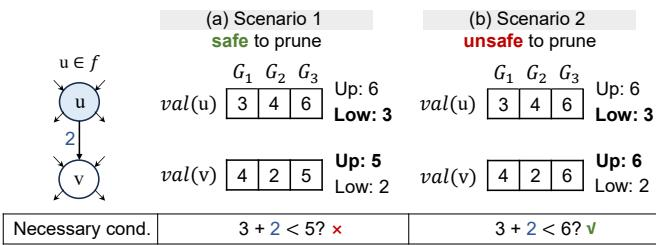  
Figure 9: Pruning the push operations over edge (u,v) when concurrently serving an SSSP query in three snapshots.

An example of this pruning technique for SSSP is shown in Figure 9. In Case (a), the source’s lower bound (after adding weight) is 5, which is not smaller than the destination’s upper bound (5). This mathematical guarantee ensures that no snapshot can trigger a valid update, allowing the kernel to safely skip all N computations/comparisons for this edge. Case (b) highlights the necessary nature of this check. Although the bound condition allows the computation to proceed (i.e., no pruning), specific values in individual snapshots may still fail to trigger updates. Thus, passing the bound check implies a potential, rather than guaranteed, update.

Algorithm 2 Coalesced Concurrent Analysis with Pruning   
\_global\_\_ SSSP\_CoalConcur\_Prune(...)   
1: vid = ...   
2: for eid = G.vertexPtr[vid] to G.vertexPtr[vid + 1] do   
3: e = G.neighbors[eid];   
4: if not Q.necessary(vid,e.dst, Upper, Lower) then   
5: continue; /\* Bypass Redundant Computation \*/   
6: for sid = 1 to N do   
... /\* Lines 6-10 in Algorithm 1 \*/   
\_global\_\_ Update\_Bound(...)   
14: if vid in f rontier then   
15: Upper = max(val[vid][...]);   
16: Lower = min(val[vid][...]);

Lazy Update of Bounds. In implementation, we store the bounds of the vertices in two arrays: Upper and Lower. However, maintaining exact bounds in real-time on the GPU is expensive, as it necessitates frequent atomic updates to the global Upper/Lower arrays, leading to high memory contention. A key insight is that out-of-date bounds can still serve as a valid basis for safe pruning, even if they miss some optimization opportunities. We thus introduce a lazy update runtime technique for the bounds. As shown in Algorithm 2, instead of updating bounds immediately after the edge relaxation within each iteration, the lower and upper bounds of a vertex’s values are updated only at the end of each iteration, via a separate lightweight kernel (Lines 14 to 16).

Correctness of the runtime lazy update. Using lazy bounds preserves the algorithmic correctness by analyzing the effects of out-of-date bounds of the destination (B<sup>stale</sup><sub>dst</sub> ) and source assume a monotonically decreasing algorithm (e.g., SSSP), where both upper and lower bounds can only decrease or remain static.

• For the destination vertex, the pruning checks its upper bound. Since values decrease monotonically, the lazily updated (stale) upper bound is always a conservative overestimation of the true state (i.e., B <sup>stale</sup><sub>dst</sub> ≥ B<sup>true</sup>). If the pruning dst condition (e.g., Candidate ≥ B<sup>stale</sup>) holds for the looser stale bound, it guarantees that it also holds for the tighter true bound. Thus, a stale B<sub>dst</sub> only leads to missed pruning opportunities, but never incorrectly prunes a valid update.

• For the source vertex, the pruning checks its lower bound. A stale lower bound implies B<sup>stale</sup><sub>src</sub> ≥ B<sup>true</sup><sub>src</sub> , which may result in an inflated candidate value. Theoretically, this could trigger a “false positive” pruning (i.e., skipping a computation that should be performed). However, correctness is maintained by the iterative nature of the graph algorithm: updated and added to the active frontier. Consequently, this edge will be re-evaluated in the next iteration with the updated bounds. While this may slightly delay convergence, it ensures no valid updates are permanently lost.

## 5 Divergence-Aware Vertex State Management

While the concurrent execution design in POEGA effectively harnesses GPU compute resources, the achievable degree of concurrency remains bottlenecked by the O(|V | × N) space complexity required to maintain query states (e.g., distance values) across N snapshots. To address this issue without resorting to expensive host-device transfers or concurrencylimited execution, POEGA introduces the Adaptive Multi-Version Array (AMVA), a divergence-aware storage backend that dynamically manages a hybrid scalar-vector layout.

## 5.1 Dynamic Data Layout

Design Goals. Existing dynamic graph formats on GPUs, including those based on Packed Memory Arrays (PMAs) [65, 94] and linked lists [21, 77], are predominantly optimized for topological mutability (e.g., structural edge insertions and deletions). However, these designs are ill-suited for the vertex state management required by incremental graph analysis, which involves massive, concurrent read-modify-write operations. Consequently, a high-performance state management design should satisfy three requirements:

Vertex Directory (VD)  
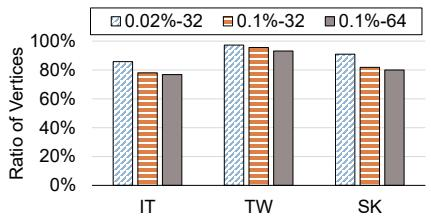  
Figure 10: Inter-snapshot Equivalent Values in EGA (|∆|-N).

• Deterministic O(1) access complexity. Data structures requiring traversal (e.g., pointer chasing in linked lists) or search (e.g., binary search in PMAs) to locate value data introduce significant latency, and exacerbate thread divergence and stall execution pipelines on GPUs, leading to severe performance degradation.

• Spatial locality for memory coalescing. Conventional dense arrays (as shown in Figure 11(a)) offer excellent spatial locality. Conversely, adopting formats with poor locality (e.g., hash-based structures [5]) would break memory coalescing and waste GPU memory bandwidth.

• Minimal data movement overhead. Dynamic structures like PMAs often require shifting contiguous memory blocks to accommodate element insertion. Such cascading data movement triggers severe write amplification and requires costly global synchronization [88]. Therefore, the proposed state management design must avoid physical data relocation or re-allocation [77].

As shown in Figure 10, empirical analysis reveals that a substantial portion of vertices (65% to 95%) maintain invariant state values across all snapshots during incremental EGA. This indicates that statically provisioning a full-version value array for every vertex is prohibitively wasteful. However, since the set of stable vertices is input and query dependent and unknown a priori, exploiting this redundancy requires a design that performs adaptive compaction at runtime. To satisfy the design goals, we propose the Adaptive Multi-Version Array. Specifically, AMVA employs a dual-format storage strategy: (i) Scalar format, which stores a single value shared across all snapshots for stable vertices; and (ii) Full-version format, which maintains a dense vector of N values for divergent vertices. Compression schemes (e.g., storing only unique values) are deliberately avoided for deterministic O(1) addressing: the current binary design ensures that states of a vertex in any snapshot can be accessed via either a direct read or a single-level redirection.

## Layout. The AMVA consists of two core components:

(i) The Vertex Directory (VD). The VD acts as the primary lookup table, implemented as a linear array where the i-th element corresponds to vertex v<sub>i</sub>. To minimize memory footprint, a tagged pointer scheme is employed to multiplex data and metadata within a single word (extensible to larger data types). As shown in Figure 11(b), the two Most Significant Bits (MSBs) serve as the divergence flag, while the remaining bits constitute the payload. The flag bits encode the current mode of the vertex. Across different modes, the payload stores either the shared value directly or an index offset pointing to the Expansion Buffer. More details are shown in §5.2.

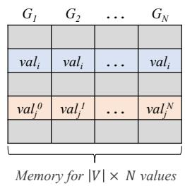

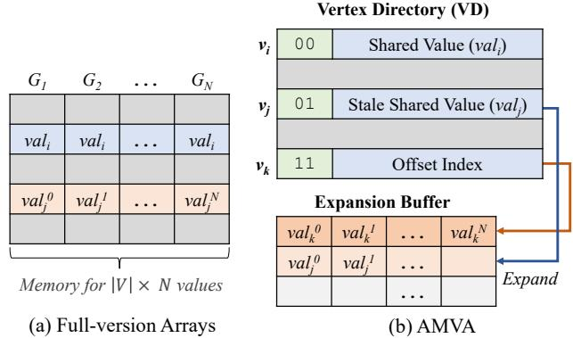

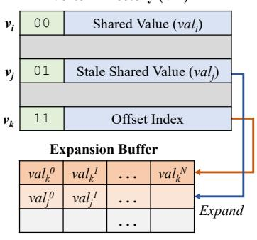  
Figure 11: Vertex State Representations.

(ii) The Expansion Buffer. To accommodate divergent vertices, we pre-allocate a contiguous memory block on the GPU, organized as B<sub>max</sub> rows where each row contains N elements. The j-th element of a row stores the value for snapshot G . When a vertex transitions from scalar format to full-version format, a free row from this buffer is assigned to that vertex, i.e., expansion. To ensure high-throughput expansion, we utilize a lock-free bump-pointer allocator [64] design with managing a global atomic counter that tracks the index of the next available row. Consequently, assigning a buffer row requires only a single atomic update (e.g., atomicAdd).

Memory Management. POEGA adopts a flexible provisioning policy. Prior to execution, it checks if the residual GPU memory suffices for full state materialization. In unconstrained scenarios (e.g., small datasets or low concurrency), POEGA reverts to the flat full-value arrays. However, when memory bottleneck comes from vertex state management, AMVA is instantiated with a total footprint bounded by (|V |+B<sub>max</sub> ×N). We determine the buffer capacity B<sub>max</sub> based on the remaining memory budget after allocating essential graph structures (e.g., the proxy graph, frontiers, etc.). Due to the high stability of vertex values in EGA, this pre-allocated buffer typically accommodates all divergent vertices. In cases where extreme divergence exhausts the buffer, POEGA enforces concurrency throttling, which restricts the batch size. We consider this an acceptable trade-off, because such highdivergence scenarios typically imply sufficient workload to saturate GPU compute resources.

## 5.2 Lock-Free Access Protocols

To support lock-free expansion of a vertex value, three operational modes for elements in the VD are defined using the divergence flag (i.e., tag bits): (1) Compact mode (00), where the lower bits store the scalar shared value; (2) Expand mode (01), which indicates an ongoing expansion, where the lower bits still hold the valid but potentially stale value; and (3) Buffer mode (11), where the payload stores the offset index pointing to the expansion buffer. Based on these modes, AMVA supports three core operations on the vertex states: write(), write\_expand(), and read().

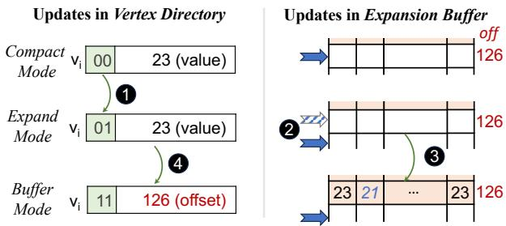  
Figure 12: An illustrated example of Write-with-Expansion in AMVA. Assume that atomicMin(v<sub>i</sub>, 21) is executed in the edge function during an iteration of incremental EGA.

Direct Write. When a thread attempts to update the state of a vertex v in snapshot G<sub>i</sub> after verifying the push condition of edge (u, v) (e.g., val<sub>i</sub>[u] + w < val<sub>i</sub>[v] in SSSP), the write() operation handles two specific scenarios: (i) Buffer Mode Detected. If the thread finds v is in the Buffer mode (tag 11), it follows the payload pointer and directly writes the new value into the expansion buffer using an atomic operation. (ii) Expand Mode Detected. If v is in Expand mode (tag 01), it indicates another thread is currently processing an expansion. The current thread waits until the mode transitions to Buffer Mode, after which it completes the write update.

Write with Expansion. When a thread attempts to update the state of a vertex v in the Compact mode, it initiates the expansion procedure and finishes the update via write\_expand(). To ensure data consistency under high concurrency, we design a four-step atomic expansion protocol, as shown in Figure 12. 1 Ownership Acquisition. The thread attempts to acquire exclusive rights to expand the values of v using an atomic Compare-and-Swap (CAS) instruction. It tries to transition the state mode from Compact to Expand while preserving the original value in the payload. Only one thread succeeds; failing threads infer that another writer has either claimed the vertex or completed the expansion, thus triggering a retry of write(). 2 Low-overhead Allocation. The owner thread allocates a new row in the expansion buffer by performing an atomic addition of the global counter with the old offset recorded. 3 Data Migration and Update. The owner thread expands the old scalar value (carried in the CAS payload) to all snapshot entries in the newly allocated buffer row. It then writes the new value (e.g., val<sub>i</sub>[u] + w) directly into the target snapshot column i. A memory fence is issued after this step to ensure these writes are visible to all threads. 4 Atomic Publishing. Finally, the owner commits the expansion by atomically updating the entry in the VD. The tag is flipped to Buffer mode (11), and the payload is replaced with the buffer index offset. This atomic instruction acts as the linearization point: once executed, all subsequent accesses are seamlessly redirected to the buffer.

Direct Read. When accessing a vertex state, read() first inspects the MSB of the tag: If MSB is 1 (i.e., Buffer mode), the reader thread follows the offset payload to retrieve the latest value from the buffer. If MSB is 0 (Compact or Expand mode), the value stored in the VD is consumed directly. Note that in Expand mode, the value retrieved may technically be “stale”, but this will not affect the final results of incremental EGA when the target graph algorithm exhibits monotonicity.

Correctness of Stale Reads. Let d denote the stale state read from a vertex currently in Expand mode and d<sub>new</sub> denote the finalized state being written to the buffer. This vertex can be a source or a destination. (i) For source access: propagating updates derived from a source d<sub>stale</sub> corresponds to processing a valid previous state of the graph. This may trigger loose updates (e.g., a path distance that will later be shortened), which are valid relaxations respecting the algorithmic invariants. The algorithm will eventually converge to the correct fixed point once the tighter d<sub>new</sub> is propagated. (ii) For destination access: If a candidate update fails to improve upon d<sub>stale</sub> , it is insufficient. Since the candidate update is worse than d<sub>stale</sub>, the update is transitively worse than d<sub>new</sub>, considering the monotonicity property (e.g., d<sub>stale</sub> ≤ d<sub>new</sub> in minimization problems). Thus, discarding the update based on d<sub>stale</sub> yields the same logical outcome as checking d<sub>new</sub>. In sum, the correctness of this read() operation is guaranteed.

## 6 Evaluation

## 6.1 Evaluation Methodology

Implementation. We prototype POEGA as a graph framework written with C++ and CUDA. We integrate our framework with an open-source in-memory GPU-based static graph pro cessing framework [57, 75]. To make a fair comparison, we incorporate this framework and UnionCSR format into all the compared systems.

Baselines. We compare POEGA with the following systems:

• Re-evaluation-based Approach: EGraph [86], which employs a re-evaluation analytics engine and reuses the transferred shared graphs among snapshots to reduce data transfer overhead.

• Streaming-based Incremental Analysis Approach: including Grapin [74], which employs the state-of-the-art streamingbased analytics engine [20, 70] and uses zero-copy for outof-memory accesses. We also integrate the Kickstarter engine with unified memory (KS-UM), which allocates the graph data with cudaMallocManaged(), and state-of-theart explicit data transfer method Subway [62] (KS-SW).

Table 2: Graph Statistics.  
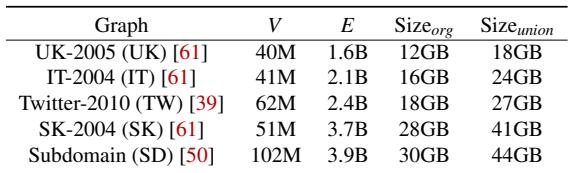

Table 3: Graph Algorithms and their Edge Functions.  
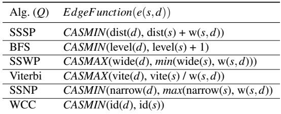

• Batch-based Incremental Analysis Approach: we deploy Mega [17] on GPUs, which employs state-of-the-art CommonGraph [1] as analytics engines and reuses the delta transferred with Subway. We also integrate CommonGraph with unified memory (CG-UM) and zero-copy (CG-ZC).

Evaluation Platform. Experiments are mainly conducted on a server equipped with an NVIDIA RTX A4000 GPU with 16 GB memory and a 16-core Intel Xeon Gold 6426Y 2.50GHz processor with 256 GB RAM. The server runs on Ubuntu 20.04.6 with Linux kernel 5.15.0, and the codes are compiled with CUDA 12.4 with the highest optimization level. For large datasets, we extend the evaluation onto an NVIDIA A6000 Ada GPU with 48 GB memory, while keeping the remaining system configuration unchanged.

Graph Datasets. Evaluations were conducted with a set of real-world graphs from different domains. Table 2 lists these graphs with their original graph CSR sizes (Size<sub>org</sub>) and their UnionCSR sizes (Size ) for EGA, both with weights. All these graphs have their UnionCSR sizes exceeding the GPU memory, requiring out-of-GPU-memory graph processing. Following prior studies [45, 66, 70], we initialize and warm up the system by preloading 50% of each dataset as the base snapshot (G<sub>0</sub>). Unless otherwise specified, all experimental results presented in this section are obtained over 32 snapshots; and each snapshot involves a delta batch of 0.1% updates, including 0.05% edge additions (randomly selected from the remaining dataset) and 0.05% edge deletions (randomly selected from the loaded portion).

Graph Algorithms. We use six types of graph queries to eval uate the graph analysis performance, including BFS (breadthfirst search), SSSP (single source shortest path), SSWP (single source widest path), SSNP (single source narrowest path),

Table 4: Performance Results (Seconds).  
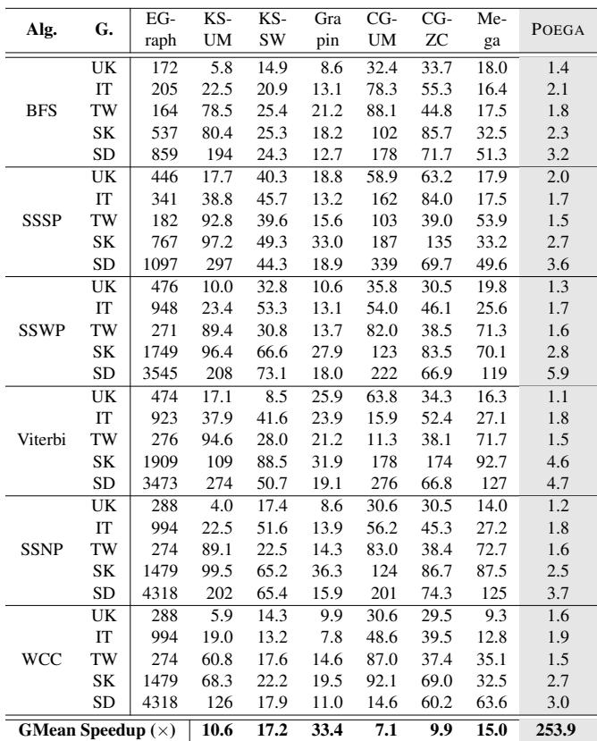

Viterbi, and Weakly Connected Component (WCC). Table 3 lists their edge functions.

## 6.2 Overall Performance

Table 4 reports the overall performance of all the methods, as well as the geometric mean speedup over the baseline, EGraph. The results show that POEGA outperforms other systems across all datasets and algorithms, achieving 253.9× speedup over the baseline method EGraph. When compared with SOTA (the fastest system other than POEGA in each case), POEGA has the speedup of 6.6× on average, and at most 14.3× for SSNP on the SK dataset.

Specifically, against the streaming-based method (KS) with different GPU memory management, POEGA achieves 23.9×, 7.6×, 14.7× speedups over unified memory (UM), Grapin, and Subway (SW) in geometric mean, respectively. Besides, against the batch-based method (CG), POEGA achieves 35.8×, 25.5×, 17.0× speedups over UM, zero-copy (ZC), and Mega.

We observe that the streaming-based methods generally outperform batch-based methods, particularly when using zerocopy. This is due to the trade-off between parallelism and data efficiency. KS exploits the exact dependency tracing and result bootstrapping to minimize the data required for analysis. In contrast, CG requires much more data to support its parallel incremental analysis [17], which is even more expensive for the explicit data transfer (SW). The consistent speedups of POEGA over both categories confirm the effectiveness of its holistic approach for GPU memory management and parallel computation efficiency. Finally, all incremental systems show consistent speedups over recomputation-based EGraph, validating the fundamental advantage of result reuse in EGA.

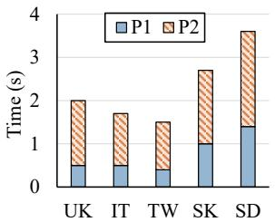  
(a) P1 and P2 performance.

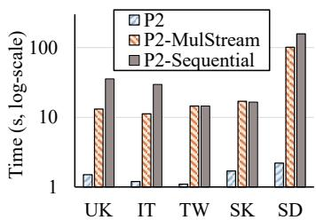  
(b) P2 performance under different execution strategies.  
Figure 13: Two Phases Breakdown (SSSP).

## 6.3 Breakdown Analysis

To assess the contribution of the proposed components to the final results of POEGA, we conduct a breakdown analysis.

Breakdown of the Two Phases and Effect of Coalesced Concurrent Analysis. Figure 13(a) decomposes the execution latency of POEGA. The P1 phase, which performs inmemory EPG analysis, accounts for 24% to 39% of the total runtime, with an average of 31%. Although the P2 refinement phase remains the dominant cost, its latency is reduced to a level comparable to in-memory processing through our coalesced concurrent execution design. To further evaluate this, Figure 13(b) compares POEGA against two alternative strategies for P2: concurrent execution with CUDA stream [58] and sequential execution. Note that several techniques in POEGA, e.g., bound-based pruning, cannot be supported under a multistream execution. The coalesced strategy in POEGA achieves 13.6× and 21.9× speedups over these two baselines, respectively. These results validate the efficiency of data access optimization and computation reduction discussed in §4.3, and indicate that naive concurrency alone is insufficient to fully utilize GPU resources.

Effect of Evolving Proxy Graph. To evaluate the benefits of evolving proxy graph (EPG), we benchmark POEGA against three alternative proxy graph strategies: evolving proxy graph generated for each snapshot with (1) the random sampling (RS), (2) the heuristics in Wonderland (WD) [85] (e.g., edges with the least weights), both sized at 10% of E, and (3) a static Core Graph [32]. Results in Figure 14 show that EPG helps POEGA achieve average speedups of 5.4× over RS and 3.8× over WD. This is due to the higher accuracy of EPG (from 87.1% to 98.8%) compared to that of RS (10% to 26%) and WD (14% to 48%). Besides, EPG in POEGA outperforms the static core graph by 2.4×, despite the latter’s high accuracy for the initial snapshot. This verifies the benefits of incremental analysis-oriented adaptation for updates. Besides, the proxy graphs in POEGA account for 12.1% to 15.9% of the original snapshot sizes, with a maintenance and generation cost of less than 0.3 seconds per snapshot. Note that this cost can be covered by the graph storage update procedure.

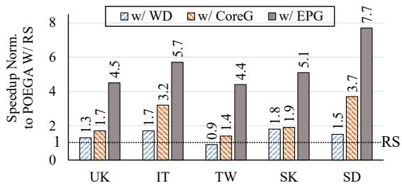  
Figure 14: Effect of evolving proxy graph. Compared with POEGA integrating random sampling (RS), WD [85], or Core-Graph [32] (SSSP).

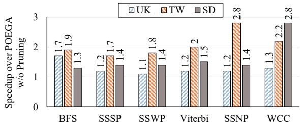  
Figure 15: Effect of bound-based pruning.

Effect of Bound-based Pruning. To evaluate the impact of the bound-based pruning, we disable it and then benchmark POEGA. The results in Figure 15 show diverse benefits of pruning on different graph datasets and algorithms. It improves the performance of POEGA by up to 2.8×, and by 1.6× on average. These results highlight the room for further improving the concurrent analysis by reducing redundant computations across snapshots, underscoring the effectiveness of our approach, including the lazy updates of the bounds.

Effect of Using AMVA. We evaluate the effectiveness of AMVA in scenarios where allocating full value arrays out of GPU memory (e.g., 32 snapshots of TW/SD). AMVA is compared against two alternative strategies: (1) batch-by-batch, which trades reduced concurrency to memory, and (2) zerocopy for managing out-of-memory value arrays. Results in Figure 16 show that AMVA outperforms batch-by-batch concurrent analysis up to 3.3×. This contributes to the benefits of snapshot coalescing with a higher concurrency. Notably, both AMVA and batch-by-batch analysis consistently outperform zero-copy, demonstrating the need for explicit runtime state management on GPUs.

The results in Figure 16 also present the impact of AMVA on two phases and yield two observations. First, AMVA delivers more gains at higher snapshot numbers (32 and 64), yet exhibits a performance degradation compared to the batch-bybatch method at smaller scales (8 and 16). This indicates that when potential concurrency is limited, the runtime overheads of AMVA outweigh its memory-saving advantages. Second, AMVA introduces a trade-off between the two phases. While it boosts P2 by up to 4.7× and 12.9× compared with batchbased and zero-copy, it results in only marginal gains, or even slight slowdowns for P1. This is because in-memory processing benefits relatively less from increased concurrency, which makes AMVA’s computational overhead more visible.

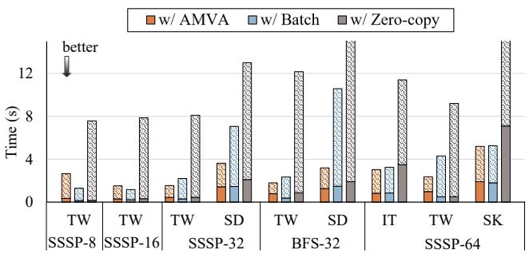  
Figure 16: Effect of AMVA in two phases. Compared against reduced concurrency (batch-by-batch) and zero-copy for outof-memory value array. (P1: Solid; P2: Patterned.)

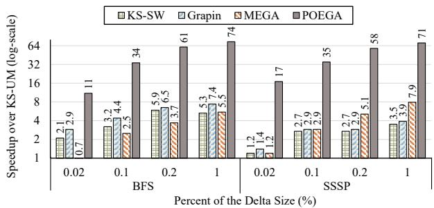  
Figure 17: Effect of delta size (SK).

## 6.4 Scalability

We also examine the scalability of POEGA. First, the delta batch size is set from 0.02% (0.01% add. and 0.01% del.) to 1% (0.5% add. and 0.5% del.) while keeping 32 snapshots. Speedups of POEGA and two state-of-the-art systems, Grapin and Mega, as well as the KS-SW, over KS-UM are reported in Figure 17. POEGA and batch-based incremental system Mega have consistently increasing speedups with larger delta sizes. Mega outperforms Grapin when the delta is 1% for SSSP, showing the scalability of batch-based incremental methods in terms of delta size.

We then vary the snapshot number from 8 to 64 while keeping the delta size at 0.1%. The results in Figure 18 show that POEGA generally has more benefits than other approaches across different N. Streaming-based methods, KS-SW and

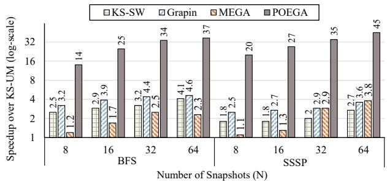  
Figure 18: Effect of number of snapshots (SK).

Table 5: Performance results (seconds) for running over SD dataset on a 48GB GPU.  
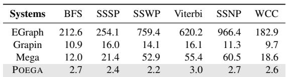

Grapin, have stable performance with different N, which is due to their sequential processing of delta for each new snapshot, regardless of the total snapshot numbers. KS-SW shows a fluctuating performance because it is sensitive to the effect of deletion deltas.

Results on a GPU with 48 GB memory. We further evaluate the scalability of POEGA on a GPU platform with increased memory capacity. Table 5 reports the performance of POEGA, the baseline, and the SOTA systems over the graph dataset SD on a 48 GB GPU. Note that despite the larger GPU memory, the runtime state and graph data of SD exceed 48 GB.

The results show that while increasing GPU memory to 48 GB improves performance for all systems, i.e., 4.2× for EGraph, 1.2× for Grapin, 2.8× for Mega and 1.6× for POEGA, the gains are sub-linear. These suggest that these systems are generally memory-bound, yet simply scaling the GPU memory size cannot fully mitigate the overhead of irregular, fine-grained out-of-memory graph data accesses typical in incremental analysis. Notably, POEGA maintains its benefits, achieving a 4.9× speedup over Grapin on SD, surpassing the 4.0× speedup observed in the 16 GB scenario.

## 7 Discussion and Future Work

Monotonic Graph Algorithm. POEGA currently supports graph algorithms that exhibit monotonicity, where vertex values only change monotonically across iterations before convergence. This property is common for a wide spectrum of iterative graph algorithms: beyond the fundamental algorithms presented in §6, it encompasses complex tasks such as graph radii estimation and minimum spanning tree. The significance of monotonicity has been extensively recognized and exploited in prior graph systems. It serves as the theoretical foundation for for asynchronous iterative processing [62, 82], result reuse in dynamic graph processing [11,16,70,83], automated parallelization [15], and iteration pruning [9,32,33,80]. Furthermore, as existing studies have provided automated condition checkers to confirm whether a graph algorithm is monotonic [20], users can directly leverage them to verify whether an algorithm can be deployed in POEGA.

For non-monotonic graph algorithms, such as PageRank and Betweenness Centrality, POEGA could integrate the cor responding incremental approach, such as Graphbolt [46], to its analytics engine, while needing to adapt the bound-based pruning technique, which currently relies on the monotonicity. The efficiency of POEGA for non-monotonic graph algorithms is an open problem, and we leave the investigation of general incremental graph analysis on GPUs as our future work.

Extending POEGA to Multi-GPU Environments. Beyond single GPU, POEGA can be extended to multi-GPU scaling. In this scenario, snapshots can be distributed across multiple GPUs by batch, with each batch still using the coalesced concurrency analysis. Since the resident-memory proxy graph is compact, it can be replicated on each device to enable independent, zero-communication approximate analysis in P1. Besides, future work could exploit the distinct bottleneck profiles of POEGA’s two phases to overlap P1’s compute-intensive tasks with P2’s I/O-intensive transfers across devices, further mitigating the PCIe/NVLink overhead.

## 8 Related Work

Evolving Graph Systems. Various incremental computation frameworks have been proposed. Early approaches such as Tornado [66] and Naiad [54] explore the incremental analysis concept, but only support edge additions. Kickstarter [70] designs the runtime support for the analysis to enable the capability of handling deltas with deletions, while Graphbolt [46] further supports the Bulk Synchronous Parallel semantics on the basis of Kickstarter. Tegra [30] extends streaming analysis to arbitrary time windows of the graph. CommonGraph [1] proposes to transform the expensive deletion processing into addition processing by first analyzing the common subgraphs and then incrementally reaching the full snapshots. MEGA [17] is an evolving graph accelerator that improves data reuse in CommonGraph by optimizing the scheduling of the incremental analysis. More recently, UVV [2] further reduces computations in CommonGraph by identifying vertices with stable values across snapshots. However, UVV relies on offline evaluation over the union of snapshots, which incurs significant overhead for large-scale, out-of-core processing. POEGA departs from this by introducing online stable value identification. Through a lightweight (yet safe) approximation for bound-based pruning, it achieves similar computational savings without heavy pre-processing.

A few works have explored improving the data representation of Kickstarter. Risgraph [16] optimizes for the per-update incremental analysis scenario, proposing the hash index for the adjacency list of graph data to enhance access efficiency. IncBoost [83] discusses the efficiency of dependency data representations in Kickstarter. All these systems and formats are built on multi-core or distributed CPUs.

GPU-based Graph Processing. Many GPU-based systems are designed for a specific graph algorithm [6, 26, 67, 71]. Among the general frameworks, Gunrock [75] introduces the frontier-centric model and implements a number of graph primitives. Maximum warp [27], CuSha [36], warp segmentation [35] and Tigr [57] focus on addressing GPU thread divergence issues for irregular graphs. These methods are orthogonal to the techniques of this work.

To address GPU memory oversubscription, early work Graphie [22] and GraphReduce [63] adopt the partition-based method and actively track the active vertices on partitions to avoid unnecessary partition transfers. EMOGI [51] explores efficiently employing zero-copy for graph analytics. Subway [62] proposes to transfer fine-grained partitions of the active vertices. All of these works focus on the memory oversubscription issue on the static graphs.

GPU-based dynamic graph systems are built to meet the real-time response requirement for the applications on rapidly evolving graphs. EGraph [86] proposes to share partitions among snapshots in dynamic graphs to reduce the redundant data transfer to devices. Grapin [74] adopts zero-copy for its streaming incremental engine (based on Kickstarter) and caches the hot vertices’ subgraph in the GPU to reduce potential data transfer overhead. CGCGraph [68] transfers active shared partitions to GPUs while processing unshared active parts on the CPU concurrently. Aside from analytics, a parallel line of work has explored dynamic graph data structures or storage on GPUs [5, 7, 21, 65, 77].

## 9 Conclusion

This work presents POEGA, a framework designed to enable efficient large-scale evolving graph analytics on GPUs. It adopts a proxy-guided incremental analysis model to reduce out-of-memory IO, which first analyzes the proxy graphs and then executes global refinement. To solve the extra computations, POEGA employs an efficient concurrent analysis on GPUs, including bound-based pruning and adaptive state format to enable high concurrency. A comprehensive evaluation of POEGA demonstrates its effectiveness.

## Acknowledgment

We are grateful to the anonymous reviewers and our shepherd for their constructive comments. This work was supported in part by the Research Grants Council of Hong Kong (No. 11216925 and 14212425), by City University of Hong Kong internal and donation fundings (No. 9610598,

No. 9220148, and No. 7005991), and by CUHK (4937007, 4937008, 5501329, 5501517).

## References

[1] Mahbod Afarin, Chao Gao, Shafiur Rahman, Nael Abu-Ghazaleh, and Rajiv Gupta. Commongraph: Graph analytics on evolving data. In Proceedings of the ACM International Conference on Architectural Support for Programming Languages and Operating Systems (ASP-LOS), 2023.

[2] Mahbod Afarin, Chao Gao, Xizhe Yin, Zhijia Zhao, Nael Abu-Ghazaleh, and Rajiv Gupta. Uvvs: Identifying unchanged vertex values in evolving graphs via intersection-union analysis. In 40th IEEE International Parallel and Distributed Processing Symposium (IPDPS). IEEE, 2026.

[3] Neha Agarwal, David Nellans, Mark Stephenson, Mike O’Connor, and Stephen W Keckler. Page placement strategies for gpus within heterogeneous memory systems. In Proceedings of the Twentieth International Conference on Architectural Support for Programming Languages and Operating Systems, pages 607–618, 2015.

[4] Rachata Ausavarungnirun, Joshua Landgraf, Vance Miller, Saugata Ghose, Jayneel Gandhi, Christopher J Rossbach, and Onur Mutlu. Mosaic: a gpu memory manager with application-transparent support for multiple page sizes. In Proceedings of the 50th Annual IEEE/ACM International Symposium on Microarchitecture, pages 136–150, 2017.

[5] Muhammad A Awad, Saman Ashkiani, Serban D Porumbescu, and John D Owens. Dynamic graphs on the gpu. In 2020 IEEE International Parallel and Distributed Processing Symposium (IPDPS), pages 739– 748. IEEE, 2020.

[6] Federico Busato and Nicola Bombieri. An efficient implementation of the bellman-ford algorithm for kepler gpu architectures. IEEE Transactions on Parallel and Distributed Systems, 2015.

[7] Federico Busato, Oded Green, Nicola Bombieri, and David A Bader. Hornet: An efficient data structure for dynamic sparse graphs and matrices on gpus. In 2018 IEEE High Performance extreme Computing Conference (HPEC), pages 1–7. IEEE, 2018.

[8] Jaewook Byun, Sungpil Woo, and Daeyoung Kim. Chronograph: Enabling temporal graph traversals for efficient information diffusion analysis over time. IEEE Transactions on Knowledge and Data Engineering, 32(3):424–437, 2019.

[9] Hongtao Chen, Mingxing Zhang, Ke Yang, Kang Chen, Albert Zomaya, Yongwei Wu, and Xuehai Qian. Achieving sub-second pairwise query over evolving graphs. In Proceedings of the 28th ACM International Conference on Architectural Support for Programming Languages and Operating Systems (ASPLOS), pages 1–15, 2023.

[10] Hongzheng Chen, Minghua Shen, Nong Xiao, and Yutong Lu. Krill: a compiler and runtime system for concurrent graph processing. In Proceedings of the International Conference for High Performance Computing, Networking, Storage and Analysis, pages 1–16, 2021.

[11] Zheng Chen, Feng Zhang, Yang Chen, Xiaokun Fang, Guanyu Feng, Xiaowei Zhu, Wenguang Chen, and Xiaoyong Du. Enabling window-based monotonic graph analytics with reusable transitional results for patternconsistent queries. Proceedings of the VLDB Endowment, 17(11):3003–3016, 2024.

[12] Yongli Cheng, Yan Ma, Hong Jiang, Lingfang Zeng, Fang Wang, Xianghao Xu, and Yuhang Wu. Tgstore: An efficient storage system for large time-evolving graphs. IEEE Transactions on Big Data, 2024.

[13] Ariel Debrouvier, Eliseo Parodi, Matías Perazzo, Valeria Soliani, and Alejandro Vaisman. A model and query language for temporal graph databases. The VLDB Journal, 30(5):825–858, 2021.

[14] Laxman Dhulipala, Guy E Blelloch, and Julian Shun. Low-latency graph streaming using compressed purelyfunctional trees. In Proceedings of the ACM SIGPLAN conference on Programming Language Design and Implementation (PLDI), 2019.

[15] Wenfei Fan, Jingbo Xu, Yinghui Wu, Wenyuan Yu, Jiaxin Jiang, Zeyu Zheng, Bohan Zhang, Yang Cao, and Chao Tian. Parallelizing sequential graph computations. In Proceedings of the 2017 ACM International Conference on Management of Data, pages 495–510, 2017.

[16] Guanyu Feng, Zixuan Ma, Daixuan Li, Shengqi Chen, Xiaowei Zhu, Wentao Han, and Wenguang Chen. Risgraph: A real-time streaming system for evolving graphs to support sub-millisecond per-update analysis at millions ops/s. In Proceedings of the International Conference on Management of Data (SIGMOD), 2021.

[17] Chao Gao, Mahbod Afarin, Shafiur Rahman, Nael Abu-Ghazaleh, and Rajiv Gupta. Mega evolving graph accelerator. In IEEE/ACM International Symposium on Microarchitecture (MICRO), 2023.

[18] Hongru Gao, Xiaofei Liao, Zhiyuan Shao, Kexin Li, Jiajie Chen, and Hai Jin. A survey on dynamic graph

processing on gpus: concepts, terminologies and systems. Frontiers of Computer Science, 18(4):184106, 2024.

[19] Prasun Gera, Hyojong Kim, Piyush Sao, Hyesoon Kim, and David Bader. Traversing large graphs on gpus with unified memory. Proceedings of the VLDB Endowment, 13(7):1119–1133, 2020.

[20] Shufeng Gong, Chao Tian, Qiang Yin, Wenyuan Yu, Yanfeng Zhang, Liang Geng, Song Yu, Ge Yu, and Jin gren Zhou. Automating incremental graph processing with flexible memoization. Proceedings of the VLDB Endowment, 14(9):1613–1625, 2021.

[21] Oded Green and David A Bader. custinger: Supporting dynamic graph algorithms for gpus. In 2016 IEEE High Performance Extreme Computing Conference (HPEC), pages 1–6. IEEE, 2016.

[22] Wei Han, Daniel Mawhirter, Bo Wu, and Matthew Buland. Graphie: Large-scale asynchronous graph traversals on just a gpu. In 2017 26th International Conference on Parallel Architectures and Compilation Techniques (PACT). IEEE, 2017.

[23] Wentao Han, Youshan Miao, Kaiwei Li, Ming Wu, Fan Yang, Lidong Zhou, Vijayan Prabhakaran, Wenguang Chen, and Enhong Chen. Chronos: a graph engine for temporal graph analysis. In Proceedings of the Sixteenth European Conference on Computer Systems (EuroSys), 2014.

[24] Pawan Harish and Petter J Narayanan. Accelerating large graph algorithms on the gpu using cuda. In International conference on high-performance computing, pages 197–208. Springer, 2007.

[25] Bruce Hendrickson and Robert Leland. A multilevel algorithm for partitioning graphs. In Proceedings of the 1995 ACM/IEEE conference on Supercomputing, pages 28–es, 1995.

[26] Changwan Hong, Laxman Dhulipala, and Julian Shun. Exploring the design space of static and incremental graph connectivity algorithms on gpus. In Proceedings of the ACM International Conference on Parallel Architectures and Compilation Techniques, pages 55–69, 2020.

[27] Sungpack Hong, Sang Kyun Kim, Tayo Oguntebi, and Kunle Olukotun. Accelerating cuda graph algorithms at maximum warp. In Proceedings of the 16th ACM symposium on Principles and practice of parallel programming, pages 267–276, 2011.

[28] Chengying Huan, Shuaiwen Leon Song, Santosh Pandey, Hang Liu, Yongchao Liu, Baptiste Lepers, Changhua He, Kang Chen, Jinlei Jiang, and Yongwei Wu. Tea: A general-purpose temporal graph random walk engine. In Proceedings of the Eighteenth European Conference on Computer Systems, pages 182–198, 2023.

[29] Anand Iyer, Li Erran Li, and Ion Stoica. CellIQ: Real-Time Cellular Network Analytics at Scale. In USENIX Symposium on Networked Systems Design and Implementation (NSDI), 2015.

[30] Anand Padmanabha Iyer, Qifan Pu, Kishan Patel, Joseph E Gonzalez, and Ion Stoica. TEGRA: Efficient Ad-Hoc Analytics on Evolving Graphs. In USENIX Symposium on Networked Systems Design and Implementation (NSDI), 2021.

[31] Jiaxin Jiang, Yuan Li, Bingsheng He, Bryan Hooi, Jia Chen, and Johan Kok Zhi Kang. Spade: A real-time fraud detection framework on evolving graphs. Proceedings of the VLDB Endowment, 16(3):461–469, 2022.

[32] Xiaolin Jiang, Mahbod Afarin, Zhijia Zhao, Nael Abu-Ghazaleh, and Rajiv Gupta. Core graph: Exploiting edge centrality to speedup the evaluation of iterative graph queries. In Proceedings of the Nineteenth European Conference on Computer Systems, pages 18–32, 2024.

[33] Xiaolin Jiang, Chengshuo Xu, Xizhe Yin, Zhijia Zhao, and Rajiv Gupta. Tripoline: generalized incremental graph processing via graph triangle inequality. In Proceedings of the Sixteenth European Conference on Computer Systems (Eurosys), pages 17–32, 2021.

[34] Jens Kehne, Jonathan Metter, and Frank Bellosa. Gpuswap: Enabling oversubscription of gpu memory through transparent swapping. In Proceedings of the 11th ACM SIGPLAN/SIGOPS International Conference on Virtual Execution Environments, pages 65–77, 2015.

[35] Farzad Khorasani, Rajiv Gupta, and Laxmi N Bhuyan. Scalable simd-efficient graph processing on gpus. In 2015 International Conference on Parallel Architecture and Compilation (PACT), pages 39–50. IEEE, 2015.

[36] Farzad Khorasani, Keval Vora, Rajiv Gupta, and Laxmi N Bhuyan. Cusha: vertex-centric graph processing on gpus. In Proceedings of the 23rd international symposium on High-performance parallel and distributed computing, 2014.

[37] Pradeep Kumar and H Howie Huang. GRAPHONE: a data store for real-time analytics on evolving graphs. In USENIX Conference on File and Storage Technologies (FAST), 2019.

[38] Amlan Kusum, Keval Vora, Rajiv Gupta, and Iulian Neamtiu. Efficient processing of large graphs via input reduction. In Proceedings of the 25th ACM International Symposium on High-Performance Parallel and Distributed Computing, pages 245–257, 2016.

[39] Haewoon Kwak, Changhyun Lee, Hosung Park, and Sue Moon. What is Twitter, a social network or a news media? In Proc. ACM World Wide Web (WWW), 2010.

[40] Aapo Kyrola, Guy Blelloch, and Carlos Guestrin. GraphChi: Large-Scale graph computation on just a PC. In USENIX Symposium on Operating Systems Design and Implementation (OSDI), 2012.

[41] Jure Leskovec and Christos Faloutsos. Sampling from large graphs. In Proceedings of the 12th ACM SIGKDD international conference on Knowledge discovery and data mining, pages 631–636, 2006.

[42] Changji Li, Hongzhi Chen, Shuai Zhang, Yingqian Hu, Chao Chen, Zhenjie Zhang, Meng Li, Xiangchen Li, Dongqing Han, Xiaohui Chen, et al. Bytegraph: a highperformance distributed graph database in bytedance. Proceedings of the VLDB Endowment, 15(12):3306– 3318, 2022.

[43] Chen Li, Rachata Ausavarungnirun, Christopher J Rossbach, Youtao Zhang, Onur Mutlu, Yang Guo, and Jun Yang. A framework for memory oversubscription management in graphics processing units. In Proceedings of the Twenty-Fourth International Conference on Architectural Support for Programming Languages and Operating Systems, pages 49–63, 2019.

[44] Yunkai Lou, Chaokun Wang, Tiankai Gu, Hao Feng, Jun Chen, and Jeffrey Xu Yu. Time-topology analysis on temporal graphs. The VLDB Journal, 32(4):815–843, 2023.

[45] Peter Macko, Virendra J Marathe, Daniel W Margo, and Margo I Seltzer. LLAMA: Efficient Graph Analytics using Large Multiversioned Arrays. In IEEE International Conference on Data Engineering (ICDE), 2015.

[46] Mugilan Mariappan and Keval Vora. Graphbolt: Dependency-driven synchronous processing of streaming graphs. In Proceedings of the Sixteenth European Conference on Computer Systems (EuroSys), 2019.

[47] Maria Massri, Zoltan Miklos, Philippe Raipin, and Pierre Meye. Clock-g: A temporal graph management system with space-efficient storage technique. In 2022 IEEE 38th International Conference on Data Engineering (ICDE), pages 2263–2276, 2022.

[48] Frank McSherry, Derek Gordon Murray, Rebecca Isaacs, and Michael Isard. Differential Dataflow. In CIDR, 2013.

[49] Duane Merrill, Michael Garland, and Andrew Grimshaw. Scalable gpu graph traversal. In Proceedings of the 17th ACM SIGPLAN symposium on Principles and Practice of Parallel Programming, pages 117–128, 2012.

[50] Robert Meusel, Sebastiano Vigna, Oliver Lehmberg, and Christian Bizer. The graph structure in the web– analyzed on different aggregation levels. The Journal of Web Science, 1, 2015.

[51] Seung Won Min, Vikram Sharma Mailthody, Zaid Qureshi, Jinjun Xiong, Eiman Ebrahimi, and Wen-mei Hwu. Emogi: efficient memory-access for out-ofmemory graph-traversal in gpus. Proc. VLDB Endow., 14(2):114–127, 2020.

[52] Srikanth Mithinti and Prashant Singh. Gpu algorithms for fastest path problem in temporal graphs. In Proceedings of the 53rd International Conference on Parallel Processing, pages 587–596, 2024.

[53] Irene Moulitsas and George Karypis. Multilevel algorithms for generating coarse grids for multigrid methods. In Proceedings of the 2001 ACM/IEEE conference on Supercomputing, pages 45–45, 2001.

[54] Derek G Murray, Frank McSherry, Rebecca Isaacs, Michael Isard, Paul Barham, and Martín Abadi. Naiad: a timely dataflow system. In Proceedings of the Twenty-Fourth ACM Symposium on Operating Systems Principles, pages 439–455, 2013.

[55] Nurlan Nazaraliyev, Elaheh Sadredini, and Nael Abu-Ghazaleh. Dream: Device-driven efficient access to virtual memory. In Proceedings of the 39th ACM International Conference on Supercomputing, pages 1190– 1205, 2025.

[56] Abdun Nihaal and Madhu Mutyam. Selective memory compression for gpu memory oversubscription management. In Proceedings of the 53rd International Conference on Parallel Processing, pages 189–198, 2024.

[57] Amir Hossein Nodehi Sabet, Junqiao Qiu, and Zhijia Zhao. Tigr: Transforming Irregular Graphs for GPU-Friendly Graph Processing. In Proceedings of the ACM International Conference on Architectural Support for Programming Languages and Operating Systems (ASP-LOS), 2018.

[58] NVIDIA. CUDA C++ Programming Guide. https://docs.nvidia.com/cuda/ cuda-c-programming-guide/.

[59] NVIDIA. Cuda c++ best practices guide. https://docs.nvidia.com/cuda/ cuda-c-best-practices-guide/index.html, 2020.

[60] Chenghui Ren, Eric Lo, Ben Kao, Xinjie Zhu, and Reynold Cheng. On querying historical evolving graph sequences. Proceedings of the VLDB Endowment, 2011.

[61] Ryan Rossi and Nesreen Ahmed. The network data repository with interactive graph analytics and visualization. In Proceedings of the AAAI conference on artificial intelligence, volume 29, 2015.

[62] Amir Hossein Nodehi Sabet, Zhijia Zhao, and Rajiv Gupta. Subway: Minimizing data transfer during out-ofgpu-memory graph processing. In Proceedings of the Fifteenth European Conference on Computer Systems, 2020.

[63] Dipanjan Sengupta, Shuaiwen Leon Song, Kapil Agar wal, and Karsten Schwan. Graphreduce: processing large-scale graphs on accelerator-based systems. In Proceedings of the International Conference for High Performance Computing, Networking, Storage and Anal ysis, 2015.

[64] Sangmin Seo, Junghyun Kim, and Jaejin Lee. Sfmalloc: A lock-free and mostly synchronization-free dynamic memory allocator for manycores. In 2011 International Conference on Parallel Architectures and Compilation Techniques, pages 253–263. IEEE, 2011.

[65] Mo Sha, Yuchen Li, Bingsheng He, and Kian-Lee Tan. Accelerating dynamic graph analytics on gpus. Proceedings of the VLDB Endowment, 11(1):107–120, 2017.

[66] Xiaogang Shi, Bin Cui, Yingxia Shao, and Yunhai Tong. Tornado: A system for Real-time Iterative Analysis over Evolving Data. In Proceedings of the International Conference on Management of Data (SIGMOD), 2016.

[67] Jyothish Soman, Kothapalli Kishore, and PJ Narayanan. A fast gpu algorithm for graph connectivity. In 2010 IEEE International Symposium on Parallel & Distributed Processing, Workshops and Phd Forum (IPDPSW). IEEE, 2010.

[68] Yiming Sun, Jie Zhang, Huawei Cao, Yuan Zhang, Xuejun An, Junying Huang, and Xiaochun Ye. Cgcgraph: Efficient cpu-gpu co-execution for concurrent dynamic graph processing. ACM Transactions on Architecture and Code Optimization, 2025.

[69] Hau Tran, An Nguyen, Phuong Vo, and Tu Vu. Dns graph mining for malicious domain detection. In 2017 IEEE International Conference on Big Data (Big Data), pages 4680–4685. IEEE, 2017.

[70] Keval Vora, Rajiv Gupta, and Guoqing Xu. Kickstarter: Fast and Accurate Computations on Streaming Graphs via Trimmed Approximations. In Proceedings of the ACM International Conference on Architectural Support

for Programming Languages and Operating Systems (ASPLOS), 2017.

[71] Kai Wang, Don Fussell, and Calvin Lin. A fast workefficient sssp algorithm for gpus. In Proceedings of the 26th ACM SIGPLAN Symposium on Principles and Practice of Parallel Programming, pages 133–146, 2021.

[72] Kai Wang, Guoqing Xu, Zhendong Su, and Yu David Liu. {GraphQ}: Graph query processing with abstraction {Refinement—Scalable} and programmable analytics over very large graphs on a single {PC}. In 2015 USENIX Annual Technical Conference (USENIX ATC 15), pages 387–401, 2015.

[73] Qiange Wang, Xin Ai, Yanfeng Zhang, Jing Chen, and Ge Yu. Hytgraph: Gpu-accelerated graph processing with hybrid transfer management. In 2023 IEEE 39th International Conference on Data Engineering (ICDE), pages 558–571. IEEE, 2023.

[74] Qiange Wang, Yongze Yan, Hongshi Tan, Cheng Chen, Cheng Zhao, Jiaming Tian, Jiaxin Jiang, Xiaoliang Cong, Yanfeng Zhang, Ge Yu, et al. Efficient graph data access for out-of-memory gpu streaming graph processing. Proceedings of the VLDB Endowment, 18(11):3854–3867, 2025.

[75] Yangzihao Wang, Andrew Davidson, Yuechao Pan, Yuduo Wu, Andy Riffel, and John D Owens. Gunrock: A high-performance graph processing library on the GPU. In Proceedings of the ACM SIGPLAN Symposium on Principles and Practice of Parallel Programming (PPoPP), 2016.

[76] Ye Wang, Qing Wang, Henning Koehler, and Yu Lin. Query-by-sketch: Scaling shortest path graph queries on very large networks. In Proc. International Conference on Management of Data (SIGMOD), 2021.

[77] Martin Winter, Daniel Mlakar, Rhaleb Zayer, Hans-Peter Seidel, and Markus Steinberger. faimgraph: High performance management of fully-dynamic graphs under tight memory constraints on the gpu. In SC18: International Conference for High Performance Computing, Networking, Storage and Analysis, pages 754–766. IEEE, 2018.

[78] Huanhuan Wu, James Cheng, Silu Huang, Yiping Ke, Yi Lu, and Yanyan Xu. Path problems in temporal graphs. Proceedings of the VLDB Endowment, 7(9):721– 732, 2014.

[79] Mincheng Wu, Chao Li, Zhangchong Shen, Shibo He, Lingling Tang, Jie Zheng, Yi Fang, Kehan Li, Yanggang Cheng, Zhiguo Shi, et al. Use of temporal contact graphs

to understand the evolution of COVID-19 through contact tracing data. Communications Physics, 5(1):270, 2022.

[80] Chengshuo Xu, Keval Vora, and Rajiv Gupta. Pnp: Pruning and prediction for point-to-point iterative graph analytics. In Proceedings of the Twenty-Fourth International Conference on Architectural Support for Programming Languages and Operating Systems (ASPLOS), pages 587–600, 2019.

[81] Chang Ye, Yuchen Li, Bingsheng He, Zhao Li, and Jianling Sun. Gpu-accelerated graph label propagation for real-time fraud detection. In Proceedings of the 2021 International Conference on Management of Data, pages 2348–2356, 2021.

[82] Xizhe Yin, Zhijia Zhao, and Rajiv Gupta. Glign: Taming misaligned graph traversals in concurrent graph processing. In Proceedings of the 28th ACM International Conference on Architectural Support for Programming Languages and Operating Systems (ASPLOS), 2023.

[83] Xizhe Yin, Zhijia Zhao, and Rajiv Gupta. Incboost: Scaling incremental graph processing for edge deletions and weight updates. In Proceedings of the 2024 ACM Symposium on Cloud Computing, 2024.

[84] Aya Zaki, Mahmoud Attia, Doaa Hegazy, and Safaa Amin. Comprehensive survey on dynamic graph models. International Journal of Advanced Computer Science and Applications, 7(2), 2016.

[85] Mingxing Zhang, Yongwei Wu, Youwei Zhuo, Xuehai Qian, Chengying Huan, and Kang Chen. Wonderland: A novel abstraction-based out-of-core graph processing system. In Proceedings of the Twenty-Third International Conference on Architectural Support for Programming Languages and Operating Systems (ASP-LOS), 2018.

[86] Yu Zhang, Yuxuan Liang, Jin Zhao, Fubing Mao, Lin Gu, Xiaofei Liao, Hai Jin, Haikun Liu, Song Guo, Yangqing Zeng, et al. Egraph: efficient concurrent gpu-based dynamic graph processing. IEEE Transactions on Knowledge and Data Engineering, 35(6):5823–5836, 2022.

[87] Yu Zhang, Xiaofei Liao, Hai Jin, Lin Gu, Ligang He, Bingsheng He, and Haikun Liu. {CGraph}: A correlations-aware approach for efficient concurrent iterative graph processing. In 2018 USENIX Annual Technical Conference (USENIX ATC 18), pages 441–452, 2018.

[88] Yunmo Zhang, Jiacheng Huang, Xizhe Yin, Junqiao Qiu, Hong Xu, and Chun Jason Xue. Pie: Enabling fast and

scalable incremental evolving graph analytics on persistent memory. In Proceedings of the 39th ACM International Conference on Supercomputing, pages 564–579, 2025.

[89] Jin Zhao, Qian Wang, Ligang He, Yu Zhang, Sheng Di, Bingsheng He, Xinlei Wang, Hui Yu, Hao Qi, Longlong Lin, et al. Tempgraph: An efficient chain-driven temporal graph computing framework on the gpu. In Proceedings of the 30th ACM International Conference on Architectural Support for Programming Languages and Operating Systems, Volume 3, pages 230–246, 2025.

[90] Jin Zhao, Yu Zhang, Xiaofei Liao, Ligang He, Bingsheng He, Hai Jin, Haikun Liu, and Yicheng Chen. Graphm: an efficient storage system for high throughput of concurrent graph processing. In Proceedings of the International Conference for High Performance Computing, Networking, Storage and Analysis, pages 1–14, 2019.

[91] Long Zheng, Xianliang Li, Yaohui Zheng, Yu Huang, Xiaofei Liao, Hai Jin, Jingling Xue, Zhiyuan Shao, and Qiang-Sheng Hua. Scaph: Scalable {GPU-Accelerated} graph processing with {Value-Driven} differential scheduling. In 2020 USENIX Annual Technical Conference (USENIX ATC 20), pages 573–588, 2020.

[92] Fang Zhou, Sebastien Malher, and Hannu Toivonen. Network simplification with minimal loss of connectivity. In 2010 IEEE international conference on data mining, pages 659–668. IEEE, 2010.

[93] Xiaowei Zhu, Wentao Han, and Wenguang Chen. {GridGraph}:{Large-Scale} graph processing on a single machine using 2-level hierarchical partitioning. In USENIX Annual Technical Conference (ATC), 2015.

[94] Lei Zou, Fan Zhang, Yinnian Lin, and Yanpeng Yu. An efficient data structure for dynamic graph on gpus. IEEE Transactions on Knowledge and Data Engineering, 35(11):11051–11066, 2023.

## A Artifact Appendix

## Abstract

This artifact provides the source code, benchmarks, and evaluation scripts for POEGA, a high-performance framework designed to enable efficient large-scale evolving graph analytics on GPUs. It includes the implementation of proxy-guided two-phase analysis, bound-based pruning, and adaptive multiversion array.

## Scope

This artifact enables validation of POEGA’s performance against seven compared systems mentioned in §6. Refer to the artifact’s README for specific experiments.

## Contents

The artifact includes core source code (src/), dataset preprocessing utilities (tools/), and the script for running all experiments (run.sh). The README details the full directory structure and contents.

## Hosting

The artifact of POEGA is hosted at https://github.com/ YunMoZhang/POEGA. Use the latest commit on the master branch.

## Requirements

CUDA Toolkit (≥ 12.4) and CMake (≥ 3.18) are required. Evaluated on an NVIDIA RTX A4000 GPU and NVIDIA A6000 Ada GPU. Refer to the README for comprehensive requirements.