USENIX

THE ADVANCED COMPUTING SYSTEMS ASSOCIATION

# DVLA: Dynamic VM Lifetime Aware Scheduling for Drifting Lifetime Distributions and Long-Lived VM Placement Debt (Operational Systems)

Zhengtong Zhang, Zihan Xu, Zhidong Hu, Yanbo Shan, Fei Peng, Suhong Chen, Kaiyuan Shen, Xiangyun Kong, Handu Ding, Bing He, and Binda Ma, Alibaba Cloud Computing

https://www.usenix.org/conference/osdi26/presentation/zhang-zhengtong

# This paper is included in the Proceedings of the 20th USENIX Symposium on Operating Systems Design and Implementation.

July 13–15, 2026 • Seattle, WA, USA

ISBN 978-1-939133-55-7

Open access to the Proceedings of the 20th USENIX Symposium on Operating Systems Design and Implementation is sponsored by

# DVLA: Dynamic VM Lifetime Aware Scheduling for Drifting Lifetime Distributions and Long-Lived VM Placement Debt (Operational Systems)

Zhengtong Zhang, Zihan Xu, Zhidong Hu, Yanbo Shan, Fei Peng, Suhong Chen, Kaiyuan Shen, Xiangyun Kong, Handu Ding, Bing He, Binda Ma

Alibaba Cloud Computing

## Abstract

Efficient Virtual Machine (VM) scheduling is critical for maximizing resource utilization in cloud computing. However, state-of-the-art lifetime-aware schedulers face two critical issues in real-world deployments. First, their static policies are brittle against the significant spatial and temporal drifts of VM lifetime distributions. Second, and more insidiously, their placement strategies inadvertently scatter long-lived VMs, creating a persistent long-lived VM placement debt. This debt, compounded by inevitable prediction errors, pins down machines and cripples cluster-wide resource reclamation, and cannot be repaid by online scheduling alone.

To address these challenges, we present Dynamic VM Lifetime Aware scheduling (DVLA), an end-to-end system that synergistically combines online scheduling with offline rectification. DVLA comprises four key components: (1) a Hierarchical Lifetime Prediction Model that delivers multi-horizon predictions to inform both initial placement and offline op timization; (2) a Dynamic Affinity Grouping strategy that adapts to workload distribution drifts in real time; (3) a Debt-Aware Placement Policy (DAPP) that proactively consolidates long-lived VMs to minimize debt creation at the source; and (4) a Placement Debt Rectification Engine (PDRE) that employs strategic live migrations to amortize accumulated debt offline. Extensive trace-driven simulations and a largescale production deployment at Alibaba Cloud demonstrate that DVLA consistently outperforms state-of-the-art methods, achieving an additional 0.6 percentage points in packing density. This translates to saving thousands of machines in production, delivering substantial cost reductions.

## 1 Introduction

In large-scale cloud infrastructure, the physical footprint required to host VMs is governed by Packing Density (PD, Eq. 1). Because infrastructure capital and operational costs scale directly with the physical machine count, even a one percentage point (pp) increase in PD can translate into hundreds of millions of dollars in annual savings [8]. Production schedulers at major cloud providers [5, 13, 14, 46] therefore strive to maximize PD by casting VM placement as a large-scale dynamic bin-packing problem, and a leading approach leverages VM lifetime predictions to guide placement and improve utilization [8, 16, 33, 42]. Promising as they are, we find that these lifetime-aware schedulers break down in large-scale, real-world deployments.

Through a systematic analysis of production workloads, we identify two fundamental issues that undermine existing methods. First, their static policies are brittle. Lifetimeaware schedulers rely on fixed, hard-coded lifetime categories, yet VM lifetime distributions exhibit significant spatial and temporal drift across clusters and over time, rendering any fixed strategy ineffective. Second, and more insidiously, their placement strategies accumulate what we term long-lived VM placement debt—a persistent, cluster-wide inefficiency that directly inflates the number of machines a cluster must maintain to serve the same workload. As we formalize in Section 2.4, a suboptimal long-lived VM packing density (PDL) translates into Ldebt additional machines that could otherwise be reclaimed (Eq. 3), a concrete and measurable cost.

This debt arises from a flawed placement philosophy. Strategies such as LAVA [33], which co-locate short-lived VMs with long-lived ones, optimize for single-machine packing at the expense of scattering long-lived VMs across the cluster. Compounded by inevitable lifetime-prediction errors, this dispersion strands many machines for extended periods: our production data show that even a single suboptimally placed long-lived VM dramatically prolongs machine occupancy and reduces recycling frequency (Figure 4a). The result is fragmentation that cripples cluster-wide reclamation and accumulates a persistent debt that online scheduling alone cannot resolve.

To address these challenges, we present Dynamic VM Lifetime Aware scheduling (DVLA), an end-to-end system that synergistically combines online and offline scheduling. DVLA includes four key components. To provide the foundational lifetime estimates, (1) a Hierarchical Lifetime Prediction

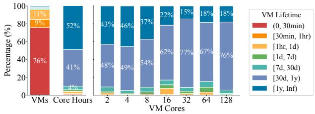  
Figure 1: VM lifetime distribution. Left: Request volume vs. core-hours consumption. Right: Lifetime distribution by cores. Long-lived VMs dominate resource footprint.

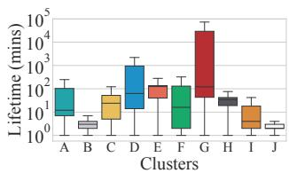  
(a) Cross-cluster heterogeneity.

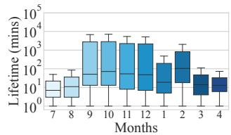  
(b) Intra-cluster temporal drift.  
Figure 2: The spatial and temporal volatility of VM lifetimes.

Model delivers multi-horizon predictions informing both online placement decisions and offline optimization. To counter distribution drifts, (2) a Dynamic Affinity Grouping strategy with a lightweight change-point detector adapts scheduling policies in real time. To mitigate placement debt at the source, (3) a Debt-Aware Placement Policy (DAPP) guides the online scheduler to proactively consolidate long-lived VMs. Finally, to handle the unavoidable accumulated debt, (4) a Placement Debt Rectification Engine (PDRE) employs strategic live migrations to amortize this debt offline.

In summary, the primary contributions of this paper are:

• We perform the first systematic study that identifies and quantifies the dual challenges of distribution drifts and long-lived VM placement debt, revealing the fundamental limitations of static, online-only schedulers.

• We design and implement DVLA, an end-to-end system that uniquely synergizes a dynamic online strategy to adapt to distribution drifts and prevent debt creation with a targeted offline mechanism to amortize placement debt.

• We demonstrate DVLA’s effectiveness through both extensive trace-driven simulations and a large-scale production deployment at Alibaba Cloud, confirming substantial resource savings with manageable overhead.

## 2 Background

## 2.1 The Nature of VM Lifetimes in Cloud

Analysis of our production environment, spanning millions of daily allocations, reveals a significant long-tail distribution in

VM lifetimes. As shown in the left panel of Figure 1, while short-lived VMs (<1 day) account for 96% of total requests, they contribute less than 2% to total core-hours. In contrast, long-lived VMs (>1 month) dominate resource consumption, representing 93% of core-hours despite comprising only 2.5% of requests. The right panel further breaks down this lifetime distribution by VM cores using data from active production VMs, revealing that long-lived VMs consistently command the majority of resources across all configurations. Notably, this concentration is even more pronounced in smaller VMs (e.g., ≤8 cores). These findings underscore that optimizing for long-lived VMs is critical for resource efficiency.

In our infrastructure, a zone comprises multiple clusters. Within a cluster, machines are homogeneous, yet significant heterogeneity exists across clusters within the same zone. Consequently, VM lifetime distributions across clusters are neither uniform nor static. As Figure 2a demonstrates, lifetime profiles exhibit significant spatial heterogeneity across clusters at a single point in time. In some clusters (e.g., B, J), the vast majority of VMs are short-lived, while in others (e.g., E, G), they are predominantly long-running. Furthermore, Fig ure 2b illustrates substantial temporal drift within individual clusters over months. This spatial and temporal volatility renders static scheduling policies suboptimal, a critical challenge we quantify in Section 3.

## 2.2 Online and Offline Schedulers

Online Scheduler. The online scheduler handles VM placement when a new VM is being created. Following a common filter-and-score paradigm [8, 24, 25, 53], it first filters for candidate machines that meet a VM’s resource and constraint requirements. It then scores these candidates to optimize for objectives like packing efficiency and service stability. Strict latency requirements force online decisions to be fast and greedy, causing resource fragmentation over time.

Offline Scheduler. The offline scheduler complements its online counterpart by periodically correcting the fragmentation and suboptimal placements that inevitably accumulate. By performing global analysis and orchestrating live migrations, it consolidates target VMs to reclaim underutilized machines. However, this process is slow and resource-intensive, making it an insufficient remedy on its own for the relentless accumulation of placement errors. This fundamental limitation motivates our synergistic design, which combines proactive online prevention with reactive offline correction.

## 2.3 VM Lifetime Prediction in Scheduling

Schedulers leverage VM lifetime information to improve resource utilization and accelerate machine reclamation, employing strategies that fall into two main categories. Homogeneous placement, exemplified by LA [8] and NILAS [33], aims to co-locate VMs with similar predicted lifetimes for synchronized machine reclamation. Heterogeneous placement, adopted by LAVA [33], intentionally co-locates short-lived VMs with long-lived ones to fill resource fragments without further extending the machine’s reclamation timeline.

The effective implementation of any lifetime-aware strategy hinges on accurate prediction. This requires two models to suit different operational needs: (1) a low-latency Initial Lifetime Prediction at VM creation for the online scheduler, using static request features; and (2) a more accurate Remaining Lifetime Prediction for running VMs, which leverages rich runtime data. To manage the inherent uncertainty in lifetime prediction, prior works employ two methodologies: regression and classification. Regression models [31, 33], while predicting exact durations, exhibit high variance in long-tailed environments. They struggle to maintain precision across diverse lifetime ranges, and their sensitivity to extreme values leads to significant numerical deviations, ultimately causing poor co-location and increased resource fragmentation.

In contrast, classification models [8, 10, 16] map lifetimes into discrete categories (e.g., [1d, 7d)) and are more robust. By quantizing lifetime uncertainty into limited buckets, classification mitigates the impact of extreme-value errors. This approach trades overly fine-grained estimates for robustness, ensuring that scheduling decisions remain resilient to the inherent noise and volatility of cloud workloads.

## 2.4 Metric Definitions

To quantitatively assess the impact of VM placement strategies on cluster-wide resource efficiency, we define three foundational metrics. These metrics enable us to differentiate between overall packing density and the infrastructure overhead incurred by dispersion of long-lived VMs.

Packing Density (PD). A standard metric for overall packing efficiency in [8], defined as the ratio of total allocated cores to the total cores on all non-empty machines, computed as:

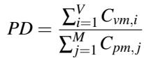

(1)

where V is the number of VMs, M is the number of non-empty machines, Cvm,i is the number of cores for VM i, Cpm, j is the number of cores for physical machine j.

Long-Lived VM Packing Density (PDL). Since long-lived VMs dominate core-hour consumption, we isolate their packing efficiency using PDL:

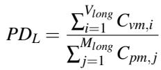

(2)

where Vlong is the number of long-lived VMs, Mlong is the number of machines hosting at least one long-lived VM. This metric specifically targets the consolidation of high-value, long-lived VMs, making a higher PDL an indicator of more effective debt reduction and machine reclamation potential.

Long-lived VM Placement Debt (Ldebt). We quantify the infrastructure overhead induced by long-lived VM dispersion as Long-lived Placement Debt (L ). It represents the number of machines that could be reclaimed if the current PD were improved to a target operational density ρtarget, which represents the achievable packing limit in production. We define Ldebt as:

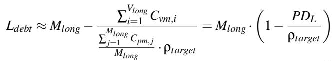

(3)

Ldebt bridges the gap between long-lived VM placement quality and machine wastage. A sub-optimal PDL translates directly into a positive Ldebt , forcing the cluster to maintain an unnecessarily large Mlong. While Ldebt quantifies the theoretical infrastructure overhead at the cluster level, Stranded Machines provide an operational measure at the individual machine level. Specifically, a machine is considered stranded when it hosts one or more long-lived VMs, but their core utilization remains below 50%. In the following section, we use Stranded Machines as the measurable manifestation of placement debt to evaluate standalone and synergistic strategies.

## 3 Motivation

Achieving high resource efficiency through lifetime-aware scheduling is deceptively complex. State-of-the-art schedulers are undermined by two fundamental challenges in real-world cloud environments: the brittleness of static policies against distribution drifts, and a flawed placement philosophy that creates compounding, long-lived VM placement debt.

## 3.1 Static Policies are Brittle

Prevailing lifetime-aware schedulers, such as LA-Binary [8], NILAS [33], and LAVA [33], rely on rigid, hard-coded categorization. LA-Binary uses {≤1h,>1h}, NILAS uses a 12- interval grid {0m,. . . ,168h}, and LAVA uses {<1h,1-10h,10- 100h,100-1000h}. These methods apply fixed categories uniformly across all clusters, ignoring the significant spatial and temporal drifts in VM lifetime.

Ineffectiveness Against Spatial Diversity. To evaluate these categorization policies, we define a policy as applicable to a cluster if the VM lifetime distribution provides sufficient diversity (i.e., no single lifetime category contains ≥95% of the VMs). When a policy concentrates most of the VMs into a single category, it loses the ability to differentiate workloads, collapsing into random placement. Figure 3a reveals that these policies are inapplicable: for LA-Binary, nearly all clusters fail this diversity criterion; for NILAS and LAVA,

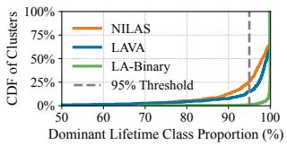  
(a) High homogeneity (>95% in one category) renders static policies ineffective across clusters.

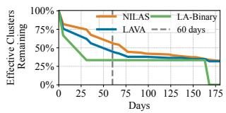  
(b) Temporal decay showing that policy applicability drops as lifetime distributions drift over time.

Figure 3: Static categorization is ineffective against the spatial diversity and temporal dynamics of real-world workloads.  
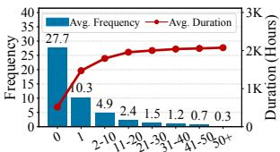  
Long-Lived VM Assignments per Machine

(a) Machine recycle frequency and occupied duration relative to the number of long-lived VMs.  
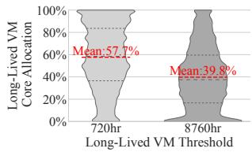  
(b) Per-Machine core allocation of long-lived VMs, revealing suboptimal consolidation.  
Figure 4: Long-lived VMs drive machine occupancy and remain poorly consolidated.

85% and 74% of clusters, respectively, exhibit this lack of differentiation.

Decay Under Temporal Drifts. Even if a policy is initially applicable, it inevitably degrades as VM lifetime distributions evolve. Figure 3b tracks the fraction of clusters where policies remain applicable. As VM lifetime distributions drift, the applicability of NILAS and LAVA drops to 55% and 44% within 60 days, while LA-Binary’s applicability collapses even faster.

This spatial and temporal volatility demonstrates that static categorizations are fundamentally inadequate for real-world workloads, motivating our DVLA design: a dynamic grouping mechanism that continuously adapts to lifetime distribution drifts within each cluster.

## 3.2 Long-Lived VM Placement Debt

Beyond the brittleness of static policies, a more insidious problem undermines state-of-the-art schedulers: their placement philosophies inevitably create a compounding, cluster-wide inefficiency we term long-lived VM placement debt. This debt stems directly from a flawed understanding of how to manage the most resource-dominant long-lived VMs.

The Flawed Philosophies of Prior Work. Existing lifetimeaware strategies fall into two camps, both of which inadvertently create placement debt. On one side, schedulers like LA [8] and NILAS [33] champion homogeneous placement, aiming to co-locate VMs with similar lifetimes. However, their design exhibits a narrow definition of long-lived. By focusing their finest-grained categories on VMs lasting up to only three or seven days, they overlook the truly resourcedominant VMs that persist for weeks or even months. Consequently, these schedulers fail to prioritize the aggregation of these critical long-lived VMs, leading to their gradual dispersion and the accumulation of placement debt.

On the other side, schedulers like LAVA [33] advocate for the opposite: heterogeneous placement. They intentionally co-locate short-lived VMs with long-lived ones to maximize single-machine packing density. While this provides local packing benefits, the strategy is counterproductive at the cluster level. It systematically scatters long-lived VMs across the fleet, directly creating placement debt, crippling global resource reclamation efforts.

The Enormous Cost of Placement Debt. Long-lived VMs dictate machine reclamation timelines because they dominate long-term resource consumption (Figure 1). Figure 4a shows that as the number of allocated long-lived VMs increases, machines experience longer occupancy and fewer recycles. The drastic gap between 0 and 1 allocation identifies the first long-lived VM as the primary driver of machine pinning, with diminishing marginal impact thereafter. This confirms that consolidating long-lived VMs effectively limits their footprint, maximizing cluster-wide reclamation.

Despite the necessity for consolidation, Figure 4b exposes a significant inefficiency in current production placement. We analyzed the core allocation of VMs with remaining lifetimes exceeding 720h (1 month) and 8760h (1 year). Their average utilization remains strikingly low at 57.7% and 39.8%, respectively. This reveals that long-lived VMs are rarely densely co-located in practice. Such poor consolidation creates a substantial opportunity for smarter, lifetime-aware strategies to improve cluster-wide resource utilization.

The Inevitable Accumulation of Debt. This placement debt, originating from flawed scheduling philosophies, is further compounded by an unavoidable operational reality: imperfect predictions. Even with a highly accurate model, prediction errors guarantee a continuous stream of misplacements.

For instance, consider a modest 5% error rate of misclassifying a long-lived VM as short-lived. Assuming independent errors, placing just 14 such presumed-short VMs onto a single machine yields an over-50% probability that the machine hosts at least one true long-lived VM, blocking its timely reclamation. When scaled across millions of daily allocations, this compounding effect ensures a relentless increase in the placement debt of the cluster.

## 3.3 Limitations of Standalone Strategies

Given the persistent accumulation of placement debt, a natural question arises: can this debt be managed by employing either aggressive offline correction or refined online prevention?

We argue that both standalone approaches are fundamentally insufficient, making a synergistic strategy essential.

As illustrated in Figure 5, we evaluate three placement strategies via trace-driven simulations on empty clusters using production workloads. Online-Only enforces lifetime affinity during initial placement for long-lived VMs, incorporating a 5% prediction error rate that occasionally disrupts affinity by placing long-lived VMs on non-affine machines. In contrast, Offline-Only disregards affinity during initial allocation, relying instead on limited daily offline rebalancing to consolidate long-lived VMs. Finally, Online+Offline hybridizes these approaches by combining online lifetime-aware placement with periodic offline consolidation.

Why Offline-Only Correction Fails. Relying solely on offline migration to repay placement debt is a losing battle for two reasons. First, the operational scope is heavily constrained. Our production analysis (Table 1) reveals that 40% of VMs are structurally non-migratable due to hardware dependencies, workload constraints, or policy restrictions. Second, even for the migratable subset, the rate of new debt creation far outpaces feasible correction capacity. As shown in Figure 5, an offline-only strategy, even with more migration budget, fails to curb the growth of debt.

Why Online-Only Prevention is Insufficient. Conversely, a purely proactive, online-only strategy can slow the creation of debt but cannot eliminate it. Inevitable prediction errors will always introduce new misplacements. Furthermore, an online scheduler makes greedy, largely irrevocable decisions and is powerless to fix the debt that has already accumulated from past mistakes. Figure 5 quantifies this limitation: under an online-only policy, the number of misplaced long-lived VMs grows unabated, demonstrating that prevention alone cannot solve a cumulative problem.

This analysis leads to a crucial insight: an effective system must address placement debt on two fronts simultaneously. It requires an online scheduler that minimizes debt creation at the source, coupled with a targeted offline mechanism that strategically amortizes the accumulated debt. This synergistic philosophy is the core motivation for DVLA’s design.

Table 1: Breakdown of VM migration constraints.  
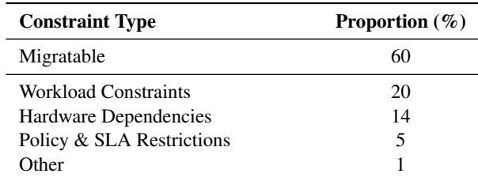

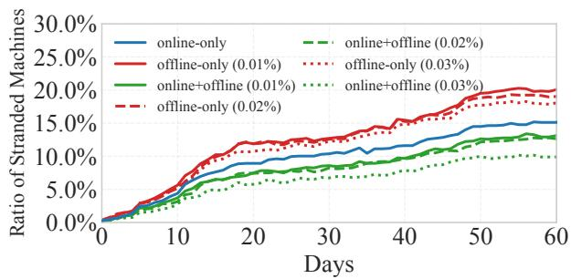  
Figure 5: Proportion of stranded machines under three allocation strategies, varying by migration budget (ratio of migrated to total VMs).

## 4 DVLA Design

Section 3 demonstrated that static lifetime-aware policies are brittle against distribution drifts and inadvertently create longlived VM placement debt. To overcome these challenges, we designed DVLA, a system that synergistically combines online prevention with offline correction. This section details DVLA’s core design components: (1) A Hierarchical Lifetime Prediction Model delivering multi-horizon predictions for both initial placement and offline optimization (Section 4.1); (2) A Dynamic Affinity Grouping strategy that detects and adapts to distribution drifts in real-time (Section 4.2); (3) A Debt-Aware Placement Policy (DAPP) for the online scheduler to proactively consolidate long-lived VMs and prevent debt creation (Section 4.3); (4) A Placement Debt Rectification Engine (PDRE) that employs live migrations to amortize accumulated debt (Section 4.4).

## 4.1 VM Lifetime Prediction Model

Accurate lifetime prediction is the cornerstone of DVLA. To address the rigidity of static categorization, we implement a two-tiered, extensible prediction framework that decouples lifetime threshold definition from scheduling policy.

Extensible OvR Architecture. We employ a One-vs-Rest (OvR) binary classification design where each lifetime threshold is handled by an independent model. This modularity allows us to refine or extend granularity (e.g., a 15-minute granularity for bursty microservices) by training specific binary classifiers without retraining the entire system. While we utilize the set [0–1hr, 1hr–1d, 1d–7d, 7d–30d, 30d-1y, >1y] in production, these remain environment-specific parameters rather than hard-coded constraints.

Hierarchical Prediction Architecture. The system consists of two specialized models: (1) Initial Lifetime Prediction, which provides low-latency inference at VM creation using static request features; and (2) Remaining Lifetime Prediction, which executes offline to provide more accurate estimates for running VMs by incorporating rich dynamic runtime metrics.

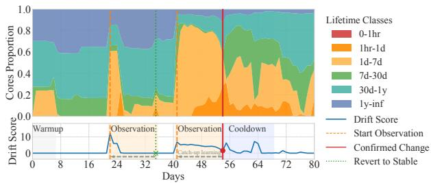  
Figure 6: An illustrative dynamic affinity grouping process handles workload changes by first dismissing a transient spike (day 22) as noise, then correctly identifying and adapting to a persistent shift (day 41) by triggering a policy update.

As detailed in Appendix A, our feature importance analysis confirms that while the Initial prediction model captures application semantics, the Remaining prediction model extracts essential insights from survival history, providing a robust signal for our subsequent Dynamic Affinity Grouping mechanism.

## 4.2 Dynamic Affinity Grouping

As demonstrated in Section 3.1, any static lifetime categorization policy is brittle against the spatial and temporal drifts of real-world workloads. To overcome this, DVLA introduces a dynamic affinity grouping strategy. This mechanism continuously monitors cluster-wide workload to dynamically re calibrate affinity groups, ensuring that scheduling decisions remain aligned with the distribution of VM lifetimes. The entire process is detailed in Algorithm 1. The strategy operates as a robust daily cycle driven by state-machines, distinguishing persistent structural shifts from transient workload noise to prevent policy instability. Figure 6 presents an illustrative example of the mechanism operating on a real-world trace. The key stages of this mechanism are detailed below.

Workload Vectorization and Drift Scoring. Each day, we compute a cores distribution vector for the cluster, representing the proportion of total CPU cores consumed by running VMs in each global lifetime class. We monitor running VMs, not just incoming requests, as this reflects the actual resource landscape the scheduler must manage. This time series of vectors is fed into a lightweight change-point detector. The detector maintains an Exponentially Weighted Moving Average (EWMA) of historical vectors as a dynamic baseline of the cluster’s normal state. A daily drift score is calculated as the cosine distance between the current day’s vector and this baseline (line 7), flagging significant deviations in the distribution’s shape. We use cosine distance as it is effective at capturing changes in the shape of the distribution, independent of the overall core volume.

State-Machine-Based Drift Confirmation. To distinguish persistent shifts from transient noise, a finite state machine (FSM) interprets the stream of drift scores. The FSM transitions between Warmup, Stable, Observation, and Cooldown states. When the policy is first applied to a new cluster, it enters a Warmup phase for an initial period. During this phase, the system exclusively collects data to establish the initial EWMA baseline (lines 9-12), without triggering any alarms. Once initialized, the system transitions to the Stable state (line 12), where it continuously updates the baseline with new daily vectors as long as the drift score remains below a predefined alarm threshold θalarm (lines 13-15).

A high drift score moves the system from Stable to Observation (lines 15-17), where it collects data for a fixed window Wobs (line 19) without updating the baseline. If the drift is confirmed as persistent, a policy update is triggered (lines 23-26). Otherwise, the event is dismissed as noise, and the system performs catch-up learning by retrospectively incorporating the data from the observation window into the baseline, ensuring that it accurately reflects the new normal (line 30).

Adaptive Affinity Group Generation. Upon a confirmed change, a new affinity group Ga f f inity is generated (line 24). The algorithm sorts the global lifetime classes in descending order of their average core consumption during the observation window and greedily selects the top-ranked classes until their cumulative consumption exceeds a 95% threshold. For instance, if classes representing 0-1hr, 1d-7d, and 30d-1y are the most resource-intensive, the new affinity group becomes {0-1hr, 1d-7d, 30d-1y}. After an update, the system enters a Cooldown period to prevent oscillatory changes (line 27).

This mechanism counters policy decay by keeping affinity groups aligned with workload dynamics. While Algorithm 1 provides the overall control flow, the detailed formulations for its key functions are consolidated in Appendix B.

## 4.3 Proactive Debt Mitigation with DAPP

While Dynamic Affinity Grouping (Section 4.2) determines which lifetime categories are significant, it does not specify how to use them to prevent placement debt. To address this, we introduce the Debt-Aware Placement Policy (DAPP), a two-part mechanism designed to proactively mitigate debt at the source. DAPP advances the homogeneous placement principle [8, 33] by first, robustly classifying machines using a core-weighted method that is resilient to existing fragmentation, and second, applying an asymmetric affinity score that heavily penalizes debt-creating placements. We detail these two components below.

Robust Machine Lifetime Classification. To determine a machine’s lifetime category, we first need to represent VM lifetimes numerically. Our system predefines a set of finegrained lifetime classes (e.g., 0-1h, 1h-1d, 1d-7d, etc.), which are then mapped to ascending integer indices (e.g., 1, 2, 3, ...). This mapping provides a standardized numerical representation, L(vm), for a VM’s lifetime class, which is essential for the calculations in both Eq. 4 and Algorithm 2.

Algorithm 1 Workload Drift Detection and Policy Adaptation   
1: Input: Workload trace T = {v1,v2,...,vN}, Config C   
2: Initialize:   
3: State ← WARMUP   
4: Detector ← DriftDetector(C)   
5: tobs\_start ← −1, tupdate ← −1   
6: for each day t with workload vector v in T do   
7: scoret ← Detector.Score(vt)   
8: switch State do   
9: case WARMUP:   
10: Detector.Learn(vt)   
11: if t ≥ C.Pwarmup then   
12: State ← STABLE   
13: case STABLE:   
14: Detector.Learn(vt)   
15: if scoret > C.θalarm then   
16: State ← OBSERVATION   
17: tobs\_start ← t   
18: case OBSERVATION:   
19: if t − tobs\_start + 1 ≥ C.Wobs then   
20: Vobs ← GetVectorsInWindow(T,tobs\_start ,t)   
21: Sobs ← {Detector.Score(v) | v ∈ Vobs}   
22: avg\_score ← Mean(Sobs)   
23: if avg\_score ≥ C.θcon f irm then   
24: Ga f f inity ← GenerateAffinityGroup(Vobs,C)   
25: UpdateSystemPolicy(Ga f f inity)   
26: tupdate ← t   
27: Detector.CatchUpLearn(Vobs)   
28: State ← COOLDOWN   
29: else   
30: State ← STABLE   
31: Detector.CatchUpLearn(Vobs)   
32: case COOLDOWN:   
33: if t ≥ tupdate +C.Pcooldown then   
34: State ← STABLE   
35: end switch

A common approach in prior work is to use the lifetime of the longest-running VM (a MAX rule) to define a machine’s category. However, our analysis revealed this is brittle in production clusters where long-lived VMs are already scattered. In such scenarios, where many machines host at least one long-lived VM (as suggested by Figure 4a), a MAX rule would classify nearly all of them as long-lived, rendering any subsequent affinity scoring ineffective. To address this, we compute a more robust, core-weighted average lifetime index for the machine, Lraw(pm), as defined in Eq. 4. This method is less sensitive to the presence of a single long-lived VM and better reflects the machine’s overall lifetime character.

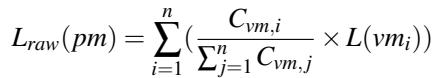

(4)

Algorithm 2 Machine Lifetime Category Calculation   
1: Input: A machine pm; the affinity group Ga f f inity   
2: Initialize:   
3: Calculate Lraw(pm) using Eq. (4)   
4: min\_dist ← ∞   
5: Lpm ← −1   
6: Output: The machine’s lifetime category Lpm   
7: for each lifetime category c in Ga f f inity do   
8: dist ← |c − Lraw(pm)|   
9: if dist < min\_dist then   
10: min\_dist ← dist   
11: Lpm ← c   
12: else if dist = min\_dist then   
13: Lpm ← max(Lpm,c)   
14: return Lpm

where vmi denotes the i-th VM among n VMs running on the machine, L(vmi) is the numerical index of the lifetime class for vmi, Cvm,i represents the core allocation of vmi.

This continuous Lraw value is then mapped to a discrete category. Crucially, the set of possible categories for a machine is not globally fixed, it is constrained by the cluster’s current affinity group Ga f f inity, as determined by Dynamic Affinity Grouping (Section 4.2). This ensures a machine’s category is always relevant to the prevailing workload. Algorithm 2 performs this mapping by finding the category index c within Ga f f inity that has the minimum distance to Lraw. In case of a tie, we conservatively select the larger category index, ensuring a machine on the boundary is treated as the longer-lived one to further mitigate placement debt risk.

Asymmetric Affinity Scoring. With the VM and machine categories determined, DAPP’s affinity score calculates their placement compatibility. The score is defined in Eq. 5 and is designed to aggressively penalize debt-creating placements while remaining flexible for others.

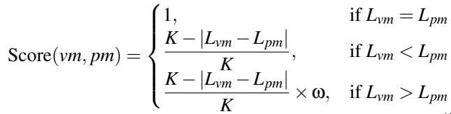

(5)

where Lvm and Lpm are the lifetime category indices for the VM and machine. K is the total number of global lifetime classes. The key lies in the adaptive penalty factor ω, which is applied only when placing a longer-lived VM onto a shorterlived machine (Lvm > Lpm).

The core mechanism is an asymmetric penalty designed to prevent placement debt. It exclusively penalizes placing a longer-lived VM on a shorter-lived machine. The penalty is twofold: a standard one (e.g.,ω = 0.8) for general mismatches, and a harsher one (e.g.,ω = 0.2) for placing a VM with a lifetime over one month. This severe penalty effectively blocks debt-creating placements and forces the consolidation of these critical VMs.

## 4.4 Amortizing Placement Debt with PDRE

While DAPP proactively minimizes debt creation, prediction errors make some accumulation of placement debt inevitable. To address this residual debt, we designed the Placement Debt Rectification Engine (PDRE), a targeted offline mechanism. Unlike generic defragmenters, PDRE is not focused on overall cluster packing. Instead, it is focused on amortizing the most costly placement debt. PDRE operates in a three-stage process: identifying targets, prioritizing migrations, and executing placements under strict constraints.

Identifying Stranded VMs. PDRE’s first task is to locate stranded VMs, i.e., long-lived VMs that reside on stranded machines. To do this with high confidence, it leverages the more accurate Remaining Lifetime Prediction model, allowing PDRE to identify VMs with over one month of expected remaining lifetime. Crucially, non-migratable long-lived VMs are excluded from this set.

Migration Prioritization. To maximize the return on a limited migration budget, PDRE prioritizes candidates using a two-tiered strategy. It first targets machines that are easiest to reclaim (i.e., those with the fewest stranded VMs). Machines hosting any non-migratable long-lived VM are strictly excluded from consideration. Within this group, it then prioritizes migrating the VMs with the greatest remaining lifetime. This deterministic sorting ensures that each migration delivers the maximum impact towards machine reclamation.

Constrained Placement Execution. The prioritized list of VMs is not migrated blindly. Instead, it is passed to a unified offline scheduler that finds optimal destinations to colocate them with other long-lived VMs. The entire process is governed by production-safe constraints, including migration budgets to limit system disruption and net-positive gain requirements to ensure every action is beneficial. By strategically amortizing placement debt, PDRE acts as the indispensable offline counterpart to our proactive online scheduler, completing DVLA’s synergistic approach.

## 5 System Architecture and Implementation

This section details the production-grade architecture of DVLA, bridging the design principles to a robust implementation. As shown in Figure 7, our system integrates three key components: (1) an online scheduling pipeline for real-time, debt-aware VM allocation; (2) a Placement Debt Rectification Engine (PDRE) for offline debt amortization; and (3) a set of core services for state management and policy adaptation. We will first detail the architecture (Section 5.1), then discuss the key engineering solutions for production deployment (Section 5.2) and operational monitoring (Section 5.3).

## 5.1 System Architecture

Online Scheduling for Proactive Debt Mitigation. The online scheduler is the first line of defense against placement debt. It handles real-time VM allocation requests with stringent latency constraints (< 100 ms) and is engineered to proactively consolidate long-lived VMs.

Low-Latency Lifetime Prediction. When a scheduling request arrives, the control service injects an initial lifetime prediction. To meet the tight latency budget, we designed a multi-tiered prediction strategy. First, an in-memory prediction cache serves predictions for recurring request features (e.g., user ID, cores), achieving more than 90% hit rate. For a cache miss, the request is sent to a fleet of auto-scaling inference servers. This remote inference is designed to complete within a few tens of milliseconds of latency budget, including network overhead, preventing it from becoming the critical path.

DAPP-based VM Allocation. The allocation process is critically enhanced by DAPP. To compute the score efficiently, the lifetime category of the incoming VM is obtained from the prediction service, while the category of each candidate machine is pre-calculated and retrieved from a low-latency, distributed Machine Tag Cache. This design trades slightly stale machine state for low scoring latency. The state is kept fresh via the Tag Update Service (Section 5.2), which ensures that tag staleness rarely impacts placement quality.

Dynamic Affinity Grouping Engine. To combat the policy decay caused by lifetime distribution drifts (Section 3.1), DVLA incorporates a Dynamic Affinity Grouping Engine. This engine implements the adaptive policy mechanism detailed in Section 4.2 and Algorithm 1.

Orchestration. It operates as a daily scheduled task that analyzes the cores distribution vector of each cluster, using upto-date data from the Remaining Lifetime Prediction model.

Stateful Drift Detection. The engine feeds this data into the change-point detector, which uses a state machine to distinguish persistent distributional shifts. The engine’s state machine for each cluster is persisted to ensure robustness.

Policy Deployment. Upon confirming a persistent drift, the engine generates a new, optimized set of affinity groups for the cluster. This updated policy is then propagated to the online scheduling servers and the Tag Update Service, ensuring that subsequent placement decisions and machine state calculations are based on the most relevant lifetime categorization.

PDRE for Amortizing Accumulated Debt. The Placement Debt Rectification Engine (PDRE) is our offline component designed to amortize accumulated placement debt. It operates as a periodic task, leveraging the high-fidelity Remaining Lifetime Prediction model to identify and execute strategic live migrations. In our production implementation, PDRE is integrated with the cluster’s maintenance workflow and focuses on two high-impact scenarios.

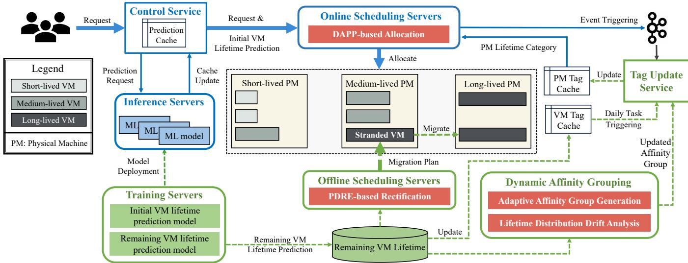  
Figure 7: Overview of the online and offline scheduling architecture with DVLA.

Consolidating Stranded Long-Lived VMs. PDRE scans for machines pinned by only a few migratable long-lived VMs. It then generates migration tasks to move these stranded VMs to existing long-lived consolidated machines, maximizing the potential for machine reclamation.

Efficient Machine Evacuation. When a machine is scheduled for maintenance, PDRE provides an optimized evacuation plan. It prioritizes migrating VMs with the longest remaining lifetimes first, while leaving short-lived VMs to terminate naturally. This strategy, similar to LARS [33], minimizes migration volume and accelerates the machine draining process.

Core State Management and Synchronization. The accuracy of DVLA’s decisions hinges on up-to-date lifetime state, managed by a dedicated Tag Update Service. This service must provide fresh data without overwhelming the system, a challenge we address with a dual-mechanism design and performance optimizations.

Dual-Mechanism Update for Freshness. To balance accuracy and overhead, the service employs a dual update strategy. Event-triggered updates occur in real-time in response to critical events like VM allocation or release, ensuring immediate state consistency. Complementing this, a daily periodic task recalibrates the lifetime categories of all machines using the latest predictions from the Remaining Lifetime Prediction model. This accounts for the natural aging of VMs and corrects any potential state drift over time.

Selective Updates for Scalability. Naive event-triggered updates would be prohibitively expensive. We implement a selective policy that dramatically reduces update frequency, ensuring the scalability of state management (Section 5.2).

## 5.2 Addressing Deployment Challenges

To ensure DVLA’s robust and efficient operation in a complex production environment, we designed and implemented several mechanisms to address key practical challenges.

ML Service Availability and Fault Tolerance. Online scheduling demands extremely low latency, yet the ML inference service can experience disruptions from network timeouts or node failures. To ensure system resilience, we implement a multi-tiered fallback strategy.

Primary Model. Under normal conditions, the system uses the live inference service for high-accuracy predictions.

Profile Matching. If the service is unavailable or times out, the system falls back to a lightweight profile-matching mechanism. This mechanism leverages a local cache of precomputed profiles, which map common VM request features (e.g., user ID, image type) to lifetime categories. Each profile is a tuple (F, c) where F is the feature vector ( f1, f2, ..., fn) that are matched against incoming requests and c is the corresponding lifetime category. Our analysis shows that the profile-matching achieves 75% of the primary model’s accuracy, which is significantly better than a random or static default, ensuring graceful degradation.

Safe Default. In the rare event that both the primary model and profile matching fail (e.g., for a new customer’s first request), the system assigns a default lifetime category (e.g., 1m-1y). This default is conservatively chosen to align with our core principle of debt avoidance. Misclassifying a truly long-lived VM as short-lived creates significant placement debt, whereas the reverse error is far less costly. This safe default thus acts as a final guardrail against debt creation during system faults.

To combat concept drift over the long term, we have also established a model retraining pipeline that periodically reevaluates and updates the classifiers. The frequency and overhead of this process are detailed in Section 6.4.

Optimizing Machine Category Update Overhead. The machine’s lifetime category is critical to DVLA. In a large-scale cluster with thousands of events per second, recomputing this tag upon every VM allocation or release would impose prohibitive overhead, risking system instability.

Our analysis revealed that the vast majority of these events do not actually alter a machine’s lifetime category. We therefore designed a selective update policy that triggers recalculation only for three critical events: (1) the last VM on a machine is released; (2) the first VM is allocated to an empty machine; (3) the last long-lived VM (e.g., remaining lifetime more than one month) is migrated off a machine. By implementing this fine-grained strategy, we reduced the frequency of tag updates by an order of magnitude, significantly enhancing system stability and efficiency while maintaining the necessary accuracy of machine lifetime categories.

## 5.3 Operational Monitoring and Diagnostics

To ensure the long-term health and debuggability of DVLA in production, we have built a comprehensive monitoring dashboard that tracks key metrics across the entire system pipeline. This framework is structured around three stages.

Predictor Health and State Integrity. We assess the quality of the input signals, which includes monitoring the prediction accuracy and service performance of our ML models, tracking not only accuracy but also inference latency and cache hit rates. We also ensure label integrity by tracking the coverage rates of VM and machine lifetime categories.

Policy Dynamics and Enforcement. We evaluate the effectiveness of the core policy execution. This involves tracking the placement affinity achieved by the online scheduler, monitoring the adaptive policy dynamics by logging the frequency of change-point detections and affinity group updates, and measuring the volume and success rate of PDRE.

Consolidation Effectiveness. The ultimate measure of DVLA’s success is its ability to reduce placement debt, which we quantify by tracking the packing density of long-lived VMs (formally defined in Section 2.4). This metric directly reflects the end-to-end impact of our DVLA.

This multi-faceted monitoring framework enables operators to perform root-cause analysis. For example, a decline in the consolidation of long-lived VMs can be traced back to poor placement affinity, which might be caused by prediction errors or outdated machine tags, allowing for targeted intervention.

## 6 Evaluation

## 6.1 Experimental Setup

Methodology and Workloads. We evaluate DVLA using a high-fidelity, event-driven simulator that precisely models our production scheduling environment. Crucially, the simulator shares its core scheduling logic with our production system, ensuring our findings are directly applicable to real-world scenarios. Our evaluation uses extensive operational traces collected over two months from 23 production clusters. These traces capture a diverse range of real-world workloads, varying in scale (from 200 to 2,200 machines), intensity (from 12k to 800k VM events), and VM lifetime distributions, providing a robust testbed for our system.

Baseline. We compare DVLA against three schedulers: (1) production baseline, our provider’s non-lifetime-aware scheduler; (2) LA-Binary [8]; and (3) LAVA [33]. While NI-LAS [33] is also a relevant lifetime-aware scheduler, the paper reports LAVA’s superior performance over NILAS, making LAVA a state-of-the-art baseline for our comparison.

LA-Binary Configuration. We implement the binary Lifetime Alignment algorithm with a 2-hour threshold to distinguish short and long classifications [8]. Machines are dynamically classified using a MAX rule, by the maximum predicted lifetime of resident VMs. Placement prioritizes machines of the same class using Best-Fit. If no suitable machine exists, the VM is placed on any available machine via Best-Fit, or a new machine is allocated.

LAVA Configuration. Following [33], we employ a regression model that leverages VM uptime to dynamically refine remaining lifetime estimates, thereby mitigating initial prediction errors. Both VMs and machines are mapped to four lifetime classes (<1h, 1-10h, 10-100h, 100-1000h). LAVA adopts a recycling strategy: machines exceeding 90% utilization exclusively accept VMs from strictly lower lifetime classes. Machine classifications are dynamically updated upon deadline violations or VM departures.

Prediction Model Fairness. To isolate the impact of scheduling algorithms from prediction quality, all schedulers utilize the same production-grade VM lifetime prediction models. For LAVA, which requires a regression model, we trained a dedicated predictor that achieves 99% precision and 90% recall on a 7-day lifetime threshold, significantly outperforming the 70% recall reported in the original LAVA paper. This ensures we are comparing DVLA against a powerful, stateof-the-art implementation.

Metrics. We assess performance using three key metrics that directly map to our design goals. Beyond the Packing Density and Long-lived VM Packing Density metrics defined in Section 2.4, we also evaluate the VRAR metric.

VM Risk Aggregation Ratio (VRAR). This metric quantifies the trade-off with service stability, defined as the fraction of a customer’s VMs co-located on a machine beyond a soft threshold θ (Eq. 6). While our scheduler strictly enforces all explicit anti-affinity constraints, this internal metric helps us monitor fault isolation for customers without such explicit requirements. A modest increase in VRAR is acceptable if accompanied by significant packing gains.

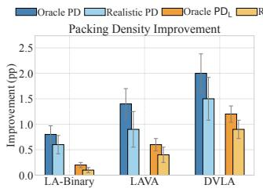

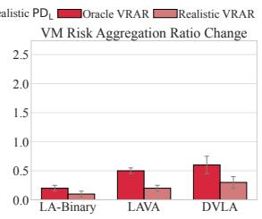  
Figure 8: End-to-end performance comparison. DVLA significantly outperforms LA-Binary and LAVA in both overall PD and PD , while the VRAR change remains modest.

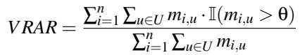

(6)

where n is the number of machines, U is the set of all customers, and mi,u represents the number of VMs belonging to customer u on machine i. The parameter θ is the predefined threshold. The indicator function I(mi,u > θ) equals 1 if mi,u > θ, and 0 otherwise.

## 6.2 End-to-End Performance

We evaluate the end-to-end performance of DVLA against the baseline and state-of-the-art schedulers. The results, averaged across 23 production clusters and weighted by size, are presented in Figure 8. We report performance under two settings: a Realistic scenario using our production prediction models and an Oracle scenario with perfect lifetime predictions to isolate the performance of the scheduling strategy itself.

Packing Density Improvement. Figure 8 demonstrates DVLA’s superiority relative to the production baseline. In the Realistic setting, DVLA increases the overall packing density (PD) by 1.5 percentage points (pp), significantly outperforming LAVA (0.9 pp) and LA-Binary (0.6 pp). To understand the source of this improvement, we specifically analyze the packing of resource-dominant long-lived VMs. The results show that DVLA boosts the long-lived VM packing density (PDL) by 0.9 pp, an improvement more than double that of LAVA (0.4 pp) and 9x that of LA-Binary (0.1 pp). This finding confirms that the substantial overall gain is primarily driven by DVLA’s effectiveness in consolidating long-lived VMs, directly validating our central hypothesis that tackling placement debt is key to maximizing cluster-level efficiency.

Crucially, DVLA with realistic predictions (1.5 pp) surpasses LAVA’s oracle upper bound (1.4 pp), demonstrating that our algorithmic design outweighs the benefit of perfect lifetime information. This lead is consistent across the 23 diverse clusters, where DVLA delivered an additional 0.2 to 4.3 pp in packing density gain over LAVA. Importantly, the average 0.6 pp improvement over this strong baseline translates to saving thousands of machines at cloud scale, highlighting the substantial economic impact of our approach.

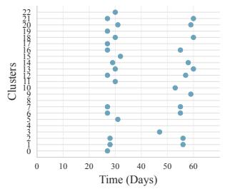

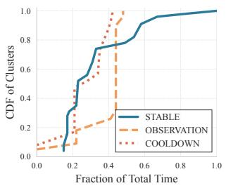  
Figure 9: Effectiveness and Stability of Dynamic Policy Adaptation. (Left) Confirmed events (dots) identified via affinity grouping across 23 production clusters over 60 days. (Right) CDF of policy state durations.

Trade-off with Service Stability. As shown in Figure 8, achieving higher density involves a trade-off with risk aggregation. DVLA increases the VRAR by 0.3 pp in the Realistic setting. This modest increase, only 0.1 pp higher than LAVA’s, remains well within operational tolerance and is a small price to pay for the substantial efficiency gains. This demonstrates that DVLA strikes a favorable balance between maximizing resource savings and maintaining service stability.

The significant improvements observed in simulation motivated its deployment into our production environment. The real-world impact and costs are detailed in Section 6.4.

## 6.3 Analysis of DVLA’s Key Designs

We now dissect DVLA’s performance to validate the efficacy of its core design components.

The Efficacy of Dynamic Affinity Grouping. To validate that our dynamic approach overcomes the brittleness of static policies (Section 3.1), we analyzed its adaptation behavior across 23 production clusters over 60 days. Figure 9 confirms that adaptation is both necessary and stable.

The necessity is stark: 91% (21 of 23) of clusters exhibited workload drifts requiring at least one policy update. The CDF in Figure 9 reveals why: clusters spend a median of only 23.3% of time in STABLE, with OBSERVATION and COOLDOWN occupying 43.3% and 33.3%, respectively. This indicates that production workload distributions exhibit continuous drift, with clusters in non-STABLE phases for over 75% of the period.

Crucially, this pervasive drift does not induce instability. The update cadence remains consistent, with a median interval of 28 days and a tight interquartile range of 28–29 days. The substantial OBSERVATION time acts as an effective filter: despite continuous drift detection, most observation windows do not trigger confirmed updates (Figure 9). This demonstrates that our change-point detector effectively distinguishes persistent structural shifts from transient noise, preventing policy thrashing and validating its robustness for production.

The Impact of Machine Lifetime Classification. As justified in our design (Section 4.3), we opted for a core-weighted average (WAVG) method for machine lifetime classification due to its superior robustness over a simple MAX rule in mature, fragmented clusters. We empirically compared the performance of WAVG against MAX under the Oracle setting. Figure 10 reveals a context-dependent trade-off. In existing populated clusters, the robust WAVG method achieves a 0.5 pp higher PD gain, as it is more resilient to the pinning effect of pre-existing scattered long-lived VMs. Conversely, in empty clusters where placements can be optimized from scratch, the more aggressive MAX rule yields a 0.2 pp higher PD gain by establishing dense long-lived machines early. This insight led to a hybrid, two-phase strategy in our production implementation. DVLA bootstraps empty clusters with the MAX method and automatically transitions to the more robust WAVG method after the first affinity group update, optimizing for both initial packing and long-term stability.

Quantifying Component Contributions via Ablation. To quantify the individual contribution of each component in DVLA’s design, we conducted an ablation study. Figure 11 shows a waterfall chart illustrating the drop in PD gain as we sequentially remove key components from the full DVLA. All ablation experiments are conducted under the Oracle prediction setting to isolate the algorithmic contribution from prediction noise. Removing Dynamic Affinity Grouping causes the largest single drop (0.34 pp), confirming the high cost of using brittle, static policies. Removing PDRE as a whole results in a significant 0.31 pp loss, unequivocally proving the necessity of an offline mechanism to amortize the placement debt that online scheduling alone cannot fix. Within the dual-mechanism of state management, disabling the periodic Tagging Task (0.21 pp loss) is more detrimental than disabling reactive Event-Triggered updates (0.14 pp loss), highlighting the importance of periodic, global state recalibration over just real-time updates. This study validates our end-to-end design, demonstrating that each component provides a significant, measurable contribution. The synergy between proactive online debt prevention and reactive offline debt correction is what enables DVLA to achieve its superior performance.

Robustness and Parameter Tuning. To ensure DVLA operates robustly in production, we carefully selected its key hyperparameters. For the Dynamic Affinity Grouping mecha nism, we performed a comprehensive sensitivity analysis on its three parameters: θalarm, Wobs, and θcon f irm. Our analysis, detailed in Appendix C.1, evaluated numerous combinations against a cost function prioritizing system stability over hyper responsiveness. The results clearly indicated that a conservative strategy (e.g., an observation window of 20 days with high confirmation thresholds) optimally balances adaptability with stability by effectively filtering transient noise. This data-driven approach led to the stable and effective policy adaptation achieved by our mechanism (Figure 6).

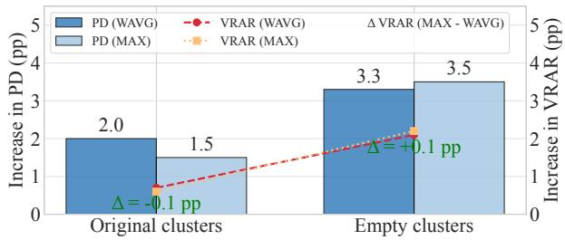  
Figure 10: Performance of WAVG and MAX categorization strategies on PD and VRAR in original and empty clusters.

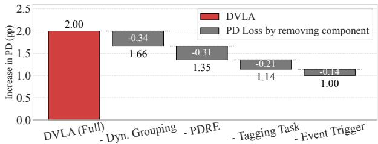  
Figure 11: Ablation study on DVLA components. The waterfall chart shows the PD gain loss from removing each component sequentially, quantifying its contribution.

Beyond parameter sensitivity, we also evaluated DVLA’s robustness to the accuracy of lifetime predictions, a critical factor for real-world deployment. A detailed sensitivity analysis, presented in Appendix C.2, confirms DVLA’s resilience. While its performance naturally scales with prediction accuracy, DVLA still delivers 1.02 pp packing density gain even when the recall for long-lived VMs drops to a low 40%. This demonstrates that DVLA is not brittle and can provide significant benefits even with imperfect prediction models.

## 6.4 Production Impact and Overhead Analysis

Beyond simulation, we deployed DVLA in Alibaba Cloud for over seven months. This section presents a comprehensive analysis of its real-world performance: (1) operational health and system overhead; (2) sustained end-to-end efficacy in improving packing density; and (3) enhanced robustness against fluctuations in workload demand.

Operational Monitoring. DVLA maintained high fidelity and coverage throughout the deployment. The remaining lifetime prediction model achieved 92% accuracy, with the initial lifetime model at 82%. This high accuracy enabled a neartotal lifetime category coverage of 99% for VMs and 98% for machines. Consequently, over 98% of new VMs were placed on machines with a higher or equal lifetime category, effectively preventing long-lived VMs from occupying short-lived machine capacity. To maintain this high affinity, corrective actions were opportunistically integrated into daily maintenance tasks, which migrated an average of 810 VMs per day. This process included correcting 39 misplaced long-lived VMs and yielded an average 0.3 pp PDL increase per task.

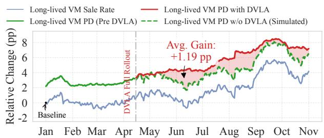  
Figure 12: Comparison of long-lived VM packing density with and without DVLA, shown against the sale rate.

System Overhead. The overhead introduced by DVLA is minimal and well-managed. Model training is an offline process, representing a trivial cost for a cloud provider managing hundreds of thousands of machines. The initial lifetime model trains weekly (40 mins on a 16-core, 64 GB instance), and the five remaining lifetime models train daily in parallel (1 hour on five 16-core, 32 GB instances). Since PDRE is piggybacked onto existing maintenance tasks rather than actively triggered, it incurs no extra scheduling overhead. The online scheduling path is also highly efficient, with a 90% cache hit rate for initial lifetime predictions, cache misses result in a negligible 99th percentile inference latency of only 5 ms. The service has maintained 100% availability since its launch.

End-to-End Efficacy. As illustrated in Figure 12, DVLA delivers substantial and sustained improvements. After its full roll-out, the packing density of long-lived VMs consistently outperformed a baseline simulating performance with out DVLA. To create this realistic counterfactual, we introduce the long-lived VM sale rate, a metric representing the underlying demand for long-lived resources. We define it as the ratio of total cores allocated by long-lived VMs to the total available core capacity in the cluster. By modeling the historical correlation between this sale rate and packing density from the pre-DVLA period, we project what the PDL would have likely been without our system. Over the evaluation period, DVLA achieved an average PDL gain of 1.19 pp against this demand-aware baseline. This significant efficiency gain was achieved with remarkable stability, the VRAR metric saw an average increase of only 0.28 pp, and no user complaints related to performance degradation were reported.

To quantify the impact of DVLA on mitigating placement debt, we analyzed the distribution of stranded machines. Figure 13 illustrates a reduction in stranded machines following the full rollout of DVLA, with the average proportion dropping from 25.3% to 21.3%. Notably, the subset of machines hosting only a single long-lived VM decreased from 4.3% to 3.5%. These results confirm that DVLA effectively mitigates the pinning effect of long-lived VMs.

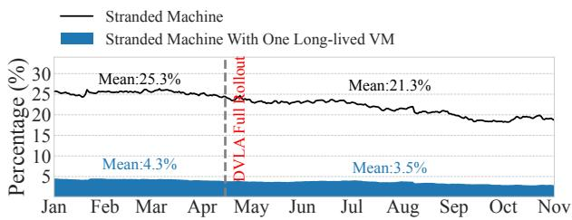  
Figure 13: Proportion of stranded machines (out of all nonempty machines) before and after DVLA’s full rollout.

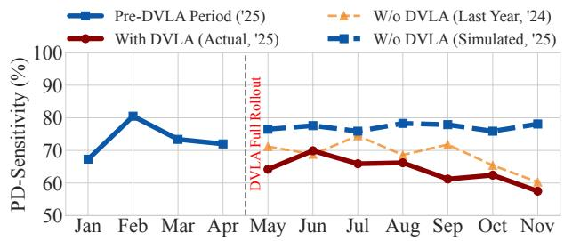  
Figure 14: Impact of DVLA on cluster robustness, measured by PD-Sensitivity, where a lower value is better.

Robustness Against Demand Fluctuation. Beyond static efficiency gains, a critical measure of a scheduler’s quality is its robustness to workload demand fluctuations. To quantify this, we propose a novel metric called Packing Density Sensitivity (PD-Sensitivity). It measures how much packing density drops for every one percentage point drop in resource demand (i.e., sale rate). A lower PD-Sensitivity is highly desirable, as it signifies that the cluster’s packing efficiency is less perturbed by drops in resource demand.

Formally, for a given time interval defined by a drop in demand, we first define the change in Packing Density (∆PD) and the change in Sale Rate (∆SR)

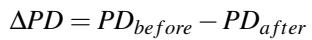

(7)

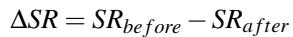

(8)

The PD-Sensitivity for that event is then the ratio:

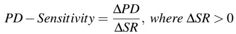

(9)

In a well-consolidated cluster, a drop in demand (e.g., from termination of short-lived VMs) allows the scheduler to reclaim entire machines, preserving high PD on the remaining active machines. In a fragmented cluster, long-lived VMs are scattered, pinning down many machines. A drop in demand here leads to lower utilization across a wide footprint without enabling machine reclamation, causing a sharp decline in overall PD. PD-Sensitivity thus provides a dynamic measure of the cluster’s structural health, directly reflecting the quality of lifetime-aware affinity placement.

Figure 14 plots this metric over time. After DVLA’s rollout, the actual PD-Sensitivity (blue line) established a new, more resilient operational baseline, consistently outperforming both the pre-DVLA period and the same period from the previous year (orange dashed line). Critically, the persistent gap between the actual performance and the simulated performance without DVLA baseline (blue dotted line) demonstrates DVLA’s direct and continuous causal impact. On average, DVLA reduced PD-Sensitivity by 7.1 pp, showcasing its sustained effectiveness in a dynamic production environment.

## 7 Related Work

Online Scheduling. Online VM scheduling is a cluster scheduling problem [24, 30, 45, 49, 53]. There are algorithms based on resource allocation [2, 6, 9, 12, 15, 17, 22, 26, 40, 47, 56, 58], bin packing [3, 4, 7, 27, 32, 39, 48], and prediction of future requests [19, 31, 35, 36, 44]. [28] and [34, 43, 55] use SelfTune and LLM to optimize the system. There are also many studies using lifetime to optimize scheduling strategies [21, 51, 52, 54]. According to [16], long-lived VMs consume more than 95% of the total CPU workload, and those with similar lifespans can be grouped. [10] proposed to predict the lifetime and load of VMs in scheduling. [8] designed a VM lifetime-aware scheduling algorithm using a binary classification model. However, due to different payment types and VM lifetime distributions, these algorithms struggle to achieve the best bin-packing effect in our system.

Offline Scheduling. Offline VM rescheduling can improve the scheduling result of online VM allocation [1,11,18,20,23, 37,38,41,50,57]. It can use more complex methods to achieve better results than online VM scheduling. [23, 38] discussed the optimal packing rate that can be achieved when offline migration times are less than or more than VMs. [11] used divide-and-conquer idea, graph neural network, and combinatorial optimization solver in VM clustering to improve the cus tomer experience. [50] proposed a VM migration algorithm based on the Markov decision process and the Q-learning algorithm. [18] rescheduled VM with reinforcement learning to achieve an effect close to mixed integer programming at a higher speed. However, no previous work has applied features related to lifetime prediction to VM rescheduling.

VM Lifetime Prediction. In recent years, many works have studied VM lifetime in cloud computing. [16, 42] pointed out that most VMs in public clouds are short-lived, but longlived VMs take up most of the core hours. [8] considered VM features, customer features, and timing features, and used LightGBM [29] for binary classification prediction. The authors argue that it is difficult to use deep learning models to predict while ensuring millisecond-level scheduling delays.

## 8 Conclusion

State-of-the-art lifetime-aware schedulers are undermined by two critical, real-world challenges: the brittleness of static policies against drifting lifetime distributions and the insidious accumulation of long-lived VM placement debt. We presented DVLA, an end-to-end system that conquers these issues through a synergistic design combining proactive online prevention with reactive offline correction. Online, DVLA uses dynamic affinity grouping to adapt to workload drifts and a Debt-Aware Placement Policy (DAPP) to prevent debt at the source. Offline, a Placement Debt Rectification Engine (PDRE) employs strategic migrations to amortize the unavoidable residual debt. Our large-scale production deployment at Alibaba Cloud demonstrates DVLA’s superiority, achieving an additional 0.6 percentage points higher packing density than state-of-the-art methods. This directly translates to saving thousands of physical machines and significantly enhances cluster robustness.

## References

[1] Deafallah Alsadie, Zahir Tari, Eidah J Alzahrani, and Albert Y Zomaya. Life: A predictive approach for vm placement in cloud environments. In 2017 IEEE 16th International Symposium on Network Computing and Applications (NCA), pages 1–8. IEEE, 2017.

[2] Pradeep Ambati, Íñigo Goiri, Felipe Frujeri, Alper Gun, Ke Wang, Brian Dolan, Brian Corell, Sekhar Pasupuleti, Thomas Moscibroda, Sameh Elnikety, et al. Providing SLOs for Resource-Harvesting VMs in cloud platforms. In 14th USENIX Symposium on Operating Systems Design and Implementation (OSDI), pages 735–751, 2020.

[3] Nur¸sen Aydın, ˙Ibrahim Muter, and ¸S ˙Ilker Birbil. Multiobjective temporal bin packing problem: An application in cloud computing. Computers & Operations Research, 121:104959, 2020.

[4] Yossi Azar and Danny Vainstein. Tight bounds for clairvoyant dynamic bin packing. ACM Transactions on Parallel Computing (TOPC), 6(3):1–21, 2019.

[5] Microsoft Azure. https://azure.microsoft.com.

[6] Bharathan Balaji, Christopher Kakovitch, and Balakrishnan Narayanaswamy. Fireplace: Placing Firecracker virtual machines with hindsight imitation. Proceedings of Machine Learning and Systems (MLSys), 3:652–663, 2021.

[7] KL Bansal et al. An analytical review of vm allocation and migration policies in cloud computing. In 2023 International Conference on Advancement in Computation & Computer Technologies (InCACCT), pages 704–710. IEEE, 2023.

[8] Hugo Barbalho, Patricia Kovaleski, Beibin Li, Luke Marshall, Marco Molinaro, Abhisek Pan, Eli Cortez, Matheus Leao, Harsh Patwari, Zuzu Tang, et al. Virtual machine allocation with lifetime predictions. In Proceedings of Machine Learning and Systems (MLSys), volume 5, 2023.

[9] Shane Bergsma, Timothy Zeyl, Arik Senderovich, and J Christopher Beck. Generating complex, realistic cloud workloads using recurrent neural networks. In Proceedings of the ACM SIGOPS 28th Symposium on Operating Systems Principles (SOSP), pages 376–391, 2021.

[10] Niv Buchbinder, Yaron Fairstein, Konstantina Mellou, Ishai Menache, and Joseph Naor. Online virtual machine allocation with lifetime and load predictions. ACM SIGMETRICS Performance Evaluation Review, 49(1):9– 10, 2021.

[11] Zuzhi Chen, Fuxin Jiang, Binbin Chen, Yu Li, Yunkai Zhang, Chao Huang, Rui Yang, Fan Jiang, Jianjun Chen, Wu Xiang, et al. Resource allocation with service affinity in large-scale cloud environments. In 2024 IEEE 40th International Conference on Data Engineering (ICDE), pages 5280–5293. IEEE, 2024.

[12] Tong Cheng, Hang Dong, Lu Wang, Bo Qiao, Si Qin, Qingwei Lin, Dongmei Zhang, Saravan Rajmohan, and Thomas Moscibroda. Multi-agent reinforcement learning with shared policy for cloud quota management problem. In Companion Proceedings of the ACM Web Conference 2023, pages 391–395, 2023.

[13] Alibaba Cloud. https://www.alibabacloud.com.

[14] Google Cloud. https://cloud.google.com.

[15] Maxime C Cohen, Philipp W Keller, Vahab Mirrokni, and Morteza Zadimoghaddam. Overcommitment in cloud services: Bin packing with chance constraints. Management Science, 65(7):3255–3271, 2019.

[16] Eli Cortez, Anand Bonde, Alexandre Muzio, Mark Russinovich, Marcus Fontoura, and Ricardo Bianchini. Resource central: Understanding and predicting workloads for improved resource management in large cloud platforms. In Proceedings of the 26th Symposium on Operating Systems Principles (SOSP), pages 153–167, 2017.

[17] Haochuan Cui, Junjie Sheng, Bo Jin, Yiqiu Hu, Li Su, Lei Zhu, Wenli Zhou, and Xiangfeng Wang. Reassigner: A plug-and-play virtual machine scheduling intensifier for heterogeneous requests. In 2022 IEEE International Conference on Big Data (Big Data), pages 3726–3734. IEEE, 2022.

[18] Xianzhong Ding, Yunkai Zhang, Binbin Chen, Donghao Ying, Tieying Zhang, Jianjun Chen, Lei Zhang, Alberto Cerpa, and Wan Du. VMR2L: Virtual machines rescheduling using reinforcement learning in data centers. In Machine Learning for Systems 2023, 2023.

[19] Hang Dong, Boshi Wang, Bo Qiao, Wenqian Xing, Chuan Luo, Si Qin, Qingwei Lin, Dongmei Zhang, Gurpreet Virdi, and Thomas Moscibroda. Predictive job scheduling under uncertain constraints in cloud computing. In International Joint Conference on Artificial Intelligence (IJCAI), pages 3627–3634, 2021.

[20] Fahimeh Farahnakian, Tapio Pahikkala, Pasi Liljeberg, Juha Plosila, Nguyen Trung Hieu, and Hannu Tenhunen. Energy-aware vm consolidation in cloud data centers using utilization prediction model. IEEE Transactions on Cloud Computing, 7(2):524–536, 2016.

[21] Andrew D Ferguson, Peter Bodik, Srikanth Kandula, Eric Boutin, and Rodrigo Fonseca. Jockey: guaranteed job latency in data parallel clusters. In Proceedings of the 7th ACM european conference on Computer Systems (EuroSys), pages 99–112, 2012.

[22] Włodzimierz Funika, Paweł Koperek, and Jacek Kitowski. Automated cloud resources provisioning with the use of the proximal policy optimization. The Journal of Supercomputing, 79(6):6674–6704, 2023.

[23] Anupam Gupta, Guru Guruganesh, Amit Kumar, and David Wajc. Fully-dynamic bin packing with limited repacking. arXiv preprint arXiv:1711.02078, 2017.

[24] Ori Hadary, Luke Marshall, Ishai Menache, Abhisek Pan, Esaias E Greeff, David Dion, Star Dorminey, Shailesh Joshi, Yang Chen, Mark Russinovich, et al. Protean:VM allocation service at scale. In 14th USENIX Symposium on Operating Systems Design and Implementation (OSDI), pages 845–861, 2020.

[25] Benjamin Hindman, Andy Konwinski, Matei Zaharia, Ali Ghodsi, Anthony D Joseph, Randy Katz, Scott Shenker, and Ion Stoica. Mesos: A platform for {Fine-Grained} resource sharing in the data center. In 8th USENIX Symposium on Networked Systems Design and Implementation (NSDI 11), 2011.

[26] Suhas Jayaram Subramanya, Daiyaan Arfeen, Shouxu Lin, Aurick Qiao, Zhihao Jia, and Gregory R Ganger. Sia: Heterogeneity-aware, goodput-optimized ml-cluster scheduling. In Proceedings of the 29th Symposium on Operating Systems Principles (SOSP), pages 642–657, 2023.

[27] Shahin Kamali and Alejandro López-Ortiz. Efficient online strategies for renting servers in the cloud. In SOF SEM 2015: Theory and Practice of Computer Science:

41st International Conference on Current Trends in The ory and Practice of Computer Science, Pec pod Snˇežkou, Czech Republic, January 24-29, 2015. Proceedings 41, pages 277–288. Springer, 2015.

[28] Ajaykrishna Karthikeyan, Nagarajan Natarajan, Gagan Somashekar, Lei Zhao, Ranjita Bhagwan, Rodrigo Fonseca, Tatiana Racheva, and Yogesh Bansal. SelfTune: Tuning cluster managers. In 20th USENIX Symposium on Networked Systems Design and Implementation (NSDI), pages 1097–1114, 2023.

[29] Guolin Ke, Qi Meng, Thomas Finley, Taifeng Wang, Wei Chen, Weidong Ma, Qiwei Ye, and Tie-Yan Liu. Lightgbm: A highly efficient gradient boosting decision tree. Advances in Neural Information Processing Systems (NeurIPS), 30, 2017.

[30] Xiaodi Ke, Cong Guo, Siqi Ji, Shane Bergsma, Zhenhua Hu, and Lei Guo. Fundy: A scalable and extensible resource manager for cloud resources. In 2021 IEEE 14th International Conference on Cloud Computing (CLOUD), pages 540–550. IEEE, 2021.

[31] Haozhe Li, Minghua Ma, Yudong Liu, Si Qin, Bo Qiao, Randolph Yao, Harshwardhan Chaturvedi, Tri Tran, Murali Chintalapati, Saravan Rajmohan, et al. Codec: Cost-effective duration prediction system for deadline scheduling in the cloud. In 2023 IEEE 34th International Symposium on Software Reliability Engineering (ISSRE), pages 298–308. IEEE, 2023.

[32] Yusen Li, Xueyan Tang, and Wentong Cai. Dynamic bin packing for on-demand cloud resource allocation. IEEE Transactions on Parallel and Distributed Systems, 27(1):157–170, 2015.

[33] Jianheng Ling, Pratik Worah, Yawen Wang, Yunchuan Kong, Chunlei Wang, Clifford Stein, Diwakar Gupta, Jason Behmer, Logan A. Bush, Prakash Ramanan, Rajesh Kumar, Thomas Chestna, Yajing Liu, Ying Liu, Ye Zhao, Kathryn S. McKinley, Meeyoung Park, and Martin Maas. Lava: Lifetime-aware vm allocation with learned distributions and adaptation to mispredictions. In Proceedings of Machine Learning and Systems, volume 7. MLSys, 2025.

[34] Tennison Liu, Nicolás Astorga, Nabeel Seedat, and Mihaela van der Schaar. Large language models to enhance bayesian optimization. In The Twelfth International Conference on Learning Representations (ICLR). Open Review.net, 2024.

[35] Chuan Luo, Bo Qiao, Xin Chen, Pu Zhao, Randolph Yao, Hongyu Zhang, Wei Wu, Andrew Zhou, and Qingwei Lin. Intelligent virtual machine provisioning in cloud computing. In International Joint Conference on Artificial Intelligence (IJCAI), pages 1495–1502, 2020.

[36] Chuan Luo, Bo Qiao, Wenqian Xing, Xin Chen, Pu Zhao, Chao Du, Randolph Yao, Hongyu Zhang, Wei Wu, Shaowei Cai, et al. Correlation-aware heuristic search for intelligent virtual machine provisioning in cloud systems. In Proceedings of the AAAI Conference on Artificial Intelligence, volume 35, pages 12363–12372, 2021.

[37] Suhib Bani Melhem, Anjali Agarwal, Nishith Goel, and Marzia Zaman. Markov prediction model for host load detection and vm placement in live migration. IEEE Access, 6:7190–7205, 2017.

[38] Konstantina Mellou, Marco Molinaro, and Rudy Zhou. The power of migrations in dynamic bin packing. arXiv preprint arXiv:2408.13178, 2024.

[39] Aniket Murhekar, David Arbour, Tung Mai, and Anup Rao. Dynamic vector bin packing for online resource allocation in the cloud. arXiv preprint arXiv:2304.08648, 2023.

[40] Andrew Newell, Dimitrios Skarlatos, Jingyuan Fan, Pavan Kumar, Maxim Khutornenko, Mayank Pundir, Yirui Zhang, Mingjun Zhang, Yuanlai Liu, Linh Le, et al. Ras: continuously optimized region-wide datacenter resource allocation. In Proceedings of the ACM SIGOPS 28th Symposium on Operating Systems Principles (SOSP), pages 505–520, 2021.

[41] Mostafa Noshy, Abdelhameed Ibrahim, and Hesham Arafat Ali. Optimization of live virtual machine migration in cloud computing: A survey and future directions. Journal of Network and Computer Applications, 110:1–10, 2018.

[42] Xiaoting Qin, Minghua Ma, Yuheng Zhao, Jue Zhang, Chao Du, Yudong Liu, Anjaly Parayil, Chetan Bansal, Saravan Rajmohan, Íñigo Goiri, et al. How different are the cloud workloads? characterizing large-scale private and public cloud workloads. In 2023 53rd Annual IEEE/IFIP International Conference on Dependable Systems and Networks (DSN), pages 522–530. IEEE, 2023.

[43] Bernardino Romera-Paredes, Mohammadamin Barekatain, Alexander Novikov, Matej Balog, M Pawan Kumar, Emilien Dupont, Francisco JR Ruiz, Jordan S Ellenberg, Pengming Wang, Omar Fawzi, et al. Mathematical discoveries from program search with large language models. Nature, 625(7995):468–475, 2024.

[44] Sultan Mahmud Sajal, Luke Marshall, Beibin Li, Shandan Zhou, Abhisek Pan, Konstantina Mellou, Deepak Narayanan, Timothy Zhu, David Dion, Thomas Moscibroda, et al. Kerveros: Efficient and scalable cloud

admission control. In 17th USENIX Symposium on Operating Systems Design and Implementation (OSDI), pages 227–245, 2023.

[45] Malte Schwarzkopf, Andy Konwinski, Michael Abd-El-Malek, and John Wilkes. Omega: flexible, scalable schedulers for large compute clusters. In Proceedings of the 8th ACM European Conference on Computer Systems (EuroSys), pages 351–364, 2013.

[46] Amazon Web Services. https://aws.amazon.com.

[47] Haiying Shen and Liuhua Chen. Compvm: A comple mentary vm allocation mechanism for cloud systems. IEEE/ACM Transactions On Networking, 26(3):1348– 1361, 2018.

[48] Sean R Sinclair, Felipe Vieira Frujeri, Ching-An Cheng, Luke Marshall, Hugo De Oliveira Barbalho, Jingling Li, Jennifer Neville, Ishai Menache, and Adith Swaminathan. Hindsight learning for mdps with exogenous inputs. In International Conference on Machine Learn ing (ICML), pages 31877–31914. PMLR, 2023.

[49] Chunqiang Tang, Kenny Yu, Kaushik Veeraraghavan, Jonathan Kaldor, Scott Michelson, Thawan Kooburat, Aravind Anbudurai, Matthew Clark, Kabir Gogia, Long Cheng, et al. Twine: A unified cluster management system for shared infrastructure. In 14th USENIX Symposium on Operating Systems Design and Implementation (OSDI), pages 787–803, 2020.

[50] Cong Hung Tran, Thanh Khiet Bui, and Tran Vu Pham. Virtual machine migration policy for multi-tier application in cloud computing based on q-learning algorithm. Computing, 104(6):1285–1306, 2022.

[51] Alexey Tumanov, Timothy Zhu, Jun Woo Park, Michael A Kozuch, Mor Harchol-Balter, and Gregory R Ganger. Tetrisched: global rescheduling with adaptive plan-ahead in dynamic heterogeneous clusters. In Proceedings of the 11th European Conference on Computer Systems (EuroSys), pages 1–16, 2016.

[52] Abhishek Verma, Ludmila Cherkasova, and Roy H Campbell. Aria: automatic resource inference and allocation for mapreduce environments. In Proceedings of the 8th ACM international conference on Autonomic computing, pages 235–244, 2011.

[53] Abhishek Verma, Luis Pedrosa, Madhukar Korupolu, David Oppenheimer, Eric Tune, and John Wilkes. Largescale cluster management at google with borg. In Proceedings of the tenth European Conference on Computer Systems, pages 1–17, 2015.

[54] Neeraja J Yadwadkar, Ganesh Ananthanarayanan, and Randy Katz. Wrangler: Predictable and faster jobs using fewer resources. In Proceedings of the ACM Symposium on Cloud Computing (SOCC), pages 1–14, 2014.

[55] Chengrun Yang, Xuezhi Wang, Yifeng Lu, Hanxiao Liu, Quoc V Le, Denny Zhou, and Xinyun Chen. Large language models as optimizers. In The Twelfth International Conference on Learning Representations (ICLR), 2024.

[56] Fangkai Yang, Bowen Pang, Jue Zhang, Bo Qiao, Lu Wang, Camille Couturier, Chetan Bansal, Soumya Ram, Si Qin, Zhen Ma, et al. Spot virtual machine eviction prediction in microsoft cloud. In Companion Proceedings of the Web Conference 2022, pages 152–156, 2022.

[57] Chen Ying, Baochun Li, Xiaodi Ke, and Lei Guo. Raven: Scheduling virtual machine migration during datacenter upgrades with reinforcement learning. Mobile Networks and Applications, 27(1):303–314, 2022.

[58] Zhi-Hui Zhan, Xiao-Fang Liu, Yue-Jiao Gong, Jun Zhang, Henry Shu-Hung Chung, and Yun Li. Cloud computing resource scheduling and a survey of its evolutionary approaches. ACM Computing Surveys (CSUR), 47(4):1–33, 2015.

## Appendix

## A VM Lifetime Prediction Model

## A.1 Initial Lifetime Prediction

This model provides low-latency predictions at VM creation time for the online scheduler, using static features available in the VM request. The 19 features used are listed in Table 2.

Feature Importance Analysis. As shown in Figure 15, feature importance analysis reveals that image\_id , user\_id, and operator are substantially more predictive than all other static features. This indicates that a VM’s lifetime is primarily determined by its intended application (proxied by the image) and the historical usage patterns of its owner (user/operator). A secondary tier of features, including inst\_type\_name and min\_o f \_day, also provide significant predictive value.

## A.2 Remaining Lifetime Prediction

This model provides higher-accuracy predictions for running VMs, designed for offline optimization tasks and state updates. It augments the 19 static features (Table 2) with dynamic runtime information, historical user statistics, and performance metrics. Key additional features are listed in Table 3.

Table 2: Features for the Initial Lifetime Prediction model.  
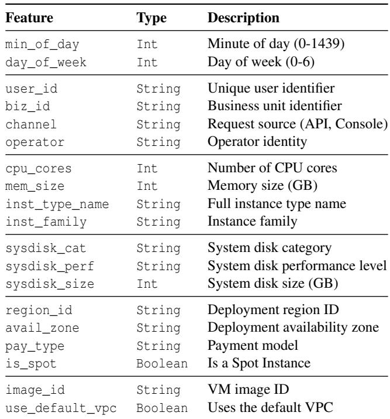

Table 3: Key additional features for the Remaining Lifetime Prediction model.  
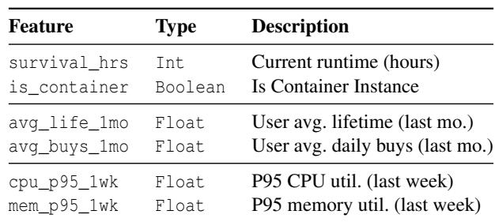

Feature Engineering. Beyond the basic features in Table 3, we engineer a comprehensive set of features. (1) Historical Statistical Features: we compute statistical aggregates (e.g., avg, std, p75, p90) of user-level metrics like lifetime and vm\_num over various time windows (e.g., past 0.5, 1, and 2 months); (2) Offline Performance Metrics: we collect recent performance profiles, such as the 95th percentile of cpu utilization, mem utilization over the past day or week.

Feature Importance Analysis. As shown in Figure 16, the feature importance for this model shifts significantly. It is dominated by historical user behavior and the VM’s current runtime. This confirms that a user’s past behavior and a VM’s survival history are the strongest predictors of its remaining lifetime, validating our two-model approach where the offline model gains its power from rich, dynamic information.

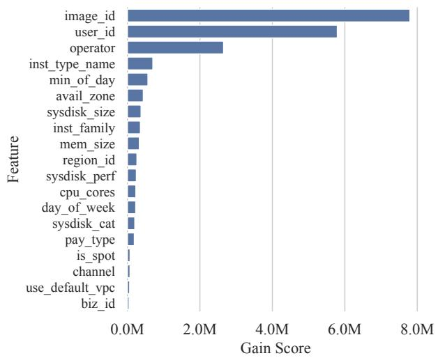  
Figure 15: Feature importance for Initial Lifetime Prediction.

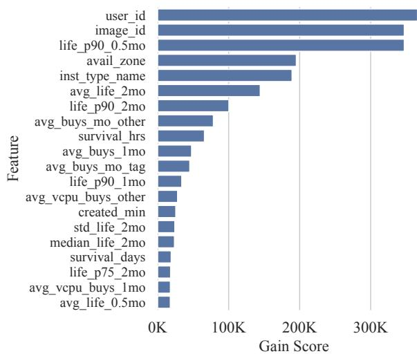  
Figure 16: Top 20 Features for Remaining Lifetime Prediction.

## B Details of Dynamic Affinity Grouping

This appendix provides the detailed algorithms for the key functions within DVLA’s Dynamic Affinity Grouping mechanism, as referenced in the main paper.

## B.1 Online Drift Detector

Our change detection is powered by an online detector that maintains Exponentially Weighted Moving Averages (EW-MAs) of the workload vector, the drift error, and the error’s standard deviation. This enables an adaptive drift scoring mechanism. Algorithm 3 presents the core logic.

Algorithm 3 Online Drift Detector Internals   
1: State Variables:   
2: ewma\_vector: EWMA of workload vectors (the base  
line).   
3: ewma\_error: EWMA of drift errors.   
4: ewma\_stddev\_error: EWMA of the standard devia  
tion of drift errors.   
5: α,β: Smoothing factors for vector and error updates.   
6: t: Internal day counter.   
7: Pwarmup: Number of warmup days.   
8: function SCORE(v )   
9: if t ≤ Pwarmup or ewma\_vector is null then   
10: return 0.0   
11: error ← 1.0−COSINESIMILARITY(vt,ewma\_vector)   
12: score ← max 0, error−ewma\_errorewma\_stddev\_error   
13: return score   
14: function LEARN(vt)   
15: t ← t + 1   
16: if ewma\_vector is null then   
17: ewma\_vector ← vt   
18: return   
19: error ← 1.0−COSINESIMILARITY(vt,ewma\_vector)   
20: if ewma\_error is null then   
21: ewma\_error ← error   
22: ewma\_stddev\_error ← 0.0   
23: else   
24: std\_dev ← |error − ewma\_error|   
25: ewma\_error ← β · error + (1 − β) · ewma\_error   
26: ewma\_stddev\_error ← β · std\_dev + (1 − β) ·   
ewma\_stddev\_error   
27: ewma\_vector ← α · vt + (1 − α) · ewma\_vector

## B.2 Adaptive Affinity Group Generation

When a persistent drift is confirmed, this function (Algorithm 4) generates a new, optimized affinity group by identifying the most resource-dominant lifetime classes from the observed workload.

## C Sensitivity Analysis

This section analyzes DVLA’s sensitivity to its key hyperparameters and the accuracy of its underlying prediction models, providing a principled basis for our production configuration.

## C.1 Parameters of Dynamic Affinity Grouping

The Dynamic Affinity Grouping mechanism’s key hyperparameters θalarm, Wobs, and θcon f irm must balance responsiveness against stability. We conducted a sensitivity analysis by evaluating parameter combinations against simulated workloads, using a unified cost function that penalizes false positives more heavily than detection latency (70% weight), reflecting our operational priority for system stability.

Algorithm 4 GenerateAffinityGroup   
1: Input:   
2: avg\_workload: Average workload vector.   
3: GlobalClasses: List of all global lifetime classes.   
4: θcoverage: Cumulative threshold.   
5: N : Minimum number of classes to keep.   
6: Output:   
7: AffinityGroup: The new set of lifetime classes.   
8: function GENERATEAFFINITYGROUP(avg\_workload,   
GlobalClasses, θcoverage, Nmin)   
9: Pairs ← ZIP(GlobalClasses,avg\_workload)   
10: SortedPairs ← SORT(Pairs,descending = True)   
11: AffinityGroup ← 0/   
12: cum\_coverage ← 0.0   
13: for each (label,val) in SortedPairs do   
14: if cum\_coverage <   
θcoverage or |AffinityGroup| < Nmin then   
15: AffinityGroup ← AffinityGroup ∪   
{label}   
16: cum\_coverage ← cum\_coverage + val   
17: else   
18: break   
19: return AffinityGroup

Figure 17 shows that a conservative strategy yields the lowest cost. Short observation windows proved overly sensitive to transient noise. A moderate window of 20 days, combined with higher alarm and confirmation thresholds, consistently minimized cost by ensuring the system reacts only to significant, persistent changes. This data-driven analysis led us to select the optimal, stability-focused parameter set (Wobs = 20, θalarm = 2.0, θcon f irm = 3.0) for our production deployment.

## C.2 Robustness to Prediction Errors

DVLA’s effectiveness is linked to the quality of its VM lifetime predictions. To quantify this relationship, we evaluated its performance under varying synthetic prediction accuracies. Our primary metric is the PD improvement over the production baseline.

The analysis, shown in Figure 18, yields two key insights. First, DVLA’s performance scales directly with prediction quality, particularly for long-lived VMs. Under a realistic accuracy model, increasing the recall of long-lived VMs from 40% to 100% boosts the PD gain from 1.02 pp to 1.66 pp. This confirms that correctly identifying these resource-intensive VMs is a primary driver of efficiency.

Second, and more importantly, DVLA demonstrates strong robustness to prediction errors. Even with a low 40% recall for long-lived VMs, the system still achieves a significant 1.02 pp PD improvement. This resilience highlights that DVLA’s synergistic design can extract substantial value even from noisy signals, making it well-suited for real-world deployment where perfect prediction is unattainable.

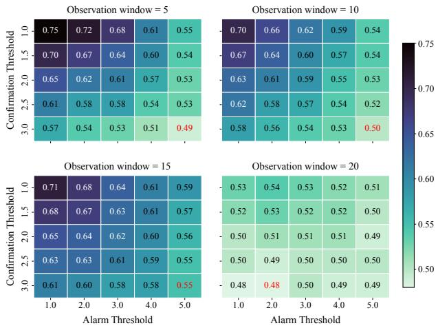  
Figure 17: Sensitivity analysis of DVLA’s change detection parameters. Each heatmap shows the average cost (lower is better) for a given observation\_window.

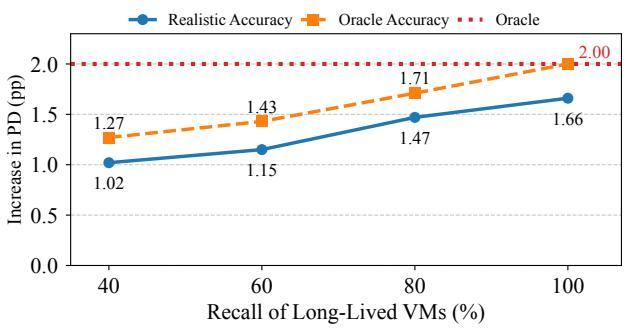  
Figure 18: Sensitivity analysis of DVLA’s performance with respect to VM lifetime prediction accuracy. The plot shows the Packing Density improvement as a function of the recall rate for long-lived VMs.