USENIX

THE ADVANCED COMPUTING SYSTEMS ASSOCIATION

# Disentangling Graph Dependencies for Efficient Billion-Scale GPU Vector Search

Haoru Zhao, Jingkai He, Jingyao Zeng, Mingkai Dong, and Dong Du, Shanghai Jiao Tong University

https://www.usenix.org/conference/osdi26/presentation/zhao

# This paper is included in the Proceedings of the 20th USENIX Symposium on Operating Systems Design and Implementation.

July 13–15, 2026 • Seattle, WA, USA

ISBN 978-1-939133-55-7

Open access to the Proceedings of the 20th USENIX Symposium on Operating Systems Design and Implementation is sponsored by

# Disentangling Graph Dependencies for Efficient Billion-Scale GPU Vector Search

Haoru Zhao∗, Jingkai He∗, Jingyao Zeng , Mingkai Dong , Dong Du Institute of Parallel and Distributed Systems, Shanghai Jiao Tong University

## Abstract

Graph-based approximate nearest neighbor search (ANNS) drives high-performance vector search for AI systems. Nowadays, GPU becomes the emerging ANNS platform for its high performance and cost efficiency. However, GPU’s limited memory capacity hinders graph ANNS systems from scaling to billion-level, due to graph’s high memory consumption (239–334 GB). Existing efforts mitigate this by offloading graph to CPU memory; however, this incurs severe performance penalties due to data transfer overhead and GPU stalls.

We identify the root cause of this inefficiency: a strict steplevel dependency in graph search, where each step relies on the traversal and computations of all nodes in the previous step. Our key insight is that this monolithic step-level dependency can be disentangled into a more flexible, fine-grained node-level dependency. Specifically, for each node, it is first accessed as a neighbor via an edge (i.e., discovery), and later selected as a parent to traverse its neighbors (i.e., expansion). These two stages are typically separated by many steps, exposing a sufficient discovery-expansion window. Leveraging this time window, the edge fetching to access some neighbors can be deferred and overlapped with computation. Based on this insight, we propose FlowANN, a graph-based ANNS system that efficiently supports billion-scale search on a single GPU. FlowANN employs a tiered graph structure, offloading the edges connected to neighbors that have sufficient time windows to the CPU. It effectively pipelines GPU computation with edge fetching via optimized asynchronous transfer and dynamic coordination. Evaluations show that FlowANN outperforms state-of-the-art systems by 4.08–45.7× on average (up to 172.6×), without compromising search accuracy.

## 1 Introduction

Approximate nearest neighbor search (ANNS) serves as a foundational component of modern AI systems, and is widely used in retrieval-augmented generation (RAG) [1, 2], recommendation systems [3, 4], image retrieval [5], and LLM serving [6, 7]. These systems embed data into high-dimensional vectors and employ ANNS to identify nearest vectors to the query vector, enabling efficient retrieval of relevant information. Among all ANNS indexes, graph-based approaches [8– 18] are favored for their superior search efficiency.

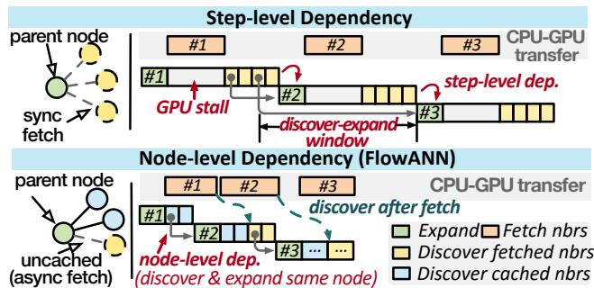  
Figure 1: Step-level dependency vs. node-level dependency. “nbr” is short for neighbor; “dep” is short for dependency.

The rapid growth of data scales and the explosive computational demands of ANNS has driven the emerging adoption of GPUs for ANNS [19–23], leveraging their high computational efficiency and cost efficiency. GPU’s parallel computing capabilities naturally align with ANNS’ vector computation requirements, making a single mid-tier GPU achieve over 200× the throughput of a high-end CPU server1 (Fig.2). Thus, GPU ANNS has been widely adopted by the community [24, 25] and industry (Meta [26], NVIDIA [27], etc. [28–30]).

However, the limited memory capacity of GPUs poses significant challenges for deploying large-scale graphbased ANNS on GPUs. For instance, even after quantization [31, 32], billion-scale graph-based ANNS indexes [33– 36] (datasets in Table 1) still require 258–350 GB memory, with the graph alone consuming 239–334 GB. This far exceeds the 80–96 GB memory capacity of mainstream GPUs.

Alternatively, offloading graph to host memory and fetching data on demand suffers from high data transfer overhead due to the strict dependencies in the search process. Specifically, graph ANNS employs a best-first search algorithm, which proceeds iteratively. In each step, it selects the node closest to the query from the candidate pool as the parent, fetches the parent’s edges from the graph to retrieve its neighbors, computes all neighbors’ distances to the query, and adds them into the candidate pool for subsequent steps. As the selection of the parent requires that all neighbors from the previous step complete the computations and are inserted into the candidate pool, this rigid step-level dependency results in significant GPU stalls to wait for edge fetching, as Fig.1 shows.

However, this conventional view of step-level dependency is overly strict, and the associated waiting may be unnecessary. We disentangle the step-level dependency into a finer-grained node-level dependency. From a node’s perspective, during the search process, it is first reached as a neighbor (i.e., discovery) and then used to find its neighbors (i.e., expansion). The best-first search algorithm ensures that, in each step, multiple nodes are discovered and only one node is expanded. Therefore, for most nodes, there exists a time window (i.e., several steps) between their discovery and expansion (Insight #1). For instance, \~95.6% of expanded nodes have an average window > 5 steps (§3).

Such discovery-expansion windows suggest an opportunity to offload some edges to CPU with (almost) zero overhead: when expanding a node, its offloaded edges can be asynchronously fetched to discover the neighbors. As long as these neighbors have sufficient discovery-expansion windows, their deferred discoveries will not disrupt the nodes’ expansion order in search process (i.e., preserving best-first search’s search path). Moreover, such deferred discovery effectively hides data transfer by overlapping it with computations.

However, though the discovery-expansion window presents an opportunity for zero-overhead offloading, identifying suitable edges for offloading remains challenging, since predicting the window is difficult. We find that the expanded nodes nearby neighbors (i.e., connected via short edges) are expanded sooner, leaving insufficient windows for deferred discovery. This is because the node and its nearby neighbors are close in space, so once one is expanded (i.e., being near the query), the other is also likely to be close to the query and expanded soon. Therefore, generally, long edges are more suitable for offloading, while short edges should reside on the GPU to ensure timely discovery (Insight #2).

Based on these insights, we propose FlowANN, a GPU graph ANNS system that efficiently supports billion-scale search on a single GPU. As Fig.1 shows, at each step, it discovers the parent’s neighbors residing on the GPU and the nodes deferred from previous steps, while asynchronously fetching other neighbors from the CPU. We have mathematically proven that deferred discoveries do not compromise search accuracy, even if FlowANN might (sometimes) yield a different search path compared to synchronous edge fetching.

FlowANN further addresses the following challenges.

Challenge #1: Imbalanced graph tiering. While edge length provides a macroscopic criterion for graph tiering, selecting on-GPU edges based on a static edge length threshold leads to critical imbalances. Due to the uneven distribution of data points in high-dimensional space, edges in dense regions are typically short, while nodes in sparse regions have few short edges. Simply using a length threshold causes queries located in sparse regions to suffer from excessive uncached edges.

Challenge #2: Lagging edge fetching. FlowANN has to fetch edges to GPU asynchronously. However, despite many methods to copy data between CPU and GPU (e.g., cudaMemcpy, unified memory) [37], current GPU ecosystems lack support for GPU-initiated async transfers. Existing methods either require returning control to CPU to initiate async copies, or rely on GPU-initiated synchronous copies. Furthermore, existing CPU-GPU transfer methods typically rely on DMA. But DMA’s high initialization overhead severely degrades the performance of edge fetching, whose size is relatively small.

Challenge #3: Uncoordinated pipelining. Although the discovery-expansion windows enable deferred discovery, excessive deferrals lead the search to suboptimal search paths, thereby sacrificing efficiency. Thus, FlowANN has to wait for some discoveries if their deferred steps exceed their discoveryexpansion windows. However, estimating the window is challenging due to its dynamic evolution throughout the search. Furthermore, GPU computational resources (e.g., CUDA cores, shared memory) are statically allocated for the GPU kernel, but deferred discovery leads to dynamically varying workloads in each step, resulting in resource under-utilization.

To address the challenges, we propose the following designs. Firstly, we design the grouping-based graph tiering, which partitions the graph by grouping spatially proximate nodes and places edges between nodes within the same group on the GPU. Building on recent theoretical advances [38], we employ a multi-level label propagation scheme for grouping, which considers both edge lengths and node spatial distribution. Furthermore, we introduce a compact matrix layout to store the tiered graph, which reduces memory waste from padding and enables more edges to reside in GPU memory.

Secondly, we design xCopier to enable GPU-initiated asynchronous data transfers. xCopier coordinates GPU-side ring queues and CPU-side data-moving threads, and provides GPU-optimized programming primitives for GPU kernels. To facilitate edge fetching (i.e., small copies), xCopier employs MMIO-based data transfer, bypassing the overhead of conventional DMA-based approaches. xCopier makes edge fetching in FlowANN both trap-less and asynchronous, enabling effective overlap of data transfer and computation.

Finally, we design a coordinated pipeline for efficient execution. FlowANN employs the adaptive synchronization to prevent excessively deferred discoveries, which holistically considers global search convergence and local fluctuations. To efficiently utilize GPU resources, FlowANN introduces crossstep balancing, which adaptively balances workloads across steps to align computing demands with hardware resources.

We evaluate FlowANN on billion-scale datasets [39–41], and compare it with SOTA GPU ANNS systems from industry and academia. FlowANN outperforms cluster-based ANNS systems like cuVS [27], Faiss [24], Rummy [19], and FusionANNS [22] by 4.08–8.41× on average, while maintaining the same accuracy. It outperforms graph-based systems like BANG [20] and FlashANNS [42] by 45.7× and 14.3× on average, and achieves comparable throughput (using one GPU) with multi-GPU graph system GGNN [43] using 8 GPUs. FlowANN consistently achieves improvements across different accuracies, GPUs, and algorithm configurations.

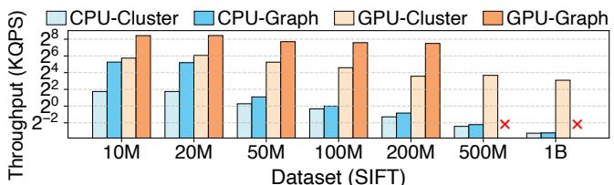  
Figure 2: ANNS performance across indexes on GPU/CPU with different dataset sizes. Recall@10 = 0.9. Recall@α means the proportion of true neighbors found within the top-α results. We use Faiss [24] (w/ HNSW [10]) and cuVS [27] for CPU/GPU ANNS. For CPU ANNS, all (160) cores are used. Detailed settings in §7.

FlowANN is fully open-sourced at https://github. com/SJTU-IPADS/GPU-Graph-ANN.

## 2 GPU Graph ANNS: Fast yet Memory-bound

## 2.1 GPU Graph ANNS Primer

Vector search underpins modern AI systems, such as RAG [1, 2], recommendation systems [3, 4, 30], image retrieval [5], and LLM inference [6]. These systems embed data (e.g., text, images) into vectors, and use vector search to retrieve data relevant to the embedded query vector. The core operation of vector search is k-nearest neighbor search, which tries to find the k nearest vectors (top-k) to a query. As exact nearest neighbor search via brute-force is infeasible at large data scales (e.g., billion-level [33–35, 41]), modern vector search adopts approximate nearest neighbor search (ANNS), which leverages pre-built indexes for efficient approximate retrieval. Graph-based ANNS. Mainstream ANNS indexes generally fall into two broad categories: partition-based [44–49] and graph-based [8–12]. Partition-based indexes divide the dataset into multiple partitions, such as clusters of spatially proximate points or discrete buckets mapped via hashing.2 Subsequently, the search process scans the vectors within the partitions that are close to the query via brute force. In contrast, graph based methods construct a proximity graph to capture the relationships between vectors, and the search proceeds by traversing the graph.

Graph-based ANNS systems offer superior search efficiency over cluster-based ones. As shown in Fig.2, they deliver 1.6–10.5× higher performance and superior scalability. This advantage stems from the graph structure, which allows the search to navigate directly toward nearest neighbors by graph traversal, significantly reducing distance computations compared to the brute-force scans of cluster-based methods.

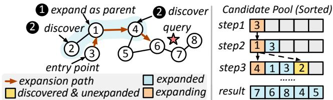  
Figure 3: Best-first graph search procedure.

KNN graph and best-first search. The graph structure for ANNS is the K-Nearest Neighbor (KNN) graph, a graph where each node (vector) is connected to its approximately K nearest neighbors in the dataset, as determined by distance metrics like Euclidean distance. The graph is stored as a 2D matrix, where each row contains the K neighbor IDs for a node.

The graph search algorithm utilizes a best-first search strat egy. As illustrated in Fig.3, it maintains a candidate pool that contains a fixed number of the closest nodes found so far, sorted by their distance to the query. The algorithm begins from an entry point (e.g., node 3) and proceeds iteratively. At each iteration, it selects the nearest unexpanded node from the candidate pool as the parent and traverses its edges to obtain its neighbors (❶).3 It then computes the distances between these neighbors and the query, and inserts them into the pool (❷). This process repeats until all nodes in the pool have been expanded, and the algorithm returns the top-k nearest vectors in the pool as the final result. During the search, each node undergoes two main stages: ❶ it is reached as a neighbor via an edge and is inserted into the candidate pool after distance computation (termed discovery); ❷ it is selected as the parent to further discover its neighbors (termed expansion).

GPU-based ANNS. Given the growing demand for largescale vector processing (e.g., billions of vectors), GPU-based ANNS is increasingly favored for its parallel capabilities and cost-efficiency [22]. Currently, GPU-based ANNS is widely adopted by industry leaders such as Meta [26, 50], NVIDIA [27, 51], etc. [28–30]. With both data and indexes (e.g., graph) placed on the GPU, SOTA systems accelerate key ANNS operations (e.g., distance computation, sorting) through parallel execution [27, 51, 52], significantly boosting search speed and throughput. As Fig. 2 shows, GPUbased ANNS achieves a 9.0–222.0× speedup over CPU-based ones across various dataset sizes. Notably, graph-based GPU ANNS outperforms cluster-based ones by 5.2–15.1×, highlighting the superiority of graph-based ANNS on GPU.

## 2.2 Memory Strain in GPU Graph ANNS

Although exhibiting computational efficiency, the substantial memory footprint of the graph limits the applicability of GPU graph ANNS at billion-scale. For example, even after quantization4, which reduces the vector memory footprint to 12.5% of the original, graph ANNS on SIFT1B dataset [39] demands \~258 GB memory. This far exceeds the 80-96 GB capacity of mainstream GPUs, making it undeployable on a GPU (Fig.2). Notably, the graph alone consumes \~93% of the total memory, constituting the key bottleneck. Such memory consumption is unavoidable to preserve adequate graph connectivity and ensure search quality. Thus, the core challenge in scaling GPU graph ANNS to billion-scale lies in breaking the memory bottleneck while maintaining high performance.

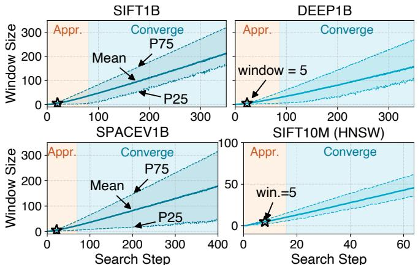  
Figure 4: Discovery-expansion windows over steps. For a node being expanded, its window size = current step − the step when it was discovered − 1. We also validate other KNN graph variant (i.e., HNSW) exhibits similar results. The HNSW index is from FAISS [24].

## 2.3 Existing Efforts and Possible Solutions

Multiple GPUs. Although employing multiple GPUs [23, 43] (e.g., through graph sharding) presents a theoretical solution, it faces non-trivial challenges. Firstly, efficient graph partitioning for ANNS remains challenging, as the search algorithm’s step-by-step discovery-oriented nature makes the traversal path for a given query inherently unpredictable. Secondly, it introduces frequent inter-GPU communication, which consumes computational resources, increases search latency (several ms), and degrades throughput, as demonstrated in §7.1.

Unified memory (UM). UM extends memory capacity by creating a unified address space across CPU and GPU. However, it is ill-suited for graph traversal, which exhibits virtually no locality. Consequently, the traversal frequently triggers page faults and migrations (62 µs), which are exceedingly costly.

CPU-GPU tiering. Another approach is to store the graph primarily in CPU memory and transfer edges of parent nodes to GPU on demand (e.g., BANG [20]). However, the strict step-level dependency in best-first search severely limits computation-transfer overlap: each step’s new parent selection depends on all the neighbors of the parent being fetched and discovered in the previous step. Consequently, it is nearly impossible to hide transfer latency by overlapping it with computation (< 10% overlapped). Additionally, this approach leads to severe GPU memory under-utilization (\~50 GB idle on an 80 GB HBM GPU for the quantized SIFT1B dataset), as it treats GPU memory merely as a transient staging area.

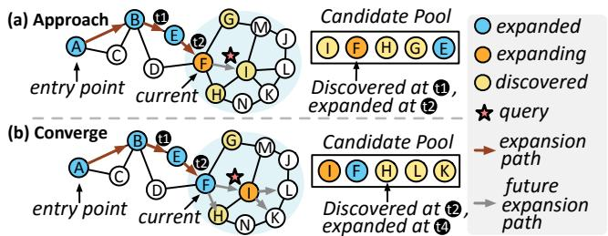  
Figure 5: Two phases in the graph search process. The upper figure shows approach phase, and the lower shows converge phase.

## 3 Disentangling Dependency in Graph Search

Given the conventional strict step-level dependency, CPU-GPU tiering for graph ANNS seems infeasible due to high data transfer overhead. However, we find that this step-level dependency is overly rigid and can be disentangled into node-level dependency. Specifically, at each step of a given best-first search path, only the node to be expanded needs to have been discovered. Based on this fine-grained dependency, we analyze the graph search traces for tens of thousands of queries on three billion-scale datasets (§7).5 From the analysis, we identify opportunities to defer certain discoveries, thereby overlapping data transfer with computation without sacrificing accuracy.

Observation #1: Discovery-Expansion window. We discover that during the search process, there exists a time window between a node’s discovery and expansion (discoveryexpansion window). As Fig.4 shows, for 95.6% of the search steps, the average discovery-expansion window exceeds 5 steps (6–14 µs per step, depending on the batch size). Moreover, the window size consistently grows throughout the search process.

Insight #1: Deferrable discovery. The discovery-expansion window presents an opportunity to defer the discovery of certain nodes without compromising accuracy. Specifically, since this window can typically overlap the edges’ host-to-GPU transfer latency (\~8 µs, Fig. 17b), we can offload the edges connecting to neighbors with sufficient windows to CPU memory, and defer the discovery of these neighbors until the edges are fetched to GPU. When fetching the edges, GPU can continue executing subsequent steps’ computations without blocking.

Observation #2: Short edges indicate non-deferrable discoveries. While the discovery-expansion window presents a general opportunity for deferrable discovery, not all nodes are equally suitable for deferral. As Fig. 5 (a) shows, when expanding node F at t , its neighbor I is less suitable for deferral than G, as I will be expanded soon. To systematically identify non-deferrable discoveries, we analyze the correlation between edge length and window size. Specifically, for each expanded node, we collect the length of the edge used to discover it, and analyze edges whose corresponding discoveries have insufficient windows (conservatively ≤ 5 steps).

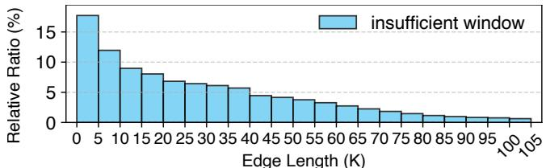  
Figure 6: Proportion of edges with insufficient windows (≤ 5 steps) for each edge length bucket (SIFT1B). E.g., in the shortestedge bucket (0–5), 17.7% of the edges connect to neighbor nodes with insufficient windows. Other datasets exhibit similar results.

Results reveal that discoveries through short edges are less likely to be deferrable. As Fig.6 shows, shorter edges are more frequently associated with discoveries that have insufficient windows. The proportion of edges with insufficient windows in the shortest-edge bucket (17.7%) is much higher than that in the longest-edge bucket (0.63%). We also find that short edges have higher access frequency. Nevertheless, most discoveries (\~90.6%) have sufficient windows (> 5 steps) for deferral, demonstrating broad applicability of deferrable discovery.

Insight #2: Length-based graph tiering. In the graph, since discoveries via short edges are less deferrable and more frequently accessed, short edges should be retained in GPU memory. This effectively utilizes the remaining GPU memory after storing the quantized vectors. Conversely, long edges can be safely offloaded to host memory and fetched to GPU on demand, thus maximizing memory efficiency.

Root cause and generality. These observations are derived from the nature of best-first search, which aims to find the query’s top-k closest nodes, specifically from its surrounding region (e.g., shaded area in Fig.5). This process is naturally divided into two phases: approach and converge [11, 53].

During the approach phase, the search rapidly advances from the entry point toward the vicinity of the query (e.g., node A F in Fig.5 (a)). Each discovery tends to find nodes closer to the query, which are then quickly expanded, resulting in small windows. As Fig.4 shows, the first quartile of window size (P25) remains close to zero during the first \~22% steps.

However, upon entering the converge phase, the search has reached the nodes near the query (e.g., node F in Fig.5 (b)). During this phase, the search generally follows a querycentric, outward-expanding trend [53] to collect the actual topk nearest neighbors. As the search progresses, the likelihood of discovering a closer node diminishes (e.g., expansion of node I at t3 cannot find a closer node than I). Consequently, the node selected for expansion (i.e., nearest unexpanded node) is typically the one that was discovered several steps earlier (e.g., node H at t4), resulting in the presence of a window.

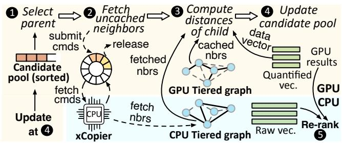  
Figure 7: Overview of FlowANN workflow. Currently, the tiered graph is constructed and placed offline. “nbr” stands for neighbor.

Meanwhile, since the nodes expanded during this phase are already close to the query, their nearby neighbors (connected by short edges) are also likely to be close to the query and thus expanded sooner, resulting in smaller windows. This pattern is reflected in the overall search behavior (Fig.6) due to the dominance of the converge phase in the search process.

Correctness and accuracy. Some may concern that precisely predicting the discovery-expansion windows is difficult, potentially leading to over-deferral of some nodes’ expansion, and thus compromising accuracy. We mathematically prove that, given the greedy nature of graph search, even in the worst case (i.e., all discoveries are over-deferred), FlowANN can achieve identical accuracy within a bounded and deterministic number of steps, which is proved in Appendix A. We further design the synchronization mechanism to proactively prevent excessive deferral of discoveries (§6.2).

## 4 FlowANN Overview

We design FlowANN, a graph-based ANNS system that efficiently handles billion-scale vector search on a single GPU. Workflow. As Fig. 7 shows, FlowANN tiers the graph and offloads the edges with low access frequency and large discovery-expansion windows to the CPU. It fuses the entire GPU search process (multiple steps) into a single GPU kernel. Each step can be divided into four phases. ❶ First, it selects the closest unexpanded node to the query from the candidate pool as the parent. ❷ Subsequently, it asynchronously fetches the parent’s offloaded edges (i.e., uncached neighbors) from the CPU-tiered graph to the GPU using xCopier. ❸ Meanwhile, for the parent’s cached neighbors and those neighbors already fetched to the GPU, FlowANN calculates their distances to the query using their corresponding data vectors stored on the GPU. Like mainstream systems [24, 27], for better computational efficiency, the vectors stored on the GPU are quantized. ❹ Finally, the candidate pool is updated with these discovered neighbors and re-sorted. ❺ After the completion of the whole GPU search phase, the nodes in the candidate pool (i.e., GPU results) are re-ranked on CPU using the original full-precision vectors to ensure final result accuracy. The CPU re-ranking and GPU search are also pipelined across batches. Algorithm 1 provides the precise pseudocode of the search procedure.

Algorithm 1 FlowANN Search   
Require: Query q, tiered graph (Ggpu, Gcpu), pool size L, top-k   
1: Initialize candidate pool C with the selected entry points for q   
2: Deferred neighbors D ← 0/   
3: while C has unexpanded nodes do   
4: v ← nearest unexpanded node in C   
▷ Async neighbor fetch via xCopier (§6.1)   
5: Async fetch v’s neighbors in Gcpu; add to D   
▷ GPU-cached neighbors from graph tiering (§5)   
6: E ← neighbors of v in Ggpu   
7: E ← E ∪ {u ∈ D | transfer completed}; update D;   
▷ Adaptive synchronization (§6.2)   
8: Sync-wait overdue nodes in D; move to E   
9: for each u ∈ E do   
10: compute distance between q and u; insert u into C   
11: end for   
12: end while   
13: return Rerank the candidates in C on CPU and return the top-k

GPU-CPU graph tiering. FlowANN prioritizes storing short edges on the GPU. To avoid distributional imbalance of cached edges caused by a static length threshold, it utilizes grouping to select edges for GPU residency, considering both edge length and graph spatial distribution. Specifically, we employ multi-level label propagation (§5.1) to partition the graph into balanced groups while maximizing the retention of short edges within groups, and then place intra-group edges on the GPU. Moreover, on GPU, FlowANN replaces each node’s global ID from a billion-scale namespace with a shorter local ID within each group, and designs a compact matrix graph layout (§5.2), allowing more edges to reside on GPU.

Trap-less async data transfer. We design xCopier, a system service that enables GPU-initiated asynchronous data transfer (§ 6.1). xCopier further enhances transfer performance by leveraging hardware capabilities: it employs Memory Mapped I/O (MMIO) via BAR mapping to replace DMAbased cudaMemcpy, reducing transfer latency by 40× and ensuring the overlap of data movement and computation.

Coordinated pipeline. FlowANN pipelines GPU computation and CPU-GPU transfer. To preserve search efficiency, it prevents excessively deferred expansion through adaptive synchronization, which considers both global search convergence progress and local fluctuations. FlowANN employs cross-step balancing to align the dynamically varying per-step workload with hardware resources, and selects suitable entry points to shorten the approach phase (§6.2).

Discussions. We discuss FlowANN’s scope and generality.

• Generality for graph structures. FlowANN is based on the widely-used CAGRA [51] (i.e., NN-Descent [54]) graph.

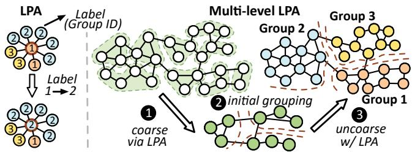  
Figure 8: Multi-level LPA. The node colors represent groups.

Its motivations and designs are general and adaptable to various KNN graphs [9, 10].

• Graph updates. Like prior efforts [19, 20, 22, 55], Flow-ANN focuses on the search process. It can use existing online or offline graph update methods [56–59], and update the tiered graph with minimal effort, e.g., via a single round of label propagation (§5.1) to assign new nodes to groups.

• Cluster serving and multi-GPU. FlowANN aims to maximize single-GPU capability for billion-scale ANNS. It can be deployed with multiple replicas in clusters. It can be integrated into multi-GPU systems for prospective larger datasets.

• Hardware generality. While FlowANN is implemented on NVIDIA GPUs, which represent cutting-edge architectures, it can be adapted to other SIMT-based GPUs (e.g., AMD).

## 5 Deferrable Discovery with Graph Tiering

Guided by Insight #2 (§3), graph tiering should prioritize placing short edges on GPU. However, applying a fixed length threshold to select on-GPU edges causes imbalance due to the non-uniform distribution of data points in high-dimensional space. Specifically, in dense regions, many edges are short and would be stored on GPU, while nodes in sparse regions have few edges cached. This leads to queries located in sparse regions benefiting little from tiering. Thus, graph tiering should consider both edge length and spatial node distribution.

We find that after grouping spatially proximate nodes into the same group (i.e., grouping), the intra-group edges are suitable for GPU placement: (1) Nodes connected by short edges are often close to each other and naturally cluster within the same group, which satisfies the goal of prioritizing short edges; (2) Grouping holistically considers the spatial distribution of all nodes, preventing nodes in sparse regions from being excluded by a single edge length threshold.

Challenges. However, designing a high-quality graph grouping and tiering scheme is still challenging due to two issues. First, partitioning a billion-scale graph to maximize the retention of short edges within groups is an NP-Complete problem [60, 61]. Simply applying common grouping methods (e.g., K-means) often causes poor grouping quality, as they only consider global node distribution while ignoring the graph’s structural information (e.g., edge connections). For instance, when grouping via K-means, only \~60% of edges that have insufficient windows are retained within groups (Fig. 17a). This necessitates a grouping scheme tailored to KNN graphs to maximize intra-group short edge retention, while keeping computational complexity tractable. Second, after grouping, the number of intra-group neighbors per node may vary. Continuing to store each node’s neighbors in a 2D matrix results in non-trivial memory waste due to padding.

Algorithm 2 Multi-level LPA Graph Grouping   
Require: KNN graph G = (V,E), max group size Smax   
1: Assign edge weight w(e) ← mapping(len(e))   
2: Assign each node with an initial group label   
▷ Coarsening (❶ in Fig.8)   
3: while graph is not sufficiently small do   
4: ▷ Weighted LPA   
5: For each node v, sum edge weights per neighbor label l:   
totalWeight(l) = ∑u∈neighbors(v),label(u)=l w(v, u)   
6: label(v) ← the label l with maximum totalWeight(l)   
7: Merge nodes sharing a label into a super-node   
8: end while   
9: ▷ Initial grouping (❷ in Fig.8)   
10: Partition the coarsest graph via recursive bipartitioning   
11: ▷ Uncoarsening + refinement (❸ in Fig.8)   
12: for each level from coarsest back to original graph do   
13: Copy each super-node label to its finer-level nodes   
14: Run weighted LPA to adjust boundary nodes   
15: end for   
16: return the final group label for each node

## 5.1 Spatial Locality-aware Graph Grouping

For high intra-group short edge retention, the graph grouping scheme in FlowANN should consider both edge connections and node distribution. To achieve this, we employ Multi-level label propagation (multi-level LPA) for graph grouping, which is inspired by a theoretical graph grouping scheme [38].

Procedure. Multi-level LPA is based on the size-constrained weighted label propagation, which proceeds as follows: First, each edge is assigned a weight, where shorter edges receive higher weights. Then, each node is initialized with a unique group label. In each subsequent iteration, every node calculates the sum of weights from its neighbors for each distinct label and updates its own label to the one with the highest total weight [62] (Fig.8).6 To ensure balanced group sizes, we introduce a size constraint to limit the maximum group size during propagation.7 Notably, the edge weight efficiently incorporates edge length information, ensuring that shorter edges have a higher likelihood of being retained within groups.

As Fig. 8 shows, multi-level LPA involves a coarsenuncoarsen process: The graph is recursively coarsened by grouping nodes into super-nodes through LPA until it is sufficiently small (❶); Then initial groups are generated on the coarsened graph via recursive bipartitioning [63] (❷); Finally, the groups are projected back to the original graph, with LPA applied during uncoarsening to refine group boundaries (❸). The full procedure is given in Algorithm 2.

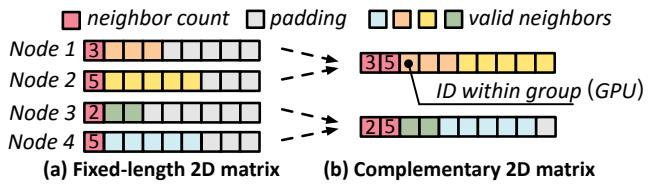  
Figure 9: Graph layout with complement.

Benefits. Multi-level LPA can effectively preserve short edges within groups and obtain balanced, high-quality groups from a global perspective. This is mainly because: (1) local structure awareness: it captures local graph structure through label propagation based on edge connections and edge lengths, ensuring that nodes connected by short edges are grouped together; (2) global distribution consideration: by generating groups from a global view of the coarsened graph and refining them locally during uncoarsening, it holistically takes the nodes’ distribution into account. Moreover, since LPA mainly relies on local label propagation, it achieves near-linear time complexity, making it well-suited for billion-scale graphs.

## 5.2 Compact Graph Layout with Complement

To ensure quick random access to each node’s neighbors, exist ing graph ANNS systems store the graph on GPU using a 2D matrix with fixed-length rows, where each row corresponds to a node’s neighbor list, as shown in Fig.9 (a). However, after grouping, the number of intra-group neighbors for each node becomes variable. Continuing to use this 2D matrix would lead to significant memory waste due to padding (Fig.9 (a)).

Through the analysis of intra-group neighbor count distributions, we identify a potential memory-saving opportunity: the distribution exhibits a quasi-symmetric shape, indicating that the space saved by the half of nodes with fewer neighbors effectively complements the extra space required by the half with more neighbors. Thus, as Fig.9 (b) shows, we employ a new graph layout for the subgraphs on the GPU and CPU.

For the subgraph on the GPU, nodes are first sorted by their intra-group neighbor counts. They are then paired by iteratively matching the node with the most intra-group neighbors to the one with the fewest. Each pair is stored in a single row. The case for CPU is similar. This method not only reduces space waste from padding (§7.3) but also preserves efficient random access, as the graph is still stored in a 2D matrix with a fixed number of neighbor lists per row.

Moreover, leveraging the property that nodes in the GPUtiered graph are only connected within the same group, we use shorter group-local IDs (e.g., 20–24 bits) rather than global graph-wide IDs (e.g., 32 bits) to represent each node. This enables more edges to reside on the GPU (Fig.17a), thereby allowing more computation to overlap with data transfer.

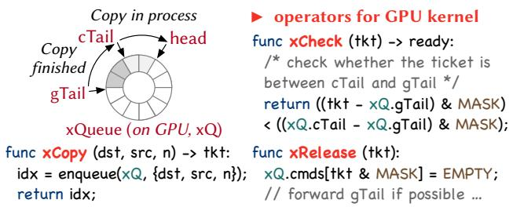  
Figure 10: xQueue operators. The atomic operations are simplified.

## 6 Execution with Coordinated Pipeline

The tiered graph enables deferred discovery. However, efficient transfer-computation pipelining remains challenging. We design xCopier to support efficient trap-less asynchronous transfer (§6.1), and further develop the coordinated pipeline that ensures search efficiency and hardware utilization (§6.2).

## 6.1 Streaming Data Movement with xCopier

During search, FlowANN employs an asynchronous data pipeline to fetch non-cached edges from the CPU to the GPU, overlapping transfer cost with on-GPU computation.

Challenges. This design, however, is impeded by two fundamental constraints in GPU architecture: (1) To minimize kernel launch overhead, FlowANN fuses all search steps into a monolithic kernel. However, no existing mechanism permits a GPU kernel to initiate asynchronous copies between device and host. (2) The performance of standard CUDA copy operations (e.g., cudaMemcpy) [37, 64] is poor for small data blocks (typically 64–256 bytes per node’s edges), as they are bottlenecked by the inherent DMA engine launch overhead.

CPU-GPU data movement. We begin by recapturing existing data movement mechanisms between the CPU and GPU. On CPU side, transfers are initiated using cudaMemcpy [37], which can be asynchronous with GPU computation. On GPU side, data access to CPU memory is facilitated through two mechanisms: Unified Memory (UM) and Zero-copy (Pinned) Memory [37]. UM provides a unified address space, migrating pages (triggered by GPU page faults) upon access. Zero-copy Memory enables direct GPU access to CPU memory. Critically, both are synchronous and block GPU kernel execution.

For FlowANN, each transfer mechanism presents a critical limitation. CPU-initiated transfers require the search flow to return to the CPU after each step (i.e., trap) [20], thereby incurring substantial kernel termination and launch overhead. Conversely, Unified Memory and Zero-copy Memory forfeit the ability to construct an asynchronous copy pipeline.

Trap-less async copy with xCopier. We introduce xCopier, a system-level service for asynchronous data movement initiated directly from GPU threads, bridging the architectural gap in the GPU ecosystem. xCopier is built around a GPUside ring queue (xQueue) and a CPU-side data-moving thread (xThread). The xQueue, featuring one head and two tails, exposes three primitives: xCopy, xCheck, and xRelease.

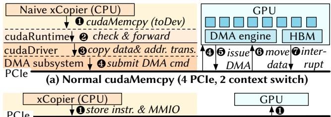  
(b) Copy w/ BAR mapping (1 PCIe, bypass kernel, no runtime)  
Figure 11: Copying process of xCopier and cudaMemcpy.

Specifically, as Fig. 10 shows, a GPU thread initiates an async transfer via xCopy, which enqueues a transfer command into xQueue and returns its queue index as the ticket. The xThread polls xQueue’s head, detects new commands, executes the data transfers, and finally advances the cTail (cpu\_tail). The GPU thread checks the status of an async transfer with xCheck, which compares the ticket against current cTail. Once the transfer is confirmed completed, the thread can reclaim the command slot using xRelease. The release is a two-step process, which allows out-of-order release: it first marks the command as invalid, then attempts to advance gTail (gpu\_tail) if there are invalid commands at the tail.

These primitives are highly optimized for GPU parallelism. We employ batched invocation and warp-level aggregation, so that all xCopy/xRelease in a warp require just one atomic operation to update head/gTail. xCopier further mitigates atomic operation contention by supporting multiple xQueues. The xThread can be scaled to multiple threads under high load.

Efficient data transfer via BAR mapping. In FlowANN, every data transfer command involves copying the uncached edges of a parent node (64–256 bytes). Even when batched, the transfers remain relatively small. However, conventional DMA-based mechanisms (e.g., cudaMemcpy) perform poorly for such fine-grained transfers. As Fig.11 (a) shows, this inefficiency stems from the DMA overhead, which involves four PCIe transactions, two context switches into/from GPU driver, and runtime overhead. A cudaMemcpy-based xCopier transfer for 64B–1KB data incurs a latency as high as 21–22 µs (Fig.12), which cannot be overlapped with GPU computation.

To solve this challenge, we employ a novel hardware strategy: GPU’s Base Address Register (BAR) mapping. Leveraging the open-source driver [65]8, xCopier maps the GPU memory regions directly into CPU’s physical address space. Subsequent accesses to the regions are then performed via Memory-Mapped I/O (MMIO). With hardware write-combining, consecutive writes are transparently coalesced into fewer, larger MMIOs. As Fig.11 (b) shows, this reduces CPU-to-GPU copy to a single PCIe transaction, which is executed by CPU SIMD instructions, eliminating context switches and runtime overhead, and accelerating small transfers by up to 40× (Fig.12).

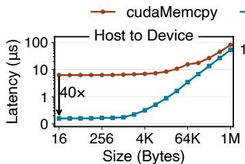

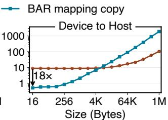  
Figure 12: Copy latency of BAR mapping and cudaMemcpy. Each (batched) xCopier transfer requires one D2H copy (xQueue head read) and two H2D copies (data write, xQueue cTail update).

In FlowANN, each xQueue is associated with a preallocated (and BAR-mapped) GPU buffer pool for the fetched edges. As a general-purpose system service [67], xCopier is readily applicable to other GPU workloads [68–70].

## 6.2 Pipelining with Adaptive Coordination

Leveraging xCopier, FlowANN pipelines GPU computation with CPU-GPU edge fetching. At each step, the search kernel first selects the unexpanded node closest to the query from the candidate pool as the parent, then asynchronously fetches its uncached neighbors to GPU (xCopy). Subsequently, it checks the completion status of previously issued transfer commands (xCheck), and discovers both the parent’s cached neighbors and the neighbors that have already been transferred.

Challenges. Efficient pipelining faces non-trivial challenges. ❶ Although discovery-expansion windows enable deferred discovery, excessive deferrals lead the search to suboptimal paths, sacrificing efficiency (§6.2.1). ❷ Due to deferred discoveries, the discovery workload per step varies dynamically, resulting in a mismatch with pre-determined hardware resources (§ 6.2.2). ❸ During the approach phase (§ 3), the windows are too small to hide edge transfers (§6.2.3).

## 6.2.1 Near-optimal Search with Adaptive Synchronization

Excessive deferral of discoveries leads the search to subopti mal paths, sacrificing efficiency. To avoid unnecessary computation and transfer, FlowANN synchronously waits for the completion of some discoveries if their deferred steps exceed their discovery-expansion windows. However, estimating the window is non-trivial, as it varies with the search process.

Estimating the window size. We find the expanded node’s position in the candidate pool (Pe) can be an effective indicator to estimate the window size. Specifically, during the approach phase (§ 3), the search rapidly advances toward the query, and both the window size and Pe are usually zero. As the search converges, the window size increases (Fig.4). Meanwhile, the expanded node’s position shifts rightwards (i.e., Pe increases), as nodes near the query gradually accumulate at the head of the candidate pool and are successively expanded. Our analysis across tens of thousands of query traces confirms the strong correlation between Pe and the window sizes of the expanded node’s neighbors, with a Pearson correlation9 = 0.77.

FlowANN thus uses P to estimate the window size (W ) of the expanded node’s neighbors in each step, i.e., W = α ∗ Pe, where α is derived from offline profiling with linear regression. Relying on offline profiling is sufficient here because α depends primarily on the dataset’s underlying data distribution. Furthermore, this formulation robustly adapts to dynamic variations in the approach phase’s length. Specifically, since Pe typically remains zero during the approach phase, the estimated window W will also be zero, ensuring accurate synchronization without depending on offline statistics.

Beyond the normal cases, we observe that fluctuations during search convergence can lead to unexpectedly small windows, which manifest as a sharp drop in Pe. This happens when the search in the converge phase unexpectedly discovers a node much closer to the query (i.e., a sharp drop in P ). Once such a node is found, its neighbors become the prime targets for subsequent expansion, thus their windows are small. FlowANN needs to handle such cases specially.

Adaptive synchronization based on window size. To handle the fluctuation cases, when FlowANN detects a sharp drop in Pe, it waits for all neighbors of the parent node to be fetched. While this incurs a performance cost, such fluctuations occur with very low probability (<3%). In our evaluation, Flow-ANN sets the threshold for a sharp drop in Pe to 10% of the candidate pool size. Meanwhile, in each step, if some neighbors from previous steps have been deferred for more than their estimated windows, FlowANN also waits for their discoveries to complete.

Stall-less synchronization. To avoid wasting computational resources, FlowANN yields the hardware threads to schedule other queries’ computations during the wait. This scheduling is very lightweight, as it is handled by the hardware scheduler.

## 6.2.2 Regularizing Workload with Cross-Step Balancing

In previous synchronous execution, the number of nodes discovered per step (i.e., the parent node’s neighbor count) is deterministic. However, as FlowANN defers some nodes’ discoveries, this count becomes dynamic. This causes severe GPU under-utilization because computational resources (e.g., CUDA cores, shared memory) are statically predetermined.

FlowANN introduces a cross-step balancing mechanism to align the discovery workload with hardware resources. Specifically, when each step begins, FlowANN identifies three categories of nodes to discover: ❶ the parent’s neighbors that reside on the GPU, ❷ deferred nodes that must be discovered due to synchronization constraints, and ❸ deferred nodes that have already been transferred to the GPU but can be further deferred. If the total number of these nodes does not align with the hardware resources, FlowANN defers the discovery of some nodes from category ❸ to the next step. For example, if 32 thread teams (each team discovers the nodes collaboratively) are allocated for each query, FlowANN tries to align the number of nodes discovered per step to a multiple of 32. The extra nodes are passed to the next step via shared memory.

## 6.2.3 Shortening Approach Phase with Entry Points

In the approach phase (§ 3), the small discovery-expansion windows necessitate frequent synchronization, leading to nonnegligible overhead. To reduce the proportion of this phase, FlowANN selects suitable entry points for each query, instead of starting from random nodes. Inspired by the principles of cluster-based ANNS, we select a set of representative nodes from the dataset (e.g., K-means centroids) as candidate entry points, and choose the ones closest to the query through parallel computation. This approach quickly identifies suitable entry points by leveraging the GPU’s parallel capabilities. Thanks to the selected nodes’ representativeness, only a very small number of candidates (one in a million) are required to reduce the approach phase to \~5% of total search steps.

## 7 Evaluation

Implementation. We build FlowANN with 14,700 lines of CUDA/C++ based on CAGRA [51] (i.e., graph-based ANNS in cuVS [27]), a SOTA system open-sourced by NVIDIA.

Hardware setup and datasets. All experiments run on a server with 2 Intel Xeon Platinum 8457C CPUs (2.60 GHz, 160 cores), 2 TB DRAM, and NVIDIA H20 GPUs. We also evaluate FlowANN on other GPUs (§7.4.2). We mainly use three widely-used billion-scale datasets [39–41]. The specifications of GPUs and datasets are summarized in Table1.

Baselines. We compare with 8 GPU ANNS systems.

• Quantized cluster-based ANNS. SOTA cluster-based ANNS systems first search on GPU using quantized vectors (e.g., PQ [32]), then re-rank the results with full-precision vectors on CPU. We evaluate cuVS-cluster [27] (NVIDIA) and faiss-cluster [24] (Meta). We carefully implement in-memory FusionANNS [22] based on cuVS as it is not open-source.

• Full-precision cluster-based ANNS. Rummy [19] stores all full vectors on CPU and transfers them to GPU on demand, overlapping data transfer with computation via pipelining.

• Graph-based ANNS. BANG [20] supports in-memory billion-scale graph ANNS on a single GPU. It stores PQ quantized vectors on GPU, while the graph and full vectors are stored in CPU memory and transferred to GPU on-demand.

• Graph ANNS with related dependency. The latest work, FlashANNS [42] relaxes step-level dependency for better pipelining. Its step n depends on step (n - 2). We implement its in-memory version based on its available artifact.

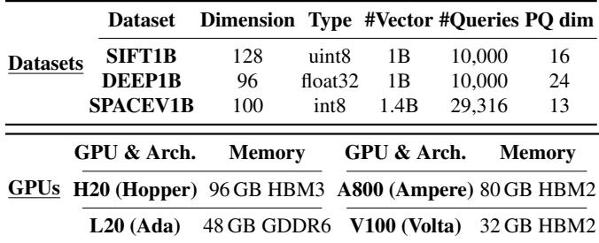  
Table 1: Datasets and GPUs used in evaluation.

• Unified memory (UM). UM unifies CPU and GPU memory. We extend CAGRA [51] with UM (CAGRA-UM).

• Multi-GPU. GGNN [43] is the only billion-scale multi-GPU graph ANNS system known to us.10 It shards data across multiple GPUs, with each GPU performing searches on its corresponding subgraph, and then merges the results.

Configurations. Given the characteristics of the datasets and the constraints of CAGRA, we quantize the vectors to the dimensions in Table1 (PQ dim) for GPU search, and apply the same quantization settings to cuVS-cluster and faiss-cluster. However, since BANG cannot achieve high accuracy with these quantization parameters, we use BANG’s default quantization settings (PQ dim = 74) to ensure it attains comparable accuracy. For FlowANN and all graph-based baselines, we set the graph degree to 32, following CAGRA [51]’s official practice. We also measure FlowANN’s performance under different quantization settings and degrees in §7.2.

Metrics. We measure search accuracy using recall@k [32]: the fraction of true k nearest neighbors in the returned results. Without explicit mention, we measure the throughput (i.e., queries per second, QPS) and latency at 0.9 recall, a commonly used accuracy target in ANNS [11, 36, 73]. We also evaluate FlowANN under different accuracy targets in §7.1.

## 7.1 Overall Performance

We evaluate FlowANN and the baseline systems under various batch sizes (from 16 to 2048) to reflect different application scenarios, such as online serving (small batch size) and offline processing (large batch size), similar to prior works [19].

Throughput. As Fig.13 shows, FlowANN outperforms all baselines across batch sizes and datasets. Compared to clusterbased baselines, it achieves 8.67× and 8.15× higher average throughput for batches of 2048 and 16, respectively. The performance gain improves with larger batches, as the increased per-step computation time better hides data transfer. The cluster-based methods underperform FlowANN and scale poorly with batch size as their brute-force intra-cluster search saturates GPU resources earlier than graph traversal. FusionANNS outperforms cuVS-cluster because of its heuristic re-ranking.

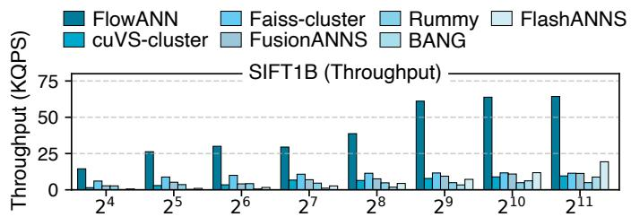

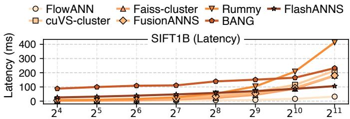

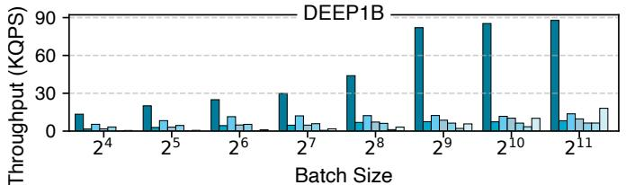

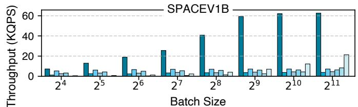  
Figure 13: Throughput and average latency of FlowANN and baselines. Recall@10 = 0.9. Due to space constraints, we only present the latency results on SIFT1B; trends on DEEP1B and SPACEV1B are similar. We omit CAGRA-UM in the figure for its low performance.

FlowANN achieves 9.52× and 78.8× higher throughput than BANG on average for batch sizes 2048 and 16. This is because BANG only overlaps edge fetching with limited computation (i.e., pool updates) and relies on costly cudaMemcpy, causing GPU stalls. Smaller batch sizes further worsen BANG’s overlapping efficiency. In contrast, FlowANN effectively hides data transfer by leveraging the discoveryexpansion window and ensuring efficient data transfer via xCopier.

FlowANN outperforms FlashANNS by 3.71× and 21.8× on average for batch sizes 2048 and 16. FlashANNS’ relaxation of step-level dependency is limited and inflexible. It fails to overlap I/O effectively for small batches. It leads to suboptimal search paths during the approach phase, and excessive waiting in the converge phase.

Compared to CAGRA-UM, FlowANN achieves 110.8– 1888.8× higher throughput. Since UM is unaware of the graph traversal’s random access patterns, frequent page faults and migrations are triggered, severely hampering performance.

Latency. FlowANN achieves lower latency than all baselines. It reduces latency by 83.8% and 81.6% on average compared to baselines for batch sizes of 2048 and 16. Notably, at batch size 16, it only takes 0.962 ms to process a query. This efficiency stems from its accurate graph traversal and efficient pipeline, which preserves high accuracy while effectively hiding transfer overhead. It reduces the P99 tail latency by 75.4% and 86.1% on average for batch sizes of 2048 and 16.

Cluster-based baselines exhibit higher latency than Flow-ANN, especially in larger batches. Among them, Rummy has the highest latency, as its full-precision GPU computation increases processing overhead. BANG and FlashANNS exhibit high latency at small batches as the non-overlapped data transfer becomes more pronounced with fewer queries.

Comparison with multi-GPU systems. We compare single-

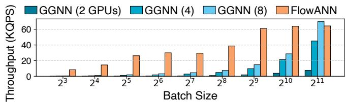  
Figure 14: Throughput of FlowANN and GGNN on SIFT1B. We use GGNN’s default configurations. When running on 2 GPUs, GGNN offloads part of the graph and data to CPU memory.

GPU FlowANN with GGNN [43]. As Fig.14 shows, even with 8 GPUs, single-GPU FlowANN outperforms GGNN by 2.22– 15.3× at batch sizes of 8–1024. Only at batch size 2048 does FlowANN’s throughput slightly lag behind 8-GPU GGNN (92.2%). GGNN requires 8 GPUs and a large batch to match FlowANN, because of its high communication overhead and GPU under-utilization at small batches.

Different accuracy targets. As shown in Fig.15, we measure FlowANN’s throughput across recall@10 from 0.8 to 0.995 under small (64) and large (2048) batch sizes. We choose cuVS-cluster as the representative of cluster-based methods, as it shares fundamental operations (e.g., distance computation) with FlowANN, enabling a more direct comparison. FlowANN outperforms baselines across all accuracy levels, and the performance gap widens at higher accuracy. At recall = 0.8, FlowANN outperforms cuVS-cluster and BANG by 5.4× and 28.9× on average; At recall = 0.995, these gains increase substantially to 29.1× and 111.8×, respectively.

Impact of deferred discovery on search steps. We compare search steps to reach the same accuracy with and without deferred discovery (via CAGRA-UM). Across three billionscale datasets at accuracies from 0.8 to 0.995, FlowANN introduces no extra steps in most cases (\~96%), with only a few showing a marginal increase of \~0.7–2.1% in steps. This shows that deferred discovery preserves search correctness and has a negligible impact on convergence speed in practice.

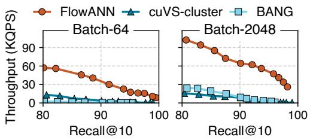

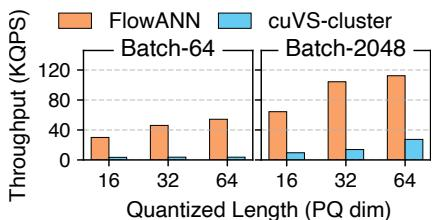  
(a) Different quantized lengths

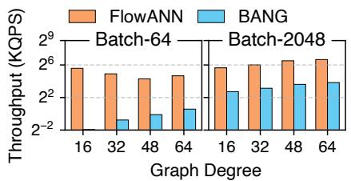  
(b) Different graph degrees

Figure 15: Throughput under different accuracy Figure 16: Throughput on SIFT1B dataset with different configurations. (a) These (SIFT1B). three lengths are the only supported lengths by CAGRA given the dimensionality of SIFT.  
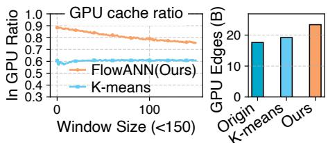  
(a) Graph tiering quality comparison (SIFT1B)

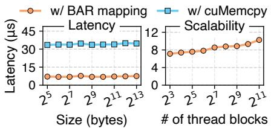  
(b) Performance and scalability of xCopier

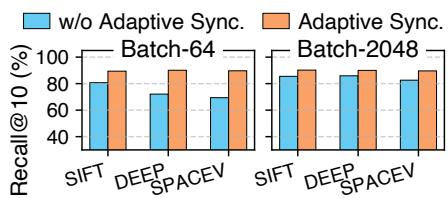  
Dataset (billion-scale)  
(c) Impact of adaptive synchronization

## 7.2 Sensitivity Analysis

We evaluate FlowANN under different configurations, i.e., various quantization settings and graph degrees.

Quantization configurations. We evaluate FlowANN under varying quantized vector lengths, using batch sizes of 64 and 2048 (Fig. 16 (a)). Across different quantization configurations, FlowANN achieves average throughput improvements of 8.47× (small batch) and 5.12× (large batch) over cuVScluster, demonstrating its adaptability to different quantization settings. Longer quantized vectors improve traversal accuracy, reducing search steps to reach target accuracy.

Graph degree. We evaluate FlowANN under varying graph degrees (i.e., neighbor counts). It outperforms BANG in all cases, achieving 136.37× (small batch) and 14.72× (large batch) higher throughput on average (Fig.16 (b)). A higher graph degree discovers more edges, improving accuracy and reducing the number of steps, but raising transfer and computational overhead. This degrades FlowANN’s throughput with small batches; whereas under large batches, the transfer is overlapped by computation, resulting in performance gains.

## 7.3 Breakdown Analysis

Graph tiering. To evaluate multi-level LPA, we measure the GPU edge cache ratio for each discovery-expansion window size of all queries (Fig.17a). For edges with insufficient win dows (i.e., window ≤ 5, § 3), it keeps \~87.9% of them on the GPU (89.1% for window = 0), a 29.6% improvement over K-means. Moreover, Fig.17a reveals that FlowANN improves memory efficiency via group-local node IDs, storing 18.2% and 30.2% more edges on GPU than K-means and the original (no grouping) method. This is because multi-level LPA generates smaller, more balanced groups than K-means. The complement-based graph layout reduces space waste, leaving only \~0.506% padding for billion-scale datasets, reducing memory waste by \~98.5% compared to the original layout. xCopier. We evaluate xCopier on different data sizes and concurrency. As Fig.17b shows, compared to using cudaMemcpy, xCopier with BAR mapping reduces the end-to-end fetching latency by 78–80% for 32–8192 B data. xCopier achieves high scalability to serve 2048 concurrent thread blocks (1024 threads per block) with 64 xQueues during search, thanks to its lock-free design and thread block-level aggregation.

Adaptive synchronization. We compare the search accuracy with and without adaptive synchronization, using the same number of search steps. As Fig.17c shows, adaptive synchronization improves accuracy by 21.7% and 6.2% on average at batch sizes of 64 and 2048, enabling high-accuracy search of recall@10 > 0.9. Smaller batches lead to shorter computation time per step, demanding more proper synchronizations.

## 7.4 Extensive Studies

## 7.4.1 Performance Upper Bound and Lower Bound

Gap to ideal upper bound. We compare FlowANN with CAGRA on small datasets. It caches only 50% of the edges, while CAGRA retains the entire graph on the GPU. As Fig.18 shows, at batch sizes of 64 and 2048, FlowANN achieves average throughput equal to 67.9% and 85.4% of CAGRA. This confirms the efficiency of its tiered graph and edge fetching pipeline. Its performance nearly matches CAGRA’s at large batches, which enhances GPU utilization and extends per-step execution time, providing a wider window for async transfers. Performance without GPU edge cache. We measure Flow-ANN’s throughput when all edges reside on the CPU (i.e., w/o tiering). As Fig.19 shows, the throughput of FlowANN w/o tiering reaches 58.4% (batch size 64) and 78.1% (batch size 2048) of standard FlowANN. Larger batches narrow this gap, as they better overlap transfer overhead. It still outperforms the baselines (Fig. 13) by 1.5–50.6× (batch 64) and 4.5–12.6× (batch 2048). This shows that even without GPU edge caching, FlowANN’s optimizations (e.g., xCopier, adaptive synchronization) still yield non-trivial performance gains.

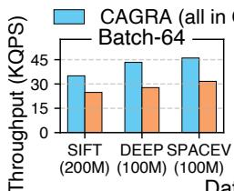

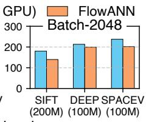  
Dataset  
Figure 18: FlowANN’s throughput on 100M and 200M datasets and the upper bound.

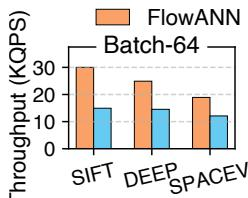  
Figure 19: Throughput of FlowANN w/o GPU cache (representing lower bound).

Dataset (billion-scale)  
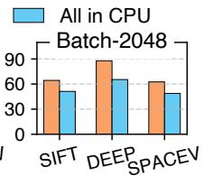

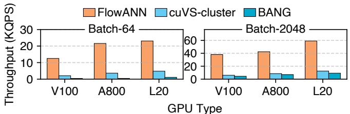  
Figure 21: Throughput across GPUs.

## 7.4.2 Generality for Algorithms and Hardware

Applicability to best-first search variants. A common variant of best-first search is to expand multiple nodes per step [8] (i.e., search width > 1) to improve efficiency. We evaluate FlowANN’s throughput with different search widths (1–8). As Fig.20 shows, FlowANN outperforms the baseline across all search widths. Larger search widths allow FlowANN to find high-quality neighbors faster, reducing total search steps and improving throughput up to a width of 4. Beyond that, throughput declines due to higher per-step computation cost and diminishing improvements in result quality.

Applicability to other GPU architectures. Besides NVIDIA H20, we also evaluate FlowANN on V100, A800, and L20, covering mainstream GPUs [74], as Table1 details. As Fig.21 shows, under different architectures and memory capabilities, FlowANN consistently outperforms the baselines (by 4.97–29.4×), demonstrating its generality. For small batches, its gains over baselines grow with larger memory. For large batches, the gains increase with GPU compute power, as longer per-step computation time already overlaps data transfer, amplifying the impact of computational capability.

## 7.4.3 Preprocessing Cost

FlowANN’s additional preprocessing steps beyond graph building (offline) include graph tiering, entry point selection, and parameter acquisition for window estimation. Fig. 22 shows the proportion of each step in the total preprocessing time. The results indicate that the extra overhead introduced by these new steps is relatively small: only 4.9%, 5.1%, and 8.4% on the three datasets, respectively.

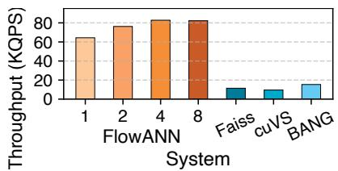  
Figure 20: Throughput under different search widths (1-8). SIFT1B dataset.

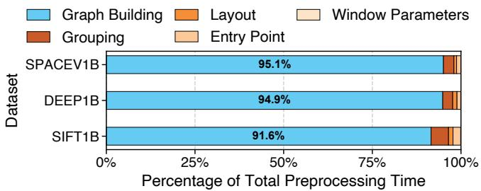  
Figure 22: Preprocessing time breakdown of FlowANN.

## 8 Discussion

Offloading strategy and future adaptability. FlowANN primarily offloads graph connectivity because it constitutes the main memory bottleneck in current billion-scale workloads (e.g., SIFT1B). This rationale aligns with mainstream tiered ANNS designs [8, 11]. To accommodate the massive high-dimensional vectors typical of emerging LLM workloads, FlowANN’s tiering design can naturally support offloading both graph edges and data vectors. In such a case, the neighbor’s data vector is fetched simultaneously during the asynchronous neighbor fetch phase.

Compatibility with dynamic updates. While FlowANN mainly focuses on optimizing the search process, its preprocessing mechanisms do not inherently hinder dynamic graph updates. FlowANN can readily integrate with existing online or offline graph update methods. When newly inserted points are added to the graph, the system does not require a complete, global re-grouping. For example, a newly inserted node can be grouped by simply calculating its neighbors’ weights and joining the valid group with the highest total weight. Only when the number of groups exceeds a certain threshold, a global re-grouping is required.

Compatibility with variant graph structures. FlowANN is compatible with variant graph structures that support best-first search. The core optimization of FlowANN is disentangling step-level dependencies to exploit the time windows between node discovery and expansion. This mechanism is rooted in the iterative nature of best-first search. Thus, FlowANN does not require an exact KNN graph structure and can seamlessly adapt to diverse proximity graphs.

Cost-effectiveness of GPU for ANNS. Due to the massive parallelism of GPUs, GPU-based ANNS can yield superior cost-efficiency (i.e., QPS/\$) compared to CPU-based ones [19, 22]. This economic advantage has driven the adoption of GPU-based ANNS in industry [75], further amplified by hardware repurposing. While older or lower-tier GPUs (e.g., NVIDIA V100) are no longer suitable for demanding LLM workloads, they remain highly efficient for ANNS and can be repurposed for cost-effective deployment.

Scalability of xCopier with MMIO-based data transfer. xCopier utilizes MMIO-based data transfer (§ 6.1), which maintains its performance advantage over DMA even under high concurrency (i.e., large batch sizes). For instance, with batch size 10 k, the total data transferred in one step is merely \~1 MB, allowing MMIO to maintain its advantage (Fig.12). As a result, xCopier does not encounter bandwidth bottlenecks even when all SMs are fully saturated. xCopier will fall back to DMA-based copying when MMIO is unavailable.

Necessity of deferred expansion. A seemingly straightforward alternative to deferred expansion is to rely purely on hardware yielding (i.e., swapping to other queries during data transfers). However, yielding alone is insufficient to hide latency due to GPU resource limits and batch size constraints. Because GPU computational resources (e.g., shared memory and registers) strictly bound the maximum number of queries simultaneously residing on SMs, yielding during data transfers quickly stalls all active queries, leaving the GPU idle. Furthermore, pure yielding requires massive batch sizes to successfully interleave queries, rendering it ineffective for latency-sensitive online serving. FlowANN’s deferred expansion overcomes both limitations by overlapping transfer overhead within each individual query, ensuring high performance without requiring massive concurrency.

## 9 Related Work

SSD-based ANNS. Prior efforts [76–78] employ pipelining for fetching data from SSD. Although FlashANNS [42] a one-step relaxation in the search process, it still maintains the strict step-level dependency. PipeANN [11] relaxes compute-I/O order to better saturate SSD I/O bandwidth. However, it treats all nodes’ expansions equally, which may cause sub-optimal search paths when some important expansions are delayed. Additionally, unlike the CPU-SSD setting, the compute-I/O gap for GPU-CPU is relatively narrow (similar latency), which limits the degree of I/O parallelism that can be exploited. FlowANN accounts for the variability in the discovery-expansion window across nodes, keeping a nearoptimal search path with minimal computational overhead, improving both latency and throughput.

Moreover, we believe that SSD is unsuitable for GPUbased graph ANNS’ second-tier storage: (1) SSD’s latency (\~100 µs [79]) far exceeds graph search’s per-step execution time (6–14 µs), and is hard to be overlapped, leading to low GPU utilization; (2) GPU servers typically have TB-level memory [80–82], which is sufficient to hold billion-scale datasets and graphs.

Distributed ANNS. Distributed ANNS systems [43, 83, 84] focus on horizontal scaling to support ANNS on multiple nodes. They are complementary to FlowANN, as FlowANN primarily focuses on maximizing the search capability of a single GPU. Additionally, to support the multi-node scenario, FlowANN can be deployed as multiple replicas.

GPU ANNS’ computational optimizations. Previous works explore parallelism [21, 51, 85, 86], quantization [22, 55], and multi-GPU collaboration [23, 43]. They can be (or already have been) integrated with FlowANN.

Graph-based ANNS on CPU. Many works optimize graphbased ANNS on the CPU, such as parallelism [87, 88], enhancing graph structures [9, 10, 57, 89–92], improving quantization methods [12, 31, 93, 94], and tuning parameters [46, 95– 99]. These efforts are complementary to FlowANN.

## 10 Conclusion

We present FlowANN, a graph ANNS system enabling efficient billion-scale vector search on a single GPU. FlowANN is built on the key insight that the rigid step-level dependency in graph search can be disentangled into a fine-grained nodelevel dependency. Guided by this insight, FlowANN adopts a tiered graph structure that offloads the edges with sufficient discovery-expansion windows to the CPU. Leveraging these windows, FlowANN defers the discovery of some nodes and overlaps their edge fetching with GPU computation. Evaluations on billion-scale datasets show that FlowANN outperforms state-of-the-art systems by 4.08–45.7× on average (up to 172.6×) without compromising search accuracy.

## Acknowledgments

We thank our shepherd and the anonymous reviewers for their insightful comments and feedback. We sincerely thank Haibo Chen for his guidance throughout this work, and Jingwei Xu and Weidong Zhang for their helpful suggestions. This work is supported in part by the Fundamental and Interdisciplinary Disciplines Breakthrough Plan of the Ministry of Education of China (JYB2025XDXM113) and the National Natural Science Foundation of China (No. 62132014, No.62302300). Corresponding authors: Mingkai Dong (mingkaidong@sjtu. edu.cn) and Dong Du (dd\_nirvana@sjtu.edu.cn).

## References

[1] Zhengding Hu, Vibha Murthy, Zaifeng Pan, Wanlu Li, Xiaoyi Fang, Yufei Ding, and Yuke Wang. HedraRAG: Co-optimizing generation and retrieval for heterogeneous RAG workflows. In Proceedings of the ACM SIGOPS 31st Symposium on Operating Systems Principles, SOSP ’25, page 623–638, New York, NY, USA, 2025. Association for Computing Machinery.

[2] Siddhant Ray, Rui Pan, Zhuohan Gu, Kuntai Du, Shaoting Feng, Ganesh Ananthanarayanan, Ravi Netravali, and Junchen Jiang. METIS: Fast quality-aware RAG systems with configuration adaptation. In Proceedings of the ACM SIGOPS 31st Symposium on Operating Systems Principles, SOSP ’25, page 606–622, New York, NY, USA, 2025. Association for Computing Machinery.

[3] Jie Li, Haifeng Liu, Chuanghua Gui, Jianyu Chen, Zhenyuan Ni, Ning Wang, and Yuan Chen. The design and implementation of a real time visual search system on JD e-commerce platform. In Proceedings of the 19th International Middleware Conference Industry, Middleware ’18, page 9–16, New York, NY, USA, 2018. Association for Computing Machinery.

[4] Sen Li, Fuyu Lv, Taiwei Jin, Guli Lin, Keping Yang, Xiaoyi Zeng, Xiao-Ming Wu, and Qianli Ma. Embeddingbased product retrieval in Taobao search. In Proceedings of the 27th ACM SIGKDD Conference on Knowledge Discovery & Data Mining, KDD ’21, page 3181–3189, New York, NY, USA, 2021. Association for Computing Machinery.

[5] Liang Zheng, Liyue Shen, Lu Tian, Shengjin Wang, Jingdong Wang, and Qi Tian. Scalable person reidentification: A benchmark. In 2015 IEEE International Conference on Computer Vision (ICCV), pages 1116–1124, 2015.

[6] Di Liu, Meng Chen, Baotong Lu, Huiqiang Jiang, Zhenhua Han, Qianxi Zhang, Qi Chen, Chengruidong Zhang, Bailu Ding, Kai Zhang, Chen Chen, Fan Yang, Yuqing Yang, and Lili Qiu. Retrievalattention: Accelerating long-context LLM inference via vector retrieval. arXiv preprint arXiv:2409.10516, 2024.

[7] Fu Bang. GPTCache: An open-source semantic cache for LLM applications enabling faster answers and cost savings. In Liling Tan, Dmitrijs Milajevs, Geeticka Chauhan, Jeremy Gwinnup, and Elijah Rippeth, editors, Proceedings of the 3rd Workshop for Natural Language Processing Open Source Software (NLP-OSS 2023), pages 212–218, Singapore, December 2023. Association for Computational Linguistics.

[8] Suhas Jayaram Subramanya, Devvrit, Rohan Kadekodi, Ravishankar Krishaswamy, and Harsha Vardhan Simhadri. DiskANN: fast accurate billion-point nearest neighbor search on a single node. Curran Associates Inc., Red Hook, NY, USA, 2019.

[9] Cong Fu, Chao Xiang, Changxu Wang, and Deng Cai. Fast approximate nearest neighbor search with the navigating spreading-out graph. Proc. VLDB Endow., 12(5):461–474, January 2019.

[10] Yu. A. Malkov and D. A. Yashunin. Efficient and robust approximate nearest neighbor search using hierarchical navigable small world graphs. arXiv preprint arXiv:1603.09320, 2018.

[11] Hao Guo and Youyou Lu. Achieving low-latency graphbased vector search via aligning best-first search algorithm with SSD. In Proceedings of the 19th USENIX Conference on Operating Systems Design and Implementation, OSDI ’25, USA, 2025. USENIX Association.

[12] Yutong Gou, Jianyang Gao, Yuexuan Xu, and Cheng Long. SymphonyQG: Towards symphonious integration of quantization and graph for approximate nearest neighbor search. Proc. ACM Manag. Data, 3(1), February 2025.

[13] Shulin Zeng, Zhenhua Zhu, Jun Liu, Haoyu Zhang, Guohao Dai, Zixuan Zhou, Shuangchen Li, Xuefei Ning, Yuan Xie, Huazhong Yang, and Yu Wang. DF-GAS: a distributed FPGA-as-a-Service architecture towards billion-scale graph-based approximate nearest neighbor search. In Proceedings of the 56th Annual IEEE/ACM International Symposium on Microarchitecture, MICRO ’23, page 283–296, New York, NY, USA, 2023. Association for Computing Machinery.

[14] Zhenhua Zhu, Jun Liu, Guohao Dai, Shulin Zeng, Bing Li, Huazhong Yang, and Yu Wang. Processing-inhierarchical-memory architecture for billion-scale approximate nearest neighbor search. In Proceedings of the 60th Annual ACM/IEEE Design Automation Conference, DAC ’23, page 1–6. IEEE Press, 2025.

[15] Ji-Hoon Kim, Yeo-Reum Park, Jaeyoung Do, Soo-Young Ji, and Joo-Young Kim. Accelerating large-scale graph-based nearest neighbor search on a computational storage platform. IEEE Transactions on Computers, 72(1):278–290, 2023.

[16] Bing Tian, Haikun Liu, Zhuohui Duan, Xiaofei Liao, Hai Jin, and Yu Zhang. Scalable billion-point approximate nearest neighbor search using SmartSSDs. In Proceedings of the 2024 USENIX Conference on Usenix Annual Technical Conference, USENIX ATC’24, USA, 2024. USENIX Association.

[17] Yitu Wang, Shiyu Li, Qilin Zheng, Linghao Song, Zongwang Li, Andrew Chang, Hai "Helen" Li, and Yiran Chen. NDSearch: Accelerating graph-traversal-based approximate nearest neighbor search through near data processing. In Proceedings of the 51st Annual International Symposium on Computer Architecture, ISCA ’24, page 368–381. IEEE Press, 2025.

[18] Junhyeok Jang, Hanjin Choi, Hanyeoreum Bae, Seungjun Lee, Miryeong Kwon, and Myoungsoo Jung. CXL-ANNS: Software-Hardware collaborative memory disaggregation and computation for Billion-Scale approximate nearest neighbor search. In 2023 USENIX Annual Technical Conference (USENIX ATC 23), pages 585–600, Boston, MA, July 2023. USENIX Association.

[19] Zili Zhang, Fangyue Liu, Gang Huang, Xuanzhe Liu, and Xin Jin. Fast vector query processing for large datasets beyond GPU memory with reordered pipelining. In Proceedings of the 21st USENIX Symposium on Networked Systems Design and Implementation, NSDI’24, USA, 2024. USENIX Association.

[20] Karthik V., Saim Khan, Somesh Singh, Harsha Vardhan Simhadri, and Jyothi Vedurada. BANG: Billion-scale approximate nearest neighbor search using a single GPU. arXiv preprint arXiv:2401.11324, 2025.

[21] Yuntao Gui, Peiqi Yin, Xiao Yan, Chaorui Zhang, Weixi Zhang, and James Cheng. PilotANN: Memory-bounded GPU acceleration for vector search. arXiv preprint arXiv:2503.21206, 2025.

[22] Bing Tian, Haikun Liu, Yuhang Tang, Shihai Xiao, Zhuohui Duan, Xiaofei Liao, Hai Jin, Xuecang Zhang, Jun hua Zhu, and Yu Zhang. Towards high-throughput and low-latency billion-scale vector search via CPU/GPU collaborative filtering and re-ranking. In Proceedings of the 23rd USENIX Conference on File and Storage Technologies, FAST ’25, USA, 2025. USENIX Association.

[23] Sukjin Kim, Seongyeon Park, Si Ung Noh, Junguk Hong, Taehee Kwon, Hunseong Lim, and Jinho Lee. Path-Weaver: a high-throughput multi-GPU system for graphbased approximate nearest neighbor search. In Proceedings of the 2025 USENIX Conference on Usenix Annual Technical Conference, USENIX ATC ’25, USA, 2025. USENIX Association.

[24] Jeff Johnson, Matthijs Douze, and Hervé Jégou. Faiss: A library for efficient similarity search and clustering of dense vectors. https://github.com/ facebookresearch/faiss, 2017.

[25] Jianguo Wang, Xiaomeng Yi, Rentong Guo, Hai Jin, Peng Xu, Shengjun Li, Xiangyu Wang, Xiangzhou Guo, Chengming Li, Xiaohai Xu, Kun Yu, Yuxing Yuan,

Yinghao Zou, Jiquan Long, Yudong Cai, Zhenxiang Li, Zhifeng Zhang, Yihua Mo, Jun Gu, Ruiyi Jiang, Yi Wei, and Charles Xie. Milvus: A purpose-built vector data management system. In Proceedings of the 2021 International Conference on Management of Data, SIGMOD ’21, page 2614–2627, New York, NY, USA, 2021. Association for Computing Machinery.

[26] Jeff Johnson, Matthijs Douze, and Hervé Jégou. Billionscale similarity search with GPUs. arXiv preprint arXiv:1702.08734, 2017.

[27] RAPIDS AI. cuVS: a library for vector search and clustering on the GPU. https://github.com/rapidsai/ cuvs, 2025.

[28] Meituan (the largest online food delivery company in the world). Practice of meituan’s GPU-based vector retrieval system. https://tech.meituan.com/2024/04/11/ gpu-vector-retrieval-system-practice.html, 2024.

[29] Zilliz cloud named a leader in the forrester wave. https: //zilliz.com, 2025.

[30] Chuangxian Wei, Bin Wu, Sheng Wang, Renjie Lou, Chaoqun Zhan, Feifei Li, and Yuanzhe Cai. AnalyticDB-V: a hybrid analytical engine towards query fusion for structured and unstructured data. Proc. VLDB Endow., 13(12):3152–3165, August 2020.

[31] Jianyang Gao and Cheng Long. RaBitQ: Quantizing high-dimensional vectors with a theoretical error bound for approximate nearest neighbor search. Proc. ACM Manag. Data, 2(3), May 2024.

[32] Herve Jégou, Matthijs Douze, and Cordelia Schmid. Product quantization for nearest neighbor search. IEEE Transactions on Pattern Analysis and Machine Intelligence, 33(1):117–128, 2011.

[33] NeurIPS’21. Billion-scale approximate nearest neighbor search challenge: NeurIPS’21 competition track. https://big-ann-benchmarks.com/ neurips21.html, 2021.

[34] Artem Babenko Yandex and Victor Lempitsky. Efficient indexing of billion-scale datasets of deep descriptors. In 2016 IEEE Conference on Computer Vision and Pattern Recognition (CVPR), pages 2055–2063, 2016.

[35] Anton Voronov, Denis Kuznedelev, Mikhail Khoroshikh, Valentin Khrulkov, and Dmitry Baranchuk. Switti: Designing scale-wise transformers for text-to-image synthesis. arXiv preprint arXiv:2412.01819, 2025.

[36] Harsha Vardhan Simhadri, George Williams, Martin Aumüller, Matthijs Douze, Artem Babenko, Dmitry Baranchuk, Qi Chen, Lucas Hosseini, Ravishankar Kr ishnaswamy, Gopal Srinivasa, Suhas Jayaram Subramanya, and Jingdong Wang. Results of the NeurIPS’21 challenge on billion-scale approximate nearest neighbor search, 2022.

[37] NVIDIA. Nvidia CUDA C++ programming guide. https://docs.nvidia.com/cuda/ cuda-c-programming-guide/index.html, 2025.

[38] Lars Gottesbüren, Tobias Heuer, Peter Sanders, Christian Schulz, and Daniel Seemaier. Deep Multilevel Graph Partitioning. In Petra Mutzel, Rasmus Pagh, and Grzegorz Herman, editors, 29th Annual European Symposium on Algorithms (ESA 2021), volume 204 of Leibniz International Proceedings in Informatics (LIPIcs), pages 48:1–48:17, Dagstuhl, Germany, 2021. Schloss Dagstuhl – Leibniz-Zentrum für Informatik.

[39] The TEXMEX Project Team. Corpus-TEXMEX: Datasets for approximate nearest neighbor search. http: //corpus-texmex.irisa.fr/, 2011.

[40] Artem Babenko Yandex and Victor Lempitsky. Efficient indexing of billion-scale datasets of deep descriptors. In 2016 IEEE Conference on Computer Vision and Pattern Recognition (CVPR), pages 2055–2063, 2016.

[41] Microsoft. SPACEV1B: A billion-scale vector dataset for text descriptors. https: //github.com/microsoft/SPTAG/tree/master/ datasets/SPACEV1B, 2023.

[42] Yang Xiao, Mo Sun, Ziyu Song, Bing Tian, Jie Zhang, Jie Sun, and Zeke Wang. Breaking the storagecompute bottleneck in billion-scale ANNS: A GPUdriven asynchronous I/O framework. arXiv preprint arXiv:2507.10070, 2025. Accepted by the 2026 ACM SIGMOD/PODS Conference (SIGMOD 2026).

[43] Fabian Groh, Lukas Ruppert, Patrick Wieschollek, and Hendrik P. A. Lensch. GGNN: Graph-based GPU nearest neighbor search. IEEE Transactions on Big Data, 9(1):267–279, 2023.

[44] Aristides Gionis, Piotr Indyk, and Rajeev Motwani. Similarity search in high dimensions via hashing. In Proceedings of the 25th International Conference on Very Large Data Bases, VLDB ’99, page 518–529, San Francisco, CA, USA, 1999. Morgan Kaufmann Publishers Inc.

[45] Qi Chen, Bing Zhao, Haidong Wang, Mingqin Li, Chuanjie Liu, Zengzhong Li, Mao Yang, and Jingdong Wang. SPANN: highly-efficient billion-scale approximate nearest neighbor search. In Proceedings of the

35th International Conference on Neural Information Processing Systems, NIPS ’21, Red Hook, NY, USA, 2021. Curran Associates Inc.

[46] Jason Mohoney, Devesh Sarda, Mengze Tang, Shihabur Rahman Chowdhury, Anil Pacaci, Ihab F. Ilyas, Theodoros Rekatsinas, and Shivaram Venkataraman. Quake: adaptive indexing for vector search. In Proceedings of the 19th USENIX Conference on Operating Systems Design and Implementation, OSDI ’25, USA, 2025. USENIX Association.

[47] Ruiqi Guo, Philip Sun, Erik Lindgren, Quan Geng, David Simcha, Felix Chern, and Sanjiv Kumar. Accelerating large-scale inference with anisotropic vector quantization. In Proceedings of the 37th International Conference on Machine Learning, ICML’20. JMLR.org, 2020.

[48] Philip Sun, David Simcha, Dave Dopson, Ruiqi Guo, and Sanjiv Kumar. SOAR: improved indexing for approximate nearest neighbor search. In Proceedings of the 37th International Conference on Neural Information Processing Systems, NIPS ’23, Red Hook, NY, USA, 2023. Curran Associates Inc.

[49] Yuming Xu, Hengyu Liang, Jin Li, Shuotao Xu, Qi Chen, Qianxi Zhang, Cheng Li, Ziyue Yang, Fan Yang, Yuqing Yang, Peng Cheng, and Mao Yang. SPFresh: Incremental in-place update for billion-scale vector search. In Proceedings of the 29th Symposium on Operating Systems Principles, SOSP ’23, page 545–561, New York, NY, USA, 2023. Association for Computing Machinery.

[50] Junjie Qi, Gergely Szilvasy, Michael Norris, and Vishal Gandhi. Accelerating GPU indexes in faiss with NVIDIA cuVS. Engineering at Meta, May 2025.

[51] Hiroyuki Ootomo, Akira Naruse, Corey Nolet, Ray Wang, Tamas Feher, and Yong Wang. CAGRA: Highly parallel graph construction and approximate nearest neighbor search for GPUs. arXiv preprint arXiv:2308.15136, 2024.

[52] Jingrong Zhang, Akira Naruse, Xipeng Li, and Yong Wang. Parallel top-k algorithms on GPU: A comprehensive study and new methods. In Proceedings of the International Conference for High Performance Computing, Networking, Storage and Analysis, SC ’23, New York, NY, USA, 2023. Association for Computing Machinery.

[53] Qianxi Zhang, Shuotao Xu, Qi Chen, Guoxin Sui, Jiadong Xie, Zhizhen Cai, Yaoqi Chen, Yinxuan He, Yuqing Yang, Fan Yang, Mao Yang, and Lidong Zhou. VBASE: Unifying online vector similarity search and relational queries via relaxed monotonicity. In 17th

USENIX Symposium on Operating Systems Design and Implementation (OSDI 23), pages 377–395, Boston, MA, July 2023. USENIX Association.

[54] Wei Dong, Charikar Moses, and Kai Li. Efficient knearest neighbor graph construction for generic similarity measures. In Proceedings of the 20th International Conference on World Wide Web, WWW ’11, page 577–586, New York, NY, USA, 2011. Association for Computing Machinery.

[55] Zihan Liu, Wentao Ni, Jingwen Leng, Yu Feng, Cong Guo, Quan Chen, Chao Li, Minyi Guo, and Yuhao Zhu. JUNO: Optimizing high-dimensional approximate nearest neighbour search with sparsity-aware algorithm and ray-tracing core mapping. In Proceedings of the 29th ACM International Conference on Architectural Support for Programming Languages and Operating Systems, Volume 2, ASPLOS ’24, page 549–565, New York, NY, USA, 2024. Association for Computing Machinery.

[56] Hao Guo and Youyou Lu. OdinANN: Direct insert for consistently stable performance in billion-scale graphbased vector search. In 24th USENIX Conference on File and Storage Technologies (FAST 26), Santa Clara, CA, 2026. USENIX Association.

[57] Xi Zhao, Yao Tian, Kai Huang, Bolong Zheng, and Xiaofang Zhou. Towards efficient index construction and approximate nearest neighbor search in high-dimensional spaces. Proc. VLDB Endow., 16(8):1979–1991, April 2023.

[58] Cong Fu, Changxu Wang, and Deng Cai. High dimensional similarity search with satellite system graph: Efficiency, scalability, and unindexed query compatibility. IEEE Transactions on Pattern Analysis and Machine Intelligence, 44(8):4139–4150, 2022.

[59] Shuo Yang, Jiadong Xie, Yingfan Liu, Jeffrey Xu Yu, Xiyue Gao, Qianru Wang, Yanguo Peng, and Jiangtao Cui. Revisiting the index construction of proximity graph-based approximate nearest neighbor search. Proc. VLDB Endow., 18(6):1825–1838, February 2025.

[60] Laurent Hyafil and Ronald L. Rivest. Graph partitioning and constructing optimal decision trees are polynomial complete problems. Rapport de Recherche 33, IRIA – Laboratoire de Recherche en Informatique et Automatique, 1973.

[61] M. R. Garey, D. S. Johnson, and L. Stockmeyer. Some simplified NP-complete problems. In Proceedings of the Sixth Annual ACM Symposium on Theory of Computing, STOC ’74, page 47–63, New York, NY, USA, 1974. Association for Computing Machinery.

[62] Usha Nandini Raghavan, Réka Albert, and Soundar Kumara. Near linear time algorithm to detect community structures in large-scale networks. Physical Review E, 76(3), September 2007.

[63] George Karypis and Vipin Kumar. A fast and high quality multilevel scheme for partitioning irregular graphs. SIAM Journal on Scientific Computing, 20(1):359–392, 1998.

[64] Taeyoon Kim, ChanHo Park, Mansur Mukimbekov, Heelim Hong, Minseok Kim, Ze Jin, Changdae Kim, Ji-Yong Shin, and Myeongjae Jeon. FusionFlow: Accelerating data preprocessing for machine learning with CPU-GPU cooperation. Proc. VLDB Endow., 17(4):863–876, December 2023.

[65] NVIDIA. Nvidia GDRCopy. https://github.com/ NVIDIA/gdrcopy, 2025.

[66] AMD. BAR configuration for AMD GPUs. https://rocm.docs.amd.com/en/latest/how-to/ Bar-Memory.html, 2025.

[67] Jingkai He, Yunpeng Dong, Dong Du, Mo Zou, Zhitai Yu, Yuxin Ren, Ning Jia, Yubin Xia, and Haibo Chen. How to copy memory? coordinated asynchronous copy as a first-class OS service. In Proceedings of the ACM SIGOPS 31st Symposium on Operating Systems Principles, SOSP ’25, page 1062–1081, New York, NY, USA, 2025. Association for Computing Machinery.

[68] Zheng Wang, Anna Cai, Xinfeng Xie, Zaifeng Pan, Yue Guan, Weiwei Chu, Jie Wang, Shikai Li, Jianyu Huang, Chris Cai, Yuchen Hao, and Yufei Ding. WLB-LLM: Workload-balanced 4D parallelism for large language model training. In 19th USENIX Symposium on Operating Systems Design and Implementation (OSDI 25), pages 785–801, Boston, MA, USA, July 2025. USENIX Association.

[69] Yeonhong Park, Jake Hyun, Hojoon Kim, and Jae W. Lee. DecDEC: A systems approach to advancing low-bit LLM quantization. In 19th USENIX Symposium on Operating Systems Design and Implementation (OSDI 25), pages 803–819, Boston, MA, USA, July 2025. USENIX Association.

[70] Shiwei Gao, Qing Wang, Shaoxun Zeng, Youyou Lu, and Jiwu Shu. Weaver: Efficient multi-LLM serving with attention offloading. In 2025 USENIX Annual Technical Conference (USENIX ATC 25), pages 587–595, Boston, MA, USA, July 2025. USENIX Association.

[71] James D. Evans. Straightforward statistics for the behavioral sciences. Brooks/Cole Publishing Company, Pacific Grove, Calif., 1996.

[72] National Library of Medicine. As a rule of thumb, correlation coefficients greater than 0.7 or less than -0.7 are considered strong. https://www.nlm.nih.gov/oet/ ed/stats/02-300.html, 2025.

[73] Chaoji Zuo, Miao Qiao, Wenchao Zhou, Feifei Li, and Dong Deng. SeRF: Segment graph for range-filtering approximate nearest neighbor search. Proc. ACM Manag. Data, 2(1), March 2024.

[74] NVIDIA Developer. CUDA GPU Compute Capability. https://developer.nvidia.com/cuda-gpus, 2025.

[75] Karthik Bharathy, Shasank Chavan, Ikroop Dhillon, and Manas Singh. Oracle ai database + nvidia collaboration advances enterprise ai at nvidia gtc 2026, March 2026. Accessed: 2026-04-15.

[76] Mengzhao Wang, Weizhi Xu, Xiaomeng Yi, Songlin Wu, Zhangyang Peng, Xiangyu Ke, Yunjun Gao, Xiaoliang Xu, Rentong Guo, and Charles Xie. Starling: An I/O-efficient disk-resident graph index framework for high-dimensional vector similarity search on data segment. Proc. ACM Manag. Data, 2(1), March 2024.

[77] Jiongkang Ni, Xiaoliang Xu, Yuxiang Wang, Can Li, Jiajie Yao, Shihai Xiao, and Xuecang Zhang. DiskANN++: Efficient page-based search over isomorphic mapped graph index using query-sensitivity entry vertex. arXiv preprint arXiv:2310.00402, 2023.

[78] Joobo Shim, Jaewon Oh, Hongchan Roh, Jaeyoung Do, and Sang-Won Lee. Turbocharging vector databases using modern SSDs. Proc. VLDB Endow., 18(11):4710–4722, July 2025.

[79] Zaid Qureshi, Vikram Sharma Mailthody, Isaac Gelado, Seungwon Min, Amna Masood, Jeongmin Park, Jinjun Xiong, C. J. Newburn, Dmitri Vainbrand, I-Hsin Chung, Michael Garland, William Dally, and Wen-mei Hwu. GPU-initiated on-demand high-throughput storage access in the BaM system architecture. In Proceedings of the 28th ACM International Conference on Architectural Support for Programming Languages and Operating Systems, Volume 2, ASPLOS 2023, page 325–339, New York, NY, USA, 2023. Association for Computing Machinery.

[80] NVIDIA Corporation. NVIDIA DGX A100 Datasheet. https://www.nvidia.com/ content/dam/en-zz/Solutions/Data-Center/ nvidia-dgx-a100-datasheet.pdf, 2020.

[81] Amazon Web Services, Inc. Amazon EC2 P4d Instances. https://aws.amazon.com/ec2/instance-types/ p4/, 2025.

[82] Microsoft Corporation. NDm A100 v4-series – Azure Virtual Machines. https://learn.microsoft. com/en-us/azure/virtual-machines/sizes/ gpu-accelerated/ndma100v4-series?tabs= sizebasic, 2025.

[83] Philip Adams, Menghao Li, Shi Zhang, Li Tan, Qi Chen, Mingqin Li, Zengzhong Li, Knut Risvik, and Harsha Vardhan Simhadri. Distributedann: Efficient scaling of a single diskann graph across thousands of computers, 2025.

[84] Yuming Xu, Qianxi Zhang, Qi Chen, Baotong Lu, Menghao Li, Philip Adams, Mingqin Li, Zengzhong Li, Jing Liu, Cheng Li, and Fan Yang. Scalable distributed vector search via accuracy preserving index construction, 2025.

[85] Weijie Zhao, Shulong Tan, and Ping Li. SONG: Approximate nearest neighbor search on GPU. In 2020 IEEE 36th International Conference on Data Engineering (ICDE), pages 1033–1044, 2020.

[86] Yuanhang Yu, Dong Wen, Ying Zhang, Lu Qin, Wenjie Zhang, and Xuemin Lin. GPU-accelerated proximity graph approximate nearest neighbor search and construction. In 2022 IEEE 38th International Conference on Data Engineering (ICDE), pages 552–564, 2022.

[87] Magdalen Dobson Manohar, Zheqi Shen, Guy Blelloch, Laxman Dhulipala, Yan Gu, Harsha Vardhan Simhadri, and Yihan Sun. ParlayANN: Scalable and deterministic parallel graph-based approximate nearest neighbor search algorithms. In Proceedings of the 29th ACM SIG-PLAN Annual Symposium on Principles and Practice of Parallel Programming, PPoPP ’24, page 270–285, New York, NY, USA, 2024. Association for Computing Machinery.

[88] Zhen Peng, Minjia Zhang, Kai Li, Ruoming Jin, and Bin Ren. iQAN: Fast and accurate vector search with efficient intra-query parallelism on multi-core architectures. In Proceedings of the 28th ACM SIGPLAN Annual Symposium on Principles and Practice of Parallel Programming, PPoPP ’23, page 313–328, New York, NY, USA, 2023. Association for Computing Machinery.

[89] Ziqi Yin, Jianyang Gao, Pasquale Balsebre, Gao Cong, and Cheng Long. DEG: Efficient hybrid vector search using the dynamic edge navigation graph. Proc. ACM Manag. Data, 3(1), February 2025.

[90] Zengyang Gong, Yuxiang Zeng, and Lei Chen. Accelerating approximate nearest neighbor search in hierarchical graphs: Efficient level navigation with shortcuts. Proc. VLDB Endow., 18(10):3518–3530, June 2025.

[91] Benjamin Coleman, Santiago Segarra, Alex Smola, and Anshumali Shrivastava. Graph reordering for cacheefficient near neighbor search. In Proceedings of the 36th International Conference on Neural Information Processing Systems, NIPS ’22, Red Hook, NY, USA, 2022. Curran Associates Inc.

[92] Lars Gottesbüren, Laxman Dhulipala, Rajesh Jayaram, and Jakub Ł ˛acki. Unleashing graph partitioning for large-scale nearest neighbor search. Proc. VLDB Endow., 18(6):1649–1662, February 2025.

[93] Jianyang Gao, Yutong Gou, Yuexuan Xu, Yongyi Yang, Cheng Long, and Raymond Chi-Wing Wong. Practical and asymptotically optimal quantization of highdimensional vectors in euclidean space for approximate nearest neighbor search. Proc. ACM Manag. Data, 3(3), June 2025.

[94] Ziming Yuan, Lei Dai, Wen Li, Jie Zhang, Shengwen Liang, Ying Wang, Cheng Liu, Huawei Li, Xiaowei Li, Jiafeng Guo, Peng Wang, Renhai Chen, and Gong Zhang. NeuVSA: A unified and efficient accelerator for neural vector search. In 2025 IEEE International Symposium on High Performance Computer Architecture (HPCA), pages 790–805, 2025.

[95] Conglong Li, Minjia Zhang, David G. Andersen, and Yuxiong He. Improving approximate nearest neighbor search through learned adaptive early termination.

In Proceedings of the 2020 ACM SIGMOD International Conference on Management of Data, SIGMOD ’20, page 2539–2554, New York, NY, USA, 2020. Association for Computing Machinery.

[96] Vo Ngoc Anh, Owen de Kretser, and Alistair Moffat. Vector-space ranking with effective early termination. In Proceedings of the 24th Annual International ACM SIGIR Conference on Research and Development in Information Retrieval, SIGIR ’01, page 35–42, New York, NY, USA, 2001. Association for Computing Machinery.

[97] Zili Zhang, Chao Jin, Linpeng Tang, Xuanzhe Liu, and Xin Jin. Fast, approximate vector queries on very large unstructured datasets. In 20th USENIX Symposium on Networked Systems Design and Implementation (NSDI 23), pages 995–1011, Boston, MA, April 2023. USENIX Association.

[98] Manos Chatzakis, Yannis Papakonstantinou, and Themis Palpanas. DARTH: Declarative recall through early termination for approximate nearest neighbor search. Proc. ACM Manag. Data, 3(4), September 2025.

[99] Minjia Zhang, Wenhan Wang, and Yuxiong He. GraSP: Optimizing graph-based nearest neighbor search with subgraph sampling and pruning. In Proceedings of the Fifteenth ACM International Conference on Web Search and Data Mining, WSDM ’22, page 1395–1405, New York, NY, USA, 2022. Association for Computing Machinery.

## A Proof of Correctness and Convergence

We provide a theoretical analysis regarding: (1) Search correctness, proving that the asynchronous fetching strategy does not compromise the termination and accuracy of the best-first search; (2) Convergence speed lower bound, proving that the worst-case search steps are strictly bounded, ensuring the system efficiently converges to the target; and (3) Search budget bound, proving that the required candidate pool size to guarantee accuracy remains within practical limits.

## A.1 Search Correctness

The core concern is whether deferring the discovery of hostside neighbors prevents the algorithm from finding the true nearest neighbors. We model the search process as a traversal on a connected graph G = (V,E).

Lemma 1 (Lossless Candidate Availability). In FlowANN, for any node u visited at step t, its full neighbor set N(u) is eventually added to the candidate pool Q . Let N(u) = NGPU (u) ∪ NHost(u).

• NGPU (u) is added to Q at step t.

• NHost (u) is added to Q at step t + δ, where δ represents the asynchronous fetch latency (in steps).

Since δ is finite (δ < ∞), no candidate is permanently discarded.

Theorem 1 (Top-k Convergence Consistency). Given a monotonic distance measure and a connected graph, for any query q, the deferred discovery mechanism ensures that the final candidate set R converges to the same set of top-k nearest neighbors as the synchronous baseline (i.e., the original bestfirst search), provided that the search budget is sufficient.

Proof. Let Ct denote the candidate pool at step t, maintaining the best candidates found so far, sorted by distance to q. The capacity of C is bounded by the search budget L (L ≥ k). Let dL(t) be the distance of the worst candidate in Ct (i.e., the L-th nearest). If |Ct | < L, we define dL(t) = ∞.

In the synchronous baseline, a node v is added to C if Dist(q, v) < dL(t).

In FlowANN, consider a potential top-k neighbor v∗ residing on the host side. Due to the fetch latency, v∗ arrives at step t + δ instead of t.

• Persistence of entry condition: Since v∗ is a true topk neighbor (or a node on the path to one), its distance Dist(q, v∗) is inherently small.

• Insertion logic: When v∗ becomes available at t + δ, provided that the search budget is sufficient (i.e., L is large enough), the system compares v∗ against the current state Ct+ . Even if the pool has evolved during the delay δ, since v∗ is optimal (one of the true top-k) and L is sufficient, it holds that:

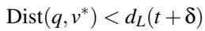

(1)

This inequality holds because a sufficient budget L ensures that the queue is not filled with L candidates strictly better than a true top-k neighbor (by definition of top-k).

Therefore, v∗ is successfully inserted into Ct+ and correctly sorted. The delay δ only shifts the moment of insertion but does not prevent the node from displacing a suboptimal candidate. Thus, under the sufficient budget assumption, the final set R retains the same top-k accuracy as the strict synchronous execution. □

## A.2 Bound of Search Convergence Speed

While Theorem 1 establishes the convergence to top-k neighbors under the assumption of a sufficient search budget, it is imperative to ensure that this required budget remains within practical limits. If asynchronous fetch latency were to cause the search path to deviate indefinitely, the system would require an unrealistically large budget to avoid premature termination. Therefore, to validate the practicality of the sufficient budget assumption, we must prove that the additional search cost induced by asynchronous fetching is strictly bounded.

We assume the goal is to limit the “detour” caused by the asynchronous fetch latency, and we define the search efficiency by bounding the total traversal steps.

## Definitions:

• Let Pbase be the search path of the strict synchronous baseline (best-first search). Let |Pbase| = T .

• Let Psys be the search path of FlowANN.

• Let τ be the constant fetch latency (in steps) for hostresident edges.

• Let W (e) be the discovery-expansion window for an edge e = (u, v) in the best-first search, defined as W (e) = stepexpand(v) − stepdiscover(u).

Theorem 2 (Bounded Step Deviation). The number of steps in FlowANN, denoted as |Psys|, is bounded by:

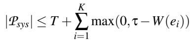

(2)

where {e1,...,eK} denotes the set of K offloaded edges (i.e., neighbors) encountered along the critical path Pbase.

Proof. Consider a critical node v on the optimal path Pbase reached via edge e = (u, v). We analyze the impact of fetching latency in three cases:

Case 1: e ∈ EGPU (Cached Edge). The node v is available immediately at step t. No delay is introduced. The deviation ∆ = 0.

Case 2: e ∈ E and W (e) ≥ τ (Successful Prediction). Node u is expanded at step t, and the fetch request for v is issued. Due to the window property, the baseline algorithm would not have popped (expanded) v from Q until step t′ = t + W (e). In FlowANN, v arrives at Q at step t + τ. Since τ ≤ W (e), it follows that t + τ ≤ t′. Thus, v arrives before or exactly when it is needed by the best-first search. The availability of v matches the baseline’s requirement, so ∆ = 0.

Case 3: e ∈ EHost and W (e) < τ (Prediction Miss). This is the only scenario causing a detour. The algorithm needs v at step t +W (e), but v arrives at t + τ. The system is forced to discover suboptimal nodes for a duration of ∆step = τ −W (e). Once the τ steps pass, v enters Q and corrects the path.

Conclusion: The total extra cost is the sum of these “wait ing gaps” (τ −W (e)). Since the fetch latency τ is effectively overlapped with computation in most steps (Cases 1 and 2), and the candidate pool ensures automatic path correction, the search complexity of FlowANN remains linear O(T ), providing a guaranteed lower bound on convergence speed comparable to the synchronous baseline. □

Quantitative Worst-Case Analysis: We now instantiate the bound to demonstrate the limits of search expansion under extreme conditions. We assume a catastrophic scenario where two worst-case conditions occur simultaneously: (1) Zero cache hit, implying that every node on the search path resides on the host and requires a fetch operation (i.e., K = T ); and (2) Zero discovery-expansion window, where window prediction fails completely for every step, meaning data is needed immediately (i.e., W (ei) ≈ 0 for all i).

Substituting these conditions (K = T,W = 0) into Equation (2), we obtain the general upper bound:

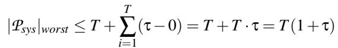

(3)

In practice, xCopier’s asynchronous fetch latency is \~8 µs (Figure 19, Section 7.3), which does not exceed the duration of two search steps (6–14 µs per step, Section 3). Therefore, we set the latency penalty τ ≈ 2 steps. Substituting this into the general formula yields:

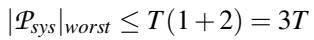

(4)

This derivation explicitly quantifies that even in the absolute worst-case scenario—where no caching or window optimization works—the search complexity remains strictly linear (O(T )), bounded by a small constant factor of the baseline steps.

## A.3 Bound of Search Budget

While the step bound established in Equation (2) guarantees time efficiency, it is equally critical to verify the search budget constraints (i.e., candidate pool capacity). A potential risk introduced by deferred discovery is candidate overflow: the intermediate nodes visited during the waiting period might populate the candidate pool with numerous suboptimal candidates. To rule out this possibility, we explicitly derive the upper bound of the required candidate pool size.

Theorem 3 (Bounded Candidate Pool Size). Let Ubase be the worst-case upper bound of the candidate pool size for the synchronous baseline. The worst-case candidate pool capacity U required by FlowANN is bounded by:

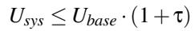

(5)

where τ is the latency factor defined in Theorem 2.

Proof. The maximum number of candidates stored in the pool is determined by the number of expanded nodes and the maximum graph degree. For the synchronous baseline, which executes T steps (where T = |Pbase|), the worst-case pool size is bounded by the cumulative number of added neighbors:

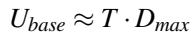

(6)

where Dmax represents the maximum node degree in graph G. For FlowANN, Theorem 2 proves that the search process expands at most T (1 + τ) nodes in the worst case to recover the optimal path. Since the node expansion logic remains identical (adding neighbors of visited nodes), the required pool capacity scales linearly with the maximum number of visited steps:

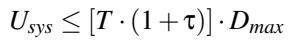

(7)

By rearranging the terms, we can express the bound of FlowANN in terms of the baseline’s bound:

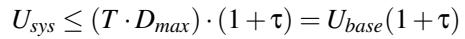

(8)

Conclusion: This result proves that the space complexity of FlowANN (i.e., required search budget) remains in the same order of magnitude as the baseline. Given that τ ≈ 2 in our system, a modest linear increase in the candidate pool capacity is sufficient to prevent valid candidates from being evicted, ensuring high recall without unbounded memory consumption. □