USENIX

THE ADVANCED COMPUTING SYSTEMS ASSOCIATION

# SDCs in the Wild: Characterizing and Diagnosing SDC-defective GPUs in Production LLM Training (Operational Systems)

Wenxin Zheng, Shanghai Jiao Tong University and ByteDance Seed; Wenxiao Wang, Yun Zhang, and Mingcong Han, ByteDance Seed; Bin Xu, Jinyu Gu, Xingda Wei, and Haibo Chen, Shanghai Jiao Tong University; Zuquan Song, Gaohong Liu, Yucheng Nie, Zhe Nan, Zhuolin Zheng, Huan Yu, Shuguang Wang, Ziming Zhou, Hang Zhu, Wencong Xiao, and Xin Liu, ByteDance Seed

https://www.usenix.org/conference/osdi26/presentation/zheng

This paper is included in the Proceedings of the 20th USENIX Symposium on Operating Systems Design and Implementation.

July 13–15, 2026 • Seattle, WA, USA

ISBN 978-1-939133-55-7

Open access to the Proceedings of the 20th USENIX Symposium on Operating Systems Design and Implementation is sponsored by

# SDCs in the Wild: Characterizing and Diagnosing SDC-defective GPUs in Production LLM Training (Operational Systems)

Wenxin Zheng<sup>1,2,∗</sup>, Wenxiao Wang<sup>2</sup>, Yun Zhang<sup>2</sup>, Mingcong Han<sup>2</sup>, Bin Xu<sup>1</sup>, Jinyu Gu<sup>1,</sup> , Xingda Wei<sup>1</sup>, Haibo Chen<sup>1</sup>, Zuquan Song<sup>2</sup>, Gaohong Liu<sup>2</sup>, Yucheng Nie<sup>2</sup>, Zhe Nan<sup>2</sup>, Zhuolin Zheng<sup>2</sup>, Huan Yu<sup>2</sup>, Shuguang Wang<sup>2</sup>, Ziming Zhou<sup>2</sup>, Hang Zhu<sup>2</sup>, Wencong Xiao<sup>2,</sup> , Xin Liu<sup>2</sup>

<sup>1</sup>Shanghai Jiao Tong University <sup>2</sup>ByteDance Seed

## Abstract

Silent Data Corruption (SDC) has emerged as a critical reliability bottleneck in Large Language Model (LLM) training, where hardware faults are frequently indistinguishable from software anomalies. While standard industry practice relies on synthetic microbenchmarks for fault isolation, our experience shows these methods miss over 60% of defective devices. To understand this gap, we present a comprehensive characterization of 23 SDC-defective GPUs harvested from a large-scale production cluster. Our analysis reveals three key insights: (1) SDCs are not confined to new hardware but often arise later due to aging; (2) SDCs are highly data-dependent and unit-specific, meaning devices that pass general stress tests often fail under specific training input data; and (3) standard ECC and thermal protections fail to capture these logic-level bit flips. Driven by these findings, we propose SDCHUNTER, an automated diagnosis system for detecting SDC-defective GPUs in a large-scale training cluster. Instead of relying on generic benchmarks, SDCHUNTER employs execution replay with the exact training workload and input data that triggered the failure. Deployed at ByteDance, SDCHUNTER successfully mitigated 40 SDC incidents in production.

## 1 Introduction

Silent Data Corruption (SDC), the unintended alteration of data without error signals, is a persistent reliability challenge in large-scale computing [17, 20, 27, 75]. Although SDC events are statistically rare on one device, the massive scale of training Large Language Model (LLM) amplifies their impact, making them a visible and frequent disruption. With training clusters scaling to tens of thousands of GPUs running for months, low-probability hardware faults become inevitable. Recent reports highlight the frequency of hardware faults in large-scale training environments. Meta reports that during training runs on 16,000 GPUs, hardware failures occur approximately every 2.78 hours, with roughly 1.4% of these attributed to GPU SDC [1]. Similarly, Google observes SDC events every one to two weeks within their TPU clusters [3], while ByteDance records 6,096 implicit errors over a threemonth operational period in their GPU clusters [73].

However, the most agonizing challenge for training engineers is not the frequency of these errors, but their ambiguity. GPU SDCs typically manifest as computational anomalies such as an unexpected fail-stop error or sudden loss spikes that appear identical to software bugs or numerical instabilities. This creates a costly dilemma: engineers often waste weeks debugging phantom code issues, unaware that the root cause is a silent hardware defect. Prior research has primarily focused on detecting and mitigating CPU-side SDCs [16, 18, 29, 40, 44]. On GPUs, numerous studies have investigated SDC detection and fault tolerance in model inference workloads [35, 36, 42, 82]. Other lines of work propose more reliable algorithms, such as self-check GEMM variants [47, 48], or techniques that monitor specific numerical ranges during training to detect SDCs [21,26]. However, these approaches are not effective for large-scale LLM training, as the increased numerical robustness of LLM models and the significantly more complex software stack make SDCs harder to detect and localize.

In our production environment at ByteDance, we find that most SDC incidents stem from SDC-defective GPUs. These devices contain subtle hardware faults that intermittently corrupt computation. Although we occasionally observe SDCs originating from CPUs, they can be diagnosed with the same approach. In these cases, both CPU and GPU memory are protected by ECC and are not the source of SDCs. Unlike transient soft errors, SDC-defective GPUs pose a persistent risk because the same device can repeatedly corrupt training jobs. When engineers observe suspicious behavior during LLM training, such as unexpected errors, the key challenge is to identify which GPU or GPUs in the cluster caused the corruption. The common industry practice is to run hardware diagnostic tools and synthetic stress tests, such as intensive GEMM loops across all GPUs [52, 54, 77]. However, in our experience, these synthetic tests miss more than 60% of defective GPUs, leaving a substantial detection gap.

Insights from Real-World GPU SDCs. To understand why standard benchmarks fail, we experimentally analyzed 23 SDC-defective GPUs harvested from our production fleet. Our characterization reveals three critical insights. First, SDCs are not limited to new hardware. They often appear later due to aging, requiring continuous lifecycle monitoring. Second, SDCs depend heavily on the specific hardware units (e.g., complex math units fail more often than Tensor Cores) and data inputs. A GPU might pass a general test but fail on specific training tasks. Third, these errors are missed by standard protections like ECC or thermal sensors. Consequently, effective diagnosis requires execution replay with the exact production model, checkpoint, workload, and data distribution that triggered the failure. Despite its promise, production replay faces two fundamental challenges.

Challenge 1: Training Replay Determinism. To identify a defective GPU, we compare its output against a "gold standard" from healthy hardware. Because no single GPU can be assumed reliable, this comparison must span replicas and requires identical inputs to produce bit-wise identical outputs. Yet LLM training is rife with non-determinism [25, 79]. System-level noise, such as non-deterministic reduction orders in AllReduce [62] or random operators, prevents direct cross-replica comparison and makes hardware SDCs indistinguishable from normal stochasticity. Our production measurements show that deterministic training has no measurable throughput loss (within 0.01% step-time difference) and reduces normalized debug time by 70% through bit-wise replay.

Challenge 2: Diagnosis Efficiency. Localizing an SDC requires capturing the corruption before it is masked by nonlinear operators or normalization layers [43]. Theoretically, this requires monitoring every intermediate tensor, but global full-state inspection across thousands of GPUs is prohibitively slow. Because intermittent SDCs may take hours to reproduce, such instrumentation would extend downtime from hours to days and delay the critical training job. We therefore need to isolate the fault quickly without paying the cost of full-state monitoring everywhere.

To address these challenges, we propose SDCHUNTER, an automated diagnosis system that uses hierarchical replay to balance speed and precision. SDCHUNTER first screens the cluster to isolate a small faulty GPU group, then investigates that group to pinpoint the defective device.

Phase 1: Lightweight Grouping via Homogeneous Replay. Upon detecting an anomaly, SDCHUNTER partitions the cluster along the Data Parallel (DP)<sup>1</sup> dimension into two logical replicas that consume the identical input batch. In this controlled "dual-replica" setting, outputs should be bit-wise identical. SDCHUNTER verifies this by hashing tensors only at the Pipeline Parallel (PP)<sup>2</sup> boundaries, incurring only 3% runtime overhead and a few extra training steps. Comparing these signatures across DP groups identifies the divergent stage within hours, which is enough to remove the affected replica and resume training while device-level localization continues offline.

Phase 2: Precise Localization via Full-State Comparison. Once the anomaly is confined to a parallel group<sup>3</sup>, SD-CHUNTER deterministically replays the problematic iteration on the suspicious group and a healthy reference group. It collects layer-wise signatures for all intermediate tensors, finds the first divergent tensor and kernel through differential analysis, and maps the error back to the defective GPU.

After the training job resumes on healthy machines, SD-CHUNTER confirms the localized device offline by repeatedly replaying the alert-triggering trace and checking the result with hardware tools. This verification does not block the online job and provides a hardware-actionable decision within one hour in our production cases.

Both phases rely on system-wide determinism. SD-CHUNTER eliminates noise by locking RNG seeds, enforcing deterministic GPU kernels, and standardizing communication order, so discrepancies across DP groups (Phase 1) or against the reference (Phase 2) indicate hardware defects.

We deployed SDCHUNTER in ByteDance’s production environment managing a large GPU cluster. It has mitigated 40 SDC incidents to date. Most importantly, SDCHUNTER decouples cluster recovery from hardware debugging: training resumes within an hour after isolating the faulty stage, while the defective GPU is later pinpointed and confirmed offline within one hour for hardware repair.

Our contributions can be summarized as follows:

• We share our first-hand experience managing SDC incidents in large-scale production clusters at ByteDance, showcasing the problem of SDCs in real-world systems.

• We present a characterization study of 23 SDC-defective GPUs, revealing key insights about their manifestation.

• We quantitatively identify the critical challenges in reproducing SDCs in LLM training.

• We propose SDCHUNTER, an automated diagnosis system for localizing SDC-defective GPUs and have identified 40 SDC incidents in production, reducing diagnosis time from days to under one hour.

To the best of our knowledge, this is the first large-scale study of GPU SDCs in production-level LLM training workloads.

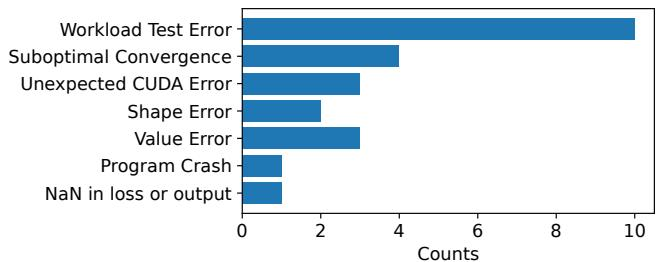  
Figure 1: First detected errors of all confirmed SDC errors.

## 2 GPU Silent Data Corruption in Production

## 2.1 Silent Data Corruption

The correctness of large model training is very important. In practice, training can yield incorrect data in three characteristic ways: crash [73], detected unrecoverable error (DUE) [6, 13, 14, 18, 24, 49], and silent data corruption (SDC) [24, 26, 43, 44]. The crash indicates that the program terminates abnormally due to an unrecoverable error, such as segmentation faults or illegal instructions. DUE refers to errors that are detected by the hardware or software, leading to the termination of the program to prevent further propagation of errors. Both crash and DUE provide immediate feedback to developers, allowing them to identify and address issues promptly.

Different from the crash and DUE, SDC does not produce any general immediate indication of an error. It refers to errors that occur silently without any immediate indication, leading to incorrect results or data corruption. SDC can manifest in various ways, such as bit flips in memory, or incorrect computations. The typical reasons for SDC include environmental factors, hardware bugs, and hardware degradation. Environmental factors such as cosmic rays and radiation can induce transient faults in hardware components [56,74, 78,82]. Hardware bugs, such as design flaws or manufacturing defects, can also lead to SDC [44]. Over time, hardware components can degrade due to circuit wear-out and aging [44]. All these factors can contribute to the occurrence of SDC, making it a significant concern in large-scale computing systems.

## 2.2 SDC-Induced Failures in LLM Training

In this paper, we analyze 23 GPUs with confirmed SDCs identified in our production clusters. Figure 1 classifies the detection sources of these defective devices. Specifically, 10 GPUs were identified during offline stress test using online workloads where they failed numerical validation checks. The remaining 13 GPUs surfaced during active LLM training tasks, causing task interruptions. These production failures manifest in two primary ways: (1) fail-stop errors, where the SDC triggers a system exception (e.g., shape mismatch or outof-bound access) causing an immediate crash; and (2) implicit anomalies, where the training continues but exhibits incorrect behavior (e.g., loss spikes), leading engineers to manually halt

```python
1 indices = torch.tensor([0, 1, 0, 1])
2 plan = torch.bincount(ideal_indices, minlength=2)
3 plan = plan.tolist()
4
5 mask = torch.zeros(4, 2, dtype=torch.int)
6 mask.scatter_(1, indices.view(-1, 1), 1) # wrong!
7
8 # Shape mismatch with input and mask
9 experts_input = torch.split(routed_data, plan)
```

Figure 2: Code snippet of a shape mismatch error caused by SDC during MoE training.

```python
1 ids %= self.vocab_size # wrong!
2 ids += self.vocab_offset
3 ids = ids[:, -s:]
4
5 # Out-of-bound caused by ids
6 embeds = self.embedding_list[0](ids)
```  
Figure 3: Code snippet of an out-of-bound access caused by SDC during MoE training.

the job.

Confronted with these interruptions, developers instinctively prioritize software debugging over hardware verification. Given the rarity of hardware faults, engineers typically attribute these anomalies to logical bugs in the training software framework or numerical instabilities inherent to the model architecture [30]. Consequently, engineers often invest days or weeks isolating pipeline components and attempting to reproduce the error, but these efforts are frequently wasted. The identification of a hardware fault usually emerges only as a diagnosis of exclusion after all software hypotheses have been exhausted. This characterizes the insidious nature of SDCs: while their probability of occurrence is low, the incurred cost in engineering productivity and wasted computing resources is disproportionately high. We share two detailed cases derived from our real-world production experience to illustrate these deceptive patterns of SDC-induced failures.

Case 1: Explicit Fail-stop Error (Shape Mismatch or Out--of-bound Access). Megatron [69] decouples capacity planning from tensor dispatching in its implementation of MoE operators to maximize device utilization. Under this pipeline, the framework first aggregates token counts to pre-allocate contiguous memory buffers, and subsequently invokes a scatter kernel to populate these buffers. We observed a case in our production environment where an SDC occurred during the token count aggregation, silently corrupting the buffer size calculation. As shown in Figure 2, the error comes from the corrupted scatter operation (line 6) and eventually triggers a shape mismatch error at line 9. As shown in Figure 3, the outof-bound access is caused by the corrupted modulo operation (line 1) and eventually triggers a segmentation fault at line 6. This manifested error creates a debugging trap: the exception did not trigger immediately, but it indicates a fail-stop error, causing developers to suspect a bug in the code. However, the code at the crash site is correct. The SDC had already altered the program state in a previous kernel, rendering the error message a misleading indicator of the true failure source.

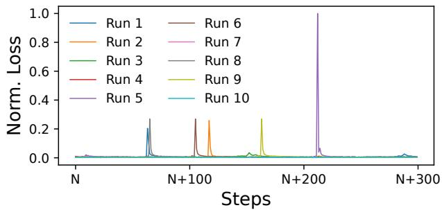  
Figure 4: Loss spike caused by SDC during model training with different runs. The loss spike is confirmed to be caused by SDC, but the spike is not always the same.

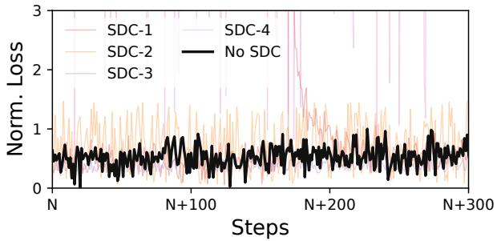  
Figure 5: Loss curves of training runs with and without SDC collected from the same checkpoint in production. The spike problem observed in production is shown in Figure 4.

Case 2: Implicit Performance Degradation (Anomalous Loss Spikes). In contrast to fail-stop errors, SDCs can manifest as implicit model degradation where the training process continues but produces corrupted checkpoints. The loss comparison in Figure 5 shows the practical consequence: without SDC, the training loss remains within the expected narrow range, while SDC-affected executions create visible excursions that can invalidate subsequent checkpoints. The spike problem is shown in Figure 4. We encountered this scenario in 10 independent training runs executed on the same cluster and initiated from the identical checkpoint. The anomaly first surfaced in Run 1, where the loss spiked dramatically. A distinct re-run, Run 2, reproduced the failure, exhibiting a similar spike. However, when engineers attempted Runs 3 and 4, the training proceeded without incident, showing no anomalies. This led engineers to suspect the occurrence of SDCs. Continued monitoring validated this hypothesis: Runs 5 and 6 (and subsequently Runs 8 and 9) exhibited loss spikes again, but crucially, these occurred at completely different steps compared to the earlier failures. Unlike a code error that would typically fail at a consistent logical point, these random, high-magnitude gradient values indicated underlying hard ware malfunctions in the floating-point units. Consequently, the training was halted, and the affected nodes were taken offline to confirm the existence of a defective GPU.

## 2.3 SDC Impact in LLM Training

Both failure modes impose substantial operational cost in production-level LLM training. Fail-stop errors (Case 1) immediately interrupt the job, leaving allocated GPUs idle until the training state is restored from a valid checkpoint and the defective hardware is isolated. Implicit anomalies (Case 2) are more difficult to handle because the training job may continue to produce invalid checkpoints. Engineers must then determine whether the observed loss spike originates from software bugs, numerical instability, or hardware corruption since the loss spike can degrade the model performance [5, 37, 60, 71, 72]. Without deterministic execution, rerunning the same checkpoint cannot guarantee bit-wise alignment, which further obscures the boundary between benign training variance and SDC-induced model corruption.

The difficulty of mitigation is amplified by the large variation in how frequently a defective GPU manifests an error. We define the observed SDC occurrence rate as the fraction of deterministic replays of an alert-triggering workload that produce an incorrect tensor. Across the confirmed defective GPUs, this replay occurrence rate ranges from 100% down to 10<sup>−6</sup>%. This variation explains why generic hardware stress tests frequently miss SDC-defective GPUs and why diagnosis must replay the production workload that exposed the anomaly. To quantify the practical impact, we measure the optimistic estimation of retraining overhead and the debugging and diagnosis time observed in our production workflow in Table 1. Actually, the overhead is a lot higher than the estimation in our production workflow.

Table 1: Overhead over a full training run across varying SDC occurrence rates. The SDC Rate means the visible difference in the loss curve. This trace is collected from manual oncall services with round-the-clock coverage.  
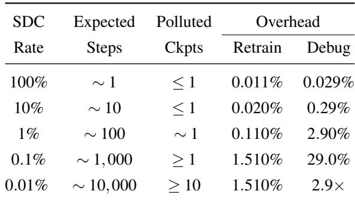

Utilizing the industry-standard software diagnostic method [73], the required validation compute scales inversely with p. At p = 0.01%, diagnosing a single defective GPU consumes parallel compute equivalent to training approximately three full LLM models (≈ 290%). This mathematically negates the viability of purely software-replay-based debugging for low-frequency SDCs in hyperscale clusters. This motivates a system to diagnose SDC-defective GPUs at scale.

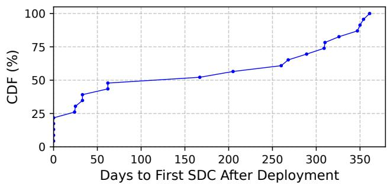  
Figure 6: Temporal distribution of SDC emergence across hardware lifecycle.

## 3 Characterizing SDC-defective GPUs

Silent data corruption originates from hardware degradation that manifests in ways fundamentally different from hard failures. To characterize these differences, we first analyze hardware fault behaviors across four dimensions: temporal patterns, observability, triggering conditions, and visibility.

Temporal Patterns. Unlike prior studies that primarily observe CPU SDCs during early stress testing [75], our longterm analysis reveals that GPU SDCs pose a persistent threat throughout the entire hardware lifecycle. By tracking the timelines of all confirmed SDC cases in our production environment, we find that these faults are not limited to the early time of GPUs. Instead, they manifest continuously due to cumulative hardware degradation. Specifically, only 25% of SDCs were detected during pre-deployment burn-in, whereas the remaining incidents surfaced gradually: 25% within the first two months, 10% within six months, and a substantial 40% around one year post-deployment (see Figure 6). Furthermore, once a GPU begins to exhibit SDC, the error rate typically escalates over time, signaling progressive deterioration that can lead to permanent failure. This temporal dispersion indicates cumulative degradation rather than manufacturing defects. Vendor analysis suggests the underlying mechanism involves resistance drift in computational circuits, specifically, repeated intensive computation causes electrical stress that gradually alters resistance values, leading to arithmetic errors. This finding is applicable to all long-running GPU fleets that execute sustained high-utilization training workloads, while the exact timeline depends on GPU generation, cooling conditions, workload intensity, and maintenance policy.

The emergence of SDC covers the entire life cycle of hardware and is caused by GPU hardware degradation, which is irreversible once it occurs.

Table 2: Distribution of kernels where the first SDC was detected on SDC-defective GPUs. Some SDCs are only triggered by specific kernels.  
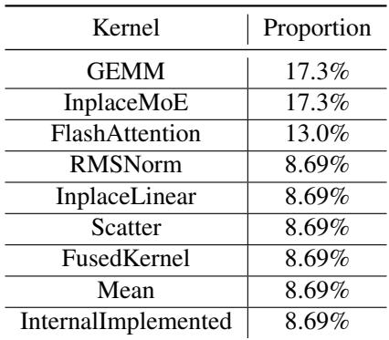  
Table 3: Characterization of SDC sources in µ-archs for GEMM kernels. <sup>✓</sup> indicates correct computation, while <sup>✗</sup> indicates erroneous computation.

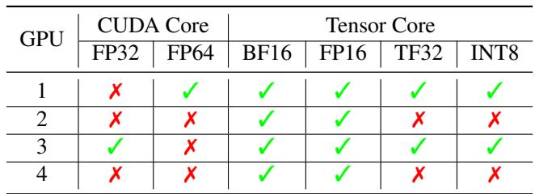

SDC Sources in µ-archs. Unlike memory errors that can be detected via ECC or execution exceptions triggered by instruction faults, SDCs come from diverse hardware components [44]. We conducted in-depth experiments to find the sources of SDC by replaying the same workload and kernels on victim GPUs and monitoring error rates. Our analysis reveals that SDC comes from diverse hardware components. Some of them may have specific component failures, while others may have unclear failures. We’ve listed the firstdetected SDC kernels and GPUs in Table 2. For those with GEMM kernel SDCs, we conduct a further analysis of different data types and precision in Table 3. The results indicate that FP64 and FP32 CUDA cores exhibit a higher propensity for SDC. A plausible explanation is that high-precision ALUs are substantially larger and more complex than their lower-precision counterparts: they require wider datapaths and more transistors to implement the corresponding logic. The increased physical area correspondingly elevates the likelihood of fault manifestation [8, 65]. Our findings further suggest that certain SDCs are strongly tied to specific microarchitectural features and data types. For other cases, we posit that SDCs arise from intricate and insufficiently understood interactions within the microarchitecture. This finding is applicable to all GPUs because arithmetic units, memory paths, and fused execution units can all become fault sources, while the exact vulnerable unit and precision mode are implementation dependent.

SDCs originate from multiple GPU components, with susceptibility patterns highly specific to microarchitecture implementations and precision modes.

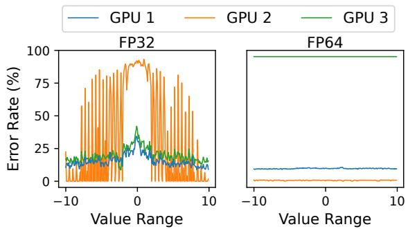  
Figure 7: Error rate for a single operator (GEMM) across different input ranges and data types on SDC-affected GPUs.

Triggering Conditions. Triggering SDC is not straightforward. As listed in Table 2, some SDCs become visible only when specific kernels are executed. For these complex cases, errors often manifest as element-wise differences rather than simple numerical errors.

To investigate the triggering patterns of SDC, we executed repeated GEMM kernels on three distinct SDC-defective GPUs, denoted as GPU 1 through GPU 3, varying the input numerical ranges to observe stability boundaries. We define an error as any bit-wise deviation from the standard golden result. Unlike transient soft errors which are stochastic, the errors observed in these devices exhibit strong correlations with input patterns. As shown in Figure 7, the error rate is highly sensitive to both data type and input magnitude. Specifically, GPU 1 and GPU 3 yield incorrect results across all ranges for FP32, whereas GPU 2 exhibits errors only within specific value bands. As for FP64, GPU 3 produces 100% incorrect results with a calculation latency 50× higher than nominal, indicating severe hardware degradation, while GPU 2 maintains an error rate below 1%.

Overall, these findings highlight that SDCs are extremely hard to trigger because they depend on specific operators, data types, and values. Furthermore, even under identical workloads, the error manifests with only a relatively low probability. This finding is applicable to other LLM training workloads that rely on complex fused kernels and data-dependent operators, although the concrete triggering kernels and value ranges must be identified for each model and hardware platform.

SDC occurrence is highly dependent on specific workloads (e.g., kernels, data types and input values), exhibiting strong operator and workload affinity.

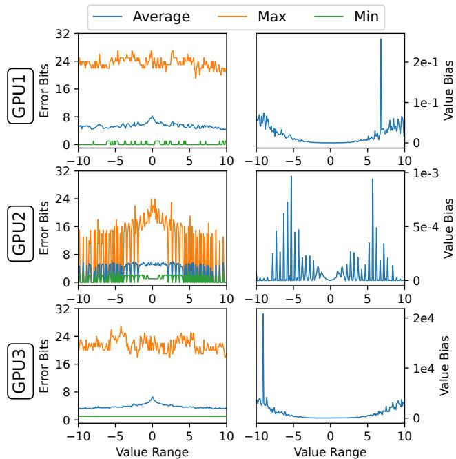  
Figure 8: Number of error bits and average value bias for a single operator (GEMM, FP32) across different input ranges on SDC-affected GPUs.

SDC Visibility. We further dissect how SDCs manifest at the numerical level by analyzing the bit-level discrepancies and value biases across different devices. As illustrated in Figure 8, the manifestation of SDCs varies significantly across varying devices. While some defects cause massive deviations, others manifest as sparse bit flips affecting only specific significance levels. For instance, GPU 2 exhibits extremely subtle value biases (magnitude < 10<sup>−3</sup>). Such minor errors are particularly insidious as they are prone to being masked or absorbed by subsequent computational operations (e.g., accumulations or activation functions), propagating silently without triggering obvious outliers.

More importantly, apart from these numerical discrepancies, the hardware faults remain invisible to standard system monitoring metrics. We compared the execution traces between golden hardware and SDC-defective devices. Despite the observable computational errors, standard indicators such as machine check exceptions, performance counters, and device status registers remained indistinguishable from the healthy baseline. Furthermore, the ECC error count shows no correlation with the SDC occurrences, and there are no observable anomalies in clock frequencies or thermal limits between the golden hardware and the defective GPUs. This lack of hardware-level observability implies that error detection must rely solely on verifying the output correctness (e.g., double-checking), as no side-channel signals are available to flag the degradation. This finding is expected to apply to logic-level computational corruptions across all GPUs, while the numerical magnitude and masking behavior depend on the model architecture and downstream operators.

SDCs often manifest as subtle value biases without triggering hardware signals, making them difficult to detect through traditional monitoring mechanisms.

## 4 Challenges of Diagnosing GPU SDCs

Given that SDCs are highly context-sensitive, our characterization reveals that synthetic benchmarks fail because they lack the specific data patterns and instruction sequences required to trigger the faults. This limitation compels us to shift our diagnosis strategy from simulation to reproduction. Instead of relying on pre-defined test vectors, we adopt an execution replay approach: restoring the training state from a recent checkpoint and re-executing the exact iterations that led to the failure (or loss spikes). By subjecting the suspected GPU to the real production workload, we maximize the probability of recreating the precise micro-architectural state that triggers the silent corruption.

The core principle of this approach is differential testing based on the premise of hardware determinism. Ideally, for a deterministic computational kernel, identical inputs must yield bit-wise identical outputs regardless of the device executing them. Therefore, to confirm a GPU is defective, we can compare its replay output against a golden reference generated by a healthy peer GPU running the same workload. Any discrepancy in the output can be definitively attributed to a hardware fault.

While conceptually straightforward, implementing this replay-based diagnosis in a production LLM training stack is non-trivial. The complexity of distributed training frameworks introduces two fundamental challenges that prevent straightforward comparison and localization: replay determinism and corruption observability. In this section, we quantitatively demonstrate the severity of these two challenges.

## 4.1 Training Replay Determinism

The prerequisite for differential testing is strict bit-wise reproducibility. Any deviation from the golden reference must stem uniquely from hardware faults. However, achieving such determinism in a distributed training cluster is inherently difficult. The complex interaction between hardware parallelism and software scheduling introduces significant execution noise, which can easily drown out the subtle signals of an SDC. In practice, we identify three primary sources of non-determinism.

Operator Randomness. GPU kernel implementations of some operators often exhibit inherent randomness during execution (e.g., scatter add). Consequently, without explicitly enabling deterministic algorithms, the computation results are inconsistent across runs, as shown in Figure 9. This inconsistency comes from nondeterministic execution order rather than floating-point instability, since a fixed deterministic order produces bit-wise identical results for the same inputs.

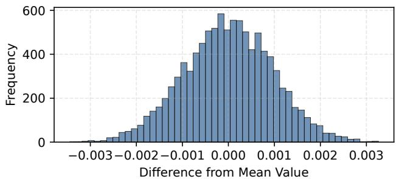  
Figure 9: Distribution of output values for the scatter add operator, illustrating the non-determinism on GPU.

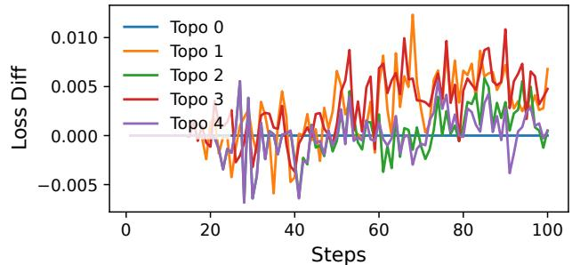  
Figure 10: Differences in loss values of different network topologies (Topo 0 to Topo 4) relative to Topo 0.

Network Topology Influence. In distributed training, collective communication operations (e.g., AllReduce) are essential for gradient synchronization. Due to the non-associativity of floating-point arithmetic, ensuring bit-wise reproducibility requires a strictly fixed order of accumulation during reduction. However, the effective network topology in a production cluster is often volatile. NIC failures or bandwidth fluctuations can change the topology observed by communication libraries such as NCCL, causing them to adjust channel counts or algorithms. These changes alter the reduction structure and floating-point addition order, producing numerical divergence even under the same training configuration. To illustrate this effect, we execute the same training configuration across multiple network topologies and collect loss-level metrics. The results, presented in Figure 10, show that the loss variations introduced solely by differing network topologies can be nontrivial. This complicates the diagnosis of SDCs, as it becomes difficult to distinguish whether observed discrepancies stem from actual data corruption or from inherent software-level nondeterminism induced by network topology differences.

Scaling Non-equivalence. GPU resources are extremely precious. When a suspected SDC is detected in a training job involving thousands or even tens of thousands of GPUs, performing a direct replay on a cluster of the same scale is impractical. Doing so would consume a massive amount of

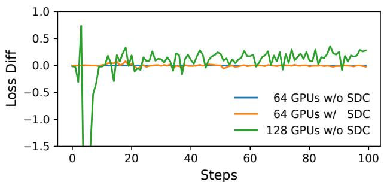  
Figure 11: Differences in loss values relative to the setup of 64 GPUs without SDC when scaling down training configurations.

GPU hours and incur huge costs; furthermore, it monopolizes critical resources, blocking other training jobs from being scheduled. Consequently, it is necessary to scale the work load down to a smaller cluster to verify whether a specific GPU is faulty. However, the training result is sensitive to the scale. As stated in previous work [41], keeping consistency between large-scale and small-scale training configurations is challenging. The training framework will select different parallel strategies and kernel fusion strategies for different scales. The training result is different for different scales. To demonstrate this, we use different scales to run the same training configuration on both normal GPUs and SDC GPUs and collect the loss-level training metrics. The results are shown in Figure 11. We observed that the loss difference introduced by scaling down the training configuration is even larger than the deviation caused by a faulty GPU. Consequently, when observing a loss discrepancy in a scaled-down environment, it becomes impossible to distinguish whether the divergence originates from the SDC or the inherent software behavior changes due to scaling.

## 4.2 Data Corruption Observability

Even if a deterministic replay environment is established, capturing the manifestation of an SDC remains a significant hurdle due to the lack of appropriate observability. We face a fundamental dilemma between sensitivity and efficiency. High-level metrics (e.g., training loss) are non-intrusive but inherently mask errors due to the robustness of deep learning algorithms. Conversely, low-level inspection (e.g., instruction instrumentation) offers high sensitivity but extremely high overhead, making the SDC reproduction time impractical. We experimentally explore this trade-off in this section.

Loss Observability. Large-model training can mask SDCs in loss-level metrics. To illustrate this, we randomly perturb 10% of tensor values by 1% and 10% during training and compare the resulting loss and gradient-norm differences against an unmodified run as shown in Figure 12. The loss difference is initially small (absolute value below 0.1 and relative value below 5%) and becomes increasingly obscured

as training proceeds.

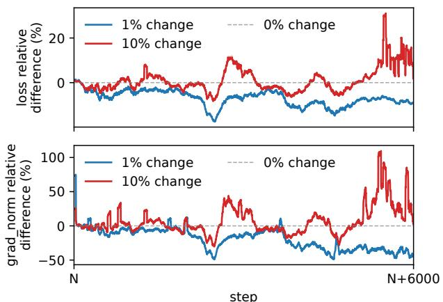  
Figure 12: Difference in loss and gradient norm values for changing the value of 10% of tensors by 1% and 10% relative to no value change.

Even if the loss value is different, the first tensor value error appears significantly earlier than the loss value error. To show this lagging effect, we instrumented all tensors on the SDC GPUs and collected the loss-level metrics and tensor-level values. The result is shown in Figure 13. We found that the first tensor value error appears significantly earlier than the loss value error and the loss difference is usually smaller than the value difference. The magnitude of the loss difference and the value difference are related. These conclusions show that even if the loss value is different, it is challenging to determine which step is reliable and which step is caused by the SDC.

Intermediate Result Observability. Since loss values are often insensitive to transient faults, a theoretical alternative is to instrument the execution flow to capture intermediate states. However, deep instrumentation creates a Heisenbug effect: it fundamentally alters the micro-architectural state (e.g., pipeline timing and thread scheduling), potentially masking the very race conditions that trigger SDCs. We observed this phenomenon when applying heavy instrumentation to the defective GPUs identified in Figure 7. As shown in Figure 14, the error rates for GPU 1 and GPU 2 paradoxically decreased compared to the baseline, suggesting that the overhead altered the execution path enough to hide the corruption. Furthermore, we observed new anomalies (e.g., NaNs) absent in the original run, confusing the diagnosis.

A more practical approach involves verifying the checksums (hashes) of tensor outputs at different execution boundaries, yet this introduces a critical trade-off between diagnostic resolution and reproduction cost, as quantified in Table 4. To achieve precise localization, one must perform fine-grained inspection by checksumming outputs after every kernel execution. While this allows us to pinpoint the exact corrupted tensor and its corresponding kernel, it incurs a prohibitive

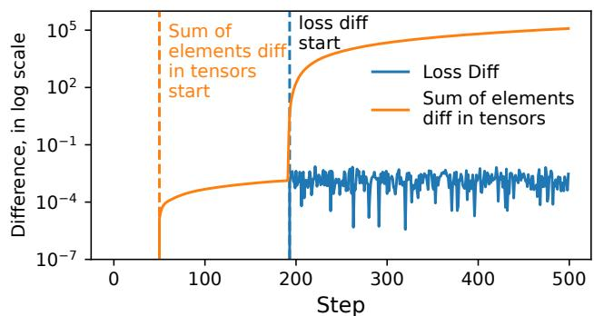  
Figure 13: Timestep difference between the loss difference and value difference in log scale.

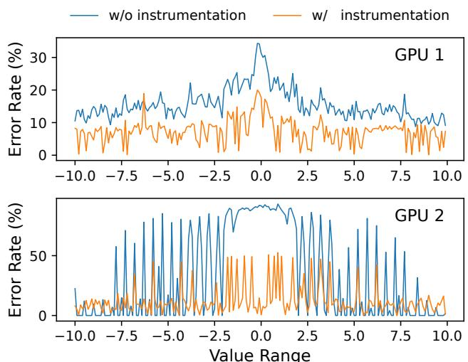  
Figure 14: Error rate differences between instrumented and non-instrumented execution.

683.9% overhead. Since diagnosis requires iterative replay, such a 7× slowdown extends the debugging cycle from hours to days, rendering global fine-grained monitoring impractical for production timelines. Conversely, applying coarsegrained checks solely at communication boundaries offers a lightweight alternative with negligible overhead (4.3%). However, this approach suffers from limited resolution: while it can efficiently identify the faulty GPU, it fails to isolate the specific kernel or tensor responsible for the SDC.

## 5 Diagnosing SDC-defective GPUs at Scale

When an abnormal signal occurs in the online task (e.g., loss decreasing less than expected, Shape Error, etc.), we first determine whether it is a hardware issue. Specifically, we introduce a two-phase diagnosing mechanism. The first phase is a lightweight grouping of all GPUs to identify the suspicious parallel group by replaying the training workload. The second phase is a full tensor comparison within the suspicious GPU groups to pinpoint the specific device. After diagnosis, we confirm the SDC-defective GPUs using offline diagnostics. Before implementing such a two-phase mechanism, we need to ensure the training procedure is deterministic.

Table 4: The overhead and coverage of different instrumentation granularity. R: Rank, K: Kernel, T: Tensor. The filled proportion of each circle indicates the coverage achieved by the corresponding instrumentation granularity at the Rank, Kernel, and Tensor levels.  
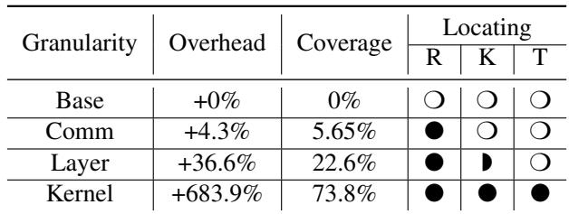

SDCHUNTER diagnoses the affected job with the exact same model, checkpoint, input shards<sup>4</sup>, operator implementations, and communication schedule<sup>5</sup> used by the original training run. The key insight is that deterministic training makes each healthy DP group a bitwise reproducible replica of the same computation, so SDCHUNTER can preserve execution equivalence when it reduces or repartitions DP groups for diagnosis. In the first phase, the parallel configuration<sup>6</sup> is the same as the original training run except that DP groups are organized into replay replicas. In the second phase, SD-CHUNTER changes only the DP groups used for comparison while keeping the model, checkpoint, input shards, PP configuration, TP configuration, operator choices, and communication order unchanged. We intentionally avoid a separate lightweight diagnostic model because our characterization shows that GPU SDCs are strongly tied to the production kernel sequence, input value ranges, and communication order. A smaller diagnostic model would improve isolation from the production job, but it would lose the workload fidelity needed to reproduce rare, data-dependent corruptions. Therefore, SDCHUNTER isolates diagnosis by replaying only a bounded window from the latest checkpoint and by moving fine-grained device confirmation off the training critical path, rather than by changing the model under test.

## 5.1 Pre-requisites: Deterministic Training

To ensure the training procedure is deterministic, we add several deterministic constraints on the computation and communication.

Definition of Deterministic Training. Deterministic training does not eliminate or exclude the numerical randomness in the learning algorithm, such as randomized data order, dropout masks, or other pseudo-random choices. Instead, it makes these sources of randomness reproducible by record ing or regenerating the same random sequences from the same checkpoint and configuration. Under this definition, a healthy training system should produce bitwise aligned execution traces when replaying the same checkpoint, input shards, model code, operator implementations, and communication schedule. The purpose is therefore not to eliminate stochastic learning behavior, but to preserve a reproducible training trace.

Such a reproducible training trace is essential for diagnosis. Several industry technical reports indicate that bitwise alignment and deterministic training are becoming standard practice for large-scale model training [1–3]. From the ByteDance production perspective, this property is particularly useful because it separates data issues, model issues, infrastructure issues, operator bugs, and SDC-induced hardware corruption with only several steps of replay under the same replay framework. Our production measurements show that deterministic training preserves normal step time, with less than 0.01% difference from non-deterministic training, while reducing normalized debugging time from 1.00× to 0.30×.

Setup Constraints. To support reproducible training, our training framework setup leverages the deterministic features provided by modern training frameworks and GPU drivers. In practice, we activate every deterministic toggle exposed by the software stack, including disabling torch.backends.cudnn.benchmark [10], enabling torch.backends.cudnn.deterministic [11] and torch.use\_deterministic\_algorithms [12]. By setting up these configurations, we ensure that computation executes identically in every iteration when the underlying hardware is healthy.

Computation Constraints. The primary source of nondeterminism in GPU computation is the non-associativity of floating-point arithmetic, which causes parallel accumulation to vary across executions [7, 25, 68, 79, 80]. To achieve bitwise reproducibility, our framework applies strict constraints to core kernels: we disable optimization heuristics in operator libraries [50, 51, 53], deactivate GEMM autotuning to lock launch configurations, and serialize atomic reductions where needed. Dynamic control flows introduce additional challenges. For elementwise kernels, we enforce a static SMto-row mapping. For operators with data-dependent routing (e.g., MoE gating), we re-implement kernels to serialize accumulation and scatter steps, ensuring deterministic processing regardless of thread scheduling. For kernels whose outputs can still depend on thread interleavings, we manually implement deterministic kernels whose reduction and write rules produce the same result under any valid execution order. All other standard operators retain their native deterministic behavior to preserve system-wide consistency.

Communication Constraints. As noted regarding network topology influence, the non-associativity of floating-point arithmetic renders collective operations (e.g., AllReduce) sensitive to the underlying reduction structure. Standard communication libraries (e.g., NCCL<sup>7</sup>) typically perform runtime topology detection to optimize bandwidth, dynamically select ing algorithms (e.g., Ring vs. Tree) and adjusting the number of parallel channels based on available hardware health. To eliminate this source of non-determinism, our framework enforces a static communication configuration regardless of the physical topology state. We explicitly lock the collective algorithms and fix the number of communication channels to prevent the library from adapting the reduction tree to hardware fluctuations. Additionally, for dynamic architectures like Mixture-of-Experts (MoE), we enforce a deterministic dispatch order to ensure that gradient aggregation sequences remain invariant across different runs. During training, SD-CHUNTER records the communication trace and replays communication according to an immutable deterministic order, so diagnosis uses the same message ordering as the original execution.

These deterministic constraints are enabled during production training, not only during replay. This choice ensures that the communication order and kernel choices in the diagnostic run match those that produced the anomaly. Since the same deterministic configuration is used during both normal execution and diagnosis, SDCHUNTER can replay the alerttriggering window without changing the workload behavior being tested.

## 5.2 Phase 1: Lightweight Grouping

Figure 15 illustrates the overview of Phase 1. The objective of the first phase is to rapidly narrow the scope of anomalies from the entire cluster to a specific logical group with minimal overhead. This phase should not compromise the SDC characterization. To achieve this, we partition the cluster along the data-parallelism (DP) dimension, forming two replicas, each comprising half of the DP groups. Both replicas are provided with the identical training data used before as input. Because deterministic training fixes random sequences, operator behavior, and communication order, healthy replicas should produce the same signatures even after this DP-level scaling, which preserves the execution equivalence needed to expose SDC-induced divergence.

For each replica, we collect the signatures of the intra-DP-group pipeline parallelism (PP) communication tensors and compare these signatures across the two replicas. Here, the signature refers to a hash of the tensor values designed to satisfy associativity. By aggregating and comparing communication signatures across replicas, we can identify potentially anomalous DP groups. The novelty of this detection step is that it is implemented as a training framework ability, where the framework already knows the checkpoint boundary, DP groups, PP communication tensors, and replay window. As a result, SDCHUNTER only records compact signatures at framework-visible communication boundaries instead of dumping full tensors or inserting external kernellevel monitors, which keeps the online overhead very small. If only one DP group diverges from the majority signature, SDCHUNTER marks the machines in that group as suspicious and removes them from subsequent scheduling. The training job then resumes from the latest verified checkpoint on the remaining healthy machines. This resumption does not wait for the device-level diagnosis in Phase 2 because it only requires isolating the anomalous DP group so that corrupted ranks are removed from the restarted job. The blocking time on the training critical path is therefore the sum of the time to reload the checkpoint, replay the workload, compare the signatures, and restart the scheduler for the next step. Checkpoint reload and scheduler restart are the normal recovery costs, Phase 1 replays fewer than 100 steps in our deployment, and signature comparison takes seconds because only compact communication-boundary hashes are compared.

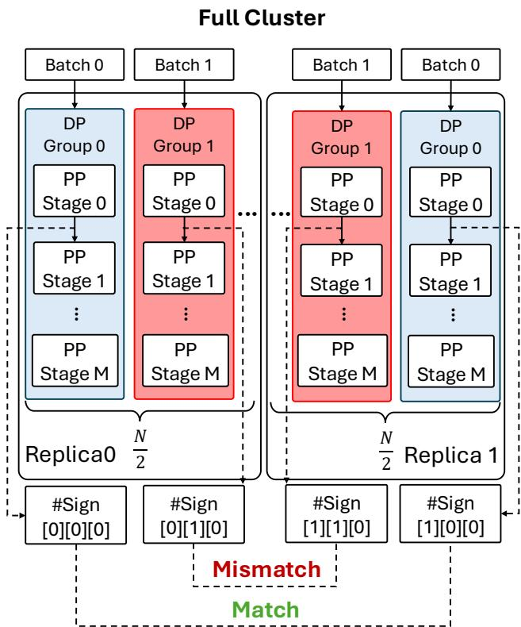  
Figure 15: Phase 1: Lightweight Grouping. The indices in the signature label #Sign [·][·][·] denote the Replica ID, DP Group ID, and PP Stage ID, respectively.

Ideally, comparing signatures derived from additional parallelism dimensions (e.g., expert parallelism, EP) would further localize the suspicious nodes. However, in modern training architectures that employ EP for Mixture-of-Experts (MoE) models, computation and communication kernels are frequently fused to maximize efficiency [81]. As a result, internal signatures of communication-related tensors within these fused kernels are inaccessible, preventing us from extracting EP-specific signatures.

Fault Model. In our deployment experience, we assume that, within one diagnosis window, at least one replay replica remains healthy and can serve as a reference. When two replicas disagree and no majority exists, SDCHUNTER introduces an additional replay replica on spare healthy machines and compares all three signatures to determine which DP group is faulty. If multiple DP groups are defective, SDCHUNTER can identify multiple outliers as long as they do not all produce the same corrupted signature. The pathological case where every replay replica is simultaneously corrupted in the same way cannot be resolved by consensus. In that case, SDCHUNTER falls back to offline confirmation with known good machines and vendor diagnostics. In practice, this is consistent with the observed production pattern where SDC-defective GPUs are rare and independent, so simultaneous identical corruptions across all DP replicas are unlikely.

## 5.3 Phase 2: Precise Localization

Once the suspicious parallel group is identified, we perform a comprehensive tensor comparison to pinpoint the specific defective device. This involves collecting tensor signatures from both the suspicious group and a healthy reference group during a deterministic replay of the problematic iteration. By comparing these signatures layer-by-layer, we can detect the exact point of divergence. This process isolates the first corrupted tensor and its producing kernel, allowing us to definitively identify the SDC-defective GPUs. The localization step also relies on framework-level knowledge of tensor ownership, rank<sup>8</sup> placement, and operator order, so SDCHUNTER can map the first divergent tensor back to a physical GPU without globally instrumenting every kernel during normal training. This framework integration is the reason SDCHUNTER can combine accurate device-level localization with much lower overhead than full tensor dumping or always-on fine-grained instrumentation.

## 5.4 Post-Diagnostic Verification

To verify suspicious GPUs, we employ a hybrid strategy to isolate the minimal reproducible execution trace. First, we utilize Hardware tools [52,55] to screen for permanent hardware faults, any failure triggers immediate repair. However, since SDC often evades standard stress tests, GPUs that pass these hardware tools undergo offline analysis using SDCHUNTER. We subject execution traces from the alert-triggering workload to intensive iterative replay to perform full-scale tensor verification, as extensive repetition of these traces maximizes the likelihood of reproducing the SDC symptoms. Through this process, we progressively isolate the consistently reproducible kernel error, thereby confirming the GPU as SDCdefective.

## 6 Evaluation

To show the effectiveness of SDCHUNTER, we evaluate it by answering the following questions:

• How much overhead does SDCHUNTER introduce to the training process?

• How does SDCHUNTER perform in alarming SDC?

• How fast does SDCHUNTER perform in locating SDC?

Setup. We evaluate SDCHUNTER on a cluster with 128 and 512 GPUs. Each host contains 168 CPUs, 2TB memory, and 8 GPUs. All the GPUs are connected with high-speed inter-GPU communication and all hosts are connected with high-speed RDMA for inter-host communication.

The evaluation is conducted using ByteDance’s production training traces. We use LLM models with 50B and 150B pa rameters. For baselines, we choose dumping all the tensors and comparing, and dumping all tensors signatures and comparing as our baseline. The dumped tensors will be stored in the GPU memory. If GPU memory is not enough, it will be stored in the host memory. We use the same training configuration as the original training process.

Baseline. We select two types of baselines, offline and online. Offline baselines include offline stress tests and log analysis, including hardware tools [52], GPU-Burn [54, 77] and PEPPA-X [61]. Online baselines include online metrics tracing including loss or gradient norm metric, and He et al. [26]. Also, online baselines contain real-time detection including HWSentinel [18]. Within the online baselines, we add a gold standard, Full Data Dump, which dumps all the tensors and compares them.

## 6.1 Production Deployment

SDCHUNTER is now deployed in a production GPU-cluster environment and is a part of base infrastructure for large model training in ByteDance. By the time of paper submission, SDCHUNTER has detected 40 SDC-defective GPUs in the production cluster. It has become the first step to check hardware issues when loss spikes occur and the offline debug time is reduced from several days to under one hour. Our investigation revealed that the SDC-defective GPUs detected by SDCHUNTER have occurrence rates ranging from 100% to 0.000001%.

## 6.2 SDCHUNTER Overhead

We evaluate the end-to-end overhead of SDCHUNTER on the production cluster in Figure 16.

Analysis. For both the 50B and 150B models, SD-CHUNTER introduces minimal overhead, which remains below 4% relative to the original training process. In contrast, computing full tensor signatures introduces approximately a

Table 5: The detection ability of SDCHUNTER in detecting SDC GPUs in real-world tracing.  
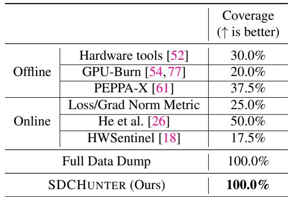

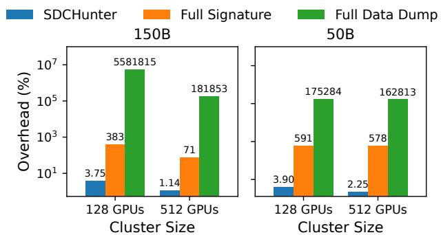  
Figure 16: The end-to-end overhead comparison of SD-CHUNTER and other tensor value observation methods on 128 and 512 GPUs with model size 50B and 150B.

4× slowdown, and performing full tensor data comparisons results is totally unacceptable. The substantial overheads of these two baselines arise primarily from transferring tensors from GPU to host due to the limited capacity of GPU memory, and also from the need to perform many of these transfers synchronously because the recorded tensors must remain unmodified before they are saved. In practical large-scale training scenarios, GPU memory is typically close to saturation, which further amplifies the overhead incurred by the baseline methods.

## 6.3 SDCHUNTER Detection Ability

To evaluate the effectiveness of SDCHUNTER in detecting SDCs, we conduct both real-world trace based and fault injection based evaluations. The fault injection is conducted by changing the input or output tensor values during the training process. For the real-world evaluation, we measure the coverage in detecting SDC-defective GPUs since it is impractical to manually replicate the training process to determine the golden baseline. For the fault injection evaluation, we measure the detection ability of SDCHUNTER in overhead, the percentage of SDC GPUs successfully identified, and the mean gap between the SDC occurrence and its first detection by the system. The real-world trace based evaluation results are presented in Table 5 and the fault injection based results are shown in Table 6.

Table 6: The detection ability of SDCHUNTER in detecting SDC GPUs in fault injection.  
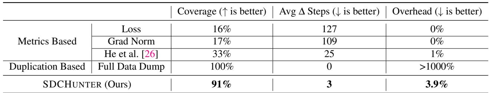

Table 7: The localization ability of SDCHUNTER in detecting SDC GPUs in real-world trace and fault injection.  
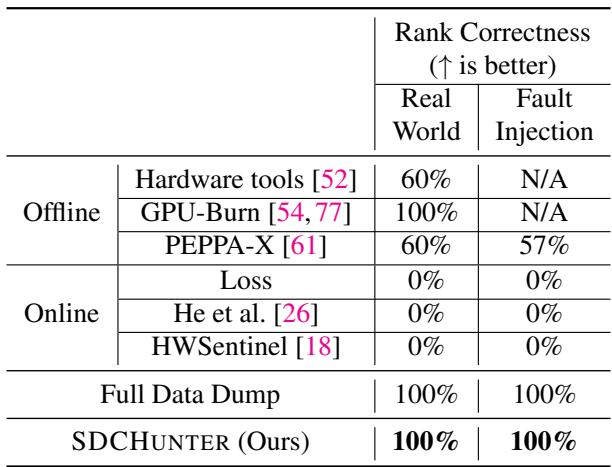

In the real-world trace evaluation, SDCHUNTER covers all confirmed SDC-defective GPUs, and it reaches 91% coverage under synthetic fault injection. For the fault injection evaluation, SDCHUNTER localizes SDC-defective GPUs in fewer than 5 steps, with 3 steps on average. For the real-world evaluation, SDCHUNTER only needs to replay fewer than 100 steps of the training process in the first stage, which al lows the affected training job to resume within one hour after the suspicious DP group is isolated. The offline debugging stage then pinpoints the defective GPU in under one hour and does not block the online job because the training job has already moved away from the suspicious machines. Naive offline stress tests [52,54,77] can only achieve a coverage lower than 40%. PEPPA-X [61] improves coverage by searching for inputs that maximize SDC vulnerability based on the sensitivity of the input to SDC. Although this approach achieves certain gains compared with simple stress-testing methods, the coverage attainable during offline tests remains fundamentally limited. He et al. [26] detects SDCs by monitoring whether the optimizer’s gradient history terms and the normalization moving-variance values exceed mathematically derived bounds. This method maintains a low overhead, but the coverage does not reach 50%, and the number of steps from SDC occurrence to metric out-of-bound is still relatively high. We also apply HWSentinel [18] to GPU SDC detection. However, once GPU logs reflect abnormal behavior, it is already too late to detect SDC.

## 6.4 SDCHUNTER Locating Ability

We assess the localization capability of device-level identification, which pinpoints the specific faulty accelerator, among all the baselines. We define localization accuracy as the percentage of SDC cases where SDCHUNTER correctly identifies the specific device ID. The result of localization accuracy evaluation is shown in Table 7, also including both real-world trace based and fault injection based evaluations.

SDCHUNTER achieves perfect device-level localization, offering 100% accuracy in attributing the SDC to the specific faulty GPU, even in the presence of complex collective communication primitives. This precise localization enables operators to isolate faulty hardware or numeric instabilities swiftly, significantly reducing the debug turnaround time compared to standard bisection methods.

## 7 Related Work

Silent Data Corruption on CPU. Extensive research targets CPU hardware defects [15, 22, 24, 31, 38, 39, 66, 67], detection [16, 34, 58, 59], and mitigation [17, 23, 27, 44, 76], particularly in HPC environments where computational density amplifies SDC frequency [9, 19, 20, 29, 46, 61]. Missioncritical systems often employ spatial or temporal redundancy [28, 29, 45, 63, 64], but high overheads frequently necessitate specialized processor support [45, 63, 64]. To reduce validation costs, Orthus [40] exploits control-data path separation, using lightweight checksums for control and versionedmemory re-execution for data. While system-level replication guarantees consistency in databases [57] and has been adapted for broader error detection [19, 20, 70], its utility is often limited by synchronization costs and latency in long-running jobs.

Silent Data Corruption on GPU. Recent studies extensively characterize GPU-induced SDC in AI workloads [4,14, 21,26,32,43]. Research has largely focused on software-based mitigation for inference: SAVE [82] employs bit-level robustness analysis to shield critical memory, while distributionbased methods [35, 42] detect errors by monitoring activation value bounds. Additionally, Agarwal et al. [4] analyze how transient faults propagate through LLM architectures to impact final outputs. While SDC in training poses unique challenges. Ma et al. [43] reveal that faults can induce catastrophic parameter drift silently, even when loss curves remain unaffected. To counter this, He et al. [26] propose checking optimizer states against derived statistical bounds and recovering by re-executing recent iterations. In proprietary systems, Google reports using deterministic replay to isolate incorrect computations [2, 3], though specific implementation details remain undisclosed.

GPU Determinism. Achieving determinism is critical for debugging and reliability [7, 25, 68, 79, 80]. Nondeterminism often stems from floating-point non-associativity in atomic operations; while some approaches focus on request-level batch invariance [25], they often overlook distributed communication noise. Although newer hardware supports deterministic in-switch reductions [62], communication over RDMA remains inherently non-deterministic. TBIK [80] bridges this gap by designing fully deterministic MatMul and AllReduce kernels for different tensor-parallel configurations.

## 8 Discussion

Deployment Experience. SDCHUNTER has been deployed as part of the production training infrastructure at ByteDance in cooperation with SDC detection tools [33] and OpGuard [83], where it is used as the first hardware-diagnosis step when training jobs exhibit suspicious symptoms such as loss spikes or unexplained fail-stop errors. By the time of submission, the system had identified 40 SDC-defective GPUs in production. These devices cover a wide range of manifestation frequencies, from faults that reproduce in every replay to faults that appear only rarely, which explains why hardware tools and generic stress tests alone cannot serve as a reliable production gate. In operation, SDCHUNTER first isolates the suspicious DP group so the online training job can move away from the affected machines and resume from a checkpoint. The subsequent offline debugging process pinpoints the defective GPU in under one hour and does not block the online job.

Deployment Lessons. Our experience suggests three practical lessons for operating large-scale LLM training clusters under SDC risk. First, SDC diagnosis must be integrated with the training control plane rather than treated as a standalone hardware test. The most useful action during an incident is to remove suspicious machines from the training path quickly and defer device-level confirmation to offline analysis. Sec ond, exact workload replay is more effective than synthetic stress testing because many defective GPUs only fail for the model kernels, data ranges, and communication schedules that triggered the original anomaly. Third, deterministic training is useful beyond SDC detection. It turns ambiguous symptoms such as loss spikes into reproducible comparisons, which also helps engineers distinguish data issues, model issues, infrastructure problems, operator bugs, and hardware corruption. Finally, SDC occurrence rates vary widely across defective GPUs, so a fixed-duration stress test is not a reliable acceptance criterion. Production systems should retain the alerttriggering trace and replay it when confirming rare faults.

Analysis Ability of Other Problems. The core of SD-CHUNTER is to use deterministic operators and instrument the operators to limit the error to within a single GPU, and then locate the faulty GPU by comparing different replicas. SDCHUNTER can be used not only for SDC detection but also for the analysis of other problems. In our production environment, the tool has also helped detect slow nodes, nodes with runtime jitter, and machine issues that cause training jobs to idle.

Towards Real-time Online SDC Detection. While SD-CHUNTER currently reacts to explicit anomalies, we envision proactive, always-on SDC monitoring. The main bottleneck is the overhead of frequent tensor signature computation. Future work can reduce this cost through operator fusion. By embedding the checksum arithmetic into the memory load/store of the communication primitives (e.g., fusing hash calculation into the communication Send/Recv kernels), we can compute signatures on-the-fly as data flows through the interconnect. This design can mask the computation cost behind the communication latency or memory bandwidth, enabling zero-overhead, real-time SDC shielding for every training iteration.

## 9 Conclusion

We characterize GPU Silent Data Corruption (SDC) in production LLM training, showing that SDCs often mimic software bugs and evade synthetic benchmarks. We develop SDCHUNTER, which localizes defective devices through bitwise deterministic replay of the triggering workload. In production, SDCHUNTER identified 40 SDC-defective GPUs, reducing job-blocking recovery to under one hour and confirming each device offline within one hour.

## Acknowledgments

We sincerely thank our shepherd and anonymous reviewers of OSDI 2026, whose reviews, feedback, and suggestions have significantly strengthened our work. This research was supported in part by New Generation Information Technology Program from Shanghai Committee of Science and Technology (No. 25511104100) and National Natural Science Foundation of China (No. 62432010). Corresponding author: Jinyu Gu (gujinyu@sjtu.edu.cn, Shanghai Jiao Tong University), Wencong Xiao (hanli.hl@bytedance.com, ByteDance Seed).

## References

[1] The llama 3 herd of models, 2024.

[2] Gemini 2.5: Pushing the frontier with advanced reasoning, multimodality, long context, and next generation agentic capabilities, 2025.

[3] Gemini: A family of highly capable multimodal models, 2025.

[4] Udit Kumar Agarwal, Abraham Chan, and Karthik Pattabiraman. Resilience assessment of large language models under transient hardware faults. In 2023 IEEE 34th International Symposium on Software Reliability Engineering (ISSRE), pages 659–670, 2023.

[5] Anton Altenbernd, Philipp Wiesner, and Odej Kao. Exploring silent data corruption as a reliability challenge in llm training, 2026.

[6] AMD. Open-field-health-check (ofhc). https://gi thub.com/amd/Open-Field-Health-Check, 2025. MIT license, accessed 2025-12-10.

[7] Berk Atil, Sarp Aykent, Alexa Chittams, Lisheng Fu, Rebecca J. Passonneau, Evan Radcliffe, Guru Rajan Rajagopal, Adam Sloan, Tomasz Tudrej, Ferhan Ture, Zhe Wu, Lixinyu Xu, and Breck Baldwin. Non-determinism of "deterministic" llm settings, 2025.

[8] Pedro Martins Basso, Fernando Fernandes dos Santos, and Paolo Rech. Impact of tensor cores and mixed precision on the reliability of matrix multiplication in gpus. IEEE Transactions on Nuclear Science, 67(7):1560– 1565, 2020.

[9] Eduardo Berrocal, Leonardo Bautista-Gomez, Sheng Di, Zhiling Lan, and Franck Cappello. Lightweight silent data corruption detection based on runtime data analysis for hpc applications. In Proceedings of the 24th International Symposium on High-Performance Parallel and Distributed Computing, HPDC ’15, page 275–278, New York, NY, USA, 2015. Association for Computing Machinery.

[10] PyTorch Contributors. torch.backends.cudnn.benchmark — pytorch documentation. https://docs.pytorch.org/docs/st able/backends.html#torch.backends.cudnn.be nchmark, 2025. Accessed: 2025-12-09.

[11] PyTorch Contributors. torch.backends.cudnn.deterministic pytorch documentation. https://docs.pytorch.org/docs/ stable/backends.html#torch.backends.cudnn. deterministic, 2025. Accessed: 2025-12-09.

[12] PyTorch Contributors. torch.use\_deterministic\_algorithms pytorch documentation. https://docs.pytorch.org/docs/ stable/generated/torch.use\_deterministic\_a lgorithms.html, 2025. Accessed: 2025-12-09.

[13] NVIDIA Corporation. Nvidia gpu memory error management. Technical Report DA-09826-002\_v001, NVIDIA Corporation, Apr 2025. Accessed: 2025-12- 09.

[14] Shengkun Cui, Archit Patke, Hung Nguyen, Aditya Ranjan, Ziheng Chen, Phuong Cao, Brett Bode, Gregory Bauer, Catello Di Martino, Saurabh Jha, Chandra Narayanaswami, Daby Sow, Zbigniew T. Kalbarczyk, and Ravishankar K. Iyer. Characterizing gpu resilience and impact on ai/hpc systems, 2025.

[15] Peter W. Deutsch, Vincent Quentin Ulitzsch, Sudhanva Gurumurthi, Vilas Sridharan, Joel S. Emer, and Mengjia Yan. Delayavf: Calculating architectural vulnerability factors for delay faults. In 2024 57th IEEE/ACM International Symposium on Microarchitecture (MICRO), pages 231–245, 2024.

[16] Harish Dattatraya Dixit, Laura Boyle, Gautham Vunnam, Sneha Pendharkar, Matt Beadon, and Sriram Sankar. Detecting silent data corruptions in the wild, 2022.

[17] Harish Dattatraya Dixit, Sneha Pendharkar, Matt Beadon, Chris Mason, Tejasvi Chakravarthy, Bharath Muthiah, and Sriram Sankar. Silent data corruptions at scale, 2021.

[18] Rhea Dutta, Harish Dattatraya Dixit, Rik Van Riel, Gautham Vunnam, and Sriram Sankar. Hardware Sentinel: Protecting Software Applications from Hardware Silent Data Corruptions, page 482–497. Association for Computing Machinery, New York, NY, USA, 2025.

[19] James Elliott, Kishor Kharbas, David Fiala, Frank Mueller, Kurt Ferreira, and Christian Engelmann. Combining partial redundancy and checkpointing for hpc. In 2012 IEEE 32nd International Conference on Distributed Computing Systems, pages 615–626, 2012.

[20] David Fiala, Frank Mueller, Christian Engelmann, Rolf Riesen, Kurt Ferreira, and Ron Brightwell. Detection and correction of silent data corruption for large-scale high-performance computing. In SC ’12: Proceedings of the International Conference on High Performance Computing, Networking, Storage and Analysis, pages 1–12, 2012.

[21] Nishant George, Harish Dattatraya Dixit, Emel Goksu, Bharath Parthasarathy, Amber Huffman, Sudhanva Gurumurthi, Vilas Sridharan, Thiago Macieira, Arani Sinha,

Lisa Minwell, Dean Liberty, and Rob Chappell. Silent data corruption in ai. White paper, Open Compute Project, August 2025. Version 1.0, Creative Commons Attribution-ShareAlike 4.0 International License.

[22] Nick Hagerty, Jordan Webb, Veronica Melesse Vergara, and Matt Ezell. Experiences detecting defective hardware in exascale supercomputers. In Proceedings of the SC ’23 Workshops of the International Conference on High Performance Computing, Network, Storage, and Analysis, SC-W ’23, page 619–626, New York, NY, USA, 2023. Association for Computing Machinery.

[23] Siva Kumar Sastry Hari, Sarita V. Adve, and Helia Naeimi. Low-cost program-level detectors for reducing silent data corruptions. In IEEE/IFIP International Conference on Dependable Systems and Networks (DSN 2012), pages 1–12, 2012.

[24] Siva Kumar Sastry Hari, Paolo Rech, Timothy Tsai, Mark Stephenson, Arslan Zulfiqar, Michael Sullivan, Philip Shirvani, Paul Racunas, Joel Emer, and Stephen W. Keckler. Estimating silent data corruption rates using a two-level model, 2020.

[25] Horace He and Thinking Machines Lab. Defeating nondeterminism in llm inference. Thinking Machines Lab: Connectionism, 2025. https://thinkingmachines.ai/blog/defeatingnondeterminism-in-llm-inference/.

[26] Yi He, Mike Hutton, Steven Chan, Robert De Gruijl, Rama Govindaraju, Nishant Patil, and Yanjing Li. Understanding and mitigating hardware failures in deep learning training systems. In Proceedings of the 50th Annual International Symposium on Computer Architecture, ISCA ’23, New York, NY, USA, 2023. Association for Computing Machinery.

[27] Peter H. Hochschild, Paul Turner, Jeffrey C. Mogul, Rama Govindaraju, Parthasarathy Ranganathan, David E. Culler, and Amin Vahdat. Cores that don’t count. In Proceedings of the Workshop on Hot Topics in Operating Systems, HotOS ’21, page 9–16, New York, NY, USA, 2021. Association for Computing Machinery.

[28] Ted Hong, Yanjing Li, Sung-Boem Park, Diana Mui, David Lin, Ziyad Abdel Kaleq, Nagib Hakim, Helia Naeimi, Donald S. Gardner, and Subhasish Mitra. Qed: Quick error detection tests for effective post-silicon validation. In 2010 IEEE International Test Conference, pages 1–10, 2010.

[29] Yafan Huang, Shengjian Guo, Sheng Di, Guanpeng Li, and Franck Cappello. Mitigating silent data corruptions in hpc applications across multiple program inputs. In SC22: International Conference for High Performance

Computing, Networking, Storage and Analysis, pages 1–14, 2022.

[30] Yuxuan Jiang, Ziming Zhou, Boyu Xu, Beijie Liu, Run hui Xu, and Peng Huang. Training with confidence: Catching silent errors in deep learning training with automated proactive checks. In Proceedings of the 19th USENIX Symposium on Operating Systems Design and Implementation, OSDI ’25, Boston, MA, USA, July 2025. USENIX Association.

[31] Nikos Karystinos, Odysseas Chatzopoulos, George-Marios Fragkoulis, George Papadimitriou, Dimitris Gizopoulos, and Sudhanva Gurumurthi. Harpocrates: Breaking the silence of cpu faults through hardwarein-the-loop program generation. In 2024 ACM/IEEE 51st Annual International Symposium on Computer Architecture (ISCA), pages 516–531, 2024.

[32] Jack Kosaian and K. V. Rashmi. Arithmetic-intensityguided fault tolerance for neural network inference on gpus. In Proceedings of the International Conference for High Performance Computing, Networking, Storage and Analysis, SC ’21, New York, NY, USA, 2021. Association for Computing Machinery.

[33] Kinman Lei, Liyan Zheng, Xiang Li, Hongmin Chen, Yun Zhang, Gaohong Liu, Zuquan Song, Zixuan Ma, Zhiyu Xue, Minghui Yu, Shuguang Wang, Wencong Xiao, Haibin Lin, Yuyang Jin, Jidong Zhai, Bo Liu, and Xin Liu. Safeguarding LLM training at scale: Online SDC detection and insights from 35 million GPU hours. In 20th USENIX Symposium on Operating Systems Design and Implementation, OSDI 2026, Seattle, WA, USA, July 13–15, 2026. USENIX Association, 2026.

[34] David P. Lerner, Benson Inkley, Shubhada H. Sahasrabudhe, Ethan Hansen, Luis D. Rojas Munoz, and Arjan van de Ven. Optimization of tests for managing silicon defects in data centers. In 2022 IEEE International Test Conference (ITC), pages 578–582, 2022.

[35] Guanpeng Li, Siva Kumar Sastry Hari, Michael Sullivan, Timothy Tsai, Karthik Pattabiraman, Joel Emer, and Stephen W. Keckler. Understanding error propagation in deep learning neural network (dnn) accelerators and applications. In Proceedings of the International Conference for High Performance Computing, Networking, Storage and Analysis, SC ’17, New York, NY, USA, 2017. Association for Computing Machinery.

[36] Sihuan Li, Jianyu Huang, Ping Tak Peter Tang, Daya Khudia, Jongsoo Park, Harish Dattatraya Dixit, and Zizhong Chen. Efficient soft-error detection for lowprecision deep learning recommendation models. In 2022 IEEE International Conference on Big Data (Big Data), pages 1556–1563, 2022.

[37] Xiaolong Li, Zhi-Qin John Xu, and Zhongwang Zhang. Loss spike in training neural networks, 2024.

[38] Fan Lin, Matt Beadon, Harish Dattatraya Dixit, Gautham Vunnam, Amol Desai, and Sriram Sankar. Hardware remediation at scale. In 2018 48th Annual IEEE/IFIP International Conference on Dependable Systems and Networks Workshops (DSN-W), pages 14–17, 2018.

[39] Fred Lin, Antonio Davoli, Imran Akbar, Sukumar Kalmanje, Leandro Silva, John Stamford, Yanai Golany, Jim Piazza, and Sriram Sankar. Predicting remediations for hardware failures in large-scale datacenters. In 2020 50th Annual IEEE-IFIP International Conference on Dependable Systems and Networks-Supplemental Volume (DSN-S), pages 13–16, 2020.

[40] Chenxiao Liu, Zhenting Zhu, Quanxi Li, Yanwen Xia, Yifan Qiao, Xiangyun Deng, Youyou Lu, Tao Xie, Huimin Cui, Zidong Du, Harry Xu, and Chenxi Wang. Orthrus: Efficient and timely detection of silent user data corruption in the cloud with resource-adaptive computation validation. In Proceedings of the ACM SIGOPS 31st Symposium on Operating Systems Principles, SOSP ’25, page 286–304, New York, NY, USA, 2025. Association for Computing Machinery.

[41] Yunchi Lu, Youshan Miao, Cheng Tan, Peng Huang, Yi Zhu, Xian Zhang, and Fan Yang. Trainverify: Equivalence-based verification for distributed LLM training. In Youjip Won, Youngjin Kwon, Ding Yuan, and Rebecca Isaacs, editors, Proceedings of the ACM SIGOPS 31st Symposium on Operating Systems Principles, SOSP 2025, Lotte Hotel World, Seoul, Republic of Korea, October 13-16, 2025, pages 237–253. ACM, 2025.

[42] Dongning Ma, Fred Lin, Alban Desmaison, Joel Coburn, Daniel Moore, Sriram Sankar, and Xun Jiao. Dr. dna: Combating silent data corruptions in deep learning using distribution of neuron activations. In Proceedings of the 29th ACM International Conference on Architectural Support for Programming Languages and Operating Systems, Volume 3, ASPLOS ’24, page 239–252, New York, NY, USA, 2024. Association for Computing Machinery.

[43] Jeffrey Ma, Hengzhi Pei, Leonard Lausen, and George Karypis. Understanding silent data corruption in llm training, 2025.

[44] Subhasish Mitra, Subho S. Banerjee, Martin Dixon, Mike Fuller, Rama Govindaraju, Peter Hochschild, Eric X. Liu, Bharath Parthasarathy, and Parthasarathy Ranganathan. Silent data corruption by 10× test escapes threatens reliable computing. IEEE Des. Test, 42(6):40– 53, 2025.

[45] S.S. Mukherjee, M. Kontz, and S.K. Reinhardt. Detailed design and evaluation of redundant multi-threading alternatives. In Proceedings 29th Annual International Symposium on Computer Architecture, pages 99–110, 2002.

[46] S.S. Mukherjee, C. Weaver, J. Emer, S.K. Reinhardt, and T. Austin. A systematic methodology to compute the architectural vulnerability factors for a highperformance microprocessor. In Proceedings. 36th Annual IEEE/ACM International Symposium on Microarchitecture, 2003. MICRO-36., pages 29–40, 2003.

[47] Chandra Sekhar Mummidi, Sandeep Bal, Brunno F. Goldstein, Sudarshan Srinivasan, and Sandip Kundu. A highly-efficient error detection technique for general matrix multiplication using tiled processing on simd architecture. In 2022 IEEE 40th International Conference on Computer Design (ICCD), pages 529–536, 2022.

[48] Chandra Sekhar Mummidi, Victor C. Ferreira, Sudarshan Srinivasan, and Sandip Kundu. Highly efficient self-checking matrix multiplication on tiled amx accelerators. ACM Trans. Archit. Code Optim., 21(2), February 2024.

[49] NVIDIA. Nvidia data center gpu manager (dcgm). ht tps://github.com/NVIDIA/DCGM, 2025. Apache-2.0 license, accessed 2025-12-10.

[50] NVIDIA Corporation. cuBLAS: Gpu-accelerated basic linear algebra subprograms. https://developer.nv idia.com/cublas, 2025. Accessed: 2025-12-11.

[51] NVIDIA Corporation. CUTLASS: Cuda templates and python dsls for high-performance linear algebra. https: //github.com/NVIDIA/cutlass, 2025. Accessed: 2025-12-11.

[52] NVIDIA Corporation. Extended Utility Diagnostics (EUD) — NVIDIA DCGM User Guide. NVIDIA, 2025. Accessed: 2025-12-11, https://docs.nvidia.com/ datacenter/dcgm/latest/user-guide/dcgm-eud .html.

[53] NVIDIA Corporation. NVIDIA CUDA Deep Neural Network Library (cuDNN). https://developer.nv idia.com/cudnn, 2025. Accessed: 2025-12-11.

[54] NVIDIA Corporation. Targeted Stress Plugin — DCGM User Guide. NVIDIA, 2025. Accessed: 2025-12-11, https://docs.nvidia.com/datacenter/dcgm/la test/user-guide/diag-targeted-stress-plugi n.html.

[55] NVIDIA Corporation. XID Errors. NVIDIA Corporation, Santa Clara, CA, USA, release r590, v590 edition, December 2025. Online; accessed 11 December 2025.

[56] Ataberk Olgun, Majd Osseiran, Abdullah Giray Yaglikci, Yahya Can Tugrul, Haocong Luo, Steve Rhyner, Behzad Salami, Juan Gomez Luna, and Onur Mutlu. Read disturbance in high bandwidth memory: A detailed experimental study on hbm2 dram chips, 2024.

[57] Diego Ongaro and John Ousterhout. In search of an understandable consensus algorithm. In Proceedings of the 2014 USENIX Conference on USENIX Annual Technical Conference, USENIX ATC’14, page 305–320, USA, 2014. USENIX Association.

[58] George Papadimitriou and Dimitris Gizopoulos. Silent data corruptions: Microarchitectural perspectives. IEEE Transactions on Computers, 72(11):3072–3085, 2023.

[59] George Papadimitriou, Dimitris Gizopoulos, Harish Dattatraya Dixit, and Sriram Sankar. Silent data corruptions: The stealthy saboteurs of digital integrity. In 2023 IEEE 29th International Symposium on On-Line Testing and Robust System Design (IOLTS), pages 1–7, 2023.

[60] Hengzhi Pei, Leonard Lausen, and George Karypis. Connecting the Impact of Silent Data Corruption With Different Training Characteristics: An Empirical Study . IEEE Micro, 46(01):44–51, January 2026.

[61] Md Hasanur Rahman, Aabid Shamji, Shengjian Guo, and Guanpeng Li. Peppa-x: Finding program test inputs to bound silent data corruption vulnerability in hpc applications. In SC21: International Conference for High Performance Computing, Networking, Storage and Analysis, pages 1–14, 2021.

[62] Rainlin007 and other contributors. same data all reduce on h20, but results are different — issue #1497 comment on nvidia/nccl github repository. https://github.com /NVIDIA/nccl/issues/1497#issuecomment-32108 19243, 2024. Comment posted 2024-10-28, accessed 2025-12-09.

[63] S.K. Reinhardt and S.S. Mukherjee. Transient fault detection via simultaneous multithreading. In Proceedings of 27th International Symposium on Computer Architecture (IEEE Cat. No.RS00201), pages 25–36, 2000.

[64] E. Rotenberg. Ar-smt: a microarchitectural approach to fault tolerance in microprocessors. In Digest of Papers. Twenty-Ninth Annual International Symposium on Fault-Tolerant Computing (Cat. No.99CB36352), pages 84–91, 1999.

[65] Fernando Fernandes dos Santos, Siva Kumar Sastry Hari, Pedro Martins Basso, Luigi Carro, and Paolo Rech. Demystifying gpu reliability: Comparing and combin ing beam experiments, fault simulation, and profiling. In 2021 IEEE International Parallel and Distributed Processing Symposium (IPDPS), pages 289–298, 2021.

[66] Bianca Schroeder, Eduardo Pinheiro, and Wolf-Dietrich Weber. Dram errors in the wild: A large-scale field study. In SIGMETRICS, 2009.

[67] Kostya Serebryany, Maxim Lifantsev, Konstantin Shtoyk, Doug Kwan, and Peter Hochschild. Silifuzz: Fuzzing cpus by proxy, 2021.

[68] Sanjif Shanmugavelu, Mathieu Taillefumier, Christopher Culver, Oscar Hernandez, Mark Coletti, and Ada Sedova. Impacts of floating-point non-associativity on reproducibility for hpc and deep learning applications, 2024.

[69] Mohammad Shoeybi, Mostofa Patwary, Raul Puri, Patrick LeGresley, Jared Casper, and Bryan Catanzaro. Megatron-lm: Training multi-billion parameter language models using model parallelism. arXiv preprint arXiv:1909.08053, 2019.

[70] J. R. Sklaroff. Redundancy management technique for space shuttle computers. IBM Journal of Research and Development, 20(1):20–28, 1976.

[71] Sho Takase, Shun Kiyono, Sosuke Kobayashi, and Jun Suzuki. Spike no more: Stabilizing the pre-training of large language models, 2025.

[72] Abhishek Tyagi, Saurabh Hukerikar, Nirmal Saxena, Yanxiang Huang, Philip Shirvani, Chung-Hsuan Tung, and Yuhao Zhu. Llm-prism: Characterizing silent data corruption from permanent gpu faults in llm training, 2026.

[73] Borui Wan, Gaohong Liu, Zuquan Song, Jun Wang, Yun Zhang, Guangming Sheng, Shuguang Wang, Houmin Wei, Chenyuan Wang, Weiqiang Lou, Xi Yang, Mofan Zhang, Kaihua Jiang, Cheng Ren, Xiaoyun Zhi, Menghan Yu, Zhe Nan, Zhuolin Zheng, Baoquan Zhong, Qin long Wang, Huan Yu, Jinxin Chi, Wang Zhang, Yuhan Li, Zixian Du, Sida Zhao, Yongqiang Zhang, Jingzhe Tang, Zherui Liu, Chuan Wu, Yanghua Peng, Haibin Lin, Wencong Xiao, Xin Liu, and Liang Xiang. Robust llm training infrastructure at bytedance. In Proceedings of the ACM SIGOPS 31st Symposium on Operating Systems Principles, SOSP ’25, page 186–203, New York, NY, USA, 2025. Association for Computing Machinery.

[74] Meiqi Wang, Han Qiu, Longnv Xu, Di Wang, Yuanjie Li, Tianwei Zhang, Jun Liu, and Hewu Li. A case for application-aware space radiation tolerance in orbital computing, 2024.

[75] Shaobu Wang, Guangyan Zhang, Junyu Wei, Yang Wang, Jiesheng Wu, and Qingchao Luo. Understanding silent data corruptions in a large production CPU population. In Jason Flinn, Margo I. Seltzer, Peter Druschel,

Antoine Kaufmann, and Jonathan Mace, editors, Proceedings of the 29th Symposium on Operating Systems Principles, SOSP 2023, Koblenz, Germany, October 23- 26, 2023, pages 216–230. ACM, 2023.

[76] Shaobu Wang, Guangyan Zhang, Junyu Wei, Yang Wang, Jiesheng Wu, and Qingchao Luo. Understanding silent data corruptions in a large production cpu population. In Proceedings of the 29th Symposium on Operating Systems Principles, SOSP ’23, page 216–230, New York, NY, USA, 2023. Association for Computing Machinery.

[77] wilicc. gpu-burn: Multi-gpu cuda stress test. GitHub repository, 2025. Accessed: 2025-12-11, https://gi thub.com/wilicc/gpu-burn.

[78] Blaise Agüera y Arcas, Travis Beals, Maria Biggs, Jessica V. Bloom, Thomas Fischbacher, Konstantin Gromov, Urs Köster, Rishiraj Pravahan, and James Manyika. Towards a future space-based, highly scalable ai infrastructure system design, 2025.

[79] Jiayi Yuan, Hao Li, Xinheng Ding, Wenya Xie, Yu-Jhe Li, Wentian Zhao, Kun Wan, Jing Shi, Xia Hu, and Zirui Liu. Understanding and mitigating numerical sources of nondeterminism in llm inference, 2025.

[80] Ziyang Zhang, Xinheng Ding, Jiayi Yuan, Rixin Liu, Huizi Mao, Jiarong Xing, and Zirui Liu. Deterministic inference across tensor parallel sizes that eliminates training-inference mismatch, 2025.

[81] Chenggang Zhao, Shangyan Zhou, Liyue Zhang, Chengqi Deng, Zhean Xu, Yuxuan Liu, Kuai Yu, Jiashi Li, and Liang Zhao. Deepep: an efficient expert-parallel communication library. https://github.com/deeps eek-ai/DeepEP, 2025.

[82] Wenxin Zheng, Bin Xu, Jinyu Gu, and Haibo Chen. Save: Software-implemented fault tolerance for model inference against gpu memory bit flips. In Proceedings of the 2025 USENIX Annual Technical Conference (USENIX ATC ’25). USENIX Association, 2025.

[83] Ziming Zhou, Yinjie Zhao, Hang Zhu, Wenxiao Wang, Zhihao Bai, Yun Zhang, Shuguang Wang, Haibin Lin, and Peng Huang. OpGuard: Bitwise alignment for precise and general debugging of production LLM training. In 20th USENIX Symposium on Operating Systems Design and Implementation, OSDI 2026, Seattle, WA, USA, July 13–15, 2026. USENIX Association, 2026.