USENIX

THE ADVANCED COMPUTING SYSTEMS ASSOCIATION

# Breaking the Reward Barrier: Accelerating Tree-of-Thought Reasoning via Speculative Exploration

Shuzhang Zhong, Haochen Huang, and Shengxuan Qiu, Peking University; Pengfei Zuo, ByteDance Seed; Runsheng Wang and Meng Li, Peking University

https://www.usenix.org/conference/osdi26/presentation/zhong

# This paper is included in the Proceedings of the 20th USENIX Symposium on Operating Systems Design and Implementation.

July 13–15, 2026 • Seattle, WA, USA

ISBN 978-1-939133-55-7

Open access to the Proceedings of the 20th USENIX Symposium on Operating Systems Design and Implementation is sponsored by

# Breaking the Reward Barrier: Accelerating Tree-of-Thought Reasoning via Speculative Exploration

Shuzhang Zhong1,2, Haochen Huang1,2, Shengxuan Qiu1,2, Pengfei Zuo∗3, Runsheng Wang2, and Meng Li∗1,2

1Institute for Artificial Intelligence, Peking University 2School of Integrated Circuits, Peking University 3ByteDance Seed

## Abstract

Tree-of-Thought (ToT) reasoning structures Large Language Model (LLM) inference as a tree-based search, demonstrating strong potential for solving complex mathematical and programming tasks. However, its efficiency is constrained by the reward dependency barrier—a synchronization bottleneck caused by sequential reward-guided exploration that limits search parallelism and introduces substantial latency. Prior system optimizations, mainly designed for linear Chain-of-Thought (CoT) reasoning, cannot address these challenges, leaving the efficiency of ToT underexplored.

To enhance ToT reasoning efficiency, we observe that the reasoning paths can be explored speculatively to break the reward synchronization barrier. Therefore, in this paper, we propose SPEX and introduce three key techniques: (i) intraquery speculative path selection to predict and expand highpotential branches of ToT, (ii) inter-query budget allocation to balance speculative resource allocation across queries dynamically, and (iii) adaptive early termination to prune deep and redundant branches for a skewed search tree.

We implement SPEX on top of the SGLang framework and evaluate it across diverse ToT algorithms and LLMs. Extensive experiments show that SPEX achieves 1.2 ∼ 3× speedup for different ToT reasoning algorithms. Moreover, SPEX synergizes with token-level speculative decoding, achieving cu mulative speedups of up to 4.1×. Ablation studies further confirm the contributions of each technique. Overall, SPEX represents a significant step toward efficient and scalable ToT reasoning, unlocking the parallelism required for highperformance inference-time scaling for LLMs.

## 1 Introduction

The recent success of Large Language Models (LLMs) has been driven by their ability to scale with inference-time compute budgets [3, 8, 26, 47, 50–52, 69]. Two main approaches have been constructed, including Chain-of-Thought (CoT) [13, 41, 59, 72] and Tree-of-Thought (ToT) [2, 11, 16, 19, 55, 66]. CoT prompts LLMs to reason over a coherent sequence of tokens (denoted as “thought”) that serve as intermediate steps toward problem solving. ToT further generalizes CoT by maintaining a search tree and allowing LLMs to explore different branches of the tree adaptively, as in Figure 1 (a). To guide exploration, ToT often relies on a reward signal that evaluates existing reasoning branches and decides the next course of action, e.g., expanding existing branches or backtracking. Compared to CoT, ToT enables LLMs to perform complex reasoning and greatly enhance their problemsolving capabilities.

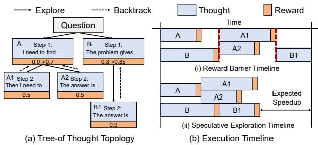  
Figure 1: Illustration of ToT and Reward Barrier.

Prior ToT algorithms employ distinct exploration strategies driven by how reward signals guide the search. They can be categorized into two paradigms that impose different dependency patterns on the system [64]. Breadth-First Search (BFS) maintains a set of the most promising thoughts at each step, utilizing intermediate reward feedback to concurrently prioritize and expand branches at the current search frontier. In contrast, algorithms like MCTS [68] incorporate Depth-First Search (DFS). The reward of all the nodes of a reasoning branch is iteratively updated via tree-search value propagation from leaf nodes. The search policy then leverages these refined rewards to revisit and expand prior nodes, enforcing a sequential dependency on previous iterations.

While ToT enhances reasoning capabilities and accuracy, it comes with increased latency overhead [10, 24, 30]. Many studies have explored strategies for efficient reasoning. On the algorithmic side, techniques like TrimR focus on reducing the length of thoughts for better reasoning efficiency [7, 9, 17, 24, 32, 35, 36, 45, 57, 70]. On the system side, serving frameworks such as vLLM [27] and SGLang [71] achieve significant efficiency improvement with PagedAttention and RadixAttention. However, these system optimizations are primarily designed for linear CoT reasoning and overlook the unique characteristics of ToT reasoning [29].

In this paper, we identify the critical performance bottleneck in ToT reasoning as the Reward Dependency Barrier as illustrated in Figure 1(b). In Breadth–First Search, the barrier imposes a synchronization overhead: expansion decision is gated by the aggregation of reward values of all concurrent thoughts. High variance in decoding lengths creates stragglers, forcing shorter branches to idle until the longest one completes. For Depth-First Search, the barrier imposes a sequential constraint: each new traversal must wait for the previous rollout outcome and tree-value update before deciding whether to continue or backtrack, enforcing a serialized execution flow. Consequently, both scenarios prevent the system from sustaining dense batch processing. This inefficiency limits parameter reuse and KV cache sharing, significantly degrading arithmetic intensity and shifting the workload to a memory-bound regime.

To break the barrier, we propose SPEX to enhance parallelism in ToT reasoning. By proactively generating subsequent thoughts for promising branches without waiting for the synchronization of reward values, SPEX allows the system to overlap the generation of future thoughts with the completion of current thoughts. It addresses three key challenges in speculative exploration: (i) How to accurately predict which branches to expand speculatively, (ii) How to efficiently allocate computational resources across queries with varying demands and reuse opportunities, and (iii) How to manage skewed tree structures, where a few disproportionately deep thought branches dominate overall inference latency and are difficult to explore speculatively.

To address these challenges, we identify three key insights that shape the design of SPEX. First, reward stability across iterations enables reliable prediction of high-potential branches, even in DFS. Second, shared computation opportunities, such as KV cache reuse and parameter sharing, can enhance speculative efficiency and resource utilization. Finally, in skewed tree structures, most correct solutions emerge at shallow depths, making it possible to terminate the deep branches early.

Motivated by these insights, SPEX introduces three key techniques: (i) Intra-query speculative branch selection, which leverages reward stability in DFS and score-based allocation in BFS to identify high-likelihood branches for speculative expansion. (ii) Inter-query budget allocation, which dynamically distributes speculative resources across queries based on predicted utility, KV cache reuse potential, and system constraints, ensuring balanced and efficient utilization. (iii) Adaptive early termination, which halts exploration in skewed trees once sufficient confidence is achieved, avoiding unnecessary computation in deep branches.

Finally, to unify speculative exploration across diverse ToT reasoning algorithms, we design SPEX as a general producer–consumer execution framework that integrates the three techniques. The framework decouples branch expansion (producer role) from control logic (consumer role), enabling concurrent progress on both primary and speculative branches while adapting to system resource conditions. Our contributions can be summarized as follows:

• We identify the reward dependency barrier as the principal bottleneck in ToT reasoning.

• We propose SPEX, a speculative exploration framework that breaks this barrier by proactively and speculatively exploring promising branches.

• We design three complementary techniques, i.e., intraquery speculative selection, inter-query budget allocation, and early termination strategy, to improve the effectiveness of speculation.

• We implement the SPEX on top of SGLang and demonstrate up to 3× speedup over prior-art ToT reasoning algorithms without compromising accuracy. SPEX is available at https://github.com/PKU-SEC-Lab/SPEX.

## 2 Background

## 2.1 Tree-of-Thought Reasoning

Recent research on inference scaling laws has shown that LLM performance improves with increased inference-time compute budget [3,8,20,26,42,43,50–52]. Chain-of-Thought (CoT) extends reasoning depth along a single trajectory, Treeof-Thought (ToT) further expands reasoning breadth by exploring multiple solution paths in parallel [64].

Structurally, ToT frames reasoning as a search over a tree of discrete steps. In this framework, each step constitutes a coherent segment of thought, serving as the atomic unit of expansion. Accordingly, a node represents the partial solution state reached by applying a step, and a sequential trajectory of these states from the question to a final answer forms a reasoning path [60].

The search is guided by reward signals, derived either from a dedicated reward model [60] or through the reasoning model’s intrinsic self-evaluation [18]. As illustrated in Figure 2, ToT algorithms can be categorized by their expansion and traversal strategies into BFS and DFS.

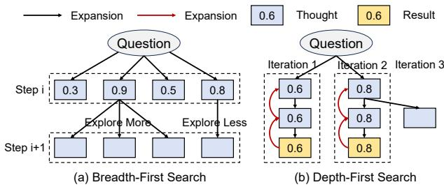  
Figure 2: Classification of different ToT algorithms.

## 2.1.1 Breadth-First Search

Breadth-First Search maintains a collection of the most promising nodes at each step, optimizing the search frontier by utilizing intermediate feedback to concurrently prioritize and extend these branches [64]. A representative algorithm is REBASE [60] illustrated in Figure 2(a), which utilizes process rewards to guide this search. It employs a softmaxbased mechanism to dynamically allocate expansion budgets. Formally, given a total sampling budget Bi at depth i, the expansion width Wj for a node nj is calculated as:

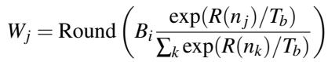

where R(Nj) denotes the reward score of node nj, Tb is the balance temperature controlling the exploration-exploitation trade-off, and the summation index k iterates over all candidate nodes at the current depth i.

## 2.1.2 Depth-First Search

Depth-First Search explores the most promising path until a terminal state is reached, and then leverages updated value estimates to backtrack and revisit high-potential prior states for alternative exploration [64]. Thus, the next traversal is chosen only after the current rollout updates the tree state. Monte Carlo Tree Search (MCTS) is a representative algorithm for this category as illustrated in Figure 2(b) [5, 46, 56, 62]. It balances the trade-off between exploration and exploitation using the Upper Confidence Bound (UCB) metric to select the next action a∗:

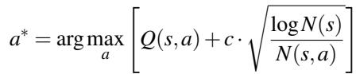

where Q(s,a) represents the estimated value of taking action a in state s, N(s) and N(s, a) denote the visit counts for the state and the specific action, respectively, and c is the exploration constant. By updating these statistics after each traversal, the algorithm retrospectively adjusts its search focus. However, this iterative dependency typically enforces a sequential execution pattern, severely limiting parallelism.

Notably, DFS can operate in isolation or coexist with BFS. Pure DFS, such as RSTAR-MCTS [46], generates a single continuous chain per iteration, receiving a reward signal only upon reaching the final outcome. In contrast, REST-MCTS [68] adopts a hybrid strategy where each iteration functions as a step-wise BFS: at every depth, it expands multiple candidate nodes and utilizes immediate process rewards to select the single best child for the subsequent step.

## 2.2 Existing Optimizations for ToT Reasoning

Existing system optimizations for LLM inference are highly effective for single-path CoT reasoning, but few are specifically designed to support the tree-structured search process of ToT reasoning. This fundamental mismatch leaves current serving infrastructures unable to fully exploit the potential of multi-path search.

On the system side, a series of serving frameworks have substantially improved throughput and latency for linear decoding workloads. vLLM [27] introduces PageAttention, which decouples key-value caching from attention computation. SGLang [71] implements RadixAttention to reuse intermediate KV-cache memory across requests. FlashAttention and FlashDecoding utilize the online softmax to reduce memory usage [15]. FlashInfer integrates the above optimizations of attention into a unified block-sparse framework [65]. Together, these efforts demonstrate the effectiveness of systemlevel optimization for general LLM decoding.

On the algorithmic side, efficient reasoning methods primarily target token efficiency in CoT. Approaches reduce the number of generated tokens or adaptively adjust reasoning length based on task complexity [7, 9, 17, 35, 36, 57, 70]. ETS [23] goes beyond token-level analysis by providing a system-oriented perspective, showing that in memory-bound scenarios, KV cache access dominates inference costs. By optimizing KV reuse and access patterns, ETS connects algorithm design with system efficiency.

Despite these advances, existing methods share a fundamental limitation: they are tailored for linear CoT reasoning. While CoT-style optimizations leverage batching and prefix sharing across requests, they do not accommodate the irregular, tree-shaped exploration inherent to ToT reasoning.

## 3 Motivation and Challenge

Unlike CoT, ToT requires concurrent branch expansion, dynamic allocation of computational budgets, and synchronization based on reward signals. These characteristics introduce new system-level bottlenecks that current inference systems are not designed to handle.

In this section, we first present our key observation that the reward dependency barrier constitutes the primary bottleneck limiting ToT reasoning efficiency (§3.1). We then provide a quantitative analysis of how this barrier constrains system performance (§3.2), followed by our motivation: speculative branch exploration as a means to improve efficiency (§3.3). Finally, we discuss the challenges to perform speculative exploration in ToT reasoning (§3.4).

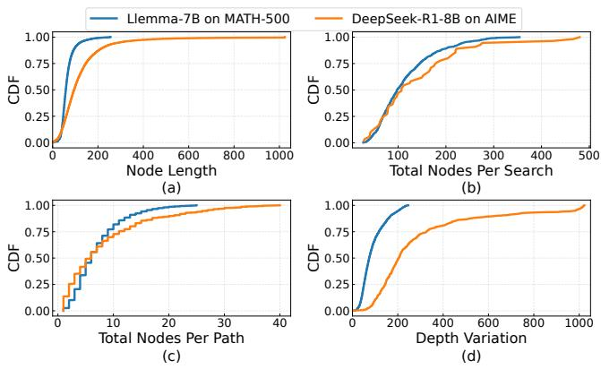

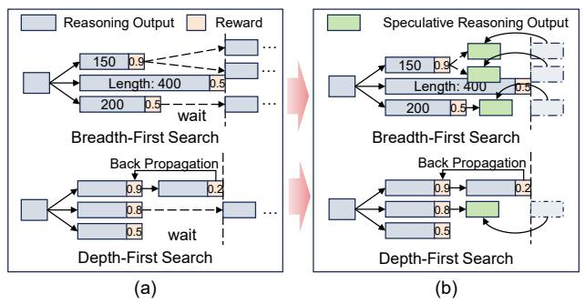  
Figure 3: Example of (a) reward barrier and (b) our proposed speculative exploration.  
Figure 4: Cumulative Distribution Function (CDF) of reasoning characteristics for Llemma-7B [1] and DeepSeek-R1-8B. (a) Node Lengths; (b) Total Nodes Per Search; (c) Total Nodes Per Path; (d) Variation of Node Lengths at the same depth.

## 3.1 Observation on Reward Dependency Barrier

We observe that the reward dependency barrier is the principal performance bottleneck in ToT reasoning: At each stage of the search, the system must pause to await feedback from the reward model before determining the next action. The manifestation of this barrier varies depending on the underlying algorithmic paradigm and arises from two main sources.

1) Intrinsic Sequentiality in Depth-First Search. In DFS algorithm, the search advances along a single reasoning path, with progress contingent on receiving the reward signal. Only after obtaining this feedback can the system decide whether to backtrack and which alternative branch to explore next. This results in inherently sequential execution and severely limits opportunities for parallelism, as depicted in Figure 3(a).

2) Synchronization Bottlenecks in Breadth-First Search. In contrast, BFS algorithm can explore multiple candidate branches in parallel at a given search depth. However, its overall progress remains gated by synchronization points at each level: the system must aggregate reward signals across all branches before determining the expansion budget for each node at the next depth, as shown in Figure 3(a). This introduces critical synchronization overheads that limit par allelism, as faster branches are forced to idle until the global aggregation completes.

To quantify the reward barrier, we analyze the cumulative distribution of node lengths and their variation across search depths. We conduct this profiling on two representative workloads: Llemma-7B on MATH-500 and DeepSeek-R1-8B on the challenging AIME benchmark. Here, a node length is the number of tokens generated for one reasoning step. As shown in Figure 4(a), DFS typically involve a large number of sequential steps, with each step generating 50-100 tokens.

Figure 4(b) and 4(c) further illustrate that the total number of nodes per search and the number of nodes along each path are both substantial, indicating that MCTS-style algorithms require traversing many nodes in series. Given that these methods often require hundreds of such steps, this results in significant cumulative latency. For BFS algorithm, Figure 4(d) quantifies the synchronization overhead by plotting the variation in node lengths at the same depth. The slow saturation of the CDF curves reveals a pronounced long-tail effect: while many branches finish early, the system is forced to idle for the slowest "straggler" branches to complete. This high variance, particularly evident in the DeepSeek workload, exacerbates resource underutilization at synchronization barriers.

Overall, this analysis highlights that both algorithmic paradigms are fundamentally constrained by the reward barrier: DFS methods suffer from high sequential latency due to deep search paths, while BFS methods are limited by stragglers and synchronization overhead.

## 3.2 System-Level Performance Analysis

To quantitatively illustrate how the reward dependency barrier limits system efficiency, we analyze the performance of ToT using the Roofline model. Two primary contributors dominate memory operations during inference: (i) model weight accesses and (ii) KV cache accesses. Both are significantly affected when parallelism is constrained, leading to repeated memory operations and inefficient resource utilization.

When batch sizes are small due to limited parallelism, the system must repeatedly load model weights for each reasoning step. Similarly, KV cache accesses become inefficient due to the lack of shared prefixes across reasoning paths. Without sufficient KV sharing, the system repeatedly reloads overlapping or identical context segments across different branches, increasing memory bandwidth consumption. This repeated loading not only adds latency but also prevents tree-based optimizations like RadixAttention.

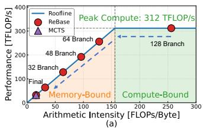

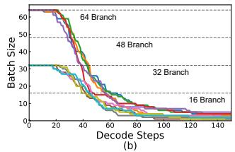  
Figure 5: (a) Illustrative roofline analysis; (b) Intensity degradation over decode steps.

As shown in Figure 5(a), these repeated memory operations result in low arithmetic intensity (FLOPs/Byte), making memory access the primary bottleneck. DFS is inherently confined to the memory-bound region due to their strict sequentiality. While BFS starts with higher parallelism, it suffers from batch attrition. As illustrated in Figure 5(b), the early completion of shorter branches degrades the effective batch size, dynamically shifting the workload from compute-bound into memory-bound regime.

## 3.3 Motivation

While the reward barrier limits inter-branch concurrency, significant latent parallelism exists within the reasoning tree. By speculatively exploring confident branches before reward feedback arrives, we can break the reward barrier, reduce synchronization delays, and reuse shared prefixes.

This motivates SPEX, a speculative exploration framework that exploits potential parallelism to overcome sequential bottlenecks in ToT reasoning. Specifically, SPEX proactively and speculatively explores promising candidate branches based on predictive signals, as illustrated in Figure 3(b). This removes the blocking dependency on reward feedback, allowing the expansion process to continue without idling.

## 3.4 Challenges

However, directly applying speculative exploration is insufficient, as it faces the following challenges.

Challenge 1: Speculating Inaccuracy on Future-Needed Branches. Speculating on future-needed branches is straightforward in BFS, where candidate nodes are confined to the current depth. However, for DFS algorithms like MCTS, every node in the tree may be revisited, making it difficult to predict which branches will be required. This complexity increases the difficulty of efficiently allocating speculative computation to accelerate future exploration.

Challenge 2: Complex Speculative Budget Allocation across Multiple Queries. In multi-query scenarios, distributing speculative resources becomes more complex due to variations in the number of potential nodes per query and their probabilities of future relevance. As illustrated in Figure 6(b), the number of nodes available for speculative execution fluctuates significantly between queries. Additionally, these nodes may vary in their likelihood of being utilized, depending on the accuracy of predictions for each query. This variability, combined with limited system resources, requires dynamic allocation strategies that prioritize queries based on their search state, predicted utility, and overall system capacity to optimize throughput and responsiveness.

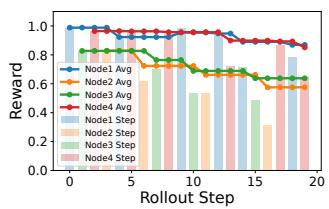  
(a)

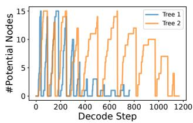  
(b)

Figure 6: (a) Stability of MCTS node values across rollout steps. These estimates change as later rollouts update ancestor nodes. (b) Fluctuations in the number of potential speculative nodes for two queries at different decoding steps in REBASE.  
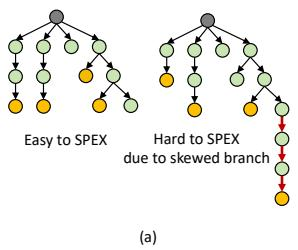

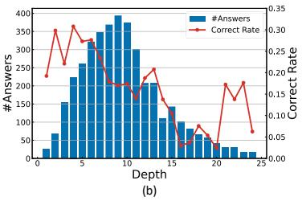  
Figure 7: (a) SPEX struggles with skewed trees under the RE-BASE algorithm due to dominant deep branches. (b) Answer count and correct rate of different reasoning depths in skewed deep trees (depth > 10).

Challenge 3: Inefficient Resource Allocation under Skewed Tree Structures. For highly skewed trees, SPEX struggles to achieve significant acceleration, as shown in Fig ure 7(a). In such cases, the majority of computational resources are consumed by disproportionately deep branches, which are challenging to predict and explore speculatively. This reduces parallelism, increases latency from sequential exploration, and limits efficient resource allocation, particularly when dealing with long dominant branches.

## 4 The SPEX Design

This section presents the design of SPEX, a speculative exploration framework that breaks the reward dependency barrier

by increasing parallelism for ToT reasoning.

## 4.1 Overview

The key idea of SPEX is to speculatively explore confident branches before reward feedback arrives, as presented in §3.3. To address the challenges identified in speculative exploration (§3.4), SPEX leverages three core techniques, each motivated by key insights observed in ToT reasoning.

Insight 1: Reward Stability Enables Prediction. As shown in Figure 6(a), node value estimates in MCTS exhibit high stability across iterations, with reward values changing minimally as rollouts progress. A later rollout updates the value estimates and visit counts of its ancestor nodes, so a node’s estimate may evolve over time. This is because each expansion step updates only one node’s statistics, and rewards, averaged over multiple rollouts, evolve slowly while UCB variations are primarily influenced by visit counts. This stability allows reasonably accurate predictions of node behavior, facilitating speculative execution or pruning strategies to reduce sequential bottlenecks.

Based on the insight, we propose an efficient intra-query speculative branch selection scheme, which leverages reward stability in DFS and score-based allocation in BFS to identify high-likelihood branches for speculation (addressing Challenge 1).

Insight 2: Shared Computation Shapes Allocation. Efficient allocation of speculative resources requires evaluating the potential benefits of each query. The primary gains from speculative exploration arise from two forms of shared computation: (i) parameter loading reuse, where speculative branches share model weights with the primary branch, and (ii) KV cache reuse, where branches with overlapping prefixes reuse cached attention states. These benefits are influenced by factors such as the prediction accuracy of speculative branches and the proportion of the KV cache that can be reused. By quantifying these elements, the system can guide resource distribution to maximize the overall utility of speculation while minimizing waste on low-impact queries.

Based on the insight, we propose an efficient inter-query budget allocation scheme, which dynamically distributes speculative resources across queries based on predicted utility, KV cache reuse potential, and system constraints, ensuring balanced and efficient utilization (addressing Challenge 2).

Insight 3: Answer Depth Bias Favors Shallower Exploration. As illustrated in Figure 7(b), even for skewed deep trees, most answers are generated at shallower depths, where the correct rate is also higher. This indicates that early-stage exploration typically produces both more frequent and more accurate solutions, suggesting that deep exploration may often be unnecessary under majority vote [31] strategies.

Based on the insight, we propose an adaptive early termination strategy, which halts exploration in skewed trees once sufficient confidence is achieved, avoiding unnecessary computation in deep branches (addressing Challenge 3).

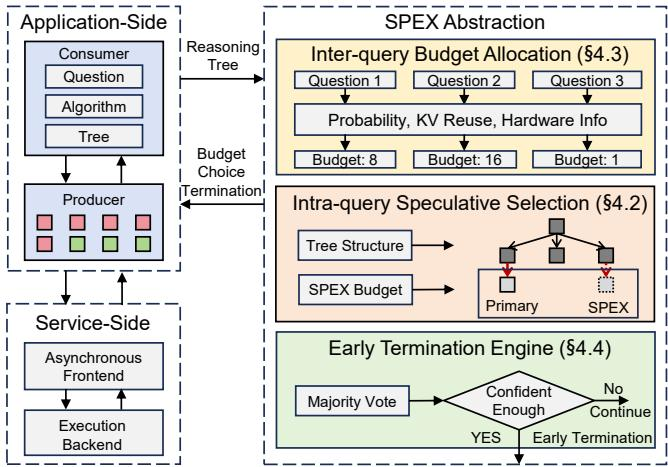  
Figure 8: The architectural overview of SPEX.

Together, these three techniques define the SPEX workflow, as illustrated in Figure 8. First, given multiple queries, SPEX applies the inter-query budget allocation scheme to allocate speculative resources based on query probability, KV cache reuse potential, and hardware capabilities (§4.3). Next, for each query, SPEX employs the intra-query speculative selection scheme to predict and expand the most promising future branches for speculative exploration (§4.2). Finally, to handle skewed trees, SPEX integrates the adaptive early termination strategy, which halts exploration and returns answers when the system has gathered sufficient confidence (§4.4).

Finally, to unify speculative exploration across diverse ToT reasoning algorithms, we design SPEX as a general producer–consumer execution framework (§4.5) that integrates the three techniques.

## 4.2 Intra-query Speculative Selection

To improve efficiency within a single query, SPEX integrates speculative exploration into the node selection process, employing two complementary strategies: one tailored for DFS and the other for BFS algorithms.

1) Speculation for Depth-First Search. As shown in Insight 1, reward estimates of individual nodes in MCTS exhibit high stability across iterations, enabling accurate forecasting of future node selections without invoking the reward value.

SPEX leverages this property by simulating the next k primary selections under the current tree state. Here, simulation means applying the same UCB selection rule on a temporary tree state, using current value estimates, visit counts, and active speculation records, without invoking LLM generation or reward evaluation. After each simulated selection, the algorithm updates visit counts and UCB values before proceeding to the next simulated step, ensuring that subsequent predictions are conditioned on prior choices. It does not assume rewards are identical along a path; it relies on short-horizon stability of node value estimates. If the selected node is already under speculative expansion, it is skipped. If speculation for that node has been completed, the stored speculative reward is incorporated into the UCB update to refine the accuracy of future forecasts. This process focuses speculative computation on unoccupied, high-likelihood branches while reusing prior results to improve prediction accuracy.

Explored Node Exploring Node on Main Branch Speculative Exploring Node V: Value C: Visit Count  
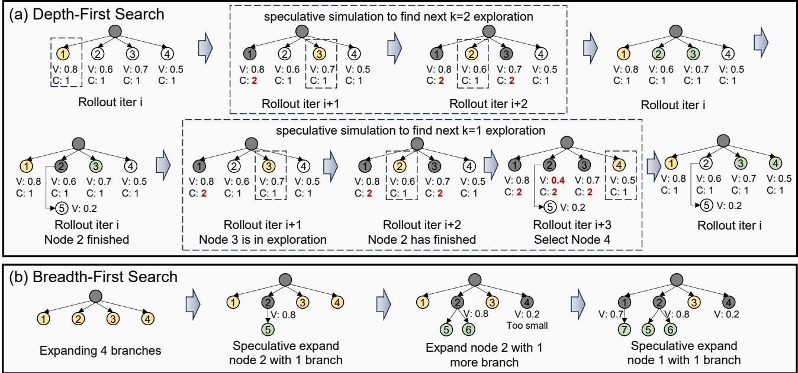  
Figure 9: SPEX for (a) DFS and (b) BFS. (a) SPEX simulates the next k iterations, updating visit counts (C) and values (V) after each simulated choice, and skipping nodes already under or completed in speculation. (b) SPEX allocates speculative branches via softmax over reward scores, prioritizing high-value nodes to improve reuse and reduce stragglers

Algorithm 1 presents the speculative selection procedure, and Figure 9(a) illustrates its execution. SPEX predicts the next UCB-based choices, skips nodes already under speculation, and integrates completed speculative results into value updates. As a result, the system keeps producers busy with reusable work while minimizing redundant expansions.

2) Speculation for Breadth-First Search. In BFS, speculative exploration targets the inefficiency caused by the long-tail variance in decoding lengths. Since shorter branches finish significantly earlier than the longest ones, they create valuable idle slots at the reward barrier. SPEX leverages this opportunity by proactively expanding these completed short nodes while the system waits for the stragglers.

As illustrated in Figure 9(b), the speculative budget matches the count of completed nodes. To distribute this budget, SPEX applies the expansion policy of the underlying BFS algorithm to these finished nodes. For instance, with RE BASE, SPEX employs its reward-based softmax to determine the expansion width. By strictly adhering to this baseline policy, SPEX allocates more speculative children to higherscoring nodes (e.g., node 2). This consistency ensures that speculative choices mirror the algorithm’s intended search path, thereby maximizing prediction accuracy.

Algorithm 1 Speculation for ToT-DFS.   
Input: Search tree tree, number of speculative branches k   
Output: Ordered list of speculative nodes to expand   
selected\_nodes ← [ ]   
for t ← 1 to k do   
node ← SimulateNext(tree)   
while node ∈ active\_expansions or node ∈ com  
pleted\_speculations do   
if node ∈ completed\_speculations then   
UpdateUCBWithReward(node.reward)   
end if   
node ← SimulateNext(tree)   
end while   
selected\_nodes.append(node)   
IncrementVisitCount(node)   
UpdateUCB(tree)   
end for   
return selected\_nodes

Mis-speculation Handling. SPEX adopts distinct strategies for handling mis-speculation. For DFS, SPEX operates without explicit detection mechanisms. Since DFS explores paths iteratively, a prediction not selected in the current round remains a valid candidate for future rollouts. In contrast, for BFS, SPEX implements strict verification. It detects misspeculation by cross-referencing predicted nodes with the actual expansion frontier. If a speculated node is not selected by the current frontier, SPEX immediately terminates the corresponding branch to prevent resource wastage.

## 4.3 Inter-query Budget Allocation

In multi-query serving, SPEX allocates speculative execution across queries to maximize overall throughput while respecting hardware limits and each query’s parallel capacity.

We first determine the global speculative budget ktotal using a roofline analysis. Achievable throughput is bounded by the intersection of the compute and memory ceilings; the corre sponding batch concurrency is taken as ktotal. This ensures that speculation moves execution toward the compute-bound regime without oversaturating on-chip memory bandwidth or degrading arithmetic intensity.

The acceleration of speculation arises from two primary forms of reuse: (i) parameter reuse, where speculative branches amortize model parameters with the primary branch, and (ii) KV cache reuse, where branches sharing long prefixes with the primary path reuse KV states in attention computation. Live nodes keep their prefix KV states in the serving cache when resident; a speculative child only needs to generate KV states after its fork point. Let Sw denote the model parameter size, and SKV (q) the amount of KV state in query q that can be reused by its speculative branches.

For each query q, we estimate its speculative utility as

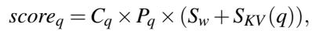

(1)

where Cq is the exploitable parallel capacity within the query and Pq is the predicted hit rate of speculative branches. Concretely, Cq is the number of eligible speculative branches that query q can issue without duplicating active work.

The allocation of the global budget follows a softmax weighting over these scores:

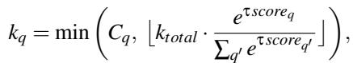

(2)

where τ controls allocation sharpness. This strategy assigns more speculative capacity to queries with higher expected benefit while avoiding overspeculation beyond each query’s intrinsic parallelism.

## 4.4 Early Termination for Skewed Trees

In highly skewed trees, SPEX faces significant challenges in achieving acceleration due to the disproportionate computational cost of exploring deep branches. However, as noted in Insight 3, most answers are generated at shallower depths, where the correctness rate is higher. This suggests that exhaustive exploration of deep branches is often unnecessary, especially when reliable solutions can already be inferred from earlier exploration stages.

To address this, we propose an adaptive early termination strategy that halts exploration once sufficient evidence has been gathered to confidently determine a result. This termination applies to the actual ToT search, not only to speculative branches. Specifically, during exploration, SPEX monitors the total number of generated answers n and the confidence scores of the top two hypotheses. The confidence scores are defined as:

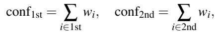

(3)

where conf1st and conf2nd represent the total rewards belonging to the top 1 and top 2 answers, respectively.

Exploration terminates early if it satisfies the condition:

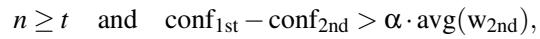

(4)

where t is the minimum number of answers required, α is a scaling factor controlling the margin of confidence, and avg(w2nd) is the average weight of answers belonging to the second-best hypothesis. In the experiments, α is set to 0.5. This ensures that exploration avoids unnecessary computation in deep branches when high-confidence solutions can already be determined from shallower exploration. Thus, any potential accuracy tradeoff stems from pruning these deep branches before full exploration.

## 4.5 General Producer–Consumer Framework

To unify speculative exploration across different ToT algorithms, we design SPEX as a general producer–consumer execution framework. It decouples branch expansion (producer role) from control logic (consumer role), enabling concurrent processing of both primary and speculative branches while dynamically adapting to system conditions.

Specifically, multiple producers execute explorations in parallel. A producer may be assigned to (i) a node along the primary branch—the branch that the underlying search algorithm A is currently committed to exploring—or (ii) a node from speculative branches predicted to have high utility. The centralized consumer loop monitors the completion of these expansions through a shared completion queue.

When a completed node belongs to the primary branch, the consumer immediately appends it to the search tree and triggers the next expansion step dictated by A. Simultaneously, the consumer evaluates whether idle producers can be utilized for additional speculative expansions, thereby overlapping useful computation with reward model latency. The scheduler also favors speculative nodes with reusable prefixes, reducing extra KV-cache footprint. If the completed node originates from a speculative branch, it is appended to the speculative subtree. The system again inspects available resources and, if capacity permits, issues further speculative expansions to keep producer threads saturated.

Algorithm 2 SPEX Producer-Consumer Framework   
Input: Initial state s , search algorithm type A   
Output: Final state sn   
tree ← Tree structure with root s0   
request\_queue, completion\_queue ← []   
Launch multiple ProducerWorker() instances   
request\_queue.put(s0)   
while search is not complete do   
(node, child) ← await completion\_queue   
if tree.is\_on\_primary\_branch (node, A) then   
tree.add\_node(child)   
tree.expand(A)   
else   
tree.add\_spec\_node(child)   
end if   
while has\_idle\_producers() do   
spec\_node ← tree.select\_spec()   
request\_queue.put(spec\_node)   
end while   
end while   
Return tree.sn   
procedure PRODUCERWORKER   
while not Terminate do   
node ← await request\_queue   
new\_child ← expand\_node(node)   
completion\_queue.put(node, new\_child)   
end while   
end procedure

Algorithm 2 outlines the execution flow. The design achieves three benefits. 1) Non-blocking Execution: Primary branch progress is never stalled by speculative work. 2) Opportunistic Parallelism: Idle resources are opportunistically exploited for parallel speculative exploration. 3) Algorithm-agnostic Unification: The framework remains agnostic to the underlying reasoning algorithm, supporting different paradigms within a unified scheduling architecture.

## 5 Implementation

We implemented the SPEX system on top of SGLang [71], introducing several key modifications and components.

On the server side, we modified the SGLang front-end implementation. The original system was designed to handle batch requests that return results collectively. To enable finergrained scheduling, we re-engineered the system to support asynchronous responses, allowing individual requests to return results independently.

On the application side, we utilized Python’s coroutine framework to implement the coordinated operation of a Producer-Consumer model, which manages interactions with SGLang. All three core components of the SPEX system were implemented on the application side, ensuring seamless integration and efficient task execution.

Table 1: Configurations of evaluated algorithms. The configuration values denote the target number of generated answers.  
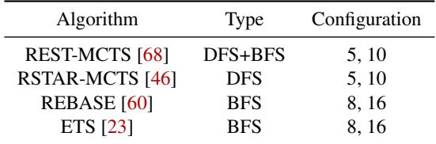

## 6 Experimental Evaluation

## 6.1 Experimental Setup

Models. We evaluated SPEX across four models: Llemma-7B, Llemma-34B [1], DeepSeek-R1-Distill-Qwen-8B [20], and Qwen3-30B-A3B [53]. The Llemma suite was selected to ensure comparability with established ToT baselines, as these models are used in those evaluations [23, 60]. We employ its dedicated reward model for evaluation. Conversely, DeepSeek and Qwen were included to validate generalization to state-ofthe-art models, where we derived reward signals directly from intrinsic log probabilities to serve as confidence proxies [18].

Hardware. We conducted experiments across different hardware setups to evaluate SPEX’s performance under various scenarios. Specifically, we tested Llemma-7B and Deepseek-8B on NVIDIA A6000 GPUs, while Llemma-34B and Qwen3-30B-A3B were evaluated on NVIDIA A100 GPUs. These setups allowed us to analyze and compare performance across diverse compute environments.

Datasets. To ensure a fair comparison, we matched the dataset difficulty to the capabilities of each model. For the Llemma family, we utilized GSM8K [14] and MATH-500 [21, 34] following the experiment setup of REBASE and ETS, as more extreme challenges like AIME remain intractable for Llemma even with ToT. In contrast, for the state-of-the-art models (DeepSeek and Qwen), simpler tasks like MATH-500 can be easily solved without search. Therefore, we utilized high-difficulty benchmarks, including AIME 2024 [39], AIME 2025 [40], BRUMO [4], and HMMT-Feb25 [22] to demonstrate the performance of our framework.

Algorithms. As listed in Table 1, we evaluated SPEX on four representative ToT algorithms: REST-MCTS, RSTAR-MCTS, REBASE and ETS. Each algorithm was tested under two configurations, which represent the number of answers to generate; specifically, this corresponds to the rollout count for DFS methods and the initial search width for BFS methods. Here batch size denotes concurrent ToT queries, not individual branch-generation requests. For example, one REBASE-16 query already contains 16 requests, so BS=8 can expose up to 128 such requests before SPEX adds speculative branches.

(c) DeepSeek-R1-8B Performance on A6000  
(a) Llemma-7B Performance on A6000  
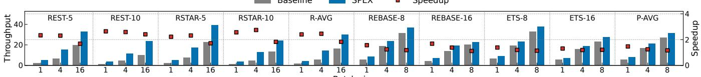

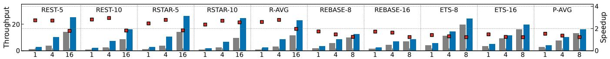

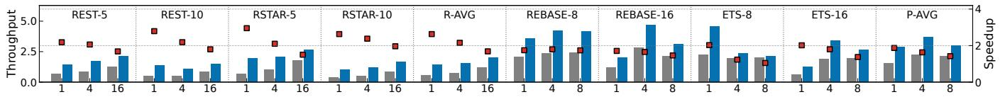

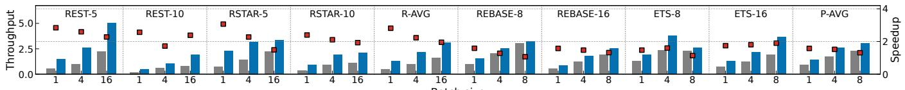  
Figure 10: The speedup and throughput (finished questions per minute) for different ToT reasoning tasks.

## 6.2 End-to-End Performance

Figure 10 presents the throughput and speedup of SPEX compared to baseline across various algorithms, configurations, and batch sizes. The results demonstrate consistent performance improvements with SPEX under diverse settings. SPEX targets query throughput; extra speculative branches may slightly increase per-token latency, as analyzed in § 6.6.

On average, SPEX achieves a speedup of 1.8–3× for DFS and 1.2–1.9× for BFS. The greater acceleration for DFS stems from their inherently limited branch-level parallelism, where SPEX introduces more opportunities for optimization. In contrast, algorithms without DFS like REBASE already exhibit significant parallelism, leaving less room for further improvement. Among DFS algorithms, REST-MCTS achieves slightly higher speedup compared to RSTAR-MCTS, as the BFS creates more opportunities for SPEX optimization.

Impact of Batch Size: The speedup is particularly notable at smaller batch sizes. These batch sizes should be interpreted at the ToT-query level, not as the number of individual decoding sequences. For DFS algorithms, SPEX can achieve up to 3× acceleration at small batch sizes, and for BFS-only algorithms, the speedup reaches up to 1.7×. As the batch size increases, the system transitions from being memory-bound to compute-bound, reducing SPEX’s relative benefits.

Impact of Configuration: DFS algorithms demonstrate higher speedup when generating more answers, as this increases the number of potential nodes. Conversely, for BFSonly algorithms, generating more answers results in lower speedup. This is because algorithms like REBASE expand branches proportional to the required answers, transitioning to a compute-bound regime.

## 6.3 Accuracy Evaluation

We report pass@1 accuracy and keep the same decoding settings, including sampling temperature, top-p, and token limits, for all methods. Table 2 demonstrates the accuracy evaluation across pure CoT, the ToT baseline, and SPEX. The results show that stepwise ToT provides a clear accuracy lift over pure CoT, and SPEX preserves this lift while improving throughput. The results indicate that early termination introduced by SPEX does not negatively impact accuracy. Any accuracy difference mainly comes from early termination changing the explored search space. For most configurations, SPEX can achieve slightly higher accuracy than the ToT baseline. This gain stems from our adaptive early termination technique. Deep, skewed branches tend to exhibit lower correctness. By terminating these branches early upon reaching high confidence, SPEX prevents low-quality tails from skewing the

Table 2: Accuracy evaluation.  
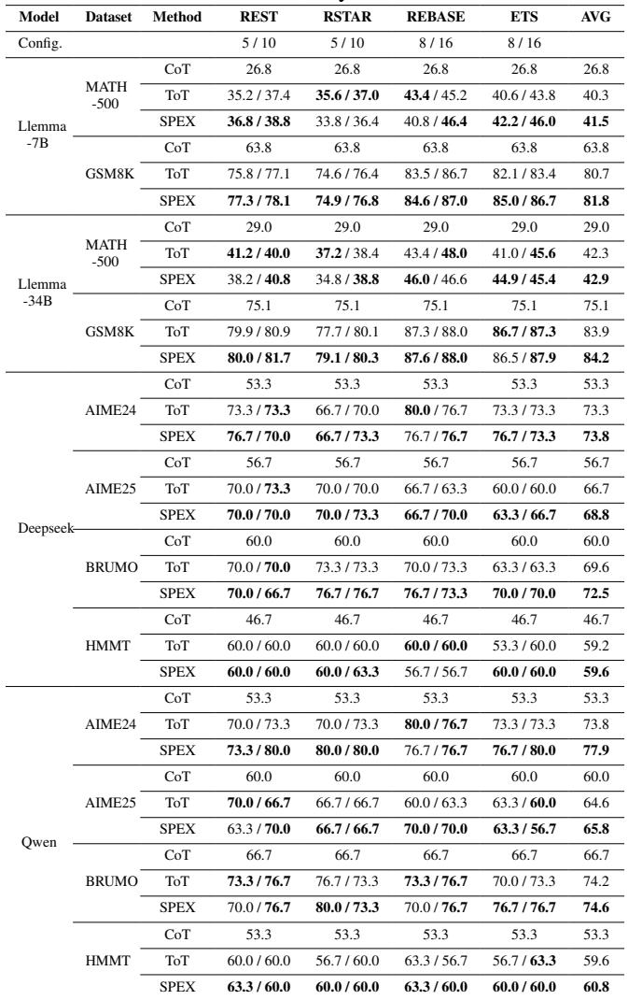

majority vote.

## 6.4 Ablation Study

To evaluate the contribution of each key technique in SPEX, we conducted an ablation study as shown in Figure 11. Three techniques were analyzed: T1 (Intra-query Speculative Selection), T2 (Inter-query Budget Allocation), and T3 (Early Termination).

T1 demonstrates significant speedup by allowing speculative execution within queries to exploit parallelism, especially for smaller batch sizes. T2 becomes increasingly critical as batch size grows, ensuring efficient allocation of computational resources when the system transitions from memorybound to compute-bound. T3 provides a stable speedup of around 1.2× across all configurations by identifying and terminating low-potential branches early.

The combination of all three techniques yields the highest overall performance, with notable improvements in both small-batch and large-batch scenarios.

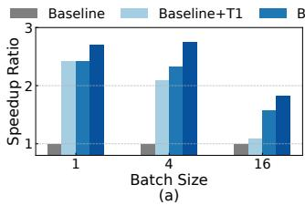

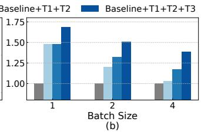

Figure 11: Ablation study of three techniques in SPEX for (a) RSTAR-10 and (b) REBASE-16. T1 represents Intra-query Speculative Selection, T2 represents Inter-query Budget Allocation and T3 represents Early Termination.  
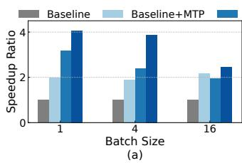

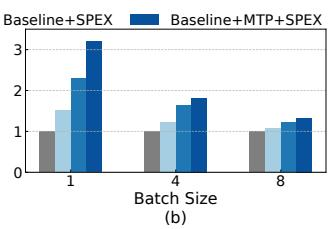  
Figure 12: Orthogonality analysis of SPEX and MTP for (a) RSTAR-10 and (b) REBASE-8.

## 6.5 Compatibility with Speculative Decoding

To demonstrate that SPEX is orthogonal to token-level optimizations, we integrated it with the Multi-Token Prediction (MTP) module of DeepSeek-R1-8B. Since the performance of speculative decoding is highly sensitive to the token tree, we empirically tuned the token tree size based on the batch size. For RSTAR-10, which inherently has a smaller effective batch size due to sequential dependency, we maintained a token tree size of 16 across all settings. For REBASE-8, we adopted an adaptive configuration: a tree size of 16 for batch size (BS) 1, scaled down to 8 for BS=4, and 4 for BS=8, to mitigate compute contention.

Figure 12 illustrates the speedup breakdown. The results confirm that SPEX and MTP target distinct bottlenecks and can be effectively composed. The combination (Baseline+MTP+SPEX) consistently yields the highest throughput. Notably, for RSTAR-10 at BS=1, combining SPEX with MTP boosts the speedup from ∼ 2.0× (MTP only) and ∼ 3.1× (SPEX only) to a remarkably ∼ 4.1×. As the batch size increases, the system transitions from memorybound to compute-bound. Consequently, the marginal gain from MTP diminishes. However, SPEX maintains robust acceleration even when token-level speculation saturates.

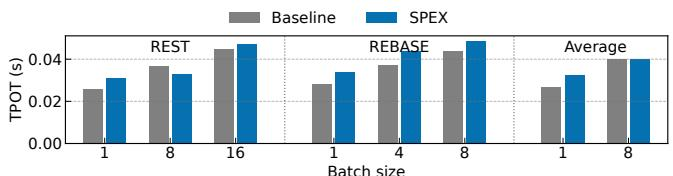  
(a) Time-per-Output-Token of Llemma-7b

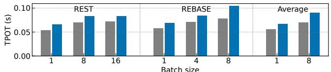  
(b) Time-per-Output-Token of Llemma-34b

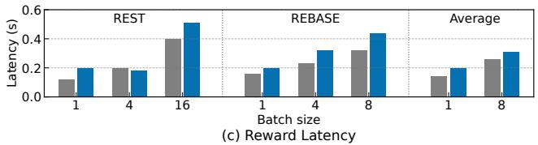  
Figure 13: Overhead analysis of SPEX.

## 6.6 Overhead analysis

As SPEX increases the number of parallel branches within each query, it introduces additional overhead that affects both the reasoning model’s Time-per-Output-Token (TPOT) and the reward model’s evaluation latency, particularly when the system approaches a compute-bound regime. Figure 13 illustrates these effects.

For the reasoning model’s output speed, while SPEX raises the risk of pushing the system into an over-compute-bound state, the observed overhead remains controlled within 15%. This indicates that SPEX effectively balances the trade-off between batch size scaling and computational efficiency.

For the reward model’s evaluation latency, the impact of SPEX is minimal. The average delay introduced by SPEX is less than 0.1 seconds, which is negligible compared to the reasoning model’s overall processing time. This demonstrates that SPEX’s design introduces only minor latency overhead for reward evaluation, ensuring it does not become a bottle neck in the reasoning pipeline.

## 6.7 Prediction Accuracy

Figure 14 evaluates the prediction accuracy of SPEX. In (a), the hit rate of RSTAR-MCTS decreases as the prediction distance increases, illustrating the challenge of maintaining accuracy in DFS algorithms when predicting further rollouts. In (b), the hit rate of REBASE decreases with increasing depth, as shallow layers contain more low-scoring nodes that are easier to identify, while deeper layers consist of nodes with closer scores, making differentiation more difficult. Therefore, we prefer to allocate SPEX resources evenly for DFS algorithms and prioritize shallow layers for BFS algorithms.

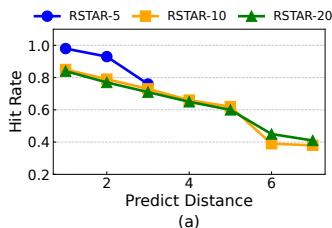

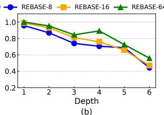

Figure 14: Prediction accuracy evaluation. (a) Hit rate of RSTAR-MCTS for predicting rollouts across different distances. (b) Hit rate of REBASE at varying depths.  
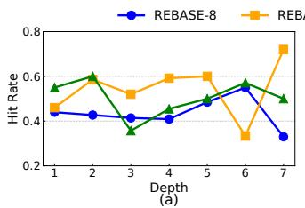

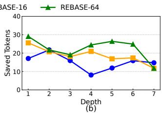  
Figure 15: (a) Probability of speculative explorations reaching the critical path for REBASE configurations. (b) Tokens already generated speculatively before the critical path reaches.

For DFS algorithms, prediction accuracy directly translates into speedup. However, for BFS-only algorithms like RE-BASE, only speculative expansions along the critical path lead to acceleration. As shown in Figure 15(a), the probability of speculative expansions reaching the critical path ranges from 40% to 60% across different depths. In Figure 15(b), the average number of tokens pre-generated before the critical path reaches them is approximately 20 per depth, highlighting the importance of accurate targeting for efficient performance.

## 7 Related Work

We categorize related work into three lines and position SPEX with respect to each.

Speculative Decoding. Speculative decoding is an effective method for accelerating memory-bound LLM inference. It uses a smaller draft model to predict future tokens, which are then verified by the main model [6, 28, 61]. Recent advancements have extended this technique to accelerate reasoning models [33, 44, 49, 63]. These techniques operate along a single linear trajectory, speculating on the next-token sequence of one reasoning path. In contrast, SPEX speculates over the tree structure of reasoning, predicting which branches will be needed before reward feedback is available. As we show in our evaluation, tree-level speculative exploration in SPEX is complementary to token-level speculative decoding and can be composed with it to yield cumulative speedups.

Speculative Tree Search and Speculative Execution. Speculation has also been applied to MCTS and other search procedures. Prior work on speculative MCTS [12, 25] targets AlphaZero-style game search, where the bottleneck is the cost of reward evaluation. These systems speculate on future rollouts to amortize network computation, assuming a computebound regime and relatively cheap tree traversal. Our setting is fundamentally different: ToT reasoning with LLMs is predominantly memory-bandwidth-bound due to autoregressive decoding and KV-cache access. SPEX is designed specifically for this regime: it breaks the reward dependency barrier for both Depth-First and Breadth-First Search, incorporates KVcache reuse and parameter reuse into its scheduling decisions, and coordinates speculation across concurrent queries. More broadly, hardware-level speculative execution mechanisms (e.g., branch prediction, value prediction, and speculation for FSM parallelization [48]) motivate using prediction to unlock latent parallelism; SPEX instantiates this principle at the ToT algorithm and system level for LLM reasoning workloads.

Efficient Reasoning Algorithms. To improve reasoning efficiency, various algorithmic approaches focus on reducing the number of generated tokens. These methods include early exit [10, 17, 32, 67], CoT compression [7, 9, 24, 35, 57, 70], and adaptive reasoning [36–38,45,54,58], which dynamically shorten or adjust reasoning paths based on task complexity or model confidence. These methods primarily optimize the amount of test-time compute. SPEX is orthogonal: given a target ToT algorithm and its compute budget, we focus on how to schedule and speculate over tree expansions to break the reward dependency barrier and improve hardware efficiency without changing the underlying reasoning algorithm.

## 8 Conclusion

We propose SPEX, a speculative exploration framework that breaks the reward dependency barrier in Tree-of-Thought reasoning. By introducing intra-query speculative branch selection, inter-query budget allocation, and adaptive early termination, SPEX significantly enhances parallelism and reduces latency. Comprehensive evaluations demonstrate up to 3× speedup for DFS and 1.7× speedup for BFS, all while preserving accuracy. SPEX provides an effective and scalable solution for optimizing ToT reasoning, bridging the gap between algorithmic innovation and system-level performance.

## Acknowledgements

This work was supported in part by the National Key Research and Development Program under Grant 2024YFB4505004, in part by NSFC under Grant 62495102, Grant 92464104, and Grant 62341407, in part by Beijing Municipal Science and Technology Program under Grant Z241100004224015, in part by 111 Project under Grant B18001.

## References

[1] Zhangir Azerbayev, Hailey Schoelkopf, Keiran Paster, Marco Dos Santos, Stephen McAleer, Albert Q Jiang, Jia Deng, Stella Biderman, and Sean Welleck. Llemma: An open language model for mathematics. arXiv preprint arXiv:2310.10631, 2023.

[2] Edward Beeching, Lewis Tunstall, and Sasha Rush. Scaling test-time compute with open models. 2024. Hugging Face Technical Report.

[3] Bradley Brown, Jordan Juravsky, Ryan Ehrlich, Ronald Clark, Quoc V Le, Christopher Ré, and Azalia Mirhoseini. Large language monkeys: Scaling inference compute with repeated sampling. arXiv preprint arXiv:2407.21787, 2024.

[4] BRUMO. brown university math olympiad 2025. https://www.brumo.org/, 2025.

[5] Guillaume Chaslot, Sander Bakkes, Istvan Szita, and Pieter Spronck. Monte-carlo tree search: A new framework for game ai. In Proceedings of the AAAI Conference on Artificial Intelligence and Interactive Digital Entertainment, volume 4, pages 216–217, 2008.

[6] Charlie Chen, Sebastian Borgeaud, Geoffrey Irving, Jean-Baptiste Lespiau, Laurent Sifre, and John Jumper. Accelerating large language model decoding with specu lative sampling. arXiv preprint arXiv:2302.01318, 2023.

[7] Hongzhan Chen, Siyue Wu, Xiaojun Quan, Rui Wang, Ming Yan, and Ji Zhang. Mcc-kd: Multi-cot consistent knowledge distillation. arXiv preprint arXiv:2310.14747, 2023.

[8] Lingjiao Chen, Jared Quincy Davis, Boris Hanin, Peter Bailis, Ion Stoica, Matei A Zaharia, and James Y Zou. Are more llm calls all you need? towards the scaling properties of compound ai systems. Advances in Neural Information Processing Systems, 37:45767–45790, 2024.

[9] Xiao Chen, Sihang Zhou, Ke Liang, Xiaoyu Sun, and Xinwang Liu. Skip-thinking: Chunk-wise chainof-thought distillation enable smaller language models to reason better and faster. arXiv preprint arXiv:2505.18642, 2025.

[10] Xingyu Chen, Jiahao Xu, Tian Liang, Zhiwei He, Jianhui Pang, Dian Yu, Linfeng Song, Qiuzhi Liu, Mengfei Zhou, Zhuosheng Zhang, et al. Do not think that much for 2+ 3=? on the overthinking of o1-like llms. arXiv preprint arXiv:2412.21187, 2024.

[11] Pengyu Cheng, Yong Dai, Tianhao Hu, Han Xu, Zhisong Zhang, Lei Han, Nan Du, and Xiaolong Li. Self-playing adversarial language game enhances llm reasoning. Advances in Neural Information Processing Systems, 37:126515–126543, 2024.

[12] Scott Cheng, Mahmut Taylan Kandemir, and Ding-Yong Hong. Speculative monte-carlo tree search. In Advances in Neural Information Processing Systems, pages 88664– 88683, 2024.

[13] Zheng Chu, Jingchang Chen, Qianglong Chen, Weijiang Yu, Tao He, Haotian Wang, Weihua Peng, Ming Liu, Bing Qin, and Ting Liu. Navigate through enig matic labyrinth a survey of chain of thought reasoning: Advances, frontiers and future. arXiv preprint arXiv:2309.15402, 2023.

[14] Karl Cobbe, Vineet Kosaraju, Mohammad Bavarian, Mark Chen, Heewoo Jun, Lukasz Kaiser, Matthias Plappert, Jerry Tworek, Jacob Hilton, Reiichiro Nakano, et al. Training verifiers to solve math word problems. arXiv preprint arXiv:2110.14168, 2021.

[15] Tri Dao, Dan Fu, Stefano Ermon, Atri Rudra, and Christopher Ré. Flashattention: Fast and memoryefficient exact attention with io-awareness. Advances in neural information processing systems, 35:16344– 16359, 2022.

[16] Xidong Feng, Ziyu Wan, Muning Wen, Stephen Marcus McAleer, Ying Wen, Weinan Zhang, and Jun Wang. Alphazero-like tree-search can guide large lan guage model decoding and training. arXiv preprint arXiv:2309.17179, 2023.

[17] Yichao Fu, Junda Chen, Siqi Zhu, Zheyu Fu, Zhongdongming Dai, Yonghao Zhuang, Yian Ma, Aurick Qiao, Tajana Rosing, Ion Stoica, et al. Efficiently scaling llm reasoning with certaindex. arXiv preprint arXiv:2412.20993, 2024.

[18] Yichao Fu, Xuewei Wang, Yuandong Tian, and Jiawei Zhao. Deep think with confidence, 2025.

[19] Zitian Gao, Boye Niu, Xuzheng He, Haotian Xu, Hongzhang Liu, Aiwei Liu, Xuming Hu, and Lijie Wen. Interpretable contrastive monte carlo tree search reasoning. arXiv preprint arXiv:2410.01707, 2024.

[20] Daya Guo, Dejian Yang, Haowei Zhang, Junxiao Song, Ruoyu Zhang, Runxin Xu, Qihao Zhu, Shirong Ma, Peiyi Wang, Xiao Bi, et al. Deepseek-r1: Incentivizing reasoning capability in llms via reinforcement learning. arXiv preprint arXiv:2501.12948, 2025.

[21] Dan Hendrycks, Collin Burns, Saurav Kadavath, Akul Arora, Steven Basart, Eric Tang, Dawn Song, and Jacob Steinhardt. Measuring mathematical problem solving with the math dataset. arXiv preprint arXiv:2103.03874, 2021.

[22] HMMT Organization. Harvard-MIT Mathematics Tournament (HMMT) February 2025. https://www.hmmt. org, 2025.

[23] Coleman Hooper, Sehoon Kim, Suhong Moon, Kerem Dilmen, Monishwaran Maheswaran, Nicholas Lee, Michael W Mahoney, Sophia Shao, Kurt Keutzer, and Amir Gholami. Ets: Efficient tree search for inferencetime scaling. arXiv preprint arXiv:2502.13575, 2025.

[24] Bairu Hou, Yang Zhang, Jiabao Ji, Yujian Liu, Kaizhi Qian, Jacob Andreas, and Shiyu Chang. Thinkprune: Pruning long chain-of-thought of llms via reinforcement learning. arXiv preprint arXiv:2504.01296, 2025.

[25] Juhwan Kim, Byeongmin Kang, and Hyungmin Cho. Specmcts: Accelerating monte carlo tree search using speculative tree traversal. IEEE Access, 9:142195– 142205, 2021.

[26] Takeshi Kojima, Shixiang Shane Gu, Machel Reid, Yutaka Matsuo, and Yusuke Iwasawa. Large language models are zero-shot reasoners. Advances in neural information processing systems, 35:22199–22213, 2022.

[27] Woosuk Kwon, Zhuohan Li, Siyuan Zhuang, Ying Sheng, Lianmin Zheng, Cody Hao Yu, Joseph Gonzalez, Hao Zhang, and Ion Stoica. Efficient memory management for large language model serving with pagedattention. In Proceedings of the 29th symposium on operating systems principles, pages 611–626, 2023.

[28] Yaniv Leviathan, Matan Kalman, and Yossi Matias. Fast inference from transformers via speculative decoding. In International Conference on Machine Learning, pages 19274–19286. PMLR, 2023.

[29] Jinhao Li, Jiaming Xu, Shan Huang, Yonghua Chen, Wen Li, Jun Liu, Yaoxiu Lian, Jiayi Pan, Li Ding, Hao Zhou, et al. Large language model inference acceleration: A comprehensive hardware perspective. arXiv preprint arXiv:2410.04466, 2024.

[30] Sixu Li, Yuzhou Chen, Chaojian Li, Yonggan Fu, Zheng Wang, Zhongzhi Yu, Haoran You, Zhifan Ye, Wei Zhou, Yongan Zhang, and Yingyan (Celine) Lin. Orches: Orchestrated test-time-compute-based llm reasoning on collaborative gpu-pim heterogeneous system. In Proceedings of the 58th IEEE/ACM International Symposium on Microarchitecture, MICRO ’25, page 476–489, New York, NY, USA, 2025. Association for Computing Machinery.

[31] Yifei Li, Zeqi Lin, Shizhuo Zhang, Qiang Fu, Bei Chen, Jian-Guang Lou, and Weizhu Chen. Making language models better reasoners with step-aware verifier. In Proceedings of the 61st Annual Meeting of the Association for Computational Linguistics (Volume 1: Long Papers), pages 5315–5333, 2023.

[32] Yiwei Li, Peiwen Yuan, Shaoxiong Feng, Boyuan Pan, Xinglin Wang, Bin Sun, Heda Wang, and Kan Li. Escape sky-high cost: Early-stopping self-consistency for multistep reasoning. arXiv preprint arXiv:2401.10480, 2024.

[33] Baohao Liao, Yuhui Xu, Hanze Dong, Junnan Li, Christof Monz, Silvio Savarese, Doyen Sahoo, and Caiming Xiong. Reward-guided speculative de coding for efficient llm reasoning. arXiv preprint arXiv:2501.19324, 2025.

[34] Hunter Lightman, Vineet Kosaraju, Yuri Burda, Harrison Edwards, Bowen Baker, Teddy Lee, Jan Leike, John Schulman, Ilya Sutskever, and Karl Cobbe. Let’s verify step by step. In The Twelfth International Conference on Learning Representations, 2023.

[35] Weizhe Lin, Xing Li, Zhiyuan Yang, Xiaojin Fu, Hui-Ling Zhen, Yaoyuan Wang, Xianzhi Yu, Wulong Liu, Xiaosong Li, and Mingxuan Yuan. Trimr: Verifier-based training-free thinking compression for efficient test-time scaling. arXiv preprint arXiv:2505.17155, 2025.

[36] Runze Liu, Junqi Gao, Jian Zhao, Kaiyan Zhang, Xiu Li, Biqing Qi, Wanli Ouyang, and Bowen Zhou. Can 1b llm surpass 405b llm? rethinking compute-optimal test-time scaling. arXiv preprint arXiv:2502.06703, 2025.

[37] Jinghui Lu, Haiyang Yu, Siliang Xu, Shiwei Ran, Guozhi Tang, Siqi Wang, Bin Shan, Teng Fu, Hao Feng, Jingqun Tang, et al. Prolonged reasoning is not all you need: Certainty-based adaptive routing for efficient llm/mllm reasoning. arXiv preprint arXiv:2505.15154, 2025.

[38] Feng Luo, Yu-Neng Chuang, Guanchu Wang, Hoang Anh Duy Le, Shaochen Zhong, Hongyi Liu, Jiayi Yuan, Yang Sui, Vladimir Braverman, Vipin Chaudhary, et al. Autol2s: Auto long-short reasoning for efficient large language models. arXiv preprint arXiv:2505.22662, 2025.

[39] Mathematical Association of America. American Invita tional Mathematics Examination (AIME) 2024. https: //www.maa.org/math-competitions/aime, 2024.

[40] Mathematical Association of America. American Invita tional Mathematics Examination (AIME) 2025. https: //www.maa.org/math-competitions/aime, 2025.

[41] Xuefei Ning, Zinan Lin, Zixuan Zhou, Zifu Wang, Huazhong Yang, and Yu Wang. Skeleton-of-thought: Prompting llms for efficient parallel generation. arXiv preprint arXiv:2307.15337, 2023.

[42] OpenAI. Learning to reason with llms. Technical report, OpenAI, 2024. Technical Report.

[43] OpenAI. OpenAI O3-mini System Card. Technical report, OpenAI, January 2025. Technical Report.

[44] Rui Pan, Yinwei Dai, Zhihao Zhang, Gabriele Oliaro, Zhihao Jia, and Ravi Netravali. Specreason: Fast and accurate inference-time compute via speculative reasoning. arXiv preprint arXiv:2504.07891, 2025.

[45] Penghui Qi, Zichen Liu, Tianyu Pang, Chao Du, Wee Sun Lee, and Min Lin. Optimizing anytime reasoning via budget relative policy optimization. arXiv preprint arXiv:2505.13438, 2025.

[46] Zhenting Qi, Mingyuan Ma, Jiahang Xu, Li Lyna Zhang, Fan Yang, and Mao Yang. Mutual reasoning makes smaller llms stronger problem-solvers. arXiv preprint arXiv:2408.06195, 2024.

[47] Jiahao Qiu, Yifu Lu, Yifan Zeng, Jiacheng Guo, Jiayi Geng, Huazheng Wang, Kaixuan Huang, Yue Wu, and Mengdi Wang. Treebon: Enhancing inference-time alignment with speculative tree-search and best-of-n sampling. arXiv preprint arXiv:2410.16033, 2024.

[48] Junqiao Qiu, Xiaofan Sun, Amir Hossein Nodehi Sabet, and Zhijia Zhao. Scalable fsm parallelization via path fusion and higher-order speculation. In Proceedings of the 26th ACM International Conference on Architectural Support for Programming Languages and Operating Systems, ASPLOS ’21, page 887–901, New York, NY, USA, 2021. Association for Computing Machinery.

[49] Junhan Shi, Yijia Zhu, Zhenning Shi, Dan Zhao, Qing Li, and Yong Jiang. Speccot: Accelerating chain-of-thought reasoning through speculative exploration. In ES-FoMo III: 3rd Workshop on Efficient Systems for Foundation Models.

[50] Charlie Snell, Jaehoon Lee, Kelvin Xu, and Aviral Kumar. Scaling llm test-time compute optimally can be more effective than scaling model parameters. arXiv preprint arXiv:2408.03314, 2024.

[51] NovaSky Team. Sky-t1: Train your own o1 preview model within \$450, 2025.

[52] Qwen Team. Qwq: Reflect deeply on the boundaries of the unknown. Hugging Face, 2024.

[53] Qwen Team. Qwen3 technical report, 2025.

[54] Xu Wan, Wei Wang, Wenyue Xu, Wotao Yin, Jie Song, and Mingyang Sun. Adapthink: Adaptive thinking preferences for reasoning language model. arXiv preprint arXiv:2506.18237, 2025.

[55] Chaojie Wang, Yanchen Deng, Zhiyi Lyu, Liang Zeng, Jujie He, Shuicheng Yan, and Bo An. Q\*: Improving multi-step reasoning for llms with deliberative planning. arXiv preprint arXiv:2406.14283, 2024.

[56] Jun Wang, Meng Fang, Ziyu Wan, Muning Wen, Jiachen Zhu, Anjie Liu, Ziqin Gong, Yan Song, Lei Chen, Lionel M Ni, et al. Openr: An open source framework for advanced reasoning with large language models. arXiv preprint arXiv:2410.09671, 2024.

[57] Yibo Wang, Li Shen, Huanjin Yao, Tiansheng Huang, Rui Liu, Naiqiang Tan, Jiaxing Huang, Kai Zhang, and Dacheng Tao. R1-compress: Long chain-of-thought compression via chunk compression and search. arXiv preprint arXiv:2505.16838, 2025.

[58] Yunhao Wang, Yuhao Zhang, Tinghao Yu, Can Xu, Feng Zhang, and Fengzong Lian. Adaptive deep reasoning: Triggering deep thinking when needed. arXiv preprint arXiv:2505.20101, 2025.

[59] Jason Wei, Xuezhi Wang, Dale Schuurmans, Maarten Bosma, Fei Xia, Ed Chi, Quoc V Le, Denny Zhou, et al. Chain-of-thought prompting elicits reasoning in large language models. Advances in neural information processing systems, 35:24824–24837, 2022.

[60] Yangzhen Wu, Zhiqing Sun, Shanda Li, Sean Welleck, and Yiming Yang. Inference scaling laws: An empirical analysis of compute-optimal inference for llm problemsolving. In The Thirteenth International Conference on Learning Representations, 2025.

[61] Heming Xia, Zhe Yang, Qingxiu Dong, Peiyi Wang, Yongqi Li, Tao Ge, Tianyu Liu, Wenjie Li, and Zhifang Sui. Unlocking efficiency in large language model inference: A comprehensive survey of speculative decoding. arXiv preprint arXiv:2401.07851, 2024.

[62] Yuxi Xie, Anirudh Goyal, Wenyue Zheng, Min-Yen Kan, Timothy P Lillicrap, Kenji Kawaguchi, and Michael Shieh. Monte carlo tree search boosts reasoning via iterative preference learning. arXiv preprint arXiv:2405.00451, 2024.

[63] Wang Yang, Xiang Yue, Vipin Chaudhary, and Xiaotian Han. Speculative thinking: Enhancing small-model reasoning with large model guidance at inference time. arXiv preprint arXiv:2504.12329, 2025.

[64] Shunyu Yao, Dian Yu, Jeffrey Zhao, Izhak Shafran, Tom Griffiths, Yuan Cao, and Karthik Narasimhan. Tree of thoughts: Deliberate problem solving with large language models. Advances in neural information processing systems, 36:11809–11822, 2023.

[65] Zihao Ye, Lequn Chen, Ruihang Lai, Wuwei Lin, Yineng Zhang, Stephanie Wang, Tianqi Chen, Baris Kasikci, Vinod Grover, Arvind Krishnamurthy, et al. Flashinfer: Efficient and customizable attention engine for llm inference serving. arXiv preprint arXiv:2501.01005, 2025.

[66] Lifan Yuan, Ganqu Cui, Hanbin Wang, Ning Ding, Xingyao Wang, Jia Deng, Boji Shan, Huimin Chen, Ruobing Xie, Yankai Lin, et al. Advancing llm reasoning generalists with preference trees. arXiv preprint arXiv:2404.02078, 2024.

[67] Linan Yue, Yichao Du, Yizhi Wang, Weibo Gao, Fangzhou Yao, Li Wang, Ye Liu, Ziyu Xu, Qi Liu, Shimin Di, et al. Don’t overthink it: A survey of efficient r1-style large reasoning models. arXiv preprint arXiv:2508.02120, 2025.

[68] Dan Zhang, Sining Zhoubian, Ziniu Hu, Yisong Yue, Yuxiao Dong, and Jie Tang. Rest-mcts\*: Llm selftraining via process reward guided tree search. Advances in Neural Information Processing Systems, 37:64735– 64772, 2024.

[69] Qin Zhang, Yangbin Yu, QIANG FU, Deheng Ye, et al. More agents is all you need. Transactions on Machine Learning Research.

[70] Shangziqi Zhao, Jiahao Yuan, Guisong Yang, and Usman Naseem. Can pruning improve reasoning? revisiting long-cot compression with capability in mind for better reasoning. arXiv preprint arXiv:2505.14582, 2025.

[71] Lianmin Zheng, Liangsheng Yin, Zhiqiang Xie, Chuyue Livia Sun, Jeff Huang, Cody Hao Yu, Shiyi Cao, Christos Kozyrakis, Ion Stoica, Joseph E Gonzalez, et al. Sglang: Efficient execution of structured language model programs. Advances in neural information processing systems, 37:62557–62583, 2024.

[72] Anni Zou, Zhuosheng Zhang, Hai Zhao, and Xiangru Tang. Generalizable chain-of-thought prompting in mixed-task scenarios with large language models. arXiv preprint arXiv:2310.06692, 2023.