USENIX

THE ADVANCED COMPUTING SYSTEMS ASSOCIATION

# Break on Through to the Other Side: Pooling Memory Elastically with RamRyder

Yanbo Zhou, University of California, San Diego; Erci Xu, Shanghai Jiao Tong University; Dongjoo Seo and Adam Manzanares, Samsung Semiconductor; Steven Swanson, University of California, San Diego

https://www.usenix.org/conference/osdi26/presentation/zhou-yanbo

# This paper is included in the Proceedings of the 20th USENIX Symposium on Operating Systems Design and Implementation.

July 13–15, 2026 • Seattle, WA, USA

ISBN 978-1-939133-55-7

Open access to the Proceedings of the 20th USENIX Symposium on Operating Systems Design and Implementation is sponsored by

# Break on Through to the Other Side: Pooling Memory Elastically with RAMRYDER

Yanbo Zhou†, Erci Xu‡\*, Dongjoo Seo§, Adam Manzanares§, Steven Swanson† †UC San Diego ‡Shanghai Jiao Tong University §Samsung Semiconductor

## Abstract

Cloud vendors offer diverse infrastructure services by flexibly allocating resources, such as compute, storage, and networking, across virtual machines. However, memory allocation is still less flexible: the vendors allocate memory capacity in a fixed ratio to virtual CPUs and provide no mechanism for allocating memory bandwidth. Recent data show that this can lead to underutilization of both capacity and bandwidth when an application’s demands diverge or change over time. To address these challenges, we propose RAMRYDER, a software-defined elastic memory system for cloud virtual machines that allows the system to allocate memory bandwidth and capacity (mostly) independently. RAMRYDER controls the mapping between memory pages in the guest OS and the underlying memory channels, providing performance isolation between virtual machines and allowing dynamic changes to bandwidth and capacity allocation. RAMRYDER improves average capacity and bandwidth utilization by 28.6% and 43.2%, respectively, across the cluster while delivering performance comparable to the best case with exclusive access.

## 1 Introduction

Cloud service providers provide low-cost and flexible compute resources by supporting the flexible allocation of resources across virtual machines (VMs). Although existing virtualization mechanisms allow for flexible allocation of CPU [7, 9, 81], disk [13, 30, 31], and networking [14, 29] resources, cloud vendors often provide CPU and memory resources in fixed ratios. This can lead to underutilized memory resources in the cloud. Indeed, recent reports show that up to 45% of memory capacity is untouched for half of the VMs in Azure’s data center [70].

Previous studies have addressed this problem by allowing more flexible allocation of memory capacity [70] or enabling memory capacity harvesting [40, 70, 85], but large cluster traces show that memory bandwidth is even more severely underutilized, leaving substantial bandwidth stranded in cloud data centers. We find that 90% of servers exhibit average bandwidth utilization below 44.5%. Even peak bandwidth utilization stays below 82.2% for 90% of servers.

The underlying causes of these problems are spatial overprovisioning and temporal over-provisioning. First, spatial over-provisioning arises because users with strict performance requirements often want exclusive hardware access to avoid bandwidth contention and meet performance quality of service (QoS) targets. A typical practice in multi-tenant cloud environments is to subscribe to at least half of a physical server (i.e., one CPU socket), which guarantees exclusive access to hardware resources [22] and thus avoids performance interference from co-located VMs. Second, temporal overprovisioning arises because users appear to over-provision memory capacity, but in practice they are reserving memory bandwidth to sustain the applications’ peak loads as the memory resource is allocated at VM creation and remains fixed throughout the VM lifespan.

Furthermore, the underutilized bandwidth is not necessarily correlated with underutilized capacity. Rather, they exhibit different spatial and temporal patterns. Ideally, cloud providers could allocate memory capacity and bandwidth independently to match the varying demands of co-located VMs, thereby improving overall memory utilization. However, existing approaches, including memory harvesting [40, 85, 104], memory disaggregation via RDMA [2, 8, 25, 44, 45, 62, 66, 68, 86, 90, 95, 105] or CXL [3, 24, 41, 42, 46, 50, 51, 70, 114, 117, 120], only focus on memory capacity utilization and do not alleviate either spatial or temporal over-provisioning for memory bandwidth. Moreover, although CPU vendors have introduced hardware throttling mechanisms [20, 54] by inserting delays between the L2 and the last-level cache (LLC), previous studies [37, 84, 97, 110, 115, 118] show that these techniques cannot precisely allocate memory bandwidth or mitigate interference.

To address the challenges of memory management, we propose RAMRYDER, a software-defined elastic memory system for cloud VMs. RAMRYDER comprises three key techniques. First, RAMRYDER enables bandwidth allocation by assigning memory channels1 to VMs and taking control of the mapping between memory pages in the guest OS and underlying memory channels. This also provides robust performance isolation between VMs on different channels. Second, RAMRYDER enables the system to allocate memory bandwidth and capacity (mostly) independently from CXL devices. To achieve this, RAMRYDER controls the number of CXL channels mapped to the VM’s physical memory and how pages are interleaved across DIMM and CXL channels. Finally, RAMRYDER allows dynamic changes to bandwidth and capacity allocation by adjusting channel allocation and page-to-channel mapping at runtime.

RAMRYDER2 runs on unmodified commodity servers by exposing memory channels to software via BIOS/UEFI reconfiguration and memory region detection, and implementing a user-space resource manager for channel management, a hypervisor for channel virtualization, and a guest kernel for channel abstraction and page-to-channel allocation policies.

We evaluate RAMRYDER on an AMD EPYC Zen 5 server with DDR5 DIMMs and CXL 2.0 memory devices. The results show that RAMRYDER enables VMs to achieve bandwidth and latency close to those of exclusive hardware access, and reduces the tail latency impact of a noisy neighbor by up to 42.2% on shared hardware. Moreover, RAMRYDER improves average capacity and bandwidth utilization by up to 28.6% and 43.2%, respectively, across the cluster.

The rest of the paper is organized as follows. §2 introduces relevant technologies. §3 analyzes memory bandwidth underutilization and the limitations of existing approaches. §4 and §5 present the design and implementation of RAMRYDER, respectively. §6 evaluates RAMRYDER. §7 discusses RAM-RYDER’s limitations and target scenarios, §8 surveys related work, and §9 concludes the paper.

## 2 Background

RAMRYDER targets memory systems for cloud VMs and relies on microarchitectural details of the memory subsystem. This section provides background on relevant technologies.

## 2.1 Memory Provisioning in the Cloud

Cloud vendors offer elastic infrastructure services (e.g., compute [7,9,81], storage [13,15,31,80], and networking [14,29]), but per-instance memory allocation remains static throughout the instance’s lifetime. To accommodate diverse user requirements, cloud vendors design several types of physical servers with different memory-to-CPU ratios as instance types [10, 16, 17] and split each server into several units as instance sizes. For example, AWS defines its computeoptimized instances [10] with a 2:1 memory-to-vCPU ratio (i.e., 2 GB of memory per vCPU), its general-purpose instances [16] with a 4:1 ratio, and its memory-optimized instances [17] with an 8:1 ratio. The largest memory-optimized instance provides 192 vCPUs and 1536 GB of memory [12] while the smallest one provides 1 vCPU and 8 GB of memory. Tenants must select one of the instance types and then an instance size based on estimates of the workloads.

## 2.2 Memory Organization Inside the Server

A server’s memory consists of several hardware components, and DRAM mapping determines how physical memory is mapped to them. This subsection briefly introduces the memory subsystem and DRAM mapping relevant to RAMRYDER.

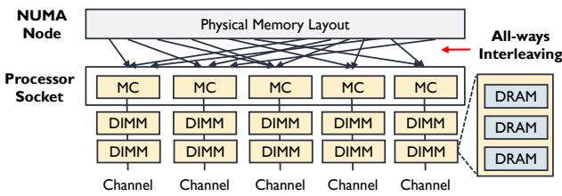  
Figure 1: Server memory subsystem (§2.2). Memory controllers (MCs) and channels are integrated into each processor socket. The physical memory of a NUMA node is interleaved across all channels of the socket, leading memory accesses to share and compete for the aggregate channel bandwidth.

The server memory subsystem consists of memory controllers, memory channels, DIMMs, and DRAM. As shown in Figure 1, memory controllers and memory channels are integrated into the processor socket, and the DIMMs are installed in slots connected to each channel. From the OS perspective, the DIMMs attached to a processor socket appear as the physical memory of a distinct NUMA node.

DRAM mapping defines how physical memory addresses are mapped to underlying hardware components, determining how much parallelism across memory channels is utilized when accessing a given sequence of pages and consequently affecting memory bandwidth. Unlike virtual-tophysical address mapping, which is controlled by the OS via page tables and can change at runtime, DRAM mapping is set by hardware registers at boot time through BIOS/UEFI settings [19,28,48] and remains fixed after boot. Modern servers interleave sequential physical addresses across all memory channels in a socket (i.e., all-ways interleaving shown in Figure 1) at cache-line granularity (i.e., 64 B [75]) or larger (e.g., 256 B to 4 KB [19, 28, 48]) to maximize memory bandwidth.

## 2.3 Memory Expansion Beyond the Server

CXL [34] enables DRAM expansion over PCIe. DRAM on CXL is also subject to DRAM mapping, but with additional complexity. CXL devices contain internal DDR channels [102] and are exposed as physical memory in CPU-less zNUMA [70] nodes in servers. CXL devices can be interleaved at granularities from 256 B to 16 KB [59, 96]. Each CXL component (e.g., a root port or CXL device) includes Host-managed Device Memory (HDM) registers that define the interleaving granularity [59,96] and can be configured via BIOS/UEFI and CXL configuration tools [32].

## 3 Motivation

Memory bandwidth in data centers is severely underutilized, and this underutilization is orthogonal to the well-documented underutilization of memory capacity. Bandwidth underutilization has several causes, yet existing techniques for managing capacity or throttling bandwidth do not address the problem.

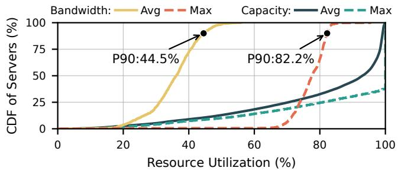  
Figure 2: Resource utilization across servers in the cloud (§3.1). Memory bandwidth is more severely underutilized than memory capacity: 90% of servers in the cloud use no more than 44.5% of available bandwidth on average and no more than 82.2% at peak.

## 3.1 Bandwidth is Underutilized yet Understudied

Memory bandwidth is more severely underutilized than memory capacity yet remains understudied. To quantify this underutilization, we analyze cluster traces3 from a major cloud vendor [6] and summarize the following two key observations.

Severely stranded bandwidth. Memory bandwidth underutilization leaves substantial bandwidth stranded in cloud data centers (Figure 2): 90% of servers exhibit average bandwidth utilization below 44.5%; even peak bandwidth utilization stays below 82.2% for 90% of servers. In contrast, 55.4% of servers exhibit both average and maximum capacity utilization above 90%, although 18.3% of servers still have average capacity utilization below 60%. Therefore, optimizing memory resource efficiency should consider both memory capacity and bandwidth.

Decoupled resource utilization. Memory capacity and bandwidth utilization vary over time and in different ways (Figure 3): memory capacity and bandwidth utilization on a physical server are not correlated with each other or with CPU utilization. Therefore, independently managing memory capacity and bandwidth can potentially consolidate complementary workloads and improve overall memory resource efficiency.

## 3.2 Root Causes of Underutilization

Memory resource underutilization can be attributed to both spatial and temporal over-provisioning.

Spatial over-provisioning. Users with strict performance QoS often want exclusive access to dedicated hardware resources. A typical practice in multi-tenant cloud environments is over-provisioning, such as subscribing to at least half of a physical server (i.e., one CPU socket). This guarantees exclusive access to hardware resources [22], including the LLC and the memory channels described in §2.2, and thus avoids performance interference from co-located VMs. However, this approach achieves isolation by purchasing extra memory and CPU capacity, which is inefficient for both customers and vendors.

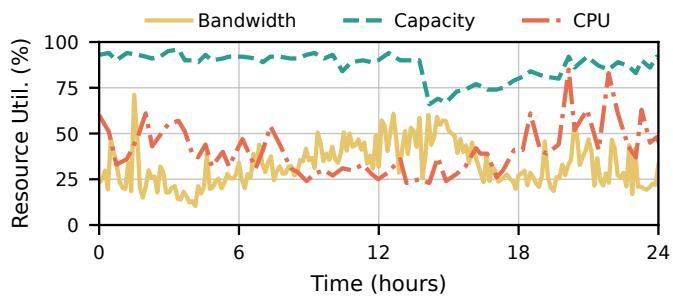  
Figure 3: Resource utilization of a single server over one day (§3.1). A closer look at individual servers reveals decoupled resource utilization trends: memory capacity, memory bandwidth, and CPU utilization can vary over time and in different ways.

Consider a dual-socket server with 96 cores, 384 GB memory capacity, and 600 GB/s memory bandwidth per socket. User A runs a latency-sensitive service (e.g., Redis [89], Memcached [79]) that requires 48 cores, 256 GB capacity, and 50 GB/s bandwidth, while user B runs a bandwidth-intensive job (e.g., STREAM [78], graph processing [23]) requiring 48 cores, 96 GB capacity, and 500 GB/s bandwidth. In principle, these complementary workloads could consolidate on a single socket without over-provisioning. In practice, however, meeting latency targets and bandwidth guarantees forces user A to occupy an entire socket, while user B must take the other full socket to secure sufficient bandwidth.

Temporal over-provisioning. The memory resource is allocated at VM creation and remains fixed throughout the VM lifespan. This forces users to provision memory resources to accommodate the applications’ peak loads, resulting in underutilization at off-peak times. In this case, users appear to over-provision memory capacity, but in practice they are reserving memory bandwidth to sustain the applications’ peak loads. As shown in Figure 3, despite the high demand for capacity, its utilization remained below 80% for four consecutive hours during the day due to over-provisioning for peak load. Across the full trace dataset (§3.1), more than 30% of servers show long periods (over one hour) of off-peak capacity usage and over 90% of servers show long periods of off-peak bandwidth usage.

## 3.3 The Limitations of Existing Approaches

Modern systems provide a rich array of memory management features in hardware and software, but none of them effectively addresses the bandwidth utilization problem. This subsection discusses existing approaches and their limitations.

Memory pooling. Prior work utilizes CXL to pool memory resources to improve memory utilization [3, 24, 41, 42, 46, 50, 51, 70, 114, 117, 120]. However, these approaches mainly manage memory capacity rather than bandwidth, and thus do not eliminate spatial over-provisioning for performance QoS or temporal over-provisioning for peak loads.

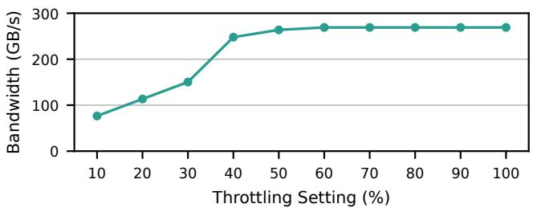  
Figure 4: Memory bandwidth with different hardware throttling settings (§3.3). Hardware throttling cannot precisely or linearly control memory bandwidth. It provides noticeable bandwidth control only at very low throttling settings, where the injected delay is long.

Hardware throttling. CPU vendors provide hardware throttling mechanisms to allocate memory bandwidth and reduce interference among co-located VMs (e.g., Intel MBA [54], AMD QoS [20]). These techniques insert delays between the L2 cache and the LLC to throttle bandwidth usage. However, delay-based throttling cannot provide precise bandwidth control (see Figure 4) and thus fails to effectively mitigate interference caused by co-located VMs (see more experimental results in §6.1 and §6.2). Previous studies have also reported this limitation [37, 84, 97, 110, 115, 118]. Furthermore, inserting extra delays wastes CPU cycles by stalling cores [39].

Software throttling. To control and isolate memory bandwidth, several software-based throttling mechanisms have been proposed. Canvas [105] isolates memory bandwidth by scheduling network packets. Spirit [67] controls memory bandwidth by limiting network transmission. However, these techniques target RDMA-based remote memory and cannot control memory bandwidth for cache-coherent memory (i.e., DIMMs and CXL devices) because, after pages are mapped, memory accesses are issued by the CPU via load/store instructions without software involvement on the access path.

Indirect approaches. Since there is no direct bandwidth allocation mechanism [26], several indirect approaches have been proposed, including limiting the number of cores [39,74, 115], reducing core frequency [52, 84], and restricting LLC ways [26, 83]. However, these techniques are impractical in cloud environments, as they compromise other key VM metrics (e.g., CPU cores and frequency) in exchange for memory bandwidth control or are only effective for LLCsensitive applications with LLC-related controls [26, 83].

## 4 RAMRYDER

RAMRYDER is a software-defined elastic memory system for cloud VMs, providing flexible capacity and bandwidth allocation with robust performance isolation. Its key insight is to manage memory at channel granularity, motivated by two observations. First, bandwidth scales with available memory channels, including both DIMM and CXL channels (Figure 5). Second, congestion stems from channel sharing caused by hardware-controlled interleaving. Therefore, RAMRYDER takes the role of hardware and directly manages channel allocation and page-to-channel mapping in software.

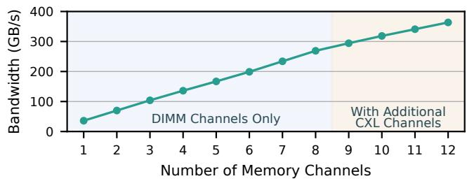  
Figure 5: Memory bandwidth with different memory channel configurations (§4). Bandwidth scales nearly linearly with available DIMM channels. CXL channels provide additional bandwidth and follow the same scaling trend.

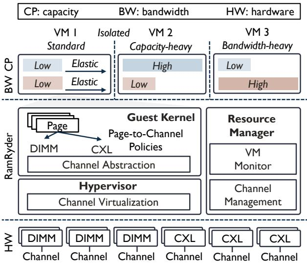  
Figure 6: Overview of system architecture (§4). RamRyder enables memory channel allocation in software to achieve elastic capacity and bandwidth allocation with performance isolation. The runtime includes a user-space resource manager for channel management, a hypervisor for channel virtualization, and a guest kernel for channel abstraction and page-to-channel allocation policies.

Goals. To address the challenges of memory resource efficiency in cloud data centers (§3), RAMRYDER targets three goals: Goal 1: enable bandwidth allocation and performance isolation on commodity servers without hardware modifications; Goal 2: extend capacity and bandwidth independently; and Goal 3: adjust capacity and bandwidth dynamically.

Architecture. RAMRYDER manages memory channels and the devices attached to each channel in software (Figure 6). It statically allocates DIMMs to provide guaranteed capacity and bandwidth, and uses CXL devices to provide elastic best-effort capacity and bandwidth that VMs can independently subscribe to and dynamically scale on demand. The RAMRYDER runtime consists of a resource manager in the host user space, a hypervisor, and a modified guest kernel. The resource manager is responsible for per-channel capacity management and channel allocation, the hypervisor enables channel virtualization, and the guest kernel provides channel abstraction and page-to-channel allocation policies in the OS.

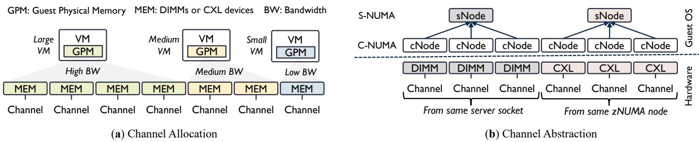  
Figure 7: Overview of memory channel allocation and abstraction (§4.1). To allocate memory channels to VMs, the hypervisor maps the VM’s guest physical memory to memory devices on the target channels (a). Memory on each channel is then exposed as a C-NUMA node (i.e., cNode) in the guest OS, and multiple cNodes are organized as an S-NUMA node (i.e., sNode) by the guest OS (b).

Key techniques. To achieve Goal 1, RAMRYDER allocates memory bandwidth by allocating memory channels and controls how pages in the guest OS map to underlying channels. This also provides robust performance isolation since VMs on different DIMM channels are unlikely to interfere with each other (§4.1). To realize Goal 2, RAMRYDER introduces a channel selection policy that determines how many channels to allocate based on bandwidth and capacity demands, and a cross-tier page allocation policy that interleaves pages across DIMM and CXL channels to use additional CXL bandwidth (§4.2). Finally, to achieve Goal 3, RAMRYDER introduces a channel hot-plug/unplug mechanism to allocate and reclaim bandwidth at runtime. It also leverages lazy migration to redistribute previously allocated pages, allowing these pages to utilize the bandwidth of newly attached channels (§4.3).

## 4.1 Enabling Bandwidth Allocation and Isolation

To achieve bandwidth allocation and performance isolation, RAMRYDER needs to control how memory pages in a VM map to underlying memory channels. This requires four steps. First, RAMRYDER enables channel allocation in software to override hardware-controlled channel interleaving. Next, RAMRYDER isolates LLCs across VMs to avoid cache-level contention that reduces the benefits of channel allocation. Then, RAMRYDER introduces a channel abstraction in the guest OS to expose this hardware component while remaining compatible with existing kernel mechanisms. Finally, RAMRYDER introduces a new page allocation policy to fully utilize the allocated channels within each VM.

Channel allocation. To realize memory channel allocation for VMs, RAMRYDER overrides the hardware-controlled interleaving (§2.2) by directly managing the memory devices attached to each channel, including DIMMs and CXL devices. To allocate channels to a VM, the RAMRYDER hypervisor maps the VM’s guest physical memory to the memory devices attached to the target channels (Figure 7(a)). §5.1 explains how RAMRYDER identifies the DIMMs and CXL devices attached to each channel on commodity servers via BIOS/UEFI.

For locally attached DIMMs, RAMRYDER allocates channels in proportion to the VM’s memory capacity. For example, a VM that subscribes to 40% of the memory capacity receives 40% of the dedicated channels, which provide 40% of the available bandwidth. Moreover, using this channel allocation mechanism, RAMRYDER can independently allocate additional capacity and bandwidth from CXL devices (§4.2).

LLC isolation. Channel allocation alone cannot achieve full performance isolation since the LLC can introduce cachelevel contention across VMs. Therefore, RAMRYDER further isolates LLCs across VMs by pinning each VM’s vCPUs on separate chiplets [38], each containing one core complex (CCX) with its own LLC [21].

Channel abstraction. After channels are allocated to a VM, the guest OS needs to recognize the new hardware component while remaining compatible with existing kernel mechanisms. RAMRYDER abstracts memory channels as C-NUMA (i.e., Channel-NUMA) nodes and uses S-NUMA (i.e., Server-NUMA) nodes to preserve the original server-level NUMA topology (e.g., server sockets and zNUMA nodes for CXL [70]). This channel abstraction allows the guest kernel to leverage existing NUMA primitives for page-to-channel allocation while preserving server-level NUMA optimizations.

Specifically, the RAMRYDER hypervisor virtualizes the guest physical memory mapped to each memory channel as a distinct C-NUMA node (cNode) and exposes its physical topology (e.g., socket/zNUMA and channel) to the RAMRY-DER guest kernel via the ACPI table [58], which describes hardware topology. The guest kernel then detects the topology of each cNode and constructs S-NUMA nodes (sNodes) by grouping cNodes from the same socket/zNUMA domain (Figure 7(b)). The kernel also maintains a mapping between sNodes and cNodes and only exposes sNodes to users.

Page allocation policy. To better utilize allocated channels within a VM, the guest OS needs to decide how to allocate memory pages across those channels. The RAMRYDER guest kernel uses a channel-interleaving policy to maximize performance. Specifically, when allocating memory pages for applications, the RAMRYDER guest kernel performs page allocation in two steps and applies a different policy at each step. It first selects an sNode based on the server-level NUMAaware policy and then chooses a cNode within that sNode by interleaving pages equally across all cNodes. This channel interleaving allows applications to utilize all available memory channels in parallel within an sNode and achieves performance comparable to hardware-controlled interleaving, which operates at granularities ranging from cache-line size to page size [19, 28, 48, 75].

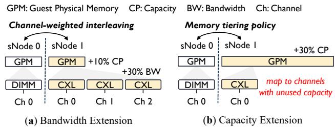  
Figure 8: Example of bandwidth and capacity extensions (§4.2). For bandwidth extension (a), RamRyder maps guest memory across multiple CXL channels and leverages a channel-weighted interleaving policy to utilize additional CXL bandwidth. For capacity extension (b), RamRyder maps guest memory to channels with unused capacity and leverages a tiering policy to utilize CXL capacity.

## 4.2 Extending Capacity and Bandwidth

RAMRYDER uses CXL devices to provide additional memory capacity and bandwidth. To extend these resources independently, RAMRYDER first uses a channel selection policy to determine how many channels to allocate based on capacity and bandwidth demands. Then, because CXL memory appears as a separate memory tier (i.e., a remote S-NUMA node in the guest OS), RAMRYDER introduces channel-weighted interleaving as a cross-tier page allocation policy for utilizing additional CXL bandwidth.

Channel selection. Given a certain amount of guest physical memory (GPM), RAMRYDER can control the available bandwidth by selecting the number of channels the memory will span. RAMRYDER maps GPM across multiple CXL channels when a VM requires additional bandwidth but only limited capacity (Figure 8(a)). In contrast, RAMRYDER maps GPM to fewer CXL channels when a VM needs additional capacity without proportional bandwidth demand (Figure 8(b)).

With this mapping, capacity and bandwidth utilization within a single CXL channel may become imbalanced. To mitigate this imbalance without sacrificing performance QoS, RAMRYDER pairs VMs with complementary memory demands and co-locates them on the same CXL channels. For instance, if one VM consumes an additional 10% capacity and 60% bandwidth (i.e., occupying 60% of the CXL channels), RAMRYDER allocates the remaining 50% capacity on those channels to another VM that requires less than 50% of CXL capacity with little additional bandwidth demand.

Channel-weighted interleaving. After allocating CXL mem ory and exposing it as a separate tier, the RAMRYDER guest kernel applies a traditional memory tiering policy [77], which migrates hot pages to DIMMs and keeps cold pages in CXL devices, to utilize additional CXL capacity and introduces channel-weighted interleaving as a cross-tier page allocation policy for utilizing additional CXL bandwidth (Figure 8).

The channel-weighted interleaving policy maximizes bandwidth across tiers by using a weighted ratio between S-NUMA nodes (sNodes) based on each sNode’s maximum bandwidth. The maximum bandwidth of a sNode is determined by its number of channels and the bandwidth provided per channel.

For example, consider a VM with three DIMM channels in sNode-0 and one CXL channel in sNode-1, where each DIMM channel provides 36 GB/s and each CXL channel provides 27 GB/s of bandwidth. The guest kernel applies an 8:3 weighted ratio between sNode-0 and sNode-1 (derived from 36×3 and 27×1) by allocating 8 pages from sNode-0 followed by 3 pages from sNode-1, and so forth. Within each sNode, the guest kernel retains channel interleaving equally across its C-NUMA nodes, as described in §4.1.

## 4.3 Adjusting Capacity and Bandwidth at Runtime

To dynamically adjust memory capacity and bandwidth at runtime, RAMRYDER uses different mechanisms for the two resources. For capacity, RAMRYDER reuses existing Linux memory statistics and the hot-plug/unplug mechanism in the guest OS. For bandwidth, RAMRYDER monitors VM bandwidth usage and introduces a channel hot-plug/unplug mechanism, along with page redistribution, to adjust VM bandwidth.

Capacity monitoring and allocation. RAMRYDER monitors each VM’s memory usage by reading Linux’s statistics in meminfo via a domain socket and hot-plugs memory chunks from CXL devices into the guest when usage exceeds a high threshold (e.g., 80%) or hot-unplugs them when usage falls below a low threshold (e.g., 40%) for consecutive seconds.

Bandwidth monitoring. RAMRYDER leverages processor performance counters to monitor VM bandwidth usage and detect bandwidth bottlenecks and waste for bandwidth adjustment. Every second, RAMRYDER measures the aggregate bandwidth across all cores assigned to each VM. When a VM’s bandwidth consumption exceeds the high threshold (e.g., 80%), the RAMRYDER resource manager allocates additional bandwidth (i.e., CXL channels) to the VM. Conversely, if bandwidth consumption stays below the low threshold (e.g., 40%) for consecutive seconds, the RAMRYDER resource manager reclaims bandwidth from that VM.

Channel hot-plug/unplug. To dynamically adjust memory bandwidth without altering capacity, RAMRYDER needs to change the channels allocated to the VM at runtime. To enable this capability, RAMRYDER introduces a channel hotplug/unplug mechanism. This requires four steps. First, RAM-RYDER allocates extra guest physical memory mapped to an additional CXL channel. If the VM previously had a total capacity X across N channels, the new channel is mapped to a new guest physical memory region of size X/(N + 1). Next, the RAMRYDER hypervisor hot-plugs the additional guest physical memory into the guest OS ( 1 , Figure 9). The RAMRYDER guest kernel then constructs a cNode and adds it to an existing sNode ( 2 , Figure 9), or creates a new one if no sNode exists. Then, RAMRYDER reclaims the same amount of capacity X/(N + 1) from the VM’s previously allocated channels by hot-unplugging memory from existing cNodes under the same sNode ( 4 , Figure 9). Since the target reclaim size is X/(N +1) and the VM previously spanned N channels, each cNode should return X/(N + 1)/N capacity to keep capacity balanced across all cNodes under a sNode. Through these steps, the VM gains additional bandwidth while maintaining the same total memory capacity.

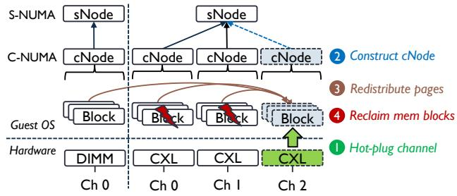  
Figure 9: Workflow of adaptive bandwidth adjustment (§4.3). Adjusting bandwidth at runtime first adds memory channels, then constructs new C-NUMA nodes (cNodes), redistributes pages across cNodes, and finally reclaims memory blocks to retain the same capacity. These four steps are color-coded, with matching icons and text labels indicating the corresponding operations.

Note that this procedure enables the VM to immediately utilize additional bandwidth if the workload is allocation intensive. However, if pages are already allocated on previous channels, RAMRYDER performs page redistribution ( 3 , Figure 9) between step 2 and 4 above to balance pages evenly across channels. We explain this redistribution process in detail below. Similarly, during channel hot-unplug, RAMRYDER applies the same procedure in reverse to reclaim bandwidth when the workload demand decreases, including page redistribution across fewer channels when necessary.

Page redistribution. To utilize the newly attached channels, RAMRYDER redistributes existing pages so that their pageto-channel placement is realigned with the original channelweighted interleaving (§4.2) and page allocation (§4.1) poli cies. This redistribution is performed by triggering page faults followed by lazy migration. After hot-plugging new channels, the RAMRYDER guest kernel scans the page table entries of mapped pages and clears their present bits, which triggers page faults when these pages are subsequently accessed by applications. Upon a page fault, RAMRYDER recalculates the target sNode and its corresponding cNode, and marks misplaced pages for migration to the new cNode.

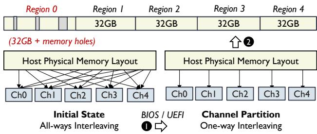  
Figure 10: Process of memory topology provisioning (§5.1). Ram-Ryder gains software control over per-channel memory by first partitioning memory channels via BIOS/UEFI and then detecting perchannel regions from the memory layout. These regions are then reserved as DAX devices for software management.

## 5 Implementation

RAMRYDER is implemented on unmodified commodity servers with a memory topology provisioning toolchain and runtime software. The toolchain reconfigures servers to expose the underlying memory topology required to run RAM-RYDER, while the runtime software implements RAMRY-DER’s key components as an end-to-end system.

## 5.1 Memory Topology Provisioning

To realize RAMRYDER on commodity servers, we need to gain control over raw memory devices, including DIMMs and CXL devices, under each memory channel in software. To achieve this, we implement a memory topology provisioning toolchain that involves the following operations.

Partitioning memory channels. Since the physical address space is interleaved across all DIMM channels by default, the first step to gain control over the DIMMs under each channel is to partition DIMM channels. We partition DIMM channels primarily by disabling channel interleaving via BIOS/UEFI during system boot ( 1 , Figure 10). After partitioning DIMM channels, the physical address space is linearly mapped to underlying channels (see channel partition in Figure 10).

Detecting memory regions. The second step is to detect each DIMM channel’s memory region. As the physical address space is linearly mapped to underlying channels after partitioning, we calculate each DIMM channel’s memory region based on the capacity of the DIMMs populated in that channel ( 2 , Figure 10). In practice, the host OS may reserve holes in the memory layout [60]. RAMRYDER adjusts its address calculations by adding offsets to skip these holes when determining each channel’s region (see region 0 in Figure 10).

Reserving memory regions. The final step is to reserve memory under each DIMM channel in user space. We keep 10 GB for the host OS to ensure it has sufficient memory to operate and reserve the remaining region under each channel as a separate DAX device using the memmap kernel parameter. CXL device reservation. For CXL devices, current PCIe Gen 5 CXL devices have one DDR5 channel internally [102].

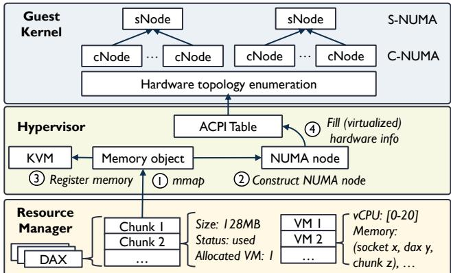  
Figure 11: Implementation details. (§5.2). The RamRyder runtime consists of a user-space resource manager, a hypervisor, and a guest kernel. The resource manager splits per-channel DAX devices into chunks; the hypervisor virtualizes allocated chunks from the same device as a NUMA node and exposes the hardware topology via the ACPI table; and the guest kernel constructs cNodes and sNodes from the exposed hardware topology.

Therefore, we only need to reserve the whole CXL device, which represents DRAM under one CXL channel. We reserve each CXL device as a separate DAX device in user space via BIOS/UEFI and the CXL configuration tool [32].

## 5.2 Runtime Software

RAMRYDER’s runtime (Figure 11) consists of a resource manager (RM) built from scratch, a hypervisor built on top of QEMU, and an extended guest kernel based on Linux.

Resource manager. The RAMRYDER RM is a user-space daemon that manages memory and monitors VMs. The RM splits each DAX device into 128 MB chunks as the minimal allocation units for VMs, aligned with the kernel’s hot-plug block size. Each chunk is uniquely identified by (socket\_id, dax\_id, chunk\_id). The RM also exposes an RPC interface over domain sockets for QEMU to request memory during VM boot. In addition, it uses Linux perf\_event APIs [61] to collect per-core performance counters and aggregate them into per-VM bandwidth utilization, and interacts with the QEMU Guest Agent [35] to obtain per-VM capacity usage.

Hypervisor. The RAMRYDER hypervisor is QEMU with four major modifications. First, it organizes memory chunks from different DAX devices (i.e., memory channels) into distinct NUMA nodes and exposes the physical topology (i.e., socket and DAX indices) to the guest kernel via reserved domains in the ACPI table [58]. Second, it extends the QEMU Guest Agent to support memory-usage queries used by the RM. Third, it integrates an RPC client that allows QEMU to request memory from the RM during VM launch. Finally, it adds support for attaching and detaching channels at runtime.

Guest kernel. The RAMRYDER guest kernel extends Linux with four major modifications. First, it extends the memory probing process to retrieve physical topology information of C-NUMA nodes from the ACPI table during system boot. Second, it implements the S-NUMA and C-NUMA abstractions within the existing NUMA framework and establishes metadata mappings between them. Third, it implements a new page-mapping policy in the memory-policy layer to maximize performance under these abstractions. Finally, it extends the kernel’s memory hot-plug/unplug mechanism to construct new S-NUMA and C-NUMA nodes and trigger page redistribution upon C-NUMA hot-plug/unplug events.

## 6 Evaluation

Our evaluation aims to answer the following questions:

• What benefits does RAMRYDER provide for VMs in terms of performance and isolation (§6.1)?

• Can RAMRYDER provide additional memory capacity or bandwidth while maintaining QoS for applications with asymmetric memory demands (§6.2)?

• Can RAMRYDER improve memory utilization across both capacity and bandwidth in cloud data centers (§6.3)?

• What overheads does RAMRYDER introduce, and how sensitive is RAMRYDER to highly dynamic workloads (§6.4)?

Testbed. Our server has an AMD EPYC Zen 5 processor with 128 logical cores (SMT enabled) and 12 DDR5 DIMM channels per socket. The cores are organized into 8 CPU dies, each with a 32 MB L3 cache and 16 logical cores. To match cloud compute-optimized instances (i.e., high compute with minimal memory), we use 8 DIMM channels in one socket, each populated with a 32 GB DDR5 DIMM. We create four VMs (details below), each using the same vCPU-to-memory ratio as AWS and Alibaba compute-optimized instances [5, 11]. The server also includes four 256 GB Samsung CXL 2.0 memory devices and runs Debian with Linux 6.15.

VM setup. We create four VMs to model multiple tenants. VM 1 and VM 2 each have 16 vCPUs and 32 GB of memory, while VM 3 and VM 4 each have 48 vCPUs and 96 GB of memory, following AWS and Alibaba compute-optimized instances [5, 11]. Each VM’s vCPUs are pinned to logical cores on separate core complexes (CCXs) [21], giving each VM dedicated LLCs. For RAMRYDER, we initially allocate one DIMM channel each to VM 1 and VM 2 and three DIMM channels each to VM 3 and VM 4, keeping memory bandwidth allocation proportional to capacity and CPU cores.

Compared approaches. We compare RAMRYDER against three approaches: Ideal, where VMs have exclusive access to hardware resources without co-located VMs; Shared, the default configuration where multiple VMs co-locate on a server; and HW-Throttle, which throttles memory bandwidth on top of Shared to mitigate co-located VM interference using Intel MBA [54] and AMD QoS [20]. For HW-Throttle, bandwidth is throttled in proportion to allocated capacity and CPU cores (e.g., a VM allocated 60% of the capacity and CPU cores is throttled to 60% of the maximum bandwidth).

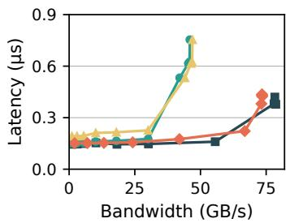  
(a) VM 1 (16 vCPUs): Read

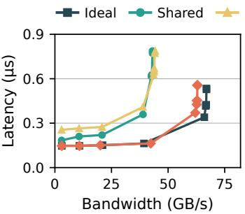  
(b) VM 2 (16 vCPUs): 3:1 R/W

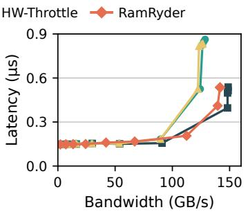  
(c) VM 3 (48 vCPUs): Read

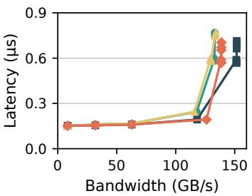  
(d) VM 4 (48 vCPUs): 3:1 R/W  
Figure 12: Latency and bandwidth under co-located VMs (§6.1). VMs with fewer vCPUs (VM 1 and VM 2) are more vulnerable to interference from co-located VMs with more vCPUs (VM 3 and VM 4). RamRyder mitigates contention and delivers performance close to the ideal baseline with exclusive hardware access.

## 6.1 Microbenchmarks

RAMRYDER guarantees performance QoS in multi-tenant environments through bandwidth allocation and performance isolation, without dedicated hardware resources. This subsection uses microbenchmarks to quantify this benefit.

Configuration. We use Intel MLC [53] to generate memoryintensive workloads, with read-only traffic on VM 1 (16 vC-PUs) and VM 3 (48 vCPUs), and a 3:1 read/write mix on VM 2 (16 vCPUs) and VM 4 (48 vCPUs). Each VM runs the benchmark on all available cores with a 100 MB buffer and a 64 B stride per core, ensuring the working set exceeds the CPU cache and accesses come from main memory. We run all VMs concurrently and measure memory bandwidth and average memory access latency.

Reads. Under read-only workloads (Figure 12(a) and (c)), both Shared and HW-Throttle suffer noticeable performance degradation, while RAMRYDER mitigates contention and delivers performance close to Ideal. In Shared, VM 1 experiences the most severe slowdowns: its memory access latency increases by up to 78.5%, and its maximum bandwidth drops by up to 41.2% compared to Ideal. This degradation arises because all VMs share the same memory channels, and VMs with more CPU cores can contend for more bandwidth, resulting in greater interference to VMs with fewer cores.

HW-Throttle, however, fails to mitigate contention and instead increases latency for the small VM with fewer cores (see the small gap between the green and yellow lines under 25 GB/s bandwidth in Figure 12(a)). This occurs because inserting extra delays cannot precisely control bandwidth and further wastes CPU cycles by stalling cores [39]. This observation aligns with prior work showing that HW-Throttle is ineffective for high-bandwidth workloads and only effective for low-bandwidth workloads when throttled to very low levels by inserting many delays [37, 84, 97, 115].

In RAMRYDER, VMs achieve bandwidth close to Ideal through channel allocation and isolation, which precisely control bandwidth and physically isolate VMs to avoid contention. For latency, VM 1 differs from Ideal by less than 5%, and its latency is up to 42.7% lower than that in Shared. A small gap to Ideal still exists because the VM in Ideal can use more available channels at the same bandwidth level, enabling greater parallelism and thus lower latency. Although RAM-RYDER limits the number of channels, it effectively mitigates contention from co-located VMs through physical isolation.

Mixed reads/writes. Under mixed workloads (Figure 12(b) and (d)), the overall trends remain consistent with those under read-only workloads. However, VM 2 shows about 15.3% lower bandwidth than under read-only workloads for both Ideal and RAMRYDER. In addition, VM 4 experiences less impact under both Shared and Ideal than under read-only workloads. These differences arise from the varying capabilities of memory channels to handle reads versus writes. §6.4 analyzes the scalability of memory channels under different read/write ratios in detail.

## 6.2 Application Benchmarks

RAMRYDER enables independent memory capacity and bandwidth extension with CXL devices while maintaining performance QoS, without subscribing to extra memory resources (i.e., paying for additional capacity to obtain more bandwidth, or for additional bandwidth to get more capacity). This subsection uses application benchmarks to quantify this benefit. Configuration. We evaluate two scenarios: (1) mixed workloads where capacity-demanding and latency-sensitive applications co-locate with bandwidth-intensive applications, and (2) all bandwidth-intensive applications. In the mixed scenario, we allocate an additional 100 GB of CXL memory to each of VM 1 and VM 2 and run Memcached and Redis with YCSB [33], respectively. In the bandwidth-only scenario, we allocate 10 GB of CXL memory and map it to one CXL channel for each of VM 1 and VM 2 and run STREAM and graph processing, respectively. Because VMs with fewer CPU cores are more susceptible to interference (§6.1), we allocate one CXL channel with 10 GB of CXL memory to each of VM 3 and VM 4 and generate peak mixed read/write traffic with Intel MLC to stress-test both scenarios. For Ideal, Shared, and HW-Throttle, we apply the existing Linux kernel tiering [77] policy to utilize CXL memory for all four VMs.

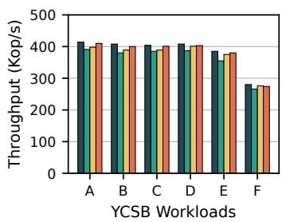  
(a) Throughput of Memcached

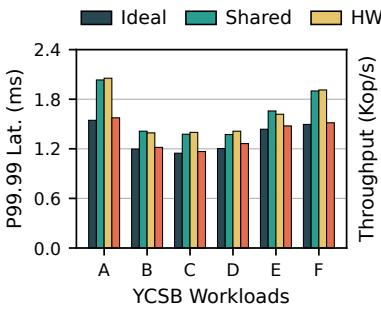  
(b) Tail Latency of Memcached

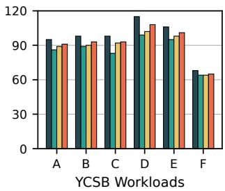  
(c) Throughput of Redis

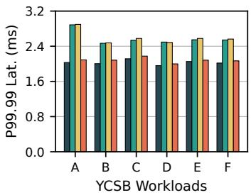  
(d) Tail Latency of Redis

Figure 13: Performance of Memcached and Redis under YCSB workloads with co-located VMs (§6.2). RamRyder mitigates channel contention through channel isolation and thus achieves throughput and tail latency close to the Ideal baseline, while Shared and HW-Throttle suffer higher latency and lower throughput due to channel contention  
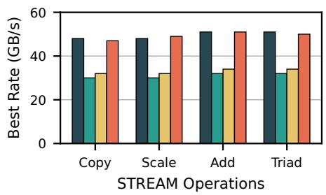  
(a) Throughput of STREAM

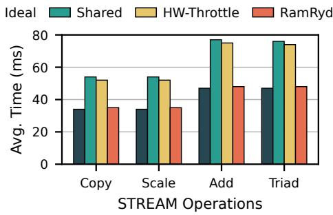  
(b) Execution Time of STREAM

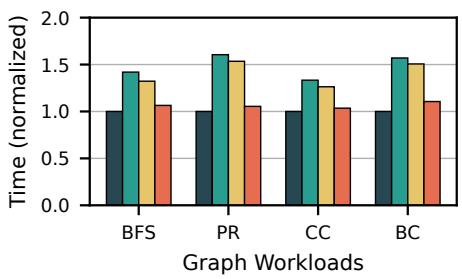  
(c) Execution Time of Graph Processing  
Figure 14: Performance of STREAM and graph-processing workloads with co-located VMs (§6.2). RamRyder mitigates channel contention through channel isolation and thus achieves throughput and execution time close to the Ideal baseline, while Shared and HW-Throttle suffer lower throughput and higher execution time due to channel contention.

Memcached. We populate 60 million key-value pairs (16 B keys and 1 KB values), and each YCSB workload issues 30 million operations. In terms of throughput (Figure 13(a)), all approaches achieve similar performance across YCSB workloads because memory bandwidth utilization remains low during execution, so throughput is not significantly affected by co-located VMs. However, both Shared and HW-Throttle exhibit higher tail latency (Figure 13(b)), particularly under YCSB-A (31.4% higher) and YCSB-F (27.2% higher). We observe that most memory accesses are served from local DIMMs, while CXL memory only stores cold pages with low access frequency. Therefore, the latency degradation primarily stems from contention on DIMM channels. In contrast, RAMRYDER mitigates contention from the bandwidthintensive workloads and achieves latency close to Ideal by allocating exclusive DIMM channels to each VM.

Redis. We use the same configuration as in the Memcached experiment (60 million key-value pairs and 30 million YCSB operations per workload). The throughput (Figure 13(c)) and latency (Figure 13(d)) trends are similar to those seen in the Memcached results. We further observe that both Ideal and RAMRYDER achieve slightly higher throughput than Shared and HW-Throttle, particularly under YCSB-D (RAMRYDER improves throughput by 9% and Ideal by 16.2%). For latency, Shared and HW-Throttle incur up to 42.7% higher latency in the worst case (YCSB-A), while RAMRYDER remains within a 5% latency increase relative to Ideal.

STREAM. We configure each STREAM workload (Copy, Scale, Add, and Triad) with an array size of 50 million elements to ensure that the working set far exceeds the LLC capacity, forcing most accesses to be served from main memory. In Shared, throughput (Figure 14(a)) is 37.3% lower and execution time (Figure 14(b)) is 58.8% higher compared to Ideal due to contention from co-located VMs. In HW-Throttle, both throughput and execution time remain similar to Shared (only about a 7% improvement for both metrics). By contrast, RAMRYDER achieves performance comparable to Ideal, with both throughput and execution time within 5% across all STREAM workloads, by allocating exclusive DIMM and CXL channels to the bandwidth-intensive VMs, thereby mitigating contention.

Graph processing. We generate graphs with 67 million nodes and 1.3 billion undirected edges and run four workloads: Breadth-First Search (BFS), PageRank (PR), Connected Components (CC), and Betweenness Centrality (BC).

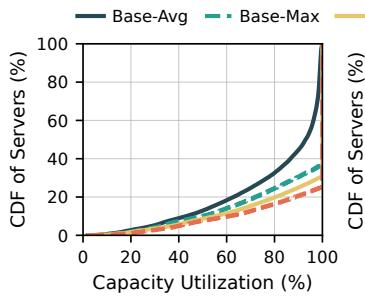  
(a) Utilization of Capacity

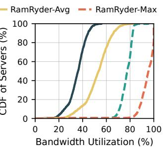  
(b) Utilization of Bandwidth  
Figure 15: Cluster-level resource utilization before and after colocating compatible workloads from cloud traces (§6.3). RamRyder improves both capacity and bandwidth utilization by co-locating workloads with complementary demands within hardware limits.

Because these workloads report only execution time and exhibit large differences in absolute runtime, we normalize all results to Ideal (Figure 14(c)). In Shared, execution time is 41.4% higher than Ideal due to contention from co-located bandwidth-intensive VMs. In HW-Throttle, execution time improves slightly but still shows a substantial gap compared to Ideal. By contrast, RAMRYDER reduces execution time by 25.2% relative to Shared and remains within 5% of Ideal. These benefits arise from RAMRYDER’s channel allocation and isolation, which eliminate contention and ensure QoS.

## 6.3 Cloud Workloads

RAMRYDER improves both capacity and bandwidth utilization in cloud data centers by consolidating complementary workloads on the same server while guaranteeing performance QoS. This subsection quantifies these benefits at both the cluster and server levels by emulating cloud workloads using the cluster traces [6] described in §3.

Cluster-level utilization. We analyze the memory traces to identify server pairs whose combined capacity and bandwidth usage at each timestamp remains within hardware limits (i.e., under 100%), and then calculate the resulting cluster-level utilization. At the cluster level, RAMRYDER improves average and maximum capacity utilization at P30 by 28.6% and 22.1% (Figure 15(a)), and average and maximum bandwidth utilization at P90 by 43.2% and 26.1% (Figure 15(b)).

Server-level utilization. We replay the memory requests of selected server pairs using a custom workload generator that reproduces their timestamped capacity and bandwidth usage, and run these workloads on the previously configured VM 3 and VM 4. As shown in Figure 16, server 1 requires high capacity (over 70%) with low bandwidth (averaging 10.1%) and occasional bursts, whereas server 2 uses low capacity (below 20%) but high bandwidth (averaging 38.4%). RAMRYDER accommodates these complementary demands and dynamically allocates memory bandwidth when workload demands change, improving utilization while meeting each workload’s requirements.

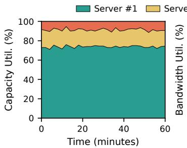  
(a) Utilization of Capacity

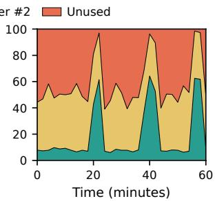  
(b) Utilization of Bandwidth

Figure 16: Server-level resource utilization when replaying cloud workloads from a matched server pair (§6.3). The two servers have complementary demands, allowing RamRyder to improve utilization while meeting both capacity and bandwidth demands.  
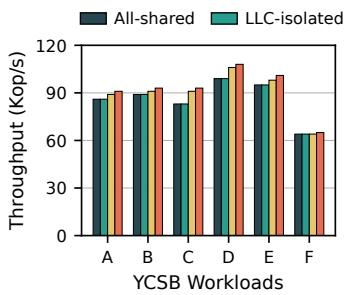  
(a) Throughput

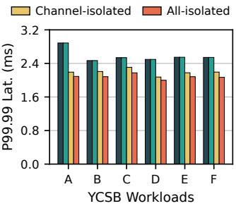  
(b) Tail Latency  
Figure 17: Attribution of performance isolation with Redis under YCSB workloads (§6.4). Channel isolation contributes more to reducing interference than LLC isolation, and combining both isolation mechanisms achieves the best performance.

## 6.4 Overhead and Sensitivity Analysis

RAMRYDER achieves its performance and utilization benefits with limited overhead. This subsection quantifies the overhead of RAMRYDER’s internal mechanisms and its sensitivity to highly dynamic workloads.

Attribution of performance isolation. We conduct an ablation study to quantify the contributions of LLC and channel isolation, using the same VM configurations and workloads as in §6.2. We compare the all-shared, LLC-isolated, channelisolated, and all-isolated setups, using Redis on VM 2 as a representative workload. As shown in Figure 17, channel sharing causes more severe interference than LLC sharing. Therefore, LLC isolation alone provides limited benefit. Channel isolation achieves much stronger isolation, although it still leaves residual LLC contention. With both LLC and channel isolation enabled, RAMRYDER achieves the best performance.

Scalability of memory channels. To evaluate scalability, we launch a VM with 128 vCPUs and initially one DIMM channel. We use Intel MLC to measure peak bandwidth under different read/write ratios while incrementally adding DIMM and then CXL channels. As shown in Figure 18, bandwidth scales linearly with the number of DIMM channels for both read-only and mixed workloads. When CXL channels are added, the scaling slope decreases slightly because CXL channels provide lower bandwidth than DIMM channels.

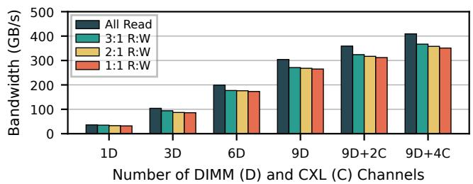  
Figure 18: Scalability of software-defined memory channels (§6.4). Memory bandwidth scales nearly linearly with DIMM channels under both read-only and mixed workloads; additional CXL channels further increase bandwidth.

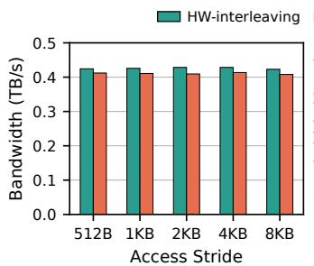  
(a) Bandwidth with 128 threads

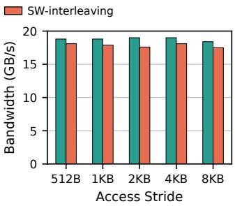  
(b) Bandwidth with 1 thread  
Figure 19: Overhead of software-defined interleaving under different access strides (§6.4). Software-defined interleaving delivers bandwidth close to hardware-controlled interleaving with low overhead across both 128-thread and single-thread workloads.

Overhead of software-defined interleaving. To quantify this overhead, we launch a VM with 128 vCPUs and all DIMM channels, then use STREAM to measure peak bandwidth with multiple threads and a single thread under different stride sizes. With 128 threads, RAMRYDER achieves peak bandwidth comparable to hardware interleaving, with an average overhead of 3.6% and a maximum of 4.4% across stride sizes (Figure 19(a)). With a single thread, RAMRYDER introduces a higher average overhead of 5.1%, with a more visible gap at intermediate stride sizes, especially the 2 KB stride, where overhead reaches 7.4% (Figure 19(b)). This is likely because hardware interleaving benefits from finer interleaving granularity, which better exploits row buffer locality.

Overhead of dynamic bandwidth allocation. Dynamic bandwidth allocation involves channel hot-plug/unplug and page redistribution. Channel hot-plug/unplug takes only a few microseconds and is negligible; redistribution dominates the cost and depends on the number of allocated pages and migration rate. To measure this overhead, we run a read-only workload on a VM with one DIMM channel using Intel MLC, then attach a CXL channel, and later reclaim it (Figure 20). The workload uses 10 GB of memory and initially reaches

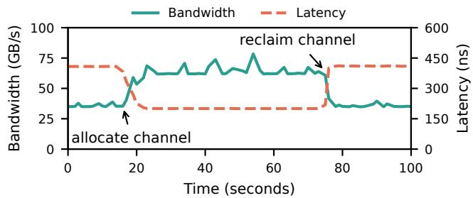  
Figure 20: Bandwidth and latency during dynamic channel allocation and reclamation (§6.4). Since channel changes require page redistribution, RamRyder leverages lazy migration to redistribute pages, avoiding large latency spikes despite the migration delay.

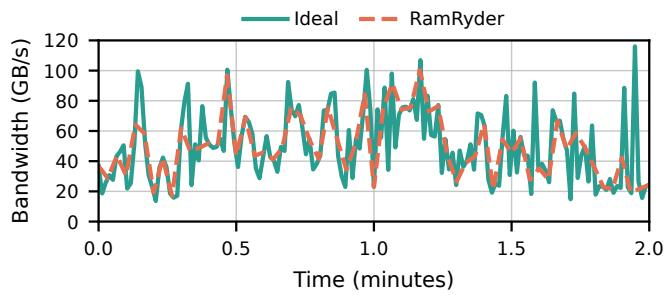  
Figure 21: Bandwidth adjustment under highly dynamic workloads (§6.4). RamRyder adapts to sustained bandwidth changes and approaches the over-provisioned ideal baseline, while transient bursts may be missed due to monitoring granularity and pageredistribution delays.

38 GB/s. After adding a CXL channel, bandwidth rises to 68 GB/s over 2.2 seconds, corresponding to a 1.82 GB/s migration rate while migrating about 40% of pages. Reclaiming the channel completes in 1.1 seconds because RAMRYDER performs lazy migration on allocation but immediate migration on reclamation. In both operations, latency remains smooth without noticeable spikes, indicating that redistribution incurs low overhead despite lasting a few seconds.

Sensitivity to highly dynamic demand. We evaluate RAM-RYDER with a highly dynamic workload and compare it with an ideal baseline that over-provisions all channels. We observe two expected differences from this over-provisioned baseline (Figure 21). First, RAMRYDER may miss extremely short bursts and cannot provide instantaneous bandwidth for such transient spikes. Second, for other bandwidth changes, RAMRYDER takes time to increase bandwidth and therefore slightly lags behind the ideal baseline. These gaps come from two sources. First, RAMRYDER needs at least 1 second to collect performance-counter information, so very short bursts can finish before the next decision point. Second, increasing bandwidth requires page redistribution, so newly attached channels contribute bandwidth gradually rather than immediately. Overall, RAMRYDER transitions smoothly and catches up to sustained demand increases, making it more suitable for VMs with gradually increasing bandwidth demand.

## 7 Discussion

Our prototype and evaluation focus on the feasibility of elastic capacity and bandwidth allocation by managing memory channels in software. While the results are encouraging, we acknowledge several limitations. This section discusses approaches to address them and describes target scenarios.

Guest kernel modifications. RAMRYDER requires guest kernel modifications, which complicates deployment in the cloud. This design, however, could enable finer-grained isolation: the guest kernel can isolate memory channels across co-located jobs within a VM, while these jobs remain opaque to the host. We therefore expect memory channel abstractions to become a standard OS interface for both guest and host kernels, eliminating the need for guest kernel modifications.

Reserving bandwidth beforehand. RAMRYDER initially allocates DIMM channels based on each VM’s memory bandwidth demand estimated from its proportion of allocated vC-PUs, following the same policy used for local storage in the cloud [4, 18]. If this estimate deviates significantly from the VM’s actual demand, RAMRYDER can also reallocate DIMM channels dynamically to avoid bandwidth shortages and resource waste.

Efficiency of dynamic bandwidth allocation. RAMRYDER requires several seconds to redistribute pages after channels are hot-plugged. This dynamic bandwidth allocation capability is suitable for VMs with gradually increasing bandwidth demand. For future optimization, RAMRYDER could leverage learning-based policies to predict bandwidth demand and trigger channel hot-plugging and page redistribution in advance.

Channel sharing for small VMs. Modern processors support up to 12 DIMM channels per socket, but this granularity remains too coarse for small VMs whose demand is below a full channel. Thus, RAMRYDER can place multiple small VMs on the same channel while isolating them from large VMs with many vCPUs, a major source of interference (§6.1). This also fits hardware throttling, which is effective mainly when the bandwidth limit is set very low [84,115], making it a potential mechanism to control small VMs sharing a channel.

Granularity of CXL channels. The CXL memory devices in our testbed use a single DDR5 channel; thus, the entire device can be reserved as DAX to represent one channel. Future PCIe 6.0/7.0 CXL devices will require multiple DDR channels for higher bandwidth [102], but their internal interleaving policies remain unclear. Ideally, vendors should expose these policies as configurable options, allowing the OS to control the mapping from physical memory to internal DDR channels.

Applicability to multi-host CXL memory pools. RAMRY-DER is currently designed and implemented for a single host server, but can be extended to a CXL memory pool shared by multiple hosts. In such scenarios, one host can act as the master node running the RAMRYDER resource manager, while others communicate with it via the RAMRYDER RPC interface (§5.2) to request memory capacity and bandwidth.

## 8 Related Work

Memory interference optimization. Prior work reduces memory interference via architectural techniques such as LLC partitioning [43, 57, 76, 87, 91, 92] and channel partitioning [73, 82, 116], which require hardware changes. Systemlevel approaches include Canvas [105] for far-memory isolation and DRAM mapping aliases [47] for OS-guided partitioning or interleaving. RAMRYDER is inspired by both architectural and system-level designs to physically isolate channels across VMs to reduce interference.

Memory bandwidth allocation. Existing bandwidth allocation relies on indirect controls, including throttling between L2 and LLC [37, 55, 110, 115], CPU-level mechanisms [52, 84, 115], LLC partitioning with throttling [26, 83, 118], and CPU scheduling [39, 74]. These techniques are indirect, often workload-specific, and may compromise other metrics. RAM-RYDER allocates bandwidth directly by allocating channels.

Memory bandwidth extension with CXL. Recent work explores using CXL devices to extend memory bandwidth. Many studies quantify the bandwidth benefits of CXL and examine page interleaving across memory tiers [27, 56, 71, 93, 100, 101, 106, 107]. Other efforts leverage CXL bandwidth for databases [49], PCIe device pooling [120], and LLM inference [63, 111, 113]. RAMRYDER extends this direction by enabling independent bandwidth allocation on CXL devices.

Memory capacity extension with CXL. CXL-based capacity extension spans memory tiering within a single server [1, 36, 64, 65, 69, 72, 77, 88, 94, 98, 99, 103, 108, 109, 112, 119] and memory disaggregation across multiple servers via CXL switches [3, 24, 41, 42, 46, 50, 51, 70, 114, 117]. RAMRYDER focuses on the single-server setting and can further extend to switch-based multi-host settings.

## 9 Conclusion

Memory bandwidth is severely underutilized in cloud data centers due to spatial and temporal memory over-provisioning, which stems from inflexible memory allocation and the lack of bandwidth allocation and performance isolation. This paper proposes RAMRYDER, a software-defined elastic memory system for cloud VMs. RAMRYDER takes the role of hardware and directly manages memory channel allocation and mapping in software to allocate bandwidth and capacity independently. This also enables performance isolation and allows resource allocation to change dynamically at runtime. RAMRYDER therefore improves both memory capacity and bandwidth utilization while guaranteeing performance QoS.

## Acknowledgments

We thank our shepherd and the OSDI’26 anonymous reviewers for their insightful feedback, and Fan Ni for early discussions and suggestions. This work was supported in part by ACE, one of the seven centers in JUMP 2.0, a Semiconductor Research Corporation (SRC) program sponsored by DARPA.

## References

[1] Neha Agarwal and Thomas F Wenisch. Thermostat: Application-transparent page management for twotiered main memory. In Proceedings of the 22nd International Conference on Architectural Support for Programming Languages and Operating Systems (AS PLOS), 2017.

[2] Marcos K Aguilera, Nadav Amit, Irina Calciu, Xavier Deguillard, Jayneel Gandhi, Pratap Subrahmanyam, Lalith Suresh, Kiran Tati, Rajesh Venkatasubramanian, and Michael Wei. Remote memory in the age of fast networks. In Proceedings of the 8th Symposium on Cloud Computing (SoCC), 2017.

[3] Minseon Ahn, Thomas Willhalm, Norman May, Donghun Lee, Suprasad Mutalik Desai, Daniel Booss, Jungmin Kim, Navneet Singh, Daniel Ritter, and Oliver Rebholz. An examination of CXL memory use cases for in-memory database management systems using sap hana. Proceedings of the VLDB Endowment, 2024.

[4] Alibaba. Block Storage performance, 2025. https://www.alibabacloud.com/help/en/ecs/ user-guide/block-storage-performance.

[5] Alibaba. c9ae, compute-optimized instance family, 2025. https://www.alibabacloud.com/help/ en/ecs/user-guide/overview-of-instancefamilies#c9ae.

[6] Alibaba. Cluster Trace Program, 2025. https:// github.com/alibaba/clusterdata.

[7] Alibaba. What are the benefits of burstable instances, 2025. https://www.alibabacloud.com/ help/en/ecs/user-guide/benefits-1.

[8] Emmanuel Amaro, Christopher Branner-Augmon, Zhihong Luo, Amy Ousterhout, Marcos K Aguilera, Aurojit Panda, Sylvia Ratnasamy, and Scott Shenker. Can far memory improve job throughput? In Proceedings of the 15th European Conference on Computer Systems (EuroSys), 2020.

[9] Amazon. Burstable performance instances, 2025. https://docs.aws.amazon.com/AWSEC2/ latest/UserGuide/burstable-performanceinstances.html.

[10] Amazon. Compute optimized Amazon EC2 instance types, 2025. https://aws.amazon.com/ ec2/instance-types/compute-optimized/.

[11] Amazon. Compute optimized Amazon EC2 instance types, 2025. https://aws.amazon.com/ ec2/instance-types/compute-optimized/.

[12] Amazon. EC2 R8g Instances, 2025. https://aws. amazon.com/ec2/instance-types/r8g/.

[13] Amazon. Elastic Block Store, 2025. https://aws. amazon.com/ebs/.

[14] Amazon. Elastic Fabric Adapter, 2025. https://aws. amazon.com/hpc/efa/.

[15] Amazon. Elastic File System, 2025. https://aws. amazon.com/efs/.

[16] Amazon. General purpose Amazon EC2 instance types, 2025. https://aws.amazon.com/ec2/instancetypes/general-purpose/.

[17] Amazon. Memory optimized Amazon EC2 instance types, 2025. https://aws.amazon.com/ ec2/instance-types/memory-optimized/.

[18] Amazon. Specifications for Amazon EC2 storage optimized instances, 2025. https://docs.aws.amazon. com/ec2/latest/instancetypes/so.html.

[19] AMD. Memory Population Guidelines for AMD EPYC 7003 Series Processors, 2021. https://www.amd.com/content/ dam/amd/en/documents/epyc-technicaldocs/other/56873\_0\_80\_PUB.pdf.

[20] AMD. Platform Quality of Service (QoS)., 2022. https://www.amd.com/content/ dam/amd/en/documents/processor-techdocs/other/56375\_1\_03\_PUB.pdf.

[21] AMD. 5th Generation AMD EPYC Processors, 2025. https://www.amd.com/en/products/ processors/server/epyc/9005-series.html.

[22] AWS. Side-channel protections in the broader EC2 service, 2025. https://docs.aws.amazon.com/ pdfs/whitepapers/latest/security-designof-aws-nitro-system/security-designof-aws-nitro-system.pdf#side-channelprotections-in-the-broader-ec2-service.

[23] Scott Beamer, Krste Asanovic, and David Patter-´ son. The GAP benchmark suite. arXiv preprint arXiv:1508.03619, 2015.

[24] Daniel S Berger, Yuhong Zhong, Fiodar Kazhamiaka, Pantea Zardoshti, Shuwei Teng, Mark D Hill, and Rodrigo Fonseca. Octopus: Scalable low-cost CXL memory pooling. arXiv preprint arXiv:2501.09020, 2025.

[25] Irina Calciu, M Talha Imran, Ivan Puddu, Sanidhya Kashyap, Hasan Al Maruf, Onur Mutlu, and Aasheesh Kolli. Rethinking software runtimes for disaggregated memory. In Proceedings of the 26th ACM International Conference on Architectural Support for Programming Languages and Operating Systems (ASPLOS), 2021.

[26] Shuang Chen, Christina Delimitrou, and José F Martínez. Parties: QoS-aware resource partitioning for multiple interactive services. In Proceedings of the 24th International Conference on Architectural

Support for Programming Languages and Operating Systems (ASPLOS), 2019.

[27] Albert Cho, Anish Saxena, Moinuddin Qureshi, and Alexandros Daglis. COAXIAL: A CXL-centric memory system for scalable servers. In Proceedings of the 2024 International Conference for High Performance Computing, Networking, Storage and Analysis (SC), 2024.

[28] Cisco. UCS Server BIOS Tokens in Intersight Managed Mode, 2025. https://www.cisco.com/ c/en/us/td/docs/unified\_computing/ucs/ Intersight/IMM\_BIOS\_Tokens\_Guide/b\_IMM\_ Server\_BIOS\_Tokens\_Guide/m-memory.html.

[29] Alibaba Cloud. Elastic RDMA, 2025. https: //www.alibabacloud.com/help/en/ecs/userguide/elastic-rdma-erdma/.

[30] Alibaba Cloud. Overview of Block Storage, 2025. https://www.alibabacloud.com/help/en/ ecs/user-guide/elastic-block-storagedevices.

[31] Google Cloud. High-performance block storage for any use case, 2025. https://cloud.google.com/ products/block-storage?hl=en.

[32] CXL community. CXL Memory Resource Kit (CMRK), 2025. https://github.com/cxlreskit/cxl-reskit.

[33] Brian F Cooper, Adam Silberstein, Erwin Tam, Raghu Ramakrishnan, and Russell Sears. Benchmarking cloud serving systems with YCSB. In Proceedings of the 1st ACM Symposium on Cloud computing (SoCC), 2010.

[34] Debendra Das Sharma, Robert Blankenship, and Daniel Berger. An introduction to the compute express link (CXL) interconnect. ACM Computing Surveys, 2024.

[35] QEMU Project Developers. QEMU Guest Agent (QGA), 2025. https://qemu-project.gitlab. io/qemu/interop/qemu-ga.html.

[36] Padmapriya Duraisamy, Wei Xu, Scott Hare, Ravi Rajwar, David Culler, Zhiyi Xu, Jianing Fan, Christopher Kennelly, Bill McCloskey, Danijela Mijailovic, et al. Towards an adaptable systems architecture for memory tiering at warehouse-scale. In Proceedings of the 28th ACM International Conference on Architectural Support for Programming Languages and Operating Systems (ASPLOS), 2023.

[37] Giorgio Farina, Gautam Gala, Marcello Cinque, and Gerhard Fohler. Assessing Intel’s memory bandwidth allocation for resource limitation in real-time systems.

In Proceedings of the 25th IEEE International Symposium On Real-Time Distributed Computing (ISORC), 2022.

[38] Alessandro Fogli, Bo Zhao, Peter Pietzuch, and Jana Giceva. CHARM: Chiplet Heterogeneity-Aware Runtime Mapping System. In Proceedings of the 21st European Conference on Computer Systems (EuroSys), 2026.

[39] Joshua Fried, Zhenyuan Ruan, Amy Ousterhout, and Adam Belay. Caladan: Mitigating interference at microsecond timescales. In Proceedings of the 14th USENIX Symposium on Operating Systems Design and Implementation (OSDI), 2020.

[40] Alexander Fuerst, Stanko Novakovic, Íñigo Goiri,´ Gohar Irfan Chaudhry, Prateek Sharma, Kapil Arya, Kevin Broas, Eugene Bak, Mehmet Iyigun, and Ricardo Bianchini. Memory-harvesting VMs in cloud platforms. In Proceedings of the 27th ACM International Conference on Architectural Support for Programming Languages and Operating Systems (ASP-LOS), 2022.

[41] Donghyun Gouk, Miryeong Kwon, Hanyeoreum Bae, Sangwon Lee, and Myoungsoo Jung. Memory pooling with CXL. IEEE Micro, 2023.

[42] Donghyun Gouk, Sangwon Lee, Miryeong Kwon, and Myoungsoo Jung. Direct access, High-Performance memory disaggregation with DirectCXL. In Proceedings of the 2022 USENIX Annual Technical Conference (ATC), 2022.

[43] Sriram Govindan, Jie Liu, Aman Kansal, and Anand Sivasubramaniam. Cuanta: quantifying effects of shared on-chip resource interference for consolidated virtual machines. In Proceedings of the 2nd ACM Symposium on Cloud Computing (SoCC), 2011.

[44] Juncheng Gu, Youngmoon Lee, Yiwen Zhang, Mosharaf Chowdhury, and Kang G Shin. Efficient memory disaggregation with Infiniswap. In Proceedings of the 14th USENIX Symposium on Networked Systems Design and Implementation (NSDI), 2017.

[45] Zhiyuan Guo, Yizhou Shan, Xuhao Luo, Yutong Huang, and Yiying Zhang. Clio: A hardware-software co-designed disaggregated memory system. In Proceedings of the 27th ACM International Conference on Architectural Support for Programming Languages and Operating Systems (ASPLOS), 2022.

[46] Minho Ha, Junhee Ryu, Jungmin Choi, Kwangjin Ko, Sunwoong Kim, Sungwoo Hyun, Donguk Moon, Byungil Koh, Hokyoon Lee, Myoungseo Kim, et al. Dynamic capacity service for improving CXL pooled memory efficiency. IEEE Micro, 2023.

[47] Marius Hillenbrand, Mathias Gottschlag, Jens Kehne, and Frank Bellosa. Multiple physical mappings: Dynamic DRAM channel sharing and partitioning. In Proceedings of the 8th Asia-Pacific Workshop on Systems (APSys), 2017.

[48] HPE. UEFI System Utilities User Guide for HPE ProLiant Gen10, Proliant Gen10 Plus Servers, and HPE Synergy, 2021. https://itpfdoc.hitachi. co.jp/manuals/ha8000v/hard/Gen10/UEFI/30- 293E3364-104\_en.pdf.

[49] Wentao Huang, Mo Sha, Mian Lu, Yuqiang Chen, Bingsheng He, and Kian-Lee Tan. Bandwidth Expansion via CXL: A Pathway to Accelerating In-Memory Analytical Processing. Proceedings of the VLDB Endowment. ISSN, 2024.

[50] Yibo Huang, Haowei Chen, Newton Ni, Vijay Chi dambaram, Dixin Tang, Emmett Witchel, Zhiting Zhu, and Zhipeng Jia. Tigon: A distributed database for a CXL pod. In Proceedings of the 19th USENIX Symposium on Operating Systems Design and Implementation (OSDI), 2025.

[51] Yibo Huang, Newton Ni, Vijay Chidambaram, Emmett Witchel, and Dixin Tang. Pasha: An efficient, scalable database architecture for CXL pods. In Proceedings of the Conference on Innovative Data Systems Research (CIDR), 2025.

[52] Satoshi Imamura and Eiji Yoshida. FairHym: Improving inter-process fairness on hybrid memory systems. In Proceedings of the 9th Non-Volatile Memory Systems and Applications Symposium (NVMSA). IEEE, 2020.

[53] Intel. Memory Latency Checker (MLC)., 2024. https://www.intel.com/content/www/us/en/ developer/articles/tool/intelr-memorylatency-checker.html.

[54] Intel. Memory Bandwidth Allocation (MBA), 2025. https://www.intel.com/content/ www/us/en/developer/articles/technical/ introduction-to-memory-bandwidthallocation.html.

[55] Ravi Iyer, Li Zhao, Fei Guo, Ramesh Illikkal, Srihari Makineni, Don Newell, Yan Solihin, Lisa Hsu, and Steve Reinhardt. QoS policies and architecture for cache/memory in CMP platforms. ACM SIGMETRICS Performance Evaluation Review, 2007.

[56] Divya Kiran Kadiyala and Alexandros Daglis. Push ing the Memory Bandwidth Wall with CXL-enabled Idle I/O Bandwidth Harvesting. arXiv preprint arXiv:2511.12349, 2025.

[57] Harshad Kasture and Daniel Sanchez. Ubik: Efficient cache sharing with strict QoS for latency-critical work

loads. In Proceedings of the 19th ACM International Conference on Architectural Support for Programming Languages and Operating Systems (ASPLOS), 2014.

[58] The kernel development community. ACPI Tables, 2025. https://docs.kernel.org/driver-api/ cxl/platform/acpi.html.

[59] The kernel development community. CXL Multi-Level Interleave, 2025. https://docs. kernel.org/driver-api/cxl/linux/exampleconfigurations/multi-interleave.html.

[60] The kernel development community. Physical Memory Model, 2025. https://docs.kernel.org/mm/ memory-model.html.

[61] Michael Kerrisk. perf\_event\_open - set up performance monitoring, 2025. https: //man7.org/linux/man-pages/man2/perf\_ event\_open.2.html.

[62] Anurag Khandelwal, Yupeng Tang, Rachit Agarwal, Aditya Akella, and Ion Stoica. Jiffy: Elastic farmemory for stateful serverless analytics. In Proceedings of the 17th European Conference on Computer Systems (EuroSys), 2022.

[63] Dowon Kim, MinJae Lee, Janghyeon Kim, Hyuck-Sung Kwon, Hyeonggyu Jeong, Sang-Soo Park, Minyong Yoon, Si-Dong Roh, Yongsuk Kwon, Jinin So, et al. Scalable Processing-Near-Memory for 1M-Token LLM Inference: CXL-Enabled KV-Cache Management Beyond GPU Limits. arXiv preprint arXiv:2511.00321, 2025.

[64] Jonghyeon Kim, Wonkyo Choe, and Jeongseob Ahn. Exploring the design space of page management for multi-tiered memory systems. In Proceedings of the 2021 USENIX Annual Technical Conference (ATC), 2021.

[65] Andres Lagar-Cavilla, Junwhan Ahn, Suleiman Souhlal, Neha Agarwal, Radoslaw Burny, Shakeel Butt, Jichuan Chang, Ashwin Chaugule, Nan Deng, Junaid Shahid, et al. Software-defined far memory in warehouse-scale computers. In Proceedings of the 24th International Conference on Architectural Support for Programming Languages and Operating Systems (AS-PLOS), 2019.

[66] Seung-seob Lee, Jachym Putta, Ziming Mao, and Anurag Khandelwal. Spirit: Fair allocation of interdependent resources in remote memory systems. In Proceedings of the ACM SIGOPS 31st Symposium on Operating Systems Principles (SOSP), 2025.

[67] Seung-seob Lee, Jachym Putta, Ziming Mao, and Anurag Khandelwal. Spirit: Fair Allocation of Interdependent Resources in Remote Memory Systems.

In Proceedings of the ACM SIGOPS 31st Symposium on Operating Systems Principles (SOSP), 2025.

[68] Seung-seob Lee, Yanpeng Yu, Yupeng Tang, Anurag Khandelwal, Lin Zhong, and Abhishek Bhattacharjee. MIND: In-network memory management for disaggregated data centers. In Proceedings of the ACM SIGOPS 28th Symposium on Operating Systems Principles (SOSP), 2021.

[69] Taehyung Lee, Sumit Kumar Monga, Changwoo Min, and Young Ik Eom. Memtis: Efficient memory tiering with dynamic page classification and page size deter mination. In Proceedings of the ACM SIGOPS 29th Symposium on Operating Systems Principles (SOSP), 2023.

[70] Huaicheng Li, Daniel S. Berger, Lisa Hsu, Daniel Ernst, Pantea Zardoshti, Stanko Novakovic, Monish Shah, Samir Rajadnya, Scott Lee, Ishwar Agarwal, et al. Pond: CXL-based memory pooling systems for cloud platforms. In Proceedings of the 28th ACM International Conference on Architectural Support for Programming Languages and Operating Systems (AS-PLOS), 2023.

[71] Jinshu Liu, Hamid Hadian, Yuyue Wang, Daniel S Berger, Marie Nguyen, Xun Jian, Sam H Noh, and Huaicheng Li. Systematic CXL memory characterization and performance analysis at scale. In Proceedings of the 30th ACM International Conference on Architectural Support for Programming Languages and Op erating Systems (ASPLOS), 2025.

[72] Jinshu Liu, Hamid Hadian, Hanchen Xu, and Huaicheng Li. Tiered Memory Management Beyond Hotness. In Proceedings of the 19th USENIX Symposium on Operating Systems Design and Implementation (OSDI), 2025.

[73] Lei Liu, Zehan Cui, Yong Li, Yungang Bao, Mingyu Chen, and Chengyong Wu. BPM/BPM+ Softwarebased dynamic memory partitioning mechanisms for mitigating DRAM bank-/channel-level interferences in multicore systems. ACM Transactions on Architecture and Code Optimization (TACO), 2014.

[74] David Lo, Liqun Cheng, Rama Govindaraju, Parthasarathy Ranganathan, and Christos Kozyrakis. Heracles: Improving resource efficiency at scale. In Proceedings of the 42nd Annual International Symposium on Computer Architecture (ISCA), 2015.

[75] Kevin Loughlin, Jonah Rosenblum, Stefan Saroiu, Alec Wolman, Dimitrios Skarlatos, and Baris Kasikci. Siloz: Leveraging DRAM isolation domains to prevent inter-VM rowhammer. In Proceedings of the ACM SIGOPS 29th Symposium on Operating Systems Principles (SOSP), 2023.

[76] Jason Mars, Lingjia Tang, Kevin Skadron, Mary Lou Soffa, and Robert Hundt. Increasing utilization in modern warehouse-scale computers using bubble-up. IEEE Micro, 2012.

[77] Hasan Al Maruf, Hao Wang, Abhishek Dhanotia, Johannes Weiner, Niket Agarwal, Pallab Bhattacharya, Chris Petersen, Mosharaf Chowdhury, Shobhit Kanaujia, and Prakash Chauhan. TPP: Transparent page placement for CXL-enabled tiered-memory. In Proceedings of the 28th ACM International Conference on Architectural Support for Programming Languages and Operating Systems (ASPLOS), 2023.

[78] John D. McCalpin. STREAM: Sustainable memory bandwidth in high performance computers., 2006. http://www.cs.virginia.edu/stream/.

[79] Memcached. A distributed memory object caching system., 2018. https://memcached.org/.

[80] Microsoft. Azure Elastic SAN, 2025. https://azure.microsoft.com/en-us/ products/storage/elastic-san/.

[81] Microsoft. B family general purpose VM size series, 2025. https://learn.microsoft.com/enus/azure/virtual-machines/sizes/generalpurpose/b-family.

[82] Sai Prashanth Muralidhara, Lavanya Subramanian, Onur Mutlu, Mahmut Kandemir, and Thomas Moscibroda. Reducing memory interference in multicore systems via application-aware memory channel partitioning. In Proceedings of the 44th annual IEEE/ACM international symposium on microarchitecture (MICRO), 2011.

[83] Jinsu Park, Seongbeom Park, and Woongki Baek. Co-Part: Coordinated partitioning of last-level cache and memory bandwidth for fairness-aware workload consolidation on commodity servers. In Proceedings of the 14th European Conference on Computer Systems (EuroSys), 2019.

[84] Jinsu Park, Seongbeom Park, Myeonggyun Han, Jihoon Hyun, and Woongki Baek. HyPart: A hybrid technique for practical memory bandwidth partitioning on commodity servers. In Proceedings of the 27th International Conference on Parallel Architectures and Compilation Techniques (PACT), 2018.

[85] Yifan Qiao, Zhenyuan Ruan, Haoran Ma, Adam Belay, Miryung Kim, and Harry Xu. Harvesting idle memory for application-managed soft state with Midas. In Proceedings of the 21st USENIX Symposium on Networked Systems Design and Implementation (NSDI), 2024.

[86] Yifan Qiao, Chenxi Wang, Zhenyuan Ruan, Adam Belay, Qingda Lu, Yiying Zhang, Miryung Kim, and Guo-

qing Harry Xu. Hermit: Low-latency, high-throughput, and transparent remote memory via feedback-directed asynchrony. In Proceedings of the 20th USENIX Symposium on Networked Systems Design and Implementation (NSDI), 2023.

[87] Moinuddin K Qureshi and Yale N Patt. Utility-based cache partitioning: A low-overhead, high-performance, runtime mechanism to partition shared caches. In Proceedings of the 39th Annual IEEE/ACM International Symposium on Microarchitecture (MICRO), 2006.

[88] Amanda Raybuck, Tim Stamler, Wei Zhang, Mattan Erez, and Simon Peter. HeMem: Scalable tiered memory management for big data applications and real nvm. In Proceedings of the ACM SIGOPS 28th Symposium on Operating Systems Principles (SOSP), 2021.

[89] Redis. The preferred, fastest, and most feature-rich cache, data structure server, and document and vector query engine., 2025. https://memcached.org/.

[90] Zhenyuan Ruan, Malte Schwarzkopf, Marcos K Aguilera, and Adam Belay. AIFM: High-performance, application-integrated far memory. In Proceedings of the 14th USENIX Symposium on Operating Systems Design and Implementation (OSDI), 2020.

[91] Daniel Sanchez and Christos Kozyrakis. The ZCache: Decoupling ways and associativity. In Proceedings of the 43rd Annual IEEE/ACM International Symposium on Microarchitecture (MICRO). IEEE, 2010.

[92] Daniel Sanchez and Christos Kozyrakis. Vantage: Scal able and efficient fine-grain cache partitioning. In Proceedings of the 38th annual international symposium on Computer architecture (ISCA), 2011.

[93] Rohit Sehgal, Vishal Tanna, Vinicius Petrucci, and Anil Godbole. Optimizing system memory bandwidth with Micron CXL memory expansion modules on Intel Xeon 6 processors. arXiv preprint arXiv:2412.12491, 2024.

[94] Sai Sha, Chuandong Li, Yingwei Luo, Xiaolin Wang, and Zhenlin Wang. vTMM: Tiered memory management for virtual machines. In Proceedings of the 18th European Conference on Computer Systems (EuroSys), pages 283–297, 2023.

[95] Yizhou Shan, Yutong Huang, Yilun Chen, and Yiying Zhang. LegoOS: A disseminated, distributed OS for hardware resource disaggregation. In Proceedings of the 13th USENIX Symposium on Operating Systems Design and Implementation (OSDI), 2018.

[96] Debendra Das Sharma, Mahesh Wagh, Vincent Hache, and Mahesh Natu. Compute Express Link (CXL): An Open Industry Standard for Composable Computing, 2023. https://computeexpresslink.org/wp-

content/uploads/2023/12/CXL\_FMS-2023- Tutorial\_FINAL.pdf.

[97] Parul Sohal, Michael Bechtel, Renato Mancuso, Heechul Yun, and Orran Krieger. A closer look at Intel resource director technology (RDT). In Proceedings of the 30th International Conference on Real-Time Networks and Systems (RTNS), 2022.

[98] Kevin Song, Jiacheng Yang, Zixuan Wang, Jishen Zhao, Sihang Liu, and Gennady Pekhimenko. HybridTier: an adaptive and lightweight CXL-memory tiering system. In Proceedings of the 30th ACM International Conference on Architectural Support for Programming Languages and Operating Systems (AS-PLOS), 2025.

[99] Yan Sun, Jongyul Kim, Zeduo Yu, Jiyuan Zhang, Siyuan Chai, Michael Jaemin Kim, Hwayong Nam, Jaehyun Park, Eojin Na, Yifan Yuan, et al. M5: Mastering Page Migration and Memory Management for CXL-based Tiered Memory Systems. In Proceedings of the 30th ACM International Conference on Architectural Support for Programming Languages and Operating Systems (ASPLOS), 2025.

[100] Yan Sun, Yifan Yuan, Zeduo Yu, Reese Kuper, Chihun Song, Jinghan Huang, Houxiang Ji, Siddharth Agarwal, Jiaqi Lou, Ipoom Jeong, et al. Demystifying CXL memory with genuine CXL-ready systems and devices. In Proceedings of the 56th Annual IEEE/ACM International Symposium on Microarchitecture (MICRO), 2023.

[101] Yupeng Tang, Ping Zhou, Wenhui Zhang, Henry Hu, Qirui Yang, Hao Xiang, Tongping Liu, Jiaxin Shan, Ruoyun Huang, Cheng Zhao, et al. Exploring performance and cost optimization with ASIC-based CXL memory. In Proceedings of the 19th European Conference on Computer Systems (EuroSys), 2024.

[102] TrendForce. Samsung Unveils CXL Roadmap: CMM-D 2.0 Samples Ready, 3.1 Targeted for Year-End, 2025. https://www.trendforce.com/news/2025/10/ 17/news-samsung-unveils-cxl-roadmap-cmmd-2-0-samples-ready-3-1-targeted-foryear-end/.

[103] Midhul Vuppalapati and Rachit Agarwal. Tiered Memory Management: Access Latency is the Key! In Proceedings of the ACM SIGOPS 30th Symposium on Operating Systems Principles (SOSP), 2024.

[104] Carl A Waldspurger. Memory resource management in VMware ESX server. ACM SIGOPS Operating Systems Review, 2002.

[105] Chenxi Wang, Yifan Qiao, Haoran Ma, Shi Liu, Wenguang Chen, Ravi Netravali, Miryung Kim, and Guoqing Harry Xu. Canvas: Isolated and adaptive swapping for multi-applications on remote memory. In

Proceedings of the 20th USENIX Symposium on Networked Systems Design and Implementation (NSDI), 2023.

[106] Xi Wang, Jie Liu, Jianbo Wu, Shuangyan Yang, Jie Ren, Bhanu Shankar, and Dong Li. Performance Characterization of CXL Memory and Its Use Cases. In Proceedings of the 2025 IEEE International Parallel and Distributed Processing Symposium (IPDPS), 2025.

[107] Zixuan Wang, Suyash Mahar, Luyi Li, Jangseon Park, Jinpyo Kim, Theodore Michailidis, Yue Pan, Tajana Rosing, Dean Tullsen, Steven Swanson, et al. The Hitchhiker’s Guide to Programming and Optimizing CXL-Based Heterogeneous Systems. arXiv preprint arXiv:2411.02814, 2024.

[108] Johannes Weiner, Niket Agarwal, Dan Schatzberg, Leon Yang, Hao Wang, Blaise Sanouillet, Bikash Sharma, Tejun Heo, Mayank Jain, Chunqiang Tang, et al. TMO: Transparent memory offloading in datacenters. In Proceedings of the 27th ACM International Conference on Architectural Support for Programming Languages and Operating Systems (ASPLOS), 2022.

[109] Lingfeng Xiang, Zhen Lin, Weishu Deng, Hui Lu, Jia Rao, Yifan Yuan, and Ren Wang. Nomad:Non-Exclusive memory tiering via transactional page migration. In Proceedings of the 18th USENIX Symposium on Operating Systems Design and Implementation (OSDI), 2024.

[110] Yaocheng Xiang, Chencheng Ye, Xiaolin Wang, Yingwei Luo, and Zhenlin Wang. EMBA: Efficient memory bandwidth allocation to improve performance on Intel commodity processor. In Proceedings of the 48th International Conference on Parallel Processing (ICPP), 2019.

[111] Rui Xie, Asad Ul Haq, Linsen Ma, Yunhua Fang, Zirak Burzin Engineer, Liu Liu, and Tong Zhang. Amplifying Effective CXL Memory Bandwidth for LLM Inference via Transparent Near-Data Processing. arXiv preprint arXiv:2509.03377, 2025.

[112] Zi Yan, Daniel Lustig, David Nellans, and Abhishek Bhattacharjee. Nimble page management for tiered memory systems. In Proceedings of the 24th International Conference on Architectural Support for Programming Languages and Operating Systems (ASP-LOS), 2019.

[113] Xinjun Yang, Qingda Hu, Junru Li, Feifei Li, Yuqi Zhou, Yicong Zhu, Qiuru Lin, Jian Dai, Yang Kong, Jiayu Zhang, et al. Beluga: A CXL-Based Memory Architecture for Scalable and Efficient LLM KVCache Management. arXiv preprint arXiv:2511.20172, 2025.

[114] Xinjun Yang, Yingqiang Zhang, Hao Chen, Feifei Li, Gerry Fan, Yang Kong, Bo Wang, Jing Fang, Yuhui

Wang, Tao Huang, et al. Unlocking the Potential of CXL for Disaggregated Memory in Cloud-Native Databases. In Companion of the 2025 International Conference on Management of Data, 2025.

[115] Jifei Yi, Benchao Dong, Mingkai Dong, Ruizhe Tong, and Haibo Chen. MT2: Memory Bandwidth Regulation on Hybrid NVM/DRAM Platforms. In Proceedings of the 20th USENIX Conference on File and Storage Technologies (FAST), 2022.

[116] Heechul Yun, Renato Mancuso, Zheng-Pei Wu, and Rodolfo Pellizzoni. PALLOC: DRAM bank-aware memory allocator for performance isolation on multicore platforms. In Proceedings of the 19th IEEE Real-Time and Embedded Technology and Applications Symposium (RTAS). IEEE, 2014.

[117] Mingxing Zhang, Teng Ma, Jinqi Hua, Zheng Liu, Kang Chen, Ning Ding, Fan Du, Jinlei Jiang, Tao Ma, and Yongwei Wu. Partial failure resilient memory management system for (CXL-based) distributed shared memory. In Proceedings of the ACM SIGOPS 29th Symposium on Operating Systems Principles (SOSP), 2023.

[118] Ying Zhang, Jian Chen, Xiaowei Jiang, Qiang Liu, Ian M Steiner, Andrew J Herdrich, Kevin Shu, Ripan Das, Long Cui, and Litrin Jiang. LIBRA: Clearing the cloud through dynamic memory bandwidth management. In Proceedings of the 2021 IEEE International Symposium on High-Performance Computer Architecture (HPCA), 2021.

[119] Yuhong Zhong, Daniel S Berger, Carl Waldspurger, Ryan Wee, Ishwar Agarwal, Rajat Agarwal, Frank Hady, Karthik Kumar, Mark D Hill, Mosharaf Chowdhury, et al. Managing Memory Tiers with CXL in Virtualized Environments. In Proceedings of the 18th USENIX Symposium on Operating Systems Design and Implementation (OSDI), 2024.

[120] Yuhong Zhong, Daniel S Berger, Pantea Zardoshti, Enrique Saurez, Jacob Nelson, Dan RK Ports, Antonis Psistakis, Joshua Fried, and Asaf Cidon. Oasis: Pooling PCIe devices over CXL to boost utilization. In Proceedings of the ACM SIGOPS 31st Symposium on Operating Systems Principles (SOSP), 2025.