USENIX

THE ADVANCED COMPUTING SYSTEMS ASSOCIATION

# UCCL-Tran: An Extensible Software Transport Layer for GPU Networking

Yang Zhou, University of California, Berkeley, and University of California, Davis;   
Zhongjie Chen, Tsinghua University; Ziming Mao, University of California, Berkeley; ChonLam Lao, Harvard University; Shuo Yang, University of California, Berkeley; Pravein Govindan Kannan, IBM Research; Xizhi Zhang, Tsinghua University; Jiaqi Gao, Independent Researcher; Yilong Zhao and Yongji Wu, University of   
California, Berkeley; Kaichao You, Independent Researcher; Fengyuan Ren, Tsinghua   
University; Zhiying Xu, Amazon Web Services; Costin Raiciu, Broadcom and University Pollitehnica of Bucharest; Ion Stoica, University of California, Berkeley

https://www.usenix.org/conference/osdi26/presentation/zhou-yang

# This paper is included in the Proceedings of the 20th USENIX Symposium on Operating Systems Design and Implementation.

July 13–15, 2026 • Seattle, WA, USA

ISBN 978-1-939133-55-7

Open access to the Proceedings of the 20th USENIX Symposium on Operating Systems Design and Implementation is sponsored by

# UCCL-Tran: An Extensible Software Transport Layer for GPU Networking

Yang Zhou†‡∗ Zhongjie Chen§∗ Ziming Mao† ChonLam Lao¶ Shuo Yang† Pravein Govindan Kannan♣ Xizhi Zhang§ Jiaqi Gao♡ Yilong Zhao† Yongji Wu† Kaichao You♡ Fengyuan Ren§ Zhiying Xu♠∥ Costin Raiciu⋄ Ion Stoica†

†UC Berkeley ‡UC Davis §Tsinghua University ¶Harvard University ♣IBM Research ♡Independent Researcher ♠Amazon Web Services ⋄Broadcom & University Politehnica of Bucharest

## Abstract

Fast-evolving machine learning (ML) workloads have in creasing requirements for networking. However, host network transport on RDMA NICs is hard to evolve, causing prob lems for ML workloads. For example, single-path RDMA traffic is prone to flow collisions that severely degrade collective communication performance. We present UCCL-Tran, an extensible software transport layer to evolve GPU networking. UCCL-Tran decouples the data path and control path of existing RDMA NICs and efficiently runs the control-path transport on host CPUs. This software extensibility brings in transport innovations that cannot be achieved in hardware for ML workloads, e.g., a multipath transport to resolve flow collisions. ML collectives atop UCCL-Tran achieve up to 4.5× higher performance compared to existing RDMA NICs.

## 1 Introduction

Machine learning (ML) workloads and their requirements for networking are evolving rapidly. Less than ten years ago, deep neural networks only had millions of parameters, and were trained atop hundreds of CPUs/GPUs with parameter servers or allreduce collective communication [62]. After five years, large language models (LLMs) began to surge with billions of parameters, and were trained atop thousands of more powerful GPUs with multi-level parallelism and diverse collectives like allreduce, allgather, and reduce-scatter [13, 40]. In the recent two years, large-scale LLM serving has become the norm; prefill-decode disaggregation [109], as an efficient serving technique, requires fast peer-to-peer communication. This year, serving Mixture-of-Experts (MoE) models like DeepSeek-V3 [66] became very popular, featuring challenging all-to-all communication among hundreds of GPUs.

However, networking techniques especially the host network transport on RDMA NICs are hard to adapt and evolve to better suit the needs of ML workloads. Essentially, hardware changes are time-consuming and take much longer time than software changes. This can lead to a mismatch between the application needs and existing hardware optimizations, which often translates into poor performance. For example, Meta has reported that DCQCN [111]—a popular congestion control (CC) algorithm in datacenters supported by RDMA NICs—does not work well for LLM training workloads with low flow entropy and high traffic burstiness [34]. As a result, Meta decided to disable the CC support in NICs and instead implement traffic scheduling at the application layer. Similarly, DeepSeek disabled the CC when running large-scale all-to-all for serving MoE models [29]. However, running a large-scale RDMA network without CC is brittle, as it can lead to deadlocks, head-of-line blocking, and pervasive congestion [12, 35, 41, 45, 73, 111].

In another example, Alibaba has observed severe performance degradation for collective communication during LLM training. This was due to the high level of flow collisions, which in turn was caused by the RDMA NICs supporting only single-flow/path per connection [87]. To avoid this problem, Alibaba has redesigned the network topology for LLM training using a rail-optimized dual-plane architecture. However, such a redesign is costly to build and maintain. As we will show in §3.2, a software-only solution implementing multipath at the application level would have avoided such topology changes.

In §2.2, we discuss four more examples where ML workloads require adapting RDMA hardware support, including network incast in MoE serving, semi-reliable gradient transmission, efficient loss recovery, and avoiding vendor lockin. Furthermore, the existing hardware-baked host network transport layer makes it difficult to productize new research proposals [16, 59, 85, 102] to improve the performance of ML workloads in real-world scenarios.

These examples point to network extensibility as one of the key challenges in datacenter networks. In this paper, we focus on addressing this challenge in the context of RDMA-enabled hosts, by proposing and implementing a software-only extensible transport layer called UCCL-Tran (abbreviated as uTran). This software-only approach makes it much easier to efficiently support new ML workloads, e.g., CC algorithms that can better support ML traffic than existing DCQCN, and multipathing to mitigate flow collisions. To implement this approach, we need to address two challenges: (1) How to decouple the data and control paths for existing RDMA NICs? The data path handles network data transfers for the GPU, while the control path manages transport control decisions like CC, packet reliability, and multipath load balancing (LB). Only if the control path is decoupled from the data path can we implement it on the CPU. (2) How can we achieve hardwarelevel performance with the control path running on the CPU? This is challenging given the high inter-server bandwidth, e.g., 3.2 Tbps [4, 71].

To address the first challenge, UCCL-Tran repurposes the features of existing RDMA NICs to achieve efficient data and control path separation. In particular, UCCL-Tran leverages RDMA Unreliable Connection (UC) to bypass hardwarebaked CC and packet reliability logic, and uses RDMA immediate data to pass transport control states between sender and receiver CPUs. For some NICs that do not support UC, such as AWS EFA [92], UCCL-Tran leverages the scatter-gather feature over RDMA Unreliable Datagram (UD) to achieve separation.

To address the second challenge, UCCL-Tran leverages an array of techniques tailored to the unique characteristics of ML workloads. On the one hand, UCCL-Tran leverages GPUDirect [28] to alleviate CPU overhead. On the other hand, UCCL-Tran employs control coalescing to make transport control decisions for every 32KB data chunk rather than every packet; this works well as many transport decisions such as CC do not require per-packet reaction, but just per-RTT to avoid overreaction [39, 64]. As a result, UCCL-Tran can handle 400 Gbps unidirectional traffic with a single CPU core, and achieve the same message latency as hardware-based transport. UCCL-Tran leverages 256 RDMA QPs (Queue Pairs) per connection to perform multipathing, without worrying about the high QP context swapping overhead highlighted in previous work [104]; this is because ML workloads feature bulk data transfer with mostly MTU-sized large packets, which effectively amortizes the swapping overhead. UCCL-Tran’s software transport is practical and economical in modern GPU servers, which usually have hundreds of powerful CPU cores; in fact, these CPU cores are often heavily underutilized. For example, several companies report cluster-wide CPU utilization of 20%-45% in their GPU clusters [44, 52]. From our private conversation with the model training team of a major GPU vendor, their CPU utilization is averagely 14.5% out of 128 cores, when using Megatron-LM [82] for model training.

UCCL-Tran provides an expressive yet easy-to-use interface. To demonstrate the versatility of this interface and the power of UCCL-Tran’s extensibility, we use three case studies. First, we implement a multipath transport protocol that mitigates flow collisions by leveraging packet spraying, i.e., randomly sending packets from a single connection across different paths [31]. Compared to existing RDMA transport on hardware, ML collectives using our transport achieve up to 4.5× higher throughput on NVIDIA ConnectX-7 NICs, and up to 1.9× higher on Broadcom Thor-2 NICs with railoptimized topology, which improves end-to-end LLM training throughput by 7.5%. Second, we implement a receiver-driven protocol EQDS [85] to handle network incast in MoE-like workloads, achieving 4.9× better message tail latency over InfiniBand built-in transport. Third, we implement selective retransmission [70] for efficient transport loss recovery, and show its superiority over RDMA hardware transport under packet loss. These case studies highlight that UCCL-Tran can effectively enable innovations in the transport protocols that are hard to implement in today’s network stack without expensive and time-consuming changes. UCCL-Tran is open-sourced at https://github.com/uccl-project/uccl.

## 2 Background and Motivation

## 2.1 RDMA and Collectives

GPU networking is extremely heterogeneous. At the high level, GPU collective communication libraries like NVIDIA NCCL [83] and AMD RCCL [7] use RDMA and kernel TCP (non-RDMA) for inter-server networking, with RDMA preferred since it is faster and more efficient. RDMA provides various communication primitives called Queue Pairs (QPs) including Reliable Connection (RC), Unreliable Connection (UC), and Unreliable Datagram (UD):

• RC provides one-to-one message semantics (up to 1GB per operation), with NIC hardware handling packet reliability and CC. Some vendors like NVIDIA allow disabling CC.

• UC also provides one-to-one message semantics but without NIC hardware logic for packet reliability or CC.

• UD provides one-to-many datagram semantics, i.e., under one MTU per operation, without packet reliability or CC. Intuitively, one can think of RDMA QPs as TCP/UDP sockets: RC is like a TCP socket that provides one-to-one message abstraction with reliability; UD is like a UDP socket that provides one-to-many datagram semantics without reliability; UC is one-to-one without reliability. Some cloud providers build their own RDMA NICs and QPs. For example, AWS EFA NICs replace RC with SRD (Scalable Reliable Datagram) [93] that implements datagram semantics, multipathing, packet reliability, and CC.

To use RDMA NICs, the CPU issues verb operations such as two-sided send/recv and one-sided read/write that transfer data over QPs. Internally, the verb builds a Work Queue Entry (WQE) and performs MMIO-write into the RDMA NIC registers. Upon completion, and depending on whether the verb is two-sided, the RDMA NIC generates a Completion Queue Entry (CQE) for the software to consume. Note that UD supports only two-sided verbs, UC supports all verbs except RDMA read, while RC supports all verbs. RDMA traffic could go through different network fabrics such as RoCE (RDMA over Converged Ethernet) and InfiniBand.

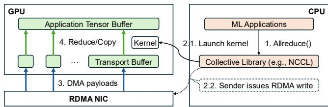  
Figure 1: Collective communication over RDMA (receiver side). The receiver directly receives data into the GPU memory (e.g., GPUDirect [28]); the sender side works similarly except that it will additionally issue an RDMA write in step 2.

Figure 1 shows an overview of how collective communication uses RDMA. Once the ML application calls a collective like allreduce, the collective library launches a reduction kernel on each participant GPU to handle data reduction/copy. Next, the sender CPU issues multiple RDMA writes over RC QPs to transfer data chunk by chunk. The receiver CPU polls completion flags in its memory, which the sender sets upon write completions. The library manages a set of transport buffers on the GPU memory to buffer the RDMA data, and relies on the GPU kernel to copy data between the transport buffers and application tensor buffers. The GPU kernel also performs reductions (e.g., sum, max) on the transport buffers (from multiple sender GPUs) into the tensor buffers.

## 2.2 Motivation on Extensibility

Host network transport on RDMA NICs is hard to evolve compared to software applications. This creates problems for fast-evolving ML workloads. We have shown two such examples in §1; below, we give four additional examples to motivate the need for transport layer extensibility.

Receiver-driven CC for incast. Recent MoE serving workloads are prone to network incast problems. In DeepSeek’s online deployment of their 671B V3 model [66], each of the 320 GPUs holds a single expert module, where hidden states are exchanged between expert modules across GPUs, i.e., Expert Parallelism (EP). As the request pattern and load change over time, some experts become much hotter than others, receiving more network traffic from other experts leading to network incast issues. DeepSeek reports the hottest expert could receive 10× more load than the average one. Expert load balancing algorithms such as EPLB [30] try to balance the load by dynamically replicating experts. However, this happens at a much slower pace (e.g., 10 minutes [29]) to avoid the high cost of moving experts, thus unable to handle transient incast. Such transient network incast can be better handled by receiver-driven CC [43, 85], which controls last hop congestion—unfortunately, there is no receiver-driven CC on commercial RDMA NICs.

Application-transport codesigns. Codesigning applications and transport behaviors could bring huge performance benefits. For example, recent work MLT [102] customizes loss recovery behaviors for ML training to allow semi-reliable transmission based on the gradient importance from applications. Despite achieving great performance improvement, it is not feasible to integrate MLT into existing RDMA NICs even for the latest NVIDIA ConnectX-7 [79], due to a lack of enough programmability.

Inefficient loss recovery. RDMA NICs are known to perform poorly under packet loss, especially for old-generation NICs [63, 73, 97, 104]. This is caused by the inefficient goback-N retransmission logic hardcoded on these NICs due to limited on-chip SRAM constraints. As a result, RDMA deployment normally requires Priority Flow Control (PFC) to achieve a lossless network fabric. However, PFC may lead to deadlocks, head-of-line blocking, and victim flows [45, 73], and its likelihood is higher as the GPU networking bandwidth keeps increasing (for the reason, we kindly refer to page 4 in [45]). If we could extend the transport layer of GPU networking with more efficient selective retransmission, we could better handle packet loss and rely less on PFC [73].

Heterogeneous NICs. Datacenters usually consist of multiple generations and vendors of RDMA NICs due to continuous expansion, cost optimization, and to avoid vendor lock-in. While NVIDIA, Broadcom, AMD, and more vendors all have 400 Gbps RDMA NICs for ML [9,18,79], they come with subtly different control path logic such as packet reliability and CC. In practice, this heterogeneity reduces achievable bandwidth by 2-33× when communicating between NICs from different generations/vendors, as reported by Alibaba [63]. Prior work Flor [63] has shown that extensibly aligning these NICs’ control path logic in software could avoid such issues.

## 2.3 Prior Work on Extensibility

Leveraging SmartNICs. Several recent efforts aim to make RDMA transport programmable by offloading it to the Smart-NIC RISC cores, but they have constraints in extensibility and performance. Google Falcon SmartNICs [38, 39] only support programming rate update actions for latency-based Swift CC [58] and path selection decisions with limited paths [88]; similar constraints also apply to firmware updates on hardware RDMA NICs. AMD Pensando SmartNICs [9] support using P4 language [17] to program their transport layer, but P4 has limited programmability, e.g., hard to implement efficient loss recovery; it is also unclear if they could support receiver-driven CC. FPGA-based SmartNICs provide higher performance but have limited extensibility due to hardware resource constraints [104]. AWS EFA SmartNICs [92] imple ment a proprietary multipath reliable transport SRD [93] with out-of-order packet delivery using NIC ARM cores, to address network congestion in HPC and ML workloads. The SRD protocol is implemented using EFA-specific firmware and sup ports live upgrade with good extensibility. However, we empir ically find that the EFA SmartNICs on AWS p4d.24xlarge GPU VMs perform poorly for connection-intensive all-to-all collectives (see §6.1). We attribute this to the limited processing power and cache capacity of SmartNIC ARM cores due to power constraints, as also demonstrated by prior research on publicly available SmartNICs [67, 86, 90].

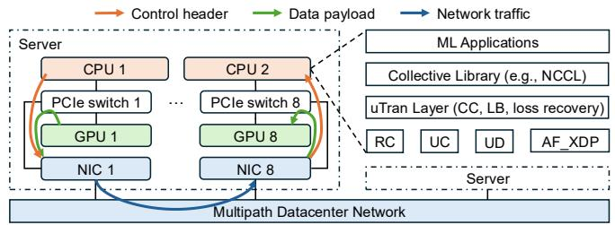  
(a) UCCL-Tran architecture.

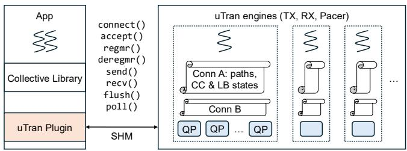  
(b) UCCL-Tran threading model.  
Figure 2: Overview of UCCL-Tran extensible transport for GPU networking. We assume a common intra-server topology for GPU servers [23] where individual PCIe switches directly connect a few GPUs, NICs, and CPU, providing high-bandwidth data transfer among them.

Note that the above all-to-all measurement uses the AWS EFA NICs on the p4d.24xlarge instances, and thus it may not apply to their new-generation EFA NICs on p5/p5en/p6 instances. Specifically, the ever-changing EFA firmware and upgraded EFA hardware may lead to different performance results for connection-intensive all-to-all collectives. In gen eral, if these SmartNICs get upgraded with higher processing power and cache capacity to better handle all-to-all, we view it as an echo to UCCL-Tran’s high-level methodology of software extensibility for GPU networking.

Leveraging CPUs. A line of work has leveraged host CPUs to make better control decisions in GPU networking. ZeroNIC [97] modifies the NIC hardware to run the control path of RDMA transport on CPUs, while leaving the data path on the NIC following GPUDirect. In contrast, UCCL-Tran aims to be more practical without modifying existing hardware; UCCL-Tran by design supports efficient multipathing, compared to ZeroNIC’s single path transport. Flor [63] leverages RDMA UC to bypass the control path of the RDMA hardware and implements flexible software control on CPUs. Flor targets CPU-based storage applications with 100 Gbps traffic per server, while UCCL-Tran targets more network-intensive ML applications that have 3.2+ Tbps traffic per server [4, 71] and develops multipathing to avoid flow collisions. To this end, UCCL-Tran adopts several different designs such as multi-QP and connection splitting (see §3.2 and §3.3).

Other efforts design transport protocols to address specific network challenges. Ultra Ethernet Consortium (UEC) [22] standardizes several multipath transport protocols with packet spraying to address flow collisions for ML workloads: a sender-driven one based on STrack [59] and SMaRTT REPS [16], and a receiver-driven one based on EQDS [85]. Prior to UEC, MP-RDMA [68] and MPTCP [77] designed multipath protocols for CPU workloads to improve robustness under network failures. Overall, these protocols leverage various congestion signals such as Explicit Congestion Notification (ECN) [1], RTT [72], and packet trimming status [21, 43, 85] to make multipath CC and LB decisions.

## 3 UCCL-Tran Design

Figure 2a shows the high-level architecture of UCCL-Tran. UCCL-Tran layer sits between the collective library such as NCCL and the low-level communication primitives exposed by NIC hardware, e.g., RC, UC, and UD for RDMA NICs and AF\_XDP [98] (a user-space fast packet IO) for non-RDMA NICs. ML applications use collective APIs such as allreduce and point-to-point APIs such as SendRecv exposed by the collective library without directly interacting with the UCCL-Tran layer. Both the collective library and the UCCL-Tran layer are compiled into individual shared libraries, i.e., libnccl.so and libnccl-net.so for NCCL, providing a drop-in replacement for ML applications without code modification or recompilation. UCCL-Tran leverages the network plugin system of existing collective libraries [6, 24] to avoid changing the library code in most cases, with exceptions for UCCL-Tran over UD that requires a slight code modification (detailed in §3.1). For brevity, the remaining paper targets RDMA NICs such as NVIDIA ConnectX NICs and AWS EFA NICs [92]; we will explicitly mention when targeting non-RDMA NICs.

Figure 2b shows the threading model of the UCCL-Tran layer. The UCCL-Tran plugin interacts with a group of UCCL Tran engine threads via shared memory to create connections, register/deregister GPU memory regions with the RDMA NICs, and send/recv/flush/poll network messages. Each engine thread runs TX, RX, and pacing functionalities of UCCL-Tran multipath reliable transport for multiple UCCL-Tran connections. As described in §3.1, UCCL-Tran engines instruct the RDMA NIC to receive network data, split control headers and application data payloads, and directly DMA them into the CPU and GPU memory separately. The whole process bypasses the packet reliability and CC logic on RDMA NIC hardware as much as possible by using proper RDMA primitives. After getting control headers in CPU, UCCL-Tran engines make transport decisions such as CC, LB, and handling packet loss and reordering. Since these decisions are executed by a normal user-space process on the CPU, instead of on RDMA NIC hardware, they can be easily extended by collective library or ML application developers.

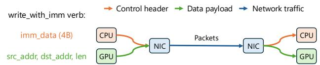  
Figure 3: Leveraging RDMA write\_with\_imm to separate control header and data payload for UC/RC.

In UCCL-Tran, all connections between a specific pair of NICs share the same set of QPs (e.g., 256), including the case of multiple GPUs sharing one NIC. This design fully harnesses the underlying multipath datacenter network while not burning too many QPs (§3.2). UCCL-Tran further integrates a bag of techniques to run software transport as efficiently as possible, e.g., control coalescing, connection splitting, chained posting, and more (§3.3). UCCL-Tran also supports extending transport for non-RDMA NICs through the AF\_XDP userspace packet IO, bypassing conventional kernel TCP stacks. We now describe them in the rest of this section.

## 3.1 Separating Control Path and Data Path

The overall goal of separating the control path and the data path is to enable running extensible transport on the CPU, while efficiently transferring data to/from GPUs in a GPUDirect manner. This goal has three specific aspects: (1) We should involve as little control logic as possible in the data path to let the CPU make more transport decisions, like CC and packet reliability. (2) We must achieve GPUDirect for the data path efficiency [36, 97]. (3) We should support heterogeneous RDMA NICs. For example, NVIDIA NICs support UC, while Broadcom and AWS EFA do not.

UC as the preferred QP. UCCL-Tran chooses UC as the preferred QP whenever available on the RDMA NIC, similar to Flor [63], because it supports efficient segmentation and reassembly offloading to the NIC (in contrast to UD), while bypassing hardware-baked CC, loss recovery, and outof-order packet handling (in contrast to RC). As shown in Figure 3, UCCL-Tran uses the efficient RDMA verb of write with immediate to transfer data chunks over UC; this verb operates in a two-sided mode, so that both sender and receiver CPUs can react to the data transfers. For the data path, the sender CPU specifies the addresses of source and destination data chunks when issuing the verb, and then the sender NIC will automatically segment the source data chunk into MTU-sized packets with packet headers prepended and send them out. When receiving these packets, the receiver NIC will remove the packet headers and reassemble payloads into the contiguous memory region specified by the sender CPU.

For the control path, write with immediate allows carrying a 32-bit imm\_data from the sender CPU to the receiver CPU, serving as the control header for UCCL-Tran transport. Figure 3 shows an example. UC guarantees that any successfully arrived chunk will generate a CQE with the imm\_data embedded, which is then consumed by the receiver CPU. Within the 32-bit budget, UCCL-Tran allocates 8 bits for connection ID and 7 bits for message ID, supporting 256 connections for each pair of NICs on a UCCL-Tran engine and 128 inflight messages for each connection, which is sufficient for collective communication. UCCL-Tran then allocates 8 bits to the chunk sequence number (CSN) to identify the position of a chunk in the message being transferred. Another 1 bit is allocated for marking the last chunk of a message. The remaining 8 bits are reserved for more advanced CC such as receiver-driven ones (see §4.2).

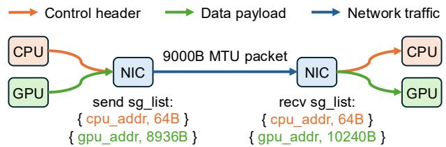  
Figure 4: Leveraging RDMA send/recv scatter-gather to separate control header and data payload for UD.

RC with CC disabled. In practice, UC is not always supported across different RDMA NIC vendors [63], e.g., Broadcom [18]. In these cases, UCCL-Tran will opt to RC with CC configured to be disabled, and then leverage RDMA write with immediate in a similar way as UC. On the one hand, RC prevents UCCL-Tran from customizing the packet reliability mechanism baked in NIC hardware; on the other hand, it allows faster ACKs and more precise RTT estimation in hardware.

UD as the last resort. Some RDMA NICs do not allow disabling CC for their RC QPs, e.g., AWS EFA NICs (to be precise, EFA NICs do not have RC but only SRD). To support them, UCCL-Tran leverages UD at the cost of higher CPU usage compared to UC and RC. On the one hand, UD totally bypasses any hardware control logic on RDMA NICs, wellaligned with our goal. On the other hand, UD only supports sending/receiving MTU-sized data (i.e., no segmentation or reassembly offloading); so UCCL-Tran needs to consume more CPU cycles to do segmentation and reassembly.

Challenge of separation. One key challenge for UCCL-Tran over UD is that UD does not support RDMA write with immediate (but only the send/recv verbs), so that UCCL-Tran over UD cannot designate the immediate data as the transport control header. Then how can UCCL-Tran separate control header and data payload using UD (i.e., placing them to CPU and GPU separately)? UCCL-Tran must guarantee that the control header and data payload are fate-sharing in terms of loss status and arrival order, so that UCCL-Tran can make valid transport decisions based on the control header. One strawman solution would be transferring the control header and data payload together as a single packet into the destination GPU memory, and then the CPU reading the control header from the GPU memory. But this incurs additional

performance overhead.

UCCL-Tran’s approach is to leverage the scatter-gather feature to let the NIC hardware automatically merge the control header and data payload during RDMA send, and split these two during RDMA recv; Figure 4 shows an example. On the sender side, the CPU issues an RDMA send verb with a two-entry sg\_list that specifies the control header address+length on the CPU, and the data payload address+length on the GPU. The RDMA NIC will then read the header and payload from the CPU and GPU respectively, and merge them into a single network packet to send out, as long as the total length does not exceed the MTU size. On the receiver side, the CPU pre-posts a recv verb with a two-entry sg\_list that specifies the receiving address+length for the header and pay load, respectively. Note that the header length must be a fixed value that the sender and receiver agree on, e.g., 64B in this example; the payload length specified in the recv verb need not exactly match the send verb, but should be no smaller. Later, when the packet arrives at the receiver NIC, the NIC will automatically split the header and payload across CPU and GPU, following the boundary of the fixed header length. UCCL-Tran’s approach always keeps the control header fatesharing with the data payload, and avoids the CPU reading any extra header from the GPU.

Challenge of reassembly. UCCL-Tran over UD still faces another challenge of how to correctly and efficiently reassemble packets on the receiver GPU. Recall that UD does not support reassembly offloading to the NIC, and only allows sending/receiving a single packet in one verb (§2.1). We note that sender-side segmentation is relatively easy, as the CPU could partition the transport sending buffer into individual data payloads (based on MTU size), and specify their addresses in send verbs. However, for the receiver-side reassembly, even if the CPU pre-posts recv verbs that specify in-order individual data payload addresses drawn from the transport receiving buffer, the packets will land into the buffer in an out-of-order manner due to packet loss or reordering over the multipath network. This reassembly challenge is unique to UD, as UC/RC allows the sender to directly specify the receiver-side GPU buffer addresses in the write with immediate verb.

Addressing this challenge requires some form of scattered memcpy GPU kernel that copies out-of-order data payloads to the transport receiving buffer (following the right order given by the receiver CPU). But the question is where to launch and run such a kernel. To avoid extra kernel launching overhead, UCCL-Tran chooses to fuse such scattered memcpy operations into the existing reduction kernel in collective libraries (§2.1). Our fused kernel will first do scattered memcpy to copy out-of-order data payloads into the transport buffers, then do the original reduction work from the transport buffers to the application tensor buffers. The only overhead of this approach is the extra GPU memory bandwidth consumption, but this is bounded by the network bandwidth. Given the high GPU memory bandwidth (e.g., 1.6-2.0 TB/s in A100), such extra bandwidth consumption is negligible.

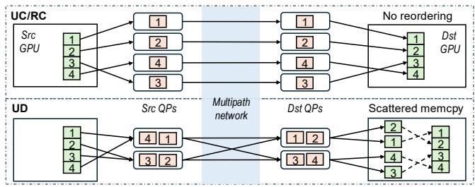  
Figure 5: Multipathing and handling packet reordering in UCCL-Tran.

For non-RDMA NICs, UCCL-Tran builds a reliable transport atop UDP with the AF\_XDP technique, an efficient kernel socket that lets the NIC directly DMA network packets to user-space memory regions. We choose AF\_XDP as it achieves similar high performance as DPDK [110], but is kernel-native and does not require special NIC drivers, thus easy to deploy [100]. Similar to how collective libraries such as NCCL use kernel TCP for non-RDMA NICs, UCCL-Tran over AF\_XDP does packet reassembly on the CPU, followed by a cudaMemcpy() to transfer the received message to the GPU.

## 3.2 Harnessing Multipath

One of the key motivations for GPU network extensibility is to harness the multipath capacity of modern datacenter networks (§2.2). UCCL-Tran achieves this by using multiple UC, RC, or UD QPs, as shown in Figure 5. Basically, network traffic from different QPs will likely go through different network paths, as both RoCE and Infiniband usually use ECMP (Equal-Cost Multi-Path) for multipath routing with source and destination QP numbers as the hash inputs [34, 81]. For UC and RC, UCCL-Tran by default uses 256 QPs, which provides maximum 256 different network paths as used by recent transport research [16, 59]. For UD, UCCL-Tran uses a much smaller number of QPs by combining different source and destination QPs. For example, 16 source UD QPs and 16 destination UD QPs will provide maximum 16×16=256 different network paths, because for connection-less UD, each source QP can send packets to any destination QP. UCCL-Tran also supports a configurable number of QPs for different collectives, e.g., a smaller number might work well for all-to-all with relatively high entropy [34]. To avoid burning too many QPs, especially when the collective library creates multiple connections between the same pair of NICs (e.g., because of multiple GPUs sharing one NIC), UCCL-Tran lets all these connections share the same set of QPs.

We note that making this multi-QP design choice is not trivial, especially as a line of prior work has highlighted the severe QP scalability issues on RDMA NICs [20,53,54,57,61, 75,104]. For example, SRNIC [104] reports ∼23% bandwidth drop when scaling RC QPs from 256 to 512, and 46% drop when scaling to 16k. This bandwidth drop is caused by the QP swapping overhead: the NIC can only hold/cache limited QP contexts on its SRAM, and must spill/swap the excessive rest to the host DRAM over PCIe, incurring frequent QP swapping. Surprisingly, we do not observe such a severe performance drop for collective communication—Figure 6 shows only ∼17% drop when scaling RC QPs from 60 to 60k, and a negligible drop for UC (that has a smaller QP context size than RC).

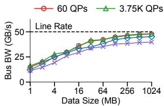  
(a) For RC QPs.

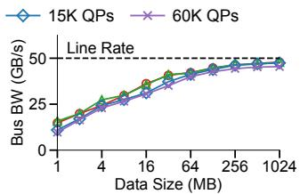  
(b) For UC QPs.  
Figure 6: UCCL-Tran all-to-all network bandwidth on CX\_IB testbed (16 400G NICs, see §6 for details) with different numbers of QPs per NIC. 60 QPs per NIC correspond to the typical NCCL QP scaling factor of 4 (i.e., 4 QPs per connection) in production [34, 59]. 60K QPs per NIC essentially model the QP swapping overhead for UCCL-Tran all-to-all across 241 GPUs using 256 paths per connection (i.e., 61440/256=240, plus 1 to include itself) or 961 GPUs using 64 paths. This has covered the largest-scale collective as far as we know, i.e., 256 GPUs by Meta [34] and 320 GPUs by DeepSeek-V3 [66].

There are two reasons behind this counter-intuitive phenomenon. First, ML workloads feature large messages, and thus collectives mostly transfer MTU-sized packets; such large transfers effectively amortize the QP swapping overhead. Second, with GPUDirect, GPU data transfers only go through the PCIe switch, but not the PCIe root complex that is connected to the CPU [56]; therefore, there is no PCIe contention between GPU-NIC traffic and CPU-NIC traffic (that is incurred when NIC swaps QP contexts and CPU posts verbs). In contrast, prior work focuses on small-message CPU workloads such as in-memory Key-Value stores that only transfer dozens of bytes at once for each QP, thus bottlenecked by the QP swapping overhead and PCIe traffic contention. Later in §3.3, we show that UCCL-Tran optimizes transport efficiency by transferring data in a larger chunk granularity (e.g., 32KB), further reducing the QP swapping overhead.

For non-RDMA NIC multipathing, UCCL-Tran specifies different UDP ports in packets before sending them out in AF\_XDP. This adds no overhead compared to single-path transport.

Handling out-of-order packets. Many factors could cause out-of-order packet delivery, including multipathing, packet loss, and the unpredictable multi-QP scheduler in RDMA hardware [104]. Existing RDMA NICs perform poorly when handling out-of-order packets, as they cannot maintain large reordering buffers and states due to limited on-chip SRAM constraints [73,104]. In contrast, UCCL-Tran is able to handle out-of-order packets efficiently thanks to its software flexibility and separation of data and control paths. Basically, UCCL-Tran follows typical TCP designs with seq and ack numbers to guide packet reordering, fast retransmission (upon duplicate ACKs), and timeout retransmission. UCCL-Tran sets a larger duplicate ACK threshold for fast retransmission, instead of the default three in TCP, to accommodate more frequent packet reordering caused by multipathing. Different from TCP, UCCL-Tran maintains its packet reordering buffers in the GPU memory and lets the NIC directly DMA network data there. Figure 5 depicts this process with examples. For UC/RC, the reordering buffers are individual data chunks, and the sender CPU specifies in-order chunk addresses when posting verbs. For UD, the reordering buffers are individual packet payloads, and the GPU reduction kernel reorders packets when copying them into the transport buffers (§3.1).

## 3.3 Towards Efficient Software Transport

So far, we have discussed how UCCL-Tran decouples the control path and data path to make flexible transport decisions on the CPU, and how UCCL-Tran achieves multipathing. The next question is how to efficiently implement a software multipath transport to support the high bandwidth in GPU networking. This is challenging as a single GPU server could have 8×400 Gbps RDMA NICs, totaling 3.2 Tbps bandwidth bidirectionally [46]; the next generation RDMA NIC will achieve 800 Gbps [27], rendering 6.4 Tbps bandwidth. As a reference, Google’s software transport Snap [69] can handle 80 Gbps traffic on a CPU core (though they do not use RDMA NICs). Our goal is to use 1 CPU core to handle 400G unidirectional traffic (i.e., 2 cores for 400G bidirectional traffic; excluding possible pacer cores for receiver-driven CC). To this end, we leverage the following techniques:

Run-to-completion execution. Each UCCL-Tran engine thread runs RX, TX, pacing, timeout detection, and retransmission functionalities for a set of connections in an efficient runto-completion manner [14, 51]. UCCL-Tran employs Deficit Round Robin (DRR) [94] scheduling to fairly multiplex one engine thread among multiple functionalities and connections. Connection splitting. To handle 400+ Gbps traffic per NIC more efficiently, UCCL-Tran pivots away from the Flor [63] design of a single CPU core for one connection, but leverages multiple cores for one connection with connection splitting. Basically, UCCL-Tran equally partitions the 256 QPs among all engine threads responsible for a specific NIC; each engine thread gets its own connection states for CC and LB, forming a sub-connection. Within each sub-connection, UCCL-Tran uses RDMA SRQ and SCQ (Shared Recv/Completion Queues) to reduce the overhead when polling multiple recv and completion queues. The application threads atop the UCCL-Tran plugin are responsible for choosing the leastloaded engine (e.g., the engine with the least unconsumed messages) when dispatching messages via SHM. In this way,

UCCL-Tran could scale transport processing of a single connection to multiple cores, and handle transient load imbalance among CPUs at runtime. It also reduces TX packet bursts by avoiding sending all messages at once from a single core.

Control coalescing. There is an inherent tradeoff between the control decision granularity and software transport efficiency. One could run CC, LB, and reliability logic for each packet to achieve precise control of the transport behaviors, at the cost of consuming more CPU cores. Alternatively, one could relax the control granularity by coalescing several same-path packets and making control decisions together, thus with lower CPU consumption. For UC/RC, this also means an RDMA write could directly transmit several packets as a single data chunk, leveraging NIC-offloaded segmentation and reassembly. UCCL-Tran employs this control coalescing design with 32KB chunk size as default, striking a balanced tradeoff. Under this chunk size, UCCL-Tran can saturate 400 Gbps unidirectional bandwidth with 1 CPU core (§6.4.3), while not severely disrupting transport behaviors/performance (see our packet-level simulation in §C.5.1). Nevertheless, UCCL-Tran could also adaptively adjust chunk size based on the congestion level, e.g., switching to a small chunk size to make more precise control when congestion window (cwnd) drops below a threshold or severe packet loss happens.

Chained posting. UD does not support NIC offloading for segmentation and reassembly, thus it incurs more MMIO writes than UC/RC when issuing send/recv verbs (e.g., for individual packets). To reduce such overhead, UCCL-Tran leverages the chained posting feature of RDMA NICs to issue one MMIO write for posting up to 32 send/recv verbs. Concretely, the WQEs of these 32 verbs are chained together through the next pointer in previous WQEs, and get posted to the RDMA NIC in one MMIO write.

## 3.4 Congestion Signals

Relatively restricted congestion signal is a common limitation for software-based reliable transport atop RDMA NICs, including UCCL-Tran and Flor [63]. This is because existing RDMA NICs consume packet headers that contain congestion signals like ECN marks [1] and packet trimming status [21, 43, 85], and deliver only the packet payload to the software. Fortunately, the software can still use the RTT con gestion signal by leveraging hardware TX/RX timestamping supported by many RDMA NICs, and rely on packet loss as the last-resort congestion signal. Therefore, our current UCCL-Tran implementation uses per-path RTT and packet loss to detect congestion and choose paths. In fact, latency based CC and LB are being widely used in Google’s datacenters [58, 88].

Signal fidelity. Running CC and LB in software using RTT also raises signal fidelity concerns. Overall, there are three factors affecting the fidelity: 1 accurate RTT estimation at the sender, 2 CC decision delay at either the sender or receiver, i.e., the software delay from receiving the congestion signal (e.g., ACK-derived timestamps) to updating the congestion window/rate, and 3 ACK turnaround delay at the receiver, i.e., delay between receiving data chunks and sending back ACK. For 1 , UCCL-Tran leverages the NIC hardware timestamps and excludes ACK turnaround delay from the RTT (similar to Swift [58]). For 2 and 3 , theoretically, these delays impact how fast the sender can react to network condition changes, thus impacting the decision precision; however, in practice, even hardware-based transport handles CC events in a per-RTT granularity (e.g., tens of microseconds) rather than per-ACK to avoid overreaction [64]. For example, Google Falcon hardware transport runs CC to update rate once per RTT [39]. Thus, the few microseconds of decision delay introduced by the software is negligible. Nevertheless, UCCL-Tran still employs several techniques to reduce the two delays: similar to Flor [63], UCCL-Tran uses a dedicated high-priority QP for ACK (using in-network priority such as DSCP) and always first polls its completion queue; UCCL-Tran further allocates the ACK polling a higher processing budget during DRR scheduling. We quantify these delays in §6.5.3.

## 3.5 NIC Capabilities

UCCL-Tran supports a wide range of RDMA NICs and non-RDMA NICs. For RDMA NICs, UCCL-Tran relies on their segmentation and reassembly offloading capabilities to achieve high CPU efficiency. This capability is widely supported through the RC and UC QPs in commodity NICs. For non-RDMA NICs, UCCL-Tran relies on fast user-space packet IO to efficiently drive the underlying NICs through UDP. This capability is also usually enabled in commodity NICs via DPDK or AF\_XDP. For both NICs, UCCL-Tran further relies on the ECMP feature of the underlying network switches to achieve multi-pathing: for RDMA, UCCL-Tran uses different RC/UC QPs; for non-RDMA, UCCL-Tran chooses different UDP ports.

UCCL-Tran leverages timestamping to derive the RTT congestion signal used for congestion control and multi-path load balancing. The signal fidelity can be further strengthened with hardware timestamping that is supported by NVIDIA RDMA NICs. UCCL-Tran can also benefit from NIC vendors exposing more congestion signals, such as ECN and packet trimming status.

## 4 Extensibility Case Studies

UCCL-Tran provides expressive interfaces to implement and extend multipath transport. Due to space limitations, we elaborate on them in Appendix A. Collective library and application developers could also directly extend UCCL-Tran transport code, e.g., with the new loss recovery scheme in MLT [102], and deploy it quickly in a normal user-space process. We now demonstrate how UCCL-Tran extensibility enables new transport designs that work best for different ML workloads.

## 4.1 Multipath Transport with Packet Spraying

Recent transport research [16, 59] and UEC advocate packet spraying with hundreds of paths as an effective way to address flow collisions in ML workloads. It is naturally challenging for hardware NICs to implement packet spraying because of excessive per-path states, such as path RTTs. Instead, UCCL-Tran can easily support packet spraying by maintaining perpath RTT in software. UCCL-Tran’s software transport uses Power-of-Two sampling [74] to select a path with the lowest RTT, then runs CC to decide how many packets and what rate to transmit. UCCL-Tran implements two CC algorithms: one is CUBIC [42] used in Linux kernel TCP as the default CC, and another is Swift [58], an RTT-based CC used by Google. UCCL-Tran supports both per-path CC states (e.g., per-path cwnd) and global CC states controlling all paths; both achieve similar collective performance in our testbeds. UCCL-Tran by default uses global CC during evaluation.

## 4.2 Receiver-Driven CC

Receiver-driven transports, such as EQDS [85], NDP [43], and Homa [76], proactively control packet sending rate at the receiver by allocating credits to senders. These transports have proven to resolve the last-hop congestion for network incast effectively, which could happen in MoE serving (§2.2). However, to the best of our knowledge, there are no off-the-shelf NICs that support receiver-driven transports. One reason is that they are vastly different from popular sender-driven ones, and implementing them would require NIC hardware modification. Instead, UCCL-Tran’s extensibility enables developers to quickly implement and tune receiver-driven transports in software. We choose to implement EQDS [85] in UCCL-Tran as an example, the state-of-the-art receiver-driven transport adopted by UEC [22]. Our EQDS implementation closely follows the EQDS paper [85] with a dedicated pacer thread per NIC on the receiver to issue credit packets for senders. For more details, we refer to Appendix B.

## 4.3 Efficient Loss Recovery

UCCL-Tran allows customizing the transport loss recovery logic to support more advanced mechanisms other than the go-back-N retransmission baked into many RDMA NICs. Goback-N directly drops out-of-order packets to avoid buffering them on expensive on-chip SRAM, but this gives poor performance when packet loss happens [53, 104, 111]. Instead, we implement a more efficient selective retransmission [70] in UCCL-Tran, by maintaining reordering buffers in the GPU memory (§3.2). Our implementation follows the standard selective retransmission mechanism in TCP, and uses a std::map to track an arbitrary number of out-of-order packets. With more efficient loss recovery in UCCL-Tran, ML workloads could possibly run in lossy datacenter networks without PFC (§2.2).

We note that the latest generation of NVIDIA RDMA NICs [79] has implemented a limited form of selective retransmission based on NACK with a small fixed tracking window (to keep low SRAM usage). UCCL-Tran’s selective retransmission based on SACK+bitmap is better than these NACK-based one, which has been proven to lead to slow, imprecise recovery and high tail latency [96].

## 5 Implementation

We implement UCCL-Tran in 28.4K lines of C++ as a network plugin to NCCL/RCCL, the standard collective library for NVIDIA/AMD GPUs. Our current implementation supports NVIDIA RDMA NICs via RC and UC, Broadcom RDMA NICs via RC, AWS EFA NICs via UD/SRD, and AWS ENA non-RDMA NICs via AF\_XDP. UCCL-Tran leverages the standard libibverbs for RDMA NICs and kernel built-in AF\_XDP for non-RDMA NICs; therefore, it should naturally support other vendors’ NICs. To enable scattered memcpy when using UD for AWS EFA NICs, we add or modify ∼170 LoC to the NCCL codebase, including a scattered memcpy GPU kernel and C++ code that passes packet pointers to the kernel via CPU-GPU shared memory (created by cudaHostAlloc()). We added two new interfaces to the NCCL network plugin system: irecv\_scattered that receives data in a list of scattered packets, and irecv\_free\_ptrs that frees the scattered packet buffers after scattered memcpy. UCCL-Tran also supports running NCCL with multiple processes.

There are some implementation details worthy of note. For NVIDIA NICs, to calculate network RTT based on NIC hardware TX/RX timestamps and CPU ACK timestamps, we implement a NIC-CPU clock synchronization scheme following Swift [58]. We use a synchronization time interval of 100µs. For AWS EFA NICs that do not support hardware timestamps yet, we calculate RTT based on software timestamps minus estimated packet queueing delay at the host. We estimate the queueing delay by dividing the size of queued packets by the NIC bandwidth. For AWS EFA NICs, we find that allocating UD QPs with consecutive QP numbers for a connection yields much better performance than not. We suspect this is because the EFA NICs do round-robin assignments when mapping a QP (and its associated packets) to a ARM core; consecutive allocations help map the QPs of a connection to different ARM cores, avoiding load imbalance.

## 6 Evaluation

In this section, we aim to answer the following questions:

• What is the collective performance of UCCL-Tran software multipath transport compared to hardware-based ones (§6.1)?

• Can UCCL-Tran improve ML application performance (§6.2)?

• Can UCCL-Tran extensibility benefit certain workloads (§6.3)?

• What is the scalability of UCCL-Tran (§6.4)?

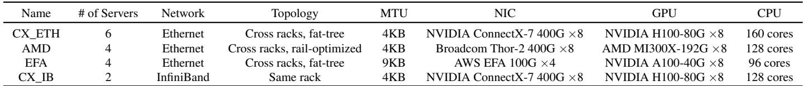  
Table 1: Evaluation testbeds. CX\_ETH, AMD, and EFA are rented from TensorWave, IBM Cloud, and AWS (p4d.24xlarge), respectively.

• How do different designs impact UCCL-Tran (§6.5)? Testbed. Table 1 describes our evaluation testbeds. The first three testbeds across racks evaluate how UCCL-Tran handles network congestion and flow collisions. They also demonstrate the genericity of UCCL-Tran, i.e., applying to AMD GPUs and Broadcom/EFA NICs. The CX\_IB testbed under the same rack stress-tests the UCCL-Tran software implementation, as it has no network congestion or flow collisions. For some tests, we try to simulate a larger testbed by disabling NCCL NVLink and SHM communication. This forces GPUs within a server to communicate through the network, and each GPU essentially behaves like a virtual server, e.g., CX\_IB becomes 16 virtual GPU servers each with 400G network bandwidth.

Experiment setup. For collective performance evaluation, we use NCCL v2.23.4 [26] and NCCL-tests 9d26b84 [25], the latest versions when we start integrating UCCL-Tran into NCCL, and focus on the representative allreduce and all-toall collectives. NCCL-tests vary the collective message size and measure the achieved bus bandwidth. We focus on message sizes from 1MB to 1GB, commonly used in real ML workloads [87, 103, 105]. For AMD GPUs, we use RCCL 532f54c [48] and RCCL-test 5b27b96 [47].

Comparison baselines. On CX\_ETH and CX\_IB, we compare UCCL-Tran to the NCCL built-in RDMA support that uses RC on ConnectX-7/CX-7. UCCL-Tran uses 256 UC/RC QPs for each NIC pair, while the NCCL built-in uses QP scaling with 4 RC QPs per connection [34, 59]. UCCL-Tran uses CUBIC CC on CX\_IB unless specified, which performs better than Swift in the lossless InfiniBand. Since InfiniBand has no packet loss for CUBIC to reduce cwnd, to avoid severe network congestion, we enforce a maximum cwnd value in UCCL-Tran CUBIC CC to limit the maximum inflight bytes, similar to TCP flow control. Similar setups apply to the AMD testbed.

On EFA, we compare UCCL-Tran to the official AWS NCCL-EFA plugin v1.13.2 [3] that uses the multipath SRD [93]. UCCL-Tran uses 10×26=260 UD QPs to serve all connections, which yields the best performance empirically, while the NCCL-EFA plugin uses the best parameters recommended by AWS. UCCL-Tran uses CUBIC CC on EFA by default, as EFA NICs do not support hardware timestamping that is critical to Swift CC. In all testbeds, UCCL-Tran uses per-path RTT for multipath LB (§4.1).

As the cost of extensible software transport, NCCL atop UCCL-Tran uses more CPU cores than vanilla NCCL. By default, the vanilla NCCL uses 2 cores per GPU, while UCCL-Tran uses 2 more cores per NIC to run the engine threads, with 1 additional core per NIC for receiver-driven CC due to the pacer.

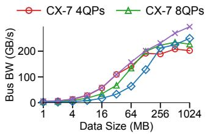

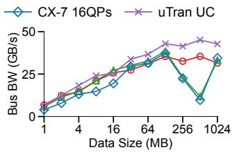  
(b) All-to-All.

(a) Allreduce.  
Figure 7: NCCL-tests results on CX\_ETH.  
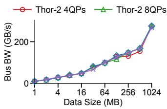

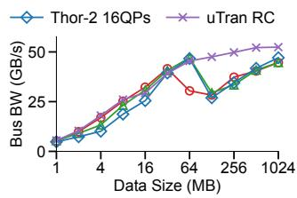  
(a) Allreduce.  
(b) All-to-All.  
Figure 8: RCCL-tests results on AMD.

## 6.1 Collective Performance

On CX\_ETH. Figure 7 compares the performance of UCCL-Tran vs. ConnextX-7 on the CX\_ETH testbed. For NCCL over CX-7, we use multiple QPs for each connection between two GPUs by adjusting NCCL\_IB\_QPS\_PER\_CONNECTION. However, it still suffers from significant performance drops under larger message sizes and lower peak performance. This is because flow collisions in the fat-tree topology cause severe network congestion, which in turn leads to exponential backoffs in the CX-7 CC mechanism. Instead, UCCL-Tran is able to scale up performance stably with message size increasing, by making smarter LB and CC decisions in software. Overall, UCCL-Tran outperforms CX-7 by up to 2.32/1.60/1.24× (corresponding to 4/8/16 QPs) and 1.79/3.82/4.54× for allreduce and all-to-all, respectively.

On AMD. Figure 8 compares the performance on the AMD testbed. This testbed has a rail-optimized topology that helps reduce network congestion when used together with the PXN technique [78]. Under this topology, UCCL-Tran achieves comparable performance as Thor-2 for allreduce, and outperforms Thor-2 by up to 1.68/1.61/1.78× (corresponding to 4/8/16 QPs) for all-to-all, by better controlling network congestion.

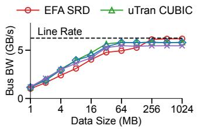  
(a) Allreduce.

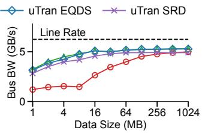  
(b) All-to-All.  
Figure 9: NCCL-tests results on EFA (NVLink+SHM disabled to simulate a larger testbed).

On EFA. Figure 9 compares the collective performance of UCCL-Tran and SRD on the EFA testbed. UCCL-Tran CUBIC and EQDS achieve similar performance with significant improvement over SRD (except for ≥256MB allreduce): for allreduce, UCCL-Tran outperforms SRD by up to 1.27×; for all-to-all, the speedup is up to 3.27×. UCCL-Tran outperforms SRD because beefy CPU cores are faster in making transport decisions than wimpy ARM cores on p4d.24xlarge EFA NICs (that run SRD), especially when handling connection-intensive all-to-all. Surprisingly, simple CUBIC CC performs very well. This is mainly because UCCL-Tran leverages hundreds of network paths and avoids congested ones before sending packets; so most of the time, CC does not get involved. The small performance gap after 256MB is caused by the extra control header added by UCCL-Tran, while SRD directly reuses the UDP header for control (UCCL-Tran cannot reuse as it is not exposed to CPUs).

UCCL-Tran could also directly leverage the SRD protocol of EFA NICs to send/recv individual datagram packets. UCCL-Tran over SRD does connection management and multipath load balancing in CPU, and packet reassembly in GPU (§3.1), overcoming the limited processing power and cache capacity of SmartNICs on p4d.24xlarge. As a result, it achieves similar high performance to UCCL-Tran CUBIC and EQDS.

On CX\_IB. Figure 10 compares the allreduce and all-to-all performance of UCCL-Tran vs. ConnextX-7 on the CX\_IB testbed. UCCL-Tran UC/RC performs almost the same as ConnectX-7 with various data sizes, except that UCCL-Tran UC performs slightly worse (i.e., less than 4%) than ConnextX-7 and UCCL-Tran RC for allreduce after 128MB. For allreduce, this exception is because of the extra overhead of handling packet reliability in UC; for all-to-all, ConnextX-7 and UCCL-Tran RC do not perform better than UCCL-Tran UC, because all-to-all is connection-intensive, causing more QP swapping for RC. These experiments confirm that UCCL-Tran can make highly efficient control decisions in software, reaching the performance of ASIC-based RDMA NICs (i.e., NVIDIA ConnectX-7) for ML collectives.

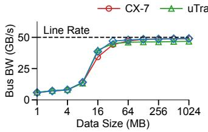  
(a) Allreduce.

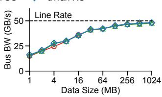  
(b) All-to-All.

Figure 10: NCCL-tests results on CX\_IB (NVLink+SHM disabled).138.9  
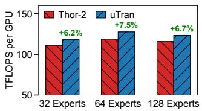

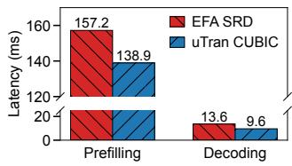  
(a) DeepSeek-V2-Lite [65] train- (b) DeepSeek-V3 [66] serving on ing on AMD. EFA (trace-driven emulation).  
Figure 11: Application performance evaluation.

Due to space limitations, we show the results of more collectives in Appendix C.1, on EFA with NVLink+SHM enabled in Appendix C.2 (up to 2.14× faster), and on non-RDMA NICs in Appendix C.3 (up to 4.1× faster).

## 6.2 Application Performance

UCCL-Tran is motivated by the practical needs of both LLM training and serving workloads. We run two applications to evaluate how UCCL-Tran improves ML workload performance. One is an end-to-end training of the DeepSeek-V2- Lite model [65] with 16B parameters and 64 routed experts on the AMD testbed using expert parallelism. We use the AMD Primus [8] training framework and its Megatron-LM backend. We also scale the model up and down to 128 and 32 routed experts to evaluate more training scenarios. Another is a DeepSeek-V3-like MoE serving application. Due to the testbed constraint (e.g., hundreds of GPUs required for meaningful DeepSeek-V3 serving with expert parallelism [66, 99]), we use a realistic DeepSeek-V3 trace including GPU compute time and network message sizes (i.e., hidden state sizes) from [106], and emulate the computation and communication behaviors with PyTorch and NCCL on EFA (NVLink+SHM disabled).

Figure 11a shows the results for DeepSeek-V2-Lite training. UCCL-Tran improves the end-to-end training speedup of up to 7.5%, without any line of code change to the training framework. Figure 11b shows the results for DeepSeek-V3 serving. UCCL-Tran reduces the per-request prefilling and decoding latency by 1.13× and 1.42× respectively. These experiments demonstrate that UCCL-Tran is able to bring significant benefits to real-world ML applications.

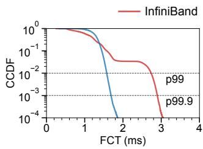  
(a) Incast traffic.

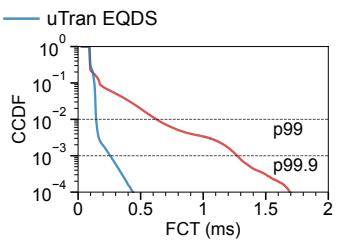  
(b) Permutation traffic.  
Figure 12: Complementary CDF of FCT (Flow Completion Time) on CX\_IB when co-locating 15-to-1 incast and permutation traffic.

## 6.3 UCCL-Tran Extensibility

## 6.3.1 Handling network incast

In a shared RDMA network, network incast can lead to victim flows due to PFC propagation [45, 73, 104]. Such network incast can be caused by the Expert Parallelism in MoE serving (§2.2) and gather/reduce collectives in multi-level par allelism of LLM training [13, 40]. This experiment tries to create a scenario where network incast co-exists with other collective traffic, and evaluates how UCCL-Tran performs compared to the RDMA hardware transport on CX\_IB. We co-locate 15-to-1 incast traffic and 16-NIC permutation traffic [16, 19, 59, 89], where each NIC streams data to another and no NIC receives more than one stream, representing typical collectives. For both types of traffic, each NIC sends 1MB messages with at most four in flight. We compare the receiverdriven EQDS in UCCL-Tran vs. the sender-driven InfiniBand CC in ConnectX-7.

Figure 12a and 12b show the FCT distributions for incast traffic and permutation traffic, respectively. Compared to InfiniBand, UCCL-Tran EQDS reduces P99/P99.9 latency by 1.73×/1.72× for incast traffic and 4.50×/4.88× for permutation traffic. This is because the InfiniBand CC only reduces the sending rate when severe congestion and queue build-up have occurred on the incast switch port; but this is too late, as the Credit-Based Flow Control [49] (PFC equivalent in InfiniBand) has already paused all upstream ports and heavily disturbed victim flows (i.e., permutation traffic). Conversely, UCCL-Tran EQDS proactively controls the rate of all senders on the receiver side, which reduces queue build-up and avoids upstream ports entering the pausing state.

## 6.3.2 Handling packet loss

We then evaluate how UCCL-Tran selective retransmission handles packet loss, compared to hardware-based loss recovery. Furthermore, UCCL-Tran coalesces transport decisions like loss recovery at chunk granularity for high software efficiency; therefore, we also test whether this design choice would cause poor loss recovery performance. To this end, we instrument different packet loss rates in software when running NCCL collectives over UCCL-Tran UC. Our packet loss instrumentation has considered the chunking nature in UCCL-Tran, where any packet loss will cause the whole chunk loss. Unfortunately, we cannot instrument packet loss for our CX\_IB NICs as that would require reconfiguring the NIC or switch behaviors, both of which we do not have access to. Instead, we cite comparable numbers from prior literature Flor [63].

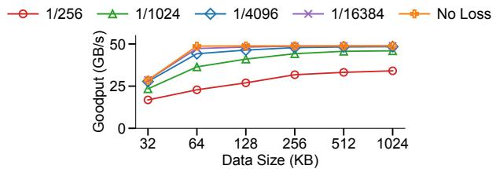  
Figure 13: Goodput of UCCL-Tran under different packet drop ratios. UCCL-Tran implements selective retransmission with a dynamic RTO threshold (around several RTTs).

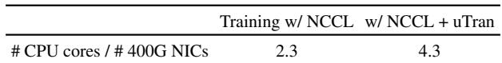  
Table 2: CPU core consumption relative to the number of active 400G NICs during DeepSeek-V2-Lite training (§6.2).

We pick two GPUs from the AMD testbed, each using one NIC for communication. The client NIC establishes a connection with the server NIC and keeps 16 inflight messages. Similar to Flor [63], we use a single QP for the connection, and disable congestion control to avoid sending rate backoff. We vary the message size (32KB∼1MB) and measure the goodput under different packet drop ratios. Figure 13 shows the results. UCCL-Tran has only ∼1% performance drop under 1/16384, 1/4096 drop ratio, compared to the reported 26%∼42% drop of RDMA hardware transport in Flor [63, Figure 7]. Even under a high drop ratio of 1/1024 and 1/256, UCCL-Tran only experiences a performance drop of 6%∼30%, compared to the reported 59%∼76% drop in RDMA hardware transport.

## 6.4 UCCL-Tran Scalabality

## 6.4.1 CPU core consumption

In addition to the training-framework CPU usage, which is averagely 14.5% out of 128 cores in practice (§1, UCCL-Tran additionally uses 16 CPU cores (2 per GPU). Table 2 summarizes the CPU core consumption relative to the number of active GPUs. As the GPU price and CPU core count keep increasing (e.g., 192 CPU cores in AWS Hopper GPU VMs [5]), we believe trading 16 additional CPU cores for a 7.5% GPU efficiency boost is becoming increasingly worthwhile.

## 6.4.2 Varying chunk size

Figure 14a shows the all-to-all performance on the CX\_IB testbed when varying chunk sizes. Our results reveal that saturating the line rate requires a somewhat medium chunk

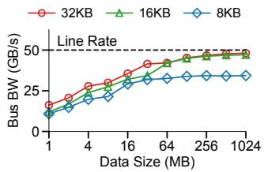  
(a) Varying chunk size.

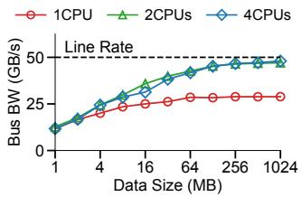  
(b) Varying CPU cores.

Figure 14: UCCL-Tran all-to-all on CX\_IB with different chunk sizes and number of CPU cores per NIC (NVLink+SHM disabled).  
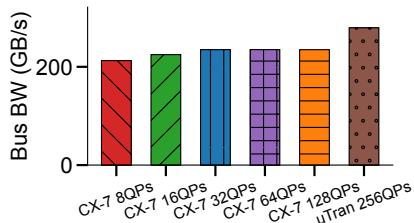  
Figure 15: The highest allreduce bandwidth with different number of QPs and transports on CX\_ETH. When preparing this figure during camera ready, we are no longer able to access any testbed due to the long period between the original evaluation and camera-ready, and the high expenses of RDMA-connected GPU testbeds. We are only able to retrieve the CX-7 results with up to 128 QPs from our previous logs, but we believe the trends do not change when CX-7 scales to 256 QPs (due to RC’s overhead in RDMA NICs).

size, i.e., ≥16KB or 4 MTU-sized chunks. This experiment demonstrates the performance benefits of control coalescing for UCCL-Tran software transport.

## 6.4.3 Varying number of CPU cores

Figure 14b shows the all-to-all performance when varying the number of UCCL-Tran engines/CPU cores per NIC. For ASIC-based NICs with segmentation and reassembly offloading, even though one CPU core can only saturate bidirectional 29GB/s, two CPU cores are enough to saturate the full 50GB/s line rate. The slight performance drop for 16MB when switching from “2CPUs” to “4CPUs” should be caused by runtime variability. This experiment confirms the high efficiency of UCCL-Tran software transport, i.e., 1 CPU core saturating 400G unidirectional traffic (2 CPU cores for 400G bidirectional).

We show more scalability studies in Appendix C.4 when varying numbers of CPU cores, GPUs, and paths on EFA.

## 6.5 Design Drill-Down

## 6.5.1 Performance improvement attribution

Figure 15 shows the highest allreduce bandwidth when varying the number of QPs in different transports. There are two takeaways: 1) the performance of the raw CX-7 transport saturates at 32 QPs, and increasing QPs beyond even incurs a slight performance penalty (due to RC’s high overhead), 2)

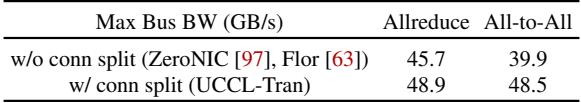

Table 3: Impact of connection splitting on CX\_IB.  
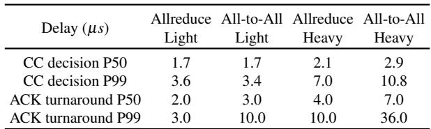  
Table 4: CC decision delay and ACK turnaround delay on CX\_IB. “Light” uses 1KB-64KB messages, while “Heavy” uses 1GB.

CX-7 with 128 QPs still falls behind UCCL-Tran performance by a large margin. Therefore, we think simply scaling QPs to 256 is not the leading factor of performance improvement, but the dynamic path selection (i.e., power-of-two sampling based on per-path RTT) is the key to better performance. We note that such advanced dynamic path selection can hardly be done on traditional NICs due to the large per-path states they need to maintain.

## 6.5.2 Connection splitting

We now evaluate how connection splitting impacts collective performance in UCCL-Tran. Without connection splitting, each UCCL-Tran connection is mapped to a single engine out of the two UCCL-Tran engines per NIC; with splitting, each UCCL-Tran connection dispatches and load balances its messages among the two UCCL-Tran engines. Table 3 shows that UCCL-Tran without connection splitting (e.g., ZeroNIC [97], Flor [63]) only achieves 45.7 and 39.9 GB/s max busbw for allreduce and all-to-all, while UCCL-Tran with splitting achieves 48.9 and 48.5 GB/s respectively, saturating the line rate. This is because connection splitting enables multiple CPU cores to process inflight messages in a load-balanced manner. We anticipate connecting splitting will become more critical as the NIC scales to 800 Gbps [27].

## 6.5.3 Congestion signal fidelity in software

UCCL-Tran makes a fundamental shift of moving transport from hardware to software. This experiment evaluates how much software transport sacrifices in terms of congestion signal fidelity. We look at the two important metrics as mentioned in §3.4: CC decision delay and ACK turnaround delay. Table 4 shows the results. At light loads, the two delays are limited to at most 10µs in both P50 and P99; at high loads, they grow up to 36µs for P99. Both are on par with typical datacenter RTTs of 10-40 µs [37]. Therefore, this experiment confirms that UCCL-Tran software transport has high enough CC fidelity to make precise per-RTT transport decisions [39,64]. In addition, we emphasize that while software RTT introduces some noise, the bulk data nature of ML traffic makes it more tolerant to this than latency-sensitive RPC workloads.

We show more design drill-downs in Appendix C.5, including the impact of chunk size, LB policy, kernel fusion (for scattered memcpy), and PCIe overhead analyses.

## 7 Discussion

HW-SW interface. UCCL-Tran works around many challenges to support extensible transport with efficient multipathing on existing RDMA NICs, at the cost of QP swapping overhead (though not high for ML collectives), control coalescing, and more. UCCL-Tran performance and control granularity would get further boosted if there were a better HW-SW interface in RDMA NICs.

We would like to highlight a few points based on our development experience: (1) UC abstraction is powerful with segmentation and reassembly offloading, but using many UC QPs for multipathing incurs some degree of QP swapping overhead; instead, it should evolve into a multipath UC ab straction that allows the software to specify different flow entropies for different verbs over a single QP, just like how UCCL-Tran specifies different UDP ports for AF\_XDP. (2) NIC HW should expose more congestion signals to SW, such as ECN marks and packet trimming information; these signals can be embedded into CQEs just like hardware timestamps. Software jitters. UCCL-Tran runs network transport on the host CPU, and may suffer from software jitters. We argue that such jitters could be avoided or reduced to a minimal level for ML workloads. For example, storage traffic nowadays could directly go from GPU to storage devices via GPUDi rect Storaage, so no intensive CPU involvement. ML cluster scheduler already schedules dedicated cores for NCCL CPU proxy, which works well. We just need to reserves extra cores for UCCL-Tran. Futhermore, we can disable interrupts for certain cores that run NCCL CPU proxy and UCCL-Tran transport.

GPU-initiated communication like DeepEP [29] leverages NVIDIA IBGDA [84] to issue RDMA verbs directly from GPUs to the RDMA NICs. Although seemingly conflicted with UCCL-Tran’s CPU-initiated designs, GPU-initiated communication could still be made compatible with UCCL-Tran. The key is to leverage the IBGDA CPU-assisted mode [80], where the GPU forwards RDMA requests to a CPU proxy that issues RDMA verbs; with this, we could implement UCCL Tran’s extensible transport layer inside the CPU proxy. The trade-off is on performance: NVIDIA has reported that this CPU-assisted IBGDA would sacrifice 10% performance compared to the traditional IBGDA [80]. We intend to leave the integration and performance enhancement of CPU-assisted IBGDA + UCCL-Tran as future work.

Observability. During the private conversation with GPU cluster managers, we found that network observability is critical. For example, once observing which path has congestion and when retransmission happens, the cluster manager can drain traffic away from the hotspot to improve the completion time of synchronous ML training. UCCL-Tran’s software approach provides a better observability vantage point compared to the hardware-baked RDMA transport. UCCL-Tran users could directly instrument the transport layer and quickly recompile in software to, e.g., log per-path congestion level and retransmission events.

## 8 Other Related Work

Recent work SCR [107] implements receiver-driven CC and multipathing on the DPA (DataPath Accelerator, essentially 16 RISC-V cores) of NVIDIA BlueField-3 SmartNICs. It would have similar performance issues as AWS EFA NICs. Moreover, DPA programmability is limited to what the NIC hardware supports, e.g., only rate-based control, while packet reliability and retransmission are still baked into the hardware. Because of this, SCR needs to alter the original receiverdriven CC to let credits represent available bandwidth rather than bytes. For multipathing, SCR only demonstrates two paths; given the limited L1/L2 cache in DPA [107], it is not clear if SCR could scale to hundreds of paths [16,59,85]. The recent MRC [10] protocol builds a multipath RC protocol into programmable NICs such as NVIDIA ConnectX-8 and Broadcom Thor Ultra. We note it is released one year after UCCL-Tran and might suffer from similar issues as SCR.

Google GPUDirect-TCPX [2] integrates GPUDirect into the kernel TCP stack by leveraging the Header-Data Split feature in certain non-RDMA NICs. Instead, UCCL-Tran targets both RDMA and non-RDMA NICs, and further supports efficient multipathing. C4 [32] does coarse-grained flow-level traffic planning and path selection in LLM training, without programmability for low-level RDMA transport components such as CC and loss recovery. MSCCL [11] supports customizing collective communication algorithms and could work together with UCCL-Tran. Lastly, UCCL-Tran is inspired by a line of work that targets extensibility for CPU applications, e.g., Google 1RMA [95], eRPC [53], RoGUE [60], and IO-TCP [55] for extensible RDMA transport, and SPIN [15], Exokernel [33], and VINO [91] for extensible OS.

## 9 Conclusion

UCCL-Tran is an extensible and efficient software transport layer for GPU networking. It achieves network extensibility by separating the control path and data path for existing RDMA NICs and running the transport control path in software. Meanwhile, it achieves hardware-level performance by leveraging techniques like control coalescing and connection splitting. We hope UCCL-Tran opens the door to the productization of new research proposals on network transports for ML workloads. UCCL-Tran is open-sourced at https://github.com/uccl-project/uccl.

## Acknowledgement

We sincerely thank our shepherd Nitin Agrawal and the anonymous reviewers for their insightful comments. This work is in part supported by gifts from Accenture, AMD, Anyscale, Broadcom, Cisco, Google, IBM, Intel, Intesa Sanpaolo, Lambda, Lightspeed, Mibura, Microsoft, NVIDIA, Samsung SDS, and SAP. Costin Raiciu was partly funded by HRIA (project no. 351416). We additionally acknowledge AWS, in particular Zhenyu Song, Jun Wu, and Yida Wang, for their sponsorship and partnership in this research.

## References

[1] Mohammad Alizadeh, Albert Greenberg, David A. Maltz, Jitendra Padhye, Parveen Patel, Balaji Prabhakar, Sudipta Sengupta, and Murari Sridharan. Data Center TCP (DCTCP). In Proceedings of ACM SIG-COMM, page 63–74, 2010.

[2] Mina Almasry and Willem de Bruijn, Eric Dumazet, Kaiyuan Zhang. Device memory TCP: Transferring data from/to device memory efficiently. Netdev 0x17 Conference, 2023.

[3] Amazon Web Services. AWS OFI NCCL. https: //github.com/aws/aws-ofi-nccl/tree/v1.13 .2-aws, 2024.

[4] Amazon Web Services. Amazon EC2 P5 Instances. https://aws.amazon.com/ec2/instance-typ es/p5/, 2025.

[5] Inc. or its affiliates Amazon Web Services. Amazon EC2 P5 instances. https://aws.amazon.com/ec2 /instance-types/p5/, 2026.

[6] AMD. RCCL Net Plugin Documentation. https: //github.com/ROCm/rccl/tree/develop/ex t-net, 2025.

[7] AMD. ROCm Communication Collectives Library (RCCL). https://github.com/ROCm/rccl, 2025.

[8] AMD-AGI/Primus. AMD Primus training framework for large-scale foundation model training and inference on AMD GPUs. https://github.com/AMD-AGI/P rimus.

[9] AMD Pensando. AMD Pollara 400 Card. https: //www.amd.com/content/dam/amd/en/documen ts/pensando-technical-docs/product-brief s/pensando-pollara-400-product-brief.pdf, 2024.

[10] Joao Araujo, Alex Chow, Mark Handley, Ryder Lewis, Christoph Paasch, Jitendra Padhye, Michael

Papamichael, Greg Steinbrecher, Amin Tootoonchian, Lihua Yuan, et al. Resilient AI Supercomputer Networking using MRC and SRv6. arXiv preprint arXiv:2605.04333, 2026.

[11] Azure/msccl. Microsoft Collective Communication Library (MSCCL). https://github.com/Azure/m sccl, 2024.

[12] Wei Bai, Shanim Sainul Abdeen, Ankit Agrawal, Krishan Kumar Attre, Paramvir Bahl, Ameya Bhagat, Gowri Bhaskara, Tanya Brokhman, Lei Cao, Ahmad Cheema, et al. Empowering Azure Storage with RDMA. In Proceedings of USENIX NSDI, pages 49– 67, 2023.

[13] Paul Barham, Aakanksha Chowdhery, Jeff Dean, Sanjay Ghemawat, Steven Hand, Daniel Hurt, Michael Isard, Hyeontaek Lim, Ruoming Pang, Sudip Roy, et al. Pathways: Asynchronous Distributed Dataflow for ML. Proceedings of Machine Learning and Systems, 4:430– 449, 2022.

[14] Adam Belay, George Prekas, Ana Klimovic, Samuel Grossman, Christos Kozyrakis, and Edouard Bugnion. IX: A Protected Dataplane Operating System for High Throughput and Low Latency. In Proceedings of USENIX OSDI, pages 49–65, 2014.

[15] Brian N Bershad, Stefan Savage, Przemyslaw Pardyak, Emin Gün Sirer, Marc E Fiuczynski, David Becker, Craig Chambers, and Susan Eggers. Extensibility Safety and Performance in the SPIN Operating System. In Proceedings of ACM SOSP, pages 267–283, 1995.

[16] Tommaso Bonato, Abdul Kabbani, Daniele De Sensi, Rong Pan, Yanfang Le, Costin Raiciu, Mark Handley, Timo Schneider, Nils Blach, Ahmad Ghalayini, et al. SMaRTT-REPS: Sender-based Marked Rapidlyadapting Trimmed & Timed Transport with Recycled Entropies. arXiv e-prints, pages arXiv–2404, 2024.

[17] Pat Bosshart, Dan Daly, Glen Gibb, Martin Izzard, Nick McKeown, Jennifer Rexford, Cole Schlesinger, Dan Talayco, Amin Vahdat, George Varghese, et al. P4: Programming Protocol-Independent Packet Processors. ACM SIGCOMM Computer Communication Review, 44(3):87–95, 2014.

[18] Broadcom. Broadcom High-Performance 400G RoCE / RDMA NICs. https://www.broadcom.com/inf o/nic/performance-ethernet-adapters, 2024.

[19] Jiaxin Cao, Rui Xia, Pengkun Yang, Chuanxiong Guo, Guohan Lu, Lihua Yuan, Yixin Zheng, Haitao Wu, Yongqiang Xiong, and Dave Maltz. Per-Packet Load-Balanced, Low-Latency Routing for Clos-Based Data

Center Networks. In Proceedings of the ACM CoNEXT, pages 49–60, 2013.

[20] Youmin Chen, Youyou Lu, and Jiwu Shu. Scalable RDMA RPC on Reliable Connection with Efficient Resource Sharing. In Proceedings of EuroSys, pages 1–14, 2019.

[21] Peng Cheng, Fengyuan Ren, Ran Shu, and Chuang Lin. Catch the whole lot in an action: Rapid precise packet loss notification in data center. In 11th USENIX Symposium on Networked Systems Design and Implementation (NSDI 14), pages 17–28, 2014.

[22] Ultra Ethernet Consortium. The New Era Needs a New Network. https://ultraethernet.org/, 2023.

[23] NVIDIA Corporation. DGX H100/200 System Topology. https://docs.nvidia.com/dgx/dgxh100-u ser-guide/introduction-to-dgxh100.html# dgx-h100-200-system-topology, 2025.

[24] NVIDIA Corporation. NCCL Net Plugin Documentation. https://github.com/NVIDIA/nccl/blob/ master/ext-net/README.md, 2025.

[25] NVIDIA Corporation. NCCL Tests. https://gith ub.com/NVIDIA/nccl-tests/tree/9d26b8422b a76c098df996b96e13b8ddf3a71165, 2025.

[26] NVIDIA Corporation. NCCL v2.23.4-1. https:// github.com/NVIDIA/nccl/tree/2ea4ee94bfb0 4c886c79ccae60ac9961000fdee2, 2025.

[27] NVIDIA Corporation. NVIDIA Ethernet SuperNICs: Next-generation networking for the next wave of AI. https://www.nvidia.com/en-us/networking /products/ethernet/supernic/, 2025.

[28] NVIDIA Corporation. NVIDIA GPUDirect: Enhancing Data Movement and Access for GPUs. https: //developer.nvidia.com/gpudirect, 2025.

[29] DeepSeek. DeepEP: an Efficient Expert-Parallel Communication Library. https://github.com/deeps eek-ai/DeepEP, 2025.

[30] DeepSeek AI. Expert Parallelism Load Balancer (EPLB). https://github.com/deepseek-ai/ EPLB, 2025.

[31] Advait Dixit, Pawan Prakash, Y Charlie Hu, and Ramana Rao Kompella. On the Impact of Packet Spraying in Data Center Networks. In Proceedings of IEEE INFOCOM, pages 2130–2138. IEEE, 2013.

[32] Jianbo Dong, Bin Luo, Jun Zhang, Pengcheng Zhang, Fei Feng, Yikai Zhu, Ang Liu, Zian Chen, Yi Shi, Hairong Jiao, et al. Boosting Large-Scale Parallel

Training Efficiency with C4: A Communication-Driven Approach. arXiv preprint arXiv:2406.04594, 2024.

[33] Dawson R Engler, M Frans Kaashoek, and James O’Toole Jr. Exokernel: An Operating System Architecture for Application-Level Resource Management. ACM SIGOPS Operating Systems Review, 29(5):251– 266, 1995.

[34] Adithya Gangidi, Rui Miao, Shengbao Zheng, Sai Jayesh Bondu, Guilherme Goes, Hany Morsy, Rohit Puri, Mohammad Riftadi, Ashmitha Jeevaraj Shetty, Jingyi Yang, Shuqiang Zhang, Mikel Jimenez Fernandez, Shashidhar Gandham, and Hongyi Zeng. RDMA over Ethernet for Distributed Training at Meta Scale. In Proceedings of ACM SIGCOMM 2024 Conference, page 57–70, 2024.

[35] Yixiao Gao, Qiang Li, Lingbo Tang, Yongqing Xi, Pengcheng Zhang, Wenwen Peng, Bo Li, Yaohui Wu, Shaozong Liu, Lei Yan, et al. When Cloud Storage Meets RDMA. In Proceedings of USENIX NSDI, pages 519–533, 2021.

[36] Talia Gershon, Seetharami Seelam, Brian Belgodere, Milton Bonilla, Lan Hoang, Danny Barnett, I Chung, Apoorve Mohan, Ming-Hung Chen, Lixiang Luo, et al. The Infrastructure Powering IBM’s Gen AI Model Development. arXiv preprint arXiv:2407.05467, 2024.

[37] Dan Gibson, Hema Hariharan, Eric Lance, Moray McLaren, Behnam Montazeri, Arjun Singh, Stephen Wang, Hassan MG Wassel, Zhehua Wu, Sunghwan Yoo, et al. Aquila: A unified, low-latency fabric for datacenter networks. In Proceedings of USENIX NSDI, pages 1249–1266, 2022.

[38] Google. Falcon Transport Protocol. https://gith ub.com/opencomputeproject/OCP-NET-Falcon, 2024.

[39] Google. Introduction to Falcon Reliable Transport. https://netdevconf.info/0x18/sessions/ta lk/introduction-to-falcon-reliable-trans port.html, 2024.

[40] Aaron Grattafiori, Abhimanyu Dubey, Abhinav Jauhri, Abhinav Pandey, Abhishek Kadian, Ahmad Al-Dahle, Aiesha Letman, Akhil Mathur, Alan Schelten, Alex Vaughan, et al. The Llama 3 Herd of Models. arXiv preprint arXiv:2407.21783, 2024.

[41] Chuanxiong Guo, Haitao Wu, Zhong Deng, Gaurav Soni, Jianxi Ye, Jitu Padhye, and Marina Lipshteyn. RDMA over Commodity Ethernet at Scale. In Proceedings of ACM SIGCOMM, pages 202–215, 2016.

[42] Sangtae Ha, Injong Rhee, and Lisong Xu. CUBIC: a New TCP-Friendly High-Speed TCP Variant. ACM SIGOPS operating systems review, 42(5):64–74, 2008.

[43] Mark Handley, Costin Raiciu, Alexandru Agache, Andrei Voinescu, Andrew W. Moore, Gianni Antichi, and Marcin Wójcik. Re-architecting Datacenter Networks and Stacks for Low Latency and High Performance. In Proceedings of ACM SIGCOMM, page 29–42, 2017.

[44] Qinghao Hu, Zhisheng Ye, Zerui Wang, Guoteng Wang, Meng Zhang, Qiaoling Chen, Peng Sun, Dahua Lin, Xiaolin Wang, Yingwei Luo, et al. Characterization of large language model development in the datacenter. In Proceedings of USENIX NSDI, pages 709–729, 2024.

[45] Shuihai Hu, Yibo Zhu, Peng Cheng, Chuanxiong Guo, Kun Tan, Jitendra Padhye, and Kai Chen. Deadlocks in Datacenter Networks: Why Do They Form, and How to Avoid Them. In Proceedings of ACM HotNets, pages 92–98, 2016.

[46] Cheng Huang, Huseyin Simitci, Yikang Xu, Aaron Ogus, Brad Calder, Parikshit Gopalan, Jin Li, and Sergey Yekhanin. Erasure Coding in Windows Azure Storage. In Proceedings of USENIX ATC, pages 15–26, 2012.

[47] Advanced Micro Devices Inc. RCCL Tests. https: //github.com/ROCm/rccl-tests/tree/5b27b9 61b2543b3af2bb1cf5ca8ee0505226ba92, 2025.

[48] Advanced Micro Devices Inc. ROCm Communication Collectives Library (RCCL). https://github.com /ROCm/rccl/tree/532f54c2444501b3655e65fb ce6d00d4bfc19c0b, 2025.

[49] InfiniBand Trade Association. InfiniBandTM Architecture Specification Volume 1 Release 1.4, 2020.

[50] Intel. Performance Counter Monitor. https://gith ub.com/intel/pcm/, 2025.

[51] Muhammad Asim Jamshed, YoungGyoun Moon, Donghwi Kim, Dongsu Han, and KyoungSoo Park. mOS: A Reusable Networking Stack for Flow Monitoring Middleboxes. In Proceedings of USENIX NSDI, pages 113–129, 2017.

[52] Yimin Jiang, Yibo Zhu, Chang Lan, Bairen Yi, Yong Cui, and Chuanxiong Guo. A unified architecture for accelerating distributed {DNN} training in heterogeneous {GPU/CPU} clusters. In Proceedings of USENIX OSDI, pages 463–479, 2020.

[53] Anuj Kalia, Michael Kaminsky, and David Andersen. Datacenter RPCs can be General and Fast. In Proceedings of USENIX NSDI, pages 1–16, 2019.

[54] Anuj Kalia, Michael Kaminsky, and David G Andersen. FaSST: Fast, Scalable and Simple Distributed Transactions with Two-Sided (RDMA) Datagram RPCs. In Proceedings of USENIX OSDI, pages 185–201, 2016.

[55] Taehyun Kim, Deondre Martin Ng, Junzhi Gong, Youngjin Kwon, Minlan Yu, and KyoungSoo Park. Rearchitecting the TCP Stack for I/O-Offloaded Content Delivery. In Proceedings of USENIX NSDI, pages 275–292, 2023.

[56] Xinhao Kong, Jiaqi Lou, Wei Bai, Nam Sung Kim, and Danyang Zhuo. Towards a manageable intra-host network. In Proceedings of the 19th Workshop on Hot Topics in Operating Systems, pages 206–213, 2023.

[57] Xinhao Kong, Yibo Zhu, Huaping Zhou, Zhuo Jiang, Jianxi Ye, Chuanxiong Guo, and Danyang Zhuo. Collie: Finding Performance Anomalies in RDMA Subsystems. In Proceedings of USENIX NSDI, pages 287– 305, 2022.

[58] Gautam Kumar, Nandita Dukkipati, Keon Jang, Hassan MG Wassel, Xian Wu, Behnam Montazeri, Yaogong Wang, Kevin Springborn, Christopher Alfeld, Michael Ryan, et al. Swift: Delay is Simple and Effective for Congestion Control in the Datacenter. In Proceedings of ACM SIGCOMM, pages 514–528, 2020.

[59] Yanfang Le, Rong Pan, Peter Newman, Jeremias Blendin, Abdul Kabbani, Vipin Jain, Raghava Sivaramu, and Francis Matus. STrack: A Reliable Multipath Transport for AI/ML Clusters. arXiv preprint arXiv:2407.15266, 2024.

[60] Yanfang Le, Brent Stephens, Arjun Singhvi, Aditya Akella, and Michael M Swift. RoGUE: RDMA over Generic Unconverged Ethernet. In Proceedings of ACM SoCC, pages 225–236, 2018.

[61] Sugi Lee, Mingyu Choi, Ikjun Yeom, and Younghoon Kim. PeRF: Preemption-Enabled RDMA Framework. In Proceedings of USENIX ATC, pages 209–225, 2024.

[62] Mu Li, David G Andersen, Alexander Smola, and Kai Yu. Communication efficient distributed machine learning with the parameter server. Advances in neural information processing systems, 27, 2014.

[63] Qiang Li, Yixiao Gao, Xiaoliang Wang, Haonan Qiu, Yanfang Le, Derui Liu, Qiao Xiang, Fei Feng, Peng Zhang, Bo Li, et al. Flor: An Open High Performance RDMA Framework over Heterogeneous RNICs. In Proceedings of USENIX OSDI, pages 931–948, 2023.

[64] Yuliang Li, Rui Miao, Hongqiang Harry Liu, Yan Zhuang, Fei Feng, Lingbo Tang, Zheng Cao, Ming Zhang, Frank Kelly, Mohammad Alizadeh, et al.

HPCC: High Precision Congestion Control. In Proceedings of ACM SIGCOMM, pages 44–58. 2019.

[65] Aixin Liu, Bei Feng, Bin Wang, Bingxuan Wang, Bo Liu, Chenggang Zhao, Chengqi Dengr, Chong Ruan, Damai Dai, Daya Guo, et al. Deepseek-v2: A strong, economical, and efficient mixture-of-experts language model. arXiv preprint arXiv:2405.04434, 2024.

[66] Aixin Liu, Bei Feng, Bing Xue, Bingxuan Wang, Bochao Wu, Chengda Lu, Chenggang Zhao, Chengqi Deng, Chenyu Zhang, Chong Ruan, et al. DeepSeek-V3 Technical Report. arXiv preprint arXiv:2412.19437, 2024.

[67] Ming Liu, Tianyi Cui, Henry Schuh, Arvind Krishnamurthy, Simon Peter, and Karan Gupta. Offloading Distributed Applications onto SmartNICs Using iPipe. In Proceedings of ACM SIGCOMM, pages 318–333. 2019.

[68] Yuanwei Lu, Guo Chen, Bojie Li, Kun Tan, Yongqiang Xiong, Peng Cheng, Jiansong Zhang, Enhong Chen, and Thomas Moscibroda. Multi-Path Transport for RDMA in Datacenters. In Proceedings of USENIX NSDI, pages 357–371, 2018.

[69] Michael Marty, Marc de Kruijf, Jacob Adriaens, Christopher Alfeld, Sean Bauer, Carlo Contavalli, Michael Dalton, Nandita Dukkipati, William C Evans, Steve Gribble, et al. Snap: A Microkernel Approach to Host Networking. In Proceedings of ACM SOSP, pages 399–413, 2019.

[70] Matt Mathis, Jamshid Mahdavi, Sally Floyd, and Allyn Romanow. TCP Selective Acknowledgment Options. https://datatracker.ietf.org/doc/html/rf c2018, 1996.

[71] Microsoft Azure. ND-H100-v5 sizes series. https: //learn.microsoft.com/en-us/azure/virtua l-machines/sizes/gpu-accelerated/ndh100v 5-series, 2024.

[72] Radhika Mittal, Vinh The Lam, Nandita Dukkipati, Emily Blem, Hassan Wassel, Monia Ghobadi, Amin Vahdat, Yaogong Wang, David Wetherall, and David Zats. TIMELY: RTT-based Congestion Control for the Datacenter. ACM SIGCOMM Computer Communica tion Review, 45(4):537–550, 2015.

[73] Radhika Mittal, Alexander Shpiner, Aurojit Panda, Eitan Zahavi, Arvind Krishnamurthy, Sylvia Ratnasamy, and Scott Shenker. Revisiting Network Support for RDMA. In Proceedings of ACM SIGCOMM, pages 313–326, 2018.

[74] Michael Mitzenmacher. The Power of Two Choices in Randomized Load Balancing. IEEE Transactions on Parallel and Distributed Systems, 12(10):1094–1104, 2001.

[75] Sumit Kumar Monga, Sanidhya Kashyap, and Changwoo Min. Birds of a feather flock together: Scaling RDMA RPCs with Flock. In Proceedings of ACM SOSP, pages 212–227, 2021.

[76] Behnam Montazeri, Yilong Li, Mohammad Alizadeh, and John Ousterhout. Homa: A Receiver-Driven Low-Latency Transport Protocol Using Network Priorities. In Proceedings of ACM SIGCOMM, pages 221–235, 2018.

[77] Multipath TCP community. Multipath TCP. https: //www.multipath-tcp.org/, 2023.

[78] NVIDIA Corporation. Doubling all2all Performance with NVIDIA Collective Communication Library 2.12. https://developer.nvidia.com/blog/doubli ng-all2all-performance-with-nvidia-colle ctive-communication-library-2-12/, 2022.

[79] NVIDIA Corporation. ConnectX-7 400G Adapters. https://resources.nvidia.com/en-us-accel erated-networking-resource-library/conne ctx-7-datasheet, 2024.

[80] NVIDIA Corporation. CPU-assisted InfiniBand GPU Direct Async. https://developer.nvidia.com /blog/enhancing-application-portability -and-compatibility-across-new-platforms -using-nvidia-magnum-io-nvshmem-3-0/#cp u-assisted\_infiniband\_gpu\_direct\_async% C2%A0, 2024.

[81] NVIDIA Corporation. Recommended Topologies for Implementing an HPC Cluster with NVIDIA Quantum InfiniBand Solutions - Part 2: Hash-Based Forwarding. https://enterprise-support.nvidia.com/s article/Recommended-Topologies-for-Imple menting-an-HPC-Cluster-with-NVIDIA-Quant um-InfiniBand-Solutions-Part-2#Hash-Bas edForwarding, 2024.

[82] NVIDIA Corporation. Megatron-LM & Megatron-Core. https://github.com/NVIDIA/Megatron-L M, 2025.

[83] NVIDIA Corporation. NVIDIA Collective Communications Library (NCCL). https://github.com/N VIDIA/nccl, 2025.

[84] NVIDIA Corporation. Using the NVSHMEM Infini-Band GPUDirect Async Transport. https://docs.n vidia.com/nvshmem/api/using.html#using-t

he-nvshmem-infiniband-gpudirect-async-t ransport, 2025.

[85] Vladimir Olteanu, Haggai Eran, Dragos Dumitrescu, Adrian Popa, Cristi Baciu, Mark Silberstein, Georgios Nikolaidis, Mark Handley, and Costin Raiciu. An edgequeued datagram service for all datacenter traffic. In 19th USENIX Symposium on Networked Systems Design and Implementation (NSDI 22), pages 761–777, 2022.

[86] Phitchaya Mangpo Phothilimthana, Ming Liu, Antoine Kaufmann, Simon Peter, Rastislav Bodik, and Thomas Anderson. Floem: A Programming System for NIC-Accelerated Network Applications. In Proceedings of USENIX OSDI, pages 663–679, 2018.

[87] Kun Qian, Yongqing Xi, Jiamin Cao, Jiaqi Gao, Yichi Xu, Yu Guan, Binzhang Fu, Xuemei Shi, Fangbo Zhu, Rui Miao, Chao Wang, Peng Wang, Pengcheng Zhang, Xianlong Zeng, Eddie Ruan, Zhiping Yao, Ennan Zhai, and Dennis Cai. Alibaba HPN: A Data Center Network for Large Language Model Training. In Proceedings of ACM SIGCOMM, page 691–706, 2024.

[88] Mubashir Adnan Qureshi, Yuchung Cheng, Qianwen Yin, Qiaobin Fu, Gautam Kumar, Masoud Moshref, Junhua Yan, Van Jacobson, David Wetherall, and Abdul Kabbani. PLB: Congestion Signals Are Simple and Effective for Network Load Balancing. In Proceedings of ACM SIGCOMM, pages 207–218, 2022.

[89] Costin Raiciu, Sebastien Barre, Christopher Pluntke, Adam Greenhalgh, Damon Wischik, and Mark Handley. Improving Datacenter Performance and Robustness with Multipath TCP. ACM SIGCOMM Computer Communication Review, 41(4):266–277, 2011.

[90] Henry N Schuh, Weihao Liang, Ming Liu, Jacob Nelson, and Arvind Krishnamurthy. Xenic: SmartNIC-Accelerated Distributed Transactions. In Proceedings of ACM SOSP, pages 740–755, 2021.

[91] Margo I Seltzer, Yasuhiro Endo, Christopher Small, and Keith A Smith. Dealing with Disaster: Surviving Misbehaved Kernel Extensions. ACM SIGOPS Operating Systems Review, 30(213-228):10–1145, 1996.

[92] Amazon Web Services. Elastic Fabric Adapter. https: //aws.amazon.com/hpc/efa/, 2025.

[93] Leah Shalev, Hani Ayoub, Nafea Bshara, and Erez Sabbag. A Cloud-Optimized Transport Protocol for Elastic and Scalable HPC. IEEE micro, 40(6):67–73, 2020.

[94] Madhavapeddi Shreedhar and George Varghese. Efficient Fair Queueing using Deficit Round Robin. In

Proceedings of the conference on Applications, technologies, architectures, and protocols for computer communication, pages 231–242, 1995.

[95] Arjun Singhvi, Aditya Akella, Dan Gibson, Thomas F. Wenisch, Monica Wong-Chan, Sean Clark, Milo M.K. Martin, Moray McLaren, Prashant Chandra, Rob Cauble, and et al. 1RMA: Re-Envisioning Remote Memory Access for Multi-Tenant Datacenters. In Proceedings of ACM SIGCOMM, pages 708–721, 2020.

[96] Arjun Singhvi, Nandita Dukkipati, Prashant Chandra, Hassan MG Wassel, Naveen Kr Sharma, Anthony Rebello, Henry Schuh, Praveen Kumar, Behnam Montazeri, Neelesh Bansod, et al. Falcon: A reliable, low latency hardware transport. In Proceedings of ACM SIGCOMM, pages 248–263, 2025.

[97] Athinagoras Skiadopoulos, Zhiqiang Xie, Mark Zhao, Qizhe Cai, Saksham Agarwal, Jacob Adelmann, David Ahern, Carlo Contavalli, Michael Goldflam, Vitaly Mayatskikh, et al. High-Throughput and Flexible Host Networking for Accelerated Computing. In Proceedings of USENIX OSDI, pages 405–423, 2024.

[98] The Linux kernel development community. AF\_XDP. https://docs.kernel.org/networking/af\_xd p.html, 2025.

[99] The SGLang Team. Deploying DeepSeek with PD Disaggregation and Large-Scale Expert Parallelism on 96 H100 GPUs. https://lmsys.org/blog/202 5-05-05-large-scale-ep/, 2025.

[100] William Tu, Yi-Hung Wei, Gianni Antichi, and Ben Pfaff. Revisiting the Open vSwitch Dataplane Ten Years Later. In Proceedings of ACM SIGCOMM, pages 245–257, 2021.

[101] ultraethernet/uet-htsim. htsim Network Simulator. ht tps://github.com/ultraethernet/uet-htsim, 2023.

[102] Hao Wang, Han Tian, Jingrong Chen, Xinchen Wan, Jiacheng Xia, Gaoxiong Zeng, Wei Bai, Junchen Jiang, Yong Wang, and Kai Chen. Towards Domain-Specific Network Transport for Distributed DNN Training. In Proceedings of USENIX NSDI, pages 1421–1443, 2024.

[103] Xizheng Wang, Qingxu Li, Yichi Xu, Gang Lu, Dan Li, Li Chen, Heyang Zhou, Linkang Zheng, Sen Zhang, Yikai Zhu, et al. SimAI: Unifying Architecture Design and Performance Tuning for Large-Scale Large Language Model Training with Scalability and Precision. In Proceedings of USENIX NSDI, pages 541–558, 2025.

[104] Zilong Wang, Layong Luo, Qingsong Ning, Chaoliang Zeng, Wenxue Li, Xinchen Wan, Peng Xie, Tao Feng, Ke Cheng, Xiongfei Geng, et al. SRNIC: A Scalable Architecture for RDMA NICs. In Proceedings of USENIX NSDI, pages 1–14, 2023.

[105] Guanbin Xu, Zhihao Le, Yinhe Chen, Zhiqi Lin, Zewen Jin, Youshan Miao, and Cheng Li. AutoCCL: Automated Collective Communication Tuning for Accelerating Distributed and Parallel DNN Training. In Proceedings of USENIX NSDI, pages 667–683, 2025.

[106] zartbot/shallowsim. DeepSeek-V3/R1 Inference Performance Simulator. https://github.com/zartb ot/shallowsim/tree/main, 2025.

[107] Chenxingyu Zhao, Jaehong Min, Ming Liu, and Arvind Krishnamurthy. White-Boxing RDMA with Packet-Granular Software Control. In Proceedings of USENIX NSDI, 2025.

[108] Yanli Zhao, Andrew Gu, Rohan Varma, Liang Luo, Chien-Chin Huang, Min Xu, Less Wright, Hamid Shojanazeri, Myle Ott, Sam Shleifer, et al. PyTorch FSDP: Experiences on Scaling Fully Sharded Data Parallel. arXiv preprint arXiv:2304.11277, 2023.

[109] Yinmin Zhong, Shengyu Liu, Junda Chen, Jianbo Hu, Yibo Zhu, Xuanzhe Liu, Xin Jin, and Hao Zhang. DistServe: Disaggregating Prefill and Decoding for Goodput-optimized Large Language Model Serving. In Proceedings of USENIX OSDI, pages 193–210, 2024.

[110] Yang Zhou, Xingyu Xiang, Matthew Kiley, Sowmya Dharanipragada, and Minlan Yu. DINT: Fast In-Kernel Distributed Transactions with eBPF. In Proceedings of USENIX NSDI, 2024.

[111] Yibo Zhu, Haggai Eran, Daniel Firestone, Chuanxiong Guo, Marina Lipshteyn, Yehonatan Liron, Jitendra Padhye, Shachar Raindel, Mohamad Haj Yahia, and Ming Zhang. Congestion Control for Large-Scale RDMA Deployments. In Proceedings of ACM SIGCOMM, page 523–536, 2015.

## A Interface to Extensibility

By executing control decisions in software, UCCL-Tran allows flexibly extending its transport implementation for different scenarios. To ease the development of new multipath transport such as new CC or LB policies among different paths, UCCL-Tran exposes a set of expressive interfaces to collective library or ML application developers, as shown in Listing 1.

• onChunkSize is called when UCCL-Tran chunks a message for transmission, and it returns the permitted chunk size for now. CC could enforce window control here. After it returns, UCCL-Tran will build a chunk\_desc for the chunk.

• onPacingChunk determines if a chunk needs to queue in the timing wheel for rate pacing, and returns true if so.

• onSelectPath is called when a chunk is ready for transmission. conn\_state contains rich information for selecting path, e.g., RTT scoreboard for each path. It returns the selected path\_id (i.e., QP ID) for transmission.

• onTxRtxChunk is called when the reliable transport wants to retransmit a chunk, and it returns true if this chunk is permitted to retransmit. CC could enforce window control for the retransmitted chunk here.

• onRxChunk is called when receiving a data chunk.

• onRxRtxChunk is called when receiving a retransmitted chunk. CC could react to the retransmission chunk here.

• onRxACK is called when receiving an ACK. CC could react to the ACK here.

• onRxCredit is called when receiving a credit. Receiverdriven CC could react to the credit here.

1 func onChunkSize(conn\_state, remaining\_bytes) ->   
chunk\_sz;   
2 func onPacingChunk(conn\_state, chunk\_desc) ->   
pacing\_or\_not;   
3 func onSelectPath(conn\_state, chunk\_desc) -> path\_id;   
4 func onTxRtxChunk(conn\_state, chunk\_desc) -> rtx\_or\_not;   
5 func onRxChunk(conn\_state, ctrl\_hdr);   
6 func onRxRtxChunk(conn\_state, ctrl\_hdr);   
7 func onRxACK(conn\_state, sack\_hdr);   
8 func onRxCredit(conn\_state, credit\_hdr):  
Listing 1: UCCL-Tran interface to extending multipath transport.

## B EQDS Implementation Under UCCL-Tran

Figure 16 shows the overall implementation. For each NIC, UCCL-Tran creates a dedicated pacer thread that operates at a constant rate (derived from the NIC bandwidth) to select candidate senders, allocate credits, and send credits following the EQDS algorithm. Each pacer thread uses a credit UD QP for sending credit packets, and each TX&RX thread also has its own credit QP for receiving credit packets from remote pacers. The pacer thread maintains three lists, i.e., rtx (retransmission), active, and idle sender list, with priorities from high to low. After the TX&RX threads receive data chunks, they will notify the pacer thread via an efficient atomic write in the SHM. Then the pacer will update the sender list: senders who encounter packet loss will be put into the rtx list; senders who have satisfied their requirements will be put into the idle list; otherwise, they will be put into the active list. One note is that as packet tramming is not available in our RDMA NICs and switches, UCCL-Tran uses timeout + RTS (Request-To-Send)

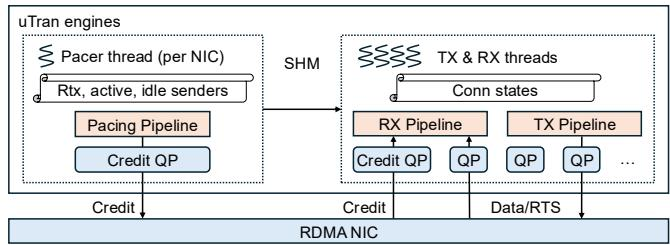  
Figure 16: Implementing receiver-driven CC under UCCL-Tran.

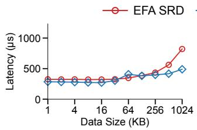

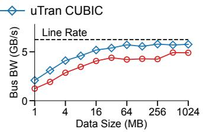

(a) Allgather.  
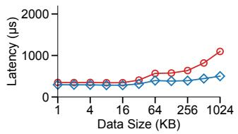

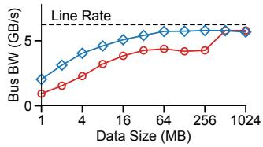  
(b) Reduce-Scatter.  
Figure 17: NCCL-tests results on EFA (NVLink+SHM disabled to simulate a larger testbed).

as a replacement, as suggested by the EQDS paper.

## C More Evaluation Results

## C.1 More collectives in ML workloads

## C.1.1 Allgather and reduce-scatter

These two are representative collectives used in PyTorch FSDP (Fully Sharded Data Parallelism) [108], exhibiting low network congestion [34]. Figure 17a and Figure 17b compare the allgather and reduce-scatter performance of UCCL-Tran and SRD on the EFA testbed. UCCL-Tran outperforms SRD by up to 1.68× for allgather and up to 2.18× for reducescatter.

## C.1.2 Multi-collectives

In multi-collectives, GPUs with the same local rank in each server form a collective group, and multiple groups conduct collectives in parallel. For example, multi-allreduce is used in ML workloads with intra-server Tensor Parallelism (TP) + inter-server Data Parallelism (DP). We evaluate multicollective performance by setting the environment variable NCCL\_TESTS\_SPLIT\_MASK=0x7 in NCCL-tests. Figure 18a,

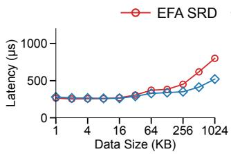

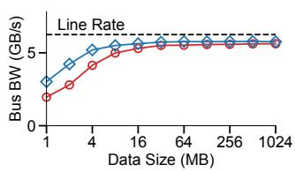

(a) Multi-Allreduce.  
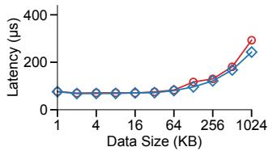

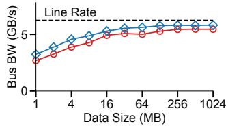

(b) Multi-All-to-All.  
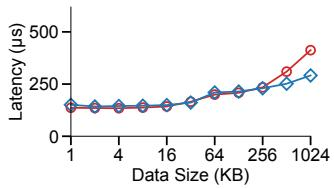

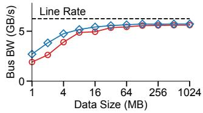

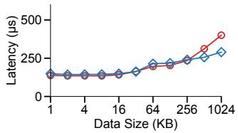

(c) Multi-Allgather.  
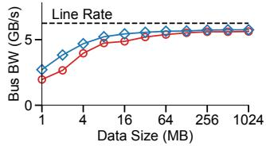  
(d) Multi-Reduce-Scatter.  
Figure 18: Multi-collective results on EFA (NVLink+SHM disabled).

18b, 18c and 18d compare the multi-allreduce, multi-all-toall, multi-allgather and multi-reduce-scatter performance of UCCL-Tran and SRD on the EFA testbed. UCCL-Tran outperforms SRD by up to 1.54×, 1.22×, 1.46×, and 1.44× for multi-allreduce, multi-all-to-all, multi-allgather and multireduce-scatter, respectively.

## C.2 EFA with NVLink+SHM enabled

Figure 19 shows the collective performance comparison on the EFA testbed when NVLink and SHM are enabled (meaning a smaller testbed). Even though a major amount of data traffic goes through the high-bandwidth NVLink, UCCL-Tran still achieves much higher or comparable collective performance than SRD, i.e., up to 1.57× for allreduce and 2.14× for all-to-all.

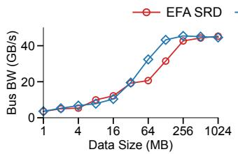  
(a) Allreduce.

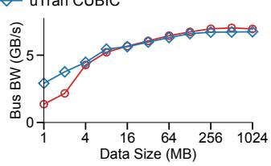  
(b) All-to-All.  
Figure 19: NCCL-tests results on EFA (NVLink+SHM enabled).

## C.3 UCCL-Tran AF\_XDP performance

Figure 20 compares the collective performance of UCCL-Tran AF\_XDP vs. NCCL kernel TCP with and without proximity placement group (PPG). This experiment is done on AWS with two 50 Gbps VMs connected through AWS ENA NICs that do not support RDMA. We configure NCCL to use multiple TCP connections that achieve the best performance. With PPG that gives low network RTTs between VMs, UCCL-Tran achieves up to 4.1×/2.3× higher performance than NCCL for small/large message ranges; without PPG, UCCL-Tran achieves up to 2.7×/2.1× higher performance. This huge gain is because UCCL-Tran implements an efficient multipath transport atop the fast user-space packet IO technique AF\_XDP, thus saving significant user-kernel context switching overhead and heavy-weight networking stack traversing in kernel TCP. For data sizes exceeding 16MB, both AF\_XDP and TCP experience bottlenecks due to no GPUDirect support.

## C.4 UCCL-Tran Scalability

## C.4.1 Varying number of CPU cores on EFA

Figure 21 shows how the number of CPU cores per NIC impacts UCCL-Tran performance on EFA. As mentioned in §6.4.3, 2 cores are sufficient to saturate the EFA line rate, even for the connection-intensive all-to-all collective. Overall, thanks to chained posting, UCCL-Tran over UD is able to use 1 core to handle 100 Gbps unidirectional traffic on EFA NICs.

## C.4.2 Varying number of GPUs on EFA

Figure 22 shows how UCCL-Tran scales with the number of GPUs on EFA. As expected, with less GPUs, UCCL-Tran achieves lower latency and higher bus bandwidth. But eventually, UCCL-Tran is able to approach line rate with ≥64MB data size. UCCL-Tran leverages the connection-less UD on EFA NICs, thus not suffering from QP scalability issues.

## C.4.3 Varying number of paths on EFA

Figure 23 varies the number of paths on the EFA testbed (which crosses racks with multiple network paths). The highlevel take here is that multipathing helps mitigate network congestion caused by, e.g., flow collisions. We expect multipath transport to shine more on a larger testbed with more network paths.

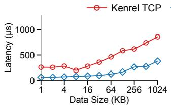

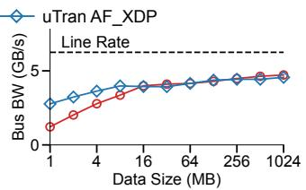

(a) With proximity placement group.  
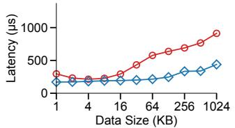

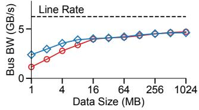  
(b) Without proximity placement group.  
Figure 20: Allreduce performance on non-RDMA NICs using two AWS g4dn.8xlarge VMs each with a 50 Gbps AWS ENA NIC.

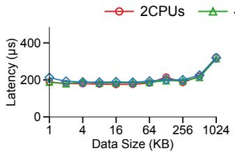

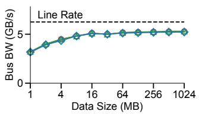

Figure 21: UCCL-Tran all-to-all on EFA with different numbers of CPU cores per NIC (NVLink+SHM disabled).  
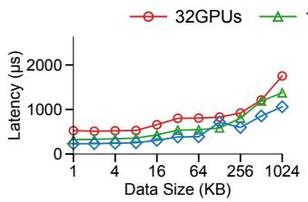

(a) Allreduce.  
  
(b) All-to-All.  
Figure 22: UCCL-Tran collectives on EFA with different numbers of GPUs (NVLink+SHM disabled).

  
Figure 23: UCCL-Tran all-to-all on EFA with different numbers of paths (NVLink + SHM disabled).

## C.5 Design Drill-Down

## C.5.1 Impact of chunk size and LB policy

This experiment aims to study the impact of chunk size and LB policy on the performance of a broad range of ML transports (not just the ones implemented in UCCL-Tran). To this end, we use UEC’s packet-level network simulator htsim [22,101] with UEC-standard multipath transport implementation. We further modify the transport implementation in htsim to vary chunk size and LB policy, e.g., based on ECN or RTT, connection splitting or not. We vary the chunk size by changing the MTU size in the simulator without modifying any transport simulation code. We vary the LB policy by maintaining per-path ECN/RTT and modifying the code where the transport sender selects the path for each packet. Similar to prior work [16,19,59,89], we focus on the permutation traffic pattern to stress-test the transport, where each NIC streams traffic to another and no one receives more than one stream. We simulate 1024 400G NICs under a fully-provisioned threetier fattree, and each NIC uses 256 paths to stream 64MB traffic with an ideal completion time of 1.28ms.

Table 5 shows the permutation traffic completion time under different designs. Overall, using 32KB chunk size and switching to RTT degrade transport performance by 17.9% for sender-driven transport and only 2.8% for receiver-driven, while connection splitting does not degrade. With a 16KB chunk size, the performance degradation of sender-driven transport becomes only 4.1%. Receiver-driven performs better because EQDS leverages in-switch packet trimming to quickly detect network congestion and react [43, 85]. Overall, this experiment shows that control coalescing indeed causes transport performance degradation, but the degradation is moderate in most cases; meanwhile, connection splitting has a negligible impact on transport performance.

## C.5.2 Impact of kernel fusion.

This experiment aims to quantify the overhead of scattered memcpy and justify UCCL-Tran’s design choice of employing kernel fusion over kernel launching (§3.1). In the kernel launching approach, UCCL-Tran launches a dedicated copy thread (in CPU) for each UCCL-Tran engine at boot time; after receiving all packets of a transport buffer, the engine no-

Table 5: Impact of chunk size and LB policy. “ConnSplit” means connection splitting, which first selects the least loaded engine and then selects the least loaded path from that engine’s paths/QPs using Power-of-Two sampling (§4.1).

Kernel launching Kernel fusion No memcpy  

(a) Allreduce.  

  
(b) All-to-All.  
Figure 24: NCCL-tests results on EFA (NVLink+SHM disabled).

tifies its associated copy thread via a shared-memory queue; then the copy thread launches a GPU kernel to perform scattered memcpy asynchronously (this kernel is different from the reduction kernel). We further optimize the kernel launching overhead with adaptive batching [14]. Note that we cannot run the GPU kernel persistently, as this would cause deadlock with the commonly-used cudaDeviceSynchronize(). We also emulate the performance with no scattered memcpy by skipping packet reassembly entirely and disabling data correctness checks in NCCL-tests.

Figure 24 shows the collective performance. Scattered memcpy introduces minor performance overhead compared to no memcpy (less than 8% and 5% for allreduce and all-to-all, respectively). Kernel launching performs worse than kernel fusion for both small message latency and large message bandwidth. The suboptimal performance of Kernel launching is because of the high kernel launching overhead, especially for small messages.

## C.5.3 PCIe overhead

This experiment aims to study the PCIe overhead introduced by UCCL-Tran’s multipath design. We measure the PCIe overhead on our CX\_IB testbed, while the AWS virtualization layer prevents us from accessing low-level PCIe metrics. We rerun the all-to-all experiments in §6.1 and quantify MMIO events and CPU-NIC PCIe traffic using pcm-pcie [50]. Figure 25 and 26 show the results. As expected, UCCL-Tran incurs higher MMIO activity and PCIe bandwidth consumption than the vanilla NCCL atop CX-7. UCCL-Tran incurs more MMIO events because it posts more verbs: UCCL-Tran transfers a small 32KB chunk per verb, while the vanilla NCCL atop CX-7 transfers a transport-buffer-sized message (e.g., default 128KB) per verb. The extra PCIe traffic of UCCL-Tran primarily comes from NIC swapping QPs (i.e., fetching uncached QP contexts from CPU memory) as UCCL-Tran uses 256 UC/RC QPs for multipath. UCCL-Tran UC consumes slightly more bandwidth than RC because it implements reliability and selective retransmission in software on the CPU.

  
Figure 25: Number of MMIO events for each NIC under various chunk sizes and numbers of QPs on CX\_IB.

  
Figure 26: Extra PCIe traffic for each NIC under various chunk sizes and numbers of QPs on CX\_IB. Rd: PCIe device reads from CPU; Wr: PCIe device writes to CPU.

We conclude that the number of MMIO events and extra PCIe traffic increase significantly with smaller chunk sizes, but the number of QPs does not nearly affect them. UCCL-Tran makes a reasonable trade-off between the control decision granularity and performance based on this observation and uses a 32KB chunk size as default (§3.3). We note that the extra PCIe bandwidth overhead is minor compared to the PCIe link capacity. For example, the capacity of PCIe 5.0 × 16 on CX\_IB is 512 Gbps in each direction, and the overhead of UCCL-Tran (32KB, 60k QPs) accounts for less than 2.5% (12/512=2.3%).