USENIX

THE ADVANCED COMPUTING SYSTEMS ASSOCIATION

# OpGuard: Bitwise Alignment for Precise and General Debugging of Production LLM Training

Ziming Zhou and Yinjie Zhao, University of Michigan; Hang Zhu, Wenxiao Wang, Zhihao Bai, Yun Zhang, Shuguang Wang, and Haibin Lin, ByteDance Seed; Peng Huang, University of Michigan

https://www.usenix.org/conference/osdi26/presentation/zhou-ziming

# This paper is included in the Proceedings of the 20th USENIX Symposium on Operating Systems Design and Implementation.

July 13–15, 2026 • Seattle, WA, USA

ISBN 978-1-939133-55-7

Open access to the Proceedings of the 20th USENIX Symposium on Operating Systems Design and Implementation is sponsored by

# OpGuard: Bitwise Alignment for Precise and General Debugging of Production LLM Training

Ziming Zhou1, Yinjie Zhao1, Hang Zhu2, Wenxiao Wang2, Zhihao Bai2, Yun Zhang2, Shuguang Wang2, Haibin Lin2, Peng Huang1

1University of Michigan 2ByteDance Seed

## Abstract

Large-scale LLM training runs on many GPUs for weeks atop rapidly evolving software stacks. Bugs or hardware glitches can silently corrupt the computation and only surface much later. Debugging becomes finding a needle in a haystack across time. Developers often use another training run and compare their loss, gradient norms, etc. But these aggregate signals are noisy and easily diluted across millions of operations, ofering little guidance on why the divergence occurs.

This paper introduces bitwise alignment as a correctness oracle and debugging primitive for LLM training, and OpGuard, a practical system that realizes it at production scale. OpGuard discovers semantic-stable operator boundaries across heterogeneous training stacks, and wraps them with lightweight fingerprinting. A schedule-tolerant mapper computes the longest prefix where two executions produce bitwise-identical tensors. The first mismatching point becomes a pivot for debugging and is presented with rich context. By carefully controlling benign nondeterminism, OpGuard makes the first mismatch strong evidence of error. OpGuard has been deployed at ByteDance across pre-training and post-training workloads. It diagnosed over twenty production issues, including subtle kernel races and silent data corruptions missed by existing checks, reducing debugging time from days to minutes.

## 1 Introduction

Large language model (LLM) training runs on a large number of GPUs for weeks [19, 29] on top of a complex software stack composed of user code, compilers, libraries, CUDA kernels, distributed runtime, etc. This stack also undergoes frequent updates [28], so bugs and hardware glitches are inevitable [17, 22]. Their symptoms are often subtle, such as loss spikes, gradient-norm drift, degraded model quality [35, 43, 77, 87].

When such an anomaly arises, developers need to determine (1) is the run truly buggy, and if so, (2) what the root cause is. This is challenging for several reasons. First, rerunning a training job consumes substantial resources, limiting the number of diagnostic reruns developers can aford. Second, the observed signals, such as loss and gradient norms, are only composite metrics aggregated over millions of operations and devices, so an error is easily diluted. Third, LLM training is prone to numerical variations [12, 19, 27, 80], so an anomaly may be harmless noise or early sign of a serious fault.

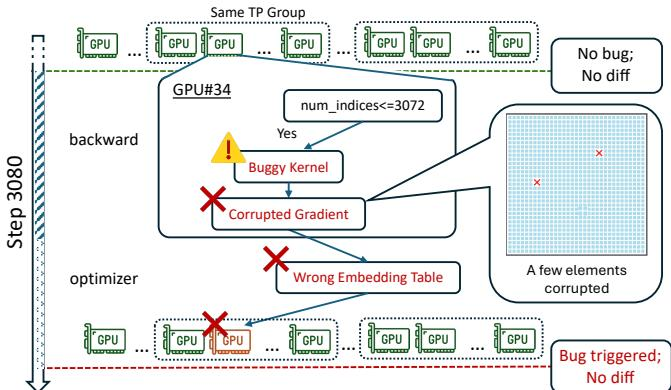  
Figure 1. A tiny race in embedding backward afects one GPU’s embedding shard. The next forward step reads the corrupt weight and propagates the error through its TP group and downstream layers. By the time the loss diverges, most GPUs already hold bad tensors.

A production incident illustrates the challenge. In one of our thousand-GPU vision-language model training runs, an alert on the gradient-norm curve was raised after over 3,000 steps. Expert developers spent five days running repeated experiments, toggling flags, and swapping kernels, but made no progress. The root cause turned out to lie in an embedding backward kernel, which had a tiny race condition that perturbed a few rows under rare token patterns (Figure 1).

To cope with the challenge, developers often compare a suspect run with a reference run. The reference run may come from an older release, a branch before a suspected feature, with diferent flags, with an alternative CUDA kernel, or even on another framework. This comparative strategy has been well studied in conventional debugging: delta debugging and related techniques compare executions, changes, or program states to isolate the minimal failure-inducing input or code [38, 95, 96, 99]. However, in LLM training, today’s comparisons still rely on composite signals. Thus, they inherit the same ambiguity that can hide real bugs or raise false alarms. Even when two loss curves clearly difer, they ofer little guidance on what causes the divergence. In the above case, developers repeatedly compared signals across runs (Figure 2), but this alone was insuficient to localize the bug.

Our insight is that efective comparisons for LLM training must be unambiguous and early enough. Composite signals have high ambiguity because they mix the efects of many operations and surface long after the original error; low-level code execution traces expose irrelevant details, creating many benign diferences when compared; tolerance-based tensor comparisons still leave ambiguity with ad-hoc thresholds.

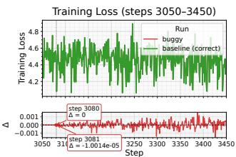

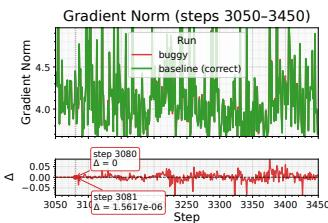  
Figure 2. Loss and gradient-norm comparisons between a good run and the buggy run around Steps 3050–3450 for Figure 1. The bottom plot highlights where the buggy run first diverges and by how much.

Based on this insight, this paper proposes bitwise align- ment as a new correctness oracle and debugging primitive for LLM training. Given two comparable training executions, we view each as a sequence of model-level computation boundaries and compute the longest prefix over which the tensors at corresponding boundaries match bit-for-bit. The first boundary failing this check is then the earliest point where the two runs diverge, regardless of how similar their aggregate metrics might still appear. This provides precise correctness criterion and the first dif becomes the debugging pivot.

At first glance, bitwise alignment seems infeasible for LLM training, which contains numerous sources of nondeterminism such as multi-threading and non-associative reductions. Production pipelines add further complexity through operator fusion, recomputation, graph capture, and backend-specific rewrites. These behaviors suggest that two training runs would diverge quickly, making bitwise alignment too fragile.

This intuition overlooks an opportunity: modern stacks provide substantial determinism control. Randomness can be seeded; kernel libraries expose deterministic modes [18, 24, 50, 51, 82]; data pipelines can be made reproducible[67, 83]; deterministic algorithms exist [20, 65, 73]. However, current determinism settings are scattered and used ad-hocly to improve reproducibility, not to systematically localize bugs.

We design OpGuard, a system that realizes the idea for production LLM training. OpGuard leverages existing determinism but organizes it to support debugging, and adds new mechanisms to make bitwise alignment feasible.

In practice, we find the space of bitwise-alignable runs is much broader than expected. With modest care, we can align runs that are several commits apart, runs that enable new features (e.g., activation recomputation [11]), and even runs from diferent training stacks (e.g., DeepSpeed vs. our custom runtime), as long as they implement the same model computation. This observation underpins our design of OpGuard and its applicability in complex, evolving LLM training pipelines.

Realizing this versatility requires addressing several challenges. Full-stack determinism is too costly, if not infeasible, for production environments. OpGuard does not seek absolute determinism. Instead, it identifies and neutralizes avoidable sources of variation for bitwise comparison to be well-posed.

Even so, unavoidable nondeterminism and complexities in production pipelines still pose problems. How to make bitwise alignment robust even when the underlying stack is not fully deterministic and contains aggressive optimizations? Production jobs routinely enable kernel fusion, recomputation, compute–communication overlap, evolving sharding layouts, and graph-captured executions. These optimizations reorder and regroup kernels, so any alignment scheme tied to a particular execution plan is brittle. Large organizations like ByteDance also use multiple training frameworks—–PyTorch, DeepSpeed, Megatron, and internal runtimes—–whose APIs difer substantially. Correctness checks defined in terms of specific framework APIs are therefore too restrictive and limits available reference runs. Finally, tensors are enormous, making full tensor dumps prohibitively expensive. Their representations can also change under sharding or reshufling.

To address these challenges, OpGuard identifies and instruments a small set of semantic-stable boundaries—the lowest-level Python operators that correspond to model semantics, such as linear projections, layer normalization, and attention blocks. These points represent the same mathematical transformation across frameworks. Because these boundaries sit above kernel choices and scheduler decisions, they also become execution-stable: even if one run fuses kernels, overlaps communication diferently, or uses a diferent CUDA Graph capture, the same semantic boundary is still reached and observed. OpGuard uses a short preflight phase that runs each stack to eficiently discovers these stable boundaries.

OpGuard automatically inserts a lightweight device-side fingerprint kernel around these boundaries, which emits a constant-size, scale-stable fingerprint. During the main run, OpGuard records only these fingerprints. This reduces the trace size and ensures the comparison does not depend on the size, layout, or sharding of the underlying tensor. Afterward, OpGuard uses a schedule-tolerant mapping algorithm to reliably align the fingerprint streams from two executions. It computes their longest bitwise-identical prefix, and reports the first boundary that difers, together with its immediate context. OpGuard further includes UI support that presents this boundary as a pivot in a unified timeline so developers can visually inspect how the discrepancy propagates.

OpGuard has been deployed in production in ByteDance for 8 months. It seamlessly supports diferent pre-training and post-training frameworks and heterogeneous hardware backends. This ease of integration is because OpGuard observes model-level tensors rather than framework APIs or internals.

To date, OpGuard has helped diagnose 20 production bug cases, including resolving 11 long-standing dificult cases like the motivating example. They cover a variety of subtle issues, such as nondeterministic races in communication-overlap paths, one-bit routing errors in MoE routing kernels that later explode into shape mismatches, and long-standing cross-stack mismatches such as diferent loss masking policies between Megatron and FSDP. Across these cases, OpGuard reduces diagnosis time from days to minutes. In a separate online SDC-detection mode, OpGuard has also detected more than 21 silent-data-corruption (SDC) [44] cases. We also evaluated OpGuard in open-source training ecosystems. It enabled the diagnosis of 4 new reproducible issues and 6 long-standing bugs whose cumulative resolution time exceeded fifteen days.

Besides diagnosis, teams have used OpGuard as a reliable correctness oracle in scenarios where system changes introduce subtle correctness regressions, including new overlap schedules, recompute policies, sharding layouts, heterogeneous backends such as GPUs and NPUs, and compilergenerated execution paths. These workflows routinely alter execution order, precision, kernel fusion, or parallel boundaries— changes that are notoriously hard to validate and historically have caused silent divergences in production training. Op-Guard provides a principled way to confirm correctness of low-level optimizations. This allows teams to safely innovate on scheduling, parallelism, and compilation.

In summary, this paper makes the following contributions: • We formulate bitwise alginment as a new correctness oracle and practical debugging primitive for LLM training.

• We design and implement OpGuard, a system that realizes this primitive into a practical and scalable workflow.

• We evaluate OpGuard across production pre-training and post-training pipelines in ByteDance as well as open-source stacks. The results demonstrate its impact.

## 2 Background and Motivation

LLM training requires extensive computation distributed across many devices. A single training run traverses layers of software and hardware: user code that defines the model, optimizer, and configuration; distributed framework that implements data, tensor, and pipeline parallelism [79] across accelerators; runtime that schedules operators and manages multiple CUDA streams [52]; compiler and kernel-generation framework that lower operators into fused CUDA kernels [91].

## 2.1 Correctness Challenges in Large Training Stacks

Our experience in operating large training pipelines suggests that faults can originate from any part of this stack. A small deviation in user code can change the intended computation. Mistakes in the parallelism partitioning, or microbatch ordering can cause diferent devices to see inconsistent parameters or activations. Races between transfers and computation can corrupt intermediate state. A collective may reuse a stale bufer or misroute a shard. At lower levels, corner-case kernel fusion bugs, nondeterministic kernels, and hardware-level issues such as silent data corruption, can all produce wrong activations or gradients. Even the systems surrounding a ML framework, such as dataloaders and caching service, may supply incorrect or reordered batches that appear valid.

Moreover, these faults seldom produce an observable symptom at the moment they occur. They often initially afect only a single device or a handful of tensor elements. As computation intensifies and training state synchronizes, this local error gradually propagates. Eventually it manifests as some visible anomaly, e.g., a drift in gradient norms. By that time, the original fault is often many layers and operations away. Worse still, the same symptom can be caused by many possible faults.

These characteristics makes correctness debugging in LLM training notoriously challenging. An apparently abnormal signal may turn out to be harmless noise, while a subtle deviation may be the first sign of a serious underlying fault. Localizing the true root cause is akin to finding a needle in a haystack spread across time.

## 2.2 Existing Solutions and Their Gaps

Substantial tools have been created for debugging individual training components. Framework-level debuggers and anomaly modes (e.g., TensorFlow Debugger [84], PyTorch Autograd Anomaly [69]) focus on the training program and catch obvious mis-specifications. GPU correctness and sanitization tools (e.g., cuCatch, NVIDIA Compute Sanitizer, GPUBurn) target kernel behavior and memory errors [8, 39, 54, 81]; MPI and communication checkers such as MUST [86] focus on collectives; hardware-focused tools like DCGM diagnostics [57] watch for device faults; and cluster monitoring systems track service and data anomalies. These tools are useful for identify ing local issues, but each tool focuses on a narrow slice of the system. They do not answer the core questions developers face during correctness incidents of an end-to-end training task: (1) is this run still performing the computation as intended? (2) where in this long execution did the misbehavior first occur?

In practice, engineers routinely rely on a pragmatic strategy: they run a candidate training job next to a known-good one with the same checkpoint and seed, then compare their loss curves, gradient norms, activations, and related metrics. This approach is popular because it provides a concrete baseline for an otherwise fuzzy notion of correctness, while fitting naturally into existing rollout workflows. When the two runs match, engineers gain confidence; when they difer, there might be a bug that warrants investigation.

However, these comparisons only operate at composite signals that aggregate the efect of millions of operations, masking subtle discrepancies for long periods while amplifying harmless numeric fluctuations. Across real incidents, we observe that they help reveal two runs have diverged, but they ofer little insight about why. Debugging remains a tedious trial-and-error by toggling flags, adjusting settings, swapping kernels, etc. Each rerun consumes costly cluster resources.

What is missing is a precise comparison mechanism to augment this practice. It must surface faults soon as they occur, while pinpointing what causes the divergence. It should remain robust under production training stacks and only reveal true diferences in model computation semantics. In addition, it should not require extensive changes to a training pipeline, disable core optimizations, or incur severe slow-down.

## 3 Abstraction: Bitwise Alignment

To address the challenges and gaps described in §2, we advocate for bitwise alignment as a correctness oracle and debugging primitive for LLM training.

Definition 1 (Bitwise alignment). Consider two training executions ??1 and ??2 that are expected to compute the same model. Each execution produces a sequence of observable boundaries: ??1 = ⟨??1, . . . , ??1??⟩ and ??2 = ⟨??2, . . . , ??2??⟩. A boundary ?? has an identifying model-level operator ?? (??) with an input/output tensor state ?? (??). An alignment between ?? and ?? is an orderpreserving partial matching ?? = ⟨(??1??1, ??2??1 ), . . . , (??1???? , ??2???? )⟩, where ?? (??1?? ) = ?? (??2?? ). Bitwise alignment is the longest prefix of ?? such that every matched pair satisfies ?? (??1?? ) ≡bit ?? (??2?? ).

## 3.1 Alignment Spectrum

A useful way to think about correctness in LLM training is to examine it along a spectrum of alignment strengthen.

At the weakest level, behavior alignment judges whether the overall behavior of a model, e.g., its accuracy, BLEU score [60], or loss curve, remains statistically consistent across runs. This level sufices for high-level monitoring and regression testing but ofers no visibility into internal correctness: two runs can exhibit identical accuracy yet silently diverge in intermediate activations or gradients.

A stronger level is numerical alignment, which compares two tensors and treat them as equal if they are close enough, as in torch.allclose [68]. This appears robust, since it tolerates small diferences, but in practice it is an unreliable oracle. A 10−4 diference in logits may be acceptable but may indicate a serious bug for a loss or normalization constant. Choosing a single tolerance that works across layers, data regimes, and models is dificult. In addition, due to floating-point arithmetic’s non-associativity, small discrepancies arising from reduction trees, fusion patterns, or accumulation paths will change the results even when the underlying computation is mathematically the same. Raising the tolerance reduces false alarms but will also mask small-but-systematic drifts caused by actual bugs (e.g., losing a few rows in a gradient, missing an update, or corrupting a subset of parameters) [40]. Numerical alignment is inherently ambiguous.

At the strongest level lies bitwise alignment, which demands that the tensors match exactly, bit for bit, across operations in both forward and backward passes. This binary predicate removes ambiguity entirely: two runs are either identical or not. When they difer, the first mismatched operation marks the precise boundary where equivalence breaks, exposing the responsible kernel, reduction order, race, etc. Therefore, it provides strong diagnostic power.

## 3.2 Make Bitwise Alignment a Precise Oracle

For bitwise alignment to serve as a precise oracle, mismatches should indicate a real diference in computation logic rather than incidental noise. This requires three key conditions.

Comparable replay. The two executions should be comparable, i.e., implement the same mathematical logic. They need not be identical binaries. Many useful comparisons intentionally difer in implementation. A related assumption is that an execution can be reproduced given the same data, seeds, and environment. This is often feasible. Unlike conventional systems where reproduction is hard [59, 98], LLM training is fundamentally more reproducible. Its computation follows a mostly static graph of tensor operations, and its inputs are drawn from fixed datasets instead of dynamic, unknown user requests. If two pipelines intentionally read or preprocess data diferently, they should first align the input, e.g., using the same checkpoint or captured post-preprocessing tensors. Reproducing a faulty run is generally feasible even when the underlying bug is a data race. LLM training is computationintensive and repetitive: an operator is often invoked thousands of times per training step and millions of times over a run, which creates abundant opportunities for the race to manifest.

Feasible, however, does not mean cheap. Replaying a large training job consumes substantial resources and time, so a debugging system should require as few reruns as possible. OpGuard uses one captured faulty run and a reference run to expose the first boundary divergence; the faulty execution itself need not be deterministic.

Controlled nondeterminism. LLM training stacks contain various sources of nondeterminism that can introduce variation between runs even when they do not change the intended computation. We distinguish two categories. Controlled nondeterminism is benign variation in the execution environment, e.g., RNG streams, data order, library kernel choices, collective topologies, and numeric modes. Residual nondeterminism is variation that remains after these controls are fixed, typically because user code, third-party kernels, or hardware behavior is schedule-sensitive. The former should be stabilized so that bitwise comparison is well-posed; the latter is intentionally left visible and treated as a bug signal. §4.2 describes how OpGuard enforces this split.

Model-level boundaries. Bitwise comparison should be applied at a granularity that yields stable and precise outputs. Comparing at full training steps or whole layers would be too coarse to localize faults. Comparing at every Python-level callsite would be too noisy and inconsistent: many functions do not operate on tensors, and those that do may be reordered, fused, or eliminated by tracing and compilation passes. Conversely, if the comparison is too low-level, e.g., framework internals or temporary bufers, it becomes highly sensitive to implementation details. Small changes in heuristics, autotuning, or vendor libraries can add, rename, or remove temporary tensors without afecting the model semantics.

We find the right granularity for bitwise alignment are model-level operators whose input and output tensors are materialized in every valid execution of the model, e.g., a linear projection, a layer-normalization call, an attention block, or an MLP submodule. We call those comparison points model-level boundaries. By materialized tensors we mean those that any faithful implementation should produce and pass to the next model-level operator as opposed to transient bufers, which a compiler may create, rename, or eliminate. These tensors define the contract between adjacent model components. Backends may change kernel schedules, fusion plans, or temporary bufers, but changing a boundary tensor changes the model computation. A match at such a boundary implies that the proceeding components’ transformations are equivalent for that input; a mismatch marks the first component that has divergent transformation. This granularity is stable across framework and backend because diferent optimizations should preserve model logic; yet it remains fine-grained to localize the divergence to a small region of model code.

## 4 Design of OpGuard

We design OpGuard, a system to realize the bitwise alignment abstraction. Our goal is to make OpGuard practical for production training pipelines. OpGuard also aims to make bitwise alignment broadly applicable as a general and powerful debugging primitive so it can support comparing executions across frameworks, compilers, libraries, hardware backends, and distributed runtimes, as long as both runs represent the same model computation. Otherwise, bitwise alignment would only be a narrow regression check for nearly identical binaries, which would greatly limit its utility.

Achieving these goals requires turning the insights discussed in §3.2 into concrete mechanisms. Production training pipelines are highly complex and contain aggressive optimizations such as operator fusion, and graph capture and rewriting. These complexities introduce several design challenges for OpGuard. First, the stable comparison points required by bitwise alignment are not directly exposed by single API surface. OpGuard needs to eficiently discover the boundaries without requiring users to rewrite models or disable optimizations. Second, production training runs generate enormous tensors. Dumping full tensors is infeasible. OpGuard should extract lightweight, scale-independent observations that are still informative. Third, even after benign nondeterminism is neutralized, two executions likely will not emit outputs in exactly the same order. OpGuard should align partially ordered observations and recover the longest prefix.

## 4.1 Overview

OpGuard addresses these challenges with a three-phase workflow that compares a suspect execution against a reference run (Figure 3) for post-failure root cause diagnosis. OpGuard has a separate deployment mode for online SDC detection, which is discussed in §6.4. The Preflight phase (§4.3) runs a few iterations in eager mode to discover model-level boundaries (§3.2) shared by both runs, and produces an alignment plan. The Guarded Execution phase (§4.4) wraps the discovered boundaries with input/output fingerprinting and runs the full training job, producing compact fingerprint logs. Determinism control (§4.2) is applied in this phase as well as in Preflight. The Alignment phase (§4.5, §4.6) processes the two logs ofline. A schedule-tolerant mapper first identifies anchors to partition each trace into windows; within each window, the mapper pairs the remaining boundaries despite fusion, overlap, and asynchrony. Prefix certification then walks the matched boundary pairs to compute the longest bitwise-identical prefix and report the earliest divergent boundary. A visual debugging UI presents this boundary along with surrounding context for engineers to quickly triage and pinpoint the root cause.

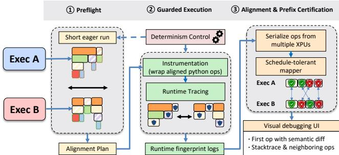  
Figure 3. OpGuard workflow.

## 4.2 Determinism Control

As discussed in §3.2, bitwise alignment is only well-defined if nondeterminism is controlled. Conventional deterministic multithreading systems [6, 7, 15, 16, 42, 46, 47] force reproducible execution by controlling thread schedules, system-call results, and external inputs. One extreme for LLM training is full-stack bitwise determinism, exemplified by PaLM [12]. PaLM’s training pipeline was engineered so that, starting from any checkpoint, resuming training produces bitwise identical results. Achieving this required carefully constraining the entire hardware and software stack. Outside such bespoke stacks, this level of control is rare. While mainstream frameworks such as PyTorch and TensorFlow ofer deterministic modes, they are best-efort and do not eliminate nondeterminism. Enforcing bitwise determinism across heterogeneous fleets (mixed GPU generations, diferent drivers/compilers, evolving libraries) is also fragile. A single library upgrade or kernel change can break the assumption.

OpGuard’s goal difers from deterministic runtimes and from PaLM’s full-stack discipline. It does not aim to make every run absolutely bitwise deterministic or to impose a deterministic scheduler, which can severely slow down production workloads. Instead, it identifies and fixes controlled nondeterminism: avoidable sources of variation that would otherwise make two runs with the same intended computation perform diferent arithmetic and make bitwise alignment meaningless. Many numerical diferences between runs arise from sources that have nothing to do with model correctness: diferent shufling orders, RNG streams, collective algorithms or bucketizations, kernel variants, or numeric modes. If these choices difer between runs, they no longer perform the same arithmetic, making bitwise comparison meaningless.

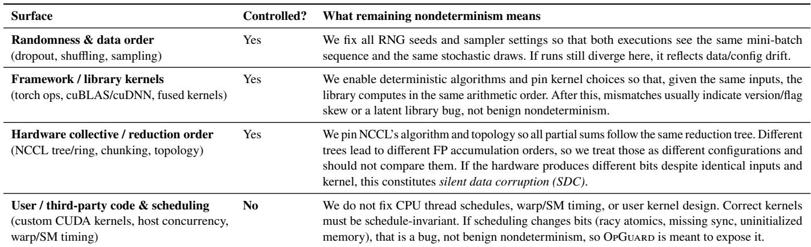  
Table 1. OpGuard distinguishes controlled nondeterminism from residual nondeterminism. Controlled nondeterminism inside the stack (RNG, framework kernels, hardware reduction order) is stabilized so bitwise comparison is well-posed. Residual nondeterminism after these controls is treated as a bug signal when it changes output.

As Table 1 lists, these are exactly the categories OpGuard controls. The controls are lightweight and do not disable core optimizations or alter user-visible training logic.

Specifically, OpGuard applies nondeterminism controls at five surfaces. First, it makes randomness and input order replayable by fixing CPU/CUDA RNG state, dropout streams, dataloader workers, sampler state, and distributed initialization, so both executions consume the same mini-batches and stochastic draws. Second, it pins arithmetic choices inside framework and vendor libraries: deterministic algorithm modes, fixed cuDNN/cuBLAS workspace behavior, disabled autotuning, and consistent numeric modes such as TF32 settings keep kernels using the same implementation and accumulation order. Third, it fixes distributed reduction order by pinning collective algorithm, protocol, topology, and bucketization; otherwise two correct runs can difer solely because floating-point partial sums follow diferent trees. Fourth, when comparing from a checkpoint, it restores all state that afects future execution, including RNG streams, optimizer state, dataloader position, and scheduler counters. Finally, for comparisons across tensor-parallel configurations, OpGuard can use a TP-simulator mode that executes the full unsharded arithmetic while preserving the logical parallel configuration, preventing sharding-induced reduction-order changes from being mistaken for faults.

Importantly, OpGuard does not suppress residual nondeterminism in user/third-party code or fix scheduling. Schedulesensitive custom or third-party kernels (e.g., CUDA/Triton kernels with race conditions or nondeterministic reductions) are treated as part of the system under test rather than stabilized or reasoned about internally. If such a kernel is not schedule-invariant, OpGuard surfaces the efect as a divergence. Thus controlled nondeterminism is noise that OpGuard removes, while residual nondeterminism is evidence that the tested system has a latent correctness problem. The exhaustive knob-level recipe is detailed in Appendix A.5.

## 4.3 Preflight: Discovering Stable Model Boundaries

OpGuard splits debugging into two phases: a short Preflight phase that determines where bitwise comparison should occur and whether the two executions share those points, followed by Guarded Execution that instruments only those points. This separation enables low overhead for long training runs.

Preflight’s goal is to discover a shared set of boundaries across two executions that are expected to compute the same model-level transformation. These boundaries should define a stable comparison grid: regardless of diferences in compiler passes, fusion strategies, or kernel schedules, the same boundaries in two runs should see the same logical tensors. Thus, same computation is a contract on boundary values, not source code or kernel identity.

We use the MoE block in Figure 4 as a running example throughout the design. The block dispatches tokens with all\_- to\_all\_dispatch, normalizes activations with fused\_rmsnorm, runs expert computation with grouped\_gemm\_experts, and combines expert outputs with moe\_combine. One execution may fuse adjacent kernels or schedule communication on diferent streams, but if it implements the same MoE block, it should expose the same logical tensors at the boundaries.

Preflight assumes the runs start from equivalent checkpoints, consume the same training examples in the same microbatch order, make the same seeded random choices, and use the same numerical contract for each boundary (e.g., precision policy, normalization formula, optimizer update rule, and collective reduction order). They may still use diferent kernels, fusion plans, recomputation strategies, graph-capture schedules, or physical sharding layouts, as long as those choices implement the same boundary-to-boundary tensor transformation.

As discussed in §3.2, choosing the right boundary granularity is critical. OpGuard chooses model-level operators whose input and output tensors are materialized in every valid execution of the model, specifically the lowest Python-level operators that directly initiate device work (through C++/CUDA kernels), e.g., linear, layer\_norm, attention blocks, the four MoE operators in Figure 4. These operators are explicit in model code and define the model computation, while existing in every major training stack. They form a consistent logical order despite backend diferences. Bugs must eventually perturb a tensor passed through one boundary.

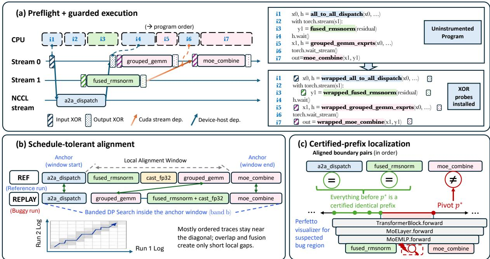  
Figure 4. OpGuard components on one running MoE-block example. (a) Preflight discovers stable model-level boundaries and guarded execution installs input/output XOR probes at those boundaries. (b) Schedule-tolerant alignment pairs boundary logs despite fusion, overlap, and local reordering. (c) Prefix certification reports the first mismatching aligned boundary as the debugging pivot.

OpGuard discovers these boundaries automatically. It executes each pipeline for a few iterations, and enables Pythonand device-level tracing for tensor-producing operations. It then inspects the stack frames of these operations and filters out frames originating from JIT internals, compilation runtimes, and vendor libraries. From the remaining frames, OpGuard selects the nearest user-defined operator as a candidate.

OpGuard then identifies the device work caused by each candidate operator. This is needed to (1) filter Python callsites to operators that actually launch device work; (2) provide runtime context (streams, launch order, timing, etc.) for later stages. This attribution is non-trivial. A single model-level operator may trigger multiple CUDA or Triton kernels, call vendor libraries, issue collectives, or runtime-scheduled launches. The device trace alone cannot name the model operator that caused these launches, while the Python trace alone does not expose their concrete runtime behavior.

OpGuard therefore uses a layered attribution scheme. Its Python tracer records the operator intent (function names, callsite, argument summaries). Device-level tracer records kernel launches, memory operations, collectives, streams, and timestamps using the device profiling interface [55] and kernel-launch interception. OpGuard merges the two views into a unified stream that associates each Python-level operator with the set of device activities it triggers. This provides both the stable operator identifiers for instrumentation and concrete context for attaching fingerprints and later debugging.

## 4.4 Guarded Execution: Fingerprinting at Boundaries

After preflight identifies the boundaries to observe, OpGuard instruments only those sites during guarded full training execution. The instrumentation is done with framework operators instead of a separate profiling runtime. At each boundary, the original callsite is replaced with a small wrapper that launches a pre-op fingerprint kernel, invokes the original operator, and then launches a post-op fingerprint kernel. All other model code is untouched. Since the wrappers are normal framework operators, they preserve the original execution mode (eager, torch.compile, CUDA Graphs). In Figure 4a, the callsites for all\_to\_all\_dispatch, fused\_rmsnorm, grouped\_- gemm\_experts, and moe\_combine are replaced with wrappers.

Each wrapper emits a compact trace entry containing the boundary identifier, tensor metadata (shape, dtype, device, stream), rank id, and a local monotonic timestamp. The fingerprint kernels read the input/output tensors and compute a lightweight XOR hash; they add no tensor copies or control logic. Appendix A.4 analyzes the fingerprint’s sensitivity to tensor precision, value distributions, and corruption modes.

Correct placement is essential. Modern training stacks routinely overlap computation and communication across multiple streams, and many operators execute asynchronously. Fingerprints must run exactly where tensors become valid and on the same execution stream as the operator they guard. Thus, each wrapper launches its fingerprint kernels on the operator’s own stream and attaches them to the same synchronization points (completion handles, wait\_stream sites). This placement embeds fingerprinting into the existing stream graph without introducing additional synchronization or reordering.

Figure 4a illustrates this placement rule on the MoE block. The output probe for all\_to\_all\_dispatch attaches after the collective handle completes; probes around fused\_rmsnorm run on its stream; and the probe before grouped\_gemm\_experts respects the wait edge from the collective stream. In each case, the trace records the tensor at the device-time point where the program consumes or produces it, together with the callsite and local stream-order constraints. The runtime appends these entries to one log in device-dependency order, reusing existing handles and streams so logging adds no cross-stream synchronization and does not alter scheduling.

## 4.5 Schedule-Tolerant Alignment

Even when two executions implement the same computation, their fingerprint logs rarely line up position by position. Stream overlap, fusion, graph rewrites, and backend-specific kernels can introduce local reordering or extra events without changing the boundary values. A positional dif would confuse such schedule skew with real tensor drift.

The mapper looks for high-confidence, order-preserving partial matching. A pair of events are only matched when they share the same boundary identifier, tensor shape and dtype, and rank. A positive score would be given if they have relatively close device-time and operator index. Matching events should preserve relative order: if event ?? precedes event ?? in one log, their counterparts should appear in the same order in the other log. Gaps are allowed but penalized. They represent inserted or fused work that remain unmatched.

The mapper’s alignment algorithm runs in three stages. First, it constructs anchors from boundaries that are unique in a local region, appear in both logs, and preserve relative order. A boundary is used as an anchor only when its symbolic operator name and tensor metadata are unambiguous among nearby events. These anchors split the logs into small windows, preventing repeated kernels or ambiguous metadata from pulling the mapper into a globally inconsistent alignment.

Second, within each anchor window, OpGuard runs a banded monotone dynamic programming algorithm (listed in Appendix A.3). Production traces are mostly ordered: stream overlap, fusion, and graph rewrites usually create short local displacements rather than arbitrary permutations. The band keeps the search near the diagonal, covering these local skews while avoiding the cost and instability of unconstrained global matching. If a true counterpart falls outside the window or is ambiguous, OpGuard leaves it as a gap.

Third, OpGuard performs a conservative rescue pass for missed matches that move slightly across anchor boundaries, such as repeated reduction events emitted at diferent times. The pass scans nearby unmatched events using device-time windows and fingerprint metadata, and adds a pair only when it is consistent with the established monotone alignment.

In Figure 4b, for example, one MoE run records all\_- to\_all\_dispatch, fused\_rmsnorm, grouped\_gemm, and moe\_- combine; the other reorders grouped\_gemm around normalization and fuses fused\_rmsnorm with a cast. Anchors keep the shared boundaries in order, local DP absorbs the short displacement, and fused work simply remains unmatched.

## 4.6 Prefix Certification and Fault Localization

Given two aligned traces, what engineers want is not a long list of discrepancies but a single, trustworthy pivot that separates equivalent behavior from a real tensor divergence. In the running example (Figure 4c), the two runs agree through dispatch and normalization, but the first mismatching aligned boundary is moe\_combine; this boundary becomes the debugging pivot.

OpGuard therefore computes a certified prefix: the longest run of matched boundary pairs whose fingerprints agree on both sides. It walks the aligned sequence of boundaries and, at each one, checks whether both executions produced the same tensor. For most boundaries, this is a comparison of the attached fingerprints; suspected mismatches are confirmed with a one-time byte-level tensor comparison. The longest run of successful checks is the certified prefix.

This prefix yields a strong invariant: everything before that point is bitwise identical; everything after is downstream and allowed to difer for benign or faulty reasons. If both runs are supposed to implement the same computation at the reported boundary, a mismatch is strong evidence of a real fault. If instead it reflects an intentional change in the computation (e.g., a diferent masking convention), the certified prefix still tells engineers exactly how far the two runs behave the same.

OpGuard reports the first divergent boundary together with its context, including the Python operator, stream, tensor metadata, rank, and timing information. Not all boundary differences are important. Some boundaries legitimately disagree on performance or configuration-dependent values, e.g., XPU utilization [10], peak-memory metrics, profiling bufers, RNG state [71], sliced views, padded regions, or scratch workspaces. These diferences are dificult to eliminate completely with static rules, but easy for engineers to discard in the visualizer. In one major pre-training framework, engineers found only five such cases: three were padded output tensors allocated inside an operator, where the extra elements were never consumed, and two were RNG-state records whose diferences stayed in framework bookkeeping while neighboring model tensors still matched. OpGuard shows the certified prefix as a marker in the timeline, the matching operators around the first divergence, the argument or output that difers, and the corresponding callstack/source location. If the mismatch is isolated in the middle of otherwise matching neighboring operators, it is usually a false positive rather than a propagated model-state diference. Engineers can then discard the harmless tensor and, when appropriate, add a small filter rule.

## 5 Implementation

We implement OpGuard with 25.6K lines of code (86.7% Python, 11.3% C++, and 1.1% CUDA).

Identifying Instrumentation Sites in Source Code. Once preflight (§4.3) determines which operators to observe, Op-Guard must locate the corresponding source-level sites. This step should tolerate the small, routine edits engineers make during debugging (reordering expressions, inserting print logs, extracting helpers) without new preflight run. OpGuard therefore uses a pattern-driven matcher rather than line-number tracking. For each traced operation, it re-parses the surround ing source using both abstract syntax tree (AST) and concrete syntax tree (CST). The AST captures the operator’s program role (receiver, arguments, operation type), while the CST preserves syntactic structure and keeps instrumentation trans parent: engineers may inspect the generated patches when desired, but routine use requires no manual confirmation.

This approach reliably identifies tensor-producing sites across diverse syntactic patterns, including fused expressions, helper-function refactorings, triton kernel launches, and inplace indexed writes. Because instrumentation is inserted statically, OpGuard preserves the framework’s native dispatch and scheduling behavior, avoiding the perturbations of runtime monkeypatching. The code block in Figure 4a illustrates the resulting code-level transformations. Appendix A.2 details the matching rules and algorithms.

Runtime Trace Batching. During tracing, each rank accumulates trace records in an in-memory bufer that batches thousands of entries before flushing them to disk. This batching amortizes queue synchronization, JSON conversion, and file I/O costs. A background consumer thread on each rank then finalizes and writes each batch, ofloading all heavyweight CPU work (serialization, I/O, and tensor-to-bytes conversion) from the critical GPU path. As a result, batching eliminates nearly all GPU–CPU synchronization points and reduces tracing overhead to negligible levels. Keeping dump\_mode="summary" transfers only XOR signatures, while full tensor dumps are reserved for explicit debugging.

Distributed Trace Collection and Ordering. OpGuard collects traces on each GPU rank independently and should later assemble them into a consistent global order. Each instrumented operator thus carries two ordering metadata:

(1) Intra-rank ordering. Operations within rank may execute on multiple CUDA streams are completed out of submission order. OpGuard uses the GPU %globaltimer values recorded around each XOR kernel to derive a monotonic device-time order that respects inter-stream dependencies.

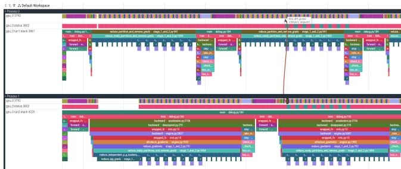  
Figure 5. Perfetto visualization for Bug 21.

(2) Inter-rank ordering. Device clocks are not synchronized across ranks. OpGuard thus orders operators using their Python-level launch timestamps. These reflect global program order and are consistent across nodes; rank ID and per-rank sequence numbers break ties deterministically.

This lightweight scheme yields a coherent global timeline without clock synchronization or CUDA barriers. It assumes that inter-node clock skew is negligible relative to operator latencies, which in our workloads span 10−4–10−1 seconds. Unlike Spanner [13], which uses bounded clock uncertainty to enforce consistency, our goal is diagnosis. A skewed clock can at worst misorder a few near-concurrent events and does not obscure the divergence OpGuard is designed to identify.

Trace Visualization. OpGuard exports its aligned traces to Perfetto [63], the timeline viewer used by torch.profiler, so engineers can inspect divergences without learning a new UI. Each GPU rank is shown as a separate lane with tracks for Python operators, kernel launches, and callstacks. Because Op-Guard reconstructs a logical timeline, all slices are rendered with uniform width, focusing the view on ordering rather than noisy kernel durations. Aligned operators are color-coded and flow links connect corresponding slices across the two executions. This makes the first divergent boundary immediately visible and allows engineers to examine its neighborhood, jump to the source, and check whether later operations re-converge. By embedding alignment metadata and tensor signatures into Perfetto, OpGuard turns distributed tensor drift into a familiar profile-style visualization (Figure 5).

## 6 Evaluation

Our evaluation answers: (1) how efectively does OpGuard diagnose production failures in LLM training? (2) how accurately does it localize the first divergent operator under weakened configurations? (3) while designed for software debugging, does OpGuard help with hardware-induced SDC? (4) how robust is alignment when two executions difer in trace shape? (5) what are the coverage and runtime overheads of OpGuard across workloads and scales?

## 6.1 Deployment Status and Scale

OpGuard is deployed in ByteDance’s production training environment and is actively used by more than 15 engineering teams across pre-training, post-training, vision–language training, heterogeneous hardware, platform, and compiler groups. It is exercised on end-to-end model training jobs as well as compiler and kernel pipelines that introduce new fused operators and hardware-specific optimizations.

Debugging Workflow. When a run shows loss drift, nondeterminism, routing instability, or shape errors, engineers first try lightweight triage such as toggling flags, switching kernels, or bisecting the model. Cases unresolved by these approaches are escalated to OpGuard: engineers pick a reference run or configuration, replay both executions from a shared checkpoint with instrumentation, and inspect the first divergent operator in the visualizer. In this workflow, OpGuard is the second-line and often final localization tool for dificult cases.

Rollout Timeline. OpGuard was piloted within pre-training groups from Aug.–Oct. 2025, during which it was validated on real production failures and integrated with job orchestration tools. It was rolled out the broader infrastructure organizations in Nov. 2025. Adoption has since expanded across training, compiler, runtime, and platform teams. OpGuard is now routinely invoked in production debugging.

Scale and Deployment Modes. OpGuard has been applied on production jobs of up to 512 XPUs, covering diverse training pipelines. It exposes three deployment modes. In trusted mode, OpGuard skips a small allowlist of high-confidence primitives and instruments the remaining operators. In full mode, OpGuard instruments every operator boundary. Engineers use trusted mode by default for reactive two-run debugging and switch to full mode when they need complete coverage. The same debugging workflow can run either as a smallerscale replay using fewer machines than the original job or as a targeted rerun from a shared checkpoint. The third mode, online SDC detection (§6.4), runs continuously alongside longrunning production jobs and checks only the communication boundaries needed to identify suspect machines.

## 6.2 Production Failure Diagnosis

Following deployment, OpGuard has been applied on 20 production failures escalated by engineers. We evaluate all cases, without filtering by reproducibility, complexity, or expected outcome. Across all cases, OpGuard quickly localized the culprit operators, reducing triage time from multi-day investigations to minutes. Engineers shared positive feedback after using OpGuard during incident response, e.g.,

“We had been chasing the wrong subsystem for almost a week. OpGuard showed the exact kernel in under fifteen minutes.”

“Without OpGuard, we would never have noticed that the drift originated in a single-row race. The loss precision is too low and gives us no clue where to start.”

Table 2 summarizes a representative subset of 11 failures with reliable engineering logs. “Manual triage” measures the time from when a ticket was opened to when engineers identified the root cause and proposed a fix. The fixes themselves are small (typically < 10 LOC), so this interval is dominated by diagnosis. The OpGuard times are coarse-grained estimates provided by engineers: the time to open OpGuard’s UI, inspect the surfaced first-diference operator, and confirm its correspondence to the actual faulty region. The remaining cases are similar but lack precise timestamps. Table 3 lists the full set and the first dif OpGuard identifies.

Case Study: (Bug 1). The motivating example (Figure 1) illustrates the challenges of manual diagnosis. The underlying bug is a small race condition in a fused embedding-backward kernel that only corrupts a few floats, which were quickly diluted by gradient aggregation. We observe that the diagnosis was misled due to the lack of spatial and temporal localization. Logs ofered little clue about which kernel, device, or commu nication path was at fault. When symptoms (gradient-norm spike) appeared, they surfaced in diferent training steps and downstream layers across reruns. Engineers focused debugging eforts on the forward step where the symptom showed up, while the race occurred in the previous backward step.

OpGuard pinpoints the earliest divergent operator. Across all evaluated failures, this operator lied inside the faulty kernel or its first consumer, which is precise enough for engineers to finish localization with a few quick checks such as selective gradient overrides or microbenchmarks.

In this case, when the same bug reappeared in a later run around Step 1535 instead of Step 3081, engineers did not need to identify that step manually. OpGuard surfaced the earliest boundary divergence, independent of where the symptom manifested. An early version of OpGuard did not wrap autograd-launched fused kernels, so it reported the next forward read of the corrupted embedding weights. Even this one-hop signal was decisive: adding a one-line gradient hook restored determinism, confirming embedding\_backward as the origin. Pinpointing the fused kernel required only one additional targeted test. In current deployments, where OpGuard wraps backward kernels, it would directly report the embedding\_backward kernel. This PyTorch kernel introduced the bug seven years ago and is in active use [74].

Case Study: (Bug 12). This case illustrates a diferent challenge: the first-diference boundary is precise, but the causal mechanism is non-obvious. OpGuard isolated the earliest divergence to a single torch.scatter\_ inside the expert-group repacking logic, where a one-bit SDC misrouted a token to the wrong expert group. Yet the externally visible symptom (a row-level shape mismatch in the backward pass) appeared unrelated to a forward-pass dispatch error, making it dificult for engineers to mentally connect the two.

What made the case tractable is that OpGuard wraps more than the first dif. After OpGuard reported the divergent scatter, engineers simply walked the trace downstream and found a shape mismatch in the expert-aggregation op roughly 30 operators later. This hop-by-hop propagation made the causal chain explicit and ruled out alternative hypotheses such as scheduling races or misconfigured parallelism. Most of the 30 min debugging time was therefore spent stress-testing the operator to confirm SDC and validating the propagation path.

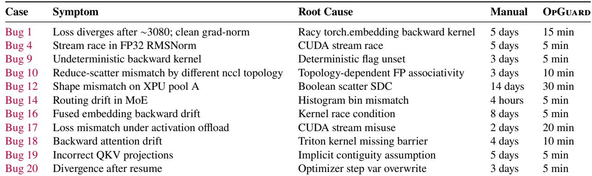  
Table 2. Subset of evaluated production bugs (full set in Table 3). OpGuard numbers are estimated debugging time provided by engineers.

False Positives. Across all 20 failures, OpGuard surfaced no false positives after initial adaptation. When first applied to a new model or backend, engineers typically encounter 2–10 benign diferences arising from predictable patterns: unused padded regions [2], pinned-memory copy\_ operations that cannot be wrapped as normal kernels [72] (e.g., host-todevice copies from dataloader bufers), internal helper bufers, GPU-side performance counters, or scratch workspaces with undefined contents. None afects model outputs.

Distinguishing these from real corruptions is quick: engineers confirm an FP in 2–3 minutes using OpGuard’s visualizer. Each FP corresponds to a one-line filter rule; once added, the pattern never reappears for future runs on the same workflow. Because these rules accumulate over time, the FP rate quickly converges to zero.

Research Baselines. Besides the debugging tools engineers used in manual debugging, we evaluate four research solutions: DeepLocalize [89], DeepDiagnosis [88], DeepFD [9], and TTrace [34]. The first three systems are state-of-the-art for single-device architectural or hyperparameter bugs [32, 48], but they detect only 2 of 20 cases (Bug 3 and Bug 15). These are the only incidents whose root causes manifest as deterministic, single-layer faults in a standard computational graph (the failure model these tools are designed for).

TTrace is the closest prior system performing diferential numerical comparison. It targets distributed training but relies on (1) a trusted single-device reference, (2) threshold-based numerical comparison, and (3) deterministic operator replays. Only 4 of our 20 cases have a native single-GPU path; for the others, we supply a multi-device reference via our deterministic replay to give TTrace the most faithful possible environment.

Under this adapted setup, TTrace successfully flags 11 cases. Its blame windows, however, remain coarse (on average 6.91 modules and 45.64 kernels), and it fails on all cases involving extremely small corruptions, nondeterministic kernels, or intermittent multi-stream races. These limitations stem from TTrace’s perturbation-based calibration: numerical deviations smaller than the learned perturbation envelope are treated as benign, causing small drifts from bugs to be missed or attributed far downstream. In cases such as Bug 9 and Bug 16, only a few floating-point entries in a gradient shard were corrupted before being attenuated by reductions-well below TTrace’s detection threshold. Moreover, TTrace’s heavy tensordump instrumentation perturbs execution enough that some bug races become harder to reproduce.

## 6.3 Open-source Bug Diagnosis

We further evaluate OpGuard on 10 real open-source issues drawn from Megatron-LM, DeepSpeed, GPT-Neox, and HuggingFace Transformers. [4, 21, 79, 90] These cases span kernel nondeterminism, stream-ordering races, MoE dispatcher inconsistencies, and cache-management faults, etc. For each issue, we build the comparison from the smallest reproducer available in the public report: the reference is either a self-replay, a known-good configuration, a single-GPU/TPsimulator run, a stable library version, or an equivalent API or framework path. Both executions use the same inputs, seeds, and checkpoint when applicable, and OpGuard establishes alignment by retaining only model-level boundaries observed in both traces. OpGuard successfully produces a precise first-diference operator for 8 of 10 cases, including four long-standing unresolved issues where prior discussions had converged on incorrect or incomplete explanations. The surfaced operators, as summarized in Table 4, directly identify the corrupted tensor or boundary and map cleanly to the underlying faulty kernel, cache rule, or collective implementation. The remaining cases, where OpGuard does not yet apply cleanly, are discussed in §7.

## 6.4 Silent Data Corruption (SDC) Detection

OpGuard initially targets software-level correctness faults. Once deployed at scale, we observed a useful side efect: the same tensor-consistency checks that localize software bugs also surface silent data corruptions in hardware. When a single device begins producing inconsistent tensors, OpGuard flags that divergence just like any other bug, and the first-diference report naturally attributes the fault to a specific computation or communication operator on that device. This operatorlevel attribution is valuable for subsequent vendor diagnostics, which typically only report that a card is “unhealthy” without identifying which workload or kernel exposes the fault.

We evaluate this emergent capability of OpGuard in its online and ofline SDC-detection modes. In online mode, it runs alongside long-running production jobs and isolates suspect machines as soon as inconsistencies are observed. In ofline mode, it replays training traces and pinpoints the exact operation where divergence first occurs. Throughout our evaluation, we compare OpGuard against the existing production baseline of vendor-provided device health checks (e.g., NVIDIA’s EUD [53], AMD’s ROCm Validation Suite (RVS) [1], and analogous pre-flight diagnostics on other accelerators). These checks are executed before a training job is oficially launched, and a machine is removed from service only if one of these diagnostics reports an error. Machines that pass these vendor diagnostics are considered healthy and are eligible to run large-scale training workloads.

To date, OpGuard has detected 21 distinct SDC machines that all successfully passed these pre-flight health checks. In other words, these 21 machines were invisible to the baseline but were flagged by OpGuard during actual training. Each detection was subsequently validated through targeted stress testing and on-device EDC (error detection/correction) verification [100], and the confirmed faulty hardware was reported to engineers for further diagnosis and remediation.

## 6.5 Ablation Study

We evaluate how OpGuard components afect localization. For each production case, we compare the full configuration’s localization index ??full with an ablated variant ??abl, reporting Δops = ??abl −??full. Thus Δops = 0 means identical localization, while positive or negative values indicate later or earlier detections. Operators are globally ordered using machine and GPU timestamps.

We study five settings: (1) reducing instrumentation to 40 manual probes; (2–3) removing determinism controls and applying numerical tolerances of 10−5 and 10−3; (4) replacing the XOR signature with a scalar sum; and (5) using a synchronous tracer that inserts global device synchronizations.

Figure 6 summarizes the results. Each column shows the twenty bugs under a diferent ablation, with markers indicating Δops clipped to [−20, 20]. The value above each column reports how many bugs remain perfectly localized (Δops = 0).

We make three findings. First, reducing instrumentation severely degrades localization: only 2/20 bugs remain pinpointed, and many detections drift by tens of operators. Second, removing determinism controls substantially increases drift, especially at tolerance 10−3, which yields only 7/20 exact localizations and several large outliers. Third, sumbased checking appears to work on easier cases but misses subtle one-token or one-bit corruptions, leading to delayed detections; only 14/20 bugs remain precisely localized. The synchronous tracer preserves 16/20 cases but causes four bugs to become unreproducible due to perturbing concurrency.

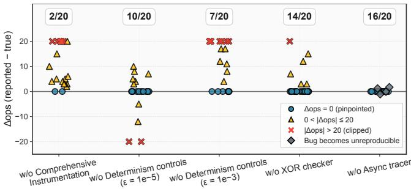  
Ablation setting

Figure 6. Localization regression under ablations.  
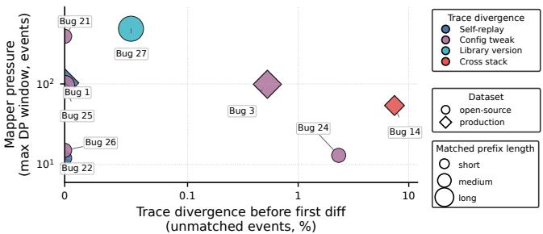  
Figure 7. Alignment remains robust under real trace divergence.

## 6.6 Alignment Robustness to Trace Divergence

The mapper (§4.5) targets aligning executions that are comparable but typically do not produce identical traces due to fused kernels, helper operations, or local schedules. We evaluate whether the mapper can tolerate these diferences and still identify the expected first-diference operator.

We sample nine paired traces: three production replays and six open-source replays. The sample covers self-replay, configuration tweaks, library-version changes, and cross-stack comparisons. For each pair, we evaluate alignment only over the comparable prefix preceding the expected first diference. This excludes subsequent divergence caused by the bug itself.

We measure alignment dificulty in three ways: (1) tracelength ratio captures the diference in event counts between the two comparable prefixes; (2) unmatched-event fraction measures the fraction of boundary events that the mapper classifies as insertions or deletions; (3) mapper pressure, measured as maximum DP window, the largest region that the mapper must align after partitioning the traces with anchors. A large window indicates that anchors are sparse or ambiguous, forcing the mapper to solve a harder local alignment problem.

Figure 7 relates the unmatched-event fraction to the maximum DP window. Marker shape distinguishes production and open-source traces, color denotes the source of trace divergence, and marker size denotes matched-prefix length.

The mapper reaches the expected first-diference operator in all nine trace pairs. Figure 7 shows that real trace divergence is present but remains alignable. The median trace-length ratio is 1.005×, and the largest is 1.048×. The median unmatchedevent fraction is 0; seven of nine cases are below 2.4%. Bug 14 has the largest fraction, 7.43%, but the mapper still identifies the expected first diference.

Anchor construction keeps the alignment problem local. The median anchor density is 15.1% (minimum 9.5%), and the median maximum DP window is 96 events. Two open-source pairs require larger windows (390 and 484 events), but these remain small relative to traces containing thousands of events.

The traces show two trends. First, production traces require smaller DP windows than open-source traces (54–103 events versus wider outliers). This matches our experience: their custom kernels and fused model-level operators often serve as distinctive anchors, whereas open-source framework traces contain longer sequences of generic operations such as view, copy\_, linear, and helper bookkeeping calls. Second, unmatched events tend to increase as the two executions’ implementations difer more: self-replay has little, configuration and library changes add localized gaps, and the cross-stack case has the largest unmatched fraction.

## 6.7 Aligned Coverage

A runtime tracer is only useful if it sees the kernels where failures occur. If a CUDA kernel is missing from the trace, any bug inside that kernel may be incorrectly attributed to its neighbors, sending engineers to debug the wrong part of the program. We therefore evaluate aligned kernel coverage: the fraction of profiler-recorded CUDA kernels that OpGuard associates with a model-level operator.

To measure this, we run each workload with OpGuard under torch.profiler, which provides the full set of kernels launched during the step; OpGuard’s trace contains kernel slices grouped by high-level ops. Coverage is the fraction of baseline kernels that appear inside a OpGuard operator boundary. We evaluate eight training pipelines spanning LLM pretraining (with and without torch.compile [5]), VLM pretraining [75], RL actor/critic/rollout training [36], and two open-source systems (Megatron [79] and VERL [78]). These capture both eager and graph-based execution modes.

Across all workloads (Figure 8), OpGuard achieves at least 95% aligned kernel coverage, with many workloads reaching 98%–100%. The remaining small gaps mainly occur when a single Python source line launches multiple CUDA ops; OpGuard attaches one probe per line, so only the first launch is tagged. These launches occur contiguously in practice and do not afect localization: the divergence boundary still lands on the correct kernel or its immediate consumer.

## 6.8 Practicality and Overhead

Figure 9 reports the runtime overhead of OpGuard across pretraining and RL workloads from 8 to 512 XPUs. Online SDC detection adds efectively no cost (≈ 1.00×–1.01×); trusted mode incurs ≈ 1.25×–1.45× overhead; and full mode costs ≈ 1.8×–1.95×. RL workloads show slightly higher slowdowns because they contain more inference- and control-heavy paths where checker kernels amortize less, but overhead is essentially flat with scale. Figure 9(b) further shows that even OpGuard’s full mode is far cheaper than conventional debugging: a globalsync tracer slows training by ≈ 3.75×, and full tensor dumping would impose an infeasible ∼ 3000× cost.

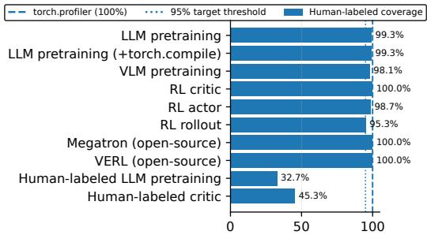  
Aligned CUDA op coverage (%)  
Figure 8. Aligned kernel coverage of OpGuard across workloads.

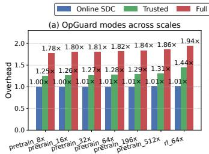  
Scenario (job type, scale)

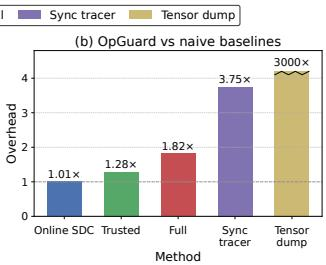  
Figure 9. Runtime overhead under diferent deployment modes.

The overhead gap follows from the amount of instrumentation each mode enables. Online SDC detection checks sparse communication boundaries, so its added XOR kernels are tiny compared with the data already in flight. Trusted mode avoids many checker launches on high-confidence primitives such as GEMMs and basic elementwise ops, which would otherwise dominate runtime; this balance makes it our standard configuration for production debugging. Full mode pays more for exhaustive operator coverage and is mainly used for stubborn or deeply latent bugs.

## 7 Discussions

Engineers consistently emphasized that precise, operatorlevel evidence is what accelerates debugging. Ambiguous signals rarely justify deep investigation. OpGuard’s concrete divergence boundary provides such evidence. While fully automated debugging is ideal, engineers also noted that the first-dif localization is typically suficient: once OpGuard surfaces the earliest corrupted tensor or kernel, they can reason about the root cause using their own domain expertise.

OpGuard relies on the two executions sharing a comparable model prefix: they must reach the same model-level boundaries with the same logical inputs, RNG choices, numerical policies, and distributed reduction rules. If a bug occurs before this prefix, or a version change intentionally changes one of these contracts, OpGuard can only report the earliest downstream operator both executions reach in a comparable way. In Bug 29, for example, an early preprocessing regression changed model inputs, so the first alignable model operator was already afected. Such cases arise mainly from implementation diferences in high-level preprocessing rather than faults in the model or runtime layers OpGuard targets.

Downscaled replay also changes the execution environment. Reducing a job from thousands of machines to hundreds may remove the faulty device that exposed an SDC, and smaller runs often create diferent memory pressure, allocator behavior, and scheduling. We observed this in one SDC incident: the failure appeared in a 1024-machine production run but did not reproduce in a 512-machine replay because the replay excluded the faulty machine. Thus, downscaled replay is best viewed as a debugging accelerator when the bug still reproduces, not a proof that a bug is absent. If the replay no longer reaches a comparable divergent execution, OpGuard cannot localize or explain that particular fault.

## 8 Related Work

Bug Detection and Monitoring for ML Training. Empirical studies have shown the prevalence of bugs and reliability issues in ML training [26, 31, 37, 93, 94, 97], which motivate work to detect bugs. Diferential-testing tools [41, 62, 64, 92] expose inconsistencies in models, libraries, and compilers. Specialized analyzers such as PyTea [33], RANUM [37], and CUDASanitizer [54] aim to catch shape, numerical, or concurrency defects. TrainCheck [35] learns invariants to monitor training and detect silent errors at runtime. These solutions focus on detection and not diagnosis.

Fault Localization in ML Programs. Other work aims to diagnose faults by identifying specific model components or code regions responsible for erroneous behavior. DeepLo calize [89] correlates runtime metrics with suspicious layers. DeepDiagnosis [88] infers fault types and localizes them to model components or configuration issues. DeepFD [9] learns classifiers over rich runtime features to predict fault types and link them to faulty source statements. UMLAUT [76], Theia [45], and NeuraLint [49] combine structural analyses with behavioral signals to detect architectural defects or hyperparameter issues, while neuron/operator ranking methods [25] inspect trained models for internal inconsistencies. These approaches operate primarily at the framework or Pythonoperator level and assume single-node training environments.

Equivalence Checking. TrainVerify [43] uses symbolic reasoning to verify a parallel execution plan is mathematically equivalent to its single-device logical definition. It targets statically eliminating parallelization related bugs, and does not concern implementation or runtime behavior. TTrace [34] records full intermediate tensors and compares them numerically against a trusted single-device reference implementation. Such recording incurs high overhead and the tolerances its comparisons rely on are brittle. OpGuard targets debugging large-scale LLM training. It uses two production executions rather than requiring a single-device reference, which is often unavailable for large models. OpGuard introduces bitwise alignment and controls nondeterminism, while designing techniques to make the alignment robust across production-grade optimizations such as fusion, asynchrony, and graph capture.

Comparative Debugging. OpGuard builds on a long tradition of comparative debugging. Delta debugging [95] and related techniques isolate the root cause to a failure-inducing input or change, a cause-efect chain [96], a statistically suspicious predicate [38], or instruction sequence [99]. OpGuard shares the same high-level principle. Its contribution is to make this strategy precise for LLM training, where executions are expensive, tensor states are enormous, benign nondeterminism is pervasive, and implementation traces difer significantly. It introduces bitwise alignment with stable model-level boundaries, exact tensor equality, and certified-prefix localization.

Deterministic Replay. Deterministic multithreading [6, 7, 14– 16, 42, 46, 47] and replay [3, 23, 30, 58, 61, 85] make conventional software executions reproducible by controlling thread schedules, synchronization, system-call results, and external inputs. These systems inspired OpGuard’s use of controlled nondeterminism, but their goals difer. They seek to constrain whole executions by imposing strict scheduling discipline. In production LLM training, full-stack deterministic scheduling is rarely practical: it can impose high overhead and is fragile across heterogeneous hardware, libraries, drivers, compilers, etc. OpGuard instead controls only the sources of variation that would make bitwise alignment ill-posed while leaving residual schedule-sensitive behavior visible as a bug signal.

## 9 Conclusion

Debugging correctness issues in LLM training is notoriously dificult. We propose bitwise alignment as a precise correctness oracle and debugging primitive for addressing this challenge. We realize the ideas in OpGuard, which controls avoidable non-determinism, discovers semantic-stable boundaries, fingerprints them, and uses schedule-tolerant alignment with prefix certification to surface the divergence. OpGuard has been deployed across production pre-training and posttraining pipelines, and helped engineers debug various dificult failures, reducing debugging time from days to minutes.

## Acknowledgments

We thank our shepherd and anonymous reviewers for feedback that improved the paper, and Chandler Nie, Zuquan Song, Dongyu Xu, and Weiqi Feng for valuable contributions and feedback. This work was supported in part by NSF grants CNS-2317698, CNS-2317751, and CCF-2318937.

## References

[1] Advanced Micro Devices, Inc. 2025. ROCm Validation Suite (RVS) Documentation. Advanced Micro Devices, Inc. htps://rocm.docs.

amd.com/projects/ROCmValidationSuite/en/latest/ RVS 1.3.0 Docu- mentation, accessed June 6, 2026.

[2] Osayamen Jonathan Aimuyo, Byungsoo Oh, and Rachee Singh. 2025. FlashMoE: Fast Distributed MoE in a Single Kernel. arXiv:2506.04667 [cs.DC] htps://arxiv.org/abs/2506.04667 See Section 3.2.1 “In-place Padding for Payload Eficiency”; accessed June 6, 2026.

[3] Gautam Altekar and Ion Stoica. 2009. ODR: Output-Deterministic Replay for Multicore Debugging. In Proceedings of the ACM SIGOPS 22nd Symposium on Operating Systems Principles (Big Sky, Montana, USA) (SOSP ’09). Association for Computing Machinery, New York, NY, USA, 193–206. htps://doi.org/10.1145/1629575.1629594

[4] Alex Andonian, Quentin Anthony, Stella Biderman, Sid Black, Preetham Gali, Leo Gao, Eric Hallahan, Josh Levy-Kramer, Connor Leahy, Lucas Nestler, Kip Parker, Michael Pieler, Jason Phang, Shivanshu Purohit, Hailey Schoelkopf, Dashiell Stander, Tri Songz, Curt Tigges, Benjamin Thérien, Phil Wang, and Samuel Weinbach. 2023. GPT-NeoX: Large Scale Autoregressive Language Modeling in PyTorch. EleutherAI. htps://doi.org/10.5281/zenodo.5879544

[5] Jason Ansel, Edward Yang, Horace He, Natalia Gimelshein, Animesh Jain, Michael Voznesensky, Bin Bao, Peter Bell, David Berard, Evgeni Burovski, Geeta Chauhan, Anjali Chourdia, Will Constable, Alban Desmaison, Zachary DeVito, Elias Ellison, Will Feng, Jiong Gong, Michael Gschwind, Brian Hirsh, Sherlock Huang, Kshiteej Kalam barkar, Laurent Kirsch, Michael Lazos, Mario Lezcano, Yanbo Liang, Jason Liang, Yinghai Lu, C. K. Luk, Bert Maher, Yunjie Pan, Christian Puhrsch, Matthias Reso, Mark Saroufim, Marcos Yukio Siraichi, Helen Suk, Shunting Zhang, Michael Suo, Phil Tillet, Xu Zhao, Eikan Wang, Keren Zhou, Richard Zou, Xiaodong Wang, Ajit Mathews, William Wen, Gregory Chanan, Peng Wu, and Soumith Chintala. 2024. PyTorch 2: Faster Machine Learning Through Dynamic Python Bytecode Transformation and Graph Compilation. In Proceedings of the 29th ACM International Conference on Architectural Support for Programming Languages and Operating Systems, Volume 2 (La Jolla, CA, USA) (ASPLOS ’24). Association for Computing Machinery, New York, NY, USA, 929–947. htps://doi.org/10.1145/3620665.3640366

[6] Amittai Aviram, Shu-Chun Weng, Sen Hu, and Bryan Ford. 2010. Eficient system-enforced deterministic parallelism. In Proceedings of the 9th USENIX Conference on Operating Systems Design and Implementation (Vancouver, BC, Canada) (OSDI ’10). USENIX Association, USA, 193–206. htps://www.usenix.org/conference/osdi10/eficientsystem-enforced-deterministic-parallelism

[7] Tom Bergan, Owen Anderson, Joseph Devietti, Luis Ceze, and Dan Grossman. 2010. CoreDet: a compiler and runtime system for de terministic multithreaded execution. In Proceedings of the Fifteenth International Conference on Architectural Support for Programming Languages and Operating Systems (Pittsburgh, Pennsylvania, USA) (ASPLOS XV). Association for Computing Machinery, New York, NY, USA, 53–64. htps://doi.org/10.1145/1736020.1736029

[8] Adam Betts, Nathan Chong, Alastair Donaldson, Shaz Qadeer, and Paul Thomson. 2012. GPUVerify: a verifier for GPU kernels. In Proceedings of the ACM International Conference on Object Oriented Programming Systems Languages and Applications (Tucson, Arizona, USA) (OOPSLA ’12). Association for Computing Machinery, New York, NY, USA, 113–132. htps://doi.org/10.1145/2384616.2384625

[9] Jialun Cao, Meiziniu Li, Xiao Chen, Ming Wen, Yongqiang Tian, Bo Wu, and Shing-Chi Cheung. 2022. DeepFD: automated fault diagnosis and localization for deep learning programs. In Proceedings of the 44th International Conference on Software Engineering (Pittsburgh, Pennsylvania) (ICSE ’22). Association for Computing Machinery, New York, NY, USA, 573–585. htps://doi.org/10.1145/3510003.3510099

[10] Adam Casson. 2023. Transformer FLOPs — Adam Casson’s Blog. (2023). htps://adamcasson.com/posts/transformer-flops online; accessed June 6, 2026.

[11] Tianqi Chen, Bing Xu, Chiyuan Zhang, and Carlos Guestrin. 2016. Training Deep Nets with Sublinear Memory Cost. arXiv:1604.06174 [cs.LG] htps://arxiv.org/abs/1604.06174

[12] Aakanksha Chowdhery, Sharan Narang, Jacob Devlin, Maarten Bosma, Gaurav Mishra, et al. 2023. PaLM: Scaling Language Modeling with Pathways. Journal of Machine Learning Research 24, 240 (2023), 1–113. htps://www.jmlr.org/papers/v24/22-1144.html See §5 on “Bitwise determinism” for engineering practices at 8B, 62B, and 540B scales.

[13] James C. Corbett, Jefrey Dean, Michael Epstein, Andrew Fikes, Christopher Frost, J. J. Furman, Sanjay Ghemawat, Andrey Gubarev, Christopher Heiser, Peter Hochschild, Wilson Hsieh, Sebastian Kanthak, Eugene Kogan, Hongyi Li, Alexander Lloyd, Sergey Melnik, David Mwaura, David Nagle, Sean Quinlan, Rajesh Rao, Lindsay Rolig, Yasushi Saito, Michal Szymaniak, Christopher Taylor, Ruth Wang, and Dale Woodford. 2013. Spanner: Google’s Globally Distributed Database. ACM Trans. Comput. Syst. 31, 3, Article 8 (Aug. 2013), 22 pages. htps://doi.org/10.1145/2491245

[14] Heming Cui, Jiri Simsa, Yi-Hong Lin, Hao Li, Ben Blum, Xinan Xu, Junfeng Yang, Garth A. Gibson, and Randal E. Bryant. 2013. Parrot: A Practical Runtime for Deterministic, Stable, and Reliable Threads. In Proceedings of the Twenty-Fourth ACM Symposium on Operating Systems Principles (Farminton, Pennsylvania) (SOSP ’13). Association for Computing Machinery, New York, NY, USA, 388–405. htps://doi.org/10.1145/2517349.2522735

[15] Heming Cui, Jingyue Wu, John Gallagher, Huayang Guo, and Junfeng Yang. 2011. Eficient deterministic multithreading through schedule relaxation. In Proceedings of the Twenty-Third ACM Symposium on Operating Systems Principles (Cascais, Portugal) (SOSP ’11). Association for Computing Machinery, New York, NY, USA, 337–351. htps://doi.org/10.1145/2043556.2043588

[16] Heming Cui, Jingyue Wu, Chia-Che Tsai, and Junfeng Yang. 2010. Stable deterministic multithreading through schedule memoization. In Proceedings of the 9th USENIX Conference on Operating Systems Design and Implementation (Vancouver, BC, Canada) (OSDI ’10). USENIX Association, USA, 207–221. htps://www.usenix.org/conference/osdi10/stabledeterministic-multithreading-through-schedule-memoization

[17] Daniel and Michael Han. 2024. Fixing All Gemma Bugs. htps: //unsloth.ai/blog/gemma-bugs Accessed: June 6, 2026.

[18] Dao-AILab. 2025. FlashAttention. htps://github.com/Dao-AILab/ flash-atention See README §2.4 “ALiBi attention with linear bias—deterministic backward pass”; accessed June 6, 2026.

[19] DeepSeek-AI, Aixin Liu, Bei Feng, Bing Xue, Bingxuan Wang, Bochao Wu, et al. 2025. DeepSeek-V3 Technical Report. arXiv:2412.19437 [cs.CL] htps://arxiv.org/abs/2412.19437

[20] DeepSpeed Team. 2025. Megatron-DeepSpeed: Reproducibility. htps://github.com/deepspeedai/Megatron-DeepSpeed/blob/3e1da1fbb226fd4d19aad33afcb33c2f6ed0eb26/ README.md#reproducibility Commit 3e1da1f.

[21] deepspeedai. 2020–2025. DeepSpeed: Deep Learning Optimization Library. htps://github.com/deepspeedai/DeepSpeed GitHub reposi- tory, accessed December 11, 2025.

[22] Harish D. Dixit. 2022. Detecting silent errors in the wild: Combining two novel approaches to quickly detect silent data corrup-tions at scale. htps://engineering.fb.com/2022/03/17/productionengineering/silent-errors/ Accessed June 6, 2026.

[23] George W. Dunlap, Samuel T. King, Sukru Cinar, Murtaza A. Basrai, and Peter M. Chen. 2002. ReVirt: Enabling Intrusion Analysis Through Virtual-Machine Logging and Replay. In Proceedings of the Fifth Symposium on Operating Systems Design and Implementation (OSDI ’02). Boston, MA, 14 pages. htps://www.usenix.org/conference/osdi-02/revirt-enablingintrusion-analysis-through-virtual-machine-logging-and-replay

[24] edubart. 2025. machine-kernels-llama2.c. htps://github.com/ edubart/machine-kernels-llama2.c GitHub repository; minimal LLaMA2 kernels with deterministic variants; accessed June 6, 2026.

[25] Hasan Ferit Eniser, Simos Gerasimou, and Alper Sen. 2019. Deep Fault: Fault Localization for Deep Neural Networks. In Fundamental Approaches to Software Engineering, Reiner Hähnle and Wil van der Aalst (Eds.). Springer International Publishing, Cham, 171–191. htps://link.springer.com/chapter/10.1007/978-3-030-16722-6\_10

[26] Yanjie Gao, Yichen He, Xinze Li, Bo Zhao, Haoxiang Lin, Yoyo Liang, Jing Zhong, Hongyu Zhang, Jingzhou Wang, Yonghua Zeng, Keli Gui, Jie Tong, and Mao Yang. 2024. An Empirical Study on Low GPU Utilization of Deep Learning Jobs. In Proceedings of the IEEE/ACM 46th International Conference on Software Engineering (Lisbon, Portugal) (ICSE ’24). Association for Computing Machinery, New York, NY, USA, Article 96, 13 pages. htps://doi.org/10.1145/ 3597503.3639232

[27] Yanjie Gao, Ruiming Lu, Haoxiang Lin, and Yueguo Chen. 2025. An Empirical Study of Issues in Large Language Model Training Systems. In FSE 2025. ACM. htps://dl.acm.org/doi/10.1145/3696630.3728538 The ACM International Conference on the Foundations of Software Engineering, Industry Track.

[28] gottbrath. 2025. Meta PyTorch Team 2025 H2 Roadmaps. htps://dev- discuss.pytorch.org/t/meta-pytorch-team-2025-h2-roadmaps/3184 Accessed: June 6, 2026.

[29] Aaron Grattafiori, Abhimanyu Dubey, Abhinav Jauhri, Abhinav Pandey, Abhishek Kadian, et al. 2024. The Llama 3 Herd of Models. arXiv:2407.21783 [cs.AI] htps://arxiv.org/abs/2407.21783

[30] Zhenyu Guo, Xi Wang, Jian Tang, Xuezheng Liu, Zhilei Xu, Ming Wu, M. Frans Kaashoek, and Zheng Zhang. 2008. R2: An Application Level Kernel for Record and Replay. In Proceedings of the 8th USENIX Conference on Operating Systems Design and Implementation (San Diego, California) (OSDI ’08). USENIX Association, USA, 193–208. htps://www.usenix.org/conference/osdi-08/r2-applicationlevel-kernel-record-and-replay

[31] Qinghao Hu, Zhisheng Ye, Zerui Wang, Guoteng Wang, Meng Zhang, Qiaoling Chen, Peng Sun, Dahua Lin, Xiaolin Wang, Yingwei Luo, Yonggang Wen, and Tianwei Zhang. 2024. Characterization of large language model development in the datacenter. In Proceedings of the 21st USENIX Symposium on Networked Systems Design and Imple mentation (Santa Clara, CA, USA) (NSDI’24). USENIX Association, USA, Article 39, 21 pages. htps://www.usenix.org/conference/ nsdi24/presentation/hu

[32] Nargiz Humbatova, Jinhan Kim, Gunel Jahangirova, Shin Yoo, and Paolo Tonella. 2025. An empirical study of fault localisation techniques for deep neural networks. Empirical Software Engineering 30 (06 2025). htps://doi.org/10.1007/s10664-025-10657-7

[33] Ho Young Jhoo, Sehoon Kim, Woosung Song, Kyuyeon Park, DongK won Lee, and Kwangkeun Yi. 2021. A Static Analyzer for Detecting Tensor Shape Errors in Deep Neural Network Training Code. arXiv:2112.09037 [cs.LG] htps://arxiv.org/abs/2112.09037

[34] Haitian Jiang, Shaowei Zhu, Zhen Zhang, Zhenyu Song, Xinwei Fu, Zhen Jia, Yida Wang, and Jinyang Li. 2025. TTrace: Light weight Error Checking and Diagnosis for Distributed Training. arXiv:2506.09280 [cs.DC] htps://arxiv.org/abs/2506.09280

[35] Yuxuan Jiang, Ziming Zhou, Boyu Xu, Beijie Liu, Runhui Xu, and Peng Huang. 2025. Training with confidence: catching silent errors in deep learning training with automated proactive checks. In Proceedings of the 19th USENIX Symposium on Operating Systems Design and Implementation (Boston, MA, USA) (OSDI ’25). USENIX Association, USA, Article 18, 313-329 pages. htps://www.usenix.org/conference/ osdi25/presentation/jiang

[36] Vijay R. Konda and John N. Tsitsiklis. 1999. Actor-critic algorithms. Advances in Neural Information Processing Systems 12 (1999), 1008– 1014. htps://proceedings.neurips.cc/paper\_files/paper/1999/file

6449f44a102fde848669bdd9eb6b76fa-Paper.pdf

[37] Linyi Li, Yuhao Zhang, Luyao Ren, Yingfei Xiong, and Tao Xie. 2023. Reliability Assurance for Deep Neural Network Architectures against Numerical Defects. In Proceedings of the 45th International Conference on Software Engineering (Melbourne, Victoria, Australia) (ICSE ’23). IEEE Press, 1827–1839. htps://doi.org/10.1109/ICSE48619. 2023.00156

[38] Ben Liblit, Mayur Naik, Alice X. Zheng, Alex Aiken, and Michael I. Jordan. 2005. Scalable Statistical Bug Isolation. In Proceedings of the 2005 ACM SIGPLAN Conference on Programming Language Design and Implementation (Chicago, IL, USA) (PLDI ’05). Association for Computing Machinery, New York, NY, USA, 15–26. htps: //doi.org/10.1145/1065010.1065014

[39] William Lin. 2019. GPU Burn: A Multi-GPU CUDA Stress Test Tool. htps://github.com/wilicc/gpu-burn GitHub repository, Accessed: June 6, 2026.

[40] Jiacai Liu, Yingru Li, Yuqian Fu, Jiawei Wang, Qian Liu, and Yu Shen. 2025. When Speed Kills Stability: Demystifying RL Collapse from the Training–Inference Mismatch. htps://yingru.notion.site/RL- Collapse-271211a558b7808d8b12d403fd15edda Accessed June 6, 2026.

[41] Jiawei Liu, Jinkun Lin, Fabian Rufy, Cheng Tan, Jinyang Li, Aurojit Panda, and Lingming Zhang. 2023. NNSmith: Generating Diverse and Valid Test Cases for Deep Learning Compilers. In Proceedings of the 28th ACM International Conference on Architectural Support for Programming Languages and Operating Systems, Volume 2 (Vancouver, BC, Canada) (ASPLOS 2023). Association for Computing Machinery, New York, NY, USA, 530–543. htps://doi.org/10.1145/3575693.3575707

[42] Tongping Liu, Charlie Curtsinger, and Emery D. Berger. 2011. Dthreads: Eficient Deterministic Multithreading. In Proceedings of the 23rd ACM Symposium on Operating Systems Principles (Cascais, Portugal) (SOSP ’11). Association for Computing Machinery, New York, NY, USA, 327–336. htps://doi.org/10.1145/2043556.2043587

[43] Yunchi Lu, Youshan Miao, Cheng Tan, Peng Huang, Yi Zhu, Xian Zhang, and Fan Yang. 2025. TrainVerify: Equivalence-Based Verification for Distributed LLM Training. In Proceedings of the ACM SIGOPS 31st Symposium on Operating Systems Principles (Lotte Hotel World, Seoul, Republic of Korea) (SOSP ’25). Association for Computing Machinery, New York, NY, USA, 237–253. htps://doi.org/10.1145/3731569.3764850

[44] Jefrey Jian Ma, Hengzhi Pei, Leonard Lausen, and George Karypis. 2025. Understanding Silent Data Corruption in LLM Training. In Proceedings of the 63rd Annual Meeting of the Association for Computational Linguistics (Volume 1: Long Papers) (Vienna, Austria) (ACL ’25). Association for Computational Linguistics, 20372–20394. htps://doi.org/10.18653/v1/2025.acl-long.996

[45] Ruchira Manke, Mohammad Wardat, Foutse Khomh, and Hridesh Rajan. 2025. Leveraging Data Characteristics for Bug Localization in Deep Learning Programs. ACM Trans. Softw. Eng. Methodol. 34, 6, Article 157 (July 2025), 29 pages. htps://doi.org/10.1145/3708473

[46] Timothy Merrifield, Sepideh Roghanchi, Joseph Devietti, and Jakob Eriksson. 2019. Lazy Determinism for Faster Deterministic Multithreading. In Proceedings of the Twenty-Fourth International Conference on Architectural Support for Programming Languages and Operating Systems (Providence, RI, USA) (ASPLOS ’19). Association for Computing Machinery, New York, NY, USA, 879–891. htps://doi.org/10.1145/3297858.3304047

[47] Omar S. Navarro Leija, Kelly Shiptoski, Ryan G. Scott, Baojun Wang, Nicholas Renner, Ryan R. Newton, and Joseph Devietti. 2020. Repro ducible Containers. In Proceedings of the Twenty-Fifth International Conference on Architectural Support for Programming Languages and Operating Systems (Lausanne, Switzerland) (ASPLOS ’20). Association for Computing Machinery, New York, NY, USA, 167–182.

htps://doi.org/10.1145/3373376.3378519

[48] Thanh-Dat Nguyen, Haoye Tian, Bach Le, Patanamon Thongtanunam, and Shane McIntosh. 2025. A Systematic Survey on Debugging Techniques for Machine Learning Systems. arXiv:2503.03158 [cs.SE] htps://arxiv.org/abs/2503.03158

[49] Amin Nikanjam, Houssem Ben Braiek, Mohammad Mehdi Morovati, and Foutse Khomh. 2021. Automatic Fault Detection for Deep Learning Programs Using Graph Transformations. ACM Trans. Softw. Eng. Methodol. 31, 1, Article 14 (Sept. 2021), 27 pages. htps://doi.org/10. 1145/3470006

[50] NVIDIA 2024. NVIDIA cuDNN Documentation. NVIDIA. htps://docs.nvidia.com/deeplearning/cudnn/archives/cudnn-892/api/index.html#cudnnDeterminism\_t See Section 3.1.2.7 “cudnnDeterminism\_t”; accessed June 6, 2026.

[51] NVIDIA 2025. cuBLAS Documentation: Results Reproducibility. NVIDIA. htps://docs.nvidia.com/cuda/cublas/index.html#results-reproducibility See Section 2.1.4 “Results Reproducibility” for toolkit, architecture, SM-count, and multi-stream workspace constraints; accessed June 6, 2026.

[52] NVIDIA Corporation 2023. CUDA C Programming Guide. NVIDIA Corporation. htps://docs.nvidia.com/cuda/cuda-c-programming-guide/ Describes CUDA streams, kernel scheduling, and asynchronous execution.

[53] NVIDIA Corporation 2023. DCGM Diagnostics: End User Diagnostics (EUD). NVIDIA Corporation. htps: //docs.nvidia.com/datacenter/dcgm/3.1/user-guide/dcgmdiagnostics.html#end-user-diagnostics-eud NVIDIA DCGM Documentation, version 3.1, accessed June 6, 2026.

[54] NVIDIA Corporation 2025. Compute Sanitizer Documentation. NVIDIA Corporation. htps://docs.nvidia.com/compute-sanitizer/ index.html Accessed June 6, 2026.

[55] NVIDIA Corporation 2025. CUDA Profiling Tools Interface (CUPTI). NVIDIA Corporation. htps://developer.nvidia.com/cupti Accessed: June 6, 2026.

[56] NVIDIA Corporation 2025. NCCL\_ALGO — NCCL Algorithm Environment Variables. NVIDIA Corporation. htps://docs.nvidia.com/ deeplearning/nccl/user-guide/docs/env.html#nccl-algo Accessed June 6, 2026.

[57] NVIDIA Corporation 2025. NVIDIA DCGM Diagnostics: GPU Memory Plugin — NVIDIA DCGM Documentation. NVIDIA Cor-poration. htps://docs.nvidia.com/datacenter/dcgm/latest/userguide/dcgm-diagnostics.html

[58] Robert O’Callahan, Chris Jones, Nathan Froyd, Kyle Huey, Albert Noll, and Nimrod Partush. 2017. Engineering Record and Replay for Deployability. In Proceedings of the 2017 USENIX Conference on Usenix Annual Technical Conference (Santa Clara, CA, USA) (USENIX ATC ’17). USENIX Association, USA, 377–389. htps://www.usenix. org/conference/atc17/technical-sessions/presentation/ocallahan

[59] Jia Pan, Haoze Wu, Tanakorn Leesatapornwongsa, Suman Nath, and Peng Huang. 2024. Eficient Reproduction of Fault-Induced Failures in Distributed Systems with Feedback-Driven Fault Injection. In Proceedings of the 30th Symposium on Operating Systems Principles (Austin, TX, USA) (SOSP ’24). Association for Computing Machinery, New York, NY, USA, 18 pages. htps://doi.org/10.1145/3694715. 3695979

[60] Kishore Papineni, Salim Roukos, Todd Ward, and Wei-Jing Zhu. 2002. BLEU: a method for automatic evaluation of machine translation. In Proceedings of the 40th Annual Meeting on Association for Computational Linguistics (Philadelphia, Pennsylvania) (ACL ’02). Association for Computational Linguistics, USA, 311–318. htps://doi.org/10.3115/1073083.1073135

[61] Soyeon Park, Yuanyuan Zhou, Weiwei Xiong, Zuoning Yin, Rini Kaushik, Kyu H. Lee, and Shan Lu. 2009. PRES: Probabilistic Replay with Execution Sketching on Multiprocessors. In Proceedings of the

ACM SIGOPS 22nd Symposium on Operating Systems Principles (Big Sky, Montana, USA) (SOSP ’09). Association for Computing Machinery, New York, NY, USA, 177–192. htps://doi.org/10.1145/ 1629575.1629593

[62] Kexin Pei, Yinzhi Cao, Junfeng Yang, and Suman Jana. 2019. DeepX plore: automated whitebox testing of deep learning systems. Commun. ACM 62, 11 (Oct. 2019), 137–145. htps://doi.org/10.1145/3361566

[63] Perfetto Project. 2025. Perfetto: System profiling, app tracing and trace analysis. htps://perfeto.dev/ Accessed June 6, 2026.

[64] Hung Viet Pham, Thibaud Lutellier, Weizhen Qi, and Lin Tan. 2019. CRADLE: Cross-backend validation to Detect and Localize bugs in Deep learning libraries. In Proceedings of the 41st International Conference on Software Engineering (Montreal, Quebec, Canada) (ICSE ’19). IEEE Press, 1027–1038. htps://doi.org/10.1109/ICSE. 2019.00107

[65] PyTorch Core Team 2025. Distributed Communication Package — torch.distributed. PyTorch Core Team. htps://docs.pytorch.org/docs/ stable/distributed.html See notes on “globally consistent execution order of collectives across ranks”; accessed June 6, 2026.

[66] PyTorch Core Team 2025. Distributed Communication Package — torch.distributed. PyTorch Core Team. htps: //docs.pytorch.org/docs/stable/distributed.html#synchronousand-asynchronous-collective-operations Accessed June 6, 2026.

[67] PyTorch Core Team 2025. Reproducibility — PyTorch: Controlling Sources of Randomness. PyTorch Core Team. htps: //docs.pytorch.org/docs/2.8/notes/randomness.html#controllingsources-of-randomness Accessed June 6, 2026.

[68] PyTorch Core Team 2025. torch.allclose — PyTorch Documentation. PyTorch Core Team. htps://docs.pytorch.org/docs/stable/generated torch.allclose.html Accessed June 6, 2026.

[69] PyTorch Core Team 2025. torch.autograd.set\_detect\_anomaly — Py-Torch Documentation. PyTorch Core Team. htps://docs.pytorch.org/ docs/stable/autograd.html#torch.autograd.set\_detect\_anomaly

[70] PyTorch Core Team 2025. torch.backends.cuda.matmul.allow\_- tf32 — PyTorch Documentation. PyTorch Core Team. htps://docs.pytorch.org/docs/stable/backends.html#torch. backends.cuda.matmul.allow\_tf32 Accessed June 6, 2026.

[71] PyTorch Core Team 2025. torch.get\_rng\_state — PyTorch Documen-tation. PyTorch Core Team. htps://docs.pytorch.org/docs/stable/ generated/torch.get\_rng\_state.html Accessed June 6, 2026.

[72] PyTorch Core Team 2025. torch.Tensor.copy\_ — PyTorch Documen-tation. PyTorch Core Team. htps://docs.pytorch.org/docs/stable/ generated/torch.Tensor.copy\_.html Accessed June 6, 2026.

[73] PyTorch Core Team 2025. torch.use\_deterministic\_algorithms — Py Torch Documentation. PyTorch Core Team. htps://docs.pytorch.org/ docs/stable/generated/torch.use\_deterministic\_algorithms.html Ac- cessed June 6, 2026.

[74] PyTorch developers. 2018. More eficient kernels that avoid deprecated shufles in Embedding and LookupTable. htps://github.com/pytorch/ pytorch/commit/db14f3f33c8ddc9c910ca2188f8787dd81b97b52 File aten/src/ATen/native/cuda/Embedding.cu, lines 74–79.

[75] Alec Radford, Jong Wook Kim, Chris Hallacy, Aditya Ramesh, Gabriel Goh, Sandhini Agarwal, Girish Sastry, Amanda Askell, Pamela Mishkin, Jack Clark, Gretchen Krueger, and Ilya Sutskever. 2021. Learning Transferable Visual Models From Natural Language Supervision. In Proceedings of the 38th International Conference on Machine Learning (Proceedings of Machine Learning Research, Vol. 139), Marina Meila and Tong Zhang (Eds.). PMLR, 8748–8763. htps://proceedings.mlr.press/v139/radford21a.html

[76] Eldon Schoop, Forrest Huang, and Bjoern Hartmann. 2021. UMLAUT: Debugging Deep Learning Programs using Program Structure and Model Behavior. In Proceedings of the 2021 CHI Conference on Human Factors in Computing Systems (Yokohama, Japan) (CHI ’21). Association for Computing Machinery, New York, NY, USA, Article

310, 16 pages. htps://doi.org/10.1145/3411764.3445538

[77] Shreya Shankar, Labib Fawaz, Karl Gyllstrom, and Aditya G. Parameswaran. 2023. Moving Fast With Broken Data. arXiv:2303.06094 [cs.DB] htps://arxiv.org/abs/2303.06094

[78] Guangming Sheng, Chi Zhang, Zilingfeng Ye, Xibin Wu, Wang Zhang, Ru Zhang, Yanghua Peng, Haibin Lin, and Chuan Wu. 2025. HybridFlow: A Flexible and Eficient RLHF Framework. In Proceedings of the Twentieth European Conference on Computer Systems (Rotterdam, Netherlands) (EuroSys ’25). Association for Computing Machinery, New York, NY, USA, 1279–1297. htps://doi.org/10.1145/3689031.3696075

[79] Mohammad Shoeybi, Mostofa Patwary, Raul Puri, Patrick LeGresley, Jared Casper, and Bryan Catanzaro. 2020. Megatron-LM: Training Multi-Billion Parameter Language Models Using Model Parallelism. arXiv:1909.08053 [cs.CL] htps://arxiv.org/abs/1909.08053

[80] Sho Takase, Shun Kiyono, Sosuke Kobayashi, and Jun Suzuki. 2025. Spike No More: Stabilizing the Pre-training of Large Language Models. In Second Conference on Language Modeling (COLM ’25). htps: //openreview.net/forum?id=52YBEzcI0l

[81] Mohamed Tarek Ibn Ziad, Sana Damani, Aamer Jaleel, Stephen W. Keckler, and Mark Stephenson. 2023. cuCatch: A Debugging Tool for Eficiently Catching Memory Safety Violations in CUDA Applications. Proc. ACM Program. Lang. 7, PLDI, Article 111 (June 2023), 24 pages. htps://doi.org/10.1145/3591225

[82] TensorFlow 2025. tf.config.experimental.enable\_op\_- determinism — TensorFlow Documentation. TensorFlow. htps://www.tensorflow.org/api\_docs/python/tf/config/ experimental/enable\_op\_determinism Accessed June 6, 2026.

[83] TensorFlow Datasets Team 2021. TFDS and Determinism. TensorFlow Datasets Team. htps://www.tensorflow.org/datasets/determinism Accessed June 6, 2026.

[84] TensorFlow Team 2025. TensorFlow Debugger v2 — TensorFlow Documentation. TensorFlow Team. htps://www.tensorflow.org tensorboard/debugger\_v2

[85] Kaushik Veeraraghavan, Dongyoon Lee, Benjamin Wester, Jessica Ouyang, Peter M. Chen, Jason Flinn, and Satish Narayanasamy. 2011. DoublePlay: Parallelizing Sequential Logging and Replay. In Proceedings of the Sixteenth International Conference on Ar chitectural Support for Programming Languages and Operating Systems (Newport Beach, California, USA) (ASPLOS XVI). Association for Computing Machinery, New York, NY, USA, 15–26. htps://doi.org/10.1145/1950365.1950370

[86] VI-HPS. 2024. MUST: MPI Usage Error Detection Tool. htps: //www.vi-hps.org/tools/must.html

[87] Borui Wan, Gaohong Liu, Zuquan Song, Jun Wang, Yun Zhang, Guangming Sheng, Shuguang Wang, Houmin Wei, Chenyuan Wang, Weiqiang Lou, Xi Yang, Mofan Zhang, Kaihua Jiang, Cheng Ren, Xiaoyun Zhi, Menghan Yu, Zhe Nan, Zhuolin Zheng, Baoquan Zhong, Qinlong Wang, Huan Yu, Jinxin Chi, Wang Zhang, Yuhan Li, Zixian Du, Sida Zhao, Yongqiang Zhang, Jingzhe Tang, Zherui Liu, Chuan Wu, Yanghua Peng, Haibin Lin, Wencong Xiao, Xin Liu, and Liang Xiang. 2025. Robust LLM Training Infrastructure at ByteDance. In Proceedings of the ACM SIGOPS 31st Symposium on Operating Systems Principles (Lotte Hotel World, Seoul, Republic of Korea) (SOSP ’25). Association for Computing Machinery, New York, NY, USA, 186–203. htps://doi.org/10.1145/3731569.3764838

[88] Mohammad Wardat, Breno Dantas Cruz, Wei Le, and Hridesh Rajan. 2022. DeepDiagnosis: automatically diagnosing faults and recommending actionable fixes in deep learning programs. In Proceedings of the 44th International Conference on Software Engineering (Pittsburgh, Pennsylvania) (ICSE ’22). Association for Computing Machinery, New York, NY, USA, 561–572. htps://doi.org/10.1145/3510003.3510071

[89] Mohammad Wardat, Wei Le, and Hridesh Rajan. 2021. DeepLocalize: Fault Localization for Deep Neural Networks. In Proceedings of the

43rd International Conference on Software Engineering (Madrid, Spain) (ICSE ’21). IEEE Press, 251–262. htps://doi.org/10.1109/ ICSE43902.2021.00034

[90] Thomas Wolf, Lysandre Debut, Victor Sanh, Julien Chaumond, Clement Delangue, Anthony Moi, Pierric Cistac, Clara Ma, Yacine Jernite, Julien Plu, Canwen Xu, Teven Le Scao, Sylvain Gugger, Mariama Drame, Quentin Lhoest, and Alexander M. Rush. 2020. Transformers: State-of-the-Art Natural Language Processing. In Proceedings of the 2020 Conference on Empirical Methods in Natural Language Processing: System Demonstrations. Association for Computational Linguis-tics, 38–45. htps://www.aclweb.org/anthology/2020.emnlp-demos.6

[91] Mengdi Wu, Xinhao Cheng, Shengyu Liu, Chunan Shi, Jianan Ji, Man Kit Ao, Praveen Velliengiri, Xupeng Miao, Oded Padon, and Zhihao Jia. 2025. Mirage: a multi-level superoptimizer for tensor programs. In Proceedings of the 19th USENIX Conference on Operating Systems Design and Implementation (Boston, MA, USA) (OSDI ’25). USENIX Association, USA, Article 13, 18 pages. htps://dl.acm.org/doi/10.5555/3767901.3767914

[92] Chenyuan Yang, Yinlin Deng, Jiayi Yao, Yuxing Tu, Hanchi Li, and Lingming Zhang. 2023. Fuzzing Automatic Diferentiation in Deep-Learning Libraries. In Proceedings of the 45th International Conference on Software Engineering (Melbourne, Victoria, Australia) (ICSE ’23). IEEE Press, 1174–1186. htps://doi.org/10.1109/ICSE48619. 2023.00105

[93] Yilin Yang, Tianxing He, Zhilong Xia, and Yang Feng. 2022. A comprehensive empirical study on bug characteristics of deep learning frameworks. Information and Software Technology 151 (2022), 107004. htps://doi.org/10.1016/j.infsof.2022.107004

[94] Xiao Yu, Haoxuan Chen, Feifei Niu, Xing Hu, Jacky Wai Keung, and Xin Xia. 2025. Towards Understanding Bugs in Distributed Training and Inference Frameworks for Large Language Models. arXiv:2506.10426 [cs.SE] htps://arxiv.org/abs/2506.10426

[95] Andreas Zeller. 1999. Yesterday, My Program Worked. Today, It Does Not. Why?. In Proceedings of the 7th European Software Engineering Conference Held Jointly with the 7th ACM SIGSOFT International Symposium on Foundations of Software Engineering (Toulouse, France) (ESEC/FSE-7). Springer-Verlag, Berlin, Heidelberg, 253–267. htps://dl.acm.org/doi/10.1145/318774.318946

[96] Andreas Zeller. 2002. Isolating Cause-Efect Chains from Computer Programs. In Proceedings of the 10th ACM SIGSOFT Symposium on Foundations of Software Engineering (Charleston, South Carolina, USA) (SIGSOFT ’02/FSE-10). Association for Computing Machinery, New York, NY, USA, 1–10. htps://doi.org/10.1145/587051.587053

[97] Ru Zhang, Wencong Xiao, Hongyu Zhang, Yu Liu, Haoxiang Lin, and Mao Yang. 2020. An empirical study on program failures of deep learning jobs. In Proceedings of the 42nd International Conference on Software Engineering (Seoul, South Korea) (ICSE ’20). Association for Computing Machinery, New York, NY, USA, 1159–1170. htps: //doi.org/10.1145/3377811.3380362

[98] Yongle Zhang, Serguei Makarov, Xiang Ren, David Lion, and Ding Yuan. 2017. Pensieve: Non-Intrusive Failure Reproduction for Distributed Systems using the Event Chaining Approach. In Proceedings of the 26th Symposium on Operating Systems Principles (Shanghai, China) (SOSP ’17). Association for Computing Machinery, New York, NY, USA, 19–33. htps://doi.org/10.1145/3132747.3132768

[99] Yongle Zhang, Kirk Rodrigues, Yu Luo, Michael Stumm, and Ding Yuan. 2019. The Inflection Point Hypothesis: A Principled Debugging Approach for Locating the Root Cause of a Failure. In Proceedings of the 27th ACM Symposium on Operating Systems Principles (Huntsville, Ontario, Canada) (SOSP ’19). Association for Computing Machinery, New York, NY, USA, 131–146. htps://doi.org/10.1145/3341301. 3359650

[100] Wenxin Zheng, Wenxiao Wang, Yun Zhang, Mingcong Han, Bin Xu, Jinyu Gu, Xingda Wei, Haibo Chen, Zuquan Song, Gaohong Liu,

Yucheng Nie, Zhe Nan, Zhuolin Zheng, Huan Yu, Shuguang Wang, Ziming Zhou, Hang Zhu, Wencong Xiao, and Xin Liu. 2026. SDCs in the Wild: Characterizing and Diagnosing SDC-defective GPUs in Production LLM Training. In 20th USENIX Symposium on Operating Systems Design and Implementation, OSDI 2026, Seattle, WA, USA, July 13–15, 2026. USENIX Association. htps://www.usenix.org conference/osdi26/presentation/zheng

## A Implementation Details

## A.1 Preflight Operator Capturing

This appendix describes the mechanisms used by OpGuard to capture both semantic operator intent and concrete device execution.

Python-Level Monkeypatching. At the semantic layer, Op- Guard instruments high-level tensor operations by wrapping relevant Python callsites through dynamic monkeypatching. This unified mechanism subsumes multiple pathways, including \_\_torch\_dispatch\_\_ and Triton’s JITFunction.run, ensuring that all user-visible tensor operators—including custom Triton kernels—are intercepted before reaching the runtime.

Each intercepted call records the operator name, tensor metadata, argument summaries, and the Python callstack. This provides lightweight, framework-agnostic attribution to user code while introducing negligible overhead.

CUPTI: Comprehensive Device-Level Visibility. CUPTI (CUDA Profiling Tools Interface) supplies a stream of GPU activity records, including kernel launches, memory transfers, and synchronization events. These callbacks reveal exactly which kernels execute on the device, independent of Python semantics, fusion decisions, or scheduling.

However, CUPTI callbacks run asynchronously inside CUDA driver threads, which makes Python callstack collection unreliable—the interpreter may have already advanced beyond the callsite that triggered the kernel. Moreover, CUPTI callbacks can occasionally interact poorly with internal driver threads, creating rare reentrancy or deadlock hazards.

Despite these limitations, CUPTI is the default backend in OpGuard because it provides nearly exhaustive device-level visibility with minimal runtime interference.

CUDA API Interception: Safe Fallback Path. When CUPTI is unsafe or unavailable, OpGuard falls back to intercepting CUDA runtime and driver APIs such as cudaLaunchKernel, cuLaunchKernel, and cublasLtMatmul. This mechanism captures every kernel launch along with its stream and device association, and is highly robust even in applications that create custom CUDA contexts or employ heavy multithreading.

The tradeof is wrapper completeness: new kernels introduced by vendor or third-party libraries must be added to the wrapper registry to maintain coverage.

Portability. For NPUs and other emerging XPU architectures, we are implementing analogous backends that expose kernel-launch activity streams comparable to the CUDA mechanisms above. All backends conform to the same operator– execution attribution model, keeping the upper layers of Op-Guard hardware-agnostic.

## A.2 Instrumentation Recognition

Extraction of Instrumentation Entries. For each operator recorded during preflight tracing, OpGuard re-parses the corresponding source file using both the abstract syntax tree (AST) and the concrete syntax tree (CST). The recognizer identifies the smallest AST node representing the operator and emits an InstrumentationEntry containing:

• operator form (call, assignment, augmented assignment, subscript write);

• symbol and attribute names;

• structural tags (receiver, argument shapes, keyword structure);

• metadata propagated from runtime traces (kernel symbols, stream IDs).

Entries represent all potential instrumentation sites surfaced during preflight, including user-defined operators, Triton kernels, and implicit tensor writes.

Signature-Based Matching. To locate instrumentation sites robustly across minor code edits, OpGuard performs tagbased signature matching. Rather than relying on fixed line numbers or function names, the recognizer compares extracted syntax tags against a library of operator templates using weighted-overlap scores. Tags include operator category, argument structure, receiver patterns, and indicator variables associated with device-kernel launches. The highest-scoring template determines which operator is being instrumented.

This matching model tolerates refactorings such as helperfunction extraction, expression rewrites, and reordering of arguments, while still identifying the semantically correct operator.

Specialized Structural Patterns. Some operator forms re- quire dedicated handling. Here are the two main cases:

• Triton kernels: The recognizer identifies Triton-style launches of the form kernel[grid](...) using structural cues such as grid blocks, pointer-style arguments, Triton-specific meta-arguments, and runtime correlation with kernel symbols.

• Indexed writes: Assignments such as x[i] = v are treated as in-place updates (e.g., index\_put). The recognizer rewrites these sites into small shims that route through controlled OpGuard instrumentation while preserving evaluation semantics.

## A.3 Window Alignment Algorithm

Algorithm 1 gives the dynamic program used inside each anchor-bounded alignment window. Anchor construction and the rescue pass are described in Section 4.5; the algorithm below focuses on the local monotone matching step.

Algorithm 1: AlignWindowDP(?? [?? ..?? ], ?? [ ?? .. ?? ])   
Input: Two sequences of boundary events ?? [?? ..?? ] and   
??2 [ ??0.. ??1].   
Output: Matches, a monotone, non-crossing set of pairs.   
Initialize DP table ?? [??, ??] for ?? ∈ [??0..??1], ?? ∈ [ ??0.. ??1].   
Constrain the band: only fill entries with   
| (?? − ??0) − (?? − ??0) | ≤ ??.   
for ?? ← ?? to ?? do   
for ?? ← ??0 to ??1 do   
if | (?? − ?? ) − (?? − ?? )| > ?? then   
continue   
// Skip, match, or gap   
??match ← ?? [??−1, ??−1] + score(??1 [??], ??2 [??])   
??gap1 ← ?? [??−1, ??] + gap   
??gap2 ← ?? [??, ??−1] + gap   
?? [??, ??] ← max{??match, ??gap1, ??gap2}   
Backtrack from (?? , ?? ) to (?? , ?? ), collecting pairs (??, ?? )   
where the transition chose score(?? [??], ?? [??]).   
return Matches

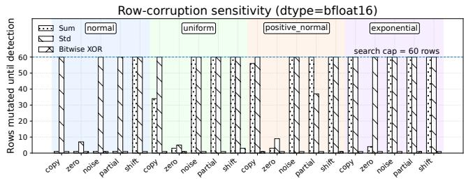

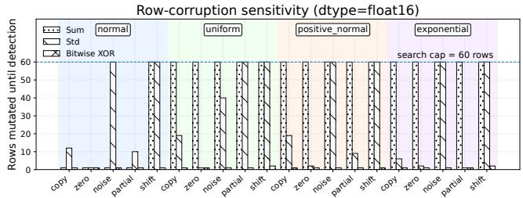  
Figure 10. Sensitivity of the XOR fingerprint under row-level cor ruptions in bfloat16 and float16.

## A.4 XOR Fingerprints

To determine whether two tensors are bitwise identical, Op-Guard employs a constant-size XOR fingerprint: a deterministic reduction over the raw byte stream of the tensor. Given a contiguous byte array {??1, . . . , ???? }, the fingerprint is

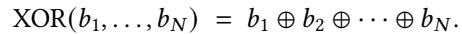

Kernel implementation. At each instrumented Python or CUDA op, OpGuard launches a custom CUDA reduction on the same stream as the operator. The kernel processes the tensor in coalesced 4-byte lanes, reducing to a 32-bit signature in a single pass. If the total byte count is not a multiple of four, the remaining 1–3 bytes are padded with zeros to form the final word, ensuring identical semantics to the CUDA kernel.

XOR is order-insensitive, precision-agnostic, and flips on any bit change. Runtime is on par with native torch.sum/mean and typically below torch.std, imposing negligible overhead. The CPU fallback follows the same rule by packing the byte stream into 4-byte words (zero-padding any leftover bytes) and XOR-reducing them.

Sensitivity. Across all tested tensor precisions (FP32, BF16, FP16), value distributions (normal, uniform, positive-normal, exponential), and corruption modes (full-row overwrite, partial overwrite, small-noise injection, circular shifts), fingerprints diverge after only 1–2 corrupted rows (Figure 10). A single-bit flip always flips the fingerprint. In contrast, numeric summaries (e.g., sum, mean, variance) frequently require tens to hundreds of corrupted rows to manifest detectable changes, particularly under low-precision formats where numeric cancellation is common.

Known blind spots. XOR is intentionally a lightweight fingerprint rather than a cryptographic hash, and it inherits XOR’s algebraic blind spots. In particular, it is insensitive to byte order: a pure permutation of tensor contents, such as swapping two rows, preserves the fingerprint. More generally, structured changes can cancel when the byte-level diferences XOR to zero, for example two identical corruptions introduced an even number of times. We consider this acceptable for OpGuard’s operating point for three reasons. First, the production failures we target are silent value corruptions, stale reads, missed writes, precision/path regressions, and communication inconsistencies, all of which typically introduce non-canceling byte changes at the first faulty boundary. Second, OpGuard records shape, dtype, device, rank, stream, and boundary identity alongside the fingerprint, so XOR is not used to validate semantic reordering or layout changes in isolation. Third, the constant-size XOR kernel is cheap enough to run continuously at many boundaries; replacing it with a stronger order-sensitive hash would reduce coverage or increase perturbation. When a bug hypothesis is specifically permutation-sensitive, OpGuard can rerun that small region with full tensor dumps or a stronger checker, but this has not been needed for the cases in our study.

Collision probability. As a linear map {0, 1}8?? → {0, 1}32, XOR admits collisions in principle, but only when the two tensors difer by a byte vector whose XOR reduces exactly to zero. For random corruptions, the probability is 2−32 (2−64 for a 64-bit variant), negligible relative to typical sources of training noise. No collision was observed in millions of trials.

False positives and negatives. False positives cannot occur because the fingerprint is deterministic and purely byte-based. False negatives require two distinct tensors to reduce to the same XOR value, which for random corruptions occurs with the same 2−32 probability noted above. A more subtle structural false negative may arise only when a tensor contains a permutation or deliberate, perfectly duplicated byte sequences that appear an even number of times, allowing their contribu tions to cancel. We observed the latter once while diagnosing Bug 29, where the model carried two identical embedding tables for interface uniformity. Such duplication does not arise in optimized production or open-source training pipelines.

Precision-independence and practicality. Because the fin- gerprint operates directly on raw bytes, its sensitivity is invariant to the tensor’s numeric precision and underlying distribution. The overhead consists of two small reduction kernels per operator boundary (≈ 0.8×–≈ 1.1× the cost of torch.sum), making the method suitable for continuous use over multi-day runs.

## A.5 Practical Determinism Controls

The main paper summarizes the control surfaces that make bitwise alignment well-defined. This section records the concrete knobs we use in practice. These controls are lightweight and do not alter model semantics or disable core optimizations.

Controlled randomness and initialization. We set consis- tent seeds for CPU and CUDA RNGs [71], dropout streams, and dataloader workers [67], and use deterministic distributed initialization so that all ranks construct identical parameters and mini-batch sequences [66].

Deterministic kernel and library behavior. Reproducible kernel selection is achieved with torch.use\_deterministic\_- algorithms, deterministic cuDNN modes, disabled autotuning, and TF32 disabled (torch.backends.cuda.matmul.allow\_tf32 = False) [70]. For cuBLAS, setting a fixed workspace configuration (e.g., CUBLAS\_WORKSPACE\_CONFIG=:16:8) prevents stream-dependent workspace choices and keeps accumulation order stable. cuBLAS reproducibility also assumes the same toolkit version, GPU architecture, and SM count across runs; multi-stream use requires either a user-provided workspace or CUBLAS\_WORKSPACE\_CONFIG [51].

Deterministic attention and MoE operations. Certain fused attention and MoE kernels vary in reduction order or token grouping. We select deterministic variants using internal control flags that enforce stable indexing and stable accumulation patterns, preventing kernels that compute the same math but use unstable internal scheduling or reduction orders from causing bitwise drift.

Deterministic collectives. Floating-point collectives must follow the same reduction tree. We therefore pin the collective algorithm, protocol, and topology so that partial sums are accumulated in an identical order across runs. [56] Residual divergence under fixed topology indicates a true correctness fault or silent data corruption (SDC) (Bug 10 and Bug 12).

Checkpoint-resume determinism. To resume bitwise-identically, all parallel ranks restore their RNG states, optimizer state, dataloader position, and scheduler counters. With complete restoration, a resumed run continues bitwise from saved prefix.

Bitwise Comparability Across Parallelism. We also achieve bitwise comparability across diferent parallelism degrees, including internal and open-source Megatron-style tensor parallelism (TP). Because standard TP changes arithmetic order via tensor sharding and parallel reductions, we introduce a TP-simulator mode:

• The logical TP size remains > 1, but each rank executes the full, unsharded computation: embeddings, attention projections, activations, and logits are replicated locally.

• Standard TP modules (vocab-parallel embedding, column-/row-parallel linear layers, dot-product attention, and parallel cross-entropy) are replaced with virtual TP layers that avoid scattering, reconstruct full inputs on each rank, and use collectives only as numerical no-ops.

• Parameter shapes, padded vocabulary sizes, and RNG streams are overridden to match the TP= 1 configuration.

• Optimizer-side reductions (e.g., gradient-norm all-reduce and distributed parameter synchronization) are routed through degenerate single-rank paths.

Under this mode, all ranks observe identical inputs, parameters, gradients, and updates, yielding training trajectories that are bitwise identical between TP= 1 and virtual TP. This enables OpGuard to compare executions across diferent parallelism settings without conflating arithmetic reordering with faults (Bug 23).

## B Diagnosed Cases

## B.1 Production Cases

Detailed diagnoses for the 20 production failures are summarized in Table 3, highlighting symptoms, root causes, and the precise operator boundary where OpGuard first detects divergence.

## B.2 Open-source Cases

Detailed diagnoses for the 10 open-source issues are summarized in Table 4, showing how OpGuard isolates the earliest semantic boundary that diverges across implementations.

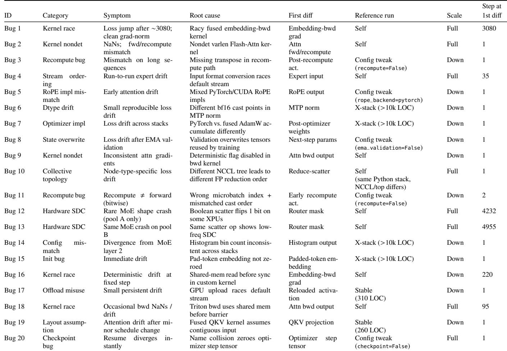  
Table 3. Summary of 20 production failures diagnosed using OpGuard. The table reports the first divergent tensor, the reference run used for comparison, replay scale, and the training step where the first mismatch appeared. Reference runs are grouped as self-replay (Self), last stable commit (Stable), configuration tweak, or cross-stack comparison (X-stack); parenthesized LOC counts are approximate code diferences.

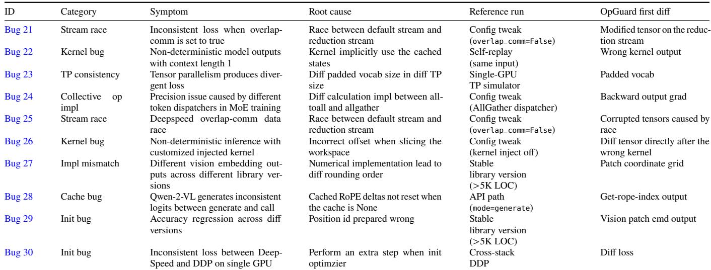  
Table 4. Summary of 10 open-source issues evaluated using OpGuard. The reference column reports the run or configuration used for alignment; the first eight cases produced precise first-diference operators, while the last two expose current alignment limits.