Latest updates: hps://dl.acm.org/doi/10.1145/3731569.3764794

RESEARCH-ARTICLE

# Rearchitecting the Thread Model of In-Memory Key-Value Stores with μTPS

YOUMIN CHEN, Shanghai Jiao Tong University, Shanghai, China

JIWU SHU, Tsinghua University, Beijing, China

YANYAN SHEN, Shanghai Jiao Tong University, Shanghai, China

LINPENG HUANG, Shanghai Jiao Tong University, Shanghai, China

HONG MEI, Shanghai Jiao Tong University, Shanghai, China

Open Access Support provided by:

Tsinghua University

Shanghai Jiao Tong University

Published: 12 October 2025

Citation in BibTeX format

SOSP '25: ACM SIGOPS 31st Symposium

on Operating Systems Principles

October 13 - 16, 2025

Seoul, Republic of Korea

Conference Sponsors: SIGOPS

# Rearchitecting the Thread Model of In-Memory Key-Value Stores with μTPS

Youmin Chen, Jiwu Shu†, Yanyan Shen, Linpeng Huang, Hong Mei Shanghai Jiao Tong University †Tsinghua University

## Abstract

This paper presents μTPS, a new thread architecture tailored for in-memory key-value stores (KVSs) that operate at tens of millions of operations per second. We show through analysis and demonstration that the widely used run-to-completion thread architecture, which executes monolithic functions from start to finish, often suffers from cache inefficiencies and contention issues. To address this, we revisit the once widely used thread-per-stage (TPS) architecture, but with a fresh perspective – separating cache-resident, contention-free stages and memory-resident, conflict-prone stages into distinct thread pools, and scheduling them with dedicated hardware resources (e.g., CPU cores, cache ways). This novel division enables independent optimization of each stage, significantly improving cache efficiency and mitigating contention. Additionally, μTPS incorporates reconfigurable RPC, resizable caching, and an auto-tuner to enhance its schedulability and performance. We implement two in-memory key-value stores, μTPS-H and μTPS-T, to demonstrate the effectiveness of this approach. Evaluation results show that μTPS achieves higher performance than the run-to-completion counterparts.

## ACM Reference Format:

Youmin Chen, Jiwu Shu†, Yanyan Shen, Linpeng Huang, Hong Mei. 2025. Rearchitecting the Thread Model of In-Memory Key-Value Stores with μTPS. In ACM SIGOPS 31st Symposium on Operating Systems Principles (SOSP ’25), October 13–16, 2025, Seoul, Republic of Korea. ACM, New York, NY, USA, 16 pages. hps://doi.org/10.1145/3731569.3764794

## 1 Introduction

In-memory key-value stores (KVSs) are a cornerstone of modern data centers, enabling fast, concurrent, and shared access to data across distributed clients. Optimizing KVS design has become a vital area of research, driving extensive efforts over the years to push the boundaries of throughput, latency, and resource efficiency [21, 26, 46, 47, 50].

In a KVS, the thread architecture defines how client requests are mapped to server threads and scheduled on CPU cores, critically determining the throughput, latency, scalability, and programmability [59]. Traditional storage systems [19, 36, 44] often adopt a thread-per-stage (TPS) architecture, based loosely on SEDA design principles [64]. In this approach, request processing is decomposed into a series of stages (or functions), each running on a dedicated thread pool; requests traverse these stages via event queues and are scheduled by the operating system (OS). For example, HBase employs over 10 such stages (e.g., RPC handling, logging, data streaming) and ∼1000 interacting threads [36]. The advantages of the TPS approach are manifold, including much faster code velocity due to the modular design, increased scheduling flexibility, and independent scaling of individual stages [17, 66].

Over the past years, cloud networks evolved from 1Gbps and a few hundred 𝜇𝑠 to over 200Gbps and single-digit 𝜇𝑠; emerging memory/storage technologies like CXL-attached RAM [24], memory-semantic SSDs [11], and Optane memory [6] can deliver millions of IOPS with sub-𝜇𝑠 latency. The latency of these devices is significantly below the OS scheduling latency (typically measured in 𝑚𝑠), driving a fundamental shift in the thread architecture design. A prominent example of this shift can be seen in userspace dataplane libraries (e.g., DPDK [2], RDMA libibverbs [14]). They employ a nonpreemptive thread architecture, where threads are pinned on CPU cores, interact directly with the hardware, and use spinpolling to check hardwares’ completion status, eliminating the costly context switch overhead.

The non-preemptive thread architecture delivers impressive performance gains, exemplified by recent in-memory KVSs such as MICA [47] and FaRM [26, 27]. They typically adopts a run-to-completion (RTC) model, where each worker thread handles an entire request from start to finish. In doing so, conventionally decomposed processing stages are collapsed into a single monolithic function, which diminishes CPU cache efficiency and amplifies contention at extremely high throughputs (e.g., >10M ops/s). In a KVS, processing a KV operation typically involves multiple steps: fetching and parsing the network request, traversing the index structure to locate the data item, read or write data by copying it between the network buffer and KVS storage, and returning a response to the client. These sub-tasks exhibit varying memory access patterns and multicore scalability. For instance, request polling involves sequential accesses to a small network buffer range and scales efficiently; instead, index traversal and data copying require accessing a much broader memory space and often necessitate locking mechanisms to handle request conflicts. With the non-preemptive thread architecture, these heterogeneous sub-tasks are executed sequentially by each server thread, easily leading to cache thrashing and unnecessary blocking between stages.

The impact of this issue is more severe than it may seem. Modern NICs deliver packets at rates >10 Mops/s, requiring each request to be completed at nanosecond-scale latencies. With insufficient cache capacity, accesses are thus increasingly served by main memory, resulting in higher per-request processing times. This overhead translates to degraded throughput and latency – a single cache miss can introduce a delay of 50–150𝑛𝑠 [18], while completing a KV operation takes only a few hundred 𝑛𝑠. Recent works, e.g., ShRing [54], Iat [67], and CacheDirector [30], advocate for improving the LLC efficiency through better cache allocation and data structure designs. However, they leave the thread architecture as is, and thus cannot fundamentally address the cache thrashing problem due to interferences between sub-tasks.

Instead, we address the problem by re-embracing the TPS architecture in a non-preemptive context, and thus propose μTPS. Rather than adhering strictly to the classic modular design philosophy, μTPS is approached from a different perspective – separating cache-resident, contention-free stages and memory-resident, conflict-prone stages into two distinct thread pools. This bisected approach minimizes the frequency of cross-stage communication, while enabling independent optimization of each stage. At the cache-resident layer, we allocate dedicated worker threads and cache ways, and employ customized data organization, ensuring that the managed data is never evicted out of the CPU cache. At the memoryresident layer, we extensively utilize batching and prefetching to mitigate cache miss penalties. Moreover, this separation allows more scalable stages to operate independently, thereby preventing potential blocking overhead.

While μTPS offers compelling advantages, its practical implementation faces several challenges. First, not all stages offer a clear distinction between cache residency and memory residency. For example, index traversal and data copying in a KVS are workload-dependent: skewed workloads, which are common in production environments [20, 65], can create hotspots at specific memory locations. We address this by further dividing such stages, where hot data is managed separately by the cache-resident layer. Second, μTPS still incurs additional overhead for inter-stage communication, which may offset the benefits of the separation. We mitigate this through a lightweight, scalable queue design and more effective stage placement. Third, in μTPS, pinned worker threads are no longer scheduled by the OS scheduler, and the storage software is responsible for adjusting the number of CPU cores (or threads) allocated to each stage as the load fluctuates. Similar adjustments should also be made for cache way allocation and hotspot management. These factors not only create a complex scheduling space to explore and optimize, but also require a more sophisticated design for each stage to adapt to such dynamic changes. We introduce an autotuner that hierarchically explores the optimal configurations for each stage, complemented by tailored RPC and caching mechanisms to support runtime reconfigurations.

We implement two in-memory KVSs, μTPS-H and μTPS-T, based on μTPS, which use libcuckoo and MassTree, respectively, as their index structures. Our extensive evaluation demonstrates that μTPS achieves a 1.03-5.46× speedup over KVSs with a RTC thread architecture, while maintaining comparable latency levels. We also show that μTPS can be automatically reconfigured to adapt to different workloads. With hash-based index or uniform workloads, the performance gains achieved by uTPS are modest; however, we believe these improvements are still valuable: even minor reductions in latency or increases in throughput can lead to significant cost savings at scale in production environments.

In summary, our paper makes the following contributions:

• We provide a detailed taxonomy of KVS thread architectures to motivate the design of μTPS.

• We introduce μTPS, a novel thread architecture that reembraces the TPS design in a non-preemptive context.

• We implement two in-memory KVSs based on μTPS and our evaluation shows μTPS achieves excellent performance.

## 2 Background and Motivation

In this section, we first present a taxonomy of KVS thread architectures (§2.1), which motivates our work through empirical analysis (§2.2); then, we discuss the challenges when realizing the system (§2.3).

## 2.1 A Taxonomy of the KVS Thread Architecture

A KVS thread architecture essentially defines two aspects – how threads are scheduled on CPU cores and how client requests are divided among threads. Based on the two dimensions, we present a hierarchical taxonomy of existing KVS thread architectures (Figure 1).

2.1.1 Preemptive Thread Architecture. Network and storage devices were initially slow, with technologies like Gigabit Ethernet and HDDs exhibiting millisecond-scale latencies. To hide such high latencies, operating systems introduced preemptive multitasking to improve CPU efficiency. When interacting with a device, the CPU core performs a context switch, yielding control to another task (thread), instead of blocking on the current IO; when the IO completes, the device sends an interrupt to the CPU core, allowing the original thread to resume. Therefore, preemptive multitasking enables multiple threads to time-share the same CPU core. We further investigate the request-to-thread assignment policies when applying the preemptive thread architecture in a KVS.

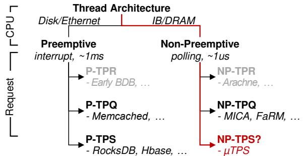  
Figure 1. A Taxonomy of thread architectures. P and NP indicate preemptive and non-preemptive, respectively.

Thread per request (P-TPR) was once a commonly used design and is well supported by many RPC frameworks [38, 58]. In this architecture, a new thread is spawned for each new request or connection to handle its processing. Although straightforward to implement, TPR introduces significant scheduling overhead: as the offered load increases, the number of worker threads grows proportionally, leading to frequent thread switching when they time-share CPU cores. This results in cache pollution and context switch overhead, ultimately degrading performance severely. KVSs that adopt P-TPR: BerkeleyDB with its RPC server wrapper [52], early Voldemort [13] with default configuration, etc.

Thread per queue (P-TPQ) is a more scalable design used in recent KVSs [31, 32]. In this model, a number of threads are created at system startup, which loop continuously from their dedicated queues and process requests when available; optionally, a dispatching thread is responsible for forwarding incoming requests to these worker threads. A key distinction between P-TPQ and P-TPR is that the former reuses worker threads among requests. This reuse is further facilitated by issuing asynchronous I/Os (e.g., libaio), where request processing is implemented as finite state machines (FSM), and completion notifications trigger transition between states. TPQ interleaves computation and I/O across requests within the system software, improving resource utilization and scalability. KVSs that adopt P-TPQ: Memcached [32], KeyDB [10] (a multithreaded fork of Redis), etc.

Thread per stage (P-TPS). As KVSs becomes increasingly complex, processing a single request often involves multiple stages (e.g., indexing, journaling, data I/O) and background activities (e.g., garbage collection). As a result, P-TPS is widely adopted by modern KVSs to handle this complexity. P-TPS follows loosely on SEDA design principles [64], which employs a series of thread pools, each responsible for a specific stage of request processing, connected via event queues. TPS improves code modularity and simplifies application design by compartmentalizing distinct stages. Moreover, dividing stages into separate thread pools further enhances scheduling flexibility and performance isolation. For example, TAM [66] retrofitted many existing TPS-based systems with advanced scheduling features (e.g., weighted fairness) by manipulating the request queues among stages; similarly,

SILK [17] prevents latency spikes in log-structured merge KVS by throttling background compaction activities. KVSs1 that adopt P-TPS: RocksDB [25], TiKV [37], HBase [36], Cassandra [44], MongoDB [19], etc.

2.1.2 Non-preemptive Thread Architecture. Userspace dataplane libraries (e.g., DPDK, RDMA) typically employ a non-preemptive thread architecture, which use busy polling to interact with the device. Unlike preemptive multitasking, non-preemptive thread architectures rely heavily on the runto-completion model, making request-to-thread assignment policies a critical design space. Among them, we identify two widely used policies in existing KVSs.

Thread per request (NP-TPR). Spawning and destroying threads for each request is prohibitively expensive when managing fast hardware devices. Recent systems leverage lightweight green threads or uthreads to implement NP-TPR [3, 15, 55]. These systems maintain a lightweight context for each uthread in userspace and use longjump instructions for fast context switching, bypassing the OS kernel. For example, Arachne [55] can spawn a new uthread in just 320ns. However, the overhead of temporarily creating and destroying threads remains significant when dealing with network devices delivering tens of millions of IOPS. KVSs that adopt NP-TPR: Memcached running inside Arachne [55].

Thread per queue (NP-TPQ). The application of TPQ in non-preemptive thread architectures is facilitated by several key optimizations. First, traditional P-TPQ relies on a centralized dispatcher to assign requests to a pool of threads, which easily becomes a bottleneck in face of high-speed network devices. Recent systems [26, 27, 47] avoid this bottleneck by establishing dedicated connections between client and worker thread pairs and binding threads to specific CPU cores, allowing clients to directly send requests to specific server cores. Second, to avoid expensive synchronization among server threads, these systems often employ the share-nothing design [43, 45], where each thread exclusively manages a subset of data (i.e., shard), enabling lock-free data modifications. Third, to better utilize CPU cores, these systems often employ batching to amortize the cost when interacting with the device [41, 42, 45]. Last, coroutines [1] are extensively used to further harvest the CPU cycles that would otherwise be wasted for busy-polling completion notifications [43]. KVSs that adopt P-TPQ: MICA [47], FaRM-KV [26, 27], etc.

Why not thread per stage (i.e., NP-TPS)? In the nonpreemptive thread architecture, NP-TPQ has become the de facto choice for building storage systems targeting fast network/storage devices. This is in contrast to the preemptive thread architecture, where P-TPS is widely adopted. The key reason is that TPS introduces frequent inter-thread communication among stages, making it challenging to fully exploit the performance potential of modern high-speed hardware.

## 2.2 The Opportunity of NP-TPS

In contrast to conventional wisdom, our work presents a contrary observation, showcasing NP-TPS’s strengths in cache friendliness and contention mitigation. Building on these insights, we design and implement a network-attached inmemory KVS, demonstrating the viability of NP-TPS to manage fast hardware devices.

2.2.1 Cache friendliness. As illustrated above, NP-TPQ necessitates each worker thread to process requests from start to finish in a run-to-completion manner. This necessitates executing a single, monolithic function for every request. In an in-memory KVS, the function encompasses tasks such as polling requests from the network queue, performing index lookups, copying data buffers, and sending responses to clients. However, executing monolithic functions is inherently cacheunfriendly due to the heterogeneity of their sub-steps in terms of memory access patterns.

For example, in a KVS, polling requests via a userspace network dataplane (e.g., RDMA) involves issuing load instructions from the network buffer to retrieve newly received requests. Modern processors (e.g., Intel CPU) support direct cache access (DCA), enabling an NIC to directly populate the fast on-chip last-level cache (LLC), bypassing the slower main memory. With proper network buffer design (e.g., keeping buffer size smaller than LLC), polling can nearly eliminate cache misses. However, index lookup and data access stages involve accessing a broader memory space, which is the main source of cache misses. Intuitively, packing such stages into a single function often leads to cache thrashing at various cache levels, severely degrading CPU pipeline efficiency.

Benefits of separating network buffers. To quantify the cache inefficiency of NP-TPQ, we prototyped an in-memory KVS using RDMA network and MassTree [49], adhering to the NP-TPQ design. In our prototype, multiple worker threads are launched to poll requests from clients, parse them to extract the request type and key, perform lookups in MassTree to locate the corresponding data items, and return responses to the clients. For comparison, we also implement a NP-TPS version, where the request polling/parsing/response stages and the index lookup/data access stages are split into separate thread pools. To isolate the benefits of TPS, we remove interstage communication through deterministic replay at each stage: instead of forwarding requests via inter-stage queues, the second stage uses a deterministic generator to reproduce the exact same sequence of requests for processing. Because the two stages operate independently without communication, we manually tuned the number of threads in each stage to ensure the two stages process requests at matching rates.

We use two client nodes to send requests to a server node, which are connected via a 200Gbps RDMA network; the detailed experiment setup will be described in §5.1. As shown in Figure 2a, TPS-based KVS, without the overhead of inter-stage communication, achieves a 1.22-1.54× throughput improvement over the TPQ one. To better understand this performance gain, we use Intel’s Performance Counter Monitor (PCM [7]) to measure last-level cache (LLC) miss rates. The results reveal that: i) threads in the first stage exhibit a significantly lower LLC miss rate of just 2%, compared to 33% in NP-TPQ; ii) threads in the second stage maintain a similar LLC miss rate to those in NP-TPQ. Furthermore, TPS reduces the instruction cache footprint for each worker thread, contributing to improved overall cache efficiency.

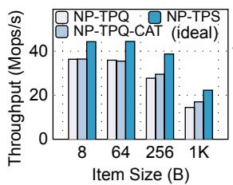  
(a)

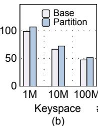

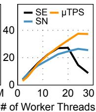  
(c)  
Figure 2. Comparison between NP-TPS and NP-TPQ. a) Throughput of get oprations with an uniform workload; b) Throughput of index lookup in MassTree with a skewed workload; c) Throughput of put operations with a skewed workload (64B items).

Separating LLC? The current implementation of DCA in Intel processors (i.e., data direct I/O, DDIO [4]) typically uses the two rightmost ways in LLC [29]. Hence, this setup raises a potential argument: could the cache inefficiency of NP-TPQ be mitigated by preventing worker threads from using the cache ways reserved for DCA? Tools such as Intel’s Cache Allocation Technology (CAT) [9] enable cache way partitioning, which could, in theory, isolate DCA-reserved cache ways from being polluted by worker threads. However, our experiment shows that cache partitioning has a very close performance to NP-TPQ for small item sizes, and only shows slight performance improvements with larger item sizes, still lagging behind NP-TPS (Figure 2a). This outcome stems from the intricate behavior of DDIO: DDIO uses the two rightmost ways in LLC only for cache allocation triggered by cache misses; if a cacheline already resides in the LLC (beyond the DCA-reserved ways), DDIO modifies or accesses it directly. In TPQ, when worker threads poll new requests or prepare response messages, these data items in the network buffer can be fetched into arbitrary LLC ways except for the two rightmost ones, and subsequent stages, such as indexing and data access, can further evict these fetched cachelines, still leading to frequent DDIO-initiated cache misses. In contrast, TPS assigns indexing and data access stages to separate worker threads, ensuring that cached network buffers mostly remain intact, thereby preserving cache efficiency.

Benefits of separating hotspots. Skewed workloads, which are common in production environments, create hotspots at specific memory locations, blurring the distinction between cache residency and memory residency of stages such as indexing and data access. These hotspots, however, can be managed by dedicated threads and LLC ways, preventing them from being evicted from the CPU cache. To demonstrate the benefits of this approach, we conduct experiments measuring the throughput of index lookup in MassTree, where we redirect 0.1‰ queries associated with the hottest keys to a dedicated thread pool for processing. As shown in Figure 2b, given the same total number of worker threads, the separation yields an average throughput improvement of 1.08× with Zipfiandistributed keys generated by YCSB.

In summary, handling frequently accessed data in dedicated threads and cache ways can potentially enhance cache efficiency, thereby improving overall system performance.

2.2.2 Contention Mitigation. We further find that NP-TPS strikes a better balance between load balancing and contention mitigation under skewed workload. With the TPQ architecture, a KVS typically employs a shared-nothing (SN) design, where each worker thread is assigned a distinct shard to manage, minimizing the need for synchronization between threads. However, under skewed workloads, this approach often results in uneven load distribution, causing some threads to become idle while others are overloaded. On the contrary, a share-everything (SE) architecture allows clients to handle any requests, achieving better load distribution. However, the benefits come at the cost of significant synchronization overhead, especially as the number of threads increases. Our experiments illustrate this trade-off: as shown in Figure 2c, the peak throughput of SE initially exceeds that of SN, but degrades rapidly as more threads are added due to synchronization. Our key insight lies in the fact that not all stages are equally susceptible to workload contention – stages other than index/data updates are highly scalable. In NP-TPQ, different stages are sequentially executed by each thread, synchronization at a stage forces the worker thread to be blocked, preventing other stages from making progress. Instead, NP-TPS allows different stages to be processed by different threads, so we can throttle the number of threads assigned to the index update stage, leaving other threads to process other stages without being blocked. This effectively mitigates the contention issue, as is demonstrated by our experiments in Figure 2c.

## 2.3 Challenges

While the NP-TPS architecture offers compelling advantages in cache efficiency and contention mitigation, its practical implementation introduces several challenges.

Reconfiguration complexity. In order to keep each stage within its operating regime, P-TPS systems need to adapt the number of threads based on observed performance. However, reconfiguration in NP-TPS is inherently more complex: workload variations impact not only the total number of threads needed (e.g., under load changes) but also how threads are distributed across stages. Workload shifts, such as changes in access skew or item size, can alter the processing time at each stage, requiring finer-grained thread reassignment.

This is particularly critical in fast in-memory KVSs, where suboptimal thread division can result in performance degradation of up to millions of ops/s. Moreover, factors such as cache way allocation and hotspot management also require careful attention. For example, the memory-resident stages often experience high cache miss rates, making it inefficient to allocate additional cache ways to them. Similarly, hot items must be dynamically adjusted in response to shifting hotspots. These factors create a multidimensional scheduling landscape that must be automatically explored in real time.

Reconfiguration overhead. Given the single-digit 𝜇s access latencies of a KVS, each stage must be designed to adapt rapidly to dynamic reconfiguration to prevent latency spikes. As noted, the non-preemptive thread architecture relies on client software to direct requests to specific worker threads. Consequently, when the number of threads for the request polling stage changes due to reconfiguration, this information must be propagated to the clients – introducing additional blocking overhead and increasing software complexity.

Inter-stage communication. The superior performance of NP-TPS observed in §2.2.1 assumes no inter-stage communication. However, reintroducing such overhead can undermine these advantages. Addressing this challenge requires attention to two key aspects: designing a more efficient communication queue, and minimizing the frequency of inter-stage communication through more effective stage placement.

## 3 μTPS Design

## 3.1 Overview

We present the design of μTPS to address the aforementioned challenges. Figure 3 depicts the overall architecture of μTPS, which organizes the stages of an in-memory KVS into two layers: a cache-resident (CR) layer and a memory-resident (MR) layer, and uses an auto-tuner to dynamically adjust the two layers’ configuration.

• Cache-resident layer. Mainstream enterprise-level CPUs has shared LLC (e.g., 42MB LLC in Xeon Gold 6330 CPU and 504MB LLC in Xeon 6978P CPU) and private L1/L2 caches. The cache-resident layer ensures that frequently accessed data is largely resident in the CPU LLC. We achieves this with a combination of the following ways: i) using separate worker threads and pinning them to specific CPU cores to execute the cache-resident layer; ii) allocating dedicated LLC ways for these threads; and iii) keeping the amount of data at the cache-resident layer small to fit in the cache – only managing the hottest KV items and network buffers. Note that these techniques cannot completely eliminate cache evictions. For instance, in a set-associative cache, conflicts among cachelines mapping to the same set can still occur, leading to cache misses.

• Memory-resident layer. The full index and data items are stored at the memory-resident layer. At this layer, worker threads fetch requests from the CR-MR queue posted by the cache-resident layer, and extensively use batching, prefetching, and coroutines [1] to amortize the cost of cache misses when processing them.

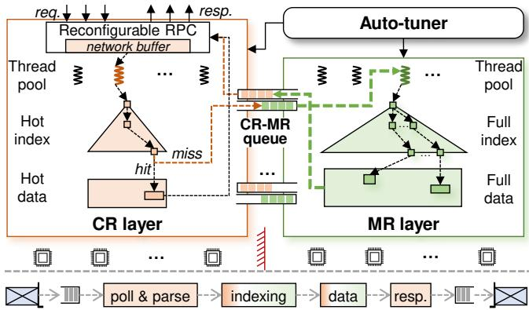  
Figure 3. μTPS’s architecture and interactions. CR and MR stand for cache- and memory-resident, respectively. The bottom part describes the main steps for processing KV requests, with colored box reflecting which layer(s) is(are) mapped to.

• Auto-tuner. The auto-tuner dynamically adjust the configuration of the cache- and memory-resident layers to react fast to load changes. At its core, the auto-tuner employs a feedback loop to monitor the system’s performance, using this data in conjunction with hierarchical searching to guide adjustments in the number of worker threads, cache ways, and the management of hot and cold items at each layer.

Like existing KVSs, μTPS provides standard APIs (e.g., put, get, and delete) to remote clients. The KVS server node supports organizing key-value items using different data structures (e.g., hash table, B+-tree, etc.). As shown in Figure 3, when a new request arrives, the worker thread at the cache-resident layer fetches the request from the network receive buffer, parse it, and process it if it correspond to hot items; otherwise, the request is forwarded to the memoryresident layer for further processing. Once the request finishes processing, the cache-resident layer worker thread sends the response back to the client.

uTPS differs from the traditional TPS in the following three aspects. First, traditional TPS follows a modular design, dividing the system into multiple stages based on functional boundaries; uTPS only has two stages, with task assignment driven by cache residency. Second, traditional TPS optimizes slow I/O bottlenecks using techniques like DRAM buffering to boost throughput; In uTPS, modern NICs enable worker threads to operate at extremely high speeds. To fully leverage this, uTPS introduces CR-MR queue, polling, and batching to ensure efficient interaction among cores and the NIC. Finally, traditional TPS relies on the OS scheduler when adjusting the thread pool at each stage as load changes; uTPS pins threads on cores and schedules them in the storage software for rapid adaptation with low blocking overhead.

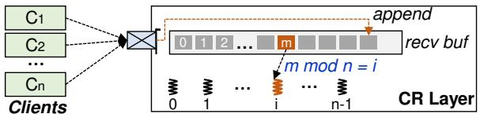  
Figure 4. Receive buffer management in reconfigurable RPC.

## 3.2 Cache-Resident Layer

At the cache-resident layer, the number of worker threads and cached hot items should be dynamically changed as load functuates, and their memory footprint should be kept low. We achieve this by introducing dedicated RPC and caching designs.

3.2.1 Reconfigurable RPC. RPC systems based on kernelbypass networking (e.g., RDMA or DPDK) should maintain a memory pool of network buffers to send and receive packets through the NIC. Sizing the memory pool requires consideration of several factors, including the number of open connections, the worst-case delay in packet processing time, and the network round trip time [34]. For example, RPC systems that rely on one-sided RDMA verbs, such as FaRM-RPC [26], require a separate receive buffer for each client at each worker thread, leading to substantial memory overhead that can easily exceed CPU cache sizes as the number of clients increases; eRPC [40], a fast and general-purpose RPC library, needs to allocate a 15-MB buffer per worker thread.

Moreover, these RPCs do not support increasing or decreasing the number of worker threads dynamically, and simply reframing their software stack introduces extra overhead. For example, both FaRM-RPC and eRPC allows clients to specify a worker thread to send requests to; when the number of worker threads changes, this information should be synchronized across all clients. We address these challenges by introducing reconfigurable RPC.

At the core of reconfigurable RPC is a single-queue receive buffer at the server node (see Figure 4). Clients send requests concurrently to the server node, and the server-side RNIC appends requests of different clients to the end of a single receive buffer. The worker threads then fetch and parse requests from the receive buffer in a round-robin manner. Specifically, the 𝑖𝑡ℎ worker thread only fetches requests located at the $m ^ { t h }$ slot where 𝑚 mod 𝑛 = 𝑖, while requests at other slots are untouched (𝑛 denotes the number of worker threads). Moreover, the requests in the receive buffer are processed independently – a request is fetched and processed without waiting for the former ones in the queue to finish; this reduces the potential risk of head-of-line blocking. The single-queue design offers several advantages. First, it reduces the memory overhead by sharing the receive buffer among all worker threads. Second, the KVS server can easily adjust to a new configuration by simply changing a global variable 𝑛 (i.e., the number of worker threads) at the KVS server, eliminating costly coordination with clients. A detailed reconfiguration procedure will be shown in §3.5.

Reconfigurable RPC is realized by creating a shared receive queue (SRQ) [14] to associate all client connections (i.e., queue pairs). SRQ is a standard feature supported by all NVIDIA RNICs. Specifically, we use a management thread to post receive buffer slots (using the recv verb) into the SRQ in an increasing address order, and clients use the send verbs to send requests to the server. Newly received data are DMAed into the first receive buffer slot in SRQ by the server-side RNIC. Whenever a slot is digested by the RNIC, the management thread posts another recv to push the slot back in SRQ. Similar to prior work [63], we adopt the multi-packet receive queue (MP-RQ) [12] to alleviate the overhead of posting recv verbs, where a receive buffer slot associated with a recv verb can accommodate multiple requests. For sending response messages back to clients, we assign a dedicated response buffer to each worker thread. The size of the response buffer can be kept small (e.g., 64KB), as it can be reused among different batches of requests.

3.2.2 Resizable Cache. The cache-resident layer also caches hot items to prevent them from being evicted from the CPU cache. Regarding the dynamic nature of real workload, the cache-resident layer should adapt to changing of the hot set and use as little memory space as possible.

Conventional caching mechanisms, such as LRU, incur heavy bookkeeping overhead to track frequently accessed items, and are not suitable for the cache-resident layer. Instead, we adopt a hot set-based approach [56, 61]: using a background thread to identify the hottest items and cache them, and periodically refresh the cache to react to load changes. We leverage Nap [61]’s non-blocking algorithms to manage the hot set. Periodically, the background thread samples recently accessed keys and uses a combination of count-min sketch [23] and min heap to track the hottest items (10K items in our implementation); then, it switches the cache space to the new hot set via an epoch-based approach [33], ensuring that cache modifications are reflected atomically to all worker threads. The resizable cache distincts from existing hot setbased approaches in that the cache layer is managed separately at the cache-resident layer with dedicated worker threads and LLC ways, and requires further refining to ensure the cache module fits well with the cache-resident layer.

First, the number of cached items must be resizable to prevent the hot set from being set to unreasonably large. Managing a large hot set in μTPS is instead counterproductive since the performance difference between the cache- and memory-resident layers is not an order of magnitude apart (unlike the disparity between DRAM and HDD). A large hot set would result in a significant penalty when processing requests that miss at the cache-resident layer. To this end, during each refresh of the hot set, the management thread heuristically adjusts the number of cached items using the epoch-based approach until a maximal performance is achieved (see §3.5 for details).

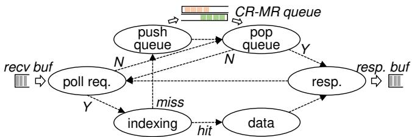  
Figure 5. FSM execution model at the cache-resident layer.

Second, the cached items should be organized to occupy less memory space. When using a tree-based index structure that supports range queries, we organize the cached index items at the cache-resident layer as an ordered array, as it eliminates the intermediate pointers present in tree-based structures. A sorted array is well-suited for this scenario since the hot set is periodically constructed and refreshed, avoiding the overhead from temporary insertions and deletions, while still enabling efficient binary search. For KVS systems that use a hash table as the index, we directly reuse the main index structure to manage the hot set. Note that we do not need to keep an extra copy of data items for caching at the cache-resident layer – CPU loads them automatically into the cache when they are accessed.

3.2.3 FSM Execution Model. The worker threads in the cache-resident layer process requests using a finite state machine (FSM). As shown in Figure 5, the state is transitioned along two main paths: the hit path and the miss path. For each incoming request, the worker thread first checks if the corresponding index item is cached. If it is, the worker thread directly reads or writes data and sends the response back to the client; otherwise, the worker thread forwards the request to the memory-resident layer through the CR-MR queue and begins polling for new requests. Responses from the memoryresident layer are awaited asynchronously. Once the response is received from the memory-resident layer, the worker thread then sends it back to the client.

To ensure efficient state transitions in the FSM, polling requests from the receive buffer and CR-MR queue is designed to be non-blocking: the operation returns immediately after an one-shot scan of the queue. The two queues are polled iteratively when they are empty, ensuring that new requests are discovered without delay.

## 3.3 Memory-Resident Layer

The memory-resident layer manages the full index and data items, and processes requests sent from the cache-resident layer. Batch and prefetch are extensively used to amortize the cost of cache misses.

Batched indexing. Index traversing at the memory-resident layer incurs random pointer-chasing operations, and is the major source of cache misses. The memory-resident layer employs batched prefetching with coroutine and hardware prefetch to mitigate this overhead. While the concept of batched indexing is not new, our design is distinct in that the cache-resident layer has already filtered out the hottest items. This prevents unnecessary context-switching overhead that would otherwise occur when prefetching cache lines already residing in the CPU cache.

Stackless coroutines, as supported in C++20 [1], achieve single-dight nanosecond latencies for constructing and switching coroutines. We transform basic indexing operations (i.e., put/get) into their coroutine counterparts using co\_wait and co\_return keywords, and insert prefetch and co\_yield before each pointer dereference operation. To support batched indexing, each worker thread retrieves multiple requests from the CR-MR queue simultaneously and creates indexing coroutines for each of them. The worker thread then functions as a scheduler that switches between these coroutines. Whenever a coroutine issues a prefetch, control is transferred to execute the computation stage of another operation. This approach effectively hides the latency of loading data from memory across the batch of operations, improving overall efficiency.

Copying data items. Batched indexing helps with locating the data items in the KVS, then the worker threads read or write these data items. Data items are not transferred between the cache- and memory-resident layers through the CR-MR queue; instead, the worker threads at the memory-resident layer copies data between the network buffer and the KV storage directly without introducing redundant memory copies. For get operations, data items are copied from the KVS to the response network buffer; once finished, the cache-resident layer sends the response messages back to clients. Notably, the response network buffer can be cached at the memory-resident layer during the data copy process; however, this does not result in cache misses at the cache-resident layer when the worker threads post the buffer to the RNIC. This is because the RNIC is responsible for moving data from the response buffer to the RNIC cache, and the cache-resident layer never touches the buffer directly. For put operations, the memory-resident layer copies data items from the receive buffer to the target storage location. Still, since the memory-resident layer only reads the receive buffer and does not modify it, there is no cache invalidation at the cache-resident layer.

Concurrency control. Note that the separation of the cacheand memory-resident layers does not change the concurrency control protocol of μTPS. A point query is served by either the cache-resident layer or the memory-resident layer, depending on its hotness, so we only need to enforce concurrency control at each layer independently. We adopt a share-everything design at both cache- and memory-resident layers while configuring the number of the worker threads assigned to each layer to maximize system efficiency. This approach requires the index structure and data management to be thread-safe, allowing concurrent accesses and modifications to each KV item. For the index structure, we reuse existing thread-safe and scalable implementation (i.e., MassTree [49] and libcuckoo [28]) directly. For data items, we embed additional lock and version bits within each item to serialize access conflicts. Specifically, updates to data items of 8 bytes or smaller are performed directly using atomic instructions. For larger items, a worker thread first employs an atomic CAS operation to modify the lock bits, placing the item in a locked state. The data item is then updated, and the lock is subsequently released. The item’s version is incremented both before and after the update. Read operations are conducted in a lock-free manner, where the version is read both before and after accessing the data item. The old and new versions are then compared to ensure the atomicity of the read operation.

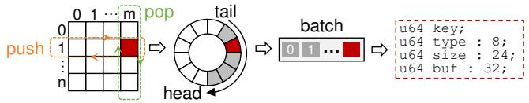  
Figure 6. The architecture of the CR-MR queue.

## 3.4 CR-MR Queue

The CR-MR queue is used for efficient communication between the cache- and memory-resident layers. It is a multiproducer, multi-consumer queue designed for high scalability and high throughput. As shown in Figure 6, the CR-MR queue establishes an all-to-all mapping between cache-resident layer threads and memory-resident layer threads, where each pair of threads is assigned a dedicated, lock-free ring buffer for message transfer. To balance the load at the memory-resident layer, threads at the cache-resident layer push new requests to memory-resident layer threads in a round-robin fashion. Accordingly, a worker thread at the memory-resident layer needs to scan the queues corresponding to all cache-resident layer threads to pop new messages. To further mitigate the overhead of pushing (popping) items to (from) the CR-MR queue, each slot in the ring buffer can accommodate multiple requests. This means that a worker thread in the cache-resident layer will push a new item only when enough requests have accumulated. Similarly, memory-resident layer threads can use a single pop to retrieve multiple requests at once.

As shown in the right part of Figure 6, Each request is compactly represented in 16 bytes of memory. Specifically, the key field (8 bytes) stores the key directly. If the key is larger than 8 bytes, it is hashed into an 8-byte value. In the rare case of a hash collision, multiple items are chained in a linked list, and the original key is used to disambiguate them. type and size fields indicate the request type and the size of the KV item. buf field (32 bits) points to a slot in the network buffer. Since each slot has a fixed size, this field only needs to identify the slot’s position. Depending on the operation, buf may point to a receive buffer (for put) or a response buffer (for get). For efficiency, memory-resident layer threads do not explicitly send completion messages back to the cacheresident layer. Instead, they piggyback this information on the advancement of the tail pointer. A tail pointer is updated only after all requests in the batch have been processed and their responses placed in the response buffers. At that point, the cache-resident layer threads can safely deliver the response buffers to clients.

## 3.5 Auto-tuner

We first explain the detailed steps of thread reassignment, cache resizing, and cache way allocation; then, we present how to automatically tune these reconfiguration parameters.

Thread reassignment. This process involves reassigning worker threads between the cache- and memory-resident layers – i.e., moving some threads from the cache-resident layer to the memory-resident layer or vice versa. The main challenge is to prevent message loss during reassignment, and we describe the procedures for each direction separately.

When moving threads from the cache-resident layer to the memory-resident layer, the manager thread first updates two global variables, $N _ { C R }$ and $N _ { M R }$ , which represent the number of worker threads in the cache- and memory-resident layers, respectively. It then notifies all cache-resident layer threads to switch at a predefined receive buffer slot. Upon reaching this slot: cache-resident layer threads that should remain in their current layer update their local copies of $N _ { C R }$ and $N _ { M R }$ to match the global values, and then continue processing requests using the updated variables for modulo operations and CR-MR communication; cache-resident layer threads that are designated to move to the memory-resident layer invoke the memory-resident layer’s entry function to switch roles; original memory-resident layer threads update their local copies of the two variables only after the CR layer threads have switched to the memory-resident layer and their CR-MR queues do not contain residual requests.

When moving threads from the memory-resident layer to the cache-resident layer, the process differs slightly. Memoryresident threads that slate to move to the cache-resident layer continue processing memory-resident requests upon receiving the manager’s notification. They wait until all CR-layer threads have reached the predefined slot and their CR-MR queues are empty. Only then do they invoke the cache-resident layer’s entry function to switch roles. As illustrated, thread reallocation is performed without blocking request processing.

Cache resizing. When the hot set is refreshed, the manager thread further adjusts the number of cached items to improve the overall performance. With a target cache size 𝐾, the top 𝐾 items from the hot set are selected to replace the original cache. Cache resizing is performed in a similar way to cache refreshing, using an epoch-based approach (§3.2.2).

LLC allocation. The manager thread allocates cache ways using the PQOS utility [8]. The manager thread first associates the worker threads of the cache- and memory-resident layers into different classes of service (CLOS), and then allocates cache ways to each CLOS accordingly.

Automatic tuning. The auto-tuner is triggered when the system load exhibits significant changes (e.g., hot set shift, KV size change, etc.). The auto-tuner employs a feedback loop to monitor the system’s throughput, and uses it as a hint to automatically adjust the above three reconfiguration parameters. Note that thread reallocation and cache resizing cannot be tuned independently. This is because cache resizing alters the load between the cache- and memory-resident layers, which in turn affects the number of worker threads required at each layer. To address this, the auto-tuner uses a hierarchical searching algorithm to find the optimal configuration. For each cache size, the manager thread iterates through all possible thread allocations to identify the best allocation choice. Then, among all possible cache sizes, the manager thread selects the one that achieves the best performance as the final configuration. Cache way allocation, which affects system performance in an orthogonal manner, is tuned independently.

To speed up the search process, we introduce a trisecting approach. We observe that system performance follows an convex curve with respect to thread allocation and LLC allocation, where the performance initially increases and then decreases. Based on this, we trisect the searching space into three parts (i.e., [0, a], (a, b), and [b, max]). If $P _ { a } < P _ { b }$ ( where $P _ { x }$ denotes the system throughput when the parameter is set to 𝑥), the optimal configuration must be in the range [a, max], or conversely, within the range [0, b] if $P _ { a } > P _ { b }$ . The algorithm then iteratively trisects the best-performing part of the search space until the optimal configuration is found. Note that the trisecting approach is inapplicable in cache resizing since it does not exhibit a strict unimodal trend – cache resizing allows finer-grained load balancing between the cache- and memoryresident layers (varying thread counts does not always lead to an optimal division of load). To this end, the auto-tuner finds an optimal cache size by using a linear probe with a fixed step (e.g., 1K in our implementation). Our evaluation shows that, with a performance monitor time window of 10𝑚𝑠, the entire reconfiguration process completes in 0.9 seconds; this is acceptable as load changes in real-world workloads are not that frequent [20, 60]. Moreover, the reconfiguration process never blocks request processing, meaning that the system remains operational during the reconfiguration period.

## 4 Implementation

Based on μTPS, we implement two in-memory KVSs, namely μTPS-H and μTPS-T, which use libcuckoo and MassTree, respectively, as the index structure. μTPS-H supports point queries while μTPS-T supports both point and range queries. In μTPS-T, a range query is processed collaboratively by the cache-resident and memory-resident layers. KV items cached at the cache-resident layer are first copied to the receive buffer, and the range query request is subsequently forwarded to the memory-resident layer for further processing. The memoryresident layer leverages the full index to handle the request, skipping items that are already present in the receive buffer. To support this process, the request structure for range queries exchanged between the cache-resident and memory-resident layers is extended to include the lower and upper bounds of the key range, and the number of items to return. Since range queries typically have much lower throughput than point queries, a larger request structure introduces negligible performance overhead.

## 5 Evaluation

## 5.1 Experimental Setup

Testbed. The server node is equipped with two 28-core Intel Xeon Gold 6330 CPUs and 256 GB of memory (each CPU has 42MB of LLC). Two client nodes are installed with two 16-core Intel Xeon(R) Silver 4314 CPUs and 64 GB of memory. All nodes run the Ubuntu 20.04 and are equipped with Mellanox ConnectX-6 200 Gbps NICs for communication, interconnected through a Mellanox 200 Gbps switch. Unless otherwise specified, all experiments are conducted on 28 cores on a single NUMA node of the server. The client nodes utilize all available CPU cores to generate maximum load.

Compared systems. We compare μTPS against the following systems: (1) BaseKV. This system is identical to μTPS except for its use of a run-to-completion thread pool architecture. Optimizations such as reconfigurable RPC, batching, and prefetching are enabled in BaseKV. (2) eRPCKV. This variant replaces BaseKV’s RPC module with eRPC [40] and uses a share-nothing architecture that directs requests to worker threads by modding the key. We also compare with passive KVSs where clients use one-sided RDMA verbs to access KV items, bypassing the server-side CPUs. Among them, RaceHash [68] is a state-of-the-art passive KVS that employs a hash table as its index structure; Sherman [62] is a passive KVS that uses B+ tree as its index structure.

## 5.2 Overal Performance

We evaluate μTPS using both synthetic workloads (YCSB [22]) and production workloads (Meta’s ETC pool [16] and Twitter [65]). Unless otherwise specified, all tests are conducted on a pre-populated database containing 10M KV items.

5.2.1 Synthetic workloads. As shown in Figure 7, we evaluate the compared systems under the YCSB workload by varying item sizes, index types and operation mixes. we vary the value size from 8 bytes to 1 KB and evaluate both uniform and Zipfian key distributions. We select workloads A (50% put and 50% get), B (5% put and 95% get), C ((100% get)), and E (95% scan and 5% put), omitting workload D as it closely resembles workload B. Additionally, we include a custom workload consisting of 100% put operations to specifically evaluate write performance. Our evaluation yields the following key observations:

Read-intensive workload. μTPS consistently outperforms BaseKV in read-intensive workloads across various item sizes and index structures. For instance, with a tree-based index, μTPS achieves 1.30× and 1.29× the throughput of BaseKV on average under the YCSB-B and YCSB-C workloads, respectively. This advantage stems from μTPS’s design, which separately manages cache-resident and memoryresident items, making it more cache-friendly than BaseKV’s run-to-completion model. However, μTPS’s performance advantage is less significant under uniform workloads (i.e., 100%- Get-Uniform), where the cache module at the cache-resident layer cannot identify hot items, rendering it less effective in enhancing performance. eRPC-KV performs much slower than μTPS and BaseKV under skewed workloads, due to its request dispatch mechanism, which uses the modulo operation on keys to assign requests to server threads, causing load imbalance. In contrast, under the uniform workload, eRPC-KV outperforms BaseKV, and even delivers throughput comparable to μTPS (e.g., with hash indexes and small items). In this case, the load is evenly distributed across worker threads; and eRPC’s highly optimized implementation delivers higher throughput than Reconfigurable RPC, which relies on a single receive buffer queue. Passive KVSs, such as RaceHash and Sherman, perform poorly since they require multiple one-sided verbs to locate a KV item. We also notice that Sherman exhibits excellent performance with 1KB items; in this case, internal nodes are cached at the client node, and the throughput is primarily constrained by network bandwidth.

Write-intensive skewed workload. μTPS’s threading design also enables it to deliver superior performance over BaseKV in write-intensive skewed workloads (e.g., YCSB-A and 100%- Put-Skew). Specifically, BaseKV’s performance degrades significantly with 64B and 256B items when using a hash index. This behavior aligns with the results in §2.2, since BaseKV relies on locks to serialize concurrent accesses to the same key, which leads to high contention overhead when a large number of worker threads are used. In contrast, μTPS dynamically tunes its configuration to minimize contention by adjusting the number of worker threads at each stage, effectively mitigating the performance impact. BaseKV’s performance normalizes with 8B items because updates to 8-byte values can be performed atomically, avoiding the need for locks. For items larger than 8 bytes, eRPC-KV outperforms BaseKV in most cases and occasionally achieves slightly higher throughput than μTPS (up to 12%). eRPC-KV’s shared-nothing architecture eliminates the need for locks, and the benefits of avoiding contention often outweigh the disadvantages of uneven load distribution. Nevertheless, μTPS provides more consistent performance across various item sizes and operation mixes, demonstrating its robustness and adaptability under diverse workload conditions.

Write-intensive uniform workload. μTPS’s performance advantage over BaseKV is less pronounced under write-intensive uniform workload (e.g., 100%-Put-Uniform). For example, with 8B items, μTPS achieves only 3.01% and 11.8% higher throughput than BaseKV when using hash- and tree-based indexes, respectively. For put operations, newly received KV items are stored at the receive buffer managed by the cacheresident layer. When the memory-resident layer processes the request, it fetches data directly from the receive buffer, which incurs cache misses at the memory-resident layer. This results in excessive cache-coherence traffic to the worker threads at the cache-resident layer, since data has already been prefetched into the CPU cache by the hardware when they parse the requests. The cache-coherence traffic significantly impacts the efficiency of the cache-resident layer worker threads, especially with smaller items. In some rare cases, μTPS underperforms eRPC-KV (e.g., with 8B and 64B items), since eRPC achieves higher throughput than Reconfigurable RPC. It is worth noting that integrating μTPS with eRPC could further improve the performance of eRPC-KV, although these results are not shown here.

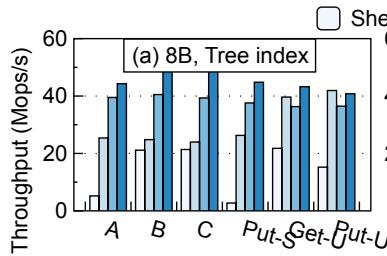

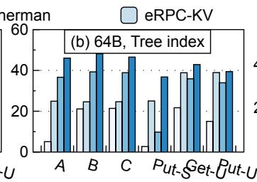

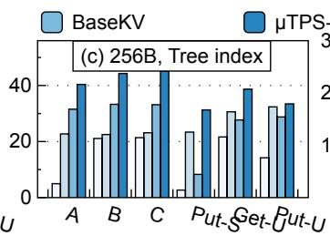

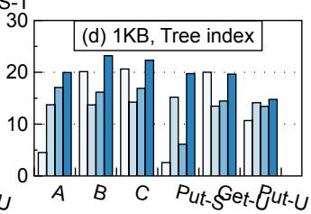

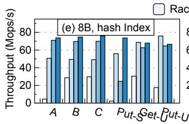

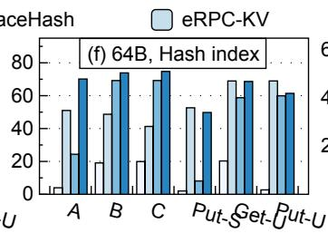

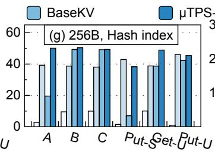

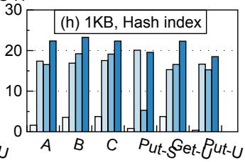  
Figure 7. μTPS’s overall performance. PUT-S, GET-U, and PUT-U indicate 100% put-skewed, 100% get-uniform, and 100% put-uniform, respectively. The top half shows the throughput with MassTree as the index, while the bottom half is with libcuckoo as the index.

Effects of index type. In general, μTPS achieves greater performance improvements over BaseKV when using the tree-based index. For instance, μTPS-T outperforms BaseKV by 11.87% to 26.56% with 8B items under different operation mixes, while μTPS-H outperforms BaseKV by 3.01% to 8.56% (except for 100%-Put-Skew). The reason for this is also straightforward – traversing a tree-based index generates more cache misses, creating a larger opportunity for μTPS to optimize cache usage.

Effects of item size. μTPS consistently outperforms BaseKV across different item sizes. For read-intensive workloads, the performance gap between μTPS and BaseKV increases as the item size grows. For example, with the tree-based index and YCSB-B workload, μTPS-T outperforms BaseKV by 19.71% with 8B items, and by 43.53% with 1KB items. μTPS requires inter-core communication when processing each request, whose overhead is amortized with larger items.

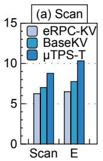

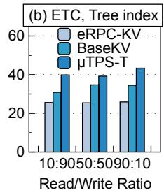

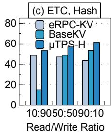  
Figure 8. (a) Throughput of scan; (b)-(c) Throughput with the ETC pool. Scan: scan-only; E: YCSB-E (95%-scan + 5%-put).

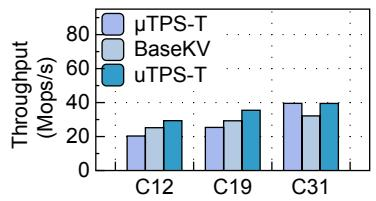

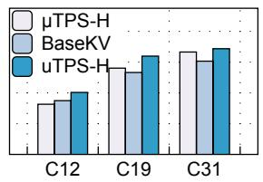  
Figure 9. Throughput with the Twitter traces.

Scan. As shown in Figure 8a, we use the YCSB-E workload to evaluate the scan performance of μTPS; the results of the scan-only workload are shown in the figure as well. We set the average range size to 50 and use 8B items to avoid network bandwidth bottlenecks. μTPS-T outperforms BaseKV by 33.1% and 25.1%, and outperforms eRPC-KV by 58.9% and 40.5% under the YCSB-E and scan-only workloads, respectively. Scan-intensive workloads can be regarded as a special case of read-intensive workloads, and the results in this experiment are highly consistent with the results in the YCSB-B experiments.

5.2.2 Real Workloads. For ETC, we use its default key and value size distributions. Value sizes are distributed as follows: 1-13 bytes (Zipfian, 40%), 14-300 bytes (Zipfian, 55%), and larger than 300 bytes (uniform, 5%). For Twitter, we select three representative traces.

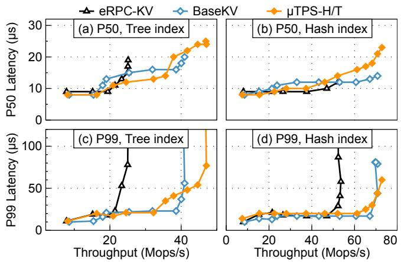  
Figure 10. Throughput vs. P50 and P99 latencies by varying the number of clients. We use YCSB-A workload and 8B items.

Table 1. Details of The selected Twitter traces.
<table><tr><td></td><td>Cluster-12</td><td>Cluster-19</td><td>Cluster-31</td></tr><tr><td>Ratio of put</td><td>80%</td><td>25%</td><td>94%</td></tr><tr><td>Avg. value size</td><td>1030B</td><td>101B</td><td>15B</td></tr><tr><td>Zipf alpha</td><td>0.30</td><td>0.74</td><td>0</td></tr></table>

ETC. When evaluating the ETC workload, we set the get ratio to 10%, 50%, and 90%, respectively. The results are shown in Figure 8b-c. In general, the performance of all compared KVSs shows a similar trend to the skewed YCSB workload (e.g., A, B) with 256B items. Specifically, μTPS-T outperforms BaseKV by 29.1%, 13.0%, and 26.6% under the 10%, 50%, and 90% get ratio, respectively, and outperforms eRPC-KV by 55.9%, 54.5%, and 67.3%.

Twitter. As shown in Table 1, we select three representative traces from Twitter. Among them, Cluster-12 is skewed and write-intensive; Cluster-19 is skewed and read-intensive; Cluster-31 is write-dominant and uniform. Figure 9 shows the results: the performance of μTPS is highly consistent with the results under the YCSB and ETC workload. Specifically, μTPS-T outperforms BaseKV by 44.5%, 39.8%, and 0.1%, and outperforms eRPC-KV by 29.4%, 35.5%, and 39.5% under Cluster-12, Cluster-19, and Cluster-31, respectively.

## 5.3 Latency

μTPS introduces additional latency due to the inter-core communication. In this experiment, we evaluate the latency of μTPS under the YCSB workload with 8B items. As shown in Figure 10, we increase the number of client threads from 2 to 64 in increments of 4, and report both the median and 99th percentile latencies as a function of the current throughput.

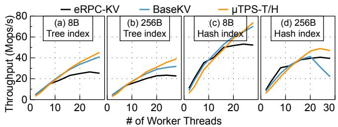  
Figure 11. Scalability with varying number of worker threads. We use the YCSB-A workload.

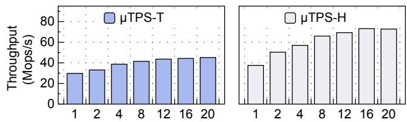  
Figure 12. Effects of Batching. YCSB-A and 8B items.

We can observe that μTPS exhibits slightly higher median latency than BaseKV with the hash index; in other cases, they have very close median or P99 latencies. Overall, the extra latency introduced by μTPS is minimal. μTPS uses an all-to-all mapping to direct requests to worker threads at the memoryresident layer, effectively balancing the load among worker threads without introducing extra queuing delays. Inter-core communication itself only introduces ∼100ns latency, and is further amortized through batching, making it negligible.

## 5.4 Scalability

We evaluate μTPS’s scalability by varying the number of worker threads from 1 to 28 with in increments of 4. We use the YCSB-A workload with 8B and 256B items; both hash- and tree-based indexes are evaluated. The results are shown in Figure 11, and we make the following observations. First, when using fewer worker threads, μTPS’s performance is similar to competitors’, or even slightly worse. Using fewer cores increases the likelihood of load imbalance between the cache-resident and memory-resident layers, as thread reallocation is constrained to integer increments. For instance, if the ideal core allocation for the cache-resident and memoryresident layers is 2:5, using only 3 cores would force an actual allocation of 1:2 instead. μTPS gradually outperforms other systems as the number of worker threads increases; with more worker threads, μTPS can provide an actual allocation that is closer to the ideal case. Meanwhile, μTPS is more robust to workload contention and can scale well with more worker threads, while BaseKV suffers from performance decline with the hash index and 256B items.

## 5.5 Ablation Study

5.5.1 Effects of Batching. μTPS extensively uses batching to amortize the overhead of inter-core communication and cache misses. In this experiment, we vary the batch size from

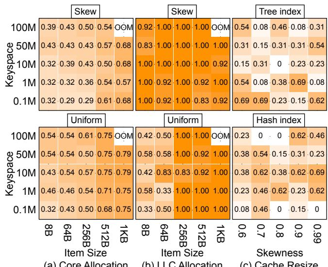  
Figure 13. The effectiveness of the auto-tuner. (a)-(b) the numbers indicate the ratio of worker threads and the ratio of cache ways assigned to the memory-resident layer, respectively; (c) the ratio of cached items from the hot set at the cache-resident layer.

1 to 20 and evaluate the performance of μTPS under the YCSB-A workload with 8B items. The batch size determines the number of requests sent and received by the cache-resident and memory-resident layer at a time, and also presents the number of indexing operations processed together. As shown in Figure 12, batching improves the performance of μTPS-T and μTPS-H by 51.6% and 93.7%, respectively. μTPS-H is more sensitive to the batch size since the overhead of inter-layer communication is more significant.

5.5.2 Effects of Auto-tuner. In this part, we evaluate the effectiveness of μTPS’s auto-tuner. By default, we use the YCSB-A workload with 8B items and a tree-based index.

Core Allocation.As shown in Figure 13a, we report the ratio of worker threads assigned to the memory-resident layer as we vary the keyspace and item size. We make two observations. First, the auto-tuner assigns more worker threads to the memory-resident layer as we increase item size or keyspace. A larger item or keyspace increases the overhead of processing each request, requiring more worker threads in the memory-resident layer for parallel processing. Second, for the same keyspace and item size, the auto-tuner assigns fewer worker threads to the memory-resident layer when using a skewed workload. This is because the cache-resident layer already processes the requests of hot keys, leaving less workload to be processed by the memory-resident layer workers.

LLC allocation. Our offline profiling suggests that allocating all cache ways to the cache-resident layer and reusing a portion for the memory-resident layer provides the best performance. In Figure 13b, we report the ratio of cache ways reused by the memory-resident layer as we vary the keyspace and item size. Under skewed workloads and uniform workloads with large item sizes, the auto-tuner assigns almost all cache ways to the memory-resident layer. However, under the uniform workload with small item sizes, fewer cache ways are allocated to the memory-resident layer. This is because assigning more cache ways does not improve the cache hit rate of the memoryresident layer, and instead leads to cache thrashing when cache ways are shared with the cache-resident layer.

Cache resize. In Figure 13c, we report the ratio of cached items at the cache-resident layer to the total hot set as we vary skewness and index type. As expected, the number of cached items shows no clear correlation with skewness, since the cache layer is not only used to cache hot items, but also rebalances the load between the cache-resident and memoryresident layer at a finer granularity.

Dynamic Workloads In this experiment, we evaluate μTPS’s ability to react to dynamic workloads by changing the value sizes from 512 bytes to 8 bytes. Figure 14 shows the throughput over time. The workload changes at time 4s. Initially, μTPS does not discover the change in workload and still using the old configuration. At 4.3s, the auto-tuner detects the change and starts to reconfigure the system: for each cache size, it searches for the optimal thread allocation with a trisecting approach, and subsequently probes for the optimal LLC allocation. The auto-tuner finishes at 5.2s, resulting in a 20% increase in throughput. Notably, the system remains operational throughout the reconfiguration process, with no downtime required.

## 6 Related Work

Fast inter-core communication. ffwd [57] is a delegation system that uses one thread process requests on behalf of multiple client threads, and thus removes the requirements of using locks. ffwd achieves fast inter-thread communication by effectively hiding the latency of interconnect link between cores. μTPS holds a similar goal of fast inter-core communication, but it is designed for the multi-producer multiconsumer scenario. Intel Dynamic Load Balancer (DLB) [5] is a hardware queue supported by the 4th and 5th generation Xeon CPUs, which enables efficient and scalable core-to-core communicatio. We believe DLB can further enhance μTPS’s performance, and we leave this as our future work.

Single receive queue. Using a single receive queue to handle incoming packets has received significant attention in recent years. ShRing [54] shares each Rx ring among multiple cores to avoid the DMA leak problem; Junction [34] supplies percore receive queues with a shared buffer queue to minimize buffer memory consumption. μTPS shares the same goal with them of using a smaller receive buffer to avoid cache misses; moreover, a single receive queue also enables flexible reconfiguration when μTPS reassigns CPU cores.

Userspace core scheduling. Recent operating systems introduced userspace core scheduling to handle microsecond-scale tasks. For example, Shinjuku [39] avoids head-of-line blocking by using hardware support for virtualization to preempt requests as often as every 5 𝜇𝑠. Shenango [53] achieves high CPU efficiency by providing a fast path that reallocates CPU cores among applications at very fine granularity. Caladan [35] and Arachne [55] further introduce scheduling policies that assign an appropriate number of cores among applications and enforce load balancing among CPU cores. These systems can work in conjunction with μTPS to further save CPUs when the reserved cores is under-saturated.

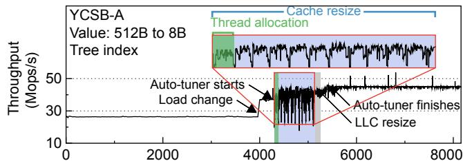  
Figure 14. Throughput with workloads change.

RDMA-based KVS. Many recent systems leverage one-sided RDMA verbs to build high-performance key-value stores while minimizing server-side CPU usage. For instance, FaRM [26] and Pilaf [51] offload the processing of get operations to clients by issuing multiple read verbs iteratively to locate and retrieve a KV item; put operations involve extra memory allocation and concurrency control and are handled by the server. Recent KVSs designed specifically for disaggregated memory, such as Sherman [62], SMART [48], and RaceHashing [68], further offload the processing of put operations to clients as well. While they effectively minimize CPU usage, they come at the cost of increased network traffic, lower overall performance, the requirement of customizing data structures, and higher software overhead on the client side. The threading design of μTPS can be broadly applied to systems that require CPU involvement and operate at extremely fast speed.

## 7 Conclusion

In this work, we presented μTPS, a novel thread architecture designed to address the limitations of run-to-completion designs in in-memory KVS. μTPS separates monolithic run-tocompletion functions into cache-resident and memory-resident stages, enabling finer-grained optimization for each. Complemented by advanced techniques such as reconfigurable RPCs, resizable caching, and an integrated auto-tuner, μTPS offers improved schedulability and performance.

## Acknowledgments

We thank the anonymous reviewers and our shepherd, Atul Adya, for their insightful comments. This work is supported by the National Key R&D Program of China (Grant No. 2022YFB4500302), National Natural Science Foundation of China (Grant No. U22B2023, 62202255), and SJTU-Huawei Explore X Program. Corresponding author: Youmin Chen (chenyoumin@sjtu.edu.cn).

## References

[1] The boost c++ libraries. hps://theboostcpplibraries.com/boost. coroutine/.

[2] Data plane development kit. hps://www.dpdk.org/.

[3] The go programming language. hps://golang.org/.

[4] Intel data direct i/o technology. hps://www.intel.com/content/www/ us/en/io/data-direct-i-o-technology.html.

[5] Intel dynamic load balancer. hps://www.intel.com/content/www/us/ en/download/686372/intel-dynamic-load-balancer.html.

[6] Intel optane memory - responsive memory, accelerated performance. hps://www.intel.com/content/www/us/en/products/details/ memory-storage/optane-memory.html.

[7] Intel performance counter monitor (intel pcm). hps://github.com/ intel/pcm.

[8] Intel rdt software package. hps://github.com/intel/intel-cmt-cat.

[9] Introduction to cache allocation technology in the intel xeon processor e5 v4 family. hps://www.intel.com/content/www/us/ en/developer/articles/technical/introduction-to-cache-allocationtechnology.html.

[10] Keydb - the faster redis alternative. hps://docs.keydb.dev/.

[11] Memory-semantic ssd. hps://samsungmsl.com/ms-ssd/.

[12] Multi-packet rq. hps://docs.nvidia.com/networking/display/ rdmacore50/multi-packetrq.

[13] Project voldemort. hp://project-voldemort.com/.

[14] Rdma aware network programming user manual. hps://docs.nvidia. com/rdma-aware-networks-programming-user-manual-1-7.pdf.

[15] uthreads: Concurrent user threads in c++. hps://github.com/ samanbarghi/uThreads.

[16] Berk Atikoglu, Yuehai Xu, Eitan Frachtenberg, Song Jiang, and Mike Paleczny. Workload analysis of a large-scale key-value store. SIGMET-RICS Perform. Eval. Rev., 40(1):53–64, jun 2012.

[17] Oana Balmau, Florin Dinu, Willy Zwaenepoel, Karan Gupta, Ravishankar Chandhiramoorthi, and Diego Didona. SILK: Preventing latency spikes in Log-Structured merge Key-Value stores. In 2019 USENIX Annual Technical Conference (USENIX ATC 19), pages 753–766, Renton, WA, July 2019. USENIX Association.

[18] Rahul Bera, Konstantinos Kanellopoulos, Shankar Balachandran, David Novo, Ataberk Olgun, Mohammad Sadrosadati, and Onur Mutlu. Hermes: Accelerating long-latency load requests via perceptron-based off-chip load prediction. In Proceedings of the 55th Annual IEEE/ACM International Symposium on Microarchitecture, MICRO ’22, page 1–18. IEEE Press, 2022.

[19] Shannon Bradshaw, Eoin Brazil, and Kristina Chodorow. MongoDB: the definitive guide: powerful and scalable data storage. O’Reilly Media, 2019.

[20] Zhichao Cao, Siying Dong, Sagar Vemuri, and David H.C. Du. Characterizing, modeling, and benchmarking RocksDB Key-Value workloads at facebook. In 18th USENIX Conference on File and Storage Technologies (FAST 20), pages 209–223, Santa Clara, CA, February 2020. USENIX Association.

[21] Badrish Chandramouli, Guna Prasaad, Donald Kossmann, Justin Levandoski, James Hunter, and Mike Barnett. Faster: A concurrent key-value store with in-place updates. In Proceedings of the 2018 International Conference on Management of Data, SIGMOD ’18, page 275–290, New York, NY, USA, 2018. Association for Computing Machinery.

[22] Brian F. Cooper, Adam Silberstein, Erwin Tam, Raghu Ramakrishnan, and Russell Sears. Benchmarking cloud serving systems with ycsb. In Proceedings of the 1st ACM Symposium on Cloud Computing, SoCC ’10, page 143–154, New York, NY, USA, 2010. Association for Computing Machinery.

[23] Graham Cormode and Shan Muthukrishnan. An improved data stream summary: the count-min sketch and its applications. Journal of Algorithms, 55(1):58–75, 2005.

[24] Debendra Das Sharma, Robert Blankenship, and Daniel Berger. An introduction to the compute express link (cxl) interconnect. ACM Comput. Surv., 56(11), July 2024.

[25] Siying Dong, Andrew Kryczka, Yanqin Jin, and Michael Stumm. Rocksdb: Evolution of development priorities in a key-value store serving large-scale applications. ACM Trans. Storage, 17(4), October 2021.

[26] Aleksandar Dragojević, Dushyanth Narayanan, Orion Hodson, and Miguel Castro. Farm: Fast remote memory. In Proceedings of the 11th USENIX Conference on Networked Systems Design and Implementation, NSDI’14, page 401–414, USA, 2014. USENIX Association.

[27] Aleksandar Dragojević, Dushyanth Narayanan, Edmund B. Nightingale, Matthew Renzelmann, Alex Shamis, Anirudh Badam, and Miguel Castro. No compromises: Distributed transactions with consistency, availability, and performance. In Proceedings of the 25th Symposium on Operating Systems Principles, SOSP ’15, page 54–70, New York, NY, USA, 2015. Association for Computing Machinery.

[28] Bin Fan, David G. Andersen, and Michael Kaminsky. MemC3: Compact and concurrent memcache with dumber caching and smarter hashing. In Proc. 10th USENIX NSDI, Lombard, IL, April 2013.

[29] Alireza Farshin, Amir Roozbeh, Gerald Q. Maguire Jr., and Dejan Kostić. Reexamining direct cache access to optimize I/O intensive applications for multi-hundred-gigabit networks. In 2020 USENIX Annual Technical Conference (USENIX ATC 20), pages 673–689. USENIX Association, July 2020.

[30] Alireza Farshin, Amir Roozbeh, Gerald Q. Maguire, and Dejan Kostić. Make the most out of last level cache in intel processors. In Proceedings of the Fourteenth EuroSys Conference 2019, EuroSys ’19, New York, NY, USA, 2019. Association for Computing Machinery.

[31] Roy T. Fielding and Gail Kaiser. The apache http server project. IEEE Internet Computing, 1(4):88–90, 1997.

[32] Brad Fitzpatrick. Distributed caching with memcached. Linux journal, 2004(124):5, 2004.

[33] Keir Fraser. Practical lock-freedom. Technical report, University of Cambridge, Computer Laboratory, 2004.

[34] Joshua Fried, Gohar Irfan Chaudhry, Enrique Saurez, Esha Choukse, Inigo Goiri, Sameh Elnikety, Rodrigo Fonseca, and Adam Belay. Making kernel bypass practical for the cloud with junction. In 21st USENIX Symposium on Networked Systems Design and Implementation (NSDI 24), pages 55–73, Santa Clara, CA, April 2024. USENIX Association.

[35] Joshua Fried, Zhenyuan Ruan, Amy Ousterhout, and Adam Belay. Caladan: Mitigating interference at microsecond timescales. In Proceedings of the 14th USENIX Conference on Operating Systems Design and Implementation, pages 281–297, 2020.

[36] Lars George. HBase: The Definitive Guide. O’Reilly Media, Inc, 2011.

[37] Dongxu Huang, Qi Liu, Qiu Cui, Zhuhe Fang, Xiaoyu Ma, Fei Xu, Li Shen, Liu Tang, Yuxing Zhou, Menglong Huang, Wan Wei, Cong Liu, Jian Zhang, Jianjun Li, Xuelian Wu, Lingyu Song, Ruoxi Sun, Shuaipeng Yu, Lei Zhao, Nicholas Cameron, Liquan Pei, and Xin Tang. Tidb: a raft-based htap database. Proc. VLDB Endow., 13(12):3072–3084, August 2020.

[38] RMI Java. Java remote method invocation. Sun Microsystems Inc, 2010.

[39] Kostis Kaffes, Timothy Chong, Jack Tigar Humphries, Adam Belay, David Mazières, and Christos Kozyrakis. Shinjuku: Preemptive scheduling for 𝜇second-scale tail latency. In 16th USENIX Symposium on Networked Systems Design and Implementation (NSDI 19), pages 345–360, 2019.

[40] Anuj Kalia, Michael Kaminsky, and David Andersen. Datacenter RPCs can be general and fast. In 16th USENIX Symposium on Networked Systems Design and Implementation (NSDI 19), pages 1–16, Boston, MA, February 2019. USENIX Association.

[41] Anuj Kalia, Michael Kaminsky, and David G. Andersen. Design guidelines for high performance RDMA systems. In 2016 USENIX Annual Technical Conference (USENIX ATC 16), pages 437–450, Denver, CO,

June 2016. USENIX Association.

[42] Anuj Kalia, Michael Kaminsky, and David G. Andersen. FaSST: Fast, scalable and simple distributed transactions with Two-Sided (RDMA) datagram RPCs. In 12th USENIX Symposium on Operating Systems Design and Implementation (OSDI 16), pages 185–201, Savannah, GA, November 2016. USENIX Association.

[43] Kornilios Kourtis, Nikolas Ioannou, and Ioannis Koltsidas. Reaping the performance of fast nvm storage with udepot. In Proceedings of the 17th USENIX Conference on File and Storage Technologies, FAST’19, page 1–15, USA, 2019. USENIX Association.

[44] Avinash Lakshman and Prashant Malik. Cassandra: a decentralized structured storage system. SIGOPS Oper. Syst. Rev., 44(2):35–40, April 2010.

[45] Baptiste Lepers, Oana Balmau, Karan Gupta, and Willy Zwaenepoel. Kvell: the design and implementation of a fast persistent key-value store. In Proceedings of the 27th ACM Symposium on Operating Systems Principles, SOSP ’19, page 447–461, New York, NY, USA, 2019. Association for Computing Machinery.

[46] Bojie Li, Zhenyuan Ruan, Wencong Xiao, Yuanwei Lu, Yongqiang Xiong, Andrew Putnam, Enhong Chen, and Lintao Zhang. Kv-direct: High-performance in-memory key-value store with programmable nic. In Proceedings of the 26th Symposium on Operating Systems Principles, SOSP ’17, page 137–152, New York, NY, USA, 2017. Association for Computing Machinery.

[47] Hyeontaek Lim, Dongsu Han, David G. Andersen, and Michael Kaminsky. Mica: A holistic approach to fast in-memory key-value storage. In Proceedings of the 11th USENIX Conference on Networked Systems Design and Implementation, NSDI’14, page 429–444, USA, 2014. USENIX Association.

[48] Xuchuan Luo, Pengfei Zuo, Jiacheng Shen, Jiazhen Gu, Xin Wang, Michael R. Lyu, and Yangfan Zhou. SMART: A High-Performance adaptive radix tree for disaggregated memory. In 17th USENIX Symposium on Operating Systems Design and Implementation (OSDI 23), pages 553–571, Boston, MA, July 2023. USENIX Association.

[49] Yandong Mao, Eddie Kohler, and Robert Tappan Morris. Cache craftiness for fast multicore key-value storage. In Proceedings of the 7th ACM European Conference on Computer Systems, EuroSys ’12, page 183–196, New York, NY, USA, 2012. Association for Computing Machinery.

[50] Alexander Merritt, Ada Gavrilovska, Yuan Chen, and Dejan Milojicic. Concurrent log-structured memory for many-core key-value stores. Proc. VLDB Endow., 11(4):458–471, December 2017.

[51] Christopher Mitchell, Yifeng Geng, and Jinyang Li. Using One-Sided RDMA reads to build a fast, CPU-Efficient Key-Value store. In 2013 USENIX Annual Technical Conference (USENIX ATC 13), pages 103– 114, San Jose, CA, June 2013. USENIX Association.

[52] Michael A Olson, Keith Bostic, and Margo I Seltzer. Berkeley db. In USENIX Annual Technical Conference, FREENIX Track, pages 183–191, 1999.

[53] Amy Ousterhout, Joshua Fried, Jonathan Behrens, Adam Belay, and Hari Balakrishnan. Shenango: Achieving high cpu efficiency for latencysensitive datacenter workloads. In NSDI, volume 19, pages 361–378, 2019.

[54] Boris Pismenny, Adam Morrison, and Dan Tsafrir. ShRing: Networking with shared receive rings. In 17th USENIX Symposium on Operating Systems Design and Implementation (OSDI 23), pages 949–968, Boston, MA, July 2023. USENIX Association.

[55] Henry Qin, Qian Li, Jacqueline Speiser, Peter Kraft, and John Ousterhout. Arachne: Core-Aware thread management. In 13th USENIX Symposium on Operating Systems Design and Implementation (OSDI 18), pages 145–160, Carlsbad, CA, October 2018. USENIX Association.

[56] Ziyue Qiu, Juncheng Yang, Juncheng Zhang, Cheng Li, Xiaosong Ma, Qi Chen, Mao Yang, and Yinlong Xu. Frozenhot cache: Rethinking cache management for modern hardware. In Proceedings of the Eighteenth

European Conference on Computer Systems, EuroSys ’23, page 557–573, New York, NY, USA, 2023. Association for Computing Machinery.

[57] Sepideh Roghanchi, Jakob Eriksson, and Nilanjana Basu. ffwd: delegation is (much) faster than you think. In Proceedings of the 26th Symposium on Operating Systems Principles, SOSP ’17, page 342–358, New York, NY, USA, 2017. Association for Computing Machinery.

[58] Raj Srinivasan and RPC RFC1831. Remote procedure call protocol specification version 2. Sun Microsystems, August, 1995.

[59] Akshitha Sriraman and Thomas F. Wenisch. µtune: auto-tuned threading for oldi microservices. In Proceedings of the 13th USENIX Conference on Operating Systems Design and Implementation, OSDI’18, page 177–194, USA, 2018. USENIX Association.

[60] Jing Wang, Youyou Lu, Qing Wang, Minhui Xie, Keji Huang, and Jiwu Shu. Pacman: An efficient compaction approach for Log-Structured Key-Value store on persistent memory. In 2022 USENIX Annual Technical Conference (USENIX ATC 22), pages 773–788, Carlsbad, CA, July 2022. USENIX Association.

[61] Qing Wang, Youyou Lu, Junru Li, and Jiwu Shu. Nap: A Black-Box approach to NUMA-Aware persistent memory indexes. In 15th USENIX Symposium on Operating Systems Design and Implementation (OSDI 21), pages 93–111. USENIX Association, July 2021.

[62] Qing Wang, Youyou Lu, and Jiwu Shu. Sherman: A write-optimized distributed b+tree index on disaggregated memory. In Proceedings of the 2022 International Conference on Management of Data, SIGMOD ’22, page 1033–1048, New York, NY, USA, 2022. Association for Computing Machinery.

[63] Qing Wang, Youyou Lu, Jing Wang, and Jiwu Shu. Replicating persistent memory Key-Value stores with efficient RDMA abstraction. In 17th USENIX Symposium on Operating Systems Design and Implementation (OSDI 23), pages 441–459, Boston, MA, July 2023. USENIX Association.

[64] Matt Welsh, David Culler, and Eric Brewer. Seda: an architecture for well-conditioned, scalable internet services. SIGOPS Oper. Syst. Rev., 35(5):230–243, October 2001.

[65] Juncheng Yang, Yao Yue, and K. V. Rashmi. A large scale analysis of hundreds of in-memory cache clusters at twitter. In 14th USENIX Symposium on Operating Systems Design and Implementation (OSDI 20), pages 191–208. USENIX Association, nov 2020.

[66] Suli Yang, Jing Liu, Andrea C. Arpaci-Dusseau, and Remzi H. Arpaci-Dusseau. Principled schedulability analysis for distributed storage systems using thread architecture models. In Proceedings of the 13th USENIX Conference on Operating Systems Design and Implementation, OSDI’18, page 161–176, USA, 2018. USENIX Association.

[67] Yifan Yuan, Mohammad Alian, Yipeng Wang, Ren Wang, Ilia Kurakin, Charlie Tai, and Nam Sung Kim. Don’t forget the i/o when allocating your llc. In Proceedings of the 48th Annual International Symposium on Computer Architecture, ISCA ’21, page 112–125. IEEE Press, 2021.

[68] Pengfei Zuo, Jiazhao Sun, Liu Yang, Shuangwu Zhang, and Yu Hua. One-sided RDMA-Conscious extendible hashing for disaggregated memory. In 2021 USENIX Annual Technical Conference (USENIX ATC 21), pages 15–29. USENIX Association, July 2021.