Latest updates: hps://dl.acm.org/doi/10.1145/3731569.3764795

RESEARCH-ARTICLE

# Device-Assisted Live Migration of RDMA Devices

ARTEM Y. POLYAKOV, NVIDIA, Santa Clara, CA, United States GAL SHALOM, NVIDIA, Santa Clara, CA, United States ASAF SCHWARTZ, NVIDIA, Santa Clara, CA, United States AVIAD YEHEZKEL, NVIDIA, Santa Clara, CA, United States OMRI BEN DAVID, NVIDIA, Santa Clara, CA, United States OMRI KAHALON, NVIDIA, Santa Clara, CA, United States View all

Open Access Support provided by: NVIDIA

Published: 12 October 2025

Citation in BibTeX format

SOSP '25: ACM SIGOPS 31st Symposium   
on Operating Systems Principles   
October 13 - 16, 2025   
Seoul, Republic of Korea

Conference Sponsors: SIGOPS

# Device-assisted Live Migration of RDMA devices

Artem Y. Polyakov NVIDIA Corporation USA

Omri Ben David NVIDIA Corporation Israel

Gal Shalom   
NVIDIA Corporation   
Israel

Asaf Schwartz NVIDIA Corporation Israel

Aviad Yehezkel NVIDIA Corporation Israel

Omri Kahalon NVIDIA Corporation Israel

Ariel Shahar   
NVIDIA Corporation   
Israel

## Abstract

Recently, we have seen growing pressure to move highperformance workloads, such as HPC and AI, to cloud environments that offer more affordable and manageable infrastructure. These workloads require direct access to RDMA devices for high-performance communication. Device passthrough, however, violates the decoupling between the guest OS and the underlying hardware, making Live Migration (LM) extremely challenging [29, 38, 40, 42, 48].

This paper presents a method for migrating a collection of directly interacting hardware devices in a manner that is transparent to both the VM and its network peers. We propose a device-assisted solution that includes (a) a generic device–hypervisor interface, (b) the design and implementation of LM support for the NVIDIA ConnectX family of network adapters, and (c) a novel scheme to quiesce direct communication over the memory fabric (e.g., PCIe).

We demonstrate transparent migration of HPC and AI workloads in accelerated virtual environments. Our approach incurs no runtime overhead or performance degradation after migration and achieves sub-second downtimes even for VMs with high RDMA resource utilization.

CCS Concepts: • Networks → Cloud computing; • Hardware → Networking hardware; Buses and high-speed links; • Computer systems organization → Cloud computing; Interconnection architectures.

Keywords: RDMA, Live Migration, Virtualization, Cloud, Datacenter, GPUDirect

## ACM Reference Format:

Artem Y. Polyakov, Gal Shalom, Aviad Yehezkel, Omri Ben David, Asaf Schwartz, Omri Kahalon, Ariel Shahar, and Liran Liss. 2025.

This work is licensed under a Creative Commons Attribution 4.0 International License.   
SOSP ’25, Seoul, Republic of Korea   
© 2025 Copyright held by the owner/author(s).   
ACM ISBN 979-8-4007-1870-0/2025/10   
https://doi.org/10.1145/3731569.3764795   
Liran Liss   
NVIDIA Corporation   
Israel

Device-assisted Live Migration of RDMA devices. In ACM SIGOPS 31st Symposium on Operating Systems Principles (SOSP ’25), October 13–16, 2025, Seoul, Republic of Korea. ACM, New York, NY, USA, 16 pages. https://doi.org/10.1145/3731569.3764795

## 1 Introduction

Virtualization is the key technology behind cloud computing [45]. It decouples physical resources controlled by privileged software (the hypervisor [43]) from a user workload (the "Guest" Operating System (OS)) by executing the latter in a Virtual Machine (VM). Such an approach allows for building flexible and scalable data-processing platforms [7, 8, 39], essential for the cloud environment.

One of the advantages of such decoupling is the ability to transparently migrate a VM from one physical server to another. If migration is performed while the VM is executing, it is called Live Migration (LM) [14, 35]. LM is widely used in the cloud for maintenance, fault tolerance, load balancing, and resource consolidation [14, 18, 35, 39, 49]. Largescale cloud providers leverage millions of migrations per month [39] in their routine data center operations.

Recently, the scope of modern cloud environments has expanded to embrace High-Performance Computing (HPC) and Artificial Intelligence (AI) workloads [7]. Such workloads require high-speed and low-latency communication based on Remote Direct Memory Access (RDMA) [7, 8]. To ensure that bare-metal performance is preserved, PCI Express (PCIe) Single-Root I/O Virtualization [37] and PCI bypass [15] are used [24, 34] to provide VMs with direct access to the hardware. However, such access violates the decoupling between software and the hardware resources [17, 38, 42, 49], making Live Migration challenging.

Moreover, large-scale AI training workloads demand that cloud providers offer VMs with a combination of both compute accelerators (i.e., General-Purpose GPU (GPGPU)) and RDMA devices (e.g., Microsoft Azure NDv2- and ND H200 v5- series VMs [33]). To sustain AI communication requirements, RDMA devices access the accelerators’ memory directly, avoiding bounce buffers in VM memory. To support such scenarios, the hypervisor must both suspend each passthrough device individually and preserve the consistency of interdevice communication.

RDMA technology is characterized [38] by a complex software interface (Section 2.3). To deal with this, some of the previous RDMA migration solutions perform coordinated destruction and re-creation of RDMA resources [29, 42, 48], introducing additional overhead on the critical path. Others (e.g., MigrOS [38]) rely on non-standard extensions in the RDMA API and communication protocol. The requirement of guest modifications precludes the production deployment of existing approaches, as cloud providers typically lack access to tenant software stacks.

In this paper, we address the limitations preventing live migration in high-performance cloud environments. In Section 3, we initially establish the principles and corresponding device support for migrating an RDMA device transparently to guest software and its network peers. We further extend our solution by introducing a novel technique for quiescing direct communication among multiple passthrough devices and demonstrate its applicability to PCIe fabrics in Section 4. The technique is hardware-agnostic and is a major contribution in its own right. In Section 5, we define a simple and generic Application Programming Interface (API) for hardware device migration that is aligned with existing virtualization infrastructures. Section 6 presents our end-to-end implementation of device-assisted VM migration. Using the NVIDIA ConnectX family of network adapters, we demonstrate how to quiesce a complex device and distill its hardware state so that it can be reconstructed on another device while supporting rolling updates [16]. Leveraging the proposed API, we extend the Linux KVM/QEMU hypervisor to support simultaneous migration of multiple passthrough devices and to enable migration-time optimizations.

Combining these key contributions, we present the first design and implementation of device-assisted live migration for VM configurations that support HPC and AI workloads (i.e., equipped with GPGPU and RDMA hardware). In Section 7, we demonstrate sub-second downtimes when migrating high-performance applications leveraging direct RDMA– GPGPU communication over NVIDIA GPUDirect [27], with no performance impact during normal execution. We also emphasize the practical aspect of our approach, which is implemented and generally available (GA) for production Linux virtualization platforms [4].

## 2 Background

We begin by providing background on RDMA technology and on the approaches to its virtualization and live migration.

## 2.1 Remote Direct Memory Access

The RDMA technology powers practically all high-performance interconnects, enabling cutting-edge levels of latency and bandwidth. This is achieved through (a) the hardware implementation (offload) of the network transport that minimizes software overhead and allows independent progress of computation and networking, (b) OS bypass – direct application access to hardware for data-path operations (e.g., initiating data transfers and detecting their completions), and (c) exposing Direct Memory Access (DMA) to remote network peers, enabling one-sided access.

IB Verbs. The InfiniBand (IB) Verbs specification [10] is the de facto standard for the RDMA API [38]. The API consists of RDMA objects and a set of primitives (Verbs) to manipulate them. Management of RDMA objects (such as creation or modification) is considered a control path and, unlike the data path, requires OS kernel involvement.

RDMA objects. In the data path, RDMA objects are accessed directly from user space to minimize the latency. To initiate a data transfer, a Work Queue Element (WQE) is posted to a Queue Pair (QP) object. Completion of the transfer is detected by polling a Completion Queue (CQ) object for a CQ Entry (CQE). Memory Region (MR) objects are used to expose application memory for local and remote DMA accesses. The creation of an MR is called memory registration and is associated with significant overhead [28].

RDMA namespaces. Upon creation, RDMA objects are assigned integer identifiers that are unique within the namespace associated with the corresponding object type (e.g., the QP namespace). These identifiers are visible to the guest OS kernel and RDMA middleware (i.e., libibverbs). Certain identifiers, specifically memory keys (MR identifiers) and QP numbers, are also exposed to remote peers. They are communicated using an out-of-band channel, provided by the application or established through the RDMA Connection Management protocol.

## 2.2 I/O in virtualized systems

Historically, I/O was exposed to VMs as virtual devices, which are implemented in software and provide the full interface and semantics of their hardware counterparts. While functionally complete, virtual devices incurred high software overhead and performance limitations. Para-virtual devices [32, 44] were introduced to reduce this overhead by abstracting the device model, simplifying the data-path interfaces, and amortizing notification costs. While a considerable improvement over full virtualization, para-virtual devices still cannot achieve the performance of native hardware [30]. In addition, they still take the toll of handling every I/O transaction in software (e.g., packet processing).

To achieve bare-metal performance, technologies enabling direct hardware access for VMs were developed [15, 22, 23, 41]. In PCI passthrough [15], the guest software communicates with PCIe devices through Memory-Mapped I/O (MMIO) regions accessible directly from the VM address space. To enable devices to access VMs directly (DMA and interrupts) while maintaining isolation, I/O Memory Management Units (IOMMUs) [9] are employed.

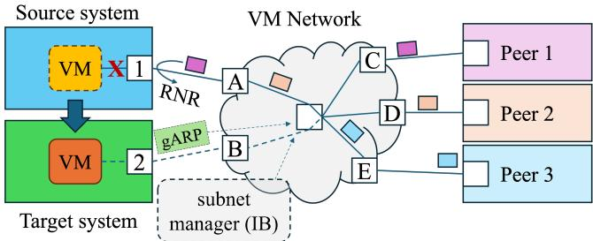  
Figure 1. Connection migration

To enable secure sharing of a single PCIe device between multiple VMs, the PCIe SR-IOV extension allows a Physical (PCIe) Function (PF) to create multiple Virtual Functions (VFs). The backend resources are shared between the PF and VFs, while each VF has a unique set of PCIe resources. In the hypervisor, a VF acts as an independent PCIe device that can be securely passed through to a VM.

In accelerated workloads, such as HPC and AI, RDMA devices are used to transfer data directly from peer GPUs/accelerators. This is achieved via PCIe peer-topeer (P2P) communication [37]. Modern IOMMUs allow hypervisors to securely enable P2P traffic between multiple passthrough devices of a VM.

## 2.3 Live migration

2.3.1 Overview. Live Migration is an important virtualization feature that equips cloud providers with the flexibility to move VMs between servers with minimal service interruption (Figure 1). LM is currently supported by major virtualization providers like VMware [35], Xen [14], and Linux KVM/QEMU. In general, LM is performed in three phases: pre-copy, stop-and-copy, and post-copy [14, 39].

Pre-copy. In the pre-copy phase, the VM state is gradually reconstructed at the target system while the VM continues execution at the source. Initially, a snapshot of the VM memory is delivered to the target. Next, multiple pre-copy rounds transfer memory pages modified (dirtied) since the previous round. To track dirty pages, the hypervisor uses the CPU’s MMU. When passthrough devices are present, memory may also be modified by DMA operations. Hypervisors may track these pages using modern IOMMUs that support reporting dirty bits for I/O transactions [9].

Stop-and-copy. Once the estimated time to transfer the remaining VM state is below a certain threshold, the hypervisor proceeds to the stop-and-copy phase. In this stage, the operation of the VM vCPUs is halted. Devices are suspended, and their state is serialized to a consistent representation (image). The vCPU execution states, device images, and remaining dirtied memory are transferred to the target.

Post-copy. When the VM state is fully reconstructed on the target, its execution is resumed. Alternatively, the post-copy phase allows resuming the VM before the state has been fully instantiated. This is achieved by streaming the remaining state in the background and temporarily suspending vCPUs that attempt to access missing memory pages.

Network reconfiguration. After the VM is resumed, the network infrastructure must be notified about the change in the VM’s physical location (Figure 1). This is commonly addressed by sending a gratuitous ARP Reply [13] (gARP) in Ethernet L2 networks, centralized reconfiguration by the SDN controller in overlay networks, or reprogramming LIDbased virtual ports [10] in IB networks.

Migration time refers to the total duration of the entire migration process. The duration of the stop-and-copy phase alone is called downtime, as the VM is stopped and unresponsive to service requests from remote peers.

2.3.2 RDMA migration. Although pure software implementations for RDMA exist (e.g., Linux RXE), high-performance systems rely on PCI passthrough to expose RDMA devices to VMs. As a result, the device state becomes inaccessible to the hypervisor [38]. Modern hypervisors, such as VMware ESX and Linux KVM/QEMU, disable live migration when device passthrough is enabled.

Namespace migration. The specifics of RDMA technology present further challenges [29, 38]. As RDMA identifiers are assigned by the device, software cannot accurately replicate RDMA namespaces on the target system [12, 29, 42, 48]. To maintain application transparency after migration, softwarebased approaches must perform runtime translation of resource identifiers, thereby requiring intrusive modifications in the guest OS [29, 42] or middleware [12, 29, 48].

In-flight messages. As the transport state is encapsulated within the RDMA device, to ensure the migration consistency, software solutions are forced to drain QPs by completing all outstanding WQEs [29, 42, 48]. However, this negatively impacts downtime. Alternatively, an abrupt termination of QPs was explored for checkpoint-restart [12]. While sufficient for two-sided communication, it leads to an inconsistent state of atomic RDMA operations. Both approaches are prone to wasted work, as even a single aborted WQE may correspond to a gigabyte-sized message.

Restoring connections. Unlike other peripherals, the migration of RDMA devices is visible to connected peers (Figure 1). Changes in network addresses and RDMA namespaces (e.g., QP numbers, memory keys) require the explicit recreation of all IB QPs connected to the migrating VM, introducing synchronization dependencies in existing solutions [12, 29, 38, 42, 48].

To address this problem, software-based approaches [12, 29, 42, 48] rely on global coordination. Alternatively, MigrOS [38] introduces a new QP state, Paused, which indicates that the remote peer is migrating. This approach is vulnerable to failures of the migrating VM and may leave the remote QP blocked infinitely.

## 3 RDMA device migration

RDMA devices are complex, hold significant state, and are expected to provide hardware-accelerated performance at extreme scale. We contend that migrating an RDMA device with minimal downtime while fulfilling these expectations requires device assistance. Below, we outline the principles and associated device assists (DAs) for a practical migration solution. We follow these principles in the proposed migration API (Section 5) and the implementation (Section 6).

## 3.1 Network transparency

RDMA devices may have hundreds of thousands of established connections, with only a subset active at any point in time. In such scenarios, coordinating with all remote peers is both costly and unnecessary. Moreover, some peers may be undergoing migration concurrently.

To address this challenge, migration schedules can be globally coordinated. However, this approach requires detailed knowledge of tenant workloads — typically not known to cloud providers — and conflicts with other processes, such as rolling updates [16]. In addition, the migration process itself takes time. During pre-copy, the set of established connections may experience considerable churn, making connection hold-back impractical.

Consequently, synchronization-free network transparency is essential for scalable migration. We achieve it through the following principles:

DA1: RDMA namespace preservation. RDMA namespaces include the wire-visible values of QP numbers and remote keys of MRs (Section 2.1). Any change to these values requires coordination with remote peers (Section 2.3.2).

Precisely reconstructing RDMA namespaces on the target device eliminates the need for such coordination and ensures transparency to the migrating VM.

DA2: Local connection preservation. Similar to RDMA namespaces (DA1), the device must precisely restore local network addresses (i.e., MAC/IP or LID/GID) and QPs in any state. This enables migration at any point in the connection lifecycle, including during establishment and teardown.

DA3: Remote connection preservation. Existing approaches disconnect the VM from its remote peers prior to migration and restore the connections afterward (Section 2.3.2). Following DAs 1 and 2, our solution eliminates the need for this step. However, as suspended VFs cannot respond to incoming packets, reliable connections (e.g., TCP and IB RC transports) are prone to timeouts. While the default TCP configuration is sufficient to outlive downtime [31], RDMA-based protocols rely on sub-second timeouts and, therefore, cannot tolerate migration. We overcome this issue through an exponential backoff scheme. Initially, extremely short timeouts are used to compensate for sporadic packet drops during normal operation. The delays between retransmissions grow exponentially, accommodating migration.

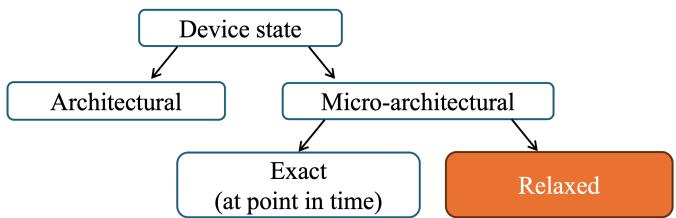  
Figure 2. State representation taxonomy

DA4: Quiescing at packet granularity. Handling in-flight messages by draining communications (Section 2.3.2) results in wasted work, requires synchronization, and introduces dependency on network conditions (e.g., congestion).

In contrast, device assistance allows for suspending processing at the packet granularity, where the retransmission size is fixed and negligible. This approach requires access to the device’s internal state, including (a) the current expected packet sequence numbers, (b) transport opcodes, (c) virtual RDMA addresses, and (d) cached results of atomic operations used for retransmissions.

## 3.2 Accessing device state from hypervisor

The hypervisor’s ability to save and restore device state ensures complete transparency to the VM software. However, there are no standard interfaces for extracting the VF state. Similar to how hypervisors transfer the VM’s memory without reasoning about its contents, we advocate for a similar approach to devices: obtain device state en masse, rather than iterating over RDMA resources [12, 29, 38].

First, we discuss what comprises this state, using the taxonomy in Figure 2 to reason about its representation options. Architectural state. From the IB architecture perspective, the RDMA device state is fully determined by the set of allocated objects and their architectural state. Serializing this state while capturing cross-object dependencies into some well-known representation allows creating a portable image that can be loaded into any RDMA device.

Microarchitectural state. The IB architecture does not cover all aspects of an RDMA NIC. First, it omits definitions for software interfaces, such as descriptor formats or data structures shared between software and hardware. Second, an RDMA NIC is not limited to the IB specification. It may double as an Ethernet NIC and implement non-standard features (e.g., encryption, congestion control, etc.). Microarchitectural state encompasses every aspect of the NIC, and reconstructing it after migration ensures that full functionality is preserved.

DA5: Relax microarchitectural state. While the architectural state is insufficient, precisely capturing the microarchitectural state at a specific point in time is neither feasible nor efficient. Not all state in hardware can be read or restored, and capturing almost every register would result in an enormous image size. Instead, we advocate a careful balance between the precision of state representation and memory footprint. Operating at the device level enables capturing the minimal information necessary to reconstruct a semantically equivalent state after migration.

DA6: Black-box state extraction. To support deviceagnostic migration, VF state must be treated as a black-box. Previous work on RDMA migration concentrated on objectlevel serialization via IB Verbs [12, 29, 40, 42, 48] or their extensions [38]. Iterating over RDMA objects incurs additional overhead due to the cost of individual resource accesses. Apart from the performance impact, tracking individual RDMA objects and their dependencies introduces significant software complexity: every device extension requires new migration logic and corresponding API updates.

DA7: Image compatibility tracking. High-performance clusters are typically built with homogeneous hardware. However, firmware updates are still required for bug fixes or enabling new features. To minimize service downtime, cloud providers typically deploy rolling upgrades, where servers are freed up for maintenance in batches using LM. This introduces the challenge of migrating between devices with different firmware versions.

We address this challenge by introducing a device migration $" t a g " - \mathbf { a }$ vendor-specific bit sequence which captures the compatibility characteristics associated with a particular device. The migration tags are queried on both the source and target devices and compared in software according to vendor-specific rules.

## 3.3 Integration into virtualization infrastructure

Over the years, the systems community has perfected VM migration. Pre-copy rounds hide the latency of transferring the majority of the VM state. vCPUs are throttled to control the rate at which the VM modifies its memory, ensuring convergence. Post-copy may also be used to reduce the downtime when pre-copy is insufficient. We claim that the same considerations should be applied to complex devices.

DA8: Device state pre-copy. Devices with large state should use pre-copy to reduce downtime. To avoid negatively impacting the duration of pre-copy rounds, incremental device state updates should not depend on time-consuming operations such as memory registration, connection management, or data-path transactions.

DA9: Dirty-rate controls. RDMA devices can dirty VM memory at very high rates with extremely low vCPU utilization. Incoming RDMA writes, in fact, do not involve the vCPU at all. As vCPU throttling is insufficient, the device must provide means to control its memory access rate.

DA10: Pipelined state extraction While the VM memory is directly accessible to the hypervisor, the device state is not; it must be explicitly saved and loaded into the device.

Thus, device image transfer consists of (Figure 3a):

(1) saving the image from the source VF (?? sec);

(2) transferring the image to the target system (?? sec); and

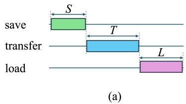

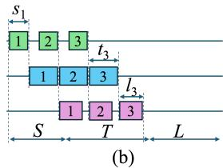  
Figure 3. Image transfer: (a) coarse-grain, (b) pipelined

(3) loading the image on the target VF (?? sec). If these stages are performed serially, the downtime ?? contributed by the device is determined by their sum:

$$
D = S + T + L\tag{1}
$$

For RDMA, the size of the image depends on the number of allocated RDMA resources and can reach hundreds of megabytes, linearly increasing the time of each stage. By pipelining the image transfer, we can reduce the cost to the time of the most expensive stage.

Consider ?? chunks, where $s _ { i } , \ t _ { i } ,$ and $l _ { i }$ denote the save, transfer, and load times of chunk ??, respectively. As demonstrated in Figure 3b, pipelining allows for reducing the device downtime impact to:

$$
s _ { 1 } + \sum _ { i = 2 . . ( n - 1 ) } m a x ( s _ { i } , t _ { i } , l _ { i } ) + l _ { n } \approx m a x ( S , T , L ) < D\tag{2}
$$

State pipelining is also valid for pre-copy, especially in the early rounds when the modified state is considerable.

DA11 (optional): Post-copy support. To allow post-copy of VM memory, the device is required to sustain page faults [26]. From the device perspective, there is no distinction between normal page faults (serviced from the local machine) and post-copy ones (serviced from a remote machine).

The hypervisor, however, must be extended to handle device post-copy page faults in the same manner as it does for vCPUs. As post-copy is less commonly used, we leave its evaluation for future work.

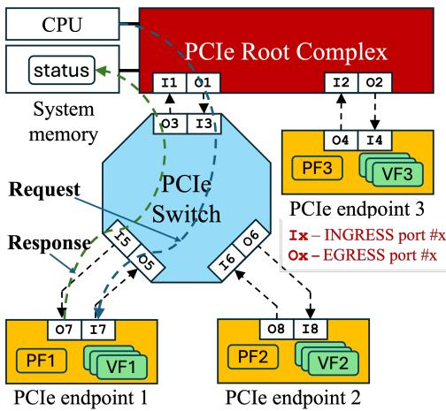  
Figure 4. PCIe device commands

## 4 Multi-device suspend/resume

To suspend a VM, a consistent state of its memory, vCPUs, and all devices must be reached. This is straightforward for para-virtual devices that have software implementations. They rely on host resources – the CPU for progress and memory for state storage. Thus, they can be stopped instantly and consistently. Physical devices, however, operate asynchronously relative to the CPU. Furthermore, they are typically connected to the host via a switched fabric such as PCIe, which allows multiple in-flight memory transactions. This complicates achieving a consistent state, especially when devices also communicate directly through PCIe P2P.

## 4.1 Single device consistency

Device drivers rely on PCIe ordering rules to reason about the consistency. PCIe defines two types of transactions: posted and non-posted, which generate corresponding Transaction Layer Packets (TLPs). Non-posted request TLPs (e.g., memory reads and atomics) return a completion TLP, whereas posted request TLPs (memory writes) do not.

Generally speaking, for standard (non-relaxed) transactions, posted requests cannot bypass each other but might bypass non-posted requests and completions. Non-posted requests and completions are unordered among themselves, but are not allowed to bypass posted requests.

Since a posted request TLP cannot be bypassed, it inherently flushes all other TLPs along its path. For example, NICs typically inform software of new data by writing a notification message; this also flushes the corresponding payload. We use bi-directional posted PCIe memory writes for implementing suspend commands; the driver posts a suspend request to the device via MMIO, and the device reports the suspend response to host memory via DMA.

Consider a VF of endpoint1 that is assigned to a migrating VM (Figure 4). To achieve a consistent state, the hypervisor suspends all vCPUs, so the VM cannot initiate further device activity. Then, a suspend request is sent to the VF through ports O1, I3, O5, and I7. Since PCIe ordering is kept along the transition of every port, all prior commands issued by the VM are guaranteed to have reached the device.

The device must complete all pending commands in a bounded amount of time, mastering new memory transactions as necessary. However, the device must cease memory transactions and receive all pending completions before reporting the suspend response through ports O7, I5, O3, and I1. PCIe ordering ensures that the response flushes all outgoing changes to the memory. Other VFs in the PCIe device tree (e.g., of endpoints 2 or 3) may be suspended similarly.

## 4.2 Multi-device consistency

Independently applying the flow above to multiple devices, however, is not sufficient to achieve a consistent state. When two or more VFs communicate directly through a PCIe switch (Figure 4), they cannot be suspended consecutively.

This is because a suspended VF may still receive transactions from its active PCIe peers. Such transactions cannot be handled correctly by a suspended VF, as they modify its state and may require a completion.

DA12: Two-phase suspend and resume. To ensure consistency, the suspend and resume operations must be split into two phases – active and passive – which are carried out by distinct commands:

• The suspend-active command instructs the device to cease mastering new DMA transactions and conclude any in-flight (non-posted) transactions. Obviously, prior posted transactions may still be in-flight. The device otherwise remains a functional PCIe target, optionally updating internal state while servicing incoming transactions.

• The suspend-passive command seals the device state, readying it for saving the image. The outcome of any further incoming transaction is undefined.

• The resume-passive command reverts the device to the suspend-active state.

• The resume-active command fully resumes the device.

Algorithm 1: VM stop-and-copy   
input : Set of physical device descriptors (devdesc)   
associated with the VM   
output : State of the suspended VM   
1 HV\_SuspendVMvCPUs()   
2 for ?????? ∈ ?????????????? do   
3 Suspend(ACTIVE, dev)   
4 end   
5 for ?????? ∈ ?????????????? do   
6 Suspend(PASSIVE, dev)   
7 end   
8 HV\_SendVMState()   
9 for ?????? ∈ ?????????????? do   
10 HV\_SendDevState(dev)   
11 end

The suspend flow is depicted in Algorithm 1. We use the "HV" prefix for hypervisor functionality to distinguish it from our device migration API (Table 1). First, the vCPUs are suspended (line 1) to ensure that guest software does not initiate requests. However, VM memory may still be modified by devices. Transitioning a device into the suspend-active state (line 3) guarantees that it will not initiate new outgoing transactions to memory or to other devices. All devices must complete the suspend-active phase before starting the suspend-passive state (line 6).

Next, the VM state (i.e., the vCPU execution state and memory pages dirtied since the last pre-copy round) is transferred to the target (line 8), followed by the device images

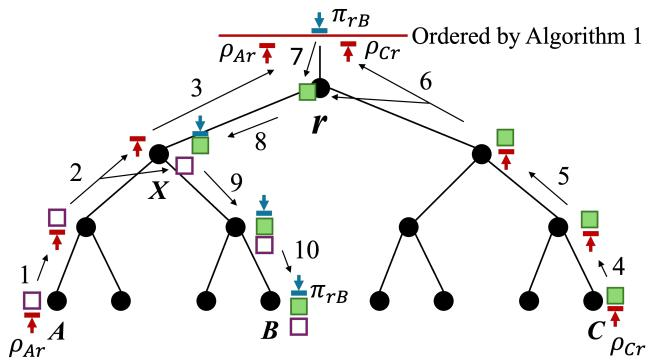

$$
\rho _ { * r }
$$

$$
\pi _ { r B }
$$

$$
\omega _ { A B }
$$

Figure 5. Quiescing procedure example

(lines 9–12). For brevity, we omit the VM resume steps, which are performed in reverse order.

The proposed two-phase quiesce scheme is applicable to other memory fabrics, such as NVLink, that support: (a) halting the initiation of new transactions while continuing to respond as a target, and (b) detecting the completion of inflight transactions.

## 4.3 Quiescing the PCIe fabric

While Algorithm 1 provides an outline of the order in which devices are suspended, it does not establish that all in-flight transactions reach the devices before they are placed into the suspend-passive state.

The PCIe fabric can be represented as a tree $T = ( V , E )$ Vertices ?? correspond to fabric components and edges ?? – to the links that connect them. The root $r \in V$ of the tree represents the PCIe Root Complex, the leaves $D = \{ \forall v \in V$ : $d e g ( v ) = 1 \}$ correspond to devices, and the internal vertices correspond to switches. Given two vertices $A , B \in \{ r , D \}$ , we denote by $P _ { A B }$ the path between ?? and ??.

Transactions between devices may follow two possible paths: (1) traversing the root complex (either for IOMMU translation or for crossing root ports), or (2) directly between the devices under the same root port (using cached translations). We consider both cases in Figure 5. Assume that after completing the suspend-active command, devices $A , C \in D$ have in-flight posted transactions to $B \in D _ { \mathrm { i } }$ , denoted by $\omega _ { A B }$ and $\omega _ { C B } .$ . We denote the suspend-active responses from nodes A and C by $\rho _ { A r }$ and $\rho _ { C r } ,$ respectively, and the suspend-passive request to node B by $\pi _ { r B }$

Let ?? be the Least Common Ancestor (LCA) of ?? and ??. During the suspend-active phase, $\rho _ { A i }$ ?? flushes $\omega _ { A B }$ to ?? (arrows 1–2) since $X \in P _ { A B } , P _ { A r }$ , placing $\omega _ { A B }$ in $X ^ { \prime } s$ egress port toward B. Similarly, $\rho _ { C } ,$ flushes ?????? to ?? (arrows 4– 6) since they share the same path $P _ { C r }$ , placing ?????? in $r { \mathrm { } } s$ left egress root port. During the suspend-passive phase, ?????? traverses $P _ { r B }$ , flushing both $\omega _ { A B }$ and $\omega _ { C B }$ to ?? (arrows 7– 10). Consequently, when ?? executes the suspend-passive command, all in-flight transactions to it have been observed.

## 5 Device Migration API

Building on the design principles outlined in Sections 3 and 4, we propose a hypervisor API for device-level migration support. It is organized into three categories: Query, Device Control, and Image Access (Table 1).

Algorithm 2: VM Pre-copy   
input : Set of physical device descriptors (devdesc)   
associated with the VM   
1 for ?????? ∈ ?????????????? do   
2 PreCopy(START, dev)   
3 end   
4 while not HV\_Converged() do   
5 ???????????? ← HV\_ThrottleLevels()   
6 HV\_VMSendDirtyPages()   
7 HV\_vCPUThrottle(levels[vCPU])   
8 for ?????? ∈ ?????????????? do   
9 HV\_SendDevState(dev)   
10 DevThrottle(dev, levels[dev])   
11 end   
12 end

Algorithm 3: Function HV\_SendDevState()   
input : Device (dev) whose state is being sent   
1 (??????????, ??????????) ← ImageBlock(SAVE, FIRST, dev)   
while valid do   
2 HV\_SendState(block)   
3 (??????????, ??????????) ← ImageBlock(SAVE, NEXT, dev)   
4 end

The Query API provides the necessary information for the hypervisor to check migration feasibility and to reserve required memory. Prior to migration, the hypervisor checks VFs’ compatibility by comparing migration tags obtained through QueryTag at the source and destination devices. QueryBlockSize defines the granularity of VF image access.

The Device Control API governs VF operation. PreCopy-Start and PreCopy-Stop commands are used during pre-copy to control the VF’s internal state tracking (VM memory dirtied by the VF is tracked externally by the IOMMU). DevThrottle limits the rate at which the VF modifies VM memory. Algorithm 2 outlines how the Device Control API is used during pre-copy.

During stop-and-copy, Suspend-Active/Passive and Resume-Active/Passive are used to suspend and resume multiple devices consistently. They correspond to the respective commands in Section 4, and their use is outlined in Algorithm 1.

Table 1. Device state-level software interface
<table><tr><td>Category</td><td>Command</td><td>Description</td></tr><tr><td>Query</td><td>QueryTag QueryBlockSize</td><td>Get device migration tag [DA7] Get the granularity of image access [DA10]</td></tr><tr><td>Device Control</td><td>PreCopy-Start PreCopy-Stop DevThrottle Suspend-Active Suspend-Passive</td><td>Enable pre-copy mode (i.e., start tracking ICM dirty pages) [DA8] Disable pre-copy mode (if migration was aborted) Control the dirty page rate of the device [DA9] Perform active suspend of the device [DA12]</td></tr><tr><td></td><td>Resume-Active Resume-Passive</td><td>Fully suspend the device [DA12] Fully resume the device [DA12] Partially resume the device in passive mode [DA12]</td></tr><tr><td>Image Access</td><td>ImageBlock-Save ImageBlock-Load</td><td>Get the next image block from the device [DAs 6 and 10] Provide an image block to the device [DAs 6 and 10]</td></tr></table>

The Image Access API facilitates image transfer. As the exact image size is not known in advance, ImageBlock-Save/Load provide an iterator interface and may be used as outlined in Algorithm 3. This API is designed to support both the pre-copy and stop-and-copy phases. In the pre-copy phase, a full iteration returns only the modified state tracked by the device since the previous iteration. For secure image transfer, we leverage the existing hypervisor infrastructure used for VM memory.

## 6 Implementation

We implement device-assisted live migration for the NVIDIA ConnectX family of network adapters [4], starting with ConnectX-7 [1]. ConnectX-7 is a sophisticated device that supports both InfiniBand and Ethernet/RoCE specifications. It offers a rich set of features (both standard and nonstandard) designed to accelerate communication tasks for high-performance workloads.

Enabling migration of PCIe passthrough devices requires coordinated support in hardware and across multiple software layers. In Figure 6, we highlight in red the components that were extended in the Linux virtualization stack to support device LM. We provide implementation details for each in the following subsections.

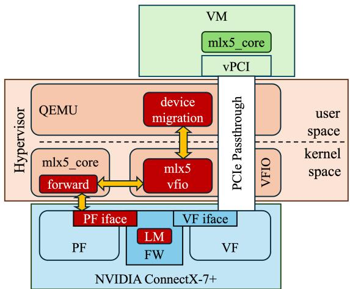  
Figure 6. Device Migration support diagram

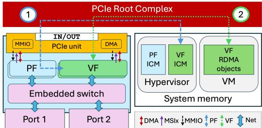  
Figure 7. RDMA device functional diagram

## 6.1 ConnectX-7 overview

ConnectX-7 comprises (Figure 7) a PCI interface, one or more physical ports connected to an RDMA network, a set of PCIe functions representing RDMA NICs, and an embedded switch routing packets between the functions and the ports. The state associated with a given RDMA VF is distributed across these components.

The PCIe state (common configuration space, MSI-X, error handling, and other capabilities) is determined by the PCIe specification. During migration, the hypervisor is responsible for reconstructing it for both PFs and VFs.

The Embedded Switch comprises flow rules for internal packet routing and transformations, e.g. encapsulations and header field modifications. These rules are programmed by an SDN controller via hypervisor interfaces. Note that the state of the VF’s virtual port connected to the Embedded Switch is attributed to the VF state.

The VF state includes the RDMA NIC logic (transport objects and their relations) and interfaces such as queues and doorbells. It is partitioned between VM memory, hypervisor memory, and the device. VM memory holds RDMA control structures, such as command submission entries and data path descriptor rings for QPs and CQs. Most of the VF internal state is stored in the Interconnect Context Memory (ICM), located in the hypervisor for security reasons. Apart from allocation, the ICM is exclusively managed by the device. The transient execution state (e.g., transport timers, Quality of Service (QoS) state, and doorbells) and caches are maintained in the device’s internal memory.

## 6.2 ConnectX-7 migration support

The implementation leverages the following characteristics of ConnectX. First, the relaxed component (DA5) of the VF’s microarchitectural state is fully represented by the VF’s ICM, while the transient portion resides in the device’s internal memory. Second, the ICM is partitioned on a per-VF basis. Consequently, the VF state is encapsulated and can be retrieved in batch (DA6) without affecting the operation of other VFs. Finally, the device maintains an isolated set of RDMA namespaces for each VF. This precludes namespace conflicts and enables their precise reconstruction on the target (DA1), avoiding the RDMA resource identifier translation overhead discussed in Section 2.3.2.

We implement the proposed migration API (Section 5) using roughly 6K LOC of firmware (FW) code, starting from FW version 28.41.1000. As the VF is owned by the VM, the migration API is exposed to the hypervisor via the respective PF (see "PF interface", Figure 6).

6.2.1 Suspending the VF. The ICM content represents the majority of the VF state, including: (a) RDMA namespaces, objects and their dependencies, (b) information about transport progress, and (c) references to the guest memory. Rapidly bringing the ICM to a consistent condition and eliminating (distilling) redundant information and locationspecific references allows fast generation of relocatable micro-architectural snapshots (DAs 1–3, 5, 6).

The Suspend-Active command ensures that both networkand host-side communications are paused.

Quiesce packet processing. First, the processing of new packets is blocked by disconnecting the VF from the embedded switch and halting transmit queues. Next, the in-flight packets are flushed, including transport processing, DMA writes of packet data, and CQE generation. Interrupts are either delivered or saved if masked by the hypervisor.

Quiesce host communication. All transient outstanding operations (i.e., control-path commands issued by the guest OS that modify VM memory) are completed, optionally generating interrupts. New commands, however, are blocked until the VF is resumed.

Ongoing statistics reports are allowed to be completed, but future updates are paused. Finally, PCIe DMA mastering for the VF is disabled. Note that incoming PCIe requests are still serviced, but only requests that are essential for NIC consistency are processed, whereas others are ignored.

The Suspend-Passive command finalizes quiescing the VF by invalidating the device caches and distilling its runtime state as follows.

Flushing device caches. Once all triggers for VF activity are blocked and existing asynchronous flows quiesce, there are no further state changes. Flushing VF device caches ensures that the ICM content is consistent and accurately reflects the VF’s state.

Distilling the state. Any state that is either reconstructible or obsolete after migration is excluded from the image. The reconstructible runtime state can be reproduced at the target based on redundant information. For example, the current set of active QPs and associated run lists may be restored from QP producer and consumer indexes. The obsolete state includes elements that are no longer relevant at the target (due to the time lapse or location). For example, RDMA transport timeouts that are calibrated for normal device operation are not designed to withstand downtime. The congestion control state, which represents specific network paths, becomes irrelevant after migration. Similarly, we do not transfer granular QoS state such as scheduling credits that are generated and consumed at microsecond timescales.

6.2.2 VF image manipulation. The hypervisor retrieves the VF image in segments into pre-allocated host memory via the ImageBlock-Save command. The image includes the ICM content stripped from location-dependent references to global physical resources (DA5), such as the internal VF identifier and physical port indexes.

On the target machine, the hypervisor loads the image segments into a new VF using the ImageBlock-Load command. The PF allocates memory pages for the VF’s ICM, populates them with the image content, and reestablishes physical resource associations.

6.2.3 Resuming the VF. After an image is loaded, the Resume-Passive command brings the VF to the suspend-active state. It enables ICM modifications and processing of incoming PCIe P2P requests.

The Resume-Active command restores normal operation. The VF is connected to the embedded switch, and transmit queue processing is restored for all QPs. Subsequently, all QPs are scanned; for any QP pending transmission, doorbells are rung internally and transport timers are re-armed. QoS credits are reallocated as part of the transmission flow.

## 6.2.4 Device-assisted pre-copy

VF state pre-copy. During resume, the hypervisor must allocate backing store pages for the VF ICM, which forms a major source of overhead. We utilize the pre-copy API (Section 5) to communicate the source VF’s ICM layout to the target and pre-allocate backing pages before suspending the VF. In the stop-and-copy phase, only a small remaining fraction of ICM pages is allocated, and the ICM content is populated from the VF image segments.

Dirty rate throttling. To control the rate at which the RDMA device dirties host memory, we leverage ConnectX traffic-shaping to limit the rate of incoming traffic.

6.2.5 Device compatibility. In our implementation, the migration tag returned by the QueryTag command covers the ICM layout version, feature set, and resource capacities. Matching these components between source and destination VFs can be enforced using either a strict or loose policy. Under the strict policy, both the ICM layout and the extensive list of features and resource capacities must match precisely. However, this bloats the migration tag and only supports critical bug fixes that do not extend capabilities.

Instead, we adopt the loose policy where the VF feature set and capacities are represented by a single version. A higher version means either additional features or extended capacity. Migration is allowed if: (a) the ICM layout version matches precisely, and (b) the feature and capacity versions of the destination VF are either equal to or higher than those of the source VF. This scheme supports both critical and functional updates while ensuring that target VFs accommodate any original capability advertised to software. Major updates changing the ICM layout still require cold reboots.

## 6.3 Hypervisor drivers

Traditionally, PCIe passthrough is implemented using a vendor-agnostic driver, such as Linux VFIO [6], which controls the VF and relies on the PCIe specification to expose arbitrary PCIe devices to a VM. Since migration is not part of the PCIe specification, VFIO requires vendor-specific code to support device LM. Consequently, we extended the VFIO driver with a modular infrastructure relying on the proposed vendor-agnostic migration API (Section 5).

ConnectX-7 LM migration support is provided [4] by the mlx5-vfio-pci VFIO plugin (Figure 6). The plugin bridges between the generic infrastructure and the ConnectX-7 PF driver (mlx5\_core module), which forwards LM calls to the PF interface. The extension of the VFIO driver and the mlx5- vfio-pci plugin implementation required around 3K LOC and are available starting from the Linux 6.7 release.

## 6.4 VM management software

QEMU [3] is an open-source hypervisor widely used on Linux platforms. We enabled PCIe passthrough device migration support (Figure 6) by: (a) integrating with the new migration capabilities provided by the VFIO driver and (b) extending the migration infrastructure to leverage the device pre-copy and pipelined image transfer optimizations (Section 3.3). QEMU device LM support required 1K LOC and is available starting with QEMU 8.1 release. Leveraging the same passthrough migration infrastructure and API, support for other device types (e.g., NVMe and GPU) was subsequently added.

## 7 Evaluation

We begin with targeted micro-benchmarking of performance aspects of the implementation, followed by experiments demonstrating the migration of MPI and AI workloads.

Table 2. RDMA control path overhead (100K objects)
<table><tr><td>Object</td><td>Create (sec)</td><td>Connect (sec)</td><td>Image Load (sec)</td></tr><tr><td>QP</td><td> $\overline { { 9 . 1 4 \pm 0 . 0 3 } }$ </td><td>5.88 ± 0.01</td><td> $2 . 5 \pm 0 . 1$ </td></tr><tr><td>MR</td><td> $3 7 . 7 5 \pm 0 . 0 3$ </td><td>N/A</td><td> $0 . 1 \pm 0 . 0 1$ </td></tr></table>

## 7.1 Setup description

The evaluation setup comprises three server nodes, each equipped with a 96-core AMD EPYC 9654 processor, 128 GB of memory, and NVIDIA L40S GPGPUs. The nodes are connected over an Ethernet network with NVIDIA ConnectX-7 200 Gbit/s NICs. For RDMA communication, the VMs use the RoCEv2 protocol.

Our software configuration is based on QEMU/KVM. For Out-Of-Band (OOB) communication, QEMU utilizes an IPoIB/TCP channel with an effective throughput of 16 Gbit/s.

While relying on QEMU for standard migration statistics, we extend it along with the PF driver (mlx5\_core, Figure 6) to measure the duration of suspend, resume, and image manipulation steps (Sections 6.2.1, 6.2.3, and 6.2.2, respectively).

Each experiment includes two VMs: VM 1 executes on node 1, and VM 2 migrates from node 2 to node 3. Each VM is allocated 10 cores and 8 GB of memory.

## 7.2 Micro-benchmarks

We start by analyzing various aspects of migration in isolation. First, we evaluate recreating state en masse, followed by a study of downtime. Next, we inspect migration under load and the performance observed by network peers. Finally, we evaluate device dirty-rate throttling.

7.2.1 Bulk state creation. In Table 2, we compare the cost of loading an image in bulk with the cost of creating RDMA objects (QPs and MRs) and establishing connections (local state transitions only) individually through Verbs for 100K QPs and MRs. To achieve optimal performance, Verbs invocations are parallelized across multiple threads. Although existing RDMA LM implementations (e.g., MigrOS and MigrRDMA) are not publicly available for direct comparison, this experiment underscores the benefits of the bulk state extraction approach that is unique to our work.

The cumulative cost of creating and connecting QPs is ≈ 15 sec, which is 6× higher than image load time. For MR resources, the bulk loading offers more than two orders of magnitude improvement, completely avoiding the cost of the guest OS memory pinning.

7.2.2 Migration downtime. We measure migration downtime while scaling up RDMA resource usage. To focus on device impact, the migrating VM is kept idle, so most of its memory is transferred during the pre-copy. As QP/CQ queues are allocated in VM memory (Figure 7), they are also migrated on pre-copy and do not affect device migration. Thus, we use minimal queue depths.

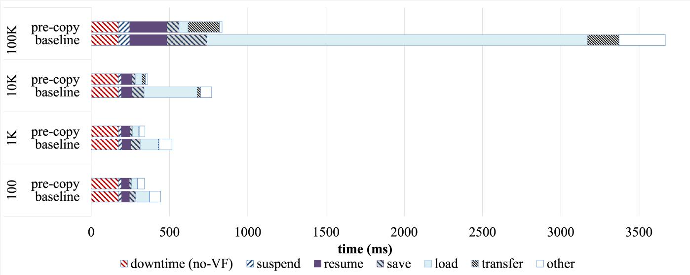  
Figure 8. Downtime breakdown

Table 3. Migration data structures (in MB)  
# of QP/CQ pairs Image Size Pipeline buffers
<table><tr><td>102</td><td>5.1 N/A</td></tr><tr><td>103</td><td>8.6 N/A</td></tr><tr><td>104</td><td>44 16</td></tr><tr><td>105</td><td>395 16</td></tr></table>

Figure 8 shows the VM downtime breakdown for the baseline and pre-copy-optimized migration schemes across varying numbers of allocated QP/CQ pairs. The downtime (no-VF) field indicates the time to migrate a VM without VF passthrough. The 100K QP experiment reflects high resource consumption patterns seen in real-world customer workloads. In the baseline scheme, loading the image into the remote VF dominates the downtime, as the number of allocated RDMA resources increases. The majority of the time is spent on ICM allocation. The pre-copy optimization (Section 6.2.4) effectively hides this overhead, reducing the downtime by 25% for 100 and by 75% for 100K QPs/CQs.

As anticipated, the image transfer time grows with the amount of resources, due to the proportional increase in device image size (Table 3) and the relatively slow OOB channel. Increased transfer times shadow image load/store operations, diminishing the performance benefits of pipelining. We observed only a 3% further downtime reduction. On the other hand, the block granularity of the pipelined transfer (Section 5) allows the amount of memory required for migration to be reduced to a fixed set of pipeline buffers regardless of the device image size (Table 3). We also observed an increase in resume overhead. This is largely due to the comprehensive scan to detect active QPs in our current implementation. Currently, this step is implemented in the firmware. We estimate that its hardware implementation will significantly reduce the downtime impact.

7.2.3 Observed performance. In this section, we study how migration is observed by active communicating peers (Figure 1). We use the perftest package [2], a standard tool to measure RDMA latency, bandwidth, and message rate, which we modify to report high-fidelity telemetry.

Figure 9a shows ib\_write\_lat RTT measurements taken on the server VM while migrating the client VM as a function of time. To minimize performance impact when capturing the range of interest, we implement an outlier detector that monitors a fixed-sized cyclic array of the latest readings. All RTT probes prior to and after the migration are concentrated around ≈ 4 us, matching bare-metal performance.

Two outlier values are evident. The first (310 ms) matches the downtime reported by QEMU (308 ms). The second (81 ms) is associated with inefficiency of network reconfiguration in our setup (Figure 10). Using a network sniffer (tcpdump), we observe that immediately after migration the server begins receiving packets from the client, which indicates that the migrated VF is operational. As the server’s network location did not change, the switches properly route corresponding packets. However, transmission from the server is established only after an additional 80 ms required to reconfigure the network. In production systems, route updates are expedited, as discussed in Section 2.3.1.

Figures 9b and 9c present ib\_write\_bw bandwidth and message rate measurements for 16 KB and 8 B messages, respectively. We show results for two image sizes: with four communicating QPs (small) and while allocating 100K additional idle QPs (large). In both configurations, bare-metal performance is achieved just before and immediately after downtime. Specifically, no degradation is seen during the pre-copy phase. In addition, the observed downtime is similar to the measurements for idle VMs (Figure 8), indicating that high load does not impact the migration.

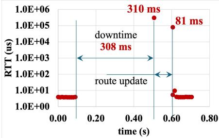  
(a) Round Trip Time

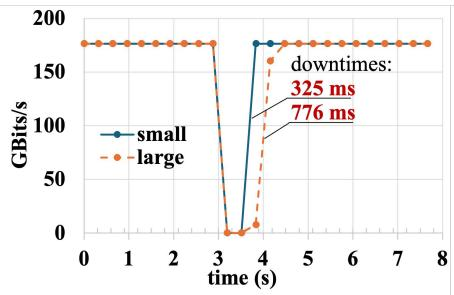  
(b) Bandwidth

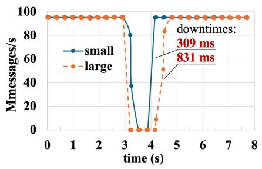  
(c) Message Rate

Figure 9. Observed performance during live migration  
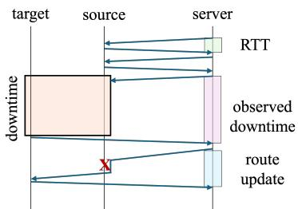  
Figure 10. Migration impact on RTT

Table 4. Impact of device throttling  
BW (Gbit/s) Migration time (s) Pre-copy rounds
<table><tr><td>(Cblt/s) 18</td><td>Ngratiolrtle(s) TrecoPyroulds N/A N/A</td></tr><tr><td>15</td><td>99.7 46.4</td></tr><tr><td>12</td><td>71.7 28.6</td></tr><tr><td>6</td><td>42.6 10.8</td></tr><tr><td>1</td><td>31 5.6</td></tr></table>

7.2.4 RDMA throttling. We use the ib\_write\_bw benchmark to create an aggressive workload that continuously accesses 16 GB out of 100 GB of VM memory. Table 4 shows the average migration time and number of pre-copy rounds for several throttling levels, expressed as VF bandwidth (BW) limitations. The same default downtime threshold is used for all cases. Unconverged tests are marked as ’N/A’.

As expected, when RDMA throughput exceeds that of the OOB channel (18 Gbit/s and above), pre-copy does not converge. The borderline level of 15 Gbit/s allows convergence but results in 3.3× longer migration times compared to the most strict throttling level of 1 Gbit/s.

## 7.3 Parallel application migration

To demonstrate the migration of a distributed application, we use the MPI NAS Parallel Benchmarks (NPB) suite [11], with Open MPI [20] as the MPI implementation. NPB comprises a set of representative parallel kernels and simulated applications.

Figure 11 presents execution times reported by BT, EP, CG, FT, LU, MG, and SP NPB benchmarks for class C data sets. The suffix in the test name represents the number of processes used in the corresponding experiment. The MPI ranks were evenly distributed between VM 1 and VM 2 in a roundrobin fashion. All MPI communications were performed over RDMA. Each benchmark was executed five times, and the average value is reported. Standard deviations did not exceed 3.8% and are not shown. "Clean run" represents normal execution, and "LM" corresponds to an experiment with a single intervening migration.

For all experiments, NPB integrity verification was successfully passed. Only a slight increase in the execution time was observed due to migration, although the benchmarks run for less than a minute. This indicates that efficient execution can be maintained in the face of frequent migrations, which may be required for large jobs.

In Figure 12, we present NPB migration downtimes with pass-through RDMA compared to para-virtual TCP. For the BT, EP, CG, MG, and SP benchmarks, RDMA adds about 150 ms of downtime. This is attributed directly to the overhead of device migration (Section 7.2.2). The FT and LU benchmarks exhibit a larger difference. We observed an increase of 6× and 2×, respectively, in the size of VM memory transferred during the downtime for RDMA. This is a result of the increased memory dirtying rate capabilities of the RDMA NIC that we discussed in Section 7.2.4.

## 7.4 Multi-device migration

We evaluate multi-device migration for RDMA NICs and GPGPUs, using the NVIDIA Collective Communications Library (NCCL) Allreduce benchmark. Allreduce [46] is a bandwidth-intensive operation that is widely used in AI training. It performs a parallel element-wise reduction on a set of vectors using multiple GPGPUs and distributes the result to all participants. GPGPUs were passed through to VMs using NVIDIA Virtual GPU (vGPU) [5]. The RDMA NIC uses GPUDirect (based on PCIe P2P) to directly access GPGPU buffers.

We evaluate migration in a tight loop of five hundred consecutive Allreduce operations on 1GB vectors. Figure 13 presents the average bandwidth over time. NCCL performance is fully restored after migration. All runs have successfully passed benchmark consistency checks, validating that multi-device migration operates correctly.

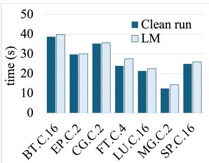  
Figure 11. NPB execution time

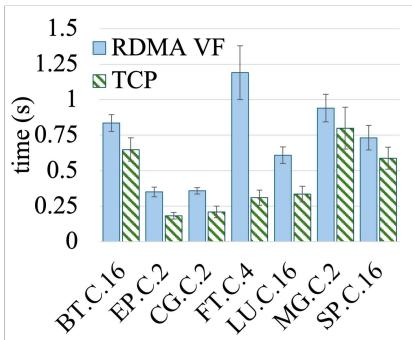  
Figure 12. NPB downtime

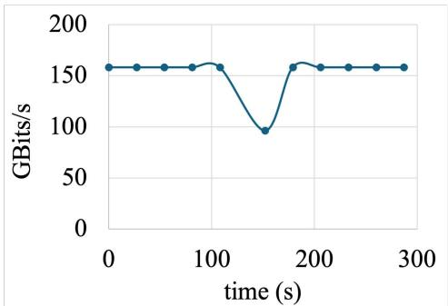  
Figure 13. NCCL Allreduce bandwidth

## 8 Related work

Extensive research has been conducted on migration of passthrough Ethernet NICs. While solutions that leverage guest OS support can be achieved with software-only implementations [17, 21, 25, 36], solutions that are fully transparent to the VM require device support [19, 47, 49].

In [19, 47], VF descriptor rings were made accessible from the PF. Un-IOV [49] demonstrated transparent live migration of VirtIO-net and VirtIO-blk devices by leveraging hardware assistance from Intel IPU VirtIO accelerators.

Transparent migration of RDMA devices is more challenging (Section 2.3.2). Software-only solutions, e.g., Migr-RDMA [29], DMTCP [12], and several others [42, 48], require the virtualization of RDMA resources (Section 2.3.2). During migration, this involves: (a) creating the objects on the target machine, (b) draining the posted (in-flight) work, and (c) synchronizing with all remote peers.

For (a), reliance on the IB Verbs interface incurs considerable overhead (Section 3.2), which we evaluate in Section 7.2.1, and (b) introduces arbitrary delays determined by the amount of in-flight data (Section 2.3.2). Both (b) and (c) depend on network conditions and remote peer availability. In addition, runtime overhead is associated with RDMA resource virtualization (3–9% as reported by MigrRDMA). Our approach enables zero-cost transparency thanks to the preservation of RDMA namespaces (DA1), as well as local (DA2) and remote (DA3) connections. We also avoid draining by quiescing at the packet granularity (DA4).

To amortize the cost of RDMA resource allocation (a), MigrRDMA [29] relies on the pre-copy phase. This mainly includes the recreation of RDMA objects (leveraging modifications in the guest OS) and the reconnection of QPs (via synchronization with remote peers). In contrast, our solution is completely independent and requires no OS or remote peers’ involvement. In addition, MigrRDMA does not detail how the variation in RDMA resource consumption during pre-copy rounds is handled. Our solution supports this via incremental adjustments of the ICM layout.

The device assistance allows MigrOS [38] to avoid draining (b) and global synchronization (c). However, it relies on

IB Verbs API, inheriting the disadvantages of object-level serialization (a). The introduction of the new Paused state is vulnerable to deadlocks (Section 2.3.2). Following DA3, we rely only on timeouts, which allows us to avoid both the deadlock and modifications to the RDMA wire protocol. The violation of DA2 (not migrating network addresses) breaks the QP connection establishment procedure if IB LIDs are exchanged before migration, but the connection is attempted afterward. In addition, MigrOS can only migrate one endpoint of a QP at a time, which imposes restrictions on rolling updates (Section 3.1).

Migrating a VM with multiple PCI passthrough devices requires, in particular, ensuring the consistency of the PCIe P2P traffic. To the best of our knowledge, this work is the first to address this problem.

## 9 Discussion

Looking forward, we would like to focus on two areas that we believe to be critical for migrating high-performance workloads: downtime and connection preservation.

## 9.1 Downtime optimizations

Real-world HPC and AI workloads typically take days or weeks to complete. Thus, downtime in the order of seconds may seem negligible. However, these workloads are also characterized by frequent global synchronization, so even a brief delay from a single migrating node affects the whole computation. Furthermore, the increasing scale of jobs to hundreds of thousands of nodes and beyond may result in frequent migration due to maintenance activities, load balancing, and power management (e.g., to concentrate load and power down unused racks).

Thanks to the absence of global [12, 42, 48] or local [29, 38] coordination requirements, our solution does not imply any restrictions on the order and combination of VM migrations.

Our use of pre-copy rounds for ICM allocation has reduced downtime nearly five-fold. However, downtime still grows with increasing resource utilization. We thus advocate for leveraging pre-copy rounds for the device state itself, namely tracking dirty ICM pages and transferring their contents in the same manner as VM memory. This will allow the downtime of future devices to be proportional to the current active working set rather than the image size.

Section 7.2.4 shows the mismatch between RDMA NIC throughput and the hypervisor OOB channel. With 800 Gbit/s NICs entering the market, this gap is no longer tolerable. Faster OOB channels, optionally using RDMA themselves, are becoming essential.

## 9.2 Connection preservation

In section 3.1, we discussed the use of exponential backoff timeouts to keep connections alive during migration. However, going forward, we believe the distinction between migration-induced delays and timeouts must be made explicit. Short timeouts and early application notification of failures are important for fast retransmission, load balancing, and detecting failed paths quickly. High migration timeouts might interfere with these considerations.

One option is to introduce a special Negative Acknowledgement (NACK) during the stop-and-copy phase to indicate that a migration is in progress. On receipt of such NACK, the remote RDMA NIC will extend the timeouts for the specific connection while still maintaining short timeouts for the common case.

For encrypted connections, per-connection NACKs are not feasible, as they would require modifying the frozen connection state. In this case, NACKs can instead be issued at the device level, indicating to peers that the device as a whole is migrating. Thus, all related connections must employ larger timeouts.

## 10 Conclusions

Modern HPC and AI workloads require hardware accelerators for compute and RDMA NICs for communication. Migration of such complex stateful devices is key to supporting these workloads in the cloud. In this paper, we advocate a device-assisted approach for migrating RDMA devices, which is transparent to both the VM and its peers.

Controlling migration at the device level not only improves performance but also reduces software complexity and maintenance. We also show how the standard migration mechanisms of pre-copy rounds and dirty-page throttling can apply to devices generically. While conceived in the context of RDMA, our API is device agnostic.

Finally, we present a novel technique for migrating devices that communicate directly. We provide a formal proof that a consistent state can be reached.

Thorough evaluation shows that sub-second downtimes are possible even for VMs that incur extremely high RDMA resource utilization. Moreover, optimal performance is maintained both before migration and fully restored afterwards. Successful migration of MPI and GPU NCCL applications, which stress direct RDMA-GPU communication, provides further confidence in realizing the accelerated cloud.

## References

[1] [n. d.]. ConnectX-7 400G Adapters. https://resources.nvidia.com/enus-accelerated-networking-resource-library/connectx-7-datasheet. Retrieved Aug 2025 from https://resources.nvidia.com/en-usaccelerated-networking-resource-library/connectx-7-datasheet

[2] [n. d.]. Infiniband Verbs Performance Tests. https://github.com/linuxrdma/perftest. Retrieved Dec 2024 from https://github.com/linuxrdma/perftest

[3] [n. d.]. QEMU: A generic and open source machine emulator and virtualizer. https://www.qemu.org/. Retrieved Aug 2025 from https: //www.qemu.org/

[4] [n. d.]. SR-IOV Live Migration (NVIDIA documentation). https://docs.nvidia.com/networking/display/mlnxofedv24040700/sriov+live+migration. Retrieved Aug 2025 from https://docs.nvidia. com/networking/display/mlnxofedv24040700/sr-iov+live+migration

[5] [n. d.]. Unlock Next Level Performance with Virtual GPUs. https: //www.nvidia.com/en-us/data-center/virtual-solutions/. Retrieved Dec 2024 from https://www.nvidia.com/en-us/data-center/virtualsolutions/

[6] [n. d.]. VFIO - ’Virtual Function I/O’. https://docs.kernel.org/driverapi/vfio.html. Retrieved Aug 2025 from https://docs.kernel.org/driverapi/vfio.html

[7] Rawan Aljamal, Ali El-Mousa, and Fahed Jubair. 2018. A comparative review of high-performance computing major cloud service providers. In 2018 9th International Conference on Information and Communication Systems (ICICS). 181–186. doi:10.1109/IACS.2018.8355463

[8] Rawan Aljamal, Ali El-Mousa, and Fahed Jubair. 2020. Benchmarking Microsoft Azure Virtual Machines for the use of HPC applications. In 2020 11th International Conference on Information and Communication Systems (ICICS). 382–387. doi:10.1109/ICICS49469.2020.239525

[9] AMD. 2023. AMD I/O Virtualization Technology (IOMMU) Specification. https://www.amd.com/content/dam/amd/en/documents/ processor-tech-docs/specifications/48882\_IOMMU.pdf. Retrieved Jul 2024 from https://www.amd.com/content/dam/amd/en/documents/ processor-tech-docs/specifications/48882\_IOMMU.pdf

[10] InfiniBand Trade Association. 2024. InfiniBand Architecture Specification. https://www.infinibandta.org/ibta-specification/. Retrieved July 2024 from https://www.infinibandta.org/ibta-specification/

[11] D.H. Bailey, E. Barszcz, J.T. Barton, D.S. Browning, R.L. Carter, L. Dagum, R.A. Fatoohi, P.O. Frederickson, T.A. Lasinski, R.S. Schreiber, H.D. Simon, V. Venkatakrishnan, and S.K. Weeratunga. 1991. The Nas Parallel Benchmarks. Int. J. High Perform. Comput. Appl. 5, 3 (Sept. 1991), 63–73. doi:10.1177/109434209100500306

[12] Jiajun Cao, Gregory Kerr, Kapil Arya, and Gene Cooperman. 2014. Transparent checkpoint-restart over InfiniBand. In Proceedings of the 23rd International Symposium on High-Performance Parallel and Distributed Computing (Vancouver, BC, Canada) (HPDC ’14). Association for Computing Machinery, New York, NY, USA, 13–24. doi:10.1145/2600212.2600219

[13] Stuart Cheshire. 2008. IPv4 Address Conflict Detection. RFC 5227. doi:10.17487/RFC5227

[14] Christopher Clark, Keir Fraser, Steven Hand, Jacob Gorm Hansen, Eric Jul, Christian Limpach, Ian Pratt, and Andrew Warfield. 2005. Live migration of virtual machines. In NSDI’05: Proceedings of the 2nd conference on Symposium on Networked Systems Design & Implementation, Vol. 2. 273–286. doi:10.5555/1251203.1251223

[15] Yaozu Dong, Xiaowei Yang, Xiaoyong Li, Jianhui Li, Kun Tian, and Haibing Guan. 2010. High performance network virtualization with SR-IOV. In HPCA - 16 2010 The Sixteenth International Symposium on High-Performance Computer Architecture, Vol. 2. 1–10. doi:10.1109/ HPCA.2010.5416637

[16] Tudor Dumitraş and Priya Narasimhan. 2009. Why Do Upgrades Fail and What Can We Do about It?. In Middleware 2009, Jean M. Bacon and Brian F. Cooper (Eds.). Springer Berlin Heidelberg, Berlin, Heidelberg, 349–372.

[17] Gregory D. Cummings Edwin Zhai and Yaozu Dong. 2008. Live migration with pass-through device for linux VM. https://www.kernel. org/doc/ols/2008/ols2008v2-pages-261-267.pdf. In In Ottawa Linux Symposium (OLS). https://www.kernel.org/doc/ols/2008/ols2008v2- pages-261-267.pdf

[18] Fahimeh Farahnakian, Tapio Pahikkala, Pasi Liljeberg, Juha Plosila, Nguyen Trung Hieu, and Hannu Tenhunen. 2019. Energy-Aware VM Consolidation in Cloud Data Centers Using Utilization Prediction Model. IEEE Transactions on Cloud Computing 7, 2 (2019), 524–536. doi:10.1109/TCC.2016.2617374

[19] Takaaki Fukai, Takahiro Shinagawa, and Kazuhiko Kato. 2021. Live Migration in Bare-Metal Clouds. IEEE Transactions on Cloud Computing 9, 1 (2021), 226–239. doi:10.1109/TCC.2018.2848981

[20] Edgar Gabriel, Graham E. Fagg, George Bosilca, Thara Angskun, Jack J. Dongarra, Jeffrey M. Squyres, Vishal Sahay, Prabhanjan Kambadur, Brian Barrett, Andrew Lumsdaine, Ralph H. Castain, David J. Daniel, Richard L. Graham, and Timothy S. Woodall. 2004. Open MPI: Goals, Concept, and Design of a Next Generation MPI Implementation. In Proceedings, 11th European PVM/MPI Users’ Group Meeting. Budapest, Hungary, 97–104.

[21] Jaeseong Im, Jongyul Kim, Youngjin Kwon, and Seungryoul Maeng. 2023. On-Demand Virtualization for Post-Copy OS Migration in Bare-Metal Cloud. IEEE Transactions on Cloud Computing 11, 2 (2023), 2028–2038. doi:10.1109/TCC.2022.3179485

[22] Intel. 2008. Intel VMDq Technology. https://www.intel.sg/ content/dam/www/public/us/en/documents/white-papers/vmdqtechnology-paper.pdf. Retrieved July 2024 from https: //www.intel.sg/content/dam/www/public/us/en/documents/whitepapers/vmdq-technology-paper.pdf

[23] Intel. 2020. INTEL® SCALABLE I/O VIRTUALIZATION. https://cdrdv2-public.intel.com/671403/intel-scalable-iovirtualization-technical-specification.pdf. Retrieved Sep 2024 from https://cdrdv2-public.intel.com/671403/intel-scalable-iovirtualization-technical-specification.pdf

[24] Jithin Jose, Mingzhe Li, Xiaoyi Lu, Krishna Chaitanya Kandalla, Mark Daniel Arnold, and Dhabaleswar K. Panda. 2013. SR-IOV Support for Virtualization on InfiniBand Clusters: Early Experience. In 2013 13th IEEE/ACM International Symposium on Cluster, Cloud, and Grid Computing. 385–392. doi:10.1109/CCGrid.2013.76

[25] Asim Kadav and Michael M. Swift. 2009. Live migration of directaccess devices. SIGOPS Oper. Syst. Rev. 43, 3 (jul 2009), 95–104. doi:10. 1145/1618525.1618536

[26] Ilya Lesokhin, Haggai Eran, Shachar Raindel, Guy Shapiro, Sagi Grimberg, Liran Liss, Muli Ben-Yehuda, Nadav Amit, and Dan Tsafrir. 2017. Page Fault Support for Network Controllers. In Proceedings of the Twenty-Second International Conference on Architectural Support for Programming Languages and Operating Systems (ASPLOS 17). ACM, 449–466. https://doi.org/10.1145/3037697.3037710

[27] Ang Li, Shuaiwen Leon Song, Jieyang Chen, Jiajia Li, Xu Liu, Nathan R. Tallent, and Kevin J. Barker. 2020. Evaluating Modern GPU Interconnect: PCIe, NVLink, NV-SLI, NVSwitch and GPUDirect. IEEE Transactions on Parallel and Distributed Systems 31, 1 (2020), 94–110. doi:10.1109/TPDS.2019.2928289

[28] Mingzhe Li, Xiaoyi Lu, Hari Subramoni, and Dhabaleswar K. Panda. 2017. Designing Registration Caching Free High-Performance MPI Library with Implicit On-Demand Paging (ODP) of InfiniBand. In 2017 IEEE 24th International Conference on High Performance Computing (HiPC). 62–71. doi:10.1109/HiPC.2017.00017

[29] Xiaoyu Li, Ran Shu, Yongqiang Xiong, and Fengyuan Ren. 2024. Software-based Live Migration for Containerized RDMA. In Proceedings of the 8th Asia-Pacific Workshop on Networking (Sydney, Australia) (APNet ’24). Association for Computing Machinery, New York, NY, USA, 52–58. doi:10.1145/3663408.3663416

[30] Jiuxing Liu. 2010. Evaluating standard-based self-virtualizing devices: A performance study on 10 GbE NICs with SR-IOV support. In 2010

IEEE International Symposium on Parallel & Distributed Processing (IPDPS). 1–12. doi:10.1109/IPDPS.2010.5470365

[31] Linux man-pages 6.9.1. 2024. tcp(7). https://man7.org/linux/manpages/man7/tcp.7.html. Retrieved Oct 2024 from https://man7.org/ linux/man-pages/man7/tcp.7.html

[32] Cornelia Huck Michael S. Tsirkin. 2022. Virtual I/O Device (VIRTIO) Version 1.2. https://docs.oasis-open.org/virtio/virtio/v1.2/csd01/virtiov1.2-csd01.pdf. Retrieved Sep, 2024 from https://docs.oasis-open.org/ virtio/virtio/v1.2/csd01/virtio-v1.2-csd01.pdf

[33] Microsoft. [n. d.]. Azure high-performance computing. https://azure. microsoft.com/en-us/solutions/high-performance-computing. Retrieved March 2023 from https://azure.microsoft.com/en-us/solutions/ high-performance-computing

[34] Malek Musleh, Vijay Pai, John Paul Walters, Andrew Younge, and Stephen Crago. 2014. Bridging the Virtualization Performance Gap for HPC Using SR-IOV for InfiniBand. In 2014 IEEE 7th International Conference on Cloud Computing. 627–635. doi:10.1109/CLOUD.2014.89

[35] Michael Nelson, Beng-Hong Lim, and Greg Hutchins. 2005. Fast Transparent Migration for Virtual Machines. https://www.usenix.org/conference/2005-usenix-annual-technicalconference/fast-transparent-migration-virtual-machines. In 2005 USENIX Annual Technical Conference (USENIX ATC 05). USENIX Association, Anaheim, CA. https://www.usenix.org/conference/2005- usenix-annual-technical-conference/fast-transparent-migrationvirtual-machines

[36] Zhenhao Pan, Yaozu Dong, Yu Chen, Lei Zhang, and Zhijiao Zhang. 2012. CompSC: Live Migration with Pass-through Devices. In Proceedings of the 8th ACM SIGPLAN/SIGOPS Conference on Virtual Execution Environments (London, England, UK) (VEE ’12). Association for Computing Machinery, New York, NY, USA, 109–120. doi:10.1145/2151024. 2151040

[37] PCI-SIG. 2024. PCI Express® Base Specification Revision 6.2. PCI-SIG Specification. https://pcisig.com/specifications. Retrieved July 2024 from https://pcisig.com/specifications

[38] Maksym Planeta, Jan Bierbaum, Leo Sahaya Daphne Antony, Torsten Hoefler, and Hermann Härtig. 2021. MigrOS: Transparent Live-Migration Support for Containerised RDMA Applications. In 2021 USENIX Annual Technical Conference (USENIX ATC 21). USENIX Association, 47–63. https://www.usenix.org/conference/atc21/presentation/ planeta

[39] Adam Ruprecht, Danny Jones, Dmitry Shiraev, Greg Harmon, Maya Spivak, Michael Krebs, Miche Baker-Harvey, and Tyler Sanderson. 2018. VM Live Migration At Scale. SIGPLAN Not. 53, 3 (March 2018), 45–56. doi:10.1145/3296975.3186415

[40] Sriram Sankaran, Jeffrey M. Squyres, Brian Barrett, Vishal Sahay, Andrew Lumsdaine, Jason Duell, Paul Hargrove, and Eric Roman. 2005. The Lam/Mpi Checkpoint/Restart Framework: System-Initiated Checkpointing. Int. J. High Perform. Comput. Appl. 19, 4 (2005), 479–493. http://dblp.uni-trier.de/db/journals/ijhpca/ijhpca19.html# SankaranSBSLDHR05

[41] Jeffrey Shafer, David Carr, Aravind Menon, Scott Rixner, Alan L. Cox, Willy Zwaenepoel, and Paul Willmann. 2007. Concurrent Direct Network Access for Virtual Machine Monitors. In 2007 IEEE 13th International Symposium on High Performance Computer Architecture. 306–317. doi:10.1109/HPCA.2007.346208

[42] Ryousei Takano, Hidemoto Nakada, Takahiro Hirofuchi, Yoshio Tanaka, and Tomohiro Kudoh. 2012. Cooperative VM migration for a virtualized HPC cluster with VMM-bypass I/O devices. In 2012 IEEE 8th International Conference on E-Science. 1–8. doi:10.1109/eScience. 2012.6404487

[43] R. Uhlig, G. Neiger, D. Rodgers, A.L. Santoni, F.C.M. Martins, A.V. Anderson, S.M. Bennett, A. Kagi, F.H. Leung, and L. Smith. 2005. Intel virtualization technology. Computer 38, 5 (2005), 48–56. doi:10.1109/ MC.2005.163

[44] VMware. 2022. Announcing DPU-based Acceleration for NSX. https: //blogs.vmware.com/networkvirtualization/2022/08/announcingdpu-based-acceleration-for-nsx.html/. Retrieved Nov, 2018 from https://blogs.vmware.com/networkvirtualization/2022/08/ announcing-dpu-based-acceleration-for-nsx.html/ Blog post.

[45] Lizhe Wang, Gregor von Laszewski, Andrew Younge, Xi He, Marcel Kunze, Jie Tao, and Cheng Fu. 2010. Cloud Computing: A Perspective Study. New Gen. Comput. 28, 2 (apr 2010), 137–146. doi:10.1007/s00354- 008-0081-5

[46] Mengdi Wang, Chen Meng, Guoping Long, Chuan Wu, Jun Yang, Wei Lin, and Yangqing Jia. 2019. Characterizing Deep Learning Training Workloads on Alibaba-PAI. In 2019 IEEE International Symposium on Workload Characterization (IISWC). 189–202. doi:10.1109/IISWC47752. 2019.9042047

[47] Xin Xu and Bhavesh Davda. 2016. SRVM: Hypervisor Support for Live Migration with Passthrough SR-IOV Network Devices. In Proceedings

of the 12th ACM SIGPLAN/SIGOPS International Conference on Virtual Execution Environments, Atlanta, GA, USA, April 2-3, 2016, Vishakha Gupta-Cledat, Donald E. Porter, and Vivek Sarkar (Eds.). ACM, 65–77. doi:10.1145/2892242.2892256

[48] Jie Zhang, Xiaoyi Lu, and Dhabaleswar K. Panda. 2017. High-Performance Virtual Machine Migration Framework for MPI Applications on SR-IOV Enabled InfiniBand Clusters. In 2017 IEEE International Parallel and Distributed Processing Symposium (IPDPS). 143–152. doi:10.1109/IPDPS.2017.43

[49] Zongpu Zhang, Chenbo Xia, Cunming Liang, Jian Li, Chen Yu, Tiwei Bie, Roberts Martin, Daly Dan, Xiao Wang, Yong Liu, and Haibing Guan. 2024. Un-IOV: Achieving Bare-Metal Level I/O Virtualization Performance for Cloud Usage With Migratability, Scalability and Transparency. IEEE Trans. Comput. 73, 7 (2024), 1655–1668. doi:10.1109/TC.2024.3375589

Received 17 April 2025