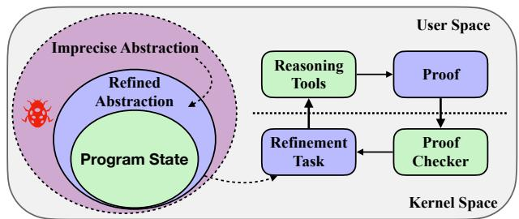
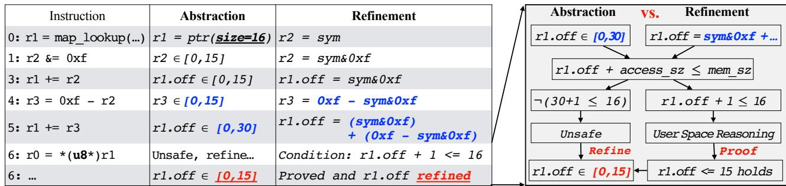
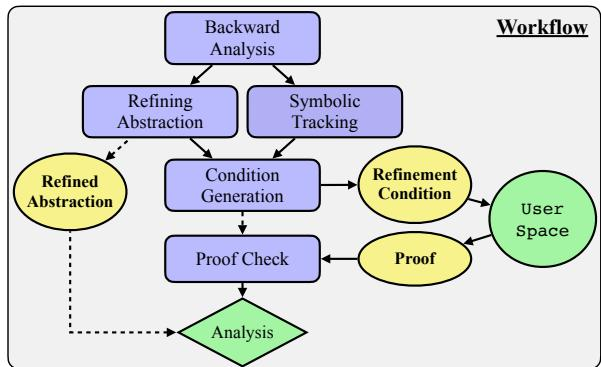
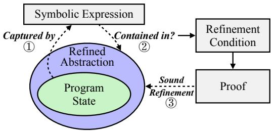
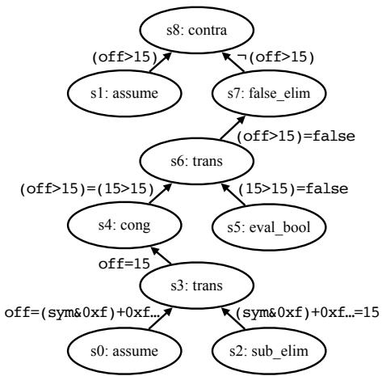
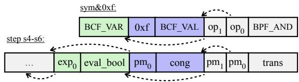
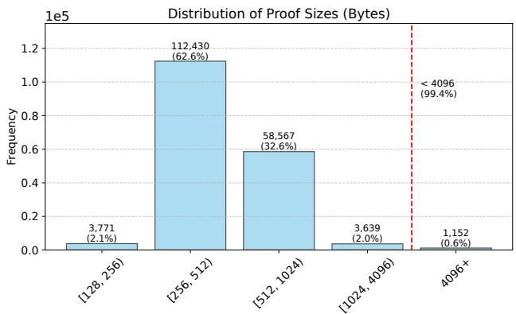

Latest updates: hps://dl.acm.org/doi/10.1145/3731569.3764796

RESEARCH-ARTICLE

# Prove It to the Kernel: Precise Extension Analysis via Proof-Guided Abstraction Refinement

HAO SUN, Swiss Federal Institute of Technology, Zurich, Zurich, ZH, Switzerland ZHENDONG SU, Swiss Federal Institute of Technology, Zurich, Zurich, ZH, Switzerland

Open Access Support provided by:

Swiss Federal Institute of Technology, Zurich

  
Published: 12 October 2025

Citation in BibTeX format

SOSP '25: ACM SIGOPS 31st Symposium   
on Operating Systems Principles   
October 13 - 16, 2025   
Seoul, Republic of Korea

Conference Sponsors: SIGOPS

# Prove It to the Kernel: Precise Extension Analysis via Proof-Guided Abstraction Refinement

Hao Sun

Zhendong Su

ETH Zurich

ETH Zurich

Switzerland

## Abstract

Modern OS kernels, such as Linux, employ the eBPF subsystem to enable user space to extend kernel functionality. To ensure safety, an in-kernel verifier statically analyzes these extensions; however, its imprecise analysis frequently results in the erroneous rejection of safe extensions, exposing a critical tension between the precision and computational complexity of the verifier that limits kernel extensibility.

We propose a proof-guided abstraction refinement technique that significantly enhances the verifier’s precision while preserving low kernel space complexity. Rather than incorporating sophisticated analysis (e.g., via new abstract domains) directly into the verifier, our key insight is to decouple the complex reasoning to user space while bridging the gap through formal proofs. Upon encountering uncertainties, the verifier initiates an abstraction refinement procedure rather than rejecting the extension. As the refinement involves nontrivial reasoning, the verifier simply delineates the task and delegates it to user space. A formal proof is produced externally, which the verifier subsequently checks in linear time before adopting the refined abstraction. Consequently, our approach achieves high precision via user space reasoning while confining kernel space operations to an efficient proof check. Evaluation results show that our technique enables the verifier to accept 403 out of 512 real-world eBPF programs that were previously rejected erroneously, paving the way for more reliable and flexible kernel extensions.

## 1 Introduction

OS kernels are designed for high extensibility to accommodate diverse user space workloads [19, 41, 65]. A prominent example is the eBPF subsystem in Linux [81], which permits user space to inject specialized functionality into the kernel via extensions [86, 93, 96, 99, 101]. These extensions support various tasks, including performance profiling [1, 2], security monitoring [13, 54, 57], file system management [22, 94, 97], and device driver enhancements [60, 85]. For instance, eBPF has been exploited to implement tailored process scheduling

Switzerland

strategies, achieving significant performance improvements and enhanced CPU utilization [50]. Furthermore, eBPF has seen widespread industrial adoption; Meta deploys over a hundred eBPF extensions in its production servers [35], while companies such as Google and Cloudflare rely extensively on eBPF in their operational environments [43].

Since eBPF extensions are executed in kernel space but are developed by untrusted third parties, the kernel must rigorously ensure their safe execution without relying on trust assumptions. This safety is guaranteed by an in-kernel static analyzer, commonly referred to as the verifier [80], which leverages abstract interpretation techniques [36]. The verifier systematically explores all potential control-flow paths and interprets each instruction via abstract semantics, verifying critical properties such as memory safety and correct kernel interactions. Any violation leads to static rejection. By embedding the verifier directly within the kernel, this approach provides robust, provable safety guarantees: the system remains a stable core kernel augmented solely by statically verified extensions. Consequently, even if user space is compromised or the code is malicious, the verifier effectively prevents the execution of unsafe extensions, thereby preserving kernel integrity and overall system stability.

Challenges. Although the eBPF verifier delivers robust safety guarantees and high performance of extensions, designing a precise in-kernel verifier entails significant challenges, particularly in balancing analysis precision against system complexity. Enhancing precision typically requires incorporating sophisticated static analysis techniques. For instance, rather than relying solely on interval analysis, employing relational abstract domains such as Octagon [68] and Polyhedra [38] could capture richer variable relationships, thereby increasing accuracy. However, the kernel environment imposes stringent constraints on verifier complexity and runtime overhead—constraints that differ markedly from those in user space. Increasing verifier complexity not only enlarges the potential attack surface, thereby introducing security vulnerabilities, but also leads to runtime overhead, which adversely affects system latency and consumes kernel resources, ultimately degrading user space application performance. Given their complexities—e.g., ?? (??3) for Octagon and ?? (2 ) for Polyhedra—these advanced analyses are generally impractical within kernel constraints.

In practice, the eBPF verifier sacrifices analysis precision to ensure low computational complexity. To facilitate efficient analysis, the verifier employs inexpensive abstract domains, notably the interval domain [37], which tracks variable ranges, and the tristate domain [87], which captures per-bit value information. Both domains support linear-time analysis and reasoning. However, these abstractions intrinsically over-approximate during each interpretation step, discarding precise information about concrete computations (as detailed in section 2). As a result, the abstraction of the program state rapidly becomes coarse-grained, leading to the incorrect rejection of many safe extensions [5, 10, 75]. This outcome poses significant challenges for extension developers: addressing verifier feedback often requires substantial manual effort due to the considerable gap between high-level source code and the verifier’s bytecode-level error messages. In numerous cases, resolving these false positives demands extensive code refactoring; in some instances, mitigation is infeasible, thereby limiting kernel extensibility [12, 74, 78].

Existing Efforts. Prior research has primarily focused on enhancing the verifier’s existing analysis or incorporating new abstract domains. For instance, Vishwanathan et al. [87] improved the precision of operators within the verifier’s tristate domain by formally establishing the optimality of its addition and subtraction operator analysis and by proposing a more precise approach for multiplication. Nonetheless, these enhancements do not overcome the fundamental limitations inherent to the tristate domain (section 2). To mitigate these constraints, PREVAIL [48] adopted the Zone abstract domain [67], which offers improved precision over interval and tristate. However, the integration of advanced analysis invariably introduces a precision-complexity trade-off. Although the Zone domain improves precision for certain bytecode patterns, it concurrently increases both the verifier’s complexity and its runtime overhead, potentially conflicting with kernel constraints (section 8 details related work).

In this paper, our vision is to enhance the in-kernel verifier to achieve a precision comparable to symbolic execution [61] while maintaining linear-time complexity in kernel space, thereby advancing the adoption of safe kernel extensions.

Key Insight. Rather than incorporating increasingly sophisticated techniques directly within the verifier—as has been typical in prior work, we aim to decouple complex reasoning from the in-kernel verifier and delegate it to user space. Our key insight is to preserve the verifier’s simplicity and efficiency while enhancing its precision through on-demand abstraction refinement performed in user space. The kernel is solely for validating the refinement via efficient, linear-time proof checking that eliminates any hidden trust.

More concretely, our first design principle is to keep the verifier simple, maximizing its use for analysis while maintaining its efficiency. When the verifier is unable to proceed, this indicates one of two possibilities: either the program is unsafe, or the program is safe but the abstraction is too imprecise—where the latter is the predominant source of false rejections, i.e., rejections due to the infeasible states in the imprecise abstraction as shown in Figure 1. In contrast to existing designs, we interpret this scenario as a signal for abstraction refinement rather than rejection of the extension. Refinement involves analyzing the program state to derive a more precise abstraction, a process that may require complex techniques. By our key insight, the verifier merely delineates the refinement task, while the computationally intensive reasoning is offloaded to user space. Finally, since the kernel never trusts user space, we require a machinecheckable proof that certifies the validity of the refinement, which is adopted only after proof checking.

  
Figure 1. Our approach enhances verifier precision through on-demand refinement. This refinement is delegated to user space, where complex reasoning is performed, and is subsequently adopted after an efficient proof check.

Our Approach. Based on our design principles, we propose a proof-guided abstraction refinement technique and apply it to enhance the eBPF verifier, referred to as BCF (eBPF Certificate Framework). Initially, the verifier performs its efficient abstract interpretation as before; however, when a potential error is detected, the refinement starts by symbolically following the current analysis path to capture an exact representation of the program state. The verifier then derives a refined abstraction that allows the analysis to proceed, and the soundness of the refinement is captured as a formal condition using the symbolic information. The condition is delegated to user space, where SMT solvers are employed to generate proof attesting to the condition’s validity. Crucially, while generating the proof in user space is hard, validating the proof in kernel space is straightforward and can be performed in linear time. In this manner, our approach achieves high precision via user space reasoning while imposing low overhead and complexity in kernel space.

To comprehensively evaluate our approach in terms of precision improvement and overhead, we collected a dataset of 512 real-world eBPF programs that are safe yet incorrectly rejected. These programs were compiled with different compiler configurations (detailed in subsection 6.1) from popular projects that extensively use eBPF, including Cilium [28] and Calico [25], etc. [20, 52, 90]. Our evaluation shows that the state-of-the-art verifier, even with recent improvements, fails to accept these programs; in contrast, with BCF, the verifier accepts 403 (78.7%) of these programs, with an average proof size of 541 bytes and a proof checking time of 48.5 microseconds. Overall, the overhead introduced in kernel space is minimal, and our tool supports fully automated, push-button analysis. Our key contributions are as follows:

• Novel Approach. We introduce proof-guided abstraction refinement that enhances the in-kernel verifier by refinement offloading and efficient proof checking.

• Dataset. We curate and publicly release a rich dataset of real-world eBPF programs [83], serving as a valuable resource for future research.

• Implementation. We implement and open source BCF [82], and our results show its significant improvement on the verifier’s precision and low overhead in kernel space.

## 2 Background

Because extensions originate from user space, they present potential risks to kernel stability and integrity, whether due to malicious intent or inadvertent programming errors. Consequently, the kernel employs an in-kernel verifier to ensure that the extension (1) only accesses permitted regions (memory safety); (2) terminates within a predefined execution bound; and (3) interacts with the kernel only through valid, approved mechanisms (e.g., limited kernel functions [4]).

Abstraction. To achieve these safety guarantees while balancing precision and complexity, the eBPF verifier leverages abstract interpretation techniques. In particular, it utilizes efficient abstract domains to approximate the potential values of each variable. In this paper, we refer to these approximations of program state, represented in various domains, as abstractions. For instance, the verifier employs four distinct interval domains that account for different bit sizes and sign representations of each register, complemented by a tristate domain to track the status of individual bits. Collectively, these abstractions enable the derivation of variable ranges. During analysis, the verifier updates the ranges of involved registers locally for each computation. When a memory access occurs, the accumulated range information is leveraged to determine whether the access might exceed permitted bounds. Unlike classic abstract interpretation, the eBPF verifier never merges analysis paths but follows each feasible path and prunes equivalent states informed by the abstraction [23]. Moreover, since the interval and tristate domains are maintained in linear time, the verifier is efficient and concludes its analysis rapidly.

Listing 1 illustrates an analysis process performed by the verifier. For clarity, only the range information is shown rather than the complete interval and tristate domains. Initially, the verifier identifies that register r1 is a pointer to a map value area of sixteen bytes. Subsequently, the range of r2 is constrained by a bitwise AND operation (instruction #1) that clears all except the lower four bits. After the subsequent shift operation (#2), the range of r2 is further expanded. Finally, r2 is used as a pointer offset added to r1 (#3) during a one-byte memory access attempt. As the resulting pointer may exceed the memory bounds, e.g., when r2 equals 16, the access is correctly rejected (#4).

0: r1 = map\_lookup(...) // r1 = ptr(size=16)   
1: r2 &= 0xf // r2 ∈ [0,15]   
2: r2 <<= 1 // r2 ∈ [0,30]   
3: r1 += r2 // r1.off ∈ [0,30]   
4: r0 = \*(u8\*)r1 // unsafe: off+access\_sz > mem\_sz  
Listing 1. Correct rejection of unsafe extension. The comments illustrate the verifier’s analysis.

Imprecisions. Although the extension is correctly rejected, this example already exposes inherent imprecision in the analysis. At #1, zeroing the higher bits of r2 yields a precise range of [0, 15]. However, following the left shift at #2, the range is updated to [0, 30]. Notably, the last bit of r2 after the shift must remain zero, indicating that nearly half of the values in the approximated range are infeasible (imprecise abstraction as in Figure 1). In general, while the interval and tristate domains provide computational efficiency, they suffer from fundamental precision limitations: (1) significant information is lost when processing arithmetic operations in the tristate domain or logical operations in the interval domain; (2) the precise computation is not preserved, as it is replaced by a locally updated over-approximation that rapidly propagates imprecision; and (3) complex computations and inter-variable relationships are inadequately tracked. Consequently, these imprecisions cause the verifier to reject many safe extensions erroneously.

Listing 2 presents an incorrect rejection of safe extension. Both r1 and r2 initially store the same input value (#0 and #1), which can be either zero or one (denoted as 0b000x). Register r2 is subsequently left-shifted by one bit (#2), yielding 0b00x0, and then compared with the constant 0b0001. In the non-taken branch from #3 to #4 (fallthrough), the unknown bit of r2 must be zero (ensuring its value is less than one), and consequently, r1 must be zero. However, the verifier is incapable of performing such reasoning or tracking variable relationships (#3), resulting in propagated imprecision (#4) and, ultimately, a false rejection (#5).

0: r1 &= 1 // r1=0b000x (x indicates unknown)   
1: r2 = r1 // r2=0b000x   
2: r2 <<= 1 // r2=0b00x0   
3: if r2 > 1 goto exit // fallthrough, r2<=0b01 (hence x=0)   
4: r1 \*= 8 // r1 ∈ [0,8] (yet, r1 must be 0)   
5: load\_bytes(...,r1) // unsafe (incorrect rejection)  
Listing 2. Incorrect rejection of safe extension. The contents within the parentheses are our annotations.

In practice, eBPF extensions are more complex than these simplified examples, as they are deployed in various scenarios to implement rich functionalities. Thus, the verifier’s inherent imprecision has emerged as a significant bottleneck.

  
Figure 2. Illustrative example of our BCF approach. When the verifier stalls at #6, the refinement is triggered, where the pointer offset r1.off is represented precisely with a symbolic expression. By proving that the refinement condition holds, the upper bound of r1.off can be safely tightened to fifteen, allowing the analysis to proceed.

## 3 Illustrative Example

This section presents an incorrect rejection, simplified from multiple real-world reports [12, 75, 78]. We show how our BCF approach enhances the verifier to accept it correctly.

Incorrect Rejection. Although the verifier is engineered for efficiency, its reliance on local over-approximations at each analysis step can rapidly propagate imprecision, ultimately resulting in incorrect rejections. Figure 2 illustrates a simplified instance of the extension presented in Listing 7. In this example, registers r2 and r3 represent the sizes of two contiguous memory accesses (with the memory access instruction omitted for clarity). The first access, determined by r2, is bounded within the range [0, 15]. The second access, determined by r3, covers the remaining bytes and satisfies the relation r3 = 0xf-r2. Consequently, the total size accessed, r2+r3, is exactly fifteen bytes. However, the verifier’s local analysis fails to preserve the fact that r3 is confined to the remaining portion of memory, instead over-approximating its range to r3 ∈ [0, 15]. As a result, the pointer offset update (r1 += (r2+r3)) is over-approximated to [0, 30]—twice the actual range—leading to an erroneous rejection.

```c
// 256 KiB per cpu core, of which 128 KiB is usable as
2 // we have to bound each new variable-length field to
3 // start at no more than half the size of the buffer to
// make the verifier happy.
#define EVENT_BUFFER_SIZE (1 << 18)
6 #define EVENT_BUFFER_SIZE_HALF (EVENT_BUFFER_SIZE >> 1)
```  
Listing 3. Workaround to mitigate the verifier’s imprecision.

This imprecision has adversely affected multiple user space projects that rely on eBPF, such as Tetragon [12] (a security enforcement framework) and SCX [78] (eBPF-based schedulers). As a consequence, developers are compelled to code refactoring. A common workaround is to double the allocated memory size; for example, in the instance above, 32 bytes must be allocated for r1. Similarly, in the Elastic project [45], developers are forced to allocate 256 KiB of memory per CPU core even though only 128 KiB is usable (Listing 3), resulting in significant kernel resource wastage.

In practice, the intrinsic limitation of the verifier’s analysis has led to various false rejections, and workarounds—e.g., adding unnecessary checks and even writing inline assembly—are required to mitigate the imprecision. In many cases, devising a workaround to correct the imprecision is highly nontrivial, if not infeasible.

Our Approach. BCF enhances the verifier with proof-guided abstraction refinement, i.e., deriving a more precise abstraction on demand and using the proof to validate its soundness. Our approach strategically combines analysis techniques at different precision levels, bridging the gap between coarse abstractions and precise reasoning through formal proofs.

Step 1: Refinement Condition Generation. When the verifier stalls at instruction #6 in Figure 2, a refinement is triggered to narrow the range of the pointer offset of r1. The verifier’s coarse abstraction over-approximates register values, necessitating a more precise representation. BCF thus tracks the program state with symbolic expressions, yielding an exact representation without information loss.

Initially, r2 is associated with a symbolic variable, sym, which represents its entire set of possible values. Every subsequent computation is recorded precisely as an expression over these symbolic variables. For instance, the computation for r3—which corresponds to the remaining portion of the fifteen-byte memory access—is captured exactly as 0xf-(sym&0xf), and the pointer offset is expressed as the sum of the symbolic expressions for r2 and r3. At instruction #6, BCF has derived the most accurate representation of r1.off, given by (sym&0xf) + (0xf-(sym&0xf)). This symbolic expression precisely encapsulates all possible values of r1.off: for every assignment to sym, the expression consistently evaluates to 0xf, in contrast to the verifier’s original imprecise interval [0, 30]. Notably, since this procedure merely records the computation, it is inherently efficient.

To allow the verifier to continue its analysis, the safety check at #6 must be satisfied: the one-byte memory access, when combined with r1’s offset, must lie within the allocated memory, i.e., r1.off+1 ≤ 16. Therefore, the range of r1.off must be refined from [0, 30] to [0, 15]. The critical task then is to verify the soundness of this refinement—that is, to ensure that every possible value of r1.off falls within this refined range. Given that all possible values of r1.off are accurately captured by the above symbolic expression, this requirement is formally expressed as

<table><tr><td rowspan=1 colspan=1>Step</td><td rowspan=1 colspan=1>Rule</td><td rowspan=1 colspan=1>Premise</td><td rowspan=1 colspan=1>Conclusion</td></tr><tr><td rowspan=1 colspan=1>s</td><td rowspan=1 colspan=1>assume</td><td rowspan=1 colspan=1></td><td rowspan=1 colspan=1>off = (sym&amp;0xf)+ 0xf - (sym&amp;0xf)</td></tr><tr><td rowspan=1 colspan=1>s1</td><td rowspan=1 colspan=1>assume</td><td rowspan=1 colspan=1></td><td rowspan=1 colspan=1>off &gt;15</td></tr><tr><td rowspan=1 colspan=1>s2</td><td rowspan=1 colspan=1>sub_elim</td><td rowspan=1 colspan=1></td><td rowspan=1 colspan=1>(sym&amp;0xf) + 0xf - (sym&amp;0xf) = 15</td></tr><tr><td rowspan=1 colspan=1>s3</td><td rowspan=1 colspan=1>trans</td><td rowspan=1 colspan=1>s0,s2</td><td rowspan=1 colspan=1>off = 15</td></tr><tr><td rowspan=1 colspan=1>s4</td><td rowspan=1 colspan=1>cong</td><td rowspan=1 colspan=1>s3</td><td rowspan=1 colspan=1>(off &gt; 15)= (15 &gt; 15)</td></tr><tr><td rowspan=1 colspan=1>s5</td><td rowspan=1 colspan=1>eval_bool</td><td rowspan=1 colspan=1></td><td rowspan=1 colspan=1>(15&gt;15）= false</td></tr><tr><td rowspan=1 colspan=1>s6</td><td rowspan=1 colspan=1>trans</td><td rowspan=1 colspan=1>s4,s5</td><td rowspan=1 colspan=1>(off &gt; 15)= false</td></tr><tr><td rowspan=1 colspan=1>s7</td><td rowspan=1 colspan=1>false_elim</td><td rowspan=1 colspan=1>s6</td><td rowspan=1 colspan=1>-(off &gt; 15)</td></tr><tr><td rowspan=1 colspan=1>s8</td><td rowspan=1 colspan=1>contra</td><td rowspan=1 colspan=1>s1,s7</td><td rowspan=1 colspan=1>FALSE</td></tr><tr><td rowspan=2 colspan=3>Rules:   $\vartriangle { \frac { t _ { 1 } = t _ { 2 } , . . . , t _ { n - 1 } = t _ { n } } { \vline } }$ trans $t _ { 1 } = t _ { n }$ </td><td></td></tr><tr><td rowspan=1 colspan=1> $t _ { 1 } = s _ { 1 } , . . . , t _ { n } = s _ { n }$ cong $f ( t _ { 1 } , . . . , t _ { n } ) = f ( s _ { 1 } , . . . , s _ { n } )$ </td></tr><tr><td rowspan=1 colspan=3>sub_elim $a + b - a = b$ </td><td rowspan=1 colspan=1> $\frac { \overline { { F = \mathsf { f a l s e } } } } { \neg F }$ false_elim</td></tr></table>

Figure 3. The proof submitted from user space, establishing the validity of the refinement condition. The lower section formally defines the rules applied.

$$
( s y m \& \theta \times \mathsf { f } ) \ + \ ( \theta \times \mathsf { f } - ( s y m \& \theta \times \mathsf { f } ) ) \le 1 5 ,
$$

i.e., for all possible assignments to sym, the condition must hold. If the condition is met, the verifier confirms the soundness of the refinement; otherwise, the analysis is terminated. We refer to this key predicate as the refinement condition.

Step 2: User Space Proof Generation. Reasoning the refinement condition is considerably more challenging than performing a simple bound check within the interval domain. Specifically, the verifier must demonstrate that the condition holds for every possible assignment to the symbolic variables. Although the condition in the previous example is relatively straightforward, more complex programs yield nontrivial conditions, reasoning which is essentially equivalent to solving satisfiability problems—a task known to be NP-complete [34] and typically addressed using sophisticated search algorithms. However, while finding a solution for such problems is computationally intensive, validating a given solution can be accomplished efficiently, often in linear time. If an assignment that violates the condition is found, it can be directly verified; otherwise, a formal proof that the condition holds can be generated and checked.

To manage this complexity, BCF partitions the workload into two components: (1) reasoning about the refinement condition, which is computationally intensive and is therefore delegated to user space, and (2) validating the resulting proof, which is performed within the kernel. After deriving the symbolic expression for r1.off, BCF encodes the refinement condition and transmits it to user space, where SMT solvers are employed to reason about the condition. Ultimately, a formal proof confirming the condition—illustrated in Figure 3—is generated by the solver.

Step 3: Kernel Space Proof Check. Given the kernel’s inherent distrust of inputs from user space, a rigorous proof check is performed upon receiving the proof. A proof is a sequential application of well-defined proof rules, each of which soundly transforms its premises into a conclusion. The proof checker performs a linear scan of the proof, verifying at each step that both premises and conclusions conform to the prescribed rules. For instance, the false\_elim rule requires exactly one premise of the form F = false and concludes ¬F; any deviation from it is rejected.

As illustrated in Figure 3, the user space proof for the refinement condition comprises nine key steps and adheres to a proof-by-contradiction structure. Each step is formatted as a triple (rule, premises, conclusion). Initially, two assume rules (s0 and s1) assert the negation of the refinement condition. Next, the sub\_elim rule in s2—which reflects the arithmetic property ??+?? −?? = ??—eliminates a redundant subtraction. By transitivity, s3 deduces off=15 from s0 and s2. Subsequently, the cong rule applies identical operations to both sides of an equality; for example, asserting bigger than fifteen to both sides of off=15 yields (off>15)=(15>15) (s4). Finally, using the eval\_bool, trans, and false\_elim rules, the proof deduces ¬(off>15) at s7, which directly contradicts an earlier conclusion (as noted in s8). This contradiction invalidates the initial assumptions (s0 and s1), thereby establishing that the refinement condition holds.

Since each proof rule represents a sound, simple transformation, and the proof is a sequence of such rules, proof checking is efficiently performed in linear time. Upon successful validation, the in-kernel verifier is assured that the refinement is sound, obviating any hidden trust, and the analysis can safely continue using the refined abstraction. Consequently, BCF applies refinement on demand, enabling the verifier to achieve high precision via user space reasoning while confining computational complexity to the efficient kernel space proof check.

## 4 Approach

Figure 4 illustrates the workflow of our approach. Initially, the verifier executes its efficient abstract interpretation. Upon encountering an error, the refinement procedure is triggered. A backward analysis is first employed to determine the appropriate program location for initiating symbolic tracking, and the symbolic expressions for the relevant registers are then collected. The abstraction is refined, and a corresponding refinement condition is produced to certify the soundness of the refinement. This condition is subsequently transmitted to user space, where the necessary—albeit potentially expensive—reasoning is performed. Once the proof is submitted, the kernel rigorously validates it by applying each proof rule;

  
Figure 4. Workflow of proof-guided abstraction refinement.

any invalid step results in termination. Finally, the verifier resumes its efficient analysis with the refined abstraction.

Backward Analysis. When the verifier cannot proceed, we need to identify the segment of the analysis path that requires symbolic tracking. Rather than analyzing the entire, potentially extensive, eBPF program, we focus on a suffix of the current path that captures the value definitions of the target register along with all registers on which it transitively depends. We say that a register $r _ { i }$ depends on another register $r _ { j }$ if an operation of the form $r _ { i } ~ o p = ~ r _ { j } ~ ( e . g . , r _ { i } + = r _ { j } )$ occurs before $r _ { i }$ is defined. A register is defined after a value is directly stored in it. Through backward analysis, we pinpoint the earliest instruction in the path where the target register and its dependent registers are defined, thereby enabling the collection of accurate symbolic information.

1 ... // instructions before are irrelevant   
2 // (analysis ends, the suffix found)   
3 r1 = map\_lookup(...) // {} (r1 defined)   
4 r2 = load\_ctx(...) // {r1} (r2 defined)   
5 r2 &= 0xf // {r1, r2}   
6 r1 += r2 // {r1, r2}   
7 r3 = 0xf - r2 // {r1, r2} (r3 defined, r2 added)   
8 r1 += r3 // {r1, r3} (r3 added to the set)   
9 r0 = \*(u8\*)r1 // {r1} (backward analysis starts)  
Listing 4. Backward analysis to pinpoint the start location.

As illustrated in Listing 4, the backward analysis maintains a set of registers while traversing the program path in reverse order (e.g., from line 9 to line 3 in the example) to identify where each register in the set is defined. This set is initialized with the target register (r1). As the analysis proceeds, any register upon which a tracked register depends (for instance, r3 at line 8) is added to the set; conversely, a register is removed once its definition is found (as with r3 at line 7). The analysis terminates when the set becomes empty, at which point the starting location for symbolic tracking is determined. The analysis must terminate because the verifier enforces the initialization of the register before its usage. Furthermore, this targeted approach exploits the inherent locality of programs by examining only those instructions directly related to the target registers, ensuring that the subsequent symbolic tracking is both precise and efficient.

Symbolic Tracking. This phase initiates at the program location identified by the backward analysis and computes the symbolic expressions for the target registers. For each operation within the suffix, two primary actions are performed—actions analogous to those in classical symbolic execution. First, the computation is captured by updating the expressions associated with the involved registers:

$$
\{ r _ { i } = { \tt e x p } _ { i } , \ r _ { j } = { \tt e x p } _ { j } \} \ r _ { i } \ o p = \ r _ { j } \ \{ r _ { i } = { \tt e x p } _ { i } \ o p \ { \tt e x p } _ { j } \} ,
$$

where exp denotes a symbolic expression and op represents an operation (e.g., addition). Second, the relevant path constraints are recorded. Unlike traditional symbolic execution—which forks at every conditional branch—our approach focuses exclusively on the suffix that triggers the refinement, thereby mitigating the potential path explosion. Furthermore, because the verifier has already processed the instructions within this suffix, its partial approximations can be leveraged to optimize the symbolic tracking. Specifically, the bit size of symbolic variables is reduced to 32 bits whenever the verifier’s range information indicates that a register remains within [u32\_min, u32\_max], thus avoiding unnecessary 64- bit operations and simplifying the symbolic expressions. Additionally, operations that involve solely constant values are omitted, as their outcomes are already known.

Refining Abstraction. Upon completion of the symbolic tracking phase, a refined abstraction is derived—a more precise abstraction necessary for the analysis to progress. Essentially, the verifier’s abstraction is employed to perform certain safety checks, which in turn delineate the “safe” abstraction. For example, when verifying memory accesses, the verifier utilizes the range of the pointer offset ri.off to ensure that

$$
h i g h ( r _ { i } . o f f ) + a c c e s s \_ s z \leq m e m \_ s z \quad { \mathrm { a n d } } \quad l o w ( r _ { i } . o f f ) \geq 0 ,
$$

where high(·) and low(·) denote the upper and lower bounds of the offset, respectively. When the existing bound for ri.off fails to satisfy these conditions (as illustrated in Figure 2, where $r _ { 1 } . o f f \in [ 0 , 3 0 ]$ violates the requirement), the analysis cannot continue. We thus rephrase the constraint to

$$
h i g h ( r _ { i } . o f f ) \leq ( m e m \_ s z - a c c e s s \_ s z ) \quad { \mathrm { ~ a n d ~ } } \quad l o w ( r _ { i } . o f f ) \geq 0 ,
$$

which effectively prescribes the refined abstraction to allow the analysis to proceed: [0, mem\_sz−access\_sz]. For instance, if mem\_sz = 16 and access $\ 、 s z = 1 ,$ , the refined offset range becomes [0, 15] as illustrated in Figure 2.

Refinement Condition. To ensure the refined abstraction is sound, a crucial condition must be satisfied: every possible runtime value of the target register must lie within the refined range. Since these values are encapsulated by the symbolic expression (denoted as ○1 in Figure 5), the condition can be formally reformulated to require that the symbolic expression is entirely contained within the refined abstraction (○2 ).

  
Figure 5. A refined abstraction is sound only if it contains all possible program states. The refinement condition asserts this containment and requires a user space proof.

This containment, in conjunction with the corresponding path constraint, is encoded as the refinement condition that is transmitted to user space as a proof obligation (○3 ). For example, in Figure 2, the expression (sym&0xf)+(0xf-sym&0xf) represents all possible values for r1’s offset, and the refined abstraction is sound only if this expression is fully contained within the refined interval [0, 15].

Reasoning the refinement condition leads to two possible outcomes. First, if the condition fails—i.e., there exists an assignment to the symbolic variables such that the condition evaluates to false—it indicates that the refined abstraction does not encompass all possible values. Consequently, the refinement is unsound, and the analysis terminates. Second, if the condition holds, a proof can be produced and subsequently validated by the checker, establishing the soundness of the refinement without trust.

Workload Delegation. Reasoning the refinement condition requires sophisticated techniques (section 3), and we delegate it to the user space. A range of well-established tools—such as SMT solvers and theorem provers—can be employed in user space. This delegation is supported by both theoretical and practical considerations. Theoretically, since eBPF registers are fixed-size machine words (e.g., 64 bits), the generated conditions involve only a finite set of bounded symbolic variables; hence, the satisfiability problem under this constraint is fundamentally decidable [18] (e.g., via enumerating the bounded space), ensuring that a proof must exist when the condition holds. Practically, modern solvers are optimized with advanced algorithms and heuristics, allowing them to efficiently solve such bounded problems. Indeed, our experiments show that the chosen solver can handle all the conditions produced for the collected extensions.

Proof Check. A formal proof is required to justify the user space’s conclusion regarding the refinement condition, which must demonstrate that, for every possible assignment to these variables, the condition holds.

The argument is organized as a proof tree, where each node corresponds to a proof rule that precisely states its premises and the derived conclusion, culminating in the final result at the root node. The proof tree is converted to a topologically ordered list of the nodes when submitting from user space. The checker then sequentially applies each rule in the provided order, confirming that the premises at each step align with the rule’s definition. Any discrepancy results in the immediate rejection of the proof. Figure 6 illustrates the proof tree corresponding to the example in Figure 3, in which the assumption leads to a contradiction, thereby establishing—via its negation—that the refinement condition holds. Although generating such a proof is computationally intensive, checking the produced proof is straightforward, involving only a finite sequence of rule applications. This clear workload separation between proof search (conducted in user space) and proof check (performed in kernel space) enables the in-kernel verifier to achieve high precision while imposing low overhead and reducing the attack surface.

  
Figure 6. Proof tree of Figure 3, where each node represents a rule, the children are its premises, and s8 is the root node.

Our approach ensures that unsafe extensions cannot bypass the verifier through forged proofs. First, the refinement condition computed by BCF is stored within the verifier before control returns to user space. The subsequently submitted proof is untrusted and must establish this condition, which is verified by our in-kernel proof checker. Second, for unsafe extensions, the refinement condition—asserting that the symbolic state remains entirely within a safe abstraction—cannot hold. For example, if the program attempts an out-of-bounds memory access, the symbolic state will capture this violation, and the corresponding condition (e.g., in-bounds access) will fail. Because all rules and axioms in the proof system preserve validity, no valid proof can derive an invalid refinement condition for an unsafe extension. Any forged proof must therefore either apply an invalid inference rule or attempt to prove a true but inconsistent condition; in both cases, the proof checker detects and rejects it.

## 5 Implementation

Overall. Our implementation encompasses modifications to the eBPF verifier, integration of an in-kernel proof checker, shared interface definitions between user space and kernel space (uapi), the loader [24], and the cvc5 solver [14], amounting to a total of 7,366 lines of C/C++ code (Table 1).

Table 1. Overview of the code base of major components.
<table><tr><td>Component</td><td>Language</td><td>Lines of Code</td><td>Location</td></tr><tr><td>Verifier</td><td>C</td><td>1663</td><td>Kernel space</td></tr><tr><td>Proof Checker</td><td>C</td><td>2337</td><td>Kernel space</td></tr><tr><td>uapi</td><td>C</td><td>190</td><td>Shared</td></tr><tr><td>Loader</td><td>C</td><td>349</td><td>User space</td></tr><tr><td>Solver</td><td>C++</td><td>1837</td><td>User space</td></tr></table>

BCF is fully automated and supports push-button analysis: (1) the verifier executes until it generates a refinement condition; (2) control is transferred to the loader program, which translates the refinement condition into the solver’s formula format and invokes the solver to produce a proof; and (3) the loader submits the proof back to the verifier, allowing the analysis to resume. This iterative process terminates when either (1) the analysis completes successfully and the extension is accepted, (2) the refinement condition is violated—indicating that the extension is unsafe and must be rejected—or (3) the one million instruction limit [6] is reached, at which point the analysis is terminated.

System Call. Despite the rich functionality added, integrating BCF requires only five additional fields in the load command invoked via the bpf() system call, thereby obviating the need for new system calls or commands (see Listing 5). A shared buffer is employed to store both the refinement condition and the corresponding proof submitted from user space, with two size fields delineating the buffer’s total capacity and the utilized portion. Upon returning to user space, the verifier’s state is preserved in an anonymous file referenced by bcf\_fd, which is used exclusively to resume the state. Additionally, a flag distinguishes whether a proof is being requested or provided, thereby tailoring the proof-checking process. Consequently, user space can adopt BCF by simply supplying the buffer, checking the flag, and resuming the verifier via the file descriptor.

```c
1 -1573,6 +1582,20 @@ union bpf_attr {
2 __s32 prog_token_fd;
3 + __u32 bcf_fd;
4 + __aligned_u64 bcf_buf;
5 + __u32 bcf_buf_size;
6 + __u32 bcf_buf_true_size;
7 + __u32 bcf_flags;
8 };
```  
Listing 5. New fields to the BPF\_PROG\_Load command.

BCF Format. To facilitate efficient transmission of the refinement condition and its proof, we devised an independent binary encoding format based on a compact u32-based scheme. The operator of a symbolic expression (or, equivalently, the rule corresponding to a proof step) is encoded in the first four-byte unit, which encapsulates operation, length, and type information; the operands follow thereafter. For nested expressions, each sub-expression is encoded independently and referenced by its relative offset. Similarly, proof steps reference their premises via offsets. Notably, the encoding includes only the rules and premises, with the conclusions omitted (as they are computed by the checker), thereby reducing the overall proof size. For most operators (e.g., ALU and comparisons), we reuse the eBPF encoding [44] and extend it with new operations for manipulating symbolic expressions—such as the extract operation for retrieving segments of a variable for size casting. Figure 7 illustrates the encoding of the sym&0xf expression from Figure 2 and three proof steps (s4 to s6) from Figure 6.

  
Figure 7. Encoding for sym&0xf and the trans, cong, and eval\_bool steps, where pm??, exp??, and op?? denote the offset of a premise, expression, and operand, respectively.

BCF Track. We extend the eBPF verifier to produce the refinement condition. The backward analysis builds upon the existing backtrack\_insn() routine, which performs a preliminary analysis of dependent registers and their definitions and has been extended to support more register types. The register set is maintained as an integer mask, allowing the addition or removal of registers via simple bitwise operations. To maximize reuse of the verifier’s abstraction, symbolic tracking is integrated directly into the analysis phase (via do\_check() [9]) and is enabled exclusively during refinement, ensuring that standard analysis remains unaffected. The verifier records each branch decision during its analysis [11], and symbolic tracking leverages this branch history to follow the corresponding path suffix. The target register’s symbolic expression is directly encoded in the binary format. Once constructed, the verifier refines its abstraction and emits the refinement condition to the shared buffer. After the proof is validated, the verifier resumes analysis on the same instruction using the refined abstraction.

Proof Check. We implement an in-kernel proof checker to validate proofs submitted from user space. Since the refinement condition involves only fixed-size variables, proof generation is decidable [47, 49, 62]. The proof checker requires support for a fixed set of fundamental proof rules (e.g., resolution and bit-blasting [73, 100]) to be complete for expressing any proof [77]. Consequently, the checker remains stable and is agnostic to changes in the user space toolchains. Currently, our checker supports 45 primitive rules, including the standardized rules for Boolean, equality, and bit-vector theories [39], which suffice for accepting a broad range of proofs.

The proof checker validates proofs in three stages. First, it performs efficient format and type checking by verifying that each step’s encoding is valid and that each expression’s type conforms to the rule’s definition. Next, it applies each rule to compute the conclusion of every step. Finally, the computed conclusion is compared against the refinement condition stored in the verifier’s state to confirm its validity.

Loader and Solver. In user space, we modified both the loader (bpftool and libbpf) and the cvc5 solver. The loader tools facilitate kernel interaction and the loading of the eBPF extension, while cvc5 is an SMT solver with robust proof support [15]. The loader tools have been adapted to retrieve and translate the refinement condition from the BCF format into the solver’s format for the fixed-size bit-vector theory [16], in accordance with the SMT-LIB standard [17]. The loader then communicates with the solver, which is invoked to reason about the refinement condition. Moreover, we extended the cvc5 solver to produce proofs in the BCF format, thereby enabling efficient proof checking.

Limitations. Our current implementation serves as a framework and requires more engineering efforts to further enhance the verifier. First, while our symbolic tracking fully supports ALU and branch operations, its support for stack state tracking is incomplete. At present, the implementation accurately handles register-sized stack spills; however, spills of other sizes remain untracked and are conservatively marked as unbounded. This limitation can lead to over-approximation in certain cases and yield weakened refinement conditions that do not hold (subsection 6.2). Nevertheless, it does not affect the soundness of BCF, as proofs cannot be generated for such conditions. We will enhance the symbolic tracking when frequent bytecode patterns are observed in practice. Second, proof developments in the solver, such as the addition of new proof rules, will necessitate corresponding conversion from the solver’s format to the BCF format. Importantly, the in-kernel proof checker remains stable, and this conversion can be confined to the user space. For instance, the loader can map solver-specific proof steps into the checker’s canonical rule set. Because the checker is complete, such translations are feasible. If a new rule proves both widely applicable and sound, the checker can be extended accordingly, which is incremental and optional.

## 6 Evaluation

In this section, we evaluate BCF by employing a set of realworld eBPF programs that, despite being safe, are erroneously rejected by the current verifier. We apply our method to these programs and assess the acceptance rate and the associated overhead. The key findings are:

• Improved Precision: By integrating BCF, the verifier successfully loads 403 out of 512 eBPF programs, achieving an acceptance rate of 78.7%.

• Efficient Proof Checking: The average proof size is limited to 541 bytes, while the proof checking process requires only 48.5 microseconds on average.

• Low Overhead: The overall analysis time averages 9.0 seconds, with the proof-checking phase accounting for less than 1% of the total time and the user space component comprising an average of 21%.

Setup. All experiments were conducted on a Linux server equipped with an AMD EPYC 9654 96-core processor (with two threads per core) and 756 GiB of memory. The host Linux version was v5.15. We boot the kernel with our BCF patches within virtual machine instances created using QEMU 6.2.0 with KVM acceleration. Each guest environment utilized a minimal Debian distribution disk image. In addition to common configurations, eBPF-specific build options were enabled, following the standard setup[3].

## 6.1 Dataset

Collecting eBPF programs that are erroneously rejected due to the verifier’s imprecision poses significant challenges, because: (1) existing programs are carefully engineered to pass the verifier, and manual modifications (e.g., reverting the workaround code to reflect the developer’s intention) risk introducing bias and errors; (2) maintainers rarely publish rejected programs, and developers typically refactor the "problematic" code before release. Our manual search of mailing lists and repositories yielded only nine instances of directly rejected programs, a finding corroborated by Gershuni et al. [7]. To address this, we adopt a compiler-driven procedure to enrich our dataset, which is inspired by the development processes of 46 popular user space projects listed in the eBPF official application landscape [42].

```c
// We need to write the inline assembly as the verifier
// does not understand that val_len has already been
// bounds-checked above, because Clang spilled it to
// the stack.
asm volatile(
// Note: this branch is never taken, but we
// need it to appease the verifier.
"if %2 > " STR(CUSTOM_LABEL_MAX_VAL_LEN) goto 2f\n"
"r1 = %1\n"
"r2 = %2\n"
...
);
```  
Listing 6. Incorrect rejection of compiler produced bytecode.

In practice, eBPF extensions are developed in high-level languages such as C and compiled using GCC or Clang to produce the bytecode processed by the verifier. Notably, the verifier often accepts only those objects produced under a specific compiler configuration—i.e., a particular compiler version and optimization level—while rejecting those generated under alternative configurations [5]. Listing 6 illustrates a real-world case [74] where the verifier is incapable of accepting even the compiler-produced bytecode. As a result, developers are forced either to adopt a narrow “verifierfriendly” configuration—which may yield sub-optimal bytecode—or to write the bytecode directly, an error-prone and labor-intensive process.

Table 2. Details of a subset of compiled programs. The full dataset is publicly available [83].
<table><tr><td>Object</td><td>Project</td><td>Size</td><td>Loc</td><td>Description</td></tr><tr><td>bpf_lxc.o [30]</td><td>Cilium</td><td>269KiB</td><td>2,450</td><td>Container identity and policy</td></tr><tr><td>bpf_host.o [29]</td><td>Cilium</td><td>376KiB</td><td>2,086</td><td>Host level policy and route</td></tr><tr><td>pping_kern.o [91]</td><td>xdp-project</td><td>19 KiB</td><td>1,546</td><td>XDP packet timestamping</td></tr><tr><td>xdp_synproxy.o [92]</td><td>xdp-project</td><td>9.9 KiB</td><td>821</td><td>XDP-based SYN proxy</td></tr><tr><td>felix_bin_bpf.o [26]</td><td>Calico</td><td>188KiB</td><td>2,162</td><td>Pod network policy</td></tr><tr><td>ksnoop.bpf.o [53]</td><td>BCC</td><td>6.3KiB</td><td>461</td><td>Kernel function tracing</td></tr></table>

The core issue is that the compilers are capable of producing diverse bytecode patterns, while the verifier is not precise enough to analyze and accept them. This observation motivates our approach: by exploiting compiler diversity, we generate a broad spectrum of bytecode patterns that occur frequently in practice, thereby exposing the verifier’s imprecision. This strategy is effective for two primary reasons. First, different compiler configurations produce markedly different bytecode, affecting aspects such as register allocation and inlining decisions. Second, even minor modifications in bytecode can trigger substantially different verifier behaviors; for instance, substituting arithmetic with logical operators can alter the verifier’s approximation, thereby impacting the subsequent range analysis and branch decisions.

Accordingly, we compiled the programs from various projects using multiple compilers (Clang-13 to Clang-21) under different optimization levels (-O1 to -O3). These include widely deployed, production-grade systems such as Cilium and Calico, as illustrated by Table 2. In total, 106 unique source programs were compiled into multiple variants. Since these programs are confirmed to load under specific configurations (as validated in our evaluation), the objects under alternative configurations remain semantically equivalent and safe. Therefore, any rejection indicates a false positive.

Next, we loaded all the resulting objects into Linux-6.13.4, the latest release prior to our submission, and deduplicated them based on their bytecode. In total, 503 unique objects were erroneously rejected due to fourteen different types of reasons, including invalid memory access or register usage, etc. With the nine manually collected instances, the final dataset comprises 512 distinct eBPF objects, ranging in size from 0.5 to 376.2 KiB with an average of 118.1 KiB (after stripping). These objects, compiled from real-world projects using common compilers, reflect representative bytecode patterns found in practical applications.

## 6.2 Precision

We evaluate BCF by loading all programs from our dataset. As a baseline, we use the Linux kernel’s in-tree verifier, which is actively maintained by the kernel community. Notably, the improvements by Vishwanathan et al. [87] have been upstreamed into the kernel verifier and are therefore inherently included in this baseline. We also compare with PREVAIL [7], a recent verifier that explores new abstract domains.

With the BCF enhancements, 403 out of 512 programs are automatically verified and accepted, yielding an acceptance rate of 78.7%. Among the 106 source programs, 75 are fully accepted, i.e., all of their configuration variants pass verification. The accepted programs encompass a wide range of real-world eBPF applications (such as classifier and tracer, etc.), exhibiting diverse bytecode patterns and functionalities. Bytecode differences, such as instruction selection and register usage, pose distinct analysis challenges as they trigger different analysis procedures and abstract operators. Therefore, this automated acceptance demonstrates a substantial improvement in precision, thereby enhancing both eBPF usability and kernel extensibility. We further evaluated these programs using PREVAIL [48], which improves the precision via the Zone abstraction; however, due to compatibility issues arising from its Windows-specific design [66], fewer than 1% of the programs could be loaded.

Our analysis of the remaining rejected programs reveals three primary causes. First, refinement was not triggered for four programs (0.8%). At present, BCF is integrated at several general rejection sites, covering the most common analysis failures. For these four cases, however, the verifier terminates at rejection points that have not yet been instrumented, and thus refinement is not invoked. Second, 82 programs (16%) were rejected because the refinement conditions were not met due to the limitations of our current implementation, as mentioned in section 5, and thus, the solver produced counterexamples rather than proofs for those cases. Finally, 23 programs (4.5%) were rejected upon reaching the onemillion instruction limit [6].

The first two causes can be mitigated through further engineering efforts: (1) extending the refinement to additional error-reporting locations can be seamlessly integrated into our framework, and (2) enhancing the symbolic tracking logic can be adopted on demand. Notably, extending symbolic tracking is more straightforward than overhauling the verifier’s abstract domain, as it primarily involves encoding computations into symbolic expressions while complex reasoning is conducted in user space. The third issue arises from some loop constructs: without BCF, such programs would have been rejected after only a few iterations; BCF permits the analysis to continue until the limit is reached. Addressing this necessitates further loop analysis and remains orthogonal to our current focus on precision improvement and is deferred to future work.

Summary. BCF enables the verifier to automatically accept 403 additional programs while the rest can be mostly addressed via more engineering efforts, thereby achieving significant precision improvement.

6.2.1 Examples. In the following, we present three realworld examples erroneously rejected by the current verifier but are accepted after applying BCF’s refinement.

```c
static int save_str_to_buffer(...)
2 {
3 type_pos = *off;
4 if (MAX_BUFFER_SIZE - type_pos < (1 + sizeof(int) + 1))
5 return 0;
6 /* at least six bytes are available */
7 size_pos = type_pos + 1;
8 str_pos = size_pos + sizeof(int);
9 read_size = (MAX_BUFFER_SIZE - str_pos);
10 bpf_probe_read_str(&(buf[str_pos], read_size, ptr);
11 ...
12 }
```  
Listing 7. Incorrect rejection of safe memory access.

Listing 7 shows a case derived from KubeArmor [10], where a safe memory access is incorrectly rejected. The if-statement (lines 3–5) guarantees that at least six bytes are available, ensuring that read\_size does not exceed the memory bound. However, the verifier fails to capture the value dependencies among read\_size, str\_pos, and size\_pos, instead overapproximating their ranges at each step (lines 7–9, similar to Figure 2). This imprecision leads to the incorrect conclusion that the access within the helper function is unsafe (line 10). In contrast, BCF accurately captures the possible values of read\_size using the symbolic expressions involving size\_pos and str\_pos. Once the proof is validated, the verifier confirms that read\_size remains within safe bounds, allowing the analysis to proceed with a refined abstraction and correctly accept the extension.

1 w1 s>>= 31 // w1 ∈ [-1,0]   
2 w1 &= -134 // w1 ∈ [s32\_min,0x7fffff7a]   
3 // (fact: w1 == -134 or 0)   
4 if w1 s> -1 goto out // fallthrough, w1 <= -1   
5 // (fact: w1 == -134)   
6 if w1 != -136 goto out // fallthrough   
7 r1 = r2 // (unreachable)  
Listing 8. Incorrect rejection in the unreachable path.

Listing 8 presents a rejection in an unreachable path, drawn from the Cilium WireGuard program. After a signed right shift by 31 bits, the sub-register w1 can only be −1 or 0; while this precise information is captured by the signed interval domain, other domains over-approximate it to unbounded ranges. Subsequently, after a bitwise AND with −134, w1 can only be −134 or 0; however, due to limitations in handling logical operators, the signed interval domain is overapproximated. In the non-taken branch of if w1 > -1, w1 must be −134 (satisfying w1 ≤ −1), which implies that the subsequent condition w1 ≠ −136 is always met and renders the code from line 6 to line 7 unreachable. Nevertheless, the verifier imprecisely concludes that w1 might equal −136, thereby rejecting the program along an unreachable path.

When BCF refinement is triggered, the generated proof confirms that the path constraint is never satisfied, enabling BCF to prune the unreachable path and eliminate the imprecision.

r1 = r5   
r1 &= 0xffff // r1 ∈ [0,0xffff]   
if r1 > 0x3fa8 goto out // r1 ∈ [0,0x3fa8]   
r5 &= 0xffff // r5 ∈ [0,0xffff]   
// (fact: r5 ∈ [0,0x3fa8])   
perf\_event\_output(..., r5) // (Incorrect rejection)

Listing 9. Incorrect rejection due to the imprecise range of the size parameter r5.

Listing 9 illustrates a false rejection in BCC due to the insufficient tracking of variable relationships. Registers w1 and w5 are assigned the same source value (line 1). After a comparison at line 3, the expression w1&0xffff is constrained to be at most 0x3fa8. Given that both registers share the same source, w5 should similarly be bounded by 0x3fa8, ensuring that the access at line 7 is safe. However, the verifier fails to recognize the equivalence between the registers, erroneously propagating the range for w5 as [0, 0xffff]. By leveraging precise symbolic expressions for w1 and w5, BCF refines the range of r5 after proof checking, resulting in the correct acceptance of the program.

## 6.3 Component-Wise Evaluation

In this section, we present a component-wise evaluation, and Table 3 summarizes the key results.

Table 3. Key metrics for each component of BCF.
<table><tr><td>Metric</td><td>Min</td><td>Avg</td><td>Max</td></tr><tr><td>Refinement Frequency</td><td>1</td><td>446</td><td>16,048</td></tr><tr><td>Symbolic Track Length</td><td>7</td><td>102</td><td>373</td></tr><tr><td>Condition Size (bytes)</td><td>88</td><td>836</td><td>2,128</td></tr><tr><td>Proof Check Time (μs)</td><td>31</td><td>49</td><td>1,845</td></tr><tr><td>Proof Size (bytes)</td><td>136</td><td>541</td><td>46,296</td></tr></table>

Analysis Duration. The total analysis time per program in our dataset ranges from 0.7 to 182.0 seconds, with an average of 9.0 seconds. Since every program invokes BCF at least once, this total time comprises both the kernel space verifier’s analysis and the associated user space reasoning. On average, kernel space analysis accounts for 79.3% of the overall time, whereas user space reasoning contributes 20.7%. Despite the nontrivial procedures involved in user space reasoning, its impact is mitigated by two factors: (i) BCF is invoked on demand only when the verifier is unable to proceed (and thus less frequently after refinement), and (ii) each refinement is confined to a suffix of a single execution path, thereby reducing the complexity of the refinement condition. Consequently, the overall analysis is primarily driven by the efficient abstraction interpretation in kernel space, and the one-time, infrequent nature of load-time analysis ensures that the total time remains within acceptable bounds.

  
Figure 8. Distribution of proof sizes, with 99.4% being less than 4096 bytes.

Refinement Frequency. Each program may trigger multiple invocations of BCF along different analysis paths. In our dataset, BCF was requested an average of 446 times per program, with the number of requests ranging from 1 to 16,048. Notably, 81% of the programs required fewer than 100 refinements, while only 6.2% necessitated more than 900 requests. Furthermore, the fraction of instructions triggering a refinement is less than 0.1% of the total instructions processed on average. This result underscores both the ondemand nature of the refinements and the predominance of efficient kernel space analysis. The variability in the number of refinement requests—with outliers such as 16,048—is primarily attributable to loops in the program, where the verifier iterates the loop until an upper bound or fixed point is reached. Nonetheless, the overall analysis remains efficient, as each request is handled within a short time frame.

Refinement Condition. The first step in BCF involves performing symbolic tracking to generate a refinement condition. We recorded the number of instructions analyzed by both the symbolic tracking and the backward analysis. The track length varies between 7 and 373 instructions, with an average of 102 instructions, which constitutes only 3.4% of the total instructions processed. This observation indicates that the suffix under analysis is substantially shorter than the entire analysis path. The efficiency is primarily achieved by leveraging backward analysis, which exploits the inherent locality in most real-world programs. Consequently, symbolic tracking focuses on the suffix relevant to the target registers, yielding a compact refinement condition with an average size of 836 bytes (ranging from 88 to 2128 bytes) that facilitates efficient transmission.

Proof Check. After generating the refinement condition, the verifier validates the associated proof. We measured both the proof size and the proof check time. On average, the proof size is 541 bytes, ranging from 136 to 46,296 bytes. As illustrated in Figure 8, the vast majority of proofs are relatively small, with 99.4% being less than 4096 bytes (i.e., fitting within a single memory page), and only 0.6% exceeding this size. This observation is consistent with the compact nature of the refinement condition, given that the proof size correlates with its complexity. Even in cases with larger proofs, proof checking remains efficient, averaging 49 microseconds (??s) and ranging from 31 to 1,845 ??s. This efficiency is attributable to the proof-checking process, which primarily involves the sequential application of small, primitive rules. Summary. By leveraging workload separation and efficient proof checking, BCF substantially enhances the verifier while imposing low kernel space complexity and overhead.

## 7 Discussion

Load Time. BCF does not affect the programs already accepted. The load time of other safe programs—those that would otherwise be incorrectly rejected—may increase due to the refinement, e.g., when nontrivial user space reasoning is required. In practice, this latency is a necessary trade-off for enabling acceptance, and several techniques can mitigate its impact. Because the verifier employs a fixed abstract interpretation algorithm, its analysis is deterministic. Consequently, for a given extension, repeated loads will request the same set of conditions. This enables effective caching of those conditions together with the proofs, which can be distributed alongside the extension. The loader can then consult the cache, resorting to the solver only on cache misses. Given the verifier’s stability, cache hit rates are expected to be high, thereby reducing time for subsequent loads. As BCF operates independently of user space components, such strategies are fully compatible and can be deployed orthogonally.

Limitations. BCF enhances the verifier’s precision closer to that of symbolic execution through on-demand refinement. Nonetheless, several factors can still cause unhandled false rejections. First, imprecision in the current implementation (section 5) may weaken generated refinement conditions. Second, although rare, highly complex conditions may cause the SMT solver to fail or time out, resulting in rejection; this can often be mitigated through solver backend tuning. Finally, if analysis reaches the one-million–instruction threshold due to loops, refinement is no longer invoked and BCF cannot intervene. A potential approach is to embed precomputed fixpoints for the loop directly within the extension. The verifier could then validate these fixpoints in a single pass and, upon failure, issue refinement conditions to re-establish their correctness. Our present focus is on proof-guided refinement, and we view such extensions as valuable future work.

## 8 Related Work

Verifier Improvement. Prior research has focused on improving verifier algorithms and incorporating more precise abstract domains. For instance, Vishwanathan et al. improved the analysis in the tristate abstract domain [87]. They proposed an automated method for generating verification conditions for the verifier’s range analysis, thereby verifying the soundness of that component [88]. PREVAIL [7, 48] leverages the Zone [67] domain, which tracks differences between pairs of registers and offsets, to achieve improved precision. In comparison, BCF preserves the verifier’s simplicity while enhancing precision and overcoming the intrinsic limitations of the existing abstract domains through on-demand refinement and efficient proof checking.

Fault Isolation. Fault isolation techniques employ hardware features or runtime checks to confine resource accesses within permitted domains [27, 46, 51, 59, 63, 69, 79, 95]. For example, KFlex [41] decomposes extension safety into two aspects: kernel-interface compliance (ensuring safe access to kernel-owned memory) and extension correctness (guaranteeing safe access to extension-owned resources and termination). Kernel-interface compliance is enforced by the verifier, while extension correctness is maintained via lightweight runtime checks. MOAT [64] utilizes Intel Memory Protection Keys to sandbox eBPF programs at runtime, Nooks [84] isolates extensions by executing them in separate memory domains with dedicated page tables, and VINO [79] enhances fault isolation by combining binary instrumentation with transactional rollback to isolate misbehaving extensions.

Our approach complements these efforts. In particular, because KFlex relies on the verifier to ensure kernel-interface compliance, any imprecision in this stage can be mitigated using BCF. Meanwhile, the lightweight runtime checks used for extension correctness offer flexibility. By combining both techniques, higher extensibility can be achieved.

Proof-Carrying Code (PCC). PCC, introduced by Necula [70], requires extensions to be accompanied by formal proofs certifying adherence to specific safety properties. The code provider verifies the properties and produces a corresponding proof, which is then validated by the consumer. Building on this concept, Nelson et al. applied PCC to eBPF [72] by encoding the semantics of eBPF in Lean [40] to generate proofs. Similarly, Zhao et al. employ established verification toolchains to verify annotated C code—using standard preconditions, postconditions, and loop invariants—and subsequently submit the resulting proof [89].

Although both PCC-based approaches and BCF adopt proofs, BCF differs in several key aspects. First, BCF retains the efficient in-kernel verifier to handle the bulk of the analysis, delegating only exceptional cases to user space. In contrast, PCC requires the code provider to undertake the entire verification process. Second, our approach uses proofs solely for abstraction refinement, whereas PCC uses proof to certify every safety property. BCF overcomes a key limitation of PCC-based approaches—namely, proof size. In practice, generating proofs for all instructions and properties in real-world extensions can result in impractically large proofs (e.g., proofs for tens of instructions can reach up to 31

MiB using existing PCC implementations). Moreover, PCCbased techniques necessitate user annotations within the source code, whereas our approach is fully automated and does not require user annotations.

Refinement. The counterexample-guided abstraction refinement (CEGAR) framework [31–33] has been widely adopted in model checking by employing predicate abstraction to generate an initial abstract model and refining it through the incorporation of additional predicates when spurious counterexamples are encountered. Although both CEGAR and BCF incorporate refinement, our approach differs in two significant aspects. First, BCF introduces workload separation and eliminates trust assumptions through formal proof, thereby ensuring that the in-kernel verifier remains efficient, whereas CEGAR performs refinement entirely within the same space. Second, BCF strategically combines analysis techniques at different levels of precision, thereby preserving the simplicity of the in-kernel verifier, while CEGAR relies on predicate abstraction for both analysis and refinement—a process that entails nontrivial and complex reasoning.

Safe Languages. Several studies have explored the design of safe kernel-extension languages [8, 58, 71, 76]. Jia et al. advocate writing kernel extensions in Rust while relying on a trusted user space toolchain [55, 56]. SafeDrive [98] employs predefined annotations to enable the compiler to generate runtime checks, and SPIN [21] leverages Modula-3 to enforce memory safety through its type system. BCF can be adopted to complement these approaches by (1) enhancing the verifier to obviate certain safety checks adopted by the language runtime and (2) analyzing the bytecode annotated by the compiler to reduce the trust base of user space toolchains.

## 9 Conclusion

In this paper, we have presented a proof-guided abstraction refinement approach that significantly enhances the precision of the in-kernel verifier while maintaining low complexity and overhead in kernel space. We implemented our approach in the eBPF verifier, namely BCF, which delegates refinement tasks to user space on demand and employs formal proofs to validate the feasibility of each refinement, thereby eliminating hidden trust. Our comprehensive evaluation using real-world eBPF programs demonstrates that BCF successfully analyzes and loads 403 out of 512 programs that were incorrectly rejected, substantially improving the verifier precision and kernel extensibility.

## Acknowledgments

We thank the anonymous reviewers for their valuable feedback on an earlier version of this paper. We are grateful to our shepherd, Tianyin Xu, for the prompt and constructive guidance that helped strengthen our paper. This work was partially supported by a research award from the eBPF Foundation, which we appreciate and acknowledge.

## References

[1] bpftop. https://github.com/Netflix/bpftop. Accessed: 2025-03-12.

[2] bpftune. https://github.com/oracle/bpftune. Accessed: 2025-03-12.

[3] eBPF Build Config. https://git.kernel.org/pub/scm/linux/kernel/ git/torvalds/linux.git/tree/tools/testing/selftests/bpf/config?id= 0dd3ee311255.

[4] eBPF Helper Calls. https://man7.org/linux/man-pages/man7/bpfhelpers.7.html.

[5] Imprecision in SysmonForLinux. https:// github.com/microsoft/SysmonForLinux/blob/ 407b2808b75afb0e8cf9a5d343c4ff9483c9737c/ebpfKern/ sysmonProcCreate.c#L55. Accessed: 2025-03-12.

[6] One Million Instruction Limit in eBPF Programs. https://github.com/ torvalds/linux/blob/4e82c87058f45e79eeaa4d5bcc3b38dd3dce7209/ include/linux/bpf.h#L2009. Accessed: 2025-03-12.

[7] PREVAIL: eBPF Verifier Based on Abstract Interpretation. https: //github.com/vbpf/ebpf-verifier. Accessed: 2025-03-12.

[8] Rust for linux. https://rust-for-linux.com/. Accessed: 2025-03-12.

[9] The do\_check() routine of the eBPF Verifier. https://github.com/ torvalds/linux/blob/e48e99b6edf41c69c5528aa7ffb2daf3c59ee105/ kernel/bpf/verifier.c#L19392. Accessed: 2025-03-12.

[10] The eBPF Verifier’s Imprecision Issue in KubeArmor. https://github.com/kubearmor/KubeArmor/blob/ 31c0977b6c63743b7a8268a2922875f9b9051820/KubeArmor/BPF/ system\_monitor.c#L612. Accessed: 2025-03-12.

[11] The jump history entry of the eBPF Verifier. https://github.com/ torvalds/linux/blob/e48e99b6edf41c69c5528aa7ffb2daf3c59ee105/ kernel/bpf/verifier.c#L19392. Accessed: 2025-03-12.

[12] Verifier Imprecision in Tetragon. https://github.com/cilium/tetragon/ blob/6fd02f91d15b93e75ae42df7ac131c5ebff77c41/bpf/lib/process. h#L70. Accessed: 2025-03-12.

[13] Andrea Arcangeli. Seccomp (Secure Computing Mode) Documentation. https://docs.kernel.org/userspace-api/seccomp\_filter.html. Accessed: 2025-03-12.

[14] Haniel Barbosa, Clark Barrett, Martin Brain, Gereon Kremer, Hanna Lachnitt, Makai Mann, Abdalrhman Mohamed, Mudathir Mohamed, Aina Niemetz, Andres Nötzli, et al. cvc5: A Versatile and Industrial-Strength SMT Solver. In International Conference on Tools and Algorithms for the Construction and Analysis of Systems, pages 415–442. Springer, 2022.

[15] Haniel Barbosa, Andrew Reynolds, Gereon Kremer, Hanna Lachnitt, Aina Niemetz, Andres Nötzli, Alex Ozdemir, Mathias Preiner, Arjun Viswanathan, Scott Viteri, et al. Flexible Proof Production in an Industrial-Strength SMT Solver. In International Joint Conference on Automated Reasoning, pages 15–35. Springer International Publishing Cham, 2022.

[16] Clark Barrett, Aaron Stump, Cesare Tinelli, et al. Fixedsizebitvectors. SMT-LIB Theories. Last updated: 2025-02-25.

[17] Clark Barrett, Aaron Stump, Cesare Tinelli, et al. The SMT-LIB Standard: Version 2.0. In Proceedings of the 8th international workshop on satisfiability modulo theories (Edinburgh, UK), volume 13, page 14, 2010.

[18] Clark W. Barrett, David L. Dill, and Jeremy R. Levitt. A decision procedure for bit-vector arithmetic. In Proceedings of DAC ’98, page 522–527, New York, NY, USA, 1998. Association for Computing Machinery.

[19] Andrew Baumann, Dongyoon Lee, Pedro Fonseca, Lisa Glendenning, Jacob R Lorch, Barry Bond, Reuben Olinsky, and Galen C Hunt. Composing OS Extensions Safely and Efficiently with Bascule. In Proceedings of the 8th ACM European Conference on Computer Systems, pages 239–252, 2013.

[20] BCC. Tools for BPF-based Linux IO analysis, networking, monitoring, and more. https://github.com/iovisor/bcc. Accessed: 2025-03-12.

[21] B. N. Bershad, S. Savage, P. Pardyak, E. G. Sirer, M. E. Fiuczynski, D. Becker, C. Chambers, and S. Eggers. Extensibility Safety and Performance in the SPIN Operating System. In Proceedings of SOSP ’95, page 267–283, New York, NY, USA, 1995. Association for Computing Machinery.

[22] Ashish Bijlani and Umakishore Ramachandran. Extension Framework for File Systems in User space. In USENIX ATC 19, pages 121–134, Renton, WA, July 2019. USENIX Association.

[23] Peter Boonstoppel, Cristian Cadar, and Dawson Engler. Rwset: Attacking Path Explosion in Constraint-Based Test Generation. In Tools and Algorithms for the Construction and Analysis of Systems: 14th International Conference, TACAS 2008, Held as Part of the Joint European Conferences on Theory and Practice of Software, ETAPS 2008, Budapest, Hungary, March 29-April 6, 2008. Proceedings 14, pages 351– 366. Springer, 2008.

[24] bpftool Developers. bpftool: A command-line tool to inspect and manage bpf objects. https://github.com/libbpf/bpftool. Accessed: 2025-03-12.

[25] calico. Cloud native networking and network security. https: //github.com/projectcalico/calico. Accessed: 2025-03-12.

[26] Calico project. felix/bpf-gpl/tc.c. https://github.com/projectcalico/ calico/blob/fbd467de86d2a18a7071d8e19ee47d72f7037065/felix/bpfgpl/tc.c. Accessed: 2025-09-01.

[27] Miguel Castro, Manuel Costa, Jean-Philippe Martin, Marcus Peinado, Periklis Akritidis, Austin Donnelly, Paul Barham, and Richard Black. Fast Byte-Granularity Software Fault Isolation. In Proceedings SOSP ’09, page 45–58, New York, NY, USA, 2009.

[28] Cilium. eBPF-based Networking, Security, and Observability. https: //github.com/cilium/cilium. Accessed: 2025-03-12.

[29] Cilium project. bpf/bpf\_host.c. https://github.com/cilium/cilium/ blob/4415e131d4c113d2d576d3a00f0d37445804eb81/bpf/bpf\_host.c. Accessed: 2025-09-01.

[30] Cilium project. bpf/bpf\_lxc.c. https://github.com/cilium/cilium/blob/ 4415e131d4c113d2d576d3a00f0d37445804eb81/bpf/bpf\_lxc.c. Accessed: 2025-09-01.

[31] Edmund Clarke, Orna Grumberg, Somesh Jha, Yuan Lu, and Helmut Veith. Counterexample-Guided Abstraction Refinement. In In Computer Aided Verification: 12th International Conference, CAV 2000, Chicago, IL, USA, July 15-19, 2000. Proceedings 12, pages 154–169. Springer, 2000.

[32] Edmund Clarke, Orna Grumberg, Somesh Jha, Yuan Lu, and Helmut Veith. Counterexample-Guided Abstraction Refinement for Symbolic Model Checking. Journal of the ACM (JACM), 50(5):752–794, 2003.

[33] Edmund M Clarke, Anubhav Gupta, and Ofer Strichman. SAT-Based Counterexample-Guided Abstraction Refinement. IEEE Transactions on Computer-Aided Design of Integrated Circuits and Systems, 23(7):1113–1123, 2004.

[34] Stephen A Cook. The Complexity of Theorem-Proving Procedures. In Logic, automata, and computational complexity: The works of Stephen A. Cook, pages 143–152. 2023.

[35] Jonathan Corbet. BPF at Facebook (and beyond). LWN.net, October 2019.

[36] Patrick Cousot and Radhia Cousot. Abstract Interpretation: A Unified Lattice Model for Static Analysis of Programs by Construction or Approximation of Fixpoints. In Proceedings of POPL 97, page 238–252, 1977.

[37] Patrick Cousot and Radhia Cousot. Static Determination of Dynamic Properties of Generalized Type Unions. In Proceedings of an ACM Conference on Language Design for Reliable Software, page 77–94, New York, NY, USA, 1977. Association for Computing Machinery.

[38] Patrick Cousot and Nicolas Halbwachs. Automatic Discovery of Linear Restraints Among Variables of a Program. In Proceedings of POPL, page 84–96, 1978.

[39] cvc5 Developers. cvc5 documentation - proofrule. https://cvc5.github. io/docs/latest/api/cpp/enums/proofrule.html. Accessed: 2025-03-12.

[40] Leonardo De Moura, Soonho Kong, Jeremy Avigad, Floris Van Doorn, and Jakob von Raumer. The Lean Theorem Prover (System Description). In Proceedings of the International Conference on Automated Deduction (CADE), pages 378–388, 2015.

[41] Kumar Kartikeya Dwivedi, Rishabh Iyer, and Sanidhya Kashyap. Fast, Flexible, and Practical Kernel Extensions. SOSP ’24, page 249–264, New York, NY, USA, 2024. Association for Computing Machinery.

[42] eBPF Community. ebpf applications. https://ebpf.io/applications/. Accessed: 2025-03-12.

[43] eBPF Community. eBPF Case Studies. https://ebpf.io/case-studies/. Accessed: 2025-03-12.

[44] eBPF Maintainers. ebpf instruction set standardization documentation. https://docs.kernel.org/bpf/standardization/instruction-set. html. Accessed: 2025-03-12.

[45] elastic. Elastic eBPF Deployment. https://github.com/elastic/ebpf. Accessed: 2025-03-12.

[46] Úlfar Erlingsson, Martín Abadi, Michael Vrable, Mihai Budiu, and George C. Necula. XFI: Software Guards for System Address Spaces. In Proceedings of OSDI ’06, page 75–88, USA, 2006. USENIX Association.

[47] Andreas Fröhlich, Gergely Kovásznai, and Armin Biere. More on the Complexity of Quantifier-Free Fixed-Size Bit-Vector Logics With Binary Encoding. In International Computer Science Symposium in Russia, pages 378–390. Springer, 2013.

[48] Elazar Gershuni, Nadav Amit, Arie Gurfinkel, Nina Narodytska, Jorge A. Navas, Noam Rinetzky, Leonid Ryzhyk, and Mooly Sagiv. Simple and Precise Static Analysis of Untrusted Linux Kernel Extensions. In Proceedings of PLDI, page 1069–1084, 2019.

[49] Liana Hadarean, Clark Barrett, Andrew Reynolds, Cesare Tinelli, and Morgan Deters. Fine Grained Smt Proofs for the Theory of Fixed-Width Bit-Vectors. In Logic for Programming, Artificial Intelligence, and Reasoning: 20th International Conference, LPAR-20 2015, Suva, Fiji, November 24-28, 2015, Proceedings 20, pages 340–355. Springer, 2015.

[50] Daniel Hodges. Scheduling at Scale: eBPF Schedulers with Sched\_ext. Dublin, October 2024. USENIX Association.

[51] Yongzhe Huang, Vikram Narayanan, David Detweiler, Kaiming Huang, Gang Tan, Trent Jaeger, and Anton Burtsev. KSplit: Automating Device Driver Isolation. In OSDI 22, pages 613–631, Carlsbad, CA, July 2022. USENIX Association.

[52] inspektor gadget. Data collection and system inspection using eBPF. https://github.com/inspektor-gadget/inspektor-gadget. Accessed: 2025-03-12.

[53] IOVisor project. ksnoop.bpf.c. https://github.com/iovisor/ bcc/blob/0ae562c8862f4aa7a028a3f9bc561636a63a507d/libbpftools/ksnoop.bpf.c. Accessed: 2025-09-01.

[54] Jinghao Jia, Michael V. Le, Salman Ahmed, Dan Williams, and Hani Jamjoom. Practical and Flexible Kernel CFI Enforcement using eBPF. eBPF ’23, page 84–85, New York, NY, USA, 2023. Association for Computing Machinery.

[55] Jinghao Jia, Ruowen Qin, Milo Craun, Egor Lukiyanov, Ayush Bansal, Minh Phan, Michael V Le, Hubertus Franke, Hani Jamjoom, Tianyin Xu, et al. Rex: Closing the language-verifier gap with safe and usable kernel extensions. In 2025 USENIX Annual Technical Conference (USENIX ATC 25), pages 325–342, 2025.

[56] Jinghao Jia, Raj Sahu, Adam Oswald, Dan Williams, Michael V. Le, and Tianyin Xu. Kernel Extension Verification Is Untenable. In Proceedings of HOTOS ’23, page 150–157, New York, NY, USA, 2023. Association for Computing Machinery.

[57] Jinghao Jia, YiFei Zhu, Dan Williams, Andrea Arcangeli, Claudio Canella, Hubertus Franke, Tobin Feldman-Fitzthum, Dimitrios Skarlatos, Daniel Gruss, and Tianyin Xu. Programmable System Call Security with eBPF, 2023.

[58] Trevor Jim, J Gregory Morrisett, Dan Grossman, Michael W Hicks, James Cheney, and Yanling Wang. Cyclone: A Safe Dialect of C. In USENIX ATC, pages 275–288, 2002.

[59] Di Jin, Alexander J. Gaidis, and Vasileios P. Kemerlis. BeeBox: Hardening BPF against Transient Execution Attacks. In USENIX Security 24, pages 613–630, Philadelphia, PA, August 2024. USENIX Association.

[60] Kostis Kaffes, Jack Tigar Humphries, David Mazières, and Christos Kozyrakis. Syrup: User-Defined Scheduling Across the Stack. In Proceedings of SOSP ’21, page 605–620, New York, NY, USA, 2021. Association for Computing Machinery.

[61] James C. King. Symbolic Execution and Program Testing. CACM, 19(7):385–394, 1976.

[62] Gergely Kovásznai, Andreas Fröhlich, and Armin Biere. Complexity of Fixed-Size Bit-Vector Logics. Theory of Computing Systems, 59:323–376, 2016.

[63] Soo Yee Lim, Xueyuan Han, and Thomas Pasquier. Unleashing Unprivileged eBPF Potential with Dynamic Sandboxing. In Proceedings of eBPF ’23, page 42–48, New York, NY, USA, 2023. Association for Computing Machinery.

[64] Hongyi Lu, Shuai Wang, Yechang Wu, Wanning He, and Fengwei Zhang. MOAT: Towards Safe BPF Kernel Extension. In Proceedings of SEC ’24, USA, 2024. USENIX Association.

[65] Steven McCanne and Van Jacobson. The BSD Packet Filter: A New Architecture for User-level Packet Capture. In USENIX Winter 1993 Conference (USENIX Winter 1993 Conference), San Diego, CA, January 1993. USENIX Association.

[66] Microsoft. ebpf for windows. https://github.com/microsoft/ebpf-forwindows. Accessed: 2025-03-12.

[67] Antoine Miné. A New Numerical Abstract Domain Based on Difference-Bound Matrices. PADO ’01, page 155–172, Berlin, Heidelberg, 2001. Springer-Verlag.

[68] Antoine Miné. The Octagon Abstract Domain. In Proceedings of WCRE, pages 310–319, 2001.

[69] Vikram Narayanan, Abhiram Balasubramanian, Charlie Jacobsen, Sarah Spall, Scott Bauer, Michael Quigley, Aftab Hussain, Abdullah Younis, Junjie Shen, Moinak Bhattacharyya, and Anton Burtsev. LXDs: Towards Isolation of Kernel Subsystems. In USENIX ATC 19, pages 269–284, Renton, WA, July 2019. USENIX Association.

[70] George C. Necula and Peter Lee. Safe Kernel Extensions Without Run-Time Checking. In USENIX Symposium on Operating Systems Design and Implementation (OSDI), 1996.

[71] George C Necula, Scott McPeak, and Westley Weimer. CCured: Type-Safe Retrofitting of Legacy Code. In Proceedings of the 29th ACM SIGPLAN-SIGACT symposium on Principles of programming languages, pages 128–139, 2002.

[72] Luke Nelson, Xi Wang, and Emina Torlak. A Proof-Carrying Approach to Building Correct and Flexible In-Kernel Verifiers. https: //homes.cs.washington.edu/\~lukenels/slides/2021-09-23-lpc21.pdf.

[73] Aina Niemetz, Mathias Preiner, and Yoni Zohar. Scalable Bit-Blasting With Abstractions. In International Conference on Computer Aided Verification, pages 178–200. Springer, 2024.

[74] OpenTelemetry. Verifier Imprecision in OpenTelemetry eBPF Profiler. https://github.com/open-telemetry/opentelemetry-ebpfprofiler/blob/fa444a2b9c38532fe04a5c856f48b09bb8b449c5/support/ ebpf/interpreter\_dispatcher.ebpf.c#L334. Accessed: 2025-03-12.

[75] Kindling Project. Verifier Imprecision in Agent-Libs. https://github.com/KindlingProject/agent-libs/blob/ cfb3275cf5d03fc67d0242daee733d0bf4b6493a/driver/bpf/types. h#L214. Accessed: 2025-03-12.

[76] Matthew J. Renzelmann and Michael M. Swift. Decaf: Moving Device Drivers to a Modern Language. In Proceedings of the 2009 Conference on USENIX Annual Technical Conference, USENIX’09, page 14, USA, 2009. USENIX Association.

[77] J. A. Robinson. A machine-oriented logic based on the resolution principle. J. ACM, 12(1):23–41, January 1965.

[78] sched ext. Verifier imprecision in sched\_ext. https://github.com/ sched-ext/scx/blob/5933fc301ed1eee59bbe0a61da279748cce6b43a/ scheds/rust/scx\_layered/src/bpf/util.bpf.c#L24. Accessed: 2025-03-12.

[79] Margo I. Seltzer, Yasuhiro Endo, Christopher Small, and Keith A. Smith. Dealing with disaster: surviving misbehaved kernel extensions. In Proceedings of OSDI 96, page 213–227, New York, NY, USA, 1996. Association for Computing Machinery.

[80] Alexei Starovoitov and Daniel Borkmann. The ebpf verifier. https: //docs.kernel.org/bpf/verifier.html. Accessed: 2025-03-12.

[81] Alexei Starovoitov and Daniel Borkmann. The eBPF Subsystem. https://docs.kernel.org/bpf/. Accessed: 2025-03-12.

[82] Hao Sun. BCF: artifact-evaluation branch. https://github.com/ SunHao-0/BCF/tree/artifact-evaluation, 2025. Accessed August 12, 2025.

[83] Hao Sun. BCF: artifact-evaluation program dataset. https://github. com/SunHao-0/BCF/tree/artifact-evaluation/bpf-progs, 2025. Accessed August 12, 2025.

[84] Michael M. Swift, Brian N. Bershad, and Henry M. Levy. Improving the Reliability of Commodity Operating Systems. SIGOPS Oper. Syst. Rev., 37(5):207–222, oct 2003.

[85] Benjamin Tissoires. Hid-bpf documentation. https://docs.kernel.org/ hid/hid-bpf.html. Accessed: 2025-03-12.

[86] Marcos A. M. Vieira, Matheus S. Castanho, Racyus D. G. Pacífico, Elerson R. S. Santos, Eduardo P. M. Câmara Júnior, and Luiz F. M. Vieira. Fast Packet Processing with EBPF and XDP: Concepts, Code, Challenges, and Applications. ACM Comput. Surv., 53(1), feb 2020.

[87] Harishankar Vishwanathan, Matan Shachnai, Srinivas Narayana, and Santosh Nagarakatte. Sound, Precise, and Fast Abstract Interpretation With Tristate Numbers. In Proceedings of CGO, pages 254–265, 2022.

[88] Harishankar Vishwanathan, Matan Shachnai, Srinivas Narayana, and Santosh Nagarakatte. Verifying the Verifier: eBPF Range Analysis Verification. In CAV 2023, Paris, France, July 17–22, 2023, Proceedings, Part III, page 226–251, Berlin, Heidelberg, 2023. Springer-Verlag.

[89] Xiwei Wu, Qinxiang Cao, Shizhen Zhao, Yueyang Feng, Tianyi Huang, Xiaoyang Lu, Lihan Xie, and Shengkai Lin. VEP: A Two-stage Verification Toolchain for Full eBPF Programmability.

[90] xdp-project. bpf-examples. https://github.com/xdp-project/bpfexamples. Accessed: 2025-03-12.

[91] XDP project. pping/pping\_kern.c. https://github.com/xdp-project/ bpf-examples/blob/main/pping/pping\_kern.c. Accessed: 2025-09-01.

[92] XDP project. xdp-synproxy/xdp\_synproxy\_kern.c. https://github.com/xdp-project/bpf-examples/blob/ d1cc8a27e75498b6c06ee67fd66bf37b05900f80/xdp-synproxy/ xdp\_synproxy\_kern.c. Accessed: 2025-09-01.

[93] Zhe Yang, Youyou Lu, Xiaojian Liao, Youmin Chen, Junru Li, Siyu He, and Jiwu Shu. ??-IO: A Unified IO Stack for Computational Storage. In FAST 23, pages 347–362, Santa Clara, CA, February 2023.

[94] Ioannis Zarkadas, Tal Zussman, Jeremy Carin, Sheng Jiang, Yuhong Zhong, Jonas Pfefferle, Hubertus Franke, Junfeng Yang, Kostis Kaffes, Ryan Stutsman, et al. BPF-oF: Storage Function Pushdown Over the Network. arXiv preprint arXiv:2312.06808, 2023.

[95] Peihua Zhang, Chenggang Wu, Xiangyu Meng, Yinqian Zhang, Mingfan Peng, Shiyang Zhang, Bing Hu, Mengyao Xie, Yuanming Lai, Yan Kang, and Zhe Wang. HIVE: A Hardware-assisted Isolated Execution Environment for eBPF on AArch64. In USENIX Security 24, pages 163–180, Philadelphia, PA, August 2024. USENIX Association.

[96] Shawn Wanxiang Zhong, Jing Liu, Andrea Arpaci-Dusseau, and Remzi Arpaci-Dusseau. Revealing the Unstable Foundations of eBPF-Based Kernel Extensions. In Proceedings EuroSys, pages 21–41, 2025.

[97] Yuhong Zhong, Haoyu Li, Yu Jian Wu, Ioannis Zarkadas, Jeffrey Tao, Evan Mesterhazy, Michael Makris, Junfeng Yang, Amy Tai, Ryan Stutsman, and Asaf Cidon. XRP: In-Kernel Storage Functions with eBPF. In OSDI 22, pages 375–393, July 2022.

[98] Feng Zhou, Jeremy Condit, Zachary Anderson, Ilya Bagrak, Rob Ennals, Matthew Harren, George Necula, and Eric Brewer. SafeDrive: Safe and Recoverable Extensions Using Language-Based Techniques. In Proceedings of the 7th Symposium on Operating Systems Design and Implementation, OSDI ’06, page 45–60, USA, 2006. USENIX Association.

[99] Yang Zhou, Xingyu Xiang, Matthew Kiley, Sowmya Dharanipragada, and Minlan Yu. DINT: Fast In-Kernel Distributed Transactions with eBPF. In NSDI 24, pages 401–417, Santa Clara, CA, April 2024. USENIX Association.

[100] Yoni Zohar, Ahmed Irfan, Makai Mann, Aina Niemetz, Andres Nötzli, Mathias Preiner, Andrew Reynolds, Clark Barrett, and Cesare Tinelli. Bit-Precise Reasoning via Int-Blasting. In International Conference on Verification, Model Checking, and Abstract Interpretation, pages 496–518. Springer, 2022.

[101] Tal Zussman, Ioannis Zarkadas, Jeremy Carin, Andrew Cheng, Hubertus Franke, Jonas Pfefferle, and Asaf Cidon. Cache is King: Smart Page Eviction with eBPF. arXiv preprint arXiv:2502.02750, 2025.