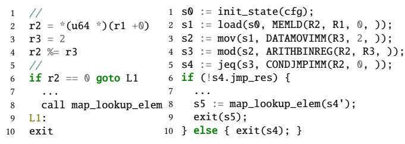
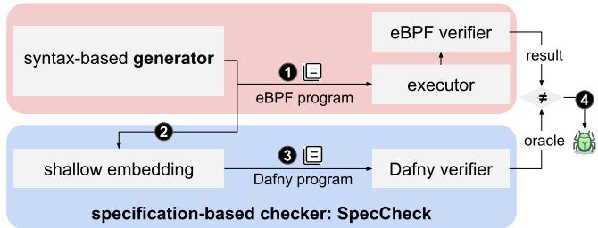
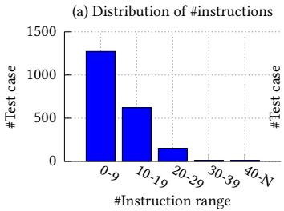
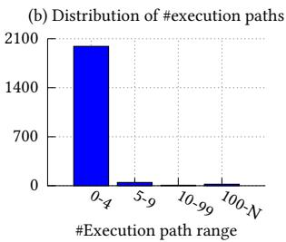
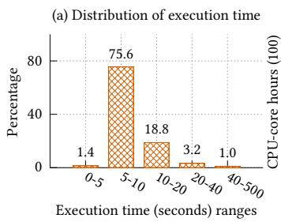
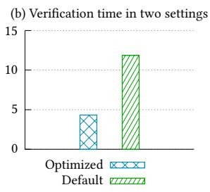
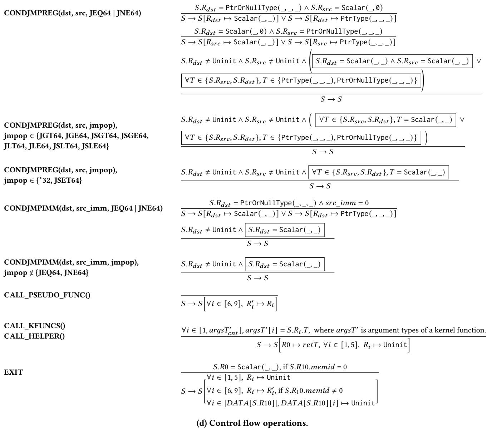

Latest updates: hps://dl.acm.org/doi/10.1145/3731569.3764797

RESEARCH-ARTICLE

# eBPF Misbehavior Detection: Fuzzing with a Specification-Based Oracle

TAO LYU, EPFL, Lausanne, Switzerland

KUMAR KARTIKEYA DWIVEDI, EPFL, Lausanne, Switzerland

THOMAS BOURGEAT, EPFL, Lausanne, Switzerland

MATHIAS PAYER, EPFL, Lausanne, Switzerland

MENG XU, University of Waterloo, Waterloo, ON, Canada

SANIDHYA KASHYAP, EPFL, Lausanne, Switzerland

Open Access Support provided by:

EPFL

University of Waterloo


Published: 12 October 2025

Citation in BibTeX format

SOSP '25: ACM SIGOPS 31st Symposium

on Operating Systems Principles

October 13 - 16, 2025

Seoul, Republic of Korea

Conference Sponsors:

SIGOPS

# eBPF Misbehavior Detection: Fuzzing with a Specification-Based Oracle

Tao Lyu Kumar Kartikeya Dwivedi

Thomas Bourgeat Mathias Payer Meng Xu† Sanidhya Kashyap

EPFL †University of Waterloo

## Abstract

Bugs in the Linux eBPF verifier may cause it to mistakenly accept unsafe eBPF programs or reject safe ones, causing either security or usability issues. While prior works on fuzzing the eBPF verifier have been effective, their bug oracles only hint at the existence of bugs indirectly (e.g., when a memory error occurs in downstream execution) instead of showing the root cause, confining them to uncover a narrow range of security bugs only with no detection of usability issues.

In this paper, we propose SpecCheck, a specification-based oracle integrated with our fuzzer Veritas, to detect a wide range of bugs in the eBPF verifier. SpecCheck encodes eBPF instruction semantics and safety properties as a specification and turns the claim of whether a concrete eBPF program is safe into checking the satisfiability of the corresponding safety constraints, which can be reasoned automatically without abstraction. The output from the oracle will be crosschecked with the eBPF verifier for any discrepancies. Using SpecCheck, Veritas uncovered 13 bugs in the Linux eBPF verifier, including severe bugs that can cause privilege escalation or information leakage, as well as bugs that cause frustration in even experienced kernel developers.

## 1 Introduction

Kernel extensions are critical components of modern operating systems that allow developers to extend the kernel with custom functionality. eBPF is one such framework that allows developers to extend the Linux kernel [15] safely. eBPF, at its core, relies on static verification to ensure the safety of eBPF-based extensions (i.e., eBPF programs). The eBPF verifier validates every program before execution, thereby preventing unsafe operations that could compromise the kernel.

This role becomes even more critical with the widespread industrial deployment of eBPF-based extensions. For instance, servers at Meta each execute over 50 eBPF programs [21], underscoring the extensive reliance on these extensions in large-scale deployments. To ensure the safety of such programs, the Linux eBPF verifier statically checks each eBPF program against a set of safety conditions the kernel expects (e.g., in-bounds memory access) using a heuristic algorithm that combines domain abstraction [22] and execution path enumeration.

Unfortunately, the eBPF verifier contains bugs that either reject safe eBPF programs (usability issues) or accept unsafe ones (security issues). Specifically, rejecting safe eBPF programs imposes significant overhead on developers, who must spend time debugging the correct code while struggling to understand the subtleties in the verifier [3]; or, accepting unsafe eBPF programs imposes security risks, such as privilege escalation [6] and information leakage [7].

As the bugs in the verifier can lead to critical issues, we need a deeper understanding of the current verifier design to develop effective approaches for detecting and fixing bugs. We identify four primary root causes of eBPF verifier bugs. First, abstract interpretation in the eBPF verifier is imprecise—over-approximating eBPF program states—hence, rejecting safe programs (RC1). Second, safety checks, implemented incrementally with new features (e.g., new instructions or kernel functions) by different developers can be inconsistent, either too conservative or too relaxed (RC2). Furthermore, even with the required informal documentation of safety properties—actually absent, developers still make implementation mistakes (RC3), especially in optimization heuristics (RC4). Overall, RC1–3 can cause safe eBPF programs to be rejected, while RC3 and RC4 allow accepting the unsafe eBPF programs, thereby raising critical concerns.

Existing works have focused on finding a subset of bugs in RC3 and RC4, with less attention on RC1 and RC2. For instance, existing formal verification works specifically verify the functional correctness of a single component. Agni [39], for example, targets the range analysis component to rule out range-specific bugs (RC3). Automated testing, on the other hand, relies on specific runtime patterns, such as memory sanitizer KASAN [27, 37] or integer range discrepancies between the verifier’s approximated states and eBPF program runtime states [26, 36], to detect issues in RC3 and RC4.

In this paper, we take a rather holistic approach to nip the identified root causes in their bud. We introduce the fuzzing framework Veritas, which utilizes the specification-based oracle SpecCheck that identifies eBPF verifier bugs based on the aforementioned root causes (RC1–RC4). Specifically, SpecCheck systematically specifies eBPF instruction semantics (especially the dynamic type system) and five safety properties of eBPF programs guaranteed by the eBPF VM. The specification is further encoded as pre- and post-conditions of each instruction using axiomatic notations, which is extensible as adding new instructions or kernel functions is simply to extend the specification with the new pre- and post-conditions. Moreover, SpecCheck leverages the specification to verify the safety of an eBPF program through SMT solvers, ensuring the trackability of failed conditions and the oracle as precise as the SMT solvers.

Veritas found 15 new bugs in total, indicating its bugfinding effectiveness. Some bugs can cause severe security consequences, such as privilege escalation to root and information leaks capable of bypassing KASLR, or usability issues that cost eBPF developers hours to debug. 12 bugs have been acknowledged, and eight of them have already been fixed.

Summary. This paper makes the following contributions:

• Specification of eBPF instruction semantics and safety properties: We systematically analyzed the eBPF VM to specify its instruction semantics, particularly its type system, and the safety properties it guarantees. This provides the community with a deeper understanding of the eBPF VM, facilitating the further development of the eBPF-based extension system.

• A specification-based oracle for holistic detection of eBPF verifier bugs: We present the specificationbased checker SpecCheck and integrate it into our fuzzer Veritas, enabling the automatic and comprehensive detection of various types of bugs in the eBPF verifier.

• Finding severe bugs: Veritas uncovered bugs that can lead to severe security vulnerabilities, such as privilege escalation and information leaks, as well as significant usability issues for developers.

Veritas is publicly available at https://github.com/rs3lab/ veritas.

## 2 Background and Motivation

We introduce the basics of the eBPF virtual machine (VM) and illustrate four Linux eBPF verifier bugs uncovered by Veritas to highlight the limitations of existing works.

## 2.1 eBPF Virtual Machine and Verifier

Basics. The eBPF VM is a register-based architecture with its dedicated eBPF Instruction Set Architecture (ISA) [9], designed to execute kernel extensions for system tracing, security enforcement, and network processing. It has ten general-purpose 64-bit registers (R0-R9) and one read-only stack frame pointer register (R10), pointing to a fixed-size stack memory region private to each eBPF VM, similar to the rbp register on x86-64. The eBPF VM also provides other types of special-purpose memory regions to interact with the kernel and userspace. Programs running inside the eBPF VM include an entry function (i.e., main function) and optionally, auxiliary functions (i.e., pseudo functions). Each function is a finite sequence of eBPF instructions [9].

The Linux eBPF verifier. The goal of the Linux eBPF verifier is to ensure that an untrusted eBPF program is “safe” to execute in kernel space. While we defer the discussion of safety requirements to §3.3, in a nutshell, an eBPF program cannot access arbitrary kernel data structures nor cause hangs, panics, or resource leaks.

To achieve this, the eBPF verifier implements an algorithm that preserves some safety properties. The algorithm comprises some form of abstract interpretation [22] with execution path enumeration commonly found in symbolic execution (e.g., KLEE [19]). Specifically, it first performs control flow graph validation to preclude infinite loops and recursion, and subsequently enumerates all program paths. For each path, the verifier simulates the execution of every instruction, tracks the state change of registers and memory regions, and checks that even over-approximated execution states (e.g., integers approximated with wider possible ranges) are still safe. Moreover, it prunes execution paths heuristically to reduce path explosion and improve verification efficiency.

Upon passing verification, eBPF programs are attached to specific kernel hooks to be executed either by the interpreter or as JIT-compiled machine code. In both cases, the safety checks done by the static verifier are not repeated at runtime.

## 2.2 Issues with the Linux eBPF Verifier

We now discuss the four root causes (RC) that the current verifier suffers from.

1 uint32\_t array[11];   
2 // x is aligned to 4 bytes   
3 // x is initialized with a value loaded from a context field   
4 uint32\_t x = ctx\_value;   
5 uint32\_t res;   
6 // Bound the range of x   
7 if (x >= 0 && x < 11) {   
8 res = compute\_value();   
9 array[x] = res; // Rejected   
10 }

Figure 1. A bug caused by imprecise abstract interpretation and found by Veritas took a sched-ext developer hours to debug.

RC1: Imprecision caused by state abstraction. Even in the best-case scenario, where all contributors to the Linux eBPF verifier have a shared and complete understanding of safety properties, and the implementation is flawless, the eBPF verifier can still reject safe eBPF programs due to the inherent conservative approximation of execution states.

Figure 1 shows such a case discovered by Veritas. The example program declares a 44-byte local array (array) and a 32-bit variable x, which is at a 4-byte aligned address and initialized to an unknown value read from a field in a context memory region. The range of x is then bounded to safely index into array (line 7). Subsequently, array[x] is assigned the return value of a pseudo function compute\_value (line 9). However, the verifier rejects this program, incorrectly determining that x could exceed the array bounds despite the earlier bounds check.

The root cause lies in the “intended” abstract interpretation design of not propagating the numerical range state from registers to memory regions that are not 8-byte aligned. Therefore, when x is loaded from memory into a register r1 and undergoes a bounds check (line 7), the verifier does not propagate the range information to the 4-byte aligned stack data. Later, r1 and its maintained range information is overwritten when computing res. When x is subsequently reloaded into register (line 9), the verifier has no record of its previously established bounds, causing it to conservatively assume x could be out of bounds and incorrectly rejecting the program. This creates a bad experience as reported by frustrated sched-ext [12] developers after our discovery.

```c
1 int *ptr1 = ptr;
2 atomic_and(&ptr1, 1); // Success: & between 1 and ptr in &ptr1
3 ptr &= 1; // Failed : & between 1 and ptr
```  
Figure 2. Inconsistent safety constraints in bitwise operation

RC2: inconsistent safety rules. Ideally, participants in the eBPF ecosystem should share the same and complete understanding of safety properties. However, in reality, such systematic knowledge is nonexistent. The safety of eBPF programs is more like folklore knowledge imprecisely described in natural languages (e.g., mailing lists[4], code comments [11] and selftests [13]), and safety checks in the verifier are often implemented incrementally as the eBPF ISA expands (e.g., new instructions and kernel functions). As different developers offer individual and uncoordinated understanding of safety rules, inconsistent safety checks—checks that are more conservative or relaxed than similar counterparts without a clear justification—are not uncommon.

As shown in Figure 2, a regular bitwise AND and an atomic AND on a pointer yield inconsistent verification results, confusing eBPF application developers. Since both operations pose the same security risk (potential pointer leakage, see §3.3) with no additional safety concerns, they should be treated consistently. For privileged users who are allowed to leak pointers, both variants should be permitted to maximize programming flexibility.

RC3: incorrect implementation. Besides inconsistent safety notions, the implementation is rarely perfect. Developers might implement an incomplete or even wrong set of safety rules, which can cause either safe eBPF programs being rejected or unsafe eBPF programs being accepted, due to missing specifications for required safety rules.

```c
1 struct bpf_iter_num it;
2 // memory data pointing by map_val is controlled by users.
3 int *map_val = ...;
4
5 bpf_iter_num_new(&it, 0, 3);
6 // Correct one: while (bpf_iter_num_next(&it)) {}
7 while (bpf_iter_num_next((struct bpf_iter_num *)map_val)) {}
8 bpf_iter_num_destroy(&it);
```  
Figure 3. A bug that misses type checks found by Veritas.

Figure 3 illustrates a bug where the verifier fails to type check properly. The program declares a number enumeration structure with start and end fields defining a range [0-3). The program then calls the kernel function bpf\_iter\_num\_next in a loop to iterate over the range. bpf\_iter\_num\_next expects the enumeration structure to reside on the stack; allocating memory dynamically within the function to maintain it would degrade performance in latency-critical eBPF contexts. Internally, bpf\_iter\_num\_next takes the enumeration structure, returns the current start value, and increments the start value by 1. It returns null when start equals end. However, due to missing type checks in the verifier, the program can pass any arbitrary memory pointer (e.g., a map pointer) as the argument instead of a valid enumeration structure. For example, a user can modify data in mapped memory from userspace during runtime, potentially causing the eBPF program to loop infinitely, leading to a hang in kernel space.

```c
1 int func1() {
2 uint64_t *victim_ptr;
3 // ptr @(r10-8) saves its own address
4 victim_ptr = (uint64_t *)&victim_ptr;
5 return 0;
6 }
7 int func2() {
8 uint64_t leaked_ptr; // Not initialized
9 ((char *)&leaked_ptr)[0] = 0;
10 // Bug: leaked_ptr becomes a readable 8-byte integer
11 // but its high 7 bytes are partial victim_ptr
12 return 0;
13 } }
14 SEC("socket")
15 int leak_ptr(void *ctx) { func1(); func2(); }
```  
Figure 4. An erroneous optimization leads to data leakage.

RC4: erroneous optimization. Historically, a hot spot of implementation errors is the optimizations in the verifier as they increase the complexity of the verification algorithm significantly. Hence, we assign a special tag to bugs caused by optimizations and differentiate them from RC3. Specifically, to improve verification efficiency, the verifier employs path pruning via path equivalence checks. On encountering a branch starting at instruction ??, the verifier checks if it has already verified this branch with a previous program state $S _ { 1 }$ . If the current state $S _ { 2 }$ can be subsumed by $S _ { 1 }$ the verifier skips re-verifying that branch. Essentially, the verifier only attempts to unify register values, stack data, and other states used in memory access instructions from $S _ { 2 }$ with $S _ { 1 }$

Veritas discovered a bug in path pruning. The verifier implements a special behavior for programs with capability CAP\_PERFMON, which allows leaking kernel data to userspace. When spilling an N-byte value to an uninitialized 8-byte aligned stack address, it marks the remaining (8 − ?? ) bytes as known values. This allows more states to be unified for pruning purposes. The bug arises when the verifier mistakenly applies this behavior to programs without CAP\_PERFMON. This can be exploited to leak kernel pointers, potentially bypassing KASLR[2] and enabling more severe attacks.

Figure 4 demonstrates an exploit for this bug. The entry function leak\_ptr (line 15) first calls func1, which saves a stack address in victim\_ptr at the top of the stack frame. It then calls func2, which shares the same stack frame and writes a single byte to leaked\_ptr—a location residing in the same eight-byte stack slot as victim\_ptr. Due to the verifier bug, although only one byte is written, the verifier incorrectly marks the next 7 bytes as initialized integers. These 7 bytes actually contain part of the pointer value stored in victim\_ptr. The program can then load these bytes as integers and leak them to userspace.

## 2.3 Improving Assurance of eBPF Verifier

Given the importance of the Linux eBPF verifier, several works try to improve its correctness, which can be broadly categorized into three themes:

Formal verification aims to prove that the verifier conforms to a specific set of correctness specifications. For example, several works [38, 39] proved the correctness of range analysis. Despite its high assurance, formal verification often struggles to scale due to the verifier’s large (20K LoC) and rapidly evolving codebase. This may explain the lack of full-spectrum verification beyond range analysis.

Alternative designs with solid language-theoretic foundation also exist. For instance, Prevail [24] seeks to capture and unify ad-hoc safety rules in eBPF verifier and reimplement them with a foundational framework such as abstract interpretation. This means the alternative designs are typically more accurate with reasonable or even no performance penalties. The major drawback, however, is that it will be challenging for the alternative verifier to keep up with the rapid evolution of the eBPF verifier.

Fuzzing [40] as one of the most effective bug-finding approaches has been applied on eBPF verifier [26, 27, 36, 37]. While coverage-guided fuzzing can be very effective in exploring different parts of the verifier, a fuzzer still needs a bug oracle to decide when the eBPF verifier is erroneous, and the design of an eBPF-specific bug oracle has been a differentiating factor in prior works.

Bug oracles in prior works include memory sanitizer KASAN [27, 37] and a reference monitor for scalar range inconsistencies between verifier states and runtime states [26, 36]. These oracles, however, can detect only a subset of bugs caused by RC3 and RC4 as many runtime errors (e.g., information leaks or type confusion) do not necessarily lead to memory errors. These oracles also completely forgo the chance of finding issues in RC1 and RC2 as eBPF programs that fail verification will not even be executed.

## 2.4 Motivation and Insight

The unique characteristics of each theme drive us to consider a holistic yet practical scheme to find all bug types listed in §2.2. We present Veritas, a fuzzing-based testing framework with an oracle SpecCheck, built on an extensible set of specifications that encode constraints for eBPF programs. SpecCheck employs automated reasoning to verify eBPF programs against these specifications. If the verification result diverges from the eBPF verifier’s result, SpecCheck flags it as a bug. Importantly, we do not propose SpecCheck as a replacement for the in-production eBPF verifier. Rather, SpecCheck serves as a precise and extensible testing oracle at the cost of verification speed.

We first present the design of the specification-based oracle (§3), SpecCheck, which we later integrate into Veritas (§4).

## 3 SpecCheck: A Specification-based Oracle

Veritas aims to identify eBPF verifier bugs holistically through a specification-based oracle SpecCheck, designed with the following four goals in mind:

Goal 1: Precision. SpecCheck should accurately characterize the set of safe eBPF programs by precisely specifying program state and safety constraints. Any imprecision could lead to false alarms when comparing results with the Linux eBPF verifier, making it difficult to determine if the verifier is functioning correctly.

Goal 2: Trackability. When facing an unsafe program, SpecCheck must be able to pinpoint the root cause of safety violations. That is, SpecCheck can blame the specific instruction that violated the expected eBPF safety guarantees.

Goal 3: Extensibility. The eBPF ecosystem continuously evolves with new instructions and helper functions. SpecCheck should be easily extended to model the new features, enabling thorough testing of both new, existing components, and their interplay in the eBPF verifier, without requiring significant changes to the framework.

Goal 4: Reasonability. The specification underlying SpecCheck must be amenable to formal reasoning, enabling us to prove higher-level properties (e.g., in the form of lemmas/theorems) that the specification should enforce.

## 3.1 Overview of SpecCheck

To achieve these goals, SpecCheck is built around two components: 1) The operational semantics and constraints on alignments and operations that the eBPF specification mandates for each eBPF instruction [9] (including kernel functions). We augment this operational semantics with dynamic types and the corresponding typing rules to track the type of values manipulated by the eBPF VM. We aim for precision by avoiding abstraction where possible (§3.2). 2) A set of safety constraints for each eBPF instruction derived systematically to ensure five safety properties (§3.3).

These components are specified using per-instruction and pure functions (§3.4). This approach directly supports extensibility, as incorporating a new instruction only requires adding its corresponding pre- and post-conditions, and reasonability, as the use of pure functions facilitates reasoning.

More importantly, these specifications enable SpecCheck to turn the question of “Is a given eBPF program safe?” into proof obligations that can be discharged to automated theorem provers, e.g., satisfiability modulo theories (SMT) solvers. By encoding all dynamic checks performed in the semantics into SMT formulae, SpecCheck avoids any form of approximation, achieving a high degree of precision, bounded primarily by the capabilities of the underlying solver to solve the verification obligations.

Furthermore, when SpecCheck fails an eBPF program verification, the SMT solver’s counterexample can be used by SpecCheck to identify the specific constraints that were violated, directly providing trackability.

## 3.2 eBPF Semantic Specification

SpecCheck encodes the semantics of eBPF instructions with their operational semantics and constraints as defined in the eBPF ISA [9]. The semantics is augmented with a dynamic type system, characterizing how types are updated by each instruction. We provide detailed definitions of terms and dynamic typing rules in the appendix.

Terms. An eBPF program consists of a sequence of instructions (see Figure 12 in the appendix)—categorized as arithmetic, data handling, memory, and control flow operations— each of which takes immediates or registers as operands.

Types. SpecCheck defines a dynamic type system that associates a data type with its value, as shown below.

datatype ETYPEV | Uninit | Scalar(kind: Kinds, val: bv64) | PtrType(r: MemRegion, memid: nat, off: bv64) | PtrOrNullType(r: MemRegion, memid: nat, off: bv64)

Uninit denotes uninitialized data. After initialization, data can exist in one of three forms: a Scalar(kind, val) representing an integer value (1 to 8 bytes) annotated with its semantic kind; a non-null pointer PtrType(r, memid, off); or a potentially null pointer PtrOrNullType(r, memid, off). As memory in the eBPF VM is discontiguous, we model it as multiple memory regions. Each region is uniquely identified by a triple (r, memid, off), where r denotes the region type (e.g., stack or packet), memid identifies the specific region within that type, and off specifies the byte-level offset within the region.

Model. SpecCheck models the eBPF VM as a state machine, in which an eBPF program is comprised of functions, each containing a sequence of instructions that operate on registers and separate memory regions. SpecCheck tracks the state (i.e., value and type) of registers and memory bytes, along with memory access permissions (e.g., no access, readonly, and read-write) and other states (e.g., the meta information of maps), forming the execution context.

Registers r0-r9 and the stack memory region are generalpurpose, capable of storing any data type. In contrast, register r10 and other memory regions are special-purpose and fixed to specific and unchanging types. These memory regions are either raw memory, where all data is of type scalar, or structured memory with fields of type scalar or pointer. For instance, context memory containing socket buffer data is structured with the \_\_sk\_\_buff kernel structure. Notably, since pointers are eight bytes, a pointer stored in memory indicates that all 8 bytes starting at the address must be marked with PtrType or PtrOrNullType.

Initial context. Initially, r1 and r10 represent the base address of the context and stack memory, respectively. Thus, their typed values are set to PtrType(stack, 0, 0) and PtrType(context, 0, 0). Other registers and memory locations are initialized as follows: Registers and stack slots are all initialized to uninit, while other memory bytes are initialized with their predefined types—either scalar, PtrType, or PtrOrNullType—based on their intended purpose.

We now describe SpecCheck’s type rules, key instruction semantics, and semantic constraints, which every eBPF program must satisfy.

Arithmetic instructions. These operations fall into two categories: single operand (e.g., bitwise negation) and double operand (e.g., addition). The semantics of arithmetic instructions align with those of other ISAs, except for special cases like division-by-zero or modulo-by-zero. For example, division-by-zero is allowed and returns zero.

In SpecCheck’s dynamic type system, unary arithmetic instructions—bit manipulations—always update the type of dst register as Scalar. Double-operand instructions behave the same, except in specific cases. When adding or subtracting a Scalar to/from a PtrType, or adding a PtrType to Scalar, the destination register is set to PtrType.

Data handling operations. Data handling includes 64-bit mov and loads. mov instructions copy data between registers or from an immediate to a register, while loads place 64-bit constants (PtrType or Scalar) into registers. 64-bit mov and load update the destination register with the source type, while others change the destination register’s type to Scalar.

Memory operations. eBPF supports 1, 2, 4, and 8-byte general loads and stores with 4/8-byte atomic memory operations. Such operations typically require size-aligned memory accesses. SpecCheck enforces strict type rules for memory operations to prevent pointer corruption, including partial pointer loads or overwrites.

Rather than tracking all memory slots, SpecCheck enforces two key constraints: accesses to general-purpose memory regions (i.e., stack) must be size-aligned, and structured memory regions access must be size-aligned and contained within a single field. This approach leverages observations that the eBPF LLVM compiler performs stack spills at sizealigned offsets and structured memory fields are all sizealigned, allowing the checker to track pointers by examining only 8-byte aligned memory blocks. Additionally, atomic memory operations are restricted to concurrently accessed memory regions (i.e., maps), while other memory regions, like the stack, being local to single program instances, do not require atomic operations.

Based on the above semantics and constraints, we now list the type rules that SpecCheck enforces for memory operations below:

• load: 8-byte memory loads from the memory slots with the same type ?? set the destination registers as ??. Other loads set the destination registers to Scalar.

• store: Memory regions are modeled with either mutable types (i.e., stack) or immutable types (e.g., context). For stack, 8-byte stores replace the slot types with the source register’s type. For stores smaller than 8 bytes: if the original 8-byte slot contained a pointer type, all 8 bytes are converted to Scalar to prevent partial pointer corruption. Otherwise, only the targeted bytes are marked as Scalar. For memory regions with immutable types, SpecCheck ensures slot types are compatible with the source register type—pointers can be stored as scalars, but not vice versa.

• Atomic operations: Maps—memory regions with the immutable type Scalar—are the only areas where atomic operations apply currently. Thus, their memory slot types remain unchanged and the register holding loaded data is always Scalar type.

Control flow operations. SpecCheck executes instructions sequentially, except for jumps, function calls, and exits. Jumps transfer control within a function, either unconditionally or based on comparison results. They generally do not change data types with one exception: comparisons (== and !=) between a PtrOrNullType and a Scalar with value 0, which changes the former to either PtrType (non-null) or Scalar with value 0 (null). Direct function calls pass up to five arguments via caller-saved registers r1–r5, while r6–r9 are callee-saved. For kernel function calls, argument types are validated against the function type declarations upon entry, while other registers are set to Uninit. On function return, r0 holds the return value, whose value range and type are constrained by program types to ensure correct interpretation at the attachment point. For instance, the 33 program types (grouped into nine categories) each have defined return value constraints. After a function returns, callee-saved registers are restored, while caller-saved registers and callee stack slots are set to Uninit.

## 3.3 eBPF Safety Specification

SpecCheck derives safety properties through a top-down approach based on the CIA (Confidentiality, Integrity, and Availability) triad security model [35]. This systematic approach leads us to define three key aspects of safety:

• Availability: Unrestricted eBPF programs can compromise kernel availability in several ways: causing kernel crashes through memory errors, blocking kernel threads indefinitely, and depleting system resources through nonterminating execution or improper resource management. To protect kernel availability, we define three safety properties: control flow safety (SP1), memory safety (SP2), and resource safety (SP3).

• Integrity: Kernel integrity requires that eBPF programs do not modify unauthorized data—namely 1) kernel memory outside the eBPF VM and 2) eBPF registers or memory locations that are read-only or inaccessible. Formally, executing an instruction insn on a state ??—satisfying the safety requirements for insn—guarantees that unauthorized data $( D _ { \mathrm { u a } } )$ remain unchanged between ?? and the resulting state $\sigma ^ { \prime }$

$$
\begin{array} { r } { \forall ~ i n s n , ~ \sigma , ~ \sigma ^ { \prime } . ~ \left( s a f e ( \sigma , i n s n ) \wedge \sigma ~ \xrightarrow { i n s n } ~ \sigma ^ { \prime } \right) ~ \implies ~ \sigma ^ { ~ D _ { \mathrm { u a } } } ~ \sigma ^ { \prime } . } \end{array}
$$

This integrity definition entails two safety properties: memory safety (SP2) and VM integrity (SP4).

• Confidentiality: eBPF programs running in the kernel context have access to sensitive kernel data, such as kernel pointers, information retrieved through kernel functions, and data in sensitive memory regions (e.g., packets and contexts). These sensitive information must never be leaked to unprivileged users. Otherwise, attackers can exploit them to exfiltrate private data or escalate privileges with the help of other kernel vulnerabilities [7]. Therefore, the confidentiality (non-leakage) of the sensitive data becomes critical and we formally define it below.

$$
\begin{array} { c } { { \forall ~ i n s n , \sigma _ { 1 } , \sigma _ { 2 } , \sigma _ { 1 } ^ { \prime } , \sigma _ { 2 } ^ { \prime } . ~ ( s a f e ( \sigma _ { 1 } , i n s n ) \wedge s a f e ( \sigma _ { 2 } , i n s n ) \wedge  } } \\ { {  \sigma _ { 1 } \stackrel { U _ { \ell } } { \sim } \sigma _ { 2 } \wedge \sigma _ { 1 } \stackrel { i n s n } {  } \sigma _ { 1 } ^ { \prime } \wedge \sigma _ { 2 } \stackrel { i n s n } {  } \sigma _ { 2 } ^ { \prime } ) ~ \Longrightarrow ~ \sigma _ { 1 } ^ { \prime } \stackrel { U _ { \ell } } { \sim } \sigma _ { 2 } ^ { \prime } } } \end{array}
$$

Specifically, we partition the eBPF VM state into two disjoint domains: high-security $U _ { h }$ (sensitive data) and lowsecurity $U _ { \ell }$ (all other data). Only the low-security domain is observable to unprivileged users via public channels. Based on this, given any two states $\sigma _ { 1 }$ and $\sigma _ { 2 }$ that are safe to execute an instruction ????????, if their data in the lowsecurity domain $U _ { \ell }$ is equal, the resulting states preserve the equivalence in the domain $U _ { \ell }$ . Intuitively, this ensures that no high-security information flows to low-security data, preventing leakage. This yields safety property SP5.

Overall, we define an eBPF program as safe if it satisfies the global control-flow safety and each of its instructions is safe regarding other safety properties SP2 to SP5.

We now detail the control-flow safety property and each per-instruction safety property separately.

SP1: Control flow safety. eBPF programs must terminate in finite time—in terms of the number of instructions executed—with an explicit exit instruction. Any execution of a program can have a maximum of 1M instructions for privileged users and 4096 instructions for unprivileged users. This ensures execution control returns properly to the kernel and prevents denial-of-service attacks, which could otherwise be launched through resource exhaustion.

SP2: Memory safety. SpecCheck models only discrete eBPF VM memory regions, so any unmodeled memory lies outside the VM. These unmodeled memory can be accessed either through out-of-bounds VM memory access or via kernel functions. In our specification, safety for unmodeled memory when accessed via kernel functions is out of scope. Such accesses pose the same risks as general kernel code, especially, some kernel functions are wrappers around native Linux functions. Thus, regulating eBPF behaviors in this context is unnecessary unless the entire Linux kernel is formally verified as memory-safe. Therefore, memory errors on unmodeled memory can only occur due to out-of-bounds eBPF VM memory access.

Based on the aforementioned memory modeling, we enforce three key memory safety constraints: First, any dereferenced pointer must be non-null, which is verified by checking if the pointer’s type is PtrType before memory operations. Second, memory accesses must be within bounds and have valid permissions. Memory regions in eBPF VM either have fixed or dynamic bounds. The above conditions apply to regions with fixed bounds (e.g., stack) and dynamic regions (e.g., packet) where memory bounds are determined dynamically through pointer comparisons, such as between the packet and its end pointer packet\_end. In contrast, other dynamic regions (e.g., buffer) depend on runtime checks. Third, to ensure temporal memory safety—preventing issues like use-after-free and double-free—we track the state of memory dynamically allocated through kernel functions. All related kernel functions are required to check the memory state before operations and update it afterward.

SP3: Resource safety. Resource safety ensures that all dynamically allocated resources are properly released before program termination. Specifically, before allowing program termination, SpecCheck checks that all dynamically allocated memory has been freed and all acquired resources (such as locks) have been released by examining the program’s resource tracking state.

SP4: VM invariant/integrity. The eBPF VM enforces this invariant by making register r10 read-only, prohibiting any instructions from writing to it as a destination register.

SP5: VM data safety. SpecCheck ensures data safety by adopting the capability model. In particular, kernel functions that retrieve sensitive information and sensitive memory regions are only allowed for specific program types, which require capabilities (e.g., CAP\_PERFMON) to upload. Without these capabilities, SpecCheck enforces the following data safety properties to protect the sensitive data (i.e., pointers and uninitialized data).

First, it prohibits programs from reading data with the type Uninit, as it may contain private kernel data that was not erased. Second, it prohibits programs from storing pointers in public channels, such as map memory regions and helper calls that write to userspace memory. Still, eBPF programs can convert pointers (PtrType and PtrOrNullType) to scalars using arithmetic, memory, and call operations, potentially leaking these scalars to userspace. For instance, a bitwise or on a pointer converts it to a scalar according to the type rules described in §3.2. SpecCheck prevents such leaks by strengthening type rules that convert pointers to scalars.

• Arithmetic instructions. Arithmetic operations that take pointers but produce scalars are all disallowed.

• Data handling operations. Instructions that are not 64-bit mov and load and operate on pointers, are prohibited.

• Memory operations. The type rules in §3.2 allow converting pointers to scalars by loading or storing pointers smaller than 8 bytes. Such type transitions are prohibited to avoid kernel pointer leakage.

• Control flow operations. Jump instructions do not suffer from unsafe type conversions. Meanwhile, call instructions that pass arguments with pointer types to scalar parameters are already prevented in the defined type rules.

In addition, side channels can arise from two sources: (1) comparisons between pointers and scalars, and (2) speculative execution. To prevent information leakage through pointer-scalar comparisons, we prohibit such comparisons in both general jump instructions and atomic compare-andexchange operations. But we allow PtrOrNullType to be compared with the scalar value 0 in equal/non-equal jumps to check if a pointer is null. For speculative execution side channels, we assume that the eBPF VM can rewrite programs with appropriate mitigations. Thus, we do not impose additional constraints on eBPF programs for this case.

Discussion of safety property completeness and soundness. The five safety properties outlined above are derived practically using a top-down approach, and the Linux eBPF verifier developer confirmed that they genuinely reflect the verifier’s intended guarantees. We have verified that the encoded safety properties SP1-SP5 ensure the aforementioned confidentiality and integrity definition. Any omission of these properties breaks the proofs. We are also actively working on a formal definition for availability, the last component of CIA, while empirical validation shows SpecCheck’s practical soundness regarding availability: (1) all corresponding upstream self-tests pass, (2) all historical bugs are caught, and (3) no false alarms after 3 months of fuzzing. More importantly, these properties are sufficient to identify known bug types within our bug-finding scope.

## 3.4 Specification Encoding

We adopt Dafny as our specification language, which has native support for encoding specifications, such as preconditions, post-conditions, pure functions/predicates, and lemmas. Moreover, the Dafny verifier can track violated constraints when these conditions fail, enhancing the debugging and refinement process.

Concretely, we define the eBPF VM state (e.g., memory and registers) as an immutable datatype. The specification of each instruction is implemented as a side-effect-free Dafny function, similar to a predicate but capable of returning values beyond just booleans. Per-instruction Dafny function takes an eBPF VM state as well as an instruction and returns a produced new state. Safety properties are encoded as functions’ pre-conditions, while function bodies express instruction semantics.

We encode each instruction’s specification based on its operational semantics from the ISA [9], the semantic constraints and type rules in §3.2, and safety properties in §3.3. For kernel functions whose semantics are not detailed in the ISA, we extract both operational semantics (e.g., return values) and semantic constraints (e.g., spin\_lock requires no already held locks) from their kernel implementations. To prevent encoding errors in safe properties (e.g., missing safety properties), we map each safety property with its corresponding semantic component: 1) SP2 (memory safety) with memory read/write/allocation/release semantics, 2) SP3 (resource safety) with program termination semantics, 3) SP4 (VM integrity) with register write semantics, and 4) SP5 (data safety) for all instruction semantics. Using the mapping, we can identify the necessary safety properties of each instruction by matching its semantic with the safety properties’ semantic component.

Figure 5 illustrates the encoding of the 32-bit bitwise negation instruction neg32. Line 3 checks if the instruction is neg32 as defined in our terms. The semantics of neg32 involves register write, thus having the VM invariant SP4 and the data safety property SP5 as preconditions. SP4 requires the modified register (dst) must not be the read-only register R10. SP5 enforces this instruction to compute on scalar data if the privilege is missing, avoid leaking pointers or uninitialized values. If the safety properties hold, according to the type rule, the type of destination register transits to scalar. Further, the instruction semantic regarding data

1 function neg32(s: State, insn: Instruction) : State   
2 // Pre-conditions   
3 requires exists dst, src\_imm ::   
4 insn == ARITHUNARY(dst, NEG32)   
5 requires insn.dst != R10 // SP4   
6 requires get\_reg\_tv(s, insn.dst) != Uninit // SP5   
7 requires !s.cfg.allow\_ptr\_leak ==> is\_scalar(s, insn.dst)   
8 {   
9 // Instruction semantics   
10 var dst\_val := get\_reg\_arith\_val(s, insn.dst);   
11 var new\_val := bvnot32(dst\_val);   
12 var new\_tv := Scalar(Normal, new\_val);   
13   
14 // Return a copy of state s with reg dst set to new\_tv   
15 new\_state(s, insn.dst, new\_tv)   
16 }

Figure 5. The encoded specification of instruction neg32, which flips a 32-bit value in the register dst. Safety properties are specified as pre-conditions, whereas the instruction semantics are defined within the function body.

value is encoded with the negation operation on the input value (i.e., bvnot32). Specifically, SpecCheck does not directly model absolute addresses for values of type PtrType or PtrOrNullType. Instead, a pointer is represented as a triple (r, memid, off). We introduce an uninterpreted function—a function without a body—that maps each region to its unknown base address; thus, the absolute address of a pointer is its base plus the offset. Since the concrete memory layout is unknown, we constrain the base in the post-conditions of that uninterpreted function to keep the ranges of memory regions pairwise disjoint.

## 4 Marrying Specification with Fuzzing

With the encoded specification—per-instruction semantics and safety properties—defined in Dafny (§3), the next step is to turn SpecCheck into a bug oracle that can be integrated with fuzzers, which is the focus of this section. In particular, we show how to verify whether a concrete eBPF program is safe or not via shallow embedding [25] and present the complete fuzzing workflow in §4.2.

## 4.1 Shallow Embedding

Shallow embedding maps components of a source language ?? to corresponding elements of a target language ??. This paper maps eBPF instructions to Dafny. Algorithm 1 outlines the embedding procedure. The algorithm performs a depth-first traversal of the program’s control flow graph, mapping each instruction to its corresponding method in the specification (line 5). During traversal, the algorithm handles control flow instructions specially: (1) For unconditional jumps, it jumps to the target instruction. For conditional jumps, it explores both the fallthrough path and the jump target path; (2) For pseudo function calls, it inlines them and jumps to the call entry and saves the location of the next instruction; (3) On the exit instruction, it restores any saved locations to explore remaining paths. The embedding procedure itself performs control flow validation, complementing the checks done by the Dafny verifier. For loops, the algorithm uses bounded unrolling to ensure termination.

Algorithm 1: The embedding process in SpecCheck   
1 function Embed(??????????, ?????????? )   
2 ??????????????????, ??????, ???????????? ← [ ], 0, ""   
3 while ?????? < ?????????? do   
4 ???????? = ????????[?????? ]   
5 ????????????+ = ??????2??????ℎ???? (????????)   
6 if UncondJmp(????????) then   
7 ?????? = JmpTarget(????????)   
8 else if CondJmp(????????) then   
9 PushInsn(??????????????????, JmpTarget(????????) )   
10 ?????? = ?????? + 1   
11 else if PseudoCall(????????) then   
⊲ Inline pseudo calls   
12 PushInsn(??????????????????, ???????? ????????)   
13 ?????? = FunEntry(????????)   
14 else if Exit(????????) then   
15 if Empty(?????????????????? ) then   
16 ?????????? ⊲ Break at the last instruction   
17 else   
18 1 ?????? = PopInsn(?????????????????? )   
19 else   
20 ?????? = ?????? + 1   
21 return ????????????

  
(a) eBPF assembly code.  
(b) Dafny code embedding eBPF.  
Figure 6. The Dafny program shown in (b) is the embedding of the eBPF program in (a), which is in the form of eBPF assembly code. Each instruction in (a) is line-by-line mapped to (b). For brevity, we omit keywords (e.g., var) and partial instruction fragments.

Figure 6 illustrates the shallow embedding approach, where eBPF assembly code is mapped line-by-line to the corresponding Dafny method invocations. For example, the instruction (line 2) loads a 64-bit value from the start of the context memory region (pointed to by register r1) into register r2 and is embedded as a call to Dafny’s load function. Similarly, conditional jumps are embedded as if combined with appropriate comparison function calls in Dafny.

## 4.2 Overall Fuzzing Workflow

In this subsection, we present the integration of SpecCheck as a testing oracle within the Veritas fuzzing framework.

Figure 7 shows the workflow of Veritas. Initially, the syntax-based generator produces test cases following the eBPF ISA. Further, the executor runs test cases through the eBPF verifier, which outputs the verification result, either accepting or rejecting programs (step 1 ). Simultaneously, Veritas uses SpecCheck to independently validate the safety of the test cases against specifications encoded in Dafny. This involves embedding eBPF programs in Dafny (step 2 ) and running the Dafny verifier to ensure they comply with the specifications (step 3 ). Any discrepancy between the results of the eBPF verifier and SpecCheck indicates a bug in the eBPF verifier (step 4 ). Specifically, a discrepancy arises when (1) programs deemed safe by the eBPF verifier are flagged unsafe by SpecCheck, (2) the reverse occurs, or (3) both reject the program but cite different safety violations. In the third case, while the eBPF verifier’s final verdict on the program’s safety is correct, its subprograms may reveal incorrect verification results, belonging to one of the first two cases.

  
Figure 7. Veritas overview. The generator produces syntax-valid eBPF programs as test cases. Further, the eBPF verifier takes them to verify their safety ( 1 ). Simultaneously, our checker (SpecCheck) embeds these test cases into Dafny programs based on our specification ( 2 ) and check their safety ( 3 ) through the Dafny verifier, which serves as an oracle. Finally, a difference between the eBPF verifier result and the SpecCheck oracle indicates a bug ( 4 ).

The Dafny verifier relies on SMT solvers to determine if the pre- and post-conditions hold. While SMT solvers are precise, they can be computationally expensive and may even timeout or become undecidable when faced with complex or numerous constraints [18]. We use three key insights to address the scalability challenge of SMT solvers.

Small test cases. Most eBPF verifier bugs can be triggered by small, simple programs rather than large, complex ones. Our evaluation in §6.1 shows that the proof-of-concept (PoC) programs for existing eBPF verifier bugs are relatively small, mostly containing only 1–30 instructions. This insight allows us to configure our test case generator to focus on generating small programs, which reduces SMT-solving time while maintaining effectiveness at finding bugs.

Incremental state sampling for fast verification. When the eBPF verifier rejects a program, it identifies the unsafe / culprit instruction. To check if the rejection is correct, we only need to verify the safety of that instruction rather than checking the entire program. However, SpecCheck still needs information about the VM state immediately before that instruction executes. We instrument the eBPF verifier to generate VM states incrementally at configurable intervals during its verification process. We then use the sampled state closest to the culprit instruction as the initial state for SpecCheck. This sampling approach significantly improves performance, as we demonstrate in §6.3.

Parallel verification for high throughput. To further improve the fuzzing throughput on top of the above two solutions, Veritas runs the checker asynchronously from the fuzzing loop and simultaneously on multiple test cases. Although the insights help, 0.2% of tests still time out (see §6.1). However, it is not a concern in fuzzing. If a test that might trigger a bug times out, we simply skip it, as another solvable test will likely reveal the same bug.

## 5 Implementation

We integrate Veritas into Syzkaller [23] to leverage its existing fuzzing components (e.g., executor). The implementation of each component in Veritas is detailed below.

SpecCheck. The specification is encoded in Dafny [10] with 2000 lines of code—roughly nine engineer weeks—and the embedding procedure is implemented in 600 lines of C++. SpecCheck models all 171 op-codes recorded in the eBPF ISA RFC [9], except for deprecated instructions (e.g., BPF\_IND), which were introduced specifically to access packet data in classic BPF. The remaining gap is in kernel helpers, where we deliberately focus on the 50 most frequently used of 455 functions (≈ 11%). As writing kernel function specifications becomes increasingly labor-intensive and the eBPF ecosystem expands, we are exploring scalable automation techniques to efficiently generate the specification for kernel functions with minimal manual effort.

eBPF program generator. The generator, written in 2,100 lines of C++ code, produces a random control graph with vertices as basic blocks, iterates over each to generate syntaxvalid instructions adhering to basic safety rules (e.g., avoiding r10 as a destination register), and records the program state coarsely, including initialized registers and their types.

eBPF verifier state sampling. We patch the Linux kernel to sample verifier state every ?? instructions, capturing registers, stack slots, and spin\_lock statuses, without altering verifier logic. The state is shared to userspace via debugfs.

## 6 Evaluation

We evaluate Veritas on the Linux eBPF verifier to answer the following research questions.

Q1. How effective and accurate is Veritas in finding eBPF verifier bugs? (§6.1)

Q2. How does SpecCheck outperform other oracles? (§6.2)

Q3. What is the testing performance of Veritas? (§6.3)

Q4. What is the required effort to extend the specification for new instructions? (§6.4)

Experiment setup. We evaluate Veritas on Ubuntu 22.04.4 LTS with a 224-core Intel(R) Xeon(R) Platinum 8276L processor and 754G memory. Each fuzzer instance runs in isolation on the same 224-core server with 754 GB RAM to eliminate resource bias. We use Dafny CLI V4.6.0 and Z3 V4.12.1 [8] to verify embedded eBPF programs in Dafny.

## 6.1 Bug-Hunting Result

After running Veritas intermittently for three months, it uncovered 15 bugs: three cases where unsafe eBPF programs are accepted, nine cases where safe eBPF programs are rejected, one case where programs misusing atomic instructions on local memory are accepted (bug #9, see analysis in §6.5), listed in Table 1, as well as one memory bug and one undefined behavior identified through KASAN and UBSAN in the verifier itself, though the latter two are beyond the focus of the work. These bugs, found despite extensive testing by maintainers and prior research, underscore the incapability of existing oracles. We reported all 15 bugs, of which 12 are acknowledged. The remaining three (bugs #10, #11, and #13) are usability issues rooted in the core design limitations of the verifier. These are typically considered low priority by developers compared to security issues and eBPF ISA extensions and are therefore often overlooked. We emphasize that Veritas not only identifies misimplementation bugs, but also highlights existing design limitations, offering insights that improve the verifier in the future. Eight bugs were fixed quickly. The rest are pending resolution for two reasons: (1) some require non-trivial code refactoring or new algorithms, which demands significant development time, and (2) others represent usability issues rather than security vulnerabilities, which maintainers have prioritized lower in their roadmap. We are actively collaborating with eBPF maintainers to develop and submit patches for the outstanding issues.

Further, we summarize the characteristics of bugs below: Critical consequences. New bugs can lead to severe security attacks and usability issues. For example, bug #1 and #2 can be exploited by users only with CAP\_BPF to escalate into root and leak kernel pointers, breaking KASLR. Moreover, bug #6 took a sched-ext developer hours to debug it.

Diverse culprit instructions. New bugs lie in the incorrect verification of all instruction categories, e.g., arithmetic (bug #7), data handling (bug #1), memory (bug #5), and control flow operations (bug #2), demonstrating SpecCheck is general enough for finding bugs throughout the entire verifier.

Small-sized test cases. Test cases revealing new bugs are as small as two instructions, as demonstrated by bugs #3, #5, and #7. To validate that eBPF verifier bugs can be detected with small test cases, we analyzed the size of various test cases, including eBPF self-tests and collected bug proofs-ofconcept (PoCs). As shown in Figure 8, most test cases contain 1-30 instructions (a) and 1-9 execution paths (b), with only 23 and 28 test cases exceeding 30 instructions and ten execution paths, respectively. These findings support the insight in §4 that small test cases are sufficient to uncover most bugs.

<table><tr><td>RC</td><td>#</td><td>Instruction</td><td> Status</td><td>Description and Consequence</td></tr><tr><td>RC4</td><td>1</td><td>mov</td><td>Fixed</td><td>Fails to track non-r10 precision on stack,leading to privilege escalation.</td></tr><tr><td>RC3</td><td>2</td><td>kfunc call</td><td>Fixed</td><td>Miss argument type checks,leading to DoS.</td></tr><tr><td>RC4</td><td>3</td><td>store</td><td>Fixed</td><td> Incorrectly mark stack slot type,leading to ASLR bypass.</td></tr><tr><td>RC3</td><td>4</td><td>atomic*</td><td>Fixed</td><td>Miss propagating precisions to stack slots used in atomic instructions.</td></tr><tr><td>RC3</td><td>5</td><td>atomic_xchg</td><td>Acked</td><td>Verifier misidentifies scalar type,failing stack pointer validation.</td></tr><tr><td>RC1</td><td>6</td><td>store</td><td>Acked</td><td>Not propagate scalar range from registers to stack</td></tr><tr><td>RC3</td><td>7</td><td>be32</td><td>Fixed</td><td>Incorrect precision back-propagation</td></tr><tr><td>RC3</td><td>8</td><td>store</td><td>Fixed</td><td>Mis-reject a 32-bit store to overwrite a spilled 64-bit scalar on the stack.</td></tr><tr><td>RC2</td><td>9</td><td>atomic*</td><td>Acked</td><td>Allow atomic instructions operating on local memory regions.</td></tr><tr><td>RC2</td><td>10</td><td>arith operations</td><td>Reported</td><td>Inconsistent constraints on instructions converting pointer to scalars</td></tr><tr><td>RC1</td><td>11</td><td>jumps</td><td>Reported</td><td>Coarse-grained pointer comparison</td></tr><tr><td>RC1</td><td>12</td><td>memory operations</td><td>Acked</td><td>Imprecise stack data tracking</td></tr><tr><td>RC1</td><td>13</td><td>arith operations</td><td>Reported</td><td>Inaccurate tracking of arithmetic instruction result</td></tr></table>

Table 1. The list of bugs detected by Veritas. kfunc call: kernel function call



  
Figure 8. The size of test cases (self-tests and bug PoCs) measured by instruction count and execution paths, indicating that smallsized test cases are sufficient for finding bugs.

Accuracy of the specification-based oracle. During the entire intermittent running, SpecCheck reported no false alarms but encountered timeouts (0.2% of tests) due to test complexity. These timeouts occur when the Dafny verifier encounters undecidable constraints or exceeds 900 seconds.

## 6.2 Comparison with the State-of-the-art

To measure SpecCheck, we compare it with the oracle used in existing fuzzers [26, 27, 36, 37] from two perspectives.

First, we evaluate if Veritas can detect bugs identified by existing fuzzers. This paper focuses on the oracle SpecCheck—instead of a test generator—which can be integrated into other fuzzers to leverage their test case generator with engineering effort. Therefore, we directly evaluate SpecCheck using PoCs from a collected bug dataset. The dataset includes 14 verifier bugs reported by existing fuzzers: 10 from SEV, 1 from BVF, 2 from Buzzer, and 1 from BRF. We excluded bugs outside Veritas’s scope, such as those in the JIT compiler or kernel function implementations. While SEV claimed 15 bugs (comprising 12 incorrectly accepted unsafe programs and 3 incorrectly rejected safe programs), we could only identify 11 of these through mailing lists, as individual bugs were poorly documented and difficult to trace. It’s worth noting that SEV’s oracle has an inherent limitation:

it cannot detect incorrectly rejected safe programs as its oracle relies on the runtime states but rejected programs even have no chance to run. SEV identified incorrectly rejected safe programs either manually or through the verifier’s selfassertions. We also excluded two additional "bugs" from SEV and BVF that only produced misleading error messages without affecting verification outcomes. SpecCheck detected all 14 bugs in the dataset, demonstrating its comprehensive capability in identifying existing verifier bugs.

We also evaluated if existing fuzzers can detect the bugs found by Veritas. Among the four fuzzers considered, only BRF [27] and Buzzer [26] are open-source, allowing for direct empirical comparison, while SEV [36] and BVF [37] were evaluated through theoretical analysis. To ensure a fair comparison that eliminates randomness in test generation, we provided the exact bug PoCs directly to Buzzer and BRF. Despite this advantage, neither fuzzer successfully detected any of the bugs found by Veritas. Even for bug #1, which can potentially cause runtime memory errors, both fuzzers failed to find the correct map data to trigger the faulty instruction in the provided PoC. Our theoretical analysis on SEV and BVF indicates that existing fuzzers may detect bug #1, linked to runtime memory errors. The remaining bugs do not manifest as runtime errors, which clearly demonstrates the necessity of our specification-based oracle. These results conclusively show that SpecCheck can identify bugs that are beyond the detection capabilities of existing oracles.

## 6.3 Fuzzing Performance

We ran the fuzzer for 40 hours, generating eBPF programs with 5-30 instructions based on test case size analysis in §6.1, with a Dafny verification timeout of 900 seconds and state sampling every three instructions after six instructions.

Fuzzing throughput. State sampling and asynchronous checking during evaluation achieve a fuzzing speed of 23-25 tests per second by utilizing all 224 cores. Compared with Buzzer (700 tests/s) and BRF (50 tests/s), Veritas trades throughput for a much higher bug-per-test rate: 12/13 newly discovered bugs are silent semantic errors rather than the crash-triggering faults that raw throughput alone can expose.



  
Figure 9. Fuzzing performance. (a) shows the entire execution time distribution of test cases during fuzzing, while (b) depicts the Dafny verification time without and with sampled verifier states.

The checking time of each test case in SpecCheck, including state sampling, embedding, and Dafny verification, takes 1.5 to 489 seconds, averaging 10 seconds. As shown in Figure 9 (a), 95.8% of test cases complete within 5-20 seconds, with few exceeding 20 seconds. Stage-wise analysis reveals Dafny verification consumes 99% of the time, while state sampling and embedding account for just 0.03% and 0.0002%.

Performance improvement from state sampling. We reran the fuzzer for 40 hours with the same setting in the above evaluation, except verifying each test case twice: once with state sampling (optimized setting) and once by verifying the complete test case without state sampling (default setting). Veritas generated 143,733 test cases, with 51,254 using state sampling. On average, state sampling saved 53 seconds per test case, with a maximum saving of 12 minutes. However, state sampling introduces longer checking time on 5.0% (2,574) test cases because SpecCheck identifies less complex violated constraints in another culprit instruction in the default setting. Despite this, state sampling reduces overall resource usage, saving 754 CPU-core hours 1, as illustrated in Figure 9 (b). Moreover, state sampling does not introduce bug misses in the evaluation.

Code coverage. Veritas aims to provide a comprehensive testing oracle rather than a dedicated test generator like BVF and BRF, with test generation improvements planned for future work. Nevertheless, our system achieves 32% branch coverage (3,432 branches), which exceeds BRF’s 29% (3,124 branches)—BRF being the only publicly available system with comparable metrics. This coverage level has proven sufficient for discovering numerous bugs. It is worth noting that our coverage measurement uses XOR operations on basic block IDs, a method that may introduce hash collisions and potentially underestimate the actual coverage achieved.

## 6.4 Specification Extensibility and Complexity

To extend the specification with new instructions or kernel functions, users are expected to write more ghost methods in Dafny, embedding safety rules as pre-conditions and operational semantics as post-conditions. While it is hard to measure the actual manual effort scientifically, we estimate it by counting the pre- and post-conditions required for each instruction in the current specification.

On average, each instruction or kernel function has 3.6 pre-conditions (max 13) and 3.7 post-conditions (max 6). Arithmetic and data-handling instructions have fewer preconditions (2.9) but more post-conditions (4.7), because they generally only require operand type checks but involve special pointer semantics due to representing pointers as memory regions and offsets. Conversely, memory operations and kernel functions generally have more pre-conditions (4.7) and fewer post-conditions (2.3). The more pre-conditions stem from fine-grained memory access control and program state checks, while fewer post-conditions arise because general-purpose memory regions, excluding stack memory, have simpler type rules. Additionally, kernel functions typically only specify return values as post-conditions, except in complex cases, such as “spin\_lock”, which often involve changes to program states (e.g., lock state).

## 6.5 Case Study

We present three additional bugs found by Veritas to further illustrate their characteristics.

1 r1 = r10   
2 if cond   
3 (b1) / \ (b2)   
4 /   
5 \*(u64 \*)(r1 -120) = 0 \*(u64 \*)(r1 -120) = r2   
6 \   
7 r2 = \*(u64 \*)(r1 -120)   
8 // r3 points to an eight-byte memory region   
9 r3 += r2   
10 \*(u64\*)(r3 + 0) = evil\_data   
11 // Memory write from (b2) can overwrite any kernel addresses.  
Figure 10. An erroneous optimization in Linux eBPF verifier prunes instructions after line 7 in branch b2, causing out-of-bound access.

Bug #1: Out-of-bound access leading to privilege escalation. The bug in Figure 10 is a mis-optimization bug originating from RC4. It overlooks r2 and stack slot r1-120 as critical states, skips their comparison at the convergence point (line 7) when verifying branch (b2), and incorrectly deems the program states from branches (b1) and (b2) equal, leading to skipped verification of instructions beyond line 7 in branch (b2). This allows branch (b2) to access any kernel address via r2, enabling privilege escalation with only the CAP\_BPF capability. The vulnerability has been fixed and merged to the stable Linux version.

1 uint32\_t array[4];   
2 array[0] = 1; // fp-8   
3 array[1] = 2; // fp-4   
4 // Reject: attempt to corrupt spilled pointer on stack

Figure 11. Initialization of a 32-bit integer array is mistakenly rejected by the Linux eBPF verifier. fp represents the stack frame pointer. fp-8 means the stack slot at fp-8.

Bug #8: Mis-rejecting 32-bit variable initialization. In Figure 11, the eBPF verifier incorrectly rejects the initialization of a 32-bit integer array, citing "attempt to corrupt spilled pointer on stack", if the program has no data leakage privilege. This error arises because the verifier assumes an 8-byte aligned stack slot contains a pointer without verifying its type. Specifically, after initializing array[0] at fp-8 with the integer constant 1, the slot type is a scalar, not a pointer. When initializing array[1] at fp-4, the verifier checks the 8-byte region ([fp-8, fp-1]) for pointers to prevent partial overwrites and potential pointer leakage. However, it does not check the type of the region and erroneously treats it as a pointer, leading to the rejection. Without SpecCheck, no existing oracles can detect such bugs.

Bug #5 and #9. Atomic operations are intended for concurrent access to shared memory. However, the verifier allows unnecessary atomic instructions on private memory (e.g., stack), as in the acknowledged bug #9. Although not directly causing usability or security issues, this increases implementation complexity and contributes to bug #5. The issue arises with atomic\_xchg(r1, r1) in privileged mode, where r1 is a stack pointer. This instruction swaps the value at the address pointed to by r1 with the value in r1, involving a load followed by a store. The verifier checks the load and then the store, but immediately marks r1 as a scalar after the load, leading to a failure in the store check since r1 is no longer a pointer. Finally, this safe instruction is mistakenly rejected.

## 7 Discussion

Semantics fidelity. To ensure that SpecCheck is faithfully modeling eBPF, we tested that: 1) SpecCheck conforms to all selftests of the Linux eBPF verifier, and 2) all discrepancies between SpecCheck and the Linux eBPF verifier found during fuzzing can be attributed.

Future Maintenance. We aim to strengthen the specification’s soundness and completeness by formalizing additional higher-level properties. Moreover, we plan to integrate the specification into the eBPF development CI/CD pipeline, enabling synchronized updates with the eBPF verifier modifications and automated validation against previously verified higher-level properties to preserve correctness guarantees. To minimize ongoing effort, we can leverage large language models (LLMs) to draft the specifications of kernel functions— components under active development—which developers then review and finalize.

Beyond testing oracle. Beyond acting as a testing oracle, the specification in SpecCheck can be further leveraged to enable the automatic generation of formal proofs in proofcarrying code (PCC) [31, 32] in eBPF-based kernel extensions. PCC requires code producers (e.g., extension developers) to provide formal proof of code safety, allowing consumers (e.g., OS kernels) to verify compliance with safety properties, offering developers more flexibility in proving code safety.

Handling loops in SpecCheck. SpecCheck verifies eBPF programs with loops using bounded loop unrolling, which is sufficient as a testing oracle as most of the generated eBPF programs are small as shown in the bugs found in §6.1. An alternative is automated loop invariant inference or generating eBPF programs based on pre-defined loop invariants. We leave them to future work.

## 8 Related Work

We discussed related work on eBPF verifier testing in §2.3 and address the remaining related work below.

eBPF verification. Formal verification has improved the correctness of the eBPF JIT compiler [33] and range-tracking in the verifier [39]. Verifying the eBPF verifier is more complex due to its large codebase (e.g., 20,000 lines of code) and intricate logic, compared to JIT’s 2,440 lines for one architecture [5]. While we do not verify the verifier, our specification, defining instruction semantics and safety properties, can be leveraged to verify eBPF verifier further.

Specification-based testing oracle. The challenge of specification-based oracles involves defining the specification and encoding it as an executable oracle. Some studies offer frameworks [16, 20] and languages [1] that support these stages with assertions, while others focus on encoding using informal specifications such as POSIX specification or TCP/IP RFCs—either generating formal specifications automatically (e.g., rule-based methods [30]) or manually encoding them, as seen in Netsem [17], SibyiFS [34], Hydra [28], and Monarch [29]. In the context of eBPF, the lack of formal documentation forces us to create a systematic specification, a difficult yet key contribution. Moreover, our per-instruction specification with safety properties as pre-conditions and instruction semantics as function bodies introduces an extensible approach that integrates seamlessly with shallow embedding for fuzzing-based testing oracles.

## 9 Conclusion

Specification-based oracle offers a holistic approach to detecting correctness bugs. In the Linux eBPF verifier case, Veritas finds high-impact bugs across diverse root causes, some of which can never be found with bug oracles in prior fuzzing campaigns as these oracles only indirectly hint the existence of a bug without revealing its root cause.

## 10 Acknowledgments

We thank our shepherd Chang Lou and the anonymous reviewers for their insightful feedback. We also thank Clément Pit-Claudel, Jiacheng Ma, Sankalp Gambhir, and Yawen Guan for their helpful feedback at various stages. This work was supported in part by the eBPF Foundation, the European Research Council (ERC) under the European Union’s Horizon 2020 research and innovation program (grant agreement No. 850868), NSERC (RGPIN-2022-03325), and NCC (2024-1488).

## References

[1] Test Oracles. http://ix.cs.uoregon.edu/\~michal/pubs/oracles.pdf, 2001.

[2] Kernel address space layout randomization. https://lwn.net/Articles/ 569635/, 2013.

[3] Avoid verifier failure for 32bit pointer arithmetic. https://lore.kernel. org/bpf/20200618234631.3321118-1-yhs@fb.com/, 2020.

[4] A discussion mail in the eBPF mailing list. https://lore.kernel.org/bpf/ 20230502005218.3627530-1-drosen@google.com/, 2023.

[5] Complexity of the BPF Verifier. https://pchaigno.github.io/ebpf/2019/ 07/02/bpf-verifier-complexity.html, 2023.

[6] CVE-2023-2163 of the eBPF verifier that leads to privilege escalation. https://nvd.nist.gov/vuln/detail/cve-2023-2163, 2023.

[7] Leak kernel pointers by exploiting spectre in eBPF programs. https://git.kernel.org/pub/scm/linux/kernel/git/bpf/bpf.git/commit/ ?id=e4f4db47794c, 2023.

[8] The Z3 Theorem Prover . https://github.com/Z3Prover/z3, 2024.

[9] BPF Instruction Set Architecture (ISA). https://www.rfc-editor.org/rfc/ rfc9669.html, 2024.

[10] Dafny Reference Manual. https://dafny.org/dafny/DafnyRef/ DafnyRef, 2024.

[11] eBPF verifier source code. https://github.com/torvalds/linux/blob/ master/kernel/bpf/verifier.c, 2024.

[12] Sched\_ext Schedulers and Tools. https://github.com/sched-ext/scx, 2024.

[13] The eBPF selftest set. https://github.com/torvalds/linux/tree/master/ tools/testing/selftests/bpf, 2024.

[14] What are Core-Hours? How are they estimated? https: //support.onscale.com/hc/en-us/articles/360013402431-Whatare-Core-Hours-How-are-they-estimated, 2024.

[15] Linux eBPF. https://ebpf.io/, 2025.

[16] Shadi G Alawneh and Dennis K Peters. Specification-based test oracles with junit. In CCECE 2010, pages 1–7. IEEE, 2010.

[17] Steve Bishop, Matthew Fairbairn, Hannes Mehnert, Michael Norrish, Tom Ridge, Peter Sewell, Michael Smith, and Keith Wansbrough. Engineering with logic: Rigorous test-oracle specification and validation for tcp/ip and the sockets api. Journal of the ACM (JACM), 66(1):1–77, 2018.

[18] Cristina Borralleras, Daniel Larraz, Enric Rodríguez-Carbonell, Albert Oliveras, and Albert Rubio. Incomplete smt techniques for solving nonlinear formulas over the integers. ACM Transactions on Computational Logic (TOCL), 20(4):1–36, 2019.

[19] Cristian Cadar, Daniel Dunbar, Dawson R Engler, et al. Klee: unassisted and automatic generation of high-coverage tests for complex systems programs. In OSDI, volume 8, pages 209–224, 2008.

[20] David Coppit and Jennifer M Haddox-Schatz. On the use of specification-based assertions as test oracles. In 29th Annual IEEE/NASA Software Engineering Workshop, pages 305–314. IEEE, 2005.

[21] Jonathan Corbet. BPF at Facebook (and beyond). https://lwn.net/ Articles/801871/, 2019.

[22] Patrick Cousot and Radhia Cousot. Abstract interpretation: a unified lattice model for static analysis of programs by construction or approximation of fixpoints. In Proceedings of the 4th ACM SIGACT-SIGPLAN symposium on Principles of programming languages, pages 238–252, 1977.

[23] David Drysdale. Coverage-guided kernel fuzzing with syzkaller, 2016.

[24] Elazar Gershuni, Nadav Amit, Arie Gurfinkel, Nina Narodytska, Jorge A Navas, Noam Rinetzky, Leonid Ryzhyk, and Mooly Sagiv.

Simple and precise static analysis of untrusted linux kernel extensions. In Proceedings of the 40th ACM SIGPLAN Conference on Programming Language Design and Implementation, pages 1069–1084, 2019.

[25] Jeremy Gibbons and Nicolas Wu. Folding domain-specific languages: deep and shallow embeddings (functional pearl). In Proceedings of the 19th ACM SIGPLAN international conference on Functional programming, pages 339–347, 2014.

[26] Google. Buzzer - an ebpf fuzzer toolchain. https://github.com/google/ buzzer.

[27] Hsin-Wei Hung and Ardalan Amiri Sani. Brf: Fuzzing the ebpf runtime. Proceedings of the ACM on Software Engineering, 1(FSE):1152–1171, 2024.

[28] Seulbae Kim, Meng Xu, Sanidhya Kashyap, Jungyeon Yoon, Wen Xu, and Taesoo Kim. Finding Semantic Bugs in File Systems with an Extensible Fuzzing Framework. In Proceedings of the 27th ACM Symposium on Operating Systems Principles (SOSP), Ontario, Canada, October 2019.

[29] Tao Lyu, Liyi Zhang, Zhiyao Feng, Yueyang Pan, Yujie Ren, Meng Xu, Mathias Payer, and Sanidhya Kashyap. Monarch: A fuzzing framework for distributed file systems. In 2024 USENIX Annual Technical Conference (USENIX ATC 24), pages 529–543, 2024.

[30] Manish Motwani and Yuriy Brun. Automatically generating precise oracles from structured natural language specifications. In 2019 IEEE/ACM 41st International Conference on Software Engineering (ICSE), pages 188–199. IEEE, 2019.

[31] George C Necula. Proof-carrying code. In Proceedings of the 24th ACM SIGPLAN-SIGACT symposium on Principles of programming languages, pages 106–119, 1997.

[32] George C Necula and Peter Lee. Safe kernel extensions without runtime checking. In OSDI, volume 96, pages 229–243, 1996.

[33] Luke Nelson, Jacob Van Geffen, Emina Torlak, and Xi Wang. Specification and verification in the field: Applying formal methods to bpf just-in-time compilers in the linux kernel. In 14th USENIX Symposium on Operating Systems Design and Implementation (OSDI 20), pages 41–61, 2020.

[34] Tom Ridge, David Sheets, Thomas Tuerk, Andrea Giugliano, Anil Madhavapeddy, and Peter Sewell. Sibylfs: formal specification and oracle-based testing for posix and real-world file systems. In Proceedings of the 25th ACM Symposium on Operating Systems Principles (SOSP), Monterey, CA, October 2015.

[35] Spyridon Samonas and David Coss. The cia strikes back: Redefining confidentiality, integrity and availability in security. Journal of Information System Security, 10(3), 2014.

[36] Hao Sun and Zhendong Su. Validating the ebpf verifier via state embedding. In 18th USENIX Symposium on Operating Systems Design and Implementation (OSDI 24), pages 615–628, 2024.

[37] Hao Sun, Yiru Xu, Jianzhong Liu, Yuheng Shen, Nan Guan, and Yu Jiang. Finding correctness bugs in ebpf verifier with structured and sanitized program. In Proceedings of the Nineteenth European Conference on Computer Systems, pages 689–703, 2024.

[38] Harishankar Vishwanathan, Matan Shachnai, Srinivas Narayana, and Santosh Nagarakatte. Sound, precise, and fast abstract interpretation with tristate numbers. In 2022 IEEE/ACM International Symposium on Code Generation and Optimization (CGO), pages 254–265. IEEE, 2022.

[39] Harishankar Vishwanathan, Matan Shachnai, Srinivas Narayana, and Santosh Nagarakatte. Verifying the verifier: ebpf range analysis verification. In International Conference on Computer Aided Verification, pages 226–251. Springer, 2023.

[40] Xiaogang Zhu, Sheng Wen, Seyit Camtepe, and Yang Xiang. Fuzzing: a survey for roadmap. ACM Computing Surveys (CSUR), 2022.

## A Appendix

A.1 The abstracted syntax of eBPF instruction in SpecCheck

| ARITHUNARY(dst: REG, uop: ARITHUNARYOP)   
| ARITHBINREG(dst: REG, src: REG, binop: ARITHBINOP)   
| ARITHBINIMM(dst: REG, src\_imm: bv64, binop: ARITHBINOP)   
| DATAMOVIMM(dst: REG, src\_imm: bv64, moviop: MOVIMMOP)   
DATAMOVREG(dst: REG, src: REG, movrop: MOVREGOP)   
MEMLD(dst: REG, src:REG, ioff: s16, size: SIZE, sign\_ext: bool)   
MEMSTX(dst: REG, src:REG, ioff: s16, size: SIZE)   
MEMST(dst: REG, src\_imm: bv64, ioff: s16, size: SIZE)   
| ATOMICLS(dst:REG, src:REG, ioff:s16, asize: ASIZE, op:ATOMICOP)   
| CONDJMPREG(dst: REG, src: REG, jmpop: JMPOP)   
| CONDJMPIMM(dst: REG, src\_imm: bv64, jmpop: JMPOP)   
| CALL\_PSEUDO\_FUNC() | CALL\_HELPER() | CALL\_KFUNCS() | EXIT()

datatype REG = | R0 | R1 | R2 | R3 | R4 | R5 | R6 | R7 | R8 | R9 | R10   
datatype SIZE = | B | HW | W | DW   
datatype ASIZE = | W | DW   
datatype ARITHUNARYOP =   
| NEG32 | BV2BE16 | BV2BE32 | BV2LE16 | BV2LE32 | BV2SWAP16 | BV2SWAP32 | NEG64 | BV2BE64 | BV2LE64 | BV2SWAP64   
datatype ARITHBINOP =   
| ADD32 | SUB32 | MUL32 | DIV32 | SDIV32 | MOD32 | SMOD32 | BVOR32 | BVAND32 | BVXOR32 | BVLSHR32 | BVASHR32 | BVSHL32   
| ADD64 | SUB64 | MUL64 | DIV64 | SDIV64 | MOD64 | SMOD64 | BVOR64 | BVAND64 | BVXOR64 | BVLSHR64 | BVASHR64 | BVSHL64   
datatype MOVIMMOP =   
| MOVIMM32 | MOVIMM64 | LOADIMM64 | LOADMAPBYFD | LOADMAPVALBYFD | LOADMAPBYIDX   
| LOADMAPVALBYIDX | LOADVARBYBTFID | LOADFUNCBYIDX   
datatype MOVREGOP =   
| MOV32 | MOVSX8TO32 | MOVSX16TO32 | MOV64 | MOVSX8TO64 | MOVSX16TO64 | MOVSX32TO64   
datatype ATOMICOP   
| ATOMIC\_ADD | ATOMIC\_AND | ATOMIC\_OR | ATOMIC\_XOR | ATOMIC\_FETCH\_ADD | ATOMIC\_FETCH\_AND   
| ATOMIC\_FETCH\_OR | ATOMIC\_FETCH\_XOR | ATOMIC\_XCHG | ATOMIC\_CMPXCHG   
datatype JMPOP =   
| JEQ32 | JNE32 | JSET32 | JGT32 | JGE32 | JSGT32 | JSGE32 | JLT32 | JLE32 | JSLT32 | JSLE32   
| JEQ64 | JNE64 | JSET64 | JGT64 | JGE64 | JSGT64 | JSGE64 | JLT64 | JLE64 | JSLT64 | JSLE64

Figure 12. The abstracted syntax of eBPF instruction used in SpecCheck. The abstracted terms exclude the direct-jump instructions JA and JA32 and calls to pseudo functions: the former are translated to Dafny’s control-flow constructs, and the latter are inlined during shallow embedding.

## A.2 The eBPF program state in SpecCheck

datatype State = State (   
R0: ETYPEV, R1: ETYPEV, R2: ETYPEV, R3: ETYPEV, R4: ETYPEV, R5: ETYPEV,   
R6: ETYPEV, R7: ETYPEV, R8: ETYPEV, R9: ETYPEV, R10: ETYPEV,   
R6': ETYPEV, R7': ETYPEV, R8': ETYPEV, R9': ETYPEV,   
cfg: ConfigState, jmp\_res: bool, maps\_meta: seq<MapState>, mems: seq<seq<Mem>>,   
...   
)   
datatype MemSlot = MemSlot(field\_perm: ACCESSPERM, etypev: ETYPEV, field\_size: int)   
datatype Mem = Mem(mem\_type: MEMTYPE, is\_concur: bool, base: bv64, data: seq<MemSlot>)

Figure 13. The eBPF program state in SpecCheck. It includes the register, memory, and branch informations. For brevity, we omit the state defition of eBPF VM configuration: ConfigState.

## A.3 Typing rules of the dynamic type system

We present the way dynamic types are propagated by each instruction through dynamic typing rules in Figure 14 in the form $\frac { \mathrm { p r e c o n d u t u o n s } } { S  S [ X . T \mapsto T ^ { \prime } ] }$ , which indicates that the eBPF VM state transitions from ?? to an updated state only when the specified type preconditions are satisfied. We only specify the way types flow and omit what happens to the values, since values follow standard eBPF semantics.

To interpret these rules, we highlight the below points:

• The left-hand sides are terms, whereas the right-hand sides are type rules. Term variables range over all possible values unless otherwise constrained. For example, uop ranges over the unary arithmetic operations defined in ARITHUNARYOP.

• Each rule must adhere to the semantic constraints defined in §3.2, such as enforced memory alignment.

• If, during the execution of an instruction in an eBPF program, no rule matches in a top-to-bottom pass over the rule list, SpecCheck would dynamically report an error for this instruction.

• The basic type rules described in §3.2 correspond to the rules without boxed preconditions. To ensure data safety, as discussed in §3.3, we strengthen these rules by adding type preconditions shown inside boxes

$$
\begin{array} { r l } { \iota _ { 1 } , \ldots \ldots \ldots } & { \quad } \\ { \boldsymbol { \cdot } \ldots \ldots \ldots \ldots } & { \quad } \\ { \boldsymbol { \cdot } \ldots \ldots \ldots \ldots } & { \quad } \\ { \boldsymbol { \cdot } \ldots \ldots \ldots \ldots } & { \quad } \\ { \boldsymbol { \cdot } \ldots \ldots \ldots \ldots } & { \quad } \\ { \ldots \ldots \ldots \ldots } & { \quad } \\ { \ldots \ldots \ldots \ldots } & { \quad } \\ { \ldots \ldots \ldots \ldots } & { \quad } \\ { \ldots \ldots \ldots \ldots } & { \quad } \\ { \ldots \ldots \ldots } & { \ldots \ldots } & { \left( \frac { 1 } { \sqrt { 3 } } \ldots \sigma _ { 0 } ^ { 2 } \sigma _ { 1 } ^ { 2 } \sigma _ { 2 } ^ { 2 } \sigma _ { 1 } ^ { 2 } \sigma _ { 1 } ^ { 2 } \sigma _ { 1 } ^ { 2 } \sigma _ { 1 } ^ { 2 } \right) } \\ { \ldots \ldots \ldots \ldots } & { \quad } \\ { \ldots \ldots \ldots } & { \quad } \\ { \ldots \ldots \ldots } & { \ldots \ldots } & { \ldots } \\ { \ldots \ldots \ldots } & { \ldots } & { \ldots } \\ { \ldots \ldots \ldots } & { \ldots } & { \ldots } \\ { \ldots \ldots } & { \ldots } & { \ldots } \\ { \sigma \ldots } & { \sigma _ { 0 } ^ { 2 } \sigma _ { } \ldots \sigma _ { 1 } ^ { 2 } \sigma _ { 1 } ^ { 2 } \sigma _ { 1 } ^ { 2 } \sigma _ { 1 } ^ { 2 } \sigma _ { 1 } ^ { 2 } \sigma _ { 1 } ^ { 2 } \sigma _ { 1 } ^ { 2 } \ldots \ldots \ldots } \\ { \ldots \ldots } & { \ldots } & { \ldots } \\ { \sigma \ldots } & { \ldots } & { \ldots } \\ { \sigma \ldots } & { \ldots } & { \sigma _ { 0 } ^ { 2 } \sigma _ { 1 } ^ { 2 } \ldots \sigma _ { 1 } ^ { 2 } \ldots \ldots \ldots } \\ { \sigma \ldots } & { \ldots } & { \ldots } \\ { \sigma \ldots } & { \ldots } & { \sigma _ { 0 } ^ { 2 } \ldots \sigma _ { 1 } ^ { 2 } \ldots \ldots \ldots } \\ { \sigma \ldots }  \end{array}
$$

$$
\begin{array} { r l r l } & { \mathrm { D A T A M O V R E G ( d s t , s r e , M O V 6 4 ) } } & { \xrightarrow { S . R _ { o r c } \neq \mathrm { [ u n i n i t ] } } } \\ & { \mathrm { D A T A M O V R E G ( d s t , s r e , m o v r o p ) } , } & & { } \\ & { \mathrm { n o r c r o p } \neq \mathrm { M o V e 4 } , } & & { \xrightarrow { S . R _ { o r c } \neq \mathrm { [ u n i n i t : } \land \left\{ S . R _ { o r c } = \mathrm { S c a l a r ( \lambda _ { - } ) } \right\} } \quad } \\ & { \mathrm { n o r c r o p } \neq \mathrm { M o V e 4 } } \\ & { \mathrm { D A T A M O V I M M ( d s t , s r e \_ i m m , m o v i o p ) } } & & { \xrightarrow [ ] { D A \sim S \left\{ \mathrm { E r } _ { d r } \neq \mathrm { > \mathrm { P r } 7 p e ( \lambda _ { - } ) } , \right\} \quad \mathrm { i f ~ m o v i n f y \in \{ L O \Delta D M A R P B T D , ~ I O A D M A F B T D N \} } , } } \\ & { \quad \quad } & & { \left\{ \mathrm { L O A D M A P V A L R T D , ~ I O A D M A T V M X , ~ I O A D F I N C , ~ I O A D F I N C S N I D } , \mathrm { I O A D V K B R T F I D } \right\} } \\ & { \quad } & & { \quad \quad \quad \quad \quad \quad \quad \quad \quad \quad \quad \quad \quad \quad \quad \quad \quad \quad \quad \quad \quad \quad \quad \quad \quad \quad \quad \quad \quad \quad \quad } \\ & { \mathrm { S \to S \left[ R _ { d r } \nleftarrow \mathrm { ~ S c a l a r ( \lambda _ { - } ) } \right] , ~ o f t e r w i s e } } \end{array}
$$

(b) Type rules of data handling operations.

$$
\begin{array} { r l } { \operatorname* { m a x } _ { \theta  \infty } } & { = \frac { \underset { \theta \leq \pi } { \operatorname* { m a x } } ( \frac { 1 } { \Theta } ( \theta + \pi ) ( \pi + \frac { \pi } { \Theta } ) ( \theta + \pi ) ( \theta + \pi ) ( \theta + \pi ) ( \theta + \pi ) ( \theta + \pi ) ( \theta + \pi ) } { \operatorname* { m a x } _ { \theta  \infty } ( \frac { 1 } { \Theta } ) ( \theta + \pi ) ( \theta + \pi ) ( \theta + \pi ) ( \theta + \pi ) ( \theta + \pi ) ( \theta + \pi ) } } \\ & { = \frac { \underset { \theta \leq \pi } { \operatorname* { m a x } } ( \frac { 1 } { \Theta } ( \theta + \pi ) ( \theta + \pi ) ( \theta + \pi ) ( \theta + \pi ) ( \theta + \pi ) ( \theta + \pi ) ( \theta + \pi ) ( \theta + \pi ) ( \theta + \pi ) ( \theta + \pi ) } { \operatorname* { m a x } _ { \theta  \infty } ( \frac { 1 } { \Theta } ) ( \theta + \pi ) ( \theta + \pi ) ( \theta + \pi ) ( \theta + \pi ) ( \theta + \pi ) ( \theta + \pi ) } } \\ &  = \frac { \underset { \theta \leq \pi } { \operatorname* { m a x } } ( \frac { 1 } { \Theta } ( \theta + \pi ) ( \theta + \pi ) ( \theta + \pi ) ( \theta + \pi ) ( \theta + \pi ) ( \theta + \pi ) ( \theta + \pi ) ( \theta + \pi ) ( \theta + \pi ) ( \theta + \pi ) }  \operatorname* { m a x } _ { \theta  \infty } ( \frac { 1 } { \Theta } ) ( \theta + \pi ) ( \theta + \pi ) ( \theta + \pi ) ( \theta + \pi ) ( \theta + \pi ) ( \theta + \pi ) \end{array}
$$

(c) Type rules of memory operations. We use the below definition to simplify the above formula:

$$
\begin{array} { r l } & { D A T A | R | \quad \xrightarrow { \mathrm { \# G : } } \ S , m e m s | r 2 i d ( R , r ) | | R , m e m i d | , d a t a } \\ & { \mathrm { \# G : \operatorname* { m i n t } } \quad ( S , R , i n f f , s , i z e ) \quad \xrightarrow { \mathrm { \# G : } } \ \nabla R _ { x } . . o f f + i o f f \le i < R _ { x } . o f f + i o f f + s i z e , D A T A [ R _ { x } ] [ i ] \mathrm { \# \# \# \# } \mathrm { i n i n i t } } \\ &  \mathrm { \# f ~ } r . . s l o t s ( S , R _ { x } , i n f f , s i z e ) \quad \xrightarrow { \mathrm { \# G : } } \ \nabla R _ { x } . o f f + i o f f < i < R _ { x } . o f f + i o f f + s i z e , D A T A [ R _ { x } ] [ i ] \in \{ \mathrm { P t , \top \mit \mathrm { \# } \mit \& \{ \mathrm { \# \# \mit } \mathrm & { \bot \uparrow \mathrm { \# } \mit \& { \uparrow \mathrm { \# \ p p e ( \mit \mit _ { \delta } , \ldots \} ) \} } } \} \ } } \\ & { b _ { x c } \quad \xrightarrow { \mathrm { \# G : } } \ S , R _ { x c , \mathrm { c \ " { \mathrm { \# } f f + i o f f ~ } } } \quad b \quad \xrightarrow { \mathrm { \# G : } } \ S . R _ { d a t c , \mathrm { c \ " { \mathrm { \# f f + i o f f ~ } } } } \ \mathrm { i } \ b ^ { \prime } \quad b ^ { \prime } \quad b ^ { \prime } \quad b - ( b \mathrm { \ " e x \mit { \mathrm { \# } } } ) \quad e \quad \xrightarrow { \mathrm { \# G ~ } } \ b + s i z e . t o _ { - i } n a t ( s i z e ) \quad \epsilon ^ { \prime } \quad \mathrm { \# } \mathrm { e } ^ { \prime ^ { \prime } } \quad \mathrm { b a t } \quad b ^ { \prime } \mathrm { \# \# } \mathrm { i \# } \mathrm { r } \mathrm { \# } \mathrm { r } } \end{array}
$$

  
Figure 14. The type rules in SpecCheck.