Latest updates: hps://dl.acm.org/doi/10.1145/3731569.3764798

RESEARCH-ARTICLE

# Mercury: Unlocking Multi-GPU Operator Optimization for LLMs via Remote Memory Scheduling

YUE GUAN, University of California, San Diego, San Diego, CA, United States

XINWEI QIANG, University of California, San Diego, San Diego, CA, United States

ZAIFENG PAN, University of California, San Diego, San Diego, CA, United States

DANIELS JOHNSON, Meta, Menlo Park, CA, United States

YUANWEI FANG, Meta, Menlo Park, CA, United States

KEREN ZHOU, George Mason University, Fairfax, VA, United States

View all

Open Access Support provided by:

Meta

University of California, San Diego

George Mason University

Rice University

Published: 12 October 2025

Citation in BibTeX format

SOSP '25: ACM SIGOPS 31st Symposium   
on Operating Systems Principles   
October 13 - 16, 2025   
Seoul, Republic of Korea

Conference Sponsors: SIGOPS

# Mercury: Unlocking Multi-GPU Operator Optimization for LLMs via Remote Memory Scheduling

Yue Guan1, Xinwei Qiang1, Zaifeng Pan1, Daniels Johnson2, Yuanwei Fang2,

Keren Zhou3,4, Yuke Wang5, Wanlu Li1, Yufei Ding1,2, Adnan Aziz2

1University of California, San Diego, 2Meta,

3George Mason University, 4OpenAI, 5Rice University

1{yueguan, x1qiang, zapan, wal019, yufeiding}@ucsd.edu

2{danielsjohnson, fywkevin, adnanaziz}@meta.com

3kzhou6@gmu.edu, 5yuke.wang@rice.edu

## Abstract

In this paper, we propose Mercury, a multi-GPU operator compiler based on a loop-based intermediate representation, CommIR. At the core of Mercury is an abstraction that treats remote GPU memory as an explicitly managed extension of the memory hierarchy, expanding the available storage and communication resources beyond local HBM. This unified view enables the compiler to reason holistically about data placement and inter-device communication, unlocking a vastly larger design space that encompasses and extends beyond existing manual strategies. As a result, Mercury is able to automatically reproduce the performance of hand-optimized baselines like RingAttention and Ulysses, and in some configurations, even discovers more effective strategies that manual designs have overlooked. Our implementation is open-sourced at https: //github.com/ChandlerGuan/mercury\_artifact.

ACM Reference Format:   
Yue Guan1, Xinwei Qiang1, Zaifeng Pan1, Daniels Johnson2, Yuanwei Fang2,, Keren Zhou3,4, Yuke Wang5, Wanlu Li1, Yufei Ding1,2, Adnan Aziz2, 1University of California, San Diego, 2Meta,, 3George Mason University, 4OpenAI, 5Rice University, 1{yueguan, x1qiang, zapan, wal019, yufeiding}@ucsd.edu, 2{danielsjohnson, fywkevin, adnanaziz}@meta.com, 3kzhou6@gmu.edu, 5yuke.wang@rice.edu, . 2025. Mercury: Unlocking Multi-GPU Operator Optimization for LLMs via Remote Memory Scheduling. In ACM SIGOPS 31st Symposium on Operating Systems Principles (SOSP ’25), October 13–16, 2025, Seoul, Republic of Korea. ACM, New York, NY, USA, 16 pages. https://doi.org/10.1145/3731569.3764798 This work is licensed under a Creative Commons Attribution-NonCommercial-ShareAlike 4.0 International License.   
SOSP ’25, October 13–16, 2025, Seoul, Republic of Korea   
© 2025 Copyright held by the owner/author(s).   
ACM ISBN 979-8-4007-1870-0/25/10   
https://doi.org/10.1145/3731569.3764798

## 1 Introduction

As large language models (LLMs)[54] scale up in both model size and input sequence length, the compute and memory demands of individual operators, especially attention[48] and general matrix multiplication (GEMM)[32], have grown beyond the capacity of a single GPU[28]. Modern attention operators[17], with many heads and long contexts (e.g., 32K tokens), can require hundreds of gigabytes of memory; the KV cache alone for Llama-3 70B consumes 282GB, far exceeding the 80GB HBM of an NVIDIA H100 GPU[30]. Multi-GPU operator design is thus not only a performance optimization, but also a fundamental requirement for training and inferring large-scale models.

Optimizing multi-GPU operators for LLMs remains a highly manual and labor-intensive process. In the past two years alone, over twenty papers (e.g., [2, 6, 15, 18, 20, 27, 44, 51, 52]) have proposed different hand-tuned designs for just two operators, attention and linear, underscoring both the difficulty and importance of this problem. These manual optimizations are often tightly coupled to specific hardware and model configurations, with performance depending on factors such as GPU memory size, the number of GPUs, interconnect topology, and operator-specific parameters like head count and sequence length. This explodes the design space, making it difficult to port these optimizations to new settings, and the sheer number of possible configurations makes it infeasible to manually tune each one [10, 53]. On the other hand, with the advent of advanced hardware, like NVIDIA’s B100 GPUs interconnected with NVLink72 [33], the hand-tuning methods become increasingly impractical.

This motivates the need for an automated and adaptive compiler for multi-GPU operators, one that not only reduces engineering effort but also unlocks a broader optimization space through proper abstractions, enabling the discovery of solutions that match or even outperform expert-tuned implementations across diverse hardware and workloads. Yet, existing multi-GPU compilers [55] remain insufficient for optimizing LLM operators. Academic compilers [7, 61] have yet to uncover a design space that encompasses recent hand-optimized multi-GPU operator designs [15], and are often unavailable or impractical to evaluate. Meanwhile, industrial systems like torch.compile [5] offer only simple multi-GPU support and consistently underperform compared to manual implementations [15, 18].

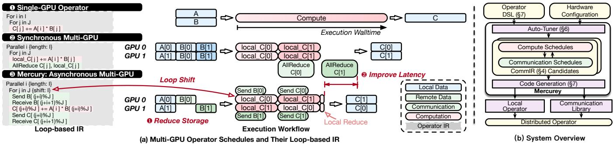  
Figure 1. (a) Motivating example of multi-GPU operators with remote memory access. (b) Overview of Mercury.

We observe that a fundamental reason for the performance gap in existing multi-GPU operator compilers lies in their restrictive assumption of a local-memory-centric execution model. That is, compilers assume that all input data must be fully available in each GPU’s local memory before computation can proceed. As a result, inter-device communication is largely treated as a mechanism for exchanging intermediate results between operators. This assumption leads current compilers to default to execution models that fully duplicate shared inputs and enforce identical, temporally synchronized computation across devices—a pattern we refer to as the synchronous schedule. As illustrated in Fig. 1- 2 , GPU0 computes over outer loop ?? on ??[0] and GPU1 over ??[1], but both follow the same inner loop structure over ?? . Shared input ?? is fully replicated across devices and accessed in a fixed order, e.g., ?? [0] is used first, followed by ?? [1], in exact synchrony across all GPUs. This duplication not only wastes valuable local HBM capacity but also hinders GPU optimizations such as deeper tiling. This restricts the compiler’s ability to explore more flexible execution and communication patterns, particularly those that take advantage of remote memory as a shared data storage resource in the memory hierarchy, which may reduce the local memory footprint and reduce overall latency by enabling better compute-communication overlap.

To address this limitation, our approach is grounded in the insight that remote GPU memory can be treated as a firstclass, schedulable layer in the memory hierarchy—on par with local HBM. In this abstraction, inter-device communication is used as a means to access shared input across devices rather than just exchanging intermediate results between kernels. This abstraction thus unlocks many new schedules. One representative example is the shifted asynchronous schedule, where devices stagger their access to shared data, allowing it to reside on the larger remote GPU memory pool aggregated by all GPUs and be transferred when needed by the local device. As shown in Fig. 1- 3 , offsetting the inner ?? loop timeline by GPU ?? induces such a shifted computation and communication pattern. This temporal decoupling allows shared input data to be reused across devices, reducing local memory pressure and enabling other compiler optimizations (e.g., large tiling sizes). We note that this schedule with asynchronous temporal shift also forms the foundation of recent hand-optimized multi-GPU operators [27, 52], but prior implementations are rigid and not designed to integrate with compiler frameworks.

Translating such remote-memory-aware execution strategies into a general compiler infrastructure presents several key challenges. First, existing compiler abstractions lack a unified view of compute, memory, and communication, treating remote memory as an external mechanism rather than an integral part of the scheduling space, making it difficult to express structured patterns involving remote reuse or cross-device scheduling within the loop hierarchy. Second, not all remote memory accesses patterns are equivalent; those supported by collective primitives (e.g., AllGather, ReduceScatter) often outperform arbitrary P2P remote memory access patterns [45]. Thus, the compiler must not only express fine-grained memory sharing but also be capable of automatically generating efficient collective primitives when appropriate.

To address these challenges, we design Mercury, a compiler for optimizing multi-GPU operators. Fig. 1(b) shows an overview of the Mercury architecture. Mercury takes as input a tensor-level operator written in a Python-embedded domain-specific language (DSL) and generates an optimized execution plan across multiple GPUs, both within a single node and across multiple nodes. We remark that Mercury acts as a middle layer in the compiler stack: it connects to the higher-level computation graph optimization [61] to support global decisions such as operator fusion and intra-operator resharding, and to lower-level tensor compilers [8, 46] and libraries [35] for intra-GPU kernel optimization and code generation. This separation of concerns allows Mercury to focus exclusively on multi-GPU scheduling. Concretely, Mercury advances tensor compilers by introducing a loop-based IR that treats remote GPU memory as first-class and unifies compute, memory, and communication within the schedule—enabling asynchronous (shifted) and collective patterns that explore this joint inter- and intra-GPU space to synthesize efficient collectives rather than relying on fixed templates. We will discuss the comparison with existing tensor compilers in Sec. 9.1.

At the core of Mercury is CommIR (§4), a loop-based intermediate representation (IR) that extends traditional loop-based IRs [16, 36]. CommIR introduces structured transformation primitives, parallelize, shift, shard, and replicate, which unify support for both standard intra-GPU tiling and advanced inter-GPU scheduling patterns, such as asynchronous shifts and collective communication primitives. These primitives express all known handoptimized multi-GPU strategies and explore a significantly larger design space by allowing parallelism and shift transformations across arbitrary loop dimensions, as well as flexible hybridization of collective patterns that manual efforts have yet to explore (§5).

Mercury implements the CommIR and adopts an autotuning process for the optimal schedule (§6). Unlike prior systems that rely on hardcoded templates, Mercury lowers the CommIR candidates to local operator and communication kernels automatically to explore a larger design space (§7 ). Because the transformations are structured, Mercury can automatically synthesize communication plans, e.g., generating a ring-style pass by applying a shift over the loop dimension, without requiring custom kernel logic.

We evaluate Mercury across a range of LLM operators with varying context lengths, hardware platforms, and network configurations, demonstrating consistent performance improvement (§8). Our compiler outperforms stateof-the-art (SOTA) hand-optimized designs like USP[15] and Ulysses[20], averaging 1.56× speedup. Compared with model-level 3D-parallel [26], Mercury achieves up to 1.62× performance improvement for real LLM workloads.

• We introduce CommIR, a novel loop-based IR that treats remote GPU memory as an explicit extension of the memory hierarchy and unifies computation, memory, and communication winthin a single scheduling abstraction.

• We build a modular compiler, Mercury, that automatically generates efficient multi-GPU operators through a set of communication-driven transformation passes.

• Our evaluation shows that Mercury outperforms stateof-the-art hand-tuned LLM libraries across diverse operators and hardware platforms.

## 2 Background

In this section, we first introduce the common settings for modern multi-node multi-GPU systems and their remote memory access interfaces. We then discuss representative multi-GPU operator designs with these interfaces.

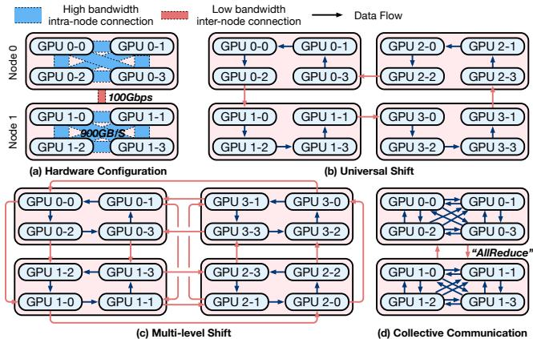  
Figure 2. Multi-GPU interconnection and access patterns.

## 2.1 Multi-GPU Systems

To understand the design of multi-GPU operators, we first examine their interconnect topologies and access interfaces. Multi-GPU Interconnection. To meet the massive requirement of modern LLM workloads, the systems are usually organized in a multi-node multi-GPU topology with different bandwidth as shown in Fig. 2-(a). Building on diverse interconnection hardware (such as Ethernet or PCIe), the communication bandwidth varies dramatically at different levels. For example, the intra-node bidirectional connection over NVLink mesh provides a 900 GB/s bandwidth, which is merely 3× slower than the local HBM bandwidth. The inter-node communication over high-specification RDMA over Converged Ethernet (RoCE) [49] or InfiniBand [42] delivers a much slower bandwidth, for example, 100 Gbps. Over this physical interconnection hardware, the remote memory access between GPU devices is delivered through point-to-point (P2P) or collective communication interfaces.

P2P Access. P2P communication provides fine-grained control of data transferring directly between GPU pairs, enabling flexible and overlapped communication patterns ideal for irregular or pipeline-parallel workloads. However, the P2P communication requires non-trivial scheduling across multiple GPU devices, making it difficult to schedule. For example, Fig. 2-(b) and (c) demonstrate two patterns that pass the intermediate results asynchronously. The multi-level shift pattern in (c) groups the intra- and inter-node connection together while the universal shift launches P2P communication universally. This flexibility makes it well-suited for optimizing bandwidth usage in hierarchical systems.

Collective Access. Modern vendor-provided libraries [1, 34], on the other hand, offer highly optimized implementations of collective remote memory access launched synchronously by a group of GPUs. These libraries deliver programming interfaces such as AllReduce, Broadcast, and All-Gather as shown in Fig. 2-(d). The underlying implementation of these collective communication are aware of the physical hierarchy and dynamically select optimized algorithms (e.g., ring, tree, or hybrid) based on the bandwidth and latency characteristics. For instance, NCCL exploits the NVLink mesh for high-throughput intra-node communication while using pipelined protocols over RoCE or InfiniBand for inter-node transfers. Collective communication provides a clean abstraction for inter-GPU coordination and ensures performance portability across a range of heterogeneous systems through low-level, hardware-aware scheduling.

<table><tr><td rowspan="2">Projects</td><td colspan="3">Parallel Dimension*</td><td rowspan="2">Collective</td><td rowspan="2">Schedule</td><td rowspan="2">Topology Adaptivity</td></tr><tr><td>Head</td><td>Query</td><td>Context</td></tr><tr><td colspan="8">Synchronous Operators</td></tr><tr><td>Context Parallel [25]</td><td>。</td><td>0</td><td>。</td><td>。</td><td>No</td><td>。</td></tr><tr><td>Ulysess [20]</td><td>0</td><td>。</td><td>。</td><td>.</td><td>No</td><td>。</td></tr><tr><td>TreeAtten [44]</td><td>。</td><td>。</td><td>.</td><td>.</td><td>No</td><td>·</td></tr><tr><td colspan="7">Asynchronous Operators</td></tr><tr><td>RingAtten [27]</td><td>。</td><td>.</td><td>。</td><td>。</td><td>No</td><td>。</td></tr><tr><td>USP [15]</td><td>0</td><td>.</td><td>。</td><td>.</td><td>Template</td><td>·</td></tr><tr><td>LoongTrain [18]</td><td>0</td><td>.</td><td>。</td><td>.</td><td>Template</td><td>.</td></tr><tr><td colspan="7">Automatic Approaches</td></tr><tr><td>Alpa [61]</td><td>0</td><td>0</td><td>0</td><td>：</td><td>Template</td><td>·</td></tr><tr><td>Centauri [7]</td><td>0</td><td>.</td><td>0</td><td>：</td><td>Template</td><td>。</td></tr><tr><td>CoCoNet[21]</td><td>0</td><td>0</td><td>0</td><td>.</td><td>Auto</td><td>。</td></tr><tr><td>Mercury</td><td>：</td><td>.</td><td>：</td><td>.</td><td>Auto</td><td>·</td></tr><tr><td></td><td colspan="2">*synchronous, asynchronous</td><td></td><td></td><td colspan="2"></td></tr></table>

Table 1. Comparison of multi-GPU attention operators.

## 2.2 Distributed Operators

With the aforementioned remote memory access interfaces, many parallelism strategies and supporting operators are studied. We will discuss the common operators in LLMs and their multi-GPU implementations in the following.

Operators in LLMs. Modern LLMs are fundamentally built upon attention mechanisms and linear layers. Multi-Head Attention (MHA) [48] enables models to capture diverse contextual relationships by attending to different parts of the input sequence. Variants like Multi-Query Attention (MQA) [41] and Grouped-Query Attention (GQA) [3] optimize inference efficiency and memory usage by sharing key and value (KV) activation across attention heads [3, 41]. The calculation of attention involves a four-level loop structure: the batch, head, query, and context dimensions. Another part is the linear layer, typically implemented as General Matrix-Matrix Multiplication (GEMM) [14] operations. Efficient distribution and execution of these operators across multiple GPUs are crucial for scaling LLM training and inference.

Synchronous Operators. With these well-defined collective communication libraries, many parallel strategies are proposed addressing the variety of operators, device configurations, and deployment scenarios. The basic asynchronous designs can be regarded as parallelizing the loop axis at a specific dimension. To elaborate, data parallelism (DP) [24, 37, 59] partitions input samples across devices, minimizing communication but duplicating model parameters, leading to high storage consumption, which is regarded as parallelizing at the batch dimension. As such, data parallelism does not require dedicated operators. Tensor parallelism (TP) [43] parallelizes the reduction dimension of the linear operator. This shards model parameters across devices, reducing storage but incurring significant communication overhead due to partial result reductions.

Due to the attention calculation’s complex computation flow, its multi-GPU operator design raises a much larger design space, mainly determined by the parallel dimension as shown in Tbl. 1. Context parallelism (CP) [23] distributes workloads along the spatial query dimension but requires replication of large KV activations. This can be abstracted as parallelizing the query dimension of the attention operator. Head parallelism introduced by DeepSpeed-Ulysses [20] distributes the workloads at the attention head dimension. Similarly, TreeAtten [44] proposes to parallelize the reduction dimension of the attention operator with fine-grained collective communications. Mnemosyne [2] further extends this idea by combining it with other parallelism strategies.

Asynchronous Operators. Advanced distributed operators, in recent research, have introduced asynchronous patterns into the operators to reduce memory and improve communication efficiency. For attention operators, several research studies [18, 27, 50, 52] propose passing data among parallel workers to reduce the storage consumption with overlapped communication as shown in the upper part of Tbl. 1. RingAtten [27] proposes a universal shift pass of the sharded KV activation on top of the CP design. Yet this universal logical ring launches intra- and inter-node communication together, thus bottlenecked by the low-bandwidth inter-node communication. LoongTrain [18], TokenRing [52], and USP [15] propose multi-level shift patterns that separate the intra- and inter-node communication with a multi-level shift design for better overlapping, as shown in Fig. 2-(c).

Similarly, the shift pattern is also applied to the GEMM operators [6, 51] to overlap the communication at a finer granularity. These works focus on different operators and network settings, resulting in ad-hoc development efforts and difficulty generalizing to different configurations.

Automatic Approaches. While several template-based tuning frameworks or compilers support the generation and optimization of multi-GPU operators with synchronous communication patterns, no open-sourced distributed compiler provides general support for generating high-performance multi-GPU operators, especially in multi-node scenarios. Existing frameworks overlook the importance of using remote GPU memory as a source of input sharing, thus delivering sub-optimal performance. Alpa [61] proposes a communication-computation-communication paradigm to gather inputs and reduce outputs on parallel workers. The applicable parallel pattern is determined as a template for each operator. Centauri [7] further proposes partitioning

Mercury: Unlocking Multi-GPU Operator Optimization for LLMs via Remote Memory Scheduling

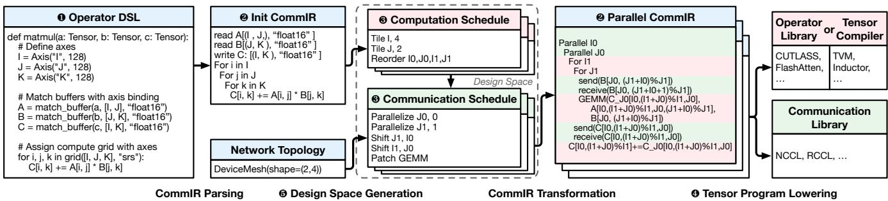  
Figure 3. Overview of CommIR’s workflow.

the communication and computation for fine-grained overlapping with pre-defined splitable axes on each operator. This enables more flexible fine-grained parallel strategies for compute-communication overlapping, yet still relies on template-based designs. Similarly, CoCoNet [21] defines a novel DSL with scheduling primitives to orchestrate collective communications with templated-free auto-tuning. However, its design space is restricted to synchronous communication patterns, leading to sub-optimal results compared to manual designs. None of these works manages to navigate the extensive design space that encompasses both synchronous and asynchronous communication patterns automatically, which is crucial for achieving optimal performance across diverse operator and hardware configurations.

## 3 Overview

To address the growing challenges of multi-GPU operator optimization, we introduce Mercury, a distributed operator compiler that unifies computation, communication, and memory management via a novel intermediate representation, CommIR. As illustrated in Fig. 3, Mercury systematically transforms a high-level operator specification into an efficient, distributed execution plan through four key stages: parsing, transformation, code generation, and tuning.

DSL. Mercury starts with a Python-like DSL that is simple, intuitive, and easy to adopt as shown in Fig. 3 1 . It closely matches the syntax and structure of existing tensor DSLs [16, 56] to minimize the learning curve, while introducing a key distinction: the use of explicit loop symbols to expose iteration structure for lowering. This loop-based abstraction makes the DSL not only transformation-friendly but also expressive enough to capture tensor computations and their distribution semantics in a unified way. Users can directly specify parallelism levels, data shifts, replication, and other communication patterns via loop annotations, enabling seamless integration of computation and communication.

CommIR and Transformation Schedules. This DSL is parsed into CommIR (Fig. 3 2 ), a structured IR that preserves the hierarchy of loop nests and encodes distribution intent through a set of computation and communication primitives (Fig. 3 3 ). Computation primitives such as tile, reorder, and patch rewrite the loop structure, supporting rich scheduling transformations. Communication primitives such as parallelize, shard, and shift annotate loop variables and buffer layouts to indicate how data is partitioned, accessed, and exchanged across a device mesh. These primitives do not emit code directly but serve as symbolic annotations maintained through optimization and lowering.

Communication and Local Operator Lowering. Once a candidate schedule is selected, Mercury lowers it into backend-compatible code as shown in Fig. 3 4 . The code generation process consists of two stages. First, communication kernels are synthesized by symbolically analyzing the loop index transformations and buffer annotations to determine P2P or collective communication patterns. This includes staggered sends/receives introduced by shift as well as collective communications. Second, the local computation kernels are lowered into device-specific IRs (e.g., TorchInductor), optionally patching regions with optimized libraries such as FlashAttention when applicable.

Auto-Tuner. To identify the most efficient distributed schedules, Mercury employs an auto-tuner that explores a structured design space generated from CommIR transformations as shown in Fig. 3 5 . It first enumerates local computation schedules, then overlays communication strategies such as parallelize and shift, constrained by the target hardware mesh. Each candidate is profiled for latency, while memory usage is statically checked to prune infeasible options. This phased and constraint-aware search enables fast convergence to high-performance schedules.

## 4 CommIR

In this section, we draw the core abstraction of CommIR and how to use it to represent existing parallelism and beyond.

## 4.1 Definition and Primitives of CommIR

The insight of CommIR is that the loop-based IR in the tensor compilers for local operators already contains the semantics for parallel execution natively. For example, in the tensor compiler TVM[8], bind primitive assigns a loop to hardware constructs such as CUDA thread blocks or threads. Extending such a loop-based representation to a coarse-grained distributed scenario is a natural fit. As such, we adopt a loopbased IR design inheriting previous tensor compilers and the computation-related transformations as introduced in Tbl. 2. We introduce four transformation primitives to introduce remote memory access semantics into the loop-based IR. The parallelize and shift are applied on the loop nodes to schedule the computation and the shard and replicate are applied on the buffer nodes to manage the memory. Tbl. 2 show minimal examples of the transformation effect on top of a weighted sum CommIR object in the first row.

<table><tr><td rowspan=1 colspan=1>Primitive</td><td rowspan=1 colspan=1>Demonstration</td><td rowspan=1 colspan=1>Definition</td><td rowspan=1 colspan=1>Example</td></tr><tr><td rowspan=1 colspan=1>CoMMIR</td><td rowspan=1 colspan=1>Defined by user</td><td rowspan=1 colspan=1>Weighted Sum</td><td rowspan=1 colspan=1>ForiinIFor j in JC[i]+=A[i,j]*B[]]</td></tr><tr><td rowspan=1 colspan=1></td><td rowspan=1 colspan=1>Comp</td><td rowspan=1 colspan=1>Computation Primitives</td><td rowspan=1 colspan=1></td></tr><tr><td rowspan=1 colspan=1>Tile</td><td rowspan=1 colspan=1>Split loop and add buffer</td><td rowspan=1 colspan=1>Tile(J)</td><td rowspan=1 colspan=1>Foriin IFor j0 in JoFor j1 in J1C_jo[ijo]+=A[ij0j]B[j,j]C[i]+=C_jo[i,j0]</td></tr><tr><td rowspan=1 colspan=1>Join</td><td rowspan=1 colspan=1>Merge loops</td><td rowspan=1 colspan=1>Join(LJ)</td><td rowspan=1 colspan=1>For ij in IJC[ij//j_len]+=C[ij/j_len,ij%j_len]</td></tr><tr><td rowspan=1 colspan=1>Reorder</td><td rowspan=1 colspan=1>Change the order of loops(for better locality)</td><td rowspan=1 colspan=1>Reorder(J,I)</td><td rowspan=1 colspan=1>Forj in JFor iin IC[i]+=A[i,j]*B[j]</td></tr><tr><td rowspan=1 colspan=1>Patch</td><td rowspan=1 colspan=1>Replacesubgraphwithmicro-kernelbypatternmatching</td><td rowspan=1 colspan=1>Patch(op)</td><td rowspan=1 colspan=1>Foriin Iop(C[i].A[i,:],B[:])</td></tr><tr><td rowspan=1 colspan=1></td><td rowspan=1 colspan=1>Commu</td><td rowspan=1 colspan=1>Communication Primitives</td><td rowspan=1 colspan=1></td></tr><tr><td rowspan=1 colspan=1>Parallelize</td><td rowspan=1 colspan=1>Parallelize a loop at a net-work hierarchy level</td><td rowspan=1 colspan=1>Parallelize(I, 0)</td><td rowspan=1 colspan=1>Paralleli {length: I, mesh: 0}ForjinJC[i]+=A[i,j]*B[j]</td></tr><tr><td rowspan=1 colspan=1>Shift</td><td rowspan=1 colspan=1>Shift a local loop accordingto a paralel loop</td><td rowspan=1 colspan=1>Shift(J.I)</td><td rowspan=1 colspan=1>Paralleli {length: I, mesh: 0}ForjinJC[i]+=A[i,(j+i)%j]*B[(j+i)%j]</td></tr><tr><td rowspan=1 colspan=1>Shard</td><td rowspan=1 colspan=1>Shard a buffer to distributedbuffer</td><td rowspan=1 colspan=1>Shard(B,I)</td><td rowspan=1 colspan=1>Paralleli {length: I, mesh: 0}AllGather(B)For j inJC[i]+=A[i,j]*B[j]</td></tr><tr><td rowspan=1 colspan=1>Replicate</td><td rowspan=1 colspan=1>Replicate a buffer among par-allel ranks explicitly</td><td rowspan=1 colspan=1>Replicate(A,I)</td><td rowspan=1 colspan=1>Paralleli {length: I, mesh: 0}For j in JC[i]+=A[i,j]*B[j]</td></tr></table>

Table 2. Transformation primitives in CommIR.

• Parallelize distributes the iterations of a loop across parallel workers at a specified hierarchy level in the network (e.g., inter-node or intra-node). The second argument specifies the hierarchy order, and we restrict the loop length and hardware size to be equal.

• Shift offsets a local loop’s index relative to a parallel loop, introducing asynchronous access patterns that stagger data access across ranks. This explicitly introduces remote memory access at different temporal steps. The first argument of shift identifies the target local temporal loop, and the second argument identifies the regarding parallel loop.

• Shard splits a buffer across workers, so each parallel rank owns a disjoint portion of the buffer. Note that a buffer can be sharded even on a loop that is not in its access index.

• Replicate duplicates a buffer across all workers participating in the parallel loop, so every rank has a full copy.

## 4.2 Remote Memory Access with CommIR

These communication primitives enable CommIR to represent a broad range of remote memory access patterns, as discussed in Sec. 2.1. Unlike computation transformations, communication primitives annotate the IR rather than modify it directly. These annotations are interpreted during the lowering phase to insert appropriate communication operations. This approach maintains a clean separation of concerns, facilitating joint computation and communication scheduling without premature commitment to a particular data layout or communication pattern.

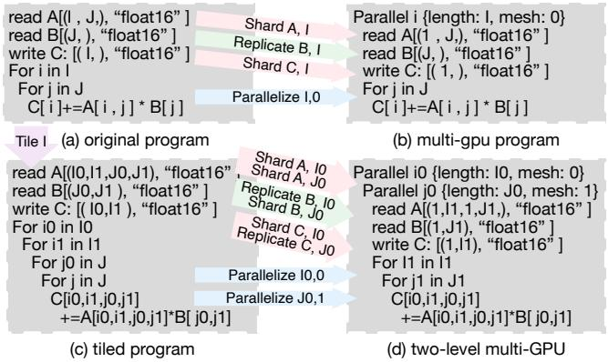  
Figure 4. Workload partitioning with parallelize transformation at multiple topology levels.

Parallel Semantic with Parallelize. The parallelize primitive partitions a loop across devices and determines the workload distribution. Although memory placement and loop parallelization are conceptually independent, we apply a default initialization to avoid unnecessary remote memory accesses. The rationale is that buffers indexed by the parallelized loop are sharded across devices, and buffers not indexed by the parallel loop are replicated. This initialization ensures that each worker has local access to its required data. For example, in Fig. 4-(a),(b), buffers A and C are sharded, while B is replicated to all devices.

Furthermore, by explicitly specifying the network mesh hierarchy in parallelize, we expose hierarchical memory sharing. For instance, in Fig. 4-(c),(d), loops ?? 0 and ?? 0 are mapped to mesh levels 0 (inter-node) and 1 (intra-node), respectively. This results in buffer B being shared at the inter-node level and replicated at the intra-node level. Additionally, loop tiling and joining can combine axes from different dimensions, providing more flexibility in buffer sharing or replication within a hierarchy.

Asynchronous Access with Shift. The shift primitive introduces asynchrony by offsetting loop indices across workers. In Fig. 5, loop ?? is the local loop and ?? is the parallelized dimension. Shifting loop ?? by ?? causes each worker to access a different segment of the shared buffer B at staggered time steps, reducing contention. We automatically shard buffers associated with shifted loops to facilitate efficient communication. In the example, buffer B is replicated and A is locally sharded before the shift transformation. With the transformed access pattern: ( ?? + ??)%?? , B can also be sharded with staggered access from worker ??.

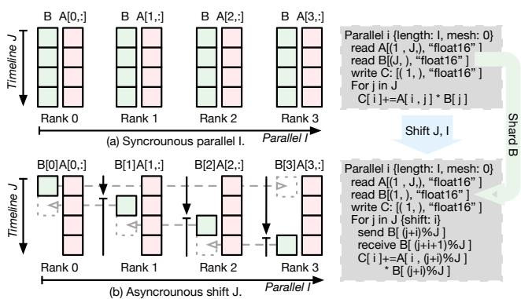  
Figure 5. Asynchronous communication lowering with shift transformation.

This shift-based design not only reduces storage by a factor of the number of devices but also overlaps computation and communication, as shown by the dashed arrows. Furthermore, multiple loop levels can be shifted independently, forming complex communication patterns that adapt to hierarchical hardware topologies (e.g., Fig. 2-(c)). The shift primitive can thus introduce asynchronous communications, resulting in schedules that are beyond the traditional synchronous worker model. We present hybrid shift patterns in Sec. 5.

Collective Access with Shard. Collective operations such as AllGather, Broadcast, and ReduceScatter are derived from buffer sharding patterns during the lowering phase. Fig. 6 illustrates three examples: (1) Read buffers: Sharding a read buffer triggers collective gathering, e.g., AllGather or Broadcast, depending on access and layout. (2) Write buffers: Sharded or replicated write buffers trigger reduce operations (e.g., AllReduce). (3) If the result buffer of a reduction is also sharded, the operation simplifies to ReduceScatter, reducing overhead.

The exact operation depends on the arithmetic semantics of the computation (e.g., sum, product) and the storage layout derived from the IR annotations, which is determined during the lowering phase via rule-based pattern matching over the CommIR. We incorporate predefined rules to insert collective communications whenever possible, otherwise fall back to point-to-point communication. While the lowering itself applies a deterministic rule set, the outer schedule-level search explores different computation and communication patterns to select the most performant configuration end-toend.

## 5 CommIR’s Expressiveness

With the well-defined CommIR, we can represent a wide range of parallelism strategies, capturing both established patterns and uncovering new ones. We illustrate this expressiveness using the attention operator [48], a core component of LLMs, as shown in Fig. 7. For simplicity, we reduce the attention operator to a scaled accumulation, mapping the query dimension to I and the context dimension to J, while omitting the batch and head dimensions, which follow a similar transformation process. The A represents the production of Q and K tensors before Softmax in attention (the P tensors). B represents the KV tensor. The vanilla local computation is shown in 1 , where buffer B (KV activation) is shared along the I axis and the output is reduced over J. By parallelizing the I axis, we naturally express context parallelism as in 2 . The shift primitive enables asynchronous communication patterns, aligning with prior designs like [27]. Further splitting of the I axis across device hierarchies allows hardware-aware communication planning, illustrated in Fig. 2-(c). Reordering and parallelizing the reduction loop yields patterns resembling TreeAttention [44], beneficial for decoding.

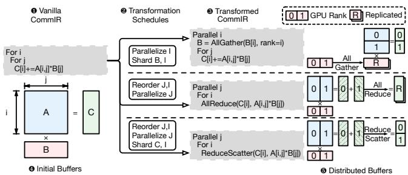  
Figure 6. Representative collective communications synthesized from transformation schedules.

Beyond manually derived patterns, CommIR enables the discovery of novel strategies by automatically applying transformations along new axes and composing them. For example, shifting the reduction axis allows partial sums to be passed across workers in parallel, as shown in 6 . To further increase parallelism, the J axis can be split to enable partial reductions with multiple workers, parallelizing both I and outer J loops as in 7 . A more advanced composition appears in 8 , an actual searched result in our evaluation. Here, two workers collaborate on the same J0 reduction loop, with partial results shifted along I1, avoiding collective reduction. Additionally, J1 is shifted along I0, introducing intra-group shift communication for the shared B buffer. This complex design involves intricate scheduling of compute and communication, making it challenging to craft manually.

Besides the attention operator, CommIR can also support other operators. For instance, the TP method for linear layers [43] is expressible by splitting and parallelizing the GEMM reduction axis. The more advanced AsyncTP[51] strategy is captured by applying shift over an outer loop of size two. Altogether, CommIR offers broad expressiveness and generality across operators, enabling exploration of an expansive design space for distributed computation.

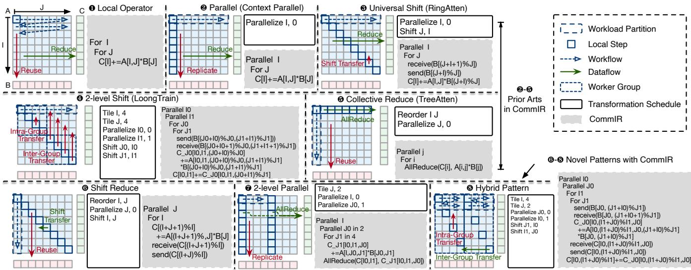  
Figure 7. Attention operator examples and their CommIR expression. We approximate the attention operation as scaled accumulation in 1 to simplify the illustration without any loss of generality.

## 6 Auto Tuner

With the expressive design of CommIR and a unified code generation pipeline, we build an auto-tuning system that searches for optimal distributed operator schedules by exploring a rich, transformation-driven design space.

Design Space Generation. We build the design space by enumerating the transformation primitives and sizes. In practice, we introduce several empirical rules to reduce the problem size without sacrificing expressiveness.

Firstly, We divide the generation process into two sequential schedules. (a) the computation schedule applies tiling, reordering, and join transformations to define the local loop structure and buffer layout. This schedule explores different ways to divide computation for next-step multi-GPU distribution. (b) the communication schedule applies communication primitives, such as parallelize, shift, shard, and replicate, to distribute computation and manage remote memory access. This phase determines how to parallelize the computation across devices and orchestrate inter-device communication. This phased approach retains the full expressiveness of the transformation space while reducing redundancy and avoiding invalid configurations. Candidates produced in the computation phase can be reused across multiple parallelization strategies.

Secondly, we explicitly incorporate hardware mesh configuration to regularize candidate generation. In particular, loops are only tiled according to mesh size (e.g., number of devices at each hierarchy level). Loops parallelized or shifted must have a length equal to the corresponding mesh dimension. Combined with reordering and loop merging, this constraint preserves coverage of the relevant schedules while significantly reducing the overall number of candidates.

Besides, we also bundle the parallelize and shift with corresponding shard or replicate operations. Although these can be decoupled in principle, shifting without sharding produces no semantic change. While this bundling could theoretically exclude some valid trade-offs (e.g., selectively sharding some shifted buffers), the evaluated workloads do not exhibit such patterns. Thus, this simplification reduces search complexity without sacrificing coverage in practice.

Search Objectives. The tuner aims to minimize end-to-end latency of the generated distributed operator, subject to memory constraints. Specifically:

• Latency evaluation: each candidate schedule is fully lowered and profiled in real hardware settings to obtain empirical runtime measurements.

• Memory constraint: we statically analyze each candidate’s storage layout from its CommIR representation and compute the per-worker memory footprint. Candidates exceeding the provided capacity are pruned early in the search process.

With these empirical rules, the tuning completes within 10 minutes per operator in our evaluations. However, we acknowledge that search cost may grow with larger operator complexity or mesh topologies. Exploring more advanced tuning algorithms, e.g., cost-model-guided [22, 61] sampling or ML-based predictors, is a promising direction for future work.

## 7 Implementation

We introduce the implementation of the distributed compiler Mercury as shown in Fig. 1-(b).

## 7.1 DSL

To support the specification and transformation of distributed tensor operators, we design a new DSL that allows concise and semantically rich operator definitions. We chose to build a new DSL instead of extending existing ones like TVM[8] or Triton[46], as they lack loop-level distribution semantics beyond local tensor programs. Our DSL extends PyTorch’s frontend to leverage its ecosystem. PyTorch’s DSLto-IR path lacked loop-based distribution semantics, which we add via loop-centric DSL extensions. Integrating Mercury with other loop-based IRs (e.g., TVM/Triton) is feasible but requires engineering effort—most notably backend rewrites for communication code generation and multi-GPU scheduling—because these stacks primarily target single-GPU kernels. We will clarify these trade-offs in the revision. In our approach, loop transformations are first-class citizens across hierarchical device meshes, enabling unified local scheduling and global communication planning in the IR. The DSL is built around three key abstractions: axis declarations, buffer bindings, and computation grids, aligning with standard IR concepts including loop variables and storage objects.

• Axis. An Axis represents a named loop variable that defines a dimension of iteration. Each axis has a statically known extent and can be annotated with distribution metadata, such as its mapping to a hardware mesh level or a communication shift offset.

• Buffer. Buffers are declared using the match\_buffer API, which binds a symbolic name to a tensor with a shape expressed over a set of axes. This declaration determines both storage layout and access semantics, allowing the compiler to infer the necessary communication based on axis transformations. The DSL tracks which axes are involved in parallelization or shifting, and associates the buffers with appropriate distribution primitives such as shard or replicate. We use the read and write annotations to mark the required data buffers directly for each local operator. As such, the annotated buffer is sharded or replicated according to the parallel axis. For example, if axis J is parallelized, then buffer B is interpreted as sharded across devices along that dimension.

• Grid. Computation is specified using the grid construct, which defines the iteration space of the operator over a set of axes and allows annotations for reduction semantics or fused loop scheduling. This construct corresponds to the loop nest in traditional IRs and forms the basis for tiling, reordering, and transformation during optimization. In the example shown in Fig. 3, "srs" refers to the loop types: "s" for spatial and "r" for reduction, which can influence communication patterns and data reuse strategies when compiled.

## 7.2 Schedule Primitives

Upon the CommIR, we implement the transformation primitives introduced in Sec. 4.1.

Computation primitives. Computation primitives in CommIR are implemented by rewriting the loop nest representation. Each transformation uses structured rewrite rules over the IR’s loop tree. Internally, transformation passes traverse the loop nest using pattern matching, apply local rewrites, and update metadata tied to loop variables (e.g., iteration bounds, index expressions, and loop tags). These rewrites preserve referential transparency and are composable, enabling multi-pass scheduling without inconsistencies.

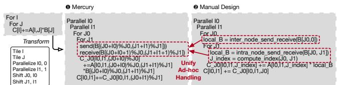  
Figure 8. Comparison of code generated for the same twolevel shift pattern from manual design and Mercury.

The Patch primitive is a special transformation designed to utilize the existing high-optimized local operator libraries, implemented as a subgraph substitution mechanism. Users can register pattern-to-kernel mapping rules, which describes the required loop shape, buffer access pattern, and optionally data types. During transformation, a graph matcher scans the IR for compatible subgraphs and replaces them with opaque external calls, wrapped with the necessary buffer bindings. This simplifies downstream lowering, especially when targeting well-optimized libraries like cuDNN[11] or FlashAttention[12, 13, 39].

Communication primitives. As introduced in Sec. 4.1, communication primitives are implemented as annotations on loop and buffer objects within the IR. They do not directly insert communication code; instead, they decorate the program with distribution intent, which is later materialized in the code generation stage. In summary, the communication primitives are annotated with the following metadata. Parallelize marks the loop variable with a target mesh level and records the mapping between loop iterations and device ranks. Shard and replicate update buffer metadata with a logical partitioning plan. Shift modifies the loop initialization and indexing logic to introduce staggered access across devices. This transformation is performed symbolically and maintained until lowering. In effect, communication is inferred based on the loop hierarchy and buffer sharing annotations.

## 7.3 Code Generation

The code generation pipeline in Mercury lowers the CommIR into an executable distributed program. This process is divided into two main stages: (1) generation of communication kernels and (2) lowering of local computation kernels.

Communication Kernel Generation. We begin by analyzing the annotated CommIR to infer the required inter-device communication patterns. P2P communications, introduced via the shift primitive, are derived firstly by statically analyzing the loop index transformations. The receiver and sender ranks are inferred using symbolic offset formulas (as introduced in Sec. 4.1), enabling a concise and general formulation of staggered data flows. Collective communication operations are inferred for buffers annotated with shard or replicate. These are determined by analyzing buffer access patterns and the aggregation semantics of the surrounding loops.

This symbolic analysis decouples communication intent from implementation, allowing us to generate complex, topology-aware communication schedules automatically. As illustrated in Fig. 8, Mercury synthesizes a two-level shifted attention kernel using a unified representation of P2P communication. The result matches or exceeds the quality of hand-optimized kernels, while significantly reducing manual effort. Notably, the compiler is capable of generating sophisticated nested communication patterns that are challenging for human developers to design and verify manually.

Local Computation Lowering Once communication is resolved, we lower the computation portion of the IR to backend-specific code. The loop-based structure of CommIR allows for straightforward translation into existing tensor compilers or runtime libraries. In our implementation, TorchInductor is used as the primary backend for lowering and optimizing local computation. Because CommIR retains loop-level structure and buffer semantics, it integrates naturally with TorchInductor’s operator representation and scheduling mechanisms. For compute-intensive regions, such as the innermost loops of attention kernels, we optionally invoke highly optimized operator libraries. Specifically, we use FlashAttention (FA) to patch local subgraphs where supported. These patches are inserted via the Patch transformation and treated as opaque external calls during lowering. FA patching is exposed as a tunable candidate in the search space to balance performance and generality.

This modular design enables joint optimization of computation and communication, accounting for both the devicelevel execution environment and the distributed topology. In addition, patching local computations with pre-optimized kernels significantly reduces the size of the design space, thereby accelerating the tuning process. Furthermore, this design makes Mercury extensible to support more complex scenarios, such ragged tensors or dynamic routing for mixture-of-expert (MoE) operators[57, 58], while Mercury currently focuses on static operators. This can be achieved by pre-compiling for common communication patterns or profiling-based variant selection at runtime. We see this as a valuable direction for future exploration.

## 7.4 Inter-Operator Resharding

To extend the benefits of operator-level tuning to the entire model, we incorporate graph-level reasoning by considering both the execution time of individual operators and the communication overhead required for resharding between them. This supports the synergy of the proposed operator-level tuning with model-level optimizations, such as Pipeline Parallelism (PP) [29]. In distributed settings, adjacent operators in a model often require different parallelization strategies, leading to incompatible sharding specifications on intermediate buffers. To resolve this mismatch, explicit resharding communication must be inserted, which contributes nonnegligible latency beyond intra-operator communication.

Algorithm 1 Graph-level Search over Operator DAG   
Input: Operator DAG $G \ = \ ( O , E ) ,$ , where each ???? has candidate shardings   
$\{ \bar { S _ { i , 1 } } , \cdot \cdot \cdot , \bar { S _ { i , K _ { i } } } \}$   
Output: Optimal sharding config $S ^ { * } = \{ S _ { 1 } ^ { * } , \cdot \cdot \cdot , S _ { N } ^ { * } \}$ minimizing total cost   
1: Initialize $S ^ { * } \gets \emptyset , C _ { \mathrm { m i n } } \gets \infty$   
2: for each full candidate $S = \{ S _ { 1 , j _ { 1 } } , \cdot \cdot \cdot , S _ { N , j _ { N } } \}$ do   
3: $C \gets 0$   
4: for each operator $O _ { i } \in O \mathbf { d }$ o   
5: $C _ { \mathrm { e x e c } } \dot {  } \mathrm { O p E }$ xecCost $( O _ { i } , S _ { i , j _ { i } } ) , C _ { \mathrm { r e s h a r d } }  0$   
6: for each predecessor ???? of ???? in DAG do   
7: $C _ { \mathrm { r e s h a r d } }  C _ { \mathrm { r e s h a r d } } +$ Reshar $\mathrm { d } \mathrm { C o s t } ( S _ { k , j _ { k } } , S _ { i , j _ { i } } )$   
8: end for   
9: $C \gets C + C _ { \mathrm { e x e c } } + C _ { \mathrm { r e s h a r d } }$   
10: end for   
11: $\mathbf { i f } \ C < C _ { \mathrm { m i n } }$ then   
12: $S ^ { * } \gets S , C _ { \mathrm { m i n } } \gets C$   
13: end if   
14: end for   
15: return $S ^ { * }$

Our approach maintains a searchable database of distributed operator configurations, where each record includes the operator’s input/output sharding settings and the corresponding execution time. Given a computation graph represented as a directed acyclic graph (DAG), we first compute the pairwise resharding cost for each edge connecting two dependent operators. This cost accounts for the communication required to transform the output sharding of a producer into the expected input sharding of its consumer.

To find the optimal combination of operator configurations, we perform a global search over the space of candidate assignments, aiming to minimize the total cost composed of per-operator execution latency and inter-operator resharding cost. To support seamless integration with our DSL, the input and output sharding constraints for each operator are defined using the Parallelize primitive in Mercury. Resharding communication routines are synthesized by interpreting mismatches in sharding specifications along DAG edges, following the procedure illustrated in Alg. 1. This design ensures that graph-level scheduling remains aware of both computation and communication costs, enabling more effective parallel strategy selection for the model.

## 8 Evaluation

This section introduces our evaluation settings and demonstrates the experimental findings. Our evaluation is structured into four parts: (1) operator benchmarks across hardware backends, (2) adaptability to network topologies, (3) scalability with increasing sequence lengths, and (4) design space analysis. This organization highlights the performance, portability, scalability, and expressiveness of Mercury.

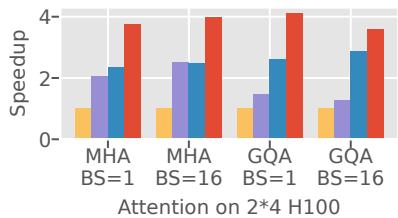

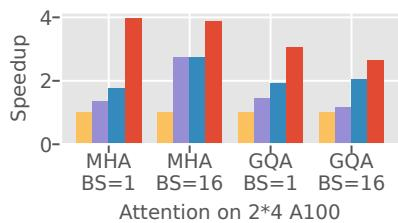

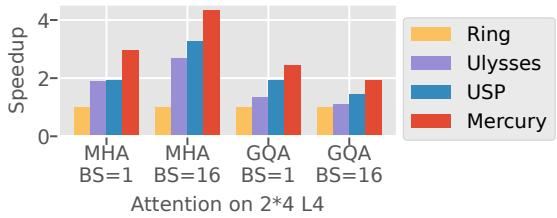

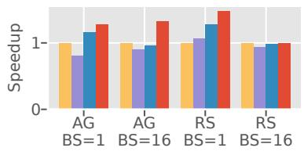

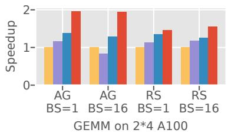

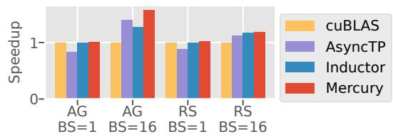

Figure 9. Multi-GPU operators performance benchmark from LLMs.
<table><tr><td></td><td>L4</td><td>A100</td><td>H100</td></tr><tr><td>TFLOPs @FP16</td><td>242</td><td>312</td><td>1979</td></tr><tr><td>Memory (GB)</td><td>24</td><td>40</td><td>80</td></tr><tr><td> Memory Bandwidth (GB/s)</td><td>300</td><td>1555</td><td>3350</td></tr><tr><td>Intra-node Connection</td><td>PCIe</td><td></td><td>NVLink NVLink</td></tr><tr><td>Intra-node Bandwidth (GB/s)</td><td>64</td><td>600</td><td>900</td></tr><tr><td>Inter-node Bandwidth (Gbps)</td><td>50</td><td>50</td><td>100</td></tr></table>

Table 3. Distributed hardware and network configurations.

## 8.1 Experimental Setup

Testbed. We deploy the proposed Mercury compiler with diverse GPU devices and interconnection settings to evaluate its generality. The configurations are summarized in Tbl. 3, showing the key varying factors. The nodes are connected with RoCE, and the intra-node connection is facilitated by NVLink[31] or PCIe. We adapt the number of nodes (ranging from 1 to 4) and GPU devices per node (ranging from 1 to 8) in each benchmark to evaluate the portability of Mercury with different settings, which will be elaborated accordingly. Mercury is implemented with CUDA-v12.6, NCCL-v2.26.2 and TorchInductor released with PyTorch-v2.8.

Workloads. We use Mercury to optimize the representative operators of modern LLMs, including different variants of attention (MHA, GQA). For the GEMM operator, we benchmark two settings, AllGather-GEMM (AG) and GEMM-ReduceScatter (RS), which typically show in the linear layers of LLMs with TP. The configuration of the evaluated operators is selected to match the model specification of the Llama-3 series[17], which stands for a typical setting for many LLM models. Besides, we also evaluate these operators under common batch size settings of 1 16 and scale the sequence length from 4K to 2M to show Mercury’s generality.

Baselines. To evaluate the effectiveness of operators generated and tuned by Mercury, we compare with the SOTA manual written operators and auto-searching methods available. For the attention operator, we compare it with the asynchronous CP design RingAtten[27] (denoted as Ring) and synchronous HP design from DeepSpeed-Ulysses[20] (denoted as Ulysses), adopting collective communications. Furthermore, we also include an advanced template-based adaptive operator USP[15] using a hybrid communication pattern of CP and HP. Specifically, we report the best performance result in USP’s design space, which will be elaborated in a case study. For the linear operator, we benchmark the synchronous operators with NCCL collective communication in cuBLAS[35]. We also benchmark a promising asynchronous design AsyncTP[51] as the SOTA manual efforts. Besides, we also compare with the operators generated by the TorchInductor[5] compiler, which tunes the best TP setting with a manual template of multi-GPU schedules.

## 8.2 Operator Benchmarks.

Operator Results. Across all benchmarks, Mercury consistently outperforms existing solutions, demonstrating both superior performance and broad generality. As shown in Fig. 9, Mercury achieves the highest speedup in every setting across both attention and GEMM workloads on multiple hardware backends (H100, A100, and L4), indicating its robustness and hardware portability.

In attention benchmarks, Mercury delivers significant speedups. For example, on H100, Mercury achieves up to 4× speedup on MHA with batch size 16, substantially outperforming USP and Ulysses. Notably, Ulysses excels only in the MHA setting due to its reliance on head-wise partitioning and fixed all-to-all communication, but suffers on GQA where the number of heads is reduced. USP, while introducing a combined CP+HP template, remains limited by a narrower design space. In contrast, Mercury automatically searches for optimized strategies tailored to operator characteristics and hardware, maintaining high performance even on GQA tasks. This highlights its adaptability to operatorspecific constraints. In conclusion, Mercury demonstrates unmatched performance and flexibility across all attention configurations.

(a) 4K context length per GPU.  
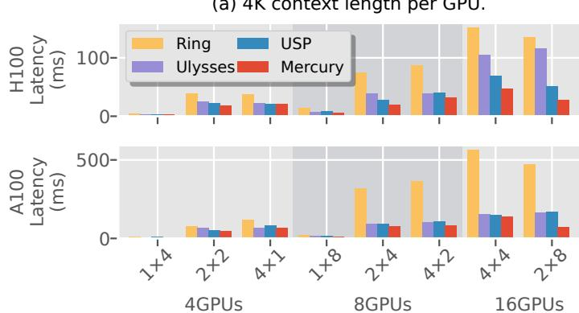

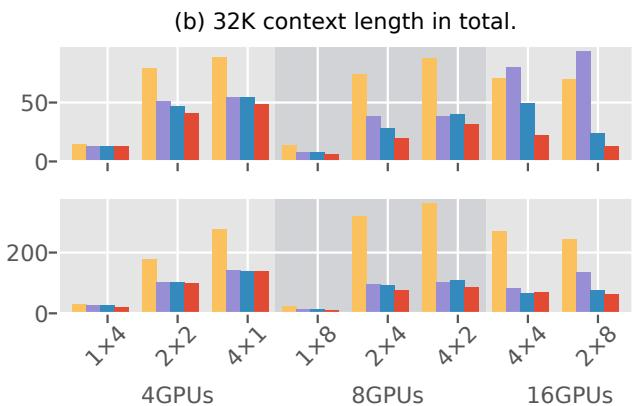  
Figure 10. Attention operator benchmark with various hardware network configurations.

Mercury also shows strong results on GEMM benchmarks, which are generally considered more regular and communication-heavy. Although the performance gap is smaller compared to attention, Mercury still consistently surpasses both manually tuned baselines (e.g., AsyncTP) and compiler-generated ones (e.g., Inductor). For example, it achieves up to 1.9× speedup on AG with batch size 16 on A100, and maintains a stable lead across all devices. The improvement stems from Mercury’s ability to break collective communication into finer-grained transactions and optimize overlapping computation and communication. This demonstrates its advantage even in conventional workloads with less inherent structural diversity. Therefore, Mercury’s effectiveness on GEMM benchmarks further supports its general-purpose design.

Network Topology Adaptability. We evaluate Mercury across various multi-GPU configurations, shown in Fig. 10. The left plots fix the per-GPU workload (4K context), revealing scalability trends as the GPU count increases. The right plots fix total workload (32K context), highlighting communication efficiency under increasing parallelism. Across all settings on H100 and A100, Mercury consistently achieves the lowest latency, outperforming all baselines with an average 2.91× speedup. Unlike handcrafted strategies or fixedtemplate methods, Mercury adapts its communication and parallelism plan to each topology automatically.

In the 4K-per-GPU setting, intra-node topologies (e.g., 1 × 8) show better performance due to faster links, while inter-node layouts (e.g., 4 × 4) suffer from higher latency. Mercury maintains efficiency even in these bandwidth-heavy cases by avoiding excessive inter-node communication. In contrast, RingAtten becomes bandwidth-bound, and Ulysses and USP show inconsistent performance depending on how well their fixed strategies match the mesh.

In the 32K total context case, Mercury continues to outperform all baselines. However, in configurations with only a single-level hierarchy—such as purely intra-node (1 × 4) or inter-node (4 × 1) setups—the performance gap between Mercury and existing approaches narrows, as handcrafted strategies like USP and Ulysses are already well-optimized for such scenarios. This underscores Mercury’s strength: its advantage becomes more pronounced in complex, hybrid topologies (e.g., 2 × 4, 4 × 2) where static methods struggle, and dynamic, topology-aware scheduling is crucial.

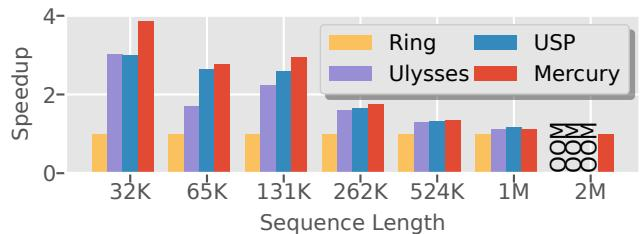  
Figure 11. Attention operators scaling sequence lengths.

Context Scalability. We evaluate the scalability of Mercury by increasing the sequence length of the MHA operator under a 2 × 4 configuration on the H100 platform. As shown in Fig. 11, Mercury consistently outperforms all baselines as the sequence length scales from 32K up to 2M tokens.

When the sequence length exceeds 1 million, computation dominates the attention operator’s runtime, diminishing the relative impact of communication. As a result, the speedup margin between Mercury and the baselines narrows. Nevertheless, Mercury still maintains competitive or superior performance in this regime. A key highlight is Mercury’s ability to generate feasible execution plans even under extreme memory pressure. While other baselines fail with outof-memory (OOM) errors at the 2M token mark, Mercury adapts by aggressively sharding KV caches and output tensors, trading increased communication for reduced memory usage. This flexibility enables Mercury to meet strict memory constraints without manual intervention. Another observation is the shift in relative performance between Ulysses and USP. Ulysses performs better for sequence lengths up to 65K, but USP overtakes it beyond that point. This behavior underscores the complexity of selecting optimal parallelization strategies and reinforces the value of Mercury’s automatic search mechanism, which adapts to both workload and hardware constraints.

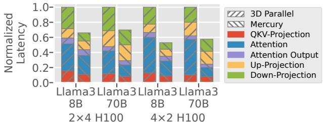  
Figure 12. Model-level results of Llama3 series.

## 8.3 Model Benchmark

We evaluate Mercury’s performance at the model level with operator configurations from Llama3-8B and Llama3-70 B. Specifically, we construct the computation graph using the graph-level search algorithm introduced in Sec. 7.4. We benchmark one Transformer layer with attention and linear operators since all layers share the same configuration. We compare to the 3D parallelism[26] strategy, combining DP, TP, and CP with the best configuration. In this benchmark, we set the sequence length to 4096 with batch size 1. The latency is broken down by key operators and resharding steps, including QKV Projection, Attention, and MLP layers.

Fig. 12 shows the normalized latency result of Llama3-8B and 70B models under two settings: 2 × 4 and 4 × 2. Across all configurations, Mercury achieves significantly lower latency than 3D Parallel. This improvement is not solely from optimizing individual operators but stems from a synergistic coordination at the model level. By jointly considering operator schedules and resharding decisions, Mercury eliminates redundant layout transformations and streamlines data flow across layers. The pronounced reduction in resharding overhead highlights Mercury’s capability to treat the model as a unified computational graph, where layout choices are optimized globally, rather than in isolation. This global view enables more efficient execution pipelines, revealing the advantage of integrating operator-level compilation with model-wide communication planning.

## 8.4 Design Space Analysis

To better understand the expressiveness and tunability of Mercury, we visualize its design space on an MHA operator using a 2 × 4 H100 configuration, as shown in Fig. 13. Each red dot represents a candidate schedule evaluated during Mercury’s auto-tuning process, plotted in terms of latency and memory consumption. We also include the results of baseline methods, USP, Ring, and Ulysses, for comparison. To highlight the most practical region, we zoom into the lowerlatency, lower-memory corner and outline the Pareto front. Mercury’s large and expressive search space, enabled by the proposed CommIR, encompasses both existing strategies and novel schedules that are not easily reachable through manual design. This allows Mercury to adapt to diverse operators and hardware topologies.

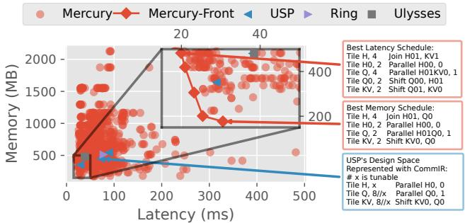  
Figure 13. Design space analysis.

The best-latency candidate (marked in the zoom-in) features a hybrid parallelism strategy: it applies HP with a degree of 4 across both intra-node and inter-node levels (with Shift Q00 H01 and Shift Q01 KV0), combined with a shifted CP-2 on the intra-node level. Additionally, each local operator is shifted along the reduction dimension, enabling fine-grained overlap between computation and communication. In contrast, the best-memory candidate uses intra-node parallelism over the context dimension and reuses the local Q dimension with a shift transformation. This significantly reduces peak memory usage by efficiently shifting KV activation and output tensors, as demonstrated in Fig. 7.

For comparison, we also represent USP’s manually crafted design space using CommIR’s abstraction. As shown in the blue box, USP only explores a narrow subregion of the full design space, with limited tunability over key axes like tiling granularity or parallelism layout. This further illustrates the necessity of automated exploration in achieving both optimal performance and memory efficiency across diverse settings.

## 9 Related Work

## 9.1 Tensor Compilers

Scheduling DSLs, such as Halide [36], pioneered the separation of algorithm from schedule and enabled powerful loop transformations. Early systems emphasized explicit schedules and locality-aware tiling on CPUs/GPUs, but largely assumed that all data resided in local memory and that communication was outside the scheduling model.

Subsequent ML-oriented tensor compilers[47] introduced richer tensor semantics and annotations, easing operator authoring while relying on template- or cost-model-guided autotuning to search intra-GPU schedules. AutoTVM[9], Ansor[60] and MetaSchedule[40], which are distinct tuning systems built on top of TVM[8], further automated schedule generation for single devices, extending portability across accelerators and operators.

As model sizes grew, tensor compilers incorporated basic multi-GPU support[4, 21, 38, 50], typically by composing single-GPU kernels with predefined collective primitives. These approaches improved usability but continued to treat inter-device data movement as an external mechanism, limiting opportunities for remote-memory reuse, asynchronous sharing, and topology-aware schedule synthesis.

Recent tensor compiler systems trends reinforce the centrality of LLM operators by extending the auto-tuning search space with semantic algebra transformations[53] or finegrained intra-kernel pipelining[10]. Mercury retains the algorithm/schedule separation concept but advances it for multi-GPU by treating remote GPU memory as first-class and unifying compute, memory, and communication with explicit primitives.

## 9.2 Fused Distributed Operators

Beyond the manual design of distributed operators discussed in Sec. 2, recent systems have explored fused designs that tightly integrate communication and computation to maximize overlap and efficiency. The concept of expressing asynchronous remote memory access with Shift primitive in Mercury can be applied to these fused designs as well. However, the code generation and autotuning of such fused kernels remain open challenges and are left for future work.

Flux[6] fuses GEMM with collectives at tile granularity and over-decomposes work to maximize computecommunication overlap for both training and inference. Comet[57] targets MoE, using a shared-tensor abstraction and NVSHMEM-backed buffers to overlap token-wise communication with tile-wise compute at production scale. Triton-Distributed[62] adds OpenSHMEM-style one-sided primitives and signal-based coordination to Triton, enabling Python-authored overlapped kernels (e.g., AllGather/GEMM, GEMM/ReduceScatter) on NVIDIA and AMD GPUs. Tile-Link[63] introduces tile-centric primitives that link compute tiles to communication so the compiler can automatically generate overlapped kernels while decoupling compute and communication choices. FlashOverlap[19] uses lightweight readiness signaling and layout reordering to trigger overlap with standard NCCL collectives while leaving compute kernels unchanged.

## 10 Conclusion

We present Mercury, an automated compiler framework for multi-GPU tensor programs, built on a novel loop-based IR, CommIR. By combining a custom DSL with advanced scheduling and communication primitives, Mercury jointly optimizes computation and communication, discovering novel parallel strategies that outperform state-of-the-art on attention and GEMM operators. It simplifies complex multi-GPU operator design and adapts to diverse hardware, enabling scalable, efficient execution for large-scale models and opening paths for future tuning, graph-level integration, and heterogeneous device support.

## Acknowledgments

We thank the anonymous reviewers for their thoughtful feedback, which helped improve this work. We are also grateful to our shepherd, Zhihao Jia, for guidance during the revision process. This work was supported in part by NSF awards 2124039 and 2411134.

## References

[1] Advanced Micro Devices, Inc. RCCL: ROCm Communication Collectives Library, 2025. Version 2.23.4.

[2] Amey Agrawal, Junda Chen, Íñigo Goiri, Ramachandran Ramjee, Chaojie Zhang, Alexey Tumanov, and Esha Choukse. Mnemosyne: Parallelization strategies for efficiently serving multi-million context length llm inference requests without approximations. arXiv preprint arXiv:2409.17264, 2024.

[3] Joshua Ainslie, James Lee-Thorp, Xuezhi Wu, Adam Roberts, Sharan Narang, Hongkun Zhou, Zihang Wang, Jaehoon Lee, Maarten Bosma, and Yi Chen. Grouped-query attention. arXiv preprint arXiv:2305.13245, 2023.

[4] Sami Alabed, Daniel Belov, Bart Chrzaszcz, Juliana Franco, Dominik Grewe, Dougal Maclaurin, James Molloy, Tom Natan, Tamara Norman, Xiaoyue Pan, et al. Partir: Composing spmd partitioning strategies for machine learning. In Proceedings of the 30th ACM International Conference on Architectural Support for Programming Languages and Operating Systems, Volume 1, pages 794–810, 2025.

[5] Jason Ansel, Edward Yang, Horace He, Natalia Gimelshein, Animesh Jain, Michael Voznesensky, Bin Bao, Peter Bell, David Berard, Evgeni Burovski, Geeta Chauhan, Anjali Chourdia, Will Constable, Alban Desmaison, Zachary DeVito, Elias Ellison, Will Feng, Jiong Gong, Michael Gschwind, Brian Hirsh, Sherlock Huang, Kshiteej Kalambarkar, Laurent Kirsch, Michael Lazos, Mario Lezcano, Yanbo Liang, Jason Liang, Yinghai Lu, C. K. Luk, Bert Maher, Yunjie Pan, Christian Puhrsch, Matthias Reso, Mark Saroufim, Marcos Yukio Siraichi, Helen Suk, Shunting Zhang, Michael Suo, Phil Tillet, Xu Zhao, Eikan Wang, Keren Zhou, Richard Zou, Xiaodong Wang, Ajit Mathews, William Wen, Gregory Chanan, Peng Wu, and Soumith Chintala. Pytorch 2: Faster machine learning through dynamic python bytecode transformation and graph compilation. In Proceedings of the 29th ACM International Conference on Architectural Support for Programming Languages and Operating Systems, Volume 2, ASPLOS ’24, page 929–947, New York, NY, USA, 2024. Association for Computing Machinery.

[6] Li-Wen Chang, Wenlei Bao, Qi Hou, Chengquan Jiang, Ningxin Zheng, Yinmin Zhong, Xuanrun Zhang, Zuquan Song, Chengji Yao, Ziheng Jiang, et al. Flux: fast software-based communication overlap on gpus through kernel fusion. arXiv preprint arXiv:2406.06858, 2024.

[7] Chang Chen, Xiuhong Li, Qianchao Zhu, Jiangfei Duan, Peng Sun, Xingcheng Zhang, and Chao Yang. Centauri: Enabling efficient scheduling for communication-computation overlap in large model training via communication partitioning. In Proceedings of the 29th ACM International Conference on Architectural Support for Programming Languages and Operating Systems, Volume 3, pages 178–191, 2024.

[8] Tianqi Chen, Thierry Moreau, Ziheng Jiang, Lianmin Zheng, Eddie Yan, Haichen Shen, Meghan Cowan, Leyuan Wang, Yuwei Hu, Luis Ceze, et al. {TVM}: An automated {End-to-End} optimizing compiler

for deep learning. In 13th USENIX Symposium on Operating Systems Design and Implementation (OSDI 18), pages 578–594, 2018.

[9] Tianqi Chen, Lianmin Zheng, Eddie Yan, Ziheng Jiang, Thierry Moreau, Luis Ceze, Carlos Guestrin, and Arvind Krishnamurthy. Learning to optimize tensor programs. In Proceedings of the 32nd International Conference on Neural Information Processing Systems, NIPS’18, page 3393–3404, Red Hook, NY, USA, 2018. Curran Associates Inc.

[10] Yu Cheng, Lei Wang, Yining Shi, Yuqing Xia, Lingxiao Ma, Jilong Xue, Yang Wang, Zhiwen Mo, Feiyang Chen, Fan Yang, Mao Yang, and Zhi Yang. Pipethreader: Software-defined pipelining for efficient dnn execution. In OSDI. USENIX, July 2025.

[11] Sharan Chetlur, Cliff Woolley, Philippe Vandermersch, Jonathan Cohen, John Tran, Bryan Catanzaro, and Evan Shelhamer. cudnn: Efficient primitives for deep learning. arXiv preprint arXiv:1410.0759, 2014.

[12] Tri Dao. Flashattention-2: Faster attention with better parallelism and work partitioning. arXiv preprint arXiv:2307.08691, 2023.

[13] Tri Dao, Dan Fu, Stefano Ermon, Atri Rudra, and Christopher Ré. Flashattention: Fast and memory-efficient exact attention with ioawareness. Advances in neural information processing systems, 35:16344–16359, 2022.

[14] J. J. Dongarra, Jeremy Du Croz, Sven Hammarling, and I. S. Duff. A set of level 3 basic linear algebra subprograms. ACM Trans. Math. Softw., 16(1):1–17, March 1990.

[15] Jiarui Fang and Shangchun Zhao. A unified sequence parallelism approach for long context generative ai. arXiv preprint arXiv:2405.07719, 2024.

[16] Siyuan Feng, Bohan Hou, Hongyi Jin, Wuwei Lin, Junru Shao, Ruihang Lai, Zihao Ye, Lianmin Zheng, Cody Hao Yu, Yong Yu, et al. Tensorir: An abstraction for automatic tensorized program optimization. In Proceedings of the 28th ACM International Conference on Architectural Support for Programming Languages and Operating Systems, Volume 2, pages 804–817, 2023.

[17] Aaron Grattafiori, Abhimanyu Dubey, Abhinav Jauhri, Abhinav Pandey, Abhishek Kadian, Ahmad Al-Dahle, Aiesha Letman, Akhil Mathur, Alan Schelten, Alex Vaughan, et al. The llama 3 herd of models. arXiv preprint arXiv:2407.21783, 2024.

[18] Diandian Gu, Peng Sun, Qinghao Hu, Ting Huang, Xun Chen, Yingtong Xiong, Guoteng Wang, Qiaoling Chen, Shangchun Zhao, Jiarui Fang, et al. Loongtrain: Efficient training of long-sequence llms with headcontext parallelism. arXiv preprint arXiv:2406.18485, 2024.

[19] Ke Hong, Xiuhong Li, Minxu Liu, Qiuli Mao, Tianqi Wu, Zixiao Huang, Lufang Chen, Zhong Wang, Yichong Zhang, Zhenhua Zhu, et al. Flashoverlap: A lightweight design for efficiently overlapping communication and computation. arXiv preprint arXiv:2504.19519, 2025.

[20] Sam Ade Jacobs, Masahiro Tanaka, Chengming Zhang, Minjia Zhang, Shuaiwen Leon Song, Samyam Rajbhandari, and Yuxiong He. Deepspeed ulysses: System optimizations for enabling training of extreme long sequence transformer models. arXiv preprint arXiv:2309.14509, 2023.

[21] Abhinav Jangda, Jun Huang, Guodong Liu, Amir Hossein Nodehi Sabet, Saeed Maleki, Youshan Miao, Madanlal Musuvathi, Todd Mytkowicz, and Olli Saarikivi. Breaking the computation and communication abstraction barrier in distributed machine learning workloads. In Proceedings of the 27th ACM International Conference on Architectural Support for Programming Languages and Operating Systems, pages 402–416, 2022.

[22] Zhihao Jia, Matei Zaharia, and Alex Aiken. Beyond data and model parallelism for deep neural networks. Proceedings of Machine Learning and Systems, 1:1–13, 2019.

[23] Vijay Anand Korthikanti, Jared Casper, Sangkug Lym, Lawrence McAfee, Michael Andersch, Mohammad Shoeybi, and Bryan Catanzaro. Reducing activation recomputation in large transformer models. Proceedings of Machine Learning and Systems, 5:341–353, 2023.

[24] Shen Li, Yanli Zhao, Rohan Varma, Omkar Salpekar, Pieter Noordhuis, Teng Li, Adam Paszke, Jeff Smith, Brian Vaughan, Pritam Damania, and Soumith Chintala. Pytorch distributed: experiences on accelerating data parallel training. Proc. VLDB Endow., 13(12):3005–3018, August 2020.

[25] Shenggui Li, Fuzhao Xue, Chaitanya Baranwal, Yongbin Li, and Yang You. Sequence parallelism: Long sequence training from system perspective. In Proceedings of the 61st Annual Meeting of the Association for Computational Linguistics (Volume 1: Long Papers), pages 2391–2404, 2023.

[26] Wanchao Liang, Tianyu Liu, Less Wright, Will Constable, Andrew Gu, Chien-Chin Huang, Iris Zhang, Wei Feng, Howard Huang, Junjie Wang, et al. Torchtitan: One-stop pytorch native solution for production ready llm pre-training. arXiv preprint arXiv:2410.06511, 2024.

[27] Hao Liu, Matei Zaharia, and Pieter Abbeel. Ringattention with blockwise transformers for near-infinite context. In The Twelfth International Conference on Learning Representations.

[28] Weile Luo, Ruibo Fan, Zeyu Li, Dayou Du, Qiang Wang, and Xiaowen Chu. Benchmarking and dissecting the nvidia hopper gpu architecture. In 2024 IEEE International Parallel and Distributed Processing Symposium (IPDPS), pages 656–667. IEEE, 2024.

[29] Deepak Narayanan, Aaron Harlap, Amar Phanishayee, Vivek Seshadri, Nikhil R. Devanur, Gregory R. Ganger, Phillip B. Gibbons, and Matei Zaharia. Pipedream: Generalized pipeline parallelism for dnn training. In Proceedings of the 27th ACM Symposium on Operating Systems Principles (SOSP), pages 1–15, 2019.

[30] NVIDIA. NVIDIA H100 Tensor Core GPU Architecture. Technical report, NVIDIA, mar 2022. White paper.

[31] NVIDIA Corporation. Nvidia nvlink high-speed interconnect: Application performance. Technical report, NVIDIA Corporation, 2015. Accessed: 2025-04-16.

[32] NVIDIA Corporation. cuBLAS Library, 2023. Retrieved from https://docs.nvidia.com/cuda/cublas/.

[33] NVIDIA Corporation. Nvidia b100 blackwell gpu. https: //www.cudocompute.com/blog/nvidias-blackwell-architecturebreaking-down-the-b100-b200-and-gb200, 2024. Accessed: 2025-04- 17.

[34] NVIDIA Corporation. NVIDIA Collective Communications Library (NCCL), 2025. Version 2.26.2.

[35] NVIDIA Corporation. NVIDIA cuBLAS Library, 2025. Version 12.8.

[36] Jonathan Ragan-Kelley, Connelly Barnes, Andrew Adams, Sylvain Paris, Frédo Durand, and Saman Amarasinghe. Halide: a language and compiler for optimizing parallelism, locality, and recomputation in image processing pipelines. SIGPLAN Not., 48(6):519–530, June 2013.

[37] Samyam Rajbhandari, Jeff Rasley, Olatunji Ruwase, and Yuxiong He. Zero: Memory optimizations toward training trillion parameter models. In SC20: International Conference for High Performance Computing, Networking, Storage and Analysis, pages 1–16. IEEE, 2020.

[38] Keshav Santhanam, Siddharth Krishna, Ryota Tomioka, Tim Harris, and Matei Zaharia. Distir: An intermediate representation and simulator for efficient neural network distribution. arXiv preprint arXiv:2111.05426, 2021.

[39] Jay Shah, Ganesh Bikshandi, Ying Zhang, Vijay Thakkar, Pradeep Ramani, and Tri Dao. Flashattention-3: Fast and accurate attention with asynchrony and low-precision. Advances in Neural Information Processing Systems, 37:68658–68685, 2024.

[40] Junru Shao, Xiyou Zhou, Siyuan Feng, Bohan Hou, Ruihang Lai, Hongyi Jin, Wuwei Lin, Masahiro Masuda, Cody Hao Yu, and Tianqi Chen. Tensor program optimization with probabilistic programs. Advances in Neural Information Processing Systems, 35:35783–35796, 2022.

[41] Noam Shazeer. Fast transformer decoding: One write-head is all you need. arXiv preprint arXiv:1911.02150, 2019.

[42] Galen M. Shipman, Tim S. Woodall, Rich L. Graham, Arthur B. Maccabe, and Patrick G. Bridges. Infiniband scalability in open mpi. In

Proceedings of the 20th International Conference on Parallel and Distributed Processing, IPDPS’06, page 100, USA, 2006. IEEE Computer Society.

[43] Mohammad Shoeybi, Mostofa Patwary, Raul Puri, Patrick LeGresley, Jared Casper, and Bryan Catanzaro. Megatron-lm: Training multibillion parameter language models using model parallelism. arXiv preprint arXiv:1909.08053, 2019.

[44] Vasudev Shyam, Jonathan Pilault, Emily Shepperd, Quentin Anthony, and Beren Millidge. Tree attention: Topology-aware decoding for long-context attention on gpu clusters. arXiv preprint arXiv:2408.04093, 2024.

[45] Muhammet Abdullah Soytürk, Palwisha Akhtar, Erhan Tezcan, and Didem Unat. Monitoring collective communication among gpus. In European Conference on Parallel Processing, pages 41–52. Springer, 2021.

[46] Philippe Tillet, H. T. Kung, and David Cox. Triton: an intermediate language and compiler for tiled neural network computations. In Proceedings of the 3rd ACM SIGPLAN International Workshop on Machine Learning and Programming Languages, MAPL 2019, page 10–19, New York, NY, USA, 2019. Association for Computing Machinery.

[47] Nicolas Vasilache, Oleksandr Zinenko, Theodoros Theodoridis, Priya Goyal, Zachary DeVito, William S Moses, Sven Verdoolaege, Andrew Adams, and Albert Cohen. Tensor comprehensions: Frameworkagnostic high-performance machine learning abstractions. arXiv preprint arXiv:1802.04730, 2018.

[48] Ashish Vaswani, Noam Shazeer, Niki Parmar, Jakob Uszkoreit, Llion Jones, Aidan N Gomez, Łukasz Kaiser, and Illia Polosukhin. Attention is all you need. Advances in neural information processing systems, 30, 2017.

[49] Jerome Vienne, Jitong Chen, Md. Wasi-Ur-Rahman, Nusrat S. Islam, Hari Subramoni, and Dhabaleswar K. Panda. Performance analysis and evaluation of infiniband fdr and 40gige roce on hpc and cloud computing systems. In 2012 IEEE 20th Annual Symposium on High-Performance Interconnects, pages 48–55, 2012.

[50] Haoran Wang, Lei Wang, Haobo Xu, Ying Wang, Yuming Li, and Yinhe Han. Primepar: Efficient spatial-temporal tensor partitioning for large transformer model training. In Proceedings of the 29th ACM International Conference on Architectural Support for Programming Languages and Operating Systems, Volume 3, ASPLOS ’24, page 801–817, New York, NY, USA, 2024. Association for Computing Machinery.

[51] Shibo Wang, Jinliang Wei, Amit Sabne, Andy Davis, Berkin Ilbeyi, Blake Hechtman, Dehao Chen, Karthik Srinivasa Murthy, Marcello Maggioni, Qiao Zhang, et al. Overlap communication with dependent computation via decomposition in large deep learning models. In Proceedings of the 28th ACM International Conference on Architectural Support for Programming Languages and Operating Systems, Volume 1, pages 93–106, 2022.

[52] Zongwu Wang, Fangxin Liu, Mingshuai Li, and Li Jiang. Tokenring: An efficient parallelism framework for infinite-context llms via bidirectional communication. arXiv preprint arXiv:2412.20501, 2024.

[53] Mengdi Wu, Xinhao Cheng, Shengyu Liu, Chunan Shi, Jianan Ji, Man Kit Ao, Praveen Velliengiri, Xupeng Miao, Oded Padon, and Zhihao Jia. Mirage: A {Multi-Level} superoptimizer for tensor programs. In 19th USENIX Symposium on Operating Systems Design and Implementation (OSDI 25), pages 21–38, 2025.

[54] Tongtong Wu, Linhao Luo, Yuan-Fang Li, Shirui Pan, Thuy-Trang Vu, and Gholamreza Haffari. Continual learning for large language models: A survey. CoRR, 2024.

[55] Rohan Yadav, Alex Aiken, and Fredrik Kjolstad. DISTAL: the distributed tensor algebra compiler. In Proceedings of the 43rd ACM SIGPLAN International Conference on Programming Language Design and Implementation, pages 286–300, San Diego CA USA, June 2022. ACM.

[56] Zihao Ye, Ruihang Lai, Junru Shao, Tianqi Chen, and Luis Ceze. Sparsetir: Composable abstractions for sparse compilation in deep learning.

In Proceedings of the 28th ACM International Conference on Architectural Support for Programming Languages and Operating Systems, Volume 3, ASPLOS 2023, page 660–678, New York, NY, USA, 2023. Association for Computing Machinery.

[57] Shulai Zhang, Ningxin Zheng, Haibin Lin, Ziheng Jiang, Wenlei Bao, Chengquan Jiang, Qi Hou, Weihao Cui, Size Zheng, Li-Wen Chang, et al. Comet: Fine-grained computation-communication overlapping for mixture-of-experts. arXiv preprint arXiv:2502.19811, 2025.

[58] Chenggang Zhao, Shangyan Zhou, Liyue Zhang, Chengqi Deng, Zhean Xu, Yuxuan Liu, Kuai Yu, Jiashi Li, and Liang Zhao. Deepep: an efficient expert-parallel communication library. https://github.com/deepseekai/DeepEP, 2025.

[59] Yanli Zhao, Andrew Gu, Rohan Varma, Liang Luo, Chien-Chin Huang, Min Xu, Less Wright, Hamid Shojanazeri, Myle Ott, Sam Shleifer, Alban Desmaison, Can Balioglu, Pritam Damania, Bernard Nguyen, Geeta Chauhan, Yuchen Hao, Ajit Mathews, and Shen Li. Pytorch fsdp: Experiences on scaling fully sharded data parallel. Proc. VLDB Endow., 16(12):3848–3860, August 2023.

[60] Lianmin Zheng, Chengfan Jia, Minmin Sun, Zhao Wu, Cody Hao Yu, Ameer Haj-Ali, Yida Wang, Jun Yang, Danyang Zhuo, Koushik Sen, Joseph E. Gonzalez, and Ion Stoica. Ansor: generating highperformance tensor programs for deep learning. In Proceedings of the 14th USENIX Conference on Operating Systems Design and Implementation, OSDI’20, USA, 2020. USENIX Association.

[61] Lianmin Zheng, Zhuohan Li, Hao Zhang, Yonghao Zhuang, Zhifeng Chen, Yanping Huang, Yida Wang, Yuanzhong Xu, Danyang Zhuo, Eric P Xing, et al. Alpa: Automating inter-and {Intra-Operator} parallelism for distributed deep learning. In 16th USENIX Symposium on Operating Systems Design and Implementation (OSDI 22), pages 559–578, 2022.

[62] Size Zheng, Wenlei Bao, Qi Hou, Xuegui Zheng, Jin Fang, Chenhui Huang, Tianqi Li, Haojie Duanmu, Renze Chen, Ruifan Xu, et al. Tritondistributed: Programming overlapping kernels on distributed ai systems with the triton compiler. arXiv preprint arXiv:2504.19442, 2025.

[63] Size Zheng, Jin Fang, Xuegui Zheng, Qi Hou, Wenlei Bao, Ningxin Zheng, Ziheng Jiang, Dongyang Wang, Jianxi Ye, Haibin Lin, et al. Tilelink: Generating efficient compute-communication overlapping kernels using tile-centric primitives. arXiv preprint arXiv:2503.20313, 2025.