Latest updates: hps://dl.acm.org/doi/10.1145/3731569.3764799

RESEARCH-ARTICLE

## Pesto: Cooking up High Performance BFT eries

FLORIAN SURI-PAYER, Cornell University, Ithaca, NY, United States

NEIL GIRIDHARAN, University of California, Berkeley, Berkeley, CA, United States

LIAM ARZOLA, Cornell University, Ithaca, NY, United States

SHIR COHEN, Cornell University, Ithaca, NY, United States

LORENZO ALVISI, Cornell University, Ithaca, NY, United States

NATACHA CROOKS, University of California, Berkeley, Berkeley, CA, United States

Open Access Support provided by:

Cornell University

University of California, Berkeley

Published: 12 October 2025

Citation in BibTeX format

SOSP '25: ACM SIGOPS 31st Symposium

on Operating Systems Principles

October 13 - 16, 2025

Seoul, Republic of Korea

Conference Sponsors:

SIGOPS

# Pesto: Cooking up High Performance BFT Queries

Florian Suri-Payer Cornell University

Shir Cohen Cornell University

Neil Giridharan UC Berkeley

Lorenzo Alvisi Cornell University

Liam Arzola Cornell University / UC San Diego

Natacha Crooks UC Berkeley

## Abstract

This paper presents Pesto, a high-performance Byzantine Fault Tolerant (BFT) database that offers full SQL compatibility. Pesto intentionally forgoes the use of State Machine Replication (SMR); SMR-based designs offer poor performance due to the several round trips required to order transactions. Pesto, instead, allows for replicas to remain inconsistent, and only synchronizes on demand to ensure that the database remain serializable in the presence of concurrent transactions and malicious actors. On TPC-C, Pesto matches the throughput of Peloton [20] and Postgres [21], two unreplicated SQL database systems, while increasing throughput by 2.3x compared to classic SMR-based BFT-architectures, and reducing latency by 2.7x to 3.9x. Pesto’s leaderless design minimizes the impact of replica failures and ensures robust performance.

CCS Concepts: • Computer systems organization → Dependable and fault-tolerant systems and networks; • Security and privacy → Distributed systems security.

Keywords: databases, transactions, Byzantine fault tolerance, blockchains, distributed systems

## 1 Introduction

This paper presents Pesto, a scalable Byzantine Fault Tolerant (BFT) Database (DB) that offers full SQL capabilities, with high throughput and low latency.

Decentralized applications that promise safe data sharing between mutually distrustful parties are being explored in sectors like finance [10, 11, 14], healthcare [26, 29], land records [64], secure key recovery [41], and general-purpose confidential computing [2, 17]. At their core lie Byzantine Fault Tolerant (BFT) consensus protocols [38, 56, 57, 63, 85], which provide a totally ordered, tamper-proof log distributed across mutually distrustful participants. This simple interface ensures that all parties observe the same set of operations, in the same order. In theory, the log can be materialized into a datastore consistent across all parties; in practice, however, accomplishing this is hard: applications must process the log, coordinate execution to ensure determinism, and handle potentially complex computations over the logged data.

Layering a DB. The most common design for building a BFT datastore layers database functionality over BFT consensus [28, 52, 66, 73]. While conceptually simple, this approach is inefficient. Totally ordering all operations forgoes parallelism inherent to the workload. In theory, this overhead could be mitigated through sharding. Unfortunately, layering twophase commit over consensus across many shards imposes significant coordination and cryptographic overhead [81, 87, 88].

Integrating layers, with limited API. Solutions that integrate consensus and database functionality have shown higher performance, but only for a basic key-value store (KVS) interface [72, 81]. Basil [81], a recent transactional and sharded BFT KVS, eliminates the need for total ordering by efficiently integrating replication, optimistic concurrency control, and two-phase commit into a single, low-latency layer. Basil supports interactive transactions in a BFT setting, with performance competitive to crash fault tolerant (CFT). However, it only offers a limited KVS API and cannot easily (nor efficiently, §7.2) express queries like joins, scans, or aggregations that are common to most real-world workloads.

Meeting Applications where they are. In contrast, most centralized applications today look for the generality of databases. They expect support for (??) interactive transactions (transactions in which requests are interleaved with application code, which are preferred by developers over stored procedures [71]), (????) a rich query language that supports query functionality (such as SQL), and (??????) horizontal scalability (the ability to safely partition data across shards).

Today, decentralizing these applications implies tolerating either limited SQL compatibility with low performance, or high performance but with a restricted KVS API.

Towards expressive high-performance BFT. This work proposes Pesto, a general-purpose BFT-database that achieves high performance while offering a powerful, expressive SQL query interface. Pesto builds on Basil’s performant client-driven and ordering-free design and expands it to support full SQL functionality,1 making it suitable as a drop-in replacement for most existing SQL databases.

To achieve this, Pesto must overcome two challenges.

(??) Maintaining serializability for arbitrary queries. In key-value stores, ensuring the correctness of a query’s result is straightforward, as clients read each key individually. Commit certificates can assert the validity of read data tuples, while timestamps can attest to their recency; any further computation on read tuples is performed by the client itself and thus inherently trustworthy. Pesto, instead, allows clients to submit complex queries that are executed server-side: asserting correctness thus requires trust in the computation performed by replicas.

A natural solution is consistent replication, which guarantees correctness by requiring all replicas to execute the same query on the same state, ensuring that the client receives enough matching responses to conclude that a correct replica vouched for the result. Unfortunately, this approach nullifies most of Basil’s performance gains, as it requires all operations—not just queries—to be totally ordered at every replica. Is it possible to ensure serializability for arbitrary queries without sacrificing the performance benefits of Basil? (????) Extending concurrency control to generic queries. Basil relies on an optimistic concurrency control protocol to maintain good performance in the common case while preventing malicious clients from stalling correct clients’ transactions. Optimistic protocols, however, generally perform poorly for queries, as they must—at least logically—lock the ranges of keys that may satisfy the query predicate; this results in high abort rates and low throughput. Can we design an optimistic concurrency control protocol that efficiently handles range queries?

Pesto addresses both challenges with one key insight: when responding to a query, consistency need only hold for the specific predicate of that query, not the entire database.

Pesto uses this observation to design a client-driven, snapshot protocol that ensures that, for a given query, replicas reply consistently. In many cases, results are already consistent, and no additional coordination is needed. When they are not, however, active resolution is necessary: Pesto clients dynamically establish a common snapshot of relevant state across replicas, thus ensuring reliably consistent results.

To improve concurrency, Pesto integrates query predicates and concurrency control (CC). Inspired by precision locks [59], it proposes a novel optimistic predicate-based CC check that only aborts concurrent transactions that violate query semantics. This allows Pesto to support high degrees of concurrency and eases the consistency requirement to only query results, and not the read state itself.

Our results are promising. On popular transactional workloads (TPC-C [83], AuctionMark [4], and Seats [4]) Pesto performs competitively with Peloton [20] and Postgres [21], two un-replicated SQL databases Compared to classic layered designs (HotStuff [85]/BFT-Smart [6] + Peloton), Pesto reduces latency by 2.7x and improves throughput by up to 2.3x (TPC-C). Microbenchmarks based on YCSB [42] further demonstrate that Pesto significantly improves the performance of analytical queries compared to Basil, and remains robust even in the presence of highly inconsistent or faulty replicas.

In summary, we make the following three contributions:

• A snapshot synchronization protocol to support arbitrary query computation for inconsistent BFT replication (§5.5).

• A novel semantics based Optimistic Concurrency Control protocol which is carefully integrated with inconsistent replication and snapshot based execution (§6.1).

• Pesto, a high performance distributed BFT DB that offers an interactive SQL transaction interface.

## 2 Towards expressive, high speed BFT Queries

## 2.1 Layering Databases atop Consensus

The most straightforward way to implement a BFT DB is to employ a BFT consensus protocol (e.g., PBFT [38]) to first totally order all operations, and then ingest the log into a DB engine of choice (e.g., Postgres [74]). Since all operations are ordered via consensus, the database at each replica will produce the same result. To execute (SQL) queries, clients simply submit them to the replicated backend (server-side execution) and wait for enough matching responses to confirm that at least one correct replica vouches for the result. This ensures (??) data validity: the query execution used a correct (valid) input state, i.e., every value read corresponds to a committed write, (????) freshness (bounded staleness): the query was computed using recent state, and (??????) query integrity: given the input state, the query was computed correctly according to its specification.

Unfortunately, this seemingly simple design performs poorly. First, processing all requests sequentially, even those that don’t conflict, is essential for ensuring consistency among the states of correct replicas. However, this approach eliminates the inherent parallelism of the workload. Sophisticated parallel execution engines [55] may recoup some of the lost performance, but are complex and cannot avoid establishing an initial total order. Second, interactive transactions may consist of several sequential requests, each requiring several round-trips of coordination to achieve agreement, resulting in high end-to-end latency. As a result, many existing systems [27, 28] limit transactions to singleshot stored procedures that are notoriously unpopular with developers [71]. Finally, scaling transactions horizontally, e.g., via sharding, is inefficient, as layering two-phase commit (2PC) on top of internally replicated shards requires consistently ordering each 2PC step.

## 2.2 Basil: An integrated BFT key-value store

To address these challenges, recent work proposes an innovative order-free approach to BFT-DBs. Basil [81], a serializable, distributed BFT key-value store (KVS), eliminates the need for totally ordering requests. Instead, it combines concurrency control (CC), replication, and two-phase commit (2PC) into a single, low-latency layer. In Basil, transactions are independently managed by clients and proceed in parallel whenever possible. Clients submit read operations (GET requests) to a subset of replicas and use their replies to identify fresh and valid responses. These replies include a Commit-Proof, which verifies the validity of the write that generated the returned value and its version. Transaction processing then rests with the client (client-side execution). Writes (PUT requests) are buffered locally during transaction execution. To commit a transaction, clients initiate an efficient two-step commit protocol that simultaneously validates transaction execution results (to ensure serializability), computes a 2PC decision, and durably replicates the agreed upon result. When clients fail to complete transactions, Basil resorts to a cooperative recovery protocol that allows any client to recover and terminate incomplete transactions. This integrated database design has shown to be highly performant for a variety of popular OLTP workloads.

Basil, unfortunately, supports only GET operations: more complex, analytical queries must explicitly be re-structured. This is undesirable, as it increases the burden on application developers, and incurs coordination costs proportional to the size of a query’s intermediate results. Consider a simple join query SELECT \* FROM tbl??, tbl?? WHERE $x = y$ spanning two tables tbl?? and $\operatorname { t b l } _ { y }$ (with primary keys ?? and ??, respectively), both containing one million rows and overlapping in exactly one key. Executing this query requires first identifying the size of the tables (it is unknown to the client), and then issuing one million reads to tbl?? and $\mathtt { t b l } _ { y }$ respectively; only then can the client determine locally the result, a single row.

## 2.3 Introducing Pesto

Pesto strives to retain Basil’s performance and scalability while adding efficient support for complex SQL queries. This requires addressing two key challenges:

(??) Pesto must guarantee validity, freshness, and integrity for query results; Pesto executes queries server-side, but requires that clients wait for enough matching replies to ensure that at least one correct replica vouched for the result. Like Basil, Pesto prioritizes performance by not ordering requests. This approach carries a risk: even correct replicas may diverge during execution (e.g., due to high contention) and produce different results. Pesto addresses this risk by introducing a synchronization protocol that dynamically, and only when needed, establishes common state snapshots (§5.5) for the current queries.

(????) Pesto must ensure serializability for complex queries. Locking-based approaches are a non-starter in a Byzantine setting, as malicious clients can block progress by refusing to release their locks. Pesto must thus use optimistic concurrency control (OCC). Unmodified OCC, however, typically struggles with large data scans. Pesto addresses this issue by leveraging query semantics to create a novel semantics-aware OCC protocol that aborts transactions only if writes affect the result of concurrent queries, minimizing conflicts (§6.2).

## 3 Model

Pesto inherits the assumptions of Basil [81] and prior BFT work [38, 63, 85]. Pesto operates under partial synchrony [51]: it makes no timing assumption for safety, but for liveness depends on periods of synchrony.

Participants that adhere to the protocol are deemed correct while faulty (or Byzantine) participants may deviate arbitrarily. A strong but static adversary may coordinate the actions of faulty participants, but cannot break standard cryptographic primitives such as hashes, MACs, or digital signatures. We assume clients to be authenticated, and denote signed replica messages as $\langle m \rangle _ { \sigma }$

Pesto, for safety, enforces Byz-serializability [81], which, summarized curtly, ensures that all correct participants are guaranteed to observe a sequence of states consistent with a sequential execution of concurrent transactions; just as traditional serializability does in a crash fault tolerant setting. Byz-serializability on its own, however, does not ensure application progress; Byzantine actors could, for instance, still collude to systematically abort all transactions. We thus additionally enforce Byzantine independence [81]: in Pesto, no group of Byzantine participants may unilaterally decide the outcome of any operation. Transaction progress is thus not subject to Byzantine abuse. To satisfy Byzantine independence, Pesto, like Basil, operates with $n { = } 5 f { + } 1$ replicas of which at most ?? may be faulty. Classic leader-based BFT protocols with a replication factor of $3 f + 1$ [38, 63, 85], in contrast, cannot preserve Byzantine independence as a Byzantine client and leader may collude to front-run transactions or strategically generate conflicting requests.

Finally, we place no bounds on the number of faulty clients. As is standard, Pesto cannot stop authenticated Byzantine clients from intentionally corrupting or deleting objects through legitimate transactions.

## 4 Pesto Overview

Pesto is a high performance distributed BFT DB that offers traditional SQL capabilities. It adopts the standard relational backend format of tables and rows, with rows uniquely identified by primary keys. Pesto supports standard SQL commands: BEGIN, read (SELECT, etc.), write (INSERT, DELETE, UPDATE, etc.), and COMMIT or ABORT. Transaction processing in Pesto, akin to Basil [81], follows the ethos of independent operability: execution is orchestrated by clients, and proceeds independently of all non-conflicting transactions. Replicas employ inconsistent replication [81, 88] and forgo totally ordering incoming requests; each replica may process client requests in any order, and in parallel. Transaction processing consists of two phases (Fig. 1).

1) Transaction Execution During execution, clients dynamically issue reads and writes. Write operations, which are often conditional, begin with an initial reconnaissance read to retrieve the rows to be modified. The client then modifies the target rows and buffers them until commit (§5.2). Simple reads that access only a single row can be processed via Basil’s GET protocol (§5.4) and complete in a single round trip. All other queries (e.g., more complex queries that access a variable amount of rows) proceed through Pesto’s Range read protocol (§5.5). This protocol ensures that clients collect enough matching responses to assert that a correct replica confirms the result, thus ensuring validity, freshness and integrity. In many cases, replicas have the same relevant rows to produce matching results; when they do not, a client must first synchronize replicas on a common execution state via Pesto’s snapshot protocol (§5.5). In the absence of failures, all (correct) replicas already eventually receive all data, and snapshots serve only to rendezvous; when Byzantine clients fail to fully disseminate their transactions, however, synchronization serves also as a recovery mechanism, ensuring that correct replicas exchange missing data.

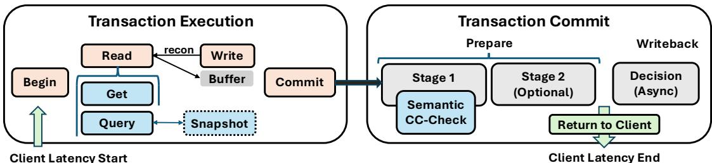  
Figure 1. Pesto Transaction Processing Overview

2) Transaction Commit Transactions can commit if they do not violate (Byz-)serializability. To check for this, replicas locally compare concurrent transactions to determine whether a reader has missed a concurrent conflicting write, or vice versa (prepare phase). Crucially, Pesto leverages query semantics to determine which writes are potential conflicts: Pesto’s SemanticCC (§6.1) considers concurrent operations to be in conflict only if a write affects a query’s results.

Pesto, like Basil, opts to make writes optimistically visible upon successful validation (we call these prepared writes); this reduces the opportunity for conflicts by up to two round-trips (a.k.a the time to commit, discussed next), but requires carefully managing read dependencies to uphold (Byz-) serializability (§5.4, §5.5).

Different replicas may validate conflicting transactions in different orders, leading to different votes. For example, two conflicting transactions may both receive commit votes from different sets of replicas. To ensure safety, Pesto’s Commit protocol (§6.2) requires clients to gather enough votes to guarantee that, for any pair of conflicting transactions, at least one correct replica has validated both; this replica is guaranteed to abort one of these transactions. Because transactions may involve multiple shards, Pesto aggregates vote tallies for each shard via Two-Phase Commit (Stage 1). For safety, this decision must be preserved across runs. In failure-free executions, transactions may complete in one round-trip, but an extra round-trip at a single shard is needed for durability if failures or network reordering arise (Stage 2). Finally, the client asynchronously notifies all replicas of the decision during an asynchronous writeback phase. If the decision is commit, a replica applies all buffered writes.

## 5 Transaction Execution

We first describe Pesto’s transaction execution protocol. Much of Pesto’s complexity lies in its efficient handling of range queries; we focus the majority of the section on this.

## 5.1 Data structures

Pesto relies on two primary data structures, transactions and versions. Each version in Pesto corresponds to a unique write (insertion, update or deletion) and contains, in addition to column data, metadata necessary for maintaining serializability (id of the transaction who wrote the version, timestamp, commit status).

Each transaction is assigned a unique client-generated timestamp ?????? B (??????????????????, ?????????????? ??, seq-no) at BEGIN. This timestamp implicitly establishes the final transactions’ serialization order, and allows Pesto to evaluate transaction conflicts according to the designated ordering (§6.1).

A transaction ?? additionally stores metadata documenting its execution. ReadSet?? captures rows (and versions) accessed; DepSet?? tracks read dependencies on visible but uncommitted versions (§5.2); PredSet?? tracks query predicates (used for semantic concurrency control); and WriteSet?? contains proposed row updates. Upon COMMIT, ?? receives a unique identifier ?????? ; it is computed as a cryptographic hash of ?? to prevent a Byzantine client from manipulating ?? ’s content. At worst, a malicious client can create a new transaction, which it can anyway always do. A client may also explicitly ABORT a transaction at any time before COMMIT, discarding all intermediate state without effect.

## 5.2 Serving Update Queries

We begin by describing how Pesto handles writes. As is standard in optimistic concurrency control, Pesto buffers writes locally until execution is complete. Doing so requires additional care when dealing with SQL statements that are typically conditional, and involve read-modify-write operations.

For example, an insertion only occurs if no row with the same primary key exists, while updates (UPDATE table?? SET ?? = ?? + 1 WHERE ?? = 5) and deletes may depend on a predicate $( e . g .$ , DELETE FROM tabl $\ominus _ { x }$ WHERE $x = 5 )$ . The rows to be written are thus only known after execution.

To handle conditional writes, Pesto splits write processing into two steps. First, a reconnaissance query fetches relevant rows and returns an intermediary query result Q-RES). Then, the client modifies or creates rows based on the original write statement. This approach allows Pesto to use the query interface to produce an intermediate query result and buffer new versions locally. For each row written, Pesto inserts a new write-entry into its current transaction’s $W r i t e S e t _ { T }$ Pesto returns the number of rows written (possibly zero) to the application.

## 5.3 Servicing Reads

Reads in Pesto consist of SQL SELECT statements sent to replicas for execution. For efficiency, Pesto distinguishes between two types of reads, automatically deduced at runtime:

(??) Point Reads read only a single row and explicitly identify the primary key of the table (akin to GET requests). Consider, for instance, a table ?? with columns ??, ??, and $c ,$ and composite primary key $( a , b )$ . The query SELECT \* FROM ?? WHERE ?? = 5 AND ?? = ’apple’ accesses the unique row with primary key $( 5 , \mathsf { a p p l e } )$ . Such reads can be efficiently executed by Basil’s GET protocol (§5.4) and are guaranteed to complete in a single round-trip.

(????) Range Reads (including scans, aggregate functions such as Min, Max, and joins), may instead scan through a variable (possibly unknown) number of rows. For efficiency, Pesto delegates the execution of complex queries to replicas and tries to collect $f + 1$ matching results to assert that at least one comes from a correct replica. While simple, this approach does not guarantee liveness: because Pesto does not totally order operations at replicas, even correct replicas might not be consistent, and produce different results. In fact, replicas might never be fully consistent. Unfortunately, forcing replicas to synchronize their full state is a non-starter, as that state can be large. Pesto instead uses a lightweight snapshot synchronization protocol that allows replicas to materialize a consistent snapshot on demand, specific to a given query (§5.5). Upon completing a read operation, Pesto clients return the result Q-RES to the application.

We describe the details of both read protocols next.

## 5.4 Point Read Protocol

To execute a point read, clients request valid versions from a quorum of replicas and select the freshest.

?? sends a read request POINT-READ B ⟨Q, key, $\left. t s _ { T } \right.$ containing the SQL query ??, the primary key it touches, and the transaction timestamp, to at least $2 f { + } 1$ replicas.

2: R → C: Replicas process the client read and reply.

Replica ?? executes ?? and returns a message containing the result POINT-RESP B ⟨Q-RES, Committed, $P r e p a r e d \rangle _ { \sigma _ { R } }$

This response contains, respectively, the latest committed and prepared versions of the row identified by key key with timestamps smaller than $t s _ { T }$ (if any). If the respective versions do not fulfill $\boldsymbol { Q ^ { \prime } { \mathrm { s } } }$ predicate, ?? still returns a version, but indicates that the result Q-RES is empty; tracking the version is necessary to check for serializability at the commit stage. This may be the case for queries that have predicates stricter than the row’s primary key: $e . g .$ , SELECT \* FROM x=5 AND $\scriptstyle \mathtt { Y } = ^ { \prime } \mathsf { a p p 1 e } ^ { \prime }$ , where the primary key is x, but the latest version does not fulfill $\boldsymbol { \mathrm { y } } = \boldsymbol { \prime } \mathsf { a p p l e } ^ { \prime }$ . Committed ≡ (version, C-CERT) additionally includes a commit certificate C-CERT (§6.2) proving that version has committed, while Prepared ≡ (version, $i d _ { T ^ { \prime } } )$ includes a digest identifier for the prepared transaction $T ^ { \prime }$ that wrote version.

## 3: C ← R: Client ?? receives read replies.

?? waits for at least $f + 1$ replies to ensure that they receive at least one correct response and extracts the highest-timestamped version that is valid: a committed version must contain a valid C-CERT, while a prepared version must be returned by at least $f + 1$ replicas. This ensures (??) that $C ^ { \bullet } s$ transaction does not become dependent on fabricated versions, and (????) that ?? returns a version no staler than if it had read from a single correct replica. Finally, ?? confirms that executing ?? on the chosen version indeed yields the corresponding reported result Q-RES (this is necessary, as ?? may contain additional computation beyond the read to ??????, e.g., further predicates or projections).

?? adds the selected (key, version) to its ReadSet?? . If version was only prepared, ?? additionally records a dependency $D e p S e t _ { T } . i n s e r t ( i d _ { T ^ { \prime } } )$ which will be used during ?? ’s Prepare phase to ensure $( { \bf B y z - } )$ serializability; ?? must not commit unless all the transactions in $D e p S e t _ { T }$ commit first.

## 5.5 Range Read Protocol

Overview Processing arbitrary queries that may compute on ranges of rows requires additional care. To ensure validity, freshness, and integrity, a client must receive at least $f + 1$ matching query results; this ensures that at least one correct replica vouches for the result. Receiving $f + 1$ matching responses is only guaranteed when correct replicas share the same state, which Pesto, by design, does not enforce for performance. Nonetheless, we observe that the rows touched by a query often reflect state consistent across all replicas (§7). When they do not, Pesto creates its own luck by synchronizing replicas only on the rows accessed to agree on a common snapshot for the query.

In fault-free cases, all (correct) replicas already eventually receive all data, and snapshots serve only to rendezvous; when Byzantine clients fail to fully disseminate their transactions, however, synchronization serves also as a recovery mechanism, ensuring that correct replicas exchange missing data.

Implementing the snapshot mechanism requires answering two questions: (??) what state should a snapshot contain and (????) how to ensure that the snapshot proposal represents an up-to-date and valid state? To compute a snapshot of a consistent state, Pesto uses the set of transaction ????s associated with the row versions that were read. This set uniquely identifies a specific state, and ensures atomicity (transactions are either included or not). Individual row versions alone do not ensure atomicity, as Byzantine voters may selectively include versions. While this attack would be caught at commit time and thus not violate Byz-serializability, it would violate Byzantine independence!

Recording metadata for every row accessed during execution is often overly conservative. Most queries are predicated on a filter $( e . g . , \mathrm { n a m e } ~ = ~ ^ { \prime } \mathrm { P e t e r } ^ { \prime } )$ , and require only agreement on the (often small) set of rows relevant to the result (i.e., those with name ’Peter’). Pesto leverages this to include in its snapshots and read sets only the rows whose (latest versions) fulfill the query predicate (dubbed active rows). Computation of active rows aligns naturally with index-based execution used in traditional SQL databases, which leverages predicates to reduce the number of rows that need be accessed (reducing query execution time by orders of magnitude) [78]. Pesto simply piggybacks on this strategy: since index search conditions are a subset of the query predicate, index scans will access all rows that affect the query result. We expand on the concept of active rows in §6.1; they form the basis of Pesto’s semantic concurrency control.

Protocol Details. We next outline the details of the protocol. We do omit several pedantic details that impact our final implementation. Most readers will be happier skipping these details during their initial read; we defer further discussion of details, as well as rigorous correctness proofs, to our Appendix. For simplicity, we assume that queries are satisfied by a single shard and that clients know the partitioning scheme. However, transactions may span multiple shards. Figure 2 illustrates an example execution.

1: C → R: Client C sends read request to replicas.

C sends a read request RANGE-READ B ⟨?? B ??????????, t???? ⟩ to at least 3?? +1 replicas (to ensure at least 2?? +1 replies).

## 2: R → C: Replicas process the client’s read and reply.

A replica ?? executes the query ?? on its local state (reading only versions no later than ?????? ), and produces a query result Q-RES. For concurrency control purposes, ?? adds the active (key, version) pairs accessed during the computation (at most one version per key, the freshest version read) to a query read set Q-READ. In Figure 2, for instance, replicas record their latest version for the active key ’Parker’. If a given version is only prepared (i.e., tentatively committed), ?? additionally records a dependency on the version writer $T ^ { \prime } , \mathrm { Q } \mathrm { - D E P . } i n s e r t ( i d _ { T ^ { \prime } } )$ . Pesto’s validation check uses this information to ensure that ?? observes only serializable state.

Finally, ?? records as snapshot vote SS-VOTE the set of all transaction identifiers $( i d _ { T * } )$ associated with the read set.

?? returns to the client a read reply RANGE-RESP-SS B ⟨Q-RES, Q-READ, Q-DEP, SS-VOTE⟩????.

Eager Path: ?? waits for up to 2?? + 1 replies and tries to assemble ?? +1 distinct replies with matching Q-RES and Q-READ, and valid dependencies Q-DEP (we defer discussion of the latter to §5.5.1). This ensures that at least one correct replica vouches for the result and read set, which is necessary to correctly enforce serializability during validation. If successful, ?? considers the read complete: it returns Q-RES to the application, and respectively adds Q-READ and Q-DEP to its ongoing transaction’s ReadSet?? and DepSet?? .

Snapshot Path: If ?? cannot successfully complete a read, it enters the snapshot path. ?? tallies the snapshot votes and tries to propose a common execution state. To ensure liveness, a correct client must only propose to include transactions that exist, lest risk failing synchronization between replicas. Pesto must also ensure that faulty participants cannot cause a snapshot proposal to be artificially stale, as this would artificially extend the transaction’s conflict window, making it much more likely to abort.

4: C → R: Client ?? proposes a snapshot to the replicas.

To generate a snapshot proposal, ?? selects all transaction ????s present in ?? + 1 SS-VOTEs and merges them into a proposal $\mathbf { S } \mathbf { S } \mathbf { - } \mathbf { P } \mathbf { R } \mathbf { O } \mathbf { P } : = \{ ( i d _ { T * } , \{ \mathbf { r } \} ) \}$ , along with the ids of the replicas that suggested them. This filtering procedure ensures data validity: the set contains only transactions that at least one correct replica believes to be committed or prepared. In Figure 2, only ?? 3 passes the filter. Waiting to receive at least 2?? + 1 snapshot votes bounds staleness as it ensures that, if all correct replicas had this transaction in their state, this transaction will pass the filter and thus be included in the snapshot proposal (?? + 1 proposals out of the 2?? + 1 necessarily come from correct replicas).

?? then sends its SS-PROP to at least 3?? +1 replicas.

5: R: Replicas process the snapshot and execute.

Upon receiving a snapshot proposal SS-PROP, a replica ?? checks whether it has already applied all included transactions: a transaction ?? ′ is considered applied once it has either (??) been explicitly aborted, or (????) all of its write versions have been inserted into the respective rows.

Synchronization. If ?? has not yet applied a transaction ?? ′ in the snapshot proposal, it fetches it from its peers by sending a SYNC message containing ?????? ′ to the ?? +1 replicas that included the ?? ′ in their SS-VOTE.

5.A: R → R: Replicas process a sync request.

A correct replica ??′ ignores synchronization request for transactions it does not have. If ??′ has ?? ′, it returns a message $\mathrm { \Delta S U P P L Y } : = \left( T ^ { \prime } \right.$ , status, $( { \mathrm { C - C E R T } _ { T ^ { \prime } } } \ / { \mathrm { A - C E R T } _ { T ^ { \prime } } } ) )$ , containing ?? ′ , $T ^ { \prime } \bar { \boldsymbol { s } }$ current commit status, and, if ?? ′ has completed, its commit/abort-certificate. If ?? is correct and created its SS-PROP truthfully, then at least one voting replica is correct and will supply ?? ′. If ?? is Byzantine and fabricated its SS-PROP, then synchronization will fail, affecting only the liveness of ??’s own query ??.

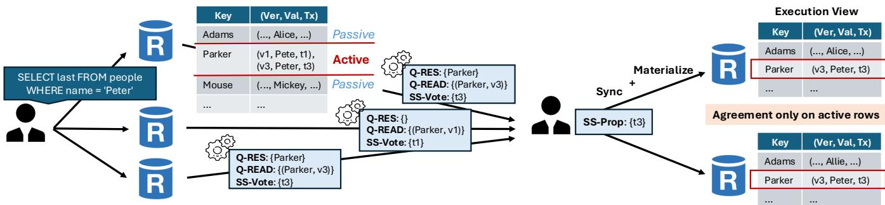  
Figure 2. Life of a query (eager path disabled). The client broadcasts a query to a quorum of replicas who compute the query on their local state. Replicas return their query result (Q-RES), their (active) read set (Q-READ)—the rows that fulfill the query predicate—, and the associated snapshot vote (SS-VOTE). The client aggregates a snapshot proposal (SS-PROP) and synchronizes replicas on a common execution state.

?? processes SUPPLY messages according to the commit status, accepting and applying committed and aborted transactions after verifying the associated proof. If the decision is abort, ?? removes the transaction from any snapshot proposal it received. This may cause replicas to synchronize inconsistently (some replicas may not observe the abort) but is necessary as reading an aborted version will cause the query to abort too.

Applying a transaction $T ^ { \prime }$ that is only prepared requires additional care. To uphold safety, ?? must not prepare ?? ′ without independent validation, as it may—due to inconsistency—detect a conflict that another replica did not. Rather than abandon synchronization, however, Pesto permits ?? to read ?? ′ regardless of its local validation outcome; after all, at least one correct replica part of SS-PROP considered $T ^ { \prime }$ prepared (or committed), suggesting that $T ^ { \prime }$ may very well ultimately commit. If ?? ′ fails validation, ?? applies ?? ’s write versions but exposes them exclusively to ??.

Execution. Once ?? has applied all transactions in SS-PROP it executes ??. During execution, a replica tries to read the freshest version associated with a transaction $i d _ { T ^ { \prime } }$ included in SS-PROP (i.e., ??3 associated with ?? 3 in Fig. 2). If the snapshot contains no version for a key accessed (this may happen, for instance, if a new relevant row is inserted after recording the SS-VOTE’s) a replica simply reads the freshest committed version. In some cases, this is even preferable if the snapshot does have a version: if the freshest committed version is newer than the latest version in the snapshot, insisting on the snapshot may result in reading a stale version, ultimately causing the query’s transaction ?? to abort. Reading the fresher committed version is thus often preferable. This may cause the client to not receive matching results; however, retrying only the query (and doing so early) is more cost-effective than continuing execution and aborting the full transaction later.

As a quick aside, note that this scenario is not the result of Byzantine behavior—Byzantine replicas cannot cause correct replicas to diverge, and correct clients can reliably wait for responses from correct replicas. Rather, it stems from legitimate contention: no interactive transactional system can guarantee commit success under such conditions.

Returning to the protocol, ?? adds its chosen read version to Q-READ, and if the version has status prepared, it adds the versions’ writer $i d _ { T _ { w } }$ to Q-DEP.

Once ?? completes query execution it returns a read reply RANGE-RESP B ⟨Q-RES, Q-READ, Q-DEP⟩????.

?? considers a read successful upon receiving ?? +1 replies with matching Q-RES and Q-READ, and valid Q-DEP (§5.5.1), as before. Because results can be legitimately inconsistent (e.g., due to newer committed versions) ?? waits for up to 2?? +1 replies to guarantee that at least ?? +1 are correct (and thus do not fabricate inconsistency). If ?? fails to receive matching replies, it restarts the snapshot path (by requesting a new set of SS-VOTEs), and retries query execution.

5.5.1 Managing Dependencies Pesto allows queries to read prepared versions but, for safety, must ensure that correct clients record dependencies. To maintain liveness, however, a client ?? must avoid including fabricated dependencies (or risk never completing its transaction). This raises a conundrum: ?? cannot afford to ignore legitimate dependencies, yet it should only accept dependencies that are vouched for by one correct replica. Unfortunately, while ?? +1 replicas may agree on the read set Q-READ, their Q-DEP’s might differ: some (correct) replicas may consider a candidate dependency $i d _ { T ^ { \prime } }$ already committed and not include it in Q-DEP.

To determine whether to include a dependency ?? requires either (??) evidence that the dependency really exists, or (????) evidence that a correct replica deems it already committed (and thus it need not be tracked). ?? can assert case (??) if a candidate dependency $i d _ { T ^ { \prime } }$ appears across any ?? +1 Q-DEP’s or SS-VOTE’s. Note that here, we do not require the result Q-RES nor read set Q-READ to match as ?? is only interested in gathering evidence for $i d _ { T ^ { \prime } }$ . If instead, ?? is unable to acquire evidence for $i d _ { T ^ { \prime } }$ , but gathers at least $2 f { + } 1$ matching results it can conclude that at least one correct replica deems the dependency unnecessary because $T ^ { \prime }$ has already committed (case (????)). If ?? can do neither, it cannot conclude legitimacy of the dependency. In this case, it simply waits for additional replies (or retries the query).

## 6 Transaction Commit

Once a transaction ?? completes execution, the client begins the commit process. Pesto adopts the core Basil [81] commit protocol, which we summarize for completeness (§6.2). Unlike Basil, however, Pesto’s concurrency control must efficiently and safely handle range queries; to this end, Pesto introduces a novel semantic based concurrency control, reminiscent of precision locking [59]. We first discuss how replicas locally perform validation. We then outline how clients aggregate individual replica votes to ensure (Byz-) serializability across replicas in a durable manner.

## 6.1 Concurrency Control (CC) Check

A replica votes to commit a transaction if the operations executed at that replica yields a serializable schedule. To check this, Pesto takes as starting point Basil’s MVTSO algorithm. Each transaction is assigned a unique timestamp that predetermines its global serialization order. Transactions read the version with the highest timestamp still smaller than their own. In order to commit, no transactions may miss a write that they should have observed. As part of a validation phase, MVTSO checks transactions for pairwise conflicts: if a reading transaction $T _ { R }$ observed version ?? for key ?? , but a newer version $v ^ { \prime }$ $( < t s _ { T _ { R } } )$ now exists, then $T _ { R }$ must abort. This approach works well for point reads as only a single row is involved. It does not, however, extend gracefully to range reads. Consider the transaction ?? in Fig. 2 that issues a simple scan operation $Q { : = }$ SELECT last FROM people WHERE name = ’Peter’ to a non-primary key name, and which returns as result only a single row (’Parker’). For safety, ?? should record in its ???????????????? all rows present in table people as concurrent transactions might change the contents of any rows name column to ’Peter’. To avoid Phantom Read anomalies [33], ?? must abort if even a single row in people is concurrently inserted, updated, or deleted. ?? must effectively acquire a (logical) lock on the entire table in order to commit.

One can do better. A concurrent write that updates row $' \mathrm { { A 1 i c e } ^ { \prime } \ t o ' \mathrm { { A 1 1 i e } ^ { \prime } } }$ does not affect the result of $Q ,$ and thus does not violate serializability. Taking into account query semantics can significantly reduce the number of rows that need to be considered for range reads. Pesto leverages this idea to implement a semantics-aware CC check that determines whether concurrent writes affect the read predicate.

6.1.1 Read predicates To implement semantics-aware CC for queries, Pesto uses an approach common in databases. Each query (or sub-query) is broken into an operator tree with leaves consisting of full or partial table scans and an associated filter predicate $( e . g . , \ n a m e \ = \ ^ { \prime } \mathrm { { P e t e r } } ^ { \prime } \ )$ . This allows Pesto to determine transaction conflicts by checking whether a write satisfies a concurrent reader’s query filter predicate. If yes, the write could be part of the read result. We find that filter predicates, in practice, account for the brunt of query selectivity, and only rarely unnecessarily abort writes that meet the filter criteria but do not change the end query result. Crucially, however, using filter predicates ensures that Pesto will never miss a write that does affect the query result.

We adjust the read replies (§5.5) sent by replicas to include the set of filter predicates Q-PRED associated with the query; replicas return a message ⟨Q-RES, Q-READ, Q-DEP, Q-PRED⟩???? containing the query result, read set, dependency set, and set of predicates. Including the filter predicate is necessary as they may differ across replicas: replicas might have inconsistent state, and thus may instantiate different predicates for filters in nested queries; $e . g .$ , the inner predicate of the query SELECT names WHERE age = (SELECT age WHERE last = ’Parker’) depends on the age of Peter Parker. A client considers a read successful only if ?? +1 replies have matching Q-PREDs; if so, it adds Q-PRED to its $P r e d S e t _ { T }$ . This ensures that the recorded predicates are correct, and will safeguard serializabillity during the CC-check.

6.1.2 A simple, semantics-aware CC-check Given a read predicate ??, Pesto distinguishes between the active read set (ARS) – all (key,version) pairs that fulfill ?? (the active rows, stored in Q-READ)—and the passive read set—all other rows. Point reads, by design, only read active rows. Intuitively, the ARS captures all rows that are relevant to a read’s computation (i.e., contribute to the query result Q-RES).

To enforce Byz-serializability Pesto needs to ensure that the ARS is fresh and complete: (??) versions within the ARS are the most recent, and (????) the ARS does not miss any relevant rows.

Algorithm 1 summarizes Pesto’s CC-check; we defer formal safety proofs to our supplemental material. A replica ?? first performs some sanitization: it rejects transactions whose timestamps are too high (Line 1) or that claim possibly fabricated dependencies (Line 5). This ensures that Byzantine issued transactions do not disrupt progress of concurrent transactions. Replicas additionally reject transactions whose writes are non-monotonic (Line 3); we defer explanation to §6.1.3. Next, a replica checks for serialization conflicts.

Read Conflicts: R first checks that ?? ’s ARS is fresh (Lines 7-9): there does not exist a write from a committed or prepared transaction $T ^ { \prime }$ that (??) is more recent than the version read by ?? and (????) whose timestamp is smaller than ?????? (and thus should have been observed by ?? ).

Algorithm 1 SemanticCC-Check(?? )   
1: if ?????? >???????????????????? +??   
2: return Vote-Abort   
3: if ¬isMonotonicWrite(?? )   
4: return Vote-Abort   
5: if ∃ invalid ?? ∈ ??????????????   
6: return Vote-Abort   
7: for ∀??????,?????????????? ∈ ReadSet??   
8: if ?????????????? $> t s _ { T }$ return MisbehaviorProof   
9: if ∃?? ′ ∈?????????????????? ∪???????????????? :?????? ∈ WriteSet?? ′   
∧?????????????? < ?????? ′ < ??????   
10: return Vote-Abort, optional: (?? ′, ?? ′.C-CERT)   
11: for $\forall P \in P r e d S e t _ { T }$   
12: if ∃?? ′ ∈?????????????????? ∪???????????????? :   
$( P . t a b l e _ { v } - g r a c e ) < t s _ { T } ^ { \prime } < t s _ { T } \ \wedge$   
∃?? ∈ $: W r i t e S e t _ { T ^ { \prime } } .$   
?? .?????? ∉ReadSet?? $\wedge \not \exists w ^ { \prime } : t s _ { T ^ { \prime } } < w ^ { \prime } . T S < t s _ { T }$   
13: if ?? (?? .col-vals)   
14: return Vote-Abort, optional: (?? ′, ?? ′.C-CERT)   
15: if ¬?? (?? .col-vals) ∧riskyPrepared(?? ′, w)   
16: ?????????????? .insert(?? ′)   
17: for ∀??????,col-vals ∈ WriteSet??   
18: if ∃?? ′ ∈?????????????????? ∪????????????????. $. t s _ { T } < t s _ { T ^ { \prime } } .$   
ReadSet?? ′[key].version <?????? ∨   
(?????? ∉ ReadSet?? ′ ∧∃?? ∈ PredSet?? ′ :?? (col-vals))   
19: return Vote-Abort, optional: (?? ′, ?? ′.C-CERT)   
20: ????????????????.?????? (?? )   
21: $\Game$ wait for all pending dependencies   
22: if ∃ ?? ∈ ?????????????? :??.???????????????? =??????????   
23: ????????????????.???????????? (?? )   
24: return Vote-Abort   
25: return Vote-Commit

R then checks that ?? ’s ARS is complete: for each predicate $P ,$ ?? determines if there exists a preceding write ?? from a transaction $T ^ { \prime } \left( t s _ { T ^ { \prime } } < t s _ { T } \right)$ that (??) is not in ?? ’s ARS, (????) is the freshest version visible to ?? , and (??????) fulfills $P ,$ and thus should have been in ?? ’s ARS (Lines 11-14). If ?? does not fulfill $P ,$ but $T ^ { \prime }$ is only prepared, additional care is necessary: if $T ^ { \prime }$ were to abort and reveal (as next freshest write) a write $w ^ { \prime }$ $( t s _ { w ^ { \prime } } < t s _ { w } )$ that does fulfill ??, then ?? may need to abort after all. In this case, ?? dynamically adds $T ^ { \prime }$ to $D e p S e t _ { T }$ (Lines 15-16). We defer discussion of $P . t a b l e _ { v }$ and ?????????? to §6.1.3.

Write Conflicts: Writes are checked analogously. ?? checks that writes of ?? do not cause reads of a prepared or committed transaction $T ^ { \prime }$ to miss a version (Lines 17-19): R checks that (??) the ARS of $T ^ { \prime }$ remains fresh, and that (????) ?? ’s writes do not render the ARS of $T ^ { \prime }$ incomplete.

If ?? detects a direct conflict during validation, it immediately votes to abort ?? . Otherwise, if no conflicts are found, ?? prepares ?? and tentatively makes its writes visible to concurrent readers (Line 20). For safety, ?? may only commit if all of its read dependencies commit first (Lines 21-15). ?? therefore waits for these dependencies to resolve: it votes to commit ?? if all dependencies commit; otherwise it votes to abort ?? and rolls back $T \mathbf { \bar { s } }$ tentative writes.

6.1.3 Making semantic CC efficient Ensuring freshness for active reads is simple: it suffices to check for conflicts between the version read by ?? and $t s _ { T }$ . Ensuring completeness is less obvious: a newly arriving transaction $T ^ { \prime }$ that has a very old timestamp $( t s _ { T ^ { \prime } } < < t s _ { T } )$ may still insert a new relevant row (or update the latest version of some relevant row), and thus must be validated for potential conflicts. To uphold safety, when a new transaction arrives, a replica ?? must therefore either (??) re-execute all of $T \mathbf { \bar { s } }$ queries or (????) check for conflicts against all transactions (with smaller timestamps) that ever wrote to the table; both of which are impractical.

Re-introducing ordering. We solve this problem by attaching, for each read predicate ?? of a transaction ?? , a concise summary of the (write) transactions that already happened prior to the read, and whose effects are thus included as part of the query result. Specifically, Pesto records a timestamp of the (then) latest write to the given table, denoted table version $( P . t a b l e _ { \upsilon } )$ , and guarantees that all transactions with timestamp lower than $P . t a b l e _ { v }$ are not conflicting (they are either part of the query result, or not relevant). As a consequence, ?? need only inspect the remaining transactions between $P . t a b l e _ { v }$ and $t s _ { T }$ . Pesto enforces this invariant through write monotonicity: a new transaction $T ^ { \prime }$ may only write to a table if its timestamp is greater than any previously recorded table version $( i . e .$ , is monotonic). Non-monotonic writers must be aborted (Alg. 1, Lines 3-4).

To implement this idea, we make two adjustments to Pesto’s read protocol: the first ensures consistency across all replicas, and the second accounts for queries that may read older versions due to snapshots.

Hardening Range Reads. First, Pesto must enforce monotonicity not only within one replica but across all replicas. Specifically, Pesto must ensure that the table version included as part of a query reflects the latest committed transaction at any replica. By design, reads that miss fresher committed versions will be caught by Pesto’s CC’s freshness check. Table versions are different. They are the mechanism that ensures that current transactions are validated against all possibly concurrent conflicting transactions. Our range read quorums (which require $f { + } 1$ matching replies, see §5.5) were previously not required to intersect with transactions’ commit quorums (§6.2). They must now be modified to intersect with these commit quorums in at least one correct replica. This requires clients to obtain table versions (and associated results and read sets) from at least $3 f + 1$ replicas.

Table versions are only a coarse summary of the state, so it is possible for two different (correct) replicas to produce the same query result (Q-RES) and (active) read set (Q-READ), yet report different table versions. Pesto allows clients to complete range reads without matching table versions, and, for safety, simply selects the smallest table version as $P . t a b l e _ { v } ;$ to avoid selecting excessively low versions fabricated by a Byzantine replicas, clients may reject replies that deviate too far from the ?? +1st smallest reported version.

Accounting for Snapshots. The aforementioned scheme is sufficient if transactions always read the latest versions. Snapshots, however, may direct queries to read versions several timestamps older than the latest version of a row. For example, a snapshot may cause a replica to skip a recently prepared version that was not included in the snapshot proposal SS-PROP. Such skipped versions can have a timestamp lower than $P . t a b l e _ { v } ,$ violating the invariant that all transactions lower than $P . t a b l e _ { v }$ have been observed and therefore require no further conflict checks. For safety, Pesto must thus check for conflicts with any transaction written since the read version, which may be lower than $P . t a b l e _ { v } $ . To close this gap and restore the invariant, Pesto simply lowers $P . t a b l e _ { v }$ to one less than the timestamp of the oldest skipped version. Concretely, $P . t a b l e _ { v } = m i n ( t a b l e$ version, $m i n ( \{ t s _ { s k i p p e d } \} - 1 ) )$ This ensures that the concurrency control mechanism checks for all relevant conflicts.

Relaxing Write Monotonicity Write monotonicity, in its simplest form, is overly harsh on writers: it does not account for varying transaction execution durations (recall, timestamps are selected at transaction begin), which may result in aborts for any "late" writers. To avoid this, Pesto relaxes the monotonicity requirement by adopting a sliding window approach. Replicas accept all transactions within the monotonicity threshold and a grace period, and accordingly validate a predicate ?? against writes between $P . t a b l e _ { v } - g r$ ?????? and $t s _ { T }$ (Alg. 1, L. 12.1).

## 6.2 Commit Coordination

Commit is client-driven, and proceeds in two phases.

Prepare. In the prepare phase the client submits its transaction ?? to all involved shards for validation. Replicas within a shard independently perform the local concurrency control (CC) check (Alg. 1), voting on whether committing ?? will violate Byz-serializability. Notably, replicas may process transactions in different orders, and thus even correct replicas may vote differently. The prepare phase ensures mutual exclusion, that no two conflicting transactions may both commit. To this end, the client tallies the replica votes of each involved shard into a single shard-vote. A transaction is deemed committable only if enough replicas vote to commit such that no conflicting transaction will ever also become committable. For transactions that access multiple shards, the client additionally aggregates shard-votes as part of a two-phase commit (2PC) protocol: ?? commits if all shards vote to commit, and aborts otherwise.

The prepare phase consists of two sub-stages. In stage ST1, the client collects, for each shard that ?? accesses, commit or abort votes from all of the shard’s replica. These votes are then used to make the 2PC decision. If the client receives sufficiently many votes to conclude that the 2PC decision will remain durable across failures, it proceeds immediately to the writeback phase.

A shard-vote is considered durable iff it can be independently retrieved by any client (i.e., any vote tally quorum produces the same decision). Durable shard votes form a vote certificate $\mathrm { V } – \mathrm { C E R T } : = \langle i d _ { T } , S ,$ ?? ??????, {ST1R}⟩; we dub shards with V-CERT fast, and shards without slow. Shard-votes are tallied as follows:

1. Commit Slow Path $( 3 f + 1 \le$ commit votes $< 5 f + 1 )$ : The client has received at least a ???????????????????????? (????) of votes, where $\begin{array} { r } { | C Q | = \frac { n + f + 1 } { 2 } = 3 f + 1 } \end{array}$ Vote-Commit.

2. Abort Slow Path $( f + 1 \leq$ abort votes $< 3 f + 1 )$ : A collection of $f + 1$ abort votes constitutes the minimum AbortQuorum (AQ) that preserves Byzantine independence. Pesto clients are guaranteed to observe (at least) either a CQ or an $A Q$ (of size 3?? +1 or ?? +1 respectively).

3. Commit Fast Path (5?? +1 commit votes): No replica reports a conflict, and thus any possible quorum of size $n { - } f$ will contain sufficiently many commit votes to form a ????.

4. Abort Fast Path $( 3 f + 1 \le$ abort votes): ?? conflicts with a prepared transaction, and no other quorum can receive sufficiently many commit votes to form a ????.

5. Abort Fast Path (One abort vote with a C-CERT for a conflicting transaction ?? ′). ?? (provably) conflicts with a committed transaction; any quorum will conclude abort.

?? decides to commit ?? if all shards vote to commit, and otherwise aborts ?? . If all shards voting to commit (or analogously if a single shard voting to abort) are fast (and thus the votes are durable), ?? aggregates the respective V-CERT’s and proceeds immediately to the writeback phase. If a single committing shard is slow (or the one aborting shard is slow) ?? must first complete Stage ST2. Rather than make the votes of slow shards durable, Pesto opts to replicate the tentative 2PC decision. To do so, ?? selects one of the involved shards, henceforth denoted as $S _ { l o g } .$ , and logs on it the decision; $S _ { l o g }$ is chosen deterministically depending on $T \mathbf { \hat { s } }$ id. ?? records a single durable $\mathrm { V - C E R T } _ { { \cal S } _ { l o q } } : = \langle i d _ { T } , { \cal S } ,$ , ????????????????, {ST2R}⟩.

In the absence of failures and contention, Pesto’s fast-path thus allows clients to commit a transaction in a single round-trip; otherwise, one additional round-trip is required.

Writeback. Once the decision is durable, ?? notifies its application of ?? ’s outcome, aggregates shard votes into a decision certificate $\mathrm { C } { \mathrm { - } } \mathrm { C E R T } / \mathrm { A } { \mathrm { - } } \mathrm { C E R T } \ : = \ \langle i d _ { T }$ , d??????????????, $\{ \mathbf { V - C E R T } _ { S } \} \rangle$ (commit or abort, respectively), and asynchronously informs all involved shards. On the fast path, C-CERT consists of the commit $\mathbf { V - C E R T } \mathbf { s }$ from all involved shards, while an A-CERT need only contain one shard’s abort V-CERT. On the slow path, both C-CERT/A-CERT simply include $\mathbf { V - C E R T } _ { S _ { l o g } }$ . Replicas that commit ?? create new version for each written row. Additionally, replicas notify pending dependencies (transactions that read only prepared values of ?? ) on the outcome of ?? .

Recovery. In case of client failures, a cooperative Fallback protocol allows other clients to terminate ongoing transactions; we defer details of recovery to Basil [81] as they do not affect how Pesto processes queries.

## 7 Evaluation

Our evaluation seeks to answer the following questions:

• How does Pesto perform on realistic applications? (§7.1)

• How does Pesto compare to Basil’s KVS design? (§7.2)

• What is the impact of inconsistency on Pesto? (§7.3)

• How well does Pesto tolerate replica failures? (§7.4)

Implementation. We implement a prototype of Pesto in C/C++, starting from the open source implementation of Basil [3]. We use Protobuf [22] and TCP for networking, ed25519 elliptic-curve digital signatures [34, 68] and HMAC-SHA256 [45] for authentication, and Blake3 [5] for hashing. For its query layer, Pesto adapts Peloton [20], a full fledged open-source SQL Database based on Postgres [74].

Baselines. We compare against four baselines: (??) unreplicated Peloton, run in-memory. (????) Peloton-SMR, a strawman system that layers Peloton atop BFT State Machine Replication (SMR). We layer Peloton atop HotStuff (Peloton-HS) [85]—a popular BFT consensus protocol that forms the basis of several commercial systems [1, 10, 16, 30, 39, 44]— and BFT-SMaRt (Peloton-Smart) [6, 35], a state-of-the-art PBFT-based [38] implementation. For correctness, SMRbased designs require deterministic execution on each replica: this requires either sequential execution (which drastically limits performance) or implementation of complex and custom parallel execution engines [48, 54, 55]. Pesto, in contrast, allows for optimal parallelism by design. For maximum generosity to the baselines, we opt to relax the determinism requirement for Peloton-SMR: we allow replicas to freely execute transactions in parallel, and designate a "primary" replica to respond to clients to ensure serializability. This system configuration is explicitly not fault tolerant, but simulates the optimal upper-bound on performance.

(??????) Third, we compare against Postgres [74], a production grade SQL database. We run Postgres both in an unreplicated configuration and with its native primary-backup feature (Postgres-PB), in which writes are synchronously replicated, with both configurations mounted in-memory on tempfs.

(????) Finally, since Peloton and Postgres are not easily shardable, we also compare Pesto against CockroachDB (CRDB) [8, 82], a popular distributed database of production grade. Because CRDB has poor single node performance (it’s CPU utilization and query processing latency are much higher than Peloton/Postgres) we instantiate it with 6 shards (one machine per shard). We run CRDB unreplicated, in-memory.

<table><tr><td rowspan=1 colspan=1>Baseline</td><td rowspan=1 colspan=1>Description</td></tr><tr><td rowspan=1 colspan=1>PESTO</td><td rowspan=1 colspan=1>Our system:a BFT database that is SQL-compatible and shardable.</td></tr><tr><td rowspan=1 colspan=1>PESTO-UNREP</td><td rowspan=1 colspan=1>An unreplicated toy variant of Pesto,used onlyfor microbenchmarks.</td></tr><tr><td rowspan=1 colspan=1>PELOTON</td><td rowspan=1 colspan=1>An unreplicated SQL database;Peloton [20] isthe basis for Pesto&#x27;s SQL engine.</td></tr><tr><td rowspan=1 colspan=1>PELOTON-HS</td><td rowspan=1 colspan=1>An SMR-based BFT database:Peloton layeredover HotStuff [85].</td></tr><tr><td rowspan=1 colspan=1>PELOTON-SMART</td><td rowspan=1 colspan=1>An SMR-based BFT database:Peloton layeredover BFT-SMaRt [6].</td></tr><tr><td rowspan=1 colspan=1>POSTGRES</td><td rowspan=1 colspan=1>Awidely-used unreplicated production-gradeSQL database [74].</td></tr><tr><td rowspan=1 colspan=1>POSTGRES-PB</td><td rowspan=1 colspan=1>Postgres using built-in primary-backup replica-tion (one backup replica).</td></tr><tr><td rowspan=1 colspan=1>CRDB</td><td rowspan=1 colspan=1>A production-grade distributed SQL data-base [8]; we use 6 shards.</td></tr></table>

## Table 1. Summary of evaluated systems.

Table 1 summarizes all evaluated systems.2 All systems are run in-memory and configured to enforce serializable isolation, which is the strongest isolation level they support.

Experimental Setup. We use m510 machines (8-core 2.0 GHz CPU, 64 GB RAM, 10 GB NIC, 0.15 ms ping latency) on CloudLab [7]. Clients execute transactions in a closed-loop, and reissue aborted transactions using a standard random-exponential back-off scheme.

We configure each replicated system to tolerate ?? = 1 faults (?? = 3?? + 1 for Peloton-SMR, ?? = 5?? + 1 for Pesto, ?? =2 for Postgres-PB); Peloton, Postgres and CRDB are run unreplicated and tolerate no faults. We run experiments for 60 seconds, including a 15 s warm-up and cool-down period.

## 7.1 High level performance

We evaluate Pesto on three popular transactional benchmark applications: TPC-C [83], AuctionMark [49], and SEATS [49]. TPC-C (configured with 20 warehouses) exhibits high contention, and a high ratio of point to range reads. AuctionMark (an auction system with complex joins) and SEATS (an airline ticketing service) have a high fraction of range queries and cross-table joins, but exhibit low contention compared to TPC-C. Figures 3, 4 and 5 report the results.

TPC-C. Pesto’s throughput (1784 tx/s) matches that of unreplicated Peloton (1777 tx/s) and Postgres (1781 tx/s), is 2.3x higher than that of Peloton-HS (758 tx/s) and Peloton-Smart (785 tx/s), and 1.4x higher than Postgres-PB (1257 tx/s). Pesto increases latency by less than 1.5x over Peloton and Postgres (equal latency at high load), and reduces latency by 3.9x over Peloton-HS, and 2.7x over Peloton-Smart. Peloton-HS and Peloton-Smart incur the latency of consensus (3 message delays (md) for BFT-Smart, 7 md for HotStuff) for each read, write and commit request; Postgres-PB incurs replication latency for each write, but performs reads at the primary only. Pesto, in contrast, (??) buffers writes, (????) executes point reads in a single round-trip as well as 99.9% of range reads, and (??????) can commit in a single round-trip (Fast Path) 97% of the time. While Pesto, Peloton and Postgres remain CPU bottlenecked, both Peloton-SMR systems and Postgres-PB are contention bottlenecked due to their higher latency, thus limiting their achievable throughput. CRDB, too, is contention bottlenecked, peaking at 1033 tx/s; although CRDB does not replicate, it supports only sequential reads within each transaction which results in high latency on TPC-C.

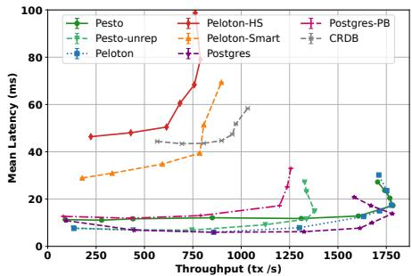  
Figure 3. TPC-C (20wh)

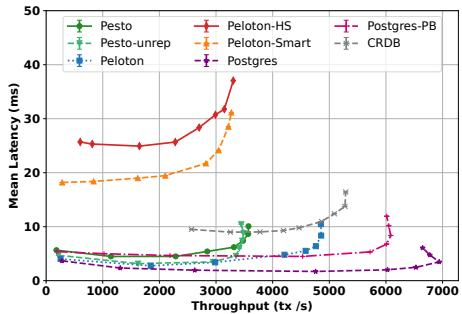  
Figure 4. AuctionMark

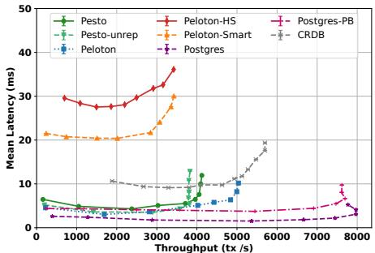  
Figure 5. SEATS

Perhaps surprisingly, Pesto matches the throughput of unreplicated Peloton despite the overheads inherent to BFT protocols (e.g., signatures and quorum requirements). This is because Pesto must read only from a quorum of replicas (at least ?? +1 for point reads, and at least 3?? +1 for range reads): on a point read heavy workload as TPC-C this allows Pesto to efficiently load-balance read requests and exceed its unreplicated performance. Unreplicated Pesto is able to closely match Peloton in latency, but reaches a CPU bottleneck at 1379 tx/s.

AuctionMark and SEATS make fewer point reads which diminishes the benefits of request load balancing (range reads require larger quorums). Nonetheless, Pesto is able to match its unreplicated throughput, while coming within 1.36x of unreplicated Peloton on AuctionMark, and 1.22x on SEATS; Pesto comes within 1.94x of Postgres on both workkloads. Pesto reduces latency over Peloton-HS and Peloton-Smart respectively by 5x/3x on AuctionMark, and 4.6x/3.4x on SEATS. Throughput gains are limited (1.1x AuctionMark, 1.2x SEATS) as all systems are CPU bottlenecked.

Takeaway Pesto achieves performance comparable with unreplicated production-grade systems, while significantly outperforming traditional BFT-based approaches.

## 7.2 Comparison with Basil’s key-value store design

Next, we examine the overheads and benefits introduced by Pesto, compared to Basil’s key-value store-based approach.

Scalability. Figure 6 shows the scalability of Pesto on TPC-C with increasing number of shards. Pesto is CPU bottlenecked and thus scales significantly by partitioning the workload across two (1.64x) and three shards (2.21x), respectively. On a shared three-shard setup, Pesto – which implements a full-stack SQL system, requiring significant CPU cycles for query parsing, planning, execution, and index management – comes within 1.23x of the reported throughput of

Basil (4862 tx/s), which implements only a simple KVS. We also compare Pesto’s scalability to CRDB. Because Pesto uses more machines (for replication), we allow CRDB to scale to 6 and 9 shards (its peak). CRDB’s has poor single-shard performance (4.46x less throughput than Pesto), but scales at a rate similar to Pesto. Its peak performance is 2.91x below Pesto.

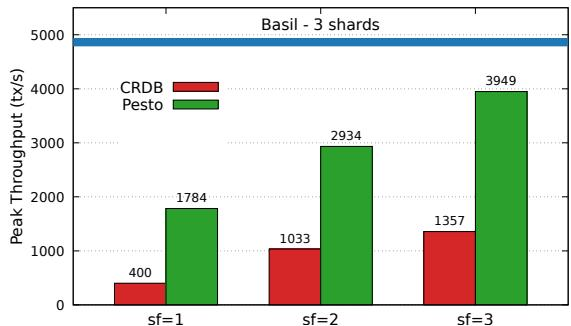  
Figure 6. Sharding scalability for TPC-C

Range vs. Point Reads. While adding support for SQL queries naturally adds overhead over a simple transactional key-value store like Basil, directly using the SQL interface rather than the basic point query API can speed up the execution of complex transactions. For instance, Pesto’s range read protocol reduces the latency of TPC-C’s scan-heavy Stock-level transaction by over 11x compared to Basil’s point-read based implementation.

We illustrate the benefits of Pesto’s range read protocol in Figure 7, which reports scan latency across varying ranges on a simple read-only microbenchmark. As more rows are accessed, the latency of a point-only implementation increases significantly due to the need to process and verify messages based on the size of the intermediary result. In contrast, range reads scale significantly better (a 16.6x reduction for a range of 10k rows), with only a single message exchange required for the entire query. The cost of range reads scales with the result size. For example, if a scan’s result is conditioned on a predicate that holds for only 1 in 100 rows, range reads scale accordingly (a 110x reduction for a range of 10k rows).

## 7.3 Stress testing Range Reads

Range reads offer improved expressivity and performance but might not succeed in a single round trip. To evaluate the worst-case, we stress test Pesto by (??) artificially failing eager execution for every transaction (requiring a snapshot proposal, but no synchronization), and (????) artificially simulating inconsistency by ommitting/delaying writes of every transaction at 1 rd of replicas (requiring also synchronization).

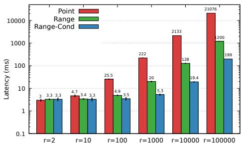  
Figure 7. Point vs Range latency

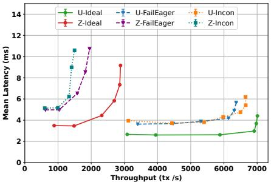  
Figure 8. Stress testing range reads

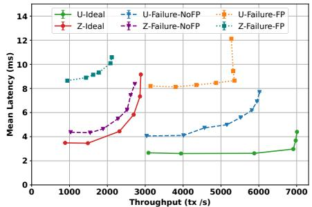  
Figure 9. Impact of replica failure

We implement a microbenchmark based on YCSB [42] consisting of 10 tables, each containing 1?? keys. Every transaction reads and updates 10 rows. We instantiate two workloads: an uncontended uniform access pattern U, and a very highly contended Zipfian access pattern Z with coefficient 1.1. Figure 8 shows the results.

On the uniform workload Pesto is CPU bottlenecked. Failed eager execution (U-FailEager) requires an additional round-trip to propose a snapshot and re-execute on the synchronized state; re-execution, in turn, increases CPU load as every transaction must execute twice in total, resulting in both reduced throughput (≈9%) and higher latency (1.38??). Inconsistency (U-Incon) yields similar results: two thirds of transactions fail eager execution and require both a snapshot proposal and synchronization between replicas to exchange missing writes. Synchronization cost, however, is offset by the initial omission of writes at 1 rd of replicas, resulting in an overall throughput reduction of only ≈ 5%.

The Zipfian workload, in contrast, induces a heavy contention bottleneck. The respective up-ticks in read latency for Z-FailEager (1.43x) and Z-Incon (1.49x) increase the opportunity for conflict (i.e., enlarge conflict windows [37]), resulting in more transaction aborts. Throughput drops by 32% and 48% respectively.

## 7.4 Impact of Failure

Finally, we evaluate the impact of replica failures in Pesto. Note that replicas cannot impact the correctness or liveness of Pesto’s range read protocol. The snapshot filtering procedure ensures that all proposed transactions are valid (and thus can be reliably synchronized), and no more stale than a read to any single correct replica. Similarly, replicas cannot affect the safety of Pesto’s commit protocol (this follows from Basil). Replicas can only impact the system by crashing.

Figure 9 shows the effect of ?? = 1 failures on the Uniform and Zipfian microbenchmarks. Crucially, and unlike SMRbased designs that rely on a leader [38, 56, 63, 85], Pesto suffers no progress interruptions as transaction coordination is entirely client driven. Replica failures affect only Pesto’s ability to commit in a single round-trip (fast path).

We evaluate two configurations: (??) Failure-NoFP illustrates the effect of a failure when the fast path is disabled. (????) Failure-FP shows the impact of a failed fast path when using a very conservative timeout of ≈ 4 ms. In principle, fast and slow path execution can run in parallel to avoid timeout-induced delays. However, this introduces redundant processing when transactions succeed on the fast path. By default, Pesto delays the slow path until a timeout to optimize resource efficiency.

In both configurations, commits requires an additional round trip of coordination (to a single shard, §6) to ensure durability. This increases latency, and, for the CPU bottlenecked uniform workload, reduces throughput due to added signature overhead. U-Failure-NoFP and U-Failure-FP degrade throughput by 14% and 24%, respectively, while latency increases by 1.59x and 2.7x.

In contrast, on the contention bottlenecked Zipfian workload the slow path overhead only marginally impacts throughput and latency (1.25x latency increase, and a 5% throughput reduction for Z-FailureNoFP). This is a direct consequence of Pesto making writes visible eagerly upon preparing and allowing contending transactions to acquire dependencies instead of waiting for commitment. The additional slow path latency is incurred only after preparing, and thus leaves conflict windows mostly unaffected. Z-FailureFP incurs the additional timeout latency (2.5x), and reduces throughput by 36%.

We defer a detailed analysis of client failures to Basil [81]. Client failures affect only commit liveness—not the commit outcome—and are resolved via Basil’s cooperative fallback protocol, which Pesto adopts. Client failures before commit affect only itself, as its writes are not yet visible; clients can only impact the execution of their own queries, and thus cannot affect the correctness or progress of correct clients’ executions.

## 8 Related Work

In addition to Basil [81], the BFT key-value store Pesto builds upon, there are several other related research efforts.

BFT State Machine Replication. State Machine Replication (SMR) [76] provides the abstraction of a single fault tolerant server, a core building block in many distributed data-storage systems, both in the Crash Fault Tolerant (CFT) [31, 43] and BFT space [27, 28, 32, 61]. At the heart of BFT SMR lie consensus protocols [38, 40, 56, 57, 63, 79, 85] enable replicas to establish a consistent total order of requests, despite arbitrary misbehavior. This powerful abstraction, unfortunately, comes at a cost.

Reaching agreement requires several rounds of message exchanges, resulting in high latency. To facilitate agreement BFT consensus protocols traditionally designate a leader replica to act as a designated sequencer [38, 57, 63, 85]; this marks a scalability bottleneck and raises fairness (and censorship) concerns [89]. Recent works propose multi-leader approaches [46, 56, 79, 80] that improve throughput and fairness at the cost of increased latency. Pesto, following in Basil’s footsteps, sidesteps both performance and fairness concerns by adopting a client-driven (leaderless) approach and enforcing Byzantine independence.

To maintain consistency, replicas in SMR must further execute requests sequentially, limiting scalability; though some works explore ways to regain limited parallelism [48, 54, 55]. Pesto, in contrast, is order-free by design, and naturally parallelizes concurrent executions.

Finally, SMR-based systems, by default, require that all replicas execute every operation. Yin et al. [84] and Distler et al. [50] explore separating agreement from execution to reduce redundancy; Pesto, likewise, need only execute at a subset of replicas, enabling load balancing.

Database functionality can be layered on top of SMR (or vice versa) [60, 75], but at high cost.

Blockchains [1, 12, 23, 24] offer neither interactive transactions nor SQL, and instead implement custom Smart Contract languages (SC) [90] (effectively stored procedures); SC invocations are ordered using BFT SMR and executed by native engines such as Ethereum’s VM [13] or the Move runtime [19].

DB atop BFT. BlockchainDB [52] layers a DB atop existing blockchains and shards contents across peers to reduce replication redundancy; however, it does not implement transactions and offers only a GET/PUT interface. BigchainDB [66] implements a custom NoSQL [58] interface and layers MongoDB [18] on top of Tendermint [36]. FalconDB [73] leverages authenticated data structures to allow clients to safely execute limited SQL queries against a single replica; it orders transaction commits via Tendermint and uses OCC to enforce snapshot isolation. The Blockchain Relational Database [69] and Kwil [15] layer PostgreSQL [21] atop BFTSmart [6] and CometBFT [9], respectively, but limit SQL transactions to stored procedures.

BFT atop DB. Hyperledger Fabric [28] adopts an Execute-Order-Validate framework: stored procedures (Chaincodes) are executed optimistically in parallel across replicas (peers), and ordered for validation. ChainifyDB [77] implements a similar architecture but supports a general purpose SQL interface and allows replicas to deploy heterogeneous relational

DB’s. Transactions are executed optimistically, and attempt to reach agreement on results; if executions are inconsistent, database states are rolled back, and transactions re-executed.

SemanticCC. Pesto’s SemanticCC builds on the principles of predicate and precision locking [53, 59]. Classic approaches, however, assume a centralized lock manager—a single point of trust and failure—making them infeasible in a leaderless, Byzantine setting. Hekaton [47] also leverages semantics to avoid aborts, but does so by tracking full read sets and re-executing transactions during validation to detect missed versions. HyPer [70] adapts precision locking to optimistic concurrency control (OCC), but only in the context of an unreplicated database. In contrast to HyPer, which stores predicates server-side during execution, Pesto stores no query metadata during execution and instead relies on clients and write monotonicity to enforce serializability.

## 9 Conclusion

This paper presents Pesto, a high performance BFT database that provides a general SQL purpose interface. Pesto forgoes explicit ordering of requests, allowing execution to proceed in parallel, and with low latency. It implements (Byz-) serializable transactions and upholds Byzantine independence, thereby limiting the influence of Byzantine participants.

## Acknowledgments

We are grateful our shepherd and the anonymous SOSP reviewers for their thorough and insightful comments. We thank Roberto Toledo, Benton Li, and Oliver Matte for their contributions to early versions of our benchmarks and baseline systems, and Suyash Gupta and Samyu Yagati for contributions to early designs of the protocol. This work was supported in part by the NSF grants CSR-17620155, CNS-CORE 2008667, CNS-CORE 2106954, support from the Initiative for Cryptocurrencies and Contracts (IC3), and a Meta Ph.D. Research Fellowship.

## References

[1] Aptos. https://aptosfoundation.org/. last accessed on 11/11/24.

[2] Azure Confidential Ledger. https://azure.microsoft.com/engb/products/azure-confidential-ledger/#overview. last accessed on 11/11/24.

[3] Basil: Breaking up BFT with ACID transactions - SOSP’21 Artifact. https://github.com/fsuri/Basil\_SOSP21\_artifact. last accessed on 11/11/24.

[4] Benchbase. https://db.cs.cmu.edu/projects/benchbase/. last accessed on 11/11/24.

[5] BLAKE3. https://github.com/BLAKE3-team/BLAKE3. last accessed on 11/11/24.

[6] Byzantine Fault-Tolerant (BFT) State Machine Replication (SMaRt) v1.2. https://github.com/bft-smart/library. last accessed on 11/11/24.

[7] CloudLab. https://www.cloudlab.us. last accessed 11/11/24.

[8] CockroachDB. https://www.cockroachlabs.com/. last accessed on 11/11/24.

[9] Comet-BFT. https://github.com/cometbft/cometbft. last accessed on 11/11/24.

[10] Diem. https://en.wikipedia.org/wiki/Diem\_(digital\_currency). last accessed on 11/11/24.

[11] Digital Euro. https://www.ecb.europa.eu/euro/digital\_euro/html /index.en.html. last accessed on 11/11/24.

[12] Ethereum. https://ethereum.org/en/. last accessed on 11/11/24.

[13] Ethereum Virtual Machine. https://ethereum.org/en/developers /docs/evm/. last accessed on 11/11/24.

[14] JP Morgan Kinexys. https://www.jpmorgan.com/kinexys/index. last accessed on 11/11/24.

[15] Kwil-DB. https://www.kwil.com/. last accessed on 11/11/24.

[16] Meter. https://www.meter.io/.

[17] Microsoft Confidential Consortium Framework. h t t p s : //www.microsoft.com/en-us/research/project/confidentialconsortium-framework/. last accessed on 11/11/24.

[18] MongoDB. https://www.mongodb.com/. last accessed on 11/11/24.

[19] Move - A Web3 Language and Runtime. https://aptos.dev/en/net work/blockchain/move. last accessed on 11/11/24.

[20] Peloton-DB. https://db.cs.cmu.edu/peloton/. last accessed on 11/11/24.

[21] PostgreSQL. http://www.postgresql.org. last accessed 11/11/24.

[22] Protobuf. https://protobuf.dev/. last accessed on 11/11/24.

[23] Solana. https://solana.com/. last accessed on 11/11/24.

[24] Sui. https://sui.io/. last accessed on 11/11/24.

[25] A. Adya. Weak Consistency: A Generalized Theory and Optimistic Implementations for Distributed Transactions. PhD thesis, 1999.

[26] C. C. Agbo, Q. H. Mahmoud, and J. M. Eklund. Blockchain Technology in Healthcare: A Systematic Review. In Healthcare, volume 7, page 56. MDPI, 2019.

[27] M. Al-Bassam, A. Sonnino, S. Bano, D. Hrycyszyn, and G. Danezis. Chainspace: A Sharded Smart Contracts Platform. arXiv:1708.03778, 2017.

[28] E. Androulaki, A. Barger, V. Bortnikov, C. Cachin, K. Christidis, A. De Caro, D. Enyeart, C. Ferris, G. Laventman, Y. Manevich, et al. Hyperledger Fabric: A Distributed Operating System for Permissioned Blockchains. In Proceedings of the ACM European Conference on Computer Systems (EuroSys), pages 1–15, 2018.

[29] S. Angraal, H. M. Krumholz, and W. L. Schulz. Blockchain Technology: Applications in Health Care. Circulation: Cardiovascular quality and outcomes, 10(9):e003800, 2017.

[30] J. Ansel and M. Olszewski. BFTree - Scaling HotStuff to Millions of Validators. Celo Whitepaper, 2019. last accessed 11/11/24.

[31] D. F. Bacon, N. Bales, N. Bruno, B. F. Cooper, A. Dickinson, A. Fikes, C. Fraser, A. Gubarev, M. Joshi, E. Kogan, et al. Spanner: Becoming a SQL system. In Proceedings of the 2017 ACM International Conference on Management of Data, pages 331–343, 2017.

[32] M. Baudet, A. Ching, A. Chursin, G. Danezis, F. Garillot, Z. Li, D. Malkhi, O. Naor, D. Perelman, and A. Sonnino. State machine replication in the Libra Blockchain. The Libra Association Technical Report, 2019.

[33] H. Berenson, P. Bernstein, J. Gray, J. Melton, E. O’Neil, and P. O’Neil. A critique of ansi sql isolation levels. SIGMOD Rec., 24(2):1–10, May 1995.

[34] D. Bernstein, N. Duif, T. Lange, P. Schwabe, and B.-Y. Yang. Ed25519: high-speed high-security signatures. http://ed25519.cr.yp.to/.

[35] A. Bessani, J. Sousa, and E. E. Alchieri. State machine replication for the masses with BFT-SMaRt. In Proceedings of the International Conference on Dependable Systems and Networks (DSN), pages 355–362, 2014.

[36] E. Buchman. Tendermint: Byzantine Fault Tolerance in the Age of Blockchains. PhD thesis, 2016.

[37] M. Burke, F. Suri-Payer, J. Helt, L. Alvisi, and N. Crooks. Morty: Scaling Concurrency Control with Re-Execution. In Proceedings of the Eighteenth European Conference on Computer Systems, pages 687–702, 2023.

[38] M. Castro, B. Liskov, et al. Practical Byzantine Fault Tolerance. In Proceedings of the USENIX Symposium on Operating Systems Design and Implementation (OSDI), pages 173–186, 1999.

[39] T.-H. H. Chan, R. Pass, and E. Shi. PaLa: A Simple Partially Synchronous Blockchain. IACR Cryptol. ePrint Arch., 2018:981, 2018.

[40] A. Clement, E. Wong, L. Alvisi, M. Dahlin, and M. Marchetti. Making Byzantine Fault Tolerant Systems Tolerate Byzantine Faults. In Proceedings of the USENIX Symposium on Networked Systems Design and Implementation (NSDI), page 153–168, 2009.

[41] G. Connell, V. Fang, R. Schmidt, E. Dauterman, and R. A. Popa. Secret Key Recovery in a Global-Scale End-to-End Encryption System. In 18th USENIX Symposium on Operating Systems Design and Implementation (OSDI 24), pages 703–719, Santa Clara, CA, July 2024. USENIX Association.

[42] B. F. Cooper, A. Silberstein, E. Tam, R. Ramakrishnan, and R. Sears. Benchmarking Cloud Serving Systems with YCSB. In Proceedings of the ACM Symposium on Cloud Computing (SOCC), pages 143–154, 2010.

[43] J. C. Corbett, J. Dean, M. Epstein, A. Fikes, C. Frost, J. J. Furman, S. Ghemawat, A. Gubarev, C. Heiser, P. Hochschild, W. Hsieh, S. Kanthak, E. Kogan, H. Li, A. Lloyd, S. Melnik, D. Mwaura, D. Nagle, S. Quinlan, R. Rao, L. Rolig, Y. Saito, M. Szymaniak, C. Taylor, R. Wang, and D. Woodford. Spanner: Google’s globally-distributed database, booktitle = Proceedings of the 10th USENIX Symposium on Operating Systems Design and Implementation, series = OSDI ’12, isbn = 978-1-931971-96-6, pages = 251–264, numpages = 14, url = http://dl.acm.org/citation.cfm?id=2387880.2387905, acmid = 2387905,.

[44] Cypherium. Cypherium-Whitepaper-2-0. last accessed 11/11/24.

[45] W. Dai. CryptoPP. https://github.com/weidai11/cryptopp/. last accessed on 11/11/24.

[46] G. Danezis, L. Kokoris-Kogias, A. Sonnino, and A. Spiegelman. Narwhal and Tusk: a DAG-based Mempool and Efficient BFT Consensus. In Proceedings of the Seventeenth European Conference on Computer Systems, pages 34–50, 2022.

[47] C. Diaconu, C. Freedman, E. Ismert, P.-A. Larson, P. Mittal, R. Stonecipher, N. Verma, and M. Zwilling. Hekaton: SQL Server’s Memory-optimized OLTP Engine. In ACM SIGMOD International Conference on Management of Data (SIGMOD), 2013.

[48] T. Dickerson, P. Gazzillo, M. Herlihy, and E. Koskinen. Adding concurrency to smart contracts. In Proceedings of the ACM Symposium on Principles of Distributed Computing, pages 303–312, 2017.

[49] D. E. Difallah, A. Pavlo, C. Curino, and P. Cudre-Mauroux. OLTP-Bench: An Extensible Testbed for Benchmarking Relational Databases. In Proceedings of the VLDB Endowment (PVLDB), 2013.

[50] T. Distler and R. Kapitza. Increasing performance in byzantine faulttolerant systems with on-demand replica consistency. In Proceedings of the sixth conference on Computer systems, pages 91–106, 2011.

[51] C. Dwork, N. Lynch, and L. Stockmeyer. Consensus in the presence of partial synchrony. Journal of the ACM (JACM), 35(2):288–323, 1988.

[52] M. El-Hindi, C. Binnig, A. Arasu, D. Kossmann, and R. Ramamurthy. BlockchainDB: A Shared Database on Blockchains. Proceedings of the VLDB Endowment, 12(11):1597–1609, 2019.

[53] K. P. Eswaran, J. N. Gray, R. A. Lorie, and I. L. Traiger. The notions of consistency and predicate locks in a database system. Commun. ACM, 19(11):624–633, Nov. 1976.

[54] J. M. Faleiro and D. J. Abadi. Rethinking serializable multiversion concurrency control. arXiv preprint arXiv:1412.2324, 2014.

[55] R. Gelashvili, A. Spiegelman, Z. Xiang, G. Danezis, Z. Li, D. Malkhi, Y. Xia, and R. Zhou. Block-STM: Scaling Blockchain Execution by Turning Ordering Curse to a Performance Blessing. In Proceedings of the 28th ACM SIGPLAN Annual Symposium on Principles and Practice of Parallel Programming, pages 232–244, 2023.

[56] N. Giridharan, F. Suri-Payer, I. Abraham, L. Alvisi, and N. Crooks. Autobahn: Seamless high speed BFT. In Proceedings of the ACM SIGOPS 30th Symposium on Operating Systems Principles, pages 1–23, 2024.

[57] G. G. Gueta, I. Abraham, S. Grossman, D. Malkhi, B. Pinkas, M. Reiter, D.-A. Seredinschi, O. Tamir, and A. Tomescu. SBFT: a Scalable and Decentralized Trust Infrastructure. pages 568–580, 2019.

[58] J. Han, E. Haihong, G. Le, and J. Du. Survey on nosql database. In 2011 6th international conference on pervasive computing and applications, pages 363–366. IEEE, 2011.

[59] J. Jordan, J. Banerjee, and R. Batman. Precision locks. In Proceedings of the 1981 ACM SIGMOD international conference on Management of data, pages 143–147, 1981.

[60] J. Kalajdjieski, M. Raikwar, N. Arsov, G. Velinov, and D. Gligoroski. Databases fit for blockchain technology: A complete overview. Blockchain: Research and Applications, 4(1):100116, 2023.

[61] E. Kokoris-Kogias, P. Jovanovic, L. Gasser, N. Gailly, E. Syta, and B. Ford. Omniledger: A Secure, Scale-Out, Decentralized Ledger via Sharding. In Proceedings of the IEEE Symposium on Security and Privacy (S&P), pages 583–598, 2018.

[62] D. Kossmann. The State of the Art in Distributed Query Processing. ACM Computing Surveys (CSUR), 32(4):422–469, 2000.

[63] R. Kotla, L. Alvisi, M. Dahlin, A. Clement, and E. Wong. Zyzzyva: Speculative Byzantine Fault Tolerance. ACM SIGOPS Operating Systems Review, 41(6):45–58, 2007.

[64] S. Krishnapriya and G. Sarath. Securing Land Registration using Blockchain. Procedia computer science, 171:1708–1715, 2020.

[65] H. Lu, S. Mu, S. Sen, and W. Lloyd. {NCC}: Natural concurrency control for strictly serializable datastores by avoiding the {Timestamp-Inversion} pitfall. In 17th USENIX Symposium on Operating Systems Design and Implementation (OSDI 23), pages 305–323, 2023.

[66] T. McConaghy, R. Marques, A. Müller, D. De Jonghe, T. McConaghy, G. McMullen, R. Henderson, S. Bellemare, and A. Granzotto. BigchainDB: A Scalable Blockchain Database. BigchainDB-Whitepaper, 2016.

[67] P. Mishra and M. H. Eich. Join processing in relational databases. ACM Computing Surveys (CSUR), 24(1):63–113, 1992.

[68] A. Moon. ed25519-donna. https://github.com/floodyberry/ed25519- donna. last accessed 11/11/24.

[69] S. Nathan, C. Govindarajan, A. Saraf, M. Sethi, and P. Jayachandran. Blockchain Meets Database: Design and Implementation of a Blockchain Relational Database. arXiv preprint arXiv:1903.01919, 2019.

[70] T. Neumann, T. Mühlbauer, and A. Kemper. Fast serializable multi-version concurrency control for main-memory database systems. In Proceedings of the 2015 ACM SIGMOD International Conference on Management of Data, pages 677–689, 2015.

[71] A. Pavlo. What are we doing with our lives? nobody cares about our concurrency control research. In Proceedings of the 2017 ACM International Conference on Management of Data, pages 3–3, 2017.

[72] F. Pedone and N. Schiper. Byzantine fault-tolerant deferred update replication. Journal of the Brazilian Computer Society, 18(1):3–18, 2012.

[73] Y. Peng, M. Du, F. Li, R. Cheng, and D. Song. FalconDB: Blockchainbased Collaborative Database. In Proceedings of the 2020 ACM SIGMOD international conference on management of data, pages 637–652, 2020.

[74] PostgreSQL. http://www.postgresql.org/.

[75] P. Ruan, T. T. A. Dinh, D. Loghin, M. Zhang, G. Chen, Q. Lin, and B. C. Ooi. Blockchains vs. Distributed databases: Dichotomy and Fusion. In Proceedings of the 2021 International Conference on Management of Data, pages 1504–1517, 2021.

[76] F. B. Schneider. Implementing fault-tolerant services using the state machine approach: A tutorial. ACM Computing Surveys, 22(4):299–319, 1990.

[77] F. M. Schuhknecht, A. Sharma, J. Dittrich, and D. Agrawal. chainifyDB: How to get rid of your Blockchain and use your DBMS instead. In CIDR, 2021.

[78] A. Silbershatz, H. Korth, and S. Sudarshan. Database System Concepts. McGraw-Hill, 6th edition, 2010.

[79] A. Spiegelman, N. Giridharan, A. Sonnino, and L. Kokoris-Kogias. Bullshark: DAG BFT Protocols Made Practical. In Proceedings of the 2022 ACM SIGSAC Conference on Computer and Communications Security, pages 2705–2718, 2022.

[80] C. Stathakopoulou, T. David, and M. Vukolic. Mir-BFT: High-´ Throughput BFT for Blockchains. arXiv:1906.05552, 2019.

[81] F. Suri-Payer, M. Burke, Z. Wang, Y. Zhang, L. Alvisi, and N. Crooks. Basil: Breaking up BFT with ACID (transactions). In Proceedings of the ACM SIGOPS 28th Symposium on Operating Systems Principles, 2021.

[82] R. Taft, I. Sharif, A. Matei, N. VanBenschoten, J. Lewis, T. Grieger, K. Niemi, A. Woods, A. Birzin, R. Poss, et al. Cockroachdb: The Resilient Geo-Distributed SQL Database. In Proceedings of the 2020 ACM SIGMOD international conference on management of data, pages 1493–1509, 2020.

[83] Transaction Processing Performance Council. The TPC-C home page. http://www.tpc.org/tpcc.

[84] J. Yin, J.-P. Martin, A. Venkataramani, L. Alvisi, and M. Dahlin. Separating agreement from execution for Byzantine fault tolerant services. In Proceedings of the ACM Symposium on Operating Systems Principles (SOSP), pages 253–267, 2003.

[85] M. Yin, D. Malkhi, M. K. Reiter, G. G. Gueta, and I. Abraham. HotStuff: BFT Consensus with Linearity and Responsiveness. In Proceedings of the ACM Symposium on Principles of Distributed Computing (PODC), pages 347–356, 2019.

[86] C. T. Yu and C. Chang. Distributed Query processing. ACM computing surveys (CSUR), 16(4):399–433, 1984.

[87] I. Zhang, N. K. Sharma, A. Szekeres, A. Krishnamurthy, and D. R. Ports. When is operation ordering required in replicated transactional storage? IEEE Data Engineering Bulletin, 39(1):27–38, 2016.

[88] I. Zhang, N. K. Sharma, A. Szekeres, A. Krishnamurthy, and D. R. K. Ports. Building Consistent Transactions with Inconsistent Replication. In Proceedings of the ACM Symposium on Operating Systems Principles (SOSP), pages 263–278, 2015.

[89] Y. Zhang, S. Setty, Q. Chen, L. Zhou, and L. Alvisi. Byzantine Ordered Consensus without Byzantine Oligarchy. In Proceedings of the USENIX Symposium on Operating Systems Design and Implementation (OSDI), pages 633–649, 2020.

[90] Z. Zheng, S. Xie, H.-N. Dai, W. Chen, X. Chen, J. Weng, and M. Imran. An overview on smart contracts: Challenges, advances and platforms. Future Generation Computer Systems, 105:475–491, 2020.

The following material is supplementary and not peerreviewed. It contains formal proofs of correctness (§A), as well as further technical discussion and optimizations (§B).

## A Proofs

We show that Pesto upholds Byz-serializability [81] and Byzantine independence [81].

Byz-serializability captures Pesto’s safety requirement: it ensures that all correct participants observe state that is serializable. While Byzantine participants may choose to view a non-serializable state, they cannot compromise the safety of correct participants.

We note that liveness, in a traditional sense, does not apply to general-purpose interactive transactions. Whether a transaction commits depends on runtime contention and concurrency—factors outside the protocol’s control. Transactions facing contention may need to abort and retry; avoiding aborts with certainty requires a-priori knowledge of a transaction’s read and write sets, which generally is unavailable for interactive transaction workloads. Nonetheless, Pesto is designed to make as much progress as possible. In particular, transaction progress should be decoupled from Byzantine behavior. Byzantine independence formalizes this requirement: no operation—especially transaction outcomes—should be unilaterally determined by Byzantine participants.

Additionally, Pesto should ensure progress in the absence of contention. Specifically, if no new contending transactions arrive concurrently, all ongoing (correct clients’) transactions should eventually commit. To model this scenario, we assume a contention-free time $t _ { C F }$ after which no further conflicting transactions are submitted. We show that under this condition, Pesto guarantees transaction commit after $t _ { C F }$

## A.1 Definitions

For completeness, we restate the formal definitions of Byz-serializability and Byzantine independence introduced in Basil [81]:

A transaction T contains a sequence of read and write operations terminating with a commit or an abort. A history H is a partial order of operations representing the interleaving of concurrently executing transactions, such that all conflicting operations are ordered with respect to one another. A history satisfies an isolation level I if the set of operation interleavings in H is allowed by I.

Additionally, let C be the set of all clients in the system; Crct ⊆ ?? be the set of all correct clients; and $B y z \subseteq C$ be the set of all Byzantine clients. A projection $H | _ { \mathcal { C } }$ is the subset of the partial order of operations in ?? that were issued by the set of clients $\mathcal { C }$

Legitimate History History ?? is legitimate if it was generated by correct participants, i.e., $H { = } H _ { C r c t }$

Correct-View Equivalent History ?? is correct-view equivalent to a history $H ^ { \prime }$ if all operation results, commit decisions, and final database values in $H | _ { C r c t }$ match those in $H ^ { \prime }$

Byz-I Given an isolation level ?? , a history ?? is $B y z – I$ if there exists a legitimate history $H ^ { \prime }$ such that ?? is correct-view equivalent to $H ^ { \prime }$ and $H ^ { \prime }$ satisfies ?? .

Pesto specifically guarantees Byz-serializability.

Byzantine Independence For every operation ?? issued by a correct client ??, no group of participants containing solely Byzantine actors can unilaterally dictate the result of ??.

Notation. In the following we refer to the unique identifier of a row as the row-key. In practice, this is a unique encoding of the rows primary key. For each row-key, there may exist multiple row-versions, each corresponding to the write of a unique transaction.

## A.2 Correctness Sketch

We adopt and extend Basil’s proof of Byz-serializability to Pesto. It proceeds in four steps:

First, we prove that Pesto’s concurrency control ensures that each correct replica generates a locally serializable schedule. We adopt Adya’s formalism here [25]: an execution of Pesto produces a direct serialization graph (DSG) whose vertices are committed transactions, denoted $T _ { t } ,$ where ?? is the unique timestamp identifier. Edges in the DSG are one of three types:

$T _ { i } \xrightarrow { w w } T _ { j }$ if $T _ { i }$ writes the version of object ?? that precedes $T _ { j }$ in the version order.

$T _ { i } \xrightarrow { w r } T _ { j } \mathrm { i f } T _ { i }$ writes the version of object ?? that $T _ { j }$ reads.

$T _ { i } \xrightarrow { r w } T _ { j }$ if ???? reads the version of object ?? that precedes $T _ { j } { } ^ { \dag } \mathrm { s }$ write.

We assume, as does Adya, that if an edge exists between $T _ { i }$ and $T _ { j }$ , then $T _ { i } \neq T _ { j }$ . An execution is serializable if the DSG is cycle-free. To prove Lemma 1 it suffices to prove that if there exists an edge $T _ { i } \xrightarrow { r w / w r / w w } T _ { j }$ , then $i < j \left( i . e . \right.$ , the timestamp of the outbound vertex is smaller than the timestamp of the inbound vertex: $t s _ { o u t } < t s _ { i n } )$ .

Based on this, we define a notion of conflicting transactions: informally, a transaction $T _ { i }$ conflicts with $T _ { j }$ if adding $T _ { j }$ to a history containing $T _ { i }$ would cause the execution to violate Byz-serializability.

We show:

Lemma 1 On each correct replica, the set of transactions for which the CC-Check returns Vote-Commit forms an acyclic serialization graph.

Next, we must show that Pesto’s Commit protocol ensures that decisions for transactions are unique.

Lemma 2 There cannot exist both an C-CERT and a A-CERT for a given transaction.

Likewise, the Commit protocol must ensure that no two conflicting transactions may both commit.

Lemma 3 If ???? has issued a C-CERT and $T _ { j }$ conflicts with $T _ { i } ,$ then $T _ { j }$ cannot issue a C-CERT.

It follows that Pesto satisfies Byz-serializability.

## Theorem 1 Pesto maintains Byz-serializability

Since Pesto adopts the core Basil Commit protocol, the proofs of Lemmas 2 and 3 follow directly from Basil; we defer the proof to [81]. We prove that Pesto’s concurrency control upholds Lemma 1.

Likewise, it follows directly from Basil that Pesto’s point read and commit protocol are Byzantine Independent. We prove additionally that Pesto’s range read protocol upholds Byzantine independence, and ensures progress in absence of contention.

Theorem 2 Pesto’s range read protocol is Byzantine independent.

Theorem 3 Pesto’s range read protocol guarantees successful termination after $t _ { C F }$

## A.3 Byz-Serializability

We first show that Pesto’s range read protocol guarantees validity and integrity for correct clients. This ensures that, given a serializable input state, any query issued by a correct client yields a serializable result. Furthermore, the returned ReadSet, PredSet, and DepSet accurately reflect the result and preserve serializability. We do not assess the correctness of reads performed by Byzantine clients; under Byz-serializability, such clients are responsible for their own consistency.

Lemma 4 Successful range reads issued by correct clients uphold data validity and query integrity, and produce correct concurrency control meta-data.

Proof. Range read execution succeeds if a (correct) client receives $3 f + 1$ matching read results, read sets (and valid dependency sets), and predicate sets. It follows that at least one correct replica vouches for the result and asserts that it corresponds to the reported read and predicate sets. A correct replica will only read valid row-versions, and will perform the query computation truthfully (i.e., with integrity). Finally, if at least one correct replica reports a row-version as only tentatively committed (prepared), a correct client will register a dependency, or fail the range read. □

Notably, any details relating to snapshot synchronization do not impact data validity and query integrity. They affect only responsiveness, Byzantine independence, and freshness.

For completeness, we show correctness also for point reads. We note that point reads, by design, do not rely on server-side computation. A point read may perform simple data transformations on a row-version; however, these may be performed client-side—integrity is thus a given.

Lemma 5 Successful point reads issued by correct clients uphold data validity and produce correct concurrency control meta-data.

Proof. Point reads return either a committed or prepared row-version. Committed row-versions are supported by a Commit-Proof which, by definition, proves the validity of the write. Clients can execute their query on the associated row-value to confirm the result. Prepared row-versions, in turn, are only selected by correct clients if backed by $f + 1$ replicas, thus asserting that at least one correct replica has tentatively prepared the value. Correct clients include the (unique) row-key and row-version in their read set, as well as a dependency if the read row-version was prepared. □

Transaction Conflicts. In the following, we refer to an execution of Pesto as the set of committed transactions. An execution of Pesto is (Byz-) serializable if the execution results of all (correct clients’) transactions are equivalent to some serial ordering of all committed transactions. Pesto simplifies this objective by making the serialization order explicit: transactions in Pesto are assigned a position in the serialization order via their timestamp. A Pesto execution consequently upholds (Byz-) serializability if the execution results of all committed transaction is consistent with the timestamp-induced serialization order.

We say that a pair of transactions $T _ { i } , T _ { j }$ conflicts if $t s _ { i } < t s _ { j } .$ yet $T _ { j } \mathrm { ' s }$ execution results are not compliant with the serial order. By design, $T _ { i }$ and $T _ { j }$ may only conflict if $T _ { i }$ produces a write that $T _ { j }$ should observe, i.e., a write that changes the result of $T _ { j } \mathrm { ' s }$ read. This corresponds to a rw-edge in the DSG where $T _ { j } \xrightarrow { r w } T _ { i }$ , thus violating our objective that $t s _ { o u t } < t s _ { i n }$ for all edges in the DSG. All other cases (both transactions read, both transactions write, or $T _ { i }$ reads) are conflict-free: writes are applied to a multi-version store and indexed by their timestamp, and reads of $T _ { i }$ exclusively read versions $\leq t s _ { i }$ . It thus follows immediately that all ww and wr edges in the DSG uphold $t s _ { o u t } < t s _ { i n }$ (see [81] for full proof).

Conflict: $T _ { i }$ and $T _ { j }$ conflict if $T _ { i }$ produces a write $x _ { i }$ to a row ?? read by $T _ { j } ,$ , but (??) $T _ { j }$ does not observe $x _ { i } ,$ and (????) there exists no other transaction $T _ { k }$ with $t s _ { i } < t s _ { k } < t s _ { j }$ that writes ?? .

We show that Pesto’s concurrency control (CC) ensures that the set of transactions prepared by any given correct replica is conflict-free (or, in Adya’s formalism, the DSG is cycle free). We re-state Lemma 1 adjusted for our conflict terminology.

Lemma 1. On each correct replica, the set of transactions for which the CC-Check returns Vote-Commit is free of pair-wise conflicts.

For every query, the active read set (ARS), by definition, contains all row-keys for which the query predicate evaluates to true; if there is no predicate, the ARS contains all row-keys (for the given table).3 It follows from Lemmas 4 and 5 that correct clients report in their transactions correct ARS and predicates.

Let $T _ { i }$ and $T _ { j }$ be conflicting transactions such that $T _ { i }$ writes a row-key $x ,$ , and $T _ { j }$ reads ??. By the definition of a conflict, $t s _ { i } < t s _ { j }$ and $T _ { i }$ is the last writer to ?? preceding $T _ { j }$ in the serialization order, and $T _ { j }$ read a version of ?? with $t s _ { k } < t s _ { i }$

By design, $T _ { i } \mathrm { ' s }$ write set must contain the write $x _ { i } ,$ , as Pesto only writes keys in the write set.

We distinguish two cases: (??) ?? is in the active read set (ARS) of $T _ { j } ,$ but is not fresh, and (????) ?? is in the passive read set (PRS) of $T _ { j }$ , and thus $T _ { j } \mathrm { ' s } \mathrm { A R S }$ is incomplete.

We first show that the CC-check ensures that a replica ?? only votes to commit transactions whose ARS is conflictfree, i.e., any concurrent write that would render a read row-version stale leads to an abort.

## Lemma 6 Pesto’s CC-check detects stale ARS.

Proof. There are two subcases: a replica ?? either executes the check for $T _ { i }$ before the check for $T _ { j }$ or vice versa. Note, that if ???? or $T _ { j }$ pass the CC-check at ?? but do not commit globally, then nothing need be shown as there is no conflict. We thus assume that the first transaction to be checked becomes committed; it follows that no correct replica that has prepared the transaction will ever change its local status to abort.

???? before $T _ { j }$ . If ???? has passed the CC-check on replica ?? (and $T _ { i }$ ultimately commits) then $T _ { i }$ must either be in the Prepared or Committed set when ?? executes the check for $T _ { j }$ When the check for $T _ { j }$ reaches Line 9 in Algorithm 1 the abort condition is satisfied for $T _ { j }$ because $r _ { j } ( x ) = t s _ { k } < t s _ { i } < t s _ { j }$

$T _ { j }$ before $T _ { i } .$ . If $T _ { j }$ has passed the CC-check (and $T _ { j }$ ultimately commits) then $T _ { j }$ must either be in the Prepared or Committed set when the check is executed for $T _ { i }$ . When the check for $T _ { i }$ reaches Line 18 in Algorithm 1 the abort condition is satisfied for $T _ { i }$ because $r _ { j } ( x ) = t s _ { k } < t s _ { i } < t s _ { j }$

It follows, that the CC-check cannot vote to commit two transactions with a pairwise ARS conflict. □

Next, we show that the CC-check captures conflicts that render the ARS incomplete, $i . e . ,$ , a row-key ?? that is in the PRS of $T _ { j }$ but should have been active. We assume that $T _ { j } \mathrm { ' s }$ predicate set contains a predicate ?? that perceived ?? as passive. By definition of a conflict, however, $T _ { i } { ' } { \mathrm { s } }$ write $x _ { i }$ fulfills $P _ {  }$

## Lemma 7 Pesto’s CC-check detects incomplete ARS.

We show this first for the unoptimized version of Pesto that does not leverage write monotonicity, before extending our proof to the general case. We note, that this unoptimized case is equivalent to a monotonicity grace period that is unbounded (or "infinite").

## Lemma 8 Pesto’s monotonicity-unoptimized CC-check detects incomplete ARS.

Proof. We again distinguish the two subcases: either the check for $T _ { i }$ was executed before the check for $T _ { j }$ or vice versa.

$T _ { i }$ before $T _ { j }$ . If ???? has passed the CC-check, and was committed, then $T _ { i }$ must either be in the Prepared or Committed set when the check is executed for $T _ { j }$ . Since monotonicity optimizations are disabled, it is guaranteed that the check for $T _ { j }$ explicityly compares with $T _ { i }$ when it reaches Line 12 in Algorithm 1. The check confirms (??) that $T _ { i } { ^ \mathrm { : } } s$ write $x _ { i }$ fulfills $P ,$ (????) that ?? is not present in $T _ { j } \mathrm { ' s } \mathrm { A R S } _ { \mathrm { : } }$ , and (??????) that there is no other transaction $T _ { k }$ with $t s _ { i } < t s _ { k } < t s _ { j }$ that has prepared or committed a write $x _ { k }$ that does not fulfill $P .$ . This triggers the abort condition. Note that, if $T _ { k }$ exists but is only prepared, Pesto dynamically adds a dependency on $T _ { k } { : } \mathrm { i f } \ T _ { k }$ aborts, $T _ { j }$ will abort too (Alg 1, Lines 15-16, and Lines 21-24).

$T _ { j }$ before $T _ { i } .$ . If $T _ { j }$ has passed the CC-check, and was committed, then $T _ { j }$ must either be in the Prepared or Committed set when the check is executed for $T _ { i }$ . When the check for $T _ { i }$ reaches Line 18 in Algorithm 1 it confirms that $T _ { i } { ' } \mathrm { s }$ write $x _ { i }$ fulfills ??, and ?? is not present in the $T _ { j }$ ’s ARS, triggering an abort.4

It follows that the CC-check cannot vote to commit two transactions with a pairwise predicate conflict. □

Next, we show that the CC-check remains safe when adjusted to use a finite monotonicity grace period. We omit a distinction of grace period tiers and assume a single grace period; grace tiers do not affect safety but affect only efficiency.

## Lemma 7 Pesto’s CC-check detects incomplete ARS.

Proof. We need only expand the subcase in which ???? was executed before the check for $T _ { j }$ . The reverse case is unaffected by write monotonicity and already proven complete by Lemma 8.

$T _ { i }$ before $T _ { j } .$ . Let $t s _ { P }$ be the table version of $T _ { j } \mathrm { ' s }$ predicate $P .$ We distinguish two subcases: (??) $t s _ { i } \ge t s _ { P } - g r a c e$ , and (???? ) $t s _ { i } < t s _ { P } - g r a c e .$

In case (??) no additional work need be shown, and we defer to Lemma $8 . T _ { i }$ will actively be considered for conflict when the check reaches Line 12 in Algorithm 1.

Case (????) requires additional care: the abort condition in Line 12 of Algorithm 1 will not be triggered, yet we must ensure that $T _ { i }$ and $T _ { j }$ do not both commit. We show via contradiction that it is impossible for $T _ { i }$ to commit in case (????).

Assume that $T _ { i }$ commits successfully. It follows from Pesto’s Commit Protocol that at least $3 f + 1$ (out of $5 f + 1 )$ replicas voted to commit $T _ { i }$ and consequently prepared $T _ { i }$ . We know, further, that $t s _ { P }$ is the minimum table version observed across $3 f + 1$ replicas, and, that $T _ { j }$ observed $x _ { i }$ at none of said $3 f + 1$ replicas (since $x _ { i }$ is not in $T _ { j } { ' } \mathrm { s } ~ \mathrm { A R S } )$ . It follows from quorum intersection that at least one correct replica $R _ { c }$ prepares both $T _ { i }$ and computes $T _ { j } \mathrm { ' s }$ ARS. We distinguish two more subcases: $( i ) \ : x _ { i }$ was applied by $R _ { c }$ already, yet $T _ { j }$ did not read $x _ { i } ,$ , or $( i i ) \ x _ { i }$ was not yet applied by $R _ { c }$ at the time of $T _ { j } \mathrm { ' s }$ read.

Case 1 (???????????? before ?????????? ): Since $t s _ { i } < t s _ { j }$ , and no other write $x _ { k }$ with $t s _ { i } < t s _ { k } < t s _ { j }$ exists, $x _ { i }$ must be the latest version of ?? visible when ?????????? executes. If $r e a d _ { j }$ omits inclusion of $x _ { i }$ into it’s ARS, then either $x _ { i }$ does not fulfill $P - \mathbf { a }$ contradiction—, or ???? was only prepared and $r e a d _ { j }$ read from a snapshot and skipped past $x _ { i } .$ In the latter case, however, $R _ { c }$ would have dynamically adjusted its reported table version to be $t s _ { P _ { c } } \leq t s _ { i } + g r a c e$ . Since $t s _ { P } \leq t s _ { P _ { c } }$ it must be that $t s _ { i } \ge t s _ { P } - g r a c e$ (case (??)), a contradiction.

Case 2 (?????????? before ???????????? ): Upon executing ?????????? , $R _ { c }$ adjusts its local montonicity threshold $t s _ { m o n o } \geq t s _ { P _ { c } }$ . There are once again two subcases. (??) ???????? $\leq t s _ { m o n o } \leq t s _ { i } + g r a c e .$ Since $t s _ { P } \leq t s _ { P _ { c } }$ it must be that $t s _ { i } \geq t s _ { P } - g r a c e$ (case (??)), a contradiction. $( i i ) ~ t s _ { m o n o } \geq t s _ { P _ { c } } > t s _ { i } + g r a c e$ . It follows from Line 3 of Algorithm 1 that the CC-check of $T _ { i }$ triggers the abort condition for violating write monotonicity. This is contradicts $R _ { c }$ voting to commit $T _ { i }$ (and preparing it locally).

It follows that the CC-check cannot vote to commit for two transactions with a pairwise predicate conflict. □

We conclude from Lemmas 6 and 7 that Pesto’s CC-check returns a set of pairwise non-conflicting transactions, and thus Pesto fulfills Lemma 1.

Note: One can strengthen Line 18 in Algorithm 1 to abort a transaction only if $t s _ { P } - g r a c e < t s _ { i } < t s _ { j }$ . The proof of safety follows analogously from the above proof. The monotonicity threshold and quorum interplay ensures that the above condition must hold for conflicting transactions if $T _ { i }$ commits.

Pesto adopts the Commit (and Fallback) protocol logic from Basil [81]. Given Lemma 1, the proofs of Lemmas 2 and 3 consequently follow directly from Basil.

Finally, we show that an execution of Pesto is "complete", i.e., that all reads from correct clients’ committed transactions corresponds to a committed write.

Lemma 9 For any given execution of Pesto: all values read by correct clients’ committed transactions were committed.

Proof. By design, Pesto only makes prepared and committed writes visible. We thus must address only the case of reading prepared row-versions. It follows from Lemmas 4 and $5$ that correct clients register a dependency for any prepared (row-key, row-version) pair in their active read set (ARS). Additionally, during the CC-check, a replica dynamically checks whether a passive row-version is prepared and whether an abort could reveal an active version that would render the ARS incomplete. If so, it adds a dependency for the prepared (passive) row-version.

It follows from Lines 21-24 of Algorithm 1 that a transaction only commits if all dependencies commit.5

Consequently, all correct clients’ committed transactions observe only committed writes. □

We conclude that Pesto upholds Byz-serializability:

Proof. Consider the set of transactions for which a C-CERT could have been assigned. Consider a transaction ?? in this set. By Lemma 2, there cannot exist an A-CERT for this transaction. By Lemma 3, there cannot exist a conflicting transaction $T ^ { \prime }$ that generated a C-CERT. Consequently, there cannot exist a committed transaction $T ^ { \prime }$ in the history. The history thus generates an acyclic serialization graph. Finally, by Lemma 9, if ?? was issued by a correct client, then all reads of ?? were committed, and thus explainable by the serial execution. The system is thus Byz-serializable. □

## A.4 Byzantine Independence

Next, we show that Pesto upholds Byzantine independence. Since Pesto adopts Basil’s point read and commit protocol, it suffices to show that Pesto’s range read protocol does violate Byzantine independence.

Lemma 10 Pesto’s range read protocol upholds Byzantine independence.

Proof. We distinguish the eager and snapshot execution paths.

Eager execution Byzantine independence follows directly from Lemma 4. All results are supported by a correct replica. Byzantine participants cannot take influence on the commit chance of a transaction. The result is, by definition, no more stale than a read to a single correct replica, and read sets, predicate sets, and dependencies are backed by at least one correct client. A predicate’s table version corresponds to the minimum reported version: a Byzantine replica can report an artificially small table version, but this affects only the efficiency of the CC-check, and not the outcome.

Snapshot execution The snapshot protocol introduces an additional layer of indirection. The snapshot proposal generation process requires that at least one correct replica vouch for every transaction in order to avoid proposing fabricated transactions. The proposal process is thus equivalent to a procedure that, for each row-key, consults with a single correct replica. Furthermore, proposing at transaction granularity ensures that every snapshot applied respects transaction atomicity; and thus the reading transaction is not subject to aborting due to reading from a non-serializable state.

Snapshot execution may require dynamic adjustment of table versions. Since adjustment at most makes the table version smaller this once again affects only efficiency and not the outcome of the CC-check.

Finally, snapshot execution, like eager execution, requires $3 f + 1$ matching results (and matching read and pred sets, as well as valid dep sets). It follows that, even for empty snapshots, Byzantine independence holds.

Lemma 11 Pesto upholds Byzantine independence in absence of a network adversary.

Proof. Pesto adopts Basil’s point read and commit protocol, and thus inherits its Byzantine independence in absence of a network adversary. It follows from Lemma 10 that Pesto’s range read protocol upholds this property. □

## A.5 Discussing Range Read Progress

Range reads in Pesto do not guarantee deterministic success. Range reads may fail (and need to retry) due to concurrent application of fresher commits at some replicas, or due to patchy snapshots (§A.5.1), causing replicas to read inconsistent versions.

A.5.1 Handling patchy snapshots. SS-VOTEs by default include only ????s for the freshest row versions. This restriction, in combination with Pesto’s snapshot filtering procedure, can have unintended consequences: if correct replicas are inconsistent, then filtering may eliminate all (transaction) candidates for a row, making it appear as if the row does not exist. In Figure 10, for instance, all replicas have observed a different subset of transactions (for a given key x): if replicas vote only with their latest version, then the resulting snapshot proposal is empty. To account for this, Pesto’s execution procedure allows replicas to use their latest committed row as stand-in for any "missing" row.

Additionally, replicas may opt to include the ?? ≥ 1 latest versions of a given row (with ?? depending on the frequency a given row is written to), allowing the client to establish some recent common version. Figure 10 illustrates an example snapshot process for ?? = 2.

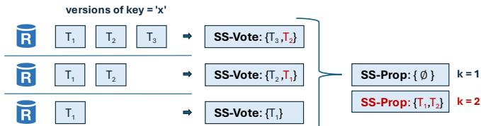  
Figure 10. Snapshots using ?? = 1 (black) and ?? = 2 (red).

We note, that although snapshots can be patchy for small ?? (or extreme contention), this is not due to Byzantine influence. A snapshot quorum consisting entirely of correct replicas may produce insufficiently matching votes to successfully filter a transaction. Pesto requires at least 2?? + 1 snapshot votes to form a proposal, thus guaranteeing that even if Byzantine replicas (up to ?? ) opt to fabricate their votes, the resulting snapshot proposal is no worse than a proposal sourced entirely from a subset of (?? +1) correct replicas.

A.5.2 All roads lead to... Contention. Pesto allows replicas to favor reading newer committed versions over versions included in snapshots (or as stand-in for patchy snapshots). This may result in inconsistent execution results as some replicas might execute on the proposed snapshot, while others may execute on newer, locally processed committed versions. Although Pesto could strengthen the snapshot execution requirement to force consistency—and thereby ensure success of range reads—, this would be short-sighted as it fails to account for the holistic progress of a transaction. A transaction which succeeds in its read but accesses a stale version in the process may eventually have to abort, resulting in greater overall wasted effort. This approach effectively sacrifices the liveness of the overarching transaction to ensure the success of individual range reads.

Patchy snapshots are, likewise, an indicator for high contention. Candidate row-keys, for instance, might be dropped from a snapshot proposal because correct replicas differ in their latest observed versions and report only a small number (e.g., ?? = 1) of versions per key. Raising ?? can help agree on a common version if there is inconsistency on the prepared versions, but is, as discussed above, ultimately futile if replicas disagree on the latest committed versions.

To ensure the best possible end-to-end progress Pesto should strive to offer optimal freshness (to minimize missed writes, i.e., conflicts) and to read in as few steps as possible (to minimize the conflict window opportunity [37]).

Clients can further enhance freshness by collecting 4?? +1 SS-VOTEs: This guarantees that the SS-PROP includes the latest committed version known to any replica. This follows from the fact that every committed transaction must be prepared on at least 2?? + 1 correct replicas, of which at least ?? + 1 are guaranteed to be part of any quorum of size 4?? +1. Since Pesto, when enhanced with write monotonicity, requires at least 3?? +1 matching replies—and thus typically waits for up to 4?? + 1 replies during eager execution—this configuration can be adopted with little to no added cost.

By default, our prototype constructs an SS-PROP from 3?? +1 SS-VOTEs, increasing the coverage of correct replicas while still allowing early progress when it appears unlikely that 3?? + 1 matching results will arrive. For improved freshness, this threshold can be raised to 4?? + 1, incurring only a small increase in client-side processing latency: the client already receives 4?? + 1 replies and must merely wait for and process them.

Finally, Pesto consciously favors freshness over consistency, by opting to read fresher committed versions, in case the snapshot is stale. This ensures that, for any successful execution, the (active) read set is no more stale than a read to the committed state of a single correct replica.

Importantly, Pesto’s range reads are always guaranteed to be responsive. Since snapshots cannot include fabricated transactions, synchronization, and consequently execution is guaranteed to be live. This ensures that a client reliably receives results. Failure to obtain matching results provides the client a signal about the level of contention. A client may choose to retry execution (possibly with larger k, and/or with larger snapshot/read quorums), or (after a configurable amount of failures) choose to abort its ongoing transaction and retry with a new timestamp. This contrasts with SMR-based designs, which always maintain the illusion of consistency and freshness—even when a transaction is ultimately doomed to abort.

A.5.3 Termination in absence of Contention. We briefly show that, in the absence of contention, Pesto’s range read protocol ensures reliable termination. Informally, we say that a transaction contends with a read if it concurrently writes a value relevant to the read’s query predicate. For simplicity, we assume the existence of a point in time, $t _ { C F }$ , after which the execution is contention-free. In practice, intermittent periods of low contention are sufficient in order to complete a range read.

Lemma 12 Pesto’s range read protocol guarantees termination after ?????? (for correct clients).

Proof. Suppose all correct replicas exhibit the highest possible degree of inconsistency; i.e., they differ on their latest (prepared) version for every row. By design, however, any committed transaction must have been prepared on at least 2?? +1 correct replicas.

We assume that ?? is unbounded and that the client requests 4?? +1 SS-VOTE’s. If this is not the case, a client may opt to retry with a more conservative configuration.

Since there are no concurrent contending writes, the resulting snapshot proposal is guaranteed to include the freshest committed row-version for every (active) row-key. All transactions in the snapshot proposal are available on at least one correct replica, allowing all replicas succeed in synchronizing all transactions in the proposal. Because no new contending transactions arrive, the snapshot captures a fully committed frontier and is complete (i.e., not patchy), ensuring that all replicas read from the same state. As a result, all correct replicas produce consistent results, read sets, and predicate sets, ensuring successful termination. □

We note that, in most cases, replicas are sufficiently consistent to achieve success using a small ?? and smaller snapshot quorums. Replica consistency can be accelerated by employing lightweight gossip schemes that forward prepared/committed transactions.

Finally, we note that, in the absence of Byzantine clients, synchronization is not necessary as all correct replicas will eventually converge. In this case, simply retrying will eventually yield termination; snapshot synchronization merely accelerates the process. In the presence of Byzantine clients that intentionally (or just by crashing) disseminate their transactions to only a subset of replicas, however, eventual consistency is not guaranteed. The snapshot protocol consequently serves also as a means to ensure reliable termination of incomplete transactions.

A.5.4 Termination does not imply Commit Successful range read execution does not imply that the overarching transaction will commit. A conflicting write may arrive after the read completes, but before the associated transaction tries to commit—resulting in an abort. This is inevitable in presence of contention. We thus once again limit our discussion to the period after $t _ { C F }$ —the point after which no more contending transactions arrive.

Pesto’s range read protocol (with sufficiently large quorums and ??) ensures that a range read will read the freshest committed version for any given row. It is possible, however, that materialization will miss fresher prepared versions. Consider, for instance, a prepared version (perhaps issued by a Byzantine client) that is only replicated to $\leq 2 f$ correct replicas. Even a snapshot quorum of size 4?? + 1 might not include the version’s transaction id ?? + 1 times, resulting in exclusion from the proposal. This may cause the read of a stale (active) version, ultimately resulting in the reading transaction’s abort.6 Successfully committing transactions thus requires synchronizing also the (freshest) prepared versions. Pesto relies on two practical mechanisms to do so.

First, transactions that abort due to conflicts with prepared transactions trigger the fallback protocol. The client of aborting transaction ?? will try to commit the conflicting transaction $T ^ { \prime }$ itself. This ensures that (??) all replicas receive the transaction (and thus become consistent), and (????) $T ^ { \prime }$ actually terminates, and thus any acquired dependency is reliably resolved.

Second, Pesto replicas may gossip prepared transactions. This can be done either eagerly, upon first receiving a transaction; or lazily, upon observing inconsistency for range reads (a replica may then opt to gossip the transactions of its active rows).

## B Extended Technical Discussion

This section outlines supplementary technical details, optimizations, and considerations for Pesto beyond those discussed in the main technical sections.

## B.1 Bounding Timestamps

Each transaction in Pesto is assigned a unique timestamp ?????? that implicitly establishes the final serialization order of transactions. This timestamp is generated client-side as ???? B (??????????????????,?????????????? ??,seq-no) upon BEGIN.7 Byzantine clients may freely select arbitrary timestamps; here, we discuss briefly the implications of such behavior.

Choosing a timestamp that is artificially small has minimal impact. Reads will simply access an older snapshot version— or be rejected if such versions have been garbage collected (see §B.3). Writes with low timestamps tend to abort during validation because they would invalidate existing prepared or committed reads with larger timestamps.

Conversely, choosing artificially large timestamps is more problematic. While writes with future timestamps cause no immediate issues—they are simply stored "in the future"— reads can create extended conflict windows. Specifically, any concurrent writes with timestamps between the version read by the reader and the reader’s own timestamp must abort, as they would otherwise invalidate the reader’s snapshot.

To mitigate abuse by Byzantine clients that fabricate excessively large timestamps, replicas reject transactions whose timestamps exceed their local clock $R _ { T i m e }$ by more than a threshold $\delta ,$ which accounts for client ping latency and clock skew.8 For a Byzantine client to induce conflicts, it must successfully prepare or commit its transaction; aborted or rejected transactions remain invisible and thus have no effect correct concurrent clients. Therefore, to maximize the probability of committing, it is rational—even for Byzantine clients—to choose timestamps that closely reflect real time. While Pesto does not depend on ?? for safety or liveness, a well-chosen value can improve the system’s throughput.

## B.2 External Consistency with Byzantine actors

By default, Pesto provides Byz-serializability, which requires no assumptions about clock synchronization for correctness. However, when clocks are synchronized and timestamps reflect real time, Pesto’s correctness guarantee strengthens to Byz-strict serializability. As with Byzserializability, external consistency applies only to correct clients’ transactions—Byzantine clients may arbitrarily backdate or postdate timestamps in an attempt to subvert real-time ordering.

Backdated transactions do not, at first glance, violate the real-time order as directly perceived by correct clients, since they remain visible to all subsequent correct transactions. However, they can introduce timestamp inversion phenomena that indirectly violate real-time [65]. Such behavior is permitted under Byzantine Isolation [81]: a committed execution involving Byzantine transactions with backdated timestamps is considered correct-view-equivalent to one containing only correct transactions, executed in real-time order according to their specified timestamps. Put differently, Byz-strict serializability does not require Pesto to enforce real-time edges for Byzantine-issued transactions—that is, real-time dependencies of the form $T _ { 1 }  T _ { 2 }$ , where $T _ { 2 }$ is issued by a Byzantine client, may be ignored.

Postdated transactions—i.e., those with timestamps in the future—pose a more direct threat to causality: if such a transaction commits before a correct client’s transaction begins, it may not be observed by that client. This issue can be mitigated by having correct replicas defer processing of postdated transactions until their local clock reaches the specified timestamp. This ensures that postdated transactions can only commit at a real time no earlier than their assigned timestamp, preserving external consistency for correct clients.

## B.3 Multi-version Garbage Collection

Writes in Pesto create new row versions indexed by the writing transaction’s timestamp. To enable garbage collection of old versions, Pesto enforces a timestamp bound on readable and writeable versions. Each replica maintains a low-watermark $g c .$ , which lags behind its local clock and marks the cutoff point. New reads or writes with timestamps below ???? are ignored. When writing a new row version with $T S > g c ,$ , the replica dynamically deletes all but the latest version with timestamp smaller than ????. This ensures that valid readers with read timestamps $T S \ge g c$ can find a readable version. To clean up rarely-updated rows, replicas may also perform periodic sweep rows to garbage collect old versions.

This scheme bounds the age of stored writes, but not their frequency. A highly contended key, for instance, may receive many writes in quick succession; all with timestamps above ????, preventing their immediate garbage collection. To prevent storage bloat $( e . g .$ , to avoid abuse by an authenticated Byzantine client) Pesto can employ two additional mechanisms. (??) First, Pesto may rate-limit clients to only one active transaction at a time. This limits write frequency, and additionally ensures that Byzantine clients must complete prior transactions before issuing new ones, minimizing transaction stalls in the system. (????) Pesto may enforce a per-key version limit ?? (this may be configured differently for different objects). A correct replica can delete all but the freshest ?? versions (with timestamps greater than ????), and reject any reads to the key with timestamps older than the ??th version. If a concurrent read transaction depends on a (prepared) version has beem garbage collected $( i . e .$ , older than ?? th version), that transaction is aborted. This is safe and sensible, as the transaction would likely abort anyways due to reading stale data.

If a snapshot-based read—i.e., a range read applying an SS-PROP—requests a version that has already been garbage collected, the replica returns the freshest available version instead. While this may reduce the number of matching read replies, it does not compromise safety and often aids transaction progress, since garbage-collected versions are (??) typically stale and (????) would otherwise cause dependent transactions to abort.

## B.4 Managing Dependencies—An Example

Section §5.5.1 outlines the validity rules for dependencies. We illustrate them here with an example (Figure 11). Intuitively, a dependency ?????? is valid only if it is vouched for by at least one correct replica. In the simplest case, there exist ?? +1 replies that have matching query result (Q-RES), matching read set (Q-READ), and matching dependency set (Q-DEP). However, this may not be guaranteed, as some (correct) replicas may consider ?????? already committed and not include it in Q-DEP. To nonetheless determine the validity of ??????, Pesto allows clients to check also the Q-DEP’s and snapshot votes (SS-VOTE) reported by other replicas that do Dependency examplenot have matching Q-RES or Q-READ. In particular, Pesto considers a reply with dependency ?????? valid if either (??) ?????? appears in the Q-DEP of any ?? + 1 replies, even if the associated Q-READs differ or (????) ?????? appears in any ?? + 1 SS-VOTE votes; any combination of these two is possible as well. In Fig. 11 case (??), for instance, the $d e p = t 3$ is not present ?? +1 = 2 times across the first two replies (that have matching Q-RES and Q-READ). ??3 is, however, present in the third reply, enough to conclude that ?? +1 replicas deem ?????? valid. Similarly, in case (????), ?????? =?? 3 is only present at a single replica, yet it is also present in the SS-VOTE of another reply.

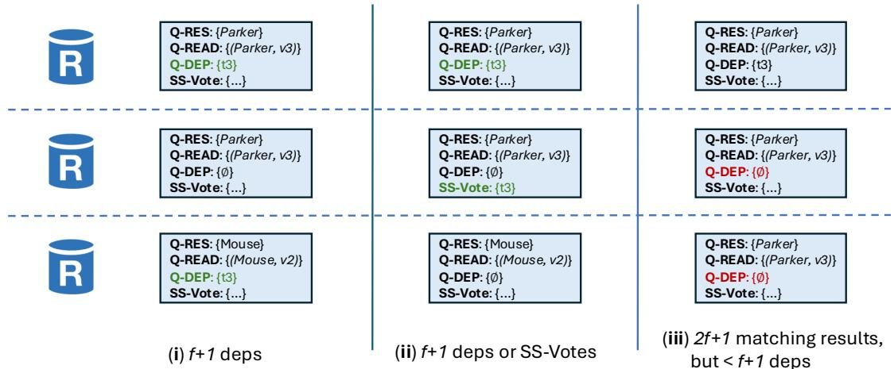  
Figure 11. Three criteria to determine dependency validity ((??), (????)) and relevance ((??????)).

In some cases, dependencies may be valid but need not be recorded: if a client is certain that at least one correct replica deems the dependency unnecessary (for example because it has already committed the transaction), then we can ignore the dependency. In particular, Pesto considers a dependency ?????? unnecessary if there are at least 2?? +1 matching replies (Q-RES and Q-READ) that contain ?????? in fewer than ?? + 1 Q-DEP’s. In Fig. 11 case (??????), for instance, all three replies match, yet ?? + 1 replicas report no dependencies. Consequently, at least one correct replica deems ?????? unecessary.

If a candidate ?????? cannot be found ?? +1 times, nor safely considered unecessary, then a correct client must consider the reply containing ?????? invalid, and either wait for additional replies, or retry.

## B.5 Active Snapshots

Pesto optimistically records in its read sets and snapshot votes only the metadata of those rows that are relevant to the query computation. Specifically, an active snapshot includes the transaction ????’s associated with row versions that satisfy a query’s filter predicates—i.e., the active rows.

B.5.1 Record relevant passive versions Including only the ????s of active rows—that is, rows whose freshest version satisfies the query predicate—greatly reduces snapshot size but can cause snapshots to be unnecessarily stale. For example, if some replicas do not include a row-key (e.g., ?? = 1) because their latest version ?? does not fulfill the predicate, while others include an earlier version $v ^ { \prime } < v$ that does, Pesto may reconstruct a stale state (??′). This can cause the reading transaction to abort at commit time due to missing a newer version. To prevent this, replicas should also include in snapshots those fresher versions for which a past version satisfies the predicate. We call these included (passive) versions active-negative.

B.5.2 Nested Queries Active snapshots may require additional care when handling complex or nested queries. Consider the nested query SELECT \* FROM $t _ { x }$ WHERE x > (SELECT MAX(y) FROM $t _ { y } )$ : the active rows of the outer query $Q _ { o }$ depend on the result of the inner query ????. Since replicas’ SS-VOTEs may differ, the resulting (potentially patchy) SS-PROP may not be commutative with a sequential snapshot execution of $Q _ { i }$ followed by $\mathcal { Q } _ { o } .$ In such cases, it may be advisable to either (??) use coarser snapshots, or (????) rewrite nested queries into sequential patterns. In practice, however, replicas tend to remain highly consistent and execution typically succeeds even on the eager path (§7).

B.5.3 A note on freshness Active snapshots may, in rare edge cases, lead to slight freshness degradation. If some (but not all) correct replicas observe only passive row-versions among their latest ?? versions and therefore omit the row-key from their SS-VOTE, the resulting snapshot may reflect a version that is more stale than what a single replica could return. Notably, if the row-key is omitted entirely, this is equivalent to materializing a passive row-version, which is the desired outcome.

Consider the following example with a snapshot quorum of 2?? + 1 = 3 SS-VOTEs (assuming ?? = 1) for a key ?? with two versions: ??1, which satisfies the query predicate ??, and $x _ { 2 } ,$ which does not. Replica $R _ { 1 }$ has committed $x _ { 2 }$ and sees no active version, so it casts ${ \bf S } { \bf S } \mathrm { - V O T E } _ { 1 } \mathrel { \mathop : } = \left\{ \right\}$ . Replica $R _ { 2 }$ has committed $x _ { 1 }$ and prepared $x _ { 2 } .$ . It casts $\mathbf { S } \mathbf { S } \mathbf { - } \mathbf { V } \mathbf { O } \mathbf { T } \mathbf { E } : = \left\{ x _ { 1 } , x _ { 2 } \right\}$ , including $x _ { 2 }$ as an active-negative version. Replica $R _ { 3 }$ is

Byzantine and votes at whim: it casts $\mathbf { S } \mathbf { S } \mathbf { - V } \mathbf { O } \mathrm { T } \mathbf { E } : = \left\{ x _ { 1 } \right\}$ . The resulting snapshot proposal is $\mathbf { S } \mathbf { S } \mathbf { - P R O P } : = \{ x _ { 1 } \}$ , even though both correct replicas have observed the fresher $x _ { 2 }$ . Because $R _ { 1 }$ omitted $x _ { 2 } .$ the snapshot reflects an unecessarily stale state. In effect, freshness degrades from the equivalent of reading the freshest version from a single correct replica, to selecting the ??-freshest version from a single replica. If instead $\mathbf { S } \mathbf { S } \mathbf { - } \mathbf { V } \mathbf { O } \mathbf { T } \mathbf { E } _ { 3 } \ : = \ \left\{ \right\}$ , then the resulting SS-PROP is empty— effectively the same as reading $x _ { 2 } ,$ , which is passive and does not affect ??. This is a valid and even desirable outcome.

Importantly, this edge case does not compromise Byzantine independence. While the Byzantine replica may influence which version is selected, it cannot unilaterally dictate the outcome. The illustrated scenario is no worse than if the faulty replica had abstained from voting entirely, and a different correct replica had reported only $x _ { 1 }$ as its latest active version.

## B.6 Snapshots with Optimistic Transaction IDs.

Snapshots can be further compressed by optimistically replacing transaction identifiers with transaction timestamps. Unlike transaction identifiers—which are statistically independent cryptographic hashes (256b)—timestamps are smaller (64b) and temporally correlated, allowing more efficient encoding: a simple delta encoding can reduce them to 32b, and integer compression can shrink them further to under 16b.

However, Byzantine clients may equivocate by assigning the same timestamps to two distinct transactions. This can cause snapshots to diverge: upon receiving a snapshot proposal containing timestamp ?????? , two correct replicas may associate it with different transactions ?? and $T ^ { \prime } \left( t s _ { T } = t s _ { T ^ { \prime } } \right)$ , leading to inconsistent synchronization. Fortunately, this is a low-yield and easily detectable attack. Since timestamps embed client identifiers and all transactions are authenticated, any client that reuses a timestamp across different transactions is explicitly identifiable. Replicas that detect such behavior can report and exclude the faulty client from further participation. To improve robustness, a correct client whose snapshot execution fails may retry using standard transaction ????s, which are globally unique and therefore immune to ambiguity.

## B.7 Predicate Instantiations

Pesto, by default, extracts as read predicates the filter conditions associated with a query’s scan operations. Nested query operations can, depending on the size of intermediary results, be represented either via coarse singular predicates, or using multiple predicate instantiations. Consider a simple query that joins two tables SELECT \* FROM $t b l _ { x } , t b l _ { y }$ WHERE $\mathbf { x } \cdot \mathrm { n a m e } ~ = ~ ^ { \prime } \mathrm { P e t e r } ^ { \prime } ~ \mathrm { A N D } ~ \mathbf { x } \cdot \mathrm { i d } ~ = ~ \mathbf { y }$ .account, and, because $t b l _ { x }$ has only a few rows with name "Peter" (one, in our example from Figure 2), chooses to perform a Nested Loop Join [67]. Rather than deriving only two predicates $T b l _ { x }$ : $x . n a m e { = } ^ { \circ } P e t e r ^ { \circ }$ and the very coarse $T b l _ { y } : T r u e$ , Pesto opts to instantiate, for each row ?? in the intermediary result (WHERE $\mathbf { x } \cdot \boldsymbol { \mathrm { n a m e } } ~ = ~ ^ { \prime } \mathrm { P e t e r } ^ { \prime } )$ , a predicate $T b l _ { y } { : } x . i d { = } { < } r . i d { > }$

## B.8 Bounding Table Versions

Pesto allows clients to complete range reads without matching table versions, and, for safety, simply selects the smallest table version to include as $P . t a b l e _ { v }$ in $P r e d S e t _ { T }$ . Byzantine clients may try to exploit this and report fabricated low versions. This does not affect safety, but makes CC-checks slower, as a larger range needs to be checked. To mitigate this, correct clients may discard replies with table versions that deviate significantly from the ?? + 1st smallest reported version. Similarly, correct replicas may reject transactions whose reported predicate table versions are too low relative to the transaction’s timestamp.

## B.9 Two-Tier Monotonicity Grace

Pesto implements write monotonicity using a sliding window approach: rather than labeling all transactions that arrive out of timestamp order as non-monotonic, Pesto accepts transactions that arrive within a grace period.

Grace periods offer a tradeoff. Larger grace periods offer writers more slack (reducing aborts), but may cause preparing readers to unnecessarily validate against transactions that were already part of their read state. Pesto attempts to soften this tension by distinguishing two grace tiers: (??) A first, short grace period reflects the assumption that most concurrent transactions arrive within close proximity, and requires validation against all transactions within the range. (????) A second, larger grace period, captures (hopefully less frequent) longer or delayed transactions, and only validates against nonmonotonic arrivals. Configuration of the grace periods does not affect safety, but if well chosen can improve performance.

We omit a distinction of grace period tiers in our proofs of Byz-serializability (§A.3). Grace tiers do not affect safety (they are equivalent to a single grace period); they affect only efficiency.

## B.10 Distributed Queries

Orchestrating and implementing cross-shard query execution—such as scans or joins over partitioned tables—is well-studied [31, 62, 82, 86] but non-trivial, and beyond the scope of our prototype. These challenges are not unique to Pesto, and arise similarly in SMR-based systems.

We briefly outline how to coordinate Pesto’s snapshot protocol across shards. For simplicity, we assume each shard includes a replica operated by the same trust authority (i.e., every replica has a trusted counterpart in other shards). We leave the exploration of efficient, trust-free cross-shard execution to future work.

We distinguish between flat and nested queries. Simple flat queries, such as range scans (e.g., SELECT \* FROM tbl WHERE $\mathrm { ~  ~ { ~ x ~ } ~ } > \ 5 )$ or hash joins [67], require no crossshard coordination during snapshotting. Each shard can independently compute an SS-PROP by executing the query locally. Once all involved shards have synchronized, cross-shard query execution proceeds. One shard may act as a coordinator to aggregate the final results. If the client is unaware of the partitioning scheme, it suffices to contact the coordinator, which forwards the request to the appropriate shards. Read sets, predicate sets, and dependency metadata can be collected directly from each individual shard.

Nested queries, by contrast, may require cross-shard execution during snapshotting due to dependencies between inner and outer sub-queries. As noted in Section B.5, such dependencies can complicate snapshotting even within a single shard. Sharding can amplify this challenge, as intermediate sub-query results may determine which shards to involve—potentially leading replicas operated by different trust authorities to involve inconsistent shard sets. In such cases, it may be advisable to rewrite queries into sequential stages, or conservatively expand the snapshot scope to include all potentially relevant shards.

These complexities are not specific to Pesto: in SMR-based systems as well, nested cross-shard queries may require sequential coordination to determine the involved shards, and each sub-query must be replicated consistently via consensus.