Latest updates: hps://dl.acm.org/doi/10.1145/3731569.3764801

RESEARCH-ARTICLE

# Demeter: A Scalable and Elastic Tiered Memory Solution for Virtualized Cloud via Guest Delegation

JUNLIANG HU, Chinese University of Hong Kong, Hong Kong, Hong Kong ZHISHENG HU, Chinese University of Hong Kong, Hong Kong, Hong Kong CHUN-FENG WU, National Yang Ming Chiao Tung University, Hsinchu, Taiwan MING-CHANG YANG, Chinese University of Hong Kong, Hong Kong, Hong Kong

Open Access Support provided by:

Chinese University of Hong Kong

National Yang Ming Chiao Tung University

  
Published: 12 October 2025

Citation in BibTeX format

SOSP '25: ACM SIGOPS 31st Symposium   
on Operating Systems Principles   
October 13 - 16, 2025   
Seoul, Republic of Korea

Conference Sponsors: SIGOPS

# Demeter: A Scalable and Elastic Tiered Memory Solution for Virtualized Cloud via Guest Delegation

Junliang Hu♠

Zhisheng Hu♠

Chun-Feng Wu♢ Ming-Chang Yang♠

♠The Chinese University of Hong Kong Department of Computer Science and Engineering

♢National Yang Ming Chiao Tung University Department of Computer Science

## Abstract

Memory scalability has emerged as a critical bottleneck in virtualized cloud environments. Tiered memory architectures that combine limited fast memory with abundant slower memory offer a promising solution, but existing hypervisor-based approaches suffer from significant performance penalties. We present Demeter, introducing a paradigm shift through guest-delegated tiered memory management based on two key insights: (1) delegation to guests eliminates both expensive access tracking at the hypervisor level and frequent TLB flushes that severely degrade memory virtualization performance under twodimensional address translation, and (2) Processor Event-Based Sampling, which cannot be effectively utilized by hypervisor-based solutions, remains fully functional and highly efficient when properly leveraged within the guest. Building on these insights, Demeter designs an efficient range-based tiered memory management scheme in guest virtual address space to preserve locality information and employs a double balloon-based provisioning mechanism that maintains cloud elasticity while enabling vendor-specific QoS control. Our evaluation with seven real-world workloads across DRAM+PMEM and DRAM+CXL.mem configurations demonstrates that Demeter improves performance by up to 2× compared to existing hypervisor-based approaches and by 28% on average compared to the next best guest-based alternative. Our implementation is fully open source and publicly available at Zenodo.

CCS Concepts: • Computer systems organization → Cloud computing; Processors and memory architec tures; • Software and its engineering → Virtual ma chines; Operating systems; Virtual memory; • Hard ware → Memory and dense storage.

Keywords: Virtual Machine, Virtual Memory, Operating System, Compute Express Link, Tiered Memory

ACM Reference Format: Junliang Hu, Zhisheng Hu, Chun-Feng Wu, and Ming-Chang Yang. 2025. Demeter: A Scalable and Elastic Tiered Memory Solution for Virtualized Cloud via Guest Delegation. In ACM SIGOPS 31st Symposium on Operating Systems Principles (SOSP '25), October 13–16, 2025, Seoul, Republic of Korea. ACM, New York, NY, USA, 17 pages. https://doi.org/10.1145/ 3731569.3764801

## 1 Introduction

Virtual machine (VM) services form the backbone of today’s virtualized cloud infrastructure: they power customer-facing elastic computing instances [7, 22, 42] and further enable more abstract cloud services, such as serverless computing [14]. However, as the longstanding memory resource in the infrastructure, Dynamic Random-Access Memory (DRAM) has been reported to face capacity scalability bottlenecks [37]. For example, over the past decade, while we have witnessed a tenfold increase in the total CPU core count (from 15 to 144 cores), the maximum memory capacity supported by flagship server processors has only increased about 2.67 times (from 1.5 to 4 TB), indicating an approximate onethird drop in the maximum memory size per core [29, 30].

To address this scalability challenge, major cloud adopters, including Azure [65], Google [20], and Facebook [59], have started transition to tiered memory architectures. These architectures supplement traditional DRAM as the fast memory tier (FMEM) with a second, slower memory tier (SMEM) comprised of alternative media or interconnects. Technologies, such as Persistent Memory (PMEM) [64] and Compute Express Link memory protocol (CXL.mem) [39], can effectively double memory capacity at half the cost of additional DRAM modules [17, 18].

To balance FMEM performance with SMEM capacity benefits, tiered memory architecture requires careful management. Recently, tiered memory management (TMM) has attracted extensive research interest, with kernel-based systems leading development [5, 19, 20, 34, 38, 41, 56, 59, 61, 63] (see §6 in details). By contrast, the system support for the virtualized cloud infrastructure receives relatively less attention [24, 27, 33, 52], and these designs primarily rely on the hypervisor in the host machine to conduct TMM (referred to as the hypervisor-based approach). Nevertheless, our experimental investigation, presented in §2.3, reveals that the hypervisor-based approach could encounter significant overhead associated with TMM, rendering a critical performance issue for virtualized environments where efficiency is paramount. There are two main reasons for this: First, the hypervisor-based approach relies on tracking the Page Table Entry Access/Dirty (PTE.A/D) bits; however, in a virtualized environment with 2D address translation, resetting PTE.A/D bits could incur costly and excessive Translation Lookaside Buffer (TLB) flushes [52], seriously deteriorating the memory access performance (see §2.3.1). Second, Processor Event-Based Sampling (PEBS), a hardware-assisted access tracking mechanism, has demonstrated its superiority in the state-of-the-art kernel-based TMM systems [38]; nevertheless, due to virtualization boundaries, the hypervisor-based approach fundamentally cannot leverage this superior mechanism to track guest memory accesses, thereby missing a significant opportunity for performance optimization (see §2.3.2).

Inspired by the identified limitations of the hypervisorbased approach, this work conducts a thorough rethinking on the division of labor (between the guest and hypervisor) and advocates a novel approach called guest delegation. Specifically, to maximally mitigate the management overhead while maintain the provision elasticity, we argue that the entire process of tiered memory management (TMM) should be fully delegated to the guest, with the host focusing solely on making tiered memory elastically available through tiered memory provisioning (TMP).

Our key insights are: ❶ Delegating TMM to guests would free hypervisor from the expensive access tracking and avoid frequent TLB flushes; ❷ While PEBS cannot be effectively utilized by hypervisor-based TMM approaches, it remains fully functional and is able to achieve high efficiency when approached properly. Guest-delegated TMM leverages this guest accessibility within the guest virtual machines to gather abundant access samples and utilizes locality information that primarily exists in the guest virtual address space. This approach avoids the expensive and destructive page table scanning or inefficient sorting and LRU processing on uncorrelated pages employed by existing hypervisor-based approaches.

However, the cloud environment presents unique challenges to the design of tiered memory management systems with guest delegation. The first challenge is ensuring elasticity and enabling cloud quality of service (QoS) management during TMP. Memory resources in cloud environments are shared among tenants across diverse service tiers and are often overcommitted [60]. Direct application of existing kernel-based solutions results in skewed provisioning of tiered memory, leading to resource wastage. Our solution, Demeter, address this challenge through double ballooning.

The second challenge lies in addressing the efficiency and scalability of guest-delegated TMM. Cloud aims to minimize CPU overhead and rent all available resources as virtual machines. Directly repurposing kernel-based TMM inside guests would compound management overhead as the total number of virtual machines grows. As a result, each stage of the TMM pipeline must be carefully redesigned to maximize resource efficiency and reduce compound overheads.

Demeter, is the first to utilize Extended Page Table (EPT) friendly PEBS as the hotness source in a virtualized environment directly accessible by guests. The high-fidelity hotness data feeds into a range-based classifier operating in guest virtual address space, maximizing locality information undisturbed by both host and guest kernel memory allocators. Pages identified as hot or cold are swapped, further minimizing locking and TLB flush frequency.

We evaluate our designs across two tiered memory configurations: one with DRAM as fast memory and real PMEM as slow memory, another with emulated CXL.mem. We test these configurations using seven real-world workloads with varying access patterns spanning databases, scientific computing, graph processing, and machine learning. Our evaluation shows that leveraging the guest-delegated principle our TMP mechanism yields a direct performance improvement up to 68% over traditional provisioning solutions. Incorporating our guest-delegated TMM component improves real-world workload performance by 28% on average compared to the next best alternative.

In summary, we make the following contributions:

• We introduce the principle of guest-delegation for tiered memory management, which improves performance by up to 2× compared to hypervisor-based approaches by leveraging guest-level locality information while avoiding costly access tracking and destructive TLB flushes.

• We pioneer the use of PEBS for memory access tracking in virtualized environments, demonstrating that this hardware feature can be effectively and efficiently utilized within guest VMs for tiered memory management.

• We propose a double balloon-based TMP mechanism that maintains cloud elasticity while enabling vendor-specific QoS control.

• We develop a scalable guest TMM component that efficiently operates across multiple guests through our novel EPT-friendly PEBS sampling approach, range-based classification, and balanced page relocation.

• We demonstrate the viability of Demeter through comprehensive evaluation with seven real-world workloads across DRAM+PMEM and DRAM+CXL.mem tiering.

## 2 Background and Motivation

## 2.1 Virtualized Environment

Memory Virtualization. In virtualized environments, each virtual machine (VM) operates within an isolated guest physical address space presented by the hypervisor. Since multiple VMs share the same underlying hardware, processors incorporate an additional layer of address translation to facilitate physical memory virtualization.

Early software-based memory virtualization approaches used by Xen-based [12] hypervisors [24, 33] write-protects guest page tables (GPT) and traps every GPT modification. Despite this approach allows the hypervisor to perform guest physical address (gPA) to host physical address (hPA) translation, it introduces frequent VM exits, significantly degrading the performance [3].

In light of this, modern hardware-based memory virtualization approaches eliminate expensive traps by offloading gPA to hPA translation directly to hardware. This translation is automatically completed by hardware on each guest memory access through an additional page table structure, such as Intel®'s Extended Page Tables (EPT) and AMD®'s Nested Page Tables (NPT). Consequently, as shown in Figure 1, combined with the guest’s own virtual-to-physical address translation (i.e., guest virtual address (gVA) to guest physical address (gPA)) through GPT, each memory access needs to undergo a two-dimensional (2D) page table walk. Notably, to simplify the discussion, the term “EPT” will henceforth be used in an architecture agnostic manner.

The 2D translation process is costly, requiring up to 25 memory accesses per translation (as modern 57-bit gVAs and 52-bit gPAs with 512 Page Table Entries (PTEs) per page [32] necessitate 5-level translations in both dimensions). To alleviate these translation overheads, Translation Lookaside Buffers (TLBs) are employed to cache translation results. Modern TLBs can cache both 1D mappings (gVA to gPA) and flattened 2D mappings (gVA directly to hPA) [32]. In the optimal scenario, a TLB hit within a virtual machine directly yields the target hPA, bypassing the expensive page table lookups. Nevertheless, modifying PTEs necessitates TLB flushes to maintain correctness [32], which reintroduces the need for costly page table lookups to repopulate the cache. TLB flush instructions fall into two categories: full invalidation (invept) and single gVA invalidation (invvpid/invpcid/ invlpg), where the former removes all TLB entries generated with a given EPT whereas the latter accepts a gVA and only flushes entries associated with that address.

Resource Overcommitment. Virtualized cloud environments consolidate numerous virtual machines on shared hardware (e.g., CPU, memory, and storage) and leverage overcommitment to maximize resource utilization and profitability. That is, cloud tenants rent virtual machines with specific resource specifications and service tiers based on their anticipated peak usage and workload criticality; however, since not all virtual machines consume their maximum allocated resources simultaneously, cloud providers can strategically overcommit hardware resources [58].

To maintain service quality during usage fluctuations, cloud infrastructure must preserve elasticity, the ability to dynamically adjust resource allocation in response to changing tenant demands [57, 60]. Additionally, during request spikes, cloud systems must maintain effective Quality of Service (QoS) controls across service tiers, ensuring that critical workloads receive appropriate resource prioritization according to their designated service levels.

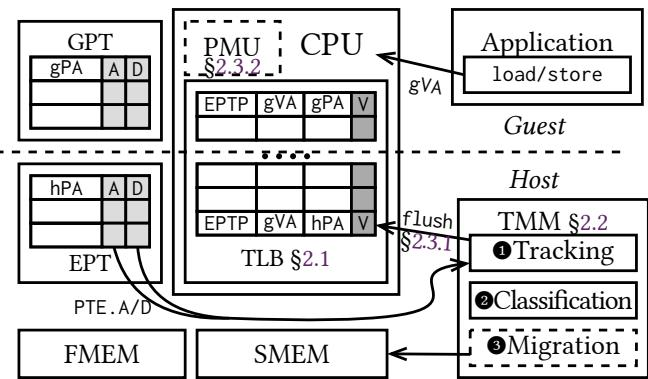  
Figure 1: Hypervisor-based Tiered Memory Management

## 2.2 Hypervisorbased Tiered Memory Management

The tiered memory management (TMM) pipeline typically involves three key steps: ❶ access tracking, ❷ hotness classification, and ❸ data migration. Specifically, it leverages the sampled memory accesses (❶) from software scanning [19, 20, 24, 24, 27, 34, 41, 52, 63] or architectural hardware [38, 50] to identify which pages are likely to be frequently accessed in the future (❷) and strategically places these pages into FMEM (❸).

The existing TMM systems for the virtualized cloud primarily rely on the hypervisor in the host machine to manage the tiered memory [24, 27, 33, 52]. In particularly, as shown in Figure 1, these hypervisor-based designs predominantly rely on PTE Access/Dirty (PTE.A/D) bits for access tracking. During address translation, these bits are automatically set within each level of the page table, with both GPT and EPT affected in virtualized systems. Software-based memory virtualization systems, such as HeteroVisor [24] and HeteroOS [33], operate without EPT and leverage PTE.A/D bits from GPT, trapping every modification to record access information. Following the introduction of hardware virtualization with EPT, RAMinate [27] shifts to software scanning of PTE.A/D bits within EPT. In view of the large memory footprint of the entire VM address space, vTMM [52] chooses to track PTE.A/D bits inside GPT instead of EPT, designing a companion guest module to pass GPT page addresses from guest to hypervisor for intrusive scanning.

In each scanning round, PTE.A/D bits are reset and published via TLB flushes, allowing subsequent accesses to trigger PTE.A/D bits changes and be captured. After aggregating access information across multiple scanning rounds, these systems classify page hotness by sorting access frequencies [52] or using LRU structures [24, 33]. The hottest data is then migrated to FMEM either at the hypervisor’s discretion [27, 52] or exported to guests [33].

<table><tr><td>Design</td><td>TLB Flush (Single)</td><td>TLB Flush (Full)</td><td>GUPS Elapsed (s)</td></tr><tr><td>TPP-H</td><td>62,289,626</td><td>20,214,840</td><td>896.35</td></tr><tr><td>TPP-G</td><td>17,707,154</td><td>0</td><td>353.91</td></tr><tr><td>Demeter</td><td>9,305,363</td><td>0</td><td>299.57</td></tr></table>

Table 1: TLB flush comparison between hypervisor-based and guest-based TMM under GUPS workload

## 2.3 Motivation

## 2.3.1 TLB Flush Overhead

Hypervisor-based tiered memory management solutions depend on TLB flush-intensive PTE.A/D bits for hotness information during access tracking. The TLB flush operations constitute the primary source of access tracking overhead, as repopulating the cache would severely stall subsequent memory accesses. In contrast, reading PTE.A/D bits imposes only modest CPU overhead without disrupting the memory access pipeline. To quantify this overhead, we compared TLB flush instruction counts between hypervisor-based and guest-based solutions.

Due to the lack of available source code and insufficient design details in existing hypervisor-based solutions [24, 27, 33, 52], we converted the kernel-based TPP [41] to a hypervisor-based solution (TPP-H) by integrating its PTE.A bits scanning backend with KVM’s MMU notifier. This allows it to observe guest accesses through PTE.A bits in EPT. For guest-based solutions, we evaluated a direct application of the TPP in guests (TPP-G).

For our evaluation, we limit the hypervisor-based system to 36 GiB DRAM during boot, while for guest-based solutions, we start a VM with 36 GiB DRAM. We use unlimited PMEM as the SMEM tier and ran a GUPS workload [50, 56] with a 126 GiB total footprint and 36 threads. As shown in Table 1, the results reveal that the hypervisorbased solution TPP-H generates 4.7× TLB flush instructions compared to TPP-G, resulting in 2.5× total execution time. The severe performance penalty stems from the necessity of destructive full invalidation of all EPT mappings. Hypervisor-based solutions, which capture GPT entries through faulting [24, 33] or scanning [52], can only access GPT and EPT entries containing only gPA and hPA. Without gVA information, they must resort to full invalidation to ensure capturing future PTE.A/D bits. In contrast, guest-based solutions can follow the entire GPT walk process and extract the initial gVA, enabling the use of more efficient singleaddress invalidations. Furthermore, our guest-delegated solution, Demeter, can leverage EPT-friendly PEBS instead of TLB flush-intensive PTE.A/D bits from either EPT or GPT, resulting in a further 47% reduction in TLB flushes and 15% improvement in total execution time, compared to TPP-G.

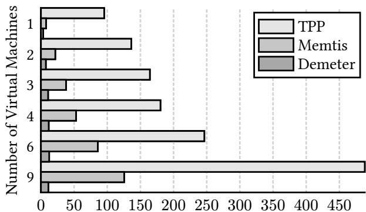  
Figure 2: Access Tracking Overhead (%CPU)  
running same total number of GUPS transactions.

## 2.3.2 EPTFriendly PEBS Scalability

Modern kernel-based solutions support A-bit hotness tracking through Linux derivatives [19, 20, 34, 41, 63] and have introduced more efficient hardware-based access tracking mechanisms, including PEBS [38, 50]. However, PEBS is not able to break the virtualization boundary and track guest access samples when deployed in a host-side hypervisor.

Contrary to prior assumptions [52, 65], we find that EPTfriendly PEBS sampling is now well-supported with strong isolation for guest states under virtualization [62]. Crossarchitecture support for PMU sampling also exists [49], allowing PEBS-based access tracking to extend to a wide range of cloud machines with simple modifications.

EPTfriendliness. Until recently, PEBS was widely misunderstood as being unavailable for guest VMs, creating a blind spot in tiered memory research [52, 65]. We discovered that the root cause for such confusion was an architectural bug [35] where the PEBS write process could not be interrupted by EPT page faults without risking machine malfunction. Cloud environments require memory overcommitment, in which guests’ memory is lazily allocated and corresponding EPT entries are lazily populated at the EPT page fault triggered by first access. Although guest PEBS could technically be enabled by avoiding this architectural defect through eagerly mapping all available memory assigned to a VM and disabling swapping, with the recently introduced PEBS version 5 [62], this bug no longer exists, enabling painless EPT-friendly PEBS.

PEBS Isolation. The primary concern regarding guest PEBS support has been the potential breach of isolation boundaries caused by sharing the sample buffer, potentially leaking sensitive information across VMs. Prior systems intuitively assumed that PEBS enabled in guests would generate samples and write to the host OS’s PEBS buffer [52], leaking load/store addresses. However, our investigation reveals this assumption is incorrect. The PEBS sample buffer is part of the virtualized CPU debug control data structure and is guarded within the virtualization boundary. Hardware virtualization automatically switches to a guestprivate PEBS buffer through the vmcs.debugctl field in the architecturally defined Virtual Machine Control Structure (vmcs). This field is ultimately controlled by guests, who can program it at any time to any valid guest physical address. Consequently, samples generated while executing different VMs are written directly to their respective private buffers, ensuring proper isolation among virtual machines.

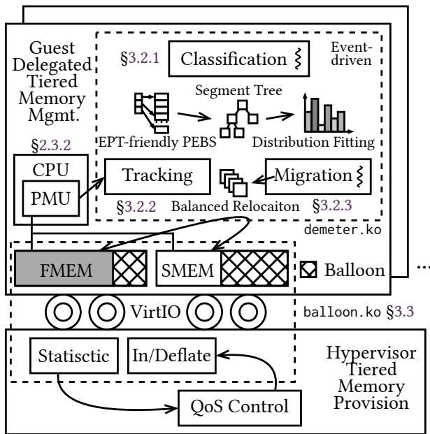  
Figure 3: Design of Demeter

Scalability Problem. With PEBS now available in guests, it might seem intuitive to apply existing PEBS-based designs directly within guest VMs. However, cloud environments often run numerous VMs concurrently on a single machine, which would compound management overhead if existing designs were directly repurposed.

We conduct a scalability study of existing designs using both PTE.A/D-based (TPP) and PEBS-based (Memtis) approaches, as shown in Figure 2. We launch up to nine virtual machines on a 36-core system with a total of 36 GiB DRAM paired with unlimited PMEM and ran 8.1 billion GUPS transactions with a 126 GiB working set. The working set and the system memory are divided evenly across all VMs while preserving the access distribution. The results demonstrate that naively using TPP in guests could waste more than 4.5 CPU cores in a 36-core system, while even the optimized PEBS design of Memtis still wastes approximately 1.25 core. In cloud environments where CPU resources are rented to customers with the goal of maximizing utilization, such wastage would increase total cost of ownership (TCO), potentially negating the benefits of memory expansion through tiered memory. By contrast, Demeter, leveraging EPT-friendly PEBS, consistently controls overhead within 0.2 cores as scalability increases.

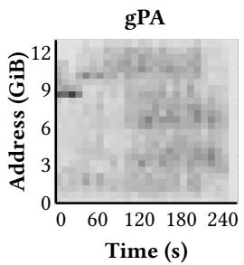

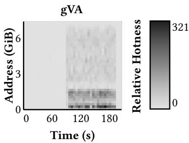  
Figure 4: Guest physical and virtual address space memory access heat maps of LibLinear captured by DAMON [46, 47].

## 3 Demeter: A GuestDelegated TM Solution

## 3.1 GuestDelegated Tiered Memory

We present Guest-Delegated Tiered Memory, a novel tiered memory architecture for virtualized environments that achieves efficiency, elasticity, scalability, and flexibility. Our key insight is to delegate the entire three-step tiered memory management (TMM) pipeline to guest virtual machines while preserving only tiered memory provisioning (TMP) inside the hypervisor.

With this delegation approach, access information comes directly from within guest virtual machines, eliminating the need to tediously extract TLB flush-intensive PTE.A/D bits hidden deeply inside the memory virtualization process of 2D paging. Guest virtual machines can now utilize readily available EPT-friendly PEBS hardware directly exposed to guests, providing ready-to-use load/store samples. Guestdelegated tiered memory design affects only guest kernel, when integrated to cloud providers’ vendor OS distributions [8, 43], it maintains application transparency.

However, to effectively support multi-tenant cloud environments, guest-delegated TMM requires careful design considerations to maintain efficiency and scalability, while hypervisor-supported TMP enables the elasticity demanded by cloud environments.

## 3.2 Efficient and Scalable TMM

Efficiency and scalability in our design stem from properly exploiting locality information with minimal tracking overhead. Contrary to the conventional wisdom of classifying hotness in physical address spaces, we leverage the insight that guest virtual address space retains the most locality information, undisturbed by the kernel’s page allocator. This is because the kernel’s page allocator tends to optimize for reduced fragmentation, rather than preserving locality in physical memory layouts. To demonstrate this, we ran a real-world application, LibLinear, with kdda dataset inside a guest virtual machine as described in §5.1. Using DAMON [46, 47], we profiled access hotness over time in both address spaces (Figure 4). The results show that the hottest virtual address region concentrates hot accesses within small, contiguous ranges, while physical addresses exhibit scattered hot spots across the entire usable memory space. This is due to the OS’s lazy page allocation, which maps physical pages on first access, following access order rather than spatial locality. As a result, physical memory layout reflects the temporal order of accesses rather than their spatial locality, effectively breaking the locality patterns preserved in the virtual address space.

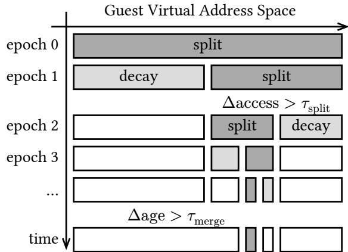  
Figure 5: Range-based hotness classification scheme.

## 3.2.1 Rangebased Hotness Classification

To address this issue, we design a range-based hotness classification scheme that operates in the guest virtual address space to preserve maximum locality information. This approach fundamentally differs from the physical-pagecentric hotness classification methods employed in existing tiered memory systems, which operate in locality-clobbering physical address space. Our range-based hotness classification achieves efficiency through a segment-tree-like structure that systematically divides and identifies virtual addresses into ranges of interest, as illustrated in Figure 5. Our approach minimizes overhead while maximizing accuracy where it matters most by tracking and grouping cold memory in large regions while progressively refining hot memory into smaller sub-ranges using range splitting. To facilitate optimal data placement decisions that preserve spatial locality, the hotness ranking process then scores each range based on average access frequency and recency.

Range Splitting Our range-based approach employs an iterative range-splitting mechanism driven by spacial locality to progressively refine hotness granularity, with tunable parameters that adapt to different workload characteristics. The system initializes with two primary ranges: one covering the application heap (growing upward from start\_brk) and another spanning the mmap region (growing downward from mmap\_base). We strategically exclude code, data, and stack segments from hotness tracking, as these regions are inherently hot and relatively small (typically MiBscale). This approach maximizes the effectiveness of tiered memory management by concentrating on heap and mmap areas where the vast majority of large and dynamic memory allocations reside.

The discovery of hot memory ranges occurs through an iterative split process. After collecting an epoch’s (denoted by split period $t _ { \mathrm { s p l i t } } )$ worth of samples, we check whether any ranges need to be split. We examine all the leaf-level ranges to determine if any have significantly more accesses than both of their neighbors. Since memory accesses can come from all CPU cores, we define a significance factor $\begin{array} { r } { \alpha = \frac { \Delta \mathrm { a c c e s s } } { \tau _ { \mathrm { s p l i t } } \cdot \mathrm { v c p u } } } \end{array}$ , where Δaccess is the difference in memory accesses compared to a neighbor, $\tau _ { \mathrm { s p l i t } }$ is the split threshold and vcpu is the total number of virtual CPUs.

When a split occurs, we divide the range in the middle into two halves with equal sizes. The access count for each new range is set to half the total access count of the original range. We do not split ranges beyond the split granularity, currently set to 2 MiB. Each range also has two age fields which track when it was created during the split operations and when its accesses were last found. During each epoch, the access count for each range is halved to ensure access frequencies of older ones gradually decay to zero.

The epoch length reflects overall memory intensity, while ?? and $\tau _ { \mathrm { s p l i t } }$ correspond to access skewness. Our design allows system administrators to fine-tune these parameters according to their specific workload characteristics. Through experimental evaluation, we determine that an epoch of 500 ms, ?? of 2, and $\tau _ { \mathrm { s p l i t } }$ of 15 provide robust performance across our test workloads, though results (in Figure 9) show our design remains effective across a wide range of parameter combinations.

Hotness Ranking After the splitting process, we calculate each range’s hotness frequency by dividing its total access count by its size. Aiming to fit as many hot ranges as possible into FMEM, we rank all ranges based on these hotness frequencies, dynamically adapting to current capacity and access distribution rather than using arbitrarily defined static thresholds to categorize pages as hot or cold [50]. When frequencies are equal, we use the range’s creation age as a tiebreaker, leveraging temporal locality since newly created ranges may experience more accesses in the near future.

Our hotness classification process is agile, capable of processing TiB-scale virtual address spaces in seconds. With a 500 ms epoch length, reaching the smallest hot spots of 2 MiB size inside a 64 TiB space requires approximately 24 split operations within 12 seconds, creating fewer than 50 ranges, which takes negligible time to manage or rank. The application’s virtual address space is sparse, resulting in only a few deep branches of small ranges in the tree, while the rest are large cold ranges with infrequent accesses. The total number of ranges is expected to maintain small, because ranges can also be merged to further reduce the total managed size. If neighboring ranges’ access counts have decayed to zero and there have been $\tau _ { \mathrm { m e r g e } }$ splits since then, they can be merged into a single range.

## 3.2.2 Scalable EPTfriendly PEBS

Effective guest virtual address hotness management requires direct application access tracking in this exact space, which EPT-friendly PEBS fits nicely and provides to guest VMs without compromising memory elasticity (as introduced in §2.3.2). Demeter provides gVA access samples to hotness classification with high efficiency through eliminating address translation overhead, PEBS buffer overshoots and associated Performance Monitoring Interrupts (PMIs).

The PMU operating under guest mode hardware captures load/store samples with guest virtual addresses and writes to the PEBS buffer. Despite the directly available and favorable virtual address samples, previous PEBS-based designs like HeMem and Memtis opt to use physical addresses and record physical page hotness inside an auxiliary page table structure. This approach requires walking the page table and translating the virtual address to physical address for every single valid sample generated by PEBS, introducing address translation costs that hurt efficiency and scalability. Our design feeds the readily-available gVA samples directly to range-based hotness classifier without address translation.

Traditional PEBS sampling approaches optimize access tracking threads’ CPU usage by varying sample frequency to maximize collection speed under given CPU overhead constraints [38]. However, our analysis revealed inefficiencies in this approach due to expensive PMI overhead from buffer overshoots. PEBS samples become visible to software only during either passive notification (triggered by PMIs when the buffer fills up) or proactive polling (performed by access tracking threads). At higher sample frequencies, the buffer frequently overshoots before routine polling can occur, triggering PMIs that waste the allocated CPU budget.

To address this fundamental limitation, we implemented two key optimizations. First, we selected a small, constant sample frequency instead of dynamic adjustment. Second, we integrated our sample collection directly into process context switches. This approach effectively eliminates dedicated polling threads found in HeMem that would prohibit scalability in multi-tenant environments, while the fixed sampling rate prevents CPU wastage on unnecessary PMIs. Samples are efficiently drained from the PEBS buffer immediately after the scheduler switches away from the generating process and fed to our range-based classifier through a lock-free multi-producer single-consumer channel. Our empirical testing shows that a sampling frequency of 1 4093 delivers consistent performance across diverse workloads, though our evaluation in §5.2.4 demonstrates that this design tolerates a wide range of sampling frequencies without significant performance degradation.

Event Selection Memory tiers can be composed of different media with varying PEBS support capabilities. Instead of using traditionally employed media-specific cache miss events like MEM\_LOAD\_L3\_MISS\_RETIRED, which only supports DRAM and PMEM, we use the memory load latency event MEM\_TRANS\_RETIRED.LOAD\_LATENCY as our PEBS trigger. This approach allows us to capture access information in a mediaagnostic manner, maintaining forward compatibility with emerging CXL memory.

Using a single memory load latency event enables us to capture access information from both FMEM and SMEM tiers simultaneously, reducing management overhead compared to cache miss events, which would require at least two separate events for a two-tiered system. One challenge with the load latency event is its inability to distinguish between cache hits and actual memory accesses. However, we address this limitation through the built-in filtering feature of the load latency event via the MSR\_PEBS\_LD\_LAT\_THRESHOLD register. This register allows us to specify a latency threshold such that only memory accesses exceeding this latency threshold generate PEBS samples. On our evaluation system, Intel®'s Memory Latency Checker reports typical cache hit and best-case memory read latencies of 53.6ns and 68.7ns, respectively (Table 2). By setting our load latency threshold to 64ns, we effectively filter out cache hits while capturing genuine memory access samples, ensuring our hotness classification is based on actual memory tier interactions rather than cache behavior.

## 3.2.3 Balanced Page Relocation

The final stage in our TMM pipeline is data migration through balanced page relocation, ensuring optimal placement of hot and cold pages across memory tiers while minimizing system overhead.

Following the hotness ranking process (described in §3.2.1), we identify the optimal distribution of pages between FMEM and SMEM. Specifically, we determine the largest index ?? such that the total number of pages in ranges with indices $[ 0 , f )$ does not exceed the available FMEM capacity. Our relocation process then occurs in three phases: ❶ Promotion candidate identification traverses the process’s page table within hot ranges (indices $[ 0 , f ) )$ to identify pages incorrectly placed in SMEM. These misplaced pages are collected into a promotion list of length ??, representing FMEM-deserving pages currently residing in the slower tier.

❷ Demotion candidate identification examines coldest ranges (with largest indices) in reverse to collect exactly ?? pages incorrectly placed in FMEM, forming a demotion list with length equal to the promotion list. This one-to-one correspondence enables our balanced page relocation.

❸ Batched and balanced swapping between the promotion and demotion lists. Pages are first unmapped from their respective page tables, then their contents are swapped directly, and finally, they are remapped to their new locations. This batched approach minimizes the number of page table locks acquired and TLB flushes required.

Our balanced relocation design offers advantages over previous tiered memory migration approaches through maintaining stable memory usage, and preventing memory reclamation. Unlike systems that employ sequential migration with temporary buffers [34, 52, 65], our method eliminates the need for intermediate pages or transient memory allocation during the migration process. Traditional approaches first demote a page to a temporarily allocated free page to create space, then promote another page into the vacated slot. This sequential process can trigger memory pressure that activates the kernel’s page reclamation mechanisms, either through background reclamation via kswapd or through direct reclamation on the critical path. These reclamation events increase CPU overhead and can cause unwanted cascading demotions of potentially hot pages.

## 3.3 Elastic TMP

Our guest-delegated approach requires the hypervisor to focus on efficient and elastic tiered memory provisioning. We achieve this through a combination of NUMA node interfaces and a novel double balloon mechanism called Demeter balloon.

NUMABased Tier Exposure. To enable tiered memory awareness in guest operating systems without introducing new abstractions or requiring application modifications, we leverage the existing NUMA node interface. During virtual machine boot, we expose two virtual NUMA nodes corresponding to the FMEM and SMEM tiers on the host machine through the virtualized ACPI table. The relative performance characteristics between tiers are also conveyed through the ACPI table using NUMA distance values, enabling guests to construct an accurate tier topology.

Demeter Balloon Mechanism. To enable precise per-tier memory sizing control in virtualized cloud environments, we developed the Demeter balloon mechanism. Unlike conventional memory hot-plugging approaches [25] that operate at coarse block granularity (128MiB for x86-64 or 1GiB for aarch64 [26]), our solution assigns each guest NUMA node a dedicated memory balloon supporting page-granular inflation and deflation. Demeter balloon also differs fundamentally from traditional memory balloon designs [28, 57, 60], which lack tiered memory awareness and might inadvertently reclaim critical FMEM pages when the hypervisor requests SMEM release. We configure each NUMA node with a maximum capacity equal to 100% of total system memory, allowing memory composition to smoothly transition between any ratio of FMEM and SMEM, from full FMEM to full SMEM. This page-level granularity enables precisely tailored memory allocation that adapts to realtime workload demands. The flexible allocation range effectively supports both overcommitment for lower-tier VMs and overprovisioning for higher-tier VMs, significantly enhancing overall system elasticity. Implemented as a hypervisor-emulated virtual device, the Demeter balloon requires only a simple driver module in the guest OS, facilitating simple deployment across diverse cloud environments.

Efficiency Through Full Asynchrony. Demeter balloon realize a fully asynchronous architecture by leveraging VirtIO [54] alongside kernel’s workqueue executor and epoll() mechanisms in hypervisor. When initiating memory operations, the hypervisor posts requests to the VirtIO queue, triggering a VirtIO interrupt in the guest. The Demeter balloon driver fetches these requests and dispatches actual memory reservation or restoration to the kernel’s workqueue for asynchronous execution. Upon completing request execution, the driver posts page addresses back through VirtIO queues that the hypervisor monitors via epoll() on associated event-fd file descriptors. The hypervisor then modifies physical memory backing accordingly and signals completion through acknowledgment messages. This non-blocking design ensures responsive memory management under all load conditions while minimizing system overhead in both guest and host environments.

QoS Policy Support. Beyond basic provisioning, Demeter exposes comprehensive guest memory statistics to the hypervisor through a dedicated VirtIO statistics queue. These metrics include tier-specific utilization, access patterns, memory pressure indicators, and performance data, providing essential telemetries for machine-level or cluster-wide memory schedulers. Such information enables sophisticated QoS implementations for dynamic FMEM and SMEM rebalancing across virtual machines based on workload priorities and service tiers. Demeter’s architecture remains deliberately policy-agnostic, offering cloud providers a flexible framework adaptable to their specific workload characteristics and service level objectives, with detailed policy design remaining an avenue for future exploration.

## 3.4 Limitations

## 3.4.1 Intrahugepage Skewness

Demeter does not directly address intra-hugepage access skewness, proposed by Memtis [38], and maintaining a minimum split granularity of 2 MiB. While reducing granularity to 4 KiB would enable detection of access variations within hugepages, it would increase management overhead. Our design prioritizes TLB efficiency in virtualized environments, where hugepages substantially increase TLB coverage. System administrators can adjust this tradeoff by modifying the split granularity based on their specific workload characteristics, optimizing for finer-grained placement in workloads with known severe intra-hugepage skewness.

## 3.4.2 File Page Cache

Demeter’s gVA space management approach does not extend to file page cache, which is managed in physical address space by the kernel. However, this limitation is shadowed by the fact that placing disk data in SMEM, even without optimal hot/cold classification, still delivers substantial performance improvements compared to frequently triggering I/O operations. Future work could explore extending our range-based classification to incorporate file pages by leveraging filesystem-level access patterns or integrating with the kernel’s page cache subsystem.

<table><tr><td>Access to</td><td>L2 L-DRAM</td><td></td><td>R-DRAM</td><td>L-PMEM</td></tr><tr><td>Latency (ns)</td><td>53.6</td><td>68.7</td><td>121.9</td><td>176.6</td></tr><tr><td>Bandwidth (MB/s)</td><td>1</td><td>88156.5</td><td>53533.8</td><td>21414.5</td></tr></table>

Table 2: Memory access latency and bandwidth matrix measured by the Intel Memory Latency Checker [31]

## 4 Implementation

Demeter builds on Linux Kernel v6.10 and Cloud Hypervisor [40] v36, with two primary components:

Hypervisor TMP: Demeter double ballooning mechanism extends the VirtIO memory balloon [51, 54] with mirrored structures for FMEM and SMEM control while maintaining backward compatibility. The implementation comprises approximately 1,000 lines of Rust code (hypervisor) and 1,000 lines of C code (driver).

Guestdelegated TMM: Demeter’s guest component is implemented as a standalone Linux kernel module (approximately 8,000 lines of C code), enabling seamless integration across diverse kernel versions with minimal modifications.

## 5 Evaluation

## 5.1 Evaluation Methodology

Evaluation Platform. We evaluate Demeter on a dualsocket server with a 36-core Intel® Xeon® 8360Y CPU (3.0GHz), 4× 32GiB DDR4-3200 DRAM, and 4× 128GiB Intel® Optane™ PMem 200 in each socket. To ensure consistent results, we do not use hyper-threading, lock CPU frequency, and allocate all vCPUs for each VM from the same NUMA node to eliminate cross-node effects. Our testbed’s memory performance characteristics are shown in Table 2. Each VM is configured with 4 vCPUs and 16GiB tiered memory (following common cloud configurations [16]) with a default FMEM ratio of 1:5. We test two tiered memory compositions: (1) DRAM with real PMEM and (2) DRAM with emulated CXL.mem using remote DRAM. While both configurations yield similar results, we primarily present findings from the first configuration due to its higher capacity (512GiB vs 128GiB) enabling higher maximum scalability.

## 5.2 Understanding Demeter Performance

To comprehensively analyze Demeter’s performance advantages, we conduct a series of micro-benchmarks that evaluate each key component: the elasticity of Demeter balloon for tiered memory provisioning, the scalability of guest EPT-friendly PEBS access tracking mechanism, the accuracy and responsiveness of range-based hotness classification, and the efficiency of balanced page relocation.

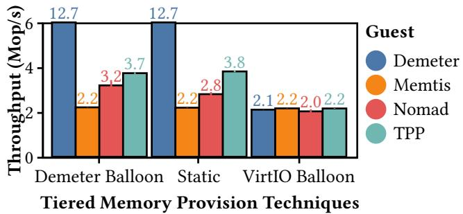  
Figure 6: Average GUPS throughput comparison between tiered memory provision techniques across different guests.

Workload We select the GUPS (Giga Updates Per Second) [50, 56] benchmark as our primary micro-benchmark to measure system memory throughput behavior. GUPS quantifies performance by counting read-modify-write transactions completed per second, providing a clear metric for memory system efficiency. Specifically, we employ the hotset variant of GUPS, which creates a realistic access pattern by dividing memory into skewed random access regions with differentiated access frequencies. The hot section receives ten times more accesses than the cold section, with random memory operations within each region. This skewed access pattern closely resembles real-world application behavior while providing controlled conditions for systematic evaluation.

## 5.2.1 Elastic Tired Memory Provision

Figure 6 shows Demeter balloon achieves performance comparable to static allocation while supporting dynamic tier-aware memory provisioning. We evaluate nine concurrent VMs running GUPS, comparing Demeter with VirtIO balloon [54]. Both solutions set VM FMEM and SMEM capacity to 100% of total memory, using balloon resizing to achieve the desired $\frac { 1 } { 5 }$ ratio. Demeter balloon delivers 68% higher throughput than VirtIO balloon with TPP. This performance gap stems from VirtIO’s lack of tier awareness—its inflation mechanism conflicts with Linux’s memory allocator, causing it to prioritize FMEM reservation despite SMEM adjustment requests, resulting in severe FMEM under-provisioning. Even with guest TMM enabled, VirtIO balloon provides insufficient FMEM for hot data placement. By contrast, Demeter balloon maintains tier awareness during provisioning, matching static allocation performance while preserving dynamic resizing capabilities.

Demeter balloon’s modular design integrates with various guest kernels through a simple kernel module. We added support for state-of-the-art solutions including TPP, Nomad, and Memtis, all achieving performance comparable to static provisioning when using Demeter balloon. For subsequent TMM evaluations, we use Demeter balloon as the common provisioning mechanism to independently evaluate our guest-delegated TMM.

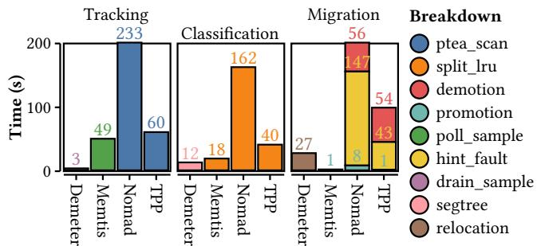  
Figure 7: Breakdown of tiered memory management overhead spent in seconds across guest designs

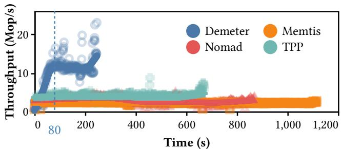  
Figure 8: Instantaneous GUPS throughput comparison across guest designs with locally estimated smoothing.

## 5.2.2 Efficient and Scalable GuestDelegated TMM

EPTfriendly PEBS Access Tracking. Figure 7 presents our overhead breakdown study with nine concurrent VMs running GUPS. Demeter’s context-switch-based sample draining consumes only three seconds of CPU time, a 16× reduction compared to Memtis with its dedicated collection threads. Other solutions like TPP and Nomad rely on exhaustive page table walks and PTE.A/D scanning, with even the most efficient (TPP) incurring 1.2× higher overhead than Memtis while providing less accurate hotness data.

Rangebased Hotness Classification. Figure 8 shows real-time GUPS throughput measurements. Demeter demonstrates superior responsiveness with the steepest throughput increase during the initial 80 seconds, reflecting its ability to rapidly identify hot data ranges. The temporary throughput decline corresponds with migration activity. Demeter achieves both the earliest completion time and highest peak throughput, confirming its classification accuracy and efficiency. Figure 7 further shows Demeter identifies more hot data while incurring only two-thirds the overhead of the next best alternative.

Balanced Page Relocation. Despite handling more hot data, Demeter’s migration mechanism shows exceptional efficiency, consuming only 28% of TPP’s overhead. TPP spends nearly half its execution time on software-level page fault operations, while Nomad suffers even more from page fault handling during shadow copy setup. Though Memtis shows nearly no migration overhead, this stems from its ineffective hotness classification, which fails to identify sufficient hot pages, which is reflected in its substantially longer execution time. Demeter delivers the optimal balance between classification accuracy and performance efficiency.

<table><tr><td>Access Tracking Primitive</td><td>Overhead (s)</td><td>Overhead Adopted (%CPU)</td><td>By</td></tr><tr><td>EPT-friendly PEBS</td><td>5.937</td><td>0.64</td><td>Demeter</td></tr><tr><td>PTE.A/D Bits</td><td>27.814</td><td>3.08</td><td>TPP-H</td></tr><tr><td>PML-based</td><td>135.410</td><td>14.61</td><td>vTMM</td></tr></table>

Table 3: Access tracking primitive overhead comparison for GUPS workload in pure DRAM environment

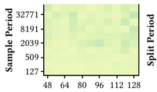  
Load La ency Thre ho d

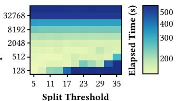  
Sp Thre ho d  
Figure 9: Access tracking and hotness classification parameter sensitivity demonstrated through GUPS runtime

## 5.2.3 Other Access Tracking Methodology

Intel®’s Page Modification Logging (PML) tracks memory writes that set PTE.D bits in EPT [32] by storing guest physical addresses in a fixed 512-entry buffer. VM-exits are triggered when the buffer fills, and this approach is adopted by vTMM [52] for access tracking.

Since vTMM’s source code and implementation details are unavailable, we isolate and evaluate PML-based access tracking primitive against PTE.A/D bit scanning and EPTfriendly PEBS. For PTE.A/D bit scanning, we isolate its implementation adopted by TPP into a scanning module and enable it in the host. We use nine GUPS workload VMs with a combined 126 GiB working set on DRAM-only configuration, measuring overhead by comparing performance with tracking enabled versus disabled.

Table 3 shows that PML introduces 4.7× higher overhead than PTE.A/D bit scanning. This poor performance stems from PML’s fixed-frequency VM-exits every 512 page modifications, which creates substantial overhead compared to PEBS’s flexible sampling rates, dynamic buffer sizing, and asynchronous sample processing.

## 5.2.4 Sensitivity Study

PEBS Event Parameters. Demeter leverages PEBS with load latency events as described in §3.2.2, with performance governed by two primary parameters: sample frequency and latency threshold. Sample frequency affects both classification quality and system overhead, while latency threshold filters between cache and memory accesses. We measure their impact on average runtime across nine concurrent VMs running GUPS, analyzing sample period (inverse frequency) which specifies memory accesses between consecutive PEBS buffer writes. As Figure 9 shows, performance remains stable across a wide parameter range, with degradation occurring only at extreme values (very high latency thresholds or large sample periods). Our selected values (4093 for sample period, 64ns for latency threshold) consistently deliver near-optimal performance across diverse workloads.

Range Split Parameters. Demeter’s range-based classification identifies local hotspots when memory ranges accumulate access counts exceeding the split threshold $( \tau _ { \mathrm { s p l i t } } )$ The system evaluates potential splits at regular intervals defined by the split period $( \mathit { \ t } _ { { t } _ { \mathrm { s p l i t } } } )$ . Through testing, we identified optimal configurations and sensitivity boundaries. The results demonstrate Demeter’s robustness, with significant performance degradation occurring only under extreme settings: when splits happen too infrequently (periods exceeding 5000ms or thresholds above 17) or too frequently (periods below 500ms). Our selected parameters $( \tau _ { \mathrm { s p l i t } } = 1 5 , t _ { \mathrm { s p l i t } } = 5 0 0 \mathrm { m s } )$ consistently deliver optimal performance while maintaining responsiveness to changing workload patterns.

## 5.3 Real World Applications

To validate Demeter’s practical effectiveness among guestdelegated designs, we evaluate seven memory-intensive workloads spanning databases, scientific computing, graph processing, and machine learning, following Memtis’ methodology [38] to cover diverse access patterns. For databases, we test btree [2] and the in-memory OLTP engine Silo [55]. Scientific computing is represented by bwaves from SPEC CPU 2017 [15] and the nuclear simulation XSBench [53]. Graph workloads include graph500 [1] and PageRank [13] on Twitter’s social graph [36]. For machine learning, we evaluate LibLinear [21] with the kdda dataset. Each workload is scaled to maximize memory utilization without exceeding our virtual machine’s capacity. Across these workloads, Demeter achieves up to 2.2× improvement overall, outperforming the next best alternative (TPP) by 28% on average (geometric mean).

Uniform Access Patterns. Applications with relatively uniform access distributions (btree and bwaves) challenge tiered memory systems. Despite this uniformity, Demeter identifies subtle hotspots (i.e. traversal hubs in btree and active computation regions in bwaves), achieving up to 20% performance improvement in multi-VM environments.

Static Hotspot. For applications with well-defined static hotspots (XSBench and LibLinear), Demeter delivers exceptional improvements, up to 6.6× compared to Nomad and over 40% advantage against Memtis for XSBench. Nomad’s consistent bad performance originates from its focus on migration thrashing rather than hotness management. Dynamic Shifting Hotspot. OLTP systems like Silo exhibit dynamic hotspot behavior with strong temporal locality. Demeter maintains at least 10% advantage over Memtis (second-best performer) and up to 4× improvement over Nomad, demonstrating responsiveness to evolving access patterns through efficient PEBS sampling and agile rangebased classification.

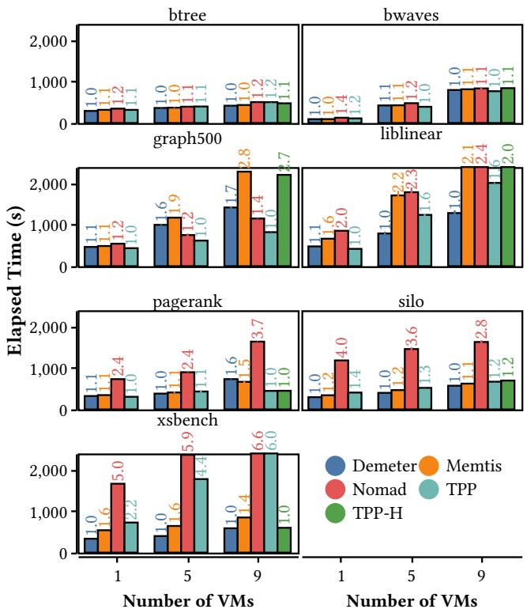  
Figure 10: Average execution times across diverse realworld workloads utilizing DRAM with real PMEM (Relative performance improvements shown as labels).

Skewed Access Pattern. Graph applications (graph500 and PageRank) present unique challenges with their power-law characteristics, where a small subset of vertices and edges receives disproportionate access frequencies. The scattered connections spanning the entire memory space create finegrained interleaving of hot and cold data. In these challenging workloads, Demeter delivers the second-best overall performance, closely following TPP.

## 5.4 GuestDelegated vs. HypervisorBased TMM

To provide a fair comparison between guest-delegated and hypervisor-based approaches, we use a hypervisor variant of TPP (TPP-H) that uses MMU notifiers to collect PTE.A bits from the KVM hypervisor. We evaluated performance across nine concurrent VMs with identical workloads as shown in Figure 10. For guest-based designs, we provision a total of 28.8 GiB DRAM across all VMs, while for TPP-H, we allocate 36 GiB total DRAM to provide additional headroom for hypervisor operations. TPP-H is given full flexibility to dynamically allocate DRAM across VMs according to its internal policies. Results demonstrate that guest-delegated Demeter outperforms TPP-H in six of seven workloads, delivering up to 2× improvement for dynamic hotspot workloads, 20% for static hotspot patterns, and 10% for uniform access patterns. Demeter underperforms only in PageRank, showing a 60% slowdown. Notably, guest-delegated TPP consistently outperforms its hypervisor-based counterpart (TPP-H), further validating the fundamental advantages of our guest-delegation approach. Overall Demeter achieves 16% improvement compared to hypervisor-based designs on average using geometric mean.

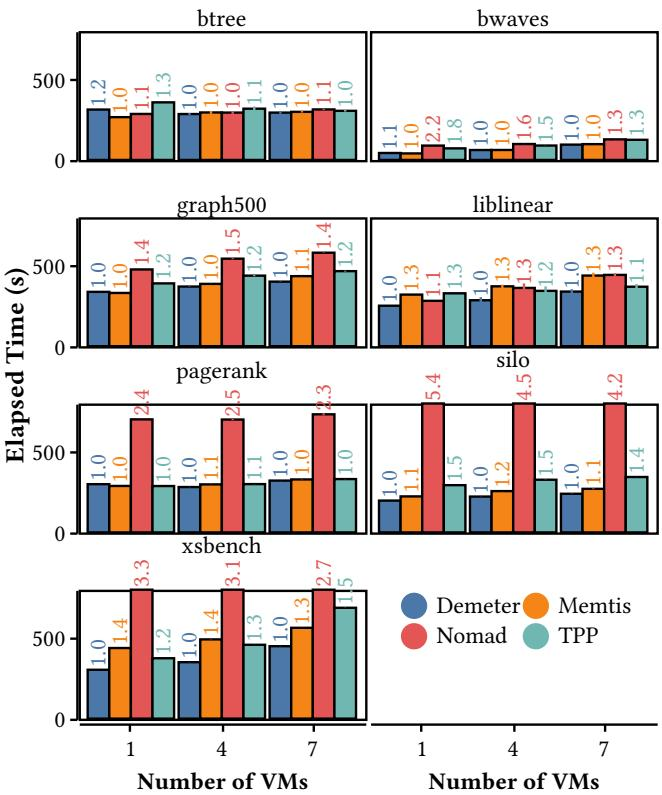  
Figure  11: Average execution times across diverse realworld workloads utilizing DRAM with emulated CXL.mem (Relative performance improvements shown as labels).

## 5.5 Performance with CXL memory

To evaluate Demeter’s compatibility with emerging memory technologies, we conduct experiments with emulated CXL.mem using remote NUMA memory, following the methodology established by Pond [39]. CXL.mem offers superior performance characteristics compared to PMEM, narrowing the performance gap between memory tiers and creating a more challenging environment for tiered memory solutions to demonstrate improvements.

Using identical configurations and applications as in Figure 10 apart from capacity limitation, we substitute

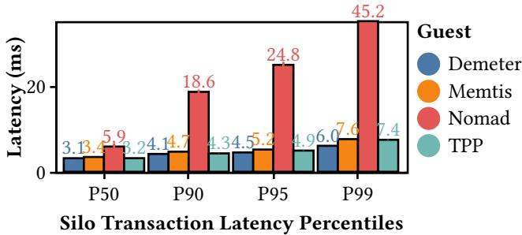  
Figure  12: Percentile latencies in milliseconds for Silo database executing YCSB workload averaged across nine concurrent virtual machines.

PMEM with emulated CXL.mem, with results presented in Figure 11. The findings demonstrate Demeter’s consistent advantages across applications with well-defined hotspot patterns. For workloads with static and dynamic hotspots (Silo, LibLinear, and XSBench), Demeter maintains at least a 10% performance advantage over TPP, the next-best alternative, highlighting its adaptability to emerging hardware.

## 5.6 Latency Sensitive Application

To evaluate Demeter’s impact on latency-sensitive interactive applications, we conduct detailed latency measurements using the Silo OLTP database. Consistent with our previous evaluation settings from Figure 10, we analyze both average and tail latency metrics across 5 concurrent VMs, with results presented in Figure 12.

The results highlight Demeter’s effectiveness in reducing critical tail latencies, achieving a 23% reduction in 99th percentile latency compared to TPP, the next best alternative. Across lower percentiles (50th-95th), Demeter consistently delivers the best performance with a minimum 0.1ms latency reduction. These improvements are critical for cloud environments where service level agreements often specify tail latency requirements for interactive applications.

## 6 Related Works

## 6.1 Kernelbased TMM

Kernel-based tiered memory management solutions have evolved across multiple dimensions to optimize performance-capacity tradeoffs in heterogeneous memory systems. Early systems like Thermostat [5] pioneered hugepage hotness management, while Nimble [63] added support for hugepage migration between tiers. AutoTiering [34] expanded to four-tier support, addressing scalability challenges in multi-tier environments. Architectural innovations continued with TMO [59] (using swap as a slower tier), TMTS [20] (enabling user-kernel collaboration for dynamic resource management), and TPP [41] (introducing proactive demotion strategies in Linux). Recent systems have moved beyond simple hit rate optimization: Nomad [61] reduces migration thrashing through shadow copies across tiers,

Colloid [56] optimizes for access latency, and PET [19] implements aggressive large-granularity demotion. Most kernel-based designs rely on Linux’s page reclamation and PTE.A/D bits for hotness tracking, with only Memtis [38] exploring alternative hardware-based sources. However, unlike our work, these kernel-based systems were not designed for virtualized environments and face fundamental challenges when directly applied to cloud infrastructure, including the TLB flush overhead and scalability issue.

## 6.2 Hardwarebased TMM

Hardware-based TMM approaches utilize specialized mechanisms for access tracking or fully offload memory management to hardware [38, 50, 64, 65]. While HeMem library [50] pioneered PEBS as a high-fidelity hotness source and Memtis [38] optimized its sampling mechanism, fully hardware-managed solutions like Intel®'s PMEM Memory Mode [64] and Flat Memory Mode [65] manage data placement without software intervention at the cost of losing usable memory [64] or inter-VM performance interference [65]. Demeter demonstrates that EPT-friendly PEBS can be effectively utilized within guest VMs, providing the elasticity and efficiency required in virtualized cloud environments.

## 6.3 DAMON

The DAMON framework [46, 47], integrated into the Linux kernel, assists user memory access patterns profiling in both virtual and physical address spaces. While a DAMONbased TMM system has been under development [48], it faces several limitations for virtualized environments: it relies on TLB-flush-intensive PTE.A bit sampling, performs classification in physical address space (losing critical locality information), and cannot leverage EPT-friendly PEBS. Demeter overcomes these limitations through guest-delegated architecture and efficient PEBS-based tracking, while maintaining compatibility with DAMON-based TMM as an alternative guest-side scheme if preferred.

## 7 Discussion

## 7.1 Tiering versus Swapping

Unlike traditional swapping systems that rely on pagefault-driven migration to disk or network storage [6, 23], tiered memory architectures using CXL.mem/PMEM enable direct load/store access to slower memory tiers without OS intervention in the critical path. This architectural difference creates a fundamental challenge: while swapping systems inherently capture locality through page faults, tiered memory systems have no natural visibility into page access frequencies. Consequently, effective tiered memory management requires explicit access tracking mechanisms, precisely the capability that existing hypervisor-based approaches struggle to provide efficiently under virtualization, and which our guest-delegation principle addresses by leveraging PEBS directly within the guest virtual address space where locality information naturally resides.

## 7.2 Aligning TMM with Cloud Service Models

Cloud providers already establish performance-capacity tradeoffs through memory-optimized instances [9, 44] with reduced core counts. Demeter’s guest-delegated approach aligns with these existing service models while avoiding the abstraction overhead of hypervisor-based management. By implementing TMM directly in the guest OS with application transparency, cloud providers can deliver tiered memory benefits without additional performance penalties or management complexity.

## 7.3 Safety and Security

Demeter treats all guest code as untrusted [4] and builds on production-proven KVM subsystem and VirtIO protocol [51], assuming their baseline safety. Our system introduces minimal additional attack surface through PEBS sampling and ballooning interfaces, which we secure through complementary mechanisms: Hardware Isolation. Guest-private PEBS state is isolated and cleared on VM-exit, with accesses to PEBS buffers restricted to VM-private ones. Each balloon instance maintains VM-private VirtIO channels, preventing cross-VM interference. Resource Bounds. Host-enforced per-tier limits (up to 100% of total memory budget) prevent resource exhaustion attacks where malicious guests attempt to monopolize memory. Fairness En forcement. While this work uses fixed FMEM/SMEM ratios for simplicity, production deployments can implement pertier token-bucket rate limiters to mitigate repeated deflation attacks and forged statistics that could disrupt fair allocation. Host Authority. The host retains ultimate authority, including the ability to terminate VMs exhibiting anomalous resource behavior compared to same-tier peers.

## 7.4 Baremetal Virtual Machines

Cloud providers offer bare-metal VMs [10, 22, 45] with stripped-down hypervisors often offloaded to dedicated hardware [11], which expose physical memory directly to tenants. This architecture eliminates the hypervisor’s ability to manage guest memory placement, rendering hypervisorbased tiered memory solutions ineffective. Demeter’s guestdelegated design functions seamlessly in these scenarios since TMM operates directly within the guest kernel, allowing cloud providers to deliver consistent tiered memory benefits across both virtualized and bare-metal instances.

## 7.5 PEBSbased Access Tracking from Host

While PEBS has demonstrated superior performance in kernel-based TMM, its application under virtualization faces fundamental architectural barriers that render it impractical for effective guest memory access tracking from the host side. The first barrier stems from virtualization isolation: guest PEBS configuration occurs through guest-private vmcs fields that are loaded exclusively during VM-entry.

Although the hypervisor could theoretically intercept these configurations and monitor the guest’s PEBS buffer, such intrusive mechanisms are unreliable in practice and create destructive interference with the guest’s own performance monitoring capabilities. The second barrier involves address translation complexity: PEBS sampling captures only gVAs, which lack semantic meaning for the hypervisor’s page migration decisions. Converting these gVAs to actionable information would require the hypervisor to continuously snoop GPTs or trap all GPT updates, approaches that fundamentally undermine the core performance benefits of hardware-assisted virtualization technologies compared to traditional paravirtualized alternatives. Even negotiating PEBS facility sharing between host and guest, while potentially addressing isolation concerns, fails to resolve the fundamental address translation challenge.

## 7.6 Optimizations for PTE.A/Dbased Access Tracking

vTMM claims to only scan dirty GPTs logged by PML, instead of the entire GPTs, to reduce the scanning time. However, according to our investigation, this optimization is not viable on the evaluated hardware. Specifically, current PML implementations [32] use a global enable bit in the vmcs structure, providing coarse-grained monitoring across the entire physical address space without selective filtering. That is, PML is unable to distinguish between pages backing guest page tables and data pages.

In the meantime, vTMM also indicates that even with PML, scanning page tables can still incur a non-negligible overhead of setting A/D bits and flushing TLB. As validated by our experiments (see Table 3), PML incurs frequent VMexits every 512 page modifications while still requiring costly TLB flushes when resetting PTE.A/D bits to monitor newly accessed pages. This implies that even if future PML hardware is equipped with selective filtering to reduce A/ D bit reading, it may still introduce a considerable number of VM exits, and fail to address the fundamental overhead associated with TLB flushes. In contrast, Demeter’s guestdelegated approach with EPT-friendly PEBS circumvents these architectural constraints entirely, eliminating both scanning overhead and associated destructive TLB flushes.

## 8 Conclusion

This paper presents Demeter, a scalable and elastic tiered memory solution for virtualized cloud environments that introduces the paradigm of guest delegation. By delegating tiered memory management to guest VMs, Demeter eliminates the performance penalties associated with hypervisor-based approaches, including expensive access tracking and frequent TLB flushes. Our approach effectively leverages EPT-friendly PEBS within guests, maintains cloud elasticity through double balloon-based provisioning, and preserves critical locality information through range-based classification in guest virtual address space. Evaluation across seven real-world workloads demonstrates that Demeter improves performance by up to 2× compared to hypervisor-based approaches and by 28% on average compared to the next best guest-based alternative.

## Acknowledgement

We thank our shepherd and the anonymous reviewers from both OSDI '25 and SOSP '25 for their constructive feedback and valuable insights that significantly improved this paper. This work was supported in part by The Research Grants Council of Hong Kong SAR (Project No. CUHK14210323), the National Science and Technology Council under grant nos. 114-2221-E-A49-156- MY3, 114-2628-E-A49-006, 113-2640-E-A49-012, 113-2640- E-A49-011, and Yushan Young Fellow Program. Ming-Chang Yang (mcyang@cse.cuhk.edu.hk) is the corresponding author.

## References

[1] Graph 500 Benchmarks. Retrieved from https://graph500. org/

[2] Reto Achermann, Ashish Panwar, Abhishek Bhattacharjee, Timothy Roscoe, and Jayneel Gandhi. 2020. Mitosis: Transparently Self-Replicating Page-Tables for Large-Memory Machines. In Proceedings of the Twenty-Fifth International Conference on Architectural Support for Programming Languages and Operating Systems (ASPLOS '20), 2020. Association for Computing Machinery, New York, NY, USA, 283–300. https://doi.org/10.1145/3373376.3378468

[3] Keith Adams and Ole Agesen. 2006. A comparison of software and hardware techniques for x86 virtualization. In Proceedings of the 12th International Conference on Architectural Support for Programming Languages and Operating Systems (ASPLOS XII), 2006. Association for Computing Machinery, San Jose, California, USA, 2–13. https://doi.org/10. 1145/1168857.1168860

[4] Alexandru Agache, Marc Brooker, Alexandra Iordache, Anthony Liguori, Rolf Neugebauer, Phil Piwonka, and Diana-Maria Popa. 2020. Firecracker: Lightweight Virtualization for Serverless Applications. In 17th USENIX Symposium on Networked Systems Design and Implementation (NSDI 20), February 2020. USENIX Association, Santa Clara, CA, 419– 434. Retrieved from https://www.usenix.org/conference/nsdi 20/presentation/agache

[5] Neha Agarwal and Thomas F. Wenisch. 2017. Thermostat: Application-transparent Page Management for Two-tiered Main Memory. In Proceedings of the Twenty-Second International Conference on Architectural Support for Programming Languages and Operating Systems (ASPLOS '17), 2017. Association for Computing Machinery, New York, NY, USA, 631– 644. https://doi.org/10.1145/3037697.3037706

[6] Emmanuel Amaro, Christopher Branner-Augmon, Zhihong Luo, Amy Ousterhout, Marcos K. Aguilera, Aurojit Panda, Sylvia Ratnasamy, and Scott Shenker. 2020. Can far memory improve job throughput?. In Proceedings of the Fifteenth European Conference on Computer Systems (EuroSys '20), 2020. Association for Computing Machinery, New York, NY, USA. https://doi.org/10.1145/3342195.3387522

[7] Amazon. Amazon EC2: Secure and resizable compute capacity for virtually any workload. Retrieved from https://aws. amazon.com/ec2/

[8] Amazon. Amazon Linux 2. Retrieved from https://aws. amazon.com/amazon-linux-2/

[9] Amazon. Specifications for Amazon EC2 memory optimized instances. Retrieved from https://docs.aws.amazon.com/ec2/ latest/instancetypes/mo.html

[10] Amazon. Amazon EC2 Instance types. Retrieved from https://aws.amazon.com/ec2/instance-types/

[11] Amazon. AWS Nitro System: A combination of dedicated hardware and lightweight hypervisor enabling faster innovation and enhanced security. Retrieved from https://aws. amazon.com/ec2/nitro/

[12] Paul Barham, Boris Dragovic, Keir Fraser, Steven Hand, Tim Harris, Alex Ho, Rolf Neugebauer, Ian Pratt, and Andrew Warfield. 2003. Xen and the art of virtualization. In Proceedings of the Nineteenth ACM Symposium on Operating Systems Principles (SOSP '03), 2003. Association for Computing Ma-

chinery, New York, NY, USA, 164–177. https://doi.org/10. 1145/945445.945462

[13] Scott Beamer, Krste Asanovic, and David A. Patterson. 2015. The GAP Benchmark Suite. CoRR (2015). Retrieved from http://arxiv.org/abs/1508.03619

[14] Google Cloud. PaaS vs. IaaS vs. SaaS vs. CaaS: How are they different?. Retrieved from https://cloud.google.com/learn/ paas-vs-iaas-vs-saas

[15] Standard Performance Evaluation Corporation. 2017. SPEC CPU® 2017. Retrieved from https://www.spec.org/cpu2017/

[16] Eli Cortez, Anand Bonde, Alexandre Muzio, Mark Russinovich, Marcus Fontoura, and Ricardo Bianchini. 2017. Resource Central: Understanding and Predicting Workloads for Improved Resource Management in Large Cloud Platforms. In Proceedings of the 26th Symposium on Operating Systems Principles (SOSP '17), 2017. Association for Computing Machinery, New York, NY, USA, 153–167. https://doi.org/10. 1145/3132747.3132772

[17] Dell. 2024. Dell Memory Upgrade - 64 GB - 4Rx4 DDR4 LRDIMM 2666 MT/s. Retrieved from https://web. archive.org/web/20241105065702/https://www.dell.com/enus/shop/mem/apd/a9781930/

[18] Dell. 2024. Dell Memory Upgrade - 128 GB - 2666 MT/s Intel Opt DC Persistent Memory. Retrieved from https://web. archive.org/web/20241105065608/https://www.dell.com/enus/shop/mem/apd/aa664973/

[19] Wanju Doh, Yaebin Moon, Seoyoung Ko, Seunghwan Chung, Kwanhee Kyung, Eojin Lee, and Jung Ho Ahn. 2025. PET: Proactive Demotion for Efficient Tiered Memory Management. In Proceedings of the Twentieth European Conference on Computer Systems (EuroSys '25), 2025. Association for Computing Machinery, New York, NY, USA, 854–869. https://doi. org/10.1145/3689031.3717471

[20] Padmapriya Duraisamy, Wei Xu, Scott Hare, Ravi Rajwar, David Culler, Zhiyi Xu, Jianing Fan, Christopher Kennelly, Bill McCloskey, Danijela Mijailovic, Brian Morris, Chiranjit Mukherjee, Jingliang Ren, Greg Thelen, Paul Turner, Carlos Villavieja, Parthasarathy Ranganathan, and Amin Vahdat. 2023. Towards an Adaptable Systems Architecture for Memory Tiering at Warehouse-Scale. In Proceedings of the 28th ACM International Conference on Architectural Support for Programming Languages and Operating Systems, Volume 3 (ASPLOS '23), 2023. Association for Computing Machinery, New York, NY, USA, 727–741. https://doi.org/10.1145/ 3582016.3582031

[21] Rong-En Fan, Kai-Wei Chang, Cho-Jui Hsieh, Xiang-Rui Wang, and Chih-Jen Lin. 2008. LIBLINEAR: A Library for Large Linear Classification. J. Mach. Learn. Res. 9, (June 2008), 1871–1874.

[22] Google. General-purpose machine family for Compute Engine. Retrieved from https://cloud.google.com/compute/ docs/general-purpose-machines

[23] Juncheng Gu, Youngmoon Lee, Yiwen Zhang, Mosharaf Chowdhury, and Kang G. Shin. 2017. Efficient Memory Disaggregation with Infiniswap. In 14th USENIX Symposium on Networked Systems Design and Implementation (NSDI 17), March 2017. USENIX Association, Boston, MA, 649–667. Retrieved from https://www.usenix.org/conference/nsdi17/ technical-sessions/presentation/gu

[24] Vishal Gupta, Min Lee, and Karsten Schwan. 2015. Hetero-Visor: Exploiting Resource Heterogeneity to Enhance the Elasticity of Cloud Platforms. In Proceedings of the 11th ACM SIGPLAN/SIGOPS International Conference on Virtual Execution Environments (VEE '15), 2015. Association for Computing Machinery, New York, NY, USA, 79–92. https://doi.org/10. 1145/2731186.2731191

[25] Dave Hansen. 2005. Memory Hotplug. Retrieved from https://lore.kernel.org/linux-mm/1108685111.6482.40. camel@localhost/

[26] David Hildenbrand and Martin Schulz. 2021. Virtio-Mem: Paravirtualized Memory Hot(Un)Plug. In Proceedings of the 17th ACM SIGPLAN/SIGOPS International Conference on Virtual Execution Environments (VEE '21), 2021. Association for Computing Machinery, New York, NY, USA, 1–14. https:// doi.org/10.1145/3453933.3454010

[27] Takahiro Hirofuchi and Ryousei Takano. 2016. RAMinate: Hypervisor-based Virtualization for Hybrid Main Memory Systems. In Proceedings of the Seventh ACM Symposium on Cloud Computing (SoCC '16), 2016. Association for Computing Machinery, New York, NY, USA, 112–125. https://doi.org/ 10.1145/2987550.2987570

[28] Jingyuan Hu, Xiaokuang Bai, Sai Sha, Yingwei Luo, Xiaolin Wang, and Zhenlin Wang. 2018. HUB: hugepage ballooning in kernel-based virtual machines. In Proceedings of the International Symposium on Memory Systems (MEMSYS '18), 2018. Association for Computing Machinery, New York, NY, USA, 31–37. https://doi.org/10.1145/3240302.3240420

[29] Intel. 2014. Intel® Xeon® Processor E7-8895 v2. Retrieved from https://www.intel.com/content/www/us/en/ products/sku/79209/intel-xeon-processor-e78895-v2-37-5mcache-2-80-ghz/specifications.html

[30] Intel. 2024. Intel® Xeon® 6780E Processor. Retrieved from https://www.intel.com/content/www/us/en/products/ sku/240362/intel-xeon-6780e-processor-108m-cache-2-20- ghz/specifications.html

[31] Intel. 2024. Intel® Memory Latency Checker v3.11b. Retrieved from https://www.intel.com/content/www/us/en/ developer/articles/tool/intelr-memory-latency-checker.html

[32] Intel. 2024. Intel® 64 and IA-32 Architectures Software Developer Manuals. Retrieved from https://web.archive.org/ web/20240816185003/https://www.intel.com/content/www/ us/en/developer/articles/technical/intel-sdm.html

[33] Sudarsun Kannan, Ada Gavrilovska, Vishal Gupta, and Karsten Schwan. 2017. HeteroOS: OS Design for Heterogeneous Memory Management in Datacenter. In Proceedings of the 44th Annual International Symposium on Computer Architecture (ISCA '17), 2017. Association for Computing Machinery, New York, NY, USA, 521––534. https://doi.org/ 10.1145/3079856.3080245

[34] Jonghyeon Kim, Wonkyo Choe, and Jeongseob Ahn. 2021. Exploring the Design Space of Page Management for Multi-Tiered Memory Systems. In 2021 USENIX Annual Technical Conference (USENIX ATC 21), July 2021. USENIX Association, 715–728. Retrieved from https://www.usenix.org/ conference/atc21/presentation/kim-jonghyeon

[35] Andi Kleen. 2014. Implement PEBS virtualization for Silvermont. Retrieved from https://lore.kernel.org/all/1401412327- 14810-1-git-send-email-andi@firstfloor.org/

[36] Haewoon Kwak, Changhyun Lee, Hosung Park, and Sue Moon. 2010. What is Twitter, a social network or a news media?. In WWW '10: Proceedings of the 19th international conference on World wide web, 2010. ACM, New York, NY, USA, 591–600. https://doi.org/https://doi.acm.org/10.1145/ 1772690.1772751

[37] Andres Lagar-Cavilla, Junwhan Ahn, Suleiman Souhlal, Neha Agarwal, Radoslaw Burny, Shakeel Butt, Jichuan Chang, Ashwin Chaugule, Nan Deng, Junaid Shahid, Greg Thelen, Kamil Adam Yurtsever, Yu Zhao, and Parthasarathy Ranganathan. 2019. Software-Defined Far Memory in Warehouse-Scale Computers. In Proceedings of the Twenty-Fourth International Conference on Architectural Support for Programming Languages and Operating Systems (ASPLOS '19), 2019. Association for Computing Machinery, New York, NY, USA, 317–330. https://doi.org/10.1145/3297858.3304053

[38] Taehyung Lee, Sumit Kumar Monga, Changwoo Min, and Young Ik Eom. 2023. MEMTIS: Efficient Memory Tiering with Dynamic Page Classification and Page Size Determination. In Proceedings of the 29th Symposium on Operating Systems Principles (SOSP '23), 2023. Association for Computing Machinery, New York, NY, USA, 17–34. https://doi.org/ 10.1145/3600006.3613167

[39] Huaicheng Li, Daniel S. Berger, Lisa Hsu, Daniel Ernst, Pantea Zardoshti, Stanko Novakovic, Monish Shah, Samir Rajadnya, Scott Lee, Ishwar Agarwal, Mark D. Hill, Marcus Fontoura, and Ricardo Bianchini. 2023. Pond: CXL-Based Memory Pooling Systems for Cloud Platforms. In Proceedings of the 28th ACM International Conference on Architectural Support for Programming Languages and Operating Systems, Volume 2 (ASPLOS '23), 2023. Association for Computing Machinery, New York, NY, USA, 574–587. https://doi.org/10. 1145/3575693.3578835

[40] LF Projects LLC. 2023. Cloud Hypervisor. Retrieved from https://www.cloudhypervisor.org/

[41] Hasan Al Maruf, Hao Wang, Abhishek Dhanotia, Johannes Weiner, Niket Agarwal, Pallab Bhattacharya, Chris Petersen, Mosharaf Chowdhury, Shobhit Kanaujia, and Prakash Chauhan. 2023. TPP: Transparent Page Placement for CXL-Enabled Tiered-Memory. In Proceedings of the 28th ACM International Conference on Architectural Support for Programming Languages and Operating Systems, Volume 3 (ASPLOS '23), 2023. Association for Computing Machinery, New York, NY, USA, 742–755. https://doi.org/10.1145/3582016.3582063

[42] Microsoft. Azure Virtual Machines. Retrieved from https:// azure.microsoft.com/en-us/products/virtual-machines/

[43] Microsoft. zure Linux. Retrieved from https://github.com/ microsoft/azurelinux

[44] Microsoft. E family memory optimized VM size series. Retrieved from https://learn.microsoft.com/en-us/ azure/virtual-machines/sizes/memory-optimized/e-family

[45] Microsoft. 2024. Sizes for virtual machines in Azure. Retrieved from https://learn.microsoft.com/en-us/azure/ virtual-machines/sizes/overview

[46] SeongJae Park, Madhuparna Bhowmik, and Alexandru Uta. 2022. DAOS: Data Access-aware Operating System. In Proceedings of the 31st International Symposium on High-Performance Parallel and Distributed Computing (HPDC '22), 2022. Association for Computing Machinery, New York, NY, USA, 4–15. https://doi.org/10.1145/3502181.3531466

[47] SeongJae Park, Yunjae Lee, and Heon Y. Yeom. 2019. Profiling Dynamic Data Access Patterns with Controlled Overhead and Quality. In Proceedings of the 20th International Middleware Conference Industrial Track (Middleware '19), 2019. Association for Computing Machinery, New York, NY, USA, 1–7. https://doi.org/10.1145/3366626.3368125

[48] SeongJae Park. 2024. DAMON based tiered memory management for CXL memory. Retrieved from https://lore.kernel. org/all/20240512175447.75943-1-sj@kernel.org/

[49] Atish Patra. 2024. RISC-V SBI v2.0 PMU improvements and Perf sampling in KVM guest. Retrieved from https://lore.kernel.org/kvm/20240416184421.3693802- 1-atishp@rivosinc.com/

[50] Amanda Raybuck, Tim Stamler, Wei Zhang, Mattan Erez, and Simon Peter. 2021. HeMem: Scalable Tiered Memory Management for Big Data Applications and Real NVM. In Proceedings of the ACM SIGOPS 28th Symposium on Operating Systems Principles (SOSP '21), 2021. Association for Computing Machinery, New York, NY, USA, 392–407. https://doi.org/ 10.1145/3477132.3483550

[51] Rusty Russell. 2008. virtio: towards a de-facto standard for virtual I/O devices. SIGOPS Oper. Syst. Rev. (OSR '08) 42, 5 (July 2008), 95–103. https://doi.org/10.1145/1400097.1400108

[52] Sai Sha, Chuandong Li, Yingwei Luo, Xiaolin Wang, and Zhenlin Wang. 2023. vTMM: Tiered Memory Management for Virtual Machines. In Proceedings of the Eighteenth European Conference on Computer Systems (EuroSys '23), 2023. Association for Computing Machinery, New York, NY, USA, 283–297. https://doi.org/10.1145/3552326.3587449

[53] John R Tramm, Andrew R Siegel, Tanzima Islam, and Martin Schulz. 2014. XSBench - The Development and Verification of a Performance Abstraction for Monte Carlo Reactor Analysis. In PHYSOR 2014 - The Role of Reactor Physics toward a Sustainable Future, 2014. Kyoto. Retrieved from https://www. mcs.anl.gov/papers/P5064-0114.pdf

[54] Michael Tsirkin and Cornelia Huck. 2023. Virtual I/O Device (VIRTIO) Version 1.3. Retrieved from https://docs.oasisopen.org/virtio/virtio/v1.3/virtio-v1.3.html

[55] Stephen Tu, Wenting Zheng, Eddie Kohler, Barbara Liskov, and Samuel Madden. 2013. Speedy transactions in multicore in-memory databases. In Proceedings of the Twenty-Fourth ACM Symposium on Operating Systems Principles (SOSP '13), 2013. Association for Computing Machinery, New York, NY, USA, 18–32. https://doi.org/10.1145/2517349.2522713

[56] Midhul Vuppalapati and Rachit Agarwal. 2024. Tiered Memory Management: Access Latency is the Key!. In Proceedings of the 30th Symposium on Operating Systems Principles (SOSP '24), 2024. Association for Computing Machinery, New York, NY, USA, 79–94. https://doi.org/10.1145/3694715.3695968

[57] Carl A. Waldspurger. 2002. Memory Resource Management in VMware ESX Server. In 5th USENIX Symposium on Operating Systems Design and Implementation (OSDI 02), December 2002. USENIX Association. Retrieved from https://www. usenix.org/legacy/events/osdi02/tech/waldspurger.html

[58] Yaohui Wang, Ben Luo, and Yibin Shen. 2023. Efficient Memory Overcommitment for I/O Passthrough Enabled VMs via Fine-grained Page Meta-data Management. In 2023 USENIX Annual Technical Conference (USENIX ATC 23), July 2023. USENIX Association, Boston, MA, 769–

783. Retrieved from https://www.usenix.org/conference/atc 23/presentation/wang-yaohui

[59] Johannes Weiner, Niket Agarwal, Dan Schatzberg, Leon Yang, Hao Wang, Blaise Sanouillet, Bikash Sharma, Tejun Heo, Mayank Jain, Chunqiang Tang, and Dimitrios Skarlatos. 2022. TMO: Transparent Memory Offloading in Datacenters. In Proceedings of the 27th ACM International Conference on Architectural Support for Programming Languages and Operating Systems (ASPLOS '22), 2022. Association for Computing Machinery, New York, NY, USA, 609–621. https://doi.org/10. 1145/3503222.3507731

[60] Lars Wrenger, Kenny Albes, Marco Wurps, Christian Dietrich, and Daniel Lohmann. 2025. HyperAlloc: Efficient VM Memory De/Inflation via Hypervisor-Shared Page-Frame Allocators. In Proceedings of the Twentieth European Conference on Computer Systems (EuroSys '25), 2025. Association for Computing Machinery, New York, NY, USA, 702–719. https:// doi.org/10.1145/3689031.3717484

[61] Lingfeng Xiang, Zhen Lin, Weishu Deng, Hui Lu, Jia Rao, Yifan Yuan, and Ren Wang. 2024. Nomad: Non-Exclusive Memory Tiering via Transactional Page Migration. In 18th USENIX Symposium on Operating Systems Design and Implementation (OSDI 24), July 2024. USENIX Association, Santa Clara, CA, 19–35. Retrieved from https://www.usenix.org/ conference/osdi24/presentation/xiang

[62] Like Xu. 2022. perf/x86/intel: Expose EPT-friendly PEBS for SPR and future models. Retrieved from https://lore.kernel. org/kvm/20220922051929.89484-1-likexu@tencent.com/

[63] Zi Yan, Daniel Lustig, David Nellans, and Abhishek Bhattacharjee. 2019. Nimble Page Management for Tiered Memory Systems. In Proceedings of the Twenty-Fourth International Conference on Architectural Support for Programming Languages and Operating Systems (ASPLOS '19), 2019. Association for Computing Machinery, New York, NY, USA, 331– 345. https://doi.org/10.1145/3297858.3304024

[64] Jian Yang, Juno Kim, Morteza Hoseinzadeh, Joseph Izraelevitz, and Steve Swanson. 2020. An Empirical Guide to the Behavior and Use of Scalable Persistent Memory. In 18th USENIX Conference on File and Storage Technologies (FAST 20), February 2020. USENIX Association, Santa Clara, CA, 169– 182. Retrieved from https://www.usenix.org/conference/fast 20/presentation/yang

[65] Yuhong Zhong, Daniel S. Berger, Carl Waldspurger, Ryan Wee, Ishwar Agarwal, Rajat Agarwal, Frank Hady, Karthik Kumar, Mark D. Hill, Mosharaf Chowdhury, and Asaf Cidon. 2024. Managing Memory Tiers with CXL in Virtualized Environments. In 18th USENIX Symposium on Operating Systems Design and Implementation (OSDI 24), July 2024. USENIX Association, Santa Clara, CA, 37–56. Retrieved from https://www.usenix.org/conference/osdi24/ presentation/zhong-yuhong