Latest updates: hps://dl.acm.org/doi/10.1145/3731569.3764802

RESEARCH-ARTICLE

# Moirai: Optimizing Placement of Data and Compute in Hybrid Clouds

ZIYUE QIU, Carnegie Mellon University, Pisburgh, PA, United States

HOJIN PARK, Carnegie Mellon University, Pisburgh, PA, United States

JING ZHAO, Uber Technologies Inc, San Francisco, CA, United States

YU-KAI WANG, Uber Technologies Inc, San Francisco, CA, United States

ARNAV BALYAN

GURMEET SINGH, Uber Technologies Inc, San Francisco, CA, United States

View all

Open Access Support provided by:

Uber Technologies Inc

Carnegie Mellon University

Published: 12 October 2025

Citation in BibTeX format

SOSP '25: ACM SIGOPS 31st Symposium

on Operating Systems Principles

October 13 - 16, 2025

Seoul, Republic of Korea

Conference Sponsors: SIGOPS

# Moirai: Optimizing Placement of Data and Compute in Hybrid Clouds

Ziyue Qiu♠ ♦ Hojin Park♠ Jing Zhao♦ Yukai Wang♦† Arnav Balyan♦ Gurmeet Singh♦ Yangjun Zhang♦ Suqiang (Jack) Song♦ Gregory R. Ganger♠ George Amvrosiadis♠ ♠Carnegie Mellon University ♦Uber

## Abstract

The deployment of large-scale data analytics between onpremise and cloud sites, i.e., hybrid clouds, requires careful partitioning of both data and computation to avoid massive networking costs. We present Moirai, a cost-optimization framework that analyzes job accesses and data dependencies and optimizes the placement of both in hybrid clouds. Moirai informs the job scheduler of data location and access predictions, so it can determine where jobs should be executed to minimize data transfer costs. Our optimizer achieves scalability and cost efficiency by exploiting recurring jobs to identify data dependencies and job access characteristics and reduces the search space by excluding data not accessed recently.

We validate Moirai using 4-month traces that span 66.7M queries accessing 13.3EB from Presto and Spark clusters deployed at Uber, a multi-national transportation company leveraging large-scale data analytics for its operations. Moirai reduces hybrid cloud deployment costs by over 97% relative to the state-of-the-art partitioning approach from Alibaba and other public approaches. The savings come from 95–99.5% reduction in cloud egress, up to 99% reduction in replication, and 89–98% reduction in on-premises network infrastructure requirements. We also describe concrete steps being taken towards deploying Moirai in production.

CCS Concepts: • Computer systems organization → Cloud computing; • Information systems → Data management systems.

Keywords: Hybrid clouds, Cost-efficiency

## 1 Introduction

Hybrid cloud deployments, combining on-premises data centers with public cloud resources, have become common as large organizations seek benefits like load bursting, more agile growth paths, and access to new technologies with smaller investments [1–9]. The division of resources differs between organizations and can change over time, e.g., as an organization seeks to migrate incrementally off-premises [4, 6]. In any case, dollar cost efficiency will be heavily influenced by the placement of data and compute work. For modern dataintensive workloads, co-optimizing data and computation placement is especially important for cost efficiency [10, 11].

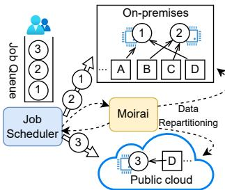  
(a) Moirai Architecture

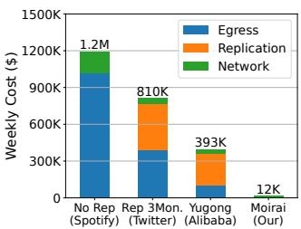  
(b) Placement approach costs  
Figure 1. (a) Moirai dynamically and continuously optimizes job (circles) and data (squares) placement in hybrid clouds, using a feedback loop. (b) Moirai reduces cost by 97% compared to Alibaba’s Yugong, the state-of-the-art, when run on 4-month traces of Uber’s Presto and Spark services (right).

Early proposals for the placement configuration of hybrid cloud suggested simplistic data partitioning without replication, targeting data-light jobs [4, 12, 13]. For modern data-heavy workloads, such an approach leads to increased dollar costs from cloud-egress and on-premises networking requirements, as confirmed by Spotify’s experience while progressively migrating to the cloud [4, 14] and illustrated in Figure 1b (No Rep bar). Subsequent efforts, including Twitter [7, 15, 16], used extensive replication of data at both sites, which reduced communication costs at the expense of significant storage capacity costs. We find that the weekly cost for replicating the last 3 months of data alone (Rep 3Mon), which covers most accesses [10, 17, 18], is lower but still quite high.

Yugong [10], the public state-of-the-art introduced by Alibaba for minimizing cross-datacenter bandwidth in their private cloud, models project placement (where a “project” is a grouping of jobs and data by human organizational association) and table replication using Mixed Integer Programming (MIP) with fixed replication budgets. Adapted for hybrid clouds—by incorporating flexible replication and accounting for egress fees—Yugong achieves better placements than prior methods (Figure 1b), but the dollar costs remain large.

We identify opportunities for improvement by collecting and analyzing large-scale hybrid cloud analytics workloads from Uber, a multi-national transportation company using large-scale data analytics for operations. Our analysis spans 66.7M Presto queries and Spark jobs accessing 13.3EB of data from a 300PB corpus, logged over four months. We identify high interconnectivity, moderate job template recurrence, and continuous growth, creating a challenging optimization problem. Importantly, while data and job grouping is important to reducing optimization complexity, Yugong’s reliance on human organizational structure for grouping does not fit with the dynamic cross-organization data sharing seen at Uber and in the recent study of Microsoft Cosmos [19].

Moirai1 is an optimization framework that improves cost efficiency in hybrid cloud deployments. It formulates an MIP problem with the goal of minimizing dollar costs, including cloud-egress, replication storage, and network link provisioning, given operational constraints such as on-premises capacity and inter-site bandwidth limits. Unlike prior approaches, Moirai informs its optimization by online analysis of job logs and associated per-job data accesses. To scale to large infrastructures like Uber’s, Moirai applies a novel combination of optimization refinements, reducing the problem space with characteristics seen in the logs: grouping jobs based on query template similarity, pruning tables not accessed in the last week, and pre-selecting the most commonly needed tables for replication. For job placement, Moirai optimizes recurring jobs and uses a per-table access-size predictor to minimize remote fetches for new jobs. Finally, Moirai adapts to dynamic workloads by periodically reevaluating placement decisions, accounting for shifting data, job patterns, and resource availability—critical in environments like Uber’s, where ≈50% of weekly jobs are new, rather than recurrences of jobs seen in the previous week.

We evaluate Moirai, and justify its design aspects, in a trace-driven evaluation using traces of Uber’s large-scale Presto and Spark clusters. Under a hybrid split where 50% of resources are on-premises and 50% in the cloud, which we find to be one of the most difficult splits to solve, Moirai achieves a 97% cost reduction over Yugong (Figure 1b). These savings come from 95–99.5% reduction in cloud egress, up to 99% reduction in replication, and 89–98% reduction in onpremises network infrastructure requirements. Similar cost savings are observed for other hybrid splits. Our evaluations also show how Moirai’s awareness of the data movement involved in data repartitioning reduces costs significantly over time as the fraction of resources on each side changes. Finally, we also describe our experiences creating a scalable data collection infrastructure at Uber that can provide Moirai with the necessary inputs and concrete steps being taken towards deploying Moirai in production at Uber.

Contributions. (1) We present the first large-scale analysis of hybrid cloud analytics workloads, and plan to publicly release the traces used. (2) We introduce and open-source Moirai, an optimization framework for data and job placement in hybrid clouds that introduces a new optimization problem formulation, which reduces cost by over an order of magnitude relative to the state-of-the-art. (3) We introduce a new job routing approach that uses historical per-table access-sizes to predict and minimize remote data access. (4) We show Moirai’s effectiveness through evaluations driven by traces collected at Uber. (5) We describe our experiences creating a scalable infrastructure to deploy Moirai in production at Uber.

We intend to release the simulator code and the traces used in this work and the progress can be tracked at [20].

## 2 Challenges in Hybrid Cloud Adoption

This section outlines key cost considerations for hybrid clouds (§2.1) and highlights limitations of existing approaches for hybrid cloud deployment (§2.2).

## 2.1 Costs associated with hybrid clouds

Hybrid cloud deployments can incur substantial data egress, cross-cloud network traffic, and replication costs.

Hybrid cloud adoption. A recent report indicates that 85% of current IT spending is still allocated to on-premises technology [21], which suggests that there is potential for significant growth in cloud adoption. Yet, many companies like Uber [6], Twitter [7], Spotify [4], and Netflix [3] have begun or completed their journeys toward cloud adoption. Cloud adoption offers well-known benefits such as scalability, flexibility, accessibility, and potential cost savings [22]. Still, many enterprises face a prolonged hybrid state [3, 4, 7], referring to a scenario where some jobs and data are kept on-premises, while others are in the cloud. This hybrid state can persist throughout phased migration plans (e.g., two years for Spotify) or even be the intended permanent state.

Hybrid cloud is increasingly a long-term architectural choice. Companies like Walmart have adopted hybrid designs combining edge, on-premises, and cloud platforms for performance and cost benefits [23], while Dropbox has shifted workloads between on-premises and cloud within a persistent hybrid setup [24]. With on-premises infrastructure unlikely to disappear, hybrid is becoming the prevailing state for many organizations.

Costs of egress and dedicated network links. Cloud egress fees (9–11 per GB) quickly accumulate for data lake workloads processing petabytes weekly [25, 26] (Table 1). While cloud egress pricing may seem modest on a small scale, transferring just 1PiB of data can cost up to \$115,000. At scale, the egress costs are substantial. In the meantime,

Moirai: Optimizing Placement of Data and Compute in Hybrid Clouds

<table><tr><td rowspan=1 colspan=1>Service</td><td rowspan=1 colspan=1>AWS</td><td rowspan=1 colspan=1>Azure</td><td rowspan=1 colspan=1>GCP</td></tr><tr><td rowspan=1 colspan=1>Egress to Internet (/GB)</td><td rowspan=1 colspan=1>9.0c</td><td rowspan=1 colspan=1>8.7c</td><td rowspan=1 colspan=1>11.0c</td></tr><tr><td rowspan=1 colspan=1>Dedicated 100Gbps link (/hour)+ Egress traffic (/GB)</td><td rowspan=1 colspan=1>$22.5+2.0c</td><td rowspan=1 colspan=1>$47.2+2.5</td><td rowspan=1 colspan=1>$23.3+2.0c</td></tr><tr><td rowspan=1 colspan=1>Object storage (/GB-month)</td><td rowspan=1 colspan=1>2.1c</td><td rowspan=1 colspan=1>1.7c</td><td rowspan=1 colspan=1>2.3c</td></tr></table>

Table 1. Pricing of three public cloud providers. Egress to Internet prices for N. Virginia region. Egress over dedicated links is priced for connections within N. America [27–29].

to manage such large-scale data transfers, enterprises often require dedicated high-speed links, as high as 160 Gbps for Spotify [4] and 800 Gbps for Twitter [7]. The monetary cost of dedicated links is significant for both the on-premises uplink and for cloud access. For example, GCP charges for dedicated circuits include both a port fee (\$23.28 per hour per 100- Gbps circuit) and egress data transfer fees (2¢ per GB) [27]. A high-capacity link such as 800 Gbps involves multiple 100 Gbps connections and around \$1.6 million annually. Similar pricing models apply to AWS and Azure [28, 29]. Egress costs have remained stable over the past 6–10 years across major providers like GCP, AWS, and Azure, and surveys highlight egress costs as a significant barrier to cloud adoption [30], and while recently there have been attempts to waive egress fees when leaving the GCP platform [31], standard egress fees remain unchanged for ongoing users.

Costs of replication. To mitigate egress costs, companies often resort to data replication [7, 14–16], but replication at scale is also costly. For instance, Twitter replicated 300 PB of data to the cloud [15]. Based on Google Cloud storage pricing, storing this data would cost around \$90 million per year. While steep, this is equivalent to the cost of egressing 753 PB, which is only a small portion of their annual traffic.

## 2.2 Limitations of Existing Approaches

Current approaches do not effectively minimize the hybrid cloud deployment cost (Figure 1b).

No Rep places data exclusively on-premises or in the cloud using random partitioning without replication, similar to Cloudward Bound [12] and Spotify [4, 14], thereby minimizing storage costs and ensuring simplicity. However, egress fees can escalate, e.g., on-premises jobs may incur high transfer costs when accessing cloud-stored data.

Rep 3Mon relies on heavy replication to reduce egress fees, inspired by Twitter [7, 15, 16]. It replicates the most recent three months of data under the assumption that newer data is accessed more frequently [10, 17, 18] and partitions the rest. While this reduces egress fees, it dramatically increases storage costs (Figure 1b).

Yugong [10], designed for Alibaba’s datacenters, assumes that jobs and data within a project are strongly correlated and should be placed together. However, Uber’s hybrid cloud calls for a different solution, as detailed next in §3, due to three mismatches: Uber workloads exhibit weak intra-project dependencies, making project-level placement inefficient; Yugong lacks routing guidance for recurring and new jobs when project boundaries are not informative; Yugong relies on a fixed replication budget and focuses solely on network usage, misaligned with hybrid cloud needs for elastic replication and holistic cost optimization.

Takeaway: We need a cost-aware, fine-grained hybrid cloud optimization framework that balances egress, storage, and network costs while adapting to real-world job dependencies.

## 3 Data-intensive Workload Analysis

This section motivates the need for a fine-grained, cost-aware framework for hybrid cloud deployments that adapts to job and data patterns by analyzing Uber’s data analytics workload and results from other recent workload studies (e.g., of Microsoft Cosmos [19] and Alibaba [10]). From these analyses, it draws out a number of objectives and then highlights shortcomings of existing approaches in meeting these needs.

We use analyses of 4-month traces of two large data analytics workloads at Uber as a case study to ground our discussion. We also compare and contrast our findings with those from recent studies of other large-scale data analytics systems [10, 19, 32] to identify how well they generalize.

Uber plans to fully migrate their batch processing stack to GCP in the coming years, aiming to reduce hardware supply chain dependencies and enhance cybersecurity and compliance [6, 33]. This hybrid state is expected to persist for five years. They operate a large-scale data lake, a common architecture for modern large-scale data analytics [10, 11, 19]. The data is organized into tables using formats like Apache Hive [34] and Apache Hudi [35], and serve machine learning training and data analytics workloads executed on distributed engines like Apache Spark [36] and Presto [37]. These tables are typically time-partitioned with immutable daily partitions. Some are updatable, provided that they support snapshot reads and the snapshots can be resolved at query compile time. User-submitted jobs can read from and write to multiple tables. Each job represents an execution of a job template, which allows correlation across repeated executions. A job template is the canonical logical plan of a query after constants (i.e., literals, predicates, LIMIT values) are stripped leaving operators and fully-qualified table names. We hash this canonical string into a 128-bit fingerprint; two jobs share a template when their hashes are identical. The concept of templates and this approach to identifying their reuse has also been used at Microsoft [38], Meta [39] and PostgreSQL [40]. Uber maintains around 200 projects (also referred to as namespaces [11] or organizations [19] in prior works), which serve as hierarchical units for managing datasets, compute resources, and team ownership [41].

Workload characteristics. At Uber, Presto [26, 42] and Spark [43] contribute to the majority (over 95%) of the read and write traffic to data storage. Accordingly, we collected and analyzed production traces from Presto and Spark to inform hybrid cloud deployment decisions. These workload access patterns remain integral to the migration patterns. To the best of our knowledge, this is the first large-scale analysis of hybrid cloud analytics workloads with publicly released traces.

We collected four months of job execution data, from October 2024 to February 2025, containing (1) job metadata, i.e., job ID, start time, duration, CPU consumption, and query template ID; (2) job ownership, i.e., the associated project; (3) data access details, i.e., bytes read and written per table. We also collected the sizes of all tables, which are 300PB in aggregate and growing.

Analyzing Presto and Spark provides a comprehensive view of the Uber’s data analytics workloads. Presto is a distributed query engine optimized for interactive, ad-hoc data analytics. At Uber, Presto is mostly read-heavy, with writes accounting for <0.1% of reads. Spark at Uber powers complex Extract-Transform-Load (ETL) pipelines and machine learning workloads [43], with a read-to-write ratio of approximately 1:1. Spark jobs exhibit skewed access patterns—over 90% touch no more than four tables, while a few access up to 368. Presto jobs, in contrast, access more tables on average, though their maximum remains lower at 68.

As we discuss next, Uber’s workloads are more challenging to optimize than those described in prior literature due to three key factors: (C1) high inter-connectivity, (C2) moderate recurrence coupled with continuous growth, and (C3) unique hybrid cloud demands, including diverse cost considerations and the need to flexibly shift workloads and data between on-premises and cloud.

C1: High job-data interconnectivity is characteristic of Uber workloads. A job depends on a table if it reads from or writes to that table. Modeling jobs and tables as a directed acyclic graph, where job-data dependencies represent edges, we find that 85% of jobs and 77% of tables are part of the largest weakly connected component. Additionally, 99% of jobs and 83% of tables belong to connected components of size ≥10. In contrast, prior studies, such as Wing [19], reported that 50% of jobs belong to the largest connected component and that 80% of jobs are part of connected components of size ≥10. This stronger inter-connectivity at Uber makes partitioning across sites more challenging.

Furthermore, Alibaba’s data centers observed that 33% of data read by jobs occur within a project, suggesting that co-locating jobs and tables at the project-level can reduce complexity without sacrificing cost efficiency. However, Uber workloads reveal a much weaker intra-project dependency structure, aligning with observations in prior studies [19, 32]. At Uber, only 10% of job data reads occur within a given project. Moreover, 5% of job templates depend on data within project boundaries. Our observation aligns with the trend in modern data lakes toward facilitating easier data sharing and reuse between users and applications [10, 19].

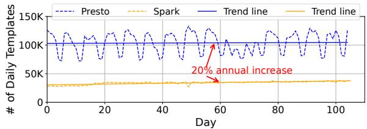

(a) Daily Job Templates.  
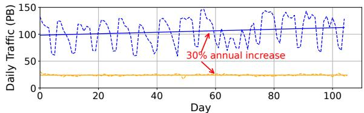  
(b) Daily Traffic.  
Figure 2. Steady increase in template diversity, and data traffic in Uber’s datalake. Solid lines represent linear regression fits used to approximate long-term trends.

Objective 1: We need a method for addressing high job and data interconnectivity without excessive placement complexity that does not rely on human project/organization boundaries.

C2: Moderate job recurrence and continuous growth. Microsoft Cosmos [19] reports 68% recurrence by job count, and defines jobs as recurring if they are submitted at least once per month over three consecutive months. Due to limited trace length, we conservatively adapt this definition to include jobs submitted at least once every three weeks over three consecutive periods. This gives us similar job recurrence numbers for Uber, but since we prioritize traffic volume to assess egress impact, we note that only 56% of traffic volume is from recurring jobs. These results indicate that focusing solely on predictable workloads is insufficient.

Figure 2 illustrates growing daily template diversity and data traffic. Based on linear regression, unique job templates grow by 16 per day for Presto and 68 per day for Spark, amounting to approximately 31K new templates annually or 20%. Similarly, Presto’s daily read volume increases by 142TB per day, suggesting a 50PB annual rise, or over 30%. Due to space constraints, we omit details but note that the number of job executions also grows 30% annually.

Objective 2: We need a two-pronged approach to combine static analysis for recurring jobs with online scheduling for ad-hoc jobs and newly onboarded workloads.

C3: Unique hybrid cloud demands. While minimizing cross-site traffic is a well-studied problem in private clouds, hybrid clouds require a holistic approach, optimizing egress, bandwidth, and storage costs together. Unlike fixed-capacity private clouds, hybrid clouds offer elastic resources, making replication a tunable and dynamic factor [44].

Moreover, shifting workloads and data between on-premises and cloud is common. At Uber, phased decommissioning of on-prem infrastructure changes compute, storage, and bandwidth availability over time. In contrast, Dropbox maintains a steady hybrid setup with frequent workload and data movement [24]. Decisions about which jobs and tables to move must consider current constraints and ensure cost efficiency across transitions. Static placement strategies become increasingly ineffective in this context. Placement must adapt continuously to changing workloads and capacity.

Objective 3: We need to jointly optimize egress, bandwidth, and capacity costs while proactively planning for long-term workload and capacity changes.

Generalizability: While Cosmos [19] and Yugong [10] traces are not public, information in their papers indicates many of the same cross-project data sharing behaviors observed in our Uber analyses. We notice higher interconnectivity and data sharing and slightly less recurrence (C1 and C2), but all three workloads exhibit similar properties. We suspect Uber’s higher interconnectivity is due to growing prevalence and exploitation of datalakes, which increase cross-team data sharing, something we expect to be an industry-wide trend. Template recurrence is lower because Uber mixes Presto interactive queries with Spark jobs, whereas Cosmos used only Spark-style jobs, but recurrence is present in both. Combined, these traits make Uber’s workloads more challenging to optimize, but the high-level similarity of these analytics workloads makes us confident in the generality of our results.

## 4 Moirai Design

Moirai determines cost-efficient data placement and job routing under resource constraints in hybrid clouds, addressing the design objectives outlined in §3. This section provides an overview of Moirai (§4.1), details its architecture (§4.2), introduces the analytical model at the heart of Moirai (§4.3), and describes two key techniques to improve its scalability: grouping (§4.4) and replication (§4.5). Lastly, we describe the dependency-aware routing policy for newly-seen jobs (§4.6).

## 4.1 Moirai Overview

We first explain how Moirai addresses the objectives outlined in Section 3 and describe our hybrid cloud deployment setup.

Moirai addresses the key challenges of data egress, replication costs, and limited network bandwidth through a Mixed-Integer Programming (MIP) model that incorporates exact unit costs into its objective function and satisfies on-premises resource constraints. By performing joint optimization of job placement and data replication at both query and table granularity, Moirai decides how to partition data and which data to replicate, and route jobs efficiently (Takeaway). Moirai scales effectively to large environments, handling millions of jobs and tables by employing dynamic, fine-grained, dependency-driven grouping (§4.4) and pre-selecting replicated tables (§4.5), which together reduce the runtime from 10 days to a few hours (Objective 1). Moirai also employs a dependency-aware job routing policy (§4.6) to efficiently place newly submitted jobs whose access patterns were not seen in previous optimization rounds (Objective 2). Additionally, Moirai continuously monitors workload changes and dynamically adjusts job and data placement, allowing the system to adapt to evolving workloads and capacity without manual intervention (Objective 3).

Resources in a hybrid cloud. On-premises resources and cloud compute resources are considered prepaid and not the optimization target of Moirai, and are treated as flexible constraints that may evolve, e.g., during migration. Specifically, for compute resources in public clouds, we assume the use of prepaid future reservations [45–47] based on usage predictions, a practical approach in large-scale hybrid clouds to secure stable resources and benefit from 30–75% discounts [48–50]. In contrast, cloud storage is treated as elastic, requiring Moirai to determine cost-efficient data placement or replication on-premises and in the cloud.

Network capacity (for both ingress and egress traffic) between on-premises and the cloud is also considered preplanned and is not an optimization target. As mentioned in §2, dedicated links are used to ensure stable, high bandwidth network traffic and address security concerns in hybrid cloud deployments [51]. If the public network is used instead of dedicated links, this constraint is not necessary, but the egress pricing should be updated from 2 to >8 per GB, as public networks are charged at higher rates. Although Moirai treats deployment cost as constant, its optimization reduces network traffic, ultimately lowering deployment costs.

Jobs and tables. The Moirai implementation targets largescale data analytics, so jobs correspond to analytics queries and tables are the data units they operate on. While we target analytics workloads over tabular data, the underlying logic of joint job+table optimization and dependency-aware routing applies broadly to other definitions of compute and data units. Moirai assumes that any job can be routed to either on-premises or cloud, as the analytics queries are stateless. Tables can reside on-premises, in the cloud, or replicated in both locations and are considered atomic, meaning all partitions within a table are placed together (§3). Jobs can access any table regardless of its location but prioritize local data (i.e., data in close vicinity) when available. Jobs may access only parts of a table rather than the entire set.

## 4.2 Moirai Architecture

Figure 3 illustrates the overall workflow of Moirai. The Job Scheduler collects data access logs that record executed jobs, the tables accessed, and the size of data accessed by each job. In deployment (§6) these logs are collected at the file system level, but this does not otherwise affect the architecture. Collected data is stored in database tables, allowing queries on jobs’ data access histories. The Spinner uses collected data to generate a Job-Data Graph for jobs that occurred since the last optimization round (Figure 3, Step 1).

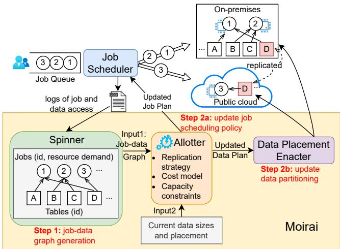  
Figure 3. Moirai dynamically optimizes job and data placement. The Job Scheduler routes jobs to the cloud or onpremises. The Spinner builds a job-data dependency graph from access logs, while the Allotter’s optimizer computes new placements and uses the Job Scheduler and Data Placement Enactor to apply them.

The Spinner models the job-table relationship over a time window as a bipartite graph $G = \left( V , E \right)$ , where ?? consists of ?? jobs, ???? , and ?? tables, $D _ { j }$ , i.e., $V = \{ W _ { i } \} _ { i = 1 } ^ { m } \cup \{ D _ { j } \} _ { j = 1 } ^ { n }$ . Jobs are weighted by compute consumption, ???? (in vCPU hours), and tables by size, ???? . Edges represent data access between jobs and tables, weighted by the number of bytes read, $r _ { i , j }$ and bytes written, $w _ { i , j }$

Once the graph is generated, the Allotter takes it along with resource constraints for on-premises and public cloud environments, as well as the current data placement, and uses its MIP solver to output a new cost-optimized job scheduling policy and data placement. These outputs are then sent to the Job Scheduler (§4.6) and Data Placement Enacter, which re-partitions or replicates data based on the newly generated plan (Figure 3, Step 2). This optimization cycle is triggered periodically (weekly in our paper) and can also be triggered on demand if resource constraints change.

## 4.3 Analytical model

To jointly optimize egress, bandwidth, and capacity costs while accounting for periodic placement updates (Objective 3), Moirai builds on the analytical model below.

Modeling job routing and data placement. A binary variable ???? represents job routing (0 for on-prem, 1 for cloud). Data placement uses binary variables ${ \boldsymbol { \ o } } { \boldsymbol { p } } _ { j }$ and $c l _ { j } ,$ , which indicates whether a table is on-prem or in the cloud, respectively, where 1 indicates presence. This allows tables to be on-prem, in the cloud, or replicated. To ensure data placement in at least one location, we use the constraint $o p _ { j } + c l _ { j } \ge 1$

Modeling costs for job-to-data relationship. Moirai incorporates storage and network costs to formulate the cost model of the given bipartite graph:

$$
\begin{array} { r l } & { C o s t _ { G } = C o s t _ { G , S t o r a g e } + C o s t _ { G , E g r e s s } } \\ & { \quad \quad = p _ { s } \cdot T _ { w i n d o w } \cdot \Sigma _ { j = 1 } ^ { n } s _ { j } \cdot c l _ { j } } \\ & { \quad \quad \quad + p _ { e } \Sigma _ { ( i , j ) \in E } \left( r _ { i , j } ( 1 - o p _ { j } ) ( 1 - y _ { i } ) + w _ { i , j } ( 1 - c l _ { j } ) y _ { i } \right) } \end{array}
$$

Storage cost is the product of the cloud storage price $( p _ { s } )$ the optimization time window, and the cloud-stored data size. Egress cost is the product of the cloud egress price $\left( p _ { e } \right)$ and the data read by on-prem jobs from cloud-only tables and data written by cloud jobs to on-premises-only tables. Costs for on-prem and cloud compute, on-prem storage, and dedicated network links are prepaid and excluded (§4.1).

Modeling data placement updates. Moirai adapts to workload changes by re-optimizing job routing and data placement for each time window using the updated job-todata graph. However, ignoring previous data placements can result in costly reconfigurations, where data is unnecessarily moved between the cloud and on-premises, leading to increased expenses. To avoid this, Moirai penalizes data movement in both directions–cloud to on-premises (egress) and vice versa (ingress)–with the following cost model:

$$
\begin{array} { r l } & { C o s t _ { U } = C o s t _ { U , E g r e s s } + C o s t _ { U , I n g r e s s } } \\ & { \quad \quad \quad = p _ { e } \cdot \sum _ { j = 1 } ^ { n } s _ { j } \cdot ( 1 - o p _ { j } ^ { \mathrm { o l d } } ) \cdot o p _ { j } } \\ & { \quad \quad \quad \quad + \alpha \cdot p _ { e } \cdot \sum _ { j = 1 } ^ { n } s _ { j } \cdot ( 1 - c l _ { j } ^ { \mathrm { o l d } } ) \cdot c l _ { j } } \end{array}
$$

Here, $o p _ { j } ^ { \mathrm { o l d } }$ and $c l _ { j } ^ { \mathrm { o l d } }$ represent previous data placements, where 1 indicates presence. Moirai penalizes unnecessary egress data movement by factoring in costs proportional to the data size transferred from cloud to on-premises. For ingress, Moirai introduces a relaxed penalty adjusted by ?? $( 0 \leq \alpha \leq 1 )$ . A higher ?? increases the cost penalty, controlling ingress traffic usage, even though no explicit cloud ingress fees apply. Specifically, ?? = 0 imposes no penalty on ingress, and $\alpha = 1$ treats ingress as expensive as egress.

Objective and constraints. Moirai solves the MIP with the goal of minimizing the total cost. While minimizing costs, the model also considers resource constraints on compute capacity (??compute\_onprem and $L _ { \mathrm { { c o m p u t e \_ c l o u d } } } )$ , storage capacity $( L _ { s t o r a g e } )$ , and network bandwidth $\left( L _ { n e t w o r k } \right)$ between the onprem data center and the cloud, as described in §4.1. These constraints ensure that the compute, storage, and network usage remain within their respective limits:

Minimize ?????????? + ??????????

Subject to

$$
\Sigma _ { i = 1 } ^ { m } c _ { i } ( 1 - y _ { i } ) \leq L _ { \mathrm { c o m p u t e \_ o n p r e m } }
$$

$$
\Sigma _ { j = 1 } ^ { n } s _ { j } o p _ { j } \leq L _ { \mathrm { s t o r a g e } }
$$

$$
\begin{array} { r l r } { \sum _ { ( i , j ) \in E } \left( r _ { i , j } + w _ { i , j } \right) \left[ \left( 1 - y _ { i } \right) \left( 1 - o p _ { j } \right) + \right. } & { } & \\ { \left. y _ { i } \left( 1 - c l _ { j } \right) \right] } & { \leq L _ { \mathrm { n e t w o r k } } } & { } & \end{array}
$$

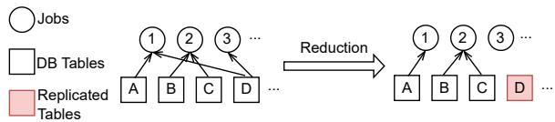  
Figure 4. Replication eases partitioning. Table D is replicated, allowing job 3 to be placed on either side. Thus, job 1 can be placed with its dependency, table A, simplifying the partitioning process.

## 4.4 Dependency-driven Grouping of Jobs and Data

To address the objective (Objective 1) of managing problem complexity without relying on human-defined project or organizational boundaries, Moirai groups jobs and data based on job-data dependencies, reducing the problem space while maintaining accuracy.

Moirai collapses jobs that had the same query template and recurred multiple times in the previous time window (e.g., the past week) into a single node. This reduces complexity since repeated executions of the same template typically access the same tables in similar patterns. In addition, this abstraction allows Moirai to leverage historical access patterns to guide the placement of recurring jobs in future windows.

For each optimization cycle, Moirai also temporarily groups tables that were not accessed during the previous time window. Rather than aggregating all such tables into a single node, Moirai groups them by database name, resulting in over 200 nodes. This fine granularity allows the optimizer to place untouched tables across sites more flexibly when needed. The grouping preserves optimization accuracy, as the untouched tables remain isolated in the job–data dependency graph regardless of how they are grouped.

In fact, the number of jobs in a weekly time window at Uber can exceed 4 million, which is reduced to 356K after grouping. Likewise, there are >1 million tables, which are reduced to 134K following the grouping process.

## 4.5 Pre-selecting Replication Tables

Even after grouping jobs and tables for the Uber workload (§4.4), the Job-Data Graph remains large, with $N _ { j } = 3 5 6 \mathrm { K }$ job and $N _ { d } = 1 3 4 \mathrm { K }$ table nodes. Since each table can be located on-premises, in the cloud, or replicated, and each job can be executed on either site, the search space contains $3 ^ { \overline { { N } } _ { d } } \times 2 ^ { N _ { j } }$ or $1 0 ^ { 2 1 0 , 1 9 3 }$ configurations for Uber’s workload. The Gurobi [52] MIP solver took over 7 days on a 40-core machine to find the optimal solution on 7-day workloads, which is too slow for weekly or daily re-optimization cycles.

To reduce Allotter’s search space, Moirai pre-selects tables for replication before optimization. This simplifies the Job–Data Graph by removing job–table edges and isolating some job nodes, which speeds up optimization (Figure 4). The main challenge is selecting tables that accelerate optimization with minimal impact on accuracy.

Pre-selection approaches. To decide which tables to pre-select for replication, Moirai ranks tables based an array of metrics. We evaluated five different metrics to identify the most efficient one for optimization (Figure 5): Access Traffic Volume, or total bytes accessed for each table; Job Access Frequency, or number of jobs that access each table; Inverse Dataset Size, or inverse of the table size, highlighting smaller tables; Access Traffic Density, or bytes accessed normalized by the table size; and Job Access Density, or number of jobs accessing a table normalized by the table size.

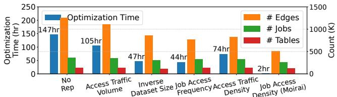  
Figure 5. Optimization time, averaged over hybrid splits with 30-70% of data and jobs on-premises, and graph complexity under different replication heuristics. The total size of pre-selected tables is set to 0.2% of the total data size.

We measured optimization time on CloudLab’s c8220 machines [53] using Gurobi, pre-selecting replication on 0.2% of data (Figure 5). To explain the observed speedups, we report the effective scale of the graph, including the count of edges, non-isolated jobs and tables. We defer an explanation of tuning the replication ratio to §5.3. Generally, pre-selecting 0.1-1% of data yields optimization times from about 10 hours (at 0.1%) to tens of seconds (at 1%) under the best-performing heuristic, Job Access Density. We focus on optimization time, as we confirmed that different ranking metrics yield similar costs, and faster optimization often implies more significant replication coverage thus lower costs.

No Replication, which does not pre-select any table for replication, takes 147 hours on average. Access Traffic Volume requires 105 hours of optimization time, as it tends to allocate replication space to large tables based on traffic volume. This often results in insufficient trimming, overlooking tables with many dependencies relative to their size. Similarly, Inverse Dataset Size, which prioritizes replicating small datasets regardless of access frequency, fails to reduce optimization time as it allocates replication quota to many small but cold tables. In contrast, heuristics that consider job connectivity, namely, Job Access Frequency and Job Access Density, are more effective, taking just 44 hours and 2 hours. As shown by the orange bars in Figure 5, they reduce the number of edges by 39% and 59% over No Replication.

Moirai uses Job Access Density as the metric for pre-selecting tables to replicate, targeting just 0.2% of the total storage size. This heuristic accounts for both table size and the number of job-data connections, enabling the system to identify small but widely shared tables that yield significant reductions in graph complexity. Unlike other metrics we evaluated, Job Access Density directly minimizes the number of edges, producing smaller and sparser job-data graphs. As shown in

Figure 5, this leads to the fastest optimization times, allowing the system to converge to an optimal solution in an average of 2 hours with minimal additional storage cost.

## 4.6 Dependency-aware Routing

To address the objective (Objective 2) of online scheduling for ad-hoc jobs and newly onboarded workloads, Moirai introduces a dependency-aware job routing policy. For recurring jobs, the Job Scheduler’s routing follows the placement decisions generated by the Data Placement Enacter directly. However, newly-seen jobs, accounting for 44% of traffic, require careful routing on the fly (§3) and cannot afford an arbitrarily distributed policy.

Moirai adopts a dependency-aware routing policy called Size Predict to minimize cross-site data access for newlyseen jobs. Before execution, most jobs declare which tables they will read or write, referred to as data dependencies, but the exact data volume required is usually determined during query execution. When a job template is first seen, Size Predict predicts access volume based on the mean access volume of each table from the previous window and then routes the job to the side with more data volume it might process. If a table had no accesses in the previous window, we treat its projected volume as negligible and determine the job’s placement based on the other tables accessed by the job. In practice, this outperforms falling back to a simple Size Unaware policy, because tables that are idle in one window are almost always minor contributors to total traffic. This approach avoids the pitfalls of naive routing strategies that ignore data placement or access patterns (§5.4).

## 5 Evaluation

We evaluate Moirai using the Uber workload to assess its cost and network efficiency compared to baselines (§5.2), the effect of data placement optimizations (§5.3), its effectiveness in routing newly seen jobs (§5.4) and how it applies to progressive cloud migration plans (§5.5).

## 5.1 Experimental Setup

We next describe baselines and key metrics used for evaluation. For Uber trace details see §3.

Baselines and Heuristic-based Approaches. We compare Moirai to two baselines and three heuristic-based approaches. The baselines are: (1) NoRep places data exclusively on-premise or in the cloud with random partitioning and no replication, similar to Cloudward Bound [12] and Spotify [14]; (2) Yugong [10] is deployed within Alibaba and enforces project-level granularity placement–specifically, all jobs and tables belonging to a project must be placed at the same site. The heuristic-based approaches are: (3) Volley [54] assigns each table to the site where the majority of its access volume originates, assuming a random distribution of jobs at the project level; (4) RepXMon replicates the most recent X months of data while older data is randomly partitioned, inspired by Twitter and recency-based approaches [10, 17, 18]; (5) RepTopY% replicates the top Y% data by Access Traffic Density 2, while partitioning the rest randomly, motivated by our analysis in §4.5.

For a fair comparison all approaches use Size Predict (§4.6) unless otherwise noted, which makes the baselines more competitive. We omit Independent Routing, which routes jobs to the underutilized site regardless of data access patterns; it performs several times worse than Size Predict (§5.4).

Yugong’s implementation is closed source, so we implement it on top of Moirai, ensuring the granularity of optimization, namely, grouping jobs and tables at project-level. We improve Yugong in two aspects: (1) Instead of limiting to an unspecified fraction of top tables by dependency size, we model all tables, resulting in better coverage and accuracy; (2) Rather than assuming a fixed unspecified storage budget, we incorporate storage cost directly into the objective function, allowing dynamic cost trade-offs.

Volley is also closed-source, but we recreate it by distilling its core insight: tables are placed close to where the majority of their accesses originate. Designed to place application data across tens of datacenters with mobile users, Volley uses weighted spherical means to guide placement. We simplify the problem to a binary choice between on-premises and cloud. Moreover, while the original Volley employs an iterative optimization algorithm, we found that it can trigger large-scale data reshuffling, incurring movement of >10% total data per optimization cycle. Such movement may be acceptable in private clouds but is prohibitive in hybrid environments due to egress fees. Thus, we adopt only the static placement produced in the first optimization round.

Configuration. We assume a dedicated 800 Gbps link, based on Twitter’s reported setup [7, 51], as a reasonable proxy (not actual Uber setup). Because weekly optimization constrains only average usage, and cross-site traffic at Uber can spike to 5× the average, we conservatively set the target weekly usage to one-fifth of the peak (20%), or 11.5 PB per week, for Yugong and Moirai. We adopt GCP’s pricing model, which resembles other major cloud providers (Table 1).

Metrics. We evaluate the efficiency of solutions using two key metrics: cost and network usage. Cost includes job execution egress, table egress (data moved out of the cloud), replication and network infrastructure. Infrastructure cost is estimated from weekly P95 traffic rates, representing a minimum capacity needed to avoid congestion 95% of the time. While we assume a 800 Gbps link, different approaches produce varying peak demands. For fair comparison, we convert the P95 traffic rate of each approach into an estimated infrastructure cost using prices in Table 1. Network usage accounts for traffic from job execution and data movement triggered by optimization (for Yugong and Moirai).

## 5.2 Cost and Traffic Reduction

Observation 1: Moirai achieves over 95% cost and 94% traffic reduction compared to all baselines by jointly optimizing data and job placement at a fine-grained level.

Moirai aims to minimize the cost of running workloads in a hybrid cloud while keeping network traffic volume below a given limit. Figure 6 compares the weekly network traffic volume and cost of Moirai with other approaches across three setups, where 70%, 50%, and 30% of resources are available on-premises to store and process at most that fraction of the data and workload. Jobs incur egress charges if on-prem jobs read data from the cloud or if cloud jobs write data back to on-premises. Network infrastructure costs are derived from the peak weekly P95 traffic rate over four months (§5.1).

Network traffic constraint. Moirai’s weekly network traffic volume ranges from 421–751TB, significantly lower than the 11.5 PB weekly limit. All other approaches generate traffic one to two orders of magnitude higher and exceed the bandwidth limit except RepTop2.5%.

Volley reduces cost by 24.9–80.1% compared to NoRep, showing that even basic data-aware placement improves over random partitioning. However, it falls short relative to replicationheavy heuristics like Rep3Mon and RepTop2.5%. Moirai reduces cost by 98.7% over Volley. The gap stems from Volley not replicating data and failing to co-optimize job placement. Replication approaches. Moirai reduces costs over NoRep, Rep3Mon and RepTop2.5% by 99%, 98.5%, and 95%, respectively. While there is an inherent trade-off between replication and egress costs, we present the most cost-efficient configurations for Rep3Mon and RepTop2.5%, both of which outperform NoRep. Rep3Mon reveals the inefficiency of blindly replicating recent data across all tables. RepTop2.5% shows that even with workload-informed replication of accessheavy tables, replication alone is insufficient: strategic placement of remaining data is critical to minimize overall cost.

Yugong. Moirai reduces weekly network traffic by 96–98% and monetary costs by 97–98% compared to Yugong. Although Yugong satisfies network constraints during optimization, it consistently exceeds the limit at runtime due to unexpected traffic from newly-seen jobs. In principle, Yugong could meet the target by setting a much lower and conservative traffic limit during optimization to compensate for future uncertainty. A significant inefficiency in Yugong is due to its dependence on project-level placement, which groups jobs and data based on human organizational boundaries rather than actual job-data dependencies, and constrains the flexibility of job scheduling. To investigate this, we evaluate NoRep and RepTop2.5% under project-level random placement and observe similar traffic and cost to table-level random placement, indicating that project-based grouping at

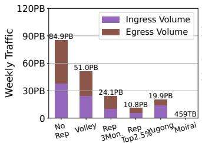

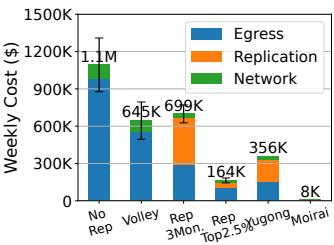

(a) 70% workload and data on-premises, 30% in the cloud.  
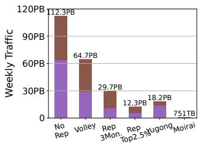

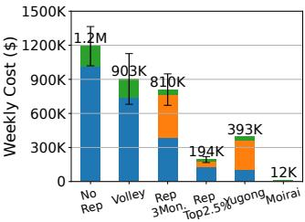

(b) 50% workload and data on-premises, 50% in the cloud.  
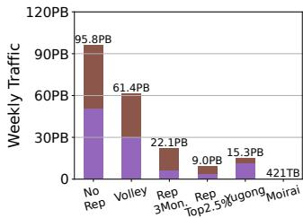

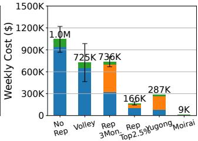  
(c) 30% workload and data on-premises, 70% in the cloud.

Figure 6. Weekly traffic and cost reduction between all baselines and Moirai. Each approach is shown in its most costefficient configuration: RepXMon replicates 3 months of data; RepTopY% replicates top 2.5% of data; Moirai replicates only 0.2% of data.

Uber captures little meaningful structure. Moreover, enforcing strict job–project co-location increases traffic by 4–7× compared to Size Predict, highlighting the inefficiency of project-level constraints. In contrast, Moirai’s fine-grained table-level data partitioning and query-level routing enable efficient job routing, even for new jobs.

## 5.3 Data Placement Optimizations

Observation 2: Pre-selecting 0.2% of total data for replication minimizes costs while providing sufficient optimization speedup. It outperforms other reduction techniques in cost efficiency by preserving problem accuracy.

Effectiveness of joint optimization. The primary source of Moirai’s improvement is its joint placement of jobs and data. To isolate this effect, we introduce an intermediate variant, Moi-JobDist, that reuses Moirai’s job distribution and replication plan from the first optimization window but places the remaining tables using Volley’s per-table strategy. Despite not performing global optimization on data placement, Figure 7 shows that Moi-JobDist significantly outperforms all approaches (apart from Moirai) in §5.2 in both cost and network traffic. Moi-JobDist reduces the cost gap from 1863% (between RepTop2.5% and Moirai) to just 84–168%, indicating that the majority of Moirai’s gains come from identifying effective job and data co-placement.

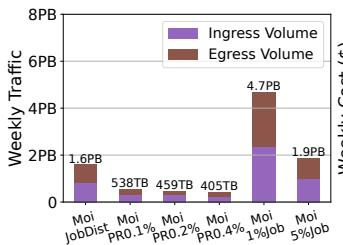

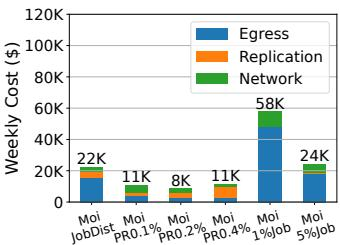

(a) 70% workload and data on-premises, 30% in the cloud.  
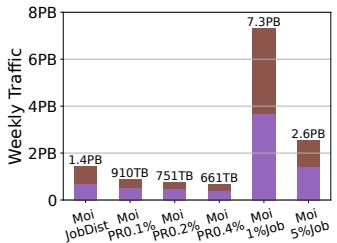

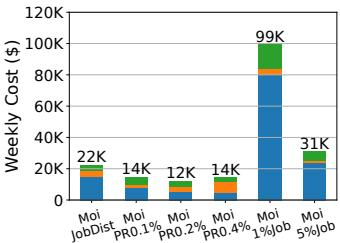

(b) 50% workload and data on-premises, 50% in the cloud.  
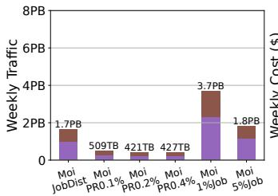

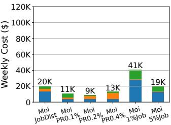  
(c) 30% workload and data on-premises, 70% in the cloud.  
Figure 7. Weekly traffic and cost under different configurations across three hybrid splits. Moi-JobDist captures Moirai’s core improvements, while other variants show tradeoffs from varying replication ratios or limiting optimization to top jobs.

The remaining gap from Moi-JobDist to Moirai highlights the benefit of continuous optimization and the explicit modeling of data movement costs. By adapting to evolving workloads and avoiding unnecessary data transfers, Moirai achieves further cost and traffic reductions beyond what static planning can offer.

Selecting a suitable PR ratio. The PR ratio denotes the fraction of data pre-selected for replication. While a lower PR ratio reduces replication costs and increases optimization flexibility, it can raise egress fees for future workloads. Since the optimizer relies on historical data and cannot anticipate future job–data dependencies, especially across seemingly unrelated tables, pre-selecting replication not only improves scalability but also proactively replicates high-impact tables (identified via Job Access Density) to reduce future remote accesses. As shown in Figure 7, we present replication ratios 0.1–0.4% of the total data, pre-selected using Job Access Density (§4.5). PR0.2% consistently achieves lowest cost across all hybrid splits. In contrast, PR0.1% saves half the replication cost of PR0.2% but incurs higher egress and network costs. PR0.4% marginally reduces traffic but introduces unnecessary replication overhead. Thus, we adopt PR0.2% for Moirai. We do not explore intermediate values between 0.1% and 0.2%, as replication cost is already tiny relative to egress and network costs, and the marginal benefit is limited.

Managing synchronization traffic for PR. At a 0.2% PR ratio, maintaining replicated tables incurs 20TB of synchronization traffic per week, under 5% of the remote traffic from query executions (Figure 6). To keep the replication ratio stable despite table growth, we evict those with the lowest Job Access Density. Over 14 weeks without admitting new tables, both scalability and egress costs remain stable (Figure 8). Though not presented, we also validate that a quarterly refresh policy replaces 20% of replicated data (120TB), averaging 10TB per week, which is still negligible at scale.

Alternative: optimizing only top traffic-heavy jobs. Another way to reduce problem scale is to optimize only the most cost-sensitive jobs. A straightforward method ranks jobs by total data access volume, keeping only the top x%; we evaluate this at 1% and 5%. While this greatly shrinks the job–data graph, it loses visibility into access patterns for the remaining 95–99% of jobs. As shown in Figure 7, this simplification results in substantial regressions in network traffic and cost. For example, 1%Job incurs up to 7.3PB of weekly traffic and a total cost of 99K, 364–724% more costly than PR0.2% (i.e., Moirai), despite achieving acceptable optimization speed (2hr under 1%Job and 9hr under 5%Job).

Both techniques converge at PR0% = 100%Job, where all jobs and tables are included without pre-selected replication. However, our comparison shows that pre-selecting just 0.2% of data yields the best cost-efficiency. Thus, we exclude job ratios beyond 5%, as even PR0% (namely, 100%Job) will not outperform PR0.2%.

## 5.4 Importance of Job Routing Policies

Observation 3: Moirai’s Size Predict routing reduces egress costs by up to 99.8% compared to naive policies and is within 39- 128% of the optimal routing cost. This shows that lightweight access prediction is sufficient for effective job routing.

We evaluate how Moirai efficiently routes new jobs that did not appear in the previous week and thus do not have predetermined placements. We assess the network usage and cost-efficiency of Moirai’s Size Predict job routing policy.

To illustrate this, we first present Yugong, the state-ofthe-art approach as a reference, and include: (1) Independent Routing that routes jobs to the currently underutilized side, independent of data dependency; (2) Size Unaware, where the job is assigned to the side with the majority of tables it needs; and (3) Size Oracular, where the job is assigned to the side with more data that it will exactly read. Size Oracular is not realizable ahead of time and serves as an unreachable lower bound. Size Predict approximates Size Oracular by predicting the read volume. If past heavily-read tables remain heavily-read, this approximation should perform close to Size Oracular and better than Size Unaware.

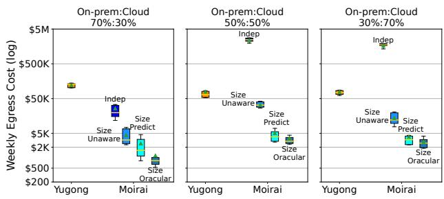  
Figure 8. Egress costs (log scale) for different routing policies between Yugong’s and all Moirai policies. Moirai’s Size Predict policy reduces egress costs by 90.3–99.8% while closely approximating the optimal. The whiskers represent the 10th and 90th percentiles, the orange line represents the median, and the green triangle indicates the mean across trace weeks.

Figure 8 presents a box plot of weekly egress cost for each approach. We focus on the egress cost because the replication cost is unaffected by routing policy, and network link cost will be discussed separately later. Because Moirai penalizes egress movement during optimization, egress costs resulting from updated data placement are negligible, with 75% of all updates costing less than \$40 per week. On average, Size Predict reduces egress costs by 90.3–99.8% over Independent Routing and by 42.6–84.8% over Size Unaware. Furthermore, Size Predict incurs costs generally within 2× of those incurred by Size Oracular, demonstrating its efficiency.

Figure 9 shows the network usage on a weekly basis under different splits (70%:30%, 50%:50%, and 30%:70%). We replay the traces in an event-driven framework to simulate the traffic rate every minute, showing both average and P90/P95/P99 traffic rate, respectively. The average bandwidth is a lower bound for the dedicated link, representing the minimum capacity required to complete all jobs. P95 traffic rate is another key metric widely used [55–57] to assess network performance, indicating that network bandwidth is not a bottleneck 95% of the time.

Moirai consistently demonstrates significantly lower network usage compared to Yugong. Notably, the P95 bandwidth of Moirai often remains below the average bandwidth of Yugong. In contrast, the average network usage for Yugong frequently surpasses the network threshold (160 Gbps, shown by the red dotted line) due to unexpected traffic from newlyseen jobs. To ensure the network is not a bottleneck 95% of the time in any week, we assume the maximum P95 network usage observed over the 14-week period as the dedicated bandwidth. Under this assumption, Yugong’s bandwidth requirement is 8× higher than Moirai’s, resulting in 8× higher dedicated network costs.

## 5.5 Case study: Migration to Public Cloud

Observation 4: By modeling redistribution costs, Moirai enables cost-efficient phased migration and achieves near-zero additional data movement during storage decommissioning.

Next, we evaluate whether Moirai’s optimization provides a data and job plan that considers previous data placements to meet the new constraints, as on-premises storage space and compute capacity gradually change during migration.

To isolate the effects of workload changes over time (measured in §5.4), we consistently use the jobs from Week 1 as the workload for the optimizer.

We penalize reverse movements between consecutive splits, making Moirai aware of redistribution costs (§4.3). In the following experiments, we test capacities ranging from 90-10% in decrements of 10%. We set the relaxed parameter ?? = 1 (§4). To work around the challenge of setting an appropriate upper bound for migration-incurred ingress traffic, we assume that the unit price for ingress is the same as for egress, which is a conservative approach. We observe that this conservative approach (?? = 1) does not harm the optimization: Moirai achieves near-zero egress and zero extra replication after migration (details omitted but similar to §5.4).

Figure 10 shows the traffic volume during migration from 100% on-premises to 0%, where migration to the cloud is complete. For each step of on-premises storage decommissioning, which proceeds in 10% increments, at least 10% of the data or approximately 30PB must be transferred from on-premises to the cloud, incurring ingress traffic.

The baseline approach, labeled Redistribution cost unaware, exhibits significantly high arbitrary extra movement, as shown by the dashed lines: after migration (0%), it transfers near 450PB to the cloud (ingress) though the best case is 300 PB, and transfers near 150 PB out of cloud (egress), equivalent to a monetary cost of \$3.1 million. In contrast, Moirai, which considers data movement egress charges, requires near-zero egress, as shown by the solid green line, and only the necessary volume of ingress, as shown by the overlapping blue and red solid lines.

Although not shown, we evaluated the optimized placement for both Moirai and the Redistribution Cost Unaware approach, observing little difference between them in terms of traffic and cost for the following weeks. We conclude that Moirai achieves stable, predictable migration patterns.

## 6 Toward Moirai deployment

Moirai is explicitly designed to minimize hybrid cloud costs, so our optimizer is built to capture cost dynamics using real-world pricing and traces. Running our optimizer in production with similar input as our traces would reproduce the same cost analysis, so deployment needs to focus on the components required to provide Moirai with the necessary inputs and enact its decisions. This section discusses three main parts of ongoing effort to deploy Moirai at Uber: (1)

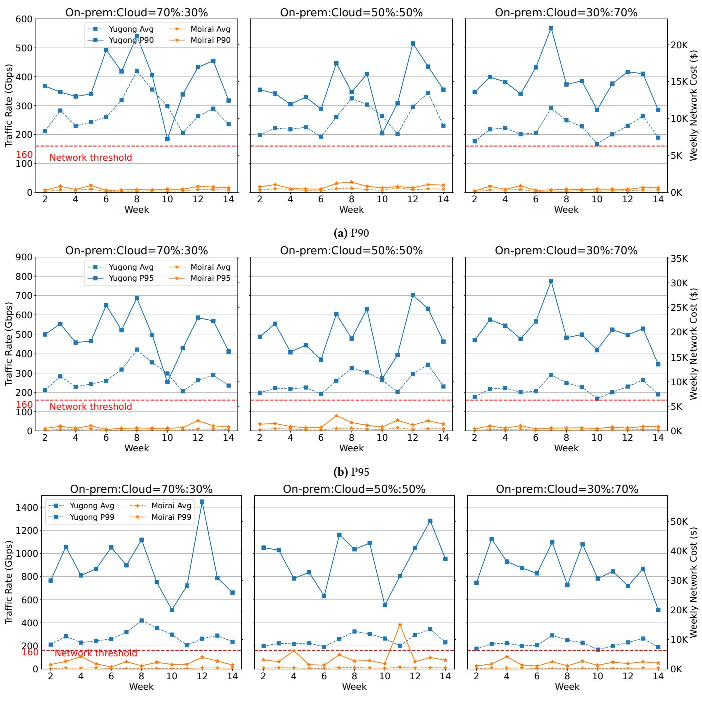  
(c) P99  
Figure 9. Weekly network usage for Moirai and Yugong, P90, P95, P99 and average, under different splits (70%:30%, 50%:50%, and 30%:70%). The red dotted line indicates the target used during optimization for average usage.

job–data access observability to support the Spinner, (2) the replication service used by the Data Placement Enacter, and (3) the routing logic in the control plane. It also discusses two natural extensions of Moirai: including job-deadline constraints and using multiple regions/clouds.

HiCam Network Observability Service is crucial for collecting the input logs (§3), which are then processed by the Spinner to generate the Job-Data Graph.

We collect data access logs at the file system level to support all compute engines, such as Presto and Spark. While offering fine-grained visibility, we face scalability challenges.

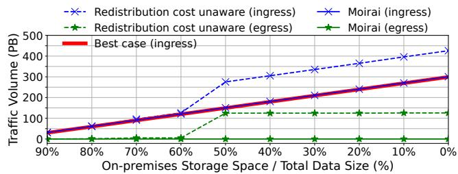  
Figure 10. As we increasingly migrate more data from onpremises to the cloud, Moirai consistently achieves zero egress (solid green line) and is close to minimum ingress (overlapping solid red and blue lines). This is only possible when redistribution costs are considered during optimization, otherwise the traffic volume balloons (dashed lines).

At Uber, Apache Kafka [58] is commonly used as a scalable, durable solution for such streaming metrics. However, directly publishing high-throughput metrics to Kafka proved infeasible due to write amplification, throttling, and high cardinality at scale. Concurrent accesses to the same partition resulted in high write amplification, and metric event spikes led to overload, exceeding throttle limits and causing event loss. Furthermore, extreme metric cardinality (§3) is estimated to reach billions, making storage unsustainable.

To address these challenges, we created HiCam, a lightweight, Apache Flink-based [59] aggregation layer positioned between metric producers (e.g., HDFS clients) and the backend infrastructure. Flink is well-suited for low-latency, highthroughput real-time data processing. Clients emit metrics over the network to an embedded HTTP server within the Flink job. Flink then aggregates the high-volume metric stream in real time, significantly reducing throughput and cardinality, and publishes a compact, consolidated stream to Kafka. This stream is then ingested into Apache Pinot [60], Uber’s standard OLAP store for powering low-latency queries and dashboarding.

Before HiCam, a single application could emit over 76K metrics per hour, requiring 10 TiB of Pinot storage monthly. With HiCam, throughput is reduced by 128×, storage by over 10× (750 GB/month), with negligible latency added.

HiveSync Replication Service enables both one-time data transfers for migration and continuous replication to support the Data Placement Enacter, using an eventually consistent approach to copy Hive and Hudi tables (two commonly used formats in Uber’s ecosystem) across regions. It maintains and exposes replica consistency status, allowing users to query replication progress.

HiveSync listens to Hive Metastore (HMS), the central metadata catalog, consumes HMS audit events triggered by data or metadata updates, and converts these events into replication jobs. Specifically, HiveSync is triggered by the following events: (1) a partition is written by an ingestion pipeline, (2) an unpartitioned table is written, or (3) a table’s metadata is updated (e.g., schema changes). Each replication job involves two steps: (1) copying the relevant HDFS data from the source to the destination data center using DistCp (a distributed tool for copying large amounts of data across HDFS clusters), and (2) synchronizing the HMS metadata on the destination side. HiveSync ensures that updates made in the source data center eventually propagate to the destination, though without strong consistency guarantees.

The system is implemented as a monolithic service. It polls audit logs every few seconds, converts new entries into replication jobs, and dispatches copy tasks. Small copies may be handled via RPC, while larger transfers rely on DistCp submitted to a Hadoop cluster. Job progress is monitored through Apache YARN [61], the resource manager.

HiveSync scales to 10 million daily jobs, over 10 PB of daily data transfer, and synchronization of up to 700,000 tables, with a P99 table replication lag under 18 minutes. Re-routing capabilities support dependency-aware routing beyond static routing configurations in the control plane. We detail the implementation for Presto, while noting that similar behavior can be achieved in Spark via its driver.

In the control plane of Presto, we first consult our configuration service to obtain (1) routing percentages, determined by business policies and regional capacity, and (2) configured attributes that may influence query placement, such as lists of job templates and usernames recommended to run in a specific region. This interface allows Moirai to communicate job template placement decisions to control plane. Before dispatching, the system checks the status of all tables referenced in the query, ensuring only up-to-date replicas are accessed. After routing and other control-plane steps, like validation, the query is forwarded to a cluster in the selected region and executed by the corresponding Presto coordinator.

The additional step to obtain Moirai’s decision introduces one extra call during routing. However, this is lightweight and does not increase the routing or validation latency.

Extensions. Moirai’s optimizer reasons over a job–table dependency graph plus a parameterized cost model, so it is inherently engine-agnostic (e.g., Spark, Presto, or otherwise) and can have two natural extensions. First, Moirai could be augmented with per-job deadline constraints. We do not explore this direction in this paper because our focus is on throughput. Similar to systems like Cosmos, Yugong, and MAST, Uber’s workload consists of large-scale batch analytics, where throughput is the primary performance goal. In a hybrid cloud, cross-cloud network usage is the key factor for throughput, which must be addressed by limiting the fraction of data transferred across regions. For this reason, we include network usage as part of the optimization objective (§4.3). Second, we can move beyond the current single-region-plus-on-prem setting. We restrict our scope to a single cloud region and on-premises because Uber currently executes batch compute in a single region, and we expect this to resemble other organizations’ first foray from on-premises to a hybrid cloud approach. Extending Moirai to multiple regions and replication factors can be achieved by adding binary variables for each table/job-region pair, plus the usual capacity. Data residency or sovereignty constraints can also be added. Table consistency across replicas is enforced by the HiveSync Replication Service in our case.

## 7 Related Work

Data and job placement in distributed clouds. Previous works like SPANStore [62], PANDO [63], Nomad [64], SkyPIE [65], and Volley [54] optimize data placement for objectives like fault tolerance, performance, and cost, assuming fixed job placement. Specifically, SpanStore targets stronglyconsistent key-value store geo-replication. It always keeps at least three replicas for availability placed by shrinking object “access sets.” At Uber, every table can be accessed from both on-prem and cloud, so SpanStore would replicate the data lake on both sites, violating storage budgets and ignoring compute placement. SkyPIE solves a different problem: it decides which cloud storage tier to use per object across public-cloud regions while meeting latency SLOs. Moirai co-optimizes data and batch compute placement in a hybrid cloud setup with fixed on-prem capacity. SkyPIE neither places compute nor targets throughputdriven batch workloads. Others, like Iridium [66], Geode [67], and Tetrium [68] optimize data and task placement for individual geo-distributed queries using execution DAGs. In contrast, Moirai jointly optimizes both job and data placement, achieving significant cost benefits through flexible placement of both. The most relevant works, Yugong [10] and MAST [11], also co-optimize data and job placement. However, Yugong simplifies the problem by project-level placement, while Moirai achieves better cost-efficiency without relying on administrative grouping. MAST is designed for ML training to maximize GPU utilization and incorporate design choices for ML workloads, such as GPU oversubscription and the preemption of low-priority jobs.

Cloud migration case studies. Companies like Spotify [4, 14] and Twitter [7, 15, 16] demonstrate varied hybrid strategies. For example, Spotify moved ingestion pipelines to the cloud early in its migration and relied on continuous data copy during the transition, resulting in up to 80K jobs copying data from on-premises to the cloud and 30K in the opposite direction per day. This approach led to high crossregion network usage and delayed migration progress. Twitter adopted a hybrid model by migrating only select infrastructure components. They replicated hundreds of PB of data across both sites, effectively doubling storage requirements, while only 30% of queries ran in the cloud. These motivate the cost-aware, workload-informed design of Moirai, which avoids uncontrolled data movement and over-replication.

Cloud egress costs related. Systems like Skyplane [69], Cloudcast [70], and Skypilot [71] aim to reduce cloud egress by optimizing one-off bulk data transfer or ML workload placements. In contrast, Moirai targets long-term, systemwide planning, jointly optimizing job and data placement to minimize sustained egress costs over time. Macaron [44] is a multi-cloud caching scheme, which can reduce the crosscloud traffic but does not solve our joint data-and-compute placement problem.

Hybrid cloud related. Cloudward Bound [12] and Atlas [72] focus on cloud migration of application components or microservices at a coarse granularity. In contrast, Moirai operates at the level of tables and jobs, exploring a broader solution space. Some studies [73–75] focus on workloads that need to temporarily burst into the cloud when local resources are insufficient. However, Moirai targets data center workloads, including recurring and ad-hoc jobs, without specifically emphasizing the bursting of jobs.

Configurations within cloud. Prior studies [76–78] focus on selecting optimal configurations within a single cloud provider. These efforts are complementary to Moirai.

## 8 Conclusion

We present Moirai, a system that jointly optimizes job and data placement in hybrid clouds to minimize cost and network usage. By leveraging job-data dependencies, selective replication, and predictive job routing, Moirai reduces cost by over 97% compared to prior approaches. Evaluations on real-world traces demonstrate Moirai’s ability to scale, adapt to change, and support efficient cloud migration.

## Acknowledgments

We thank the anonymous reviewers for their help improving the presentation of this paper. We also thank Erci Xu, Juncheng Yang, Jignesh Patel, Shuoshuo Chen, Sara McAllister, Junwei Chen, and Chenghui Yu for generous internal reviews and feedback on early drafts. We thank Uber for sharing their insights and data, especially Fengnan Li, Chen Liang, Saloni Singh, Kartik Bommepally, Sanjay Sundaresan. We thank the members and companies of the PDL Consortium (Amazon, Bloomberg, Datadog, Google, Honda, Intel, Jane Street, LayerZero Research, Meta, Microsoft, Oracle, Pure Storage, Salesforce, Samsung, Western Digital) for their interest, insights, feedback, and support.

This work was supported in part by U.S. Army Research Office and the U.S. Army Futures Command under Contract No. W911NF-20-F-0025. The content of the paper does not necessarily reflect the position or the policy of the government and no official endorsement should be inferred.

George Amvrosiadis holds concurrent appointments at Carnegie Mellon University (CMU) and Amazon Web Services – this paper describes work performed at CMU and is not associated with Amazon.

## References

[1] Airbnb Case Study. https://aws.amazon.com/solutions/case-studies/

airbnb-case-study/. Accessed Feb 14, 2024.

[2] LinkedIn is moving to Microsoft’s Azure public cloud. https://www.cnbc.com/2019/07/23/linkedin-is-moving-to-microsoftazure-three-years-after-acquisition.html. Accessed Feb 14, 2024.

[3] Completing the Netflix Cloud Migration. https://about.netflix.com/ en/news/completing-the-netflix-cloud-migration. Accessed Feb 14, 2024.

[4] Spotify’s Journey to the Cloud. https://youtu.be/5aBORQim-KM?feature=shared. Accessed Feb 14, 2024.

[5] Two Sigma cloud transformation strategy. https:// www.businessinsider.com/two-sigma-cloud-tech-transformationstrategy-quant-fund-google-cloud-2021-9. Accessed Feb 14, 2024.

[6] Uber goes big on cloud. https://www.forbes.com/sites/danielnewman/ 2023/02/21/uber-goes-big-on-cloud-with-google-and-oracle-ascloud-architecture-debate-continues. Accessed Feb 14, 2024.

[7] Partly Cloudy: The start of a journey into the cloud. https://blog.twitter.com/engineering/en\_us/topics/infrastructure/ 2019/the-start-of-a-journey-into-the-cloud. Accessed Feb 14, 2024.

[8] Chunxu Tang, Beinan Wang, Huijun Wu, Zhenzhao Wang, Yao Li, Vrushali Channapattan, Zhenxiao Luo, Ruchin Kabra, Mainak Ghosh, Nikhil Kantibhai Navadiya, et al. Hybrid-cloud sql federation system at twitter. In ECSA (Companion), 2021.

[9] Chunxu Tang, Beinan Wang, Huijun Wu, Zhenzhao Wang, Yao Li, Vrushali Channapattan, Zhenxiao Luo, Ruchin Kabra, Mainak Ghosh, Nikhil Kantibhai Navadiya, et al. Serving hybrid-cloud sql interactive queries at twitter. In European Conference on Software Architecture, pages 3–21. Springer, 2021.

[10] Yuzhen Huang, Yingjie Shi, Zheng Zhong, Yihui Feng, James Cheng, Jiwei Li, Haochuan Fan, Chao Li, Tao Guan, and Jingren Zhou. Yugong: geo-distributed data and job placement at scale. Proc. VLDB Endow., 12(12):2155–2169, aug 2019.

[11] Arnab Choudhury, Yang Wang, Tuomas Pelkonen, Kutta Srinivasan, Abha Jain, Shenghao Lin, Delia David, Siavash Soleimanifard, Michael Chen, Abhishek Yadav, Ritesh Tijoriwala, Denis Samoylov, and Chunqiang Tang. MAST: Global scheduling of ML training across Geo-Distributed datacenters at hyperscale. In 18th USENIX Symposium on Operating Systems Design and Implementation (OSDI 24), pages 563–580, Santa Clara, CA, July 2024. USENIX Association.

[12] Mohammad Hajjat, Xin Sun, Yu-Wei Eric Sung, David Maltz, Sanjay Rao, Kunwadee Sripanidkulchai, and Mohit Tawarmalani. Cloudward bound: planning for beneficial migration of enterprise applications to the cloud. In Proceedings of the ACM SIGCOMM 2010 Conference, SIGCOMM ’10, page 243–254, New York, NY, USA, 2010. Association for Computing Machinery.

[13] Zhanghui Liu, Tao Xiang, Bing Lin, Xinshu Ye, Haijiang Wang, Ying Zhang, and Xing Chen. A data placement strategy for scientific workflow in hybrid cloud. In 2018 IEEE 11th International Conference on Cloud Computing (CLOUD), pages 556–563, 2018.

[14] How Spotify migrated everything from on-premise to Google Cloud Platform. https://www.computerworld.com/article/3427799/howspotify-migrated-everything-from-on-premise-to-google-cloudplatform.html. Accessed Feb 17, 2024.

[15] How Twitter Is Migrating 300 PB of Hadoop Data to GCP. https: //youtu.be/6dNdqIzl\_CE?si=UR\_D0fkSC\_YVwLGu. Accessed Feb 17, 2024.

[16] How Twitter Replicates Petabytes of Data to Google Cloud Storage. https://youtu.be/g2zDWDqqV4U?si=4ZF1t4j6X1ra9MC4. Accessed Feb 17, 2024.

[17] Dulcardo Arteaga, Jorge Cabrera, Jing Xu, Swaminathan Sundararaman, and Ming Zhao. CloudCache: On-demand flash cache management for cloud computing. In 14th USENIX Conference on File and Storage Technologies (FAST 16), pages 355–369, 2016.

[18] Elizabeth J. O’Neil, Patrick E. O’Neil, and Gerhard Weikum. An optimality proof of the lru-k page replacement algorithm. J. ACM, 46(1):92–112,

jan 1999.

[19] Andrew Chung, Subru Krishnan, Konstantinos Karanasos, Carlo Curino, and Gregory R. Ganger. Unearthing inter-job dependencies for better cluster scheduling. In 14th USENIX Symposium on Operating Systems Design and Implementation (OSDI 20), pages 1205–1223. USENIX Association, November 2020.

[20] Moirai: Efficient Multi-Site Data-Intensive Computing. https:// www.pdl.cmu.edu/Moirai/index.shtml. Accessed August 24, 2025.

[21] AWS hits \$100B revenue run rate, expands margins, delivers most of Amazon’s profit. https://www.theregister.com/2024/05/01/ amazon\_q1\_2024. Accessed Jun 12, 2024.

[22] Accenture cloud journey. https://www.accenture.com/us-en/casestudies/about/living-cloud. Accessed July 4, 2024.

[23] Walmart Is Weaning Itself Off of Big Tech. https: //www.bloomberg.com/news/newsletters/2022-07-12/walmartcloud-weans-itself-off-of-microsoft-azure-google-cloud. Accessed April 2, 2025.

[24] How Dropbox pulled off its hybrid cloud transition. https: //www.datacenterdynamics.com/en/analysis/how-dropbox-pulledoff-its-hybrid-cloud-transition/. Accessed April 2, 2025.

[25] Zhenxiao Luo, Lu Niu, Venki Korukanti, Yutian Sun, Masha Basmanova, Yi He, Beinan Wang, Devesh Agrawal, Hao Luo, Chunxu Tang, et al. From batch processing to real time analytics: Running presto® at scale. In 2022 IEEE 38th International Conference on Data Engineering (ICDE), pages 1598–1609. IEEE, 2022.

[26] Cristian Velazquez. Uber: GC Tuning for Improved Presto Reliability. https://www.uber.com/blog/uber-gc-tuning-for-improved-prestoreliability/, January 2024.

[27] Cloud Interconnect pricing. https://cloud.google.com/networkconnectivity/docs/interconnect/pricing. Accessed July 4, 2024.

[28] What is AWS Direct Connect? https://docs.aws.amazon.com/ directconnect/latest/UserGuide/Welcome.html. Accessed Jun 27, 2024.

[29] Azure ExpressRoute. https://azure.microsoft.com/en-us/pricing/ details/expressroute/. Accessed Jun 27, 2024.

[30] Andrew Smith, Natalya Yezhkova, and Ashish Nadkarni. Futureproofing storage: Modernizing Infrastructure for Data Growth Across Hybrid, Edge, and Cloud Ecosystems. IDC, March 2021.

[31] Applying for free data transfer when exiting Google Cloud. https: //cloud.google.com/exit-cloud. Accessed Sep 17, 2024.

[32] Alon Halevy, Flip Korn, Natalya F. Noy, Christopher Olston, Neoklis Polyzotis, Sudip Roy, and Steven Euijong Whang. Goods: Organizing google’s datasets. In Proceedings of the 2016 International Conference on Management of Data, SIGMOD ’16, page 795–806, New York, NY, USA, 2016. Association for Computing Machinery.

[33] Uber to Swap Its Own Data Centers for Google, Oracle Cloud Services. https://www.pcmag.com/news/uber-to-swap-its-own-datacenters-for-google-oracle-cloud-services. Accessed July 5, 2024.

[34] Apache Hive, 2025. https://hive.apache.org/.

[35] Apache Hudi, 2025. https://hudi.apache.org/.

[36] Spark. https://spark.apache.org/. Accessed March 28, 2025.

[37] Presto. https://prestodb.io/. Accessed July 8, 2024.

[38] Alekh Jindal, Hiren Patel, Abhishek Roy, Shi Qiao, Zhicheng Yin, Rathijit Sen, and Subru Krishnan. Peregrine: Workload optimization for cloud query engines. In Proceedings of the ACM Symposium on Cloud Computing, pages 416–427, 2019.

[39] Pranjal Shankhdhar, Feilong Liu, Jay Narale, James Sun, Rebecca Schlussel, and Lyublena Antova. Presto’s history-based query optimizer. Proc. VLDB Endow., 17(12):4077–4089, August 2024.

[40] PostgreSQL Global Development Group. F.30. pg\_stat\_statements — track statistics of SQL planning and execution. https:// www.postgresql.org/docs/current/pgstatstatements.html. Accessed July 30, 2025.

[41] DataMesh: How Uber laid the foundations for the data lake cloud migration. https://www.uber.com/blog/datamesh/. Accessed March

5, 2025.

[42] Yang Yang. Presto on Apache Kafka At Uber Scale. https://www.uber.com/en-AU/blog/presto-on-apache-kafkaat-uber-scale/, April 2022.

[43] Sparkle: Standardizing Modular ETL at Uber. https://www.uber.com/ blog/sparkle-modular-etl/. Accessed March 5, 2025.

[44] Hojin Park, Ziyue Qiu, Gregory R Ganger, and George Amvrosiadis. Reducing Cross-Cloud/Region Costs with the Auto-Configuring MAC-ARON Cache. In Proceedings of the ACM SIGOPS 30th Symposium on Operating Systems Principles, pages 347–368, 2024.

[45] Reservations of Compute Engine zonal resources. https: //cloud.google.com/compute/docs/instances/reservations-overview. Accessed Sep 13, 2024.

[46] Reserved Instances for Amazon EC2 overview. https: //docs.aws.amazon.com/AWSEC2/latest/UserGuide/ec2-reservedinstances.html. Accessed Sep 13, 2024.

[47] Azure Reserved Virtual Machine Instances. https: //azure.microsoft.com/en-us/pricing/reserved-vm-instances. Accessed Sep 13, 2024.

[48] Wei Wang, Baochun Li, and Ben Liang. To reserve or not to reserve: Optimal online {Multi-Instance} acquisition in {IaaS} clouds. In 10th International Conference on Autonomic Computing (ICAC 13), pages 13–22, 2013.

[49] Michele Mazzucco and Marlon Dumas. Reserved or on-demand instances? a revenue maximization model for cloud providers. In 2011 IEEE 4th International Conference on Cloud Computing, pages 428–435. IEEE, 2011.

[50] Wei Wang, Di Niu, Baochun Li, and Ben Liang. Dynamic cloud resource reservation via cloud brokerage. In 2013 IEEE 33rd International Conference on Distributed Computing Systems, pages 400–409. IEEE, 2013.

[51] Partly Cloudy: Architecture. https://blog.x.com/engineering/en\_us/ topics/infrastructure/2019/partly-cloudy-architecture. Accessed Sep 13, 2024.

[52] Gurobi Optimization, LLC. Gurobi Optimizer Reference Manual, 2024. [53] Cloudlab. https://www.cloudlab.us/. Accessed Jan 20, 2024.

[54] Sharad Agarwal, John Dunagan, Navendu Jain, Stefan Saroiu, Alec Wolman, and Harbinder Bhogan. Volley: Automated data placement for Geo-Distributed cloud services. In 7th USENIX Symposium on Networked Systems Design and Implementation (NSDI 10), San Jose, CA, April 2010. USENIX Association.

[55] Nikolaos Laoutaris, Georgios Smaragdakis, Pablo Rodriguez, and Ravi Sundaram. Delay tolerant bulk data transfers on the internet. In Proceedings of the eleventh international joint conference on Measurement and modeling of computer systems, pages 229–238, 2009.

[56] Path Network, Inc. Managing the Bandwidth Capacity of Your Network: The 95th Percentile Unveiled, 2023.

[57] David K Goldenberg, Lili Qiuy, Haiyong Xie, Yang Richard Yang, and Yin Zhang. Optimizing cost and performance for multihoming. ACM SIGCOMM Computer Communication Review, 34(4):79–92, 2004.

[58] Apache Kafka, 2025. https://kafka.apache.org.

[59] Apache Flink, 2025. https://flink.apache.org.

[60] Apache Pinot, 2025. https://pinot.apache.org.

[61] Apache Hadoop YARN. https://hadoop.apache.org, 2025. https://hadoop.apache.org/docs/stable/hadoop-yarn/hadoopyarn-site/YARN.html.

[62] Zhe Wu, Michael Butkiewicz, Dorian Perkins, Ethan Katz-Bassett, and Harsha V. Madhyastha. SPANStore: cost-effective geo-replicated storage spanning multiple cloud services. In Proceedings of the Twenty-Fourth ACM Symposium on Operating Systems Principles, SOSP ’13, pages 292–308, New York, NY, USA, November 2013. Association for Computing Machinery.

[63] Muhammed Uluyol, Anthony Huang, Ayush Goel, Mosharaf Chowdhury, and Harsha V. Madhyastha. Near-Optimal latency versus cost

tradeoffs in Geo-Distributed storage. In 17th USENIX Symposium on Networked Systems Design and Implementation (NSDI 20), pages 157–180, Santa Clara, CA, February 2020. USENIX Association.

[64] Nguyen Tran, Marcos K. Aguilera, and Mahesh Balakrishnan. Online migration for geo-distributed storage systems. In 2011 USENIX Annual Technical Conference (USENIX ATC 11), Portland, OR, June 2011. USENIX Association.

[65] Tiemo Bang, Chris Douglas, Natacha Crooks, and Joseph M. Hellerstein. Skypie: A fast & accurate oracle for object placement. Proc. ACM Manag. Data, 2(1), mar 2024.

[66] Qifan Pu, Ganesh Ananthanarayanan, Peter Bodik, Srikanth Kandula, Aditya Akella, Paramvir Bahl, and Ion Stoica. Low latency geo-distributed data analytics. SIGCOMM Comput. Commun. Rev., 45(4):421–434, aug 2015.

[67] Ashish Vulimiri, Carlo Curino, P. Brighten Godfrey, Thomas Jungblut, Jitu Padhye, and George Varghese. Global analytics in the face of bandwidth and regulatory constraints. In 12th USENIX Symposium on Networked Systems Design and Implementation (NSDI 15), pages 323–336, Oakland, CA, May 2015. USENIX Association.

[68] Chien-Chun Hung, Ganesh Ananthanarayanan, Leana Golubchik, Minlan Yu, and Mingyang Zhang. Wide-area analytics with multiple resources. In Proceedings of the Thirteenth EuroSys Conference, EuroSys ’18, New York, NY, USA, 2018. Association for Computing Machinery.

[69] Paras Jain, Sam Kumar, Sarah Wooders, Shishir G. Patil, Joseph E. Gonzalez, and Ion Stoica. Skyplane: Optimizing Transfer Cost and Throughput Using {Cloud-Aware} Overlays. pages 1375–1389, 2023.

[70] Sarah Wooders, Shu Liu, Paras Jain, Xiangxi Mo, Joseph E. Gonzalez, Vincent Liu, and Ion Stoica. Cloudcast: High-Throughput, Cost-Aware overlay multicast in the cloud. In 21st USENIX Symposium on Networked Systems Design and Implementation (NSDI 24), pages 281–296, Santa Clara, CA, April 2024. USENIX Association.

[71] Zongheng Yang, Zhanghao Wu, Michael Luo, Wei-Lin Chiang, Romil Bhardwaj, Woosuk Kwon, Siyuan Zhuang, Frank Sifei Luan, Gautam Mittal, Scott Shenker, and Ion Stoica. SkyPilot: An intercloud broker for sky computing. In 20th USENIX Symposium on Networked Systems Design and Implementation (NSDI 23), pages 437–455, Boston, MA, April 2023. USENIX Association.

[72] Ka-Ho Chow, Umesh Deshpande, Veera Deenadayalan, Sangeetha Seshadri, and Ling Liu. Atlas: Hybrid cloud migration advisor for interactive microservices. In Proceedings of the Nineteenth European Conference on Computer Systems, EuroSys ’24, page 870–887, New York, NY, USA, 2024. Association for Computing Machinery.

[73] Tian Guo, Upendra Sharma, Timothy Wood, Sambit Sahu, and Prashant Shenoy. Seagull: Intelligent cloud bursting for enterprise applications. In 2012 USENIX Annual Technical Conference (USENIX ATC 12), pages 361–366, Boston, MA, June 2012. USENIX Association.

[74] Tian Guo, Upendra Sharma, Prashant Shenoy, Timothy Wood, and Sambit Sahu. Cost-aware cloud bursting for enterprise applications. ACM Trans. Internet Technol., 13(3), may 2014.

[75] Francisco J. Clemente-Castelló, Bogdan Nicolae, Rafael Mayo, and Juan Carlos Fernández. Performance model of mapreduce iterative applications for hybrid cloud bursting. IEEE Transactions on Parallel and Distributed Systems, 29(8):1794–1807, 2018.

[76] Ashraf Mahgoub, Alexander Michaelson Medoff, Rakesh Kumar, Subrata Mitra, Ana Klimovic, Somali Chaterji, and Saurabh Bagchi. OP-TIMUSCLOUD: Heterogeneous configuration optimization for distributed databases in the cloud. In 2020 USENIX Annual Technical Conference (USENIX ATC 20), pages 189–203. USENIX Association, July 2020.

[77] Ana Klimovic, Heiner Litz, and Christos Kozyrakis. Selecta: Heterogeneous cloud storage configuration for data analytics. In 2018 USENIX Annual Technical Conference (USENIX ATC 18), pages 759–773, Boston, MA, July 2018. USENIX Association.

[78] Omid Alipourfard, Hongqiang Harry Liu, Jianshu Chen, Shivaram Venkataraman, Minlan Yu, and Ming Zhang. CherryPick: Adaptively unearthing the best cloud configurations for big data analytics. In

14th USENIX Symposium on Networked Systems Design and Implementation (NSDI 17), pages 469–482, Boston, MA, March 2017. USENIX Association.