Latest updates: hps://dl.acm.org/doi/10.1145/3731569.3764804

Published: 12 October 2025

RESEARCH-ARTICLE

## Sleeping with One Eye Open: Fast, Sustainable Storage with Sandman

YANBO ZHOU, University of California, San Diego, San Diego, CA, United States

ERCI XU, Shanghai Jiao Tong University, Shanghai, China

ANISA SU, Samsung Group, Suwon, South Korea

JIM HARRIS, Samsung Group, Suwon, South Korea

ADAM MANZANARES, Samsung Group, Suwon, South Korea

STEVEN SWANSON, University of California, San Diego, San Diego, CA, United States

Open Access Support provided by:

Samsung Group

Shanghai Jiao Tong University

University of California, San Diego

Citation in BibTeX format

SOSP '25: ACM SIGOPS 31st Symposium

on Operating Systems Principles

October 13 - 16, 2025

Seoul, Republic of Korea

Conference Sponsors:

SIGOPS

# Sleeping with One Eye Open: Fast, Sustainable Storage with Sandman

Yanbo Zhou1, Erci Xu∗2, Anisa Su3, Jim Harris†3, Adam Manzanares3, Steven Swanson1 1UC San Diego 2Shanghai Jiaotong University 3Samsung Semiconductor

## Abstract

All-flash servers, while being widely popular for their high performance and large capacity, can incur significant energy consumption in modern storage systems. Through a motivational study, we discover that the culprit is the inefficiency in the software stack, and existing power-saving methods fail to deliver comparable performance, especially under workload bursts. Guided by the lessons learned, we propose Sandman, a scheduling framework that combines the fast resource scaling mechanism, resource monitoring, and I/O burst detection policies. Experiments show that Sandman reduces average power consumption by up to 39.38% and energy consumption by up to 33.36% while delivering performance comparable (within 5% in corner cases) to the best performance case (the busy-polling stack) in both benchmarks and field workloads.

CCS Concepts: • Information systems → Storage power management; • Hardware → Memory and dense storage.

Keywords: Storage, NAND Flash, Sustainability

ACM Reference Format:

Yanbo Zhou1, Erci Xu∗2, Anisa Su3, Jim Harris†3, Adam Manzanares3, Steven Swanson1. 2025. Sleeping with One Eye Open: Fast, Sustainable Storage with Sandman. In ACM SIGOPS 31st Symposium on Operating Systems Principles (SOSP ’25), October 13–16, 2025, Seoul, Republic of Korea. ACM, New York, NY, USA, 16 pages. https: //doi.org/10.1145/3731569.3764804

## 1 Introduction

The recent advancements in hardware and firmware have enabled the latest SSD models to achieve more than 2,500K

IOPS and 14 GB/s throughput [49, 64], with a capacity reaching more than 120 TB per drive [52, 58, 62, 64]. With such a performance sheet, users—from enterprise cluster owners to public cloud providers—have favored the adoption of all-flash servers to serve on-premises storage services and storage backend of distributed systems to support databases, big data analytics, and AI/ML training [6, 27, 48, 63].

Despite the popularity, all-flash storage servers can be notorious for their energy consumption, which causes high CapEx and subsequently a heavy toll on carbon emissions. The heavy footprint comes from three aspects. To begin with, unleashing the performance potential of modern SSDs demands significant processing power (i.e., more cores). For example, saturating a single NVMe PCIe 5.0 SSD requires 32×, 4×, and 2× more CPU cores compared to a SATA SSD, an NVMe PCIe 3.0 and 4.0 SSD, respectively. Additionally, to achieve high performance, the latest SSDs use polling-mode stacks (e.g., SPDK [54]), which require high CPU utilization and consequently much more power consumption (e.g., 1.82× more than in the idle state). Moreover, increased CPU activity also drives higher power consumption in other related components (e.g., fans), causing cascading impacts.

Real-world workloads, including those from Google [29, 56], Meta [25], and Alibaba [46, 50], have all shown that frequent variances are common in the field. This suggests that there is no need for the stack to run nonstop polling at peak frequencies. However, existing solutions may reduce energy consumption, but they are often at the cost of severe performance impacts. We compare four approaches: Linux interrupts [24], Governor [5], Dynamic Scheduling [7], and Hybrid Polling [32] against the busy-polling stack SPDK [54]. The results confirm that none of them can achieve high performance and energy efficiency simultaneously. Linux’s interrupts save power under relaxed workloads but tends to consume more power and exhibits higher latency. Governor (scaling CPU frequency) and Dynamic Scheduling (scheduling threads among cores) both reduce power consumption but suffer latency penalties. Governor’s higher latency stems from hardware transition overhead, while Dynamic Scheduling is affected by software wakeup overhead (e.g., context switches) and deviations in load estimation. Hybrid Polling delivers comparable performance but achieves limited power savings due to frequent transitions between low-power and high-performance states.

The above lessons motivate us to derive several design guidelines and subsequently lead us to build Sandman, a scheduling framework that achieves both high performance and energy efficiency. First, scheduling CPU states to energysaving modes is necessary, but we should avoid lowering CPU frequencies or waking up cores with context switches due to their high overhead. Therefore, Sandman uses a fast resource scaling mechanism that schedules resources by putting cores into shallow and fast-waking sleep states. Second, independent and frequent transitions between lowpower and high-performance states in cores are not efficient. Therefore, Sandman schedules cores to make them sleep together and longer based on a resource monitoring policy. Third, coarse-grained estimation of workload intensity can lead to ineffective scheduling. Therefore, Sandman detects I/O bursts at a microsecond scale based on incoming I/O requests from network queues.

Sandman runs on top of SPDK. We evaluate it on emerging storage servers equipped with multiple NVMe PCIe 5.0 SSDs and 200 Gbps RDMA NICs. We compare Sandman with five existing approaches in terms of power consumption and performance using microbenchmarks and applications. To assess energy-saving benefits for real workloads, we replay two block-level field traces from cloud vendors.

The results show that Sandman achieves performance comparable to SPDK (the best performance case) but with significantly lower power consumption. Compared to other approaches, Sandman demonstrates better performance (vs. Governor and Dynamic Scheduling), lower power consumption (vs. Hybrid Polling), or both (vs. Linux). For real workloads from cloud block storage, Sandman achieves 30.23% and 33.36% less energy consumption compared to Linux and SPDK, respectively, and achieves comparable latency distribution to SPDK.

We summarize the contributions and novelties of this paper from observation and solution perspectives as follows.

• We comprehensively evaluate performance and energy consumption of all-flash servers under various powersaving solutions. This area is an underestimated issue but has become pressing recently due to the popularity of short bursts and much higher IOPS in the latest SSDs.

• We identify the issue of energy inefficiency in the storage stack, including five major challenges to achieving both high performance and energy efficiency, and propose four design guidelines to address these challenges.

• We propose Sandman, a scheduling framework for modern storage, which achieves high performance and energy efficiency through a fast resource scaling mechanism and resource monitoring and I/O burst detection policies.

• The main novelties of Sandman are 1) combining the cache-coherence mechanism with lightweight threads as a wakeup method for energy-efficient scheduling and 2) modeling bursts by analyzing I/Os from NIC queues instead of traditional CPU-cycle counting for microsecondlevel burst detection.

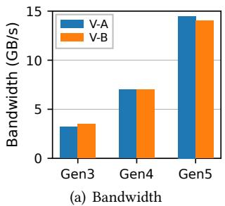

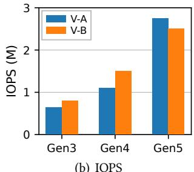  
(b) IOPS  
Figure 1. NVMe SSD performance trends of two representative SSD vendors (V-A and V-B) across three PCIe generations (§2.2). Data are from their official specifications.

## 2 The Dilemma in Storage Evolution

In this section, we first introduce the recent developments in all-flash servers, which aim at better performance and larger capacities. We then, however, reveal that the improved performance and capacity exact a heavy toll on energy consumption.

## 2.1 The Evolution of All-Flash Server

Manufacturers have been rolling out high-performance and high-density all-flash storage servers to cater to the need for high performance and exponential data growth. For example, the latest servers can easily accommodate multiple (e.g., 16-24) PCIe 5.0 NVMe SSDs, which enable hundreds of gigabytes per second of bandwidth and tens of millions of IOPS, with hundreds of terabytes to even petabytes of capacity per node [10, 48, 57, 60].

These all-flash servers have become popular in various scenarios. For example, enterprise-level cluster owners have used them for on-premises storage services, where storage resources are disaggregated and shared by multiple private hosts via NVMe-oF over high-speed RDMA networks [16, 39, 48, 57, 63]. In addition, cloud vendors adopt these servers as their backend (e.g., running chunkservers) for computeto-storage disaggregated systems [6, 27].

## 2.2 Energy Consumption in All-Flash Servers

Nevertheless, the unpleasant side of high performance and capacity is high power consumption. This is especially important given that it dominates the energy bill and has become a key focus in reducing operational carbon emissions [31]. Despite recent efforts to improve energy efficiency at both the hardware and firmware levels [26, 33, 64], we observe that existing all-flash stacks still leave a considerable energy footprint due to three aspects of reasons (R1–R3).

R1: High demand for processing power. Flash SSD performance has been improving substantially. As illustrated in Figure 1, both bandwidth and IOPS per drive have nearly doubled with each successive PCIe generation. However, achieving such full potential can exact a heavy toll on CPUs. From our experiments on the RDMA-based NVMe-oF setup, one logical core (i.e., hyper-thread core) on the NVMe-oF target side can handle around 800K IOPS using SPDK [54]. Consequently, supporting a single PCIe 5.0 NVMe SSD (capable of 2,500K IOPS [49]) under this setup requires at least three logical cores on the storage server, despite utilizing the CPU-efficient SPDK stack. This is 32×, 4×, and 2× higher than running a SATA SSD, and NVMe PCIe 3.0 and 4.0 SSDs, respectively.

<table><tr><td rowspan="2"></td><td colspan="2"> System Idle</td><td colspan="2">Light Load</td><td colspan="2">Peak Load</td></tr><tr><td>Power</td><td>Pct.</td><td>Power</td><td>Pct.</td><td>Power</td><td>Pct.</td></tr><tr><td>CPU</td><td>134W</td><td>33%</td><td>244W</td><td>34%</td><td>245W</td><td>26%</td></tr><tr><td>SSD</td><td>74 W</td><td>17%</td><td>74 W</td><td>10%</td><td>296 W</td><td>32%</td></tr><tr><td>Others</td><td>204 W</td><td>50%</td><td>398W</td><td>56%</td><td>399W</td><td>42%</td></tr><tr><td>System</td><td>412W</td><td>100%</td><td>716W</td><td>100%</td><td>940W</td><td>100%</td></tr></table>

Table 1. Power consumption breakdown (§2.2): Watts (left) and percentage of total system power (right). System idle: no services running; Light load: less than 5% of maximum IOPS; Peak load: at maximum IOPS.

R2: High power consumption from processing I/Os. Apart from using more cores, all-flash servers also require high CPU utilization to achieve high performance. The pollingmode stack (e.g., SPDK) is widely used in both on-premises storage systems [39, 53] and the storage backend of disaggregated systems [6, 27, 67]. This means servers need to reserve CPU cores based on the maximum IOPS and require the CPU to operate in a busy-polling state (i.e., 100% utilization) at high frequencies, regardless of workload intensity. Therefore, this approach, while achieving the best performance, leads to significant power consumption.

In Table 1, we present the power consumption of a 1U storage server equipped with 16 NVMe PCIe 5.0 SSDs under three conditions: system idle (no services running, representing the lower bound) and two levels of workload intensity for 4 KB random reads in an NVMe-oF over RDMA setup: light load (< 5% of maximum IOPS, close to the lower bound) and peak load (at maximum IOPS, representing the upper bound). From the table, we can see that while the power consumption of SSDs adaptively adjusts with workload intensity, the CPU consistently (i.e., regardless of whether the workloads are light or heavy) consumes 1.82× the power of the system idle state due to busy polling.

Moreover, we notice that the collateral power consumption from other components (e.g., memory and cooling systems) follows a similar trend (see others in Table 1). The root cause is related to CPU activity. For example, as the CPU begins polling, its temperature rises from $6 5 ^ { \circ } \mathrm { C }$ to $8 8 ^ { \circ } C ,$ and in response, each of the eight server fans ramps up from 18K to 28K RPM. While intuitive, this finding nevertheless highlights the cascading impact of polling-mode on overall energy consumption.

R3: Frequent variances and bursts in the field. Note that, even with R1 and R2, high power consumption is still acceptable if the I/O pressure is consistently heavy. Yet, realworld workloads indicate otherwise [25, 29, 46, 50, 56]. In addition to variances, recent hardware advancements have made bursts more severe and short-lived. Many prior works have reported this trend and highlighted the need for finegrained detection [11, 22, 23, 28, 30, 37].

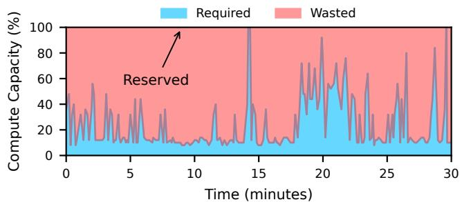  
Figure 2. Reserved, required, and wasted compute capacity under real cloud workloads (§2.2). The required compute capacity is derived from performance utilization.

In Figure 2, we quantify the required processing power (i.e., blue area, equivalent to the actual energy demand) based on real workload traces from a cloud vendor [14] and the reserved compute capacity (i.e., black horizontal line, equivalent to the provisioned and consumed energy) for pollingmode stack based on peak demand. The required compute capacity (i.e., blue area) fluctuates rapidly and significantly—up to 82 I/O bursts within a 30-minute window—and often much lower than the peak level. Yet, to maintain even a light average load and handle these bursts, the system must reserve sufficient CPU capacity, resulting in energy consumption at CPU and related components comparable to the peak level due to R2 (i.e., the power consumption results of CPU and others in Table 1). The total wasted energy can amount to 3.4× the required energy (i.e., the ratio of the red area to the blue area in Figure 2). We analyzed more than 1,000 servers over 24 hours of trace data, all of which exhibit similar patterns. This presents a substantial opportunity for energy savings.

## 3 Limitations of Existing Approaches

Ideally, one would expect an efficient scheduler to be able to promptly allocate compute capacity to adapt to workload changes, thereby reducing unnecessary power consumption without severely impacting performance. Next, we compare four existing power-saving approaches–Linux interrupts, Governor, Dynamic Scheduling, and Hybrid Polling—against SPDK, evaluating performance and power consumption under both stable and burst workloads.

## 3.1 Overview of Existing Approaches.

We now introduce SPDK and four power-saving approaches. We highlight why they can potentially save power. An ideal approach should provide comparable performance to SPDK but with lower power consumption.

SPDK Linux Governor Dynamic Scheduling Hybrid Polling Sandman  
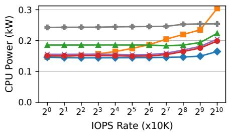  
(a) CPU Power Consumption

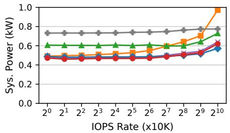  
(b) System Power Consumption

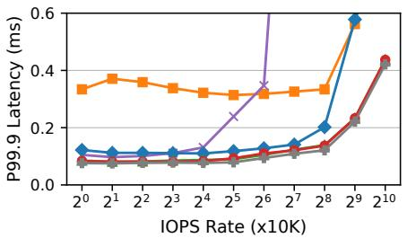  
(c) Tail Latency

Figure 3. Power consumption (CPU and system levels) and tail latency under 4 KB random read workloads (§3).  
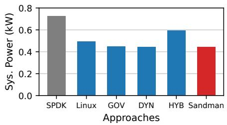  
(a) System Power Consumption

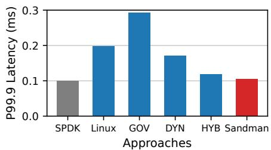  
(b) Tail Latency

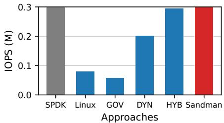  
(c) IOPS  
Figure 4. System-level power consumption, tail latency, and IOPS under I/O bursts (§3). GOV, DYN, and HYB represent Governor, Dynamic Scheduling, and Hybrid Polling, respectively.

SPDK [54] refers to the busy-polling approach with static CPU core allocation, dedicating specific CPU cores to continuously poll for I/O requests. This binding remains fixed without adjustment after initialization. SPDK thus delivers the best performance at the cost of high power consumption. Linux [24] represents the traditional interrupt-based approach, namely allocating CPU resources to process I/O requests only when interrupts are received. Moreover, Linux allows idle CPU cores to transition into low-power states, further reducing power consumption [66].

Governor [5] uses CPU P-states, which allow userspace programs to set specific frequencies. SPDK implements this approach to scale the frequency of each polling core based on its actual CPU load. This enables each core to operate at an optimal frequency to minimize power consumption and transition back to the maximum frequency when needed.

Dynamic Scheduling [7] reallocates threads among reserved CPU cores based on actual thread and CPU load. When a core has no scheduled threads, it stops polling. Once threads are reassigned, the core resumes polling. This reduces power consumption by minimizing the number of active cores. SPDK implements this approach as an optional scheduler.

Hybrid Polling [32] alternates polling cores between sleep and active states. The storage stack adaptively adjusts sleep time based on request service time at runtime, achieving power savings while maintaining performance comparable to static polling. We integrate this adaptive hybrid polling policy from [32] into SPDK to implement this approach.

## 3.2 Experimental Setup

We set up the following platform and define two typical workloads to evaluate existing approaches.

Platform. We perform our motivational study on two servers, each with 16 NVMe PCIe 5.0 SSDs and RDMA NICs with a total of two 200 Gbps ports. Two servers are directly connected through RDMA NICs. We use SPDK FIO-plugin [8] to generate workloads and access remote SSDs via NVMe-oF over RDMA transport. We use powerstat [42] and IPMI [20] to measure power consumption at the CPU and system levels, respectively. More details about the hardware are in §5.

Workloads. We evaluate stable and burst workloads with 4 KB random reads. For stable workloads, we evaluate against 16 SSDs. We limit IOPS rates on the client side, starting at 10K and scaling to 10240K on a logarithmic scale. Each test case runs for 2 minutes before advancing to the next IOPS rate. For burst workloads, we evaluate against a single SSD. The test begins with a baseline load of 5% of the SSD’s maximum IOPS for 10 seconds, followed by an instantaneous increase to the maximum IOPS of the SSD for 1 second. Afterward, the load drops back to the baseline rate, repeating this pattern.

## 3.3 Linux: Interrupts

Stable workloads. Figure 3(a) and 3(b) illustrate CPU-level and system-level power consumption. For light workloads, Linux consumes less power than SPDK as expected. In addition, it is also understandable that Linux interrupt-based processing experiences significantly higher tail latency (Figure 3(c)) compared to SPDK due to context switch overhead. However, Linux surprisingly tends to consume more energy when the IOPS rate exceeds 5120K. This is because Linux needs more CPU cycles for context switches caused by system calls and interrupts, resulting in lower CPU efficiency. In contrast, SPDK dedicates CPU cores and thus shows a constant power consumption in both CPU and the whole system.

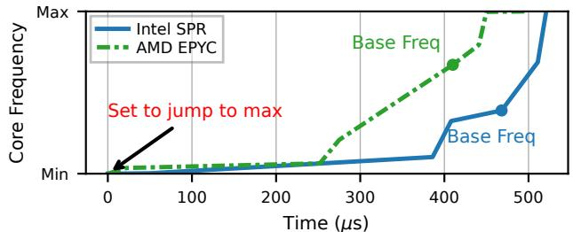  
Figure 5. CPU core frequency scaling overhead (§3). The frequencies are normalized as different CPUs have different min/max/base frequencies. Base Freq refers to CPU core base frequency.

Burst workloads. The results of I/O bursts are consistent with the previous observation—while Linux can save energy (Figure 4(a)), it still exhibits higher latency (Figure 4(b)) and lower IOPS (Figure 4(c)), compared to SPDK due to context switch overhead.

Observation #1: Interrupts show lower performance and can even consume higher-than-polling energy due to context switches under heavy workloads.

## 3.4 Governor: Frequency Scaling

To enable Governor to handle I/O bursts effectively, we configure scheduling interval to 10 ??s based on prior research and field practices [11, 22, 23, 28, 30, 37].

Stable workloads. Figure 3(a) and 3(b) demonstrate that Governor achieves lower power consumption than both Linux and SPDK under all IOPS rates. However, the tail latency of Governor is higher than SPDK and even higher than Linux when the IOPS rate exceeds 5120K (Figure 3(c)). This is because while scaling frequency can save energy and manage specific I/O loads, it comes at the cost of increased latency due to fewer execution cycles within the same time interval.

Burst workloads. During bursts, Governor is expected to scale the core frequency up to the maximum, thus matching the performance of SPDK. However, despite achieving significantly lower power consumption (Figure 4(a)), Governor’s tail latency is three times higher than that of SPDK (Figure 4(b)) with only one-third of the IOPS (Figure 4(c)).

To investigate the root cause, we further measure how fast the CPU core can adapt its frequency to a workload change. Although the effective hardware frequency is not directly visible to users, we can infer it by measuring the time taken to execute a fixed number of NOP (no operation) assembly instructions. We first record this time at all available frequencies before the test, and then we capture changes in core frequency by observing variations in the execution time of the same number of NOP instructions. Figure 5 shows the results of changing the CPU core frequency from the minimum directly to the maximum on recent AMD and Intel CPUs. Both require over 450 ??s to complete the transition; even reaching the base frequency takes at least 400 ??s. This result is consistent with prior findings that CPU frequency changes incur hundreds of microseconds of delays due to underclocking and Phase-Locked Loop (PLL) lock time [12, 40], which also indicates that, unless with a fundamental overhaul at microprocessor level, such intervals are unlikely to be avoided.

Observation #2: Hardware transition overhead. Transitioning CPU cores from low-power states to highperformance ones can introduce hundreds of microseconds of delay, hindering the timely handling of workload bursts.

## 3.5 Dynamic Scheduling

Similar to Governor, we use a 10 ??s scheduling interval for Dynamic Scheduling to handle I/O bursts effectively.

Stable workloads. The power consumption of Dynamic Scheduling is lower than that of both SPDK and Linux but slightly higher than Governor (Figure 3(a) and 3(b)). For tail latency (Figure 3(c)), Dynamic Scheduling performs better than Governor when the IOPS is below 160K and closely matches the performance of SPDK. However, as the IOPS increases beyond 160K, the tail latency of Dynamic Scheduling begins to deteriorate, surpassing Governor. After reaching 320K IOPS, the tail latency even exceeds that of Linux.

With microsecond-scale intervals, the limited CPU cycles per thread make it difficult to detect workload variations using cycle-based metrics. Any function that consumes CPU cycles can distort thread-load estimation. For example, during 60 seconds, Dynamic Scheduling moves threads more than one million times—constantly shifting them back and forth across cores—despite a stable workload, resulting in higher latency.

Observation #3: Detecting bursts at microsecond scale. Using thread load to detect bursts at microsecond scale is difficult due to limited CPU cycles, which causes inaccurate load estimation and more than 800 ??s higher latency.

Burst workloads. Dynamic Scheduling consumes less power than SPDK and matches Linux and Governor in power efficiency under I/O bursts (Figure 4(a)). However, it suffers from higher tail latency and lower IOPS than SPDK (Figure 4(b) and 4(c)). We have identified another issue: waking up cores via software-based interrupts incurs 27 ??s of overhead due to context switches from system calls and interrupts.

Observation #4: Software wakeup overhead. Softwareinduced overhead, such as context switches, during the critical path of waking up a sleeping core can reduce the efficiency of scaling compute resources by more than 25 ??s.

## 3.6 Hybrid Polling

We set the sleep time for each core to half the mean request service time (same as [32]), with an initial value of 10 ??s.

Stable workloads. Hybrid Polling achieves limited power savings compared to Linux under low-pressure workloads, as well as Governor and Dynamic Scheduling across all workloads (Figure 3(a) and 3(b)), while it shows lower power consumption and comparable performance (Figure 3(c)) compared to SPDK. This result arises from frequent transitions between low-power and high-performance states—CPU cores only sleep for very short periods before waking up again.

Burst workloads. Hybrid Polling shows consistent behavior under I/O bursts, achieving limited power savings (Figure 4(a)) while maintaining comparable performance to SPDK (Figure 4(b) and 4(c)). Note that Hybrid Polling might save more power under burst workloads by increasing the sleep time to several hundred microseconds if the system is completely idle. However, this is not practical in real deployments, as workloads are rarely fully idle [3, 25, 29, 38, 56] and such a tuning would compromise performance during I/O bursts even if the system is completely idle.

Observation #5: Frequent transitions limit power saving. Frequent transitions between low-power and highperformance states prevent CPU cores from staying in energy-saving mode for longer durations and thus cannot maximize power savings.

## 3.7 Other Related Works

We now discuss other related works. While they focus on different problems or scenarios, they offer valuable insights.

Energy saving in infrastructure. Many prior works have aimed to reduce energy consumption in infrastructure [17, 26, 33, 65], yet little attention has been paid to the energy consumption from CPU cores supporting high-performance storage. Our work seeks to address this gap. Nair et al. reduce SSD energy consumption by minimizing write amplification in firmware [33]. Hunt et al. utilize user-wait instructions to lower power in polling workloads [17], while Wu et al. tune thread sleep durations in DPDK to save power [65] for network processing. These two techniques, which rely on sleep-active modes (similar to Hybrid Polling), offer limited savings due to frequent transitions. In contrast, our approach seeks deeper power reductions beyond these limitations.

<table><tr><td>CPU States</td><td>CPU Power</td><td>Sys. Power</td><td>Exit Lat.</td></tr><tr><td>P-0 (3.65 GHz)</td><td>244W</td><td>716W</td><td>N/A</td></tr><tr><td> P-N (400 MHz)</td><td>144W</td><td>460 W</td><td>450 μs</td></tr><tr><td> C-1 (shallow sleep)</td><td>134 W</td><td>412 W</td><td>3 μs</td></tr><tr><td> C-N (deep sleep)</td><td>52W</td><td>252W</td><td>800 μs</td></tr></table>

Table 2. Comparison of different CPU states (§4.1). All cases are conducted using 48 polling cores to launch SPDK (see §5 for hardware details) and then enter the certain CPU state. The "exit latency" refers to the hardware overhead required to transition back to the highest-performance state (i.e., P-0).

Scheduling. ZygOS [43], Arachne [44], Shenango [37], and Caladan [11] extend scheduling granularity to microsecond scales for network processing. Shinjuku [23] optimizes context switches overhead for microsecond-scale scheduling. Tiny Quanta [30] uses coroutine-based forced multitasking to avoid system calls. Skyloft [22] and uProcess [28] further enhance scheduling efficiency using user-space interrupts to avoid system calls during core rescheduling. These primarily focus on resource utilization and preemptive scheduling scenarios. By contrast, our work focuses on energy efficiency.

## 4 Sandman

Sandman is a scheduling framework designed for modern storage, providing both high performance and energy efficiency. To save energy, Sandman monitors resource wasting, consolidates tasks into fewer cores, and allows more cores to enter a sleep state. To achieve high performance, Sandman detects I/O bursts and rapidly scales compute resources to tasks at the microsecond level. In this section, we begin with our design guidelines. Then, we present a high-level overview, followed by a detailed description of the design mechanism, policy, and implementation.

## 4.1 Design Guidelines

The observations (O1-O5) in §3 lead to the following design guidelines.

D1: Sleep cores not lower frequency (to O2). Hardware transition overhead depends on the exit latency. Table 2 summarizes the power consumption and the exit latency to transition back to the high-performance state (P-0) from different CPU states. This indicates an efficient design shall prioritize the shallow sleep and avoid low-frequency state.

D2: No system calls and interrupts (to O4). Waking up a sleeping core can be expensive due to system calls and interrupts (see Figure 8(a), totaling 27 ??s for Dynamic Scheduling). We should manage to avoid system calls and interrupts in the critical path during the scheduling process.

D3: Schedule cores together for longer sleep (to O5). Energy saving is underexploited in Hybrid Polling due to independent and short-term sleep of cores. We should prioritize migrating tasks to fewer cores and try to schedule sibling logical cores in pairs (i.e., two logical cores on the same physical core) and to ensure they sleep together for longer durations.

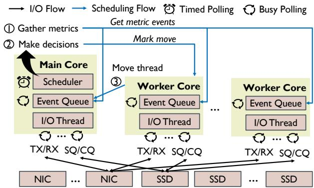  
Figure 6. Sandman system diagram (§4.2).

D4: Measure bursts from network queues (to O3). Instead of using thread load (i.e., CPU cycles) as a metric, we identify workload bursts from the source, i.e., counting incoming I/O requests from network queues, enabling microsecond-level detection.

## 4.2 System Overview

At a high level, Sandman categorizes CPU cores into two types: one main core and several worker cores. As shown in Figure 6, they both run in polling mode to process networking and storage I/O requests, and can communicate via event queues. Except for this, the main core is responsible for an additional task. It maintains a scheduler that gathers metrics and makes decisions to redistribute I/O threads among cores to save power.

Following our design guidelines, Sandman develops two key mechanisms. First, we propose a fast resource scaling mechanism (§4.3). Specifically, Sandman implements I/O threads as lightweight threads that can quickly migrate between cores to scale compute resources rapidly on demand. This relies on two aspects of efforts. One is to allow idle CPU cores to enter a shallow sleep state in order to minimize expensive hardware exit latency (i.e., D1). The other is to eliminate context switches during the scheduling process by enabling CPU cores to await scheduling events by monitoring CPU cache behavior. In this way, the target core wakes up automatically and resumes execution, without system calls or interrupts involved during the scheduling process (i.e., D2).

Second, Sandman monitors both resource wasting and workload variations but at different granularities (§4.4). To maximize power savings, Sandman collects CPU statistics at second-scale intervals and always tends to consolidate I/O threads into fewer CPU cores while prioritizing the use of sibling cores (i.e., under the same physical core) during scheduling (i.e., D3). Moreover, Sandman detects I/O bursts at ??s-scale intervals by building a burst detection model based on incoming requests from network queues (i.e., D4).

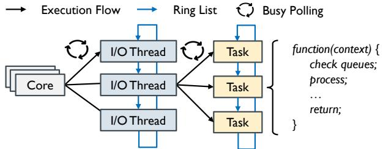  
Figure 7. Sandman thread model (§4.3).

## 4.3 Fast Resource Scaling

One key lesson learned from previous systems is that putting cores to sleep is essential for energy saving. To avoid sacrificing performance, especially during bursts, compute resources must be scaled rapidly, minimizing hardware and software delays. In Sandman, this translates to two techniques: lightweight I/O threads and shallow sleep.

Lightweight I/O threads. Sandman follows a common practice and implements I/O threads as user-level lightweight threads, as in previous works [4, 54, 55], where an I/O thread is an abstraction of a set of tasks. As shown in Figure 7, a core can maintain one or multiple I/O threads, each containing several tasks that are described via predefined C functions. I/O threads are organized in a ring list and executed in a round-robin manner. Specifically, the polling-mode core takes an I/O thread from the head of the ring, executes its tasks sequentially, and then places the I/O thread back at the tail of the ring, during each polling loop. I/O threads can be scheduled across cores by being removed from the original core’s ring list and inserted into the target core’s ring list. Sandman reuses SPDK’s reactor/thread framework to implement the thread model (see §4.5 for details).

Thread binding. In Sandman, the task of each I/O thread is to poll network receiving queues to process incoming requests and storage completion queues to handle completed requests. Initially, Sandman creates one thread on each polling core, and for each NVMe SSD, one queue is created per thread. When a new network client connects to the NVMe-oF target, Sandman uses a round-robin policy to assign a thread to handle that client’s requests.

Shallow sleep with instant transition. To rapidly schedule an I/O thread to a sleeping core, Sandman leverages unprivileged user wait instructions provided by modern processors [2, 19] as a synchronization method between active and sleeping cores. The user wait instructions, monitorx and mwaitx, provide an architectural monitoring mechanism based on the cache-coherence protocol [68]: allowing cores to enter a shallow sleep state (C-1 in Table 2) and monitoring a specified memory range (e.g., the address of a queue entry). If a store (e.g., from other cores) matches the address of the specified memory range (i.e., the cache line is changed to the modified state), the sleeping core wakes up instantly. Compared to Dynamic Scheduling’s method, which relies on kernel-provided power management and interrupts (see Figure 8(a)), Sandman requires no system calls or interrupts during the scheduling process (see Figure 8(b)).

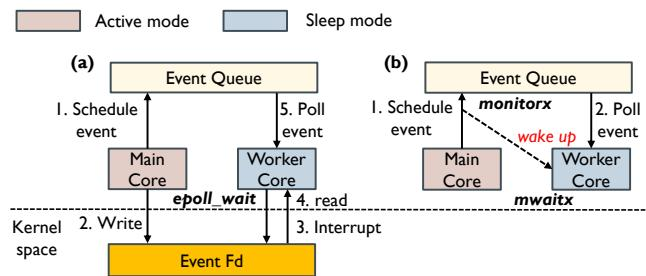  
Figure 8. Comparison of energy-saving and CPU core wakeup mechanisms (§4.3): kernel-based approach (a) vs. Sandman (b).

Specifically, after Sandman moves all I/O threads of one core to another core, an event monitor is set up for the memory address of the next available entry in the event queue via monitorx before putting the idle core into a shallow sleep state with mwaitx. The idle core then sleeps while monitoring the next available entry in the event queue. Therefore, when Sandman schedules I/O threads to the core in shallow sleep, the original core only needs to send a schedule event to the event queue of the target core by modifying the next available entry of the event queue and inserting an event. This behavior will be directly detected by the processor via the cache-coherence protocol, which wakes up the target core to poll for scheduling events and insert the I/O thread into its ring list.

## 4.4 Resource Monitoring and Burst Detection

While the fast resource scaling mechanism enables rapid scaling of compute resources with low overhead, Sandman still requires prompt inputs to decide the timing and targets for scheduling. Specifically, this relates to two aspects: monitoring resource wasting (§4.4.1) and detecting I/O bursts (§4.4.2). The former determines when and which cores to put to sleep for power saving, while the latter decides when to wake up cores and schedule threads to handle bursts.

4.4.1 Monitoring Resource Wasting. Sandman adopts a coarse-grained scheduling interval (1 second) to monitor resource wasting for power saving. Note that power consumption is not sensitive to scheduling granularity (e.g., microsecond- vs. second-level), and such an interval allows Sandman to collect sufficient statistics (see §5.4 for sensitivity analysis). We next describe how Sandman monitors resource wasting and performs scheduling under this coarsegrained interval as shown in Figure 9.

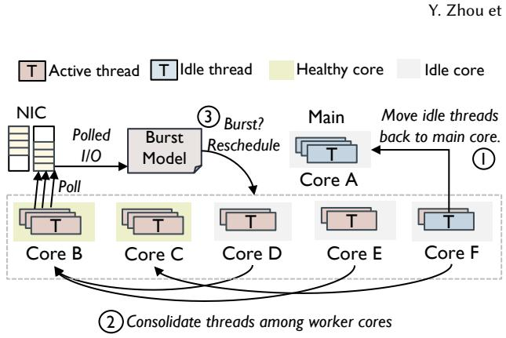  
Figure 9. Overview of scheduling flow (§4.4).

Metric. Sandman uses the core load in the polling-mode stack as the basic metric. The core load is the same as that in SPDK [54], calculated as the ratio of busy cycles to total cycles over a period of time (e.g., a scheduling interval), which indicates how many CPU cycles on the core are effectively used for performing specific tasks.

Besides, we define an idle threshold $T _ { i d l e }$ and a healthy threshold $T _ { h e a l t h y } .$ . We mark a core as idle when the core load is lower than $T _ { i d l e } ,$ as busy when the core load is higher than $T _ { h e a l t h y } ,$ and as healthy otherwise. Sandman aims to consolidate threads owned by idle cores to other healthy ones, and avoid cores entering a busy state. In default, we reserve 20% CPU cycles (i.e., setting $T _ { h e a l t h y }$ as 80%) as CPU buffer for I/O bursts and the $T _ { i d l e }$ is half of $T _ { h e a l t h y }$ (see §5.4 for sensitivity analysis).

Monitoring. During runtime, Sandman periodically checks the status of all worker cores and I/O threads at every coarsegrained scheduling interval. First, Sandman iterates every I/O thread and if there are no I/O requests processed (measured by incoming requests from network queues) by the thread during current interval, Sandman moves the thread back to the main core which accommodates all idle threads (○1 in Figure 9). Second, the main core gathers the core-load statistics from every worker core. Then, if a core’s load is lower than the idle threshold, Sandman tries to consolidate all active threads of this core into other cores and puts the idle core into sleep (○2 in Figure 9).

Core selection. When consolidating I/O threads, Sandman needs to decide which core to migrate threads onto and which core to put to sleep to maximize power saving. First, Sandman checks all healthy cores and selects a target core if it can accommodate the thread. Specifically, if the target core is still considered healthy (i.e., core load $\leq T _ { h e a l t h y } )$ when the core’s current busy cycles are combined with the thread’s busy cycles, then the target core can accommodate the thread. Second, Sandman tries to make sibling pairs sleep together (i.e., following D3) by moving all threads of the active sibling core to another free core if Sandman puts an idle core to sleep while its hyper-thread sibling core remains active.

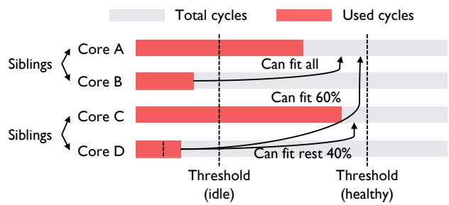  
Figure 10. Example of core selection (§4.4).

Figure 10 describes an example of core selection policy. Core B and D are considered as idle cores as the core loads are lower than idle threshold and thus their threads should be consolidated. Sandman first consolidates threads of core B and C onto core A and C. However, putting core B and D to sleep cannot save power since their sibling cores are still active (i.e., core A and C). Then, Sandman moves all threads of core A to core D and put core A and B sleep together.

4.4.2 Detecting I/O Bursts. In contrast to monitoring resource wasting, Sandman uses a fine-grained scheduling interval (i.e., 10 ??s) to detect bursts. Such a short interval enables Sandman to promptly scale compute resources to handle sudden bursts (see §5.4 for sensitivity analysis) and is also adopted in prior research [11, 15, 22, 23, 28, 30, 37], where microsecond-scale intervals (e.g., 10 ??s or even less) are shown to be necessary for timely response to bursts. We now explain how Sandman detects bursts and scales resources under this fine-grained interval.

Metric. To achieve fast detection of I/O bursts, we use incoming I/O requests from network queues as the metric (i.e. following D4) since using thread load (i.e., CPU cycles) to estimate bursts is difficult due to limited cycles available at microsecond scale. During fined-grained scheduling intervals, Sandman iterates every thread and checks the count of its incoming I/Os. Intuitively, we should allocate more resources (i.e., a new core with more available CPU cycles) to a thread with an increased incoming I/O count. However, even with a rather stable workload, the incoming I/O count might still vary (to a point) during every scheduling period. Therefore, a dilemma is that a sensitive threshold might cause frequent thread migration, while a relaxed one might lead to under-provisioning.

Sandman addresses this challenge through building a Workload Variation Detection Model based on a confidence interval. First, Sandman calculates the Moving Average (MA) and Standard Error (SE) of the incoming I/O count from network queues at the current scheduling event based on previous scheduling events. Second, Sandman builds the Confidence Interval (CI) at the current scheduling event as $C I = M A \pm Z \cdot S E ,$ where ?? represents the critical value corresponding to the confidence level (we use ?? ≈ 1.96 for a 95% confidence level). Sandman considers a thread whose polled I/O count during a scheduling interval exceeds the Confidence Interval as a thread whose workload has surged (see §5.3 for accuracy evaluation).

Detection. During every fined-grained scheduling event, Sandman iterates all I/O threads maintained by both main core and worker cores. If a thread’s polled I/O count during this scheduling time is higher than the upper bound of the Confidence Interval, Sandman will reschedule this thread to a new CPU core (○3 in Figure 9). Note that during finedgrained scheduling events, we only consider upper bound of Confidence Interval to detect whether the load of workloads is increased. If the load is decreased, Sandman will consolidate the thread during coarse-grained scheduling event as previous described in §4.4.1.

Core selection. For performance goal, since it is hard to predict how much CPU cycles are needed for the new load, Sandman wakes up an unused sleeping core and allocate entire core to the thread to be scheduled. This guarantees the most CPU cycle Sandman can allocate for a thread, which is same as static allocation standing for best performance. Sandman relies on scheduler to consolidate threads during next coarse-grained scheduling event if Sandman allocates more CPU cycles than the current scheduled thread needs. When selecting an unused core, we prioritize hyper-thread siblings (i.e., first considering a core whose sibling core is already active) in order to avoid waking up more physical cores (i.e., consistent with D3).

## 4.5 Implementation

We leverage SPDK [54] to implement Sandman. Below, we describe the implementation of the data plane and the control plane, respectively.

Data plane. We build Sandman’s data plane on the SPDK NVMe-oF layer to support remote NVMe access. For storage, we use SPDK’s user-space NVMe driver to communicate directly with NVMe SSDs. For networking, we employ the RDMA InfiniBand user-space library [45] to interact with RDMA NICs. Both storage and network operations run in polling mode to ensure high-performance access.

Control plane. We leverage the SPDK scheduling framework to implement Sandman’s control plane in three aspects. First, we reuse SPDK’s core components—including reactors, threads, pollers, and event queues—along with their runtime statistics (e.g., used cycles, empty cycles, and core load). Building on this foundation, we further extend the SPDK scheduling framework to support new mechanisms and policies. This includes: 1) enabling both fine-grained and coarse-grained scheduling events with corresponding statistics collection (282 LoC); 2) modifying I/O-related pollers to report incoming requests from RDMA RX queues (192 LoC); and 3) enhancing the reactor’s event queues to support our new scheduling mechanism (234 LoC).

In addition to these extensions, we add several new components to SPDK to achieve Sandman. These include: 1) an abstraction layer using unprivileged user-level wait instructions as a new sleep–wake mechanism to replace SPDK’s kernel-based mechanisms (128 LoC); 2) a new module that builds a burst detection model based on incoming requests from network queues to estimate thread load (192 LoC); and 3) a new scheduler that makes decisions based on core load, the burst detection model, and the core selection policy under both fine-grained and coarse-grained scheduling intervals (884 LoC).

## 5 Evaluation

We evaluate Sandman using micro and application benchmarks, and real workloads on emerging storage servers. Our evaluation aims to answer the following questions:

• How effectively does Sandman perform in terms of performance and power consumption (§5.1)?

• How well does Sandman handle sudden I/O bursts (§5.2)?

• What are the contributions and overheads of each design decision in Sandman to its observed performance (§5.3)?

• Is Sandman sensitive to its parameters (§5.4)?

• What benefits do applications gain from Sandman in terms of performance and energy savings (§5.5)?

• How well does Sandman achieve in real cloud workloads in terms of performance and energy savings (§5.6)?

Experimental setup. We configure two servers, each with an AMD EPYC 9454P 48-core processor (single socket, 4 NUMA nodes, 3.65 GHz max and 400 MHz min frequency), 756 GB DRAM, 16 Samsung PM1743 3.84 TB SSDs (PCIe 5.0), and Mellanox ConnectX-6 RDMA NICs with two 200 Gbps ports. The servers are directly connected via RDMA. Both run Ubuntu 22.04.3 LTS (Linux 6.8.7) with SMT enabled. One acts as the storage node, running an RDMA-based NVMe-oF target, while the other serves as the compute node, accessing remote storage via the NVMe-oF client.

Candidates. We compare Sandman against SPDK, Linux, Governor, Dynamic Scheduling, and Hybrid Polling. For polling-mode candidates (all except Linux), we reserve 48 logical cores on the storage server to serve 16 SSDs and configure 16 GB memory as huge pages. For Linux, no limits are set on CPU (up to 96 logical cores available) or memory (up to 756 GB available). Note that SPDK uses static core allocation, which achieves the best performance and thus can be used as the performance baseline in our experiments.

Methodology. We use powerstat [42] and IPMI [20] to measure power at the CPU and system levels, respectively, with 1 s granularity. Powerstat and IPMI are launched before and after each test case, and the average power during the test is computed as the final result. For energy consumption in cloud workloads (§5.6) we collect system-level power and compute consumed energy by integrating power over time.

## 5.1 Latency and Power Consumption

We rerun the stable workloads same as §3 to evaluate power consumption and latency achieved by Sandman.

Configuration. We test raw block devices on the compute node using the SPDK FIO plugin [8], evaluating 16 SSDs with 4 KB random reads. The client generates IOPS ranging from 10K to 10240K on a logarithmic scale using throttling. Each test runs for 2 minutes before moving to the next rate.

Power consumption. Figures 3(a) and 3(b) compare CPU and system power. Sandman matches Dynamic Scheduling and Governor, and outperforms Linux, Hybrid Polling, and SPDK. It minimizes power by enabling more cores to sleep together and longer. In contrast, Hybrid Polling yields limited savings due to short, uncoordinated sleep, while Linux consumes more power due to low CPU efficiency.

Latency. Figure 3(c) compares tail latency under stable workloads. SPDK, Hybrid Polling, and Sandman show comparable tail latency across all IOPS rates. Governor incurs up to 161.5% higher latency than SPDK at 5210K IOPS, while Linux shows consistently high latency. Dynamic Scheduling matches Governor initially, but latency rises sharply beyond 80K IOPS. Sandman remains closest to SPDK, with only 4.8% difference.

Sandman’s advantage stems from accurately identifying workload changes and avoiding unnecessary thread migration under stable conditions. In contrast, Dynamic Scheduling frequently migrates threads, especially after 640K IOPS, resulting in higher latency due to unnecessary thread migration and increased jitter. Linux and Governor suffer higher latency from software overhead and reduced CPU frequency, respectively.

## 5.2 Resilience to Handle I/O Bursts

We rerun the burst workloads same as §3 to evaluate how well Sandman can detect and handle sudden I/O bursts.

Configuration. We evaluate against a single SSD. The test begins with a baseline load of 5% of the SSD’s maximum IOPS for 10 seconds, followed by an instantaneous increase to the maximum IOPS of the SSD for 1 second. Afterward, the load drops back to the baseline rate, repeating this pattern.

Power consumption. Figures 4(a) compares system power consumption. Sandman, Governor, and Dynamic Scheduling achieve lower power consumption than SPDK, Linux and Hybrid Polling. Sandman achieves such power consumption reduction (up to 39.38% at system level) thanks to the longer sleep of multiple cores.

Latency and IOPS. Figures 4(b) and 4(c) compare tail latency and IOPS under I/O bursts. Governor performs the worst result due to inefficient CPU frequency scaling caused by hardware transition overhead. Linux shows the second-worst result, hindered by context switches and software overhead. Dynamic Scheduling improves on both but still lags SPDK due to context switches introduced by system calls and interrupts, and inaccurate load estimation. In contrast, Sandman and Hybrid Polling match SPDK in both metrics. Sandman’s superior performance is because of its fast resources scaling mechanism and microsecond-level burst detection.

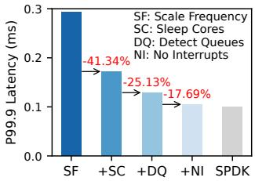

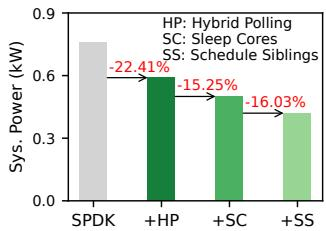  
(a) Performance  
(b) Power Consumption  
Figure 11. Attribution of benefits (§5.3). The results are measured using the same burst workloads described in §3.

## 5.3 Internal Mechanisms and Policies

In this section, we evaluate the contributions of individual mechanisms and policies in Sandman, along with the overheads incurred by Sandman.

Attribution of performance. We conduct an ablation study to examine how each technique contributes to performance, using the burst workloads introduced in §3. We begin with the scaling frequency approach and incrementally apply the proposed techniques. As shown in Figure 11(a), replacing scaling frequency with sleeping cores (i.e., +SC in the figure) reduces tail latency by 41.34%. Adding burst detection from network queues (i.e., +DQ) yields an additional 25.13% reduction. Finally, replacing interrupts with user-level wait instructions (i.e., +NI) further reduces latency by 17.69%, approaching the optimal static polling case (i.e., SPDK).

Attribution of power consumption. We analyze how each technique contributes to power consumption using the same burst workloads. We begin with static polling (i.e., SPDK) and incrementally apply the proposed techniques. As shown in Figure 11(b), employing hybrid polling (i.e., +HP in the figure) lowers power consumption by 22.41% compared to static polling. Replacing hybrid polling with sleeping cores (i.e., +SC) brings an additional 15.25% reduction. Finally, applying scheduling siblings (i.e., +SS) yields a further 16.03% decrease, achieving the most substantial savings

Accuracy of burst detection. We evaluate Sandman’s accuracy of I/O burst detection from two perspectives. First, it should avoid unnecessary resource scaling under stable workloads, as this may cause performance fluctuation and degradation as Dynamic Scheduling. Second, it must accurately detect bursts to ensure timely scaling. We repeat stable and burst workloads for 100 iterations. Results show that Sandman achieves 93.45%-95.78% accuracy under stable workloads by avoiding unnecessary thread migrations across all IOPS rates, and detects I/O bursts with 97.84% accuracy measured by thread movement.

<table><tr><td>Action</td><td>Time Consumed</td><td>CPU Overhead</td></tr><tr><td>Filling Statistics</td><td>79.03ns</td><td>0.78%</td></tr><tr><td>Running Algorithm</td><td>1.99 μs</td><td>16.60%</td></tr><tr><td>Thread Movement</td><td>106.52 ns</td><td>1.05%</td></tr></table>

Table 3. Time consumed and CPU overhead of each action executed during scheduling processes (§5.3). CPU overhead refers to the percentage of CPU cycles used to execute the action during every scheduling event. We suppose the schedule interval is $1 0 \mu s .$

Contextualizing improvements. To clarify the significance of individual techniques and burst detection accuracy, we analyze their impact in end-to-end contexts under real workloads with runtime data. In particular, we quantify how frequently these events occur and how much they affect overall performance and energy savings. We present this analysis in §5.6, using Alibaba’s workloads as an example.

Overhead of running the algorithm. The scheduling algorithm involves two steps. First, the main core collects runtime statistics from all cores and threads. Then, it makes scheduling decisions based on the collected data. Table 3 reports the overhead of both steps under 48 cores running 48 threads. Each worker core spends 79 ns filling statistics, while the main core takes another 1.99 ??s to run the algorithm—totaling 2.07 ??s per interval for the main core.

At the scheduling interval of 10 ??s, the main core spends 16.6% of its CPU time on the scheduling algorithm. Typically, it only runs the algorithm and maintains idle threads. In the worst case—if it runs an active thread—its IOPS is reduced by 16.6%. To prevent this, Sandman’s core selection policy prioritizes worker cores for active threads, assigning them to the main core only as a last resort. Note that such cases only occur when all users are at peak load simultaneously, which has been reported to be rare in the field [25, 46, 50].

Overhead of thread movement. We evaluate the overhead of moving a thread between two polling cores, which involves three steps: 1) the source core removes the thread from its list; 2) a scheduling event is sent to the target core’s event queue; 3) the target core polls the event and inserts the thread into its list. This process takes 106.5 ns (see Table 3).

## 5.4 Sensitivity Analysis

Sandman has two software parameters: core load thresholds and scheduling intervals. The default settings aim to achieve optimal performance. Tuning them can further reduce power consumption but may degrade performance. We use the same burst workloads from §5.2 to illustrate Sandman’s sensitivity to these parameters.

Core load thresholds. These thresholds control how many threads can be consolidated onto active cores. Increasing the thresholds ([45, 90] and [50, 100] in Figure 12(a)) enables more consolidation, reducing power consumption but increasing latency due to a smaller CPU burst buffer. Lowering the thresholds ([30, 60] and [35, 70]) provides no latency benefit (since 20% of CPU cycles as a buffer are already sufficient to handle bursts) and increases power usage. Note that Sandman keeps the idle threshold as half of the healthy threshold, and we adjust idle and healthy thresholds together (i.e., modifying only the idle threshold yields no benefit).

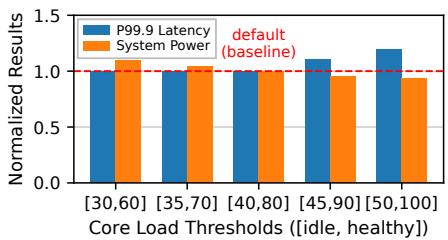  
(a) Core Load Thresholds

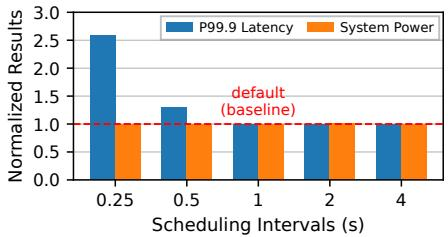  
(b) Coarse-grained Scheduling

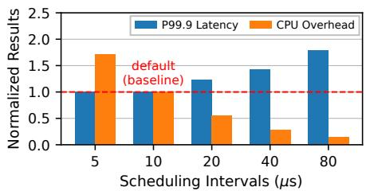  
(c) Fine-grained Scheduling

Figure 12. Sensitivity analysis of Sandman under burst workloads (§5.4). All results are normalized to the default setting (indicated by the red line). CPU overhead refers to the overhead of running the scheduling algorithm, as analyzed in §5.3.  
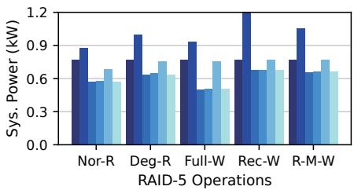  
(a) System Power Consumption

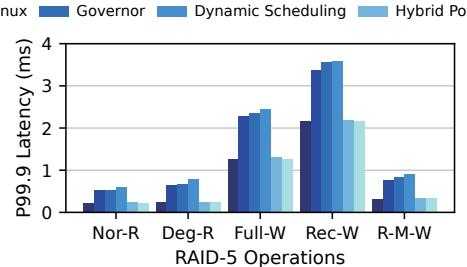  
(b) Tail Latency

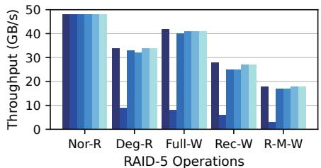  
(c) Throughput  
Figure 13. Comparison of power consumption and performance on flash array with RAID-5 (§5.5). Workloads are five typical RAID-5 operations: normal-state read (Nor-R), degraded-state read (Deg-R), full-stripe write (Full-W), reconstruct write (Rec-W), and read-modify-write (R-M-W).

Scheduling intervals. Sandman uses a coarse-grained interval to trigger thread consolidation and a fine-grained interval to detect I/O bursts. For coarse-grained scheduling, more aggressive consolidation (e.g., intervals of 0.25/0.5 s in Figure 12(b)) does not yield additional power savings and introduces performance fluctuations due to short time windows for collecting CPU cycles, which lead to deviations when making decisions. For fine-grained scheduling, increasing the interval (e.g., 20/40/80 ??s in Figure 12(c)) reduces the CPU overhead of running the algorithm, but increases tail latency under bursts. However, lowering it to 5 ??s offers no latency gain, as the I/O stack takes 4-6 ??s to complete one polling loop, and thus Sandman cannot obtain useful statistics under a 5 ??s interval.

## 5.5 Application Benefits

To evaluate the benefits of Sandman for applications, we measure the performance and power consumption of a flash array configured with RAID-5 [41] and RocksDB [47].

Flash array with RAID-5. On the storage node, we configure 16 SSDs into a flash array using SPDK RAID-5 [41].

The strip (i.e., chunk) size is set to 64 KB, thus a stripe spans 1024 KB (960 KB data and 64 KB parity) across the 16 SSDs. On top of RAID-5, we create 64 logical partitions with equal capacity and expose them as virtualized NVMe devices using the SPDK RDMA-based NVMe-oF target.

On the compute node, we connect to the 64 partitions and execute five typical RAID-5 workloads using the SPDK FIO plugin [8]: normal-state read (64 KB random read), degradedstate read (64 KB random read with one SSD failed), fullstripe write (960 KB random write), reconstruct write (640 KB random write), and read-modify-write (64 KB random write).

Figure 13(a) shows the power consumption under these workloads. Linux consistently consumes more power than other approaches due to frequent context switches caused by interrupts and system calls. Hybrid Polling reduces power consumption under normal-state reads, but provides no savings under other workloads, since write amplification and parity calculations leave fewer opportunities for the CPU cores to enter sleep states. Governor and Dynamic Scheduling achieve power reductions similar to Sandman, but both exhibit higher tail latency (Figure 13(b)), for the reasons analyzed in §5.1. In terms of throughput, all polling-based approaches achieve similar results, while Linux delivers much lower throughput in all workloads except normal-state reads (Figure 13(c)) due to internal implementation overhead [51].

RocksDB. We evaluate RocksDB with YCSB workloads [9]. On the compute node, we first connect to 16 remote SSDs via

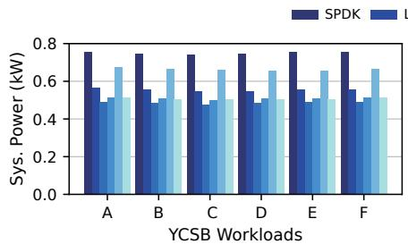  
(a) System Power Consumption

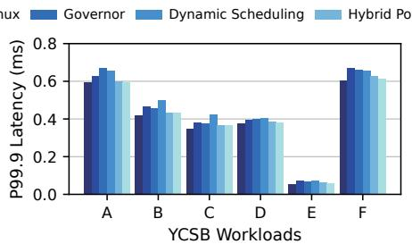  
(b) Tail Latency

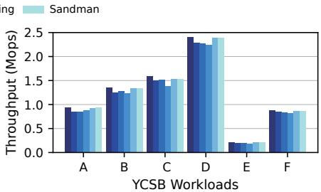  
(c) Throughput  
Figure 14. Comparison of power consumption and performance on RocksDB under YCSB workloads (§5.5). Latency in workloads A, B, C, D, F refers to the latency of reads. In E, latency refers to the latency of inserts as YCSB-E does not involve reads.

Linux RDMA-based NVMe-oF initiator. Then, we mount an EXT4 filesystem on each device and run 16 YCSB processes (6 threads each), each targeting one device. The key and value sizes are 16 B and 1 KB, and the database is prepopulated with 100 million key-value pairs. We measure 50 million operations per YCSB workload.

Figure 14(a) shows system-level power consumption, while Figures 14(b) and 14(c) present tail latency and throughput across 6 YCSB workloads. Results align with our microbenchmarks: Dynamic Scheduling and Governor can reduce power consumption compared to Linux and SPDK but incur higher tail latency and lower throughput. Hybrid Polling matches SPDK performance but saves less power. Sandman achieves both high performance and energy efficiency.

Note that, for application benchmarks, the performance differences among all approaches are less pronounced than those observed with raw block devices. This is due to the low utilization of the bandwidth of each remote SSD and the CPU. These findings suggest that Sandman could deliver even greater benefits if applications can further exploit the capabilities of emerging high-performance storage servers.

## 5.6 Energy Consumption in Cloud Workloads

To evaluate Sandman under real cloud workloads, we replay two block-level I/O traces from Alibaba[13] and Tencent [61].

Trace preparation. Due to the small and varied volume sizes in the traces, we split remote SSDs into 128 logical partitions of 480 GB each. For each vendor, we select 128 high-load volumes closest to 480 GB to stress-test Sandman. We transform I/O traces into a uniform format and extend FIO to replay requests by timestamp, offset, block size, and I/O type (read/write). The workloads are replayed continuously over 24 hours to collect per-request latency and per-second system-level power. We use per-second power data to compute daily energy usage and use the daily result to project monthly usage.

Client configuration. We aim to reproduce configurations similar to those of the vendors who provided the field traces by emulating multiple compute nodes and sharing a storage node through multiple logical devices, according to their description [50, 69]. We divide the 96 logical cores in our NVMe-oF client into 12 sets to emulate 12 compute nodes. The 128 volumes are also divided into 12 sets by evenly distributing I/O traffic (consistent with vendors for load balancing). Each set uses 8 logical cores as 8 FIO threads, serving 8-12 volumes with the same overall load as other sets.

Alibaba trace. Figure 15(a) shows the latency distribution under Alibaba’s trace, and Figure 15(c) compares energy consumption. Among all approaches, Sandman achieves the closest latency distribution to SPDK while reducing energy by 30.23% vs. Linux and 33.36% vs. SPDK. Governor and Dynamic Scheduling offer similar energy savings but suffer significant latency penalties. Hybrid Polling achieves latency comparable to Sandman but consumes more energy due to frequent transitions.

To contextualize the improvements of the proposed techniques, we analyze the first three hours of runtime data, focusing on SSD performance utilization and the scheduled compute capacity on the storage node. Since the required compute capacity mainly depends on the number of requests, we use IOPS utilization as performance utilization. Scheduled compute capacity is normalized by the number of active cores and their operating frequencies. During the runtime, we observe how each approach reacts to the workload changes.

As shown in Figure 16(a), workloads fluctuate frequently and exhibit many bursts during the three-hour period. Figure 16(b) shows the scheduled compute capacity of the three approaches. An increase in compute capacity means that more cores are woken up by Dynamic Scheduling and Sandman, or that CPU frequencies are adjusted by Governor. Sandman schedules compute capacity in a pattern closely aligned with performance utilization. Governor follows a similar trend but sometimes lags behind Sandman because of inefficiency of frequency scaling. Dynamic Scheduling also follows the pattern under low utilization but shows large spikes under high utilization, as threads are repeatedly migrated in the background. These spikes result in much higher tail latency than the other approaches, consistent with the analysis of Observation #3 in §3.5. We omit the results of other approaches (SPDK, Linux, and Hybrid Polling) in the figure since they consistently schedule higher compute capacity than these three approaches.

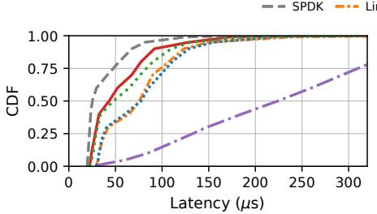  
(a) Latency CDF of Alibaba

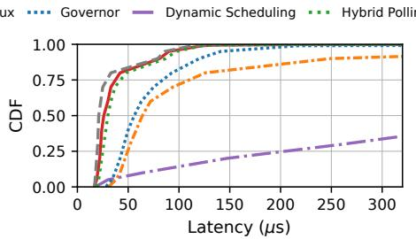  
(b) Latency CDF of Tencent

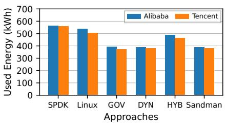  
(c) Monthly Energy Consumption

Figure 15. Latency distribution and energy consumption under block-level traces from cloud data centers (§5.6). GOV, DYN, and HYB represent Governor, Dynamic Scheduling, and Hybrid Polling, respectively.  
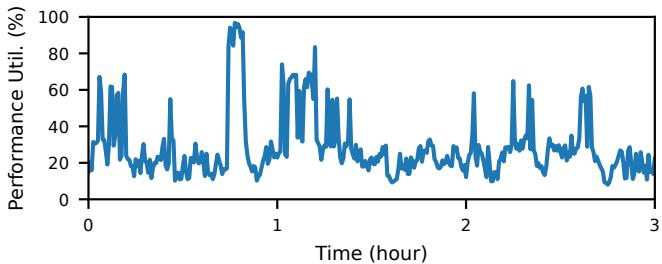  
(a) Performance utilization

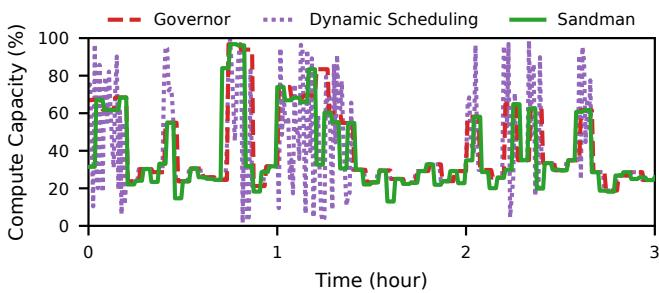  
(b) Scheduled compute capacity  
Figure 16. Performance utilization and scheduled compute capacity under Alibaba’s workloads (§5.6). The compute capacity is normalized by the number of utilized cores and their operating frequencies.

Tencent trace. Figure 15(b) shows the latency distribution under Tencent’s trace, and Figure 15(c) compares energy consumption. Despite slight differences from Alibaba’s trace, the conclusions remain consistent: Sandman closely matches SPDK in terms of latency while achieving significant energy reduction.

The differences in results between Alibaba and Tencent traces are primarily due to their distinct I/O characteristics (e.g., read-write ratio, distribution of request sizes). Reads in Alibaba and Tencent traces account for 35.4% and 39.6%, respectively; 75% of the read and write sizes in Alibaba trace are below 36.8 KB and 24.0 KB, respectively, while 75% of the read and write sizes in Tencent’s trace are less than 47.0 KB and 16.8 KB, respectively.

## 6 Discussion

Hardware dependency. Starting with Intel 4th Gen Xeon Processor [34] and AMD 3rd Gen EPYC Processor [1], unprivileged user wait instructions have been widely supported, covering CPU platforms paired with PCIe 5.0 and newer SSDs. On older platforms without this capability, Sandman falls back to software-based interrupts to wake up sleeping cores, which incurs additional latency, as explained in §5.3.

Compatibility with specialized network stacks. Sandman remains effective with specialized network stacks (e.g., mTCP [21], LUNA [70]), since Sandman does not directly manipulate network queues or packets for burst detection. As long as the network stack provides incoming requests from the transport layer, Sandman can leverage this information to build its model and detect bursts.

Applicability to DPU scenarios. DPUs offload storage stacks to reduce server CPU usage, thereby lowering power consumption, but they still require CPU cores in their SoCs to run software stacks. For example, NVIDIA BlueField [35] and Intel IPU [18] rely on SPDK to handle complex storage functions [36, 59], since hardware offloading covers a limited subset of such functions. Thus, Sandman remains applicable for reducing power consumption in DPU scenarios.

## 7 Conclusion

In this paper, we address the energy consumption problem in storage stacks and identify key challenges in achieving high performance and energy efficiency. Guided by the insights, we propose Sandman, which significantly reduces energy consumption while delivering near-optimal performance.

## Acknowledgments

We thank the shepherd and anonymous reviewers of OSDI’25 and SOSP’25 for their insightful feedback. We also thank Fan Ni and Dongjoo Seo for early discussions, Luis Chamberlain and Nicole Ross for guidance on SSD power measurement, and Amber Bi, Keely Xu, and Yuxian Liu for their support. This work was supported in part by the ACE Center for Evolvable Computing, one of the seven centers in JUMP 2.0, a Semiconductor Research Corporation (SRC) program.

## References

[1] AMD. 2021. AMD EPYC 7003 Series Processors. https://www.amd. com/en/products/processors/server/epyc/7003-series.html

[2] AMD. 2025. AMD64 Architecture Programmer’s Manual. Volume 3: General-Purpose and System Instructions. https://docs.amd.com/v/u/ en-US/24594\_3.37.

[3] Klimovic Ana, Litz Heiner, and Kozyrakis Christos. 2017. ReFlex: Remote flash ≈ local flash. In Proceedings of the 22nd International Conference on Architectural Support for Programming Languages and Operating Systems (ASPLOS).

[4] Saman Barghi. 2020. uThreads: Concurrent User Threads in C++(and C). https://github.com/samanbarghi/uThreads.

[5] Dominik Brodowski, Nico Golde, Rafael J Wysocki, and Viresh Kumar. 2013. CPU frequency and voltage scaling code in the Linux(TM) kernel. Linux kernel documentation (2013).

[6] Wei Cao, Zhenjun Liu, Peng Wang, Sen Chen, Caifeng Zhu, Song Zheng, Yuhui Wang, and Guoqing Ma. 2018. PolarFS: an ultra-low latency and failure resilient distributed file system for shared storage cloud database. Proceedings of the VLDB Endowment (2018).

[7] SPDK community. 2021. Schedulers. https://spdk.io/doc/scheduler. html.

[8] SPDK Community. 2024. FIO plugin. https://github.com/spdk/spdk/ tree/v24.01/app/fio/nvme.

[9] Brian F Cooper, Adam Silberstein, Erwin Tam, Raghu Ramakrishnan, and Russell Sears. 2010. Benchmarking cloud serving systems with YCSB. In Proceedings of the 1st ACM symposium on Cloud computing.

[10] Rob Davis. 2024. Supermicro Launches NVIDIA BlueField-Powered JBOF to Optimize AI Storage. https://developer.nvidia.com/blog/ supermicro-launches-nvidia-bluefield-powered-jbof-to-optimizeai-storage/.

[11] Joshua Fried, Zhenyuan Ruan, Amy Ousterhout, and Adam Belay. 2020. Caladan: Mitigating interference at microsecond timescales. In Proceedings of the 14th USENIX Symposium on Operating Systems Design and Implementation (OSDI).

[12] Mathias Gottschlag, Yussuf Khalil, and Frank Bellosa. 2020. Dim silicon and the case for improved DVFS policies. arXiv preprint arXiv:2005.01498 (2020).

[13] Alibaba Group. 2022. Block Storage Traces. https://github.com/ alibaba/block-traces.

[14] Alibaba Group. 2025. Cluster Trace Program. https://github.com/ alibaba/clusterdata.

[15] Linsong Guo, Danial Zuberi, Tal Garfinkel, and Amy Ousterhout. 2025. The Benefits and Limitations of User Interrupts for Preemptive Userspace Scheduling. In Proceedings of the 22nd USENIX Symposium on Networked Systems Design and Implementation (NSDI).

[16] HPE. 2025. HPE Storage. https://www.hpe.com/us/en/storage.html.

[17] David Hunt, Reshma Pattan, Pinkesh Shah, Rory Sexton, and Chris MacNamara. 2023. User Wait Instructions Power Saving for DPDK PMD Polling Workloads. https://www.intel.com/content/ www/us/en/content-details/751859/power-management-userwait-instructions-power-saving-for-dpdk-pmd-polling-workloadstechnology-guide.html

[18] Intel. 2025. Infrastructure Processing Unit (IPU). https://www.intel. com/content/www/us/en/products/details/network-io/ipu.html.

[19] Intel. 2025. Intel 64 and IA-32 Architectures Software Developer Manuals. https://www.intel.com/content/www/us/en/developer/articles/ technical/intel-sdm.html.

[20] Ipmitool. 2025. https://codeberg.org/IPMITool/ipmitool.

[21] EunYoung Jeong, Shinae Wood, Muhammad Jamshed, Haewon Jeong, Sunghwan Ihm, Dongsu Han, and KyoungSoo Park. 2014. mTCP: a highly scalable user-level TCP stack for multicore systems. In Proceedings of the 11th USENIX Symposium on Networked Systems Design and Implementation (NSDI).

[22] Yuekai Jia, Kaifu Tian, Yuyang You, Yu Chen, and Kang Chen. 2024. Skyloft: A General High-Efficient Scheduling Framework in User Space. In Proceedings of the 30th Symposium on Operating Systems Principles (SOSP).

[23] Kostis Kaffes, Timothy Chong, Jack Tigar Humphries, Adam Belay, David Mazières, and Christos Kozyrakis. 2019. Shinjuku: Preemptive Scheduling for ??second-scale Tail Latency. In Proceedings of the 16th USENIX Symposium on Networked Systems Design and Implementation (NSDI).

[24] The kernel development community. 2025. I/O access and Interrupts. https://linux-kernel-labs.github.io/refs/heads/master/labs/ interrupts.html.

[25] Ana Klimovic, Christos Kozyrakis, Eno Thereska, Binu John, and Sanjeev Kumar. 2016. Flash storage disaggregation. In Proceedings of the 17th European Conference on Computer Systems (EuroSys).

[26] Mitch Lewis. 2025. Building Power Efficient AI Data Centers With Solidigm QLC SSDs. https://www.solidigm.com/products/technology/ power-efficient-ai-data-center-with-solidigm-qlc-ssds.html.

[27] Qiang Li, Qiao Xiang, Yuxin Wang, Haohao Song, Ridi Wen, Wenhui Yao, Yuanyuan Dong, Shuqi Zhao, Shuo Huang, Zhaosheng Zhu, et al. 2023. More than capacity: Performance-oriented evolution of Pangu in Alibaba. In Proceedings of the 21st USENIX Conference on File and Storage Technologies (FAST).

[28] Jiazhen Lin, Youmin Chen, Shiwei Gao, and Youyou Lu. 2024. Fast core scheduling with userspace process abstraction. In Proceedings of the 30th Symposium on Operating Systems Principles (SOSP).

[29] Charles Loboz. 2012. Cloud resource usage—heavy tailed distributions invalidating traditional capacity planning models. Journal of grid computing (2012).

[30] Zhihong Luo, Sam Son, Dev Bali, Emmanuel Amaro, Amy Ousterhout, Sylvia Ratnasamy, and Scott Shenker. 2024. Efficient Microsecond-scale Blind Scheduling with Tiny Quanta. In Proceedings of the 29th ACM International Conference on Architectural Support for Programming Languages and Operating Systems (ASPLOS).

[31] Sara McAllister, Fiodar Kazhamiaka, Daniel S Berger, Rodrigo Fonseca, Kali Frost, Aaron Ogus, Maneesh Sah, Ricardo Bianchini, George Amvrosiadis, Nathan Beckmann, and Gregory R Ganger. 2024. A Call for Research on Storage Emissions. In Proceedings of the 3rd HotCarbon Workshop on Sustainable Computer Systems (HotCarbon).

[32] Damien Le Moal. 2017. I/O Latency Optimization with Polling. https://events.static.linuxfound.org/sites/events/files/slides/lemoalnvme-polling-vault-2017-final\_0.pdf.

[33] Roshan Nair and Arun George. 2023. The Promise of NVMe Flexible Data Placement in Data Center Sustainability. https://www. sniadeveloper.org/events/agenda/session/698.

[34] Nevine Nassif, Ashley O Munch, Carleton L Molnar, Gerald Pasdast, Sitaraman V Lyer, Zibing Yang, Oscar Mendoza, Mark Huddart, Srikrishnan Venkataraman, Sireesha Kandula, et al. 2022. Sapphire rapids: The next-generation Intel Xeon scalable processor. In Proceedings of the 2022 IEEE International Solid-State Circuits Conference (ISSCC).

[35] NVIDIA. 2025. BlueField Networking Platform. https://www.nvidia. com/en-us/networking/products/data-processing-unit/.

[36] NVIDIA. 2025. DOCA Software Framework. https://developer.nvidia. com/networking/doca.

[37] Amy Ousterhout, Joshua Fried, Jonathan Behrens, Adam Belay, and Hari Balakrishnan. 2019. Shenango: Achieving high CPU efficiency for latency-sensitive datacenter workloads. In Proceedings of the 16th USENIX Symposium on Networked Systems Design and Implementation (NSDI).

[38] Jian Ouyang, Shiding Lin, Song Jiang, Zhenyu Hou, Yong Wang, and Yuanzheng Wang. 2014. SDF: Software-defined flash for web-scale internet storage systems. In Proceedings of the 19th international conference on Architectural support for programming languages and operating systems (ASPLOS).

[39] Tony Palmer. 2020. Nutanix Architecture and Performance Optimization. https://www.nutanix.com/content/dam/nutanix/en/resources/ white-papers/wp-esg-technical-review-nutanix-performanceoptimization.pdf.

[40] Sangyoung Park, Jaehyun Park, Donghwa Shin, Yanzhi Wang, Qing Xie, Massoud Pedram, and Naehyuck Chang. 2013. Accurate modeling of the delay and energy overhead of dynamic voltage and frequency scaling in modern microprocessors. IEEE Transactions on Computer-Aided Design of Integrated Circuits and Systems (TCAD) (2013).

[41] Artur Paszkiewicz. 2024. raid5f: the SPDK RAID 5 implementation. https://spdk.io/news/2024/02/12/raid5f/

[42] Powerstat. 2025. https://github.com/ColinIanKing/powerstat.

[43] George Prekas, Marios Kogias, and Edouard Bugnion. 2017. ZygOS: Achieving low tail latency for microsecond-scale networked tasks. In Proceedings of the 26th Symposium on Operating Systems Principles (SOSP).

[44] Henry Qin, Qian Li, Jacqueline Speiser, Peter Kraft, and John Ousterhout. 2018. Arachne: Core-Aware Thread Management. In Proceedings of the 13th USENIX Symposium on Operating Systems Design and Implementation (OSDI).

[45] Linux RDMA. 2025. RDMA core userspace libraries and daemons. https://github.com/linux-rdma/rdma-core.

[46] Benjamin Reidys, Jinghan Sun, Anirudh Badam, Shadi Noghabi, and Jian Huang. 2022. BlockFlex: Enabling storage harvesting with Software-Defined flash in modern cloud platforms. In Proceedings of the 16th USENIX Symposium on Operating Systems Design and Implementation (OSDI).

[47] RocksDB. 2025. https://github.com/facebook/rocksdb.

[48] Samsung. 2024. Building a High Performance, Scalable Object Service: Three Strategies to Leverage. https://semiconductor.samsung.com/ us/news-events/tech-blog/building-a-high-performance-scalableobject-service-three-strategies-to-leverage/.

[49] Samsung. 2024. PM1743. https://semiconductor.samsung.com/us/ssd/ enterprise-ssd/pm1743/.

[50] Junyi Shu, Kun Qian, Ennan Zhai, Xuanzhe Liu, and Xin Jin. 2024. Burstable cloud block storage with data processing units. In Proceedings of the 18th USENIX Symposium on Operating Systems Design and Implementation (OSDI).

[51] Junyi Shu, Ruidong Zhu, Yun Ma, Gang Huang, Hong Mei, Xuanzhe Liu, and Xin Jin. 2023. Disaggregated raid storage in modern datacenters. In Proceedings of the 28th ACM International Conference on Architectural Support for Programming Languages and Operating Systems (ASPLOS).

[52] Eric Smith. 2024. Samsung BM1743 Shows How a 128TB NVMe SSD is Made. https://www.servethehome.com/samsung-bm1743-showshow-a-128tb-nvme-ssd-is-made/.

[53] Solidigm. 2025. DUG Technology: Exascale Flash Storage. https://www.solidigm.com/products/technology/dug-technology-- exascale-flash-storage.html.

[54] SPDK. 2025. Storage Performance Development Kit. https://spdk.io/.

[55] Dan Stein and Devang Shah. 1992. Implementing Lightweight Threads.. In Proceedings of the USENIX Summer.

[56] Murray Stokely, Amaan Mehrabian, Christoph Albrecht, Francois Labelle, and Arif Merchant. 2012. Projecting disk usage based on historical trends in a cloud environment. In Proceedings of the 3rd workshop on Scientific Cloud Computing.

[57] Pure Storage. 2025. Equal Parts Performance and Capacity. https://www.purestorage.com/products/unified-block-filestorage/flasharray-c.html.

[58] Ace Stryker and Yuyang Sun. 2024. The Incredible Path to 122TB: Decades of Engineering Feats Led to this Milestone. https://www.solidigm.com/products/technology/solidigmpath-to-122tb-ssd.html.

[59] Naru Sundar. 2023. SPDK Based IPU/DPU Storage Solutions. https: //storagedeveloper.org/sites/default/files/SDC/2023/presentations/

SNIA-SDC23-Sundar-Li-SPDK-based-IPU-Storage-Solutions.pdf.

[60] Supermicro. 2025. 1U front-loading all-flash storage server with 24 E1.S NVMe drives and PCIe 5.0. https://www.supermicro.com/en/ products/system/storage/1u/ssg-121e-nes24r?utm=smclpp.

[61] Tencent. 2020. Block Storage Traces. http://iotta.snia.org/traces/ parallel/27917.

[62] Mark Tyson. 2024. WD announces enterprise 128TB SSD, 8TB SD cards, and a 16TB external SSD at FMS 2024. https://www.tomshardware.com/pc-components/storage/wdannounces-enterprise-128tb-ssd-8tb-sd-cards-and-a-16tb-externalssd-at-fms-2024.

[63] WEKA. 2025. WEKA Unleashing AI Reasoning with NVIDIA Blackwell. https://www.weka.io/blog/ai-ml/unleashing-ai-reasoning-withnvidia-blackwell-and-weka/.

[64] Wayne Williams. 2024. Phison unleashes 122.88TB ’128TB-class’ SSD. https://www.techradar.com/pro/phison-unleashes-122-88tb-128tb-class-ssd-that-delivers-pcie-gen5-performance-but-we-willhave-to-wait-till-q2-2025-for-a-proper-review-d205v-could-rivalthe-crucial-t705-on-tests.

[65] Mingjie Wu, Qingkui Chen, and Jingjuan Wang. 2022. Toward low CPU usage and efficient DPDK communication in a cluster. The Journal of Supercomputing (2022).

[66] Rafael J. Wysocki. 2019. CPU Idle Time Management. https://www. kernel.org/doc/html/v6.8/driver-api/pm/cpuidle.html.

[67] Ziye Yang. 2017. Accelerate Block service built on Ceph via SPDK. https://snia.org/educational-library/accelerate-block-servicebuilt-ceph-spdk-2017.

[68] Ruiyi Zhang, Taehyun Kim, Daniel Weber, and Michael Schwarz. 2023. (M)WAIT for it: bridging the gap between microarchitectural and architectural side channels. In Proceedings of the 32nd USENIX Security Symposium (USENIX Security).

[69] Weidong Zhang, Erci Xu, Qiuping Wang, Xiaolu Zhang, Yuesheng Gu, Zhenwei Lu, Tao Ouyang, Guanqun Dai, Wenwen Peng, Zhe Xu, et al. 2024. What’s the Story in EBS Glory: Evolutions and Lessons in Building Cloud Block Store. In Proceedings of the 22nd USENIX Conference on File and Storage Technologies (FAST).

[70] Lingjun Zhu, Yifan Shen, Erci Xu, Bo Shi, Ting Fu, Shu Ma, Shuguang Chen, Zhongyu Wang, Haonan Wu, Xingyu Liao, et al. 2023. Deploying user-space TCP at cloud scale with LUNA. In Proceedings of the 2023 USENIX Annual Technical Conference (USENIX ATC).