Latest updates: hps://dl.acm.org/doi/10.1145/3731569.3764805

RESEARCH-ARTICLE

# Spirit: Fair Allocation of Interdependent Resources in Remote Memory Systems

SEUNG-SEOB LEE, Yale University, New Haven, CT, United States

JACHYM PUTTA, Yale University, New Haven, CT, United States

ZIMING MAO, University of California, Berkeley, Berkeley, CA, United States

ANURAG KHANDELWAL, Yale University, New Haven, CT, United States

Open Access Support provided by:

Yale University

University of California, Berkeley

Published: 12 October 2025

Citation in BibTeX format

SOSP '25: ACM SIGOPS 31st Symposium   
on Operating Systems Principles   
October 13 - 16, 2025   
Seoul, Republic of Korea

Conference Sponsors: SIGOPS

# Spirit: Fair Allocation of Interdependent Resources in Remote Memory Systems

Seung-seob Lee Yale University USA

Ziming Mao UC Berkeley USA

## Abstract

We address the problem of fair resource allocation in multiuser remote memory systems. Allocating local memory (used as cache) and network bandwidth to remote memory in such systems is challenging due to the complex interdependence between the two resources and application performance. A larger cache may reduce the need for fetching data over the network, while a larger bandwidth may permit more concurrent network requests, avoiding the need for large caches. As a result, applications can achieve the same data access throughput for a wide range of cache and bandwidth allocations. Such interdependence is unique to each application and hard to capture offline.

We propose Spirit, a multi-user framework for fair resource allocation in remote memory systems. Spirit employs a novel Symbiosis algorithm rooted in microeconomic theory that takes application-specific dependency between cache and network bandwidth into account and ‘trades’ cache and bandwidth resources across users at runtime. We show, both theoretically and empirically, that Symbiosis allocations across users achieve strong fairness properties. Additionally, compared to traditional resource allocation schemes, Spirit improves performance by up to 21.6% across tens of realworld applications with diverse resource needs.

CCS Concepts: • Computer systems organization → Cloud computing; • Networks → Network resources allocation.

Keywords: Remote memory, multi-resource fairness, interdependent resource allocation

## ACM Reference Format:

Seung-seob Lee, Jachym Putta, Ziming Mao, and Anurag Khandelwal. 2025. Spirit: Fair Allocation of Interdependent Resources in Remote Memory Systems. In ACM SIGOPS 31st Symposium

Jachym Putta Yale University USA

Anurag Khandelwal Yale University

USA

on Operating Systems Principles (SOSP ’25), October 13–16, 2025, Seoul, Republic of Korea. ACM, New York, NY, USA, 16 pages. https://doi.org/10.1145/3731569.3764805

## 1 Introduction

Remote memory systems [1, 3, 29, 43, 47, 56, 61, 64, 75] extend server memory capacity, improving application performance and memory utilization across servers. While their realizations vary in implementation details, remote memory systems employ the same core technique: frequently accessed data items are cached in local memory (cache1), while less frequently accessed items are stored in the remote memory, accessed over the network (i.e., on a ‘cache miss’). In this work, we focus on swap-based remote memory systems [3, 29, 43, 56, 75] that leverage the OS’s swap subsystem to access data over remote memory for two reasons. First, they enable transparency by allowing existing applications running on commodity hardware to utilize remote memory without any application or hardware modifications, making them preferable in production settings [42, 77]. Second, leveraging the Linux swap subsystem for remote memory permits multiple concurrent applications to share cache, remote memory bandwidth, and capacity [75].

In such settings, the system-wide goal is to maximize the performance across all applications by using all available resources while ensuring each application is guaranteed a baseline level of performance. These requirements are often formalized as fairness properties (§3.1, [46]) of sharing incentive (i.e., each application gets more than or equal to the baseline level of performance by sharing), envy-freeness (i.e., no application prefers the resources allocated to another), and Pareto-efficiency (i.e., no application’s allocations can be increased without decreasing the allocations of another).

Cache-bandwidth interdependence in remote memory systems. Unlike the allocations for traditional compute, memory, and disk resources (e.g., in analytics platforms [10, 26, 71]), we find that cache and bandwidth resources in remote memory systems exhibit a complex interdependence with each other and with application performance (§2). For instance, to sustain a workload with a particular throughput requirement (e.g., requests per second), an application with a larger cache allocation may need less bandwidth since its miss-rate would likely decrease at larger cache sizes. Moreover, the nature of this relationship is application-dependent. A key-value store with skewed memory access patterns [6] may observe a massive reduction in bandwidth use when the cache size is increased even slightly while sustaining the same data access throughput. In contrast, applications with poor temporal locality (e.g., a streaming workload [48]) exhibit a negligible reduction in required network bandwidth as cache allocations increase to sustain the same throughput. In other words, an application’s performance may be more sensitive to its cache or network bandwidth allocations, depending on the locality of its access patterns [54, 78].

Furthermore, not only are the dependencies between cache size and bandwidth application-specific, but they also tend to be unknown before application deployment—they can even differ across workloads for the same application and over time [6, 10]. The inability to estimate such dependencies makes such applications ill-equipped to specify their own cache and bandwidth demands [10]. Additionally, preserving transparency in remote memory systems precludes modifications to the application or the underlying hardware to obtain the corresponding performance signals at runtime.

Limitations of existing schemes. Unfortunately, classical multiresource allocation schemes like DRF [26] are poorly suited for remote memory systems since these schemes do not consider the interdependence between cache and bandwidth resources and application performance. First, applications are forced to specify a fixed cache and bandwidth demand in such schemes, even though several possible allocations (e.g., large cache with small bandwidth, small cache with large bandwidth, or various combinations in between) may allow the application to achieve the same performance (§2.1). Even though such schemes guarantee a generalized form of maxmin fairness based on specified demands, some bandwidthsensitive applications may still be able to improve their performance by trading some of their cache resources for bandwidth with other cache-sensitive applications and vice versa.

Second, such schemes require applications to submit their resource demands upfront; since applications want to improve their performance but do not know how a particular resource allocation will impact performance, they are incentivized to ask for as much of each resource as possible. With all applications demanding resources beyond their fair share, allocations under such schemes are reduced to static partitioning, leading to less-than-ideal performance for all.

Recent approaches have attempted to address this issue by incorporating runtime feedback from the application about their demands [10, 13, 25, 71]. Unfortunately, the transparency requirement of swap-based remote memory systems precludes application modifications. Moreover, none of these schemes explicitly accounts for the interdependency between cache and bandwidth resources. Another class of approaches from the micro-architecture community focuses on hardware modifications to estimate cache and memory bandwidth requirements to perform resource allocations, e.g., when partitioning resources in chip-multiprocessor architectures [12, 19, 31, 36, 37, 57, 58, 62, 67]. Again, this violates the transparency requirement of using commodity hardware in swap-based remote memory systems. Moreover, it is challenging to support low-overhead monitoring [12, 19, 20, 31, 32, 36, 67, 73] and resource allocation (e.g., at cache-way granularity [37, 57, 58, 62]) in fine-grained hardware caches, forcing prior works to explore heuristic allocations and performance models specific to hardware caches [54, 76, 78], often compromising on one or more fairness guarantees (§8).

Our approach. We present Spirit, a multi-user framework for fair allocation of interdependent cache and bandwidth resources. Spirit makes several novel contributions:

A novel auction-based algorithm, Symbiosis, that draws its intellectual roots from microeconomic theory [22] for provably fair cache and network bandwidth allocations across multiple users. Symbiosis starts with an equal allocation of cache and network bandwidth across various applications, followed by periodic adjustments for the allocation based on the up-to-date performance dependence on resource allocations. During adjustments, each application is assigned an equal budget that can be spent to acquire resources that the application benefits more from (cache or bandwidth). The balance between cache and bandwidth resources is maintained by resource prices, which are set based on their total demands. Symbiosis adjusts resource prices so that every application can always acquire its static fair allocation within the budget while still “purchasing” resources that maximize its performance. Formally, Symbiosis is Pareto-optimal, envy-free, and incentivizes sharing.

Runtime estimation of interdependence. Unfortunately, auction-based schemes are well known not to be strategyproof [26], i.e., users can cheat by lying about their performance profiles. However, Spirit does not require userspecified demands but estimates them at runtime, preventing users from employing any strategy. Spirit’s monitoring is transparent: instead of modifying applications or the underlying hardware, Spirit monitors the application’s interactions with the cache and remote memory to characterize this dependence. Based on the instrumented interactions, Spirit estimates each application’s performance as a function of cache size and bandwidth. This estimate is then used to identify ideal allocations for the applications on their behalf while ensuring fairness using Symbiosis. To keep runtime overhead negligible, our implementation leverages hardwareassisted sampling available in commodity processors (e.g., Intel PEBS [34, 35]) to collect memory access samples. Spirit employs a gradient descent-based regression method codesigned with Symbiosis’s iterative price determination to estimate the memory access rate (as a proxy for application performance) at various cache and bandwidth allocations. This permits average convergence times as low as 140 ms.

Implementation for real-world use-cases. We employ a remote memory deployment similar to prior studies [3, 29, 56], where multiple applications share (i) local memory used as cache and (ii) network bandwidth to access swap-based remote memory over RDMA. We evaluate Spirit for a combination of several real-world applications with diverse sensitivity to various resource allocations: STREAM benchmark (bandwidth-sensitive) [48], Memcached [18] with Meta’s keyvalue store traces [49] (cache-sensitive), Meta’s deep learning recommendation model (compute-intensive) [52], and Social-Network from DeathStarBench [23] (diverse interactions between containerized microservices). Our evaluation with up to 24 application instances shows that Spirit improves performance while ensuring envy-freeness, sharing incentive, and Pareto efficiency across applications. Spirit is open source and available at https://github.com/yale-nova/spirit.

## 2 Spirit Overview

## 2.1 Motivation

We motivate the need for Spirit by demonstrating two unique properties specific to remote memory systems that make ensuring resource allocation fairness challenging:

• There is an interdependence between an application’s performance, its cache allocation, and its network bandwidth allocation [54, 78].

• The above relationship is specific to the application’s workload and not known a priori [6, 10].

The workload-specific dependence of application performance on cache and memory bandwidth is well-known in traditional server architectures [12, 19, 20, 31, 32, 36, 37, 57, 58, 62, 67]—while decreasing the cache and/or the memory bandwidth degrades application performance in general, some applications are more sensitive to decreases in one or the other [24].

We find that this dependency also applies to caches for remote memory despite orders of magnitude larger caches (gigabytes of DRAM caches vs. megabytes of L3 caches) and higher latencies (several microseconds to access remote memory vs. hundreds of nanoseconds to DRAM). This is captured in our empirical analysis, shown in Fig. 1.

We analyze four applications: Memcached [18] with Meta’s key-value store trace [49], STREAM benchmark [48] (dubbed Stream), Meta’s deep learning recommendation model (DLRM) [52] with Kaggle Display Advertising dataset [15], and SocialNetwork from DeathStarBench [23] with soc-twitter-follows-mun dataset [60]. We measure the performance of applications under varying memory bandwidth and cache sizes (details in §6).

We observe well-known differences between applications in their sensitivity to cache size and network bandwidth. The performance of Stream primarily depends on the allocated network bandwidth (Fig. 1a), whereas the performance of Memcached is dominated by the allocated cache size (Fig. 1b). While SocialNetwork consists of 27 containers, the aggregated performance (i.e., client-observed end-to-end throughput) is cache-sensitive (Fig. 1c). Finally, DLRM is a compute-intensive application, so neither the cache size nor the bandwidth affects its performance (Fig. 1d) with marginal variations (< 3%) across runs.

The leading approaches in multi-resource allocation include Dominant Resource Fairness (DRF) [26] and its variants (e.g., DRFQ [25]) that generalize max-min fairness to multiple resources. To determine fair resource allocation for contending applications, these approaches assume that (i) different resources are independent, and (ii) the application demand for each resource type is a fixed value known a priori. DRF schemes build on these assumptions to identify an application’s “dominant” share, i.e., the maximum share the application has been allocated of any resource type, and perform allocations to maximize the minimum dominant share across all applications.

However, our analysis above provides counter-evidence for both assumptions in cache-based systems. Cache and bandwidth allocations are interdependent, and both jointly determine application performance. Specifically, increasing an application’s cache allocation can reduce its bandwidth demands to achieve the same performance, and vice versa. For instance, as shown in Fig. 1a, Stream achieves the same throughput for ⟨100%, 75%⟩ and ⟨40%, 100%⟩ allocations of ⟨cache, bandwidth⟩. Thus, an application’s demand for each resource is a spectrum that depends on its required performance rather than a known fixed value.

The challenges in fair allocations under this setting are further exacerbated by these cache and bandwidth interdependencies being application-specific and hard for applications to know a priori [10]. Under such circumstances, users are incentivized to demand as much of each resource as possible, and DRF allocation schemes end up statically partitioning each resource. However, Fig. 1 clearly shows that, for instance, both Stream and Memcached applications would observe better performance if Memcached received more cache and Stream received more bandwidth.

## 2.2 Spirit Approach

To address the problem of fair allocations of interdependent resources in caching systems, we reformulate the fairness goal to better meet application needs in such systems. We argue that applications in such systems prefer performance fairness, $i . e . ,$ each application wants an allocation of cache and bandwidth that ensures equitability across their data access throughputs (§3.1). We solve this reformulated problem using a novel auction-based allocation algorithm, Symbiosis (§3.2), that derives its intellectual roots from microeconomic theory [22]. In Symbiosis, different applications essentially trade cache and bandwidth resources with each other across multiple auction rounds based on their unique performance dependence on cache and bandwidth allocations. During trading, Symbiosis adjusts resource prices to control demand for each resource, accounting for the interdependency between cache and bandwidth. Symbiosis uses a novel binary search-based price determination method to facilitate quick convergence in this setting. Once the auctions conclude in Symbiosis, we show that application allocations are Paretooptimal, envy-free, and incentivize sharing.

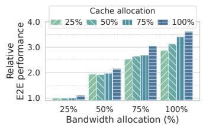  
(a) Stream

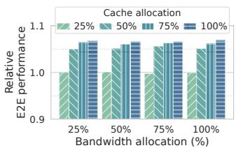  
(b) Memcached

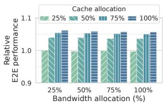  
(c) SocialNetwork

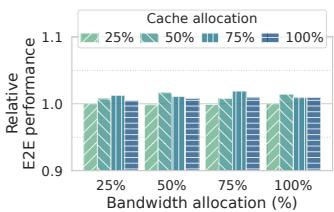  
(d) DLRM  
Fig. 1. Interdependence between application performance and its cache (bars) and bandwidth (x-axis) allocations. Stream is primarily bandwidth-sensitive but benefits from increased cache. Memcached and SocialNetwork are cache-sensitive. DLRM is computeintensive and unaffected by cache or bandwidth allocations. Cache and bandwidth allocations are normalized to total system capacity (see §6). The reported end-to-end (E2E) performance (y-axis) is relative to performance under the lowest cache size and network bandwidth.

Unfortunately, auction-based algorithms are well known not to be strategy-proof, i.e., users can cheat by lying about their demands. While Symbiosis inherits this shortcoming, its realization in Spirit eliminates cheating by estimating the application performance dependence on cache and bandwidth resources directly using runtime measurements (§5) rather than relying on user-provided demands. Estimating this dependence is not just useful for strategy-proofness but necessary for cache-based systems since it is hard to pin down an application’s potentially dynamic demands for interdependent cache and bandwidth resources, a priori (§2.1).

Spirit design. Fig. 2 shows Spirit’s system architecture comprising two components: a centralized resource allocator and a data plane that interfaces with existing swap-based remote memory systems. Entities external to Spirit are the users (or applications) that interface with (or run atop) the remote memory system. The resource allocator makes resource allocation decisions and hosts two modules: (i) a performance estimator (§4), which maintains a dynamically updated estimate for each application’s performance dependence on cache and bandwidth resources, and (ii) Symbiosis algorithm (§3.2), that periodically allocates resources to applications using the above estimates. Spirit’s data plane also hosts two modules: (i) a resource enforcer (§5.2) ensures the cache and bandwidth allocations from the allocation module are enforced, and (ii) a performance monitor (§5.1) that measures the application performance at runtime and periodically sends it to the performance estimator.

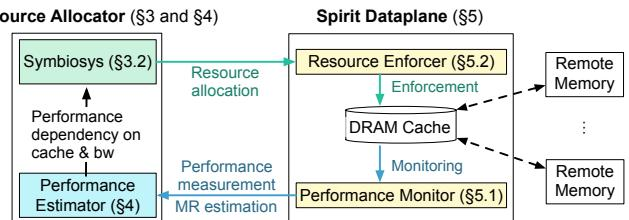  
Fig. 2. Spirit overview. Spirit ’s resource allocator comprises allocation and performance estimation modules (§3, §4). Its dataplane runs alongside the applications and comprises resource monitoring and enforcement modules (§5).

Spirit interface. During system initialization, users inform the resource allocator about the applications that will use the shared remote memory system. After initialization, applications transparently perform memory accesses, which can be directly accessed from the cache or fetched from the remote memory over the network. Throughout this operation, Spirit data plane enforces the resource allocation determined by the resource allocator—evicting data to enforce cache size and limiting network transmission for bandwidth. The data plane also collects the data access rate as a performance metric, which is used to update the estimation models at the resource allocator to reflect the applications’ up-to-date performance dependence on cache and bandwidth resources.

## 3 Fair Resource Sharing with Symbiosis

## 3.1 Fairness in Caching Systems

We consider the problem of performance fairness among ?? applications sharing a cache with a capacity of ?? and network bandwidth ?? to remote memory. Our goal is to allocate these resources across the applications in a manner that ensures each application achieves a ’fair’ data access throughput. Let each application ?? be allocated $c _ { i }$ cache capacity and $b _ { i }$ bandwidth. Each data access request can be either served by the shared cache (i.e., ?? consumes some of its allocated $c _ { i } )$ or fetched from a network-attached backend (i.e., ?? consumes some of its allocated $b _ { i } )$ . If the allocated cache capacity $c _ { i }$ increases, the application may not need to use all of its allocated bandwidth $b _ { i }$ to achieve the same data access throughput, and vice versa. We represent this applicationspecific relationship as a function $f _ { i } ,$ where $f _ { i } ( c , b )$ is the data access throughput that can be achieved for a given cache size ?? and network bandwidth allocation ??. Since increasing $c _ { i }$ and/or $b _ { i }$ can only improve data access throughput, we assume that $f _ { i }$ is a monotonically increasing function for $c _ { i }$ and $b _ { i }$ (verified in many prior studies [28, 46, 54, 66]).

Next, we revisit the traditional fairness properties in our new cache setting with interdependent resources. Our properties differ from prior definitions in two key ways: (i) they seek to establish fairness in terms of achieved data access throughput (performance) across different applications, and (ii) they consider the interdependence of resources.

Sharing incentive. The data access throughput for all applications that share cache capacity and network bandwidth via a “fair” allocation policy must be at least as much as that with their static fair share of each resource $\big ( i . e . , \big \langle \frac { C } { N } , \frac { B } { N } \big \rangle \big )$ :

$$
f _ { i } ( c _ { i } , b _ { i } ) \geq f _ { i } ( \frac { C } { N } , \frac { B } { N } ) , \forall i .
$$

Envy-freeness. An application $i ^ { \prime } s$ data access throughput cannot improve if it selects another application $j ^ { \prime } s$ allocation $\langle c _ { j } , b _ { j } \rangle$ instead of its own, $i . e . , \left. c _ { i } , b _ { i } \right.$

$$
f _ { i } ( c _ { i } , b _ { i } ) \geq f _ { i } ( c _ { j } , b _ { j } ) , \forall i , j
$$

Resource Pareto-efficiency. An application ??’s allocation of any resource type (cache or bandwidth) cannot be increased without decreasing the allocation of the same resource type for another application ?? .

## 3.2 Symbiosis Approach

Achieving performance fairness in the above setting requires an allocation algorithm to consider application-specific relationships between performance and cache/bandwidth allocations (captured as $f$ in our definition) and the relative demand for each resource across competing applications. Unfortunately, as noted in $\ S 2 ,$ , existing multi-resource allocation algorithms [25, 26] only consider the latter and assume each application provides a fixed cache and bandwidth demand for the former. Since applications may be able to achieve the same performance for a variety of cache and bandwidth allocations (based on $f ) _ { ; }$ , such approaches ignore a large space of allocations that may mutually benefit all applications.

Auction-based fair-allocation schemes from microeconomic theory offer a better way to navigate this space [51, 63, 80]. In them, competing ‘users’ start with a fixed amount of resources of each kind and trade with each other as long as they can improve their own utility—a function of their allocation—and finish trading when all resources are exhausted, and all utilities are maximized. This provides an ideal starting point for resource allocation under our problem setting: users are applications, each application’s utility is its data access throughput, while trades are a means for cache-sensitive applications to trade bandwidth for cache with bandwidth-sensitive applications. Indeed, our algorithm, Symbiosis, derives its intellectual roots from CEEI [22] in a market configuration similar to Walrasian auction [74].

In Symbiosis’s auction-based resource allocation, applications bid for resources using credits. Each application is given the same amount of credits2. Each resource is initially assigned the same price in terms of credits required to purchase each unit resource. As we will show next, credits serve as a neutral currency for tracking how much each application values cache vs. bandwidth resources, as well as the relative demand for each resource across all applications.

The auction itself occurs in multiple rounds: in each round, users bid to spend their credits on a certain amount of cache and bandwidth resources based on their performance sensitivity to them (captured by the function $f _ { i }$ for application ??) and the current price for each resource. For instance, a cache-sensitive application would want to spend most of its credits purchasing cache rather than bandwidth. At the end of the auction round, Symbiosis tallies the bids from all applications to see if they can be satisfied.

A likely outcome is that the total purchase bids for one resource exceed its available capacity, while the other has insufficient bids. For instance, when there are more cachesensitive applications than bandwidth-sensitive ones, most applications may try to purchase cache, resulting in insufficient cache for everyone to purchase. In this case, the auction round fails, and Symbiosis reacts by adjusting resource prices for the next auction round: the popular resource now costs more credits, while the less popular resource is made cheaper.

Since each application has a fixed number of credits, the reduced affordability of the more popular resource will cause each application to bid for less of it and try to purchase more of the cheaper resource. This results in each application still bidding for each resource to maximize their performance, but in a way that is within their budget based on current resource prices. The round-based auction process continues until the resource prices converge to a point where both resources can be purchased in their entirety.

Algorithm 1 shows details of Symbiosis’s auction-based allocation. Symbiosis normalizes the total credit count, the sum of resource prices, and each resource capacity to 1. At initialization, each application is assigned a credit budget of $\textstyle { \frac { 1 } { N } }$ , and the price of each resource is set to ${ \frac { 1 } { 2 } } .$ . When readjusting prices during the auction rounds, Symbiosis ensures the sum of resource prices $p _ { c } + p _ { b }$ is always normalized to 1.

Note that the allocations in Algorithm 1 eventually converge due to (1) the monotonic dependence of $f _ { i }$ on both cache and bandwidth allocations and (2) the iterative increase in the price of the more contended resource in Symbiosis. We provide intuitive reasoning through an example case where $\textstyle \sum _ { \forall i } c _ { i } > 1$ (Line 14): Symbiosis will keep increasing $\mathit { p _ { c } }$ across successive auction rounds, incentivizing applications to prefer less of it in favor of cheaper bandwidth resources. This is a viable option for an application because of the monotonicity property of $f _ { i } ,$ i.e., increasing either cache or bandwidth allocations increases $f _ { i \cdot }$ Even though cache may increase application performance faster than bandwidth, the higher cache prices and lower bandwidth prices allow applications to purchase enough bandwidth to bridge the performance gap and reduce the demand for cache. Ultimately, the total demand for cache will shift toward the convergence point (i.e., $\textstyle \sum _ { \forall i } c _ { i }$ gets closer to 1) until both resources receive equal demand, terminating Algorithm 1 (Line 10).

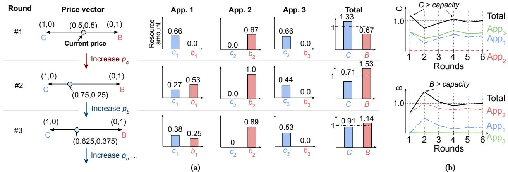  
Fig. 3. Illustrating Symbiosis’s operation. (a) Finding a fair allocation. For the three applications with $\begin{array} { r } { f _ { 1 } ( c , b ) = \frac 1 2 c ^ { 2 } + c b , f _ { 2 } ( c , b ) = b , } \end{array}$ and $f _ { 3 } ( c , b ) = c ,$ the static fair share provides the throughput $f _ { 1 } = 0 . 1 7 , f _ { 2 } = 0 . 3 3 ,$ , and $f _ { 3 } = 0 . 3 3$ , while Symbiosis provides equal or higher throughput: $f _ { 1 } = 0 . 1 8 ( 1 . 1 \times ) , f _ { 2 } = 0 . 8 1 ( 2 . 5 \times )$ , and $f _ { 3 } = 0 . 5 7 \left( 1 . 7 \times \right)$ after $8 ^ { \mathrm { { t h } } }$ round. The key reason is the redistribution of cache and bandwidth resources between $\mathrm { A p p } _ { 1 }$ and $\mathrm { { A p p } _ { 2 } }$ . (b) Symbiosis convergence. By adjusting the price to reduce demands for the contended resource, the algorithm converges toward the clearing price (i.e., $\begin{array} { r } { \sum _ { i } c _ { i } , \sum _ { i } b _ { i } \to 1 \big ) } \end{array}$

Algorithm 1 Symbiosis   
// ???? and $b _ { i }$ are normalized, $i . e . , 0 \leq c _ { i } , b _ { i } \leq 1 .$   
$/ / p _ { c } , p _ { b } ,$ and credits are normalized, i.e., credits for ?? is $1 / N ,$ ∀?? ;   
$p _ { c } + p _ { b } = 1 .$   
// A price vector, $\mathbf { p } = ( p _ { c } , p _ { b } )$   
1: $\forall i : c _ { i } \gets 0 , b _ { i } \gets 0$ ⊲ Initially no resource is assigned.   
2: Set two extreme prices: $\hat { p } _ { c } = 1$ and $\check { p } _ { c } = 0$   
// Determine demands   
3: while true do   
4: $p _ { c } \gets ( \hat { p } _ { c } + \check { p } _ { c } ) / 2$   
5: $p _ { b } \gets 1 - p _ { c }$   
6: for ?? ← 1 to ?? do   
7: $c _ { i } ^ { * } , b _ { i } ^ { * } = \operatorname { a r g m a x } _ { ( c _ { i } , b _ { i } ) } f _ { i } ( c _ { i } , b _ { i } )$   
s.t. $p _ { b } b _ { i } + p _ { c } c _ { i } \leq 1 / N \qquad \triangleright$ Within the given credits.   
8: end for   
// Check termination condition   
9: if $\textstyle \sum \forall i \ : c _ { i } ^ { * } = 1$ and $\textstyle \sum \forall i ^ { b _ { i } ^ { * } } = 1$ then   
10: Terminate ⊲ All resources allocated.   
11: end if   
12: if $\textstyle \sum \forall i \ : c _ { i } ^ { * } \leq 1$ and $\textstyle \sum \forall i ^ { b _ { i } ^ { * } } > 1$ then   
13: $\hat { p } _ { c } \gets p _ { c }$ ⊲ Search for higher bandwidth price   
14: else   
15: $\check { p } _ { c } \gets p _ { c }$ ⊲ Search for higher cache price   
16: end if   
17: end while

Before formally establishing Symbiosis’s fairness guarantees, we next demonstrate its operation on a toy example.

Understanding Symbiosis’s operation. We consider an example with three applications, $\mathrm { A p p } _ { 1 } , \mathrm { A p p } _ { 2 }$ and $\mathrm { A p p } _ { 3 } ;$ , each with varying degrees of bandwidth and cache sensitivity (???? ):

$$
f _ { 1 } ( c , b ) = \frac { 1 } { 2 } c ^ { 2 } + c b , \ f _ { 2 } ( c , b ) = b , \ f _ { 3 } ( c , b ) = c
$$

representing mixed $( e . g . \mathrm { . }$ SocialNetwork), bandwidthsensitive (e.g., Stream), and cache-sensitive (e.g., Memcached with Zipfian access pattern), respectively. Note that while $\mathrm { { A p p } _ { 2 } }$ and $\mathrm { A p p } _ { 3 }$ always prefer more bandwidth and cache, respectively, $\mathrm { A p p } _ { 1 }$ prefers different resources in different scenarios. To see why, consider an allocation of ⟨0.1, 0.1⟩ for $\mathrm { A p p } _ { 1 }$ , and assume that it can increase either its cache or bandwidth allocation by 0.1. In this scenario, increasing cache results in a larger increase in performance $( i . e . , f _ { 1 }$ increases by 0.025) than increasing bandwidth (where $f _ { 1 }$ increases by 0.01). On the other hand, if the cache becomes scarce and $\mathrm { A p p } _ { 1 }$ can choose between increasing cache by 0.05 or increasing bandwidth by 0.2, choosing bandwidth improves its performance more than increasing cache (i.e., ??1 increases by 0.02 versus 0.011).

We illustrate how Symbiosis ensures performance equitability across these applications in Figs. 3a and 3b. In Fig. 3a, the price vector is initialized to (0.5, 0.5), and each application gets an equal number of credits, 0.33. Given the price vector, in the first auction round, $\mathsf { A p p } _ { 2 }$ uses its credits to bid for as much bandwidth as possible $( \left. 0 , 0 . 6 6 \right. )$ , given its total credit allocation of 0.33, while $\mathrm { A p p } _ { 3 }$ does the same for cache (⟨0.66, 0⟩). $\mathrm { A p p } _ { 1 }$ , on the other hand, bids for allocations that maximize their respective $f _ { i }$ considering the price of resources even though its choice is the same as $\mathrm { A p p } _ { 3 } ^ { \prime } s , i . e . , \langle 0 . 6 6 , 0 \rangle$ The auction round concludes with the three applications bidding for more cache resources than available in the system $\textstyle \big ( \sum _ { i } c _ { i } = 1 . 3 3 > 1 \big )$ . Symbiosis reacts by increasing the cache price and decreasing the bandwidth price, resulting in the new price vector: (0.75, 0.25). In the next auction round, applications again choose the allocation that maximizes their respective performance given the price vector. This time, the applications bid for more bandwidth than the system’s capacity $\begin{array} { r } { ( \sum _ { i } b _ { i } = 1 . 5 3 > 1 ) } \end{array}$ . Again, Symbiosis increases the bandwidth price to discourage applications from requesting as much bandwidth. Figure 3a only shows the first three rounds; in the next few auction rounds Symbiosis adjusts prices until they eventually converge $( 6 ^ { t h }$ round in Fig. 3b) to $p _ { c } = 0 . 5 9$ and $p _ { b } = 0 . 4 1$ , resulting in the following allocations: $\langle 0 . 4 4 , 0 . 1 9 \rangle , \langle 0 , 0 . 8 1 \rangle$ , and $\langle 0 . 5 6 , 0 \rangle$ . The static fair share results in the performance $f _ { 1 } = 0 . 1 7 , f _ { 2 } = 0 . 3 3$ , and $f _ { 3 } = 0 . 3 3 { \mathrm { ; } }$ while Symbiosis provides higher performance of $f _ { 1 } = 0 . 1 8$ (1.1× higher), $f _ { 2 } = 0 . 8 1$ (2.5× higher), and $f _ { 3 } = 0 . 5 7 \ : ( 1 . 7 \times$ higher). Thus, Symbiosis’s allocations (1) are Pareto-efficient (since all resources are consumed), (2) incentivize sharing (since the performance for all applications is better than with static partitioning), and (3) are envy-free (as applications use equal credits for their final bids).

Symbiosis fairness guarantees. We now formally establish all three fairness properties introduced in §3.1 for Symbiosis:

## Theorem 1. Symbiosis guarantees sharing incentive.

Proof. As Symbiosis ensures $p _ { c } + p _ { b } = 1$ for all auction rounds and ??, ?? are normalized to 1, the static fair allocation of $\Big < \frac { C } { N }$ $\textstyle { \frac { B } { N } } \rangle$ is always achievable within a particular application’s credit budget of $\textstyle { \frac { 1 } { N } }$ , since:

$$
p _ { c } \cdot 1 / N + p _ { b } \cdot 1 / N = 1 / N
$$

Hence, an application can always bid for its static fair allocation if it maximizes $f _ { i }$ (Line 7), and only bids for other allocations if they improve performance beyond the static fair share does, $i . e . , f _ { i } ( c _ { i } , b _ { i } ) \ge f _ { i } ( C / N , B / N )$ □

## Theorem 2. Symbiosis is envy-free.

Proof. Since every application has the same budget and price, an application ?? can (and would) always bid for another application ?? ’s allocation $( c _ { j } , b _ { j } )$ for $j \neq i { \mathrm { ~ i f ~ } } f _ { i } ( c _ { j } , b _ { j } ) > f _ { i } ( c _ { i } , b _ { i } )$ (Line 7). This ensures that an application’s performance cannot be improved by choosing another application’s resource allocation under Symbiosis, i.e., Symbiosis is envy-free. □

Theorem 3. Symbiosis is resource Pareto-efficient.

Proof. The algorithm terminates only when system-wide available resources are all allocated (Line 10), i.e., an application cannot increase its allocation without decreasing others’ allocations, ensuring resource Pareto-efficient. □

## 4 Realizing Symbiosis in Spirit’s Allocator

Spirit incorporates Symbiosis in its allocator module (Fig. 2). Initially, the allocator starts out with the static fair allocation for every application. It then periodically runs Symbiosis (Algorithm 1) to reallocate resources across the applications to take into account (1) better $f _ { i }$ estimates at Spirit and (2) adapt to any changes in the application’s $f _ { i } .$ We refer to the inter-allocation period as epochs. The resource allocations across applications are delivered to Spirit’s resource enforcement module so that when data access requests arrive at the cache, the request is served under the enforced resource limits. Spirit measures performance under the resource allocation for each epoch $( i . e .$ , runtime measurement of $f _ { i } )$ and updates the estimation model based on the measurements (every five epochs in our implementation). We detail the enforcement and monitoring modules in §5.

For now, we focus on unique challenges that real-world deployments introduce for realizing Symbiosis in Spirit. To this end, our realization of Symbiosis employs practical optimizations and relaxations to enable a feasible Spirit operation in real-world settings. However, these relaxations come at a cost—as expected, Spirit allocations in practice can yield lower performance than an ideal Symbiosis realization, as we will show in §6.1. That said, our realization retains the key fairness properties of Symbiosis outlined in §3.2.

## 4.1 Practical Computation of arg ma $\mathbf { \boldsymbol { x } } _ { c , b } f ( c , b )$

While the binary search across auction rounds to find the $\ " \mathrm { f a i r } \ " p _ { c } , p _ { b }$ price values incurs a logarithmic complexity, determining the best allocation of $c _ { i } , b _ { i }$ for a given set of prices (arg $\operatorname* { m a x } _ { c , b } { f _ { i } ( c , b ) }$ computation at Line 7) tends to be more expensive, and is tied to the characteristics of $f _ { i } .$ Specifically, non-linear, non-concave, or non-differentiable functions necessitate more complex search algorithms than gradient descent or binary search.

While various search methods may be used, we use a polynomial-time approximation scheme (PTAS) [5] for generality and efficiency. PTAS discretizes the search space for $\left. c _ { i } , b _ { i } \right.$ , with the number of discrete cache and bandwidth allocations explored determined by the parameter ??. Specifically, we use $\epsilon = 1 / 2 0 0$ , which splits the range of valid cache sizes $( e . g . , 0$ to 10 GB) and bandwidth allocations (e.g., 0 to 10 Gbps) into 200 equidistant discrete values (e.g., {50 MB, 100 MB, . . . , 10 GB} for cache and {50 Mbps, 100 Mbps, . . . , 10 Gbps} for bandwidth). PTAS searches for the “optimal” $f _ { i }$ values across a 200 × 200 grid of discretized $\left. c _ { i } , b _ { i } \right.$ values for each application. Our choice of $\epsilon = 1 / 2 0 0$ is small enough to enable a fine-grained search through $\left. c _ { i } , b _ { i } \right.$ , without much loss of accuracy—in our evaluations, we found that lowering ?? further did not improve resource allocation performance any further, but did incur higher computational overheads.

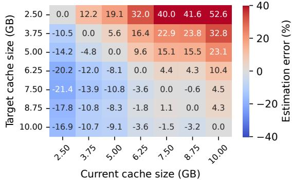

(a) Memcached’s estimation error across cache sizes.  
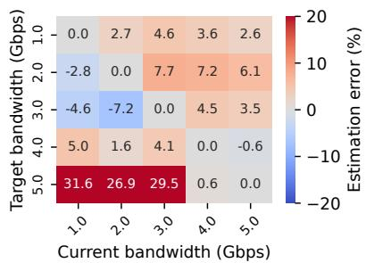  
(b) Stream’s estimation error across bandwidths.  
Fig. 4. End-to-end performance estimation error relative to measured $f _ { i } .$ . Estimation errors are lowest when the target cache size/bandwidth is close to the current cache size/bandwidth.

We reduce the search overhead further by narrowing the search space to regions where $f _ { i }$ estimation errors are low. This approach leverages the intuition that our iterative allocation needs accurate local estimations only near the current allocation. Therefore, we design our $f _ { i }$ estimator to prioritize accuracy of “local” estimates (§4.2), without being affected by larger estimation errors when the gap between the current cache size and target (predicted) cache size grows. Based on this, we limit the search space to only include cache sizes and bandwidth allocations where the $f _ { i }$ estimation error is expected to be sufficiently low. As a concrete example, Fig. 4a shows Memcached’s estimation error trends as a function of cache size, with columns representing the current cache size and rows representing the target cache size for which Spirit is estimating $f _ { i \cdot } \mathrm { A }$ similar trend applies to Stream’s estimation error as a function of bandwidth, as shown in Fig. 4b. In our implementation, we limit the search space to ±5?? around the current cache size, since it yields estimation errors under 10%.

## 4.2 Estimating ????

Since Spirit cannot rely on applications to provide accurate estimates of $f _ { i } \mathrm { . }$ —both because they may not know them a priori and they may lie to get more of a specific resource (§2)—Spirit estimates the application-specific $f _ { i }$ based on data collected by its monitoring module. Specifically, to estimate $f _ { i }$ at a particular “target” cache size and bandwidth allocation, $\left. c _ { t } , b _ { t } \right.$ , Spirit estimates the miss ratio at that allocation based on the sampled memory accesses under the current resource allocation ⟨??, ??⟩. Using the miss ratios at the current allocation and the estimated miss ratio at the target allocation, Spirit estimates $f _ { i } ( c _ { t } , b _ { t } )$ as a slowdown or speed-up relative to $f _ { i } ( c , b )$ . Note that relative $f _ { i }$ estimates are sufficient for Symbiosis since each application only needs to choose the best target allocation, $\left. c _ { t } , b _ { t } \right.$ for its own $f _ { i }$ during each bidding round rather than comparing the absolute $f _ { i }$ values across applications.

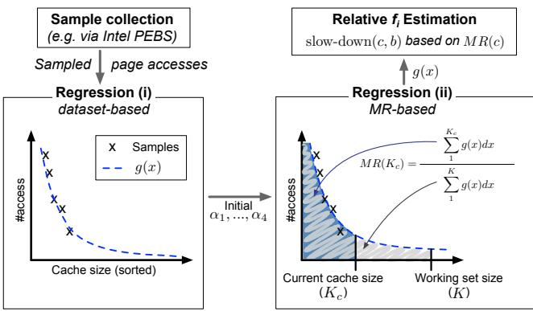  
Fig. 5. Overview of $f _ { i }$ estimation (§4.2). Based on the sampled memory accesses, Spirit performs a two-phase regression using the collected samples and the measured $M R ( K _ { c } )$ . Once the parameters for $g ( x )$ are determined, Spirit can estimate the miss ratio for any target cache size ?? and the corresponding relative performance.

A commonly used technique to estimate the miss ratios at target allocations is to compute reuse distance for specific addresses—the number of other distinct memory access between the reuse of the address—based on collected (sampled) access traces, which are then used to compute the Miss Ratio Curves (MRCs) [12, 19, 31, 36, 67]. However, computing reuse distances in our setting is infeasible for two reasons. First, supported hardware sampling methods simply do not provide enough samples to compute accurate reuse distances. Second, even with the maximum supported sampling rates, they incur too high overheads to support any runtime estimations. Indeed, these limitations have limited the development of fair allocation techniques for cache and bandwidth resources in the micro-architecture community as well (§8).

Our approach: Regression-based MRCs. Instead of computing reuse distances, Spirit employs regression techniques to learn the relationship between each page in the cache and the number of accesses to it based on periodically sampled memory accesses. We leverage the well-established power law relationship between cache entries (sorted by popularity) and their access frequencies [30, 65]. This power law relationship is captured in our target function:

$$
g ( x ) = \alpha _ { 1 } ( 1 + x / \alpha _ { 2 } ) ^ { \alpha _ { 3 } } + \alpha _ { 4 }
$$

Here, ?? identifies the $x ^ { t h }$ page in the cache ordered by their access frequencies, and $g ( x )$ is the number of accesses to ??. Finally, $\alpha _ { 1 }$ to ??4 are parameters (determined by regression) that define the shape of the power-law relationship, such as scale $\left( \alpha _ { 1 } \right)$ , decrement rate $\left( \alpha _ { 2 } \right)$ , skewness $\left( \alpha _ { 3 } \right)$ , and constant offset for the minimum number of accesses to any page $( \alpha _ { 4 } )$ Spirit determines the parameter values via a two-phase gradient descent search (Figure 5). Intuitively, the first phase finds parameter values that fit $g ( x )$ based on periodically sampled accesses (using hardware sampling, §5.1). The second phase adjusts the parameter values by considering the measured miss ratio at the current cache size.

Phase 1. In each sampling period (5 seconds in our implementation), Spirit uses collected memory access samples (using hardware sampling techniques detailed in $\ S 5 . 1 )$ to generate a histogram of page accesses, where the x-axis (i.e., page addresses) is sorted in descending order based on their access frequency (see Figure 5 left). This histogram represents the empirically collected $g ( x )$ . Our regression method adjusts parameters using gradient descent with mean squared error to ensure that the estimate $g ( x )$ closely matches the histogram constructed using memory access samples.

Phase 2. In this phase, the regression fine-tunes the parameters to reduce the gap between the measured miss ratio under the current cache allocation and the computed miss ratio from the target function ??(??) (Figure 5 right). The miss ratio from $g ( x )$ is computed as $\begin{array} { r } { M R ( K _ { c } ) \approx 1 - \sum _ { 1 } ^ { K _ { c } } g ( x ) / \sum _ { 1 } ^ { K } g ( x ) } \end{array}$ where $K _ { c }$ and $K$ respectively denote the number of pages in the current cache allocation and the application’s working set size in number of pages. The application’s working set size is obtained from the OS—Linux provides a statistic for memory usage of a container via sysfs [50] via memory.stat and memory.swap.current metrics.

Putting it together. Our ultimate goal is to estimate the $f _ { i }$ value for a target allocation $\left. c _ { t } , b _ { t } \right.$ relative to the $f _ { i }$ value at the current allocation $\langle c , b \rangle$ . To this end, Spirit uses the estimated $g ( x )$ to compute the miss ratio $M R ( c _ { t } )$ as outlined above. It then estimates a slowdown factor from the miss ratio as:

$$
\mathrm { s l o w d o w n } ( c _ { t } , b _ { t } ) = 1 + \mathrm { M R } ( c _ { t } ) \cdot \gamma \cdot \operatorname* { m a x } ( 1 , \frac { b ^ { r e q } } { b _ { t } } )
$$

Here, $\gamma$ is the slowdown factor in fetching data over the network compared to accessing it locally (our setup has $\gamma = 1 0 0$ as the latency gap between local and remote memory accesses). The $b ^ { r e q } / b _ { t }$ factor, on the other hand, represents the slowdown caused by insufficient bandwidth allocation, where $b ^ { r e q }$ is the application’s current bandwidth usage3 (as a proxy for bandwidth demand). Since we cannot measure $b ^ { r e q }$ larger than the current bandwidth allocation, ??, we assume that ${ \dot { b } } ^ { r e q } = b _ { t } { \mathrm { i f } } b ^ { r e q } = b$ . Finally, Spirit uses the slowdown to compute the $f _ { i }$ value at the target allocations using $f ( c _ { t } , b _ { t } ) / f ( c , b ) = \mathrm { s l o w - d o w n } ( c , b ) / \mathrm { s l o w - d o w n } ( c _ { t } , b _ { t } )$

## 5 Spirit Data Plane

## 5.1 Performance Monitoring

Spirit’s performance monitoring module periodically measures per-application performance metrics—specifically ??(??) function, which is used to estimate $f _ { i }$ in §4.2—using Intel PEBS [34, 35]. PEBS samples the user-specified CPU events with the configured sampling ratio; Spirit uses PEBS via Linux’s perf tool, sampling the last level cache (LLC) misses (MEM\_LOAD\_RETIRED.L3\_MISS events) as a proxy for the accesses to the local DRAM. We sample LLC misses at a rate of 1 sample for every 25 accesses, as it provides a sweet spot between sampling overhead and accuracy.

We use the remote memory setup from swap-based approaches [3, 56], where a small amount of DRAM is kept as a local cache at each node for the larger pool of remote memory. Data accesses on a compute node are always performed on the cache; if the data is not cached, the kernel fetches the corresponding data over the network and stores the data in DRAM via the swap system, i.e., a special block device that fetches and evicts data over the network using RDMA over Converged Ethernet (RoCE) [33]. We monitor the swap device’s bandwidth utilization to measure the number of remote memory accesses, since the swap-based system always transfers data at page granularity.

We run each application in a separate Docker container; this allows us to deploy unmodified applications in a containerized environment where their performance and resource usage can be accurately tracked. We use the number of LLC misses per second (measured by perf) as a proxy for the application’s DRAM cache hit rate (i.e., its performance metric). We use a measurement granularity of 5 seconds.

## 5.2 Enforcing Resource Allocations

Spirit deploys a performance enforcement module inside the kernel for remote memory deployment using Docker [17]. Docker containers permit the use of existing resource management mechanisms to enforce allocation limits in our remote memory deployment. In particular, we set the container’s memory size via docker update and the maximum bandwidth of the block device by setting io.max in cgroups. The page eviction policy follows the Linux swap system’s default configuration with the multi-generation LRU [45] enabled for more accurate LRU approximation in Linux v6.8. Since Spirit does not require modifying the underlying remote memory framework, it affords transparent enforcement of fairness guarantees in existing remote memory systems.

<table><tr><td rowspan=1 colspan=2>Application</td><td rowspan=1 colspan=2>Application</td><td rowspan=1 colspan=1>Workload</td></tr><tr><td rowspan=1 colspan=2>STREAM[48]</td><td rowspan=1 colspan=2>Arithmetic computations</td><td rowspan=1 colspan=1>16GB</td></tr><tr><td rowspan=1 colspan=2>Memcached [18]</td><td rowspan=1 colspan=2>Meta KVS traces [49]</td><td rowspan=1 colspan=1>8GB</td></tr><tr><td rowspan=1 colspan=2>DLRM [52]</td><td rowspan=1 colspan=2>Kaggle Display Advertis-ing dataset [15]</td><td rowspan=1 colspan=1>32GB</td></tr><tr><td rowspan=1 colspan=2>SocialNetwork [23]</td><td rowspan=1 colspan=2>soc-twitter-follows-mun [60]</td><td rowspan=1 colspan=1>15 GB</td></tr></table>

Table 1. Real-world applications and workloads (§2.1 and §6)

## 6 Evaluation

We evaluate Spirit to understand (i) if it indeed ensures performance fairness across real-world and synthetic workloads, (ii) how close its performance improvements are to an “ideal” scheme, and (iii) its sensitivity to various system parameters.

Setup. Due to a lack of access to public cloud resources, we model Amazon’s m5a.8xlarge EC2 instance [4] with 32 vCPU, 128 GB memory, and 7.5 Gbps network bandwidth4 with a per-page RDMA latency of ${ \sim } 5 \mu s ,$ on our machines (Intel Xeon 6252N servers). To model a shared remote memory system, we limit the local DRAM cache to 10-20 GB (∼20% of the working set size, similar to the previous studies [43, 64, 75]) and allocate the rest of the application memory on a remote memory node. We divide CPU resources equally across the deployed applications, i.e., 4 vCPUs per application, except SocialNetwork, which is allocated 12 vCPUs to accommodate its various microservices across 27 containers (each running in its own cgroups domain). We use up to nine machines, four of which serve as remote memory machines and one dedicated to the resource allocator (Fig. 2).

Applications & workloads. We model a shared-cluster environment typical of commercial cloud deployments [2, 70] using four real-world applications with diverse resource demands (summarized in Table 1): (i) Memcached [18] with Meta’s key-value store trace [49] (dubbed Meta KVS) for a memory footprint of 8 GB, (ii) STREAM [48] with the 2.1 billion elements for 16 GB memory footprint (dubbed Stream), (iii) Meta’s deep learning recommendation model (DLRM) [52] with the Kaggle Display Advertising dataset [15] for a 32 GB memory footprint, and (iv) SocialNetwork from DeathStarBench [23] with soc-twitter-follows-mun dataset containing 465k nodes and 835k edges [60] with a 15 GB memory footprint.

Compared approaches. We evaluate Spirit against four representative multi-resource allocation schemes:

(i) DRF [25, 26] with upfront user-specified demands (uDRF). Without a priori knowledge of their resource needs, applications are forced to request as many resources as possible, which leads DRF to allocate a fixed fair share of the cache and bandwidth $\textstyle \langle { \frac { C } { N } } , { \frac { B } { N } } \rangle$ to each application, as noted in §2. (ii) Harvest-and-distribute (Harvest), an adaptation of the PARTIES [13] scheme to our setup, as a representative of schemes that leverage runtime feedback from the application. Intuitively, the scheme transfers resources from the best-performing application (donor) to a struggling one (recipient) across iterative allocation rounds. Our adaptation uses $f _ { i }$ values reported by Spirit’s performance monitor to identify the best-performing application to harvest resources from and the worst-performing application to reallocate resources to. Harvest makes its reallocation decisions based purely on observed application performance, without considering the relative performance improvement from different resource allocations. This can lead to suboptimal decisions, e.g., Harvest can add more cache to Stream since it leads to a performance increase, even though it may be more effective to add bandwidth to and harvest cache from Stream (§2.1).

(iii) Direct trading between applications (Trade), where the worst-performing application trades resources directly with the application that benefits most from the trade. Trade improves on Harvest by leveraging Spirit’s ???? estimation method to ensure mutual benefits for applications trading cache for bandwidth and vice versa. Since Trade does not use pricing in resource trading, the ratio between traded resources is fixed at 1-to-1 (in units of ??, §4.1).

(iv) Ideal, which picks the best possible cache and bandwidth allocation to maximize each application’s ???? with fairness properties. This allocation is determined by analyzing the performance for offline executions over a wide range of ⟨cache, bandwidth⟩ allocations. This represents the ideal performance achievable by Symbiosis if there were no estimation errors or approximations in its search for arg max??,?? ???? (??, ??) (§4).

## 6.1 Symbiosis Performance Benefits

We measure the access throughput across applications to evaluate Spirit’s performance benefits. Our goal is to show that Spirit can, by exploiting the interdependence of application performance on cache and bandwidth resources, improve each application’s performance beyond the static fair allocations while still maintaining the fairness guarantees outlined in §3.1. We note that performance improvements are application-specific, depending on their sensitivity to a particular resource, e.g., improving Application A’s performance by 10% may be much harder than improving Application B’s performance by 50%. Therefore, absolute improvements across different applications are not directly comparable.

In our evaluation, we answer the following two questions regarding Spirit’s end-to-end performance: (i) How does Spirit perform compared to the other allocation schemes? (ii) What is the impact of the number of applications (i.e., demands) and the resources allocated per application (i.e., supply) on their performance improvement?

Real-world workloads. To answer the first question, we deploy 24 application instances—six per server across four servers, with each server hosting three Stream (bandwidth-sensitive), one Meta KVS (cache-sensitive), one DLRM (compute-intensive), and one SocialNetwork (cachesensitive) instances. Figure 6 compares each application’s throughput and latency improvement relative to uDRF. We omit DLRM performance in the plots since it remains unaffected across all compared schemes (as noted in §2.1). Spirit increases throughput for cache- and bandwidth-sensitive applications by 5.9%–6.1% and 21.6%, respectively. Spirit also reduces the 99th-percentile latency of Meta KVS and Social by 16.8% and 6.1%, respectively. In contrast, Harvest underperforms due to inaccurate resource harvesting decisions caused by fluctuating performance metrics in the short term (i.e., LLC misses, §5.1), underscoring the importance of MRC-based estimations for stable performance prediction. This is demonstrated by Trade’s performance improvements over Harvest by leveraging Spirit’s accurate estimation of ???? . However, Trade compromises on fairness, as shown by SocialNetwork’s performance drop. Spirit ensures fairness and achieves performance close to Ideal, despite Ideal working with precise knowledge of application demands (§2.1). We note that while Spirit’s runtime ???? estimation can cause short-term allocation swings across identical instances (e.g., Stream), their longer-term averages remain equal.

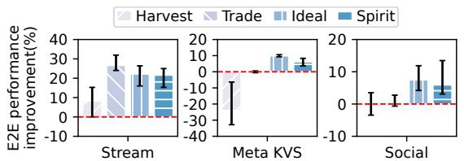  
(a) E2E throughput (10 GB local DRAM cache)

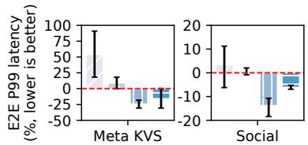

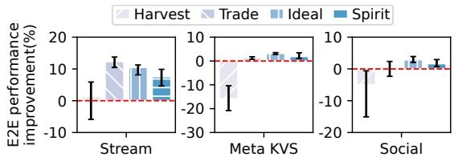  
(b) Latency (10 GB)

(c) E2E throughput (20 GB local DRAM cache)  
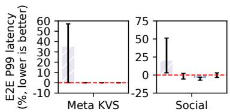  
(d) Latency (20 GB)  
Fig. 6. Average performance improvement over uDRF (§6.1) across 24 application instances. Bar heights indicate the average end-to-end (E2E) performance per application and the 99th-percentile (P99) latency measured at the clients, while error bars represent the range from the best to the worst performing instances; both are shown relative to uDRF. Spirit consistently improves performance across all applications — close to Ideal— while preserving fairness.

Impact of resource scarcity and abundance. The performance gains from resource trading decrease when resources are too abundant or scarce, as applications lose their incentive to participate in trading. To quantify this impact, in Fig. 6c, we double the system-wide local DRAM cache size. As the cache becomes more abundant, uDRF can allocate more cache (e.g., from 1.67 GB to 3.33 GB). As a result, the performance improvement of trading resources becomes less significant. For instance, Spirit’s performance improvement for Stream decreases from 21.6% to 7.6%; similar observations hold for other applications, including their latency reductions. Conversely, when the DRAM cache capacity becomes scarcer than in Fig. 6a, we find that applications hold on to their resources since they need a certain minimum amount of each resource type to perform adequately. We omit plots for this regime since in our experiments, applications would either crash or become extremely sluggish under all compared schemes. Finally, scarcity or abundance of bandwidth resources also exposes a similar tradeoff, where either extreme reduces Spirit’s benefits. Note that this is not a limitation of resource allocation in Spirit; indeed, practitioners should (and indeed, do) ensure the amount of resources in any deployment is not too abundant to avoid resource under-utilization, and consequently, waste resources.

## 6.2 Sensitivity and Overhead Analysis

We restrict our focus to two applications: Stream (bandwidthsensitive) and Meta KVS (cache-sensitive). Accordingly, we also scale the total cache and bandwidth resources down to 10 GB and 5 Gbps, respectively.

Sensitivity to allocation epoch size. Figure 7 shows the impact of allocation epoch size (i.e., time between two allocations via Symbiosis) on application performance for remote memory and web service setups. When the epoch size is too small, Symbiosis changes the resource allocation frequently to react to many runtime variations in application ???? —much of which is noise—resulting in performance degradation due to reallocation overheads, e.g., swapping out pages of applications with reduced cache allocation even when their longer-term cache needs remain stable. Conversely, when the epoch size is too large, Symbiosis does not react fast enough, resulting in some applications not receiving the allocations they want on time, while others hold on to more resources than they need and for longer than they need them. This leads to poor resource utilization and, consequently, performance degradation. We use an allocation epoch size of 30 seconds in Spirit since it achieves the sweet spot between the two extremes.

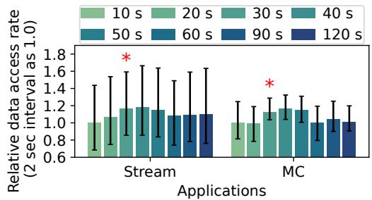  
Fig. 7. Sensitivity to allocation epoch size (§6.2). Error bars depict the $1 0 ^ { \mathrm { t h } }$ and $9 0 ^ { \mathrm { t h } }$ percentiles. Red asterisks (\*) mark the chosen period, 30 seconds.

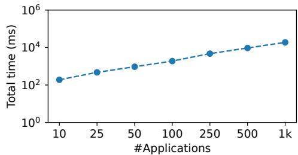  
Fig. 8. Symbiosis performance scaling (§6.2). Avg. end-to-end allocation time in Symbiosis vs. number of applications (log scale).

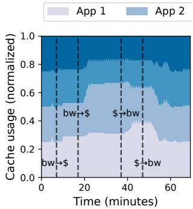

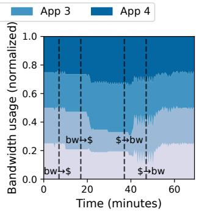  
Fig. 9. Cache (left) and bandwidth (right) adaptations under dynamic ???? (§6.2). Labels on the vertical lines indicate resource sensitivity changes between cache (\$) and bandwidth (bw). Apps 3 and 4 remain bandwidth-sensitive throughout the experiment.

Symbiosis scalability. We evaluate Symbiosis’s performance scalability with the number of applications in Fig. 8, where we measure the average time taken for end-to-end Symbiosis execution (i.e., Algorithm 1). While increasing the number of applications, we maintain an equal proportion of cache and bandwidth-sensitive applications and increase the available resource capacity (proportional to the number of applications). For instance, in the evaluation setup from

Fig. 6 with 24 applications, Symbiosis completes within one second and utilizes less than 3.3% of a single core on average. At 1k applications, the average Symbiosis execution time remains within 20 seconds. Moreover, while our current Symbiosis implementation is single-threaded, the most computationally expensive components (specifically searching the ⟨cache, bandwidth⟩ space) can easily be parallelized to scale to more applications. The time to estimate $f _ { i }$ for each grid remains consistent at approximately 11 $\mu \mathbf { s } ,$

Adapting to dynamic $f _ { i } .$ We analyze Spirit’s resource allocation behavior to evaluate how it adapts to runtime changes in $f _ { i }$ for participating applications. We focus on adaptations for applications whose resource-sensitivity changes at runtime, since Spirit must both detect the change in $f _ { i }$ and adapt its allocations; adapting to application arrivals or terminations is simpler, since they provide explicit signals to Spirit for updating corresponding $f _ { i }$ estimates. In our experiment, we prepare two applications—Apps 1 and 2—which internally switch their logic from Stream to Meta KVS, and then back to Stream, at different time points. Apps 3 and 4 run Stream throughout the experiment as bandwidth-sensitive background applications. Figure 9 shows Spirit’s cache and bandwidth allocations across the four applications over time. Initially, Spirit assigns a static fair share to all applications. As Apps 1 and 2 become cache-sensitive around the 7th and 17th minutes, Spirit detects changes in their $f _ { i }$ estimates and, once stabilized, increases cache allocation while reducing bandwidth. When Apps 1 and 2 revert to bandwidth sensitivity around the 37th and 47th minutes, Spirit readjusts the allocations accordingly. Each reallocation employs incremental search (§4.1), requiring up to 5 minutes to detect changes in $f _ { i }$ and 5 minutes to converge to a stable allocation.

We make an interesting observation that the application performance benefits from these re-allocations depend, to a large part, on the specific mix of cache- and bandwidthsensitive applications. Specifically, Spirit’s market mechanism is most effective when concurrently running apps exhibit complementary cache and bandwidth resource needs, creating opportunities for trade under Symbiosis (e.g., between around 20th to 37th minutes).

## 7 Limitations & Future Research

Monotonicity of $f _ { i } .$ Spirit assumes that $f _ { i }$ is monotonically increasing in both cache and bandwidth allocations to use regression methods for estimating $f _ { i } .$ . Although some cache replacement policies are not strictly monotonic, most systems use monotonic least frequently used (LFU) or least recently used (LRU) policies. Developing $f _ { i }$ estimation techniques for non-monotonic policies is interesting future work.

Applications to disaggregated memory and other inmemory caching systems. While we focused on Ethernetbased remote memory, CXL is emerging as a high-bandwidth, low-latency interconnect for disaggregated memory [14, 44, 68, 81]. Although their data access scales and resource allocation times differ from Spirit’s, Symbiosis techniques apply to CXL-based disaggregated memory.

Specifically, applying Spirit to new domains requires designing tailored performance estimators for ???? . Fortunately, Spirit’s design decouples resource allocation from performance modeling via pluggable ???? estimators. As such, Spirit can integrate domain-specific performance predictors without modifying the core Symbiosis algorithm. This modularity readily extends the core idea of Spirit to any cachebandwidth-interdependent system through domain-specific ???? estimators.

The interdependency between DRAM cache and network bandwidth is also common across many other inmemory caching systems. Social networks [9, 11, 41, 79] often use Memcached [18] or Redis [59] as caches for database engines like MySQL [53] or RocksDB [21], sharing DRAM capacity and network bandwidth across multiple users [9, 11, 39, 40, 47, 55, 71]. Unlike transparent OS-level DRAM caches, in-memory caches provide greater visibility and control, enabling direct performance measurements instead of sampling techniques. With improved estimation accuracy, Spirit could improve performance for all users fairly sharing the cache.

Supporting priorities across applications in Spirit is possible using weighted fairness, similar to DRF [26]. Instead of providing an equal number of credits per application in Symbiosis, the number of credits allotted to an application would be proportional to its priority. This would require adjusting the definitions of sharing incentive and envy-freeness; if $w _ { i }$ is each application’s normalized “weight” $\begin{array} { r } { ( \sum _ { i } w _ { i } = 1 ) } \end{array}$ , then: Sharing incentive: $f _ { i } ( c _ { i } , b _ { i } ) \geq f _ { i } ( C \cdot w _ { i } , B \cdot w _ { i } )$ , ∀?? .

## Envy-freeness: ???? (???? , ???? ) ≥ ???? (?? ?? · ???? /?? ?? , ?? ?? · ???? /?? ?? ), ∀??, ?? .

Allocating both independent and inter-dependent resources. In most real-world deployments, Spirit would need to manage both independent (e.g., CPU, memory capacity) and interdependent resources (e.g., cache and memory bandwidth). This can be realized with a simple hierarchical allocation model. A top-level fair allocation algorithm, such as DRF, would handle the allocation for only the independent resources, including CPU cores, memory capacity, and storage, based on user-specified demands. The top-level allocator would avoid allocating interdependent resources, since it is challenging to know application demands for them upfront, as noted in §1. Instead, Spirit’s Symbiosis algorithm would handle the allocations for interdependent resources, such as cache capacity and network bandwidth, as a “second-level” allocator, based on runtime-estimated application demands (or more precisely, the application-specific interdependency for the resources, captured as ???? ). Symbiosis’s allocations can even be weighted by the top-level allocator, e.g., an application that receives more CPU cores can be assigned a larger weight to accommodate its need for larger cache and bandwidth resources.

Stateful resource allocation over time. Recent schemes such as Karma [71] and Cilantro [10] aim to provide fairness over time by employing stateful resource allocations. While their objective is orthogonal to that of Spirit— which focuses on ensuring fairness within each epoch — stateful allocations can complement Spirit by allowing Symbiosis to roll over underutilized resource budgets into subsequent epochs.

Supporting distributed in-memory cache. Spirit is currently tailored for a single shared in-memory cache. In largerscale deployment scenarios, however, applications often necessitate a more extensive pool of in-memory cache, distributed across multiple servers — each with its own shared local DRAM caches and network links. While Symbiosis can manage resource allocations across these applications in theory, the allocations would need to be enforced in a distributed manner, i.e., on a per-server basis. We leave the exploration of such extensions to future work.

## 8 Related Work

Hardware approaches and their limits. We discussed DRF allocation schemes [25–27] in §2. We now discuss hardware approaches for dynamically partitioning LLC and memory bandwidth across applications, using custom hardware components to monitor application behavior and enforce partitioning [8, 37, 46, 57, 67, 76]. Unfortunately, they do not apply to remote memory systems for two reasons. First, they rely on offline memory access traces to estimate miss ratio [20, 32, 72, 73], with none leveraging runtime access monitoring across the cache/memory hierarchy due to high overheads. In our experiments, even fine-grained hardware sampling (e.g., PEBS [34]) can capture at most one sample per 25 accesses (4%), resulting in impractically high error rates in estimating cache miss rates. Second, while prior studies have leveraged utility functions to capture miss ratios feasible for LLC (tens of MBs), using hardware performance counters similar to PEBS for runtime estimation (e.g., [69]), they do not scale to remote memory with GBs of DRAM cache (§4), where the same sampling mechanism not only incurs higher overhead but also suffers from larger estimation errors than in megabyte-scale caches.

The studies most related to Spirit are market-based allocators, REF [46] and XChange [76]. REF uses the Cobb-Douglas utility that cannot model applications that do not always follow diminishing marginal returns, as demonstrated by the performance profiles in the previous work [7, 38, 76] and our own empirical measurements (§2). Moreover, the users need to provide a coefficient of Cobb-Douglas utility upfront, which is challenging in remote memory systems.

While XChange [76] addresses this problem with complex utility models tailored for each hardware resource, the utility models do not capture the interdependency considered in this paper. Moreover, it does not provide sharing incentives.

CEEI and auctions. CEEI allocates goods by giving all agents the same budget and computing market-clearing prices at which each agent chooses their most-preferred affordable bundle [22]. These ideas underpin algorithmic mechanisms in computer systems, such as convex-program methods for Fisher markets used to fairly allocate divisible resources in clusters [16]. The Walrasian auction models an idealized price-adjustment (tâtonnement) process that drives demand to equal supply at equilibrium [74]. Spirit applies the idea of CEEI and Walrasian auction to remote memory systems, explicitly modeling interdependence between cache and bandwidth.

## 9 Conclusion

Resources in remote memory systems expose an interdependence between application performance, cache capacity, and network bandwidth allocations. Spirit employs a novel Symbiosis algorithm that considers this dependency and ensures Pareto-optimal and envy-free allocations that incentivize sharing. Our evaluations show that Spirit improves performance for a wide range of real-world applications by up to 21.6% compared to DRF.

## Acknowledgements

We thank our shepherd, KyoungSoo Park, for his insightful feedback and guidance. We are also grateful to the anonymous reviewers for their constructive comments. This work was supported in part by the NSF’s awards 2047220, 2112562, 2147946, 2444660, and a NetApp Faculty Fellowship.

## References

[1] Marcos K. Aguilera, Nadav Amit, Irina Calciu, Xavier Deguillard, Jayneel Gandhi, Pratap Subrahmanyam, Lalith Suresh, Kiran Tati, Rajesh Venkatasubramanian, and Michael Wei. 2017. Remote Memory in the Age of Fast Networks. In the 8th ACM Symposium on Cloud Computing (SoCC ’17).

[2] Alibaba Group. 2020. Alibaba Cluster Trace Program. https://github.c om/alibaba/clusterdata.

[3] Emmanuel Amaro, Christopher Branner-Augmon, Zhihong Luo, Amy Ousterhout, Marcos K. Aguilera, Aurojit Panda, Sylvia Ratnasamy, and Scott Shenker. 2020. Can Far Memory Improve Job Throughput?. In the 15th European Conference on Computer Systems (EuroSys ’20).

[4] Amazon Web Services. 2025. Amazon EC2 Instance Types. https: //aws.amazon.com/ec2/instance-types/.

[5] Sanjeev Arora. 1998. Polynomial Time Approximation Schemes for Euclidean Traveling Salesman and Other Geometric Problems. J. ACM (1998).

[6] Berk Atikoglu, Yuehai Xu, Eitan Frachtenberg, Song Jiang, and Mike Paleczny. 2012. Workload Analysis of a Large-scale Key-value Store. In the ACM SIGMETRICS / PERFORMANCE 2012 Joint International Conference on Measurement and Modeling of Computer Systems (SIGMETRICS ’12).

[7] Nathan Beckmann, Haoxian Chen, and Asaf Cidon. 2018. LHD: Improving cache hit rate by maximizing hit density. In the 15th USENIX Symposium on Networked Systems Design and Implementation (NSDI ’18).

[8] Nathan Beckmann and Daniel Sanchez. 2013. Jigsaw: Scalable Software-Defined Caches. In the 22nd International Conference on Parallel Architectures and Compilation Techniques (PACT ’13).

[9] Benjamin Berg, Daniel S. Berger, Sara McAllister, Isaac Grosof, Sathya Gunasekar, Jimmy Lu, Michael Uhlar, Jim Carrig, Nathan Beckmann, Mor Harchol-Balter, and Gregory R. Ganger. 2020. The CacheLib Caching Engine: Design and Experiences at Scale. In the 14th USENIX Symposium on Operating Systems Design and Implementation (OSDI ’20).

[10] Romil Bhardwaj, Kirthevasan Kandasamy, Asim Biswal, Wenshuo Guo, Benjamin Hindman, Joseph Gonzalez, Michael Jordan, and Ion Stoica. 2023. Cilantro: Performance-Aware Resource Allocation for General Objectives via Online Feedback. In the 17th USENIX Symposium on Operating Systems Design and Implementation (OSDI ’23).

[11] Nathan Bronson, Zach Amsden, George Cabrera, Prasad Chakka, Peter Dimov, Hui Ding, Jack Ferris, Anthony Giardullo, Sachin Kulkarni, Harry Li, Mark Marchukov, Dmitri Petrov, Lovro Puzar, Yee Jiun Song, and Venkat Venkataramani. 2013. TAO: Facebook’s Distributed Data Store for the Social Graph. In the 2013 USENIX Annual Technical Conference (ATC ’13).

[12] Dhruba Chandra, Fei Guo, Seongbeom Kim, and Yan Solihin. 2005. Predicting Inter-Thread Cache Contention on a Chip Multi-Processor Architecture. In the 11th IEEE International Symposium on High-Performance Computer Architecture (HPCA ’05).

[13] Shuang Chen, Christina Delimitrou, and José F. Martínez. 2019. PAR-TIES: QoS-Aware Resource Partitioning for Multiple Interactive Services. In the 24th ACM International Conference on Architectural Support for Programming Languages and Operating Systems (ASPLOS ’19).

[14] Compute Express Link Consortium. 2024. CXL Specification 3.2. https: //computeexpresslink.org/cxl-specification/.

[15] Criteo. 2014. Kaggle Display Advertising Challenge Dataset. https: //ailab.criteo.com/ressources/.

[16] Nikhil R. Devanur, Christos H. Papadimitriou, Amin Saberi, and Vijay V. Vazirani. 2008. Market Equilibrium via a Primal–Dual Algorithm for a Convex Program. J. ACM 55, 5 (2008).

[17] Docker Inc. 2024. Docker: Accelerated Container Application Development. https://www.docker.com/.

[18] Dormando. 2018. MemCached. http://www.memcached.org.

[19] David Eklov, David Black-Schaffer, and Erik Hagersten. 2011. Fast Modeling of Shared Caches in Multicore Systems. In the 6th International Conference on High Performance and Embedded Architectures and Compilers (HiPEAC 2011).

[20] David Eklov and Erik Hagersten. 2010. StatStack: Efficient modeling of LRU caches. In the IEEE International Symposium on Performance Analysis of Systems and Software (ISPASS).

[21] Facebook. 2022. RocksDB: A Persistent Key-Value Store for Flash and RAM Storage. https://rocksdb.org/.

[22] Duncan Karl Foley. 1966. Resource allocation and the public sector. Ph. D. Dissertation. Yale University.

[23] Yu Gan, Yanqi Zhang, Dailun Cheng, Ankitha Shetty, Priyal Rathi, Nayan Katarki, Ariana Bruno, Justin Hu, Brian Ritchken, Brendon Jackson, Kelvin Hu, Meghna Pancholi, Yuan He, Brett Clancy, Chris Colen, Fukang Wen, Catherine Leung, Siyuan Wang, Leon Zaruvinsky, Mateo Espinosa, Rick Lin, Zhongling Liu, Jake Padilla, and Christina Delimitrou. 2019. An Open-Source Benchmark Suite for Microservices and Their Hardware-Software Implications for Cloud & Edge Systems. In the 24th ACM International Conference on Architectural Support for Programming Languages and Operating Systems (ASPLOS ’19).

[24] Peter Xiang Gao, Akshay Narayan, Sagar Karandikar, Joao Carreira, Sangjin Han, Rachit Agarwal, Sylvia Ratnasamy, and Scott Shenker. 2016. Network Requirements for Resource Disaggregation. In the 12th

USENIX Symposium on Operating Systems Design and Implementation (OSDI ’16).

[25] Ali Ghodsi, Vyas Sekar, Matei Zaharia, and Ion Stoica. 2012. Multiresource fair queueing for packet processing. In the Annual Conference of the ACM Special Interest Group on Data Communication (SIGCOMM ’12).

[26] Ali Ghodsi, Matei Zaharia, Benjamin Hindman, Andy Konwinski, Scott Shenker, and Ion Stoica. 2011. Dominant Resource Fairness: Fair Allocation of Multiple Resource Types.. In the 8th USENIX Symposium on Networked Systems Design and Implementation (NSDI ’11).

[27] Ali Ghodsi, Matei Zaharia, Scott Shenker, and Ion Stoica. 2013. Choosy: Max-Min Fair Sharing for Datacenter Jobs with Constraints. In the 8th European Conference on Computer Systems (EuroSys ’13).

[28] James R. Goodman. 1983. Using Cache Memory to Reduce Processor-Memory Traffic. In the 10th Annual International Symposium on Computer Architecture (ISCA ’83).

[29] Juncheng Gu, Youngmoon Lee, Yiwen Zhang, Mosharaf Chowdhury, and Kang G. Shin. 2017. Efficient Memory Disaggregation with Infiniswap. In the 14th USENIX Symposium on Networked Systems Design and Implementation (NSDI ’17).

[30] Allan Hartstein, Vijayalakshmi Srinivasan, T Puzak, and P Emma. 2008. On the nature of cache miss behavior: Is it 2? The Journal of Instruction-Level Parallelism 10 (2008).

[31] Lulu He, Zhibin Yu, and Hai Jin. 2012. FractalMRC: Online Cache Miss Rate Curve Prediction on Commodity Systems. In the 26th IEEE International Parallel and Distributed Processing Symposium (IPDPS ’12).

[32] Xiameng Hu, Xiaolin Wang, Lan Zhou, Yingwei Luo, Chen Ding, and Zhenlin Wang. 2016. Kinetic modeling of data eviction in cache. In the 2016 USENIX Annual Technical Conference (ATC ’16).

[33] InfiniBand Trade Association. 2014. Supplement to InfiniBand™ Ar-chitecture Specification Volume 1 Release 1.2.1, Annex A17: RoCEv2 (IPRoutable RoCE).

[34] Intel. 2024. Intel Architecture Instruction Set Extensions and Future Features: Programming Reference.

[35] Intel. 2025. Intel 64 and IA-32 Architectures Software Developer’s Manual. https://www.intel.com/content/www/us/en/developer/articl es/technical/intel-sdm.html.

[36] Ravi Iyer, Li Zhao, Fei Guo, Ramesh Illikkal, Srihari Makineni, Don Newell, Yan Solihin, Lisa Hsu, and Steve Reinhardt. 2007. QoS Policies and Architecture for Cache/Memory in CMP Platforms. In the ACM SIGMETRICS International Conference on Measurement and Modeling of Computer Systems (SIGMETRICS ’07).

[37] Harshad Kasture and Daniel Sanchez. 2014. Ubik: Efficient Cache Sharing with Strict Qos for Latency-Critical Workloads. In the 19th ACM International Conference on Architectural Support for Programming Languages and Operating Systems (ASPLOS ’14).

[38] Terence Kelly and Daniel Reeves. 2001. Optimal Web cache sizing: Scalable methods for exact solutions. Computer Communications 24, 2 (2001).

[39] Anurag Khandelwal, Yupeng Tang, Rachit Agarwal, Aditya Akella, and Ion Stoica. 2022. Jiffy: Elastic Far-Memory for Stateful Serverless Analytics. In the 17th European Conference on Computer Systems (EuroSys ’22).

[40] Ana Klimovic, Yawen Wang, Patrick Stuedi, Animesh Trivedi, Jonas Pfefferle, and Christos Kozyrakis. 2018. Pocket: Elastic Ephemeral Storage for Serverless Analytics. In the 13th USENIX Symposium on Operating Systems Design and Implementation (OSDI ’18).

[41] Haewoon Kwak, Changhyun Lee, Hosung Park, and Sue Moon. 2010. What is Twitter, a Social Network or a News Media?. In the 19th International Conference on World Wide Web (WWW ’10).

[42] Andres Lagar-Cavilla, Junwhan Ahn, Suleiman Souhlal, Neha Agarwal, Radoslaw Burny, Shakeel Butt, Jichuan Chang, Ashwin Chaugule, Nan Deng, Junaid Shahid, Greg Thelen, Kamil Adam Yurtsever, Yu Zhao, and Parthasarathy Ranganathan. 2019. Software-Defined Far

Memory in Warehouse-Scale Computers. In the 24th ACM International Conference on Architectural Support for Programming Languages and Operating Systems (ASPLOS ’19).

[43] Seung-seob Lee, Yanpeng Yu, Yupeng Tang, Anurag Khandelwal, Lin Zhong, and Abhishek Bhattacharjee. 2021. MIND: In-Network Memory Management for Disaggregated Data Centers. In the 28th ACM Symposium on Operating Systems Principles (SOSP ’21).

[44] Huaicheng Li, Daniel S. Berger, Lisa Hsu, Daniel Ernst, Pantea Zardoshti, Stanko Novakovic, Monish Shah, Samir Rajadnya, Scott Lee, Ishwar Agarwal, Mark D. Hill, Marcus Fontoura, and Ricardo Bianchini. 2023. Pond: CXL-Based Memory Pooling Systems for Cloud Platforms. In the 28th ACM International Conference on Architectural Support for Programming Languages and Operating Systems (ASPLOS ’23).

[45] Linux Kernel Developers. 2023. Multi-Generational LRU. https://docs .kernel.org/admin-guide/mm/multigen\_lru.html.

[46] Seyed Majid and Benjamin C. Lee. 2014. REF: Resource Elasticity Fairness with Sharing Incentives for Multiprocessors. In the 19th ACM International Conference on Architectural Support for Programming Languages and Operating Systems (ASPLOS ’14).

[47] Hasan Al Maruf, Yuhong Zhong, Hongyi Wang, Mosharaf Chowdhury, Asaf Cidon, and Carl Waldspurger. 2023. Memtrade: Marketplace for Disaggregated Memory Clouds. Proc. ACM Meas. Anal. Comput. Syst. 7, 2 (2023).

[48] John D McCalpin. 1995. STREAM benchmark. https://www.cs.virgini a.edu/stream/ref.html.

[49] Meta Platforms, Inc. 2024. CacheLib: Evaluating SSD Hardware for Facebook Workloads. https://cachelib.org/docs/Cache\_Library\_User \_Guides/Cachebench\_FB\_HW\_eval/#list-of -traces.

[50] Patrick Mochel and Mike Murphy. 2011. sysfs - The Filesystem for Exporting Kernel Objects. https://docs.kernel.org/filesystems/sysfs.h tml

[51] Hervé Moulin. 2004. Fair division and collective welfare. MIT press.

[52] Maxim Naumov, Dheevatsa Mudigere, Hao-Jun Michael Shi, Jianyu Huang, Narayanan Sundaraman, Jongsoo Park, Xiaodong Wang, Udit Gupta, Carole-Jean Wu, Alisson G. Azzolini, Dmytro Dzhulgakov, Andrey Mallevich, Ilia Cherniavskii, Yinghai Lu, Raghuraman Krishnamoorthi, Ansha Yu, Volodymyr Kondratenko, Stephanie Pereira, Xianjie Chen, Wenlin Chen, Vijay Rao, Bill Jia, Liang Xiong, and Misha Smelyanskiy. 2019. Deep Learning Recommendation Model for Personalization and Recommendation Systems. CoRR (2019). https://arxiv.org/abs/1906.00091

[53] Oracle. 2025. MySQL. https://www.mysql.com/.

[54] Jinsu Park, Seongbeom Park, and Woongki Baek. 2019. CoPart: Coordinated Partitioning of Last-Level Cache and Memory Bandwidth for Fairness-Aware Workload Consolidation on Commodity Servers. In the 14th European Conference on Computer Systems (EuroSys ’19).

[55] Qifan Pu, Haoyuan Li, Matei Zaharia, Ali Ghodsi, and Ion Stoica. 2016. FairRide: Near-Optimal, Fair Cache Sharing. In the 13th USENIX Symposium on Networked Systems Design and Implementation (NSDI ’16).

[56] Yifan Qiao, Chenxi Wang, Zhenyuan Ruan, Adam Belay, Qingda Lu, Yiying Zhang, Miryung Kim, and Guoqing Harry Xu. 2023. Hermit: Low-Latency, High-Throughput, and Transparent Remote Memory via Feedback-Directed Asynchrony. In the 20th USENIX Symposium on Networked Systems Design and Implementation (NSDI ’23).

[57] Moinuddin K. Qureshi and Yale N. Patt. 2006. Utility-Based Cache Partitioning: A Low-Overhead, High-Performance, Runtime Mechanism to Partition Shared Caches. In the 39th Annual IEEE/ACM International Symposium on Microarchitecture (MICRO ’06).

[58] Nauman Rafique, Won-Taek Lim, and Mithuna Thottethodi. 2007. Effective Management of DRAM Bandwidth in Multicore Processors. In the 16th International Conference on Parallel Architectures and Compilation Techniques (PACT ’07).

[59] Redis. 2024. Redis - The Real-time Data Platform. https://redis.io/.

[60] Ryan A. Rossi and Nesreen K. Ahmed. 2015. The Network Data Repository with Interactive Graph Analytics and Visualization. In the 29th AAAI Conference on Artificial Intelligence (AAAI ’15).

[61] Zhenyuan Ruan, Malte Schwarzkopf, Marcos K. Aguilera, and Adam Belay. 2020. AIFM: High-Performance, Application-Integrated Far Memory. In the 14th USENIX Symposium on Operating Systems Design and Implementation (OSDI ’20).

[62] Daniel Sanchez and Christos Kozyrakis. 2011. Vantage: Scalable and Efficient Fine-Grain Cache Partitioning. In the 38th Annual International Symposium on Computer Architecture (ISCA ’11).

[63] Herbert E Scarf. 1967. The core of an N person game. Econometrica: Journal of the Econometric Society (1967).

[64] Yizhou Shan, Yutong Huang, Yilun Chen, and Yiying Zhang. 2018. LegoOS: A Disseminated, Distributed OS for Hardware Resource Disaggregation. In the 13th USENIX Symposium on Operating Systems Design and Implementation (OSDI ’18).

[65] J.P. Singh, H.S. Stone, and D.F. Thiebaut. 1992. A model of workloads and its use in miss-rate prediction for fully associative caches. IEEE Trans. Comput. 41, 7 (1992).

[66] Lavanya Subramanian, Vivek Seshadri, Arnab Ghosh, Samira Khan, and Onur Mutlu. 2015. The Application Slowdown Model: Quantifying and Controlling the Impact of Inter-Application Interference at Shared Caches and Main Memory. In the 48th Annual IEEE/ACM International Symposium on Microarchitecture (MICRO ’15).

[67] G Edward Suh, Larry Rudolph, and Srinivas Devadas. 2004. Dynamic partitioning of shared cache memory. The Journal of Supercomputing 28, 1 (2004).

[68] Yan Sun, Yifan Yuan, Zeduo Yu, Reese Kuper, Chihun Song, Jinghan Huang, Houxiang Ji, Siddharth Agarwal, Jiaqi Lou, Ipoom Jeong, Ren Wang, Jung Ho Ahn, Tianyin Xu, and Nam Sung Kim. 2023. Demystifying CXL Memory with Genuine CXL-Ready Systems and Devices. In the 56th Annual IEEE/ACM International Symposium on Microarchitecture (MICRO ’23).

[69] David K. Tam, Reza Azimi, Livio B. Soares, and Michael Stumm. 2009. RapidMRC: Approximating L2 Miss Rate Curves on Commodity Systems for Online Optimizations. In the 14th ACM International Conference on Architectural Support for Programming Languages and Operating Systems (ASPLOS ’09).

[70] Muhammad Tirmazi, Adam Barker, Nan Deng, Md E. Haque, Zhijing Gene Qin, Steven Hand, Mor Harchol-Balter, and John Wilkes. 2020. Borg: the Next Generation. In the 15th European Conference on

Computer Systems (EuroSys ’20).

[71] Midhul Vuppalapati, Giannis Fikioris, Rachit Agarwal, Asaf Cidon, Anurag Khandelwal, and Éva Tardos. 2023. Karma: Resource Allocation for Dynamic Demands. In the 17th USENIX Symposium on Operating Systems Design and Implementation (OSDI ’23).

[72] Carl Waldspurger, Trausti Saemundsson, Irfan Ahmad, and Nohhyun Park. 2017. Cache Modeling and Optimization using Miniature Simulations. In the 2017 USENIX Annual Technical Conference (ATC ’17).

[73] Carl A. Waldspurger, Nohhyun Park, Alexander Garthwaite, and Irfan Ahmad. 2015. Efficient MRC Construction with SHARDS. In the 13th USENIX Conference on File and Storage Technologies (FAST ’15).

[74] Leon Walras. 1954. Elements of Pure Economics. Allen & Unwin.

[75] Chenxi Wang, Yifan Qiao, Haoran Ma, Shi Liu, Yiying Zhang, Wenguang Chen, Ravi Netravali, Miryung Kim, and Guoqing Harry Xu. 2023. Canvas: Isolated and Adaptive Swapping for Multi-Applications on Remote Memory. In the 20th USENIX Symposium on Networked Systems Design and Implementation (NSDI ’23).

[76] Xiaodong Wang and Jose F. Martinez. 2015. XChange: A Market-Based Approach to Scalable Dynamic Multi-Resource Allocation in Multicore Architectures. In the 21st IEEE International Symposium on High Performance Computer Architecture (HPCA ’15).

[77] Johannes Weiner, Niket Agarwal, Dan Schatzberg, Leon Yang, Hao Wang, Blaise Sanouillet, Bikash Sharma, Tejun Heo, Mayank Jain, Chunqiang Tang, and Dimitrios Skarlatos. 2022. TMO: transparent memory offloading in datacenters. In the 27th ACM International Conference on Architectural Support for Programming Languages and Operating Systems (ASPLOS ’22).

[78] Cong Xu, Karthick Rajamani, Alexandre Ferreira, Wesley Felter, Juan Rubio, and Yang Li. 2018. DCat: Dynamic Cache Management for Efficient, Performance-Sensitive Infrastructure-as-a-Service. In the 13th European Conference on Computer Systems (EuroSys ’18).

[79] Juncheng Yang, Yao Yue, and K. V. Rashmi. 2020. A large scale analysis of hundreds of in-memory cache clusters at Twitter. In the 14th USENIX Symposium on Operating Systems Design and Implementation (OSDI ’20).

[80] H Peyton Young. 1995. Equity: in theory and practice. Princeton University Press.

[81] Mingxing Zhang, Teng Ma, Jinqi Hua, Zheng Liu, Kang Chen, Ning Ding, Fan Du, Jinlei Jiang, Tao Ma, and Yongwei Wu. 2023. Partial Failure Resilient Memory Management System for (CXL-based) Distributed Shared Memory. In the 29th ACM Symposium on Operating Systems Principles (SOSP ’23).