Latest updates: hps://dl.acm.org/doi/10.1145/3731569.3764806

RESEARCH-ARTICLE

# HedraRAG: Co-Optimizing Generation and Retrieval for Heterogeneous RAG Workflows

ZHENGDING HU, University of California, San Diego, San Diego, CA, United States VIBHA MURTHY, University of California, San Diego, San Diego, CA, United States ZAIFENG PAN, University of California, San Diego, San Diego, CA, United States WANLU LI, University of California, San Diego, San Diego, CA, United States XIAOYI FANG

YUFEI DING, University of California, San Diego, San Diego, CA, United States View all

Open Access Support provided by:

Rice University

University of California, San Diego

Published: 12 October 2025

Citation in BibTeX format

SOSP '25: ACM SIGOPS 31st Symposium   
on Operating Systems Principles   
October 13 - 16, 2025   
Seoul, Republic of Korea

Conference Sponsors: SIGOPS

# HedraRAG: Co-Optimizing Generation and Retrieval for Heterogeneous RAG Workflows

Zhengding Hu1, Vibha Murthy1, Zaifeng Pan1, Wanlu Li2, Xiaoyi Fang3, Yufei Ding1, Yuke Wang4

1Computer Science and Engineering, UCSD 2Nano and Chemical Engineering, UCSD

3RegAilator Inc 4Computer Science, Rice University

huzd19@gmail.com {vhmurthy, zapan}@ucsd.edu wal019@ucsd.edu xiaoyifang@regailator.com yufeiding@ucsd.edu yuke.wang@rice.edu

## Abstract

In this paper, we identify and tackle emerging system-level challenges in serving heterogeneous RAG workflows, characterized by complex stages and diverse request patterns. We present HedraRAG, a new system built on RAGraph, a graphbased abstraction that exposes optimization opportunities across stage-level parallelism, intra-request similarity, and inter-request skewness. These opportunities are expressed through graph transformations, including node splitting, reordering, edge addition and rewiring. Transformations are dynamically applied to wavefronts of subgraphs across concurrent requests and scheduled onto the CPU–GPU pipeline. Experiments across a wide range of workflows demonstrate that HedraRAG achieves more that 1.5× and up to 5× speedup over existing frameworks, offering a comprehensive solution for heterogeneous RAG workload serving.

CCS Concepts: • Information systems → Search engine architectures and scalability; • Computer systems organization → Real-time system architecture.

Keywords: Heterogeneous RAG, LLM, Vector Search

## 1 Introduction

Large Language Models (LLMs) are fundamentally transforming the landscape of the AI landscape. With their rapidly expanding capabilities, LLMs have been widely adopted in knowledge-intensive scenarios [8, 36], including everyday question answering [35], engineering applications [52], and scientific research [71]. This has created a growing demand to integrate LLMs with external knowledge, containing information beyond the models’ original training cut-off.

In response to the growing need for external knowledge integration, Retrieval-Augmented Generation (RAG) [42] has emerged as a promising solution. It enables LLMs to access external knowledge without the prohibitive cost of pretraining [21, 37], while effectively reducing hallucinations [73] and better preserving data privacy [67]. Early RAG systems commonly adopt a two-stage workflow: a Retrieval stage that gathers context-relevant information from external databases, followed by a Generation stage that incorporates the retrieved content into the prompt to produce more accurate and grounded results.

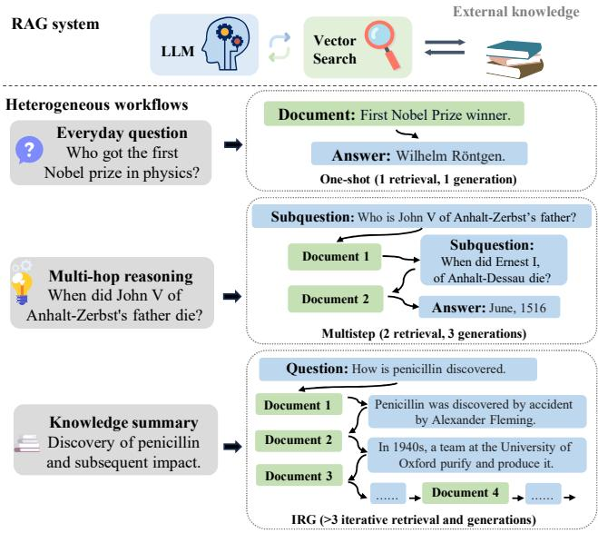  
Figure 1. Heterogeneous RAG workflows bring needs for efficient LLM and vector search coordination.

To support this two-stage workflow, existing systems such as LangChain [2], FlashRAG [31], and vLLM-based pipelines [41] integrate LLM inference with a vector-based retrieval component through hybrid CPU–GPU designs. Typically, vector data is stored in host memory for CPU-based retrieval, while the GPU executes compute-intensive generation. These frameworks primarily support sequential execution of this two-stage workflow, typically combining standard LLM serving engines with vector search libraries such as FAISS [14], to enable basic RAG functionality.

Yet, recent advances in RAG techniques [5, 6, 16, 19, 24, 38, 45, 50, 51, 62] have led to increasing heterogeneity in RAG requests, both in workload patterns and workflow structures, beyond the prior simple two-stage pipeline (Figure 1). This heterogeneity mainly manifests in two key dimensions. First, both the number and duration of stages can vary significantly across requests. The number of stages often increases in workflows that perform multiple iterations of retrieval and generation [6, 29], such as in multi-hop reasoning or refinement-based RAG. Meanwhile, the duration of each stage can fluctuate depending on factors like generation length [6], model confidence [5], or the complexity of the input query [38, 45]. Second, to support diverse objectives, different tasks often adopt distinct workflow patterns by design [19, 24, 50]. This high-level structural heterogeneity means that a general-purpose RAG framework must flexibly accommodate a wide range of task-specific workflows without requiring system reengineering.

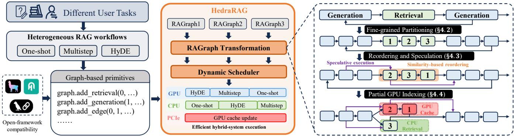  
Figure 2. The overview of HedraRAG, an LLM-Vector search co-designed system, to efficiently transform and schedule heterogeneous RAG workflows onto the hybrid system pipeline.

Although existing RAG system frameworks [2, 31, 44] provide modular support for generation and retrieval, and work well for earlier two-stage RAG designs, they treat the two components as independently executed stages, lacking tight coordination or runtime co-optimization. As a result, dynamic and imbalanced workloads often lead to misaligned execution and CPU-GPU hybrid system under-utilization.

To mitigate these issues, we identify three key optimization opportunities in heterogeneous RAG workflows: across stages, within a request, and across requests. Across stages, generation and retrieval from different requests can be parallelized to improve CPU–GPU pipeline utilization. However, the execution models of the two stages differ significantly. LLM generation is step-wise and benefits from dynamic batching, while retrieval is typically a one-shot operation that favors large static batches. These mismatches often lead to resource imbalance and pipeline stalls, especially when the duration of each stage varies. A coordinated system design is required to align their execution and fully utilize available hardware resources. Within a request, semantic similarity across sequential stages enables reuse and approximate retrieval. For example, embeddings in successive retrievals or partial generations often remain close to final outputs. Yet, exploiting this requires handling high-dimensional embeddings [39] and diverse similarity patterns, demanding solutions that balance efficiency and generality. Across requests, retrievals often show skewed index access, offering GPU caching opportunities. But limited memory, high PCIe latency, and shifting access patterns make static or on-demand caching ineffective. This calls for a dynamic, runtime-aware caching strategy that adapts to evolving request workloads.

We propose HedraRAG, a co-designed LLM–vector search system built to efficiently serve heterogeneous RAG workflows, as illustrated by Figure 2. At the core of HedraRAG is RAGraph, a graph-based abstraction that represents diverse RAG workflows. HedraRAG also supports seamless integration with existing open-source frameworks [1, 2, 44] by exposing graph construction APIs compatible with their workflow specifications. This effectively bridges the gap between high-level workflow heterogeneity and low-level, taskoriented LLM and vector search backends.

RAGraph enables a unified view of workflow heterogeneity and facilitates runtime optimization through a set of graph transformation operations, including node splitting, reordering, edge addition, and dependency rewiring. This abstraction unlocks a significantly larger optimization space than prior stage-centric scheduling frameworks [19, 22, 53], by exposing finer-grained structural variations and richer dependency patterns. By carefully modeling and dynamically applying these transformations, HedraRAG adapts to workload patterns and serving conditions at runtime, maximizing system throughput and resource utilization.

In particular, HedraRAG introduces three key techniques to address the system-level challenges of serving heterogeneous RAG requests: (1) Fine-grained sub-stage partitioning and dynamic batching mitigate pipeline stalls caused by variable-length stages across requests, enabling smoother CPU–GPU pipelining; (2) Semantic-aware reordering with speculative execution leverages intra-request similarity to overlap dependent stages in complex, multi-round workflows; (3) Partial GPU index caching with asynchronous updates captures skewed access patterns across requests and enables efficient hybrid CPU–GPU retrieval execution.

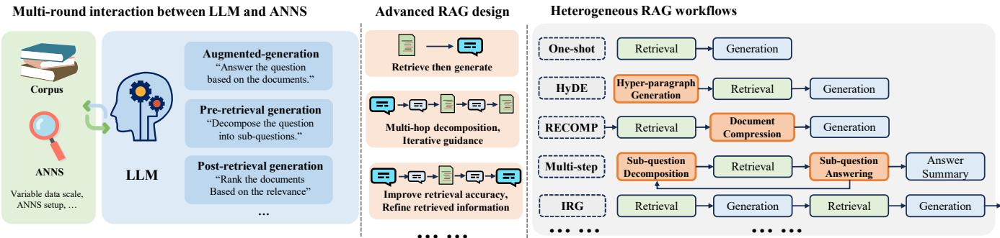  
Figure 3. Advanced RAG design and heterogeneous workflows, involving multi-round LLM-ANNS interaction.

The key contributions of this paper are:

• We introduce a novel graph-based abstraction, RA-Graph, for representing heterogeneous RAG workflows, enabling unified reasoning over diverse execution patterns on hybrid CPU–GPU platforms.

• We present HedraRAG, a co-designed RAG serving system that leverages this abstraction to support dynamic batching, semantic-aware execution, and adaptive caching across complex multi-stage workflows.

• Experimental results show that HedraRAG achieves over 1.5× and up to 5× throughput gains compared to state-of-the-art frameworks.

## 2 Background and Related Work

This section provides background on RAG workflows and summarizes prior work across three perspectives. Section 2.1 introduces the algorithmic roles of the retrieval and generation stages. Section 2.2 summarizes system-level work to independently optimize the retrieval and generation stages. Section 2.3 discusses recent system efforts that begin to integrate them into unified serving workflows.

## 2.1 Algorithmic Roles of Retrieval and Generation

RAG workflows interleave two algorithmically distinct stages: retrieval and generation. The retrieval stage fetches relevant information—typically text fragments—from an external corpus based on a user query, while the generation stage incorporates this information into the prompt to guide LLMs toward producing responses [7, 42].

In the simplest form, RAG follows a one-shot retrievalthen-generation pattern. However, this structure struggles to handle complex inputs that require multi-hop reasoning [20, 65] or involve vague, underspecified queries. These challenges have driven the evolution of more sophisticated algorithmic structures, resulting in heterogeneous RAG workflows, as illustrated in Figure 3.

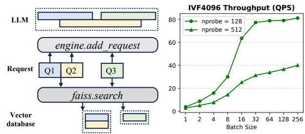  
Figure 4. The comparison between different batching strategies: continuous batching in LLMs and fixed batching in vector search. ???????????? represents the number of clusters in IVF index search.

To address retrieval difficulty, recent designs introduce pre-retrieval stages, such as query rewriting [4, 16, 25, 48] and decomposition [38, 44, 45], aiming to transform user inputs into more effective search queries. Conversely, to improve generation quality, post-retrieval stages filter, rerank, or compress the retrieved content [62, 64, 69, 76] to improve contextual coherence and relevance. In parallel, the workflow has expanded beyond one-shot pattern. With increasing model reasoning capacity [18, 47] and the emergence of agent-based orchestration [57, 61], modern workflows incorporate multistep generation with chain-of-thought (CoT) [60], verification, and feedback-guided refinement. These developments have led to branching [5, 6], iterative [29, 49, 51, 70], and adaptive [24, 50] workflow structures.

## 2.2 Independent System Support

At the system level, retrieval and generation exhibit fundamentally different hardware demands. The generation stage involves LLM inference, which is highly compute-intensive and runs exclusively on GPUs. Due to the auto-regressive nature of decoding [55] and continuous batching across sequences of varying lengths [68], generation incurs dynamic workloads with significant GPU memory pressure from model weights and key–value (KV) caches.

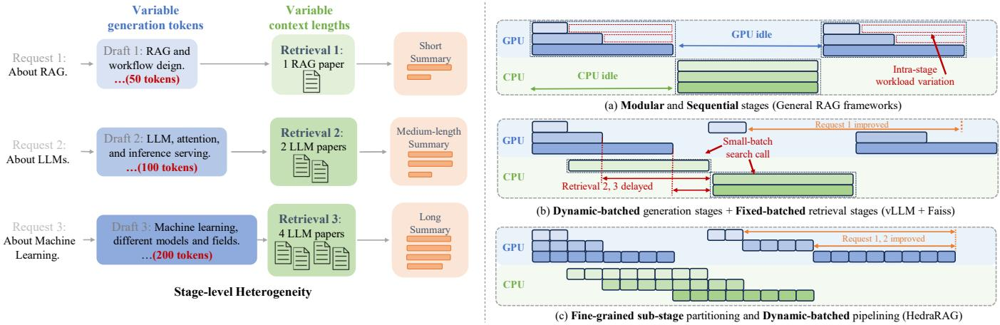  
Figure 5. Comparison of CPU-GPU pipeline efficiency with different strategies.

In contrast, the retrieval stage typically runs on CPUs, as large-scale vector indexes demand high memory capacity beyond what GPUs can support. Documents or passages are pre-encoded into semantic vectors using embedding models [11, 58, 59]. At query time, similarity (e.g., L2 distance or cosine similarity [32]) is computed between the query vector and stored vectors, returning the top-?? nearest matches.

To improve retrieval efficiency, vectors are stored in Approximate Nearest Neighbor Search (ANNS) indexes. The Inverted File Index (IVF) [77], as used in FAISS [14], partitions vectors into clusters via K-Means-like training [3], represented by centroids. At query time, the ???????????? closest clusters are selected, and the search is restricted to those regions, enabling a trade-off between accuracy and speed. IVF also enables spatial pruning techniques such as triangle inequality filtering [12, 13, 63].

## 2.3 Towards Integrated Serving

While both retrieval and generation stages are individually well-supported, recent work has begun to explore more integrated approaches for serving RAG workflows. Open-source frameworks such as LlamaIndex [44], LangChain [2], and FlashRAG [31] expose modular components and APIs, enabling developers to compose retrieval–generation pipelines through user-defined logic. However, these frameworks dispatch each stage to isolated backends—e.g., vLLM [41] for LLM inference and Faiss [14] for vector search—without runtime coordination or shared optimization.

Figure 4 illustrates the performance divergence between these two backends. vLLM maintain stable throughput via continuous token-level batching, which amortizes decoding overhead across concurrent requests. In contrast, vector search frameworks like Faiss benefit from larger batches due to multi-threaded CPU execution [10], achieving higher throughput when more concurrent queries are processed.

Recent efforts have begun to explore optimization strategies across both system and algorithmic levels. At the system level, Chameleon [27] and RAGO [26] investigate resource scheduling and disaggregated deployment strategies. Yet, unified runtime support for coordinating multi-stage, heterogeneous workflows, particularly in hybrid CPU–GPU environments, remains largely absent. At the algorithmic level, techniques such as RAGCache [30], PromptCache [17], and CacheBlend [66] aim to accelerate generation by reusing document prefixes across requests. Others including earlyterminated retrieval [30] and speculative generation from predicted documents [28, 75], seek to decouple retrieval latency from LLM execution. While effective in specific scenarios, these methods often rely on workflow-specific heuristics and sometimes sacrifice output quality for speed.

## 3 Motivation

This section motivates our system design by identifying key performance challenges of serving heterogeneous RAG workflows in practical environments. Although retrieval and generation are individually well-supported by existing frameworks, their composition introduces runtime bottlenecks due to stage interleaving, request variability, and resource contention. These issues are further amplified by the dynamic and irregular structure of modern RAG workflows. To tackle these challenges and improve overall efficiency, we identify three concrete optimization opportunities: (1) parallelism across independent generation and retrieval stages, (2) semantic similarity within multi-turn stages, and (3) skewed index access across multi-request retrievals.

## 3.1 Stage-Level Parallelism

Heterogeneous RAG workflows introduce concurrent retrieval and generation stages with varying numbers and durations. A natural system-level opportunity is to pipeline these stages by integrating LLM inference and vector search through asynchronous execution. However, such naive integration suffers from mismatched execution patterns between the two components. The performance divergence between generation and retrieval backends, previously discussed in § 2.3, becomes more pronounced with variable-length stages.

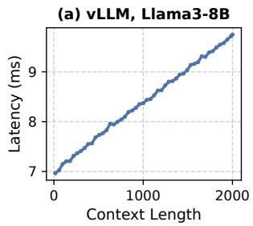

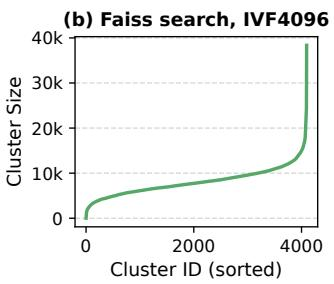  
Figure 6. Workload variation in (a) LLM generation and (b) vector database query.

Figure 5 illustrates this using a HyDE [16] workflow that summarizes knowledge about RAG, LLMs, and ML. In (a), general RAG frameworks execute coarse-grained stages sequentially, leading to hardware under-utilization. In (b), naive asynchronous integration introduces scheduling delays: for example, Request 1’s short generation triggers an early but long-latency search, delaying retrieval for Requests 2 and 3. Meanwhile, Request 1’s subsequent retrieval call suffers low throughput due to the small batch size. To address such inefficiency, HedraRAG introduces fine-grained sub-stage partitioning for both generation and retrieval. Shown in (c), this partitioning eliminates the sequentiality of coarse-grained stages to improve throughput, and mitigates batching strategy mismatches to reduce single-request latency.

However, achieving balanced pipelining through equallength stage partitioning is non-trivial, due to workload imbalance across both the generation and retrieval stages. To better understand the source of imbalance, we analyze the latency characteristics of the smallest schedulable units: decoding steps for generation and single-cluster searches for retrieval. As shown in Figure 6, the latency distributions of both decoding steps and retrieval clusters are highly nonuniform, depending on the context length and the target cluster. This further complicates static partitioning. To mitigate such imbalance, we design a dynamic, load-aware alignment strategy that adjusts sub-stage boundaries based on real-time workload, enabling efficient and stall-free hybrid pipelining.

## 3.2 Intra-Request Semantic Similarity

Heterogeneous RAG workflows often involve multi-round generation and retrieval [44, 51]. However, existing systems typically treat these stages as independent requests. Such separation results in accumulated latency and redundant computation, while missing opportunities for cross-stage coordination and optimization.

Our key observation is that semantic similarities naturally emerge across stages within the same request. These arise from the inherent coherence of generation and retrieval in language workflows. We identify two types of such similarity, illustrated through an IRG [51] workflow on open datasets: (1) Inter-retrieval similarity: The similarity between query embedding vectors in adjacent retrieval stages is often high, since these queries are usually generated from the same underlying context. As shown in Figure 7(a), the average distance between consecutive queries is smaller than between a query and its top-5 retrieved passages. This suggests that successive retrievals operate within similar index regions and may even yield overlapping results.

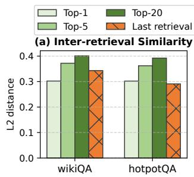

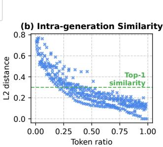  
Figure 7. Inter-stage and Intra-stage similarity in IRG. (a) The distances of the current query retrieval vector to its top-?? retrieved passage embedding vectors, and to the previous retrieval query vector. (b) The embedding vector distances between partial generations with different prefix ratios and the final generation result.

(2) Intra-generation similarity: the step-wise nature of LLM decoding leads to partial generations that are semantically close to the final output. As Figure 7(b) shows, using only 22–50% of the tokens yields embeddings within the top-1 retrieved range of the final output. This suggests that partial generations can effectively guide subsequent retrieval.

The above observations highlight opportunities for intrarequest optimization. Rather than enforcing strict stage-bystage execution, we can exploit semantic locality to lower the costs of both generation and retrieval. However, conventional locality-based pruning methods [12, 13, 63] are less effective in high-dimensional embedding spaces. To address this, our second design introduces heuristic, semantic-aware strategies: locality-based cluster reordering and workloadaware speculative execution. These techniques overlap dependent generation and retrieval stages, reducing serving latency while preserving result quality.

## 3.3 Inter-Request Retrieval Skewness

When dealing with large external databases, the highly concurrent retrieval stages in heterogeneous RAG workflows often leads to system-level bottlenecks, incurring higher overhead than generation. One potential solution is to offload expensive vector similarity computations to the GPU. However, existing GPU-accelerated vector search engines [33, 34,

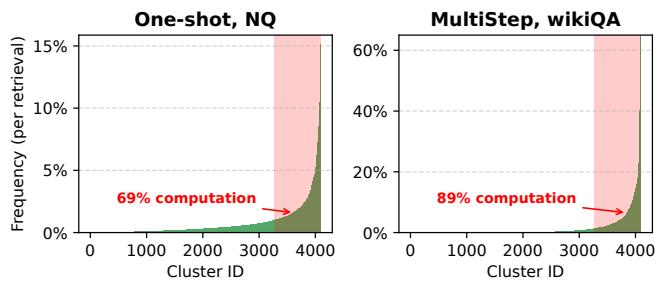  
Figure 8. Skewness of access frequency among clusters when using IVF4096 indexing. Cluster IDs are sorted in descending order of frequency.

56, 74] are designed for standalone use and do not address co-execution challenges with LLM inference.

In RAG serving on hybrid CPU–GPU environments, limited GPU memory poses a fundamental challenge. LLM inference consumes most of the GPU memory for model weights and KV caches, leaving insufficient space to store the full vector index. As a result, systems must load index shards on demand from CPU memory. However, this is bottlenecked by the limited bandwidth of PCIe [46], making such transfers prohibitively expensive at runtime.

To address this, we leverage an important workload characteristic: index access skewness. Real workloads exhibit concentrated access to a small subset of index clusters, which we refer to as hotspot clusters. This skewness arises because user requests centered around similar topics or scopes tend to generate query embeddings spatially close to a shared subset of clusters in the index. As shown in Figure 8, the top 20% of hotspot clusters account for over 69% of total computation. This suggests that caching only a fraction of the index could yield substantial acceleration.

However, hotspot clusters shift dynamically across heterogeneous workflows and request distributions. We therefore introduce a partial GPU index cache with asynchronous updates. This design enables lightweight, runtime-aware caching of hot clusters, allowing high-throughput GPU search while minimizing interference with ongoing LLM generation and CPU-side retrieval.

## 4 HedraRAG: Method and Design

We present HedraRAG, a co-designed framework for LLM and vector search integration, built to efficiently serve heterogeneous RAG requests on a CPU-GPU hybrid system. HedraRAG abstracts user-defined RAG workflows as a graphbased abstraction, and enables unified optimization techniques through a series of graph transformation operations. HedraRAG extensively explores optimization opportunities across the stage parallelism, intra-request semantic similarity, and inter-request retrieval skewness, and encapsulates the optimization techniques as graph transformations, including node splitting, reordering, edge addition, and dependency rewiring. Through dynamic graph transformation and scheduling, HedraRAG efficiently coordinates and parallelizes stages across concurrent, heterogeneous requests. Such design bridges the gap between highly variable runtime workflows and the underlying LLM and vector search backends, enabling robust and generalizable optimization.

Listing 1. Construct RAG workflows with graph primitives.  
from HedraRAG import RAGraph, START, END   
2 from HedraRAG import Server   
3 # HyDE-style workflow   
g1 = RAGraph()   
5 g1.add\_generation(0, prompt="Generate a hypothesis   
6 for {input}.", output="hypopara")   
g1.add\_retrieval(1, topk=5, query="hypopara", output="docs")   
8 g1.add\_generation(2, prompt="Answer {query} using {docs}.")   
9 g1.add\_edge(START, 0); g1.add\_edge(0, 1)   
10 g1.add\_edge(1, 2); g1.add\_edge(2, END)   
11 # Multistep-style workflow   
12 g2 = RAGraph()   
13 g2.add\_generation(0, prompt="Decompose {input} into   
14 subquestions.", output="subquestion")   
15 g2.add\_retrieval(1, topk=2, query="subquestion",   
16 output="docs")   
17 g2.add\_generation(2, prompt="Answer {subquestion}   
18 using {docs}.")   
19 g2.add\_edge(START, 0); g2.add\_edge(0, 1); g2.add\_edge(1, 2)   
20 g2.add\_edge(2, lambda s: 1 if s.get("subquestion") else END)   
21 # Server initiating and execution   
22 s = Server(generator="Llama3-8B", index="IVF4096")   
23 s.add\_request("What is RAG?", g1)   
24 s.add\_request("Compare RAG with long-context models.", g2)

## 4.1 RAGraph: RAG Specific Abstraction

We first introduce RAGraph, a graph-based abstraction tailored for RAG workflows, to enable customizable workflow specification and optimization. The original RAGraph consists of two types of nodes: Generation nodes initiate LLM generation with the specific prompt and inputs, while Retrieval nodes perform vector database search to fetch relevant passages. HedraRAG provides simple graph primitives that allow users to construct RAGraph with the target RAG workflows, as is shown in Listing 1. Through node adding primitives add\_generation and add\_retrieval, the user can define Generation or Retrieval nodes with a customized prompt, typically corresponding to a single stage in the RAG workflow. add\_edge connects different stages by establishing edges, enabling data flow and control transitions, including conditional branches. Such a design is compatible with many existing RAG frameworks [1, 2], thereby enabling seamless migration and integration.

Unlike existing whole-stage DAG abstractions such as RAGO [26] and Cognify [19], RAGraph is explicitly designed for stage-level decomposition and scheduling. It captures the execution asymmetry between retrieval and generation: Retrieval nodes execute a predefined sequence of searches over fixed index clusters with structurally bounded cost, while Generation nodes represent prompt-based LLM inference, realized as a dynamic, multi-step process unfolding at token level. This design exposes fine-grained transformation operations (e.g., node splitting, reordering, dependency rewiring) that coarse-grained abstractions cannot express.

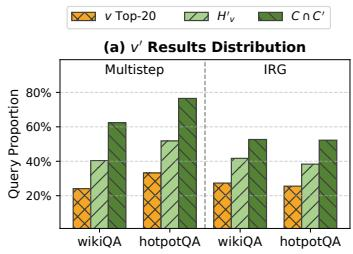

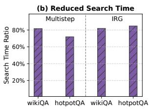  
Figure 9. Opportunities from semantic similarity in RAG. (a) Proportion of queries satisfying each locality-based observation, where $v ^ { \prime }$ top-?? is set as 2. (b) The reduction of effective search time throught locality-based reordering.

HedraRAG further elevates system-level optimization by formulating it as a set of graph transformation operators over the RAGraph abstraction. These transformations, including node splitting, reordering, and edge insertion, convert the original stage-wise, sequential workflow into finegrained, overlappable sub-stages, enabling dynamic and parallel scheduling across hybrid hardware resources. Such a graph-based abstraction overcomes the limitations of existing ad-hoc workflow optimization approaches [28, 30, 75], providing a unified and generalizable system-level optimization framework for heterogeneous RAG workflows.

## 4.2 Fine-Grained Sub-Stage Pipelining

To bridge the design gaps between LLM generation and vector search, HedraRAG partitions both generation and retrieval stages into fine-grained sub-stages with similar execution costs. In generation, each sub-stage comprises several decoding steps. In retrieval, each sub-stage involves searching across one or more clusters. Such partitioning follows two key objectives: (1) By aligning the short-latency, multistep decoding with the long-latency, single-step retrievals, we can enable coordinated dynamic batching across generation and retrieval stages. (2) these sub-stages serve as the fundamental units for scheduling and execution, with each representing a portion of a generation/retrieval stage’s workload. Such design enables further optimizations including speculative execution and partial GPU indexing.

A straightforward method to partition sub-stages is to assign a fixed number of generation steps and retrieval clusters. However, such method leads to sub-stage misalignment and workload imbalance, as both LLM generation steps and single-cluster retrieval operations exhibit runtime workload variation. To overcome this, we introduce a dynamic timebudgeting method based on retrieval requests. Before executing a sub-stage, clusters from each retrieval request are incrementally added until a maximum time budget ???? is reached. The execution time for the sub-stage is then determined as the time cost to batch-search these clusters. The retrieval-centric strategy is motivated by the fact that the workload variance across retrieval clusters is substantially higher than that of generation steps.

The configuration of ???? is crucial to performance, involving the tradeoff between the latency improvement of sub-stages and the additional overhead introduced by partitioning and scheduling. We calculate ???? by modeling the expected latency improvement $\Delta _ { l } \mathbf { : }$

$$
m b = \mathrm { a r g m a x } ( \Delta _ { l } ) , \Delta _ { l } = \frac { t _ { \mathrm { R e t r i e v a l } } - m b } { 2 } + \frac { t _ { \mathrm { R e t r i e v a l } } } { m b } \beta ,\tag{1}
$$

where $\beta$ denotes the CPU overhead of request scheduling and handling intermediate results. $t _ { \mathbf { R e t r i e v a l } }$ denotes the average time of retrieval stages, measured at runtime. In the equation, we assume that retrieval requests arrive evenly across all substages, so the expected wait time for the preceding retrieval operation is reduced from ??Retrieval to 2 $\textstyle { \frac { m b } { 2 } }$

In RAGraph, sub-stage partitioning is modeled via node splitting, where coarse-grained nodes are divided into finegrained, sequentially dependent sub-nodes with similar costs. Efficient CPU-GPU pipelining is enabled by concurrently scheduling these fine-grained nodes across different requests.

## 4.3 Similarity-Aware Search Optimization

To further reduce the latency of RAG requests involving multi-round generation and retrieval stages, HedraRAG leverages the intra-request the semantic similarity. We first define the optimization problem for similarity-based vector search as follows: given two query vectors ?? and $v ^ { \prime } ,$ with cluster sets $C = \{ c _ { 1 } , c _ { 2 } , . . . , c _ { n f r o b e } \}$ and $C ^ { \prime } = \{ c _ { 1 } ^ { \prime } , c _ { 2 } ^ { \prime } , . . . , c _ { n p r o b e } ^ { \prime } \}$ to search. The problem formulates as follows: Assuming their distance satisfies $d _ { v v ^ { \prime } } \leq \delta ,$ , how to leverage the search results of ?? to accelerate the search for $v ^ { \prime } ?$

Leveraging such semantic vector similarity is challenging due to the well-known curse of dimensionality [39]. Existing semantic embedding models produce vectors in high-dimensional space (e.g. 768 for BERT [11] and 1024 for e5\_large [58]), leading to sparse distributions on the surface of spheres. As a result, pairwise distances tend to become nearly uniform. Traditional similarity-based optimizations, such as those using triangle inequalities [12, 13, 63], become significantly less effective.

Fortunately, we find that semantic similarity still provides good opportunities specific in the RAG context. Our experimental analysis reveals three locality-based observations related to semantic similarity: (1) The search results of $\cdot _ { v ^ { \prime } }$ tend to be included within the search results of ?? with a larger top-??. (2) When the search results of ?? are in a cluster set $H _ { v } ,$ the results of $\cdot _ { v ^ { \prime } }$ also tend to be located in $H _ { v } . ( 3 )$ The search results of $\cdot _ { v ^ { \prime } }$ tend to be located in clusters of ?? ∩??′. According to the open-domain dataset results shown in Figure 9(a), up to 33%, 52%, and 77% of retrieval queries satisfy the three locality-based observations, respectively.

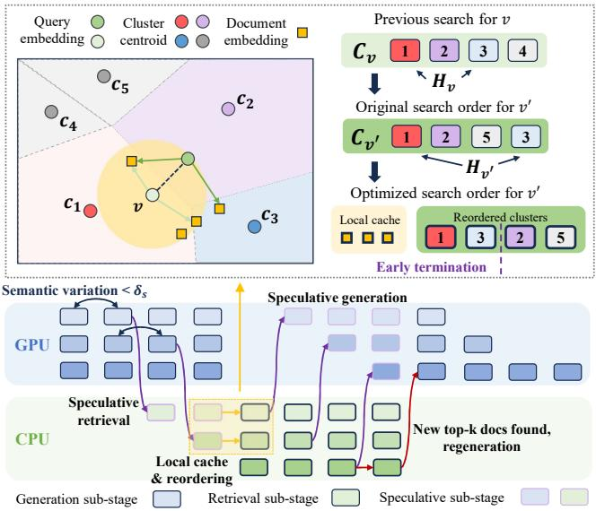  
Figure 10. Leveraging semantic similarity with speculative generation and retrieval sub-stages.

HedraRAG leverages the above observations by caching and reusing historical search information. For each retrieval in a request, a set of larger top-?? results of ?? (20 in practice) are stored in a local cache for future reuse. The search for $v ^ { \prime }$ is first attempted in the local cache of ??. Next, the target cluster set $C ^ { \prime }$ is reordered based on $H _ { v }$ and $C _ { v } \colon$ first search $H _ { v } \cap C ^ { \prime }$ (if any), followed by $( C - H _ { v } ) \cap C ^ { \prime }$ (if any), and finally the remaining clusters. As illustrated in Figure 9(b), such search order optimization leads to earlier termination in ANNS by up to 28%, effectively reducing the search time.

Based on the search order optimization, HedraRAG further exploits the early-terminating property of ANNS to enable speculative execution. As illustrated in Figure 10. we enable two forms of speculative execution:

Speculative Generation. When a retrieval stage is followed by a generation stage, speculative generation can be started using partial search results from a small subset of clusters. This allows the following generation stage, which would otherwise run sequentially only after the entire retrieval stage completes, to overlap with the remaining cluster searches. After the retrieval completes, the final results are compared against the partial results used by speculative generation. If the results are identical, the speculative generation is valid, otherwise the generation must be restarted. Since speculative generation overlaps with the retrieval, regeneration does not add to the original latency.

Speculative Retrieval. When a generation stage is followed by a retrieval stage, speculative retrieval can be initiated using embeddings from partially generated outputs. The latency of speculative retrieval is overlapped with the remaining generation stage, to provide inter-retrieval history to guide the following real retrieval stage. The optimization is effective when there is no preceding retrieval, or when the interval between consecutive retrieval stages is long.

Deciding the speculative execution point in heterogeneous RAG workflows is challenging due to unpredictable outputs and workflow patterns. Most existing approaches [28, 30, 75] are tailored to specific workflows and depend on static heuristics, with limitations to generalize and adapt under dynamic serving senarios. HedraRAG introduces an adaptive speculative strategy based on both workload dynamics and semantic similarity. Specifically, speculative generation/retrieval is triggered when CPU/GPU system throughput of the next sub-stage is underutilized with $T _ { \mathrm { c u r r } } < \tau T _ { \mathrm { m a x } }$ , where $T _ { \mathrm { c u r r } }$ is empirically estimated with the number of requests, $T _ { \mathrm { m a x } }$ is the estimated system peak throughput. In our experiments, we found $\tau T _ { \mathrm { m a x } }$ attains its optimal value when the number of requests reaches 16 for generation and 32 for retrieval.

For each sub-stage, HedraRAG selects speculative requests until system throughput reaches threshold ?? at each substage. For speculative generation, we select the retrieval request with current top-?? vectors closest to the query embedding. For speculative retrieval, we select the generation stage with minimal semantic drift $\delta _ { s }$ from the previous substage. Such strategies heuristically prioritizes those with lower speculative error rates.

In RAGraph, search order optimization and speculative execution modify the dependency structure between sub-nodes. Leveraging semantic similarity, the sub-nodes obtained are reordered for an optimized execution sequence. Speculative edges are inserted to mark the entry points of speculative execution, enabling overlapping between originally sequential sub-stages and supporting rollback upon speculation errors.

## 4.4 Partial GPU Indexing

Leveraging the cluster skewness described in §3.3, we can only cache a small number of hotspot clusters to accelerate most of the computations. HedraRAG further utilizes this observation to build a hybrid retrieval engine with a partial index cache for index clusters, enabling cross-device acceleration of vector search.

To identify and onload hotspot clusters, HedraRAG maintains a GPU-side partial index cache for the CPU index. As illustrated in Figure 11, HedraRAG allocates a certain amount of GPU memory for the cache, and tracks the runtime access frequency of each cluster in the index. The top-???? most frequently accessed clusters are retained in the cache. Cache updates primarily involve swapping clusters in and out via asynchronous memory transfers, which are executed in parallel with the ongoing stages on both the CPU and GPU.

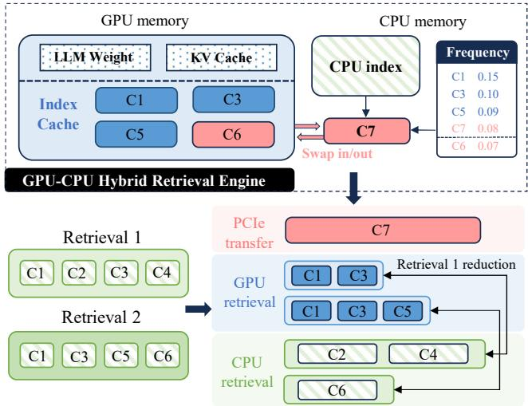  
Figure 11. Hybrid retrieval engine of HedraRAG with ???? = 4. ???? represents the ??-th cluster.

To avoid PCIe contention caused by overly frequent cache updates, HedraRAG performs updates at fixed intervals, set as every 50 sub-stages in practice.

For each batched retrieval workload within a sub-stage, the hybrid retrieval engine first checks whether each target cluster resides in the GPU cache. If the cluster is valid in the partial index cache, the search is performed on the GPU. If the cluster is not in the cache or is currently being swapped in or out, the search is performed on the CPU. All the clusters assigned to GPU and CPU computation are batched through unified search interfaces (§5), enabling efficient thread-level parallelism. After the search calls completes, the results from both CPU and GPU for each request are merged. By such design, HedraRAG enables the parallelism of PCIe transfers, CPU-side retrieval, and GPU-side retrieval, thereby maximizing hardware utilization to improve retrieval efficiency.

The co-location of LLM weights and KV cache necessitates a trade-off in setting the GPU index cache size (????): too small yields minimal retrieval benefit, too large interferes with generation via KV cache swapping. To address this, HedraRAG conducts offline benchmarking on open datasets to characterize the generation throughput ???? (???? \_????????, ??????) and the CPU retrieval throughput $T _ { R } ( r p s )$ under varying request rates. For each new RAG workflow, HedraRAG estimates the expected generation and retrieval request rate (???????? , ????????) from its average stage composition, and selects the KV cache size by solving:

$$
\arg \operatorname* { m a x } _ { K V \lrcorner s i z e } \operatorname* { m i n } \left\{ T _ { G } ( \mathsf { K V \_ s i z e } , r p s _ { G } ) , \ T _ { R } ( r p s _ { R } ) \right\} .\tag{2}
$$

When the server starts, we allocate ???? \_???????? GPU memory to the KV cache, and the remaining GPU memory budget is allocated for caching index clusters.

In RAGraph, GPU indexing is modeled as further parallelization within a sub-stage over its assigned clusters. For each sub-stage, HedraRAG decides whether to enable GPU acceleration based on the number of target clusters cached on the GPU, balancing the potential search speedup against kernel launch and synchronization overhead.

## 4.5 Dynamic Graph Transformation and Scheduling

The heterogeneity of RAG workflows results in distinct workload distributions for the generation and retrieval stages. Consequently, the effectiveness of each optimization technique may vary with the workflow type and the runtime workload. Therefore, HedraRAG introduces adaptive graph transformation and scheduling.

Before each scheduling cycle, the scheduler traverses a batch of pending requests to identify stages that can be executed in parallel, forming a node wavefront. The scheduler then performs graph transformations sequentially, guided by the estimated latency and throughput benefits. The resulting optimized sub-stages are then dispatched to the CPU-GPU execution pipeline, providing foundational support for coordinated optimization of heterogeneous RAG workflows. Figure 12 illustrates this process under concurrent execution of One-shot, RECOMP, and Multistep workflows.

In addition, RAGraph enables the incorporate a broader range of optimization opportunities. By defining graph transformation operations along with their expected latency shifts, various existing workflow optimizations can be naturally integrated. For example, retrieval-generation workflow optimization [28, 30, 75] can be modeled by introducing new speculative edge, and the GPU index prefetching [43] can be implemented by introducing specific nodes to perform onloading that execute in parallel with retrieval nodes.

## 5 Implementation

System Construction. HedraRAG is built on vLLM [41] (version 0.6.6) and Faiss [14] (version 1.9.0). The generation and retrieval workers are assigned to separate processes using Python multiprocessing, enabling parallel execution. At runtime, the generation worker repeatedly invokes the step function of the vLLM engine, while the retrieval worker executes the extended step function of index search. The two workers exchange inputs and outputs via a shared message queue. During each parallel iteration cycle, the scheduler traverses the RAGraph of all active requests, selects a new wavefront, and inserts the transformed sub-nodes into the task queues of the generation and retrieval workers.

Extension of Vector Search Library. Faiss provides a stateof-the-art in-memory vector search implementation with various performance optimizations. However, its interface is primarily designed for batched, search-only operations, making it difficult to integrate with the fine-grained execution patern of LLMs. We extend the index searching implementation with multi-step cluster partitioning and step-wise execution, and provide the step function similar to LLM engines. We also implement an interface for asynchronous index loading, supporting partial GPU caching of selected clusters. Furthermore, since #clusters to be processed per batch can vary within a sub-stage at both the CPU and GPU side, we provide a variable-length cluster search interface across requests, along with specific performance optimizations including workload balancing and effective reduction.

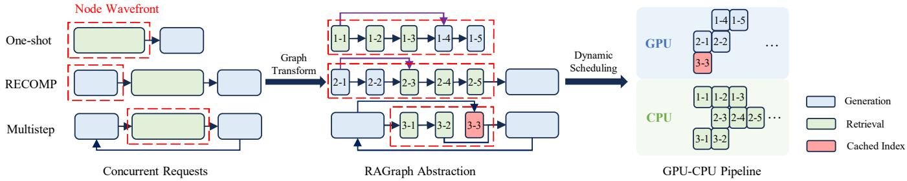  
Figure 12. Graph transformation and scheduling optimization under concurrent RAG workflows.

## 6 Evaluation

## 6.1 Experimental Setup

Hardware. We evaluate HedraRAG on a CPU–GPU hybrid server. Vector search is executed on an AMD EPYC 9534 64-core processor, while LLM generation is performed on NVIDIA H100 GPUs with 80 GB of memory.

Model. We use Llama 3.1–8B [15] as the primary model in our experiments. Additionally, we also evaluate HedraRAG on Llama2-13B [54] and OPT-30B [72]. We use the instructtuned model version to better construct RAG workflows. Corpus and Index. Wikipedia passages [9, 23] as the primary retrieval corpus, covering knowledge up to 2022 and containing ∼38M documents. For each document chunk in the corpus, we use the e5\_large embedding model [59] for 1024-dimensional semantic vectors. We evaluate the index commonly used for large-scale vector search: IVF4096. ???????????? is set to 128, 256, or 512, for different search costs and accuracy. The number of top-?? results returned is 1. In our evaluation, increasing ???????????? from 128 to 512 improves answer accuracy by 5% on the NQ dataset with One-shot workflow, but also increases retrieval latency by nearly 4×. Datasets. We evaluate on three open datasets: NaturalQuestions [40] (referred to as NQ), 2WikiMultiHopQA [20] (referred to as wikiQA), and HotpotQA [65]. Both wikiQA and HotpotQA are designed for multi-hop or progressive question answering, which is typically challenging for the simple one-shot RAG workflow. These datasets were originally collected from real user queries in practical domains such as Google Search [40], ensuring that our workload traces resemble realistic user requests. We evaluate five types of RAG workflows: One-shot, Multistep [44], IRG [51], HyDE [16], and RECOMP [62]. One-shot is the simplest retrievalthen-generation workflow. Multistep and IRG involve multiple rounds of interaction between generation and retrieval stages, while HyDE and RECOMP introduce additional preretrieval and post-retrieval stages, respectively.

Baselines. Our baseline includes two open-source RAG frameworks: LangChain [2] and FlashRAG [31]. The frameworks support comprehensive functionality for various RAG workflows, and provide implementations that integrate with the state-of-the-art inference serving system (vLLM [41]) and the vector database search library (Faiss [14]). Building on FlashRAG, we implement asynchronous parallel invocations of vLLM and Faiss to support online serving and provide a more competitive baseline framework.

For speculative execution, we compare two existing approaches: RaLMSpec [75] and RAGCache [30]. As neither of them provides open-source access, we enable support for both in HedraRAG by adding speculative execution edges between the generation and retrieval nodes.

Primary Evaluation Setting. To facilitate a detailed and systematic comparison of different RAG workflows, we primarily conduct in-depth evaluations on LLaMA3-8B [15], focusing on the impact of retrieval-stage overheads (e.g., varying ???????????? from 128 to 512) and workflow patterns (5 RAG workflows). This setup enables us to thoroughly analyze performance bottlenecks and optimization effectiveness in a controlled setting. To further validate the generality of our findings, we additionally evaluate HedraRAG on larger models (e.g., LLaMA2-13B [54], OPT-30B [72]), and observe consistent performance improvement across these settings.

## 6.2 Overall Improvement

We evaluate HedraRAG under three scenarios: single workflow online serving, offline execution, and multiple workflow concurrent serving, measuring its impact on system latency and throughput. We set the service-level objective (SLO) to 10 seconds per request, representing the target for end-to-end responsiveness to user queries.

Online serving. We first evaluate how HedraRAG improves throughput and latency in online RAG request serving. Figure 13 illustrates how request latency varies with the request arrival rate across different RAG workflows and datasets.

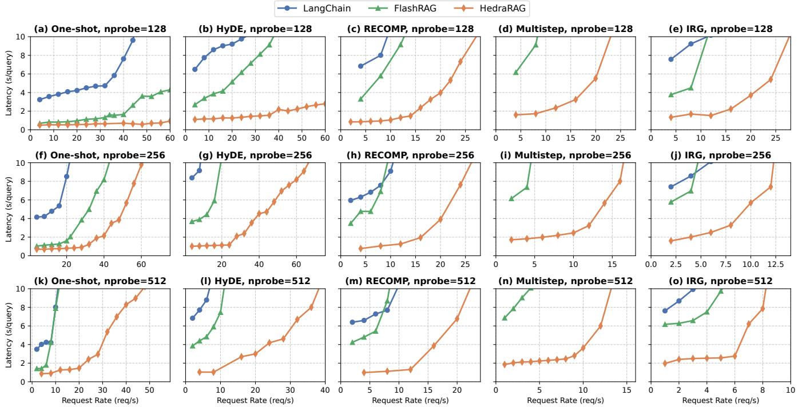  
Figure 13. Average request latency when using various RAG workflows.

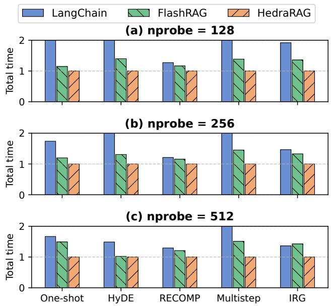  
Figure 14. Total offline runtime of different RAG frameworks. All timing results are reported with normalization w.r.t. HedraRAG. For clarity, values over 2 are truncated.

Compared to existing RAG frameworks, HedraRAG reduces request latency by 2.2× to as much as 18.2× at the same request rate. HedraRAG also sustains higher request rates, achieving more than 3×. Performance gains stem from efficient parallelization of the generation and retrieval stages, along with associated optimization strategies.

Through performance variation of vertical subplots in Figure 13, we can observe that HedraRAG provides greater improvements on more complex workflows. For instance, when ???????????? = 256, the throughput improvement on one-shot is 1.5×, and reaches up to 4× and 3× for Multistep and IRG. Moreover, the performance variation across the horizontal subplots in Figure 13 reveals how the retrieval-stage overhead influences the optimization effectiveness of HedraRAG. For example, in the one-shot workflow, increasing ???????????? from 256 to 512 leads to a throughput improvement from 1.5× to 4.4×. This is because HedraRAG’s fine-grained, dynamic graph transformation and scheduling mechanism significantly reduces pipeline stalls caused by vector search, and further improves the efficiency of multi-round interactions between the LLM and vector search.

Offline execution. Next, we evaluate how HedraRAG improves the execution time for offline workload. Figure 14 compares offline execution times of different RAG workflows on across different index types. While larger batches in offline scenarios are better suited to the modular design of existing frameworks, HedraRAG still delivers significant performance gains, achieving speedups of 3.5× and 1.3× over LangChain and FlashRAG, respectively. The speedup is due to the efficient parallel execution across CPU and GPU further improve the hybrid system throughput.

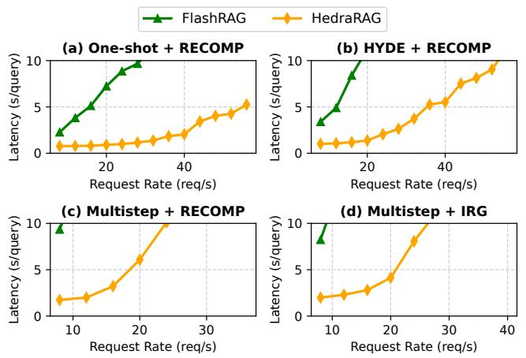  
Figure 15. Average request latency with concurrency of different RAG workflows. nprobe is set as 128.

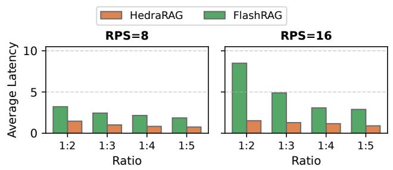  
Figure 16. Average request latency under mixed workloads with varying query ratios. The ratio refers to the proportion of Multistep (complex) requests to One-shot (simple) requests in the workload. ???????????? is set as 128. RPS: request/second.

Concurrency of different workflows. We evaluate the performance advantages of HedraRAG under concurrent execution of requests from different RAG workflows (Figure 15). We construct mixed workloads by combining two types of RAG workflows at a 1:1 ratio as input queries. Concurrent workflows impose greater performance degradation on FlashRAG, particularly for complex workflows. In contrast, HedraRAG maintains high efficiency under such concurrent workloads, achieving up to 5.5× latency reduction and 3.3× throughput improvement.

We further analyze the latency distribution under varying query complexity ratios to simulate real-world request compositions. As shown in Figure 16, HedraRAG consistently outperforms FlashRAG across all distributions, achieving up to 5.6× latency reduction. The above results demonstrate HedraRAG’s ability to seamlessly optimize performance across heterogeneous RAG workflows.

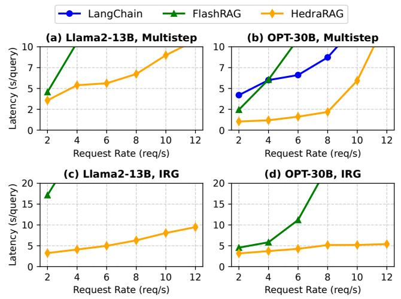  
Figure 17. Average request latency on larger LLM models, with Multistep and IRG workflows. ???????????? is set as 128.

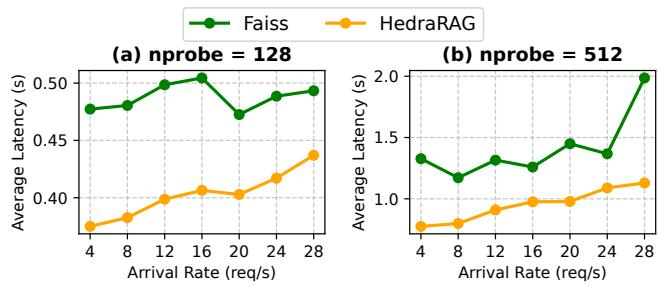  
Figure 18. The fine-grained partitioning of HedraRAG to improve vector database search latency.

Other LLMs. We further evaluate HedraRAG on larger models, including Llama2-13B and OPT-30B. As shown in Figure 17, HedraRAG consistently achieves over 1.5× throughput improvement. The performance gains are more pronounced under higher per-request latency (e.g., Llama2-13B), where fine-grained scheduling and pipelining better alleviate inter-stage stalls. Larger models also exhibit distinct systemlevel behaviors: (i) longer generation latencies and higher GPU memory pressure, which amplify pipeline imbalance between generation and retrieval, and (ii) heterogeneous reasoning dynamics across models, leading to inconsistent workflow behaviors such as varying iteration counts.

Despite these differences, HedraRAG maintains consistent speedups across model scales, demonstrating its ability to adapt to varying model characteristics through dynamic stage partitioning and execution strategies. Besides, extremely large models paired with small databases tend to shift the performance bottleneck toward LLM inference, making retrieval coordination less impactful. We find that more balanced configurations yield better overall tradeoffs in both efficiency and accuracy.

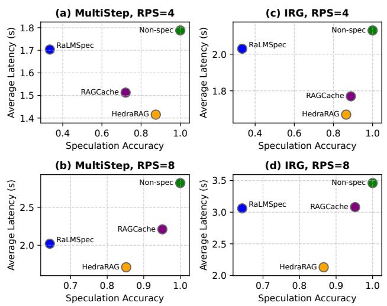  
Figure 19. The speculation accuracy and latency comparison across existing speculation methods. RPS: request/second.

## 6.3 Performance Analysis

In this section, we systematically evaluate the effectiveness of three core optimization techniques, including dynamic pipelining, speculative execution, and GPU-based indexing, by incrementally enabling them and measuring their individual impact on latency and throughput. The following evaluations compare against baseline methods to highlight the performance contribution of each.

Dynamic partitioning and pipelining. We evaluate how HedraRAG’s sub-stage partitioning impacts vector database search latency in RAG serving scenarios. To simulate the finegrained and non-batched search requests (typically come from the step-wise generation stages from different requests), we vary the request rate sent to the retrieval engine at the granularity of individual requests. As Figure 18 shows, HedraRAG effectively improves search latency, achieving a reduction of 1.09× to 1.77×. This improvement is due to the more fine-grained and dynamic batching, which minimizes the time for new requests to wait behind long-latency, coarse-grained search calls.

Reordering and Speculation. We compare HedraRAG’s dynamic speculative execution strategy against existing approaches, including RaLMSpec and RAGCache, with respect to both speculation accuracy and end-to-end request latency. Speculation accuracy is defined as the proportion of speculative generation steps in which the partially retrieved results match those produced by complete retrieval. As shown in Figure 19, HedraRAG’s similarity-aware reordering and dynamic speculation strategies yield a latency speedup ranging from 1.06× to 1.62× over prior methods. RaLMSpec, which relies solely on local cache contents, suffers from lower speculation accuracy and frequently incurs additional rollback overhead. PipeRAG adopts a more conservative speculation policy, as it does not leverage semantic similarity across retrieval stages, resulting in limited latency reduction. In contrast, HedraRAG integrates similarity-aware reordering with a runtime-adaptive speculative execution mechanism that considers both RAG workflow heterogeneity and requestlevel workload dynamics. This coordinated design leads to consistently higher speculation accuracy and more effective latency reduction across diverse workloads.

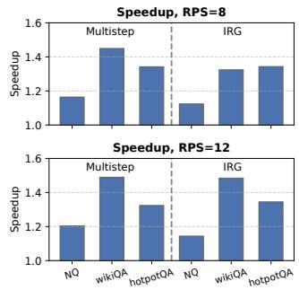

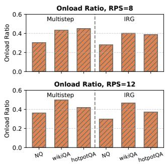  
Figure 20. The speedups of GPU indexing and the hotspot cluster cache hit rate. nprobe is set as 512.

Partial GPU Indexing. We evaluate the impact of GPUbased indexing on performance. The observed speedup is most pronounced when the retrieval stage incurs high CPU overhead, for example, when approaching system throughput limits (e.g., with ???????????? = 512 and request-per-second (RPS) between 8 and 12). Figure 20 shows the GPU speedup as well as the probability that accessed clusters during retrieval are found in the GPU cache. GPU indexing yields a speedup ranging from 1.12× to 1.49×, which correlates positively with the cache hit probability of accessed clusters. The hit rate varies across datasets. Intuitively, we attribute this variation to differences in topic skewness: compared to NQ, datasets like WikiQA and HotpotQA exhibit stronger access skewness, leading to higher cache reuse.

## 7 Conclusion

We present HedraRAG, a co-designed generation-retrieval system for heterogeneous RAG workflow serving. HedraRAG introduces RAGraph, a unified graph-based abstraction that expresses diverse workflow structures and enables generalizable optimizations. By defining transformation operations that model fine-grained sub-stage partitioning, semanticaware speculative execution, and partial GPU index caching, HedraRAG bridges the gap between high-level RAG heterogeneity and low-level LLM and vector search backends. Our evaluation shows that HedraRAG consistently outperforms existing RAG systems across different models and workflows, demonstrating the value of system design to address the challenges of modern, heterogeneous AI pipelines.

## Acknowledgments

We thank our shepherd for the valuable guidance during the revision process. This research was supported in part by the National Science Foundation under grant NSF 2124039.

## References

[1] 2019. Haystack. https://github.com/deepset-ai/haystack.

[2] 2022. langChain. https://github.com/langchain-ai/langchain.

[3] Mohiuddin Ahmed, Raihan Seraj, and Syed Mohammed Shamsul Islam. 2020. The k-means algorithm: A comprehensive survey and performance evaluation. Electronics 9, 8 (2020), 1295.

[4] Akari Asai, Jacqueline He, Rulin Shao, Weijia Shi, Amanpreet Singh, Joseph Chee Chang, Kyle Lo, Luca Soldaini, Sergey Feldman, Mike D’arcy, et al. 2024. Openscholar: Synthesizing scientific literature with retrieval-augmented lms. arXiv preprint arXiv:2411.14199 (2024).

[5] Akari Asai, Zeqiu Wu, Yizhong Wang, Avirup Sil, and Hannaneh Hajishirzi. 2023. Self-rag: Learning to retrieve, generate, and critique through self-reflection. arXiv preprint arXiv:2310.11511 (2023).

[6] Sebastian Borgeaud, Arthur Mensch, Jordan Hoffmann, Trevor Cai, Eliza Rutherford, Katie Millican, George Bm Van Den Driessche, Jean-Baptiste Lespiau, Bogdan Damoc, Aidan Clark, et al. 2022. Improving language models by retrieving from trillions of tokens. In International conference on machine learning. PMLR, 2206–2240.

[7] Tom Brown, Benjamin Mann, Nick Ryder, Melanie Subbiah, Jared D Kaplan, Prafulla Dhariwal, Arvind Neelakantan, Pranav Shyam, Girish Sastry, Amanda Askell, et al. 2020. Language models are few-shot learners. Advances in neural information processing systems 33 (2020), 1877–1901.

[8] Bowen Cao, Deng Cai, Leyang Cui, Xuxin Cheng, Wei Bi, Yuexian Zou, and Shuming Shi. 2024. Retrieval is accurate generation. arXiv preprint arXiv:2402.17532 (2024).

[9] Danqi Chen, Adam Fisch, Jason Weston, and Antoine Bordes. 2017. Reading wikipedia to answer open-domain questions. arXiv preprint arXiv:1704.00051 (2017).

[10] Leonardo Dagum and Ramesh Menon. 1998. OpenMP: an industry standard API for shared-memory programming. IEEE computational science and engineering 5, 1 (1998), 46–55.

[11] Jacob Devlin, Ming-Wei Chang, Kenton Lee, and Kristina Toutanova. 2019. Bert: Pre-training of deep bidirectional transformers for language understanding. In Proceedings of the 2019 conference of the North American chapter of the association for computational linguistics: human language technologies, volume 1 (long and short papers). 4171–4186.

[12] Yufei Ding, Lin Ning, Hui Guan, and Xipeng Shen. 2017. Generalizations of the theory and deployment of triangular inequality for compiler-based strength reduction. In Proceedings of the 38th ACM SIGPLAN Conference on Programming Language Design and Implementation. 33–48.

[13] Yufei Ding, Xipeng Shen, Madanlal Musuvathi, Todd Mytkowicz, and Madan Musuvathi. 2015. Top: A framework for enabling algorithmic optimizations for distance-related problems. In PVLDB. 1046–1057.

[14] Matthijs Douze, Alexandr Guzhva, Chengqi Deng, Jeff Johnson, Gergely Szilvasy, Pierre-Emmanuel Mazaré, Maria Lomeli, Lucas Hosseini, and Hervé Jégou. 2024. The Faiss library. (2024). arXiv:2401.08281 [cs.LG]

[15] Abhimanyu Dubey, Abhinav Jauhri, Abhinav Pandey, Abhishek Kadian, Ahmad Al-Dahle, Aiesha Letman, Akhil Mathur, Alan Schelten, Amy Yang, Angela Fan, et al. 2024. The llama 3 herd of models. arXiv preprint arXiv:2407.21783 (2024).

[16] Luyu Gao, Xueguang Ma, Jimmy Lin, and Jamie Callan. 2022. Precise zero-shot dense retrieval without relevance labels. arXiv preprint arXiv:2212.10496 (2022).

[17] In Gim, Guojun Chen, Seung-seob Lee, Nikhil Sarda, Anurag Khandelwal, and Lin Zhong. 2024. Prompt cache: Modular attention reuse for

low-latency inference. Proceedings of Machine Learning and Systems 6 (2024), 325–338.

[18] Daya Guo, Dejian Yang, Haowei Zhang, Junxiao Song, Ruoyu Zhang, Runxin Xu, Qihao Zhu, Shirong Ma, Peiyi Wang, Xiao Bi, et al. 2025. Deepseek-r1: Incentivizing reasoning capability in llms via reinforcement learning. arXiv preprint arXiv:2501.12948 (2025).

[19] Zijian He, Reyna Abhyankar, Vikranth Srivatsa, and Yiying Zhang. 2025. Cognify: Supercharging Gen-AI Workflows With Hierarchical Autotuning. arXiv preprint arXiv:2502.08056 (2025).

[20] Xanh Ho, Anh-Khoa Duong Nguyen, Saku Sugawara, and Akiko Aizawa. 2020. Constructing a multi-hop qa dataset for comprehensive evaluation of reasoning steps. arXiv preprint arXiv:2011.01060 (2020).

[21] Jordan Hoffmann, Sebastian Borgeaud, Arthur Mensch, Elena Buchatskaya, Trevor Cai, Eliza Rutherford, Diego de Las Casas, Lisa Anne Hendricks, Johannes Welbl, Aidan Clark, et al. 2022. Training compute-optimal large language models. arXiv preprint arXiv:2203.15556 (2022).

[22] Sirui Hong, Xiawu Zheng, Jonathan Chen, Yuheng Cheng, Jinlin Wang, Ceyao Zhang, Zili Wang, Steven Ka Shing Yau, Zijuan Lin, Liyang Zhou, et al. 2023. Metagpt: Meta programming for multi-agent collaborative framework. arXiv preprint arXiv:2308.00352 3, 4 (2023), 6.

[23] Gautier Izacard, Patrick Lewis, Maria Lomeli, Lucas Hosseini, Fabio Petroni, Timo Schick, Jane Dwivedi-Yu, Armand Joulin, Sebastian Riedel, and Edouard Grave. 2023. Atlas: Few-shot learning with retrieval augmented language models. Journal of Machine Learning Research 24, 251 (2023), 1–43.

[24] Soyeong Jeong, Jinheon Baek, Sukmin Cho, Sung Ju Hwang, and Jong C Park. 2024. Adaptive-rag: Learning to adapt retrieval-augmented large language models through question complexity. arXiv preprint arXiv:2403.14403 (2024).

[25] Huiqiang Jiang, Qianhui Wu, Xufang Luo, Dongsheng Li, Chin-Yew Lin, Yuqing Yang, and Lili Qiu. 2023. Longllmlingua: Accelerating and enhancing llms in long context scenarios via prompt compression. arXiv preprint arXiv:2310.06839 (2023).

[26] Wenqi Jiang, Suvinay Subramanian, Cat Graves, Gustavo Alonso, Amir Yazdanbakhsh, and Vidushi Dadu. 2025. RAGO: Systematic Performance Optimization for Retrieval-Augmented Generation Serving. arXiv preprint arXiv:2503.14649 (2025).

[27] Wenqi Jiang, Marco Zeller, Roger Waleffe, Torsten Hoefler, and Gustavo Alonso. 2023. Chameleon: a heterogeneous and disaggregated accelerator system for retrieval-augmented language models. arXiv preprint arXiv:2310.09949 (2023).

[28] Wenqi Jiang, Shuai Zhang, Boran Han, Jie Wang, Bernie Wang, and Tim Kraska. 2024. Piperag: Fast retrieval-augmented generation via algorithm-system co-design. arXiv preprint arXiv:2403.05676 (2024).

[29] Zhengbao Jiang, Frank F Xu, Luyu Gao, Zhiqing Sun, Qian Liu, Jane Dwivedi-Yu, Yiming Yang, Jamie Callan, and Graham Neubig. 2023. Active retrieval augmented generation. arXiv preprint arXiv:2305.06983 (2023).

[30] Chao Jin, Zili Zhang, Xuanlin Jiang, Fangyue Liu, Xin Liu, Xuanzhe Liu, and Xin Jin. 2024. RAGCache: Efficient Knowledge Caching for Retrieval-Augmented Generation. arXiv preprint arXiv:2404.12457 (2024).

[31] Jiajie Jin, Yutao Zhu, Xinyu Yang, Chenghao Zhang, and Zhicheng Dou. 2024. FlashRAG: A Modular Toolkit for Efficient Retrieval-Augmented Generation Research. arXiv preprint arXiv:2405.13576 (2024).

[32] Jeff Johnson, Matthijs Douze, and Hervé Jégou. 2019. Billion-scale similarity search with GPUs. IEEE Transactions on Big Data 7, 3 (2019), 535–547.

[33] Jeff Johnson, Matthijs Douze, and Hervé Jégou. 2019. Billion-scale similarity search with GPUs. IEEE Transactions on Big Data 7, 3 (2019), 535–547.

[34] Jeff Johnson, Matthijs Douze, and Hervé Jégou. 2019. Billion-scale similarity search with GPUs. IEEE Transactions on Big Data 7, 3 (2019),

535–547.

[35] Ehsan Kamalloo, Nouha Dziri, Charles LA Clarke, and Davood Rafiei. 2023. Evaluating open-domain question answering in the era of large language models. arXiv preprint arXiv:2305.06984 (2023).

[36] Nikhil Kandpal, Haikang Deng, Adam Roberts, Eric Wallace, and Colin Raffel. 2023. Large language models struggle to learn long-tail knowledge. In International Conference on Machine Learning. PMLR, 15696– 15707.

[37] Jared Kaplan, Sam McCandlish, Tom Henighan, Tom B Brown, Benjamin Chess, Rewon Child, Scott Gray, Alec Radford, Jeffrey Wu, and Dario Amodei. 2020. Scaling laws for neural language models. arXiv preprint arXiv:2001.08361 (2020).

[38] Gangwoo Kim, Sungdong Kim, Byeongguk Jeon, Joonsuk Park, and Jaewoo Kang. 2023. Tree of clarifications: Answering ambiguous questions with retrieval-augmented large language models. arXiv preprint arXiv:2310.14696 (2023).

[39] Mario Köppen. 2000. The curse of dimensionality. In 5th online world conference on soft computing in industrial applications (WSC5), Vol. 1. 4–8.

[40] Tom Kwiatkowski, Jennimaria Palomaki, Olivia Redfield, Michael Collins, Ankur Parikh, Chris Alberti, Danielle Epstein, Illia Polosukhin, Jacob Devlin, Kenton Lee, et al. 2019. Natural questions: a benchmark for question answering research. Transactions of the Association for Computational Linguistics 7 (2019), 453–466.

[41] Woosuk Kwon, Zhuohan Li, Siyuan Zhuang, Ying Sheng, Lianmin Zheng, Cody Hao Yu, Joseph Gonzalez, Hao Zhang, and Ion Stoica. 2023. Efficient memory management for large language model serving with pagedattention. In Proceedings of the 29th Symposium on Operating Systems Principles. 611–626.

[42] Patrick Lewis, Ethan Perez, Aleksandra Piktus, Fabio Petroni, Vladimir Karpukhin, Naman Goyal, Heinrich Küttler, Mike Lewis, Wen-tau Yih, Tim Rocktäschel, et al. 2020. Retrieval-augmented generation for knowledge-intensive nlp tasks. Advances in Neural Information Processing Systems 33 (2020), 9459–9474.

[43] Chien-Yu Lin, Keisuke Kamahori, Yiyu Liu, Xiaoxiang Shi, Madhav Kashyap, Yile Gu, Rulin Shao, Zihao Ye, Kan Zhu, Stephanie Wang, et al. 2025. TeleRAG: Efficient Retrieval-Augmented Generation Inference with Lookahead Retrieval. arXiv preprint arXiv:2502.20969 (2025).

[44] Jerry Liu. 2022. LlamaIndex. https://github.com/jerryjliu/llama\_index. doi:10.5281/zenodo.1234

[45] Thomas Merth, Qichen Fu, Mohammad Rastegari, and Mahyar Najibi. 2024. Superposition Prompting: Improving and Accelerating Retrieval-Augmented Generation. arXiv preprint arXiv:2404.06910 (2024).

[46] Rolf Neugebauer, Gianni Antichi, José Fernando Zazo, Yury Audzevich, Sergio López-Buedo, and Andrew W Moore. 2018. Understanding PCIe performance for end host networking. In Proceedings of the 2018 Conference of the ACM Special Interest Group on Data Communication. 327–341.

[47] OpenAI. 2024. Learning to Reason with Language Models. https: //openai.com/index/learning-to-reason-with-llms/

[48] Wenjun Peng, Guiyang Li, Yue Jiang, Zilong Wang, Dan Ou, Xiaoyi Zeng, Derong Xu, Tong Xu, and Enhong Chen. 2024. Large language model based long-tail query rewriting in taobao search. In Companion Proceedings of the ACM on Web Conference 2024. 20–28.

[49] Ori Ram, Yoav Levine, Itay Dalmedigos, Dor Muhlgay, Amnon Shashua, Kevin Leyton-Brown, and Yoav Shoham. 2023. In-context retrievalaugmented language models. Transactions of the Association for Computational Linguistics 11 (2023), 1316–1331.

[50] Siddhant Ray, Rui Pan, Zhuohan Gu, Kuntai Du, Ganesh Ananthanarayanan, Ravi Netravali, and Junchen Jiang. 2024. RAGServe: Fast Quality-Aware RAG Systems with Configuration Adaptation. arXiv preprint arXiv:2412.10543 (2024).

[51] Zhihong Shao, Yeyun Gong, Yelong Shen, Minlie Huang, Nan Duan, and Weizhu Chen. 2023. Enhancing retrieval-augmented large language models with iterative retrieval-generation synergy. arXiv preprint arXiv:2305.15294 (2023).

[52] Chan Hee Song, Jiaman Wu, Clayton Washington, Brian M Sadler, Wei-Lun Chao, and Yu Su. 2023. Llm-planner: Few-shot grounded planning for embodied agents with large language models. In Proceedings of the IEEE/CVF international conference on computer vision. 2998–3009.

[53] Xin Tan, Yimin Jiang, Yitao Yang, and Hong Xu. 2025. Towards End-to-End Optimization of LLM-based Applications with Ayo. In Proceedings of the 30th ACM International Conference on Architectural Support for Programming Languages and Operating Systems, Volume 2. 1302–1316.

[54] Hugo Touvron, Louis Martin, Kevin Stone, Peter Albert, Amjad Almahairi, Yasmine Babaei, Nikolay Bashlykov, Soumya Batra, Prajjwal Bhargava, Shruti Bhosale, et al. 2023. Llama 2: Open foundation and fine-tuned chat models. arXiv preprint arXiv:2307.09288 (2023).

[55] A Vaswani. 2017. Attention is all you need. Advances in Neural Information Processing Systems (2017).

[56] Jianguo Wang, Xiaomeng Yi, Rentong Guo, Hai Jin, Peng Xu, Shengjun Li, Xiangyu Wang, Xiangzhou Guo, Chengming Li, Xiaohai Xu, et al. 2021. Milvus: A purpose-built vector data management system. In Proceedings of the 2021 International Conference on Management of Data. 2614–2627.

[57] Lei Wang, Chen Ma, Xueyang Feng, Zeyu Zhang, Hao Yang, Jingsen Zhang, Zhiyuan Chen, Jiakai Tang, Xu Chen, Yankai Lin, et al. 2024. A survey on large language model based autonomous agents. Frontiers of Computer Science 18, 6 (2024), 186345.

[58] Liang Wang, Nan Yang, Xiaolong Huang, Binxing Jiao, Linjun Yang, Daxin Jiang, Rangan Majumder, and Furu Wei. 2022. Text embeddings by weakly-supervised contrastive pre-training. arXiv preprint arXiv:2212.03533 (2022).

[59] Liang Wang, Nan Yang, Xiaolong Huang, Linjun Yang, Rangan Majumder, and Furu Wei. 2024. Multilingual e5 text embeddings: A technical report. arXiv preprint arXiv:2402.05672 (2024).

[60] Jason Wei, Xuezhi Wang, Dale Schuurmans, Maarten Bosma, Fei Xia, Ed Chi, Quoc V Le, Denny Zhou, et al. 2022. Chain-of-thought prompting elicits reasoning in large language models. Advances in neural information processing systems 35 (2022), 24824–24837.

[61] Zhiheng Xi, Wenxiang Chen, Xin Guo, Wei He, Yiwen Ding, Boyang Hong, Ming Zhang, Junzhe Wang, Senjie Jin, Enyu Zhou, et al. 2025. The rise and potential of large language model based agents: A survey. Science China Information Sciences 68, 2 (2025), 121101.

[62] Fangyuan Xu, Weijia Shi, and Eunsol Choi. 2024. RECOMP: Improving retrieval-augmented LMs with context compression and selective augmentation. In The Twelfth International Conference on Learning Representations.

[63] Qian Xu, Juan Yang, Feng Zhang, Junda Pan, Kang Chen, Youren Shen, Amelie Chi Zhou, and Xiaoyong Du. 2025. Tribase: A Vector Data Query Engine for Reliable and Lossless Pruning Compression using Triangle Inequalities. Proceedings of the ACM on Management of Data 3, 1 (2025), 1–28.

[64] Shi-Qi Yan, Jia-Chen Gu, Yun Zhu, and Zhen-Hua Ling. 2024. Corrective retrieval augmented generation. arXiv preprint arXiv:2401.15884 (2024).

[65] Zhilin Yang, Peng Qi, Saizheng Zhang, Yoshua Bengio, William W Cohen, Ruslan Salakhutdinov, and Christopher D Manning. 2018. HotpotQA: A dataset for diverse, explainable multi-hop question answering. arXiv preprint arXiv:1809.09600 (2018).

[66] Jiayi Yao, Hanchen Li, Yuhan Liu, Siddhant Ray, Yihua Cheng, Qizheng Zhang, Kuntai Du, Shan Lu, and Junchen Jiang. 2025. CacheBlend: Fast Large Language Model Serving for RAG with Cached Knowledge Fusion. In Proceedings of the Twentieth European Conference on Computer Systems. 94–109.

[67] Yifan Yao, Jinhao Duan, Kaidi Xu, Yuanfang Cai, Zhibo Sun, and Yue Zhang. 2024. A survey on large language model (llm) security and privacy: The good, the bad, and the ugly. High-Confidence Computing (2024), 100211.

[68] Gyeong-In Yu, Joo Seong Jeong, Geon-Woo Kim, Soojeong Kim, and Byung-Gon Chun. 2022. Orca: A distributed serving system for {Transformer-Based} generative models. In 16th USENIX Symposium on Operating Systems Design and Implementation (OSDI 22). 521–538.

[69] Yue Yu, Wei Ping, Zihan Liu, Boxin Wang, Jiaxuan You, Chao Zhang, Mohammad Shoeybi, and Bryan Catanzaro. 2024. Rankrag: Unifying context ranking with retrieval-augmented generation in llms. arXiv preprint arXiv:2407.02485 (2024).

[70] Zhenrui Yue, Honglei Zhuang, Aijun Bai, Kai Hui, Rolf Jagerman, Hansi Zeng, Zhen Qin, Dong Wang, Xuanhui Wang, and Michael Bendersky. 2024. Inference scaling for long-context retrieval augmented generation. arXiv preprint arXiv:2410.04343 (2024).

[71] Huan Zhang, Yu Song, Ziyu Hou, Santiago Miret, and Bang Liu. 2024. Honeycomb: A flexible llm-based agent system for materials science. arXiv preprint arXiv:2409.00135 (2024).

[72] Susan Zhang, Stephen Roller, Naman Goyal, Mikel Artetxe, Moya Chen, Shuohui Chen, Christopher Dewan, Mona Diab, Xian Li, Xi Victoria

Lin, et al. 2022. Opt: Open pre-trained transformer language models. arXiv preprint arXiv:2205.01068 (2022).

[73] Yue Zhang, Yafu Li, Leyang Cui, Deng Cai, Lemao Liu, Tingchen Fu, Xinting Huang, Enbo Zhao, Yu Zhang, Yulong Chen, et al. 2023. Siren’s song in the AI ocean: a survey on hallucination in large language models. arXiv preprint arXiv:2309.01219 (2023).

[74] Zili Zhang, Fangyue Liu, Gang Huang, Xuanzhe Liu, and Xin Jin. 2024. Fast Vector Query Processing for Large Datasets Beyond {GPU} Memory with Reordered Pipelining. In 21st USENIX Symposium on Networked Systems Design and Implementation (NSDI 24). 23–40.

[75] Zhihao Zhang, Alan Zhu, Lijie Yang, Yihua Xu, Lanting Li, Phitchaya Mangpo Phothilimthana, and Zhihao Jia. 2024. Accelerating retrieval-augmented language model serving with speculation. arXiv preprint arXiv:2401.14021 (2024).

[76] Honglei Zhuang, Zhen Qin, Kai Hui, Junru Wu, Le Yan, Xuanhui Wang, and Michael Bendersky. 2024. Beyond Yes and No: Improving Zero-Shot Pointwise LLM Rankers via Scoring Fine-Grained Relevance Labels. In Proceedings of the 2024 Conference of the North American Chapter of the Association for Computational Linguistics (NAACL).

[77] Justin Zobel and Alistair Moffat. 2006. Inverted files for text search engines. ACM computing surveys (CSUR) 38, 2 (2006), 6–es.