Latest updates: hps://dl.acm.org/doi/10.1145/3731569.3764807

RESEARCH-ARTICLE

## Scalable Address Spaces using Concurrent Interval Skiplist

TAE WOO KIM, Korea Advanced Institute of Science and Technology, Daejeon, South Korea YOUNGJIN KWON, Korea Advanced Institute of Science and Technology, Daejeon, South Korea

JEEHOON KANG, Korea Advanced Institute of Science and Technology, Daejeon, South Korea

Open Access Support provided by:

Korea Advanced Institute of Science and Technology

Citation in BibTeX format

SOSP '25: ACM SIGOPS 31st Symposium   
on Operating Systems Principles   
October 13 - 16, 2025   
Seoul, Republic of Korea

Conference Sponsors: SIGOPS

# Scalable Address Spaces using Concurrent Interval Skiplist

Tae Woo Kim   
taewoo.kim99@kaist.ac.kr   
KAIST   
Daejeon, Korea

Youngjin Kwon yjkwon@kaist.ac.kr KAIST Daejeon, Korea

Jeehoon Kang   
jeehoon.kang@furiosa.ai   
KAIST / FuriosaAI   
Seoul, Korea

## Abstract

A kernel’s address space design can significantly bottleneck multi-threaded applications, as address space operations such as mmap() and munmap() are serialized by coarsegrained locks like Linux’s mmap\_lock. Such locks have long been known as one of the most intractable contention points in memory management. While prior works have attempted to address this issue, they either fail to sufficiently parallelize operations or are impractical for real-world kernels.

We present the first scalable and practical address space design that parallelizes critical operations. We identify key scalability bottlenecks—many of which extend beyond address spaces—and address them with targeted solutions. At its core is the concurrent interval skiplist, a new data structure that integrates mapping and locking for parallel interval operations. We implement our design on Linux 6.8 and evaluate it on a dual-socket 48-core machine. Our results show a significant throughput improvement of 13.1× for an mmap() microbenchmark, 4.49× for LevelDB, 3.19× for the Apache web server, 1.47× for Metis MapReduce, and 1.27× for Psearchy text indexing.

CCS Concepts: • Software and its engineering → Operating systems; Virtual memory; • Computing methodologies → Concurrent algorithms.

Keywords: Operating Systems, Address Spaces, Scalability ACM Reference Format:

Tae Woo Kim, Youngjin Kwon, and Jeehoon Kang. 2025. Scalable Address Spaces using Concurrent Interval Skiplist. In ACM SIGOPS 31st Symposium on Operating Systems Principles (SOSP ’25), October 13–16, 2025, Seoul, Republic of Korea. ACM, New York, NY, USA, 18 pages. https://doi.org/10.1145/3731569.3764807

## 1 Introduction

The OS kernel’s virtual memory management system manages a process’s address space through operations that fall into the following categories. (1) Fault operations lookup the address space and update its page table as necessary. (2) Alloc operations allocate an address interval via the mmap() system call in POSIX-compliant systems. This is frequently used in modern malloc() implementations to create multiple independent arenas for multicore performance [22, 31, 33],  and when creating file-backed memory. (3) Modify operations update the address space by modifying existing mappings via the munmap() or mprotect() system calls.

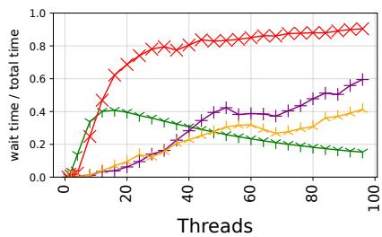  
Figure 1. Ratio of time wasted waiting for the mmap\_lock to total execution time on Linux 6.8.0 for various applications.

Problem. Current address space designs can significantly bottleneck multi-threaded applications due to the serialization of Alloc and Modify operations. In the kernel, this serialization stems from the use of a coarse-grained lock to synchronize address space operations [13], such as the readwrite mmap\_lock in Linux. While Faults acquire the lock in read mode (or not at all, see §2.2), enabling their parallel execution, Alloc and Modify operations acquire the lock in write mode, which can lead to serialization. This lock has long been recognized as “one of the most intractable contention points in the memory-management subsystem” [17, 18].

This issue indeed severely impacts numerous virtual memory intensive applications that frequently invoke Alloc or Modify operations [10, 40]. Experiments on Linux 6.8.0 (released March 2024) with a dual-socket 48-core machine using lockstat [27] reveal significant performance degradation. Fig. 1 shows that the Apache [2] web server, the Metis [45] MapReduce framework, Psearchy [10] text indexing, and LevelDB [30] waste up to 90%, 60%, 41%, and 40% of their execution time, respectively, waiting for the mmap\_lock at high thread counts. Contention on mmap\_lock directly hinders multicore scalability (see §7 for experimental details).

Prior work. Despite prior efforts to address these issues, the fundamental problem remains largely unsolved. These efforts either fail to parallelize Alloc and Modify operations or are impractical for real-world kernels (see §8 for details).

In Linux, many proposals have been made, but none fully parallelizes the Alloc or Modify operations. For instance, Linux recently introduced per-VMA locking [19], allowing Faults to run in parallel with Alloc or Modify, but still serializes the Alloc and Modify operations. As such, a significant portion of time is wasted even in Linux 6.8.0, which supports per-VMA locking (Fig. 1). As another example, several Linux patches [11, 41] attempted to parallelize operations by replacing the mmap\_lock with a range lock, but they still typically require global locking (see §8.3).

RadixVM [14], implemented on the sv6 research kernel, is the only approach that parallelizes Alloc and Modify operations. However, its radix tree is not well-suited for RCU, which is crucial for performance (see §3.2). Moreover, RadixVM makes simplifying assumptions that makes it impractical for real-world adoption. For example, it relies on a simplistic heuristic that can rapidly exhaust the address space, and it uses per-page metadata, causing significant memory overhead.

Several applications use workarounds to circumvent the bottleneck, but each has significant drawbacks. Using multiple processes instead of threads can improve scalability, but can require heavy inter-process communication and large changes to the application structure. Performing mmap() in large chunks can reduce contention, but can substantially increase memory usage and fragmentation [6]. Many popular malloc() implementations, such as jemalloc [22] (in 64-bit Linux) and tcmalloc [31], do not perform munmap() at all, tying up memory and placing additional burden on the operating system [14]. Moreover, even with these workarounds, current address space designs will easily bottleneck applications as memory usage and thread counts increase.

Our approach. We introduce a new scalable address space design that effectively parallelizes not only Fault but also Alloc and Modify operations. At its core is a new concurrent interval skiplist that integrates mapping and locking to support parallel interval operations. We further introduce new locking schemes, Alloc strategies, and scalable counters, all of which are essential for building a truly scalable address space. Specifically, we make the following contributions.

In §3, we analyze the scalability challenges of address spaces and outline our solutions. A core challenge is replacing the coarse-grained lock with fine-grained ones while addressing the dynamic nature of the required locking intervals. Furthermore, we identify several new scalability challenges that were not previously discussed in the literature. Many of the challenges have broad applicability, extending beyond address spaces to diverse real-world systems.

In §4, as a key solution to the scalability challenges, we introduce the concurrent interval skiplist. Similar to existing data structures for address spaces, it implements an interval map, where each node maps an (address) interval to a value. This interval skiplist handles the dynamic nature of locking intervals by integrating the functionalities of both a map data structure and a locking mechanism. Furthermore, it supports parallel interval operations via fine-grained locking, while ensuring RCU-safe, lock-free traversals.

In §5, based on our interval skiplist, we propose a new address space design that parallelizes operations. We design (1) a general locking scheme that complements fine-grained locks with efficient support for global locking, (2) a scalable Alloc strategy based on a redesigned process address space layout and hierarchical leveling within our interval skiplist, and (3) a scalable counter to enforce resource limits.

In §6, we describe our implementation on Linux 6.8.0. Our implementation supports POSIX and is fully transparent to applications, requiring no modifications to them.

In §7, we evaluate the performance. Our design outperforms Linux in throughput, by up to 13.1× for an Alloc microbenchmark, 4.49× for LevelDB, 3.19× for the Apache web server, 1.47× for Metis MapReduce, and 1.27× for Psearchy text indexing.

Our implementation and evaluation scripts are available at https://github.com/kaist-cp/interval-vm.git.

## 2 Background

## 2.1 Interval Map

An interval map is a data structure where each node associates an interval with a value. It is a fundamental structure for managing spaces or memory in address intervals. Examples in kernels include address spaces, device drivers [23, 24], arenas [26], and file systems [25]. As we will see below, these use cases often require querying the interval map, allocating an interval, updating an interval, or removing one.

## 2.2 Address Space

We review address spaces, which consist of (1) an address map for virtual memory metadata, and (2) a page table hierarchy that maps virtual pages to physical frames.

Address map. The kernel maintains an interval map that associates an address interval with a corresponding metadata structure (e.g., VMA in Linux, vm\_map\_entry in FreeBSD, or VAD in Windows [55]). This structure stores information about the interval, such as permission flags and the file associated with file-backed memory. Fig. 2 illustrates an example address map, where [0x2A, 0x46] is file-backed, while [0x21, 0x28] and [0x50, 0x58] are not (i.e., anonymous).

To implement address maps, Linux, FreeBSD, Windows, and other operating system kernels use red-black trees [34],

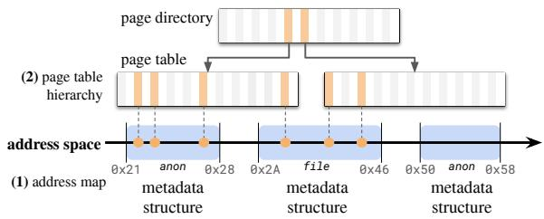  
Figure 2. An address space consisting of an address map and a page table hierarchy. Each metadata structure in the address map is connected to its corresponding page table entries via dashed lines. An orange block in the page table hierarchy represents a present entry. A metadata structure can be partially mapped in page tables under lazy allocation.

B-trees [5], splay trees [50], or AVL trees [1]. In particular, Linux 6.8.0 uses an RCU-safe B-tree, known as the maple tree [36], as the address map. In a maple tree, traversals are lock-free, allowing them to be performed in parallel with updates during an RCU critical section.

Page table hierarchy. The kernel maintains a hierarchical mapping from virtual addresses to physical addresses for the CPU. In a four-level page table hierarchy, for example, the page table is at the lowest level, while the page middle directory, page upper directory, and page global directory occupy higher levels. Fig. 2 illustrates two page tables referenced by a page middle directory.

Operations. We focus on three kinds of address space operations.

Fault operations handle page faults. A page fault occurs when the CPU accesses a virtual address that is not mapped or permitted in the page table. For minor page faults, which typically occur when accessing a virtual address for the first time under lazy allocation, the handler retrieves information for the faulting address from the address map and updates the page table. A new page is zero-filled for anonymous memory or populated with the contents for file-backed memory. For major page faults, which occur when accessing a virtual address whose data resides on a swap device, the handler pages the data in from the device. Because major page faults suffer from the high latency of secondary storage devices, we focus on the scalability of minor page faults.

Alloc operations handle the allocation of an address interval, such as invoking mmap() on the NULL address. They are used in modern implementations of malloc() to create multiple independent arenas for improved multicore performance [22, 31], and in memory-mapped I/O to map an address interval to a file. An Alloc operation linearly traverses the address map to find a large enough unused space, claims it, and adds a mapping for it in the address map.

Modify operations handle updates to the address space. For example, an unused interval can be freed with munmap()

or repurposed by overwriting it with mmap(). Also, we may shrink or extend an interval using brk() or mremap(), or update the metadata using madvise() or mprotect(). These operations may span multiple intervals in the address map, requiring updates to multiple metadata structures.

Synchronization baseline. For correctness, address space operations must be properly synchronized, and kernels use locks for synchronization, as we describe here.

Address space locks are used to synchronize address space operations. Most kernels employ a single coarse-grained read-write lock (e.g., FreeBSD’s vm\_map->lock), whereas Linux 6.8.0 adopts a more sophisticated approach. In Linux, the primary lock is the mmap\_lock, which is a coarse-grained read-write lock that synchronizes Alloc, Modify, and some Fault operations. Both Alloc and Modify operations always acquire the mmap\_lock in write mode, potentially resulting in their serialization. Certain Fault operations, such as major faults, acquire mmap\_lock in read mode. However, in Linux 6.8.0, Fault operations more commonly rely on per-VMA locks [19] to synchronize with concurrent Alloc and Modify operations. Rather than acquiring mmap\_lock, a typical Fault operation proceeds as follows: (1) it searches for the VMA in the address map using a lock-free traversal, to synchronize with a concurrent address map update due to Alloc and Modify operations. Here, the use of the RCU-safe maple tree is essential. Then (2) it read-locks the VMA using its associated read-write lock, to synchronize with the overlapping Alloc and Modify operations that write-lock the same VMA. This allows Fault operations to execute in parallel with a non-overlapping Alloc or Modify operation.

Page table hierarchy spinlocks protect updates to the page table hierarchy. In Linux, for example, each page table and page middle directory has its own lock, while higherlevel tables share a global lock due to low contention. These spinlocks are fine-grained and held only briefly, causing minimal contention [13]. As such, we follow the literature to use these spinlocks and focus on the contention of address space locks.

## 3 Scalability Challenges and Our Ideas

We identify several significant challenges to achieving scalability in address spaces, such as replacing the coarse-grained address space lock with fine-grained locks to enable parallel operations. Prior work has not discussed these issues (except for the one discussed in §3.1) and thus has not adequately addressed them (see §8 for details). Many of these challenges extend beyond the address space itself, limiting the scalability of diverse real-world systems. We outline each challenge and briefly describe our approach to addressing it.

## 3.1 Dynamic Locking Intervals

Address space operations often access multiple structures, such as metadata structures or page tables, whose boundaries may not align with the operation itself [38]. Both address space operations and metadata structures start and end at arbitrary points aligned to 4KiB pages. Furthermore, each page table typically spans a 2MiB region, which may not align with either the boundaries of the metadata structures or the operation’s interval.

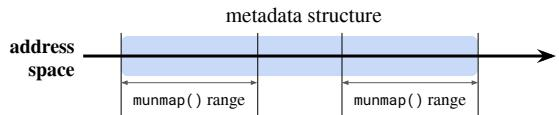  
Figure 3. Two munmap() calls unmap distinct intervals but must access the same metadata structure, which spans both intervals.

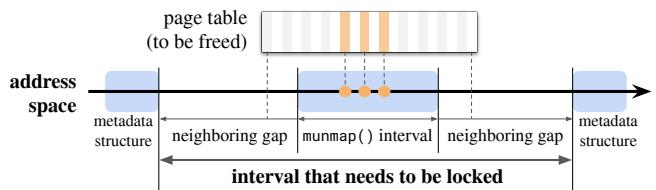  
Figure 4. Not only the munmap() interval but also the neighboring gaps must be locked to safely free the page table.

This misalignment makes it particularly challenging to replace the coarse-grained address space lock with fine-grained locks for scalability: the required locking interval to safely perform an operation depends on the address map’s dynamic state. For instance, Fig. 3 shows that even operations targeting disjoint intervals must be synchronized if they access the same metadata structure. To maintain consistency, the lock interval must cover the entire metadata structure.

Fig. 4 presents a more complex example in Linux. After an munmap() operation clears page table entries, it must also free any now-empty page tables. Instead of scanning the page table after every update, Linux optimizes this process by freeing page tables whose address intervals no longer intersect with any metadata structure. Specifically, it traverses the page table hierarchy and frees any table fully contained within the munmap() interval and its neighboring gaps. Crucially, while freeing these tables, the lock interval must also include these neighboring gaps to prevent concurrent operations from repopulating them.

To address this issue, previous approaches [11, 38, 41, 43] typically (1) traverse the address map to identify the exact interval to lock, and (2) lock that interval. However, splitting the operation into two distinct steps fundamentally complicates synchronization as follows, often forcing them to fall back on coarse-grained locks (see §8.3 for details).

• A race can occur between (1) and (2), causing the initially identified interval to become outdated and requiring a retry. This problem is especially prevalent under high contention, where multiple concurrent updates target the same region of the address map (cf. §3.4).

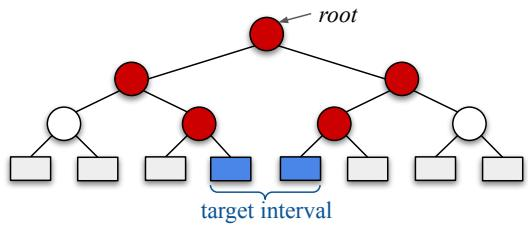  
Figure 5. Under RCU, updating the blue leaf nodes requires copying and replacing their red ancestor nodes.

• The address map itself must be protected by a separate lock or other concurrency control mechanisms. The lock acquired in step (2) does not protect the traversal in step (1), as the traversal occurs beforehand.

Our idea. We unify these two steps within our new concurrent interval skiplist, which supports both lock-free traversal and node-granular locking on an interval map (§4).

## 3.2 Scalable and RCU-Safe Interval Updates

Scalable interval updates. Existing interval maps serialize interval updates to guarantee atomicity across all consecutive nodes in the interval. These designs are optimized for single-node operations rather than updates spanning multiple nodes, highlighting the need for scalable interval update.

RCU-safe interval updates. RCU-safe support for interval updates is also crucial for performance, but achieving it efficiently is challenging with existing data structures. RCU enables Fault operations to proceed concurrently with updates (see §2.2), and allows an Alloc operation to scan the address map for free space without locking the entire address space. Without RCU, performance can degrade significantly [13].

However, traditional tree-based structures are not wellsuited for RCU. Enabling RCU requires updates to proceed by (1) copying a structure, (2) modifying the copy, and (3) atomically replacing the original. This process becomes costly when an interval spans multiple subtrees, since every node along the affected paths must be copied. As illustrated in Fig. 5, updating the blue leaf nodes requires duplicating and replacing their red ancestor nodes. Tree rebalancing exacerbates the problem, as it may need to modify neighboring nodes or propagate upward to a parent, increasing the number of affected nodes. In addition, efficiently synchronizing such updates with locks remains an open challenge.

The cost grows further in data structures that store many entries per node for performance. For example, Linux’s maple tree stores 10–16 entries per node, while RadixVM’s radix tree stores 128–512 entries. This increases the cost of copying, and the entire node must be copied even when only a few consecutive entries are updated.

Our idea. In §4, we design a scalable interval skiplist that supports atomic updates of consecutive nodes using nodegranular locks, while remaining RCU-safe.

## 3.3 Operations on the Entire Data Structure

Certain operations span the entire address space and thus require global locking. These include fork(), which clones the address space, and exit(), which destroys it. Simply replacing the coarse-grained address space lock with fine-grained alternatives (e.g., per metadata structure) would force these operations to acquire all fine-grained locks, leading to significant overhead—especially since applications often manage hundreds of thousands of metadata structures [12, 48].

This challenge is not unique to memory management. For instance, the coarse-grained inode locks (inode->i\_rwsem) in Linux are a well-known scalability bottleneck [47], and prior work has attempted to address this by introducing fine-grained locks, e.g., using a separate lock for each 4KiB block [37]. However, this approach incurs significant overhead for common file system operations, such as copy or remove, which need to access all blocks and thus require locking them simultaneously [38].

This problem is especially pronounced when transitioning from coarse- to fine-grained locking. In such cases, all finegrained locks often need to be acquired simultaneously, as legacy code lacks support for finer-grained locking mechanisms. This kind of staged transition is frequently necessary in large-scale systems, where an all-at-once overhaul is infeasible due to its complexity [17].

Our idea. In §5.1, we design a new distributed lock that complements fine-grained locks to efficiently support global locking. Our key idea is to lock CPU cores rather than individual structures, such as nodes or metadata structures.

## 3.4 Alloc Strategy

A kernel’s Alloc strategy can also severely limit scalability. When handling an Alloc operation, kernels such as Linux or FreeBSD use a first-fit strategy: they linearly traverse the interval map from a common starting point until they find a sufficiently large unused region, which they then claim, such as by inserting a new interval. However, this approach causes concurrent Allocs to contend at the same point—the first available space after the common starting point—introducing a severe performance bottleneck (see §7.2).

Our idea. In §5.3, we introduce a scalable Alloc strategy that (1) inserts nodes with atomic instructions like CAS, (2) redesigns the process address space layout to include multiple arenas, and (3) organizes the interval skiplist to support arenas in a scalable manner.

## 3.5 Resource Limits

In kernels, system-wide limits on specific resources are commonly enforced using mechanisms such as sysctl or the POSIX setrlimit(). For example, the number of metadata structures or pages in an address space can be restricted.

However, maintaining global counters for such resources can become a significant performance bottleneck due to synchronization and cacheline bouncing. This bottleneck becomes prominent once other performance limitations are addressed (see §7.2 for experiments). While Linux offers an alternative counting mechanism called percpu\_counter, which buffers updates in per-core counters and periodically flushes them to a global counter when a threshold is reached, it cannot enforce strict limits.

Our idea. In §5.3, we introduce a scalable counter that achieves both scalability and enforcement of limits. Our approach is adaptive: it gradually phases out the use of percore counters as the global counter approaches its limit. This design is crucial for scalable Alloc and Modify operations, which frequently update these counters.

## 4 Concurrent Interval Skiplist

We introduce our data structure’s interface (§4.1), design a concurrent interval linked list (without skip links) that implements the interface (§4.2), and extend it to a interval skiplist (§4.3). In the appendix, we provide detailed pseudocode (§A) and discuss correctness (§B).

## 4.1 Interface

An interval map typically supports the following operations.

(1) Query(??????): Retrieves the interval containing the specified key—typically a specific integer or address of interest— and returns the associated value.

(2) Map(??????????, ??????, ??????????): Assigns a value (or unassigns if ?????????? is NULL) to the interval [??????????, ??????], overwriting any existing mappings for overlapping parts.

(3) Alloc(??????????, ??????, ??????????ℎ, ??????????): Inserts an interval of the given ??????????ℎ within the interval [??????????, ??????] and associates it with the given ??????????.

To address the scalability challenges of address space management, our concurrent interval skiplist additionally provides the following operations. We use these new operations as building blocks not only for the above operations but also for address space operations (see §5 for details).

(4) Lock(??????????, ??????): Acquires exclusive write lock for the interval [??????????, ??????], which may span multiple mappings. To address dynamic locking intervals (§3.1), it performs a traversal and locking in a unified step. This operation is internally used to implement Map operations, and it is also externally invoked to synchronize address space operations. A lock on an interval blocks all other operations (except for Query) on that interval.

(5) Unlock(??????????, ??????): Releases lock for [??????????, ??????].

(6) Swap(??????????, ??????, ??????????): Atomically swaps all nodes that (partially) overlap with [??????????, ??????] with ??????????. To address the challenge of scalable interval updates (§3.2), this operation requires locking only [??????????, ??????], not the entire map. Additionally, the atomic swap ensures that lock-free traversals remain linearizable.

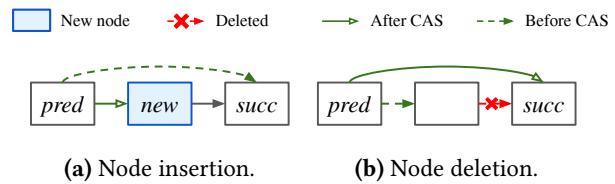  
Figure 6. Update operations in Harris’s lock-free linked list.

## 4.2 Concurrent Interval Linked List

As a preliminary step, we design a concurrent interval linked list that implements the aforementioned interface.

Harris’s lock-free linked list [35] supports lock-free traversals and lock-free node insertions and deletions, as illustrated in Fig. 6. Node insertion involves atomically updating the predecessor node’s link (next pointer) using a CAS operation, ensuring that a concurrent reader can only see the state before or after the insertion. Deletion involves two steps: (1) Marking the deleting node’s link with a special bit flag named DELETED, letting it be skipped by readers, and (2) Unlinking the node from the list by updating its predecessor node’s link. Each step is performed using atomic instructions, such as CAS and fetch-and-add. To ensure that operations remain lock-free, other threads may help step (2) on behalf of the deleting thread, rather than waiting for the deleting thread to complete, which could otherwise cause a thread to block. For lock-free traversals, a thread can continue traversing over marked nodes.

Harris’s list is insufficient for address space designs because it lacks support for dynamic locking intervals (§3.1) and atomic operations on multiple consecutive nodes (§3.2). We address each of these challenges with node-granular interval locking and read-copy-update, respectively.

Node-granular interval locking. This process combines traversal and locking, as illustrated in Fig. 7a for the interval [32, 38]. (1) It first identifies and locks the predecessor with CAS.3 To achieve this, we introduce a new LOCKED flag for pointers, indicating that the node and its following gap are locked. It is important to note that the initially locked node may no longer be the predecessor if, for example, a concurrent insertion occurred before the node was locked. In such cases, the new predecessor is found by locking the next node and unlocking the previous one, repeating this process if necessary. Locking the predecessor is crucial, even if its interval does not overlap with the target interval, to support Swap operations and address-space operations (see §5.4). (2) The process then iteratively locks subsequent nodes whose intervals or following gaps overlap with the target interval. During traversal, it unlinks any encountered DELETED nodes.

Read-copy-update for Swap. After locking consecutive nodes, we can atomically swap old nodes overlapping with the target interval with new nodes in a read-copy-update fashion as follows. (1) We prepare the new nodes (Fig. 7b). (2) We update the predecessor’s link to the new nodes, thereby committing the swap and simultaneously unlocking the predecessor by clearing the LOCKED flag (Fig. 7c). (3) We mark the old nodes as INVALIDATED (Fig. 7d).

The INVALIDATED bit flag indicates that a node is stale and should not be accessed anymore (except for the Query operation described below). Encountering this flag during an update operation triggers a restart to prevent attempting to insert or remove a node within the old nodes.

Query. A Query operation finds the node whose interval contains the queried key with the original list’s lock-free traversal. To ensure lock-freedom, LOCKED and INVALIDATED nodes are treated as ordinary and it is allowed to lookup the associated values. Query operations remain correct as long as all updates are performed in a read-copy-update fashion.

Map. A Map operation associates an interval to a value as follows (Fig. 7). (1) It performs interval locking on the target interval. (2) It then invokes a Swap with the new nodes, which include a node that associates the Map interval with its corresponding value (unless the value is NULL), along with any non-overlapping portions of the old nodes (Fig. 7b).

Alloc. An Alloc operation simultaneously allocates an interval and maps it to a value. This is achieved by traversing the list to find a gap of sufficient size and inserting a node using CAS to claim the gap. A CAS failure can occur under the following conditions, with corresponding responses: (1) If the gap is LOCKED, we wait until the lock on the gap is released. (2) If the gap is INVALIDATED, we restart from the beginning. (3) If the gap is claimed by another thread, we continue from the current point to find another suitable gap.

## 4.3 Concurrent Interval Skiplist

We extend the concurrent interval linked list with skip links. The techniques for the linked list also apply to the skiplist in largely the same way, so we focus only on the differences.

Background. A lock-free skiplist [49] is a leveled collection of lock-free linked lists. Each node has a link at level-0 and additional skip links at higher levels that act as shortcuts. While all nodes are linked at base level-0, which serves as the commit point for operations, each higher level contains approximately half the nodes of the level below it. This enables skiplists to achieve a probabilistic time complexity of ?? (log ??) for search, insertion, and deletion.

A concurrent skiplist operation generally replicates the corresponding lock-free linked list operation at each level.

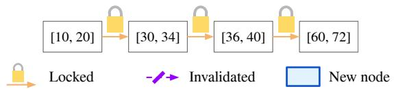

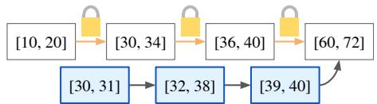

(a) Lock all related nodes. Node with interval [10, 20], which is the predecessor, is also locked together.

(b) Prepare the new nodes we want to swap in.  
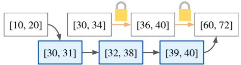  
(c) By updating the predecessor’s link, we swap old nodes with new nodes in a read-copy-update fashion.

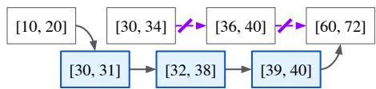  
(d) Mark the old nodes as INVALIDATED.

Figure 7. An example of performing a Map operation for interval [32, 38] in a list-based interval map.  
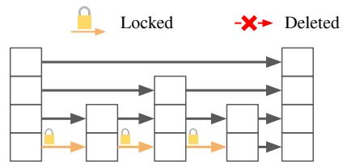

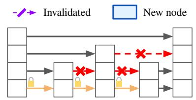  
(a) Lock all related nodes.

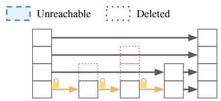

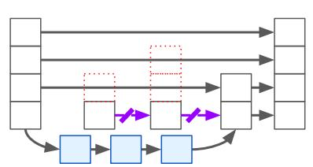  
(d) Swap the old nodes with new nodes as in the interval linked list.

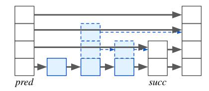

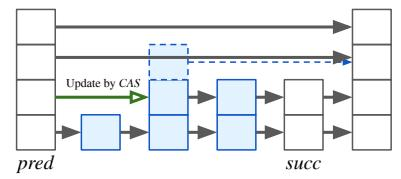  
(f) Collectively insert multiple new nodes in level-1 using a CAS.  
Figure 8. An example of performing interval locking and a Swap in an interval skiplist.

Traversal proceeds downward from the top level, bookmarking the predecessor and successor at each level. At each subsequent level, traversal begins from the predecessor bookmarked at the previous level. Insertion is performed bottomup, inserting the node at each level up to its randomly determined height, using the bookmarked predecessor and successor to maintain consistency. Deletion, similarly to the linked list operation, involves two steps: (1) A top-down traversal marks the links and skip links of the node with the DELETED flag at each level. (2) A subsequent top-down traversal unlinks the node at each level.

Node-granular interval locking. We perform node locking only at level-0, as illustrated in Fig. 8a. This is sufficient to ensure exclusive permission for the node and the following gap because locking the level-0 link prevents concurrent insertions and deletions. A node’s deletion is committed by marking its level-0 link with the DELETED flag, and insertion is performed by updating its predecessor’s level-0 link.

Read-copy-update for Swap. It is similar to the interval linked list, but with two additional steps. (1) We decrement the height of the old nodes to 1 (Fig. 8b, Fig. 8c). (2) We apply the swap algorithm (§4.2) developed for linked lists, which is possible as the relevant portion is effectively a linked list (Fig. 8d). (3) We increment the heights of the new nodes up to a randomly decided height, to maintain the probabilistic time complexity of ?? (log ??) (Fig. 8e, Fig. 8f).

Height adjustments for multiple nodes are performed collectively to avoid repeated traversals, as follows.

To collectively decrement the heights of multiple nodes, we conceptually remove them from all levels except level-0. This involves two top-down traversals, excluding level-0: (1) The first traversal is top-down and is used to mark the skip links of each node with the DELETED flag (Fig. 8b). (2) The second traversal is top-down again and is used to unlink the nodes from the lists (Fig. 8c).

To collectively increment the heights of multiple nodes, we conceptually insert them at all levels (except level-0, where they are already in). This involves a top-down traversal and a following bottom-up traversal, excluding level-0: (1) The first traversal is top-down and is used to bookmark the predecessor and successor at each level.4 We also set up the skip links of the new nodes to point to the next new node or to the successor (Fig. 8e). (2) The second traversal is bottom-up and is used to insert the new nodes at all levels (Fig. 8f). At each level, we use a single CAS to atomically update the predecessor’s skip link from the successor to the first new node in that level, inserting multiple nodes in a level at once. In the rare event of a CAS failure, we safely abort or retry from the beginning.

<table><tr><td rowspan=1 colspan=1></td><td rowspan=1 colspan=1>GR</td><td rowspan=1 colspan=1>GW</td><td rowspan=1 colspan=1>LR</td><td rowspan=1 colspan=1>LW</td></tr><tr><td rowspan=1 colspan=1>GR</td><td rowspan=1 colspan=1>【</td><td rowspan=1 colspan=1>X</td><td rowspan=1 colspan=1>【</td><td rowspan=1 colspan=1>X</td></tr><tr><td rowspan=1 colspan=1>GW</td><td rowspan=1 colspan=1>X</td><td rowspan=1 colspan=1>X</td><td rowspan=1 colspan=1>X</td><td rowspan=1 colspan=1>X</td></tr><tr><td rowspan=1 colspan=1>LR</td><td rowspan=1 colspan=1>√</td><td rowspan=1 colspan=1>X</td><td rowspan=1 colspan=1>《</td><td rowspan=1 colspan=1>A</td></tr><tr><td rowspan=1 colspan=1>LW</td><td rowspan=1 colspan=1>X</td><td rowspan=1 colspan=1>X</td><td rowspan=1 colspan=1>A</td><td rowspan=1 colspan=1>7</td></tr></table>

Figure 9. Mutual exclusion rules for various locking modes in our new distributed lock. ✓(✗): Can(not) coexist. ▲: Can coexist only if they lock different cores.

## 5 Address Space with Parallel Operations

Using our new interval skiplist (§4), we parallelize address space operations. In §5.1, we introduce a new distributed lock to optimize operations on the entire address space (§3.3). In §5.2, 5.3 and 5.4, we design the Fault, Alloc, and Modify operations, respectively, while addressing the challenges related to the Alloc strategy (§3.4) and resource limits (§3.5).

## 5.1 Two-Level Locking for Hybrid Granularity

As we discussed in §3.3, address space management requires both global locking, which locks the entire address space, and local locking, which locks only a specific interval.

To address this, we propose a new locking scheme with hybrid-granular modes: global read (GR), global write (GW), local read (LR), and local write (LW). A naive implementation would lock all intervals in the address map for global modes. However, this introduces substantial overhead, especially in applications that manage thousands to hundreds of thousands of intervals. To achieve high performance, we propose a general two-level locking strategy based on a new hybrid-granular lock.

We first design this hybrid-granular lock using per-core read-write locks. (1) For GR/GW, we read/write-acquire all per-core locks.5 (2) For LR/LW, we read/write-acquire the running core’s lock. Fig. 9 illustrates the mutual exclusion rules. Notably, this lock correctly implements global locking while significantly reducing the number of lock acquisitions compared to the naive approach.

Using this hybrid-granular lock, we protect the address space as follows. For GR/GW, only the per-core locks are acquired using the same mode. For LR/LW, a core acquires its per-core lock using the same mode as well as the necessary interval lock within the interval skiplist. This allows operations on non-overlapping intervals to proceed in parallel.

One potential drawback of this approach is the overhead of global locking when the number of cores is large. This can be mitigated by grouping cores and assigning shared locks to each group instead of dedicating one lock per core.

Using this two-level locking scheme for address spaces, we parallelize operations by attempting them with progressively stronger locking modes. For each operation, we first attempt the operation without acquiring address space locks, if possible. If this fails, we attempt the operation while holding the per-core lock in LR/LW mode and the corresponding interval lock. Finally, in rare cases where this also fails, we fall back to the original method while holding the per-core locks in GR/GW mode. Such cases primarily involve file-backed memory associated with untested file systems, which may rely heavily on specific assumptions about the address space implementation. To ensure correctness, our design is enabled only for file systems for which we are confident that no such dependencies exist. We note, however, that no changes are necessary for most file systems, as such dependencies are unlikely. We now describe each possible step of the different address space operations.

## 5.2 Fault

Faults are handled in three possible steps: without address space locking, under LR locking, and under GR locking.

Without address space locking. Initially, we attempt to handle the fault without acquiring address space locks. Our approach is inspired by RCUVM [13] and previous Linux attempts [42, 43], but includes the following key improvements: (1) Unlike RCUVM, we support modern techniques such as transparent huge pages (THP). (2) Unlike previous Linux attempts [42, 43], we only abort on overlapping address space updates, rather than on any update.

Under LR locking. The above stage can fail for the following reasons. (1) Page table allocation: faults requiring new page tables cannot be handled due to potential races. The fault handler cannot cannot tell whether a page table is missing or has been temporarily cleared, for example, due to a huge page merge. A page table allocation is necessary for every 2MiB region of address space. (2) Metadata structure update: some faults require updating the metadata structure and thus require proper synchronization. In particular, on Linux, a first-time fault on an anonymous VMA requires initialization. Assuming each mmap() creates a new VMA, this can occur as frequently as the number of mmap() calls. (3) File-backed memory: synchronization with the file system is needed for file-backed memory.

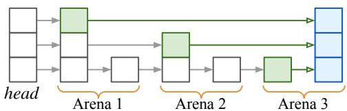  
Figure 10. Inserting a node in a core’s private arena may also involve updates in other arenas.

In such cases, we attempt to handle the fault after acquiring the per-core lock in LR mode and locking the interval in the interval skiplist, preventing the interval from being updated or deleted. This allows parallel execution with other operations on different intervals.

Compared to RCUVM and previous Linux patches [42, 43], this new step significantly helps improving scalability by not reverting to global locking. It is crucial given the frequent occurrence of the failures.

Under GR locking. If the above stage also fails, we revert to the original method after acquiring the per-core locks in GR mode. This is rare and occurs primarily with file-backed memory involving untested file systems (see §6).

## 5.3 Alloc

Allocation is implemented in two possible steps: first under LW locking, and then under GW locking.

Under LW locking. We insert a node that represents the allocated interval into the interval skiplist. Unlike in original Linux, all necessary preparations—such as setting up the metadata structure—are completed before the insertion to avoid updates afterward. Once prepared, the address space Alloc operation is committed by inserting the node using the interval skiplist Alloc operation (§4.2).

While helpful, this approach does not fully resolve the scalability challenges associated with the Alloc strategy (§3.4) and resource limits (§3.5), which we will address shortly.

Under GW locking. When the process encounters an untested file system, we revert to the original method after acquiring the per-core locks in GW mode.

Optimizing Alloc strategy (§3.4). To mitigate contention, we introduce per-core arenas by partitioning a small portion of the address space into 64-GiB arenas. Each core first searches for free space within its own per-core arena, falling back to the shared, non-arena region only when its private arena is full. Each arena is assigned to a CPU core (or hardware thread), unless the count exceeds a predefined limit (128 in our implementation). Even with 128 arenas, this accounts for less than 4% of the 256-TiB virtual address space available on x86-64 systems.

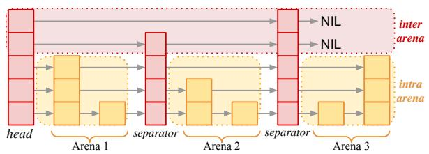  
Figure 11. Separator nodes partition arenas. Upper levels support traversal between separators, while lower levels primarily handle traversal within the same arena.

To further reduce contention, we isolate the arenas within the interval skiplist. As shown in Fig. 10, in a typical skiplist, inserting a new node (blue) in a core’s private arena may still require updating nodes in other cores’ arenas (green nodes and arrows)—a known scalability challenge in skiplists [14]. To address this, we introduce the design shown in Fig. 11: (1) Each arena is partitioned using dedicated separator nodes. (2) Levels are organized hierarchically: separator nodes have a height no smaller than a predefined threshold, whereas non-separator nodes typically have smaller heights. This design assigns distinct roles to different levels: upper levels support traversal between separators, while lower levels typically handle traversal within a single arena.

Each arena also keeps a hint to speed up Alloc, typically pointing to the last successful allocation. After an munmap(), the hint shifts backward to favor reusing unmapped regions.

Optimizing resource limits (§3.5). We design a scalable counter that uses an adaptive strategy. Similar to Linux’s percpu\_counter, we buffer updates in per-core counters and flush them to the global counter once they reach a predefined batch size.

However, after a flush, we determine whether continued use of per-core counters is appropriate. Specifically, if the remaining margin between the global counter and its limit is less than the batch size multiplied by the number of cores, the core ceases using per-core counters and transitions to direct updates of the global counter.

By selecting an appropriate batch size, we achieve both scalability and strict limit enforcement. In our implementation, the batch size is typically set to one-sixteenth of the global limit divided by the number of cores. As a result, the transition to direct global updates begins only after the global counter reaches 93.75% of the limit.

## 5.4 Modify

Modify operations, such as an overwriting mmap(), munmap(), mprotect(), mremap(), or madvise() operation, are implemented in two possible steps: first under LW locking, and then under GW locking.

Under LW locking. This stage closely mirrors the original approach, with one key difference: instead of locking the entire address space, we acquire the per-core lock in LW mode along with the interval lock. This allows parallel execution with other operations.

This modification is correct because our interval skiplist effectively handles the dynamic locking intervals discussed in §3.1. By unifying address space mapping and synchronization, we eliminate the aforementioned race. Moreover, interval locking precisely characterizes the range required for a Modify operation: a metadata structure or gap is locked if its interval overlaps with that of the Modify.

Under GW locking. When the process encounters untested file systems or performs Modify operations that have not yet been adapted to our new design, we revert to the original method after acquiring the per-core locks in GW mode.

## 6 Implementation

We implemented our address space design on Linux 6.8.0 with about 10K lines of code. Our implementation supports POSIX and is transparent to applications, requiring no changes to the applications. Our first step of fault handling (§5.2) is based on a prior work [43].

Our implementation successfully passes the Linux Test Project (version 20240524) [52], producing results identical to those of Linux 6.8.0, except for certain tests marked as “broken”. These tests rely on kernel-specific assumptions (e.g., address space layout) that are invalid in our implementation, leading to automatic abortion. We also performed additional stress tests using the kernel address sanitizer (KASAN).

Our implementation supports both anonymous and filebacked memory, tested with ramfs, tmpfs, and ext4. All critical operations—such as page fault, mmap, munmap, mprotect, mremap, and common madvise flags—are parallelized. Only a few operations not listed above, such as madvise with flags other than MADV\_FREE or MADV\_DONTNEED, still rely on global locking (§5.1), but we believe our approach can be easily extended to these cases.

## 7 Evaluation

We compare the following kernels: (1) Linux (version 6.8.0), (2) IntervalVM (Linux 6.8.0 with our design applied), and (3) RadixVM. For Linux and IntervalVM, we use Ubuntu 24.04 with its default configuration. For RadixVM, we disable its per-core page table and core-tracking shootdown features for a fair comparison. These features are not present in Linux and are largely orthogonal to our address space modifications. Furthermore, they introduce significant bugs that prevent us from running macrobenchmarks reliably. Additionally, we always pin each thread when comparing with RadixVM, as RadixVM otherwise fails to scale.

To analyze the impact of individual components, we evaluate the interval map data structures used as the address map (§7.1), the latency and throughput of address space operations (§7.2), and the performance of real-world applications (§7.3). We repeat each benchmark 20 times and report the average. The only exception is LMbench, which exhibits high variance; therefore, we run it 40 times.

We use a machine with dual-socket Intel Xeon Gold 6248R (3.0GHz, 48 cores, 96 threads), 384GiB of DRAM (twelve 32GiB modules), and a 4TB WD BLACK SN850X SSD. Unless otherwise specified, we vary the number of threads up to twice the physical core count. This includes the hyperthreading range, where thread count exceeds the core count and causes contention. We highlight this range with a red background in the plots.

## 7.1 Data Structure Microbenchmark

We compare our interval skiplist with the Linux maple tree in user space. These data structures serve as the address map in IntervalVM and Linux, respectively. We evaluated the single-threaded latency and multi-threaded throughput of Query, Alloc, and Map (where ?????????? is NULL), where each corresponds to the performance of page faults, mmap(), and munmap(), respectively. To ensure that each operation always works on non-overlapping areas, we use per-thread arenas (cf. §5.3). Each thread either repeatedly performs Alloc to insert an interval into its arena, or uses Query or Map to look up or remove an interval from its arena. We use jemalloc [22] to prevent malloc() from becoming the bottleneck, and use userspace RCU [20]. Fig. 12 shows the results.

The interval skiplist exhibits lower performance for Query operations (latency +35%, peak throughput 0.77×). This is because the maple tree, as a B-tree, employs a large branching factor of 10 to 16, allowing it to store multiple key-value pairs within a single node. This reduces the number of nodes accessed during traversal and improves cache-line efficiency.

In contrast, the interval skiplist significantly outperforms the maple tree in Alloc (latency +4%, peak throughput 22.9×) and Map (latency −49%, peak throughput 5.28×). In terms of throughput, the maple tree does not scale at all, as it relies on a global lock to synchronize updates. In terms of latency, Map is significantly faster with the interval skiplist because, in the maple tree, removing an entry within a node often requires updates to multiple nodes. Also, updating a node in a read-copy-update manner requires copying the entire node, which is costly since a maple tree node stores multiple key-value pairs.

These improvements in Alloc and Map throughput are particularly important today. In Linux 6.8.0, a Fault no longer acquires the mmap\_lock (§2). Consequently, address space operations such as Alloc and Modify have become the primary performance bottlenecks for applications (§1).

## 7.2 Address Space Microbenchmark

LMbench. We evaluate the performance impact of our design using LMbench [46], which evaluates the latency of various kernel operations. We run LMbench on Linux and IntervalVM. Fig. 13 shows the results.

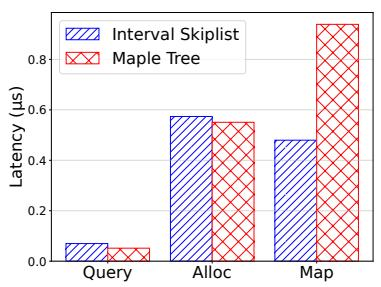  
(a) Latency

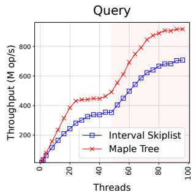

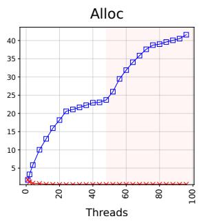  
(b) Throughput

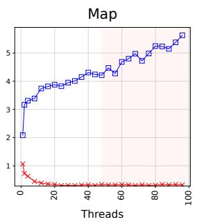

Figure 12. Performance of interval skiplist and maple tree.
<table><tr><td>Test</td><td>Linux (μs)</td><td>IntervalVM(μs)</td><td>Overhead</td></tr><tr><td>null syscall</td><td>0.0938</td><td>0.0933</td><td>-0.533%</td></tr><tr><td>stat</td><td>0.764</td><td>0.757</td><td>-0.981%</td></tr><tr><td>open+close</td><td>1.39</td><td>1.37</td><td>-1.40%</td></tr><tr><td>pipe</td><td>10.4</td><td>10.9</td><td>4.09%</td></tr><tr><td>fork+exit</td><td>271</td><td>330</td><td>21.6%</td></tr><tr><td>page fault</td><td>0.200</td><td>0.206</td><td>3.20%</td></tr><tr><td>mmap+fault+munmap</td><td>6675</td><td>6890</td><td>3.22%</td></tr><tr><td>file create</td><td>7.42</td><td>7.32</td><td>-1.36%</td></tr><tr><td>filedelete</td><td>4.12</td><td>4.16</td><td>1.04%</td></tr><tr><td>ctxsw 2p/0k</td><td>3.55</td><td>3.48</td><td>-1.98%</td></tr></table>

Figure 13. LMbench results (lower is better).

IntervalVM IntervalVM w/o Arena ? Linux IntervalVM w/o Per-core Stats RadixVM

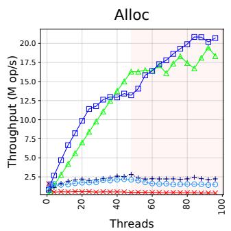

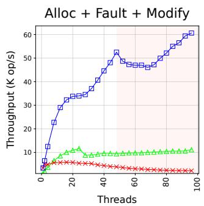  
Figure 14. Throughput of each microbenchmark.

Our design incurs some overhead for process management functions and address space operations. The latency of fork+exit increases due to a longer traversal time. Each fork and exit traverses the entire address map, visiting each VMA to copy or free it. Traversals are generally faster with a maple tree, since each node stores multiple key-value pairs and therefore fewer nodes need to be visited. Meanwhile, page fault latency increases slightly in IntervalVM due to the longer latency of Query operations. As a result, the latency of mmap+fault+munmap and pipe also increases slightly due to frequent page faults.

However, we believe such overhead—mostly marginal—is justified by the significant improvements in multithreaded performance, as demonstrated below.

Throughput. We evaluated the multithreaded throughput of address space operations using two microbenchmarks. (1) Alloc: Each thread repeatedly allocates memory using mmap(). This measures Alloc throughput, which is critical for applications that heavily use malloc(), particularly in Linux 6.8.0. (2) Alloc + Fault + Modify: Each thread repeats a sequence of operations: mmap() a 2MiB area, fault each page, and then munmap() it. This simulates the typical usage cycle of mmap(), particularly in file-backed memory scenarios common in web servers and standard libraries.

For the Alloc benchmark, we also conducted a breakdown analysis by selectively disabling arenas and per-core statistics (§5.3) to assess their impact. Fig. 14 shows the results.

Overall, IntervalVM significantly outperforms Linux. In terms of peak throughput, the speedup is 13.1× (Alloc) and 10.4× (Alloc + Fault + Modify).

IntervalVM outperforms RadixVM as well, particularly in (Alloc + Fault + Modify). In terms of peak performance, the speedup is 1.07× (Alloc) and 5.22× (Alloc + Fault + Modify). Notably, around 48 threads, RadixVM temporarily outperforms IntervalVM due to a temporary drop in IntervalVM’s scalability. This drop stems from NUMA-related overhead in Linux, which is also evident in our user-space benchmarks (Fig. 12b) but does not appear in additional evaluations on single-socket machines, as shown in Fig. 21. Without this overhead, IntervalVM consistently outperforms RadixVM across both benchmarks and all thread counts.

IntervalVM generally continues to scale with the number of available cores. In contrast, Linux does not scale, and RadixVM exhibits weak scaling in Alloc + Fault + Modify.

Our breakdown analysis reveals that Alloc performance scales only when both arenas and per-core statistics are applied. Unlike IntervalVM, both IntervalVM w/o Arenas and IntervalVM w/o Per-core Stats fail to scale effectively, demonstrating that Alloc is truly bottlenecked by multiple factors, not just the address space lock.

## 7.3 Address Space Macrobenchmark

For Apache, LevelDB, Metis, and Psearchy, which are VMintensive applications, IntervalVM demonstrates significant speedups and improved scalability compared to both Linux and RadixVM. IntervalVM tends to scale well with the number of cores, whereas Linux stops scaling earlier, and RadixVM exhibits less pronounced scaling. Also, single-core performance of IntervalVM is nearly identical to that of Linux.6 We evaluate RadixVM only with Metis, as it does not support the other benchmarks.

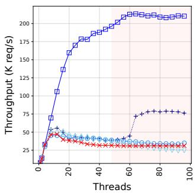  
(a) Apache (single process).

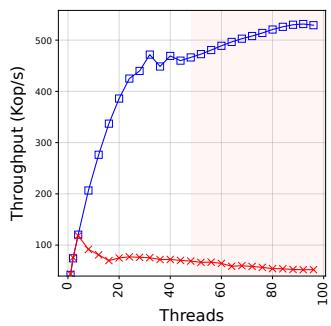  
(b) LevelDB

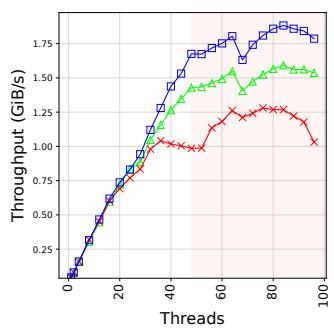  
(c) Metis

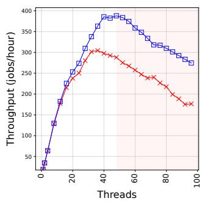  
(d) Psearchy

Figure 15. Multithreaded throughput of Apache (single process), LevelDB, Metis, and Psearchy.
<table><tr><td>Kernel</td><td>(K req/s)</td></tr><tr><td>Linux</td><td>97.0</td></tr><tr><td>IntervalVM w/o Fault</td><td>202.4</td></tr><tr><td>IntervalVM w/o Alloc</td><td>150.0</td></tr><tr><td>IntervalVM w/o Modify</td><td>174.6</td></tr><tr><td>IntervalVM</td><td>309.0</td></tr></table>

Figure 16. Apache throughput under default configuration.

In addition, results from the PARSEC [7, 8] comprehensive benchmark suite demonstrates the benefits of our design for VM-intensive workloads, with minimal impact on non-VMintensive workloads.

Apache. It serves HTTP requests by invoking mmap() on the requested file, faulting each page, and invoking munmap() on the region after serving the request. This follows a pattern similar to our Alloc + Fault + Modify microbenchmark.

We use Apache’s default mpm\_event module and evaluate two configurations: (1) a single server with a varying number of threads, to evaluate the throughput of a single server process, and (2) the default configuration, which creates a small number of server processes (3 to 12), each spawning 25 threads. In both cases, Apache hosts a 64KiB static content file, and we use Wrk [32] to create HTTP requests using all hardware threads while maintaining 100 connections, which results in the highest throughput in all kernels. We also perform a breakdown analysis by selectively disabling our new designs for Fault, Alloc, or Modify operations— these then always fall back to GR or GW locking (see §5)—to evaluate the individual impact of each component. Fig. 15a shows the results for configuration (1), and Fig. 16 shows the results for configuration (2).

IntervalVM outperforms Linux by 4.53× for configuration (1) and 3.19× for configuration (2). The speedup is more pronounced in (1), which uses a single process, causing all threads to contend on the same mmap\_lock in Linux.

Our breakdown analysis highlights the necessity of supporting parallel execution for all critical address space operations (Fault, Alloc, and Modify) in order to scale real-world applications that exercise these. Compared to IntervalVM, all variations of IntervalVM that disable Fault, Alloc, or Modify exhibit limited scalability.

LevelDB. It is a key-value store. For our evaluation, we use its db\_bench utility. First, we use db\_bench’s fillrandom to populate the database with 2M key-value pairs, each with a value size of 4KiB, while keeping all other settings at their defaults. Next, we evaluate query performance using db\_bench’s readrandom with multiple threads. Each thread reads a database file using mmap(), performs keyvalue lookups, and later invokes munmap() once the file is no longer needed. Fig. 15b presents the results.

IntervalVM outperforms Linux by 4.49×. On Linux, threads contend for the mmap\_lock, particularly on modern SSDs with low I/O latency. In contrast, under IntervalVM, contention on the mmap\_lock is eliminated; instead, threads contend on LevelDB’s global database lock [3].

Metis. It is a MapReduce framework optimized for multicore systems. We use its wrmem benchmark, which computes the inverted index for a random input text with a 4GiB input size. This benchmark invokes malloc() and fault about 105 anonymous memory pages during the map, reduce, and merge phases. As a result, its performance is bottlenecked by the Alloc throughput in Linux [10].

For consistency, we use RadixVM’s default malloc() implementation across all kernels, as it is the only option in RadixVM and shows higher performance than the default glibc malloc(). Fig. 15c shows the results.

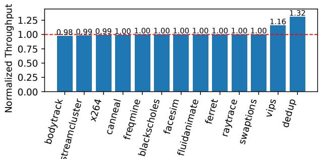  
Figure 17. Normalized throughput of IntervalVM relative to Linux across PARSEC benchmarks (higher is better).

IntervalVM outperforms Linux by 1.47× and RadixVM by 1.18×. IntervalVM also demonstrates the highest scalability. While IntervalVM and RadixVM scale up to the number of cores, Linux stops scaling earlier.

Psearchy. It is a parallel version of Searchy [44, 51] and performs parallel text indexing. It intensively uses both anonymous memory and file-backed memory, by allocating perthread hash tables using malloc() and reading files using a few ten thousands of mmap()s and munmap()s in glibc’s stdio library. As a result, both Alloc and Alloc + Fault + Modify throughput are critical performance factors.

Following the original setup [10], all input files are buffered in the buffer cache, and all output files are written to tmpfs to eliminate file I/O bottlenecks. Fig. 15d shows the results.

IntervalVM outperforms Linux by 1.27×. Notably, in both IntervalVM and Linux, throughput declines after reaching its peak—an expected behavior in Psearchy due to high cache miss rates at higher thread counts [10].

PARSEC. It is a comprehensive benchmark suite that evaluates multithreaded performance across 13 diverse workloads.

We run each benchmark with 48 threads, as performance does not scale beyond the number of available cores, except for facesim and fluidanimate, which require the number of threads to be a power of two; for these, we use 32 threads. Also, we use the native data set whenever available. An exception is dedup, for which deduplication rarely occurs with the native data set;7 in this case, we use simlarge instead. Fig. 17 shows the results.

IntervalVM outperforms Linux on VM-intensive workloads (1.32× on dedup and 1.16× on vips). dedup uses mmap() and mremap() to manage numerous memory chunks while processing input data and maintaining the hash table, while vips repeatedly uses mmap() to access large images. For others, performance differences are within 2%.

## 8 Related Work

We discuss prior approaches to parallelizing address spaces and kernels in general.

## 8.1 Fault Operations in Parallel with Updates

RCUVM [13] proposed an approach similar to per-VMA locking (§2.2) in Linux before its introduction. However, RCUVM differs with Linux 6.8.0 in three ways. (1) It uses a bonsai tree as the RCU-safe address map. (2) It supports only anonymous memory. (3) It synchronizes Fault operations with overlapping Alloc and Modify operations using a speculative approach. Specifically, before a Fault operation updates the page table, it double-checks the VMA. If no incompatible change has occured, it updates the page table and completes the Fault. Otherwise, the speculative attempt is aborted, and the Fault is restarted after read-locking the mmap\_lock.

Several Linux kernel patches [21, 42, 43, 57] also propose speculative approaches, but use sequence counters [28] instead of double-checking the VMA.

However, these approaches share the same limitations with Linux 6.8.0. They do not address the scalability challenges (§3), as they still serialize Alloc and Modify operations.

## 8.2 RadixVM

RadixVM [14], built on the sv6 [15] POSIX-like research kernel, enables parallel execution of non-overlapping operations. At its core is a concurrent radix tree that serves as the address map, managing metadata and locks at page granularity. This radix tree uses a large branching factor (128–512), allowing it to efficiently cover a wide address space. Address space operations are performed after locking the corresponding entries in the radix tree, thereby ensuring consistency.

However, RadixVM does not address the challenges in §3.3 and §3.5, and provides impractical or incomplete solutions for the other challenges.

Dynamic locking intervals (§3.1). RadixVM sidesteps it by managing metadata and locks at page granularity and by avoiding the freeing of empty page tables. Since a page is the smallest unit in address space management, this design eliminates the need to share metadata structures, thereby removing potential contention.

However, this approach incurs significant memory and locking overhead [38]. Each 4KiB faulted page requires its own metadata structure and lock, and the problem is exacerbated in real-world kernels such as Linux, which uses a significantly larger metadata structure (VMA) of at least 128 bytes. Furthermore, not freeing empty page tables can lead to memory waste on the order of hundreds of GiB [56], making this approach unacceptable in real-world kernels.

Interval updates (§3.2). While RadixVM’s radix tree supports parallel updates, it is not well-suited for RCU (see §3.2). Particularly, its high branching factor (128–512), which is required to cover a large address space at page granularity, greatly increases the cost of RCU updates.

Alloc strategy (§3.4). RadixVM employs a simple heuristic that is critical for performance. RadixVM maintains a perthread unmapped\_hint, similar to our hint mechanism in §5.3, but does not reuse munmap()ed regions and jumps by 4GiB whenever contention is detected.

This strategy quickly exhausts the address space. In our experiment on a 64-bit machine where multiple threads repeatedly mmap() and munmap() 32MiB of space, the 247-byte space designated for mmap()s was exhausted within 90 seconds, heavily disrupting server applications.

## 8.3 Range Locking

Prior approaches employing range locking for address spaces [11, 38, 41, 43] aim to improve scalability but largely fail to address most of the challenges outlined in §3. An exception is operations on the entire data structure (§3.3), which can be efficiently supported by locking the entire range.

Bueso [11]’s approach did not actually improve scalability because it always locks the entire address range, effectively making it equivalent to coarse-grained locking.

Lespinasse [41, 43] supported dynamic locking intervals (§3.1) by simply protecting the address map with a coarsegrained lock, introducing a significant performance bottleneck. Also, these works do not address the other challenges.

Kogan et al. [38] supported dynamic locking intervals (§3.1) using a speculative approach, but its applicability is limited. In their method, a thread initially locks the anticipated range. If it turns out that a larger range is required, the thread restarts after locking the entire address range. However, this technique could only be applied to mprotect() operations that do not cause a tree rotation in the address map. Also, they did not address the other challenges.

## 8.4 Replicating Data Structures

Unlike ours and the work discussed above, the following kernels avoid sharing a global data structure by replicating objects. This strategy, however, does not address the challenges in §3, is hard to apply in real-world monolithic kernels, and is inherently inefficient for coordinating updates.

In Tornado [29] and K42 [39], which follow a microkernel design, each core maintains its own Region list, which is protected by a lock and serves a role similar to that of an address map. Such replication helps the performance of read operations, such as Fault, since a core can simply access its own copy. However, it degrades the performance of update operations, such as Modify, when updating multiple copies.

Barrelfish [4] and fos [54] also avoid sharing data structures by relying on message passing. However, their approach introduces the same drawback: updates become significantly more expensive.

Corey [9] lets applications explicitly manage address intervals as private or shared. However, this requires application changes to use the new system interface, and Corey’s implementation also relies on replicating data structures, resulting in the same problem of degraded update performance.

## 8.5 Locks with Adaptive Granularity

Uhlig [53] proposes a locking scheme that can switch between (1) a coarse-grained lock and (2) fine-grained locks depending on the level of contention. However, this scheme cannot effectively address the challenge in §3.3 because (1) it associates a lock with each fine-grained object rather than using per-core locks, and (2) when performing a global lock operation, it must acquire all fine-grained locks if concurrent local locking either exists or may occur.

## 9 Conclusion

We present the first practical address space design that parallelizes critical operations, addressing long-standing scalability challenges. Our design significantly accelerates VMintensive, multi-threaded applications.

Our work opens several promising directions for future research. (1) We are investigating further applications of our concurrent interval skiplist, including kernel data structures protected by coarse-grained locks and user applications that require an interval map. (2) We are investigating further bottlenecks in kernels that were previously hidden by the address space lock. (3) We are exploring new application designs that leverage the parallelized address space operations to improve performance. (4) Most importantly, we believe this work offers insights into applying more fine-grained concurrency within the kernel by identifying common challenges and presenting general solutions.

## Acknowledgments

We thank our shepherd, Michael Stumm, the OSDI’25 and SOSP’25 program committees, as well as Jaehwang Jung and Jeonghyeon Kim for their valuable feedback. This work was supported by the Institute for Information & Communications Technology Planning & Evaluation (IITP) grant funded by the Korea government (MSIT) partly under the project (No. RS-2024-00459026, Energy-Aware Operating System for Disaggregated System, 60%), partly under the project (No. RS-2024-00396013, DRAM PIM Hardware Architecture for LLM Inference Processing with Efficient Memory Management and Parallelization Techniques, 20%), partly under the Information Technology Research Center (ITRC) support program (No. IITP-2025-RS-2020-II201795, 10%), partly under the Graduate School of Artificial Intelligence Semiconductor (No. IITP-2025-RS-2023-00256472, 5%), and partly under the project (No. RS-2024-00395134, DPU-Centric Datacenter Architecture for Next-Generation AI Devices, 5%).

## References

[1] Georgy M Adelson-Velsky and Evgenii Mikhailovich Landis. 1962. An algorithm for the organization of information. In Proceedings of the USSR Academy of Sciences, Vol. 146. 263–266.

[2] Apache. 2025. Apache HTTP server project. https://httpd.apache.org

[3] Oana Balmau, Rachid Guerraoui, Vasileios Trigonakis, and Igor Zablotchi. 2017. FloDB: Unlocking memory in persistent key-value stores. In Proceedings of the 12th European Conference on Computer Systems (Belgrade, Serbia) (EuroSys ’17). Association for Computing Machinery, New York, NY, USA, 80–94. doi:10.1145/3064176.3064193

[4] Andrew Baumann, Paul Barham, Pierre-Evariste Dagand, Tim Harris, Rebecca Isaacs, Simon Peter, Timothy Roscoe, Adrian Schüpbach, and Akhilesh Singhania. 2009. The Multikernel: A new OS architecture for scalable multicore systems. In Proceedings of the ACM SIGOPS 22nd Symposium on Operating Systems Principles (Big Sky, Montana, USA) (SOSP ’09). Association for Computing Machinery, New York, NY, USA, 29–44. doi:10.1145/1629575.1629579

[5] R. Bayer and E. McCreight. 1970. Organization and maintenance of large ordered indices. In Proceedings of the 1970 ACM SIGFIDET (Now SIGMOD) Workshop on Data Description, Access and Control (Houston, Texas) (SIGFIDET ’70). Association for Computing Machinery, New York, NY, USA, 107–141. doi:10.1145/1734663.1734671

[6] Emery D. Berger, Kathryn S. McKinley, Robert D. Blumofe, and Paul R. Wilson. 2000. Hoard: A scalable memory allocator for multithreaded applications. In Proceedings of the 9th International Conference on Architectural Support for Programming Languages and Operating Systems (Cambridge, Massachusetts, USA) (ASPLOS IX). Association for Computing Machinery, New York, NY, USA, 117–128. doi:10.1145/378993.379232

[7] Christian Bienia, Sanjeev Kumar, Jaswinder Pal Singh, and Kai Li. 2008. The PARSEC benchmark suite: Characterization and architectural implications. In Proceedings of the 17th International Conference on Parallel Architectures and Compilation Techniques (Toronto, Ontario, Canada) (PACT ’08). Association for Computing Machinery, New York, NY, USA, 72–81. doi:10.1145/1454115.1454128

[8] Christian Bienia and Kai Li. 2009. PARSEC 2.0: A new benchmark suite for chip-multiprocessors. In Proceedings of the 5th Annual Workshop on Modeling, Benchmarking and Simulation (MoBS). 1–9.

[9] Silas Boyd-Wickizer, Haibo Chen, Rong Chen, Yandong Mao, Frans Kaashoek, Robert Morris, Aleksey Pesterev, Lex Stein, Ming Wu, Yuehua Dai, Yang Zhang, and Zheng Zhang. 2008. Corey: An operating system for many cores. In Proceedings of the 8th USENIX Symposium on Operating Systems Design and Implementation (OSDI 08). USENIX Association, San Diego, CA, 43–57. https://www.usenix.org/conference/osdi-08/corey-operating-system-many-cores

[10] Silas Boyd-Wickizer, Austin T. Clements, Yandong Mao, Aleksey Pesterev, M. Frans Kaashoek, Robert Morris, and Nickolai Zeldovich. 2010. An analysis of Linux scalability to many cores. In Proceedings of the 9th USENIX Symposium on Operating Systems Design and Implementation (OSDI 10). USENIX Association, Vancouver, BC, 1–16. https://www.usenix.org/conference/osdi10/analysis-linuxscalability-many-cores

[11] Davidlohr Bueso. 2018. mm: Towards parallel address space operations. https://lwn.net/Articles/746537

[12] Elasticsearch B.V. 2025. Elasticsearch. https://www.elastic.co/ elasticsearch

[13] Austin T. Clements, M. Frans Kaashoek, and Nickolai Zeldovich. 2012. Scalable address spaces using RCU balanced trees. In Proceedings of the 17th International Conference on Architectural Support for Programming Languages and Operating Systems (London, England, UK) (ASPLOS XVII). Association for Computing Machinery, New York, NY, USA, 199–210. doi:10.1145/2150976.2150998

[14] Austin T. Clements, M. Frans Kaashoek, and Nickolai Zeldovich. 2013. RadixVM: Scalable address spaces for multithreaded applications. In Proceedings of the 8th ACM European Conference on Computer Systems

(Prague, Czech Republic) (EuroSys ’13). Association for Computing Machinery, New York, NY, USA, 211–224. doi:10.1145/2465351.2465373

[15] Austin T. Clements, M. Frans Kaashoek, Nickolai Zeldovich, Robert T. Morris, and Eddie Kohler. 2015. The Scalable Commutativity Rule: Designing Scalable Software for Multicore Processors. ACM Trans. Comput. Syst. 32, 4 (Jan. 2015), 1–47. doi:10.1145/2699681

[16] Jonathan Corbet. 2010. Big reader locks. https://lwn.net/Articles/ 378911

[17] Jonathan Corbet. 2017. Range reader/writer locks for the kernel. https: //lwn.net/Articles/724502

[18] Jonathan Corbet. 2019. How to get rid of mmap\_sem. https://lwn.net/ Articles/787629

[19] Jonathan Corbet. 2022. Concurrent page-fault handling with per-VMA locks. https://lwn.net/Articles/906852

[20] Mathieu Desnoyers and Paul E. McKenney. 2025. Userspace RCU. https://liburcu.org

[21] Laurent Dufour. 2017. Speculative page faults. https://lwn.net/Articles/ 725607

[22] Jason Evans. 2006. A scalable concurrent malloc (3) implementation for FreeBSD. In Proceedings of the BSDCan Conference (Ottawa, Canada). 1–14.

[23] Linux Foundation. 2025. drivers/gpu/drm/drm\_mm.c. https://git.kernel.org/pub/scm/linux/kernel/git/torvalds/linux. git/tree/drivers/gpu/drm/drm\_mm.c

[24] Linux Foundation. 2025. drivers/gpu/drm/nouveau/nouveau\_uvmm.c. https://git.kernel.org/pub/scm/linux/kernel/git/torvalds/linux.git/ tree/drivers/gpu/drm/nouveau/nouveau\_uvmm.c

[25] Linux Foundation. 2025. fs/xfs/scrub/bitmap.c. https: //git.kernel.org/pub/scm/linux/kernel/git/torvalds/linux.git/tree/fs/ xfs/scrub/bitmap.c

[26] Linux Foundation. 2025. kernel/bpf/range\_tree.c. https: //git.kernel.org/pub/scm/linux/kernel/git/torvalds/linux.git/tree/ kernel/bpf/range\_tree.c

[27] Linux Foundation. 2025. Lock statistics. https://docs.kernel.org/ locking/lockstat.html

[28] Linux Foundation. 2025. Sequence counters and sequential locks. https://docs.kernel.org/locking/seqlock.html

[29] Ben Gamsa, Orran Krieger, Jonathan Appavoo, and Michael Stumm. 1999. Tornado: Maximizing locality and concurrency in a shared memory multiprocessor operating system. In Proceedings of the 3rd Symposium on Operating Systems Design and Implementation (OSDI 99). USENIX Association, New Orleans, LA, 87–100. https://www.usenix.org/conference/osdi-99/tornado-maximizinglocality-and-concurrency-shared-memory-multiprocessor

[30] Sanjay Ghemawat and Jeff Dean. 2025. LevelDB. https://github.com/ google/leveldb

[31] Sanjay Ghemawat and Paul Menage. 2005. TCMalloc: Thread-caching malloc. https://goog-perftools.sourceforge.net/doc/tcmalloc.html

[32] Will Glozer. 2025. Wrk - a HTTP benchmarking tool. https://github. com/wg/wrk

[33] GNU. 2025. GNU C library. https://www.gnu.org/software/libc

[34] Leo J. Guibas and Robert Sedgewick. 1978. A dichromatic framework for balanced trees. In Proceedings of the 19th Annual Symposium on Foundations of Computer Science (SFCS ’78). IEEE Computer Society, USA, 8–21. doi:10.1109/SFCS.1978.3

[35] Timothy L. Harris. 2001. A pragmatic implementation of non-blocking linked-lists. In Proceedings of the 15th International Conference on Distributed Computing (DISC ’01). Springer-Verlag, Berlin, Heidelberg, 300–314.

[36] Liam R. Howlett. 2025. Maple tree. https://docs.kernel.org/coreapi/maple\_tree.html

[37] June-Hyung Kim, Jangwoong Kim, Hyeongu Kang, Chang-Gyu Lee, Sungyong Park, and Youngjae Kim. 2019. pNOVA: Optimizing shared

file I/O operations of NVM file system on manycore servers. In Proceedings of the 10th ACM SIGOPS Asia-Pacific Workshop on Systems (Hangzhou, China) (APSys ’19). Association for Computing Machinery, New York, NY, USA, 1–7. doi:10.1145/3343737.3343748

[38] Alex Kogan, Dave Dice, and Shady Issa. 2020. Scalable range locks for scalable address spaces and beyond. In Proceedings of the 15th European Conference on Computer Systems (Heraklion, Greece) (EuroSys ’20). Association for Computing Machinery, New York, NY, USA, 1–15. doi:10.1145/3342195.3387533

[39] Orran Krieger, Marc Auslander, Bryan Rosenburg, Robert W. Wisniewski, Jimi Xenidis, Dilma Da Silva, Michal Ostrowski, Jonathan Appavoo, Maria Butrico, Mark Mergen, Amos Waterland, and Volkmar Uhlig. 2006. K42: Building a complete operating system. In Proceedings of the 1st ACM SIGOPS/EuroSys European Conference on Computer Systems 2006 (Leuven, Belgium) (EuroSys ’06). Association for Computing Machinery, New York, NY, USA, 133–145. doi:10.1145/1217935.1217949

[40] Mohan Kumar Kumar, Steffen Maass, Sanidhya Kashyap, Ján Veselý, Zi Yan, Taesoo Kim, Abhishek Bhattacharjee, and Tushar Krishna. 2018. LATR: Lazy translation coherence. In Proceedings of the 23rd International Conference on Architectural Support for Programming Languages and Operating Systems (Williamsburg, VA, USA) (ASPLOS ’18). Association for Computing Machinery, New York, NY, USA, 651– 664. doi:10.1145/3173162.3173198

[41] Michel Lespinasse. 2020. [RFC,00/24] Fine grained MM locking. https://patchwork.kernel.org/project/linux-mm/cover/ 20200224203057.162467-1-walken@google.com

[42] Michel Lespinasse. 2021. Speculative page faults. https://lwn.net/ Articles/851853

[43] Michel Lespinasse. 2025. Linux. https://github.com/lespinasse/linux

[44] Jinyang Li, Boon Thau Loo, Joseph M. Hellerstein, M. Frans Kaashoek, David R. Karger, and Robert Morris. 2003. On the Feasibility of Peerto-Peer Web Indexing and Search. In Peer-to-Peer Systems II, M. Frans Kaashoek and Ion Stoica (Eds.). Springer Berlin Heidelberg, Berlin, Heidelberg, 207–215.

[45] Yandong Mao, Robert Morris, and Frans Kaashoek. 2010. Optimizing MapReduce for multicore architectures. Technical Report MIT-CSAIL-TR-2010-020. MIT CSAIL.

[46] Larry McVoy and Carl Staelin. 1996. lmbench: Portable tools for performance analysis. In Proceedings of the USENIX 1996 Annual Technical Conference (USENIX ATC 96). USENIX Association, San Diego, CA, 1–17. https://www.usenix.org/conference/usenix-1996-annualtechnical-conference/lmbench-portable-tools-performance-analysis

[47] Changwoo Min, Sanidhya Kashyap, Steffen Maass, and Taesoo Kim. 2016. Understanding manycore scalability of file systems. In Proceedings of the 2016 USENIX Annual Technical Conference (USENIX ATC 16). USENIX Association, Denver, CO, 71–85. https://www.usenix.org/ conference/atc16/technical-sessions/presentation/min

[48] MongoDB. 2025. MongoDB. https://www.mongodb.com

[49] Nir N Shavit, Yosef Lev, and Maurice P Herlihy. 2011. Concurrent Lockfree Skiplist with Wait-free Contains Operator. https://patentcenter. uspto.gov/applications/12191008 US Patent 7,937,378.

[50] Daniel Dominic Sleator and Robert Endre Tarjan. 1985. Self-adjusting Binary Search Trees. J. ACM 32, 3 (July 1985), 652–686. doi:10.1145/ 3828.3835

[51] Jeremy Stribling, Jinyang Li, and Isaac G. Councill. 2006. OverCite: A distributed, cooperative CiteSeer. In Proceedings of the 3rd Symposium on Networked Systems Design & Implementation (NSDI 06). USENIX Association, San Jose, CA, 143–153. https://www.usenix.org/conference/ nsdi-06/overcite-distributed-cooperative-citeseer

[52] Linux test project. 2025. Linux test project. https://github.com/linuxtest-project/ltp

[53] Volkmar Uhlig. 2007. The Mechanics of In-kernel Synchronization for a Scalable Microkernel. SIGOPS Oper. Syst. Rev. 41, 4 (July 2007), 49–58. doi:10.1145/1278901.1278909

[54] David Wentzlaff and Anant Agarwal. 2009. Factored Operating Systems (fos): The Case for a Scalable Operating System for Multicores. SIGOPS Oper. Syst. Rev. 43, 2 (April 2009), 76–85. doi:10.1145/1531793. 1531805

[55] Pavel Yosifovich, Alex Ionescu, Mark E Russinovich, and David A Solomon. 2017. Windows Internals: System Architecture, Processes, Threads, Memory Management, and More, Part 1. Microsoft Press.

[56] Qi Zheng. 2022. [RFC PATCH 00/18] Try to free user PTE page table pages. https://lwn.net/ml/linux-kernel/20220429133552.33768-1- zhengqi.arch@bytedance.com

[57] Peter Zijlstra. 2014. Another go at speculative page faults. https: //lwn.net/Articles/617344

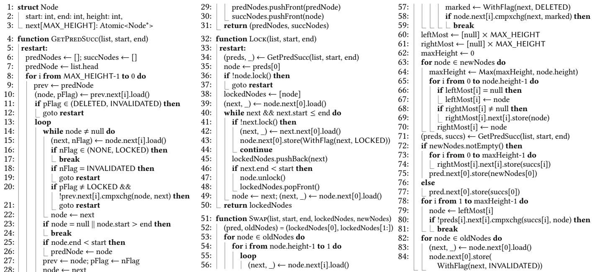  
Figure 18. Implementation of the new operations in the interval skiplist.

## Non-Peer-Reviewed Appendices

## A Pseudocode

Fig. 18 presents the pseudocode for the operations newly introduced in our interval skiplist.

GetPredSucc (line 4) traverses the interval skiplist to identify the predecessor and successor of [??????????, ??????] at each level. It uses load() (line 10) to atomically read a pointer (next[i]) and separate it into the unflagged part and flag bit. GetPredSucc serves as a helper function in the following.

Lock (line 32) implements the interval skiplist’s Lock operation (§4.1). It locks all nodes whose intervals or subsequent gaps overlap with [??????????, ??????], as well as their level-0 predecessor. These nodes are returned at the end of the operation.

Swap (line 51) implements the interval skiplist’s Swap operation (§4.1). It first processes the old nodes (line 53–line 59) and new nodes (line 60–line 70), then commits the swap. If new nodes exist, the predecessor is updated to point to the first new node (line 75); otherwise, it points to the successor (line 77). In both cases, the old nodes are made unreachable in level-0, and the predecessor is unlocked simultaneously.

## B Correctness

## B.1 Correctness of Lock Operation

In Lock, after locking the predecessor node (line 36), we repeatedly advance to the next node and attempt to lock it (line 39–line 49). Locking fails if the node is marked DELETED or INVALIDATED. However, at line 41, failure can only result from the node being DELETED.

This is because a locked node’s next node never has the INVALIDATED mark. First, the following excludes the possibility that another thread’s swap marks it so after the locking.

Lemma B.1. If a node is locked by a thread, its level-0 next node cannot be swapped by another thread.

Proof. A swap requires locking both the predecessor and old nodes. As a result, any old node involved in a swap requires its previous node in level-0 locked beforehand. Consequently, while a thread holds a lock on a node, no other thread can lock it or proceed to swap its level-0 next node. □

Furthermore, a Swap: (1) renders the old nodes unreachable at level-0 (except from each other) when unlocking the predecessor, and (2) sets the old nodes’ flags to INVALI-DATED, ensuring any subsequent lock attempt fails. Thus, successfully locking a node implies it is not an old node and does not point to one. We can now conclude the following:

Theorem B.2. If a node is locked, its level-0 next node never has the INVALIDATED mark.

## B.2 Linearizability

To demonstrate linearizability, we identify the linearization point of our new Swap operation. The linearization point is line 75 when newNodes is not empty, and is line 77 when newNodes is empty. At this point, the following actions occur atomically: (1) all old nodes become unreachable in level-0, (2) all new nodes become reachable, and (3) the predecessor node is unlocked.

## C Evaluation on a Single-Socket Machine

Figs. 19 to 24 present the evaluation results from §7, this time obtained on a single-socket machine equipped with an

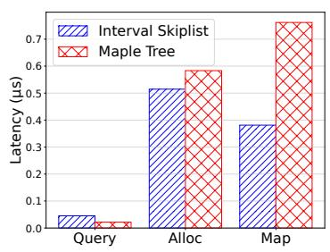  
(a) Latency

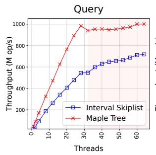

AMD EPYC 7543 processor (2.8GHz, 32 cores, 64 threads), 256 GiB of DRAM (eight 32 GiB modules), and a 4TB WD BLACK SN850X SSD.

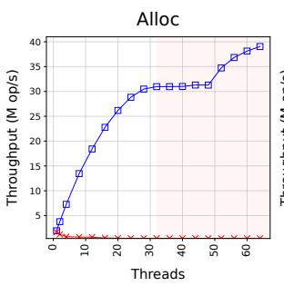  
(b) Throughput

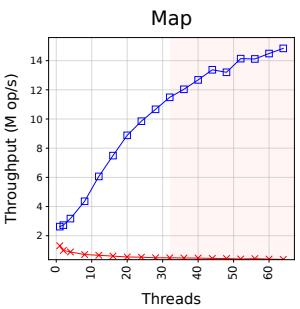

Figure 19. Performance of interval skiplist and maple tree.
<table><tr><td>Test</td><td>Linux (μs)</td><td>IntervalVM (us)</td><td>Overhead</td></tr><tr><td>null syscall</td><td>0.158</td><td>0.160</td><td>1.40%</td></tr><tr><td>stat</td><td>1.13</td><td>1.13</td><td>0.248%</td></tr><tr><td>open+close</td><td>2.44</td><td>2.49</td><td>2.00%</td></tr><tr><td>pipe</td><td>6.75</td><td>6.77</td><td>0.364%</td></tr><tr><td>fork+exit</td><td>247</td><td>284</td><td>15.2%</td></tr><tr><td>page fault</td><td>0.356</td><td>0.371</td><td>4.38%</td></tr><tr><td>mmap+fault+munmap</td><td>11875</td><td>13138</td><td>10.6%</td></tr><tr><td>file create</td><td>15.3</td><td>15.1</td><td>-1.11%</td></tr><tr><td>file delete</td><td>9.76</td><td>9.78</td><td>0.198%</td></tr><tr><td>ctxsw 2p/0k</td><td>2.55</td><td>2.55</td><td>-0.196%</td></tr></table>

Figure 20. LMbench results (lower is better).

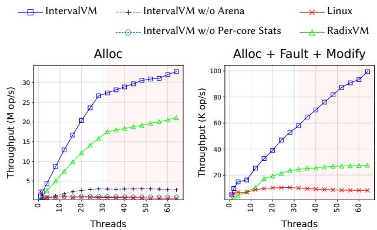  
Figure 21. Throughput of each microbenchmark.

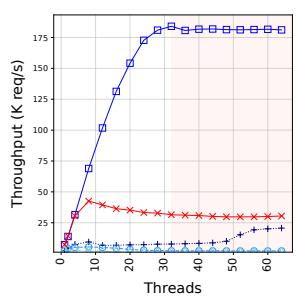  
(a) Apache (single process)

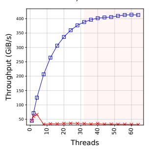

<table><tr><td>Kernel</td><td>(K req/s)</td></tr><tr><td>Linux</td><td>106.8</td></tr><tr><td>IntervalVM w/o Fault</td><td>67.8</td></tr><tr><td>IntervalVMw/o Alloc</td><td>33.0</td></tr><tr><td>IntervalVM w/o Modify</td><td>12.6</td></tr><tr><td>IntervalVM</td><td>223.3</td></tr></table>

Figure 23. Apache throughput under default configuration.

(b) LevelDB  
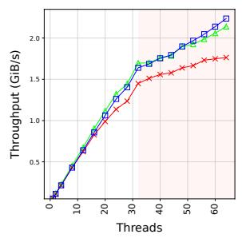  
(c) Metis

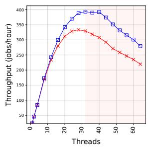  
(d) Psearchy

Figure 22. Multithreaded throughput of Apache (single process), LevelDB, Metis, and Psearchy.  
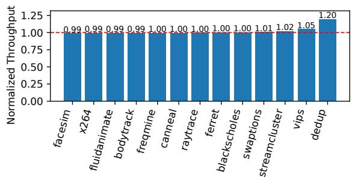  
Figure 24. Normalized throughput of IntervalVM relative to Linux across PARSEC benchmarks (higher is better).