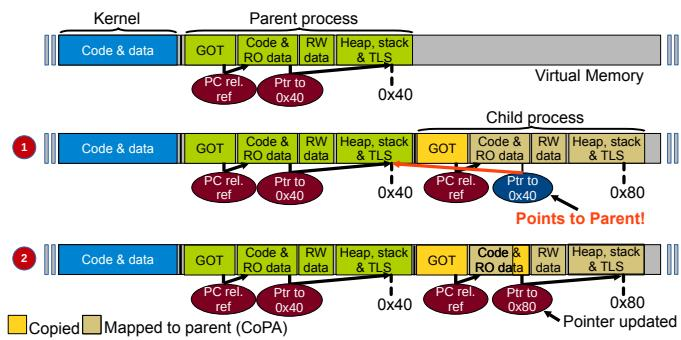
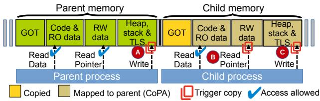
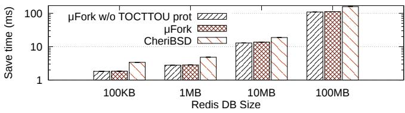
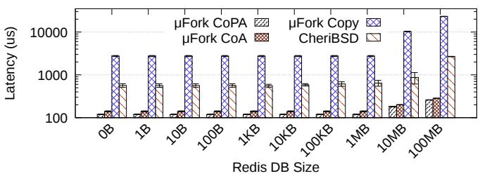
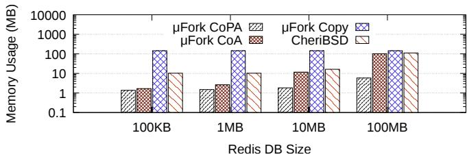
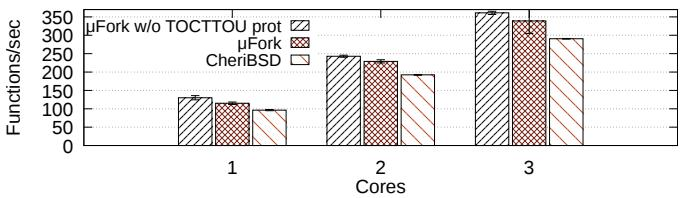
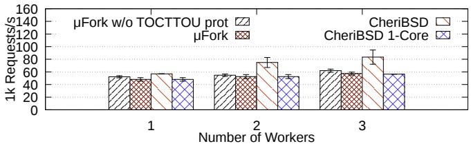
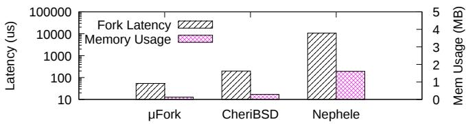
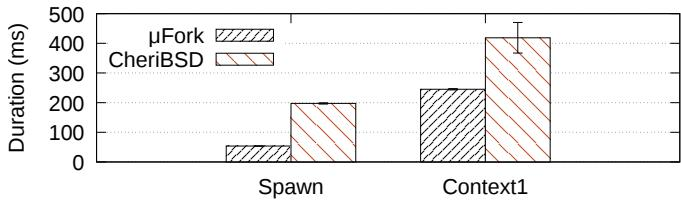

Latest updates: hps://dl.acm.org/doi/10.1145/3731569.3764809

RESEARCH-ARTICLE

# μFork: Supporting POSIX fork Within a Single-Address-Space OS

JOHN ALISTAIR KRESSEL, The University of Manchester, Manchester, Greater Manchester, U.K.

HUGO LEFEUVRE, The University of British Columbia, Vancouver, BC, Canada

PIERRE OLIVIER, The University of Manchester, Manchester, Greater Manchester, U.K.

Open Access Support provided by:

The University of British Columbia

The University of Manchester

Published: 12 October 2025

Citation in BibTeX format

SOSP '25: ACM SIGOPS 31st Symposium

on Operating Systems Principles

October 13 - 16, 2025

Seoul, Republic of Korea

Conference Sponsors: SIGOPS

# µFork: Supporting POSIX fork Within a Single-Address-Space OS

John Alistair Kressel The University of Manchester Manchester, United Kingdom

Hugo Lefeuvre The University of British Columbia Vancouver, BC, Canada

Pierre Olivier The University of Manchester Manchester, United Kingdom

## Abstract

Single-address-space operating systems have well-known lightweightness benefits that result from their central design idea: the kernel and applications share a unique address space. This model makes these operating systems (OSes) incompatible by design with a large class of software: multiprocess POSIX applications. Indeed, the semantics of the primitive used to create POSIX processes, fork, are inextricably tied to the existence of multiple address spaces.

Prior approaches addressing this issue trade off lightweightness, compatibility and/or isolation. We propose µFork, a single-address-space operating system design supporting POSIX fork on modern hardware without compromising on any of these key objectives. µFork emulates POSIX processes (µprocesses) and achieves fork by creating for the child a copy of the parent µprocess’ memory at a different location within a single address space. This approach presents two challenges: relocating the child’s absolute memory references (pointers), as well as providing user/kernel and µprocesses isolation without impacting lightweightness. We address them using CHERI. We implement µFork and evaluate it upon three real-world use-cases: Redis snapshots, Nginx multi-worker deployments, and Zygote FaaS worker warm-up. µFork outperforms previous work and traditional monolithic OSes on key lightweightness metrics by an order of magnitude, e.g. it can offer a fork-bound FaaS function throughput 24% higher than that of a monolithic OS, and can fork a µprocess in 54 µs, 3.7× faster than a traditional fork.

CCS Concepts: • Security and privacy → Operating systems security; • Software and its engineering → Operating systems.

## ACM Reference Format:

John Alistair Kressel, Hugo Lefeuvre, and Pierre Olivier. 2025. µFork: Supporting POSIX fork Within a Single-Address-Space OS. In ACM SIGOPS 31st Symposium on Operating Systems Principles (SOSP ’25), October 13–16, 2025, Seoul, Republic of Korea. ACM, New York, NY, USA, 18 pages. https://doi.org/10.1145/3731569.3764809

This work is licensed under a Creative Commons Attribution 4.0 International License.   
SOSP ’25, Seoul, Republic of Korea   
© 2025 Copyright held by the owner/author(s).   
ACM ISBN 979-8-4007-1870-0/2025/10   
https://doi.org/10.1145/3731569.3764809

## 1 Introduction

A single-address-space operating system (SASOS) colocates the OS kernel together with all user programs within a single address space to achieve lightweightness benefits: performance improvements through optimized context switches and swift security domain transitions, as well as low memory footprint, among others. Early SASOSes such as Opal [46] and Mungi [39] leveraged this design to ease communication and coordination across processes. More recently, the rise of virtualization has enabled customizable SASOSes which simplify or completely eliminate barriers between user and kernel code [48, 71], to achieve large performance and resource usage improvements. Due to their lightweight characteristics, SASOSes are growing in popularity in many areas where high performance and low resource consumption is required, including Function as a Service (FaaS) [20, 34, 111], edge computing [26, 73, 114] and confidential computing [51].

Still, despite this growing popularity, SASOSes struggle to find mainstream adoption. A key obstacle to their widespread deployment is their lack of support for a wide range of software: multiprocess POSIX applications 1 [21, 50, 82, 109, 130]. These applications rely on the primary process creation mechanism in POSIX systems, fork. fork is an old and ubiquitous mechanism that creates a new (child) process by copying the memory and system resources of the calling process (parent). Many popular applications such as OpenSSH [85], Redis [87], Nginx [76], Apache httpd [107] and Qmail [15] are designed to take advantage of fork for purposes such as concurrency, isolation, and on-demand resource duplication. Unfortunately, the semantics of fork make it fundamentally hard to support in a SASOS: with fork, each child process is created in a new address space, whereas a true SASOS can only have, by definition, a single one.

An ideal approach to support fork within SASOSes should accomplish all the following objectives. First, fork support must not compromise the lightweightness of SASOSes. In particular, it should not re-introduce multiple address spaces, since a single address space is critical to the performance advantages which have been exploited for fast IPC [18, 112] and I/O [14], among others. Second, the inter-process isolation properties obtained with traditional fork, confining each process within its own address space, must be preserved in a single-address-space implementation. SASOS fork support must also be transparent for applications, i.e. it must exhibit the same semantics as traditional fork. Finally, SASOS fork must also perform at least as well as traditional fork, exhibiting the same memory usage and performance (e.g. copy-on-write) characteristics as typical POSIX OSes.

Over the past decades, several solutions to this problem have been proposed, yet all trade off on at least one of the aforementioned key objectives. In the 1990s, early SASOSes used segment-relative addressing to fork processes [39, 121], avoiding the need for relocations by making all memory accesses relative to a base register. However, segment-relative addressing is poorly supported in modern toolchains and ISAs, and bringing it back would imply significant modifications to a large amount of systems software including compilers, JIT runtimes, or handwritten assembly code. Other efforts abandon isolation [83], which raises security concerns. Yet others abandon transparency by manually porting applications to avoid calling fork [81], something that cannot be done with most fork use cases without a significant perapplication engineering effort. Other attempts have leveraged virtualization hardware to duplicate the entire OS and application [69, 109, 130], which sacrifices lightweightness by introducing multiple address spaces.

We present the design and implementation of µFork to address the need for efficient fork support within a SASOS. Unlike existing approaches, µFork is a true single-address-space solution which does not compromise on lightweightness, isolation, transparency, or performance. In essence, µFork emulates POSIX processes (µprocesses) and supports POSIX fork by copying the memory used by a parent µprocess to a different location within a single address space, for use by the child µprocess. This approach leads to two challenges: 1) identifying in the child absolute memory references pointing to the parent’s area, and relocating them to the child’s; and 2) enforcing isolation between µprocesses, as well as between µprocesses and the kernel, without compromising on lightweightness. To solve these challenges, we leverage two modern technologies: hardware memory tagging to identify and relocate absolute memory references to the correct location within the child’s area, and intra-address-space memory protection to enforce isolation across µprocesses and the OS kernel. Building on this, µFork proposes novel optimized copy-on-write strategies.

We implement a prototype of µFork using CHERI [120, 124] on the ARM Morello platform [8] using as a basis the Unikraft SASOS [48]. CHERI’s tagged memory allows us to relocate absolute memory references, and its tightly bounded hardware memory capabilities let us enforce isolation across µprocesses and the OS kernel. We evaluate our µFork prototype on microbenchmarks and real-world, unmodified, forkbased applications: Redis snapshots, Nginx multi-worker deployments, and a MicroPython-based serverless computing framework warming up Zygote [78] workers. This lets us showcase key metrics such as fork latency, memory usage, and overall application performance. We compare µFork to a classical POSIX fork on a CHERI-enabled FreeBSD, and a unikernel fork implementation leveraging virtual machines (VMs), Nephele [69]. We show that µFork outperforms these approaches by an order of magnitude on key metrics: µFork can fork a µprocess in 54 µs, 3.7× faster than a traditional fork on FreeBSD, and 198× faster than Nephele’s VM-based approach, while reducing the memory usage by respectively 2.2× and 12.3×.

Overall, this paper contributes:

• An analysis and breakdown of the problem of supporting fork in SASOSes, along with a systematic perspective on prior attempts (§2 and §3).

• The design of µFork, a novel approach to implement fork in SASOSes, which relies on recent advances in hardwarebased isolation technologies (§3).

• The open-source implementation (§4) and evaluation (§5) of µFork with CHERI and Unikraft.

## 2 Background

In this section we examine the use of fork in modern software. Based on this, we discuss the lack of fork support in SASOSes, and its impact. We then contextualize existing attempts to support fork in SASOSes, and position our proposed contribution, µFork. Finally, we provide background on CHERI, which we use to implement µFork.

## 2.1 fork: A Pervasive Software Design Primitive

fork is the oldest process creation mechanism in POSIX operating systems, tracing its roots back to Project Genie in the 1960s [77]. When a process calls fork, the OS kernel creates a copy of the process’ memory, state, and system resources such as sockets and open file descriptors into a new isolated address space. The newly created process is referred to as the child, and the fork caller as the parent. Although conceptually simple, real-world POSIX fork comes with optimizations such as copy-on-write, and many features which allow customization of its copying and protection behavior [13]. Most importantly, the semantics of fork imply that it is responsible for both creating new processes and creating new address spaces. This makes fork a mechanism that imposes strong constraints on OS design [13], and makes it fundamentally difficult to implement in SASOSes which have, by definition, only one address space.

Still, fork remains a very popular software design primitive, whose uses typically match the following patterns:

(U1) fork + exec to start a new program. Examples include running an executable via Bash.

(U2) fork for concurrency. Web servers such as Nginx [76] and Apache [107] use fork to create additional worker processes that handle requests concurrently.

(U3) fork for privilege separation. Privilege-separated software such as OpenSSH [85] and qmail [15] leverage fork to isolate trusted and untrusted application parts.

(U4) fork to leverage copy-on-write. The Redis [87] keyvalue store uses fork to create an instant snapshot of an in-memory database with copy-on-write and saves it to the disk, concurrently with the main database process that continues to handle requests.

(U5) fork to reduce startup times. Testing frameworks such as fuzzers use fork to avoid the cost of setup for each exploration [1, 40, 63, 74, 128] and improve efficiency. Latency-sensitive applications such as Function as a Service (FaaS) use fork to quickly start function instances [6]. Android applications are started through fork called by a root Zygote process [38].

(U6) fork to daemonize. By leveraging concurrency, applications such as web servers can create detached processes which run independently in the background.

Applications may also use a combination of all, showing how fork is vital to run popular applications. We found that the 46% of the 50 most popular C repositories on GitHub and 50% of 50 most popular Debian packages reported by popcon [9], use fork.

## 2.2 Single-Address-Space Operating Systems

Single-address-space operating systems were first proposed in the early 1990s, enabled by the spread of 64-bit processors which made it possible to colocate the kernel and all applications within a single address space [22, 46, 88]. Initially, SASOSes were introduced to simplify data sharing and communication across processes, since each has the same flat view of memory. Additionally, SASOSes removed some of the overhead of address translation through using a unique mapping of virtual to physical addresses [39, 46]. Over the years, many different types of SASOSes have been explored including exokernels [30] which simplify OS abstractions by allowing applications to manage resources to suit their needs, single level store OSes [56] which enable all data to be addressed directly by applications, dataplane OSes [14] which simplify I/O operations, software-isolated OSes [19, 41] which leverage type and memory safety to reduce process isolation overheads, and unikernels [47, 48, 52, 71, 80, 89] which remove barriers between user and kernel and execute all code at the same privilege level to speed up system calls.

Despite this diversity of designs, all SASOSes aim to improve lightweightness, i.e. the high performance and low resource consumption benefits stemming from the minimalist nature of this OS model. These benefits include in particular fast IPCs, low-latency security domain switches (context switches across processes, user/kernel transitions), and low memory footprint. They are obtained through the concise and specialized designs of SASOSes. The primary means for achieving this lightweightness is through the single address space, removing the need for page table switches and the associated costly hardware cache flushes [5] which result from context switches on multi-address-space OSes.

Table 1. Comparison of µFork with other SASOS fork systems. SAS = Single Address Space; SC = Self-Contained (no infrastructure changes required); Seg = Segment-relative; f+e = fork + exec.
<table><tr><td>System</td><td>SAS</td><td>Isolation</td><td>SC</td><td>IPCs</td><td>Seg</td><td>f+e only</td></tr><tr><td>Angel[121]</td><td>Yes</td><td>Yes</td><td>Yes</td><td>Fast</td><td>Yes</td><td>No</td></tr><tr><td>Mungi [39]</td><td>Yes</td><td>Yes</td><td>Yes</td><td>Fast</td><td>Yes</td><td>No</td></tr><tr><td>Nephele [69]</td><td>No</td><td>Yes</td><td>No</td><td>Med</td><td>No</td><td>No</td></tr><tr><td>KylinX [130]</td><td>No</td><td>Yes</td><td>No</td><td>Med</td><td>No</td><td>No</td></tr><tr><td>Graphene [109]</td><td>No</td><td>Yes</td><td>No</td><td>Med</td><td>No</td><td>No</td></tr><tr><td>Graphene SGX [110]</td><td>No</td><td>Yes</td><td>No</td><td>Slow</td><td>No</td><td>No</td></tr><tr><td>Iso-Unik [57]</td><td>No</td><td>Yes</td><td>Yes</td><td>Med</td><td>No</td><td>No</td></tr><tr><td>OSv [45]</td><td>Yes</td><td>No</td><td>Yes</td><td>Fast</td><td>No</td><td>Yes</td></tr><tr><td>Junction [35]</td><td>Yes</td><td>No</td><td>No</td><td>Med</td><td>No</td><td>Yes</td></tr><tr><td>This work: μFork</td><td>Yes</td><td>Yes</td><td>Yes</td><td>Fast</td><td>No</td><td>No</td></tr></table>

Although SASOSes are gaining traction in domains such as cloud computing [111] and confidential computing [29, 51, 72], a key obstacle to their widespread deployment is their inability to efficiently support multiprocess applications using POSIX fork [22], which limits their compatibility with many popular applications (e.g., 50% of the 50 most popular Debian packages). We address this shortcoming with µFork.

## 2.3 Existing Approaches to fork in SASOSes

Over the past decades, several solutions have been proposed to support fork in SASOSes. We categorize them in Table 1.

Pioneer SASOSes and Segment-Relative Addressing. Early SASOSes such as Angel [121] and Mungi [39] leveraged segment-relative addressing to implement fork to avoid the need for relocations upon fork, all the while maintaining a single address space and thus fast IPC. Segment-relative addressing requires that all memory references are relative to a base register. However, modern compiler support for segment-relative addressing cannot handle the entirety of absolute memory references that would need relocation following fork. These references are pointers that live not only as globals in static memory but also on the stack/heap, and modern toolchains cannot generate code dereferencing a pointer loaded e.g. from the stack relatively to a register. This means that extensive and complex compiler modifications would be required to implement such an approach on a modern system. In addition, a large amount of systems software including handwritten assembly or JIT runtimes would further need to be adapted to work with relative addressing. Modern hardware support for segment-relative addressing, such as with x86-64’s fs/gs registers, also does not provide adequate support for all of the possible memory references without significant compiler and toolchain modifications. Overall, the risks associated with the complexity of combining segment-relative addressing with the need for non-negligible systems software modifications make us choose alternative approaches for µFork.

Modern SASOSes and fork + exec Support. Certain occurrences of this pattern (U1) can be replaced with more modern and efficient mechanisms, such as vfork + exec or spawn. These are easily supported in SASOSes [83, 97] by loading the newly-started program (compiled with position independent code) at a free location of the address space. This approach only works with a subset of use cases where the parent’s duplicated state is not accessed by the child between fork and exec. Some of these works also do not implement any form of isolation between applications [35, 45], which is not acceptable from a security standpoint.

Modern SASOSes and the OS as a Process. Nephele [69] and KylinX [130, 131] both support fork by treating the entire SASOS as a process and thus implement fork in the hypervisor. The result is a fork that copies the entire OS similarly to how a standard POSIX fork copies a process. Similarly, Graphene [109] and Graphene-SGX [110] both approach the libOS as a process, and support fork by piggybacking it through the host’s fork. These ‘OS-as-a-process’ approaches come with limitations. First, they re-introduce multiple address spaces and lose the SASOSes lightweightness benefits which come from having a single address space. Second, this approach is not self-contained: it requires the SASOS to run under a host (such as a hypervisor, or another OS) which itself must implement a form of fork.

Modern SASOSes and Page-Tables. Iso-Unik [57] takes a different approach, implementing fork within the SASOS. However, it does so by retrofitting multiple address spaces back into a SASOS, which similarly hurts lightweightness.

Summary. None of these solutions both preserves the goal of SASOS lightweightness whilst ensuring isolation. Although segment-relative addressing was used in the past, the reality is that in modern systems, complex modifications must be made to compilers and toolchains as well as engineering work to port handwritten assembly and JIT compilers. Modern solutions lose the benefits of being a true single address space which is vital for benefits including fast IPC [18, 112] and I/O [14]. This motivates for a new approach that addresses these shortcomings.

## 2.4 CHERI

Capability Hardware Enhanced RISC Instructions [120, 124] (CHERI) extends RISC ISAs with safety features including, among others, memory tagging and intra-address-space isolation. That isolation is achieved through hardware capabilities where each pointer used by a program is extended from 64-bits to 128-bits, with the additional bits used to embed the bounds and access permissions of the data structure it points to. These bounds and permissions are checked and enforced at runtime by the hardware when the pointer is dereferenced and the bounds and permissions can only be decreased and can never be increased. Each pointer present in memory is marked as such with an unforgeable, single-bit validity tag stored separately in dedicated memory, which is cleared automatically upon any illegitimate attempt to modify the pointer or its permissions: a pointer dereference can only succeed at runtime if the corresponding tag is valid. Beyond its security applications, the tag also allows easy pointer tracking in memory at runtime [32, 84]: a valid pointer has its associated bit set which can be easily queried.

CHERI has been implemented on ARM64, RISC-V, and MIPS. Several hardware implementations are available, including Arm’s Morello development board [8], SCI’s CHERIoT RISC-V devices [91], and Codasip’s X730 RISC-V core [25].

## 3 Design of µFork

The overarching design goal of µFork is to transparently support all of POSIX fork’s semantics within a (truly) single address space on modern hardware, without losing the lightweightness benefits of SASOSes. Next, we set out design requirements and discuss the challenges that arise from them. We then detail our approach to address these challenges.

## 3.1 Design Requirements

(R1) Lightweight fork. The guiding benefit of SASOSes, lightweightness, must be maintained, ensuring high system performance, i.e. fast IPC and context/security domain switches (across processes and user/kernel), as well as a low per-process memory overhead. This implies that µFork must not re-introduce multiple address spaces which require costly hardware flushes and context switches, or require costly traps during context switches. µFork itself must also have a low latency (the time taken to fork a process),

(R2) Transparent implementation and compatibility. The differences between a strict POSIX fork implementation and µFork must not be visible to the application, i.e. using µFork must not require application changes. The system’s behavior upon and following a call to µFork (process state duplication) must also be equivalent to that of fork from both the parent and child perspectives.

(R3) Strong isolation. µFork must enforce the same level of isolation across µprocesses, and between µprocesses and the kernel, as enforced by POSIX processes: µprocesses cannot access the kernel/each other’s memory, and can invoke the kernel only through system calls.

(R4) Flexibility to different SASOS use-cases. As discussed in §2.2, SASOSes are a diverse class of OSes with different designs and goals. To fit this diversity, µFork should minimize the engineering effort required to implement its design in an existing OS. Integrating µFork should not compromise on the target OS key design aims e.g., it should be possible to disable isolation if a use-case does not require it.

## 3.2 Design Approach and Challenges

At a high level, µFork emulates POSIX processes (??processes), and upon a call to fork, copies the memory used by the parent µprocess to a different location within a unique address space, for use by the child µprocess. This approach, combined with (R1) - (R4), leads to two key challenges:

(C1) Memory Reference Relocation. In a traditional fork implementation, which relies on creating a copy of the page table used by the calling process, the address space of the forked child is identical to that of its parent. However, when forking in a single address space, the child’s memory must reside at a different location in the same virtual address space as the parent. We assume the use of position independent code, hence the vast majority of memory references will be relative to the stack, base, or instruction pointers. However, to satisfy (R2) and (R3), we must relocate absolute memory references: these are memory references (pointers) located in the child’s memory which still refer to parent memory after the copy. They must be relocated to refer to child memory after the fork, to ensure isolation and equivalent behavior. Identifying such references at runtime (pointer tracking) is a hard problem [67], as regular integers can be misidentified as memory references [115].

(C2) Process Isolation. POSIX processes are isolated by virtue of residing in different address spaces. Thus, to satisfy (R3), we must isolate µprocesses within a single address space. In turn, (R1) and (R4) require this isolation to be performed in a low-overhead and customizable manner.

## 3.3 Trust & Threat Models

µFork assumes the same trust and threat model as POSIX fork. µFork’s Trusted Computing Base (TCB) is the OS kernel, which includes the implementation of µFork. The OS kernel distrusts all user code, encapsulated by one or more µFork processes (µprocesses). We assume that OS kernel interfaces properly sanitize user inputs. Where fork is used for isolation across µprocesses, we assume that attackers compromising one µprocess actively try to compromise the rest of the system’s confidentiality, integrity or availability through shared memory, IPC, and kernel interfaces. To that list we add another attack vector which is direct addressing, as µprocesses run within a single address space. We assume that user code using the fork API for isolation properly sanitizes cross-µprocess interfaces and appropriately sets system access-control permissions upon fork since such applications were designed with this trust model in mind. We consider side channels, including transient execution attacks, out of scope of this work.

## 3.4 Design Overview

We propose a design based on six building blocks to address the requirements and challenges formalized earlier. We elaborate on these in the subsequent subsections.

1. µprocesses. In a µFork system, each thread is associated with a µprocess ID (PID). Each µprocess may have many threads. Spawning a new µprocess creates a new thread with a new PID. This matches the semantics of fork, which copies a single thread (R2).

2. Isolate µprocesses with CHERI. Satisfying (C2) requires isolation within the address space. This can be effectively addressed with CHERI’s intra-address-space isolation [31, 47, 120], where all memory references are bounded and so can be restricted to their own µprocess.

3. Leverage CHERI tags to relocate memory references. Identifying absolute memory references to relocate in a child µprocess is required to satisfy (C1). Memory tagging offered by CHERI [124] can be leveraged to reliably identify such references for relocation: upon fork, memory references can be easily identified if a valid tag is set, and relocated to the child µprocess.

4. Leverage Position-Independent-Code (PIC) to limit the number of references to be relocated. By compiling applications as PIC, most memory references are relative either to the stack/base pointer or to the program counter (PC). They can thus be relocated without changes, ensuring the low µFork latency required for lightweightness (R1).

5. Revisit Copy-on-Write (CoW) for µprocesses. POSIX fork implementations reduce the overhead of fork by only copying pages upon writes. This optimization cannot be applied as-is with µFork, as the child accessing a page in read mode containing absolute memory references must trigger a copy of that page to perform the corresponding relocations, to prevent the child µprocess loading and using stale memory references which still point to the parent µprocess. Hence, in its basic form µFork requires copying each page accessed in write mode by the parent or the child, but also each page accessed in read mode by the child, something that we generalize as Copy-on-Access (CoA). To maintain lightweightness (R1), CoA can be optimized into Copy-on-Pointer-Access (CoPA), which lets µprocesses share memory until a µprocess writes to it, or a child loads an absolute memory reference.

6. Parameterized isolation. There are valid use-cases for different levels of isolation (R4): real-world systems may assume that processes distrust each other; that the entire system is trusted but contains bugs; or even that the entire system is trusted to function correctly. We design µFork to cater for any of these design points.

  
Figure 1. Memory layout of µFork. 1 displays memory directly after a fork. The child is mapped to the parent pages and absolute memory references point to parent memory. 2 displays memory after the child accesses a page in the ”code and read-only data” area containing an absolute memory reference: this page has been copied, and the memory reference relocated to point to child memory.

## 3.5 µFork: Forking a µprocess

We now walk through the steps taken when a µprocess calls fork to concretize this design. This section is designed to be read alongside Figure 1.

1. Parent State Duplication. When a µprocess forks, µFork reserves enough contiguous virtual memory to accommodate the entire child µprocess including the stack, heap and other data. The parent page table entries are copied: initially, almost all pages of child memory are mapped to the same physical pages as the parent µprocess, similarly to a traditional CoW approach. Any attempt to modify the heap, stack, TLS or other RW memory will result in a copy of the page written being made, along with relocation of absolute memory references should the page contain any. As discussed, traditional CoW does not apply as-is, we thus rework it into CoPA to ensure that all absolute memory references contained in pages read by the child are relocated to their correct µprocess locations before use. We discuss CoPA in detail in §3.8.

This mapping stage is illustrated by 1 in Figure 1. At this stage, pages have not yet been accessed: parent and child µprocesses share memory and memory references are not updated. Pages containing memory-allocator metadata and global offset table (GOT) entries are proactively copied and updated during fork to ensure that the new µprocess accesses the correct memory when loading memory references via the GOT or when performing heap operations. In addition to copying the memory associated with a µprocess, relevant system resources are also duplicated as mandated by POSIX, e.g., open file and message queue descriptors.

2. Post-Copy Phase. At this stage, the memory and resources of the parent µprocess have been copied or mapped where appropriate for the child µprocess to use. With the child µprocess memory and resources set up, µFork generates a new µprocess ID (PID) and stores it in a memory location which cannot be modified by any µprocess. The PID is used by the kernel to index per-process system resources such as file descriptor tables. Following this, µFork creates a new thread to run the µprocess. The initial state of the child µprocess is the same as that of the parent, except that 1) the entry point is located within the code in the child µprocess’s memory area following the call to fork, and 2) any absolute memory references contained in registers are relocated to the proper locations in the child’s memory (tags extend to values in registers, allowing differentiation of pointers from integers). As the child µprocess accesses pages that contain references or writes to memory, pages are copied, as illustrated in 2 .

## 3.6 Isolation in µFork

Isolation is required by µFork at two levels: between µprocesses (inter-µprocess), and between µprocesses and the kernel. With regular POSIX fork, inter-process isolation is enforced through having separate page tables for each µprocess. This is not the case in µFork, where isolation must be enforced with lightweight intra-address-space isolation. µFork also implies a trust boundary between µprocesses and the kernel. Here, two main vectors of attack must be considered. First, the system call interface must be hardened: the kernel must perform various validity checks on system call parameters, and also copy objects passed by reference to protect against time-of-check-to-time-of-use (TOCTTOU) attacks in concurrent systems [16]. Second, for SASOSes such as unikernels which execute the kernel and applications at the same processor privilege level, µprocesses must be prevented from executing privileged instructions.

Still, an important point of our approach to isolation is to recognize that not all use-cases have the same needs for isolation and the underlying trust and threat models of the application must be preserved. In cases where processes are assumed to distrust each other, e.g. when fork is used for privilege separation, adversarial fault isolation is needed and full isolation is required. An example of this is qmail [15] where processes are used to isolate components such as the SMTP server. This corresponds to U3. However, in many cases the entire program is trusted, but may contain bugs that should ideally trigger faults when occurring, e.g. a bad reference outside of the process’ accessible memory. Web servers such as Nginx [76] use fork (U2) for increased throughput by leveraging concurrency, and use this fault protection trust model. In such a case, production settings may make use of non-adversarial fault isolation, enabling memory isolation and simple kernel checks, but opting out of more expensive isolation primitives such as kernel-level TOCTTOU protections. In other cases, the entire system may be trusted to function correctly, in which case production deployments may simply disable isolation. An example is Redis using fork for performing a backup snapshot through copy-on-write: the child is simple and operating on trusted input, and thus is unlikely to trigger a bug and protections can be lifted. We design µFork to be flexible and accommodate for these different scenarios.

## 3.7 Memory Layout of a µFork-enabled SASOS

In a system using µFork, the kernel and application are compiled as PIC/PIE and each µprocess is loaded in a contiguous area of the virtual address space, as illustrated in Figure 1. This allows intra-address-space isolation mechanisms relying on contiguous bounds to easily set and check these bounds, thus restricting µFork µprocesses to their private memory. Finally, a global offset table (GOT), providing a mechanism for PIC to locate global objects and functions in memory, must lie within the bounds of each µprocess. In a system using a standard fork implementation, the GOT is not modified since the address space layout does not change and memory references remain the same in the parent and child. A child µprocess in µFork is located at a different part of the address space, thus the GOT is copied and modified during the fork to point to the correct locations within the new µprocess. The application and kernel use disjoint areas for dynamically allocated memory. ASLR can be implemented by randomizing the base offset of the contiguous memory area dedicated to each µprocess. Supporting shared memory between µprocesses would be straightforward, requiring shm\_open to return a file descriptor representing an area of shared memory and then map the same set of physical pages within the virtual address space areas of relevant µprocesses. Similarly, shared libraries can be supported by mapping those libraries in each µprocess when mapping a binary and creating capabilities with the proper permissions.

## 3.8 Copying Memory: CoW vs. CoA vs. CoPA

Copy-on-Write (CoW) is a common optimization which reduces the overhead and latency associated with fork [49, 101]. When memory is marked as CoW, that memory is shared between processes. As mentioned earlier, this is not achievable with µFork due to the need for relocations within pages accessed in read (and write) mode and containing absolute memory references. To mitigate this issue, in its basic form µFork requires Copy-on-Access (CoA), where memory is initially shared by the parent and the child but marked as inaccessible, thus any access will trigger a copy and relocations. We further propose Copy-on-Pointer-Access (CoPA), an optimization to CoA where memory can be shared in read-only mode like CoW, with an additional constraint that if the child loads memory references, the containing page is copied to relocate the references it contains first. This means that non memory reference loads do not trigger copying.

## 4 Implementation

We implemented a prototype of µFork on top of Unikraft [48], a modern, actively maintained single-address-space operating system. The core motivation for implementing our prototype with Unikraft is its large compatibility with unmodified applications [54] which will also run transparently with our implementation of µFork, as well as its ability to run both bare-metal and on top of a hypervisor. Further, Unikraft has been leveraged in several research projects [29, 52, 89] that explore the design space of SASOSes, making it particularly suitable to satisfy (R4). Unikraft was also the basis of prior works on supporting fork in SASOSes [69].

µFork: Building Blocks. µFork requires two fundamental building blocks: absolute memory reference identification (C1) and an intra-address-space isolation mechanism (C2). Our prototype implementation uses the CHERI hardware capability model [120, 124] that offers all the above-mentioned features. CHERI supports memory tagging and also offers intra-address-space memory protection by ensuring that every memory reference is checked against the bounds of the object it refers to. CHERI uses a sealing mechanism [118] to enable exception-less security domain switches: we leverage it for user/kernel isolation, satisfying (R1). Sealed capabilities are data structures available to µprocesses which, when used, trigger a safe transition to a predetermined and unforgeable location – in our case the system call handler in the kernel. Finally, CHERI offers a fault on capability load [33, 65] feature, with which we implement CoPA.

Implementation Overview. We ported Unikraft to CHERI on the ARM Morello platform [8] (§4.1), and to execute on top of the bhyve hypervisor on CheriBSD [120] (CHERI-enabled FreeBSD) to leverage VirtIO networking on ARM Morello. We implemented µFork as a new kernel library in Unikraft. In total, we changed 7 KLoC in the kernel: 4,230 LoC for CHERI and bhyve support in Unikraft, and 3,000 LoC for µFork. Applications which run on Unikraft do not require porting to work with µFork.

## 4.1 Porting Unikraft to CHERI

Porting Unikraft to CHERI (in “pure-capability mode” [118]) required a modest engineering effort. Key changes needed were 1) in the early boot code to initialize CPU capability features and registers (e.g. exception vectors); 2) in the virtual memory allocator (tinyalloc [108]) to comply with CHERI’s 16-byte pointer alignment requirements and set bounds on allocated memory; and 3) in broader kernel code to replace pointer arithmetic with explicit pointer operations as capabilities are not interchangeable with integers [119].

## 4.2 Implementation of µFork

Assigning capabilities to µprocesses. The key security invariant the kernel must enforce to maintain isolation (R3)

  
Figure 2. Copy-on-Pointer-Access. Writing to pages ( A and C ), or the child loading from pages that contain pointers ( B ), triggers copying.

is that all capabilities (pointers) available to a µprocess only grant access to memory falling within the area of the virtual address space allocated to this µprocess. At boot, µFork initializes capabilities for the kernel and applications. The sealed capabilities which are needed for trapless system calls are also set up at this stage. The above-mentioned security invariant is enforced upon requests from the application for memory allocation (e.g. mmap/brk), as well as upon and after µprocess creation through µFork, where all absolute memory references must be relocated to avoid leaking capabilities from the parent to the child. This includes among others the program counter capability (PCC), whose bounds and permissions are used in PIC (see §3.4) for relative references such as function calls (cf. Figure 1).

Our µFork prototype follows the memory layout of Figure 1. Each µprocess owns a private, statically-allocated heap with a build-time-configurable size, from which the majority of dynamic memory allocation requests are served. This is done to reduce complexity in the TCB but can be replaced with dynamic heaps. The kernel ensures anonymous mmap requests are served by returning capabilities pointing to the calling µprocess virtual memory area. Our modular prototype (R4) enables different trade-offs, e.g., using a single shared isolation-aware heap [4], or per-µprocess heaps [52].

Copy-on-Pointer-Access. We implement CoPA using an additional page-table permission bit present with CHERI, which triggers a fault when a capability is loaded from that page. Loading references from the parent µprocess and read accesses do not trigger copies.

With this approach, following a fork, page copies are triggered by writes from either the parent or the child, or capability loads by the child. The copy follows three steps. First, the child page table entry is changed to point to a free physical page in memory and remains inaccessible until the copying is finished. Then, the page is copied. Finally, the copied page is scanned in 16-byte increments, which corresponds to the size of a CHERI capability, for absolute memory references pointing to parent memory: references are identified by the presence of a valid CHERI tag. For each reference with a valid tag, its target and memory bounds are checked: if it points outside of the µprocess’s dedicated memory area in the virtual address space or has bounds which allow access outside the memory area, the reference is relocated to the correct location in the child µprocess with bounds which are restricted to that µprocess only. Thus, all references are found and updated to point into child µprocess memory. Figure 2 shows CoPA in operation: the child attempts to write to a page of memory ( C ) and read a pointer from an implicitly shared page ( B ), resulting in a transparent copy similarly to standard CoW. Similarly, the parent attempts to write to a page of memory ( A ), triggering a copy. This approach covers all possible references; absolute references are identified via a valid tag, and all references derived from these are tightly bounded to the µprocess since CHERI bounds cannot increase; relative references use a base absolute reference (e.g. stack/base) which are identified and updated.

## 4.3 Cross-µprocess Isolation

Inter-µprocess isolation with CHERI is enforced following two principles. First, ??processes cannot increase their privileges. By design, the privileges associated with a CHERI capability (e.g. bounds of the area it points to) cannot be increased (monotonicity) [118]. A µprocess thus cannot forge a capability with greater privileges to escape its protection domain. Second, capabilities do not leak across ??processes. Memory copies are triggered by CoPA in all cases that may enable a child µprocess to access a stale capability. As part of the copy, parent capabilities are relocated and thus not exposed to child µprocesses. Integers can be used for relative addressing, however, these are subject to the bounds of the capability they are relative to, such as the program counter, all of which are restricted to the local µprocess.

## 4.4 µprocess-Kernel Isolation

User-kernel isolation follows 4 principles. First, kernel entrypoints are protected. In our prototype, system calls are performed through safe transitions using sealed kernel code capabilities [118]. Sealed capabilities restrict kernel entry points and there is no other way for a µprocess to invoke kernel code. Such restriction is similar to that of traditional system call instructions, however it is achieved without the need for a costly trap, to comply with (R1).

Second, ??processes cannot execute privileged instructions. Our µFork prototype executes the µprocesses and kernel at the same processor privilege level (EL1). To prevent user code from executing system instructions which could compromise the security of the system, we leverage the CHERI system permission capability permission bit [118]. µprocess capabilities do not have this permission and thus cannot execute privileged instructions including MSR and MRS instructions. This approach satisfies (R1) through avoiding the need for costly memory scanning [27].

Third, data flowing into the kernel is validated. A malicious µprocess may attempt to pass corrupted data to the kernel through system call arguments. This is a major source of security vulnerabilities in commodity OSes [10, 58, 60, 116, 129], which may enable attackers to e.g. trick the kernel into leaking data or capabilities to another µprocess’ memory. Carefully sanitizing untrusted inputs becomes necessary in much the same way as other OSes. Still, not all deployments of µFork may have an adversarial threat model (R4) (§3.6), thus we make it easy to disable checks for a given deployment.

Fourth, µprocess buffers passed by reference to the kernel are copied. TOCTTOU vulnerabilities are possible if a kernel input can be modified by a µprocess between a check and its use, negating the check [16, 126, 127]. To prevent this we copy values to kernel memory before checking and upon completion, back to user memory, a mechanism used in commodity OSes. Following our flexibility design goal (R4), we make it possible to disable TOCTTOU protections for non-adversarial threat models.

## 4.5 Retrofitting µFork into an existing SASOS

Many implementations of µFork will be retrofitted into existing SASOSes, rather than built into entirely new operating systems. The aforementioned address space duplication approach of µFork is OS-agnostic, however introducing multiprocessing in a SASOS will also require per-OS engineering efforts. We describe such effort here, showing that for our prototype based on Unikraft it was relatively modest.

Per-Process Kernel State. SASOSes which are designed to run a single process, such as unikernels [47, 48, 52, 71, 80], may not support per-µprocess state: file descriptor tables, task structs, PIDs, process scheduling, per process signals, among others. This is because assuming that there is no more than one process in the system allows simplifying the development of these OSes and of the POSIX-like compatibility layers they generally expose [54]. The amount of refactoring required to support per-process kernel state will be variable on a case-by-case basis, depending on the target SASOS, and can be non-negligible. For our prototype we added the OS process features needed for the applications presented in evaluation including per-µprocess file descriptors and task structs, PIDs and scheduling. Further, we refactored the implementation of system calls such as wait and getpid to facilitate µprocess support, and added support for per-µprocess heaps.

User-Kernel Separation. SASOSes such as unikernels are designed with no user/kernel isolation. This does not allow for support of the generic threat model of POSIX fork (§3.3), unless additional protections are implemented (§4.4). Still, the absence of isolation may be acceptable in the threat model of such OSes (R4). Unikernels may for example want to implement fork for concurrency or copy-on-write snapshot patterns, but not for privilege-separation patterns due to their design choices. In Unikraft, we implemented the checks discussed in §4.4 to showcase the cost of different levels of protection. We also extended Unikraft’s build system to differentiate between application and kernel code through linker scripts, which helps to locate the kernel and applications in contiguous areas of the virtual address space.

Symmetric Multiprocessing (SMP) Support. SASOSes designed for a single process may not support SMP, an important feature required for certain fork use cases, e.g. to exploit concurrency. Hence, it may be necessary to retrofit SMP into the OS, which comes too at a non-negligible cost. Unikraft currently supports SMP with a “big kernel lock”, letting application code run concurrently but serializing kernel code execution. Optimized support is under active development by the community.

## 5 Evaluation

The evaluation aims to answer the following research questions (RQs):

RQ1: How does µFork compare to a monolithic kernel and existing SASOS fork implementations on key lightweightness metrics? We use Redis, MicroPython and microbenchmarks to examine fork latency, memory consumption, and IPC performance.

RQ2: How does the overall performance of applications running on µFork compare to a monolithic kernel’s fork? We examine overall system performance through popular forkbased applications: Redis, MicroPython, and Nginx, compared to CheriBSD.

RQ3: Does µFork enable applications to unlock the benefits (e.g. concurrency) of fork effectively? We evaluate concurrency with MicroPython and Nginx compared to CheriBSD. Additionally, Redis leverages CoW to enable its background database dump feature.

RQ4: How does CoPA compare to CoA and a full copy? We use Redis to examine the effect of CoPA compared to CoA and synchronously copying memory upon fork.

We compare µFork with CheriBSD [24], a CHERI port of FreeBSD, and Nephele [69], a virtualization-based approach to support fork in a unikernel. CheriBSD is the most mature capability-aware monolithic kernel running on the Morello platform, and Nephele represents the most-recent attempt at supporting fork in a SASOS (by re-introducing multiple address spaces). We do not include a non-CHERI baseline since this introduces additional variables; the CHERI/Morello prototype hardware and software stack is still not fully mature and thus software running in pure-capability mode faces in some situations non-negligible overheads that have been well-documented [64]. Analysis has shown that the majority of these overheads can be eliminated in future hardware implementations [117], reducing the overhead to a negligible level (1.8 - 3%).

All comparisons are made between µFork executing on top of the bhyve hypervisor on CheriBSD 23.11, and CheriBSD

23.11 running natively in pure capability mode and with performance optimizations enabled [23]. µFork needs to run virtualized as the Unikraft kernel we build upon lacks I/O drivers beside VirtIO. We encountered difficulties running CheriBSD virtualized, and note that running it bare metal gives it a conservative advantage vs. µFork executing on top of bhyve. All experiments are run on the ARM Morello development system [8] with 4 ARMv8.2-A cores @ 2.5 GHz and 16 GB RAM. Nephele [69] is designed for x86\_64 only. For this reason direct performance comparisons between applications running on µFork and Nephele cannot be achieved. For the sake of completeness, we replay Nephele’s relevant microbenchmarks (fork latency, memory consumption) with µFork and compare the results with numbers extracted from Nephele’s paper. Further, we examine the effect of TOCT-TOU protections and how our CoPA optimization compares to both CoA and a full synchronous copy of the parent’s memory upon fork. The graphs report averages of 10 measurements, with standard deviation as error bars (in many cases hardly visible because of the results’ stability).

## 5.1 Real-World fork-based Use-Cases

We examine µFork through three popular fork-based applications, Redis [87], MicroPython [36, 37, 64], and Nginx [76]. Each application utilizes fork for a different purpose, and is impacted differently by the characteristics of this primitive.

Redis uses fork and its on-demand CoW state duplication capabilities to create a database snapshot and save it to the disk in the background (U2 + U4). Here, fork latency is important, since the main database cannot handle requests during this time. We use Redis for RQ1, RQ2 and RQ3.

MicroPython is a lightweight implementation of Python, a language runtime commonly used in Function as a Service (FaaS) frameworks [94]. FaaS relies on low cold start times to rapidly handle incoming requests and low resource consumption to handle as many requests as possible [43, 62, 96]. fork is a compelling mechanism to achieve this [6, 59, 78], by spawning new instances from an already initialized language runtime (U2 + U5). These requirements map directly to low fork latency and memory consumption (RQ1). In addition, exploiting concurrency, as enabled by fork, is crucial in FaaS due to the stateless nature of functions (RQ3).

Finally, Nginx uses fork to spawn worker processes, isolated from each other, and handling requests concurrently (U5), used to answer RQ3. Unlike the other applications evaluated, here fork latency does not play a significant role, since Nginx workers are long-lived.

Redis snapshots. We run Redis on CheriBSD and µFork. This experiment populates a Redis database with different amounts of 100 KB entries and then triggers a background save operation. Both systems store the resulting database dump to a ram-disk, minimizing I/O latency. Figure 3 shows the overall save times of Redis with database sizes ranging from 100 KB to 100 MB. Across the range, µFork outperforms CheriBSD. µFork is 1.9× faster than CheriBSD at 100 KB (1.8 vs. 3.4 ms), and 1.4× faster at 100 MB (109 vs. 158 ms).

  
Figure 3. Redis DB overall save times (ms).

  
Figure 4. Redis fork latency (us).

  
Figure 5. Redis memory consumption (MB).

Figure 4 shows the fork latency (time needed for the fork call to complete) caused by forking the main Redis process with various database sizes. µFork is consistently faster and more lightweight than an equivalent process forking on CheriBSD, by a factor of 5-10×. This latency difference can explain the larger difference in save times seen at smaller database sizes, although with larger databases fork’s latency is not the bottleneck in the overall database save operation. Here, µFork’s lightweight state transfer method and pagetable updates, as well as the lower cost of making exceptionless system calls at the same exception level [48], help to explain the difference. The results also show that CoPA can reduce fork latency by up to 89× vs. realizing a synchronous copy, and up to 1.18× vs. CoA since less memory must be copied. The cost of TOCTTOU protection is relatively minor (2.6% at 100 MB).

The memory consumption of the forked Redis process with different database sizes also gives a real world example of how the lightweightness of µFork translates to a real application. Figure 5 shows that the memory consumed by a forked Redis process on µFork is significantly lower than on CheriBSD, 6 MB compared to 56 MB with a 100 MB database which can be explained by higher allocator memory consumption. For context, at 100 MB database size, a forked Redis process consumes 7 MB on a standard aarch64 Linux install on the ARM Morello system meaning that the high CheriBSD figure is likely something which can be reduced with further optimization.

  
Figure 6. FaaS function throughput.

  
Figure 7. Nginx throughput.

Function as a Service. FaaS functions are typically shortlived, with 50% of functions taking less than 1s to execute [95]. Thus, FaaS aims to keep the time needed to start a new instance of a function before executing it (cold start) low, as long cold starts severely reduce the efficiency of the system. This experiment uses the Zygote language runtime pre-warming technique [6, 78, 98]: the runtime is initialized (e.g. loading Python imports) once in a Zygote process, and subsequently each request is served by forking the Zygote into children that execute the function. We used the float\_operation benchmark from FunctionBench [44]: to reduce the effect of I/O and system calls, it performs a series of calculations before returning. The experiment setup sees a single thread forking as many times as possible within a 10-second time window on both CheriBSD and µFork. Here, both systems are able to take advantage of concurrency over multiple cores. The Morello CPU has 4 cores, 1 is used for the coordinating thread, and the rest for function execution.

Figure 6 shows the number of functions executed per second on 1 to 3 cores. The benchmark does not perform system calls and I/O, thus function throughput is primarily impacted by fork latency. As a result, µFork outperforms CheriBSD processes: its lower µFork latency allows it to handle 24% more requests. The cost of TOCTTOU protection is negligible since the experiment is not system-call intensive.

Nginx multi-worker deployments. Nginx forks workers to leverage concurrency and thus handle more requests. For this experiment we use the wrk benchmark to measure the throughput of Nginx with 1, 2, and 3 workers on CheriBSD and µFork. Here, µFork is limited by the immature support of SMP in Unikraft which hampers network performance across multiple cores (§4.5). This is not a limitation of µFork, and the issue is currently being addressed by the Unikraft community. For this reason, we were unable to get stable numbers on more than one core and Figure 7 shows the performance of Nginx running on a single core only with µFork. Still we include these results to demonstrate compatibility: Nginx can run using µFork. Despite the single core restriction, we see a 15.6% performance improvement by increasing the worker count on µFork from 1 to 3, likely due to workers yielding during I/O. We show CheriBSD performance both when allowed to scale to multiple cores and when restricted to a single core. Unsurprisingly, CheriBSD outperforms µFork across multiple cores, however, restricted to a single core, µFork is able to handle 9% more requests. The throughput cost of TOCTTOU protection is 6.5% on average.

  
Figure 8. fork latency and memory usage (hello world).

  
Figure 9. Unixbench fork latency (Spawn) and IPC (Context1) benchmarks execution time.

## 5.2 Microbenchmarks

fork Latency. We measured the latency observed when forking a single minimal process (hello world C program), and using Unixbench Spawn [68] measuring the time taken to fork 1000 processes as fast as possible. The results are presented on Figure 8 (hello world) and Figure 9 (Unixbench). µFork has a consistently lower latency vs. CheriBSD and Nephele. Unlike Nephele, µFork does not need to create a new Xen domain, which is notably a costly endeavor. As a result, µFork’s fork latency is several orders of magnitude smaller: 54 ??s vs. 10.7 ms. Similarly, µFork outperforms CheriBSD, with a fork latency of 54 ??s vs. 197 ??s, aided by its simple state transfer mechanism. Looking at Unixbench Spawn, 1000 consecutive forks and exits are completed in 56 ms on µFork and 198 ms on CheriBSD, attributable to the lower fork latency and the exception-less, single-privilege-level context switches between user and kernel mode in µFork [71].

Memory Consumption. An important factor in considering how many processes a system can handle is memory consumption. We consider the proportional resident set as the memory consumed by a process. Figure 8 shows the memory consumed per process when forking a minimal application. Again, µFork shows its lightweightness, occupying only 0.13 MB compared to 1.6 MB for Nephele and 0.29 MB for CheriBSD. This size difference can be attributed to memory consumed by shared libraries and the memory allocator.

Inter-Process Communication. Fast IPCs are one of the main benefits of SASOSes, and µFork unlocks them for the first time in fork-based applications. We use the Unixbench Context1 benchmark, which opens a pipe between two processes and increments a number until a set value is reached, in this case 100k. Figure 9 shows that µFork completes this in 245 ms compared to 419 ms on CheriBSD. This difference in performance can be attributed to the exception-less, single-privilege-level system calls in µFork.

CoPA vs. CoA vs. Full Copy. The effect of CoPA versus CoA and upfront copy is shown in Figure 4 and Figure 5. As µFork is built using large static heaps, the memory transferred by a full copy is correspondingly large, e.g. consuming 144 MB with a 100 MB Redis database, of which 136.7 MB is the large static heap. So too is the fork latency, taking in that case 23.2 ms. CoA is cheaper, consuming 101 MB and thus fork latency is lower at 283 ??s since not all memory will be accessed by µprocesses. This demonstrates that performance is still improved over an upfront copy on systems which cannot support CoPA. CoPA reduces the consumed memory to 6 MB, and the fork latency further to 260 ??s with a 100 MB database because read accesses to shared memory are allowed by the child and parent.

## 6 Discussion

Alternatives to CHERI. Absolute memory references must be accurately identified to enable their relocation to another part of the address space to implement µFork. Beyond CHERI, this can be achieved with other hardware memory tagging technologies [11, 93, 102, 103] that associate with each memory location a tag able to hold metadata regarding that location. This tag could be used to mark memory locations containing absolute memory references. That would need to be associated with compiler-generated instrumentation to propagate tags e.g. when a reference is copied or derived from another reference (something realized transparently by the hardware with CHERI). Alternative software approaches can also be used, such as shadow memory [92], maintaining a map of memory locations containing references, also set up and maintained with compiler-generated instrumentation.

µFork further requires an intra-address-space isolation mechanism to isolate µprocesses. Various approaches have been proposed to achieve this [53]: on the hardware side different flavors of memory protection keys [7, 42, 90] provide intra-address-space page-level memory protection as well as exception-less (i.e. fast) protection domain switching, which is important for lightweightness. Other hardware technologies such as Mondrian memory protection [123] offer byte-level isolation. Software approaches such as software fault isolation [113] or fat pointers [75] may also be used, although the associated performance hit may be deterring.

Beyond these two main requirements that are necessary for a functional implementation of µFork, an optional feature that is needed for our CoPA optimization is the capacity to fault on a subset of memory accesses: the loads of absolute memory references. We are not aware of a mechanism other than CHERI offering the ability to fault on memory reference loads needed to implement CoPA. However, as we show in the evaluation, systems which cannot support CoPA still show significant performance improvements from CoA.

Fragmentation. A limitation of µFork is the fact that µprocesses are loaded into potentially large contiguous areas of virtual memory, raising concerns about fragmentation. The 64-bit virtual address space we target is very large, and we expect that the vast majority of multiprocess applications will not exhaust that space. For scenarios where fragmentation could be a problem (long-running applications, forking a high number of µprocesses requiring large contiguous amounts of memory), solutions including compacting the virtual address space periodically or using size classes akin to size-class memory allocators [55, 99, 100], can be explored in future work.

## 7 Related Work

Single-Address-Space OSes. SASOSes have been an active research topic since their inception in the 1990s. Foundational works such as Opal [22], Nemesis [88], Angel [121], and Mungi [39] simplified and improved the performance of IPCs and I/O by placing all processes and data in a single address space. Since then, many types of SASOSes have been proposed, including single-level-store OSes [56], dataplane OSes [14], software-isolated OSes [19, 41], and unikernels [47, 48, 52, 71, 80, 89]. The lack of fork in SASOSes is a well-known issue that attracted significant research efforts [39, 57, 69, 109, 121, 130]. Other relevant SASOS research focuses on isolating components in a single address space [2, 3, 31, 79, 89, 106, 125]. Notable examples include Singularity [41] which isolates between processes using statically verified invariants, FlexOS [52] which uses build-time user-defined schemas to isolate components using different mechanisms [47], and RustyHermit [106] which uses Intel MPK for lightweight intra-address-space isolation.

Single-Address-Space fork. As the historical processcreation primitive, fork remains a widespread part of modern UNIX OSes. Attempts have been made to support fork within a single address space. A first category of works, including Angel [121] and Mungi [39], used segment-relative addressing to relocate the process. As discussed earlier (§ 2.3), this approach is complex and requires significant compiler and application porting work. A more recent class of works sees the OS as a process and relies on an external entity to perform the fork: Graphene/Gramine [109, 110] and Vessel [61] run as a process and piggyback onto the host OS’ fork; KylinX [130] and Nephele [69] rely on a hypervisor implementation of fork. Unlike µFork these approaches reintroduce multiple address spaces and thus defeat the principle of SASOSes and rely on more expensive fork implementations (host OS or hypervisor) which hurts overall performance. Iso-Unik [57] also re-introduces multiple address spaces within the SASOS, which hurts lightweightness. A last class of works focuses exclusively on vfork + exec patterns. CHERI co-processes [18] support multiple processes (vfork + exec) within a single address space to enable faster IPC. Junction [35] supports multiple instances of a process within an address space although without isolation. Occlum [97] supports posix\_spawn within a single enclave. However, this does not support the state duplication feature of fork, and requires applications to be modified to use posix\_spawn instead of fork.

Memory Reference Identification. CARAT [104] and CARAT CAKE [105] replace hardware paging with a software implementation. In doing so they encounter the same challenges of memory reference identification and intraaddress-space isolation as µFork. These problems are solved with compiler generated instrumentation, which is used to track memory references and also is used as SFI to provide isolation. However, CARAT/CARAT CAKE has a number of limitations, including lack of compatibility with unmodified JIT’ed languages due to the use of SFI and worse performance, since CARAT’s evaluation shows acceptable overhead only when virtual-to-physical mappings do not change, which is not the case for fork. Memory reference identification is also a problem faced by dynamic ASLR works including RuntimeASLR [66], TASR [17] and Shuffler [122] and garbage collectors which must identify pointers to objects they relocate during compaction [12, 28, 70, 86].

## 8 Conclusion

We present µFork, a design for true single address space fork using modern architectures. Previous works sacrifice the lightweightness benefits of SASOSes, isolation, and/or transparency. In contrast, µFork preserves a single address space design to maintain lightweightness, uses intra-addressspace isolation mechanisms to segregate µprocesses and the kernel, and works on unmodified applications. µFork outperforms a monolithic OS, CheriBSD, as well virtualized SASOS competitor, Nephele, on key fork/SASOS metrics by an order of magnitude. Our µFork prototype is open source and can be found here: https://github.com/flexcap-project/ufork.

## 9 Acknowledgments

This paper is dedicated to the memory of Gilles Muller. We thank the anonymous reviewers and our shepherd, Andrew Baumann, for their insightful feedback and invaluable help increasing the paper’s quality. We also thank Binoy Ravindran as well as Alain Tchana and his team for their help in our early efforts to tackle the isssue of supporting fork in a single address space. Finally, we thank Mikel Luján for his insights and guidance. This work was partly funded by the UK’s EPSRC grant EP/V012134/1 (UniFaaS), EP/V000225/1 (SCorCH), EP/X015610/1 (FlexCap), as well as the grant 10017512 (MoatE) of the UKRI ISCF DSbD Programme. We acknowledge the support of the Natural Sciences and Engineering Research Council of Canada (NSERC). Nous remercions le Conseil de recherches en sciences naturelles et en génie du Canada (CRSNG) de son soutien.

## References

[1] AFL Contributors. 2024. American Fuzzy Loop. [Accessed 2024-09- 10].

[2] Hesham Almatary, Michael Dodson, Jessica Clarke, Peter Rugg, Ivan Gomes, Michal Podhradsky, Peter G. Neumann, Simon W. Moore, and Robert N. M. Watson. 2022. CompartOS: CHERI Compartmentalization for Embedded Systems. CoRR abs/2206.02852 (2022). doi:10.48550/ARXIV.2206.02852

[3] Hesham Almatary, Alfredo Mazzinghi, and Robert N. M. Watson. 2024. Case Study: Securing MMU-less Linux Using CHERI. In SE 2024 - Companion. Gesellschaft für Informatik e.V., 69–92. doi:10.18420/ sw2024-ws\_06

[4] Saar Amar, Tony Chen, David Chisnall, Nathaniel Wesley Filardo, Ben Laurie, Hugo Lefeuvre, Kunyan Liu, Simon W. Moore, Robert Norton, Margo Seltzer, Yucong Tao, Robert N. M. Watson, and Hongyan Xia. 2025. CHERIoT RTOS: An OS for Fine-Grained Memory-Safe Compartments on Low-Cost Embedded Devices. In Proceedings of the 31st ACM SIGOPS Symposium on Operating Systems Principles (Seoul, Republic of Korea) (SOSP’25). Association for Computing Machinery, New York, NY, USA. doi:10.1145/3731569.3764844

[5] Nadav Amit, Amy Tai, and Michael Wei. 2020. Don’t shoot down TLB shootdowns!. In EuroSys ’20: Fifteenth EuroSys Conference 2020, Heraklion, Greece, April 27-30, 2020. ACM, 35:1–35:14. doi:10.1145/ 3342195.3387518

[6] Lixiang Ao, George Porter, and Geoffrey M. Voelker. 2022. FaaSnap: FaaS made fast using snapshot-based VMs. In EuroSys ’22: Seventeenth European Conference on Computer Systems, Rennes, France, April 5 - 8, 2022. ACM, 730–746. doi:10.1145/3492321.3524270

[7] ARM. 2025. Permission indirection and permission overlay extensions. https://developer.arm.com/documentation/102376/0200/ Permission-indirection-and-permission-overlay-extensions

[8] ARM Ltd. 2022. Arm Morello System Development Platform (SDP) Technical Reference Manual. https://developer.arm.com/ documentation/102278/0000

[9] Debian Authors. 2025. Debian Popcon. https://popcon.debian.org/ by\_vote [Accessed 2025-04-11].

[10] Mojtaba Bagherzadeh, Nafiseh Kahani, Cor-Paul Bezemer, Ahmed E. Hassan, Juergen Dingel, and James R. Cordy. 2018. Analyzing a decade of Linux system calls. Empirical Software Engineering 23, 3 (June 2018), 1519–1551. doi:10.1007/s10664-017-9551-z

[11] Steve Bannister. 2019. Memory Tagging Extension: Enhancing memory safety through architecture. https://community. arm.com/developer/ip-products/processors/b/processors-ipblog/posts/enhancing-memory-safety [Accessed 2025-04-16].

[12] Joel F. Bartlett. 1988. Compacting garbage collection with ambiguous roots. SIGPLAN Lisp Pointers 1, 6 (April 1988), 3–12. doi:10.1145/ 1317224.1317225

[13] Andrew Baumann, Jonathan Appavoo, Orran Krieger, and Timothy Roscoe. 2019. A fork() in the road. In Proceedings of the Workshop on Hot Topics in Operating Systems, HotOS 2019, Bertinoro, Italy, May 13-15, 2019. ACM, 14–22. doi:10.1145/3317550.3321435

[14] Adam Belay, George Prekas, Ana Klimovic, Samuel Grossman, Christos Kozyrakis, and Edouard Bugnion. 2014. IX: A Protected Dataplane Operating System for High Throughput and Low Latency. In 11th USENIX Symposium on Operating Systems Design and Implementation, OSDI ’14, Broomfield, CO, USA, October 6-8, 2014. USENIX Association, 49–65. https://www.usenix.org/conference/osdi14/technicalsessions/presentation/belay

[15] Daniel J. Bernstein. 2007. Some Thoughts on Security after Ten Years of Qmail 1.0. In Proceedings of the 1st ACM Workshop on Computer Security Architecture (Fairfax, Virginia, USA) (CSAW’07). Association for Computing Machinery, New York, NY, USA, 10 pages. doi:10. 1145/1314466.1314467

[16] Atri Bhattacharyya, Uros Tesic, and Mathias Payer. 2022. Midas: Systematic Kernel TOCTTOU Protection. In 31st USENIX Security Symposium (USENIX Security 22). USENIX Association, Boston, MA, 107–124. https://www.usenix.org/conference/usenixsecurity22/ presentation/bhattacharyya

[17] David Bigelow, Thomas Hobson, Robert Rudd, William Streilein, and Hamed Okhravi. 2015. Timely Rerandomization for Mitigating Memory Disclosures. In Proceedings of the 22nd ACM SIGSAC Conference on Computer and Communications Security (Denver, Colorado, USA) (CCS ’15). Association for Computing Machinery, New York, NY, USA, 268–279. doi:10.1145/2810103.2813691

[18] Peter Blandford-Baker and Robert Watson. 2024. comsg. https: //github.com/CTSRD-CHERI/comsg [Accessed 2024-09-10].

[19] Kevin Boos, Namitha Liyanage, Ramla Ijaz, and Lin Zhong. 2020. Theseus: an Experiment in Operating System Structure and State Management. In Proceedings of the 14th USENIX Symposium on Operating Systems Design and Implementation (OSDI’20). USENIX Association. https://www.usenix.org/conference/osdi20/presentation/boos

[20] James Cadden, Thomas Unger, Yara Awad, Han Dong, Orran Krieger, and Jonathan Appavoo. 2020. SEUSS: skip redundant paths to make serverless fast. In Proceedings of the Fifteenth European Conference on Computer Systems (EuroSys ’20). Association for Computing Machinery, New York, NY, USA. doi:10.1145/3342195.3392698

[21] Bryan Cantrill. 2024. Unikernels are unfit for production. https://www.tritondatacenter.com/blog/unikernels-are-unfit-forproduction [Accessed 2024-09-10].

[22] Jeffrey S. Chase, Henry M. Levy, Michael J. Feeley, and Edward D. Lazowska. 1994. Sharing and protection in a single-address-space operating system. ACM Trans. Comput. Syst. 12, 4 (Nov. 1994), 271–307. doi:10.1145/195792.195795

[23] CHERI Contributors. 2024. Benchmarking guidance - Getting Started with CheriBSD 23.11. https://www.cheribsd.org/getting-started/23. 11/benchmarking/index.html [Accessed 2024-09-10].

[24] CheriBSD Contributors. 2024. CheriBSD Website. https://www. cheribsd.org/

[25] Codasip. 2024. X730 RISC-V application processor. https: //codasip.com/solutions/riscv-processor-safety-security/cheri/x730-

risc-v-application-processor/

[26] Vittorio Cozzolino, Aaron Yi Ding, and Jörg Ott. 2017. FADES: Fine-Grained Edge Offloading with Unikernels. In Proceedings of the Workshop on Hot Topics in Container Networking and Networked Systems, HotConNet@SIGCOMM 2017, Los Angeles, CA, USA, August 25, 2017. ACM, 36–41. doi:10.1145/3094405.3094412

[27] Nathan Dautenhahn, Theodoros Kasampalis, Will Dietz, John Criswell, and Vikram Adve. 2015. Nested Kernel: An Operating System Architecture for Intra-Kernel Privilege Separation. In Proceedings of the 20th International Conference on Architectural Support for Programming Languages and Operating Systems (Istanbul, Turkey) (ASPLOS’15). Association for Computing Machinery, New York, NY, USA, 191–206. doi:10.1145/2694344.2694386

[28] David Detlefs, Christine H. Flood, Steve Heller, and Tony Printezis. 2004. Garbage-first garbage collection. In Proceedings of the 4th International Symposium on Memory Management, ISMM 2004, Vancouver, BC, Canada, October 24-25, 2004, David F. Bacon and Amer Diwan (Eds.). ACM, 37–48. doi:10.1145/1029873.1029879

[29] Kha Dinh Duy, Jaeyoon Kim, Hajeong Lim, and Hojoon Lee. 2025. INCOGNITOS: A Practical Unikernel Design for Full-System Obfuscation in Confidential Virtual Machines. In Proceedings of the 2025 IEEE Symposium on Security and Privacy (SP’25). 4192–4209. doi:10.1109/SP61157.2025.00222

[30] Dawson R. Engler, M. Frans Kaashoek, and James W. O’Toole Jr. 1995. Exokernel: An Operating System Architecture for Application-Level Resource Management. In Proceedings of the Fifteenth ACM Symposium on Operating System Principles, SOSP 1995, Copper Mountain Resort, Colorado, USA, December 3-6, 1995. ACM, 251–266. doi:10. 1145/224056.224076

[31] Lawrence Esswood. 2020. CheriOS: Designing an untrusted singleaddress-space capability operating system utilising capability hardware and a minimal hypervisor. PhD Thesis. Apollo - University of Cambridge Repository. doi:10.17863/CAM.74163

[32] Nathaniel Wesley Filardo, Brett F. Gutstein, Jonathan Woodruff, Sam Ainsworth, Lucian Paul-Trifu, Brooks Davis, Hongyan Xia, Edward Tomasz Napierala, Alexander Richardson, John Baldwin, David Chisnall, Jessica Clarke, Khilan Gudka, Alexandre Joannou, A. Theodore Markettos, Alfredo Mazzinghi, Robert M. Norton, Michael Roe, Peter Sewell, Stacey D. Son, Timothy M. Jones, Simon W. Moore, Peter G. Neumann, and Robert N. M. Watson. 2020. Cornucopia: Temporal Safety for CHERI Heaps. In 2020 IEEE Symposium on Security and Privacy, SP 2020, San Francisco, CA, USA, May 18-21, 2020. IEEE, 608–625. doi:10.1109/SP40000.2020.00098

[33] Nathaniel Wesley Filardo, Brett F. Gutstein, Jonathan Woodruff, Jessica Clarke, Peter Rugg, Brooks Davis, Mark Johnston, Robert M. Norton, David Chisnall, Simon W. Moore, Peter G. Neumann, and Robert N. M. Watson. 2024. Cornucopia Reloaded: Load Barriers for CHERI Heap Temporal Safety. In Proceedings of the 29th ACM International Conference on Architectural Support for Programming Languages and Operating Systems, Volume 2, ASPLOS 2024, La Jolla, CA, USA, 27 April 2024- 1 May 2024. ACM, 251–268. doi:10.1145/3620665.3640416

[34] Henrique Fingler, Amogh Akshintala, and Christopher J. Rossbach. 2019. USETL: Unikernels for Serverless Extract Transform and Load Why should you settle for less?. In Proceedings of the 10th ACM SIGOPS Asia-Pacific Workshop on Systems, APSys 2019, Hangzhou, China, Augsut 19-20, 2019. ACM, 23–30. doi:10.1145/3343737.3343750

[35] Joshua Fried, Gohar Irfan Chaudhry, Enrique Saurez, Esha Choukse, Íñigo Goiri, Sameh Elnikety, Rodrigo Fonseca, and Adam Belay. 2024. Making Kernel Bypass Practical for the Cloud with Junction. In 21st USENIX Symposium on Networked Systems Design and Implementation, NSDI 2024, Santa Clara, CA, April 15-17, 2024. USENIX Association, 55–73. https://www.usenix.org/conference/nsdi24/presentation/ fried

[36] George Robotics Limited. 2024. MicroPython - Python for microcontrollers. http://micropython.org/ [Accessed 2024-09-10].

[37] GlasgowPLI. 2024. MicroPython for CHERI. https://github.com/ glasgowPLI/micropython [Accessed 2024-09-10].

[38] Google. 2024. About the Zygote processes. https://source.android. com/docs/core/runtime/zygote [Accessed 2024-10-17].

[39] Gernot Heiser, Kevin Elphinstone, Jerry Vochteloo, Stephen Russell, and Jochen Liedtke. 1998. The Mungi Single-Address-Space Operating System. Softw. Pract. Exp. 28, 9 (1998), 901–928. https://trustworthy. systems/publications/papers/Heiser\_EVRL\_98.pdf

[40] Honggfuzz Contributors. 2024. Honggfuzz. https://github.com/ google/honggfuzz [Accessed 2024-09-10].

[41] Galen C. Hunt and James R. Larus. 2007. Singularity: rethinking the software stack. ACM SIGOPS Oper. Syst. Rev. 41, 2 (2007), 37–49. doi:10.1145/1243418.1243424

[42] Intel. 2022. Intel® 64 and IA-32 Arch. SDM. Vol. 3A, Sec. 4.6.2.: ACCESS RIGHTS: Protection Keys. Version: December 2022..

[43] Tomasz Kanas and Krzysztof Rządca. 2024. Diminishing cold starts in serverless computing with approximation algorithms. In Proceedings of the 53rd International Conference on Parallel Processing (ICPP ’24). Association for Computing Machinery, New York, NY, USA, 327–336. doi:10.1145/3673038.3673118

[44] Jeongchul Kim and Kyungyong Lee. 2019. FunctionBench: A Suite of Workloads for Serverless Cloud Function Service. In 12th IEEE International Conference on Cloud Computing, CLOUD 2019, Milan, Italy, July 8-13, 2019. IEEE, 502–504. doi:10.1109/CLOUD.2019.00091

[45] Avi Kivity, Dor Laor, Glauber Costa, Pekka Enberg, Nadav Har’El, Don Marti, and Vlad Zolotarov. 2014. OSv—Optimizing the Operating System for Virtual Machines. In 2014 USENIX Annual Technical Conference (USENIX ATC 14). USENIX Association, Philadelphia, PA, 61–72. https://www.usenix.org/conference/atc14/technicalsessions/presentation/kivity

[46] Eric J. Koldinger, Jeffrey S. Chase, and Susan J. Eggers. 1992. Architecture Support for Single Address Space Operating Systems. In Proceedings of the Fifth International Conference on Architectural Support for Programming Languages and Operating Systems (ASPLOS V). Association for Computing Machinery, New York, NY, USA, 175–186. doi:10.1145/143365.143508

[47] John Alistair Kressel, Hugo Lefeuvre, and Pierre Olivier. 2023. Software Compartmentalization Trade-Offs with Hardware Capabilities. In Proceedings of the 12th Workshop on Programming Languages and Operating Systems, PLOS 2023, Koblenz, Germany, 23 October 2023. ACM, 49–57. doi:10.1145/3623759.3624550

[48] Simon Kuenzer, Vlad-Andrei Bădoiu, Hugo Lefeuvre, Sharan Santhanam, Alexander Jung, Gaulthier Gain, Cyril Soldani, Costin Lupu, Ştefan Teodorescu, Costi Răducanu, Cristian Banu, Laurent Mathy, Răzvan Deaconescu, Costin Raiciu, and Felipe Huici. 2021. Unikraft: fast, specialized unikernels the easy way. In Proceedings of the Sixteenth European Conference on Computer Systems (EuroSys ’21). Association for Computing Machinery, New York, NY, USA, 376–394. doi:10.1145/3447786.3456248

[49] Abhishek Kulkarni, Andrew Lumsdaine, Michael Lang, and Latchesar Ionkov. 2012. Optimizing latency and throughput for spawning processes on massively multicore processors. In Proceedings of the 2nd International Workshop on Runtime and Operating Systems for Supercomputers, ROSS ’12, Venice, Italy, June 29, 2012. ACM, 6:1–6:7. doi:10.1145/2318916.2318924

[50] Hsuan-Chi Kuo, Dan Williams, Ricardo Koller, and Sibin Mohan. 2020. A Linux in unikernel clothing. In EuroSys ’20: Fifteenth EuroSys Conference 2020, Heraklion, Greece, April 27-30, 2020. ACM, 11:1–11:15. doi:10.1145/3342195.3387526

[51] Dmitrii Kuvaiskii, Dimitrios Stavrakakis, Kailun Qin, Cedric Xing, Pramod Bhatotia, and Mona Vij. 2024. Gramine-TDX: A Lightweight OS Kernel for Confidential VMs. In Proceedings of the 2024 on ACM

SIGSAC Conference on Computer and Communications Security, CCS 2024, Salt Lake City, UT, USA, October 14-18, 2024. ACM, 4598–4612. doi:10.1145/3658644.3690323

[52] Hugo Lefeuvre, Vlad-Andrei Bădoiu, Alexander Jung, Stefan Lucian Teodorescu, Sebastian Rauch, Felipe Huici, Costin Raiciu, and Pierre Olivier. 2022. FlexOS: towards flexible OS isolation. In Proceedings of the 27th ACM International Conference on Architectural Support for Programming Languages and Operating Systems (ASPLOS ’22). Association for Computing Machinery, New York, NY, USA, 467–482. doi:10.1145/3503222.3507759

[53] Hugo Lefeuvre, Nathan Dautenhahn, David Chisnall, and Pierre Olivier. 2025. SoK: Software Compartmentalization. In Proceedings of the 2025 IEEE Symposium on Security and Privacy (S&P’25). IEEE Computer Society, Los Alamitos, CA, USA. doi:10.1109/SP61157.2025. 00075

[54] Hugo Lefeuvre, Gaulthier Gain, Vlad-Andrei Bădoiu, Daniel Dinca, Vlad-Radu Schiller, Costin Raiciu, Felipe Huici, and Pierre Olivier. 2024. Loupe: Driving the Development of OS Compatibility Layers. In Proceedings of the 29th ACM International Conference on Architectural Support for Programming Languages and Operating Systems (ASPLOS’24). Association for Computing Machinery. doi:10.1145/ 3617232.3624861

[55] Daan Leijen, Benjamin Zorn, and Leonardo de Moura. 2019. Mimalloc: Free List Sharding in Action. In Programming Languages and Systems - 17th Asian Symposium, APLAS 2019, Nusa Dua, Bali, Indonesia, December 1-4, 2019, Proceedings (Lecture Notes in Computer Science, Vol. 11893), Anthony Widjaja Lin (Ed.). Springer, 244–265. doi:10.1007/978-3-030-34175-6\_13

[56] Henry M Levy. 2014. Capability-based computer systems. Digital Press.

[57] Guanyu Li, Dong Du, and Yubin Xia. 2020. Iso-UniK: lightweight multi-process unikernel through memory protection keys. Cybersecurity 3, 1 (May 2020), 11. doi:10.1186/s42400-020-00051-9

[58] Tuo Li, Jia-Ju Bai, Yulei Sui, and Shi-Min Hu. 2022. Path-Sensitive and Alias-Aware Typestate Analysis for Detecting OS Bugs. In Proceedings of the 27th ACM International Conference on Architectural Support for Programming Languages and Operating Systems (ASPLOS ’22). Association for Computing Machinery, New York, NY, USA, 859–872. doi:10.1145/3503222.3507770

[59] Zijun Li, Linsong Guo, Jiagan Cheng, Quan Chen, Bingsheng He, and Minyi Guo. 2022. The Serverless Computing Survey: A Technical Primer for Design Architecture. ACM Comput. Surv. 54, 10s (2022), 220:1–220:34. doi:10.1145/3508360

[60] Ziyang Li, Aravind Machiry, Binghong Chen, Mayur Naik, Ke Wang, and Le Song. 2021. ARBITRAR: User-Guided API Misuse Detection. In 2021 IEEE Symposium on Security and Privacy (SP). 1400–1415. doi:10.1109/SP40001.2021.00090

[61] Jiazhen Lin, Youmin Chen, Shiwei Gao, and Youyou Lu. 2024. Fast Core Scheduling with Userspace Process Abstraction. In Proceedings of the ACM SIGOPS 30th Symposium on Operating Systems Principles, SOSP 2024, Austin, TX, USA, November 4-6, 2024. ACM, 280–295. doi:10. 1145/3694715.3695976

[62] Xuanzhe Liu, Jinfeng Wen, Zhenpeng Chen, Ding Li, Junkai Chen, Yi Liu, Haoyu Wang, and Xin Jin. 2023. FaaSLight: General Applicationlevel Cold-start Latency Optimization for Function-as-a-Service in Serverless Computing. ACM Trans. Softw. Eng. Methodol. 32, 5 (July 2023). doi:10.1145/3585007

[63] LLVM Contributors. 2024. libFuzzer – a library for coverage-guided fuzz testing. https://llvm.org/docs/LibFuzzer.html [Accessed 2024- 09-10].

[64] Duncan Lowther, Dejice Jacob, and Jeremy Singer. 2023. Morello MicroPython: A Python Interpreter for CHERI. In Proceedings of the 20th ACM SIGPLAN International Conference on Managed Programming Languages and Runtimes, MPLR 2023, Cascais, Portugal, 22 October

2023. ACM, 62–69. doi:10.1145/3617651.3622991

[65] Arm Ltd. 2022. Arm® Architecture Reference Manual Supplement Morello for A-profile Architecture. Technical Report. https:// documentation-service.arm.com/static/61e577e1b691546d37bd38a0

[66] Kangjie Lu, Wenke Lee, Stefan Nürnberger, and Michael Backes. 2016. How to Make ASLR Win the Clone Wars: Runtime Re-Randomization. In 23rd Annual Network and Distributed System Security Symposium, NDSS 2016, San Diego, California, USA, February 21-24, 2016. The Internet Society. http://wp.internetsociety.org/ndss/wpcontent/uploads/sites/25/2017/09/how-make-aslr-win-clone-warsruntime-re-randomization.pdf

[67] Kangjie Lu, Wenke Lee, Stefan Nürnberger, and Michael Backes. 2016. How to Make ASLR Win the Clone Wars: Runtime Re-Randomization. In 23rd Annual Network and Distributed System Security Symposium, NDSS 2016, San Diego, California, USA, February 21-24, 2016. The Internet Society. http://doi.org/10.14722/ndss.2016.23173

[68] Kelly Lucas. 2024. Unixbench. https://github.com/kdlucas/byteunixbench [Accessed 2024-09-10].

[69] Costin Lupu, Andrei Albiundefinedoru, Radu Nichita, Doru-Florin Blânzeanu, Mihai Pogonaru, Răzvan Deaconescu, and Costin Raiciu. 2023. Nephele: Extending Virtualization Environments for Cloning Unikernel-Based VMs. In Proceedings of the Eighteenth European Conference on Computer Systems (EuroSys ’23). Association for Computing Machinery, New York, NY, USA, 574–589. doi:10.1145/3552326. 3587454

[70] Martin Maas, Krste Asanovic, and John Kubiatowicz. 2018. A Hardware Accelerator for Tracing Garbage Collection. In 45th ACM/IEEE Annual International Symposium on Computer Architecture, ISCA 2018, Los Angeles, CA, USA, June 1-6, 2018, Murali Annavaram, Timothy Mark Pinkston, and Babak Falsafi (Eds.). IEEE Computer Society, 138–151. doi:10.1109/ISCA.2018.00022

[71] Anil Madhavapeddy, Richard Mortier, Charalampos Rotsos, David Scott, Balraj Singh, Thomas Gazagnaire, Steven Smith, Steven Hand, and Jon Crowcroft. 2013. Unikernels: library operating systems for the cloud. In Proceedings of the Eighteenth International Conference on Architectural Support for Programming Languages and Operating Systems (ASPLOS ’13). Association for Computing Machinery, New York, NY, USA, 461–472. doi:10.1145/2451116.2451167

[72] Microsoft Corporation. 2023. Microsoft Monza. https://github.com/ microsoft/monza [Accessed 2023-02-22].

[73] Roberto Morabito, Vittorio Cozzolino, Aaron Yi Ding, Nicklas Beijar, and Jorg Ott. 2018. Consolidate IoT Edge Computing with Lightweight Virtualization. IEEE Network 32, 1 (2018), 102–111. doi:10.1109/MNET. 2018.1700175

[74] Stefan Nagy and Matthew Hicks. 2019. Full-Speed Fuzzing: Reducing Fuzzing Overhead through Coverage-Guided Tracing. In 2019 IEEE Symposium on Security and Privacy, SP 2019, San Francisco, CA, USA, May 19-23, 2019. IEEE, 787–802. doi:10.1109/SP.2019.00069

[75] George C. Necula, Scott McPeak, and Westley Weimer. 2002. CCured: type-safe retrofitting of legacy code. In Conference Record of POPL 2002: The 29th SIGPLAN-SIGACT Symposium on Principles of Programming Languages, Portland, OR, USA, January 16-18, 2002. ACM, 128–139. doi:10.1145/503272.503286

[76] Nginx Contributors. 2024. Nginx. https://nginx.org/ [Accessed 2024-09-10].

[77] Linus Nyman and Mikael Laakso. 2016. Notes on the History of Fork and Join. IEEE Ann. Hist. Comput. 38, 3 (2016), 84–87. doi:10.1109/ MAHC.2016.34

[78] Edward Oakes, Leon Yang, Dennis Zhou, Kevin Houck, Tyler Harter, Andrea C. Arpaci-Dusseau, and Remzi H. Arpaci-Dusseau. 2018. SOCK: Rapid Task Provisioning with Serverless-Optimized Containers. In Proceedings of the 2018 USENIX Annual Technical Conference, USENIX ATC 2018, Boston, MA, USA, July 11-13, 2018. USENIX Association, 57–70. https://www.usenix.org/conference/atc18/presentation/

oakes

[79] Pierre Olivier, Antonio Barbalace, and Binoy Ravindran. 2020. The Case for Intra-Unikernel Isolation. In The 10th Workshop on Systems for Post-Moore Architectures. https://www.ssrg.ece.vt.edu/papers/ spma20.pdf

[80] Pierre Olivier, Daniel Chiba, Stefan Lankes, Changwoo Min, and Binoy Ravindran. 2019. A binary-compatible unikernel. In Proceedings of the 15th ACM SIGPLAN/SIGOPS International Conference on Virtual Execution Environments (VEE 2019). Association for Computing Machinery, New York, NY, USA, 59–73. doi:10.1145/3313808.3313817

[81] OSv Contributors. 2017. OSv Nginx Patch. https://github.com/ cloudius-systems/osv-apps/blob/64383af/nginx/patches/0001-nginx-OSv-fix-process-spawning.patch

[82] OSv Contributors. 2024. Porting native applications to OSv. https://github.com/cloudius-systems/osv/wiki/Porting-nativeapplications-to-OSv [Accessed 2024-09-10].

[83] OSv Contributors. 2016. Add osv\_execve, osv\_waittid. https://github.com/cloudius-systems/osv/commit/ 8a68840703f40b448cbe0676ddf24c88ba95bfa4

[84] Shaurya Patel, Sidharth Agrawal, Alexandra Fedorova, and Margo I. Seltzer. 2023. CHERI-picking: Leveraging capability hardware for prefetching. In Proceedings of the 12th Workshop on Programming Languages and Operating Systems, PLOS 2023, Koblenz, Germany, 23 October 2023. ACM, 58–65. doi:10.1145/3623759.3624553

[85] Niels Provos, Markus Friedl, and Peter Honeyman. 2003. Preventing Privilege Escalation. In 12th USENIX Security Symposium (USENIX Security 03). USENIX Association, Washington, D.C. https://www.usenix.org/conference/12th-usenix-securitysymposium/preventing-privilege-escalation

[86] Paula Pufek, H. Grgic, and Branko Mihaljevic. 2019. Analysis of Garbage Collection Algorithms and Memory Management in Java. In 42nd International Convention on Information and Communication Technology, Electronics and Microelectronics, MIPRO 2019, Opatija, Croatia, May 20-24, 2019, Marko Koricic, Zeljko Butkovic, Karolj Skala, Zeljka Car, Marina Cicin-Sain, Snjezana Babic, Vlado Sruk, Dejan Skvorc, Slobodan Ribaric, Stjepan Gros, Boris Vrdoljak, Mladen Mauher, Edvard Tijan, Predrag Pale, Darko Huljenic, Tihana Galinac Grbac, and Matej Janjic (Eds.). IEEE, 1677–1682. doi:10.23919/MIPRO. 2019.8756844

[87] Redis Contributors. 2024. Redis. https://redis.io/ [Accessed 2024-09- 10].

[88] Timothy Roscoe. 1994. Linkage in the Nemesis single address space operating system. SIGOPS Oper. Syst. Rev. 28, 4 (Oct. 1994), 48–55. doi:10.1145/191525.191537

[89] Vasily A. Sartakov, Lluís Vilanova, and Peter R. Pietzuch. 2021. CubicleOS: a library OS with software componentisation for practical isolation. In ASPLOS ’21: 26th ACM International Conference on Architectural Support for Programming Languages and Operating Systems, Virtual Event, USA, April 19-23, 2021. ACM, 546–558. doi:10.1145/3445814.3446731

[90] David Schrammel, Samuel Weiser, Stefan Steinegger, Martin Schwarzl, Michael Schwarz, Stefan Mangard, and Daniel Gruss. 2020. Donky: Domain Keys - Efficient In-Process Isolation for RISC-V and x86. In 29th USENIX Security Symposium, USENIX Security 2020, August 12- 14, 2020. USENIX Association, 1677–1694. https://www.usenix.org/ conference/usenixsecurity20/presentation/schrammel

[91] SCI Semiconductor. 2025. ICENI Device Family. https://www.scisemi. com/products/iceni-devices/

[92] Konstantin Serebryany, Derek Bruening, Alexander Potapenko, and Dmitriy Vyukov. 2012. AddressSanitizer: A fast address sanity checker. In 2012 USENIX annual technical conference (USENIX ATC 12). 309–318.

[93] Kostya Serebryany, Evgenii Stepanov, Aleksey Shlyapnikov, Vlad Tsyrklevich, and Dmitry Vyukov. 2018. Memory Tagging and how

it improves C/C++ memory safety. arXiv preprint arXiv:1802.09517 (2018).

[94] Hossein Shafiei, Ahmad Khonsari, and Payam Mousavi. 2022. Serverless Computing: A Survey of Opportunities, Challenges, and Applications. ACM Comput. Surv. 54, 11s (2022), 239:1–239:32. doi:10.1145/ 3510611

[95] Mohammad Shahrad, Rodrigo Fonseca, Iñigo Goiri, Gohar Irfan Chaudhry, Paul Batum, Jason Cooke, Eduardo Laureano, Colby Tresness, Mark Russinovich, and Ricardo Bianchini. 2020. Serverless in the Wild: Characterizing and Optimizing the Serverless Workload at a Large Cloud Provider. In Proceedings of the 2020 USENIX Annual Technical Conference, USENIX ATC 2020, July 15-17, 2020. USENIX Association, 205–218. https://www.usenix.org/conference/atc20/ presentation/shahrad

[96] Jiacheng Shen, Tianyi Yang, Yuxin Su, Yangfan Zhou, and Michael R. Lyu. 2021. Defuse: A Dependency-Guided Function Scheduler to Mitigate Cold Starts on FaaS Platforms. In 41st IEEE International Conference on Distributed Computing Systems, ICDCS 2021, Washington DC, USA, July 7-10, 2021. IEEE, 194–204. doi:10.1109/ICDCS51616. 2021.00027

[97] Youren Shen, Hongliang Tian, Yu Chen, Kang Chen, Runji Wang, Yi Xu, Yubin Xia, and Shoumeng Yan. 2020. Occlum: Secure and Efficient Multitasking Inside a Single Enclave of Intel SGX. In Proceedings of the Twenty-Fifth International Conference on Architectural Support for Programming Languages and Operating Systems (ASPLOS ’20). Association for Computing Machinery, New York, NY, USA, 955–970. doi:10.1145/3373376.3378469

[98] Wonseok Shin, Wook-Hee Kim, and Changwoo Min. 2022. Fireworks: a fast, efficient, and safe serverless framework using VM-level post-JIT snapshot. In Proceedings of the Seventeenth European Conference on Computer Systems (EuroSys ’22). Association for Computing Machinery, New York, NY, USA, 663–677. doi:10.1145/3492321.3519581

[99] Sam Silvestro, Hongyu Liu, Corey Crosser, Zhiqiang Lin, and Tongping Liu. 2017. FreeGuard: A Faster Secure Heap Allocator. ACM, Dallas Texas USA, 2389–2403. doi:10.1145/3133956.3133957

[100] Sam Silvestro, Hongyu Liu, Tianyi Liu, Zhiqiang Lin, and Tongping Liu. 2018. Guarder: A Tunable Secure Allocator. In 27th USENIX Security Symposium, USENIX Security 2018, Baltimore, MD, USA, August 15-17, 2018, William Enck and Adrienne Porter Felt (Eds.). USENIX Association, 117–133. https://www.usenix.org/conference/ usenixsecurity18/presentation/silvestro

[101] Jonathan M. Smith and Gerald Q. Maguire Jr. 1988. Effects of Copyon-Write Memory Management on the Response Time of UNIX Fork Operations. Comput. Syst. 1, 3 (1988), 255–278. http://www.usenix. org/publications/compsystems/1988/sum\_smith.pdf

[102] Chengyu Song, Hyungon Moon, Monjur Alam, Insu Yun, Byoungyoung Lee, Taesoo Kim, Wenke Lee, and Yunheung Paek. 2016. HDFI: Hardware-assisted data-flow isolation. In 2016 IEEE Symposium on Security and Privacy (SP). IEEE, 1–17.

[103] Wei Song. 2015. lowRISC tagged memory tutorial. https://lowrisc. org/docs/tagged-memory-v0-1/

[104] Brian Suchy, Simone Campanoni, Nikos Hardavellas, and Peter A. Dinda. 2020. CARAT: a case for virtual memory through compilerand runtime-based address translation. In Proceedings of the 41st ACM SIGPLAN International Conference on Programming Language Design and Implementation, PLDI 2020, London, UK, June 15-20, 2020, Alastair F. Donaldson and Emina Torlak (Eds.). ACM, 329–345. doi:10. 1145/3385412.3385987

[105] Brian Suchy, Souradip Ghosh, Drew Kersnar, Siyuan Chai, Zhen Huang, Aaron Nelson, Michael Cuevas, Alex Bernat, Gaurav Chaudhary, Nikos Hardavellas, Simone Campanoni, and Peter A. Dinda. 2022. CARAT CAKE: replacing paging via compiler/kernel cooperation. In ASPLOS ’22: 27th ACM International Conference on Architectural Support for Programming Languages and Operating Systems,

Lausanne, Switzerland, 28 February 2022 - 4 March 2022, Babak Falsafi, Michael Ferdman, Shan Lu, and Thomas F. Wenisch (Eds.). ACM, 98–114. doi:10.1145/3503222.3507771

[106] Mincheol Sung, Pierre Olivier, Stefan Lankes, and Binoy Ravindran. 2020. Intra-unikernel isolation with Intel memory protection keys. In Proceedings of the 16th ACM SIGPLAN/SIGOPS International Conference on Virtual Execution Environments (VEE ’20). Association for Computing Machinery, New York, NY, USA, 143–156. doi:10.1145/3381052.3381326

[107] The Apache Software Foundation. 2024. The Apache HTTP Server Project. https://httpd.apache.org/ [Accessed 2024-09-10].

[108] Tinyalloc Contributors. 2024. tinyalloc. https://github.com/thing/tinyalloc/tree/master [Accessed 2024-09-10].

[109] Chia-che Tsai, Kumar Saurabh Arora, N. Bandi, Bhushan Jain, William Jannen, J. John, Harry A. Kalodner, Vrushali Kulkarni, Daniela Oliveira, and Donald E. Porter. 2014. Cooperation and security isolation of library OSes for multi-process applications. (2014). doi:10.1145/2592798.2592812

[110] Chia-che Tsai, Donald E. Porter, and Mona Vij. 2017. Graphene-SGX: A Practical Library OS for Unmodified Applications on SGX. In 2017 USENIX Annual Technical Conference (USENIX ATC 17). USENIX Association, Santa Clara, CA, 645–658. https://www.usenix.org/ conference/atc17/technical-sessions/presentation/tsai

[111] Unikraft GmbH. 2025. kraft.cloud: the millisecond platform. https: //kraft.cloud/ [Accessed 2025-04-10].

[112] Lluís Vilanova, Marc Jordà, Nacho Navarro, Yoav Etsion, and Mateo Valero. 2017. Direct Inter-Process Communication (dIPC): Repurposing the CODOMs Architecture to Accelerate IPC. In Proceedings of the Twelfth European Conference on Computer Systems, EuroSys 2017, Belgrade, Serbia, April 23-26, 2017. ACM, 16–31. doi:10.1145/3064176. 3064197

[113] Robert Wahbe, Steven Lucco, Thomas E. Anderson, and Susan L. Graham. 1993. Efficient Software-Based Fault Isolation. In Proceedings of the Fourteenth ACM Symposium on Operating System Principles, SOSP 1993, The Grove Park Inn and Country Club, Asheville, North Carolina, USA, December 5-8, 1993. ACM, 203–216. doi:10.1145/168619. 168635

[114] Quyuan Wang, Songtao Guo, Jiadi Liu, and Yuanyuan Yang. 2019. Energy-efficient computation offloading and resource allocation for delay-sensitive mobile edge computing. Sustain. Comput. Informatics Syst. 21 (2019), 154–164. doi:10.1016/J.SUSCOM.2019.01.007

[115] Ruoyu Wang, Yan Shoshitaishvili, Antonio Bianchi, Aravind Machiry, John Grosen, Paul Grosen, Christopher Kruegel, and Giovanni Vigna. 2017. Ramblr: Making Reassembly Great Again. In 24th Annual Network and Distributed System Security Symposium, NDSS 2017, San Diego, California, USA, February 26 - March 1, 2017. The Internet Society. https://www.ndss-symposium.org/ndss2017/ndss-2017- programme/ramblr-making-reassembly-great-again/

[116] Wenwen Wang, Kangjie Lu, and Pen-Chung Yew. 2018. Check it again: Detecting lacking-recheck bugs in OS kernels. In Proceedings of the 2018 ACM SIGSAC Conference on Computer and Communications Security. 1899–1913.

[117] Robert NM Watson, Jessica Clarke, Peter Sewell, Jonathan Woodruff, Simon W Moore, Graeme Barnes, Richard Grisenthwaite, Kathryn Stacer, Silviu Baranga, and Alexander Richardson. 2023. Early performance results from the prototype Morello microarchitecture. Technical Report. University of Cambridge, Computer Laboratory. https: //www.cl.cam.ac.uk/techreports/UCAM-CL-TR-986.pdf

[118] Robert NM Watson, Peter G Neumann, Jonathan Woodruff, Michael Roe, Hesham Almatary, Jonathan Anderson, John Baldwin, David Chisnall, Brooks Davis, Nathaniel Wesley Filardo, and others. 2023. Capability hardware enhanced RISC instructions: CHERI instructionset architecture (version 9). Technical Report. University of Cambridge, Computer Laboratory. https://www.cl.cam.ac.uk/techreports/

UCAM-CL-TR-987.pdf

[119] Robert NM Watson, Alexander Richardson, Brooks Davis, John Baldwin, David Chisnall, Jessica Clarke, Nathaniel Filardo, Simon W Moore, Edward Napierala, Peter Sewell, et al. 2020. Cheri c/c++ programming guide. Technical Report. University of Cambridge, Computer Laboratory. https://www.cl.cam.ac.uk/techreports/UCAM-CL-TR-947.pdf

[120] Robert N.M. Watson, Jonathan Woodruff, Peter G. Neumann, Simon W. Moore, Jonathan Anderson, David Chisnall, Nirav Dave, Brooks Davis, Khilan Gudka, Ben Laurie, Steven J. Murdoch, Robert Norton, Michael Roe, Stacey Son, and Munraj Vadera. 2015. CHERI: A hybrid capability-system architecture for scalable software compartmentalization. In Proceedings of the 2015 IEEE Symposium on Security and Privacy (S&P’15). IEEE, 20–37. doi:10.1109/SP.2015.9

[121] Tim Wilkinson, Kevin Murray, Ashley Saulsbury, and Tom Stiemerling. 1993. Compiling for a 64-bit single address space architecture. Technical Report. Systems Architecture Research Centre, City University, London, UK. https://citeseerx.ist.psu.edu/document?repid= rep1&type=pdf&doi=56a151c71e09dac552094a6940e6262bc28b642f

[122] David Williams-King, Graham Gobieski, Kent Williams-King, James P. Blake, Xinhao Yuan, Patrick Colp, Michelle Zheng, Vasileios P. Kemerlis, Junfeng Yang, and William Aiello. 2016. Shuffler: Fast and Deployable Continuous Code Re-Randomization. In 12th USENIX Symposium on Operating Systems Design and Implementation, OSDI 2016, Savannah, GA, USA, November 2-4, 2016, Kimberly Keeton and Timothy Roscoe (Eds.). USENIX Association, 367–382. https://www.usenix.org/conference/osdi16/technicalsessions/presentation/williams-king

[123] Emmett Witchel, Josh Cates, and Krste Asanovic. 2002. Mondrian memory protection. In Proceedings of the 10th International Conference on Architectural Support for Programming Languages and Operating Systems (ASPLOS-X), San Jose, California, USA, October 5-9, 2002. ACM Press, 304–316. doi:10.1145/605397.605429

[124] Jonathan Woodruff, Robert N. M. Watson, David Chisnall, Simon W. Moore, Jonathan Anderson, Brooks Davis, Ben Laurie, Peter G. Neumann, Robert M. Norton, and Michael Roe. 2014. The CHERI capability model: Revisiting RISC in an age of risk. In ACM/IEEE 41st International Symposium on Computer Architecture, ISCA 2014, Minneapolis, MN, USA, June 14-18, 2014. IEEE Computer Society, 457–468. doi:10.1109/ISCA.2014.6853201

[125] Hongyan Xia, Jonathan Woodruff, Hadrien Barral, Lawrence Esswood, Alexandre Joannou, Robert Kovacsics, David Chisnall, Michael Roe, Brooks Davis, Edward Napierala, John Baldwin, Khilan Gudka, Peter G. Neumann, Alexander Richardson, Simon W. Moore, and Robert N. M. Watson. 2018. CheriRTOS: A Capability Model for Embedded Devices. In 36th IEEE International Conference on Computer Design, ICCD 2018, Orlando, FL, USA, October 7-10, 2018. IEEE Computer Society, 92–99. doi:10.1109/ICCD.2018.00023

[126] Jianhao Xu, Luca Di Bartolomeo, Flavio Toffalini, Bing Mao, and Mathias Payer. 2023. WarpAttack: Bypassing CFI through Compiler-Introduced Double-Fetches. In 44th IEEE Symposium on Security and Privacy, SP 2023, San Francisco, CA, USA, May 21-25, 2023. IEEE, 1271–1288. doi:10.1109/SP46215.2023.10179433

[127] Meng Xu, Chenxiong Qian, Kangjie Lu, Michael Backes, and Taesoo Kim. 2018. Precise and Scalable Detection of Double-Fetch Bugs in OS Kernels. In 2018 IEEE Symposium on Security and Privacy, SP 2018, Proceedings, 21-23 May 2018, San Francisco, California, USA. IEEE Computer Society, 661–678. doi:10.1109/SP.2018.00017

[128] Wen Xu, Sanidhya Kashyap, Changwoo Min, and Taesoo Kim. 2017. Designing New Operating Primitives to Improve Fuzzing Performance. In Proceedings of the 2017 ACM SIGSAC Conference on Computer and Communications Security. ACM, Dallas Texas USA, 2313–2328. doi:10.1145/3133956.3134046

[129] Fabian Yamaguchi, Christian Wressnegger, Hugo Gascon, and Konrad Rieck. 2013. Chucky: Exposing Missing Checks in Source Code for Vulnerability Discovery. In Proceedings of the 2013 ACM SIGSAC Conference on Computer & Communications Security (CCS ’13). Association for Computing Machinery, New York, NY, USA, 499–510. doi:10.1145/2508859.2516665

[130] Yiming Zhang, Jon Crowcroft, Dongsheng Li, Chengfen Zhang, Huiba Li, Yaozheng Wang, Kai Yu, Yongqiang Xiong, and Guihai Chen. 2018. KylinX: A Dynamic Library Operating System for Simplified and Efficient Cloud Virtualization. In 2018 USENIX Annual Technical Conference (USENIX ATC 18). USENIX Association, Boston, MA, 173–186. https://www.usenix.org/conference/atc18/presentation/ zhang-yiming

[131] Yiming Zhang, Chengfei Zhang, Yaozheng Wang, Kai Yu, Guangtao Xue, and Jon Crowcroft. 2021. KylinX: Simplified Virtualization Architecture for Specialized Virtual Appliances with Strong Isolation. ACM Trans. Comput. Syst. 37, 1–4 (Feb. 2021). doi:10.1145/3436512