Latest updates: hps://dl.acm.org/doi/10.1145/3731569.3764811

RESEARCH-ARTICLE

WONKYO CHOE, University of Virginia, Charloesville, VA, United States RONGXIANG WANG, University of Virginia, Charloesville, VA, United States AFSARA BENAZIR, University of Virginia, Charloesville, VA, United States FELIX XIAOZHU LIN, University of Virginia, Charloesville, VA, United States

Open Access Support provided by:

University of Virginia

Published: 12 October 2025

Citation in BibTeX format

SOSP '25: ACM SIGOPS 31st Symposium   
on Operating Systems Principles   
October 13 - 16, 2025   
Seoul, Republic of Korea

Conference Sponsors: SIGOPS

# Proto: A Guided Journey through Modern OS Construction

Wonkyo Choe\*, Rongxiang Wang\*, Afsara Benazir\*, Felix Xiaozhu Lin University of Virginia USA

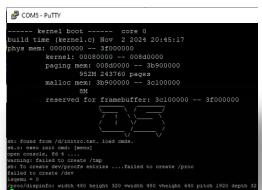  
(a) Boot screen

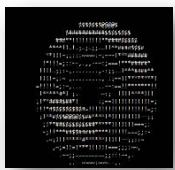  
(b) text donut

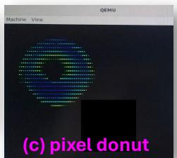

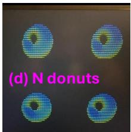

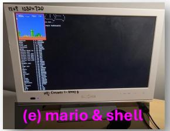

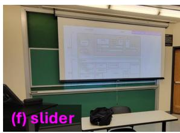

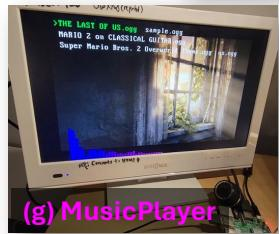

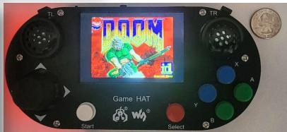  
(h) DOOM on handheld

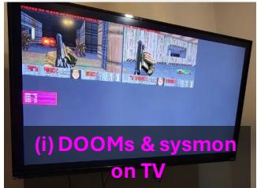

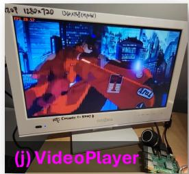

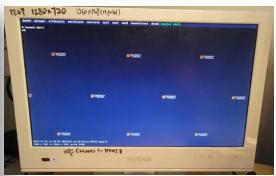  
(k) launcher

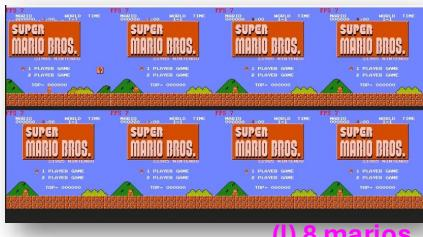  
(l) 8 marios

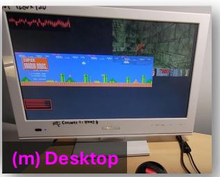  
Figure 1. Proto running various apps, across different prototype stages, and in different hardware settings. (a)–(c) from Prototype 1, (d) from Prototype 2, (e) from Prototype 3, (f–g) from Prototype 4, (h–m) from Prototype 5.

## Abstract

Proto is a new instructional OS that runs on commodity, portable hardware. It showcases modern features, including per-app address spaces, threading, commodity filesystems, USB, DMA, multicore support, self-hosted debugging, and a window manager. It supports rich applications such as 2D/3D games, music and video players, and a blockchain miner. Unlike traditional instructional systems, Proto emphasizes engaging, media-rich apps that go beyond basic terminal programs. Our method breaks down a full-featured OS into a

This work is licensed under a Creative Commons Attribution 4.0 International License.   
SOSP ’25, Seoul, Republic of Korea   
© 2025 Copyright held by the owner/author(s).   
ACM ISBN 979-8-4007-1870-0/25/10   
https://doi.org/10.1145/3731569.3764811

set of incremental, self-contained prototypes. Each prototype introduces a minimal set of OS mechanisms, driven by the needs of specific apps. The construction process then progressively enables these apps by bringing up one mechanism at a time.

Proto enables a wider audience to experience building a self-contained software system used in daily life.

CCS Concepts: • Software and its engineering → Operating systems.

## ACM Reference Format:

Wonkyo Choe\*, Rongxiang Wang\*, Afsara Benazir\*, Felix Xiaozhu Lin. 2025. Proto: A Guided Journey through Modern OS Construction. In ACM SIGOPS 31st Symposium on Operating Systems Principles (SOSP ’25), October 13–16, 2025, Seoul, Republic of Korea. ACM, New York, NY, USA, 17 pages. https://doi.org/10.1145/3731569.3764811

## 1 Introduction

Over the past several decades, the OS course has been a cornerstone of computer science education. While the specific objectives of OS courses may vary, they commonly aim to convey core system concepts: abstractions, virtualization, privilege separation, concurrency, and software/hardware interactions [47].

Beyond these technical concepts, OS courses are also expected to offer a unique experience: building a working system that students can both demonstrate and use themselves. To this end, the OS course is the apex of an undergraduate CS curriculum, where students integrate their knowledge to construct a complete computer system.

Unfortunately, we observe a declining interest in OS—and systems software in general—among college students that we teach, owing to several factors: the dominance of AI [27], the perception that systems work is overly complex, and the frustration often associated with modern systems software. One telling indicator is that many premier North American universities [15] (20 out of top 30) no longer require OS as a core course for undergraduate CS majors. This shift presents both a wake-up call and an opportunity for OS educators: (1) Instructional OS must stay relevant by appealing to broader students, highlighting its practical and demonstrable value. (2) As an elective following Computer System Organization, the OS course now addresses more motivated, better-prepared students. AI tools (e.g., Copilot [25]) further empower them to take on complex code.

Today’s OS education—and more importantly, the instructional OSes that support it—tend to prioritize teaching technical concepts [47], while often overlooking the motivating power of real-world apps. A unique strength of systems software, especially OSes, is that they can produce tangible artifacts that enable interesting, interactive apps. These artifacts can be demonstrated, played with, and even connected to students’ other passions—whether in art, entertainment, design, or creative expression. This, in fact, aligns with the historical roots of many influential systems projects, which were originally created to serve personal or creative needs. Examples include UNIX, developed to run the game Space Travel [61]; the World Wide Web [54], created for sharing research information; and TeX, written for typesetting the author’s own books [56]. Sadly, the spirit and joy of creating a usable system to support one’s own goals is often absent in today’s instructional OS projects.

## 1.1 Principles

Our response is an instructional OS called Proto, which manifests a guided journey through building an OS with rich applications.

Our first priority is to establish clear and compelling motivations for system building—motivations that go beyond running simple terminal programs. To this end, we first target (P1) appealing apps: building engaging, interactive programs that ideally evoke an emotional response from the OS builders themselves. This motivation directly influences our design choices, such as treating the framebuffer as a first-class peripheral and prioritizing support for USB and audio IO. We further emphasize (P2) demonstrability. The OS should be able to run on real commodity hardware in addition to emulators. Ideally, it should be portable enough to carry around for live demonstrations, enabling students to showcase their work long after the course ends.

Our second consideration is managing complexity: balancing the technical depth needed to support engaging apps with the limited effort students can realistically invest (typically 17 weeks and no more than 150 hours). To achieve this, we adopt (P3) incremental prototyping. The OS is delivered to students in multiple self-contained snapshots, each augmenting earlier ones and is fully functional. Compared to a “big bang” approach, incremental prototypes provide clear baselines for continued development. We note that a number of prior instructional OSes were built with incremental prototyping [19, 26, 59]. More broadly, incremental prototyping is a proven method in complex engineering projects such as the Ford Model T, Boeing 747, and SpaceX rockets [18, 43, 63]. It is also common to many instructional OSes. We also require (P4) minimum viable implementations. Every new OS feature—whether it’s a syscall, threading, or multicore scheduling—must directly support a target app or an essential component of it. We will evaluate the efficacy of these principles in Section 7.

## 1.2 Design

We first fully implement Proto, before decomposing it into five incremental snapshots, referred to as “prototypes 1–5”. Further, we map each prototype to one or multiple target applications, ranging from simple 3D animations (Prototype 1) to video games (Prototype 3) and video playback (Prototype 5). See Table 1 for prototype features and their target apps.

The OS construction by students is then driven by enabling one app after another, augmenting earlier prototypes (so that they build upon familiar designs) and adding new OS features including per-app address spaces, multimedia output, USB peripherals, filesystems, DMA, and multicore execution. At a higher level, this process resembles interactive designs—akin to video games or theme park experiences—by keeping students as OS builders motivated with clear, meaningful goals, rewarding them with tangible progress (making apps functional), and maintaining engagement through timely transitions between different prototype stages in an incremental fashion.

## 1.3 Results & Contributions

Through its design, Proto achieved the following goals.

First, Proto is lightweight. Its kernel core is less than 10K SLoC, comparable to existing instructional OSes (§7.1).

Second, Proto is demonstration-ready. It runs on both software emulators and low-cost ARMv8 hardware. As shown in Figure 1, Proto supports a variety of apps: it can run games (e, i), play music and videos (g, j), and even project presentation slides for classroom use (f).

Third, Proto is fast and efficient. Through a careful balance of optimization and simplicity, Proto achieves strong performance on low-cost ARMv8 platforms. On kernel microbenchmarks (§7.2), it incurs overheads similar to xv6 [46]; it performs comparably to Linux and FreeBSD on most benchmarks. On app benchmarks (§7.3), Proto runs DOOM at around 60 FPS and plays back video at around 26 FPS—on par with Linux and FreeBSD running the same apps on the same hardware. Proto also scales to quad-core processors. When running on a handheld device (Figure 1(h)), the system typically draws less than 4 watts and operates for several hours on a single battery charge (§7.4).

Finally, Proto is pedagogically effective. Our user study shows that most students found the design principles (P1–P4) directly contributed to their learning experience and sparked enthusiasm for systems software (§7.5).

In summary, this paper presents a series of incremental, self-contained OS prototypes motivated by appealing applications such as animations, media playback, and video games. Each prototype introduces a set of OS mechanisms explicitly mapped to target applications that critically depend on them. We report the architectures chosen for each prototype, balancing trade-offs among app features, OS complexity, and modern OS concepts to be conveyed. Our result is Proto, a new instructional OS that runs on commodity, portable hardware. It showcases modern features, including per-app address spaces, threading, commodity filesystems, USB, DMA, multicore, self-hosted debugging, and a window manager. It supports rich applications such as 2D/3D games, music and video players, and a blockchain miner. The code is publicly available at: https://github.com/fxlin/uva-os-main.

## 2 Background

This section positions Proto within the broader context of instructional OSes and explains our rationale for hardware choices.

## 2.1 Relation to existing OSes

Instructional OS Most instructional OSes are “headless”, i.e., they lack GUI and instead support shell-based apps and utilities backed by simple file systems. Notable academic projects include Embedded Xinu [49] (a port of Xinu [45]), xv6 [46], Nachos [44], GeekOS [53], Pintos [59], MiniOS [57], and the more recent EGOS-2000 [14]. The open-source community also contributes instructional OSes [22, 24]. Among these, only a small subset can run on actual hardware, typically on ARMv7 [10, 48], ARMv8 [9, 22], and RISC-V [14, 46, 49].

While prior work—especially xv6—have greatly influenced our system, their designs heavily focus on conveying OS concepts, overlooking appealing apps (P1) and demonstrability (P2), which are central to our approach.

Production OS for education A recent survey [47] suggests that more than half of participating universities use Linux for teaching OS. Other choices of production OSes include Android [38], RT-thread [21], and RISCOS [31]. Students typically modify parts of these systems, such as CPU schedulers. This approach falls short for several reasons. (1) It does not align with our goal of providing an end-to-end system-building experience. Modifying a large, existing OS does not offer the same educational value as building one from scratch. (2) Production OSes are not suitable for stripping down due to their inherent complexity and generality. They support a wide range of apps and hardware, resulting in excessive layers of indirection. (3) While working with production OSes like Linux/Android may excite some, their complexity may limit accessibility for a wider audience.

Full-stack system projects We are inspired by recent educational initiatives that guide students in constructing endto-end systems capable of running graphical apps [20, 32]. Compared to them: (1) We target commodity hardware as the primary platform. This choice significantly influences how we balance practical realism and simplicity, handle hardware quirks, and support debugging (see Section 3). (2) We emphasize demonstration-ready, usable apps, which in turn motivate support for modern OS features such as commodity filesystems, USB, and DMA.

## 2.2 Student assignments

Next, we discuss student assignments built on prior educational OSes, including xv6 [46], Pintos [59], Embedded Xinu [2], GeekOS [53], EGOS-2000 [14], Chickadee [19], JOS [26], and WeensyOS [5]. Throughout, we use “lab” to refer to a single standalone submission from students.

Lab structure and granularity Assignment design is largely shaped by the trade-off between learning objectives (breadth vs. depth) and the expected time commitment. Broadly, prior assignments fall into two types: breadth-oriented and depthoriented. A breadth-oriented lab typically involves adding features to individual components [5, 42, 52, 53], whereas a depth-oriented lab often requires implementing most or all of an OS subsystem [19, 26, 59]. Accordingly, breadthoriented labs are usually independent (e.g., students receive fresh starter code for each lab), while depth-oriented labs are typically sequential, with each lab building on the codebase from previous labs [19, 26, 59], culminating in a functional OS by semester’s end. Proto adopts a sequential approach in that labs build on each other, but is breadth-oriented in that each lab cuts across multiple OS components.

Lab topics Although labs vary in granularity, each typically centers on a single OS topic—either a user component or a kernel subsystem. Common topics include: (1) shell implementation [4, 26]; (2) CPU scheduling [2, 14, 26, 57]; (3) process management (e.g., fork/exec/wait/exit) [19, 46, 52, 53]; (4) memory management (e.g., virtual memory or paging) [3, 34]; (5) file systems (e.g., large-file support or fine-grained synchronization) [5, 19, 26, 59]. Few labs span user–kernel boundaries or integrate multiple subsystems. In contrast, Proto’s labs are organized around target applications, so each lab naturally spans multiple subsystems and user–kernel interactions.

Student workload In prior educational OS courses, there are typically 4–7 labs per semester, each lasting 2–3 weeks. Labs are often divided into manageable checkpoints. Checkpoints usually have dependencies and are intended to be completed in sequence. Required submission artifacts are primarily source code and design documents. Instructors typically provide starter code by removing key portions from a working implementation. The omissions range from a few essential functions (common in breadth-oriented labs [5]) to most of an entire component (common in depth-oriented labs [59]). Proto instead emphasizes breadth through application-driven labs of wider scope: students modify tens of files across multiple components, with tasks decomposed into smaller units and arranged in non-linear dependencies (see Section 6).

## 2.3 Hardware Considerations

Targeting real hardware aligns with our goal of demonstrability (P2); it exposes real-world challenges like cache timing, multicore bugs, and nondeterminism, which emulators cannot replicate.

We choose the Raspberry Pi 3B (Pi3) as our sole platform for several reasons. (1) Popular ISA. ARMv8 is simpler than x86, yet widely used (IoT, phones, Macs), with extensive documentation and relevance. (2) Availability. Released in 2016, Pi3 has sold over 23 million units, is priced at \$35, and will remain in production through 2029 [51]. (3) Documentation. Pi3 is well-documented, with strong open-source support and an active community [37]. (4) Performance. Four Cortex-A53 cores at 1 GHz, NEON SIMD, and 1 GB of memory make Pi3 suitable for a range of gaming and media apps. (5) Peripheral Ecosystem. Pi3 is compatible with many expansion boards (called HATs [12]), including a Game HAT (see Section 7), which adds a 640p screen, battery, buttons, and speakers.

While other platforms based on RISC-V and x86 are also popular for instructional OSes [14, 46], they are lacking in one or more of the aspects above.

Single Hardware Platform Support Focusing on a single hardware platform simplifies both design and implementation. Cross-platform compatibility would introduce extra layers of abstraction—such as function pointers and conditional compilation—that increase code complexity and reduce readability. It would also complicate the build system, making it harder to understand and modify.

Risk of Hardware Obsolescence Targeting a single platform risks obsolescence if the hardware becomes unavailable. Historically, many x86-based instructional OSes faced this issue. We plan to switch to the Raspberry Pi 4 (also ARMv8) by 2030, updating the board-level code as needed.

## 3 Proto Overview

We next describe Proto in its complete form, which includes all the OS capabilities. This implementation is the starting point for our decomposition into a series of prototypes.

Userspace Our target apps include:

• donut: One or more spinning 3D tori [28], comprising either textual characters (for UART text output) or pixels (for framebuffer).

• mario: The LiteNES emulator [11], supporting limited games including Mario Bros. (1983).

• sysmon: A floating, transparent window that visualizes real-time CPU and memory usage.

• slider: A slide viewer for BMP, PNG, and GIF formats, intended for the OS builders to present their design.

• DOOM: A famous 3D game ported to virtually “anything with a screen” [30]. We build on the doom generic [8] project and implement key event polling and texture/renderer management. We chose not to implement sound mixing due to its complexity.

• MusicPlayer: Intended to enhance user engagement and evoke emotions. It plays OGG files while displaying album covers. The importance of sound in games/computer programs and for tangible user experience is crucial [50, 55, 60].

• VideoPlayer: Playback of MPEG-1 videos.

• launcher: A GUI frontend for launching programs with an animated background.

• blockchain: A multithreaded program for mining blocks.

Of these apps, a number of them were derived from NJU’s project-N [20]. We also ported all console apps from xv6, including shell (enhanced with script execution) and utilities as ls, cat, and echo. Most user apps are in C and only a few are in C++ (blockchain).

Underneath these apps are a small set of libraries we ported, including libc (newlib), SDL (Simple DirectMedia Layer, for portable rendering/input support), libvorbis (for OGG playback), LODE (for png), among others.

OS architecture Proto is a monolithic kernel with an architecture similar to xv6. The kernel and user apps run at

EL1 and EL0 of ARMv8, respectively. The OS supports user processes and both user and kernel threads, and can execute them across all four CPU cores of the Pi3. The kernel is written in a mix of C and ARMv8 assembly. It includes CPUspecific code for the ARM Cortex-A53 and board-specific device drivers for the Pi3.

Proto uses virtual memory with separate address spaces for each user app. User space starts at 0x0; kernel space uses addresses prefixed with 0xffff. The kernel maps physical memory and I/O in 1 MB blocks, while user apps use 4 KB pages. Only the user stack uses demand paging.

Proto implements 28 syscalls across three categories: task management (e.g., fork, sleep), file system (e.g., open, close), and threading/synchronization (e.g., clone, semaphore). The kernel exports device files (e.g., /dev/fb for framebuffer and /dev/events for keyboard) and proc files (e.g., /proc/cpuinfo and /proc/meminfo). We chose UNIX-like kernel interfaces so that existing apps and their dependent libraries (e.g., DOOM and SDL) can be ported with minimal modifications.

IO support Proto supports a selective set of IO peripherals, tailored for the target apps: framebuffer (for HDMI output), USB keyboards, GPIO (for Game HAT buttons), PWM (for sound output via a 3.5mm jack), SD cards, and UART. The decision to include USB is a careful balance between demonstrability and code simplicity, as discussed in Section 4.4.

Proto implements a window manager (see a photo in Figure 1(m)) allowing multiple apps to render to the screen and for input events to be dispatched to the app with focus.

OS image On the Pi3, Proto runs from an SD card with two partitions. Partition 1 contains the kernel image, which is loaded and launched by the Pi3 firmware. The kernel image packs the kernel code/data as well as an opaque ramdisk dump. The ramdisk, which is formatted with an ext2-like filesystem, incorporates all the user programs as ELF executables. Partition 2, formatted as FAT32, stores user files such as videos and game assets. At boot time, the kernel mounts its primary filesystem on the ramdisk and the secondary filesystem on the SD card’s partition 2. This setup allows users to conveniently exchange files between Proto and their personal devices (computers, phones, cameras) by copying files to and from partition 2. See Section 4.5 for details and rationale for supporting FAT32.

## 4 The prototypes

We now describe the individual prototypes, focusing on their target apps, the OS capabilities these apps necessitate, and the associated design tradeoffs.

<table><tr><td rowspan=1 colspan=1></td><td rowspan=1 colspan=1></td><td rowspan=1 colspan=5>Prototype-X</td></tr><tr><td rowspan=1 colspan=1></td><td rowspan=1 colspan=1></td><td rowspan=1 colspan=1>1</td><td rowspan=1 colspan=1>2</td><td rowspan=1 colspan=1>3</td><td rowspan=1 colspan=1>4</td><td rowspan=1 colspan=1>5</td></tr><tr><td rowspan=12 colspan=1> Apps</td><td rowspan=1 colspan=1>helloworld</td><td rowspan=1 colspan=1>&lt;</td><td rowspan=1 colspan=1>√1</td><td rowspan=1 colspan=1>√1</td><td rowspan=1 colspan=1> $\blacktriangledown$ </td><td rowspan=1 colspan=1></td></tr><tr><td rowspan=1 colspan=1>donut</td><td rowspan=1 colspan=1>√</td><td rowspan=1 colspan=1>11</td><td rowspan=1 colspan=1>V</td><td rowspan=1 colspan=1>V1</td><td rowspan=1 colspan=1>√1</td></tr><tr><td rowspan=1 colspan=1>mario</td><td rowspan=1 colspan=1></td><td rowspan=1 colspan=1></td><td rowspan=1 colspan=1>²</td><td rowspan=1 colspan=1> $\blacktriangledown$ </td><td rowspan=1 colspan=1></td></tr><tr><td rowspan=1 colspan=1>sysmon</td><td rowspan=1 colspan=1></td><td rowspan=1 colspan=1></td><td rowspan=1 colspan=1></td><td rowspan=1 colspan=1>√</td><td rowspan=1 colspan=1></td></tr><tr><td rowspan=1 colspan=1> shell &amp; utilities</td><td rowspan=1 colspan=1></td><td rowspan=1 colspan=1></td><td rowspan=1 colspan=1></td><td rowspan=1 colspan=1>√</td><td rowspan=1 colspan=1></td></tr><tr><td rowspan=1 colspan=1>slider</td><td rowspan=1 colspan=1></td><td rowspan=1 colspan=1></td><td rowspan=1 colspan=1></td><td rowspan=1 colspan=1>√</td><td rowspan=1 colspan=1>√4</td></tr><tr><td rowspan=1 colspan=1>buzzer</td><td rowspan=1 colspan=1></td><td rowspan=1 colspan=1></td><td rowspan=1 colspan=1></td><td rowspan=1 colspan=1>√</td><td rowspan=1 colspan=1></td></tr><tr><td rowspan=1 colspan=1>MusicPlayer</td><td rowspan=1 colspan=1></td><td rowspan=1 colspan=1></td><td rowspan=1 colspan=1></td><td rowspan=1 colspan=1></td><td rowspan=1 colspan=1></td></tr><tr><td rowspan=1 colspan=1>DOOM</td><td rowspan=1 colspan=1></td><td rowspan=1 colspan=1></td><td rowspan=1 colspan=1></td><td rowspan=1 colspan=1></td><td rowspan=1 colspan=1></td></tr><tr><td rowspan=1 colspan=1>launcher</td><td rowspan=1 colspan=1></td><td rowspan=1 colspan=1></td><td rowspan=1 colspan=1></td><td rowspan=1 colspan=1></td><td rowspan=1 colspan=1></td></tr><tr><td rowspan=1 colspan=1>blockchain</td><td rowspan=1 colspan=1></td><td rowspan=1 colspan=1></td><td rowspan=1 colspan=1></td><td rowspan=1 colspan=1></td><td rowspan=1 colspan=1></td></tr><tr><td rowspan=1 colspan=1>VideoPlayer</td><td rowspan=1 colspan=1></td><td rowspan=1 colspan=1></td><td rowspan=1 colspan=1></td><td rowspan=1 colspan=1></td><td rowspan=1 colspan=1></td></tr><tr><td rowspan=3 colspan=1>User lib</td><td rowspan=1 colspan=1>malloc,salls</td><td rowspan=1 colspan=1></td><td rowspan=1 colspan=1></td><td rowspan=1 colspan=1>√</td><td rowspan=1 colspan=1>√</td><td rowspan=1 colspan=1></td></tr><tr><td rowspan=1 colspan=1>proc/devfs wrappers</td><td rowspan=1 colspan=1></td><td rowspan=1 colspan=1></td><td rowspan=1 colspan=1></td><td rowspan=1 colspan=1>√</td><td rowspan=1 colspan=1></td></tr><tr><td rowspan=1 colspan=1>lib, minisdl&amp; more</td><td rowspan=1 colspan=1></td><td rowspan=1 colspan=1></td><td rowspan=1 colspan=1></td><td rowspan=1 colspan=1></td><td rowspan=1 colspan=1></td></tr><tr><td rowspan=12 colspan=1> Kernelcore</td><td rowspan=1 colspan=1>debug msg</td><td rowspan=1 colspan=1>√</td><td rowspan=1 colspan=1></td><td rowspan=1 colspan=1></td><td rowspan=1 colspan=1></td><td rowspan=1 colspan=1>√</td></tr><tr><td rowspan=1 colspan=1>timer,timekeeping</td><td rowspan=1 colspan=1></td><td rowspan=1 colspan=1></td><td rowspan=1 colspan=1></td><td rowspan=1 colspan=1></td><td rowspan=1 colspan=1>√</td></tr><tr><td rowspan=1 colspan=1>irq</td><td rowspan=1 colspan=1></td><td rowspan=1 colspan=1></td><td rowspan=1 colspan=1>√</td><td rowspan=1 colspan=1>√</td><td rowspan=1 colspan=1>√</td></tr><tr><td rowspan=1 colspan=1>multitasking</td><td rowspan=1 colspan=1></td><td rowspan=1 colspan=1></td><td rowspan=1 colspan=1>√</td><td rowspan=1 colspan=1></td><td rowspan=1 colspan=1>√</td></tr><tr><td rowspan=1 colspan=1>memoryallocator</td><td rowspan=1 colspan=1></td><td rowspan=1 colspan=1>5</td><td rowspan=1 colspan=1>5</td><td rowspan=1 colspan=1>6</td><td rowspan=1 colspan=1>6</td></tr><tr><td rowspan=1 colspan=1>privileges (EL0/1)</td><td rowspan=1 colspan=1></td><td rowspan=1 colspan=1></td><td rowspan=1 colspan=1>√</td><td rowspan=1 colspan=1>√</td><td rowspan=1 colspan=1>√</td></tr><tr><td rowspan=1 colspan=1>virtual memory</td><td rowspan=1 colspan=1></td><td rowspan=1 colspan=1></td><td rowspan=1 colspan=1>L</td><td rowspan=1 colspan=1>√</td><td rowspan=1 colspan=1>√</td></tr><tr><td rowspan=1 colspan=1>syscalls:tasks&amp;time</td><td rowspan=1 colspan=1></td><td rowspan=1 colspan=1></td><td rowspan=1 colspan=1>√</td><td rowspan=1 colspan=1>√</td><td rowspan=1 colspan=1></td></tr><tr><td rowspan=1 colspan=1>syscalls:files</td><td rowspan=1 colspan=1></td><td rowspan=1 colspan=1></td><td rowspan=1 colspan=1></td><td rowspan=1 colspan=1>√</td><td rowspan=1 colspan=1>√</td></tr><tr><td rowspan=1 colspan=1>syscalls: threading</td><td rowspan=1 colspan=1></td><td rowspan=1 colspan=1></td><td rowspan=1 colspan=1></td><td rowspan=1 colspan=1></td><td rowspan=1 colspan=1></td></tr><tr><td rowspan=1 colspan=1>multicore</td><td rowspan=1 colspan=1></td><td rowspan=1 colspan=1></td><td rowspan=1 colspan=1></td><td rowspan=1 colspan=1></td><td rowspan=1 colspan=1></td></tr><tr><td rowspan=1 colspan=1>windowmanager</td><td rowspan=1 colspan=1></td><td rowspan=1 colspan=1></td><td rowspan=1 colspan=1></td><td rowspan=1 colspan=1></td><td rowspan=1 colspan=1></td></tr><tr><td rowspan=5 colspan=1>Files</td><td rowspan=1 colspan=1>fileabstraction</td><td rowspan=1 colspan=1></td><td rowspan=1 colspan=1></td><td rowspan=1 colspan=1></td><td rowspan=1 colspan=1>√</td><td rowspan=1 colspan=1></td></tr><tr><td rowspan=1 colspan=1>procfs/devfs</td><td rowspan=1 colspan=1></td><td rowspan=1 colspan=1></td><td rowspan=1 colspan=1></td><td rowspan=1 colspan=1>√</td><td rowspan=1 colspan=1></td></tr><tr><td rowspan=1 colspan=1>ramdisk</td><td rowspan=1 colspan=1></td><td rowspan=1 colspan=1></td><td rowspan=1 colspan=1></td><td rowspan=1 colspan=1>√</td><td rowspan=1 colspan=1></td></tr><tr><td rowspan=1 colspan=1>xv6filesystem</td><td rowspan=1 colspan=1></td><td rowspan=1 colspan=1></td><td rowspan=1 colspan=1></td><td rowspan=1 colspan=1>√</td><td rowspan=1 colspan=1></td></tr><tr><td rowspan=1 colspan=1>FAT32</td><td rowspan=1 colspan=1></td><td rowspan=1 colspan=1></td><td rowspan=1 colspan=1></td><td rowspan=1 colspan=1></td><td rowspan=1 colspan=1></td></tr><tr><td rowspan=6 colspan=1>10</td><td rowspan=1 colspan=1>UART</td><td rowspan=1 colspan=1>√</td><td rowspan=1 colspan=1></td><td rowspan=1 colspan=1></td><td rowspan=1 colspan=1> $\blacktriangledown$ </td><td rowspan=1 colspan=1></td></tr><tr><td rowspan=1 colspan=1>timers (sys,generic)</td><td rowspan=1 colspan=1></td><td rowspan=1 colspan=1></td><td rowspan=1 colspan=1>一</td><td rowspan=1 colspan=1> $\blacktriangledown$ </td><td rowspan=1 colspan=1></td></tr><tr><td rowspan=1 colspan=1>framebuffer</td><td rowspan=1 colspan=1></td><td rowspan=1 colspan=1></td><td rowspan=1 colspan=1>√</td><td rowspan=1 colspan=1> $\blacktriangledown$ </td><td rowspan=1 colspan=1></td></tr><tr><td rowspan=1 colspan=1>USBkeyboard</td><td rowspan=1 colspan=1></td><td rowspan=1 colspan=1></td><td rowspan=1 colspan=1></td><td rowspan=1 colspan=1>√</td><td rowspan=1 colspan=1></td></tr><tr><td rowspan=1 colspan=1>sound (PWM)</td><td rowspan=1 colspan=1></td><td rowspan=1 colspan=1></td><td rowspan=1 colspan=1></td><td rowspan=1 colspan=1>√</td><td rowspan=1 colspan=1></td></tr><tr><td rowspan=1 colspan=1>SD card</td><td rowspan=1 colspan=1></td><td rowspan=1 colspan=1></td><td rowspan=1 colspan=1></td><td rowspan=1 colspan=1></td><td rowspan=1 colspan=1>√</td></tr></table>

1. Multiple instances; 2. mario (no inputs); 3.Multiple games 4.with high res PNGs.  
5. Page based allocation 6.kmalloc 7.polling & RX only 8. irq & RX only 9. irq RX/TX

Table 1. The feature matrix of all prototypes.

## 4.1 Prototype 1: “Baremetal IO”

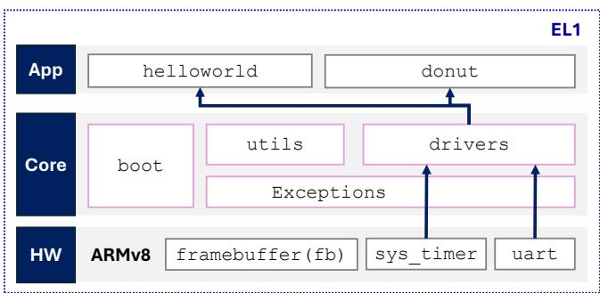  
Figure 2. The architecture of Prototype 1

Target app: A donut spinning on display (Figure 1(b,c)). OS capabilities: Prototype 1 is a baremetal appliance for a single application. Its architecture is similar to that of a microcontroller like ESP32. It demonstrates the concept of software abstracting hardware details and introduces the idea of virtualization through the timer driver.

Unlike many education OSes where display was introduced much later if at all, we support the framebuffer as a first-class IO device via the Pi3’s hardware mailbox interfaces. For debugging messages, the prototype implements a minimalist output-only, polling-based UART driver. For simplicity, UART writes are synchronous. We found interrupt-driven UART writes unnecessarily complicated the kernel; for instance, such writes would need a ring buffer for outstanding writes, which itself needs locks; on the other hand, the lock code may print debugging messages via UART, creating a circular dependency. Thus, we keep UART writes always synchronous throughout prototypes 1–5, and defer interrupt-driven (asynchronous) inputs and outputs to USB keyboards (Prototype 4) and DMA sound (Prototype 5), respectively. Finally, Prototype 1 drives per-core ARM generic timers and a SoC-level timer, as well as multiple virtual timers above these.

Other than that, the kernel itself is minimalistic. The prototype has output (for animation and debugging) but no input. Everything runs at the same exception level on a single core. For donut animation, each frame is rendered in the timer interrupt handler. Synchronization is also introduced: initially a spinlock, which is later reduced to reference-counted interrupt on/off due to the single-core nature.

## 4.2 Prototype 2: “Multitasking”

Target app: Multiple concurrent donuts spinning at their own pace. New OS capabilities: This prototype introduces multitasking, runs predefined tasks, one for a donut. It reinforces the concept of virtualization, with the case of CPU.

Thanks to the framebuffer implementation in Prototype 1, the progress and priorities of tasks can be visualized on the screen through the spinning rates and angles of the donuts.

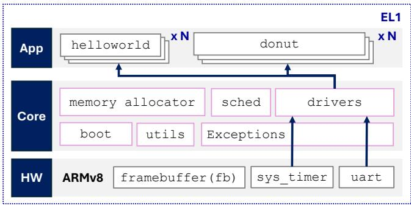  
Figure 3. The architecture of Prototype 2

As timed animation, the donut tasks sleep periodically. This necessitates the scheduler’s support for tasks to sleep. When all tasks are sleeping, the kernel makes the CPU idle, which motivates simple power management via WFI [62].

Much of the complexity of enabling the target app comes from context switch: manipulation of CPU registers around the interrupt handlers and scheduler. The scheduler itself is simple (a single runqueue), sufficient to manage several tasks on a single core. All code runs at EL1 with no kernel/user separation. Everything operates on physical addresses, with memory for tasks statically reserved. The “kernel” is a monolithic program, and apps are simply functions compiled into the same binary.

## 4.3 Prototype 3: “User vs. Kernel”

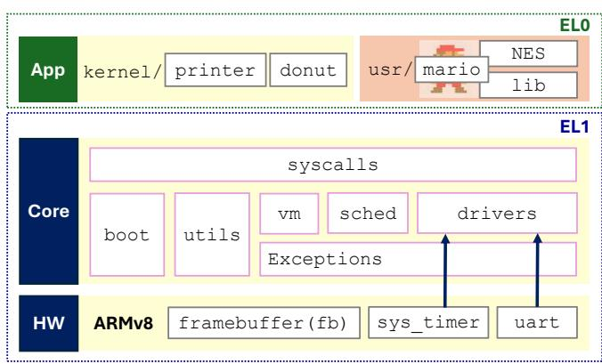  
Figure 4. The architecture of Prototype 3

Target app: mario without inputs (see Section 3 for description). New OS capabilities: This prototype introduces user/kernel separation, which allows us to compile, link, and execute mario independent of the kernel.

Our virtual memory system is standard. Prototype 3 enables virtual memory shortly after boot, using a small page table with coarse blocks to map 1GB of DRAM and IO registers linearly to the kernel’s virtual address space. Each task maps a code/data region and a stack at 4KB granularity. Demand paging is enabled by default, initially mapping only code pages and one stack page. Tasks with repeated page faults at the same address are terminated by the kernel.

The VM is not enough for motivating the user-kernel separation. To motivate a userspace more decoupled from the kernel, this prototype supports “infant” apps that run in their own address space and at EL0, but are still compiled and linked as part of the kernel. These infant apps are launched via jumps from the kernel code, rather than exec(). This is achieved by ensuring the app code only issues PC-relative memory references. Evidently, such infant apps are brittle because absolute addresses would refer to the kernel address space and cause exceptions. They are only suitable for simple “hello world” code consisting of tens of lines. This limitation motivates linking and loading mario (around 2K lines of code) independently of the kernel.

One important decision is the omission of files, deferring them to the next prototype, as file support would introduce a myriad of data structures (e.g. locks and inodes) and code, complicating the task management and syscall paths. Without files, our syscalls are just several: fork() and exit() for task lifecycles, sbrk() for mario’s pixel buffer allocation, sleep() for timed rendering, and write() hardwired to UART for debugging. While some have questioned the relevance of fork() in production systems [41], we found it valuable for exercising the concepts of VM in an educational context. A special file-less exec() is needed due to lack of files. Our build scripts bundle mario’s ELF executable as an opaque binary, with the kernel image at the link time. At run time, exec() parses the ELF region in memory and loads the code/data segments into the user virtual address space. It also hardcodes the arguments (e.g., framebuffer address and geometry) as expected by mario.

At the end of exec(), the kernel appends a 4KB granular mapping to mario’s page table, covering the entire framebuffer (typically several MBs). For debugging ease, the virtual address is identity-mapped to the framebuffer’s physical address, enabling direct framebuffer access akin to Linux’s Direct Rendering Infrastructure (DRI) [58].

Related to the omission of files, mario’s input functionality is deferred to Prototype 4, which drives a USB keyboard and encapsulates it as a device file. Note that UART, although functional since Prototype 1, is unsuitable for games due to its lack of key modifiers, multi-key support, and key release detection.

Interestingly, mario, even without inputs, continuously renders animated frames—such as flashing a coin on the title screen—and eventually transitioning into autoplay. This limitation encourages students to engage with the next prototype to enable full control of mario.

Framebuffer rendering provides a window into the impact of CPU cache behavior. First, the framebuffer must be mapped as cached to avoid significant FPS drop. Second, an interesting yet subtle issue arises: the CPU cache must be flushed for the framebuffer region on every frame; otherwise, stale framebuffer pixels from previous frames will cause nondeterministic visual artifacts that will gradually disappear as cache lines hit the memory.

Since the user level (EL0) cannot flush the cache under typical hardware configurations, a kernel request (e.g., via a syscall) is required. Ultimately, cache maintenance is crucial for reliable game performance.

Students work at both the user and kernel level to build Prototype 3. On the kernel side, they must implement key functions such as creating kernel page tables, setting up the kernel idmap, as well as completing the syscall path for exec(). On the user side, they are tasked with implementing argument parsing in the provided NES emulator and finishing the graphics buffer flushing function.

## 4.4 Prototype 4: “Files”

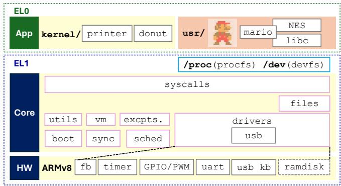  
Figure 5. The architecture of Prototype 4

Target apps: Additional NES games, slider, MusicPlayer. New OS capabilities: This prototype introduces the file abstraction, extending the user/kernel interfaces. Underneath files, it introduces a small filesystem on ramdisk as well as new IO drivers. The asynchrony introduced by the new IOs necessitates additional concurrency mechanisms inside both the kernel and userspace.

We store games, photos and music as disk files. As such, the NES game engine can load additional ROMs as files (as opposed to the mario ROM hardcoded in a C header for the engine). The slider app loads photo files as slides, and MusicPlayer loads music files and their album cover photos. We ported xv6’s ext2-like filesystem (“xv6fs” for short) for its simplicity. The filesystem runs on a ramdisk; since all block reads/writes are synchronous, file read/write paths always execute in syscall contexts, easing understanding and debugging. Support for physical block devices, which must cope with storage hardware details, is deferred to Prototype 5. This decision decouples the complexity of a storage stack.

App IO is supported through device files. They encapsulate IO devices, including the framebuffer (/dev/fb), audio output (/dev/sb), and USB keyboard (/dev/events), as needed by the target apps. Detailed descriptions are provided below.

Atop disk and device files, Prototype 4 implements a series of file system syscalls, including open(), close(), read(), write(), and lseek().

For audio playback, we implement asynchronous IO paths. The MusicPlayer app continuously writes sound samples to the device file (/dev/sb). The device driver then copies these samples and transfers them to the audio hardware via DMA for pulse width modulation output. Subsequently, DMA interrupts notify the driver to supply more samples. This setup forms a producer-consumer pipeline involving the app, the device driver, and the audio hardware, passing samples via ring buffers and synchronized by condition variables and locks—a classic OS design pattern. If there are problems in this pipeline—such as buffer corruption or deadlocks—audio playback will stutter or stop, providing immediate and clear feedback for debugging.

Compared to simple character devices such as UART, a keyboard that supports key modifiers is more suitable for games. We chose USB keyboards over simple I2C/SPI keypads as a deliberate tradeoff: USB keyboards are cheap (\$10) and available in portable or even foldable forms, easing system demonstration. The tradeoff is the increased software complexity from a USB stack.

We ported Circle/USPi [13], a baremetal USB stack for Pi3. The stack only requires a few kernel APIs for virtual timers, which were introduced in Prototype 1. Although USPi is the lightest USB stack we could find, it still has around 10K SLoC, with multiple layers of abstraction. We do not expect the students to fully understand and debug it. In return, the stack makes Proto extensible to more USB classes, such as ethernet adapters and mass storage, in the future.

The app’s need for handling multiple asynchronous inputs motivates adopting IPC for the app’s event loop . Notably, the main loop of mario has to handle periodic timer events (for rendering frames at certain rate) and keyboard inputs. Lacking asynchronous IO and threading (available in Prototype 5), mario shows a use case of IPC: the main loop forks two additional processes, one calling msleep() periodically and the other reading from /dev/event in a blocking manner; the two processes write events to a shared pipe (two writers), from which the main loop reads.

In this prototype, students work on both the kernel and user sides. On the kernel side, they implement functions that enable read and write operations on device files and complete the keyboard driver. On the user side, they develop code for terminal programs such as shell, ls, and cat, and write code to invoke system calls for reading and writing device files, thereby utilizing the framebuffer and keyboard.

## 4.5 Prototype 5: “Desktop”

Target apps: VideoPlayer, a blockchain miner, and DOOM, as well as running multiple instances of them concurrently on screen. New OS capabilities: In the userspace, richer apps necessitate the inclusion of libc (newlib [17]) and a trimmed-down SDL (Simple DirectMedia Layer) [29] among other libraries. The kernel brings up FAT32 on SD cards, scales to all four CPU cores, and runs a window manager.

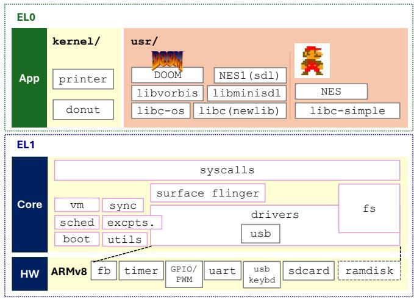  
Figure 6. The architecture of Prototype 5

xv6’s filesystem (“xv6fs”) becomes the bottleneck for new apps. (1) Capacity: xv6fs only supports files up to 270KB, insufficient for larger photos, videos, and DOOM’s game assets. (2) Performance: xv6fs reads and writes single blocks instead of block ranges, making it unacceptably slow for loading files in MBs. (3) Interoperability: While it is possible to mount xv6fs on SD cards, commodity OSes cannot access these partitions without custom programs to parse and manipulate xv6fs.

These limitations motivate porting a commodity filesystem to Prototype 5. We chose ChaN’s FatFS, a FAT32 implementation used by popular embedded systems [6]. In around 6K SLoC, FatFS exposes high-level APIs with semantics close to our file syscalls (e.g. open, close, read/write). FatFS does not have an inode concept, encapsulating on-disk data structures behind its APIs, whereas each file or directory in xv6fs has an in-memory inode. To bridge the gap, Prototype 5 maintains pseudo-inodes for each opened FAT file and directory. Prototype 5 further interposes file syscalls and dispatches them to either xv6fs or FatFS based on paths. At runtime, the OS mounts on its root filesystem (in xv6fs) under ‘/’ and mounts the FAT32 partition under ‘/d’.

To support FatFS, Prototype 5 includes a baremetal SD card driver. Unlike a full MMC (multimedia card) subsystem, which typically has tens of KSLoC [33], our driver is only 600 SLoC. It initializes the controller and card, and performs synchronous reads and writes of single blocks or block ranges, polling for their completion. Although the hardware is capable of DMA, our driver does not use it.

We adopt Non-blocking IO for key-polling games, such as DOOM. This necessitates minor enhancements to the kernel IO path, including the VFS, device files, and the USB driver, to handle the non-blocking flag and peek the ring buffer without waiting for new data.

We use threading to process SDL audio concurrently. SDL uses a dedicated thread to stream audio samples to the device file, running in parallel with the thread decoding the audio. Furthermore, structuring mario with multiple threads is more natural than using multiple processes that communicate via pipes (as in Prototype 4). To this end, Prototype 5 implements a simple clone() with flag CLONE\_VM (a Linuxlike interface chosen to ease the porting of existing user libraries); within the kernel, threads are implemented by sharing mm structs across tasks. To synchronize threads, Prototype 5 adds semaphore syscalls and implements user-level mutexes and condition variables atop semaphores. It also implements user-level spinlocks.

Running four or more mario instances quickly saturates a single core, motivating the OS to scale to multicore. To do so, we made the following kernel modifications. (1) The kernel’s boot code releases additional cores held in the “parked” status by the Pi3 firmware. (2) It configures MMUs for multicore cache coherency. (3) It augments the scheduler runqueue and vector tables so that each core has a copy. (4) The interrupts from ARM generic timers [16], which drive scheduler ticks, are fed to each core, whereas interrupts from all other IO are routed to core 0 for simplicity.

We implement window manager (WM, in around 800 SLoC) to provide desktop experiences. Our window manager executes as a kernel thread. Compared to running WM as a user process (e.g., as in Android), our design favors simplicity by avoiding the need to implement shared memory IPC and protocols for exchanging drawing contents across process boundaries.

To draw via the WM, apps render indirectly to a device file (/dev/surface). Internally, WM maintains a list of such surfaces drawn by concurrent apps and periodically composites these surfaces onto the hardware framebuffer. Additionally, the WM tracks the “focused” app window and dispatches input events only to this app, which are returned to the app’s read() of /dev/event1. To display many apps simultaneously, WM can render overlapped windows and tracks their z-order. For efficiency, WM tracks dirty window regions across composition rounds and only redraws these regions. It intercepts special key combinations (e.g., ctrl+tab) for switching window focus or moving windows around. It supports floating, semi-transparent windows, allowing sysmon to stay on top of all other running apps (see Figure 1(m)).

In this prototype, students again work on both kernel and user code. On the kernel side, they implement system calls needed for the design, such as completing clone() for threading and modifying open() to support non-blocking I/O. They also finish the SD card driver and FAT filesystem to enable file system support. On the user side, students complete applications that leverage these new kernel features.

For example, in the MusicPlayer app, they add a clone() call to create a worker thread that streams audio samples to the device file.

## 5 Implementation

## 5.1 Debugging support

Most instructional OSes rely on software emulators (e.g., QEMU) for debugging. However, this approach is inadequate to us, as certain nuanced and challenging bugs only manifest on actual hardware. (1) CPU cache behavior. Real hardware may need manual cache flushes (e.g., for framebuffer updates) due to possible incoherence without proper MMU setup. (2) Uninitialized memory. Unlike QEMU’s zeroed memory, real hardware has arbitrary values in uninitialized memory. (3) IO differences. E.g. GPU framebuffers may be mapped to arbitrary addresses on real hardware. (4) Parallelism. QEMU often lacks the non-deterministic thread interleaving seen on real hardware. To address these issues, Proto supports debugging on both QEMU and real hardware.

In addition to UART-based printk() and emulator debugging, we support hardware-assisted debugging on Pi3:

• Hardware debug exceptions. We implement a simple debug monitor (200 LOC) using ARMv8 debug exceptions (DBGBCR, DBGWCR), enabling breakpoints (on specific PC), watchpoints (on address access), and single-stepping. This facilitates debugging complex user code and diagnosing memory corruption.

• Stack unwinder. We port a simplified ARMv8 stack tracer (600 LOC) [23], capable of unwinding both kernel and user stacks. It prints raw callsite addresses (without debug symbols), which can be resolved offline on a development machine.

• Event tracing. Inspired by Linux’s ftrace, we implement a ring buffer for all cores to write timestamped trace events, with negligible overhead. These are dumped on demand, e.g. to diagnose scheduler and concurrency issues.

• Panic button. We reserve ARMv8’s FIQ (fast interrupt) for triggering emergency dumps. A GPIO-triggered FIQ (e.g., connected to a physical push button) remains unmasked at all times. When the button is pressed, the FIQ is routed in a round-robin fashion so that each occurrence is handled by a different core. This mechanism ensures that if the kernel is deadlocked and IRQs are masked, pressing the button will dump call stacks from all cores.

Consideration of JTAG and GDB Our kernel supports low-cost JTAG debuggers (e.g., FTDI-based, Segger J-Link) via the Pi3’s GPIO pins. JTAG enables baremetal debugging from a development machine, typically using GDB over a proxy like OpenOCD [36] (supporting breakpoints, singlestepping, etc). However, our experience shows that JTAG on Pi3 requires tedious setup and lacks key features, such as halting on reset, loading programs, and reading system registers. For our purposes, JTAG is less effective than selfhosted debugging described above.

Although it is feasible to port GDB as a user program for native debugging, we decided against it due to the added dependencies, including libreadline, libncurses, kernel support for signals, and the ptrace syscall.

## 5.2 Performance Optimizations

We implemented a small set of optimizations to make target applications usable. Our kernel implements memory move using ARMv8 assembly, as these are often bottlenecks in framebuffer rendering. In the user library, we implement pixel buffer conversions (e.g., YUV to RGB) using ARMv8 SIMD. These optimizations improve video playback framerate by nearly 3x (from under 10 FPS to around 30 FPS for 480p video). Our kernel’s buffer cache, inherited from xv6, supports only single-block operations, which suffices for xv6’s simple filesystem but bottlenecks FAT32’s multi-block access. This severely slows large file loads (e.g., DOOM assets, videos). To mitigate this, we bypass the buffer cache for FAT32 range accesses, directly interfacing with the SD card driver, reducing latency by 2–3x. (See Section 7 for details).

## 5.3 Support for C++ apps

Our userspace implements a minimal runtime conforming to ARM’s baremetal ABI (BPAPI [1, 39]). This includes crt0.c (wrapping main()), and crti.c/crtn.c (handling global constructors/destructors). With under 100 SLoC, the runtime supports our C++ applications (e.g. Blockchain) as well as enabling future C++ apps like ML or game engines.

## 5.4 Excluded OS Features

File crash-consistency was excluded due to the lack of compelling applications requiring crash consistency and the complexity of journaling mechanisms, which adds challenges to filesystem understanding. Network stack implementation, while feasible with our USB/Ethernet driver and available opensource TCP/IP stacks, was excluded as networking is not a course objective. Pthreads were omitted due to the lack of support in the recent newlib version and the complexity of popular implementations like glibc or musl [35]. Current parallel programs directly use syscalls for thread management. Signals and related syscalls were not implemented; this however limits our compatibility with tools like GDB. HDMI audio output was excluded as it requires a proprietary firmware blob, adding unnecessary complexity for our purposes.

## 5.5 Development and Deployment

Leveraging the Pi3’s rich peripheral ecosystem, we pair it with Game HAT, a handheld expansion board (Figure 1(h)), which is more self-contained than other kits (e.g., RPi Personal Computer Kit, SmartiPi Touch). Game HAT’s buttons connect via GPIO and emit key events through /dev/events. With this setup, Proto can render to a built-in 3.5" display as well as external displays such as big TVs (Figure 1(i)) and classroom projectors (f). Section 7 evaluates battery life of Proto on Game HAT.

<table><tr><td>Lab</td><td>#Tasks</td><td>#Files</td><td>SLoC</td><td>#Videos</td></tr><tr><td>Lab1</td><td>13</td><td>10</td><td>~100</td><td>9</td></tr><tr><td>Lab2</td><td>10</td><td>10</td><td>~100</td><td>9</td></tr><tr><td>Lab3</td><td>7</td><td>18</td><td>~150</td><td>6</td></tr><tr><td>Lab4</td><td>7</td><td>21</td><td>~300</td><td>7</td></tr><tr><td>Lab5</td><td>6</td><td>28</td><td>~300</td><td>6</td></tr></table>

Table 2. Student workload for labs, showing numbers of tasks, numbers of source files to modify, lines of code to write, and numbers of required video evidences for assessment. See Figure 14 for detailed lab tasks.

Our toolchain and scripts run on Ubuntu 22.04. To support Windows and macOS users, we test the setup on WSL2 (Windows), VMware Player (Windows/x86), and VMware Fusion (Apple Silicon). We fixed a few QEMU bugs during development.

We develop Proto in three main stages: (1) Implement all required features in a monolithic OS codebase; (2) Identify target apps and map them to essential OS features; decompose the OS into five prototypes accordingly; (3) Refine each prototype, define student experiments, and maintain them separately. We also introduce demo functionalities in the final prototype.

## 6 Student assignments

## 6.1 Lab design

Throughout the semester, students complete five labs, each corresponding to one of the five prototypes described in Section 4. For each lab, students submit one assignment. We provide starter code for every lab, designed as a clean slate so that performance in an earlier lab does not affect grading in later labs.

Task structure Assuming students have at most 150 hours for assignments (§2), we design labs to prioritize breadth of OS concepts over depth in any single component. Our goal is for students to work with many parts of an OS, with each part requiring relatively small (yet still crucial) tweaks or fixes. Each lab consists of multiple tasks, where each task exercises specific OS concepts, as shown in Figure 14. Tasks often have dependencies, and completing a sequence of dependent tasks unlocks interesting application features along the way. Students are not required to complete all tasks to earn full credit for a lab; they may choose their own path through the task graph based on the features they aim to implement. Some students find this structure analogous

Proto: A Guided Journey through Modern OS Construction

<table><tr><td>Platform</td><td>Configuration</td></tr><tr><td>Pi3</td><td>Pi3 model b+, Samsung EVO MicroSD 32GB</td></tr><tr><td>qemu-wsl</td><td>QEMU on Ubuntu in WSL2 on Win11</td></tr><tr><td>qemu-vm</td><td>QEMU on Ubuntu in VMPlayer on Win11</td></tr></table>

Table 3. Test platforms used in evaluation. QEMU runs on a machine with Intel Ultra 7 155H and 96GB of DRAM

to video games, with a main storyline complemented by optional side quests.

Task workload We, as instructors, create the starter code by removing key pieces from a working prototype. Each task is intentionally small, typically requiring students to understand 1–2 source files, modify several or more code locations, and write tens of lines of code in total. For example, one task asks students to complete the user-level memory mapping code so that mario can render graphics. Table 2 summarizes the typical student workload. This contrasts with many instructional OS assignments that require implementing an entire standalone subsystem (e.g., a filesystem).

Teamwork Labs 1–3 are completed individually, while Labs 4 and 5 expect teamwork. The rationales are: (1) Labs 4 and 5 involve rich userspace and GUI applications, which may exceed the time budget of some students working alone; (2) many tasks in Labs 4 and 5 have inherent parallelism (e.g., separate kernel and user-level components needed by a window manager), allowing teammates to work concurrently and later integrate their work.

## 6.2 Student deliverables & assessments

We find it challenging to automatically test a custom OS running in QEMU or on real hardware. Thankfully, our labs are centered on media-rich applications; we thus require video evidence for critical tasks (marked with bold borders in Figure 14), making students responsible for demonstrating that their OS enables the required features (e.g., rendering four rotating donuts at different rates). Video submissions must meet strict criteria: minimum duration (e.g., 30 seconds), minimum resolution (e.g., 1080p), continuous display of the student’s university ID, and no post-editing. If video evidence is not provided, instructors will manually assess the student’s source code.

## 7 Evaluation

We test our OS prototypes with apps on Raspberry Pi 3 (Pi3 in short) and QEMU as listed in Table 3. The evaluation shows our system (1) is capable of running feature-rich apps, (2) is competitive against production OSes on target apps, not only just microbenchmarks, (3) is sufficiently efficient for demonstration and use.

<table><tr><td>OS</td><td>C Library</td><td>Media Library</td></tr><tr><td>Ours</td><td>newlib 4.4.0</td><td>(custom)</td></tr><tr><td>xv6-armv8 [9]</td><td>musl 1.2.1</td><td>None</td></tr><tr><td>Ubuntu/Linux 22.04</td><td>glibc 2.35</td><td>SDL 2.0.20</td></tr><tr><td>FreeBSD 14.2</td><td>BSD libc 1.7</td><td>SDL 2.30.10</td></tr></table>

Table 4. OS configurations used in evaluation

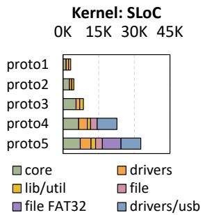

<table><tr><td>Proto.</td><td>Details</td></tr><tr><td>proto1</td><td>app:~260</td></tr><tr><td>proto2</td><td>app:~557</td></tr><tr><td>proto3</td><td>app:~2.4K userlib: 781</td></tr><tr><td>proto4</td><td>app:~5K userlib: 957</td></tr><tr><td>proto5</td><td>app:~76K userlib: ~770K</td></tr></table>

Figure 7. Source code analysis. (Left) Breakdown of kernel source lines of code (SLoC) for different prototypes; (Right) Breakdown of app source lines of code (SLoC) for different prototypes.

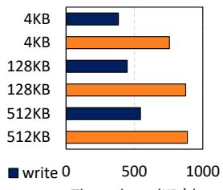  
Throughput (KB/s)read

<table><tr><td>Syscall</td><td>3.4±0.04 us</td></tr><tr><td>IPC latency kernel load</td><td>21.0±0.00 us</td></tr><tr><td>-by firmware</td><td>2753±3 ms</td></tr><tr><td>kernel boot</td><td></td></tr><tr><td>-to prompt</td><td>3186±7 ms</td></tr></table>

Figure 8. Kernel microbenchmarks. (Left) File system throughput; (Right) latencies in syscall (getpid()) and IPC (one-byte message sent over pipe()), averaged over 5,000 runs; boot time from power on to kernel loaded and to shell prompt, averaged over 5 runs. Platform: Pi3

## 7.1 Code analysis

Figure 7(a) shows the kernel SLoC, ranging from approximately 2.5K (Prototype 1) to around 33K (Prototype 5, mostly from FAT32 and USB drivers), comparable to other instructional OSes (xv6 [46]: 10K, Xinu [45]: 8K, pennOS [40]: 6K). The breakdown highlights our incremental OS construction; the core functionalities remain small (from around 1K SLoC in Prototype 1 to around 8K in Prototype 5). Figure 7(b) shows the userspace source: ranging from simple animations in a few hundred SLoC to DOOM in 45K SLoC. Much complexity comes from a few production libraries such as newlib.

## 7.2 Microbenchmarks

The building blocks of our OS exhibit low overheads, as shown in Figure 8: (1) The overhead of a syscall is around 3 ??s. (2) One-way IPC between user processes takes approximately 21 ??s, which includes scheduling, data copying, and context switch; (3) The FAT32 read/write throughput achieves several hundred KBs per second; the throughput is primarily constrained by our SD driver, which lacks DMA support and polls registers for read and write. (4) The entire device takes around 6 seconds from power-on to shell prompt; much of this time is spent by the firmware loading our kernel and our kernel initializing slow peripherals such as USB controllers.

Comparison to xv6 Figure 9 compares our system to the xv6-armv8 [9], a popular instructional OS ported to Pi3, using musl [35] as its C library. The results indicate: (1) Our system exhibits comparable kernel overheads, as reflected by similar latencies in benchmarks such as getpid, sbrk, and IPC. (2) Our system outperforms xv6-armv8 on compute benchmarks (e.g., md5sum and qsort), likely due to differences in the standard C libraries used (newlib in ours versus musl in xv6- armv8). (3) Our system also outperforms xv6-armv8 on file benchmarks, which can be attributed to differences in SD card driver implementations; both are simplistic and custombuilt, but ours appears to be more efficient.

Comparison to production OSes Figure 9 compares our system to Ubuntu 22.04 and FreeBSD 14.2. The results indicate that our system achieves comparable latencies (within 0.5x to 2x) to production OSes in most cases. Notable exceptions are: (1) Our fork() (also xv6) is significantly slower due to the lack of lazy page table replication and demand paging as in production OSes. (2) Our file performance is also lower due to simplistic filesystem implementations and SD card drivers that use polling.

We also evaluated a few other instructional OSes that support Pi3, such as vmwOS [7, 48], Xinu [10, 45], and RT-Thread [21]. However, they were unsuitable for benchmark comparisons: some only support 32-bit execution, others are restricted to a single address space, and many lack sufficient system call implementations to run most of the microbenchmarks.

## 7.3 App benchmarks

Proto delivers good performance for its target apps.

Applications Our benchmark configurations include: (1) DOOM, which uses direct rendering without a window manager. (2) VideoPlayer, which decodes both video and audio streams and uses direct rendering; video files are preloaded into memory before decoding. (3) mario in three variants. (i) mario-noinput (Prototype 3), which runs one thread and uses direct rendering, without handling any input events. (ii) mario-proc (Prototype 4), which runs multiple processes to handle input events; it uses direct rendering. (iii) mario-sdl (Prototype 5), which runs multiple threads to handle the events; it renders indirectly via a window manager.

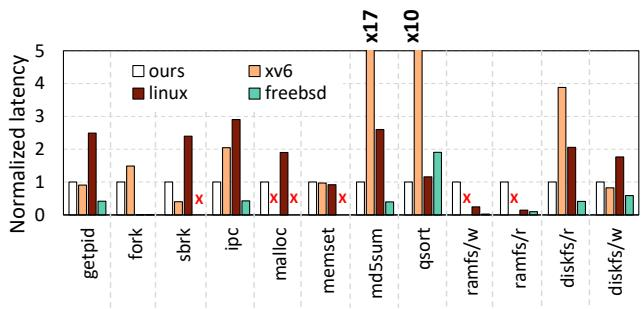  
Figure 9. OS microbenchmarks, showing our latencies (normalized to 1.0) are lower than xv6 on most benchmarks, and are comparable to Linux and FreeBSD. All experiments run on Pi3. x on empty bars indicates benchmarks that could not be run due to missing OS features.

Throughput (Table 5) In these experiments, we make DOOM and mario variants render as fast as possible without locking to a fixed FPS; we make video playback target a video’s native framerate. FPS is measured after a 20-second warmup period. As illustrated in Table 5, both DOOM and mario on Proto achieve decent throughput of 62–115 FPS. In video playback, our system attains 27 FPS for 480p video, close to its native framerate (30 FPS), while considerably lower for 720p video (12FPS). Among three mario variants, mario-noinput has similar FPS to mario-sdl, which are both lower than mario-proc; the differences reflect the impact of our OS designs, which will be analyzed in latency breakdown below. All benchmarks see higher throughputs (from 13% to 1.5x) when Proto runs on QEMU atop a modern x86 machine.

Comparison to production OSes We further compare our throughputs to Ubuntu/Linux and FreeBSD (configurations in Table 4). They run on the same hardware (Pi3), use the same compiler and optimization levels (gcc-11 with O2), and build the same app sources. For minimum overhead, we run Linux and FreeBSD on X servers without a window manager. The results show that our throughputs are comparable to Linux/FreeBSD, ranging from 0.8x to 1.9x, or differing by −15–30 FPS. Note that we do not claim that our system is competitive against production OSes, as the latter is capable of hardware-accelerated rendering which our apps do not utilize; and that the latter incurs the overhead of a generic X server which our system eschews.

Rendering latency Figure 11(a) reveals the sources of rendering overhead. Overall, rendering delays are dominated by app execution: primarily the application logic such as game engine and video/audio decoding and drawing (e.g. buffer and pixel manipulation); by contrast, the kernel incurs low overhead, e.g. writes to mmap’d framebuffer or device files. The latency also explains the FPS difference when running the three mario variants on our OS (Table 5): mario-sdl shows higher latency in its app logic than the other two variants, likely because inclusion of a full-fledged C library (newlib) adds overhead to its game execution.

<table><tr><td rowspan="2">Platform</td><td colspan="3">Pi3</td><td rowspan="2">qemu-wsl Ours</td><td rowspan="2">qemu-vm Ours</td></tr><tr><td>Ours</td><td>Linux</td><td>FreeBSD</td></tr><tr><td>DOOM</td><td> $6 1 . 8 0 { \pm } 0 . 0 1$ </td><td> $3 1 . 8 8 { \pm } 0 . 1 3 $ </td><td>51.24±0.00</td><td> $9 9 . 8 6 { \pm } 0 . 5 0 $ </td><td> $9 2 . 1 3 { \pm } 0 . 7 0 $ </td></tr><tr><td>video (480p)</td><td>26.68±0.40</td><td>19.00±0.20</td><td>24.40±0.13</td><td>30.26±0.04</td><td>28.18±0.28</td></tr><tr><td>video (720p)</td><td>11.57±0.25</td><td>10.05±0.12</td><td>14.60±0.21</td><td>18.37±0.83</td><td> $1 5 . 9 1 { \scriptstyle \pm 0 . 4 7 }$ </td></tr><tr><td>mario-noinput</td><td>108.11±7.35</td><td>=</td><td>1</td><td>137.55±9.53</td><td>106.16±2.71</td></tr><tr><td>mario-proc</td><td>114.72±0.55</td><td>1</td><td>1</td><td>143.37±2.28</td><td> $\overline { { 1 8 5 . 6 9 { \pm 2 . 4 1 } } }$ </td></tr><tr><td>mario-sdl</td><td>72.20±0.59</td><td>87.28±5.39</td><td>56.38±0.50</td><td>121.55±2.48</td><td> $\overline { { 1 9 2 . 9 8 { \pm } 1 . 5 5 } }$ </td></tr></table>

Table 5. Throughput (FPS) of benchmark apps. See Table 3 for platforms and Table 4 for OS configurations. Linux/FreeBSD do not run mario-noinput|proc (marked as ‘-’), which depend devfs and procfs interfaces specific to our OS.

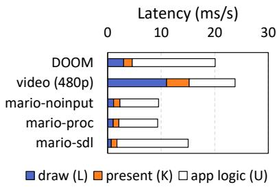  
(a) Rendering latency

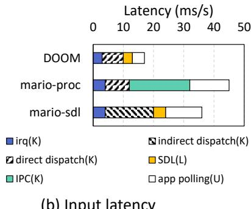  
(b) Input latency  
Figure 11. Latency breakdown of benchmark apps. Note that VideoPlayer and mario-noinput has no inputs. In legends: K=kernel, U=user app, L=user library

Input latency We evaluated system responsiveness, by tracing a USB keyboard event traveling from the device driver to app. In the experiments, we cap the frame rate at 60 FPS.

Overall, such end-to-end input latency corresponds to as low as 1–2 game frames. A detailed breakdown in Figure 11(b)

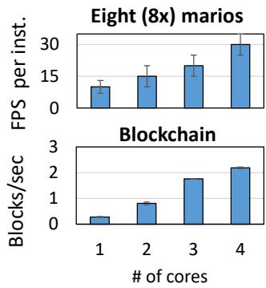  
Figure 10. FPS per app instance as a function of number of CPU cores. Our OS scales to up to four cores. Platform: Pi3 with a quad-core CPU.

shows that: (1) the majority of the latency comes from the app logic: both DOOM and mario poll for input events in their main event loops, in which polling intervals (5 to 13 ms) contribute noticeable latency. (2) Among the remaining components, the extra event indirection (from window manager for mario-sdl, and the IPC between main/input tasks for mario-proc) contribute significantly, which is the cost for OS modularity. (3) Notably, our kernel’s pipe(), a simplistic design ported from xv6, becomes a bottleneck even for passing a keyboard event (fewer than 10 bytes). DOOM, without such event indirection, shows the lowest latency.

Multicore scalability Our system scales well with the number of CPU cores, on a multi-programmed workload (eight simultaneous mario instances, screenshot in Figure 1(l)) as well as on a multi-threaded workload (Blockchain miner). As shown in Figure 10, as the number of cores increases, the throughput sees proportional growth. We also verify that the utilization of all CPU cores is constantly over 95%.

Memory consumption Proto has low memory usage. When running target apps individually (e.g., mario, DOOM, and VideoPlayer), we measured total OS memory usage between 21 MB and 42 MB — about 2% to 4% of the Pi3’s 1 GB of DRAM.

## 7.4 Power efficiency and battery life

We evaluated the system’s power consumption on real hardware to ensure acceptable battery life for portable demos. Measurements were taken on a Raspberry Pi 3 with a GAME-HAT extension board (3.5-inch IPS display), both powered by a metered USB power supply. The display used its default backlight level. As shown in Figure 12, the system draws about 3W at shell prompt, yielding an estimated 3.7 hours of battery life. Under load (e.g., running mario-sdl or DOOM), consumption rises to ∼4W, with battery life dropping to ∼2.6 hours. These results confirm the system is power-efficient enough for demonstration use.

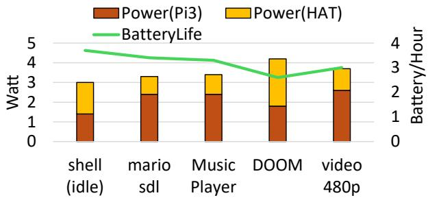

Figure 12. Measured device power and estimated battery life. Power draw broken down to that for Pi3 board as well as for an extension board (HAT) that offers a display, sound amplifier, and power IC. Battery life estimated based on the combined power and one 18650 battery (3000 mAH 3.7V) compatible with the HAT.  
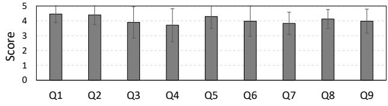

<table><tr><td>P1:Appealing apps</td><td>Q1: Apps interesting? Q2: Apps motivate learning?</td></tr><tr><td>P2: Demonstrability</td><td>Q3: Hardware motivate learning? Q4: Will demonstrate to others?</td></tr><tr><td>P3: Incremental prototype</td><td>Q5: Incremental prototyping helpful? Q6: Early prototypes help later one?</td></tr><tr><td>P4: Minimum viable impl.</td><td>Q7: Understand quests/apps relations? Q8: Quests tied to apps? Q9: Can manage code complexity?</td></tr></table>

Figure 13. A pedagogical survey on Proto, validating our design principles P1–P4 (§1). Responses on a scale of 1 (strong disagreement) to 5 (strong agreement). N=48.

## 7.5 Pedagogical user study

In Spring 2025, we offered an OS course centered around Proto for the first time. Toward the end of the semester, we conducted a survey and received 48 responses out of 59 enrolled students, who were a mix of computer science and engineering majors.

Quantitative results Figure 13 summarizes students’ ratings on how Proto’s four principles (P1–P4, §1) directly supported their learning. (P1) Most students found the interactive apps to be a strong motivator. Many appreciated the opportunity to showcase their apps to others. (P2) Although students could choose between working on real hardware or using emulators, a majority (64%) opted to experiment with real devices and were motivated. Some students noted challenges in setup and debugging. (P3) Incremental prototyping was effective, with early prototypes serving as clear stepping stones to later ones. (P4) Students reported a clear understanding of the relationship between apps and their dependencies, as well as the connections between different prototypes. Overall, the survey validates the pedagogical value of Proto.

Qualitative results Students provided open-ended feedback on Proto and the course. They praised the following aspects: (1) strong application motivations (“Five OS prototypes. . . culminating in DOOM. . . kept me motivated”); (2) incremental complexity across prototypes (“The progressive nature of the labs. . . created a satisfying learning arc”); (3) diverse learning paths (“Choose-your-own-adventure format made labs digestible”); and (4) tight lecture–lab integration (“One without the other would’ve left me confused”). They also reported the following challenges: (1) difficulty of developing on real hardware (“RPI3 impractical to develop while traveling. . . ”); (2) a desire for deeper exploration of certain topics (“Labs went for breadth over depth. . . wished side quests added depth”); (3) workload pressure (“Painful at times. . . worth it, but labs took significant time”); and (4) a need for more scaffolding in early labs (“Jump from basics to implementation was steep”). We will address this feedback in future course iterations.

Discussion Looking ahead, we plan to continue refining the prototypes and incorporating feedback from students. To make the learning curve more approachable, we aim to enhance the documentation for each prototype, offering clearer background, motivation, and references to support student understanding. To broaden the learning experience, we plan to develop additional applications that integrate diverse kernel features, expand the set of lab branches so students can pursue different paths, and provide a curated list of project options for students to explore in their final work.

## 8 Conclusions

Proto showcases that building a modern, usable OS can be both demonstration-ready and educational. By tying modern OS features to real apps, we keep the OS construction a motivated journey, with a clear purpose behind system design. The result is a small, efficient kernel that supports rich apps and runs on real hardware. Proto makes OS construction more approachable for a wider audience, without losing depth or realism.

## ACKNOWLEDGMENT

The authors were supported in part by NSF awards #2128725, #1919197, #2106893, and #2426353. The authors thank the anonymous reviewers and the shepherd, Eddie Kohler, for their insightful feedback.

## References

[1] C++ - OSDev Wiki — wiki.osdev.org. https://wiki.osdev.org/C%2B%2B. [Accessed 08-04-2025].

[2] COSC 3250 Operating Systems: embedded Xinu. https:// www.cs.mu.edu/\~brylow/cosc3250/Spring2024/#Outcomes. [Accessed 08-08-2025].

[3] CS 61 Problem set 3: WeensyOS. https://cs61.seas.harvard.edu/site/ 2024/WeensyOS/#gsc.tab=0. [Accessed 08-08-2025].

[4] CS 61 Problem set 5: Shell. https://cs61.seas.harvard.edu/site/2024/ Shell/#gsc.tab=0. [Accessed 08-08-2025].

[5] CS 61: Systems Programming and Machine Organization (2024). https: //cs61.seas.harvard.edu/site/2024/. [Accessed 08-08-2025].

[6] GitHub – Chan FAT FS –https://github.com/xpacks/chan-fatfs.

[7] GitHub - deater/vmwos: a simple homebrew operating system for the Raspberry Pi — github.com. https://github.com/deater/vmwos.git. [Accessed 08-04-2025].

[8] GitHub - easily portable doom — github.com. https://github.com/ozkl/ doomgeneric.git. [Accessed 08-14-2025].

[9] GitHub - Hongqin-Li/rpi-os: A teaching operating system on raspberry pi 3/4 ported from xv6 — github.com. https://github.com/Hongqin-Li/rpi-os.git. [Accessed 08-04-2025].

[10] GitHub - LdB-ECM/Xinu: Reworking Xinu for The Pi — github.com. https://github.com/LdB-ECM/Xinu.git. [Accessed 08-04-2025].

[11] GitHub - litenes — github.com. https://github.com/NJU-ProjectN/ LiteNES. [Accessed 08-08-2025].

[12] GitHub - raspberrypi/hats — github.com. https://github.com/ raspberrypi/hats. [Accessed 13-04-2025].

[13] GitHub - rsta2/uspi: A bare metal USB driver for Raspberry Pi 1-3 written in C — github.com. https://github.com/rsta2/uspi. [Accessed 14-04-2025].

[14] GitHub - yhzhang0128/egos-2000: Envision a future where every student can read all the code of a teaching operating system. — github.com. https://github.com/yhzhang0128/egos-2000. [Accessed 08-04-2025].

[15] https://csrankings.org/.

[16] https://developer.arm.com/documentation/ddi0500/j/BABGHHEJ.

[17] https://en.wikipedia.org/wiki/Newlib.

[18] https://en.wikipedia.org/wiki/SpaceXStarship.

[19] https://github.com/cs161/chickadee/.

[20] https://github.com/NJU-ProjectN.

[21] https://github.com/RT-Thread/rt-thread.

[22] https://github.com/s-matyukevich/raspberry-pi-os.

[23] https://github.com/torvalds/linux/tree/master/arch/arm/kernel.

[24] https://github.com/yyu/osfs00.

[25] https://learn.microsoft.com/en-us/copilot/microsoft-365/microsoft-365-copilot-overview.

[26] https://pdos.csail.mit.edu/6.828/2018/overview.html. [Accessed 08-08- 2025].

[27] https://stanforddaily.com/2021/02/04/the-rise-of-ai-in-stanfords-cscurricula.

[28] https://www.a1k0n.net/2006/09/15/obfuscated-c-donut.html.

[29] https://www.libsdl.org/.

[30] https://www.reddit.com/r/itrunsdoom/.

[31] https://www.riscosopen.org/content/.

[32] https://ysyx.oscc.cc/en/project/intro.html.

[33] https://github.com/torvalds/linux/blob/master/drivers/mmc/core/core.c.

[34] Jos project list. https://pdos.csail.mit.edu/6.828/2018/labs/lab7/. [Accessed 08-08-2025].

[35] musl libc — musl-libc.org. https://www.musl-libc.org/. [Accessed 08-04-2025].

[36] Open on-chip debugger https://openocd.org/. https://openocd.org/. [Accessed 08-14-2025].

[37] Raspberry Pi OS - Raspberry Pi Documentation — raspberrypi.com. https://www.raspberrypi.com/documentation/computers/ os.html. [Accessed 13-04-2025].

[38] Jeremy Andrus and Jason Nieh. Teaching operating systems using android. In Proceedings of the 43rd ACM technical symposium on Computer Science Education, pages 613–618, 2012.

[39] ARM. Documentation of bpabi; Arm Developer — developer.arm.com. https://developer.arm.com/documentation/dui0474/i/bpabi-andsysv-shared-libraries-and-executables/about-the-base-platformapplication-binary-interface--bpabi-. [Accessed 08-04-2025].

[40] Adam J Aviv, Vin Mannino, Thanat Owlarn, Seth Shannin, Kevin Xu, and Boon Thau Loo. Experiences in teaching an educational user-level operating systems implementation project. ACM SIGOPS Operating Systems Review, 46(2):80–86, 2012.

[41] Andrew Baumann, Jonathan Appavoo, Orran Krieger, and Timothy Roscoe. A fork() in the road. In Proceedings of the Workshop on Hot Topics in Operating Systems, HotOS ’19, page 14–22, New York, NY, USA, 2019. Association for Computing Machinery.

[42] Michael D Black. Build an operating system from scratch: a project for an introductory operating systems course. In Proceedings of the 40th ACM Technical Symposium on Computer Science Education, pages 448–452, 2009.

[43] Emilia Burchardt. The development of prototyping and their research over the centuries. Journal of Mechanical and Energy Engineering, 4(4):309–314, 2020.

[44] Wayne A Christopher, Steven J Procter, and Thomas E Anderson. The nachos instructional operating system. In USENIX Winter, pages 481– 488. Citeseer, 1993.

[45] Douglas Comer. Operating system design: The Xinu approach. CRC Press, 2015.

[46] Russ Cox, M. Frans Kaashoek, and Robert Morris. Xv6, a simple unixlike teaching operating system. 2011.

[47] Maria R Ebling. Resources for teaching operating systems: A survey of instructors and a literature review. ACM Transactions on Computing Education, 24(4):1–28, 2024.

[48] Pascal Francis-Mezger and Vincent M Weaver. A raspberry pi operating system for exploring advanced memory system concepts. In Proceedings of the International Symposium on Memory Systems, pages 354–364, 2018.

[49] Alexander Gebhard, Jack Forden, Oliver Laufenberg, and Dennis Brylow. Using embedded xinu to teach operating systems on baremetal risc-v. In Proceedings of the 55th ACM Technical Symposium on Computer Science Education V. 1, pages 380–386, 2024.

[50] Georgina Guillen, Henrietta Jylhä, and Lobna Hassan. The role sound plays in games: a thematic literature study on immersion, inclusivity and accessibility in game sound research. In Proceedings of the 24th International Academic Mindtrek Conference, pages 12–20, 2021.

[51] Tom’s Hardware. Raspberry pi celebrates 12 years as sales break 61 million units, 2024. Accessed: 2025-04-08.

[52] David A Holland, Ada T Lim, and Margo I Seltzer. A new instructional operating system. ACM SIGCSE Bulletin, 34(1):111–115, 2002.

[53] David Hovemeyer, Jeffrey K Hollingsworth, and Bobby Bhattacharjee. Running on the bare metal with geekos. In Proceedings of the 35th SIGCSE technical symposium on Computer science education, pages 315–319, 2004.

[54] Karwan Jacksi and Shakir M Abass. Development history of the world wide web. Int. J. Sci. Technol. Res, 8(9):75–79, 2019.

[55] Benjamin Kenwright. There’s more to sound than meets the ear: Sound in interactive environments. IEEE Computer Graphics and Applications, 40(4):62–70, 2020.

[56] Donald Ervin Knuth and Duane Bibby. The texbook, volume 15. Addison-Wesley Reading, 1984.

[57] Rafael Román Otero and Alex Aravind. MiniOS: An Instructional Platform for Teaching Operating Systems Projects. arXiv preprint arXiv:1811.09792, 2018.

[58] Brian Paul. Introduction to the direct rendering infrastructure. Linux World, 2000.

[59] Ben Pfaff, Anthony Romano, and Godmar Back. The pintos instructional operating system kernel. In Proceedings of the 40th ACM Technical Symposium on Computer Science Education, pages 453–457, 2009.

[60] James Robb, Tom Garner, Karen Collins, and Lennart E Nacke. The impact of health-related user interface sounds on player experience. Simulation & Gaming, 48(3):402–427, 2017.

[61] Peter H Salus. A quarter century of UNIX. ACM Press/Addison-Wesley Publishing Co., 1994.

[62] KC Wang. Multiprocessing in embedded systems. In Embedded and Real-Time Operating Systems, pages 357–427. Springer, 2023.

[63] Jian-min Wu and Jin-yan Wang. Rapid prototyping enhanced ima system design and verification. In 2012 IEEE/AIAA 31st Digital Avionics Systems Conference (DASC), pages 6B6–1. IEEE, 2012.

## A Appendix

We include the task graphs for labs 1–5 below.

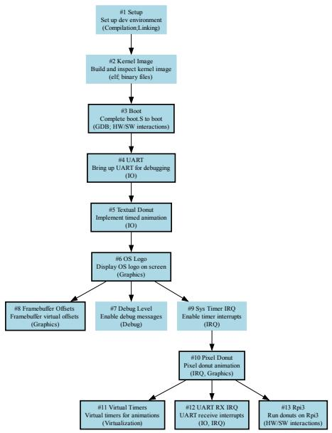  
(a) Lab 1

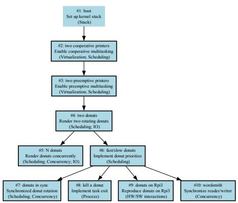  
(b) Lab 2

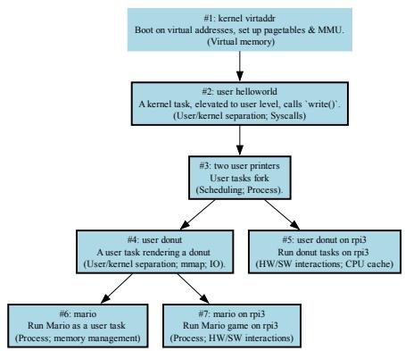  
(c) Lab 3

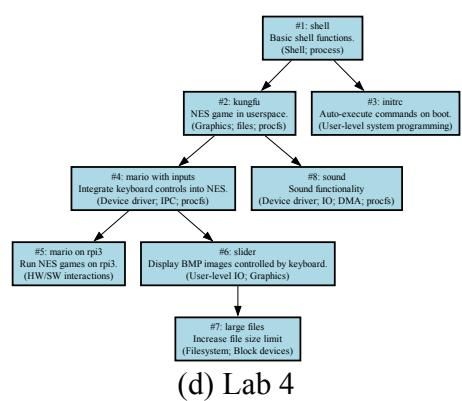

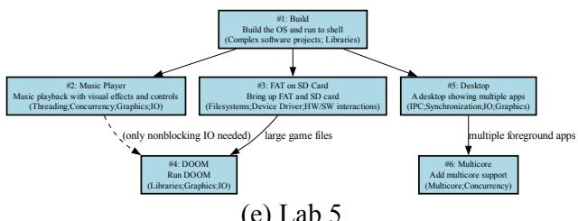  
(e) Lab 5  
Figure 14. Task graphs for all labs. Each box represents a task, with the corresponding OS concepts indicated in parentheses. Boxes with borders denote tasks for which students must submit video evidence for assessment.