Latest updates: hps://dl.acm.org/doi/10.1145/3731569.3764812

RESEARCH-ARTICLE

## Oasis: Pooling PCIe Devices Over CXL to Boost Utilization

YUHONG ZHONG, Columbia University, New York, NY, United States DANIEL S. BERGER, Microso Corporation, Redmond, WA, United States PANTEA ZARDOSHTI, Microso Corporation, Redmond, WA, United States ENRIQUE SAUREZ, Microso Corporation, Redmond, WA, United States JACOB NELSON, Microso Research, Redmond, WA, United States DAN R. K. PORTS, Microso Research, Redmond, WA, United States View all

Open Access Support provided by:

Microso Research

MIT Computer Science & Artificial Intelligence Laboratory

University of Illinois Urbana-Champaign

Columbia University

Microso Corporation

Published: 12 October 2025

Citation in BibTeX format

SOSP '25: ACM SIGOPS 31st Symposium   
on Operating Systems Principles   
October 13 - 16, 2025   
Seoul, Republic of Korea

Conference Sponsors: SIGOPS

# Oasis: Pooling PCIe Devices Over CXL to Boost Utilization

Yuhong Zhong Columbia University

Daniel S. Berger Microsoft Azure University of Washington

Enrique Saurez Microsoft Azure

Jacob Nelson Microsoft Research

Pantea Zardoshti Microsoft Azure

Joshua Fried MIT CSAIL

Antonis Psistakis University of Illinois Urbana-Champaign

Dan R. K. Ports Microsoft Research

Asaf Cidon Columbia University

## Abstract

PCIe devices, such as NICs and SSDs, are frequently underutilized in cloud platforms. PCIe device pools, in which multiple hosts can share a set of PCIe devices, could increase PCIe device utilization and reduce their total cost of ownership. The main way to achieve PCIe device pools today is via PCIe switches, but they are expensive and inflexible. We design Oasis,1 a system that pools PCIe devices in software over CXL memory pools. CXL memory pools are already being deployed to boost datacenter memory utilization and reduce costs. Once CXL pools are in place, they can serve as an efficient data path between hosts and PCIe devices. Oasis provides a control plane and datapath over CXL pools, mapping and routing PCIe device traffic across host boundaries. PCIe devices with different functionalities can be supported by adding an Oasis engine for each device class. We implement an Oasis network engine to demonstrate NIC pooling. Our evaluation shows that Oasis improves the NIC utilization by 2× and handles NIC failover with only a 38 ms interruption.

CCS Concepts: • Software and its engineering → Operating systems; • Computer systems organization → Cloud computing; • Hardware → Emerging technologies.

Keywords: Compute Express Link, CXL, PCIe, resource pooling, datacenter, cloud computing

## ACM Reference Format:

Yuhong Zhong, Daniel S. Berger, Pantea Zardoshti, Enrique Saurez, Jacob Nelson, Dan R. K. Ports, Antonis Psistakis, Joshua Fried, and Asaf Cidon. 2025. Oasis: Pooling PCIe Devices Over CXL to Boost Utilization. In ACM SIGOPS 31st Symposium on Operating

Systems Principles (SOSP ’25), October 13–16, 2025, Seoul, Republic of Korea. ACM, New York, NY, USA, 19 pages. https://doi.org/10.1145/ 3731569.3764812

## 1 Introduction

Motivation. PCIe devices, such as NICs, SSDs, and accelerators, account for a significant portion of both capital and operational costs of servers [3, 79, 149]. Cloud providers like AWS and Azure deploy servers that physically connect to multiple SSDs over PCIe [24, 118], and have access to at least one high-bandwidth NIC. For each server, NICs and SSDs each incur a capital expenditure (CapEx) of around \$2,000, together making up approximately 20-40% of the total server cost [67, 68]. Meanwhile, these devices also drive operational expenditure (OpEx); at Azure, NICs and SSDs each contribute about 13% of total server power consumption [149], adding significantly to server operational costs. In addition, recent work shows that storage devices account for significant embodied carbon emissions [126].

However, PCIe devices are largely underutilized [83, 128, 133]. At the same time, much of the focus of operators and the systems community has been on achieving high utilization for CPU and memory [70, 73, 94, 99, 124, 151].

There are three main causes that lead to low utilization. First, PCIe resources, such as NIC bandwidth and SSD capacity, are often allocated conservatively to satisfy the peak demand of each workload [111, 136, 147]. This leaves allocated resources underutilized most of the time. We find that the P99.99 utilization of the allocated NIC bandwidth within a rack is only 20% at Azure (§2.2). However, due to the tight coupling between PCIe devices and hosts, multiplexing PCIe resources among hosts to improve utilization is challenging.

Second, unallocated PCIe resources could be stranded at a host when the host depletes one type of resource (e.g., CPU cores, memory, NIC bandwidth, or SSD capacity) because additional VMs or containers cannot be scheduled to consume the unallocated resources [115, 136]. We find that 33% of SSD capacity and 27% of NIC bandwidth are stranded at Azure, in other words, they are not even allocated to workloads, resulting in low utilization.

Third, some datacenters provision redundant NICs at each host to ensure network connections in case of NIC failures [7, 12, 48]. Since only a small fraction of hosts will experience NIC failures, the redundant NICs lower overall NIC utilization even further.

One promising approach to improve PCIe device utilization is to share a pool of PCIe devices among several hosts, which we term PCIe device pooling. Pooling can mitigate allocated-but-underutilized PCIe devices by oversubscribing a smaller set of PCIe devices across hosts. For example, cloud operators may choose a configuration where every three hosts share a single NIC. Pooling also addresses stranded resources since hosts can use unallocated PCIe resources at other hosts. In addition, pooling allows hosts to share a few redundant PCIe devices instead of provisioning redundant devices for each host.

Existing solutions. There are only two ways to pool PCIe devices available today: using PCIe switches [2, 103, 122], and disaggregating PCIe devices over RDMA [44, 75, 117].

PCIe switches allow hosts and a pool of PCIe devices to connect to a common switch, which enables any host to utilize any device in the pool [19, 23, 34, 38]. However, deploying PCIe switches is costly and inflexible [103], which hinders their adoption in datacenters. Deploying PCIe switches in a rack adds up to \$80,000 [13] due to the expenses of PCIe switches, switch software, host adapter cards, and cabling. Such high costs can easily outweigh the cost savings of pooling, leading to a negative return on investment (ROI). In addition, each type of PCIe switch can only be used for specific use cases and only supports limited PCIe devices [19, 23, 34]. For example, Liquid’s SmartStack only pools GPUs [34], and GigaIO’s FabreX has different pooling appliances for storage devices and accelerators [20, 21].

The second approach is disaggregating via RDMA. RDMA cannot be used to disaggregate NICs, and many other types of PCIe devices that lack P2P DMA support [46], such as accelerators. Although disaggregating SSDs over RDMA is common in cloud environments [5, 22, 75], local SSDs remain in wide use.2 In addition, RDMA has relatively high latency.

Our work. We propose Oasis, a system that pools PCIe devices in software over Compute eXpress Link (CXL) memory pools. Recent work shows that CXL memory pools can mitigate stranded memory [115], improve memory utilization, and scale up in-memory databases [69, 85, 100, 113, 115].

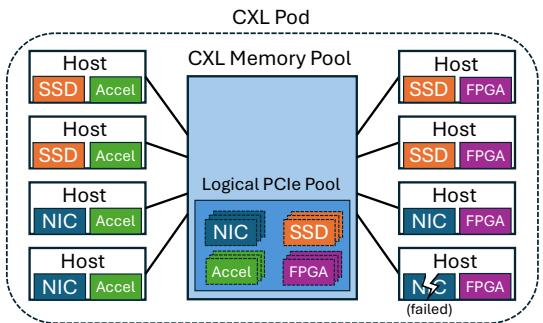  
Figure 1. Oasis enables hosts to access any PCIe device attached to another host in the same CXL pod, forming a logical pool of PCIe devices.

Hardware vendors have also started offering CXL memory devices with pooling capabilities [32, 56, 125].3 A CXL pod [159] consists of multiple hosts within a rack, allowing these hosts to dynamically allocate memory from the pool based on demands. Recent work shows how to build CXL pods with hardware available today for about \$600 per host [82] without using expensive CXL switches.

The key argument of Oasis is that CXL pools are already economically justified for memory, and the same investment can unlock PCIe device pooling at near-zero extra cost. Oasis is the first end-to-end prototype that empirically supports this argument with off-the-shelf CXL 2.0 devices, delivering immediate benefits in total cost of ownership (TCO), nearnative performance, and tens-of-milliseconds failover time.

Oasis uses CXL pools as a building block for implementing PCIe device pooling in software (Figure 1). CPUs and PCIe devices located at different hosts can communicate with each other over a shared CXL memory region. Shared CXL memory can be accessed via load/store instructions from CPU and via DMA from PCIe devices, just like regular memory. CXL pools provide sufficient bandwidth and negligible latency overhead to pool PCIe devices (§2.3).

However, CXL memory pool devices available today are not cache-coherent across hosts. Although the CXL 3.0 specification introduces an optional cross-host hardware coherence flow [11], the implementation requires expensive hardware changes on both the processor and the device [74, 105, 143, 145]. To make Oasis compatible with hardware available today, we do not assume cache-coherent CXL devices.

The lack of cache coherence introduces two challenges for Oasis. First, adding cache line invalidations and fences on every access to allow a PCIe device to access I/O buffers posted by another host could incur significant performance overhead. To overcome this challenge, Oasis exploits the observation that PCIe devices often bypass CPU caches and access memory directly via DMA. Oasis safely avoids unnecessary cache line invalidations and fences to minimize performance overhead.

Second, signaling I/O requests and completions between workloads and PCIe device drivers (e.g., Mellanox NIC driver) between different hosts requires an efficient message channel over shared CXL memory. However, existing message channels designed for CXL either assume cache-coherent shared memory [121, 152, 156] or have performance and correctness bugs since they make unrealistic assumptions on non-coherent shared memory [119]. We identify the key factors that affect the message channel performance using a real CXL memory pool, and propose a novel message channel optimized for non-coherent shared memory. Our design improves the message channel throughput by 29×.

Similar to VirtIO [138], Oasis provides a common datapath and can support different PCIe device classes (e.g., network, storage) by implementing an engine specific to a device class. We implement a network engine to pool NICs in containerized environments. We focus on networking in containerized environments, where existing systems achieve state-of-theart I/O performance [92, 93, 140, 155]. We open source Oasis at https://bitbucket.org/yuhong\_zhong/oasis.

Our evaluation shows that the Oasis datapath only incurs single-digit µs overhead. For comparison, typical cloud network latencies are 50-110 µs (§2.1). We replay a production network packet trace and demonstrate that the Oasis network engine improves the aggregated NIC bandwidth utilization by 2× with negligible performance overhead. In addition, we show that Oasis handles a NIC failure transparently within 38 ms.

Contributions. We make the following contributions:

1. We build Oasis, the first system to pool PCIe devices in software over CXL memory pools. We show that pooling PCIe devices can greatly improve their utilization.

2. We propose a new message channel over non-coherent shared CXL memory in Oasis. We identify the key design choices to optimize the channel’s performance.

3. We implement a network engine in Oasis. The evaluation shows that Oasis improves utilization, incurs low overhead, and supports efficient device failover.

## 2 Background and Motivation

This section describes typical NIC and SSD configurations (§2.1), why these devices have low utilization (§2.2), and explains why we build on CXL memory pools (§2.3).

## 2.1 Cloud NIC and SSD Configuration

We focus on multi-tenant cloud hosts that can serve containers or virtual machines (VMs) [92, 147, 149]. As a concrete example, we consider hosts that serve regular VMs on AWS and Azure. Table 1 summarizes NIC and SSD performance requirements for typical hosts.

<table><tr><td>Type</td><td>Bandwidth</td><td>IOPS</td><td>Latency</td><td>Count</td></tr><tr><td>NIC</td><td>26 GB/s</td><td>4 MOp/s/core</td><td>50-110 μs</td><td>1-2</td></tr><tr><td>SSD</td><td>5 GB/s</td><td>0.5 MOp/s</td><td>100 μs</td><td>6</td></tr></table>

Table 1. Performance requirements for NICs and SSDs.

AWS and Azure hosts currently use 200 Gbps NICs [63, 64]. VM networking typically only uses a fraction of this bandwidth, e.g., 50 Gbps on m8g.48xlarge [66]. The remainder is likely used for RDMA traffic to storage backends [75, 96, 117]. To estimate bandwidth requirements, we account for Ethernet line-coding [58, 61]. In terms of packets per second (IOPS), independent tests have shown limits of about two million operations per second (MOp/s) [59]; we thus use the higher estimates from Google’s Snap [123]. Multitenant clouds usually employ a sophisticated host network stack [91, 123]. VMs on Google Cloud Platform exhibit 65 µs P50 and 111 µs P99 network latency [139] with kernel bypass.

Current AWS hosts offer six local NVMe drives, e.g., on i8g.24xlarge [66]. AWS does not specify the expected bandwidth or IOPS. We thus use peak performance numbers from a datacenter SSD [65], with a typical latency of 100 ???? for random accesses. Azure hosts offer similar configurations with lower sustained bandwidth/IOPS estimates [62].

Overall, fully disaggregating one NIC and six SSDs requires around 56 GB/s, multiple MOp/s (millions of operations per second) [92, 123], and low ???? latency overheads.

## 2.2 Why are NICs and SSDs Underutilized?

Cloud operators typically allocate resources explicitly to instances (i.e., containers or VMs), including CPU cores, memory capacity, SSD capacity, and NIC bandwidth [31, 110, 147]. Low SSD and NIC utilization is mainly caused by three reasons: 1) hosts “strand” resources and cannot allocate them, 2) allocated resource remain underutilized by instances, and 3) redundant PCIe devices for fault tolerance.

Reason 1: Stranded SSDs and NICs. Cloud workloads are heterogeneous as there are many instance types with different resource requirements [4, 18, 52]. This leads to complex bin-packing problems [98, 101, 142], which make it hard to match host resource ratios to demands across the data center [115]. A host accepts new instances until it fills up along one dimension (e.g., memory), leaving the other dimensions stranded (e.g., SSD capacity or NIC bandwidth). Stranded resources cannot be allocated to new instances, which lowers average device utilization.

We quantify stranded resources in a production allocation trace at Azure. The trace records the allocation and deallocation time, the scheduled host, and the resources allocated for each instance. We observe that 27% of NIC bandwidth,

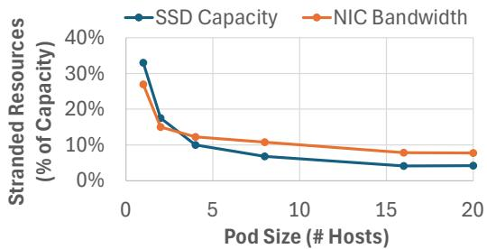  
Figure 2. Average percentage of stranded resources across racks in a production cluster at Azure. This simulation shows that pooling SSDs and NICs across pods reduces stranding with increasing number of hosts in the pod.

33% of SSD capacity, 5% of CPU cores, and 9% of memory capacity are stranded on average. High NIC and SSD stranding motivates pooling these devices across hosts.

Pooling enables hosts to access NICs and SSDs attached to another host in the same “pod”. This reduces stranding and would allow cloud providers to deploy fewer devices to serve the same workload. We quantify the benefits of pooling by using the same allocation trace and randomly assigning hosts to pods. Repeated simulations find the minimum number of devices required to successfully place all instances on the same hosts as in the trace. Figure 2 shows that even small pod sizes can greatly reduce the percentage of stranded SSD capacity and NIC bandwidth. With a pod size of eight hosts, the provider could provision 16% less NIC bandwidth within each pod. Similarly, these pods can reduce the percentage of stranded SSD capacity from 33% to 7%. This reduces SSD capacity required in each pod by 26% which is equivalent to removing the SSDs from two of the eight hosts. Note that resource stranding is only one of the majors sources of PCIe device underutilization. We now turn to the second and even more major source of underutilization: allocated but underutilized devices.

Reason 2: NIC bandwidth is underutilized. To study the utilization of allocated NICs, we randomly sample two racks (rack A and rack B) among previous generation clusters at Azure. These racks are actively used by production workloads. We conservatively select the four hosts with the most network traffic in each rack. The hosts in rack A use 100 Gbps NICs, and 90% of the total NIC bandwidth across the four hosts is allocated including a large fraction for RDMA traffic. The hosts in rack B use 50 Gbps NICs and all NIC bandwidth is allocated. We capture all inbound and outbound packets of those hosts at their ToR switch over 5 minutes.

Figure 3 shows an excerpt of the inbound NIC bandwidth trace of the four hosts at rack A within a one-second period. Figure 3 shows that although the inbound bandwidth usage of host 1 reaches 40 Gbps, it is underutilized most of the time. Note that the bandwidth is highly variable and bursty. While we calculate bandwidth at 10 µs granularity, individual pixels are wider that 10 µs, which makes this plot appear more busy than it is. In fact, host 1’s P99 bandwidth utilization is less than 3%, while its P99.99 utilization reaches 39%.

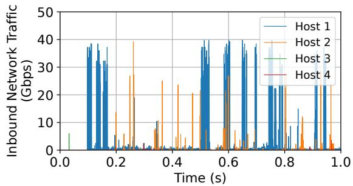  
Figure 3. Inbound network traffic of 4 hosts in a busy rack at Azure.

<table><tr><td></td><td>Host 1</td><td>Host 2</td><td>Host 3</td><td>Host 4</td><td>Aggregated</td></tr><tr><td>Rack A (In)</td><td>39%</td><td>30%</td><td>0%</td><td>23%</td><td>10%</td></tr><tr><td>Rack A (Out)</td><td>40%</td><td>39%</td><td>17%</td><td>32%</td><td>10%</td></tr><tr><td>Rack B (In)</td><td>39%</td><td>75%</td><td>52%</td><td>79%</td><td>20%</td></tr><tr><td>Rack B (Out)</td><td>47%</td><td>63%</td><td>47%</td><td>78%</td><td>20%</td></tr></table>

Table 2. NIC Bandwidth Utilization at P99.99. The last column shows the utilization of a hypothetical pooled NIC that aggregates bandwidth across 4 hosts.

This bursty nature of network traffic leads to the underutilization of allocated NIC bandwidth. One may consider to oversubscribe the NIC bandwidth within a host by scheduling additional instances. However, each instance requires other resources (e.g., CPU cores, memory capacity) and typically these resources are not available. A similar observation was also recently made at Azure where CPU cores and memory are the primary allocation bottleneck [136].

A promising approach is multiplexing the network traffic across multiple hosts within a rack. In fact, many datacenters today already oversubscribe the uplink bandwidth of ToR switches by a 3:1 ratio [8, 14, 41, 97], which indicates that the aggregated NIC bandwidth utilization within a rack is less than 33% even at the peak. From our packet traces, we also observe that the aggregated NIC bandwidth among the 4 hosts does not exceed 20% at the 99.99 percentile in both rack A and rack B (Table 2). This indicates that these four hosts can even share a single NIC without degrading the peak performance, which will improve the aggregated NIC utilization at P99.99 from 20% to 80%.

Reason 3: Redundant NICs to tolerate failures. Many cloud hosts use only a single NIC to keep costs low. However, network failures are relatively common [118, 127, 131]. If a host’s network fails, the entire host becomes unreachable and needs to wait for repair [118].

Network failures are caused by switch linecard failures [144], ToR to host cable issues (such as dust on connectors or cable breaks), and NIC failures [118]. They are commonly hard to diagnose [108] and cloud providers often prefer quick mitigations instead of long root cause analysis [153].

Providers can design hosts with redundant NICs to ensure availability during NIC failures [7, 12, 48]. For example, AWS recommends on-premises hosts running AWS services to have redundant NICs [7]. However, NICs are expensive and power-intensive. While redundancy increases availability, it further exacerbates low NIC bandwidth utilization.

Pooling NICs solves this problem by sharing a small number of redundant NICs across multiple hosts, rather than provisioning redundant NICs for each host. If a NIC fails, the pool can allocate a replacement to the affected host. This reduces the number of redundant NICs needed, lowers costs, and improves device utilization.

Takeaway. In conclusion, not only is each one of these sources of PCIe device underutilization significant on its own, but they compound. In other words, for most cloud operators, a significant percentage of PCIe devices are stranded (i.e., have zero utilization), and even the ones that are allocated have very low utilization (e.g., in the teens). For example, in our traces, this leads to an overall 15% NIC bandwidth utilization and 67% SSD capacity utilization.

Note that many PCIe devices are not designed to operate at 100% utilization. For example, NICs often experience high latency when bandwidth utilization exceeds 90% [141]. Therefore, when selecting a target utilization, datacenter operators should account for potential performance degradation at high utilization (e.g., targeting 80% utilization at P99.99 for NICs).

## 2.3 CXL Memory Pools

CXL standardizes interconnect protocols between processors and memory devices. We focus on CXL.mem which enables CPUs and PCIe devices to transparent load, store, and DMA to CXL memory [11, 143]. All major server-class CPUs (Intel, AMD, ARM) support CXL today.

Bandwidth. A single CXL 2.0/PCIe-5.0 lane provides 4 GB/s bandwidth in both the device-to-host and host-to-device directions. In recent platforms (e.g., Intel Xeon 6, AMD 5th Gen EPYC), each CPU socket has 64 CXL 2.0 lanes [1, 28], which are a subset of the total PCIe lanes, yielding 256 GB/s/direction CXL bandwidth in total. CXL can utilize 92% of its link bandwidth even for random accesses at 64 Byte granularity [143].

We find that 256 GB/s CXL bandwidth is sufficient for pooling PCIe devices, as the typical combined bandwidth demand from NICs and SSDs is only 56 GB/s (§2.1). Even if we consider 400 Gbps NICs (i.e., 50 GB/s bandwidth), 64 CXL lanes still provide sufficient bandwidth.

Latency. The idle load-to-use latency of CXL memory is about 2× the latency of local DDR5 memory. For example, recent measurements on Intel Xeon 5 (EMR) report 2.15× higher latency [143], and our own measurements on AMD 5th Gen EPYC show 2.29× higher latency.

Note that the latency overhead introduced by CXL (hundreds of nanoseconds) is significantly lower than the typical end-to-end I/O latency, which is on the order of tens of microseconds (§2.1). Prior work also shows that placing I/O buffers in CXL memory incurs minimal overhead [157].

CXL pod designs. A CXL pod is formed by connecting a set of CXL memory devices to multiple hosts [104, 105, 115, 159]. Some proposals use CXL switches to build pods [57], but switches are fairly expensive [81, 82, 114]. Thus, industry momentum is to use multi-ported memory devices (MHD) that directly connect to multiple hosts [32, 56, 82, 85, 90, 100, 115, 120, 125]. A single MHD today has up to 20 CXL ports [56], and multiple MHDs can be combined to scale to larger CXL pod sizes [82]. With proposals to replace 40% of host memory with CXL [115], we expect CXL pods to offer multiple TBs of memory.

Shared CXL memory. A CXL memory pool can be used as shared memory across all the hosts in a CXL pod on costeffective CXL 2.0 devices available today [82]. Shared CXL memory has the potential to speed up RPCs, key-value stores, and distributed databases [69, 71, 104, 105, 119, 121, 156].

While CXL 3.0 and later specifications introduce support for hardware coherence across multiple hosts [11, 143], no CPUs or CXL devices support this feature today.

Existing use cases. Most current CXL memory use cases focus on expanding memory capacity and utilizing shared memory rather than increasing bandwidth, resulting in typically low CXL link bandwidth usage:

1. Pooling memory across VMs [115]: Only inactive VM memory is offloaded to CXL, with a maximum of 2 GB/s CXL bandwidth per host.

2. Scaling up databases [104, 105]: Peak CXL bandwidth usage is 3 GB/s due to transaction processing overheads.

3. Pooling memory across databases [69]: OLTP workloads peak at 2 GB/s CXL bandwidth, while OLAP workloads might saturate CXL links.

Thus, CXL links generally offer sufficient bandwidth to support PCIe device pooling alongside most other use cases. We also discuss how explicit Quality of Service (QoS) control can mitigate interference across use cases (§6).

## 3 Oasis: Pooling PCIe in Software

In this section, we present the design of Oasis, which enables pooling PCIe devices in software. Oasis allows hosts to access PCIe devices located at any host within a CXL pod. With Oasis, datacenter operators can safely provision fewer PCIe devices per pod, improving PCIe device utilization without compromising peak performance or availability.

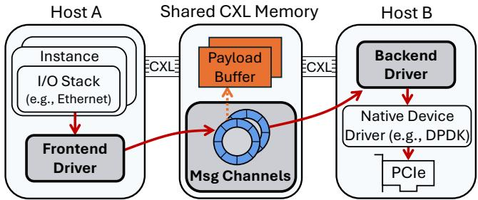  
Figure 4. Each Oasis engine has a frontend driver and a backend driver, and they communicate over the common datapath.

A key design goal is to reuse existing CXL 2.0 pod designs that are available today. These pods target memory pooling use cases [115] and thus do not offer hardware cache coherence.

As different PCIe device types provide different functionalities and have different operating flows, Oasis provides a common datapath that is reused by different device types. A device type can be supported by adding an Oasis engine specific to the type. We also design a centralized control plane for all devices and instances, called a pod-wide allocator, which maps the devices to hosts, and handles load balancing and failure mitigation.

We first present an overview of Oasis (§3.1), and then describe the common datapath (§3.2). Next, we describe the design of our Oasis network engine (§3.3) and storage engine (§3.4) for NIC and SSD pooling, respectively; the storage engine is designed but not implemented. In §3.5, we describe the Oasis control plane, the pod-wide allocator.

## 3.1 Overview

At a high level, the design of Oasis is similar to PCIe device virtualization — virtualization bridges VMs with the devices at the host level [76, 87, 134, 138, 148], while Oasis bridges containers or VMs with devices located at other hosts. We assume that devices are allocated at the granularity of an instance, which could be either a container or a VM. Note that a single device may be allocated to multiple instances for oversubscription.

Oasis provides a common datapath to enable an instance to communicate with PCIe devices located at a different host over non-coherent shared CXL memory. The datapath allows I/O buffers to be allocated in the shared CXL memory so that they can be accessed by any hosts directly. This minimizes the need for data copying on the critical path. In addition, the datapath provides message channels to signal requests and completions between instances and devices.

To support various PCIe device types with different functionalities, each device type can add an Oasis engine to implement the operating flows specific to the type. An engine includes two components: a frontend driver, and a backend driver (Figure 4). The frontend driver at each host provides type-specific interfaces to the local instances. On the other hand, the backend driver only runs on the hosts that are directly connected to the devices, and it interacts with the devices using their native PCIe device driver (e.g., DPDK’s NVIDIA MLX5 Ethernet Driver [17]). The frontend driver forwards I/O operations to the corresponding backend drivers over the Oasis datapath.

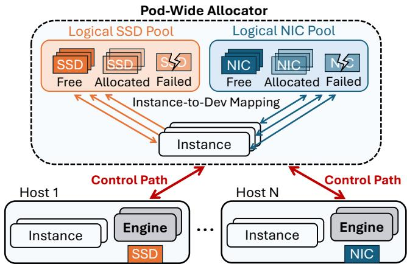  
Figure 5. The pod-wide allocator allocates PCIe resources to instances. It also manages load balancing and failover.

The Oasis control plane, which we call the pod-wide allocator, is responsible for mapping PCIe devices to instances within a pod (Figure 5). The allocator tracks the usage of each device and assigns resources to newly created instances. It can also dynamically migrate instances to other devices for load balancing or failover. The allocator’s policies allow the operator to include static policies such as different instance types (e.g., provisioning certain instances with more NIC bandwidth or SSD capacity), as well as dynamic policies, such as prioritizing certain instances over others when a shared device is under load.

## 3.2 Datapath Over Shared CXL Memory

Oasis provides a common datapath to perform I/O operations across host boundaries. This datapath should serve 56 GB/s and at least 7 MOp/s at low latency (§2.1).

A typical I/O operation includes the following steps: the CPU writes data to an I/O buffer, the CPU signals the relevant device, the device reads data from the I/O buffer via DMA, and the device signals the CPU that the request was completed. Depending on the operation, the sequence can be flipped (e.g., if the device sends data to the CPU). In Oasis, both the I/O buffers and the signaling message channels are allocated in shared CXL memory so that they can be accessed by any hosts within a CXL pod.

Writing I/O buffers to cache-coherent shared memory works out-of-the-box. However, without cache coherence, the CPU and the device could potentially read stale data from an I/O buffer, resulting in data corruption. Similarly, signaling messages written into CXL shared memory from one host may never become visible to other hosts.

A naive approach would require invalidating CPU caches before each read (with a fence to ensure the invalidation completes before the read) and writing back CPU caches after each write on CXL memory. Such frequent cache line invalidations, writebacks, and fences would consume excessive CPU cycles, increase I/O latency, and limit throughput. The Oasis datapath overcomes this challenge by allowing PCIe devices to bypass CPU caches for I/O buffers (§3.2.1) and with a novel message channel to signal I/O requests and completions across different hosts (§3.2.2).

3.2.1 Minimize Coherence Operations for I/O Buffers. To ensure cache coherence for I/O buffers, the datapath must enforce that: 1) when an I/O buffer is passed between a frontend and a backend driver on different hosts, it is fully written to CXL memory, and 2) the receiving host should read the buffer directly from CXL memory (not from its CPU caches). Although cache line invalidations and writebacks at the frontend driver are unavoidable, we find that the backend driver can safely eliminate most of them.

To safely eliminate most cache line invalidations and writebacks at the backend driver, Oasis exploits the observation that PCIe devices (e.g., NICs and SSDs) typically access I/O buffers directly via DMA. DMA typically bypasses the CPU caches except when using the “PCIe allocating write flows” feature, which is also known as DDIO on Intel platforms [26]. Due to security vulnerabilities, Intel recommends that DDIO is disabled in multi-tenant cloud platforms [106, 112]. We also find that disabling DDIO does not affect the performance of state-of-the-art kernel-bypass network stacks [92, 93] with a 100 Gbps Mellanox NIC. We thus find that assuming DDIO is disabled is a reasonable tradeoff for Oasis’s benefits.

Besides DDIO, the other case where DMA may access CPU caches is when the target cache line is already present in the CPU caches. Therefore, the backend driver should avoid bringing I/O buffers into the CPU caches. In our implementation, we find that this is achievable for both the network and storage engines. Specifically, the CPU at the backend driver almost never inspects I/O buffers (§3.3, §3.4).

As long as the PCIe device always bypasses the CPU caches when accessing I/O buffers, cache line invalidations and writebacks at the backend driver can be eliminated. This also removes the overhead caused by CPU-internal cache coherence. Specifically, we ensure that DMA-triggered snoops miss all CPU caches, preventing invalidations or writebacks that would introduce overhead at the backend driver.

3.2.2 Message Channels Over Non-Coherent Shared Memory. For each pair of frontend and backend drivers, we dedicate a shared-memory message channel in each direction to signal I/O requests and completions. Each message channel has exactly one sender and one receiver.

Data structure. Our message channel is a circular buffer in shared CXL memory. By default, we allocate 8192 slots for 16 B or 64 B messages. We find that 16 B messages are sufficient for the network engine (§3.3), while 64 B messages suffice for the storage engine (§3.4). Each engine uses a fixed message size. The most significant bit of each message is reserved as an epoch bit, which the receiver checks to see if the slot holds a new message. The sender toggles this bit whenever it overwrites the slot. Besides message slots, each channel also includes an 8 B counter for the receiver to indicate how many messages it has consumed, preventing the sender from overwriting unread messages.

Optimizations for non-coherent CXL memory. To maintain cache coherence, prior work on non-coherent shared CXL memory [119, 157] proposes bypassing CPU caches entirely when accessing message channels, using either nontemporal memory operations4 [25, 39] or cache line invalidations [9, 10]. However, we find that bypassing CPU caches performs poorly, as prefetching data into CPU caches is critical for maximizing message throughput per core.

Prefetching cache lines with non-coherent memory is challenging. We observe that CPU cache prefetching, whether initiated by hardware prefetchers or software prefetch instructions, becomes ineffective without cache coherence. As we show later, our design enables effective prefetching over non-coherent memory by carefully inserting cache line invalidations to “unblock” prefetching, which increases message throughput by over an order of magnitude.

We present our findings and optimizations through four microbenchmarks on a two-socket host5 as follows:

1 To show the suboptimal performance of bypassing CPU caches, we benchmark a baseline message channel with 16 B messages, where the receiver busy-polls the channel tail and issues a cache line invalidation and a fence (i.e., CLFLUSHOPT and MFENCE) before each poll. The sender performs a cache line writeback (i.e., CLWB) either after filling a cache line (i.e., four messages) or when the sending rate is low.

As expected, the 0.6 µs idle latency is approximately twice the CXL access latency (Figure 6), since each message passing requires a CXL write and a subsequent CXL read. However, this baseline achieves only 3.0 MOp/s.

Note that to achieve 7.0 MOp/s end-to-end I/O throughput (§2.1), since each I/O incurs two messages (request and completion), a total message throughput of 14.0 MOp/s with low latency is required.

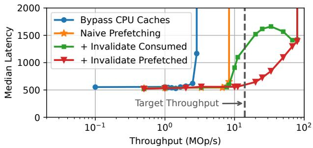  
Figure 6. Throughput and median latency of one-way message passing with different message channel designs. Starting from “Naive Prefetching”, we incrementally add “Invalidate Consumed”, and then extend it with “Invalidate Prefetched”. The target throughput is shown as the gray dashed line.

2 We also show that naive CPU cache prefetching offers limited benefits. In this setup, the receiver invalidates the current cache line only after an empty poll, and it issues software prefetch instructions (i.e., PREFETCHT0) for subsequent cache lines after each poll that retrieves a new message. Prefetching 16 cache lines yields the best performance, but only increases maximum throughput from 3.0 MOp/s to 8.6 MOp/s (Figure 6).

The key issue making CPU cache prefetching ineffective is that, without cache coherence, a cache line containing consumed messages in the receiver’s CPU caches is not automatically invalidated when the sender overwrites it with new messages. This stale cache line prevents prefetching from retrieving new messages from CXL memory, since CPU prefetchers ignore cache lines already present in the caches.

3 To address this issue, we modify the receiver to invalidate a cache line once all messages in it have been consumed, allowing future prefetching to bring in new messages to the receiver’s CPU caches. This optimization increases the maximum throughput from 8.6 MOp/s to 87.0 MOp/s (shown as “+ Invalidate Consumed” in Figure 6).

However, we observe that latency rises sharply starting at 8.6 MOp/s before decreasing again at throughputs above 30.0 MOp/s. We find that this is also caused by stale cache lines in the receiver’s CPU caches. In addition to the cache lines consumed by the receiver, prefetching itself can also bring in stale cache lines. For example, when the receiver prefetches ?? cache lines from CXL, it is possible that only ?? (?? < ?? ) of them contain new messages, especially when the sending rate is moderate. The remaining (?? − ??) stale cache lines prevent effective prefetching in the future.

4 To address the latency issue, we further modify the receiver so that after an empty poll, it invalidates not only the current cache line but also the subsequent prefetched cache lines. As shown as “+ Invalidate Prefetched” in Figure 6, this optimization reduces latency from 1.2 µs to 0.6 µs at the target throughput of 14.0 MOp/s.

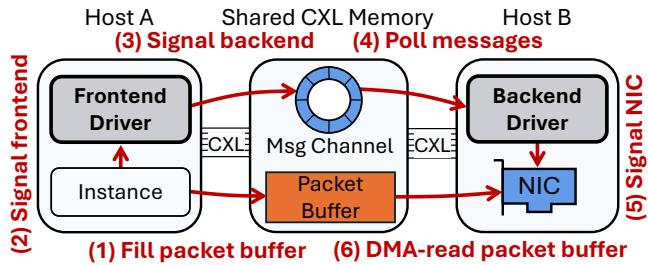  
Figure 7. The network transmission (TX) path from an instance on Host A to a NIC on Host B. The instance first writes packet to a buffer on shared CXL memory, and then signals the frontend driver, which forwards the signals to the backend driver on host B through message channels. Host B then signals the NIC to DMA-read the packet from CXL.

## 3.3 Network Engine

The network engine consists of a frontend driver and a backend driver. The frontend driver runs on each host and provides local instances with a packet I/O interface to transmit (TX) and receive (RX) packets. It forwards TX and RX packets, as well as their completions, between local instances and the corresponding backend drivers.

The backend driver, in contrast, runs only on hosts with local NICs. It forwards TX and RX packets, as well as their completions, between frontend drivers and NIC queue pairs. The frontend and backend drivers (potentially on different hosts) signal requests and completions over message channels provided by the Oasis datapath (§3.2.2). The NIC queue pairs are exposed to the backend driver through the NIC’s native device driver (e.g., DPDK’s NVIDIA MLX5 Ethernet Driver [17]).

When a new instance is launched, the frontend driver requests the pod-wide allocator (§3.5) to allocate a NIC for the instance. The frontend driver then registers the instance with the allocated NIC’s backend driver.

Similar to other high-performance network stacks [54, 92, 93, 132, 155], the network engine dedicates two cores per host for busy polling: one for the frontend driver and one for the backend driver. Hosts without a NIC do not run the backend driver and therefore use only one dedicated core.

3.3.1 Transmit and Receive Flows. We describe the endto-end workflow of packet transmission and reception in the network engine, using a Mellanox NIC as an example.

Transmitting a packet. On the transmit side, the frontend driver is allocated with a 4 GB shared CXL memory region, which is used to allocate a per-instance TX buffer area (64 MB by default) to each local instance.

To send a packet, the instance’s network stack (e.g., the Ethernet layer) allocates a TX buffer from its TX buffer area and writes the packet payload to it. The instance network stack then signals the frontend driver along with the pointer to the TX buffer to send the packet.

The frontend driver then writebacks the TX buffer from CPU caches and signals the corresponding backend driver by sending a 16 B message that contains an 8 B TX buffer pointer, a 2 B packet size, a 1 B opcode, and a 4 B instance IP. After receiving the message, the backend driver then calls the DPDK NIC driver to post a work queue entry (WQE) to the NIC’s TX queue with the TX buffer pointer. Note that the backend driver never inspects the TX packet buffer (§3.2.1).

When processing the WQE, the NIC reads the TX buffer via DMA. Once the packet is transmitted, the NIC notifies the backend driver, which propagates the completion signal back through the frontend driver to the instance.

Receiving a packet. On the receiving side, each backend driver is allocated a 4 GB shared CXL memory region for each NIC, designated as the per-NIC RX buffer area. The backend driver posts RX descriptors that point to buffers in this area to the NIC’s RX queue, so that the NIC writes RX packets directly into these buffers.

When the NIC receives an RX packet, it will write the packet to an RX buffer via DMA and notify the backend driver through the DPDK NIC driver. The backend driver then signals the corresponding frontend driver by sending a 16 B message that contains an 8 B RX buffer pointer, a 2 B packet size, a 1 B opcode, and a 4 B instance IP.

The backend driver uses the RX packet’s destination IP to identify the target instance. To avoid inspecting the RX buffer (§3.2.1), it uses flow tagging [16], which allows the NIC to match RX packets to instances based on their destination IPs. When registering a new instance, the backend driver allocates a tag for it. The backend driver can then rely on the NIC-provided tag to determine the instance associated with an RX packet, without directly inspecting the buffer.6

Upon receiving the message, the frontend driver copies the packet from the RX buffer in the shared CXL memory to the target instance’s local memory, as required for isolation (§3.3.2). The frontend driver then invalidates the RX buffer from CPU caches, notifies the instance of the RX packet, and signals completion to the backend driver. The backend driver subsequently recycles the RX buffer.

3.3.2 Security and Isolation. We assume that the network engine and the NIC are fully trusted. The frontend driver, backend driver, native PCIe device driver, and the NIC itself have access to the entire shared CXL memory.

In contrast, instances are untrusted and can only access their allocated TX buffer area within the shared CXL memory. This restriction requires a packet copy from the per-NIC RX buffer area to the instance’s local memory in the RX datapath, a design also adopted in prior work such as Junction [92] to enable faster RX buffer recycling. Therefore, instances cannot inspect packets belonging to other instances.

3.3.3 NIC Failover. Oasis allows cloud operators to mitigate network failures without provisioning multiple NICs per host (§2.2). When a NIC failure occurs, Oasis reallocates the affected instances’ network traffic to another NIC with minimal interruption and no application involvement.

To this end, we reserve a backup NIC per pod for failover. We keep the back NIC underutilized, i.e., only node-local instances use the backup NIC and remote instances use other NICs in the pod. When a new instance is launched, the frontend driver also registers the instance with the backup NIC’s backend driver. Registering with the backup driver at launch time ensures that the instance can immediately use the backup NIC when its allocated NIC fails.

The backend driver detects NIC failures by monitoring link status, allowing it to capture hardware faults, cable disconnections, and switch linecard issues. When a failure is detected, the backend driver notifies the pod-wide allocator via their message channels. The allocator then informs all frontend drivers using the failed NIC, which immediately reroute TX packets to the backup NIC. Because TX packets already reside in shared CXL memory accessible to all hosts, no additional packet copy is required.

Besides sending TX packets through the backup NIC, we also need to notify the switch to reroute RX packets to the backup NIC. To minimize packet loss, we let the backup NIC “borrow” the failed NIC’s MAC address by sending packets with the failed NIC’s MAC address as the source MAC address to the switch. The switch will then update the MACaddress-to-port mapping to map the failed NIC’s MAC address to the switch port of the backup NIC, allowing RX packets to be routed to the backup NIC immediately without involving applications. Note that this technique cannot distribute traffic of a failed NIC across multiple NICs. Therefore, we need to reserve sufficient bandwidth on the backup NIC.

3.3.4 Load balancing. Beyond failover, the network engine also supports gracefully migrating an instance’s network traffic from one NIC to another for load balancing.

When the pod-wide allocator initiates a graceful migration, the frontend driver first registers the instance with the new NIC’s backend driver. It then notifies the instance of the MAC address change. The instance’s network stack responds by broadcasting Gratuitous ARP (GARP) [29] to announce the updated MAC address. During the transition, the instance can receive RX packets from both the original and new NICs, while TX packets are always sent through the new NIC. After a grace period (5 s by default), the frontend driver unregisters the instance from the original NIC’s backend driver, releasing its bandwidth for allocation to other instances. Therefore, the instance’s network traffic can be gracefully migrated to the new NIC without interruption.

## 3.4 Storage Engine

The storage engine mirrors the structure of the network engine. On each host, the frontend driver provides local instances with a block device I/O interface and forwards I/O requests and completions between local instances and their corresponding backend drivers.

Similar to the network engine, the storage engine’s backend driver runs only on hosts with local SSDs. It forwards I/O requests and completions between frontend drivers and the SSDs’ submission queues (SQ) and completion queues (CQ). The backend driver operates the SQ and CQ through the SSDs’ native device driver (e.g., SPDK’s NVMe driver [53]). The SSDs access I/O buffers in shared CXL memory directly via DMA. Both the frontend and backend driver dedicate a busy polling core per host.

Unlike the network engine, the storage engine uses 64 B messages instead of 16 B messages between frontend and backend drivers (§3.2.2). Each 64 B message mirrors the fields of a 64 B NVMe command [43]. The backend driver never inspects I/O buffers for either read or write operations (§3.2.1).

Failure semantics. Unlike stateless NIC traffic, SSD requests modify persistent media. Providing transparent SSD failover would require the backup device to maintain an identical copy of the namespace (e.g., via RAID-1, erasure coding, or replicated NVMe-oF targets). These mechanisms operate above Oasis, so the storage engine simply propagates an I/O error to the guest when the backend driver detects a drive failure. In practice, cloud operators typically expose local NVMe as ephemeral storage—for example, on AWS, instancestore SSD data survives soft reboots but is lost upon stop or terminate operations [60].

## 3.5 Pod-Wide Allocator

The pod-wide allocator is a logically centralized service that maintains the authoritative mapping between instances and PCIe devices within a pod. It is never on the critical path of data-plane I/O. The allocator stores all states in the shared CXL memory and operates on renewable leases.

Monitoring. Every backend driver sends a telemetry record to the allocator via message channels (§3.2.2) every 100 ms. Each record includes load metrics (e.g., IOPS and bandwidth utilization) as well as network health metrics (e.g., link status and PCIe AER counters).

Device allocation. Instance placement is controlled by a central cloud scheduler. When an instance is placed, the allocator first tries to satisfy its allocations with host-local NIC bandwidth and SSD capacity. If this is not possible, the allocator greedily selects the devices with the lowest load.

Failure management. When a backend driver detects a local NIC failure, it immediately notifies the allocator via the message channels (§3.2.2). Host failures are instead inferred from missing telemetry records. In either case, all leases involving failed devices or hosts are revoked, and the affected instances are reallocated to other devices. The allocator itself is replicated with Raft [130], using RPCs transmitted over the message channels (§3.2.2).

## 4 Implementation

The Oasis network engine is implemented in about 7,000 lines of C++ on top of Junction [92, 93], a state-of-the-art network stack for containers. Junction provides a container runtime to run unmodified Linux binaries, and a NIC virtualization layer that exposes each container instance with a virtual NIC backed by the host NIC. The container runtime provides standard OS services, including a complete network stack (TCP/UDP, IP, Ethernet), block device interfaces, interprocess communication (IPC) (e.g., pipe()), and memory management.

Junction’s NIC virtualization layer exposes a packet I/O interface to each instance through IPC channels in local DDR memory. We build the Oasis network engine’s frontend and backend drivers based on this layer. The frontend driver provides each instance with a packet I/O interface via the IPC channels in local DDR memory, while the backend driver operates the NIC’s queue pairs using DPDK’s NVIDIA MLX5 Ethernet driver [17]. We extend both drivers with Oasis message channels (§3.2.2) to enable cross-host message passing. When a new instance is launched, it connects to a predefined UNIX socket listened to by the frontend driver before the IPC channels are created.

In the Oasis datapath, each message channel includes an 8 B counter that the receiver uses to indicate how many messages it has consumed (§3.2.2). Due to the lack of cache coherence, the sender must issue a cache line invalidation and a fence (i.e., CLFLUSHOPT and MFENCE) before reading the counter, while the receiver must issue a cache line writeback (i.e., CLWB) after updating it. To minimize overhead, the sender caches the counter and re-reads it only when all slots indicated by the cached counter are exhausted, and the receiver updates the counter only after consuming a large batch of messages (by default, half of the channel’s capacity).

## 5 Evaluation

In this section, we seek to answer the following questions:

1. What is the performance overhead incurred by Oasis when pooling NICs? (§5.1)

2. Can Oasis improve NIC utilization by multiplexing network traffic across hosts? (§5.2)

3. Can Oasis fail over between NICs with minimum interruption? (§5.3)

Experimental setup. Our evaluation setup consists of two AMD hosts and one CXL 2.0 memory device. The first host uses an AMD EPYC 9825 144-core CPU, while the second uses an AMD EPYC 9015 8-core CPU. Despite the different CPU SKUs, we observe consistent CXL latency and bandwidth across both hosts. Each host has 768 GB of local DDR5-5600 memory and a 100 Gbit Mellanox ConnectX-5 (CX5) NIC.

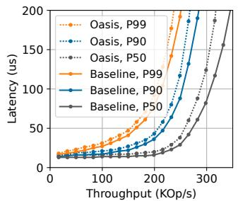  
(a) Python HTTP

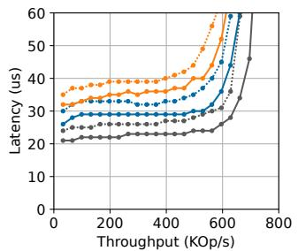  
(b) Rust Rocket

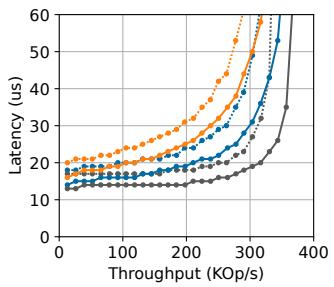  
(c) nginx

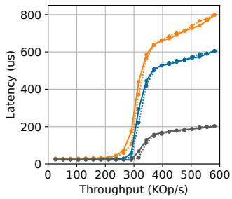  
(d) Apache Tomcat

Figure 8. Performance overhead of the Oasis network engine on four typical web applications.  
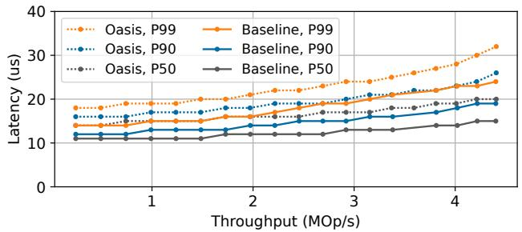  
Figure 9. Performance overhead of the Oasis network engine on memcached.

The two hosts are connected to one CXL device, each with ×8 lanes. The CXL device has 256 GB DDR5-4800 memory, which is exposed to both hosts. Due to confidentiality requirements, we do not disclose the raw access latency of the CXL device. Instead, we report normalized latencies in §2.3.

We run Ubuntu 24.04 with Linux 6.8.0 on both hosts and configure the kernel to expose CXL memory as DAX devices [33]. Because the Linux CXL driver cannot recognize the HDM decoder of our CXL device, we apply a small patch to disable the CXL driver and instead use hmem [15] to expose the CXL memory as DAX devices.

All systems are interconnected with a 100 Gbit Arista 7060X series switch. We use a Intel Xeon 8592 system with a 100 Gbit CX5 NIC as network load driver in all experiments.

## 5.1 Performance Overhead

Impact on Applications. We first measure the performance overhead of the Oasis network engine on end-to-end application performance. As a baseline, we run the application with Junction [92] using a local NIC on the same host. We then compare it against Oasis, where the application’s network traffic is served by a remote NIC on another host.

Figure 8 shows the overhead with four typical web applications: a Python HTTP server [49], a Rust Rocket web server [50], nginx [135], and Apache Tomcat [6]. Across all applications, Oasis adds a consistent 4–7 µs latency overhead at P50, P90, and P99 under low and moderate load. At near-saturation load, both the baseline and Oasis experience latency spikes. We also measure the overhead on memcached [37] (Figure 9), where similarly, the latency overhead is consistently about 4–7 µs at all percentiles. Note that our small setup leads to very low baseline latencies, compared to the typical 50–110 µs observed in production clouds (Table 1).

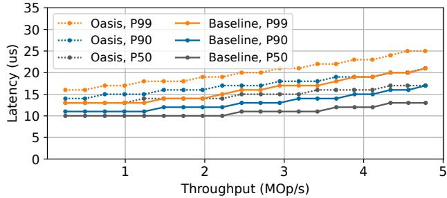  
(a) 75 B Packets

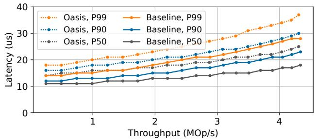  
(b) 1500 B Packets  
Figure 10. Performance overhead of the Oasis network engine on a UDP echo microbenchmark with different packet sizes.

Overhead breakdown. To understand the latency overhead, we run a UDP echo microbenchmark with 75 B and 1500 B packets. In this setup, the client sends fixed-size UDP packets to the server, which immediately echoes them back, and the client measures the round-trip latency. Oasis consistently adds 4–7 µs of overhead (Figure 10), indicating that the overhead is largely independent of packet size.

<table><tr><td>Load</td><td>Payload (GB/s)</td><td>Message (GB/s)</td><td>Total (GB/s)</td></tr><tr><td>Idle</td><td>0.0</td><td>0.2</td><td>0.2</td></tr><tr><td>Busy (75 B)</td><td>0.7</td><td>1.6</td><td>2.3</td></tr><tr><td>Busy (1500 B)</td><td>12.0</td><td>1.5</td><td>13.5</td></tr></table>

Table 3. CXL link bandwidth usage under varying network loads in Oasis. “Payload” bandwidth refers to reading and writing packet payload buffers, while “message” bandwidth denotes message channel traffic (e.g., busy polling).

To measure the impact of placing I/O buffers in CXL memory, we modify the baseline Junction to allocate TX and RX buffer areas in CXL memory and rerun the UDP microbenchmark. Figure 11 compares the P50, P90, and P99 latencies of the baseline, the modified baseline with I/O buffers in CXL memory, and Oasis. The results show that placing I/O buffers in CXL memory incurs almost no additional latency, regardless of load or packet size. Most of the latency overhead in Oasis comes from message passing across hosts between the frontend and backend drivers.

Note that this overhead is higher than the 0.6 µs overhead in the one-way message passing microbenchmark (Figure 6) because we measure round-trip latency and, unlike the busypolling receiver, the frontend and backend driver cores also handle other tasks (e.g., forwarding packets to local instances or to NICs), which delays message passing.

We also measure and break down the CXL link bandwidth consumed by Oasis in Table 3. With no network traffic, Oasis consumes only 0.2 GB/s for busy polling in the message channels, since prefetching is triggered only when the channel is not idle (§3.2.2). Under heavy traffic (about 4 MOp/s), the message channels consume about 1.5 GB/s due to prefetching. The bandwidth used for reading and writing packet buffers depends on packet size; with 1500 B packets, 89% of the CXL link bandwidth is spent on packet buffer accesses.

## 5.2 Utilization Benefits

Oasis allows operators to provision fewer NICs within a pod by enabling multiple hosts to share a single NIC. To demonstrate this, we replay the packet traces from §2.2 as the traffic to two hosts.

From the inbound traces of host 1 and host 2 in rack A, which record both packet arrival times and sizes, we use two clients to generate matching UDP traffic to two hosts. Each host echoes the packets back, and the clients record the round-trip latency. In the baseline, each host uses its own 100 Gbit NIC, while with multiplexing both share a single NIC on host 1. To capture the multiplexing interference, the hosts run Oasis (not Junction) in both setups.

Figure 12 shows round-trip latencies with and without multiplexing. The results show that Oasis multiplexes the network traffic of two hosts with a single NIC with negligible interference. Specifically, with multiplexing, the P99 latency for host 1 remains unchanged, while host 2 experiences only a 1 µs increase. Importantly, multiplexing increases the aggregated NIC utilization at P99.99 from 18% to 37%.

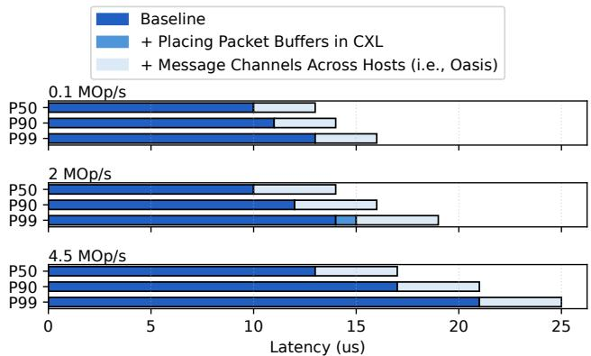

(a) 75 B Packets  
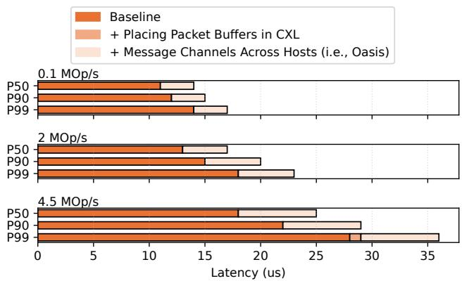  
(b) 1500 B Packets

Figure 11. Breakdown of Oasis latency overhead across different packet sizes and load levels, using the UDP echo microbenchmark.  
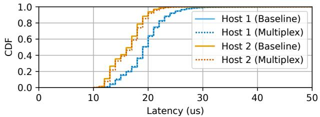  
Figure 12. Round-trip latency distribution for the packet trace replay experiment. Solid lines show the baseline (i.e., each host using its own NIC); dotted lines show multiplexing (i.e., two hosts sharing one NIC at host 1).

## 5.3 Failover

We now evaluate Oasis’s ability to handle a NIC failure, with minimal disruption to an application. We run a 10-second UDP echo microbenchmark to measure packet losses when the NIC fails. To introduce a NIC failure, we disable the switch port connected to the NIC after the microbenchmark starts running. Figure 13a depicts the number of lost packets throughout the experiment, with a sharp spike at the time of failure, after which Oasis is able to quickly fail over and steer the traffic of the instance running the echo server to the backup NIC. In Figure 13b, we zoom in to the time of failure (around the 5th second of the trace), and we can see the total failure time is roughly 38 ms.

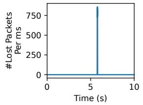  
(a) During the 10 s runtime

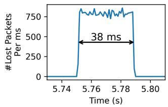  
(b) During the failure time  
Figure 13. The number and duration of packet losses when a NIC failure triggers the Oasis NIC failover.

We repeat the failover experiment with memcached, which uses TCP instead of UDP. Figure 14a shows the P99 latency over the 10 s experiment, with a sharp spike at the moment of failure. As with the UDP case, Oasis quickly fails over and restores request latency. Figure 14b shows that P99 latency recovers within about 133 ms. The recovery takes longer than with UDP because TCP is a reliable transport: packets lost during the interruption accumulate at the client and are delivered after failover, temporarily inflating latency.

To put the 38 ms and 133 ms failover time into perspective, an alternative to our approach could be to resume the affected instance on a new host by reading its snapshotted state from a backend storage service. But this would be extremely slow (on the order of seconds or more), and would mean the application loses recent updates. Another alternative could be to replicate the application’s state in-memory across multiple hosts, using a replicated state machine (RSM) like Raft [130], which can tolerate host failures. Note that such an approach would be very memory-intensive: it requires replicating the state in memory 3× or more. Even from an availability perspective, if the failed host happens to be the leader, the time it takes to detect the leader failure and elect a new leader would typically take hundreds of milliseconds at the minimum [130].

## 6 Discussion

Our prototype and evaluation focus on the question of feasibility: can we pool PCIe devices entirely in software over today’s non-coherent CXL 2.0 memory devices with tolerable overhead? While the results are encouraging, we acknowledge several limitations and discuss potential ways to address them.

CXL failures. In our experience, the most common CXLrelated failure arises from CXL link/cable faults. Addressing these failures requires a redundant CXL pod topology that provisions multiple CXL links per host. Recent work explores such resilient CXL pod designs [82], and we leave the integration of these topologies to future work. With such designs in place, Oasis could tolerate CXL failures in much the same way it already handles PCIe device failures.

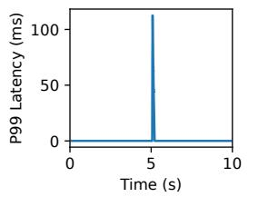  
(a) During the 10 s runtime

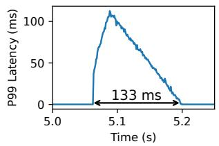  
(b) During the failure time  
Figure 14. P99 latency of memcached when a NIC failure triggers the Oasis NIC failover.

QoS control for CXL bandwidth. While CXL links generally offer sufficient bandwidth for Oasis to coexist alongside other CXL use cases (§2.3), bandwidth-intensive use cases (e.g., OLAP databases) may saturate CXL links and impair performance. To mitigate this, Oasis’s pod-wide allocator may rebalance traffic away from congested hosts. In addition, hardware-assisted bandwidth partitioning mechanisms (e.g., Intel RDT [27]) can also enforce QoS and manage the allocation of CXL link bandwidth across colocated use cases.

CXL 3.0 memory devices. CXL 3.0 memory devices with cross-host cache coherence (i.e., Back Invalidation (BI) [11]) would allow hosts to access shared CXL memory directly, without relying on cache line invalidation or writeback instructions. Oasis’s frontend–backend architecture, the network and storage engines, failover mechanisms, and podwide allocator are all compatible with CXL 3.0 and could benefit from better message channel performance.

However, based on our conversations with CXL vendors, there is significant doubt about the viability of cross-host cache coherence, and thus Oasis does not rely on it.

CXL-attached devices. Device vendors have begun to design and produce PCIe devices with a CXL interface. For example, Samsung and Kioxia start to offer CXL-attached SSDs [30, 51], although CXL-attached NICs are not yet commercially available. Pooling devices with CXL interfaces can be achieved by connecting them to CXL switches. Nevertheless, to ensure that Oasis remains deployable with today’s hardware, we target host-attached PCIe devices.

Single-threaded datapath. Our evaluation uses a single I/O thread for each frontend driver and backend driver. This choice simplifies software coherence but clearly underutilizes high-bandwidth devices. Since the message channel throughput scales linearly with additional channels, we believe a sharded multi-channel design is a straightforward extension. Such a design would enable adaptive scaling beyond a single I/O core, similar to Snap [123].

Scaling CXL bandwidth. Our evaluation matches a single 100 Gbps NIC with a ×8 CXL link, which is a balanced match. As discussed in Section 2.3, production systems use eight times as many CXL lanes, which would scale CXL bandwidth to match one or two 200 Gbit NICs and a dozen SSDs. Unfortunately, these systems are not available to us.

Load balancing policies. We currently rebalance load across NICs only at instance start or device failure times. Our failover experiments show that Oasis supports moving traffic within a few dozen milliseconds (§5.3) and the Oasis allocator has fine-grained load telemetry available. This opens up the possibility for advanced load balancing policies that exploit the bursty nature of network traffic (Figure 3) to further reduce NIC bandwidth requirements across the pod.

Cloud production networks. Our evaluation setup with a single Arista 7060X vastly oversimplifies production networks. Most importantly, cloud services typically expose virtual IPs (VIPs), but internally run on many hosts that are each addressed with a unique direct IP (DIP). The cloud load balancer [89] stores the VIP-to-DIP mapping and routes traffic to each DIP. For real-world deployment of failover and pod-wide load balancing, Oasis would have to integrate with the load balancer. Instead of borrowing a NIC’s MAC address, Oasis would request a change to the VIP-to-DIP mapping to reroute traffic of the failed NIC.

## 7 Related Work

Resource disaggregation. Prior work has extensively studied datacenter resource disaggregation, especially memory and storage pooling accessed over RDMA [72, 75, 95, 96, 99, 137, 142, 146, 158]. PCIe device pooling can be seen as racklevel disaggregation focused specifically on PCIe devices. Unlike general RDMA-based disaggregation, Oasis targets multiplexing NICs and SSDs within a single rack, complementing existing RDMA-based approaches by enabling multiplexing of PCIe resources at finer granularity.

Systems with shared CXL memory. Oasis shares goals with recent systems using CXL shared memory for host-tohost communication, such as HydraRPC [119], RPCool [121], CXL-SHM [156], CtXnL [152], and CXLfork [71]. However, they either assume cache-coherent CXL memory or have performance and correctness bugs since they make unrealistic assumptions on non-coherent CXL memory. HydraRPC [119] proposes an optimization that uses the x86 instructions mwait and monitor to reduce the power consumption of the polling thread. However, these instructions actually depend on cache coherence and do not work on a real CXL 2.0 pool.

Databases leveraging shared memory, such as Tigon [104] and Pasha [105], may also benefit from Oasis’s optimized message channel. Zhong et al. [157] provide motivation for pooling PCIe devices over CXL pools, but do not provide a concrete design, implementation or evaluation.

Distributed shared memory (DSM) systems. Softwarebased cache coherence protocols are extensively studied in the context of DSM [80, 84, 88, 109, 116, 129, 150, 154]. These approaches require the software to track all memory accesses and can cause excessive invalidation operations, resulting in significant performance overhead.

Hardware alternatives. Two hardware alternatives provide performance similar to Oasis for pooling NICs and SSDs. PCIe switches [2, 19–21, 23, 34, 103, 122] are effective but costly and inflexible, as discussed in Section 1. Multi-host PCIe devices like certain NICs [35, 36, 42, 45] are cheaper but statically partition bandwidth. Additionally, multi-host devices has significant scaling limits with NICs offering only 2-4 ports [35, 36] and SSDs two ports [47].

Userspace I/O stacks. Systems bypassing kernel I/O stacks achieve high performance and utilization [54, 55, 92, 93, 107, 123, 132, 140, 155], but unlike Oasis, they cannot multiplex PCIe devices across hosts to improve resource utilization during low-load periods.

TCP migration. Recent TCP migration techniques (e.g., Prism [102], Capybara [86]) require programmable network hardware to achieve low-latency migration across hosts. In contrast, Oasis seamlessly migrates TCP flows between NICs across the pod, requiring no special network hardware support and eliminating packet loss during migration.

## 8 Conclusions

We presented Oasis, the first software-based system for pooling PCIe devices across hosts over commodity CXL memory pools. Oasis significantly improves resource utilization by enabling flexible allocation, multiplexing, and failover of PCIe resources such as NICs and SSDs. Our evaluation demonstrates that Oasis pools NICs with low overhead, substantially increases NIC utilization, and provides fast failover capabilities. The cost of Oasis is an added 4–7 µs of overhead per network packet, a modest overhead compared to typical cloud network latencies of 50–110 µs. Given the high capital and operational costs of PCIe devices in modern datacenters, we believe the modest overhead incurred by Oasis is well-justified given the substantial improvements in resource efficiency it provides.

## Acknowledgments

We thank our shepherd, Emmett Witchel, and the anonymous reviewers for their helpful comments. We also thank Rodrigo Fonseca and Stefan Saroiu for their feedback. This work was supported by NSF award CNS-2143868.

## References

[1] 5th Gen AMD EPYC™ Processor Architecture. https: //www.amd.com/content/dam/amd/en/documents/epyc-businessdocs/white-papers/5th-gen-amd-epyc-processor-architecturewhite-paper.pdf. Accessed: 2025-08-02.

[2] A New Twist on PCI-Express Switching for the Datacenter. https://gigaio.com/2019/10/a-new-twist-on-pci-express-switchingfor-the-datacenter/. Accessed: 2025-08-02.

[3] AI Server Cost Analysis. https://semianalysis.com/2023/05/29/aiserver-cost-analysis-memory-is/. Accessed: 2025-08-02.

[4] Amazon EC2 Instance types. https://aws.amazon.com/ec2/instancetypes/. Accessed: 2025-08-02.

[5] Amazon Elastic Block Store. https://aws.amazon.com/ebs/. Accessed: 2025-04-13.

[6] Apache Tomcat. https://tomcat.apache.org/. Accessed: 2025-08-02.

[7] AWS Outposts connectivity to AWS Regions. https://docs.aws. amazon.com/outposts/latest/userguide/region-connectivity.html. Accessed: 2024-12-18.

[8] Cisco massively scalable data center network fabric design and operation white paper. Accessed: 2025-04-02.

[9] CLFLUSH — Flush Cache Line. https://www.felixcloutier.com/x86/ clflush. Accessed: 2025-04-13.

[10] CLWB — Cache Line Write Back. https://www.felixcloutier.com/x86/ clwb. Accessed: 2025-04-13.

[11] Compute Express Link (CXL) 3.0 Specification. https: //computeexpresslink.org/wp-content/uploads/2024/02/CXL-3.0-Specification.pdf.

[12] Configuring a NIC team. https://docs.redhat.com/en/documentation/ red\_hat\_enterprise\_linux/8/html/configuring\_and\_managing\_ networking/configuring-network-teaming\_configuring-andmanaging-networking. Accessed: 2025-04-13.

[13] Counting the Cost of Under-Utilized GPUs And Doing Something About It. https://gigaio.com/2020/11/counting-the-cost-of-underutilized-gpus-and-doing-something-about-it/. Accessed: 2025-08- 02.

[14] Design considerations for spine-and-leaf IP fabrics. Accessed: 2025- 04-02.

[15] device-dax: Add a driver for "hmem" devices. https://lore.kernel.org/ lkml/155925719374.3775979.16707226817593415735.stgit@dwillia2- desk3.amr.corp.intel.com/. Accessed: 2025-04-13.

[16] DPDK: Generic flow API. https://doc.dpdk.org/guides-24.07/prog\_ guide/rte\_flow.html. Accessed: 2025-04-13.

[17] DPDK NVIDIA MLX5 Ethernet Driver. https://doc.dpdk.org/guides/ nics/mlx5.html. Accessed: 2025-08-02.

[18] General-purpose machine family for Compute Engine. https://cloud. google.com/compute/docs/general-purpose-machines. Accessed: 2025-08-02.

[19] GigaIO: FabreX AI Memory Fabric Platform. https://gigaio.com/ products/fabrex-system-overview/. Accessed: 2025-08-02.

[20] GigaIO – Accelerator Pooling Appliance. https://gigaio.com/ products/accelerator-pooling-appliance/. Accessed: 2025-08-02.

[21] GigaIO — Storage Pooling Appliance. https://gigaio.com/products/ storage-pooling-appliance/. Accessed: 2025-08-02.

[22] Google Cloud: Persistent Disk. https://cloud.google.com/persistentdisk?hl=en. Accessed: 2025-04-13.

[23] H3 Composable AI Solutions. https://www.h3platform.com/solution/ composable-ai. Accessed: 2025-08-02.

[24] Instance store temporary block storage for EC2 instances. https://docs. aws.amazon.com/AWSEC2/latest/UserGuide/InstanceStorage.html. Accessed: 2025-01-13.

[25] Intel® 64 and IA-32 architectures software developer manuals. https://www.intel.com/content/www/us/en/developer/articles/ technical/intel-sdm.html. Accessed: 2025-01-13.

[26] Intel® data direct i/o technology. https://www.intel.com/content/ www/us/en/io/data-direct-i-o-technology.html. Accessed: 2025-01- 13.

[27] Intel® Resource Director Technology (Intel® RDT). https://www.intel.com/content/www/us/en/architecture-andtechnology/resource-director-technology.html. Accessed: 2025-08- 02.

[28] Intel® Xeon® 6 Processors. https://www.intel.com/content/www/us/ en/products/details/processors/xeon/xeon6-e-cores.html. Accessed: 2025-08-02.

[29] IPv4 Address Conflict Detection. RFC 5227.

[30] Koxia: NAND-Based CXL Memory. https://blog-us.kioxia.com/ post/2024/05/30/cxl-memory-solutions-the-future-is-now. Accessed: 2025-08-02.

[31] Kubernetes: Resource Management for Pods and Containers. https://kubernetes.io/docs/concepts/configuration/manageresources-containers/. Accessed: 2025-04-13.

[32] Leo CXL® Smart Memory Controllers. https://www.asteralabs.com/ products/leo-cxl-smart-memory-controllers/.

[33] Linux: DAX devices. https://www.kernel.org/doc/Documentation/ filesystems/dax.txt. Accessed: 2025-04-13.

[34] Liqid SmartStack. https://www.liqid.com/products/gpu-on-demand. Accessed: 2025-08-02.

[35] Mellanox Multi-Host Evaluation Kit. https://network.nvidia.com/ sites/default/files/doc-2020/pb-multi-host-evb-kit.pdf. Accessed: 2025-04-13.

[36] Mellanox’s Externally Connected Multi-Host Solution (eMH). https://network.nvidia.com/files/doc-2020/sb-externallyconnected-multi-host.pdf. Accessed: 2025-04-13.

[37] memcached. https://memcached.org/. Accessed: 2025-08-02.

[38] Microchip Switchtec PCIe Switches. https://www.microchip.com/enus/products/interface-and-connectivity/pcie-switches. Accessed: 2025-08-02.

[39] MOVNTDQ — Store Packed Integers Using Non-Temporal Hint. https: //www.felixcloutier.com/x86/movntdq. Accessed: 2025-04-13.

[40] MOVNTDQA — Load Double Quadword Non-Temporal Aligned Hint. https://www.felixcloutier.com/x86/movntdqa. Accessed: 2025-08-02.

[41] Noction: Oversubscription in networking. Accessed: 2025-04-02.

[42] NVIDIA External Multi-Host Adapter Kit for OCP 3.0 User Manual. https://docs.nvidia.com/networking/display/emhocp3/ introduction. Accessed: 2025-04-13.

[43] NVM Command Set Specification 1.0. https://nvmexpress.org/wpcontent/uploads/NVM-Express-NVM-Command-Set-Specification-2021.06.02-Ratified-1.pdf.

[44] NVMe over Fabrics (oF) Specification. https://nvmexpress.org/ specification/nvme-of-specification/.

[45] OCP Virtual Summit 2020: Next Generation of Multi Host NICs. https: //www.youtube.com/watch?v=vHwKu8hYm\_Y. Accessed: 2025-04- 13.

[46] PCI Peer-to-Peer DMA Support. https://docs.kernel.org/driver-api/ pci/p2pdma.html. Accessed: 2025-08-02.

[47] Phison x200. Accessed: 2025-04-17, https://www.phisonenterprise. com/pascari-performance-x-series/.

[48] PowerEdge: How to set up NIC teams. https://www.dell.com/ support/kbdoc/en-us/000124262/how-to-set-up-nic-teaming-onpoweredge-servers. Accessed: 2024-12-18.

[49] Python HTTP servers. https://docs.python.org/3/library/http.server. html. Accessed: 2025-08-02.

[50] Rocket: A web framework for Rust. https://rocket.rs/. Accessed: 2025-08-02.

[51] Samsung: Memory-Semantic CXL SSD. https://www.tomshardware. com/news/samsung-memory-semantic-cxl-ssd-brings-20xperformance-uplift. Accessed: 2025-08-02.

[52] Sizes for virtual machines in Azure. https://learn.microsoft.com/enus/azure/virtual-machines/sizes/overview. Accessed: 2025-08-02.

[53] SPDK: NVMe Driver. https://spdk.io/doc/nvme.html. Accessed: 2025- 08-02.

[54] The Data Plane Development Kit (DPDK). https://www.dpdk.org/.

[55] The Storage Performance Development Kit (SPDK). https://spdk.io/.

[56] UnifabriX launches memory pooling system. https://www.unifabrix. com/resources/unifabrix-launches-memory-pooling-system. Accessed: 2025-08-02.

[57] XConn CXL2.0/PCle5.0 switch. https://www.xconn-tech.com/ product. Accessed: 2025-08-02.

[58] IEEE standard for Ethernet amendment 802.3bs: Physical layer specifications and management parameters for 200 Gb/s and 400 Gb/s operation, December 2017.

[59] Packets-per-second limits in EC2, 2019. Available at https://stressgrid. com/blog/pps\_limits\_in\_ec2/, accessed 4/16/25.

[60] SSD instance store volumes for EC2 instances, 2019. Available at https://docs.aws.amazon.com/AWSEC2/latest/UserGuide/ssdinstance-store.html, accessed 4/16/25.

[61] IEEE standard for Ethernet, July 2022.

[62] Azure Ddsv6 sizes series, 2025. Available at https: //learn.microsoft.com/en-us/azure/virtual-machines/sizes/generalpurpose/ddsv6-series?tabs=sizestoragelocal, accessed 4/16/25.

[63] Instances built on the AWS Nitro system, 2025. Available at https://docs.aws.amazon.com/ec2/latest/instancetypes/ec2-nitroinstances.html, accessed 4/16/25.

[64] Microsoft Azure Boost, 2025. Available at https://learn.microsoft. com/en-us/azure/azure-boost/overview, accessed 4/16/25.

[65] Solidigm D5-P5430 product specifications, 2025. Available at https://www.solidigm.com/products/data-center/d5/p5430.html# configurator, accessed 4/16/25.

[66] Specifications for Amazon EC2 general purpose instances, 2025. Available at https://docs.aws.amazon.com/ec2/latest/instancetypes/ gp.html#gp\_network, accessed 4/16/25.

[67] Supermicro A+ Server 2115S-NE332R, 2025. Accessed: 2025-04-02, available at https://www.thinkmate.com/system/storage-a+-server-2115s-ne332r.

[68] Thinksystem sr650 v3, 2025. Accessed: 2025-04-02, available at https://www.lenovo.com/us/en/configurator/dcg/index.html?lfo= 7D76A03XNA.

[69] Minseon Ahn, Thomas Willhalm, Norman May, Donghun Lee, Suprasad Mutalik Desai, Daniel Booss, Jungmin Kim, Navneet Singh, Daniel Ritter, and Oliver Rebholz. An examination of CXL memory use cases for in-memory database management systems using sap hana. Proceedings of the VLDB Endowment, 17(12):3827–3840, 2024.

[70] Hasan Al Maruf and Mosharaf Chowdhury. Memory disaggregation: Advances and open challenges. SIGOPS Oper. Syst. Rev., 57(1):29–37, June 2023.

[71] Chloe Alverti, Stratos Psomadakis, Burak Ocalan, Shashwat Jaiswal, Tianyin Xu, and Josep Torrellas. CXLfork: Fast Remote Fork over CXL Fabrics, page 210–226. Association for Computing Machinery, New York, NY, USA, 2025.

[72] Emmanuel Amaro, Christopher Branner-Augmon, Zhihong Luo, Amy Ousterhout, Marcos K. Aguilera, Aurojit Panda, Sylvia Ratnasamy, and Scott Shenker. Can far memory improve job throughput? In Proceedings of the Fifteenth European Conference on Computer Systems, EuroSys ’20, New York, NY, USA, 2020. Association for Computing Machinery.

[73] Pradeep Ambati, Inigo Goiri, Felipe Frujeri, Alper Gun, Ke Wang, Brian Dolan, Brian Corell, Sekhar Pasupuleti, Thomas Moscibroda, Sameh Elnikety, Marcus Fontoura, and Ricardo Bianchini. Providing SLOs for Resource-Harvesting VMs in cloud platforms. In 14th USENIX Symposium on Operating Systems Design and Implementation (OSDI 20), pages 735–751. USENIX Association, November 2020.

[74] Yuda An, Shushu Yi, Bo Mao, Qiao Li, Mingzhe Zhang, Ke Zhou, Nong Xiao, Guangyu Sun, Xiaolin Wang, Yingwei Luo, and Jie Zhang. A novel extensible simulation framework for CXL-enabled systems, 2024.

[75] Wei Bai, Shanim Sainul Abdeen, Ankit Agrawal, Krishan Kumar Attre, Paramvir Bahl, Ameya Bhagat, Gowri Bhaskara, Tanya Brokhman, Lei Cao, Ahmad Cheema, Rebecca Chow, Jeff Cohen, Mahmoud Elhaddad, Vivek Ette, Igal Figlin, Daniel Firestone, Mathew George, Ilya German, Lakhmeet Ghai, Eric Green, Albert Greenberg, Manish Gupta, Randy Haagens, Matthew Hendel, Ridwan Howlader, Neetha John, Julia Johnstone, Tom Jolly, Greg Kramer, David Kruse, Ankit Kumar, Erica Lan, Ivan Lee, Avi Levy, Marina Lipshteyn, Xin Liu, Chen Liu, Guohan Lu, Yuemin Lu, Xiakun Lu, Vadim Makhervaks, Ulad Malashanka, David A. Maltz, Ilias Marinos, Rohan Mehta, Sharda Murthi, Anup Namdhari, Aaron Ogus, Jitendra Padhye, Madhav Pandya, Douglas Phillips, Adrian Power, Suraj Puri, Shachar Raindel, Jordan Rhee, Anthony Russo, Maneesh Sah, Ali Sheriff, Chris Sparacino, Ashutosh Srivastava, Weixiang Sun, Nick Swanson, Fuhou Tian, Lukasz Tomczyk, Vamsi Vadlamuri, Alec Wolman, Ying Xie, Joyce Yom, Lihua Yuan, Yanzhao Zhang, and Brian Zill. Empowering azure storage with RDMA. In 20th USENIX Symposium on Networked Systems Design and Implementation (NSDI 23), pages 49–67, Boston, MA, April 2023. USENIX Association.

[76] Paul Barham, Boris Dragovic, Keir Fraser, Steven Hand, Tim Harris, Alex Ho, Rolf Neugebauer, Ian Pratt, and Andrew Warfield. Xen and the art of virtualization. In Proceedings of the Nineteenth ACM Symposium on Operating Systems Principles, SOSP ’03, page 164–177, New York, NY, USA, 2003. Association for Computing Machinery.

[77] Jeff Barr. New seventh-generation general purpose Amazon EC2 instances (M7i-Flex and M7i). https://aws.amazon.com/blogs/aws/newseventh-generation-general-purpose-amazon-ec2-instances-m7iflex-and-m7i/, 2023. Accessed: 2025-01-13.

[78] Jeff Barr. Now available: Storage optimized Amazon EC2 I7ie instances. https://aws.amazon.com/blogs/aws/now-available-storageoptimized-amazon-ec2-i7ie-instances/, 2024. Accessed: 2025-01-13.

[79] Luiz André Barroso and Urs Hölzle. The Datacenter as a Computer: An Introduction to the Design of Warehouse-Scale Machines. 2009.

[80] J. K. Bennett, J. B. Carter, and W. Zwaenepoel. Munin: distributed shared memory based on type-specific memory coherence. In Proceedings of the Second ACM SIGPLAN Symposium on Principles &amp; Practice of Parallel Programming, PPOPP ’90, page 168–176, New York, NY, USA, 1990. Association for Computing Machinery.

[81] Daniel S. Berger, Daniel Ernst, Huaicheng Li, Pantea Zardoshti, Monish Shah, Samir Rajadnya, Scott Lee, Lisa Hsu, Ishwar Agarwal, Mark D. Hill, and Ricardo Bianchini. Design tradeoffs in CXL-based memory pools for public cloud platforms. IEEE Micro, 43(2):30–38, March 2023.

[82] Daniel S. Berger, Yuhong Zhong, Pantea Zardoshti, Shuwei Teng, Fiodar Kazhamiaka, and Rodrigo Fonseca. Octopus: Scalable low-cost CXL memory pooling, 2025.

[83] David Breitgand and Amir Epstein. Improving consolidation of virtual machines with risk-aware bandwidth oversubscription in compute clouds. In 2012 Proceedings IEEE INFOCOM, pages 2861–2865, 2012.

[84] Qingchao Cai, Wentian Guo, Hao Zhang, Divyakant Agrawal, Gang Chen, Beng Chin Ooi, Kian-Lee Tan, Yong Meng Teo, and Sheng Wang. Efficient distributed memory management with rdma and caching. Proc. VLDB Endow., 11(11):1604–1617, July 2018.

[85] Prakash Chauhan, Chris Petersen, Brian Morris, and Jerome Glisse. Hyperscale tiered memory expander specification for compute express link. Available at https: //www.opencompute.org/documents/hyperscale-tiered-memoryexpander-specification-for-compute-express-link-cxl-1-pdf, 2023. Open Compute Project, Revision 1, Effective October 27, 2023.

[86] Inho Choi, Nimish Wadekar, Raj Joshi, Joshua Fried, Dan RK Ports, Irene Zhang, and Jialin Li. Capybara: ??second-scale live TCP migration. In Proceedings of the 14th ACM SIGOPS Asia-Pacific Workshop on Systems, pages 30–36, 2023.

[87] Yaozu Dong, Jinquan Dai, Zhiteng Huang, Haibing Guan, Kevin Tian, and Yunhong Jiang. Towards high-quality I/O virtualization. In Proceedings of SYSTOR 2009: The Israeli Experimental Systems Conference, SYSTOR ’09, New York, NY, USA, 2009. Association for Computing Machinery.

[88] Aleksandar Dragojević, Dushyanth Narayanan, Orion Hodson, and Miguel Castro. Farm: fast remote memory. In Proceedings of the 11th USENIX Conference on Networked Systems Design and Implementation, NSDI’14, page 401–414, USA, 2014. USENIX Association.

[89] Daniel E Eisenbud, Cheng Yi, Carlo Contavalli, Cody Smith, Roman Kononov, Eric Mann-Hielscher, Ardas Cilingiroglu, Bin Cheyney, Wentao Shang, and Jinnah Dylan Hosein. Maglev: A fast and reliable software network load balancer. In USENIX NSDI, volume 16, pages 523–535, 2016.

[90] Mohamad El-Batal. Seagate Composable Memory Appliance (CMA) Architecture. https://www.youtube.com/watch?v=KCgE0WejXl0, June 2024.

[91] Daniel Firestone, Andrew Putnam, Sambhrama Mundkur, Derek Chiou, Alireza Dabagh, Mike Andrewartha, Hari Angepat, Vivek Bhanu, Adrian Caulfield, Eric Chung, Harish Kumar Chandrappa, Somesh Chaturmohta, Matt Humphrey, Jack Lavier, Norman Lam, Fengfen Liu, Kalin Ovtcharov, Jitu Padhye, Gautham Popuri, Shachar Raindel, Tejas Sapre, Mark Shaw, Gabriel Silva, Madhan Sivakumar, Nisheeth Srivastava, Anshuman Verma, Qasim Zuhair, Deepak Bansal, Doug Burger, Kushagra Vaid, David A. Maltz, and Albert Greenberg. Azure accelerated networking: SmartNICs in the public cloud. In 15th USENIX Symposium on Networked Systems Design and Implementation (NSDI 18), pages 51–66, Renton, WA, April 2018. USENIX Association.

[92] Joshua Fried, Gohar Irfan Chaudhry, Enrique Saurez, Esha Choukse, Inigo Goiri, Sameh Elnikety, Rodrigo Fonseca, and Adam Belay. Making kernel bypass practical for the cloud with junction. In 21st USENIX Symposium on Networked Systems Design and Implementation (NSDI 24), pages 55–73, Santa Clara, CA, April 2024. USENIX Association.

[93] Joshua Fried, Zhenyuan Ruan, Amy Ousterhout, and Adam Belay. Caladan: Mitigating interference at microsecond timescales. In 14th USENIX Symposium on Operating Systems Design and Implementation (OSDI 20), pages 281–297. USENIX Association, November 2020.

[94] Alexander Fuerst, Stanko Novaković, Íñigo Goiri, Gohar Irfan Chaudhry, Prateek Sharma, Kapil Arya, Kevin Broas, Eugene Bak, Mehmet Iyigun, and Ricardo Bianchini. Memory-harvesting VMs in cloud platforms. In Proceedings of the 27th ACM International Conference on Architectural Support for Programming Languages and Operating Systems, ASPLOS ’22, page 583–594, New York, NY, USA, 2022. Association for Computing Machinery.

[95] Peter X. Gao, Akshay Narayan, Sagar Karandikar, Joao Carreira, Sangjin Han, Rachit Agarwal, Sylvia Ratnasamy, and Scott Shenker. Network requirements for resource disaggregation. In 12th USENIX Symposium on Operating Systems Design and Implementation (OSDI 16), pages 249–264, Savannah, GA, November 2016. USENIX Association.

[96] Yixiao Gao, Qiang Li, Lingbo Tang, Yongqing Xi, Pengcheng Zhang, Wenwen Peng, Bo Li, Yaohui Wu, Shaozong Liu, Lei Yan, Fei Feng, Yan Zhuang, Fan Liu, Pan Liu, Xingkui Liu, Zhongjie Wu, Junping Wu, Zheng Cao, Chen Tian, Jinbo Wu, Jiaji Zhu, Haiyong Wang, Dennis Cai, and Jiesheng Wu. When cloud storage meets RDMA. In 18th USENIX Symposium on Networked Systems Design and Implementation (NSDI 21), pages 519–533. USENIX Association, April 2021.

[97] Carles Garcia Cabot. Evaluation of an ip fabric network architecture for cern’s data center. B.S. thesis, Universitat Politècnica de Catalunya, 2018.

[98] Robert Grandl, Ganesh Ananthanarayanan, Srikanth Kandula, Sriram Rao, and Aditya Akella. Multi-resource packing for cluster schedulers. SIGCOMM Comput. Commun. Rev., 44(4):455–466, August 2014.

[99] Juncheng Gu, Youngmoon Lee, Yiwen Zhang, Mosharaf Chowdhury, and Kang G. Shin. Efficient memory disaggregation with Infiniswap. In 14th USENIX Symposium on Networked Systems Design and Implementation (NSDI 17), pages 649–667, Boston, MA, March 2017. USENIX Association.

[100] Minho Ha, Junhee Ryu, Jungmin Choi, Kwangjin Ko, Sunwoong Kim, Sungwoo Hyun, Donguk Moon, Byungil Koh, Hokyoon Lee, Myoungseo Kim, Hoshik Kim, and Kyoung Park. Dynamic capacity service for improving CXL pooled memory efficiency. IEEE Micro, 43(2):39–47, March 2023.

[101] Ori Hadary, Luke Marshall, Ishai Menache, Abhisek Pan, Esaias E Greeff, David Dion, Star Dorminey, Shailesh Joshi, Yang Chen, Mark Russinovich, and Thomas Moscibroda. Protean: VM allocation service at scale. In 14th USENIX Symposium on Operating Systems Design and Implementation (OSDI 20), pages 845–861. USENIX Association, November 2020.

[102] Yutaro Hayakawa, Michio Honda, Douglas Santry, and Lars Eggert. Prism: Proxies without the pain. In 18th USENIX Symposium on Networked Systems Design and Implementation (NSDI 21), pages 535– 549, 2021.

[103] Wentao Hou, Jie Zhang, Zeke Wang, and Ming Liu. Understanding routable PCIe performance for composable infrastructures. In 21st USENIX Symposium on Networked Systems Design and Implementation (NSDI 24), pages 297–312, Santa Clara, CA, April 2024. USENIX Association.

[104] Yibo Huang, Haowei Chen, Newton Ni, Vijay Chidambaram, Dixin Tang, and Emmett Witchel. Tigon: A distributed database for a CXL pod. In 19th USENIX Symposium on Operating Systems Design and Implementation (OSDI 25), Boston, MA, July 2025. USENIX Association.

[105] Yibo Huang, Newton Ni, Vijay Chidambaram, Emmett Witchel, and Dixin Tang. Pasha: An efficient, scalable database architecture for CXL pods. In Proceedings of the Conference on Innovative Data Systems Research (CIDR), 2024.

[106] Intel Corporation. Intel Security Advisory INTEL-SA-00290, 2019. Accessed: 2025-04-17.

[107] Anuj Kalia, Michael Kaminsky, and David Andersen. Datacenter RPCs can be general and fast. In 16th USENIX Symposium on Networked Systems Design and Implementation (NSDI 19), pages 1–16, Boston, MA, February 2019. USENIX Association.

[108] Pravein Govindan Kannan, Nishant Budhdev, Raj Joshi, and Mun Choon Chan. Debugging transient faults in data centers using synchronized network-wide packet histories. In 18th USENIX Symposium on Networked Systems Design and Implementation (NSDI 21), pages 253–268, 2021.

[109] Pete Keleher, Alan L. Cox, Sandhya Dwarkadas, and Willy Zwaenepoel. Treadmarks: distributed shared memory on standard workstations and operating systems. In Proceedings of the USENIX Winter 1994 Technical Conference on USENIX Winter 1994 Technical Conference, WTEC’94, page 10, USA, 1994. USENIX Association.

[110] Neeraj Kumar, Pol Mauri Ruiz, Vijay Menon, Igor Kabiljo, Mayank Pundir, Andrew Newell, Daniel Lee, Liyuan Wang, and Chunqiang Tang. Optimizing resource allocation in hyperscale datacenters: Scalability, usability, and experiences. In 18th USENIX Symposium on Operating Systems Design and Implementation (OSDI 24), pages 507– 528, Santa Clara, CA, July 2024. USENIX Association.

[111] Praveen Kumar, Nandita Dukkipati, Nathan Lewis, Yi Cui, Yaogong Wang, Chonggang Li, Valas Valancius, Jake Adriaens, Steve Gribble, Nate Foster, and Amin Vahdat. PicNIC: predictable virtualized NIC. In Proceedings of the ACM Special Interest Group on Data Communication, SIGCOMM ’19, page 351–366, New York, NY, USA, 2019. Association for Computing Machinery.

[112] Michael Kurth, Pedro Branco, Georgios Portokalidis, Cristiano Giuffrida, and Herbert Bos. NetCAT: Practical Cache Attacks from the Network. https://www.vusec.net/projects/netcat/, 2019. Vrije Universiteit Amsterdam.

[113] Alberto Lerner and Gustavo Alonso. CXL and the return of scale-up database engines. Proc. VLDB Endow., 17(10):2568–2575, August 2024.

[114] Philip Levis, Kun Lin, and Amy Tai. A case against CXL memory pooling. In Proceedings of the 22nd ACM Workshop on Hot Topics in Networks, HotNets ’23, page 18–24, New York, NY, USA, 2023. Association for Computing Machinery.

[115] Huaicheng Li, Daniel S. Berger, Lisa Hsu, Daniel Ernst, Pantea Zardoshti, Stanko Novakovic, Monish Shah, Samir Rajadnya, Scott Lee, Ishwar Agarwal, Mark D. Hill, Marcus Fontoura, and Ricardo Bianchini. Pond: CXL-based memory pooling systems for cloud platforms. In Proceedings of the 28th ACM International Conference on Architectural Support for Programming Languages and Operating Systems, Volume 2, ASPLOS 2023, page 574–587, New York, NY, USA, 2023. Association for Computing Machinery.

[116] Kai Li and Paul Hudak. Memory coherence in shared virtual memory systems. ACM Trans. Comput. Syst., 7(4):321–359, November 1989.

[117] Qiang Li, Qiao Xiang, Yuxin Wang, Haohao Song, Ridi Wen, Wenhui Yao, Yuanyuan Dong, Shuqi Zhao, Shuo Huang, Zhaosheng Zhu, Huayong Wang, Shanyang Liu, Lulu Chen, Zhiwu Wu, Haonan Qiu, Derui Liu, Gexiao Tian, Chao Han, Shaozong Liu, Yaohui Wu, Zicheng Luo, Yuchao Shao, Junping Wu, Zheng Cao, Zhongjie Wu, Jiaji Zhu, Jinbo Wu, Jiwu Shu, and Jiesheng Wu. More than capacity: Performance-oriented evolution of Pangu in Alibaba. In 21st USENIX Conference on File and Storage Technologies (FAST 23), pages 331–346, Santa Clara, CA, February 2023. USENIX Association.

[118] Jialun Lyu, Marisa You, Celine Irvene, Mark Jung, Tyler Narmore, Jacob Shapiro, Luke Marshall, Savyasachi Samal, Ioannis Manousakis, Lisa Hsu, Preetha Subbarayalu, Ashish Raniwala, Brijesh Warrier, Ricardo Bianchini, Bianca Schroeder, and Daniel S. Berger. Hyrax: Fail-in-Place server operation in cloud platforms. In 17th USENIX Symposium on Operating Systems Design and Implementation (OSDI 23), pages 287–304, Boston, MA, July 2023. USENIX Association.

[119] Teng Ma, Zheng Liu, Chengkun Wei, Jialiang Huang, Youwei Zhuo, Haoyu Li, Ning Zhang, Yijin Guan, Dimin Niu, Mingxing Zhang, and Tao Ma. HydraRPC: RPC in the CXL era. In 2024 USENIX Annual Technical Conference (USENIX ATC 24), pages 387–395, Santa Clara, CA, July 2024. USENIX Association.

[120] Grant Mackey. You don’t know ’jack’: CXL fabric orchestration and management. Available at https://files.futurememorystorage.com/ proceedings/2024/20240806\_CXLT-102-1\_Mackey.pdf, 2024. Presented by Jackrabbit Labs.

[121] Suyash Mahar, Ehsan Hajyjasini, Seungjin Lee, Zifeng Zhang, Mingyao Shen, and Steven Swanson. Telepathic datacenters: Fast RPCs using shared CXL memory, 2024.

[122] Jonas Markussen, Lars Bjørlykke Kristiansen, Pål Halvorsen, Halvor Kielland-Gyrud, Håkon Kvale Stensland, and Carsten Griwodz. SmartIO: Zero-overhead device sharing through PCIe networking. ACM Trans. Comput. Syst., 38(1–2), July 2021.

[123] Michael Marty, Marc de Kruijf, Jacob Adriaens, Christopher Alfeld, Sean Bauer, Carlo Contavalli, Mike Dalton, Nandita Dukkipati, William C. Evans, Steve Gribble, Nicholas Kidd, Roman Kononov, Gautam Kumar, Carl Mauer, Emily Musick, Lena Olson, Mike Ryan, Erik Rubow, Kevin Springborn, Paul Turner, Valas Valancius, Xi Wang, and Amin Vahdat. Snap: a microkernel approach to host networking. In In ACM SIGOPS 27th Symposium on Operating Systems Principles, New York, NY, USA, 2019.

[124] Hasan Al Maruf, Yuhong Zhong, Hongyi Wang, Mosharaf Chowdhury, Asaf Cidon, and Carl Waldspurger. Memtrade: Marketplace for disaggregated memory clouds. Proc. ACM Meas. Anal. Comput. Syst., 7(2), May 2023.

[125] Inc. Marvell Technology. Structera a 2504 memory-expansion controller. Available at https://www.marvell.com/content/dam/ marvell/en/public-collateral/assets/marvell-structera-a-2504-nearmemory-accelerator-product-brief.pdf, 2024. Product Brief, P/N MV-SLA25041-A0-HF350AA-C000.

[126] Sara McAllister, Fiodar Kazhamiaka, Daniel S. Berger, Rodrigo Fonseca, Kali Frost, Aaron Ogus, Maneesh Sah, Ricardo Bianchini, George Amvrosiadis, Nathan Beckmann, and G. R. Ganger. A call for research on storage emissions. In HotCarbon, July 2024.

[127] Jeffrey C. Mogul and John Wilkes. Physical deployability matters. In Proceedings of the 22nd ACM Workshop on Hot Topics in Networks, HotNets ’23, page 9–17, New York, NY, USA, 2023. Association for Computing Machinery.

[128] Iyswarya Narayanan, Di Wang, Myeongjae Jeon, Bikash Sharma, Laura Caulfield, Anand Sivasubramaniam, Ben Cutler, Jie Liu, Badriddine Khessib, and Kushagra Vaid. SSD failures in datacenters: What? when? and why? In Proceedings of the 9th ACM International on Systems and Storage Conference, pages 1–11, 2016.

[129] Jacob Nelson, Brandon Holt, Brandon Myers, Preston Briggs, Luis Ceze, Simon Kahan, and Mark Oskin. Latency-Tolerant software distributed shared memory. In 2015 USENIX Annual Technical Conference (USENIX ATC 15), pages 291–305, Santa Clara, CA, July 2015. USENIX Association.

[130] Diego Ongaro and John Ousterhout. In search of an understandable consensus algorithm. In 2014 USENIX annual technical conference (USENIX ATC 14), pages 305–319, 2014.

[131] Dylan Patel and Daniel Nishball. 100,000 H100 Clusters: Power, Network Topology, Ethernet vs InfiniBand, Reliability, Failures, Checkpointing. https://semianalysis.com/2024/06/17/100000-h100-clusterspower-network/.

[132] Simon Peter, Jialin Li, Irene Zhang, Dan RK Ports, Doug Woos, Arvind Krishnamurthy, Thomas Anderson, and Timothy Roscoe. Arrakis: The operating system is the control plane. ACM Transactions on Computer Systems (TOCS), 33(4):1–30, 2015.

[133] Leon Poutievski, Omid Mashayekhi, Joon Ong, Arjun Singh, Mukarram Tariq, Rui Wang, Jianan Zhang, Virginia Beauregard, Patrick Conner, Steve Gribble, Rishi Kapoor, Stephen Kratzer, Nanfang Li, Hong Liu, Karthik Nagaraj, Jason Ornstein, Samir Sawhney, Ryohei Urata, Lorenzo Vicisano, Kevin Yasumura, Shidong Zhang, Junlan Zhou, and Amin Vahdat. Jupiter evolving: transforming Google’s datacenter network via optical circuit switches and software-defined networking. In Proceedings of the ACM SIGCOMM 2022 Conference, SIGCOMM ’22, page 66–85, New York, NY, USA, 2022. Association for Computing Machinery.

[134] Himanshu Raj and Karsten Schwan. High performance and scalable I/O virtualization via self-virtualized devices. In Proceedings of the 16th International Symposium on High Performance Distributed Computing, HPDC ’07, page 179–188, New York, NY, USA, 2007. Association for Computing Machinery.

[135] Will Reese. Nginx: the high-performance web server and reverse proxy. Linux J., 2008(173), September 2008.

[136] Benjamin Reidys, Pantea Zardoshti, Íñigo Goiri, Celine Irvene, Daniel S. Berger, Haoran Ma, Kapil Arya, Eli Cortez, Taylor Stark, Eugene Bak, Mehmet Iyigun, Stanko Novaković, Lisa Hsu, Karel Trueba, Abhisek Pan, Saravan Bansal, Chetan Rajmohan, Jian Huang, and Ricardo Bianchini. Coach: Exploiting temporal patterns for allresource oversubscription in cloud platforms. In Proceedings of the 30th International Conference on Architectural Support for Programming Languages and Operating Systems, ASPLOS ’25, New York, NY, USA, 2025. Association for Computing Machinery.

[137] Zhenyuan Ruan, Malte Schwarzkopf, Marcos K. Aguilera, and Adam Belay. AIFM: High-Performance, Application-Integrated far memory. In 14th USENIX Symposium on Operating Systems Design and Implementation (OSDI 20), pages 315–332. USENIX Association, November

2020.

[138] Rusty Russell. virtio: towards a de-facto standard for virtual I/O devices. SIGOPS Oper. Syst. Rev., 42(5):95–103, July 2008.

[139] Alireza Sanaee, Vahab Jabrayilov, Ilias Marinos, Anuj Kalia, Divyanshu Saxena, Prateesh Goyal, Kostis Kaffes, and Gianni Antichi. Fast userspace networking for the rest of us, 2025.

[140] Enrique Saurez, Joshua Fried, Gohar Irfan Chaudhry, Esha Choukse, Íñigo Goiri, Sameh Elnikety, Adam Belay, and Rodrigo Fonseca. Junctiond: Extending FaaS runtimes with kernel-bypass. arXiv preprint arXiv:2403.03377, 2024.

[141] Henry N. Schuh, Arvind Krishnamurthy, David Culler, Henry M. Levy, Luigi Rizzo, Samira Khan, and Brent E. Stephens. Cc-nic: a cache-coherent interface to the nic. In Proceedings of the 29th ACM International Conference on Architectural Support for Programming Languages and Operating Systems, Volume 1, ASPLOS ’24, page 52–68, New York, NY, USA, 2024. Association for Computing Machinery.

[142] Yizhou Shan, Yutong Huang, Yilun Chen, and Yiying Zhang. LegoOS: A disseminated, distributed OS for hardware resource disaggregation. In 13th USENIX Symposium on Operating Systems Design and Implementation (OSDI 18), pages 69–87, Carlsbad, CA, October 2018. USENIX Association.

[143] Debendra Das Sharma, Robert Blankenship, and Daniel S. Berger. An introduction to the Compute Express Link (CXL) interconnect. ACM Computing Surveys (CSUR), 2024.

[144] Arjun Singh, Joon Ong, Amit Agarwal, Glen Anderson, Ashby Armistead, Roy Bannon, Seb Boving, Gaurav Desai, Bob Felderman, Paulie Germano, Anand Kanagala, Jeff Provost, Jason Simmons, Eiichi Tanda, Jim Wanderer, Urs Hölzle, Stephen Stuart, and Amin Vahdat. Jupiter rising: A decade of Clos topologies and centralized control in Google’s datacenter network. In Proceedings of the 2015 ACM Conference on Special Interest Group on Data Communication, SIGCOMM ’15, page 183–197, New York, NY, USA, 2015. Association for Computing Machinery.

[145] Chengsong Tan, Alastair F. Donaldson, and John Wickerson. Formalising CXL cache coherence. In Proceedings of the 30th ACM International Conference on Architectural Support for Programming Languages and Operating Systems, Volume 2, ASPLOS ’25, page 437–450, New York, NY, USA, 2025. Association for Computing Machinery.

[146] Shin-Yeh Tsai, Yizhou Shan, and Yiying Zhang. Disaggregating persistent memory and controlling them remotely: An exploration of passive disaggregated Key-Value stores. In 2020 USENIX Annual Technical Conference (USENIX ATC 20), pages 33–48. USENIX Association, July 2020.

[147] Abhishek Verma, Luis Pedrosa, Madhukar R. Korupolu, David Oppenheimer, Eric Tune, and John Wilkes. Large-scale cluster management at Google with Borg. In Proceedings of the European Conference on Computer Systems (EuroSys), Bordeaux, France, 2015.

[148] Carl Waldspurger and Mendel Rosenblum. I/O virtualization. Commun. ACM, 55(1):66–73, January 2012.

[149] Jaylen Wang, Daniel S. Berger, Fiodar Kazhamiaka, Celine Irvene, Chaojie Zhang, Esha Choukse, Kali Frost, Rodrigo Fonseca, Brijesh Warrier, Chetan Bansal, Jonathan Stern, Ricardo Bianchini, and Akshitha Sriraman. Designing cloud servers for lower carbon. In 2024 ACM/IEEE 51st Annual International Symposium on Computer Architecture (ISCA), pages 452–470, 2024.

[150] Qing Wang, Youyou Lu, Erci Xu, Junru Li, Youmin Chen, and Jiwu Shu. Concordia: Distributed shared memory with In-Network cache coherence. In 19th USENIX Conference on File and Storage Technologies (FAST 21), pages 277–292. USENIX Association, February 2021.

[151] Yawen Wang, Kapil Arya, Marios Kogias, Manohar Vanga, Aditya Bhandari, Neeraja J. Yadwadkar, Siddhartha Sen, Sameh Elnikety, Christos Kozyrakis, and Ricardo Bianchini. SmartHarvest: harvesting idle CPUs safely and efficiently in the cloud. In Proceedings of the Sixteenth European Conference on Computer Systems, EuroSys ’21,

page 1–16, New York, NY, USA, 2021. Association for Computing Machinery.

[152] Zhao Wang, Yiqi Chen, Cong Li, Yijin Guan, Dimin Niu, Tianchan Guan, Zhaoyang Du, Xingda Wei, and Guangyu Sun. CTXNL: A software-hardware co-designed solution for efficient cxl-based transaction processing. In Proceedings of the 30th ACM International Conference on Architectural Support for Programming Languages and Operating Systems, Volume 2, ASPLOS ’25, page 192–209, New York, NY, USA, 2025. Association for Computing Machinery.

[153] Xin Wu, Daniel Turner, Chao-Chih Chen, David A Maltz, Xiaowei Yang, Lihua Yuan, and Ming Zhang. Netpilot: Automating datacenter network failure mitigation. In Proceedings of the ACM SIGCOMM 2012 conference on Applications, technologies, architectures, and protocols for computer communication, pages 419–430, 2012.

[154] Yanpeng Yu, Seung seob Lee, Anurag Khandelwal, and Lin Zhong. GCS: Generalized cache coherence for efficient synchronization, 2023.

[155] Irene Zhang, Amanda Raybuck, Pratyush Patel, Kirk Olynyk, Jacob Nelson, Omar S. Navarro Leija, Ashlie Martinez, Jing Liu, Anna Kornfeld Simpson, Sujay Jayakar, Pedro Henrique Penna, Max Demoulin, Piali Choudhury, and Anirudh Badam. The demikernel datapath os architecture for microsecond-scale datacenter systems. In Proceedings of the ACM SIGOPS 28th Symposium on Operating Systems Principles, SOSP ’21, page 195–211, New York, NY, USA, 2021. Association for Computing Machinery.

[156] Mingxing Zhang, Teng Ma, Jinqi Hua, Zheng Liu, Kang Chen, Ning Ding, Fan Du, Jinlei Jiang, Tao Ma, and Yongwei Wu. Partial failure resilient memory management system for (CXL-based) distributed shared memory. In Proceedings of the 29th Symposium on Operating Systems Principles, SOSP ’23, page 658–674, New York, NY, USA, 2023. Association for Computing Machinery.

[157] Yuhong Zhong, Daniel S. Berger, Pantea Zardoshti, Enrique Saurez, Jacob Nelson, Antonis Psistakis, Joshua Fried, and Asaf Cidon. My CXL Pool Obviates Your PCIe Switch. In Proceedings of the 20th ACM Workshop on Hot Topics in Operating Systems, HotOS ’25. Association for Computing Machinery, 2025.

[158] Yang Zhou, Hassan M. G. Wassel, Sihang Liu, Jiaqi Gao, James Mickens, Minlan Yu, Chris Kennelly, Paul Turner, David E. Culler, Henry M. Levy, and Amin Vahdat. Carbink: Fault-Tolerant far memory. In 16th USENIX Symposium on Operating Systems Design and Implementation (OSDI 22), pages 55–71, Carlsbad, CA, July 2022. USENIX Association.

[159] Zhiting Zhu, Newton Ni, Yibo Huang, Yan Sun, Zhipeng Jia, Nam Sung Kim, and Emmett Witchel. Challenges and opportunities for systems using CXL memory. In Proceedings of the 29th ACM International Conference on Architectural Support for Programming Languages and Operating Systems, pages 2–2, 2024.