Latest updates: hps://dl.acm.org/doi/10.1145/3731569.3764813

RESEARCH-ARTICLE

# PhoenixOS: Concurrent OS-level GPU Checkpoint and Restore with Validated Speculation

XINGDA WEI, Shanghai Jiao Tong University, Shanghai, China

ZHUOBIN HUANG, National University of Singapore, Singapore City, Singapore

TIANLE SUN, Shanghai Jiao Tong University, Shanghai, China

YINGYI HAO, Shanghai Jiao Tong University, Shanghai, China

RONG CHEN, Shanghai Jiao Tong University, Shanghai, China

MINGCONG HAN, Shanghai Jiao Tong University, Shanghai, China

View all

Open Access Support provided by:

Shanghai Jiao Tong University

National University of Singapore

Published: 12 October 2025

Citation in BibTeX format

SOSP '25: ACM SIGOPS 31st Symposium

on Operating Systems Principles

October 13 - 16, 2025

Seoul, Republic of Korea

Conference Sponsors: SIGOPS

# PHOENIXOS: Concurrent OS-level GPU Checkpoint and Restore with Validated Speculation

Xingda Wei† 1 Zhuobin Huang† 2 Tianle Sun1 Yingyi Hao1 Rong Chen‡ 1 Mingcong Han1 Jinyu Gu1 Haibo Chen1

1 Institute of Parallel and Distributed Systems, Shanghai Jiao Tong University 2 National University of Singapore

## Abstract

PHOENIXOS (PHOS) is the first OS service that can concurrently checkpoint and restore (C/R) GPU processes—a fundamental capability for critical tasks such as fault tolerance, process migration, and fast startup. While concurrent C/R is well-established on CPUs, it poses unique challenges on GPUs due to their lack of essential features for efficiently tracing concurrent memory reads and writes, such as specific hardware capabilities (e.g., dirty bits) and OS-mediated data paths (e.g., copy-on-write).

To ensure correct concurrent C/R, PHOS proactively detects GPU memory reads and writes through a two-step process: first, it speculates about GPU memory accesses based on the arguments used when launching GPU kernels; then, it validates these accesses efficiently at runtime using binary instrumentation. With this validated speculation, PHOS retrofits CPU-based concurrent C/R for GPUs through software-based approaches, including soft copy-on-write, soft recopy, and soft on-demand restore. PHOS further proposes several GPUaware techniques for efficient GPU C/R, including coordinated checkpoint data transfer and execution context pool. For downstream tasks that use C/R for tolerating failures, migrating processes between machines, and accelerating cold starts in serverless computing, PHOS achieves orders of magnitude higher performance than state-of-the-art OS-level GPU C/R systems like NVIDIA cuda-checkpoint.

CCS Concepts: • Software and its engineering → Operating systems; Checkpoint / restart; • Computer systems organization → Reliability.

Permission to make digital or hard copies of all or part of this work for personal or classroom use is granted without fee provided that copies are not made or distributed for profit or commercial advantage and that copies bear this notice and the full citation on the first page. Copyrights for components of this work owned by others than the author(s) must be honored. Abstracting with credit is permitted. To copy otherwise, or republish, to post on servers or to redistribute to lists, requires prior specific permission and/or a fee. Request permissions from permissions@acm.org.

Keywords: GPU checkpoint and restore, concurrent checkpoint and restore, validated speculation

ACM Reference Format:

Xingda Wei, Zhuobin Huang, Tianle Sun, Yingyi Hao, Rong Chen, Mingcong Han, Jinyu Gu, and Haibo Chen. 2025. PHOENIXOS: Concurrent OS-level GPU Checkpoint and Restore with Validated Speculation. In ACM SIGOPS 31st Symposium on Operating Systems Principles (SOSP ’25), October 13–16, 2025, Seoul, Republic of Korea. ACM, New York, NY, USA, 18 pages. https://doi.org/10. 1145/3731569.3764813

## 1 Introduction

What is concurrent OS-level checkpoint and restore (C/R) and why it matters. OS-level checkpoint snapshots the execution of a running process as an image, which the OS can later use to restore the process. This is a foundational OS primitive with many key applications: cluster management systems rely on it to migrate tenant jobs [56, 64, 75] by first checkpointing the image to the target machine and then restoring from it. Serverless systems leverage OS-level restore to launch new processes quickly [15, 20, 33]. Cloud providers implement periodic checkpointing to provide fault tolerance against failures [64, 74].

A key feature of OS-level checkpoint and restore is that it is transparent to processes, making it irreplaceable for both functionality and efficiency. For functionality, cloud providers need migrate tenant jobs to improve cluster utilization and other purposes [56, 64, 75]. Since these jobs operate as black boxes to the providers [56], migration can only be performed at the OS level. For efficiency, serverless platforms need to launch GPU processes quickly [16]. These processes contain PyTorch runtime states (e.g., compiler cache) that are tightly intertwined with OS information. Rebuilding these states from scratch takes seconds; thankfully, OS-level C/R can significantly reduce this overhead to milliseconds [20, 68, 73].

Additionally, OS-level C/R can also provide superior usability [46, 64], which is why major cloud providers (e.g.,

Microsoft Forge [28, 46]) employ it for fault tolerance. The key rationale is that performing efficient and correct fault tolerance through user-level C/R is challenging due to the broad optimization space and quickly evolving workloads [47, 69, 72]. For instance, the leading LLM training framework Megatron [51] has recently integrated concurrent checkpoint optimizations proposed three years ago [47], with the checkpoint code now comprising a quarter of its codebase. Meanwhile, many emerging training frameworks, such as those for reinforcement learning [58], still lack these features. OS-level C/R does not impose any burden on developers for implementing and optimizing their own fault tolerance mechanisms.

Concurrent OS-level C/R—performing checkpoint and restore while allowing processes to run concurrently—is becoming increasingly important, as stopping GPU processes severely impacts application performance due to the lengthy data copy time during the C/R process (§2.3). For example, Microsoft reports that over 3.9% of GPU users experience quality issues from migration stalls caused by C/R [26]. Moreover, the 6.2-second stall caused by restoring a Llama2- 13B inference using state-of-the-art OS-level C/R [64] is 31× longer than the Time-To-First-Token (TTFT) for inference, which significantly hinders deploying GPU processes in emerging serverless computing [16, 34]. Finally, in model training, the checkpoint time can be comparable to the iteration time (46–87%, see §8), and concurrent checkpointing can save precious GPU hours [32, 47, 69, 72].

Current systems and the key challenge. Existing systems like NVIDIA cuda-checkpoint [57, 64] cannot perform concurrent checkpoint and restore of GPU-related states. While concurrent execution of C/R is standard practice for CPU processes, it is ineffective when the GPU is stopped because the CPU must wait for GPU execution results (§2.3). This raises a key question: Can we achieve efficient and effective OS-level checkpoint and restore during concurrent GPU execution?

The key challenge is ensuring correctness—a checkpoint must reflect a valid process state as if no checkpoint had occurred (§4). For example, if the GPU executes two kernels before the checkpoint, the checkpoint must capture the exact state of GPU memory after these two kernels write. However, the process running concurrently can corrupt the checkpoint by overwriting data that has not been checkpointed. Similarly, during the restore, if a GPU kernel reads data while the OS is concurrently restoring it, the kernel may read incorrect data, corrupting the process state.

The key for correctness is to trace the read and write sets of the concurrent execution, i.e., which bytes of CPU/GPU states are read and written by the process. Take checkpointing as an example: the OS can use this information to isolate the writes that cause an incorrect checkpoint with copy-onwrite [62, 74], or recopy the writes to the checkpoint [14] for correctness. For CPU states, the OS can leverage OS-mediated data paths with hardware paging to gather this information, as summarized in Table 1. However, GPUs lack the necessary hardware support [27] and bypass the OS during their execution to maximize performance.

Table 1: An overview of information required for correct concurrent checkpoint and restore, and how PHOS traces them.
<table><tr><td></td><td>Info.</td><td>CPU</td><td>GPU</td></tr><tr><td>Checkpoint</td><td>Writeset</td><td>Permission [67,74] and dirty bits [14]</td><td>Speculation + Validation</td></tr><tr><td>Restore</td><td>Readset</td><td>Present bits [20,70,73]</td><td>($4.1)</td></tr></table>

Key insights. Unlike CPU, whose execution is an entire black box to the OS, the execution of GPU is composed of fine-grained units (e.g., kernels), whose control flow is mediated by the OS. Specifically, applications trigger GPU execution through fine-grained GPU API calls (e.g., CUDA [50]). Moreover, each API will trigger fine-grained GPU state modifications (§8.5), so the OS can intercept these APIs to trace their read and write sets for concurrent checkpoint and restore.

However, tracing read and write sets at the API level is non-trivial, because although some APIs have well-defined read and write semantics, e.g., those launch kernels provided by the vendors like cuBLAS [53], the process can trigger user-developed kernels with arbitrary code. Fortunately, we find that although such kernels may include complex code, each typically serves a clear computational purpose, such as doing computations on a set of GPU buffers. This makes it possible to accurately speculate which data will be accessed by simply analyzing the kernel’s launch arguments (§4.1).

The PHOENIXOS (PHOS). Based on our insights, we built PHOS, the first OS service capable of concurrently checkpointing and restoring GPU processes [31]. PHOS speculates the data accessed by each GPU kernel using its launch arguments, and uses this speculated information to retrofit CPU-based concurrent C/R protocols for GPUs, including copy-on-write (§4.2), recopy (§4.3), and on-demand restore (§6). To ensure correctness, we further instrument a lightweight validator to correctly handle speculation failures.

Retrofitting CPU-based concurrent C/R techniques on GPUs with our validated speculation—although ensuring correctness—still suffers from performance issues if GPU features are not considered. First, during concurrent checkpointing, the interference between CPU and GPU checkpointing, as well as between application data transfers and checkpoint transfers, can significantly impact the efficiency of the concurrent checkpointing. To mitigate this interference, we design a coordinated and prioritized checkpoint mechanism (§5). Second, before allowing a concurrent restore, we must create the proper GPU execution environment, which incurs overhead comparable to that of data restoration itself. We propose using a GPU context pool to bypass the context creation to fully unleash the power of concurrent restore (§6).

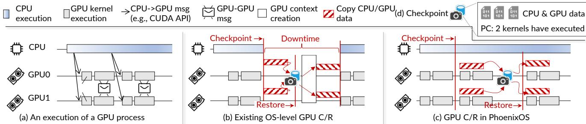  
Figure 1: Illustrations of (a) how a GPU process executes, (b) how a stop-the-world OS-level checkpoint and restore works, (c) how PHOS does concurrent checkpoint and restore, and (d) the main content of checkpointed data.

Demonstrations. PHOS can checkpoint and restore unmodified GPU applications (including multi-GPU processes) on NVIDIA GPUs. We selected NVIDIA GPUs for their widespread adoption, despite the greater implementation challenges they present. Our design also generalizes to other GPUs and accelerators that follow the same execution model of NVIDIA GPUs (§2.1). When evaluated on A800 GPU servers and compared to state-of-the-art systems— Singularity [64] and NVIDIA’s official checkpoint and restore utility (cuda-checkpoint) [57], PHOS reduces application stall during checkpoint and restore by up to 160%. More importantly, PHOS delivers orders-of-magnitude improvements in end-to-end application performance. Compared to Singularity, PHOS reduces wasted GPU time in fault tolerance by 76% when training Llama2-13B on multiple GPUs. It also decreases migration downtime for a Llama2-13B inference job from 9.8 to 2.3 seconds, Additionally, PHOS can launch a new Llama2-13B inference job in just 622 milliseconds by avoiding cold start costs, which is 114–342% and 124–450% faster than Singularity and cuda-checkpoint, respectively.

Contributions. We highlight our contributions as:

• The first efficient GPU execution read and write set tracing method via validated speculation (§4.1).

• The first set of OS-level concurrent checkpoint and restore protocols for GPUs (§4.2, §4.3, and §6).

• PHOS, the first OS-level concurrent checkpoint and restore system for GPUs that addresses critical technical challenges to realize these concurrent protocols (§5 and §6), significantly improving end-to-end application performance (§8).

PHOS is open-source and publicly available at https://github.   
com/SJTU-IPADS/PhoenixOS.

## 2 Background

## 2.1 How a process uses GPUs

GPUs are accelerators with massive multithreading capability typically attached to the CPU via PCIe. Programs executed on GPUs are termed kernels, which contain machine code (e.g., SASS [55]) that is either pre-compiled or just-in-time compiled. Kernels process data residing in GPU buffers, where each buffer constitutes a contiguous GPU virtual memory region with application-controlled granularity.

When a process starts, the GPU driver creates an execution context, e.g., CUcontext [54], involving compiling and loading the kernel binaries, configuring the GPU virtual memory and others [43]. Afterward, processes use a GPU driver or toolkit APIs (we term GPU API in this paper) like CUDA [50], illustrated in Figure 1(a), to trigger computations on GPUs. For example, the process can launch kernels via cudaLaunchKernel and copy CPU data to GPU (and vice versa) using cudaMemcpy. PHOS intercepts GPU APIs for realizing checkpointing and restoration, thus supporting all GPU applications at the OS-level.

## 2.2 OS-level GPU checkpoint and restore (C/R)

Basic checkpoint and restore. A checkpoint captures a process’s execution state at a specific time in an image (termed as checkpoint). The OS can then use this checkpoint to recreate the process (termed as restore). A checkpoint contains two types of data: data state (data in the CPU memory and GPU buffers) and control state (e.g., CPU registers that store the program counter, PC). Checkpointed CPU states also include kernel objects like network connections [17, 67].

A common approach for implementing GPU checkpointing first quiesces (both CPU and GPU) process execution— stopping CPU execution and waiting for all in-flight GPU kernels and communications to complete—and then copies all execution state to the checkpoint [57, 64], as illustrated in Figure 1(b). For restoration, the OS first loads data state into CPU memory and GPU buffers, then restores control state to resume execution.

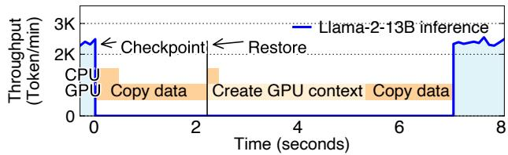  
Figure 2: A breakdown of checkpoint and restore overhead.

Concurrent CPU checkpoint and restore. To prevent application stall during checkpointing and restoration, which has non-trivial overhead, OS researchers have investigated concurrent CPU checkpointing and restoration for decades [14, 20, 67, 70, 73, 74]. Concurrent checkpointing allows CPU execution during data copying, thus hiding the overhead of checkpointing. For correctness, the OS either isolates concurrent CPU writes via copy-on-write [67, 74], or recopies concurrently written data to the checkpoint [14]. Concurrent restoration enables immediate process resumption, i.e., no need to wait for the data to be fully restored. During the process execution, the data is being concurrently copied from the checkpoint to the CPU memory. For correctness, if the process touches non-restored data, the CPU will trigger a page fault, so the OS will copy the missing data from the checkpoint on demand [20, 70, 73].

## 2.3 Key factors stalling applications during C/R

Figure 2 analyzes the stalls caused by checkpoint and restore on a Llama2-13B inference process. We evaluate Singularity [64]—the state-of-the-art GPU checkpoint and restore system, other baselines like cuda-checkpoint [57] are much slower. We have enabled concurrent CPU checkpointing and restoration using CRIU’s incremental dump and restore [19]. The detailed setup and performance of cuda-checkpoint can be found in §8.

Copying GPU data. Because the GPU is stopped when copying data to and from checkpoint, the applications are stalled despite the CPU-side of the process being concurrently executed. The stall time is non-trivial: checkpointing and restoring data each require more than 2.1 seconds respectively when transferred with PCIe, causing thousands of tokens to be disrupted. The stall further scales with the GPU memory used, which is substantial: For instance, Llama2-13B inference occupies 55 GB of active memory. Given a typical 32 GBps PCIe 4.0 CPU–GPU link, OS-level checkpoint and restore takes at least 1.7 seconds.

Creating GPU contexts. Before restore can copy data to the GPU, the OS must create proper GPU contexts. This establishes a restoration barrier as context creation incurs comparable overheads to data copying, i.e., 3.1 vs. 1.7 seconds in our motivation experiment. GPU context initialization exceeds CPU context creation time due to complex hardware configuration and driver state loading [43]. In comparison, creating CPU context, i.e., a Linux process, merely initializes a small number of kernel data structures.

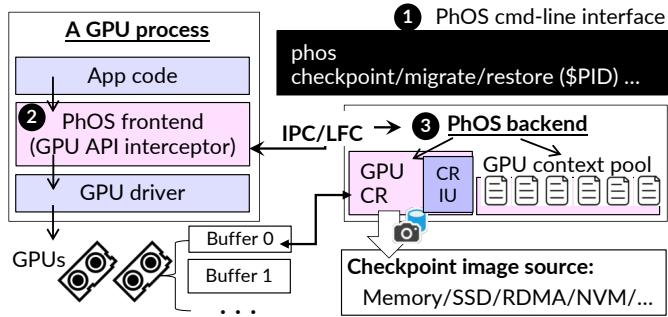  
Figure 3: PHOS system architecture. IPC and LFC stand for inter-process call and local function call, respectively.

## 3 PHOENIXOS (PHOS)

Design goals. Our goals are efficient and correct OS-level GPU checkpoint and restore. For efficiency, the goal is to minimize process stalls during checkpoint or restore. PHOS achieves this through: concurrent process execution during data copying for both checkpoint and restore, and bypassing GPU context creation during restore, as illustrated in Figure 1(c). For correctness, the goal is to make the checkpoint reflect an application state indistinguishable from a non-checkpointed execution [38, 64, 67].

System components and execution flow. Figure 3 shows PHOS’s architecture that has three core system components: a command-line tool (❶), a per-process frontend library to facilitate C/R (❷), and a backend module to do the C/R (❸).

Our command-line tool (❶) enables users to checkpoint running GPU processes, migrate them across machines, or restore processes from checkpoints with the process ID (\$PID). Although PHOS does not require application cooperation, we found that it can benefit from choosing a proper checkpoint time (see §8.4). We therefore provide an SDK for applications to control checkpoint timing with just five lines of additional code (more details in §A.2).

Once a checkpoint or restore command is received by the tool, it will communicate with the frontend library (❷) embedded in the GPU driver and its toolkits. The frontend will further call our backend to do the checkpoint and restore, as well as trace the read and write sets (§4.1) when the process calls a GPU API. This information is provided to our C/R backend to ensure correctness (§4 and §6). Our current implementation leverages LD\_PRELOAD to extend the CUDA GPU API as CUDA is closed-source, but LD\_PRELOAD is not a requirement once the code is available.

Our backend (❸) uses CRIU [18] to checkpoint and restore CPU process states, and our efficient GPU engine (see §5)

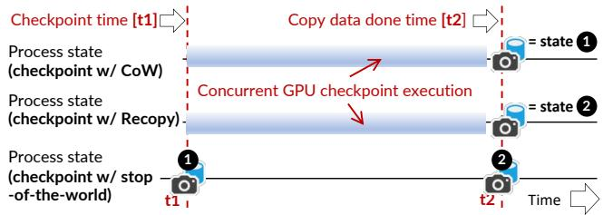  
Figure 4: An illustration of the correctness guarantee of concurrent checkpointing enabled by different protocols of PHOS.

for GPU states. Choosing CRIU allows PHOS to correctly checkpoint and restore complex states like network connections. However, CRIU may not be the most efficient solution for CPU checkpointing. Our current implementation overlaps CRIU checkpointing with our GPU checkpointing but a faster CPU checkpointing mechanism would make PHOS easier to implement.

PHOS backend supports a wide range of checkpoint media: it can read and write checkpoints to local SSD, CPU DRAM and even the DRAM of another machine via RDMA (§7), which is critical for efficient process migration. The backend also includes a GPU context pool—containing pre-allocated contexts that avoid creating GPU contexts during restore (§6).

PHOS command-line tool uses inter-process calls (IPC) to communicate with the frontend. On the other hand, the frontend and backend can communicate either via IPC or local function calls (LFC). We prefer LFC whenever feasible by linking the frontend and backend in the same library. However, IPC is required for cases when the applications require accessing the context pool, e.g., for fast restore (see §7). This is because the context must be pre-created in PHOS daemon to bypass the costly context creation during restore (see Figure 2). This comes at the cost of extra GPU API calling overhead when the application executes (after the restore), e.g., we observed a maximum of 9% IPC overhead for typical AI applications after applying recent works in accelerating calling GPU APIs with IPC [71, 77]. We believe this is a reasonable trade-off as the restore time dominates the overall application execution time in the required scenarios (see §7).

## 4 Making concurrent GPU checkpoint correct

Correctness guarantee of PHOS. Intuitively, a checkpoint is correct if it could occur in a checkpoint-free execution [23]. A stop-the-world checkpoint described in §2.2 naturally guarantees correctness. PHOS ensures correctness by ensuring that our checkpoint matches the one that may come from the existing stop-the-world checkpoint.

Overview of the checkpoint protocols. We retrofit two CPU-inspired protocols [14, 67, 74] for a correct concurrent GPU checkpoint. As Figure 4 shows, consider our checkpoint starting at t1 with concurrent data copy done at t2. Compared with a stop checkpoint at t1, inconsistencies are caused by new writes issued between [t1,t2]. Our soft copy-onwrite (CoW) protocol isolates these writes (§4.2), making the checkpoint only copy a frozen GPU state at t1. Alternatively, compared to a stop checkpoint at t2, our approach may miss new writes. Thus, at t2, our soft recopy protocol quiesces the process and recopies the missed writes to ensure correctness (§4.3). CoW is commonly used in fault tolerance cases, where the application can tolerate restoring from a stale state (t1). On the other hand, recopy is used in cases where the restored process must be resumed from the latest execution (t2), e.g., live migration (§7).

Both protocols require tracing the process’s write set, i.e., which bytes are written during the concurrent checkpoint. For CPU writes, we follow the traditional approach to use permission bits in the page table, i.e., write protection for copy-on-write and dirty bits to trace at the page granularity. We omit the detailed CPU-side description since it is well studied. Unfortunately, modern GPUs lack these supports, e.g., no hardware dirty bits [27]. Therefore, before delving into our protocols, we first propose a software-based approach to trace GPU writes.

## 4.1 Tracing GPU write set with validated speculation

Tracing with speculation on GPU API arguments. All operations that can perform GPU writes are initiated through GPU API calls, so we intercept these calls to trace the write set. These APIs fall into four categories:

(1) Issue memory move operations, e.g., cudaMemcpy(dst, src,count,..). They write the CPU data (src) to the GPU memory (dst).

(2) Issue communication kernels, e.g., ncclBroadcast (sendbuffer,recvbuffer,count,..). They write the GPU buffers with the content sent through the network.

(3) Issue computation kernels with well-defined semantics, e.g., cublasSgemm $( \dots , \mathbb { A } , \mathbb { B } , \dots , \mathbb { C } , \dots )$ . They perform a computation and update the result buffers (C), whose read and write semantics are known in the specifications [53].

(4) Issue opaque computation kernels, e.g., cudaLaunch-Kernel(func,..,args,..). They launch kernels written by the developers or just-in-time compiled during runtime, so the reads and writes are unknown to the OS.

For types 1–3 APIs, PHOS directly uses their specifications to trace writes. For instance, the specification of cudaMemcpy indicates that executing this API will modify GPU memory from dst to dst+count. Our empirical analysis shows that over 50% of invocations are these types of APIs (§8.2).

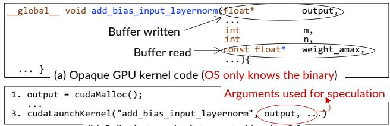  
(b) Calls that can be intercepted by the OS  
Figure 5: An illustration of the GPU kernel [25] written by the user (a) and how PHOS speculates the accessed buffers (b).

Opaque kernels are trickier because the OS only knows the kernel binary and the arguments invoking it. Our observation is that each GPU kernel represents a clear and straightforward computational purpose whose accessed data addresses are directly encoded in the OS-known arguments calling the kernel. As shown in Figure 5, the data (output) written by the kernel is the second argument. Since the OS knows all the buffers allocated by the process by intercepting the GPU memory allocation calls, line 1 (cudaMalloc), and it knows each kernel’s function signature [1], we can systematically compare the arguments with the allocated buffers to speculate the buffer written by each kernel. The interception overhead is negligible: it only manipulates a few data structures before calling GPU memory allocation APIs.

Specifically, our speculation traces the kernel’s writes at buffer-level: When applications launch an opaque GPU computation kernel, for each argument, PHOS treats it as a tentative address pointing to a GPU buffer to write. To decide which buffer is written, we compare it with all the process’s allocated buffers. If the integer value of the argument falls within the range of a buffer, we mark the entire buffer as written. To reduce false positives, we filter out irrelevant arguments with the function signature. Specifically, we use clang [13] to extract the kernel’s argument types, focusing solely on mutable pointer arguments. One type that cannot be precisely filtered out is the C struct type, which is opaque to PHOS as we don’t know the struct definition. For such a type, we conservatively treat all 8-byte chunks in the struct as potential written GPU buffers.

Runtime validation. To handle speculation failures, e.g., extremely rare GPU indirect access (see §8.6), we validate the speculation by instrumenting a runtime validator to the kernel. The validator checks whether each kernel’s GPU memory write instruction falls within the speculated buffers.

Figure 6 presents the validation workflow. When PHOS encounters an opaque kernel that has not been instrumented (including JIT-compiled ones [59]), it generates a new twin kernel whose kernel binary is the instrumented version of the original kernel binary (❶). The instrumented validator performs the following: For each write instruction, it inserts address range checks before it to verify target address belongs to speculated buffers. If the validation fails, the validator reports the incident to PHOS by writing the address to a preallocated PHOS managed CPU buffer. The instrumentation is at the PTX ISA [52]-level for portability. The instrumentation overhead is negligible because for each kernel binary, it will be instrumented only once.

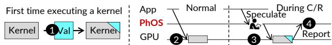  
Figure 6: PHOS validation workflow.

When PHOS intercepts a kernel invocation during checkpoint (❸), it invokes its corresponding instrumented twin kernel. If the kernel reports validation failures, we will execute fallback protocols (described in §4.2 and §4.3) to ensure correctness. The overhead of running the instrumented kernels is also manageable (§8.2) and they are not invoked without a checkpoint (❷).

Discussion: the granularity of tracing. Ideally, the trace should be as fine-grained as possible to avoid protocol overhead for ensuring correctness, e.g., avoid excessive copy-onwrite. For non-opaque kernels, we can precisely track the bytes written. However, our speculation-based tracing can only detect writes at the buffer-level, which may result in over-tracing. For example, when a kernel only writes a small part of the buffer, we may treat the entire buffer as written. Luckily, such over-tracing is rare, especially for recent GPU applications like AI jobs, because (1) AI frameworks (e.g., PyTorch) use a fine-grained buffer allocation, e.g., one for each tensor [60], and (2) the opaque kernels typically write the entire buffer (tensor). See §8.5 for the analysis.

## 4.2 The GPU soft copy-on-write (CoW) checkpoint

Suppose a checkpoint starts at time t1. Our CoW protocol guarantees the final checkpoint matches a stop-the-world checkpoint at t1, while allowing concurrent application execution. The inconsistency can only happen when the GPU writes to an uncheckpointed buffer during execution. To prevent this, before allowing such writes to execute, we first copy the targeted data to another place (e.g., a free on-device buffer) and then redirect application writes to a new buffer. Thus, the concurrent checkpoint will not see the new writes.

The protocol. Figure 7 presents the detailed protocol that consists of two phases: quiesce (➀) and concurrent copy (➁). The quiesce phase stops CPU and GPU execution, the same as existing stop-the-world checkpointing [57, 64]. Note that if we want to checkpoint a multi-process application, the quiesce phase stops all the processes’ CPUs and GPUs. Quiescing is necessary because it regulates the current process states to be the same as a possible stop-the-world checkpoint. To quiesce, we first stop CPU to prevent sending new GPU APIs. Then we wait for pending GPU kernels and communications to complete (e.g., via cudaDeviceSynchronize).

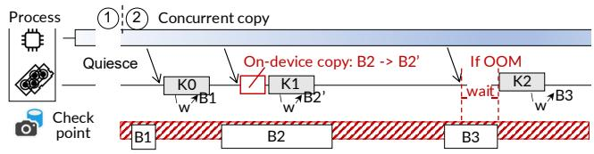  
CPU execution K0 GPU kernel (K0) execution B1 Copy B1 to the checkpoint  
Figure 7: An illustration of the soft copy-on-write protocol for concurrent checkpoint correctness.

Note that the quiescing overhead is negligible since GPU operations occur at microsecond scales. Thus, despite lacking concurrency, its overhead is significantly lower than data copying (recall Figure 2).

At the copy phase, we copy all the GPU and CPU data to the checkpoint. For CPU data, we follow existing works [67, 74] to isolate concurrent writes with OS’s copy-on-write. For GPU, we isolate writes at the GPU API-level: Before executing a GPU kernel (or API), we check whether it writes to a buffer that has not been checkpointed (or is being concurrently checkpointed) using the traced writes through argument-based speculation. If so (e.g., B2), we will first copy the victim buffer to a new buffer allocated on the GPU (B2’), and then redirect the kernel to write to the new buffer (B2’). If multiple concurrent kernels try to write B2, the first kernel will copy B2 to B2’, and all the others will wait for the copy to finish before executing on B2’. If the GPU has no free memory to allocate the new buffer, we will directly copy the data to the checkpoint at the host.

Kernel buffer redirection, on-device memory used, and handling mis-speculation. Three things need to be noted. First, redirecting kernel writes to the new buffer is not that trivial: For types 1–3 APIs, we can directly change the arguments for so; but for the opaque ones, we cannot because the arguments can be mis-speculated. For example, if the changed argument is not a buffer, the execution will corrupt both application states as well as the checkpoint. Hence, unlike traditional CPU copy-on-write, we leave the kernel argument unchanged, and redirect the checkpoint to access the copied buffer instead.

Second, we only reserve a small amount of GPU memory (up to 2 GB) for the copy-on-write, and the concurrent checkpoint can still work even if no extra memory is used. If we lack sufficient GPU memory for the copy-on-write, we block the kernel until free memory is available (K2 in Figure 7) or the written buffer has been checkpointed. This causes a short checkpoint stall but we have found it acceptable: PHOS does not require a large on-device buffer for high performance because once a copy-on-write is done, its original buffer can be immediately released. §8.3 analyzes the impact of GPU memory reserved for CoW on the checkpointing performance.

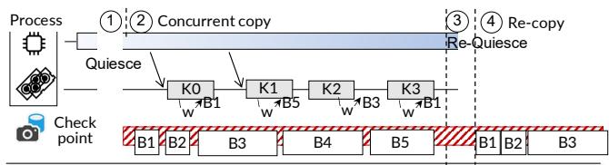  
CPU execution K0 GPU kernel (K0) execution B1 Copy B1 to the checkpoint  
Figure 8: An illustration of the soft dirty buffer protocol for concurrent checkpoint correctness.

Finally, if the validator detects a mis-speculation by reporting a write to a buffer not traced, we will check whether it affects correctness and react if necessary. If PHOS has checkpointed the buffer before kernel execution, no further action is required. Otherwise, we discard the current checkpoint and retry with a stop-the-world approach for liveness. Note that because we don’t encounter speculation failures for all major GPU applications, we adopted a simple retry strategy and leave a more advanced one as our future work.

Correctness. Our checkpoint is the same as the resulting checkpoint from a stop-the-world checkpoint at the start checkpoint time. First, our quiesce phase is the same as the stop checkpoint. So before the copy phase, our initial process states are the same as a stop checkpoint. Second, during our concurrent copy, we only copy the states not modified by concurrent execution, because all writes are isolated by copyon-write. As the stop checkpoint also faithfully checkpoints the same state, our checkpoint is the same as its checkpoint.

Discussion: speculation vs. validation. Although we can, in principle, avoid speculation by instrumenting the kernels to obtain their accessed buffers and do the copy-on-write, as we did in validation, we still choose speculation for two reasons. First, speculation allows us to acquire buffer information in advance, which is necessary for CoW especially in case of insufficient on-device buffer. Also, our concurrent restore protocol (see §6) relies on knowing the accessed buffers in advance. Second, speculation then validation has fewer overheads than obtaining the buffers without speculation, because in the common case, the validation will only pass a flag indicating whether the validation passes.

## 4.3 The GPU soft recopy checkpoint

Suppose the concurrent checkpoint starts at t1 and the data copy ends at t2. Our recopy protocol recopies the written buffers during concurrent copy to ensure the checkpoint is the same as the stop-the-world checkpoint at t2.

The protocol. Figure 8 presents how the protocol executes, which contains four phases. The first quiesce phase (➀) stops all the CPU and GPU execution, the same as the CoW protocol, ensuring that during concurrent copy, we will not miss tracing any writes. Afterward, PHOS resumes application execution, and copies the CPU and GPU data to the checkpoint (➁). During the concurrent copy, before launching a kernel (or an API), we trace the buffers written by the kernel using the speculation and validation method. For each buffer, we will check whether it is dirty, i.e., the buffer has been checkpointed or is being checkpointed. If dirty, we will add it to a dirty buffer set for recopy. In the Figure 8 example, B1 and B3 are dirty but B5 is not. The CPU dirty pages are tracked via page table’s dirty bit.

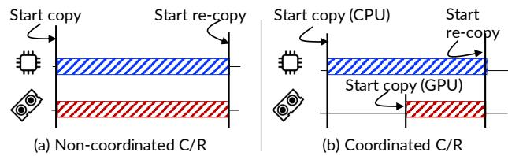  
Figure 9: An illustration of the reduced time window size that could cause dirty buffers thanks to prioritized CPU and GPU concurrent checkpoint. The bars show the time window size.

Once all the data has been copied, we start another quiesce phase to stop the CPU and GPU execution (➂). Note that dirty buffers written during the quiesce phase will also be recorded. After the quiesce is done, we recopy all the GPU dirty buffers CPU dirty pages to the checkpoint (➃). The application is stopped to ensure correctness, but we can also iteratively do the concurrent recopy similar to CPU-based protocols [14].

Handling mis-speculation. Handling speculation failures is simple for recopy: if the speculation is wrong, the validator will return the victim buffers such that we can add them to the dirty buffer set if they are dirty.

Correctness. Assume the concurrent copy completes at t2. We will show that our checkpoint matches a stop checkpoint at t2. First, it is straightforward to see that the re-quiesce and recopy phases (➂ + ➃) are nearly identical to a stop checkpoint at t2. The only difference is that we only copy the dirty buffers. To remedy, we use the buffers copied during ➁ for the remaining buffers. It is correct to do so because buffers not recopied are the same as when doing a stop checkpoint at t2 because they are not dirty. Thus, combining buffers copied from the two phases results in the same checkpoint as obtained from a stop checkpoint at t2.

## 5 Making concurrent GPU checkpoint fast

Reducing dirty buffers via coordinated GPU and CPU checkpoint. In the soft recopy protocol, the time window of the copy is critical to the number of dirty buffers generated: the longer the copy, the more likely the buffers will become

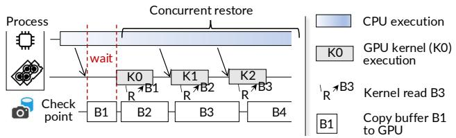

Figure 10: An illustration of the concurrent restore in PHOS. dirty. If we copy the CPU and GPU data without coordination, the overall time window is the size of checkpoint image divided by the copy bandwidth.

In GPU processes, we found GPU writes are more frequent than CPU writes, so it is beneficial to first copy the CPU data instead of copying the GPU data, reducing the GPU time window to the size of the GPU data divided by the copy bandwidth, as shown in Figure 9(b). Thus, we implement a coordinated checkpoint in our checkpoint engine: we first copy the CPU data, then the GPU data.

Prioritized application PCIe transfer. When we completed our first concurrent checkpoint implementation (for both protocols), we found the process still has significant stalls during the checkpoint. By profiling the GPU execution, we found the stall is not caused by our protocols, but by the saturated DMA engine caused by GPU checkpointing. Specifically, GPUs have a limited number of DMA engines [7] shared between PHOS and applications. With concurrent checkpointing, the bulk copy nature of the checkpointing can easily saturate the DMA engines, causing application kernels to wait.

To this end, we adopt two techniques to avoid application starvation—the goal is to prioritize application DMA transfer over the checkpoint, observing that applications infrequently use DMA but DMA operations are on the critical path. First, we intercept all process’s DMA-related API calls (e.g., cudaMemcpy) to detect application PCIe transfer. The interception overhead is negligible (<1%), because the APIs are typically called asynchronously so our interception is not on the application’s critical path [71, 77]. When the DMA operation is detected, we implemented a preemptible checkpoint copy mechanism: for each GPU buffer, we copy it to the checkpoint in small 4 MB chunks. After copying one chunk, we check whether there is ongoing or pending application transfer. If so, we pause the checkpoint copy and let the pending application transfers execute first.

## 6 Concurrent GPU restore

Concurrent and correct restore. When restoring data from the checkpoint to the GPUs, PHOS allows processes to execute concurrently when PHOS is copying data from the checkpoint to the GPU buffers. Figure 10 illustrates the execution flow. To ensure correctness, before executing a kernel (or API), we check whether the data it requires has been copied.

If not, we pause the execution, copy the buffer containing the required data, and then resume. In our example, K0 will wait for B1 to be copied. If the data has been copied, e.g., K1 and K2, kernels can execute while the restore is concurrently executing (copying B3 and B4). This effectively overlaps computation with data transfer, reducing the observable impact of data copy overhead analyzed in §2.3.

Recall from §4 that the checkpoint of PHOS is correct. Given this guarantee, the correctness of concurrent restore depends on accurately tracing execution’s read set, similar to prior CPU systems [20, 70, 73].

Tracing GPU read set with extended speculation with validation. PHOS extends the argument-based speculation described in §4.1 to speculate the data read by launching a piece of GPU execution with API calls. The extension is simple: we treat launch arguments declared as immutable pointers (e.g., const void \*) as tentative read buffers required. Note that we still need to trace writes here, because GPU kernels may perform partial writes to buffers.

Handling mis-speculation. Like writes, we also instrument a validator to ensure correctness under speculation failures. If the speculation is wrong, the validator will notify PHOS to handle. However, the mis-speculation handling for reads is more complex than for writes, because the kernel may have accessed inconsistent GPU states caused by a partially restored buffer. To ensure correctness, we must roll back the GPU states to a correct one. Our current solution rolls back to the initial state from the checkpoint and then performs a stopthe-world restore for liveness. We choose this simple solution because we have not met speculation failures in common GPU applications. While a more efficient solution could involve isolating partial updates using our soft copy-on-write protocol, we defer the detailed design to future work.

Accelerate restore with context pool. The final challenge for implementing concurrent restore is that GPU context creation must precede kernel execution and buffer copying, as the context initialization involves setting up GPU memory subsystems. This initialization incurs comparable overhead to data copy, as analyzed in §2.3.

To address the issue, our key observation is that GPU execution can be decoupled from the context it uses: a process can use any context capable of executing the APIs. Therefore, we pre-create a pool of common GPU contexts at PHOS. Specifically, we maintain the pool in the PHOS daemon—a long-running OS service that pre-creates CUDA and cuBLAS contexts with cuCtxCreate and cublasCreate at boot time. For multi-GPU applications, we also pre-create an NCCL group communicator that covers all GPUs connected via NVLink, which can accelerate establishing the NCCL group communicator with sub-topology using ncclCommSplit [48] efficiently. We don’t create communicators across machines because the ideal communicator may depend on the network topology. The context pool operates in a separate process space, so applications must use inter-process communication mechanisms to access it.

With the context pool, when a GPU process requests to create a context, we intercept the context creation API call and assign a pre-existing context from the pool. We also track the mapping between the context and the GPU process, ensuring all subsequent GPU API calls from that process utilize the mapped context.

## 7 Empowering applications with PHOS

Fault tolerance for GPU processes (checkpoint-mostly). Distributed computing applications such as training models are susceptible to GPU failures [22, 26, 64]. PHOS provides transparent fault tolerance through periodic GPU process checkpointing using our soft copy-on-write (CoW) protocol described in §4.2. The checkpoints are stored in fast faulttolerant storage, e.g., with replication to remote memory [72]. If a failure occurs, PHOS first stops all GPU processes, and then restores them from the most recent checkpoint. The checkpoint frequency is determined by holistically considering both the checkpoint overhead as well as the loss of computation due to restoring from a stale checkpoint, similar to prior work [28]. The detailed method is left in the appendix (§A.1). For fault tolerance, using a slightly stale checkpoint (i.e., one that does not capture the absolute latest execution state) is acceptable, because the latest state can be recovered through recomputation.

Two things to note. First, fault tolerance is a checkpointmostly case, as the checkpoint frequency needs to be high to avoid losing computation results [72]. In comparison, the restore only happens upon failures, which occur much less frequently, e.g., one per-hour [47, 79]. Second, we need to ensure the checkpoint from all the involved processes is consistent [64]. Thus, we extended the quiescing phase described in §4.2 across all involved processes. After the quiescent point, we can checkpoint each process with CoW separately. We currently follow Singularity [64] and use a user-provided hint for a correct global quiesce, e.g., before the forward pass of each training iteration.

Live migration of a GPU process (checkpoint-restore). PHOS implemented pre-copy-style live migration [14]: It first checkpoints the process via our recopy protocol, then restores it on the target node. The recopy protocol is necessary because the destination should resume exactly at the last execution state at the source node. To avoid redundant data copy from first copying the data from source GPU to the checkpoint, then from the checkpoint to the target GPU, we use GPUdirect RDMA [2] to directly copy the data from the source GPUs’ buffers to the target GPUs’ buffers.

Table 2: Applications evaluated. (?) indicates a multi-GPU setup. PPO is training-only, and our testbed cannot run L70B training.
<table><tr><td></td><td>ResNET-152M  $( \mathbf { R } ^ { 1 5 2 \mathbf { M } } )$ </td><td>PPO-336M  $( \mathrm { P P O } ^ { 3 3 6 \mathrm { M } } )$ </td><td>Stable-Diffusion-1B  $( \mathrm { S D } ^ { \mathrm { 1 B } } )$ </td><td>Llama2-13B  $( \mathrm { L } ^ { 1 3 \mathrm { B } } )$ </td><td>Llama3.3-70B  $( \mathrm { L } ^ { 7 0 \mathrm { B } } )$ </td></tr><tr><td>Application</td><td>Training gInference</td><td>Training</td><td>Training* Inference</td><td>Training* Inference</td><td> Inference*</td></tr><tr><td>Library</td><td>Torchvision [61]</td><td>OpenAI Gym [58]</td><td>HuggingFace [24]</td><td>Meta Llama 2 [44]</td><td>Meta Llama 3.3 [45]</td></tr></table>

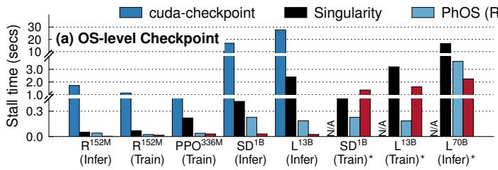  
Figure 11: The application stall time caused by different OS-level checkpoint and restore systems.

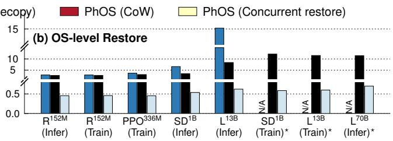

Fast GPU serverless function startups (restore-mostly). In serverless computing, processes are created on demand for each request [16, 34]. Since each process has an entry function to react to a request, we take a checkpoint right before the entry, so once a request comes, we can restore the process from the checkpoint using our concurrent restore protocol described in §6 to avoid the cold start costs [5, 73] before entry.

## 8 Evaluation

We have implemented PHOS in 54,839 LoC in C++ and Rust, excluding the CUDA GPU driver extension framework, communication libraries and integration with CRIU [18].

Testbed. We conducted our experiments on A800 servers, each with eight NVIDIA A800 (80 GB HBM and 400 Gbps NVLink interconnects) GPUs, two Intel Xeon Gold 6348 CPUs (total 56 cores), and 1 TB of DRAM. Servers are connected via an RDMA network with 100 Gbps bandwidth between each GPU and install CUDA 11.3 [49].

Baselines. We compare PHOS with NVIDIA’s official OS-level checkpoint and restore tool—cuda-checkpoint [57], which adopts a stop-the-world approach. Nevertheless, we found it is extremely slow, e.g., it cannot fully utilize the PCIe bandwidth to copy data, see Figure 11. Unfortunately, we don’t have its source code to analyze. To compare with the best performance of the stop-the-world C/R, we implemented Singularity [64]—the state-of-the-art GPU C/R system, in our codebase as the baseline. We have carefully tuned the implementation, e.g., we leverage pinned memory to achieve maximum data copy performance. As shown in Figure 11, our implementation of Singularity has orders of magnitude smaller application stall time than cuda-checkpoint. Thus, we will omit a detailed comparison with cuda-checkpoint in later analysis. Finally, a recent work CRIUgpu [65] builds on cudacheckpoint to support a unified stop-the-world checkpoint and restore. Its objective is for functionalities, not performance. Hence, we omit a comparison because it has the same performance as cuda-checkpoint.

Evaluated applications. We focus on evaluating AI applications—the dominant GPU applications to show the effectiveness of PHOS. Table 2 summarizes the evaluated applications. We choose workloads of both training and inference, whose domains span vision tasks (ResNET-152M), large foundational models (Llama2-13B and Llama3.3-70B), generation tasks (Stable-Diffusion-1B) and reinforcement learning (PPO-336M). These tasks may either use one or multiple GPUs. We follow common setups for running these applications, and leave the detailed setup descriptions in the appendix (§A.3).

## 8.1 End-to-end application performance

Fault tolerance: evaluated metrics and results. To evaluate the effectiveness of PHOS in fault tolerance scenarios, we choose training applications. Following existing works [28, 72], we compare different systems with the following metrics: checkpoint overhead and wasted GPU time during training. The checkpoint overhead measures the stall time caused by checkpointing, while the wasted GPU time measures the end-to-end training GPU time wasted when compared to a non-faulty execution. This includes both the ratio of checkpoint overhead within the overall execution as well as the recomputation time caused by recovering from a stale checkpoint. For all systems, the checkpoint is stored in host memory to avoid slow storage [72].

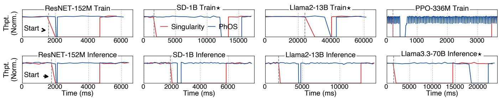  
Figure 12: The comparison of process migration downtime between machines. (?) indicates a multi-GPU setup.

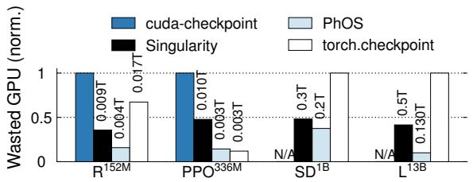  
Figure 13: The wasted GPU time (proportional to the total training time T ) using different checkpoint methods for fault tolerance for training workloads. To simplify comparison between applications, for an application, the bar is normalized to the number of systems with the maximum wasted time. cuda-checkpoint does not support checkpointing distributed jobs.

Figure 11(a) measures the checkpoint overhead, with the checkpoints done at the beginning of each training iteration. The stall is calculated by first subtracting the total training time with and without the checkpoint and then normalized to a single iteration time. We can see that PHOS reduced the checkpoint overhead by 70–160% compared to Singularity thanks to the concurrent checkpoint. Notably, on Llama2- 13B training, the overhead of PHOS is only 185 ms, while Singularity is 3.2 s, bottlenecked by transferring the GPU checkpoint data (72 GB) to the host memory (via 32 GBps PCIe). For reference, the iteration time is 6.9 s.

Figure 13 further compares the average wasted GPU time caused by different checkpoint methods. Since the wasted time is related to the failure frequency and the checkpoint frequency, we set a failure ratio of one GPU failure per hour reported by various industry reports [47, 79], and then calculate the optimal checkpoint frequency for each system according to the formula in §A.1. Note that different systems require distinct checkpoint frequencies: PHOS achieves optimal performance with 279 checkpoints per hour, whereas Singularity performs best at 67. PHOS can set a higher frequency thanks to the reduced checkpoint overhead. The results show that PHOS saves up to 22–86% GPU time compared with other approaches: the higher checkpoint frequency of PHOS saves wasted GPU time due to recomputation, while our concurrent checkpoint minimizes wasted GPU time caused by high checkpoint overhead with high checkpoint frequency. Interestingly, a well-implemented OS-level GPU C/R even outperforms a simple user-level checkpointing (torch.checkpoint) that uses PyTorch’s save.

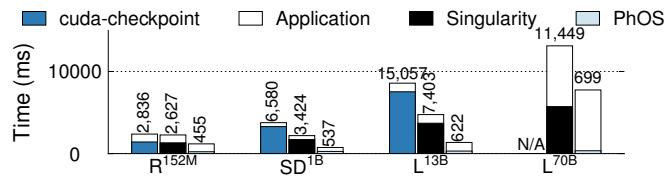  
Figure 14: The breakdown of serverless function execution time in cold starts. Note that all workloads are inference.

Live migration: evaluated metric and results. To evaluate the effectiveness of PHOS in live migration scenarios, we measure the downtime when migrating applications between nodes with different systems. Figure 12 shows the timeline of application performance during migration. We can see that PHOS incurs minimal downtime thanks to the concurrent execution capabilities. Notably, PHOS only incurs 3.3 and 3.7 seconds of downtime for migrating Llama2-13B training and Llama3.3-70B inference, respectively. In comparison, Singularity incurs 10.2 and 12.35 seconds of downtime, which is dominated by copying data from the source GPU to the target. In Llama2-13B training, copying data through 100 Gbps RDMA takes at least 9.8 seconds.

Serverless function startup: evaluated metric and results. We evaluate the effectiveness of PHOS in GPU serverless workloads by measuring the end-to-end execution time, i.e., considering both startup and application function execution time [5, 20]. We stored the function checkpoint in host DRAM and measured the execution time under cold start with OSlevel restore. We choose inference workloads because training workloads are stable and do not need serverless-style startup. Figure 14 shows the results: PHOS has the fastest execution time: on average, it improves upon cuda-checkpoint and Singularity by 24× and 16× respectively, thanks to the eliminated GPU context creation time, as well as its ability to hide data stalls due to copying.

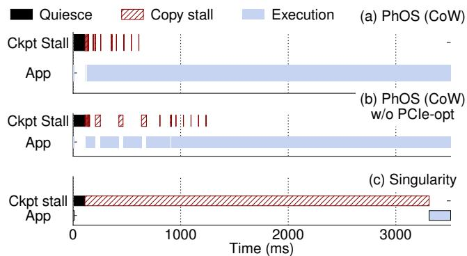  
Figure 15: The breakdown of the checkpoint overhead on (a) PHOS CoW, (b) without prioritized PCIe transfer optimization, and (c) Singularity. Workload: Llama2-13B Training?. Note that we omitted the concurrent data copy of PHOS.

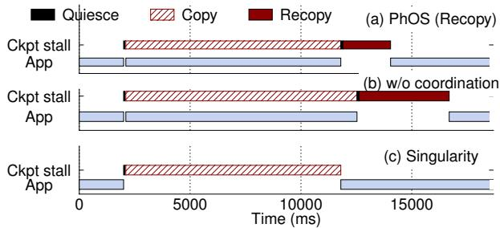  
Figure 16: The breakdown of the checkpoint overhead on (a) PHOS recopy, (b) without coordinated CPU and GPU checkpoint, and (c) Singularity. Workload: Llama3.3-70B Inference?. Note that we omitted the concurrent data copy of PHOS.

## 8.2 Performance breakdown and ablation study

Breakdown of the copy-on-write protocol. Figure 15 shows the breakdown of the checkpoint stall caused by different checkpoint methods on a Llama2-13B training workload. Other workloads share a similar trend. All the system checkpoints at the beginning of the iteration: the optimal checkpoint timing, as analyzed later in §8.4. We can see that first, though the quiescing phase will stop the application execution, its absolute time (100 ms) is much smaller so this phase has a negligible overhead. The absolute time is small because (1) ongoing kernels are short-lived and (2) coordinating between threads with RDMA to reach a global quiesce is extremely efficient. Second, though PHOS may stall application due to copy-on-write, the aggregated stalls are small.

Effectiveness of the prioritized application PCIe transfer. As shown in Figure 15, without our prioritized application PCIe transfer optimization described in §5, applications suffer from stalls due to PCIe bandwidth competition. This is because GPU kernels are waiting to load the training set from the CPU, which is blocked by the checkpoint data copy due to the limited number of GPU DMA engines.

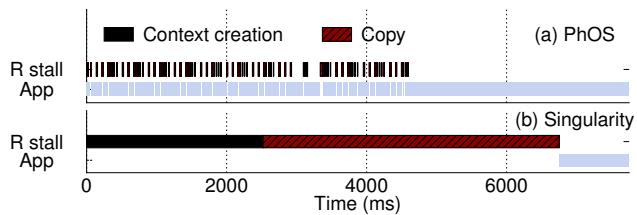  
Figure 17: The breakdown of the restore on (a) PHOS concurrent restore, and (b) Singularity. Workload: Llama2-13B inference. Note that we omitted the concurrent data copy of PHOS. R stall stands for restore stall time.

Breakdown of the recopy protocol. Figure 16 shows the breakdown of executing our recopy protocol on a Llama3.3- 70B inference workload?. We can see that the downtime of PHOS is dominated by the recopy time. Compared to CoW, the recopy downtime is longer because it not only ensures that the checkpoint is correct, but it is also fresh. Nevertheless, the downtime is still orders of magnitude smaller than a stopthe-world approach (Singularity) because the recopied data is much smaller (2.1 vs. 9.7 seconds).

Effectiveness of the coordinated CPU and GPU checkpoint. Figure 16 further evaluates the effectiveness of our coordinated CPU and GPU checkpoint optimization in §5, aiming to reduce the amount of dirty data for the recopy phase. Thanks to the optimized GPU concurrent copy timing, PHOS enjoys 47% smaller recopy time than without optimization (b). The recopied data reduces from 50 to 27 GB per GPU. Since the copy is a bulk load procedure, the reduced transferred size directly translates to a reduced recopy time.

Breakdown of the concurrent restore. Figure 17 shows the breakdown of concurrent restoring a Llama2-13B inference process using PHOS. We can see that compared to the stop-the-world restore (b), the improvements of PHOS come from two factors: (1) the eliminated context creation and (2) overlapping the data copy with the kernel execution. Note that during application execution, PHOS still copies the data in the background: this perfectly aligns with how inference processes access data nowadays: before executing the first layer of inference, we can concurrently restore the second layer’s data. Unlike previous work [6, 76], PHOS achieves so transparently.

The runtime overhead of tracing GPU read and write set. Figure 18(a) and (b) report the runtime overhead of the runtime validator on different applications. We observe a relatively small slowdown of 1–12% for various workloads. The observable overhead is small because: (1) the additional check only happens when the kernel accesses the global memory, which is less frequent for high computational efficiency; and (2) the instrumented kernels are only a small portion of the overall kernels in the workloads. Figure 18(c) reports the number of instrumented kernels invoked during the concurrent checkpoint and restore: We see that most of the kernels are not instrumented, e.g., in Llama2-13B inference, only 12% of the invoked kernels are instrumented.

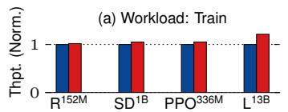

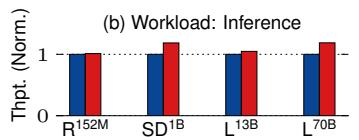

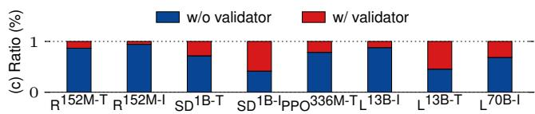  
Figure 18: The analysis of runtime validator overhead on (a) training and (b) inference workloads, along with (c) the ratios of kernels instrumented with the validator. Training is abbreviated as -T and inference as -I.

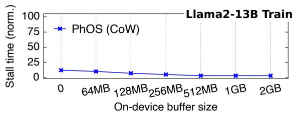  
Figure 19: The analysis of the copy-on-write overhead with different on-device buffer sizes.

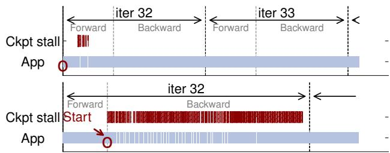  
Figure 20: Impact of checkpoint timing on the performance of Llama2-13B training. The blank in App is the stall caused by the CoW. The red indicates the data copy time. Note that we omitted the concurrent data copy of PHOS.

## 8.3 Impact of on-device memory used on performance

Figure 19 shows the impact of the on-device buffer size on the checkpoint overhead when checkpointing a Llama2-13B training workload. We choose this workload because it has the largest memory footprint so little room is left for the on-device buffer (see Table 4). We report the increased stall time caused by the checkpoint, where the time is normalized to the stall time with our maximum configurable on-device buffer size (2 GB). We see that checkpoint overhead generally decreases with the on-device buffer size, but the difference is small, e.g., even without on-device buffer, PHOS incurs up to 9.1 % more stalls. This is because not all copy-on-write operations require stalling the kernel, so the slow copy through PCIe with insufficient on-device buffer can be hidden.

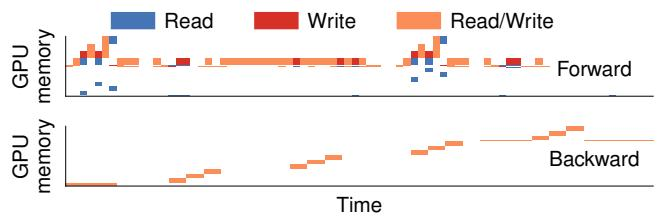  
Figure 21: The heatmap of the read and write sets traced by our validation method. Workload: Llama2-13B training?.

## 8.4 Impact of checkpoint timing on performance

Figure 20 analyzes how the checkpoint timing affects the performance of PHOS on the CoW protocol. We omit analysis of the recopy protocol as it is similar. We control the timing with our SDK (see §A.2). We run Llama2-13B training workload and choose two times: (1) at the beginning of an iteration (before the forward pass), (2) at the end of the iteration (at the update phase). We measure the performance specifically on the 32th iteration to fully warm up the application. We can see that checkpoint at (1) is more efficient because few buffers are updated at the beginning: only activation buffers are updated (see also §8.5). Thus, if we can finish the checkpoint before reaching the update pass, we meet a few stalls due to CoW. In (1), copying 2.3 GB of data via 32 GBps PCIe1 takes 185 ms, while the iteration time is 6.3 s.

## 8.5 A close look at GPU read and write traced by PHOS

Figure 21 reports the GPU accesses traced by PHOS on Llama2-13B training. First, we can see that though PHOS traces accesses at the buffer level, it is still fine-grained enough to support an efficient CoW and recopy, because GPU applications typically allocate and write buffers in a fine-grained way. Moreover, the access patterns differ across different phases of execution, so the checkpoint timing is important.

## 8.6 A study of the feasibility of speculation

For all the common GPU applications evaluated by PHOS, we don’t meet any speculation failure. To evaluate the feasibility of our approach, we conduct a comprehensive study across diverse GPU applications including supercomputing workloads (Rodinia [10] and Parboil [66]), dynamically generated kernels from AI compilers (TVM [11]), and highly optimized handwritten kernels (vLLM [36] and FlashInfer [3]) in Table 3. To evaluate the success rate of our speculation, we run typical tasks provided by them (we term each run of a task instance). For Rodinia and Parboil, we ran all benchmarks except for ones that had bugs or used outdated CUDA APIs (e.g., dwt2d). For TVM, we ran inference on their available models other than our previous evaluated ones (e.g., DenseNet, YOLOv4). Out of all instances, only one kernel (from Rodinia) failed our speculation—a fairly dated supercomputing application. The failure occurred because a kernel reads a buffer referenced by a global variable not listed in the launch arguments.

Table 3: The success rate of our speculation-based GPU read and write sets tracing beyond the evaluated applications.
<table><tr><td>GPU Apps</td><td>#Kernels /#Failures</td><td>#Instances/#Failures</td></tr><tr><td>Rodinia [10]</td><td>44/1</td><td>48,610 / 20</td></tr><tr><td>Parboil [66]</td><td>18/0</td><td>43,473 / 0</td></tr><tr><td>vLLM [36]</td><td>66/0</td><td>13,625 / 0</td></tr><tr><td>TVM [11]</td><td>607/0</td><td>186,244 / 0</td></tr><tr><td>FlashInfer [3]</td><td>69/0</td><td>15,265 / 0</td></tr></table>

## 9 Discussion

Supporting advanced GPU features. CUDA graph [4] is an advanced GPU feature that allows the CPU to submit a batch of kernels. PHOS supports tracing reads and writes of kernels within CUDA graph, inspired by Medusa [78]. Specifically, CUDA graphs can be utilized as follows: (1) explicitly invoking APIs such as cudaGraphAddKernelNode, or (2) implicitly constructing them through the driver using cudaStreamBeginCapture. Both methods require explicit driver API calls, so they are compatible with our API-hooking-based tracing.

GPU hardware extensions. PHOS is the first to show the effectiveness of concurrent GPU checkpoint and restore as well as how to realize it in major GPUs. While hardware extensions like GPU dirty bit could simplify and accelerate PHOS’s implementation, relying on hardware extensions is less flexible, e.g., a hardware dirty bit alone cannot support our other protocols like soft copy-on-write.

Application-provided kernel access information. Providing the kernel’s memory access to PHOS via developer annotation or just-in-time (JIT) compilation would fully utilize PHOS’s capabilities. Yet modifying numerous existing custom kernels for the annotation, as well as designing an effective JIT for checkpointing, is non-trivial. How to develop kernel memory access tracing methods beyond our speculative approach is left as our future work.

## 10 Related work

Checkpoint and restore. PHOS advances the research on checkpoint and restore (C/R), specifically focusing on efficient OS-level GPU C/R [18, 21, 29, 30, 37, 42, 63, 65, 67, 74], a feature previously available only on CPUs. GPU snapshot [38] realizes dirty bits through simulated GPU hardware extensions, which to the best of our knowledge, no actual hardware implementation currently exists. gCROP [76] uses concurrent restore to accelerate process startup (only) on AMD GPUs, but requires significant application modifications to ensures correctness. Their approach is infeasible on closed-source GPUs (e.g., NVIDIA GPUs), does not support multi-GPU applications, and most importantly, lacks support for concurrent GPU checkpoint. In contrast, our work enables both concurrent GPU checkpoint and restore without application modifications through our novel validated speculation approach. PHOS is the first system to support both concurrent OS-level checkpoint and restore for GPU applications across multiple GPUs and major GPU vendors like NVIDIA GPUs.

Analyzing GPU kernels. Many existing works analyze GPU programs (kernels), either statically or during runtime [8, 9, 12, 35, 39–41, 43]. PHOS takes a different approach: instead of analyzing the program, we analyze the kernel arguments for speculation. This avoids the incompleteness inherent in GPU kernel analysis (as GPU kernels are Turing complete) and works well for concurrent GPU checkpoint and restore.

## 11 Conclusion

We contribute the first concurrent OS-level GPU checkpointing and restoring system using validated speculation, and demonstrate its effectiveness in various critical downstream applications, including fault tolerance, live migration, and fast startup. Our current prototype is built on NVIDIA GPUs, but our methodologies are generalizable to other accelerators, and we plan to support these devices in the future.

## Acknowledgment

We sincerely thank our shepherd Ashvin Goel and the reviewers from SOSP’24, OSDI’24 and SOSP’25 for their insightful feedback. We are grateful to Zhiyuan Dong, Dingyan Zhang and Xiating Xie for their valuable comments on the early draft of this paper. We also thank Shaoxun Zeng for sharing details on adapting PHOS to support CUDA graph. This work was supported in part by the National Key Research & Development Program of China (No. 2022YFB4500700), the National Natural Science Foundation of China (No. 62202291 and 62272291), as well as a research grant from Huawei.

## References

[1] cu++filt. https://docs.nvidia.com/cuda/cuda-binary-utilities/index. html#cu-filt, 2025.

[2] Developing a linux kernel module using gpudirect rdma. https://docs. nvidia.com/cuda/gpudirect-rdma/, 2025.

[3] FlashInfer: Kernel Library for LLM Serving. https://github.com/ flashinfer-ai/flashinfer, 2025.

[4] Getting started with cuda graphs. https://developer.nvidia.com/blog/ cuda-graphs/, 2025.

[5] AO, L., PORTER, G., AND VOELKER, G. M. Faasnap: Faas made fast using snapshot-based vms. In EuroSys ’22: Seventeenth European Conference on Computer Systems, Rennes, France, April 5 - 8, 2022 (2022), Y. Bromberg, A. Kermarrec, and C. Kozyrakis, Eds., ACM, pp. 730–746.

[6] BAI, Z., ZHANG, Z., ZHU, Y., AND JIN, X. PipeSwitch: Fast pipelined context switching for deep learning applications. In 14th USENIX Symposium on Operating Systems Design and Implementation (OSDI 20) (Nov. 2020), USENIX Association, pp. 499–514.

[7] BAKITA, J., AND ANDERSON, J. H. Demystifying nvidia gpu internals to enable reliable gpu management.

[8] BETTS, A., CHONG, N., DONALDSON, A. F., KETEMA, J., QADEER, S., THOMSON, P., AND WICKERSON, J. The design and implementation of a verification technique for GPU kernels. ACM Trans. Program. Lang. Syst. 37, 3 (2015), 10:1–10:49.

[9] BETTS, A., CHONG, N., DONALDSON, A. F., QADEER, S., AND THOMSON, P. Gpuverify: a verifier for GPU kernels. In Proceedings of the 27th Annual ACM SIGPLAN Conference on Object-Oriented Programming, Systems, Languages, and Applications, OOPSLA 2012, part of SPLASH 2012, Tucson, AZ, USA, October 21-25, 2012 (2012), G. T. Leavens and M. B. Dwyer, Eds., ACM, pp. 113–132.

[10] CHE, S., BOYER, M., MENG, J., TARJAN, D., SHEAFFER, J. W., LEE, S., AND SKADRON, K. Rodinia: A benchmark suite for heterogeneous computing. In Proceedings of the 2009 IEEE International Symposium on Workload Characterization, IISWC 2009, October 4-6, 2009, Austin, TX, USA (2009), IEEE Computer Society, pp. 44–54.

[11] CHEN, T., MOREAU, T., JIANG, Z., ZHENG, L., YAN, E. Q., SHEN, H., COWAN, M., WANG, L., HU, Y., CEZE, L., GUESTRIN, C., AND KRISHNAMURTHY, A. TVM: an automated end-to-end optimizing compiler for deep learning. In 13th USENIX Symposium on Operating Systems Design and Implementation, OSDI 2018, Carlsbad, CA, USA, October 8-10, 2018 (2018), A. C. Arpaci-Dusseau and G. Voelker, Eds., USENIX Association, pp. 578–594.

[12] CHIANG, W., GOPALAKRISHNAN, G., LI, G., AND RAKAMARIC, Z. Formal analysis of GPU programs with atomics via conflict-directed delay-bounding. In NASA Formal Methods, 5th International Symposium, NFM 2013, Moffett Field, CA, USA, May 14-16, 2013. Proceedings (2013), G. Brat, N. Rungta, and A. Venet, Eds., vol. 7871 of Lecture Notes in Computer Science, Springer, pp. 213–228.

[13] CLANG. Clang: a c language family frontend for llvm, 2024.

[14] CLARK, C., FRASER, K., HAND, S., HANSEN, J. G., JUL, E., LIMPACH, C., PRATT, I., AND WARFIELD, A. Live migration of virtual machines. In 2nd Symposium on Networked Systems Design and Implementation NSDI (2005), May 2-4, 2005, Boston, Massachusetts, USA, Proceedings (2005), A. Vahdat and D. Wetherall, Eds., USENIX.

[15] CLOUD, A. https://developer.aliyun.com/article/1610603, 2024.

[16] CLOUD, A. Serverless gpu overview. https://www.alibabacloud.com/ tech-news/a/serverless/4o2cc4hux4q-serverless-gpu-overview, 2024.

[17] CRIU. Tcp repair mode in kernel.

[18] CRIU. Criu main page, 2024.

[19] CRIU. Memory changes tracking. https://criu.org/Memory\_changes\_ tracking, 2025.

[20] DU, D., YU, T., XIA, Y., ZANG, B., YAN, G., QIN, C., WU, Q., AND CHEN, H. Catalyzer: Sub-millisecond startup for serverless computing with initialization-less booting. In ASPLOS ’20: Architectural Support for Programming Languages and Operating Systems, Lausanne, Switzerland, March 16-20, 2020 (2020), J. R. Larus, L. Ceze, and K. Strauss, Eds., ACM, pp. 467–481.

[21] EGWUTUOHA, I. P., LEVY, D., SELIC, B., AND CHEN, S. A survey of fault tolerance mechanisms and checkpoint/restart implementations for high performance computing systems. The Journal of Supercomputing 65, 3 (2013), 1302–1326.

[22] EISENMAN, A., MATAM, K. K., INGRAM, S., MUDIGERE, D., KRISHNAMOORTHI, R., NAIR, K., SMELYANSKIY, M., AND AN-NAVARAM, M. Check-n-run: a checkpointing system for training deep learning recommendation models. In 19th USENIX Symposium on Networked Systems Design and Implementation, NSDI 2022, Renton, WA, USA, April 4-6, 2022 (2022), A. Phanishayee and V. Sekar, Eds., USENIX Association, pp. 929–943.

[23] ELNOZAHY, E. N., ALVISI, L., WANG, Y., AND JOHNSON, D. B. A survey of rollback-recovery protocols in message-passing systems. ACM Comput. Surv. 34, 3 (2002), 375–408.

[24] FACE, H. The ai community building the future. https://huggingface.co, 2024.

[25] FASTERTRANSFORMER. Nvidia, 2024.

[26] GAO, Y., SHI, X., LIN, H., ZHANG, H., WU, H., LI, R., AND YANG, M. An empirical study on quality issues of deep learning platform. In 45th IEEE/ACM International Conference on Software Engineering: Software Engineering in Practice, SEIP@ICSE 2023, Melbourne, Australia, May 14-20, 2023 (2023), IEEE, pp. 455–466.

[27] GUO, Y., ZHANG, Z., AND YANG, J. GPU memory exploitation for fun and profit. In 33rd USENIX Security Symposium, USENIX Security 2024, Philadelphia, PA, USA, August 14-16, 2024 (2024), D. Balzarotti and W. Xu, Eds., USENIX Association.

[28] GUPTA, T., KRISHNAN, S., KUMAR, R., VIJEEV, A., GULAVANI, B. S., KWATRA, N., RAMJEE, R., AND SIVATHANU, M. Just-in-time checkpointing: Low cost error recovery from deep learning training failures. In Proceedings of the Nineteenth European Conference on Computer Systems, EuroSys 2024, Athens, Greece, April 22-25, 2024 (2024), ACM, pp. 1110–1125.

[29] HARDY, N. Keykos architecture. SIGOPS Oper. Syst. Rev. 19, 4 (oct 1985), 8–25.

[30] HARGROVE, P. H., AND DUELL, J. C. Berkeley lab checkpoint/restart (blcr) for linux clusters. In Journal of Physics: Conference Series (2006), vol. 46, IOP Publishing, p. 067.

[31] HUANG, Z., WEI, X., HAO, Y., CHEN, R., HAN, M., GU, J., AND CHEN, H. PARALLELGPUOS: A concurrent os-level GPU checkpoint and restore system using validated speculation. CoRR abs/2405.12079v1 (2024).

[32] JIANG, Z., LIN, H., ZHONG, Y., HUANG, Q., CHEN, Y., ZHANG, Z., PENG, Y., LI, X., XIE, C., NONG, S., JIA, Y., HE, S., CHEN, H., BAI, Z., HOU, Q., YAN, S., ZHOU, D., SHENG, Y., JIANG, Z., XU, H., WEI, H., ZHANG, Z., NIE, P., ZOU, L., ZHAO, S., XIANG, L., LIU, Z., LI, Z., JIA, X., YE, J., JIN, X., AND LIU, X. MegaScale: Scaling large language model training to more than 10,000 GPUs. In 21st USENIX Symposium on Networked Systems Design and Implementation (NSDI 24) (Santa Clara, CA, Apr. 2024), USENIX Association, pp. 745–760.

[33] JOHNSON, E. Starting up faster with aws lambda snapstart. https://aws.amazon.com/cn/blogs/compute/starting-up-fasterwith-aws-lambda-snapstart/, 2024.

[34] JONAS, E., SCHLEIER-SMITH, J., SREEKANTI, V., TSAI, C., KHAN-DELWAL, A., PU, Q., SHANKAR, V., CARREIRA, J., KRAUTH, K., YADWADKAR, N. J., GONZALEZ, J. E., POPA, R. A., STOICA, I.,

AND PATTERSON, D. A. Cloud programming simplified: A berkeley view on serverless computing. CoRR abs/1902.03383 (2019).

[35] KAMATH, A. K., AND BASU, A. iguard: In-gpu advanced race detection. In SOSP ’21: ACM SIGOPS 28th Symposium on Operating Systems Principles, Virtual Event / Koblenz, Germany, October 26-29, 2021 (2021), R. van Renesse and N. Zeldovich, Eds., ACM, pp. 49–65.

[36] KWON, W., LI, Z., ZHUANG, S., SHENG, Y., ZHENG, L., YU, C. H., GONZALEZ, J., ZHANG, H., AND STOICA, I. Efficient memory management for large language model serving with pagedattention. In Proceedings of the 29th Symposium on Operating Systems Principles, SOSP 2023, Koblenz, Germany, October 23-26, 2023 (2023), J. Flinn, M. I. Seltzer, P. Druschel, A. Kaufmann, and J. Mace, Eds., ACM, pp. 611–626.

[37] LAADAN, O., AND HALLYN, S. E. Linux-cr: Transparent application checkpoint-restart in linux. In Linux Symposium (2010), vol. 159, Citeseer.

[38] LEE, K., SULLIVAN, M. B., HARI, S. K. S., TSAI, T., KECKLER, S. W., AND EREZ, M. GPU snapshot: checkpoint offloading for gpudense systems. In Proceedings of the ACM International Conference on Supercomputing, ICS 2019, Phoenix, AZ, USA, June 26-28, 2019 (2019), R. Eigenmann, C. Ding, and S. A. McKee, Eds., ACM, pp. 171–183.

[39] LEUNG, A., GUPTA, M., AGARWAL, Y., GUPTA, R., JHALA, R., AND LERNER, S. Verifying GPU kernels by test amplification. In ACM SIGPLAN Conference on Programming Language Design and Implementation, PLDI ’12, Beijing, China - June 11 - 16, 2012 (2012), J. Vitek, H. Lin, and F. Tip, Eds., ACM, pp. 383–394.

[40] LI, G., AND GOPALAKRISHNAN, G. Scalable smt-based verification of GPU kernel functions. In Proceedings of the 18th ACM SIGSOFT International Symposium on Foundations of Software Engineering, 2010, Santa Fe, NM, USA, November 7-11, 2010 (2010), G. Roman and A. van der Hoek, Eds., ACM, pp. 187–196.

[41] LI, G., LI, P., SAWAYA, G., GOPALAKRISHNAN, G., GHOSH, I., AND RAJAN, S. P. GKLEE: concolic verification and test generation for gpus. In Proceedings of the 17th ACM SIGPLAN Symposium on Principles and Practice of Parallel Programming, PPOPP 2012, New Orleans, LA, USA, February 25-29, 2012 (2012), J. Ramanujam and P. Sadayappan, Eds., ACM, pp. 215–224.

[42] LITZKOW, M., TANNENBAUM, T., BASNEY, J., AND LIVNY, M. Checkpoint and migration of unix processes in the condor distributed processing system. Tech. rep., University of Wisconsin-Madison Department of Computer Sciences, 1997.

[43] MAI, H., ZHAO, J., ZHENG, H., ZHAO, Y., LIU, Z., GAO, M., WANG, C., CUI, H., FENG, X., AND KOZYRAKIS, C. Honeycomb: Secure and efficient GPU executions via static validation. In 17th USENIX Symposium on Operating Systems Design and Implementation (OSDI 23) (Boston, MA, 2023), USENIX Association, pp. 155–172.

[44] META. Llama 2. https://github.com/meta-llama/llama, 2024.

[45] META. Llama 3.3. https://huggingface.co/meta-llama/Llama-3.3-70B-Instruct, 2024.

[46] MICROSOFT. What runs chatgpt inside microsoft’s ai supercomputer. https://techcommunity.microsoft.com/blog/microsoftmechanicsblog/ what-runs-chatgpt-inside-microsofts-ai-supercomputer--featuringmark-russinovich/3830281, 2025.

[47] MOHAN, J., PHANISHAYEE, A., AND CHIDAMBARAM, V. Checkfreq: Frequent, fine-grained DNN checkpointing. In 19th USENIX Conference on File and Storage Technologies, FAST 2021, February 23-25, 2021 (2021), M. K. Aguilera and G. Yadgar, Eds., USENIX Association, pp. 203–216.

[48] NVIDIA. Creating a communicator. https://docs.nvidia.com/ deeplearning/nccl/user-guide/docs/usage/communicators.html, 2024.

[49] NVIDIA. Cuda toolkit 12.3 downloads. https://developer.nvidia.com/ cuda-12-3-0-download-archive, 2024.

[50] NVIDIA. Cuda toolkit documentation - driver apis. https://docs.nvidia. com/cuda/cuda-driver-api/index.html, 2024.

[51] NVIDIA. Implement asynchronous checkpoint saving (with –distckpt-format torch\_dist). https://github.com/NVIDIA/Megatron-LM/ commit/cbb9c05c06b5fa32a8f5b47902751a7bc6d9f112, 2024.

[52] NVIDIA. Parallel thread execution isa version 8.4. https://docs.nvidia. com/cuda/parallel-thread-execution/index.html, 2024.

[53] NVIDIA. Basic linear algebra on nvidia gpus. https://developer.nvidia. com/cublas, 2025.

[54] NVIDIA. Context management. https://docs.nvidia.com/cuda/cudadriver-api/group\_\_CUDA\_\_CTX.html, 2025.

[55] NVIDIA. Cuda binary utilities. https://docs.nvidia.com/cuda/cudabinary-utilities/index.html, 2025.

[56] NVIDIA. Live migration for gpu-accelerated virtual machines. https://www.nvidia.com/en-au/data-center/virtualization/ virtual-gpu-migration/, 2025.

[57] NVIDIA. Nvidia/cuda-checkpoint. https://github.com/NVIDIA/cudacheckpoint, 2025.

[58] OPENAI. Openai gym. https://github.com/openai/gym, 2024.

[59] PYTORCH. Torchscript.

[60] PYTORCH. Cuda semantics. https://pytorch.org/docs/stable/notes/cuda. html#cuda-memory-management, 2024.

[61] PYTORCH. torchvision. https://github.com/pytorch/vision, 2024.

[62] SHAPIRO, J. S., SMITH, J. M., AND FARBER, D. J. EROS: a fast capability system. In Proceedings of the 17th ACM Symposium on Operating System Principles, SOSP 1999, Kiawah Island Resort, near Charleston, South Carolina, USA, December 12-15, 1999 (1999), D. Kotz and J. Wilkes, Eds., ACM, pp. 170–185.

[63] SHAPIRO, J. S., SMITH, J. M., AND FARBER, D. J. EROS: a fast capability system. In Proceedings of the 17th ACM Symposium on Operating System Principles, SOSP 1999, Kiawah Island Resort, near Charleston, South Carolina, USA, December 12-15, 1999 (1999), D. Kotz and J. Wilkes, Eds., ACM, pp. 170–185.

[64] SHUKLA, D., SIVATHANU, M., VISWANATHA, S., GULAVANI, B. S., NEHME, R., AGRAWAL, A., CHEN, C., KWATRA, N., RAMJEE, R., SHARMA, P., KATIYAR, A., MODI, V., SHARMA, V., SINGH, A., SINGHAL, S., WELANKAR, K., XUN, L., ANUPINDI, R., ELAN-GOVAN, K., RAHMAN, H., LIN, Z., SEETHARAMAN, R., XU, C., AILIJIANG, E., KRISHNAPPA, S., AND RUSSINOVICH, M. Singularity: Planet-scale, preemptive and elastic scheduling of AI workloads. CoRR abs/2202.07848 (2022).

[65] STOYANOV, R., SPISAKOVÁ, V., RAMOS, J., GURFINKEL, S., VAGIN, A., REBER, A., ARMOUR, W., AND BRUNO, R. Criugpu: Transparent checkpointing of gpu-accelerated workloads. CoRR abs/2502.16631 (2025).

[66] STRATTON, J. A., RODRIGUES, C., SUNG, I.-J., OBEID, N., CHANG, L.-W., ANSSARI, N., LIU, G. D., AND HWU, W.-M. W. Parboil: A revised benchmark suite for scientific and commercial throughput computing. Center for Reliable and High-Performance Computing 127, 7.2 (2012).

[67] TSALAPATIS, E., HANCOCK, R., BARNES, T., AND MASHTIZADEH, A. J. The aurora single level store operating system. In Proceedings of the ACM SIGOPS 28th Symposium on Operating Systems Principles (New York, NY, USA, 2021), SOSP ’21, Association for Computing Machinery, p. 788–803.

[68] USTIUGOV, D., PETROV, P., KOGIAS, M., BUGNION, E., AND GROT, B. Benchmarking, analysis, and optimization of serverless function snapshots. In ASPLOS ’21: 26th ACM International Conference on Architectural Support for Programming Languages and Operating Systems, Virtual Event, USA, April 19-23, 2021 (2021), T. Sherwood, E. D. Berger, and C. Kozyrakis, Eds., ACM, pp. 559–572.

[69] WAN, B., HAN, M., SHENG, Y., LAI, Z., ZHANG, M., ZHANG, J., PENG, Y., LIN, H., LIU, X., AND WU, C. Bytecheckpoint: A unified checkpointing system for LLM development. CoRR abs/2407.20143 (2024).

[70] WANG, K. A., HO, R., AND WU, P. Replayable execution optimized for page sharing for a managed runtime environment. In Proceedings of the Fourteenth EuroSys Conference 2019, Dresden, Germany, March 25-28, 2019 (2019), G. Candea, R. van Renesse, and C. Fetzer, Eds., ACM, pp. 39:1–39:16.

[71] WANG, T., CHEN, Z., WEI, X., GU, J., CHEN, R., AND CHEN, H. Characterizing network requirements for GPU API remoting in AI applications. CoRR abs/2401.13354 (2024).

[72] WANG, Z., JIA, Z., ZHENG, S., ZHANG, Z., FU, X., NG, T. S. E., AND WANG, Y. GEMINI: fast failure recovery in distributed training with in-memory checkpoints. In Proceedings of the 29th Symposium on Operating Systems Principles, SOSP 2023, Koblenz, Germany, October 23-26, 2023 (2023), J. Flinn, M. I. Seltzer, P. Druschel, A. Kaufmann, and J. Mace, Eds., ACM, pp. 364–381.

[73] WEI, X., LU, F., WANG, T., GU, J., YANG, Y., CHEN, R., AND CHEN, H. No provisioned concurrency: Fast rdma-codesigned remote fork for serverless computing. In 17th USENIX Symposium on Operating Systems Design and Implementation, OSDI 2023, Boston, MA, USA, July 10-12, 2023 (2023), R. Geambasu and E. Nightingale, Eds., USENIX Association, pp. 497–517.

[74] WU, F., DONG, M., MO, G., AND CHEN, H. Treesls: A whole-system persistent microkernel with tree-structured state checkpoint on NVM. In Proceedings of the 29th Symposium on Operating Systems Principles, SOSP 2023, Koblenz, Germany, October 23-26, 2023 (2023), J. Flinn, M. I. Seltzer, P. Druschel, A. Kaufmann, and J. Mace, Eds., ACM,

pp. 1–16.

[75] XIAO, W., BHARDWAJ, R., RAMJEE, R., SIVATHANU, M., KWATRA, N., HAN, Z., PATEL, P., PENG, X., ZHAO, H., ZHANG, Q., YANG, F., AND ZHOU, L. Gandiva: Introspective cluster scheduling for deep learning. In 13th USENIX Symposium on Operating Systems Design and Implementation, OSDI 2018, Carlsbad, CA, USA, October 8-10, 2018 (2018), A. C. Arpaci-Dusseau and G. Voelker, Eds., USENIX Association, pp. 595–610.

[76] YANG, Y., DU, D., SONG, H., AND XIA, Y. On-demand and parallel checkpoint/restore for gpu applications. In Proceedings of the 2024 ACM Symposium on Cloud Computing (New York, NY, USA, 2024), SoCC ’24, Association for Computing Machinery, p. 415–433.

[77] YU, M., WANG, A., CHEN, D., YU, H., LUO, X., LI, Z., WANG, W., CHEN, R., NIE, D., AND YANG, H. Faaswap: Slo-aware, gpu-efficient serverless inference via model swapping. CoRR abs/2306.03622 (2023).

[78] ZENG, S., XIE, M., GAO, S., CHEN, Y., AND LU, Y. Medusa: Accelerating serverless LLM inference with materialization. In Proceedings of the 30th ACM International Conference on Architectural Support for Programming Languages and Operating Systems, Volume 1, ASP-LOS 2025, Rotterdam, The Netherlands, 30 March 2025 - 3 April 2025 (2025), L. Eeckhout, G. Smaragdakis, K. Liang, A. Sampson, M. A. Kim, and C. J. Rossbach, Eds., ACM, pp. 653–668.

[79] ZHANG, S., ROLLER, S., GOYAL, N., ARTETXE, M., CHEN, M., CHEN, S., DEWAN, C., DIAB, M. T., LI, X., LIN, X. V., MIHAYLOV, T., OTT, M., SHLEIFER, S., SHUSTER, K., SIMIG, D., KOURA, P. S., SRIDHAR, A., WANG, T., AND ZETTLEMOYER, L. OPT: open pretrained transformer language models. CoRR abs/2205.01068 (2022).

Table 4: Detailed setups of applications evaluated in §8. (?) indicates a multi-GPU setup. PPO is training-only, and our testbed cannot run L70B training.
<table><tr><td></td><td colspan="2">ResNET-152M  $( \mathbf { R } ^ { 1 5 2 \mathbf { M } } )$ </td><td>PPO-336M  $( \mathrm { P P O } ^ { 3 3 6 \mathrm { M } } )$ </td><td colspan="2">Stable-Diffusion-1B  $( \mathrm { S D ^ { 1 B } } )$ </td><td colspan="2">Llama2-13B  $( \mathrm { L } ^ { 1 3 \mathrm { B } } )$ </td></tr><tr><td>Application Library</td><td>Training Inference Torchvision [61]</td><td>Training OpenAI Gym [58]</td><td>Training*</td><td>Inference HuggingFace [24]</td><td>Training* Meta Llama 2 [44]</td><td>Inference</td><td>Inference* Meta Llama 3.3 [45]</td></tr><tr><td>#GPUs Memory usage</td><td>1</td><td></td><td>1</td><td>8</td><td>8</td><td>1</td><td>8</td></tr><tr><td>(per GPU)</td><td>1.8 GB</td><td>1.7 GB</td><td>5.9 GB</td><td>70.6GB 8.9GB</td><td>73.6GB</td><td>55.4GB</td><td>70.8GB</td></tr><tr><td>#Buffers (per GPU)</td><td>209</td><td>195</td><td>75</td><td>445</td><td>413</td><td>347</td><td>718</td></tr><tr><td>#Kernels (active)</td><td>13</td><td>8</td><td>41</td><td>51</td><td></td><td>74</td><td>73</td></tr></table>

## A Appendix

## A.1 Determine the optimal checkpoint frequency

Problem formulation. Consider a distributed computing job using N GPUs, where each GPU fails F times per hour. Assume these GPU failures are independent and identically distributed, following a uniform distribution over the entire computation interval (T ). with PHOS, the checkpoint overhead is O. When a GPU fails, PHOS stops all GPU processes and restores from the latest checkpoint, with a restore time of R for all GPUs.

The total GPU hours wasted due to checkpoint overhead is:

$$
N O f T .
$$

The total GPU time wasted due to failures at a checkpoint frequency of f times per hour is:

$$
\left( N F T \right) \ \times \ \left( R \frac { N } { 2 f } \right) .
$$

Put it all together. The total GPU hours wasted due to checkpoint overhead and failure recovery is:

$$
\bigl ( N F T \bigr ) \ \times \ \bigl ( R \bigl . \frac { N } { 2 f } \bigr ) \quad N O f T .
$$

Solving the optimal f. For a given job, the frequency of failures (F ), the checkpoint overhead (O), and the restore time (R) are static and can be profiled online [47]. Therefore, we only need to determine the optimal checkpoint frequency f to minimize wasted GPU hours. By differentiating the total GPU hours wasted with respect to $f ,$ we derive:

$$
f ^ { * } ~ = ~ \sqrt { \frac { N F } { 2 O } } .
$$

PHOS sets the checkpoint frequency to $f ^ { * }$ for each computing job.

## A.2 PHOS software development kit (SDK)

Applications can explicitly call our SDK to control checkpoint timing and the protocol used, as shown in Figure 22. Our OS-level design merely requires minimal code changes—just one line of code. For example, the code instructs PHOS to checkpoint the process at the beginning of a training iteration. Since the checkpoint is executed asynchronously, it will not block application execution unless the last checkpoint is still in progress.

```python
import phos
optimal_frequency = phos.calculate_optimal_frequency(...)+
cur_ckpt = 0+
for batch_idx, batch in enumerate(dataloader):
inputs = {k: v.to(device) for k, v in batch.items()}
# checkpoint at the beginning of the iteration
+ if cur_ckpt % optimal_frequency == 0:
## This is an asynchronous call!
+ phos.checkpoint(ckpt_name, pid, mode='cow’, ...)
+ cur_ckpt += 1
outputs = model(**inputs)
loss = outputs.loss
loss.backward()
torch.cuda.synchronize()
optimizer.step() # update the most buffers
optimizer.zero_grad()
```  
Figure 22: An illustration of how applications can use the PHOS SDK to control checkpoint timing. Lines marked with $\bullet 6 _ { + } , \bullet 9$ indicate code that interacts with PHOS.

## A.3 Detailed setups of our evaluated applications

Table 4 shows the detailed buffer allocation information as well as the number of GPU kernels information of our evaluated applications. For training workloads: ResNET uses the CIFAR-10 dataset with a batch size of 32; PPO uses the gym code [58]; Stable Diffusion uses the SD v1-4 model with a batch size of 1,536 per GPU; and Llama uses a distributed configuration of 8TP (Tensor Parallelism) and 1DP (Data Parallelism) with a batch size of 4 due to GPU resource constraints. All training workloads use the AdamW optimizer. We use the same training datasets to evaluate the inference workloads.