Latest updates: hps://dl.acm.org/doi/10.1145/3731569.3764815

RESEARCH-ARTICLE

# Aegaeon: Effective GPU Pooling for Concurrent LLM Serving on the Market

YUXING XIANG, Peking University, Beijing, China   
XUE LI, Alibaba Group Holding Limited, Hangzhou, Zhejiang, China   
KUN QIAN, Alibaba Group Holding Limited, Hangzhou, Zhejiang, China   
YUFAN YANG, Alibaba Group Holding Limited, Hangzhou, Zhejiang, China   
DIWEN ZHU, Alibaba Group Holding Limited, Hangzhou, Zhejiang, China   
WENYUAN YU, Alibaba Group Holding Limited, Hangzhou, Zhejiang, China   
View all

Open Access Support provided by:

Peking University

Alibaba Group Holding Limited

  
Published: 12 October 2025

Citation in BibTeX format

SOSP '25: ACM SIGOPS 31st Symposium   
on Operating Systems Principles   
October 13 - 16, 2025   
Seoul, Republic of Korea

Conference Sponsors:

SIGOPS

# Aegaeon: Effective GPU Pooling for Concurrent LLM Serving on the Market

Yuxing Xiang1,2 Xue Li2 Kun Qian2 Yufan Yang2 Diwen Zhu2 Wenyuan Yu2 Ennan Zhai2 Xuanzhe Liu1 Xin Jin1 Jingren Zhou2 1School of Computer Science, Peking University 2Alibaba Group

## Abstract

Model markets (e.g., Hugging Face) feature a wide variety of models with unique characteristics and varying levels of popularity. Serving sporadic and unpredictable requests in concurrent inference workloads with dedicated GPU instances results in substantial resource waste. While existing multi-model serving solutions use GPU pooling and serverless computing to improve resource efficiency, their effectiveness is limited to supporting at most two or three models per GPU, which is inadequate for fully utilizing GPU resources.

We propose Aegaeon, a multi-model serving system that performs model auto-scaling at the token granularity to achieve effective GPU pooling. Aegaeon schedules multimodel requests and makes auto-scaling decisions on a pertoken basis to maximize service quality. It reduces autoscaling overhead by 97% through component reuse, explicit memory management, and fine-grained KV cache synchronization. Experiments show that Aegaeon sustains 2–2.5× higher request arrival rates or 1.5–9× more goodput compared to existing solutions. Aegaeon has been beta deployed in our model marketplace and currently serves tens of models. Deployment results show that Aegaeon reduces the number of GPUs required for serving these models from 1,192 to 213, highlighting an 82% GPU resource saving.

CCS Concepts: • Computer systems organization → Real-time systems; • Computing methodologies → Natural language processing; Distributed computing methodologies.

Keywords: Multi-Model Serving; Large Language Models; Serverless Computing; GPU Pooling

## ACM Reference Format:

Yuxing Xiang, Xue Li, Kun Qian, Yufan Yang, Diwen Zhu, Wenyuan Yu, Ennan Zhai, Xuanzhe Liu, Xin Jin, and Jingren Zhou. 2025. Aegaeon: Effective GPU Pooling for Concurrent LLM Serving on the Market. In ACM SIGOPS 31st Symposium on Operating Systems Principles (SOSP ’25), October 13–16, 2025, Seoul, Republic of Korea. ACM, New York, NY, USA, 16 pages. https://doi.org/10.1145/3731569. 3764815

## 1 Introduction

The rapid advancement of large language models (LLMs) and their surging adoption in recent years have brought about an unprecedented variety of models on the market. For example, Hugging Face [7], the largest model marketplace, currently hosts over one million models, ranging from proprietary models [10, 19, 37] trained by large companies to numerous fine-tuned models tailored for specific domains. As a leading cloud inference service provider, we face highly concurrent LLM serving workloads at Alibaba Cloud Model Studio [5], a model market that handles thousands of different models.

Serving such workloads poses substantial challenges to resource efficiency due to the prevalence of sporadic model invocations. As shown in Figure 1(a), the workloads are heavily skewed, containing a long tail (more than 90%) of infrequently invoked models. Reserving full GPU instances for these models leads to allocating 17.7% of our GPUs to serve only 1.35% of requests (averaging fewer than 0.2 requests per second per GPU). In addition, the “hot” models (e.g., DeepSeek [19], Llama [30], and Qwen [37]) are prone to request bursts that can overload their provisioned resources from time to time, translating to a similar intermittent invocation pattern that requires more reserved GPUs, as depicted in Figure 1(b). These sporadic requests mark high resource waste: assuming an ideal scenario, if all requests belonged to a single model, the typical achievable arrival rate could be several requests per second per GPU instance [25], translating to over 10× unexplored space for optimization.

Filling this utilization gap requires us to better saturate each GPU by enabling it to serve requests from multiple models. As such, we aim to conduct effective GPU pooling. By sharing a GPU between as many models as possible without violating the service-level objective (SLO), GPU pooling promises great reductions in operational expenses (OPEX) for concurrent LLM serving.

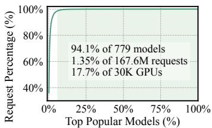  
(a)

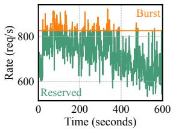  
(b)

Figure 1. Concurrent LLM serving workloads. (a) CDF of model invocations. Less-used models (average arrival rate < 1.16) are in the tail (marked in green). (b) Request rate fluctuation for a top model (270B, TP=8) on a cluster with over 2K GPUs. Request bursts may exceed reserved resources (marked in orange).  
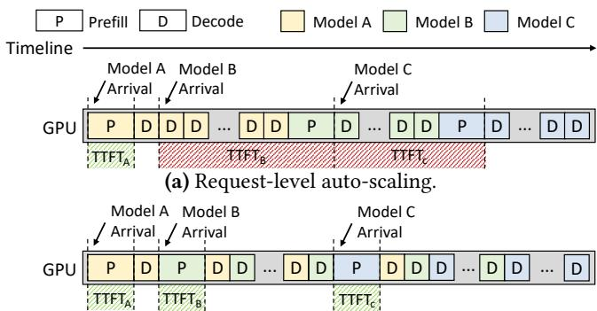  
(b) Token-level auto-scaling (ours).  
Figure 2. Different auto-scaling granularities for sharing one GPU instance between three models.

Previous work on GPU pooling falls under two main approaches: multiplexing and auto-scaling. The multiplexing approach places multiple model instances (optionally sharded with model parallelism [41]) on each GPU to allow temporal [28] or spatial [20] sharing of resources. However, it is hard-limited to supporting at most two to three models per GPU due to inadequate GPU memory capacity (e.g., each 80- GB GPU accommodates only up to two 14B models with FP16 weights). It is far from our target pooling effectiveness. Meanwhile, the auto-scaling approach (e.g., ServerlessLLM [21], BlitzScale [49] and ParaServe [31] for serverless inference) shows the potential for more aggressive GPU pooling by adapting model placement over time and scaling model instances from off-device storage (e.g., host memory, SSDs), thus overcoming the stringent GPU memory limitation.

However, as per our analysis in §3.1, the effectiveness of existing auto-scaling solutions remains bounded by the ratio of active models in the workload (i.e., models with at least one active request to be served). Unfortunately, the long execution time of LLM requests renders a large portion of models active, even when the model invocations are sporadic (Theorem 3.1). For example, at a total arrival rate of only 3.7 requests per second, 46.55 out of 100 models are active on average. This reveals a fundamental drawback of existing solutions: they scale at the request granularity. As illustrated in Figure 2(a), when all GPU instances are occupied by active models, the execution of new model requests must wait for the scaling down of currently active models, which is executed after the long request service time. Reserving fewer GPU instances than the number of active models thus results in substantial head-of-line (HOL) blocking and severe SLO violations for the waiting models, restricting the pooling effectiveness to still 100/46.55 < 3 models per GPU.

To overcome the aforementioned limits on GPU pooling effectiveness, this paper proposes a token-level auto-scaling solution, Aegaeon. Figure 2(b) demonstrates our approach. In essence, by preemptively scaling down active models and scaling up pending models for newly arrived requests in an SLO-aware manner, Aegaeon alleviates HOL blocking and achieves truly effective GPU pooling, supporting up to seven models per GPU (§7). To practically build this solution, we further address two technical challenges.

Challenge #1: Token-level scheduling. Conducting autoscaling at the token level necessitates scheduling policies that tackle a complex interaction between token-level execution times and auto-scaling latencies, all while satisfying SLO requirements. Optimally solving this problem is intractable in real time, while heuristics can hardly balance the diverse per-token SLOs and the penalties caused by auto-scaling latencies for making wrong decisions.

We propose a token-level scheduler to jointly schedule the processing of requests and auto-scaling decisions. Given that the first token and subsequent tokens have vastly different execution times and SLOs, the prefill and decoding phases are scheduled and served in disaggregation [52]. For the prefill phase, a grouped first-come-first-serve (FCFS) scheduler is proposed to minimize the Time-To-First-Token (TTFT) for each request. For the decoding phase, a weighted roundrobin scheduler minimizes the number of tokens violating the Time-Between-Tokens (TBT) SLOs.

Challenge #2: Auto-scaling cost optimization. While auto-scaling acceleration has been widely studied in the literature [21, 49], in our comprehensive investigations, none of the existing solutions can support token-level auto-scaling, which involves a sequence of critical procedures (i.e., KV cache swap-out, garbage collection, engine reinitialization, KV cache swap-in, and others) beyond existing considerations. This sequence can take tens of seconds if left unoptimized, making the token-level scheme impractical.

Aegaeon presents a series of in-depth optimizations to achieve efficient token-level auto-scaling. First, we perform a comprehensive study of the initialization steps of inference engines, identifying and leveraging opportunities for component reuse in engine reinitialization. Second, we conduct explicit memory management for GPU and host memory, accelerating model loading via caching and prefetching, and eliminating fragmentation and garbage collection overhead. Third, we implement a fine-grained synchronization mechanism for transferring KV cache, allowing for better execution overlapping and decoupling.

Evaluation. We conduct thorough experiments to validate the performance of Aegaeon, showing that it sustains 2–2.5× higher request arrival rates or 1.5–9× more goodput compared to ServerlessLLM [21] and MuxServe [20], supporting up to seven models per GPU. Aegaeon has been beta deployed in Alibaba Cloud Model Studio for over three months, currently serving tens of models that range from 1.8B to 72B parameters. It reduces the number of GPUs required for serving these models from 1,192 to 213, highlighting an 82% GPU resource saving.

In summary, we make the following contributions:

• Aegaeon is the first work to reveal the excessive costs associated with serving concurrent LLM workloads on the market, supported by comprehensive statistics and analysis in a production environment (§3).

• Aegaeon is the first model-serving solution for multiple LLMs that performs token-level auto-scaling, with distinct scheduling strategies for the prefill and decoding phases to optimize SLO attainment at the token level (§4).

• Aegaeon is the first study to holistically optimize the preemptive auto-scaling process for LLM inference, reducing 97% of overhead through full-stack optimizations (§5).

• The effectiveness of Aegaeon is validated through realworld production deployment, demonstrating its ability to significantly reduce OPEX (§7).

## 2 Background

In this section, we first describe the basic inference process of an LLM and its requirements for service quality. Next, we present the defining characteristics of concurrent inference workloads, which are now common in production settings. Finally, we review the literature on existing LLM serving systems, focusing on their limitations for concurrently serving multiple LLMs on the market.

## 2.1 Basic LLM Inference

The inference workflow of an LLM request consists of two types of token generation jobs: prefill and decoding. In the prefill phase, a forward pass of the model processes all tokens in the user prompt, generating one output token. Following this, each step in the decoding phase processes only the new token generated in the previous step. This auto-regressive process continues until the output ends with an EOS token or reaches a predefined maximum length. During both phases, intermediate states (referred to as the KV cache [25]) are generated for every token in each transformer layer, which are saved and reused in subsequent decoding steps.

SLO definition. Due to their distinct computational characteristics [52], prefill and decoding jobs exhibit diverse execution times and commonly require two basic metrics for defining their overall service-level objectives (SLOs): (??) TTFT, which measures the latency to produce the initial output token, and (????) TBT, which gauges the latency to generate each subsequent token. The step-by-step nature of LLM inference results in an indirect mapping between the measured metrics and the perceived user experience. For example, suppose a significant delay occurs when generating a sequence of tokens, as illustrated in Figure 3. A delay before the first token (i.e., a large TTFT) leads to a noticeable stall for the user, whereas a delay before the last token (i.e., a single large TBT) can be masked by buffering the output of previous tokens.

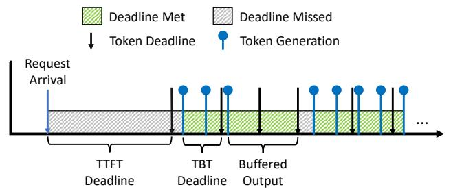  
Figure 3. Overall token generation process of a request. SLO attainment is defined as the percentage of token generation times that meet their deadlines, i.e., the proportion of the green area.

This paper aligns with the evolving perspective in recent works [13, 29] and quantifies SLOs as the ability to meet generation deadlines (i.e., the target TTFT and TBT metrics) on a per-token basis. Specifically, we define SLO attainment as the percentage of token generation times that meet their deadlines, which better reflects the end-user experience.

## 2.2 Concurrent LLM Serving on the Market

Given the popularity and rapid advancement of LLMs, model markets now host a wide variety of models, giving rise to concurrent inference requests for different models. In our production setting, requests made to the same model are treated as one workload, sharing identical SLOs. Each request arrives with a prompt paired with its target model and is then processed by GPU instances running dedicated inference engines [25, 52] for the corresponding models.

Model invocations are unpredictable. We observe significant sporadic patterns in terms of model invocations within our concurrent LLM serving workloads. To begin with, as shown in Figure 1(a), our workloads are heavily skewed, with 94.1% of the models receiving only 1.35% of the requests. As a result, a remarkable proportion (up to 17.7%) of our GPU instances constantly receive sporadic “cold” model invocations, causing significant resource wastage.

Furthermore, as shown in Figure 1(b), serving “hot” models is also burdened by short-term bursty workloads [50]. These bursts overload the reserved resources for “hot” models, while serving them with extra dedicated GPU instances causes similar resource wastage.

Beyond single-model serving. Prior studies have proposed various optimizations for single-model serving [14, 23, 25, 34, 47, 52], many of which are deployed in our production environment, delivering decent throughput (e.g., up to several requests per second (RPS) per GPU). On the one hand, this highlights the substantial resource waste in concurrent LLM serving, which is currently achieving less than 0.1 RPS per GPU. On the other hand, directly applying these solutions is inadequate. Since the sporadic invocations cannot saturate any dedicated GPU with one model, we are incentivized to conduct effective GPU pooling, sharing each GPU between as many models as possible without violating SLOs.

## 2.3 Current Solutions

To this end, existing solutions for GPU pooling fall under two main approaches: multiplexing and auto-scaling.

Multiplexing. This approach requires placing multiple models (optionally sharded through model parallelism [41] across devices) on each GPU. Resource sharing is then achieved through temporal [28] or spatial [20] multiplexing (e.g., via NVIDIA MPS [8]). The effectiveness of multiplexing for GPU pooling is hard-limited by GPU memory capacity; e.g., at most two 14B models with FP16 weights fit on an NVIDIA A100 GPU with 80GB VRAM. In fact, model parameters in our workloads average 25.1 GB, meaning that multiplexing typically supports only two to three models per GPU. This level of pooling still underutilizes GPU instances.

Auto-scaling. Meanwhile, auto-scaling [21, 31, 35, 49] adapts the model placement on GPU instances on demand, scaling down unused models and scaling up requested models by loading weights from host memory or SSDs. While this approach is far less constrained by memory limitations (tens of models can be stored in off-device storage), its effectiveness is not fully realized due to the coarse granularity of the autoscaling actions, i.e., scaling only at the end of requests. In practice, existing auto-scaling solutions underperform due to head-of-line (HOL) blocking in aggressive GPU pooling scenarios, as we elaborate next.

## 3 Aegaeon Overview

Given a list of ?? models to be served, our goal is to minimize the number of GPU instances ?? required to meet the SLOs for all models through auto-scaling, thus maximizing resource usage. The strawman strategy, i.e., no auto-scaling at all, reserves at least one dedicated instance for each model, leading to $N = O ( M )$ .

## 3.1 Tradeoff Analysis

To improve upon this, existing auto-scaling solutions allow for switching the served model on a single GPU instance. They enable more efficient resource usage by making use of the idle time on dedicated instances.

Active model count. The effectiveness of these solutions is captured by the statistic ??—the active model count—which quantifies the number of models that have at least one request being served at a given time. By utilizing idle GPU time, the system can reliably reserve GPUs for only the active models, leading to $N = O ( m )$ . The following theorem characterizes the active model count ?? as a random variable:

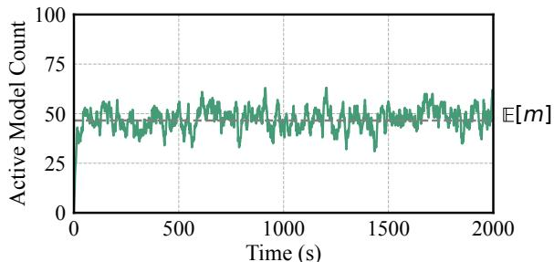  
Figure 4. Active model count over time $( M = 1 0 0 , \lambda = 0 . 0 3 7 ,$ $T = 1 6 . 7 9 s )$ . The estimated value is $\mathbb { E } [ m ] = 4 6 . 5 5$

Theorem 3.1. Suppose the request arrival rate for each model follows a Poisson process with rate ??, and the average time to serve a request is ?? . The expected active model count E[??] is given by:

$$
\mathbb { E } [ m ] = M \cdot ( 1 - e ^ { - \lambda T } )\tag{1}
$$

Consider the real-world scenario shown in the left part of Figure 1, where the arrival rate $\lambda = 0 . 0 3 7$ and the average service time $T = 1 6 . 7 9 s$ . The expected active model count is $\mathbb { E } [ m ] = 0 . 4 6 5 5 \cdot M .$ . Figure 4 simulates the active model count over time with $M = 1 0 0$ , confirming that the value fluctuates around $\mathbb { E } [ m ] = 4 6 . 5 5$ . The proof of Theorem 3.1 is provided in Appendix A.1.

This analysis reveals a major drawback of existing autoscaling solutions: due to the typically long service time of LLM requests, the expected active model count E[??] can be large even when the aggregate arrival rate ???? is low. As a result, the achieved pooling efficiency remains on par with multiplexing: serving $M \lambda = 3 . 7$ requests per second in total still demands $\mathbb { E } [ m ] = 4 6 . 5 5$ reserved GPU instances, corresponding to merely $1 0 0 / 4 6 . 5 5 < 3 $ models per GPU.

Head-of-line blocking. What limits existing solutions from achieving effective GPU pooling, in essence, is the fact that they conduct scaling only at the request granularity. Figure 2(a) illustrates the strategy in existing systems when concurrently serving three models on one GPU. Since the prefill and decoding jobs of different models cannot be batched, requests for models B and C must wait until the completion of preceding requests. This leads to severe head-of-line (HOL) blocking, as the waiting time for fully executing other LLM requests results in prohibitively long TTFT and SLO violations for the waiting models.

Our approach. We propose a token-level auto-scaling approach (Figure 2(b)), Aegaeon, that overcomes the limits on pooling efficiency found in current solutions. Our strategy mitigates HOL blocking by preemptively scaling down active models and scaling up pending models, thus better satisfying request SLOs. With fine-grained execution control over multiple requests at the token level, Aegaeon pushes the number of reserved instances ?? below E[??], achieving resource efficiency closer to the single-model serving scenario.

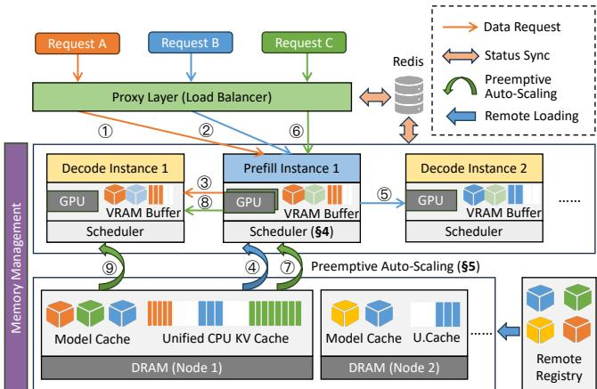  
Figure 5. System overview of Aegaeon.

## 3.2 Challenges

Despite its potential, efficiently implementing the token-level approach presents two key challenges.

Challenge #1: Scheduling the auto-scaling. The inclusion of token-level auto-scaling complicates an already large decision space for scheduling requests from different models. The scheduler must frequently determine the next batch of generation jobs from many running requests and whether to scale the models, all while considering the diverse execution times and deadlines of each token (§2.1) as well as the auto-scaling overhead. While token-level scheduling has been studied in single-model serving [44, 50], the scheduling decision is even more critical in our setting for two reasons. First, requests from different models cannot be batched together, resulting in a higher number of smaller batches to be scheduled. Second, the overhead associated with autoscaling magnifies the penalties for incorrect decisions.

Challenge #2: Optimizing auto-scaling costs. Effective GPU pooling requires performing token-level auto-scaling as quickly as possible. However, existing optimizations for autoscaling speed [21, 31, 49] focus on “fresh” scale-ups, whereas we face a more complex sequence of successive scale-downs and scale-ups, which also involves the management of intermediate KV cache. If left unoptimized, scaling down and then scaling up a vLLM [25] instance with a 13B model takes tens of seconds, risks causing memory fragmentation, and requires blocking synchronization. This level of overhead would render the token-level approach impractical.

## 3.3 System Overview

To address these challenges, we build Aegaeon, a system that implements the token-level auto-scaling approach to achieve high GPU utilization for serving concurrent LLM workloads. Figure 5 shows the architecture of Aegaeon and illustrates the process of serving multiple models.

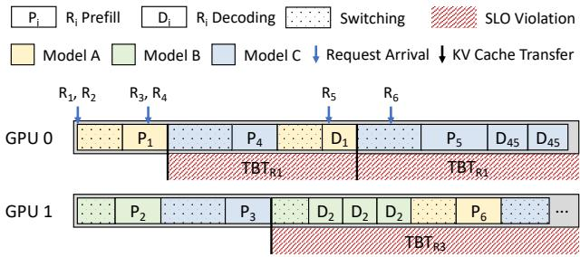

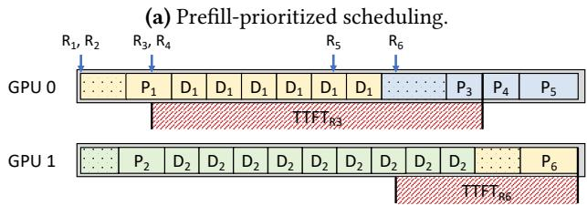

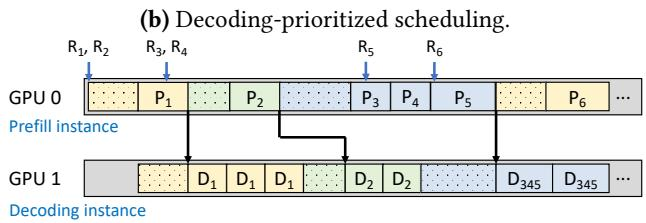  
(c) Disaggregated scheduling.  
Figure 6. Exemplar token-level schedules on two GPUs. Prefillfirst scheduling (a) and decoding-first scheduling (b) both lead to SLO violations. Disaggregated scheduling (c) separates prefill and decoding jobs to enable balanced token generation.

To execute inference requests, Aegaeon first dispatches them via the proxy layer, which synchronizes the request metadata with the underlying serving instances via a sharedmemory mechanism (e.g., Redis [11]) to ensure load balancing and fault tolerance. Aegaeon can dispatch requests for different models to the same instance, as shown by ①, ②, and ⑥ in Figure 5. Each instance in Aegaeon contains one or more GPUs hosted on a physical node, conducting either prefill or decoding jobs (requiring ③, ⑤, and ⑧ in Figure 5). Once requests are sent to an instance, Aegaeon schedules their execution, guided by a token-level scheduler (§4). This capability makes preemptive auto-scaling a critical operation, as indicated by ④, ⑦, and ⑨. To accelerate this process, Aegaeon employs full-stack optimizations (details in §5).

## 4 Token-Level Scheduling

To balance the auto-scaling overhead and request SLOs at the token level, Aegaeon schedules both the request execution and the auto-scaling decisions in unison to maximize request SLO attainment. Essentially, given a list of requests, a set of GPU instances, and the target TTFT and TBT, Aegaeon picks the next batch of token generation jobs (i.e., prefill or one step of decoding) for each GPU instance, optionally initiating preemptive auto-scaling if any scheduled job requires a different model than the currently active one.

Algorithm 1 Grouped Prefill-Phase Scheduling   
Input: Prefill instances ${ \cal T } _ { P } .$   
1: ⊲ Event: On arrival of request ?? :   
2: min\_load $ \infty$   
3: $i ^ { * } \gets \mathcal { I } _ { P } [ 0 ]$   
4: for all instance ?? in $\mathcal { T } _ { P }$ do   
5: for all group ?? in ??.job\_queue do   
6: if ??.model = ?? .model and ??.size < MAX\_GPSIZE then   
7: Add ?? to group ?? # Prioritize existing groups   
8: return   
9: load ← Total time to execute all groups in ??′   
10: if load < min\_load then   
11: min\_load ← load # Pick the least loaded instance   
12: ??∗ ← ??   
13: Make a group with ?? and append to ??∗.job\_queue   
14: ⊲ Event: On selecting a batch for prefill instance ???? execution:   
15: Select one request from the front group of ???? .job\_queue

## 4.1 Disaggregating Prefill and Decoding

As discussed in §3.2, scheduling at the token level is challenging due to the auto-scaling overhead. Particularly, we find that unified scheduling policies—those that schedule both prefill and decoding jobs on the same GPU instance—are either intractable or inefficient for Aegaeon. On the one hand, optimally formulating and solving the problem as an integer linear programming (ILP) problem is infeasible in real time due to its complexity [50]. On the other hand, heuristics that prioritize one job over the other lead to unpredictable performance: prefill-first scheduling tends to harm TBT when there are bursts in request arrivals (Figure 6(a)), while decodingfirst scheduling compromises TTFT when request lengths are exceedingly long (Figure 6(b)). Both phenomena are prevalent in real-world inference workloads [43, 45], making unified scheduling highly workload-sensitive.

Existing work [34, 52] has shown that disaggregating the prefill and decoding phases is effective in addressing interference between these jobs in single-model serving. Following a similar philosophy, we adopt disaggregated scheduling in Aegaeon as illustrated in Figure 6(c), which achieves balanced scheduling despite the bursty prefill jobs and long decoding jobs. Specifically, Aegaeon splits its GPU pool into two partitions: one dedicated to prefill and the other to decoding. At request arrival, Aegaeon first schedules the prefill execution using instances from the prefill partition (prefill instances) and then schedules subsequent decoding jobs using instances from the decoding partition (decoding instances).

## 4.2 Prefill-Phase Scheduling

For the prefill phase, we observe that the auto-scaling overhead is typically comparable to executing a batch of prefill jobs. For example, scaling up a 13B model (assuming the FP16/BF16 data type) via PCIe 4.0 takes at least 26GB/32GBps = 0.8125 seconds, while the time for a prefill batch regularly falls below one second on contemporary GPUs. As such, frequent auto-scaling would significantly increase TTFT.

Algorithm 2 Batched Decoding-Phase Scheduling   
Input: Decoding instances ${ \cal T } _ { D } .$   
1: ⊲ Event: On arrival of request ?? :   
2: Dispatch as in Algorithm 1, deriving max batch sizes from the KV cache   
capacity on GPU, using work list sizes for load   
3: ⊲ Event: Always on decoding instance $i _ { D } \colon$   
4: while True do   
5: # Start of a round   
6: Reorder $i _ { D } .$ work\_list to group batches with the same model   
7: Assign time quota ???? to the ??-th batch in ???? .work\_list   
8: n\_turn ← Number of batches in $i _ { D } .$ .work\_list   
9: for all index ?? in 1 ∼ n\_turn do   
10: # Start of a turn   
11: Decode the ??-th batch in $i _ { D } .$ .work\_list for ???? seconds

To mitigate this issue, Aegaeon adopts a grouped scheduling policy for prefill jobs, as outlined in Algorithm 1. The key idea is to group requests for the same model to minimize excessive preemptive auto-scaling while maintaining a general FCFS order to avoid starvation. Each prefill instance maintains a job queue comprising grouped jobs, where each group contains no more than MAX\_GPSIZE jobs of the same model. We set MAX\_GPSIZE to 8 in our implementation through a simple grid search—larger values behave identically because groups seldom grow past that size, and smaller values can still cause excessive scaling under high load.

Upon receiving a prefill job, Aegaeon prioritizes adding the job to an existing group if it fits (lines 6–8). Otherwise, a new group is created and appended to the least loaded job queue (lines 10–13), where the load of a job queue is defined as the total time required to finish all pending groups, including execution and auto-scaling time. The estimation for both values is described in Appendix A.2, and a detailed analysis of auto-scaling time is provided in §5. Jobs are then executed from the front of the job queue (line 15). Note that we limit the batch size on prefill instances to one. This is because the execution time of a prefill batch scales approximately linearly with the number of prefilled tokens, and smaller batches reduce overall waiting time without significantly impacting throughput. Moreoever, this helps eagerly send requests to the decoding phase and reduce TBT. In addition, the checks on line 6 use the accumulative size for group ?? (i.e., executing a request on line 15 does not decrease ??.size), ensuring that we do not deviate from FCFS too much.

## 4.3 Decoding-Phase Scheduling

The scheduling of decoding jobs in Aegaeon is based on a unique property of LLM inference: request execution is iterative, and the stream of output tokens can be buffered (as discussed in §2.1) to hide user-perceivable stalls. Let ?? denote the time needed for executing a decoding step and ?? denote its deadline (i.e., the target TBT). Intuitively, for every consecutive ?? decoded steps, the request can tolerate a delay of ?? (?? −?? ) without risking SLO violations. Since ?? is typically small (e.g., tens of milliseconds) and ?? is relatively loose (e.g., 100 ms for a chatbot application), Aegaeon exploits the earned slack time for auto-scaling and serving other requests.

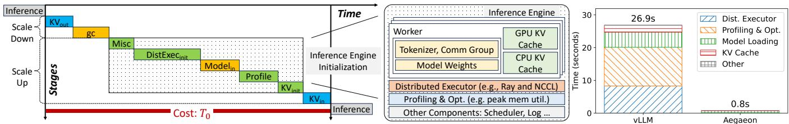  
Figure 7. Left: default preemptive auto-scaling process for an inference engine. Middle and Right: typical composition of an LLM inference engine, and the latency breakdown of its initialization (both before and after our optimization).

Aegaeon schedules decoding jobs using a weighted roundrobin scheme, as described in Algorithm 2. Each decoding instance maintains a rotating work list of decoding batches, each containing requests for the same model and a time quota. Newly prefilled requests are dispatched with a similar mechanism as in Algorithm 1, but the load is calculated with work list sizes, and batch size limits are derived from the KV cache capacity on the GPU (line 2). Execution of the work list is organized in rounds. At the beginning of each round (lines 5–8), Aegaeon assigns a time quota $q _ { i }$ to the ??-th batch according to the following formula:

$$
q _ { i } = \frac { c } { n _ { i } \cdot ( \alpha - \sum _ { k } \frac { 1 } { n _ { k } } ) }\tag{2}
$$

where $n _ { k } = d / t _ { k }$ , ?? is the sum of auto-scaling overhead for all models in the work list, and

$$
\alpha = \operatorname* { m a x } ( \frac { c } { \operatorname* { m i n } _ { k } ( n _ { k } ) \cdot \mathrm { Q _ { M A X } } } + \Sigma _ { k } \frac { 1 } { n _ { k } } , 0 . 5 )\tag{3}
$$

is the reciprocal of the estimated SLO attainment for the round. $\mathrm { Q } _ { \mathrm { M A X } }$ represents the maximum quota and is empirically set to 4 seconds. We find Aegaeon to be robust under alternative settings. Then, Aegaeon reorders the list so that batches sharing the same model (which may occur if a single batch requires more KV cache space than is available on the GPU) are placed adjacently. Lastly, the batches are decoded in a round-robin fashion (lines 9–11), with batch ?? being decoded for exactly ???? time (referred to as a “turn").

The intuition behind these equations is straightforward: Equation (2) assigns quota to each batch to allow for a buffered window that equals 1/?? times the total round time. In other words, batches in the round will consistently achieve an SLO attainment of min(1, 1/??), and thus we want to minimize ??. However, an extremely small ?? is not ideal either, as it leads to large quota ???? and causes longer stalls for new decode batches. Thus, we require $\alpha \ge 0 . 5$ in Equation (3) to guarantee a minimum duration for each turn, where the 0.5 bound allows Aegaeon to pick smaller, more flexible ???? when SLOs are confidently satisfied $\begin{array} { r } { \big ( \frac { 1 } { \alpha } = 2 0 0 \% \big ) } \end{array}$

To see these equations in action, assume the work list contains three batches, $d = 0 . 1 , t _ { i } = 0 . 0 2 5 , c = 3 , \mathrm { a n d Q _ { M A X } } =$ 3, all in seconds. Then, $n _ { i } = 4 , \alpha = 1 / 4 + 3 / 4 = 1$ , and $\begin{array} { r } { q _ { i } = \frac { 3 } { 4 \cdot ( 1 - 3 / 4 ) } = 3 } \end{array}$ . Executing each batch for 3 seconds leads to 120 tokens decoded, and the round finishes in 12 seconds. Since outputting 120 tokens at an interval of 0.1 seconds also takes exactly 12 seconds, all batches will always meet their token-level deadlines with this schedule.

## 5 Efficient Preemptive Auto-Scaling

While the token-level scheduler tackles the decision-making for preemptive auto-scaling, it remains essential for Aegaeon to actually conduct it with minimal costs. The left side of Figure 7 characterizes the default process of preemptive autoscaling as a lengthy sequence of multiple stages (??0). First, after the last inference step, the old instance must save all its KV cache (e.g., offloading it to host memory) due to VRAM restrictions. Next, the new instance is spun up, reclaiming the allocated VRAM with a pass of garbage collection and then reinitializing the inference engine with new configurations. Finally, the KV cache for the new jobs1 is brought back before inference can resume. As mentioned in §3.2, existing solutions only focus on model-loading acceleration without considering other stages in the entire preemptive auto-scaling procedure, leading to limited performance gains.

Aegaeon presents a set of techniques for holistically optimizing each of these stages, which we organize into three aspects: eliminating the engine (re)initialization overhead (§5.1), reducing memory inefficiencies (§5.2), and decoupling KV cache transfer with fine-grained synchronization (§5.3).

## 5.1 (Re)initialization Breakdown and Component Reuse

As shown on the left side of Figure 7, a remarkable portion of the scale-up sequence is spent (re)initializing the inference engine. Indeed, existing LLM inference engines are complex systems with numerous components, typically optimized for inference performance rather than initialization speed. The middle part of Figure 7 shows the composition of a typical LLM inference engine (vLLM [25]), revealing several key factors that contribute to this overhead:

• Distributed executor. Inference engines support model parallelism via distributed executors (e.g., Ray [32] and NCCL [9]), whose initialization takes tens of seconds.

Table 1. The shape and size of KV cache for different models in vLLM. Listed values pertain to a single token in 16-bit precision.
<table><tr><td>Model</td><td>KV Cache Shape</td><td>KV Cache Size</td></tr><tr><td>Qwen-7B [38]</td><td>(32,2,32,128)</td><td>512KB</td></tr><tr><td>InternLM2.5-7B-chat [26]</td><td>(32,2,8,128)</td><td>128KB</td></tr><tr><td>LLaMA-13B [42]</td><td>(40,2,40,128)</td><td>800KB</td></tr><tr><td>Qwen-72B [38]</td><td>(80,2,64,128)</td><td>2560KB</td></tr></table>

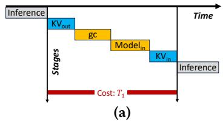

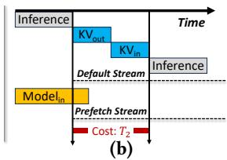  
Figure 8. Preemptive scaling with optimizations in §5.1 and §5.2. (a) w/ component reuse; (b) also w/ explicit memory management.

• Profiling and optimization. Some engines perform profiling and optimization (e.g., deciding the allocation size for the KV cache), which can take several seconds.

• Model weights loading. Loading model weights (even when cached in host memory) onto GPUs is time-consuming, and latency increases with model size. Although modern PCIe buses offer decent theoretical bandwidth (e.g., 32 GB/s for PCIe 4.0), inference engines often fail to fully utilize this bandwidth. For example, loading a LLaMA-13B model (with a TP degree of 2) via PCIe 4.0 takes around 4.6 seconds in our microbenchmark (right side of Figure 7), achieving only 2.83 GB/s bandwidth.

• KV cache initialization. Inference engines usually pin CPU memory specifically for KV cache storage to achieve better performance. However, pinning memory pages introduces several seconds of initialization overhead.

• Other components. Initialization of other components, such as schedulers, may also contribute to the overhead.

In total, an unoptimized initialization process can take up to 26.9 seconds for a 13B model. Notably, much of this latency is not related to loading model weights, requiring further optimizations unexplored by existing solutions.

Component reuse. We observe that the initialization of these components, while time-consuming, can be safely reused across the serving of different models. As such, Aegaeon initializes the inference engine and workers only once per instance, caching every component except for the model weights and the KV cache, both of which require modelspecific handling. Additionally, Aegaeon performs relevant profiling (e.g., for KV cache size) and caches tokenizers beforehand. Finally, Aegaeon leverages a pre-allocated memory pool for storing the KV cache in host memory (detailed in §5.2), eliminating the need for pinning memory pages during auto-scaling. In total, component reuse reduces the scaleup overhead from ??0 (left of Figure 7) to ??1 in Figure 8(a), removing over 80% of the auto-scaling latency.

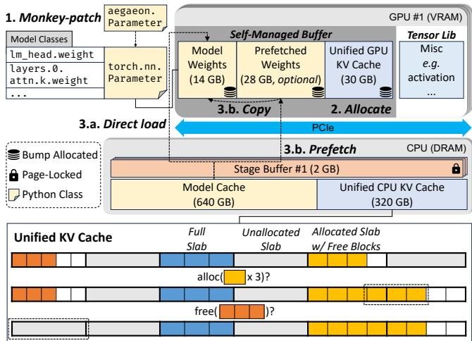  
Figure 9. Explicitly managed memory in Aegaeon, with exemplar memory sizes in brackets. Relevant steps for scaling up a model and operations on the unified KV cache are also illustrated.

## 5.2 Explicit Memory Management

Another notable inefficiency unique to preemptive autoscaling is memory fragmentation in both device and host memory (i.e., VRAM and DRAM). On the GPU, the caching allocators in tensor libraries (e.g., PyTorch [33]) often require proactive defragmentation (i.e., calling gc.collect() and then torch.cuda.empty\_cache()) to avoid out-of-memory errors when initializing LLM weights back-to-back on the same GPU. As for host memory, the wastage comes from storing the offloaded KV cache for the preempted requests, which is complicated by the fact that the shape of the KV cache (dependent on hyperparameters such as the number of layers, attention heads, etc.) varies across different models, as shown in Table 1. Naively pre-allocating fixed blocks for all shapes would lead to significant fragmentation, especially as we aim to support many models on the same GPU node.

Memory fragmentation poses two critical obstacles to further optimizing preemptive auto-scaling in Figure 8(a): (??) VRAM fragmentation, as mentioned, demands a timeconsuming garbage collection stage (several seconds); (????) DRAM fragmentation hinders the optimization of modelloading speed, which also uses host memory [21] as cache and page-locked staging buffers for model weights. Memory pressure in DRAM can lead to poor caching efficiency and increased auto-scaling time.

Aegaeon performs explicit memory management for both VRAM and DRAM to minimize fragmentation. Figure 9 demonstrates our approach. In summary, the following optimizations (on top of component reuse) bring down the autoscaling overhead to ??2, as shown in Figure 8(b).

Self-managed VRAM buffer. To reduce VRAM fragmentation, we opt for completely self-managed allocations for both model weights and KV cache on the GPU. At startup, Aegaeon requests all the necessary VRAM for weights and

KV cache as a self-managed buffer in one allocation, leaving around 10% free memory for tensor libraries to manage activations and other intermediate results. This buffer operates with bump allocation; i.e., allocations are made consecutively by bumping up a pointer, and deallocations can be done instantly by simply resetting that pointer. During each model scale-up, Aegaeon monkey-patches (step 1 in Figure 9) the relevant Python classes with custom wrapper classes (e.g., overriding the torch.nn.Parameter class after module import), which are backed by allocations from the self-managed buffer (step 2). Consequently, Aegaeon bypasses the tensor library’s allocation mechanism and avoids the need for invoking garbage collection.

Quick model loading. Aegaeon accelerates model loading by caching2 the raw tensor chunks from model checkpoints in a shared host memory region, called the Model Cache. Moreover, each GPU is associated with a dedicated pagelocked Stage Buffer for staging memory copies between the device and the host. For the ideal scenario where the scaledup model is cached in host memory, Aegaeon directly copies the weights from the Model Cache onto GPUs via the Stage Buffer in a multi-threaded, chunked, and pipelined manner (step 3.a in Figure 9), achieving loading times comparable to state-of-the-art solutions [21, 31] (under one second, as shown in the right of Figure 7).

In practice, Aegaeon further reduces this overhead by optionally prefetching the next required model in a separate CUDA stream (see also Figure 8(b)), guided by the tokenlevel schedule. If sufficient VRAM is available, the prefetched model is allocated right after the running model in the selfmanaged buffer, and moved to the start of the buffer during the actual scale-up with a cheap on-device copy (step 3.b in Figure 9). Note that once this copy finishes, Aegaeon can resume the scale-up normally and may even start prefetching the next model if possible. Prefetching is particularly effective for decoding instances: since the time slice for each turn often completely hides the prefetching overhead, Aegaeon can achieve near-instant model loading.

Unified KV cache. To address memory fragmentation when storing KV cache of several different shapes, Aegaeon draws from classical memory management techniques and adopts slab allocation to build unified KV caches for every possible shape. Every KV cache region (i.e., in VRAM or DRAM) is divided into fixed-size chunks, called slabs. Each slab is assigned to a shape, serving as a pool of KV cache blocks for that specific shape. As illustrated in the bottom half of Figure 9, upon allocation, Aegaeon first uses free blocks from existing slabs of the same shape. If no free blocks are available, Aegaeon acquires new slabs for that shape. Upon deallocation, Aegaeon releases blocks back to their respective slabs and reclaims slabs that contain no occupied blocks.

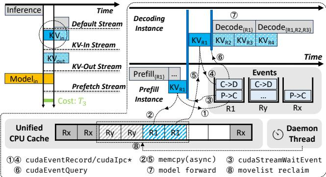  
Figure 10. Efficient scaling in Aegaeon, with fine-grained KV cache synchronization. Dotted boxes indicate non-critical operations, and striped boxes indicate cache blocks in move lists.

This method strikes a balance between management overhead and memory fragmentation, customizable with the slab size. As demonstrated in §7.3, slab allocation leads to efficient cache memory utilization in real-world workloads.

## 5.3 Fine-Grained KV Cache Synchronization

To push the preemptive auto-scaling speed to the extreme, we need to further overlap the KV cache transfer stages in Figure 8(b) (i.e., moving KV cache in and out of device memory), assigning them to separate CUDA streams for asynchronous execution. However, doing so naively is prone to data races because of the following inherent data dependencies:

❶ Inference requires the KV cache to be on GPUs.

❷ A new transfer requires the source blocks (as in the unified KV cache) to finish their last transfer.

❸ A new transfer requires the target blocks to be free from any past transfers.

The upper right side of Figure 10 illustrates a complex scenario involving all three dependencies, where a decoding instance demands the KV cache for a batch $( R _ { 1 } , R _ { 2 }$ , and ??3) that is still being offloaded by a prefill instance. As indicated by the two blue barriers, decoding for ??1 cannot begin before its KV cache is fully swapped in (rule ❶), and the swappingin cannot begin before the prefill instance finishes swapping out first (rule ❷). Further, when choosing the target blocks for swapping out to the unified CPU cache, we must avoid those that are still accessed by ongoing transfers (rule ❸). For example, assume that the request $R _ { y }$ has been swapped to another decoding instance, eventually freeing up its blocks on the CPU. However, its blocks are still avoided when allocating for $R _ { 1 }$ since the asynchronous transfer for $R _ { y }$ may not have completed yet. In all cases, any violation of the rules can cause a data race and corrupt the inference results.

To properly overlap the KV cache transfers while respecting these data dependencies, Aegaeon implements fine-grained synchronization for each transfer without choking the entire data plane. This is achieved by individually tracking the state of transfers using CUDA events, which are API constructs that can be shared across CUDA streams and enforce specific execution order with minimal synchronization overhead. Table 2 summarizes the various CUDA event APIs used in Aegaeon. When initiating a KV cache transfer for a request, Aegaeon records it (cudaEventRecord) as an event, which can then be used to query the status of the transfer (cudaEventQuery) or wait for its completion (cudaStreamWaitEvent). Events are also passed between instances via interprocess communication (IPC) for synchronizing different instances.

Table 2. CUDA event APIs used in Aegaeon.
<table><tr><td>API</td><td>Description</td></tr><tr><td>cudaEventRecord(event，stream)</td><td>Capture the current work in stream into event .</td></tr><tr><td>cudaEventQuery(event)</td><td>Query the completion status of the work captured in event.</td></tr><tr><td>cudaStreamwaitEvent(stream，event）</td><td>Make all future work submitted to stream wait for the work captured in event.</td></tr><tr><td>cudaIpcGetEventHandle(handle，event）</td><td>Get a handle for event for interprocess access.</td></tr><tr><td>cudaIpcOpenEventHandle(event，handle） Reconstruct event from an interprocess handle.</td><td></td></tr></table>

Overlapping KV cache swap-in. We demonstrate the finegrained synchronization in action by walking through the swap-in process for $R _ { 1 }$ in the running example in Figure 10. First, the prefill instance creates the swap-out event (step ①) and launches a memory copy (step ②). Next, before trying to swap in $R _ { 1 } ,$ the decoding instance first checks for its transfer event, pausing the swap-in CUDA stream with cudaStreamWaitEvent (step ③). After that, swap-in proceeds with the event creation and memory copy (steps ④ and ⑤). As for the actual inference, Aegaeon queries the status of each request in the batch with cudaEventQuery (step ⑥) and starts decoding as soon as one of them $( R _ { 1 }$ in this case) is fully loaded (step ⑦). Note how the synchronization affects only necessary streams, making it fine-grained and efficient when applied to multiple instances.

Overlapping KV cache swap-out. Handling KV cache swap-out is straightforward in Aegaeon thanks to the unified GPU caches for different cache shapes (§5.2), which allows the offloading of KV cache to be conceptually decoupled from preemptive auto-scaling and thus fully overlapped (see the left side of Figure 10). However, the aforementioned caveat remains when choosing the target blocks due to rule ❸. In light of this, Aegaeon collects the relevant CPU blocks and their corresponding events in dedicated move lists, representing unsafe sections of the CPU cache that are actively accessed by memory copies. Allocations in the CPU cache neglect blocks in the move lists, enforcing rule ❸. Meanwhile, a daemon thread periodically queries (cudaEventQuery) events in the move lists to reclaim the blocks once the transfers complete (step ⑧). This design effectively removes the synchronization for rule ❸ from the critical path of auto-scaling, reducing the overall overhead.

In conclusion, our full-stack optimizations enable highly efficient preemptive auto-scaling in Aegaeon, reducing latency by up to 97% (from $T _ { 0 }$ in Figure 7 to $T _ { 3 }$ in Figure 10).

We verify in §7.3 that Aegaeon achieves sub-second scaling speed with minimal KV cache block transfer overhead.

## 6 Implementation

Aegaeon is implemented as a distributed LLM serving system. We implement the scheduler and scaling-efficient inference engine in 5,700 lines of Python and CUDA/C++ code.

The control plane of Aegaeon is built on asyncio [6], which ensures concurrency when orchestrating instances. The data plane uses Ray [32] for data distribution. Aegaeon uses vLLM [25] as the model execution backend to leverage its broad support for LLM architectures and modern optimizations such as continuous batching [47], FlashAttention [18], and PagedAttention [25], etc.

## 7 Evaluation

We evaluate Aegaeon using realistic workloads with diverse LLMs and application scenarios, showing that Aegaeon consistently outperforms state-of-the-art systems across all setups (§7.2). Additionally, we analyze the effectiveness of our techniques (§7.3) and explore Aegaeon under alternative setups (§7.4). We conclude by discussing our ongoing efforts to deploy Aegaeon in production at Alibaba Cloud Model (§7.5).

## 7.1 Experimental Setup

Testbed. Our testbed consists of two nodes with 16 GPUs in total, where each node is equipped with eight NVIDIA H800 80GB GPUs connected via NVLINK, 2TB of DDR5 memory, and 192 Intel Xeon Platinum 8469C CPUs.

Models. We adopt LLMs from several families, including Qwen [38], Llama [42], InternLM [26], Yi [12], etc. We primarily select models ranging from 6B to 14B parameters, representing the majority of models on the market. §7.4 evaluates Aegaeon with larger models.

Datasets and workloads. We use ShareGPT [3] as the main dataset. To represent the various applications supported by different LLMs, we create two alternative datasets, ShareGPT-ix2 and ShareGPT-ox2, by scaling the input and output lengths of ShareGPT by 2×, respectively. We follow existing approaches to synthesize workloads with scaled Poisson processes and random sampling from the datasets. The deployment evaluation (§7.5) includes real workloads.

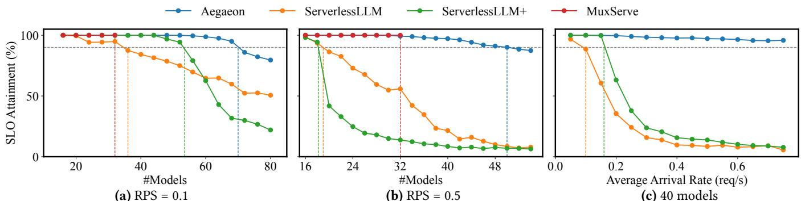

Figure 11. End-to-end SLO attainment under varying RPS with the ShareGPT dataset.  
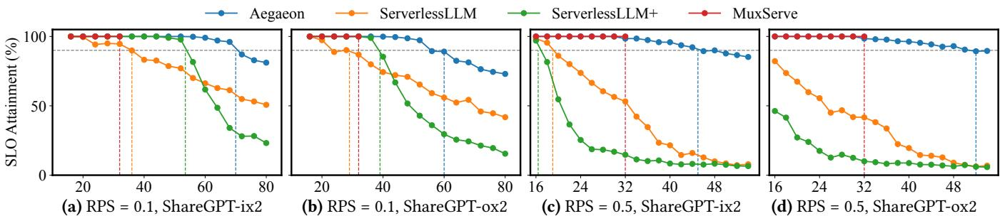  
Figure 12. End-to-end SLO attainment under varying RPS with alternative datasets. x-axis: number of models.

Metrics. We report the SLO attainment as defined in §2.1, setting TTFT to 10s and TBT to 100ms according to our internal criterion for our online inference service, and also in alignment with industrial practices [36]. We also include results in alternative setups with stricter SLOs (down to 2s TTFT and 20ms TBT).

Baselines. We compare Aegaeon against ServerlessLLM [21] and MuxServe [20], two state-of-the-art solutions that adopt auto-scaling or multiplexing for concurrent LLM serving. In the absence of auto-scaling systems with more advanced scheduling policies, we extend ServerlessLLM with requestlevel Shortest Job First (SJF) scheduling based on oracle information for output lengths, referred to as ServerlessLLM+.

## 7.2 End-to-End Performance

This section compares the end-to-end performance of Aegaeon against baselines across various workloads. For all experiments, we assign six GPUs as prefill instances, and the remaining ten GPUs as decoding instances.

Limitation of multiplexing. We first note that in every setup, MuxServe’s placement optimizer refuses to place more than two models on the same GPU due to insufficient GPU memory capacity. As a result, MuxServe ends up serving at most 32 models in all subfigures of Figure 11 and Figure 12, marking its intrinsic limitation in achieving effective GPU pooling. Meanwhile, the auto-scaling solutions can support more models, which we examine next.

Load tolerance. Figure 11 presents the SLO attainment of Aegaeon under varying numbers of models and request arrival rates. In (a) and (b), we fix the RPS to 0.1 and 0.5 and increase the number of models in the workloads. In (c), we fix the number of models to 40 while increasing the permodel RPS. Vertical lines indicate the maximum goodput while meeting the 90% overall SLO requirement.

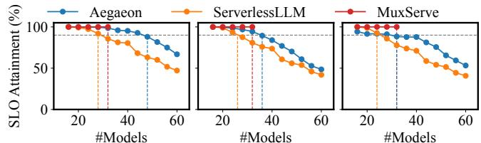  
(a) 0.5× SLO  
(b) 0.3× SLO  
(c) 0.2× SLO  
Figure 13. End-to-end SLO attainment under stricter SLOs.

For RPS = 0.1, Aegaeon sustains 2× higher goodput compared to ServerlessLLM. Notably, Aegaeon supports up to 70 models with only 10 decoding instances, effectively serving seven models per GPU. Meanwhile, ServerlessLLM suffers from long waiting times as requests to different models queue up, leading to low SLO attainment. While ServerlessLLM+ can mitigate this queuing with oracle-guided scheduling, its performance inevitably degrades with more (active) models. These results validate that our token-level approach enables significantly better resource utilization compared with request-level solutions.

For RPS = 0.5, Aegaeon’s advantage is even more pronounced, delivering a 2.5× higher request rate compared to ServerlessLLM. This is to be expected, as HOL blocking between models is aggravated when arrival rates increase. We also note that ServerlessLLM outperforms ServerlessLLM+ in this scenario, as prioritizing shorter requests is not necessarily optimal when it leads to overly frequent auto-scaling, which limits the amount of useful work done by the system. Lastly, the final subfigure shows that Aegaeon remains effective over a wide range of arrival rates (0.05 ∼ 0.75), while the alternatives are quickly penalized by HOL blocking.

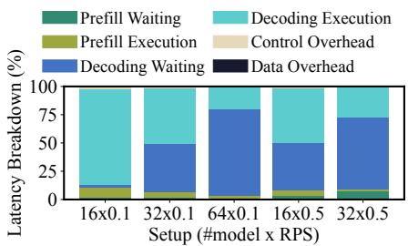

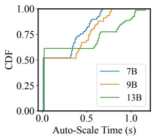

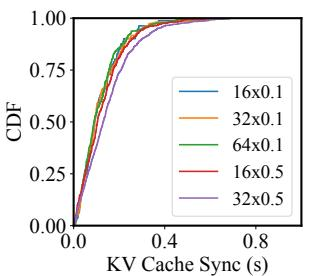

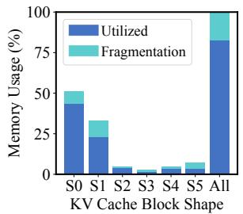  
Figure 14. Request latency breakdown across Figure 15. Left: CDF of auto-scaling latency. Right: CDF of Figure 16. Fragmentation in various setups. per-request KV cache management overhead. the unified CPU cache.

Dataset tolerance. Figure 12 further evaluates Aegaeon on alternative datasets. For longer output lengths, Aegaeon delivers up to 2.5× higher goodput compared to ServerlessLLM, highlighting a greater performance gain due to increased HOL blocking from longer decoding times. All systems experience a slight performance drop when increasing input lengths, while ServerlessLLM and ServerlessLLM+ suffer the most due to not handling the exacerbated HOL blocking.

Serving stricter SLOs. Figure 13 shows the performance of Aegaeon with stricter SLOs, where we keep the settings from Figure 11(a) while reducing the target TTFT and TBT to 0.5×, 0.3×, and 0.2× (down to 2s and 20ms), respectively. In the first two scenarios, Aegaeon remains advantageous over both ServerlessLLM and MuxServe, supporting at least 50% and 12.5% more models, respectively. Indeed, stricter SLOs reduce slack time and limit GPU pooling opportunities, as shown in the third (strictest) setup where Aegaeon no longer outperforms MuxServe. Nonetheless, Aegaeon’s token-level scheduling still delivers better performance in this case when compared to request-level auto-scaling (i.e., ServerlessLLM).

In general, we observe that Aegaeon stays robust across various SLO and dataset configurations, and is thus applicable to a wide range of workloads (e.g., chatbots and search recommendation, where 3s TTFT and 30ms TBT are adequate). It is also common for cloud model service providers to deliberately set their SLOs looser than the inference costs [36] to accommodate bursty traffic, under which Aegaeon performs well. Meanwhile, the static multiplexing approach has a place in extremely latency-sensitive scenarios (represented by Figure 13(c)), as it involves no auto-scaling cost.

## 7.3 Effectiveness Breakdown

To understand Aegaeon’s effectiveness in more detail, we conduct a latency breakdown of request execution. In Aegaeon, each request first undergoes prefill waiting (in job queues) and prefill execution, followed by a cycle of decoding waiting (in work lists) and decoding execution until completion. The management of the KV cache may introduce extra latency overhead, which we capture as control overhead (tracking indices in the unified cache, manipulating events) and data overhead (explicit waiting time for KV cache transfer). We report the ratio of the total time spent in each stage and overhead term across all requests to characterize the overall serving process.

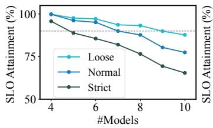

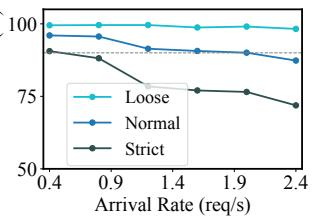  
Figure 17. Left: Serving on a 4×A10 GPU node, setting RPS = 0.1 and increasing the model count. Strict and Loose represent scaling TBT to 0.5× and 2×, respectively. Right: Serving 72B models with TP = 4 on an 8×H800 GPU node, setting the model count to 4 and increasing RPS. Strict and Loose represent scaling TTFT.

Token-level scheduling. Figure 14 shows the latency breakdown of Aegaeon across various setups using the ShareGPT dataset. The results highlight two observations: (??) For the prefill stage, the grouped FCFS scheduler maintains a controlled prefill waiting time as the aggregate arrival rate increases, indicating a good balance between serving and scaling models. (????) For the decoding stage, the batched roundrobin scheduler achieves concurrent serving of multiple models by distributing the decoding waiting time throughout the entire request execution process without violating the SLO.

Auto-scaling speed. Figure 15 shows the CDF of autoscaling latencies on the left. For each tested model size, our efficient auto-scaling achieves near-instantaneous scaling in about 50% of cases, thanks to model prefetching. In cases where the scaling overhead is not completely hidden, Aegaeon conducts the preemptive scaling in under one second. Further, as shown on the right side of Figure 15, Aegaeon’s fine-grained KV cache synchronization achieves a small perrequest KV cache transfer overhead (less than one second in total), demonstrating the effectiveness of our optimizations.

Memory fragmentation. Figure 16 illustrates the overall and per-shape memory fragmentation during serving, calculated as the ratio of unused memory to peak allocated memory. Thanks to slab allocation, Aegaeon achieves proportional memory utilization across different block shapes, keeping overall fragmentation below 20%.

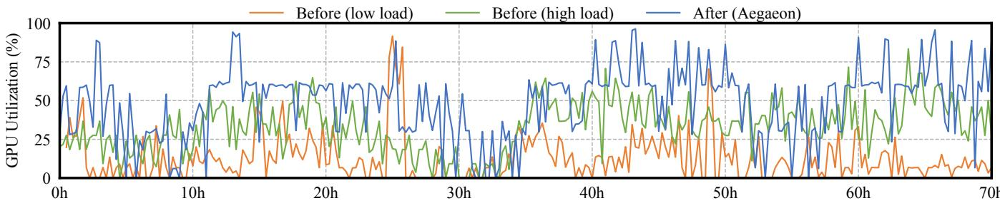  
Figure 18. GPU utilization before and after deploying Aegaeon, during a 70-hour period.

## 7.4 Sensitive Analysis

This section evaluates Aegaeon under alternative hardware and model setups, verifying that our design generalizes to different scenarios.

Lower-end hardware. While our token-level auto-scaling approach is more effective with high-end GPUs (where underutilization is more significant), Aegaeon can also be deployed on less powerful GPU clusters. Figure 17 (left) shows the SLO attainment of Aegaeon on a 4xA10 GPU node, measured while serving workloads of 6B and 7B models using the ShareGPT dataset. We assign two prefill and two decoding instances and disable model prefetching because the GPU memory on A10 GPUs (24 GB) cannot accommodate the weights of two models. The results show that Aegaeon can still maintain a decent SLO attainment on lower-end hardware, enabling the concurrent serving of multiple models. Additionally, we report the SLO attainment with TBT set to 0.5× and 2×, referred to as Strict and Loose, respectively. Aegaeon can sustain much better goodput in the Loose setting, as the longer TBT tolerates more aggressive resource sharing without violating SLOs.

Larger models. Aegaeon is capable of serving larger models via model parallelism. Figure 17 (right) shows the SLO attainment of Aegaeon on an 8xH800 GPU node serving 72B models using the ShareGPT dataset. We set TP = 4, corresponding to two instances—one for prefill and one for decoding—and also report the SLO attainment with scaled TTFT. The results demonstrate that Aegaeon can effectively serve larger models with similar performance gains.

## 7.5 Production Deployment

Setup. Aegaeon has been in beta deployment in Alibaba Cloud Model Studio, a cutting-edge AI model service platform that enables API access to a diverse model marketplace for cloud users and application developers. Our current deployment runs in a cross-region cluster comprising 213 H20 GPUs, serving twenty-eight 1.8–7B models (TP=1) and nineteen 32–72B models (TP=4). To support such mixed parallelism, we host multiple Aegaeon deployments in the cluster, one for each parallelism configuration. The arrival rates vary from 0.01 to 1.13, averaging 0.037. These models were originally served by a total of 1,192 H20 GPUs, highlighting an 82% resource saving. To ensure SLO compliance and enhance user experience, our production deployment typically utilizes redundant resources that exceed the minimum requirements. This redundancy is necessary to handle peak loads and provide fault tolerance. As a result, both the baseline (without Aegaeon) and Aegaeon experience lower resource utilization compared to the results presented in previous sections. Nevertheless, the relative performance improvement achieved with Aegaeon remains significant.

Performance gain. Figure 18 illustrates GPU utilization before and after deploying Aegaeon during a 70-hour period. “Before (low load)” and “Before (high load)” indicate the GPU utilization of a single instance serving the models with the lowest and highest load, respectively. In contrast, “After (Aegaeon)” reflects the GPU utilization recorded postdeployment of Aegaeon. The results demonstrate that Aegaeon significantly enhances GPU utilization, increasing it from an average of 13.3%∼33.9% to 48.1%. At the same time, there are no observable SLO violations or service disruptions during the monitored period. This improvement shows that Aegaeon can effectively reduce GPU demand, thereby cutting operational expenses. We have ongoing plans to expand the deployment of Aegaeon to more instances and larger clusters for further production use and cost savings.

## 8 Related Work

LLM inference systems. Significant efforts have been made to optimize LLM inference systems, focusing on reducing latency and increasing throughput. These optimizations include scheduling [14, 23, 44, 47], memory management [15, 25, 40], caching [4, 22, 51], and resource efficiency [28, 46], among others. Aegaeon is both orthogonal and complementary to these works, as it specifically focuses on concurrently serving LLMs on the market.

Serverless LLM serving with auto-scaling. The serverless computing paradigm has been explored for DNN inference [1, 2, 17, 27, 39, 48, 50] as well as LLM serving [21, 31, 49], with a primary focus on optimizing the cold scale-up speed for inference services. However, none of these studies have explored the token-level auto-scaling strategy, which is crucial to Aegaeon’s effectiveness.

Model multiplexing. This approach achieves resource sharing through temporal [28] or spatial [20] multiplexing. As evaluated, Aegaeon outperforms these works in our target scenario by supporting many more models per GPU. Moreover, Aegaeon can potentially incorporate multiplexing by dynamically switching colocated models and orchestrating their execution with our SLO-aware scheduling.

Disaggregating prefill and decoding. The idea of separating prefill and decoding stages in LLM inference has been adopted in many recent studies [20, 24, 34, 36, 52]. Built upon this concept, Aegaeon further investigates distinct scheduling strategies for both stages to fully leverage GPUs in our multi-model setting.

Leveraging secondary storage. One approach to managing the intense GPU memory demand in LLM serving is offloading [7, 16, 40], where parts of the model weights and KV cache are temporarily transferred to secondary storage, such as CPU memory or disk. While there are studies that utilize secondary storage to accelerate model loading [21, 35], Aegaeon distinguishes itself from these solutions by acknowledging and thoroughly optimizing the new inefficiencies in the preemptive auto-scaling process.

## 9 Conclusion

This paper presents Aegaeon, a system that pools GPU resources to concurrently serve numerous LLMs on the market. By enabling highly efficient auto-scaling at the token level, Aegaeon achieves 2∼2.5× higher request arrival rates or 1.5∼9× higher goodput compared to alternative solutions. Aegaeon has been deployed in production serving tens of models, reducing overall GPU usage by 82%.

Acknowledgments. We sincerely thank our anonymous shepherd and reviewers for their insightful feedback. This work was supported in part by the National Key Research and Development Program of China under Grant 2022YFB4500700, the Scientific Research Innovation Capability Support Project for Young Faculty under Grant ZYGXQNJSKYCXNLZCXM-I1, the Fundamental Research Funds for the Central Universities, Peking University, and the National Natural Science Foundation of China under Grant 62172008 and Grant 62325201. Xin Jin and Xue Li are the corresponding authors. Yuxing Xiang, Xuanzhe Liu, and Xin Jin are also with the Key Laboratory of High Confidence Software Technologies (Peking University), Ministry of Education.

## References

[1] 2023. Azure ML. https://learn.microsoft.com/en-us/azure/machinelearning.

[2] 2023. KServe: Standardized Distributed Generative and Predictive AI Inference Platform for Scalable, Multi-Framework Deployment on Kubernetes. https://github.com/kserve/kserve.

[3] 2023. ShareGPT Dataset. https://huggingface.co/datasets/ anon8231489123/ShareGPT\_Vicuna\_unfiltered.

[4] 2023. TensorRT-LLM. https://github.com/NVIDIA/TensorRT-LLM.

[5] 2024. Alibaba Cloud Model Studio. https://www.aliyun.com/product/ bailian.

[6] 2024. asyncio — Asynchronous I/O. https://docs.python.org/3/library/ asyncio.html.

[7] 2024. HuggingFace: The AI community building the future. https: //huggingface.co/.

[8] 2024. Multi-Process Service (MPS). https://docs.nvidia.com/deploy/ mps.

[9] 2024. NCCL: Optimized Primitives for Inter-GPU Communication. https://developer.nvidia.com/nccl.

[10] 2024. OpenAI’s GPT-4o model. https://openai.com/index/hello-gpt-4o/.

[11] 2024. Redis: An In-memory Database that Persists on Disk. https: //github.com/redis/redis.

[12] 01.AI. 2024. Yi: Open Foundation Models by 01.AI. In arXiv.

[13] Amey Agrawal, Anmol Agarwal, Nitin Kedia, Jayashree Mohan, Souvik Kundu, Nipun Kwatra, Ramachandran Ramjee, and Alexey Tumanov. 2024. Etalon: Holistic Performance Evaluation Framework for LLM Inference Systems. In arXiv.

[14] Amey Agrawal, Nitin Kedia, Ashish Panwar, Jayashree Mohan, Nipun Kwatra, Bhargav S. Gulavani, Alexey Tumanov, and Ramachandran Ramjee. 2024. Taming Throughput-Latency Tradeoff in LLM Inference with Sarathi-Serve. In USENIX OSDI.

[15] Keivan Alizadeh, Seyed Iman Mirzadeh, Dmitry Belenko, S. Khatamifard, Minsik Cho, Carlo C Del Mundo, Mohammad Rastegari, and Mehrdad Farajtabar. 2024. LLM in a flash: Efficient Large Language Model Inference with Limited Memory. In Association for Computational Linguistics (ACL).

[16] Reza Yazdani Aminabadi, Samyam Rajbhandari, Ammar Ahmad Awan, Cheng Li, Du Li, Elton Zheng, Olatunji Ruwase, Shaden Smith, Minjia Zhang, Jeff Rasley, and Yuxiong He. 2022. DeepSpeed Inference: Enabling Efficient Inference of Transformer Models at Unprecedented Scale. In ACM SC.

[17] Seungbeom Choi, Sunho Lee, Yeonjae Kim, Jongse Park, Youngjin Kwon, and Jaehyuk Huh. 2022. Serving Heterogeneous Machine Learning Models on Multi-GPU Servers with Spatio-Temporal Sharing. In USENIX ATC.

[18] Tri Dao, Daniel Y. Fu, Stefano Ermon, Atri Rudra, and Christopher Ré. 2022. FlashAttention: Fast and Memory-Efficient Exact Attention with IO-Awareness. In Neural Information Processing Systems.

[19] DeepSeek-AI. 2024. DeepSeek-V3 Technical Report. In arXiv.

[20] Jiangfei Duan, Runyu Lu, Haojie Duanmu, Xiuhong Li, Xingcheng Zhang, Dahua Lin, Ion Stoica, and Hao Zhang. 2024. MuxServe: Flexible Spatial-Temporal Multiplexing for Multiple LLM Serving. In International Conference on Machine Learning (ICML).

[21] Yao Fu, Leyang Xue, Yeqi Huang, Andrei-Octavian Brabete, Dmitrii Ustiugov, Yuvraj Patel, and Luo Mai. 2024. ServerlessLLM: Low-Latency Serverless Inference for Large Language Models. In USENIX OSDI.

[22] In Gim, Guojun Chen, Seung seob Lee, Nikhil Sarda, Anurag Khandelwal, and Lin Zhong. 2024. Prompt Cache: Modular Attention Reuse for Low-Latency Inference. In Conference on Machine Learning and Systems.

[23] Connor Holmes, Masahiro Tanaka, Michael Wyatt, Ammar Ahmad Awan, Jeff Rasley, Samyam Rajbhandari, Reza Yazdani Aminabadi, Heyang Qin, Arash Bakhtiari, Lev Kurilenko, and Yuxiong He. 2024. DeepSpeed-FastGen: High-throughput Text Generation for LLMs via MII and DeepSpeed-Inference. In arXiv.

[24] Cunchen Hu, Heyang Huang, Liangliang Xu, Xusheng Chen, Chenxi Wang, Jiang Xu, Shuang Chen, Hao Feng, Sa Wang, Yungang Bao, Ninghui Sun, and Yizhou Shan. 2025. ShuffleInfer: Disaggregate LLM Inference for Mixed Downstream Workloads. In ACM Transactions on Architecture and Code Optimization.

[25] Woosuk Kwon, Zhuohan Li, Siyuan Zhuang, Ying Sheng, Lianmin Zheng, Cody Hao Yu, Joseph Gonzalez, Hao Zhang, and Ion Stoica. 2023. Efficient Memory Management for Large Language Model Serving with PagedAttention. In ACM SOSP.

[26] Shanghai AI Laboratory. 2024. InternLM2 Technical Report. In arXiv.

[27] Jie Li, Laiping Zhao, Yanan Yang, Kunlin Zhan, and Keqiu Li. 2022. Tetris: Memory-efficient Serverless Inference through Tensor Sharing. In USENIX ATC.

[28] Zhuohan Li, Lianmin Zheng, Yinmin Zhong, Vincent Liu, Ying Sheng, Xin Jin, Yanping Huang, Zhifeng Chen, Hao Zhang, Joseph E. Gonzalez, and Ion Stoica. 2023. AlpaServe: Statistical Multiplexing with Model Parallelism for Deep Learning Serving. In USENIX OSDI.

[29] Jiachen Liu, Zhiyu Wu, Jae-Won Chung, Fan Lai, Myungjin Lee, and Mosharaf Chowdhury. 2024. Andes: Defining and Enhancing Qualityof-Experience in LLM-Based Text Streaming Services. In arXiv.

[30] Llama Team. 2024. The Llama 3 Herd of Models. In arXiv.

[31] Chiheng Lou, Sheng Qi, Chao Jin, Dapeng Nie, Haoran Yang, Xuanzhe Liu, and Xin Jin. 2025. Towards Swift Serverless LLM Cold Starts with ParaServe. In arXiv.

[32] Philipp Moritz, Robert Nishihara, Stephanie Wang, Alexey Tumanov, Richard Liaw, Eric Liang, Melih Elibol, Zongheng Yang, William Paul, Michael I. Jordan, and Ion Stoica. 2018. Ray: A Distributed Framework for Emerging AI Applications. In USENIX OSDI.

[33] Adam Paszke, Sam Gross, Francisco Massa, Adam Lerer, James Bradbury, Gregory Chanan, Trevor Killeen, Zeming Lin, Natalia Gimelshein, Luca Antiga, Alban Desmaison, Andreas Köpf, Edward Yang, Zach DeVito, Martin Raison, Alykhan Tejani, Sasank Chilamkurthy, Benoit Steiner, Lu Fang, Junjie Bai, and Soumith Chintala. 2019. PyTorch: An Imperative Style, High-Performance Deep Learning Library. In Neural Information Processing Systems.

[34] Pratyush Patel, Esha Choukse, Chaojie Zhang, Aashaka Shah, Íñigo Goiri, Saeed Maleki, and Ricardo Bianchini. 2024. Splitwise: Efficient Generative LLM Inference Using Phase Splitting. In ACM/IEEE ISCA.

[35] Archit Patke, Dhemath Reddy, Saurabh Jha, Haoran Qiu, Christian Pinto, Shengkun Cui, Chandra Narayanaswami, Zbigniew Kalbarczyk, and Ravishankar Iyer. 2024. QLM: Queue Management for Large Language Model Serving. In International Workshop on Cloud Intelligence (AIOps).

[36] Ruoyu Qin, Zheming Li, Weiran He, Jialei Cui, Feng Ren, Mingxing Zhang, Yongwei Wu, Weimin Zheng, and Xinran Xu. 2025. Mooncake: Trading More Storage for Less Computation — A KVCache-centric Architecture for Serving LLM Chatbot. In USENIX FAST.

[37] Qwen Team. [n. d.]. Qwen2.5: A Party of Foundation Models. https: //qwenlm.github.io/blog/qwen2.5/.

[38] Qwen Team. 2023. Qwen Technical Report. In arXiv.

[39] Francisco Romero, Qian Li, Neeraja J. Yadwadkar, and Christos Kozyrakis. 2021. INFaaS: Automated Model-less Inference Serving. In USENIX ATC.

[40] Ying Sheng, Lianmin Zheng, Binhang Yuan, Zhuohan Li, Max Ryabinin, Beidi Chen, Percy Liang, Christopher Ré, Ion Stoica, and Ce Zhang. 2023. FlexGen: High-Throughput Generative Inference of Large Language Models with a Single GPU. In International Conference on Machine Learning (ICML).

[41] Mohammad Shoeybi, Mostofa Patwary, Raul Puri, Patrick LeGresley, Jared Casper, and Bryan Catanzaro. 2020. Megatron-LM: Training Multi-Billion Parameter Language Models Using Model Parallelism. In arXiv.

[42] Hugo Touvron, Thibaut Lavril, Gautier Izacard, Xavier Martinet, Marie-Anne Lachaux, Timothée Lacroix, Baptiste Rozière, Naman Goyal, Eric

Hambro, Faisal Azhar, Aurelien Rodriguez, Armand Joulin, Edouard Grave, and Guillaume Lample. 2023. LLaMA: Open and Efficient Foundation Language Models. In arXiv.

[43] Yuxin Wang, Yuhan Chen, Zeyu Li, Xueze Kang, Yuchu Fang, Yeju Zhou, Yang Zheng, Zhenheng Tang, Xin He, Rui Guo, Xin Wang, Qiang Wang, Amelie Chi Zhou, and Xiaowen Chu. 2025. BurstGPT: A Real-World Workload Dataset to Optimize LLM Serving Systems.

[44] Bingyang Wu, Yinmin Zhong, Zili Zhang, Shengyu Liu, Fangyue Liu, Yuanhang Sun, Gang Huang, Xuanzhe Liu, and Xin Jin. 2024. Fast Distributed Inference Serving for Large Language Models. In arXiv.

[45] Yuxing Xiang, Xue Li, Kun Qian, Wenyuan Yu, Ennan Zhai, and Xin Jin. 2025. ServeGen: Workload Characterization and Generation of Large Language Model Serving in Production. In arXiv.

[46] Yuhang Yao, Han Jin, Alay Dilipbhai Shah, Shanshan Han, Zijian Hu, Yide Ran, Dimitris Stripelis, Zhaozhuo Xu, Salman Avestimehr, and Chaoyang He. 2024. ScaleLLM: A Resource-Frugal LLM Serving Framework by Optimizing End-to-End Efficiency. In Empirical Methods in Natural Language Processing.

[47] Gyeong-In Yu, Joo Seong Jeong, Geon-Woo Kim, Soojeong Kim, and Byung-Gon Chun. 2022. Orca: A Distributed Serving System for Transformer-Based Generative Models. In USENIX OSDI.

[48] Minchen Yu, Zhifeng Jiang, Hok Chun Ng, Wei Wang, Ruichuan Chen, and Bo Li. 2021. Gillis: Serving Large Neural Networks in Serverless Functions with Automatic Model Partitioning. In IEEE ICDCS.

[49] Dingyan Zhang, Haotian Wang, Yang Liu, Xingda Wei, Yizhou Shan, Rong Chen, and Haibo Chen. 2025. BlitzScale: Fast and Live Large Model Autoscaling with O(1) Host Caching. In USENIX OSDI.

[50] Hong Zhang, Yupeng Tang, Anurag Khandelwal, and Ion Stoica. 2023. SHEPHERD: Serving DNNs in the Wild. In USENIX NSDI.

[51] Lianmin Zheng, Liangsheng Yin, Zhiqiang Xie, Chuyue Sun, Jeff Huang, Cody Hao Yu, Shiyi Cao, Christos Kozyrakis, Ion Stoica, Joseph E. Gonzalez, Clark Barrett, and Ying Sheng. 2024. SGLang: Efficient Execution of Structured Language Model Programs. In arXiv.

[52] Yinmin Zhong, Shengyu Liu, Junda Chen, Jianbo Hu, Yibo Zhu, Xuanzhe Liu, Xin Jin, and Hao Zhang. 2024. DistServe: Disaggregating Prefill and Decoding for Goodput-optimized Large Language Model Serving. In USENIX OSDI.

## A Appendix

## A.1 Active Model Analysis

Theorem A.1. Suppose the request arrival rate for each model follows a Poisson process with rate ??, and the average time to serve a request is ?? . The expected active model count E[??] is given by:

$$
\mathbb { E } [ m ] = M \cdot ( 1 - e ^ { - \lambda T } )
$$

Proof For each model $i ( i = 1 , 2 , . . . , M )$ , define the indicator random variable $X _ { i }$ as:

$$
X _ { i } = { \left\{ \begin{array} { l l } { 1 } & { { \mathrm { i f ~ } } { \mathrm { m o d e l ~ } } i { \mathrm { ~ i s ~ a c t i v e ~ a t ~ a ~ g i v e n ~ t i m e , } } } \\ { 0 } & { { \mathrm { o t h e r w i s e . } } } \end{array} \right. }
$$

The total number of active models at that time is $\begin{array} { r } { m = \sum _ { i = 1 } ^ { M } X _ { i } } \end{array}$ By linearity of expectation:

$$
\mathbb { E } [ m ] = \sum _ { i = 1 } ^ { M } \mathbb { E } [ X _ { i } ]
$$

Since request arrivals are independent, $\mathbb { E } [ X _ { i } ] = \mathbb { E } [ X _ { 1 } ]$ for all ??. Therefore:

$$
\mathbb { E } [ m ] = M \cdot \mathbb { E } [ X _ { 1 } ]
$$

For a single model, $X _ { 1 } = 1$ if there exists at least one request in the interval $[ t - T , t ]$ . The number of such requests follows a Poisson distribution with parameter $\lambda T .$ . Thus:

$$
{ \begin{array} { r l } & { \mathbb { E } [ X _ { 1 } ] = \mathbb { P } ( X _ { 1 } = 1 ) } \\ & { \qquad = 1 - \mathbb { P } ( { \mathrm { n o ~ r e q u e s t s ~ i n ~ } } [ t - T , t ] ) } \\ & { \qquad = 1 - e ^ { - \lambda T } } \end{array} }
$$

Substituting back:

$$
\mathbb { E } [ m ] = M \cdot \left( 1 - e ^ { - \lambda T } \right)
$$

This concludes the proof.

## A.2 Latency Estimation

Model switching latency. Given the efficient model swithcing optimizations in Aegaeon (§5), the switching latency for a model is reduced to the time required to load the model weights. As such, we simply estimate it with the model size divided by the PCIe bandwidth, corrected with a profiled constant factor ?? (0.625 in our evalutation) to take account of the PCIe inefficiencies:

$$
T _ { \mathrm { s w i t c h } } = { \frac { \mathrm { M o d e l } \mathrm { S i z e } } { \mathrm { P C I e } \mathrm { B a n d w i d t h } } } \cdot \beta\tag{4}
$$

Token generation latency. To accurately estimate the execution time of a prefill or decoding step, we fit an analytical model derived from the required computation and memory access in each phase using profiled data, and predict the token generation latency with the model. Our modeling is adopted from existing works [52]:

$$
T _ { \mathrm { p r e f l l } } = C _ { 1 } \cdot \left( 4 t h ^ { 2 } + 2 t h m \right) + C _ { 2 } \cdot \frac { 3 h t _ { 2 } } { b } + C _ { 3 }\tag{5}
$$

Table 1. Symbols used in the latency modeling.
<table><tr><td>Symbol1</td><td>Meaning</td></tr><tr><td>h</td><td>hiddensizeof theLLM</td></tr><tr><td> $_ m$ </td><td>FFN intermediate size</td></tr><tr><td> $l _ { k }$ </td><td>input length of the k-th request in the batch</td></tr><tr><td>t</td><td>number of tokens in the batch  $\begin{array} { r } { \left( t = \sum _ { i = 0 } ^ { B - 1 } l _ { i } \right) } \end{array}$ </td></tr><tr><td> $t _ { 2 }$ </td><td>squared sum of the input lengths  $\begin{array} { r } { ( t _ { 2 } = \sum _ { i = 0 } ^ { B - 1 } l _ { i } ^ { 2 } ) } \end{array}$ </td></tr><tr><td> $^ { b }$ </td><td>block size in the FlashAttention [18] kernel</td></tr></table>

$$
T _ { \mathrm { d e c o d i n g } } = C _ { 4 } \cdot ( 4 h ^ { 2 } + 2 h m ) + C _ { 5 } \cdot 3 h t\tag{6}
$$

where $C _ { 1 } , C _ { 2 } , C _ { 3 } , C _ { 4 } ,$ and $C _ { 5 }$ are constants derived from profiling and interpolation, and the other symbols are defined in Table 1. Results show that this modeling achieves an Rsquared score of over 0.9 across all models in our evaluation.