Latest updates: hps://dl.acm.org/doi/10.1145/3731569.3764816

RESEARCH-ARTICLE

## Aeolia: A Fast and Secure Userspace Interrupt-Based Storage Stack

CHUANDONG LI, Peking University, Beijing, China

RAN YI, Peking University, Beijing, China

ZONGHAO ZHANG, Peking University, Beijing, China

JING LIU, Microso Research, Redmond, WA, United States

CHANGWOO MIN

JIE ZHANG, Peking University, Beijing, China

View all

Open Access Support provided by:

Peking University

Microso Research

Michigan Technological University


Published: 12 October 2025

Citation in BibTeX format

SOSP '25: ACM SIGOPS 31st Symposium

on Operating Systems Principles

October 13 - 16, 2025

Seoul, Republic of Korea

Conference Sponsors:

SIGOPS

# Aeolia: A Fast and Secure Userspace Interrupt-Based Storage Stack

Chuandong Li∗ Peking University Zhongguancun Laboratory

Jie Zhang∗ Peking University Zhongguancun Laboratory

Ran Yi∗ Peking University

Yingwei Luo∗ Peking University Zhongguancun Laboratory

Zonghao Zhang∗ Peking University Zhongguancun Laboratory

Xiaolin Wang∗ Peking University Zhongguancun Laboratory

Jing Liu Microsoft Research

Zhenlin Wang   
Michigan   
Technological   
University

Changwoo Min Igalia

Diyu Zhou∗ Peking University

## Abstract

Polling-based userspace storage stacks achieve great I/O performance. However, they cannot efficiently and securely share disks and CPUs among multiple tasks. In contrast, interrupt-based kernel stacks inherently suffer from subpar I/O performance but achieve advantages in resource sharing.

We present Aeolia, a novel storage stack that achieves great I/O performance while offering efficient and secure resource sharing. Aeolia is an interrupt-based userspace storage stack, representing a new point in the design space previously considered unfeasible. Our main observation is that, contrary to conventional wisdom, polling offers only marginal disk performance improvements over interrupts. Aeolia exploits user interrupt, an emerging hardware feature commonly used for userspace IPIs, in a novel way to deliver storage interrupts directly to userspace, thereby achieving high I/O performance with direct access. Aeolia leverages the hardware intra-process isolation features and sched\_ext, an eBPF-based userspace scheduling framework, to efficiently and securely share CPUs and disks among multiple tasks, challenging the common belief that these are inherent disadvantages of userspace storage stacks. The above design enables Aeolia to realize AeoFS, a high-performance library file system that securely and directly accesses disks. Our

evaluation shows that Aeolia outperforms Linux by 2× and AeoFS outperforms ext4 by up to 19.1×, respectively.

CCS Concepts • Software and its engineering → File systems management;

Keywords User interrupts, Userspace File Systems, Userspace NVMe Drivers, High-performance Storage, Scheduling

ACM Reference Format:

Chuandong Li, Ran Yi, Zonghao Zhang, Jing Liu, Changwoo Min, Jie Zhang, Yingwei Luo, Xiaolin Wang, Zhenlin Wang, and Diyu Zhou. 2025. Aeolia: A Fast and Secure Userspace Interrupt-Based Storage Stack. In ACM SIGOPS 31th Symposium on Operating Systems Principles (SOSP ’25), October 13–16, 2025, Seoul, Republic of Korea. ACM, New York, NY, USA, 17 pages. https://doi.org/10.1145/ 3731569.3764816

## 1 Introduction

Advancements in storage medium (e.g., Samsung’s Z-NAND [58], Kioxia’s XL-Flash [43], and Intel’s 3D XPoint [35]) enable modern NVMe SSDs [36, 42, 59] to achieve ultra-low latency (in the scale of a few ??s) and millions of IOPS. Such orders-of-magnitude improvements over conventional devices pose a significant challenge for storage stacks to utilize disk performance efficiently.

Existing high-performance storage stacks fall into two classes: userspace polling-based ones [40, 48, 67] and kernel interrupt-based ones [34, 45, 55, 69, 71]. Both classes couple two orthogonal axes in the design space: 1 userspace vs. kernel and 2 polling vs. interrupt. Due to such coupling, the rest of the design space remains unexplored. Furthermore, as summarized in Table 1 and detailed next, neither design achieves all the desired properties of a storage stack.

Polling-based userspace storage stacks [40, 48, 67] offer great I/O performance, since the storage stack directly accesses disks, thereby bypassing the kernel and various associated overheads (e.g., kernel trapping, layering). However, this design prevents multiple tasks from sharing storage and computation resources. Specifically, since there is no trusted entity mediating access, multiple untrusted tasks cannot share a disk. Furthermore, recent studies [34, 71] also reveal that when multiple tasks share a CPU, a userspace storage stack incurs high I/O tail latency, since it cannot coordinate with the kernel thread scheduler.

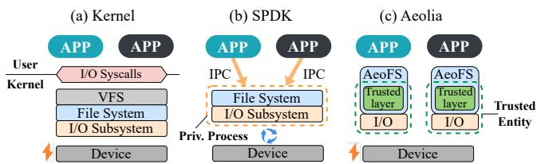  
Figure 1. Comparison of storage stack architectures. Aeolia is an interrupt-based userspace storage stack, representing a new point in the design space. Aeolia is enabled by 1) our insights in one axis of the design space, i.e., polling vs. interrupts; and 2) our novel design in another axis, i.e., kernel vs. userspace, by overcoming previously considered inherent disadvantages for userspace stack.

Conventional interrupt-based kernel storage stacks [34, 45, 55, 69, 71] overcome the aforementioned drawbacks of userspace stacks to efficiently and securely share resources among multiple tasks. However, a kernel stack suffers from inherent challenges in achieving high I/O performance [25, 39, 51, 74]. Thus, despite a long list of enhancements, it still cannot match the performance of a userspace one. Finally, both storage stacks fall short in supporting highperformance file systems with good multicore scalability.

This paper presents Aeolia, a userspace interrupt-based storage stack that achieves all key properties listed in Table 1. To design Aeolia, we first examine one axis of the design space by evaluating polling and interrupts, the two fundamental approaches to I/O completion. Our first key finding is that, contrary to the conventional wisdom [27, 57, 66, 67], polling only offers marginal I/O performance improvements over interrupts. Most overhead previously attributed to interrupts actually stems not from the interrupt itself but rather kernel thread scheduling policies that no longer suit fast storage devices. By proposing an active checking policy, we find that interrupt achieves similar I/O performance as polling.

Our second key finding is that while polling may improve I/O performance, its excessive CPU usage imposes inherent limitations on building high-performance file systems. We reach this finding by examining uFS [48], a file system building upon SPDK [62, 67]. To ensure protected sharing and minimize CPU usage, uFS runs in a separate process with dedicated threads that handle file system requests; applications communicate with uFS via IPC. Despite efforts to reduce IPC cost [50], we find that IPC still incurs excessive software overhead (e.g., 400ns). Furthermore, as our evaluation in §9.4 shows, polling poses inherent challenges to file system multicore scalability, since its high CPU usage reduces the effective contribution of each core.

The key takeaway from our analysis is that interrupts offer several advantages over polling while incurring only a small performance disadvantage.

<table><tr><td></td><td>User Poll [40, 48,67]</td><td>Kernel INTR [34, 45,55,69,71]</td><td>AEOLIA</td></tr><tr><td>High I/O Performance</td><td>√</td><td>×</td><td>√</td></tr><tr><td>Coordinated Scheduling</td><td>×</td><td>√</td><td>√</td></tr><tr><td>Protected Sharing</td><td>×</td><td>√</td><td>√</td></tr><tr><td>High-Performance File System</td><td>×</td><td>×</td><td>√</td></tr></table>

Table 1. Desired properties of storage stack.

Based on our analysis, we conclude that userspace interrupt-based storage stacks represent a new and useful point in the design space. It benefits from interrupts without suffering from kernel performance overheads. However, no such storage stack currently exists, and building one is considered difficult [21], let alone overcoming the many other challenges of a complete storage stack. We design and implement Aeolia1 to bridge the aforementioned gap (Figure 1).

We design Aeolia to achieve all the four essential properties for storage stacks: 1) High I/O Performance. Each task directly accesses disks for low latency and high throughput. 2) Coordinated Scheduling. Aeolia works in concert with thread scheduling, enabling multiple tasks to share a core efficiently. 3) Protected Sharing. Multiple untrusted tasks share the disk without violating access permissions or corrupting the storage stack. 4) High-Performance File System. Aeolia includes a high-performance file system with low access latency and excellent multicore scalability.

Our design of Aeolia overcomes what were previously considered inherent challenges of userspace stacks.

First, to meet high I/O performance, Aeolia exploits user interrupts, a new hardware feature supported since Sapphire Rapids CPUs [13], to bypass the kernel to directly deliver storage interrupts to userspace. Existing work [29, 46] leverages user interrupts for task scheduling, via, e.g., userspace IPIs. Aeolia advances by leveraging user interrupts for storage devices. To achieve this, through a detailed analysis of the hardware behavior, we identify a safe and novel approach to deliver device interrupts to userspace.

Second, the inability to enforce protected sharing is often considered an inherent disadvantage for userspace storage stacks [34, 68, 71]. Prior approaches [23, 65] address this problem by introducing new hardware support. Instead, Aeolia exploits standard hardware supports for intra-address space isolation. With such support, Aeolia incorporates trusted entities in the process address space. The trusted entities are protected against untrusted userspace code to enforce access permissions and prevent file system metadata corruption, thereby achieving secure sharing.

Third, coordinating with thread scheduling is also challenging due to semantic gaps between the kernel and userspace. However, this is necessary for Aeolia to 1 avoid kernel scheduling overhead imposed on interrupts and 2 support multiple threads efficiently sharing a CPU. Aeolia overcomes this limitation by using sched\_ext [7, 12], a recent

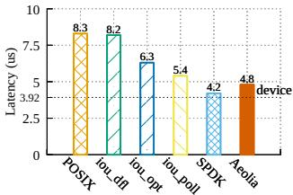

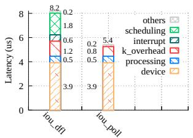  
Figure 2. Average access latency Figure 3. Overhead breakdown of a 4KB read request. of a 4KB read access.

Linux framework that allows userspace tasks to specify an arbitrary thread scheduling policy with eBPF [3]. With sched\_ext, Aeolia bridges the semantic gaps by coordinating with the kernel thread scheduler over the eBPF map.

Finally, building upon the high I/O performance and protected sharing in Aeolia, we designed AeoFS, a fast POSIXlike library file system. Aeolia enables direct data and metadata access with fine-grained parallelism to achieve low latency, high throughput, and great multicore scalability. In addition, to achieve metadata integrity, AeoFS leverages the state separation design from Trio [73], a recent advancement in library file systems. However, building upon Aeolia, AeoFS advances Trio by introducing trusted entities into the library file system to perform eager metadata integrity checks. Compared to the lazy integrity checks adopted in Trio, eager checking is easy to reason about correctness while avoiding data loss if the check fails. Furthermore, eager checking incurs a negligible performance cost; each operation pays an extra 85 cycles to switch to the trusted entity.

We implement Aeolia from scratch with 17751 lines of code. Our evaluation shows that Aeolia performs similarly to SPDK and AeoFS outperforms ext4, f2fs, and uFS by 2.87× to 8.19× on LevelDB.

In summary, this paper makes the following contributions:   
• Analysis. We reveal two new findings: 1) polling does not significantly outperform interrupt, but rather 2) limits file system performance.

• Aeolia. We design Aeolia, a userspace interruptbased storage stack, representing a new point in the design space.

• AeoFS. We design AeoFS, a high-performance library file system with great multicore scalability.

## 2 Analyzing Current Storage Stacks

This section analyzes the tradeoffs between interrupt and polling, two fundamental approaches for I/O completion, and a key dimension in the storage stack design space. We examine two representative stacks: the Linux kernel and SPDK [62]. We evaluated with a 128-core Intel machine equipped with an Optane P5800X SSD [36] (detailed in §9).

To reach our insights, we partition the storage stack into two layers: 1 the storage subsystem (e.g., BIO and the device driver in Linux) (§2.1) and 2 the file system (§2.2) and examine each layer separately.

## 2.1 Storage Subsystem: Interrupt versus Polling

For the storage subsystem, we evaluate two cases: 1) a single task running alone; and 2) multiple tasks running together. I/O performance with a single task. With a single task, the I/O performance of SPDK is known to surpass the kernel stack significantly. Conventional wisdom [24, 27, 34, 57, 68, 71] attributes the gain to two factors: 1) using polling rather than interrupts and 2) direct userspace access, bypassing various kernel overhead such as layering and context switch.

We next analyze how much each of these two factors contributes to the performance gains of SPDK. Our workload is fio with 4KB read. We compare SPDK with io\_uring [9], the newest kernel stack interface. We configure io\_uring with two setups: 1) default (iou\_dfl), which uses interrupts, and 2) iou\_poll, which uses polling.

Figure 2 shows the latency with different setups in the kernel stack vs. SPDK. At first glance, polling brings significant benefits (iou\_poll: 5.4??s vs. iou\_dfl: 8.2??s). However, as shown in Figure 3, upon further analysis, we find that most of the 2.8??s interrupt overhead primarily stems from a poor thread scheduling policy, which costs 1.8??s. The interrupt mechanism itself incurs only 0.6??s overhead, while the remaining 0.4??s is due to different code execution paths. the interrupt mechanism itself incurs only 0.6??s overhead.

More specifically, the 1.8??s scheduling overhead comes from a pathological case in thread scheduling (Figure 4). After issuing requests, the kernel eagerly puts the current task (task A) into sleep and invokes the scheduler, hoping to run the next task. However, since no other runnable task exists, the kernel has to context switch to the idle task [8]. Therefore, upon I/O completion, the kernel must go through a lengthy process of 1 converting the sleeping task A to runnable (0.7??s); 2 updating scheduling statistics before leaving the idle task (0.4??s); and finally, 3 scheduling and context switching back to task A (0.7??s). When an I/O operation costs milliseconds, eagerly putting task A to sleep before even identifying the next task to run does not cause an issue, but this is no longer suitable for modern SSDs.

To avoid the high scheduling overhead, we introduce an active checking policy. Rather than blindly putting a task that issues a storage request into a sleep, our policy keeps the task awake when no runnable task exists. With this policy, the optimized interrupt (iou\_opt) performs similarly to polling (6.3??s vs 5.4??s)2, even with 4KB access size.

With the active checking policy, most performance gains of SPDK actually come from kernel bypassing (SPDK: 4.2??s vs. iou\_poll: 5.4??s). The performance difference between our userspace interrupt-based AeoDriver (4.8??s) and SPDK (4.2??s) further validates the above claim.

Performance with multiple tasks. Figure 5 shows the results of running on a single core: a) one I/O-intensive and one compute-intensive task and b) two I/O-intensive tasks. In the former case, polling significantly reduces the work performed by both types of tasks (see SPDK and iou\_poll). In the latter case, polling incurs a high tail latency. These results conform to existing findings [34, 68, 71].

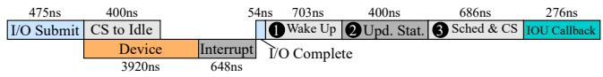

Figure 4. Interrupt overhead breakdown.  
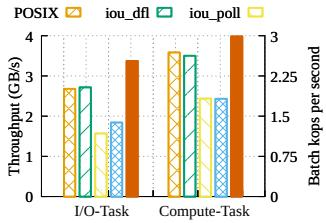

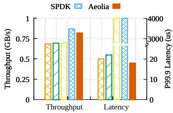  
Figure 5. Performance when multiple tasks share a core. The I/O intensive tasks repeatedly issue 128KB reads, and the computeintensive task is swaptions in PARSEC.

Polling suffers because of an inherent disadvantage: the system does not know when the I/O finishes and thus cannot coordinate thread scheduling with the storage stack. For example, the high tail latency is because the scheduler cannot promptly run the corresponding task when its I/O completes. Finding #1: Polling offers marginal storage performance gains over interrupts but is inherently challenging for coordinating with thread scheduling.

## 2.2 How Polling Limits File System Performance

Our analysis at the file system layer is motivated by the two general performance limitations of existing file systems: 1) high software overhead and 2) poor multicore scalability. The cause of such performance limitations for kernel file systems is known. The kernel stack aims to be general and, thus, incurs various layering overhead (e.g., syscall [74], JBD [39]) to its file systems. It also incurs poor scalability due to the challenge of designing a scalable yet general VFS [25, 51].

Our key finding is that file systems on polling-based storage subsystems also inherently suffer from these limitations. Take uFS [48] built upon SPDK as an example (Figure 1). uFS is a standalone process with a small number of dedicated worker threads to handle file system operations. Dedicated worker threads are necessary to minimize CPU overhead caused by polling . However, this design requires applications to communicate with uFS using costly IPC (at least hundreds of nanoseconds), incurring high overhead.

Furthermore, polling poses great challenges in multicore scalability for a file system. To make the CPU overhead acceptable, polling often comes with an event-driven programming model, which greatly complicates concurrency control when multiple asynchronous event handlers need to coordinate access to shared filesystem states. To simplify this, uFS assigns all operations on a specific file to a single thread and all metadata operations to a global master thread. Exclusive assignment avoids complex locking within asynchronous events [19], but at the cost of limiting scalability since multiple threads cannot concurrently operate on the same file. Finding #2: Polling limits file system performance.

<table><tr><td colspan="3">Polling Interrupt</td><td colspan="3">Kernel Userspace</td></tr><tr><td>I/O Performance</td><td>√</td><td>×↓</td><td>I/O Performance</td><td>×</td><td>√</td></tr><tr><td>Coordinated Sched.</td><td>×</td><td>√</td><td>Coordinated Sched.</td><td>√</td><td>×↓</td></tr><tr><td>FS Performance</td><td>×</td><td>√</td><td>Protected Sharing</td><td>√</td><td>×↓√</td></tr></table>

Table 2. Tradeoffs in the two design dimensions of storage stacks. → represents the conventional wisdom that Aeolia challanges.
<table><tr><td>Stack</td><td>File System</td><td>Driver</td><td>User Interaction</td><td>Execution Context</td><td>Notification</td></tr><tr><td>Linux</td><td>Kernel FS</td><td>Kernel driver</td><td>Syscalls</td><td>Kernel</td><td>Interrupt</td></tr><tr><td>uFS</td><td>uFS</td><td>SPDK</td><td>IPC</td><td>Userspace</td><td>Polling</td></tr><tr><td>AEOLIA</td><td>AEOFS</td><td>AEODRIVER</td><td>Library calls</td><td>Userspace</td><td>Interrupt</td></tr></table>

Table 3. Comparison of representative storage stacks.

## 3 An Overview of the Aeolia Storage Stack

This section presents Aeolia’s design goals (§3.1), explains the design choices we made (§3.2) followed by an overview of Aeolia (§3.3), and finally discusses its limitations (§3.4).

## 3.1 Design Goals

We design Aeolia to meet the following goals.

• High I/O Performance. Aeolia must minimize software overhead in both the storage subsystem and the file system, achieving high performance on both singlecore and multi-core setups.

• Coordinated Scheduling. Aeolia should coordinate thread scheduling to make multiple I/O- and computeintensive tasks run efficiently on the same core.

• Protected Sharing. Aeolia should allow untrusted tasks to share the storage stack and the underlying disk device.

• File System Support. Aeolia should enable highperformance file systems with low access latency and excellent multicore scalability.

## 3.2 Aeolia’s Unique Point in the Design Space

To meet design goals, we design Aeolia as an interruptbased userspace storage stack, a new and unique point in the design space.

We make this design choice based on the tradeoffs summarized in Table 2. In the I/O notification dimension, we choose interrupt over polling due to its advantages (§2). In the execution context dimension, we choose userspace over kernel since the former enables a clean-slate design and avoids the “generic tax” inherent in kernel stacks. Recent work also reports other userspace benefits such as customization [54, 73] and high development velocity [32, 49]. Table 3 summarizes the key differences between Linux, uFS, and Aeolia.

We next discuss how Aeolia overcomes the two previously inherent disadvantages of a userspace stack: protected sharing and coordinated scheduling.

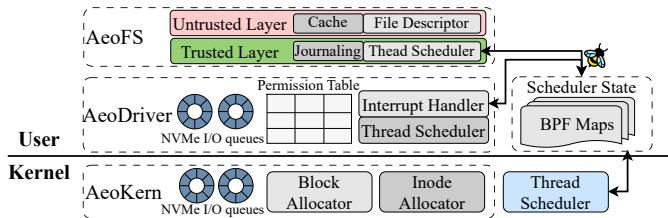  
Figure 6. Aeolia overview.

## 3.3 An Overview of Aeolia Design

Components. Figure 6 shows Aeolia’s components: AeoKern, AeoDriver, and AeoFS. AeoKern is the typical kernel module in userspace I/O stack design [40, 65], responsible for, e.g., configuring hardware, allocating resources (e.g., disk queue pairs), and maintaining access permissions. Aeo-Driver is a library device driver, directly interacting with the disk and offering high-level interfaces that abstract the disk. AeoFS is a library file system building upon AeoDriver, offering POSIX interfaces to allow existing applications to benefit from Aeolia without modification.

Target use cases. Aeolia targets general-purpose OS use and is designed to replace both traditional kernel-based storage stacks and userspace polling-based storage stacks (e.g., SPDK). Aeolia supports legacy applications, since it includes AeoFS that offers conventional POSIX interfaces. Thanks to AeoDriver, similar to SPDK, Aeolia can also be adapted to specialized storage stacks, such as those used by databases.

Direct userspace access with user interrupts. Aeo-Driver achieves complete userspace I/O by directly handling both I/O submissions and completions without kernel involvement. In the submission path, the AeoKern allocates NVMe queue pairs to an AeoDriver instance and maps the queue pairs into the process address space, enabling Aeo-Driver to send requests to the disk directly. In the completion path, as further explained in §4.2, AeoDriver leverages user interrupts to deliver and handle storage interrupts in the userspace, bypassing the kernel.

Protected sharing with intra-process isolation. Following the conventional threat model, Aeolia assumes that userspace applications are untrusted. This threat model means the storage stack must prevent applications from 1) accessing state without proper permissions; and 2) corrupting any shared state, especially file system metadata. Meeting these goals for a userspace stack is challenging. Prior work either proposes new hardware support [23, 38, 56, 65, 70] or prevents direct access by making the storage stack a privileged process, such as uFS.

Aeolia meets the aforementioned goals by leveraging standard hardware features to create trusted entities within process address spaces (§5). The trusted entities execute predefined code to prevent corruption from applications. Specifically, AeoDriver is a trusted entity enforcing access permissions to each disk block. Part of the AeoFS is also a trusted entity, ensuring that a process cannot corrupt shared metadata. To ensure integrity, the state of trusted entities resides in a dedicated memory region that applications cannot access. Entering a trusted entity only requires 40ns, much faster than kernel trapping or IPC.

Coordinated scheduling. Aeolia coordinates with thread scheduling to enable multiple tasks sharing a single core. To meet this goal, mechanism-wise, Aeolia adds to its trusted entities scheduling decision points (e.g., before returning from the interrupt handler) to check if the current thread should yield the core. Aeolia’s scheduling decision points are the same as the ones in the Linux kernel. Policy-wise, following the spirit of the active checking policy (§2.1), Aeolia only yields when necessary, where the next task should run based on the scheduling policy. To achieve this, Aeolia must be aware of the current thread scheduling algorithm and access the relevant scheduling state. However, neither of these is available to userspace entities.

To overcome this challenge, Aeolia uses the extensible scheduler class(sched\_ext [12]), a very recent eBPF-based scheduling framework. Aeolia uses sched\_ext to define the kernel scheduling algorithm and expose it to userspace, so that Aeolia is aware of the current scheduling policy. Specifically, as sched\_ext uses eBPF maps to store all the scheduling state, Aeolia simply mmap the eBPF to expose such state to the trusted entities of Aeolia. Thanks to sched\_ext, Aeolia is able to yield the core only when necessary.

Enabling an efficient file system. The design presented above enables secure userspace access to the storage device, thereby eliminating various performance bottlenecks (§2.2), such as kernel trapping, IPC, and VFS.

Enabled by such design, as detailed in §7, AeoFS directly performs all file system operations, including both data and metadata operations, in the userspace, thereby achieving great performance. Furthermore, AeoFS inherits the state separation insights from Trio [73], a recent advancement in userspace file systems, to achieve metadata integrity. Specifically, enabled by the ability to add trusted entities in the same address space, AeoFS introduces a file system trust layer to enforce metadata integrity eagerly.

Putting it together. We next explain how Aeolia’s components work together. We refer the readers to Figure 6 again for an overview of Aeolia components. When an application issues a filesystem syscall, the thread enters AeoFS. For syscalls that involve modifying metadata, the trusted layer of AeoFS ensures that such modifications do not violate metadata integrity. Next, AeoFS translates the filesystem-level operation into a block-level request and sends the request to AeoDriver. AeoDriver, being a trusted entity, checks if the application has the right permission to access the target blocks. If so, AeoDriver sends the request to the disk.

After issuing the I/O request, AeoDriver checks if the current thread should yield the core by reading the scheduling state in the eBPF maps of sched\_ext. If so, the thread enters the kernel to yield the core.

Upon request completion, AeoDriver is notified via user interrupts. Before returning from the interrupt handler, Aeo-Driver checks again if the current thread should yield the core. Eventually, AeoDriver returns to AeoFS, and AeoFS returns the syscall results to the application.

## 3.4 Limitations

One limitation is that interrupts are still slower than polling when the I/O size is small (18.2% with 512B evaluated in §9.2). We believe that this limitation is temporary since recent work has made interrupts almost as fast as polling [21]. In addition, such small storage requests are rare in practice. For example, in the Alibaba block trace [1], over 95% of requests exceed 4KB. Another limitation is that Aeolia depends on certain hardware features. However, the design of Aeolia is generally applicable to mainstream ISAs. RISC-V also introduces support for user interrupts [15]. Intra-process isolation is a common feature, supported on ARM [2] and under active exploration on RISC-V [26, 60]. Finally, AeoFS suffers from extra overhead when multiple applications concurrently update the same file or directory, as detailed in §9.4. This is a general limitation of userspace library file systems [73].

## 4 AeoDriver Design

This section presents the design of AeoDriver by presenting 1) the relevant background for user interrupts (§4.1), 2) how to directly deliver storage interrupts to AeoDriver via user interrupts (§4.2), and 3) AeoDriver’s data structures, exposed interfaces, and the workflow to process an I/O request (§4.3).

## 4.1 User Interrupts

User interrupt [16, 17] is a hardware feature that directly delivers interrupts to userspace processes, supported since Intel Sapphire Rapids CPUs. The conventional use case is to allow a process to bypass the kernel to send IPIs to another process, thereby minimizing the associated overhead. A recent patch from Intel added support for user interrupts to the Linux kernel [20]. Delivering and handling user interrupts is as fast as a regular interrupt, costing 0.6??s on our machine. Key hardware state. Figure 7 shows the key hardware state for user interrupts. Each core is associated with five model-specific registers: 1) UINV, which stores the interrupt vector that should be delivered to userspace, 2) UIHANDLER, which stores the address of the handler for user interrupts, 3) UIRR, a bitmap where each set bit represents a pending interrupt, 4) UPIDADDR and 5) UITTADDR, which store the memory address of UPID (user posted interrupt descriptor) and UITT (user interrupt target table), respectively. Two key fields in UPID are PIR (posted-interrupt requests), a bitmap where each set bit represents a posted interrupt, and destCPU, the destination CPU ID of user IPIs.

User IPIs. A key data structure for user IPIs is UITT (Figure 7), which stores an array of entries, where each entry stores 1) addrUPID: the address of the target UPID and 2) UV:

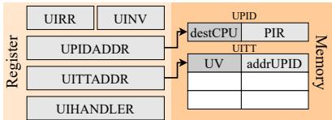  
Figure 7. Key hardware components of the user interrupt.

the user interrupt vector of the IPI. Sending user IPIs requires a new instruction SENDUIPI, which takes as its input operand an index of UITT. To execute SENDUIPI, the hardware first finds the corresponding entry given the specified index. The hardware then finds the target UPID based on addrUPID, modifies the PIR field based on UV to post an interrupt, and delivers the interrupts to the target core based on the destCPU field.

User interrupt delivery. The hardware delivers a user interrupt in two phases: identification (steps 1 and 2 below) and signaling (steps 3 and 4 ).

1 Once a core receives an interrupt, it first checks if the interrupt vector matches the one in UINV. If not, this interrupt is handled as a regular interrupt. 2 Otherwise, the hardware moves the PIR field in UPID to UIRR, raising a pending user interrupt, and clears the PIR field. 3 Next, the core checks if it is in userspace (ring 3). 4 If so, the core executes the interrupt handler whose address is stored in UIHANDLER.

Protection. Hardware only allows privileged software to access the relevant MSRs using WRMSR and RDMSR instructions. Furthermore, the OS must correctly set the page table to prevent userspace processes from modifying UPID and UITT, since otherwise, malicious processes may flood other cores with user IPIs (by, e.g., modifying the destCPU field in UPID).

## 4.2 Enabling Userspace Storage Interrupts

A critical challenge Aeolia encounters is that the current user interrupt feature is not designed for disks. Following §4.1, to deliver disk interrupts as user interrupts, the software must ensure (1) the UINV register matches the disk interrupt vectors to trigger step 1 and (2) the PIR field in the UPID region is filled to trigger step 2 . Meeting the first requirement is simple: the kernel can configure UINV upon AeoDriver initialization and maintain it across thread context switches. However, meeting the second requirement is challenging. The hardware clears the PIR field in step 2 , and thus the userspace interrupt handler must rewrite the PIR field in UPID. However, UPID (or in general all user interrupts hardware state) is designed for kernel access only (§4.1), and thus cannot be modified by the userspace handler. One possible way is to trap into the kernel to rewrite UPID, but this loses much of the performance benefit of kernel bypassing. Indeed, a key reason why a new instruction SENDUIPI is needed is that SENDUIPI performs the checks and sets the PIR field to enable userspace IPIs.

AeoDriver overcomes this challenge by leveraging the fact that UPID is a memory region instead of an MSR. Therefore, upon AeoDriver initialization, the kernel maps the

UPID into the address space of AeoDriver, allowing the interrupt handler to write the UPID directly. This design does not create any security issues since 1) UPID resides in the memory region of the trusted AeoDriver, and 2) AeoDriver is a trusted entity.

Coexisting with other types of userspace interrupts. We next propose a technique that enables AeoDriver to coexist with UIPIs or other userspace device interrupts. With our technique, other userspace device interrupts function well. However, as detailed below, UIPIs may generate a spurious interrupt, and this is a limitation of Aeolia.

Specifically, Aeolia configures these interrupt sources to share the same interrupt vector as the disk. In addition, for device interrupts, Aeolia programs the PIR in the same manner as for the disk. For UIPIs, no special handling of the PIR is required since the SENDUIPI instruction automatically sets the PIR. With the above setup, both device interrupts and UIPIs are delivered to the user interrupt handler.

Due to interrupt vector sharing, the interrupt handler needs to identify the source of an interrupt (i.e., whether it comes from the disk, a UIPI, or other devices). To do so, for I/O devices, the handler checks the hardware completion queues for new entries. For UIPIs, the bit position in the PIR set by SENDUIPI is stored on the stack of the interrupt handler; therefore, the handler can simply check the corresponding location on the stack to identify the source.

The above technique works well for devices. For UIPIs, since 1) SENDUIPI sets another bit in PIR and 2) the hardware triggers the same number of user interrupts as the number of bits set in PIR, our technique causes a spurious interrupt.

## 4.3 AeoDriver Data Structures and Interfaces

The rest of the AeoDriver design is similar to a highperformance userspace storage subsystem, e.g., SPDK, except that it enforces access permissions for protected sharing using a permission table, as detailed next.

The permission table. The permission table is an inmemory bitmap recording, for each block, the read and write access permissions for the current process. The permission table supports conventional abstractions such as disk partitions and is initialized by obtaining relevant information from AeoKern. Other trusted entities can modify the permission table using the provided APIs, as we detail next.

Interfaces. Table 4 shows the interfaces AeoDriver exposes to the upper-level storage stack. Most APIs are straightforward and AeoDriver checks for the access permission based on the permission table upon read/write\_blk. A special case is that AeoDriver exposes interfaces to trusted entities to 1) access or modify blocks bypassing permissions with read/write\_blk\_priv and 2) access or change the block access permissions for the current process with get/set\_perm. The code entry routine rejects untrusted code to invoke these APIs, while the trusted entities can directly invoke these APIs since they are in the same protection domain.

<table><tr><td>Group</td><td>API</td><td>Description</td></tr><tr><td>Device</td><td>①open_device(args，dev) ② close_device(args，dev)</td><td>Initiate disk data structures. Free disk data structures.</td></tr><tr><td>Queue Pair</td><td>③create_qp(args，dev,qp) ④ delete_qp(args，dev，qp)</td><td>Require a qpair form AEOKERN. Release a qpair to AEOKERN.</td></tr><tr><td>DMA Buffer</td><td>③alloc_dma_buf(dev,buf,size) ③ free_dma_buf(dev,buf)</td><td>Allocate data buffers for DMA. Free DMA data buffers.</td></tr><tr><td>I/O Operations</td><td>? read_blk(qp，lba，cnt，buf) ⑧write_blk(qp，lba，cnt，buf)</td><td>Read blocks from the device. Write blocks to the device.</td></tr><tr><td>Privileged I/O</td><td>③read_priv(qp，lba,cnt，buf) @ write_priv(qp，lba,cnt，buf)</td><td>Read blocks with privilege. Write blocks with privilege.</td></tr><tr><td>Permission</td><td>① get_perm(blk,perm) ② set_perm(blk,perm)</td><td>Get block access permissions. Set block access permissions.</td></tr></table>

Table 4. APIs provided by AeoDriver.

## 5 Protecting Trusted Entities with MPK

This section discusses how Aeolia creates trusted entities in the address spaces of untrusted processes using MPK. Background on MPK. Memory protection keys (MPK) [13], supported since Intel Skylake processors [14], enable memory isolation within the same address space. Each page table entry is tagged with a 4-bit to denote up to 16 protection domains. A 32-bit per-core register PKRU controls the access permissions to these protection domains, with each bit denoting a read/write permission to the corresponding domain. Memory access is only permitted when both the page table permissions and the PKRU register allow such access.

A key advantage of MPK is that the page access permissions can be entirely changed in userspace, avoiding the costly mprotect() system call. Specifically, userspace processes can modify the PKRU register with a special instruction WRPKRU, which only costs around 48 cycles on our machine. Protecting trusted entities with MPK. To prevent the trusted entities from being compromised, Aeolia maintains all memory state of the trusted entities within a dedicated MPK protection domain. Therefore, ensuring the integrity of the trusted entities boils down to enforcing the following two invariants: 1 Upon launching an Aeolia application, the trusted entities are correctly set up (i.e., the intended trusted entities are loaded and mapped to the dedicated protection domain), and 2 During runtime, only trusted entities can modify the PKRU register.

I1: Correctly setting up the trusted entities . To enforce this invariant, Aeolia uses code signatures and a privileged launching process. Before launching, a trusted user registers with the kernel the signatures of trusted entities. Upon launching, the privileged launching process verifies that the linked trusted entities match the registered signatures. If so, the launching process mmaps the memory regions of the trusted entities into the dedicated protected domain. Finally, the launching process executes the initialization code of the trusted entities, drops the root privilege, and transfers control to the application’s main function.

I2: Only trusted entities can modify the PKRU register. Aeolia enforces this invariant as follows. First, upon launching, the privileged launching process inspects the binary of the untrusted code to verify that it does not contain WRPKRU instruction. Next, during runtime, Aeolia prevents the untrusted code from inserting WRPKRU via self-modifying code. Specifically, AeoKern intercepts memory-management system calls (e.g., mmap and mprotect) and returns an error if the call makes a page both writable and executable.

Invoking the interfaces exposed by trusted entities. Aeolia enables the untrusted code to invoke trusted entities’ interfaces by including a dedicated entry routine as part of the trusted entities. The entry routine executes WRPKRU to grant access to the dedicated protected domain of the trusted entities, switches the stack to the one used by the trusted entities, and sets up arguments according to the calling convention. Returning from the trusted entity uses another routine that performs the reversed steps.

We note that the MPK-related techniques in this section directly follow prior work [63]. Our contribution lies in applying the techniques to userspace storage stacks, achieving protection on commodity hardware, whereas related work proposes new hardware support, as discussed in §3.3.

## 6 Coordinated Scheduling in Aeolia

This section presents the mechanism (§6.1) and policy (§6.2) that enable coordinated thread scheduling for Aeolia. Our current design aims to demonstrate that thread scheduling is not an inherent disadvantage of userspace storage stacks and, thus, closely mimics the kernel stack.

## 6.1 Scheduling Mechanism

As discussed in §3.3, Aeolia adds scheduling decision points to its trusted entities to yield the core. Linux decides these scheduling decision points in two steps. First, upon events such as I/O interrupts that wake up a thread, the kernel sets a reschedule flag in the currently running thread. Second, when the thread returns from an interrupt or to userspace, the kernel checks the flag and, if set, invokes the scheduler.

To match the first step, Aeolia carefully handles out-ofschedule user interrupts, as we detail next; for the second, Aeolia invokes the scheduler after issuing an I/O request and upon returning from the interrupt handler in AeoDriver or the trusted layer in AeoFS (§7.3).

Out-of-schedule user interrupts. An interesting issue arises with handling out-of-schedule user interrupts, i.e., an interrupt delivered when the user thread is currently not running. The Intel kernel patch [20] handles those by masking such interrupts in the kernel, and thus, the interrupts are only delivered when the target thread resumes execution. However, this approach forgoes a key benefit of interrupts; the thread scheduler does not receive immediate notification when a thread is woken up and no longer blocked by I/O. Hence, this approach renders Aeolia susceptible to the same high tail latency problem as SPDK (§2.1).

Instead, Aeolia handles out-of-schedule interrupts by delivering them into the kernel, and thus correctly sets up the reschedule flag. Aeolia achieves this by assigning different user interrupt vectors for different threads (§4.2), so that the interrupt vector of an out-of-schedule interrupt will always mismatch the current UINV register, thus delivered to the kernel as a regular interrupt ( 1 in §4.1).

```python
1 # Called at Aeolia scheduling points
2 # @sched_info: Read-only scheduling state exposed by BPF maps.
3 def user_try_yield(sched_info):
4 if sched_info.nr_running > 1: # There are other tasks
5 curr_info = sched_info.current # Read current state
6 cand_info = sched_info.candidate
7 exec_time = now() - curr_info.exec_start
8 # Simulate scheduling state update based on execution
9 # time and scheduling policy
10 # (e.g., vruntime and deadline for EEVDF)
11 mock_update_curr(curr_info, cand_info, exec_time)
12 # Simulate scheduling policy
13 if need_resched(curr_info, cand_info):
14 sched_yield() # Voluntarily yield the CPU
```  
Figure 8. Pseudocode of Aeolia’s yield.

This approach introduces another interesting issue. Since the storage stack is in userspace, the kernel interrupt handler cannot handle I/O, and thus, Aeolia must still invoke the userspace interrupt handler. Setting hardware in the kernel to redeliver the user interrupt incurs another interrupt overhead of 0.6??s. Instead, Aeolia changes the saved register and stack context of the target thread to insert a stack frame for the userspace interrupt handler. Therefore, upon returning from the kernel, the target thread first executes the userspace interrupt handler and returns to the point where it traps.

## 6.2 Scheduling Policy

As discussed in §3.3, to enable Aeolia to yield only necessary, Aeolia leverages sched\_ext. The sched\_ext is a very recent feature supported since the release of Linux 6.12 in November 2024. sched\_ext enables users to define custom kernel thread scheduling policies by exposing a set of hookpoint functions, each triggered by a specific scheduling event. sched\_ext is implemented using eBPF [3], which allows safe and efficient injection of a custom scheduling policy into the kernel without modifying the kernel scheduler code.

With sched\_ext, Aeolia uses as its scheduling policy the Earliest Eligible Virtual Deadline First (EEVDF) policy in the latest Linux kernel. Aeolia maintains the same scheduler state as EEVDF in eBPF maps (e.g., run queue, virtual runtime, number of runnable threads, deadline) and implements the same scheduling policy at each scheduling hook function as EEVDF. Next, Aeolia exposes the scheduling state in eBPF maps to its trusted entities.

Enabled by the above, as shown in Figure 8, Aeolia yields the core only when necessary. At each scheduling design point, the function inspects the scheduling state exposed by the kernel (lines 4-7, e.g., the number of runnable tasks and the candidate task’s priority or deadline). If multiple tasks are runnable and the policy demands a rescheduling (lines 11-13), it calls sched\_yield() to enter the kernel for the actual task switch (line 14). Otherwise, it continues execution in user space, minimizing unnecessary kernel crossings.

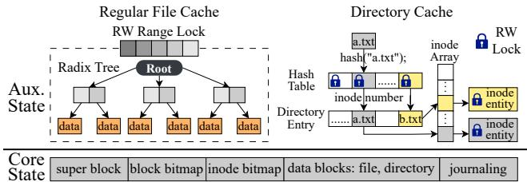  
Figure 9. AeoFS state.

## 7 AeoFS Design

This section presents AeoFS, a highly scalable POSIX-like library file system building on top of AeoDriver. AeoFS borrows the key insight of state separation from Trio (§7.1) but comes with a different design to better suit modern NVMe disks (§7.2). AeoFS further introduces eager integrity checking (§7.3) and ensures crash consistency via journaling (§7.4).

## 7.1 The Trio Architecture and Its Limitations

AeoFS builds on top of the key insight from Trio [73], a library file system (LibFS) architecture originally designed for non-volatile main memory (NVMM). The key insight is that the file system state can be separated into core state and auxiliary state. The core state contains critical metadata that must never be lost (e.g., access permissions) and is stored in a simple, fixed layout shared by all LibFS instances to enforce integrity. The auxiliary state (e.g., caches, file descriptors) is private to each LibFS instance, can be freely customized, and can be rebuilt from the core state.

Leveraging this key insight, Trio employs a trusted verifier to lazily maintain metadata integrity. Specifically, Trio enables each LibFS to modify metadata directly. A privileged trusted verifier is invoked to check for metadata corruption when a LibFS releases a file to the kernel. If the check fails, Trio rolls back the file state to a previous checkpoint conducted when a LibFS acquires the file.

However, directly adopting Trio for AeoFS on NVMe SSDs presents two challenges. First, Trio’s state organization is tailored for NVMM and assumes MMU-based access control, making it ill-suited for block devices that require different protection mechanisms. Second, the lazy verification approach postpones metadata integrity validation. This requires a careful design of the verifier to ensure correctness. Furthermore, if the verification fails, all updates since the previous checkpoint are lost.

## 7.2 Scalable Data Structures for NVMe

Core state. Figure 9 shows the on-disk core state of AeoFS, consisting of a superblock, inode/block usage bitmaps, an inode table, data blocks, and dedicated journaling regions, similar to ext4. A file consists of index blocks and data blocks. Each entry of an index block points to a data block, with the last entry pointing to the next index block. The file records the first index block in its inode. A directory stores directory entries in its data blocks; each entry contains the file’s inode number, the file name, name length, and the entry size.

Scalable auxiliary state. The in-memory auxiliary state contains all state related to file descriptors and three caches: page cache, directory entry cache, and inode cache. AeoFS maintains a per-core file descriptor allocator to maximize performance. Each regular file consists of a page cache where AeoFS uses a radix tree to map file offset to a cached data page. The page cache is protected with a readers-writer range lock, allowing concurrent reads on the same pages and concurrent writes to disjoint pages. For each directory, AeoFS uses a resizable chained concurrent hash table to map a file name to the cached directory entry. Each bucket in the hash table is associated with a readers-writer lock, allowing concurrent reads from the directory while minimizing contention for file inserts/deletes. Finally, AeoFS caches inode state in memory, where each inode entry is protected with a dedicated readers-writer lock.

Discussion. Our state design targets block devices, differing from Trio, which targets NVMM, in the following way. Since NVMM relies on MMU to enforce access permissions, to support direct userspace handling of stat and create, Trio colocates the inode of a file with its directory entry. This design complicates supporting certain file system features (“.”, “..”, hard links). As detailed in the next subsection, our design uses software trusted entities to enforce access permissions, thus avoiding these issues.

## 7.3 Ensuring File System Integrity

Eager integrity checking. AeoFS performs eager metadata integrity checks rather than the lazy style adopted in Trio and Recon [30], thereby overcoming the aforementioned limitations (§7.1). This is enabled by Aeolia’s technique (§5) to introduce trusted entities. Specifically, AeoFS consists of a trusted layer, which maintains core state and is protected from the untrusted code. The rest of AeoFS forms an untrusted layer, which maintains auxiliary state. The untrusted layer accesses the core state only through the well-defined interfaces exposed by the trusted layer (Table 5).

Upon each interface invocation, the trusted layer performs the same set of validations as a kernel file system to ensure the operation does not violate metadata integrity. Some critical checks include: (1) for all operations, verifying that the caller has the right permission (2) for update\_inode, checks that the field is valid (e.g., the file type must be either a directory or a regular file) (3) for create\_in\_dir, checks that the new directory entry is valid (e.g., the new entry does not share the same name as another entry under the same directory) (4) for remove\_dir and rename, checks that the directory hierarchy remains a connected tree without dangling files or forming a cycle.

With this design, AeoFS provides the same metadata consistency guarantees as a kernel file system: a malicious process may corrupt only its private auxiliary state, but not the shared core state, and thus cannot affect other processes.

<table><tr><td>Group</td><td>API</td><td>Description</td></tr><tr><td rowspan="4">Inode State</td><td>①query_inode(inode) ② query_index_page(inode)</td><td rowspan="4">Read an inode information. Read a index page of a file. Read a dentry page of a directory.</td></tr><tr><td></td></tr><tr><td>③query_dentry_page(inode)</td></tr><tr><td>④ update_inode(inode，field,value) Update a field of an inode. ③ sync(void) Write all core state to disk.</td></tr><tr><td rowspan="2">File Operations</td><td>⑥truncate_file(file,length)</td><td rowspan="2">Decrease file length. Increase file length.</td></tr><tr><td>? append_file(file,length)</td></tr><tr><td rowspan="2">Dir Operations (</td><td>③create_in_dir(dir,inode)</td><td rowspan="2">Create a file/dir ina directory. remove a file/dir ina directory. rename a file/dir.</td></tr><tr><td>⑨remove_in_dir(dir,inode) @ rename(o_dir,o_inode,n_dir)</td></tr></table>

Table 5. APIs provided by the file system trusted layer.

AeoFS performs eager checking for the following reasons. First, unlike lazy checking, eager checking is easier to reason about correctness and avoids progress loss. Second, due to in-memory caching, handling fsync in an SSD file system is more convoluted than in an NVMM file system, which almost forgoes caching [28, 64, 72, 73]. Adding the complicated integrity checks exacerbates the already error-prone and lengthy handling of fsync [30]. The tradeoff is that, during normal operation, eager checking may require a domain switch to the trusted entity (§5), but this only incurs a small 85-cycle overhead.

Handling file system operations. Upon initialization, the trusted layer sets the permission table in AeoDriver (§4.2) to prevent the untrusted layer from accessing any block in the file system. During normal operations, the untrusted layer handles file system operations with its cached state. It invokes the trusted layer upon 1) cache misses to read core state or 2) operations involving modifying core state (e.g., creating a file).

The trusted layer maintains its own inode and directory entry cache. For each access, it checks 1) the access permissions with the inode cache, and 2) metadata integrity violation (e.g., introduces a loop in the directory tree) with both caches. If the check passes, for read accesses, the trusted layer invokes AeoDriver to handle them; for write requests, the trusted layer prepares in-memory journal entries.

## 7.4 Crash Consistency

Crash consistency mode. AeoFS follows the ordered mode, the default option in ext4. Only metadata is journaled, and the relevant file data persists on the disk before metadata journaling. AeoFS follows ext4 on fsync semantics [10, 61] by persisting both the specified file and all in-memory journals. This aligns with the goal of simplifying handling fsync behind eager integrity checking. We test AeoFS’ crash consistency with unit tests during development but do not evaluate it with testing frameworks such as CrashMonkey [52].

Crash consistency mechanism. AeoFS uses the standard block-level physical redo journaling. Only the trusted layer handles journaling, preparing in-memory journal entries upon requests to modify core state. The trusted layer reuses locks in its caches to serialize concurrent writes to the same file. A start and a commit block are added to journal transactions bigger than the block size. To maximize scalability,

AeoFS employs per-thread journaling, where each transaction is timestamped by rdtsc.

Upon fsync, the untrusted layer persists all the dirty pages in its cache and enters the trusted layer to commit the journal. A critical challenge in prior per-core journaling design [22, 41] is to correctly handle journals writing to the same block from different cores. Since fsync flushes all inmemory journals, AeoFS resolves this issue by locking every per-thread journaling region, merging transactions writing to the same block on their timestamp, and then committing them. Upon a crash, the committed journal is replayed.

## 8 Implementation

We implement Aeolia in the Linux 6.12.20 kernel. The AeoKern, AeoDriver, and AeoFS have 3992, 1889, and 11870 lines of code, respectively. Our implementation fulfills all the presented design, except for the I1 part in §5; we have not implemented the code for signature registration and the privileged launching process. Rather, we directly map the memory state of the trusted entities to the dedicated protection domain. We believe that there are no inherent challenges to the implementation, but rather that it requires more engineering efforts.

Validating Aeolia Protection. To validate the protection, we simulate malicious and buggy applications by handcrafting 96 attacks , which stress all Aeolia’s trusted entities: AeoKern, AeoDriver, and the trust layer of AeoFS. In all test cases, Aeolia successfully defends from the attacks.

These attacks are conducted by the untrusted part of the process, with the goal of bypassing the protection in the trusted layer. Specifically, the untrusted code performs two categories of attacks: (i) Access violations, such as directly modifying queue pair or user interrupt data structures (e.g., UPID); (ii) File system corruptions, such as creating files with illegal names (e.g., containing “/”) or forming cyclic or disconnected directory structures.

## 9 Evaluation

## 9.1 Evaluation Setup

Environment. Our experiment machine has four NUMA nodes equipped with 128-core Xeon Platinum 8592 processors and an Intel Optane SSD P5800X SSD [36]. We note that Aeolia supports all NVMe SSDs and does not rely on any Optane-specific features. Rather, we choose Optane since it represents the worst case for Aeolia: its low access latency maximizes the impact of Aeolia’s interrupt overhead. The system runs Ubuntu 22.04 and Linux kernel 6.12.20. We disable hyperthreading, turbo boost, and power saving mode to obtain stable results.

Baseline. We compare AeoDriver with SPDK [62] and two variances of the Linux kernel stack: POSIX (the default POSIX interfaces), and io\_uring [9]. We tune the performance of the kernel stack by enhancing it with blk-switch [34] and disabling KPTI. We compare AeoFS with uFS [48], ext4 [4], and f2fs [44]. uFS is a research file system, while the other two are mature kernel file systems. All evaluated systems use the default configuration.

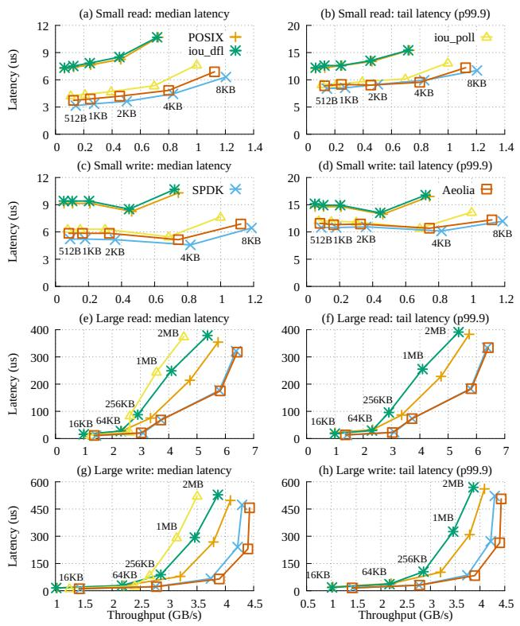  
Figure 10. Single thread performance of storage subsystems.

Workload. We use fio [6] to stress both the storage subsystem and the file system by simulating both throughputbound and latency-critical I/O tasks. We use FxMark [51] to evaluate the multicore scalability of the file systems. We use as file system macrobenchmarks Webserver, Fileserver, Webproxy, and Varmail in Filebench [5] and LevelDB [11].

## 9.2 AeoDriver Performance

Single-thread performance. Figure 10 shows the singlethread performance of AeoDriver with increasing I/O sizes. With small access sizes, AeoDriver significantly outperforms the conventional interrupt-based kernel storage stacks. Specifically, with the 512B size, compared to POSIX, Aeo-Driver achieves 2× higher throughput, 48% lower median latency and 26% lower tail latency. With a larger size of 8KB, AeoDriver achieves 1.54× higher throughput, 36% lower median latency, and 21% lower tail latency.

AeoDriver delivers similar performance to SPDK across most I/O sizes, except for small requests below 4KB. In the worst case, with 512B read, AeoDriver incurs 10.7% lower throughput, 18.2% higher median latency, and 6.1% higher tail latency. This is because the interrupt overhead (0.6??s) becomes non-negligible compared to the access latency (3.2??s).

For larger I/O size, we omit the tail latency iou\_poll from the figure since it is significantly larger than the others (4 ms to 6 ms with access size larger than 128 KB). AeoDriver and

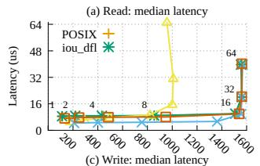

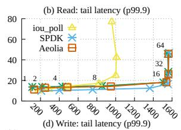

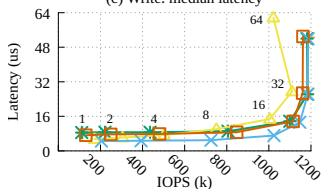

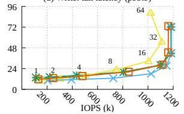  
Figure 11. Multi-thread performance of storage subsystems.

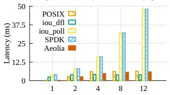

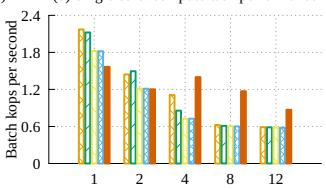

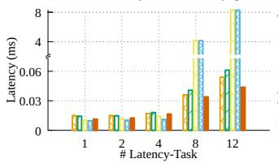

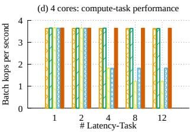  
Figure 12. I/O-intensive task and compute-intensive task co-run.

SPDK saturate the disk write performance with 1MB access size, while others cannot. In general, AeoDriver outperforms POSIX by 1.1× to 1.36× in throughput, 10% to 27% in median latency, and 10% to 20% in tail latency.

We note that, in some cases, AeoDriver also slightly outperforms SPDK. We believe that this small improvement is not inherent, but rather due to reasons such as the memory alignment in AeoDriver happens to fit the cache better.

The results conform to our analysis §2, AeoDriver outperforms kernel storage stack, due to eliminating layering and kernel trapping overhead, while performing slightly worse than SPDK, due to the small overhead incurred by interrupt. Multi-thread performance. Figure 11 shows the multithread performance with 4KB I/O size. AeoDriver and SPDK scale well, saturating the disk with 8 threads. POSIX and io\_uring have comparable performance. AeoDriver outperforms POSIX/io\_uring by up to 1.18×, respectively. iou\_poll shows a performance bottleneck with 16 threads.

Summary. Across various I/O sizes and thread counts, interrupt-based AeoDriver consistently outperforms Linux, due to direct disk access, and performs similarly to SPDK.

## 9.3 Coordinated Scheduling with Different Tasks

This subsection evaluates whether Aeolia meets its coordinated scheduling design goals (§3.1). Figure 12 shows 1 and 4 cores running latency-critical (LC) I/O tasks (I/O size: 4KB,

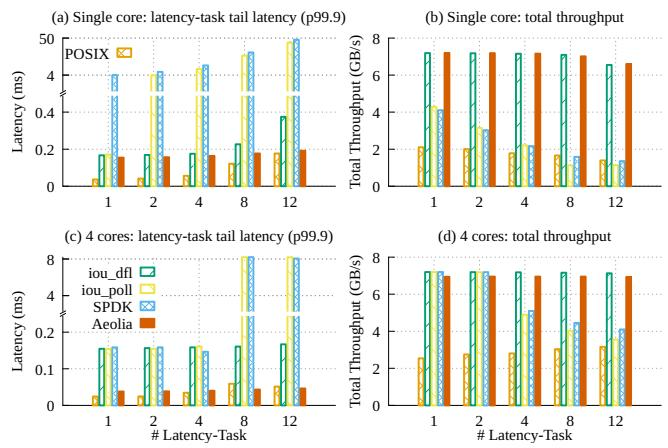  
Figure 13. Latency-task and throughput-task co-run.

I/O depth: 1) with one compute-intensive task (swaptions in PARSEC, following prior work [53]). Figure 13 shows 1 and 4 cores running LC tasks with one throughput-intensive(TP) task (I/O size: 64KB, I/O depth: 16).

As expected, the interrupt-based storage stacks perform better than polling ones. Polling-based methods suffer significant tail latency (4ms at 1 LC task and 48ms at 12 LC tasks on a single core), while interrupt-based ones keep low tail latency. AeoDriver outperforms iou\_poll/SPDK by 8.18× to 291.72× when running LC tasks and compute-intensive tasks, and 1.11× to 250.5× when running LC and TP tasks.

AeoDriver, like kernel storage stacks, avoids CPU contention, while outperforming them due to direct device access. For running I/O tasks and compute-intensive tasks, with LC tasks increasing, AeoDriver outperforms POSIX and io\_uring by up to 1.28× for I/O tasks and 1.95× for computeintensive tasks. For running LC and TP tasks, AeoDriver achieves throughput comparable to io\_uring, while reducing tail latency by 9.8% to 48.9%. AeoDriver outperforms POSIX by 1.3× to 3.7× in total throughput.

These results meet our expectations. With polling, the high tail latency of LC tasks is because the thread is preempted just after it sends a request, and thus, the thread has to wait for one or several time slices to handle the sent request. In addition, with polling, compute tasks and TP tasks suffer because they get less CPU time due to cycle waste in LC tasks. Interrupt does not suffer from these limitations, leading to better performance. Aeolia further outperforms io\_uring and POSIX, since its software overhead is smaller, thereby achieving lower tail latency while also granting more time for other tasks (since, for the same amount of I/O, less time is wasted in the storage stack).

Summary. Aeolia efficiently coordinates scheduling, significantly outperforming polling-based stacks with user interrupts and kernel stacks with lower software I/O overhead.

## 9.4 AeoFS Performance

This subsection evaluates whether Aeolia enables a highperformance, scalable, and protected file system design. All the reported results of AeoFS include the overhead of checking metadata integrity and journaling.

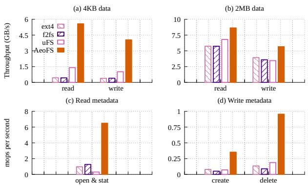  
Figure 14. Single-thread performance of evaluated file systems.

Single-thread performance. Figure 14 shows the singlethread performance of the evaluated file systems. With a 4KB access size, AeoFS outperforms ext4 and f2fs by up to 12.6× and 12.8×, respectively, primarily due to direct userspace access that avoids the kernel overhead. AeoFS also outperforms uFS by 3.96× and 4× in read and write operations, respectively, by eliminating the overhead of IPC. With the 2MB access size, AeoFS outperforms ext4 and f2fs by up to 1.6×. This is because the increased I/O size reduces the frequency of kernel layering and scheduling for ext4 and f2fs.

Metadata workloads include opening and stating a file in a five-level directory, creating an empty file, and deleting files in a directory. AeoFS outperforms ext4, f2fs, and uFS by up to 7.1×, 10.6× and 21.3×, respectively. uFS suffers from performance degradation due to its frequent IPCs.

Multi-thread performance. Figure 15 and Figure 16 show the multi-thread performance of the evaluated file systems on data and metadata workloads. For data operations, AeoFS scales effectively with increasing threads, while all other file systems suffer from severe scalability bottlenecks. For example, under a 2MB write workload with 64 threads, AeoFS outperforms ext4, f2fs, and uFS by 19.1×, 28.9×, and 8.4×, respectively. For both 4KB and 2MB access, ext4 and f2fs suffer from severe scalability issues due to well-known bottlenecks in the VFS layer [51]. uFS shows limited performance under 4KB accesses, due to its frequent IPCs.

For metadata scalability, we show key ones in FxMark, including that each thread 1 opens a private/random/same file in five-depth directories (MRPL/MRPM/MRPH); 2 unlinks an empty file in a private/shared directory (MWUL/MWUM); 3 creates an empty file in a private/shared directory (MWCL/MWCM), and 4 renames a file to a private/shared directory (MWRL, MWRM). We omit the rest due to space limitations; AeoFS achieves similar scalability results as the key ones.

Both ext4 and f2fs suffer from severe scalability bottlenecks due to coarse-grained kernel locking, such as global locks on the directory cache, inode cache, and directory inodes. uFS, by design, delegates all directory-related metadata operations to a single primary worker (§2.2). As a result, its throughput does not increase with more threads.

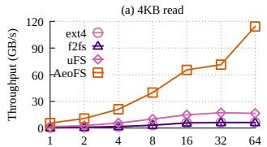

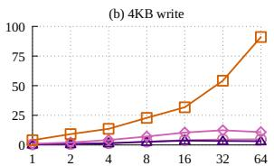

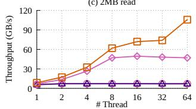

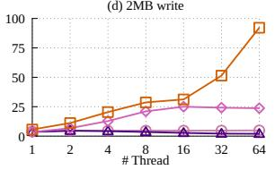

Figure 15. Multi-thread performance of evaluated file systems.  
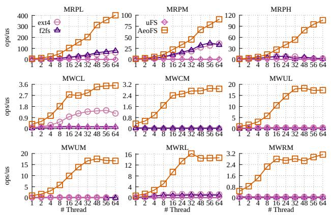

Figure 16. Metadata scalability of evaluated file systems.
<table><tr><td></td><td>ext4</td><td>f2fs</td><td>AEoFS</td><td>uFS</td></tr><tr><td>4KB append</td><td>0.76 GiB/s</td><td>0.75 GiB/s</td><td>1.12GiB/s</td><td>2.74GiB/s</td></tr><tr><td>Create</td><td>42 kop/s</td><td>30 kop/s</td><td>58 kop/s</td><td>254 kop/s</td></tr><tr><td>Remove</td><td>115 kop/s</td><td>85 kop/s</td><td>132 kop/s</td><td>186 kop/s</td></tr></table>

Table 6. Performance of AeoFS when two threads concurrently update the same file.

AeoFS scales well across all metadata operations. For example, in the case of creating files in private directories, AeoFS outperforms ext4, f2fs, and uFS by 2.8×, 21.9×, and 31.9×, respectively. AeoFS eventually encounters scalability bottlenecks. Further analysis reveals that the bottleneck is the hash rehashing and contention on the dentry hash.

File sharing cost When multiple untrusted applications concurrently update a file, AeoFS incurs a sharing overhead due to the need to rebuild the file’s auxiliary state and perform an immediate fsync after each operation. We evaluate this overhead using three workloads. Two applications concurrently: (1) append 4KB to a file to 1GB, (2) create 10,000 empty files in a shared directory, and (3) delete 10,000 files from a shared directory. Table 6 presents the results. While AeoFS still outperforms ext4 and f2fs by up to 1.5× and 1.9×, respectively, it falls behind uFS in all three cases. This is because uFS, with its centralized design, avoids the synchronization overhead.

<table><tr><td>Name</td><td>#Files</td><td>Avg. file size</td><td>I/O size (r/w)</td><td>R/W</td></tr><tr><td>Fileserver</td><td>10K</td><td>1MB</td><td>1MB/1MB</td><td>1:2</td></tr><tr><td>Webserver</td><td>10K</td><td>1MB</td><td>1MB／256KB</td><td>10:1</td></tr><tr><td>Webproxy</td><td>50K</td><td>512KB</td><td>1MB／16KB</td><td>5:1</td></tr><tr><td>Varmail</td><td>100K</td><td>16KB</td><td>1MB／16KB</td><td>1:1</td></tr></table>

Table 7. Filebench workloads configurations

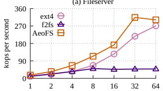

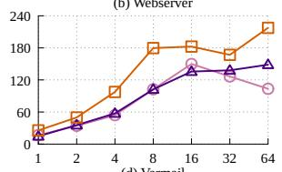

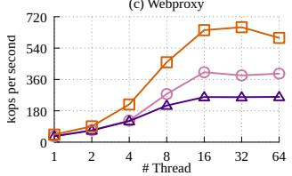

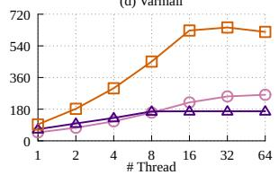  
Figure 18. Filebench results.

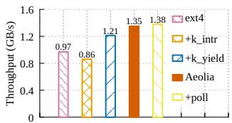  
Figure 17. Aeolia breakdown.

immediately followed by an fsync to ensure data persistence. We compare Aeolia with using polling instead of user interrupt (+poll), using user interrupt but yielding to kernel idle task (+k\_yield), and using kernel interrupt (+k\_intr). The results prove our analysis in §2.1, showing that, with a suitable scheduling policy, polling offers only little performance improvements over interrupts. The kernel scheduler’s suboptimal policy leads to a performance degradation of 10.6%. The poor performance of the kernel interrupt is primarily due to the overhead of forwarding kernel interrupts to userspace, i.e., via eventfd, as previously reported in [46].

Macrobenchmarks performance. We use Fileserver, Webserver, Webproxy, and Varmail in Filebench with the configuration shown in Table 7. With our setup, we were unable to reproduce stable runs of uFS, likely due to configuration differences. Figure 18 shows the result. AeoFS outperforms ext4 and f2fs by up to 3.1× and 6.6×, respectively.

To provide a fairer comparison, we further evaluate AeoFS using the configuration parameters provided in the uFS repository, in which Varmail and Webserver are executed with smaller workloads. As shown in Figure 19, under these settings, AeoFS outperforms uFS by up to 1.33×.

We evaluate LevelDB using db\_bench with its default configuration. It runs with a single thread and populates the database with one million key-value pairs. Except for the Fill100K test, all other tests use the default value size of 100 bytes. As shown in Table 8, AeoFS outperforms ext4, f2fs,

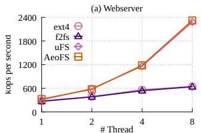

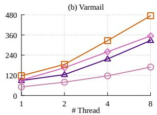

Figure 19. Filebench results under uFS setups.
<table><tr><td>Throughput(ops/ms)</td><td>ext4</td><td>f2fs</td><td>uFS</td><td>AEoFS</td></tr><tr><td>Fill 100K</td><td>3.33</td><td>3.32</td><td>0.73</td><td>5.98</td></tr><tr><td>Fill 1 sequential</td><td>649</td><td>540</td><td>1,028</td><td>1,829</td></tr><tr><td>Fill sync</td><td>19</td><td>19</td><td>19</td><td>55</td></tr><tr><td>Fill random</td><td>492</td><td>425</td><td>339</td><td>686</td></tr><tr><td>Read random</td><td>203</td><td>196</td><td>372</td><td>419</td></tr><tr><td>Delete random</td><td>537</td><td>470</td><td>852</td><td>1,543</td></tr></table>

## Table 8. LevelDB Throughput

and uFS by up to 2.9×, 3.4×, and 8.2×, respectively. uFS performs poorly in the Fill100K test due to frequent file append operations. Since uFS exhibits limited performance in metadata operations, such workloads incur significant overhead. Summary. Aeolia enables a file system that achieves low latency, high throughput, and great multicore scalability.

## 10 Discussion

Relevance under hardware trends. Existing low-latency SSDs still exhibit a latency of around 5 ??s, making the interrupt overhead imposed by Aeolia insignificant. While the latency of modern SSDs is expected to decrease, we believe that the interrupt overhead will follow, making Aeolia stay relevant. For instance, recent work [21] proposes techniques that reduce interrupt overhead to less than 250 CPU cycles, further narrowing the gap between interrupts and polling. Generality beyond storage. Although Aeolia focuses on storage, we believe that its techniques are generally applicable to other domains. For example, we have verified that the techniques presented in §4.2 can deliver NIC interrupts to userspace. Aeolia’s protection and scheduling techniques are also applicable to a networking stack. We view Aeolia as a first step towards a complete kernel-bypassing solution, potentially leading to a unified userspace I/O stack spanning both storage and networking.

## 11 Related Work

High-performance storage stacks. blk-switch [34] is a recent advancement for kernel storage stacks. It rearchitects the Linux block layer similarly to a networking switch, introducing per-core multi-egress queues. blk-switch prioritizes scheduling latency-sensitive requests and leverages fine-grained request steering and coarse-grained application steering for load balancing, thereby minimizing head-of-line blocking to achieve both low latency and high throughput. XRP [71] optimizes the traditional kernel storage stack by reducing kernel trapping and layering overhead. Specifically,

XRP allows applications to register user-defined storage functions (e.g., index lookups or aggregations), which are executed directly inside the NVMe driver. By propagating kernel state to the driver, XRP preserves file system semantics while safely bypassing most layers of the kernel storage stack. Unlike the aforementioned prior work, Aeolia focuses on userspace interrupt-based stacks with direct device access and trusted entities, tackling the challenges of achieving userspace isolation and coordination.

Prior works utilizing user interrupts. xUI [21] extends existing hardware with a tracked interrupt mechanism that reduces delivery cost, hardware safepoints for precise preemption, kernel-bypass timers that avoid expensive OS mechanisms, and interrupt forwarding that delivers device events directly to user threads. Much other prior related work focuses on userspace thread scheduling [31, 33, 37, 46, 47]. For example, LibPreemptible [46] proposes a high-performance user-level timer by polling the timestamp counter and using SENDUIPI as a deadline notification mechanism. Skyloft [37] is a concurrent work with Aeolia that delivers timer interrupts directly to userspace entities. The techniques to enable userspace device interrupts in Skyloft and Aeolia differ, but we believe they are, in essence, identical.

## 12 Conclusion

This paper presents Aeolia, a userspace interrupt-based storage stack that achieves high I/O performance with direct userspace accesses while enabling multiple untrusted tasks to 1 securely share a disk and 2 efficiently share a CPU core. Aeolia represents a new point in the design space previously considered unfeasible. Aeolia is motivated by our findings that interrupts outperform polling in many aspects, with only a slight I/O performance disadvantage. The design of Aeolia overcomes several disadvantages previously viewed as inherent in userspace storage stacks, including delivering storage interrupts to userspace, adding trusted entities for protected sharing, and using sched\_ext to coordinate with kernel schedulers. We further design AeoFS, a high-performance POSIX-like generic file system with excellent scalability. Our evaluation shows that AeoDriver performs similarly to SPDK for individual tasks, outperforms SPDK by 291× upon core sharing. AeoFS consistently outperforms other file systems by several orders of magnitude. Our artifact is publicly available at https://github.com/TELOSsyslab/Aeolia.

## Acknowledgment

We sincerely thank our shepherd, Xu Zhao, and the anonymous reviewers for their insightful and constructive comments. This work is mainly supported by the National Key Research and Development Program of China under Grant No. 2023YFB4502702, and by the National Science Foundation of China (Nos. 62032001, 62032008, 62372011). Diyu Zhou is the corresponding author.

## References

[1] Alibaba Block Traces. https://github.com/alibaba/block-traces.

[2] Permission Overlay Extension. https://lore.kernel.org/ linux-arm-kernel/20230927140123.5283-1-joey.gouly@arm.com/.

[3] extended Berkeley Packet Filter. https://ebpf.io/.

[4] ext4(5) — Linux manual page. https://man7.org/linux/man-pages/ man5/ext4.5.html.

[5] Filebench - A Model Based File System Workload Generator . https: //github.com/filebench/filebench.

[6] Flexible I/O Tester. https://github.com/axboe/fio.

[7] Scheduling at Scale: eBPF Schedulers with Sched\_ext. https://www. usenix.org/conference/srecon24emea/presentation/hodges.

[8] CPU Idle Time Management. https://docs.kernel.org/admin-guide/ pm/cpuidle.html.

[9] io\_uring. https://man7.org/linux/man-pages/man7/io\_uring.7.html.

[10] JBD2 source code. https://github.com/torvalds/linux/tree/master/fs/ jbd2.

[11] LevelDB. https://github.com/google/leveldb.

[12] The extensible scheduler class. https://lwn.net/Articles/922405/.

[13] Intel® 64 and IA-32 Architectures Software Developer’s Manual, . https://www.intel.com/content/www/us/en/developer/articles/ technical/intel-sdm.html.

[14] Memory Protection Keys for Userspace, . https://www.kernel.org/doc/ Documentation/x86/protection-keys.txt.

[15] Standard Extensions - RISC-V. https://en.wikichip.org/wiki/risc-v/ standard\_extensions.

[16] x86 User Interrupts support, . https://lwn.net/Articles/869140/.

[18] BlobFS (Blobstore Filesystem), . https://spdk.io/doc/blobfs.html.

[17] User Interrupts - A faster way to signal, . https://lpc.events/event/ 11/contributions/985/attachments/756/1417/User\_Interrupts\_LPC\_ 2021.pdf.

[19] SPDK Spinlocks Introduction, . https://spdk.io/spdk\_spinlock/2023/ 01/04/spdk\_lock/.

[20] uintr linux kernel. https://github.com/intel/uintr-linux-kernel.

[21] B. Aydogmus, L. Guo, D. Zuberi, T. Garfinkel, D. Tullsen, A. Ousterhout, and K. Taram. Extended User Interrupts (xUI): Fast and Flexible Notification without Polling. In Proceedings of the 30th ACM International Conference on Architectural Support for Programming Languages and Operating Systems (ASPLOS), Rotterdam, Netherlands, Mar. 2025.

[22] S. S. Bhat, R. Eqbal, A. T. Clements, M. F. Kaashoek, and N. Zeldovich. Scaling a File System to Many Cores Using an Operation Log. In Proceedings of the 26th ACM Symposium on Operating Systems Principles (SOSP), Shanghai, China, Oct. 2017.

[23] A. M. Caulfield, T. I. Mollov, L. A. Eisner, A. De, J. Coburn, and S. Swanson. Providing Safe, User Space Access to Fast, Solid State Disks. In Proceedings of the 17th ACM International Conference on Architectural Support for Programming Languages and Operating Systems (ASPLOS), London, UK, Mar. 2012.

[24] H. Chen, C. Ruan, C. Li, X. Ma, and Y. Xu. SpanDB: A Fast, Cost-Effective LSM-tree Based KV Store on Hybrid Storage. In Proceedings of the 19th USENIX Conference on File and Storage Technologies (FAST), Virtual, Feb. 2021.

[25] Y. Chen, Y. Lu, B. Zhu, A. C. Arpaci-Dusseau, R. H. Arpaci-Dusseau, and J. Shu. Scalable Persistent Memory File System with Kernel-Userspace Collaboration. In Proceedings of the 19th USENIX Conference on File and Storage Technologies (FAST), Virtual, Feb. 2021.

[26] L. Delshadtehrani, S. Canakci, M. Egele, and A. Joshi. Sealpk: Sealable Protection Keys for RISC-V. In Proceedings of the 24th Design, Automation and Test in Europe Conference (DATE), Virtual, Feb. 2021.

[27] D. Didona, J. Pfefferle, N. Ioannou, B. Metzler, and A. Trivedi. Understanding Modern Storage APIs: A Systematic Study of libaio, SPDK, and io\_uring. In Proceedings of the 15th ACM International Conference on Systems and Storage (SYSTOR), Haifa, Israel, June 2022.

[28] M. Dong, H. Bu, J. Yi, B. Dong, and H. Chen. Performance and Protection in the ZoFS User-space NVM File System. In Proceedings of the 27th ACM Symposium on Operating Systems Principles (SOSP), Ontario, Canada, Oct. 2019.

[29] J. Fried, G. I. Chaudhry, E. Saurez, E. Choukse, Í. Goiri, S. Elnikety, R. Fonseca, and A. Belay. Making kernel bypass practical for the cloud with junction. In Proceedings of the 21st USENIX Symposium on Networked Systems Design and Implementation (NSDI), Santa Clara, CA, Apr. 2024.

[30] D. Fryer, K. Sun, R. Mahmood, T. Cheng, S. Benjamin, A. Goel, and A. D. Brown. Recon: Verifying File System Consistency at Runtime. In Proceedings of the 10th USENIX Conference on File and Storage Technologies (FAST), San JOSE, CA, Feb. 2012.

[31] L. Guo, D. Zuberi, T. Garfinkel, and A. Ousterhout. The Benefits and Limitations of User Interrupts for Preemptive Userspace Scheduling. In Proceedings of the 22nd USENIX Symposium on Networked Systems Design and Implementation (NSDI), Philadelphia, PA, Apr. 2025.

[32] Q. Huai, W. Hsu, J. Lu, H. Liang, H. Xu, and W. Chen. XFUSE: An Infrastructure for Running Filesystem Services in User Space. In Proceedings of the 2021 USENIX Annual Technical Conference (ATC), Virtual, July 2021.

[33] K. Huang, J. Zhou, Z. Zhao, D. Xie, and T. Wang. Low-Latency Transaction Scheduling via Userspace Interrupts: Why Wait or Yield When You Can Preempt? Proceedings of the ACM on Management of Data, 2025.

[34] J. Hwang, M. Vuppalapati, S. Peter, and R. Agarwal. Rearchitecting Linux Storage Stack for ??s Latency and High Throughput. In Proceedings of the 15th USENIX Symposium on Operating Systems Design and Implementation (OSDI), Virtual, July 2021.

[35] Intel. Intel and Micron Produce Breakthrough Memory Technology, . https://www.intc.com/news-events/press-releases/detail/324/ intel-and-micron-produce-breakthrough-memory-technology.

[36] Intel. Intel Optane SSD DC P5800X Series, . https: //www.intel.com/content/www/us/en/products/sku/201840/ intel-optane-ssd-dc-p5800x-series-3-2tb-2-5in-pcie-x4-3d-xpoint/ specifications.html.

[37] Y. Jia, K. Tian, Y. You, Y. Chen, and K. Chen. Skyloft: A General High-Efficient Scheduling Framework in User Space. In Proceedings of the 30th ACM Symposium on Operating Systems Principles (SOSP), Texas, USA, Nov. 2024.

[38] S. Kannan, A. C. Arpaci-Dusseau, R. H. Arpaci-Dusseau, Y. Wang, J. Xu, and G. Palani. Designing a True Direct-Access File System with DevFS. In Proceedings of the 16th USENIX Conference on File and Storage Technologies (FAST), Oakland, CA, Feb. 2018.

[39] L. Kernel. Journal (jbd2). https://www.kernel.org/doc/html/latest/ filesystems/ext4/journal.html.

[40] H.-J. Kim, Y.-S. Lee, and J.-S. Kim. NVMeDirect: A User-space I/O Framework for Application-specific Optimization on NVMe SSDs. In Proceedings of the 8th USENIX Workshop on Hot Topics in Storage and File Systems (HotStorage), Santa Clara, CA, June 2016.

[41] J. Kim, C. Campes, J.-Y. Hwang, J. Jeong, and E. Seo. Z-Journal: Scalable Per-Core Journaling. In Proceedings of the 2021 USENIX Annual Technical Conference (ATC), Virtual, July 2021.

[42] Kioxia. KIOXIA FL6 Series, . https://apac.kioxia.com/en-apac/ business/ssd/enterprise-ssd/fl6.html.

[43] Kioxia. Designed for Speed: A Low-Latency, High-Performance Storage Class Memory (SCM) Solution, . https://americas.kioxia.com/ en-us/business/memory/xlflash.html.

[44] C. Lee, D. Sim, J.-Y. Hwang, and S. Cho. F2FS: A New File System for Flash Storage. In Proceedings of the 13th USENIX Conference on File and Storage Technologies (FAST), Santa Clara, CA, Feb. 2015.

[45] G. Lee, S. Shin, W. Song, T. J. Ham, J. W. Lee, and J. Jeong. Asynchronous I/O Stack: A Low-Latency Kernel I/O Stack for Ultra-Low Latency SSDs. In Proceedings of the 2019 USENIX Annual Technical Conference (ATC), Renton, WA, July 2019.

[46] Y. Li, N. Lazarev, D. Koufaty, T. Yin, A. Anderson, Z. Zhang, G. E. Suh, K. Kaffes, and C. Delimitrou. Libpreemptible: Enabling Fast, Adaptive, and Hardware-Assisted User-Space Scheduling. In Proceedings of the 30th IEEE Symposium on High Performance Computer Architecture (HPCA), Edinburgh, UK, Mar. 2024.

[47] J. Lin, Y. Chen, S. Gao, and Y. Lu. Fast Core Scheduling with Userspace Process Abstraction. In Proceedings of the 30th ACM Symposium on Operating Systems Principles (SOSP), Texas, USA, Nov. 2024.

[48] J. Liu, A. Rebello, Y. Dai, C. Ye, S. Kannan, A. C. Arpaci-Dusseau, and R. H. Arpaci-Dusseau. Scale and Performance in a Filesystem Semi-Microkernel. In Proceedings of the 28th ACM Symposium on Operating Systems Principles (SOSP), Virtual, Oct. 2021.

[49] L. Logan, J. C. Garcia, J. Lofstead, X. H. Sun, and A. Kougkas. Labstor: A Modular and Extensible Platform for Developing High-Performance, Customized I/O Stacks in Userspace. In Proceedings of the 2022 International Conference for High Performance Computing, Networking, Storage and Analysis (SC) (SC’22), Dallas, TX, Nov. 2022.

[50] M. Marty, M. de Kruijf, J. Adriaens, C. Alfeld, S. Bauer, C. Contavalli, M. Dalton, N. Dukkipati, W. C. Evans, S. Gribble, et al. Snap: A Microkernel Approach to Host Networking. In Proceedings of the 27th ACM Symposium on Operating Systems Principles (SOSP), Ontario, Canada, Oct. 2019.

[51] C. Min, S. Kashyap, S. Maass, W. Kang, and T. Kim. Understanding Manycore Scalability of File Systems. In Proceedings of the 2016 USENIX Annual Technical Conference (ATC), Denver, CO, June 2016.

[52] J. Mohan, A. Martinez, S. Ponnapalli, P. Raju, and V. Chidambaram. Finding Crash-Consistency Bugs with Bounded Black-Box Crash Testing. In Proceedings of the 13th USENIX Symposium on Operating Systems Design and Implementation (OSDI), Carlsbad, CA, Oct. 2018.

[53] A. Ousterhout, J. Fried, J. Behrens, A. Belay, and H. Balakrishnan. Shenango: Achieving High CPU Efficiency for Latency-Sensitive Datacenter Workloads. In Proceedings of the 16th USENIX Symposium on Networked Systems Design and Implementation (NSDI), Boston, MA, Feb. 2019.

[54] S. Park, D. Zhou, Y. Qian, I. Calciu, T. Kim, and S. Kashyap. Application-Informed Kernel Synchronization Primitives. In Proceedings of the 16th USENIX Symposium on Operating Systems Design and Implementation (OSDI), Carlsbad, CA, July 2022.

[55] K. T. Pham, S. Cho, S. Lee, L. A. Nguyen, H. Yeo, I. Jeong, S. Lee, N. S. Kim, and Y. Son. Scalecache: A Scalable Page Cache for Multiple Solid-State Drives. In Proceedings of the 19th European Conference on Computer Systems (EuroSys), Athens, Greece, Apr. 2024.

[56] Y. Ren, C. Min, and S. Kannan. CrossFS: A Cross-layered Direct-Access File System. In Proceedings of the 14th USENIX Symposium on Operating Systems Design and Implementation (OSDI), Virtual, Nov. 2020.

[57] Z. Ren and A. Trivedi. Performance Characterization of Modern Storage Stacks: Posix I/O, libaio, SPDK, and io\_uring. In Proceedings of the

3rd Workshop on Challenges and Opportunities of Efficient and Performant Storage Systems (CHEOPS), Rome, Italy, May 2023.

[58] Samsung. Ultra-Low Latency with Samsung Z-NAND SSD, . https://download.semiconductor.samsung.com/resources/brochure/ Ultra-Low%20Latency%20with%20Samsung%20Z-NAND%20SSD. pdf.

[59] Samsung. Samsung Z-SSD SZ985, . https://semiconductor.samsung. com/news-events/tech-blog/samsung-z-ssd-sz985/.

[60] D. Schrammel, S. Weiser, S. Steinegger, M. Schwarzl, M. Schwarz, S. Mangard, and D. Gruss. Donky: Domain Keys-Efficient In-Process Isolation for RISC-V and x86. In Proceedings of the 29th USENIX Security Symposium (Security), Boston, MA, Aug. 2020.

[61] H. Shirwadkar, S. Kadekodi, and T. Tso. FastCommit: Resource-Efficient, Performant and Cost-Effective File System Journaling. In Proceedings of the 2024 USENIX Annual Technical Conference (ATC), Santa Clara, CA, July 2024.

[62] S. O. S. TEAM. Storage performance development kit. https://spdk.io/ doc/.

[63] A. Vahldiek-Oberwagner, E. Elnikety, N. O. Duarte, M. Sammler, P. Druschel, and D. Garg. ERIM: Secure, Efficient In-process Isolation with Protection Keys (MPK). In Proceedings of the 28th USENIX Security Symposium (Security), Santa Clara, CA, Aug. 2019.

[64] J. Xu and S. Swanson. NOVA: A Log-structured File System for Hybrid Volatile/Non-volatile Main Memories. In Proceedings of the 14th USENIX Conference on File and Storage Technologies (FAST), Santa Clara, CA, Feb. 2016.

[65] S. Yadalam, C. Alverti, V. Karakostas, J. Gandhi, and M. Swift. BypassD: Enabling Fast Userspace Access to Shared SSDs. In Proceedings of the 29th ACM International Conference on Architectural Support for Programming Languages and Operating Systems (ASPLOS), San Diego, CA, Apr. 2024.

[66] J. Yang, D. Minturn, B, and F. Hady. When Poll is Better than Interrupt. In Proceedings of the 10th USENIX Conference on File and Storage Technologies (FAST), San JOSE, CA, Feb. 2012.

[67] Z. Yang, J. Harris, R, B. Walker, D. Verkamp, C. Liu, C. Chang, G. Cao, J. Stern, V. Verma, and L. Paul, E. SPDK: A Development Kit to Build High Performance Storage Applications. In Proceedings of the 9th IEEE International Conference on Cloud Computing Technology and Science (CloudCom), Hong Kong, China, Dec. 2017.

[68] Z. Yang, Y. Lu, X. Liao, Y. Chen, J. Li, S. He, and J. Shu. ??-IO: A Unified IO Stack for Computational Storage. In Proceedings of the 21th USENIX Conference on File and Storage Technologies (FAST), Santa Clara, CA, Feb. 2023.

[69] Y. J. Yu, D. I. Shin, W. Shin, N. Y. Song, J. W. Choi, H. S. Kim, H. Eom, and H. Y. Yeom. Optimizing the Block I/O Subsystem for Fast Storage Devices. ACM Transactions on Computer Systems (TOCS), 2014.

[70] J. Zhang, Y. Ren, and S. Kannan. FusionFS: Fusing I/O Operations using CISCOps in Firmware File Systems. In Proceedings of the 20th USENIX Conference on File and Storage Technologies (FAST), Santa Clara, CA, Feb. 2022.

[71] Y. Zhong, H. Li, Y. J. Wu, I. Zarkadas, J. Tao, E. Mesterhazy, M. Makris, J. Yang, A. Tai, R. Stutsman, and A. Cidon. XRP: In-Kernel Storage Functions with eBPF. In Proceedings of the 16th USENIX Symposium on Operating Systems Design and Implementation (OSDI), Carlsbad, CA, July 2022.

[72] D. Zhou, Y. Qian, V. Gupta, Z. Yang, C. Min, and S. Kashyap. Odinfs: Scaling PM performance with Opportunistic Delegation. In Proceedings of the 16th USENIX Symposium on Operating Systems Design and Implementation (OSDI), Carlsbad, CA, July 2022.

[73] D. Zhou, V. Aschenbrenner, T. Lyu, J. Zhang, S. Kannan, and S. Kashyap. Enabling High-Performance and Secure Userspace NVM File Systems with the Trio Architecture. In Proceedings of the 29th ACM Symposium on Operating Systems Principles (SOSP), Koblenz, Germany, Oct. 2023.

[74] Z. Zhou, Y. Bi, J. Wan, Y. Zhou, and Z. Li. Userspace bypass: Accelerating syscall-intensive applications. In Proceedings of the 17th USENIX Symposium on Operating Systems Design and Implementation (OSDI), Boston, MA, July 2023.