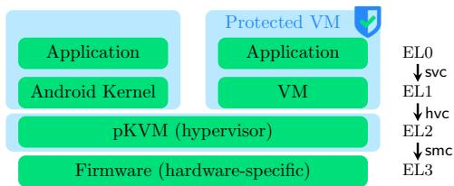
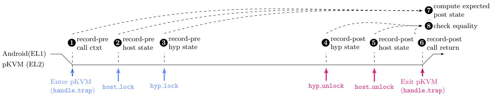

Latest updates: hps://dl.acm.org/doi/10.1145/3731569.3764817

RESEARCH-ARTICLE

# Ghost in the Android Shell: Pragmatic Test-oracle Specification of a Production Hypervisor

KAYVAN MEMARIAN, University of Cambridge, Cambridge, Cambridgeshire, U.K.

BEN SIMNER, University of Cambridge, Cambridge, Cambridgeshire, U.K.

DAVID KALOPER-MERŠINJAK, University of Cambridge, Cambridge, Cambridgeshire, U.K.

THIBAUT PÉRAMI, University of Cambridge, Cambridge, Cambridgeshire, U.K.

PETER SEWELL, University of Cambridge, Cambridge, Cambridgeshire, U.K.

Open Access Support provided by:

University of Cambridge

Published: 12 October 2025

Citation in BibTeX format

SOSP '25: ACM SIGOPS 31st Symposium

on Operating Systems Principles

October 13 - 16, 2025

Seoul, Republic of Korea

Conference Sponsors: SIGOPS

# Ghost in the Android Shell: Pragmatic Test-oracle Specification of a Production Hypervisor

Kayvan Memarian∗ University of Cambridge UK Kayvan.Memarian@cl.cam.ac.uk

Ben Simner∗   
University of Cambridge   
UK   
Ben.Simner@cl.cam.ac.uk   
Thibaut Pérami   
University of Cambridge   
UK   
Thibaut.Perami@cl.cam.ac.uk

David Kaloper-Meršinjak University of Cambridge UK dk505@cl.cam.ac.uk

Peter Sewell   
University of Cambridge   
UK   
Peter.Sewell@cl.cam.ac.uk

## Abstract

Developing systems code that robustly provides its intended security guarantees remains very challenging: conventional practice does not suffice, and full functional verification, while now feasible in some contexts, has substantial barriers to entry and use.

In this paper, we explore an alternative, more lightweight approach to building confidence for a production hypervisor: the pKVM hypervisor developed by Google to protect virtual machines and the Android kernel from each other. The basic approach is very simple and dates back to the 1970s: we specify the desired behaviour in a way that can be used as a test oracle, and check correspondence between that and the implementation at runtime. The setting makes that challenging in several ways: the implementation and specification are intertwined with the underlying architecture; the hypervisor is highly concurrent; the specification has to be loose in certain ways; the hypervisor runs bare-metal in a privileged exception level; naive random testing would quickly crash the whole system; and the hypervisor is written in C using conventional methods. We show how all of these can be overcome to make a practically useful specification, finding a number of critical bugs in pKVM along the way.

This is not at all what conventional developers (nor what formal verifiers) normally do – but we argue that, with the appropriate mindset, they easily could and should.

CCS Concepts: • Theory of computation → Program specifications; • Software and its engineering → Software verification and validation.

Keywords: Specification, Dynamic checking, Lightweight formal methods, pKVM, Hypervisors, Systems code

ACM Reference Format: Kayvan Memarian, Ben Simner, David Kaloper-Meršinjak, Thibaut Pérami, and Peter Sewell. 2025. Ghost in the Android Shell: Pragmatic Test-oracle Specification of a Production Hypervisor. In ACM SIGOPS 31st Symposium on Operating Systems Principles (SOSP ’25), October 13–16, 2025, Seoul, Republic of Korea. ACM, New York, NY, USA, 16 pages. https://doi.org/10.1145/3731569.3764817

## 1 Introduction

Developing systems code that robustly provides its intended security guarantees remains very challenging. It has long been painfully clear that conventional software development practices do not suffice, motivating extensive research on more formal approaches. Classic formal verification aims at high assurance via mathematical proof of functional correctness [26, 53], and recent years have seen many successes, including BlueRock [38], CertiKOS [20, 21, 48], CompCert [8, 34], F∗ [44, 51], Hyper-V [33], IronFleet [22], SeKVM [35, 36, 52], seL4 [28, 29], and VST [11], among others. Several of these have led to widely deployed verified code. However, the broad adoption of such methods is still problematic:

• They require specialist skills and specialist tools, often research tools under active development.

• They typically require the code to be written for verification, in specialist languages or in restricted dialects.

• The maintenance burden, adapting proofs to new versions of the software, can be prohibitively high.

• They suffer from a step-function effort/reward curve, requiring major up-front investment and delivering the main payoff – the theorem – at the end.

More lightweight formal approaches aim to improve assurance at lower cost. These too have been advocated for decades [23, 25], but are, we argue, still less well explored, appreciated, and deployed than they should be.

In this paper we show how very lightweight methods, requiring no specialist formal tooling, can improve assurance of a production hypervisor, at relatively low cost. Our target is protected KVM (pKVM), a hypervisor developed by Google for Android, to enforce isolation between the Android Linux kernel “host” and the guest virtual machines that handle sensitive data; it protects the latter from postinitialisation kernel compromises, and vice versa. pKVM is developed in the Linux kernel tree, with conventional kernel development methods; it has been deployed since Android 13 [10, 19, 27, 45]. All this makes it a convincingly challenging target: pKVM is written in C and Arm assembly; it is concurrent both with itself and with host, guest, and user code; it runs at the hypervisor-privileged Arm exception level 2 (EL2); it manages aspects of the Arm architecture controlling its own execution, including the system registers and page tables; and it is designed to meet its pragmatic security and performance goals, not for verification.

Our approach The basic idea is simple, and dates back at least to the 1970s [30, 37]: we specify the desired behaviour in a form that can be used as a test oracle, and check against it at runtime. Rich specifications (beyond simple assertions) have normally been written in custom specification languages, which have the benefits of clear mathematical meaning, expressiveness tuned for specification, and proof or analysis tools, but the requirements for specialised skills and tooling are still barriers to adoption. Instead, much less commonly, but along the same lines as Bornholt et al.’s work on S3 keyvalue storage nodes [9], we write full functional-correctness specifications in the ambient programming language.

Our new contribution lies in showing how this can be done for a production hypervisor such as pKVM, which introduces several interesting challenges.

The hypervisor implementation and specification are intertwined with the specification of the underlying hardware architecture. pKVM, like other hypervisors and operating systems, enforces controlled isolation by managing the address translation mappings for itself and for guests, which are used implicitly by hardware addresstranslation walks. It manages stage 2 mappings used for execution of each virtual machine, a stage 2 mapping used for Android kernel execution, and a single-stage mapping used for pKVM’s own execution.

Its specification is thus not just a simple functional property of the result values of API calls, but has to constrain the results of those implicit hardware walks.

We express the specification using computable abstraction functions (reified in C, and linked into the executable), from the concrete implementation state managed by the hypervisor, to abstract states – reified ghost states, represented as C datastructures that have intuitively clear mathematical interpretations. Our abstraction functions capture certain invariants on the concrete state. They interpret implementation page tables as mathematical finite maps, from virtual addresses to intermediate-physical or physical addresses with the associated permissions and other attributes, mirroring the Arm-A architecture specification of hardware address translation.

The hypervisor is essentially an exception handler, handling both explicit hypercalls made by the Linux host and other guests, and implicit exceptions such as stage 2 translation page faults raised to EL2. We specify the allowed behaviour of all these as a computable function (also reified in C) that (roughly) calculates the intended post-exception abstract state from the initial abstract state, with the hypercall arguments or other exception information. Importantly for clarity, this is morally a pure function of its arguments, even though, in C, some internal imperative computation is inescapable: it depends only on the computed abstract state, not on the actual implementation state. This gives a very clear computational reading, and in dynamic testing it lets one simply check equality of intended and recorded abstract states after each exception.

Structuring the specifications executably in this way allows one to run them within any conventional testing environment, helping the developers gain confidence in their software, and enabling verification engineers to prototype specifications, with relatively low effort. For developers, this is broadly similar to how sanitisers are used, but checking functional correctness properties, not just the absence of UB. The runtime cost is viable for testing, but not intended to be deployed in production.

The hypervisor is highly concurrent. Multiple hardware threads can be running in the hypervisor concurrently; it uses locks and a subtle ownership discipline, implicit in the code, to prevent races among explicit accesses to its shared memory. We handle much of this concurrency, but it adds an interesting complication: one can only meaningfully compute an abstraction of any part of the concrete state at points where the implementation owns that state. Our specification abstract state structure, and the infrastructure to dynamically compute and record it, therefore have to mirror the implementation ownership discipline. For example, in simple cases, where some pKVM state is protected by a particular lock, we compute the abstraction of that part of the state when that lock is taken and released (we describe the more subtle cases later). At a high level, this is taking ideas that one might use in a separation-logic proof and recasting them for specification and runtime testing.

There is some additional rare implementation concurrency which at present we do not handle: a few hypercalls execute in phases, releasing and retaking locks. The implicit stage-2 translation-table accesses from the Android kernel and virtual machines (and their user processes) at lower exception levels cannot be constrained by pKVM’s locking, and so unavoidably race with its updates to the page tables – so the ordering of multiple such updates within a single hypercall can in principle be observed. Handling that would need a more explicitly transactional style of instrumentation, which, although not done, seems perfectly feasible.

The hypervisor requires a loose specification. Where one can, we believe it more intuitive to have functional rather than relational specifications, but a good specification of pKVM has to be loose in two ways, abstracting from some details of the mapping-on-demand it does for kernel memory, and from the exact conditions under which it might report out-of-memory errors. We address these, respectively, by carefully defining the abstract state, and by making the next-state specification function parametric on the implementation return value.

The hypervisor runs bare-metal at EL2. This brings practical challenges: one cannot directly access its API from user code, or use conventional coverage or testing tools. We address these with a “hyp-proxy” patch to the Linux kernel, to let user-space testing allocate kernel memory and invoke pKVM hypercalls, and with custom coverage infrastructure.

Excessively random testing would crash the whole system. pKVM aims to protect against compromised Android kernels and virtual machines, so one wants to exercise it against arbitrary inputs, but values which are too arbitrary – in a history-dependent sense – can easily crash the kernel being used for testing. We developed both a small library of hand-written tests and a random tester, resolving this tension between truly random testing and excessive crashing by including a very abstract model in the test generator.

The ambient programming language is C. On the face of it, C is a very bad specification language – much worse than Rust, for example – and initially it was not at all obvious that this was feasible. In writing the specification we had to work around the lack of a decent sublanguage of pure computation, the lack of inductive datatype definitions (which have to be verbosely coded up using structs, unions, and enums) and of pattern matching over those definitions, the lack of parametric polymorphism (e.g. for finite range maps returning arbitrary types, which we worked around with a union of the types required), and the lack of support for memory management. For other specifications one might also want higher-order functions and other richer types, but those were not big issues here.

The surprising conclusion is that it has been perfectly feasible to work around all of these, however awkward they might appear at first sight, and to express the specification in a way that is easily readable at the top level (with details of memory management etc. kept below the surface).

Ultimately, one wants not just our (intensional and discriminating) black-box testing of the correspondence of specification and implementation, but also confirmation that it captures the developers’ intent. Discussions confirm that this is viable: they can independently read and comment on the specification in detail, while a more exotic specification language may have prevented this.

## To summarise, our contributions are:

• We emphasise the above approach as an under-explored sweet spot for building confidence in production systems code such as hypervisors or operating systems.

• We demonstrate it for pKVM, explaining various subtle issues that one has to address to make it really work, especially the proper handling of concurrency and loose specification (§3,4).

• We develop test infrastructure, coverage tooling, handwritten tests, and random testing, to exercise the correspondence between implementation and specification (§5).

• We discuss a number of bugs found in pKVM, and the specification size, effort, and performance (§6).

We conclude with discussion of the process and related work.   
The development is available open-source at https://github.   
com/rems-project/linux/tree/pkvm-verif-6.4.

Our high-level message is that this is both hard and easy: a priori, it was not at all obvious that it was feasible, but, given this existence proof and the ways in which we address the above challenges, and with the appropriate mindset of writing executable specification rather than implementation code, we believe conventional developers could do similarly with quite modest effort. This does not itself provide the assurance of full verification, although it can be a useful step towards that. But it applies to existing or newly written systems code as-is, expressed idiomatically in its conventional implementation language; it relies only on that language and its conventional tooling; it can be maintained with (non-zero but) reasonable cost; and it provides gradual benefits.

Limitations. We do not cover aspects of pKVM dealing with providing VMs with access to devices, nor for its management of the Arm GIC or IOMMU. This is partly because this was only introduced in more recent versions, but also because the specification of the underlying architecture is complex and not entirely clear. Higher level mechanisms for the emulation of devices, e.g. virtio, are not implemented by pKVM but are instead delegated to the EL1 host, and so do not appear in the specification of pKVM.

We cover functional correctness, not side-channel phenomena, and do not address liveness (liveness cannot be checked by runtime testing, and termination of each hypercall path is intuitively clear in any case).

Because our specification is embedded in pKVM, its execution relies on some degree of correctness of pKVM itself. In principle, a bug within pKVM could corrupt the ghost state in a way that masks the bug in executable specification checking, but that seems quite unlikely. We use our own memory allocator for the ghost state, which resides in a distinct part of the physical memory.

  
Figure 1. The Android Virtualisation Framework (AVF) [19], with pKVM, the Android “host” kernel, and a protected VM, and pKVM-enforced protection boundaries in blue.

## 2 Context: The pKVM hypervisor

We begin by explaining the high-level design of pKVM, and how it manages the Arm-A architecture to enforce isolation.

Protected KVM (pKVM) is a new hypervisor, though it reuses parts of the KVM codebase. It supports protected guests, whose memory is not directly accessible by Android or vice versa. It does so by utilising the hardware virtualisation facilities of the Arm architecture. Access to hardware features on Arm is constrained by the current privilege level, the exception level. Exception level 0 (EL0) has the least privilege, used by applications and other user-level programs, and EL3 has the most privilege, used primarily for firmware; there are also ‘secure world’ exception levels which we omit here. OS kernels typically execute at EL1, and the pKVM hypervisor executes at EL2, as in Fig. 1. Execution of a hardware thread transitions from one exception level to a higher one via explicit supervisor (svc), hypervisor (hvc), and secure monitor (smc) calls, and on implicit exceptions, e.g. on certain page faults and other memory aborts. On such entries to pKVM (which can be concurrent, from concurrent hardware threads executing at EL0 and EL1), the hardware thread picks up a hardware-thread-specific stack for its EL2 execution; pKVM has some shared state and some thread-local state.

pKVM is a pure isolation kernel: it manages virtual machines (VMs), providing them and the host Android kernel with a limited API to construct, destroy, context-switch between, and interact with VMs. It does not do scheduling, device handling, or file systems, which are left to the host.

pKVM enforces controlled isolation, between the Android host, virtual machines, and its own execution, by managing the virtual memory mappings used for each. In Arm-A, as in most architectures, the hardware translates the virtual addresses in the running hardware thread into the physical addresses used to index memory, and performs any required permission checks. To support virtualisation, the hardware performs two stages of translation: Stage 1, translating virtual to intermediate-physical addresses, managed by the Android host or the VM; and Stage 2, translating those into physical addresses, managed by the hypervisor. pKVM enforces isolation by maintaining a Stage 2 translation for the host and for each VM, along with a (single-stage) translation for its own execution, and ensuring that the ranges of all these are disjoint except where specifically requested. When context switching, pKVM installs the root address of the appropriate translation tables in a hardware system register.

The APIs that pKVM provide to the host and to guests are relatively simple. For the host, it provides hvc calls for the host to share and unshare additional memory with pKVM, to create new virtual machines and virtual CPUs within them, to destroy virtual machines and reclaim donated pages, and to context switch to a chosen vCPU. The guest API is more limited: guests can share/unshare virtual machine memory back with the host and communicate with the host through pagefaults (typically with virtio).

When the host, a guest, or pKVM itself tries to access a memory location that is not mapped in pKVM’s pagetables, the processor takes a pagefault which is handled by pKVM.

In most cases, pKVM switches back to the host, injecting a fake interrupt into EL1, allowing the host to decide how to respond (e.g. for the virtio case above). There are two exceptions: if pKVM has an internal error, it panics; and if the host accesses memory that is not mapped but it logically owns, pKVM maps it on-demand. pKVM does not map all of the host’s memory in the host Stage 2 page table at initialisation. Instead, it maps host memory (that the host logically has permission to access) when needed: making the host take a pagefault on first access, and filling in the page table lazily so that a host post-exception retry will succeed. pKVM maintains the ‘logical’ state of ownership of the memory: for each page in memory, which of pKVM, host, or a guest, owns it, encoded in otherwise unused page-table-entry bits.

## 3 Reified ghost state and abstraction functions

In this section, we explain the shape of the ghost state that we define as an abstraction of pKVM’s concrete state; we describe how it is recorded, and how we observe its evolution during pKVM execution. In the next section, we describe how we specify hypercalls in terms of this. In both, we show only a small and relatively simple part of the complete specification, but we aim to give enough detail to expose the issues, so that one can see how the same could be done for other broadly similar systems code.

Conceptually, the ghost state is a mathematical abstraction of pKVM’s concrete state, expressed with simple mathematical structures (as one would find in a conventional functional specification language), that abstracts from the engineering details of the concrete state, such as its pointer structures and the Arm architecture representation of in-memory page tables. This is akin to the ghost state that one would define in a more conventional verification setting. We reify this in C, and compute and record it with executable abstraction functions, also reified in C.

The behaviour of pKVM can then be specified by specifying how each exception handler can change the ghost state. We express this with specification functions, again in C, that compute the expected post-handler ghost state from the recorded pre-handler ghost state. These are pure in the sense that they only access their input ghost state, not the concrete pKVM execution state. One can then compare, at runtime, the expected post-handler ghost state with the recorded post-handler ghost state, checking equality.

For some systems, one might need a relational form of specification, e.g. taking the recorded pre- and post-handler ghost states, and computing a boolean of whether that change was allowed. That would accommodate more specification looseness, but we believe it would be less intuitive to read for conventional developers than the functional form that directly computes the new ghost state. For pKVM, all the required specification looseness can be accommodated with modifications of the functional approach.

All this is expressed in C within the source tree of, and linked with, pKVM; it builds with the normal Linux kernel build process, and runs in QEMU with the normal setup used by the developers for exercising pKVM. Despite this, it is not intrusive: it is almost all factored out into separate .h and .c files in new ghost/ directories, with just a few calls within the main pKVM code, guarded by #ifdefs controlled by kernel configuration parameters.

## 3.1 Computable ghost state

Logically, the memory isolation property that pKVM aims to provide is roughly the invariant that there exists a partition of physical memory pages, where each partition has a single owner (either the Android host, pKVM itself, or a guest virtual machine) and some access permissions, but might also be shared with another entity.

In the concrete state of pKVM, this is implemented by careful management of its collection of page tables, potentially shared among all hardware threads when executing within pKVM. pKVM’s shared concrete state also contains metadata for each guest virtual machine, including their configuration, whether they are currently executing on a physical CPU, and, if not, their last-saved register state. In addition, the pKVM concrete state has components that are local to each hardware thread, holding the current execution context: the saved context of the Android host or guest registers at EL1 before entry into the current pKVM C handler, and the current context of pKVM at EL2 (its registers and stack). Hardware pagetable walks for threads at EL0 and EL1 implicitly access the appropriate page tables.

Following the ownership structure. The ghost state structure has to follow the ownership discipline used by pKVM for its concrete state. Rather than an expensive big lock, pKVM protects each page table with a separate lock: one for its own Stage 1 mapping, one for the host Stage 2, and one for each guest Stage 2, with one more lock protecting its table holding the metadata of the guest virtual machines. The implementation of each exception only takes the locks that are actually needed for its operation (e.g. host\_share\_hyp only takes the locks of the host and pKVM page tables), and only when required, not simply on exception entry and exit.

There is therefore no point in time after initialisation when we could safely record the whole state of pKVM. One could introduce a big lock for specification instrumentation, but that would significantly change the observable concurrent behaviour of pKVM by reducing the allowed interleaving.

We instead structure the ghost state to follow the implementation ownership structure, and to allow for partiality. Each component associated with a lock in the implementation is encapsulated in the ghost state in (a C representation of) an option type, which can then be recorded as being absent when the corresponding lock was never held.

The ownership structure for guest virtual machine metadata has an additional subtlety. In addition to the single lock protecting the metadata of all VMs, mentioned above, before a vCPU can be run, it must first be ‘loaded’ onto the physical CPU which is going to run it. This implicitly transfers ownership of the metadata for that vCPU, from that lock to the local state of the hardware thread.

Ghost state types. We define the ghost state as a C structure whose members reflect the above partitioning of the concrete state, as protected by the various locks and the parts local to physical CPUs.

```c
1 struct ghost_state { 1 struct ghost_pkvm {
2 struct ghost_pkvm pkvm; 2 bool present;
3 struct ghost_host host; 3 abstract_pgtable pgt;
4 struct ghost_vms vms; 4 };
5 struct ghost_globals globals; 5 struct ghost_host {
6 struct ghost_cpu* 6 bool present;
7 locals[NR_CPUS]; 7 mapping annot, shared;
8 }; 8 };
```

The ghost\_state pkvm member, if present (as encoded with its first boolean member), comprises an abstract mapping (as described below) that captures the translation function encoded in the Stage 1 page table for pKVM.

The host member, if present, is not simply an abstraction of the current host mapping, for two reasons. First, the pKVM mapping-on-demand on host Stage 2 memory-abort exceptions adds mappings when needed, but sometimes for more than just the requested page (e.g. when it can add a block mapping), and sometimes removing mappings (e.g. if it splits a block mapping). Specifying exactly the implementation behaviour would be over-fitting, and the appropriate specification for those exceptions is interestingly loose: it allows any legal host Stage 2 mapping on exit. The abstract state therefore records just enough to determine the upper and lower bounds on what must be mapped. Secondly, pKVM uses the host page tables also to record which pages are owned by pKVM or a guest VM – these should not be mapped on demand. The ghost state for the host therefore comprises two abstract mappings: annot captures the pages which are owned by pKVM or a guest virtual machine, and shared captures the pages which are either owned by the host and shared, or owned by another and borrowed by the host. These evolve deterministically.

The vms member holds a dynamic array recording metadata for each guest virtual machine, including their Stage 2 translation mapping and the state of their vCPUs.

The globals member holds constants established during the initialisation of pKVM: the number of physical CPUs, the offset of the linear mapping used by pKVM, and constants specifying the conversion between host and pKVM virtual addresses. The specification code could read these when required from the pKVM concrete state, but that would break the hygiene distinction that we maintain between implementation and specification; it is cleaner to maintain copies in the ghost state. Finally, the locals is an array holding the abstractions of the physical CPU states (e.g. their registers).

Abstracting away from implementation details. There are many aspects of the concrete state which are not fundamental to the external behaviour of the hypervisor, most obviously its memory management: allocation of internal structures, and reference counting of pages. These should not be reflected in the abstract state, to avoid overfitting the specifications and making them overly sensitive to future internal changes in the implementation.

Abstract mappings. Page tables are stored in memory in the format determined by the Arm architecture. In the configuration used by Android, these are trees of at most depth 4, with 4K pages each containing 512 page-table entries. Entries are then either pointers to sub-trees, or leaf entries describing how the virtual-address range corresponding to its position in the tree is either mapped to a physical-address range (with permissions and other software-defined attributes), or is unmapped (and thus, inaccessible).Page tables are, of course, a compact and efficient representation of the data they contain, and one that supports fast page-table walks by the hardware – but for the specification, one wants a different structure that supports different operations. The above tree structure is irrelevant to the extensional meaning of a page table. What is relevant is the finite partial mapping from 4KB-page input addresses to tuples of their output address, permissions, and software-defined attributes: the extension of the Arm-A pagetable walk function. We therefore define a C type mapping for finite range maps, with the finite-map operations that one wants to use in specification (empty and singleton finite maps, addition and subtraction of finite maps, etc). These are implemented with a sufficiently performant data structure: ordered linked lists of maximally coalesced maplets, each of which captures a contiguous range of the mapping.

We then combine these mappings with the memory footprint of the pagetables themselves into an abstract\_pgtable, which allows checking separation invariants of the concrete memory backing page tables (see §4.4).

## 3.2 Recording the abstraction

The abstraction functions. Our abstraction functions compute each part of the ghost state from the corresponding implementation concrete state. This recording follows the ownership structure, e.g. with a function for each lock recording the abstraction of the data protected by the lock.

One interesting part of this abstraction is the computation of abstract mappings from concrete pagetables. This involves a complete traversal of the page tables being recorded, in contrast to the hardware page-table walk and the (software) pKVM page-table walker, which only walk a specific input address range. The general format of Arm pagetables is intricate, with many configurations, but specialised to the specific configuration used by Android, the recording becomes a simple traversal, incrementally constructing a mapping using the above operations. Some of the definition of this, including the case for block page-table entries, is shown in Fig. 2 (including some details that we cannot describe here). It is imperative C code, but relatively close to the pure-functional definition that it morally represents.

Recording the ghost state. With the above structure, recording the relevant ghost state at the correct points becomes straightforward and remarkably non-invasive, we merely need to add instrumentation at a few key points in the code: at entry and exit of the top-level C handler functions, for the host and guest exception handlers, to record the thread-local parts of the state; and on taking or releasing any of the locks protecting the pagetables, to record their abstract mappings; and on taking and releasing the locks which own parts of the VMs and vCPUs, to record the abstract metadata about them (e.g. their register states).

For example, pKVM calls the host\_lock\_component function to acquire the lock protecting the host’s Stage 2 pagetables. We instrument this to record the host’s abstract pagetable, perform some sanity checks (e.g. that it is unchanged since the end of the last trap) and save it to thread-local storage:

```c
1 static void host_lock_component(void) {
2 hyp_spin_lock(&host_mmu.lock);
3 #ifdef CONFIG_NVHE_GHOST_SPEC
4 record_and_check_abstraction_host_pre();
5 #endif /* CONFIG_NVHE_GHOST_SPEC */
6 }
```

Memory management for the ghost computation. As the ghost infrastructure executes alongside pKVM at EL2, the environment is very limited: there is only one page of stack per hardware thread, no existing heap allocator, and no standard-library printf or other IO beyond a UART. Our implementation of mappings uses an simple arena allocator, with its own memory footprint disjoint from the rest of pKVM, and other components of the ghost state that can grow after initialisation (ghost virtual machines and their ghost vCPUs) use a simple implementation of malloc.

Ghost in the Android Shell: Pragmatic Test-oracle Specification of a Production Hypervisor SOSP ’25, October 13–16, 2025, Seoul, Republic of Korea   
void \_interpret\_pgtable(mapping \*mapp, kvm\_pte\_t \*pgd, ghost\_stage\_t stage, u8 level,...)   
2 { ...   
3 for (u64 idx = 0; idx < 512; idx++) { // iterate over the current table entries   
4 u64 va\_offset\_in\_region = idx \* nr\_pages \* PAGE\_SIZE; // compute va mapped by this entry   
5 u64 va\_partial\_new = va\_partial | va\_offset\_in\_region;   
6 u64 pte = pgd[idx]; // read page-table entry from the table   
7 enum entry\_kind ek = entry\_kind(pte, level); // compute kind of the page-table entry (pointer-to-table, block, leaf, or invalid)   
8 switch(ek) { // case split on that   
9 case EK\_BLOCK: { // block entry   
10 u64 oa = pte & PTE\_FIELD\_OA\_MASK[level]; // compute output address   
11 u64 attr = pte & PTE\_FIELD\_ATTRS\_MASK; // compute attributes   
12 struct maplet\_target\_mapped t =   
13 parse\_mapped(stage, mair, level, oa, nr\_pages, attr, next\_level\_aal); // compute target of maplet   
14 // extend mapping with maplet from va\_partial\_new to oa, of nr\_pages, coalescing if possible   
15 extend\_mapping\_coalesce(mapp, stage, va\_partial\_new, nr\_pages, maplet\_target\_mapped(va\_partial\_new, nr\_pages, t));   
16 break;   
17 }   
18 ...  
Figure 2. Part of the abstraction function that interprets a concrete page table at pgd to a finite map mapp

Impact of the reification of the ghost state. We aim for the specification to be minimally invasive on the execution of pKVM. It uses some memory for the ghost state and the specification computations, and this has to be mapped in pKVM’s Stage 1 page tables, but we simply fix some memory for this at pKVM initialisation time, so the specification computation does not induce changes in the abstract state post initialisation. The ghost infrastructure leaves the existing locking of pKVM unchanged, but adds some locks for its own data. Our mapping and heap allocators each have their own lock, though they could instead have per-hardware-thread arenas. Our printing infrastructure also requires a lock to get coherent output. None of these reduce the implementation concurrency in principle – though of course the specification execution does affect the timing (and the specification locks prevent some potential relaxed behaviour across them).

## 4 Reified specifications: specifying the pKVM exception handlers

We now describe how the specification can be expressed in terms of the above reified ghost state, as reified functions that compute the intended final ghost states of hypercall and other exception handlers. We do so in some detail for one of the simpler pKVM hypercalls, host\_share\_hyp, comparing its implementation (§4.1) with its specification (§4.2). We then describe some of the additional complexity arising from the more interesting hypercalls (§4.3). Finally we touch on other invariants in pKVM which we also check (§4.4).

## 4.1 The pKVM implementation of host\_share\_hyp

Memory owned by the host is not by default accessible to pKVM, but pKVM does sometimes need to access it. For example, many hypercalls pass arguments through memory (e.g. to initialise a new VM). The host must explicitly ask pKVM to share the memory containing these with pKVM making the physical pages accessible in both the hypervisor’s Stage 1 and the host Stage 2 page tables.

```c
1 int __pkvm_host_share_hyp(u64 pfn)
2 {
3 int ret;
4 u64 host_addr = hyp_pfn_to_phys(pfn);
5 u64 hyp_addr = (u64)__hyp_va(host_addr);
6 struct pkvm_mem_share share = {
7 // ... instantiate generic structure
8 };
9 host_lock_component(); hyp_lock_component();
10 ret = do_share(&share);
11 hyp_unlock_component(); host_unlock_component();
12 return ret;
13 }
```  
Figure 3. Top-level host\_share\_hyp implementation

It does so with the pvkm\_host\_share\_hyp hypercall, which is invoked by placing a magic number into register x0 and the (physical) address of the page it wishes to share with pKVM into register x1, and issuing an Arm hvc instruction, which raises a hardware exception to EL2.

After dispatch by pKVM’s top-level handle\_trap exception handler, and reading the registers of the hypercall and argument(s), pKVM calls \_\_pkvm\_host\_share\_hyp (Fig. 3). Given the page address to be shared (technically, its shifted ‘page frame number’), it makes that page available to pKVM, and marks it as shared in both pKVM and the host’s page tables, in a way that is both thread-safe and resilient to a potentially malicious host. The top-level exception handler then takes the return value and performs the context switch back to the host, writing the return value back to the host registers in the process.

In the function body: lines 4–5 convert the physical address into the input addresses of the relevant address spaces, which are used to create a generic share transaction on lines

```c
1 static int do_share(...)
2 {
3 int ret;
4 / in check_share() /
5 struct kvm_pgtable_walker walker = {
6 .cb = __check_page_state_visitor,
7 .flags = KVM_PGTABLE_WALK_LEAF,
8 };
9 ret = kvm_pgtable_walk(&host_mmu.pgt, addr, size, &walker);
10 if (ret)
11 return ret;
12 /* in host_initiate_share() */
13 struct kvm_pgtable_walker walker = {
14 .cb = stage2_map_walker,
15 .flags = KVM_PGTABLE_WALK_TABLE_PRE
16 | KVM_PGTABLE_WALK_LEAF,
17 .arg = PKVM_PAGE_SHARED_OWNED,
18 };
19 ret = kvm_pgtable_walk(&host_mmu.pgt, addr, size, &walker);
20 /* in hyp_complete_share() */
21 struct kvm_pgtable_walker walker = {
22 .cb = hyp_map_walker,
23 .flags = KVM_PGTABLE_WALK_LEAF,
24 .arg = PKVM_PAGE_SHARED_BORROWED,
25 };
26 ret = kvm_pgtable_walk(&pkvm_pgtable, addr, size, &walker);
27 return ret;
28 }
```  
Figure 4. do\_share implementation, with helpers inlined.

6–8; lines 9–10 and 12–13 follow a two-phase locking protocol for the resources the share will need, taking the locks protecting the pKVM single-stage and host Stage 2 page tables; and line 11 calls a generic do\_share which actually performs the necessary checks and page-table updates.

The do\_share function makes repeated use of a generic page-table walker to check properties of and mutate the page tables. The walker code (not shown) is common with KVM and is typical kernel code: highly optimized with support for the many potential architectural configurations of Arm page tables. To make the walker reusable for multiple purposes, it is higher-order, taking pointers to callback functions to call during the walk to perform the actual checks and updates (and pointers to callbacks for memory management). The walk itself does a traversal of the page-table tree for the given input address range, following the Arm architecture hardware translation-table-walk algorithm, calling the callback functions at the table entries and/or leaf nodes as required.

A version of pKVM’s do\_share, simplified and inlined for presentation to show its three calls to the generic page table walker kvm\_pgtable\_walk, is in Fig. 4. At a high level, do\_share can be split into two phases: a check that the requested share operation is valid, which involves (at least) one page table walk; then the actual updates to the host and pKVM page tables (each requiring their own separate walk, to install the new mappings). Each walk incrementally performs additional checks, or updates to the state, or both.

It starts by walking the host page table for the host intermediate physical address, calling \_\_check\_page\_state\_visitor at each leaf entry, which fails if the page is not able to be shared. If that succeeds, it does another walk over the host’s page table, but this time with the stage2\_map\_walker callback, which adds an identity mapping and marks the location as shared. This walk may, in principle, also fail, e.g. due to running out of memory or reaching an inconsistent state if the pKVM invariant was ever broken. If it succeeds, do\_share does the final walk to update the pKVM page table, to add a new mapping marked as borrowed in the pKVM page table.

## 4.2 The specification of host\_share\_hyp

As seen in the previous subsection, the implementation of even a relatively straightforward hypercall is full of intricate detail: the complex architectural definition of a page table; the performant and generic walker inside KVM to traverse it; the repetitive checks and updates, with further nested checks some of which are relevant and some are not; all tied together with a careful two-phase-locking scheme.

However, the effect of the hypercall on the abstract ghost state of pKVM is relatively simple: it atomically either fails with a permission error if this was an illegal request,or updates the state to have new mappings for the requested page in the host and pKVM’s mappings. This can be described mathematically fairly concisely as an update to the part of the state the hypercall takes ownership of.

If the location is not exclusively owned by the host then it returns an error code (by setting a thread-local register), otherwise the state is updated with new entries in the host\_shared and pkvm mappings in the abstract state, with a zero return code indicating success. Transitions between whole states can be then described by applying the update atomically, at the linearisation point of the hypercall.

We reify this simple mathematical specification (including the elided details) into C, by defining, for each possible exception, the update as a computable function from initial to final abstract states. Each such function takes three arguments: g\_pre, a reference to a ghost\_state structure holding the pre-state of the hypercall; g\_post, a reference to a blank ghost\_state structure, into which the specification will write the expected post-state; and call, a reference to a ghost structure holding additional data from the call, used to resolve any non-determinism in the spec (c.f. §4.3). The specification functions return a boolean stating whether the post state has a valid specification, enabling the writing of gradual specifications. The specification function only reads from the ghost pre-state and the ghost call data, never from the implementation state.

4.2.1 Specification functions. We specify pKVM’s toplevel C exception handler functions. These are the entry points for all traps and interrupts into the hypervisor. The top-level specification function for a trap then further dispatches on which hypercall or other exception has been invoked, and calls that specific hypercall’s own specification function. We show this for host\_share\_hyp in Fig. 5.

4.2.2 Recording and runtime checks. We can now put the pieces together and see what it means to do a runtime check of the spec of a hypercall. Combining this with the computation and recording of the ghost pre- and post-states described in the previous section, Fig. 6 shows how the executable-as-test-oracle specification works for this case.

At (1) the hypercall begins on this hardware thread when the exception handler is triggered at EL2, and the spec machinery begins recording into the pre-state starting with the thread-local data. The execution continues through the first phase of the two-phase locking section acquiring at (2) the host and at (3) the pKVM page table locks, triggering the recording of the abstract mappings of those components into the pre-state. At (4) and (5) come the second phase of the 2PL discipline where pKVM releases the locks protecting those page tables, but with the spec machinery taking snapshots just before, this time recording them into the poststate. Finally, at (6) the hypercall ends and the final threadlocal state can be recorded into the post-state, as well as any ghost call data collected during execution (for resolving non-determinism, c.f. §4.3).

We can then use the pre-state from (1), (2) and (3) plus any call data from (6) to (7) compute an expected post-state, using the C function in Fig. 5. Then (8) we can compare the post-state we just computed with the one we recorded. This comparison is really a ternary check between the pre, recorded-post, and computed-post states: if a component is present in the computed-post it must be equal to the corresponding component in the recorded-post, otherwise it must not have been changed, i.e. the corresponding components in the pre-state and the recorded-post must be equal.

Printing and diffing ghost states. With runtime computation and recording of reified ghost datatypes, we can implement diffing of two abstract states, invaluable in error reporting and debugging of both code and spec. For example:

```batch
recorded post ghost state diff from recorded pre:
host.share +ipa :...101b18000 phys:101b18000 SO RWX M
pkvm.pgt +virt:8000c1b18000 phys:101b18000 SB RW- M
regs -r0=......c600000d r1=. .101b18
regs +r0=... 0 r1 .0
```

This shows the change to the abstract state computed from the concrete-state change performed by a host\_share\_hyp call in our test suite: one new page for the host mapping, identity mapped, marked as Shared-and-Owned, Read-WriteeXecute, and normal Memory; one new page for pKVM, with the same physical location but mapped at a different virtual address, marked as Shared-and-Borrowed, with read-write but without execute permissions, and also normal memory; and the zeroing of the registers used for passing arguments.

## 4.3 Recovering determinism

So far we have discussed the specifications as a deterministic computation of the pre-state, to obtain a single post-state. In practice, (a) the specification is parameterised over the interaction with the environment, and (b) the specification is loose in some ways. Both affect our ability to express the specification as a deterministic function of the pre-state.

For example, the specification should not precisely model how pKVM manages its memory, and exactly when hypercalls might fail with an out-of-memory error. Instead, we adopt a loose specification that permits many hypercalls to arbitrarily fail with −ENOMEM. We express this by making the specification functions parametric not just on the abstract pre-state, but also on the return code, which in runtime checking we take from the implementation behaviour.

Nondeterminism also arises from pKVM’s interactions via memory shared with the host, e.g. where pKVM reads hypercall struct arguments. The host still owns those locations and can write to them freely, so pKVM’s accesses to them, done with kernel READ\_ONCE operations, do not have fixed values. We therefore parameterise the specification on the values read by these, and in runtime checking we record them from the implementation.

The information recorded during implementation execution is stored in the local call data (§4.2) and is thus available to the specification functions as the call argument (Fig. 5).

## 4.4 Separation and Interference

We additionally check two invariants: (1) non-interference on the abstract state outside of locks, (2) separation of the memory footprint of parts of pKVM’s concrete state.

To check that the abstract state is not changed between hypercalls we maintain a single shared copy of the entire ghost state which we use to check on acquiring a lock that the state it protects has not changed since the last time the abstract state was recorded.

We additionally track the maximal footprint of each page table and fail if pages are allocated into the page tables outside of that footprint. This is essentially enforcing, at runtime, a separation logic style separation of the page table part of the heap and the rest of pKVM.

## 5 Exercising the executable specification

Testing and coverage analysis of hypervisor code is a challenge in itself, as the usual tools are not available in the privileged EL2 state it executes in. Conventional pKVM development relies largely on integration tests (e.g. booting the Android kernel and running Android tests), and some tests at the kernel syscall level, neither of which aim directly at exercising the hypervisor code.

Test infrastructure. pKVM exposes its hypercall (and other exception) API to the Linux kernel, which provides a more generic virtual-machine API for user space (the KVM).

```c
1 static bool compute_post__pkvm_host_share_hyp(
2 struct ghost_state *g_post, struct ghost_state *g_pre,
3 struct ghost_call_data *call)
4 {
5 // (1) Address space conversions
6 u64 pfn = ghost_read_gpr(g_pre, 1);
7 phys_addr_t phys = hyp_pfn_to_phys(pfn);
8 host_ipa_t host_addr = host_ipa_of_phys(phys);
9 hyp_va_t hyp_addr = hyp_va_of_phys(g_pre, phys);
10 int ret = 0;
11
12 // (2) Permissions checks
13 if (!is_owned_exclusively_by(g_pre, GHOST_HOST, phys)) {
14 ret = -EPERM;
15 goto out;
16 }
17
18 // (3) Initialisation of the (partial) post-state
19 copy_abstraction_host(g_post, g_pre);
20 copy_abstraction_pkvm(g_post, g_pre);
21
22 // (4) Construction of abstract mapping attributes
23 bool is_memory = ghost_addr_is_allowed_memory(g_pre, phys);
24 struct maplet_attributes host_attrs =
25 ghost_host_memory_attributes(is_memory, SHARED_OWNED);
26 struct maplet_attributes hyp_attrs =
27 ghost_hyp_memory_attributes(is_memory, SHARED_BORROWED);
28
29 // (5) Update abstract mappings with new targets
30 mapping_update(
31 &g_post->host.shared,
32 g_pre->host.shared,
33 MAP_INSERT_PAGE, GHOST_STAGE2, host_addr, 1,
34 maplet_target_mapped_attrs(phys, 1, host_attrs)
35 );
36 mapping_update(
37 &g_post->pkvm.pgt.mapping,
38 g_pre->pkvm.pgt.mapping,
39 MAP_INSERT_PAGE, GHOST_STAGE1, hyp_addr, 1,
40 maplet_target_mapped_attrs(phys, 1, hyp_attrs)
41 );
42
43 // (6) Epilogue: update the host register state
44 out:
45 ghost_write_gpr(g_post, 1, ret);
46 copy_registers_to_host(g_post);
47 return true;
48 }
```

(1) Address space conversions. Mirroring the implementation, the spec retrieves the hypercall argument from the initial ghost state, in its copy of the saved on-entry host (register) context for the current hardware thread, and looks up the value of the x1 register. The argument here is the page frame number of the page the host is requesting to share with pKVM. The specification computes from this the corresponding physical address phys, host intermediatephysical address host\_addr, and pKVM-internal virtual address hyp\_addr. These are pure computations using the ghost state, and have no side-effects.

(2) Permissions checks. The spec is given in two parts: the pre-condition, which checks the recorded pre-state for error cases; and the update, computing the new expected post-state. For host\_share\_hyp, it fails (with -ENOMEM) if the physical page that the host is trying to share does not belong exclusively to the host. That is, if it is not in the host annotations or is already in the host’s shared mappings. Usually these two checks come as a pair, and so we define an auxiliary function which checks both. If the check fails, the whole spec function exits out early, before recording any update (other than the error code) to the post-state.

This one relatively simple check on the pre-state captures all the complex logic of the check\_share walk seen earlier.

(3) Initialisation of the (partial) post-state. The update for host\_share\_hyp should touch only the relevant parts of the pre-state: the host and pKVM’s page tables. We start by cloning those (and only those) parts of the pre-state into the memory reserved for the post-state, which we will modify to reflect the hypercall’s action later. Importantly, the spec function does not mention the rest of the ghost state: the state is partial and those parts may not exist on the pre-state.

(4) Construction of abstract mapping attributes. When defining the abstract mapping we must construct the maplets with not only the correct target address, but also the attributes: permissions, memory type, and what pKVM calls the ‘page state’ which encodes the logical owner of the physical resource pointed to.

For pKVM the computation of these attributes is relatively simple, there are two possible values for the permissions and memory type depending on whether the address is in the region defined to be DRAM or not (line 23), and then the page state is marked as either owned-but-shared for the host (line 25) or borrowed for pKVM (line 27).

(5) Update abstract mappings with new targets. Now the specification updates the abstract mappings for the host and pKVM, using the attributes we just computed. For the host, we must update the mapping in the post-state for the host, for the host input address host\_addr (lines 30 − 35) using the above host memory attributes. Similarly, the pKVM abstract mapping in the post-state is updated with a new mapping from hyp\_addr to phys (lines 36 − 41).

(6) Epilogue: update the host register state and return to the host. Finally, on success or error, the current hardware thread’s registers need to be updated to reflect the return code. The return code is stored in the post-state’s x1 register for the current hardware thread. The call then returns true, informing the parent specification function for the entire exception handler (not shown) that a valid specification has been written to the post-state.

Figure 5. Executable C specification for host\_share\_hyp.

  
Figure 6. Instrumentation and checking timeline for host\_share\_hyp

However, the security model of pKVM assumes that the kernel is untrusted after initialisation, with the hypercall API as the security boundary. We therefore have to exercise arbitrary such calls, but one wants to program tests in userspace, not in the kernel. We develop a “hyp-proxy” kernel patch to expose pKVM API calls, and the required kernel memory management, to user-space. We express tests above an OCaml library that provides functions both for well-behaved and arbitrary invocations of the pKVM API.

Coverage. Coverage, both of the implementation and of the specification, is a useful initial guide when testing – but the Linux built-in GCOV tooling for coverage is not applicable to pKVM at EL2. We use the existing compiler support, but had to implement the instrumentation hooks, re-engineer the linker-dependent initialisation, and move the data from the EL2 to EL1 to EL0 address spaces, to make it available in userspace. This gives us branch, line, and function coverage both of pKVM and of the specification code.

Handwritten testing. We first wrote a small suite of handwritten tests, currently 41, of which 19 target error-free paths, 22 target various errors, and a handful are highly concurrent and target locking. Coverage was important especially to hit the error cases. However, absolute coverage numbers do not account for unreachable code paths, which arises here e.g. in the use of generalised page-table utilities. To accurately assess coverage for a sample exception handler, the \_\_pkvm\_host\_share\_hyp of §4, we manually identified unreachable code in its call graph. Our manual tests give 100% line coverage of the remainder; we believe the other hypercalls are similar. We also assess the coverage of the specification functions. The specification for the same handler (Fig. 5) is fully covered; overall coverage of specification functions is 92% (459 of 497 lines), with only a few error cases missing – some of which we believe are unreachable.

Random testing. Beyond handwritten tests, because it is hard to anticipate how a corrupted host or VM could abuse the API, one wants to do random testing with arbitrary values. However, there is a tension between randomness and effective testing: (a) random API calls can crash the host by changing memory ownership (and too many crashes would lead to negligible test throughput); and (b) random calls would be unlikely to make significant progress through the pKVM state machine. We resolve this by guiding random API call generation with a careful abstraction of the specification’s (already abstract) ghost state: a pool of allocated host memory, the subset of that which has been donated to pKVM, the VMs with their handles and their corresponding shared memory, the vCPUs also with their handles and corresponding shared memory, and the vCPU memcache pages. This is used to guide the random sampling, e.g. to choose known-valid memory addresses in some cases, and to reject steps which it predicts will crash the host kernel or the testing process (while finding pKVM crashes is of course desirable). We ran the random tests in QEMU, on a Mac Mini M2, which completes about 200,000 hypercalls per hour, with our longest runs taking 24 hours. We found 9 errors in the specification this way, all related to subtle error scenarios.

Synthetic bug testing. To further confirm the discriminating power of our testing, we introduced a small number of synthetic bugs into pKVM and checked that it finds them.

## 6 Discussion

Bugs found. To date this work has found five bugs in pKVM, all acknowledged by the development team and all but the last fixed in pKVM and/or upstream Linux: (1) A missing alignment check in the internal allocator (memcache) topup path, permitting a malicious host to zero memory. (2) A missing size check in the memcache topup, potentially hitting an illegal left-shift (3) Missing synchronisation in the vCPU load/vCPU init permitted a relaxed race, potentially accessing uninitialised memory. (4) On a host pagefault, pKVM was not robust to the host modifying its virtual mappings concurrently, potentially leading to a hypervisor panic. (5) During initialisation of the pKVM virtual linear map, for devices with very large amounts of physical memory, the code could overlap the IO mappings and linear map leading to unchecked accesses to IO devices.

Interestingly, only bug (4) was found by exercising the specification; all the others were found while reading the code, in the process of understanding it well enough to write the specification. Exercising the specification then tests the correspondence between our understanding and the implementation, which found many errors in the specification itself, also leading to clarifications with the developers. Thus, the specification process itself is a tool for thinking, just as much as the specification itself is a tool for testing – and the ability to cross-check by testing is essential for both.

Post hoc specification. A specification could be written before, with, or after the implementation, with differing costs and benefits. In this case it is the latter – it is a post hoc specification, following [5], built in communication with, but not by, the pKVM development team. That brings an extra cost for deeply understanding the code, but has the advantage that the specifiers come without preconceptions, and can focus on potential pathological corners. It also means the code we examine is already well-tested in their conventional ways, and reasonably mature. Finer-grain integration, now that feasibility has been demonstrated, would presumably find more low-hanging bugs in code during early development.

Specification size. pKVM itself, including the parts shared with KVM and local header files, but excluding generic Linux header files, is approximately 11 000 raw LoC. Our specification is 2600 for the hypercalls and traps and 1300 for the abstraction recording functions, along with 4500 for the various abstract data types, and additional boilerplate code for configuration, diffing, and printing; it totals around 14 000.

A hypervisor specification is necessarily somewhat involved, but the specification abstracts from many implementation details, and it is expressed in a quite different style to the implementation, emphasising clarity and with a flatter structure. Writing it thus gives useful redundancy, with limited chance of common-mode errors – and forces close inspection of the code.

Effort and maintenance. For this to truly be a lightweight approach to improving assurance, it is important that the effort required is manageable. Our initial experiments were low-intensity, exploring and establishing our solutions to the challenges described in the introduction, at less than a person-month per year from late 2020 to mid 2023. The main specification development was then done by two people for around four months, alongside other activities, with testing infrastructure by two others, and maintenance and further testing to the time of writing in early 2025. All this totals around one person-year, a small fraction of the roughly 30 person-year pKVM development effort to date.

Maintainability is also crucial. Because our specification has to check intensional properties of the pKVM state (as those are observed by hardware page table walks), and because it is structured following the implementation ownership structure, substantial changes to the implementation require corresponding changes to the instrumentation and specification. We have successfully ported our machinery across multiple Android version changes, with a port to Android 15 in progress. The API and specifications do not change much release-to-release, but some changes to ownership do create friction.

For example Android 15 introduced a heap allocator for data structures allocated by pKVM at EL2. This introduced new hypercalls in the API, in particular ones allowing the host to manage the memory pool used by the new allocator. The signature of some existing hypercalls were also updated, such as removing arguments which in previous versions held pointers to memory allocated by the host for use by EL2. This also introduced additional non-determinism, affecting the specification of even unrelated hypercalls.

The biggest change to the specification was required to handle an optimisation improving the concurrent behaviour of hypercalls. This changed the ownership structure for part of the state of pKVM, which required corresponding changes in the ghost state structure. The pKVM developers introduced a lock for each vCPU, which required finer partitioning of the ghost state type modelling VMs.

Performance. Our specification is intended for use in testing, not in production, so its overheads must be low enough for that to be viable in the pKVM developers’ normal (QEMU) environment. Beyond that, the exact performance is not critical, except that the Linux kernel is designed to ensure progress, and has timers that both monitor and assume this. If the specification were too slow, tests might not make progress. Perhaps surprisingly, given the potentially expensive instrumentation, the overheads are perfectly viable. The memory impact is minimal, around 18MB, dominated by page-table representations and growing somewhat with time and activity. The runtime overhead for boot is 3.2x (1.49s to 4.76s), and for our hand-written tests is 11.5x (1.07s to 12.3s). All these are using 4 cores, on an Intel Xeon Gold 6240 with 72 cores and 384GB.

Our specification should in principle also run on hardware, but custom builds on devices that run development versions of Android have required proprietary drivers, not available to us. This should become feasible in future.

## 7 Related work

Research since the 1960s has explored many approaches to improving software quality with varying combinations of specification, testing, and verification – with many advances, and interestingly different trade-offs in different contexts.

Full functional correctness verification with interactive proof assistants. As we noted in the Introduction, interactive mechanised proof is very flexible, provides high level of assurance, and has had notable recent successes – but it also carries substantial barriers to broad adoption.

More automated verification. Chong et al. [13] verify functional correctness by CBMC model-checking (fully unwinding loops). Their specifications are pre and postconditions, in C extended with CBMC builtins (assume, assert, is\_writable, etc.). They do not do runtime testing of specifications. This is applied to several substantial examples of existing code, and integrated into their development. Whether such model-checking would be feasible for code like pKVM, and for pKVM together with the spec, are interesting questions. There is extensive recent work on semiautomated verification tools, such as Boogie [4], CN [46], F∗ [51], Frama-C [15], Prusti [2], RefinedC [47], VeriFast [24], and Verus [31, 32, 54], some successfully applied to (or generating) low-level systems code. These aim for lower verification costs and specialised skills than interactive proof, but still present substantial barriers to entry from a conventional developer perspective. Most do not attempt to combine proof and runtime testing. Turning to full automation, Nelson et al. [43] (Hyperkernel) and Cebeci et al. [12] (TPot) propose automation for code written for verification following very specific disciplines, which would be impractical for a production hypervisor like pKVM. Nelson et al. [42] (Serval) applies to larger examples but again substantially designed and simplified for verification: finitised, and avoiding general page-table manipulation.

Testing against rich specifications. The idea of writing specifications that one can use for both testing and proof dates back at least to the 1970s with Euclid [30], and runtime checking of assertions and of pre- and post-conditions has been emphasised in Design-by-Contract by Meyer [41] since the 1980s, and by many others. Much of this work uses custom specification languages for pre- and post-conditions, e.g. recently the Frama-C E-ACSL [16, 49, 50], and CN Fulminate [3], respectively in an extension of first-order logic and in separation logic, that can be translated into in-line C for runtime testing. Bishop et al. [6, 7] emphasised the post-hoc construction of test-oracle specifications by testing against implementations, expressing the specifications in a theoremprover language. Disselkoen et al. [17] develop new code (Cedar, in Rust) in tandem with a formal specification (in Lean), with proofs about the latter and differential random testing between the two, and some property-based testing.

All the above require custom tooling of some kind. Propertybased testing [14] generates tests and checks against specifications written in the ambient language – typically, though not necessarily, partial specifications of particular properties, rather than full functional correctness.

Some previous work [1, 18, 39, 40] aiming at increasing the confidence in the correctness of hypervisors focused primarily on testing machine-instruction emulation, in standalone emulators or in hypervisors that do substantial emulation. These differ from the work we present here because they are able to use a pre-existing specification, of the machine instructions as provided by the ISA, which they can check properties against – that the emulator should behave like the machine being emulated. pKVM does not have any such emulation features, but in a hypervisor that did, one would want to test both the instruction emulation using those techniques and the hypercall behaviour using something like our approach. For pKVM, the API had no such pre-existing specification, so we must create one from scratch, utilising the rapid prototyping enabled by our methodology.

Closest to our work, Bornholt et al. [9] define a sequential executable functional-correctness specification for a keyvalue storage node in the language (Rust) of the production code, and differentially test the production code against that – along with stateless model-checking of linearisability. They aim for essentially the same position in the trade-off space, foregoing the high assurance of full verification, and the convenience and expressiveness of custom specification languages, for the sake of very low barrier to entry (no custom tooling for the first part), and incremental benefits scaling with effort. The differences between our work and theirs arise mainly from the different context, of a concurrent hypervisor in C, rather than a user-space fault-tolerant storage node in Rust, and the challenges we describe in the Introduction that led us to specifications using abstract states and abstraction functions that mirror implementation ownership.

For both, it is striking that the basic approach could have been followed, and become pervasive, at any point since the 1970s, but it remains vanishingly rare – so further convincing demonstrations can be valuable.

Testing against implicit specifications. Even lighterweight, as they do not require writing specifications, but for correspondingly weaker properties, are sanitisers, fuzzing, model-checking, and static analysis against implicit specifications, of no crashes or no undefined behaviour.

## 8 Conclusion

Very lightweight full-functional-correctness specification and testing is eminently feasible and useful, even for a concurrent production hypervisor in C. It requires no special skills or tooling beyond those that developers already have, beyond the ability to clearly distinguish specification and implementation as activities and code styles. It does need careful structuring and attention to the implementation ownership discipline (which brings some specification maintenance burden).

## Acknowledgments

We thank the pKVM development team, especially Will Deacon and Keir Fraser, for extensive discussions, and Ben Laurie and Sarah de Haas for their support. We thank Jean Pichon-Pharabod for the stimulus to write the paper, and for the first part of the title. We thank the reviewers for their helpful comments.

This work was funded in part by Google. This work was funded in part by UK Research and Innovation (UKRI) under the UK government’s Horizon Europe funding guarantee for ERC-AdG-2022, EP/Y035976/1 SAFER. This project has received funding from the European Research Council (ERC) under the European Union’s Horizon 2020 research and innovation programme (grant agreement No 789108, ERC-AdG-2017 ELVER). This work is supported by ERC-2024-POC grant ELVER-CHECK, 101189371. Funded by the European Union. Views and opinions expressed are however those of the author(s) only and do not necessarily reflect those of the European Union or the European Research Council Executive Agency. Neither the European Union nor the granting authority can be held responsible for them. This work was supported in part by the Innovate UK project Digital Security by Design (DSbD) Technology Platform Prototype, 105694. The authors would like to thank the Isaac Newton Institute for Mathematical Sciences, Cambridge, for support and hospitality during the programme Big Specification, where work on this paper was undertaken. This work was supported by EPSRC grant EP/Z000580/1.

## References

[1] Nadav Amit, Dan Tsafrir, Assaf Schuster, Ahmad Ayoub, and Eran Shlomo. 2015. Virtual CPU validation. In Proceedings of the 25th Symposium on Operating Systems Principles, SOSP 2015, Monterey, CA, USA, October 4-7, 2015, Ethan L. Miller and Steven Hand (Eds.). ACM, 311– 327. doi:10.1145/2815400.2815420

[2] Vytautas Astrauskas, Aurel Bílý, Jonás Fiala, Zachary Grannan, Christoph Matheja, Peter Müller, Federico Poli, and Alexander J. Summers. 2022. The Prusti Project: Formal Verification for Rust. In NFM (Lecture Notes in Computer Science, Vol. 13260). Springer, 88–108.

[3] Rini Banerjee, Kayvan Memarian, Dhruv C. Makwana, Christopher Pulte, Neel Krishnaswami, and Peter Sewell. 2025. Fulminate: Testing CN Separation-Logic Specifications in C. Proc. ACM Program. Lang. 9, POPL (2025), 1260–1292. doi:10.1145/3704879

[4] Michael Barnett, Bor-Yuh Evan Chang, Robert DeLine, Bart Jacobs, and K. Rustan M. Leino. 2005. Boogie: A Modular Reusable Verifier for Object-Oriented Programs. In FMCO (Lecture Notes in Computer Science, Vol. 4111). Springer, 364–387.

[5] Steve Bishop, Matthew Fairbairn, Hannes Mehnert, Michael Norrish, Tom Ridge, Peter Sewell, Michael Smith, and Keith Wansbrough. 2019. Engineering with Logic: Rigorous Test-Oracle Specification and Validation for TCP/IP and the Sockets API. J. ACM 66, 1 (2019), 1:1–1:77. doi:10.1145/3243650

[6] Steve Bishop, Matthew Fairbairn, Hannes Mehnert, Michael Norrish, Tom Ridge, Peter Sewell, Michael Smith, and Keith Wansbrough. 2019. Engineering with Logic: Rigorous Test-Oracle Specification and Validation for TCP/IP and the Sockets API. J. ACM 66, 1 (2019), 1:1–1:77. doi:10.1145/3243650

[7] Steve Bishop, Matthew Fairbairn, Michael Norrish, Peter Sewell, Michael Smith, and Keith Wansbrough. 2005. Rigorous specification and conformance testing techniques for network protocols, as applied to TCP, UDP, and sockets. In Proceedings of the ACM SIGCOMM 2005 Conference on Applications, Technologies, Architectures, and Protocols for Computer Communications, Philadelphia, Pennsylvania, USA, August 22-26, 2005, Roch Guérin, Ramesh Govindan, and Greg Minshall (Eds.). ACM, 265–276. doi:10.1145/1080091.1080123

[8] Sandrine Blazy and Xavier Leroy. 2009. Mechanized Semantics for the Clight Subset of the C Language. J. Autom. Reason. 43, 3 (2009), 263–288. doi:10.1007/S10817-009-9148-3

[9] James Bornholt, Rajeev Joshi, Vytautas Astrauskas, Brendan Cully, Bernhard Kragl, Seth Markle, Kyle Sauri, Drew Schleit, Grant Slatton, Serdar Tasiran, Jacob Van Geffen, and Andrew Warfield. 2021. Using Lightweight Formal Methods to Validate a Key-Value Storage Node in Amazon S3. In SOSP ’21: ACM SIGOPS 28th Symposium on Operating Systems Principles, Virtual Event / Koblenz, Germany, October 26-29, 2021, Robbert van Renesse and Nickolai Zeldovich (Eds.). ACM, 836– 850. doi:10.1145/3477132.3483540

[10] David Brazdil and Serban Constantinescu. 2022. Android Virtualization Framework — Protected computing for the next generation use cases. presented at the Linux Plumbers Conference Android Microconference.

[11] Qinxiang Cao, Lennart Beringer, Samuel Gruetter, Josiah Dodds, and Andrew W. Appel. 2018. VST-Floyd: A Separation Logic Tool to Verify Correctness of C Programs. J. Autom. Reason. 61, 1-4 (2018), 367–422. doi:10.1007/s10817-018-9457-5

[12] Can Cebeci, Yong-Hao Zou, Diyu Zhou, George Candea, and Clément Pit-Claudel. 2024. Practical Verification of System-Software Components Written in Standard C. In Proceedings of the ACM SIGOPS 30th Symposium on Operating Systems Principles, SOSP 2024, Austin, TX, USA, November 4-6, 2024, Emmett Witchel, Christopher J. Rossbach, Andrea C. Arpaci-Dusseau, and Kimberly Keeton (Eds.). ACM, 455–472. doi:10.1145/3694715.3695980

[13] Nathan Chong, Byron Cook, Jonathan Eidelman, Konstantinos Kallas, Kareem Khazem, Felipe R. Monteiro, Daniel Schwartz-Narbonne, Serdar Tasiran, Michael Tautschnig, and Mark R. Tuttle. 2021. Code-level model checking in the software development workflow at Amazon Web Services. Softw. Pract. Exp. 51, 4 (2021), 772–797. doi:10.1002/SPE.2949

[14] Koen Claessen and John Hughes. 2000. QuickCheck: a lightweight tool for random testing of Haskell programs. In Proceedings of the Fifth ACM SIGPLAN International Conference on Functional Programming (ICFP ’00), Montreal, Canada, September 18-21, 2000, Martin Odersky and Philip Wadler (Eds.). ACM, 268–279. doi:10.1145/351240.351266

[15] Pascal Cuoq, Florent Kirchner, Nikolai Kosmatov, Virgile Prevosto, Julien Signoles, and Boris Yakobowski. 2012. Frama-C – A Software Analysis Perspective. In Software Engineering and Formal Methods - 10th International Conference, SEFM 2012, Thessaloniki, Greece, October 1-5, 2012. Proceedings. 233–247. doi:10.1007/978-3-642-33826-7\_16

[16] Mickaël Delahaye, Nikolai Kosmatov, and Julien Signoles. 2013. Common specification language for static and dynamic analysis of C programs. In Proceedings of the 28th Annual ACM Symposium on Applied Computing, SAC ’13, Coimbra, Portugal, March 18-22, 2013, Sung Y. Shin and José Carlos Maldonado (Eds.). ACM, 1230–1235. doi:10.1145/2480362.2480593

[17] Craig Disselkoen, Aaron Eline, Shaobo He, Kyle Headley, Michael Hicks, Kesha Hietala, John H. Kastner, Anwar Mamat, Matt Mc-Cutchen, Neha Rungta, Bhakti Shah, Emina Torlak, and Andrew Wells. 2024. How We Built Cedar: A Verification-Guided Approach. In Companion Proceedings of the 32nd ACM International Conference on the Foundations of Software Engineering, FSE 2024, Porto de Galinhas, Brazil, July 15-19, 2024, Marcelo d’Amorim (Ed.). ACM, 351–357. doi:10.1145/3663529.3663854

[18] Pedro Fonseca, Xi Wang, and Arvind Krishnamurthy. 2018. MultiNyx: a multi-level abstraction framework for systematic analysis of hypervisors. In Proceedings of the Thirteenth EuroSys Conference, EuroSys 2018, Porto, Portugal, April 23-26, 2018, Rui Oliveira, Pascal Felber, and Y. Charlie Hu (Eds.). ACM, 23:1–23:12. doi:10.1145/3190508.3190529

[19] Google LLC. 2024. Android Virtualization Framework (AVF) overview. https://source.android.com/docs/core/virtualization Accessed 2024- 11-11.

[20] Ronghui Gu, Jérémie Koenig, Tahina Ramananandro, Zhong Shao, Xiongnan (Newman) Wu, Shu-Chun Weng, Haozhong Zhang, and Yu Guo. 2015. Deep Specifications and Certified Abstraction Layers. In Proceedings of the 42nd Annual ACM SIGPLAN-SIGACT Symposium

on Principles of Programming Languages (Mumbai, India) (POPL ’15). ACM, New York, NY, USA, 595–608. doi:10.1145/2676726.2676975

[21] Ronghui Gu, Zhong Shao, Hao Chen, Xiongnan (Newman) Wu, Jieung Kim, Vilhelm Sjöberg, and David Costanzo. 2016. CertiKOS: An Extensible Architecture for Building Certified Concurrent OS Kernels. In 12th USENIX Symposium on Operating Systems Design and Implementation, OSDI 2016, Savannah, GA, USA, November 2-4, 2016. 653–669. https://www.usenix.org/conference/osdi16/technicalsessions/presentation/gu

[22] Chris Hawblitzel, Jon Howell, Manos Kapritsos, Jacob R. Lorch, Bryan Parno, Michael Lowell Roberts, Srinath T. V. Setty, and Brian Zill. 2015. IronFleet: proving practical distributed systems correct. In Proceedings of the 25th Symposium on Operating Systems Principles, SOSP 2015, Monterey, CA, USA, October 4-7, 2015, Ethan L. Miller and Steven Hand (Eds.). ACM, 1–17. doi:10.1145/2815400.2815428

[23] D. Jackson and J. Wing. 1996. Lightweight Formal Methods. IEEE Computer (April 1996), 21–22.

[24] Bart Jacobs, Jan Smans, Pieter Philippaerts, Frédéric Vogels, Willem Penninckx, and Frank Piessens. 2011. VeriFast: A Powerful, Sound, Predictable, Fast Verifier for C and Java. In NASA Formal Methods, Mihaela Bobaru, Klaus Havelund, Gerard J. Holzmann, and Rajeev Joshi (Eds.). Springer Berlin Heidelberg, Berlin, Heidelberg, 41–55.

[25] Cliff Jones. 1996. Formal Methods Light. ACM Comput. Surv. 28 (12 1996), 121. doi:10.1145/242224.242380

[26] Cliff B. Jones. 2017. Turing’s 1949 Paper in Context. In Unveiling Dynamics and Complexity - 13th Conference on Computability in Europe, CiE 2017, Turku, Finland, June 12-16, 2017, Proceedings (Lecture Notes in Computer Science, Vol. 10307), Jarkko Kari, Florin Manea, and Ion Petre (Eds.). Springer, 32–41. doi:10.1007/978-3-319-58741-7\_4

[27] Dave Kleidermacher. 2024. Why AVF? article in Dave Kleidermacher’s blog. https://davek.substack.com/p/why-avf

[28] Gerwin Klein, June Andronick, Kevin Elphinstone, Gernot Heiser, David A. Cock, Philip Derrin, Dhammika Elkaduwe, Kai Engelhardt, Rafal Kolanski, Michael Norrish, Thomas Sewell, Harvey Tuch, and Simon Winwood. 2010. seL4: formal verification of an operatingsystem kernel. Commun. ACM 53, 6 (2010), 107–115. doi:10.1145/ 1743546.1743574

[29] Gerwin Klein, June Andronick, Kevin Elphinstone, Toby Murray, Thomas Sewell, Rafal Kolanski, and Gernot Heiser. 2014. Comprehensive Formal Verification of an OS Microkernel. ACM Transactions on Computer Systems 32, 1 (Feb. 2014), 2:1–2:70. doi:10.1145/2560537

[30] Butler W. Lampson, James J. Horning, Ralph L. London, James G. Mitchell, and Gerald J. Popek. 1977. Report on the programming language Euclid. ACM SIGPLAN Notices 12, 2 (1977), 1–79. doi:10.1145/ 954666.971189

[31] Andrea Lattuada, Travis Hance, Jay Bosamiya, Matthias Brun, Chanhee Cho, Hayley LeBlanc, Pranav Srinivasan, Reto Achermann, Tej Chajed, Chris Hawblitzel, Jon Howell, Jacob R. Lorch, Oded Padon, and Bryan Parno. 2024. Verus: A Practical Foundation for Systems Verification. In Proceedings of the ACM SIGOPS 30th Symposium on Operating Systems Principles, SOSP 2024, Austin, TX, USA, November 4-6, 2024, Emmett Witchel, Christopher J. Rossbach, Andrea C. Arpaci-Dusseau, and Kimberly Keeton (Eds.). ACM, 438–454. doi:10.1145/3694715.3695952

[32] Andrea Lattuada, Travis Hance, Chanhee Cho, Matthias Brun, Isitha Subasinghe, Yi Zhou, Jon Howell, Bryan Parno, and Chris Hawblitzel. 2023. Verus: Verifying Rust Programs using Linear Ghost Types. Proc. ACM Program. Lang. 7, OOPSLA1 (2023), 286–315. doi:10.1145/3586037

[33] Dirk Leinenbach and Thomas Santen. 2009. Verifying the Microsoft Hyper-V Hypervisor with VCC. In FM 2009: Formal Methods, Second World Congress, Eindhoven, The Netherlands, November 2-6, 2009. Proceedings. 806–809. doi:10.1007/978-3-642-05089-3\_51

[34] Xavier Leroy. 2009. A Formally Verified Compiler Back-end. J. Autom. Reasoning 43, 4 (2009), 363–446. doi:10.1007/s10817-009-9155-4

[35] Shih-Wei Li, Xupeng Li, Ronghui Gu, Jason Nieh, and John Zhuang Hui. 2021. Formally Verified Memory Protection for a Commodity Multiprocessor Hypervisor. In 30th USENIX Security Symposium, USENIX Security 2021, August 11-13, 2021, Michael Bailey and Rachel Greenstadt (Eds.). USENIX Association, 3953–3970. https://www.usenix.org/ conference/usenixsecurity21/presentation/li-shih-wei

[36] Shih-Wei Li, Xupeng Li, Ronghui Gu, Jason Nieh, and John Zhuang Hui. 2021. A Secure and Formally Verified Linux KVM Hypervisor. In 2021 IEEE Symposium on Security and Privacy (SP). IEEE Computer Society, Los Alamitos, CA, USA, 839–856. doi:10.1109/SP40001.2021.00049

[37] David C. Luckham and Friedrich W. von Henke. 1985. An Overview of Anna, a Specification Language for Ada. IEEE Softw. 2, 2 (1985), 9–22. doi:10.1109/MS.1985.230345

[38] Gregory Malecha, Gordon Stewart, Frantisek Farka, Jasper Haag, and Yoichi Hirai. 2022. Developing With Formal Methods at BedRock Systems, Inc. IEEE Secur. Priv. 20, 3 (2022), 33–42. doi:10.1109/MSEC. 2022.3158196

[39] Lorenzo Martignoni, Stephen McCamant, Pongsin Poosankam, Dawn Song, and Petros Maniatis. 2012. Path-exploration lifting: hi-fi tests for lo-fi emulators. In Proceedings of the 17th International Conference on Architectural Support for Programming Languages and Operating Systems, ASPLOS 2012, London, UK, March 3-7, 2012, Tim Harris and Michael L. Scott (Eds.). ACM, 337–348. doi:10.1145/2150976.2151012

[40] Lorenzo Martignoni, Roberto Paleari, Giampaolo Fresi Roglia, and Danilo Bruschi. 2009. Testing CPU emulators. In Proceedings of the Eighteenth International Symposium on Software Testing and Analysis, ISSTA 2009, Chicago, IL, USA, July 19-23, 2009, Gregg Rothermel and Laura K. Dillon (Eds.). ACM, 261–272. doi:10.1145/1572272.1572303

[41] Bertrand Meyer. 1992. Applying "Design by Contract". Computer 25, 10 (1992), 40–51. doi:10.1109/2.161279

[42] Luke Nelson, James Bornholt, Ronghui Gu, Andrew Baumann, Emina Torlak, and Xi Wang. 2019. Scaling symbolic evaluation for automated verification of systems code with Serval. In Proceedings of the 27th ACM Symposium on Operating Systems Principles, SOSP 2019, Huntsville, ON, Canada, October 27-30, 2019, Tim Brecht and Carey Williamson (Eds.). ACM, 225–242. doi:10.1145/3341301.3359641

[43] Luke Nelson, Helgi Sigurbjarnarson, Kaiyuan Zhang, Dylan Johnson, James Bornholt, Emina Torlak, and Xi Wang. 2017. Hyperkernel: Push-Button Verification of an OS Kernel. In Proceedings of the 26th Symposium on Operating Systems Principles, Shanghai, China, October 28-31, 2017. ACM, 252–269. doi:10.1145/3132747.3132748

[44] Haobin Ni, Antoine Delignat-Lavaud, Cédric Fournet, Tahina Ramananandro, and Nikhil Swamy. 2023. ASN1\*: Provably Correct, Non-malleable Parsing for ASN.1 DER. In Proceedings of the 12th ACM SIGPLAN International Conference on Certified Programs and Proofs, CPP 2023, Boston, MA, USA, January 16-17, 2023, Robbert Krebbers, Dmitriy Traytel, Brigitte Pientka, and Steve Zdancewic (Eds.). ACM, 275–289. doi:10.1145/3573105.3575684

[45] Sandeep Patil and Irene Ang. 2023. Virtual Machine as a core Android Primitive. article in the Android Developers blog. https://android-developers.googleblog.com/2023/12/virtualmachines-as-core-android-primitive.html

[46] Christopher Pulte, Dhruv C. Makwana, Thomas Sewell, Kayvan Memarian, Peter Sewell, and Neel Krishnaswami. 2023. CN: Verifying Systems C Code with Separation-Logic Refinement Types. Proc. ACM Program. Lang. 7, POPL (2023), 1–32. doi:10.1145/3571194

[47] Michael Sammler, Rodolphe Lepigre, Robbert Krebbers, Kayvan Memarian, Derek Dreyer, and Deepak Garg. 2021. RefinedC: automating the foundational verification of C code with refined ownership types. In PLDI ’21: 42nd ACM SIGPLAN International Conference on Programming Language Design and Implementation, Virtual Event, Canada, June 20-25, 2021, Stephen N. Freund and Eran Yahav (Eds.). ACM, 158– 174. doi:10.1145/3453483.3454036

[48] Xiaomu Shi, Jean-François Monin, Frédéric Tuong, and Frédéric Blanqui. 2011. First Steps towards the Certification of an ARM Simulator Using Compcert. In Certified Programs and Proofs, Jean-Pierre Jouannaud and Zhong Shao (Eds.). Lecture Notes in Computer Science, Vol. 7086. Springer Berlin Heidelberg, 346–361. doi:10.1007/978-3-642- 25379-9\_25

[49] Julien Signoles. 2018. From Static Analysis to Runtime Verification with Frama-C and E-ACSL. https://tel.archives-ouvertes.fr/tel-04469397

[50] Julien Signoles. 2021. The e-ACSL perspective on runtime assertion checking. In VORTEX 2021: Proceedings of the 5th ACM International Workshop on Verification and mOnitoring at Runtime EXecution, Virtual Event, Denmark, 12 July 2021, Wolfgang Ahrendt, Davide Ancona, and Adrian Francalanza (Eds.). ACM, 8–12. doi:10.1145/3464974.3468451

[51] Nikhil Swamy, Catalin Hritcu, Chantal Keller, Aseem Rastogi, Antoine Delignat-Lavaud, Simon Forest, Karthikeyan Bhargavan, Cédric Fournet, Pierre-Yves Strub, Markulf Kohlweiss, Jean-Karim Zinzindohoué, and Santiago Zanella-Béguelin. 2016. Dependent Types and Multi-Monadic Effects in F\*. In 43rd ACM SIGPLAN-SIGACT Symposium on Principles of Programming Languages (POPL). ACM, 256–270. https://www.fstar-lang.org/papers/mumon/

[52] Runzhou Tao, Jianan Yao, Xupeng Li, Shih-Wei Li, Jason Nieh, and Ronghui Gu. 2021. Formal Verification of a Multiprocessor Hypervisor on Arm Relaxed Memory Hardware. In SOSP ’21: ACM SIGOPS 28th Symposium on Operating Systems Principles, Virtual Event / Koblenz, Germany, October 26-29, 2021, Robbert van Renesse and Nickolai Zeldovich (Eds.). ACM, 866–881. doi:10.1145/3477132.3483560

[53] Alan M. Turing. 1949. Checking a Large Routine. In Report on a Conference on High Speed Automatic Computation, June 1949. University Mathematical Laboratory, Cambridge University, Cambridge, UK, 67–69. http://www.turingarchive.org/browse.php/B/8. A corrected version is printed in Morris and Jones, 1984 https://ieeexplore.ieee.org/ document/4640518. Accessed 2025-04-10..

[54] Ziqiao Zhou, Anjali, Weiteng Chen, Sishuai Gong, Chris Hawblitzel, and Weidong Cui. 2024. VeriSMo: A Verified Security Module for Confidential VMs. In 18th USENIX Symposium on Operating Systems Design and Implementation, OSDI 2024, Santa Clara, CA, USA, July 10-12, 2024, Ada Gavrilovska and Douglas B. Terry (Eds.). USENIX Association, 599–614. https://www.usenix.org/conference/osdi24/ presentation/zhou