Latest updates: hps://dl.acm.org/doi/10.1145/3731569.3764818

RESEARCH-ARTICLE

# LithOS: An Operating System for Efficient Machine Learning on GPUs

PATRICK H. COPPOCK, Carnegie Mellon University, Pisburgh, PA, United States

BRIAN ZHANG, Carnegie Mellon University, Pisburgh, PA, United States

ELIOT H. SOLOMON, Carnegie Mellon University, Pisburgh, PA, United States

VASILIS KYPRIOTIS, Carnegie Mellon University, Pisburgh, PA, United States

LEON YANG, Meta, Menlo Park, CA, United States

BIKASH SHARMA, Meta, Menlo Park, CA, United States

View all

Open Access Support provided by:

Meta

Carnegie Mellon University

Published: 12 October 2025

Citation in BibTeX format

SOSP '25: ACM SIGOPS 31st Symposium

on Operating Systems Principles

October 13 - 16, 2025

Seoul, Republic of Korea

Conference Sponsors: SIGOPS

# LithOS: An Operating System for Efficient Machine Learning on GPUs

Patrick H. Coppock, Brian Zhang, Eliot H. Solomon, Vasilis Kypriotis, Leon Yang†, Bikash Sharma†, Dan Schatzberg†, Todd C. Mowry, and Dimitrios Skarlatos Carnegie Mellon University †Meta

## Abstract

The rapid growth of machine learning (ML) has made GPUs indispensable in datacenters and underscores the urgency of improving their efficiency. However, balancing diverse model demands with high utilization remains a fundamental challenge. Transparent, fine-grained GPU resource management that maximizes utilization, energy efficiency, and isolation requires an OS approach. This paper introduces LithOS, a first step towards a GPU OS.

LithOS includes the following new abstractions and mechanisms for efficient GPU management: (i) a novel TPC Scheduler that supports spatial scheduling at the granularity of individual TPCs, unlocking efficient TPC stealing between workloads; (ii) a transparent kernel atomizer to reduce headof-line blocking and allow dynamic resource reallocation mid-execution; (iii) a lightweight hardware right-sizing mechanism that dynamically determines the minimal TPC resources needed per atom; and (iv) a transparent power management mechanism that reduces power consumption based upon in-flight work characteristics.

We build LithOS in Rust and evaluate its performance across a broad set of deep learning environments, comparing it to state-of-the-art solutions from NVIDIA and prior research. For inference stacking, LithOS reduces tail latencies by 13× compared to MPS; compared to the best-performing SotA, it reduces tail latencies by 4× while improving aggregate goodput by 1.3×. Furthermore, in hybrid inferencetraining stacking, LithOS reduces tail latencies by 4.7× compared to MPS; compared to the best-performing SotA, it reduces tail latencies by 1.18× while improving aggregate throughput by 1.35×. Finally, for a modest performance hit under 4%, LithOS’s hardware right-sizing provides a quarter of GPU capacity savings on average, while for a 7% hit, LithOS’s transparent power management delivers a quarter of GPU total energy savings on average. Overall, LithOS transparently increases GPU efficiency, establishing a foundation for future OS research on GPUs.

ACM Reference Format:

Patrick H. Coppock, Brian Zhang, Eliot H. Solomon, Vasilis Kypriotis, Leon Yang, Bikash Sharma, Dan Schatzberg, Todd C. Mowry, and Dimitrios Skarlatos. 2025. LithOS: An Operating System for Efficient Machine Learning on GPUs. In ACM SIGOPS 31st Symposium on Operating Systems Principles (SOSP ’25), October 13–16, 2025, Seoul, Republic of Korea. ACM, New York, NY, USA, 17 pages. https://doi.org/10.1145/3731569.3764818

## 1 Introduction

The rise of ML workloads has driven massive GPU deployments in datacenters. Yet, despite concerns over power and supply constraints, utilization remains low—public reports cite just 52% at Microsoft [30] and 10% at Alibaba [65]. Our analysis of production services at Meta also reveals that utilization can be low. In inference services, utilization can be below 30% depending on model and service characteristics. For training, Llama 3 achieves a GPU utilization of around 40% [25]. Figure 1 shows normalized GPU utilization metrics over a period of a week. Given the high monetary cost and rising power demands—now exceeding 1,000 W per GPU [36, 41]—this is unsustainable.

It is challenging to achieve high utilization without GPU sharing. While dedicating a GPU to a single workload leads to high performance, individual workloads often fail to keep the GPU fully utilized: GPU cores idle on communication stalls, low batch sizes result in insufficient parallelism, dynamic request loads lead to overprovisioning, and so on [24, 27, 65]. As GPUs become more powerful with increasing Streaming Multiprocessor (SM) counts and memory bandwidth [13, 41], achieving high utilization will become more challenging.

One potential approach to GPU sharing is collocating latency-critical (LC) tasks for which performance is of utmost importance with best-effort (BE) tasks that lack hard deadlines. However, existing systems do not offer a practical solution for prioritizing LC tasks over BE tasks when they contend for resources. Many approaches lack transparency, rendering them incompatible with large parts of the ML software stack [2, 18, 19, 26, 27, 29, 39, 42, 45, 51, 54, 59]. For instance, some are tied to specific versions of frameworks like PyTorch or TVM that are no longer maintained [2, 19, 26, 59, 65]. Other solutions like TGS [64] or Clockwork [26] fall short of achieving high GPU utilization due to limited temporal scheduling that cannot execute multiple models in parallel. Spatial scheduling solutions, including NVIDIA’s MPS [12] and MIG [15] or research efforts like REEF [27], Orion [59], and others [19], enable parallel execution of multiple applications. However, they are too coarse-grained, scheduling entire inference requests, training batches, or DNN operators, resulting in low utilization and head-of-line (HoL) blocking [2, 9, 19, 21, 27, 37, 39, 42, 51, 59, 60, 64, 66]. Efficient multitenant scheduling on GPUs has remained elusive.

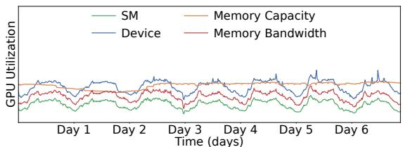  
Figure 1. GPU utilization metrics over a week in production inference services at Meta.

Beyond collocation mechanisms, datacenter GPU management must move past static provisioning to address inefficiencies without sacrificing performance or transparency. Current systems overlook the changing characteristics of deep learning workloads—such as fluctuating compute intensity and parallelism across models and execution phases—leaving GPUs underutilized even as they consume significant power. Bridging this gap requires approaches that adapt resource allocation and power consumption to the fine-grained behavior of ML workloads.

This utilization crisis is in stark contrast with the situation for CPUs, where time-sharing operating systems allocate tasks to cores via inexpensive context switches, providing isolation, resource allocation, power management, and transparency. The extreme data-parallel nature of GPUs imposes different trade-offs than do CPUs, but also exposes the limitations of current abstractions built around compilers, frameworks, and drivers. To transparently improve utilization and efficiency, we believe that GPUs must evolve toward an operating system model—one that brings first-class support for control, isolation, and resource management.

## 1.1 Our Approach: An Operating System for GPUs

To address datacenter GPU efficiency challenges, we introduce LithOS, which brings an efficient operating system approach to deep learning on GPUs. LithOS is fully transparent to the ML stack, allowing seamless integration without requiring modifications to models, runtimes, or frameworks. LithOS moves the bulk of GPU scheduling from proprietary drivers and hardware into software, allowing, for the first time, fine-grained temporal and spatial scheduling of ML workloads. LithOS operates at the granularity of individual kernel thread blocks that are dynamically mapped onto the GPU’s Texture Processing Clusters (TPCs). To achieve this, LithOS introduces novel abstractions and mechanisms that decouple kernel work submission from thread block execution on GPUs, enabling intelligent scheduling decisions, resource allocation, and power management.

First, LithOS introduces a novel fine-grained TPC Scheduler that asynchronously determines the compute unit allocation and submission time for each piece of work. It enables precise control at the granularity of individual TPCs, providing strong isolation between workloads. The scheduler is guided toward efficient scheduling decisions by an online kernel latency predictor and incorporates a technique called TPC Stealing to improve GPU utilization.

To address the absence of hardware preemption, LithOS introduces kernel atomization, which transparently partitions kernels into schedulable atoms—subsets of thread blocks— without compiler, runtime, source, or PTX changes. Atomization reduces head-of-line blocking, mitigates interference, and allows TPC reconfiguration mid-execution, providing flexibility that is unavailable for monolithic kernels. Building on this foundation, LithOS introduces a dynamic hardware right-sizing mechanism that uses lightweight modeling to determine the minimal TPC resources required for each kernel and its atoms, saving significant capacity. Finally, LithOS presents a fine-grained power management mechanism that adjusts the GPU’s frequency in response to the characteristics of in-flight work, saving substantial energy.

We implement LithOS in Rust and evaluate its performance across a broad set of deep learning environments, comparing it to state-of-the-art solutions from NVIDIA and prior research. For inference stacking, LithOS reduces tail latencies by 13× compared to MPS; compared to the bestperforming SotA, it reduces tail latencies by 4× while improving aggregate goodput by 1.3×. Furthermore, in hybrid inference-training stacking, LithOS reduces tail latencies by 4.7× compared to MPS; compared to the best-performing SotA, it reduces tail latencies by 1.18× while improving aggregate throughput by 1.35×. Finally, for a modest performance hit under 4%, LithOS’s hardware right-sizing provides a quarter of GPU capacity savings on average, while for a 7% hit, LithOS’s transparent power management delivers a quarter of a GPU total energy savings on average. Overall, LithOS transparently increases GPU efficiency, establishing a foundation for future OS research on GPUs.

This paper makes the following contributions:

• A comprehensive study of inference services at Meta, highlighting the behavior of production ML models and the challenges of GPU underutilization.

• A fine-grained spatial TPC Scheduler that dynamically allocates TPCs using TPC Stealing to boost utilization.

• A transparent Kernel Atomizer that independently schedules sets of kernel thread blocks, unlocking efficiency.

• A dynamic hardware right-sizing mechanism that optimizes TPC allocations for significant capacity savings.

• A transparent power management mechanism that adjusts frequency based on kernel scaling to save energy.

• The design of LithOS, a step towards an OS for GPUs.

• The evaluation of LithOS across ML environments.

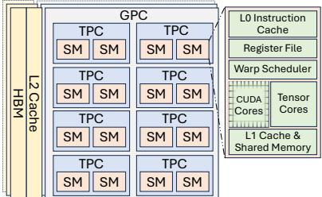  
Figure 2. GPU Architecture.

## 2 Background and Related Work

In this section, we first present a brief background on NVIDIA GPU architectures and then cover related work.

## 2.1 A Brief Background on GPUs

GPU Architecture. Figure 2 depicts a typical GPU architecture using NVIDIA’s terminology. Each GPU consists of several Graphics Processing Clusters (GPCs). Each GPC is a collection of multiple Texture Processing Clusters (TPCs), and each TPC includes a small number of Streaming Multiprocessors (SMs). Each SM is composed of tens of cores. For example, NVIDIA’s H100 [13] includes 8 GPCs, 9 TPCs per GPC, 2 SMs per TPC, and 128 cores per SM.

GPU Programming. GPU applications are composed of kernels that execute specific operators (e.g., convolution). A kernel defines its resources—thread blocks, threads, registers, and shared memory—at launch time. Programmers divide a kernel’s work among the thread blocks. Each thread block executes on an SM and consists of multiple SIMD threads. GPU Streams. CUDA streams enable concurrent execution of independent tasks, similar to CPU threads. Stream work is executed in FIFO order. Some CUDA calls are asynchronous, while others wait for all previous tasks to finish.

## 2.2 Related Work

Cooperative multitenancy. Cooperative scheduling involves tenants coordinating to share resources, typically at the ML framework level, with all models running in the same process [2, 18, 19, 26, 27, 29, 39, 42, 45, 51, 54, 59]. These approaches require custom ML frameworks and are hence limited by their inability to support arbitrary applications. Some also rely on extensive offline profiling [27, 59] or kernel source modifications [27, 42], which are impractical at scale. Finally, any non-cooperating tenant invalidates guarantees made by the runtime, making adoption difficult in practice. Transparent multitenancy. Transparent GPU sharing supports unmodified applications through native mechanisms such as time slicing, MPS [12], and MIG [15], or their combinations [44, 61]. By contrast, most prior software solutions require application or framework changes. TGS [64] is one exception, enabling transparent sharing across containers. In practice, however, uncooperative tasks and limited application-specific knowledge make transparent multitasking especially challenging.

Temporal multitenancy. Temporal multitenancy dedicates the entire GPU to a single task at a time via native time slicing or software scheduling. Some approaches work at the level of entire inference requests (e.g., Clipper [18], Nexus [54], TensorFlow-Serving [45], Clockwork [26], and INFaaS [51]), while others schedule kernels (e.g., PipeSwitch [2], AntMan [65], Gemini [7], KubeShare [67], and TGS [64]). Time slicing is NVIDIA’s default temporal multitenancy solution. It shares the GPU in a round-robin fashion, giving each task exclusive access for several milliseconds. These methods execute only one job at a time, leading to low utilization.

Spatial multitenancy. Spatial multitenancy typically builds on MIG or MPS to enable multiple applications to run concurrently on a GPU and improve utilization. MPS multiplexes multiple GPU contexts onto one, allowing multiple tasks to use the GPU concurrently. This can yield greater throughput but leads to performance interference. MIG partitions the GPU’s compute and memory resources along GPC boundaries, providing strong hardware isolation. However, the coarse granularity of its partitioning and steep reconfiguration overheads (>5s [63]) can leave resources idle. These problems exist even at datacenter scale. As shown in our study, hardware-based multitenancy is workable for Meta’s production use cases. However, the fluctuations in Figure 1 also exist at finer granularities, necessitating overprovisioning and leaving capacity on the table. Dynamic reconfiguration is currently too slow to be a viable remedy for this.

Like temporal systems, existing spatial sharing systems are coarse-grained, operating at the level of inference requests or kernels. Their goal is to protect latency-critical (LC) applications by restricting kernels launched by other jobs [19, 59] or limiting GPU resources allocated to besteffort tasks, as seen in systems like REEF [27], MuxFlow [39], PTask [52], and others [9, 21, 34, 37, 42, 60, 66]. However, the coarseness of these approaches limits control over GPU resources, often leading to HoL blocking, low utilization, and interference. Figure 3 highlights the challenges of spatial sharing. In Figure 3(a), a single workload runs on the GPU, issuing two requests with five total kernels. This results in fast kernel completion for ?? and ?? but leaves much of the GPU underutilized. When MPS enables concurrent execution of multiple tasks in Figure 3(b), utilization is improved, but the original task’s requests face significant delays. Overall, prior works have tackled some multitenant ML scheduling challenges but fail to offer a complete, transparent solution. Importantly, prior temporal and spatial strategies operate at a coarse granularity, limit utilization, and cause HoL blocking, which interferes with collocated workloads.

Right-sizing. Prior efforts have explored GPU job rightsizing to improve resource efficiency. However, these approaches often rely on hardware modifications [10, 72], lack transparency to application software [8, 9, 21, 35, 71], and depend on offline profiling [9–11, 21, 35, 71]. Crucially, most existing solutions operate at the granularity of entire jobs, which limits their ability to fully exploit the benefits of finegrained right-sizing and can lead to suboptimal performance. Dynamic Voltage Frequency Scaling. Recent efforts [31, 47, 48, 58, 69] have applied dynamic voltage frequency scaling (DVFS) to minimize the power consumption of GPUs with a particular focus on LLM inference clusters [31, 58]. Such approaches are based on extensive offline profiling across several input lengths and train dedicated output length predictors, failing to provide a transparent mechanism. Prior work on DVFS operates at a coarser granularity, observing the performance of the whole inference request and missing finer optimization opportunities.

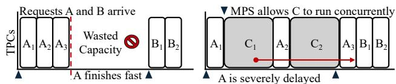  
Figure 3. GPU timeline showcasing the pitfalls of MPS.

## 3 Motivation

In this section, we showcase a detailed study of production GPU infrastructure challenges and opportunities.

## 3.1 Understanding GPU Utilization in Datacenters

To understand GPU utilization in datacenters, we analyze a subset of inference services at Meta, which serve deep learning models across its fleet. At Meta, inference services rely in part on NVIDIA H100 GPU nodes. Each node has 8 GPUs, which can be further partitioned via software and hardwarebased multitenancy into different container shapes. The production service performs offline analysis of each model, assigning models to hardware partitions for deployment. The goal is to meet tight SLAs on tail response times for each model. In Figure 1, we show normalized GPU compute and memory utilization over a week. Device utilization in production services can range between under 25% and higher than 60%. As expected, SM utilization is lower than device utilization, with lows of under 15%. In terms of memory, there is bandwidth room for multitenancy, with a fifth of the bandwidth being utilized on the lower end. Memory capacity utilization behaves similarly, leaving room for multitenancy, with utilization being steady as models are kept loaded in GPU memory to meet tight SLAs. These SLAs also enforce small batch sizes, preventing full GPU resource saturation even at high request loads. Finally, the characteristics of individual models can lead to low utilization of GPU resources. For example, memory-intensive models can lead to SM utilization plummeting. As a result, multi-model stacking can enable high utilization.

Inference Traffic. To investigate low GPU utilization, we first examine inference traffic. Figure 4 shows the meannormalized requests per second (RPS) over a week, revealing a diurnal pattern. RPS can scale by 2.2× between minimum and maximum traffic, closely correlating with the GPU utilization trends shown in Figure 1. Next, we analyze model request frequencies. We sample thirteen of the most commonly used models and plot in Figure 5 the normalized frequency of inference requests over the same week. The distribution’s variance is significant, with the most popular model A receiving several hundred times more requests than the least popular model M. Over-provisioning GPUs for such a wide request distribution can lead to underutilization, particularly for less popular models.

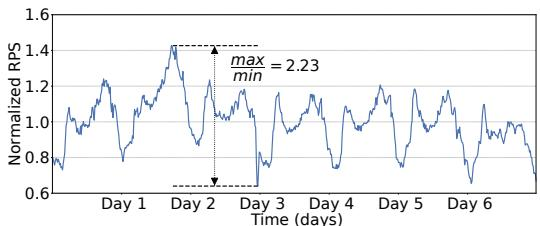  
Figure 4. Mean normalized traffic.

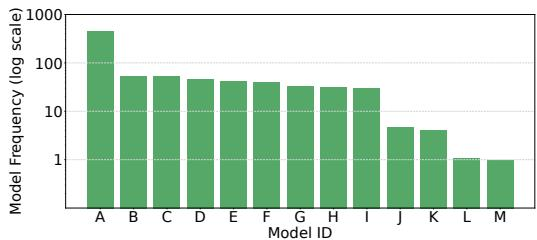  
Figure 5. Model frequency distribution.

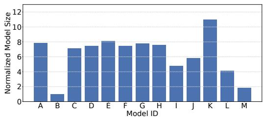  
Figure 6. Model size distribution.

Model Sizes. To better understand GPU utilization, we examine the sizes of the most commonly used models based on weights, parameters, and embeddings. As shown in Figure 6, model sizes vary significantly, with a more than a 10× difference between the largest and smallest models. Half are relatively large, while the rest are smaller. Both large and small models are frequently used: for example, the smallest model B has usage comparable to larger models E and G. This highlights the opportunity to collocate models of different sizes while meeting each of their service-level agreements. GPU Sharing Limitations and Takeaways. Despite the urgent need to improve GPU utilization, datacenters often rely on limited GPU sharing or hardware approaches like MIG due to requirements for compatibility and transparency within the ML software stack. Non-transparent solutions that require framework or application changes for multitenancy are impractical at scale, given the complexity of maintaining multiple ML frameworks, runtimes, and compilers. Importantly, in the rapidly evolving ML space, transparent solutions help avoid the risk of locking infrastructure into rigid, outdated designs. Based on these insights, we design LithOS as a fully transparent OS for efficient ML multitenancy.

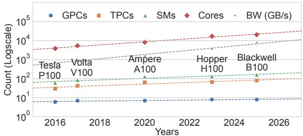  
Figure 7. NVIDIA GPU trends over a decade.

## 4 Abstractions, Interfaces, and Principles for a GPU Operating System

LithOS is built on a set of abstractions, interfaces, and principles that define how a GPU operating system should manage resources. These abstractions identify the right granularity of control, the interfaces expose flexible yet predictable knobs, and the principles guide how LithOS balances efficiency, fairness, and robustness under multitenancy.

## 4.1 Resources and Isolation

Scheduling Granularity. GPU cores and memory bandwidth have grown by orders of magnitude, yet GPC counts have remained nearly flat (six in P100 to eight in B100) as shown in Figure 7. With multi-die designs [22], coarse GPClevel partitioning (e.g., MIG) will waste even more resources. Conversely, intra-SM control is best handled by hardware and compilers; OS intervention would break transparency and portability. LithOS instead adopts the TPC as its scheduling abstraction. TPCs provide finer-grained control than GPCs while remaining transparent to application-level optimizations. Although current APIs do not expose TPC/SM control, LithOS leverages reverse-engineering to manage them, and we argue that native support is feasible for future hardware. Principle: Manage resources at the finest granularity where the OS is effective while preserving transparency.

Resource Allocation. The one-application-per-GPU model ignores that kernels scale differently: some saturate with few resources while others benefit from many. LithOS allocates TPCs to kernels based on runtime scaling behavior. Its interface allows applications or administrators to specify tolerable performance loss, enabling right-sizing while maintaining predictability. Principle: Expose simple performance-tolerance knobs while hiding hardware complexity.

Power Management. Today’s GPUs enforce device-wide DVFS, assuming a single workload. In multitenant settings, this is inefficient: memory-bound kernels saturate bandwidth early, while compute-bound kernels benefit from high frequencies. LithOS virtualizes frequency, letting each workload appear to run at its preferred setting while the OS adjusts DVFS policies for energy efficiency. The same tolerance interface enables transparent performance/power trade-offs, and future per-SM DVFS would further amplify these gains. Principle: Virtualize frequency to preserve the illusion of dedicated control while optimizing system-wide power gains.

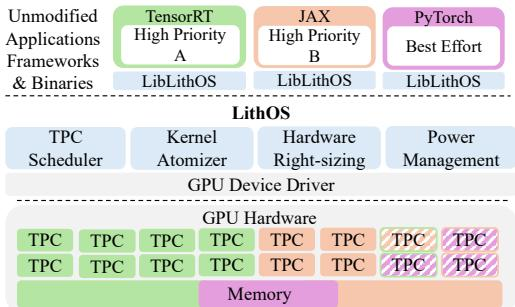  
Figure 8. LithOS architecture overview.

Security and Fault Isolation. NVIDIA solutions lie at extremes: MIG offers strong but coarse GPC isolation; MPS offers flexible sharing with no protection. LithOS adopts TPC-level isolation, combining flexibility with protection. Each application executes in its own address space with hardware-enforced memory isolation. For faults, LithOS interposes on common GPU errors [39], terminating only the faulty process. LithOS reinitializes the driver in case of unrecoverable errors. LithOS targets multi-tenant production environments with shared GPU infrastructure. Principle: Enforce isolation at the finest practical granularity, and ensure local faults degrade gracefully.

## 4.2 Closing the Gap

These abstractions define LithOS’s philosophy: virtualize resources at the right granularity, expose predictable interfaces, and ensure robustness under multitenancy. A key challenge is bridging the gap between CPU and GPU OS design. LithOS leverages OS principles to reimagine GPUs, transforming them from single-model devices into fully virtualized multitenant platforms. LithOS provides proven CPU OS principles to GPU realities, transparently unifying GPU management. This enables higher utilization, strong guarantees, and a foundation for future GPU OS research.

## 5 LithOS Design

We propose LithOS, an OS designed to address GPU inefficiencies in datacenters. LithOS operates transparently across the ML stack, enabling efficient machine learning on GPUs.

## 5.1 Architecture Overview

Figure 8 presents the architecture of LithOS. It runs on CPU cores and interposes at the driver level, providing a dynamically linked library, LibLithOS, that mimics the native CUDA library. As a GPU operating system, LithOS maintains a system-wide view of GPU state across applications with varying priorities, enabling efficient scheduling and management. Applications follow the CUDA programming model and submit kernels to LithOS, which decouples submission from GPU execution. This transparently shifts scheduling control from the driver and hardware to the LithOS layer. The TPC Scheduler manages resources at the granularity of individual TPCs, unlocking TPC Stealing opportunities. Idle TPCs are lent to other tasks, improving utilization.

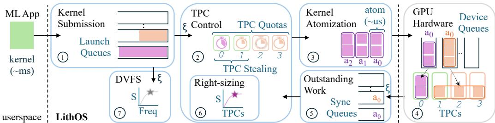  
Figure 9. LithOS operations overview.

LithOS also introduces the Kernel Atomizer, which—without access to application source or PTX code—transparently breaks kernels into smaller thread block chunks called atoms. This enables finer-grained GPU scheduling and reduces headof-line (HoL) blocking. Building on fine-grained control, LithOS supports dynamic hardware right-sizing, using lightweight models to reduce TPC allocations for individual kernels and atoms, yielding substantial capacity savings. Finally, LithOS applies transparent fine-grained DVFS, adjusting GPU frequency based on in-flight work to save energy. Together, these mechanisms enable intelligent scheduling policies that maximize GPU utilization and efficiency across diverse ML workloads. The rest of this section details how these mechanisms operate and interact, referencing Figure 9.

## 5.2 Interface with Userspace

Kernel Submission. Applications interact with LithOS via launch queues that buffer work (Figure 9, Step ○1 ), giving LithOS full control over when work is dispatched to the GPU. This is important because, once submitted, a kernel’s priority or resources cannot be changed, nor can it be rescheduled. Eagerly dispatching work can lead to sub-optimal scheduling. LithOS therefore defers dispatch to minimize outstanding work on the GPU. A launch queue is created when an application creates a stream via cuStreamCreate. On asynchronous CUDA calls like cuLaunchKernel, LithOS enqueues the kernel and returns control to the application.

Compute Quotas. LithOS lets users and system administrators enforce GPU limits through TPC quotas (Figure 9, Step ○2 ), guaranteeing each application a specified number of TPCs when runnable work exists. TPCs are managed analogously to CPU cores, enabling fine-grained GPU control. A lightweight TPC scheduler then coordinates launch queues and quotas to maximize utilization and efficiency.

## 5.3 TPC Scheduler

LithOS introduces a novel scheduler that operates at the granularity of individual TPCs, offering several advantages. TPC-level control enables fine-grained GPU resource management. Unlike static partitioning schemes like MIG, LithOS supports dynamic, on-the-fly TPC allocation, allowing kernels to run on different TPCs without reconfiguration overhead. This flexibility maximizes utilization without coarse partitioning or slow reallocation. Kernels are scheduled on assigned TPCs, ensuring guaranteed resources for high-priority applications. However, as shown in Section 3, fixed allocations often leave TPCs idle due to traffic patterns or model variability. To address this, LithOS employs dynamic scheduling and TPC Stealing to reassign idle resources. We believe that TPC scheduling lays the foundation for evolving GPU policies, much as CPU scheduling matured over time [23, 46]. Operation. At a high level, the TPC Scheduler uses dispatcher threads to monitor launch queues (Figure 9, Step ○1 ) and submit work to the GPU. A key goal is to keep the GPU busy while maintaining scheduling flexibility. The scheduler faces two main challenges: varying kernel durations and balancing flexibility with GPU starvation. To address the former, it applies Kernel Atomization (Figure 9, Step ○3 , Section 5.4) to split long-running kernels into smaller thread block chunks called atoms. To address the latter, it tracks outstanding work via sync queues (Figure 9, Step ○5 ), throttling submissions until the backlog drops below a tunable threshold. We use a 100??s limit, sufficient to cover hostdevice communication latency. A dedicated Tracker thread monitors task completion and updates the scheduler state.

TPC Stealing. To improve work conservation, the scheduler dynamically reassigns underutilized TPCs across applications. In Figure 10(a), static allocation leads to idle TPCs. In Figure 10(b), stealing allows $A _ { 1 }$ to borrow TPCs from an idle workload, reducing waste. However, this may cause head-ofline (HoL) blocking from priority inversion if a new request ?? is delayed by $C _ { 2 }$ occupying the stolen TPCs. To mitigate this, the scheduler adopts a layered strategy. It maintains per-TPC timers informed by a latency prediction module, estimating kernel (and atom) durations at submission time. These timers help avoid stealing from long-running TPCs. As tasks complete, sync queues are cleared and timers updated, potentially refining predictions (Section 5.7). LithOS also limits outstanding atoms and uses lower hardware stream priorities for work on stolen TPCs. Combined with kernel atomization, these mechanisms boost utilization while minimizing interference.

## 5.4 Kernel Atomizer

At the core of LithOS lies the Kernel Atomizer. The Kernel Atomizer transforms kernels into small chunks called atoms, each containing a subset of the grid’s thread blocks (Figure 9, Step ○3 ). Importantly, the Kernel Atomizer operates without any access to source or PTX code, making it fully transparent to the entire ML software stack. This allows LithOS to dispatch work at thread-block rather than kernel granularity. This is a critical requirement for an OS targeting GPUs, as the execution time of kernels can vary wildly from a few microseconds to tens of milliseconds.

Impact of Kernel Scheduling on Latency. To illustrate the need for kernel atomization, Figure 11 presents $P _ { 9 9 }$ kernel latencies across various training and inference workloads. Figure 11(a) shows how $P _ { 9 9 }$ latency increases with larger training batch sizes. Since the typical batch size for each model varies, we normalize by plotting memory usage at each size. Most models quickly produce long-running kernels lasting several milliseconds; DLRM [40] stands out with kernel latencies exceeding 30 ms. While training workloads are the major culprit, in Figure 11(b) we see that large language model (LLM) inference based on a trace from Microsoft Azure [58] containing small (S), medium (M), and large (L) prompt lengths can also produce several-millisecond-long kernels for large prompts. Given that models can have very tight SLO constraints (in the low tens of milliseconds), we guide the design of LithOS toward a finer-grained scheduling unit that mitigates head-of-line blocking effects.

Operation. When a long-running kernel is about to be scheduled, LithOS predicts the duration of the kernel given its TPC assignment using the predictor module (detailed in Section 5.7). LithOS then computes the number of atoms into which to split the kernel by dividing the predicted kernel duration by a tunable parameter called the atom\_duration. If this parameter is set too low, an atomized kernel may actually take longer to complete. Limits of 250-500 ??s are effective. Crucially, LithOS is able to transparently chunk kernels into atoms at runtime. Atoms are then submitted to the GPU and can be scheduled on the TPCs dictated by the TPC Scheduler (Figure 9, ○4 ). As a result, LithOS resolves a major challenge faced by prior works that operate higher in the stack: the Kernel Atomizer works on applications written in any framework, that use any libraries (including closed-source ones like cuDNN), and are built with any compiler.

To understand the benefits of scheduling at atom granularity, we return to Figure 10(b). Stealing improves the schedule but does not eliminate HoL blocking and wasted capacity. By dividing the kernels into atoms, work can be packed more tightly, as in Figure 10(c), and TPC allocations can be dynamically adjusted throughout a kernel’s execution. Now, $B _ { 1 }$ is no longer blocked by $C _ { 2 } ,$ as stealing is disabled for the latter’s subsequent atoms $\hat { C } _ { 2 }$ once request ?? is submitted.

```ocaml
Algorithm 1 Prelude Kernel Pseudocode.
1 kernel fn prelude(*args):
2 let atom : *const AtomMetadata = AtomMetadataAddr as _
3 let block_idx = blockIdx.z * gridDim.y * gridDim.x
4 + blockIdx.y * gridDim.x
5 + blockIdx.x
6 if atom->block_idx_lo <= block_idx < atom->block_idx_hi:
7 atom->kernel_entrypoint(*args)
```

To demonstrate how LithOS’s Kernel Atomizer operates, we consider a Conv kernel with a grid dimension of {8,8,1}, resulting in 64 blocks with block\_idx ranging from 0 to 63. Instead of launching the Conv kernel directly, LithOS invokes a Prelude kernel, which calls into the original kernel using the same launch configuration. The prelude kernel is shown in Algorithm 1. At a high level, it checks whether block\_idx falls within a specified range—calling Conv if so, or exiting early otherwise. For example, to partition the grid into 2 atoms, the kernel atomizer launches the prelude twice with block index ranges [0,32) and [32,64). Using this technique, LithOS can divide the kernel into up to 64 atoms. By specifying non-overlapping block ranges, the atomizer ensures each block is executed once, maintaining correctness.

Atomization Considerations. Kernels launch with an explicit set of resources; thus, the kernel atomizer ensures that the Prelude kernel uses the same set of resources as the original Conv kernel. Furthermore, the Prelude kernel needs to know the entry point to the Conv kernel. The Kernel Atomizer passes this information to the Prelude kernel in an AtomMetadata struct as seen in Algorithm 1.

Performance Optimizations. LithOS continuously monitors the effectiveness of the Kernel Atomizer to enhance performance. First, to avoid the overhead introduced by additional code in the Prelude kernel for kernels with many short threads, LithOS may disable atomization for such kernels. Additionally, for kernels with a large number of thread blocks, the Kernel Atomizer dynamically adjusts the atom\_- duration parameter to control its aggressiveness. This minimizes the performance penalty due to the increased thread block traffic from early-exiting threads.

## 5.5 Right-Sizing Hardware Resources

LithOS’s ability to schedule at the TPC level unlocks new opportunities for fine-grained GPU right-sizing. Figure 12 highlights this potential by plotting kernel speedups as a function of allocated TPCs for representative workloads (Section 7). The selected kernels collectively account for 99% of total execution time, with color gradients indicating each kernel’s relative contribution. For Llama inference, general matrix multiplication (GEMM) and multihead attention kernels exhibit diminishing returns, while the kernel responsible for applying the token frequency penalty does not scale. The results show that whole-model right-sizing is suboptimal— there is no single TPC configuration that fits all kernels. Instead, a substantial opportunity lies in right-sizing at the kernel level. First, individual kernels exhibit diverse scaling behaviors: some scale linearly, while others show diminishing returns. Second, the extent to which execution time is distributed across many kernels varies from workload to workload—highlighting the need for adaptive, per-kernel scheduling to fully optimize GPU resource consumption.

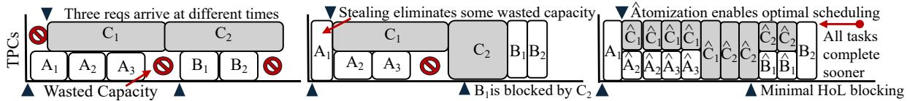  
Figure 10. GPU timeline for two workloads showcasing (a) TPC Scheduling, (B) Stealing, and (C) Atomization.

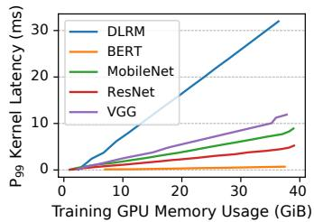

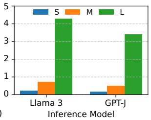  
Figure 11. (a) $P _ { 9 9 }$ kernel latency at different training batch sizes normalized to memory usage. (b) $P _ { 9 9 }$ kernel latency for different inference prompt sequence lengths for LLMs.

Modeling Kernel Scaling. LithOS introduces on-the-fly TPC right-sizing at the granularity of kernels (Figure 9, Step ○6 ). The atoms of a given kernel inherit its allocated TPCs, as they exhibit the same scaling behavior as the kernel itself. To this end, LithOS introduces a model-based approach that interpolates the scaling of individual kernels based on two points: the latencies of a kernel running with all TPCs and just one TPC. It then fits a curve of the form

$$
l = { \frac { m } { t } } + b
$$

to these points, where ?? is the predicted latency, ?? is the corresponding number of TPCs, and ?? and ?? are constants. Note that the form of this curve is consistent with Amdahl’s law for parallel speedup. Intuitively, ?? can be thought of as how long it takes for a single one of the kernel’s thread blocks to complete on a single SM, and ?? quantifies the extent to which a kernel can take advantage of parallel processors.

Filtering Outliers. We find that, in practice, this simple model accurately captures the scaling behavior of most deep learning kernels. However, a small number of outlier kernels— typically those with very short runtimes—deviate from the model, as they fail to benefit from large TPC allocations and are inherently harder to model. To handle these cases, we introduce a filtering heuristic based on a kernel’s thread block occupancy. Specifically, we estimate the number of

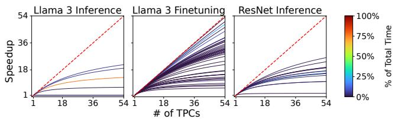  
Figure 12. LithOS’s interpolated TPC scaling curves.

TPCs a kernel can effectively utilize by dividing its total number of thread blocks by the occupancy per TPC—that is, the number of thread blocks a single TPC can execute concurrently. LithOS already tracks thread blocks per kernel as part of atomization, while occupancy can be queried from the driver API [43]. This heuristic provides an intuitive upper bound on useful TPC allocations per kernel, helping avoid overprovisioning even for difficult-to-model kernels.

Operation. When a kernel is submitted to LithOS, the dispatch thread first applies the filtering heuristic to estimate an upper bound on the number of TPCs the kernel can effectively utilize. If this estimate is lower than the job’s allocated TPCs, the kernel is launched using the estimated bound. Otherwise, the dispatch thread leverages the learned scaling model to determine the minimum number of TPCs that would increase the kernel’s latency by, at most, a multiplicative factor ?? that we call the latency slip parameter. This tunable parameter allows users and administrators to intuitively configure LithOS, for example, by specifying that up to 10% performance degradation is acceptable. Overall, LithOS enables highly efficient fine-grained right-sizing, while its modeling and scaling techniques offer a robust and accurate solution—as we will see in Section 8.2.

Supporting Hardware-Aware Optimizations. The rightsizing approach of LithOS is orthogonal to, and naturally complements, hardware-aware optimizations performed at the framework and compiler layers. These optimizations typically focus on tailoring kernel implementations to intra-SM architectural features (such as Tensor Cores), warp-level techniques, and memory hierarchy tuning. In contrast, LithOS operates at the inter-SM level by managing kernel-to-TPC allocations. Because these domains are independent, hardwareaware optimizations can seamlessly coexist with LithOS.

## 5.6 Transparent Power Management

LithOS is well-positioned to enable transparent and efficient power management via DVFS. Just as right-sizing lets LithOS adapt resource allocation based on kernel scalability across

TPCs, DVFS enables vertical scaling through frequency adjustment. Figure 13 shows how kernels from various workloads respond to frequency scaling. Many exhibit predictable behavior, creating opportunities for energy savings with bounded performance impact. To achieve efficient DVFS, LithOS must address two key challenges. First, current GPUs support relatively slow frequency switching (∼50 ms). While future architectures may reduce this latency [16], DVFS remains impractical for models with very short kernels. Thus, LithOS must consider the cumulative impact of scaling across kernel sequences. Second, although many kernels scale linearly with frequency, enabling significant energy savings, LithOS must balance these gains against increased latency. Modeling Frequency Scaling. LithOS introduces a transparent sequence-based kernel frequency scaling model that guides DVFS (Figure 9, Step ○7 ). Similarly to right-sizing, the atoms of a given kernel inherit its frequency target, as they exhibit the same scaling behavior as the kernel itself. Specifically, each kernel is assigned a weight w, the ratio of its total runtime to the cumulative runtime of all the kernels in a particular stream. Then, LithOS approximates each kernel’s relative slowdown as proportional to the fractional drop in frequency based on a first-order Taylor approximation:

$$
k = \frac { l a t ( f _ { t h } ) } { l a t ( f _ { m a x } ) } - 1 = s \cdot ( \frac { f _ { m a x } } { f _ { t h } } - 1 )
$$

where ?????? (?? ) is the kernel’s latency at frequency ?? . Specifically, $f _ { m a x }$ is the maximum frequency, and $f _ { t h }$ is one of the device’s supported frequencies. Each kernel’s sensitivity is

$$
s = \frac { k } { \frac { f _ { m a x } } { f _ { t h } } - 1 }
$$

and the aggregate sensitivity S across all kernels is equal to $\scriptstyle \sum$ ?? ∗ ??. Similarly, the total slowdown is equal to

$$
S \cdot ( \frac { f _ { m a x } } { f _ { f i n a l } } - 1 ) \leq k
$$

and thus the final frequency that LithOS assigns to the workload is $\begin{array} { r } { f _ { f i n a l } \ = \ \frac { f _ { m a x } } { 1 + \frac { k } { S } } } \end{array}$ . Intuitively, compute-bound kernels whose slowdown scales linearly with frequency reduction skew the final frequency closer to the maximum according to their sensitivity, while memory-bound kernels whose slowdown is frequency-insensitive shift the final frequency to lower levels depending on their weight.

Operation. Similar to right-sizing, LithOS uses a multiplicative factor ??, the latency slip parameter, to guide DVFS decisions. At runtime, this parameter is used to evaluate the scaling model and select a target frequency. Due to the high latency of switching, LithOS adopts a conservative strategy and extends its learning period to avoid unnecessary transitions. Initially, LithOS collects per-kernel metadata at maximum frequency, forcing unseen kernels to run at max frequency. At first, a kernel is assumed to scale linearly, and its frequency is reduced based on the configured ??. Depending on the observed performance, LithOS either further lowers the frequency or stops after confirming linear behavior. Over time, it fits the collected data to the scaling model, enabling more informed and efficient DVFS decisions.

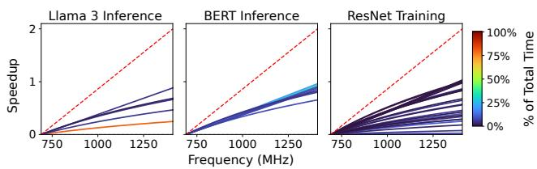  
Figure 13. LithOS’s interpolated frequency scaling curves.

## 5.7 Online Latency Prediction

The latency prediction module learns the execution time of kernels, enabling the optimizations carried out by all of LithOS’s components. In particular, it enhances TPC Stealing by estimating the duration of outstanding tasks and guides the number of atoms the Kernel Atomizer splits each kernel into. It further assists right-sizing and DVFS by providing the latencies that are used to calculate speedups based on TPC and frequency scaling. This obviates the need for extensive offline profiling, which is impractical for a transparent OS.

Latency prediction operates separately for independent launch queues, allowing LithOS to dynamically adapt to the behavior of different applications. During execution, the module records kernel latencies and refines its predictions. Each kernel’s latency varies based on the allocated TPCs, the GPU frequency, and the granularity at which it is atomized; therefore, the prediction module continuously monitors these conditions. In the case where such metadata are not available for a specific atom, the prediction module is conservative, assuming optimal linear scaling.

One pitfall in achieving accurate kernel latency prediction is assuming a given kernel always has the same latency. In practice, duration can depend on launch parameters and inputs. For instance, a single Conv kernel function may be used across model layers with varying tensor sizes. This necessitates that the latency prediction module track operators rather than kernel functions. By recording explicit synchronization events, we can determine the start and end of a batch. We associate kernel launches with an ordinal index $k ,$ referring to the $k ^ { \mathrm { { t h } } }$ kernel after the start of a batch. This uniquely identifies operator nodes in the model’s data flow graph (DFG), despite LithOS lacking explicit access to this higher-level information. This additional ordinal index is sufficient to identify model operators and make accurate latency predictions.

## 6 Implementation

We implement a prototype of LithOS targeting NVIDIA GPUs in ∼5000 lines of Rust, excluding macro-generated code for interposing the entire CUDA Driver API. The LithOS prototype supports Ampere and Hopper architectures and applications running natively or in containers. To enable concurrent execution across GPU contexts, we build on top of MPS.

Interposition Architecture. LithOS is fully transparent to applications, supporting the diverse ML ecosystem and full GPU stack. It interposes at the CUDA Driver API—the lowest common denominator—so applications interact with LithOS rather than the driver, while preserving CUDA call semantics. This ensures generality and transparency at the OS level, enabling unmodified ML frameworks and libraries such as Py-Torch, TensorFlow, JAX, TensorRT, and cuDNN. LithOS implements only a small subset of Driver APIs (e.g., cuLaunchKernel); our toolchain auto-generates the rest. Unlike prior CUDA API interposition systems [68], LithOS avoids complex cross-address-space marshaling, streamlining support for new CUDA versions and long-term OS maintenance.

TPCs and Atomization. For TPC mappings, we extend prior reverse-engineering work libsmctrl [4] and add support for Hopper, including handling its new TPC masking layout. libsmctrl is an interface that exposes TPC mappings without additional logic. In LithOS, we reimplement functionality to identify TPCs through the Queue MetaData (QMD) data structure and enable dynamic TPC allocation on kernel launch. Furthermore, on Hopper GPUs, NVIDIA introduced Thread Block Clusters—a new scheduling abstraction. We reverse-engineer these mappings and ensure atoms are always multiples of the cluster size. We verified functionality across NVIDIA datacenter GPUs: Ampere (A30, A100), Hopper (H100), and Ada Lovelace (L4). On top of the TPC mapping interface, the core implementation of LithOS relies on a set of scheduling mechanisms responsible for work submission, TPC scheduling, stealing, hardware right-sizing, atomization, outstanding work monitoring, and power management. We believe that future GPU drivers can expose these APIs to simplify the implementation of LithOS.

For kernel atomization, we inject Prelude logic by modifying the QMD struct used to launch kernels [4, 17]. To allocate appropriate resources, LithOS first launches the original kernel, allowing the CUDA Driver to configure the environment. We then patch the QMD’s program address to point to the Prelude. As a result, execution begins at the Prelude while retaining the original kernel’s resources. Due to space limits, we defer low-level reverse-engineering details to a separate technical report. The QMD reverse-engineering effort is minimal and often completed within days of a new architecture. Special Kernels. There are a few cases of kernels that may require special attention from LithOS. To extend atomization for CUDA Graphs, LithOS can interpose graph creation APIs and atomize graphs into subgraphs, ensuring correct execution ordering. Furthermore, some kernels comprise thread blocks that synchronize with each other, e.g., with grid\_- group::sync(). These kernels require a certain number of SMs during execution. LithOS can simply return the number of allocated SMs for the CU\_DEVICE\_ATTRIBUTE\_MULTIPRO-CESSOR\_COUNT in cuDeviceGetAttribute. Furthermore, for special kernels that involve cross-block synchronization or persistent kernels, LithOS disables stealing and atomization.

<table><tr><td>Model</td><td>Mem. (GiB)</td><td>Batch Size</td><td>Latency (ms)</td></tr><tr><td>VGG-19 [56]</td><td>17.4</td><td>120</td><td>291</td></tr><tr><td>ResNet-50[28]</td><td>18.4</td><td>184</td><td>281</td></tr><tr><td>MobileNetV2 [53]</td><td>18.4</td><td>216</td><td>254</td></tr><tr><td>DLRM [40]</td><td>6.7</td><td>32768</td><td>74</td></tr><tr><td>BERT-Large [20]</td><td>17.3</td><td>20</td><td>159</td></tr><tr><td>Llama 3 Finetuning</td><td>32.0</td><td>4</td><td>690</td></tr></table>

Table 1. Training model parameters.

## 7 Experimental Setup and Methodology

Testbed. Experiments were conducted on a 1x A100 (SXM4) Lambda Labs GPU instance with 30 CPU cores and 216 GB of host memory. The A100 GPU has 108 SMs and 40 GB of memory. The server was configured with Ubuntu 22.04, CUDA 12.6, Rust 1.83.0-nightly, Python 3.10, PyTorch 2.3, TensorRT 10.1, TensorRT-LLM 0.11.0, and Triton 24.07.

Baselines. We compare LithOS to all four NVIDIA GPU sharing methods: Time slicing, MPS, stream Priority, and MIG. We further compare against SOTA prior work across the spectrum of transparent solutions TGS [64], application modifications REEF [27], and both application modifications and offline profiling Orion [59]. We used the open-source TGS directly but had to reimplement Orion and REEF using our own interposition infrastructure since the available code was tied to specific CUDA drivers and software stacks. We extend REEF and Orion to handle multiple HP apps in a straightforward manner. For REEF, BE kernels are not launched if any HP app is running. For Orion, BE kernels are not launched if they contend with any HP kernel.

Models and Configurations. All high-priority inference tasks run on NVIDIA’s Triton Inference Server with dynamic batching [14]. RetinaNet runs on ONNX Runtime, while the other served models run on NVIDIA’s TensorRT and TensorRT-LLM backends. We choose three representative vision models (RetinaNet [38], YOLOv4 [5], and ResNet-50 v1.5 [28]) and three language models (Llama 3 8B [25], GPT-J 6B [62], and BERT-Large [20]) as inference workloads. For large language models, we use a Microsoft Azure trace [58]. For the best effort training tasks, we use three vision models, ResNet-50, MobileNetV2, VGG-19, and two language models, DLRM and BERT-Large, as listed. The training batch size is adjusted to use at most half of the GPU DRAM to keep all models in memory when stacking. The best effort training task runs continuously. More details are in Tables 1 and 2. Latency Constraints. For workloads which require a latency SLO, we use latency constraints from the MLPerf datacenter inference benchmark [50] (Table 2). This collection of results is an industry standard for evaluating the performance of inference servers, and the constraints vary from 2.3×–7.4× of baseline end-to-end request latency.

LithOS: An Operating System for Efficient Machine Learning on GPUs
<table><tr><td>Model</td><td>Framework</td><td>Load (rps)</td><td>Constraint (ms)</td></tr><tr><td>ResNet [28]</td><td>TensorRT</td><td>1000</td><td>15</td></tr><tr><td>RetinaNet [38]</td><td>ONNXRuntime</td><td>9</td><td>100</td></tr><tr><td>Llama 3 [25]</td><td>TensorRT-LLM</td><td>0.5</td><td>2000</td></tr><tr><td>GPT-J[62]</td><td>TensorRT-LLM</td><td>0.5</td><td>2000</td></tr><tr><td>BERT[20]</td><td>TensorRT</td><td>30</td><td>130</td></tr></table>

Table 2. Inference services for inference-only multitenancy.

## 8 Evaluation

Our evaluation answers the following questions:

1. Does LithOS improve performance for different multitenancy environments and SOTA prior works?

2. What are the capacity savings due to LithOS’s hardware right-sizing?

3. What are the energy savings of LithOS’s DVFS?

4. How do different LithOS features affect performance?

## 8.1 Performance in Multitenant Environments

In the following experiments, we disable the right-sizing and power management features of LithOS to provide an applesto-apples comparison to other systems in terms of scheduling efficiency alone. We evaluate these features afterwards.

Inference-only Multitenancy. We evaluate LithOS in a multitenant environment with three inference applications: two high-priority (HP) and one best-effort (BE). This is a realistic stacking scenario as current GPUs can satisfactorily fit two HP models, while the BE task utilizes the remaining resources. The first HP app, HP A, has a latency-oriented SLO: percentage of requests executed within a latency constraint. The second, HP B, has a throughput-oriented SLO: attained throughput as a percentage of the case where it executes alone. These vary according to the model (Table 2).

The BE and HP B models are chosen from Llama 3, GPT-J, and BERT. For HP A, we add ResNet and RetinaNet. We run all possible combinations. HP apps follow Poisson load and run on the Triton inference server, while BE apps execute in a closed loop. All model latencies are measured end-to-end.

We compare LithOS against all configurations. For systems that support partitioning, HP A and HP B are isolated on partitions of 75% and 25%, respectively. MIG’s limited partitioning configurations cannot support a 25%-75% split, so we use a 3/7-4/7 split instead. MIG and Limits cannot support a BE app, but only apps with provisioned resources; therefore, the BE does not run on these systems. There is no way to isolate multiple latency-sensitive applications on systems like Priority, REEF, TGS, and Orion. For these, we set both HP apps to high priority and the BE to low priority.

Figure 14 compares all systems across two dimensions: SLO attainment and throughput. “SLO” of 100% means both HPs reach 100% attainment. “Throughput” of 1 means that the throughput achieved is as much as if any of the apps had the entire device. Unsurprisingly, MPS sets the bar for throughput. MPS’s fine-grained, intra-SM stacking ensures device resources are maximally utilized, and it allows more throughput when stacking than any application could have alone; hence, it achieves a throughput of 1.11. MPS’s throughput comes at the cost of SLO attainment, at 45%. MIG and thread limits both successfully meet SLOs. This is expected, as each system minimizes interference by devoting resources to individual apps. However, the partitions are not fully utilized without a BE app. As a result, aggregate throughput drops to 0.58 and 0.71 for thread limits and MIG, respectively. Without isolating HP apps, priority-only systems cannot attain SLOs, with TGS leading at 84%. LithOS provides the best of both worlds, as it provides spatial isolation like MIG with an SLO attainment of 100% and a throughput of 1.

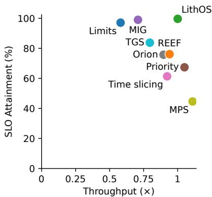  
Figure 14. SLO Attainment and throughput by system.

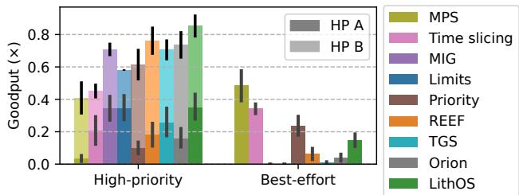  
Figure 15. Inference-only multitenancy: Goodput by app.

Where do LithOS’s benefits come from? Figure 15 shows LithOS consistently leading in goodput (throughput excluding HP A requests that violate SLOs) for the HP apps while still allowing significant (0.15) BE throughput. While the partitioning systems match LithOS in HP A goodput, they lack in HP B goodput: MIG at 0.37 vs. LithOS at 0.50. They also cannot support any BE throughput, while LithOS allows HP apps to steal unused resources from each other and further support BE throughput. No SOTA system can perform effectively across all requirements. Specifically, Orion outperforms in latency-sensitive throughput, TGS in HP throughput, and REEF in best effort. Only LithOS provides the best HP throughput while sustaining high BE throughput.

Diving deeper, we next look into the latencies of the HP A app in Figure 16. The figure shows the $P _ { 9 9 }$ latencies for each model averaged across all combinations. Latencies diverge in many cases, with only LithOS and the partitioning systems limiting latencies to the constraints. MPS is the worstperforming with respect to latencies; LithOS’s are 13× better. LithOS reduces latencies by 4× compared to Orion. This is expected as Orion cannot handle multiple HP apps. TGS limits latencies much more effectively than Orion and REEF, but LithOS still improves over it by 1.2×. Overall, LithOS provides a robust solution for inference stacking.

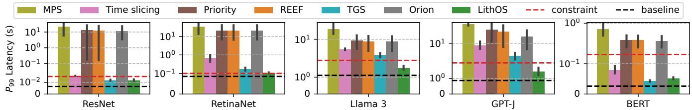  
Figure 16. Inference stacking multitenancy: HP A tail latencies by model.

Hybrid Inference/Training Multitenancy. In the first scenario, we modeled a realistic multitenant scenario where two primary HP inference jobs are placed on a GPU, and a BE task makes use of the remaining idle resources. Next, we evaluate an alternative realistic scenario that is commonly examined by prior work. In this experiment, we stack an HP inference app that has a latency-oriented SLO with a training BE app. Similar to the inference-stacking experiment, resources unused by the sensitive inference app should be donated to the best-effort training job. At the same time, service latency must not increase. We choose the inference model from the set: Llama 3 8B, GPT-J 6B, BERT-Large, RetinaNet, and YOLOv4. We choose the training model from those listed in Table 1. We run all model combinations, and our client creates Poisson loads. Load parameters are chosen to keep GPU utilization around 80% for the HP app.

Figure 17 shows the $P _ { 9 9 }$ HP latency and aggregate throughput, averaged across all training models. HP throughput is normalized to the load before being added to the BE throughput, which is normalized to the case where the BE model runs alone on the device. Latencies are also normalized to the HP running alone on the device. MPS yields latencies 5.83× the ideal case, and its service throughput is the lowest at 60%. Time slicing fares better as it enables the long-running kernels of the best-effort models to be preempted, guaranteeing the service approximately 50% of the GPU time. MIG performs similarly to time slicing by allocating 50% of the GPU to the service spatially rather than temporally. However, both methods fail to sustain peak HP throughput. Stream priority also falls short, leading to a 2.89× increase in service latency and service throughput as low as 68%.

Both TGS and REEF also struggle to maintain low service latencies. TGS has an average inference latency of 1.41× the ideal, and REEF is 2.89×. TGS’s poor performance stems from its adaptive rate control mechanism, which assumes a constant work arrival rate. This assumption is invalid for inference services, which have unpredictable load patterns. REEF fails to sufficiently throttle the training model, allowing tail latencies to reach 8.93×. In contrast, LithOS maintains a tail latency within 20% of the ideal. On average, this is 2.34× and 1.18× over REEF and TGS, respectively. Compared to the native MPS solution, LithOS reduces latency by up to 13.54× and 4.7× on average. LithOS maintains service throughput within 1% of load in the worst case. LithOS improves training throughput by an average of 34× and aggregate throughput by 1.35× vs. TGS. In total, LithOS improves aggregate throughput 1.23×–1.57× with an average of 1.38×.

## 8.2 Kernel-SM Right-Sizing

Capacity Savings. Figure 18 shows the capacity savings due to right-sizing with LithOS. We compute savings by comparing the time-weighted average of TPC utilization before and after right-sizing. LithOS provides excellent savings of up to 51%, and a mean of 26% across all workloads. We expect that in future GPU architectures with an increased number of TPCs, the fine-grained right-sizing approach of LithOS will provide even greater savings.

Latency and Throughput Cost. With a latency slip parameter of 1.1, the performance cost of right-sizing in terms of $P _ { 9 9 }$ and throughput is modest. The mean increase in $P _ { 9 9 }$ and decrease in throughput are both 4%. Our latency slip parameter is conservative because not all of the end-to-end execution time of each inference or training iteration is spent inside a GPU kernel; this does not impede tuning in practice. Accuracy. To quantify the accuracy of our prediction technique, we compute the kernel-execution-time weighted average of the $R ^ { 2 }$ values for the curves we fit $( { \mathrm { i . e . } }$ , for kernels where the possible TPCs value exceeds the threshold). Across all evaluated workloads, the average $R ^ { 2 }$ values range from 0.92 (Llama finetuning) to 0.99 (RetinaNet inference), indicating that our linear models are sufficiently accurate. Future work can explore more involved modeling to leverage LithOS to extend right-sizing to even more diverse GPU workloads.

## 8.3 Kernel-Dependent DVFS

In this experiment, we compare the energy consumption of the LithOS DVFS mechanism to the default settings of the GPU, for a variety of inference and training jobs with high GPU utilization; the baseline runs mostly under the maximum GPU frequency (1410 MHz). We run experiments for a fixed number of requests or training epochs for a fair energy comparison. Energy is calculated as the average power consumption multiplied by the time required for the experiment to complete. We measure power with nvidia-smi every 100 ms, the smallest granularity at which the tool operates. Energy Savings. Figure 19 shows the energy savings of LithOS’s DVFS mechanism across different inference and training workloads. We define energy savings as the difference between executing the workload at default frequency and under LithOS’s DVFS policy. LithOS provides significant energy savings of up to 46%, and a mean of 26% across all workloads without offline profiling requirements.

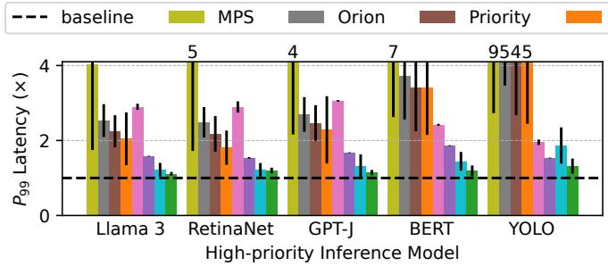

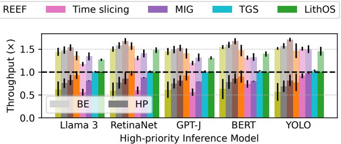  
Figure 17. Hybrid multitenancy: (a) $P _ { 9 9 }$ service latency and (b) aggregate throughput.

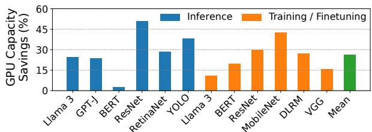  
Figure 18. Hardware right-sizing GPU capacity savings.

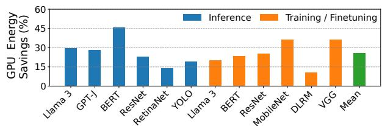  
Figure 19. Power management GPU energy savings.

Performance Cost. The slip parameter for this experiment was set at 1.1, and the mean increase in $P _ { 9 9 }$ latency is 7%. The minimal increase in $P _ { 9 9 }$ latency demonstrates that LithOS’s DVFS policy is inherently conservative. It respects latency constraints across workloads while transparently providing substantial energy savings. Finer-grained frequency control could unlock additional energy savings.

## 8.4 Ablation and Case Studies

Multi-tenancy Breakdown. Figure 20 presents a performance analysis for inference-training as explored in Figure 17. Enabling the TPC scheduler improves HP tail latencies to 1.38× of ideal by throttling BE work, while maintaining ideal HP throughput. Kernel Atomization offers additional gains, reducing tail latencies to an average of 1.19× and up to 1.55×, by splitting long BE kernels and improving TPC Stealing. Because of space limitations, we plot only latencies. Kernel Atomization does introduce a 10% throughput overhead, as LithOS prioritizes HP workloads by reducing BE throughput. Overall, each of LithOS’s features plays a crucial role in optimizing end-to-end performance.

Kernel Atomization. To highlight the challenges of scheduling long-running kernels, we collocate an HP BERT inference workload with either a BE VGG training or a BE Llama 3 inference. In Figure 21, we vary (a) the batch size of the BE training job and (b) the sequence length of the BE inference job and measure the $P _ { 9 5 }$ latency of the HP inference job. LithOS outperforms REEF by 6.5× and 3.9× in (a) and (b), respectively. Unlike REEF, which simply throttles BE work, LithOS accounts for kernel durations, which can vary significantly. To understand the impact of Kernel Atomization, we further evaluate LithOS with Kernel Atomization disabled. Kernel Atomization provides an improvement of 2× and 1.3× in (a) and (b), respectively. As described in Figure 11, kernel durations grow with training batch size and inference input sequence length. As Kernel Atomization allows LithOS to schedule at thread block granularity, HoL blocking is minimized. Consequently, the HP tail latency for the full LithOS system is within 14% (or 1 ms) or 7% (or 0.45 ms) of ideal for even the largest batch size or sequence length, respectively. Without atomization, noisy neighbors with large batch sizes or long sequence lengths can substantially degrade the performance of latency-critical tasks.

Latency Prediction Module. Next, we evaluate the accuracy of the latency prediction module of LithOS that enhances the TPC Scheduler and the Kernel Atomizer. We record the predicted atom latencies and compare them with the corresponding CUDA events, treating absolute errors greater than 50 ??s as mispredictions. Overall, we find very low misprediction rates of just 0.9% and 0.38% for the HP workloads in inference-inference and inference-training environments, respectively. Additionally, the prediction error tails are small with $P _ { 9 9 } s$ of 49 $\mu s$ and 31 $\mu \mathbf { s } .$ . Misprediction rates for the BE workloads are higher at 14% and 11% for inference-inference and inference-training, respectively.

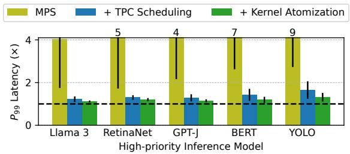  
Figure 20. Breakdown of LithOS features for inf-train.

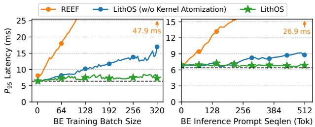  
Figure 21. ??95 latency of HP inference collocated with varied (a) batch sizes training and (b) sequence lengths inference.

This is acceptable as BE work is frequently preempted by HP work and has lower priority for GPU resources. Future work can explore more complex modeling to reduce error rates; however, our evaluation shows that the existing predictor’s accuracy allows for sufficient performance isolation in practice.

Overheads. The interposition and control logic of LithOS impose modest overhead. By measuring inference models without multitenancy against the vanilla NVIDIA driver, LithOS adds an overhead of only 4%. Atomization adds less than 1%. For comparison, the overhead of TGS and REEF is close to 2%, while Orion stands at 6%. In general, we believe this overhead is small and can be further optimized away.

Memory Contention. From our study of production services, memory capacity contention is not a concern as models are kept in GPU memory. In our evaluation, bandwidth contention can be a concern for some workload combinations. Using MIG and thread limits, we estimate that bandwidth isolation would yield 4–13% performance gains for contentionheavy cases. Compute isolation is significantly more critical, yielding more than an order of magnitude improvement.

## 9 Discussion

Other GPU Resources. This work focuses on compute and power, but the same principles extend to other resources. Prior systems target GPU memory [1, 3, 6, 32, 64], bandwidth [29, 70], PCIe [33, 70], SSDs [3, 49], and networking [57]. Others interpose at higher layers, via custom drivers [34, 52] or CUDA APIs [7, 67]. GPUfs [55] is the closest to an OS-like design, providing file-system extensions. LithOS complements these efforts, offering a foundation to virtualize and manage additional GPU resources.

Driver and Hardware Support. LithOS demonstrates what is possible with today’s hardware, but additional driver and architectural support would unlock further gains: kernel-to-SM assignment, preemption, cache and memory partitioning, NUMA-style placement, fine-grained (sub-ms) DVFS, per-SM power control, and richer context management. Similar capabilities are standard in CPUs and will be increasingly essential as GPUs scale, integrate multiple dies (e.g., Blackwell), and grow more heterogeneous. Open-source drivers will be critical for enabling efficient OS-level control.

While LithOS targets TPC-level scheduling, emerging heterogeneity within SMs (e.g., tensor cores) highlights opportunities for intra-SM resource management. Hardware support here could enable even finer-grained efficiency.

Lessons Learned. A central lesson is that both spatial and temporal partitioning are required for efficient GPU multitenancy. Without dedicated resources, latency-critical tasks suffer interference, as in MPS, while without time-sharing, utilization drops, as in MIG. Fine-grained control is equally crucial: TPC scheduling allows GPUs to be sliced into many more virtual devices than MIG, improving packing and utilization, while kernel-level atomization enables fast switching to high-priority tasks, strengthening isolation. Power management also emerged as a key challenge. Device-wide DVFS proves effective for today’s relatively well-behaved kernels, but future workloads are more diverse and inputdependent, demanding finer-grained mechanisms that adapt at sub-ms timescales, distinguish between compute, caches, and memory, and apply power controls spatially. Finally, our experience showed that the CUDA Driver API forms a stable “narrow waist” for interposition. By intercepting only a handful of calls, LithOS remains lightweight, portable across driver versions, and easy to retarget from Ampere to Hopper, suggesting this is a robust control point for OS research.

LithOS opens a new direction for GPU operating systems. By coupling OS design with forthcoming hardware extensions, future ML systems can deliver stronger isolation, higher utilization, and significant energy savings.

## 10 Conclusion

This paper introduced LithOS, a first step towards an operating system for efficient machine learning on GPUs. LithOS operates transparently to the entire ML stack; through mechanisms like TPC Scheduling, Kernel Atomization, hardware right-sizing, and power management, LithOS significantly improves GPU efficiency while laying the foundation for future OS research on GPUs.

## Acknowledgments

This work was funded in part by NSF grants CNS-2239311, CCF-2217016, a Meta Faculty Award, and a Wilton E. Scott Institute Faculty Award. We thank the anonymous reviewers for all of their valuable feedback.

## References

[1] Georgios Alexopoulos and Dimitris Mitropoulos. 2024. nvshare: Practical GPU Sharing without Memory Size Constraints. In Proceedings of the 2024 IEEE/ACM 46th International Conference on Software Engineering: Companion Proceedings. 16–20.

[2] Zhihao Bai, Zhen Zhang, Yibo Zhu, and Xin Jin. 2020. PipeSwitch: Fast Pipelined Context Switching for Deep Learning Applications. In 14th USENIX Symposium on Operating Systems Design and Implementation (OSDI 20). 499–514.

[3] Joshua Bakita and James H. Anderson. 2022. Enabling GPU Memory Oversubscription via Transparent Paging to an NVMe SSD. In 2022 IEEE Real-Time Systems Symposium (RTSS). IEEE, 370–382.

[4] Joshua Bakita and James H. Anderson. 2023. Hardware Compute Partitioning on NVIDIA GPUs. In Proceedings of the 29th IEEE Real-Time and Embedded Technology and Applications Symposium. 54–66.

[5] Alexey Bochkovskiy, Chien-Yao Wang, and Hong-Yuan Mark Liao. 2020. YOLOv4: Optimal Speed and Accuracy of Object Detection. arXiv:2004.10934 [cs.CV] https://arxiv.org/abs/2004.10934

[6] Chia-Hao Chang, Jihoon Han, Anand Sivasubramaniam, Vikram Sharma Mailthody, Zaid Qureshi, and Wen-Mei Hwu. 2024. GMT: GPU Orchestrated Memory Tiering for the Big Data Era. In Proceedings of the 29th ACM International Conference on Architectural Support for Programming Languages and Operating Systems, Volume 3 (La Jolla, CA, USA) (ASPLOS ’24). Association for Computing Machinery, New York, NY, USA, 464–478. doi:10.1145/3620666.3651353

[7] Hung-Hsin Chen, En-Te Lin, Yu-Min Chou, and Jerry Chou. 2023. Gemini: Enabling Multi-Tenant GPU Sharing Based on Kernel Burst Estimation. IEEE Transactions on Cloud Computing 11, 1 (2023), 854– 867. doi:10.1109/TCC.2021.3119205

[8] Qichen Chen, Hyerin Chung, Yongseok Son, Yoonhee Kim, and Heon Young Yeom. 2021. smCompactor: a workload-aware finegrained resource management framework for GPGPUs. In Proceedings of the 36th Annual ACM Symposium on Applied Computing (Virtual Event, Republic of Korea) (SAC ’21). Association for Computing Machinery, New York, NY, USA, 1147–1155. doi:10.1145/3412841.3441989

[9] Seungbeom Choi, Sunho Lee, Yeonjae Kim, Jongse Park, Youngjin Kwon, and Jaehyuk Huh. 2022. Serving Heterogeneous Machine Learning Models on Multi-GPU Servers with Spatio-Temporal Sharing. In 2022 USENIX Annual Technical Conference (USENIX ATC 22). USENIX Association, Carlsbad, CA, 199–216. https://www.usenix.org/ conference/atc22/presentation/choi-seungbeom

[10] Marcus Chow, Ali Jahanshahi, and Daniel Wong. 2023. KRISP: Enabling Kernel-wise RIght-sizing for Spatial Partitioned GPU Inference Servers. In 2023 IEEE International Symposium on High-Performance Computer Architecture (HPCA). 624–637. doi:10.1109/HPCA56546.2023.10071121

[11] Marcus Chow and Daniel Wong. 2024. CoFRIS: Coordinated Frequency and Resource Scaling for GPU Inference Servers. In Proceedings of the 14th International Green and Sustainable Computing Conference (Toronto, ON, Canada) (IGSC ’23). Association for Computing Machinery, New York, NY, USA, 45–51. doi:10.1145/3634769.3634808

[12] NVIDIA Corporation. [n. d.]. Multi-Process Service. https://docs. nvidia.com/deploy/mps/index.html. Accessed: April 14, 2025.

[13] NVIDIA Corporation. 2023. NVIDIA H100 Tensor Core GPU Architecture. Technical Report. NVIDIA Corporation, Santa Clara, CA.

[14] NVIDIA Corporation. 2024. Triton Inference Server. https://developer. nvidia.com/triton-inference-server. Accessed: May 8, 2024.

[15] NVIDIA Corporation. 2025. NVIDIA Multi-Instance GPU User Guide. https://docs.nvidia.com/datacenter/tesla/mig-user-guide/ index.html. Accessed: April 14, 2025.

[16] NVIDIA Corporation. 2025. NVIDIA RTX Blackwell GPU Architecture. https://images.nvidia.com/aem-dam/Solutions/geforce/ blackwell/nvidia-rtx-blackwell-gpu-architecture.pdf.

[17] NVIDIA Corporation. 2025. Open GPU documentation. https://github.com/NVIDIA/open-gpu-doc.

[18] Daniel Crankshaw, Xin Wang, Guilio Zhou, Michael J. Franklin, Joseph E. Gonzalez, and Ion Stoica. 2017. Clipper: A Low-Latency Online Prediction Serving System. In 14th USENIX Symposium on Networked Systems Design and Implementation (NSDI 17). USENIX Association, Boston, MA, 613–627. https://www.usenix.org/conference/ nsdi17/technical-sessions/presentation/crankshaw

[19] Weihao Cui, Han Zhao, Quan Chen, Ningxin Zheng, Jingwen Leng, Jieru Zhao, Zhuo Song, Tao Ma, Yong Yang, Chao Li, and Minyi Guo. 2021. Enable simultaneous DNN services based on deterministic operator overlap and precise latency prediction. In Proceedings of the International Conference for High Performance Computing, Networking, Storage and Analysis (St. Louis, Missouri) (SC ’21). Association for Computing Machinery, New York, NY, USA, Article 15, 15 pages. doi:10.1145/3458817.3476143

[20] Jacob Devlin, Ming-Wei Chang, Kenton Lee, and Kristina Toutanova. 2019. BERT: Pre-training of Deep Bidirectional Transformers for Language Understanding. arXiv:1810.04805 [cs.CL] https://arxiv.org/ abs/1810.04805

[21] Aditya Dhakal, Sameer G Kulkarni, and K. K. Ramakrishnan. 2020. GSLICE: Controlled Spatial Sharing of GPUs for a Scalable Inference Platform. In Proceedings of the 11th ACM Symposium on Cloud Computing (Virtual Event, USA) (SoCC ’20). Association for Computing Machinery, New York, NY, USA, 492–506. doi:10.1145/3419111.3421284

[22] Benj Edwards. 2025. Nvidia announces “Rubin Ultra” and “Feynman” AI chips for 2027 and 2028. https://arstechnica.com/ai/2025/03/nvidiaannounces-rubin-ultra-and-feynman-ai-chips-for-2027-and-2028/

[23] Joshua Fried, Zhenyuan Ruan, Amy Ousterhout, and Adam Belay. 2020. Caladan: Mitigating Interference at Microsecond Timescales. In 14th USENIX Symposium on Operating Systems Design and Implementation (OSDI 20). USENIX Association, 281–297. https://www.usenix.org/ conference/osdi20/presentation/fried

[24] Yanjie Gao, Yichen He, Xinze Li, Bo Zhao, Haoxiang Lin, Yoyo Liang, Jing Zhong, Hongyu Zhang, Jingzhou Wang, Yonghua Zeng, et al. 2024. An Empirical Study on Low GPU Utilization of Deep Learning Jobs. In Proceedings of the IEEE/ACM 46th International Conference on Software Engineering. 1–13.

[25] Aaron Grattafiori, Abhimanyu Dubey, Abhinav Jauhri, Abhinav Pandey, Abhishek Kadian, and Ahmad Al-Dahle et al. 2024. The Llama 3 Herd of Models. arXiv:2407.21783 [cs.AI] https://arxiv.org/abs/2407. 21783

[26] Arpan Gujarati, Reza Karimi, Safya Alzayat, Wei Hao, Antoine Kaufmann, Ymir Vigfusson, and Jonathan Mace. 2020. Serving DNNs like Clockwork: Performance Predictability from the Bottom Up. In 14th USENIX Symposium on Operating Systems Design and Implementation (OSDI 20). USENIX Association, 443–462. https://www.usenix.org/ conference/osdi20/presentation/gujarati

[27] Mingcong Han, Hanze Zhang, Rong Chen, and Haibo Chen. 2022. Microsecond-scale Preemption for Concurrent GPU-accelerated DNN Inferences. In 16th USENIX Symposium on Operating Systems Design and Implementation (OSDI 22). USENIX Association, Carlsbad, CA, 539– 558. https://www.usenix.org/conference/osdi22/presentation/han

[28] Kaiming He, Xiangyu Zhang, Shaoqing Ren, and Jian Sun. 2015. Deep Residual Learning for Image Recognition. arXiv:1512.03385 [cs.CV] https://arxiv.org/abs/1512.03385

[29] Saksham Jain, Iljoo Baek, Shige Wang, and Ragunathan Rajkumar. 2019. Fractional GPUs: Software-based compute and memory bandwidth reservation for GPUs. In 2019 IEEE Real-Time and Embedded Technology and Applications Symposium (RTAS). IEEE, 29–41.

[30] Myeongjae Jeon, Shivaram Venkataraman, Amar Phanishayee, unjie Qian, Wencong Xiao, and Fan Yang. 2019. Analysis of Large-Scale Multi-Tenant GPU Clusters for DNN Training Workloads. In Proceedings of the 2019 USENIX Conference on Usenix Annual Technical Conference (USENIX ATC ’19). USENIX Association, USA, 947–960.

[31] Andreas Kosmas Kakolyris, Dimosthenis Masouros, Petros Vavaroutsos, Sotirios Xydis, and Dimitrios Soudris. 2024. SLO-aware GPU Frequency Scaling for Energy Efficient LLM Inference Serving. arXiv:2408.05235 [cs.DC] https://arxiv.org/abs/2408.05235

[32] Woosung Kang, Jinkyu Lee, Youngmoon Lee, Sangeun Oh, Kilho Lee, and Hoon Sung Chwa. 2024. RT-Swap: Addressing GPU Memory Bottlenecks for Real-Time Multi-DNN Inference. In 2024 IEEE 30th Real-Time and Embedded Technology and Applications Symposium (RTAS). IEEE, 373–385.

[33] Shinpei Kato, Karthik Lakshmanan, Aman Kumar, Mihir Kelkar, Yutaka Ishikawa, and Ragunathan Rajkumar. 2011. RGEM: A responsive GPGPU execution model for runtime engines. In 2011 IEEE 32nd Real-Time Systems Symposium. IEEE, 57–66.

[34] Shinpei Kato, Karthik Lakshmanan, Ragunathan Rajkumar, and Yutaka Ishikawa. 2011. TimeGraph: GPU scheduling for real-time multitasking environments. In Proceedings of the 2011 USENIX Conference on USENIX Annual Technical Conference (Portland, OR) (USENIXATC’11). USENIX Association, USA, 2.

[35] Yunseong Kim, Yujeong Choi, and Minsoo Rhu. 2022. PARIS and ELSA: an elastic scheduling algorithm for reconfigurable multi-GPU inference servers. In Proceedings of the 59th ACM/IEEE Design Automation Conference (San Francisco, California) (DAC ’22). Association for Computing Machinery, New York, NY, USA, 607–612. doi:10.1145/3489517.3530510

[36] Beth Kindig. 2024. AI power consumption: Rapidly becoming missioncritical. https://www.forbes.com/sites/bethkindig/2024/06/20/aipower-consumption-rapidly-becoming-mission-critical/

[37] Baolin Li, Tirthak Patel, Siddharth Samsi, Vijay Gadepally, and Devesh Tiwari. 2022. MISO: Exploiting Multi-Instance GPU Capability on Multi-Tenant GPU Clusters. In Proceedings of the 13th Symposium on Cloud Computing (San Francisco, California) (SoCC ’22). Association for Computing Machinery, New York, NY, USA, 173–189. doi:10.1145/ 3542929.3563510

[38] Tsung-Yi Lin, Priya Goyal, Ross Girshick, Kaiming He, and Piotr Dollár. 2018. Focal Loss for Dense Object Detection. arXiv:1708.02002 [cs.CV] https://arxiv.org/abs/1708.02002

[39] Xuanzhe Liu, Yihao Zhao, Shufan Liu, Xiang Li, Yibo Zhu, Xin Liu, and Xin Jin. 2024. MuxFlow: efficient GPU sharing in productionlevel clusters with more than 10000 GPUs. Science China Information Sciences 67, 12 (2024), 222101. doi:10.1007/s11432-024-4227-2

[40] Maxim Naumov, Dheevatsa Mudigere, Hao-Jun Michael Shi, Jianyu Huang, Narayanan Sundaraman, Jongsoo Park, Xiaodong Wang, Udit Gupta, Carole-Jean Wu, Alisson G. Azzolini, Dmytro Dzhulgakov, Andrey Mallevich, Ilia Cherniavskii, Yinghai Lu, Raghuraman Krishnamoorthi, Ansha Yu, Volodymyr Kondratenko, Stephanie Pereira, Xianjie Chen, Wenlin Chen, Vijay Rao, Bill Jia, Liang Xiong, and Misha Smelyanskiy. 2019. Deep Learning Recommendation Model for Personalization and Recommendation Systems. arXiv:1906.00091 [cs.IR] https://arxiv.org/abs/1906.00091

[41] Microsoft Network. 2024. Dell exec reveals Nvidia has a 1,000 watt GPU in the works. https://www.msn.com/en-us/lifestyle/other/dell-execreveals-nvidia-has-a-1-000-watt-gpu-in-the-works/ar-BB1jlE8f Accessed: June 24, 2024.

[42] Kelvin K. W. Ng, Henri Maxime Demoulin, and Vincent Liu. 2023. Paella: Low-latency Model Serving with Software-defined GPU Scheduling. In Proceedings of the 29th Symposium on Operating Systems Principles (Koblenz, Germany) (SOSP ’23). Association for Computing Machinery, New York, NY, USA, 595–610. doi:10.1145/3600006.3613163

[43] NVIDIA Corporation. [n. d.]. NVIDIA CUDA Driver API Documentation: Occupancy. NVIDIA Corporation. https://docs.nvidia.com/cuda/cudadriver-api/group\_\_CUDA\_\_OCCUPANCY.html

[44] NVIDIA Corporation. 2024. Virtual GPU Software User Guide (v13.0). NVIDIA Corporation. https://docs.nvidia.com/vgpu/13.0/grid-vgpuuser-guide/index.html Version 13.0, Accessed: 2025-08-28.

[45] Christopher Olston, Noah Fiedel, Kiril Gorovoy, Jeremiah Harmsen, Li Lao, Fangwei Li, Vinu Rajashekhar, Sukriti Ramesh, and Jordan Soyke. 2017. TensorFlow-Serving: Flexible, High-Performance ML Serving. arXiv:1712.06139 [cs.DC]

[46] Amy Ousterhout, Joshua Fried, Jonathan Behrens, Adam Belay, and Hari Balakrishnan. 2019. Shenango: Achieving High CPU Efficiency for Latency-sensitive Datacenter Workloads. In 16th USENIX Symposium on Networked Systems Design and Implementation (NSDI 19). USENIX Association, Boston, MA, 361–378. https://www.usenix.org/ conference/nsdi19/presentation/ousterhout

[47] Pratyush Patel, Esha Choukse, Chaojie Zhang, Íñigo Goiri, Brijesh Warrier, Nithish Mahalingam, and Ricardo Bianchini. 2024. Characterizing Power Management Opportunities for LLMs in the Cloud. In Proceedings of the 29th ACM International Conference on Architectural Support for Programming Languages and Operating Systems, Volume 3 (La Jolla, CA, USA) (ASPLOS ’24). Association for Computing Machinery, New York, NY, USA, 207–222. doi:10.1145/3620666.3651329

[48] Haoran Qiu, Weichao Mao, Archit Patke, Shengkun Cui, Saurabh Jha, Chen Wang, Hubertus Franke, Zbigniew Kalbarczyk, Tamer Başar, and Ravishankar K. Iyer. 2024. Power-aware Deep Learning Model Serving with ??-Serve. In 2024 USENIX Annual Technical Conference (USENIX ATC 24). USENIX Association, Santa Clara, CA, 75–93. https: //www.usenix.org/conference/atc24/presentation/qiu

[49] Zaid Qureshi, Vikram Sharma Mailthody, Isaac Gelado, Seungwon Min, Amna Masood, Jeongmin Park, Jinjun Xiong, C. J. Newburn, Dmitri Vainbrand, I-Hsin Chung, Michael Garland, William Dally, and Wen-mei Hwu. 2023. GPU-Initiated On-Demand High-Throughput Storage Access in the BaM System Architecture. In Proceedings of the 28th ACM International Conference on Architectural Support for Programming Languages and Operating Systems, Volume 2 (Vancouver, BC, Canada) (ASPLOS 2023). Association for Computing Machinery, New York, NY, USA, 325–339. doi:10.1145/3575693.3575748

[50] Vijay Janapa Reddi, Christine Cheng, David Kanter, Peter Mattson, Guenther Schmuelling, Carole-Jean Wu, Brian Anderson, Maximilien Breughe, Mark Charlebois, William Chou, Ramesh Chukka, Cody Coleman, Sam Davis, Pan Deng, Greg Diamos, Jared Duke, Dave Fick, J. Scott Gardner, Itay Hubara, Sachin Idgunji, Thomas B. Jablin, Jeff Jiao, Tom St. John, Pankaj Kanwar, David Lee, Jeffery Liao, Anton Lokhmotov, Francisco Massa, Peng Meng, Paulius Micikevicius, Colin Osborne, Gennady Pekhimenko, Arun Tejusve Raghunath Rajan, Dilip Sequeira, Ashish Sirasao, Fei Sun, Hanlin Tang, Michael Thomson, Frank Wei, Ephrem Wu, Lingjie Xu, Koichi Yamada, Bing Yu, George Yuan, Aaron Zhong, Peizhao Zhang, and Yuchen Zhou. 2019. MLPerf Inference Benchmark. arXiv:1911.02549 [cs.LG]

[51] Francisco Romero, Qian Li, Neeraja J. Yadwadkar, and Christos Kozyrakis. 2021. INFaaS: Automated Model-less Inference Serving. In 2021 USENIX Annual Technical Conference (USENIX ATC 21). USENIX Association, 397–411. https://www.usenix.org/conference/ atc21/presentation/romero

[52] Christopher J. Rossbach, Jon Currey, Mark Silberstein, Baishakhi Ray, and Emmett Witchel. 2011. PTask: operating system abstractions to manage GPUs as compute devices. In Proceedings of the Twenty-Third ACM Symposium on Operating Systems Principles (Cascais, Portugal) (SOSP ’11). Association for Computing Machinery, New York, NY, USA, 233–248. doi:10.1145/2043556.2043579

[53] Mark Sandler, Andrew Howard, Menglong Zhu, Andrey Zhmoginov, and Liang-Chieh Chen. 2018. Mobilenetv2: Inverted residuals and linear bottlenecks. In Proceedings of the IEEE conference on computer vision and pattern recognition. 4510–4520.

[54] Haichen Shen, Lequn Chen, Yuchen Jin, Liangyu Zhao, Bingyu Kong, Matthai Philipose, Arvind Krishnamurthy, and Ravi Sundaram. 2019. Nexus: A GPU Cluster Engine for Accelerating DNN-Based Video Analysis. In Proceedings of the 27th ACM Symposium on Operating Systems Principles (Huntsville, Ontario, Canada) (SOSP ’19). Association

for Computing Machinery, New York, NY, USA, 322–337. doi:10.1145/ 3341301.3359658

[55] Mark Silberstein, Bryan Ford, Idit Keidar, and Emmett Witchel. 2014. GPUfs: Integrating a file system with GPUs. ACM Trans. Comput. Syst. 32, 1, Article 1 (Feb. 2014), 31 pages. doi:10.1145/2553081

[56] Karen Simonyan and Andrew Zisserman. 2015. Very Deep Convolutional Networks for Large-Scale Image Recognition. arXiv:1409.1556 [cs.CV] https://arxiv.org/abs/1409.1556

[57] Athinagoras Skiadopoulos, Zhiqiang Xie, Mark Zhao, Qizhe Cai, Saksham Agarwal, Jacob Adelmann, David Ahern, Carlo Contavalli, Michael Goldflam, Vitaly Mayatskikh, Raghu Raja, Daniel Walton, Rachit Agarwal, Shrijeet Mukherjee, and Christos Kozyrakis. 2024. High-throughput and Flexible Host Networking for Accelerated Computing. In 18th USENIX Symposium on Operating Systems Design and Implementation (OSDI 24). USENIX Association, Santa Clara, CA, 405–423. https://www.usenix.org/conference/osdi24/presentation/ skiadopoulos

[58] Jovan Stojkovic, Chaojie Zhang, Íñigo Goiri, Josep Torrellas, and Esha Choukse. 2024. DynamoLLM: Designing LLM Inference Clusters for Performance and Energy Efficiency. arXiv:2408.00741 [cs.AI] https: //arxiv.org/abs/2408.00741

[59] Foteini Strati, Xianzhe Ma, and Ana Klimovic. 2024. Orion: Interference-aware, Fine-grained GPU Sharing for ML Applications. In Proceedings of the Nineteenth European Conference on Computer Systems (Athens, Greece) (EuroSys ’24). Association for Computing Machinery, New York, NY, USA, 1075–1092. doi:10.1145/3627703.3629578

[60] Cheng Tan, Zhichao Li, Jian Zhang, Yu Cao, Sikai Qi, Zherui Liu, Yibo Zhu, and Chuanxiong Guo. 2021. Serving DNN Models with Multi-Instance GPUs: A Case of the Reconfigurable Machine Scheduling Problem. arXiv:2109.11067 [cs.DC]

[61] VMware. 2020. SHARING GPUS IN MACHINE LEARNING ENVIRON-MENTS. VMware. https://www.vmware.com/docs/vmware-ai-ml-rama

[62] Ben Wang and Aran Komatsuzaki. 2021. GPT-J-6B: A 6 Billion Parameter Autoregressive Language Model. https://github.com/kingoflolz/ mesh-transformer-jax.

[63] Tianyu Wang, Sheng Li, Bingyao Li, Yue Dai, Ao Li, Geng Yuan, Yufei Ding, Youtao Zhang, and Xulong Tang. 2024. Improving GPU Multi-Tenancy Through Dynamic Multi-Instance GPU Reconfiguration. arXiv preprint arXiv:2407.13126 (2024).

[64] Bingyang Wu, Zili Zhang, Zhihao Bai, Xuanzhe Liu, and Xin Jin. 2023. Transparent GPU Sharing in Container Clouds for Deep Learning Workloads. In 20th USENIX Symposium on Networked Systems Design and Implementation (NSDI 23). USENIX Association, Boston, MA, 69– 85. https://www.usenix.org/conference/nsdi23/presentation/wu

[65] Wencong Xiao, Shiru Ren, Yong Li, Yang Zhang, Pengyang Hou, Zhi Li, Yihui Feng, Wei Lin, and Yangqing Jia. 2020. AntMan: Dynamic Scaling on GPU Clusters for Deep Learning. In Proceedings of the 14th USENIX Conference on Operating Systems Design and Implementation (OSDI’20). USENIX Association, USA, Article 30, 16 pages.

[66] Fei Xu, Jianian Xu, Jiabin Chen, Li Chen, Ruitao Shang, Zhi Zhou, and Fangming Liu. 2023. iGniter: Interference-Aware GPU Resource Provisioning for Predictable DNN Inference in the Cloud. IEEE Transactions on Parallel and Distributed Systems 34, 3 (2023), 812–827. doi:10.1109/TPDS.2022.3232715

[67] Ting-An Yeh, Hung-Hsin Chen, and Jerry Chou. 2020. KubeShare: A Framework to Manage GPUs as First-Class and Shared Resources in Container Cloud. In Proceedings of the 29th International Symposium on High-Performance Parallel and Distributed Computing (Stockholm, Sweden) (HPDC ’20). Association for Computing Machinery, New York, NY, USA, 173–184. doi:10.1145/3369583.3392679

[68] Hangchen Yu, Arthur Michener Peters, Amogh Akshintala, and Christopher J Rossbach. 2020. AvA: Accelerated virtualization of accelerators. In Proceedings of the Twenty-Fifth International Conference

on Architectural Support for Programming Languages and Operating Systems. 807–825.

[69] Yijia Zhang, Qiang Wang, Zhe Lin, Pengxiang Xu, and Bingqiang Wang. 2024. Improving GPU Energy Efficiency through an Applicationtransparent Frequency Scaling Policy with Performance Assurance. In Proceedings of the Nineteenth European Conference on Computer Systems (Athens, Greece) (EuroSys ’24). Association for Computing Machinery, New York, NY, USA, 769–785. doi:10.1145/3627703.3629584

[70] Yongkang Zhang, Haoxuan Yu, Chenxia Han, Cheng Wang, Baotong Lu, Yang Li, Xiaowen Chu, and Huaicheng Li. 2024. Missile: Fine-Grained, Hardware-Level GPU Resource Isolation for Multi-Tenant DNN Inference. arXiv preprint arXiv:2407.13996 (2024).

[71] Yongkang Zhang, Haoxuan Yu, Chenxia Han, Cheng Wang, Baotong Lu, Yunzhe Li, Zhifeng Jiang, Yang Li, Xiaowen Chu, and Huaicheng Li. 2025. SGDRC: Software-Defined Dynamic Resource Control for Concurrent DNN Inference on NVIDIA GPUs. In Proceedings of the 30th ACM SIGPLAN Annual Symposium on Principles and Practice of Parallel Programming (Las Vegas, NV, USA) (PPoPP ’25). Association for Computing Machinery, New York, NY, USA, 267–281. doi:10.1145/ 3710848.3710863

[72] Xia Zhao, Magnus Jahre, and Lieven Eeckhout. 2020. HSM: A Hybrid Slowdown Model for Multitasking GPUs. In Proceedings of the Twenty-Fifth International Conference on Architectural Support for Programming Languages and Operating Systems (Lausanne, Switzerland) (ASPLOS ’20). Association for Computing Machinery, New York, NY, USA, 1371–1385. doi:10.1145/3373376.3378457